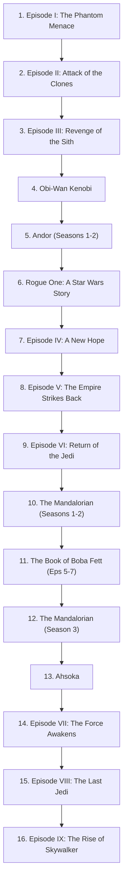

# 🌌 Star Wars: Complete Canonical Chronological Watch Order

> The comprehensive, canonical chronological watch order seamlessly weaving all 12 theatrical movies, prestige live-action series, and major animated sagas into one continuous galactic timeline.

---

## 📑 Table of Contents

- [🌌 Timeline Reference: BBY vs ABY](#-timeline-reference-bby-vs-aby)
- [🏛️ Era 1: Age of Republic (Prequels & Fall of the Jedi)](#️-era-1-age-of-republic-prequels--fall-of-the-jedi)
- [🚀 Era 2: Age of Rebellion (Rise of the Empire & Original Trilogy)](#-era-2-age-of-rebellion-rise-of-the-empire--original-trilogy)
- [🛡️ Era 3: The New Republic (The "Mandoverse")](#️-era-3-the-new-republic-the-mandoverse)
- [🔮 Era 4: Age of Resistance (The Sequel Trilogy)](#-era-4-age-of-resistance-the-sequel-trilogy)
- [🎨 Standalone & Non-Canon Anthologies](#-standalone--non-canon-anthologies)
- [📊 Master Chronological Checklist & Streaming Table](#-master-chronological-checklist--streaming-table)
- [⚡ Fast-Track Essential Watch Guide](#-fast-track-essential-watch-guide)
- [📚 Canonical References & Verification](#-canonical-references--verification)

---

## 🌌 Timeline Reference: BBY vs ABY

The galactic calendar revolves around the **Battle of Yavin** (the destruction of the first Death Star in *Episode IV: A New Hope*):

* **BBY**: *Before the Battle of Yavin* (counting down to 0)
* **ABY**: *After the Battle of Yavin* (counting upward from 0)

---

## 🏛️ Era 1: Age of Republic (Prequels & Fall of the Jedi)

*Charts the twilight decades of the corrupt Galactic Republic, the tragedy of the Clone Wars, and the catastrophic fall of the Jedi Order.*

| Title | Type | Timeline | Key Story Arc & Canonical Notes |
| :--- | :--- | :--- | :--- |
| **Star Wars: Episode I – The Phantom Menace** | 🎬 Film | 32 BBY | The discovery of Anakin Skywalker on Tatooine and the resurgence of the Sith (Darth Maul). |
| **Star Wars: Tales of the Jedi** *(Episodes 1–3)* | 📺 Animated Anthology | ~36–32 BBY | Explores Count Dooku's growing disillusionment with the Jedi Council and Ahsoka Tano's birth. |
| **Star Wars: Episode II – Attack of the Clones** | 🎬 Film | 22 BBY | Beginning of the Clone Wars; introduction of the Grand Army of the Republic and Count Dooku's Confederacy. |
| **Star Wars: The Clone Wars** *(Feature Film)* | 🎬 Animated Movie | 22 BBY | Serves as the theatrical pilot for the series; introduces Anakin's Padawan, Ahsoka Tano. |
| **Star Wars: The Clone Wars** *(Seasons 1–7)* | 📺 Animated Series | 22–19 BBY | **Crucial:** Fills the 3-year gap between Episodes II and III. Season 7's *Siege of Mandalore* arc overlaps directly with *Episode III*. |
| **Star Wars: Episode III – Revenge of the Sith** | 🎬 Film | 19 BBY | The climax of the Clone Wars, Order 66, fall of the Jedi Order, and birth of Darth Vader. |
| **Star Wars: Tales of the Jedi** *(Episodes 4–6)* | 📺 Animated Anthology | 19–18 BBY | Covers Dooku's final fall and Ahsoka surviving the immediate aftermath of Order 66. |

> [!TIP]
> **The Episode III / Clone Wars Season 7 Overlap:**
> Episodes 9 to 12 of *The Clone Wars* Season 7 (*The Siege of Mandalore*) happen concurrently with *Episode III: Revenge of the Sith*. For the ultimate immersion, watch *The Clone Wars* S7E09–S7E10, then *Episode III*, and finish with S7E11–S7E12.

---

## 🚀 Era 2: Age of Rebellion (Rise of the Empire & Original Trilogy)

*Spans the dark times of the Galactic Empire's iron reign up to the legendary Galactic Civil War and the liberation of the galaxy.*

| Title | Type | Timeline | Key Story Arc & Canonical Notes |
| :--- | :--- | :--- | :--- |
| **Star Wars: The Bad Batch** *(Seasons 1–3)* | 📺 Animated Series | 19–18 BBY | Follows Clone Force 99 through the immediate decommissioning of clones and the rise of Stormtroopers. |
| **Star Wars: Tales of the Empire** | 📺 Animated Series | 19–0 BBY | Dual storylines chronicling Morgan Elsbeth's rise and Barriss Offee's path through the Imperial Inquisitorius. |
| **Star Wars: Tales of the Underworld** | 📺 Animated Series | ~15–10 BBY | Focuses on the galactic fringe, bounty hunters (Cad Bane), and underworld syndicates. |
| **Star Wars: Maul – Shadow Lord** | 📺 Animated Series | ~12–10 BBY | Details Maul building Crimson Dawn and consolidating underworld dominance across the Outer Rim. |
| **Solo: A Star Wars Story** | 🎬 Film | 14–10 BBY | Han Solo's origin story, meeting Chewbacca and Lando Calrissian, and the famous Kessel Run in the Millennium Falcon. |
| **Obi-Wan Kenobi** | 📺 Live-Action Series | 9 BBY | A broken Obi-Wan in exile on Tatooine steps back into action to rescue young Princess Leia and faces Darth Vader. |
| **Andor** *(Seasons 1–2)* | 📺 Live-Action Series | 5–0 BBY | Gritty espionage thriller charting Cassian Andor's radicalization and the covert birth of the Rebel Alliance. |
| **Star Wars Rebels** *(Seasons 1–4)* | 📺 Animated Series | 5–1 BBY | Follows the Ghost crew on Lothal; bridges into major lore (Thrawn, the World Between Worlds, Ahsoka). |
| **Rogue One: A Star Wars Story** | 🎬 Film | 0 BBY | Direct prologue to Episode IV. Follows the daring suicide mission on Scarif to steal the Death Star schematics. |
| **Star Wars: Episode IV – A New Hope** | 🎬 Film | 0 BBY / 0 ABY | Luke Skywalker embarks on his Jedi journey; the Battle of Yavin and the destruction of the first Death Star. |
| **Star Wars: Episode V – The Empire Strikes Back** | 🎬 Film | 3 ABY | The Empire strikes back at Hoth; Luke trains with Yoda on Dagobah; Darth Vader's earth-shattering revelation. |
| **Star Wars: Episode VI – Return of the Jedi** | 🎬 Film | 4 ABY | The rescue of Han Solo, the Battle of Endor, the redemption of Anakin Skywalker, and the Emperor's defeat. |

---

## 🛡️ Era 3: The New Republic (The "Mandoverse")

*Following the Emperor's defeat, the fledgling New Republic struggles to govern the Outer Rim while remnants of the Empire consolidate in secret under Imperial warlords.*

| Title | Type | Timeline | Key Story Arc & Canonical Notes |
| :--- | :--- | :--- | :--- |
| **The Mandalorian** *(Seasons 1–2)* | 📺 Live-Action Series | 9 ABY | Lone bounty hunter Din Djarin discovers and protects the Force-sensitive foundling Grogu. |
| **The Book of Boba Fett** | 📺 Live-Action Series | ~9–10 ABY | Boba Fett claims Jabba's throne on Tatooine. **Essential:** Episodes 5–7 serve as *The Mandalorian Season 2.5*. |
| **The Mandalorian** *(Season 3)* | 📺 Live-Action Series | ~10 ABY | Din Djarin and Bo-Katan Kryze unite the scattered clans to reclaim their homeworld of Mandalore. |
| **Star Wars: Skeleton Crew** | 📺 Live-Action Series | ~9–11 ABY | Amblin-style coming-of-age adventure of four lost children navigating unknown space alongside a Force-wielder. |
| **Ahsoka** *(Season 1)* | 📺 Live-Action Series | 11–12 ABY | Ahsoka Tano investigates Grand Admiral Thrawn's return from an extra-galactic exile with Ezra Bridger. |
| **Star Wars: The Mandalorian and Grogu** | 🎬 Feature Film | ~12+ ABY | Continues the flagship Mandoverse saga on the big screen, bridging toward the climactic Imperial remnant war. |

> [!IMPORTANT]
> **Do NOT Skip *The Book of Boba Fett*!**
> Many viewers mistakenly skip *The Book of Boba Fett*, only to be confused when starting *The Mandalorian* Season 3. Episodes 5, 6, and 7 resolve the emotional separation between Din Djarin and Grogu and are mandatory for the central plot.

---

## 🔮 Era 4: Age of Resistance (The Sequel Trilogy)

*Decades after Endor, the legacy of the Skywalker family faces its final test against the neo-fascist First Order and the lingering shadow of the Sith.*

| Title | Type | Timeline | Key Story Arc & Canonical Notes |
| :--- | :--- | :--- | :--- |
| **Star Wars Resistance** *(Season 1)* | 📺 Animated Series | 34 BBY | Kazuda Xiono infiltrates the Colossus platform as a spy for General Leia Organa; leads into *The Force Awakens*. |
| **Star Wars: Episode VII – The Force Awakens** | 🎬 Film | 34 ABY | Rey, Finn, and Poe Dameron join the Resistance against Kylo Ren and the First Order's Starkiller Base. |
| **Star Wars: Episode VIII – The Last Jedi** | 🎬 Film | 34 ABY | Rey tracks down a disillusioned Luke Skywalker on Ahch-To; the Battle of Crait and the survival of hope. |
| **Star Wars Resistance** *(Season 2)* | 📺 Animated Series | 34–35 ABY | Runs concurrent with and immediately after *The Last Jedi*, showing the galaxy-wide desperation. |
| **Star Wars: Episode IX – The Rise of Skywalker** | 🎬 Film | 35 ABY | The culmination of the 9-film Skywalker Saga; the final clash on Exegol between Rey, Ben Solo, and the reborn Emperor. |

---

## 🎨 Standalone & Non-Canon Anthologies

| Title | Format | Canon Status | Viewing Recommendation |
| :--- | :--- | :--- | :--- |
| **Star Wars: Visions** *(Volumes 1–3)* | 📺 Animated Anthology | **Non-Canon** | Exceptional standalone artistic shorts produced by premier international animation studios. Enjoy anytime without worrying about timeline continuity! |

---

## 📊 Master Chronological Checklist & Streaming Table

Use this checklist to track your journey through the galaxy:

- [ ] **01.** Star Wars: Episode I – The Phantom Menace *(Film, 32 BBY)*
- [ ] **02.** Star Wars: Tales of the Jedi — Ep. 1, 2, 3 *(Animated, ~36–32 BBY)*
- [ ] **03.** Star Wars: Episode II – Attack of the Clones *(Film, 22 BBY)*
- [ ] **04.** Star Wars: The Clone Wars *(Animated Movie, 22 BBY)*
- [ ] **05.** Star Wars: The Clone Wars *(Animated Series, S1–S7, 22–19 BBY)*
- [ ] **06.** Star Wars: Episode III – Revenge of the Sith *(Film, 19 BBY)*
- [ ] **07.** Star Wars: Tales of the Jedi — Ep. 4, 5, 6 *(Animated, 19–18 BBY)*
- [ ] **08.** Star Wars: The Bad Batch *(Animated Series, S1–S3, 19–18 BBY)*
- [ ] **09.** Star Wars: Tales of the Empire *(Animated Series, 19–0 BBY)*
- [ ] **10.** Star Wars: Tales of the Underworld *(Animated Series, ~15–10 BBY)*
- [ ] **11.** Star Wars: Maul – Shadow Lord *(Animated Series, ~12–10 BBY)*
- [ ] **12.** Solo: A Star Wars Story *(Film, 14–10 BBY)*
- [ ] **13.** Obi-Wan Kenobi *(Live-Action Series, 9 BBY)*
- [ ] **14.** Andor *(Live-Action Series, S1–S2, 5–0 BBY)*
- [ ] **15.** Star Wars Rebels *(Animated Series, S1–S4, 5–1 BBY)*
- [ ] **16.** Rogue One: A Star Wars Story *(Film, 0 BBY)*
- [ ] **17.** Star Wars: Episode IV – A New Hope *(Film, 0 BBY / 0 ABY)*
- [ ] **18.** Star Wars: Episode V – The Empire Strikes Back *(Film, 3 ABY)*
- [ ] **19.** Star Wars: Episode VI – Return of the Jedi *(Film, 4 ABY)*
- [ ] **20.** The Mandalorian *(Live-Action Series, S1–S2, 9 ABY)*
- [ ] **21.** The Book of Boba Fett *(Live-Action Series, 9–10 ABY)*
- [ ] **22.** The Mandalorian *(Live-Action Series, S3, 10 ABY)*
- [ ] **23.** Star Wars: Skeleton Crew *(Live-Action Series, 9–11 ABY)*
- [ ] **24.** Ahsoka *(Live-Action Series, 11–12 ABY)*
- [ ] **25.** Star Wars: The Mandalorian and Grogu *(Film, ~12+ ABY)*
- [ ] **26.** Star Wars Resistance *(Animated Series, S1, 34 ABY)*
- [ ] **27.** Star Wars: Episode VII – The Force Awakens *(Film, 34 ABY)*
- [ ] **28.** Star Wars: Episode VIII – The Last Jedi *(Film, 34 ABY)*
- [ ] **29.** Star Wars Resistance *(Animated Series, S2, 34–35 ABY)*
- [ ] **30.** Star Wars: Episode IX – The Rise of Skywalker *(Film, 35 ABY)*

---

## ⚡ Fast-Track Essential Watch Guide

Short on time? Here is the **Core Theatrical & Live-Action Fast-Track** (cuts hundreds of animated hours down to the essential spine of galactic lore):

---

## 📚 Canonical References & Verification

* [Official Star Wars Movies & Series Guide (StarWars.com)](https://www.starwars.com/news/star-wars-movies-and-series-guide)
* [Lucasfilm Canonical Timeline (IMDb Official Lists)](https://www.imdb.com/list/ls502168290/)
* [List of Star Wars Films & Series (Wikipedia)](https://en.wikipedia.org/wiki/List_of_Star_Wars_films)
* [Rotten Tomatoes Definitive Star Wars Timeline](https://editorial.rottentomatoes.com/guide/star-wars-movies-in-order/)
* [Plex Entertainment Editorial Guide](https://www.plex.tv/blog/star-wars-movies-in-order/)

---
*May the Force be with you on your marathon!* 🌌
