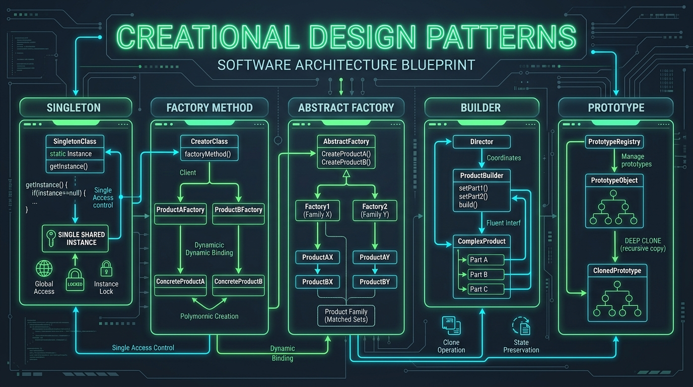

# 02. Factory Method Pattern: Polymorphic Creation

[]()
[]()
[]()

> **Intent**: Define an interface for creating an object, but let subclasses decide which class to instantiate. Factory Method lets a class defer instantiation to subclasses.

---

## 🧠 The Real-World Mental Model (Explain Like I'm 5)

Imagine a **Global Logistics Company (like FedEx or DHL)**.
- At the headquarters, the central dispatch system has a standard business process: `plan_delivery(cargo, destination)`.
- It calculates the cost, prints shipping labels, and dispatches the carrier.
- However, headquarters does **not** hardcode whether to spawn a physical Truck, Ship, or Airplane!
- Instead, headquarters defines a `create_transport()` method:
  - The **Road Logistics Department** overrides it to return a 18-wheel **Truck**.
  - The **Maritime Logistics Department** overrides it to return a container **Ship**.
  - The **Air Logistics Department** overrides it to return a Boeing 777 **Cargo Plane**.

The core delivery workflow remains identical for all departments, while the exact vehicle instantiation is deferred to specialized department creators.

---

## 🖼️ Architectural Diagram



---

## 💻 Production Python 3.12+ Blueprint

```python
"""
Factory Method Pattern in Python 3.12+.
Demonstrating structural subtyping with typing.Protocol, dataclasses, and ABC.
"""

from __future__ import annotations
from abc import ABC, abstractmethod
from dataclasses import dataclass
from typing import Protocol, runtime_checkable


@runtime_checkable
class Transport(Protocol):
    """Product Interface defining carrier contract."""
    
    def deliver(self, cargo_id: str, destination: str) -> None:
        """Execute physical transport of cargo."""
        ...

    def calculate_cost(self, weight_kg: float, distance_km: float) -> float:
        """Calculate dynamic freight cost."""
        ...


@dataclass(frozen=True, slots=True)
class Truck:
    """Concrete Product: Highway freight vehicle."""
    license_plate: str
    max_payload_tons: float = 24.0

    def deliver(self, cargo_id: str, destination: str) -> None:
        print(f"[Truck {self.license_plate}] Delivering cargo {cargo_id} to {destination} via Interstate Highway.")

    def calculate_cost(self, weight_kg: float, distance_km: float) -> float:
        # Base fuel rate $2.50/km + $0.05 per kg
        return (2.50 * distance_km) + (weight_kg * 0.05)


@dataclass(frozen=True, slots=True)
class CargoShip:
    """Concrete Product: Deep-water container vessel."""
    imo_number: str
    capacity_teus: int = 18_000

    def deliver(self, cargo_id: str, destination: str) -> None:
        print(f"[Ship IMO-{self.imo_number}] Sailing container {cargo_id} across shipping lanes to port {destination}.")

    def calculate_cost(self, weight_kg: float, distance_km: float) -> float:
        # Economy of scale: $0.75/km + $0.01 per kg
        return (0.75 * distance_km) + (weight_kg * 0.01)


class LogisticsService(ABC):
    """
    Creator Class: Declares the factory method and implements
    the invariant business orchestration skeleton.
    """

    @abstractmethod
    def create_transport(self) -> Transport:
        """The Factory Method: Subclasses override to produce specific Transports."""
        pass

    def plan_delivery(
        self,
        cargo_id: str,
        destination: str,
        weight_kg: float,
        distance_km: float
    ) -> float:
        """
        Core invariant business logic. Calls the factory method to obtain
        a Transport and orchestrates delivery.
        """
        # Call the factory method to create a product instance
        transport = self.create_transport()
        
        # Invariant business steps
        cost = transport.calculate_cost(weight_kg, distance_km)
        print(f"\n--- Logistics Manifest Created for Cargo {cargo_id} ---")
        print(f"Destination : {destination}")
        print(f"Weight      : {weight_kg:,.1f} kg | Distance: {distance_km:,.1f} km")
        print(f"Total Freight Quote: ${cost:,.2f}")
        
        # Execute delivery
        transport.deliver(cargo_id, destination)
        return cost


class RoadLogistics(LogisticsService):
    """Concrete Creator overriding factory method for Highway dispatch."""

    def __init__(self, fleet_region: str = "US-WEST") -> None:
        self.fleet_region = fleet_region

    def create_transport(self) -> Transport:
        return Truck(license_plate=f"TX-{self.fleet_region}-9842")


class MaritimeLogistics(LogisticsService):
    """Concrete Creator overriding factory method for Ocean shipping."""

    def __init__(self, vessel_registry: str = "PANAMA") -> None:
        self.vessel_registry = vessel_registry

    def create_transport(self) -> Transport:
        return CargoShip(imo_number="9811000")


# =====================================================================
# 🧪 Execution & Demonstration
# =====================================================================
if __name__ == "__main__":
    # Client code operates purely on the creator abstraction
    def run_dispatch(service: LogisticsService) -> None:
        service.plan_delivery(
            cargo_id="PKG-882109",
            destination="Rotterdam Harbor",
            weight_kg=4500.0,
            distance_km=1200.0
        )

    print(">>> Dispatching via Road Fleet:")
    run_dispatch(RoadLogistics())

    print("\n>>> Dispatching via Maritime Fleet:")
    run_dispatch(MaritimeLogistics())
```

---

## 🔍 Step-by-Step Code Tutorial

1. **`typing.Protocol` vs `abc.ABC`**:
   In Python 3.12+, we declare `Transport` as a `@runtime_checkable Protocol`. This enables **structural subtyping** (duck typing with static type checker verification). `Truck` and `CargoShip` do not need to inherit from `Transport`; they simply implement the required methods!

2. **The Creator Skeleton (`plan_delivery`)**:
   Notice that `plan_delivery` does not know whether it is running a `Truck` or a `Ship`. It relies entirely on polymorphism. This satisfies the **Open-Closed Principle**: you can add `AviationLogistics` and `CargoPlane` without altering a single line of `LogisticsService`.

3. **Memory Optimization with `@dataclass(slots=True)`**:
   Using `slots=True` prevents the creation of a dynamic `__dict__` per product instance, reducing memory overhead by ~60%.

---

## 🐍 Python-Specifics & Modern Registry Alternative

In Python, functions are first-class objects. A very popular Pythonic variant of the Factory Method is the **Decorator-Based Registry Factory**:

```python
from typing import Callable, Dict

TRANSPORT_REGISTRY: Dict[str, Callable[[], Transport]] = {}

def register_transport(name: str):
    def decorator(cls: Callable[[], Transport]):
        TRANSPORT_REGISTRY[name] = cls
        return cls
    return decorator

@register_transport("truck")
def make_truck() -> Transport:
    return Truck(license_plate="AUTO-001")

# Client lookup:
transport = TRANSPORT_REGISTRY["truck"]()
```
This pattern powers **PyTorch Dataset Loaders**, **SQLAlchemy Dialects**, and **Scikit-Learn Model Ensembles**.
