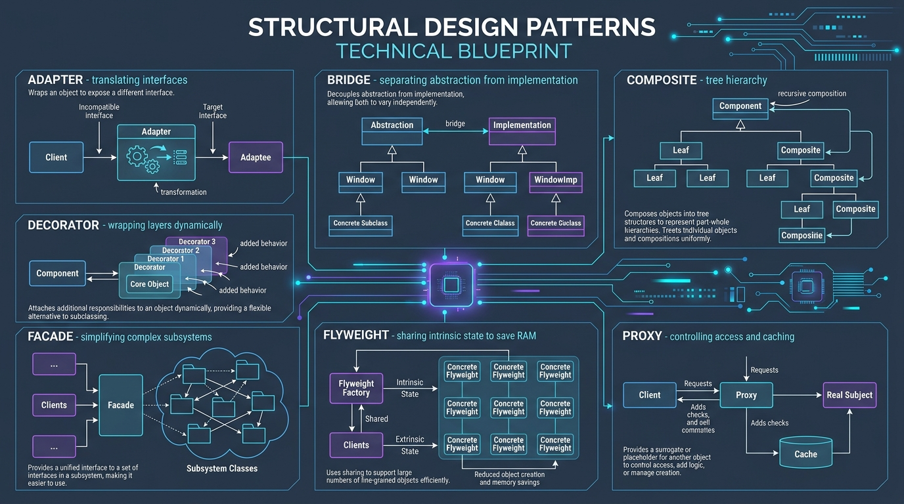

# 10. Facade Pattern: Unified Entry Point over Subsystem Chaos

[]()
[]()
[]()

> **Intent**: Provide a unified interface to a set of interfaces in a subsystem. Facade defines a higher-level interface that makes the subsystem easier to use.

---

## 🧠 The Real-World Mental Model (Explain Like I'm 5)

Imagine you are staying at a luxury hotel and want to plan a romantic evening:
- **Without a Facade**: You have to personally locate and call:
  1. The kitchen chef to reserve dinner.
  2. The floral shop down the street to deliver red roses.
  3. The opera house box office across town to buy two VIP tickets.
  4. The chauffeur garage to schedule a limousine at 7:00 PM.
  If any one of them changes phone numbers, delays, or cancels, you must coordinate the chaos.
- **With a Facade**: You walk up to the hotel **Concierge Desk** and say:
  `"Concierge, organize a romantic dinner, flowers, opera, and limo for 7 PM."`
- The Concierge orchestrates all 4 complex subsystems behind the scenes and hands you a single confirmation envelope.

In software, your frontend or client shouldn't call 7 microservices (Inventory, Stripe, Fraud Detection, Warehouse Waybill, SMS, Analytics). The **Facade Pattern** provides an atomic, unified method like `facade.place_order()` that encapsulates the coordination.

---

## 🖼️ Architectural Blueprint



---

## 💻 Production Python 3.12+ Blueprint

```python
"""
Facade Pattern for High-Throughput E-Commerce Order Fulfillment in Python 3.12+.
Coordinates 4 internal subsystems behind an atomic, clean API.
"""

from __future__ import annotations
from dataclasses import dataclass
from decimal import Decimal
import time
from typing import Optional


@dataclass(frozen=True, slots=True)
class OrderRequest:
    order_id: str
    customer_id: str
    sku: str
    quantity: int
    amount: Decimal


@dataclass(frozen=True, slots=True)
class OrderReceipt:
    success: bool
    tracking_number: Optional[str] = None
    error_reason: Optional[str] = None


# ---------------------------------------------------------------------
# Subsystem 1: Inventory Management
# ---------------------------------------------------------------------
class InventorySubsystem:
    def reserve_stock(self, sku: str, quantity: int) -> bool:
        print(f"[Inventory] Checking warehouse shelves for SKU '{sku}' (qty={quantity})...")
        # Simulating successful allocation
        return True

    def release_stock(self, sku: str, quantity: int) -> None:
        print(f"[Inventory Rollback] Released {quantity} units of SKU '{sku}' back to stock.")


# ---------------------------------------------------------------------
# Subsystem 2: Financial Payment Processing
# ---------------------------------------------------------------------
class PaymentSubsystem:
    def authorize_and_charge(self, customer_id: str, amount: Decimal) -> bool:
        print(f"[Payment Gateway] Authorized charge of ${amount:,.2f} for customer '{customer_id}'.")
        return True


# ---------------------------------------------------------------------
# Subsystem 3: Logistics & Shipping Waybill
# ---------------------------------------------------------------------
class LogisticsSubsystem:
    def generate_shipping_label(self, order_id: str, sku: str, quantity: int) -> str:
        tracking_code = f"TRK-FEDEX-{int(time.time())}"
        print(f"[Logistics] Created dispatch label for order {order_id} | Tracking: {tracking_code}")
        return tracking_code


# ---------------------------------------------------------------------
# Subsystem 4: Notification Engine
# ---------------------------------------------------------------------
class NotificationSubsystem:
    def send_order_confirmation(self, customer_id: str, order_id: str, tracking: str) -> None:
        print(f"[Notifications] Email & SMS dispatched to user '{customer_id}' with tracking {tracking}.")


# ---------------------------------------------------------------------
# The Facade: Single Unified Point of Entry
# ---------------------------------------------------------------------
class OrderFulfillmentFacade:
    """
    Coordinates complex subsystem workflows. Prevents client from
    manually managing rollback sequences or connection lifecycles.
    """

    def __init__(self) -> None:
        self._inventory = InventorySubsystem()
        self._payment = PaymentSubsystem()
        self._logistics = LogisticsSubsystem()
        self._notification = NotificationSubsystem()

    def place_order(self, request: OrderRequest) -> OrderReceipt:
        print(f"\n>>> [Facade] Starting Order Fulfillment for {request.order_id} <<<")

        # Step 1: Inventory reservation
        if not self._inventory.reserve_stock(request.sku, request.quantity):
            return OrderReceipt(success=False, error_reason="OUT_OF_STOCK")

        # Step 2: Payment authorization
        payment_ok = self._payment.authorize_and_charge(request.customer_id, request.amount)
        if not payment_ok:
            # Compensating rollback step
            self._inventory.release_stock(request.sku, request.quantity)
            return OrderReceipt(success=False, error_reason="PAYMENT_DECLINED")

        # Step 3: Logistics generation
        tracking_num = self._logistics.generate_shipping_label(
            request.order_id, request.sku, request.quantity
        )

        # Step 4: Fire-and-forget user alert
        self._notification.send_order_confirmation(
            request.customer_id, request.order_id, tracking_num
        )

        print(f">>> [Facade] Order {request.order_id} Fulfilled Successfully! <<<\n")
        return OrderReceipt(success=True, tracking_number=tracking_num)


# =====================================================================
# 🧪 Execution & Demonstration
# =====================================================================
if __name__ == "__main__":
    facade = OrderFulfillmentFacade()

    req = OrderRequest(
        order_id="ORD-2026-9901",
        customer_id="cust_sarah_connor",
        sku="SKU-NEURAL-CHIP-V2",
        quantity=2,
        amount=Decimal("1299.00")
    )

    receipt = facade.place_order(req)
    assert receipt.success is True
    print(f"Final Client Confirmation: Tracking #{receipt.tracking_number}")
```

---

## 🔍 Step-by-Step Code Tutorial

1. **Information Hiding & Loose Coupling**:
   The client only depends on `OrderFulfillmentFacade`. If `InventorySubsystem` migrates from a local database to an external SAP ERP REST API, the client code remains completely untouched.

2. **Compensating Action on Failure**:
   If payment fails in Step 2, the Facade handles rolling back Step 1 (`self._inventory.release_stock`). This prevents inventory leaks without polluting client code.
