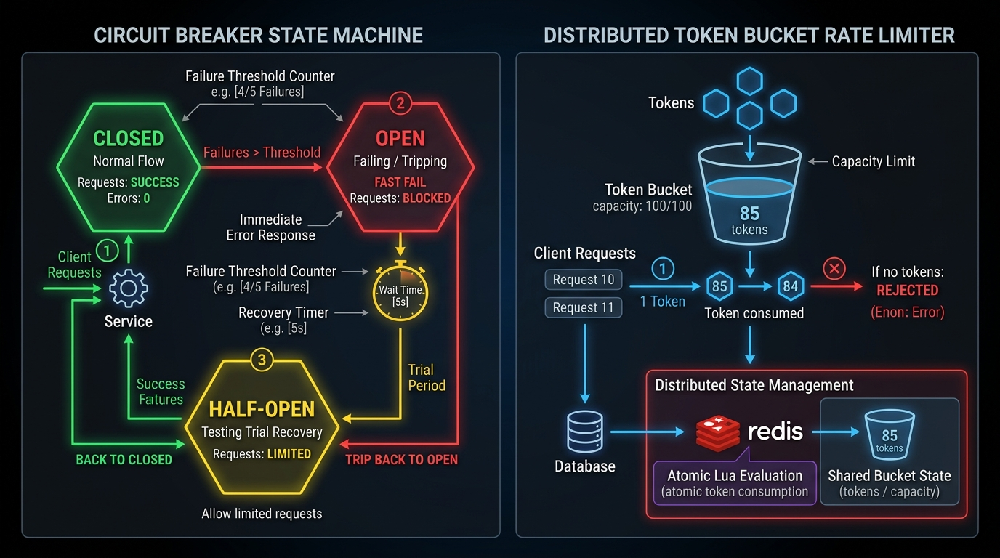

# 12. Proxy Pattern: The Resilient Gatekeeper

[]()
[]()
[]()

> **Intent**: Provide a surrogate or placeholder for another object to control access to it.

---

## 🧠 The Real-World Mental Model (Explain Like I'm 5)

Imagine a **Security Bodyguard standing outside a VIP Nightclub**:
- Inside the club is the VIP Celebrity.
- A random guest cannot simply walk up, grab the celebrity's arm, and start shouting questions.
- Instead, the guest must talk to the **Bodyguard (The Proxy)**:
  1. **Protection Proxy**: Checks if the guest has a valid VIP wristband (RBAC security check).
  2. **Rate Limiting Proxy**: Stops the guest if they ask 50 questions in 3 seconds.
  3. **Circuit Breaker Proxy**: If the celebrity is overwhelmed or faints, the bodyguard immediately tells everyone: `"Sorry, VIP room closed, come back later"` without letting anyone inside.

The Proxy implements the exact same interface as the target service, but intercepts calls to add security, caching, telemetry, or fault-tolerant circuit breaking.

---

## 🖼️ Architectural Blueprint




---

## 💻 Production Python 3.12+ Blueprint

```python
"""
Resilient Circuit Breaker Proxy Pattern in Python 3.12+.
Protects microservices from cascading failures using Closed/Open/Half-Open states.
"""

from __future__ import annotations
from enum import Enum
import time
from typing import Protocol, runtime_checkable


@runtime_checkable
class RemoteService(Protocol):
    """Subject Interface implemented by both Real Subject and Proxy."""
    def query_data(self, query: str) -> str: ...


class ExternalPaymentGateway:
    """Real Subject: Unstable 3rd-party service prone to timeouts."""

    def __init__(self) -> None:
        self.should_fail = True

    def query_data(self, query: str) -> str:
        if self.should_fail:
            raise ConnectionError("DOWNSTREAM_TIMEOUT: Bank API gateway unresponsive.")
        return f"OK: Processed query '{query}'"


class CircuitState(Enum):
    CLOSED = "CLOSED"         # Normal operation: Forward calls
    OPEN = "OPEN"             # Failing: Fast-fail calls immediately
    HALF_OPEN = "HALF_OPEN"   # Testing: Allow single probe call


class CircuitBreakerProxy(RemoteService):
    """
    Protection & Fault-Tolerance Proxy.
    Interprets calls and sheds load when downstream errors spike.
    """

    def __init__(
        self,
        real_service: RemoteService,
        failure_threshold: int = 3,
        recovery_cooldown_seconds: float = 2.0
    ) -> None:
        self._target = real_service
        self._failure_threshold = failure_threshold
        self._cooldown = recovery_cooldown_seconds

        self._state = CircuitState.CLOSED
        self._failure_count = 0
        self._last_failure_time = 0.0

    @property
    def current_state(self) -> CircuitState:
        return self._state

    def query_data(self, query: str) -> str:
        now = time.monotonic()

        # State Transition: OPEN -> HALF_OPEN check
        if self._state == CircuitState.OPEN:
            if now - self._last_failure_time > self._cooldown:
                print(f"[Circuit Breaker] Cooldown {self._cooldown}s expired. Transitioning OPEN -> HALF-OPEN trial.")
                self._state = CircuitState.HALF_OPEN
            else:
                # FAST-FAIL: Shed request immediately without burning network sockets
                raise RuntimeError("CircuitBreaker is OPEN: Upstream call shed to prevent cascade failure.")

        try:
            # Forward call to real downstream target
            result = self._target.query_data(query)

            # If trial in HALF-OPEN succeeds, restore circuit
            if self._state == CircuitState.HALF_OPEN:
                print("[Circuit Breaker] Probe call succeeded! Resetting circuit to CLOSED.")
                self._reset()

            return result

        except Exception as err:
            self._handle_failure(now)
            raise err

    def _handle_failure(self, timestamp: float) -> None:
        self._failure_count += 1
        self._last_failure_time = timestamp
        print(f"[Circuit Breaker] Error recorded ({self._failure_count}/{self._failure_threshold}).")

        if self._failure_count >= self._failure_threshold:
            self._state = CircuitState.OPEN
            print("🚨 [Circuit Breaker Tripped] State changed to OPEN! Fast-failing downstream requests.")

    def _reset(self) -> None:
        self._state = CircuitState.CLOSED
        self._failure_count = 0


# =====================================================================
# 🧪 Execution & Verification
# =====================================================================
if __name__ == "__main__":
    flaky_service = ExternalPaymentGateway()
    proxy = CircuitBreakerProxy(flaky_service, failure_threshold=2, recovery_cooldown_seconds=1.0)

    print("--- Phase 1: Triggering Downstream Failures ---")
    for i in range(3):
        try:
            proxy.query_data("CHECK_BALANCE")
        except Exception as e:
            print(f"Request {i+1} Failed with: {e}\n")

    print(f"Current Proxy State: {proxy.current_state.value}")

    print("--- Phase 2: Instant Fast-Fail Under Open Circuit ---")
    t0 = time.perf_counter()
    try:
        proxy.query_data("CHECK_BALANCE")
    except RuntimeError as e:
        elapsed_us = (time.perf_counter() - t0) * 1_000_000
        print(f"Fast-Fail Intercepted in {elapsed_us:.1f} microseconds! Message: {e}")

    print("\n--- Phase 3: Recovery Cooldown & Healing ---")
    time.sleep(1.2) # Wait for cooldown to expire
    flaky_service.should_fail = False # Service recovers!

    success_result = proxy.query_data("RECOVERED_CHECK")
    print(f"Response: {success_result}")
    print(f"Post-Recovery Proxy State: {proxy.current_state.value}")
```

---

## 🔍 Step-by-Step Code Tutorial

1. **Transparent Interface**:
   The client interacts with `CircuitBreakerProxy` purely as `RemoteService`. It can be swapped into existing codebases without refactoring callers.

2. **Preventing Thread Exhaustion**:
   In microservices, when a downstream database hangs for 30 seconds, upstream worker threads pile up waiting, exhausting connection pools. The Proxy trips into `OPEN` and rejects calls in **sub-microseconds**, keeping the rest of the application healthy.
