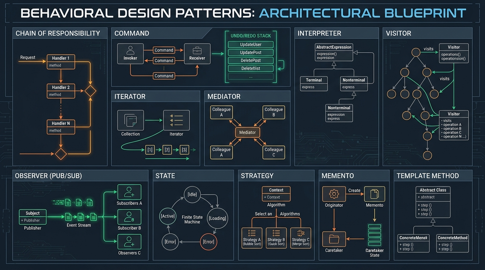

# 18. Memento Pattern: Point-in-Time Snapshots & Undo/Redo

[]()
[]()
[]()

> **Intent**: Without violating encapsulation, capture and externalize an object's internal state so that the object can be restored to this state later.

---

## 🧠 The Real-World Mental Model (Explain Like I'm 5)

Imagine playing a challenging video game like **Dark Souls**:
- Right before entering a dangerous Dragon Boss arena, you sit at a **Bonfire Checkpoint (The Memento)**.
- The game captures a complete snapshot of your player: Health: 100%, Level: 45, Potions: 10.
- You march into the arena and immediately get blasted by fire.
- Instead of starting the entire 80-hour game over from scratch, you click **"Reload Checkpoint"**.
- Your game state instantaneously resets back to the exact moment you sat by the bonfire.

In software, when a user edits text, makes spreadsheet mutations, or applies filters to a photo, the **Memento Pattern** saves immutable state snapshots to an **Undo/Redo Stack** without exposing the internal private mechanics of the editor.

---

## 🖼️ Architectural Diagram



---

## 💻 Production Python 3.12+ Blueprint

```python
"""
Memento Pattern for Document Milestone History & Undo Engine in Python 3.12+.
Ensures encapsulation: mementos are immutable value objects managed by a Caretaker.
"""

from __future__ import annotations
from dataclasses import dataclass
from datetime import datetime, timezone
from typing import Deque, List, Optional
from collections import deque


# ---------------------------------------------------------------------
# The Memento: Immutable State Snapshot
# ---------------------------------------------------------------------
@dataclass(frozen=True, slots=True)
class DocumentSnapshot:
    """Immutable Memento. Fields cannot be modified once created."""
    content: str
    cursor_position: int
    timestamp: datetime


# ---------------------------------------------------------------------
# The Originator: Creates and Restores from Mementos
# ---------------------------------------------------------------------
class DocumentEditor:
    """Originator Class holding mutable live state."""

    def __init__(self) -> None:
        self._content: str = ""
        self._cursor: int = 0

    def write(self, text: str) -> None:
        self._content += text
        self._cursor = len(self._content)

    def erase_last(self, count: int) -> None:
        self._content = self._content[:-count]
        self._cursor = len(self._content)

    def read(self) -> str:
        return self._content

    def create_snapshot(self) -> DocumentSnapshot:
        """Saves current state into an immutable memento."""
        return DocumentSnapshot(
            content=self._content,
            cursor_position=self._cursor,
            timestamp=datetime.now(timezone.utc)
        )

    def restore(self, snapshot: DocumentSnapshot) -> None:
        """Restores internal state from a memento."""
        print(f"[DocumentEditor] Restoring state from {snapshot.timestamp.strftime('%H:%M:%S')}...")
        self._content = snapshot.content
        self._cursor = snapshot.cursor_position


# ---------------------------------------------------------------------
# The Caretaker: Manages Undo / Redo History Stacks
# ---------------------------------------------------------------------
class HistoryManager:
    """Caretaker managing LIFO stacks of mementos without inspecting contents."""

    def __init__(self, editor: DocumentEditor) -> None:
        self._editor = editor
        self._undo_stack: Deque[DocumentSnapshot] = deque()
        self._redo_stack: Deque[DocumentSnapshot] = deque()

    def backup(self) -> None:
        """Saves current editor milestone before user performs a mutation."""
        snapshot = self._editor.create_snapshot()
        self._undo_stack.append(snapshot)
        self._redo_stack.clear() # Mutating forward clears redo history

    def undo(self) -> None:
        if not self._undo_stack:
            print("[HistoryManager] Nothing to undo.")
            return
        
        # Save current state for redo
        current_state = self._editor.create_snapshot()
        self._redo_stack.append(current_state)

        # Restore previous state
        previous_state = self._undo_stack.pop()
        self._editor.restore(previous_state)

    def redo(self) -> None:
        if not self._redo_stack:
            print("[HistoryManager] Nothing to redo.")
            return

        # Save current state for undo
        current_state = self._editor.create_snapshot()
        self._undo_stack.append(current_state)

        # Restore next state
        next_state = self._redo_stack.pop()
        self._editor.restore(next_state)


# =====================================================================
# 🧪 Execution & Demonstration
# =====================================================================
if __name__ == "__main__":
    editor = DocumentEditor()
    history = HistoryManager(editor)

    # User writes sentence 1
    editor.write("The quick brown fox ")
    history.backup() # Checkpoint 1

    # User writes sentence 2
    editor.write("jumps over the lazy dog.")
    history.backup() # Checkpoint 2

    # Accidental deletion
    editor.write(" DELETE ALL TEXT ACCIDENTALLY")
    print(f"Current Document: '{editor.read()}'\n")

    # Undo mistake
    print(">>> Executing Undo:")
    history.undo()
    print(f"Post-Undo Document: '{editor.read()}'\n")

    # Undo sentence 2
    print(">>> Executing Second Undo:")
    history.undo()
    print(f"Post-Second Undo Document: '{editor.read()}'\n")

    # Redo sentence 2
    print(">>> Executing Redo:")
    history.redo()
    print(f"Post-Redo Document: '{editor.read()}'")
```

---

## 🔍 Step-by-Step Code Tutorial

1. **Encapsulation Protection**:
   `DocumentSnapshot` is an immutable `@dataclass(frozen=True)`. The `HistoryManager` holds the snapshots in a stack, but it cannot tamper with, edit, or inspect the internal document content.

2. **Dual Stack Undo/Redo**:
   Using two LIFO deques (`_undo_stack` and `_redo_stack`) allows linear travel back and forth across revision history.
