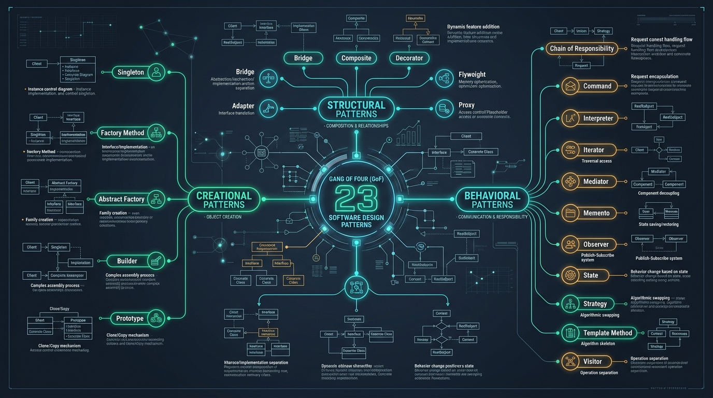

# 🏛️ Gang of Four (GoF) Design Patterns in Modern Python 3.12+

Welcome to the definitive **Python 3.12+ Gang of Four (GoF) Design Patterns Reference**. Every single pattern includes:
1. **Real-World Mental Model & ELI5 Analogy** (instant conceptual understanding).
2. **Visual Architecture Blueprint** (high-resolution dark-themed architectural diagram).
3. **Production Python 3.12+ Code** (strictly typed with `typing.Protocol`, `@dataclass`, `match/case`, `threading.Lock`, and zero placeholders).
4. **Step-by-Step Code Walkthrough & Tutorial**.
5. **CPython Internals, GIL & Concurrency Nuances** (thread safety, async variants, memory footprint).
6. **Real-World Production Scenarios** (FastAPI, Django, PyTorch, Celery).

---

## 🗺️ Master Architecture Overview

---

## 📑 Complete Catalog of 23 GoF Design Patterns

### 📦 1. Creational Patterns (Object Instantiation)
*Focus: Decoupling object creation mechanisms from client consumers.*

| # | Pattern | Key Intent | ELI5 Analogy | Dedicated Guide |
| :- | :--- | :--- | :--- | :--- |
| **01** | [**Singleton**](01_singleton.md) | Ensure exactly one global instance exists with synchronized access. | The President of a Country (only one in office at any time). | [Read Guide ➡️](01_singleton.md) |
| **02** | [**Factory Method**](02_factory_method.md) | Define creation interface; let subclasses decide which class to instantiate. | Logistics company dispatching Trucks, Ships, or Planes based on destination. | [Read Guide ➡️](02_factory_method.md) |
| **03** | [**Abstract Factory**](03_abstract_factory.md) | Produce cohesive families of related objects without binding to concrete classes. | IKEA furniture suites (Victorian vs. Modern Minimalist sets). | [Read Guide ➡️](03_abstract_factory.md) |
| **04** | [**Builder**](04_builder.md) | Construct complex immutable objects step-by-step fluently. | Subway sandwich artist building your custom sub ingredient-by-ingredient. | [Read Guide ➡️](04_builder.md) |
| **05** | [**Prototype**](05_prototype.md) | Clone existing objects efficiently without re-running expensive initialization. | Mitosis cell division creating exact DNA replica. | [Read Guide ➡️](05_prototype.md) |

---

### 🏗️ 2. Structural Patterns (Composition & Relationships)
*Focus: Assembling classes and objects into flexible, loosely-coupled structures.*

| # | Pattern | Key Intent | ELI5 Analogy | Dedicated Guide |
| :- | :--- | :--- | :--- | :--- |
| **06** | [**Adapter**](06_adapter.md) | Bridge incompatible interfaces so disparate systems can collaborate seamlessly. | International travel plug adapter (UK 3-pin to US 2-pin). | [Read Guide ➡️](06_adapter.md) |
| **07** | [**Bridge**](07_bridge.md) | Decouple an abstraction hierarchy from its platform implementation hierarchy. | Universal TV remote separated from TV hardware implementations. | [Read Guide ➡️](07_bridge.md) |
| **08** | [**Composite**](08_composite.md) | Compose nested tree structures where leaves and branches are treated uniformly. | File system folders containing both individual files and nested folders. | [Read Guide ➡️](08_composite.md) |
| **09** | [**Decorator**](09_decorator.md) | Dynamically attach additional responsibilities without mutating the core object. | Putting on a warm jacket, rain poncho, and scarf over your clothes. | [Read Guide ➡️](09_decorator.md) |
| **10** | [**Facade**](10_facade.md) | Provide a clean, unified top-level API over complex subsystem chaos. | Hotel concierge booking flights, dinner, and opera with a single request. | [Read Guide ➡️](10_facade.md) |
| **11** | [**Flyweight**](11_flyweight.md) | Share immutable intrinsic data across millions of objects to minimize memory. | Forest of 1,000,000 pine trees sharing tree 3D mesh while keeping separate coordinates. | [Read Guide ➡️](11_flyweight.md) |
| **12** | [**Proxy**](12_proxy.md) | Provide a surrogate or gatekeeper controlling access to a sensitive resource. | Credit card acting as a proxy for cash stored in your bank account. | [Read Guide ➡️](12_proxy.md) |

---

### ⚡ 3. Behavioral Patterns (Communication & Coordination)
*Focus: Coordinating communication, algorithms, and state transitions between decoupled objects.*

| # | Pattern | Key Intent | ELI5 Analogy | Dedicated Guide |
| :- | :--- | :--- | :--- | :--- |
| **13** | [**Chain of Responsibility**](13_chain_of_responsibility.md) | Pass requests sequentially along a pipeline until a handler resolves or rejects it. | Tech support escalation (Tier 1 helpdesk → Tier 2 tech → Core engineer). | [Read Guide ➡️](13_chain_of_responsibility.md) |
| **14** | [**Command**](14_command.md) | Encapsulate requests as objects enabling undo/redo, queuing, and transactional sagas. | Restaurant order ticket handed to chef and tracked through billing. | [Read Guide ➡️](14_command.md) |
| **15** | [**Interpreter**](15_interpreter.md) | Parse and evaluate sentences expressed in a formal domain-specific language (DSL). | Musical sheet notation reader translating notes into audio frequencies. | [Read Guide ➡️](15_interpreter.md) |
| **16** | [**Iterator**](16_iterator.md) | Sequentially traverse elements of a collection without exposing its underlying storage. | TV channel remote flipper stepping through channels next/previous. | [Read Guide ➡️](16_iterator.md) |
| **17** | [**Mediator**](17_mediator.md) | Eliminate direct N-to-N couplings by routing all communication through a central hub. | Air traffic control tower coordinating flight landings and takeoffs. | [Read Guide ➡️](17_mediator.md) |
| **18** | [**Memento**](18_memento.md) | Capture and restore an object's internal state without violating encapsulation. | Game save checkpoint allowing reload after dying to a boss. | [Read Guide ➡️](18_memento.md) |
| **19** | [**Observer**](19_observer.md) | Define a 1-to-N subscription mechanism notifying subscribers of state changes. | Newspaper subscription or YouTube notification bell. | [Read Guide ➡️](19_observer.md) |
| **20** | [**State**](20_state.md) | Allow an object to alter its behavior when its internal state changes. | Traffic light switching between Red (Stop), Yellow (Caution), Green (Go). | [Read Guide ➡️](20_state.md) |
| **21** | [**Strategy**](21_strategy.md) | Encapsulate interchangeable algorithms into discrete classes swappable at runtime. | Google Maps calculating route via Car, Bicycle, Walking, or Public Transit. | [Read Guide ➡️](21_strategy.md) |
| **22** | [**Template Method**](22_template_method.md) | Define fixed algorithm skeleton; let subclasses override specific milestone hooks. | Baking a cake (mix ingredients → bake at 350F → custom frosting/topping). | [Read Guide ➡️](22_template_method.md) |
| **23** | [**Visitor**](23_visitor.md) | Add new operations to stable object structures without modifying the classes. | Tax auditor visiting your house, car, and business calculating distinct duties. | [Read Guide ➡️](23_visitor.md) |

---

## 🧭 Pattern Selection Decision Matrix

| Category | Architectural Problem / Requirement | Recommended GoF Pattern |
| :--- | :--- | :--- |
| **Creational** | Exactly ONE synchronized instance globally needed | **Singleton** |
| **Creational** | Object type decided dynamically by subclasses or runtime criteria | **Factory Method** |
| **Creational** | Need to create families of matched, consistent objects | **Abstract Factory** |
| **Creational** | Complex object with multiple optional configuration arguments | **Builder** |
| **Creational** | Cloning an expensive pre-computed base object | **Prototype** |
| **Structural** | Incompatible legacy interface or 3rd-party vendor SDK | **Adapter** |
| **Structural** | Two independent dimensions of orthogonal variation | **Bridge** |
| **Structural** | Recursive part-whole tree hierarchy (e.g. files and folders) | **Composite** |
| **Structural** | Dynamically attach layered responsibilities without subclassing | **Decorator** |
| **Structural** | Simplified, unified top-level API over complex micro-subsystems | **Facade** |
| **Structural** | Millions of fine-grained objects consuming excessive RAM | **Flyweight** |
| **Structural** | Control access, lazy loading, caching, or circuit breaking | **Proxy** |
| **Behavioral** | Sequential request validation, auth filter, or approval gate | **Chain of Responsibility** |
| **Behavioral** | Reversible transactions, queueing, undo/redo, distributed sagas | **Command** |
| **Behavioral** | Evaluate grammar rules or domain-specific language expressions | **Interpreter** |
| **Behavioral** | Traverse collection elements sequentially with $O(1)$ memory overhead | **Iterator** |
| **Behavioral** | Decouple N-to-N peer communications via centralized routing hub | **Mediator** |
| **Behavioral** | Capture and restore object internal state without exposing fields | **Memento** |
| **Behavioral** | One-to-many publish/subscribe event notifications | **Observer** |
| **Behavioral** | Object alters behavior dynamically when its internal state changes | **State** |
| **Behavioral** | Interchangeable family of algorithms selectable at runtime | **Strategy** |
| **Behavioral** | Fixed algorithm workflow skeleton with customizable step hooks | **Template Method** |
| **Behavioral** | Execute external operations/audits over an object tree structure | **Visitor** |
