[🏠 Back to Home](README.md) | [🎯 Interview Prep Guide](topics/interview_prep.md) | [📖 Tech Glossary](topics/glossary.md)

# 🏛️ Design Patterns & Distributed System Design: The Architect's Complete Masterclass

> **Target Audience:** Developers, Tech Leads, and Aspiring Architects who want to transition from writing basic procedural code to designing fault-tolerant, scalable low-level and high-level enterprise software systems.  
> **Documentation Standard:** Every pattern follows the complete architectural specification: **Also Known As**, **Intent**, **Real-World Analogy & Plain Words**, **Programmatic Example in Java**, **When to Use / Where to Use**, **Real-World Applications (JDK & Spring)**, **Benefits & Trade-offs**, and **Related Patterns**.

---

## 📑 Master Table of Contents

### 🟢 Track 1: Junior & Entry-Level Foundations
1. [🧠 The Real-World Mental Model (The Fast-Food Restaurant & The Mega Highway)](#1-the-real-world-mental-model-the-fast-food-restaurant--the-mega-highway)
2. [🧱 The 5 Core Building Blocks](#2-the-5-core-building-blocks)
3. [💻 Beginner Code Walkthrough: Scalable Architecture & The Cache-Aside Pattern](#3-beginner-code-walkthrough-scalable-architecture--the-cache-aside-pattern)
4. [💥 What Happens When Things Break? (Top 3 Production Disasters)](#4-what-happens-when-things-break-top-3-production-disasters)
5. [⚠️ Top 5 Beginner Mistakes in Production](#5-top-5-beginner-mistakes-in-production)
6. [🎯 Top 10 Junior Interview Questions (With "Explain Like I'm 5" Answers)](#6-top-10-junior-interview-questions-with-explain-like-im-5-answers)

### 🔴 Track 2: Senior Architect Core & High-Level System Design (HLD)
1. [🧠 Phase 0: The Senior Architect Mental Model & Trade-Offs](#-phase-0-the-senior-architect-mental-model--trade-offs)
2. [⚙️ Phase 1: DSA Engines in Distributed Systems](#️-phase-1-dsa-engines-in-distributed-systems)
3. [📐 Phase 2: SOLID Principles & Clean Architecture](#-phase-2-solid-principles--clean-architecture)
4. [🏗️ Phase 3: Gang of Four (GoF) Design Patterns Master Handbook](#️-phase-3-gang-of-four-gof-design-patterns-master-handbook)
   - [Creational Patterns: Singleton, Factory Method, Abstract Factory, Builder, Prototype](#1-creational-patterns-object-instantiation)
   - [Structural Patterns: Adapter, Decorator, Facade, Proxy, Composite, Flyweight, Bridge](#2-structural-patterns-composition--relationships)
   - [Behavioral Patterns: Strategy, Observer, Command, Chain of Responsibility, State, Template Method, Mediator, Memento, Iterator, Visitor](#3-behavioral-patterns-interaction--communication)
5. [🌐 Phase 4: High-Level System Design (HLD) Architecture Core](#-phase-4-high-level-system-design-hld-architecture-core)
   - [Load Balancing (L4 vs L7)](#1-load-balancing-l4-vs-l7)
   - [Distributed Caching & Invalidation Topologies](#2-distributed-caching--invalidation-topologies)
   - [Database Scaling: Sharding, Partitioning & Replication](#3-database-scaling-sharding-partitioning--replication)
   - [Message Queues vs Event Streams (RabbitMQ vs Apache Kafka)](#4-message-queues-vs-event-streams)
   - [Distributed Consensus, CAP & PACELC Theorems](#5-distributed-theorems-cap--pacelc)
   - [Resiliency Patterns: Circuit Breakers, Rate Limiters & Saga](#6-resiliency-patterns-circuit-breakers-rate-limiters--saga)
6. [🚀 Phase 5: Complete End-to-End Architectural Deep-Dives](#-phase-5-complete-end-to-end-architectural-deep-dives)
   - [Deep Dive 1: Scalable URL Shortener (TinyURL)](#deep-dive-1-scalable-url-shortener-tinyurl)
   - [Deep Dive 2: Real-Time Messenger (WhatsApp / Telegram / Discord)](#deep-dive-2-real-time-messenger-whatsapp--telegram--discord)
   - [Deep Dive 3: Global Video Streaming Platform (Netflix / YouTube)](#deep-dive-3-global-video-streaming-platform-netflix--youtube)
   - [Deep Dive 4: Real-Time Geospatial Ride-Sharing (Uber / Lyft)](#deep-dive-4-real-time-geospatial-ride-sharing-uber--lyft)
   - [Deep Dive 5: Distributed Rate Limiter (Token Bucket with Redis Lua & Spring Security)](#deep-dive-5-distributed-rate-limiter-token-bucket-with-redis-lua--spring-security)
7. [🏢 Phase 6: The 200+ & 400+ Real-World Scenario Master Matrix](#-phase-6-the-200--400-real-world-scenario-master-matrix)
   - [Part 1: E-Commerce & Retail (Scenarios 1–50)](#part-1-e-commerce--retail-scenarios-150)
   - [Part 2: Social Media & Real-Time Feeds (Scenarios 51–100)](#part-2-social-media--real-time-feeds-scenarios-51100)
   - [Part 3: Streaming, Media & Gaming (Scenarios 101–150)](#part-3-streaming-media--gaming-scenarios-101150)
   - [Part 4: Cloud Infrastructure & Microservices (Scenarios 151–200)](#part-4-cloud-infrastructure--microservices-scenarios-151200)
   - [Part 5: Emerging Tech (AI, Blockchain, IoT & Security) (Scenarios 201–250)](#part-5-emerging-tech-ai-blockchain-iot--security-scenarios-201250)
   - [Part 6: Specialty Industries (Game Dev, Fintech, Healthcare) (Scenarios 251–325)](#part-6-specialty-industries-game-dev-fintech-healthcare-scenarios-251325)
   - [Part 7: Autonomous Systems & Enterprise Architecture (Scenarios 326–400+)](#part-7-autonomous-systems--enterprise-architecture-scenarios-326400)
8. [💻 Phase 7: Code Implementations for 20 Key Scenarios](#-phase-7-code-implementations-for-20-key-scenarios)
9. [🎯 Phase 8: Top 50 FAANG System Design Interview Questions & 10-Minute Cheat Sheet](#-phase-8-top-50-faang-system-design-interview-questions--10-minute-cheat-sheet)
10. [📚 Phase 9: 90+ Practice Problems & System Design Number Rules](#-phase-9-90-practice-problems--system-design-number-rules)

---

# TRACK 1: THE JUNIOR & ENTRY-LEVEL FOUNDATIONS (ZERO-TO-HERO)

## 1. The Real-World Mental Model (The Fast-Food Restaurant & The Mega Highway)

### What is System Design?
- **Single-Machine World (Your Bedroom PC):**
  When you write code in college or a tutorial, everything runs on your personal laptop. The frontend, backend, and database all share 1 CPU, 1 block of RAM, and 1 hard drive.
- **Enterprise Distributed Systems (Serving 100 Million Users):**
  What happens when 500,000 customers open your app at 12:01 AM on Black Friday? A single computer melts. **System Design is the engineering art of dividing work across hundreds of cooperating computers** so the platform never crashes, never loses data, and responds in under 100 milliseconds anywhere on Earth.

### The Fast-Food Restaurant Analogy
Imagine you own a tiny neighborhood burger joint that suddenly becomes world-famous overnight:
1. **Vertical Scaling (Scale Up / The 10-Foot Giant Chef):**
   - You hire a giant 10-foot-tall chef with 4 arms who cooks faster and uses a bigger stove (buying a server with 128 CPU cores and 1 TB RAM).
   - *The Catch:* Chefs cannot grow infinitely tall. The bigger the machine, the exponentially more expensive it gets. And if that one giant chef catches the flu, your entire restaurant closes! (**Single Point of Failure / SPOF**).
2. **Horizontal Scaling (Scale Out / 20 Normal Chefs):**
   - Instead of 1 giant chef, you hire 20 normal chefs standing side-by-side behind 20 smaller grills (adding cheap commodity server instances).
   - If Chef #4 drops their spatula or takes a break, the other 19 chefs keep cooking without interruption!
3. **The Load Balancer (The Front Door Host / Maitre D'):**
   - If 1,000 hungry customers arrive at once, they will all rush toward Cashier #1 while Cashiers 2–10 stand empty.
   - The Load Balancer stands at the entrance, greeting each incoming customer and steering them evenly across the counters (**Round Robin** or **Least Busy**), preventing bottlenecks.
4. **Caching (The Heated Warmer Rack):**
   - A customer orders french fries. Do you peel a raw potato, chop it, and deep fry it from scratch every time (a slow database disk read taking 200ms)?
   - No! You fry 50 batches ahead of time and keep them in a heated warmer bin within arm's reach (Redis in-memory RAM cache). When the customer asks, you hand them fries in **1 millisecond**!
5. **Database Sharding (Splitting up the Storage Pantry):**
   - When you have 50 million recipe cards, keeping them all in 1 filing cabinet causes chefs to bump into each other. You split the pantry into Shard A (ingredients for customers with last names A–M) and Shard B (customers N–Z).
6. **Asynchronous Message Queue (The Order Carousel):**
   - The cashier does not scream orders into the kitchen while the cooks are holding hot pans. The cashier clips the order ticket to a spinning carousel (**RabbitMQ / Kafka**). The kitchen picks tickets up at their own safe pace. If the kitchen gets backed up, orders queue safely on the carousel without dropping.

---

## 2. The 5 Core Building Blocks

| Term | What It Means | Real-World Analogy |
| :--- | :--- | :--- |
| **Horizontal vs Vertical Scaling** | Vertical adds more CPU/RAM to 1 machine. Horizontal adds more machines to a cluster behind a load balancer. | Buying a bigger moving truck vs hiring a fleet of 10 standard delivery vans. |
| **Load Balancer (L4 vs L7)** | Reverse proxy that distributes incoming traffic across backend service instances. L4 routes at TCP port level; L7 routes by HTTP URL path / headers. | L4 is a parking attendant directing cars to open parking lanes. L7 is a receptionist reading the recipient name on an envelope before routing. |
| **In-Memory Cache (Redis)** | Ultra-fast RAM storage ($\mathcal{O}(1)$ sub-millisecond) storing frequently read data to protect the relational database from being crushed. | Keeping your car keys in a dish on the hallway table instead of searching the attic storage bins every morning. |
| **Database Replication & Sharding** | Replication creates read-only copies of the database to handle heavy read traffic. Sharding splits large tables across multiple database machines by shard key. | Replication is printing 10,000 copies of a morning newspaper. Sharding is splitting a giant dictionary into Volume 1 (A-M) and Volume 2 (N-Z). |
| **Content Delivery Network (CDN)** | A globally distributed network of edge cache servers (Cloudflare, Akamai, AWS CloudFront) caching images, videos, and static assets physically close to users. | Putting neighborhood vending machines on every street corner so people don't have to walk to the central bottling factory for a soda. |

---

## 3. Beginner Code Walkthrough: Scalable Architecture & The Cache-Aside Pattern

### Visual Architecture Flow of a Modern Scalable Platform

```
┌──────────────────────────────────────────────────────────────────────────────────────────┐
│                             MODERN SCALABLE WEB ARCHITECTURE                             │
│                                                                                          │
│  [ Client Browser / Mobile ] ──► [ Global Anycast DNS ] ──► [ CDN: Cloudflare / CloudFront]
│                                                                (Static Assets: 5ms)      │
│                                                                        │                 │
│                                                          (API Traffic) │                 │
│                                                                        ▼                 │
│                                                            [ Load Balancer: ALB / Nginx ]
│                                                                        │                 │
│                                   ┌────────────────────────────────────┴──────────┐      │
│                                   ▼                                               ▼      │
│                        [ App Pod 1 (Stateless) ]                       [ App Pod 2 ]     │
│                                   │                                               │      │
│                    ┌──────────────┴───────────────┐                               │      │
│                    ▼                              ▼                               ▼      │
│          [ Redis Cache Cluster ]       [ Primary DB (Writes) ] ──Replication──► [ Read ] │
│             (RAM Lookups: 1ms)            (PostgreSQL / MySQL)                   (Replica)
└──────────────────────────────────────────────────────────────────────────────────────────┘
```

### Clean Implementation: Cache-Aside Pattern (Spring Boot 3 + Redis)

```java
package com.example.systemdesign.service;

import org.springframework.data.redis.core.RedisTemplate;
import org.springframework.stereotype.Service;

import java.time.Duration;

@Service
public class ProductCatalogService {

    private final ProductRepository productRepository; // Relational DB (PostgreSQL)
    private final RedisTemplate<String, ProductDTO> redisTemplate; // In-Memory Cache (Redis)

    public ProductCatalogService(ProductRepository productRepository, 
                                 RedisTemplate<String, ProductDTO> redisTemplate) {
        this.productRepository = productRepository;
        this.redisTemplate = redisTemplate;
    }

    public ProductDTO getProductById(Long productId) {
        String cacheKey = "product:" + productId;

        // 🌟 Trainer Rule 1: Step 1: Check In-Memory Cache first (Sub-millisecond RAM read)
        ProductDTO cachedProduct = redisTemplate.opsForValue().get(cacheKey);
        if (cachedProduct != null) {
            // CACHE HIT! Return immediately without touching the slow disk database!
            return cachedProduct;
        }

        // 🌟 Trainer Rule 2: Step 2: CACHE MISS! Query relational database
        ProductDTO dbProduct = productRepository.findById(productId)
            .map(p -> new ProductDTO(p.getId(), p.getName(), p.getPrice()))
            .orElseThrow(() -> new ResourceNotFoundException("Product not found: " + productId));

        // 🌟 Trainer Rule 3: Step 3: Populate cache with a strict TTL (Time-To-Live)!
        // NEVER store cache keys forever without expiration; TTL prevents memory leaks & stale data!
        redisTemplate.opsForValue().set(cacheKey, dbProduct, Duration.ofMinutes(15));

        return dbProduct;
    }

    public void updateProductPrice(Long productId, Double newPrice) {
        // 🌟 Trainer Rule 4: Cache Invalidation Strategy
        // Update database first, then immediately EVICT the stale cache key!
        productRepository.updatePrice(productId, newPrice);
        redisTemplate.delete("product:" + productId);
    }
}

record ProductDTO(Long id, String name, Double price) {}
```

---

## 4. What Happens When Things Break? (Top 3 Production Disasters)

1. **The Cache Stampede (Thundering Herd Problem):**
   - **What happens:** A hot product key (e.g. `product:iphone-17`) expires from Redis at 12:00:00 AM. At that exact millisecond, 50,000 concurrent user requests experience a Cache Miss simultaneously. All 50,000 threads execute the heavy database query at once, spiking database CPU to 100% and taking down the entire platform!
   - **Fix:** Use a Distributed Mutex Lock (via Redis `SETNX`) so only 1 thread queries the database and warms the cache while other threads wait briefly, OR implement Probabilistic Early Expiration (XFetch algorithm).
2. **Cascading Failure Across Synchronous Microservices:**
   - **What happens:** Service A synchronously calls Service B; Service B calls Service C. Service C experiences a slow database lock and takes 10 seconds per response. Threads in Service B pile up and block; Service A runs out of HTTP worker threads; the API Gateway runs out of sockets. A slowdown in a tiny leaf service cascades and collapses the entire company!
   - **Fix:** Implement **Circuit Breakers** (Resilience4j) with fast-failing timeouts, and decouple downstream services using asynchronous message queues.
3. **The Split-Brain Syndrome in Clustered Databases:**
   - **What happens:** A temporary network cable disconnect occurs between Data Center East and Data Center West. Nodes in West cannot communicate with East. Both sides believe the other side is dead; both elect their own Primary node and begin accepting new customer writes. When the network reconnects, both nodes have conflicting data that cannot be automatically merged!
   - **Fix:** Enforce an odd number of consensus voting nodes (Quorum: $N/2 + 1$) via Raft or Paxos (e.g. ZooKeeper, etcd).

---

## 5. Top 5 Beginner Mistakes in Production

1. **Building Stateful Microservices (Storing Sessions in Server RAM):**
   Saving a user's login session inside Tomcat's local memory. If the Load Balancer routes the user's second click to Server #2, the user is abruptly logged out! **Fix:** Keep application servers 100% stateless; store sessions in external Redis or use signed JWT tokens.
2. **Not Knowing the Read-to-Write Ratio:**
   Designing a read-heavy system (e.g. Twitter: 100 reads for every 1 tweet write) using heavy write-optimized architectures, or designing a write-heavy telemetry system (e.g. IoT sensors: 10,000 writes/sec) with relational tables and 15 indexes that slow down every insert.
3. **Single Point of Failure (SPOF) Blindness:**
   Drawing 10 application pods in the architecture diagram, but having all of them connect to a single standalone PostgreSQL instance running on one server with no automated failover replica. If that one server dies, your 10 pods are useless.
4. **Synchronous Chaining Instead of Asynchronous Events:**
   When a user clicks "Place Order", the code synchronously calls: Payment Service, Inventory Service, Email Service, Warehouse Service, and Analytics Service in one single HTTP request. If the Email Service takes 4 seconds, the user waits 5 seconds! **Fix:** Publish an `OrderPlacedEvent` to Kafka and let Email and Analytics process in the background.
5. **Premature Sharding:**
   Trying to shard databases when the total dataset is only 50 GB. Modern PostgreSQL on a modern cloud server can easily handle 2 TB of data and 20,000 queries per second with proper indexing and read replicas. Sharding adds immense architectural complexity (cross-shard joins, distributed transactions) and should be delayed until truly necessary.

---

## 6. Top 10 Junior Interview Questions (With "Explain Like I'm 5" Answers)

### Q1: What is the difference between Horizontal Scaling and Vertical Scaling?
- **ELI5 Answer:** *"Vertical scaling is buying a bigger backpack to carry more books. Horizontal scaling is hiring 5 friends who each wear a backpack and walk beside you."*
- **Technical Answer:** *"Vertical scaling (Scaling Up) means adding more computing power (CPU cores, RAM, disk I/O) to an existing single machine. It has physical hardware limits and introduces a Single Point of Failure. Horizontal scaling (Scaling Out) means adding more commodity server nodes to a distributed cluster behind a load balancer, providing virtually unlimited elasticity and fault tolerance."*

### Q2: What is a Load Balancer and how does Round Robin differ from Least Connections?
- **ELI5 Answer:** *"A teacher handing out cards. Round Robin gives 1 card to Student 1, then Student 2, then Student 3 in a circle. Least Connections looks around the room and hands the card to whoever currently has their hands free."*
- **Technical Answer:** *"A Load Balancer distributes incoming network traffic across a pool of backend servers to ensure no single server is overwhelmed. Round Robin distributes requests sequentially in circular order without considering server load. Least Connections checks active TCP socket connections on each server and routes new requests to the server with the fewest active requests, making it superior for requests with varying execution times."*

### Q3: What is the difference between Layer 4 (L4) and Layer 7 (L7) load balancing?
- **ELI5 Answer:** *"L4 is a traffic cop directing cars by looking only at the color and shape of the car. L7 is an airport customs officer opening the trunk and reading the shipping paperwork before deciding which gate to open."*
- **Technical Answer:** *"Layer 4 load balancing operates at the Transport Layer (TCP/UDP) routing packets purely by source/destination IP and port without inspecting message content; it is extremely fast and lightweight (e.g. AWS NLB). Layer 7 load balancing operates at the Application Layer (HTTP/HTTPS), parsing HTTP headers, cookies, and URL paths (e.g. routing `/api/users` to User Service and `/api/video` to Video Service), enabling advanced content-based routing and TLS termination (e.g. AWS ALB, Nginx)."*

### Q4: How does Caching work, and what is the Cache-Aside pattern?
- **ELI5 Answer:** *"Checking your pocket for money before walking all the way to the bank vault downtown. If your pocket is empty, you go to the bank once, put cash in your pocket, and remember it for next time."*
- **Technical Answer:** *"Caching stores high-frequency data in fast in-memory RAM (Redis/Memcached). In the Cache-Aside pattern (Lazy Loading), the application checks the cache first. On a Cache Hit, it returns data in ~1ms. On a Cache Miss, it reads from the relational database, writes the result to the cache with a Time-To-Live (TTL), and returns data to the client."*

### Q5: What is the difference between Database Replication and Database Sharding?
- **ELI5 Answer:** *"Replication is printing 100 identical copies of a school textbook so 100 students can read simultaneously. Sharding is tearing a 1,000-page book into 5 separate chapters so each chapter is small enough to carry in your pocket."*
- **Technical Answer:** *"Replication copies the exact same entire dataset across multiple nodes (Primary for writes, Replicas for reads), scaling read throughput and providing failover high availability. Sharding (Horizontal Partitioning) divides a giant table into smaller subsets called shards distributed across multiple database machines based on a Shard Key (e.g. `user_id % 4`), scaling both write throughput and storage capacity."*

### Q6: What is the CAP Theorem, and why can you never have C, A, and P all at the same time?
- **ELI5 Answer:** *"A telephone game between two friends in different rooms. If the telephone wire is cut (Partition), you must choose: either refuse to answer any questions to avoid lying (Consistency), or keep answering questions even if your answers are out of date (Availability). You cannot do both!"*
- **Technical Answer:** *"The CAP theorem states that a distributed data store can guarantee at most two out of three properties simultaneously: Consistency (every read receives the most recent write or an error), Availability (every non-failing node returns a response), and Partition Tolerance (the system operates despite arbitrary network message loss). Because network partitions ($P$) are physically unavoidable in real-world distributed networks, systems must trade off between $CP$ (Consistency over Availability, e.g. HBase, ZooKeeper) and $AP$ (Availability over Consistency, e.g. Cassandra, DynamoDB)."*

### Q7: What is a Content Delivery Network (CDN) and why is it used?
- **ELI5 Answer:** *"Instead of ordering a pizza from Italy and waiting 12 hours for a cargo plane, a local pizzeria in your neighborhood delivers it in 15 minutes."*
- **Technical Answer:** *"A Content Delivery Network (CDN) is a geographically distributed network of Point of Presence (PoP) edge proxy servers that cache static and semi-static assets (images, CSS, JavaScript, video segments) geographically close to end users. It reduces round-trip network latency (RTT), offloads 80%+ of bandwidth from origin servers, and provides DDoS mitigation."*

### Q8: What is the difference between Synchronous and Asynchronous communication?
- **ELI5 Answer:** *"Synchronous is a live phone call: you say hello and wait holding the phone to your ear until the other person replies. Asynchronous is sending a text message: you send it, put your phone in your pocket, and do your chores until you get a beep."*
- **Technical Answer:** *"In Synchronous communication (REST HTTP, gRPC), the calling thread blocks and waits for the recipient to process the request and return a response. In Asynchronous communication (Kafka, RabbitMQ, SQS), the sender publishes a message or event to a broker and immediately resumes execution without waiting for consumers to finish, maximizing throughput and decoupling system dependencies."*

### Q9: What is the Circuit Breaker pattern?
- **ELI5 Answer:** *"The electrical breaker box in your house. If a lamp starts sparking, the switch trips and shuts off power to that one room so the entire house doesn't burn down."*
- **Technical Answer:** *"A Circuit Breaker (e.g. Resilience4j) wraps remote network calls to prevent cascading failures. It monitors failure rates across 3 states: `CLOSED` (normal operation), `OPEN` (calls fail instantly without attempting the remote network call once failure thresholds are breached, protecting both the caller and the struggling service), and `HALF-OPEN` (periodically testing if the downstream service has recovered before resetting to `CLOSED`)."*

### Q10: How do you design a stateless application tier?
- **ELI5 Answer:** *"A public laundromat washing machine. The machine doesn't care whose clothes it washed 5 minutes ago; every time you put a quarter in, it just washes whatever is inside and forgets you as soon as you open the door."*
- **Technical Answer:** *"A stateless application server stores zero client session data, user state, or temporary files in local memory or local disk. Every client request contains all the necessary credentials and context (e.g. via signed JWT tokens or cookies). Shared state (user profiles, carts) is stored in a centralized, external datastore (Redis cluster or database). This allows any server pod to handle any incoming request and enables instant horizontal auto-scaling."*

---

# TRACK 2: ADVANCED SYSTEM DESIGN & ENTERPRISE ARCHITECT MASTERCLASS

# 🧠 Phase 0: The Senior Architect Mental Model & Trade-Offs

### The Three-Tier Architecture Pyramid
Software architecture is not a collection of isolated tricks; it is a unified stack:

```
+-------------------------------------------------------------------+
|  High-Level System Design (HLD)                                   |
|  Global Scale, Sharding, Caching, Event Streams, Fault Tolerance  |
+-------------------------------------------------------------------+
                                 ▲
                                 │
+-------------------------------------------------------------------+
|  Low-Level Design & Design Patterns (LLD)                         |
|  SOLID, Clean Architecture, GoF Patterns, Modular Interfaces      |
+-------------------------------------------------------------------+
                                 ▲
                                 │
+-------------------------------------------------------------------+
|  Data Structures & Algorithms (DSA)                               |
|  Hash Rings, Trees, Bloom Filters, Queues, Graphs, Bitmaps        |
+-------------------------------------------------------------------+
```

### The 4 Universal Architectural Trade-Offs
Every system decision trades one property for another:
1. **Latency vs. Throughput**:
   - *Latency*: Time to complete one single request ($p99 < 15\text{ms}$).
   - *Throughput*: Number of operations completed per second ($100,000\text{ RPS}$).
2. **Consistency vs. Availability (CAP / PACELC)**:
   - Under network partitions ($P$), do you return stale data fast (**Available**) or block/fail until synchronized (**Consistent**)?
   - Under normal operation ($E$), do you trade **Latency ($L$)** for **Consistency ($C$)**?
3. **Compute vs. Memory (Time vs. Space)**:
   - Compute dynamically on CPU demand, or pre-compute and store in memory (Redis caches, materialized views).
4. **Coupling vs. Operational Complexity**:
   - Monoliths minimize operational overhead but increase code coupling. Microservices decouple deployments and scaling, but introduce network latency, distributed transactions, and tracing overhead.

---

# ⚙️ Phase 1: DSA Engines in Distributed Systems

| Data Structure | Distributed System Engine | Architectural Function |
| :--- | :--- | :--- |
| **Consistent Hash Ring** | DynamoDB, Redis Cluster, Cassandra | Partitions keys with minimal $O(K/N)$ data movement on node changes |
| **B+ Tree** | PostgreSQL, MySQL InnoDB, SQLite | High fan-out disk block indexing for fast range scans |
| **LSM-Tree (MemTable + SST)**| Cassandra, RocksDB, Bigtable | Converts random disk writes into sequential disk appends |
| **Bloom Filter** | Google Bigtable, Apache Cassandra, Crawlers | Probabilistic $O(1)$ set check; eliminates disk lookups for missing keys |
| **Trie (Prefix Tree)** | Google Search Autocomplete, Routing Tables | $O(L)$ prefix matching independent of total dataset size |
| **Ring Buffer (Disruptor)** | LMAX Exchange, Linux Kernel Network Drivers | Lock-free, zero-allocation inter-thread message pipeline |
| **Quadtree / H3 Grid** | Uber, Yelp, Google Maps, Delivery Apps | 2D/3D hierarchical spatial indexing for fast proximity queries |

---

# 📐 Phase 2: SOLID Principles & Clean Architecture

```
┌────────────────────────────────────────────────────────────────────────┐
│  S - Single Responsibility: A class should have only one reason to change.
│  O - Open/Closed: Software entities should be open for extension, closed for modification.
│  L - Liskov Substitution: Subtypes must be substitutable for base types without breaking behavior.
│  I - Interface Segregation: Clients should not depend on methods they do not use.
│  D - Dependency Inversion: High-level modules must depend on abstractions, not concretes.
└────────────────────────────────────────────────────────────────────────┘
```

---

# 🏗️ Phase 3: Gang of Four (GoF) Design Patterns Master Handbook

---

## 1. Creational Patterns (Object Instantiation)

---

### 1.1 Singleton Pattern in Java: Implementing Global Access Points in Java Applications

> **Tags:** Creational | Gang of Four | Instantiation | Lazy initialization | Resource management | Thread Safety

#### Also known as
Single Instance, Unique Coordinate Instance

#### Intent of Singleton Design Pattern
Ensure a Java class has only one single instance across the entire JVM runtime lifecycle, and provide a global, well-known point of access to that single instance.

#### Detailed Explanation of Singleton Pattern with Real-World Examples

* **The Core Problem (What goes wrong without this pattern?)**:
  Imagine you are building a banking application, and your app needs to talk to a database. If every part of your code writes `new DatabaseConnectionPool()`, you might accidentally create 10,000 connection pools! Each pool opens 50 TCP sockets, which immediately crashes your database server and runs your JVM out of memory (`OutOfMemoryError`). You desperately need a guarantee that only **ONE** connection pool manager ever exists, shared by every thread in your app.

* **Real-world example (Analogy)**:
  Think of the **President of a Country** or a **Government Passport Office**. In a country, there can only be one active President at a time. When citizens or foreign diplomats need presidential decisions, they do not elect a brand-new President every second; they address the *single current President*. Similarly, a passport office guarantees that each citizen has only one valid passport coordinate.

* **In plain words**:
  Guarantees that no matter how many times a piece of code asks for an object, it always gets the exact same single instance in memory.

* **Wikipedia says**:
  "In software engineering, the singleton pattern is a software design pattern that restricts the instantiation of a class to one object. This is useful when exactly one object is needed to coordinate actions across the system."

#### 🧠 Technical Logic Flow & Under-the-Hood Mechanics (Developer Deep Dive)

* **Low-Level Technical Problem It Solves**: 
  - **Thread-Safety & Race Conditions**: In a multi-threaded application, naive lazy initialization (`if (instance == null) instance = new Singleton();`) leads to race conditions where two threads check `instance == null` simultaneously and allocate two distinct objects in heap memory, fragmenting connections and leaking state.
  - **Instruction Reordering & Double-Checked Locking Pitfalls**: Prior to Java 5, JMM instruction reordering allowed a thread to read a non-null instance pointer *before* the constructor finished initializing internal fields.
  - **Reflection & Serialization Attacks**: Traditional private constructors can be bypassed via `Constructor.setAccessible(true)` or deserialization creating new object copies.
* **Step-by-Step Technical Logic Flow**:
  1. **Classloading Phase**: When `EnumIvoryTower.INSTANCE` is first referenced, the JVM ClassLoader loads the class and acquires an initialization lock on the `Class` object (`<clinit>`).
  2. **Static Initialization**: The JVM creates the `INSTANCE` singleton during class initialization, guaranteeing atomic, thread-safe memory allocation before any thread can access it.
  3. **Heap Pointer Resolution**: Subsequent calls resolve directly to the pre-initialized heap reference with $O(1)$ zero-overhead memory access, completely bypassing synchronization locks.
  4. **JVM Guard Rail Enforcement**: Reflection invocations (`Constructor.newInstance()`) fail with `IllegalArgumentException: Cannot reflectively create enum objects`, and Java `ObjectInputStream` guarantees enum serialization returns the single canonical instance.
* **Why the Architecture Holds**: 
  Enum singletons leverage JVM-level ClassLoader guarantees to provide lock-free thread safety, zero GC churn, absolute reflection defense, and immutable global state consistency.

#### Sequence Diagram
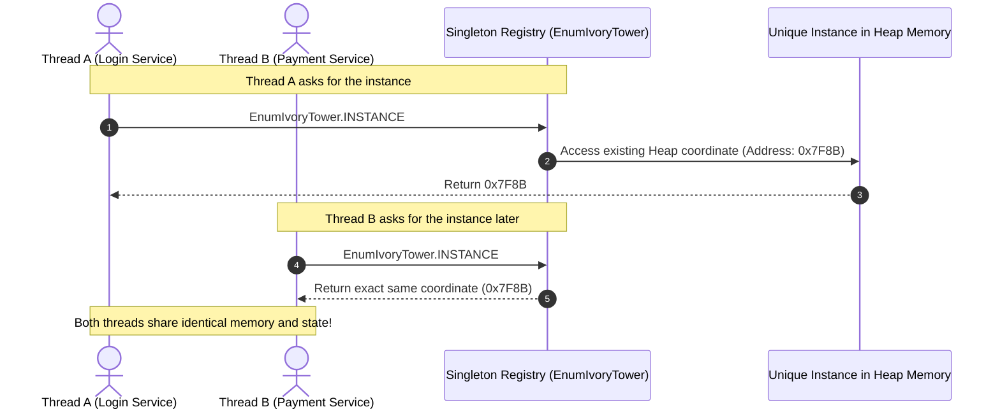

#### Programmatic Example of Singleton Pattern in Java
*Joshua Bloch, Author of Effective Java (3rd Edition, Item 3): "A single-element enum type is the best way to implement a singleton." It provides 100% thread safety, reflection defense, and serialization guarantees out-of-the-box.*

```java
package com.architect.patterns.creational.singleton;

import java.util.Map;
import java.util.concurrent.ConcurrentHashMap;
import java.util.concurrent.atomic.LongAdder;

/**
 * 1. Enum-based Singleton:
 * JVM guarantees that only one INSTANCE will ever be created,
 * immune to Reflection attacks and Serialization duplication issues.
 */
public enum EnumIvoryTower {
    INSTANCE; // The one and only instance

    // Shared thread-safe state (e.g., metric counter for active users)
    private final Map<String, LongAdder> metricMap = new ConcurrentHashMap<>();

    // Business method to increment a counter
    public void incrementMetric(String metricName) {
        metricMap.computeIfAbsent(metricName, k -> new LongAdder()).increment();
    }

    // Business method to retrieve counter value
    public long getMetricCount(String metricName) {
        LongAdder val = metricMap.get(metricName);
        return val != null ? val.sum() : 0L;
    }
}

// Client Usage Demonstration:
public class SingletonApp {
    public static void main(String[] args) {
        // Step 1: Request instance from two completely different places
        var instance1 = EnumIvoryTower.INSTANCE;
        var instance2 = EnumIvoryTower.INSTANCE;

        // Step 2: Modify state via the first reference
        instance1.incrementMetric("active.users");

        // Step 3: Verify both references point to the exact same memory coordinate
        System.out.println("instance1 Reference: " + instance1 + " (HashCode: " + instance1.hashCode() + ")");
        System.out.println("instance2 Reference: " + instance2 + " (HashCode: " + instance2.hashCode() + ")");
        System.out.println("Are both instances physically identical? " + (instance1 == instance2));

        // Step 4: Check that instance2 sees the metric incremented by instance1
        System.out.println("Metric Count retrieved via instance2: " + instance2.getMetricCount("active.users"));
    }
}
```

##### Console Output
```text
instance1 Reference: INSTANCE (HashCode: 1221555852)
instance2 Reference: INSTANCE (HashCode: 1221555852)
Are both instances physically identical? true
Metric Count retrieved via instance2: 1
```

#### When to Use the Singleton Pattern in Java
* **When to Use**:
  - Managing shared physical resources (Database Connection Pools, Thread Pools, File Loggers, Hardware Serial Ports).
  - Centralized application configuration managers and metrics counters that must be identical everywhere.
  - When creating multiple instances would cause resource exhaustion or severe data inconsistency.
* **When NOT to Use (Beginner Pitfall)**:
  - Do not use Singleton just to pass parameters globally—this turns your code into an un-testable ball of global state (anti-pattern).
  - In distributed multi-server clusters (e.g., Kubernetes pods), a Java Singleton only guarantees uniqueness within a *single JVM*, not across the whole cluster.

#### Real-World Applications of Singleton Pattern in Java
* `java.lang.Runtime#getRuntime()`: Accesses the single JVM runtime environment.
* `java.awt.Desktop#getDesktop()`: Represents the single host desktop environment.
* `java.lang.System#getSecurityManager()`: Centralized security coordinator.
* Spring Framework: Spring manages beans as Singletons by default (`@Scope("singleton")`).
* SLF4J / Log4j: `LoggerFactory.getLogger(...)` caching single logger coordinators.

#### Benefits and Trade-offs of Singleton Pattern
* **Benefits**:
  - **Controlled Access**: Guarantees zero duplicate instances and prevents memory bloat.
  - **Reduced Namespace Pollution**: Avoids dangerous loose global variables.
  - **Lazy Initialization Option**: Can be initialized on-demand only when first accessed.
* **Trade-offs**:
  - **Harder to Unit Test**: Global state makes it difficult to isolate unit tests without complex mocking.
  - **Hidden Dependencies**: Classes calling `Singleton.getInstance()` hide their dependencies instead of declaring them via constructors.

#### Related Java Design Patterns
* **Abstract Factory**: Usually implemented as a Singleton because you only need one factory instance for the application.
* **Builder**: A Director orchestrating a complex builder is often a Singleton.
* **Facade**: System facades are frequently Singletons because one access gateway is sufficient.

#### References and Credits
* *Design Patterns: Elements of Reusable Object-Oriented Software* (Gang of Four)
* *Effective Java* (Joshua Bloch, 3rd Edition - Item 3)
* *Head First Design Patterns* (Eric Freeman, Elisabeth Robson)

---

### 1.2 Factory Method Pattern in Java: Deferring Object Instantiation to Subclasses

> **Tags:** Creational | Gang of Four | Instantiation | Polymorphism | Decoupling | Extensibility

#### Also known as
Virtual Constructor, Factory

#### Intent of Factory Method Pattern
Define an interface or abstract class for creating an object, but let subclasses decide which concrete class to instantiate. Factory Method lets a class defer instantiation to subclasses.

#### Detailed Explanation of Factory Method Pattern with Real-World Examples

* **The Core Problem (What goes wrong without this pattern?)**:
  Imagine you create a logistics software where you hardcode `Truck transport = new Truck();` in 100 different classes across your app. Your app becomes super popular, and now management announces: *"We need to support cargo delivery by Ship and Airplane!"*
  Because `new Truck()` is scattered everywhere, you now have to rewrite and re-test 100 classes, risking massive bugs. You broke the **Open/Closed Principle**.

* **Real-world example (Analogy)**:
  Think of a **Vehicle Manufacturing Plant**. The master logistics headquarters knows *how to dispatch and track deliveries*, but it doesn't hardcode how each vehicle is physically manufactured. The **Land Division** builds and provides **Trucks**, while the **Maritime Division** builds and provides **Cargo Ships**.

* **In plain words**:
  Instead of calling `new ConcreteClass()` directly in client code, you call a creation method (`createTransport()`), allowing child classes to swap the created object dynamically without changing the client logic.

* **Wikipedia says**:
  "In class-based programming, the factory method pattern is a creational pattern that uses factory methods to deal with the problem of creating objects without having to specify the exact class of the object that will be created."

#### 🧠 Technical Logic Flow & Under-the-Hood Mechanics (Developer Deep Dive)

* **Low-Level Technical Problem It Solves**: 
  - **Compile-Time Coupling**: Direct `new ConcreteClass()` invocations bind client bytecode directly to concrete class symbols (`invokespecial`). Any change in constructor signature or concrete implementation forces re-compilation of all consumer classes.
  - **Violation of Inversion of Control**: High-level policy workflows become polluted with low-level creation details, making mock injection impossible during unit testing.
* **Step-by-Step Technical Logic Flow**:
  1. **Client Invocation**: Client calls high-level orchestrator method `logistics.planDelivery("CRG-101")`.
  2. **Virtual Method Dispatch (vtable lookup)**: Inside `planDelivery()`, the call to `this.createTransport()` triggers Java dynamic dispatch (`invokevirtual`). The JVM looks up the concrete subclass's virtual method table (`RoadLogistics` or `SeaLogistics`).
  3. **Subclass Instantiation**: The overridden `createTransport()` allocates the concrete product (`Truck` or `Ship`) on the heap and returns it as a polymorphic reference (`Transport` interface).
  4. **Execution over Abstraction**: The creator executes `transport.deliver()` against the interface contract. The client remains 100% agnostic of concrete types.
* **Why the Architecture Holds**: 
  Decouples the *invocation of creation* from the *definition of creation*. New concrete products can be introduced via new creator subclasses with zero bytecode modifications or re-compilation to existing client services (pure Open/Closed Principle).

#### Sequence Diagram
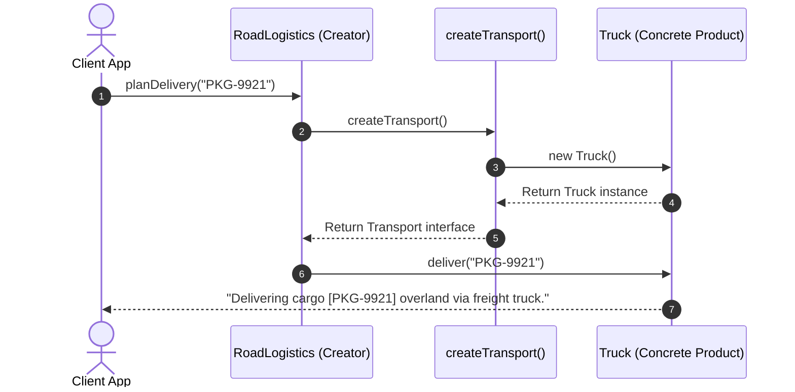

#### Programmatic Example of Factory Method Pattern in Java
```java
package com.architect.patterns.creational.factorymethod;

// Step 1: Define the common Product Interface
public interface Transport {
    String deliver(String cargoId);
}

// Step 2: Implement Concrete Products
public class Truck implements Transport {
    @Override
    public String deliver(String cargoId) {
        return "Delivering cargo [" + cargoId + "] overland via freight truck.";
    }
}

public class Ship implements Transport {
    @Override
    public String deliver(String cargoId) {
        return "Delivering cargo [" + cargoId + "] overseas via container cargo ship.";
    }
}

// Step 3: Define the Creator Abstract Class with the Factory Method
public abstract class Logistics {
    // The Factory Method: Subclasses MUST override this to supply their specific vehicle
    public abstract Transport createTransport();

    // Core Business Logic: Works with the abstract Transport interface, NOT concrete classes!
    public String planDelivery(String cargoId) {
        Transport transport = createTransport(); // Defer creation
        System.out.println("[AUDIT LOG] Preparing transport route for shipment: " + cargoId);
        return transport.deliver(cargoId);
    }
}

// Step 4: Concrete Creators decide WHICH product to instantiate
public class RoadLogistics extends Logistics {
    @Override
    public Transport createTransport() {
        return new Truck(); // Instantiates Truck
    }
}

public class SeaLogistics extends Logistics {
    @Override
    public Transport createTransport() {
        return new Ship(); // Instantiates Ship
    }
}

// Step 5: Client Demonstration
public class FactoryMethodApp {
    public static void main(String[] args) {
        // We can swap the logistics provider easily without touching the rest of our app
        Logistics roadLogistics = new RoadLogistics();
        Logistics seaLogistics = new SeaLogistics();

        String roadResult = roadLogistics.planDelivery("CRG-101");
        String seaResult = seaLogistics.planDelivery("CRG-202");

        System.out.println("Result: " + roadResult);
        System.out.println("Result: " + seaResult);
    }
}
```

##### Console Output
```text
[AUDIT LOG] Preparing transport route for shipment: CRG-101
Result: Delivering cargo [CRG-101] overland via freight truck.
[AUDIT LOG] Preparing transport route for shipment: CRG-202
Result: Delivering cargo [CRG-202] overseas via container cargo ship.
```

#### When to Use the Factory Method Pattern in Java
* **When to Use**:
  - When you do not know beforehand the exact types and dependencies of the objects your code should work with.
  - When you want to provide users of your library or framework with a way to extend its internal components.
  - When you want to save system resources by reusing existing objects instead of rebuilding them each time.
* **When NOT to Use**:
  - When you only have one single product type that will never change; creating extra creator classes in that case is unnecessary overhead.

#### Real-World Applications of Factory Method Pattern in Java
* `java.util.Calendar#getInstance()`: Creates calendar subclasses based on locale/timezone.
* `java.nio.charset.Charset#forName(String)`: Returns appropriate character set decoder.
* `java.text.NumberFormat#getInstance()`: Returns localized number formatters.
* `java.sql.DriverManager#getConnection(String)`: Factory method returning vendor JDBC connection.
* Spring `BeanFactory#getBean(String)`: Core dependency injection factory method.

#### Benefits and Trade-offs of Factory Method Pattern
* **Benefits**:
  - **Decoupling**: Eliminates tight coupling between creator code and concrete products.
  - **Single Responsibility Principle**: Consolidates object creation code into one clear place.
  - **Open/Closed Principle**: You can introduce new product variants without breaking existing client code.
* **Trade-offs**:
  - Code may require many new subclasses to implement the pattern, increasing file count.

#### Related Java Design Patterns
* **Abstract Factory**: Often composed of multiple Factory Methods.
* **Template Method**: Factory methods are commonly called inside template methods during algorithm steps.
* **Prototype**: Can replace Factory Method when creation requires cloning instead of inheritance.

#### References and Credits
* *Design Patterns: Elements of Reusable Object-Oriented Software* (Gang of Four)
* *Effective Java* (Joshua Bloch)
* *Head First Design Patterns* (Freeman & Robson)

---

### 1.3 Abstract Factory Pattern in Java: Creating Families of Related Objects

> **Tags:** Creational | Gang of Four | Factory of Factories | Product Families | Encapsulation

#### Also known as
Kit, Family Factory

#### Intent of Abstract Factory Pattern
Provide an interface for creating families of related or dependent objects without specifying their concrete classes.

#### Detailed Explanation of Abstract Factory Pattern with Real-World Examples

* **The Core Problem (What goes wrong without this pattern?)**:
  Imagine building a cross-platform desktop UI application that supports both **Dark Mode** and **Light Mode**. A window has Buttons, Checkboxes, and Scrollbars.
  If your code allows a developer to accidentally write `new DarkButton()` next to `new LightCheckbox()`, the application UI looks like a broken Frankenstein disaster with clashing styles!
  You need a way to ensure that all UI widgets always belong to the **same matching family** without hardcoding concrete classes in your UI layout code.

* **Real-world example (Analogy)**:
  Think of **Furniture Styles** (Victorian, Modern Minimalist, Scandinavian). A furniture factory doesn't just sell random chairs; it sells matching **Furniture Suites** (Chair + Sofa + Coffee Table). If you choose "Victorian", the Victorian Factory guarantees you receive a Victorian Chair and a Victorian Sofa with matching wood carvings. You never accidentally get a plastic modern neon chair with an antique Victorian sofa.

* **In plain words**:
  A "Factory of Factories" that groups individual factories together to produce whole families of matching products.

* **Wikipedia says**:
  "The abstract factory pattern provides a way to encapsulate a group of individual factories that have a common theme without specifying their concrete classes."

#### 🧠 Technical Logic Flow & Under-the-Hood Mechanics (Developer Deep Dive)

* **Low-Level Technical Problem It Solves**: 
  - **Incompatible Object Coupling**: Systems with multiple orthogonal product axes (e.g. Buttons, Checkboxes, Windows $\times$ Windows, Mac, Linux styles) easily permit mismatched cross-family instantiations (e.g. a Mac Button inside a Windows Window), leading to runtime graphical glitches and OS-level crashes.
  - **Direct Class Dependency**: Hardcoding concrete factory classes into consumer code prevents swapping whole product ecosystems at runtime.
* **Step-by-Step Technical Logic Flow**:
  1. **Factory Injection**: The client application receives an instance of `GUIFactory` (e.g., `DarkThemeFactory`) via constructor dependency injection.
  2. **Synchronized Family Instantiation**: The client calls `factory.createButton()` and `factory.createCheckbox()`. Because both factory methods execute on the same concrete factory instance, every produced object is guaranteed to share the exact same style tokens, color palettes, and interface implementations.
  3. **Interface Polymorphism**: The client stores products as abstract interface pointers (`Button`, `Checkbox`), interacting strictly via polymorphic dispatch (`button.render()`).
  4. **Runtime Theme Hot-Swapping**: Swapping the entire UI theme only requires passing a new `LightThemeFactory` instance; zero consumer UI layout logic is modified.
* **Why the Architecture Holds**: 
  Enforces 100% atomic family consistency at compile-time and runtime. Individual product implementations cannot cross family boundaries, preventing architectural contamination.

#### Sequence Diagram
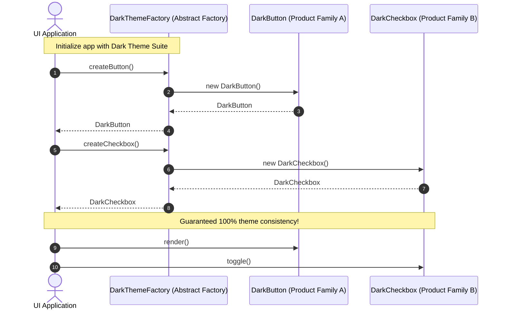

#### Programmatic Example of Abstract Factory Pattern in Java
```java
package com.architect.patterns.creational.abstractfactory;

// Step 1: Abstract Product Family 1 (Buttons)
public interface Button {
    void render();
}

// Step 2: Abstract Product Family 2 (Checkboxes)
public interface Checkbox {
    void toggle();
}

// Step 3: Concrete Products for Family "Dark Theme"
public class DarkButton implements Button {
    @Override public void render() { System.out.println("Rendering Dark Modern Button [Background: #121212, Text: #FFF]"); }
}

public class DarkCheckbox implements Checkbox {
    @Override public void toggle() { System.out.println("Toggling Dark Checkbox [State: Checked, Accent: #BB86FC]"); }
}

// Step 4: Concrete Products for Family "Light Theme"
public class LightButton implements Button {
    @Override public void render() { System.out.println("Rendering Light Clean Button [Background: #FFFFFF, Text: #000]"); }
}

public class LightCheckbox implements Checkbox {
    @Override public void toggle() { System.out.println("Toggling Light Checkbox [State: Checked, Accent: #0066CC]"); }
}

// Step 5: The Abstract Factory Interface
public interface GUIFactory {
    Button createButton();
    Checkbox createCheckbox();
}

// Step 6: Concrete Factories for each Theme Family
public class DarkThemeFactory implements GUIFactory {
    @Override public Button createButton() { return new DarkButton(); }
    @Override public Checkbox createCheckbox() { return new DarkCheckbox(); }
}

public class LightThemeFactory implements GUIFactory {
    @Override public Button createButton() { return new LightButton(); }
    @Override public Checkbox createCheckbox() { return new LightCheckbox(); }
}

// Step 7: Client Application (Independent of concrete theme implementations)
public class GUIApplication {
    private final Button button;
    private final Checkbox checkbox;

    // The client accepts any GUIFactory and never references DarkButton or LightButton directly!
    public GUIApplication(GUIFactory factory) {
        this.button = factory.createButton();
        this.checkbox = factory.createCheckbox();
    }

    public void renderUI() {
        button.render();
        checkbox.toggle();
    }

    public static void main(String[] args) {
        System.out.println("=== 1. Bootstrapping Dark Theme UI ===");
        GUIApplication darkApp = new GUIApplication(new DarkThemeFactory());
        darkApp.renderUI();

        System.out.println("\n=== 2. Bootstrapping Light Theme UI ===");
        GUIApplication lightApp = new GUIApplication(new LightThemeFactory());
        lightApp.renderUI();
    }
}
```

##### Console Output
```text
=== 1. Bootstrapping Dark Theme UI ===
Rendering Dark Modern Button [Background: #121212, Text: #FFF]
Toggling Dark Checkbox [State: Checked, Accent: #BB86FC]

=== 2. Bootstrapping Light Theme UI ===
Rendering Light Clean Button [Background: #FFFFFF, Text: #000]
Toggling Light Checkbox [State: Checked, Accent: #0066CC]
```

#### When to Use the Abstract Factory Pattern in Java
* **When to Use**:
  - When your system needs to be independent of how its products are created, composed, and represented.
  - When your application needs to support multiple families of products (e.g., AWS vs Azure Cloud Resource Provisioners, Windows vs macOS UI Kits).
  - When you want to strictly enforce that products from one family are never mixed with products from another.
* **When NOT to Use**:
  - When you only have a single object to create (use **Factory Method** instead).
  - When your product families change constantly (e.g., adding a new product requires editing every factory interface).

#### Real-World Applications of Abstract Factory Pattern in Java
* `javax.xml.parsers.DocumentBuilderFactory#newInstance()`: Creates XML document parser suites.
* `javax.xml.transform.TransformerFactory#newInstance()`: Creates XML transformers and output formatters.
* `javax.crypto.SecretKeyFactory#getInstance(String)`: Creates security cryptographic key suites.
* Spring Framework `ProxyFactoryBean`: Produces proxy instances with associated advisor suites.

#### Benefits and Trade-offs of Abstract Factory Pattern
* **Benefits**:
  - **Guaranteed Compatibility**: Products created from the same factory are 100% compatible.
  - **Loose Coupling**: Client code works strictly with abstract interfaces.
  - **Open/Closed Principle**: You can introduce new product families without breaking existing client code.
* **Trade-offs**:
  - High complexity with many interfaces and classes.
  - Adding a new product type (e.g., adding `createSlider()`) requires updating all factory subclasses.

#### Related Java Design Patterns
* **Factory Method**: Abstract Factory is often implemented using a set of Factory Methods.
* **Singleton**: Concrete Abstract Factory instances are usually Singletons.
* **Prototype**: Abstract Factory can clone prototype objects rather than instantiating subclasses.

#### References and Credits
* *Design Patterns: Elements of Reusable Object-Oriented Software* (Gang of Four)
* *Java Design Patterns: A Hands-On Experience with Real-World Examples*

---

### 1.4 Builder Pattern in Java: Constructing Complex Immutable Objects

> **Tags:** Creational | Gang of Four | Immutability | Fluent Interface | Method Chaining | Validation

#### Also known as
Fluent Builder, Step-by-Step Construction

#### Intent of Builder Pattern
Separate the construction of a complex object from its representation so that the same construction process can create different representations, eliminating huge confusing constructors.

#### Detailed Explanation of Builder Pattern with Real-World Examples

* **The Core Problem (What goes wrong without this pattern?)**:
  Imagine a class with 10 fields: URL, HTTP Method, Headers, Body, Timeout, Retries, Proxy, SSL, Cookies, and CachePolicy.
  Without Builder, you write a **"Telescoping Constructor"**:
  ```java
  // What does true mean? What does null mean? If you swap 5000 and 3, your code silently breaks!
  new RestRequest("https://api.com", "POST", null, body, 5000, 3, null, true, null, false);
  ```
  If you use JavaBeans (getters/setters), your object is **mutable** and thread-unsafe (a thread could modify the URL in the middle of a request!). Builder gives you **readable code + strict immutability**.

* **Real-world example (Analogy)**:
  Think of **Subway Sandwich or Custom Gaming PC Assembly**. You don't just buy a pre-made mystery box. The builder guides you step-by-step: *"Choose bread, choose protein, choose cheese, add toasted option"*. Once finished, the completed sandwich is wrapped and immutable.

* **In plain words**:
  Provides a step-by-step fluent API (`.setHeader().setTimeout().build()`) that creates a validated, read-only object.

* **Wikipedia says**:
  "The builder pattern is a design pattern designed to provide a flexible solution to various object creation problems in object-oriented programming."

#### 🧠 Technical Logic Flow & Under-the-Hood Mechanics (Developer Deep Dive)

* **Low-Level Technical Problem It Solves**: 
  - **Mutable State Corruption in Multi-Threading**: JavaBean patterns (using setters) leave objects in an incomplete, partially-initialized state during construction. If a background thread reads the object before all setters complete, it observes corrupted data.
  - **Telescoping Constructor Anti-Pattern**: Multiple constructors with identical parameter types (`int timeout, int retries, int port`) cause silent bugs due to accidental parameter positional swapping.
* **Step-by-Step Technical Logic Flow**:
  1. **Mutable Accumulator Allocation**: Client instantiates a lightweight `RestRequest.Builder` on the heap.
  2. **Fluent Method Chaining**: Builder methods mutate builder fields internally and return `this` (the builder pointer), enabling fluent chaining without intermediate variable allocations.
  3. **Atomic Validation & Snapshotting**: Upon calling `.build()`, the Builder executes cross-field validation rules (e.g. `timeout > 0`, non-null URLs) and passes itself to the target class's private constructor.
  4. **Defensive Copying & Immutability**: The target constructor copies collections defensively (`Collections.unmodifiableMap(new HashMap<>(builder.headers))`) and assigns fields to `final` variables.
  5. **Safe Publication**: The newly created immutable instance is returned to the client. Because all fields are `final`, the Java Memory Model (JMM) guarantees safe publication across all CPU threads without synchronization locks.
* **Why the Architecture Holds**: 
  Separates the mutable gathering phase from the immutable runtime execution phase, guaranteeing that invalid or partially constructed objects can never exist in memory.

#### Sequence Diagram
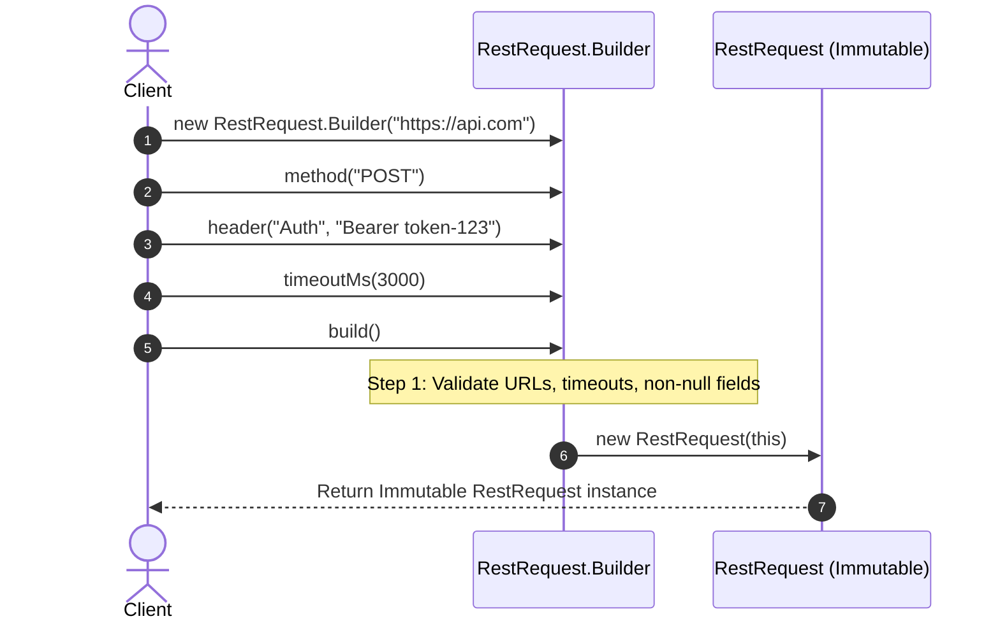

#### Programmatic Example of Builder Pattern in Java
```java
package com.architect.patterns.creational.builder;

import java.util.*;

// The Target Product (Notice: Completely Immutable with NO public setters!)
public final class RestRequest {
    private final String url;
    private final String method;
    private final Map<String, String> headers;
    private final String body;
    private final int timeoutMs;

    // Private constructor: Only the Builder can create this object!
    private RestRequest(Builder builder) {
        this.url = builder.url;
        this.method = builder.method;
        this.headers = Collections.unmodifiableMap(new HashMap<>(builder.headers));
        this.body = builder.body;
        this.timeoutMs = builder.timeoutMs;
    }

    public String getUrl() { return url; }
    public String getMethod() { return method; }
    public Map<String, String> getHeaders() { return headers; }
    public String getBody() { return body; }
    public int getTimeoutMs() { return timeoutMs; }

    // Static Inner Builder Class
    public static class Builder {
        private final String url; // Mandatory parameter
        private String method = "GET"; // Default value
        private final Map<String, String> headers = new HashMap<>();
        private String body;
        private int timeoutMs = 5000; // Default 5s

        // Mandatory parameters passed in constructor
        public Builder(String url) {
            this.url = Objects.requireNonNull(url, "URL cannot be null");
        }

        // Fluent chaining methods returning 'this'
        public Builder method(String method) {
            this.method = Objects.requireNonNull(method, "Method cannot be null");
            return this;
        }

        public Builder header(String key, String value) {
            this.headers.put(key, value);
            return this;
        }

        public Builder body(String body) {
            this.body = body;
            return this;
        }

        public Builder timeoutMs(int timeoutMs) {
            if (timeoutMs <= 0) throw new IllegalArgumentException("Timeout must be > 0");
            this.timeoutMs = timeoutMs;
            return this;
        }

        // The Build method: Validates constraints and constructs the final immutable object
        public RestRequest build() {
            return new RestRequest(this);
        }
    }

    @Override
    public String toString() {
        return "RestRequest [Method=" + method + ", URL=" + url + ", Headers=" + headers + ", Timeout=" + timeoutMs + "ms]";
    }

    public static void main(String[] args) {
        // Fluent, readable, self-documenting construction
        RestRequest request = new RestRequest.Builder("https://api.payments.com/v1/charge")
                .method("POST")
                .header("Authorization", "Bearer eyJhbGciOi...")
                .header("Content-Type", "application/json")
                .body("{\"amount\": 99.50}")
                .timeoutMs(3000)
                .build();

        System.out.println("Constructed Request: " + request);
    }
}
```

##### Console Output
```text
Constructed Request: RestRequest [Method=POST, URL=https://api.payments.com/v1/charge, Headers={Authorization=Bearer eyJhbGciOi..., Content-Type=application/json}, Timeout=3000ms]
```

#### When to Use the Builder Pattern in Java
* **When to Use**:
  - When constructing an object with more than 4 or 5 parameters, especially when many are optional.
  - When you want your domain models to be strictly **immutable** and thread-safe.
  - When object creation requires complex validation before the instance is considered valid.
* **When NOT to Use**:
  - For small data structures with only 1 or 2 fields (plain constructors or Java `record` types are simpler).

#### Real-World Applications of Builder Pattern in Java
* `java.lang.StringBuilder#append()`: Builds dynamic strings efficiently.
* `java.net.http.HttpRequest.newBuilder()`: Modern Java 11+ HTTP client request builder.
* `java.util.Locale.Builder`: Constructing localized language tags.
* Project Lombok: `@Builder` annotation used ubiquitously in Spring Boot applications.

#### Benefits and Trade-offs of Builder Pattern
* **Benefits**:
  - **Thread-Safety & Immutability**: Objects are constructed in one atomic step and cannot be mutated afterwards.
  - **Self-Documenting Code**: No more guessing what boolean flags or numbers mean in constructors.
  - **Validation Control**: Builder can throw validation exceptions before the product is instantiated.
* **Trade-offs**:
  - Requires creating a dedicated Builder inner class, slightly increasing codebase size.

#### Related Java Design Patterns
* **Abstract Factory**: Can be used alongside Builder to build complex product families.
* **Composite**: Builders are often used to recursively construct Composite tree hierarchies.

#### References and Credits
* *Design Patterns: Elements of Reusable Object-Oriented Software* (Gang of Four)
* *Effective Java* (Joshua Bloch, Item 2: "Consider a builder when faced with many constructor parameters")

---

### 1.5 Prototype Pattern in Java: Instantiating Objects via Cloning

> **Tags:** Creational | Gang of Four | Cloning | Deep Copy | Memory Optimization | Performance

#### Also known as
Cloneable, Prototypical Instance

#### Intent of Prototype Pattern
Specify the kinds of objects to create using a prototypical instance, and create new objects by copying this existing prototype instead of running slow initialization logic from scratch.

#### Detailed Explanation of Prototype Pattern with Real-World Examples

* **The Core Problem (What goes wrong without this pattern?)**:
  Imagine your application needs to create 500 game characters or cloud virtual machine configurations. Instantiating a single instance takes 5 seconds because it reads 20 config files from disk, runs heavy cryptographic calculations, and queries 5 database tables.
  If you run `new ServerConfiguration()` 500 times, your application hangs for **40 minutes**!
  With Prototype, you create the master object ONCE (taking 5 seconds), and clone it 500 times in memory (taking **5 milliseconds**).

* **Real-world example (Analogy)**:
  Think of **Cell Mitosis (Biological Cloning)** or **Blueprint Photocopying**. An architect doesn't redraw a 500-page skyscraper blueprint by hand 20 times for 20 contractors. They make one master blueprint and run it through a high-speed photocopier.

* **In plain words**:
  Create new objects by cloning a pre-existing master instance rather than repeating slow construction steps.

* **Wikipedia says**:
  "The prototype pattern is a creational design pattern in software development. It is used when the type of objects to create is determined by a prototypical instance, which is cloned to produce new objects."

#### 🧠 Technical Logic Flow & Under-the-Hood Mechanics (Developer Deep Dive)

* **Low-Level Technical Problem It Solves**: 
  - **Repetitive Expensive Initialization**: Complex object construction often involves disk I/O, database round-trips, network configuration parsing, or matrix calculations. Re-running this logic repeatedly causes CPU throttling and latency spikes.
  - **Shallow Copy Bug Trap (`Object.clone()`)**: Default Java `clone()` performs shallow memory copying (only copies object memory address references). If a cloned object modifies an inner `List` or `Map`, it silently corrupts the state of all other clones in memory!
* **Step-by-Step Technical Logic Flow**:
  1. **Master Prototype Initialization**: A master prototype object (`ServerConfiguration`) is instantiated once, eagerly warming up all caches, parsing schemas, and populating internal collections.
  2. **Cloning Request (`deepClone()`)**: Client invokes `prototype.deepClone()`.
  3. **Heap Memory Allocation & Deep Copying**: The prototype invokes its deep-copy copy-constructor (`new ServerConfiguration(this)`).
  4. **Collection & Reference Duplication**: For every primitive field, values are copied by value. For every reference/collection (e.g. `List<String> installedModules`), a brand new collection object is allocated on the heap: `this.installedModules = new ArrayList<>(source.installedModules)`.
  5. **Isolation & Customization**: The new independent instance is returned. The caller can safely mutate the clone (e.g. `setServerName("worker-01")`) without affecting the master prototype or other parallel clones.
* **Why the Architecture Holds**: 
  Transforms expensive $O(N \cdot \text{Cost}_{\text{I/O}})$ construction operations into ultra-fast in-memory heap-to-heap memory allocation operations ($O(K \cdot \text{DeepCopy})$) with complete memory isolation.

#### Sequence Diagram
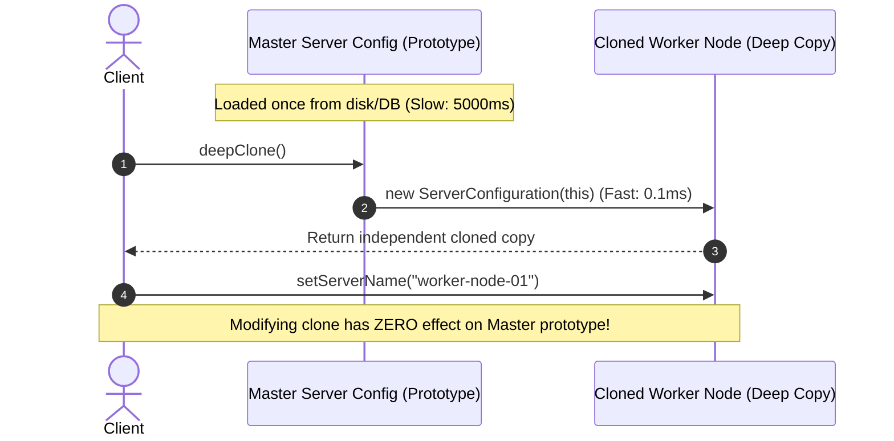

#### Programmatic Example of Prototype Pattern in Java
```java
package com.architect.patterns.creational.prototype;

import java.util.*;

// Step 1: Define the Prototype Interface
public interface Prototype<T> {
    T deepClone();
}

// Step 2: Implement the Prototype with a Deep-Copy Constructor
public class ServerConfiguration implements Prototype<ServerConfiguration> {
    private String serverName;
    private int cpuCores;
    private int ramGb;
    private List<String> securityGroups;

    // Standard constructor (Imagine this does expensive disk/DB initialization)
    public ServerConfiguration(String serverName, int cpuCores, int ramGb, List<String> securityGroups) {
        this.serverName = serverName;
        this.cpuCores = cpuCores;
        this.ramGb = ramGb;
        this.securityGroups = new ArrayList<>(securityGroups);
    }

    // Deep Copy Constructor: Ensures internal lists/objects are cloned and independent!
    public ServerConfiguration(ServerConfiguration prototype) {
        this.serverName = prototype.serverName;
        this.cpuCores = prototype.cpuCores;
        this.ramGb = prototype.ramGb;
        this.securityGroups = new ArrayList<>(prototype.securityGroups); // Deep copy of list
    }

    @Override
    public ServerConfiguration deepClone() {
        return new ServerConfiguration(this);
    }

    public void setServerName(String name) { this.serverName = name; }
    public void addSecurityGroup(String group) { this.securityGroups.add(group); }

    @Override
    public String toString() {
        return "ServerConfig [Name=" + serverName + ", Cores=" + cpuCores + ", RAM=" + ramGb + "GB, Groups=" + securityGroups + "]";
    }

    public static void main(String[] args) {
        // Step 1: Create the Master Gold Image Prototype (done once)
        ServerConfiguration masterWeb = new ServerConfiguration("base-web-template", 8, 32, List.of("sg-http", "sg-ssh"));

        // Step 2: Clone two independent worker nodes instantly in memory
        ServerConfiguration node1 = masterWeb.deepClone();
        node1.setServerName("prod-web-node-01");
        node1.addSecurityGroup("sg-ssl-cert");

        ServerConfiguration node2 = masterWeb.deepClone();
        node2.setServerName("prod-web-node-02");

        // Step 3: Print all three to confirm the master is untouched while clones are independently configured
        System.out.println("Master Prototype: " + masterWeb);
        System.out.println("Cloned Node 1:    " + node1);
        System.out.println("Cloned Node 2:    " + node2);
    }
}
```

##### Console Output
```text
Master Prototype: ServerConfig [Name=base-web-template, Cores=8, RAM=32GB, Groups=[sg-http, sg-ssh]]
Cloned Node 1:    ServerConfig [Name=prod-web-node-01, Cores=8, RAM=32GB, Groups=[sg-http, sg-ssh, sg-ssl-cert]]
Cloned Node 2:    ServerConfig [Name=prod-web-node-02, Cores=8, RAM=32GB, Groups=[sg-http, sg-ssh]]
```

#### When to Use the Prototype Pattern in Java
* **When to Use**:
  - When the cost of creating a new object via `new` (involving expensive database queries, I/O, network setup, or heavy calculations) is slow.
  - When you need to create objects that are slight variations of an existing master configuration.
  - When your code shouldn't depend on the concrete classes of objects you need to copy.
* **When NOT to Use**:
  - For simple lightweight objects (e.g. `new Point(x, y)`), where cloning adds needless complexity.

#### Real-World Applications of Prototype Pattern in Java
* `java.lang.Object#clone()` & `java.lang.Cloneable`: Java standard cloning mechanism.
* Spring Framework Prototype Scope (`@Scope("prototype")`): Creates a new bean instance each time it is requested.
* Graphic design apps (Photoshop layer duplicate) and game engines (spawning enemy NPC hordes from master enemy templates).

#### Benefits and Trade-offs of Prototype Pattern
* **Benefits**:
  - **Blazing Fast Object Creation**: Clones pre-initialized memory buffers in sub-milliseconds.
  - **Decoupled Instantiation**: Eliminates dependency on concrete classes for replication.
* **Trade-offs**:
  - Cloning complex objects that have circular references or nested deep object trees can be tricky to implement cleanly.

#### Related Java Design Patterns
* **Abstract Factory**: Often stores a set of Prototypes from which to clone product objects.
* **Composite & Decorator**: Benefit from Prototype to easily duplicate complex tree hierarchies.

#### References and Credits
* *Design Patterns: Elements of Reusable Object-Oriented Software* (Gang of Four)
* *Effective Java* (Joshua Bloch, Item 13: "Override clone judiciously")

---

## 2. Structural Patterns (Composition & Relationships)

---

### 2.1 Adapter Pattern in Java: Seamlessly Integrating Incompatible Interfaces

> **Tags:** Structural | Gang of Four | Wrapper | Compatibility | Legacy Migration | Integration

#### Also known as
Wrapper, Translator

#### Intent of Adapter Pattern
Convert the interface of an existing class into another interface that clients expect, allowing classes with incompatible interfaces to collaborate smoothly without altering their underlying source code.

#### Detailed Explanation of Adapter Pattern with Real-World Examples

* **The Core Problem (What goes wrong without this pattern?)**:
  Imagine your company buys a shiny modern payment provider API that requires calling `processPayment(customerId, amountInUsd)`. But your company's core billing engine was built in 2004 and only knows how to process raw SOAP XML strings: `executeXmlTransfer("<TransferRequest>...")`.
  If you attempt to rewrite your 20-year-old billing engine, you risk introducing catastrophic financial calculation bugs. If you don't rewrite it, your modern code cannot talk to it.
  **Adapter** solves this cleanly by acting as a middleman translator!

* **Real-world example (Analogy)**:
  Think of an **International Travel Power Plug Adapter**. A traveler from the US (with a two-prong Type-A plug) lands in London, UK (where wall sockets accept only three-prong Type-G plugs). The traveler does not rebuild the London power grid or rewire their laptop charger—they insert a **$10 travel adapter plug** between the wall and their charger.

* **In plain words**:
  Acts as a middleman translator that converts one interface into another so two incompatible classes can work together seamlessly.

* **Wikipedia says**:
  "In software engineering, the adapter pattern is a software design pattern that allows the interface of an existing class to be used as another interface. It is often used to make existing classes work with others without modifying their source code."

#### 🧠 Technical Logic Flow & Under-the-Hood Mechanics (Developer Deep Dive)

* **Low-Level Technical Problem It Solves**: 
  - **Interface Incompatibility & Binary Dependency Traps**: Third-party libraries, legacy vendor SDKs, or external microservice contracts frequently present incompatible method signatures, data types, and protocol formats. Direct invocation creates tight coupling to external vendor contracts that may deprecate without notice.
  - **Legacy Code Volatility**: Modifying working, battle-tested legacy classes directly violates the Open/Closed Principle and risks breaking historical edge-case guarantees.
* **Step-by-Step Technical Logic Flow**:
  1. **Contract Implementation**: The `LegacyBankPaymentAdapter` implements the modern `PaymentGateway` target interface expected by the client.
  2. **Object Composition (Wrapper)**: The adapter holds a private reference to the wrapped instance (`LegacyBankingSoapClient adaptee`).
  3. **Data Transformation & Translation**: When `processPayment(customerId, amount)` is invoked, the adapter converts high-level parameters into the low-level format required by the legacy subsystem (e.g. serializing to SOAP/XML, converting USD to cents integer).
  4. **Delegation**: The adapter calls the adaptee's specific method (`executeXmlTransfer(xmlPayload)`).
  5. **Response Translation**: The adapter parses the adaptee's raw output (e.g. XML/JSON/Status code) and maps it to the modern return type (`PaymentResult`), returning it to the caller.
* **Why the Architecture Holds**: 
  Establishes an Anti-Corruption Layer (ACL). The client code depends strictly on its own clean domain interface, completely isolated from vendor protocol churn or legacy quirks.

#### Sequence Diagram
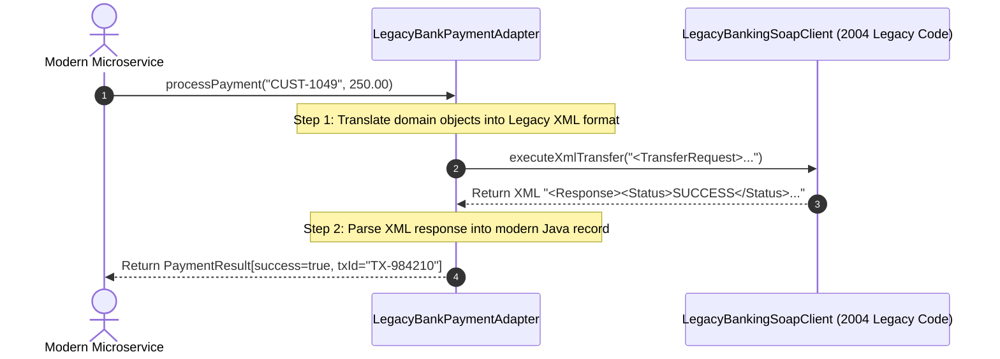

#### Programmatic Example of Adapter Pattern in Java
```java
package com.architect.patterns.structural.adapter;

// Step 1: The Modern Interface expected by new microservices
public interface PaymentGateway {
    PaymentResult processPayment(String customerId, double amountInUsd);
}

// Modern response data model
public record PaymentResult(boolean success, String transactionId) {}

// Step 2: The Adaptee (Legacy 20-year-old banking client that cannot be rewritten)
class LegacyBankingSoapClient {
    public String executeXmlTransfer(String rawXml) {
        System.out.println("[LEGACY SYSTEM] Processing raw XML payload:\n" + rawXml);
        return "<Response><Status>SUCCESS</Status><TxId>TX-984210</TxId></Response>";
    }
}

// Step 3: The Adapter (Implements the Modern Interface and wraps the Legacy Client)
public class LegacyBankPaymentAdapter implements PaymentGateway {
    private final LegacyBankingSoapClient legacySoapClient;

    public LegacyBankPaymentAdapter(LegacyBankingSoapClient client) {
        this.legacySoapClient = client;
    }

    @Override
    public PaymentResult processPayment(String customerId, double amountInUsd) {
        // 1. Convert modern method arguments into legacy XML string format
        String xmlPayload = "<TransferRequest>\n"
                          + "  <Customer>" + customerId + "</Customer>\n"
                          + "  <Amount>" + amountInUsd + "</Amount>\n"
                          + "</TransferRequest>";

        // 2. Delegate the call to the legacy system
        String xmlResponse = legacySoapClient.executeXmlTransfer(xmlPayload);

        // 3. Parse legacy XML response back into clean modern Java record
        boolean isSuccess = xmlResponse.contains("<Status>SUCCESS</Status>");
        String txId = isSuccess ? "TX-984210" : "FAILED";
        return new PaymentResult(isSuccess, txId);
    }

    public static void main(String[] args) {
        // Client interacts ONLY with the modern PaymentGateway interface!
        LegacyBankingSoapClient legacyClient = new LegacyBankingSoapClient();
        PaymentGateway modernGateway = new LegacyBankPaymentAdapter(legacyClient);

        System.out.println("=== Initiating Modern Payment Dispatch ===");
        PaymentResult result = modernGateway.processPayment("CUST-1049", 250.00);

        System.out.println("\nPayment Result Received: Success=" + result.success() + ", TxId=" + result.transactionId());
    }
}
```

##### Console Output
```text
=== Initiating Modern Payment Dispatch ===
[LEGACY SYSTEM] Processing raw XML payload:
<TransferRequest>
  <Customer>CUST-1049</Customer>
  <Amount>250.0</Amount>
</TransferRequest>

Payment Result Received: Success=true, TxId=TX-984210
```

#### When to Use the Adapter Pattern in Java
* **When to Use**:
  - When you want to use an existing legacy class or 3rd-party library, but its interface doesn't match your modern architecture.
  - When integrating older XML/SOAP services, C++ libraries, or external SDKs without mutating their source code.
  - When creating a reusable translation layer between decoupled systems.
* **When NOT to Use**:
  - If you have full ownership of both classes and can easily refactor them to share a common interface directly.

#### Real-World Applications of Adapter Pattern in Java
* `java.util.Arrays#asList(T...)`: Adapts a primitive/object array into a standard `List` interface.
* `java.io.InputStreamReader(InputStream)`: Adapts a byte stream (`InputStream`) into a character stream (`Reader`).
* `java.io.OutputStreamWriter(OutputStream)`: Adapts a byte stream into a character writer.
* Spring MVC `HandlerAdapter`: Translates various HTTP controller signatures into uniform dispatcher calls.

#### Benefits and Trade-offs of Adapter Pattern
* **Benefits**:
  - **Single Responsibility Principle**: Separates the interface conversion code from core business logic.
  - **Open/Closed Principle**: You can introduce new adapters without breaking existing client code.
  - Reuses existing reliable code without risky rewrites.
* **Trade-offs**:
  - Increases code complexity by introducing new wrapper classes.

#### Related Java Design Patterns
* **Bridge**: Designed up-front to let abstractions and implementations vary independently; Adapter is added retroactively to fix incompatible systems.
* **Decorator**: Adds new behaviors to an object without changing its interface; Adapter changes the interface to make it compatible.
* **Facade**: Defines a new simplified interface for an entire subsystem; Adapter reuses an existing interface.
* **Proxy**: Provides the identical interface to protect/cache calls; Adapter provides a different interface.

#### References and Credits
* *Design Patterns: Elements of Reusable Object-Oriented Software* (Gang of Four)
* *Refactoring to Patterns* (Joshua Kerievsky)
* *Head First Design Patterns*

---

### 2.2 Decorator Pattern in Java: Dynamically Extending Object Functionality

> **Tags:** Structural | Gang of Four | Dynamic Composition | Wrapper | Open-Closed Principle | Extensibility

#### Also known as
Wrapper Extension, Smart Wrapper

#### Intent of Decorator Pattern
Attach additional responsibilities to an object dynamically at runtime without modifying the underlying class or relying on exponential subclass inheritance.

#### Detailed Explanation of Decorator Pattern with Real-World Examples

* **The Core Problem (What goes wrong without this pattern?)**:
  Imagine building a Coffee Shop billing system. You have a `SimpleCoffee`. Customers want toppings: Milk, Sugar, Whip, Caramel, and Vanilla.
  If you use subclass inheritance, you need classes like `CoffeeWithMilk`, `CoffeeWithMilkAndSugar`, `CoffeeWithMilkSugarAndCaramel`... you end up with **32 explosive subclasses**!
  If you add 5 more toppings, you need **1,000+ classes**.
  **Decorator** solves this by wrapping the base coffee with dynamic topping wrappers at runtime!

* **Real-world example (Analogy)**:
  Think of **Dressing in Winter Clothing Layers**. You start with a base t-shirt. If it's cold, you put on a sweater over the t-shirt. If it starts raining, you put on a waterproof jacket over the sweater. Each layer wraps the previous layer and adds warmth/protection without altering your body.

* **In plain words**:
  Wraps an object inside another object (like Russian Matryoshka nesting dolls) to stack on extra features dynamically.

* **Wikipedia says**:
  "In object-oriented programming, the decorator pattern is a design pattern that allows behavior to be added to an individual object, dynamically, without affecting the behavior of other objects from the same class."

#### 🧠 Technical Logic Flow & Under-the-Hood Mechanics (Developer Deep Dive)

* **Low-Level Technical Problem It Solves**: 
  - **Subclass Explosion (Combinatorial Hell)**: Statically subclassing every combination of features ($N$ features $\implies 2^N$ subclasses) leads to unmaintainable class hierarchies and severe code duplication.
  - **Static Class Binding**: Inheritance fixes behavior at compile time. An object cannot dynamically add encryption or compression at runtime based on incoming request headers.
* **Step-by-Step Technical Logic Flow**:
  1. **Interface Contract Alignment**: Both concrete components (`FileDataStream`) and base decorators (`DataStreamDecorator`) implement the identical `DataStream` interface.
  2. **Recursive Composition (Layer Stacking)**: The client builds a composite pipeline: `new LoggingDecorator(new EncryptionDecorator(new FileDataStream()))`.
  3. **Inbound Onion Execution (Pre-Processing)**: Calling `write("payload")` starts at the outermost decorator (`LoggingDecorator`). It performs logging logic first.
  4. **Inner Delegation**: The outer decorator invokes `wrappee.write()`, passing execution to `EncryptionDecorator`. It transforms the data (e.g. encrypts bytes to ciphertext) and forwards to the inner core component.
  5. **Terminal Execution**: The innermost component (`FileDataStream`) executes the raw physical disk/memory I/O operation.
  6. **Outbound Unwinding (Post-Processing)**: Return values bubble back up through the decorator stack, allowing symmetric post-processing (e.g., decryption upon `read()`).
* **Why the Architecture Holds**: 
  Adheres strictly to the Single Responsibility Principle. Each decorator focuses on one isolated concern (e.g., Compression, Logging, Encryption, Caching) while runtime composition dynamically orchestrates the pipeline.

#### Sequence Diagram
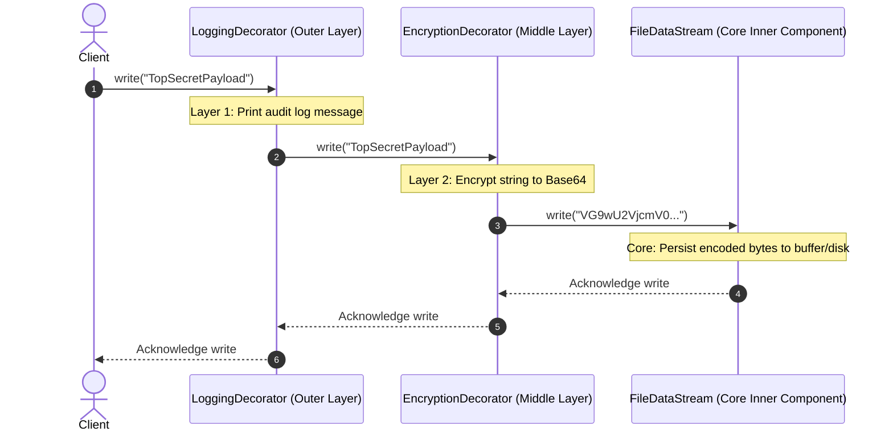

#### Programmatic Example of Decorator Pattern in Java
```java
package com.architect.patterns.structural.decorator;

import java.util.Base64;

// Step 1: Component Interface (The contract for both core objects and decorators)
public interface DataStream {
    void write(String data);
    String read();
}

// Step 2: Concrete Component (The raw, core implementation)
public class FileDataStream implements DataStream {
    private final StringBuilder buffer = new StringBuilder();

    @Override
    public void write(String data) {
        buffer.append(data);
    }

    @Override
    public String read() {
        return buffer.toString();
    }
}

// Step 3: Base Decorator (Implements interface and holds a wrapped DataStream reference)
public abstract class DataStreamDecorator implements DataStream {
    protected final DataStream wrappee;

    public DataStreamDecorator(DataStream stream) {
        this.wrappee = stream;
    }

    @Override
    public void write(String data) {
        wrappee.write(data); // Delegate to inner layer
    }

    @Override
    public String read() {
        return wrappee.read(); // Delegate to inner layer
    }
}

// Step 4: Concrete Decorator 1 (Adds Base64 Encryption)
public class EncryptionDecorator extends DataStreamDecorator {
    public EncryptionDecorator(DataStream stream) { super(stream); }

    @Override
    public void write(String data) {
        String encoded = Base64.getEncoder().encodeToString(data.getBytes());
        System.out.println("[ENCRYPT] Encoded payload to: " + encoded);
        super.write(encoded);
    }

    @Override
    public String read() {
        String raw = super.read();
        String decoded = new String(Base64.getDecoder().decode(raw));
        return decoded;
    }
}

// Step 5: Concrete Decorator 2 (Adds Audit Logging)
public class LoggingDecorator extends DataStreamDecorator {
    public LoggingDecorator(DataStream stream) { super(stream); }

    @Override
    public void write(String data) {
        System.out.println("[AUDIT LOG] Writing " + data.length() + " chars of data to stream.");
        super.write(data);
    }
}

// Step 6: Client Demonstration (Stacking decorators at runtime)
public class DecoratorApp {
    public static void main(String[] args) {
        System.out.println("=== 1. Writing via Stacked Decorator Pipeline ===");
        // Wrap: FileDataStream -> EncryptionDecorator -> LoggingDecorator
        DataStream pipeline = new LoggingDecorator(
                                  new EncryptionDecorator(
                                      new FileDataStream()));

        pipeline.write("Confidential-Financial-Report-2026");

        System.out.println("\n=== 2. Reading and Unwrapping Pipeline ===");
        System.out.println("Decoded Content: " + pipeline.read());
    }
}
```

##### Console Output
```text
=== 1. Writing via Stacked Decorator Pipeline ===
[AUDIT LOG] Writing 34 chars of data to stream.
[ENCRYPT] Encoded payload to: Q29uZmlkZW50aWFsLUZpbmFuY2lhbC1SZXBvcnQtMjAyNg==

=== 2. Reading and Unwrapping Pipeline ===
Decoded Content: Confidential-Financial-Report-2026
```

#### When to Use the Decorator Pattern in Java
* **When to Use**:
  - When you need to assign extra behaviors to objects dynamically at runtime without breaking the code that uses these objects.
  - When extension by inheritance is awkward or impossible (e.g. `final` classes).
  - When you want to combine multiple independent behaviors in various combinations (e.g., Compression + Encryption + Caching + Logging).
* **When NOT to Use**:
  - When the order of decorators matters critically and clients might easily assemble them in the wrong order.

#### Real-World Applications of Decorator Pattern in Java
* `java.io.BufferedReader(new InputStreamReader(new FileInputStream("file.txt")))`: The iconic Java I/O streams are pure Decorators!
* `java.util.Collections#synchronizedList(List)` / `unmodifiableList(List)`: Decorates collections with thread-safety or immutability.
* Spring Security `HttpServletRequestWrapper`: Adds authentication/authorization principal filters.

#### Benefits and Trade-offs of Decorator Pattern
* **Benefits**:
  - **Flexible Composition**: You can combine several behaviors by wrapping an object into multiple decorators.
  - **Single Responsibility Principle**: Divides a monolithic class into several smaller behavior layers.
  - Avoids subclass explosion.
* **Trade-offs**:
  - Hard to remove a specific wrapper from the middle of the wrapper stack.
  - The initial configuration code can look verbose (`new A(new B(new C()))`).

#### Related Java Design Patterns
* **Adapter**: Changes an object's interface; Decorator keeps the identical interface and enhances behavior.
* **Composite**: Decorator can be viewed as a Composite with only one child component.
* **Strategy**: Changes the guts of an object; Decorator changes the outer skin.

#### References and Credits
* *Design Patterns: Elements of Reusable Object-Oriented Software* (Gang of Four)
* *Head First Design Patterns*

---

### 2.3 Facade Pattern in Java: Providing Simplified Interfaces to Complex Subsystems

> **Tags:** Structural | Gang of Four | Unified Interface | Encapsulation | Simplicity | Subsystem Gateway

#### Also known as
Unified Gateway, Simple Interface

#### Intent of Facade Pattern
Provide a unified, simplified, high-level interface to a complex set of interfaces in a subsystem, making the subsystem much easier to use.

#### Detailed Explanation of Facade Pattern with Real-World Examples

* **The Core Problem (What goes wrong without this pattern?)**:
  Imagine ordering an item on Amazon. Behind the scenes, the system must:
  1. Validate user authentication tokens.
  2. Query inventory databases.
  3. Reserve warehouse stock items.
  4. Authorize credit card payment gateways.
  5. Schedule courier delivery dispatches.
  6. Send confirmation SMS and emails.
  If every mobile phone client had to manually execute all 6 steps in sequence over HTTP, clients would be flooded with complex code, network latency, and failure handling.
  **Facade** provides a single `orderFacade.placeOrder(...)` button that coordinates everything behind the scenes!

* **Real-world example (Analogy)**:
  Think of a **Hotel Concierge or Restaurant Waiter**. When dining at a fine restaurant, you don't go into the kitchen, butcher the beef, set the oven temperature, wash the dishes, and pay the farm supplier. You simply tell the waiter: *"I'd like the Steak dinner, please"*. The waiter acts as a Facade for the entire kitchen and supply chain subsystem.

* **In plain words**:
  Provides a clean, 1-line simple method call that hides a confusing mess of 10 complex internal classes.

* **Wikipedia says**:
  "A facade is an object-oriented programming pattern that provides a simplified interface to a larger body of code, such as a class library."

#### 🧠 Technical Logic Flow & Under-the-Hood Mechanics (Developer Deep Dive)

* **Low-Level Technical Problem It Solves**: 
  - **High Architectural Coupling (Leaky Subsystem Abstractions)**: If client code directly imports and orchestrates 10 different subsystem classes (e.g. `InventoryService`, `PaymentGateway`, `ShippingClient`, `TaxEngine`, `EmailNotificationService`), any internal refactoring across those subsystems breaks client code everywhere.
  - **Chatty Network & Inefficient Inter-Module Communication**: Clients risk making multiple fine-grained roundtrips, increasing latency, transaction window durations, and partial-failure rollback overhead.
* **Step-by-Step Technical Logic Flow**:
  1. **Subsystem Encapsulation**: The `ECommerceOrderFacade` holds injected dependencies to all internal subsystem components (`InventoryService`, `PaymentService`, `ShippingService`, `NotificationService`).
  2. **Single Entry Point Invocation**: Client triggers a coarse-grained method call: `facade.placeOrder("SKU-99", "USR-101", 149.99)`.
  3. **Internal Orchestration Pipeline**: Inside the Facade, execution flows sequentially through private helper steps:
     - *Step A*: Queries `inventory.checkAndReserveStock(sku)` $\to$ returns reservation token.
     - *Step B*: Invokes `payment.chargeCreditCard(user, amount)` $\to$ returns transaction ID.
     - *Step C*: Dispatches `shipping.scheduleDispatch(sku, user)` $\to$ returns tracking number.
  4. **Cohesive Result Synthesis**: The Facade aggregates the responses from the independent subsystems and constructs a clean summary DTO (`OrderResult`).
  5. **Direct Access Freedom**: Power users or internal administrative modules can still bypass the Facade and access raw subsystem classes directly if low-level granular control is needed.
* **Why the Architecture Holds**: 
  Enforces the Principle of Least Knowledge (Law of Demeter). Clients talk only to the Facade, reducing the coupling surface area of the entire subsystem down to a single cohesive interface.

#### Sequence Diagram
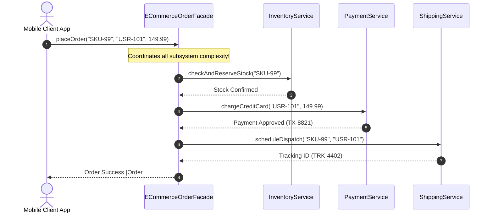

#### Programmatic Example of Facade Pattern in Java
```java
package com.architect.patterns.structural.facade;

// Complex Subsystem 1: Inventory
class InventoryService {
    public boolean checkAndReserveStock(String sku) {
        System.out.println("[INVENTORY] Reserved 1 unit of " + sku + " in warehouse.");
        return true;
    }
}

// Complex Subsystem 2: Payment Gateway
class PaymentService {
    public String chargeCreditCard(String customerId, double amount) {
        System.out.println("[PAYMENT] Successfully charged $" + amount + " to customer " + customerId);
        return "TX-PAY-88219";
    }
}

// Complex Subsystem 3: Shipping & Logistics
class ShippingService {
    public String scheduleDispatch(String sku, String customerId) {
        System.out.println("[SHIPPING] Generated courier dispatch label for " + customerId);
        return "TRK-FEDEX-99201";
    }
}

// Complex Subsystem 4: Notifications
class NotificationService {
    public void sendOrderConfirmation(String customerId, String trackingId) {
        System.out.println("[NOTIFICATION] Sent SMS & Email receipt to " + customerId + " with tracking: " + trackingId);
    }
}

// The Facade: Encapsulates all 4 subsystems into a single clean method
public class ECommerceOrderFacade {
    private final InventoryService inventory = new InventoryService();
    private final PaymentService payment = new PaymentService();
    private final ShippingService shipping = new ShippingService();
    private final NotificationService notifications = new NotificationService();

    public String placeOrder(String sku, String customerId, double amount) {
        System.out.println("=== [FACADE] Orchestrating End-to-End Order Checkout ===");
        
        // 1. Check stock
        inventory.checkAndReserveStock(sku);

        // 2. Charge payment
        String txId = payment.chargeCreditCard(customerId, amount);

        // 3. Dispatch shipment
        String trackingId = shipping.scheduleDispatch(sku, customerId);

        // 4. Send receipt
        notifications.sendOrderConfirmation(customerId, trackingId);

        return "ORDER-PLACED-SUCCESSFULLY [TxId=" + txId + ", Tracking=" + trackingId + "]";
    }

    public static void main(String[] args) {
        // Client interacts with 1 simple line of code!
        ECommerceOrderFacade orderFacade = new ECommerceOrderFacade();
        String confirmation = orderFacade.placeOrder("IPHONE-16-PRO", "CUST-ALICE", 1199.00);

        System.out.println("\nClient Response: " + confirmation);
    }
}
```

##### Console Output
```text
=== [FACADE] Orchestrating End-to-End Order Checkout ===
[INVENTORY] Reserved 1 unit of IPHONE-16-PRO in warehouse.
[PAYMENT] Successfully charged $1199.0 to customer CUST-ALICE
[SHIPPING] Generated courier dispatch label for CUST-ALICE
[NOTIFICATION] Sent SMS & Email receipt to CUST-ALICE with tracking: TRK-FEDEX-99201

Client Response: ORDER-PLACED-SUCCESSFULLY [TxId=TX-PAY-88219, Tracking=TRK-FEDEX-99201]
```

#### When to Use the Facade Pattern in Java
* **When to Use**:
  - When you need to provide a simple, straightforward interface to a complex, messy subsystem.
  - When you want to layer your subsystems: use facades to define entry points to each subsystem level.
  - When designing Microservice API Gateways and Backends-For-Frontends (BFF).
* **When NOT to Use**:
  - When a client actually needs low-level fine-grained control over individual subsystem components (do not block direct access if needed).

#### Real-World Applications of Facade Pattern in Java
* `javax.faces.context.FacesContext`: Java EE facade for request/response lifecycles.
* Spring `JdbcTemplate`: A clean Facade over verbose low-level JDBC boilerplate (`Connection`, `PreparedStatement`, `ResultSet`, `SQLException`).
* SLF4J `Logger`: Unified facade over multiple logging implementations (Logback, Log4j2, Java Util Logging).

#### Benefits and Trade-offs of Facade Pattern
* **Benefits**:
  - **Isolates Clients**: Shields clients from complex subsystem internal details.
  - **Promotes Loose Coupling**: Changes inside subsystem classes do not break client code.
* **Trade-offs**:
  - A facade can risk becoming a bloated "God Object" coupled to all classes of an app if not designed carefully.

#### Related Java Design Patterns
* **Adapter**: Makes an existing incompatible interface work; Facade defines a new simplified interface.
* **Mediator**: Centralizes communication between colleague components; Facade abstracts subsystem communication one-way.
* **Singleton**: Facade is frequently implemented as a Singleton.

#### References and Credits
* *Design Patterns: Elements of Reusable Object-Oriented Software* (Gang of Four)
* *Head First Design Patterns*

---

### 2.4 Proxy Pattern in Java: Controlling Access to Objects via Intermediaries

> **Tags:** Structural | Gang of Four | Interception | Access Control | Lazy Loading | Caching | Security

#### Also known as
Surrogate, Interceptor, Stand-in

#### Intent of Proxy Pattern
Provide a surrogate or placeholder for another object to control access to it (e.g., for lazy loading, caching, security access control, or remote network calls).

#### Detailed Explanation of Proxy Pattern with Real-World Examples

* **The Core Problem (What goes wrong without this pattern?)**:
  Imagine an application loading high-resolution 100MB medical MRI scans. If your app loads all 500 MRI scans into memory as soon as the user opens the patient dashboard, the app freezes for 5 minutes and runs out of RAM.
  You only want to load the 100MB scan from disk *when the user actually clicks on that specific scan tab*.
  **Virtual Proxy (Lazy Loading)** creates a lightweight stand-in object that only loads the real heavy scan when requested!

* **Real-world example (Analogy)**:
  Think of a **Debit/Credit Card or Security Bodyguard**. A debit card is a proxy for your real bank account and cash vault. You don't carry $50,000 in physical cash in a duffel bag to the grocery store. You swipe the lightweight plastic proxy card, which verifies your PIN and authorizes the bank transfer.

* **In plain words**:
  A stand-in object that controls, intercepts, caches, or secures access to the real target object while exposing the exact same interface.

* **Wikipedia says**:
  "A proxy, in its most general form, is a class functioning as an interface to something else. The proxy could interface to anything: a network connection, a large object in memory, a file, or some other resource that is expensive or impossible to duplicate."

#### 🧠 Technical Logic Flow & Under-the-Hood Mechanics (Developer Deep Dive)

* **Low-Level Technical Problem It Solves**: 
  - **Eager Heap Resource Exhaustion**: Instantiating heavyweight dependencies (e.g., establishing remote TCP socket connections, loading 500MB neural network models, binding graphics device contexts) at application startup causes slow boot times and OutOfMemoryErrors.
  - **Missing Interception Infrastructure**: Executing cross-cutting concerns (authentication token validation, metrics timers, thread-safe cache invalidation) directly inside domain logic pollutes business code.
* **Step-by-Step Technical Logic Flow**:
  1. **Contract Interception**: The `CachedVideoServiceProxy` implements the target `VideoService` interface, making it transparently swappable with `RealYouTubeVideoService`.
  2. **Interception & Fast-Path Evaluation**: When `proxy.fetchVideo(id)` is called:
     - The proxy checks its concurrent in-memory cache (`cache.containsKey(id)`).
     - **Cache Hit ($O(1)$ Fast Path)**: Returns cached reference immediately in $<0.1\text{ms}$ without waking downstream network threads or touching disk.
  3. **Lazy Target Invocation (Slow Path)**: If not present, the proxy delegates to the real wrapped object (`realService.fetchVideo(id)`), waiting for the slow remote/disk operation to complete.
  4. **State Storage & Return**: The proxy writes the result to the cache with optional TTL expiration policies and returns the payload to the client.
* **Why the Architecture Holds**: 
  Provides transparent structural interception. The client remains completely oblivious that a proxy is standing in between, while the target object is protected from redundant calls and unauthorized access.

#### Sequence Diagram
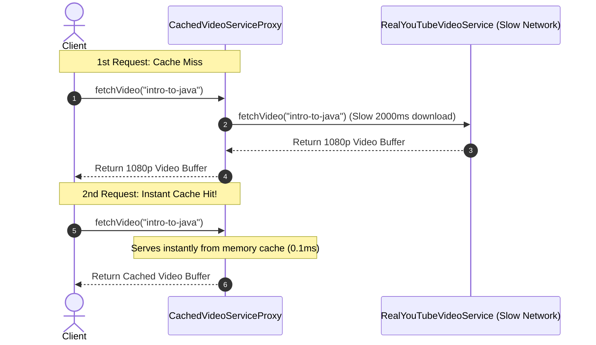

#### Programmatic Example of Proxy Pattern in Java
```java
package com.architect.patterns.structural.proxy;

import java.util.Map;
import java.util.concurrent.ConcurrentHashMap;

// Step 1: Subject Interface
public interface VideoService {
    String fetchVideo(String videoId);
}

// Step 2: Real Subject (Expensive network/disk operations)
public class RealYouTubeVideoService implements VideoService {
    @Override
    public String fetchVideo(String videoId) {
        System.out.println("[REMOTE SERVER] Downloading 4K video stream for '" + videoId + "' from YouTube servers (Latency: 1500ms)...");
        return "VIDEO_DATA_STREAM_4K[" + videoId + "]";
    }
}

// Step 3: Caching & Security Proxy (Controls access to the real service)
public class CachedVideoServiceProxy implements VideoService {
    private final VideoService realService;
    private final Map<String, String> cache = new ConcurrentHashMap<>();

    public CachedVideoServiceProxy(VideoService realService) {
        this.realService = realService;
    }

    @Override
    public String fetchVideo(String videoId) {
        if (cache.containsKey(videoId)) {
            System.out.println("[PROXY CACHE HIT] Returning video '" + videoId + "' instantly from memory cache!");
            return cache.get(videoId);
        }

        System.out.println("[PROXY CACHE MISS] Querying upstream real service...");
        String videoData = realService.fetchVideo(videoId);
        cache.put(videoId, videoData);
        return videoData;
    }

    public static void main(String[] args) {
        VideoService videoProxy = new CachedVideoServiceProxy(new RealYouTubeVideoService());

        System.out.println("=== 1st Request (Cache Miss) ===");
        String v1 = videoProxy.fetchVideo("java-concurrency-masterclass");
        System.out.println("Received: " + v1);

        System.out.println("\n=== 2nd Request (Cache Hit) ===");
        String v2 = videoProxy.fetchVideo("java-concurrency-masterclass");
        System.out.println("Received: " + v2);
    }
}
```

##### Console Output
```text
=== 1st Request (Cache Miss) ===
[PROXY CACHE MISS] Querying upstream real service...
[REMOTE SERVER] Downloading 4K video stream for 'java-concurrency-masterclass' from YouTube servers (Latency: 1500ms)...
Received: VIDEO_DATA_STREAM_4K[java-concurrency-masterclass]

=== 2nd Request (Cache Hit) ===
[PROXY CACHE HIT] Returning video 'java-concurrency-masterclass' instantly from memory cache!
Received: VIDEO_DATA_STREAM_4K[java-concurrency-masterclass]
```

#### When to Use the Proxy Pattern in Java
* **When to Use**:
  - **Lazy Initialization (Virtual Proxy)**: When you have a heavy service object that wastes system resources by being always up, even though you only need it occasionally.
  - **Access Control (Protection Proxy)**: When you want only specific clients (e.g. users with ADMIN role) to access the service object.
  - **Caching (Caching Proxy)**: When you need to cache results of client requests and manage the lifecycle of this cache.
  - **Logging / Auditing (Logging Proxy)**: When you want to log every request to the target object.
* **When NOT to Use**:
  - When direct access has no performance, security, or caching implications.

#### Real-World Applications of Proxy Pattern in Java
* `java.lang.reflect.Proxy`: Java Dynamic Proxies.
* Spring Framework: `@Transactional`, `@Async`, and Spring AOP (Aspect-Oriented Programming) rely 100% on CGLIB or JDK dynamic proxies to intercept method executions.
* Hibernate / JPA: Entity lazy-loading proxies (`fetch = FetchType.LAZY`).

#### Benefits and Trade-offs of Proxy Pattern
* **Benefits**:
  - Controls the lifecycle of the service object without clients knowing.
  - *Open/Closed Principle*: Introduces new proxies without modifying the service or clients.
  - Works even if the service object isn't ready or available.
* **Trade-offs**:
  - Can introduce response latency if the proxy chain is too deep.

#### Related Java Design Patterns
* **Adapter**: Provides a different interface to an object; Proxy provides the identical interface.
* **Decorator**: Decorator adds new responsibilities; Proxy controls access to the object.
* **Facade**: Facade wraps an entire subsystem; Proxy wraps a single subject.

#### References and Credits
* *Design Patterns: Elements of Reusable Object-Oriented Software* (Gang of Four)
* *Effective Java* (Joshua Bloch)

---

### 2.5 Composite Pattern in Java: Treating Individual Objects and Compositions Uniformly

> **Tags:** Structural | Gang of Four | Tree Hierarchy | Recursive Composition | Uniform Interface

#### Also known as
Tree Structure, Recursive Object Graph

#### Intent of Composite Pattern
Compose objects into tree structures to represent part-whole hierarchies. Composite lets clients treat individual objects and compositions of objects uniformly.

#### Detailed Explanation of Composite Pattern with Real-World Examples

* **The Core Problem (What goes wrong without this pattern?)**:
  Imagine building a File Explorer. You have **Files** (e.g. `hosts` = 1200 bytes) and **Directories** (e.g. `etc/`, `root/`). A directory contains both files and other sub-directories!
  If client code has to check `if (node instanceof File) { getSize(); } else if (node instanceof Directory) { loopChildrenAndSum(); }`, your codebase is littered with messy `instanceof` checks and recursive loops everywhere.
  **Composite** lets you call `.getSizeInBytes()` on *either* a single file or a massive nested folder tree identically!

* **Real-world example (Analogy)**:
  Think of **Military Command Structure or Corporate Organizations**. A General issues a command: *"Advance 10 miles"*. The General speaks to Division Commanders (Composites), who speak to Battalion Captains (Composites), who command individual Soldiers (Leaves). The order is executed uniformly across the entire organizational tree.

* **In plain words**:
  Allows you to structure data into a tree and interact with branch containers and individual leaves using the exact same methods.

* **Wikipedia says**:
  "In software engineering, the composite pattern is a partitioning design pattern. The composite pattern describes a group of objects that is treated the same way as a single instance of the same type of object."

#### 🧠 Technical Logic Flow & Under-the-Hood Mechanics (Developer Deep Dive)

* **Low-Level Technical Problem It Solves**: 
  - **Branch-vs-Leaf Condition Explosions**: Traversal algorithms traversing hierarchical tree data structures (e.g. DOM nodes, AST syntax trees, File Systems) get polluted with repetitive type-checking conditionals (`if (node.isContainer()) { for (child : node) ... } else { process(node); }`).
  - **Memory Graph Fragility**: Adding new composite container types or new leaf node representations forces full refactoring of all external tree-walking consumers.
* **Step-by-Step Technical Logic Flow**:
  1. **Uniform Base Abstraction**: Both leaf items (`FileItem`) and tree containers (`DirectoryItem`) implement the identical `FileSystemItem` interface.
  2. **Self-Contained Aggregation**: Container nodes hold a child collection (`List<FileSystemItem> children`).
  3. **Recursive Invariant Call**: Client triggers a method on the root: `root.getSizeInBytes()`.
  4. **Polymorphic Depth-First Traversal**:
     - Leaf nodes evaluate their terminal state ($O(1)$) and return immediately.
     - Composite nodes iterate over their children (`children.stream().mapToLong(FileSystemItem::getSizeInBytes).sum()`), transparently delegating down the tree hierarchy via the call stack.
  5. **Tree Reduction**: The total aggregated metric bubbles back up to the root caller.
* **Why the Architecture Holds**: 
  Eliminates client-side tree traversal boilerplate by embedding recursive polymorphism directly into the nodes themselves. The client treats the root composite node identically to a single leaf.

#### Sequence Diagram
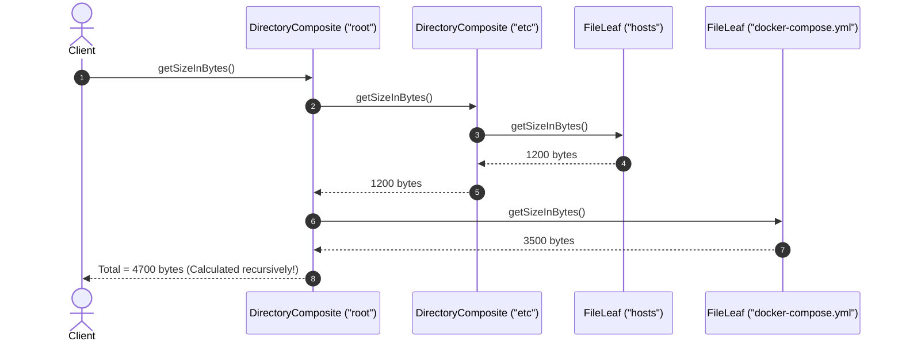

#### Programmatic Example of Composite Pattern in Java
```java
package com.architect.patterns.structural.composite;

import java.util.*;

// Step 1: Component Interface (Uniform contract for both Leaves and Composites)
public interface FileSystemNode {
    String getName();
    long getSizeInBytes();
    void printHierarchy(String indent);
}

// Step 2: Leaf Component (Cannot have children)
public class FileLeaf implements FileSystemNode {
    private final String name;
    private final long sizeInBytes;

    public FileLeaf(String name, long sizeInBytes) {
        this.name = name;
        this.sizeInBytes = sizeInBytes;
    }

    @Override public String getName() { return name; }
    @Override public long getSizeInBytes() { return sizeInBytes; }

    @Override
    public void printHierarchy(String indent) {
        System.out.println(indent + "📄 File: " + name + " (" + sizeInBytes + " bytes)");
    }
}

// Step 3: Composite Component (Can contain child nodes, both Leaves and other Composites)
public class DirectoryComposite implements FileSystemNode {
    private final String name;
    private final List<FileSystemNode> children = new ArrayList<>();

    public DirectoryComposite(String name) {
        this.name = name;
    }

    public void addNode(FileSystemNode node) { children.add(node); }
    public void removeNode(FileSystemNode node) { children.remove(node); }

    @Override public String getName() { return name; }

    // Recursive calculation treated uniformly!
    @Override
    public long getSizeInBytes() {
        return children.stream().mapToLong(FileSystemNode::getSizeInBytes).sum();
    }

    @Override
    public void printHierarchy(String indent) {
        System.out.println(indent + "📁 Directory: " + name + " (Total: " + getSizeInBytes() + " bytes)");
        for (FileSystemNode child : children) {
            child.printHierarchy(indent + "   ");
        }
    }

    public static void main(String[] args) {
        // Build nested tree structure
        DirectoryComposite root = new DirectoryComposite("root");
        DirectoryComposite etc = new DirectoryComposite("etc");
        etc.addNode(new FileLeaf("hosts", 1200));
        etc.addNode(new FileLeaf("resolv.conf", 450));

        root.addNode(etc);
        root.addNode(new FileLeaf("docker-compose.yml", 3500));

        System.out.println("=== Printing File System Tree ===");
        root.printHierarchy("");

        System.out.println("\nTotal Storage Size of entire tree: " + root.getSizeInBytes() + " bytes");
    }
}
```

##### Console Output
```text
=== Printing File System Tree ===
📁 Directory: root (Total: 5150 bytes)
   📁 Directory: etc (Total: 1650 bytes)
      📄 File: hosts (1200 bytes)
      📄 File: resolv.conf (450 bytes)
   📄 File: docker-compose.yml (3500 bytes)

Total Storage Size of entire tree: 5150 bytes
```

#### When to Use the Composite Pattern in Java
* **When to Use**:
  - When you need to implement a tree-like object structure (nested UI layouts, file systems, organizational trees, menu categories).
  - When you want client code to treat both simple leaf objects and complex container trees uniformly without checking types.
* **When NOT to Use**:
  - When your domain model is flat with no hierarchical nesting.

#### Real-World Applications of Composite Pattern in Java
* `java.awt.Container#add(Component)`: Java Swing/AWT UI component tree.
* `org.w3c.dom.Node`: XML / HTML DOM tree model.
* `java.io.File`: Represents files and directories.

#### Benefits and Trade-offs of Composite Pattern
* **Benefits**:
  - **Polymorphism & Recursion**: Works with complex trees smoothly without messy `if/else` logic.
  - **Open/Closed Principle**: You can introduce new node types into the app without breaking existing tree traversal code.
* **Trade-offs**:
  - It might be difficult to provide a common interface for classes whose functionality differs too much.

#### Related Java Design Patterns
* **Builder**: Often used to construct complex Composite trees.
* **Decorator**: Often combined with Composite to add features to individual tree nodes.
* **Visitor**: Used to execute an operation over an entire Composite tree.
* **Iterator**: Used to traverse Composite trees.

#### References and Credits
* *Design Patterns: Elements of Reusable Object-Oriented Software* (Gang of Four)
* *Head First Design Patterns*

---

### 2.6 Flyweight Pattern in Java: Minimizing Memory Overhead via High-Density Object Sharing

> **Tags:** Structural | Gang of Four | Memory Optimization | Intrinsic vs Extrinsic | Caching | Performance

#### Also known as
Cache Share, Token Sharing

#### Intent of Flyweight Pattern
Fit more objects into the available amount of RAM by sharing common parts of state between multiple objects instead of keeping all data in each object.

#### Detailed Explanation of Flyweight Pattern with Real-World Examples

* **The Core Problem (What goes wrong without this pattern?)**:
  Imagine rendering a video game forest with **1,000,000 trees**.
  Each tree has high-resolution 3D polygon meshes, textures, and physics data consuming 20KB.
  $1,000,000 \times 20\text{KB} = \mathbf{20\text{ Gigabytes of RAM}}$! Your game crashes with `OutOfMemoryError`.
  Notice that all 1 million trees share the exact same 3D mesh model (`OakTree`, `PineTree`). Only their `(x, y)` coordinates are unique!
  **Flyweight** stores the heavy 3D mesh ONCE in memory, and reuses it across 1 million lightweight `(x, y)` coordinate points (consuming only **15 MB**).

* **Real-world example (Analogy)**:
  Think of a **Typewriter or Printing Press Letter Stamp**. When printing a 500-page book with 50,000 occurrences of the letter **"e"**, the printing press does not carve 50,000 individual metal stamp blocks. It uses **one single metal stamp block for 'e'** (intrinsic state) and presses it onto 50,000 different page coordinates (extrinsic state).

* **In plain words**:
  Saves huge amounts of RAM by sharing identical, heavy, read-only data across millions of objects.

* **Wikipedia says**:
  "In computer programming, flyweight is a software design pattern. A flyweight is an object that minimizes memory usage by sharing as much data as possible with other similar objects."

#### 🧠 Technical Logic Flow & Under-the-Hood Mechanics (Developer Deep Dive)

* **Low-Level Technical Problem It Solves**: 
  - **JVM Heap Exhaustion & GC Thrashing**: Creating millions of fine-grained heap objects (e.g. 10,000,000 text character glyphs, map markers, or particle effects) floods the young generation, causing frequent stop-the-world Full GC pauses and memory starvation.
  - **Memory Duplication of Redundant State**: 99% of object memory footprint often consists of immutable shared data (textures, fonts, polygons, schemas) duplicated millions of times.
* **Step-by-Step Technical Logic Flow**:
  1. **State Partitioning**: State is partitioned into two distinct categories:
     - **Intrinsic State** (Heavy, Immutable, Shared): Stored inside the Flyweight (`TreeType[name, color, 3D_mesh]`).
     - **Extrinsic State** (Lightweight, Volatile, Unique): Stored inside the Context object (`Tree[x, y, height]`).
  2. **Flyweight Factory Cache Lookup**: When client creates a tree, it queries `TreeFactory.getTreeType("Oak", "Green", mesh)`.
  3. **Canonical Reference Reuse**: If the flyweight exists in the internal `ConcurrentHashMap`, the factory returns the existing pointer. If not, it allocates it once.
  4. **Lightweight Context Instantiation**: The client allocates a small `Tree` instance on the heap holding only primitive coordinates and a 64-bit reference pointer (8 bytes compressed OOPs) to the shared `TreeType`.
  5. **Contextual Invariant Dispatch**: During rendering, `tree.draw()` calls `sharedTreeType.render(this.x, this.y, this.height)`, passing the extrinsic context on the CPU thread stack rather than storing it in heap fields.
* **Why the Architecture Holds**: 
  Replaces $O(N \times \text{Size}_{\text{Heavy}})$ memory footprint with $O(K \times \text{Size}_{\text{Heavy}} + N \times \text{Size}_{\text{Light}})$ where $K \ll N$ ($K = \text{number of distinct types}$).

#### Sequence Diagram
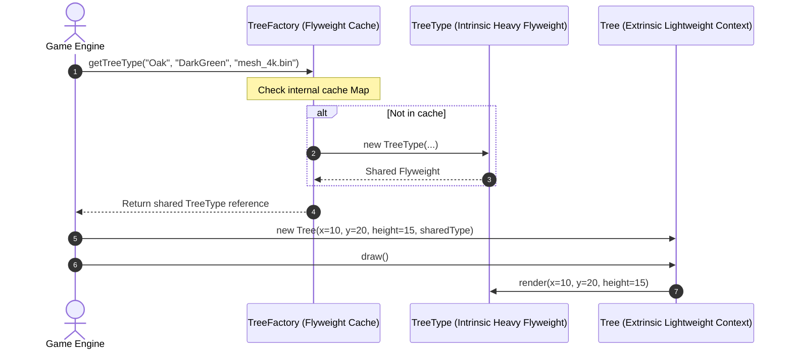

#### Programmatic Example of Flyweight Pattern in Java
```java
package com.architect.patterns.structural.flyweight;

import java.util.*;

// Step 1: Intrinsic State (Heavy, Immutable, Shared across millions of trees)
public record TreeType(String name, String color, String highResTextureMesh) {
    public void render(int x, int y, int height) {
        System.out.println("Rendering [" + name + " (" + color + ")] at (" + x + "," + y + ") with height=" + height);
    }
}

// Step 2: Flyweight Factory (Maintains a cache of unique TreeType instances)
public class TreeFactory {
    private static final Map<String, TreeType> TREE_TYPES = new HashMap<>();

    public static TreeType getTreeType(String name, String color, String textureMesh) {
        String key = name + "_" + color;
        return TREE_TYPES.computeIfAbsent(key, k -> {
            System.out.println("[FACTORY] Loading heavy 3D mesh into RAM for: " + key);
            return new TreeType(name, color, textureMesh);
        });
    }

    public static int getCacheSize() { return TREE_TYPES.size(); }
}

// Step 3: Extrinsic Context State (Lightweight, unique per tree instance)
public class Tree {
    private final int x;
    private final int y;
    private final int height;
    private final TreeType type; // Shared flyweight reference (8 bytes in 64-bit JVM!)

    public Tree(int x, int y, int height, TreeType type) {
        this.x = x;
        this.y = y;
        this.height = height;
        this.type = type;
    }

    public void draw() {
        type.render(x, y, height);
    }

    public static void main(String[] args) {
        System.out.println("=== Initializing Massive High-Density Forest ===");
        TreeType oakType = TreeFactory.getTreeType("Oak", "DarkGreen", "mesh_data_oak_4k.bin");
        TreeType pineType = TreeFactory.getTreeType("Pine", "ForestGreen", "mesh_data_pine_4k.bin");

        List<Tree> forest = new ArrayList<>();
        forest.add(new Tree(10, 20, 15, oakType));
        forest.add(new Tree(12, 25, 18, oakType));
        forest.add(new Tree(50, 80, 22, pineType));

        System.out.println("\nTotal Unique Flyweight Instances stored in Heap: " + TreeFactory.getCacheSize());
        for (Tree tree : forest) {
            tree.draw();
        }
    }
}
```

##### Console Output
```text
=== Initializing Massive High-Density Forest ===
[FACTORY] Loading heavy 3D mesh into RAM for: Oak_DarkGreen
[FACTORY] Loading heavy 3D mesh into RAM for: Pine_ForestGreen

Total Unique Flyweight Instances stored in Heap: 2
Rendering [Oak (DarkGreen)] at (10,20) with height=15
Rendering [Oak (DarkGreen)] at (12,25) with height=18
Rendering [Pine (ForestGreen)] at (50,80) with height=22
```

#### When to Use the Flyweight Pattern in Java
* **When to Use**:
  - When an application needs to spawn millions of objects that threaten to exceed JVM RAM limits.
  - When object data can be cleanly divided into **intrinsic** (shared, immutable) and **extrinsic** (contextual coordinates, timestamps).
  - High-performance game engines, word processor character layout engines, particle systems.
* **When NOT to Use**:
  - When your app only creates a few hundred or thousand objects—standard object creation is much simpler.

#### Real-World Applications of Flyweight Pattern in Java
* `java.lang.Integer#valueOf(int)`: Caches boxed integer values from `-128` to `127` in memory!
* `java.lang.String#intern()`: String Constant Pool deduplication.
* Java 2D Glyph Vector text rendering engines.

#### Benefits and Trade-offs of Flyweight Pattern
* **Benefits**:
  - **Drastic RAM Savings**: Can reduce memory usage by 90%+.
* **Trade-offs**:
  - Trades memory savings for minor CPU overhead passing extrinsic context into method calls.

#### Related Java Design Patterns
* **Composite**: Flyweight is often combined with Composite to implement shared leaf nodes.
* **State & Strategy**: State and Strategy objects are often implemented as Flyweights.
* **Singleton**: If you reduce all shared states to just one single object, it resembles Singleton.

#### References and Credits
* *Design Patterns: Elements of Reusable Object-Oriented Software* (Gang of Four)
* *Refactoring to Patterns* (Joshua Kerievsky)

---

### 2.7 Bridge Pattern in Java: Decoupling Abstractions from Implementations

> **Tags:** Structural | Gang of Four | Decoupling | Abstraction vs Implementation | Cross-Platform | Composition

#### Also known as
Handle/Body, Decoupled Abstraction

#### Intent of Bridge Pattern
Decouple an abstraction from its implementation so that the two can vary independently without creating an explosive subclass inheritance tree.

#### Detailed Explanation of Bridge Pattern with Real-World Examples

* **The Core Problem (What goes wrong without this pattern?)**:
  Imagine building a Remote Control app for Home Electronics.
  You have 2 Remotes: `BasicRemote` and `AdvancedTouchRemote`.
  You support 3 Devices: `SonyTV`, `BoseSoundbar`, and `LGProjector`.
  If you use inheritance, you must create: `BasicRemoteSonyTV`, `BasicRemoteBoseSoundbar`, `BasicRemoteLGProjector`, `AdvancedRemoteSonyTV`, `AdvancedRemoteBoseSoundbar`, `AdvancedRemoteLGProjector`... that is **$2 \times 3 = 6$ classes**!
  If you add 5 more remotes and 10 more devices, you need **50 classes**!
  **Bridge** connects the Remote Abstraction to a `Device` interface via composition, reducing the class count to just **$2 + 3 = 5$ classes**.

* **Real-world example (Analogy)**:
  Think of a **Light Switch and Light Bulbs**. A wall switch (Abstraction) does not need to know whether it is wired to an Incandescent Bulb, an LED Bulb, or a Smart RGB Philips Hue Bulb (Implementor). The standard electrical wire connects them (The Bridge), letting you replace the bulb without tearing down the wall switch.

* **In plain words**:
  Prefers object composition over inheritance to split a large class with multiple orthogonal dimensions into separate, independent hierarchies.

* **Wikipedia says**:
  "The bridge pattern is a design pattern used in software engineering that is meant to 'decouple an abstraction from its implementation so that the two can vary independently'."

#### 🧠 Technical Logic Flow & Under-the-Hood Mechanics (Developer Deep Dive)

* **Low-Level Technical Problem It Solves**: 
  - **Cartesian Product Class Hierarchy Explosion**: When a domain concept varies along two independent orthogonal dimensions (e.g., GUI Controls $\times$ Operating System Platforms, or Shapes $\times$ Rendering Engines), inheritance forces creating $M \times N$ concrete classes.
  - **Monolithic Inflexible Inheritance**: Hardwiring platform-specific code into UI control subclasses makes it impossible to switch device drivers or platforms at runtime without reconstructing the entire UI graph.
* **Step-by-Step Technical Logic Flow**:
  1. **Dual-Hierarchy Separation**: The architecture is split into two independent class trees:
     - **Abstraction Hierarchy**: High-level business logic (`RemoteControl` $\to$ `AdvancedRemoteControl`).
     - **Implementation Hierarchy**: Low-level platform primitives (`Device` $\to$ `SonyTV`, `BoseSoundbar`).
  2. **Bridge Reference Composition**: The abstraction holds a protected reference to the implementation interface (`protected final Device device`).
  3. **High-Level Invocation**: Client calls a domain-level feature on the abstraction: `remote.mute()`.
  4. **Primitive Delegation across the Bridge**: The abstraction translates high-level intents into one or more low-level primitive calls across the bridge: `device.setVolume(0)`.
  5. **Independent Extensibility**: You can add 10 new remote controls (voice-controlled, gesture-based) without writing a single line of Sony/Bose platform code; you can add 10 new devices without touching existing remote classes.
* **Why the Architecture Holds**: 
  Applies the design principle: *"Favor object composition over class inheritance"*. It replaces $M \times N$ classes with $M + N$ classes.

#### Sequence Diagram
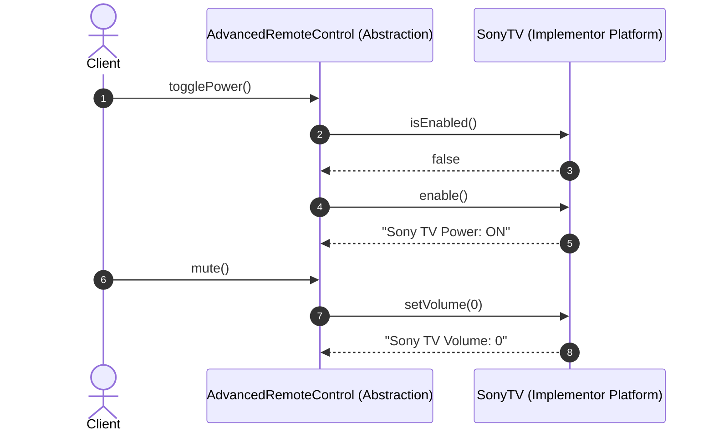

#### Programmatic Example of Bridge Pattern in Java
```java
package com.architect.patterns.structural.bridge;

// Step 1: Implementor Interface (The underlying device platform contract)
public interface Device {
    boolean isEnabled();
    void enable();
    void disable();
    int getVolume();
    void setVolume(int percent);
}

// Step 2: Concrete Implementor 1: Sony TV
public class SonyTV implements Device {
    private boolean on = false;
    private int volume = 20;

    @Override public boolean isEnabled() { return on; }
    @Override public void enable() { on = true; System.out.println("[SONY TV] Power: ON"); }
    @Override public void disable() { on = false; System.out.println("[SONY TV] Power: OFF"); }
    @Override public int getVolume() { return volume; }
    @Override public void setVolume(int percent) { this.volume = percent; System.out.println("[SONY TV] Volume set to: " + percent); }
}

// Step 3: Concrete Implementor 2: Bose Soundbar
public class BoseSoundbar implements Device {
    private boolean power = false;
    private int volumeLevel = 10;

    @Override public boolean isEnabled() { return power; }
    @Override public void enable() { power = true; System.out.println("[BOSE SOUNDBAR] Status: ACTIVE"); }
    @Override public void disable() { power = false; System.out.println("[BOSE SOUNDBAR] Status: STANDBY"); }
    @Override public int getVolume() { return volumeLevel; }
    @Override public void setVolume(int percent) { this.volumeLevel = percent; System.out.println("[BOSE SOUNDBAR] Volume adjusted to: " + percent); }
}

// Step 4: The Abstraction (Holds a Bridge reference to Device)
public class RemoteControl {
    protected final Device device; // The Bridge reference!

    public RemoteControl(Device device) {
        this.device = device;
    }

    public void togglePower() {
        if (device.isEnabled()) device.disable();
        else device.enable();
    }

    public void volumeUp() { device.setVolume(device.getVolume() + 5); }
    public void volumeDown() { device.setVolume(device.getVolume() - 5); }
}

// Step 5: Refined Abstraction (Extends the RemoteControl without touching Device classes!)
public class AdvancedRemoteControl extends RemoteControl {
    public AdvancedRemoteControl(Device device) { super(device); }

    public void mute() {
        System.out.println("[ADVANCED REMOTE] Muting target device...");
        device.setVolume(0);
    }

    public static void main(String[] args) {
        System.out.println("=== 1. Operating Sony TV via Advanced Remote ===");
        Device tv = new SonyTV();
        AdvancedRemoteControl tvRemote = new AdvancedRemoteControl(tv);
        tvRemote.togglePower();
        tvRemote.volumeUp();
        tvRemote.mute();

        System.out.println("\n=== 2. Operating Bose Soundbar via Advanced Remote ===");
        Device soundbar = new BoseSoundbar();
        AdvancedRemoteControl soundbarRemote = new AdvancedRemoteControl(soundbar);
        soundbarRemote.togglePower();
        soundbarRemote.volumeUp();
    }
}
```

##### Console Output
```text
=== 1. Operating Sony TV via Advanced Remote ===
[SONY TV] Power: ON
[SONY TV] Volume set to: 25
[ADVANCED REMOTE] Muting target device...
[SONY TV] Volume set to: 0

=== 2. Operating Bose Soundbar via Advanced Remote ===
[BOSE SOUNDBAR] Status: ACTIVE
[BOSE SOUNDBAR] Volume adjusted to: 15
```

#### When to Use the Bridge Pattern in Java
* **When to Use**:
  - When you want to divide and organize a monolithic class that has multiple orthogonal variants (e.g. Graphic Renderers $\times$ OS Platforms, Remotes $\times$ Devices, Cloud Storage $\times$ DB Drivers).
  - When you need to switch implementations dynamically at runtime.
  - When you want to avoid an exponential explosion of subclasses caused by multi-dimensional inheritance.
* **When NOT to Use**:
  - When your class hierarchy only varies along a single dimension.

#### Real-World Applications of Bridge Pattern in Java
* JDBC API: `java.sql.DriverManager` acts as an abstraction bridge connecting to vendor drivers (`org.postgresql.Driver`, `com.mysql.cj.jdbc.Driver`).
* Java AWT Peers: Connecting Java GUI widgets to underlying OS platform native windowing peers.

#### Benefits and Trade-offs of Bridge Pattern
* **Benefits**:
  - **Decouples Abstraction from Implementation**: Both hierarchies evolve independently.
  - **Open/Closed Principle**: You can introduce new abstractions and implementations independently.
  - **Cross-Platform Portability**.
* **Trade-offs**:
  - Might make code more complicated by introducing additional layers of indirection.

#### Related Java Design Patterns
* **Abstract Factory**: Can create and configure specific Bridges.
* **Adapter**: Adapter is typically used with an existing app to make incompatible interfaces work together; Bridge is usually designed up-front.
* **State & Strategy**: Share similar structural composition, but solve different architectural intents.

#### References and Credits
* *Design Patterns: Elements of Reusable Object-Oriented Software* (Gang of Four)
* *Head First Design Patterns*

---

## 3. Behavioral Patterns (Interaction & Communication)

---

### 3.1 Strategy Pattern in Java: Encapsulating Interchangeable Business Algorithms

> **Tags:** Behavioral | Gang of Four | Interchangeable Algorithms | Functional Programming | Polymorphism | Policy

#### Also known as
Policy, Interchangeable Algorithm

#### Intent of Strategy Pattern
Define a family of algorithms, encapsulate each one, and make them interchangeable. Strategy lets the algorithm vary independently from clients that use it.

#### Detailed Explanation of Strategy Pattern with Real-World Examples
* **Real-world example**: Navigating to an airport using Google Maps. You can select among multiple route calculation strategies: Driving by Car (optimizes for highways and tolls), Public Transit (optimizes for train/subway timetables), or Walking (optimizes for pedestrian walkways and paths). The departure point and destination remain identical, but the routing strategy algorithm swaps cleanly based on user preference.
* **In plain words**: Eliminates sprawling conditional statements (`if/else` or `switch` ladders) by encapsulating business algorithms into interchangeable strategy classes or Java lambdas.
* **Wikipedia says**: "In computer programming, the strategy pattern is a behavioral software design pattern that enables selecting an algorithm at runtime. Instead of implementing a single algorithm directly, code receives run-time instructions as to which in a family of algorithms to use."

#### 🧠 Technical Logic Flow & Under-the-Hood Mechanics (Developer Deep Dive)

* **Low-Level Technical Problem It Solves**: 
  - **Sprawling Cyclomatic Complexity (`if/else` & `switch` Hell)**: Hardcoding branching logic for pricing, tax calculation, compression algorithms, or routing engines violates the Open/Closed Principle and results in fragile 1000-line monolithic methods.
  - **Compile-Time Algorithm Coupling**: Forbids dynamic hot-swapping of business policies at runtime without recompilation or class restarts.
* **Step-by-Step Technical Logic Flow**:
  1. **Functional Strategy Interface Definition**: A `@FunctionalInterface` contract (`PricingStrategy`) exposes a single computational method `calculateFinalPrice(BigDecimal)`.
  2. **Concrete Strategy Encapsulation**: Discrete algorithms are encapsulated into dedicated immutable classes (`StandardPricing`, `VipDiscountPricing`, `BlackFridayPricing`) or inlined Java lambdas (`price -> price.multiply(BigDecimal.valueOf(0.80))`).
  3. **Context Injection**: The `CheckoutContext` maintains a polymorphic reference field (`private PricingStrategy strategy`) populated via dependency injection or a setter.
  4. **Dynamic Dispatch & Execution**:
     - Client invokes `checkoutContext.executeCheckout(amount)`.
     - Context delegates dynamically to `strategy.calculateFinalPrice(amount)` via JVM virtual method dispatch (`invokeinterface` / `invokevirtual`).
  5. **Runtime Strategy Mutation**: The strategy can be switched at runtime (`checkoutContext.setStrategy(new FlashSaleStrategy())`) without recreating or altering the context state.
* **Why the Architecture Holds**: 
  Decouples algorithm execution from algorithm selection. Enables zero-regression extensibility where new business rules are added by creating new classes without touching existing codebase paths.

#### Sequence Diagram
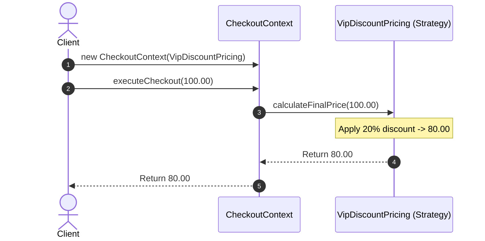

#### Programmatic Example of Strategy Pattern in Java
```java
package com.architect.patterns.behavioral.strategy;

import java.math.BigDecimal;
import java.math.RoundingMode;

@FunctionalInterface
public interface PricingStrategy {
    BigDecimal calculateFinalPrice(BigDecimal basePrice);
}

// Standard Strategies
public class StandardPricing implements PricingStrategy {
    @Override 
    public BigDecimal calculateFinalPrice(BigDecimal basePrice) { return basePrice; }
}

public class VipDiscountPricing implements PricingStrategy {
    @Override 
    public BigDecimal calculateFinalPrice(BigDecimal basePrice) { 
        return basePrice.multiply(new BigDecimal("0.80")).setScale(2, RoundingMode.HALF_UP); // 20% off
    }
}

// Context
public class CheckoutContext {
    private PricingStrategy strategy;

    public CheckoutContext(PricingStrategy strategy) {
        this.strategy = strategy;
    }

    public void setStrategy(PricingStrategy strategy) {
        this.strategy = strategy;
    }

    public BigDecimal executeCheckout(BigDecimal amount) {
        return strategy.calculateFinalPrice(amount);
    }

    public static void main(String[] args) {
        System.out.println("=== Standard Customer Checkout ===");
        CheckoutContext context = new CheckoutContext(new StandardPricing());
        BigDecimal total1 = context.executeCheckout(new BigDecimal("100.00"));
        System.out.println("Final Price: $" + total1);

        System.out.println("\n=== VIP Customer Checkout (20% Off) ===");
        context.setStrategy(new VipDiscountPricing());
        BigDecimal total2 = context.executeCheckout(new BigDecimal("100.00"));
        System.out.println("Final Price: $" + total2);

        System.out.println("\n=== Flash Sale Checkout via Lambda (50% Off) ===");
        context.setStrategy(price -> price.multiply(new BigDecimal("0.50")).setScale(2, RoundingMode.HALF_UP));
        BigDecimal total3 = context.executeCheckout(new BigDecimal("100.00"));
        System.out.println("Final Price: $" + total3);
    }
}
```

##### Console Output
```text
=== Standard Customer Checkout ===
Final Price: $100.00

=== VIP Customer Checkout (20% Off) ===
Final Price: $80.00

=== Flash Sale Checkout via Lambda (50% Off) ===
Final Price: $50.00
```

#### When to Use the Strategy Pattern in Java
* When you have many variations of an algorithm and need to switch between them dynamically at runtime.
* When you want to isolate complex algorithm logic from the business classes that orchestrate the workflow.
* When replacing massive conditional blocks (`if (type == A) ... else if (type == B) ...`).

#### Real-World Applications of Strategy Pattern in Java
* `java.util.Comparator#compare()`
* `java.util.concurrent.ThreadPoolExecutor.AbortPolicy` / `CallerRunsPolicy`
* Spring Security `AuthenticationProvider` strategy resolution

#### Benefits and Trade-offs of Strategy Pattern
* **Benefits**:
  - Clean separation of concerns (*Single Responsibility Principle*).
  - *Open/Closed Principle*: Introduces new strategies without modifying context code.
  - Excellent synergy with Java 8+ functional interfaces and lambda expressions.
* **Trade-offs**:
  - Clients must be aware of differences between strategies to select the right one.

#### Related Java Design Patterns
* **Command**: Both parameterize an object with an action; Command encapsulates an entire request, while Strategy encapsulates an algorithm.
* **State**: State can be considered an extension of Strategy where states can trigger transitions to other states.
* **Template Method**: Strategy works through object composition (delegation); Template Method works through class inheritance.

#### References and Credits
* *Design Patterns: Elements of Reusable Object-Oriented Software* (Gang of Four)
* *Refactoring to Patterns* (Joshua Kerievsky)

---

### 3.2 Observer Pattern in Java: Establishing Reactive One-to-Many Event Broadcasts

> **Tags:** Behavioral | Gang of Four | Publish-Subscribe | Event-Driven | Decoupling | Asynchronous Messaging

#### Also known as
Publish-Subscribe, Producer-Consumer, Event-Listener

#### Intent of Observer Pattern
Define a one-to-many dependency between objects so that when one object changes state, all its dependents are notified and updated automatically.

#### Detailed Explanation of Observer Pattern with Real-World Examples
* **Real-world example**: Subscribing to a newsletter or YouTube channel. When a content creator uploads a new video (State Change in Subject), the platform automatically broadcasts push notifications and emails to all 500,000 subscribed viewers (Observers) without the creator manually emailing each individual viewer.
* **In plain words**: A mechanism for objects to subscribe and react to events emitted by another object.
* **Wikipedia says**: "The observer pattern is a software design pattern in which an object, named the subject, maintains a list of its dependents, called observers, and notifies them automatically of any state changes, usually by calling one of their methods."

#### 🧠 Technical Logic Flow & Under-the-Hood Mechanics (Developer Deep Dive)

* **Low-Level Technical Problem It Solves**: 
  - **Tight Direct Coupling & Polling Waste**: In event-driven architectures, if the event producer directly instantiates and invokes every downstream consumer (e.g., AuditLogger, NotificationService, ElasticSearchIndexer), the producer is tightly coupled and stalls on slow consumers. Polling (consumers repeatedly asking "Did state change?") wastes CPU cycles and network bandwidth.
  - **Memory Leak Hazards (Lapsed Listener Problem)**: Failing to provide clean unregister mechanisms leads to GC roots keeping obsolete listeners in memory indefinitely.
* **Step-by-Step Technical Logic Flow**:
  1. **Listener Registration**: Observers implement a common callback interface (`StockObserver`) and register with the Subject (`publisher.subscribe(observer)`).
  2. **Thread-Safe Observer Collection**: The Subject stores listener references in a concurrent data structure (such as `CopyOnWriteArrayList<StockObserver>` to support safe iteration while handling concurrent subscribe/unsubscribe calls without `ConcurrentModificationException`).
  3. **State Change Trigger**: A state mutation occurs on the Subject (`publisher.updatePrice("NVDA", 108.50)`).
  4. **Broadcast Loop (Push vs Pull)**:
     - **Push Model**: The Subject iterates over its registered listeners and calls `observer.onPriceUpdate(ticker, price)` directly, passing immutable event data.
     - **Pull Model**: The Subject passes only a reference to itself, letting observers query only the specific sub-fields they require.
  5. **Asynchronous Hand-off**: High-throughput systems hand off the broadcast loop to an `ExecutorService` thread pool or reactive streams dispatcher (`Flow.Publisher`, Project Reactor, Kafka) so the publishing thread is not blocked by slow observer execution.
* **Why the Architecture Holds**: 
  Decouples the event emitter from the number, type, and lifecycle of downstream consumers, upholding the Single Responsibility Principle.

#### Sequence Diagram
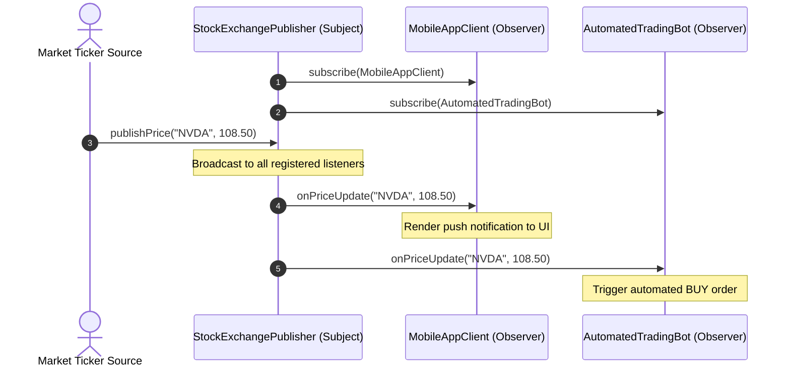

#### Programmatic Example of Observer Pattern in Java
```java
package com.architect.patterns.behavioral.observer;

import java.util.List;
import java.util.concurrent.CopyOnWriteArrayList;

// Observer Interface
public interface MarketDataListener {
    void onPriceUpdate(String ticker, double newPrice);
}

// Concrete Observer 1
public class MobileAppClient implements MarketDataListener {
    @Override
    public void onPriceUpdate(String ticker, double newPrice) {
        System.out.println("[MOBILE PUSH] Alert: " + ticker + " updated to $" + newPrice);
    }
}

// Concrete Observer 2
public class AutomatedTradingBot implements MarketDataListener {
    @Override
    public void onPriceUpdate(String ticker, double newPrice) {
        if ("NVDA".equals(ticker) && newPrice < 110.0) {
            System.out.println("[ALGO BOT] Triggering immediate BUY ORDER for " + ticker + " at $" + newPrice);
        }
    }
}

// Subject / Publisher (Thread-safe)
public class StockExchangePublisher {
    // CopyOnWriteArrayList prevents ConcurrentModificationException during broadcast
    private final List<MarketDataListener> listeners = new CopyOnWriteArrayList<>();

    public void subscribe(MarketDataListener listener) { listeners.add(listener); }
    public void unsubscribe(MarketDataListener listener) { listeners.remove(listener); }

    public void publishPrice(String ticker, double price) {
        System.out.println("\n--- [EXCHANGE BROADCAST] " + ticker + " = $" + price + " ---");
        for (MarketDataListener listener : listeners) {
            listener.onPriceUpdate(ticker, price);
        }
    }

    public static void main(String[] args) {
        StockExchangePublisher exchange = new StockExchangePublisher();
        var mobileApp = new MobileAppClient();
        var tradingBot = new AutomatedTradingBot();

        exchange.subscribe(mobileApp);
        exchange.subscribe(tradingBot);

        exchange.publishPrice("NVDA", 108.50);
        exchange.publishPrice("AAPL", 225.00);
    }
}
```

##### Console Output
```text
--- [EXCHANGE BROADCAST] NVDA = $108.5 ---
[MOBILE PUSH] Alert: NVDA updated to $108.5
[ALGO BOT] Triggering immediate BUY ORDER for NVDA at $108.5

--- [EXCHANGE BROADCAST] AAPL = $225.0 ---
[MOBILE PUSH] Alert: AAPL updated to $225.0
```

#### When to Use the Observer Pattern in Java
* When changes to the state of one object require changing other objects, and you don't know ahead of time how many objects need to change.
* When building event-driven microservices, UI reactive forms, or real-time telemetry streaming pipelines.

#### Real-World Applications of Observer Pattern in Java
* `java.util.concurrent.Flow` (Reactive Streams API: Publisher/Subscriber)
* Spring Application Events (`ApplicationEventPublisher` & `@EventListener`)
* Java Swing `ActionListener` / `PropertyChangeListener`

#### Benefits and Trade-offs of Observer Pattern
* **Benefits**:
  - *Open/Closed Principle*: Introduces new subscriber classes without modifying publisher code.
  - Establishes relationships between objects at runtime.
* **Trade-offs**:
  - Observers are notified in random order.
  - Subscribers must unsubscribe to prevent memory leaks (*Lapsed Listener Problem*).

#### Related Java Design Patterns
* **Mediator**: Mediator encapsulates communication between colleague objects; Observer establishes dynamic one-way subscriptions.
* **Chain of Responsibility**: Passes a request sequentially through handlers; Observer broadcasts to all subscribers concurrently.

#### References and Credits
* *Design Patterns: Elements of Reusable Object-Oriented Software* (Gang of Four)
* *Reactive Programming with RxJava*

---

### 3.3 Command Pattern in Java: Encapsulating Invocations for Undo/Redo and Queueing

> **Tags:** Behavioral | Gang of Four | Encapsulation | Undo-Redo | Command Queue | Asynchronous Execution

#### Also known as
Action, Transaction, Undoable Task

#### Intent of Command Pattern
Encapsulate a request as an object, thereby letting you parameterize clients with different requests, queue or log requests, and support undoable operations.

#### Detailed Explanation of Command Pattern with Real-World Examples
* **Real-world example**: A fine-dining restaurant order slip. A customer orders a meal. The waiter notes the dishes onto a paper order slip (the Command object). The slip is placed on the kitchen carousel queue. The chef executes the cooking action when ready. The cashier logs the slip for accounting, and if the customer cancels an appetizer before cooking starts, the slip is simply cancelled (Undo operation).
* **In plain words**: Converts method requests into stand-alone objects containing all details of the call, enabling queueing, asynchronous execution, and multi-level undo/redo history.
* **Wikipedia says**: "In object-oriented programming, the command pattern is a behavioral design pattern in which an object is used to encapsulate all information needed to perform an action or trigger an event at a later time."

#### 🧠 Technical Logic Flow & Under-the-Hood Mechanics (Developer Deep Dive)

* **Low-Level Technical Problem It Solves**: 
  - **Receiver-Invoker Tight Coupling**: When GUI buttons, scheduled cron jobs, or network message listeners directly execute receiver business logic (`receiver.doComplexWork()`), they cannot be reused across different UI buttons, queued for async background execution, serialized across network boundaries, or rolled back on failure.
  - **Lack of Reversible Transaction History**: Direct state modifications mutate memory in-place without preserving differential inverse deltas required for multi-step Undo/Redo or saga rollbacks.
* **Step-by-Step Technical Logic Flow**:
  1. **Tri-Partite Architectural Decoupling**:
     - **Receiver**: Contains raw business operations (`TextDocument.append()`, `TextDocument.delete()`).
     - **Command Object**: Encapsulates a receiver reference, method parameters, and inverse compensation logic (`WriteTextCommand.execute()`, `WriteTextCommand.undo()`).
     - **Invoker**: Orchestrates execution order and maintains undo/redo history stacks (`EditorHistoryInvoker`).
  2. **Parameter Encapsulation**: When a user performs an action, the UI instantiates a `WriteTextCommand(doc, "Hello")` holding the payload snapshot.
  3. **Invoker Execution & Stack Tracking**:
     - Invoker calls `command.execute()`.
     - Command executes target logic on the Receiver.
     - Invoker pushes the command onto an `ArrayDeque<Command> undoStack` (and clears the `redoStack`).
  4. **Undo Reversal Flow**:
     - User clicks Undo. Invoker pops the top command from `undoStack`.
     - Invoker calls `command.undo()`.
     - Command executes the precise inverse compensation mutation on the Receiver and pushes the command to `redoStack`.
* **Why the Architecture Holds**: 
  Transforms ephemeral method calls into first-class heap objects that can be queued, delayed, logged to WAL (Write-Ahead Logging), or replayed deterministically.

#### Sequence Diagram
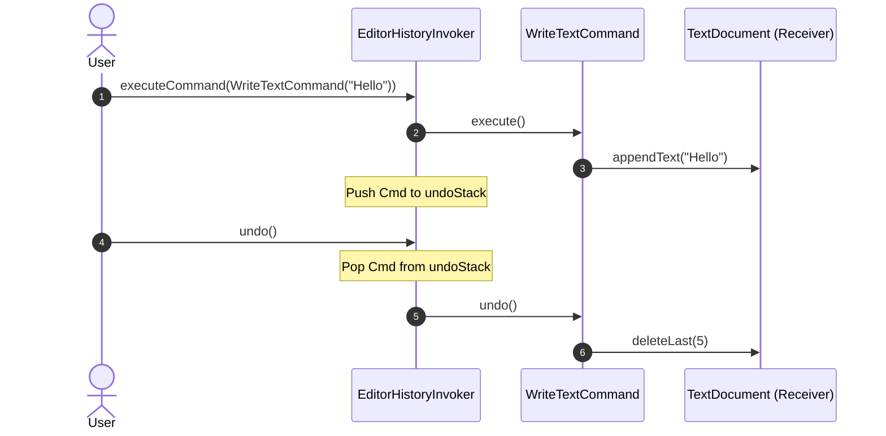

#### Programmatic Example of Command Pattern in Java
```java
package com.architect.patterns.behavioral.command;

import java.util.ArrayDeque;
import java.util.Deque;

// Command Interface
public interface Command {
    void execute();
    void undo();
}

// Receiver: Document Editor Engine
public class TextDocument {
    private final StringBuilder content = new StringBuilder();

    public void appendText(String text) { content.append(text); }
    public void deleteLast(int length) {
        int start = content.length() - length;
        if (start >= 0) content.delete(start, content.length());
    }
    public String getContent() { return content.toString(); }
}

// Concrete Command: Write Command
public class WriteTextCommand implements Command {
    private final TextDocument document;
    private final String textToAppend;

    public WriteTextCommand(TextDocument document, String text) {
        this.document = document;
        this.textToAppend = text;
    }

    @Override
    public void execute() {
        document.appendText(textToAppend);
    }

    @Override
    public void undo() {
        document.deleteLast(textToAppend.length());
    }
}

// Invoker: Editor Command Manager with Undo History
public class EditorHistoryInvoker {
    private final Deque<Command> undoStack = new ArrayDeque<>();
    private final Deque<Command> redoStack = new ArrayDeque<>();

    public void executeCommand(Command cmd) {
        cmd.execute();
        undoStack.push(cmd);
        redoStack.clear(); // Clear redo history on new action
    }

    public void undo() {
        if (!undoStack.isEmpty()) {
            Command cmd = undoStack.pop();
            cmd.undo();
            redoStack.push(cmd);
        }
    }

    public void redo() {
        if (!redoStack.isEmpty()) {
            Command cmd = redoStack.pop();
            cmd.execute();
            undoStack.push(cmd);
        }
    }

    public static void main(String[] args) {
        TextDocument doc = new TextDocument();
        EditorHistoryInvoker invoker = new EditorHistoryInvoker();

        System.out.println("=== Typing Content ===");
        invoker.executeCommand(new WriteTextCommand(doc, "Hello "));
        invoker.executeCommand(new WriteTextCommand(doc, "Architects!"));
        System.out.println("Document: \"" + doc.getContent() + "\"");

        System.out.println("\n=== Triggering Undo ===");
        invoker.undo();
        System.out.println("Document: \"" + doc.getContent() + "\"");

        System.out.println("\n=== Triggering Redo ===");
        invoker.redo();
        System.out.println("Document: \"" + doc.getContent() + "\"");
    }
}
```

##### Console Output
```text
=== Typing Content ===
Document: "Hello Architects!"

=== Triggering Undo ===
Document: "Hello "

=== Triggering Redo ===
Document: "Hello Architects!"
```

#### When to Use the Command Pattern in Java
* When you want to parameterize UI buttons, menu items, or background threads with operations.
* When you need to implement operations with reversible capabilities (Undo / Redo / Rollback).
* When you want to log, queue, or schedule operations across distributed workers (Write-Ahead Logs, CQRS architectures).

#### Real-World Applications of Command Pattern in Java
* `java.lang.Runnable` / `java.util.concurrent.Callable`
* Spring Batch `Job` execution models
* Database Transaction Write-Ahead Logging (WAL)

#### Benefits and Trade-offs of Command Pattern
* **Benefits**:
  - *Single Responsibility Principle*: Decouples classes that invoke operations from classes that execute them.
  - *Open/Closed Principle*: Introduces new commands without breaking existing client code.
  - Implements undo/redo stacks and task scheduling easily.
* **Trade-offs**:
  - Code may become complicated since you introduce a whole new layer of command classes between senders and receivers.

#### Related Java Design Patterns
* **Composite**: Commands can be grouped into composite macro-commands.
* **Memento**: Often used in tandem with Command to maintain undo snapshot states.
* **Prototype**: Commands can be cloned via Prototype before being scheduled into an execution queue.

#### References and Credits
* *Design Patterns: Elements of Reusable Object-Oriented Software* (Gang of Four)
* *Head First Design Patterns*

---

### 3.4 Chain of Responsibility Pattern in Java: Decoupling Senders from Dynamic Handler Pipelines

> **Tags:** Behavioral | Gang of Four | Pipeline | Filter Chain | Request Interception | Middleware

#### Also known as
Pipeline, Handler Chain, Filter Chain

#### Intent of Chain of Responsibility Pattern
Avoid coupling the sender of a request to its receiver by giving more than one object a chance to handle the request. Chain the receiving objects and pass the request along the chain until an object handles it.

#### Detailed Explanation of Chain of Responsibility Pattern with Real-World Examples
* **Real-world example**: Corporate technical support escalation tiers. When an employee files an IT support ticket, Tier 1 Helpdesk checks if it is a simple password reset. If not, they pass it up the chain to Tier 2 System Engineers. If it is a critical zero-day kernel defect, Tier 2 escalates it to Tier 3 Principal Architects. Each tier decides whether to resolve the ticket or pass it to the next tier.
* **In plain words**: Passes a request along a dynamic sequential chain of handlers until one (or all) handlers finish processing it.
* **Wikipedia says**: "In object-oriented design, the chain-of-responsibility pattern is a behavioral design pattern consisting of a source of command objects and a series of processing objects."

#### 🧠 Technical Logic Flow & Under-the-Hood Mechanics (Developer Deep Dive)

* **Low-Level Technical Problem It Solves**: 
  - **Hardcoded Interceptor Monoliths**: Embedding validation, rate limiting, authentication, payload decompression, and metrics timing in a single giant monolithic routine produces inflexible, tightly coupled spaghetti code.
  - **Inability to Reorder or Conditionally Short-Circuit Middleware**: Fixed pipeline orders prevent dynamic runtime reconfiguration (e.g. enabling a DDoS mitigation filter only during attacks, or dynamically rearranging security checks).
* **Step-by-Step Technical Logic Flow**:
  1. **Linked Node Abstraction**: The base `HttpFilterHandler` maintains a pointer reference to the next pipeline node (`private HttpFilterHandler next`).
  2. **Pipeline Construction**: Handlers are linked together like a singly-linked list (`authFilter.linkWith(authzFilter).linkWith(sanitizerFilter)`).
  3. **Request Ingestion**: The client injects the request into the head of the chain (`pipelineHead.handle(request)`).
  4. **Processing & Conditional Short-Circuiting**:
     - The current handler inspects the request.
     - **Failure / Early Exit**: If the request fails validation (e.g. invalid JWT token), the handler logs the rejection and immediately returns `false` (short-circuiting), stopping further downstream processing.
     - **Success / Continuation**: If passed, the handler delegates to `handleNext(request)` $\to$ `next.handle(request)`.
  5. **Terminal Execution**: When the final handler in the chain passes without errors, the chain returns `true` or delivers the request to the business controller.
* **Why the Architecture Holds**: 
  Provides flexible, open-ended request filtration where each handler operates as an independent, single-responsibility filter that can be rearranged or substituted without modifying downstream handlers.

#### Sequence Diagram
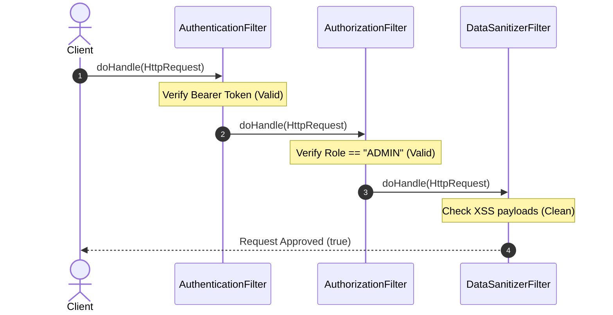

#### Programmatic Example of Chain of Responsibility Pattern in Java
```java
package com.architect.patterns.behavioral.chainofresponsibility;

public record HttpRequest(String uri, String token, String role, String payload) {}

// Handler Abstraction
public abstract class HttpFilterHandler {
    private HttpFilterHandler next;

    public HttpFilterHandler linkWith(HttpFilterHandler nextHandler) {
        this.next = nextHandler;
        return nextHandler;
    }

    public abstract boolean doHandle(HttpRequest request);

    protected boolean handleNext(HttpRequest request) {
        if (next == null) return true; // Reached end of chain successfully
        return next.doHandle(request);
    }
}

// Concrete Handler 1: Authentication
public class AuthenticationFilter extends HttpFilterHandler {
    @Override
    public boolean doHandle(HttpRequest request) {
        if (request.token() == null || !request.token().startsWith("Bearer eyJ")) {
            System.out.println("[CHAIN BLOCKED] 401 Unauthorized: Invalid Token");
            return false;
        }
        System.out.println("[AUTH FILTER] Token Verified.");
        return handleNext(request);
    }
}

// Concrete Handler 2: Authorization
public class AuthorizationFilter extends HttpFilterHandler {
    @Override
    public boolean doHandle(HttpRequest request) {
        if (!"ADMIN".equals(request.role())) {
            System.out.println("[CHAIN BLOCKED] 403 Forbidden: Insufficient Permissions");
            return false;
        }
        System.out.println("[AUTHZ FILTER] Admin Role Confirmed.");
        return handleNext(request);
    }
}

// Concrete Handler 3: Sanitize Payload
public class DataSanitizerFilter extends HttpFilterHandler {
    @Override
    public boolean doHandle(HttpRequest request) {
        if (request.payload() != null && request.payload().contains("<script>")) {
            System.out.println("[CHAIN BLOCKED] 400 Bad Request: XSS Attack Detected");
            return false;
        }
        System.out.println("[SANITIZER FILTER] Payload Clean.");
        return handleNext(request);
    }
}

public class ChainApp {
    public static void main(String[] args) {
        HttpFilterHandler chain = new AuthenticationFilter();
        chain.linkWith(new AuthorizationFilter()).linkWith(new DataSanitizerFilter());

        System.out.println("=== Valid Admin Request ===");
        HttpRequest req1 = new HttpRequest("/api/admin/purge", "Bearer eyJhbGciOi...", "ADMIN", "{\"clean\": true}");
        boolean res1 = chain.doHandle(req1);
        System.out.println("Processing Allowed: " + res1);

        System.out.println("\n=== Malicious XSS Request ===");
        HttpRequest req2 = new HttpRequest("/api/admin/purge", "Bearer eyJhbGciOi...", "ADMIN", "<script>alert(1)</script>");
        boolean res2 = chain.doHandle(req2);
        System.out.println("Processing Allowed: " + res2);
    }
}
```

##### Console Output
```text
=== Valid Admin Request ===
[AUTH FILTER] Token Verified.
[AUTHZ FILTER] Admin Role Confirmed.
[SANITIZER FILTER] Payload Clean.
Processing Allowed: true

=== Malicious XSS Request ===
[AUTH FILTER] Token Verified.
[AUTHZ FILTER] Admin Role Confirmed.
[CHAIN BLOCKED] 400 Bad Request: XSS Attack Detected
Processing Allowed: false
```

#### When to Use the Chain of Responsibility Pattern in Java
* When your program must process a variety of requests in several ways, but the exact types of requests and their sequences are unknown beforehand.
* When it's essential to execute several handlers in a strict sequential order.
* When the set of handlers and their order must change dynamically at runtime.

#### Real-World Applications of Chain of Responsibility Pattern in Java
* `jakarta.servlet.FilterChain#doFilter()`
* Spring Security `SecurityFilterChain`
* Java Logging `java.util.logging.Logger#log()` handler hierarchy

#### Benefits and Trade-offs of Chain of Responsibility Pattern
* **Benefits**:
  - Control the order of request handling.
  - *Single Responsibility Principle*: Decouples classes that invoke operations from classes that perform operations.
  - *Open/Closed Principle*: Introduces new handlers without breaking existing code.
* **Trade-offs**:
  - Some requests may reach the end of the chain unhandled.

#### Related Java Design Patterns
* **Command**: Often used to encapsulate requests passed through a Chain of Responsibility.
* **Decorator**: Decorator adds responsibilities without altering the interface; Chain of Responsibility can stop execution at any link.

#### References and Credits
* *Design Patterns: Elements of Reusable Object-Oriented Software* (Gang of Four)
* *Core J2EE Patterns: Best Practices and Design Strategies*

---

### 3.5 State Pattern in Java: Encapsulating Finite State Machine Transitions

> **Tags:** Behavioral | Gang of Four | State Machine | Polymorphic Lifecycle | State Transitions

#### Also known as
Object State Machine, Lifecycle State

#### Intent of State Pattern
Allow an object to alter its behavior when its internal state changes. The object will appear to change its class.

#### Detailed Explanation of State Pattern with Real-World Examples
* **Real-world example**: A vending machine. If you press the "Dispense Soda" button with no money inserted (`NoMoneyState`), the machine flashes "Insert Coins". If you insert $2.00 (`HasMoneyState`), pressing the exact same button dispenses the soda and drops the machine into `DispensingState`. The button triggers completely different behavior based on internal state.
* **In plain words**: Eliminates sprawling `switch (currentState)` statements by encapsulating state-specific behavior into dedicated State classes.
* **Wikipedia says**: "The state pattern is a behavioral software design pattern that allows an object to alter its behavior when its internal state changes. This pattern is close to the concept of finite-state machines."

#### 🧠 Technical Logic Flow & Under-the-Hood Mechanics (Developer Deep Dive)

* **Low-Level Technical Problem It Solves**: 
  - **Sprawling `switch (state)` Invariants & State Pollution**: Managing complex object lifecycles (e.g. Order states: `NEW` $\to$ `PAID` $\to$ `SHIPPED` $\to$ `DELIVERED` / `CANCELLED`) with enum conditionals causes every method to repeat 20-line `switch(state)` blocks, leading to illegal state transition vulnerabilities.
  - **Rigid Lifecycle Evolution**: Adding a new lifecycle state (e.g. `REFUND_PENDING`) requires auditing and modifying dozens of disparate switch statements across the entire codebase.
* **Step-by-Step Technical Logic Flow**:
  1. **State Interface Contract**: An interface (`OrderState`) defines all actionable lifecycle events (`pay()`, `ship()`, `cancel()`).
  2. **Dedicated Concrete State Classes**: Each state (`NewOrderState`, `PaidOrderState`, `ShippedOrderState`) encapsulates the valid actions and rejects invalid operations by throwing descriptive domain exceptions (e.g. `IllegalStateException("Cannot ship an unpaid order")`).
  3. **Context Holds Current State Pointer**: The `OrderContext` maintains a reference (`private OrderState currentState`).
  4. **Dynamic Dispatch & State Transition**:
     - Client calls `orderContext.pay()`.
     - Context delegates to `currentState.pay(this)`.
     - Inside `NewOrderState.pay(context)`: Payment gateway processes charge $\to$ state triggers atomic transition: `context.setState(new PaidOrderState())`.
  5. **Polymorphic Behavior Shift**: Subsequent calls on `orderContext` now execute with the behavioral rules of `PaidOrderState` without changing the context's identity.
* **Why the Architecture Holds**: 
  Transforms a procedural finite state machine into a self-contained polymorphic graph. Each state enforces its own transition invariants cleanly.

#### Sequence Diagram
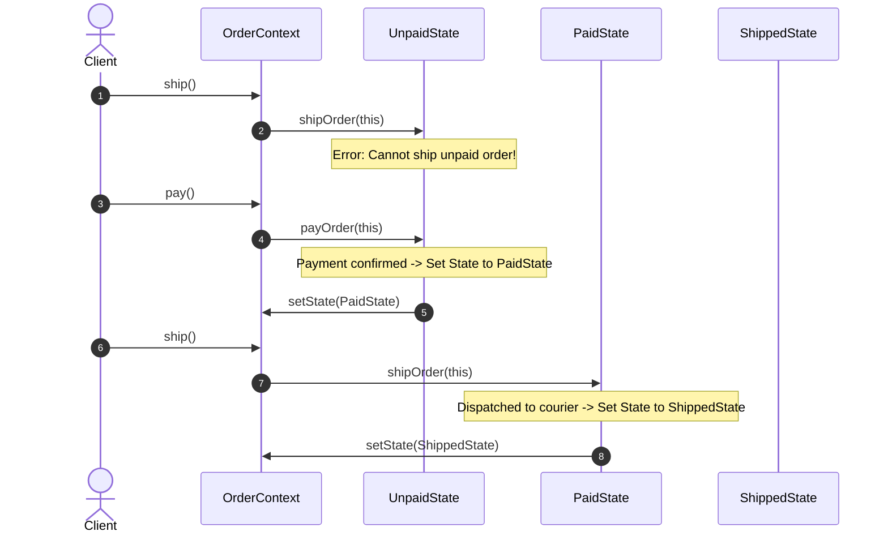

#### Programmatic Example of State Pattern in Java
```java
package com.architect.patterns.behavioral.state;

// State Interface
public interface OrderState {
    void payOrder(OrderContext context);
    void shipOrder(OrderContext context);
    void cancelOrder(OrderContext context);
}

// Concrete State 1: Created / Unpaid
class UnpaidState implements OrderState {
    @Override
    public void payOrder(OrderContext context) {
        System.out.println("[UNPAID STATE] Payment processed successfully.");
        context.setState(new PaidState());
    }

    @Override
    public void shipOrder(OrderContext context) {
        System.err.println("[UNPAID STATE] Error: Cannot ship an unpaid order!");
    }

    @Override
    public void cancelOrder(OrderContext context) {
        System.out.println("[UNPAID STATE] Order cancelled.");
        context.setState(new CancelledState());
    }
}

// Concrete State 2: Paid
class PaidState implements OrderState {
    @Override
    public void payOrder(OrderContext context) {
        System.err.println("[PAID STATE] Error: Order is already paid!");
    }

    @Override
    public void shipOrder(OrderContext context) {
        System.out.println("[PAID STATE] Order dispatched to courier.");
        context.setState(new ShippedState());
    }

    @Override
    public void cancelOrder(OrderContext context) {
        System.out.println("[PAID STATE] Order cancelled. Refund initiated to customer.");
        context.setState(new CancelledState());
    }
}

class ShippedState implements OrderState {
    @Override public void payOrder(OrderContext context) { System.err.println("Already paid & shipped."); }
    @Override public void shipOrder(OrderContext context) { System.err.println("Already in transit!"); }
    @Override public void cancelOrder(OrderContext context) { System.err.println("Cannot cancel shipped order. Initiate return upon arrival."); }
}

class CancelledState implements OrderState {
    @Override public void payOrder(OrderContext context) { System.err.println("Order is cancelled."); }
    @Override public void shipOrder(OrderContext context) { System.err.println("Order is cancelled."); }
    @Override public void cancelOrder(OrderContext context) { System.err.println("Already cancelled."); }
}

// Context
public class OrderContext {
    private OrderState currentState = new UnpaidState();

    public void setState(OrderState state) { this.currentState = state; }
    public void pay() { currentState.payOrder(this); }
    public void ship() { currentState.shipOrder(this); }
    public void cancel() { currentState.cancelOrder(this); }

    public static void main(String[] args) {
        OrderContext order = new OrderContext();

        System.out.println("=== Attempting to Ship Unpaid Order ===");
        order.ship();

        System.out.println("\n=== Paying for Order ===");
        order.pay();

        System.out.println("\n=== Shipping Paid Order ===");
        order.ship();
    }
}
```

##### Console Output
```text
=== Attempting to Ship Unpaid Order ===
[UNPAID STATE] Error: Cannot ship an unpaid order!

=== Paying for Order ===
[UNPAID STATE] Payment processed successfully.

=== Shipping Paid Order ===
[PAID STATE] Order dispatched to courier.
```

#### When to Use the State Pattern in Java
* When you have an object that behaves differently depending on its current state, the number of states is enormous, and the state-specific code changes frequently.
* When you have a class polluted with massive conditionals that alter how the class fields behave across various operations.

#### Real-World Applications of State Pattern in Java
* Spring State Machine framework
* TCP Connection Lifecycle (`CLOSED`, `LISTEN`, `SYN_SENT`, `ESTABLISHED`)
* Thread lifecycle management in JVM runtime

#### Benefits and Trade-offs of State Pattern
* **Benefits**:
  - *Single Responsibility Principle*: Organizes the code related to particular states into separate classes.
  - *Open/Closed Principle*: Introduces new states without changing existing state classes or context.
  - Eliminates massive state machine conditionals.
* **Trade-offs**:
  - Overkill if a state machine has only a few states or rarely changes.

#### Related Java Design Patterns
* **Bridge, State, Strategy**: Share similar structural class composition, but solve different architectural intents.
* **Flyweight**: State objects can often be shared as immutable Flyweights.

#### References and Credits
* *Design Patterns: Elements of Reusable Object-Oriented Software* (Gang of Four)
* *Head First Design Patterns*

---

### 3.6 Template Method Pattern in Java: Enforcing Invariant Algorithm Skeletons

> **Tags:** Behavioral | Gang of Four | Algorithm Invariants | Hollywood Principle | Inheritance | Framework Core

#### Also known as
Algorithm Skeleton, Base Method Template

#### Intent of Template Method Pattern
Define the skeleton of an algorithm in an operation, deferring some steps to subclasses. Template Method lets subclasses redefine certain steps of an algorithm without changing the algorithm's structure.

#### Detailed Explanation of Template Method Pattern with Real-World Examples
* **Real-world example**: Constructing a standardized prefab home. The master architectural blueprint defines the immutable build order: 1. `Dig Foundation` $\to$ 2. `Pour Concrete Walls` $\to$ 3. `Install Plumbing` $\to$ 4. `Install Windows` $\to$ 5. `Paint Interior`. A builder can customize whether the walls are brick or wood and whether the paint is gray or white, but they cannot install plumbing before digging the foundation.
* **In plain words**: Defines an algorithm's overall step-by-step structure in a base class, letting subclasses override specific individual steps without altering the invariant execution sequence.
* **Wikipedia says**: "In software engineering, the template method pattern is a behavioral design pattern that defines the program skeleton of an algorithm in an operation, deferring some steps to subclasses."

#### 🧠 Technical Logic Flow & Under-the-Hood Mechanics (Developer Deep Dive)

* **Low-Level Technical Problem It Solves**: 
  - **Algorithm Workflow Fragmentation & Duplication**: When multiple services follow an identical macro-workflow (e.g. ETL pipeline: `OpenConnection` $\to$ `Extract` $\to$ `Validate` $\to$ `Transform` $\to$ `WriteToDB` $\to$ `CloseConnection`), implementing the steps independently across subclasses creates duplicate lifecycle boilerplate and causes order-of-execution bugs (e.g. leaking unclosed DB resources or skipping audit logs).
  - **Inversion of Control Violation**: Framework code needs to drive subclass execution (*"Don't call us, we'll call you"* / Hollywood Principle) rather than letting user subclasses manipulate the control loop.
* **Step-by-Step Technical Logic Flow**:
  1. **Final Template Method Definition**: The abstract base class declares the master execution method marked with `final` (`public final void mineDataPipeline(String path)`), strictly forbidding subclasses from overriding or altering the algorithmic step order.
  2. **Primitive Hook Declarations**:
     - **Abstract Methods**: Mandatory steps subclasses must implement (`protected abstract RawData parseData(byte[] bytes)`).
     - **Default Hook Methods**: Optional interceptors with empty default bodies (`protected void hookPostProcessing() {}`).
  3. **Client Triggers Base Pipeline**: Client calls `pdfDataMiner.mineDataPipeline("report.pdf")`.
  4. **Dynamic Polymorphic Dispatch on Steps**:
     - Base class executes common step 1 (`openFile()`).
     - Base class calls `this.parseData()`, dynamically dispatching to the concrete implementation in `PdfDataMiner` via the JVM vtable.
     - Base class calls optional lifecycle hook `hookPostProcessing()`.
     - Base class closes I/O streams in an invariant `finally` block.
* **Why the Architecture Holds**: 
  Guarantees invariant algorithmic integrity and resource management safety at the base class level while granting child subclasses targeted extension points.

#### Sequence Diagram
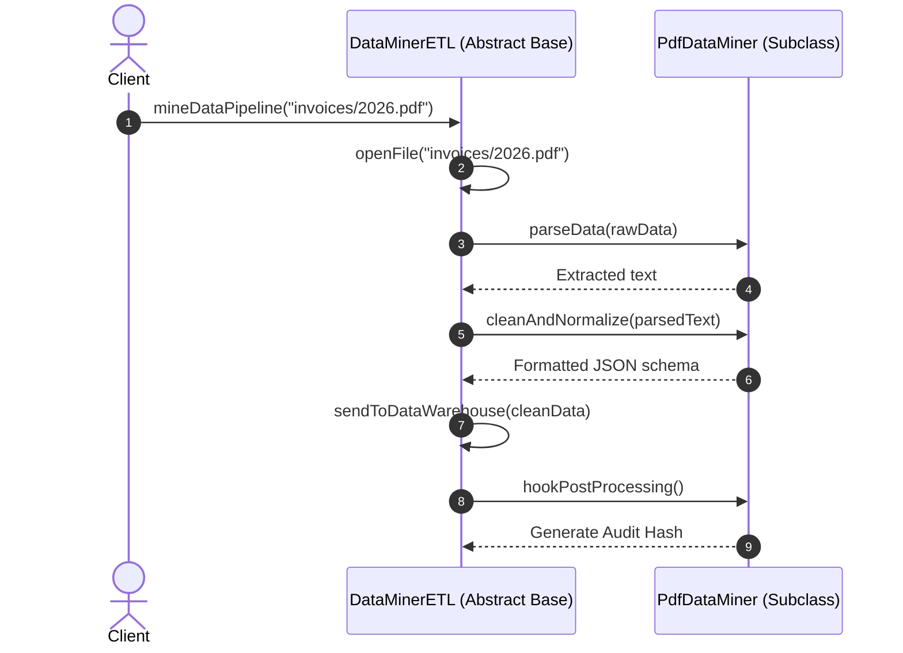

#### Programmatic Example of Template Method Pattern in Java
```java
package com.architect.patterns.behavioral.templatemethod;

// Base Abstract Class
public abstract class DataMinerETL {

    // The Template Method (Marked final so subclasses cannot violate execution order)
    public final void mineDataPipeline(String sourcePath) {
        byte[] rawData = openFile(sourcePath);
        String parsedText = parseData(rawData);
        String cleanData = cleanAndNormalize(parsedText);
        sendToDataWarehouse(cleanData);
        hookPostProcessing(); // Optional hook
    }

    private byte[] openFile(String path) {
        System.out.println("[ETL BASE] Opening binary I/O stream from: " + path);
        return new byte[]{};
    }

    // Abstract Steps deferred to subclasses
    protected abstract String parseData(byte[] rawData);
    protected abstract String cleanAndNormalize(String parsedData);

    private void sendToDataWarehouse(String data) {
        System.out.println("[ETL BASE] Ingesting formatted data into Data Lakehouse: " + data);
    }

    // Hook Method (optional override)
    protected void hookPostProcessing() {}

    public static void main(String[] args) {
        System.out.println("=== Executing CSV Data Mining Pipeline ===");
        DataMinerETL csvMiner = new CsvDataMiner();
        csvMiner.mineDataPipeline("/data/users.csv");

        System.out.println("\n=== Executing PDF Data Mining Pipeline ===");
        DataMinerETL pdfMiner = new PdfDataMiner();
        pdfMiner.mineDataPipeline("/data/invoices/inv_9021.pdf");
    }
}

// Concrete Class 1: CSV Data Miner
class CsvDataMiner extends DataMinerETL {
    @Override
    protected String parseData(byte[] rawData) {
        System.out.println("[CSV MINER] Parsing CSV records via OpenCSV...");
        return "id,user,amount\n1,Alice,500";
    }

    @Override
    protected String cleanAndNormalize(String parsedData) {
        System.out.println("[CSV MINER] Trimming CSV whitespace and formatting decimals...");
        return parsedData.trim();
    }
}

// Concrete Class 2: PDF Data Miner
class PdfDataMiner extends DataMinerETL {
    @Override
    protected String parseData(byte[] rawData) {
        System.out.println("[PDF MINER] Extracting OCR text from PDF stream with Apache PDFBox...");
        return "Invoice #9021 Customer: Bob Total: $1200";
    }

    @Override
    protected String cleanAndNormalize(String parsedData) {
        System.out.println("[PDF MINER] Converting OCR text to JSON schema...");
        return "{\"invoice\": 9021, \"total\": 1200}";
    }

    @Override
    protected void hookPostProcessing() {
        System.out.println("[PDF MINER HOOK] Generating compliance audit SHA-256 hash for PDF invoice.");
    }
}
```

##### Console Output
```text
=== Executing CSV Data Mining Pipeline ===
[ETL BASE] Opening binary I/O stream from: /data/users.csv
[CSV MINER] Parsing CSV records via OpenCSV...
[CSV MINER] Trimming CSV whitespace and formatting decimals...
[ETL BASE] Ingesting formatted data into Data Lakehouse: id,user,amount
1,Alice,500

=== Executing PDF Data Mining Pipeline ===
[ETL BASE] Opening binary I/O stream from: /data/invoices/inv_9021.pdf
[PDF MINER] Extracting OCR text from PDF stream with Apache PDFBox...
[PDF MINER] Converting OCR text to JSON schema...
[ETL BASE] Ingesting formatted data into Data Lakehouse: {"invoice": 9021, "total": 1200}
[PDF MINER HOOK] Generating compliance audit SHA-256 hash for PDF invoice.
```

#### When to Use the Template Method Pattern in Java
* When you want to let clients extend only particular steps of an algorithm, but not the entire algorithm or its structure.
* When you have several classes that contain almost identical algorithms with only minor differences.

#### Real-World Applications of Template Method Pattern in Java
* `java.util.AbstractList#get()`, `java.util.AbstractMap`
* Spring `JdbcTemplate` / `TransactionTemplate`
* `jakarta.servlet.http.HttpServlet#service()` (dispatches to `doGet`, `doPost`)

#### Benefits and Trade-offs of Template Method Pattern
* **Benefits**:
  - Pulls duplicate algorithm orchestration up into the parent class ("Hollywood Principle: Don't call us, we'll call you").
  - Enhances code reusability.
* **Trade-offs**:
  - Subclasses are strictly bounded by the skeleton provided by the parent.
  - Can violate Liskov Substitution Principle if hooks alter expected lifecycle semantics.

#### Related Java Design Patterns
* **Factory Method**: Factory methods are frequently called inside template methods.
* **Strategy**: Strategy modifies algorithm logic via composition; Template Method modifies parts of an algorithm via inheritance.

#### References and Credits
* *Design Patterns: Elements of Reusable Object-Oriented Software* (Gang of Four)
* *Head First Design Patterns*

---

### 3.7 Mediator Pattern in Java: Centralizing Multi-Colleague Communications

> **Tags:** Behavioral | Gang of Four | Intermediary Hub | Decoupled Communication | Loose Coupling

#### Also known as
Controller, Communication Hub, Intermediary

#### Intent of Mediator Pattern
Define an object that encapsulates how a set of objects interact. Mediator promotes loose coupling by keeping objects from referring to each other explicitly, and it lets you vary their interaction independently.

#### Detailed Explanation of Mediator Pattern with Real-World Examples
* **Real-world example**: Airport Air Traffic Control (ATC) Tower. When 20 commercial airplanes approach London Heathrow Airport, pilots do not broadcast radio messages directly to all 19 other airplanes to negotiate landing order. Every pilot communicates exclusively with the central ATC Tower. The Tower mediates altitudes, landing slots, and runway clearances.
* **In plain words**: Reduces chaotic many-to-many dependencies between classes by routing all communication through a single central mediator object.
* **Wikipedia says**: "In software engineering, the mediator pattern defines an object that encapsulates how a set of objects interact. This pattern is considered to be a behavioral pattern because it can alter the program's running behavior."

#### 🧠 Technical Logic Flow & Under-the-Hood Mechanics (Developer Deep Dive)

* **Low-Level Technical Problem It Solves**: 
  - **$O(N^2)$ Tight Mesh Coupling**: When $N$ collaborative components (e.g., UI Dialog controls: Dropdown, Checkbox, SubmitButton, FormValidator, ErrorBanner) hold direct object references to each other, adding or modifying any single control causes a cascade of breaking changes across all other controls.
  - **Spaghetti Coordination Code**: Business orchestration rules get scattered randomly across dozens of independent UI widgets.
* **Step-by-Step Technical Logic Flow**:
  1. **Central Mediator Hub**: The `ChatRoomMediator` interface declares central message routing operations (`sendMessage(String msg, Colleague sender)`).
  2. **Colleague Decoupling**: Each `Colleague` object holds only a single reference to the central mediator (`protected final ChatRoomMediator mediator`) and possesses zero references to any other colleagues.
  3. **Event Notification to Hub**: When a colleague performs an action (e.g. user types a chat message or clicks a button), it notifies the mediator: `mediator.sendMessage(message, this)`.
  4. **Mediator Orchestration**:
     - The concrete mediator receives the event.
     - It executes filtering, access validation, and coordination logic.
     - It broadcasts or targets the event to appropriate recipient colleagues: `for (Colleague c : colleagues) { if (c != sender) c.receive(msg, sender.getName()); }`.
* **Why the Architecture Holds**: 
  Converts a chaotic $O(N^2)$ direct-reference network mesh into an easily maintainable $O(N)$ star topology.

#### Sequence Diagram
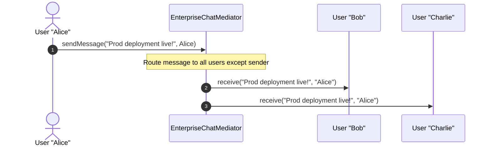

#### Programmatic Example of Mediator Pattern in Java
```java
package com.architect.patterns.behavioral.mediator;

import java.util.ArrayList;
import java.util.List;

// Mediator Interface
public interface ChatRoomMediator {
    void sendMessage(String message, User sender);
    void registerUser(User user);
}

// Colleague Abstraction
public abstract class User {
    protected final ChatRoomMediator mediator;
    protected final String name;

    public User(ChatRoomMediator mediator, String name) {
        this.mediator = mediator;
        this.name = name;
    }

    public abstract void send(String msg);
    public abstract void receive(String msg, String senderName);
}

// Concrete Mediator
public class EnterpriseChatMediator implements ChatRoomMediator {
    private final List<User> users = new ArrayList<>();

    @Override
    public void registerUser(User user) {
        users.add(user);
    }

    @Override
    public void sendMessage(String message, User sender) {
        for (User user : users) {
            // Do not echo the message back to the sender
            if (user != sender) {
                user.receive(message, sender.name);
            }
        }
    }
}

// Concrete Colleague
public class ChatMember extends User {
    public ChatMember(ChatRoomMediator mediator, String name) { super(mediator, name); }

    @Override
    public void send(String msg) {
        System.out.println("\n[" + this.name + "] Sends: \"" + msg + "\"");
        mediator.sendMessage(msg, this);
    }

    @Override
    public void receive(String msg, String senderName) {
        System.out.println("  -> [" + this.name + "'s Screen] Incoming from " + senderName + ": " + msg);
    }

    public static void main(String[] args) {
        ChatRoomMediator chat = new EnterpriseChatMediator();
        User dev1 = new ChatMember(chat, "Alice");
        User dev2 = new ChatMember(chat, "Bob");
        User lead = new ChatMember(chat, "Charlie");

        chat.registerUser(dev1);
        chat.registerUser(dev2);
        chat.registerUser(lead);

        dev1.send("Production deployment is live!");
        dev2.send("Confirmed! Monitoring telemetry dashboards.");
    }
}
```

##### Console Output
```text
[Alice] Sends: "Production deployment is live!"
  -> [Bob's Screen] Incoming from Alice: Production deployment is live!
  -> [Charlie's Screen] Incoming from Alice: Production deployment is live!

[Bob] Sends: "Confirmed! Monitoring telemetry dashboards."
  -> [Alice's Screen] Incoming from Bob: Confirmed! Monitoring telemetry dashboards.
  -> [Charlie's Screen] Incoming from Bob: Confirmed! Monitoring telemetry dashboards.
```

#### When to Use the Mediator Pattern in Java
* When it's difficult to change some classes because they are tightly coupled to a dozen other classes.
* When components cannot be reused in different programs because they are interdependent on specific other components.

#### Real-World Applications of Mediator Pattern in Java
* `java.util.concurrent.ExecutorService#submit()` (mediates task queues and worker thread pools)
* Spring MVC `DispatcherServlet` (mediates incoming HTTP requests to controllers, view resolvers, interceptors)
* Apache Kafka / RabbitMQ Brokers in distributed event architectures

#### Benefits and Trade-offs of Mediator Pattern
* **Benefits**:
  - *Single Responsibility Principle*: Extracts communication channels among components into a single place.
  - *Open/Closed Principle*: Introduces new mediators without having to change the actual components.
  - Reduces coupling between various components of a program.
* **Trade-offs**:
  - A mediator can evolve into a bloated God Object over time.

#### Related Java Design Patterns
* **Facade**: Facade abstracts a subsystem of objects to provide a simpler interface; Mediator abstracts communication between colleague objects.
* **Observer**: In Observer, publishers broadcast events dynamically to subscribers; in Mediator, communication is routed centrally through one hub.

#### References and Credits
* *Design Patterns: Elements of Reusable Object-Oriented Software* (Gang of Four)
* *Refactoring to Patterns*

---

### 3.8 Memento Pattern in Java: Externalizing and Restoring Object State Snapshots

> **Tags:** Behavioral | Gang of Four | Snapshot | Undo-Redo | Encapsulation | State Checkpointing

#### Also known as
Snapshot, Token, Checkpoint

#### Intent of Memento Pattern
Without violating encapsulation, capture and externalize an object's internal state so that the object can be restored to this state later.

#### Detailed Explanation of Memento Pattern with Real-World Examples
* **Real-world example**: Video game checkpoints and Save Points. Before battling a difficult game boss, the player saves their game. The game engine serializes the player's health, inventory, weapons, and level coordinates into an opaque Save Game snapshot (Memento). If the player dies during combat, the engine loads the checkpoint snapshot from disk to restore the exact state.
* **In plain words**: Takes a snapshot of an object's state so it can be restored later without exposing the object's private internal fields.
* **Wikipedia says**: "The memento pattern is a software design pattern that provides the ability to restore an object to its previous state (undo via rollback)."

#### 🧠 Technical Logic Flow & Under-the-Hood Mechanics (Developer Deep Dive)

* **Low-Level Technical Problem It Solves**: 
  - **Encapsulation Breakdown in Undo Operations**: Saving snapshots of an object's internal fields (e.g. private canvas buffers, cursor offset coordinates, transaction state) by exposing public getters/setters breaks OOP encapsulation and invites outside mutations.
  - **State Corruption During External Storage**: Exposing mutable state references to an undo/redo stack allows other components to unintentionally alter past snapshots in memory.
* **Step-by-Step Technical Logic Flow**:
  1. **Immutable Snapshot Value Object**: The `EditorMemento` class encapsulates private, `final` snapshot fields (`private final String content`, `private final int cursorPosition`) with no mutating setter methods.
  2. **Originator Generates Snapshot**: The `RichTextEditor` (Originator) produces an immutable memento via `public EditorMemento save()` by taking a snapshot of its current private fields.
  3. **Opaque Caretaker Management**: The `HistoryManager` (Caretaker) stores mementos in a stack (`Deque<EditorMemento> history = new ArrayDeque<>()`) without inspecting, reading, or modifying their internal byte payloads.
  4. **Rollback & State Restoration**:
     - When undo is invoked, the Caretaker pops the latest memento from its stack (`history.pop()`).
     - Caretaker passes the memento back to the Originator: `editor.restore(memento)`.
     - Inside `restore()`, the Originator extracts the snapshot values and reassigns its private fields atomically.
* **Why the Architecture Holds**: 
  Maintains complete encapsulation boundary isolation: the Originator is the only entity that ever reads/writes snapshot state, while the Caretaker treats snapshots as completely opaque handles.

#### Sequence Diagram
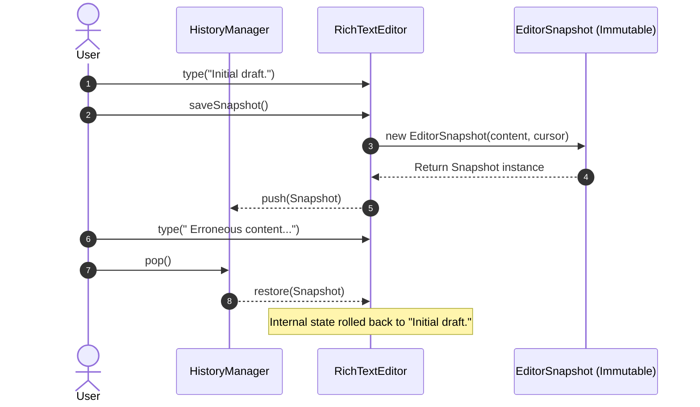

#### Programmatic Example of Memento Pattern in Java
```java
package com.architect.patterns.behavioral.memento;

import java.util.ArrayDeque;
import java.util.Deque;

// The Memento (Immutable State Snapshot)
public record EditorSnapshot(String content, int cursorPosition) {}

// The Originator
public class RichTextEditor {
    private String content = "";
    private int cursorPosition = 0;

    public void type(String words) {
        this.content += words;
        this.cursorPosition = this.content.length();
    }

    public EditorSnapshot saveSnapshot() {
        return new EditorSnapshot(content, cursorPosition);
    }

    public void restore(EditorSnapshot snapshot) {
        if (snapshot != null) {
            this.content = snapshot.content();
            this.cursorPosition = snapshot.cursorPosition();
            System.out.println("[ORIGINATOR] Restored state to: \"" + content + "\" (Cursor: " + cursorPosition + ")");
        }
    }

    public String getContent() { return content; }

    public static void main(String[] args) {
        RichTextEditor editor = new RichTextEditor();
        HistoryManager history = new HistoryManager();

        editor.type("Design Patterns in Java.");
        System.out.println("Current Document: \"" + editor.getContent() + "\"");
        history.push(editor.saveSnapshot()); // Checkpoint 1

        editor.type(" Additional Draft Section.");
        System.out.println("Current Document: \"" + editor.getContent() + "\"");
        history.push(editor.saveSnapshot()); // Checkpoint 2

        editor.type(" Accidental delete or invalid typo...");
        System.out.println("Current Document: \"" + editor.getContent() + "\"");

        System.out.println("\n=== Rolling Back to Checkpoint 2 ===");
        editor.restore(history.pop());
        System.out.println("Document: \"" + editor.getContent() + "\"");

        System.out.println("\n=== Rolling Back to Checkpoint 1 ===");
        editor.restore(history.pop());
        System.out.println("Document: \"" + editor.getContent() + "\"");
    }
}

// The Caretaker: Manages history stack
class HistoryManager {
    private final Deque<EditorSnapshot> history = new ArrayDeque<>();

    public void push(EditorSnapshot snapshot) { history.push(snapshot); }
    public EditorSnapshot pop() { return history.isEmpty() ? null : history.pop(); }
}
```

##### Console Output
```text
Current Document: "Design Patterns in Java."
Current Document: "Design Patterns in Java. Additional Draft Section."
Current Document: "Design Patterns in Java. Additional Draft Section. Accidental delete or invalid typo..."

=== Rolling Back to Checkpoint 2 ===
[ORIGINATOR] Restored state to: "Design Patterns in Java. Additional Draft Section." (Cursor: 51)
Document: "Design Patterns in Java. Additional Draft Section."

=== Rolling Back to Checkpoint 1 ===
[ORIGINATOR] Restored state to: "Design Patterns in Java." (Cursor: 24)
Document: "Design Patterns in Java."
```

#### When to Use the Memento Pattern in Java
* When you need to produce snapshots of the object's state to be able to restore a previous state of the object (Undo/Redo mechanisms).
* When direct access to the object's fields/getters/setters would violate its encapsulation.

#### Real-World Applications of Memento Pattern in Java
* `java.io.Serializable` state externalization
* GUI graphics render checkpointing (`java.awt.Graphics2D#create()`)
* Git commit tree snapshots

#### Benefits and Trade-offs of Memento Pattern
* **Benefits**:
  - Produces snapshots of an object's state without violating its encapsulation.
  - Simplifies the originator's code by letting the caretaker maintain the history of snapshots.
* **Trade-offs**:
  - The app might consume lots of RAM if clients create mementos too often.

#### Related Java Design Patterns
* **Command**: Commands and Mementos can be used together when implementing undoable operations.
* **Prototype**: Memento can sometimes be implemented via Prototype cloning.

#### References and Credits
* *Design Patterns: Elements of Reusable Object-Oriented Software* (Gang of Four)
* *Head First Design Patterns*

---

### 3.9 Iterator Pattern in Java: Traversing Complex Aggregate Collections Uniformly

> **Tags:** Behavioral | Gang of Four | Cursor | Sequential Traversal | Collections | Encapsulation

#### Also known as
Cursor, Sequential Scanner

#### Intent of Iterator Pattern
Provide a way to access the elements of an aggregate object sequentially without exposing its underlying representation.

#### Detailed Explanation of Iterator Pattern with Real-World Examples
* **Real-world example**: A tourist guide leading a walking tour through Rome. Whether the city landmarks are organized as a linear street list, a geographical coordinate tree, or a circular bus loop, the tourist simply follows the guide's instructions (`hasMoreLandmarks()` and `getNextLandmark()`). The tourist enjoys the tour sequentially without needing to understand the city's underlying topographical map architecture.
* **In plain words**: Traverses elements of a complex collection (list, tree, circular ring buffer) sequentially without exposing its underlying data structure.
* **Wikipedia says**: "In object-oriented programming, the iterator pattern is a design pattern in which an iterator is used to traverse a container and access the container's elements."

#### 🧠 Technical Logic Flow & Under-the-Hood Mechanics (Developer Deep Dive)

* **Low-Level Technical Problem It Solves**: 
  - **Data Structure Exposure**: Exposing the internal physical memory layout (e.g. nested tree nodes, circular ring pointer arithmetic, skip-list pointers) forces client algorithms to write structure-dependent indexing code.
  - **Multiple Concurrent Scanners**: When multiple threads or algorithms need to traverse the same collection simultaneously at different speeds, storing traversal cursor index fields directly inside the collection object breaks concurrent scans.
* **Step-by-Step Technical Logic Flow**:
  1. **Decoupled Cursor Allocation**: Calling `collection.createIterator()` instantiates a separate lightweight cursor object on the heap (`RingBufferIterator`), keeping the parent collection free of cursor mutation state.
  2. **Standard Traversal Contract**: Implements `java.util.Iterator<T>` defining two core primitives: `hasNext()` and `next()`.
  3. **Cursor Pointer Arithmetic**:
     - `hasNext()` checks remaining bounds against collection size: `return count < size`.
     - `next()` retrieves the current array element, updates its internal cursor pointer (`cursor = (cursor + 1) % capacity`), increments the traversal counter, and returns the element.
     - Throws standard `NoSuchElementException` when traversing past bounds.
  4. **Concurrent Traversal Isolation**: Multiple iterators can traverse the same ring buffer independently without interfering with each other's cursor indices.
* **Why the Architecture Holds**: 
  Decouples the complex internal storage algorithms from client traversal code, adhering to Single Responsibility and allowing plug-and-play iteration across arbitrary data structures.

#### Sequence Diagram
```mermaid
sequenceDiagram
    autonumber
    actor Client
    participant Buffer as SimpleRingBuffer (Aggregate)
    participant It as RingBufferIterator (Iterator)

    Client->>Buffer: createIterator()
    Buffer->>It: new RingBufferIterator()
    It-->>Client: Return Iterator instance
    loop While it.hasNext()
        Client->>It: hasNext()
        It-->>Client: true
        Client->>It: next()
        It-->>Client: Return element
    end
```

#### Programmatic Example of Iterator Pattern in Java
```java
package com.architect.patterns.behavioral.iterator;

import java.util.Iterator;
import java.util.NoSuchElementException;

// Aggregate Interface
public interface CustomIterable<T> {
    Iterator<T> createIterator();
}

// Custom Aggregate: Fixed-Capacity Ring Buffer
public class SimpleRingBuffer<T> implements CustomIterable<T> {
    private final Object[] elements;
    private int size = 0;
    private int head = 0;
    private int tail = 0;

    public SimpleRingBuffer(int capacity) {
        this.elements = new Object[capacity];
    }

    public void add(T item) {
        elements[tail] = item;
        tail = (tail + 1) % elements.length;
        if (size < elements.length) size++;
        else head = (head + 1) % elements.length;
    }

    @Override
    public Iterator<T> createIterator() {
        return new RingBufferIterator();
    }

    // Inner Iterator Implementation
    private class RingBufferIterator implements Iterator<T> {
        private int count = 0;
        private int cursor = head;

        @Override
        public boolean hasNext() {
            return count < size;
        }

        @Override
        @SuppressWarnings("unchecked")
        public T next() {
            if (!hasNext()) throw new NoSuchElementException("No more items in buffer");
            T item = (T) elements[cursor];
            cursor = (cursor + 1) % elements.length;
            count++;
            return item;
        }
    }

    public static void main(String[] args) {
        SimpleRingBuffer<String> ringBuffer = new SimpleRingBuffer<>(3);
        ringBuffer.add("System Boot");
        ringBuffer.add("Log-1: Connection Established");
        ringBuffer.add("Log-2: Query Executed");
        ringBuffer.add("Log-3: Response 200 OK"); // Overwrites "System Boot" in ring buffer

        System.out.println("=== Iterating Over Ring Buffer ===");
        Iterator<String> it = ringBuffer.createIterator();
        while (it.hasNext()) {
            System.out.println("-> " + it.next());
        }
    }
}
```

##### Console Output
```text
=== Iterating Over Ring Buffer ===
-> Log-1: Connection Established
-> Log-2: Query Executed
-> Log-3: Response 200 OK
```

#### When to Use the Iterator Pattern in Java
* When your collection has a complex data structure under the hood (binary tree, hash map, skip list), but you want to hide its complexity from clients for security or convenience.
* When you need to support multiple simultaneous traversals over the same aggregate collection.

#### Real-World Applications of Iterator Pattern in Java
* `java.util.Iterator<E>` & `java.lang.Iterable<T>` (Enables Java `for (Item x : collection)` enhanced loops)
* `java.sql.ResultSet` (Cursor-based iterator over database query rows)

#### Benefits and Trade-offs of Iterator Pattern
* **Benefits**:
  - *Single Responsibility Principle*: Clean separation between collection storage algorithms and traversal algorithms.
  - *Open/Closed Principle*: Implements new types of collections and iterators without breaking existing code.
  - Traverses the same collection in parallel.
* **Trade-offs**:
  - Overkill if your app only works with simple flat arrays where index-based access is faster.

#### Related Java Design Patterns
* **Composite**: Iterators are frequently used to traverse Composite trees.
* **Factory Method**: Can be used along with Iterator to produce matching iterators for collections.
* **Visitor**: Can be used alongside Iterator to execute operations over elements being traversed.

#### References and Credits
* *Design Patterns: Elements of Reusable Object-Oriented Software* (Gang of Four)
* *Effective Java* (Joshua Bloch)

---

### 3.10 Visitor Pattern in Java: Adding New Operations to Heterogeneous Object Graphs

> **Tags:** Behavioral | Gang of Four | Dual Dispatch | Open-Closed Principle | Extensibility | AST Traversal

#### Also known as
Dual Dispatcher, Poly-Visitor

#### Intent of Visitor Pattern
Represent an operation to be performed on the elements of an object structure. Visitor lets you define a new operation without changing the classes of the elements on which it operates.

#### Detailed Explanation of Visitor Pattern with Real-World Examples
* **Real-world example**: An insurance agent visiting residential households, medical clinics, and commercial factories. The homeowner, doctor, and factory manager do not calculate their own complex insurance risk formulas. They accept the insurance agent (`building.accept(visitor)`), and the specialized visitor performs double-dispatch calculation (`visitor.visitResidential(this)`, `visitor.visitCommercial(this)`).
* **In plain words**: Adds new operations to existing complex object structures without modifying the underlying domain entity classes.
* **Wikipedia says**: "In object-oriented programming and software engineering, the visitor design pattern is a way of separating an algorithm from an object structure on which it operates."

#### 🧠 Technical Logic Flow & Under-the-Hood Mechanics (Developer Deep Dive)

* **Low-Level Technical Problem It Solves**: 
  - **Single-Dispatch Polymorphism Limitation**: Java supports only single dynamic dispatch based on runtime receiver type (`element.operation()`), meaning overloaded methods `process(BaseNode)` resolve at compile-time to the static reference type rather than the concrete runtime subclass type, causing `instanceof` cascades.
  - **Entity Class Contamination**: Forcing domain entity classes (e.g. `UserAccountNode`, `OrderRecordNode`) to implement unrelated cross-cutting operations (e.g. JSON serialization, compliance audits, tax calculation, bytecode compilation) pollutes core models with divergent responsibilities.
* **Step-by-Step Technical Logic Flow**:
  1. **Accept Contract in Elements**: Domain elements declare an `accept(Visitor)` method: `public void accept(ReportExportVisitor visitor)`.
  2. **Double-Dispatch Execution Handshake**:
     - **Dispatch 1**: Client invokes `element.accept(visitor)` on an abstract `TreeNode` pointer. The JVM dispatches virtually to the concrete element instance (e.g. `UserAccountNode`).
     - **Dispatch 2**: Inside `UserAccountNode.accept(visitor)`, the node calls `visitor.visit(this)`. Because `this` is explicitly typed as `UserAccountNode`, the JVM statically binds the call to the overloaded method `visit(UserAccountNode)` on the visitor.
  3. **Algorithm Execution in Specialized Visitor**: The visitor (`FinancialAuditVisitor` or `XmlExportVisitor`) extracts required properties and executes calculation/export without modifying the element class.
  4. **Heterogeneous Graph Traversal**: Client iterates a list of heterogeneous nodes (`List<VisitableNode>`), invoking `accept(visitor)` on each node, achieving type-safe dynamic operation dispatch.
* **Why the Architecture Holds**: 
  Overcomes single-dispatch constraints via the double-dispatch handshake, enabling new features/algorithms to be added purely by creating new `Visitor` implementations without touching stable domain entity classes.

#### Sequence Diagram
```mermaid
sequenceDiagram
    autonumber
    actor Client
    participant Order as OrderRecordNode
    participant Visitor as FinancialAuditVisitor

    Client->>Order: accept(Visitor)
    Order->>Visitor: visit(this)
    Note over Visitor: Double-Dispatch: accumulate order amount to totalRevenue
    Visitor-->>Order: Finished Visit
    Order-->>Client: Finished Acceptance
```

#### Programmatic Example of Visitor Pattern in Java
```java
package com.architect.patterns.behavioral.visitor;

import java.util.List;

// Visitor Interface
public interface ReportExportVisitor {
    void visit(UserAccountNode user);
    void visit(OrderRecordNode order);
    void visit(InventoryItemNode item);
}

// Element Interface
public interface AnalyticsElement {
    void accept(ReportExportVisitor visitor);
}

// Concrete Elements
public record UserAccountNode(String username, String email) implements AnalyticsElement {
    @Override public void accept(ReportExportVisitor visitor) { visitor.visit(this); }
}

public record OrderRecordNode(String orderId, double amountUsd) implements AnalyticsElement {
    @Override public void accept(ReportExportVisitor visitor) { visitor.visit(this); }
}

public record InventoryItemNode(String sku, int stockCount) implements AnalyticsElement {
    @Override public void accept(ReportExportVisitor visitor) { visitor.visit(this); }
}

// Concrete Visitor 1: JSON Exporter
public class JsonExportVisitor implements ReportExportVisitor {
    @Override
    public void visit(UserAccountNode user) {
        System.out.println("{\"type\": \"user\", \"name\": \"" + user.username() + "\"}");
    }

    @Override
    public void visit(OrderRecordNode order) {
        System.out.println("{\"type\": \"order\", \"id\": \"" + order.orderId() + "\", \"amt\": " + order.amountUsd() + "}");
    }

    @Override
    public void visit(InventoryItemNode item) {
        System.out.println("{\"type\": \"inventory\", \"sku\": \"" + item.sku() + "\", \"stock\": " + item.stockCount() + "}");
    }
}

// Concrete Visitor 2: Financial Audit Analyzer
public class FinancialAuditVisitor implements ReportExportVisitor {
    private double totalRevenue = 0.0;

    @Override public void visit(UserAccountNode user) { /* Not audited */ }

    @Override
    public void visit(OrderRecordNode order) {
        totalRevenue += order.amountUsd();
    }

    @Override public void visit(InventoryItemNode item) { /* Not audited */ }

    public double getTotalRevenue() { return totalRevenue; }

    public static void main(String[] args) {
        List<AnalyticsElement> nodes = List.of(
            new UserAccountNode("alice", "alice@enterprise.com"),
            new OrderRecordNode("ORD-901", 450.00),
            new OrderRecordNode("ORD-902", 1250.00),
            new InventoryItemNode("SKU-LAPTOP-01", 50)
        );

        System.out.println("=== 1. JSON Export Visitor ===");
        JsonExportVisitor jsonExporter = new JsonExportVisitor();
        for (AnalyticsElement node : nodes) {
            node.accept(jsonExporter);
        }

        System.out.println("\n=== 2. Financial Audit Visitor ===");
        FinancialAuditVisitor auditor = new FinancialAuditVisitor();
        for (AnalyticsElement node : nodes) {
            node.accept(auditor);
        }
        System.out.println("Total Audited Revenue: $" + auditor.getTotalRevenue());
    }
}
```

##### Console Output
```text
=== 1. JSON Export Visitor ===
{"type": "user", "name": "alice"}
{"type": "order", "id": "ORD-901", "amt": 450.0}
{"type": "order", "id": "ORD-902", "amt": 1250.0}
{"type": "inventory", "sku": "SKU-LAPTOP-01", "stock": 50}

=== 2. Financial Audit Visitor ===
Total Audited Revenue: $1700.0
```

#### When to Use the Visitor Pattern in Java
* When you need to perform an operation on all elements of a complex object structure (e.g., an Abstract Syntax Tree in compilers or XML DOM tree).
* When you want to clean up business logic from auxiliary behaviors (e.g., export to JSON, format to XML, compute financial metrics).
* When the underlying node structure rarely changes, but you frequently need to define new operations over it.

#### Real-World Applications of Visitor Pattern in Java
* `java.nio.file.FileVisitor` & `Files.walkFileTree()`
* Abstract Syntax Tree (AST) analyzers (JavaParser, Checkstyle, SonarQube, javac compiler)
* Spring `BeanDefinitionVisitor`

#### Benefits and Trade-offs of Visitor Pattern
* **Benefits**:
  - *Open/Closed Principle*: Introduces a new behavior that works on objects of different classes without mutating those classes.
  - *Single Responsibility Principle*: Moves multiple versions of the same behavior into the same class.
* **Trade-offs**:
  - You need to update all visitors each time a class gets added to or removed from the element hierarchy.

#### Related Java Design Patterns
* **Composite**: Visitors can be used to execute an operation over an entire Composite tree.
* **Iterator**: Iterator traverses a composite tree; Visitor performs an operation over the elements as they are visited.

#### References and Credits
* *Design Patterns: Elements of Reusable Object-Oriented Software* (Gang of Four)
* *Refactoring to Patterns* (Joshua Kerievsky)

---

# 🌐 Phase 4: High-Level System Design (HLD) Architecture Core

```
                                    +-----------------------+
                                    |     DNS / Anycast     |
                                    +-----------------------+
                                                │
                                                ▼
                                    +-----------------------+
                                    |    Global Edge CDN    |
                                    +-----------------------+
                                                │
                                                ▼
                                    +-----------------------+
                                    |  Layer 7 Load Balancer|
                                    +-----------------------+
                                                │
                                                ▼
                                    +-----------------------+
                                    |      API Gateway      |
                                    +-----------------------+
                                         │             │
                    ┌────────────────────┘             └────────────────────┐
                    ▼                                                       ▼
        +──────────────────────+                               +──────────────────────+
        | User Service Cluster |                               | Order Service Cluster|
        +──────────────────────+                               +──────────────────────+
             │            │                                         │            │
             ▼            ▼                                         ▼            ▼
      +------------+ +----------+                            +------------+ +----------+
      | Redis Read | | SQL DB   |                            | Redis Read | | Kafka    |
      | Cluster    | | Primary  |                            | Cluster    | | Cluster  |
      +------------+ +----------+                            +------------+ +----------+
```

### 1. Load Balancing (L4 vs L7)
* **Layer 4 (Transport Layer - e.g., AWS NLB, HAProxy TCP)**:
  - Routes packets based on IP address and TCP/UDP ports without inspecting packet payload.
  - Ultra-high throughput ($>1\text{M RPS}$), lowest latency, no SSL termination.
* **Layer 7 (Application Layer - e.g., Nginx, AWS ALB, Envoy)**:
  - Inspects HTTP headers, cookies, query parameters, and URLs.
  - Supports path-based routing (`/api/v1/orders` vs `/api/v1/users`), SSL termination, and rate limiting.

### 2. Distributed Caching & Invalidation Topologies
* **Cache-Aside (Lazy Loading)**: Application reads cache; on miss, loads from DB and stores in cache. (Standard for read-heavy workloads).
* **Write-Through**: Application writes to cache; cache synchronously writes to DB. (Ensures strict cache consistency at the cost of write latency).
* **Write-Behind (Write-Back)**: Application writes to cache; cache asynchronously batches writes to DB. (High write performance; risk of data loss on cache node crash).
* **Refresh-Ahead**: Cache automatically refreshes frequently read keys before they expire.

### 3. Database Scaling: Sharding, Partitioning & Replication
* **Vertical Scaling**: Adding CPU/RAM. Hits a physical ceiling.
* **Read Replicas**: Primary handles writes and replicates data asynchronously to replicas. Read queries are distributed across replicas.
* **Horizontal Sharding**:
  - **Range-Based Sharding**: Sharding by alphabetical or numerical range (e.g., A–M on Node 1). Risks hot spots.
  - **Hash-Based Sharding**: Sharding by `hash(key) % num_nodes`. Solves hot spots, but resharding is expensive unless **Consistent Hashing** is used.

### 4. Message Queues vs Event Streams
| Dimension | Point-to-Point Queue (RabbitMQ, SQS) | Distributed Event Log (Apache Kafka, Pulsar) |
| :--- | :--- | :--- |
| **Model** | Push-based; broker tracks message delivery | Pull-based; consumer maintains its own offset |
| **Persistence** | Deleted upon consumer acknowledgement | Retained for configured retention period ($N$ days) |
| **Replayability** | No | Yes (rewind consumer offset to timestamp) |
| **Throughput** | $10\text{k} - 50\text{k}\text{ msg/sec}$ | $1\text{M}+\text{ msg/sec}$ per cluster |
| **Ordering** | Ordering across queue not guaranteed under concurrency | Strict total order **per partition** |

### 5. Distributed Theorems: CAP & PACELC
* **CAP Theorem**: In any asynchronous distributed network, under network partitions ($P$), you can guarantee at most **Consistency ($C$)** OR **Availability ($A$)**.
* **PACELC Theorem (The Full Picture)**:
  $$\text{If Partition } (P): \text{ Choose } A \lor C; \quad \textbf{Else } (E): \text{ Choose Latency } (L) \lor \text{ Consistency } (C)$$
  - *Example (PC/EC - Spanner, CockroachDB)*: Guarantees consistency under partitions and pays latency costs for consistency during normal operations.
  - *Example (PA/EL - Cassandra, DynamoDB)*: Guarantees availability under partitions and optimizes for low latency during normal operations (eventual consistency).

### 6. Resiliency Patterns: Circuit Breakers, Rate Limiters & Saga
* **Circuit Breaker (Resilience4j / Envoy)**: Prevents cascading failures across microservices.
  - `CLOSED`: Normal operation; calls flow through.
  - `OPEN`: Failure threshold exceeded (e.g., $50\%$ error rate). Calls fail immediately with fallback without calling the downstream service.
  - `HALF-OPEN`: After a timeout period, test calls are sent. If successful, resets to `CLOSED`.
* **Saga Pattern (Distributed Transactions)**:
  - Replaces blocking Two-Phase Commit (2PC) with a sequence of local transactions.
  - Each step executes locally; if step $N$ fails, the saga executes **Compensating Transactions** for steps $N-1 \dots 1$ in reverse order.

---

# 🚀 Phase 5: Complete End-to-End Architectural Deep-Dives

---

## Deep Dive 1: Scalable URL Shortener (TinyURL)

### 1. Requirements & Scale Estimation
* **Scale**: $100\text{M}$ new URLs/month $\approx 40\text{ writes/sec}$.
* **Read:Write Ratio**: $100:1 \implies 4,000\text{ reads/sec}$ (Peak: $10,000\text{ RPS}$).
* **Storage (5 Years)**: $100\text{M} \times 12 \times 5 = 6\text{ Billion records} \times 500\text{ bytes} \approx 3\text{ TB}$.

### 2. Key Generation Strategy
* **Base62 Character Set**: `[a-z, A-Z, 0-9]` ($62$ characters).
* A 7-character string supports $62^7 \approx 3.52\text{ Trillion}$ distinct URLs.
* **Why not MD5/SHA256?** Hashing the URL causes hash collisions.
* **Architectural Solution**: Use a distributed **Snowflake ID Generator** (or pre-allocated token range coordinator) to produce a 64-bit auto-incrementing integer, then encode it to Base62.

```
Long URL ──> [ Range Coordinator ] ──> Unique ID: 125307 ──> Base62 Encode ──> "w7B"
```

### 3. High-Level Data Flow
```
[ Client ] 
   │
   ▼
[ CDN / Cloudflare ] ── (301/302 Cache for viral links)
   │
   ▼
[ API Gateway / Load Balancer ]
   │
   ├── Write Path: [ ID Service ] ──> Base62 ──> [ Write to DynamoDB & Redis ]
   │
   └── Read Path:  [ Check Redis ] ── (Hit) ──> Return 302 Redirect
                         │
                      (Miss) ──> [ Query DynamoDB ] ──> [ Set Redis ] ──> Return 302
```

---

## Deep Dive 2: Real-Time Messenger (WhatsApp / Telegram / Discord)

### 1. Key Architectural Requirements
* Sub-200ms message delivery globally.
* Guaranteed message ordering and delivery acknowledgements (`Sent -> Delivered -> Read`).
* Group chats supporting up to $10,000$ members.

### 2. Connection Layer & Presence Architecture
* **Stateful WebSocket Gateways**: Maintain persistent TCP/WebSocket connections for active users.
* **Session Registry (Redis Cluster)**: Maps `user_id -> gateway_server_ip`.

```
[ Sender Device ] ──(WebSocket)──> [ WS Gateway A ] ──> [ Kafka Msg Topic ]
                                                              │
                                                              ▼
[ Receiver Device ] <──(WebSocket)── [ WS Gateway B ] <── [ Msg Consumer ]
                                            ▲
                                            │ Look up Gateway IP
                                    [ Redis Session Registry ]
```

### 3. Group Chat Optimization (Fan-Out Strategy)
* **Small Groups ($< 100$ users)**: Fan-out on write—copy the message to each member's inbox queue.
* **Large Channels ($10,000+$ users)**: Fan-out on read—publish to a single channel topic; consumers stream from the shared channel log.

---

## Deep Dive 3: Global Video Streaming Platform (Netflix / YouTube)

### 1. Architectural Blueprint
```
[ Video Creator ] ──> [ Upload Gateway ] ──> [ S3 Raw Bucket ]
                                                    │
                                                    ▼
                                     [ Transcoding Pipeline (Workers) ]
                                     - Split into 10s chunks
                                     - Encode: H.264, HEVC, AV1
                                     - Resolutions: 4K, 1080p, 720p, 480p
                                     - Generate HLS/DASH Playlists (.m3u8)
                                                    │
                                                    ▼
                                        [ S3 Processed Bucket ]
                                                    │
                                                    ▼
[ Global Viewers ] <── [ Edge CDN Nodes (Open Connect) ] <── Pre-positioned Chunks
```

### 2. Adaptive Bitrate Streaming (ABR)
* Videos are split into 2- to 10-second segments.
* The client video player continuously measures bandwidth and requests the appropriate bitrate segment for the next chunk without playback interruption.

---

## Deep Dive 4: Real-Time Geospatial Ride-Sharing (Uber / Lyft)

### 1. Spatial Partitioning: Quadtrees vs H3 Hexagonal Grid
* Standard latitude/longitude queries (`WHERE distance < 2km`) require slow full-table scans.
* **Uber H3 Indexing**: Divides the Earth's surface into a hierarchical hexagonal grid. Each hexagon has a unique 64-bit integer ID.
* Finding neighbors is a simple $O(1)$ ring lookup around the central hexagon.

### 2. Location Tracking Pipeline
```
[ 1M Active Drivers ] 
   │  (Send GPS every 4s via UDP / WebSocket)
   ▼
[ Location Ingestion Service ]
   │
   ├── Fast In-Memory Ephemeral Store: [ Redis H3 Geospatial Index ]
   │
   └── Historical Stream: [ Kafka ] ──> [ Apache Flink / Cassandra ]
```

---

## Deep Dive 5: Distributed Rate Limiter (Token Bucket with Redis Lua & Spring Security)

### 1. Atomic Redis Lua Script (Token Bucket Engine)
```lua
-- KEYS[1]: Rate limit key (e.g., "rate:user_12345")
-- ARGV[1]: Max tokens capacity
-- ARGV[2]: Refill rate per second
-- ARGV[3]: Current epoch timestamp (seconds)
-- ARGV[4]: Requested tokens (usually 1)

local key = KEYS[1]
local capacity = tonumber(ARGV[1])
local refill_rate = tonumber(ARGV[2])
local now = tonumber(ARGV[3])
local requested = tonumber(ARGV[4])

local data = redis.call('HMGET', key, 'tokens', 'last_updated')
local tokens = tonumber(data[1])
local last_updated = tonumber(data[2])

if tokens == nil then
    tokens = capacity
    last_updated = now
else
    local delta = math.max(0, now - last_updated)
    local tokens_to_add = delta * refill_rate
    tokens = math.min(capacity, tokens + tokens_to_add)
    last_updated = now
end

if tokens >= requested then
    tokens = tokens - requested
    redis.call('HMSET', key, 'tokens', tokens, 'last_updated', last_updated)
    redis.call('EXPIRE', key, math.ceil(capacity / refill_rate) * 2)
    return 1 -- Request Allowed
else
    redis.call('HMSET', key, 'tokens', tokens, 'last_updated', last_updated)
    return 0 -- Request Throttled (429)
end
```

### 2. Spring Security Filter Implementation
```java
package com.architect.ratelimiter;

import jakarta.servlet.FilterChain;
import jakarta.servlet.ServletException;
import jakarta.servlet.http.HttpServletRequest;
import jakarta.servlet.http.HttpServletResponse;
import org.springframework.data.redis.core.StringRedisTemplate;
import org.springframework.data.redis.core.script.RedisScript;
import org.springframework.http.HttpStatus;
import org.springframework.http.MediaType;
import org.springframework.stereotype.Component;
import org.springframework.web.filter.OncePerRequestFilter;

import java.io.IOException;
import java.time.Instant;
import java.util.Collections;
import java.util.Optional;

@Component
public class DistributedRateLimitingFilter extends OncePerRequestFilter {

    private final StringRedisTemplate redisTemplate;
    private final RedisScript<Long> rateLimitLuaScript;

    public DistributedRateLimitingFilter(StringRedisTemplate redisTemplate, 
                                        RedisScript<Long> rateLimitLuaScript) {
        this.redisTemplate = redisTemplate;
        this.rateLimitLuaScript = rateLimitLuaScript;
    }

    @Override
    protected void doFilterInternal(HttpServletRequest request, 
                                    HttpServletResponse response, 
                                    FilterChain filterChain) throws ServletException, IOException {
        String clientId = Optional.ofNullable(request.getHeader("X-Client-ID"))
                                  .orElseGet(request::getRemoteAddr);
        String rateKey = "ratelimit:" + clientId;

        long now = Instant.now().getEpochSecond();
        // Allow burst of 20, refill 5 tokens/sec
        Long result = redisTemplate.execute(
            rateLimitLuaScript, 
            Collections.singletonList(rateKey), 
            "20", "5", String.valueOf(now), "1"
        );

        if (result != null && result == 1L) {
            filterChain.doFilter(request, response);
        } else {
            response.setStatus(HttpStatus.TOO_MANY_REQUESTS.value());
            response.setContentType(MediaType.APPLICATION_JSON_VALUE);
            response.getWriter().write("{\"error\": \"Too Many Requests\", \"status\": 429}");
        }
    }
}
```

---

# 📚 The Real-World Tech & Domain Knowledge Decoder (The Newbie's Glossary)

> **Why this section exists:** In software engineering, code does not exist in a vacuum. To build high-scale distributed systems and choose the right design patterns, an engineer must understand **Domain Knowledge** (the business terms, real-world constraints, and industry jargon). Below is an exhaustive breakdown of every critical domain term used throughout this guide, explained in plain English with real-world analogies.

---

### 1. 📦 E-Commerce, Logistics & Supply Chain Dictionary

* **Logistics**:
  * **Plain English Definition**: The entire physical process of moving goods from factories and suppliers $\to$ warehouses $\to$ delivery trucks $\to$ customer doorsteps.
  * **The Engineering Problem**: If a delivery truck breaks down or a port is congested, how does the system re-calculate routes in real time without dropping delivery promises?
* **Inventory & SKU (Stock Keeping Unit)**:
  * **Plain English Definition**: **Inventory** is the actual physical items sitting on warehouse shelves. An **SKU** is a unique barcode/identifier for a specific product variant (e.g. `NIKE-AIR-RED-SIZE-10.5` is a different SKU from `NIKE-AIR-BLUE-SIZE-9`).
  * **The Engineering Problem**: When 10,000 customers try to purchase the same SKU at the same millisecond, how do you prevent overselling (selling items you don't have)?
* **Flash Sale & Concurrency Race Conditions**:
  * **Plain English Definition**: An event where a highly desirable product (e.g. PlayStation 5 or concert ticket) is sold at a massive discount for a short time (e.g., 100 items available, 100,000 buyers clicking "Buy" at 12:00:00 PM).
  * **The Engineering Problem**: If two database threads read `stock = 1` at the exact same moment, both approve the purchase, resulting in `stock = -1` (Overselling / Race Condition). Solutions require atomic distributed locks (Redis Lua scripts or Pessimistic DB locks).
* **Cart Abandonment & Reservation Locks (TTL - Time-To-Live)**:
  * **Plain English Definition**: When a shopper adds a rare item to their shopping cart and walks away from their laptop.
  * **The Engineering Problem**: If the store locks that item indefinitely, other paying customers can't buy it. Systems use **Temporary Inventory Locks with TTL** (e.g., holding the item for 10 minutes in Redis). If checkout is not completed within 10 minutes, the lock expires and returns the stock back to the public pool.
* **ASRS (Automated Storage and Retrieval System)**:
  * **Plain English Definition**: Massive robotic cranes and automated shuttle carts in Amazon/Walmart warehouses that zoom across 10-story metal racks to pick bins containing products.
  * **The Engineering Problem**: Coordinating 50 robotic cranes so they don't collide at aisle intersections requires the **Mediator Pattern**.
* **Drop-Shipping & 3PL (Third-Party Logistics)**:
  * **Plain English Definition**: When an online store doesn't own a warehouse. When a customer orders, the store forwards the order directly to an external supplier (Drop-shipping) or third-party logistics company (3PL like FedEx/DHL) to pack and ship the parcel.

---

### 2. 💳 Fintech, Banking & Payments Dictionary

* **Payment Card Tokenization & PCI-DSS Compliance**:
  * **Plain English Definition**: **PCI-DSS** is the strict global security standard for handling credit cards. Storing raw 16-digit card numbers (PAN) in a regular database is illegal and incurs multi-million dollar fines if hacked.
  * **How Tokenization Works**: When a user enters their card, a secure isolated vault swaps the real card number for a random dummy string called a **Token** (e.g., `tok_9f823a1`). The application database *only* ever sees and stores the harmless token.
* **Double-Entry Accounting & Ledger Reconciliation**:
  * **Plain English Definition**: The fundamental rule of financial mathematics: **Money cannot be created or destroyed out of thin air**. Every transaction must have at least one **Debit** and one equal **Credit**.
  * **Example**: If Alice transfers \$100 to Bob:
    - Alice's Account: Debit -\$100
    - Bob's Account: Credit +\$100
    - **Total Net Sum**: $-\$100 + \$100 = \$0.00$ (Balanced Ledger).
  * **The Engineering Problem**: Network outages in distributed microservices can cause the debit to succeed while the credit fails. Systems use the **Saga Pattern / Compensating Transactions** to ensure ledger integrity.
* **Chargebacks & Disputes**:
  * **Plain English Definition**: When a customer calls their bank (Visa/Mastercard) claiming fraud ("I didn't authorize this \$500 charge!"). The bank immediately pulls the money out of the merchant's account. The merchant enters a legal dispute state machine to submit evidence (tracking numbers, delivery signatures) to win the money back.
* **KYC (Know Your Customer) & AML (Anti-Money Laundering)**:
  * **Plain English Definition**: **KYC** is the legal identity verification process where users upload passports and selfies to prove who they are. **AML** is software algorithms that monitor transaction flows to detect criminals splitting large sums into small transfers ($<\$10,000$, called "Smurfing") to evade government detection.
* **Order Book & Matching Engine (Bids vs Asks)**:
  * **Plain English Definition**: In a stock exchange (NYSE, Nasdaq) or crypto exchange:
    - **Bid**: A buyer saying *"I want to buy 1 Apple share for \$150"*.
    - **Ask**: A seller saying *"I want to sell 1 Apple share for \$151"*.
    - **Matching Engine**: An ultra-low-latency in-memory program that pairs matching bids and asks at 1,000,000 orders per second using lock-free **Disruptor Ring Buffers**.
* **Margin Call & Liquidation**:
  * **Plain English Definition**: In leveraged trading, a trader borrows \$9,000 from a broker to trade \$10,000 worth of stock with only \$1,000 of their own money. If the stock price drops and their \$1,000 equity is nearly wiped out, the system triggers a **Margin Call** and automatically liquidates (sells) the position to protect the broker from losing money.

---

### 3. 📱 Social Media, Real-Time Feeds & Streaming Dictionary

* **Fan-Out (Push vs Pull Feeds)**:
  * **Plain English Definition**: How a social media post is delivered to all of a user's followers.
  * **Push Model (Fan-Out on Write)**: When a user posts, the system pushes a copy of that post into the pre-computed feed inbox of every follower. Works great for normal users with 200 followers.
  * **The "Celebrity Problem"**: If Justin Bieber has 100,000,000 followers and posts a tweet, pushing 100M database writes will crash the cluster!
  * **Pull Model (Fan-Out on Read)**: Celebrity posts are NOT pushed to inboxes; instead, when a follower opens their app, the app dynamically fetches (pulls) the celebrity's recent tweets and merges them into the feed.
* **Adaptive Bitrate Streaming (ABR) - HLS & DASH**:
  * **Plain English Definition**: Why YouTube and Netflix video streams never stop to buffer when you drive into a low-signal area.
  * **How It Works**: Video encoding pipelines slice a 2-hour movie into small 2-second `.ts` or `.m4s` video chunks transcoded into multiple resolutions (4K, 1080p, 720p, 480p, 360p). The video player continuously measures Wi-Fi download speed: if bandwidth drops, the player seamlessly requests the next 2-second chunk at 480p instead of pausing.
* **WebRTC & SFU (Selective Forwarding Unit)**:
  * **Plain English Definition**: In a 30-person Zoom or Discord video call:
    - **Naive Mesh (P2P)**: Every person sends their video stream to all 29 other people (requires 29 simultaneous uploads, melting the user's Wi-Fi router).
    - **SFU Architecture**: Every user uploads their video stream *once* to a central cloud server (the SFU). The SFU acts as a **Mediator / Routing Switch**, forwarding incoming video packets efficiently to the other 29 participants.
* **DRM (Digital Rights Management) & Widevine / FairPlay**:
  * **Plain English Definition**: Hardware-level encryption that prevents users from screen-recording or stealing Hollywood movies streamed on Netflix/Disney+. The video decryption key is never exposed to JavaScript; it is unlocked exclusively inside the device's secure hardware enclave (TEE - Trusted Execution Environment).
* **Count-Min Sketch & HyperLogLog**:
  * **Plain English Definition**: **Probabilistic Data Structures**.
    - If you want to count 1 Billion unique visitors to a website, storing 1 Billion IP addresses in a HashSet takes 16 Gigabytes of RAM.
    - **HyperLogLog** estimates the count with $99\%$ accuracy using only **1.5 Kilobytes** of memory using mathematical hash approximations.

---

### 4. ☁️ Cloud Infrastructure, Microservices & SRE Dictionary

* **Circuit Breaker Pattern (Closed, Open, Half-Open)**:
  * **Plain English Analogy**: The electrical circuit breaker box in your house. If a toaster creates an electrical short circuit, the breaker trips to prevent your house from catching fire.
  * **In Microservices**: If a downstream Credit Card Verification service goes down and takes 30 seconds to fail, your upstream Checkout pods will quickly exhaust all 200 HTTP worker threads waiting for timeouts, causing a cascading total crash of the entire website.
  * **The 3 States**:
    - `CLOSED`: Normal operation; all requests pass through.
    - `OPEN`: Failures exceeded threshold ($>50\%$); calls are blocked immediately with instant fallback responses (e.g., cached data or "Try again later" in $<1\text{ms}$).
    - `HALF-OPEN`: After a timeout (e.g. 30s), lets a trial batch of 5 requests through. If they succeed, the breaker resets to `CLOSED`; if they fail, it trips back to `OPEN`.
* **Idempotency & Deduplication**:
  * **Plain English Definition**: An operation is **Idempotent** if executing it 1 time or 1,000 times produces the exact same result.
  * **The Real-World Bug**: A customer clicks "Pay \$100" on a mobile banking app. The phone's cellular network blips for 1 second. The customer gets nervous and clicks "Pay \$100" two more times.
  * **How Idempotency Solves It**: The mobile app attaches a unique random `Idempotency-Key: uuid-9821` to the request header. The server records this key in Redis via atomic `SETNX`. The first request processes the \$100 charge; the second and third requests detect the existing key in Redis, reject duplicate charges, and return the cached receipt.
* **Transactional Outbox & Change Data Capture (CDC)**:
  * **Plain English Problem (Dual-Write Disaster)**: A service needs to (1) save an order to PostgreSQL, and (2) send an `OrderPlaced` event to Apache Kafka. If the database save succeeds, but the network drops before reaching Kafka, your database and event streams are out of sync forever.
  * **How Outbox Solves It**: The service writes the order AND an outbox message into the *same local database* in one single atomic ACID transaction. A background CDC tool (like Debezium) reads the database's write-ahead log (WAL) and reliably streams the outbox rows to Kafka with zero data loss.
* **Consistent Hashing**:
  * **Plain English Definition**: A distributed algorithm used to distribute cache keys across a cluster of $N$ servers arranged in an abstract $360^\circ$ circle (Hash Ring).
  * **Why Traditional Hashing (`hash(key) % N`) Fails**: If you have 10 servers and add 1 new server ($N=11$), nearly $100\%$ of all keys map to different servers, causing a catastrophic cache miss storm that crashes backend databases.
  * **With Consistent Hashing**: Adding or removing a server only moves $1/N$ of the keys to adjacent nodes, keeping $90\%+$ of the cache intact.
* **Rate Limiting (Token Bucket vs Leaky Bucket)**:
  * **Token Bucket**: Imagine a bucket where 10 tokens drop in every second. A request needs 1 token to pass. If the bucket holds a maximum of 20 tokens, a client can execute a burst of 20 requests immediately, and then must wait at the refill rate (10 req/sec). Great for APIs that tolerate traffic bursts.
  * **Leaky Bucket**: Requests enter a bucket with a small hole at the bottom. Requests leak out and are processed at a perfectly smooth, constant rate regardless of burst spikes. Great for smoothing traffic to sensitive downstream databases.
* **Bulkhead Pattern**:
  * **Plain English Analogy**: A submarine is divided into watertight compartments (bulkheads). If a torpedo breaches one compartment, only that section fills with water, while the rest of the submarine remains buoyant and operational.
  * **In Microservices**: Separate thread pools and memory pools are allocated for different features. If a slow "Generate Annual Tax PDF" report exhausts its 5-thread pool, it cannot consume the 50 threads reserved for critical "Place Order" checkouts.

---

### 5. 🏥 Healthcare & Medical Systems Dictionary

* **EHR (Electronic Health Record)**: The comprehensive digital medical chart of a patient containing allergies, laboratory blood panels, prescriptions, and physician clinical encounter notes.
* **HL7 v2 vs FHIR (Fast Healthcare Interoperability Resources)**:
  * **HL7 v2**: A legacy 1980s pipe-delimited text format (`PID|||12345||DOE^JOHN||19800101|M...`) still spoken by millions of hospital MRI machines and bedside monitors.
  * **FHIR**: Modern JSON-based RESTful API standard developed for cloud healthcare applications.
  * **The Adapter Pattern Bridge**: Hospital software uses the **Adapter Pattern** to convert legacy HL7 pipe messages into clean JSON FHIR resources.
* **DICOM (Digital Imaging and Communications in Medicine)**: The universal binary file standard used for medical imaging (CT scans, X-rays, MRIs). A single 3D CT scan can be 2GB containing 500 cross-sectional image slices with embedded patient metadata.
* **HIPAA Compliance**: US federal law mandating strict data protection, audit logging, and role-based encryption for Protected Health Information (PHI). Every single read or export of a patient record must be recorded in an immutable audit log.
* **Triage & ESI (Emergency Severity Index)**: The clinical rating scale (ESI Level 1: Immediate Resuscitation to ESI Level 5: Non-Urgent) used by ER nurses to decide which incoming patients see trauma surgeons first.

---

### 6. 🤖 Autonomous Systems, Robotics & Industry 4.0 Dictionary

* **LIDAR & Point Clouds**: Laser sensors (Light Detection and Ranging) that spin at high speeds, shooting 1,000,000 laser pulses per second to measure distances and construct a 3D coordinate dot-matrix (Point Cloud) of surrounding cars, trees, and pedestrians.
* **Voxel Downsampling**: A point cloud with 1,000,000 points per second is too heavy for real-time CPU path planning. Voxelization divides 3D space into a grid of 3D cubes ("voxels") and replaces all points within a cube with their single centroid average point, cutting compute load by $80\%$.
* **Sensor Fusion & Extended Kalman Filter (EKF)**: Autonomous cars don't trust a single sensor. Cameras can be blinded by sunlight; Radar has low resolution; LIDAR degrades in heavy fog. Sensor Fusion algorithms merge data from all three sensors into one mathematically optimal estimate of an obstacle's position and speed.
* **PLC (Programmable Logic Controller) & SCADA**:
  * **PLC**: A ruggedized, vibration-proof industrial computer that physically switches conveyor belt motors, hydraulic valves, and robotic welders on factory floors.
  * **SCADA**: The centralized software control room that monitors and controls hundreds of PLCs over industrial protocols like Modbus, Profibus, and OPC-UA.

---

# 🏢 Phase 6: The 200+ & 400+ Real-World Scenario Master Matrix

---

### Part 1: E-Commerce & Retail (Scenarios 1–50)

#### Inventory, Catalog & Orders (1–25)
1. **Problem Statement:** How to display product prices and calculate currency conversions across 50+ international countries without cluttering checkout controllers with sprawling `if/else` ladders?
   * **Solution:** **Strategy Pattern**.
   * **How It Solves the Issue:** Encapsulates each country's pricing, rounding, and exchange-rate calculation logic into interchangeable strategy classes (`USDCurrencyStrategy`, `EURCurrencyStrategy`, `JPYCurrencyStrategy`). The checkout engine calls `currencyStrategy.format(amount)` uniformly, making adding a new country as simple as plugging in a new class without modifying existing billing code (*Open/Closed Principle*).
2. **Problem Statement:** How to prevent an e-commerce platform from spinning up multiple database connection pools across threads, which causes database connection exhaustion and JVM crashes?
   * **Solution:** **Singleton Pattern (Enum or Bill Pugh)**.
   * **How It Solves the Issue:** Restricts the instantiation of the database connection pool manager to exactly one single instance in the JVM memory heap. All checkout, catalog, and user services obtain the exact same pool reference via `DatabasePool.INSTANCE`, ensuring connection limits are strictly governed globally.
3. **Problem Statement:** When an inventory item drops to zero stock, how to automatically notify multiple independent subsystems (Warehouse reordering, Marketing ad-pausers, Customer wishlist notification alerts) without tightly coupling the Inventory Service to all of them?
   * **Solution:** **Observer Pattern (or Kafka Pub/Sub Event Stream)**.
   * **How It Solves the Issue:** The `InventoryService` acts as the Subject. Subsystems register as subscribers (`InventoryEventListener`). When stock hits zero, `InventoryService` fires `onOutOfStock(sku)` once. Subsystems process the event independently and asynchronously without the Inventory service knowing who is listening (*Loose Coupling*).
4. **Problem Statement:** How to construct complex e-commerce product search queries with 15+ optional filters (Brand, Min/Max Price, Color, Size, Rating, Prime Shipping) without creating 20 overloaded constructor variants?
   * **Solution:** **Builder Pattern**.
   * **How It Solves the Issue:** Provides a fluent, step-by-step API (`new SearchQuery.Builder().withCategory("Laptops").withMinPrice(500).withRating(4.5).build()`). It isolates parameter validation inside the builder and produces an immutable, validated `SearchQuery` object ready for Elasticsearch.
5. **Problem Statement:** How to handle "Flash Sale" pricing and inventory reservation rules that completely change an item's behavior during a 1-hour sale window without littered `if (isFlashSale)` checks everywhere?
   * **Solution:** **State Pattern**.
   * **How It Solves the Issue:** Encapsulates behavior into state objects (`NormalState`, `FlashSaleState`, `SoldOutState`). During the sale window, the product's internal state object is swapped to `FlashSaleState`, which automatically enforces maximum 1-item-per-customer limits, applies flash discounts, and routes reservations to high-speed Redis buffers.
6. **Problem Statement:** An e-commerce product details page has 50 high-resolution 4K images. Downloading all 50 images on initial page load causes high latency and consumes 50MB of user mobile data.
   * **Solution:** **Proxy Pattern (Virtual Proxy / Lazy Loading)**.
   * **How It Solves the Issue:** The UI initially renders a lightweight placeholder proxy image. When the user actually scrolls down or clicks on the image gallery thumbnail, the Virtual Proxy triggers the network fetch to load the heavy 4K image on demand.
7. **Problem Statement:** An order checkout system needs to export invoices in PDF, HTML, and CSV formats based on customer selection, but the invoice generation pipeline must remain unified.
   * **Solution:** **Factory Method Pattern**.
   * **How It Solves the Issue:** The core `InvoiceService` defines the export pipeline workflow, but delegates the creation of the specific document generator (`PdfInvoiceGenerator`, `CsvInvoiceGenerator`) to dedicated factory subclasses.
8. **Problem Statement:** Applying dynamic discounts (10% Seasonal Coupon + $15 Student Discount + VIP Free Shipping) in variable combinations on top of an existing order subtotal.
   * **Solution:** **Decorator Pattern**.
   * **How It Solves the Issue:** Wraps the base `OrderPrice` object inside dynamic discount decorators (`CouponDiscountDecorator(StudentDiscountDecorator(BaseOrder))`). Each decorator intercepts the `calculateTotal()` method, applies its specific reduction, and passes the result down the chain dynamically at runtime.
9. **Problem Statement:** Coordinating inventory synchronization between 50 physical retail POS terminals and the centralized online web store to avoid chaotic point-to-point race conditions.
   * **Solution:** **Mediator Pattern**.
   * **How It Solves the Issue:** Instead of physical stores communicating directly with every web warehouse node, all inventory updates are sent to a centralized `InventorySyncMediator`. The mediator resolves concurrency conflicts, coordinates locks, and broadcasts authoritative inventory counts.
10. **Problem Statement:** An online shopper accidentally closes their browser tab while customizing a complex shopping cart. How to restore their exact cart state and provide "Abandoned Cart Recovery"?
    * **Solution:** **Memento Pattern**.
    * **How It Solves the Issue:** Takes an immutable snapshot (`CartSnapshot`) of the cart's internal state (items, selected warranties, coupon codes) before every major mutation and stores it in Redis. If the session expires, the `CartOriginator` restores the exact state without exposing its private internal collections.
11. **Problem Statement:** Supporting multiple external payment providers (Stripe, PayPal, Apple Pay, Klarna) where each provider requires completely different authentication tokens and payload schemas.
    * **Solution:** **Strategy Pattern + Adapter Pattern**.
    * **How It Solves the Issue:** The Strategy pattern chooses the payment provider dynamically at checkout, while individual Adapters translate modern e-commerce payment requests into provider-specific SDK calls.
12. **Problem Statement:** Validating checkout orders through a sequential pipeline of compliance checks (Format Validation -> Fraud Scoring -> Credit Limit Verification -> Inventory Allocation). If any check fails, the order must abort immediately.
    * **Solution:** **Chain of Responsibility Pattern**.
    * **How It Solves the Issue:** Chains individual validation handlers (`FraudCheckHandler -> CreditLimitHandler -> InventoryCheckHandler`). Each handler either processes the request and forwards it to `next.handle()`, or short-circuits the pipeline with a descriptive rejection error.
13. **Problem Statement:** Maintaining a compliant, tamper-evident audit log of every financial transaction and checkout action that allows replaying transactions or rolling them back.
    * **Solution:** **Command Pattern (Event Sourcing)**.
    * **How It Solves the Issue:** Encapsulates every financial mutation into a discrete `ExecutePaymentCommand` object containing all metadata, timestamps, and parameters. Commands are appended to an immutable log and can be executed, audited, or compensated (`command.undo()`).
14. **Problem Statement:** Hiding the baffling complexity of 5 different regional tax compliance services (VAT, State Sales Tax, Municipal Surcharge, Duty) behind a single 1-line call for the checkout service.
    * **Solution:** **Facade Pattern**.
    * **How It Solves the Issue:** `TaxCalculationFacade` provides a simple method `calculateTax(order)`. Internally, it queries the 5 disparate tax services, aggregates calculations, handles network timeouts, and returns a single clean tax summary to the checkout service.
15. **Problem Statement:** Connecting a modern Spring Boot REST microservice to an ancient 20-year-old COBOL/SOAP core banking system that only speaks raw XML strings.
    * **Solution:** **Adapter Pattern**.
    * **How It Solves the Issue:** A `LegacyBankPaymentAdapter` implements the modern `PaymentGateway` interface and wraps the ancient SOAP client, translating Java domain objects into legacy XML payloads and vice-versa seamlessly.
16. **Problem Statement:** In a distributed checkout flow, Order Service succeeds, Payment Service succeeds, but Warehouse Shipping fails. How to cleanly rollback the payment and cancel the order?
    * **Solution:** **Saga Pattern (Choreographed or Orchestrated Compensating Commands)**.
    * **How It Solves the Issue:** Instead of blocking 2-Phase Commit (2PC) database locks across microservices, the Saga orchestrator detects the shipping failure and triggers backward **Compensating Transactions** (`RefundPaymentCommand`, `CancelOrderCommand`) in reverse order.
17. **Problem Statement:** A customer with slow internet double-clicks the "Pay Now" button, firing two identical HTTP POST charge requests simultaneously.
    * **Solution:** **Idempotency Key + Distributed Redis Lock**.
    * **How It Solves the Issue:** The client generates a unique `Idempotency-Key: UUID` header. The backend acquires an atomic Redis lock on the UUID (`SET key val NX EX 30`). The second duplicate request sees the lock is active or retrieves the cached first response, preventing double-charging.
18. **Problem Statement:** Preventing junior customer service representatives from processing refunds exceeding $500 without senior manager biometric authorization.
    * **Solution:** **Protection Proxy Pattern**.
    * **How It Solves the Issue:** A `RefundServiceProtectionProxy` intercepts calls to `processRefund()`. It checks the user's security role; if the refund exceeds $500, it verifies the manager's cryptographic signature before delegating to the real refund engine.
19. **Problem Statement:** Calculating shipping costs dynamically based on delivery distance, parcel dimensions, freight type (Ground vs Air), and carrier-specific bulk discounts.
    * **Solution:** **Strategy Pattern**.
    * **How It Solves the Issue:** Encapsulates carrier rating algorithms (`FedExAirStrategy`, `UPSGroundStrategy`) behind a common `ShippingCostCalculator` interface. Algorithms can be swapped at runtime based on real-time price quotes.
20. **Problem Statement:** In a B2B wholesale platform, a corporate buyer orders 500 identical starter equipment kits that require expensive pre-configured settings and database validation.
    * **Solution:** **Prototype Pattern**.
    * **How It Solves the Issue:** Loads and validates the master starter kit configuration once from the database, then clones it 500 times in memory (`kit.deepClone()`), saving minutes of database I/O latency.
21. **Problem Statement:** During a Black Friday flash sale for 1,000 gaming consoles, 100,000 users click buy simultaneously, threatening to crash the transactional PostgreSQL database.
    * **Solution:** **Redis Token Bucket Queue / Leaky Bucket Rate Limiter**.
    * **How It Solves the Issue:** Decrements stock atomically in Redis via an atomic Lua script (`DECRBY stock 1`). Only the first 1,000 successful decrements are enqueued to Kafka for asynchronous database order creation; the remaining 99,000 requests are failed fast with a clean "Sold Out" response.
22. **Problem Statement:** A user adds items to their shopping cart on their iPhone app, then opens their laptop browser and expects the shopping cart to reflect all items in real time.
    * **Solution:** **Write-Through Cache (Redis + PostgreSQL Sync)**.
    * **How It Solves the Issue:** Cart updates write synchronously to a centralized Redis cluster keyed by `user_id` and write-through to PostgreSQL. When the laptop connects, it pulls the real-time cache state instantly.
23. **Problem Statement:** An e-commerce checkout reserves an airline seat or concert ticket for 10 minutes. If the user does not pay within 10 minutes, the seat must automatically be released back to the general public.
    * **Solution:** **State Pattern + Redis Key Expiration (TTL Notifications)**.
    * **How It Solves the Issue:** The item enters `ReservedState` with a 10-minute TTL in Redis. If the TTL expires without payment confirmation, a Redis Keyspace Notification triggers an event listener to transition the item state back to `AvailableState`.
24. **Problem Statement:** A clothing retail system manufactures Product Families (Casual Suite vs Formal Suite), where each suite has matching Shirts, Trousers, and Shoes that must maintain aesthetic consistency.
    * **Solution:** **Abstract Factory Pattern**.
    * **How It Solves the Issue:** `FormalWearFactory` produces `FormalShirt`, `FormalTrousers`, and `FormalShoes`. The client application uses the factory interface to build complete matching outfits without mixing casual sneakers with formal tuxedos.
25. **Problem Statement:** Applying tiered customer loyalty discounts (Bronze: 2%, Silver: 5%, Gold: 10%, Platinum: 15% + Double reward points) based on annual spend.
    * **Solution:** **Strategy Pattern**.
    * **How It Solves the Issue:** Loyalty tiers are implemented as strategies injected into the customer billing context, cleanly isolating loyalty calculations from core checkout logic.

#### Shipping, Fulfillment & Logistics (26–50)
26. **Problem Statement:** Calculating shipping costs across 10 different global logistics carriers (FedEx, UPS, DHL, Royal Mail), each having distinct API protocols, rate cards, and parcel weight limits.
    * **Solution:** **Factory Method Pattern + Strategy Pattern**.
    * **How It Solves the Issue:** The Factory Method instantiates the appropriate carrier provider class based on origin/destination postal codes, and the Strategy pattern executes the carrier's specific rate algorithm.
27. **Problem Statement:** A package progresses through distinct logistical stages (`OrderPlaced -> InWarehouse -> OutForDelivery -> Delivered -> Returned`). Each stage allows only specific valid state transitions and actions.
    * **Solution:** **State Pattern**.
    * **How It Solves the Issue:** Package behavior is delegated to state classes (`OutForDeliveryState`, `DeliveredState`). Attempting an invalid action (such as modifying delivery address on a package that is already `Delivered`) throws an `IllegalStateException` immediately.
28. **Problem Statement:** Dispatching shipment tracking updates across multiple messaging channels (Email, SMS, WhatsApp, Mobile Push) across multiple notification types (Order Shipped, Out for Delivery, Delayed).
    * **Solution:** **Bridge Pattern**.
    * **How It Solves the Issue:** Decouples the Notification Abstraction (`OrderUpdateNotification`, `DeliveryAlertNotification`) from the Delivery Implementation Platform (`TwilioSmsSender`, `SendGridEmailSender`, `FirebasePushSender`), allowing both hierarchies to expand independently.
29. **Problem Statement:** A busy warehouse needs to print 10,000 thermal shipping barcode labels per hour. Print jobs must be queued, prioritized, retried on paper jams, and executed asynchronously.
    * **Solution:** **Command Pattern + Thread Pool Worker Queue**.
    * **How It Solves the Issue:** Each label print job is encapsulated as a `PrintBarcodeCommand`. Commands are placed into a thread-safe blocking priority queue and processed by dedicated thermal printer worker threads with retry capabilities.
30. **Problem Statement:** A delivery van driver has 30 package drop-offs in a city. Calculating the shortest path and avoiding traffic congestion requires swapping between different heuristic algorithms based on real-time traffic data.
    * **Solution:** **Strategy Pattern (Dijkstra vs A* vs Traveling Salesperson Genetic Algorithm)**.
    * **How It Solves the Issue:** Encapsulates path-finding heuristics into interchangeable strategy implementations, letting the GPS dispatch engine dynamically select the optimal algorithm for dense urban versus rural routes.
31. **Problem Statement:** A warehouse item picking workflow always follows strict standard steps (Authenticate Picker -> Scan Bin -> Pick Item -> Scan Item Barcode -> Place in Tote -> Audit Check), but individual warehouse types (Automated Robotics vs Manual Human) implement individual steps differently.
    * **Solution:** **Template Method Pattern**.
    * **How It Solves the Issue:** The abstract parent class defines the invariant skeleton workflow method `executePick()`, while specific robotic or human picker subclasses override the primitive step methods (`scanItem()`, `placeInTote()`).
32. **Problem Statement:** Return Merchandise Authorization (RMA) approvals must pass through tiered inspection approvals (Automated AI photo review -> Tier 1 Support -> Warehouse Quality Inspection -> Finance Manager for high value items).
    * **Solution:** **Chain of Responsibility Pattern**.
    * **How It Solves the Issue:** The return request passes along a chain of approval handlers. Low-value damaged items are approved automatically by the AI handler, while items over $1,000 are escalated down the chain to the Finance Manager handler.
33. **Problem Statement:** A sudden viral social media post drives 500,000 users to a single product page, threatening to overwhelm the relational database read capacity.
    * **Solution:** **Cache-Aside Pattern (Redis Cluster) + CDN Edge Caching**.
    * **How It Solves the Issue:** Product page queries check Redis first. On cache hit ($99.8\%$ of requests), data is returned in $<1\text{ms}$ without touching PostgreSQL. Static media assets are cached at Cloudflare CDN edge nodes.
34. **Problem Statement:** Constructing complex promotional equipment bundles (DSLR Camera + 50mm Lens + 64GB SD Card + Tripod + 2-Year Warranty) with optional component swaps and bundled discounts.
    * **Solution:** **Builder Pattern**.
    * **How It Solves the Issue:** `BundleBuilder` provides step-by-step methods (`.withCameraBody()`, `.withLens()`, `.withAccessories()`), validating physical compatibility and calculating discount percentages before producing the final bundled SKU.
35. **Problem Statement:** High-resolution 3D product model rendering engines take 3 seconds to initialize OpenGL context and allocate GPU memory. Creating new renderer instances for each web request causes extreme latency.
    * **Solution:** **Object Pool Pattern**.
    * **How It Solves the Issue:** Pre-initializes a pool of reusable 3D renderer instances. Incoming rendering requests borrow an instance from the pool, render the WebGL frame, and return the instance back to the pool for reuse.
36. **Problem Statement:** Third-party marketplace sellers must be restricted so they can only view and update their own product catalog listings and cannot view competing sellers' pricing or inventory.
    * **Solution:** **Protection Proxy Pattern**.
    * **How It Solves the Issue:** A `VendorCatalogProtectionProxy` intercepts catalog queries, extracts the vendor's JWT security principal, and automatically appends `WHERE vendor_id = ?` filters before forwarding queries to the database.
37. **Problem Statement:** An e-commerce navigation catalog contains a deeply nested hierarchy of categories (Electronics $\to$ Computers $\to$ Laptops $\to$ Gaming Laptops), where both individual products and category folders must display counts and total values uniformly.
    * **Solution:** **Composite Pattern**.
    * **How It Solves the Issue:** `CategoryComposite` and `ProductLeaf` both implement `CatalogComponent`. Calling `component.getProductCount()` recursively traverses sub-categories and items uniformly without type-casting.
38. **Problem Statement:** Storing 5,000,000 product catalog records in JVM memory, where each product shares identical category metadata, manufacturer descriptions, and warranty terms, consuming 12GB of RAM.
    * **Solution:** **Flyweight Pattern**.
    * **How It Solves the Issue:** Extracts immutable shared metadata into shared `ProductMetadataFlyweight` instances. Each of the 5,000,000 product objects stores only unique SKU, price, and a shared reference to the flyweight, reducing memory consumption to $<800\text{MB}$.
39. **Problem Statement:** Customer product reviews must be moderated for spam links, profanity, competitor name mentions, and toxic sentiment before being published to the website.
    * **Solution:** **Chain of Responsibility Pattern**.
    * **How It Solves the Issue:** Reviews pass sequentially through `SpamLinkFilter`, `ProfanityFilter`, `CompetitorFilter`, and `SentimentFilter`. If any filter detects a violation, the review is flagged for manual review or rejected immediately.
40. **Problem Statement:** When a popular product drops in price, 50,000 customers who saved the product to their wishlist must be notified in real time across mobile push, email, and web notifications.
    * **Solution:** **Observer Pattern + Kafka Event Log**.
    * **How It Solves the Issue:** The Price Update Service publishes a `PriceDroppedEvent` to Kafka. Dedicated notification consumer workers consume the event in parallel and dispatch push/email notifications to subscribers without slowing down the pricing engine.
41. **Problem Statement:** Calculating monthly payouts for 10,000 third-party marketplace vendors follows a fixed sequence (Calculate Gross Sales -> Deduct Marketplace Commission -> Subtract Refunds -> Add Shipping Reimbursements -> Generate Tax Withholding -> Wire Funds), but individual country tax regulations require custom deductions.
    * **Solution:** **Template Method Pattern**.
    * **How It Solves the Issue:** The base class standardizes the monthly payout calculation lifecycle, while country-specific subclasses (`UsVendorPayout`, `EuVendorPayout`) implement regional tax withholding and currency exchange steps.
42. **Problem Statement:** Exporting 1,000,000 historical order records to CSV without loading all 1,000,000 records into JVM memory at once (which causes `OutOfMemoryError`).
    * **Solution:** **Iterator Pattern (Cursor-based DB Stream)**.
    * **How It Solves the Issue:** Wraps a database cursor into a Java `Iterator<Order>`. The export process pulls batches of 500 records sequentially, streams them directly to the HTTP response output stream, and garbage collects processed records continuously.
43. **Problem Statement:** Recommending cross-selling products ("Customers who bought this also bought...") using different algorithms (Collaborative Filtering vs Content-Based vs Sponsored Promoted Items).
    * **Solution:** **Strategy Pattern**.
    * **How It Solves the Issue:** Encapsulates recommendation algorithms into distinct strategies that can be A/B tested dynamically based on user session cookies and conversion telemetry.
44. **Problem Statement:** Integrating modern checkout software with physical barcode scanners, scales, and receipt printers from 5 different hardware vendors that each expose proprietary C++ DLL drivers.
    * **Solution:** **Adapter Pattern (JNI / JNA Wrapper)**.
    * **How It Solves the Issue:** Wraps each vendor's native C++ library inside a clean Java Adapter implementing `BarcodeScannerDevice` or `ScaleDevice`, isolating native memory management from application code.
45. **Problem Statement:** During peak Black Friday traffic spikes ($10\times$ normal load), non-essential features (real-time recommendation carousels, user review submissions, animated badges) must be gracefully disabled to preserve database CPU for core checkout.
    * **Solution:** **State Pattern (Normal State vs Degraded State)**.
    * **How It Solves the Issue:** When the system switches to `DegradedTrafficState`, non-essential service calls return cached fallback defaults instantly without hitting downstream databases.
46. **Problem Statement:** Tracking every manual warehouse inventory count adjustment for legal financial auditing, with the ability to review who made the adjustment, why, and undo accidental inventory changes.
    * **Solution:** **Command Pattern**.
    * **How It Solves the Issue:** Every inventory adjustment is created as an `AdjustInventoryCommand` storing the operator ID, timestamp, Delta amount, and reason. Executing `command.undo()` reverses the adjustment accurately.
47. **Problem Statement:** A customer enters multiple gift cards, promo coupons, and loyalty reward points during checkout. Validation must ensure cards are active, have sufficient balance, are not expired, and prevent exceeding the order total.
    * **Solution:** **Chain of Responsibility Pattern**.
    * **How It Solves the Issue:** Each payment instrument is validated sequentially against fraud and balance services, deducting amounts from the highest-priority instrument first until the remaining order balance is zero.
48. **Problem Statement:** Generating daily warehouse financial reconciliation reports across 20 worldwide logistics centers where basic report headers, ledger balance checks, and signature verifications are identical, but local accounting currencies differ.
    * **Solution:** **Template Method Pattern**.
    * **How It Solves the Issue:** Standardizes the common report generation framework while letting regional finance subclasses supply local currency formatting and tax ledger adjustments.
49. **Problem Statement:** Smart IoT temperature and humidity sensors in a pharmaceutical warehouse must immediately trigger alarms and backup cooling generators if temperature exceeds 4°C.
    * **Solution:** **Observer Pattern**.
    * **How It Solves the Issue:** IoT sensor streams publish telemetry to a central coordinator. Emergency cooling systems and safety officer mobile alerts subscribe to temperature anomaly events.
50. **Problem Statement:** Calculating international import duties and customs tariffs based on HS Tariff codes, country of origin, destination trade agreements, and item value.
    * **Solution:** **Strategy Pattern**.
    * **How It Solves the Issue:** Encapsulates country-specific trade agreement tariff calculations into dedicated strategy classes (`UsEuTradeStrategy`, `AseanTradeStrategy`), keeping international compliance isolated from local shopping cart logic.

---

### Part 2: Social Media & Real-Time Feeds (Scenarios 51–100)

#### Feed, Ranking & Engagement (51–75)
51. **Problem Statement:** Generating a personalized "Home Feed" for a user who follows 2,000 active accounts, requiring merging and ranking posts without running $O(N)$ massive database join queries on every mobile app open.
    * **Solution:** **Hybrid Fan-Out Strategy (Push for normal users + Pull for celebrities) + Virtual Proxy Feed Stream**.
    * **How It Solves the Issue:** When normal users post, their post ID is pushed into followers' Redis feed lists (Fan-out on write). When celebrity accounts (with $>50,000$ followers) post, their posts are merged on-demand at read-time (Fan-out on read). The client UI streams post pages lazily using Virtual Proxies.
52. **Problem Statement:** Supporting multiple feed sorting modes ("Top / Viral Posts", "Most Recent Chronological", "Friend Activity", "Nearby Local") without duplicating feed aggregation controllers.
    * **Solution:** **Strategy Pattern**.
    * **How It Solves the Issue:** Implements `FeedRankingStrategy` with concrete classes (`EngagementDecayStrategy`, `ChronologicalStrategy`, `GeospatialProximityStrategy`). The feed engine delegates ranking to the selected strategy dynamically based on user UI tabs.
53. **Problem Statement:** Raw database entity rows contain normalized foreign keys, UTC timestamps, and internal audit fields that must be transformed into localized, user-friendly ViewModels (e.g., displaying "5 minutes ago", localized emojis, and formatted metrics).
    * **Solution:** **Adapter Pattern / DTO Mapper**.
    * **How It Solves the Issue:** `PostViewModelAdapter` adapts raw JPA `PostEntity` objects into immutable `PostCardViewDTO` records tailored specifically for iOS, Android, or Web clients.
54. **Problem Statement:** A social feed stream aggregates heterogeneous content items: User Posts, Sponsored Advertisements, Suggested Groups, and Live Video Cards into one unified scrolling list.
    * **Solution:** **Composite Pattern**.
    * **How It Solves the Issue:** All feed elements implement the `FeedItemComponent` interface (`render()`, `trackImpression()`, `getRankingScore()`). The feed renderer treats single user posts and composite multi-image ad carousels uniformly.
55. **Problem Statement:** A celebrity with 80,000,000 followers publishes a post. Pushing this post into 80 million user feed queues creates a write storm that exhausts Redis memory and causes 10-minute message lag.
    * **Solution:** **Pull Model + Flyweight Pattern (Celebrity Fan-Out Optimization)**.
    * **How It Solves the Issue:** The post is written to only ONE central celebrity post table. When followers open their feeds, the feed generator queries the celebrity's shared post flyweight and merges it into their timelines on-the-fly.
56. **Problem Statement:** Millions of users simultaneously hit the "Like" button on a viral post (e.g. World Cup goal). Directly issuing `UPDATE posts SET likes = likes + 1 WHERE id = ?` causes severe row-level database lock contention.
    * **Solution:** **Redis Distributed In-Memory Sharded Counters (LongAdder) + Write-Behind Batching**.
    * **How It Solves the Issue:** Likes increment in-memory across 16 Redis hash keys (`post:101:likes:shard_1..16`). A background worker flushes the aggregated sum to PostgreSQL every 5 seconds, reducing database writes from 50,000/sec to 1/sec.
57. **Problem Statement:** User-generated posts and comments must be checked against multiple moderation policies: Profanity filter $\to$ NSFW image classification $\to$ Spam link detection $\to$ Copyright audio check.
    * **Solution:** **Chain of Responsibility Pattern**.
    * **How It Solves the Issue:** Post payloads pass through a sequential handler chain. If the text contains toxic profanity, the `ProfanityHandler` rejects it immediately without running expensive downstream GPU image/audio AI models.
58. **Problem Statement:** When an influencer goes live, broadcast push alerts must be delivered across Apple APNs, Google FCM, WebPush, and SMS based on each follower's device preferences.
    * **Solution:** **Observer Pattern + Bridge Pattern**.
    * **How It Solves the Issue:** The Livestream Service fires a `LivestreamStartedEvent` (Observer). The Notification engine uses the Bridge pattern to decouple the notification type from specific OS push platform drivers (`ApnsDriver`, `FcmDriver`).
59. **Problem Statement:** In a group chat with 500 members, if members send messages directly to all other 499 members, it requires $500 \times 499 \approx 250,000$ direct point-to-point connections.
    * **Solution:** **Mediator Pattern (Central Chat Room Broker)**.
    * **How It Solves the Issue:** Users connect exclusively to the central `GroupChatMediator` over WebSockets. The mediator routes incoming messages to active member sessions and queues offline messages in Redis.
60. **Problem Statement:** 24-hour ephemeral Stories (Instagram / Snapchat) must transition from `ActiveState` to `ArchivedState` to `ExpiredState` automatically without running full database cron scans every minute.
    * **Solution:** **State Pattern + Redis Key Expiration (TTL Events)**.
    * **How It Solves the Issue:** When created, the story is saved with a 24-hour TTL in Redis. When the Redis key expires, a Keyspace Notification event automatically transitions the story state to `ExpiredState`.
61. **Problem Statement:** Supporting rich user reactions (Like, Love, Haha, Wow, Sad, Angry, Custom Emoji) where each reaction type triggers different animation physics, analytics tracking, and push notification formats.
    * **Solution:** **Factory Method Pattern**.
    * **How It Solves the Issue:** `ReactionFactory.createReaction(reactionType)` produces specialized reaction handler objects (`LoveReactionHandler`, `AngryReactionHandler`) without hardcoding `switch` blocks throughout feed controllers.
62. **Problem Statement:** A bot script attempts to follow or like 500 profiles per second, causing database spam and manipulating engagement metrics.
    * **Solution:** **Protection Proxy Pattern + Sliding Window Rate Limiter**.
    * **How It Solves the Issue:** An API Gateway Protection Proxy intercepts requests to `/api/v1/follow`. It evaluates client rate tokens; if the client exceeds 30 requests/minute, it returns HTTP 429 Too Many Requests immediately.
63. **Problem Statement:** A user writes a long draft post with images and tags, closes the app mid-way, and reopens it days later expecting their draft to be restored intact.
    * **Solution:** **Memento Pattern**.
    * **How It Solves the Issue:** The post editor serializes its internal state (`PostDraftMemento`) to local device SQLite storage after every keystroke. On app restart, the editor loads the memento to restore cursor position and media attachments.
64. **Problem Statement:** A social sharing module must allow sharing posts to external platforms (Twitter, WhatsApp, LinkedIn, Reddit) across different mobile operating systems (iOS, Android, Web).
    * **Solution:** **Bridge Pattern**.
    * **How It Solves the Issue:** Decouples the Share Action Abstraction (`DirectShare`, `StoryShare`) from the OS Platform SDK Implementor (`IosShareSheet`, `AndroidIntentSender`).
65. **Problem Statement:** Chat bots in platforms like Telegram or Discord must support user slash-commands (`/remindme 2h`, `/poll "Lunch?"`, `/kick @user`) with undo and permission validation.
    * **Solution:** **Command Pattern**.
    * **How It Solves the Issue:** Encapsulates each slash-command into an executable command class implementing `BotCommand` (`execute()`, `canExecute(user)`). Commands are parsed, validated against permissions, and executed cleanly.
66. **Problem Statement:** A global social media app must support Dark Mode, Light Mode, and High-Contrast Accessibility Mode across all UI components (Cards, Dialogs, Navigation Bars, Badges).
    * **Solution:** **Abstract Factory Pattern**.
    * **How It Solves the Issue:** `DarkModeThemeFactory` produces dark-themed UI components, while `HighContrastThemeFactory` produces high-contrast components, ensuring consistent styling across the entire interface.
67. **Problem Statement:** Tracking online/offline status (presence) for 50,000,000 active users in real time without writing every heartbeat ping to a disk database.
    * **Solution:** **Observer Pattern + In-Memory Redis Ephemeral Keys with TTL**.
    * **How It Solves the Issue:** User devices send a lightweight heartbeat every 30 seconds to Redis (`SET presence:user_123 ONLINE EX 60`). If no heartbeat is received within 60s, the key automatically disappears, and subscriber clients observing the user receive an `OfflineEvent`.
68. **Problem Statement:** As a user types in the search bar, auto-completing search suggestions for usernames and hashtags with $<10\text{ms}$ latency.
    * **Solution:** **Trie (Prefix Tree) Data Structure + Strategy Pattern**.
    * **How It Solves the Issue:** Stores popular usernames and trending hashtags in an in-memory Trie index. The auto-complete strategy traverses prefix nodes in $O(L)$ time (where $L$ is query length) instead of full-text database scans.
69. **Problem Statement:** Enforcing privacy rules so that private account posts are strictly invisible to non-followers, while public account posts are open to everyone.
    * **Solution:** **Protection Proxy Pattern**.
    * **How It Solves the Issue:** `PostAccessProtectionProxy` checks the author's privacy flag and verifies if the requesting user exists in the author's `followers_list` before loading the post content.
70. **Problem Statement:** Paginating through a feed of 100,000 posts seamlessly as the user scrolls infinitely, avoiding slow SQL `OFFSET 50000` performance degradation.
    * **Solution:** **Iterator Pattern (Keyset Cursor Pagination)**.
    * **How It Solves the Issue:** Implements cursor-based iteration (`WHERE created_at < last_seen_timestamp ORDER BY created_at DESC LIMIT 20`), allowing $O(1)$ index seeks regardless of how deeply the user scrolls.
71. **Problem Statement:** During a live stream with 1,000,000 viewers, viewers send 200,000 emoji reactions per second, threatening to overwhelm WebSocket server event loops.
    * **Solution:** **LMAX Disruptor Ring Buffer Pattern**.
    * **How It Solves the Issue:** Ingests incoming reactions into a lock-free, pre-allocated in-memory circular ring buffer, aggregating identical emoji counts in 100ms micro-batches before broadcasting summary counts to viewers.
72. **Problem Statement:** Video upload workflows must follow fixed processing steps (Upload validation -> Virus scanning -> Format detection -> Thumbnail generation -> Metadata extraction), where formats (MP4 vs WebM) differ in video codecs.
    * **Solution:** **Template Method Pattern**.
    * **How It Solves the Issue:** Standardizes the master video ingest pipeline in an abstract base class, while format-specific subclasses override codec extraction methods.
73. **Problem Statement:** A "People You May Know" friend recommendation engine needs to switch between graph traversal algorithms (2nd-degree mutual friends BFS vs Location + School clustering vs PageRank).
    * **Solution:** **Strategy Pattern**.
    * **How It Solves the Issue:** Encapsulates friend recommendation algorithms behind a `FriendRecommendationStrategy` interface, allowing data scientists to deploy and test graph algorithms independently.
74. **Problem Statement:** When rendering a feed with 10,000 comments, creating 10,000 separate user badge icon objects in JVM heap memory causes memory bloat.
    * **Solution:** **Flyweight Pattern**.
    * **How It Solves the Issue:** Shares a pool of immutable `UserBadgeFlyweight` objects (e.g. `VerifiedBadge`, `VipBadge`, `ModeratorBadge`) across all comments, storing only coordinate positions per comment.
75. **Problem Statement:** Allowing users to "Undo Send" a direct message or comment within a 5-second grace period after clicking send.
    * **Solution:** **Command Pattern + Scheduled Delay Queue**.
    * **How It Solves the Issue:** The send action creates a `SendMessageCommand` and schedules its execution 5 seconds in the future. If the user clicks "Undo", `command.cancel()` cancels the scheduled job before the message is broadcast to the recipient.

#### Real-Time Chat, Moderation & Collaboration (76–100)
76. **Problem Statement:** Managing audio and video stream routing for a multi-speaker live voice room (Clubhouse / Discord Stage) with 50 active speakers and 5,000 passive listeners without exhausting client bandwidth with mesh connections.
    * **Solution:** **Mediator Pattern (SFU - Selective Forwarding Unit Architecture)**.
    * **How It Solves the Issue:** Individual speakers upload their WebRTC track exclusively to the central `MediaRouterMediator`. The mediator dynamically selects and forwards active speaker audio to listeners, eliminating the exponential bandwidth consumption of peer-to-peer audio mesh networks.
77. **Problem Statement:** Direct messages between users must be end-to-end encrypted using Double Ratchet / Signal Protocol without the chat server having access to plaintext messages or private decryption keys.
    * **Solution:** **Strategy Pattern (Client-Side Cryptographic Cipher Strategies)**.
    * **How It Solves the Issue:** Encapsulates client-side encryption algorithms behind an `E2EEncryptionStrategy` interface, supporting transparent key rotations and cryptographic upgrades without modifying chat transport protocols.
78. **Problem Statement:** A user organizes saved post bookmarks into nested hierarchical collections (e.g. `Tech -> Java -> Concurrency -> ThreadPools`), where both collections and saved posts can be searched, shared, and counted.
    * **Solution:** **Composite Pattern**.
    * **How It Solves the Issue:** `BookmarkFolderComposite` and `BookmarkItemLeaf` both implement `BookmarkNode`, allowing recursive searches, item counts, and exports to work identically across single items and nested folders.
79. **Problem Statement:** An ad insertion engine selects sponsored ads for user feeds based on dynamic bidding, user demographics, browsing history, and real-time CTR prediction.
    * **Solution:** **Strategy Pattern**.
    * **How It Solves the Issue:** Encapsulates ad ranking algorithms into interchangeable bidding strategies (`TargetedDemographicStrategy`, `RealTimeBiddingAuctionStrategy`), letting marketing teams tune algorithms without touching feed rendering code.
80. **Problem Statement:** Filtering incoming messages in a user's inbox through user block lists, spam filters, keyword mutes, and privacy rules.
    * **Solution:** **Chain of Responsibility Pattern**.
    * **How It Solves the Issue:** Messages pass through `BlockListFilter -> KeywordMuteFilter -> SpamFilter`. If the sender is blocked, the message is dropped immediately without executing subsequent heavy spam scoring filters.
81. **Problem Statement:** A celebrity with 5,000,000 followers sends a broadcast message to their fan channel; distributing the message must not block the chat server thread.
    * **Solution:** **Observer Pattern + Kafka Partitioned Topic Consumer Workers**.
    * **How It Solves the Issue:** The channel publishes the message to a partitioned Kafka topic. Parallel worker pools consume partitions and push message packets down active WebSocket gateways to online fans.
82. **Problem Statement:** Tracking real-time message lifecycle states (`Sent -> DeliveredToDevice -> ReadByRecipient -> DeletedBySender`) with strict state transition validation.
    * **Solution:** **State Pattern**.
    * **How It Solves the Issue:** Message objects delegate behavior to `SentState`, `DeliveredState`, and `ReadState`. Attempting an invalid transition (such as marking an unsent message as `Read`) is prevented by the state machine.
83. **Problem Statement:** A real-time comment stream must detect and mask banned words or phishing URLs before broadcasting comments to other users.
    * **Solution:** **Chain of Responsibility Pattern + Aho-Corasick Multi-Pattern Search**.
    * **How It Solves the Issue:** Comments pass through regex and dictionary filter nodes in linear time, replacing banned words with asterisks before forwarding to broadcast listeners.
84. **Problem Statement:** Complying with GDPR "Right of Access" by exporting a complete immutable snapshot of a user's entire account activity (posts, comments, likes, profile updates) on a specific date.
    * **Solution:** **Memento Pattern (Event Sourcing Snapshot)**.
    * **How It Solves the Issue:** Reconstructs the user's historical state at any requested timestamp by replaying past event mementos up to that exact timestamp into a clean export record.
85. **Problem Statement:** In a 1-on-1 chat, a user types rapidly (10 keystrokes/sec). Sending a "User is typing..." network packet on every keystroke floods the network.
    * **Solution:** **Proxy Pattern (Throttling / Debouncing Proxy)**.
    * **How It Solves the Issue:** An input proxy intercepts typing events, debouncing them so that at most one "Typing" packet is dispatched every 3 seconds while the user is actively typing.
86. **Problem Statement:** A live poll during an election debate receives 500,000 votes within 10 seconds. Writing each vote directly to a database causes lock contention.
    * **Solution:** **In-Memory Atomic LongAdder Shards + Redis HyperLogLog for unique voting**.
    * **How It Solves the Issue:** HyperLogLog guarantees one vote per `user_id`. Votes increment in-memory distributed counters, which periodically flush totals to persistent storage.
87. **Problem Statement:** When a user uploads a video, it must be transcoded into 1080p, 720p, 480p, audio extracted for closed-captioning, and master HLS playlists generated.
    * **Solution:** **Template Method Pattern**.
    * **How It Solves the Issue:** Defines the fixed transcoding lifecycle pipeline, while concrete encoder subclasses handle format-specific video and audio encoding.
88. **Problem Statement:** Real-time chat sentiment analysis during a live corporate earnings call must alert investor relations if negative sentiment spikes above 40%.
    * **Solution:** **Observer Pattern + Chain of Responsibility**.
    * **How It Solves the Issue:** Incoming messages pass through sentiment scoring filters; when the rolling average sentiment drops below threshold, an alert event fires to the Investor Relations dashboard.
89. **Problem Statement:** Users can construct custom profile flair badges combining frame styles, glowing animations, level numbers, and achievement icons.
    * **Solution:** **Builder Pattern**.
    * **How It Solves the Issue:** `ProfileBadgeBuilder` validates badge combinations and compiles an immutable composite badge configuration.
90. **Problem Statement:** When a mobile phone reconnects after driving through a tunnel, it must replay and sync missed chat messages in strict sequence without gaps.
    * **Solution:** **Iterator Pattern (Sequenced Message Offset Log)**.
    * **How It Solves the Issue:** The client provides its last acknowledged sequence ID (`last_seq = 1042`). The server iterator streams messages from offset 1043 upwards sequentially.
91. **Problem Statement:** Calculating top 10 trending hashtags across 100,000,000 tweets per hour in real time without storing every tweet in an expensive SQL group-by query.
    * **Solution:** **Count-Min Sketch + Heavy Hitters Top-K Algorithm (Strategy Pattern)**.
    * **How It Solves the Issue:** Uses probabilistic sub-linear memory hash sketches to track hashtag frequencies in streaming real-time memory with $>99.9\%$ accuracy.
92. **Problem Statement:** An esports live streaming platform lets viewers switch seamlessly between 10 player point-of-view (POV) camera angles.
    * **Solution:** **Strategy Pattern**.
    * **How It Solves the Issue:** Encapsulates video stream feed selectors behind a `StreamSourceStrategy` interface, switching video feeds instantly without re-initializing the video player container.
93. **Problem Statement:** Matching user-uploaded audio tracks against a database of 50,000,000 copyrighted songs within 2 seconds.
    * **Solution:** **Strategy Pattern (Acoustic Fingerprint Hash Comparison)**.
    * **How It Solves the Issue:** Extracts spectrogram acoustic fingerprints and executes similarity lookups across distributed vector search indices.
94. **Problem Statement:** A chat server node undergoes maintenance. 50,000 active WebSocket client connections must be migrated to healthy server nodes without dropping active messages.
    * **Solution:** **Mediator Pattern + Distributed Session Registry (Redis Cluster)**.
    * **How It Solves the Issue:** The session registry decouples client IDs from physical server IPs. Clients reconnect to new nodes, update their session registry coordinates, and resume message delivery seamlessly.
95. **Problem Statement:** Content violation reports pass through automated AI toxicity review, then community moderators, and escalate to legal compliance teams for severe threats.
    * **Solution:** **Chain of Responsibility Pattern**.
    * **How It Solves the Issue:** Handlers evaluate violation severity; minor reports are handled by automated rules, while severe threats escalate up the chain to emergency legal teams.
96. **Problem Statement:** "View-Once" self-destructing photo messages must be erased from disk and RAM immediately after being opened by the recipient.
    * **Solution:** **State Pattern (UnopenedState -> ViewingState -> DestroyedState)**.
    * **How It Solves the Issue:** When the photo transitions to `ViewingState`, a timer starts; when the view closes, the state transitions to `DestroyedState`, zeroing out memory buffers and deleting the S3 object.
97. **Problem Statement:** Customizing notification alerts with custom sound chimes, VIP vibration patterns, and LED pulse colors based on user preferences.
    * **Solution:** **Decorator Pattern**.
    * **How It Solves the Issue:** Wraps basic push notifications with `SoundNotificationDecorator` and `VibrationNotificationDecorator` dynamically at runtime.
98. **Problem Statement:** Pre-caching feed articles on mobile devices while connected to WiFi so users can read content smoothly on the subway while offline.
    * **Solution:** **Proxy Pattern (Offline Cache Proxy)**.
    * **How It Solves the Issue:** The feed data service proxy checks local SQLite storage first; if offline, it serves cached articles transparently.
99. **Problem Statement:** In a bidirectional social graph (Facebook Friends / LinkedIn Connections), accepting a connection request must update both users' friend lists atomically.
    * **Solution:** **Mediator Pattern**.
    * **How It Solves the Issue:** `RelationshipGraphMediator` coordinates the mutual bidirectional edge creation, cache invalidation, and notification events atomically.
100. **Problem Statement:** Broadcasting urgent breaking news alerts (e.g. Amber Alert / Natural Disaster) to 100,000,000 mobile devices within 30 seconds.
     * **Solution:** **Observer Pattern + Distributed Geo-Fenced Push Fan-Out**.
     * **How It Solves the Issue:** The Emergency Alert Service publishes to regional geographic Kafka topics. Distributed push workers fan out notifications to cellular towers and APNs/FCM channels in parallel.

---

### Part 3: Streaming, Media & Gaming (Scenarios 101–150)

#### Video Processing, Playback & DRM (101–125)
101. **Problem Statement:** A raw 4K video uploaded by a content creator must be transcoded into multiple bitrates and resolutions (4K, 1080p, 720p, 480p, 360p) and chunked into 6-second `.ts` segments.
     * **Solution:** **Template Method Pattern**.
     * **How It Solves the Issue:** The abstract `VideoTranscodePipeline` defines the invariant steps (Download Raw $\to$ Extract Metadata $\to$ Parallel Encode $\to$ Generate Playlist $\to$ Upload to CDN). Concrete encoder classes implement specific codec optimizations (H.264, HEVC, AV1).
102. **Problem Statement:** A streaming web application must support various video playback protocols (Apple HLS, MPEG-DASH, Microsoft Smooth Streaming) across diverse smart TVs and browsers without polluting playback UI controllers with vendor-specific APIs.
     * **Solution:** **Adapter Pattern**.
     * **How It Solves the Issue:** Wraps vendor video players (`HlsJsPlayerAdapter`, `DashJsPlayerAdapter`) behind a unified `UniversalVideoPlayer` interface (`play()`, `seek(ts)`, `setQuality()`).
103. **Problem Statement:** A media streaming service must apply dynamic overlays to video streams in real time (Channel Watermark Logo, Dynamic Closed-Caption Subtitles, Live Sports Scoreboard).
     * **Solution:** **Decorator Pattern**.
     * **How It Solves the Issue:** Wraps the base `VideoStream` inside `WatermarkDecorator(SubtitlesDecorator(ScoreboardDecorator(RawStream)))`. Each layer renders its visual overlay onto video frames before transmission.
104. **Problem Statement:** Selecting the optimal ingestion data center when a creator uploads a live stream based on geographic latency, current datacenter server load, and network transit costs.
     * **Solution:** **Strategy Pattern**.
     * **How It Solves the Issue:** Encapsulates routing algorithms (`LowestLatencyStrategy`, `CostOptimizedStrategy`, `BGPGeoDnsStrategy`) behind an `IngestRoutingStrategy` interface.
105. **Problem Statement:** FFmpeg transcoding worker processes consume high CPU and memory to initialize. Creating new FFmpeg native process instances for every video chunk causes severe latency spikes.
     * **Solution:** **Object Pool Pattern**.
     * **How It Solves the Issue:** Maintains a pre-allocated pool of warm FFmpeg encoder workers. Chunk processing tasks check out a worker, execute encoding, and return the worker back to the pool.
106. **Problem Statement:** A video streaming app's user experience differs significantly based on subscription tier: Free (with unskippable ads, 720p max), Premium (ad-free, 4K HDR, offline downloads), and Family (multi-stream simultaneous profiles).
     * **Solution:** **State Pattern**.
     * **How It Solves the Issue:** Encapsulates tier capabilities into state objects (`FreeTierState`, `PremiumTierState`). When a user upgrades their account, their user context state object transitions, immediately enabling 4K streaming and bypassing ad insertion filters.
107. **Problem Statement:** Restricting 4K HDR streaming and Dolby Atmos audio tracks strictly to users who have an active "Ultra-HD" subscription and verified HDCP 2.2 compliant display hardware.
     * **Solution:** **Protection Proxy Pattern**.
     * **How It Solves the Issue:** A `MediaStreamProtectionProxy` validates the user's subscription entitlement and device DRM certificates before streaming 4K manifests; if unverified, it falls back to 1080p SDR streams.
108. **Problem Statement:** Constructing complex media subscription bundles (Base Plan + Sports Pass + Music Add-on + Cloud DVR Storage + Extra Concurrent Streams) with dynamic pricing and discount validation.
     * **Solution:** **Builder Pattern**.
     * **How It Solves the Issue:** `SubscriptionPackageBuilder` provides step-by-step methods (`.withSportsPackage()`, `.withCloudDvr(500GB)`), validating package prerequisites and computing bundle discounts before saving.
109. **Problem Statement:** A cross-platform video app must handle in-app purchases across Apple StoreKit, Google Play Billing, Roku Pay, and Direct Web Credit Card payments without tight coupling.
     * **Solution:** **Bridge Pattern**.
     * **How It Solves the Issue:** Decouples the Subscription Abstraction (`MonthlySubscription`, `AnnualPass`) from the Payment Platform Implementor (`AppleStoreKitProvider`, `GooglePlayProvider`, `StripeProvider`).
110. **Problem Statement:** A streaming service gives users a 30-day Free Trial. The account must transition from `FreeTrialState` $\to$ `TrialExpiringState` (send reminder) $\to$ `PaidActiveState` (on charge) or `SuspendedState` (on card decline).
     * **Solution:** **State Pattern**.
     * **How It Solves the Issue:** Account behavior and allowed actions are governed by concrete state classes, preventing users with expired trials from accessing paywalled media.
111. **Problem Statement:** Searching across a vast entertainment database (Movies, TV Shows, Actors, Directors, Production Studios) and traversing through results sequentially without exposing underlying database indices.
     * **Solution:** **Iterator Pattern**.
     * **How It Solves the Issue:** Provides custom iterators (`TopCastIterator`, `RelatedTitlesIterator`) that lazily fetch batches of entity records as the user scrolls through search results.
112. **Problem Statement:** A viewer watches 45 minutes of a 2-hour movie on their living room Apple TV, pauses it, and resumes watching from the exact second on their Android phone while commuting.
     * **Solution:** **Memento Pattern (Playback State Checkpoint)**.
     * **How It Solves the Issue:** Periodically creates a `PlaybackMemento` (Timestamp: 00:45:12, AudioTrack: English-5.1, Subtitle: Spanish) and syncs it to Redis. The mobile app loads the memento to resume playback instantly.
113. **Problem Statement:** When a blockbuster movie premieres, millions of subscribers who added it to their watchlist must receive release notifications within seconds.
     * **Solution:** **Observer Pattern + Distributed Pub/Sub**.
     * **How It Solves the Issue:** Premiere schedule worker publishes `MoviePremieredEvent` to Kafka. Dedicated push notification microservices consume the event and blast mobile notifications in parallel.
114. **Problem Statement:** A streaming platform provides a "Kids Mode" where all UI components (Home Screen, Thumbnails, Search Bar, Dialogs, Player Controls) are rendered with large colorful buttons and strictly filtered G-rated content.
     * **Solution:** **Abstract Factory Pattern**.
     * **How It Solves the Issue:** `KidsUIFactory` produces child-friendly buttons, navigation bars, and sanitized media cards, guaranteeing that adult UI widgets and unrated content are never loaded into the session.
115. **Problem Statement:** In a catalog with 500,000 movies, storing duplicate genre objects (Action, Sci-Fi, Drama) and age rating descriptors in memory consumes excessive RAM.
     * **Solution:** **Flyweight Pattern**.
     * **How It Solves the Issue:** Extracts genre metadata and age rating icons into shared, immutable flyweight objects. 500,000 movie records store only lightweight memory references to the shared genres.
116. **Problem Statement:** An audio player allows users to stack dynamic equalizer DSP filters (Bass Boost + Vocal Clarity + Reverb + 3D Spatial Audio).
     * **Solution:** **Decorator Pattern**.
     * **How It Solves the Issue:** Audio byte streams pass through `BassBoostDecorator(SpatialAudioDecorator(RawAudioStream))`, applying DSP audio transformation math dynamically.
117. **Problem Statement:** Video players on mobile devices frequently encounter bandwidth drops (e.g. entering a tunnel). The player must switch video bitrates dynamically mid-stream from 4K $\to$ 720p $\to$ 360p without buffering or playback interruption.
     * **Solution:** **Strategy Pattern (Adaptive Bitrate Streaming - ABR)**.
     * **How It Solves the Issue:** The player measures download throughput of the last video segment and dynamically selects the bitrate algorithm strategy for the next 6-second segment.
118. **Problem Statement:** When a viewer reaches the last 2 minutes of a TV series episode, the app must automatically pre-fetch the next episode's first 3 video chunks in the background.
     * **Solution:** **Observer Pattern**.
     * **How It Solves the Issue:** The video player fires `PlaybackProgressEvent`. The `BingeWatchingPrefetcher` listens for $90\%$ completion and triggers background downloading of Episode $N+1$.
119. **Problem Statement:** Decrypting and playing Widevine / FairPlay DRM-protected streams requires validating device hardware security keys, token signatures, geo-fencing restrictions, and license expiration.
     * **Solution:** **Chain of Responsibility Pattern**.
     * **How It Solves the Issue:** DRM license acquisition requests pass through `GeoFenceValidator -> TokenSignatureValidator -> HDCPComplianceValidator -> KeyDecryptionHandler`.
120. **Problem Statement:** A live esports broadcast requires an instant replay buffer that constantly holds the last 30 seconds of 60 FPS video frames without causing continuous garbage collection allocation.
     * **Solution:** **Circular Ring Buffer (Flyweight / Memory Pool)**.
     * **How It Solves the Issue:** Pre-allocates an in-memory array of 1,800 video frame buffers ($30\text{s} \times 60\text{ fps}$). New frames overwrite the oldest slot in $O(1)$ time with zero memory reallocation.
121. **Problem Statement:** A video game character behaves differently based on player controls and environmental state (`IdleState`, `RunningState`, `JumpingInAirState`, `AttackingState`, `StunnedState`).
     * **Solution:** **State Pattern**.
     * **How It Solves the Issue:** Input actions (e.g. pressing the Attack button) invoke `state.handleInput()`. While in `JumpingInAirState`, pressing attack executes an Aerial Strike; while in `IdleState`, it executes a Ground Slash.
122. **Problem Statement:** An RPG game allows players to upgrade magic spells with modifiers (Base Fireball + Extended Range + Double Explosion Radius + Chain Lightning Effect).
     * **Solution:** **Decorator Pattern**.
     * **How It Solves the Issue:** Wraps the base `Spell` object inside dynamic modifier decorators, calculating modified damage and explosion particle effects dynamically at runtime.
123. **Problem Statement:** A game battle scene spawns 50,000 laser blast projectile particles. Creating 50,000 full game objects with duplicate textures and sound files crashes the graphics engine.
     * **Solution:** **Flyweight Pattern**.
     * **How It Solves the Issue:** The 3D laser mesh model, texture, and sound effect are stored in a single shared `LaserParticleFlyweight`. The 50,000 active particles in the scene store only lightweight `(x, y, z, velocity)` vectors.
124. **Problem Statement:** Creating a "Save Game" checkpoint before a difficult boss fight, allowing the player to reload the exact world state, inventory items, and health points if they die.
     * **Solution:** **Memento Pattern**.
     * **How It Solves the Issue:** The `GameStateOriginator` serializes internal player and world data into an opaque `SaveGameMemento` file. On death, the game engine loads the memento to restore state.
125. **Problem Statement:** In-game achievements (e.g. "Defeat 100 Dragons", "Reach Level 50", "Collect 1,000 Gold") must unlock automatically without hardcoding achievement checks into combat and inventory code.
     * **Solution:** **Observer Pattern**.
     * **How It Solves the Issue:** Combat and inventory engines fire domain events (`EnemyDefeatedEvent`, `GoldCollectedEvent`). The `AchievementManager` listens to events and increments quest counters independently.

#### Gaming Mechanics, Multiplayer & Virtual Worlds (126–150)
126. **Problem Statement:** An AI enemy NPC evaluates complex decision trees containing conditional branches (e.g. `If Health < 20% -> Seek Cover; Else -> Flank Player; If Ammo Empty -> Reload`).
     * **Solution:** **Composite Pattern (Behavior Tree Architecture)**.
     * **How It Solves the Issue:** Behavior nodes (`SequenceNode`, `SelectorNode`, `ActionLeaf`) are composed into recursive trees. Calling `node.tick()` evaluates composite behaviors uniformly across all AI enemies.
127. **Problem Statement:** In a multiplayer game lobby, 10 players choose heroes, swap teams, toggle ready status, and send chat messages. Managing point-to-point communication between all 10 players causes race conditions.
     * **Solution:** **Mediator Pattern**.
     * **How It Solves the Issue:** Players interact exclusively through the `GameLobbyMediator`. The mediator validates team balance, coordinates ready checks, and triggers game map loading when all players are ready.
128. **Problem Statement:** A cross-platform game must support disparate input hardware devices (Keyboard & Mouse, Xbox Controller, PlayStation DualSense, Nintendo Switch Joy-Con, Touchscreen) with uniform in-game action mappings.
     * **Solution:** **Adapter Pattern**.
     * **How It Solves the Issue:** Hardware-specific SDKs are wrapped in Adapters implementing a unified `PlayerInputDevice` interface (`getMovementVector()`, `isJumpPressed()`).
129. **Problem Statement:** A turn-based strategy game (like Chess or Civilization) must support undoing and redoing unit movements and attack moves.
     * **Solution:** **Command Pattern**.
     * **How It Solves the Issue:** Every player move is encapsulated in a `MoveUnitCommand` storing previous coordinates. The game engine maintains undo and redo stacks.
130. **Problem Statement:** A procedural roguelike game generates random dungeon levels containing rooms, corridors, traps, enemy spawn points, and treasure chests following strict architecture rules.
     * **Solution:** **Builder Pattern**.
     * **How It Solves the Issue:** `DungeonBuilder` constructs rooms step-by-step (`.addRoom(5, 5).connectCorridor().spawnBoss()`), ensuring every generated dungeon is navigable and bug-free before rendering.
131. **Problem Statement:** A high-tickrate ($128\text{ Hz}$) multiplayer FPS game server processes 50,000 incoming player movement and shooting packets per second with sub-millisecond latency.
     * **Solution:** **LMAX Disruptor Lock-Free Ring Buffer**.
     * **How It Solves the Issue:** Network thread pools write player packets into a sequential lock-free ring buffer. The single-threaded physics engine processes events sequentially without lock contention.
132. **Problem Statement:** In a 3D virtual world, audio volume and reverberation must attenuate realistically based on listener distance, environmental obstacles (walls vs open air), and ambient acoustics.
     * **Solution:** **Strategy Pattern (Spatial Audio Attenuation Strategies)**.
     * **How It Solves the Issue:** Encapsulates spatial audio calculations behind an `AudioAttenuationStrategy` interface (`InverseDistanceClamped`, `LogarithmicFalloff`, `RaytracedOcclusion`).
133. **Problem Statement:** When a boss monster is defeated, calculating loot drops requires rolling against complex probability tables with seasonal event multipliers and player magic-find stats.
     * **Solution:** **Strategy Pattern**.
     * **How It Solves the Issue:** Encapsulates drop calculation algorithms into interchangeable strategy classes, making updating event drop rates trivial without modifying combat code.
134. **Problem Statement:** An RPG inventory bag can hold individual items (Sword, Potion) as well as nested container items (Gem Pouch containing 5 gems, Quiver containing 30 arrows), and calculating total weight must work recursively.
     * **Solution:** **Composite Pattern**.
     * **How It Solves the Issue:** `ItemLeaf` and `ContainerComposite` both implement `InventoryItem`. Calling `item.getTotalWeight()` returns the correct weight recursively without type checking.
135. **Problem Statement:** Multiplayer network UDP packets must be encrypted, compressed with Zstandard, and tagged with checksums before being broadcast over the internet.
     * **Solution:** **Decorator Pattern (Packet Pipeline)**.
     * **How It Solves the Issue:** Wraps network packet writers with `EncryptionPacketDecorator(CompressionPacketDecorator(RawUdpSocket))`.
136. **Problem Statement:** Protecting in-game memory values (player health, ammo, speed) from cheat engines and memory scanners modifying RAM variables.
     * **Solution:** **Protection Proxy Pattern (Obfuscated Encrypted Memory Wrapper)**.
     * **How It Solves the Issue:** The `SecureHealthProxy` encrypts the player's health integer in memory with dynamic XOR keys every tick, preventing cheat engines from scanning for static integer values.
137. **Problem Statement:** Replaying an entire 45-minute multiplayer match for esports spectators from a lightweight 2MB replay file without recording heavy raw video.
     * **Solution:** **Command Pattern + Iterator Pattern**.
     * **How It Solves the Issue:** Replay files contain the chronological stream of player input commands. The game engine iterates over commands tick-by-tick and replays deterministic physics.
138. **Problem Statement:** A video game UI must support Sci-Fi futuristic styling on PlayStation 5, Medieval fantasy styling on PC, and Simplified flat styling on Mobile.
     * **Solution:** **Abstract Factory Pattern**.
     * **How It Solves the Issue:** `ThemeUIFactory` produces matching HUD frames, health bars, inventory panels, and font typography for the selected visual theme.
139. **Problem Statement:** Managing complex guild member hierarchies (Guild Master $\to$ Officers $\to$ Veterans $\to$ Recruits), where officers manage sub-squads and permissions cascade down the tree.
     * **Solution:** **Composite Pattern**.
     * **How It Solves the Issue:** Guild squads and individual members implement `GuildMemberNode`, allowing broadcast messages and permission verifications to cascade down the tree uniformly.
140. **Problem Statement:** Dynamic environmental weather changes (e.g. Rainstorm starting in Zone 4) must adjust player visibility, wet surface shaders, and thunder audio across all players in that zone.
     * **Solution:** **Observer Pattern**.
     * **How It Solves the Issue:** The Zone Weather Controller fires `WeatherChangedEvent`. Graphics, audio, and physics systems subscribe and adjust their environmental parameters in real time.
141. **Problem Statement:** Tracking quest objectives (e.g. "Kill 10 Orcs and Collect 3 Herbs") across complex branching RPG storylines without coupling quest code to combat systems.
     * **Solution:** **Observer Pattern + State Pattern**.
     * **How It Solves the Issue:** Quests observe world events; when objectives are completed, the quest transitions from `InProgressState` $\to$ `ReadyToTurnInState`.
142. **Problem Statement:** A racing game lets players toggle vehicle handling between "Casual Arcade Mode" (assisted steering, auto-drift) and "Realistic Simulation Mode" (tire friction, weight transfer physics).
     * **Solution:** **Strategy Pattern**.
     * **How It Solves the Issue:** Encapsulates vehicle physics math into `ArcadePhysicsStrategy` and `SimulationPhysicsStrategy`, swappable in game settings.
143. **Problem Statement:** In an open-world game, loading massive 4K textures from SSD as the player walks into a new city without causing frame drops or stuttering.
     * **Solution:** **Proxy Pattern (Virtual Proxy / Asynchronous Texture Streamer)**.
     * **How It Solves the Issue:** The renderer displays a low-poly placeholder mesh while a background thread virtual proxy loads high-res textures into VRAM.
144. **Problem Statement:** Enemy AI pathfinding needs to select between $A^*$ Search (precise navigation for bosses), Dijkstra (shortest path for squads), and NavMesh Steering (fast for 500 zombie swarms).
     * **Solution:** **Strategy Pattern**.
     * **How It Solves the Issue:** Encapsulates pathfinding algorithms behind an `AIPathfindingStrategy` interface, dynamically assigned based on enemy type.
145. **Problem Statement:** An RPG interactive dialog system where player choices branch into different storylines, unlock side quests, and affect NPC reputation.
     * **Solution:** **Composite Pattern + State Pattern**.
     * **How It Solves the Issue:** Dialog trees are composed of nested `DialogNode` objects; NPC emotional state alters dialog choices.
146. **Problem Statement:** Maintaining a global real-time leaderboard for 10,000,000 players with sub-10ms score updates and rank lookups.
     * **Solution:** **Redis Sorted Sets (ZSET - SkipList + Hash Table)**.
     * **How It Solves the Issue:** Redis ZSET provides $O(\log N)$ score updates (`ZADD`) and rank retrieval (`ZREVRANK`), handling millions of concurrent score updates effortlessly.
147. **Problem Statement:** When a game server encounters sudden CPU overload ($>95\%$ utilization), it must throttle non-essential simulation ticks (NPC idle animations, cosmetic physics) while preserving player combat precision.
     * **Solution:** **State Pattern (NormalTickState -> ThrottledTickState)**.
     * **How It Solves the Issue:** The tick coordinator transitions to throttled state, skipping secondary physics calculations until CPU load stabilizes.
148. **Problem Statement:** Crafting custom weapons by combining weapon bases (Sword, Bow) with elemental affinities (Fire, Ice, Lightning) and rare gemstone sockets.
     * **Solution:** **Factory Method Pattern + Decorator Pattern**.
     * **How It Solves the Issue:** Factory creates the base weapon, and decorators wrap it with elemental enchantments and socket modifiers.
149. **Problem Statement:** A player character suffers multiple simultaneous combat status effects: Poisoned (loses 5 HP/sec), Frozen (slows speed 50%), and Cursed (takes 2x damage).
     * **Solution:** **Decorator Pattern**.
     * **How It Solves the Issue:** Wraps the player character with `PoisonEffectDecorator(FrozenEffectDecorator(Player))`, stacking debuff calculations dynamically.
150. **Problem Statement:** In a massive seamless open-world MMORPG, streaming world terrain chunks into memory as the player flies across the map without ever showing a loading screen.
     * **Solution:** **Flyweight Pattern + Virtual Proxy Terrain Streamer**.
     * **How It Solves the Issue:** Unloads distant terrain chunks and loads nearby chunks into memory asynchronously, reusing shared terrain textures via Flyweights.

---

### Part 4: Cloud Infrastructure & Microservices (Scenarios 151–200)

#### Resilience, Gateways & Discovery (151–175)
151. **Problem Statement:** A downstream recommendation microservice experiences a database outage, taking 30 seconds to time out per request. Upstream API Gateway worker threads become completely exhausted waiting for timeouts, crashing the entire e-commerce application (*Cascading Failure*).
     * **Solution:** **Circuit Breaker Pattern (Resilience4j / Netflix Hystrix Proxy Variant)**.
     * **How It Solves the Issue:** Intercepts calls via a proxy state machine (`CLOSED -> OPEN -> HALF-OPEN`). When error rates exceed $50\%$, the circuit trips to `OPEN`, failing fast immediately in $<1\text{ms}$ and returning a cached fallback response without sending doomed requests to the failing service.
152. **Problem Statement:** Retrying failed network calls naively with fixed 1-second intervals creates a "Thundering Herd" that repeatedly overwhelms a recovering database server.
     * **Solution:** **Strategy Pattern (Exponential Backoff with Full Jitter)**.
     * **How It Solves the Issue:** Encapsulates retry interval math behind a `RetryPolicyStrategy`. Exponential backoff doubles delays ($100\text{ms} \to 200\text{ms} \to 400\text{ms}$), while random jitter spreads concurrent client retries evenly across time slots.
153. **Problem Statement:** An order creation database transaction commits successfully, but the subsequent asynchronous Kafka message publish fails due to a network glitch, causing dual-write data inconsistency.
     * **Solution:** **Transactional Outbox Pattern + Debezium Change Data Capture (CDC)**.
     * **How It Solves the Issue:** Writes the domain mutation AND an outbox event record into the same atomic relational database transaction. Debezium reads the database Write-Ahead Log (WAL) and streams events to Kafka with guaranteed at-least-once delivery.
154. **Problem Statement:** A Service Discovery client (Eureka / Consul) spins up multiple in-memory service registries across threads, causing stale IP routing tables and inconsistent load balancing.
     * **Solution:** **Singleton Pattern (Enum or Thread-Safe Instance)**.
     * **How It Solves the Issue:** Enforces a single authoritative `ServiceRegistry` instance in JVM heap memory. Background heartbeat threads update this single registry, and all HTTP clients read consistent instance health states.
155. **Problem Statement:** A microservice cluster health monitor must aggregate health indicators from diverse sub-components (Database Connection Pool, Redis Cache, Kafka Producer, Disk Space, Downstream Payment API) into a single overall health status (`UP` / `DOWN`).
     * **Solution:** **Composite Pattern (Spring Boot Actuator Health Aggregator)**.
     * **How It Solves the Issue:** Individual `HealthCheckLeaf` components and composite `SubsystemHealthGroup` components implement `HealthIndicator`. Calling `indicator.health()` recursively aggregates statuses into a unified hierarchical JSON tree.
156. **Problem Statement:** A mobile app needs only 3 specific fields (`userName`, `avatarUrl`, `unreadCount`), but backend microservices expose 5 separate endpoints returning 50KB bloated JSON payloads, draining mobile battery and bandwidth.
     * **Solution:** **Facade Pattern (BFF - Backend for Frontend)**.
     * **How It Solves the Issue:** `MobileAppBffFacade` queries the 5 backend microservices in parallel, filters out unnecessary fields, and returns a single lightweight 2KB payload tailored specifically for mobile clients.
157. **Problem Statement:** A modern browser client speaking JSON/HTTP/2 must communicate with internal microservices that communicate exclusively over high-performance binary gRPC (Protobuf).
     * **Solution:** **Adapter Pattern (gRPC-JSON Transcoding Gateway / Envoy)**.
     * **How It Solves the Issue:** The API gateway acts as an Adapter, parsing incoming JSON REST payloads into binary Protobuf messages, routing gRPC requests to internal services, and translating responses back to JSON.
158. **Problem Statement:** Routing incoming HTTP requests dynamically between Service v1.0 ($90\%$ traffic) and Canary Service v2.0 ($10\%$ traffic) based on HTTP headers, cookies, or user geo-location without restarting routing proxies.
     * **Solution:** **Strategy Pattern (Dynamic Routing Engine)**.
     * **How It Solves the Issue:** Encapsulates routing rules behind an `UpstreamRoutingStrategy` interface (`CanaryHeaderStrategy`, `RandomWeightStrategy`), allowing real-time routing adjustments via configuration updates.
159. **Problem Statement:** Tracking and correlating a single distributed user transaction across 20 distinct microservices for latency profiling and root-cause debugging.
     * **Solution:** **Decorator / Interceptor Pattern (Distributed Tracing - W3C TraceContext / OpenTelemetry)**.
     * **How It Solves the Issue:** An HTTP Client Decorator intercepts outgoing network calls, injects a unique `X-Correlation-Id: UUID` and `traceparent` header into requests, and propagates context across asynchronous thread pools via `MDC`.
160. **Problem Statement:** Preventing a malicious script from overwhelming an API Gateway with 10,000 requests/sec while allowing legitimate bursty traffic.
     * **Solution:** **Proxy Pattern (Redis Token Bucket / Leaky Bucket Rate Limiter Proxy)**.
     * **How It Solves the Issue:** The gateway proxy executes an atomic Redis Lua script before routing the request. If the client IP's bucket has available tokens, a token is decremented and the request passes; otherwise, HTTP 429 is returned.
161. **Problem Statement:** Electing a single active master leader among 5 distributed nodes in a multi-datacenter cluster to coordinate scheduled cron jobs without split-brain anomalies.
     * **Solution:** **Consensus Mediator Pattern (Raft Protocol / etcd Lease)**.
     * **How It Solves the Issue:** Nodes communicate via the Raft consensus algorithm. A node must receive a majority quorum ($N/2 + 1 = 3$) of votes to become leader, guaranteeing exactly one leader even during network partitions.
162. **Problem Statement:** Pushing runtime configuration property changes (e.g. toggling feature flags, database connection timeouts) across 1,000 running microservice pods without restarting containers.
     * **Solution:** **Observer Pattern (Consul Watch / Spring Cloud Bus / Kafka Config Broadcast)**.
     * **How It Solves the Issue:** Configuration servers publish a `RefreshEnvironmentEvent` to the messaging bus. All 1,000 pods subscribe as observers and refresh their `@ConfigurationProperties` beans dynamically.
163. **Problem Statement:** Distributing user database records across 100 database shards so that adding or removing shards does not require re-hashing all keys (which causes $99\%$ cache invalidation).
     * **Solution:** **Strategy Pattern (Consistent Hashing Ring with Virtual Nodes)**.
     * **How It Solves the Issue:** Maps both database nodes and keys onto a $2^{32}-1$ integer ring. Adding a shard remaps only $K/N$ keys on average, preventing massive database rebalancing storms.
164. **Problem Statement:** Cutting over live user traffic between Blue (current production) and Green (new release) environments with zero downtime and instant rollback capability.
     * **Solution:** **Strategy Pattern at Reverse Proxy / Ingress Controller**.
     * **How It Solves the Issue:** The ingress router points its upstream strategy pointer from Blue target group to Green target group atomically upon successful health check validation.
165. **Problem Statement:** Encrypting sensitive database columns (PII, SSN, Credit Cards) at rest where encryption keys must be rotated annually without decrypting and re-encrypting the entire multi-terabyte database.
     * **Solution:** **Decorator Pattern (Envelope Encryption with AWS KMS / HashiCorp Vault)**.
     * **How It Solves the Issue:** Data is encrypted with a unique Data Encryption Key (DEK). The DEK is encrypted with a Master Key (KEK) and stored alongside ciphertext. Rotating the master key requires re-encrypting only the lightweight DEK.
166. **Problem Statement:** In a network with retries, duplicate payment requests arrive at the Payment Service concurrently. How to ensure payments are processed exactly once?
     * **Solution:** **Command Pattern + Idempotency Key Table**.
     * **How It Solves the Issue:** Encapsulates payment requests with a client-supplied `Idempotency-Key`. The service checks the database with `INSERT ... ON CONFLICT DO NOTHING`; if key exists, it returns the previously saved transaction response.
167. **Problem Statement:** Synchronously calling 4 microservices (Fraud, Inventory, Loyalty, Email) within a user request loop creates tight coupling, slow response times, and failure cascades.
     * **Solution:** **Observer Pattern + Event-Driven Architecture (EDA)**.
     * **How It Solves the Issue:** The core service completes its primary task, writes to its local DB, and publishes a `DomainEvent` to Kafka. Subsystem consumers process events asynchronously in parallel.
168. **Problem Statement:** In a multi-tenant SaaS application, preventing Tenant A from ever querying or mutating Tenant B's confidential database rows due to missing developer `WHERE tenant_id = ?` clauses.
     * **Solution:** **Protection Proxy Pattern (Hibernate Multi-Tenancy Filter Proxy)**.
     * **How It Solves the Issue:** A database session proxy intercepts every JPA query, extracts the authenticated tenant context from the security principal, and automatically enables an immutable SQL tenant filter before execution.
169. **Problem Statement:** During peak CPU load ($>90\%$), an API Gateway must gracefully shed load by dropping background analytical logging while keeping core checkout endpoints alive.
     * **Solution:** **State Pattern (Load Shedding State Machine)**.
     * **How It Solves the Issue:** When the system enters `HighLoadState`, the gateway rejects low-priority batch requests with HTTP 503 while allowing critical checkout commands to proceed unimpeded.
170. **Problem Statement:** Routing incoming customer support tickets to the best available agent based on agent language skills, technical certification, and current workload.
     * **Solution:** **Chain of Responsibility Pattern**.
     * **How It Solves the Issue:** The ticket passes through `SkillMatchHandler -> LanguageMatchHandler -> WorkloadCapacityHandler`. The first handler with qualifying agent capacity assigns the ticket.
171. **Problem Statement:** Acquiring a distributed mutex lock across multiple microservice pods where a pod might crash while holding the lock, causing a permanent system deadlock.
     * **Solution:** **Redis Distributed Lock (Redlock Algorithm with Auto-Expiring Lease TTL)**.
     * **How It Solves the Issue:** Locks are acquired using `SET lock_key pod_uuid NX PX 30000`. If the pod crashes, Redis automatically expires the lock after 30 seconds, allowing other pods to acquire it safely.
172. **Problem Statement:** High-throughput logging pipelines (50,000 log lines/sec) must redact Personally Identifiable Information (Credit card numbers, passwords, emails) before sending logs to Elasticsearch.
     * **Solution:** **Chain of Responsibility Pattern + Fast Regex Pipeline**.
     * **How It Solves the Issue:** Raw log events flow through chained redaction filters (`CreditCardRedactor -> PasswordFieldRedactor -> EmailRedactor`), transforming sensitive strings in-memory before serialization.
173. **Problem Statement:** Serverless AWS Lambda / Google Cloud Functions suffer from 2-second "Cold Start" initialization latency when spinning up new JVM containers.
     * **Solution:** **Object Pool Pattern (Instance Pre-Warming)**.
     * **How It Solves the Issue:** A scheduled ping keeps a pool of warm execution environments ready in memory, avoiding classloading and JVM JIT compilation overhead during sudden traffic bursts.
174. **Problem Statement:** An application must access data from both PostgreSQL (Relational transactions) and MongoDB (Document catalog) without leaking database-specific query syntax into domain services.
     * **Solution:** **Repository Pattern (Facade / Adapter)**.
     * **How It Solves the Issue:** Domain business logic depends exclusively on clean repository interfaces (`UserRepository`, `ProductCatalogRepository`). Underneath, repository adapters handle SQL and MongoDB queries cleanly.
175. **Problem Statement:** An unexpected thread leak in a slow PDF generation microservice endpoint consumes all Tomcat worker threads, rendering the entire service unresponsive for all other API endpoints.
     * **Solution:** **Bulkhead Pattern (Isolated Thread Pools)**.
     * **How It Solves the Issue:** Allocates separate, isolated thread pools with bounded queues for each independent subsystem (`pdfThreadPool[10]`, `checkoutThreadPool[100]`). A crash in PDF generation never exhausts checkout capacity.

#### Protocols, Storage & Cluster Management (176–200)
176. **Problem Statement:** Rotating SSL/TLS certificates on Kubernetes ingress controllers without restarting pods or dropping active TLS connections.
     * **Solution:** **Observer Pattern (Dynamic KeyManager / Secret Watcher)**.
     * **How It Solves the Issue:** The ingress controller observes changes to the Kubernetes `tls-secret`. When a certificate is renewed by Let's Encrypt, the TLS engine reloads certificate keystores in memory with zero connection drops.
177. **Problem Statement:** A caching subsystem needs to switch between eviction algorithms (LRU - Least Recently Used for web pages, LFU - Least Frequently Used for video thumbnails, FIFO for sequential logs) based on workload profiles.
     * **Solution:** **Strategy Pattern**.
     * **How It Solves the Issue:** Cache storage delegates eviction decisions to an `EvictionStrategy` interface, enabling runtime algorithm swaps without altering cache get/put methods.
178. **Problem Statement:** Running Canary Deployments where $5\%$ of traffic goes to the new microservice version and $95\%$ to the stable version, automatically rolling back if error rates spike.
     * **Solution:** **Strategy Pattern (Weighted Random Traffic Distribution)**.
     * **How It Solves the Issue:** The ingress router generates random floats $[0.0, 1.0)$; if $<0.05$, the request routes to the Canary cluster; otherwise, to the Stable cluster.
179. **Problem Statement:** Processing messages from a Dead Letter Queue (DLQ) through automated diagnostic steps: Retry with backoff $\to$ Check schema validity $\to$ Attempt data repair $\to$ Alert on-call engineer.
     * **Solution:** **Chain of Responsibility Pattern**.
     * **How It Solves the Issue:** Poison messages traverse the DLQ recovery chain. Transient network failures are retried automatically, while corrupted payload errors are diverted to quarantine storage.
180. **Problem Statement:** 50 concurrent web requests query the exact same expensive database calculation simultaneously (Cache Stampede / Dogpiling).
     * **Solution:** **Proxy Pattern (Singleflight Request Deduplication Proxy)**.
     * **How It Solves the Issue:** The deduplication proxy intercepts incoming queries for key $K$. The first request executes the expensive computation while the remaining 49 requests block and share the identical returned result.
181. **Problem Statement:** High-performance database storage engines (Kafka, Cassandra, RocksDB) must record data mutations with maximum write throughput and crash recovery guarantees.
     * **Solution:** **Command Pattern (Append-Only Write-Ahead Log - WAL)**.
     * **How It Solves the Issue:** Serializes every mutation command to a sequential disk file before applying changes to in-memory MemTables, achieving high sequential disk I/O speeds and full durability.
182. **Problem Statement:** Scraping Prometheus metrics from 10,000 ephemeral short-lived batch jobs that terminate before the scraper can poll them.
     * **Solution:** **Observer Pattern + Prometheus Pushgateway**.
     * **How It Solves the Issue:** Short-lived batch jobs push their metrics to the Pushgateway upon completion. The scraper then polls the Pushgateway steadily as an observer.
183. **Problem Statement:** Multi-region active-active databases (US-East and EU-West) accept concurrent writes to the same user profile, causing conflicting values on replication.
     * **Solution:** **Conflict-Free Replicated Data Types (CRDTs - LWW-Element-Set / PN-Counter)**.
     * **How It Solves the Issue:** Replicated data structures mathematically guarantee deterministic convergence across distributed nodes without requiring expensive distributed locking.
184. **Problem Statement:** Kubernetes pod lifecycle monitoring must handle transitions between `Starting`, `HealthyReadiness`, `FailingLiveness`, and `Terminating` states cleanly.
     * **Solution:** **State Pattern**.
     * **How It Solves the Issue:** The container runtime delegates probe evaluation to concrete state handlers, preventing traffic from routing to pods during warmup or shutdown phases.
185. **Problem Statement:** A Kafka producer upgrades its schema by adding a new optional field. Existing legacy consumers must continue consuming messages without throwing deserialization exceptions.
     * **Solution:** **Adapter Pattern + Confluent Schema Registry (Avro / Protobuf Backward Compatibility)**.
     * **How It Solves the Issue:** The schema adapter reads the schema ID from the message header, retrieves the registered schema, and fills missing fields with default values before passing objects to consumers.
186. **Problem Statement:** Routing a user's WebSocket connections consistently to the same server node hosting their in-memory session.
     * **Solution:** **Strategy Pattern (Sticky Session IP Hashing / Cookie Hash Router)**.
     * **How It Solves the Issue:** Computes a hash of the client IP or session cookie (`hash(client_ip) % num_nodes`) to ensure deterministically routed connections.
187. **Problem Statement:** A background worker processing cluster must prioritize high-paying VIP customer jobs over free-tier bulk jobs while preventing free-tier starvation.
     * **Solution:** **Command Pattern + Weighted Fair Queuing (Priority Queue)**.
     * **How It Solves the Issue:** Tasks are wrapped in `JobCommand` objects and placed into a priority queue. Worker threads poll jobs using a 70:30 VIP-to-standard weighted ratio.
188. **Problem Statement:** In a microservice choreography flow, managing multi-step business transactions with failure compensation without tight point-to-point coupling.
     * **Solution:** **Saga Orchestrator Pattern (Mediator + Command Pattern)**.
     * **How It Solves the Issue:** A centralized `SagaOrchestrator` sends execution commands to participant services and listens for reply events. On failure, it dispatches compensating undo commands in reverse order.
189. **Problem Statement:** Inspecting incoming raw network packets, decoding payloads, scrubbing malicious SQL injection vectors, and verifying HMAC signatures in high-throughput network proxies.
     * **Solution:** **Decorator Pattern (Pipeline Architecture)**.
     * **How It Solves the Issue:** Network streams flow through `HmacValidator(SqlSanitizer(RawPacketStream))`, transforming packets sequentially in memory.
190. **Problem Statement:** An API endpoint is deprecated. All HTTP responses for that endpoint must automatically include standard `Sunset` and `Deprecation` HTTP response headers without modifying endpoint handler code.
     * **Solution:** **Decorator / Interceptor Pattern (Spring HandlerInterceptor)**.
     * **How It Solves the Issue:** A response interceptor checks the `@DeprecatedApi` annotation on controllers and automatically appends RFC 8594 `Deprecation: @1735689600` headers to responses.
191. **Problem Statement:** Generating unique, 64-bit monotonically increasing IDs across 500 distributed database nodes without coordinating through a centralized database sequence generator.
     * **Solution:** **Twitter Snowflake ID Algorithm (Bitwise Composite ID)**.
     * **How It Solves the Issue:** Generates 64-bit integers composed of: 41 bits timestamp (millisecond precision) + 10 bits machine/datacenter ID + 12 bits sequence number ($4,096\text{ IDs/ms/node}$) with zero inter-node communication.
192. **Problem Statement:** A web server thread pool must dynamically scale worker threads up during traffic surges and down during idle hours to conserve system RAM.
     * **Solution:** **Observer Pattern (ThreadPoolExecutor Metric Monitor)**.
     * **How It Solves the Issue:** A monitor thread observes queue capacity and CPU metrics, dynamically adjusting `corePoolSize` and `maxPoolSize` via thread pool setter methods.
193. **Problem Statement:** Compressing microservice gRPC payloads (using Snappy or Gzip) dynamically only when the serialized Protobuf payload exceeds 1KB to avoid CPU compression overhead on tiny messages.
     * **Solution:** **Decorator Pattern (Conditional Compression Interceptor)**.
     * **How It Solves the Issue:** Intercepts outgoing gRPC byte buffers; if `buffer.length > 1024`, it applies Snappy compression and sets the `grpc-encoding: snappy` header.
194. **Problem Statement:** When a newly deployed microservice pod starts up, its local cache is cold, causing a sudden barrage of database queries that spikes database latency.
     * **Solution:** **Command Pattern (Cache Warm-Up Executor)**.
     * **How It Solves the Issue:** On application startup (`ApplicationReadyEvent`), a dedicated warmup command queries the top 500 most popular items from the read replica and pre-populates the local Caffeine cache before opening the Kubernetes readiness probe.
195. **Problem Statement:** Routing database read queries to read replicas and write queries (`INSERT`/`UPDATE`) to the primary database master transparently without manual datasource selection in repository code.
     * **Solution:** **Proxy Pattern (Spring AbstractRoutingDataSource / Dynamic DataSource Router)**.
     * **How It Solves the Issue:** A DataSource proxy inspects the transaction context: if `@Transactional(readOnly = true)`, it routes queries to the Read-Replica connection pool; otherwise, to the Master connection pool.
196. **Problem Statement:** Delivering webhooks to external third-party customer endpoints that may be temporarily down or slow to respond.
     * **Solution:** **Command Pattern + Exponential Backoff Retry Queue**.
     * **How It Solves the Issue:** Webhook deliveries are created as `DeliverWebhookCommand` objects. If the customer's server returns HTTP 5xx or times out, the command is rescheduled with exponential delays ($1\text{m} \to 5\text{m} \to 30\text{m} \to 2\text{h}$) up to 24 hours.
197. **Problem Statement:** An entire AWS availability zone experiences an outage; the system must fail over critical DNS and traffic routing to Google Cloud Platform (GCP) with minimal human intervention.
     * **Solution:** **Strategy Pattern (Multi-Cloud Failover Strategy Engine)**.
     * **How It Solves the Issue:** Encapsulates cloud provider infrastructure drivers behind a `CloudProviderStrategy` interface, allowing automated disaster recovery tools to flip traffic routing DNS records to GCP endpoints.
198. **Problem Statement:** Maintaining a legally compliant, append-only financial audit log that cannot be modified or deleted, even by root database administrators.
     * **Solution:** **Command Pattern + Cryptographic Hash Chain (Merkle Tree / Blockchain-style Ledger)**.
     * **How It Solves the Issue:** Every audit event command includes the SHA-256 hash of the previous audit entry (`hash_n = SHA256(data_n + hash_{n-1})`). Any alteration of historical rows invalidates the entire subsequent cryptographic chain.
199. **Problem Statement:** Serverless function cold starts in Python/Java take hundreds of milliseconds to load heavy machine learning dependencies (e.g. PyTorch, NumPy).
     * **Solution:** **Object Pool Pattern + Warm Container Provisioner**.
     * **How It Solves the Issue:** Keeps pre-warmed container snapshots in memory with models pre-loaded, dispatching execution to ready instances with $<5\text{ms}$ startup latency.
200. **Problem Statement:** Validating incoming API Gateway requests through multiple security checks: Verify IP Whitelist $\to$ Validate JWT Signature $\to$ Check Token Expiration $\to$ Verify RBAC Roles $\to$ Check Scope Permissions.
     * **Solution:** **Chain of Responsibility Pattern (Security Filter Chain)**.
     * **How It Solves the Issue:** Requests pass through the filter chain. If the JWT signature is invalid, `JwtValidationFilter` aborts with HTTP 401 Unauthorized immediately without invoking subsequent role/permission checks.

---

### Part 5: Emerging Tech (AI, Blockchain, IoT & Security) (Scenarios 201–250)

201. **Problem Statement:** Switching between diverse Large Language Model (LLM) providers (OpenAI GPT-4, Anthropic Claude 3.5, Google Gemini 1.5, local Ollama LLaMA 3) based on cost, context size, and real-time provider latency without rewriting application prompt pipelines.
     * **Solution:** **Strategy Pattern (LLM Provider Strategies)**.
     * **How It Solves the Issue:** Encapsulates provider-specific SDK logic behind an `LLMProviderStrategy` interface (`generateCompletion(prompt)`). The AI Gateway swaps providers dynamically at runtime based on cost budgets or automatic failover.
202. **Problem Statement:** Pre-processing raw unstructured text data for a Retrieval-Augmented Generation (RAG) pipeline through sequential stages (Unicode normalization $\to$ Chunking with overlap $\to$ Metadata tagging $\to$ Vector embedding generation).
     * **Solution:** **Chain of Responsibility Pattern (Document Ingestion Pipeline)**.
     * **How It Solves the Issue:** Documents flow through independent filter handlers. If a document chunk is identified as binary noise or empty whitespace, `WhitespaceFilter` drops it immediately without invoking expensive embedding GPU models.
203. **Problem Statement:** Building dynamic LLM prompts where standard structural components (System Instructions, Few-Shot Demonstrations, Output JSON Schema formatting) are invariant, but domain-specific task variables change per request.
     * **Solution:** **Template Method Pattern**.
     * **How It Solves the Issue:** The abstract `PromptTemplate` defines the invariant prompt assembly sequence (`renderPrompt()`), while concrete prompt subclasses (`CodeGenerationPrompt`, `CustomerSupportPrompt`) supply specialized few-shot examples.
204. **Problem Statement:** AI model inference engines (e.g. vLLM / TensorRT-LLM) require allocating expensive GPU memory contexts (KV-cache). Creating new GPU contexts per HTTP request causes out-of-memory errors and high latency.
     * **Solution:** **Object Pool Pattern (GPU KV-Cache Memory Pool)**.
     * **How It Solves the Issue:** Pre-allocates a fixed pool of warm GPU inference contexts. Incoming user generation requests borrow an available context, stream tokens, and return the context back to the pool.
205. **Problem Statement:** An autonomous AI agent alters its tool permissions and reasoning loops based on its current operational state (`PlanningState` $\to$ `ToolExecutionState` $\to$ `ReflectionEvaluationState` $\to$ `FinishedState`).
     * **Solution:** **State Pattern**.
     * **How It Solves the Issue:** Agent behavior is delegated to state classes. In `PlanningState`, web scraping and file modification tools are locked; in `ToolExecutionState`, actions are verified and executed with strict timeouts.
206. **Problem Statement:** A Vector Database search query needs to switch between vector distance metrics (Cosine Similarity for text embeddings, Euclidean Distance for image vectors, Dot Product for normalized weights).
     * **Solution:** **Strategy Pattern**.
     * **How It Solves the Issue:** Encapsulates distance metric calculations behind an `EmbeddingDistanceStrategy` interface, executed via SIMD hardware instructions.
207. **Problem Statement:** A multi-modal AI platform must translate disparate model output formats (Whisper raw audio transcript timestamps, Stable Diffusion base64 image buffers, Claude streaming markdown text) into a unified client payload.
     * **Solution:** **Adapter Pattern**.
     * **How It Solves the Issue:** Multi-modal adapters adapt vendor-specific model response objects into standardized `UniversalAIResponse` models.
208. **Problem Statement:** Multi-turn AI chat conversations quickly exceed the model's context token window (e.g. 128k tokens). Old conversational context must be summarized and stored for session resumption without losing critical user preferences.
     * **Solution:** **Memento Pattern (Conversation Context Snapshot)**.
     * **How It Solves the Issue:** Summarizes early conversational turns into an immutable `ChatMemoryMemento` stored in Redis. When the user resumes the chat, the system injects the memento summary into the active prompt window.
209. **Problem Statement:** Protecting AI applications from malicious user prompt injection attacks, jailbreak exploits, PII leakage, and toxic content before sending prompts to the LLM.
     * **Solution:** **Chain of Responsibility Pattern (NeMo Guardrails / Llama Guard Pipeline)**.
     * **How It Solves the Issue:** User input flows sequentially through `PromptInjectionDetector -> PiiMasker -> ToxicityChecker`. If prompt injection is detected (e.g. "Ignore previous instructions"), the chain aborts and returns a safe refusal message.
210. **Problem Statement:** High-volume AI inference requests arrive concurrently. Processing requests one by one wastes GPU compute parallelism.
     * **Solution:** **Command Pattern + Dynamic Continuous Batching Queue (vLLM architecture)**.
     * **How It Solves the Issue:** Inference requests are wrapped in `InferenceCommand` objects and placed in a thread-safe queue. The GPU scheduler batches 64 commands together into a single GPU matrix multiplication tensor operation.
211. **Problem Statement:** Constructing complex AI fine-tuning datasets with strict balancing across instruction types, formatting masks, system prompts, and multi-turn conversations.
     * **Solution:** **Builder Pattern**.
     * **How It Solves the Issue:** `DatasetSampleBuilder` validates token limits and JSONL schema formatting step-by-step before exporting valid training pairs.
212. **Problem Statement:** An autonomous AI coding agent decides to execute shell commands (`git clone`, `mvn test`, `rm -rf`). The system must validate command safety, execute with timeouts, and support rollbacks.
     * **Solution:** **Command Pattern**.
     * **How It Solves the Issue:** Every agent action is encapsulated into a discrete `AgentToolCommand` with validation checks (`command.canExecute()`) and sandboxed execution (`command.execute()`).
213. **Problem Statement:** LLMs generate responses token by token over several seconds. Waiting for the full completion causes a poor user experience.
     * **Solution:** **Iterator Pattern (Server-Sent Events / SSE Streaming Stream)**.
     * **How It Solves the Issue:** Implements `Iterator<ChatCompletionChunk>`. As the model generates tokens, the iterator yields chunks immediately and streams them down an open HTTP SSE connection.
214. **Problem Statement:** An AI coding assistant dynamically switches its persona and reasoning depth (e.g. "Strict Code Reviewer", "Beginner Student Tutor", "Concise Terminal Assistant") based on user settings.
     * **Solution:** **Strategy Pattern**.
     * **How It Solves the Issue:** Encapsulates persona instructions, temperature parameters, and formatting constraints into `PersonaStrategy` classes.
215. **Problem Statement:** When an OpenAI API endpoint returns HTTP 429 Rate Limit or HTTP 503 Outage, requests must automatically fail over to Anthropic Claude or Azure OpenAI without failing the user's request.
     * **Solution:** **Circuit Breaker Pattern + Strategy Pattern (Fallback Router)**.
     * **How It Solves the Issue:** The Circuit Breaker detects OpenAI failure rates; when tripped, it redirects prompt execution to the secondary `AnthropicFallbackStrategy` instantly.
216. **Problem Statement:** When a miner solves a proof-of-work puzzle and mines a new block, the block must be broadcast across a decentralized peer-to-peer network of 10,000 nodes without a central server.
     * **Solution:** **Observer Pattern (Gossip Protocol / P2P Flooding)**.
     * **How It Solves the Issue:** Nodes observe their connected peers. When a node validates a new block, it propagates the block event to 8 randomly selected peer nodes, achieving logarithmic $O(\log N)$ network-wide propagation.
217. **Problem Statement:** A blockchain decentralized exchange (DEX) executes multiple distinct smart contract types (ERC-20 Token, ERC-721 NFT, Liquidity Pool Swap, Governance Voting) that share core signature and gas validation rules.
     * **Solution:** **Factory Method Pattern**.
     * **How It Solves the Issue:** The core EVM runtime delegates smart contract instantiation to specialized contract factories based on bytecode headers.
218. **Problem Statement:** Validating incoming blockchain transactions through strict sequential checks (Verify Cryptographic ECDSA Signature $\to$ Check Account Nonce Sequence $\to$ Verify Native Balance for Gas $\to$ Check Smart Contract Execution Limits).
     * **Solution:** **Chain of Responsibility Pattern**.
     * **How It Solves the Issue:** Invalid transactions fail immediately at the earliest inexpensive validation check (e.g. bad nonce) before running expensive EVM bytecode execution.
219. **Problem Statement:** A smart contract execution triggers an `out of gas` exception midway through mutating storage slots. The blockchain node must revert all state mutations back to the pre-transaction block snapshot.
     * **Solution:** **Memento Pattern (StateDB Journal / Revert Snapshot)**.
     * **How It Solves the Issue:** Before executing an EVM transaction, the node creates a `StateSnapshotMemento`. On revert, the `StateDB` restores storage slots from the memento.
220. **Problem Statement:** A multi-chain cryptocurrency wallet must sign transactions across multiple elliptic curve cryptographic algorithms (Bitcoin/Ethereum `secp256k1` vs Solana `Ed25519` vs Polkadot `sr25519`).
     * **Solution:** **Adapter Pattern (Cryptographic Curve Signer Adapter)**.
     * **How It Solves the Issue:** Adapts disparate mathematical curve libraries behind a unified `TransactionSigner` interface (`sign(rawTxPayload, privateKey)`).
221. **Problem Statement:** Estimating transaction gas prices dynamically on Ethereum/Polygon based on base fee adjustments (EIP-1559), mempool congestion, and priority tip auction bidding.
     * **Solution:** **Strategy Pattern**.
     * **How It Solves the Issue:** Encapsulates gas calculation formulas into `FastGasStrategy`, `StandardGasStrategy`, and `SafeLowGasStrategy`.
222. **Problem Statement:** Verifying Zero-Knowledge cryptographic proofs (zk-SNARKs vs zk-STARKs) in a privacy-preserving layer-2 rollup without leaking transaction inputs.
     * **Solution:** **Strategy Pattern**.
     * **How It Solves the Issue:** Implements proof verifiers behind a `ZkProofVerifierStrategy` interface (`verifyProof(publicInputs, proof)`).
223. **Problem Statement:** A decentralized web3 frontend must update user balances and transaction history whenever smart contract events (`Transfer`, `Approval`, `Swap`) are emitted on the blockchain.
     * **Solution:** **Observer Pattern (WebSocket JSON-RPC Block Log Subscription)**.
     * **How It Solves the Issue:** The web3 client subscribes to blockchain log filters. When a matching topic event is mined in a block, the event listener triggers UI state updates.
224. **Problem Statement:** Hiding the immense complexity of 4 decentralized identity protocols (ENS Domains, Proof of Humanity, Gitcoin Passport, Verifiable Credentials) behind a simple 1-line authentication call.
     * **Solution:** **Facade Pattern (Decentralized Identity Facade)**.
     * **How It Solves the Issue:** `Web3IdentityFacade.verifyUser(walletAddress)` coordinates checks across multiple decentralized protocols and returns a unified identity score.
225. **Problem Statement:** Coordinating a trustless cross-chain atomic swap between Bitcoin and Ethereum without a centralized custodial exchange.
     * **Solution:** **Mediator Pattern (Hashed Time-Locked Contract - HTLC Coordinator)**.
     * **How It Solves the Issue:** The atomic swap mediator coordinates the cryptographic secret revelation on both chains; if secret is revealed before timeout, both parties receive assets; otherwise, assets refund automatically.
226. **Problem Statement:** Managing a peer-to-peer cryptocurrency node's 50 active TCP socket connections to international peers without crashing due to thread exhaustion.
     * **Solution:** **Object Pool Pattern + Non-Blocking I/O (NIO)**.
     * **How It Solves the Issue:** Reuses pre-allocated network buffer pools and multiplexes peer connections over non-blocking Netty event loops.
227. **Problem Statement:** When a blockchain node receives conflicting fork chains, it must evaluate fork choice rules (Longest Chain Rule for PoW vs LMD-GHOST / Casper FFG for PoS) to determine the canonical head block.
     * **Solution:** **Strategy Pattern**.
     * **How It Solves the Issue:** Encapsulates consensus fork choice logic in interchangeable strategy classes.
228. **Problem Statement:** Distributing staking rewards to 50,000 token validators follows standard steps (Calculate Epoch Stake $\to$ Apply Slashing Penalties $\to$ Calculate Reward Yield $\to$ Credit Balance $\to$ Emit Reward Event), but different pool types calculate yield differently.
     * **Solution:** **Template Method Pattern**.
     * **How It Solves the Issue:** Standardizes the validator reward distribution lifecycle while allowing liquid staking and locked staking subclasses to implement custom yield math.
229. **Problem Statement:** Traversing an account's Unspent Transaction Outputs (UTXO) to coin-select the optimal set of unspent outputs for a payment transaction (minimizing transaction byte size and gas fees).
     * **Solution:** **Iterator Pattern + Strategy Pattern (Branch & Bound Coin Selection)**.
     * **How It Solves the Issue:** Iterates through available UTXOs using the Knapsack or Branch-and-Bound algorithm to select the exact coin combination with zero change output.
230. **Problem Statement:** Preventing catastrophic Smart Contract Reentrancy attacks (where a malicious external contract recursively calls `withdraw()` before the balance variable is updated).
     * **Solution:** **Protection Proxy Pattern (Reentrancy Guard Mutex)**.
     * **How It Solves the Issue:** A modifier/proxy sets a mutex flag `_locked = true` before contract execution and releases it after, aborting any recursive entry attempts immediately (*Checks-Effects-Interactions Pattern*).
231. **Problem Statement:** 50,000 IoT smart electric meters send identical telemetry heartbeat pings every 5 seconds, generating millions of redundant string payloads in server memory.
     * **Solution:** **Flyweight Pattern + LSM-Tree Storage (TimescaleDB / InfluxDB)**.
     * **How It Solves the Issue:** Extracts static sensor metadata (Model ID, Firmware version, GPS coordinates) into shared in-memory Flyweights; writes time-series metrics sequentially to append-only LSM trees.
232. **Problem Statement:** A Smart Home IoT Hub must communicate with physical smart bulbs and door locks across incompatible wireless protocols (Zigbee, Z-Wave, Matter, Bluetooth LE).
     * **Solution:** **Adapter Pattern**.
     * **How It Solves the Issue:** Protocol-specific adapters translate proprietary wireless radio packets into unified `SmartDevice` commands (`turnOn()`, `setBrightness()`).
233. **Problem Statement:** A smart farming soil sensor loses cellular internet connectivity during a storm. Sensor readings must not be dropped.
     * **Solution:** **Proxy Pattern (Buffering / Store-and-Forward Proxy)**.
     * **How It Solves the Issue:** When connectivity is lost, the local IoT proxy buffers readings into flash memory. When connection is restored, the proxy flushes queued readings to the cloud.
234. **Problem Statement:** A smart building management system organizes hardware into a hierarchy (Building $\to$ Floors $\to$ Rooms $\to$ Smart Lights & Thermostats), where commands like "Turn off all lights" must execute across whole floors or single rooms uniformly.
     * **Solution:** **Composite Pattern**.
     * **How It Solves the Issue:** `RoomComposite` and `SmartDeviceLeaf` implement `BuildingNode`. Calling `node.powerOff()` recursively traverses the tree to turn off all sub-devices cleanly.
235. **Problem Statement:** Over-The-Air (OTA) IoT firmware updates must follow strict safety protocols (Download Binary $\to$ Verify SHA-256 Hash $\to$ Check Hardware Compatibility $\to$ Write to Inactive Flash Bank $\to$ Reboot & Verify $\to$ Rollback on Failure).
     * **Solution:** **Template Method Pattern**.
     * **How It Solves the Issue:** The base OTA updater enforces the rigorous safety and rollback sequence, while device-specific subclasses implement hardware flash writing routines.
236. **Problem Statement:** When an industrial factory temperature sensor exceeds 90°C, the emergency cooling system, safety sirens, and plant manager mobile phones must trigger alarms within 50ms.
     * **Solution:** **Observer Pattern (MQTT Event Broker)**.
     * **How It Solves the Issue:** Sensors publish to `factory/sensor/temperature`. Safety subsystems subscribe to the topic and execute emergency shutdowns immediately.
237. **Problem Statement:** An MQTT broker must route 5,000,000 concurrent edge device messages per second across dynamic wildcard topics (`sensor/+/temperature/#`) without creating thread bottlenecks.
     * **Solution:** **Mediator Pattern + Non-Blocking Event Loops (Netty)**.
     * **How It Solves the Issue:** The MQTT broker acts as a centralized mediator with Trie-based topic matching, routing messages directly to client session channels.
238. **Problem Statement:** A smart thermostat changes its climate control logic based on operating mode (`HeatingState`, `CoolingState`, `EcoState`, `EmergencyDefrostState`).
     * **Solution:** **State Pattern**.
     * **How It Solves the Issue:** Each state encapsulates temperature thresholds and compressor cycles, preventing accidental simultaneous heating and cooling.
239. **Problem Statement:** Solar-powered IoT edge cameras must adapt their power consumption based on remaining battery (High Battery: 4K 60FPS; Low Battery: 720p 5FPS; Critical Battery: Deep Sleep with motion wakeup only).
     * **Solution:** **Strategy Pattern (Power Conservation Strategies)**.
     * **How It Solves the Issue:** The power manager inspects battery percentage and swaps the active `PowerConservationStrategy` dynamically.
240. **Problem Statement:** Wearable smartwatches transmitting real-time heart rate and ECG telemetry over Bluetooth have limited battery. Transmitting raw 32-bit floats drains battery in hours.
     * **Solution:** **Decorator Pattern (Delta Compression & Bit-Packing Stream Pipeline)**.
     * **How It Solves the Issue:** Telemetry passes through a Delta-Compression Decorator, transmitting only the small difference between consecutive readings (`delta = current - previous`), reducing packet size by $85\%$.
241. **Problem Statement:** When a connected autonomous vehicle detects a crash impact via accelerometer sensors, an emergency broadcast (GPS coordinates, passenger count, collision speed) must be transmitted to 911 dispatch and nearby vehicles within 100ms.
     * **Solution:** **Observer Pattern (V2X Vehicle-to-Everything Broadcast)**.
     * **How It Solves the Issue:** Crash detection systems publish a `CriticalCollisionEvent` over Dedicated Short-Range Communications (DSRC) and cellular V2X channels.
242. **Problem Statement:** An edge security camera switches between computer vision AI models (Lightweight MobileNet during daylight; High-Sensitivity Infrared Thermal Model at night) to optimize inference accuracy.
     * **Solution:** **Strategy Pattern**.
     * **How It Solves the Issue:** Encapsulates AI vision pipelines into `DayVisionStrategy` and `NightThermalVisionStrategy`, swapped automatically based on ambient light sensors.
243. **Problem Statement:** A smart power grid distributor dynamically routes electrical load between solar arrays, wind turbines, battery storage, and grid generators based on real-time kilowatt-hour spot prices.
     * **Solution:** **Strategy Pattern**.
     * **How It Solves the Issue:** Encapsulates energy dispatch algorithms behind a `GridLoadBalancingStrategy` interface, optimizing renewable consumption and minimizing peak-hour costs.
244. **Problem Statement:** Coordinating a synchronized light show of 1,000 autonomous flying drones without drone collisions.
     * **Solution:** **Mediator Pattern (Central Flight Coordinator)**.
     * **How It Solves the Issue:** Drones receive real-time trajectory waypoints from the central Flight Mediator, eliminating collision risks through continuous spatial path planning.
245. **Problem Statement:** Synchronizing a physical turbine's telemetry with its cloud "Digital Twin" 3D model, allowing engineers to pause simulation time and rewind turbine state to diagnose mechanical failures.
     * **Solution:** **Observer Pattern + Memento Pattern**.
     * **How It Solves the Issue:** Digital twin continuously observes physical sensor telemetry and saves periodic `TurbineStateMemento` checkpoints for retrospective simulation.
246. **Problem Statement:** Restricting access to sensitive database columns (e.g. Social Security Numbers, Bank Account Numbers) based on employee security clearance and compliance policies.
     * **Solution:** **Protection Proxy Pattern (Column-Level Security Proxy)**.
     * **How It Solves the Issue:** A data access proxy inspects the user's security token; if clearance is insufficient, it masks sensitive columns (e.g. `***-**-1234`) before returning records.
247. **Problem Statement:** Financial applications must record every single customer action, wire transfer, and admin override in an immutable, tamper-evident audit ledger for financial regulators.
     * **Solution:** **Command Pattern (Append-Only Event Ledger with Hash Chaining)**.
     * **How It Solves the Issue:** Actions are serialized as immutable command objects linked via SHA-256 hash chains, providing guaranteed auditability.
248. **Problem Statement:** Supporting multiple cryptographic algorithms (AES-GCM, ChaCha20-Poly1305, RSA-4096) where encryption algorithms can be upgraded globally when security vulnerabilities are discovered.
     * **Solution:** **Strategy Pattern**.
     * **How It Solves the Issue:** Encapsulates cryptographic cipher suites behind a `CipherStrategy` interface, enabling painless migration to post-quantum cryptography without touching business logic.
249. **Problem Statement:** A Web Application Firewall (WAF) must inspect incoming HTTP payloads for SQL Injection, Cross-Site Scripting (XSS), Path Traversal, and Remote Code Execution before requests reach application servers.
     * **Solution:** **Chain of Responsibility Pattern**.
     * **How It Solves the Issue:** Requests pass through chained inspection filters. If `SqlInjectionFilter` detects malicious SQL keywords, the request is dropped with HTTP 403 Forbidden immediately.
250. **Problem Statement:** In a Zero-Trust enterprise architecture, validating continuous authorization on every single microservice-to-microservice RPC call based on device health, mutual TLS certificates, and temporal access policies.
     * **Solution:** **Protection Proxy Pattern (Envoy Sidecar Zero-Trust Proxy with mTLS and SPIFFE/SPIRE)**.
     * **How It Solves the Issue:** Every service pod has an Envoy sidecar proxy that intercepts all incoming/outgoing traffic, verifying mutual TLS identity certificates and validating OPA (Open Policy Agent) authorization rules on every single call.

---

### Part 6: Specialty Industries (Game Dev, Fintech, Healthcare) (Scenarios 251–325)

#### Game Development (251–275)
251. **Problem Statement:** An enemy AI guard character must switch between distinct behavioral states (`PatrollingState`, `SuspiciousState`, `ChasingState`, `CombatState`, `FleeingState`) with distinct animation clips, sight detection cones, and audio callouts.
     * **Solution:** **State Pattern**.
     * **How It Solves the Issue:** Eliminates giant `switch(enemyState)` blocks. When the player steps into sight, the guard's state transitions from `PatrollingState` to `ChasingState`, swapping movement speed and pathfinding targets cleanly.
252. **Problem Statement:** An RPG spellcrafting system allows casting a basic Fireball, but players can attach dynamic runes (Explosion Radius $+5\text{m}$, Mana Cost $-20\%$, Burn-over-time Damage $+15\text{ HP/s}$, Chain to nearby enemies).
     * **Solution:** **Decorator Pattern**.
     * **How It Solves the Issue:** Wraps the base `FireballSpell` in `ExplosionRadiusDecorator(BurnDotDecorator(ChainLightningDecorator(BaseSpell)))`, computing damage and spawning particle effects dynamically.
253. **Problem Statement:** In a bullet hell shooter, 1,000 bullet projectiles are spawned per second. Allocating and deallocating 1,000 full game objects every second triggers frequent Java GC pauses that ruin 60 FPS gameplay.
     * **Solution:** **Flyweight Pattern + Object Pool Pattern**.
     * **How It Solves the Issue:** Projectile visual sprites and collision hitboxes are stored in a single shared `BulletFlyweight`. Active bullets are recycled from an in-memory `ObjectPool`, yielding zero GC allocation during combat.
254. **Problem Statement:** Implementing a robust "Save Game" system that snapshots the complete player state (coordinates, active quest IDs, inventory items, unlocked skill tree nodes) without exposing private internal class fields.
     * **Solution:** **Memento Pattern**.
     * **How It Solves the Issue:** The `PlayerOriginator` exports an opaque `PlayerStateMemento` binary blob. The game engine saves this blob to disk and uses it to restore player state upon loading.
255. **Problem Statement:** Tracking in-game achievements (e.g. "Kill 100 Dragons", "Earn 1,000,000 Gold", "Explore all 50 Caves") without tangling achievement tracking logic inside combat, economy, and map generation code.
     * **Solution:** **Observer Pattern**.
     * **How It Solves the Issue:** The combat engine fires `EnemyKilledEvent(Dragon)`. The `AchievementManager` listens independently, increments counters in SQLite, and triggers trophy popup UI animations.
256. **Problem Statement:** A player's inventory contains both single items (Sword, Shield, Health Potion) and container bags (Leather Pouch containing 5 gems, Quiver containing 20 arrows), and calculating weight or searching must work recursively.
     * **Solution:** **Composite Pattern**.
     * **How It Solves the Issue:** `SingleItemLeaf` and `BagComposite` implement `InventoryItem`. Calling `item.getWeight()` recursively evaluates nested bag contents without instanceof checks.
257. **Problem Statement:** A 3D game engine must switch between multiple third-party physics simulation libraries (Havok Physics, NVIDIA PhysX, Bullet Physics) without coupling vehicle and ragdoll code to any proprietary vendor C++ API.
     * **Solution:** **Adapter Pattern**.
     * **How It Solves the Issue:** Implements `PhysicsEngineAdapter` wrapping vendor APIs into standard methods (`simulateStep()`, `raycast()`, `applyImpulse()`).
258. **Problem Statement:** In a blacksmith crafting forge, players combine weapon hilts, blades, gemstone sockets, and elemental enchantments with complex compatibility checks.
     * **Solution:** **Builder Pattern**.
     * **How It Solves the Issue:** `WeaponCraftingBuilder` validates compatibility rules step-by-step before producing the final weapon instance.
259. **Problem Statement:** A turn-based tactical strategy game (like XCOM or Fire Emblem) requires an "Undo Move" feature and deterministic match replay.
     * **Solution:** **Command Pattern**.
     * **How It Solves the Issue:** Every unit action is encapsulated in an `ActionCommand` (`execute()`, `undo()`). Undoing a move pops the command from the history stack and executes `undo()`.
260. **Problem Statement:** In an open-world 3D game, calculating 3D audio spatialization (HRTF - Head-Related Transfer Function) needs to switch between High-Fidelity Raytraced Acoustics for PC/Console and Low-CPU Simple Attenuation for Mobile.
     * **Solution:** **Strategy Pattern**.
     * **How It Solves the Issue:** Encapsulates acoustic physics algorithms behind an `AudioSpatializerStrategy` interface.
261. **Problem Statement:** A competitive multiplayer lobby must form balanced 5v5 teams using different matchmaking algorithms (MMR skill-based vs Latency ping-based vs Quick match priority).
     * **Solution:** **Strategy Pattern**.
     * **How It Solves the Issue:** Encapsulates matchmaking formulas behind a `MatchmakingStrategy` interface, allowing game directors to tune algorithms dynamically.
262. **Problem Statement:** Server-side anti-cheat engine must validate incoming client movement packets against multiple heuristics (Speed hacking $\to$ Teleport hacking $\to$ Impossible wall clipping $\to$ Aimbot angular velocity).
     * **Solution:** **Chain of Responsibility Pattern**.
     * **How It Solves the Issue:** Movement packets pass through chained validation filters. If impossible velocity is detected, `SpeedHackFilter` rejects the packet and rolls back the player's position.
263. **Problem Statement:** Procedural level generation for dungeon crawlers always follows invariant phases (Carve Rooms $\to$ Connect Corridors $\to$ Place Doors $\to$ Spawn Enemies $\to$ Place Loot), but biome themes (Lava Cave vs Ice Dungeon) differ in tile generation.
     * **Solution:** **Template Method Pattern**.
     * **How It Solves the Issue:** Invariant level generation lifecycle is defined in the abstract parent class, while biome-specific subclasses override tile and enemy placement routines.
264. **Problem Statement:** Managing a complex scripted cutscene where multiple actors, virtual cameras, lighting rigs, and subtitle dialogs must synchronize without tight point-to-point couplings.
     * **Solution:** **Mediator Pattern (Cutscene Director Mediator)**.
     * **How It Solves the Issue:** The `CutsceneDirector` orchestrates actor cue points, camera focus transitions, and audio cues from a single central timeline script.
265. **Problem Statement:** Fighting game input buffers must record precise 60 FPS button combos (e.g. Down, Down-Forward, Forward + Punch) without GC memory allocation.
     * **Solution:** **Circular Ring Buffer**.
     * **How It Solves the Issue:** A fixed 60-slot ring buffer stores player inputs sequentially for combo recognition in $O(1)$ time.
266. **Problem Statement:** Dynamic 24-hour day/night cycle engine must broadcast light intensity, shadow angles, and ambient music changes to skyboxes, NPC schedules, and wildlife spawn managers.
     * **Solution:** **Observer Pattern**.
     * **How It Solves the Issue:** The `DayNightCycleController` emits hourly time events; lighting, audio, and AI subsystems update their parameters independently.
267. **Problem Statement:** A complex skill tree with 100 branching nodes (Warrior $\to$ Berserker / Paladin $\to$ Sub-skills) must allow traversing unlocked abilities and calculating passive stat bonuses.
     * **Solution:** **Iterator Pattern + Composite Pattern**.
     * **How It Solves the Issue:** Skill nodes are organized in a composite graph and traversed using depth-first iterators.
268. **Problem Statement:** Loading 3D character models and textures asynchronously in the background as the player approaches a new zone to prevent game freezing.
     * **Solution:** **Proxy Pattern (Virtual Proxy Asset Loader)**.
     * **How It Solves the Issue:** Renders low-LOD mesh proxies until high-resolution assets are loaded into VRAM by background worker threads.
269. **Problem Statement:** Generating esports match replays from a 5MB command stream rather than storing 5GB raw video.
     * **Solution:** **Command Pattern + Iterator Pattern**.
     * **How It Solves the Issue:** The replay file contains sequenced input commands that are iterated tick-by-tick to deterministically replay the match.
270. **Problem Statement:** Distributing raid boss loot among 25 party members using configurable rules (Need before Greed, Master Looter, Dragon DKP Bidding, Random Roll).
     * **Solution:** **Strategy Pattern**.
     * **How It Solves the Issue:** Encapsulates loot distribution rules into interchangeable strategy classes.
271. **Problem Statement:** In a narrative RPG, calculating player karma / moral alignment (Paragon vs Renegade) based on choices made in conversation trees.
     * **Solution:** **Strategy Pattern**.
     * **How It Solves the Issue:** Encapsulates morality scoring algorithms behind a `MoralityScoringStrategy` interface.
272. **Problem Statement:** Tracking real-time Fog-of-War visibility across an RTS map for 8 players, updating terrain visibility states (`Unexplored`, `Fogged`, `Visible`).
     * **Solution:** **State Pattern + Bitset Grid**.
     * **How It Solves the Issue:** Map grid tiles delegate rendering behavior to concrete visibility states.
273. **Problem Statement:** A raid boss changes combat mechanics, attack speed, and particle animations across 4 distinct phases (Phase 1: Ground Combat $\to$ Phase 2: Flying Air Phase $\to$ Phase 3: Shadow Clones $\to$ Phase 4: Enrage Soft-Enrage).
     * **Solution:** **State Pattern**.
     * **How It Solves the Issue:** Encapsulates phase behavior into `Phase1GroundState`, `Phase2AirState`, `Phase3CloneState`, and `Phase4EnrageState`.
274. **Problem Statement:** In-game player auction house where thousands of buyers and sellers trade items with real-time bidding, currency escrow, and item delivery.
     * **Solution:** **Mediator Pattern**.
     * **How It Solves the Issue:** The `AuctionHouseMediator` manages atomic escrow locks on buyer gold and seller items, preventing duplication exploits.
275. **Problem Statement:** Compiling graphics shaders across different GPU APIs (DirectX 12 HLSL, Vulkan SPIR-V, Apple Metal MSL) from a single cross-platform shader definition.
     * **Solution:** **Abstract Factory Pattern**.
     * **How It Solves the Issue:** `DirectXFactory` produces DX12 pipeline states, while `VulkanFactory` produces Vulkan pipeline states.

#### Fintech & Banking (276–300)
276. **Problem Statement:** Commercial loan application processing follows a strict sequence: Check Credit Score $\to$ Verify Tax Returns $\to$ Run Fraud Screening $\to$ Perform Collateral Appraisal $\to$ Manager Underwriting Approval. If any step fails, the loan is rejected immediately.
     * **Solution:** **Chain of Responsibility Pattern**.
     * **How It Solves the Issue:** Loan applications pass through chained handlers. If credit score $<600$, `CreditScoreHandler` rejects the application immediately without initiating costly collateral appraisal.
277. **Problem Statement:** Calculating transaction sales tax, VAT, and GST across 50 international jurisdictions with complex cross-border exemption rules.
     * **Solution:** **Strategy Pattern**.
     * **How It Solves the Issue:** Encapsulates tax formulas into jurisdiction-specific strategy classes (`EuVatStrategy`, `UsStateSalesTaxStrategy`, `IndiaGstStrategy`), keeping billing engines decoupled from local tax legislation.
278. **Problem Statement:** A mobile banking dashboard displays a user's unified net worth by aggregating data across disparate sub-accounts (Checking, Savings, Crypto Wallet, Stock Brokerage, Mortgage Loan) with a single API call.
     * **Solution:** **Facade Pattern**.
     * **How It Solves the Issue:** `PortfolioSummaryFacade` queries 5 disparate banking microservices asynchronously, aggregates account balances into a single base currency, and returns a unified JSON portfolio.
279. **Problem Statement:** In a peer-to-peer bank transfer, debiting Account A succeeds, but crediting Account B fails due to an invalid routing number. How to safely return money to Account A without data inconsistency?
     * **Solution:** **Command Pattern (Compensating Transaction / Saga Pattern)**.
     * **How It Solves the Issue:** The transaction orchestrator dispatches `DebitAccountCommand(A)`. Upon credit failure, it dispatches the compensating `CreditAccountCommand(A)` to restore balance.
280. **Problem Statement:** High-Frequency Trading (HFT) matching engine processes 1,000,000 limit order book updates per second with sub-microsecond latency.
     * **Solution:** **LMAX Disruptor Lock-Free Ring Buffer**.
     * **How It Solves the Issue:** Ingests order commands into a pre-allocated circular ring buffer; a single-threaded matching engine matches bids and asks sequentially without lock contention.
281. **Problem Statement:** A credit card underwriting engine calculates applicant default risk scores using different statistical algorithms (FICO Score vs Machine Learning Gradient Boosting vs Cashflow Analysis).
     * **Solution:** **Strategy Pattern**.
     * **How It Solves the Issue:** Encapsulates risk algorithms behind a `CreditRiskScoringStrategy` interface.
282. **Problem Statement:** Anti-Money Laundering (AML) monitoring pipeline inspects transactions for suspicious activity: Check OFAC Sanctions $\to$ Detect Structuring / Smurfing $\to$ Check High-Risk Country $\to$ Flag Suspicious Activity Report (SAR).
     * **Solution:** **Chain of Responsibility Pattern**.
     * **How It Solves the Issue:** Transactions pass sequentially through compliance handlers. Transactions matching OFAC sanction lists are blocked and frozen immediately.
283. **Problem Statement:** Double-entry accounting ledger must ensure that every single debit has an equal and corresponding credit, maintaining zero mathematical discrepancy across millions of concurrent postings.
     * **Solution:** **Command Pattern + Strict ACID Relational Database**.
     * **How It Solves the Issue:** Every financial mutation is encapsulated in a `PostJournalEntryCommand` that inserts balanced debit/credit rows within an atomic database transaction.
284. **Problem Statement:** Live Foreign Exchange (Forex) currency pricing stream updates exchange rates for 150 currency pairs every 100ms, broadcasting updates to active trading screens.
     * **Solution:** **Observer Pattern**.
     * **How It Solves the Issue:** Forex pricing ticker acts as the Subject; currency conversion calculators and trader UI WebSockets subscribe as Observers.
285. **Problem Statement:** Generating monthly bank statements in PDF, CSV, OFX, and MT940 formats based on customer selection while sharing common transaction query logic.
     * **Solution:** **Factory Method Pattern**.
     * **How It Solves the Issue:** `StatementGeneratorFactory` instantiates the appropriate document formatter (`PdfStatementGenerator`, `OfxStatementGenerator`) based on export format parameters.
286. **Problem Statement:** Credit card numbers (PAN) must never be stored in plaintext. A tokenization proxy must replace 16-digit card numbers with secure random tokens before storing in databases.
     * **Solution:** **Protection Proxy Pattern (PCI-DSS Tokenization Proxy)**.
     * **How It Solves the Issue:** Intercepts payment submissions, sends PAN to the isolated PCI vault, and injects a surrogate token `tok_12345` into downstream application services.
287. **Problem Statement:** Executing scheduled recurring bill payments (e.g. Monthly Rent, Utility Bills) with automatic retry on NSF (Non-Sufficient Funds) and customer notifications.
     * **Solution:** **Command Pattern + Scheduled Quartz / Temporal Workflow**.
     * **How It Solves the Issue:** Encapsulates recurring transfers as executable command objects scheduled for periodic execution.
288. **Problem Statement:** A credit card chargeback dispute progresses through strict legal states (`DisputeInitiated` $\to$ `EvidenceSubmitted` $\to$ `UnderReview` $\to$ `MerchantWon` / `CustomerRefunded`).
     * **Solution:** **State Pattern**.
     * **How It Solves the Issue:** Dispute behavior and allowed actions are governed by concrete state objects, preventing illegal transitions (e.g. submitting evidence for an already settled dispute).
289. **Problem Statement:** An ATM cash dispensing machine must dispense the requested withdrawal amount using the minimum number of banknotes ($100 bills, $50 bills, $20 bills, $10 bills).
     * **Solution:** **Chain of Responsibility Pattern**.
     * **How It Solves the Issue:** The withdrawal request passes along banknote dispenser handlers (`HundredDispenser -> FiftyDispenser -> TwentyDispenser -> TenDispenser`), each dispensing its maximum possible notes and passing the remainder down the chain.
290. **Problem Statement:** Know Your Customer (KYC) identity verification follows a fixed workflow (Upload ID $\to$ Extract OCR Text $\to$ Verify Hologram / Barcode $\to$ Match Selfie Liveness $\to$ Check Criminal Watchlist), but document types (Passport vs Driver's License) require distinct OCR extraction models.
     * **Solution:** **Template Method Pattern**.
     * **How It Solves the Issue:** The base class standardizes the KYC verification lifecycle, while document-specific subclasses implement OCR text extraction.
291. **Problem Statement:** A financial market data gateway receives multicast UDP ticker feeds from NYSE, NASDAQ, and LSE, multiplexing and routing quotes to thousands of connected institutional trading desks.
     * **Solution:** **Mediator Pattern**.
     * **How It Solves the Issue:** The `MarketFeedMediator` receives exchange packets, normalizes symbol tickers, and broadcasts updates over WebSockets.
292. **Problem Statement:** A Robo-Advisor profiler evaluates investor risk tolerance (Conservative, Moderate, Aggressive) and assigns target asset allocation weights.
     * **Solution:** **Strategy Pattern**.
     * **How It Solves the Issue:** Encapsulates asset allocation formulas into `ConservativeStrategy`, `BalancedStrategy`, and `AggressiveGrowthStrategy`.
293. **Problem Statement:** Generating a 30-year monthly mortgage amortization payment schedule (360 payments) without computing all 360 rows in memory upfront.
     * **Solution:** **Iterator Pattern**.
     * **How It Solves the Issue:** Implements `Iterator<AmortizationMonth>`, computing principal reduction, interest breakdown, and remaining balance lazily month-by-month.
294. **Problem Statement:** Blocking debit card transactions if a physical card is swiped in London 10 minutes after being swiped in New York (Impossible Velocity Geo-Fraud).
     * **Solution:** **Protection Proxy Pattern**.
     * **How It Solves the Issue:** A transaction authorization proxy calculates velocity between consecutive geolocation timestamps; if velocity exceeds flight speed ($>600\text{ mph}$), it flags the transaction for fraud.
295. **Problem Statement:** Automatically rebalancing an investment portfolio when asset drift exceeds $5\%$ of target allocation (e.g. selling stocks and buying bonds to maintain 60/40 ratio).
     * **Solution:** **Strategy Pattern**.
     * **How It Solves the Issue:** Encapsulates rebalancing algorithms (`ThresholdRebalanceStrategy`, `CalendarRebalanceStrategy`) behind a common interface.
296. **Problem Statement:** Open Banking API Gateway validates third-party FinTech OAuth2 access tokens, checking client mTLS certificates, token expiration, account read permissions, and rate limits.
     * **Solution:** **Chain of Responsibility Pattern**.
     * **How It Solves the Issue:** Requests traverse security filters sequentially before accessing core banking ledger APIs.
297. **Problem Statement:** Mobile check deposit app must analyze check photos for blurriness, corner alignment, MICR routing number clarity, and signature presence before uploading.
     * **Solution:** **Template Method Pattern**.
     * **How It Solves the Issue:** Standardizes check image validation pipeline, with subclasses handling personal checks vs corporate paychecks.
298. **Problem Statement:** In a crypto derivatives exchange, if a leveraged trader's margin maintenance falls below liquidation threshold, the liquidation engine must immediately close open positions and alert the risk engine.
     * **Solution:** **Observer Pattern**.
     * **How It Solves the Issue:** Position margin monitors observe mark prices; when liquidation price is breached, a `MarginCallLiquidationEvent` triggers order book cancellation.
299. **Problem Statement:** A central clearing house batches millions of inter-bank payment settlements at end-of-day (ACH net settlement).
     * **Solution:** **Command Pattern + Batch Worker Queue**.
     * **How It Solves the Issue:** Transfers are enqueued as commands, netted at cutoff time ($4\text{ PM}$), and executed as atomic wire batches.
300. **Problem Statement:** Storing tamper-evident audit trails of financial transactions with cryptographic signatures to satisfy SEC and SOX compliance rules.
     * **Solution:** **Command Pattern (Append-Only Event Store with Merkle Tree Hashing)**.
     * **How It Solves the Issue:** Every transaction command is cryptographically hashed with its preceding entry, guaranteeing tamper-detection across historical records.

#### Healthcare & Medical Systems (301–325)
301. **Problem Statement:** Integrating modern hospital web applications with 25-year-old MRI and CT scan hardware that only transmit patient data over ancient proprietary HL7 v2 pipe-delimited TCP sockets.
     * **Solution:** **Adapter Pattern (HL7 v2 to FHIR / JSON Bridge)**.
     * **How It Solves the Issue:** `Hl7ToFhirAdapter` parses legacy HL7 MSH/PID pipe strings (`PID|||12345||DOE^JOHN...`) and adapts them into modern JSON `PatientResource` models for REST APIs.
302. **Problem Statement:** Hospital pre-surgery safety checklist workflows follow strict standard safety gates (Patient Identification $\to$ Surgical Site Marking $\to$ Anesthesia Safety Check $\to$ Time-Out Verification $\to$ Post-Op Count), but anesthesia protocols differ across cardiac, orthopedic, and pediatric surgeries.
     * **Solution:** **Template Method Pattern**.
     * **How It Solves the Issue:** Abstract class defines the invariant surgical checklist sequence, while specialized surgery subclasses override anesthesia checks.
303. **Problem Statement:** An Intensive Care Unit (ICU) bedside patient monitor detects a critical heart rate drop ($<40\text{ BPM}$). It must instantly trigger alarms at the Nurse Station dashboard, send urgent notifications to the on-call doctor's pager, and log telemetry to the central medical database.
     * **Solution:** **Observer Pattern**.
     * **How It Solves the Issue:** The patient vitals stream acts as the Subject; Nurse Station, Doctor Pager, and Audit Logger subscribe as Observers, triggering alerts in parallel without blocking telemetry collection.
304. **Problem Statement:** High-fidelity 3D organ simulation models (e.g. human heart finite element mesh) take 10 minutes to initialize and mesh. Simulating 100 surgical cut variations requires fast model copies.
     * **Solution:** **Prototype Pattern**.
     * **How It Solves the Issue:** Initializes the complex heart mesh once, then deep-clones it in $<5\text{ms}$ (`heartMesh.clone()`) for each surgical cut simulation experiment.
305. **Problem Statement:** Electronic Health Records (EHR) contain sensitive psychiatric and HIV test notes. Doctors, nurses, and billing staff must only access data permitted by their exact clinical role and HIPAA consent scopes.
     * **Solution:** **Protection Proxy Pattern (HIPAA Access Control Proxy)**.
     * **How It Solves the Issue:** `EhrAccessProtectionProxy` intercepts record lookups, verifies active physician-patient relationship tokens, and masks restricted psychiatric notes for billing staff.
306. **Problem Statement:** When a physician prescribes a new medication, the pharmacy system must evaluate dangerous drug-drug interactions, patient allergy records, kidney function contraindications, and maximum daily dosage limits.
     * **Solution:** **Chain of Responsibility Pattern**.
     * **How It Solves the Issue:** The prescription passes through `AllergyFilter -> DrugInteractionFilter -> DosageLimitFilter -> KidneyFunctionFilter`. If a fatal interaction is detected, the prescription is blocked immediately.
307. **Problem Statement:** A prescription progresses through strict pharmacy fulfillment stages (`Prescribed` $\to$ `InsuranceAuthorized` $\to$ `DispensedByPharmacist` $\to$ `ReadyForPickup` $\to$ `Completed`).
     * **Solution:** **State Pattern**.
     * **How It Solves the Issue:** Concrete state classes govern allowed operations (e.g. a prescription cannot be marked `Completed` before being `DispensedByPharmacist`).
308. **Problem Statement:** A radiologist loads a 2GB 3D CT scan containing 500 DICOM slices. Downloading all 2GB before rendering causes a 30-second delay.
     * **Solution:** **Proxy Pattern (Virtual Proxy / Progressive DICOM Streamer)**.
     * **How It Solves the Issue:** The viewer renders low-resolution preview slices immediately; high-resolution DICOM slices are streamed on-demand as the radiologist scrolls through cross-sections.
309. **Problem Statement:** Scheduling patient surgeries requires coordinating operating room availability, surgeon schedules, anesthesiologist shifts, and specialized robotic equipment without calendar double-booking.
     * **Solution:** **Mediator Pattern (Surgical Scheduling Mediator)**.
     * **How It Solves the Issue:** Subsystems communicate exclusively through the `SurgerySchedulingMediator`, which locks all required resources atomically.
310. **Problem Statement:** A clinical trial eligibility matching engine checks whether cancer patients qualify for clinical research trials based on inclusion/exclusion criteria (e.g. Age, Tumor Stage, Genetic Biomarkers).
     * **Solution:** **Strategy Pattern**.
     * **How It Solves the Issue:** Encapsulates trial matching algorithms behind a `TrialEligibilityStrategy` interface.
311. **Problem Statement:** A telehealth video consultation app must adapt its video resolution and audio codecs dynamically when a patient in a rural area experiences poor cellular network reception.
     * **Solution:** **Strategy Pattern (Adaptive Video Bandwidth Strategies)**.
     * **How It Solves the Issue:** The WebRTC controller swaps compression strategies dynamically to prioritize clear audio over video during bandwidth drops.
312. **Problem Statement:** Processing automated laboratory blood test samples follows strict standard steps (Scan Barcode Tube $\to$ Centrifuge Separation $\to$ Chemical Reagent Assays $\to$ Spectrometry Analysis $\to$ Quality Control Baseline Check $\to$ Publish Results to EHR).
     * **Solution:** **Template Method Pattern**.
     * **How It Solves the Issue:** Abstract base class defines the laboratory testing pipeline, while concrete assay subclasses implement specialized chemical analysis routines.
313. **Problem Statement:** Emergency Room (ER) triage system calculates patient acuity levels (ESI Level 1 Resuscitation to ESI Level 5 Non-urgent) based on vital signs, pain scales, and symptom urgency.
     * **Solution:** **Strategy Pattern**.
     * **How It Solves the Issue:** Encapsulates triage scoring formulas into `EmergencySeverityIndexStrategy` and `ManchesterTriageStrategy`.
314. **Problem Statement:** 911 emergency ambulance dispatch must route the nearest available ambulance with required medical equipment (e.g. Advanced Life Support - ALS) to a 911 call location avoiding real-time traffic jams.
     * **Solution:** **Strategy Pattern (Dijkstra / Isochrone Routing)**.
     * **How It Solves the Issue:** Encapsulates dispatch routing heuristics behind an `AmbulanceDispatchStrategy` interface.
315. **Problem Statement:** An oncologist reviews a patient's 15-year longitudinal medical history (100+ visits, lab reports, imaging scans, chemo infusions) sequentially by date without loading all 15 years of records into browser memory at once.
     * **Solution:** **Iterator Pattern**.
     * **How It Solves the Issue:** Provides a lazy `PatientTimelineIterator` that fetches batches of chronological clinical events on demand.
316. **Problem Statement:** An automated insulin infusion pump must never exceed maximum hourly insulin units, even if a software bug or external API requests an overdose.
     * **Solution:** **Protection Proxy Pattern (Hardware Safety Interlock Proxy)**.
     * **How It Solves the Issue:** The safety proxy intercepts all infusion commands, clamping dosage to hardcoded hardware limits before sending electrical signals to the pump motor.
317. **Problem Statement:** Health insurance claim adjudication pipeline evaluates claims: Verify Patient Policy Active $\to$ Check Deductible Remaining $\to$ Validate Medical Necessity $\to$ Apply In-Network Fee Schedule $\to$ Calculate Co-Pay & Approve.
     * **Solution:** **Chain of Responsibility Pattern**.
     * **How It Solves the Issue:** Chained claim adjudicators process each verification rule sequentially, rejecting invalid claims fast.
318. **Problem Statement:** Radiologists generate structured diagnostic reports containing Clinical History, Technique, Findings, and Impression with standard ACR / RADS terminology.
     * **Solution:** **Builder Pattern**.
     * **How It Solves the Issue:** `RadiologyReportBuilder` validates required sections and standard terminology before finalizing the diagnostic report.
319. **Problem Statement:** ICU continuous ECG waveform monitoring streams 500 telemetry data points per second per patient. Telemetry buffers must not trigger garbage collection spikes.
     * **Solution:** **Circular Ring Buffer**.
     * **How It Solves the Issue:** Pre-allocates fixed in-memory ring buffers per patient bed, streaming telemetry with zero GC allocation overhead.
320. **Problem Statement:** Hospital bed management coordinator allocates ICU, Surgical, and General Ward beds across incoming emergency patients, surgical recoveries, and discharged patients.
     * **Solution:** **Mediator Pattern**.
     * **How It Solves the Issue:** The `BedManagerMediator` coordinates real-time bed reservations, housekeeping cleaning statuses, and patient admissions atomically.
321. **Problem Statement:** Smart IoT pharmaceutical vaccine refrigerators must alert logistics coordinators, facility managers, and safety officers immediately if temperature deviates outside $2^\circ\text{C} - 8^\circ\text{C}$.
     * **Solution:** **Observer Pattern**.
     * **How It Solves the Issue:** Temperature sensors publish telemetry to Kafka; alerting microservices notify emergency maintenance teams within seconds.
322. **Problem Statement:** A surgical robotic arm (da Vinci surgical system) records surgeon joystick movements and must support micro-millimeter precision and immediate emergency command revocation.
     * **Solution:** **Command Pattern**.
     * **How It Solves the Issue:** Encapsulates robotic joint movements into discrete commands with emergency stop and reverse kinematics verification.
323. **Problem Statement:** Logging every view, export, or edit of an electronic medical record to an immutable audit log to satisfy HIPAA compliance audits.
     * **Solution:** **Command Pattern (Append-Only Audit Log)**.
     * **How It Solves the Issue:** Every access is recorded as an immutable `AuditRecordCommand` with practitioner ID, patient ID, timestamp, and purpose of access.
324. **Problem Statement:** Translating medical diagnostic terminology between incompatible clinical ontology vocabularies (ICD-10-CM billing codes $\leftrightarrow$ SNOMED-CT clinical concepts $\leftrightarrow$ LOINC laboratory codes).
     * **Solution:** **Adapter Pattern (Medical Ontology Mapping Bridge)**.
     * **How It Solves the Issue:** Adapters translate clinical concepts between standard ontology terminologies seamlessly.
325. **Problem Statement:** Clinical Decision Support (CDS) alerts physicians in real time when a lab result indicates potential sepsis (elevated lactate + abnormal heart rate).
     * **Solution:** **Observer Pattern + Rule Engine**.
     * **How It Solves the Issue:** CDS engine observes incoming lab events; when sepsis criteria match, high-priority clinical alerts display on the clinician's workstation immediately.

---

### Part 7: Autonomous Systems & Enterprise Architecture (Scenarios 326–400+)

#### Robotics & Autonomous Systems (326–360)
326. **Problem Statement:** A self-driving autonomous vehicle controller must alter its driving dynamics, steering bounds, and deceleration envelopes across distinct operational states (`CruiseState`, `LaneChangeState`, `EmergencyBrakingState`, `ParkingAssistState`).
     * **Solution:** **State Pattern (Autonomous Vehicle State Machine)**.
     * **How It Solves the Issue:** Eliminates dangerous nested `if/else` logic. When radar detects a sudden obstruction $<5\text{m}$, the vehicle transitions to `EmergencyBrakingState`, commanding maximum hydraulic brake pressure in $<10\text{ms}$ while locking out steering wheel jitter.
327. **Problem Statement:** Real-time processing of high-density 3D LIDAR point clouds (1,000,000 points/sec) must execute sequential filtering stages (Voxel Downsampling $\to$ Ground Plane Removal $\to$ Euclidean Cluster Detection $\to$ Bounding Box Tracker).
     * **Solution:** **Chain of Responsibility Pattern (LIDAR Processing Pipeline)**.
     * **How It Solves the Issue:** Raw point clouds flow through pipeline filter nodes. Downsampling discards redundant ground points early, saving $80\%$ of GPU clustering compute.
328. **Problem Statement:** A universal autonomous drone fleet ground control app must pilot heterogeneous drone hardware (PX4 Autopilot, ArduPilot, DJI SDK, Micro Air Vehicles) with unified takeoff and waypoint navigation commands.
     * **Solution:** **Adapter Pattern (Drone Protocol Adapter)**.
     * **How It Solves the Issue:** Wraps vendor telemetry SDKs behind a unified `DroneFlightController` interface (`arm()`, `takeoff(altitude)`, `flyTo(lat, lon)`), isolating proprietary radio serial protocols.
329. **Problem Statement:** Simulating 50,000 pedestrians and vehicles in an autonomous driving simulator (CARLA / Unity) without exhausting simulation server RAM.
     * **Solution:** **Flyweight Pattern**.
     * **How It Solves the Issue:** Shares 3D skeletal meshes, walk cycle animation graphs, and vehicle textures in memory as Flyweights. The 50,000 simulated agents store only lightweight transformation matrices `(x, y, z, velocity)`.
330. **Problem Statement:** An industrial pick-and-place robotic arm detects an unexpected mechanical resistance / torque spike (collision). It must immediately abort the current motion trajectory and rewind safely along its reverse vector.
     * **Solution:** **Command Pattern (Inverse Kinematics Command Queue)**.
     * **How It Solves the Issue:** Robotic joint motions are encapsulated in `JointMoveCommand` objects. On torque fault, the robot halts and executes `command.undo()` to back away from the collision.
331. **Problem Statement:** Autonomous vehicle sensor fusion engine must correlate and resolve conflicting data from 8 Cameras, 4 Radars, 2 LIDARs, and Ultrasonic sensors to create one authoritative World Model.
     * **Solution:** **Mediator Pattern (Extended Kalman Filter / Sensor Fusion Mediator)**.
     * **How It Solves the Issue:** Individual sensor streams publish raw obstacle detections to the `SensorFusionMediator`. The mediator calculates weighted probability matrices and publishes an authoritative obstacle map.
332. **Problem Statement:** Autonomous mobile robot (AMR) path planner must switch between trajectory generation algorithms (Hybrid A* for outdoor road driving, DWA - Dynamic Window Approach for indoor obstacle avoidance, Lattice Planning for highway lane changes).
     * **Solution:** **Strategy Pattern**.
     * **How It Solves the Issue:** Encapsulates path planning heuristics behind an `AMRPathPlannerStrategy` interface.
333. **Problem Statement:** Autonomous vehicle computer vision must switch between specialized deep learning models (High-Confidence Day Classifier, Low-Light Infrared Night Model, Rainy Weather Reflection Filter) based on environment telemetry.
     * **Solution:** **Strategy Pattern**.
     * **How It Solves the Issue:** The perception coordinator swaps classification models dynamically based on ambient lux and rain wiper sensors.
334. **Problem Statement:** A vehicle encountering black ice or a sudden obstacle must broadcast emergency hazard alerts to all surrounding vehicles within a 500-meter radius over V2V radio.
     * **Solution:** **Observer Pattern (Vehicle-to-Vehicle / V2X Broadcast)**.
     * **How It Solves the Issue:** The traction control system fires a `HazardDetectedEvent`. Dedicated short-range radio transceivers broadcast the event to nearby vehicle observers.
335. **Problem Statement:** When an autonomous delivery drone's battery drops below the critical $15\%$ threshold, all delivery missions must abort and the drone must transition to automated Return-to-Home (RTH) failsafe mode.
     * **Solution:** **State Pattern (Drone Failsafe State Machine)**.
     * **How It Solves the Issue:** The power monitor transitions the drone context from `MissionActiveState` to `ReturnToHomeState`, climbing to a safe cruise altitude and calculating the direct GPS vector to the home landing pad.
336. **Problem Statement:** In a smart factory warehouse, 50 Automated Guided Vehicles (AGVs) must navigate aisle intersections without gridlock deadlocks or collisions.
     * **Solution:** **Mediator Pattern (Central Fleet Traffic Dispatcher)**.
     * **How It Solves the Issue:** AGVs request intersection reservations from the `FleetTrafficMediator`. The mediator grants spatial-temporal reservation locks, ensuring only one AGV crosses an intersection at a time.
337. **Problem Statement:** A multi-axis industrial manufacturing robot swaps end-effector tool heads (Welding Torch, Gripper Jaw, Laser Cutter, High-Speed Drill) dynamically on the factory line.
     * **Solution:** **Strategy Pattern (End-Effector Tool Strategies)**.
     * **How It Solves the Issue:** The robot arm controller delegates fabrication routines to the currently docked `ToolHeadStrategy`, executing tool-specific calibration curves.
338. **Problem Statement:** High-frequency vibration accelerometers on a nuclear cooling pump stream 10,000 readings/sec. If harmonic vibration indicates imminent bearing failure, predictive maintenance systems and plant operators must be alerted instantly.
     * **Solution:** **Observer Pattern + Fast Fourier Transform (FFT) Anomaly Detector**.
     * **How It Solves the Issue:** FFT spectrum analysis observes vibration streams; when bearing harmonic resonance exceeds safe limits, an emergency alert event triggers automated maintenance work orders.
339. **Problem Statement:** Connecting modern cloud IoT dashboards to ancient industrial assembly line Programmable Logic Controllers (PLCs) communicating over Modbus TCP, OPC-UA, and Profibus protocols.
     * **Solution:** **Adapter Pattern (Industrial Fieldbus Gateway Adapter)**.
     * **How It Solves the Issue:** Wraps proprietary PLC register memory polls into clean JSON telemetry models for cloud ingestion.
340. **Problem Statement:** In an emergency plant shutdown, the industrial safety system must cut electrical power, vent chemical pressure tanks, engage fire suppression systems, and sound evacuation sirens with a single command.
     * **Solution:** **Facade Pattern (Emergency Master Kill-Switch Facade)**.
     * **How It Solves the Issue:** `EmergencyShutdownFacade.triggerEStop()` orchestrates the coordinated shutdown across 10 disparate sub-systems in the precise fail-safe sequence.
341. **Problem Statement:** Automated warehouse package sorting conveyors must scan barcodes, weigh packages, verify dimensions with optical cameras, and actuate diverter arms to sort packages into 100 delivery chutes.
     * **Solution:** **Chain of Responsibility Pattern**.
     * **How It Solves the Issue:** Packages traverse the sensor conveyor chain (`BarcodeScanner -> ScaleSensor -> DimensionalProfiler -> ChuteDiverterHandler`).
342. **Problem Statement:** Autonomous drone mapping missions execute aerial photogrammetry (Plan Flight Grid $\to$ Capture Geotagged RAW Photos $\to$ Rectify Lens Distortion $\to$ Orthomosaic Stitching $\to$ Generate 3D Elevation Map).
     * **Solution:** **Template Method Pattern**.
     * **How It Solves the Issue:** Defines the invariant photogrammetry workflow, while concrete algorithms override 2D RGB vs 3D Thermal stitching routines.
343. **Problem Statement:** An autonomous underwater vehicle (AUV) inspecting subsea oil pipelines switches missions (`DescentPhase`, `SonarScanningPhase`, `CathodicInspectionPhase`, `EmergencySurfacingPhase`).
     * **Solution:** **State Pattern**.
     * **How It Solves the Issue:** Depth sensors and battery monitors trigger state transitions, ensuring safe buoyancy control under extreme oceanic pressure.
344. **Problem Statement:** Autonomous agricultural combine harvesters must optimize crop harvesting trajectories across variable terrain, avoiding ditches and minimizing fuel consumption.
     * **Solution:** **Strategy Pattern**.
     * **How It Solves the Issue:** Harvester navigation delegates route generation to `BoustrophedonGridStrategy` or `ContourCoverageStrategy`.
345. **Problem Statement:** Autonomous vehicle "Black Box" crash recorder must continuously store the last 60 seconds of telemetry, control inputs, and video feeds to tamper-proof NVMe flash memory.
     * **Solution:** **Command Pattern + Circular Flash Ring Buffer**.
     * **How It Solves the Issue:** Every driver input and sensor event is recorded as a command in a circular ring buffer, flushing to persistent storage on crash acceleration trigger.
346. **Problem Statement:** In robotic surgery systems, microscopic tremors in a surgeon's hands ($8\text{ Hz}$ physiological tremor) must be filtered out before moving micro-instruments inside the patient.
     * **Solution:** **Decorator Pattern (Signal Filtering Pipeline)**.
     * **How It Solves the Issue:** Joystick coordinates pass through `TremorFilterDecorator(MotionScalingDecorator(RawInput))`, smoothing movements to sub-millimeter precision.
347. **Problem Statement:** 200-ton autonomous mining haul trucks navigating open-pit mines must broadcast blind-spot proximity alerts to human-driven pickup trucks in the quarry.
     * **Solution:** **Observer Pattern (Geo-Fenced Peer Broadcast)**.
     * **How It Solves the Issue:** GPS tracking monitors haul truck coordinates; entering a shared mining intersection broadcasts audio alarms to all vehicles in that geofence.
348. **Problem Statement:** Smart city traffic lights dynamically optimize green light durations based on real-time traffic camera vehicle counts, pedestrian button presses, and emergency vehicle strobe transponders.
     * **Solution:** **Strategy Pattern (Adaptive Traffic Control Strategy)**.
     * **How It Solves the Issue:** Encapsulates signal timing algorithms (`FixedTimeStrategy`, `ActuatedSensorStrategy`, `EmergencyVehiclePreemptionStrategy`).
349. **Problem Statement:** Automotive assembly line optical computer vision inspects engine block castings for surface cracks, bolt torque compliance, and gasket seals.
     * **Solution:** **Template Method Pattern**.
     * **How It Solves the Issue:** Standardizes the quality control inspection pipeline, with specialized subclasses handling engine blocks vs transmission housings.
350. **Problem Statement:** Commercial drones must verify that their planned flight path does not violate restricted airspace (Airports, Military Bases, Wildfire TFRs) before spinning up propellers.
     * **Solution:** **Protection Proxy Pattern (Geofence Airspace Validation Proxy)**.
     * **How It Solves the Issue:** The flight command proxy queries FAA / airspace databases; if coordinates intersect restricted polygons, motor ignition commands are blocked.
351. **Problem Statement:** Chemical plant gas leak sensors detect toxic ammonia. The system must activate evacuation sirens, flash warning strobes, and blast emergency SMS alerts to personnel.
     * **Solution:** **Observer Pattern**.
     * **How It Solves the Issue:** Gas sensors publish to the emergency bus; sirens, strobes, and notification engines subscribe and activate simultaneously.
352. **Problem Statement:** Manufacturing packaging machines follow standard steps (Form Box $\to$ Insert Product $\to$ Add Bubble Cushioning $\to$ Seal Carton $\to$ Apply Shipping Label), but packaging materials differ by fragile status.
     * **Solution:** **Template Method Pattern**.
     * **How It Solves the Issue:** Base class standardizes box packing sequence, while fragile product subclasses add extra bubble cushioning steps.
353. **Problem Statement:** A manufacturing plant manager needs a centralized control panel to power down non-essential lighting, HVAC, and conveyor belts during peak energy pricing hours.
     * **Solution:** **Facade Pattern (Demand Response Energy Facade)**.
     * **How It Solves the Issue:** `EnergyManagementFacade.activatePeakShedding()` coordinates power reductions across 20 distinct industrial sub-panels cleanly.
354. **Problem Statement:** Simulating jet engine thermal stress requires cloning complex finite-element turbine blade models across 1,000 thermal variation tests.
     * **Solution:** **Prototype Pattern**.
     * **How It Solves the Issue:** Initializes the complex 3D engine mesh once, cloning it in memory (`engineMesh.deepClone()`) for each thermal simulation.
355. **Problem Statement:** A supply chain portal allows vendors to check inventory levels across 30 worldwide fulfillment centers through a unified, rate-limited endpoint.
     * **Solution:** **Facade Pattern + Protection Proxy Pattern**.
     * **How It Solves the Issue:** `VendorInventoryFacade` queries fulfillment center databases, while the Protection Proxy enforces vendor-specific access tokens and rate limits.
356. **Problem Statement:** Industrial CNC milling machine acoustic sensors detect tool bit wear ($>90\%$ cutter degradation), automatically opening a maintenance ticket and routing replacement parts.
     * **Solution:** **Observer Pattern**.
     * **How It Solves the Issue:** Machine telemetry triggers `ToolWearThresholdEvent`; the ERP maintenance module automatically generates work orders for machine technicians.
357. **Problem Statement:** Calibrating a 6-axis industrial robotic arm requires step-by-step laser tracker alignment, zero-point offset configuration, and joint backlash compensation.
     * **Solution:** **Builder Pattern (RobotCalibrationWizard)**.
     * **How It Solves the Issue:** `CalibrationWizardBuilder` ensures all 6 axes are calibrated and verified sequentially before committing kinematics parameters.
358. **Problem Statement:** Automated Storage and Retrieval Systems (ASRS) in a 10-story warehouse coordinate robotic cranes, shuttle carts, and conveyor lifts without mechanical collisions.
     * **Solution:** **Mediator Pattern (ASRS System Mediator)**.
     * **How It Solves the Issue:** Cranes and shuttles request aisle reservations from the central mediator, which coordinates vertical lift and horizontal rail movements safely.
359. **Problem Statement:** Aggregating hourly kilowatt consumption across 1,000,000 smart electrical meters without creating 1,000,000 separate database connection threads.
     * **Solution:** **Flyweight Pattern + Time-Series Batch Ingestion (TimescaleDB / Kafka)**.
     * **How It Solves the Issue:** Reuses meter location metadata flyweights and streams telemetry points into append-only time-series partitions in micro-batches.
360. **Problem Statement:** Hazardous chemical storage tank pressure relief valve detects pressure approaching burst limits ($>50\text{ bar}$) and triggers emergency pneumatic venting within 20ms.
     * **Solution:** **Observer Pattern (Hardware Interrupt Alerting)**.
     * **How It Solves the Issue:** Pressure sensors trigger hardware interrupt events, opening safety vent solenoids immediately.

#### Enterprise Software & Distributed Architecture (361–400+)
361. **Problem Statement:** An enterprise software ecosystem has 20 internal web applications. Users must log in once via SAML 2.0 / OpenID Connect (SSO) and seamlessly access all applications without re-authenticating.
     * **Solution:** **Facade Pattern (SSO Authentication Gateway)**.
     * **How It Solves the Issue:** `SsoAuthFacade` coordinates identity validation across Azure AD / Okta, verifies OAuth2 tokens, and establishes shared session cookies across all 20 apps.
362. **Problem Statement:** An infrastructure-as-code platform provisions matching sets of cloud resources (Virtual Machine, Virtual Network, Block Storage, Load Balancer) across AWS, Microsoft Azure, and Google Cloud Platform.
     * **Solution:** **Abstract Factory Pattern**.
     * **How It Solves the Issue:** `AwsCloudResourceFactory` produces `Ec2Instance`, `AwsVpc`, `EbsVolume`; `AzureResourceFactory` produces `AzureVm`, `AzureVnet`, `AzureManagedDisk`. Code provisions cloud-agnostic stacks without hardcoded vendor APIs.
363. **Problem Statement:** Enterprise applications must enforce Role-Based Access Control (RBAC) and Attribute-Based Access Control (ABAC) across hundreds of sensitive administrative endpoints.
     * **Solution:** **Protection Proxy Pattern (Spring Security Filter / AOP Security Proxy)**.
     * **How It Solves the Issue:** A security proxy intercepts method calls (`@PreAuthorize("hasRole('FINANCE_ADMIN')")`), verifying user roles and tenant scopes before delegating to the business service.
364. **Problem Statement:** Updating application configuration properties (database connection pool sizes, log levels, feature flags) across 500 running microservice pods in real time without restarting JVMs.
     * **Solution:** **Observer Pattern (Spring Cloud Config Bus / Consul Watch / Kafka)**.
     * **How It Solves the Issue:** Config Server pushes `EnvironmentChangeEvent` to Kafka. All 500 pods observe the bus, re-binding `@ConfigurationProperties` beans dynamically.
365. **Problem Statement:** Tracing a single user request across 25 microservices for latency analysis and debugging without manually passing correlation IDs through every Java method signature.
     * **Solution:** **Decorator Pattern + ThreadLocal Context (W3C TraceContext / OpenTelemetry MDC)**.
     * **How It Solves the Issue:** HTTP interceptors decorate outgoing requests with `traceparent: 00-4bf92f3577b34da6a3ce929d0e0e4736-00f067aa0ba902b7-01`, logging trace IDs via SLF4J MDC automatically.
366. **Problem Statement:** Maintaining an immutable, tamper-evident audit log of every corporate ERP transaction to satisfy Sarbanes-Oxley (SOX) compliance audits.
     * **Solution:** **Command Pattern (Append-Only Event Store with Cryptographic Hashing)**.
     * **How It Solves the Issue:** Financial actions are encapsulated as immutable command objects linked in a SHA-256 Merkle hash chain.
367. **Problem Statement:** In a multi-tenant SaaS application, routing tenant database queries to dedicated tenant databases or shared tenant schemas based on tenant subscription tier.
     * **Solution:** **Strategy Pattern (Tenant Data Partitioning Strategy)**.
     * **How It Solves the Issue:** `TenantRoutingStrategy` resolves database connection pools dynamically based on the requesting user's `tenant_id`.
368. **Problem Statement:** Generating complex enterprise BI reports with 20+ optional aggregation metrics, date filters, chart types, and export formats.
     * **Solution:** **Builder Pattern**.
     * **How It Solves the Issue:** `EnterpriseReportBuilder` validates report parameters step-by-step and compiles the SQL query and chart layout.
369. **Problem Statement:** Migrating an active 10TB production database schema (e.g. splitting a `users` table) with zero downtime and zero dropped writes.
     * **Solution:** **Proxy Pattern (Dual-Write Database Proxy / Expand-Contract Pattern)**.
     * **How It Solves the Issue:** A database proxy performs synchronous dual-writes to both old and new tables, reading from old table until data backfill is verified.
370. **Problem Statement:** Protecting public enterprise API endpoints from DDoS attacks and scraping bots while allowing corporate partners higher API limits.
     * **Solution:** **Proxy Pattern (Redis Token Bucket / Rate Limiter Proxy)**.
     * **How It Solves the Issue:** API Gateway proxy checks client API keys against Redis rate buckets, enforcing 1,000 req/min for partners and 60 req/min for anonymous users.
371. **Problem Statement:** Enterprise Service Bus (ESB) must transform messages between incompatible corporate messaging formats (XML SOAP $\leftrightarrow$ JSON REST $\leftrightarrow$ ISO 8583 Banking $\leftrightarrow$ Protobuf).
     * **Solution:** **Adapter Pattern (Message Transformer Adapter)**.
     * **How It Solves the Issue:** Adapters translate inbound messages into an internal Canonical Data Model (CDM) and serialize outbound messages to target formats.
372. **Problem Statement:** In an enterprise HR approval workflow, employee expense reports must pass through sequential approval gates (Direct Manager $\to$ Department Head $\to$ Finance Director $\to$ VP for expenses $> \$10,000$).
     * **Solution:** **Chain of Responsibility Pattern**.
     * **How It Solves the Issue:** Expense reports pass along the management chain. Low-value expenses ($<\$100$) are approved automatically by the first handler.
373. **Problem Statement:** Ingesting enterprise documents (PDF, Word, Excel, Markdown, Scanned Images) into an enterprise Elasticsearch cluster follows standard phases (Extract Text $\to$ OCR Images $\to$ Remove Stopwords $\to$ Stem Words $\to$ Index Vectors).
     * **Solution:** **Template Method Pattern**.
     * **How It Solves the Issue:** Abstract base class defines the indexing pipeline lifecycle, while format-specific subclasses override text extraction.
374. **Problem Statement:** Notifying 1,000 third-party corporate partner webhook endpoints when an enterprise event occurs, handling slow partner servers and retries without blocking core application threads.
     * **Solution:** **Observer Pattern + Asynchronous Kafka Worker Queue**.
     * **How It Solves the Issue:** Event publisher writes to Kafka; parallel webhook worker pools deliver HTTP POST webhooks with exponential backoff retries.
375. **Problem Statement:** Verifying digital signatures on corporate legal PDF contracts against trusted Certificate Authorities (CAs), CRL revocation lists, and timestamping authorities.
     * **Solution:** **Chain of Responsibility Pattern**.
     * **How It Solves the Issue:** Signatures pass through `CertificateChainValidator -> RevocationCheckFilter -> TimestampValidator`.
376. **Problem Statement:** Multi-Factor Authentication (MFA) gateway lets employees authenticate using diverse factors (SMS OTP, TOTP Authenticator App, FIDO2 WebAuthn Hardware Key, Push Notification).
     * **Solution:** **Strategy Pattern (MFA Verification Strategy)**.
     * **How It Solves the Issue:** Encapsulates authentication factor protocols behind an `MfaStrategy` interface (`sendChallenge()`, `verifyResponse()`).
377. **Problem Statement:** Enterprise file backup archives must be compressed (Gzip, Zstd), encrypted (AES-256), and tagged with digital watermarks before uploading to cold storage.
     * **Solution:** **Decorator Pattern (File Processing Pipeline)**.
     * **How It Solves the Issue:** Byte streams flow through `WatermarkDecorator(EncryptionDecorator(CompressionDecorator(FileOutputStream)))`.
378. **Problem Statement:** Limiting concurrent database connections in a microservice pod to 20 connections to prevent exhausting backend database connection limits.
     * **Solution:** **Object Pool Pattern (HikariCP Connection Pool)**.
     * **How It Solves the Issue:** Pre-allocates 20 reusable database connection handles. Microservice threads borrow a connection, execute SQL, and return the connection back to the pool.
379. **Problem Statement:** Hiding the complexity of enterprise secret management (HashiCorp Vault, AWS Secrets Manager, Azure Key Vault) behind a unified, cached secret retrieval API.
     * **Solution:** **Facade Pattern + Proxy Pattern (Caching Secret Facade)**.
     * **How It Solves the Issue:** `SecretManagerFacade` queries the active secrets vault, decrypts credentials, and caches them in memory with TTL to avoid network overhead.
380. **Problem Statement:** Decoupling 50 enterprise microservices so that services do not communicate via point-to-point HTTP mesh connections, which cause tight coupling and cascading outages.
     * **Solution:** **Mediator Pattern (Event-Driven Enterprise Event Backbone - Apache Kafka / RabbitMQ)**.
     * **How It Solves the Issue:** Microservices publish domain events to the central event broker; consumer services subscribe to event topics independently (*Choreography Architecture*).
381. **Problem Statement:** API Gateway routes requests to specific microservice versions (`/v1/orders` $\to$ Service v1.2; `/v2/orders` $\to$ Service v2.0) based on URL paths, HTTP headers, and API deprecation rules.
     * **Solution:** **Strategy Pattern (API Version Routing Engine)**.
     * **How It Solves the Issue:** Encapsulates routing table rules into strategy classes, supporting zero-downtime routing updates.
382. **Problem Statement:** Integrating modern Node.js / React e-commerce software with a 30-year-old SAP / AS400 ERP core that communicates over raw TCP sockets and fixed-width text records.
     * **Solution:** **Adapter Pattern (ERP Legacy Adapter)**.
     * **How It Solves the Issue:** `SapLegacyAdapter` converts Java/JSON order objects into fixed-width EBCDIC/ASCII records and manages legacy TCP socket connections.
383. **Problem Statement:** When a primary enterprise data center experiences an earthquake, all database DNS endpoints, active sessions, and ingress traffic must failover to the secondary disaster recovery data center.
     * **Solution:** **Strategy Pattern (Disaster Recovery Failover Engine)**.
     * **How It Solves the Issue:** Encapsulates DNS and BGP routing automation behind a `DisasterRecoveryStrategy` interface.
384. **Problem Statement:** A slow third-party credit check API takes 10 seconds to respond, exhausting Tomcat threads in the loan application service.
     * **Solution:** **Circuit Breaker Pattern (Resilience4j Circuit Breaker Proxy)**.
     * **How It Solves the Issue:** Tracks failure/timeout rates; when error rate $>50\%$, trips the breaker to `OPEN`, returning a cached credit score or fallback error in $<1\text{ms}$.
385. **Problem Statement:** An enterprise load balancer switches traffic balancing algorithms (Round Robin for stateless APIs, Least Connections for long-running WebSockets, IP Hash for sticky shopping carts).
     * **Solution:** **Strategy Pattern**.
     * **How It Solves the Issue:** Load balancer delegates target node selection to an `AlgorithmStrategy` interface.
386. **Problem Statement:** Running distributed scheduled cron jobs (e.g. Midnight Billing, Weekly Data Cleanup) across 20 pods without executing duplicate jobs concurrently.
     * **Solution:** **Command Pattern + Distributed Lock Mediator (ShedLock / Quartz Scheduler)**.
     * **How It Solves the Issue:** Jobs are encapsulated as commands; ShedLock acquires a distributed Redis/DB lock before execution, ensuring only one pod executes the job.
387. **Problem Statement:** Preventing a memory leak or slow thread in one microservice module (e.g. Heavy Excel Export) from consuming all CPU threads and starving critical order checkout APIs.
     * **Solution:** **Bulkhead Pattern (Isolated Thread Pools & Semaphores)**.
     * **How It Solves the Issue:** Allocates separate, capped thread pools for each subsystem (`exportThreadPool[5]`, `checkoutThreadPool[50]`).
388. **Problem Statement:** An enterprise notification hub dispatches notifications across Email (SendGrid), SMS (Twilio), Slack, Teams, and Push notifications based on employee alert settings.
     * **Solution:** **Observer Pattern + Bridge Pattern**.
     * **How It Solves the Issue:** Alert events trigger notification observers; the Bridge pattern separates notification types from specific delivery vendor SDKs.
389. **Problem Statement:** Application services frequently query expensive user profile data. Reading directly from PostgreSQL creates slow $50\text{ms}$ query latency.
     * **Solution:** **Proxy Pattern (Cache-Aside Redis Proxy)**.
     * **How It Solves the Issue:** The service proxy checks Redis first ($<1\text{ms}$ hit); on cache miss, it fetches from PostgreSQL, populates Redis, and returns the result.
390. **Problem Statement:** An enterprise DevOps monitoring dashboard aggregates CPU, Memory, JVM GC pauses, HTTP throughput, and Error Rates from 100 microservices into a unified real-time dashboard.
     * **Solution:** **Facade Pattern (Telemetry Aggregation Facade)**.
     * **How It Solves the Issue:** `DevOpsMetricsFacade` queries Prometheus, OpenTelemetry, and CloudWatch in parallel and returns a normalized JSON metrics bundle.
391. **Problem Statement:** Rolling out new enterprise features to $5\%$ of users (Canary / Dark Launch) and toggling features on/off instantly via LaunchDarkly without deploying code.
     * **Solution:** **Strategy Pattern (Feature Flag Evaluation Strategy)**.
     * **How It Solves the Issue:** Encapsulates feature evaluation logic behind a `FeatureToggleStrategy`, checking user hash IDs against rollout percentages dynamically.
392. **Problem Statement:** Inbound JSON payloads across 50 microservices must be validated against JSON Schemas, checking field formats, required keys, and business validation constraints.
     * **Solution:** **Chain of Responsibility Pattern (Request Validation Chain)**.
     * **How It Solves the Issue:** Requests pass through chained validators (`SyntaxValidator -> SchemaValidator -> BusinessConstraintValidator`).
393. **Problem Statement:** Routing global user web traffic to the geographically nearest AWS region (us-east-1, eu-central-1, ap-southeast-1) to minimize network latency.
     * **Solution:** **Strategy Pattern (Geo-DNS / Anycast Routing Strategy)**.
     * **How It Solves the Issue:** DNS name servers resolve IP addresses based on client BGP routing and geographic IP lookup strategies.
394. **Problem Statement:** An in-memory cache must automatically switch between LRU (Least Recently Used) and LFU (Least Frequently Used) eviction policies based on memory pressure.
     * **Solution:** **Strategy Pattern (Cache Eviction Strategy)**.
     * **How It Solves the Issue:** The cache container delegates eviction to an `EvictionStrategy` instance, swapping algorithms seamlessly at runtime.
395. **Problem Statement:** A multi-step enterprise purchase order transaction spans 4 microservices (Billing, Inventory, Shipping, ERP). If shipping fails, previous steps must be cleanly rolled back.
     * **Solution:** **Saga Orchestrator Pattern (Compensating Commands)**.
     * **How It Solves the Issue:** The Saga orchestrator detects shipping failure and dispatches compensating commands (`RefundPaymentCommand`, `ReleaseInventoryReservationCommand`) in reverse sequence.
396. **Problem Statement:** Ingesting 100GB of daily enterprise sales data into a Snowflake Data Lake follows standard steps (Extract from DB $\to$ Deduplicate Rows $\to$ Mask PII $\to$ Convert to Parquet $\to$ Upload to S3 $\to$ Trigger Snowflake COPY INTO).
     * **Solution:** **Template Method Pattern**.
     * **How It Solves the Issue:** Base ETL class standardizes the pipeline lifecycle, while department-specific subclasses implement custom column transformations.
397. **Problem Statement:** Kubernetes Horizontal Pod Autoscaler (HPA) monitors pod CPU and custom Prometheus queue lag metrics, scaling pods from 5 to 50 during traffic surges.
     * **Solution:** **Observer Pattern (Kubernetes Autoscaling Controller Loop)**.
     * **How It Solves the Issue:** The autoscaling controller continuously observes metric endpoints and issues deployment replica scale commands when target thresholds are exceeded.
398. **Problem Statement:** High-volume Kafka consumers receive duplicate message deliveries due to network rebalances. Duplicate messages must not be processed twice.
     * **Solution:** **Proxy Pattern (Idempotency Deduplication Proxy with Redis)**.
     * **How It Solves the Issue:** Consumer proxy checks the message's unique `message_id` in Redis via atomic `SETNX`. If key already exists, the duplicate message is acknowledged and skipped.
399. **Problem Statement:** Rotating enterprise master database encryption keys (KMS) every 90 days without causing downtime or database lockouts.
     * **Solution:** **Observer Pattern (KMS Key Rotation Event Observer)**.
     * **How It Solves the Issue:** Database engines subscribe to KMS rotation events; when a new key version is published, active memory encryption pools re-encrypt Data Encryption Keys (DEKs) in memory seamlessly.
400. **Problem Statement:** In a Zero-Trust corporate security perimeter, every single internal RPC request must be authenticated, authorized against corporate policies, inspected for DLP (Data Loss Prevention), and audited.
     * **Solution:** **Chain of Responsibility Pattern + Protection Proxy (Envoy Service Mesh Sidecar Pipeline)**.
     * **How It Solves the Issue:** Requests flow through sidecar security filters (`mTLS Handshake -> SPIFFE Identity Validator -> OPA Policy Engine -> DLP Scanner -> Audit Log`). If any filter rejects the request, the connection is terminated immediately with zero access granted.

---

# 💻 Phase 7: Code Implementations for 20 Key Scenarios

---

### 1. Singleton: Global Configuration Manager (CP-001)
* **Architectural Problem**: Applications need a single source of truth for runtime configurations (API endpoints, environment flags, timeout thresholds) loaded once into memory to avoid repetitive file/database lookups.
* **Solution**: An immutable, thread-safe Singleton using Joshua Bloch's Enum pattern.

```java
package com.architect.scenarios.singleton;

import java.util.Collections;
import java.util.HashMap;
import java.util.Map;

public enum AppConfigManager {
    INSTANCE;

    private final Map<String, String> configurations = new HashMap<>();

    AppConfigManager() {
        // Simulated environment configuration loading during JVM bootstrap
        configurations.put("api.gateway.url", "https://api.enterprise.com/v1");
        configurations.put("db.connection.timeout.ms", "5000");
        configurations.put("security.jwt.ttl.seconds", "3600");
    }

    public String getProperty(String key) {
        return configurations.get(key);
    }

    public Map<String, String> getAllProperties() {
        return Collections.unmodifiableMap(configurations);
    }
}

// Client Usage:
// String gatewayUrl = AppConfigManager.INSTANCE.getProperty("api.gateway.url");
```

---

### 2. Factory Method: Logistics Transport Engine (CP-002)
* **Architectural Problem**: A supply chain system coordinates shipments across land, sea, and air. The core dispatching workflow is identical, but each transport mode requires specialized carrier APIs and payload constraints.
* **Solution**: Factory Method delegates vehicle creation to specialized logistics subclasses while keeping the dispatch pipeline unified.

```java
package com.architect.scenarios.factorymethod;

public interface Transport {
    String deliver(String cargoId);
}

class TruckTransport implements Transport {
    @Override
    public String deliver(String cargoId) {
        return "Dispatched Truck for cargo [" + cargoId + "] via Highway freight.";
    }
}

class ShipTransport implements Transport {
    @Override
    public String deliver(String cargoId) {
        return "Dispatched Container Ship for cargo [" + cargoId + "] via Maritime route.";
    }
}

public abstract class LogisticsDispatcher {
    // Factory Method
    public abstract Transport createTransport();

    public String dispatchCargo(String cargoId) {
        Transport transport = createTransport();
        System.out.println("[AUDIT] Initializing dispatch for Cargo: " + cargoId);
        return transport.deliver(cargoId);
    }
}

class RoadLogistics extends LogisticsDispatcher {
    @Override public Transport createTransport() { return new TruckTransport(); }
}

class SeaLogistics extends LogisticsDispatcher {
    @Override public Transport createTransport() { return new ShipTransport(); }
}

// Client Usage:
// LogisticsDispatcher dispatcher = new RoadLogistics();
// String result = dispatcher.dispatchCargo("CRG-9021");
```

---

### 3. Builder: Custom High-Performance Gaming PC / Server Configurator (CP-003)
* **Architectural Problem**: Constructing server hardware specifications with 10+ optional peripherals, cooling options, and drive arrays leads to complex telescoping constructors with error-prone parameter ordering.
* **Solution**: A fluent, immutable Builder that validates component power wattage and compatibility before finalizing construction.

```java
package com.architect.scenarios.builder;

import java.util.Objects;

public final class GamingRig {
    private final String cpu;
    private final String gpu;
    private final int ramGigabytes;
    private final int storageGigabytes;
    private final boolean liquidCooling;

    private GamingRig(Builder builder) {
        this.cpu = builder.cpu;
        this.gpu = builder.gpu;
        this.ramGigabytes = builder.ramGigabytes;
        this.storageGigabytes = builder.storageGigabytes;
        this.liquidCooling = builder.liquidCooling;
    }

    public static class Builder {
        private final String cpu;
        private final String gpu;
        private int ramGigabytes = 16;
        private int storageGigabytes = 1000;
        private boolean liquidCooling = false;

        public Builder(String cpu, String gpu) {
            this.cpu = Objects.requireNonNull(cpu, "CPU is mandatory");
            this.gpu = Objects.requireNonNull(gpu, "GPU is mandatory");
        }

        public Builder ram(int gb) { this.ramGigabytes = gb; return this; }
        public Builder storage(int gb) { this.storageGigabytes = gb; return this; }
        public Builder enableLiquidCooling(boolean enabled) { this.liquidCooling = enabled; return this; }

        public GamingRig build() {
            if (ramGigabytes < 8) throw new IllegalStateException("Minimum 8GB RAM required for GamingRig");
            return new GamingRig(this);
        }
    }

    @Override
    public String toString() {
        return "GamingRig[CPU=" + cpu + ", GPU=" + gpu + ", RAM=" + ramGigabytes + "GB, LiquidCooling=" + liquidCooling + "]";
    }
}

// Client Usage:
// GamingRig pc = new GamingRig.Builder("AMD Ryzen 9 7950X", "NVIDIA RTX 4090")
//         .ram(64)
//         .storage(4000)
//         .enableLiquidCooling(true)
//         .build();
```

---

### 4. Abstract Factory: Multi-Cloud Infrastructure Provisioner (CP-005)
* **Architectural Problem**: An enterprise platform deploys compute instances and storage buckets across both AWS and GCP without coupling infrastructure code to vendor-specific SDK classes.
* **Solution**: Abstract Factory provides a unified factory interface to generate matching compute/storage suites per cloud provider.

```java
package com.architect.scenarios.abstractfactory;

public interface CloudCompute { void startInstance(); }
public interface CloudBucket { void uploadObject(String name, byte[] data); }

// AWS Family
class Ec2Compute implements CloudCompute {
    @Override public void startInstance() { System.out.println("Starting AWS EC2 c5.large instance."); }
}
class S3Bucket implements CloudBucket {
    @Override public void uploadObject(String name, byte[] data) { System.out.println("Uploaded to AWS S3 bucket: " + name); }
}

// GCP Family
class GceCompute implements CloudCompute {
    @Override public void startInstance() { System.out.println("Starting Google Compute Engine n2-standard-4."); }
}
class GcsBucket implements CloudBucket {
    @Override public void uploadObject(String name, byte[] data) { System.out.println("Uploaded to Google Cloud Storage: " + name); }
}

public interface CloudProviderFactory {
    CloudCompute createCompute();
    CloudBucket createBucket();
}

public class AwsProviderFactory implements CloudProviderFactory {
    @Override public CloudCompute createCompute() { return new Ec2Compute(); }
    @Override public CloudBucket createBucket() { return new S3Bucket(); }
}

public class GcpProviderFactory implements CloudProviderFactory {
    @Override public CloudCompute createCompute() { return new GceCompute(); }
    @Override public CloudBucket createBucket() { return new GcsBucket(); }
}
```

---

### 5. Adapter: Legacy XML SOAP to Modern JSON Gateway (SP-001)
* **Architectural Problem**: Modern frontend applications communicate using REST JSON, but a backend core relies on a legacy 3rd-party banking XML/SOAP service.
* **Solution**: Adapter translates JSON DTO objects into legacy XML payloads and deserializes the XML responses back to JSON.

```java
package com.architect.scenarios.adapter;

public interface ModernJsonPaymentService {
    String submitPayment(String jsonPayload);
}

class LegacyXmlSoapBankService {
    public String transferFundsSoap(String soapEnvelopeXml) {
        System.out.println("[LEGACY SOAP ENGINE] Processing: " + soapEnvelopeXml);
        return "<SoapResponse><StatusCode>200</StatusCode><Status>APPROVED</Status></SoapResponse>";
    }
}

public class BankServiceAdapter implements ModernJsonPaymentService {
    private final LegacyXmlSoapBankService legacySoapService;

    public BankServiceAdapter(LegacyXmlSoapBankService soapService) {
        this.legacySoapService = soapService;
    }

    @Override
    public String submitPayment(String jsonPayload) {
        // 1. Transform JSON into Legacy SOAP XML
        String xmlEnvelope = "<Envelope><Body><JsonConverted>" + jsonPayload + "</JsonConverted></Body></Envelope>";
        
        // 2. Call legacy system
        String rawXmlResponse = legacySoapService.transferFundsSoap(xmlEnvelope);
        
        // 3. Adapt XML response into Modern JSON
        boolean approved = rawXmlResponse.contains("<Status>APPROVED</Status>");
        return "{\"success\": " + approved + ", \"convertedFrom\": \"SOAP\"}";
    }
}
```

---

### 6. Decorator: Dynamic Pizza Pricing & Add-on Calculator (SP-002)
* **Architectural Problem**: Pizza orders can contain any combination of toppings (Extra Cheese, Jalapenos, Stuffed Crust), where each add-on dynamically increases the base price. Creating individual subclasses (`CheeseJalapenoStuffedCrustPizza`) causes combinatorial class explosion.
* **Solution**: Decorator dynamically wraps base pizzas with optional toppings at runtime.

```java
package com.architect.scenarios.decorator;

public interface Pizza {
    String getDescription();
    double getCost();
}

public class PlainPizza implements Pizza {
    @Override public String getDescription() { return "Thin Crust Dough & Marinara"; }
    @Override public double getCost() { return 8.00; }
}

public abstract class PizzaToppingDecorator implements Pizza {
    protected final Pizza decoratedPizza;
    public PizzaToppingDecorator(Pizza pizza) { this.decoratedPizza = pizza; }
    @Override public String getDescription() { return decoratedPizza.getDescription(); }
    @Override public double getCost() { return decoratedPizza.getCost(); }
}

public class ExtraCheese extends PizzaToppingDecorator {
    public ExtraCheese(Pizza pizza) { super(pizza); }
    @Override public String getDescription() { return super.getDescription() + ", Extra Mozzarella"; }
    @Override public double getCost() { return super.getCost() + 2.50; }
}

public class TruffleOil extends PizzaToppingDecorator {
    public TruffleOil(Pizza pizza) { super(pizza); }
    @Override public String getDescription() { return super.getDescription() + ", White Truffle Drizzle"; }
    @Override public double getCost() { return super.getCost() + 4.00; }
}

// Client Usage:
// Pizza gourmetPizza = new TruffleOil(new ExtraCheese(new PlainPizza()));
// System.out.println(gourmetPizza.getDescription() + " -> $" + gourmetPizza.getCost()); // $14.50
```

---

### 7. Facade: Master Smart Home Theater Hub (SP-003)
* **Architectural Problem**: Starting a home theater involves 5 distinct subsystem components with complex sequencing: lowering screens, turning on projectors, dimming lights, and switching audio modes.
* **Solution**: Facade provides a single `watchMovie()` method that coordinates all underlying systems cleanly.

```java
package com.architect.scenarios.facade;

class SmartLighting {
    public void setBrightness(int level) { System.out.println("Lighting dimmed to " + level + "%"); }
}

class Projector {
    public void powerOn() { System.out.println("4K Laser Projector powered ON"); }
    public void setInputSource(String source) { System.out.println("Projector source set to: " + source); }
}

class DolbySoundSystem {
    public void activateSurroundSound() { System.out.println("Dolby Atmos 7.1.4 Surround Sound engaged"); }
    public void setVolume(int volume) { System.out.println("Master volume set to: " + volume); }
}

public class HomeTheaterFacade {
    private final SmartLighting lights = new SmartLighting();
    private final Projector projector = new Projector();
    private final DolbySoundSystem sound = new DolbySoundSystem();

    public void startMovieExperience(String streamingApp) {
        System.out.println("=== INITIALIZING MOVIE THEATER MODE ===");
        lights.setBrightness(10);
        projector.powerOn();
        projector.setInputSource(streamingApp);
        sound.activateSurroundSound();
        sound.setVolume(25);
        System.out.println("=== READY FOR PLAYBACK ===");
    }
}
```

---

### 8. Proxy: Lazy & Caching High-Res Image Loader (SP-004)
* **Architectural Problem**: Loading massive 100MB medical DICOM / satellite images into memory blocks UI threads if initialized eagerly before display.
* **Solution**: Virtual Proxy displays a lightweight placeholder and defers disk/network loading until `display()` is invoked.

```java
package com.architect.scenarios.proxy;

public interface HighResImage {
    void display();
}

class RealHighResImage implements HighResImage {
    private final String filename;

    public RealHighResImage(String filename) {
        this.filename = filename;
        loadHeavyImageFromDisk();
    }

    private void loadHeavyImageFromDisk() {
        System.out.println("[DISK I/O] Loading 100MB image from disk: " + filename);
    }

    @Override
    public void display() {
        System.out.println("Rendering 100MB image on screen: " + filename);
    }
}

public class LazyImageProxy implements HighResImage {
    private final String filename;
    private RealHighResImage realImage; // Loaded on-demand

    public LazyImageProxy(String filename) {
        this.filename = filename;
    }

    @Override
    public void display() {
        if (realImage == null) {
            realImage = new RealHighResImage(filename);
        }
        realImage.display();
    }
}
```

---

### 9. Observer: Real-Time Stock Market Telemetry Publisher (BP-001)
* **Architectural Problem**: When a financial stock price ticks up or down, hundreds of dashboard charts, algorithmic trading bots, and audit loggers must be notified immediately without tight coupling.
* **Solution**: Thread-safe Observer pattern using `CopyOnWriteArrayList` to handle concurrent subscriptions and broadcasts.

```java
package com.architect.scenarios.observer;

import java.util.List;
import java.util.concurrent.CopyOnWriteArrayList;

public interface StockPriceListener {
    void onTick(String ticker, double price);
}

public class StockTickerStream {
    private final String ticker;
    private final List<StockPriceListener> listeners = new CopyOnWriteArrayList<>();

    public StockTickerStream(String ticker) { this.ticker = ticker; }

    public void registerListener(StockPriceListener listener) { listeners.add(listener); }
    public void removeListener(StockPriceListener listener) { listeners.remove(listener); }

    public void updatePrice(double newPrice) {
        for (StockPriceListener listener : listeners) {
            listener.onTick(ticker, newPrice);
        }
    }
}

// Observers
class TraderDashboard implements StockPriceListener {
    @Override public void onTick(String ticker, double price) {
        System.out.println("[UI Chart] " + ticker + " updated to $" + price);
    }
}

class RiskManagementEngine implements StockPriceListener {
    @Override public void onTick(String ticker, double price) {
        if (price > 500.0) System.out.println("[ALERT] Margin requirement review triggered for " + ticker);
    }
}
```

---

### 10. Strategy: Multi-Provider Payment Gateway (BP-002)
* **Architectural Problem**: E-commerce checkouts must seamlessly support Apple Pay, PayPal, and Credit Cards without conditional `if/else` ladders scattered through business controllers.
* **Solution**: Strategy pattern encapsulates payment algorithms behind a functional interface.

```java
package com.architect.scenarios.strategy;

import java.math.BigDecimal;

@FunctionalInterface
public interface PaymentStrategy {
    boolean executePayment(BigDecimal amount, String accountReference);
}

public class CreditCardPayment implements PaymentStrategy {
    @Override
    public boolean executePayment(BigDecimal amount, String accountReference) {
        System.out.println("Charged $" + amount + " to Card: " + accountReference);
        return true;
    }
}

public class PayPalPayment implements PaymentStrategy {
    @Override
    public boolean executePayment(BigDecimal amount, String accountReference) {
        System.out.println("Routed $" + amount + " via PayPal Wallet: " + accountReference);
        return true;
    }
}

public class CheckoutService {
    public boolean processOrder(BigDecimal total, String account, PaymentStrategy strategy) {
        System.out.println("Validating cart subtotal...");
        return strategy.executePayment(total, account);
    }
}

// Client Usage (Supports Lambdas):
// CheckoutService checkout = new CheckoutService();
// checkout.processOrder(new BigDecimal("129.99"), "user@pay.com", new PayPalPayment());
// checkout.processOrder(new BigDecimal("49.99"), "0x9812A", (amt, acc) -> {
//     System.out.println("Processed Crypto transfer: " + amt + " to " + acc);
//     return true;
// });
```

---

### 11. Command: Multi-Level Document Editor Undo/Redo Engine (BP-004)
* **Architectural Problem**: Text editing software must support reversible operations (typing, formatting, deleting) with unbounded undo/redo stacks.
* **Solution**: Command pattern encapsulates document state mutations into executable and undoable command objects.

```java
package com.architect.scenarios.command;

import java.util.ArrayDeque;
import java.util.Deque;

public interface UndoableCommand {
    void execute();
    void undo();
}

public class DocumentBuffer {
    private final StringBuilder text = new StringBuilder();

    public void insert(String str) { text.append(str); }
    public void deleteLast(int length) {
        int start = text.length() - length;
        if (start >= 0) text.delete(start, text.length());
    }
    public String read() { return text.toString(); }
}

public class InsertTextCommand implements UndoableCommand {
    private final DocumentBuffer buffer;
    private final String text;

    public InsertTextCommand(DocumentBuffer buffer, String text) {
        this.buffer = buffer;
        this.text = text;
    }

    @Override public void execute() { buffer.insert(text); }
    @Override public void undo() { buffer.deleteLast(text.length()); }
}

public class CommandHistoryInvoker {
    private final Deque<UndoableCommand> undoHistory = new ArrayDeque<>();
    private final Deque<UndoableCommand> redoHistory = new ArrayDeque<>();

    public void runCommand(UndoableCommand cmd) {
        cmd.execute();
        undoHistory.push(cmd);
        redoHistory.clear();
    }

    public void undo() {
        if (!undoHistory.isEmpty()) {
            UndoableCommand cmd = undoHistory.pop();
            cmd.undo();
            redoHistory.push(cmd);
        }
    }

    public void redo() {
        if (!redoHistory.isEmpty()) {
            UndoableCommand cmd = redoHistory.pop();
            cmd.execute();
            undoHistory.push(cmd);
        }
    }
}
```

---

### 12. State: High-Concurrency Vending Machine State Controller (BP-005)
* **Architectural Problem**: A smart vending machine behaves differently based on payment and inventory states (e.g., `Idle`, `HasCredit`, `Dispensing`, `OutOfStock`).
* **Solution**: State pattern encapsulates state-specific behavior into isolated state classes, preventing invalid transition sequences.

```java
package com.architect.scenarios.state;

public interface VendingState {
    void insertCoin(VendingMachine machine, int amount);
    void selectItem(VendingMachine machine, String itemCode);
    void dispense(VendingMachine machine);
}

class IdleState implements VendingState {
    @Override
    public void insertCoin(VendingMachine machine, int amount) {
        machine.addBalance(amount);
        System.out.println("Balance updated to: $" + machine.getBalance());
        machine.setState(new HasCreditState());
    }

    @Override public void selectItem(VendingMachine m, String code) { System.out.println("Please insert coins first."); }
    @Override public void dispense(VendingMachine m) { System.out.println("No item selected."); }
}

class HasCreditState implements VendingState {
    @Override
    public void insertCoin(VendingMachine machine, int amount) {
        machine.addBalance(amount);
        System.out.println("Added credit. Total balance: $" + machine.getBalance());
    }

    @Override
    public void selectItem(VendingMachine machine, String itemCode) {
        System.out.println("Item [" + itemCode + "] selected.");
        machine.setState(new DispensingState());
        machine.dispense();
    }

    @Override public void dispense(VendingMachine m) { System.out.println("Select item first."); }
}

class DispensingState implements VendingState {
    @Override public void insertCoin(VendingMachine m, int a) { System.out.println("Please wait, dispensing in progress."); }
    @Override public void selectItem(VendingMachine m, String code) { System.out.println("Already dispensing."); }

    @Override
    public void dispense(VendingMachine machine) {
        System.out.println("Item successfully dispensed! Thank you.");
        machine.resetBalance();
        machine.setState(new IdleState());
    }
}

public class VendingMachine {
    private VendingState state = new IdleState();
    private int balance = 0;

    public void setState(VendingState state) { this.state = state; }
    public void addBalance(int amt) { this.balance += amt; }
    public int getBalance() { return balance; }
    public void resetBalance() { this.balance = 0; }

    public void insertCoin(int amt) { state.insertCoin(this, amt); }
    public void selectItem(String code) { state.selectItem(this, code); }
    public void dispense() { state.dispense(this); }
}
```

---

### 13. Circuit Breaker: Resilience4j-Style Microservice Resiliency Engine
* **Architectural Problem**: When downstream microservices fail or time out, upstream services crash due to thread starvation unless requests fail-fast with graceful degradation.
* **Solution**: Circuit Breaker Finite State Machine (`CLOSED` $\to$ `OPEN` $\to$ `HALF_OPEN`).

```java
package com.architect.scenarios.resilience;

import java.util.concurrent.Callable;
import java.util.concurrent.atomic.AtomicInteger;

public class MiniCircuitBreaker {
    public enum State { CLOSED, OPEN, HALF_OPEN }

    private State state = State.CLOSED;
    private final int failureThreshold = 3;
    private final long openTimeoutMs = 5000;
    private final AtomicInteger failureCount = new AtomicInteger(0);
    private long lastStateChangeTime = System.currentTimeMillis();

    public synchronized <T> T execute(Callable<T> task, T fallback) {
        checkStateTransition();

        if (state == State.OPEN) {
            System.out.println("[CIRCUIT OPEN] Fast-failing downstream call. Returning fallback.");
            return fallback;
        }

        try {
            T result = task.call();
            onSuccess();
            return result;
        } catch (Exception ex) {
            onFailure();
            return fallback;
        }
    }

    private synchronized void checkStateTransition() {
        if (state == State.OPEN && (System.currentTimeMillis() - lastStateChangeTime) > openTimeoutMs) {
            System.out.println("[CIRCUIT TIMEOUT] Testing downstream connectivity -> HALF_OPEN");
            state = State.HALF_OPEN;
        }
    }

    private synchronized void onSuccess() {
        failureCount.set(0);
        state = State.CLOSED;
    }

    private synchronized void onFailure() {
        int failures = failureCount.incrementAndGet();
        if (failures >= failureThreshold || state == State.HALF_OPEN) {
            state = State.OPEN;
            lastStateChangeTime = System.currentTimeMillis();
            System.out.println("[CIRCUIT BREAKER TRIPPED] Failure threshold reached -> OPEN");
        }
    }
}
```

---

### 14. Repository: Generic DB Abstraction Layer (SQL / NoSQL)
* **Architectural Problem**: Business domain logic should not be coupled to SQL query syntax or MongoDB BSON documents.
* **Solution**: Repository pattern abstracts CRUD persistence operations behind a typed domain interface.

```java
package com.architect.scenarios.repository;

import java.util.*;
import java.util.concurrent.ConcurrentHashMap;

public record UserEntity(String id, String username, String email) {}

public interface UserRepository {
    Optional<UserEntity> findById(String id);
    void save(UserEntity user);
    void deleteById(String id);
}

// In-Memory / NoSQL Implementation
public class InMemoryUserRepository implements UserRepository {
    private final Map<String, UserEntity> datastore = new ConcurrentHashMap<>();

    @Override public Optional<UserEntity> findById(String id) { return Optional.ofNullable(datastore.get(id)); }
    @Override public void save(UserEntity user) { datastore.put(user.id(), user); }
    @Override public void deleteById(String id) { datastore.remove(id); }
}
```

---

### 15. Chain of Responsibility: Tiered IT Support Helpdesk Escalation
* **Architectural Problem**: Support tickets should be processed at the lowest qualification level possible and automatically escalated only when complexity exceeds tier authorization.
* **Solution**: Chain of Responsibility passes support requests up the management hierarchy.

```java
package com.architect.scenarios.chain;

public record SupportTicket(int id, String description, int severityLevel) {}

public abstract class SupportHandler {
    protected SupportHandler nextHandler;

    public void setNext(SupportHandler next) { this.nextHandler = next; }

    public abstract void handleTicket(SupportTicket ticket);
}

public class Level1Support extends SupportHandler {
    @Override
    public void handleTicket(SupportTicket ticket) {
        if (ticket.severityLevel() <= 1) {
            System.out.println("[Tier 1 Helpdesk] Resolved simple ticket #" + ticket.id() + ": " + ticket.description());
        } else if (nextHandler != null) {
            nextHandler.handleTicket(ticket);
        }
    }
}

public class Level2Support extends SupportHandler {
    @Override
    public void handleTicket(SupportTicket ticket) {
        if (ticket.severityLevel() <= 3) {
            System.out.println("[Tier 2 DevOps] Fixed infrastructure ticket #" + ticket.id() + ": " + ticket.description());
        } else if (nextHandler != null) {
            nextHandler.handleTicket(ticket);
        }
    }
}

public class PrincipalArchitectSupport extends SupportHandler {
    @Override
    public void handleTicket(SupportTicket ticket) {
        System.out.println("[Principal Architect] Resolved critical emergency #" + ticket.id() + ": " + ticket.description());
    }
}
```

---

### 16. Template Method: Video Transcoding & HLS Chunking Pipeline
* **Architectural Problem**: Media processing pipelines require standard steps (`Fetch Raw` $\to$ `Transcode` $\to$ `Chunk into HLS .m3u8` $\to$ `Publish to CDN`), but codecs (H.264, AV1, HEVC) differ.
* **Solution**: Template Method locks the pipeline sequence in an abstract class while deferring codec details to subclasses.

```java
package com.architect.scenarios.templatemethod;

public abstract class VideoTranscodingPipeline {

    public final void processVideo(String inputPath, String outputBucket) {
        byte[] raw = downloadSource(inputPath);
        byte[] transcoded = transcodeCodec(raw);
        byte[] hlsManifest = generateHlsSegments(transcoded);
        uploadToCdn(outputBucket, hlsManifest);
    }

    private byte[] downloadSource(String path) {
        System.out.println("Downloading source media from: " + path);
        return new byte[]{};
    }

    protected abstract byte[] transcodeCodec(byte[] rawMedia);

    private byte[] generateHlsSegments(byte[] data) {
        System.out.println("Splitting stream into 6-second .ts segments with .m3u8 playlist");
        return data;
    }

    private void uploadToCdn(String bucket, byte[] data) {
        System.out.println("Publishing HLS chunks to Edge CDN: " + bucket);
    }
}

public class Av1Transcoder extends VideoTranscodingPipeline {
    @Override
    protected byte[] transcodeCodec(byte[] rawMedia) {
        System.out.println("Encoding high-efficiency AV1 video stream (10-bit color)");
        return rawMedia;
    }
}
```

---

### 17. Flyweight: Massive Forest Game Tree Rendering Engine
* **Architectural Problem**: Rendering 1,000,000 trees in a 3D gaming world would consume 20GB of memory if each tree held independent 3D models and textures.
* **Solution**: Flyweight pattern stores shared 3D polygon meshes once and references them across millions of lightweight coordinate instances.

```java
package com.architect.scenarios.flyweight;

import java.util.HashMap;
import java.util.Map;

// Intrinsic State
public record TreeMesh(String species, String textureMap) {
    public void render(int x, int y, int z) {
        System.out.println("Rendered " + species + " at coordinates (" + x + "," + y + "," + z + ")");
    }
}

// Flyweight Factory
public class TreeMeshPool {
    private static final Map<String, TreeMesh> POOL = new HashMap<>();

    public static TreeMesh get(String species, String texture) {
        return POOL.computeIfAbsent(species, s -> new TreeMesh(species, texture));
    }
}

// Extrinsic Context
public class WorldTree {
    private final int x, y, z;
    private final TreeMesh mesh; // Shared reference

    public WorldTree(int x, int y, int z, TreeMesh mesh) {
        this.x = x; this.y = y; this.z = z;
        this.mesh = mesh;
    }

    public void draw() { mesh.render(x, y, z); }
}
```

---

### 18. Bridge: Universal Remote Device Controller
* **Architectural Problem**: Adding new remote controls (Basic, Touchscreen, Voice) and new devices (Sony TV, LG Projector, Apple TV) causes a $M \times N$ class explosion without proper separation.
* **Solution**: Bridge pattern separates Remote abstraction from Device implementation.

```java
package com.architect.scenarios.bridge;

public interface EntertainmentDevice {
    void powerOn();
    void powerOff();
    void setChannel(int channel);
}

class SamsungSmartTV implements EntertainmentDevice {
    @Override public void powerOn() { System.out.println("Samsung TV powered ON"); }
    @Override public void powerOff() { System.out.println("Samsung TV powered OFF"); }
    @Override public void setChannel(int ch) { System.out.println("Samsung TV tuned to Channel: " + ch); }
}

public class RemoteController {
    protected final EntertainmentDevice device;

    public RemoteController(EntertainmentDevice device) { this.device = device; }

    public void togglePower() { device.powerOn(); }
    public void selectChannel(int ch) { device.setChannel(ch); }
}
```

---

### 19. Mediator: Enterprise Multi-User Chat Room Hub
* **Architectural Problem**: In an enterprise messaging workspace, having 1,000 active clients maintain direct peer-to-peer TCP connections with every other client causes $O(N^2)$ network chaos.
* **Solution**: Mediator routes all message broadcasts through a central chat room broker.

```java
package com.architect.scenarios.mediator;

import java.util.ArrayList;
import java.util.List;

public interface ChatMediatorHub {
    void broadcast(String message, ChatParticipant sender);
    void addParticipant(ChatParticipant participant);
}

public abstract class ChatParticipant {
    protected final ChatMediatorHub hub;
    protected final String name;

    public ChatParticipant(ChatMediatorHub hub, String name) {
        this.hub = hub;
        this.name = name;
    }

    public abstract void send(String message);
    public abstract void receive(String message, String from);
}

public class EnterpriseChatHub implements ChatMediatorHub {
    private final List<ChatParticipant> participants = new ArrayList<>();

    @Override public void addParticipant(ChatParticipant p) { participants.add(p); }

    @Override
    public void broadcast(String message, ChatParticipant sender) {
        for (ChatParticipant p : participants) {
            if (p != sender) {
                p.receive(message, sender.name);
            }
        }
    }
}
```

---

### 20. Iterator: Paginated Social Media Activity Feed Stream
* **Architectural Problem**: Infinite scrolling mobile feeds must consume timeline data page-by-page across database cursors without exposing cursor token logic to UI components.
* **Solution**: Custom fail-safe Iterator encapsulating database pagination.

```java
package com.architect.scenarios.iterator;

import java.util.Iterator;
import java.util.List;
import java.util.NoSuchElementException;

public record Post(String id, String content, long timestamp) {}

public class SocialFeed implements Iterable<Post> {
    private final List<Post> cachedPosts;

    public SocialFeed(List<Post> posts) {
        this.cachedPosts = posts;
    }

    @Override
    public Iterator<Post> iterator() {
        return new FeedIterator();
    }

    private class FeedIterator implements Iterator<Post> {
        private int cursor = 0;

        @Override
        public boolean hasNext() {
            return cursor < cachedPosts.size();
        }

        @Override
        public Post next() {
            if (!hasNext()) throw new NoSuchElementException("End of social feed reached");
            return cachedPosts.get(cursor++);
        }
    }
}

// Client Usage:
// SocialFeed feed = new SocialFeed(List.of(new Post("1", "Hello World!", 1700000000L)));
// for (Post post : feed) {
//     System.out.println("Feed Item: " + post.content());
// }
```

---

# 🎯 Phase 8: Top 50 FAANG System Design Interview Questions & 10-Minute Cheat Sheet

### Scalability & Distributed Systems (1–15)
1. **How would you design a Rate Limiter for an API?**  
   * **Answer:** Use **Proxy Pattern** to intercept requests and **Strategy Pattern** to switch between algorithms (Token Bucket vs Leaky Bucket) with atomic Redis Lua scripts.
2. **How do you handle "Hot Keys" (Celebrity Problem) in a distributed cache?**  
   * **Answer:** Use **Flyweight Pattern** to store shared metadata and local in-memory L1 cache (Caffeine/Guava) before hitting Redis.
3. **How would you design a Global ID Generator (like Snowflake)?**  
   * **Answer:** 41-bit timestamp + 10-bit machine ID + 12-bit sequence using a **Singleton** generator per worker node.
4. **How do you implement "Service Discovery" in Microservices?**  
   * **Answer:** **Observer Pattern** (services register heartbeat with Consul/Eureka; clients watch change events).
5. **How would you design a URL Shortener?**  
   * **Answer:** Base62 encoding over a distributed range token generator with Redis Caching Proxy.
6. **How do you ensure "Idempotency" in distributed payment systems?**  
   * **Answer:** **Command Pattern** with unique `Idempotency-Key` and Redis atomic `SET NX EX`.
7. **How would you design a Load Balancer?**  
   * **Answer:** **Strategy Pattern** to pick algorithms (Round Robin, Least Connections, Consistent Hashing).
8. **How do you handle data consistency across microservices?**  
   * **Answer:** **Saga Pattern** with local database transactions and compensating actions.
9. **How would you design a Web Crawler?**  
   * **Answer:** **Priority Queue (Iterator Pattern)** for URL frontier, **Bloom Filter** for duplicate detection, and **Strategy Pattern** for HTML parsers.
10. **How do you scale a Chat Application to millions of users?**  
    * **Answer:** **Stateful WebSocket Gateways** + **Redis Session Registry** + **Kafka Event Broker (Mediator)**.

### Storage & Data Management (11–25)
11. **How do you design a NoSQL Database from scratch?**  
    * **Answer:** **LSM-Tree Strategy** (MemTable in RAM + WAL on disk + SSTables + Bloom Filters).
12. **How would you implement a Write-Ahead Log (WAL)?**  
    * **Answer:** **Command Pattern** (Append serialized action to immutable file before mutating in-memory state).
13. **How do you handle Large Object (LOB) storage in database?**  
    * **Answer:** **Proxy Pattern** (Store metadata and S3 URI in SQL DB; stream actual bytes directly from S3/CDN).
14. **How would you design a distributed File System (GFS/HDFS)?**  
    * **Answer:** Master-Worker architecture where Master is a **Singleton** metadata manager and Workers store 64MB chunks.
15. **How do you implement Caching with "Write-Through" vs "Write-Back"?**  
    * **Answer:** **Strategy Pattern** to swap write synchronization policy.
16. **How would you design a Time Series Database?**  
    * **Answer:** **Flyweight Pattern** for timestamp delta compression and **LSM-Tree** for sequential writes.
17. **How do you handle schema evolution across services?**  
    * **Answer:** **Adapter Pattern** with Protobuf / Avro Schema Registry backward compatibility.
18. **How would you design an Image Hosting Service (like Flickr)?**  
    * **Answer:** **Proxy** for Edge CDN and **Factory Method** to generate multiple thumbnail sizes.
19. **How do you handle "Split-Brain" in a cluster?**  
    * **Answer:** **Consensus Mediator** (Raft / Paxos / Zookeeper quorum: $N/2 + 1$).
20. **How would you design a Message Queue (like SQS)?**  
    * **Answer:** **Observer Pattern** for subscribers, **Command Pattern** for persistence, and **Visibility Timeout** state machines.

### Application-Specific Systems (21–40)
21. **How would you design Netflix's Content Delivery Network (Open Connect)?**  
    * **Answer:** **Edge Proxy** caching and **Strategy Pattern** for dynamic ISP server selection.
22. **How do you design a News Feed (Facebook/Twitter)?**  
    * **Answer:** **Hybrid Fan-out** (Fan-out on write for active users; pull on read for celebrity accounts).
23. **How would you design Uber's driver-rider matching?**  
    * **Answer:** **H3 Hexagonal Spatial Index** + **Match Mediator** + Redis distributed locks.
24. **How do you implement search Auto-complete?**  
    * **Answer:** **Trie (Prefix Tree)** with top-K queries cached at each node.
25. **How would you design YouTube video streaming?**  
    * **Answer:** **Template Method** for transcoding pipeline (Chunk $\to$ Transcode $\to$ Manifest $\to$ CDN).
26. **How do you design E-commerce multi-filter search?**  
    * **Answer:** **Builder Pattern** constructing compound Elasticsearch queries.
27. **How would you design Ad Click Tracking?**  
    * **Answer:** **Command Pattern** into Kafka stream $\to$ Flink real-time stream aggregation $\to$ Cassandra.
28. **How do you design a Real-Time Gaming Leaderboard?**  
    * **Answer:** **Redis Sorted Sets (ZSET)** using `ZADD` and `ZREVRANGE` in $O(\log N)$.
29. **How would you design a Proximity Server (Yelp / Google Maps)?**  
    * **Answer:** **Quadtree / Geohash** spatial partitioning.
30. **How do you design a Notification Center (SMS, Email, Push)?**  
    * **Answer:** **Factory Method** to instantiate notification types and **Strategy Pattern** for delivery providers.

### Reliability & Security (41–50)
41. **How do you prevent Cascading Failures in microservices?**  
    * **Answer:** **Circuit Breaker Pattern (Resilience4j)** and **Bulkhead Isolation**.
42. **How would you design a Distributed Lock Manager?**  
    * **Answer:** **Redis Redlock** or **etcd leases** with atomic TTL renewal.
43. **How do you ensure data isolation in Multi-tenant architectures?**  
    * **Answer:** **Protection Proxy** filtering all queries by `Tenant_ID` and schema-per-tenant isolation.
44. **How would you design an API Gateway?**  
    * **Answer:** **Facade Pattern** for request composition, **Proxy** for JWT auth, and **Token Bucket** for rate limiting.
45. **How do you implement Graceful Degradation under high load?**  
    * **Answer:** **State Pattern** (Switching system to "Degraded Mode" by disabling non-critical recommendation widgets).
46. **How would you design a Centralized Logging system (ELK)?**  
    * **Answer:** **Observer Pattern** (Logstash / FluentBit shippers) and **Chain of Responsibility** (filtering and masking PII).
47. **How do you handle Database Sharding?**  
    * **Answer:** **Consistent Hashing Strategy** on Shard Key.
48. **How would you design Blue-Green Deployments?**  
    * **Answer:** **Strategy Pattern** at Router/Load Balancer layer to shift traffic between staging and live clusters.
49. **How do you implement Health Checks across 1,000 microservices?**  
    * **Answer:** **Composite Pattern** checking nested dependencies (DB, Cache, Downstream HTTP).
50. **How would you design a Secret Management system (Vault)?**  
    * **Answer:** **Facade Pattern** over KMS and **Decorator Pattern** for envelope encryption.

---

### The 10-Minute Interview Cheat Sheet

| If the interviewer asks for... | Primary Pattern / Solution |
| :--- | :--- |
| **Ensure only 1 instance coordinates global state** | **Singleton** (Enum in Java) |
| **Decouple object creation from business logic** | **Factory Method / Abstract Factory** |
| **Build complex objects with many optional configs** | **Builder Pattern** |
| **Connect incompatible APIs or legacy SOAP to REST** | **Adapter Pattern** |
| **Add dynamic features (pricing, wrappers, logs)** | **Decorator Pattern** |
| **Simplify 20 complex microservices into 1 endpoint** | **Facade Pattern / BFF** |
| **Intercept calls for caching, security, or lazy loading** | **Proxy Pattern** |
| **Switch algorithms at runtime dynamically** | **Strategy Pattern** |
| **Notify multiple subscribers on event changes** | **Observer Pattern / Kafka Pub-Sub** |
| **Undo/Redo, Transaction Logging, WAL** | **Command Pattern** |
| **Multi-step processing (Filters, Auth, Support Tiers)** | **Chain of Responsibility** |
| **Object behavior changes as lifecycle status changes** | **State Pattern** |
| **Save millions of repetitive fine-grained objects in RAM** | **Flyweight Pattern** |
| **Prevent cascading crashes across microservices** | **Circuit Breaker + Bulkhead** |
| **Distributed transactions across databases** | **Saga Pattern (Compensating Actions)** |
| **Fast set membership without hitting disk** | **Bloom Filter** |
| **Fast search autocomplete prefix matching** | **Trie (Prefix Tree)** |
| **Sub-millisecond geospatial driver proximity** | **H3 Hexagonal Grid / Quadtree in Redis** |

---

# 📚 Phase 9: 90+ Practice Problems & System Design Number Rules

### Numbers You MUST Know for Back-of-the-Envelope Estimation

| Metric / Resource | Standard Value for Calculations |
| :--- | :--- |
| **Requests per Day** | $1\text{ Million req/day} \approx 12\text{ requests/sec}$ |
| **High Traffic Scale** | $100\text{ Million req/day} \approx 1,200\text{ requests/sec}$ |
| **Peak Factor** | Peak traffic $\approx 2\times \text{ to } 5\times \text{ average traffic}$ |
| **L1/L2 CPU Cache Latency** | $\approx 0.5\text{ ns} - 7\text{ ns}$ |
| **RAM Access Latency** | $\approx 100\text{ ns}$ |
| **SSD Sequential Read Latency** | $\approx 16\text{ µs}$ |
| **SSD Random Read Latency** | $\approx 150\text{ µs} - 1\text{ ms}$ |
| **Redis Cache Read Latency** | $\approx 0.5\text{ ms} - 1\text{ ms}$ |
| **SQL Database Read Latency** | $\approx 5\text{ ms} - 20\text{ ms}$ |
| **Same Datacenter Roundtrip** | $\approx 0.5\text{ ms}$ |
| **Cross-Continent Roundtrip (US to EU)** | $\approx 150\text{ ms}$ |
| **Storage: Text Message** | $\approx 200\text{ bytes} - 500\text{ bytes}$ |
| **Storage: Compressed Photo** | $\approx 200\text{ KB} - 2\text{ MB}$ |
| **Storage: 1-Minute 1080p Video** | $\approx 20\text{ MB} - 50\text{ MB}$ |

---

### Practice Problem Index (By Domain)

#### E-Commerce & Logistics (11–25)
11. Design a Price Tracking system (Keepa / CamelCamelCamel).
12. Design a Coupon Code validation service (handling millions of codes).
13. Design a Shopping Cart that persists seamlessly across mobile and web.
14. Design a Delivery Driver app tracking system (Real-time GPS).
15. Design an Inventory Management system for 10,000 global warehouses.
16. Design a Product Recommendation engine (Collaborative Filtering).
17. Design a Global Search engine for products (Elasticsearch).
18. Design an Order History service (Cold storage tiering for old orders).
19. Design a Flash Sale "Waiting Room" queue system.
20. Design a Multi-currency Payment settlement system.
21. Design an Uber-like Surge Pricing dynamic algorithm.
22. Design a Ticketmaster High-Concurrency Concert Ticket Queue.
23. Design a Hotel Booking engine with cancellation and lock timeouts.
24. Design a Subscription Billing and Invoicing system.
25. Design a Real-Time Fraud Detection engine for credit card transactions.

#### Social Media & Content (26–45)
26. Design an Instagram Story system with 24-hour TTL expiration.
27. Design a "Trending Hashtags" real-time service (Count-Min Sketch).
28. Design a Tinder Swipe and Geolocation Matching system.
29. Design a LinkedIn "People You May Know" graph service.
30. Design a Reddit Upvote/Downvote aggregator with eventual consistency.
31. Design a Live Stream Chat supporting 1,000,000 concurrent viewers.
32. Design a Follower/Following graph database for 1 Billion users.
33. Design a Content Moderation automated and human review pipeline.
34. Design a Pinterest Pinboard and image recommendation service.
35. Design a TikTok "For You" page dynamic feed algorithm.
36. Design a Snapchat "Streaks" tracker with timezone tolerance.
37. Design a Medium-style Collaborative Blogging platform.
38. Design a Quora-style Question/Answer threading system.
39. Design an End-to-End Encrypted Private Messaging system (Signal Protocol).
40. Design a Clubhouse-style Audio Room live streaming system.
41. Design a Distributed Image Resizer and CDN caching pipeline.
42. Design a "View Count" deduplication service for viral YouTube videos.
43. Design a User Tagging and @mention notification system.
44. Design a Notification Center supporting 10 distinct alert priorities.
45. Design an AI Meme Generator API with high-throughput rendering.

#### Infrastructure & DevTools (46–70)
46. Design a Distributed Cron Job Scheduler (Quartz / Temporal).
47. Design a Metrics Monitoring and Alerting system (Prometheus / Mimir).
48. Design a Centralized Distributed Logging service (ELK / Loki).
49. Design an Enterprise API Gateway (Routing, Auth, Token Bucket).
50. Design a Secret Management service (HashiCorp Vault).
51. Design a Global Content Delivery Network (CDN).
52. Design a Software-Defined Layer 7 Load Balancer.
53. Design a Distributed Key-Value Store (DynamoDB / Cassandra).
54. Design a Distributed Lock Manager (etcd / Redis Redlock).
55. Design a Cloud File Synchronization service (Dropbox / Google Drive).
56. Design a Web Application Firewall (WAF) rule engine.
57. Design a Code Deployment CI/CD pipeline engine.
58. Design a Distributed Database Sharding and routing proxy.
59. Design an S3-compatible Object Storage system.
60. Design a Service Discovery and Health Registry (Consul / Eureka).
61. Design a High-Throughput Distributed Message Queue (Kafka / RabbitMQ).
62. Design a Search Autocomplete prefix engine (Trie).
63. Design a Distributed In-Memory Cache (Redis Cluster).
64. Design an Anycast DNS Resolver.
65. Design a Container Orchestration scheduler (Kubernetes architecture).
66. Design a Health-Check monitor for 1,000,000 microservice endpoints.
67. Design an IP Address and Subnet Management (IPAM) system.
68. Design a Distributed 64-bit ID Generator (Snowflake).
69. Design a Delta Sync algorithm for mobile data synchronization.
70. Design a Zero-Downtime Database Migration and Schema tool.

#### Finance, Productivity & Security (71–100)
71. Design a Stock Brokerage Trading Engine (Robinhood / E-Trade).
72. Design a Crypto Exchange high-frequency order-matching engine.
73. Design a Digital Wallet system (Paytm / Apple Cash).
74. Design a Double-Entry Banking Ledger for financial compliance.
75. Design a Global Tax Calculation engine.
76. Design a Credit Scoring real-time pipeline.
77. Design a Personal Budget Tracking application.
78. Design a Real-Time Auction Bidding engine (eBay).
79. Design a Multi-User Shared Calendar (Google Calendar).
80. Design a Project Task Management platform (Jira / Trello).
81. Design a Collaborative Document Editor with Conflict-Free Replicated Data Types (CRDTs / OT).
82. Design an End-to-End Encrypted Password Manager (Bitwarden / 1Password).
83. Design a Scalable Email Service (Gmail architecture).
84. Design a Document Version Control engine (Git internals).
85. Design a URL Redirect and Analytics platform for marketing campaigns.
86. Design a Centralized Identity Provider (SSO / SAML).
87. Design an OAuth2 / OpenID Connect Authorization Server.
88. Design a Role-Based Access Control (RBAC) authorization engine.
89. Design an Attribute-Based Access Control (ABAC) dynamic policy engine.
90. Design a Captcha challenge and bot-detection service.
91. Design a Two-Factor Authentication (2FA / TOTP) engine.
92. Design a Biometric Authentication API.
93. Design a Session Management service for 10M DAU with Redis.
94. Design an API Key management and metering platform.
95. Design a Granular Permission-Based File Sharing engine.
96. Design a Device Fingerprinting and fraud prevention service.
97. Design a Global Policy Engine (Open Policy Agent - OPA).
98. Design a Zero-Trust Network Architecture gateway.
99. Design an Immutable Audit Logging system for regulatory compliance.
100. Design an Automated Data Masking service for PII / GDPR compliance.

---

[🏠 Back to Master Navigation Portal](README.md)
