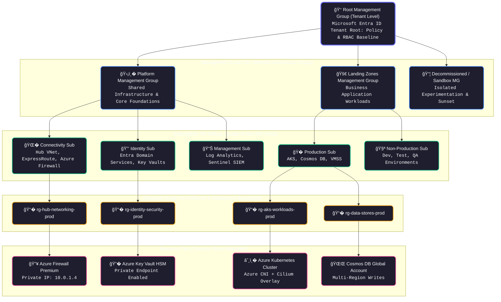
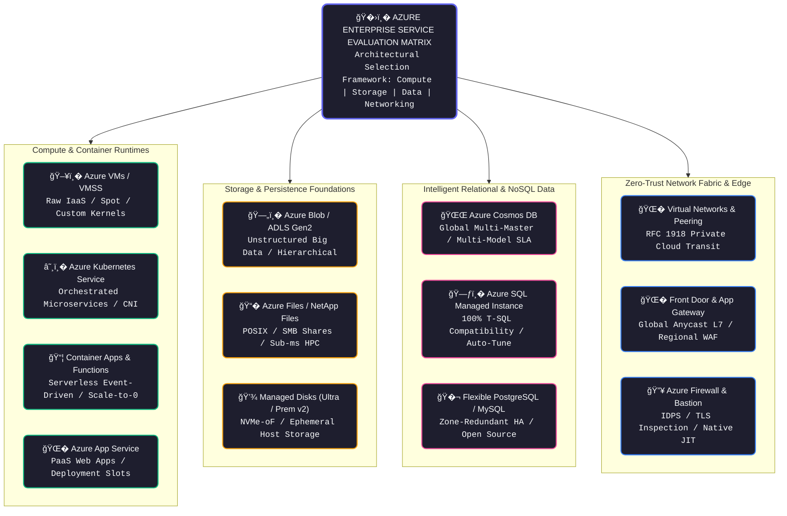
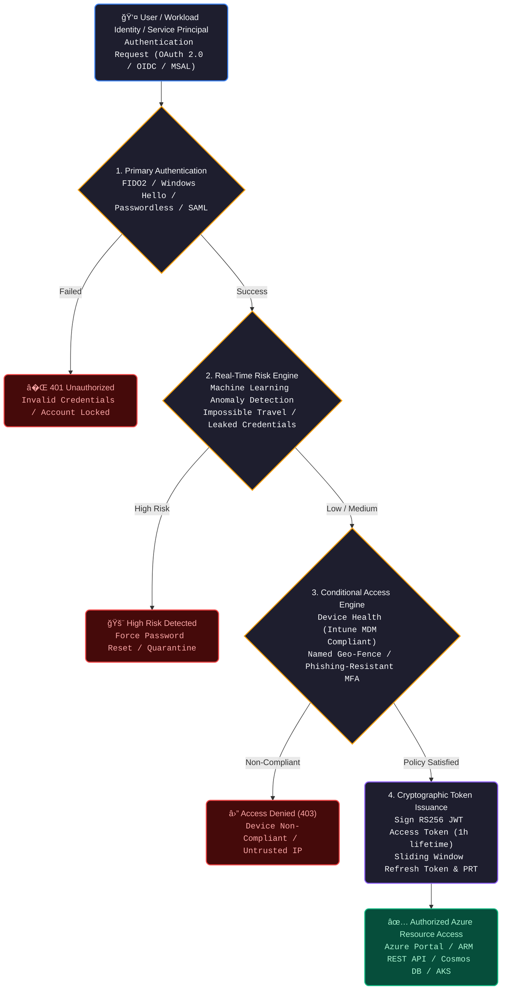
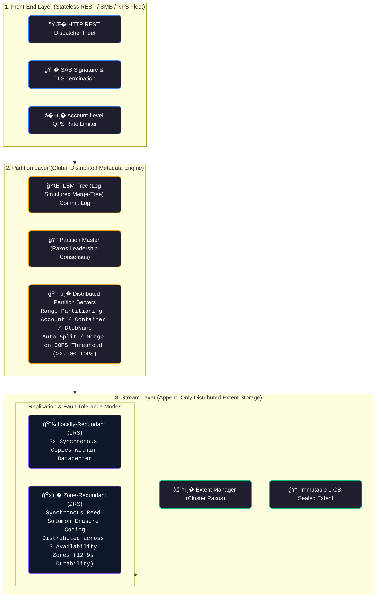

# 🔷 Microsoft Azure Cloud Architecture & Enterprise Infrastructure Master Guide

[� Back to Home](README.md)

A battle-tested engineering handbook and architectural reference for mastering, securing, scaling, and optimizing enterprise cloud infrastructure on Microsoft Azure. Written for Senior DevOps Engineers, Cloud Solution Architects, Site Reliability Engineers (SREs), and Enterprise Infrastructure Leads designing Azure Landing Zones (CAF), Microsoft Entra ID zero-trust governance, Hub-and-Spoke VNet topologies, high-throughput Azure Kubernetes Service (AKS) clusters, multi-region Cosmos DB failovers, and hybrid cloud connectivity with ExpressRoute.

---

# TRACK 1: THE JUNIOR & ENTRY-LEVEL FOUNDATIONS (ZERO-TO-HERO)

## 1. The Real-World Mental Model (The Global Corporate Empire & Sovereign Branch System)

### The Problem: Fragmented Identity, Siloed Data Centers & Hybrid Headaches
Before modern enterprise hyperscale clouds, large global corporations operated hundreds of disjointed local systems:
1. **The Identity Fragmentation Crisis**: An employee had one login for their office laptop, a different login for VPN, a third password for file servers, and no central way to revoke access when terminated.
2. **The Hybrid Network Wall**: Connecting corporate branch offices in London, Tokyo, and New York required expensive, slow MPLS circuits with zero elasticity and months of provisioning lead time.
3. **The Governance Abyss**: Without centralized hierarchy, rogue business units spun up unapproved shadow IT servers on corporate credit cards without security guardrails or audit compliance.

```mermaid
flowchart LR
    classDef branch fill:#1e1e2e,stroke:#3b82f6,stroke-width:2px,color:#f8fafc,rx:8,ry:8
    classDef link fill:#0f172a,stroke:#f59e0b,stroke-width:2px,color:#fbbf24,stroke-dasharray: 4 4
    classDef datacenter fill:#1e1e2e,stroke:#ef4444,stroke-width:2px,color:#f8fafc,rx:8,ry:8
    classDef risk fill:#450a0a,stroke:#dc2626,stroke-width:2px,color:#fca5a5,rx:8,ry:8

    subgraph Perimeter["Geographic Corporate Branches (Siloed Access)"]
        London["� London Office<br/><code>Remote Workforce</code>"]:::branch
        NY["� New York HQ<br/><code>Corporate Center</code>"]:::branch
        Tokyo["� Tokyo Branch<br/><code>Regional Office</code>"]:::branch
    end

    subgraph Transit["Disjointed Transit Infrastructure"]
        VPN["🔒 Unmanaged IPSec VPN<br/><code>Split-Tunnel Latency</code>"]:::link
        MPLS["âš¡ Dedicated MPLS WAN<br/><code>$50k/mo Sunk CapEx</code>"]:::link
        Shadow["⚠� Shadow IT Direct Egress<br/><code>Bypassing Security Proxies</code>"]:::link
    end

    subgraph LegacyDC["Siloed Enterprise Core & Security Failures"]
        LocalDC["🖥� Local AD Domain Controller<br/><code>Unpatched Windows 2012 R2</code>"]:::datacenter
        CorpDC["�� Central Corporate Data Center<br/><code>Manual Patching Cycles</code>"]:::datacenter
        PublicSvc["� Unaudited Public Server<br/><code>Open Port 3389 / S3 Bucket</code>"]:::risk

        FileShare["� Legacy File Share (SMBv1)<br/><code>No Encryption at Rest</code>"]:::risk
        LegacyApp["⚙� Custom Legacy App Server<br/><code>Monolithic Vulnerabilities</code>"]:::risk
        Leak["🚨 Unaudited PII Data Breach!<br/><code>Regulatory Fines ($20M+)</code>"]:::risk
    end

    London --> VPN --> LocalDC --> FileShare
    NY --> MPLS --> CorpDC --> LegacyApp
    Tokyo --> Shadow --> PublicSvc --> Leak
```



<details>
<summary><b>View Text-Based Representation (ASCII Fallback)</b></summary>

```text
Fragmented Traditional Enterprise IT (Siloed, Disjointed, Vulnerable):
[London Office] ──(Custom VPN)──> [Local AD DC] ──> File Share (No Encryption at Rest)
[New York HQ]   ──(MPLS $50k/mo)─> [Corporate DC]──> Custom App Server (Manual Patching)
[Tokyo Branch]  ──(Shadow IT)───> Public Server ──> Unaudited PII Data Leak!
```

</details>

#### 📊 Visual Architecture & Subsystem Mechanics: The Fragmentation Crisis
1. **Node Anatomy & Topology**: Disparate corporate branch offices operate independent Active Directory forests without federated trust relationships. Network perimeters rely on static point-to-point IPSec tunnels terminating on aging edge firewalls with single points of failure (SPOF).
2. **Execution Flow & State Transitions**: Remote workers authenticate against local domain controllers using legacy NTLMv2 hashes. Upon network join, unencrypted SMBv1 shares are mapped over the WAN, exposing corporate intellectual property to lateral movement and cleartext packet sniffing.
3. **Low-Level Protocol Mechanics**: Point-to-point VPN encapsulation incurs 56-byte IPSec header overhead per packet, causing MTU black holes (dropping packets exceeding 1500 bytes when DF flag is set). Lack of centralized revocation means terminated employees retain Active Directory Kerberos TGT tickets valid for up to 10 hours.
4. **Production Failure Modes & SRE Forensics**: Branch offices bypass corporate security proxies via "Shadow IT" internet breakouts to avoid high-latency MPLS circuits. Rogue cloud instances spun up with public IP addresses (e.g., exposed RDP port 3389) become primary entry points for ransomware campaigns and multi-million dollar regulatory compliance breaches.

### The Industrial Solution: Microsoft Azure (The Unified Global Enterprise Fabric)
Microsoft Azure organizes enterprise cloud computing into a **strict, sovereign organizational hierarchy** backed by native enterprise identity:
- **Unified Identity Plane (Microsoft Entra ID)**: A single centralized identity directory governing human users, software services, and hardware devices across cloud, on-premises Active Directory, and SaaS platforms (Microsoft 365, GitHub, Salesforce).
- **The 4-Tier Governance Hierarchy**: Management Groups govern Subscriptions; Subscriptions isolate billing and quotas; Resource Groups group lifecycle-coupled resources; Resources are the actual running services.
- **Enterprise Azure Hybrid Cloud Fabric**: Seamlessly bridges on-premises Hyper-V/VMware data centers to Azure via ExpressRoute, Azure Arc, and Azure Stack.



<details>
<summary><b>View Text-Based Representation (ASCII Fallback)</b></summary>

```text
Microsoft Azure 4-Tier Governance Hierarchy:
┌─────────────────────────────────────────────────────────────────────────�
│ ROOT MANAGEMENT GROUP (Tenant Level / Enterprise Security Guardrails)   │
└────────────────────────────────────┬────────────────────────────────────┘
                                     │
         ┌───────────────────────────┴───────────────────────────�
         â–¼                                                       â–¼
┌────────────────────────────────�             ┌────────────────────────────────�
│ PLATFORM MANAGEMENT GROUP      │             │ LANDING ZONES MANAGEMENT GROUP │
│ ├── Connectivity Subscription  │             │ ├── Production Subscription    │
│ │   (Hub VNet, ExpressRoute)   │             │ │   (EKS, Cosmos DB, VMSS)     │
│ └── Identity Subscription      │             │ └── Non-Production Sub         │
│     (Entra Domain Services)    │             │     (Dev/Staging Workloads)    │
└────────────────────────────────┘             └────────────────────────────────┘
```

</details>

#### 📊 Visual Architecture & Subsystem Mechanics: Azure 4-Tier Enterprise Governance
1. **Node Anatomy & Hierarchical Topology**: Governance descends from the Entra ID Tenant Root Management Group (`/providers/Microsoft.Management/managementGroups/<TenantID>`) down to individual Azure resource instances. Management Groups provide policy aggregation scopes; Subscriptions provide isolated billing units and Azure Resource Manager (ARM) quota boundaries; Resource Groups enforce atomic deployment lifecycles.
2. **Policy Evaluation & Inheritance Engine**: Azure Policy operates on a downward inheritance model. A policy assigned at Root (e.g., `Deny-Public-IP-On-NICs`) applies unconditionally to all child Management Groups, Subscriptions, and Resource Groups. Child scopes cannot override parent `Deny` effects; ARM evaluates policies using logical `AND` operators across all hierarchical levels during pre-flight ARM template validation.
3. **Low-Level Azure Resource Manager (ARM) Mechanics**: Every API request to `https://management.azure.com/` is routed through the ARM API Gateway. Subscriptions maintain independent token bucket rate limits: **12,000 read requests/hour** and **1,200 write requests/hour**. Distributing workloads across multiple Landing Zone subscriptions prevents large Terraform or CI/CD deployments from triggering HTTP 429 rate limit throttling.
4. **Production Governance Failure Modes & SRE Guardrails**:
   - **Subscription Quota Deadlocks**: Attempting to scale an AKS node pool in a single subscription hits VM family core quotas (e.g., standard `Dsv5` quota), causing cluster auto-scaler failures during traffic surges. Solution: Implement multi-subscription Landing Zones with dedicated quota allocations.
   - **Direct Resource-Level RBAC Bloat**: Assigning roles (`Contributor`) directly to individual VMs or Storage Accounts exhausts the **5,000 role assignment limit per subscription** and creates invisible security blind spots during de-provisioning. Solution: Enforce RBAC strictly at Resource Group or Management Group scopes mapped to Entra Security Groups.

---

## 2. The 5 Core Building Blocks

Every enterprise workload on Azure is constructed from five foundational pillars:

```mermaid
flowchart TD
    classDef idSec fill:#1e1e2e,stroke:#6366f1,stroke-width:2px,color:#f8fafc,rx:8,ry:8
    classDef net fill:#1e1e2e,stroke:#3b82f6,stroke-width:2px,color:#f8fafc,rx:8,ry:8
    classDef comp fill:#1e1e2e,stroke:#10b981,stroke-width:2px,color:#f8fafc,rx:8,ry:8
    classDef stor fill:#1e1e2e,stroke:#f59e0b,stroke-width:2px,color:#f8fafc,rx:8,ry:8
    classDef data fill:#1e1e2e,stroke:#ec4899,stroke-width:2px,color:#f8fafc,rx:8,ry:8

    subgraph P1["1. IDENTITY & GOVERNANCE (The Corporate Gatekeeper)"]
        Entra["🔑 Microsoft Entra ID (OIDC / OAuth2)"]:::idSec
        RBAC["🛡� Azure RBAC & PIM (Just-In-Time)"]:::idSec
        Policy["📜 Azure Policy & Management Groups"]:::idSec
    end

    subgraph P2["2. NETWORKING & PERIMETER (The Enterprise Highway)"]
        VNet["� Azure Virtual Networks (RFC 1918)"]:::net
        FW["🔥 Azure Firewall Premium & NSGs"]:::net
        WAN["âš¡ Virtual WAN & ExpressRoute (Private Peering)"]:::net
    end

    subgraph P3["3. COMPUTE RUNTIMES (The Processing Fabric)"]
        AKS["☸� Azure Kubernetes Service (AKS Engine)"]:::comp
        VMSS["🖥� Virtual Machine Scale Sets (Spot / On-Demand)"]:::comp
        ACA["📦 Azure Container Apps & Functions (Serverless)"]:::comp
    end

    subgraph P4["4. STORAGE TIERS (The Distributed Persistence Layer)"]
        Blob["🗄� Azure Blob Storage (Hot / Cool / Cold / Archive)"]:::stor
        ADLS["📊 Azure Data Lake Storage Gen2 (Hierarchical Namespace)"]:::stor
        Files["� Azure Files & NetApp Files (SMBv3 / NFSv4.1)"]:::stor
    end

    subgraph P5["5. MANAGED DATA & MESSAGING (The Intelligent Data Platform)"]
        SQL["🗃� Azure SQL Managed Instance & Flexible PostgreSQL"]:::data
        Cosmos["🌌 Azure Cosmos DB (Multi-Region / Multi-Model NoSQL)"]:::data
        Bus["📨 Azure Service Bus & Event Hubs (AMQP / Kafka)"]:::data
    end

    P1 -- "Authorizes & Audits Access" --> P2
    P2 -- "Secures Network Data Plane" --> P3
    P3 -- "Persists Ephemeral I/O" --> P4
    P4 -- "Hydrates Structured State" --> P5
```



<details>
<summary><b>View Text-Based Representation (ASCII Fallback)</b></summary>

```text
┌─────────────────────────────────────────────────────────────────────────�
│ 1. IDENTITY & GOVERNANCE (The Corporate Directorate & Policy Guard)     │
│    Microsoft Entra ID, Azure RBAC, Management Groups, Azure Policy      │
└────────────────────────────────────┬────────────────────────────────────┘
                                     │ Authorizes & Audits
                                     â–¼
┌─────────────────────────────────────────────────────────────────────────�
│ 2. NETWORKING & PERIMETER (The Enterprise Highway & Private Transit)    │
│    Azure VNets, NSGs, Azure Firewall, Virtual WAN, ExpressRoute, FrontDoor│
└────────────────────────────────────┬────────────────────────────────────┘
                                     │ Connects & Secures
                                     â–¼
┌─────────────────────────────────────────────────────────────────────────�
│ 3. COMPUTE RUNTIMES (The Processing Fabric)                             │
│    Azure VMs, Virtual Machine Scale Sets (VMSS), AKS, Container Apps    │
└────────────────────────────────────┬────────────────────────────────────┘
                                     │ Executes & Scales
                                     â–¼
┌─────────────────────────────────────────────────────────────────────────�
│ 4. STORAGE TIERS (The Blob & File Infrastructure)                       │
│    Azure Storage Accounts (Blob/Data Lake Gen2), Azure Files, Disks     │
└────────────────────────────────────┬────────────────────────────────────┘
                                     │ Persists & Replicates
                                     â–¼
┌─────────────────────────────────────────────────────────────────────────�
│ 5. MANAGED DATA & MESSAGING (The Intelligent Data Platform)             │
│    Azure SQL Database, Cosmos DB, Azure Service Bus, Event Grid         │
└─────────────────────────────────────────────────────────────────────────┘
```

</details>

#### 📊 Visual Architecture & Subsystem Mechanics: The 5 Core Enterprise Pillars
1. **Building Block Topology & Inter-Service Dependencies**: Cloud enterprise architectures form a strict directed acyclic graph (DAG). Identity establishes cryptographic trust anchors; Networking provisions RFC 1918 private subnets, routing tables, and security perimeters; Compute runtimes execute inside isolated subnets with ephemeral disks; Storage persists files and blobs; Managed Data engines process distributed transactional state.
2. **Runtime Lifecycle & Authentication Handshake**: A container in AKS or an instance in VMSS retrieves a managed identity token from the Azure Instance Metadata Service (IMDS at `http://169.254.169.254/metadata/identity/oauth2/token`). IMDS returns an Entra ID JSON Web Token (JWT). The application attaches this bearer token to establish a mutual TLS connection over a Private Endpoint (Private Link) directly to Cosmos DB or Azure SQL—eliminating hardcoded database passwords and rotation overhead entirely.
3. **Low-Level Network & Storage Plane Offload**: Networking layers interact via Azure Virtual Filtering Platform (VFP) virtual switch flow rules inside the Hyper-V host. Storage requests travel over NVMe-over-Fabrics (NVMe-oF) storage clusters with hardware-accelerated RDMA, delivering single-digit microsecond latencies for Premium SSD v2 and Ultra Disk tiers.
4. **Cross-Pillar Production Failure Scenarios**:
   - **IMDS Token Throttling**: Hundreds of pods on a single AKS worker node querying IMDS concurrently trigger HTTP 429 throttling (IMDS limits are 70 requests/second per VM). Solution: Implement token caching via the Azure Identity SDK or leverage Azure Workload Identity with projected service account tokens.
   - **Private Link Asymmetric Routing**: When compute routes to storage via an intermediate firewall appliance without Source NAT (SNAT), return packets bypass the firewall, causing TCP RST drops. Solution: Maintain symmetric routing with SNAT or route Private Link traffic directly via VNet service endpoints/private DNS zones.

| Building Block | Physical World Analogy | Technical Definition | Key Architectural Rule |
| :--- | :--- | :--- | :--- |
| **1. Identity (Entra ID & RBAC)** | The Corporate Biometric Badge & Security Clearance | Entra ID authenticates identities (Users, Managed Identities); Azure RBAC authorizes actions on Azure resource management scopes (`Owner`, `Contributor`, `Reader`). | **Never assign permissions at resource level**. Assign RBAC at Resource Group or Subscription level using Entra Security Groups. |
| **2. Networking (VNet & NSG)** | The Private Corporate Campus & Security Checkpoints | Virtual Networks provide private RFC 1918 network isolation. Network Security Groups (NSGs) filter packet flow at the subnet and network interface level. | Implement a **Hub-and-Spoke Topology**: Centralize egress firewall, VPN, and DNS in the Hub; deploy workloads in Spoke VNets. |
| **3. Compute (VMSS / AKS)** | The Heavy Machinery Fleet & Container Ships | Virtual Machine Scale Sets auto-scale identical VMs. Azure Kubernetes Service (AKS) manages enterprise containerized microservices with native Entra integration. | Utilize **Azure Spot VMs** for fault-tolerant workloads to save up to $90\%$; run critical pods across **Availability Zones**. |
| **4. Storage (Blob / Data Lake)** | The Infinite Vault & Department Filing Cabinets | Azure Storage Accounts host unstructured object data (Blobs), hierarchical file namespaces (ADLS Gen2), and SMB/NFS file shares (Azure Files). | Enforce **Private Endpoints** and disable public blob access across all production storage accounts. |
| **5. Managed Data (SQL / Cosmos DB)** | The Relational Ledger & Global NoSQL Matrix | Azure SQL provides managed SQL Server instances with automatic tuning; Cosmos DB provides globally distributed multi-model NoSQL with single-digit millisecond latency SLAs. | Choose the appropriate Cosmos DB consistency level (e.g. **Session** for user web apps, **Strong** for financial accounting). |

---

## 3. The Core Azure Resource Hierarchy & Traffic Flow

Understanding how traffic flows through an enterprise Azure deployment:

```mermaid
flowchart TD
    classDef edge fill:#1e1e2e,stroke:#3b82f6,stroke-width:2px,color:#f8fafc,rx:8,ry:8
    classDef hub fill:#1e1e2e,stroke:#f59e0b,stroke-width:2px,color:#f8fafc,rx:8,ry:8
    classDef fw fill:#1e1e2e,stroke:#ef4444,stroke-width:2px,color:#f8fafc,rx:8,ry:8
    classDef comp fill:#1e1e2e,stroke:#10b981,stroke-width:2px,color:#f8fafc,rx:8,ry:8
    classDef data fill:#1e1e2e,stroke:#8b5cf6,stroke-width:2px,color:#f8fafc,rx:8,ry:8

    Client["� External Internet Client / Enterprise Branch<br/><code>HTTPS Request (TLS 1.3 / HTTP/2)</code>"]:::edge

    subgraph Tier1["1. Global Edge Ingress & Anycast Routing"]
        AFD["� Azure Front Door (Anycast Layer 7 Edge)<br/><code>Terminates TLS at nearest Edge PoP</code><br/><code>WAF: Managed OWASP 3.2 Rules + Bot Defense</code>"]:::edge
    end

    subgraph Tier2["2. Hub Virtual Network (Central Ingress & Security Transit)"]
        AppGW["🚪 Azure Application Gateway v2 (WAF)<br/><code>Private Ingress Subnet: 10.0.1.0/24</code><br/><code>SSL Offloading & Cookie-Based Session Affinity</code>"]:::hub
        AzFW["🛡� Azure Firewall Premium (IDPS Inspection)<br/><code>AzureFirewallSubnet: 10.0.2.0/24</code><br/><code>TLS Inspection + FQDN Filtering (Egress SNAT)</code>"]:::fw
    end

    subgraph Tier3["3. Spoke Workload Virtual Network (Compute Tier)"]
        AKSIngress["☸� Ingress Controller (Internal NGINX / AGIC)<br/><code>aks-ingress-subnet: 10.1.1.0/24</code>"]:::comp
        AKSPods["📦 Microservice Pods (Azure CNI Overlay)<br/><code>Entra Workload Identity Integration</code>"]:::comp
    end

    subgraph Tier4["4. Sovereign Data Persistence Tier (Private Link Isolated)"]
        PE["🔒 Azure Private Endpoint NIC<br/><code>Private IP: 10.1.2.50 (privatelink.database.windows.net)</code>"]:::data
        CosmosDB["🌌 Azure Cosmos DB / SQL Managed Instance<br/><code>Multi-Region Replicas | Customer-Managed Key (CMK)</code>"]:::data
        Vault["� Azure Key Vault HSM Premium<br/><code>Envelope Encryption Root Key (RSA 4096)</code>"]:::data
    end

    Client -->|1. Anycast BGP Routing| AFD
    AFD -->|2. Encrypted Origin Tunnel| AppGW
    AppGW -->|3. UDR 0.0.0.0/0 Next-Hop| AzFW
    AzFW -->|4. VNet Peering Transit| AKSIngress
    AKSIngress -->|5. Cluster Service Mesh| AKSPods
    AKSPods -->|6. Entra OIDC Bearer Token| PE
    PE -->|7. Private Substrate Fabric| CosmosDB
    CosmosDB -.->|CMK Unwrapping| Vault
```



<details>
<summary><b>View Text-Based Representation (ASCII Fallback)</b></summary>

```text
┌─────────────────────────────────────────────────────────────────────────�
│ 1. GLOBAL TRAFFIC ROUTING: Azure Front Door (Anycast Layer 7 Edge)      │
│    Terminates client TLS 1.3 at nearest PoP ──> WAF inspects OWASP Top 10│
├─────────────────────────────────────────────────────────────────────────┤
│ 2. PRIVATE EDGE INGRESS: Azure Application Gateway (In Hub VNet)        │
│    Private traffic enters Application Gateway via Private Endpoint      │
│    Performs SSL Offloading & Cookie-Based Affinity                      │
├─────────────────────────────────────────────────────────────────────────┤
│ 3. PERIMETER INSPECTION: Azure Firewall Premium                         │
│    Inspects TLS traffic with IDPS (Intrusion Detection/Prevention)      │
│    Routes packets across Spoke VNet Peering links                       │
├─────────────────────────────────────────────────────────────────────────┤
│ 4. CONTAINER CLUSTER: Azure Kubernetes Service (AKS)                    │
│    Worker nodes receive traffic via Azure CNI; Pods authenticate to DB  │
│    using Entra Workload Identity (Zero hardcoded secrets)               │
├─────────────────────────────────────────────────────────────────────────┤
│ 5. PERSISTENT STORAGE: Azure Cosmos DB / Azure SQL Managed Instance     │
│    Enforces Private Link (Private IP only); Encrypted with Customer-    │
│    Managed Keys (CMK) residing in Azure Key Vault Premium (HSM)         │
└─────────────────────────────────────────────────────────────────────────┘
```

</details>

#### 📊 Visual Architecture & Subsystem Mechanics: End-to-End Enterprise Packet Journey
1. **Traffic Path & Component Topology**: Dual-layer ingress decouples edge DDoS/WAF mitigation from internal microservice routing. Front Door absorbs volumetric and Layer 7 DDoS attacks across more than 190 Edge Points of Presence worldwide before traffic touches the regional virtual network.
2. **Packet Flow, NAT & TLS Offloading Stages**:
   - The client establishes a TLS 1.3 handshake at the nearest Microsoft Anycast Edge PoP.
   - Front Door terminates client TLS, validates WAF rate limits, and opens a pre-warmed HTTP/2 persistent connection to the Hub Application Gateway public/private frontend.
   - Application Gateway performs header inspection and forwards packets across Azure Firewall Premium via subnet User Defined Route (UDR: `0.0.0.0/0` -> `10.0.2.4`).
   - Azure Firewall performs Deep Packet Inspection (DPI) with IDPS signature matching against known CVE exploits.
   - Packets traverse high-speed VNet Peering to the Spoke AKS cluster; worker node routing tables deliver packets directly to the destination pod IP via Azure CNI without overlay encapsulation overhead.
3. **Low-Level Protocol Mechanics**: Private Link bypasses public DNS endpoints entirely. An Azure Private DNS Zone (`privatelink.documents.azure.com`) resolves the database hostname directly to an RFC 1918 private IP (`10.1.2.50`) within the Spoke subnet. Packets are encapsulated within Azure's underlying physical Virtual Filtering Platform (VFP) and routed across Microsoft's internal SDN substrate without ever traversing the public internet.
4. **Production SRE Bottlenecks & Triage**:
   - **SNAT Port Exhaustion on Outbound Egress**: Microservices making hundreds of external third-party API calls over Azure Firewall exhaust the default 1,024 SNAT ports per public IP. Symptoms: Intermittent TCP connection timeouts (`ETIMEDOUT`). Remediation: Allocate multiple public IP addresses to the Azure Firewall or deploy Azure Virtual Network NAT Gateway to Spoke subnets.
   - **Asymmetric Routing on UDRs**: If a Spoke subnet route points to the Azure Firewall private IP, but the return route bypasses the firewall via a direct peering path, the firewall's stateful TCP connection table drops return packets (`TCP RST / Drop`). Remediation: Ensure symmetrical routing tables or enforce Source NAT (SNAT) on private IP ranges within firewall policies.

---

## 4. Beginner Code Walkthrough: Production Azure Hub-and-Spoke VNet in Terraform

Below is a complete, production-grade Terraform script building a foundational Azure Hub VNet, Azure Bastion Subnet, Azure Firewall Subnet, and a Spoke VNet with peering.

Create `azure_network.tf`:

```hcl
# ==============================================================================
# Production Azure Hub-and-Spoke VNet Topology (AzureRM v3.x)
# ==============================================================================

terraform {
  required_version = ">= 1.5.0"
  required_providers {
    azurerm = {
      source  = "hashicorp/azurerm"
      version = "~> 3.80"
    }
  }
}

provider "azurerm" {
  features {
    resource_group {
      prevent_deletion_if_contains_resources = true
    }
  }
}

# 1. Resource Group
resource "azurerm_resource_group" "rg" {
  name     = "rg-enterprise-network-prod"
  location = "eastus2"
  tags = {
    Environment = "production"
    ManagedBy   = "terraform"
    CostCenter  = "infrastructure"
  }
}

# 2. Hub Virtual Network
resource "azurerm_virtual_network" "hub_vnet" {
  name                = "vnet-hub-eastus2"
  location            = azurerm_resource_group.rg.location
  resource_group_name = azurerm_resource_group.rg.name
  address_space       = ["10.0.0.0/16"]

  tags = { Role = "hub-network" }
}

# 3. Dedicated Azure Firewall Subnet (Mandatory name: AzureFirewallSubnet)
resource "azurerm_subnet" "firewall_subnet" {
  name                 = "AzureFirewallSubnet"
  resource_group_name  = azurerm_resource_group.rg.name
  virtual_network_name = azurerm_virtual_network.hub_vnet.name
  address_prefixes     = ["10.0.1.0/26"]
}

# 4. Dedicated Azure Bastion Subnet (Mandatory name: AzureBastionSubnet)
resource "azurerm_subnet" "bastion_subnet" {
  name                 = "AzureBastionSubnet"
  resource_group_name  = azurerm_resource_group.rg.name
  virtual_network_name = azurerm_virtual_network.hub_vnet.name
  address_prefixes     = ["10.0.2.0/26"]
}

# 5. Spoke Virtual Network (Workload Applications)
resource "azurerm_virtual_network" "spoke_vnet" {
  name                = "vnet-spoke-app-eastus2"
  location            = azurerm_resource_group.rg.location
  resource_group_name = azurerm_resource_group.rg.name
  address_space       = ["10.1.0.0/16"]

  tags = { Role = "workload-spoke" }
}

resource "azurerm_subnet" "spoke_app_subnet" {
  name                 = "snet-workload-apps"
  resource_group_name  = azurerm_resource_group.rg.name
  virtual_network_name = azurerm_virtual_network.spoke_vnet.name
  address_prefixes     = ["10.1.1.0/24"]
}

# 6. Bi-Directional VNet Peering
resource "azurerm_virtual_network_peering" "hub_to_spoke" {
  name                         = "peer-hub-to-spoke"
  resource_group_name          = azurerm_resource_group.rg.name
  virtual_network_name         = azurerm_virtual_network.hub_vnet.name
  remote_virtual_network_id    = azurerm_virtual_network.spoke_vnet.id
  allow_virtual_network_access = true
  allow_forwarded_traffic      = true
}

resource "azurerm_virtual_network_peering" "spoke_to_hub" {
  name                         = "peer-spoke-to-hub"
  resource_group_name          = azurerm_resource_group.rg.name
  virtual_network_name         = azurerm_virtual_network.spoke_vnet.name
  remote_virtual_network_id    = azurerm_virtual_network.hub_vnet.id
  allow_virtual_network_access = true
  allow_forwarded_traffic      = true
}

# 7. Network Security Group for Workload Subnet
resource "azurerm_network_security_group" "spoke_nsg" {
  name                = "nsg-spoke-app"
  location            = azurerm_resource_group.rg.location
  resource_group_name = azurerm_resource_group.rg.name

  security_rule {
    name                       = "DenyDirectInternetInbound"
    priority                   = 4096
    direction                  = "Inbound"
    access                     = "Deny"
    protocol                   = "*"
    source_port_range          = "*"
    destination_port_range     = "*"
    source_address_prefix      = "Internet"
    destination_address_prefix = "*"
  }

  tags = { Tier = "security" }
}

resource "azurerm_subnet_network_security_group_association" "nsg_assoc" {
  subnet_id                 = azurerm_subnet.spoke_app_subnet.id
  network_security_group_id = azurerm_network_security_group.spoke_nsg.id
}
```

---

## 5. 5 Critical Beginner Traps & Anti-Patterns

| Anti-Pattern / Trap | Production Impact & Symptom | Root Cause Mechanics | The Wrong Way (Amateur) | The Production Fix (Senior SRE) |
| :--- | :--- | :--- | :--- | :--- |
| **1. Public IP on Every Azure VM** | Port scanning attacks hit RDP (3389) or SSH (22); ransomware encrypts disks. | Assigning a Public IP resource (`azurerm_public_ip`) to the VM NIC for direct remote access. | Attaching Public IPs to all VMs so admins can log in from home. | **Never assign Public IPs to backend VMs**. Deploy **Azure Bastion** or Azure Virtual Desktop for encrypted browser-based RDP/SSH without exposed public ports. |
| **2. Confusing Entra Roles with Azure RBAC** | Admin granted `Global Administrator` in Entra ID, yet receives `403 AuthorizationFailed` when creating a VM. | Entra ID Directory Roles govern the tenant (users, groups, domains); Azure RBAC governs Azure resources (VMs, VNets, DBs). They are separate planes. | Assuming Entra ID Global Admin automatically manages all cloud infrastructure resources. | Elevate access via **Access Management for Azure Resources** toggle in Entra ID, or assign dedicated Azure RBAC roles (`Contributor`/`Owner`) at the Subscription scope. |
| **3. Cosmos DB Over-Provisioning RU/s** | $\$25,000$ monthly cloud bill for an internal application serving 50 daily users. | Manually setting provisioned Request Units (e.g. 50,000 RU/s) on a database collection with erratic traffic. | Provisioning static high RU/s "just in case" peak traffic hits. | Enable **Cosmos DB Autoscale RU/s** (scales dynamically between $10\%$ and $100\%$ of max RU/s) or use **Cosmos DB Serverless** for low-traffic services. |
| **4. Accidental Deletion of Critical Resource Groups** | Entire production database, cluster, and virtual network deleted by an errant Terraform command. | Deleting an Azure Resource Group triggers cascade deletion of every child resource contained within it. | Running `terraform destroy` or clicking Delete RG without safety locks. | Apply **Azure Management Locks** (`CanNotDelete` / `ReadOnly`) on all production resource groups. Enable soft-delete and purge protection on Key Vaults and Storage. |
| **5. Storage Account Public Network Access** | Internal database backups and company trade secrets exposed to the open Internet. | Azure Storage Accounts by default allow public anonymous access from all networks unless explicitly blocked. | Relying solely on SAS tokens without network perimeter restrictions. | Set `public_network_access_enabled = false`. Access storage strictly through **Azure Private Endpoints** using private DNS zones. |

---

## 6. 10 Junior Interview Questions & Answers (ELI5 + Senior Technical Deep-Dive)

### Q1: What is the difference between a Subscription, a Resource Group, and a Management Group?
- **ELI5 Analogy**: A Management Group is the Corporate Boardroom setting rules for the entire company. A Subscription is a company bank credit card account that pays the bills. A Resource Group is a project folder on that account holding all the blueprints, receipts, and files for a specific building project.
- **Senior Technical Deep-Dive**:
  - **Management Group**: Container above subscriptions allowing enterprise-wide governance, compliance, and policy assignment across multiple subscriptions (supports up to 6 levels of nesting).
  - **Subscription**: The fundamental billing, quota, and identity boundary. Each subscription has distinct service limits and generates its own billing invoice.
  - **Resource Group**: A logical container grouping resources that share an identical deployment and operational lifecycle (e.g. all components of an app). A resource can belong to only one RG; deleting an RG deletes all child resources inside it.

### Q2: What is the difference between Microsoft Entra ID (Azure AD) and On-Premises Active Directory Domain Services (AD DS)?
- **ELI5 Analogy**: On-premises AD DS is an old-school corporate office building security desk using landline phones and paper badges (Kerberos/NTLM/LDAP). Microsoft Entra ID is a modern global airport terminal using digital smartphone passports and QR codes (OAuth 2.0 / SAML / OIDC) that work anywhere in the world over the internet.
- **Senior Technical Deep-Dive**:
  - **AD DS**: Directory service built on hierarchical Organizational Units (OUs), Kerberos, NTLM, and LDAP. Governs Windows domain-joined servers, Group Policy Objects (GPOs), and runs on Windows Server domain controllers.
  - **Entra ID**: Cloud-native identity-as-a-service (IDaaS) built on a flat directory structure. Communicates over HTTP/REST using modern protocols: **OAuth 2.0, OpenID Connect (OIDC), and SAML 2.0**. Governs SaaS apps, Conditional Access, MFA, and Workload Identities. Synchronized via **Microsoft Entra Connect**.

### Q3: What is the difference between Network Security Groups (NSGs) and Application Security Groups (ASGs)?
- **ELI5 Analogy**: An NSG is a security guard with a clipboard checking IP addresses and port numbers. An ASG is a colored badge (e.g. "Database Chef" or "Web Server Host") you clip onto servers so the security guard can say: "Blue badges can talk to Yellow badges," without needing to memorize individual IP addresses.
- **Senior Technical Deep-Dive**:
  - **NSG**: Layer 4 stateful firewall rule set containing priority-ordered Allow/Deny rules based on 5-tuple: Source IP, Source Port, Destination IP, Destination Port, Protocol.
  - **ASG**: Logical metadata grouping for Virtual Machine network interfaces (NICs). Allows you to write declarative NSG rules such as: `ALLOW ASG-Web-Servers TO ASG-Database-Servers ON PORT 1433`, eliminating manual IP management when auto-scaling VMs.

### Q4: Explain the Azure Blob Storage Access Tiers: Hot, Cool, Cold, and Archive.
- **ELI5 Analogy**: Hot is a refrigerator on your kitchen counter (high rent, free to open). Cool is a basement storage pantry (medium rent, small fee to fetch). Cold is a garage storage shelf (low rent, higher retrieval fee). Archive is a remote mountain storage cavern (nearly free rent, but takes 15 hours to drive up and retrieve your box).
- **Senior Technical Deep-Dive**:
  - **Hot**: Optimized for frequent access. Highest storage cost, lowest read/write access fee ($<1\text{ ms}$ latency).
  - **Cool**: Optimized for data accessed infrequently but retained for at least 30 days (early deletion penalty applies). Lower storage cost, higher data access fee.
  - **Cold**: Optimized for rarely accessed data retained for at least 90 days. Very low storage cost, higher access fee.
  - **Archive**: Offline storage for long-term historical records retained for at least 180 days. Lowest cost ($\approx \$0.00099/\text{GB}$), but data is offline; rehydrating a blob to Hot tier takes **up to 15 hours** (or priority rehydration in $<1\text{ hour}$).

### Q5: What is the difference between Azure App Service, Azure Virtual Machines, and Azure Container Apps?
- **ELI5 Analogy**: Azure VM is buying an empty house (you fix the plumbing, paint the walls, and patch the roof). Azure App Service is renting a fully furnished serviced apartment (the landlord cleans the room and maintains the building; you just live there). Azure Container Apps is renting a modular hotel pod that expands or disappears completely depending on how many guests show up.
- **Senior Technical Deep-Dive**:
  - **Azure VM (IaaS)**: Full control over OS kernel, drivers, software installation. Requires manual OS patching, backup management, and anti-virus configuration.
  - **Azure App Service (PaaS)**: Fully managed runtime (Java, .NET, Python, Node.js) with auto-patching, built-in TLS, deployment slots, and auto-scaling. No OS root access.
  - **Azure Container Apps (Serverless Containers)**: Built on Kubernetes (K3s/AKS) and Envoy proxy with KEDA (Kubernetes Event-driven Autoscaling). Automatically scales containers to **zero** when idle; scales up based on HTTP requests or event queues.

### Q6: Explain the 5 Cosmos DB Consistency Levels.
- **ELI5 Analogy**:
  1. *Strong*: Reading a shared legal contract where every person across the globe sees edits instantaneously.
  2. *Bounded Staleness*: Reading a newspaper that is guaranteed to be at most 5 minutes old or at most 100 editions behind.
  3. *Session*: Reading your own social media profile where you always see your own updates immediately, but a stranger in Australia might see them a second later.
  4. *Consistent Prefix*: Reading a book where pages never appear out of order, though the latest chapter hasn't arrived yet.
  5. *Eventual*: Whispering a rumor into a crowd; eventually everyone hears it, but people hear different parts at different times.
- **Senior Technical Deep-Dive**:
  - **Strong**: Linearizability. Guarantees reads return the most recent committed write. Requires two-phase commits across regions; highest latency, lowest write availability. Cannot span across cross-region write boundaries.
  - **Bounded Staleness**: Guarantees reads lag behind writes by at most $K$ versions (updates) or $T$ time intervals (e.g. 5 seconds). Strongest consistency available for globally distributed multi-region accounts.
  - **Session (Default)**: Guarantees monotonic reads, monotonic writes, and Read-Your-Own-Writes within a single client session token. Optimal balance of performance, cost, and availability ($>90\%$ of real-world apps).
  - **Consistent Prefix**: Guarantees readers never see out-of-order writes (no dirty reads or reversed sequence).
  - **Eventual**: Weakest consistency. No ordering guarantee; reads may return stale data. Delivers lowest latency and highest throughput.

### Q7: What is the difference between Azure ExpressRoute and Site-to-Site VPN?
- **ELI5 Analogy**: Site-to-Site VPN is driving an armored truck through the public highway traffic system (encrypted, but subject to public traffic jams and roadworks). ExpressRoute is laying a private, dedicated underground railway tunnel directly from your company headquarters into Azure's building.
- **Senior Technical Deep-Dive**:
  - **Site-to-Site VPN**: IPsec VPN tunnel terminating at an Azure VPN Gateway over the **public Internet**. Bandwidth capped at $1.25$ Gbps (or up to $10$ Gbps with VNet Gateway VpnGw5). Latency varies with public transit routing.
  - **ExpressRoute**: Private Layer 3 BGP circuit provided by connectivity partners (Equinix, AT&T, Verizon) bypassing the public Internet entirely. Delivers predictable sub-millisecond latency, hardware-grade reliability, and bandwidth up to $100$ Gbps (ExpressRoute Direct).

### Q8: What is Azure Front Door vs Azure Application Gateway?
- **ELI5 Analogy**: Azure Front Door is an international airport customs terminal stationed at every major city around the world routing international flights. Application Gateway is the local building security and elevator receptionist inside a single specific skyscraper.
- **Senior Technical Deep-Dive**:
  - **Azure Front Door (Global Layer 7)**: Distributed across Microsoft's global Anycast Edge Points of Presence (PoPs) in 190+ locations. Performs Anycast routing, global HTTP load balancing, edge SSL termination, edge caching, and global WAF.
  - **Application Gateway (Regional Layer 7)**: Deployed inside a specific subnet within a specific Azure Region. Handles regional URL-based routing, cookie-based session affinity, SSL offloading, and integrates with regional backend pools (VMSS, AKS private IPs).

### Q9: What is the difference between Azure Service Bus, Event Grid, and Event Hubs?
- **ELI5 Analogy**: Service Bus is a certified courier carrying financial checks with strict receipts (guaranteed order, duplicate detection). Event Hubs is a firehose pumping a million liters of water per second into a reservoir for analysis. Event Grid is an office intercom broadcasting announcements: "File was uploaded! Coffee is ready!"
- **Senior Technical Deep-Dive**:
  - **Azure Service Bus**: Enterprise message broker for reliable transactional workflows. Supports AMQP 1.0, FIFO message sessions, transactions, dead-letter queues, duplicate detection, and deferred messages.
  - **Azure Event Hubs**: High-throughput distributed append-only streaming platform (equivalent to Apache Kafka). Ingests millions of events per second from IoT devices and telemetry logs. Supports consumer groups and partitions.
  - **Azure Event Grid**: Reactive, serverless event router supporting CloudEvents standard. Operates on a pub/sub push model to trigger serverless functions (Azure Functions, Logic Apps) whenever state changes occur (e.g. `BlobCreated`).

### Q10: What is the difference between Azure Key Vault Keys, Secrets, and Certificates?
- **ELI5 Analogy**: A Secret is a written password or API token you keep in a safe. A Key is a physical brass key that stays inside the vault lock; you bring documents to the vault, the vault stamps them with the key, and hands you back the stamped document (the key never leaves the vault). A Certificate is an official government passport with an expiration date.
- **Senior Technical Deep-Dive**:
  - **Secrets**: Encrypted string values (passwords, database connection strings, API tokens) up to 25 KB. Client downloads the plaintext secret to memory.
  - **Keys**: Cryptographic keys (RSA, ECC) backed by software or FIPS 140-2 Level 2/3 Hardware Security Modules (HSMs). Used for cryptographic signing, verification, wrapping, and envelope encryption. The private key material **never leaves the HSM**.
  - **Certificates**: X.509 certificates paired with an internal Key Vault Key and Secret. Manages automated lifecycle, auto-renewal with Let's Encrypt / DigiCert, and deployment to Application Gateways.

---

# TRACK 2: MASTER AZURE SERVICES CATALOG (PROS, CONS, LIMITATIONS & HANDS-ON BLUEPRINTS)

A comprehensive architectural encyclopedia of the core Microsoft Azure services catalog detailing exact enterprise capabilities, engineering advantages, operational disadvantages, hard limits/quotas, and production implementation blueprints.



<details>
<summary><b>View Text-Based Representation (ASCII Fallback)</b></summary>

```text
┌─────────────────────────────────────────────────────────────────────────────�
│ AZURE SERVICE EVALUATION MATRIX: COMPUTE, STORAGE, DATA & NETWORK           │
└─────────────────────────────────────────────────────────────────────────────┘
```

</details>

#### 📊 Architectural Selection Framework & SLA Precedence
- **Compute Sizing Rule**: Choose **AKS** for multi-tenant microservices requiring complex service meshing (Istio/Linkerd) and custom ingress. Choose **Azure Container Apps (ACA)** for event-driven microservices scaling to zero via KEDA without Kubernetes cluster maintenance overhead. Choose **VMSS** strictly for legacy stateful Windows workloads or specialized bare-metal GPU clusters.
- **Storage Tiering Rule**: Premium SSD v2 and Ultra Disks decouple IOPS from storage capacity, allowing up to 160,000 IOPS and 4,000 MB/s per disk independently of allocated gigabytes. Azure NetApp Files (ANF) delivers bare-metal sub-millisecond NFS/SMB file access for high-performance computing (HPC) and SAP HANA workloads.
- **Data Engine Decision**: Enforce Azure Cosmos DB for multi-region active-active writes with $99.999\%$ availability and sub-10ms latency SLAs. Leverage Azure SQL Managed Instance for legacy enterprise SQL Server applications requiring cross-database queries and SQL Agent jobs with zero code rewrites.

---

## 1. Azure Virtual Machines & Virtual Machine Scale Sets (VMSS)

- **Overview**: On-demand IaaS virtual machines running on the Microsoft Hyper-V hypervisor. VMSS provides automated autoscaling, rolling OS upgrades, and cross-Availability Zone fault spreading.
- **Pros (Advantages)**:
  - Deep native Windows Server and Active Directory integration (Azure Hybrid Benefit saves up to $85\%$ on Windows/SQL licensing).
  - Accelerated Networking (SR-IOV) delivers up to 100 Gbps network throughput with sub-15 microsecond latency.
  - Ephemeral OS Disks leverage local host NVMe SSDs for zero disk storage fees and instant re-imaging.
- **Cons (Disadvantages & Costs)**:
  - Manual OS patching and antivirus management required unless integrated with Azure Update Manager.
  - Slower scale-out times compared to container runtimes (VMSS instance boot takes 2 to 5 minutes).
- **Hard Limitations & Quotas**:
  - **Max VMs per VMSS**: Up to 1,000 instances (with platform image) or 600 instances (with custom image).
  - **Default vCPU Quota**: 20 to 100 vCPUs per subscription region (requires quota increase request).
  - **Max Data Disks per VM**: 64 disks on large instances (e.g. `Standard_M128ms`).
- **Production Azure CLI VMSS Creation**:
```bash
az vmss create \
  --resource-group rg-compute-prod \
  --name vmss-api-prod \
  --image Ubuntu2204 \
  --vm-sku Standard_D4ds_v5 \
  --instance-count 3 \
  --zones 1 2 3 \
  --upgrade-policy-mode Rolling \
  --enable-accelerated-networking true \
  --admin-username azureuser \
  --generate-ssh-keys
```

---

## 2. Azure App Service (Platform as a Service)

- **Overview**: Fully managed PaaS hosting web applications, REST APIs, and mobile backends on Linux or Windows runtimes (Java, .NET, Node.js, Python).
- **Pros (Advantages)**:
  - Automated OS maintenance, framework patching, built-in TLS certificates, and custom domain bindings.
  - **Deployment Slots** enable zero-downtime releases with instantaneous slot swapping and rollbacks.
  - Native Entra ID authentication ("Easy Auth") injects authenticated user claims into HTTP headers.
- **Cons (Disadvantages & Costs)**:
  - Premium and Isolated tiers carry high fixed monthly costs regardless of traffic.
  - No access to underlying OS kernel or arbitrary background daemons.
  - Cold starts on basic tiers; multi-tenant compute subject to noisy neighbor CPU spikes.
- **Hard Limitations & Quotas**:
  - **Max Scale-Out Instances**: Standard tier caps at 10; Premium v3 caps at **30**; Isolated v2 caps at **100**.
  - **Storage Limits**: 50 GB (Standard) to **1 Terabyte (TB)** (Isolated v2).
  - **HTTP Request Timeout**: **230 seconds** (Hard limit enforced by Azure frontend load balancers).
- **Production Bicep App Service Definition**:
```bicep
resource appServicePlan 'Microsoft.Web/serverfarms@2023-01-01' = {
  name: 'asp-enterprise-prod'
  location: 'eastus2'
  sku: {
    name: 'P1v3'
    tier: 'PremiumV3'
    capacity: 2
  }
}

resource webApp 'Microsoft.Web/sites@2023-01-01' = {
  name: 'app-orders-api-prod'
  location: 'eastus2'
  serverFarmId: appServicePlan.id
  siteConfig: {
    linuxFxVersion: 'DOTNETCORE|8.0'
    minTlsVersion: '1.2'
    ftpsState: 'Disabled'
    http20Enabled: true
  }
  identity: {
    type: 'SystemAssigned'
  }
}
```

---

## 3. Azure Functions (Serverless Compute)

- **Overview**: Event-driven serverless compute platform executing microservices in response to HTTP, Cosmos DB change feeds, Service Bus messages, Event Hubs streams, and timer schedules.
- **Pros (Advantages)**:
  - Consumption Plan bills strictly per execution and gigabyte-second of RAM consumed; scales to zero when idle.
  - Deep declarative input/output bindings (`function.json` or code attributes) eliminate boilerplate SDK connection code.
  - Premium Plan maintains pre-warmed instances to eradicate cold-start latency and connects natively to VNets.
- **Cons (Disadvantages & Costs)**:
  - Consumption Plan cold starts on Java/.NET can take 3 to 8 seconds.
  - Premium Plan incurs continuous base hourly pricing for minimum allocated instances.
- **Hard Limitations & Quotas**:
  - **Consumption Plan Timeout**: Default 5 minutes; **Max 10 minutes** (Hard limit).
  - **Premium Plan Timeout**: Default 30 minutes; can be set to **Unbounded** (Infinity).
  - **Memory Limit**: 1.5 GB per instance on Consumption; up to **14 GB** on Premium EP3.
- **Production C# Azure Function (Service Bus Trigger)**:
```csharp
using System.Text.Json;
using Microsoft.Azure.Functions.Worker;
using Microsoft.Extensions.Logging;

public class OrderProcessorFunction
{
    private readonly ILogger _logger;
    public OrderProcessorFunction(ILoggerFactory loggerFactory) => _logger = loggerFactory.CreateLogger<OrderProcessorFunction>();

    [Function("ProcessOrder")]
    public void Run([ServiceBusTrigger("orders-queue", Connection = "ServiceBusConnection")] string messageJson)
    {
        _logger.LogInformation($"Processing order message payload: {messageJson}");
        var order = JsonSerializer.Deserialize<OrderPayload>(messageJson);
        // Business logic execution
    }
}
```

---

## 4. Azure Kubernetes Service (AKS)

- **Overview**: Enterprise managed Kubernetes control plane deeply integrated with Microsoft Entra ID, Azure CNI networking, Azure Key Vault CSI driver, and Azure Policy.
- **Pros (Advantages)**:
  - Free managed control plane (Standard SKU introduces $99.95\%$ uptime SLA with paid support).
  - **Azure Workload Identity**: K8s ServiceAccounts exchange OIDC tokens directly with Entra ID, eliminating static secrets.
  - Azure CNI Overlay delivers native Kubernetes performance without consuming massive corporate VNet IP blocks.
- **Cons (Disadvantages & Costs)**:
  - Node pools incur standard VM compute, managed disk, and load balancer costs.
  - Cluster version upgrades require rigorous planning to prevent API deprecation failures.
- **Hard Limitations & Quotas**:
  - **Max Nodes per Cluster**: Up to **5,000 nodes** per cluster (with standard load balancer).
  - **Max Pods per Node**: 250 pods (Azure CNI) or 110 pods (default).
  - **Max Clusters per Subscription**: 100 default.
- **Production Terraform AKS Cluster**:
```hcl
resource "azurerm_kubernetes_cluster" "prod_aks" {
  name                = "aks-enterprise-core"
  location            = "eastus2"
  resource_group_name = "rg-kubernetes-prod"
  dns_prefix          = "aks-core"
  kubernetes_version  = "1.29.2"

  oidc_issuer_enabled       = true
  workload_identity_enabled = true

  default_node_pool {
    name                = "agentpool"
    node_count          = 3
    vm_size             = "Standard_D8ds_v5"
    os_disk_type        = "Ephemeral"
    zones               = ["1", "2", "3"]
    enable_auto_scaling = true
    min_count           = 3
    max_count           = 15
  }

  network_profile {
    network_plugin = "azure"
    network_plugin_mode = "overlay" # Prevents VNet IP exhaustion
  }
}
```

---

## 5. Azure Blob Storage & Data Lake Storage Gen2 (ADLS Gen2)

- **Overview**: Object storage solution storing massive amounts of unstructured data. ADLS Gen2 adds hierarchical namespace directories, POSIX ACLs, and optimized performance for Big Data analytics (Databricks, Synapse).
- **Pros (Advantages)**:
  - Zone-Redundant Storage (ZRS) writes synchronously across 3 independent Availability Zones ($99.9999999999\%$ - 12 9s durability).
  - Automated Lifecycle Management rules transition blobs between Hot, Cool, Cold, and Archive tiers.
  - Immutability policies in Compliance Mode prevent ransomware deletion and modification.
- **Cons (Disadvantages & Costs)**:
  - Rehydrating blobs from Archive tier takes up to **15 hours** (standard) or 1 hour (high priority).
  - Early deletion penalties apply if Cool blobs are deleted before 30 days or Archive before 180 days.
- **Hard Limitations & Quotas**:
  - **Max Storage Account Capacity**: **5 Petabytes (PB)**.
  - **Max Single Block Blob Size**: **190.7 Terabytes (TB)** ($50,000\text{ blocks} \times 4,000\text{ MiB}$).
  - **Max Egress Throughput**: Up to 50 Gbps per storage account.
- **Production Azure CLI Lifecycle Policy Creation**:
```bash
az storage account management-policy create \
  --account-name corpstorageprod \
  --resource-group rg-storage-prod \
  --policy @lifecycle_policy.json
```

---

## 6. Azure Cosmos DB (Distributed NoSQL)

- **Overview**: Globally distributed, multi-model database engine supporting Core (SQL), MongoDB, Cassandra, Gremlin, and Table APIs. Offers single-digit millisecond latency SLAs and 5 consistency levels.
- **Pros (Advantages)**:
  - Multi-Region Writes: Turnkey global active-active master replication across continents.
  - Financially backed SLAs for latency ($<10\text{ ms}$ for 1 KB reads and writes at 99th percentile), throughput, consistency, and availability ($99.999\%$).
  - Autoscale Request Units (RU/s) scales dynamically to handle erratic flash traffic.
- **Cons (Disadvantages & Costs)**:
  - High provisioned RU/s costs if partitioning strategy is poorly designed.
  - Cross-partition queries fan out across physical partitions, consuming high RU/s and increasing query latency.
- **Hard Limitations & Quotas**:
  - **Max Single Document / Item Size**: **2 Megabytes (MB)**.
  - **Max Storage per Logical Partition**: **20 Gigabytes (GB)** (Partition key must be chosen carefully to prevent split overflows).
  - **Max RU/s per Physical Partition**: **10,000 RU/s**.
- **Production Cosmos DB SQL Query (Node.js SDK)**:
```typescript
import { CosmosClient } from "@azure/cosmos";

const client = new CosmosClient({ endpoint: process.env.COSMOS_ENDPOINT!, key: process.env.COSMOS_KEY! });
const container = client.database("OrdersDB").container("Orders");

async function getOrdersByUser(userId: string) {
  // Point-read targeting specific partition key runs in <2ms consuming 1 RU!
  const { resource } = await container.item("order-123", userId).read();
  return resource;
}
```

---

## 7. Azure SQL Database & SQL Managed Instance

- **Overview**: Fully managed relational database engine running Microsoft SQL Server with automated tuning, threat detection, and active geo-replication.
- **Pros (Advantages)**:
  - Hyperscale tier provides rapid scale-out with up to 100 TB database sizes and near-instant point-in-time restores.
  - Automatic performance tuning identifies missing indexes and automatically applies/validates them using ML.
  - SQL Managed Instance provides near-100% compatibility with on-premises SQL Server (SQL Agent, CLR, Cross-database queries).
- **Cons (Disadvantages & Costs)**:
  - High licensing and vCore pricing compared to open-source PostgreSQL/MySQL PaaS offerings.
  - Managed Instance provisioning can take 3 to 6 hours during initial deployment.
- **Hard Limitations & Quotas**:
  - **Max Database Size**: General Purpose caps at **4 TB**; Business Critical caps at **4 TB**; Hyperscale caps at **100 TB**.
  - **Max vCores**: Up to 128 vCores per database.
- **Production T-SQL Read Scale-Out Connection String**:
```text
Server=tcp:corp-sql-prod.database.windows.net,1433;Database=BillingDB;
User ID=sqladmin;Password=Secret!;Encrypt=True;TrustServerCertificate=False;
ApplicationIntent=ReadOnly;
```

---

## 8. Azure Virtual Network & ExpressRoute

- **Overview**: Virtual Networks (VNets) provide private IP addressing, subnets, route tables, and peering. ExpressRoute connects on-premises corporate infrastructure directly to Azure via private fiber circuits.
- **Pros (Advantages)**:
  - Zero public internet exposure: ExpressRoute traffic never touches the public internet.
  - Global VNet Peering links VNets across disparate Azure regions over Microsoft's private global fiber network.
  - Azure Private Endpoints assign internal private IPs (`10.x.x.x`) to PaaS services (Key Vault, SQL, Storage).
- **Cons (Disadvantages & Costs)**:
  - ExpressRoute circuits require physical telco connectivity partners and high recurring monthly port fees ($1,000+).
  - VNet peering data transfer fees apply in both directions across regional boundaries.
- **Hard Limitations & Quotas**:
  - **Max VNets per Subscription per Region**: 1,000.
  - **Subnet CIDR Limits**: `/8` (16 million IPs) to `/29` (8 IPs). Remember: **Azure reserves 5 IP addresses per subnet** (first 4 and last 1).
  - **Max VNet Peerings per VNet**: 500.
- **Production Bic```mermaid
flowchart TD
    classDef backbone fill:#1e1e2e,stroke:#6366f1,stroke-width:3px,color:#f8fafc,rx:10,ry:10
    classDef pop fill:#1e1e2e,stroke:#3b82f6,stroke-width:2px,color:#f8fafc,rx:8,ry:8
    classDef region fill:#1e1e2e,stroke:#10b981,stroke-width:2px,color:#f8fafc,rx:8,ry:8
    classDef dc fill:#0f172a,stroke:#38bdf8,stroke-width:1.5px,color:#e0f2fe,rx:6,ry:6

    Backbone["� MICROSOFT GLOBAL ANYCAST FIBER BACKBONE<br/><code>175,000+ Miles Lit Subsea & Terrestrial Fiber | 200+ Edge PoPs | AS 8075</code>"]:::backbone

    subgraph PoPTier["Distributed Anycast Edge Ingress Tier (Cold-Potato Ingestion)"]
        Frankfurt["🇩🇪 Edge PoP: Frankfurt<br/><code>Anycast VIP Ingress</code><br/><code>Front Door SSL & WAF</code>"]:::pop
        Singapore["🇸🇬 Edge PoP: Singapore<br/><code>Anycast VIP Ingress</code><br/><code>Front Door SSL & WAF</code>"]:::pop
        LondonPoP["🇬🇧 Edge PoP: London<br/><code>Anycast VIP Ingress</code><br/><code>Front Door SSL & WAF</code>"]:::pop
        NYPoP["🇺🇸 Edge PoP: New York<br/><code>Anycast VIP Ingress</code><br/><code>Front Door SSL & WAF</code>"]:::pop
    end

    subgraph RegionWest["Azure Region: West Europe (Amsterdam)"]
        subgraph WEZones["Availability Zones (<2ms RTT Latency)"]
            WE_Z1["� Zone 1 Datacenter Array"]:::dc
            WE_Z2["� Zone 2 Datacenter Array"]:::dc
            WE_Z3["� Zone 3 Datacenter Array"]:::dc
        end
    end

    subgraph RegionSEA["Azure Region: Southeast Asia (Singapore)"]
        subgraph SEAZones["Availability Zones (<2ms RTT Latency)"]
            SEA_Z1["� Zone 1 Datacenter Array"]:::dc
            SEA_Z2["� Zone 2 Datacenter Array"]:::dc
            SEA_Z3["� Zone 3 Datacenter Array"]:::dc
        end
    end

    Backbone <--> Frankfurt & Singapore & LondonPoP & NYPoP
    Frankfurt <-->|"Sub-millisecond Private WAN"| WEZones
    Singapore <-->|"Sub-millisecond Private WAN"| SEAZones
```

<details>
<summary><b>View Text-Based Representation (ASCII Fallback)</b></summary>

```text
Microsoft Global WAN & Edge PoP Architecture:
┌─────────────────────────────────────────────────────────────────────────────�
│ MICROSOFT GLOBAL ANYCAST FIBER BACKBONE (175,000+ Miles Dark Fiber)        │
└──────────────┬───────────────────────────────┬──────────────────────────────┘
               │                               │
               â–¼                               â–¼
  ┌─────────────────────────�     ┌─────────────────────────�
  │ EDGE POP: Frankfurt     │     │ EDGE POP: Singapore     │
  │ (Front Door Anycast VIP)│     │ (Front Door Anycast VIP)│
  └────────────┬────────────┘     └────────────┬────────────┘
               │                               │
               │ Sub-millisecond Private WAN   │
               â–¼                               â–¼
  ┌─────────────────────────�     ┌─────────────────────────�
  │ REGION: West Europe     │     │ REGION: Southeast Asia  │
  │ ├── Zone 1 (DC Array)   │     │ ├── Zone 1 (DC Array)   │
  │ ├── Zone 2 (DC Array)   │     │ ├── Zone 2 (DC Array)   │
  │ └── Zone 3 (DC Array)   │     │ └── Zone 3 (DC Array)   │
  └─────────────────────────┘     └─────────────────────────┘
```

</details>

#### 📊 Visual Architecture & Subsystem Mechanics: Global Fiber WAN & Edge Ingress
1. **Node Anatomy & Topology**: Microsoft's terrestrial and subsea optical mesh encompasses over 175,000 miles of lit fiber cables interconnecting over 60 Azure regions and 200+ Edge Points of Presence (PoPs). Regional data centers are grouped into tri-zone Availability Zones linked by dedicated, redundant dark fiber rings with an optical round-trip time (RTT) latency budget of $<2\text{ ms}$.
2. **Execution Flow & Cold-Potato Routing**:
   - When a user in London requests an endpoint hosted in West Europe, the client's DNS query resolves to an Anycast virtual IP (VIP) advertised globally by BGP Autonomous System (AS) 8075.
   - The user's ISP routes packets to the nearest geographic Edge PoP in London via local internet peering (IXP).
   - Under Microsoft's **Cold-Potato Routing** policy, packets enter Microsoft's private optical network immediately at the London PoP, bypassing public transit networks and congested tier-1 ISP links, traveling across dedicated DWDM (Dense Wavelength Division Multiplexing) fiber directly to the target region.
3. **Low-Level Protocol & WAN Mechanics**: Edge PoPs utilize Anycast BGP with Equal-Cost Multi-Path (ECMP) routing. If a fiber cut occurs in a subsea transatlantic cable (such as the Marea cable), software-defined optical WAN controllers (SWAN) dynamically re-route optical paths within 50 milliseconds using fast BGP convergence without terminating active TCP/TLS sessions.
4. **Production Failure Modes & SRE Forensics**:
   - **Anycast BGP Flapping**: Route leaks or misconfigured ISP BGP filters can cause border routers to oscillate between two Edge PoPs (e.g., Frankfurt and London). Symptoms: TCP reset spikes (`RST`) and broken TLS session resumptions. Mitigation: Front Door enforces session affinity cookies and TCP connection migration.
   - **Origin Probe Timeout Latency Spikes**: If backend services experience high database load, Front Door health probes time out ($>5\text{s}$), marking the entire region unhealthy and cascading traffic to a distant secondary region, compounding regional congestion. Mitigation: Implement lightweight synthetic health probe endpoints (`/healthz`) isolated from database query paths.

- **Cold-Potato Routing**: When a user in London accesses a service in Azure East US, Microsoft connects to the user at the nearest London Edge PoP (Point of Presence) and immediately ingests the packets onto Microsoft's private transatlantic fiber backbone ("cold potato"), shielding the user from congested public internet hops.
- **Anycast BGP Ingress**: Services like Azure Front Door and Azure DNS advertise identical BGP IP addresses from hundreds of Edge PoPs simultaneously; global ISP routers automatically steer traffic to the mathematically closest geographic entrance.

---

## 2. Azure Virtualization & Accelerated Networking (SR-IOV Offload)

Traditional cloud VMs process network packets through a software-emulated switch running inside the host OS hypervisor, introducing CPU interrupts, latency jitter, and throughput ceilings ($\approx 5-10\text{ Gbps}$).

Azure **Accelerated Networking** bypasses the host hypervisor entirely using **Single Root I/O Virtualization (SR-IOV)** directly offloaded to FPGA-based SmartNICs (Project Catapult / Mellanox):

```mermaid
flowchart TD
    classDef soft fill:#1e1e2e,stroke:#ef4444,stroke-width:2px,color:#f8fafc,rx:8,ry:8
    classDef hard fill:#1e1e2e,stroke:#10b981,stroke-width:2px,color:#f8fafc,rx:8,ry:8
    classDef chip fill:#0f172a,stroke:#38bdf8,stroke-width:2px,color:#e0f2fe,rx:8,ry:8

    subgraph StandardNet["Traditional Software Networking (Hyper-V Switch)"]
        VM1["🖥� Guest VM (Linux/Windows)<br/><code>Virtual Network Stack (eth0)</code>"]:::soft
        VMBus["🚌 VMBus Software Channel<br/><code>Synthetic Packet Copy</code>"]:::soft
        VMSwitch["🔀 Hyper-V Virtual Switch<br/><code>Host OS Kernel Context Switches</code><br/><code>vCPU Interrupt Overhead (~20-40%)</code>"]:::soft
        HostNIC1["🔌 Physical Host NIC<br/><code>Throughput Capped: 5-10 Gbps</code><br/><code>Latency: 100-500 μs (Jitter)</code>"]:::soft

        VM1 --> VMBus --> VMSwitch --> HostNIC1
    end

    subgraph AccelNet["Azure Accelerated Networking (Hardware SR-IOV)"]
        VM2["🖥� Guest VM (Linux/Windows)<br/><code>Mellanox / MANA VF Driver</code>"]:::hard
        PCIe["âš¡ PCIe Direct Bus Pass-Through<br/><code>Zero-Copy Direct Memory Access (DMA)</code>"]:::hard
        SmartNIC["🦾 Azure SmartNIC FPGA / ASIC (Project Catapult)<br/><code>Hardware VFP Flow Match Table</code><br/><code>Zero Hypervisor CPU Intercept</code><br/><code>Latency: <15 μs | Throughput: Up to 100 Gbps</code>"]:::chip
        HostNIC2["🔌 High-Speed Physical Wire (40/100G)"]:::hard

        VM2 --> PCIe --> SmartNIC --> HostNIC2
    end
```



<details>
<summary><b>View Text-Based Representation (ASCII Fallback)</b></summary>

```text
Standard Azure VM Networking vs Accelerated Networking (SR-IOV):
┌─────────────────────────────────�   ┌───────────────────────────────────────────�
│ STANDARD NETWORKING (Software)  │   │ ACCELERATED NETWORKING (Hardware SR-IOV)  │
├─────────────────────────────────┤   ├───────────────────────────────────────────┤
│ [Guest VM (Linux/Windows)]      │   │ [Guest VM (Linux/Windows)]                │
│             │                   │   │             │                             │
│             ▼ (Hypervisor Int)  │   │             ▼ (Direct PCI Pass-Through)   │
│ [Hyper-V Virtual Switch]        │   │ [SR-IOV Virtual Function (VF) Driver]     │
│             │                   │   └─────────────┬─────────────────────────────┘
│             ▼                   │                 │ Zero Host Hypervisor Intercept
│ [Host Physical NIC]             │   ┌─────────────▼─────────────────────────────�
└─────────────────────────────────┘   │ SmartNIC Hardware / FPGA Offload ASIC     │
                                      │ (Sub-microsecond latency, 30-100 Gbps)    │
                                      └───────────────────────────────────────────┘
```

</details>

#### 📊 Visual Architecture & Subsystem Mechanics: SR-IOV & SmartNIC Offload
1. **Node Anatomy & Topology**: In traditional cloud virtualization, the host hypervisor manages a synthetic software switch (Hyper-V VMSwitch). Every network packet must be copied across the VMBus memory ring, triggering host CPU context switches and interrupts. Accelerated Networking leverages Single Root I/O Virtualization (SR-IOV), slicing a physical PCI Express device into multiple Virtual Functions (VFs) mapped directly to VM address space.
2. **Execution Flow & Zero-Copy DMA**:
   - Network packets arriving at the host SmartNIC bypass the Hyper-V kernel entirely.
   - The SmartNIC ASIC / FPGA directly writes packet buffers into the guest VM's kernel memory (`sk_buff` rings) via PCIe Direct Memory Access (DMA).
   - The guest OS driver (e.g., Mellanox `mlx5_core` or Microsoft Azure Network Adapter `mana`) processes packets with near-bare-metal efficiency, reducing latency from $200\ \mu\text{s}$ down to $<15\ \mu\text{s}$.
3. **Low-Level Kernel & Silicon Mechanics**:
   - Packet filtering and SDN flow tables (Virtual Filtering Platform - VFP) are compiled directly into FPGA gate arrays on the SmartNIC.
   - Host CPU cores remain $100\%$ available for user compute workloads, eliminating interrupt storms during high-packet-per-second (PPS) workloads (such as Cassandra, Redis, and high-frequency Kafka streaming).
4. **Production SRE Failure Modes & Telemetry**:
   - **Synthetic Fallback During VM Live Migration**: During Azure host maintenance, the hypervisor unbinds the SR-IOV Virtual Function and falls back seamlessly to the synthetic VMBus interface (`hv_netvsc`). Application connections experience a transient $<100\text{ ms}$ latency bump but zero dropped TCP connections.
   - **Driver Bonding Misconfiguration in Linux**: If Linux NetworkManager fails to bond the synthetic interface (`eth0`) with the VF interface (`enP...`), VMs lose connectivity when SR-IOV detaches. Remediation: Ensure the kernel driver uses modern two-tier bonding (`netvsc` auto-manages VF slave devices).

- **Direct Memory Access (DMA)**: Packets travel directly from the physical network wire into the VM's guest memory via PCIe without intermediate host CPU context switching.
- **Latency & Throughput Gains**: Reduces packet latency by up to $80\%$ ($<15\ \mu\text{s}$ intra-datacenter) and pushes throughput up to $100\text{ Gbps}$ on compute instances.

---

## 3. Microsoft Entra ID Token Issuance & Conditional Access Engine

When a client application or developer authenticates against Azure, Microsoft Entra ID executes a multi-stage zero-trust decision tree before issuing cryptographically signed JSON Web Tokens (JWTs):



<details>
<summary><b>View Text-Based Representation (ASCII Fallback)</b></summary>

```text
Microsoft Entra ID Zero-Trust Authentication Engine:
              [ User / Service Principal Login Request ]
                                 │
                                 â–¼
              ┌──────────────────────────────────────�
              │ 1. Primary Authentication Check      │──── FAILED ──> [ REJECT / 401 Unauthorized ]
              │    (FIDO2 / Passwordless / Password) │
              └──────────────────┬───────────────────┘
                                 │ SUCCESS
                                 â–¼
              ┌──────────────────────────────────────�
              │ 2. Real-Time Risk Evaluation         │
              │    (Entra ID Identity Protection)    │──── HIGH RISK ──> [ FORCE PASSWORD RESET ]
              └──────────────────┬───────────────────┘
                                 │ LOW / MEDIUM
                                 â–¼
              ┌──────────────────────────────────────�
              │ 3. Conditional Access Policies       │
              │    - Device Compliance (Intune MDM)  │──── NON-COMPLIANT ──> [ REJECT ACCESS ]
              │    - Geographic IP Location Fence    │
              │    - Require Step-Up Phishing MFA    │
              └──────────────────┬───────────────────┘
                                 │ SATISFIED
                                 â–¼
              ┌──────────────────────────────────────�
              │ 4. Issue Cryptographic Tokens        │
              │    - Access Token (JWT, 1-hour life) │
              │    - Refresh Token (Sliding window)  │
              └──────────────────┬───────────────────┘
                                 │
                                 â–¼
                   [ AUTHORIZED AZURE API ACCESS ]
```

</details>

#### 📊 Visual Architecture & Subsystem Mechanics: Zero-Trust Identity Pipeline
1. **Node Anatomy & Identity Planes**: Microsoft Entra ID enforces an automated Zero-Trust pipeline across three planes: Authentication (verifying caller identity), Risk Evaluation (machine learning anomaly detection), and Authorization (Conditional Access and Azure RBAC).
2. **Execution Flow & Cryptographic Token Issuance**:
   - The caller initiates an OAuth 2.0 PKCE (Proof Key for Code Exchange) authorization flow via Microsoft Authentication Library (MSAL).
   - Upon primary credential validation, the Identity Protection ML engine evaluates signals (IP reputation, impossible travel between London and Tokyo in 30 minutes, anonymous proxy usage).
   - Conditional Access policy rules evaluate device compliance (Intune MDM state), user risk level, and enforce step-up authentication.
   - Entra ID signs a JSON Web Token (JWT) using an asymmetric private RSA 2048/4096 key (`x5t` thumbprint in OpenID discovery metadata).
3. **Low-Level Protocol & Continuous Access Evaluation (CAE)**:
   - Tokens contain standard claims: `oid` (object ID), `tid` (tenant ID), `roles` (app roles), `scp` (delegated scopes), and `wids` (directory roles).
   - **Continuous Access Evaluation (CAE - RFC 8417)** establishes a push-based event channel. If an administrator revokes a user's session or changes their password, Entra ID fires a real-time webhook to downstream resource providers (SharePoint, Exchange, ARM), terminating active bearer token sessions within $<15\text{ seconds}$ without waiting for the 60-minute token expiration.
4. **Production Security Failure Modes & Defense**:
   - **Adversary-in-the-Middle (AitM) Phishing**: Reverse-proxy toolkits (Evilginx) intercept session cookies and TOTP codes during login. Defense: Enforce **Phishing-Resistant MFA (FIDO2 / Passkeys / Windows Hello)** via Conditional Access Authentication Strength policies, binding the cryptographic assertion to the browser's TLS origin (`login.microsoftonline.com`).
   - **Token Theft & Replay**: Stolen bearer JWTs replayed from foreign IP addresses. Defense: Enable **Token Protection (Conditional Access for Exchange/SharePoint)** cryptographically binding the token to the client device's TPM (Trusted Platform Module).

---

## 4. Azure Storage Internals: Partition, Stream & Extent Erasure Engine

Every Azure Storage Account is powered by the **Object Exchange (X-Store)** architecture, composed of three independent internal distributed layers:



<details>
<summary><b>View Text-Based Representation (ASCII Fallback)</b></summary>

```text
Azure Storage Three-Tier Distributed Architecture:
┌─────────────────────────────────────────────────────────────────────────────�
│ 1. FRONT-END LAYER: Stateless HTTP REST / SMB / NFS Terminating Fleet       │
└──────────────────────────────────────┬──────────────────────────────────────┘
                                       │
                                       â–¼
┌─────────────────────────────────────────────────────────────────────────────�
│ 2. PARTITION LAYER: Global Distributed Metadata & Transaction Engine        │
│    Manages namespace, object metadata, ACLs, and commit logs (LSM-Tree)    │
└──────────────────────────────────────┬──────────────────────────────────────┘
                                       │
                                       â–¼
┌─────────────────────────────────────────────────────────────────────────────�
│ 3. STREAM LAYER: Append-Only Distributed Storage & Extent Replication       │
│    Reads & writes immutable 1 GB blocks ("Extents") across storage clusters │
│    ├── LRS: Synchronous 3x replication within single data center            │
│    └── ZRS: Synchronous Reed-Solomon Erasure Coding across 3 distinct AZs   │
└─────────────────────────────────────────────────────────────────────────────┘
```

</details>

#### 📊 Visual Architecture & Subsystem Mechanics: The X-Store Distributed Engine
1. **Node Anatomy & Three-Tier Hierarchy**: Azure Storage is engineered around the Object Exchange (X-Store) architecture. The Front-End Layer terminates client protocols (Blob REST, SMB 3.0, NFSv4.1, ADLS Gen2 DFS); the Partition Layer manages global object namespaces, commit logs, and secondary indexes; the Stream Layer manages raw append-only block placement on physical disks.
2. **Execution Flow & Append-Only Extents**:
   - Write operations append byte streams to active "Extents" (typically 1 GB files).
   - Azure Storage never modifies data in-place; all writes, updates, and deletes append new deltas to the stream.
   - Once an extent reaches 1 GB, it is cryptographically sealed as immutable and queued for background garbage collection and erasure coding.
   - The Partition Layer uses an in-memory Log-Structured Merge-Tree (LSM-Tree) with write-ahead logging (WAL) to provide atomic, linearizable transactions.
3. **Low-Level Erasure Coding Mathematics (Reed-Solomon)**:
   - For Zone-Redundant Storage (ZRS), raw extents are split into $K$ data chunks and computed into $M$ parity chunks (e.g., Reed-Solomon $6+3$ or $9+3$ coding) distributed across distinct Availability Zones.
   - ZRS tolerates the complete catastrophic loss of an entire datacenter facility or multiple simultaneous storage nodes with only a $33-50\%$ storage capacity overhead, compared to $200\%$ overhead for traditional 3x mirroring.
4. **Production Failure Modes & SRE Hotspotting**:
   - **Partition Hotspotting (HTTP 503 ServerBusy)**: When an application writes thousands of files whose names share a sequential prefix (e.g., `logs/2026-09-11-00-01.json`), all requests map to the same partition server range, exhausting that node's CPU and disk queue depth. Remediation: Prepend a random hash prefix or reverse the timestamp (e.g., `<hash>-logs/...`) to distribute partitions uniformly across hundreds of partition nodes.
   - **Silent Bit Rot & Scrubbing**: Physical flash memory degradation (silent data corruption) is mitigated by background scrubbing engines continuously calculating CRC64 checksums across sealed extents and regenerating corrupt blocks using Reed-Solomon parity.”€â”€â”€â”€â”€â”€â”€â”€â”€â”€â”€â”€â”€â”€â”€â”�
│ STANDARD NETWORKING (Software)  │   │ ACCELERATED NETWORKING (Hardware SR-IOV)  │
├─────────────────────────────────┤   ├───────────────────────────────────────────┤
│ [Guest VM (Linux/Windows)]      │   │ [Guest VM (Linux/Windows)]                │
│             │                   │   │             │                             │
│             ▼ (Hypervisor Int)  │   │             ▼ (Direct PCI Pass-Through)   │
│ [Hyper-V Virtual Switch]        │   │ [SR-IOV Virtual Function (VF) Driver]     │
│             │                   │   └─────────────┬─────────────────────────────┘
│             ▼                   │                 │ Zero Host Hypervisor Intercept
│ [Host Physical NIC]             │   ┌─────────────▼─────────────────────────────�
└─────────────────────────────────┘   │ SmartNIC Hardware / FPGA Offload ASIC     │
                                      │ (Sub-microsecond latency, 30-100 Gbps)    │
                                      └───────────────────────────────────────────┘
```

- **Direct Memory Access (DMA)**: Packets travel directly from the physical network wire into the VM's guest memory via PCIe without intermediate host CPU context switching.
- **Latency & Throughput Gains**: Reduces packet latency by up to $80\%$ ($<15\ \mu\text{s}$ intra-datacenter) and pushes throughput up to $100\text{ Gbps}$ on compute instances.

---

## 3. Microsoft Entra ID Token Issuance & Conditional Access Engine

When a client application or developer authenticates against Azure, Microsoft Entra ID executes a multi-stage zero-trust decision tree before issuing cryptographically signed JSON Web Tokens (JWTs):

```
Microsoft Entra ID Zero-Trust Authentication Engine:
              [ User / Service Principal Login Request ]
                                 │
                                 â–¼
              ┌──────────────────────────────────────�
              │ 1. Primary Authentication Check      │──── FAILED ──> [ REJECT / 401 Unauthorized ]
              │    (FIDO2 / Passwordless / Password) │
              └──────────────────┬───────────────────┘
                                 │ SUCCESS
                                 â–¼
              ┌──────────────────────────────────────�
              │ 2. Real-Time Risk Evaluation         │
              │    (Entra ID Identity Protection)    │──── HIGH RISK ──> [ FORCE PASSWORD RESET ]
              └──────────────────┬───────────────────┘
                                 │ LOW / MEDIUM
                                 â–¼
              ┌──────────────────────────────────────�
              │ 3. Conditional Access Policies       │
              │    - Device Compliance (Intune MDM)  │──── NON-COMPLIANT ──> [ REJECT ACCESS ]
              │    - Geographic IP Location Fence    │
              │    - Require Step-Up Phishing MFA    │
              └──────────────────┬───────────────────┘
                                 │ SATISFIED
                                 â–¼
              ┌──────────────────────────────────────�
              │ 4. Issue Cryptographic Tokens        │
              │    - Access Token (JWT, 1-hour life) │
              │    - Refresh Token (Sliding window)  │
              └──────────────────┬───────────────────┘
                                 │
                                 â–¼
                   [ AUTHORIZED AZURE API ACCESS ]
```

---

## 4. Azure Storage Internals: Partition, Stream & Extent Erasure Engine

Every Azure Storage Account is powered by the **Object Exchange (X-Store)** architecture, composed of three independent internal distributed layers:

```
Azure Storage Three-Tier Distributed Architecture:
┌─────────────────────────────────────────────────────────────────────────────�
│ 1. FRONT-END LAYER: Stateless HTTP REST / SMB / NFS Terminating Fleet       │
└──────────────────────────────────────┬──────────────────────────────────────┘
                                       │
                                       â–¼
┌─────────────────────────────────────────────────────────────────────────────�
│ 2. PARTITION LAYER: Global Distributed Metadata & Transaction Engine        │
│    Manages namespace, object metadata, ACLs, and commit logs (LSM-Tree)    │
└──────────────────────────────────────┬──────────────────────────────────────┘
                                       │
                                       â–¼
┌─────────────────────────────────────────────────────────────────────────────�
│ 3. STREAM LAYER: Append-Only Distributed Storage & Extent Replication       │
│    Reads & writes immutable 1 GB blocks ("Extents") across storage clusters │
│    ├── LRS: Synchronous 3x replication within single data center            │
│    └── ZRS: Synchronous Reed-Solomon Erasure Coding across 3 distinct AZs   │
└─────────────────────────────────────────────────────────────────────────────┘
```

- **Stream Layer**: Manages raw append-only distributed storage files called "Extents" (typically 1 GB). Once an extent fills, it is sealed as immutable and erasure-coded.
- **Zone-Redundant Storage (ZRS)**: Synchronously writes data across three separate storage clusters located in independent Availability Zones before acknowledging write success ($99.9999999999\%$ - 12 9s durability).

---

# TRACK 4: PRODUCTION ENGINEERING, BLUEPRINTS & AUTOMATION PATTERNS

## Blueprint 1: Enterprise Cloud Adoption Framework (CAF) Management Group Architecture

Enterprise infrastructure requires strict hierarchical segregation to enforce compliance, policy guardrails, and role-based access across business units.

Create `management_groups.tf`:

```hcl
# ==============================================================================
# Enterprise Management Group Hierarchy (CAF Foundation)
# ==============================================================================

# Root Management Group Data Source
data "azurerm_client_config" "current" {}

# 1. Top-Level Corporate Management Group
resource "azurerm_management_group" "corp_root" {
  display_name = "Enterprise-Root"
  name         = "mg-enterprise-root"
}

# 2. Platform Management Group (Shared Core Services)
resource "azurerm_management_group" "platform" {
  display_name               = "Platform-Core"
  name                       = "mg-platform-core"
  parent_management_group_id = azurerm_management_group.corp_root.id
}

# 3. Workloads Management Group (Business Applications)
resource "azurerm_management_group" "workloads" {
  display_name               = "Workloads-LandingZones"
  name                       = "mg-workloads"
  parent_management_group_id = azurerm_management_group.corp_root.id
}

# 4. Production Sub-Group
resource "azurerm_management_group" "production" {
  display_name               = "Workloads-Production"
  name                       = "mg-workloads-prod"
  parent_management_group_id = azurerm_management_group.workloads.id
}

# 5. Azure Policy Assignment: Restrict Deployment Regions at Root
resource "azurerm_management_group_policy_assignment" "allowed_locations" {
  name                 = "enforce-allowed-regions"
  management_group_id  = azurerm_management_group.corp_root.id
  policy_definition_id = "/providers/Microsoft.Authorization/policyDefinitions/e56962a6-4747-49cd-b67b-bf8b01975c4c"
  description          = "Restricts resource deployment strictly to approved corporate Azure regions"
  display_name         = "Audit & Enforce Allowed Cloud Regions"

  parameters = jsonencode({
    listOfAllowedLocations = {
      value = ["eastus2", "centralus", "westeurope"]
    }
  })
}
```

---

## Blueprint 2: Zero-Trust AKS with Azure Workload Identity & Azure Key Vault CSI Driver

A production Kubernetes cluster where pods authenticate to Azure Key Vault to fetch database secrets without storing static service principal secrets anywhere on disk.

Create `aks_workload_identity.tf`:

```hcl
# ==============================================================================
# Hardened AKS Cluster with Workload Identity & OIDC Issuer
# ==============================================================================

resource "azurerm_kubernetes_cluster" "aks" {
  name                = "aks-enterprise-prod"
  location            = "eastus2"
  resource_group_name = "rg-enterprise-network-prod"
  dns_prefix          = "aks-prod"
  kubernetes_version  = "1.28.5"

  # Enable Entra Workload Identity & OIDC
  oidc_issuer_enabled       = true
  workload_identity_enabled = true

  default_node_pool {
    name                = "systempool"
    node_count          = 3
    vm_size             = "Standard_D4ds_v5"
    zones               = ["1", "2", "3"]
    os_disk_type        = "Ephemeral" # Ultra-fast local SSD
    vnet_subnet_id      = "/subscriptions/000-000/resourceGroups/rg-net/providers/Microsoft.Network/virtualNetworks/vnet-spoke/subnets/snet-aks"
    enable_auto_scaling = true
    min_count           = 3
    max_count           = 10
  }

  identity {
    type = "SystemAssigned"
  }

  network_profile {
    network_plugin    = "azure"
    network_policy    = "azure"
    load_balancer_sku = "standard"
  }

  key_vault_secrets_provider {
    secret_rotation_enabled  = true
    secret_rotation_interval = "2m"
  }
}

# Managed Identity for Application Pod
resource "azurerm_user_assigned_identity" "app_identity" {
  name                = "id-payment-service-prod"
  location            = "eastus2"
  resource_group_name = "rg-enterprise-network-prod"
}

# Federated Identity Credential linking K8s ServiceAccount to Azure Managed Identity
resource "azurerm_federated_identity_credential" "k8s_federation" {
  name                = "fed-payment-service"
  resource_group_name = "rg-enterprise-network-prod"
  audience            = ["api://AzureADTokenExchange"]
  issuer              = azurerm_kubernetes_cluster.aks.oidc_issuer_url
  parent_id           = azurerm_user_assigned_identity.app_identity.id
  subject             = "system:serviceaccount:payments:payment-sa"
}
```

---

## Blueprint 3: Automated FinOps Unattached Disks & Stale Snapshots Cleaner

An automated Azure Logic App / Azure Automation runbook script in PowerShell that scans subscriptions for orphaned unattached managed disks and purges them to prevent silent cost accrual.

Create `purge_orphaned_disks.ps1`:

```powershell
# ==============================================================================
# Azure FinOps: Automated Orphaned Managed Disks Cleaner
# ==============================================================================

[CmdletBinding()]
param (
    [Parameter(Mandatory = $false)]
    [switch]$DryRun = $true
)

Write-Host "Connecting to Azure via Managed Identity..." -ForegroundColor Cyan
Connect-AzAccount -Identity | Out-Null

$Subscriptions = Get-AzSubscription

foreach ($sub in $Subscriptions) {
    Set-AzContext -SubscriptionId $sub.Id | Out-Null
    Write-Host "Scanning Subscription: $($sub.Name) ($($sub.Id))" -ForegroundColor Yellow

    # Query all unattached managed disks (ManagedBy is null)
    $OrphanDisks = Get-AzDisk | Where-Object { $null -eq $_.ManagedBy }

    foreach ($disk in $OrphanDisks) {
        $diskAgeDays = (New-TimeSpan -Start $disk.TimeCreated -End (Get-Date)).Days
        Write-Host "Found Orphan Disk: $($disk.Name) | Size: $($disk.DiskSizeGB) GB | Age: $diskAgeDays days | RG: $($disk.ResourceGroupName)" -ForegroundColor Magenta

        if ($diskAgeDays -gt 30) {
            if ($DryRun) {
                Write-Host "[DRY-RUN]: Would delete disk $($disk.Name) saving ~$($disk.DiskSizeGB * 0.15) USD/mo" -ForegroundColor Green
            } else {
                Write-Host "[ACTION]: Deleting orphaned disk $($disk.Name)..." -ForegroundColor Red
                Remove-AzDisk -ResourceGroupName $disk.ResourceGroupName -DiskName $disk.Name -Force
            }
        }
    }
}
Write-Host "Orphan disk scan complete." -ForegroundColor Cyan
```

---

# TRACK 5: DISASTER RECOVERY, WAR ROOM FORENSICS & POST-MORTEMS

## War Room 1: The ExpressRoute BGP Route Leaking Black Hole Outage

### The Incident Context
At 14:10 EST, corporate on-premises offices across North America lost all connectivity to internal business-critical systems. Simultaneously, outbound internet traffic from corporate laptops failed.

### The Outage & War Room Triage
- **Symptoms**: Enterprise routers dropped BGP peering or became CPU saturated. Traceroute showed traffic entering on-premises edge routers and disappearing into a loop.
- **Forensic CLI Diagnostics**:
```bash
# Query effective routes on the Azure ExpressRoute Circuit Gateway
az network vnet-gateway list-learned-routes \
  --resource-group rg-connectivity-prod \
  --name vgw-expressroute-prod \
  --output table

# Diagnostic Output revealed:
# Network         Next Hop        Origin  AS-Path
# 0.0.0.0/0       10.250.0.1      EBGP    65001, 65002, 12076 (Microsoft Leaked to Corporate Core!)
```
- **The Root Cause**: A network engineer testing BGP configurations on a core on-premises Cisco router misconfigured a route-map export filter. The router accidentally redistributed Azure's internal default route (`0.0.0.0/0`) back into the corporate internal OSPF/BGP network. Corporate routers believed the quickest route to the entire internet was over the ExpressRoute circuit into Azure, overloading the circuit and black-holing corporate traffic.

```
The ExpressRoute BGP Route Leak Loop:
[Azure VNet Gateway] ──(BGP Export: 10.0.0.0/16)──> [On-Prem Edge Router]
         ▲                                                    │
         │                                                    ▼ (Accidental Route Leak!)
         └──────────(BGP Export: Leaks 0.0.0.0/0)─────────────┘
   (All corporate laptop traffic flooded into Azure VNet Gateway, crashing the circuit!)
```

### The Emergency Remediation
1. Immediately apply an inbound BGP route-map filter on the on-premises edge router blocking unapproved prefixes:
```text
ip prefix-list BLOCK_DEFAULT_LEAK seq 5 deny 0.0.0.0/0
ip prefix-list BLOCK_DEFAULT_LEAK seq 10 permit 0.0.0.0/0 le 32
router bgp 65001
 neighbor 10.250.0.2 route-map FILTER_IN in
```
2. Reset BGP session (`clear ip bgp * soft in`).
3. Enforce **BGP Max-Prefix Limits** on the Azure ExpressRoute circuit to automatically tear down peering if on-premises advertises $>200$ routes.

---

## War Room 2: The Cosmos DB RequestRateTooLarge (HTTP 429) Partition Freeze

### The Incident Context
During Black Friday checkout, the e-commerce shopping cart API reported a $68\%$ transaction failure rate. End users experienced checkout timeouts and HTTP 500 errors.

### The Outage & War Room Triage
- **Symptoms**: Application logs showed millions of errors:
```text
Microsoft.Azure.Cosmos.CosmosException : Response status code does not indicate success: 
TooManyRequests (429); Substatus: 3200; ActivityId: 8a1b2c3d-...; Reason: Request rate is large.
```
- **The Root Cause**: The application team created a Cosmos DB container partitioned on `CountryCode` (e.g. `US`). Over $95\%$ of transactions originated from US shoppers. While the total container had 100,000 provisioned RU/s distributed across 10 physical partitions, the single physical partition serving `US` was capped at 10,000 RU/s ($100,000 / 10$). The physical partition serving `US` hit 100% capacity and throttled, while the other 9 partitions sat 99% idle!

### The Permanent Engineering Remediation
1. Change partition key strategy from coarse-grained (`CountryCode`) to a synthetic high-cardinality composite key:
   $$\text{PartitionKey} = \text{UserId} + \text{"#"} + \text{OrderId}$$
2. Re-index and migrate data using Azure Data Factory.
3. Requests now distribute evenly across all physical partitions, unlocking the full 100,000 RU/s capacity with zero 429 throttling.

---

# TRACK 6: 50 SENIOR / STAFF+ / PRINCIPAL INTERVIEW SCENARIOS

| # | Architecture / Failure Scenario | Core Technical Bottleneck & Challenge | Staff+ Production Solution & Tradeoff Analysis |
| :--- | :--- | :--- | :--- |
| **1** | **Multi-Region Active-Active Cosmos DB** | Writing to multiple regions simultaneously leads to distributed write conflicts and race conditions. | Enable **Multi-Region Writes** in Cosmos DB. Configure conflict resolution policy: **Last-Writer-Wins (LWW)** using high-precision integer timestamps or custom conflict resolution stored procedure in JavaScript. |
| **2** | **Zero-Trust Cross-Tenant Blob Access** | Company A needs to securely allow third-party Auditor B to access sensitive audit logs in Blob storage without generating long-lived SAS tokens. | Implement **Entra ID B2B Guest Accounts** or **Cross-Tenant Workload Identity Federation**. Assign specific Azure RBAC roles (`Storage Blob Data Reader`) directly to the federated external identity, scoped strictly to the container. |
| **3** | **Mitigating VNet Peering Non-Transitivity** | Spoke A needs to talk to Spoke B, but VNet Peering does not support transitive routing natively. | Route traffic through an intermediate **Azure Firewall / Network Virtual Appliance (NVA)** in the Hub VNet. Configure User Defined Routes (UDRs) on Spoke subnets pointing `10.2.0.0/16` traffic to the Azure Firewall private IP. |
| **4** | **Azure SQL Database CPU Spike & Deadlocks** | Sudden complex analytical reporting query monopolizes CPU, causing transactional OLTP timeouts. | Scale out read queries to the built-in **Read Scale-Out** replica (`ApplicationIntent=ReadOnly`). Configure **Resource Governor** or migrate analytical workloads to Azure Synapse / Fabric via Azure Synapse Link for SQL. |
| **5** | **Recovering from an Entra ID Global Admin Lockout** | Misconfigured Conditional Access policy blocks all users from authenticating, including administrators. | Always maintain at least two **Emergency Access "Break-Glass" Accounts**. These accounts must be cloud-only (`*.onmicrosoft.com`), excluded explicitly from all Conditional Access policies, protected by FIDO2 keys stored in physical safes, and monitored by high-severity alerts on login. |
| **6** | **Protecting Azure Storage Accounts from Ransomware** | Compromised credentials attempt to delete production backups and financial blobs. | Enable **Immutable Blob Storage with Time-Based Retention Policies** in Compliance Mode. Once locked, the policy cannot be deleted or overwritten by any user or Microsoft Support until the retention duration expires. |
| **7** | **AKS IP Address Exhaustion with Azure CNI** | Azure CNI allocates native VNet IPs to every pod; expanding cluster exhausts `/20` subnet within weeks. | Migrate to **Azure CNI Overlay** or **Azure CNI Powered by Cilium**. Pods receive IP addresses from a private non-routable overlay CIDR (`192.168.0.0/16`), while only worker node VMs consume real IPs from the corporate VNet. |
| **8** | **Securing Hybrid Cloud DNS Resolution** | On-premises servers cannot resolve Azure Private Endpoints (`*.privatelink.database.windows.net`). | Deploy **Azure DNS Private Resolver** in the Hub VNet. On-premises DNS servers forward queries for `privatelink.*` to the Azure DNS Private Resolver Inbound Endpoint private IP. |
| **9** | **Zero-Downtime Migration of Azure App Services** | Upgrading App Service plan or migrating across regions with zero user session interruption. | Deploy **Azure Front Door** in front of primary and secondary App Services. Use **Deployment Slots** with Swap with Preview for local app releases; use Front Door health probes for cross-region cutover. |
| **10** | **Cosmos DB Cross-Partition Query Latency** | A query without a partition key fans out to 50 physical partitions, consuming 500 RU/s and taking 400 ms. | Redesign data model to satisfy queries within a single partition key. If cross-partition queries are mandatory, enable parallel query execution (`MaxDegreeOfParallelism = -1`) and buffer results in client memory. |
| **11** | **Enforcing Compliance with Azure Policy Initiatives** | Enterprise requires proving that 100% of VMs have disk encryption, log analytics agents, and no public IPs. | Group individual policy definitions into an **Azure Policy Initiative (Policy Set)**. Assign at the Management Group scope with `Enforce` mode; configure **Remediation Tasks** to automatically fix non-compliant existing resources. |
| **12** | **Optimizing Inter-Region Azure Bandwidth Costs** | Synchronizing terabytes of data between East US and West Europe racks up heavy egress data transfer charges. | Compress payloads before transmission. Leverage **Azure Data Box** for initial seed migrations. Utilize **Global VNet Peering** instead of routing over public internet; traffic stays on Microsoft's backbone with discounted inter-region rates. |
| **13** | **Securing AKS Ingress with Azure Application Gateway (AGIC)** | Enterprise security requires Layer 7 WAF inspection and TLS termination before traffic reaches Kubernetes pods. | Deploy **Application Gateway Ingress Controller (AGIC)**. AGIC watches Kubernetes Ingress resources and automatically programs Azure Application Gateway rules and backends with pod private IPs directly. |
| **14** | **Azure Service Bus Poison Message Loop** | A corrupted message payload crashes consumer logic; message returns to queue and crashes next consumer. | Configure `MaxDeliveryCount = 5` on the Service Bus queue. After 5 delivery failures, Service Bus automatically shunts the poison payload into the **Dead-Letter Queue (DLQ)**, preventing consumer crash loops. |
| **15** | **Managing Ephemeral OS Disks for High-Performance Compute** | High-throughput batch processing VMs hit I/O bottlenecks on standard remote managed OS disks. | Enable **Ephemeral OS Disks**. OS disks are created directly on the local VM host NVMe storage cache instead of remote Azure Storage, delivering zero storage cost, lower latency, and near-instant re-imaging. |
| **16** | **Disaster Recovery Strategy with Azure Site Recovery (ASR)** | Enterprise requires RPO $<15\text{ minutes}$ and RTO $<2\text{ hours}$ for 500 legacy Windows/Linux VMs. | Deploy **Azure Site Recovery (ASR)**. Continuously replicates VM disk I/O delta changes to a target paired Azure region. Automate failover runbooks using Azure Automation to bring up VMs and update DNS. |
| **17** | **Centralized Outbound Internet Inspection via Azure Firewall** | Compliance requires all internet-bound traffic from 50 Spoke VNets to traverse a single centralized firewall. | Deploy **Azure Firewall Premium** in the Hub VNet. Apply User Defined Routes (UDRs) with `0.0.0.0/0` pointing to the Azure Firewall private IP. Enable TLS Inspection and IDPS to block malware and C2 domains. |
| **18** | **Securing Secrets Access in Azure DevOps CI/CD** | CI/CD build agents need to deploy resources without storing permanent Azure Service Principal client secrets. | Configure **Azure DevOps Workload Identity Federation (Service Connection via OIDC)**. Azure DevOps exchanges an OpenID Connect token with Entra ID to receive a short-lived access token, eliminating secret expiration management. |
| **19** | **Azure Virtual Desktop (AVD) Golden Image Pipeline** | Maintaining standardized, patched Windows 11 enterprise images across 5,000 remote employee sessions. | Build an automated pipeline using **Azure Image Builder (Packer service)** and **Azure Compute Gallery**. Automatically apply OS updates, security baselines, and line-of-business software; distribute images across target regions. |
| **20** | **Mitigating DDOS Attacks on Public Azure Services** | Massive volumetric UDP reflection attack (>1 Tbps) hits public load balancer IPs. | Enable **Azure DDoS Protection (Standard / Network Protection)** on the VNet. Provides dedicated traffic profiling, automated mitigation tuning using ML, metric telemetry, and financial DDoS cost protection guarantees. |
| **21** | **High-Availability Azure Bastion Architecture** | 100 system administrators concurrently accessing Linux/Windows VMs via Bastion experience session disconnects. | Upgrade to **Azure Bastion Standard SKU**. Enable **Host Scaling** (scale out from 2 up to 50 instances) to handle hundreds of concurrent RDP/SSH sessions with native Kerberos authentication. |
| **22** | **Migrating Large On-Premises File Shares to Azure Files** | Migrating 50 TB of unstructured file shares with deep directory structures and active SMB locks. | Deploy **Azure File Sync**. Install Azure File Sync agent on on-premises Windows Servers; continuously syncs file tree to Azure Files share. Enable **Cloud Tiering** to keep frequently accessed files local while offloading cold data. |
| **23** | **Enforcing Privileged Identity Management (PIM) for Administrators** | Standing administrative privileges violate zero-trust compliance standards (attackers abuse persistent admin roles). | Implement **Microsoft Entra ID Privileged Identity Management (PIM)**. Enforce **Just-In-Time (JIT)** role activation: administrators request roles (e.g. `Contributor`) for a maximum of 4 hours, requiring MFA, business justification, and manager approval. |
| **24** | **Azure Functions Cold Start Optimization** | Java/C# serverless API functions take 5 seconds to respond after remaining idle for 20 minutes. | Migrate from Consumption Plan to **Azure Functions Premium Plan** or **Azure Container Apps**. Premium plan maintains pre-warmed instances always ready to process traffic, eliminating cold starts completely. |
| **25** | **Optimizing Azure SQL Elastic Pools** | Managing 200 independent customer databases with unpredictable, spiky usage patterns. | Group databases into an **Azure SQL Elastic Database Pool**. Databases share a common pool of eDTUs / vCores; idle databases surrender capacity to active databases, cutting total licensing costs by up to $60\%$. |
| **26** | **Zero-Trust Private API Integration via Private Link** | Enterprise SaaS provider needs to expose internal APIs to customer Azure subscriptions without peering or IP overlaps. | Create an **Azure Private Link Service** attached to an internal Standard Load Balancer. Customers create a **Private Endpoint** in their own VNet. Traffic remains entirely on Microsoft's private network; overlapping subnets work transparently. |
| **27** | **Monitoring Distributed Cloud Applications with Azure Monitor & Application Insights** | Distributed microservice requests fail silently; teams cannot trace the offending upstream dependency. | Instrument services with **Application Insights SDK / OpenTelemetry**. Correlate telemetry using W3C Trace Context headers (`traceparent`). Analyze end-to-end transaction maps, dependency durations, and live metrics in Azure Monitor. |
| **28** | **Securing Container Images with Microsoft Defender for Cloud** | Vulnerable container images pushed to Azure Container Registry (ACR) get deployed to production AKS clusters. | Enable **Microsoft Defender for Containers** on ACR. Automatically scans pushed images for CVEs. Configure Azure Policy to enforce the **Gatekeeper / OPA admission controller**, blocking deployment of images with high or critical vulnerabilities. |
| **29** | **Azure Event Hubs Kafka Compatibility Integration** | Existing on-premises Kafka applications need to stream data into Azure without rewriting producer/consumer code. | Deploy **Azure Event Hubs with Kafka Protocol Support**. Point existing Kafka clients to the Event Hubs endpoint using standard SASL_SSL authentication on port 9093. Zero client code refactoring required. |
| **30** | **Handling Massive Traffic Surges with Azure Front Door Caching** | Breaking news story generates 500,000 requests/second on news media website. | Configure **Azure Front Door Caching Rules**. Cache static HTML, images, and API responses at edge PoPs. Enable **Dynamic Site Acceleration (DSA)** and Brotli compression to collapse origin requests. |
| **31** | **Automated Multi-Tenant Billing Allocation** | Finance department requires charging back exact monthly Azure compute and storage costs to 50 distinct engineering teams. | Enforce standardized **Cost Allocation Tags** (`CostCenter`, `Owner`, `Project`) via Azure Policy `Deny` rules on resource creation. Ingest Cost Management exports into Power BI / Synapse to generate automated internal chargeback invoices. |
| **32** | **Securing Azure Key Vault Access via Network Perimeter** | Regulatory compliance mandates Key Vault must not be reachable via public DNS or internet endpoints. | Set Key Vault `public_network_access = false`. Deploy an **Azure Private Endpoint** in the secure management subnet. Configure Azure Private DNS Zone `privatelink.vaultcore.azure.net` so internal apps resolve private IP addresses. |
| **33** | **Enabling Cross-Region Disaster Recovery for Azure SQL** | Primary data center outage must not cause data loss exceeding 5 seconds (RPO $<5\text{s}$). | Configure **Azure SQL Active Geo-Replication** or **Auto-Failover Groups**. Asynchronously replicates transaction logs to a secondary region. Auto-failover groups provide a read/write listener DNS endpoint that automatically fails over in $<60\text{ seconds}$. |
| **34** | **Azure App Service Hybrid Connection to On-Premises Databases** | Cloud PaaS web application needs to query an on-premises Oracle database behind strict corporate firewalls. | Deploy **Azure App Service Hybrid Connections**. Install the Hybrid Connection Manager (HCM) agent on an internal on-premises Windows server. HCM initiates outbound TCP port 443 connection to Azure Service Bus Relay, bridging traffic securely without opening inbound firewall ports. |
| **35** | **Optimizing Storage Costs with Azure Blob Lifecycle Management** | Petabytes of IoT raw data accumulate in Azure Blob storage, costing $\$50,000/\text{month}$. | Configure **Blob Lifecycle Management Rules**: Transition blobs from Hot to Cool after 30 days, to Cold after 90 days, to Archive after 180 days, and permanently delete unneeded raw streams after 365 days. |
| **36** | **Centralizing Infrastructure Logging with Log Analytics Workspace** | Enterprise requires aggregating logs from 1,000 VMs, 20 AKS clusters, and all Azure Firewalls into a single audit vault. | Deploy a centralized **Log Analytics Workspace**. Configure **Azure Monitor Data Collection Rules (DCR)** to stream syslog, Windows Event Logs, and platform diagnostic settings. Enforce 365-day data retention for regulatory compliance. |
| **37** | **Zero-Downtime Rolling Upgrades for Virtual Machine Scale Sets (VMSS)** | Deploying a new golden OS image across 200 VMSS instances without dropping web traffic. | Configure **Rolling Upgrade Policy** (`maxBatchInstancePercent = 20`, `maxUnhealthyInstancePercent = 5`). VMSS provisions updated instances in batches, waits for application health probes to pass, and terminates old instances sequentially. |
| **38** | **Securing AKS Cluster API Server Access** | Attackers attempt brute-force authentication against the public Kubernetes API endpoint (`https://aks-prod-...`). | Deploy a **Private AKS Cluster**. The API server receives a private IP address within the VNet. Alternatively, configure **Authorized IP Address Ranges** on public API server to restrict access strictly to corporate office CIDR blocks. |
| **39** | **Managing Terabytes of Relational Data with Azure Database for PostgreSQL Flexible Server** | Large PostgreSQL database experiences vacuum stalls and storage auto-growth exhaustion. | Migrate to **Azure Database for PostgreSQL Flexible Server**. Enable **Storage Auto-Grow** and configure custom `autovacuum_work_mem` and `autovacuum_max_workers`. Deploy High Availability with zone-redundant standby in an alternate AZ. |
| **40** | **Blue/Green Deployment Architecture using Azure Traffic Manager** | Upgrading an enterprise e-commerce platform with zero risk and instant rollback. | Deploy identical "Blue" and "Green" environments in separate Azure regions or App Service plans. Configure **Azure Traffic Manager** with Weighted Routing ($100\%$ Blue / $0\%$ Green). Shift traffic to Green ($10/90 \rightarrow 50/50 \rightarrow 100/0$); monitor telemetry; revert weights instantly if errors spike. |
| **41** | **Detecting Compromised Credentials with Microsoft Sentinel (SIEM)** | Malicious actor steals an admin session token and creates an unauthorized VM from a foreign IP address. | Deploy **Microsoft Sentinel**. Ingest Entra ID Audit Logs, Azure Activity Logs, and Microsoft Defender alerts. Deploy automated analytics rule detecting **Impossible Travel** and **Suspicious Resource Creation**; trigger automated Logic App playbook to revoke user tokens. |
| **42** | **High-Throughput File Sharing Across Linux HPC Clusters** | Machine learning training cluster requires shared POSIX storage with sub-millisecond latency and 10 GB/s bandwidth. | Deploy **Azure NetApp Files (ANF)** with Ultra service level. Delivers bare-metal enterprise NFSv3/NFSv4.1 performance directly integrated into Azure VNets with $<1\text{ ms}$ latency and high IOPS. |
| **43** | **Enforcing MFA for Sensitive Azure Resource Actions** | Developers have standard access, but modifying production firewalls or deleting databases must require step-up MFA. | Configure **Conditional Access for Azure Management** with **Authentication Context**. Require strict phishing-resistant FIDO2 MFA whenever an administrative action targets high-impact resource scopes. |
| **44** | **Azure Front Door Health Probe Flapping** | Edge health probes intermittently mark origin servers unhealthy, causing traffic dropouts. | Increase probe interval (e.g. from 30s to 60s) and set `numberOfSamples = 4` and `successfulSamplesRequired = 3`. Ensure origin backend returns HTTP 200 on a dedicated, lightweight `/healthz` endpoint that does not trigger heavy database queries. |
| **45** | **Automated Disaster Recovery Testing (Chaos Engineering)** | Board mandates proof that multi-region failover works without impacting live production customers. | Deploy **Azure Chaos Studio**. Inject controlled faults (simulating region network latency, stopping AKS node pools, or breaking database network links). Validate automated failover alerts, metrics, and recovery times. |
| **46** | **Securing Edge IoT Devices with Azure IoT Hub** | 50,000 IoT sensors communicate over the internet; compromised devices must be individually quarantined. | Use **Azure IoT Hub** with unique per-device X.509 certificate authentication. Devices never share symmetric credentials. If a sensor is compromised, immediately revoke its individual certificate in the Device Registry. |
| **47** | **Optimizing Azure Synapse Analytics Query Performance** | Analytical queries scanning billions of rows take 45 minutes to execute on serverless SQL pools. | Partition data in Azure Data Lake Storage Gen2 using optimal folder hierarchies (e.g. `year=YYYY/month=MM/`). Convert raw CSV/JSON files to compressed **Apache Parquet format** with Snappy compression; leverage column-pruning and predicate pushdown. |
| **48** | **Securing Subnet Egress with NAT Gateway** | Outbound requests from 100 VMs in a private subnet fail intermittently due to SNAT port exhaustion. | Associate an **Azure Virtual Network NAT Gateway** to the subnet. Delivers dedicated, static public outbound IPs with 64,000 SNAT ports per IP, eliminating SNAT port exhaustion common to default load balancer outbound rules. |
| **49** | **Continuous Automated Security Scanning of IaC in GitHub Actions** | Engineers accidentally commit Bicep / Terraform templates with unencrypted storage accounts. | Integrate **Microsoft Security DevOps (MSDO)** / `tfsec` / `checkov` into the GitHub Actions CI pipeline. Scan templates on pull request; block PR merge if security policies are violated. |
| **50** | **Migrating Legacy Monolithic Apps to Microservices on Azure Container Apps** | Decoupling a monolithic .NET application into 15 independently scaling microservices without managing Kubernetes. | Deploy **Azure Container Apps**. Utilize built-in **Dapr (Distributed Application Runtime)** for service-to-service invocation, state management, and pub/sub messaging. Configure **KEDA HTTP scalers** to automatically scale instances from 0 to 50 based on traffic. |

---
*Azure Architecture Master Guide — Production Reference Handbook (2026 Edition).*

