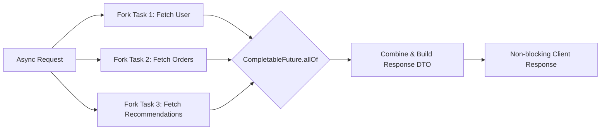
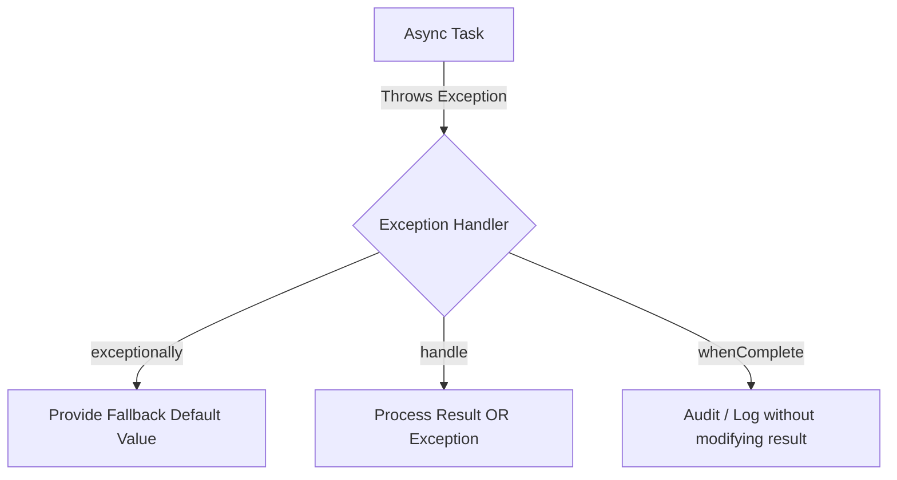

[🏠 Back to Home](README.md)

# ⚡ Java CompletableFuture: Non-Blocking Asynchronous Programming & Real-World Scenarios

A comprehensive, production-grade guide to asynchronous, non-blocking programming in Java using `CompletableFuture`. Covers core mechanics, composition, combinations, error handling, thread pool isolation, and 10+ enterprise failure & design scenarios.

---

## 📑 Table of Contents
1. [🧠 Zero-to-Hero Mental Model & Analogy](#-zero-to-hero-mental-model--analogy)
2. [🚀 1. Creating CompletableFutures](#-1-creating-completablefutures)
3. [🔄 2. Transforming & Chaining (thenApply, thenAccept, thenRun, thenCompose)](#-2-transforming--chaining)
4. [🔗 3. Combining Multiple Futures (thenCombine, allOf, anyOf)](#-3-combining-multiple-futures)
5. [🛡️ 4. Robust Error Handling (exceptionally, handle, whenComplete)](#️-4-robust-error-handling)
6. [⏱️ 5. Timeouts & Delays (Java 9+)](#️-5-timeouts--delays-java-9)
7. [🧵 6. Thread Pool Architecture & The ForkJoinPool Trap](#-6-thread-pool-architecture--the-forkjoinpool-trap)
8. [🧪 7. 10+ Real-World Developer Scenarios with Full Code](#-7-10-real-world-developer-scenarios-with-full-code)
9. [⚖️ 8. Method Comparison Matrix (The Cheat Sheet)](#️-8-method-comparison-matrix-the-cheat-sheet)
10. [🎓 9. Senior Interview Preparation & Scenario Q&A](#-9-senior-interview-preparation--scenario-qa)
11. [🔄 10. Architectural Transferability: Where & How to Apply Elsewhere](#-10-architectural-transferability-where--how-to-apply-elsewhere)

---

## 🧠 Zero-to-Hero Mental Model & Analogy

### 🍔 The Fast-Food Restaurant Pager Analogy
To understand `CompletableFuture`, imagine ordering food at a busy fast-food restaurant:

1. **Synchronous Blocking (`Thread.sleep()` or Legacy `Future.get()`):**
   - You order a burger at the counter. The cashier walks into the kitchen to cook it while you stand frozen at the counter, blocking all customers behind you. No one else can order until your burger is handed to you.
2. **Asynchronous Promise (`CompletableFuture`):**
   - You order a burger. The cashier gives you a **vibrating pager (a `CompletableFuture<Burger>`)** and immediately takes the next customer's order.
   - You find a table and check your phone (`Thread` is free to do other work).
   - You attach instructions to your pager: *"When it buzzes (`thenApply`), add fries and ketchup, then eat (`thenAccept`)"*.
   - If the kitchen catches fire, the pager flashes red with an error signal (`exceptionally`), and you receive a refund coupon instead of starving.

```
Synchronous Blocking:
[Request] ──> [Worker Thread Blocks: 500ms Waiting for DB] ──> [Response]  (Server runs out of threads!)

Asynchronous Non-Blocking (CompletableFuture):
[Request] ──> [Fork I/O Task to Background Pool]
                  │
                  └──> [Worker Thread Returns Immediately to Serve Next User]
                  │
[DB Finishes] ──> [Trigger Callback -> Assemble DTO -> Send Response Non-blocking]
```

### 📊 Legacy Future vs. CompletableFuture vs. Virtual Threads

| Feature | Legacy `java.util.concurrent.Future` (Java 5) | `CompletableFuture` (Java 8+) | Virtual Threads (Java 21+) |
| :--- | :--- | :--- | :--- |
| **Execution Model** | Blocking (`future.get()` blocks caller thread) | Non-blocking reactive pipeline via callbacks | Synchronous-looking code on lightweight fibers |
| **Composition** | Cannot chain operations (`f1 -> f2`) | Rich chaining (`thenApply`, `thenCompose`) | Native sequential calls `var a = task1(); var b = task2();` |
| **Combination** | Cannot wait for multiple futures together | Native `allOf()`, `anyOf()`, `thenCombine()` | Structured Concurrency (`StructuredTaskScope`) |
| **Manual Completion** | No (only via task completion) | Yes (`future.complete(val)`, `completeExceptionally()`) | N/A (thread-based) |
| **Exception Handling** | Try/catch around blocking `.get()` | Rich non-blocking hooks (`exceptionally()`, `handle()`) | Standard try/catch blocks |



---

## 🚀 1. Creating CompletableFutures

### 1.1 Asynchronous Background Tasks
Use `supplyAsync` when you expect a return value, and `runAsync` for fire-and-forget void tasks.

```java
import java.util.concurrent.CompletableFuture;
import java.util.concurrent.ExecutorService;
import java.util.concurrent.Executors;

public class CreationExamples {
    private static final ExecutorService CUSTOM_POOL = Executors.newFixedThreadPool(10);

    public static void main(String[] args) {
        // 1. Asynchronous task with return value (Uses Common ForkJoinPool)
        CompletableFuture<String> asyncGreeting = CompletableFuture.supplyAsync(() -> {
            // Simulated slow DB/network call
            return "Hello from " + Thread.currentThread().getName();
        });

        // 2. Asynchronous task with Custom Thread Pool (Recommended for I/O)
        CompletableFuture<Integer> orderCount = CompletableFuture.supplyAsync(() -> {
            return fetchOrderCountFromDb();
        }, CUSTOM_POOL);

        // 3. Fire-and-forget void task
        CompletableFuture<Void> auditLog = CompletableFuture.runAsync(() -> {
            System.out.println("Audit log recorded by " + Thread.currentThread().getName());
        }, CUSTOM_POOL);
    }

    private static int fetchOrderCountFromDb() {
        return 42;
    }
}
```

### 1.2 Manually Controlled Futures (Bridging Legacy/Event-Driven Code)
```java
// Create an uncompleted future to complete later via webhook or event callback
CompletableFuture<String> promise = new CompletableFuture<>();

// Somewhere else in your message listener / callback:
void onPaymentReceived(String paymentId, boolean success) {
    if (success) {
        promise.complete("Payment " + paymentId + " Confirmed!");
    } else {
        promise.completeExceptionally(new RuntimeException("Payment failed!"));
    }
}
```

### 1.3 Pre-Completed Futures (Optimizations & Unit Testing)
```java
CompletableFuture<String> cachedValue = CompletableFuture.completedFuture("Cached Result");
CompletableFuture<String> instantFailure = CompletableFuture.failedFuture(new IllegalArgumentException("Invalid ID"));
```

---

## 🔄 2. Transforming & Chaining

### Key Differences: `thenApply` vs `thenCompose` vs `thenAccept` vs `thenRun`

| Method | Accepts | Returns | Analogy |
| :--- | :--- | :--- | :--- |
| `thenApply(Function<T, R>)` | Value $T$ | `CompletableFuture<R>` | Synchronous `map()` |
| `thenCompose(Function<T, CompletableFuture<R>>)` | Value $T$ | `CompletableFuture<R>` | Asynchronous `flatMap()` (flattens nested futures) |
| `thenAccept(Consumer<T>)` | Value $T$ | `CompletableFuture<Void>` | Consumes result, returns nothing |
| `thenRun(Runnable)` | Nothing | `CompletableFuture<Void>` | Runs a side-effect after completion |

```java
CompletableFuture<String> userFuture = CompletableFuture.supplyAsync(() -> "usr_10293")
    // 1. thenApply: Transform String -> Integer (Synchronous transformation)
    .thenApply(userId -> userId.replace("usr_", ""))
    .thenApply(Integer::parseInt)
    // 2. thenCompose: Chain another Async method returning CompletableFuture<UserProfile>
    .thenCompose(CreationExamples::fetchProfileAsync)
    // 3. thenApply: Extract email
    .thenApply(UserProfile::getEmail);

// 4. thenAccept: Consume the result
userFuture.thenAccept(email -> System.out.println("User email: " + email));

// 5. thenRun: Execute action when everything completes
userFuture.thenRun(() -> System.out.println("Pipeline completed successfully."));
```

---

## 🔗 3. Combining Multiple Futures

### 3.1 Combining Two Independent Futures: `thenCombine`
Executes both futures concurrently and merges their results when both complete.

```java
CompletableFuture<Double> priceFuture = CompletableFuture.supplyAsync(() -> fetchProductPrice("PROD_101"));
CompletableFuture<Double> discountFuture = CompletableFuture.supplyAsync(() -> fetchUserDiscount("USER_505"));

CompletableFuture<Double> finalPrice = priceFuture.thenCombine(discountFuture, (price, discount) -> {
    return price * (1.0 - discount);
});

System.out.println("Final Discounted Price: $" + finalPrice.join());
```

### 3.2 Waiting for All Tasks: `CompletableFuture.allOf`
Runs $N$ independent tasks in parallel and continues when **ALL** have completed.

```java
CompletableFuture<String> task1 = CompletableFuture.supplyAsync(() -> fetchService("Auth"));
CompletableFuture<String> task2 = CompletableFuture.supplyAsync(() -> fetchService("Orders"));
CompletableFuture<String> task3 = CompletableFuture.supplyAsync(() -> fetchService("Inventory"));

CompletableFuture<Void> allTasks = CompletableFuture.allOf(task1, task2, task3);

// Non-blocking combination of all results:
CompletableFuture<List<String>> combinedResults = allTasks.thenApply(v -> {
    return List.of(task1.join(), task2.join(), task3.join());
});
```

### 3.3 Fast-Fail / Fastest Response: `CompletableFuture.anyOf`
Resolves as soon as the **first** future completes (great for Multi-CDN, DNS, or redundant replica queries).

```java
CompletableFuture<String> serverUS = CompletableFuture.supplyAsync(() -> queryServer("us-east"));
CompletableFuture<String> serverEU = CompletableFuture.supplyAsync(() -> queryServer("eu-central"));
CompletableFuture<String> serverAP = CompletableFuture.supplyAsync(() -> queryServer("ap-south"));

CompletableFuture<Object> fastestServer = CompletableFuture.anyOf(serverUS, serverEU, serverAP);
System.out.println("Fastest response: " + fastestServer.join());
```

---

## 🛡️ 4. Robust Error Handling

In an async pipeline, exceptions do not jump directly to a caller `try/catch`. Instead, they flow down the pipeline as completed exceptionally.



### 4.1 `exceptionally(Function<Throwable, T>)`
Catches errors and returns a fallback value, allowing downstream steps to continue cleanly.

```java
CompletableFuture<String> safeUser = CompletableFuture.supplyAsync(() -> {
    if (Math.random() > 0.5) throw new RuntimeException("DB Connection Timeout!");
    return "User: Alice";
}).exceptionally(ex -> {
    System.err.println("Failed to fetch user, reason: " + ex.getMessage());
    return "User: Anonymous Guest (Fallback)";
});
```

### 4.2 `handle(BiFunction<T, Throwable, R>)`
Executes whether the future succeeded OR failed. Gives you both `(result, exception)`:

```java
CompletableFuture<ApiResponse> response = CompletableFuture.supplyAsync(() -> callExternalPaymentApi())
    .handle((data, ex) -> {
        if (ex != null) {
            return new ApiResponse(500, "Payment Error: " + ex.getMessage());
        }
        return new ApiResponse(200, data);
    });
```

### 4.3 `whenComplete(BiConsumer<T, Throwable>)`
A side-effect hook for logging or metrics that does not alter the return value.

```java
CompletableFuture<String> monitored = CompletableFuture.supplyAsync(() -> "Data")
    .whenComplete((res, ex) -> {
        if (ex != null) Metrics.increment("async.failure.count");
        else Metrics.increment("async.success.count");
    });
```

---

## ⏱️ 5. Timeouts & Delays (Java 9+)

In Java 9+, `CompletableFuture` added native timeout guards:

```java
CompletableFuture<String> response = CompletableFuture.supplyAsync(() -> slowRemoteService())
    // 1. Fail with TimeoutException if it takes longer than 2 seconds
    .orTimeout(2, TimeUnit.SECONDS)
    // 2. Or supply a fallback value instead of failing
    .completeOnTimeout("Default Offline Content", 1500, TimeUnit.MILLISECONDS)
    .exceptionally(ex -> "Recovered from: " + ex.getClass().getSimpleName());
```

---

## 🧵 6. Thread Pool Architecture & The ForkJoinPool Trap

> [!CAUTION]
> **The Common ForkJoinPool Trap:**
> By default, `CompletableFuture.supplyAsync(supplier)` uses `ForkJoinPool.commonPool()`.
> The common pool has a fixed worker count equal to `Runtime.getRuntime().availableProcessors() - 1`.
> If you run blocking I/O (HTTP calls, DB queries) in the common pool, **all worker threads become blocked**, starving your entire JVM (including parallel streams).

### ✅ Production Best Practice: Dedicated Thread Pools
```java
@Configuration
public class AsyncThreadPoolConfig {

    @Bean(name = "ioExecutor")
    public ExecutorService ioExecutor() {
        return new ThreadPoolExecutor(
            20,                           // Core threads
            100,                          // Max threads
            60L, TimeUnit.SECONDS,        // Keep-alive time
            new ArrayBlockingQueue<>(500),// Bounded Queue
            new ThreadFactoryBuilder().setNameFormat("io-async-%d").build(),
            new ThreadPoolExecutor.CallerRunsPolicy() // Backpressure handler
        );
    }
}
```

---

## 🧪 7. 10+ Real-World Developer Scenarios with Full Code

### 🧩 Scenario 1: Aggregating 3 Microservices in Parallel with Global Timeout
**Problem:** A mobile app homepage needs `UserProfile`, `RecentOrders`, and `ProductRecommendations`. Sequential calls take $300\text{ms} + 400\text{ms} + 250\text{ms} = 950\text{ms}$.
**Solution:** Run all 3 concurrently and merge into a single `HomePageDTO` in under $400\text{ms}$.

```java
public class HomePageAggregator {
    private final ExecutorService ioPool = Executors.newFixedThreadPool(30);

    public HomePageDTO buildHomePage(String userId) {
        CompletableFuture<UserProfile> profileFuture = CompletableFuture
            .supplyAsync(() -> userService.getProfile(userId), ioPool)
            .orTimeout(500, TimeUnit.MILLISECONDS)
            .exceptionally(ex -> UserProfile.defaultGuest());

        CompletableFuture<List<Order>> ordersFuture = CompletableFuture
            .supplyAsync(() -> orderService.getRecentOrders(userId), ioPool)
            .orTimeout(500, TimeUnit.MILLISECONDS)
            .exceptionally(ex -> Collections.emptyList());

        CompletableFuture<List<Recommendation>> recsFuture = CompletableFuture
            .supplyAsync(() -> recommendationService.getForUser(userId), ioPool)
            .orTimeout(500, TimeUnit.MILLISECONDS)
            .exceptionally(ex -> recommendationService.getTrendingFallback());

        // Wait for all 3 futures concurrently
        return CompletableFuture.allOf(profileFuture, ordersFuture, recsFuture)
            .thenApply(v -> new HomePageDTO(
                profileFuture.join(),
                ordersFuture.join(),
                recsFuture.join()
            ))
            .join(); // or return CompletableFuture<HomePageDTO> to controller
    }
}
```

---

### 🧩 Scenario 2: Asynchronous Payment Processing with Exponential Backoff
**Problem:** Payment gateway occasionally returns 503 Transient Error. We need an async retry mechanism without blocking threads.

```java
public class AsyncRetryService {
    private final ScheduledExecutorService scheduler = Executors.newScheduledThreadPool(4);

    public <T> CompletableFuture<T> retryWithBackoff(Supplier<CompletableFuture<T>> taskSupplier, int retries, long delayMs) {
        return taskSupplier.get().handle((result, ex) -> {
            if (ex == null) {
                return CompletableFuture.completedFuture(result);
            }
            if (retries <= 0) {
                return CompletableFuture.<T>failedFuture(ex);
            }
            System.out.printf("Task failed (%s). Retrying in %d ms. Retries left: %d%n", ex.getMessage(), delayMs, retries - 1);
            
            CompletableFuture<T> delayedFuture = new CompletableFuture<>();
            scheduler.schedule(() -> {
                retryWithBackoff(taskSupplier, retries - 1, delayMs * 2)
                    .whenComplete((res, err) -> {
                        if (err != null) delayedFuture.completeExceptionally(err);
                        else delayedFuture.complete(res);
                    });
            }, delayMs, TimeUnit.MILLISECONDS);

            return delayedFuture;
        }).thenCompose(Function.identity());
    }
}
```

---

### 🧩 Scenario 3: Non-Blocking File Processing & Email Notification Pipeline
**Problem:** Upload a 50MB CSV file, parse rows, insert into DB in batches, generate an audit PDF, and email the user when completed.

```java
public class BatchProcessingPipeline {
    public CompletableFuture<Void> processFilePipeline(byte[] fileData, String userEmail, ExecutorService pool) {
        return CompletableFuture.supplyAsync(() -> parseCsvRows(fileData), pool)
            .thenComposeAsync(rows -> saveToDatabaseAsync(rows, pool), pool)
            .thenComposeAsync(dbResult -> generateAuditPdfAsync(dbResult, pool), pool)
            .thenAcceptAsync(pdfAttachment -> emailService.sendReport(userEmail, pdfAttachment), pool)
            .exceptionally(ex -> {
                log.error("Pipeline failed for user: " + userEmail, ex);
                emailService.sendFailureAlert(userEmail, ex.getMessage());
                return null;
            });
    }
}
```

---

### 🧩 Scenario 4: Fast-Fail Multi-Region Gateway Probing (`anyOf`)
**Problem:** Find the fastest responding health-check endpoint among 3 data centers (`US-East`, `EU-West`, `AP-South`) to route live traffic.

```java
public class RegionProber {
    public String findFastestRegion(List<String> endpoints, ExecutorService pool) {
        List<CompletableFuture<String>> futures = endpoints.stream()
            .map(url -> CompletableFuture.supplyAsync(() -> pingEndpoint(url), pool))
            .toList();

        CompletableFuture<Object> fastest = CompletableFuture.anyOf(futures.toArray(new CompletableFuture[0]));
        return (String) fastest.join();
    }

    private String pingEndpoint(String url) {
        // HTTP Ping logic
        return url;
    }
}
```

---

### 🧩 Scenario 5: Bridge Legacy Asynchronous Callback SDK to CompletableFuture
**Problem:** 3rd-party AWS/Kafka SDK uses callback listeners (`onSuccess`, `onError`). You need to convert it into a modern, chainable `CompletableFuture`.

```java
public class CallbackToCompletableFutureBridge {
    
    public CompletableFuture<String> sendKafkaMessageAsync(ProducerRecord<String, String> record, KafkaProducer<String, String> producer) {
        CompletableFuture<String> future = new CompletableFuture<>();

        producer.send(record, (metadata, exception) -> {
            if (exception != null) {
                future.completeExceptionally(exception);
            } else {
                future.complete("Offset: " + metadata.offset() + " on Partition: " + metadata.partition());
            }
        });

        return future;
    }
}
```

---

### 🧩 Scenario 6: Dynamic List of Independent Tasks (Handling Failures Individually)
**Problem:** Fetch stock prices for 500 ticker symbols. If 3 symbols fail, do NOT abort the other 497.

```java
public class StockPriceCollector {
    public CompletableFuture<Map<String, Double>> fetchAllStockPrices(List<String> tickers, ExecutorService pool) {
        List<CompletableFuture<Map.Entry<String, Double>>> futures = tickers.stream()
            .map(ticker -> CompletableFuture.supplyAsync(() -> Map.entry(ticker, fetchPrice(ticker)), pool)
                .handle((entry, ex) -> {
                    if (ex != null) {
                        log.warn("Could not fetch ticker: " + ticker);
                        return Map.entry(ticker, -1.0); // sentinel value for error
                    }
                    return entry;
                }))
            .toList();

        return CompletableFuture.allOf(futures.toArray(new CompletableFuture[0]))
            .thenApply(v -> futures.stream()
                .map(CompletableFuture::join)
                .filter(entry -> entry.getValue() >= 0)
                .collect(Collectors.toMap(Map.Entry::getKey, Map.Entry::getValue))
            );
    }
}
```

---

### 🧩 Scenario 7: Java 21 Modernization: Virtual Threads + CompletableFuture
**Problem:** How to use CompletableFuture seamlessly with Java 21 Virtual Threads for high-density I/O.

```java
public class VirtualThreadAsyncDemo {
    public static void main(String[] args) {
        // Executor that spawns a lightweight Virtual Thread per task
        try (var vThreadExecutor = Executors.newVirtualThreadPerTaskExecutor()) {
            
            List<CompletableFuture<String>> futures = IntStream.range(0, 10_000)
                .mapToObj(i -> CompletableFuture.supplyAsync(() -> {
                    // Simulate blocking I/O on virtual thread (almost zero memory footprint)
                    try { Thread.sleep(50); } catch (InterruptedException e) {}
                    return "Task " + i + " done";
                }, vThreadExecutor))
                .toList();

            CompletableFuture.allOf(futures.toArray(new CompletableFuture[0])).join();
            System.out.println("Successfully executed 10,000 concurrent async tasks with Virtual Threads!");
        }
    }
}
```

---

## ⚖️ 8. Method Comparison Matrix (The Cheat Sheet)

| Method | When to Use | Execution Thread | Return Type |
| :--- | :--- | :--- | :--- |
| `supplyAsync(Supplier<U>)` | Start async task with value | Common pool or specified Executor | `CompletableFuture<U>` |
| `runAsync(Runnable)` | Start async task without return value | Common pool or specified Executor | `CompletableFuture<Void>` |
| `thenApply(Function<T,U>)` | Transform result synchronously | Caller or stage completing thread | `CompletableFuture<U>` |
| `thenApplyAsync(Function<T,U>)` | Transform result asynchronously | Executor thread | `CompletableFuture<U>` |
| `thenCompose(Function<T,CF<U>>)` | Chain another async method (flatMap) | Current/Specified pool | `CompletableFuture<U>` |
| `thenCombine(CF<U>, BiFunction)` | Combine 2 independent futures | When both finish | `CompletableFuture<V>` |
| `allOf(CF<?>...)` | Wait for N futures to finish | Completes when ALL complete | `CompletableFuture<Void>` |
| `anyOf(CF<?>...)` | Return first future to finish | Completes when ANY completes | `CompletableFuture<Object>` |
| `exceptionally(Function<Ex,T>)` | Fallback value on error | Error recovery thread | `CompletableFuture<T>` |
| `handle(BiFunction<T,Ex,R>)` | Process (Value, Error) pair | Always runs | `CompletableFuture<R>` |
| `orTimeout(long, TimeUnit)` | Kill future if too slow | Scheduled Executor | `CompletableFuture<T>` |
| `join()` | Unchecked blocking wait | Calling thread | `T` (throws CompletionException) |
| `get()` | Checked blocking wait | Calling thread | `T` (throws Interrupted/ExecutionException) |

---

## 🎓 9. Senior Interview Preparation & Scenario Q&A

### 📌 Core Conceptual Interview Questions

#### Q1: What is the internal difference between `thenApply` and `thenCompose`?
> **Answer & Explanation:**
> - `thenApply(Function<T, R>)` acts like `map()` in Streams. It takes a value of type `T` and returns a transformed value of type `R`. The returned future is `CompletableFuture<R>`. If your function itself returns a `CompletableFuture<R>`, `thenApply` will produce a nested `CompletableFuture<CompletableFuture<R>>`.
> - `thenCompose(Function<T, CompletableFuture<R>>)` acts like `flatMap()`. It unpacks and flattens the nested future, returning a clean `CompletableFuture<R>`.
> - **Rule of thumb:** If the downstream operation is synchronous, use `thenApply`. If the downstream operation is itself an asynchronous method that returns another `CompletableFuture`, use `thenCompose`.

#### Q2: Why is using `ForkJoinPool.commonPool()` in a Spring Boot microservice considered an anti-pattern?
> **Answer & Explanation:**
> - `ForkJoinPool.commonPool()` is JVM-wide and shared across the entire process (including parallel streams, other async frameworks, and libraries).
> - The pool defaults to `Runtime.getRuntime().availableProcessors() - 1` worker threads.
> - If one developer initiates a blocking I/O operation (e.g., waiting 5 seconds for a third-party payment gateway), all available worker threads in the common pool become saturated and blocked. This starvates unrelated parallel streams and async tasks across the entire application, triggering widespread cascading latency spikes.
> - **Production Fix:** Always pass dedicated, bounded custom `ThreadPoolExecutor` instances isolated per domain (e.g., `PAYMENT_EXECUTOR`, `EMAIL_EXECUTOR`).

#### Q3: How do `join()` and `get()` differ in exception handling and thread interruption?
> **Answer & Explanation:**
> - `get()` is declared on Java 5 `Future`. It throws checked exceptions (`InterruptedException` and `ExecutionException`). It forces boilerplate `try-catch` blocks and responds to `Thread.interrupt()`.
> - `join()` is declared on `CompletableFuture`. It throws an unchecked `CompletionException`, making it idiomatic inside lambda expressions and Stream pipelines.
> - **Best Practice:** Avoid calling either `.get()` or `.join()` on HTTP request threads; instead, return the `CompletableFuture` directly to Spring WebMVC (which asynchronously resumes the Servlet thread via DeferredResult) or Spring WebFlux.

#### Q4: How does exception propagation work in a multi-stage pipeline, and how does `handle()` differ from `exceptionally()` and `whenComplete()`?
> **Answer & Explanation:**
> - In an asynchronous pipeline, an unhandled exception skips all downstream transformation stages (`thenApply`, `thenCompose`) until it reaches an error-handling stage.
> - `exceptionally(ex -> fallback)`: Only executes when an error occurs. It returns a replacement fallback value of the same type.
> - `handle((result, ex) -> ...)`: **Always executes**, regardless of whether the stage succeeded or failed. It receives both the result (or null) and the exception (or null), and can transform the outcome into an entirely new type `R`.
> - `whenComplete((result, ex) -> ...)`: Acts as a consumer/hook (like a `finally` block). It observes the result or error without modifying the pipeline's return value.

---

### 🚨 Real-World Scenario-Based Interview Questions

#### Scenario Q1: High-Throughput API Gateway Aggregator with Strict SLA
> **Interviewer Question:** *"You are building an e-commerce Product Details API. It must call three microservices in parallel: Pricing Service (P99: 120ms), Inventory Service (P99: 150ms), and Product Reviews Service (P99: 800ms). The overall API SLA is 300ms. If Reviews fails or times out, the page must still render with 0 reviews. If Pricing fails, the entire request must fail immediately. How do you design this with CompletableFuture?"*
>
> **Senior Architect Answer:**
> 1. Launch all 3 calls asynchronously on dedicated, isolated thread pools.
> 2. Wrap the Reviews future with `.completeOnTimeout(Collections.emptyList(), 250, TimeUnit.MILLISECONDS)` and `.exceptionally(ex -> Collections.emptyList())`.
> 3. Wrap the Inventory future with `.completeOnTimeout(InventoryStatus.UNKNOWN, 250, TimeUnit.MILLISECONDS)`.
> 4. Keep the Pricing future strict without a fallback (allowing the exception to bubble up).
> 5. Use `CompletableFuture.allOf(pricingFuture, inventoryFuture, reviewsFuture)` with an overarching `.orTimeout(300, TimeUnit.MILLISECONDS)`.
> 6. Combine all three results inside a final `thenApply()` into a single `ProductDetailsDTO`.

#### Scenario Q2: ThreadLocal Context Loss in Asynchronous Pipelines
> **Interviewer Question:** *"In our Spring Boot microservices, we use `SecurityContextHolder` (Spring Security) and `MDC` (SLF4J trace IDs for distributed tracing). When developers started using `CompletableFuture.supplyAsync()`, all log statements lost their `traceId` and user authentication failed downstream. Why did this happen and how do you solve it?"*
>
> **Senior Architect Answer:**
> - `SecurityContextHolder` and `MDC` store contextual data in `ThreadLocal` variables tied to the initial Servlet worker thread.
> - When `supplyAsync()` executes on a thread from the background pool, that background worker thread has an empty `ThreadLocal` context.
> - **Solution:** Use a **Decorating / Delegating Task Executor** (e.g., `DelegatingSecurityContextAsyncTaskExecutor` or `TaskDecorator` in Spring):
> ```java
> public class MdcTaskDecorator implements TaskDecorator {
>     @Override
>     public Runnable decorate(Runnable runnable) {
>         Map<String, String> contextMap = MDC.getCopyOfContextMap();
>         return () -> {
>             try {
>                 if (contextMap != null) MDC.setContextMap(contextMap);
>                 runnable.run();
>             } finally {
>                 MDC.clear();
>             }
>         };
>     }
> }
> ```

---

## 🔄 10. Architectural Transferability: Where & How to Apply Elsewhere

The non-blocking asynchronous coordination patterns mastered in `CompletableFuture` directly transfer across high-scale software engineering domains:

### 1. 🌐 Microservices Backend-For-Frontend (BFF) Pattern
- **Problem:** A mobile app needs a unified dashboard combining 15 independent downstream domain services.
- **Application:** Use `CompletableFuture.allOf()` with isolated thread pools and per-service timeouts to parallelize external HTTP/gRPC calls, reducing total latency from sequential sum ($\sum t_i \approx 3000\text{ms}$) to maximum latency ($\max(t_i) \approx 250\text{ms}$).

### 2. 💳 Fintech Payment Dual-Write & Settlement Verification
- **Problem:** When a user executes a money transfer, the transaction must simultaneously be logged to an immutable audit database, sent to a fraud detection engine, and dispatched to the core banking ledger.
- **Application:** Use `thenCompose()` to sequentially lock account funds, then use `thenCombine()` to run fraud check and audit logging concurrently before confirming the ledger commit.

### 3. 📡 IoT Sensor Data Ingestion & Batch Sanitization
- **Problem:** Millions of connected devices emit telemetry packets every second. Each batch needs deduplication, enrichment from Redis, and anomaly detection before dumping into Apache Cassandra.
- **Application:** Stream incoming messages into an async worker pipeline using `supplyAsync` mapped over batches, using `exceptionally()` to route corrupted packets into a Dead Letter Queue (DLQ) without pausing the ingestion pipeline.

---

[⬆️ Back to Top](#-java-completablefuture-non-blocking-asynchronous-programming--real-world-scenarios)

