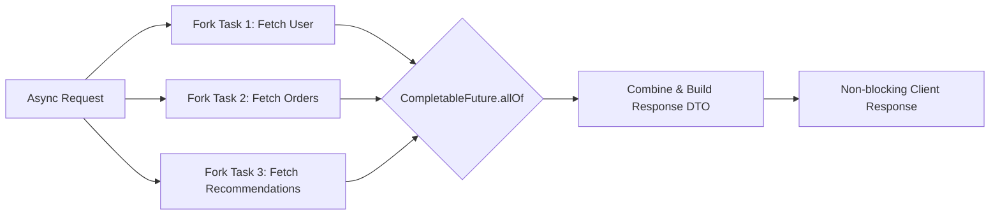

[🏠 Back to Home](README.md) | [🔥 200 CompletableFuture Scenarios Guide](completable_future_200_scenarios_master_guide.md)

# ⚡ Java CompletableFuture: Non-Blocking Asynchronous Programming & Real-World Scenarios

> 🚀 **Looking for Tier-1 Product Interview Scenarios?** Check out the dedicated **[CompletableFuture & Asynchronous Programming: 200 Real-World Interview Scenarios Master Guide](completable_future_200_scenarios_master_guide.md)** featuring 200 deep technical scenarios across 10 master categories!

A comprehensive, production-grade guide to asynchronous, non-blocking programming in Java using `CompletableFuture`. Covers core mechanics, composition, combinations, error handling, thread pool isolation, and 10+ enterprise failure & design scenarios.

---

## 📑 Table of Contents
1. [🧠 Zero-to-Hero Mental Model & Analogy](#1-the-real-world-mental-model-the-fast-food-restaurant-vibrating-pager)
2. [🚀 1. Creating CompletableFutures: supplyAsync vs. runAsync vs. Manual Promises](#-1-creating-completablefutures-supplyasync-vs-runasync-vs-manual-promises)
3. [🔄 2. Transforming & Chaining: The Core 4 (thenApply, thenCompose, thenAccept, thenRun)](#-2-transforming--chaining-the-core-4-thenapply-thencompose-thenaccept-thenrun)
4. [🔗 3. Combining Multiple Futures: thenCombine vs. allOf vs. anyOf](#-3-combining-multiple-futures-thencombine-vs-allof-vs-anyof)
5. [🛡️ 4. Robust Error Handling: exceptionally vs. handle vs. whenComplete](#️-4-robust-error-handling-exceptionally-vs-handle-vs-whencomplete)
6. [⏱️ 5. Timeouts & Delays (Java 9+ Native Guards)](#️-5-timeouts--delays-java-9-native-guards)
7. [🧵 6. Thread Pool Architecture & Sizing for Enterprise I/O](#-6-thread-pool-architecture--sizing-for-enterprise-io)
8. [🧪 7. 10+ Real-World Developer Scenarios with Full Code](#-7-10-real-world-developer-scenarios-with-full-code)
9. [⚖️ 8. Method Comparison Matrix (The Cheat Sheet)](#️-8-method-comparison-matrix-the-cheat-sheet)
10. [🎓 9. Senior Interview Preparation & Scenario Q&A](#-9-senior-interview-preparation--scenario-qa)
11. [🔄 10. Architectural Transferability: Where & How to Apply Elsewhere](#-10-architectural-transferability-where--how-to-apply-elsewhere)

---

# TRACK 1: THE JUNIOR & ENTRY-LEVEL FOUNDATIONS (ZERO-TO-HERO)

## 1. The Real-World Mental Model (The Fast-Food Restaurant Vibrating Pager)

Imagine ordering food at a busy fast-food restaurant:

1. **Synchronous Blocking (`Thread.sleep()` or Legacy `Future.get()`):**
   - You order a burger at the counter.
   - The cashier walks into the kitchen to cook it.
   - You stand **frozen at the cash register** for 15 minutes.
   - No other customer can order, and the cashier is trapped. The line backs out the door!
2. **Asynchronous Non-Blocking (`CompletableFuture`):**
   - You order a burger. The cashier immediately gives you a **vibrating pager (a `CompletableFuture<Burger>`)** and serves customer #2.
   - You sit down at a table, chat with friends, or scroll on your phone.
   - You write instructions on the back of your napkin:
     - *"When the pager vibrates (`thenApply`), grab a tray of fries."*
     - *"Once I have both (`thenCombine`), eat my lunch (`thenAccept`)."*
     - *"If the kitchen catches fire (`exceptionally`), grab a refund coupon and go next door."*

```
Synchronous Blocking (Legacy Java 5 Future):
[Request] ──► [Worker Thread Blocks: 500ms Waiting for DB] ──► [Response]  (Server runs out of threads!)

Asynchronous Non-Blocking (CompletableFuture):
[Request] ──► [Fork I/O Task to Background Pool]
                  │
                  └──► [Worker Thread Returns Immediately to Serve Next User]
                  │
[DB Finishes] ──► [Trigger Callback ──► Assemble DTO ──► Send Response Non-blocking]
```

---

## 2. The 5 Core Building Blocks

| Term | What It Means | Real-World Analogy |
| :--- | :--- | :--- |
| **`supplyAsync`** | Runs a background task that **returns a value** (Supplier). | Sending a courier to pick up a package and bring it back. |
| **`runAsync`** | Runs a background task that **returns nothing** (`void` Runnable). | Asking a cleaner to empty the trash bin (fire-and-forget). |
| **`thenApply`** | Transforms the result once available ($T \to U$). | Peeling an orange once it is delivered. |
| **`thenCombine`** | Waits for **two** independent futures to finish and merges their results. | Waiting for both burger and fries before sitting down to eat. |
| **`CompletableFuture.allOf`** | Waits for **all N** futures in an array to complete. | A tour guide waiting for all 20 tourists to board the bus. |

---

## 3. Beginner Code Walkthrough: Parallel API Aggregator

```java
package com.example.async;

import java.util.concurrent.CompletableFuture;
import java.util.concurrent.ExecutorService;
import java.util.concurrent.Executors;

public class OrderAggregationService {

    // 1. ALWAYS provide a dedicated thread pool for I/O tasks!
    private static final ExecutorService IO_POOL = Executors.newFixedThreadPool(10);

    public static void main(String[] args) {
        OrderAggregationService service = new OrderAggregationService();
        service.getCustomerDashboard(101L)
            .thenAccept(dashboard -> System.out.println("✅ Generated: " + dashboard))
            .join(); // Wait only for demonstration in main()
        
        IO_POOL.shutdown();
    }

    public CompletableFuture<String> getCustomerDashboard(Long userId) {
        // Step 1: Fetch User Profile asynchronously
        CompletableFuture<String> userFuture = CompletableFuture.supplyAsync(() -> {
            simulateLatency(200);
            return "User: Alice";
        }, IO_POOL);

        // Step 2: Fetch Order History asynchronously
        CompletableFuture<String> ordersFuture = CompletableFuture.supplyAsync(() -> {
            simulateLatency(300);
            return "Orders: [MacBook, Headphones]";
        }, IO_POOL);

        // Step 3: Combine both results concurrently (Total time = 300ms, NOT 500ms!)
        return userFuture.thenCombineAsync(ordersFuture, (user, orders) -> {
            return user + " | " + orders;
        }, IO_POOL).exceptionally(ex -> {
            System.err.println("❌ Failed: " + ex.getMessage());
            return "User: Guest | Orders: []"; // Graceful fallback
        });
    }

    private static void simulateLatency(long ms) {
        try { Thread.sleep(ms); } catch (InterruptedException e) { Thread.currentThread().interrupt(); }
    }
}
```

---

## 4. What Happens When Things Break? (Top 3 Disasters)

1. **The Common ForkJoinPool Starvation Trap:**
   Calling `CompletableFuture.supplyAsync(() -> fetchFromDatabase())` without passing a custom `Executor`. By default, Java runs this on `ForkJoinPool.commonPool()`, which only has threads equal to `CPU Cores - 1`. If 8 threads block on a slow database, **the entire JVM freezes**—including Java Parallel Streams and GC helpers!
2. **Silent Uncaught Exceptions:**
   If an exception occurs inside a `supplyAsync` pipeline and you do not attach `.exceptionally()` or `.handle()`, **no error is printed to the console**! The future silently finishes in an exceptional state, leaving caller threads hanging or confused.
3. **The Accidental Synchronous Trap:**
   Writing `CompletableFuture.supplyAsync(...).get()`. Calling `.get()` or `.join()` immediately blocks the calling thread, destroying 100% of the asynchronous, non-blocking benefits!

---

## 5. Top 5 Beginner Mistakes in Production

1. **Not Providing a Custom Thread Pool:** Never use the default `ForkJoinPool.commonPool()` for blocking I/O (HTTP calls, database queries, file reads). Always pass a dedicated `ExecutorService`.
2. **Confusing `thenApply` and `thenCompose`:**
   - Use `thenApply` when your mapping function returns a plain object (`User -> String`).
   - Use `thenCompose` when your mapping function returns another `CompletableFuture` (`User -> CompletableFuture<Orders>`), preventing ugly nested `CompletableFuture<CompletableFuture<Orders>>`!
3. **Calling `.get()` or `.join()` inside Reactive Pipelines:** Freezes the thread pool. Use non-blocking callbacks like `.thenAccept()` or return the future up the stack to Spring WebFlux or an async controller.
4. **Ignoring `CompletableFuture.allOf()` Return Type:** `allOf()` returns `CompletableFuture<Void>`. It does NOT return the values of the combined futures! You must call `.join()` on the individual futures after `allOf` completes.
5. **Forgetting to Handle `InterruptedException`:** Swallowing `InterruptedException` with an empty catch block without re-asserting `Thread.currentThread().interrupt()`.

---

## 6. Top 10 Junior Interview Questions (With "Explain Like I'm 5" Answers)

### Q1: What is the difference between `Future` and `CompletableFuture`?

- **ELI5 Answer:** *"`Future` is a lottery ticket where you have to stand at the counter waiting for the winning numbers (`.get()` blocks). `CompletableFuture` is a smartphone that sends you a text message when you win, with a link to claim your money automatically."*
- **Technical Answer:** *"Legacy `Future` (Java 5) only supports blocking `.get()` to retrieve results and cannot be manually completed or chained. `CompletableFuture` (Java 8) supports non-blocking functional composition (`thenApply`, `thenCompose`), combining multiple futures (`allOf`, `thenCombine`), and manual completion (`complete()`)."*

### Q2: Why should you avoid `ForkJoinPool.commonPool()` for I/O tasks?

- **ELI5 Answer:** *"Because the pool only has 4 workers shared by the entire building. If all 4 workers get stuck waiting for a package in the lobby, nobody in the building can do any work!"*
- **Technical Answer:** *"`ForkJoinPool.commonPool()` is designed for CPU-bound computations and is sized to `Runtime.getRuntime().availableProcessors() - 1`. If blocking I/O tasks occupy these threads, the entire JVM becomes thread-starved, stalling Parallel Streams and other shared tasks."*

### Q3: What is the difference between `thenApply()` and `thenApplyAsync()`?

- **ELI5 Answer:** *"`thenApply` makes the current worker finish the next chore right away. `thenApplyAsync` puts the next chore in a new ticket box for another worker in the pool to pick up."*
- **Technical Answer:** *"`thenApply` executes the callback synchronously on whatever thread completed the previous future (or the caller thread if already complete). `thenApplyAsync` submits the callback as a new task to the specified `Executor` (or `ForkJoinPool.commonPool()`)."*

### Q4: What is the difference between `thenApply()` and `thenCompose()`?

- **ELI5 Answer:** *"`thenApply` is like peeling a banana ($1 \to 1$). `thenCompose` is like opening an envelope that contains another envelope, and pulling the letter all the way out ($1 \to \text{Future}$, flattened)."*
- **Technical Answer:** *"`thenApply(Function<T, R>)` returns `CompletableFuture<R>`. If the function returns a `CompletableFuture<R>`, it produces `CompletableFuture<CompletableFuture<R>>`. `thenCompose(Function<T, CompletableFuture<R>>)` flattens the nested futures into `CompletableFuture<R>` (analogous to `flatMap`)."*

### Q5: What is the difference between `allOf()` and `anyOf()`?

- **ELI5 Answer:** *"`allOf` is a school bus driver waiting for ALL children to sit down before driving. `anyOf` is a race where the referee blows the whistle as soon as the FIRST runner crosses the finish line."*
- **Technical Answer:** *"`CompletableFuture.allOf()` returns a new `CompletableFuture<Void>` that completes when all provided futures complete. `CompletableFuture.anyOf()` returns a `CompletableFuture<Object>` that completes as soon as any one of the provided futures completes with a result or exception."*

### Q6: How do you handle exceptions in `CompletableFuture`?

- **ELI5 Answer:** *"By attaching a safety parachute (`exceptionally`) so if the airplane breaks, you float down safely with a backup plan instead of crashing."*
- **Technical Answer:** *"Using `.exceptionally(fn)` (transforms exception into fallback value), `.handle((res, ex) -> ...)` (always executes, inspecting both result and error), or `.whenComplete((res, ex) -> ...)` (bi-consumer for logging without modifying the pipeline value)."*

### Q7: What is the difference between `.get()` and `.join()`?

- **ELI5 Answer:** *"`get()` is a strict boss who makes you declare every potential accident in writing (`throws InterruptedException, ExecutionException`). `join()` is a relaxed boss who lets accidents happen as runtime surprises (`throws CompletionException`)."*
- **Technical Answer:** *"`get()` is inherited from `Future`; it throws checked exceptions (`InterruptedException`, `ExecutionException`), requiring try-catch blocks. `.join()` throws unchecked `CompletionException`, making it cleaner to use inside lambdas and Streams."*

### Q8: What does `CompletableFuture.complete(value)` do?

- **ELI5 Answer:** *"Handing someone the prize early so they don't have to wait for the contest to finish."*
- **Technical Answer:** *"Manually transitions the future to a completed state with the given value, returning `true` if successful. Any callbacks attached to the future will execute immediately."*

### Q9: What happens if a task inside `supplyAsync` throws an unhandled RuntimeException?

- **ELI5 Answer:** *"The vibrating buzzer silently turns red. If nobody looks at it, the error is hidden in the dark."*
- **Technical Answer:** *"The future transitions into an exceptionally completed state holding an `ExecutionException` or `CompletionException` wrapping the root cause. Downstream stages attached via `thenApply` are skipped until an error handler (`exceptionally` or `handle`) is encountered."*

### Q10: How do timeouts work in `CompletableFuture` (Java 9+)?

- **ELI5 Answer:** *"Setting an egg timer: if the pizza doesn't arrive in 10 minutes, the timer rings and you cancel the order and eat a sandwich."*
- **Technical Answer:** *"Java 9 introduced `.orTimeout(timeout, unit)` (fails exceptionally with `TimeoutException` if not complete within the duration) and `.completeOnTimeout(defaultValue, timeout, unit)` (gracefully completes with a fallback value if time expires)."*

---

### 📊 Legacy Future vs. CompletableFuture vs. Virtual Threads

| Feature | Legacy `java.util.concurrent.Future` (Java 5) | `CompletableFuture` (Java 8+) | Virtual Threads (Java 21+) |
| :--- | :--- | :--- | :--- |
| **Execution Model** | Blocking (`future.get()` blocks caller thread) | Non-blocking reactive pipeline via callbacks | Synchronous-looking code on lightweight fibers |
| **Composition** | Cannot chain operations (`f1 -> f2`) | Rich chaining (`thenApply`, `thenCompose`) | Native sequential calls `var a = task1(); var b = task2();` |
| **Combination** | Cannot wait for multiple futures together | Native `allOf()`, `anyOf()`, `thenCombine()` | Structured Concurrency (`StructuredTaskScope`) |
| **Manual Completion** | No (only via task completion) | Yes (`future.complete(val)`, `completeExceptionally()`) | N/A (thread-based) |
| **Exception Handling** | Try/catch around blocking `.get()` | Rich non-blocking hooks (`exceptionally()`, `handle()`) | Standard try/catch blocks |



---

## 🚀 1. Creating CompletableFutures: supplyAsync vs. runAsync vs. Manual Promises

### 💡 The Real-Life Mental Model
Think of creating a `CompletableFuture` like giving a task to a specialized assistant:
- **`supplyAsync` (The Grocery Courier):** You give money and a grocery list to a courier. The courier goes to the market, buys groceries, and **brings a bag of groceries back to you** (returns a value `T`).
- **`runAsync` (The Garbage Collector):** You ask the cleaner to empty your desk trash bin. They do the job and walk away. You don't expect any package back—it's **purely a side-effect** (`void` return).
- **Manual Promise (`new CompletableFuture<T>()`):** You hand a blank claim ticket to an airline baggage handler. Nobody is actively running right now; whenever the plane lands and baggage arrives from an external conveyor system (webhook, Kafka event, or socket), the handler stamps the ticket as finished (`future.complete(bag)`).

---

### ⚙️ Under-The-Hood Mechanics (What the JVM Actually Does)
When you call `CompletableFuture.supplyAsync(supplier, executor)`:
1. Java packages your `Supplier<U>` into an internal `AsyncSupply<U>` task (which implements `ForkJoinTask` / `Runnable`).
2. It submits this task to the specified `Executor`.
3. If no executor is passed, Java defaults to `ForkJoinPool.commonPool()`.
4. The calling thread returns **immediately** with a pending, incomplete `CompletableFuture<U>` instance.
5. Once the background worker thread finishes computing the result, it atomically updates the internal `result` field via CAS (Compare-And-Swap) and notifies any dependent completion stages.

---

### 🎯 The 30-Second Interview Script ("The Golden Script")
> **Interviewer:** *"How do you create a CompletableFuture, and what is the difference between supplyAsync and runAsync?"*
>
> **Your 30-Second Answer:**
> - **ELI5 Hook:** *"Use `supplyAsync` when you want a package delivered back to your door (it returns a value). Use `runAsync` when you just want someone to ring the doorbell or take out the trash (it returns `Void`)."*
> - **Senior Punchline:** *"`supplyAsync` accepts a functional `Supplier<T>` and returns `CompletableFuture<T>`, whereas `runAsync` accepts a `Runnable` and returns `CompletableFuture<Void>`. In production, you must **never** call the single-argument overload without passing a dedicated, bounded `ExecutorService`, because the default `ForkJoinPool.commonPool()` is shared across the JVM and can easily be starved by blocking I/O calls."*

---

### 📝 Annotated Code Walkthrough: Creation Patterns

```java
package com.example.async.creation;

import java.util.concurrent.CompletableFuture;
import java.util.concurrent.ExecutorService;
import java.util.concurrent.Executors;

public class CreationMasterclass {

    // 🌟 Trainer Rule #1: ALWAYS declare an isolated thread pool for blocking I/O!
    private static final ExecutorService DB_IO_POOL = Executors.newFixedThreadPool(10);

    public static void main(String[] args) {
        // =====================================================================
        // 1. supplyAsync: Background task with return value (Supplier<T>)
        // =====================================================================
        CompletableFuture<String> userFuture = CompletableFuture.supplyAsync(() -> {
            // Trainer Note: Imagine this is a 200ms REST call to user-service
            simulateNetworkDelay(200);
            return "Alice (Tier-1 Premium User)";
        }, DB_IO_POOL);

        // =====================================================================
        // 2. runAsync: Fire-and-forget void task (Runnable)
        // =====================================================================
        CompletableFuture<Void> auditLogFuture = CompletableFuture.runAsync(() -> {
            // Trainer Note: Writing audit record to security database, returns nothing
            simulateNetworkDelay(50);
            System.out.println("📝 Audit log: User login recorded at " + System.currentTimeMillis());
        }, DB_IO_POOL);

        // =====================================================================
        // 3. Manual Promise: Bridging Event-Driven / Webhook Callbacks
        // =====================================================================
        CompletableFuture<String> webhookPromise = new CompletableFuture<>();
        // Imagine an external RabbitMQ listener triggers this later:
        simulateAsyncWebhook((payload, error) -> {
            if (error == null) {
                webhookPromise.complete("Received Event: " + payload); // Transitions future to SUCCESS
            } else {
                webhookPromise.completeExceptionally(error); // Transitions future to FAILED
            }
        });

        // =====================================================================
        // 4. Pre-Completed Futures: Instant Results & Unit Testing
        // =====================================================================
        // Trainer Note: Essential when caching! If item exists in Redis/memory, 
        // return instantly without spinning up any thread pool worker!
        CompletableFuture<String> instantCache = CompletableFuture.completedFuture("Cached Product Data");
        CompletableFuture<String> instantFailure = CompletableFuture.failedFuture(
            new IllegalArgumentException("Invalid Account ID")
        );

        // Clean shutdown
        DB_IO_POOL.shutdown();
    }

    private static void simulateNetworkDelay(long ms) {
        try { Thread.sleep(ms); } catch (InterruptedException e) { Thread.currentThread().interrupt(); }
    }

    private static void simulateAsyncWebhook(java.util.function.BiConsumer<String, Throwable> callback) {
        new Thread(() -> {
            simulateNetworkDelay(100);
            callback.accept("PAYMENT_SETTLED_EVENT_9921", null);
        }).start();
    }
}
```

---

### ⚠️ The Senior Gotcha & Interview Trap: The Invisible Silent Thread Lock
> [!CAUTION]
> **Rookie Mistake:** Calling `CompletableFuture.supplyAsync(() -> fetchRestApi())` inside a high-throughput Spring Boot service.
> **Why it fails in production:** By default, Java runs this task on `ForkJoinPool.commonPool()`. If you have an 8-core CPU, the common pool only has **7 worker threads**! If 7 incoming requests get stuck waiting 5 seconds for a slow third-party API, **the entire JVM freezes**. Parallel streams (`list.parallelStream()`) across the whole application stall, and GC helper threads can be delayed!
> **Interview Defense:** *"Always isolate thread pools by domain: dedicated pool for external APIs, dedicated pool for database queries, and dedicated pool for CPU-bound computations."*

---

## 🔄 2. Transforming & Chaining: The Core 4 (`thenApply`, `thenCompose`, `thenAccept`, `thenRun`)

### 💡 The Real-Life Mental Model
Imagine an assembly line in a bakery:
- **`thenApply` (Peeling the Fruit):** You have a whole apple ($T$). You slice and dice it into apple pie filling ($R$). You convert one object into another object **synchronously on the assembly line** ($T \to R$).
- **`thenCompose` (The Envelope Inside an Envelope / Asynchronous FlatMap):** You receive an envelope with a bank account number ($T$). To get the account balance, you must send an asynchronous courier to the vault (`T -> CompletableFuture<Balance>`). If you used `thenApply`, you would hold an envelope containing an envelope (`CompletableFuture<CompletableFuture<Balance>>`). `thenCompose` **unpacks the inner envelope automatically**, handing you a clean `CompletableFuture<Balance>`.
- **`thenAccept` (Eating the Pie):** Once the pie is baked, a customer eats it. The data is consumed, and nothing is returned to the kitchen (`Consumer<T> -> CompletableFuture<Void>`).
- **`thenRun` (Cleaning the Counter):** After everyone finishes eating, you trigger a cleaning cycle. It doesn't need to know what pie was baked or who ate it—it just runs an action when everything prior finishes (`Runnable -> CompletableFuture<Void>`).

---

### ⚙️ Under-The-Hood Mechanics: Who Executes the Callback?
A frequent interview trap: **Which thread runs the code inside `.thenApply()`?**
1. **If the upstream future is NOT yet complete:** The callback is placed onto an internal completion stack. When the background worker thread finally finishes computing the upstream value, **that exact same background worker thread** executes your `thenApply` callback immediately before returning to its pool!
2. **If the upstream future is ALREADY complete:** The callback is executed **synchronously by the caller thread** right there on the spot!
3. **If you use `.thenApplyAsync(fn, executor)`:** The callback is **guaranteed** to be submitted as a brand-new independent task to the specified `executor`, ensuring the upstream worker thread is liberated immediately.

---

### 🎯 The 30-Second Interview Script ("The Golden Script")
> **Interviewer:** *"What is the exact difference between thenApply and thenCompose?"*
>
> **Your 30-Second Answer:**
> - **ELI5 Hook:** *"`thenApply` is like `map()`—it transforms a value from type A to type B. `thenCompose` is like `flatMap()`—it prevents ugly nested `CompletableFuture<CompletableFuture<T>>` when your transformation method itself returns another `CompletableFuture`."*
> - **Senior Punchline:** *"`thenApply(Function<T, R>)` transforms the result synchronously and wraps it in a `CompletableFuture<R>`. `thenCompose(Function<T, CompletableFuture<R>>)` takes a function that returns a future, and **flattens** the nested stages into a single unified `CompletableFuture<R>`. Use `thenApply` for in-memory data conversions, and `thenCompose` for chaining sequential asynchronous operations."*

---

### 📊 The Core 4 Transformation Matrix

| Method | Functional Parameter | What It Receives | What It Returns | Analogy | Best Used For |
| :--- | :--- | :--- | :--- | :--- | :--- |
| **`thenApply`** | `Function<T, R>` | Upstream Value $T$ | `CompletableFuture<R>` | `map()` (Transforms data) | Parsing JSON, extracting a DTO field, calculating totals. |
| **`thenCompose`** | `Function<T, CompletableFuture<R>>` | Upstream Value $T$ | `CompletableFuture<R>` | `flatMap()` (Flattens nested futures) | Calling Service B *after* Service A returns, where Service B is also async. |
| **`thenAccept`** | `Consumer<T>` | Upstream Value $T$ | `CompletableFuture<Void>` | Consumes data | Printing logs, saving to cache, sending an email. |
| **`thenRun`** | `Runnable` | *Nothing* | `CompletableFuture<Void>` | Action trigger | Cleanup, closing resources, triggering notifications. |

---

### 📝 Annotated Code Walkthrough: The Sequential Pipeline

```java
package com.example.async.chaining;

import java.util.concurrent.CompletableFuture;
import java.util.concurrent.ExecutorService;
import java.util.concurrent.Executors;

public class ChainingMasterclass {

    private static final ExecutorService POOL = Executors.newFixedThreadPool(8);

    public static void main(String[] args) {
        // Step 1: Fetch Raw Customer ID asynchronously
        CompletableFuture<String> pipeline = CompletableFuture.supplyAsync(() -> {
            return "usr_998124";
        }, POOL)
        // Step 2: thenApply (In-memory transformation: String -> Long)
        // Trainer Note: Function<T, R> returns raw value, thenApply automatically wraps in CompletableFuture<Long>
        .thenApply(rawId -> {
            String sanitized = rawId.replace("usr_", "");
            return Long.parseLong(sanitized); // 998124L
        })
        // Step 3: thenCompose (Sequential Async Call: Long -> CompletableFuture<UserProfile>)
        // Trainer Note: fetchUserProfileAsync() returns CompletableFuture<UserProfile>. 
        // thenCompose FLATTENS it so we don't get CompletableFuture<CompletableFuture<UserProfile>>!
        .thenCompose(userId -> fetchUserProfileAsync(userId, POOL))
        // Step 4: thenApply (Extract user's email)
        .thenApply(profile -> profile.email)
        // Step 5: thenAccept (Consume the final email, returns CompletableFuture<Void>)
        .thenAccept(email -> {
            System.out.println("✅ Notification successfully dispatched to: " + email);
        });

        // Step 6: thenRun (Execute a final side-effect after everything completed)
        pipeline.thenRun(() -> {
            System.out.println("🏁 Customer onboarding pipeline fully completed!");
        });

        pipeline.join(); // For demo in main()
        POOL.shutdown();
    }

    private static CompletableFuture<UserProfile> fetchUserProfileAsync(Long userId, ExecutorService pool) {
        return CompletableFuture.supplyAsync(() -> {
            // Simulated 150ms remote REST call to Identity Service
            return new UserProfile(userId, "Alice Smith", "alice@example.com");
        }, pool);
    }

    record UserProfile(Long id, String name, String email) {}
}
```

---

### ⚠️ The Senior Gotcha & Interview Trap: The Nested Future Bug
> [!CAUTION]
> If you write:
> ```java
> CompletableFuture<CompletableFuture<UserProfile>> nested = 
>     userFuture.thenApply(id -> fetchUserProfileAsync(id));
> ```
> To get the actual user profile, you would have to call `nested.join().join()`! Calling `.join()` twice is an instant red flag in code reviews. **Always use `thenCompose` when chaining methods that return a `CompletableFuture`.**

---

## 🔗 3. Combining Multiple Futures: `thenCombine` vs. `allOf` vs. `anyOf`

### 💡 The Real-Life Mental Model
- **`thenCombine` (Ordering Burger & Fries at Lunch):** You order a burger from Counter 1 and fries from Counter 2. You hold two vibrating pagers. Once **both** buzz, you sit down and eat them together. This is for combining **exactly TWO independent tasks**.
- **`allOf` (The School Tour Bus Driver):** A tour guide has a bus with 30 tourists. The bus driver waits at the door until **every single one of the 30 tourists is on the bus**. Only when the headcount reaches 30 does the bus start rolling (`CompletableFuture<Void>`).
- **`anyOf` (The Olympic 100m Dash):** 8 sprinters line up. As soon as the **first runner crosses the finish line**, the race judges blow the whistle and declare a winner. You don't care about the other 7 runners; you only care about the fastest responder!

---

### ⚙️ Under-The-Hood Mechanics: The `allOf` Void Return Trick
A classic senior interview question: **Why does `CompletableFuture.allOf()` return `CompletableFuture<Void>` instead of `CompletableFuture<List<T>>`?**
- Because each future passed into `allOf(f1, f2, f3)` can have an entirely **different return type**! `f1` could return `UserProfile`, `f2` could return `List<Order>`, and `f3` could return `Double` (loyalty discount). Java cannot create a generic `CompletableFuture<Tuple3<A, B, C>>` safely across variable argument lists.
- Therefore, `allOf` returns `CompletableFuture<Void>` to signal **completion timing only**.
- To extract the values without blocking, you attach `.thenApply()` to `allOf`, and safely call `f.join()` on the individual futures inside the callback. Because `allOf` has already completed, those `.join()` calls are **instantaneous and non-blocking** (0ms wait)!

---

### 🎯 The 30-Second Interview Script ("The Golden Script")
> **Interviewer:** *"How do you combine multiple independent CompletableFutures, and how does allOf differ from thenCombine?"*
>
> **Your 30-Second Answer:**
> - **ELI5 Hook:** *"`thenCombine` is for two best friends meeting up at a café—it merges two specific results together. `allOf` is a school bus waiting for all children to board before driving. `anyOf` is a race where whoever crosses the finish line first wins."*
> - **Senior Punchline:** *"`thenCombine(otherFuture, biFunction)` executes two futures concurrently and combines their results when both complete. `CompletableFuture.allOf(...)` waits for $N$ futures to complete, returning `CompletableFuture<Void>`. `CompletableFuture.anyOf(...)` completes as soon as the first future finishes with a value or exception, making it ideal for redundant replica queries or multi-region routing."*

---

### 📝 Annotated Code Walkthrough: Parallel Aggregation

```java
package com.example.async.combining;

import java.util.List;
import java.util.concurrent.CompletableFuture;
import java.util.concurrent.ExecutorService;
import java.util.concurrent.Executors;

public class CombiningMasterclass {

    private static final ExecutorService POOL = Executors.newFixedThreadPool(10);

    public static void main(String[] args) {
        // =====================================================================
        // Pattern 1: thenCombine (Combining EXACTLY TWO independent futures)
        // =====================================================================
        CompletableFuture<Double> priceFuture = CompletableFuture.supplyAsync(() -> {
            simulateLatency(150);
            return 1200.00; // Product base price ($)
        }, POOL);

        CompletableFuture<Double> discountFuture = CompletableFuture.supplyAsync(() -> {
            simulateLatency(100);
            return 0.15; // 15% VIP discount
        }, POOL);

        // Concurrently runs price and discount, takes MAX(150ms, 100ms) = 150ms total!
        CompletableFuture<Double> checkoutPrice = priceFuture.thenCombine(discountFuture, (price, discount) -> {
            return price * (1.0 - discount); // $1020.00
        });

        System.out.println("🏷️ Final Discounted Price: $" + checkoutPrice.join());

        // =====================================================================
        // Pattern 2: CompletableFuture.allOf (Waiting for N independent futures)
        // =====================================================================
        CompletableFuture<String> authService = CompletableFuture.supplyAsync(() -> "Auth: OK", POOL);
        CompletableFuture<String> inventoryService = CompletableFuture.supplyAsync(() -> "Inventory: IN_STOCK", POOL);
        CompletableFuture<String> shippingService = CompletableFuture.supplyAsync(() -> "Shipping: 2-DAY", POOL);

        CompletableFuture<Void> allServices = CompletableFuture.allOf(authService, inventoryService, shippingService);

        // 🌟 Trainer Best Practice: Extract results inside thenApply WITHOUT blocking!
        CompletableFuture<List<String>> dashboardResults = allServices.thenApply(voidResult -> {
            // Because allServices is complete, calling .join() here NEVER blocks worker threads!
            return List.of(authService.join(), inventoryService.join(), shippingService.join());
        });

        System.out.println("📊 Aggregated Dashboard Status: " + dashboardResults.join());

        // =====================================================================
        // Pattern 3: CompletableFuture.anyOf (Fastest Responder / Multi-CDN)
        // =====================================================================
        CompletableFuture<String> usEastServer = CompletableFuture.supplyAsync(() -> {
            simulateLatency(300);
            return "Data from US-East-1";
        }, POOL);

        CompletableFuture<String> euCentralServer = CompletableFuture.supplyAsync(() -> {
            simulateLatency(80); // Fastest!
            return "Data from EU-Central-1";
        }, POOL);

        CompletableFuture<String> apSouthServer = CompletableFuture.supplyAsync(() -> {
            simulateLatency(250);
            return "Data from AP-South-1";
        }, POOL);

        CompletableFuture<Object> fastestServer = CompletableFuture.anyOf(usEastServer, euCentralServer, apSouthServer);
        System.out.println("⚡ Fastest Replica Responded: " + fastestServer.join());

        POOL.shutdown();
    }

    private static void simulateLatency(long ms) {
        try { Thread.sleep(ms); } catch (InterruptedException e) { Thread.currentThread().interrupt(); }
    }
}
```

---

### ⚠️ The Senior Gotcha & Interview Trap: Sequential Join Trap
> [!CAUTION]
> **Rookie Interview Blunder:**
> ```java
> CompletableFuture<String> f1 = CompletableFuture.supplyAsync(() -> api1());
> String r1 = f1.join(); // BLOCKS calling thread!
> CompletableFuture<String> f2 = CompletableFuture.supplyAsync(() -> api2());
> String r2 = f2.join(); // BLOCKS calling thread!
> ```
> By calling `.join()` before launching `f2`, you destroyed 100% of concurrency! Total time is $T_1 + T_2$. Always start **all** asynchronous tasks first, and only combine them via `CompletableFuture.allOf(...)` or `thenCombine`.

---

## 🛡️ 4. Robust Error Handling: `exceptionally` vs. `handle` vs. `whenComplete`

### 💡 The Real-Life Mental Model
Imagine taking a flight from New York to London:
- **`exceptionally` (The Emergency Parachute):** It stays folded in the closet during a normal flight. **It ONLY triggers if the plane's engine catches fire.** It rescues the passengers and safely glides them to an emergency landing field (returns a fallback default value so downstream code doesn't crash).
- **`handle` (The Flight Insurance Claims Adjuster):** The adjuster meets the airplane at the gate **regardless of whether the flight landed smoothly or had an emergency crash landing**. They review both the passengers ($T$) and the incident report ($Throwable$), and issue an official status report ($R$).
- **`whenComplete` (The Flight Data Black Box Recorder):** It records telemetry whether the flight succeeds or fails. It **does not alter the flight path or return value**—it purely records logs and metrics for auditing.

---

### ⚙️ Under-The-Hood Mechanics: Exception Propagation in Pipelines
In synchronous Java, an unhandled exception halts the call stack and triggers a `try-catch` block.
In `CompletableFuture`:
1. If an exception occurs inside a stage, the future enters an **exceptionally completed state** holding a `CompletionException`.
2. Downstream stages (`thenApply`, `thenCompose`) are **skipped automatically**.
3. The exception flows down the DAG (Directed Acyclic Graph) of stages until it hits an error-handling stage (`exceptionally` or `handle`).
4. Once handled, the downstream stages receive the fallback value and **resume normal non-exceptional execution**!

---

### 🎯 The 30-Second Interview Script ("The Golden Script")
> **Interviewer:** *"How does error handling work in CompletableFuture, and what is the difference between exceptionally, handle, and whenComplete?"*
>
> **Your 30-Second Answer:**
> - **ELI5 Hook:** *"`exceptionally` is an emergency backup plan that only runs when things break. `handle` is an inspector who checks both success and failure and can change the final answer. `whenComplete` is a security camera that only watches and logs without touching anything."*
> - **Senior Punchline:** *"`exceptionally(Function<Throwable, T>)` catches errors and returns a fallback value of type `T`. `handle(BiFunction<T, Throwable, R>)` **always runs**, receiving both the result and exception, and can transform the output into a new type `R`. `whenComplete(BiConsumer<T, Throwable>)` is a non-interfering side-effect consumer designed for logging or metrics, preserving the original result or error."*

---

### 📊 Error Handling Decision Matrix

| Method | When Does It Run? | Arguments Received | Can Modify Value? | Can Recover From Error? | Real-World Use Case |
| :--- | :--- | :--- | :--- | :--- | :--- |
| **`exceptionally`** | **Only on Error** | `Throwable ex` | ✅ Yes (returns fallback `T`) | ✅ Yes | Return empty list `Collections.emptyList()` if product reviews service fails. |
| **`handle`** | **Always** (Success & Failure) | `(T result, Throwable ex)` | ✅ Yes (returns new type `R`) | ✅ Yes | Wrap response into unified HTTP DTO `ApiResponse(status, payload)`. |
| **`whenComplete`** | **Always** (Success & Failure) | `(T result, Throwable ex)` | ❌ No (BiConsumer, returns `void`) | ❌ No (bubbles error) | Increment Prometheus metrics, write SLF4J audit logs. |

---

### 📝 Annotated Code Walkthrough: Production Resilience

```java
package com.example.async.errors;

import java.util.concurrent.CompletableFuture;
import java.util.concurrent.ExecutorService;
import java.util.concurrent.Executors;

public class ErrorHandlingMasterclass {

    private static final ExecutorService POOL = Executors.newFixedThreadPool(4);

    public static void main(String[] args) {
        // =====================================================================
        // 1. exceptionally: Fallback on failure
        // =====================================================================
        CompletableFuture<String> userWithFallback = CompletableFuture.supplyAsync(() -> {
            if (true) throw new IllegalStateException("Payment Gateway Connection Timeout!");
            return "Payment Success: TRX-8891";
        }, POOL).exceptionally(ex -> {
            // Trainer Note: ex is wrapped in CompletionException. Use ex.getMessage() or ex.getCause()
            System.err.println("⚠️ exceptionally caught error: " + ex.getMessage());
            return "Payment Failed: Fallback to Cash-on-Delivery"; // Graceful recovery!
        });

        System.out.println("Result 1: " + userWithFallback.join());

        // =====================================================================
        // 2. handle: Dual Inspection & Unified DTO Transformation
        // =====================================================================
        CompletableFuture<ApiResponse<String>> apiResponseFuture = CompletableFuture.supplyAsync(() -> {
            // Simulated fragile external microservice
            if (Math.random() > 0.5) throw new RuntimeException("503 Service Unavailable");
            return "Alice's Secret Data";
        }, POOL).handle((data, ex) -> {
            if (ex != null) {
                // Return 500 error DTO cleanly without crashing downstream pipeline
                return new ApiResponse<>(500, "DOWNSTREAM_ERROR: " + ex.getMessage(), null);
            }
            return new ApiResponse<>(200, "SUCCESS", data);
        });

        System.out.println("Result 2: HTTP " + apiResponseFuture.join().statusCode());

        // =====================================================================
        // 3. whenComplete: Telemetry & Logging Hook
        // =====================================================================
        CompletableFuture<String> telemetryFuture = CompletableFuture.supplyAsync(() -> "Sensor Packet #109", POOL)
            .whenComplete((result, ex) -> {
                if (ex != null) {
                    System.err.println("📈 Metric: Incrementing metric 'sensor.ingest.failures'");
                } else {
                    System.out.println("📈 Metric: Incrementing metric 'sensor.ingest.success', payload=" + result);
                }
            });

        telemetryFuture.join();
        POOL.shutdown();
    }

    record ApiResponse<T>(int statusCode, String message, T data) {}
}
```

---

### ⚠️ The Senior Gotcha & Interview Trap: Silent Failure & Lost Stack Traces
> [!CAUTION]
> If a task inside `CompletableFuture.supplyAsync()` throws an unhandled `NullPointerException` or `RuntimeException`, and you do **NOT** attach an error handler (`exceptionally`/`handle`) or call `.join()`:
> **NOT A SINGLE LINE OF ERROR WILL APPEAR IN YOUR CONSOLE!**
> The exception is stored silently inside the future instance. If nobody reads the future, the failure disappears into a black hole. Always attach `.whenComplete()` for logging or `.exceptionally()` for graceful degradation!

---

## ⏱️ 5. Timeouts & Delays (Java 9+ Native Guards)

### 💡 The Real-Life Mental Model
Imagine ordering a meal at an airport restaurant before your flight boards in 30 minutes:
- **`orTimeout` (The Hard Cutoff):** *"If the food isn't on my table in 15 minutes, cancel the order completely! I have to run to the boarding gate."* (Throws `TimeoutException`).
- **`completeOnTimeout` (The Backup Quick-Snack):** *"If the steak isn't cooked in 15 minutes, just hand me a pre-made sandwich from the display fridge and let me leave."* (Supplies a fallback default value without throwing an exception).

---

### ⚙️ Under-The-Hood Mechanics: How Java Implements Timeouts Without Blocking
Prior to Java 9, developers had to create complex background `ScheduledExecutorService` timers to cancel lagging futures.
In Java 9+, `CompletableFuture` introduced native internal scheduling:
1. `orTimeout(long timeout, TimeUnit unit)`: Internally registers a delayed task with a shared, low-overhead system daemon thread (`Delayer.delayer`).
2. If the main future completes before the timer fires, the delayed task is canceled.
3. If the timer expires first, the daemon thread executes `future.completeExceptionally(new TimeoutException())`.
4. **Zero worker threads are blocked while waiting for the timer to tick!**

---

### 🎯 The 30-Second Interview Script ("The Golden Script")
> **Interviewer:** *"How do you handle timeouts in CompletableFuture?"*
>
> **Your 30-Second Answer:**
> - **ELI5 Hook:** *"`orTimeout` is like an alarm clock that screams and cancels the job if it takes too long. `completeOnTimeout` is like an alarm clock that quietly hands you a backup plan so you can keep moving forward."*
> - **Senior Punchline:** *"Java 9 introduced `.orTimeout(timeout, unit)` which completes the future exceptionally with a `TimeoutException`, and `.completeOnTimeout(defaultValue, timeout, unit)` which completes it gracefully with a fallback value. Both methods rely on an internal non-blocking scheduled executor, preventing thread starvation while enforcing strict SLA boundaries."*

---

### 📝 Annotated Code Walkthrough: Enforcing Microservice SLAs

```java
package com.example.async.timeouts;

import java.util.concurrent.CompletableFuture;
import java.util.concurrent.ExecutorService;
import java.util.concurrent.Executors;
import java.util.concurrent.TimeUnit;

public class TimeoutMasterclass {

    private static final ExecutorService POOL = Executors.newFixedThreadPool(4);

    public static void main(String[] args) {
        // =====================================================================
        // 1. orTimeout: Strict SLA Enforcement (Fail Fast)
        // =====================================================================
        CompletableFuture<String> strictApiCall = CompletableFuture.supplyAsync(() -> {
            simulateLatency(800); // Takes 800ms
            return "Heavy Analytics Report";
        }, POOL)
        // SLA: Must respond within 500ms, or blow up with TimeoutException!
        .orTimeout(500, TimeUnit.MILLISECONDS)
        .exceptionally(ex -> {
            System.err.println("⏱️ SLA Breached: " + ex.getClass().getSimpleName() + " - " + ex.getMessage());
            return "Fallback: Cached Lightweight Report";
        });

        System.out.println("Result 1: " + strictApiCall.join());

        // =====================================================================
        // 2. completeOnTimeout: Graceful Degradation Without Exception Throwing
        // =====================================================================
        CompletableFuture<String> resilientFeed = CompletableFuture.supplyAsync(() -> {
            simulateLatency(600); // Slow recommendations service
            return "Personalized AI Recommendations: [Shoes, Watch]";
        }, POOL)
        // If slow, gracefully substitute default trending items without throwing exceptions!
        .completeOnTimeout("Default Trending Items: [T-Shirt, Mug]", 300, TimeUnit.MILLISECONDS);

        System.out.println("Result 2: " + resilientFeed.join());

        POOL.shutdown();
    }

    private static void simulateLatency(long ms) {
        try { Thread.sleep(ms); } catch (InterruptedException e) { Thread.currentThread().interrupt(); }
    }
}
```

---

### ⚠️ The Senior Gotcha & Interview Trap: Does `orTimeout` Cancel the Running Thread?
> [!CAUTION]
> **Massive Interview Trap:** When `orTimeout()` fires, **it does NOT interrupt or kill the underlying worker thread!**
> The worker thread in the background may continue running until it finishes its task. If you are doing heavy I/O or database writes, the database query still executes to completion! To abort the actual work, the underlying task must periodically check `Thread.currentThread().isInterrupted()` or use cooperative cancellation tokens.

---

## 🧵 6. Thread Pool Architecture & The ForkJoinPool Trap

### 💡 The Real-Life Mental Model
Imagine an office building with a single 3-person maintenance crew (`ForkJoinPool.commonPool()`):
- **CPU-Bound Tasks (The Intended Job):** Quick 2-minute tasks like replacing a lightbulb or resetting a router. All 3 workers move briskly and finish dozens of tasks per hour.
- **Blocking I/O Tasks (The Disaster):** Someone asks all 3 workers to stand outside on the street waiting for a postal delivery truck that might arrive in 45 minutes!
- **The Result:** All 3 maintenance workers are frozen on the sidewalk. Inside the building, the air conditioning breaks, elevators stop, and nobody can get any work done because **the entire shared crew is trapped waiting!**

---

### ⚙️ Under-The-Hood Mechanics: Sizing Thread Pools for I/O vs. CPU

```
┌────────────────────────────────────────────────────────────────────────────┐
│                    THREAD POOL SIZING FORMULA (GOETZ RULE)                 │
├────────────────────────────────────────────────────────────────────────────┤
│                                                                            │
│   Target Threads = Number of CPU Cores × ( 1 + Wait Time / Service Time ) │
│                                                                            │
│   - CPU-Bound Computation (Wait Time ≈ 0):                                 │
│     Threads = Cores × 1 = Cores (e.g. 8 cores = 8 threads)                 │
│                                                                            │
│   - Blocking I/O (Wait Time = 90ms, Service Time = 10ms -> Ratio = 9):     │
│     Threads = 8 × (1 + 9) = 80 threads!                                    │
│                                                                            │
└────────────────────────────────────────────────────────────────────────────┘
```

---

### 🎯 The 30-Second Interview Script ("The Golden Script")
> **Interviewer:** *"Why should we never use the default ForkJoinPool.commonPool() for asynchronous I/O in Spring Boot?"*
>
> **Your 30-Second Answer:**
> - **ELI5 Hook:** *"Because the common pool is like a shared family car with only 4 seats. If one person parks it at the airport for 2 weeks waiting for a package, the whole family is stranded without a car."*
> - **Senior Punchline:** *"`ForkJoinPool.commonPool()` is statically sized to `Runtime.getRuntime().availableProcessors() - 1`. If blocking I/O calls (HTTP, JDBC) occupy these worker threads, the entire JVM experiences thread starvation. This cascades to Java Parallel Streams and GC helpers. Production systems must declare isolated, bounded `ThreadPoolExecutor` instances with custom naming and backpressure rejection policies."*

---

### 📝 Annotated Code Walkthrough: Production Thread Pool Configuration

```java
package com.example.async.config;

import org.springframework.context.annotation.Bean;
import org.springframework.context.annotation.Configuration;

import java.util.concurrent.ArrayBlockingQueue;
import java.util.concurrent.ExecutorService;
import java.util.concurrent.ThreadFactory;
import java.util.concurrent.ThreadPoolExecutor;
import java.util.concurrent.TimeUnit;
import java.util.concurrent.atomic.AtomicInteger;

@Configuration
public class EnterpriseThreadPoolConfig {

    @Bean(name = "paymentIoExecutor")
    public ExecutorService paymentIoExecutor() {
        int corePoolSize = 16;
        int maxPoolSize = 64;
        long keepAliveTimeSeconds = 60L;
        int queueCapacity = 500; // 🌟 Bounded Queue prevents OutOfMemoryError!

        return new ThreadPoolExecutor(
            corePoolSize,
            maxPoolSize,
            keepAliveTimeSeconds,
            TimeUnit.SECONDS,
            new ArrayBlockingQueue<>(queueCapacity),
            new NamedThreadFactory("payment-async-worker"),
            // 🌟 Rejection Policy: CallerRunsPolicy provides natural backpressure!
            // If the queue fills up, the calling HTTP thread executes the task itself,
            // naturally slowing down incoming HTTP traffic!
            new ThreadPoolExecutor.CallerRunsPolicy()
        );
    }

    // Custom thread factory to name threads for clean JStack / VisualVM debugging
    static class NamedThreadFactory implements ThreadFactory {
        private final String prefix;
        private final AtomicInteger counter = new AtomicInteger(1);

        public NamedThreadFactory(String prefix) {
            this.prefix = prefix;
        }

        @Override
        public Thread newThread(Runnable r) {
            Thread t = new Thread(r, prefix + "-" + counter.getAndIncrement());
            t.setDaemon(false); // Non-daemon ensures clean drain during shutdown
            return t;
        }
    }
}
```

---

### ⚠️ The Senior Gotcha & Interview Trap: Unbounded Queue OOM
> [!CAUTION]
> Calling `Executors.newFixedThreadPool(20)` internally creates a `LinkedBlockingQueue` with a capacity of `Integer.MAX_VALUE` ($2.14 \text{ billion}$ tasks).
> If your downstream database slows down, incoming requests queue up infinitely in memory until the JVM dies with `java.lang.OutOfMemoryError: Java heap space`.
> **Senior Rule:** **NEVER use unbounded queues in production.** Always use `ArrayBlockingQueue` with a bounded limit and an explicit `RejectedExecutionHandler`.

---

---

## 🧪 7. 10+ Real-World Developer Scenarios with Full Code

### 🧩 Scenario 1: Aggregating 3 Microservices in Parallel with Global Timeout
**Problem:** A mobile app homepage needs `UserProfile`, `RecentOrders`, and `ProductRecommendations`. Sequential calls take $300\text{ms} + 400\text{ms} + 250\text{ms} = 950\text{ms}$.
**Solution:** Run all 3 concurrently and merge into a single `HomePageDTO` in under $400\text{ms}$.

```java
public class HomePageAggregator {
    private final ExecutorService ioPool = Executors.newFixedThreadPool(30);

    public HomePageDTO buildHomePage(String userId) {
        CompletableFuture<UserProfile> profileFuture = CompletableFuture
            .supplyAsync(() -> userService.getProfile(userId), ioPool)
            .orTimeout(500, TimeUnit.MILLISECONDS)
            .exceptionally(ex -> UserProfile.defaultGuest());

        CompletableFuture<List<Order>> ordersFuture = CompletableFuture
            .supplyAsync(() -> orderService.getRecentOrders(userId), ioPool)
            .orTimeout(500, TimeUnit.MILLISECONDS)
            .exceptionally(ex -> Collections.emptyList());

        CompletableFuture<List<Recommendation>> recsFuture = CompletableFuture
            .supplyAsync(() -> recommendationService.getForUser(userId), ioPool)
            .orTimeout(500, TimeUnit.MILLISECONDS)
            .exceptionally(ex -> recommendationService.getTrendingFallback());

        // Wait for all 3 futures concurrently
        return CompletableFuture.allOf(profileFuture, ordersFuture, recsFuture)
            .thenApply(v -> new HomePageDTO(
                profileFuture.join(),
                ordersFuture.join(),
                recsFuture.join()
            ))
            .join(); // or return CompletableFuture<HomePageDTO> to controller
    }
}
```

---

### 🧩 Scenario 2: Asynchronous Payment Processing with Exponential Backoff
**Problem:** Payment gateway occasionally returns 503 Transient Error. We need an async retry mechanism without blocking threads.

```java
public class AsyncRetryService {
    private final ScheduledExecutorService scheduler = Executors.newScheduledThreadPool(4);

    public <T> CompletableFuture<T> retryWithBackoff(Supplier<CompletableFuture<T>> taskSupplier, int retries, long delayMs) {
        return taskSupplier.get().handle((result, ex) -> {
            if (ex == null) {
                return CompletableFuture.completedFuture(result);
            }
            if (retries <= 0) {
                return CompletableFuture.<T>failedFuture(ex);
            }
            System.out.printf("Task failed (%s). Retrying in %d ms. Retries left: %d%n", ex.getMessage(), delayMs, retries - 1);
            
            CompletableFuture<T> delayedFuture = new CompletableFuture<>();
            scheduler.schedule(() -> {
                retryWithBackoff(taskSupplier, retries - 1, delayMs * 2)
                    .whenComplete((res, err) -> {
                        if (err != null) delayedFuture.completeExceptionally(err);
                        else delayedFuture.complete(res);
                    });
            }, delayMs, TimeUnit.MILLISECONDS);

            return delayedFuture;
        }).thenCompose(Function.identity());
    }
}
```

---

### 🧩 Scenario 3: Non-Blocking File Processing & Email Notification Pipeline
**Problem:** Upload a 50MB CSV file, parse rows, insert into DB in batches, generate an audit PDF, and email the user when completed.

```java
public class BatchProcessingPipeline {
    public CompletableFuture<Void> processFilePipeline(byte[] fileData, String userEmail, ExecutorService pool) {
        return CompletableFuture.supplyAsync(() -> parseCsvRows(fileData), pool)
            .thenComposeAsync(rows -> saveToDatabaseAsync(rows, pool), pool)
            .thenComposeAsync(dbResult -> generateAuditPdfAsync(dbResult, pool), pool)
            .thenAcceptAsync(pdfAttachment -> emailService.sendReport(userEmail, pdfAttachment), pool)
            .exceptionally(ex -> {
                log.error("Pipeline failed for user: " + userEmail, ex);
                emailService.sendFailureAlert(userEmail, ex.getMessage());
                return null;
            });
    }
}
```

---

### 🧩 Scenario 4: Fast-Fail Multi-Region Gateway Probing (`anyOf`)
**Problem:** Find the fastest responding health-check endpoint among 3 data centers (`US-East`, `EU-West`, `AP-South`) to route live traffic.

```java
public class RegionProber {
    public String findFastestRegion(List<String> endpoints, ExecutorService pool) {
        List<CompletableFuture<String>> futures = endpoints.stream()
            .map(url -> CompletableFuture.supplyAsync(() -> pingEndpoint(url), pool))
            .toList();

        CompletableFuture<Object> fastest = CompletableFuture.anyOf(futures.toArray(new CompletableFuture[0]));
        return (String) fastest.join();
    }

    private String pingEndpoint(String url) {
        // HTTP Ping logic
        return url;
    }
}
```

---

### 🧩 Scenario 5: Bridge Legacy Asynchronous Callback SDK to CompletableFuture
**Problem:** 3rd-party AWS/Kafka SDK uses callback listeners (`onSuccess`, `onError`). You need to convert it into a modern, chainable `CompletableFuture`.

```java
public class CallbackToCompletableFutureBridge {
    
    public CompletableFuture<String> sendKafkaMessageAsync(ProducerRecord<String, String> record, KafkaProducer<String, String> producer) {
        CompletableFuture<String> future = new CompletableFuture<>();

        producer.send(record, (metadata, exception) -> {
            if (exception != null) {
                future.completeExceptionally(exception);
            } else {
                future.complete("Offset: " + metadata.offset() + " on Partition: " + metadata.partition());
            }
        });

        return future;
    }
}
```

---

### 🧩 Scenario 6: Dynamic List of Independent Tasks (Handling Failures Individually)
**Problem:** Fetch stock prices for 500 ticker symbols. If 3 symbols fail, do NOT abort the other 497.

```java
public class StockPriceCollector {
    public CompletableFuture<Map<String, Double>> fetchAllStockPrices(List<String> tickers, ExecutorService pool) {
        List<CompletableFuture<Map.Entry<String, Double>>> futures = tickers.stream()
            .map(ticker -> CompletableFuture.supplyAsync(() -> Map.entry(ticker, fetchPrice(ticker)), pool)
                .handle((entry, ex) -> {
                    if (ex != null) {
                        log.warn("Could not fetch ticker: " + ticker);
                        return Map.entry(ticker, -1.0); // sentinel value for error
                    }
                    return entry;
                }))
            .toList();

        return CompletableFuture.allOf(futures.toArray(new CompletableFuture[0]))
            .thenApply(v -> futures.stream()
                .map(CompletableFuture::join)
                .filter(entry -> entry.getValue() >= 0)
                .collect(Collectors.toMap(Map.Entry::getKey, Map.Entry::getValue))
            );
    }
}
```

---

### 🧩 Scenario 7: Java 21 Modernization: Virtual Threads + CompletableFuture
**Problem:** How to use CompletableFuture seamlessly with Java 21 Virtual Threads for high-density I/O.

```java
public class VirtualThreadAsyncDemo {
    public static void main(String[] args) {
        // Executor that spawns a lightweight Virtual Thread per task
        try (var vThreadExecutor = Executors.newVirtualThreadPerTaskExecutor()) {
            
            List<CompletableFuture<String>> futures = IntStream.range(0, 10_000)
                .mapToObj(i -> CompletableFuture.supplyAsync(() -> {
                    // Simulate blocking I/O on virtual thread (almost zero memory footprint)
                    try { Thread.sleep(50); } catch (InterruptedException e) {}
                    return "Task " + i + " done";
                }, vThreadExecutor))
                .toList();

            CompletableFuture.allOf(futures.toArray(new CompletableFuture[0])).join();
            System.out.println("Successfully executed 10,000 concurrent async tasks with Virtual Threads!");
        }
    }
}
```

---

## ⚖️ 8. Method Comparison Matrix (The Cheat Sheet)

| Method | When to Use | Execution Thread | Return Type |
| :--- | :--- | :--- | :--- |
| `supplyAsync(Supplier<U>)` | Start async task with value | Common pool or specified Executor | `CompletableFuture<U>` |
| `runAsync(Runnable)` | Start async task without return value | Common pool or specified Executor | `CompletableFuture<Void>` |
| `thenApply(Function<T,U>)` | Transform result synchronously | Caller or stage completing thread | `CompletableFuture<U>` |
| `thenApplyAsync(Function<T,U>)` | Transform result asynchronously | Executor thread | `CompletableFuture<U>` |
| `thenCompose(Function<T,CF<U>>)` | Chain another async method (flatMap) | Current/Specified pool | `CompletableFuture<U>` |
| `thenCombine(CF<U>, BiFunction)` | Combine 2 independent futures | When both finish | `CompletableFuture<V>` |
| `allOf(CF<?>...)` | Wait for N futures to finish | Completes when ALL complete | `CompletableFuture<Void>` |
| `anyOf(CF<?>...)` | Return first future to finish | Completes when ANY completes | `CompletableFuture<Object>` |
| `exceptionally(Function<Ex,T>)` | Fallback value on error | Error recovery thread | `CompletableFuture<T>` |
| `handle(BiFunction<T,Ex,R>)` | Process (Value, Error) pair | Always runs | `CompletableFuture<R>` |
| `orTimeout(long, TimeUnit)` | Kill future if too slow | Scheduled Executor | `CompletableFuture<T>` |
| `join()` | Unchecked blocking wait | Calling thread | `T` (throws CompletionException) |
| `get()` | Checked blocking wait | Calling thread | `T` (throws Interrupted/ExecutionException) |

---

## 🎓 9. Senior Interview Preparation & Scenario Q&A

### 📌 Core Conceptual Interview Questions

#### Q1: What is the internal difference between `thenApply` and `thenCompose`?
> **Answer & Explanation:**
> - `thenApply(Function<T, R>)` acts like `map()` in Streams. It takes a value of type `T` and returns a transformed value of type `R`. The returned future is `CompletableFuture<R>`. If your function itself returns a `CompletableFuture<R>`, `thenApply` will produce a nested `CompletableFuture<CompletableFuture<R>>`.
> - `thenCompose(Function<T, CompletableFuture<R>>)` acts like `flatMap()`. It unpacks and flattens the nested future, returning a clean `CompletableFuture<R>`.
> - **Rule of thumb:** If the downstream operation is synchronous, use `thenApply`. If the downstream operation is itself an asynchronous method that returns another `CompletableFuture`, use `thenCompose`.

#### Q2: Why is using `ForkJoinPool.commonPool()` in a Spring Boot microservice considered an anti-pattern?
> **Answer & Explanation:**
> - `ForkJoinPool.commonPool()` is JVM-wide and shared across the entire process (including parallel streams, other async frameworks, and libraries).
> - The pool defaults to `Runtime.getRuntime().availableProcessors() - 1` worker threads.
> - If one developer initiates a blocking I/O operation (e.g., waiting 5 seconds for a third-party payment gateway), all available worker threads in the common pool become saturated and blocked. This starvates unrelated parallel streams and async tasks across the entire application, triggering widespread cascading latency spikes.
> - **Production Fix:** Always pass dedicated, bounded custom `ThreadPoolExecutor` instances isolated per domain (e.g., `PAYMENT_EXECUTOR`, `EMAIL_EXECUTOR`).

#### Q3: How do `join()` and `get()` differ in exception handling and thread interruption?
> **Answer & Explanation:**
> - `get()` is declared on Java 5 `Future`. It throws checked exceptions (`InterruptedException` and `ExecutionException`). It forces boilerplate `try-catch` blocks and responds to `Thread.interrupt()`.
> - `join()` is declared on `CompletableFuture`. It throws an unchecked `CompletionException`, making it idiomatic inside lambda expressions and Stream pipelines.
> - **Best Practice:** Avoid calling either `.get()` or `.join()` on HTTP request threads; instead, return the `CompletableFuture` directly to Spring WebMVC (which asynchronously resumes the Servlet thread via DeferredResult) or Spring WebFlux.

#### Q4: How does exception propagation work in a multi-stage pipeline, and how does `handle()` differ from `exceptionally()` and `whenComplete()`?
> **Answer & Explanation:**
> - In an asynchronous pipeline, an unhandled exception skips all downstream transformation stages (`thenApply`, `thenCompose`) until it reaches an error-handling stage.
> - `exceptionally(ex -> fallback)`: Only executes when an error occurs. It returns a replacement fallback value of the same type.
> - `handle((result, ex) -> ...)`: **Always executes**, regardless of whether the stage succeeded or failed. It receives both the result (or null) and the exception (or null), and can transform the outcome into an entirely new type `R`.
> - `whenComplete((result, ex) -> ...)`: Acts as a consumer/hook (like a `finally` block). It observes the result or error without modifying the pipeline's return value.

---

### 🚨 Real-World Scenario-Based Interview Questions

#### Scenario Q1: High-Throughput API Gateway Aggregator with Strict SLA
> **Interviewer Question:** *"You are building an e-commerce Product Details API. It must call three microservices in parallel: Pricing Service (P99: 120ms), Inventory Service (P99: 150ms), and Product Reviews Service (P99: 800ms). The overall API SLA is 300ms. If Reviews fails or times out, the page must still render with 0 reviews. If Pricing fails, the entire request must fail immediately. How do you design this with CompletableFuture?"*
>
> **Senior Architect Answer:**
> 1. Launch all 3 calls asynchronously on dedicated, isolated thread pools.
> 2. Wrap the Reviews future with `.completeOnTimeout(Collections.emptyList(), 250, TimeUnit.MILLISECONDS)` and `.exceptionally(ex -> Collections.emptyList())`.
> 3. Wrap the Inventory future with `.completeOnTimeout(InventoryStatus.UNKNOWN, 250, TimeUnit.MILLISECONDS)`.
> 4. Keep the Pricing future strict without a fallback (allowing the exception to bubble up).
> 5. Use `CompletableFuture.allOf(pricingFuture, inventoryFuture, reviewsFuture)` with an overarching `.orTimeout(300, TimeUnit.MILLISECONDS)`.
> 6. Combine all three results inside a final `thenApply()` into a single `ProductDetailsDTO`.

#### Scenario Q2: ThreadLocal Context Loss in Asynchronous Pipelines
> **Interviewer Question:** *"In our Spring Boot microservices, we use `SecurityContextHolder` (Spring Security) and `MDC` (SLF4J trace IDs for distributed tracing). When developers started using `CompletableFuture.supplyAsync()`, all log statements lost their `traceId` and user authentication failed downstream. Why did this happen and how do you solve it?"*
>
> **Senior Architect Answer:**
> - `SecurityContextHolder` and `MDC` store contextual data in `ThreadLocal` variables tied to the initial Servlet worker thread.
> - When `supplyAsync()` executes on a thread from the background pool, that background worker thread has an empty `ThreadLocal` context.
> - **Solution:** Use a **Decorating / Delegating Task Executor** (e.g., `DelegatingSecurityContextAsyncTaskExecutor` or `TaskDecorator` in Spring):
> ```java
> public class MdcTaskDecorator implements TaskDecorator {
>     @Override
>     public Runnable decorate(Runnable runnable) {
>         Map<String, String> contextMap = MDC.getCopyOfContextMap();
>         return () -> {
>             try {
>                 if (contextMap != null) MDC.setContextMap(contextMap);
>                 runnable.run();
>             } finally {
>                 MDC.clear();
>             }
>         };
>     }
> }
> ```

---

## 🔄 10. Architectural Transferability: Where & How to Apply Elsewhere

The non-blocking asynchronous coordination patterns mastered in `CompletableFuture` directly transfer across high-scale software engineering domains:

### 1. 🌐 Microservices Backend-For-Frontend (BFF) Pattern
- **Problem:** A mobile app needs a unified dashboard combining 15 independent downstream domain services.
- **Application:** Use `CompletableFuture.allOf()` with isolated thread pools and per-service timeouts to parallelize external HTTP/gRPC calls, reducing total latency from sequential sum ($\sum t_i \approx 3000\text{ms}$) to maximum latency ($\max(t_i) \approx 250\text{ms}$).

### 2. 💳 Fintech Payment Dual-Write & Settlement Verification
- **Problem:** When a user executes a money transfer, the transaction must simultaneously be logged to an immutable audit database, sent to a fraud detection engine, and dispatched to the core banking ledger.
- **Application:** Use `thenCompose()` to sequentially lock account funds, then use `thenCombine()` to run fraud check and audit logging concurrently before confirming the ledger commit.

### 3. 📡 IoT Sensor Data Ingestion & Batch Sanitization
- **Problem:** Millions of connected devices emit telemetry packets every second. Each batch needs deduplication, enrichment from Redis, and anomaly detection before dumping into Apache Cassandra.
- **Application:** Stream incoming messages into an async worker pipeline using `supplyAsync` mapped over batches, using `exceptionally()` to route corrupted packets into a Dead Letter Queue (DLQ) without pausing the ingestion pipeline.

---

[⬆️ Back to Top](#-java-completablefuture-non-blocking-asynchronous-programming--real-world-scenarios)

