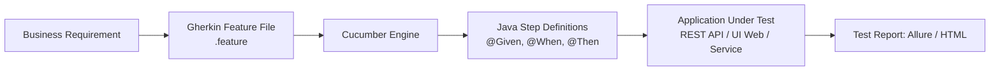
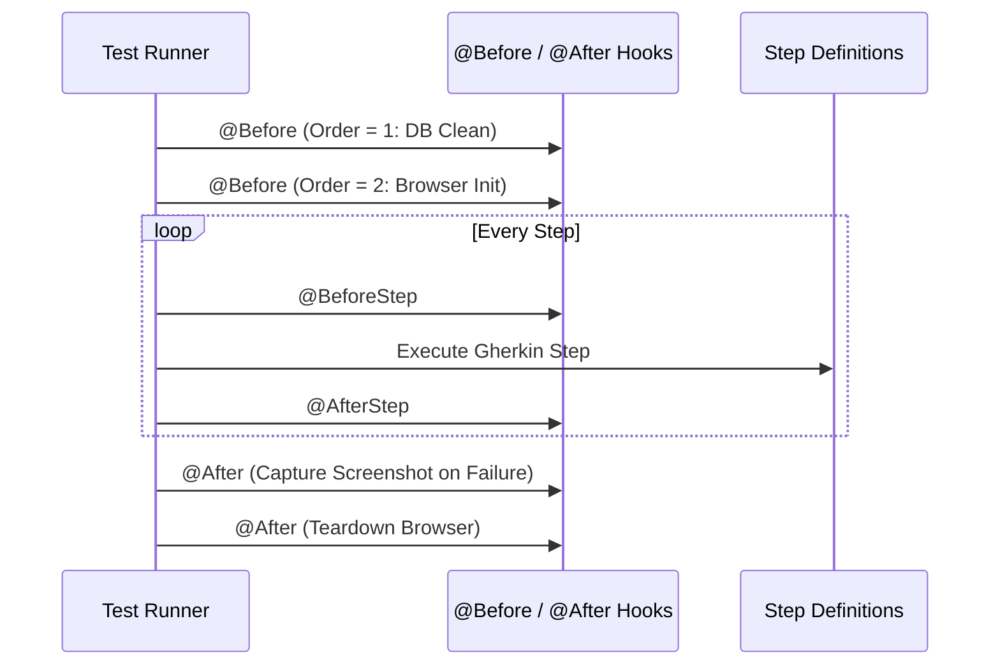

[🏠 Back to Home](README.md)

# 🥒 Cucumber BDD: Complete Architecture, Syntax & Enterprise Test Automation

A comprehensive, production-ready guide to Behavior Driven Development (BDD) with Cucumber in Java. Covers Gherkin grammar, Cucumber Expressions, Step Definitions, Data Tables, Hook Lifecycles, PicoContainer Dependency Injection, and real-world API/Web testing scenarios.

---

## 📑 Table of Contents
1. [🧠 The BDD Mental Model: Business Requirements to Automated Code](#-the-bdd-mental-model)
2. [📜 1. Core Gherkin Syntax & Grammar](#-1-core-gherkin-syntax--grammar)
3. [🎯 2. Cucumber Expressions vs. Regular Expressions](#-2-cucumber-expressions-vs-regular-expressions)
4. [☕ 3. Java Step Definitions & State Management](#-3-java-step-definitions--state-management)
5. [🪝 4. Execution Lifecycle & Hooks Architecture](#-4-execution-lifecycle--hooks-architecture)
6. [📊 5. Advanced Test Data: Data Tables & Custom Type Registry](#-5-advanced-test-data-data-tables--custom-type-registry)
7. [🧪 6. 5+ Enterprise Testing Scenarios with Full Code](#-6-5-enterprise-testing-scenarios-with-full-code)
8. [🏃 7. Test Runners & Parallel Execution (JUnit 5 / TestNG)](#-7-test-runners--parallel-execution-junit-5--testng)
9. [⚖️ 8. Gherkin & Cucumber Cheat Sheet](#️-8-gherkin--cucumber-cheat-sheet)

---

## 🧠 The BDD Mental Model

Behavior Driven Development (BDD) bridges the communication gap between Business Stakeholders (Product Owners), Developers, and Quality Assurance (QA) engineers using a shared, human-readable Domain Specific Language (Gherkin).



---

## 📜 1. Core Gherkin Syntax & Grammar

Gherkin uses plain-text formatting with structured keywords:

| Keyword | Description | Real-World Purpose |
| :--- | :--- | :--- |
| `Feature:` | High-level business feature or user story | Provides context (e.g., "User Authentication") |
| `Background:` | Steps executed before **every** scenario in the file | Sets up common state (e.g., "Given the user is on login page") |
| `Scenario:` | A concrete business rule example | Tests a single flow (e.g., "Successful login with valid credentials") |
| `Scenario Outline:` | A parameterized test template | Runs the exact same scenario with multiple data rows |
| `Examples:` | The data table for a `Scenario Outline` | Supplies parameters mapped to `<variable>` placeholders |
| `Given` | Preconditions or initial context | "Given user has $500 balance" |
| `When` | The action or event triggered | "When user transfers $200 to Alice" |
| `Then` | Expected outcome or assertion | "Then balance should be $300" |
| `And` / `But` | Syntactic sugar to chain multiple steps | "And a confirmation SMS is sent" |
| `DocStrings` | Triple quotes `"""` for multiline text / JSON | Passing raw JSON request bodies |
| `Data Tables` | Tabular data passed directly into a step | Passing lists or maps of test entities |

### Example Feature File: `shopping_cart.feature`
```gherkin
@Regression @Cart
Feature: Shopping Cart & Discount Processing
  As a customer
  I want to add items to my cart and apply coupon codes
  So that I can purchase items with discounts

  Background:
    Given the product catalog contains the following items:
      | sku      | name             | price  |
      | LAPTOP01 | MacBook Pro 16   | 2499.0 |
      | MOUSE01  | Magic Mouse      | 99.0   |
      | HEADSET  | AirPods Max      | 549.0  |

  @Smoke
  Scenario: Add single item to cart
    Given the user is logged in as "john.doe@example.com"
    When the user adds "LAPTOP01" with quantity 1 to the cart
    Then the cart item count should be 1
    And the total cart amount should be 2499.0

  Scenario Outline: Applying promotional discount coupons
    Given the user has added "<sku>" to their shopping cart
    When the user applies coupon code "<code>"
    Then the final price should be <discountedPrice>
    And the coupon status should be "<status>"

    Examples:
      | sku      | code        | discountedPrice | status  |
      | LAPTOP01 | SAVE10      | 2249.10         | APPLIED |
      | MOUSE01  | FLAT20      | 79.0            | APPLIED |
      | HEADSET  | INVALID_EXP | 549.0           | EXPIRED |
```

---

## 🎯 2. Cucumber Expressions vs. Regular Expressions

Modern Cucumber (v3+) uses **Cucumber Expressions** by default because they are readable and type-safe.

| Type | Cucumber Expression | Regex Equivalent | Matches Example |
| :--- | :--- | :--- | :--- |
| Integer | `{int}` | `(-?\\d+)` | `42`, `-5` |
| Floating Point | `{float}` | `(-?\\d+(?:\\.\\d+)?)` | `19.99`, `0.5` |
| String (Quoted) | `{string}` | `"([^"\\]*(\\.[^"\\]*)*)"` | `"MacBook Pro"` |
| Word (No space) | `{word}` | `(\\S+)` | `active`, `pending` |
| Anonymous | `{}` | `(.*)` | Matches any text |
| Custom Objects | `{product}` | Custom Registered Type | Converts JSON/String to POJO |

### Example Comparison
```java
// ✅ Modern: Cucumber Expression (Clean, Readable)
@Given("user has {int} items in their cart with total {float}")
public void userHasItemsInCart(int count, float total) {
    cartService.initCart(count, total);
}

// ⚠️ Legacy: Regex (Complex, harder to maintain)
@Given("^user has (\\d+) items in their cart with total (\\d+\\.\\d+)$")
public void userHasItemsInCartRegex(int count, double total) {
    cartService.initCart(count, total);
}
```

---

## ☕ 3. Java Step Definitions & State Management

### 3.1 Step Definition Implementation
```java
package com.example.bdd.steps;

import io.cucumber.java.en.Given;
import io.cucumber.java.en.When;
import io.cucumber.java.en.Then;
import io.cucumber.java.en.And;
import org.junit.jupiter.api.Assertions;

public class CartStepDefinitions {
    private final TestContext context; // Injected via PicoContainer

    public CartStepDefinitions(TestContext context) {
        this.context = context;
    }

    @Given("the user is logged in as {string}")
    public void userIsLoggedIn(String email) {
        context.setCurrentUser(userService.authenticateByEmail(email));
    }

    @When("the user adds {string} with quantity {int} to the cart")
    public void userAddsItem(String sku, int quantity) {
        context.getCart().addItem(sku, quantity);
    }

    @Then("the cart item count should be {int}")
    public void verifyCartCount(int expectedCount) {
        Assertions.assertEquals(expectedCount, context.getCart().getTotalItems());
    }

    @And("the total cart amount should be {float}")
    public void verifyCartAmount(float expectedAmount) {
        Assertions.assertEquals(expectedAmount, context.getCart().getTotalPrice(), 0.01);
    }
}
```

### 3.2 State Sharing with PicoContainer (No Static Variables!)
Never use `static` fields to pass state between step definition classes—it causes race conditions during parallel test runs. Use `cucumber-picocontainer`:

```java
// TestContext.java (Shared across step definitions)
public class TestContext {
    private User currentUser;
    private ShoppingCart cart = new ShoppingCart();
    private Response apiResponse;

    // Getters and Setters
}
```

---

## 🪝 4. Execution Lifecycle & Hooks Architecture

Hooks run automatically before and after scenarios or steps to manage test setup and teardown.



### Hook Implementation Code
```java
package com.example.bdd.hooks;

import io.cucumber.java.Before;
import io.cucumber.java.After;
import io.cucumber.java.BeforeStep;
import io.cucumber.java.Scenario;
import org.openqa.selenium.OutputType;
import org.openqa.selenium.TakesScreenshot;
import org.openqa.selenium.WebDriver;

public class TestHooks {
    private final TestContext context;

    public TestHooks(TestContext context) {
        this.context = context;
    }

    // 1. Tagged Hook with Order (Runs only for @Database tagged scenarios)
    @Before(value = "@Database", order = 1)
    public void resetDatabaseState() {
        databaseService.truncateAllTables();
        databaseService.seedReferenceData();
    }

    // 2. Global Setup Hook
    @Before(order = 10)
    public void initializeDriver(Scenario scenario) {
        System.out.println("Starting scenario: " + scenario.getName());
    }

    // 3. Teardown Hook with Screenshot Capture on Failure
    @After(order = 1)
    public void tearDown(Scenario scenario) {
        if (scenario.isFailed()) {
            WebDriver driver = context.getDriver();
            if (driver != null) {
                byte[] screenshot = ((TakesScreenshot) driver).getScreenshotAs(OutputType.BYTES);
                scenario.attach(screenshot, "image/png", "Failure_Screenshot");
            }
        }
        if (context.getDriver() != null) {
            context.getDriver().quit();
        }
    }
}
```

---

## 📊 5. Advanced Test Data: Data Tables & Custom Type Registry

### 5.1 Mapping Data Tables to Java POJOs
```gherkin
Given the following users exist in the system:
  | email              | role       | active |
  | admin@fintech.com  | SUPER_ADMIN| true   |
  | dev@fintech.com    | DEVELOPER  | true   |
  | user@fintech.com   | GUEST      | false  |
```

```java
public record UserDTO(String email, String role, boolean active) {}

// Step Definition: Cucumber automatically transforms the table into List<UserDTO>
@Given("the following users exist in the system:")
public void createUsers(List<UserDTO> users) {
    users.forEach(user -> userService.createUser(user.email(), user.role(), user.active()));
}
```

---

## 🧪 6. 5+ Enterprise Testing Scenarios with Full Code

### 🧩 Scenario 1: REST API Testing with RestAssured & Cucumber
**Problem:** Test an Order Creation REST API endpoint including status code, JSON path validation, and auth header.

```gherkin
@API @Orders
Scenario: Create a new customer order via REST API
  Given user has valid bearer authentication token
  When the user sends a POST request to "/api/v1/orders" with payload:
    """
    {
      "productId": "PROD-998",
      "quantity": 2,
      "currency": "USD"
    }
    """
  Then the response status code should be 201
  And the response body field "status" should be "CREATED"
  And the response body should contain a valid UUID "orderId"
```

```java
public class OrderApiSteps {
    private Response response;
    private String authToken;

    @Given("user has valid bearer authentication token")
    public void authenticate() {
        this.authToken = AuthUtil.generateTestToken();
    }

    @When("the user sends a POST request to {string} with payload:")
    public void sendPostRequest(String endpoint, String jsonPayload) {
        this.response = RestAssured.given()
            .header("Authorization", "Bearer " + authToken)
            .contentType(ContentType.JSON)
            .body(jsonPayload)
            .post(endpoint);
    }

    @Then("the response status code should be {int}")
    public void verifyStatusCode(int expectedCode) {
        response.then().statusCode(expectedCode);
    }

    @And("the response body field {string} should be {string}")
    public void verifyField(String jsonPath, String expectedValue) {
        response.then().body(jsonPath, org.hamcrest.Matchers.equalTo(expectedValue));
    }
}
```

---

### 🧩 Scenario 2: Dynamic Data Table with Calculations & Summaries
**Problem:** Verify that a multi-currency tax calculation engine computes tax for different US states accurately.

```gherkin
Scenario: Multi-state sales tax calculation
  When the invoice is calculated for the following line items:
    | item         | state | netAmount | taxRate |
    | Cloud Server | CA    | 1000.00   | 0.0725  |
    | Domain Name  | NY    | 50.00     | 0.08875 |
    | SSL Cert     | TX    | 120.00    | 0.0625  |
  Then the computed total tax should be 84.44
```

---

### 🧩 Scenario 3: Database Verification After Async Event (Polling Assertion)
**Problem:** After placing an order, Kafka fires an event. The notification worker asynchronously writes a record to `notification_audit` table. We need a polling assertion.

```java
@Then("a notification record for user {string} should appear in database within {int} seconds")
public void verifyDatabaseRecordWithPolling(String userEmail, int timeoutSeconds) {
    org.awaitility.Awaitility.await()
        .atMost(timeoutSeconds, java.util.concurrent.TimeUnit.SECONDS)
        .pollInterval(500, java.util.concurrent.TimeUnit.MILLISECONDS)
        .until(() -> auditRepository.existsByUserEmail(userEmail));
}
```

---

## 🏃 7. Test Runners & Parallel Execution

### 7.1 Modern JUnit 5 Platform Suite Runner
```java
package com.example.bdd;

import org.junit.platform.suite.api.ConfigurationParameter;
import org.junit.platform.suite.api.IncludeEngines;
import org.junit.platform.suite.api.SelectClasspathResource;
import org.junit.platform.suite.api.Suite;

import static io.cucumber.junit.platform.engine.Constants.GLUE_PROPERTY_NAME;
import static io.cucumber.junit.platform.engine.Constants.PLUGIN_PROPERTY_NAME;

@Suite
@IncludeEngines("cucumber")
@SelectClasspathResource("features")
@ConfigurationParameter(key = GLUE_PROPERTY_NAME, value = "com.example.bdd.steps,com.example.bdd.hooks")
@ConfigurationParameter(key = PLUGIN_PROPERTY_NAME, value = "pretty, html:target/cucumber-reports/report.html, json:target/cucumber-reports/cucumber.json")
public class RunCucumberTest {
}
```

### 7.2 Parallel Execution in `pom.xml`
```xml
<plugin>
    <groupId>org.apache.maven.plugins</groupId>
    <artifactId>maven-surefire-plugin</artifactId>
    <version>3.2.5</version>
    <configuration>
        <parallel>methods</parallel>
        <threadCount>4</threadCount>
        <properties>
            <configurationParameters>
                cucumber.execution.parallel.enabled=true
                cucumber.execution.parallel.config.strategy=fixed
                cucumber.execution.parallel.config.fixed.parallelism=4
            </configurationParameters>
        </properties>
    </configuration>
</plugin>
```

---

## ⚖️ 8. Gherkin & Cucumber Cheat Sheet

| Command / Annotation | Description | Best Practice |
| :--- | :--- | :--- |
| `@Before(order = n)` | Runs before each scenario | Use low numbers for DB/Env init, high for browser setup |
| `@After` | Runs after each scenario | Always check `scenario.isFailed()` to attach failure screenshots |
| `@BeforeStep` | Runs before every step | Useful for network tracing or UI highlighting |
| `Scenario.attach(byte[], mime, name)` | Embeds media into HTML report | Attach screenshots, API payloads, or logs |
| `Scenario Outline` + `Examples` | Data-driven testing | Keep tables clean; do not exceed 10 columns |
| `cucumber.execution.parallel.enabled` | Multi-threaded test execution | Use PicoContainer for thread-safe context |
| `tags = "not @Ignored and (@Smoke or @Regression)"` | Tag expressions | Filter tests in CI/CD pipeline |

---

## 🎓 9. Senior Cucumber BDD Interview Preparation & Scenario Q&A

### 📌 Core Conceptual Interview Questions

#### Q1: How does PicoContainer manage state sharing across step definitions during parallel execution?
> **Answer & Explanation:**
> - In modular BDD frameworks, step definitions are split across multiple classes (e.g., `UserSteps.java`, `CartSteps.java`, `PaymentSteps.java`).
> - **Anti-Pattern:** Using `public static TestContext context` causes severe race conditions and data corruption when running scenarios concurrently.
> - **Solution (PicoContainer DI):** PicoContainer creates a new instance of `TestContext` **per scenario** and constructor-injects the exact same scenario-scoped instance into all step classes participating in that scenario.
> - When the scenario ends, PicoContainer automatically disposes of the context, guaranteeing complete thread isolation without manual cleanup.

#### Q2: How do you handle Custom Objects in Data Tables using `@DataTableType`?
> **Answer & Explanation:**
> - Rather than manually parsing `Map<String, String>` inside step definitions, define a custom transformer:
> ```java
> @DataTableType
> public UserAccount userAccountEntry(Map<String, String> entry) {
>     return new UserAccount(
>         entry.get("Username"),
>         entry.get("Role"),
>         Double.parseDouble(entry.get("Balance"))
>     );
> }
> ```
> - Cucumber will automatically deserialize rows directly into `List<UserAccount> users` as a strongly typed step argument.

#### Q3: What is the difference between `Background:` and `@Before` hooks?
> **Answer & Explanation:**
> - `Background:` is visible in the `.feature` file and read by business stakeholders. It should only contain **business-meaningful steps** (e.g., `Given the user has an active premium subscription`).
> - `@Before` is invisible technical code in Java. It should be used exclusively for **infrastructure setup** (e.g., opening a browser instance, creating a DB transaction, initializing wiremock stubs).

---

### 🚨 Real-World Scenario-Based Interview Questions

#### Scenario Q1: Flaky Asynchronous Order Processing in BDD
> **Interviewer Question:** *"In our e-commerce BDD suite, the step `Then the order status should be 'COMPLETED'` fails randomly because the backend processes payments asynchronously via Kafka. Adding `Thread.sleep(5000)` makes our CI pipeline take 2 hours. How do you design robust asynchronous verification?"*
>
> **Senior Architect Answer:**
> - Never use static `Thread.sleep()`.
> - Use **Awaitility** with polling and exponential backoff:
> ```java
> @Then("the order status should be {string}")
> public void verifyOrderStatus(String expectedStatus) {
>     org.awaitility.Awaitility.await()
>         .atMost(Duration.ofSeconds(10))
>         .pollInterval(Duration.ofMillis(300))
>         .untilAsserted(() -> {
>             OrderDTO order = orderApiClient.getOrder(testContext.getOrderId());
>             org.junit.jupiter.api.Assertions.assertEquals(expectedStatus, order.getStatus());
>         });
> }
> ```

---

## 🔄 10. Architectural Transferability: Where & How to Apply Elsewhere

1. **Enterprise Living Documentation (Specification by Example):** Generating automated HTML/PDF compliance reports for regulated industries (Healthcare FDA CFR 21, Financial PCI-DSS audit trails).
2. **Contract Testing & API Acceptance Suites:** Validating OpenAPI / gRPC microservice contracts against human-readable business rules before production deployment.
3. **Cross-Platform Test Automation:** Sharing identical Gherkin feature files between Web (Selenium), Mobile (Appium), and Backend (REST Assured) test automation engines.

---

[⬆️ Back to Top](#-cucumber-bdd-complete-architecture-syntax--enterprise-test-automation)

