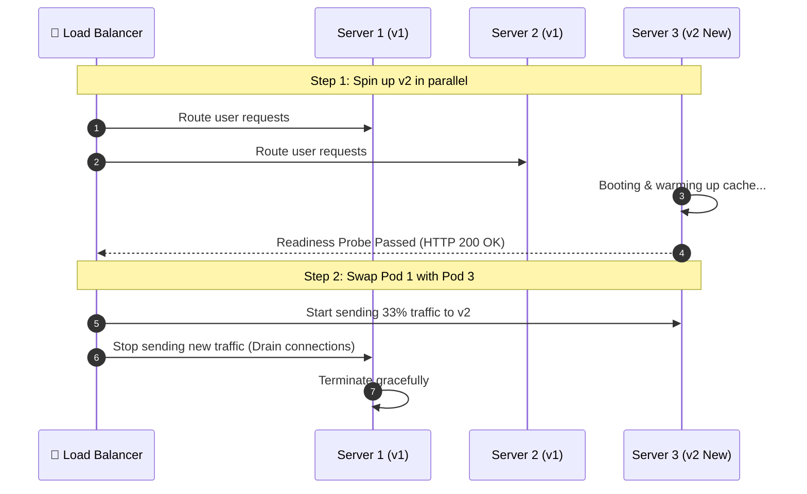
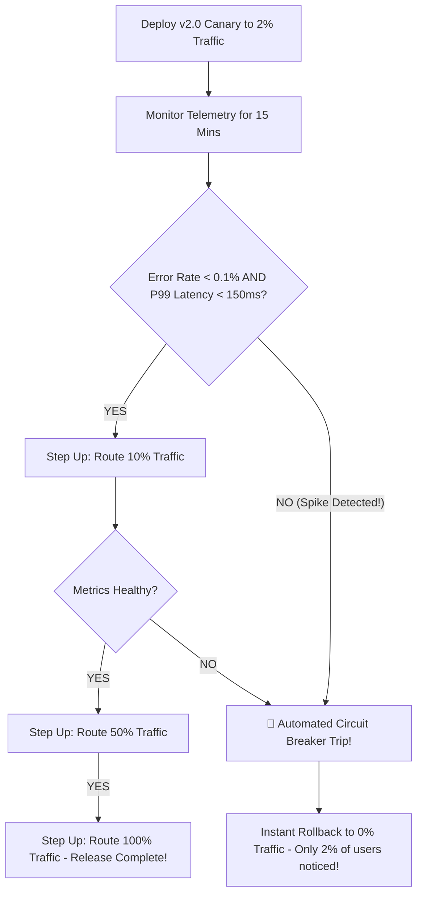

# 🚀 Enterprise Deployment Strategies Master Guide: Zero-Downtime Architecture from Scratch to Advanced

> **Target Audience**: Software Engineers, DevOps/SRE Practitioners, Cloud Architects, and Technical Leads.  
> **Prerequisites**: Zero prior knowledge of deployment patterns required. We begin with intuitive real-world analogies (the airport runway, twin bridges, and canary birds) and systematically progress to traffic shifting physics, Kubernetes primitives, database expand-and-contract migrations, progressive delivery, and real-world outage post-mortems.

---

## 🐣 Beginner Fast-Track: Deployment Strategies in Plain English (Zero Jargon)

If you have never deployed an application to production before, ignore the complex cloud terminology for a moment. Here is the entire discipline explained using everyday real-world concepts:

### The "Everyday Life" Analogy Table

| Strategy | The Plain English Analogy | What Actually Happens on the Server | How Bad If It Fails? |
| :--- | :--- | :--- | :--- |
| **1. Recreate** | 🚪 **Hanging a "Closed for Remodeling" sign on a store door.** | Turn off old server $\to$ copy new code $\to$ turn on new server. | 🚨 **Severe**: 100% of users get kicked out and see error pages for minutes or hours. |
| **2. Rolling Update** | 💡 **Changing light bulbs in a skyscraper one floor at a time.** | Replace 1 server out of 4 with new code. Wait until it works, then replace the next one. | 🟡 **Medium**: 25% of users might see a bug while it rolls out, but the site never goes down. |
| **3. Blue-Green** | 🌉 **Building an identical second bridge right next to the old one.** | Build a whole new copy of your production servers (Green). Test it with internal QA. Flip the traffic cones in 1 second. | 🟢 **Safe**: If something goes wrong, flip the traffic cones back to the old bridge (Blue) in 1 second! |
| **4. Active-Passive** | 🏥 **A hospital emergency backup generator.** | Primary data center takes 100% of traffic. A backup data center in another city sits ready in case of an earthquake or power outage. | 🟢 **High Availability**: Built for natural disasters and datacenter outages, not daily code releases. |
| **5. Canary** | 🐤 **The coal miner's caged canary bird.** | Route just 1% of real users to the new code. Watch for errors like a hawk. If error rate stays at 0%, gradually increase: 5% $\to$ 25% $\to$ 100%. | 🛡️ **Extremely Safe**: If there is a fatal bug, only 1% of users notice before it automatically rolls back! |
| **6. A/B Testing** | 🎨 **Showing 50% of shoppers a green button and 50% a blue button.** | Not an engineering stability test; a business experiment to see which version gets more sales or clicks. | 🟢 **Low**: Both versions work; you are just measuring customer psychology. |
| **7. Shadow / Dark** | ✈️ **A pilot training in a flight simulator fed with real cockpit data.** | Copy every real user request and send an invisible duplicate to the new server. The user never sees the answer from the new server. | 🛡️ **Zero Risk**: New server can crash 50,000 times; real users never see an error! |
| **8. Feature Flags** | 💡 **A light switch on the wall.** | Deploy new code into production with the switch turned OFF. Flip the switch ON in a dashboard whenever you are ready. | 🛡️ **Instant**: Turn off bugs in 200 milliseconds without redeploying code. |

### 🧭 The 3-Question Decision Guide for Beginners

1. **Can your users tolerate 5 minutes of maintenance downtime at night?**
   - *YES* $\to$ Use **Recreate** (simplest, cheapest, zero wasted cloud dollars).
   - *NO* $\to$ Go to Question 2.
2. **Can you afford double cloud infrastructure costs during deployment?**
   - *YES and need instant 1-second rollback* $\to$ Use **Blue-Green**.
   - *NO* $\to$ Use **Rolling Update** (free, built-in to Kubernetes and AWS).
3. **Do you have millions of users where even a 0.1% bug costs thousands of dollars?**
   - *YES* $\to$ Use **Canary Deployment** with automated metric rollbacks.

---

## 📑 Master Table of Contents

- [🐣 Beginner Fast-Track: Deployment Strategies in Plain English (Zero Jargon)](#-beginner-fast-track-deployment-strategies-in-plain-english-zero-jargon)
- [Track 1: Foundational Mental Models (Zero-Knowledge Onboarding)](#track-1-foundational-mental-models-zero-knowledge-onboarding)
  - [1.1 Real-World Analogy: Changing Airplane Engines Mid-Flight](#11-real-world-analogy-changing-airplane-engines-mid-flight)
  - [1.2 Why the Naive Way ("Stop Server, Copy Code, Start Server") Kills Businesses](#12-why-the-naive-way-stop-server-copy-code-start-server-kills-businesses)
  - [1.3 Deployment vs Release: The Vital Distinction](#13-deployment-vs-release-the-vital-distinction)
- [Track 2: The 8 Industry Deployment Strategies Decoded](#track-2-the-8-industry-deployment-strategies-decoded)
  - [2.1 Strategy 1: Recreate (Big Bang / Hard Cutover)](#21-strategy-1-recreate-big-bang--hard-cutover)
  - [2.2 Strategy 2: Rolling Update (Ramped / Incremental)](#22-strategy-2-rolling-update-ramped--incremental)
  - [2.3 Strategy 3: Blue-Green (Red-Black / Active-Standby)](#23-strategy-3-blue-green-red-black--active-standby)
  - [2.4 Strategy 4: Active-Passive vs Active-Active (Disaster Recovery & Traffic Routing)](#24-strategy-4-active-passive-vs-active-active-disaster-recovery--traffic-routing)
  - [2.5 Strategy 5: Canary Deployment (Progressive Delivery / Blast Radius Containment)](#25-strategy-5-canary-deployment-progressive-delivery--blast-radius-containment)
  - [2.6 Strategy 6: A/B Testing (Experimentation & Business Metric Routing)](#26-strategy-6-ab-testing-experimentation--business-metric-routing)
  - [2.7 Strategy 7: Shadow / Dark Launching (Traffic Mirroring)](#27-strategy-7-shadow--dark-launching-traffic-mirroring)
  - [2.8 Strategy 8: Feature Flags (Decoupled Runtime Releases)](#28-strategy-8-feature-flags-decoupled-runtime-releases)
- [Track 3: The Grand Architectural Decision Matrix](#track-3-the-grand-architectural-decision-matrix)
- [Track 4: The Database Migration Dilemma (The #1 Deployment Killer)](#track-4-the-database-migration-dilemma-the-1-deployment-killer)
  - [4.1 The Problem: Why Blue-Green Breaks When Schema Changes](#41-the-problem-why-blue-green-breaks-when-schema-changes)
  - [4.2 The Solution: The Expand and Contract Pattern (Parallel Run)](#42-the-solution-the-expand-and-contract-pattern-parallel-run)
- [Track 5: Hands-On Infrastructure Configurations](#track-5-hands-on-infrastructure-configurations)
  - [5.1 Kubernetes Native RollingUpdate Deployment](#51-kubernetes-native-rollingupdate-deployment)
  - [5.2 Nginx Weighted Traffic Shifting (Canary Gateway)](#52-nginx-weighted-traffic-shifting-canary-gateway)
  - [5.3 Argo Rollouts Canary Definition (with Automated Metric Analysis)](#53-argo-rollouts-canary-definition-with-automated-metric-analysis)
- [Track 6: Top 10 Beginner Mistakes vs Top 10 Advanced Anti-Patterns](#track-6-top-10-beginner-mistakes-vs-top-10-advanced-anti-patterns)
- [Track 7: Real-World Production Outage War Stories (Post-Mortems)](#track-7-real-world-production-outage-war-stories-post-mortems)
- [Track 8: Comprehensive Zero-Jargon Glossary (60+ Essential Terms)](#track-8-comprehensive-zero-jargon-glossary-60-essential-terms)
- [Track 9: Crack-the-Interview Question Bank (50 Production Scenarios)](#track-9-crack-the-interview-question-bank-50-production-scenarios)

---

## Track 1: Foundational Mental Models (Zero-Knowledge Onboarding)

### 1.1 Real-World Analogy: Changing Airplane Engines Mid-Flight

Imagine an airline running commercial flights:

- **The Naive Way (Recreate)**: The pilot announces over the intercom: *"Passengers, we need to upgrade the engine to version 2.0. We are turning off the engines right now in mid-air. Please wait 10 minutes while our technicians replace the parts, then we will restart!"*  
  👉 **Result**: Catastrophic crash. In software, this means customer transactions drop, carts are lost, API requests return `HTTP 502/503`, and your company loses revenue and trust.
- **The Modern Way (Zero-Downtime Deployment)**: Modern engineering designs planes with multiple redundant engines. Technicians service one engine while the remaining engines maintain airspeed. Or, the airline lands plane A at the gate, while an already-upgraded, fully-tested plane B takes off seamlessly from the adjacent runway without passengers ever missing a beat!

---

### 1.2 Why the Naive Way ("Stop Server, Copy Code, Start Server") Kills Businesses

In college or hobby projects, deployment is simple:

```bash
# The Hobbyist Anti-Pattern
ssh production-server
systemctl stop my-app       # ⚠️ Users experience immediate connection refused!
git pull origin main
npm run build               # ⚠️ Takes 3 minutes of dead downtime!
systemctl start my-app
# ⚠️ If there is a syntax bug, the server crashes and stays dead!
```

#### The 4 Fatal Flaws of Naive Deployments

1. **Unavoidable Downtime**: Even a 30-second restart drops thousands of active customer payments during peak hours.
2. **High Blast Radius (All-or-Nothing Risk)**: If your new release contains an unhandled exception or memory leak, **100% of your users** experience the bug simultaneously.
3. **Slow, Painful Rollbacks**: If version 2 crashes, recovering requires locating the previous release, repeating the build process, or reinstalling packages while management is panicking.
4. **Broken In-Flight State**: Customers halfway through filling out a multi-step checkout form lose their session state and get kicked back to the login screen.

---

### 1.3 Deployment vs Release: The Vital Distinction

In elite engineering organizations (Google, Netflix, Amazon), **Deploying** and **Releasing** are two completely different operations:

```text
┌─────────────────────────────────────────────────────────────────────────────┐
│                             DEPLOYMENT vs RELEASE                           │
├──────────────────────────────────────┬──────────────────────────────────────┤
│ 📦 DEPLOYMENT (Engineering Event)    │ 🚀 RELEASE (Business Event)          │
├──────────────────────────────────────┼──────────────────────────────────────┤
│ • Installing code and spinning up    │ • Routing real customer traffic to   │
│   containers on production servers.  │   the new code.                      │
│ • Zero customer impact. Customers    │ • Marketing and product decision.    │
│   cannot see or access it yet.       │ • Can be toggled on/off in 1 second  │
│ • Runs automated smoke tests in the  │   using Feature Flags or Routing     │
│   live production environment.       │   Rules without redeploying code.    │
└──────────────────────────────────────┴──────────────────────────────────────┘
```

> 💡 **Core Mantra**: *Deploy whenever code is merged; release only when business and system metrics prove it is ready.*

---

## Track 2: The 8 Industry Deployment Strategies Decoded

Here are all 8 primary deployment strategies, ranked from simplest to most advanced.

---

### 2.1 Strategy 1: Recreate (Big Bang / Hard Cutover)

The simplest possible deployment. All active version 1 (v1) instances are terminated simultaneously, and version 2 (v2) instances are booted in their place.

```text
Time ──►
[ v1 ] [ v1 ] [ v1 ] (Live Traffic)
       ▼ (Kill all instances)
[ ❌ ] [ ❌ ] [ ❌ ] ──► 🚨 DOWNTIME WINDOW (HTTP 503 Service Unavailable)
       ▼ (Boot new version)
[ v2 ] [ v2 ] [ v2 ] (Traffic Resumes)
```

#### Mechanics of Recreate

1. Routing to v1 is shut off.
2. All v1 servers or containers are destroyed.
3. Fresh v2 instances are spun up from scratch.
4. Once v2 passes health checks, traffic resumes.

#### Trade-Offs for Recreate

- 🟢 **Pros**:
  - **Cheapest infrastructure cost**: Never requires extra servers ($O(1)$ capacity).
  - **Zero state/schema conflict**: v1 and v2 never run at the same time, so they never dispute database columns or cache schemas.
- 🔴 **Cons**:
  - **Guaranteed downtime**: Always incurs seconds to minutes of complete service blackout.
  - **Total customer impact**: Any regression affects 100% of traffic immediately.
- 🎯 **When to Use**: Internal developer environments, nighttime batch processing pipelines, or non-critical back-office administrative portals.

---

### 2.2 Strategy 2: Rolling Update (Ramped / Incremental)

The industry standard default for container orchestrators like **Kubernetes** and **AWS ECS**. Instead of replacing everything at once, instances are phased in one by one.

```text
Step 1 (Start):   [ v1 ] [ v1 ] [ v1 ] [ v1 ]  (100% v1)
Step 2 (Surge):   [ v1 ] [ v1 ] [ v1 ] [ v2 ]  (75% v1, 25% v2)
Step 3 (Halfway): [ v1 ] [ v1 ] [ v2 ] [ v2 ]  (50% v1, 50% v2)
Step 4 (Complete):[ v2 ] [ v2 ] [ v2 ] [ v2 ]  (100% v2)
```



#### Mechanics of Rolling Update

1. The load balancer continues directing traffic to healthy v1 instances.
2. A new v2 instance is spun up.
3. The orchestrator waits for the v2 **Readiness Probe** to succeed (verifying database connections and memory caches).
4. Once v2 is healthy, the load balancer adds it to the active pool and drains/terminates one v1 instance.
5. The cycle repeats until 100% of instances run v2.

#### Trade-Offs for Rolling Update

- 🟢 **Pros**:
  - **Zero downtime**: User traffic always hits healthy instances.
  - **Modest resource overhead**: Only requires 1 or 2 temporary extra pods (controlled via `maxSurge` in Kubernetes).
- 🔴 **Cons**:
  - **The "Dual-Version Window"**: For 5 to 15 minutes, **both v1 and v2 run simultaneously**. If v2 writes data that v1 cannot parse, users hit random errors depending on which server their request lands on!
  - **Slow rollbacks**: If an issue is found at 90% rollout, rolling back takes just as long as deploying.
- 🎯 **When to Use**: Standard web applications, stateless microservices, and general production workloads.

---

### 2.3 Strategy 3: Blue-Green (Red-Black / Active-Standby)

In Blue-Green deployment, you maintain **two identical physical production environments**:

- **Blue**: Currently active environment serving 100% of live production traffic.
- **Green**: Idle standby environment running the new software version.

```text
                       ┌────────────────────────────────┐
                       │  🔀 Router / CDN / DNS / LB     │
                       └───────────────┬────────────────┘
                                       │
                      [ ACTIVE ROUTE ] │ (Flip in 1 second!)
                                       ▼
             ┌──────────────────────────────────────────────────┐
             │ 🔵 BLUE ENVIRONMENT (v1.0 - Live Production)     │
             │   [ Web 1 ]    [ Web 2 ]    [ Web 3 ]            │
             └──────────────────────────────────────────────────┘
             
             ┌──────────────────────────────────────────────────┐
             │ 🟢 GREEN ENVIRONMENT (v2.0 - Staged & Tested)    │
             │   [ Web 1 ]    [ Web 2 ]    [ Web 3 ]            │
             └──────────────────────────────────────────────────┘
```

#### Mechanics of Blue-Green

1. Live users hit the **Blue** environment.
2. Engineers deploy v2 entirely into the isolated **Green** environment.
3. Internal QA, automated smoke tests, and security scans run against Green using private internal endpoints.
4. When validated, the router / load balancer flips its pointer from Blue to Green.
5. **Instant Switchover**: In less than 1 second, all users are seamlessly on v2!
6. If a critical bug emerges 2 minutes later, the load balancer flips right back to Blue (**Instant Sub-Second Rollback**).

#### Trade-Offs for Blue-Green

- 🟢 **Pros**:
  - **Sub-second rollback**: Reverting an outage takes 1 click of a load balancer toggle.
  - **Complete environment parity**: QA tests the exact final infrastructure before any user touches it.
- 🔴 **Cons**:
  - **Double infrastructure cost (2x Cost)**: You must pay for duplicate clusters, databases, and VMs during rollout.
  - **State synchronization**: WebSockets, in-memory sessions, and database schema updates require careful design.
- 🎯 **When to Use**: Mission-critical enterprise apps (e.g. banking, payment processing, healthcare) where downtime cannot be tolerated and instant rollback is mandatory.

---

### 2.4 Strategy 4: Active-Passive vs Active-Active (Disaster Recovery & Traffic Routing)

People frequently confuse **Blue-Green** with **Active-Passive**. While Blue-Green is a *software deployment strategy*, Active-Passive and Active-Active are primarily **High Availability (HA) and Disaster Recovery (DR)** architectural topologies.

```text
1. ACTIVE-PASSIVE (Warm / Cold Standby):
   [ Primary Region: US-East ] ◄════ 100% Traffic (Serving all users)
   [ Secondary Region: US-West ] ◄── 0% Traffic (Synchronizing DB logs; idle until disaster strikes)

2. ACTIVE-ACTIVE (Distributed Multi-Master):
   [ Region: US-East ] ◄════ 50% Local Traffic ──┐
                                                  ├─► Bidirectional DB Sync
   [ Region: EU-West ] ◄════ 50% Local Traffic ──┘
```

| Dimension | Active-Passive | Active-Active | Blue-Green (Comparison) |
| :--- | :--- | :--- | :--- |
| **Primary Goal** | Disaster recovery (Data center power outage, earthquake) | Global latency reduction & infinite horizontal scale | Zero-downtime application software release |
| **Traffic Distribution**| 100% on Active, 0% on Passive | Traffic distributed across all active nodes worldwide | 100% on Blue, then 100% on Green |
| **Database Model** | Master-Replica (Single write primary, read-only replica) | Multi-Master / Distributed Consensus (Spanner, CockroachDB) | Shared database with backward-compatible schema |
| **Failover Trigger** | Infrastructure outage or regional datacenter collapse | Automatic DNS latency routing / Anycast routing | Intentional software upgrade release |

---

### 2.5 Strategy 5: Canary Deployment (Progressive Delivery / Blast Radius Containment)

Named after the historic practice of coal miners bringing a caged canary into underground mines. If toxic odorless carbon monoxide gas leaked, the canary fell ill first, warning the miners to evacuate before anyone died.

In software, a **Canary Deployment** routes a tiny fraction of real production traffic (e.g., 1% to 5%) to the new version while 95% remains safely on the stable version.

```text
All Live Traffic (10,000 Users/sec)
           │
           ▼
┌──────────────────────┐
│  🔀 Smart Router/Mesh │
└──────┬────────┬──────┘
       │ 95%    │ 5% (The Canary!)
       ▼        ▼
    [ v1.0 ]  [ v2.0 ]
    (Stable)  (New)
```



#### Mechanics of Canary Deployment

1. Deploy v2 alongside v1.
2. Configure your ingress or Service Mesh (Envoy, Istio, Nginx, AWS ALB) to send **1% of traffic** to v2 and **99% to v1**.
3. Automated observability tools (Prometheus, Datadog, CloudWatch) monitor key golden signals:
   - **HTTP 5xx Error Rate**
   - **P99 Request Latency**
   - **Host CPU / Memory Leaks**
4. If metrics remain green over a 15-minute evaluation window, traffic automatically ramps up: $1\% \to 5\% \to 25\% \to 100\%$.
5. If errors spike beyond a threshold, the deployment controller instantly throttles traffic back to 0%.

#### Trade-Offs for Canary Deployment

- 🟢 **Pros**:
  - **Minimal Blast Radius**: If a fatal bug slips past QA, only 1% of users encounter it instead of all 100%.
  - **Real Production Validation**: Tests hardware, database queries, and third-party APIs under genuine production load.
- 🔴 **Cons**:
  - **Observability Dependency**: Useless without high-resolution real-time monitoring and alerting.
  - **Sticky Session Complexity**: Users jumping between pages might bounce between v1 and v2 unless cookies are pinned.
- 🎯 **When to Use**: High-traffic consumer applications (Netflix, Spotify, Uber) where user experience and stability are paramount.

---

### 2.6 Strategy 6: A/B Testing (Experimentation & Business Metric Routing)

Engineers often confuse **Canary** with **A/B Testing**. They use similar traffic-splitting technology, but their purposes are fundamentally different:

```text
┌─────────────────────────────────────────────────────────────────────────────┐
│                         CANARY vs A/B TESTING                               │
├──────────────────────────────────────┬──────────────────────────────────────┤
│ 🐦 CANARY DEPLOYMENT                 │ 🧪 A/B TESTING                       │
├──────────────────────────────────────┼──────────────────────────────────────┤
│ • Driven by DevOps & SREs.           │ • Driven by Product Managers & Data  │
│ • Metric: Technical Health           │   Scientists.                        │
│   (5xx errors, latency, CPU, crashes)│ • Metric: Business Performance       │
│ • Routing: Random % of all traffic   │   (conversion rate, sales, clicks)   │
│   (e.g., 2% of any incoming request).│ • Routing: Cohort-based demographic  │
│ • Duration: 15 to 60 minutes.        │   (e.g., users in Germany, or users  │
│ • Goal: Verify system stability.     │   on iOS who signed up this month).  │
│                                      │ • Duration: 2 to 4 weeks.            │
│                                      │ • Goal: Determine which variant      │
│                                      │   makes more money.                  │
└──────────────────────────────────────┴──────────────────────────────────────┘
```

---

### 2.7 Strategy 7: Shadow / Dark Launching (Traffic Mirroring)

In Shadow Deployment, production traffic is duplicated at the load balancer level. Version 1 processes the request and sends the response back to the real user. Simultaneously, an asynchronous clone of the exact same request is sent to Version 2 in the dark.

```text
Real Customer ──► [ Load Balancer (Envoy / Istio) ]
                        │                    │
        (Primary Request)│                    │ (Asynchronous Shadow Copy)
                        ▼                    ▼
               ┌────────────────┐   ┌────────────────┐
               │  VERSION 1     │   │  VERSION 2     │
               │  (Production)  │   │  (Shadow Dark) │
               └───────┬────────┘   └────────┬───────┘
                       │                     │
                       ▼                     ▼
              Response to Customer   Response DISCARDED!
                                     (Metrics & DB logs analyzed)
```

#### Mechanics of Shadow Deployment

1. The customer sends `POST /calculate-mortgage`.
2. The proxy sends the request to v1, receives the answer, and returns it to the customer.
3. The proxy simultaneously sends a duplicate copy of the request to v2.
4. v2 executes the code, runs the database calculations, and logs errors.
5. **The response from v2 is completely discarded**; the user never sees it!

#### Trade-Offs for Shadow Deployment

- 🟢 **Pros**:
  - **Absolute Zero Risk**: Version 2 can crash, segfault, or throw 10,000 errors without a single customer ever knowing.
  - **Realistic Performance Benchmarking**: See how new database indexes or algorithms handle peak real-world concurrency.
- 🔴 **Cons**:
  - **Mutation Hazard (Double Writes)**: If the shadow request triggers a database insert (`INSERT INTO orders`) or charges a credit card via Stripe, your customer gets billed twice! Dark launching is safe for read requests, but requires mocking external write side-effects.
- 🎯 **When to Use**: Rewriting legacy core backends, replacing critical search engines, or deploying new machine learning inference pipelines.

---

### 2.8 Strategy 8: Feature Flags (Decoupled Runtime Releases)

Instead of relying on infrastructure routers to manage releases, **Feature Flags** (also called Feature Toggles) wrap new code paths in runtime conditional checks:

```typescript
export async function calculateShipping(cart: Cart, user: User): Promise<number> {
  // Runtime evaluation via LaunchDarkly / Unleash / custom Redis config
  const useNextGenShippingEngine = await featureFlags.isEnabled('next_gen_shipping', {
    userId: user.id,
    country: user.country,
    isBetaTester: user.isBetaTester
  });

  if (useNextGenShippingEngine) {
    return runNewAlgorithmicRateCalculator(cart); // New code path (v2)
  } else {
    return runLegacyFlatRateCalculator(cart);       // Safe fallback (v1)
  }
}
```

#### Why Feature Flags are the Ultimate Weapon

1. **Trunk-Based Development**: Developers merge code into the `main` branch multiple times daily. Even if a feature is only 50% complete, it ships to production disabled behind a flag.
2. **Instant Kill Switches**: If a bug appears in production, an engineer flips the toggle to `OFF` in a web dashboard. The bug vanishes in **under 200 milliseconds** without requiring a CI/CD build, Docker image rebuild, or pod restart!

---

## Track 3: The Grand Architectural Decision Matrix

| Deployment Strategy | Downtime | Infrastructure Cost | Rollback Speed | Operational Complexity | Blast Radius Risk | Best Suited For |
| :--- | :--- | :--- | :--- | :--- | :--- | :--- |
| **Recreate** | **High** (Minutes) | 🟢 **$O(1)$** (Zero extra cost) | 🔴 **Slow** (Full redeploy) | 🟢 **Very Low** | 🔴 **100%** (All users) | Non-prod, batch processors, dev environments |
| **Rolling Update** | 🟢 **Zero** | 🟢 **Low** (+10% to 25% surge) | 🟡 **Moderate** (Phased rollback) | 🟡 **Moderate** | 🟡 **Variable** (25% to 100%) | Standard web apps, microservices, APIs |
| **Blue-Green** | 🟢 **Zero** | 🔴 **High** (+100% duplicate) | 🟢 **Instant** (Sub-second switch) | 🟡 **Moderate** | 🔴 **100%** (Upon cutover) | Enterprise billing, healthcare, regulated apps |
| **Canary** | 🟢 **Zero** | 🟡 **Low-Mod** (+5% to 10%) | 🟢 **Fast** (Traffic dial-down) | 🔴 **High** (Mesh + Metrics required) | 🟢 **Tiny** (1% to 5% of users) | High-volume consumer sites, mission-critical APIs |
| **A/B Testing** | 🟢 **Zero** | 🟡 **Low-Mod** | 🟢 **Instant** (Routing rule) | 🔴 **High** (Data science tracking) | 🟢 **Targeted** (Specific user cohort)| Product UX changes, pricing tests, checkout funnels |
| **Shadow** | 🟢 **Zero** | 🔴 **High** (+100% capacity) | 🟢 **Instant** (Stop mirroring) | 🔴 **Very High** (Mocking side effects)| 🟢 **Zero** (Users never see responses) | High-risk backend rewrites, database replatforming |

---

## Track 4: The Database Migration Dilemma (The #1 Deployment Killer)

> ⚠️ **The Golden Rule of Real-Time Systems**:  
> **Your deployment strategy is only as zero-downtime as your database migration.**

### 4.1 The Problem: Why Blue-Green Breaks When Schema Changes

Many engineers set up Blue-Green deployments, flip traffic, and watch their entire cluster crash. Why? **Because both environments almost always share the same underlying database!**

```text
   [ Blue Web App (v1) ] ────────┐
                                 ├─► [ SHARED DATABASE ]
   [ Green Web App (v2) ] ───────┘
```

#### The Catastrophic Scenario

1. Version 1 expects the database table `users` to have columns `first_name` and `last_name`.
2. Version 2 wants to combine them into a single column: `full_name`.
3. In Green, the deployment script runs: `ALTER TABLE users DROP COLUMN first_name, DROP COLUMN last_name;`
4. **Instantly, Blue (live production serving 100% of customers) explodes with SQL errors: `Column 'first_name' does not exist`!**

---

### 4.2 The Solution: The Expand and Contract Pattern (Parallel Run)

To achieve true zero-downtime deployments involving databases, every schema change must be split into **3 distinct, backward-compatible phases across multiple releases**:

```mermaid
graph TD
    subgraph Release 1: Expand
        A1[Add new column 'full_name' alongside old columns] --> A2[Deploy App: Writes to BOTH old & new; Reads from old]
    end
    subgraph Background Migration
        B1[Run batch backfill script: populate full_name for existing records]
    end
    subgraph Release 2: Switch
        C1[Deploy App: Reads and writes from 'full_name' ONLY]
    end
    subgraph Release 3: Contract
        D1[Verify v1 is 100% decommissioned] --> D2[Drop old columns 'first_name' and 'last_name']
    end
    Release 1: Expand --> Background Migration --> Release 2: Switch --> Release 3: Contract
```

#### Phase Breakdown

1. **Phase 1: Expand (Release N)**
   - Add the new column `full_name` as **nullable**.
   - Update application code to **dual-write** (writes save to both `first_name`/`last_name` AND `full_name`), but continue reading from the old columns.
   - Deploy. Both v1 and v2 operate happily!
2. **Phase 2: Backfill (Async Job)**
   - Run a background script: `UPDATE users SET full_name = first_name || ' ' || last_name WHERE full_name IS NULL;`
3. **Phase 3: Switch (Release N+1)**
   - Update application code to read and write exclusively from `full_name`.
   - Deploy using Canary or Blue-Green.
4. **Phase 4: Contract (Release N+2)**
   - Once all old app versions are permanently dead, safely drop the old columns: `ALTER TABLE users DROP COLUMN first_name, DROP COLUMN last_name;`

---

## Track 5: Hands-On Infrastructure Configurations

### 5.1 Kubernetes Native RollingUpdate Deployment

Save as `k8s-rolling-deployment.yaml`:

```yaml
apiVersion: apps/v1
kind: Deployment
metadata:
  name: payment-service
  labels:
    app: payment
spec:
  replicas: 4
  strategy:
    type: RollingUpdate
    rollingUpdate:
      maxSurge: 1        # Allow 1 extra temporary Pod above replica count (5 total)
      maxUnavailable: 0  # Never allow fewer than 4 healthy Pods during rollout!
  selector:
    matchLabels:
      app: payment
  template:
    metadata:
      labels:
        app: payment
    spec:
      containers:
      - name: payment-app
        image: payment-service:v2.0.0
        ports:
        - containerPort: 8080
        # CRITICAL: Without readinessProbe, K8s sends traffic before your app finishes booting!
        readinessProbe:
          httpGet:
            path: /health/ready
            port: 8080
          initialDelaySeconds: 5
          periodSeconds: 2
        lifecycle:
          # Graceful shutdown: Allow active transactions to finish before termination
          preStop:
            exec:
              command: ["/bin/sh", "-c", "sleep 10"]
```

---

### 5.2 Nginx Weighted Traffic Shifting (Canary Gateway)

Save as `/etc/nginx/conf.d/canary.conf`:

```nginx
# Define upstream clusters
upstream backend_stable {
    server 10.0.1.10:8080;
    server 10.0.1.11:8080;
}

upstream backend_canary {
    server 10.0.2.20:8080;
}

# Split traffic: 90% to stable, 10% to canary
split_clients "${remote_addr}${http_user_agent}" $upstream_pool {
    10%     backend_canary;
    *       backend_stable;
}

server {
    listen 80;
    server_name api.yourcompany.com;

    location / {
        proxy_pass http://$upstream_pool;
        proxy_set_header Host $host;
        proxy_set_header X-Real-IP $remote_addr;
        proxy_set_header X-Upstream-Target $upstream_pool;
    }
}
```

---

### 5.3 Argo Rollouts Canary Definition (with Automated Metric Analysis)

Save as `argo-canary-rollout.yaml`:

```yaml
apiVersion: argoproj.io/v1alpha1
kind: Rollout
metadata:
  name: checkout-service
spec:
  replicas: 10
  strategy:
    canary:
      steps:
      - setWeight: 5 # Step 1: Send 5% traffic to canary
      - pause: { duration: 10m } # Step 2: Hold for 10 minutes and watch Prometheus
      - setWeight: 20 # Step 3: Step up to 20%
      - pause: { duration: 30m }
      - setWeight: 50        # Step 4: Step up to 50%
      - pause: { duration: 15m }
      # Automated circuit breaker: If error rate exceeds 1%, abort and rollback automatically!
      analysis:
        templates:
        - templateName: success-rate
        args:
        - name: service-name
          value: checkout-service
```

---

## Track 6: Top 10 Beginner Mistakes vs Top 10 Advanced Anti-Patterns

### Top 10 Beginner Mistakes

1. **Missing Readiness Probes**: Relying only on `livenessProbe`. Kubernetes routes real user traffic to your container while your JVM or Node.js process is still parsing dependencies, causing an immediate wave of `HTTP 502 Bad Gateway` errors.
2. **Ignoring Database Backward Compatibility**: Dropping or renaming a database column in the same pull request as the new application code.
3. **No Graceful Shutdown (`SIGTERM` Handling)**: When a container is terminated during a rolling update, the app immediately drops existing in-flight HTTP requests rather than draining connections.
4. **Hardcoding IP Addresses**: Pointing proxies or clients to static IPs rather than DNS names, service discovery endpoints, or virtual IPs.
5. **Treating Recreate as "Fine for Now"**: Assuming downtime at 2:00 AM affects no one. In global businesses, 2:00 AM in New York is 3:00 PM in Tokyo.
6. **Lack of Automated Rollbacks**: Watching dashboard metrics manually and frantically trying to click rollback buttons while customers are complaining on social media.
7. **Single-Node Blue-Green**: Attempting Blue-Green on a single virtual machine where CPU/RAM becomes saturated trying to run both environments at once.
8. **Stateless Session Amnesia**: Storing user authentication sessions in web server local memory instead of a shared Redis cluster. When users get routed to the new version, they are randomly logged out!
9. **Deploying Large Monoliths on Friday Afternoons**: Releasing high-risk all-or-nothing changes before the weekend without an on-call rotation.
10. **Using File Uploads on Local Disks**: Writing uploaded images to `/tmp/uploads` on local disk. When the rolling update kills the container, customer photos vanish forever! Use S3 or Blob Storage.

---

### Top 10 Advanced Enterprise Anti-Patterns

1. **Canarying with Insufficient Traffic Volume**: Running a 1% canary on a microservice that only gets 5 requests per minute. You cannot make statistical inferences on 5 requests!
2. **Session Bleeding across Incompatible Serializers**: Upgrading a Java class stored in Redis cache without maintaining Java `serialVersionUID`, causing deserialization crashes when v1 instances read v2 cached objects.
3. **Omitting Connection Draining on Load Balancers**: Cutting traffic abruptly on a Blue-Green switchover without allowing ongoing WebSockets or chunked file downloads to complete cleanly.
4. **Database Lock Exhaustion During Schema Changes**: Running an `ALTER TABLE` on a PostgreSQL or MySQL table with 100 million rows that acquires an exclusive table lock, freezing production for 45 minutes.
5. **Asymmetric Resource Sizing in Standby Environments**: Sizing the "Green" environment with smaller CPU/RAM to save cloud costs, only to have it collapse under production traffic the millisecond the router flips.
6. **Feature Flag Debt Accumulation**: Never removing obsolete feature flags from codebase, resulting in combinatorial explosion of untested code execution branches.
7. **Un-sanitized Shadow Traffic**: Mirroring production traffic to dark launch environments where email/SMS notifications are not mocked, causing test users to receive duplicate billing emails!
8. **Ignoring DNS TTL Latency**: Attempting Blue-Green cutover via raw DNS `A-record` changes with a 3600-second TTL. Millions of client devices cache the old IP for an hour, defeating the instant switchover.
9. **Canary Blindness (Overlooking P99 Latency)**: Monitoring only the average (mean) response time. A catastrophic bug affecting only 1% of users with extreme 10-second timeouts will not shift the average, but will be glaringly obvious in P99/P99.9 metrics.
10. **Manual Canary Verification**: Relying on human engineers to "eyeball" Grafana dashboards for 30 minutes instead of writing automated statistical threshold rules (e.g. Kayenta / Argo Analysis).

---

## Track 7: Real-World Production Outage War Stories (Post-Mortems)

### Incident 1: The Friday Night Database Lock Disaster

- **Severity**: Sev-1 Outage (Complete eCommerce Blackout for 42 minutes).
- **The Setup**: A fast-growing retail company used Blue-Green deployment to deploy version 3.4.
- **The Trigger**: The Green environment's automated startup migration script executed:
  `ALTER TABLE orders ADD COLUMN loyalty_points INT DEFAULT 0;`
- **Root Cause**: On a PostgreSQL table with 80 million rows, setting a default value in older database engines forced a complete table rewrite while holding an `ACCESS EXCLUSIVE lock.
- **The Failure**: Even though Green wasn't serving traffic yet, the shared database locked the `orders` table. Blue (serving live customers) was blocked from writing any new purchases. Every single checkout attempt stalled and timed out.
- **The Fix**: Rewrote all migration standards to follow the **Expand and Contract** pattern. Made new columns nullable first, backfilled asynchronously in batches of 5,000 records, and banned table locks in CD pipelines.

---

### Incident 2: The WebSocket Ghost Fleet (Missing Graceful Shutdown)

- **Severity**: Sev-2 Outage (50,000 active mobile gamers disconnected simultaneously).
- **The Setup**: A multiplayer mobile game deployed a rolling update across 20 Kubernetes pods.
- **The Trigger**: Kubernetes sent `SIGTERM` to old v1 pods. The application had no `preStop` hook or graceful shutdown logic and exited immediately.
- **Root Cause**: 50,000 concurrent long-lived WebSocket connections were violently severed within 2 seconds.
- **The Stampede**: All 50,000 mobile client apps detected the dropped socket and simultaneously initiated an aggressive reconnection retry. This **Thundering Herd** slammed the remaining healthy pods, driving CPU to 100% and causing a cascading collapse across the entire cluster!
- **The Fix**: Implemented **exponential backoff with jitter** on mobile clients, added a 30-second `preStop` sleep hook in Kubernetes, and programmed the game servers to cleanly send disconnect notices staggered over a 20-second window.

---

## Track 8: Comprehensive Zero-Jargon Glossary (60+ Essential Terms)

An exhaustive, categorized reference encyclopedia explaining the terminology, runtime mechanics, everyday physical analogies, and production traps across modern deployment strategies and release engineering.

---

### 1. Core Lifecycle, Release & Recovery Terms

#### 1.1 Rollback

- **Plain-English Analogy**: The **Undo** button (`Ctrl+Z`) for production. If a newly installed kitchen appliance catches fire, you immediately pull it out and plug your old, reliable appliance back in.
- **Technical Mechanics**: Reverting production traffic and infrastructure state to the previous known-healthy version ($v_{N-1}$) when the new release ($v_N$) fails health checks or breaches error budgets. Can be executed by:
  1. *Routing Rollback (Fastest, $<1\text{s}$)*: In Blue-Green or Canary, flipping the load balancer/proxy target group back to the idle Blue environment.
  2. *Artifact Rollback ($1\text{--}5\text{ mins}$)*: In Rolling Updates, triggering `kubectl rollout undo deployment/<name>` or redeploying the previous container tag.
- **Automated Rollback**: Orchestrators (Argo Rollouts, Flagger) monitoring metric thresholds (HTTP 5xx $> 1\%$, P99 latency $> 500\text{ms}$) that autonomously trigger traffic diversion without human intervention.
- **⚠️ The Golden Trap**: Code rollbacks are instantaneous, but **database rollbacks are dangerous**. If version $v_N$ added a non-reversible schema change or mutated customer balances, rolling back the application code without rolling back or handling the database causes an immediate hard crash.

#### 1.2 Rollforward (Fix-Forward)

- **Plain-English Analogy**: Rather than putting the old engine back in, you quickly patch the loose bolt on the new engine while it's in place because turning back would cause more damage.
- **Technical Mechanics**: Resolving a production defect by rapidly building, testing, and deploying a new patch release ($v_{N+1}$) directly to production, rather than reverting to $v_{N-1}$.
- **When to Use**: Mandatory when the deployment has already performed irreversible data mutations, state migrations, or external third-party ledger integrations where a backward rollback would cause catastrophic data corruption.

#### 1.3 Deployment vs. Release

- **Plain-English Analogy**: 
  - **Deployment**: The delivery truck parks outside your store, unloads boxes of new shoes into the stockroom, and workers arrange them on shelves. (Zero customer impact).
  - **Release**: You unlock the front doors, turn on the neon sign, and invite shoppers inside to purchase the shoes. (Live customer impact).
- **Technical Mechanics**:
  - *Deployment*: Compiling artifacts, provisioning pods, running database migrations, warming caches, and establishing network connectivity.
  - *Release*: Shifting live customer network packets (HTTP/gRPC) to hit the newly deployed software via DNS, load balancers, or feature flags.
- **Key Takeaway**: Progressive delivery completely decouples deployment from release.

#### 1.4 Zero-Downtime Deployment (ZDD)

- **Plain-English Analogy**: Replacing tires on a racing car during a pit stop while the engine keeps running, or seamlessly switching electrical power from grid to generator without the lights flickering for even a millisecond.
- **Technical Mechanics**: Any deployment pattern (Blue-Green, Rolling, Canary) that updates an application across infrastructure without dropping active TCP connections, rejecting in-flight requests, or returning HTTP 5xx error codes.

#### 1.5 Dual-Version Window (Mixed-Version State)

- **Plain-English Analogy**: A 30-minute transition period in a bank where half the tellers are using the 2024 software and the other half are using the 2026 software, while sharing the same vault.
- **Technical Mechanics**: The operational time window during rolling updates or canaries where instances of version $v_1$ and $v_2$ run concurrently in the same cluster, reading and writing to the exact same shared databases, message brokers, and caches.
- **⚠️ The Golden Trap**: If $v_2$ writes data in a format that $v_1$ cannot parse, $v_1$ instances will crash or throw deserialization errors whenever users navigate between pages.

#### 1.6 Recreate (Stop-and-Replace)

- **Plain-English Analogy**: Closing a restaurant for 2 hours to remodel the kitchen, turning away hungry customers at the locked door until reopening.
- **Technical Mechanics**: Shutting down and terminating 100% of existing application instances before starting up any new instances. Guarantees downtime equal to `(shutdown time + container boot time + warmup time)`.
- **When Acceptable**: Batch data pipelines, internal non-critical staging environments, or monolithic legacy systems incapable of running two concurrent versions.

#### 1.7 Blast Radius

- **Plain-English Analogy**: If a water pipe bursts in a submarine, watertight bulkhead doors close so only one compartment floods, preventing the entire submarine from sinking.
- **Technical Mechanics**: The maximum percentage of users, transactions, or infrastructure instances exposed to potential failure or downtime if a new software version contains a fatal defect.
- **Goal**: Minimize blast radius to $<1\text{--}5\%$ using Canary releases or Cellular Architectures.

#### 1.8 Mean Time to Detect (MTTD)

- **Definition**: The average time elapsed between the exact moment a defect or regression is introduced into production and the moment monitoring alerts (Prometheus, Datadog) notify on-call engineers.

#### 1.9 Mean Time to Recover / Resolve (MTTR)

- **Definition**: The average time required to restore full service availability and healthy customer transaction flow after a production failure has been recognized. Automated canaries reduce MTTR from hours to under 30 seconds.

#### 1.10 Hotfix

- **Definition**: An emergency out-of-band code release deployed outside the standard scheduled CI/CD release window to remediate a critical Sev-1 production outage or zero-day security vulnerability.

#### 1.11 Artifact Promotion

- **Definition**: The CI/CD discipline where an identical immutable binary or container image (`sha256:abc123...`) is built once in Dev and sequentially promoted through QA, Staging, and Production, guaranteeing that what was tested in staging is bit-for-bit what runs in prod.

---

### 2. Core Deployment Strategy Patterns

#### 2.1 Rolling Update

- **Plain-English Analogy**: Replacing stadium seats row by row while fans are watching the game, only asking one row of fans to stand up at a time.
- **Technical Mechanics**: Gradually replacing instances of the old version with instances of the new version in batches (e.g. 25% at a time) using Kubernetes `maxSurge` and `maxUnavailable` parameters until 100% of the fleet runs the new version.
- **Trade-Off**: 🟢 Zero extra infrastructure cost; 🔴 Creates an unavoidable Dual-Version Window.

#### 2.2 Blue-Green Deployment (Red-Black / Active-Standby)

- **Plain-English Analogy**: Building an exact duplicate highway right next to the current highway. Once the new highway is paved and inspected, you move the traffic cones at the entrance ramp in 1 second, shifting all cars to the new highway.
- **Technical Mechanics**: Maintaining two identical production environments:
  - **Blue (Active)**: Serving 100% of live production traffic.
  - **Green (Idle/Standby)**: Running the new software version where smoke tests run against private endpoints.
  - **Cutover**: The router/load balancer instantly shifts 100% of incoming traffic from Blue to Green.
- **Trade-Off**: 🟢 Instant cutover and near-instant rollback ($<1\text{s}$); 🔴 Requires 2x (100% extra) infrastructure capacity.

#### 2.3 Canary Deployment

- **Plain-English Analogy**: The historic coal mine practice of sending a canary bird into the mine shaft. If toxic gas is present, the bird reacts first, alerting the miners to evacuate safely before anyone gets hurt.
- **Technical Mechanics**: Deploying the new version to a tiny subset of production infrastructure and routing a small slice of real customer traffic (e.g., 1%, 5%, 10%) to it. Automated Canary Analysis (ACA) monitors metrics (error rate, latency) for a soak period before expanding traffic to the remaining fleet.
- **Trade-Off**: 🟢 Microscopic blast radius ($1\text{--}5\%$); 🔴 Complex observability requirements and statistical noise at low traffic volumes.

#### 2.4 Dark Launch (Shadow Deployment / Traffic Mirroring)

- **Plain-English Analogy**: A trainee chef standing next to the master chef. Every time a customer orders steak, the master chef cooks it and serves it to the guest. The trainee cooks an identical steak simultaneously, but it is tasted only by the head chef for critique and never served to the customer.
- **Technical Mechanics**: The reverse proxy or service mesh (Envoy) duplicates live production requests asynchronously. The primary request goes to $v_1$ (returned to customer); the cloned "shadow" request goes to $v_2$ (response is silently discarded).
- **Trade-Off**: 🟢 Real-world concurrency and performance testing with absolute zero customer risk; 🔴 **Mutation Hazard**: Cloned write requests (`POST /charge-card`) can cause double-billing unless external calls are mocked!

#### 2.5 A/B Testing (Split Testing)

- **Plain-English Analogy**: Displaying a Green "Checkout" button to customers from California and a Blue "Buy Now" button to customers from New York to see which color generates higher revenue.
- **Technical Mechanics**: Routing users to different application variants based on demographic attributes, cookies, or user IDs to measure **business and conversion metrics** (click-through rate, sales, engagement), rather than pure infrastructure health.

#### 2.6 Feature Flags (Feature Toggles)

- **Plain-English Analogy**: A light switch on your living room wall. The electricians install all the wiring and bulbs while the house is built, but the room stays dark until you flip the switch.
- **Technical Mechanics**: Wrapping new functionality in conditional code gates (`if (flagClient.isEnabled("NEW_PAYMENT_FLOW", user))`) evaluated dynamically at runtime via centralized configuration servers (LaunchDarkly, Unleash), enabling features without deploying new code.

#### 2.7 Active-Passive Architecture

- **Plain-English Analogy**: Having a backup diesel generator outside a hospital that remains off during normal operations, but starts automatically when the municipal power grid goes down.
- **Variants**:
  - *Cold Standby*: Backup servers are powered off to save cost; takes 15–60 minutes to boot and load data during a disaster.
  - *Warm Standby*: Backup servers run at minimal capacity with asynchronous database replication; takes 1–5 minutes to scale up.
  - *Hot Standby*: Backup cluster is fully provisioned and synchronized in real-time; takes $<10$ seconds to absorb traffic.

#### 2.8 Active-Active Architecture

- **Plain-English Analogy**: Two airport check-in counters operating simultaneously side-by-side. If counter 1 experiences a printer jam, counter 2 continues processing passengers without interruption.
- **Technical Mechanics**: Two or more geographically distributed data centers actively processing live read and write traffic simultaneously, synchronized via multi-master database replication or Conflict-Free Replicated Data Types (CRDTs).

#### 2.9 Progressive Delivery

- **Definition**: The modern evolution of Continuous Delivery combining Canary rollouts, Feature Flags, Service Mesh routing, and Automated Canary Analysis (ACA) to progressively expand blast radius from 1% to 100% based on automated metric gates.

#### 2.10 Cellular Architecture (Cell-Based Deployment)

- **Plain-English Analogy**: Bulkhead compartments on a cruise ship. If compartment 3 springs a leak, only the passengers in that specific room are impacted; the rest of the ship continues sailing smoothly.
- **Technical Mechanics**: Partitioning an enterprise system into multiple completely self-contained, independent mini-deployments ("Cells"). Each cell contains its own web tier, application tier, and database shard hosting a percentage of customer tenants. Deployments occur cell-by-cell.

---

### 3. Traffic Management & Network Switching Terms

#### 3.1 Traffic Shifting (Weighted Routing)

- **Definition**: The dynamic adjustment of traffic distribution across multiple service endpoints (e.g. 95% to $v_1$, 5% to $v_2$) at the load balancer or proxy level without restarting containers.

#### 3.2 Layer 4 vs. Layer 7 Cutover

- **Layer 4 (Transport / TCP/UDP)**: Operates at IP and port level (e.g., AWS NLB, Linux IPVS, `iptables`). Routes raw TCP packets without inspecting payload data. Faster, but cannot route based on HTTP headers, paths, or cookies.
- **Layer 7 (Application / HTTP/gRPC)**: Operates at application protocol level (e.g., Envoy, NGINX, AWS ALB). Inspects URL paths, HTTP methods, headers, cookies, and gRPC methods, enabling fine-grained canary and A/B traffic splitting.

#### 3.3 DNS Time-to-Live (TTL)

- **Definition**: The expiration timer (in seconds) embedded in DNS records instructing client operating systems, ISPs, and recursive resolvers how long to cache an IP address before querying authoritative name servers again.
- **⚠️ The Golden Trap**: Never rely on DNS TTL for Blue-Green switchover. Many ISPs and mobile carriers cache DNS records for hours regardless of your 60-second TTL setting.

#### 3.4 Connection Draining (Deregistration Delay)

- **Plain-English Analogy**: A restaurant manager locking the front door at 10:00 PM to stop new patrons from entering, while allowing guests already seated at tables to finish their meals and pay before turning off the lights.
- **Technical Mechanics**: The period during which a load balancer stops sending *new* connections to a terminating server instance while allowing in-flight HTTP requests and active transactions to complete cleanly before shutting down the instance.

#### 3.5 Sticky Sessions (Session Affinity)

- **Definition**: A load balancing configuration that binds all successive requests from a specific user session to the exact same physical server instance or deployment version using a session cookie or client IP hash.

#### 3.6 Service Mesh (Istio, Linkerd)

- **Definition**: A dedicated infrastructure layer embedded via sidecar proxies (Envoy) adjacent to application containers, managing service-to-service communication, mTLS encryption, circuit breaking, and granular canary traffic routing.

#### 3.7 Envoy Proxy

- **Definition**: An open-source, high-performance C++ edge and service proxy designed for cloud-native architectures, providing dynamic runtime configuration via xDS APIs, sub-millisecond routing, and lock-free thread-per-core event loops.

#### 3.8 Ingress Controller / API Gateway

- **Definition**: The cluster-edge reverse proxy (e.g. NGINX Ingress, Kong, Traefik) that accepts incoming external traffic, validates TLS, and translates external URLs into internal Kubernetes Service cluster IPs.

#### 3.9 Anycast IP Routing

- **Definition**: A BGP network routing mechanism where a single public IP address is announced simultaneously from multiple geographically dispersed data centers, automatically routing user packets to the topologically closest data center.

#### 3.10 eBPF (Extended Berkeley Packet Filter) Socket Redirection

- **Definition**: In-kernel sandboxed program execution (used by Cilium) that intercepts and redirects network packets directly between container sockets at the Linux kernel level, bypassing the entire TCP/IP stack and user-space proxy hops.

---

### 4. Kubernetes & Container Orchestration Mechanics

#### 4.1 Readiness Probe

- **Definition**: A container health check verifying whether the application is fully initialized, internal caches are warmed, and DB connections are established. If it fails, the pod's IP is immediately removed from the Service Endpoints routing table.

#### 4.2 Liveness Probe

- **Definition**: A container health check verifying whether the container process is still running or locked in an unrecoverable deadlock. If it fails, the Kubelet forcibly terminates the container (`SIGKILL`) and restarts it according to its restart policy.

#### 4.3 Startup Probe

- **Definition**: A specialized probe designed for slow-starting applications (such as heavyweight JVMs). It disables liveness and readiness checks until the startup probe succeeds, preventing premature container restarts during initialization.

#### 4.4 PreStop Hook

- **Definition**: A container lifecycle event executed by the Kubelet immediately before delivering the `SIGTERM` signal to a container process. Typically configured with a non-blocking sleep (e.g., `sleep 15`) to give kube-proxy and cloud load balancers time to remove the pod from routing tables before the app begins shutting down.

#### 4.5 TerminationGracePeriodSeconds

- **Definition**: The maximum duration (default: 30 seconds) Kubernetes allocates for a pod to complete its `preStop` hook, finish in-flight requests, and shut down cleanly upon receiving `SIGTERM` before the Kubelet sends a forcible `SIGKILL`.

#### 4.6 MaxSurge

- **Definition**: The maximum number or percentage of pods Kubernetes is permitted to create *above* the desired replica count during a RollingUpdate (e.g., `maxSurge: 25%`).

#### 4.7 MaxUnavailable

- **Definition**: The maximum number or percentage of pods that can be in an unavailable or terminating state relative to the desired replica count during a RollingUpdate (e.g., `maxUnavailable: 0`).

#### 4.8 Pod Disruption Budget (PDB)

- **Definition**: An API object that guarantees a minimum number or percentage of pod replicas remain healthy during voluntary disruptions (e.g., node upgrades, node drains, or cluster autoscaling).

#### 4.9 Horizontal Pod Autoscaler (HPA)

- **Definition**: A Kubernetes controller that automatically scales the number of pod replicas up or down based on observed CPU utilization, memory pressure, or custom Prometheus metric thresholds.

#### 4.10 StatefulSet Reverse-Ordinal Rollout

- **Definition**: The deterministic rollout mechanism for stateful workloads where pods are updated in strict descending order from $N-1$ down to $0$, ensuring that secondary/follower replicas are upgraded and synchronized before touching the primary/leader replica.

#### 4.11 Topology Spread Constraints

- **Definition**: Kubernetes pod scheduling rules that distribute replicas evenly across geographic failure domains (Availability Zones, racks, nodes) to prevent an entire service from going down if a single cloud data center loses power.

---

### 5. Database & Persistence Zero-Downtime Mechanics

#### 5.1 Expand and Contract Pattern (Parallel Run)

- **Plain-English Analogy**: Building a new bridge right next to an old bridge. Both bridges carry traffic simultaneously for a month. Once all drivers use the new bridge, you demolish the old bridge.
- **Technical Mechanics**: A 3-phase database migration pattern:
  1. *Phase 1 (Expand)*: Add the new column/table as nullable or with defaults. Both old and new code versions can run.
  2. *Phase 2 (Migrate)*: Deploy code that reads from new schema and dual-writes to both schemas. Backfill legacy historical rows.
  3. *Phase 3 (Contract)*: Stop writing to old schema, verify 100% data fidelity, and safely drop the legacy column.

#### 5.2 Tolerant Reader Pattern

- **Definition**: An application design principle where serialization parsers gracefully ignore unrecognized or extra fields in incoming database records or API payloads, preventing older code versions from crashing when newer versions add fields.

#### 5.3 Online DDL (Data Definition Language)

- **Definition**: Database migration techniques and tools (e.g. MySQL 8 `ALGORITHM=INPLACE`, `gh-ost`, `pt-online-schema-change`) that perform structural table alterations without acquiring long-lived exclusive table locks (`ACCESS EXCLUSIVE`).

#### 5.4 Shadow Tables & Triggers

- **Definition**: An online schema alteration mechanism where a hidden ghost table is created with the new structure, historical rows are copied in small throttled batches, ongoing live mutations are captured via database binlog or triggers, and the two tables are atomically swapped using `RENAME TABLE`.

#### 5.5 Backward and Forward Schema Compatibility

- **Backward Compatibility**: Newer application code ($v_2$) can correctly read and process data created by older application code ($v_1$).
- **Forward Compatibility**: Older application code ($v_1$) can correctly read and process data created by newer application code ($v_2$) without throwing syntax or parsing errors.

#### 5.6 Dual-Write Pipeline

- **Definition**: An architectural pattern where application services or Change Data Capture (CDC) pipelines write data concurrently to both the legacy database/schema and the new database/schema during a transition phase to guarantee zero data loss.

#### 5.7 Split-Brain Phenomenon

- **Plain-English Analogy**: A ship with two captains in separate rooms who cannot communicate, each steering the rudder in opposite directions, ripping the ship apart.
- **Technical Mechanics**: A catastrophic distributed systems failure where a network partition isolates two halves of a cluster, and both partitions falsely believe the other is dead, electing two active leaders that simultaneously process conflicting writes.

#### 5.8 Fencing Token

- **Definition**: A strictly monotonically increasing integer counter issued by a consensus coordinator (ZooKeeper, etcd, Raft) every time a leadership lease is granted. Storage engines reject any write accompanied by an older fencing token, mathematically eliminating split-brain state corruption.

---

### 6. Observability, Automated Analysis & Progressive Delivery

#### 6.1 Automated Canary Analysis (ACA)

- **Definition**: The programmatic evaluation of health and performance telemetry comparing a Canary deployment to a Baseline deployment using statistical hypothesis algorithms (e.g. Mann-Whitney U test) to decide whether to advance traffic or trigger an automated rollback.

#### 6.2 Baseline vs. Canary

- **Definition**: To eliminate time-of-day traffic bias, a **Baseline** group running the stable version ($v_1$) and a **Canary** group running the new version ($v_2$) are deployed with identical replica counts and resource limits at the exact same moment. Metrics are compared strictly between these two concurrent cohorts.

#### 6.3 SLI, SLO, and SLA

- **Service Level Indicator (SLI)**: The quantifiable, real-time metric measuring service performance (e.g., *HTTP GET /checkout success rate over 5-minute rolling window*).
- **Service Level Objective (SLO)**: The target reliability threshold agreed upon by the engineering team (e.g., *99.9% of checkout requests must succeed with $<200\text{ms}$ latency over 30 days*).
- **Service Level Agreement (SLA)**: The legally binding business contract with customers specifying financial penalties or service credits if the service fails to meet agreed uptime commitments.

#### 6.4 Error Budget and Burn Rate

- **Error Budget**: The allowable unreliability a service can experience without violating its SLO ($100\% - \text{SLO}$, e.g., $0.1\%$ for a $99.9\%$ SLO).
- **Burn Rate**: The speed at which a bad deployment consumes the error budget. A burn rate of $14.4\times$ will exhaust a 30-day error budget in just 2 days.

#### 6.5 Synthetic Monitoring (Canary Probing)

- **Definition**: Automated headless browsers or scripts continuously executing critical user transactions (e.g. login, add-to-cart, payment checkout) against canary endpoints to catch regressions before real human users encounter them.

#### 6.6 Distributed Tracing Context Propagation

- **Definition**: Forwarding metadata headers (such as W3C `traceparent` and `tracestate`) across HTTP, gRPC, and message queue boundaries, enabling SREs to visualize the exact execution path and latency of requests as they traverse mixed release versions.

#### 6.7 Continuous Profiling

- **Definition**: Low-overhead, continuous runtime sampling of CPU call stacks, memory allocations, and lock contention (e.g. via eBPF or JVM JFR) to catch memory leaks and CPU spikes introduced by a canary deployment before wide-scale rollout.

#### 6.8 Chaos Engineering in Continuous Deployment (CD Chaos)

- **Definition**: The automated injection of controlled network latency, packet loss, or pod termination during canary soak phases to verify that circuit breakers, retries, and automated rollback triggers operate correctly under simulated stress.

---

### 7. Resilience & Fault Tolerance Patterns

#### 7.1 Circuit Breaker

- **Plain-English Analogy**: The electrical breaker box in your house. If a faulty toaster draws too much current, the fuse trips instantly to cut off electricity before the house's wires catch fire.
- **Technical Mechanics**: A software design pattern (Resilience4j, Envoy) that monitors remote calls. If the error rate exceeds a threshold, the circuit trips from **CLOSED** to **OPEN**, immediately failing fast without sending requests to the struggling downstream dependency.

#### 7.2 Thundering Herd (Stampede / Reconnect Storm)

- **Plain-English Analogy**: 50,000 concertgoers rushing the stadium entrance doors the exact millisecond the security guard opens the gate, knocking over barricades and causing a crush.
- **Technical Mechanics**: When thousands of client connections are severed during a container restart or deployment, all clients simultaneously initiate immediate reconnection attempts, overwhelming the surviving backend servers and causing a cascading collapse.

#### 7.3 Exponential Backoff with Full Jitter

- **Technical Mechanics**: The gold-standard client retry algorithm where retry delays grow exponentially and are randomized with uniform jitter:
  $$\text{Sleep} = \text{random}\left(0, \, \min\left(\text{MaxCap}, \, \text{Base} \times 2^{\text{attempt}}\right)\right)$$
  This completely flattens the thundering herd by spreading reconnection spikes smoothly across time.

#### 7.4 Lock-Free Read-Copy-Update (RCU)

- **Definition**: A concurrency pattern used in high-performance proxies and configuration engines where newly reloaded configurations are assembled in an isolated memory block and published via a single atomic pointer swap, eliminating read lock contention.

#### 7.5 GitOps

- **Definition**: An operational framework where the entire desired state of infrastructure, Kubernetes manifests, and application configurations is versioned declaratively in Git repositories. Automated controllers (ArgoCD, Flux) pull changes and continuously reconcile production state to match Git.

#### 7.6 Sync Waves and Sync Hooks

- **Definition**: GitOps deployment primitives (in ArgoCD) that enforce the ordered execution of resources during a release:
  - *Wave -1*: Database migration Kubernetes `Job` runs and completes.
  - *Wave 0*: Application `Deployment` rollouts begin.
  - *Wave 1*: Public `Ingress` updates to expose the new service endpoints.

---

## Track 9: Crack-the-Interview Question Bank (50 Production Scenarios)

A dedicated, battle-tested compilation of **50 in-depth technical interview scenarios** formatted according to the Tier-1 Bar-Raiser 4-part structure (Exact Scenario & Question, What the Interviewer Evaluates, Standout Technical Answer, and Follow-Up Trap Question & Winning Answer) across 3 distinct tiers:

- **Tier 1: Core Fundamentals & Runtime Mechanics (Questions 1–16)**
  - Q1–Q4: Kubernetes `readinessProbe` vs `livenessProbe` 502 storms, `preStop` hook deregistration delay, `maxSurge`/`maxUnavailable` capacity starvation, and the Dual-Version Window.
  - Q5–Q8: Blue-Green DNS TTL failures vs Layer 7 switching, draining stateful WebSockets, and Database Expand-and-Contract patterns (adding NOT NULL columns, renaming columns without table locks).
  - Q9–Q16: Canary vs A/B testing routing engines, sticky sessions under NAT aggregation, Feature Flag runtime decoupling, dark launch write-mutation hazards, and SPA `ChunkLoadError` CDN caching traps.
- **Tier 2: Scale, Distributed Failures & Production Bottlenecks (Questions 17–34)**
  - Q17–Q20: Thundering herd reconnect storms with full jitter, distributed cache poisoning across mixed serialization versions, Automated Canary Analysis (ACA) using Mann-Whitney U, and low-QPS microservice canary sizing.
  - Q21–Q28: Database exclusive metadata lock deadlocks (`pt-online-schema-change` / `gh-ost`), multi-tiered microservice rollout deadlocks, Istio `VirtualService` / `DestinationRule` subset wiring, StatefulSet reverse-ordinal rolling updates, Kafka consumer group rebalance storms, and atomic dual-write reconciliation.
  - Q29–Q34: Destructive database migration rollback failures, gRPC HTTP/2 multiplexing load-balancing starvation, Envoy shadow traffic socket buffer saturation, and multi-region Active-Active Anycast routing.
- **Tier 3: Staff/Principal Architecture, Consensus & Low-Level Systems Traps (Questions 35–50)**
  - Q35–Q40: Distributed schema consensus leases on Spanner / CockroachDB, multi-region event-sourcing upcasting, split-brain prevention with fencing tokens, zero-copy kernel socket redirection via eBPF (Cilium) vs Envoy sidecar latency tax, and Kubernetes `topologySpreadConstraints` multi-AZ blast containment.
  - Q41–Q50: AWS/Slack Cellular Architecture, Fast Rollback vs Forward-Fix decision trees for mutated state, zero-downtime Linux kernel node patching with PodDisruptionBudgets, lock-free dynamic configuration reloading via atomic pointer swaps (RCU), and end-to-end autonomous GitOps progressive delivery engines.

👉 **[Access the Complete 50 Production Scenarios Master Guide (Full Code, Metrics & Architecture)](../scenarios/deployment_strategies_50_scenarios_master_guide.md)**
