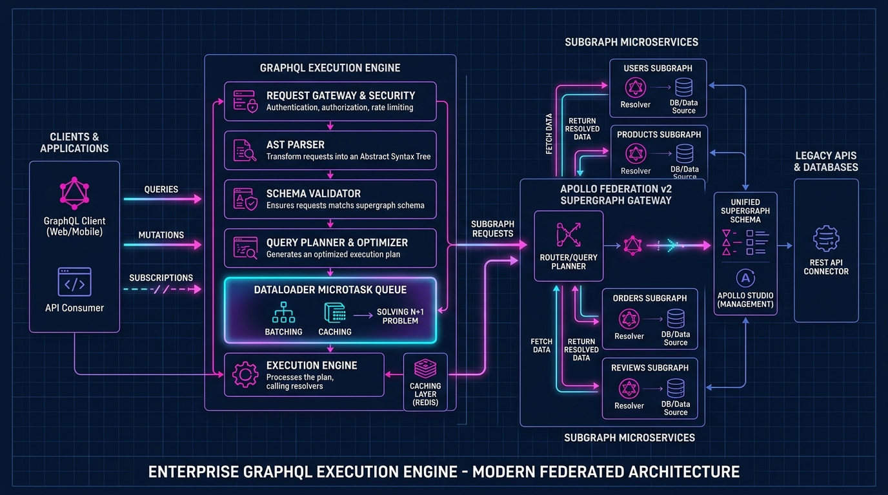

# 🌐 Enterprise GraphQL Architecture, SDL Design & Codegen Master Guide



> **Target Audience**: Full-Stack Developers, Frontend Architects, Backend Engineers, and API Platform Specialists.  
> **Prerequisites**: Zero. We start with junior-friendly mental models (The Buffet vs Fixed-Course Meal Analogy) and systematically build through GraphQL execution internals (AST parsing and resolver trees), the Schema Definition Language (SDL), Relay Cursor Connections, DataLoader batching physics, Apollo Federation v2, and automated client/server code generation pipelines.

---

## 📑 Master Table of Contents
1. [Track 1: Foundational Mental Models & Internal Mechanics](#track-1-foundational-mental-models--internal-mechanics)
   - [1.1 The À La Carte Buffet vs Fixed-Course Meal Analogy](#11-the-à-la-carte-buffet-vs-fixed-course-meal-analogy)
   - [1.2 The GraphQL Execution Lifecycle: Lexing, AST Parsing & Validation](#12-the-graphql-execution-lifecycle-lexing-ast-parsing--validation)
   - [1.3 Anatomy of a Field Resolver: `parent`, `args`, `context`, `info`](#13-anatomy-of-a-field-resolver-parent-args-context-info)
   - [1.4 Schema-First vs Code-First: The Architectural Showdown](#14-schema-first-vs-code-first-the-architectural-showdown)
2. [Track 2: Schema Definition Language (SDL) & Query Language (Zero-to-Hero)](#track-2-schema-definition-language-sdl--query-language-zero-to-hero)
   - [2.1 Scalars: Built-in Primitives & Custom Scaled Scalars (DateTime, JSON, BigInt)](#21-scalars-built-in-primitives--custom-scaled-scalars-datetime-json-bigint)
   - [2.2 Object Types, Enums, Interfaces (`Node`) & Unions](#22-object-types-enums-interfaces-node--unions)
   - [2.3 Input Objects vs Output Payloads](#23-input-objects-vs-output-payloads)
   - [2.4 Advanced Query Syntax: Aliases, Fragments & Type Conditions](#24-advanced-query-syntax-aliases-fragments--type-conditions)
   - [2.5 Directives: Built-in (`@skip`, `@include`) & Custom (`@auth`, `@mask`)](#25-directives-built-in-skip-include--custom-auth-mask)
   - [2.6 Mutations: The Mutation Payload Pattern & Atomic Execution](#26-mutations-the-mutation-payload-pattern--atomic-execution)
   - [2.7 Subscriptions: Event Streaming via `graphql-ws` Protocol](#27-subscriptions-event-streaming-via-graphql-ws-protocol)
3. [Track 3: Enterprise GraphQL Design Standards](#track-3-enterprise-graphql-design-standards)
   - [3.1 Pagination Standard: The Relay Cursor Connections Specification](#31-pagination-standard-the-relay-cursor-connections-specification)
   - [3.2 Error Handling Standard: Nullability, Partial Execution & Union Errors](#32-error-handling-standard-nullability-partial-execution--union-errors)
   - [3.3 Performance: The N+1 Problem & DataLoader Mechanics](#33-performance-the-n1-problem--dataloader-mechanics)
   - [3.4 Distributed Architecture: Apollo Federation v2 vs Schema Stitching](#34-distributed-architecture-apollo-federation-v2-vs-schema-stitching)
   - [3.5 Enterprise Security: Depth Limiting, Complexity Scoring & APQ](#35-enterprise-security-depth-limiting-complexity-scoring--apq)
4. [Track 4: Step-by-Step Automated Code Generation Pipelines](#track-4-step-by-step-automated-code-generation-pipelines)
   - [4.1 Client-Side Codegen with `@graphql-codegen/cli` (Types & React Hooks)](#41-client-side-codegen-with-graphql-codegencli-types--react-hooks)
   - [4.2 Server-Side Codegen with Netflix DGS (Spring Boot) & Pothos (Node.js)](#42-server-side-codegen-with-netflix-dgs-spring-boot--pothos-nodejs)
   - [4.3 Rapid Frontend Mocking with `@graphql-tools/mock`](#43-rapid-frontend-mocking-with-graphql-toolsmock)
5. [Track 5: Main Cases & Deep-Dive Edge Cases in GraphQL](#track-5-main-cases--deep-dive-edge-cases-in-graphql)
   - [5.1 The Non-Null Bubbling Catastrophe & Defensive Nullability](#51-the-non-null-bubbling-catastrophe--defensive-nullability)
   - [5.2 DataLoader Cross-Request Cache Pollution & Memory Leaks](#52-dataloader-cross-request-cache-pollution--memory-leaks)
   - [5.3 Key Array Ordering & Index Desynchronization Hazards](#53-key-array-ordering--index-desynchronization-hazards)
   - [5.4 Cyclical Query Recursion & Exponential AST Explosion](#54-cyclical-query-recursion--exponential-ast-explosion)
   - [5.5 Mutation Execution Ordering: Serial Mutations vs Parallel Field Children](#55-mutation-execution-ordering-serial-mutations--parallel-field-children)
6. [Track 6: Beginner Mistakes vs Advanced Enterprise Anti-Patterns](#track-6-beginner-mistakes-vs-advanced-enterprise-anti-patterns)
   - [6.1 Top 10 Beginner Mistakes (and Exact Fixes)](#61-top-10-beginner-mistakes-and-exact-fixes)
   - [6.2 Top 10 Advanced Enterprise Anti-Patterns](#62-top-10-advanced-enterprise-anti-patterns)
7. [Track 7: Real-World Production Outages & War Stories (Post-Mortems)](#track-7-real-world-production-outages--war-stories-post-mortems)
   - [7.1 Incident Alpha: The Black Friday N+1 Database Meltdown](#71-incident-alpha-the-black-friday-n1-database-meltdown)
   - [7.2 Incident Bravo: The Null Bubbling Total Homepage Blanking](#72-incident-bravo-the-null-bubbling-total-homepage-blanking)
   - [7.3 Incident Charlie: The Competitor Graph Scraping & DoS Breach](#73-incident-charlie-the-competitor-graph-scraping--dos-breach)
8. [Track 8: Enterprise GraphQL Production Readiness Checklist](#track-8-enterprise-graphql-production-readiness-checklist)
   - [8.1 30-Point Production Verification Checklist](#81-30-point-production-verification-checklist)

---

# Track 1: Foundational Mental Models & Internal Mechanics

## 1.1 The À La Carte Buffet vs Fixed-Course Meal Analogy

To grasp why GraphQL exists, contrast it with traditional REST using the restaurant metaphor:

```
┌─────────────────────────────────────────────────────────────────────────┐
│                      THE RESTAURANT ANALOGY: REST VS GRAPHQL            │
├─────────────────────────────────────────────────────────────────────────┤
│ REST (The Fixed-Course Meal):                                           │
│ - You ask for the "Lunch Special" (GET /users/42).                      │
│ - The kitchen gives you Soup, Salad, Bread, Steak, Potatoes, Dessert,   │
│   and Coffee—even if you are diabetic and only wanted a glass of water! │
│   ==> OVER-FETCHING: Wasteful network bandwidth and mobile CPU cycles.  │
│ - You want your friends' names and favorite books:                      │
│   You must make 1 call to /users/42/friends, then 5 individual calls    │
│   to /friends/{id}/books!                                               │
│   ==> UNDER-FETCHING: The N+1 Network Waterfall (6 round trips!).       │
├─────────────────────────────────────────────────────────────────────────┤
│ GRAPHQL (The À La Carte Buffet):                                        │
│ - You take an empty plate to the chef with a written slip:              │
│   "Give me exactly 2 strawberries and 1 slice of melon."                │
│ - The chef serves exactly those 2 strawberries and 1 slice of melon.    │
│ - In ONE round trip, you get your profile and friends' favorite books:  │
│   ==> ZERO OVER-FETCHING & ZERO UNDER-FETCHING.                         │
└─────────────────────────────────────────────────────────────────────────┘
```

```
REST Waterfall (6 Network Trips):
Client ──► GET /user/1 ──────► [REST API] ──► 50 unused fields (Over-fetching!)
Client ──► GET /friends ─────► [REST API] ──► Array of IDs
Client ──► GET /friend/10 ───► [REST API] ──► Profile 10
Client ──► GET /friend/11 ───► [REST API] ──► Profile 11 (High mobile latency!)

GraphQL Single Flight (1 Network Trip):
Client ──► POST /graphql ────► [GraphQL Engine] ──► Single custom response {
             query {                                  data: {
               user(id: "1") {                          user: {
                 name                                     name: "Alice",
                 friends {                                friends: [
                   name                                     { name: "Bob" },
                   books { title }                          { name: "Charlie" }
                 }                                        ]
               }                                        }
             }                                        }
```

---

## 1.2 The GraphQL Execution Lifecycle: Lexing, AST Parsing & Validation

When a GraphQL server receives an incoming query document, it does **not** simply execute database queries. It processes the document through four distinct phases:

```
                            THE GRAPHQL EXECUTION PIPELINE
                            
    Incoming Query String
            │
            ▼
     1. Lexical Analysis (Lexer) ──► Converts string into stream of Tokens (Name, Punctuator)
            │
            ▼
     2. Syntax Parsing (Parser)  ──► Constructs Abstract Syntax Tree (DocumentNode AST)
            │
            ▼
     3. Semantic Validation      ──► Checks AST against Schema (Types, fields, directives)
            │
            ▼
     4. Execution Engine         ──► Traverses AST and invokes Resolver Functions recursively
            │
            ▼
     JSON Output Payload { "data": { ... }, "errors": [ ... ] }
```

### 1. Abstract Syntax Tree (AST) Visualization:
For the query `query { user(id: "10") { name } }`:
```json
{
  "kind": "Document",
  "definitions": [
    {
      "kind": "OperationDefinition",
      "operation": "query",
      "selectionSet": {
        "kind": "SelectionSet",
        "selections": [
          {
            "kind": "Field",
            "name": { "kind": "Name", "value": "user" },
            "arguments": [
              {
                "kind": "Argument",
                "name": { "kind": "Name", "value": "id" },
                "value": { "kind": "StringValue", "value": "10" }
              }
            ],
            "selectionSet": {
              "selections": [
                { "kind": "Field", "name": { "kind": "Name", "value": "name" } }
              ]
            }
          }
        ]
      }
    }
  ]
}
```

---

## 1.3 Anatomy of a Field Resolver: `parent`, `args`, `context`, `info`

Every field in a GraphQL schema is backed by a resolver function. In JavaScript/TypeScript, resolvers share a signature:
```typescript
fieldName(parent, args, context, info): Promise<Result> | Result
```

```
┌───────────┬────────────────────────────────────────────────────────────────────────┐
│ Argument  │ Purpose & Responsibilities                                             │
├───────────┼────────────────────────────────────────────────────────────────────────┤
│ `parent`  │ The return value of the previous resolver in the execution tree.      │
│           │ For example, in `Order.customer`, `parent` is the `Order` object.      │
│ `args`    │ The key-value arguments provided in the query (e.g. `id: "123"`).      │
│ `context` │ Shared per-request context: Current authenticated user, DataLoaders,  │
│           │ database connections, and HTTP headers.                                │
│ `info`    │ Field AST metadata, selected sub-fields, variable values, and schema.  │
└───────────┴────────────────────────────────────────────────────────────────────────┘
```

### Resolver Execution Tree Mechanics:
```typescript
const resolvers = {
  Query: {
    order: async (_parent, { id }, context, _info) => {
      // 1. Root resolver: fetches the order entity from DB
      return await context.db.orders.findById(id);
    }
  },
  Order: {
    // 2. Child field resolver: receives the order as 'parent'
    customer: async (order, _args, context) => {
      // Access order.customerId to fetch the related customer
      return await context.loaders.customerLoader.load(order.customerId);
    },
    totalAmount: (order) => {
      // Computed field: calculated dynamically from line items
      return order.items.reduce((sum, item) => sum + item.price * item.quantity, 0);
    }
  }
};
```

---

## 1.4 Schema-First vs Code-First: The Architectural Showdown

| Evaluation Dimension | Schema-First (`.graphql` SDL files) | Code-First (TypeScript / Pothos / TypeGraphQL) |
| :--- | :--- | :--- |
| **Source of Truth** | Pure GraphQL SDL file. Language-agnostic. | Programming language classes or builders. |
| **Language Independence** | High: Frontends and backends share the same SDL file. | Low: Tied to the host language runtime. |
| **Type Redundancy** | Must maintain SDL types and language DTO types (solved by codegen). | Zero redundancy: TypeScript types and GraphQL types are unified. |
| **Refactoring Safety** | Renaming requires updating SDL, DTOs, and resolvers. | IDE "Rename Symbol" automatically refactors schema. |
| **Ideal Production Use Case** | Cross-team enterprise APIs with polyglot microservices. | High-velocity TypeScript or Java teams with rapid iteration. |

---

# Track 2: Schema Definition Language (SDL) & Query Language (Zero-to-Hero)

## 2.1 Scalars: Built-in Primitives & Custom Scaled Scalars

GraphQL includes 5 built-in scalar types:
- `Int`: Signed 32-bit integer.
- `Float`: Signed double-precision fractional value.
- `String`: UTF-8 character sequence.
- `Boolean`: `true` or `false`.
- `ID`: Unique identifier serialized as a String (signals client caches like Apollo Client to normalize).

### Custom Scalar: `DateTime` with AST Validation
When primitives are insufficient, define custom scalars:

```graphql
"""An ISO-8601 compliant UTC timestamp."""
scalar DateTime

"""Arbitrary unstructured JSON data."""
scalar JSON
```

```typescript
import { GraphQLScalarType, Kind } from 'graphql';

export const DateTimeScalar = new GraphQLScalarType({
  name: 'DateTime',
  description: 'ISO-8601 compliant date time scalar',
  serialize(value: unknown): string {
    // Server -> Client: Format Date instance to ISO string
    if (value instanceof Date) return value.toISOString();
    if (typeof value === 'string') return new Date(value).toISOString();
    throw new TypeError('Value must be an instance of Date or ISO string');
  },
  parseValue(value: unknown): Date {
    // Client -> Server: Parse incoming variable into Date instance
    if (typeof value === 'string') {
      const date = new Date(value);
      if (isNaN(date.getTime())) throw new TypeError('Invalid ISO Date');
      return date;
    }
    throw new TypeError('DateTime must be a string');
  },
  parseLiteral(ast): Date {
    // Client -> Server: Parse hardcoded inline query literal
    if (ast.kind === Kind.STRING) {
      const date = new Date(ast.value);
      if (isNaN(date.getTime())) throw new TypeError('Invalid ISO Date');
      return date;
    }
    throw new TypeError('DateTime must be a string literal');
  }
});
```

---

## 2.2 Object Types, Enums, Interfaces (`Node`) & Unions

```graphql
# 1. Enums: Type-safe predefined sets
enum OrderStatus {
  PENDING
  CONFIRMED
  SHIPPED
  DELIVERED
  CANCELLED
}

# 2. Interface: Polymorphic contract enforcing shared fields
interface Node {
  id: ID!
}

# 3. Object Type implementing Interface
type Product implements Node {
  id: ID!
  name: String!
  price: Float!
  inventoryCount: Int!
  createdAt: DateTime!
}

type Customer implements Node {
  id: ID!
  email: String!
  fullName: String!
}

# 4. Union: Exclusive OR container across distinct types
union SearchResult = Product | Customer | Order
```

### Querying Unions with Inline Fragments (`... on Type`):
```graphql
query GlobalSearch($term: String!) {
  search(query: $term) {
    __typename
    ... on Product {
      id
      name
      price
    }
    ... on Customer {
      id
      email
    }
    ... on Order {
      id
      status
      totalAmount
    }
  }
}
```

---

## 2.3 Input Objects vs Output Payloads

> [!WARNING]
> In GraphQL, **Input Objects** (`input`) cannot contain interfaces, unions, or custom output types. Output types (`type`) cannot be used as argument inputs. Always maintain strict separation between query/mutation inputs and response payloads.

```graphql
input OrderItemInput {
  productId: ID!
  quantity: Int!
}

input CreateOrderInput {
  customerId: ID!
  shippingAddressId: ID!
  items: [OrderItemInput!]!
  clientMutationId: String
}

type CreateOrderPayload {
  order: Order
  userErrors: [UserError!]!
  clientMutationId: String
}

type UserError {
  field: [String!]
  message: String!
  code: String!
}
```

---

## 2.4 Advanced Query Syntax: Aliases, Fragments & Type Conditions

### Aliases (Querying the Same Field with Different Arguments):
```graphql
query CompareProducts {
  flagshipPhone: product(id: "prod_101") {
    name
    price
  }
  budgetPhone: product(id: "prod_202") {
    name
    price
  }
}
```

### Reusable Named Fragments:
```graphql
fragment CoreProductDetails on Product {
  id
  name
  price
  inventoryCount
}

query GetCatalog {
  featured: products(limit: 5) {
    ...CoreProductDetails
  }
  clearance: clearanceProducts {
    ...CoreProductDetails
    discountPercentage
  }
}
```

---

## 2.5 Directives: Built-in (`@skip`, `@include`) & Custom (`@auth`, `@mask`)

### Built-in Client Directives:
```graphql
query GetUserProfile($includeBio: Boolean!, $skipSensitive: Boolean!) {
  user(id: "usr_1") {
    name
    bio @include(if: $includeBio)
    socialSecurityNumber @skip(if: $skipSensitive)
  }
}
```

### Custom Schema Directives:
```graphql
directive @auth(requires: Role = USER) on FIELD_DEFINITION | OBJECT
directive @mask(pattern: String = "XXX-XX-XXXX") on FIELD_DEFINITION

type User {
  id: ID!
  name: String!
  email: String! @auth(requires: ADMIN)
  taxId: String! @mask
}
```

---

## 2.6 Mutations: The Mutation Payload Pattern & Atomic Execution

```graphql
type Mutation {
  createOrder(input: CreateOrderInput!): CreateOrderPayload!
  cancelOrder(id: ID!, reason: String): CancelOrderPayload!
}
```

Unlike queries, which execute child field resolvers in parallel, **root mutation fields always execute sequentially** to prevent race conditions during concurrent data modifications.

---

## 2.7 Subscriptions: Event Streaming via `graphql-ws` Protocol

```graphql
type Subscription {
  orderStatusChanged(orderId: ID!): Order!
  newChatMessage(channelId: ID!): ChatMessage!
}
```
Client subscriptions operate over WebSockets using the modern, RFC-compliant `graphql-ws` subprotocol:
```
Client                                     GraphQL Server
  │                                               │
  ├── ConnectionInit {"type": "connection_init"} ─►│
  │◄─ ConnectionAck {"type": "connection_ack"} ───┤
  │                                               │
  ├── Subscribe {"id":"1","type":"subscribe", ───►│
  │     "payload": {"query":"subscription {...}"}}│
  │                                               │
  │◄─ Next {"id":"1","type":"next","payload":{...}} (Real-time push)
```

---

# Track 3: Enterprise GraphQL Design Standards

## 3.1 Pagination Standard: The Relay Cursor Connections Specification

The Relay Cursor Connection Specification provides the industry standard for stable, performant pagination:

```
┌──────────────────────────────────────────────────────────┐
│                   ORDER CONNECTION                       │
│  pageInfo: { hasNextPage, endCursor }                    │
│  edges: [                                                │
│    { cursor: "Y3Vyc29yXzE=", node: { id: "1", total: 50 } },│
│    { cursor: "Y3Vyc29yXzI=", node: { id: "2", total: 99 } } │
│  ]                                                       │
└──────────────────────────────────────────────────────────┘
```

```graphql
type PageInfo {
  hasNextPage: Boolean!
  hasPreviousPage: Boolean!
  startCursor: String
  endCursor: String
}

type OrderEdge {
  cursor: String!
  node: Order!
}

type OrderConnection {
  edges: [OrderEdge!]!
  pageInfo: PageInfo!
  totalCount: Int!
}

type Query {
  orders(first: Int, after: String, last: Int, before: String): OrderConnection!
}
```

---

## 3.2 Error Handling Standard: Nullability, Partial Execution & Union Errors

GraphQL supports **Partial Execution**: If one child field throws an exception, the rest of the response still succeeds, provided the throwing field is nullable.

### Union Domain Errors (Modern Best Practice):
Instead of throwing generic GraphQL top-level errors, model domain failures as typed schemas:

```graphql
type CheckoutSuccess {
  order: Order!
  receiptUrl: String!
}

type OutOfStockError {
  unavailableProductIds: [ID!]!
  message: String!
}

type InsufficientFundsError {
  requiredAmount: Float!
  availableBalance: Float!
}

union CheckoutResult = CheckoutSuccess | OutOfStockError | InsufficientFundsError

type Mutation {
  checkout(cartId: ID!): CheckoutResult!
}
```

---

## 3.3 Performance: The N+1 Problem & DataLoader Mechanics

### The Disaster:
Querying 100 orders with their associated customers causes **101 SQL queries**!
```sql
SELECT * FROM orders LIMIT 100;           -- 1 Query
SELECT * FROM customers WHERE id = 1;     -- 1
SELECT * FROM customers WHERE id = 2;     -- 2 ... 100 times!
```

### The Solution: DataLoader Batching & In-Memory Memoization
DataLoader batches all individual `.load(id)` calls made within a single tick of the Node.js event loop (microtask queue) and executes one coalesced query:

```sql
SELECT * FROM customers WHERE id IN (1, 2, 3, ..., 100); -- 1 Coalesced Query!
```

```typescript
import DataLoader from 'dataloader';

export function createCustomerLoader(db: Database) {
  return new DataLoader<string, Customer>(async (customerIds: readonly string[]) => {
    // 1. Fetch all rows in one batched SQL query
    const customers = await db.query(
      'SELECT * FROM customers WHERE id = ANY($1)',
      [customerIds]
    );

    // 2. Map database results to matching array indices
    const customerMap = new Map(customers.map(c => [c.id, c]));
    return customerIds.map(id => customerMap.get(id) ?? new Error(`Customer ${id} not found`));
  });
}
```

---

## 3.4 Distributed Architecture: Apollo Federation v2 vs Schema Stitching

In large enterprises, a monolithic schema becomes an organizational bottleneck. **Apollo Federation v2** breaks the graph into federated subgraphs:

```
                                [Client]
                                   │
                                   ▼
                       [Apollo Gateway / Router]
                         (Supergraph Schema)
                                   │
         ┌─────────────────────────┼─────────────────────────┐
         ▼                         ▼                         ▼
  [Users Subgraph]        [Orders Subgraph]       [Inventory Subgraph]
  type User @key(fields: "id") {
    id: ID!
    name: String!
  }
```

### Resolving Distributed Entities:
In the `Orders` subgraph, we can extend the `User` entity to attach their orders:
```graphql
# In orders-subgraph.graphql:
type User @key(fields: "id") {
  id: ID!
  orders: [Order!]!
}
```
The Apollo Router parses the client's query, fetches user details from the `Users` service, and resolves order history from the `Orders` service transparently.

---

## 3.5 Enterprise Security: Depth Limiting, Complexity Scoring & APQ

1. **Query Depth Limiting**: Prevent recursive nested attacks (`user { friends { friends { friends ... } } }`) using `graphql-depth-limit`:
   ```typescript
   import depthLimit from 'graphql-depth-limit';
   // Cap maximum query depth to 6 levels
   validationRules: [depthLimit(6)]
   ```
2. **Introspection Hardening**: Disable `__schema` and `__type` queries in production to prevent schema scraping by attackers.
3. **Automated Persisted Queries (APQ)**: Clients send the SHA-256 hash of the query instead of the full query string. Eliminates bandwidth waste and enables strict allowlists (only pre-approved queries can execute).

---

# Track 4: Step-by-Step Automated Code Generation Pipelines

## 4.1 Client-Side Codegen with `@graphql-codegen/cli`

Generate 100% type-safe TypeScript interfaces and React hooks from your `.graphql` query files:

### 1. Configuration `config/codegen.ts`:
```typescript
import type { CodegenConfig } from '@graphql-codegen/cli';

const config: CodegenConfig = {
  schema: 'specs/schema.graphql',
  documents: ['src/**/*.graphql'],
  generates: {
    './src/generated/graphql.ts': {
      plugins: [
        'typescript',
        'typescript-operations',
        'typescript-react-apollo'
      ],
      config: {
        withHooks: true,
        withHOC: false,
        withComponent: false
      }
    }
  }
};

export default config;
```

### 2. Client Query File `src/queries/getOrders.graphql`:
```graphql
query GetCustomerOrders($customerId: ID!) {
  customer(id: $customerId) {
    id
    fullName
    orders(first: 10) {
      edges {
        node {
          id
          totalAmount
          status
        }
      }
    }
  }
}
```

### 3. Generated Hook Usage in React:
```tsx
import React from 'react';
import { useGetCustomerOrdersQuery } from '../generated/graphql';

export const OrdersList: React.FC<{ customerId: string }> = ({ customerId }) => {
  const { data, loading, error } = useGetCustomerOrdersQuery({
    variables: { customerId }
  });

  if (loading) return <div>Loading orders...</div>;
  if (error) return <div>Error loading orders!</div>;

  return (
    <ul>
      {data?.customer?.orders.edges.map(({ node }) => (
        <li key={node.id}>
          Order #{node.id} - ${node.totalAmount} ({node.status})
        </li>
      ))}
    </ul>
  );
};
```

---

## 4.2 Server-Side Codegen with Netflix DGS (Spring Boot) & Pothos (Node.js)

### Spring Boot 3 + Netflix DGS Codegen:
Add the plugin to `build.gradle`:
```groovy
plugins {
    id 'com.netflix.dgs.codegen' version '6.0.3'
}

generateJava {
    schemaPaths = ["${projectDir}/src/main/resources/schema"]
    packageName = 'com.enterprise.graphql.generated'
    generateClient = false
}
```
DGS automatically generates Java records and `@DgsData` interfaces, ensuring complete compile-time type safety across your Spring Boot services.

---

# Track 5: Main Cases & Deep-Dive Edge Cases in GraphQL

## 5.1 The Non-Null Bubbling Catastrophe & Defensive Nullability

In GraphQL SDL, placing an exclamation mark (`!`) asserts that a field **can never be null**. While intuitive, overusing non-null fields creates the **Non-Null Bubbling Trap**:

```graphql
# CATASTROPHIC SCHEMA DESIGN:
type Article {
  id: ID!
  title: String!
  author: Author!  # If author resolver fails or throws, what happens?
}

type Author {
  id: ID!
  name: String!    # Non-nullable
}

type Query {
  articles: [Article!]! # Non-nullable list of non-nullable items!
}
```

```
Scenario: A third-party database timeout causes the author resolver for Article #42 to return null or throw an error.
1. Author.name cannot be null.
2. Therefore, Article.author becomes null.
3. BUT Article.author is declared Author! (non-nullable).
4. Therefore, the Article object becomes null!
5. BUT articles list is [Article!]! (non-nullable elements).
6. NULL BUBBLING DISASTER: The entire articles array bubbles to null!
7. The client gets: { "data": null, "errors": [ ... ] }
   ==> The user's screen displays a blank white page, losing all 99 healthy articles!
```

### The Enterprise Solution: Defensive Nullability
1. **Always make object relationship fields nullable**: `author: Author` (without `!`). If the author service fails, GraphQL returns Article #42 with `author: null` and an error entry, allowing the frontend to render the article body while showing "Author unavailable".
2. **Reserve `!` exclusively for scalar entity keys (`id: ID!`)** and arguments that are syntactically strictly mandatory.

---

## 5.2 DataLoader Cross-Request Cache Pollution & Memory Leaks

A DataLoader instance maintains an internal memoization cache. If a developer declares a DataLoader as a **global singleton** (shared across requests):

```typescript
// FATAL ANTI-PATTERN: Global DataLoader singleton
const globalUserLoader = new DataLoader((keys) => db.users.findMany(keys));

app.post('/graphql', (req, res) => {
  // Every incoming HTTP request shares the SAME globalUserLoader instance!
});
```

### The Dual Disaster:
1. **Cross-Tenant Data Leak (Security P0)**: If User A queries their private account, User A's data is stored in the cache. When User B queries `/graphql` on the same Node.js worker with key `user_1`, DataLoader returns User A's cached private data without querying the database or checking User B's permissions!
2. **Unbounded Heap Memory Leak**: The cache grows indefinitely with every user interaction until Node.js crashes with `JavaScript heap out of memory`.

### The Mandatory Pattern: Per-Request Context Instantiation:
```typescript
app.post('/graphql', (req, res) => {
  // Always instantiate fresh DataLoaders per HTTP request in the context factory!
  const context: GraphQLContext = {
    user: authenticateUser(req),
    loaders: {
      userLoader: new DataLoader((keys) => db.users.findMany(keys)),
      orderLoader: new DataLoader((keys) => db.orders.findMany(keys)),
    }
  };
  executeGraphQL({ context });
});
```

---

## 5.3 Key Array Ordering & Index Desynchronization Hazards

The contract of a DataLoader batch function mandates:
> **The returned array of results MUST have the exact same length and the exact same index order as the input array of keys.**

```typescript
// DANGEROUS BATCH FUNCTION:
new DataLoader(async (keys: readonly string[]) => {
  // SQL does NOT guarantee returning rows in the order of the IN clause!
  const rows = await db.query('SELECT * FROM users WHERE id IN ($1)', [keys]);
  return rows; // BUG! If keys were [3, 1, 2] and SQL returned [1, 2, 3], data is swapped!
});
```
If keys were `['Alice_id', 'Bob_id']` and the database returns `['Bob_row', 'Alice_row']`, Alice's profile resolver will silently receive Bob's data!

### The Bulletproof Index-Mapping Pattern:
```typescript
new DataLoader(async (keys: readonly string[]) => {
  const rows = await db.query('SELECT * FROM users WHERE id = ANY($1)', [keys]);
  const rowMap = new Map(rows.map(r => [r.id, r]));
  
  // Reconstruct the array matching the exact input key sequence
  return keys.map(key => rowMap.get(key) ?? new Error(`User with ID ${key} not found`));
});
```

---

## 5.4 Cyclical Query Recursion & Exponential AST Explosion

Without query complexity protection, an attacker can craft a 500-byte query payload that creates billions of database lookups:

```graphql
query MaliciousExplosion {
  author(id: "1") {
    books {
      author {
        books {
          author {
            books {
              author {
                books {
                  title
                }
              }
            }
          }
        }
      }
    }
  }
}
```
Each level multiplies the fan-out exponentially. At level 8, the server attempts to resolve $10^8$ items, freezing the CPU event loop.

### Production Solution: Query Complexity & Depth Limiting:
```typescript
import depthLimit from 'graphql-depth-limit';
import { createComplexityLimitRule } from 'graphql-validation-complexity';

const server = new ApolloServer({
  schema,
  validationRules: [
    depthLimit(6), // Rejects queries deeper than 6 nested levels
    createComplexityLimitRule(1000, { // Caps total computational score
      scalarCost: 1,
      objectCost: 5,
      listFactor: 10,
    }),
  ],
});
```

---

## 5.5 Mutation Execution Ordering: Serial Mutations vs Parallel Field Children

> [!IMPORTANT]
> The official GraphQL Specification guarantees that **root mutation fields execute serially (one after another in sequence)**, whereas **queries execute in parallel**.  
> However, **child field resolvers under a mutation execute in parallel**!

```graphql
mutation TransferFunds {
  # Root Mutation 1 executes FIRST and completes:
  step1: debitAccount(accountId: "acc_1", amount: 100) {
    status
    auditLog { id, timestamp } # Subfields execute in parallel
  }

  # Root Mutation 2 executes ONLY AFTER step1 finishes:
  step2: creditAccount(accountId: "acc_2", amount: 100) {
    status
  }
}
```

---

# Track 6: Beginner Mistakes vs Advanced Enterprise Anti-Patterns

## 6.1 Top 10 Beginner Mistakes (and Exact Fixes)

| # | Beginner Mistake | Why It Fails in Production | The Correct Standard Pattern |
| :-: | :--- | :--- | :--- |
| **1** | Omitting DataLoaders (The N+1 Trap) | 100 items with nested relations trigger 101 separate database queries, collapsing database under traffic. | Implement DataLoader batching on every relationship resolver. |
| **2** | Leaving Introspection Enabled in Production | Attackers download the full schema and find internal admin endpoints, hidden fields, and beta mutations. | Disable `introspection: false` in production; whitelist trusted persisted queries. |
| **3** | Marking Everything Non-Nullable (`!`) | A single downstream microservice error causes null-bubbling that wipes out the entire client UI. | Practice Defensive Nullability: Make entity relation fields nullable. |
| **4** | Direct Database Model Exposure | Leaks private columns (`password_hash`, `internal_flags`) directly to public API consumers. | Explicit DTO projection layer mapping domain entities to GraphQL types. |
| **5** | Global DataLoader Singletons | Leaks user data across requests (Security P0) and creates unbounded memory leaks. | Instantiate DataLoaders freshly per-request inside the GraphQL context. |
| **6** | Lack of Query Depth & Complexity Limits | A recursive query of depth 10 locks the server CPU and causes a complete denial-of-service. | Enforce `depthLimit(6)` and complexity score thresholds. |
| **7** | Generic Throwing of HTTP Status Errors | Throwing `new Error("404 Not Found")` gives clients an unstructured string instead of actionable data. | Use Mutation Payload pattern with typed `userErrors` or Union result types. |
| **8** | Treating GraphQL as an ORM / SQL Replacement | Letting the client execute arbitrary joins and filters directly on raw database tables. | Business-oriented graph design driven by client domain capabilities. |
| **9** | Giant Flat Monolithic Schemas | 50 developers modifying a single 15,000-line `schema.graphql` causing constant merge conflicts and release blocks. | Apollo Federation v2 or modular schema splitting by domain. |
| **10**| Missing Timeout Policies on Resolvers | A hanging third-party API call leaves the resolver promise unresolved, leaking connection pool slots. | Enforce `AbortController` and Promise timeouts (e.g. 5000ms max) on external calls. |

---

## 6.2 Top 10 Advanced Enterprise Anti-Patterns

1. **Schema Stitching in Modern Microservices**: Using legacy runtime schema stitching instead of declarative Apollo Federation v2 with compiled supergraph schemas.
2. **Mutations Without Idempotency Tokens**: Executing mutating financial operations over GraphQL without a `clientMutationId` or idempotency key header, leading to double-orders on client retries.
3. **Over-Customization of Scalar Types**: Creating 40 custom scalar types (`PostalCode`, `PhoneNumber`, `IsoCountry`) that introduce significant client deserialization overhead without substantial type safety gains.
4. **Ignoring Field Usage Analytics**: Deprecating fields blindly without inspecting distributed tracing telemetry (Apollo Studio / Datadog) to verify zero clients are actively requesting the deprecated field.
5. **Persisted Query Miss Cascades**: In Automated Persisted Queries (APQ), failing to handle cache misses gracefully when new frontend deployments propagate before backend schema updates.
6. **Resolvers Performing Sequential Awaits in Lists**: In loop resolvers, using `await` inside a `for` loop instead of `Promise.all()` or DataLoader batching.
7. **Using HTTP GET with Massive Query Strings**: Query strings exceeding 4 KB causing HTTP 414 Request-URI Too Long errors in corporate reverse proxies. Use `POST /graphql` or APQ.
8. **Logging Full GraphQL Queries with PII**: Writing query strings containing credit cards or social security numbers directly into central Elasticsearch logs. Implement AST query masking.
9. **Missing `@shareable` Directives in Federation v2**: Failing to mark identical value types across subgraphs, causing federation supergraph composition compilation errors.
10. **Unchecked Subscriptions Backpressure**: Streaming 1,000 events/sec over a WebSocket subscription to a mobile client on a 3G network, overflowing client memory buffers. Implement client windowing.

---

# Track 7: Real-World Production Outages & War Stories (Post-Mortems)

## 7.1 Incident Alpha: The Black Friday N+1 Database Meltdown

```
Incident Severity: P0 Outage
Root Cause: Nested resolver lacked DataLoader during flash sale traffic
Downtime: 42 minutes (Entire Checkout System Offline)
```

- **What Happened**: A frontend engineer added a small "Merchant Rating" badge to the search results page. The GraphQL query requested:
  ```graphql
  query Search {
    products(limit: 50) {
      id
      name
      merchant { rating } # Missing DataLoader!
    }
  }
  ```
- **The Failure**: When flash sale traffic surged to 20,000 queries/second, each search page triggered 51 database queries ($20,000 \times 51 = 1,020,000\text{ queries/sec}$!). The PostgreSQL primary database CPU surged to 100%, connection pool slots were completely exhausted, and transactions began timing out across the entire platform.
- **The Post-Mortem Fix**:
  1. Instantly rolled back frontend query.
  2. Wrapped `merchant` field resolver in a DataLoader batch fetcher.
  3. Integrated automated CI query cost linter that fails PR builds if any resolver performs unbatched database queries inside a list context.

---

## 7.2 Incident Bravo: The Null Bubbling Total Homepage Blanking

```
Incident Severity: P1 Critical
Root Cause: Non-nullable author field inside non-nullable article array
Impact: 4.8 Million users received a completely blank homepage
```

- **What Happened**: The editorial schema defined `featuredArticles: [Article!]!`. Each `Article` required `reviewer: User!` (non-nullable). A content editor published a breaking news article without assigning a reviewer (setting `reviewer_id = NULL` in SQL).
- **The Failure**: When the GraphQL engine resolved the breaking news article, `reviewer` resolved to `null`. Because `reviewer` was declared non-nullable, null bubbled up to the `Article`, then to `featuredArticles`, and finally to the root `data` object. The entire homepage JSON response returned `{ "data": null }`.
- **The Post-Mortem Fix**:
  1. Updated schema to declare all nested relationships nullable (`reviewer: User`).
  2. Implemented automated schema linting rule forbidding `!` on object relationship types.
  3. Frontend error boundary updated to render partial article cards when individual metadata fields are missing.

---

## 7.3 Incident Charlie: The Competitor Graph Scraping & DoS Breach

```
Incident Severity: P1 Security Incident
Root Cause: Publicly accessible Introspection endpoint and unrestricted query depth
Data Breach: 100% of proprietary pricing algorithms and unpublished product catalog scraped
```

- **What Happened**: A retail competitor queried `__schema { types { fields { name } } }` on the production endpoint. They discovered unreleased products and proprietary internal pricing tiers. They then wrote a script issuing 20-level nested queries that overwhelmed the backend with memory exhaustion attacks.
- **The Failure**: Introspection had been left enabled in production because the frontend team was using GraphQL Playground for live debugging.
- **The Post-Mortem Fix**:
  1. Disabled introspection globally in production environments.
  2. Enforced Automated Persisted Queries (APQ) with a strict hash allowlist: only pre-registered queries from the official web and mobile builds are permitted to execute; arbitrary query documents are immediately rejected with `403 Forbidden`.
  3. Implemented Cloudflare rate limiting per IP on the `/graphql` route.

---

# Track 8: Enterprise GraphQL Production Readiness Checklist

## 8.1 30-Point Production Verification Checklist

### Schema Design & Architecture:
- [ ] 1. Entity relationships are defensively nullable (no non-null bubbles on relation fields).
- [ ] 2. Object types implement the `Node` interface with unique global IDs.
- [ ] 3. Pagination strictly follows the Relay Cursor Connections Specification (`edges`, `node`, `pageInfo`).
- [ ] 4. All mutations follow the Input Object / Payload pattern with typed `userErrors`.
- [ ] 5. Domain failures are modeled as Union types rather than throwing top-level exceptions.

### Performance & Resolvers:
- [ ] 6. Every relationship field resolver utilizes a DataLoader to prevent N+1 queries.
- [ ] 7. DataLoaders are instantiated freshly per-request inside the GraphQL context (zero global singletons).
- [ ] 8. DataLoader batch functions strictly preserve input key length and index ordering.
- [ ] 9. Computed fields avoid heavy synchronous calculations in the main event loop.
- [ ] 10. Timeouts and `AbortController` cancellation signals are propagated to upstream fetch calls.

### Production Security & Hardening:
- [ ] 11. Schema Introspection is strictly disabled in production environments.
- [ ] 12. Query depth limiting is enforced (maximum allowable depth: 6).
- [ ] 13. Query complexity scoring limits computational load per request.
- [ ] 14. Automated Persisted Queries (APQ) or strict query allowlisting is enabled.
- [ ] 15. Field-level authorization directives (`@auth`) verify user roles before resolver execution.
- [ ] 16. Rate limiting is enforced per authenticated user / API key.
- [ ] 17. Payload size limits (e.g. max 2 MB) prevent oversized query strings from entering the parser.

### Code Generation & Tooling:
- [ ] 18. Client TypeScript types and React/Vue hooks are generated automatically via `@graphql-codegen/cli`.
- [ ] 19. Codegen runs in watch mode during development and type-checks in CI.
- [ ] 20. Server DTOs and DataFetchers are generated from SDL using DGS or equivalent generators.
- [ ] 21. Mock servers (`@graphql-tools/mock`) unblock frontend development before backend implementation.

### Distributed Federation v2:
- [ ] 22. Subgraphs define clear `@key` entity ownership boundaries.
- [ ] 23. Shared value types across subgraphs are explicitly annotated with `@shareable`.
- [ ] 24. Supergraph composition is validated in CI using `rover subgraph check` before deployment.
- [ ] 25. Apollo Router or Gateway manages subgraph request multiplexing with connection pooling.

### Observability & Governance:
- [ ] 26. Field-level execution latency is traced and exported via OpenTelemetry.
- [ ] 27. Field deprecation (`@deprecated(reason: "...")`) is tracked against live client telemetry.
- [ ] 28. Error payloads include standardized error codes and request correlation IDs.
- [ ] 29. Breaking changes are blocked in CI via schema comparison tools (`graphql-inspector`).
- [ ] 30. Subscriptions enforce connection heartbeats and backpressure management over `graphql-ws`.

