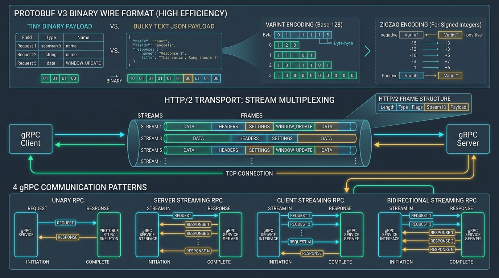

# ⚡ Enterprise gRPC, Protocol Buffers v3 & Binary Wire Architecture Master Guide



> **Target Audience**: Backend Engineers, Systems Programmers, Cloud Architects, and Infrastructure Specialists.  
> **Prerequisites**: Zero. We begin with intuitive real-world mental models (The Pneumatic Tube Analogy vs JSON Postcards) and progress systematically through HTTP/2 multiplexing frame physics, Protocol Buffers v3 binary wire serialization (Varints, ZigZag, Wire Types), all four RPC streaming archetypes, Google's Rich Error Model, and the modern `buf` CLI build system.

---

## 📑 Master Table of Contents
1. [Track 1: Foundational Mental Models & gRPC Architecture](#track-1-foundational-mental-models--grpc-architecture)
   - [1.1 The Pneumatic Tube vs Postcard Mail Analogy](#11-the-pneumatic-tube-vs-postcard-mail-analogy)
   - [1.2 RPC vs REST vs Event Brokers: Architectural Boundary Matrix](#12-rpc-vs-rest-vs-event-brokers-architectural-boundary-matrix)
   - [1.3 HTTP/2 Multiplexing Physics: Streams, Messages & Frames](#13-http2-multiplexing-physics-streams-messages--frames)
   - [1.4 Head-of-Line (HoL) Blocking: Application vs Transport Layer](#14-head-of-line-hol-blocking-application-vs-transport-layer)
2. [Track 2: Protocol Buffers v3 (Proto3) Deep Dive & Wire Physics](#track-2-protocol-buffers-v3-proto3-deep-dive--wire-physics)
   - [2.1 Syntax Declarations, Namespaces & Package Options](#21-syntax-declarations-namespaces--package-options)
   - [2.2 Scalar Types, ZigZag Compression & Memory Footprint](#22-scalar-types-zigzag-compression--memory-footprint)
   - [2.3 Tag Allocation Physics: The 1-Byte vs 2-Byte Field Number Boundary](#23-tag-allocation-physics-the-1-byte-vs-2-byte-field-number-boundary)
   - [2.4 Complex Types: Enums, `repeated`, Maps & `oneof` Polymorphism](#24-complex-types-enums-repeated-maps--oneof-polymorphism)
   - [2.5 Google Well-Known Types (Timestamp, Duration, Any, FieldMask)](#25-google-well-known-types-timestamp-duration-any-fieldmask)
   - [2.6 Binary Wire Encoding Mechanics: Varints, Wire Types & Byte-by-Byte Breakdown](#26-binary-wire-encoding-mechanics-varints-wire-types--byte-by-byte-breakdown)
3. [Track 3: All 4 gRPC Communication Patterns](#track-3-all-4-grpc-communication-patterns)
   - [3.1 Pattern 1: Unary RPC (Request-Response)](#31-pattern-1-unary-rpc-request-response)
   - [3.2 Pattern 2: Server Streaming RPC (Market Feeds & Large Downloads)](#32-pattern-2-server-streaming-rpc-market-feeds--large-downloads)
   - [3.3 Pattern 3: Client Streaming RPC (IoT Telemetry & Batch Ingestion)](#33-pattern-3-client-streaming-rpc-iot-telemetry--batch-ingestion)
   - [3.4 Pattern 4: Bidirectional Streaming RPC (Duplex Chat & Gaming)](#34-pattern-4-bidirectional-streaming-rpc-duplex-chat--gaming)
4. [Track 4: Enterprise gRPC Design Standards](#track-4-enterprise-grpc-design-standards)
   - [4.1 Compatibility & Schema Evolution: The Golden Rules of Proto](#41-compatibility--schema-evolution-the-golden-rules-of-proto)
   - [4.2 Package Namespaces & Side-by-Side Versioning](#42-package-namespaces--side-by-side-versioning)
   - [4.3 Rich Error Handling: Standard Status Codes vs `google.rpc.Status`](#43-rich-error-handling-standard-status-codes-vs-googlerpcstatus)
   - [4.4 Deadlines, Timeouts & Context Cancellation Propagation](#44-deadlines-timeouts--context-cancellation-propagation)
   - [4.5 Metadata & Headers/Trailers: JWT Auth & W3C Distributed Tracing](#45-metadata--headerstrailers-jwt-auth--w3c-distributed-tracing)
   - [4.6 Interceptors Architecture: Client & Server Middleware](#46-interceptors-architecture-client--server-middleware)
5. [Track 5: Step-by-Step Modern Generation Pipelines (`buf` & `protoc`)](#track-5-step-by-step-modern-generation-pipelines-buf--protoc)
   - [5.1 Modern `buf` CLI: Linting, Breaking Change Detection & Codegen](#51-modern-buf-cli-linting-breaking-change-detection--codegen)
   - [5.2 Traditional `protoc` Compiler Workflows (Java, Go, Node.js)](#52-traditional-protoc-compiler-workflows-java-go-nodejs)
   - [5.3 Inspection, Reflection & Testing with `grpcurl` and `grpcui`](#53-inspection-reflection--testing-with-grpcurl-and-grpcui)
6. [Track 6: Main Cases & Deep-Dive Edge Cases in gRPC & Proto3](#track-6-main-cases--deep-dive-edge-cases-in-grpc--proto3)
   - [6.1 The Zero-Default Serialization Trap in Proto3 & Field Presence](#61-the-zero-default-serialization-trap-in-proto3--field-presence)
   - [6.2 Deadline Exceeded vs Downstream Ghost Writes & Cancellation Leaks](#62-deadline-exceeded-vs-downstream-ghost-writes--cancellation-leaks)
   - [6.3 HTTP/2 Flow Control Saturation & Backpressure in High-Volume Streams](#63-http2-flow-control-saturation--backpressure-in-high-volume-streams)
   - [6.4 The Layer-4 vs Layer-7 Load Balancing Disaster](#64-the-layer-4-vs-layer-7-load-balancing-disaster)
   - [6.5 The 4 MB Default Max Message Size Limit Wall](#65-the-4-mb-default-max-message-size-limit-wall)
7. [Track 7: Beginner Mistakes vs Advanced Enterprise Anti-Patterns](#track-7-beginner-mistakes-vs-advanced-enterprise-anti-patterns)
   - [7.1 Top 10 Beginner Mistakes (and Exact Fixes)](#71-top-10-beginner-mistakes-and-exact-fixes)
   - [7.2 Top 10 Advanced Enterprise Anti-Patterns](#72-top-10-advanced-enterprise-anti-patterns)
8. [Track 8: Real-World Production Outages & War Stories (Post-Mortems)](#track-8-real-world-production-outages--war-stories-post-mortems)
   - [8.1 Incident Alpha: The Tag Re-use Android Fleet Brick Outage](#81-incident-alpha-the-tag-re-use-android-fleet-brick-outage)
   - [8.2 Incident Bravo: The L4 Load Balancer Single-Pod Overload Meltdown](#82-incident-bravo-the-l4-load-balancer-single-pod-overload-meltdown)
   - [8.3 Incident Charlie: The 4 MB Max Message Size Crash Cascade](#83-incident-charlie-the-4-mb-max-message-size-crash-cascade)
9. [Track 9: Enterprise gRPC & Protobuf Production Readiness Checklist](#track-9-enterprise-grpc--protobuf-production-readiness-checklist)
   - [9.1 30-Point Production Verification Checklist](#91-30-point-production-verification-checklist)

---

# Track 1: Foundational Mental Models & gRPC Architecture

## 1.1 The Pneumatic Tube vs Postcard Mail Analogy

To understand why hyperscalers (Google, Netflix, Uber) rely on gRPC for internal microservices, consider the difference between postal mail and pneumatic tube transport:

```
┌─────────────────────────────────────────────────────────────────────────┐
│              THE POSTAL MAIL VS PNEUMATIC TUBE ANALOGY                  │
├─────────────────────────────────────────────────────────────────────────┤
│ REST over HTTP/1.1 (The Postcard Mail Service):                         │
│ - Every message is written on a separate paper postcard.                │
│ - You must write your full return address, recipient address, stamps,   │
│   and date every single time (HTTP Header bloat: 800+ bytes per call!). │
│ - The message is written in English prose (JSON text strings).          │
│ - Only one postcard fits in the mailbox at a time (TCP serialization).  │
├─────────────────────────────────────────────────────────────────────────┤
│ gRPC over HTTP/2 (The Pneumatic Tube System):                           │
│ - High-velocity pressurized brass canister shooting through a pipe.    │
│ - Data is compressed into raw high-density binary bytes (Protobuf).     │
│ - Multiple canisters fly concurrently through the exact same pipe       │
│   without bumping into each other (HTTP/2 Multiplexing).               │
│ - Serialization takes nanoseconds because computers read binary natively│
│   without parsing ASCII text or quotes.                                 │
└─────────────────────────────────────────────────────────────────────────┘
```

---

## 1.2 RPC vs REST vs Event Brokers: Architectural Boundary Matrix

| Dimension | REST (HTTP/1.1 or 2) | gRPC (HTTP/2) | Message Broker (Kafka/RabbitMQ) |
| :--- | :--- | :--- | :--- |
| **Paradigm** | Resource-centric (CRUD on URIs) | Action-centric (Procedure calls) | Event-centric (Publish/Subscribe) |
| **Payload** | JSON, XML (Human-readable text) | Protocol Buffers (Binary wire) | Arbitrary (Avro, Protobuf, JSON) |
| **Network Efficiency** | Moderate to Low (Header overhead) | **Extremely High (Binary compression)** | Very High |
| **Contract** | Optional / OpenAPI (external) | **Strict, Mandatory (`.proto` file)**| Schema Registry (Avro/Protobuf) |
| **Streaming** | SSE (Server push only) | **Full Duplex (Client, Server, Bidi)**| Continuous event stream |
| **Coupling** | Loose (Decoupled by URI) | Tight (Shared Interface contract) | Decoupled (Asynchronous queues) |
| **Best Used For** | Public APIs, Browser clients | East-West Inter-Microservice RPC | Event sourcing, Audit trails, CQRS |

---

## 1.3 HTTP/2 Multiplexing Physics: Streams, Messages & Frames

The foundation of gRPC's performance is **HTTP/2**. In HTTP/1.1, each request required a dedicated TCP socket or suffered from serialization queues. In HTTP/2:

```
                  SINGLE PERSISTENT TCP CONNECTION
 ─────────────────────────────────────────────────────────────────────────►
   Stream 1 (Unary RPC):    [HEADERS: /OrderService/GetOrder] [DATA: ord_1]
   Stream 3 (Server Stream): [HEADERS] [DATA: chunk1] [DATA: chunk2]
   Stream 5 (Client Stream): [HEADERS] [DATA: telemetry1] [DATA: telemetry2]
 ─────────────────────────────────────────────────────────────────────────►
```

### HTTP/2 Binary Frame Types:
1. **`HEADERS` Frame**: Carries HTTP metadata and gRPC path in compressed HPACK binary format.
2. **`DATA` Frame**: Carries the raw Protobuf binary payload.
3. **`SETTINGS` Frame**: Negotiates window buffer sizes, max frame size, and concurrency limits.
4. **`RST_STREAM` Frame**: Immediately aborts a single stream without closing the underlying TCP socket.
5. **`WINDOW_UPDATE` Frame**: Controls flow credit per stream, preventing fast producers from flooding slow consumers.

---

## 1.4 Head-of-Line (HoL) Blocking: Application vs Transport Layer

- **HTTP/1.1 HoL Blocking**: If Request A is slow, Requests B and C queued behind it on the same TCP socket must wait.
- **HTTP/2 HoL Solution**: Interleaves frames from multiple streams independently over a single TCP socket. Request A cannot block Request B at the HTTP layer.
- **TCP HoL Caveat**: If an underlying physical network packet drops, the TCP kernel buffer pauses until the lost segment is retransmitted. (Solved completely by HTTP/3 / QUIC over UDP).

---

# Track 2: Protocol Buffers v3 (Proto3) Deep Dive & Wire Physics

## 2.1 Syntax Declarations, Namespaces & Package Options

```protobuf
syntax = "proto3";

package enterprise.order.v1;

option java_multiple_files = true;
option java_package = "com.enterprise.order.v1";
option go_package = "github.com/enterprise/order/v1;orderv1";
option csharp_namespace = "Enterprise.Order.V1";
```

---

## 2.2 Scalar Types, ZigZag Compression & Memory Footprint

| Proto3 Type | Wire Type | C++ / Java / Go Equivalent | Description & Encoding |
| :--- | :---: | :--- | :--- |
| **`int32`** | 0 | `int32` / `int` / `int32` | Standard varint. Inefficient for negative numbers (uses 10 bytes!). |
| **`sint32`** | 0 | `int32` / `int` / `int32` | **ZigZag encoded varint**. Extremely efficient for negative numbers. |
| **`int64`** | 0 | `int64` / `long` / `int64` | Standard 64-bit varint. |
| **`sint64`** | 0 | `int64` / `long` / `int64` | **ZigZag encoded 64-bit varint**. |
| **`fixed32`** | 5 | `uint32` / `int` / `uint32` | Always exactly 4 bytes. Ideal for values regularly > $2^{28}$. |
| **`fixed64`** | 1 | `uint64` / `long` / `uint64` | Always exactly 8 bytes. Ideal for values regularly > $2^{56}$. |
| **`string`** | 2 | `string` / `String` / `string`| UTF-8 or 7-bit ASCII text. Length-delimited. |
| **`bytes`** | 2 | `string` / `ByteString` / `[]byte`| Arbitrary binary blob. Length-delimited. |
| **`bool`** | 0 | `bool` / `boolean` / `bool` | Encoded as varint `1` (true) or `0` (false). |

### ZigZag Encoding Physics:
Standard two's complement represents `-1` as `0xFFFFFFFFFFFFFFFF` (10 bytes in a varint). ZigZag encoding interleaves positive and negative integers:
$$ZigZag(n) = (n \ll 1) \oplus (n \gg 31)$$

```
Original Signed Value:   0   -1    1   -2    2   -3    3
ZigZag Encoded Value:    0    1    2    3    4    5    6
Varint Byte Size:        1    1    1    1    1    1    1
```
Negative numbers now encode in a single compact byte!

---

## 2.3 Tag Allocation Physics: The 1-Byte vs 2-Byte Field Number Boundary

In Protocol Buffers, **field names are never sent across the wire**. Only the numeric field tag is sent:

```
Field Number Range 1 to 15:    Takes 1 Byte for Tag + Wire Type
Field Number Range 16 to 2047: Takes 2 Bytes for Tag + Wire Type
```

> [!IMPORTANT]
> **Production Optimization Rule**: Reserve field tags `1` through `15` exclusively for high-frequency, critical fields (e.g. `id`, `timestamp`, `status`). Assign tags `16` and higher to optional metadata or rarely populated debug structures.

---

## 2.4 Complex Types: Enums, `repeated`, Maps & `oneof` Polymorphism

```protobuf
enum OrderStatus {
  // RULE: The first enum value MUST be 0 and serves as default
  ORDER_STATUS_UNSPECIFIED = 0;
  ORDER_STATUS_PENDING = 1;
  ORDER_STATUS_CONFIRMED = 2;
  ORDER_STATUS_SHIPPED = 3;
  ORDER_STATUS_CANCELLED = 4;
}

message OrderItem {
  string product_id = 1;
  int32 quantity = 2;
  double unit_price = 3;
}

message Order {
  string order_id = 1;
  OrderStatus status = 2;
  repeated OrderItem items = 3;             // Dynamic array
  map<string, string> metadata = 4;         // Key-value store

  // Polymorphic container: Only one field can be populated at any time
  oneof payment_method {
    string credit_card_token = 5;
    string bank_account_iban = 6;
    string crypto_wallet_address = 7;
  }
}
```

---

## 2.5 Google Well-Known Types (Timestamp, Duration, Any, FieldMask)

```protobuf
import "google/protobuf/timestamp.proto";
import "google/protobuf/duration.proto";
import "google/protobuf/field_mask.proto";

message AuditRecord {
  string event_id = 1;
  google.protobuf.Timestamp created_at = 2;  // Nanosecond UTC precision
  google.protobuf.Duration timeout = 3;      // Precise duration
  google.protobuf.FieldMask update_mask = 4; // Tells server which fields to update
}
```

---

## 2.6 Binary Wire Encoding Mechanics: Varints, Wire Types & Byte-by-Byte Breakdown

### The 4 Wire Types in Protobuf:
| Wire Type | Type Tag | Description | Used For |
| :---: | :---: | :--- | :--- |
| **0** | `000` | Varint | `int32`, `int64`, `sint32`, `bool`, `enum` |
| **1** | `001` | 64-bit | `fixed64`, `double` |
| **2** | `010` | Length-delimited | `string`, `bytes`, embedded messages, `repeated` |
| **5** | `101` | 32-bit | `fixed32`, `float` |

### Tag Byte Construction:
$$\text{Tag Byte} = (\text{Field Number} \ll 3) \mid \text{Wire Type}$$

### Byte-by-Byte Wire Walkthrough:
Suppose we encode message:
```protobuf
message User {
  int32 age = 1;        // Field 1, Wire Type 0
  string name = 2;      // Field 2, Wire Type 2
}
```
With values `age = 25` and `name = "Sam"`.

1. **Field 1 (`age = 25`)**:
   - Tag byte: $(1 \ll 3) \mid 0 = 8 = \texttt{0x08}$
   - Value 25 in varint: $\texttt{0x19}$
   - Bytes: `08 19`
2. **Field 2 (`name = "Sam"`)**:
   - Tag byte: $(2 \ll 3) \mid 2 = 16 + 2 = 18 = \texttt{0x12}$
   - Length byte: 3 characters = $\texttt{0x03}$
   - String ASCII bytes: `'S'(0x53), 'a'(0x61), 'm'(0x6D)`
   - Bytes: `12 03 53 61 6D`

**Total Protobuf Binary Packet**:
`08 19 12 03 53 61 6D` (Total: **7 bytes**).

Compare this to equivalent JSON:
`{"age":25,"name":"Sam"}` (Total: **23 bytes**).
Protobuf is **$3.3\times$ smaller on wire and $10\times$ faster to deserialize** without string scanning!

---

# Track 3: All 4 gRPC Communication Patterns

```protobuf
service FulfillmentService {
  // 1. Unary RPC: Single request -> Single response
  rpc GetOrder (GetOrderRequest) returns (OrderResponse);

  // 2. Server Streaming RPC: Single request -> Stream of chunks
  rpc WatchOrderStatus (WatchStatusRequest) returns (stream OrderStatusUpdate);

  // 3. Client Streaming RPC: Stream of chunks -> Single summary response
  rpc IngestTelemetry (stream TelemetryPoint) returns (TelemetrySummary);

  // 4. Bidirectional Streaming RPC: Full duplex concurrent streams
  rpc LiveChatSupport (stream ChatMessage) returns (stream ChatMessage);
}
```

```
1. UNARY RPC:
Client ────────────── Request ──────────────► Server
Client ◄───────────── Response ────────────── Server

2. SERVER STREAMING RPC:
Client ────────────── Request ──────────────► Server
Client ◄───────────── Chunk 1 ─────────────── Server
Client ◄───────────── Chunk 2 ─────────────── Server
Client ◄───────────── Chunk N ─────────────── Server

3. CLIENT STREAMING RPC:
Client ────────────── Chunk 1 ──────────────► Server
Client ────────────── Chunk 2 ──────────────► Server
Client ────────────── Chunk N ──────────────► Server
Client ◄───────────── Summary ─────────────── Server

4. BIDIRECTIONAL STREAMING RPC:
Client ── Chunk 1 ──►                         Server
Client ◄───────────── Response A ──────────── Server
Client ── Chunk 2 ──►                         Server
Client ◄───────────── Response B ──────────── Server
```

---

# Track 4: Enterprise gRPC Design Standards

## 4.1 Compatibility & Schema Evolution: The Golden Rules of Proto

1. **NEVER change the field number (tag) of any existing field.**
2. **NEVER change the data type of an existing field.**
3. **Always use `reserved` when removing fields**:
   ```protobuf
   message Order {
     reserved 4, 8 to 11;
     reserved "old_tax_id", "legacy_token";
   }
   ```
   This prevents a future developer from re-assigning tag `4`, which would corrupt parsing for older clients running in production.

---

## 4.2 Package Namespaces & Side-by-Side Versioning

Organize packages with explicit version qualifiers:
```
specs/proto/
├── order/
│   ├── v1/
│   │   └── order_service.proto  (package order.v1;)
│   └── v2/
│       └── order_service.proto  (package order.v2;)
```
Both `v1` and `v2` services can be hosted side-by-side on the exact same gRPC server port without naming collisions.

---

## 4.3 Rich Error Handling: Standard Status Codes vs `google.rpc.Status`

Standard gRPC status codes (0 to 16) only provide generic error categories (`NOT_FOUND`, `PERMISSION_DENIED`). Enterprise systems attach Google's Rich Error Model:

```protobuf
import "google/rpc/status.proto";
import "google/rpc/error_details.proto";

// When an error occurs, the server transmits a google.rpc.Status payload
// with strongly-typed detail messages in the gRPC trailers:
// - BadRequest: Lists invalid field violations
// - PreconditionFailure: Describes state conflicts
// - QuotaFailure: Informs client of rate limit cooldown
```

---

## 4.4 Deadlines, Timeouts & Context Cancellation Propagation

Every outgoing gRPC call must define a **Deadline**. If Service A calls Service B with a 2-second deadline, and Service B calls Service C, the remaining deadline duration is forwarded downstream in the `grpc-timeout` header:

```
Client (Deadline: 2000ms) 
   │
   ▼
[API Gateway] ──► (Spent 200ms) ──► Forward to Service B (Deadline: 1800ms)
                                         │
                                         ▼
                                   (Spent 100ms) ──► Forward to DB (Deadline: 1700ms)
```
If the user cancels the browser request, the `CANCELLED` signal propagates across all services, instantly killing wasted database queries.

---

# Track 5: Step-by-Step Modern Generation Pipelines (`buf` & `protoc`)

## 5.1 Modern `buf` CLI: Linting, Breaking Change Detection & Codegen

The `buf` CLI has completely replaced brittle, shell-based `protoc` scripts in modern enterprises.

### 1. Module Configuration `config/buf.yaml`:
```yaml
version: v1
lint:
  use:
    - DEFAULT
    - COMMENTS
  except:
    - PACKAGE_VERSION_SUFFIX
breaking:
  use:
    - FILE
```

### 2. Linting Your Proto Files:
```bash
buf lint config
```
Enforces naming conventions, field casing, and documentation comments.

### 3. Automated Breaking Change Detection against Git Main:
```bash
buf breaking config --against '.git#branch=main'
```
If any tag number was altered or an enum was removed, `buf` fails CI immediately with file and line references!

### 4. Code Generation Configuration `config/buf.gen.yaml`:
```yaml
version: v1
plugins:
  # Generate TypeScript interfaces and service definitions
  - plugin: buf.build/community/stephenh-ts-proto
    out: src/generated/grpc
    opt:
      - env=node
      - esModuleInterop=true
      - outputServices=grpc-js
```

Run code generation:
```bash
buf generate config --template config/buf.gen.yaml
```

---

## 5.2 Inspection, Reflection & Testing with `grpcurl` and `grpcui`

Enable gRPC Server Reflection in your code to query services without possessing the `.proto` file:

```bash
# List all registered services on local server
grpcurl -plaintext localhost:50051 list

# Describe a specific service method signature
grpcurl -plaintext localhost:50051 describe enterprise.order.v1.FulfillmentService.GetOrder

# Execute a Unary RPC call directly from CLI
grpcurl -plaintext -d '{"order_id": "ord_101"}' localhost:50051 enterprise.order.v1.FulfillmentService.GetOrder

# Launch interactive web UI for gRPC testing
grpcui -plaintext localhost:50051
The browser opens a dynamic testing dashboard similar to Swagger UI, but interacting natively with binary gRPC endpoints!

---

# Track 6: Main Cases & Deep-Dive Edge Cases in gRPC & Proto3

## 6.1 The Zero-Default Serialization Trap in Proto3 & Field Presence

In Proto3, **default values are NEVER serialized onto the wire** to conserve bandwidth:
- `int32` / `int64`: Default is `0` (Zero bytes sent).
- `string`: Default is `""` (Zero bytes sent).
- `bool`: Default is `false` (Zero bytes sent).
- `enum`: Default is first enum value at index 0 (Zero bytes sent).

### The Production Disaster:
Suppose an e-commerce service defines:
```protobuf
message UpdateProductPriceRequest {
  string product_id = 1;
  double new_price = 2; // Default is 0.0!
}
```
If a client submits a request to update only the product metadata without providing `new_price`, the server deserializes `new_price` as `0.0`. If the developer writes:
```go
if req.NewPrice != 0 { product.Price = req.NewPrice }
```
Then what happens if the merchant intentionally wants to mark a promotional item as **FREE ($0.00)**? The server thinks the field was omitted and ignores it! Conversely, if the developer doesn't check, the product is accidentally marked as $0.00 for all customers!

### The Solutions:
1. **Proto3 `optional` keyword** (Proto v3.15+): Adds an explicit presence bitmask:
   ```protobuf
   message UpdateProductPriceRequest {
     string product_id = 1;
     optional double new_price = 2; // Has explicit has_new_price() check!
   }
   ```
2. **Google Well-Known Wrapper Types**:
   ```protobuf
   import "google/protobuf/wrappers.proto";
   message UpdateProductPriceRequest {
     google.protobuf.DoubleValue new_price = 2; // null when omitted, 0.0 when set
   }
   ```
3. **Google `FieldMask` Pattern**: The client explicitly declares which fields are being modified in an `update_mask` field.

---

## 6.2 Deadline Exceeded vs Downstream Ghost Writes & Cancellation Leaks

Consider a payment RPC with a 2000ms deadline:
```
Client ──► (Deadline 2000ms) ──► Service A ──► (Deadline 1800ms) ──► Service B (Payment Gateway)
```
At second 2.0, the client's network link blips and the client runtime emits `DEADLINE_EXCEEDED`. However, Service B is still executing the bank card debit on the third-party processor at second 2.2!

### The Ghost Write Hazard:
The client believes the transaction failed and displays "Checkout Timed Out. Please retry." Meanwhile, Service B finishes debiting $250 from the customer's bank account!

### Mandatory Production Defenses:
1. **Context Cancellation Listeners**: In Go/Java/Node.js, every long-running database or external HTTP operation must pass the parent `context.Context`. If the deadline expires, the context is cancelled immediately, aborting the pending database transaction before commit.
2. **Downstream Distributed Idempotency**: Service B must enforce an `idempotency_key` on the bank processor so that if the client retries after the timeout, the retry safely joins the existing transaction rather than charging again.

---

## 6.3 HTTP/2 Flow Control Saturation & Backpressure in High-Volume Streams

gRPC streams rely on HTTP/2 flow control windows (`WINDOW_UPDATE` frames).
- Each stream starts with a default 64 KB window buffer.
- If a fast server produces 50 MB/sec of telemetry events while a slow client smartphone on cellular processes only 1 MB/sec, the client's TCP socket buffer fills up.
- The client stops sending `WINDOW_UPDATE` frames.
- **The Pitfall**: If the server's gRPC streaming handler keeps calling `stream.write()` synchronously in a tight loop without checking buffer backpressure, the pending messages buffer in the server's RAM until the server crashes with an Out-of-Memory (OOM) panic!

### The Node.js / Go Backpressure Pattern:
```typescript
// In Node.js: ALWAYS respect stream.write() return boolean
for (const chunk of massiveDataset) {
  const canContinue = call.write(chunk);
  if (!canContinue) {
    // Buffer saturated! Pause production until drain event fires
    await new Promise((resolve) => call.once('drain', resolve));
  }
}
```

---

## 6.4 The Layer-4 vs Layer-7 Load Balancing Disaster

Traditional HTTP/1.1 load balancers (AWS Classic ELB, plain HAProxy, NGINX TCP stream mode) operate at **Layer 4 (Transport Layer)**.

```
Client Pod A ──► [ Layer 4 Load Balancer ] ──► (Establishes TCP Connection) ──► Backend Pod 1
Client Pod B ──► [ Layer 4 Load Balancer ] ──► (Establishes TCP Connection) ──► Backend Pod 2
```

### The Disaster:
Because HTTP/2 re-uses the **same persistent TCP connection for thousands of RPC streams**, a Layer-4 load balancer only balances the *initial connection handshake*.
1. If Client Pod A opens 1 connection to Backend Pod 1, **every single RPC stream for the next 4 hours routes exclusively to Backend Pod 1**!
2. When you scale your backend from 2 pods to 50 Kubernetes pods during high traffic, **Backend Pod 1 receives 100% of the traffic and catches fire**, while the 48 newly spawned pods sit at 0% CPU!

### The Production Solution: Layer-7 Application Load Balancing
Deploy a gRPC-aware **Layer 7 proxy** (Envoy, Istio Service Mesh, Traefik, or AWS ALB) that parses individual HTTP/2 `HEADERS` frames and distributes each RPC stream across backend pods in a round-robin or least-request manner.

---

## 6.5 The 4 MB Default Max Message Size Limit Wall

By default, all official gRPC client and server libraries enforce a strict **4 MB maximum inbound message limit** (`grpc.max_receive_message_length: 4194304`).
If an internal batch report serialized into Protobuf reaches 4.01 MB:
The gRPC runtime immediately drops the message and returns `RESOURCE_EXHAUSTED: Received message larger than max (4205120 vs. 4194304)`.

### Production Rule:
1. **Do not blindly increase the limit to 50 MB** (destroys HTTP/2 multiplexing throughput for concurrent streams).
2. **Use Server/Client Streaming**: Split large payloads into 64 KB binary chunks transmitted over a gRPC stream.

---

# Track 7: Beginner Mistakes vs Advanced Enterprise Anti-Patterns

## 7.1 Top 10 Beginner Mistakes (and Exact Fixes)

| # | Beginner Mistake | Why It Fails in Production | The Correct Standard Pattern |
| :-: | :--- | :--- | :--- |
| **1** | Re-using deleted field tag numbers | Old client compiles with tag 4 as `user_id`; new server uses tag 4 as `is_admin`. Instant security disaster! | Always mark removed tags as `reserved 4, "user_id";`. |
| **2** | Using `int32` for negative integers | Encodes in 10 full bytes on the wire. | Use `sint32` or `sint64` with ZigZag encoding (encodes in 1 byte). |
| **3** | Changing tag numbers to "clean up" ordering | Breaks all running clients in production immediately. | Field numbers are immutable forever. Casing and names can change, tags cannot. |
| **4** | Forgetting to handle Enum 0 index | If index 0 is not `_UNSPECIFIED`, omitted fields default to the first enum value without caller knowledge. | First enum value must always be `UNKNOWN = 0;` or `UNSPECIFIED = 0;`. |
| **5** | Deploying behind L4 Load Balancers | Pins all HTTP/2 multiplexed streams to a single pod, causing pod meltdown. | Use L7 gRPC-aware load balancers (Envoy, Istio, Traefik). |
| **6** | Ignoring Context Deadlines | Downstream hangs indefinitely if a network partition occurs, consuming worker threads. | Every RPC call must set an explicit `grpc-timeout` / context deadline. |
| **7** | Relying on generic status codes for validation | Returning `INVALID_ARGUMENT` with message "bad input" gives callers zero field-level diagnostic info. | Attach Google Rich Error Model (`google.rpc.BadRequest` with `FieldViolation`). |
| **8** | Unbounded stream writes without backpressure | Fast publisher overwhelms slow consumer buffer, crashing server with Out-Of-Memory. | Check stream buffer drain events before writing subsequent chunks. |
| **9** | Sending giant payloads exceeding 4 MB | Triggers `RESOURCE_EXHAUSTED` exception across all standard gRPC clients. | Chunk large datasets into streaming RPCs. |
| **10**| Hardcoding Proto files in each repo | Schemas diverge across frontend, backend, and mobile repositories. | Centralized schema repository managed by `buf` with CI linting and publishing. |

---

## 7.2 Top 10 Advanced Enterprise Anti-Patterns

1. **Embedding Binary Blobs inside Unary Payloads**: Storing 20 MB camera video frames directly in a `bytes` field of a Unary response instead of streaming chunks or returning pre-signed S3 download URLs.
2. **Missing Interceptors for Panics / Uncaught Exceptions**: If a server handler throws an unhandled exception, failing to capture it in a recovery interceptor terminates the entire gRPC server process.
3. **Channel Churn (Re-creating gRPC Channels per Call)**: Creating a new `grpc.ClientChannel` on every HTTP request. Establishing an HTTP/2 TLS connection requires 3 round trips and CPU-intensive handshakes. **Channels must be long-lived singletons shared across the application lifetime**.
4. **Synchronous Blocking Calls on Async Event Loops**: In Node.js or Python asyncio, invoking synchronous blocking disk I/O inside a gRPC streaming handler freezes processing for all other multiplexed streams on the worker.
5. **Omitting W3C Trace Context Propagation**: Forgetting to forward `traceparent` metadata across microservice hops, breaking distributed traces in Jaeger and Datadog.
6. **Deploying Polyglot Microservices without Common Protobuf Style Guides**: Java teams using camelCase while Go teams use snake_case for field names, causing cross-language JSON serialization inconsistencies. Enforce `buf lint` with Google API style guide.
7. **Modifying Field Types from Primitive to Message**: Changing `string email = 2;` to `EmailMessage email = 2;`. While wire type 2 is technically compatible, generated code in statically-typed languages (C++, Java, Go) fails compilation immediately.
8. **Blind Retries without Idempotency Checks**: Setting gRPC client retries on non-idempotent mutations (`CreateOrder`), multiplying duplicate transactions during brief network timeouts.
9. **Missing Keepalive Pings for Intermediate Cloud Firewalls**: AWS NAT Gateways and Azure Load Balancers silently drop idle TCP connections after 350 seconds. Without gRPC HTTP/2 keepalive pings (`KEEPALIVE_TIME_MS: 30000`), the client socket hangs indefinitely on the next write.
10. **Treating gRPC Errors as HTTP Status Codes**: Assuming gRPC status 4 (`DEADLINE_EXCEEDED`) is equivalent to HTTP 404 (`NOT_FOUND`). Always use explicit mapping tables between gRPC and HTTP status codes.

---

# Track 8: Real-World Production Outages & War Stories (Post-Mortems)

## 8.1 Incident Alpha: The Tag Re-use Android Fleet Brick Outage

```
Incident Severity: P0 Mobile Fleet Outage
Root Cause: Backend engineer re-used deprecated field tag #3 for a new feature
Impact: 3.4 Million Android devices crashed on startup
```

- **What Happened**: In 2024, an engineering team deprecated `string legacy_auth_token = 3;` in their `user_profile.proto`. Six months later, a new developer added `int64 last_login_timestamp = 3;` to the same message.
- **The Failure**: Millions of users running older app versions downloaded the updated profile payload. When the older app's Protobuf parser read tag `3` expecting a Length-delimited string (Wire Type 2), it encountered a Varint integer (Wire Type 0). The binary wire mismatch threw an unhandled deserialization panic during application bootstrap, bricking the app immediately upon launch.
- **The Post-Mortem Fix**:
  1. Mandated `reserved 3, "legacy_auth_token";` in all proto definitions.
  2. Integrated `buf breaking --against '.git#branch=main'` into the CI/CD pipeline, permanently blocking any PR that alters or re-uses existing field numbers.
  3. Pushed an emergency Android hotfix with defensive deserialization exception handling.

---

## 8.2 Incident Bravo: The L4 Load Balancer Single-Pod Overload Meltdown

```
Incident Severity: P1 Outage
Root Cause: Layer-4 TCP load balancing on multiplexed HTTP/2 connections
Downtime: 28 minutes
```

- **What Happened**: A high-throughput recommendation microservice ran on 20 Kubernetes pods behind an AWS Network Load Balancer (NLB) operating in TCP (L4) mode.
- **The Failure**: When the upstream gateway started, it opened 2 TCP connections to the NLB. The NLB routed both connections to Pod #1. Because HTTP/2 multiplexes all requests over existing persistent connections, **Pod #1 received 45,000 queries/second while Pods #2 through #20 remained completely idle (0% CPU)**! Pod #1 crashed with an OOM panic, the connection failed over to Pod #2, and Pod #2 crashed instantly, creating a catastrophic rolling pod death spiral.
- **The Post-Mortem Fix**:
  1. Replaced the L4 NLB with an Envoy Layer-7 proxy configured with strict HTTP/2 stream-level round-robin balancing.
  2. Configured gRPC client connection pooling to establish multiple concurrent connections with max connection age jitter (`MAX_CONNECTION_AGE: 15m`).

---

## 8.3 Incident Charlie: The 4 MB Max Message Size Crash Cascade

```
Incident Severity: P1 Outage
Root Cause: Global batch report exceeded gRPC 4 MB default inbound limit
Impact: All inventory synchronization jobs failed across 400 retail stores
```

- **What Happened**: A nightly inventory synchronization job called a Unary RPC `GetStoreInventory()`. As the catalog expanded to 65,000 SKUs, the Protobuf payload size reached 4,210,000 bytes.
- **The Failure**: The client's gRPC runtime abruptly terminated the RPC with `Status: RESOURCE_EXHAUSTED: Received message larger than max (4210000 vs. 4194304)`. Because the error was classified as a fatal precondition, batch jobs across 400 retail locations failed to sync inventory, causing point-of-sale terminals to refuse checkouts.
- **The Post-Mortem Fix**:
  1. Redesigned the RPC into a Server Streaming pattern: `rpc StreamStoreInventory (InventoryRequest) returns (stream InventoryChunk);` where each chunk streams 500 items.
  2. As a temporary bridge, increased `max_receive_message_length` to 16 MB.
  3. Added synthetic size monitoring that alerts engineers when any single RPC payload exceeds 1 MB.

---

# Track 9: Enterprise gRPC & Protobuf Production Readiness Checklist

## 9.1 30-Point Production Verification Checklist

### Schema Design & Protocol Buffers:
- [ ] 1. All proto files begin with `syntax = "proto3";` and explicit package versions (`package order.v1;`).
- [ ] 2. Language-specific package options are defined (`go_package`, `java_package`, `csharp_namespace`).
- [ ] 3. The first enum entry is always assigned index `0` and named `*_UNSPECIFIED = 0;`.
- [ ] 4. Field numbers `1` through `15` are reserved exclusively for critical, high-frequency fields.
- [ ] 5. Deleted fields and numbers are permanently recorded in `reserved` blocks.
- [ ] 6. Negative integers utilize `sint32` / `sint64` to activate ZigZag wire compression.
- [ ] 7. Field presence is managed via `optional` keywords or Google wrapper types where distinction is required.

### Streaming & Communication Patterns:
- [ ] 8. The correct RPC pattern is selected (Unary for CRUD; Streaming for feeds, large uploads, and duplex chat).
- [ ] 9. High-volume streams monitor stream buffer drain events to prevent Out-Of-Memory exhaustion.
- [ ] 10. Large payloads exceeding 4 MB are chunked over streaming RPCs rather than inflated Unary messages.
- [ ] 11. Stream cancellation and client disconnection signals are explicitly caught and cleaned up.

### Error Handling & Reliability:
- [ ] 12. Standard status codes are used accurately (e.g. `NOT_FOUND`, `INVALID_ARGUMENT`, `UNAUTHENTICATED`).
- [ ] 13. Google Rich Error Model (`google.rpc.Status`) attaches domain-specific error details in trailers.
- [ ] 14. Server handlers do not expose raw programming language exceptions or SQL stack traces.
- [ ] 15. Context deadlines (`grpc-timeout`) are enforced on every outbound RPC call.
- [ ] 16. Downstream services listen to context cancellation to abort abandoned database queries.

### Load Balancing & Networking:
- [ ] 17. Layer-7 proxies (Envoy, Istio, Traefik) manage stream-level application load balancing (zero pure L4 balancers).
- [ ] 18. HTTP/2 keepalive pings (`KEEPALIVE_TIME_MS: 30000`) are enabled to prevent silent firewall drops.
- [ ] 19. Client gRPC channels are long-lived singletons shared across the process lifetime (no channel churn).
- [ ] 20. Connection max age with jitter (`MAX_CONNECTION_AGE`) encourages natural load rebalancing across pods.

### Interceptors & Middleware:
- [ ] 21. Panic/Crash recovery interceptors wrap all handlers to prevent server process termination.
- [ ] 22. Authentication interceptors validate Bearer JWTs and API keys from incoming metadata.
- [ ] 23. Distributed tracing interceptors propagate W3C `traceparent` headers across microservice boundaries.
- [ ] 24. Standardized structured logging logs RPC method, duration, status code, and peer IP address.

### Modern CI/CD & Build Tooling:
- [ ] 25. All proto repositories are configured with `buf.yaml` enforcing Google API or Uber style guides.
- [ ] 26. `buf lint` runs automatically on every pull request with zero warnings.
- [ ] 27. `buf breaking --against '.git#branch=main'` verifies zero wire-breaking changes reach production.
- [ ] 28. Multi-language code generation runs via `buf.gen.yaml` with pre-compiled remote plugins.
- [ ] 29. gRPC Server Reflection is enabled in non-production environments to allow `grpcurl` and `grpcui` debugging.
- [ ] 30. Mutual TLS (mTLS) with SPIFFE/SPIRE certificates encrypts East-West inter-pod microservice traffic.

