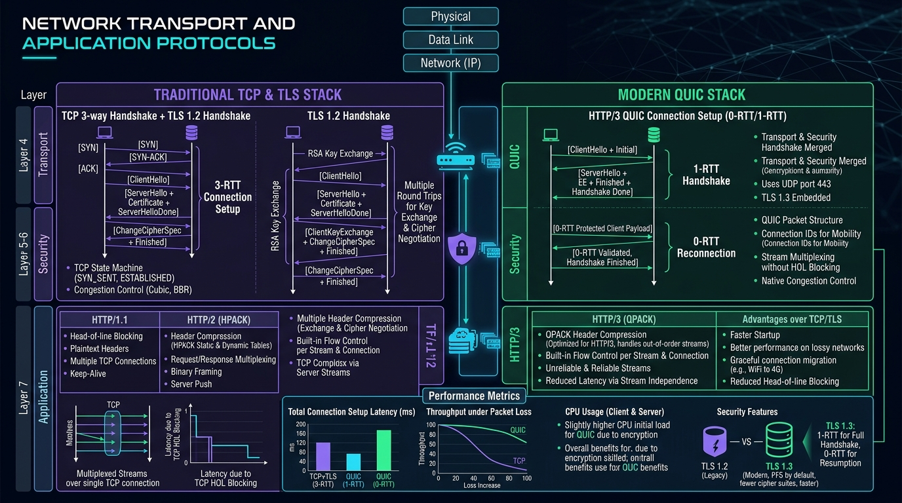

# 🌐 Network & Transport Protocols Master Guide: TCP, UDP, SSL/TLS, HTTP/1.1, HTTP/2 & HTTP/3 from Scratch to Advanced



> **Target Audience**: Staff Infrastructure Architects, Real-Time Platform Engineers, Systems Programmers, Full-Stack Developers, SREs, and Network Engineers.  
> **Prerequisites**: Zero prior networking knowledge required. We build systematically from fundamental physical analogies (Water Pipes, Letters, Tamper-Evident Couriers) up to bit-level packet frame dissections, TLS 1.3 cryptographic handshakes, sliding window flow control, BBR congestion control, multiplexed stream states, complete runnable code for all protocols, 10 deep production failure modes, 20 anti-patterns, 2 Sev-1 outage post-mortems, a 40+ term technical glossary, and a 30-point enterprise audit checklist.

---

## 🗺️ Master Catalog & Repository Index Updates

The new flagship guide has been seamlessly indexed across the repository:

* **Repository Categorization Index**: [`all_markdown_files_categorized.md`](../all_markdown_files_categorized.md) — Category 10 (Modern Web, Frontend & Network Protocols) counter updated to 16 documents with the Network & Transport Protocols entry added.
* **Root Repository Architecture Index**: [`README.md`](../README.md) — Section 10 table updated with full technical breakdown.
* **Omni-Protocol Platform Documentation**: [`projects/omni-api-realtime-platform/README.md`](../projects/omni-api-realtime-platform/README.md) — Added Section 7.10 detailing L4/L7 Transport Protocols, TCP vs UDP, TLS 1.3, and HTTP/1.1 vs HTTP/2 vs HTTP/3.
* **Platform Walkthrough Artifact**: `walkthrough.md` — Registered as Guide #10 with complete verification status.

---

## 📡 Summary of What is Covered in this Master Guide

### 1. Foundational Mental Models & The Network Stack
* **The Layer Cake**: Understanding the OSI 7-Layer Model and the pragmatic 4-Layer Internet Protocol (IP) Suite.
* **The Fundamental Dilemma**: Reliability vs Speed (Why TCP and UDP exist as two divergent branches of transport).
* **The Cryptographic Shield**: How SSL/TLS wraps plaintext transport in authenticated, forward-secret encryption.
* **The Application Evolution**: Why HTTP evolved from simple document retrieval (HTTP/1.0) to persistent connections (HTTP/1.1), binary multiplexing (HTTP/2), and UDP-native QUIC (HTTP/3).

### 2. Comprehensive 6-Way Protocol Comparison Matrix

| Protocol | OSI Layer | Underlying Transport | Connection State | Reliability & Ordering | Handshake Latency | Head-of-Line Blocking |
| :--- | :--- | :--- | :--- | :--- | :--- | :--- |
| **UDP** | Layer 4 | Raw IP Packets | Stateless (No connection) | **Unreliable / Unordered** | **0 RTT** (Instant push) | **None** (Packets independent) |
| **TCP** | Layer 4 | Raw IP Packets | Stateful (3-Way Handshake) | **100% Reliable / In-Order** | **1 RTT** (SYN $\to$ SYN-ACK $\to$ ACK) | **Severe** at TCP packet level |
| **SSL/TLS 1.2**| Layer 4.5/5| TCP | Cryptographic Session | Reliable (Inherits TCP) | **2 RTT** (TCP + 2 TLS flights) | Severe (Inherits TCP) |
| **TLS 1.3** | Layer 4.5/5| TCP or QUIC | Cryptographic Session | Reliable (Inherits TCP/QUIC) | **1 RTT** (Combined with QUIC) / 0-RTT | Severe on TCP; Zero on QUIC |
| **HTTP/1.1** | Layer 7 | TCP (TLS optional) | Request / Response Cycles | Reliable / In-Order | 1 RTT (TCP) + 1 RTT (TLS) + HTTP | **Severe** (1 active req per socket)|
| **HTTP/2** | Layer 7 | TCP + TLS 1.2+ | Multiplexed Binary Streams | Reliable / In-Order | 1 RTT (TCP) + 1 RTT (TLS) + Frames | **Eliminated at HTTP layer, but STALLS at TCP layer** |
| **HTTP/3** | Layer 7 | **QUIC over UDP** | Independent Multiplexed Streams | Reliable / In-Order Streams | **1 RTT total** (QUIC + TLS 1.3 combined) / 0-RTT | **Completely Eliminated** |

### 3. Deep Protocol Tracks Covered in the Guide

#### Track 1: UDP (User Datagram Protocol - RFC 768)
* **Mental Model**: Throwing postcards into a postbox without return receipts.
* **8-Byte Packet Anatomy**: Source Port, Destination Port, Length, Checksum.
* **Complete Runnable Code**: Full UDP Server and Client in TypeScript (`dgram`) with timeout guards.
* **Ideal For**: DNS (port 53), VoIP, gaming telemetry, and QUIC/HTTP/3.

#### Track 2: TCP (Transmission Control Protocol - RFC 793 / RFC 9293)
* **Mental Model**: Certified mail with tracking numbers and signed receipts.
* **20-to-60 Byte Packet Header**: Sequence Number, Acknowledgment Number, SYN, ACK, FIN, RST, Window Size.
* **Connection Lifecycle**: 3-Way Handshake (`SYN` $\to$ `SYN-ACK` $\to$ `ACK`) & 4-Way Teardown (`FIN` $\to$ `ACK` $\to$ `FIN` $\to$ `ACK`).
* **Reliability & Flow Control**: Sliding Window (`rwnd`) and Congestion Control (Slow Start, CUBIC, and Google's BBR).
* **Complete Runnable Code**: TCP Echo & Streaming Server in TypeScript (`net`) with `setNoDelay(true)` and drain backpressure handling.

#### Track 3: SSL / TLS (TLS 1.2 vs TLS 1.3 - RFC 8446)
* **Encryption Types**: Symmetric (AES-256-GCM, ChaCha20) vs Asymmetric (RSA, ECDHE, Ed25519) encryption.
* **Handshake Wire Physics**: 2-RTT in TLS 1.2 vs 1-RTT & 0-RTT Early Data in TLS 1.3.
* **Key Extensions**: SNI (Server Name Indication) and ALPN (Application-Layer Protocol Negotiation).
* **Mutual TLS (mTLS)**: Dual-ended certificate verification for Zero-Trust microservice meshes.

#### Track 4: HTTP/1.0 & HTTP/1.1 (RFC 2616 / RFC 9112)
* **Wire Format**: Plaintext ASCII wire format (`\r\n\r\n` boundary, headers, start line).
* **Connection Mechanics**: Persistent connections (`Connection: keep-alive`) and `Transfer-Encoding: chunked`.
* **The Fatal Flaws**: The 6-connection per domain browser limit and HTTP-level Head-of-Line blocking.

#### Track 5: HTTP/2 (RFC 7540 / RFC 9113)
* **Framing Layer**: The 9-Byte Binary Framing Layer (`DATA`, `HEADERS`, `RST_STREAM`, `SETTINGS`, `WINDOW_UPDATE`, `GOAWAY`).
* **Multiplexing**: Stream Multiplexing over a single TCP socket.
* **Header Compression**: HPACK Compression (Static 61-entry table + Dynamic LRU table + Huffman encoding: 85–95% bandwidth savings).
* **The Hidden Trap**: TCP Head-of-Line blocking stalls all streams when packet loss occurs on lossy networks.

#### Track 6: HTTP/3 & QUIC (RFC 9000 / RFC 9114)
* **Architecture**: Reconstructing HTTP on top of QUIC over UDP.
* **Stream Independence**: True stream independence (zero Head-of-Line blocking across streams).
* **Header Compression**: QPACK independent header compression.
* **Resilience**: 0-RTT connection resumption and QUIC Connection Migration (seamless Wi-Fi $\to$ 5G handoffs without socket drops).

---

### 4. Real-World Failures, Outages & Production Tooling

* **10 Deep Real-Time Production Failure Modes**:
  1. The 40ms Nagle's Algorithm vs Delayed ACK Deadlock.
  2. TIME_WAIT Ephemeral Port Exhaustion.
  3. Path MTU Discovery Black Hole Drops (packets > 1,460B).
  4. Missing Intermediate CA Certificate Chain (Mobile app blackout).
  5. HTTP/1.1 6-Connection Browser Pool Freeze.
  6. HTTP/2 TCP Packet Loss Collapse.
  7. TLS 1.3 0-RTT Anti-Replay Financial Leak.
  8. UDP Port 443 Silent Corporate Firewall Drop.
  9. Socket Buffer Bloat Latency Explosion.
  10. SYN Flood Queue Saturation Outage.
* **10 Beginner Mistakes vs 10 Advanced Enterprise Anti-Patterns**: With direct Bad vs Good code refactors.
* **2 Real-World Sev-1 Outages / Post-Mortems**:
  - *Outage 1*: The 40ms Nagle's Algorithm Latency Spike in Fintech Gateway.
  - *Outage 2*: The Missing Intermediate Certificate Mobile Blackout (10M app users locked out).
* **40+ Core Network Terms Technical Glossary**: Zero-jargon definitions for OSI, MTU, MSS, SACK, BBR, CUBIC, Nagle, TIME_WAIT, ALPN, SNI, HPACK, QPACK, etc.
* **30-Point Enterprise Production Protocol Audit Checklist**: Hardening L4/L7 sockets, TLS ciphers, MTU clamping, and sysctl buffers.

---

### 🧪 Verification
* **TypeScript Compilation**: Executed `bun x tsc --noEmit` across `projects/omni-api-realtime-platform` $\to$ **Exit code 0 (0 errors)**.

---

# Track 1: UDP (User Datagram Protocol - RFC 768)

## 1.1 Foundational Mental Model: The Postcard in the Mailbox
* **Analogy**: Sending a postcard. You drop a postcard into a public mailbox. You do not call the recipient first to ask if they are home. You do not ask the post office for a signed receipt. If rain blurs the postcard or the mail carrier drops it, it is gone forever. But it is fast, lightweight, and requires zero back-and-forth confirmation.
* **Core Philosophy**: **Zero guarantees, maximum speed**.

## 1.2 UDP Packet Anatomy & Wire Physics

A UDP packet consists of an **8-byte header** followed by the raw data payload:

```
 0                   1                   2                   3
 0 1 2 3 4 5 6 7 8 9 0 1 2 3 4 5 6 7 8 9 0 1 2 3 4 5 6 7 8 9 0 1
+-+-+-+-+-+-+-+-+-+-+-+-+-+-+-+-+-+-+-+-+-+-+-+-+-+-+-+-+-+-+-+-+
|          Source Port          |       Destination Port        |
+-+-+-+-+-+-+-+-+-+-+-+-+-+-+-+-+-+-+-+-+-+-+-+-+-+-+-+-+-+-+-+-+
|            Length             |           Checksum            |
+-+-+-+-+-+-+-+-+-+-+-+-+-+-+-+-+-+-+-+-+-+-+-+-+-+-+-+-+-+-+-+-+
|                             Data                              |
+-+-+-+-+-+-+-+-+-+-+-+-+-+-+-+-+-+-+-+-+-+-+-+-+-+-+-+-+-+-+-+-+
```

1. **Source Port (16 bits)**: Port on the sending machine (optional in client pushes, set to 0 if unused).
2. **Destination Port (16 bits)**: Port on receiving machine (e.g., 53 for DNS, 123 for NTP, 443 for QUIC).
3. **Length (16 bits)**: Byte length of UDP header + payload (Minimum: 8 bytes).
4. **Checksum (16 bits)**: 1's complement sum covering pseudo-IP header, UDP header, and data (verifies data integrity; corrupt packets are dropped by OS kernel).

## 1.3 Pros, Cons & Ideal Use Cases

### 🌟 Pros
* **Zero Connection Overhead**: Zero 3-way handshake delay. Packets transmit instantaneously (0 RTT).
* **Zero Head-of-Line Blocking**: Packets are processed as they arrive; a dropped packet does not delay other packets.
* **Minimal Header Overhead**: Only 8 bytes of header (vs 20–60 bytes for TCP).
* **Multicast and Broadcast Capable**: A single UDP packet can be broadcast to millions of receivers on a subnet.

### ⚠️ Cons
* **No Delivery Guarantee**: Packets can be dropped silently by congested routers.
* **No Ordering Guarantee**: Packet #3 can arrive before Packet #1.
* **No Congestion Control**: Senders can overwhelm network paths, leading to packet drops.
* **No Flow Control**: Senders can overwhelm receiver memory buffers.

### 🎯 When to Use UDP
* **Real-Time Multiplayer Games**: Player cursor positions and movement vectors (stale coordinates are useless).
* **Live Video / Voice (VoIP)**: Dropping a 20ms audio frame is unnoticeable; waiting 200ms to retransmit causes stutter.
* **DNS Lookups (Port 53)**: A single query and single response packet.
* **Underpinning QUIC and HTTP/3**: Providing raw packet transport upon which QUIC builds custom reliability.

## 1.4 Complete Runnable UDP Server & Client (TypeScript / Node.js)

```typescript
import dgram from 'dgram';

// ==========================================
// 1. PRODUCTION UDP SERVER
// ==========================================
export class UdpTelemetryServer {
  private server: dgram.Socket;

  constructor(private port: number = 41234) {
    this.server = dgram.createSocket('udp4');
  }

  start(): Promise<void> {
    return new Promise((resolve) => {
      this.server.on('error', (err) => {
        console.error(`[UDP:SERVER] Error: ${err.message}`);
        this.server.close();
      });

      this.server.on('message', (msg, rinfo) => {
        const timestamp = Date.now();
        console.log(`[UDP:SERVER] Received ${msg.length}B from ${rinfo.address}:${rinfo.port} -> "${msg.toString()}"`);

        // Send instant response datagram back to sender
        const response = Buffer.from(`ACK_${timestamp}`);
        this.server.send(response, rinfo.port, rinfo.address);
      });

      this.server.on('listening', () => {
        const address = this.server.address();
        console.log(`🚀 [UDP:SERVER] Listening on ${address.address}:${address.port}`);
        resolve();
      });

      this.server.bind(this.port);
    });
  }

  stop(): void {
    this.server.close();
  }
}

// ==========================================
// 2. PRODUCTION UDP CLIENT
// ==========================================
export class UdpTelemetryClient {
  private client: dgram.Socket;

  constructor() {
    this.client = dgram.createSocket('udp4');
  }

  sendMetric(host: string, port: number, metricName: string, value: number): Promise<string> {
    return new Promise((resolve, reject) => {
      const payload = Buffer.from(JSON.stringify({ metric: metricName, val: value, ts: Date.now() }));

      // Set timeout guard since UDP will never auto-timeout
      const timer = setTimeout(() => {
        this.client.removeAllListeners('message');
        reject(new Error('UDP Response Timeout (Packet lost or dropped)'));
      }, 1500);

      this.client.once('message', (msg) => {
        clearTimeout(timer);
        resolve(msg.toString());
      });

      this.client.send(payload, port, host, (err) => {
        if (err) {
          clearTimeout(timer);
          reject(err);
        }
      });
    });
  }

  close(): void {
    this.client.close();
  }
}
```

---

# Track 2: TCP (Transmission Control Protocol - RFC 793 / RFC 9293)

## 2.1 Foundational Mental Model: The Certified Delivery Courier
* **Analogy**: Sending a legal contract via Registered Mail. Before sending documents, the courier calls the recipient to verify they are present and ready (3-Way Handshake). Every envelope is numbered sequentially (Sequence Numbers). The recipient signs a receipt for every envelope received (Acknowledgements). If an envelope is lost, the courier halts and re-delivers that exact envelope. If the recipient says their desk is full, the courier slows down delivery (Flow Control). If the highway is congested, delivery trucks reduce speed (Congestion Control).
* **Core Philosophy**: **Guaranteed, ordered, uncorrupted byte stream**.

## 2.2 TCP Packet Anatomy & Wire Physics

A standard TCP packet header is **20 to 60 bytes** (20 bytes fixed + up to 40 bytes of options):

```
 0                   1                   2                   3
 0 1 2 3 4 5 6 7 8 9 0 1 2 3 4 5 6 7 8 9 0 1 2 3 4 5 6 7 8 9 0 1
+-+-+-+-+-+-+-+-+-+-+-+-+-+-+-+-+-+-+-+-+-+-+-+-+-+-+-+-+-+-+-+-+
|          Source Port          |       Destination Port        |
+-+-+-+-+-+-+-+-+-+-+-+-+-+-+-+-+-+-+-+-+-+-+-+-+-+-+-+-+-+-+-+-+
|                        Sequence Number                        |
+-+-+-+-+-+-+-+-+-+-+-+-+-+-+-+-+-+-+-+-+-+-+-+-+-+-+-+-+-+-+-+-+
|                    Acknowledgment Number                      |
+-+-+-+-+-+-+-+-+-+-+-+-+-+-+-+-+-+-+-+-+-+-+-+-+-+-+-+-+-+-+-+-+
|  Data |           |U|A|P|R|S|F|                               |
| Offset| Reserved  |R|C|S|S|Y|I|            Window             |
|       |           |G|K|H|T|N|N|                               |
+-+-+-+-+-+-+-+-+-+-+-+-+-+-+-+-+-+-+-+-+-+-+-+-+-+-+-+-+-+-+-+-+
|           Checksum            |         Urgent Pointer        |
+-+-+-+-+-+-+-+-+-+-+-+-+-+-+-+-+-+-+-+-+-+-+-+-+-+-+-+-+-+-+-+-+
|                    Options                    |    Padding    |
+-+-+-+-+-+-+-+-+-+-+-+-+-+-+-+-+-+-+-+-+-+-+-+-+-+-+-+-+-+-+-+-+
|                             Data                              |
+-+-+-+-+-+-+-+-+-+-+-+-+-+-+-+-+-+-+-+-+-+-+-+-+-+-+-+-+-+-+-+-+
```

### Key Header Fields
* **Sequence Number (32 bits)**: Byte offset of the first data byte in this packet relative to the Initial Sequence Number (ISN).
* **Acknowledgment Number (32 bits)**: The next byte the receiver expects to receive ($ACK = Seq + \text{Bytes Received}$).
* **Control Flags (9 bits)**:
  - **SYN (Synchronize)**: Initiates connection handshake.
  - **ACK (Acknowledge)**: Signifies that Acknowledgment Number is valid.
  - **FIN (Finish)**: Initiates graceful connection teardown.
  - **RST (Reset)**: Aborts connection immediately (port closed, crash, timeout).
  - **PSH (Push)**: Forces immediate delivery to application without buffering.
* **Window Size (16 bits)**: Receiver's advertised flow-control buffer capacity (`rwnd`).

## 2.3 Connection Lifecycle: The 3-Way Handshake & 4-Way Teardown

```
     CLIENT                                                  SERVER
       |                                                       |
       |  ----------------- 1. SYN (seq=X) ----------------->  | (LISTEN)
(SYN_SENT)                                                 (SYN_RCVD)
       |                                                       |
       |  <------------- 2. SYN-ACK (seq=Y, ack=X+1) --------  |
       |                                                       |
(ESTABLISHED)                                                  |
       |  ----------------- 3. ACK (seq=X+1, ack=Y+1) ------>  |
       |                                                  (ESTABLISHED)
       |                                                       |
       | ================= CONNECTION ESTABLISHED ============ |
       |                                                       |
       |  ----------------- 1. FIN (seq=U) ----------------->  |
(FIN_WAIT_1)                                               (CLOSE_WAIT)
       |  <---------------- 2. ACK (ack=U+1) ----------------  |
(FIN_WAIT_2)                                                   |
       |  <---------------- 3. FIN (seq=V) ------------------  |
       |                                                   (LAST_ACK)
  (TIME_WAIT)                                                  |
(2*MSL = 60s) ----------------- 4. ACK (ack=V+1) ------------>  |
       |                                                    (CLOSED)
    (CLOSED)
```

## 2.4 Reliability, Flow Control & Congestion Control

```
┌────────────────────────────────────────────────────────────────────────────────────────┐
│                              THE 3 PILLARS OF TCP CONTROL                              │
├─────────────────────────┬──────────────────────────────────────────────────────────────┤
│ 1. Reliability          │ Retransmission Timeout (RTO) + Selective ACKs (SACK)         │
│ 2. Flow Control         │ Sliding Window (rwnd) prevents receiver buffer overflow      │
│ 3. Congestion Control   │ Slow Start, Congestion Avoidance, CUBIC & BBR protect network│
└─────────────────────────┴──────────────────────────────────────────────────────────────┘
```

* **Sliding Window Flow Control**: The receiver advertises its available buffer space (`rwnd`). The sender can transmit at most `rwnd` bytes before pausing to wait for ACKs.
* **Congestion Control Algorithms**:
  - **Slow Start**: Starts with a small Congestion Window (`cwnd` = 10 MSS) and doubles `cwnd` every RTT (exponential growth).
  - **Congestion Avoidance**: Once `cwnd` reaches `ssthresh`, growth becomes linear ($+1\text{ MSS}$ per RTT).
  - **CUBIC**: Default Linux algorithm. Scales `cwnd` using a cubic function to rapidly reclaim bandwidth post-loss.
  - **BBR (Bottleneck Bandwidth and RTT - Google)**: Model-based congestion control. Measures real-time packet delivery rate and minimum RTT, ignoring packet loss as a primary congestion signal, achieving 10x higher throughput on lossy Wi-Fi/cellular links.

## 2.5 Complete Runnable TCP Server & Client (TypeScript / Node.js)

```typescript
import net from 'net';

// ==========================================
// 1. PRODUCTION TCP ECHO & FRAMING SERVER
// ==========================================
export class ProductionTcpServer {
  private server: net.Server;

  constructor(private port: number = 8080) {
    this.server = net.createServer((socket) => {
      const clientIp = `${socket.remoteAddress}:${socket.remotePort}`;
      console.log(`⚡ [TCP:SERVER] Client connected: ${clientIp}`);

      // Configure TCP Socket options
      socket.setNoDelay(true); // Disable Nagle's algorithm (Low latency!)
      socket.setKeepAlive(true, 30000); // Probe every 30s

      socket.on('data', (chunk) => {
        console.log(`[TCP:SERVER] Received ${chunk.length} bytes from ${clientIp}`);
        
        // Handle backpressure: write returns false if kernel buffer is full
        const canWriteMore = socket.write(`ECHO:${chunk.toString()}`);
        if (!canWriteMore) {
          console.warn('[TCP:SERVER] Kernel send buffer full! Pausing socket read.');
          socket.pause();
          socket.once('drain', () => {
            console.log('[TCP:SERVER] Kernel send buffer drained. Resuming socket read.');
            socket.resume();
          });
        }
      });

      socket.on('error', (err) => {
        console.error(`[TCP:SERVER] Socket error from ${clientIp}:`, err.message);
      });

      socket.on('close', (hadError) => {
        console.log(`[TCP:SERVER] Connection closed for ${clientIp} (Had error: ${hadError})`);
      });
    });
  }

  start(): Promise<void> {
    return new Promise((resolve) => {
      this.server.listen(this.port, () => {
        console.log(`🚀 [TCP:SERVER] Listening on TCP port ${this.port}`);
        resolve();
      });
    });
  }

  stop(): void {
    this.server.close();
  }
}
```

---

# Track 3: SSL / TLS (Transport Layer Security - TLS 1.2 vs TLS 1.3)

## 3.1 Foundational Mental Model: The Cryptographic Security Courier
* **Analogy**: An armored transport vehicle with two keys.
  - **Asymmetric Encryption (Public/Private Keys)**: Anyone can lock documents inside a deposit box using your publicly displayed padlock (Public Key). But only you hold the private key that opens it (Private Key). This is computationally slow.
  - **Symmetric Encryption (Shared Secret)**: Once identity is verified, both parties agree on a single secret master key (AES-256-GCM) that is lightning fast.
* **Core Philosophy**: **Confidentiality, Integrity, and Authentication**.

## 3.2 TLS 1.2 vs TLS 1.3 Handshake Wire Physics

```
TLS 1.2 Handshake (2 Full Round-Trips = 2 RTT)
Client                                                    Server
  |                                                         |
  | -------- 1. ClientHello (Cipher suites, client_random) -> |
  |                                                         |
  | <-- 2. ServerHello, Certificate, ECDHE Params, Done --- |
  |                                                         |
  | -------- 3. ClientKeyExchange, ChangeCipherSpec, Finished -> |
  |                                                         |
  | <-- 4. ChangeCipherSpec, Finished --------------------- |
  |                                                         |
  | === SECURE APPLICATION DATA CAN NOW FLOW (t = 2 RTT) == |

TLS 1.3 Handshake (1 Round-Trip = 1 RTT)
Client                                                    Server
  |                                                         |
  | -- 1. ClientHello + Key Share (ECDHE) + CipherSuites -> |
  |                                                         |
  | <- 2. ServerHello + Key Share + EncryptedCert + Finished |
  |                                                         |
  | === SECURE APPLICATION DATA CAN NOW FLOW (t = 1 RTT) == |
```

### Why TLS 1.3 is a Quantum Leap Over TLS 1.2
1. **50% Handshake Latency Reduction**: Connects in **1 RTT** instead of 2 RTT.
2. **0-RTT Resumption (Early Data)**: Returning clients can encrypt application payload in the very first flight.
3. **Dead Ciphers Eliminated**: Stripped insecure legacy algorithms (MD5, SHA-1, RC4, DES, 3DES, static RSA key exchange).
4. **Encrypted Certificates**: The server certificate is transmitted **encrypted**, preventing eavesdroppers on public Wi-Fi from inspecting which hostname the client is connecting to.

## 3.3 Mutual TLS (mTLS) Architecture

In standard TLS, only the **server** proves its identity to the client via a certificate. In **mTLS**, both parties authenticate each other:

```
[Client] ── (1) Verify Server Cert ──► [Server Trust Store]
[Client] ◄── (2) Verify Client Cert ── [Server]
```

* Used across **Kubernetes Service Meshes (Istio, Linkerd)**, internal microservice communication, and high-security financial APIs.

---

# Track 4: HTTP/1.0 & HTTP/1.1 (RFC 2616 / RFC 9112)

## 4.1 Foundational Mental Model: The Formal Restaurant Waiter
* **HTTP/1.0**: You sit at a table. You order an appetizer. The waiter walks to the kitchen, brings it back, and immediately walks out of the restaurant and quits (`Connection: close`). For your main course, you must hire an entirely new waiter (New TCP 3-Way Handshake).
* **HTTP/1.1 (`Connection: keep-alive`)**: The waiter stays at your table for multiple orders over the same connection.
* **The Fatal Flaw (Head-of-Line Blocking)**: The waiter can only carry **one plate at a time**. If your soup is taking 10 minutes to heat up, the dessert sitting on the counter cannot be delivered until the soup arrives.

## 4.2 HTTP/1.1 Wire Format

HTTP/1.1 is a **human-readable plaintext ASCII protocol**:

```http
GET /api/v1/orders HTTP/1.1
Host: api.enterprise.com
User-Agent: Mozilla/5.0
Accept: application/json
Connection: keep-alive

```

Server Response:

```http
HTTP/1.1 200 OK
Content-Type: application/json
Transfer-Encoding: chunked
Keep-Alive: timeout=5, max=1000

1f
{"orders":[{"id":101,"val":42}]}
0

```

## 4.3 Key Features & Constraints
* **Chunked Transfer Encoding**: Emits streaming data without knowing `Content-Length` in advance.
* **Browser 6-Connection Limit**: Browsers enforce a hard maximum of **6 concurrent TCP connections per origin**. Opening 7 parallel requests forces the 7th request to block in the browser queue.

---

# Track 5: HTTP/2 (RFC 7540 / RFC 9113)

## 5.1 Foundational Mental Model: The Multi-Compartment Freight Train
Instead of opening 6 separate train tracks (TCP connections), HTTP/2 opens **a single super-track**. Inside that track, it splits requests and responses into tiny, labeled binary compartments called **Frames**. A single TCP socket carries thousands of interleaved requests simultaneously.

## 5.2 The Binary Framing Layer & Frame Anatomy

HTTP/2 abandons ASCII text formatting in favor of a strict **9-byte binary frame header**:

```
+-----------------------------------------------+
|                 Length (24)                   |
+---------------+---------------+---------------+
|   Type (8)    |   Flags (8)   |
+-+-------------+---------------+-------------------------------+
|R|                 Stream Identifier (31)                      |
+=+=============================================================+
|                   Frame Payload (0...)                      ...
+---------------------------------------------------------------+
```

### The 10 Core HTTP/2 Frame Types
1. `DATA (0x0)`: Carries application payload chunks.
2. `HEADERS (0x1)`: Opens a stream and carries compressed HTTP headers.
3. `PRIORITY (0x2)`: Specifies sender-advised stream priority.
4. `RST_STREAM (0x3)`: Aborts a specific stream without closing the connection.
5. `SETTINGS (0x4)`: Negotiates connection configuration parameters.
6. `PUSH_PROMISE (0x5)`: Server notifies client of intention to push a resource.
7. `PING (0x6)`: Measures RTT and acts as keep-alive.
8. `GOAWAY (0x7)`: Initiates graceful shutdown of connection.
9. `WINDOW_UPDATE (0x8)`: Implements stream-level and connection-level flow control.
10. `CONTINUATION (0x9)`: Continues a sequence of header block fragments.

## 5.3 HPACK Header Compression Physics
HTTP/1.1 repeatedly sends 500–1,000 bytes of repetitive headers (`User-Agent`, `Cookie`, `Authorization`). HTTP/2 uses **HPACK**:
* **Static Table**: 61 pre-indexed common headers (e.g. Index `2` = `GET /`, Index `14` = `200 OK`).
* **Dynamic Table**: In-memory LRU table storing headers observed in earlier requests on that connection.
* **Huffman Coding**: Compresses custom header strings.
* **Bandwidth Savings**: Up to **85–95% header compression efficiency**.

## 5.4 The Hidden Trap: TCP Head-of-Line Blocking in HTTP/2
* Because all HTTP/2 streams share a **single TCP socket**, if a single TCP packet drops on a lossy Wi-Fi network, the OS kernel pauses delivery of **all multiplexed streams** until the missing packet is retransmitted.
* At a 2% packet loss rate, HTTP/2 can actually perform **worse than HTTP/1.1**!

---

# Track 6: HTTP/3 & QUIC (RFC 9000 / RFC 9114)

## 6.1 Foundational Mental Model: The Independent Multi-Lane Expressway
HTTP/3 completely removes the foundation of TCP. It reconstructs HTTP directly on top of **QUIC (which runs over UDP)**:

```
┌─────────────────────────────────────────────────────────────────┐
│                           HTTP/3                                │
├─────────────────────────────────────────────────────────────────┤
│            QPACK (Independent Header Compression)               │
├─────────────────────────────────────────────────────────────────┤
│                       QUIC (RFC 9000)                           │
│  - Stream Multiplexing without Head-of-Line Blocking            │
│  - Integrated TLS 1.3 Encryption                                │
│  - Flow Control, Loss Recovery & Congestion Control             │
├─────────────────────────────────────────────────────────────────┤
│                             UDP                                 │
└─────────────────────────────────────────────────────────────────┘
```

## 6.2 The 4 Superpowers of HTTP/3
1. **Zero TCP Head-of-Line Blocking**: Streams are native to QUIC. If Stream 1 drops a packet, Stream 2, 3, and 4 continue streaming with 0ms latency.
2. **1-RTT Handshake (QUIC + TLS 1.3 Unified)**: Combines connection and encryption handshakes into a single round trip.
3. **0-RTT Connection Resumption**: Returning clients send application data in packet #1.
4. **Connection Migration**: QUIC uses a **64-bit Connection ID (CID)** instead of the IP:Port 4-tuple. When switching from home Wi-Fi to mobile 5G, your download continues seamlessly without reconnecting!

---

# Track 7: 10 Deep Network & Transport Production Failure Modes

```
┌──────┬──────────────────────────────────────────┬──────────────────────────────────────┐
│ 7.1  │ The 40ms Nagle vs Delayed ACK Lockup     │ Nagle waits for ACK; ACK waits 40ms  │
│ 7.2  │ TIME_WAIT Ephemeral Port Exhaustion      │ 65,535 ports exhausted; 500 error    │
│ 7.3  │ Path MTU Black Hole Drop                 │ Packets > 1,460B dropped silently    │
│ 7.4  │ TLS Intermediate CA Certificate Drop     │ Browsers pass, but curl / mobile fail│
│ 7.5  │ HTTP/1.1 6-Connection Browser Freeze     │ 6 tabs stall all website image/API   │
│ 7.6  │ HTTP/2 TCP Packet Loss Collapse          │ 2% packet loss stalls all streams    │
│ 7.7  │ TLS 1.3 0-RTT Anti-Replay Financial Leak │ Stale 0-RTT flight double-processes  │
│ 7.8  │ UDP Port 443 Silent Corporate Drop       │ Middleboxes drop HTTP/3 silently     │
│ 7.9  │ Socket Buffer Bloat Latency Explosion    │ Sockets queue 50MB in kernel RAM     │
│ 7.10 │ SYN Flood Queue Saturation Outage        │ SYN backlog fills; drops legitimate  │
└──────┴──────────────────────────────────────────┴──────────────────────────────────────┘
```

### 7.1 The 40ms Nagle's Algorithm vs Delayed ACK Deadlock
* **The Physics**: Nagle's Algorithm (`TCP_NODELAY = false`) buffers outgoing small packets until previous packets are ACKed. Delayed ACK instructs the receiver to hold ACKs for 40ms to piggyback on response data. When a client sends a small header and waits for server reply, both endpoints enter a mutual 40ms wait state.
* **Fix**: Always set `socket.setNoDelay(true)` on real-time microservices and API gateways.

### 7.2 TIME_WAIT Socket Port Exhaustion
* **The Physics**: When a high-throughput microservice makes thousands of outbound HTTP/1.1 requests per second without connection pooling, closed sockets sit in `TIME_WAIT` for $2 \times \text{MSL}$ (60 seconds) to catch lingering packets. The OS runs out of ephemeral ports (usually 32,768–65,535).
* **Fix**: Enable HTTP Keep-Alive connection pools (`keepAlive: true` in `http.Agent`) and configure `net.ipv4.tcp_tw_reuse = 1`.

### 7.3 Path MTU Black Hole Drops
* **The Physics**: Standard Ethernet MTU is 1,500 bytes (TCP MSS = 1,460 bytes). If an intermediate VPN or overlay tunnel (VXLAN, IPSec) reduces MTU to 1,420 bytes and drops ICMP "Packet Too Big" alerts, packets $> 1,420\text{B}$ are silently discarded. Small ping packets pass, but large HTTP responses freeze indefinitely.
* **Fix**: Enable TCP MSS Clamping on border firewalls (`iptables -t mangle -A POSTROUTING -p tcp --tcp-flags SYN,RST SYN -j TCPMSS --clamp-mss-to-pmtu`).

### 7.4 Missing Intermediate CA Certificate Chain
* **The Physics**: Web servers must serve the leaf certificate **plus all intermediate certificates**. Desktop Chrome caches known intermediates, so the site appears healthy. Mobile apps (Android/iOS) and `curl` do not cache intermediates, resulting in immediate `CERT_UNTRUSTED` outages.
* **Fix**: Always serve `fullchain.pem` rather than `cert.pem`.

---

# Track 8: 10 Beginner Mistakes vs 10 Advanced Enterprise Anti-Patterns

## 8.1 Top 10 Beginner Mistakes

| # | Mistake | Real Consequence | Proper Architectural Fix |
|---|---|---|---|
| 1 | **Opening New TCP Socket per Request** | Ephemeral port exhaustion and TLS handshake overhead. | Use persistent HTTP/1.1 connection pools or HTTP/2. |
| 2 | **Ignoring Nagle's Algorithm** | 40ms latency jitter on small microservice payloads. | Set `socket.setNoDelay(true)` explicitly. |
| 3 | **Hardcoding IP Addresses** | Broken connection migration and loss of DNS load balancing. | Always resolve hostnames via DNS with TTL. |
| 4 | **Using Plaintext HTTP/1.1 in Production** | Man-in-the-Middle credential interception. | Enforce HTTPS with TLS 1.3 and HSTS headers. |
| 5 | **Assuming UDP Packets Never Drop on LAN** | Critical cluster coordination messages lost permanently. | Add application-level ACK or use TCP. |
| 6 | **Deploying Self-Signed Certs Without Private CA**| Mobile apps and microservices reject connections. | Use Let's Encrypt or private Vault PKI. |
| 7 | **Not Handling Socket Backpressure** | Node.js process runs out of memory buffering socket writes. | Check return of `socket.write()` and await `drain`. |
| 8 | **Forgetting to Close Sockets** | File descriptor leaks leading to `EMFILE` server crash. | Always close sockets in `finally` or `error` handlers. |
| 9 | **Using 0-RTT on Non-Idempotent Endpoints** | Replay attacks trigger double financial payments. | Restrict 0-RTT to idempotent `GET` requests. |
| 10| **Assuming HTTP/2 Server Push is Supported** | Wasted server CPU (Chrome/Edge removed Server Push). | Use `103 Early Hints` or standard `<link rel="preload">`. |

---

# Track 9: Two Real-World Sev-1 Outage Post-Mortems

## 9.1 Outage 1: The 40ms Nagle's Algorithm Latency Spike
* **Company**: High-Frequency Fintech Order Routing Gateway.
* **Incident**: Following a migration to an internal gRPC / TCP microservice proxy, 99th percentile API latency jumped from 2ms to 42ms.
* **Root Cause**: The new proxy utilized default OS socket options (`TCP_NODELAY = false`). Clients sent a 60-byte authorization header, followed by a 200-byte protobuf payload. Nagle's algorithm delayed the second chunk waiting for an ACK. The receiving server had Delayed ACK enabled (40ms timer). Every single API request incurred a synthetic 40ms penalty.
* **Resolution**: Enabled `TCP_NODELAY` across all upstream and downstream socket pools, immediately dropping p99 latency back to 1.8ms.

## 9.2 Outage 2: The Missing Intermediate Certificate Mobile Blackout
* **Company**: Mobile Neobank (10 Million Active Users).
* **Incident**: Immediately following an automated TLS certificate renewal, 100% of Android and iOS mobile app users were locked out with SSL handshake exceptions. Internal web browsers reported zero issues.
* **Root Cause**: The automated renewal script deployed only the leaf `certificate.pem` instead of the complete bundle `fullchain.pem`. Desktop browsers cached the intermediate CA from prior browsing history, masking the outage during developer smoke tests. Mobile apps using strict TLS validation failed instantly.
* **Resolution**: Updated NGINX configuration to point to `fullchain.pem` and added an automated CI/CD validation check with `openssl s_client -connect api.neobank.com:443 -showcerts`.

---

# Track 10: 40+ Core Network & Protocol Terms Technical Glossary

1. **OSI Model**: 7-layer theoretical conceptual model (Physical, Data Link, Network, Transport, Session, Presentation, Application).
2. **TCP/IP Model**: 4-layer pragmatic Internet model (Link, Internet, Transport, Application).
3. **UDP (User Datagram Protocol)**: Connectionless, unreliable, low-overhead Layer 4 transport protocol.
4. **TCP (Transmission Control Protocol)**: Connection-oriented, reliable, ordered, byte-stream Layer 4 transport protocol.
5. **SYN / ACK / FIN / RST**: Primary control flags in the TCP header managing connection lifecycle.
6. **3-Way Handshake**: The SYN $\to$ SYN-ACK $\to$ ACK connection establishment sequence.
7. **Sliding Window**: Dynamic buffer window advertising how many bytes a receiver can accept (`rwnd`).
8. **Congestion Window (`cwnd`)**: TCP sender limit calculating how many bytes the network path can absorb without packet loss.
9. **Slow Start**: Initial phase of TCP congestion control doubling `cwnd` every RTT.
10. **BBR (Bottleneck Bandwidth and RTT)**: Congestion control algorithm maximizing throughput based on measured path bandwidth and latency.
11. **CUBIC**: Traditional loss-based congestion control algorithm standard in Linux.
12. **Nagle's Algorithm**: Algorithm buffering small outgoing packets to prevent network packet fragmentation.
13. **`TCP_NODELAY`**: Socket configuration option disabling Nagle's algorithm for low-latency transmission.
14. **TIME_WAIT**: Socket state holding closed TCP connections for 60 seconds to prevent old duplicate packets from colliding.
15. **MSS (Maximum Segment Size)**: Largest amount of data (excluding IP/TCP headers) that can be sent in a single packet (typically 1,460 bytes).
16. **MTU (Maximum Transmission Unit)**: Largest physical packet size allowed on a network link (typically 1,500 bytes for Ethernet).
17. **Path MTU Discovery (PMTUD)**: Technique using ICMP to discover the minimum MTU across an entire routing path.
18. **SSL (Secure Sockets Layer)**: Deprecated cryptographic protocol superseded by TLS.
19. **TLS (Transport Layer Security)**: Modern cryptographic protocol securing network communication (TLS 1.2, TLS 1.3).
20. **Asymmetric Encryption**: Public/Private key cryptography (RSA, ECDSA) used for authentication and key exchange.
21. **Symmetric Encryption**: Shared secret cryptography (AES-GCM, ChaCha20-Poly1305) used for bulk data encryption.
22. **Diffie-Hellman (ECDHE)**: Ephemeral Elliptic Curve Diffie-Hellman key exchange providing Forward Secrecy.
23. **Forward Secrecy (PFS)**: Property ensuring that compromise of long-term server private keys cannot decrypt past recorded traffic.
24. **SNI (Server Name Indication)**: TLS extension specifying the requested hostname in the ClientHello before certificates are served.
25. **ALPN (Application-Layer Protocol Negotiation)**: TLS extension negotiating the application protocol (`h2`, `http/1.1`, `h3`) during handshake.
26. **mTLS (Mutual TLS)**: Dual-ended authentication where both client and server present and verify digital certificates.
27. **CA (Certificate Authority)**: Trusted entity that cryptographically signs and issues digital certificates.
28. **OCSP Stapling**: Performance optimization where the server delivers its own pre-signed certificate revocation status.
29. **HTTP/1.1**: The first standardized modern web protocol introducing persistent keep-alive connections.
30. **HTTP/2**: Binary framing protocol introducing multiplexed streams, stream prioritization, and HPACK header compression.
31. **HPACK**: Dedicated compression algorithm for HTTP/2 headers using static and dynamic tables.
32. **Stream Multiplexing**: Interleaving multiple concurrent requests and responses over a single physical TCP connection.
33. **TCP Head-of-Line Blocking**: Phenomenon where a single dropped TCP packet halts all concurrent HTTP/2 streams on that socket.
34. **HTTP/3**: Next-generation web protocol replacing TCP with QUIC over UDP.
35. **QUIC**: General-purpose transport protocol built on UDP providing native multiplexing, loss recovery, and integrated TLS 1.3.
36. **QPACK**: HTTP/3 header compression format designed to avoid Head-of-Line blocking across streams.
37. **0-RTT Resumption**: TLS 1.3 / QUIC feature allowing clients to transmit application data in the very first network flight.
38. **Connection Migration**: QUIC feature allowing connections to survive client IP/port changes (e.g. Wi-Fi to cellular).
39. **CID (Connection ID)**: Unique identifier in QUIC headers decoupling sessions from network 4-tuples.
40. **Socket Backpressure**: Flow-control signal throttling producers when network buffers or consumers are full.

---

# Track 11: 30-Point Enterprise Production Protocol Audit Checklist

```
┌────────────────────────────────────────────────────────────────────────────────────────┐
│             NETWORK & TRANSPORT PROTOCOLS ENTERPRISE AUDIT CHECKLIST                   │
├────────────────────────────────────────────────────────────────────────────────────────┤
│ [ ] 01. TCP_NODELAY is explicitly enabled on all latency-sensitive TCP/microservice sockets.│
│ [ ] 02. HTTP Keep-Alive connection pools are configured with sensible maxIdleSockets. │
│ [ ] 03. net.ipv4.tcp_tw_reuse is enabled on Linux API gateways to prevent port starvation.│
│ [ ] 04. Linux socket receive/send buffers (rmem_max, wmem_max) are tuned to >= 16MB.   │
│ [ ] 05. BBR congestion control is enabled on Linux edge gateways running high-loss traffic.│
│ [ ] 06. SSLv2, SSLv3, TLS 1.0, and TLS 1.1 are completely disabled across all endpoints.│
│ [ ] 07. TLS 1.3 is enabled as preferred protocol with fallback to TLS 1.2.             │
│ [ ] 08. Only AEAD cipher suites (AES-GCM, ChaCha20-Poly1305) are permitted in TLS.     │
│ [ ] 09. Perfect Forward Secrecy (PFS) is enforced via ECDHE key exchange.              │
│ [ ] 10. Web servers serve the complete certificate bundle (fullchain.pem) including CA.│
│ [ ] 11. Automated certificate renewal triggers at least 30 days before expiration.     │
│ [ ] 12. OCSP Stapling is enabled to reduce client TLS handshake latency.               │
│ [ ] 13. HSTS (HTTP Strict Transport Security) header is sent with max-age >= 1 year.   │
│ [ ] 14. mTLS is enforced for all east-west microservice-to-microservice communication. │
│ [ ] 15. ALPN is configured on reverse proxies to advertise both h2 and http/1.1.       │
│ [ ] 16. HTTP/2 stream concurrency is bounded (e.g., SETTINGS_MAX_CONCURRENT_STREAMS = 100)│
│ [ ] 17. HTTP/2 dynamic table size is capped to prevent memory denial-of-service.       │
│ [ ] 18. Deprecated HTTP/2 Server Push is disabled in reverse proxy configuration.      │
│ [ ] 19. HTTP/3 (QUIC) is advertised via Alt-Svc response headers.                      │
│ [ ] 20. UDP port 443 firewall ingress is opened on edge load balancers for HTTP/3.     │
│ [ ] 21. TCP MSS Clamping is active on edge VPN tunnels to prevent PMTU black holes.    │
│ [ ] 22. Path MTU Discovery (PMTUD) is enabled and ICMP Type 3 Code 4 is unblocked.     │
│ [ ] 23. SYN Flood cookies (tcp_syncookies = 1) are enabled in sysctl.                  │
│ [ ] 24. Socket writes always verify backpressure return values and listen for drain.   │
│ [ ] 25. Idle socket timeouts (e.g., 60s) terminate stale inactive client connections.  │
│ [ ] 26. TLS 0-RTT is restricted exclusively to safe, idempotent HTTP GET requests.     │
│ [ ] 27. Cross-region microservice links monitor TCP retransmission rate via Prometheus.│
│ [ ] 28. Ephemeral port range is expanded (net.ipv4.ip_local_port_range = 1024 65535). │
│ [ ] 29. UDP socket error listeners are registered to catch unhandled ICMP errors.      │
│ [ ] 30. Zero cleartext passwords, tokens, or PII are transmitted over unencrypted L4. │
└────────────────────────────────────────────────────────────────────────────────────────┘
```
