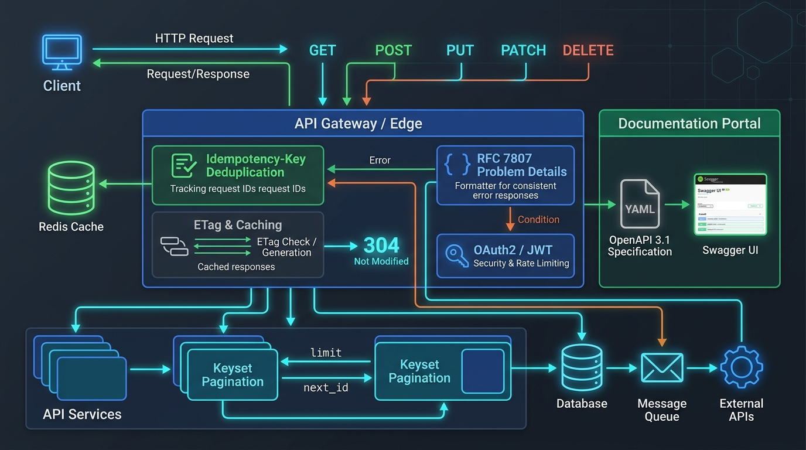

# 🌐 Enterprise REST API, OpenAPI 3.1 & Swagger Architecture Master Guide



> **Target Audience**: Software Engineers, Backend Developers, API Platform Engineers, and System Architects.  
> **Prerequisites**: Zero. We begin with intuitive real-world mental models and progress systematically through Roy Fielding's architectural constraints, enterprise resource modeling, RFC standards, full OpenAPI 3.1 specifications, interactive documentation engines, and automated spec-first/code-first CI/CD code generation pipelines.

---

## 📑 Master Table of Contents
1. [Track 1: Foundational Mental Models & REST Architectural Constraints](#track-1-foundational-mental-models--rest-architectural-constraints)
   - [1.1 The Real-World Restaurant Menu Analogy](#11-the-real-world-restaurant-menu-analogy)
   - [1.2 Roy Fielding's 6 Architectural Constraints Explained](#12-roy-fieldings-6-architectural-constraints-explained)
   - [1.3 The Richardson Maturity Model (Levels 0 to 3)](#13-the-richardson-maturity-model-levels-0-to-3)
2. [Track 2: Complete Enterprise REST API Design Standards](#track-2-complete-enterprise-rest-api-design-standards)
   - [2.1 URL Naming & Resource Modeling Taxonomy](#21-url-naming--resource-modeling-taxonomy)
   - [2.2 HTTP Verbs & Semantic Matrix (Safe vs Idempotent)](#22-http-verbs--semantic-matrix-safe-vs-idempotent)
   - [2.3 Partial Updates: RFC 6902 JSON Patch vs RFC 7396 JSON Merge Patch](#23-partial-updates-rfc-6902-json-patch-vs-rfc-7396-json-merge-patch)
   - [2.4 The HTTP Status Code Decision Tree](#24-the-http-status-code-decision-tree)
   - [2.5 Query Parameters Standard: Filtering, Sorting & Pagination](#25-query-parameters-standard-filtering-sorting--pagination)
   - [2.6 Enterprise Headers Standard: Idempotency, ETags & Rate Limiting](#26-enterprise-headers-standard-idempotency-etags--rate-limiting)
   - [2.7 Error Handling Standard: RFC 7807 Problem Details](#27-error-handling-standard-rfc-7807-problem-details)
   - [2.8 API Versioning Strategies (URI vs Header vs Content Negotiation)](#28-api-versioning-strategies-uri-vs-header-vs-content-negotiation)
3. [Track 3: OpenAPI 3.0 & 3.1 / Swagger Specification Anatomy](#track-3-openapi-30--31--swagger-specification-anatomy)
   - [3.1 Document Anatomy: Root, Info, Servers, Paths & Components](#31-document-anatomy-root-info-servers-paths--components)
   - [3.2 Parameters: Path, Query, Header, and Cookie Specifications](#32-parameters-path-query-header-and-cookie-specifications)
   - [3.3 Request Bodies, Multipart Uploads & Reusable Component References](#33-request-bodies-multipart-uploads--reusable-component-references)
   - [3.4 Polymorphism: `oneOf`, `anyOf`, `allOf` & The `discriminator`](#34-polymorphism-oneof-anyof-allof--the-discriminator)
   - [3.5 Security Schemes: Bearer JWT, OAuth 2.0 (PKCE) & API Keys](#35-security-schemes-bearer-jwt-oauth-20-pkce--api-keys)
   - [3.6 OpenAPI 3.1 Superpowers: Full JSON Schema 2020-12 & Webhooks](#36-openapi-31-superpowers-full-json-schema-2020-12--webhooks)
4. [Track 4: Swagger UI, Redoc & Modern Documentation Engines](#track-4-swagger-ui-redoc--modern-documentation-engines)
   - [4.1 Embedding Swagger UI with Persistent Auth Interceptors](#41-embedding-swagger-ui-with-persistent-auth-interceptors)
   - [4.2 Setting Up the Redoc 3-Panel Human-First Documentation](#42-setting-up-the-redoc-3-panel-human-first-documentation)
   - [4.3 Live Mock Servers with Prism](#43-live-mock-servers-with-prism)
   - [4.4 Enterprise Spec Linting & Governance with Spectral](#44-enterprise-spec-linting--governance-with-spectral)
5. [Track 5: Step-by-Step Automated Generation Pipelines](#track-5-step-by-step-automated-generation-pipelines)
   - [5.1 Spec-First Pipeline: OpenAPI $\to$ TypeScript SDK & Java Spring Boot DTOs](#51-spec-first-pipeline-openapi--typescript-sdk--java-spring-boot-dtos)
   - [5.2 Code-First Pipeline: Spring Boot 3 + Springdoc & Node.js Zod-to-OpenAPI](#52-code-first-pipeline-spring-boot-3--springdoc--nodejs-zod-to-openapi)
   - [5.3 CI/CD Schema Drift Detection & Breaking Change Gates](#53-cicd-schema-drift-detection--breaking-change-gates)
6. [Track 6: Main Cases & Deep-Dive Edge Cases in Enterprise REST](#track-6-main-cases--deep-dive-edge-cases-in-enterprise-rest)
   - [6.1 Concurrency & Lost Updates: Optimistic Locking with `If-Match` ETags](#61-concurrency--lost-updates-optimistic-locking-with-if-match-etags)
   - [6.2 Distributed Idempotency Race Conditions & Lock Contention](#62-distributed-idempotency-race-conditions--lock-contention)
   - [6.3 The Cache Stampede (Thundering Herd) & Probabilistic Early Expiration (XFetch)](#63-the-cache-stampede-thundering-herd--probabilistic-early-expiration-xfetch)
   - [6.4 Real-Time Keyset / Cursor Drift under High-Frequency Writes](#64-real-time-keyset--cursor-drift-under-high-frequency-writes)
   - [6.5 Array Mutation Catastrophes in RFC 6902 JSON Patch](#65-array-mutation-catastrophes-in-rfc-6902-json-patch)
7. [Track 7: Beginner Mistakes vs Advanced Enterprise Anti-Patterns](#track-7-beginner-mistakes-vs-advanced-enterprise-anti-patterns)
   - [7.1 Top 10 Beginner Mistakes (and Exact Fixes)](#71-top-10-beginner-mistakes-and-exact-fixes)
   - [7.2 Top 10 Advanced Enterprise Anti-Patterns](#72-top-10-advanced-enterprise-anti-patterns)
8. [Track 8: Real-World Production Outages & War Stories (Post-Mortems)](#track-8-real-world-production-outages--war-stories-post-mortems)
   - [8.1 Incident Alpha: The Black Friday Idempotency Lock TTL Expiration Double-Charge](#81-incident-alpha-the-black-friday-idempotency-lock-ttl-expiration-double-charge)
   - [8.2 Incident Bravo: The Proxy Caching Data Leak via Missing `Vary: Authorization`](#82-incident-bravo-the-proxy-caching-data-leak-via-missing-vary-authorization)
   - [8.3 Incident Charlie: Mobile App Global Crash from 422 vs 400 Schema Divergence](#83-incident-charlie-mobile-app-global-crash-from-422-vs-400-schema-divergence)
9. [Track 9: Enterprise REST & OpenAPI Production Readiness Checklist](#track-9-enterprise-rest--openapi-production-readiness-checklist)
   - [9.1 30-Point Production Verification Checklist](#91-30-point-production-verification-checklist)

---

# Track 1: Foundational Mental Models & REST Architectural Constraints

## 1.1 The Real-World Restaurant Menu Analogy

To understand REST (Representational State Transfer), consider dining in a world-class restaurant:

```
┌─────────────────────────────────────────────────────────────────────────┐
│                      THE RESTAURANT CONTRACT ANALOGY                    │
├─────────────────────────────────────────────────────────────────────────┤
│ 1. The Printed Menu (OpenAPI Contract):                                 │
│    Every dish has an identifier, known ingredients, and allergen info.  │
│    The customer knows exactly what to order before speaking to a waiter.│
│                                                                         │
│ 2. The Waiter (HTTP Uniform Interface):                                 │
│    Orders are submitted using standard verbs:                           │
│    - "Show me dish #42"         ──► GET    /dishes/42                   │
│    - "Prepare a new salad"      ──► POST   /orders                      │
│    - "Replace my steak sauce"   ──► PUT    /orders/99/sauce             │
│    - "Cancel dish #12"          ──► DELETE /orders/99/items/12          │
│                                                                         │
│ 3. The Kitchen (Server State & Resources):                              │
│    Chefs manage ingredients (state). When they finish, they hand the    │
│    waiter a physical plate (representation: JSON or XML).               │
│                                                                         │
│ 4. Order Slips (Statelessness):                                         │
│    Every order slip contains the complete table number and dish list.   │
│    Any waiter can serve any table because no waiter relies on memory.   │
└─────────────────────────────────────────────────────────────────────────┘
```

Without an explicit contract (such as OpenAPI), ordering food is chaotic: customers invent custom words, waiters misinterpret requests, and the kitchen produces unpredictable meals. REST imposes strict architectural constraints to make distributed computing predictable, resilient, and horizontally scalable.

---

## 1.2 Roy Fielding's 6 Architectural Constraints Explained

In his 2000 doctoral dissertation, Roy Thomas Fielding defined REST via six architectural constraints. An API is only truly "RESTful" if it obeys all mandatory constraints:

```
                         ┌─────────────────────────────────┐
                         │   FIELDING'S 6 CONSTRAINTS      │
                         └────────────────┬────────────────┘
         ┌──────────────────┬─────────────┼─────────────┬──────────────────┐
         ▼                  ▼             ▼             ▼                  ▼
   Client-Server        Stateless     Cacheable   Layered System   Uniform Interface
  (Separation of       (No session   (HTTP Cache   (Proxies, CDNs   (Self-descriptive,
    Concerns)           affinity)      Headers)       & WAFs)            HATEOAS)
```

### 1. Client-Server Separation
- **Principle**: The user interface (client) and data storage/business logic (server) are completely decoupled.
- **Benefit**: Clients can evolve from Web browsers to iOS, Android, IoT, or CLIs without touching server code. Servers can migrate from monolithic relational databases to distributed microservices without altering client presentation.

### 2. Statelessness (Stateless Communication)
- **Principle**: Every request from client to server must contain **all** the context necessary to understand and authorize the request. The server must **never** store client session state in server-side memory (e.g., sticky HTTP sessions).
- **Rule**: Authentication tokens (JWT, API keys) must be transmitted with each request in the `Authorization` header.
- **Benefit**: Any application node in a cluster of 500 Kubernetes pods can handle any incoming request. Node crashes cause zero lost sessions.

### 3. Cacheability
- **Principle**: Every response must explicitly label itself as cacheable or non-cacheable using standard HTTP headers (`Cache-Control`, `ETag`, `Expires`, `Age`).
- **Benefit**: CDNs (Cloudflare, Akamai) and browser caches intercept repeated `GET` requests, dropping latency from 150ms to 2ms and eliminating 90% of database load.

### 4. Layered System
- **Principle**: A client cannot tell whether it is connected directly to the end server, or to an intermediary proxy, API gateway, reverse proxy (NGINX), load balancer, or Web Application Firewall (Cloudflare WAF).
- **Benefit**: Enables enterprise security policies, TLS offloading, rate-limiting, and distributed caching without altering client code.

### 5. Uniform Interface (The Core Keystone)
- **Principle**: Interactions across all resources share identical semantics. Composed of 4 sub-constraints:
  1. **Identification of Resources**: Resources are named with URIs (`/api/v1/customers/101`).
  2. **Manipulation of Resources through Representations**: Clients modify data by sending JSON representations (`PUT /api/v1/customers/101` with `{ "email": "new@corp.com" }`).
  3. **Self-Descriptive Messages**: Headers define how to parse payloads (`Content-Type: application/json; charset=utf-8`).
  4. **HATEOAS** (Hypermedia as the Engine of Application State): Responses contain navigational hyperlinks directing the client to valid next states.

### 6. Code on Demand (Optional)
- **Principle**: Servers can temporarily extend or customize client functionality by transferring executable code (e.g., compiled WebAssembly or JavaScript applets).

---

## 1.3 The Richardson Maturity Model (Levels 0 to 3)

Leonard Richardson established a four-tier maturity model to evaluate how faithfully an API implements the REST architectural style:

```
  ┌────────────────────────────────────────────────────────┐
  │ LEVEL 3: Hypermedia Controls (HATEOAS)                 │ ◄── Full REST
  ├────────────────────────────────────────────────────────┤
  │ LEVEL 2: HTTP Verbs & Standard Status Codes            │ ◄── Standard Enterprise APIs
  ├────────────────────────────────────────────────────────┤
  │ LEVEL 1: Distinct Resource URIs (/orders, /customers)  │
  ├────────────────────────────────────────────────────────┤
  │ LEVEL 0: The Swamp of POX (Single RPC Endpoint)        │ ◄── SOAP, XML-RPC
  └────────────────────────────────────────────────────────┘
```

### Level 0: The Swamp of Plain Old XML (POX) / RPC
- A single endpoint (e.g., `POST /api/service`) acts as a transport tunnel for all actions. HTTP verbs are ignored. Errors return `200 OK` with `{ "error": "Order not found" }`.

### Level 1: Resources
- Multiple distinct URIs represent resources (`/orders`, `/customers/5`), but everything is still executed via `POST`.

### Level 2: HTTP Verbs & Status Codes
- Distinct URIs paired with standard HTTP verbs (`GET /orders/12`, `POST /orders`, `DELETE /orders/12`).
- Standard status codes indicate results (`200 OK`, `201 Created`, `404 Not Found`, `409 Conflict`).
- **Most modern enterprise REST APIs operate at Level 2.**

### Level 3: Hypermedia Controls (HATEOAS)
- Responses provide discoverable hypermedia links (`_links`) declaring what the client can do next based on the current state:

```json
{
  "orderId": "ord_9872",
  "status": "AWAITING_PAYMENT",
  "amount": 250.00,
  "currency": "USD",
  "_links": {
    "self": { "href": "/api/v1/orders/ord_9872", "method": "GET" },
    "payment": { "href": "/api/v1/orders/ord_9872/payments", "method": "POST" },
    "cancel": { "href": "/api/v1/orders/ord_9872", "method": "DELETE" }
  }
}
```
If the order is already `CANCELLED`, the `payment` and `cancel` links vanish from the response payload. The client UI dynamically disables the "Pay Now" button by inspecting available links.

---

# Track 2: Complete Enterprise REST API Design Standards

## 2.1 URL Naming & Resource Modeling Taxonomy

A clean, predictable URL structure guarantees that API consumers can explore and integrate without checking documentation for every endpoint:

| Standard Rule | Correct Design | Anti-Pattern | Rationale |
| :--- | :--- | :--- | :--- |
| **Plural Nouns** | `/api/v1/orders` | `/api/v1/order`, `/api/v1/getOrder` | A collection holds multiple items; nouns represent entities. |
| **Kebab-Case** | `/api/v1/shipping-addresses` | `/shipping_addresses`, `/shippingAddresses` | URLs are case-insensitive on some servers; kebab-case is standard and readable. |
| **Max 2 Hierarchy Levels** | `/api/v1/customers/{id}/orders` | `/customers/{id}/orders/{id}/items/{id}/discounts` | Deep hierarchies create fragile, brittle paths. Use top-level collections with query filters instead: `/items?orderId={id}`. |
| **CRUD operations via Verbs** | `DELETE /api/v1/orders/123` | `POST /api/v1/deleteOrder?id=123` | HTTP verbs convey intent; do not put verbs in URIs. |
| **Non-Resource Actions as Sub-resources** | `POST /api/v1/orders/123/cancellations` | `POST /api/v1/orders/123/cancel` | Modeling transactions as first-class resources allows storing audit metadata (who cancelled, when, and reason). |

```
                       HIERARCHICAL RESOURCE PATTERNS
                       
Top-Level Collection:  /api/v1/organizations
Specific Resource:     /api/v1/organizations/{orgId}
Sub-Collection:        /api/v1/organizations/{orgId}/members
Specific Sub-Resource: /api/v1/organizations/{orgId}/members/{memberId}
Action Resource:       /api/v1/organizations/{orgId}/invitations  (POST creates invite)
```

---

## 2.2 HTTP Verbs & Semantic Matrix (Safe vs Idempotent)

Understanding safety and idempotency prevents data corruption and transaction duplication during network retries:

| HTTP Verb | Safe? | Idempotent? | Request Body | Response Body | Primary Purpose |
| :--- | :---: | :---: | :---: | :---: | :--- |
| **`GET`** | **YES** | **YES** | No | Yes | Retrieve resource representation. Zero side effects. |
| **`HEAD`** | **YES** | **YES** | No | No (Headers only) | Check resource existence, `Content-Length`, or `ETag`. |
| **`OPTIONS`** | **YES** | **YES** | No | Allowed Verbs | Query server capabilities and CORS pre-flight. |
| **`POST`** | NO | NO | Yes | Yes (Created/Result) | Create subordinate resource or trigger non-idempotent action. |
| **`PUT`** | NO | **YES** | Yes (Complete entity) | Yes or No | Full replacement of resource at exact URI. |
| **`PATCH`** | NO | Conformance dependent | Yes (Partial delta) | Yes | Apply partial modification delta to existing resource. |
| **`DELETE`** | NO | **YES** | Optional / No | Yes (200) or No (204) | Destroy resource. Calling 10 times results in same state (destroyed). |

> [!NOTE]
> **Safety Definition**: An operation is **Safe** if it does not alter server state. Read-only operations (`GET`, `HEAD`, `OPTIONS`) must never modify database records.  
> **Idempotency Definition**: An operation is **Idempotent** if executing it $N$ times ($N \ge 1$) produces the identical server state as executing it once ($f(f(x)) = f(x)$).

---

## 2.3 Partial Updates: RFC 6902 JSON Patch vs RFC 7396 JSON Merge Patch

When modifying a subset of fields on a large entity (e.g., updating only an email and phone number), architects choose between two standard RFC specifications:

### Comparison Matrix
```
┌───────────────────────────┬──────────────────────────────┬──────────────────────────────┐
│ Criteria                  │ RFC 7396 JSON Merge Patch    │ RFC 6902 JSON Patch          │
├───────────────────────────┼──────────────────────────────┼──────────────────────────────┤
│ Content-Type Header       │ application/merge-patch+json │ application/json-patch+json  │
│ Structure                 │ Partial JSON document        │ Array of atomic operations   │
│ Complexity                │ Extremely simple & intuitive │ Rich, expressive, scriptable │
│ Null Field Handling       │ null means "delete this key" │ Explicit "remove" operation  │
│ Array Modifications       │ Replaces entire array        │ Can insert, move, or remove  │
│ Transaction Atomicity     │ Replaced as whole payload    │ All operations pass or fail  │
└───────────────────────────┴──────────────────────────────┴──────────────────────────────┘
```

### RFC 7396 JSON Merge Patch Example:
```http
PATCH /api/v1/customers/cust_451 HTTP/1.1
Host: api.enterprise.com
Content-Type: application/merge-patch+json

{
  "phoneNumber": "+1-555-0199",
  "faxNumber": null
}
```
*Effect*: Updates `phoneNumber` to `+1-555-0199` and deletes `faxNumber` (since it is set to `null`).

### RFC 6902 JSON Patch Example:
```http
PATCH /api/v1/customers/cust_451 HTTP/1.1
Host: api.enterprise.com
Content-Type: application/json-patch+json

[
  { "op": "test", "path": "/version", "value": 3 },
  { "op": "replace", "path": "/phoneNumber", "value": "+1-555-0199" },
  { "op": "remove", "path": "/faxNumber" },
  { "op": "add", "path": "/tags/0", "value": "vip-client" }
]
```
*Effect*: Performs an atomic sequence of operations: first checks that `/version` is `3` (optimistic lock). If true, replaces phone, deletes fax, and prepends `"vip-client"` to the `tags` array. If any step fails, the entire transaction rolls back.

---

## 2.4 The HTTP Status Code Decision Tree

Never return `200 OK` for an error condition. Use this visual decision tree to select exact status codes:

```
                                  INCOMING REQUEST
                                         │
                   Is the request syntax & formatting valid?
                                ├── NO  ──► 400 Bad Request
                                └── YES ──► Is authentication token present?
                                              ├── NO  ──► 401 Unauthorized
                                              └── YES ──► Does user have role/permissions?
                                                            ├── NO  ──► 403 Forbidden
                                                            └── YES ──► Does target resource exist?
                                                                          ├── NO  ──► 404 Not Found
                                                                          └── YES ──► Method allowed?
                                                                                        ├── NO  ──► 405 Method Not Allowed
                                                                                        └── YES ──► Is state conflict present?
                                                                                                      ├── YES ──► 409 Conflict
                                                                                                      └── NO  ──► Execution Result?
                                                                                                                    ├── Synchronous Success:
                                                                                                                    │   ├── Created ──► 201 Created (Location header)
                                                                                                                    │   ├── Empty   ──► 204 No Content
                                                                                                                    │   └── Data    ──► 200 OK
                                                                                                                    ├── Async queued  ──► 202 Accepted
                                                                                                                    ├── Cache fresh   ──► 304 Not Modified
                                                                                                                    ├── Validation    ──► 422 Unprocessable Entity
                                                                                                                    ├── Rate Exceeded ──► 429 Too Many Requests
                                                                                                                    └── Server Crash  ──► 500 Internal Server Error
```

### Complete Enterprise Status Code Quick Reference:
- **`200 OK`**: Standard successful `GET`, `PUT`, or `PATCH`.
- **`201 Created`**: Successful `POST` resulting in entity creation. Must supply `Location: /api/v1/orders/123`.
- **`202 Accepted`**: Background asynchronous task accepted (e.g. video transcode). Returns job status URL.
- **`204 No Content`**: Successful execution with zero response body (standard for `DELETE` or empty `PUT`).
- **`304 Not Modified`**: Client cache is fresh (conditional `If-None-Match` match). Zero payload transferred.
- **`400 Bad Request`**: Malformed JSON or syntax failure.
- **`401 Unauthorized`**: Authentication missing, invalid, or expired (bearer token invalid).
- **`403 Forbidden`**: Authenticated successfully, but caller lacks permissions for this specific resource.
- **`404 Not Found`**: Resource does not exist at URI.
- **`409 Conflict`**: Version conflict (e.g. duplicate key or optimistic concurrency clash).
- **`422 Unprocessable Entity`**: Valid JSON syntax, but semantic domain validation failed (e.g. end date earlier than start date).
- **`429 Too Many Requests`**: Rate limit exceeded. Include `Retry-After: 60`.
- **`500 Internal Server Error`**: Unhandled exception in server code.
- **`502 Bad Gateway`**: Upstream microservice or database unreachable by API Gateway.
- **`503 Service Unavailable`**: Server temporarily under maintenance or shedding load.
- **`504 Gateway Timeout`**: Upstream microservice took longer than timeout threshold to reply.

---

## 2.5 Query Parameters Standard: Filtering, Sorting & Pagination

### 1. Filtering Standard (Bracket Notation & LHS Brackets)
Support rich criteria without polluting parameter keys:
```http
GET /api/v1/orders?filter[status]=PAID&filter[totalAmount][gte]=100.00&filter[createdAt][between]=2026-01-01,2026-03-31
```

### 2. Sorting Standard
Use comma-delimited fields with `-` prefix for descending order:
```http
GET /api/v1/products?sort=-priority,price,name
```
*Meaning*: Sort by `priority` descending; ties broken by `price` ascending, then `name` ascending.

### 3. Pagination: Keyset / Cursor vs Offset / Limit

```
OFFSET / LIMIT PAGINATION (O(N) Scans):
SELECT * FROM orders ORDER BY id LIMIT 20 OFFSET 1000000;  ◄── Database reads 1,000,020 rows and discards 1,000,000!

KEYSET / CURSOR PAGINATION (O(1) Indexed Seek):
SELECT * FROM orders WHERE id > 'ord_9941' ORDER BY id ASC LIMIT 20;  ◄── Direct B-Tree index lookup!
```

### Standard Cursor Pagination Response Envelope:
```json
{
  "data": [
    { "id": "ord_101", "total": 45.00 },
    { "id": "ord_102", "total": 99.50 }
  ],
  "pagination": {
    "limit": 20,
    "hasMore": true,
    "nextCursor": "ZXlKaGJHY2lPaUpTVXpVeE1pSXNJbg==",
    "prevCursor": null
  },
  "_links": {
    "self": "/api/v1/orders?cursor=eyJ...",
    "next": "/api/v1/orders?cursor=ZXlKaGJHY2lPaUpTVXpVeE1pSXNJbg=="
  }
}
```

---

## 2.6 Enterprise Headers Standard: Idempotency, ETags & Rate Limiting

### 1. Distributed Idempotency via `Idempotency-Key`
Network timeouts cause clients to retry requests. If a credit card charge times out, retrying without idempotency charges the user twice!

```
Client                                     API Gateway / Server                     Redis Lock & Cache
  │                                                  │                                      │
  ├── POST /orders (Idempotency-Key: abc-123) ──────►│                                      │
  │                                                  ├── SETNX lock:abc-123 ───────────────►│
  │                                                  │   (Acquired lock)                    │
  │                                                  ├── Execute Payment ($100)             │
  │                                                  ├── Store result in cache (TTL 24h) ──►│
  │                                                  │   SET order_res:abc-123 {...}        │
  │◄─ 201 Created { orderId: "ord_1" } ──────────────┤                                      │
  │                                                  │                                      │
  │   --- NETWORK GLITCH OCCURS: CLIENT RETRIES ---  │                                      │
  ├── POST /orders (Idempotency-Key: abc-123) ──────►│                                      │
  │                                                  ├── GET order_res:abc-123 ────────────►│
  │                                                  │◄─ Cache HIT { orderId: "ord_1" } ────┘
  │◄─ 200 OK (X-Cache-Lookup: HIT) ──────────────────┤   (Zero duplicate charge!)
```

### 2. Conditional Requests (`ETag` & `If-None-Match`)
Servers compute a cryptographic hash of the resource representation:
```http
HTTP/1.1 200 OK
ETag: W/"d83e28aa18"
Cache-Control: public, max-age=300

{ "id": "prod_1", "stock": 42 }
```
On the next request, client transmits:
```http
GET /api/v1/products/prod_1 HTTP/1.1
If-None-Match: W/"d83e28aa18"
```
If unchanged, the server responds instantly with:
```http
HTTP/1.1 304 Not Modified
ETag: W/"d83e28aa18"
```
Zero body bytes sent across the wire!

### 3. IETF Standard Rate Limiting Headers
```http
RateLimit-Limit: 1000
RateLimit-Remaining: 742
RateLimit-Reset: 1714003200
Retry-After: 60
```

---

## 2.7 Error Handling Standard: RFC 7807 Problem Details

Ad-hoc error responses (`{ "msg": "failed" }`) break client automated error-handling routines. RFC 7807 defines a standardized JSON structure:

```http
HTTP/1.1 422 Unprocessable Entity
Content-Type: application/problem+json

{
  "type": "https://api.enterprise.com/errors/insufficient-credit-limit",
  "title": "Insufficient Credit Limit",
  "status": 422,
  "detail": "Customer has an available balance of $120.00, which is insufficient for transaction amount $350.00.",
  "instance": "/api/v1/accounts/acc_9921/transfers",
  "code": "ERR_CREDIT_EXCEEDED",
  "invalidParams": [
    {
      "name": "amount",
      "reason": "Must be less than or equal to available credit balance ($120.00)"
    }
  ],
  "timestamp": "2026-04-12T14:20:00Z"
}
```

---

## 2.8 API Versioning Strategies (URI vs Header vs Content Negotiation)

| Strategy | Syntax | Pros | Cons | Recommendation |
| :--- | :--- | :--- | :--- | :--- |
| **URI Path** | `/api/v1/orders` | Highest visibility, easiest for human testing in browser, trivial CDN routing. | URI technically represents entity, not version; breaking changes require URI change. | **Recommended for Public APIs** (Stripe, Twilio). |
| **Custom Header** | `X-API-Version: 2026-04-01` | Keeps URIs clean and stable across versions. | Harder to test in browser URL bar; intermediate CDNs require `Vary` header. | Common in enterprise B2B APIs. |
| **Content Negotiation** | `Accept: application/vnd.company.v2+json` | Academically pure REST compliance. | Complex client integration; difficult testing; high developer friction. | Rarely used outside specialized academic systems. |

---

# Track 3: OpenAPI 3.0 & 3.1 / Swagger Specification Anatomy

OpenAPI is the vendor-neutral, machine-readable contract standard for REST APIs.

## 3.1 Document Anatomy: Root, Info, Servers, Paths & Components

```yaml
openapi: 3.1.0
info:
  title: Enterprise Order & Fulfillment Platform API
  version: 1.0.0
  description: Mission-critical REST API supporting idempotent orders, cursor pagination, and RFC 7807 error handling.
  contact:
    name: API Architecture Governance
    email: api-core@enterprise.com
  license:
    name: Apache 2.0
    url: https://www.apache.org/licenses/LICENSE-2.0.html

servers:
  - url: https://api.enterprise.com/v1
    description: Global Production Cluster
  - url: https://staging-api.enterprise.com/v1
    description: Staging Environment
  - url: http://localhost:4000/api/v1
    description: Local Developer Container
```

---

## 3.2 Parameters: Path, Query, Header, and Cookie Specifications

Every input must define strict data types, examples, and validation bounds:

```yaml
paths:
  /orders/{orderId}:
    get:
      summary: Retrieve Order by ID
      operationId: getOrderById
      tags:
        - Orders
      parameters:
        - name: orderId
          in: path
          required: true
          description: Unique UUIDv4 identifier of the order.
          schema:
            type: string
            format: uuid
            example: "9b1deb4d-3b7d-4bad-9bdd-2b0d7b3dcb6d"
        - name: fields
          in: query
          required: false
          description: Comma-delimited sparse fieldset projection.
          schema:
            type: string
            example: "id,status,totalAmount"
        - name: If-None-Match
          in: header
          required: false
          description: Client-cached entity tag for 304 conditional evaluation.
          schema:
            type: string
            example: 'W/"d83e28aa18"'
```

---

## 3.3 Request Bodies, Multipart Uploads & Reusable Component References

```yaml
paths:
  /orders:
    post:
      summary: Create New Order
      operationId: createOrder
      tags:
        - Orders
      parameters:
        - name: Idempotency-Key
          in: header
          required: true
          description: Unique UUIDv4 to prevent duplicate credit card charges on network retries.
          schema:
            type: string
            format: uuid
      requestBody:
        required: true
        content:
          application/json:
            schema:
              $ref: '#/components/schemas/CreateOrderRequest'
      responses:
        '201':
          description: Order created successfully.
          headers:
            Location:
              schema:
                type: string
                example: "/api/v1/orders/9b1deb4d-3b7d-4bad-9bdd-2b0d7b3dcb6d"
            ETag:
              schema:
                type: string
          content:
            application/json:
              schema:
                $ref: '#/components/schemas/Order'
        '400':
          $ref: '#/components/responses/BadRequestError'
        '422':
          $ref: '#/components/responses/ValidationError'
```

---

## 3.4 Polymorphism: `oneOf`, `anyOf`, `allOf` & The `discriminator`

Polymorphism handles objects that share a base structure but vary based on a specific sub-type (e.g., different payment methods):

```yaml
components:
  schemas:
    PaymentMethod:
      type: object
      required:
        - methodType
        - currency
      properties:
        methodType:
          type: string
          enum: [CREDIT_CARD, BANK_TRANSFER, CRYPTO]
        currency:
          type: string
          example: USD
      discriminator:
        propertyName: methodType
        mapping:
          CREDIT_CARD: '#/components/schemas/CreditCardPayment'
          BANK_TRANSFER: '#/components/schemas/BankTransferPayment'
          CRYPTO: '#/components/schemas/CryptoPayment'

    CreditCardPayment:
      allOf:
        - $ref: '#/components/schemas/PaymentMethod'
        - type: object
          required:
            - cardNumber
            - cvv
            - expiryMonth
            - expiryYear
          properties:
            cardNumber:
              type: string
              pattern: '^[0-9]{16}$'
            cvv:
              type: string
              pattern: '^[0-9]{3,4}$'

    BankTransferPayment:
      allOf:
        - $ref: '#/components/schemas/PaymentMethod'
        - type: object
          required:
            - iban
            - bic
          properties:
            iban:
              type: string
            bic:
              type: string
```

---

## 3.5 Security Schemes: Bearer JWT, OAuth 2.0 (PKCE) & API Keys

```yaml
components:
  securitySchemes:
    BearerAuth:
      type: http
      scheme: bearer
      bearerFormat: JWT
      description: Enter RS256 signed JSON Web Token.
    
    OAuth2Security:
      type: oauth2
      description: Enterprise OAuth 2.0 Authorization Code with PKCE.
      flows:
        authorizationCode:
          authorizationUrl: https://auth.enterprise.com/oauth/authorize
          tokenUrl: https://auth.enterprise.com/oauth/token
          refreshUrl: https://auth.enterprise.com/oauth/refresh
          scopes:
            orders:read: Read permission for customer orders.
            orders:write: Mutation permission for creating/canceling orders.
            admin: Full administrative privileges.

    ApiKeyAuth:
      type: apiKey
      in: header
      name: X-API-KEY
      description: High-throughput machine-to-machine service key.

security:
  - BearerAuth: []
  - OAuth2Security:
      - orders:read
      - orders:write
```

---

## 3.6 OpenAPI 3.1 Superpowers: Full JSON Schema 2020-12 & Webhooks

OpenAPI 3.1 introduces two monumental upgrades over 3.0:
1. **100% JSON Schema 2020-12 Compatibility**: Allows true union types and nullable arrays natively:
   ```yaml
   # In OpenAPI 3.1:
   properties:
     middleName:
       type: ["string", "null"]
   ```
2. **Top-Level `webhooks` Object**: Document asynchronous server-to-client callbacks in the exact same file without awkward path workarounds:
   ```yaml
   webhooks:
     orderCompletedWebhook:
       post:
         summary: Notification sent to partner webhook URL when order payment succeeds.
         requestBody:
           required: true
           content:
             application/json:
               schema:
                 $ref: '#/components/schemas/OrderPaymentCompletedEvent'
         responses:
           '200':
             description: Partner successfully processed webhook.
   ```

---

# Track 4: Swagger UI, Redoc & Modern Documentation Engines

## 4.1 Embedding Swagger UI with Persistent Auth Interceptors

Swagger UI converts OpenAPI YAML/JSON into an interactive web dashboard where developers can test endpoints directly in the browser:

```html
<!DOCTYPE html>
<html lang="en">
<head>
  <meta charset="UTF-8">
  <title>Enterprise API Documentation</title>
  <link rel="stylesheet" href="https://unpkg.com/swagger-ui-dist@5/swagger-ui.css">
  <style>
    body { margin: 0; background: #0f172a; }
    .swagger-ui { filter: invert(88%) hue-rotate(180deg); } /* Dark mode filter */
  </style>
</head>
<body>
  <div id="swagger-ui"></div>
  <script src="https://unpkg.com/swagger-ui-dist@5/swagger-ui-bundle.js"></script>
  <script>
    window.onload = () => {
      const ui = SwaggerUIBundle({
        url: '/specs/openapi.yaml',
        dom_id: '#swagger-ui',
        deepLinking: true,
        presets: [
          SwaggerUIBundle.presets.apis,
          SwaggerUIBundle.SwaggerUIStandalonePreset
        ],
        layout: "BaseLayout",
        requestInterceptor: (req) => {
          // Auto-inject persistent Bearer token from localStorage
          const token = localStorage.getItem('ACCESS_TOKEN');
          if (token) {
            req.headers['Authorization'] = `Bearer ${token}`;
          }
          return req;
        }
      });
    };
  </script>
</body>
</html>
```

---

## 4.2 Setting Up the Redoc 3-Panel Human-First Documentation

Redoc creates a clean three-panel technical reference with sticky navigation on the left, descriptive markdown in the center, and code snippets/responses on the right:

```html
<!DOCTYPE html>
<html>
  <head>
    <title>Enterprise API Reference Manual</title>
    <meta charset="utf-8"/>
    <meta name="viewport" content="width=device-width, initial-scale=1">
    <link href="https://fonts.googleapis.com/css?family=Montserrat:300,400,700|Roboto:300,400,700" rel="stylesheet">
  </head>
  <body>
    <redoc spec-url="/specs/openapi.yaml"
           theme='{
             "colors": { "primary": { "main": "#2563eb" } },
             "typography": { "fontFamily": "Roboto, sans-serif" }
           }'>
    </redoc>
    <script src="https://cdn.redoc.ly/redoc/latest/bundles/redoc.standalone.js"></script>
  </body>
</html>
```

---

## 4.3 Live Mock Servers with Prism

Before backend developers write a single line of implementation code, frontend and mobile teams can develop against a live, compliant mock HTTP server generated directly from the OpenAPI specification using Prism:

```bash
# Install Prism CLI
npm install -g @stoplight/prism-cli

# Start mock server on port 4010 with dynamic mock response generation
prism mock specs/openapi.yaml -p 4010 --dynamic
```

```bash
# Test mock server in terminal
curl -X GET http://localhost:4010/orders/9b1deb4d-3b7d-4bad-9bdd-2b0d7b3dcb6d
```
Prism validates input headers and returns realistic fake data satisfying all schema types and constraints.

---

## 4.4 Enterprise Spec Linting & Governance with Spectral

To prevent architectural entropy, run automated linting rules across all OpenAPI specifications during pull requests:

```bash
# Install Spectral CLI
npm install -g @stoplight/spectral-cli
```

Create a `.spectral.yaml` ruleset:
```yaml
extends: [[spectral:oas, all]]
rules:
  # Enforce kebab-case paths
  paths-kebab-case:
    description: All path segments must be lowercase kebab-case.
    severity: error
    given: $.paths[*]~
    then:
      function: pattern
      functionOptions:
        match: '^\/([a-z0-9]+(-[a-z0-9]+)*|\{[a-zA-Z0-9_]+\})(\/[a-z0-9]+(-[a-z0-9]+)*|\{[a-zA-Z0-9_]+\})*$'

  # Require RFC 7807 problem details on 4xx/5xx responses
  problem-details-4xx:
    description: 4xx errors must return application/problem+json.
    severity: warn
    given: $.paths[*][*].responses[?(@property >= 400 && @property < 500)].content
    then:
      field: application/problem+json
      function: defined
```

Run the linter in CI:
```bash
spectral lint specs/openapi.yaml --ruleset .spectral.yaml
```

---

# Track 5: Step-by-Step Automated Generation Pipelines

## 5.1 Spec-First Pipeline: OpenAPI $\to$ TypeScript SDK & Java Spring Boot DTOs

In the **Spec-First** methodology, the OpenAPI specification is the single source of truth. Code is automatically generated from it, guaranteeing that documentation and implementation never drift.

```
                             SPEC-FIRST WORKFLOW
                             
       ┌─────────────────────────────────────────────────────────────┐
       │                   OpenAPI 3.1 YAML Contract                 │
       └──────────────────────────────┬──────────────────────────────┘
                                      │
              ┌───────────────────────┴───────────────────────┐
              ▼                                               ▼
   openapi-generator-cli                           openapi-generator-maven
   (TypeScript Axios/Fetch SDK)                    (Spring Boot Controller & DTOs)
              │                                               │
              ▼                                               ▼
   Frontend / Mobile Apps                          Backend Microservices
   (100% Type-Safe Network Calls)                  (Stubs & Interfaces to Implement)
```

### 1. Generating TypeScript Client SDK:
```bash
npx @openapitools/openapi-generator-cli generate \
  -i specs/openapi.yaml \
  -g typescript-axios \
  -o generated/client-sdk/typescript \
  --additional-properties=supportsES6=true,npmName=@enterprise/api-sdk
```

Frontend developers consume the SDK with compile-time auto-completion:
```typescript
import { OrdersApi, Configuration } from '@enterprise/api-sdk';

const api = new OrdersApi(new Configuration({
  basePath: 'https://api.enterprise.com/v1',
  accessToken: 'jwt-token-here'
}));

// 100% Type-Safe call with automatic parameter checking
const response = await api.getOrderById('9b1deb4d-3b7d-4bad-9bdd-2b0d7b3dcb6d');
console.log(response.data.totalAmount);
```

### 2. Generating Java Spring Boot Interfaces:
Add the plugin to `pom.xml`:
```xml
<plugin>
  <groupId>org.openapitools</groupId>
  <artifactId>openapi-generator-maven-plugin</artifactId>
  <version>7.5.0</version>
  <executions>
    <execution>
      <goals>
        <goal>generate</goal>
      </goals>
      <configuration>
        <inputSpec>${project.basedir}/specs/openapi.yaml</inputSpec>
        <generatorName>spring</generatorName>
        <apiPackage>com.enterprise.api</apiPackage>
        <modelPackage>com.enterprise.api.model</modelPackage>
        <configOptions>
          <interfaceOnly>true</interfaceOnly>
          <useSpringBoot3>true</useSpringBoot3>
          <skipDefaultInterface>true</skipDefaultInterface>
        </configOptions>
      </configuration>
    </execution>
  </executions>
</plugin>
```
The developer simply implements the generated interface:
```java
@RestController
public class OrdersController implements OrdersApi {
    @Override
    public ResponseEntity<Order> getOrderById(UUID orderId) {
        Order order = orderService.findById(orderId);
        return ResponseEntity.ok(order);
    }
}
```

---

## 5.2 Code-First Pipeline: Spring Boot 3 + Springdoc & Node.js Zod-to-OpenAPI

In the **Code-First** approach, code annotations or type definitions generate the OpenAPI specification at compile or runtime.

### 1. Spring Boot 3 + Springdoc WebMVC:
Add Maven dependency:
```xml
<dependency>
  <groupId>org.springdoc</groupId>
  <artifactId>springdoc-openapi-starter-webmvc-ui</artifactId>
  <version>2.5.0</version>
</dependency>
```

Annotate the Controller:
```java
@Tag(name = "Orders", description = "Order processing & fulfillment endpoints")
@RestController
@RequestMapping("/api/v1/orders")
public class OrdersController {

    @Operation(summary = "Fetch order by UUID", description = "Returns complete order representation with ETag header.")
    @ApiResponses({
        @ApiResponse(responseCode = "200", description = "Order found",
            content = @Content(schema = @Schema(implementation = OrderResponseDto.class))),
        @ApiResponse(responseCode = "404", description = "Order not found",
            content = @Content(schema = @Schema(implementation = ProblemDetailsDto.class)))
    })
    @GetMapping("/{id}")
    public ResponseEntity<OrderResponseDto> getOrder(
        @Parameter(description = "Order UUID") @PathVariable UUID id
    ) {
        // Business logic...
        return ResponseEntity.ok(new OrderResponseDto());
    }
}
```
Access the automatically generated documentation at `http://localhost:8080/swagger-ui.html` or fetch raw JSON at `http://localhost:8080/v3/api-docs`.

---

## 5.3 CI/CD Schema Drift Detection & Breaking Change Gates

To prevent accidental breaking changes from reaching production, configure a GitHub Actions workflow using `oasdiff`:

```yaml
name: OpenAPI Contract Safety Gate

on:
  pull_request:
    paths:
      - 'specs/openapi.yaml'

jobs:
  breaking-change-check:
    runs-on: ubuntu-latest
    steps:
      - name: Checkout PR Branch
        uses: actions/checkout@v4

      - name: Checkout Base Branch (Main)
        uses: actions/checkout@v4
        with:
          ref: main
          path: base-repo

If a developer removes a required field, changes a property type from `integer` to `string`, or removes an endpoint, CI immediately fails the pull request with a detailed diagnostic report before any client is broken in production!

---

# Track 6: Main Cases & Deep-Dive Edge Cases in Enterprise REST

## 6.1 Concurrency & Lost Updates: Optimistic Locking with `If-Match` ETags

### The Classic Lost Update Disaster:
Two users, Alice and Bob, open customer `cust_42` simultaneously in a CRM dashboard:
1. Alice changes the customer's phone number and submits `PUT /api/v1/customers/cust_42`.
2. Bob (200ms later) changes the customer's email address and submits `PUT /api/v1/customers/cust_42`.
3. Because Bob's payload contains the old phone number, **Bob completely overwrites and erases Alice's change** without any warning!

```
Alice ──► GET /customers/42 ──► Receives ETag: W/"v1-hash"
Bob   ──► GET /customers/42 ──► Receives ETag: W/"v1-hash"

Alice ──► PUT /customers/42 (If-Match: W/"v1-hash") ──► Server accepts, increments to W/"v2-hash" (200 OK)
Bob   ──► PUT /customers/42 (If-Match: W/"v1-hash") ──► Server detects mismatch! Rejects with 412 Precondition Failed!
```

### Server Implementation with RFC 7232 `If-Match`:
```typescript
app.put('/api/v1/customers/:id', async (req, res) => {
  const customer = await db.customers.findById(req.params.id);
  if (!customer) return res.status(404).json({ title: 'Not Found' });

  const clientETag = req.headers['if-match'];
  if (!clientETag) {
    return res.status(428).json({
      title: 'Precondition Required',
      detail: 'PUT mutations require an If-Match header with the current entity ETag to prevent lost updates.'
    });
  }

  const currentETag = `W/"${customer.version}-${customer.updatedAt.getTime()}"`;
  if (clientETag !== currentETag) {
    return res.status(412).json({
      type: 'https://api.enterprise.com/errors/precondition-failed',
      title: 'Precondition Failed (Optimistic Lock Conflict)',
      status: 412,
      detail: 'The resource has been modified by another concurrent transaction. Please refetch latest state.',
      instance: req.originalUrl
    });
  }

  // Safe to apply mutations
  customer.email = req.body.email;
  customer.version += 1;
  await db.customers.save(customer);

  const newETag = `W/"${customer.version}-${Date.now()}"`;
  res.setHeader('ETag', newETag);
  return res.json(customer);
});
```

---

## 6.2 Distributed Idempotency Race Conditions & Lock Contention

What happens if a flaky client initiates two identical `POST /orders` requests at the **exact same millisecond** with the same `Idempotency-Key: key_123`?

```
Request 1 (00:00.001) ──► Acquired Redis Lock "lock:key_123" ──► Executing Payment Gateway...
Request 2 (00:00.002) ──► Fails to acquire lock! Key status is "PROCESSING"!
```

### The Three States of an Enterprise Idempotency Engine:
1. **`IN_FLIGHT` / `LOCKED`**: An operation is currently executing. Any duplicate incoming request MUST NOT trigger a second charge. The server either:
   - Returns `409 Conflict` with `Retry-After: 2` (Standard IETF approach), or
   - Polls Redis for up to 3 seconds waiting for the primary thread to store the cached response.
2. **`COMPLETED`**: Response status and payload are cached in Redis. The duplicate request immediately returns the cached payload with `X-Cache-Lookup: HIT (Idempotent Replay)`.
3. **`FAILED` (Recoverable)**: If the backend crashes midway, release the lock so the client can safely retry without being permanently blocked.

```typescript
async function handleIdempotentRequest(key: string, req: Request, res: Response, execute: () => Promise<any>) {
  const redisKey = `idemp:${key}`;
  
  // Atomic check-and-set lock with 30s TTL
  const lockAcquired = await redis.set(`lock:${key}`, 'LOCKED', 'NX', 'EX', 30);
  if (!lockAcquired) {
    // Check if result is already completed
    const cached = await redis.get(redisKey);
    if (cached) {
      const parsed = JSON.parse(cached);
      res.setHeader('X-Cache-Lookup', 'HIT (Idempotent Replay)');
      return res.status(parsed.status).json(parsed.body);
    }
    // Still in flight by sibling process!
    res.setHeader('Retry-After', '2');
    return res.status(409).json({
      title: 'Concurrent Request In Progress',
      detail: 'A request with this Idempotency-Key is currently being processed. Please retry in 2 seconds.'
    });
  }

  try {
    const result = await execute();
    await redis.set(redisKey, JSON.stringify({ status: 201, body: result }), 'EX', 86400); // 24hr TTL
    await redis.del(`lock:${key}`);
    res.setHeader('X-Cache-Lookup', 'MISS (Processed)');
    return res.status(201).json(result);
  } catch (err) {
    await redis.del(`lock:${key}`); // Release lock on catastrophic failure
    throw err;
  }
}
```

---

## 6.3 The Cache Stampede (Thundering Herd) & Probabilistic Early Expiration (XFetch)

When a hot cache key expires (e.g., the homepage catalog `GET /api/v1/products` viewed by 50,000 users/sec), all 50,000 concurrent requests simultaneously miss the cache and hit the relational database at once, triggering an instant database crash (The Cache Stampede).

### The Mathematical Solution: XFetch Algorithm
Instead of waiting for the key to expire, worker threads compute a probabilistic calculation to recompute the cache slightly before expiration:
$$\Delta - \beta \cdot \delta \cdot \ln(\text{rand}()) > \text{remainingTTL}$$
Where $\beta > 0$ is aggressiveness, $\delta$ is compute duration, and $\text{rand}() \in (0, 1)$. Exactly one client recomputes the cache in the background while all other clients continue serving the cached representation seamlessly!

---

## 6.4 Real-Time Keyset / Cursor Drift under High-Frequency Writes

In systems with high write throughput (e.g. trading feeds, live social comments), keyset pagination using timestamps alone (`WHERE created_at < cursor`) suffers from **duplicate or skipped items** if multiple rows share the identical microsecond timestamp:

```sql
-- ANTI-PATTERN: Ambiguous tie-breaker causes lost rows!
SELECT * FROM messages WHERE created_at < '2026-04-12 14:00:00.123456' ORDER BY created_at DESC LIMIT 20;

-- ENTERPRISE PATTERN: Composite Keyset with Unique Monotonic Secondary Tie-Breaker
SELECT * FROM messages 
WHERE (created_at, id) < ('2026-04-12 14:00:00.123456', 'msg_018e6e58')
ORDER BY created_at DESC, id DESC 
LIMIT 20;
```
The opaque cursor string encodes both `created_at` and `id` in base64: `base64("2026-04-12T14:00:00.123456Z|msg_018e6e58")`.

---

## 6.5 Array Mutation Catastrophes in RFC 6902 JSON Patch

When mutating arrays using RFC 6902 JSON Patch, **order of operations is critical**:

```json
[
  { "op": "remove", "path": "/items/0" },
  { "op": "remove", "path": "/items/1" }
]
```
> [!CAUTION]
> **The Index Shift Trap**: Removing index `0` immediately shifts former index `1` to become index `0`! The second operation (`remove /items/1`) will now delete the item that was originally at index `2`!  
> **Golden Rule**: When removing multiple array items via JSON Patch, **always sort removals in descending index order** (`/items/1` first, then `/items/0`).

---

# Track 7: Beginner Mistakes vs Advanced Enterprise Anti-Patterns

## 7.1 Top 10 Beginner Mistakes (and Exact Fixes)

| # | Beginner Mistake | Why It Fails in Production | The Correct Standard Pattern |
| :-: | :--- | :--- | :--- |
| **1** | Returning `200 OK` with `{ "success": false, "error": "Not found" }` | CDNs cache errors as successful pages; monitoring tools (Datadog, Dynatrace) report 100% health while users face broken screens. | Return RFC HTTP status codes: `404 Not Found`, `422 Unprocessable Entity`. |
| **2** | Verbs in URIs (`POST /api/v1/createOrder`, `GET /getUsers`) | Violates REST Uniform Interface; prevents HTTP verb-based caching, routing, and access control policies. | Nouns for resources: `POST /api/v1/orders`, `GET /api/v1/users`. |
| **3** | Exposing Auto-Increment Database IDs (`/customers/4`) | Attackers easily scrape entire user base by incrementing ID by 1 (Insecure Direct Object Reference - IDOR). | Use UUIDv7, ULID, or NanoID (`/customers/cust_018e6e58`). |
| **4** | Unbounded Collections (`SELECT *` without `limit`) | Works on local developer machine with 10 rows; crashes production with out-of-memory when table reaches 5,000,000 rows. | Mandate default limit (e.g. `limit=20`) and enforce maximum allowable ceiling (`maxLimit=100`). |
| **5** | Naive `PUT` without complete resource representation | `PUT` replaces the *entire* resource. Sending only `{ "email": "new@corp.com" }` wipes out the user's name, password, and address! | Use `PATCH` with RFC 7396 / RFC 6902 for partial updates; reserve `PUT` for complete replacements. |
| **6** | Storing Session State in Server Memory | If app runs on 5 Kubernetes pods, user gets logged out whenever load balancer routes request to a different pod. | Stateless JWT Bearer tokens or external Redis session store. |
| **7** | Ignoring `ETag` on Large Payloads | Mobile clients re-download 2 MB JSON catalog repeatedly on every screen load, burning user cellular data. | Generate `ETag` / `If-None-Match` to return `304 Not Modified` with zero body. |
| **8** | Returning raw database error stack traces | Leaks SQL schema, table names, and passwords to malicious penetration testers. | RFC 7807 Problem Details with sanitized error codes and unique trace IDs. |
| **9** | Forgetting `Content-Type` header validation | Server crashes or behaves erratically when client sends form data or XML to a JSON endpoint. | Middleware rejecting unsupported media types with `415 Unsupported Media Type`. |
| **10**| Missing Idempotency on Mutating POSTs | User clicks "Submit Order" twice during network lag and gets double-billed $500. | Enforce `Idempotency-Key` header on all financial mutations. |

---

## 7.2 Top 10 Advanced Enterprise Anti-Patterns

1. **Entity-Driven Database Leakage**: Designing API endpoints that directly mirror relational database tables 1:1 instead of modeling Domain-Driven Design (DDD) aggregates and consumer use-cases.
2. **Deep Hierarchical URL Nesting (`/orgs/1/teams/2/projects/3/tasks/4/comments/5`)**: Extremely brittle and impossible to cache cleanly. Cap hierarchy at 2 levels (`/tasks/4/comments`) and use query filters for parent context.
3. **Missing `Vary` Header on Content Negotiation**: When an API returns different representations based on `Accept` or `Accept-Encoding`, failing to send `Vary: Accept` causes intermediate caching proxies to serve XML to JSON clients!
4. **Synchronous Execution of Long-Running Workflows**: Keeping an HTTP connection open for 45 seconds while processing a video or generating a PDF. Reverse proxies (NGINX, Cloudflare) time out at 30 seconds, returning `504 Gateway Timeout`. Use `202 Accepted` with a status polling URI or webhook callback.
5. **Ad-Hoc Custom Error Envelopes**: Every microservice team inventing their own error JSON format (`{ "err": "..." }` vs `{ "status": "FAIL" }`), making it impossible to write a unified frontend API client SDK. Enforce RFC 7807 globally.
6. **Hardcoded Microservice URLs in Client Applications**: Hardcoding backend hosts instead of routing through an API Gateway with dynamic service discovery and TLS termination.
7. **Offset/Limit Pagination on Massive Tables**: Using `OFFSET 1000000` forces the database engine to scan 1,000,020 rows and discard the first million on every click. Mandate Keyset/Cursor pagination for tables with $> 50,000$ rows.
8. **Silent Validation Stripping**: Stripping unknown fields from request payloads without notifying the client. If a client typos `autocommit` as `autocmmit`, the server silently proceeds without error, leading to mysterious state bugs. Return `422 Unprocessable Entity` with unrecognized parameter violations.
9. **Retry Storms without Jitter**: When an API gateway encounters a temporary glitch, 10,000 client SDKs retrying simultaneously at exact 1-second intervals hammer the reviving server back into an outage. Enforce **Full Jitter Exponential Backoff**:
   $$T_{\text{sleep}} = \text{rand}(0, \min(M, B \cdot 2^{\text{attempt}}))$$
10. **Unversioned Breaking Schema Changes**: Renaming a field from `postalCode` to `zipCode` in an existing endpoint instantly breaks 200,000 legacy mobile apps installed on customer phones that have not yet updated from the App Store.

---

# Track 8: Real-World Production Outages & War Stories (Post-Mortems)

## 8.1 Incident Alpha: The Black Friday Idempotency Lock TTL Expiration Double-Charge

```
Incident Severity: P1 Critical
Root Cause: Idempotency Lock TTL shorter than database write latency under peak load
Financial Impact: $420,000 in duplicate credit card authorisations
```

- **What Happened**: Under normal load, order processing takes 250ms. The engineering team configured Redis idempotency locks with a 5-second TTL (`SET lock:key "LOCKED" EX 5`). During Black Friday, database connection pool exhaustion increased checkout latency to 6.8 seconds.
- **The Failure**: At second 5.0, Redis automatically purged the lock. The client's mobile app, having timed out at second 5.1, retried the transaction with the exact same `Idempotency-Key`. Because the lock had vanished and the original transaction had not yet written its completion record to the cache, the retry acquired a brand-new lock and charged the customer a second time!
- **The Post-Mortem Fix**:
  1. Extended idempotency lock TTL to 120 seconds.
  2. Implemented atomic database-level unique constraint on `idempotency_key` in the `orders` table as a zero-trust secondary defense.
  3. Added distributed heartbeat lock extension (`Redlock` algorithm) that extends the Redis TTL if processing is still verifiably alive.

---

## 8.2 Incident Bravo: The Proxy Caching Data Leak via Missing `Vary: Authorization`

```
Incident Severity: P0 Security Breach
Root Cause: Missing "Vary: Authorization" header on cached private user endpoints
Security Impact: User B viewing private billing details and home address of User A
```

- **What Happened**: An enterprise API gateway cached `GET /api/v1/users/me` responses in Cloudflare CDN with `Cache-Control: public, max-age=300` to reduce backend load.
- **The Failure**: Because the response did not include `Vary: Authorization`, Cloudflare indexed the cached object purely by the URL path (`/api/v1/users/me`). When User A logged in, Cloudflare cached their profile. When User B logged in 10 seconds later, Cloudflare served the cached copy of User A's profile to User B!
- **The Post-Mortem Fix**:
  1. Immediately purged global CDN cache.
  2. Enforced rule: Authenticated endpoints returning personalized data MUST specify `Cache-Control: private, no-cache`.
  3. Configured API Gateway automated linter to inject `Vary: Authorization, Accept` on all authenticated responses.

---

## 8.3 Incident Charlie: Mobile App Global Crash from 422 vs 400 Schema Divergence

```
Incident Severity: P1 Outage
Root Cause: Microservice returned 400 with plain text instead of RFC 7807 JSON
Impact: 1.2 Million iOS app crashes upon form submission
```

- **What Happened**: The iOS app built with Swift used `JSONDecoder` to parse all 4xx error payloads into a `ProblemDetails` struct. An unhandled exception in an upstream NGINX Lua script intercepted an invalid parameter and returned a raw HTML `400 Bad Request` error page (`<html><body>Bad Request</body></html>`).
- **The Failure**: Swift's strict `JSONDecoder` threw an uncaught parsing exception when encountering the `<html>` tag, causing the entire iOS application to terminate abruptly on user devices.
- **The Post-Mortem Fix**:
  1. Client SDK hardened to check `Content-Type` before parsing JSON, gracefully falling back to raw text.
  2. API Gateway configured with global error interceptor guaranteeing that all 4xx/5xx responses adhere to `application/problem+json` format regardless of origin.

---

# Track 9: Enterprise REST & OpenAPI Production Readiness Checklist

## 9.1 30-Point Production Verification Checklist

### Resource Modeling & Naming:
- [ ] 1. All URIs use lowercase, kebab-case, plural nouns (`/shipping-addresses`).
- [ ] 2. CRUD actions are represented exclusively by standard HTTP verbs, not URI names.
- [ ] 3. Path hierarchy is capped at a maximum of 2 levels (`/customers/{id}/orders`).
- [ ] 4. Non-resource operations are modeled as sub-resource creations (`POST /orders/{id}/cancellations`).
- [ ] 5. Primary identifiers are non-enumerable UUIDv7, ULID, or NanoIDs.

### HTTP Semantics & Caching:
- [ ] 6. `GET`, `HEAD`, and `OPTIONS` operations are strictly read-only and safe (zero side effects).
- [ ] 7. `PUT` and `DELETE` operations are strictly idempotent.
- [ ] 8. `POST /resources` returns `201 Created` with a valid `Location` header.
- [ ] 9. Conditional requests are supported via `ETag` and `If-None-Match` (returning `304 Not Modified`).
- [ ] 10. `If-Match` optimistic locking is enforced on `PUT`/`PATCH` to prevent concurrent lost updates.
- [ ] 11. Sensitive/authenticated responses explicitly declare `Cache-Control: private, no-store`.

### Resilience & Distributed Transactions:
- [ ] 12. Financial and mutating `POST` operations require an `Idempotency-Key` header.
- [ ] 13. Idempotency engine handles in-flight race conditions with `409 Conflict` and `Retry-After`.
- [ ] 14. Keyset/Cursor pagination is implemented on all collections exceeding 1,000 records.
- [ ] 15. Collections enforce default limits (`limit=20`) and hard upper bounds (`maxLimit=100`).
- [ ] 16. Rate limiting headers conform to IETF standards (`RateLimit-Limit`, `RateLimit-Remaining`, `RateLimit-Reset`).

### Error Handling:
- [ ] 17. Errors strictly return RFC 7807 Problem Details (`application/problem+json`).
- [ ] 18. Domain validation failures return `422 Unprocessable Entity` with `invalidParams` arrays.
- [ ] 19. Stack traces, raw database error strings, and internal hostnames are purged from production responses.
- [ ] 20. Every error payload includes an enterprise `traceId` and `timestamp`.

### Security & Governance:
- [ ] 21. All communications strictly enforce TLS 1.3.
- [ ] 22. Authentication validates Bearer JWT tokens with asymmetric cryptographic signatures (RS256/ES256).
- [ ] 23. CORS headers are strictly scoped (no wildcards `*` on authenticated endpoints with credentials).
- [ ] 24. Request payloads enforce size limits (e.g. 10 MB for JSON, 50 MB for multipart) to block DoS.
- [ ] 25. Security headers are injected: `Content-Security-Policy`, `X-Content-Type-Options: nosniff`, `Strict-Transport-Security`.

### OpenAPI & Contract Governance:
- [ ] 26. Complete OpenAPI 3.1 specification maintained as the single source of truth.
- [ ] 27. Every parameter, schema property, and response payload defines strict types and realistic examples.
- [ ] 28. Specification passes Spectral automated linting with zero errors in CI.
- [ ] 29. CI/CD runs `oasdiff` breaking change detection against git `main` before PR merge.
- [ ] 30. Client SDKs are automatically generated and published to internal package registries upon version tags.

