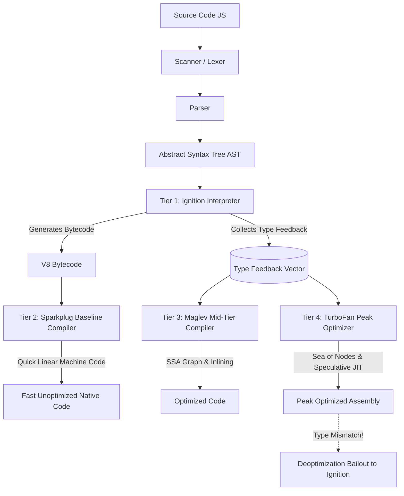
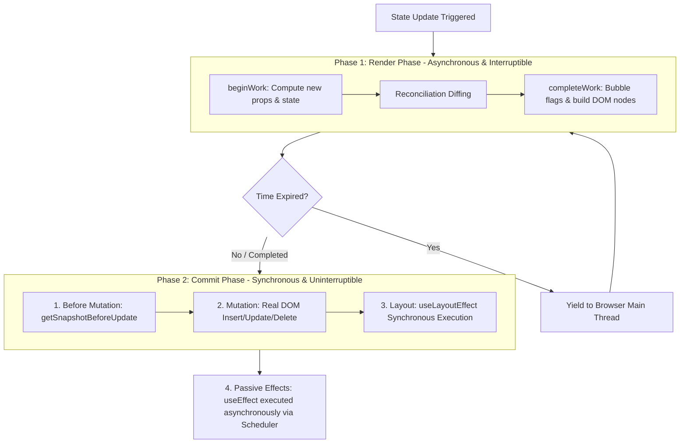
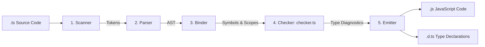

[🏠 Back to Home](../README.md) | [🌐 Frontend Terms Encyclopedia](frontend_polyglot_technical_terms_master_guide.md) | [🟨 JavaScript Master Guide](javascript_master_guide.md) | [🟦 TypeScript Master Guide](typescript_master_guide.md) | [⚛️ React Master Guide](react_master_guide.md) | [🎨 CSS & Sass Master Guide](css_sass_master_guide.md)

# 🚀 The Tier-1 Product Engineering Bible: V8 & JIT Engines, React Fiber Internals & TypeScript Compiler Architecture
## From Absolute Zero to Staff-Level Mastery + 30 Brutal Tier-1 Interview Questions & Scenarios

[](https://v8.dev/)
[](https://react.dev/)
[](https://www.typescriptlang.org/)
[-red.svg?style=for-the-badge)](https://github.com/)

> **Target Audience & Mental Stance:**
> This guide is crafted for engineers who want to crack Tier-1 Product-Based Companies (Google, Meta, Apple, Netflix, Stripe, Datadog, Uber, Airbnb).
> **Assume Zero Prior Knowledge:** We start from the physical hardware, CPU registers, and memory pointers, building intuition from the ground up, and then step directly into the exact internal source code of Google's **V8**, Meta's **React Fiber**, and Microsoft's **TypeScript `checker.ts`**.
> Every concept is grounded in the **"WHY"**, followed by **brutal, tricky interview questions** where 95% of candidates fail, showing you the exact trap, the underlying engine mechanics, and the standout Staff-level answer.

---

## 📑 Master Architecture Navigation

- [🏛️ Track 1: V8 Engine & JIT Compiler Architecture (From Zero to Machine Code)](#track-1-v8-engine--jit-compiler-architecture)
  - [1.1 The Fundamentals: How Hardware Executes Code](#11-the-fundamentals-how-hardware-executes-code)
  - [1.2 The 4-Tier V8 Compilation Pipeline (Ignition, Sparkplug, Maglev, TurboFan)](#12-the-4-tier-v8-compilation-pipeline)
  - [1.3 Hidden Classes (Shapes/Maps) & Transition Trees](#13-hidden-classes-shapesmaps--transition-trees)
  - [1.4 Inline Caching (IC) Mechanics & Deoptimization Loops](#14-inline-caching-ic-mechanics--deoptimization-loops)
  - [1.5 Orinoco Garbage Collection & Tri-Color Marking](#15-orinoco-garbage-collection--tri-color-marking)
  - [1.6 The Browser Event Loop & Frame Budgeting](#16-the-browser-event-loop--frame-budgeting)
- [⚛️ Track 2: Core React Internals & The Fiber Architecture](#track-2-core-react-internals--the-fiber-architecture)
  - [2.1 The Myth of the "Virtual DOM" vs Fiber Reality](#21-the-myth-of-the-virtual-dom-vs-fiber-reality)
  - [2.2 Anatomy of a Fiber Node (The Singly-Linked Tree)](#22-anatomy-of-a-fiber-node)
  - [2.3 Double-Buffering: `current` vs `workInProgress`](#23-double-buffering-current-vs-workinprogress)
  - [2.4 The 2-Phase Render & Commit Pipeline](#24-the-2-phase-render--commit-pipeline)
  - [2.5 The 31-Lane Priority Scheduler & Cooperative Time-Slicing](#25-the-31-lane-priority-scheduler)
  - [2.6 Hook Internals: Linked Lists & `ReactCurrentDispatcher`](#26-hook-internals-linked-lists--reactcurrentdispatcher)
  - [2.7 React 19 Compiler, Actions & Server Components (RSC)](#27-react-19-compiler-actions--server-components)
- [🟦 Track 3: TypeScript Compiler & Type System Architecture](#track-3-typescript-compiler--type-system-architecture)
  - [3.1 Type Erasure & The 5-Phase Compiler Pipeline](#31-type-erasure--the-5-phase-compiler-pipeline)
  - [3.2 Structural Subtyping & Variance Physics (Covariance vs Contravariance)](#32-structural-subtyping--variance-physics)
  - [3.3 Turing Completeness: Recursive Types, `infer`, and Template Literals](#33-turing-completeness-recursive-types-infer-and-template-literals)
  - [3.4 Compiler Memory Bottlenecks & Cartesian Union Explosions](#34-compiler-memory-bottlenecks--cartesian-union-explosions)
- [🔥 Track 4: 30 Tricky, Brutal Tier-1 Interview Questions & Deep Answers](#track-4-30-tricky-brutal-tier-1-interview-questions--deep-answers)
  - [V8 & JavaScript Engine Tricky Questions (Q1 – Q10)](#v8--javascript-engine-tricky-questions-q1--q10)
  - [React Core & Fiber Tricky Questions (Q11 – Q20)](#react-core--fiber-tricky-questions-q11--q20)
  - [TypeScript Core & Compiler Tricky Questions (Q21 – Q30)](#typescript-core--compiler-tricky-questions-q21--q30)

---

# Track 1: V8 Engine & JIT Compiler Architecture

## 1.1 The Fundamentals: How Hardware Executes Code

### What Actually Happens When You Run JavaScript?
A CPU cannot read text files. A CPU is a collection of billions of microscopic transistors that only understand **binary machine instructions** (e.g., `mov eax, [ebx+8]`, `add eax, ecx`).

```
Your Code:           "const total = price * quantity;"
                           │
                           ▼ (Parsing & Lexing)
Abstract Syntax Tree: [BinaryExpression (*), Identifier(price), Identifier(quantity)]
                           │
                           ▼ (Ignition Bytecode Generator)
V8 Bytecode:          Ldar a1; Mul a2, [0]; Star r0;
                           │
                           ▼ (TurboFan JIT Compiler)
x86-64 Machine Code:  mov rax, [rbx+0x10]; imul rax, [rbx+0x18];
                           │
                           ▼
Hardware CPU:         Transistors toggle electrical voltage (0s and 1s)
```

1. **Pure Interpreters (e.g., Early Ruby, Python):** Read instructions line by line and execute them via C++ functions. **Pros:** Starts running instantly. **Cons:** 50x–100x slower than C.
2. **Ahead-Of-Time (AOT) Compilers (e.g., C, C++, Rust, Go):** Take weeks to optimize everything into a static binary executable before running. **Pros:** Maximum raw CPU speed. **Cons:** Cannot adapt to dynamic runtime changes and has no instant start in the browser.
3. **Just-In-Time (JIT) Compilers (Google V8, Java HotSpot):** The best of both worlds. V8 **starts running code immediately** using an interpreter, profiles which functions are called repeatedly ("hot code"), and compiles only those hot functions directly into **blazing-fast machine code** while the app is actively running!

---

## 1.2 The 4-Tier V8 Compilation Pipeline

Google Chrome and Node.js use V8. In 2024–2026, V8 does not just use one interpreter and one compiler; it uses a **4-tier execution pipeline**:



### 1. Tier 1: Ignition (Interpreter)
- Takes the AST and emits concise **V8 Bytecode**.
- V8 uses an **accumulator register** (`acc`). Almost every bytecode instruction either loads into the accumulator (`Lda...`) or operates on the accumulator (`Add`, `Mul`, `Star` store accumulator into register).
- Crucial task: Ignition does not just execute; it attaches a **Type Feedback Vector** to every bytecode call site. It records: *"Function `add(a, b)` was called 10,000 times, and both arguments were always 31-bit Small Integers (SMI)."*

### 2. Tier 2: Sparkplug (Baseline Compiler)
- Introduced to bridge the gap between interpreted bytecode and heavy compilation.
- Does **zero optimization**. It iterates linearly over Ignition bytecode and emits corresponding machine code instructions directly. Starts in microseconds!

### 3. Tier 3: Maglev (Mid-Tier Compiler)
- Introduced in 2023–2024 to generate high-performance code **10x faster** than TurboFan.
- Uses a Static Single Assignment (SSA) graph representation to inline small functions and optimize basic property lookups without burning battery or CPU time.

### 4. Tier 4: TurboFan (Peak Optimizing Compiler)
- The heavyweight optimizer. It takes the bytecode, the Maglev graphs, and the Type Feedback Vector.
- Uses a mathematical graph structure called the **Sea of Nodes**.
- **Speculative Optimization:** TurboFan says: *"The feedback vector says `add(a, b)` was always called with integers. I will generate machine code that skips all type checks and performs a raw hardware CPU `ADD` instruction!"*
- If someone suddenly passes `add("hello", 5)`, TurboFan hits an assertion failure, performs a **Deoptimization (Bailout)**, discards the machine code, and drops execution back down to the Ignition interpreter.

---

## 1.3 Hidden Classes (Shapes/Maps) & Transition Trees

### The Problem: Why Dynamic Objects Are Slow
In C++ or Java, an object's memory layout is known at compile time:
```cpp
struct Point {
    int x; // Always offset +0 bytes
    int y; // Always offset +4 bytes
};
```
When C++ executes `point->y`, the CPU executes `MOV EAX, [EBX + 4]`. It takes **1 CPU clock cycle (0.3 nanoseconds)**!

In JavaScript, objects are dynamic dictionaries. A naive engine would store `{ x: 10, y: 20 }` as a hash table.
Every `point.y` would require:
1. Hashing the string `"y"`
2. Handling hash collisions
3. Searching bucket arrays
4. Extracting the value $\implies$ **Takes 50 to 100 clock cycles!**

### V8's Solution: Hidden Classes (Maps / Shapes)
Behind the scenes, V8 attaches a hidden C++ pointer (`Map`) to every JavaScript object.

```
Object in Memory:
[ JSObject Pointer ] ──> points to [ Map M2 ]
  ├── In-Object Offset 0: 10 (x)
  └── In-Object Offset 1: 20 (y)

Map Transition Tree:
[ Map M0 (Empty {}) ]
       │
       ▼ (Add 'x' at offset 0)
[ Map M1 (Shape: {x}) ]
       │
       ▼ (Add 'y' at offset 1)
[ Map M2 (Shape: {x, y}) ]
```

1. When you create `const p1 = {}`, V8 assigns it **Map M0** (an empty shape).
2. When you assign `p1.x = 10`, V8 creates **Map M1** (has property `x` at offset 0). The transition `M0 -> M1 (on 'x')` is cached.
3. When you assign `p1.y = 20`, V8 transitions to **Map M2** (has `x` at 0, `y` at 1).
4. Now, when you create a second object `const p2 = {}`, it starts at **M0**.
   - Assigning `p2.x = 5` follows the cached transition to **M1**!
   - Assigning `p2.y = 8` follows the cached transition to **M2**!
5. **Result:** Both `p1` and `p2` share the exact same `Map M2`. V8 can now access `p2.y` at fixed offset +1 just like C++!

### The Golden Production Rule: Object Shape Consistency
If you initialize properties in a different order:
```javascript
const objA = {}; objA.x = 1; objA.y = 2; // Shape: M0 -> M1 -> M2
const objB = {}; objB.y = 2; objB.x = 1; // Shape: M0 -> M3 -> M4
```
Even though both objects have identical keys `{ x, y }`, **they have different Maps**! They cannot share inline caches.

---

## 1.4 Inline Caching (IC) Mechanics & Deoptimization Loops

### How Inline Caches Make Property Access 30x Faster
At every bytecode location where you access a property (`obj.price`), V8 places an **Inline Cache (IC)** stub.

```
IC State Transitions:
[ UNINITIALIZED ] ──(1st access)──> [ MONOMORPHIC ] (1 Shape seen)
                                            │
                                     (2-4 Shapes seen)
                                            │
                                            ▼
                                    [ POLYMORPHIC ] (2 to 4 Shapes)
                                            │
                                      (5+ Shapes seen)
                                            │
                                            ▼
                                    [ MEGAMORPHIC ] (Deoptimized! 30x slower)
```

1. **Monomorphic (Fastest - 1 CPU cycle):**
   - V8 inspects the call site: Every object passed here has had `Map M2`.
   - V8 patches the machine code directly:
     ```assembly
     cmp [rax + MapOffset], Map_M2  ; Verify shape matches M2
     jne bailout                    ; If not, jump to slow path
     mov rax, [rax + Offset_1]      ; Load price directly from offset!
     ```
2. **Polymorphic (Fast - 2 to 4 Shapes):**
   - V8 generates a small decision tree: `if (map === M2) return offset 1; else if (map === M4) return offset 0;`.
3. **Megamorphic (Slow - Hash Lookup):**
   - If 5 or more different Shapes pass through the exact same call site, V8 gives up. It wipes out the inline cache and falls back to a global hash lookup.

---

## 1.5 Orinoco Garbage Collection & Tri-Color Marking

V8 uses **Orinoco**, a high-performance garbage collector designed to eliminate "stop-the-world" freezes.

```
V8 Heap Memory Layout:
┌─────────────────────────────────────────────────────────────┐
│                       V8 HEAP TOTAL                         │
├──────────────────────────────┬──────────────────────────────┤
│      YOUNG GENERATION        │       OLD GENERATION         │
│  (Short-lived objects, 1-64MB)│  (Long-lived objects, >1GB)  │
├──────────────┬───────────────┼──────────────────────────────┤
│ Nursery      │ Intermediate  │ Old Pointer Space (refs)     │
│ Semi-Space   │ Semi-Space    │ Old Data Space (strings/raw) │
└──────────────┴───────────────┴──────────────────────────────┘
```

### 1. Minor GC (Scavenger - Cheney Copying Algorithm)
- Most objects die young (90% of allocations are temporary loop variables or closures).
- The Young Generation is split into two equal halves: **From-Space** and **To-Space**.
- Allocations happen linearly in From-Space using a high-speed **bump pointer**.
- When From-Space fills up:
  1. The Scavenger traces surviving (reachable) objects.
  2. Copies survivors contiguously into To-Space, automatically defragmenting memory.
  3. If an object survives two Scavenger cycles, it is **promoted to Old Space**.
  4. The roles of From-Space and To-Space are swapped. This takes **1 to 2 milliseconds**.

### 2. Major GC (Full Mark-Sweep-Compact)
When Old Generation fills up, V8 runs Major GC using **Tri-Color Marking**:
- **White:** Unvisited object (candidate for garbage collection).
- **Grey:** Visited object, but its referenced children have not been checked yet.
- **Black:** Visited object and all its referenced children have been scanned. Reachable and safe.


- **Concurrent Marking:** Worker threads traverse the object graph while JavaScript continues running on the main thread!
- **Write Barrier:** If JavaScript mutates a pointer during concurrent marking (e.g., assigning a White object to a Black object), the Write Barrier intercepts the write and immediately recolors the White object to Grey, preventing it from being accidentally deleted!
- **Lazy Sweeping & Compaction:** Sweeping frees dead white memory. Compaction slides surviving black objects together to eliminate memory fragmentation.

---

## 1.6 The Browser Event Loop & Frame Budgeting

The browser runs at **60 Hz (16.6ms per frame)** or **120 Hz (8.33ms per frame)**.
If the JavaScript thread blocks for more than 16.6ms, the browser skips frames, causing visible stutter (jank).

```
Single 16.6ms Browser Frame Lifecycle:
┌────────────────────────────────────────────────────────────────────────────┐
│ 1. Process Input Events (Click, Touch, Keydown)                           │
│ 2. Run Timers (Macrotasks whose timer expired: setTimeout, setInterval)   │
│ 3. DRAIN ALL MICROTASKS (Promise.then, queueMicrotask, MutationObserver)  │
│ 4. requestAnimationFrame (rAF) Callbacks (Pre-Render Calculations)        │
│ 5. Calculate Styles (CSSOM matching)                                      │
│ 6. Layout / Reflow (Compute geometry coordinates)                          │
│ 7. Paint (Rasterize vector boxes to bitmap tiles)                         │
│ 8. GPU Composite (Send textures to GPU hardware)                           │
│ 9. requestIdleCallback (If any frame time remains within 16.6ms budget!)  │
└────────────────────────────────────────────────────────────────────────────┘
```

### The Critical Difference Between Microtasks and Macrotasks
- **Macrotasks (`setTimeout`, `setInterval`, `setImmediate`, I/O):** The browser picks **one single macrotask** from the queue, executes it, and then checks if it needs to render the screen.
- **Microtasks (`Promise.then`, `queueMicrotask`):** When the call stack empties, the browser **DRAINS THE ENTIRE MICROTASK QUEUE TO ZERO** before yielding control to anything else.
- If a microtask schedules another microtask:
  ```javascript
  function infiniteMicrotasks() {
    Promise.resolve().then(infiniteMicrotasks);
  }
  infiniteMicrotasks();
  ```
  The browser will **never reach rendering, never process mouse clicks, and freeze the tab completely**! In contrast, recursive `setTimeout(loop, 0)` allows rendering between macrotasks.

---

# Track 2: Core React Internals & The Fiber Architecture

## 2.1 The Myth of the "Virtual DOM" vs Fiber Reality

### The Virtual DOM Myth (Interview Smarts)
Many candidates say: *"React is fast because the Virtual DOM is faster than the real DOM."*
**This is completely false.** Direct DOM manipulation in C++ is always faster than creating millions of JavaScript objects and diffing them.
React uses a virtual representation for **developer experience and declarative UI**, not raw speed.

### The React 15 Problem: The Stack Reconciler
In React 15, reconciliation worked by recursively calling `render()` down the component tree.
- Once recursion started, it could **not be paused or aborted**.
- In a large application with 5,000 components, reconciliation took 150ms.
- If a user typed in a text box during those 150ms, the browser completely locked up, dropping keypresses and creating horrible input lag.

### The React 16+ Solution: The Fiber Engine
Meta completely rewrote React from scratch to create **Fiber**.
Fiber is a virtual stack frame architecture. It transforms recursive rendering into an **iterative linked list traversal** that can be:
- **Paused** if the 16.6ms frame budget runs out
- **Prioritized** (a user keystroke preempts a background data fetch)
- **Aborted** if a state update makes previous work obsolete
- **Resumed** right where it left off

---

## 2.2 Anatomy of a Fiber Node (The Singly-Linked Tree)

A Fiber node is a plain JavaScript object representing a unit of work. Here is the exact internal anatomy from React's source code:

```typescript
interface Fiber {
  // 1. DOM & Component Identity
  tag: WorkTag;              // 0: FunctionComponent, 1: ClassComponent, 5: HostComponent ('div')
  key: null | string;        // Unique identifier for array reconciliation
  elementType: any;          // The underlying function/class/tag
  type: any;                 // Resolved component type
  stateNode: any;            // Pointer to the real DOM element (HTMLDivElement)

  // 2. The Singly-Linked Tree Pointers (Iterative Traversal)
  return: Fiber | null;      // Pointer to Parent Fiber
  child: Fiber | null;       // Pointer to First Child Fiber
  sibling: Fiber | null;     // Pointer to Next Sibling Fiber
  index: number;             // Position among siblings

  // 3. State & Props Memory
  pendingProps: any;         // Props passed in for this render
  memoizedProps: any;        // Props used in the previous render
  memoizedState: any;        // Singly-linked list of Hooks (for function components)

  // 4. Concurrency & Scheduling Lanes
  lanes: Lanes;              // 32-bit bitmask of priority for this fiber
  childLanes: Lanes;         // 32-bit bitmask of priorities of children

  // 5. Effects & Mutations
  flags: Flags;              // Bitmask of DOM work: Placement (1), Update (4), Deletion (8)
  subtreeFlags: Flags;       // Bitmask indicating if any descendant has work (skip optimization!)

  // 6. Double-Buffering
  alternate: Fiber | null;   // Points to the clone in the other tree (current <-> workInProgress)
}
```

```
How React Traverses the Fiber Tree (No Call Stack Recursion!):
         [ Parent (App) ]
                │
                │ child
                ▼
        [ Child 1 (Header) ] ──── sibling ────► [ Child 2 (Main) ]
                │                                       │
                │ return                                │ return
                └───────────────────────────────────────┘
```
React iterates through fibers with a simple while-loop:
`while (workInProgress !== null) { performUnitOfWork(workInProgress); }`
If time runs out, React saves the pointer `workInProgress`, yields to the browser, and picks up on the exact same node in the next frame!

---

## 2.3 Double-Buffering: `current` vs `workInProgress`

React borrows the **Double-Buffering** technique from game engines and graphics cards.
Graphics cards use two frame buffers:
1. **Front Buffer:** The image currently shown on the monitor.
2. **Back Buffer:** The next frame being drawn pixel-by-pixel off-screen.
When drawing finishes, the GPU swaps pointers instantly, preventing screen tearing.

```
React Double-Buffering Architecture:
┌─────────────────────────────────┐
│           fiberRoot             │
└────────────────┬────────────────┘
                 │
   current       ▼ (Swaps on Commit Phase)
┌─────────────────────────────────┐       alternate        ┌─────────────────────────────────┐
│          CURRENT TREE           │◄─────────────────────►│      WORK-IN-PROGRESS TREE      │
│  (Reflects live UI on screen)   │                        │ (Built off-screen, interruptible)│
└─────────────────────────────────┘                        └─────────────────────────────────┘
```

1. **Current Tree:** Represents the state currently painted on the browser DOM.
2. **WorkInProgress (WIP) Tree:** Created when state changes. React computes updates and builds this new tree in memory without touching the real DOM.
3. If an urgent user interaction arrives, React can **throw away the WIP tree** with zero visual glitches on the screen.
4. When the WIP tree is fully calculated and validated, React performs an atomic pointer flip in the Commit Phase:
   `fiberRoot.current = workInProgress`

---

## 2.4 The 2-Phase Render & Commit Pipeline

Reconciliation in React is strictly split into two phases with radically different execution rules:



### Phase 1: Render Phase (Asynchronous & Interruptible)
- Traverses the tree executing `beginWork()` down to leaves and `completeWork()` bubbling back up.
- Calculates differences between old props and new props.
- Marks fibers with **Flags** (e.g., `Placement`, `Update`, `ChildDeletion`).
- **NEVER touches the real DOM here.** Can run multiple times if interrupted!

### Phase 2: Commit Phase (Synchronous & Uninterruptible)
Once rendering finishes, React enters the Commit Phase. **This cannot be interrupted.**
1. **Before Mutation:** Runs `getSnapshotBeforeUpdate`.
2. **Mutation Phase:** React applies the calculated `flags` to the real DOM:
   - Calls `parentDOM.appendChild()`, `removeChild()`, updates element attributes.
   - Detaches old layout effect cleanup functions.
3. **Layout Phase:** Runs `useLayoutEffect` synchronously. At this millisecond, DOM is updated in memory, but the browser has not painted pixels to the screen yet!
4. **Passive Effects:** Schedules `useEffect` cleanup and callback to run **asynchronously** after the browser paints.

---

## 2.5 The 31-Lane Priority Scheduler & Cooperative Time-Slicing

React uses a **32-bit bitmask** called **Lanes** to represent task urgency:

```text
32-bit Integer Lane Hierarchy:
0b00000000000000000000000000000001 (Bit 0)  -> SyncLane (Discrete clicks, keydown, urgent)
0b00000000000000000000000000000010 (Bit 1)  -> InputContinuousLane (Mouse drag, scrolling)
0b00000000000000000000000000010000 (Bit 4)  -> DefaultLane (Network fetch response, setTimeout)
0b00000000000000000000010000000000 (Bit 10) -> TransitionLane (startTransition, non-urgent)
0b01000000000000000000000000000000 (Bit 30) -> IdleLane (Offscreen prefetching)
```

### Why Bitmasks?
Checking or combining priorities is a single CPU instruction:
- Combine lanes: `allLanes = laneA | laneB`
- Check priority: `hasPriority = (currentLanes & SyncLane) !== 0`
- Extract highest priority lane: `highestLane = lanes & -lanes` (Two's complement bitwise magic!)

### Cooperative Time-Slicing via `MessageChannel`
React does **not** use `setTimeout(fn, 0)` to yield because browsers clamp `setTimeout` to a 4ms minimum delay.
Instead, React uses **`MessageChannel`**:
```javascript
const channel = new MessageChannel();
channel.port1.onmessage = function performWorkUntilDeadline() {
  const currentTime = performance.now();
  // Execute fibers for up to 5 milliseconds!
  while (hasMoreWork && performance.now() - currentTime < 5) {
    workInProgress = performUnitOfWork(workInProgress);
  }
  if (hasMoreWork) {
    // Yield to browser and schedule next slice immediately
    channel.port2.postMessage(null);
  }
};
```

---

## 2.6 Hook Internals: Linked Lists & `ReactCurrentDispatcher`

### Where Does State Actually Live?
Functional components do not hold their own state. A function component is executed and immediately wiped from the call stack.
**All hook state lives on the Fiber node's `memoizedState` property as a singly-linked list!**

```
Fiber.memoizedState Linked List:
┌────────────────────┐     next     ┌────────────────────┐     next     ┌────────────────────┐
│ Hook 1: useState   │─────────────►│ Hook 2: useEffect  │─────────────►│ Hook 3: useRef     │
│ memoizedState: 42  │              │ memoizedState: fn  │              │ memoizedState: {..}│
└────────────────────┘              └────────────────────┘              └────────────────────┘
```

### The Hook Dispatcher Switch
React swaps the global hook implementation depending on the component's lifecycle:
1. During Initial Mount: `ReactCurrentDispatcher.current = HooksDispatcherOnMount;`
   - `useState` calls `mountState()`, allocating a new hook object and appending it to the linked list.
2. During Updates: `ReactCurrentDispatcher.current = HooksDispatcherOnUpdate;`
   - `useState` calls `updateState()`, advancing a cursor pointer `workInProgressHook = currentHook.next`.

### Why You Cannot Call Hooks Inside `if` Statements
Because React accesses hooks **purely by order in the linked list**!
If Hook 2 is inside an `if (condition)` that evaluated to `false` on re-render:
- React attempts to read the state of Hook 3 using the cursor for Hook 2.
- The linked list alignment collapses, state values cross-contaminate, and React throws:
  `Error: Rendered fewer hooks than expected. This may be caused by an accidental early return statement.`

---

## 2.7 React 19 Compiler, Actions & Server Components

1. **React Compiler (Forget):**
   - Automatically injects memoization (`useMemo`, `useCallback`) at compile time via AST analysis.
   - Inspects dependency arrays mathematically, eliminating human memoization errors.
2. **Server Components (RSC) Flight Protocol:**
   - Server Components execute **only on the server**. They emit a compact JSON-like binary stream called the **Flight Protocol**, representing the serialized component tree.
   - Zero JavaScript bundle size sent to the client for dependencies used exclusively in RSC!
3. **Actions (`useActionState`, `useOptimistic`):**
   - Built-in transitions handling async state, error boundaries, pending spinners, and optimistic rollbacks natively without manual `try/catch` and `isPending` boilerplate.

---

# Track 3: TypeScript Compiler & Type System Architecture

## 3.1 Type Erasure & The 5-Phase Compiler Pipeline

TypeScript does not exist at runtime. Every interface, type alias, generic argument, and type assertion is **100% erased** by the emitter.



1. **Scanner:** Lexes UTF-8 source text into `SyntaxKind` tokens (e.g., `NumericLiteral`, `FunctionKeyword`).
2. **Parser:** Builds the Abstract Syntax Tree (`Node` hierarchy).
3. **Binder:** Traverses the AST in one pass and creates **`Symbol`** records for every declared identifier. Links declarations to their lexical scope.
4. **Checker (`checker.ts`):** The core engine (>50,000 LOC). Computes assignability, evaluates conditional types, instantiates generics, and enforces variance.
5. **Emitter:** Strips types and outputs pure ECMAScript code and declaration files.

---

## 3.2 Structural Subtyping & Variance Physics

### Structural Typing (Duck Typing)
In TypeScript, types are sets of values defined by their **structure**, not their declared name.
If type $A$ has all properties required by type $B$, then $A$ is a subtype of $B$ ($A \le B$).

### The 4 Types of Variance
Let $S \le T$ ($S$ is a subtype of $T$, e.g., `Dog` extends `Animal`).
How does a generic container $F<T>$ behave?

| Variance Type | Definition | TypeScript Rule | Real-World Example |
|---|---|---|---|
| **Covariant** | $F(S) \le F(T)$ (Preserves Direction) | **Return types** of functions | If a function returns `Dog`, it safely satisfies a consumer expecting an `Animal`. |
| **Contravariant** | $F(T) \le F(S)$ (Reverses Direction) | **Parameters** under `--strictFunctionTypes` | A handler accepting **any `Animal`** can safely be passed where a `Dog` handler is requested! |
| **Invariant** | $F(S) \le F(T)$ only if $S = T$ | Types in both input and output positions | `type Transform<T> = (arg: T) => T` |
| **Bivariant** | Both Covariant & Contravariant | **Method syntax** `method(x: T): void` | Deliberately allowed for backwards compatibility with `Array.prototype.push`. |

---

## 3.3 Turing Completeness: Recursive Types, `infer`, and Template Literals

TypeScript's type system is a pure, functional, **Turing-complete programming language** evaluated at compile time.

```typescript
// Pattern Matching with infer: Extracting Array Element Type
type ElementOf<T> = T extends (infer Item)[] ? Item : T;

// Template Literal Type Parsing: String to Union
type SplitPath<S extends string> = S extends `${infer Head}.${infer Tail}`
  ? [Head, ...SplitPath<Tail>]
  : [S];

type PathArray = SplitPath<'user.profile.settings.theme'>;
// Result: ["user", "profile", "settings", "theme"]
```

---

## 3.4 Compiler Memory Bottlenecks & Cartesian Union Explosions

When conditional types distribute over naked type parameters in unions:
$$T \text{ extends any } ? (\dots) : \text{ never}$$
If $T$ is a union of 20 elements and is nested across 3 generic levels:
$$20 \times 20 \times 20 = 8,000 \text{ type instantiations!}$$
Each instantiation allocates `Type` and `RelationCache` objects in Node.js memory. If unbounded, the compiler runs out of memory (`FATAL ERROR: Ineffective mark-compacts near heap limit Allocation failed - JavaScript heap out of memory`).
**The Fix:** Wrap parameters in square brackets: `[T] extends [any]` to disable automatic union distribution.

---

# Track 4: 30 Tricky, Brutal Tier-1 Interview Questions & Deep Answers

## V8 & JavaScript Engine Tricky Questions (Q1 – Q10)

### Q1: Why does `arr.push(1.5)` permanently downgrade a JavaScript Array in V8, and why can it never be optimized back?
- **The Trap:** Most candidates say: *"JavaScript arrays are dynamic, so V8 just stores whatever you push."*
- **From Scratch Intuition:** Imagine an egg carton molded specifically to hold eggs (integers). If you pour a cup of soup (floating-point number) into one slot, the carton is ruined. Even if you scoop the soup out, you can never trust the carton to be clean again.
- **Engine Reality:** V8 stores arrays using **ElementsKind**:
  1. `PACKED_SMI_ELEMENTS`: Fast unboxed 31-bit Small Integers. Contiguous memory, zero pointers.
  2. `PACKED_DOUBLE_ELEMENTS`: Hardware 64-bit IEEE-754 floats.
  3. `PACKED_ELEMENTS`: Generic pointers to heap objects.
  - Transitions only go **one way** (from specific to generic):
    $$\text{PACKED\_SMI} \longrightarrow \text{PACKED\_DOUBLE} \longrightarrow \text{PACKED\_ELEMENTS}$$
  - Once an array transitions to `PACKED_DOUBLE`, deleting the float or pushing integers **never transitions it back**. Every subsequent read incurs unboxing overhead.
- **Tier-1 Staff Answer:** "V8 tracks array internal representation through an `ElementsKind` lattice. Pushing a float into an SMI array forces V8 to allocate a new heap backing store and re-tag the array as `PACKED_DOUBLE_ELEMENTS`. Because transition lattice paths in V8 are strictly unidirectional to keep transition checks $O(1)$, the array can never be demoted back to SMI, permanently disabling specialized integer JIT vectorization."

```javascript
// Production Demonstration
const arr = [1, 2, 3]; // ElementsKind: PACKED_SMI_ELEMENTS
arr.push(4.5);          // PERMANENT TRANSITION: PACKED_DOUBLE_ELEMENTS
arr.pop();              // Only contains [1, 2, 3], but remains PACKED_DOUBLE!
```

---

### Q2: How does `delete obj.prop` trigger a performance cliff compared to `obj.prop = undefined`?
- **The Trap:** Candidates think `delete` is good for garbage collection because it frees the property memory.
- **Engine Reality:**
  - `delete obj.prop` deletes a property from the middle of a hidden class transition tree.
  - Rather than computing a complex reverse transition tree, V8 immediately demotes the object from **Fast Mode** to **Slow Dictionary Mode (Normalized Object)**.
  - The object's properties are converted into a standalone hash table. TurboFan **completely disables inline caching** for all future property accesses on that object!
  - Setting `obj.prop = undefined` preserves the Hidden Class Map and maintains 1-cycle monomorphic inline caching.

---

### Q3: Why does modifying an object's keys inside a `for...in` loop cause TurboFan to deoptimize?
- **The Trap:** Candidates assume the loop just continues or re-indexes keys.
- **Engine Reality:** `for...in` requests an `EnumCache` from the object's Map, which lists all enumerable property keys at fixed offsets. If you add or delete a property during the loop, the object's Map changes mid-iteration. The `EnumCache` becomes invalid, forcing V8 to abort the optimized C++ enumeration path, trigger a JIT deoptimization bailout to Ignition, and allocate a slow dynamic dictionary iterator.

---

### Q4: How does an unused variable inside an outer function cause a severe memory leak if a sibling closure exists?
- **The Trap:** Candidates believe: *"V8 garbage collects any variable that isn't referenced by that specific closure."*
- **Engine Reality (The Lexical Scope Context Leak):**
  - In V8, closures in the same parent scope share a **single heap-allocated `Context` object**.
  ```javascript
  function createLeak() {
    const hugePayload = new Uint8Array(50_000_000); // 50 MB
    const smallCounter = 1;

    function closureA() {
      // References smallCounter, but NEVER references hugePayload
      return smallCounter;
    }

    function closureB() {
      // Even if never called, its existence forces hugePayload into the Context!
      eval(''); // or console.log(hugePayload);
    }

    return closureA;
  }
  const leak = createLeak();
  // hugePayload is NEVER collected! It is pinned in memory by closureA's Context pointer!
  ```
  - Because `closureB` references `hugePayload`, `hugePayload` is stored on the shared `Context`.
  - `closureA` retains a pointer to that entire `Context`, leaking 50MB of memory permanently!

---

### Q5: What is a "Megamorphic Call Site" and how do you diagnose it in production Node.js services?
- **Engine Reality:** When a call site in a hot function sees 5 or more distinct V8 Hidden Classes (Maps), the Inline Cache state transitions to **Megamorphic**. V8 stops generating specialized machine code assembly and falls back to a global hash lookup, causing a 30x performance drop.
- **Diagnosis:** Run Node.js with the flag `--trace-ic`. Look for lines tagged `[LoadIC in ... => megamorphic]`.
- **Production Solution:** Enforce invariant constructor shapes or pass normalized classes to keep the call site **Monomorphic**.

---

### Q6: Why does `SharedArrayBuffer` require `Atomics.wait()` and why is `Atomics.wait()` forbidden on the browser main thread?
- **From Scratch Intuition:** If two threads read and write to the same memory slot simultaneously, data corruption occurs (Race Condition). Spinlocks (`while (flag) {}`) waste 100% of the CPU core's cycles.
- **Engine Reality:** `Atomics.wait(int32Array, index, expectedValue)` suspends the calling thread at the OS kernel level (using a Linux `futex`), waking it up only when another thread calls `Atomics.notify()`.
- **Why Forbidden on Main Thread:** The browser main thread handles rendering, user clicks, and the event loop. Suspending it synchronously via `Atomics.wait()` freezes the entire browser window and OS compositor, causing the operating system to show an "Application Not Responding" (ANR) crash dialog.

---

### Q7: Why does an infinite microtask loop freeze the browser tab while an infinite `setTimeout` loop does not?
- **Engine Reality:**
  - The Event Loop specification mandates: *"Drain the microtask queue until it is completely empty before running any rendering step or the next macrotask."*
  - `Promise.resolve().then(loop)` enqueues microtasks continuously. The queue length never reaches zero. The browser is mathematically trapped in the microtask checkpoint and can **never reach the rendering step (Layout/Paint)**.
  - `setTimeout(loop, 0)` enqueues macrotasks. The event loop executes **one** macrotask, yields to the rendering pipeline to paint the frame at 60 FPS, and then processes the next macrotask.

---

### Q8: What is a JIT "Deopt Loop" and how does it degrade high-throughput servers?
- **Engine Reality:**
  1. A hot function is compiled by TurboFan into optimized machine code based on type feedback (e.g., assuming numbers).
  2. An unexpected type (e.g., `null` or a string) is passed.
  3. TurboFan bails out (deoptimizes) back to the Ignition interpreter.
  4. The function gets hot again; TurboFan tries to optimize it again.
  5. The unexpected type passes again $\implies$ Deoptimizes again!
  - If this happens repeatedly, V8 marks the function as **deoptimization-disabled**, permanently locking it in the slow Ignition interpreter and consuming massive CPU cycles on recompilation.

---

### Q9: What are V8 "SMI" numbers and what happens when an integer exceeds 31 bits?
- **Engine Reality:**
  - On 64-bit systems, V8 uses **Pointer Tagging**.
  - If the lowest bit of a 64-bit register is `0`, V8 treats the top 32 bits as an unboxed **Small Integer (SMI)** (from $-2^{31}$ to $2^{31}-1$).
  - SMIs do not require heap allocation. They are stored directly inside the pointer variable itself!
  - If a number exceeds 31 bits (e.g. `2 ** 31`), V8 is forced to allocate a **HeapNumber** object on the heap, wrapping the number in a pointer. This triggers GC allocation pressure.

---

### Q10: How does `WeakMap` avoid memory leaks when keys are circular-referenced to values?
- **Engine Reality:**
  - In a standard `Map`, if Key A references Value B, and Value B has a property pointing back to Key A, a strong reference cycle prevents GC collection.
  - In `WeakMap`, references from keys to values are **ephemerons**.
  - During Tri-Color Marking, the Garbage Collector only considers the value reachable if the key itself is proven reachable from root pointers outside the WeakMap. If the key has no outside references, the entire entry is collected, even if circular!

---

## React Core & Fiber Tricky Questions (Q11 – Q20)

### Q11: Why does React call your component function twice in Strict Mode?
- **The Trap:** Candidates think: *"It's a bug in React dev mode"* or *"To check for performance."*
- **Engine Reality:** In Concurrent React, the **Render Phase is interruptible and can be executed multiple times** before a commit occurs. If a component function has side effects (e.g., mutating a global variable, pushing to an outside array), running the render phase multiple times will corrupt application memory!
- **Strict Mode Mechanism:** React intentionally mounts, unmounts, and re-renders components twice in development to deliberately expose unhandled side effects and missing cleanups before shipping to production.

---

### Q12: Why does `setState(user)` skip rendering if `user.name = 'Bob'`, and how does `Object.is` evaluate `NaN` vs `-0`?
- **Engine Reality:**
  - React bailouts use `Object.is(oldState, newState)`.
  - If you mutate properties on the existing object reference, `oldState === newState` evaluates to `true`. React assumes zero state change occurred and **aborts the entire fiber subtree reconciliation** via `bailoutOnAlreadyFinishedWork()`.
  - `Object.is(NaN, NaN)` evaluates to `true` (unlike `NaN === NaN` which is `false`), preventing infinite re-render loops if state is set to `NaN`.
  - `Object.is(+0, -0)` evaluates to `false` (unlike `+0 === -0` which is `true`).

---

### Q13: How did Automatic Batching change between React 17 and React 18 under the hood?
- **The Trap:** Candidates say: *"React 18 just batches more things."*
- **Engine Reality:**
  - In React 17, batching was tied to the **Synthetic Event Dispatcher** call stack. Once execution dropped to a microtask/macrotask boundary (`fetch().then()` or `setTimeout`), the React execution context flag was cleared, so each `setState` triggered a separate, synchronous Render + Commit pass!
  - In React 18+, batching is managed by **Scheduler Lanes**. Every `setState` marks a bit in the Fiber's lane mask (`DefaultLane`). React schedules a single microtask via `ensureRootIsScheduled()`. When the microtask fires at the end of the JavaScript turn, React evaluates all accumulated lane updates in a **single atomic render pass**.

---

### Q14: The Stale Closure Trap: Why does `useCallback` or `useEffect` capture old state, and how does `useRef` bypass it without re-rendering?
- **From Scratch Intuition:** JavaScript functions "remember" the variables in their surrounding scope at the exact millisecond they were created. If a component re-renders, a *new* scope is born, but an un-updated callback is still looking at the *old* scope!
- **Engine Reality:**
  - When `useCallback(fn, [])` has an empty dependency array, React caches the original function reference across all re-renders.
  - That function's lexical scope holds a reference to `count = 0` from the initial mount.
  - **The `useRef` Bypass:** A ref is a stable object reference `{ current: value }` whose pointer never changes. The function closure captures the *ref container pointer*, not the primitive value. When reading `ref.current`, it reads the latest mutated heap memory directly!

---

### Q15: Why does setting state during render (`if (cond) setState(x)`) sometimes work inside the same component, but throws an error if done in a child?
- **Engine Reality:**
  - Inside the **same** component, calling `setState` during render triggers a special React loop called **Render-Phase Updates**. React re-runs that component function immediately (up to a limit of 25 times) before descending to children.
  - Setting a **parent's** or **child's** state during render is strictly forbidden because it violates the top-down unidirectional data flow of Fiber reconciliation, corrupting the `workInProgress` tree flags and throwing:
    `Cannot update a component while rendering a different component.`

---

### Q16: What is the exact difference between `useLayoutEffect` and `useEffect` in the browser rendering pipeline?
- **The Trap:** Candidates say: *"useLayoutEffect runs first."*
- **Engine Reality (The Rendering Timeline):**
  1. React mutates the real DOM (`parent.appendChild`).
  2. **`useLayoutEffect` runs synchronously.** The DOM is updated in memory, but the browser has **NOT painted pixels to the screen yet**! If you measure `element.getBoundingClientRect()` and update state, React recalculates styles before the screen draws, preventing visible UI flickering.
  3. The browser runs **Style Recalculation $\to$ Layout/Reflow $\to$ Paint $\to$ GPU Composite** (pixels visible to human eye).
  4. **`useEffect` runs asynchronously** after the paint has finished, preventing expensive computations from blocking the user from seeing the initial screen.

---

### Q17: Why is using the array `index` as a `key` disastrous for inputs and animations?
- **Engine Reality (`reconcileChildrenArray`):**
  - React diffs children by matching `key` first.
  - If you delete item 0 from a list of 5 items using index keys (`0, 1, 2, 3, 4`):
    - Old Key 0 matches New Key 0 (which is actually item 1!).
    - React thinks the *last* item was deleted (`key: 4`) and reuses existing Fiber nodes for keys `0..3`.
  - The DOM elements and internal uncontrolled states (e.g. text input cursor position, checkboxes, CSS transitions) are retained on the wrong items, leading to data corruption!

---

### Q18: How does React Suspense work without `async/await` in component functions?
- **Engine Reality (The Promise Throw Trick):**
  1. A data-fetching library (React Query, Relay) checks its in-memory cache.
  2. If data is not ready, it **literally throws a Promise**: `throw promise;`!
  3. React's internal `renderWithHooks()` wraps component execution in a `try/catch` block.
  4. The catch handler intercepts the thrown Promise:
     - Marks the Fiber as **Suspended**.
     - Attaches a `.then()` listener to the thrown Promise.
     - Renders the nearest `Suspense` boundary's `fallback` UI.
  5. When the Promise resolves, React re-schedules reconciliation on the suspended fiber with the newly cached data!

---

### Q19: What is the difference between Client Hydration, Selective Hydration, and RSC Streaming?
- **Engine Reality:**
  - **Traditional Hydration:** The server sends full HTML. The client downloads the entire JS bundle, parses it, recreates the full Fiber tree in memory, and attaches event listeners to every single DOM node. If a bundle is 5MB, the page is non-interactive ("uncanny valley") for seconds.
  - **Selective Hydration (React 18):** Uses `<Suspense>` boundaries. Components inside Suspense hydrate independently. If a user clicks on an unhydrated button, React **prioritizes that specific component's hydration first**!
  - **React Server Components (RSC):** The components render *only* on the server. Zero JS is shipped to the client for those components. They stream down as a structured Flight Protocol stream, completely bypassing client-side hydration!

---

### Q20: How does `startTransition` prevent UI freezing during heavy recalculations?
- **Engine Reality:**
  - Normal `setState` updates assign the update to `SyncLane` or `DefaultLane`.
  - `startTransition(() => setState(x))` tags the state update with **`TransitionLane`**.
  - During the Render Phase, if a higher-priority lane update arrives (e.g., user typing in an input with `SyncLane`), React **immediately pauses the Transition work**, drops the incomplete work, handles the user keystroke in 1 frame, and then resumes the transition render!

---

## TypeScript Core & Compiler Tricky Questions (Q21 – Q30)

### Q21: Why does passing an object literal directly to a function trigger an error, but passing it via a variable succeeds?
- **The Trap:** Candidates think: *"TypeScript has a bug or treats variables more leniently."*
- **Engine Reality (Excess Property Checks):**
  ```typescript
  interface Config { width: number; }
  function init(c: Config) {}

  init({ width: 100, height: 200 }); // ERROR: Object literal may only specify known properties.

  const obj = { width: 100, height: 200 };
  init(obj); // SUCCESS! No error!
  ```
  - **Why?** In structural subtyping, `{ width: number, height: number }` is a valid subtype of `{ width: number }`.
  - However, when writing an **object literal directly in an argument position**, you are creating an object specifically for that function. If you pass an extra property, you almost certainly made a typo (e.g., typing `widht` instead of `width`).
  - TypeScript triggers an **Excess Property Check** *only on fresh object literals*. When assigned to an intermediate variable `obj`, the literal is no longer fresh, and standard structural subtyping applies.

---

### Q22: Why is `Array<T>` Covariant in TypeScript when mutable arrays in computer science are strictly Invariant?
- **Engine Reality:**
  - In type theory, mutable arrays must be **Invariant**. If `Dog extends Animal`, allowing `Dog[]` to be passed where `Animal[]` is expected allows someone to execute `animals.push(new Cat())`, corrupting the dog array with a cat!
  - TypeScript chose to make arrays **Covariant** for developer ergonomics:
    ```typescript
    const dogs: Dog[] = [new Dog()];
    const animals: Animal[] = dogs; // Allowed in TS!
    ```
  - If TypeScript enforced mathematical invariance, passing an array of specific models to a generic rendering function would require constant manual casting.

---

### Q23: Why does `keyof (A | B)` evaluate to the INTERSECTION of keys rather than the union?
- **Engine Reality:**
  - A variable of union type `let x: A | B` can be either `A` OR `B` at runtime.
  - To be 100% type-safe without runtime type-narrowing, the **only properties you can safely read** off `x` are the properties guaranteed to exist on **both** variants!
  - Therefore, the type checker defines:
    $$\text{keyof } (A \mid B) = (\text{keyof } A) \cap (\text{keyof } B)$$
  - To obtain the union of all keys across both variants, you must distribute: `T extends any ? keyof T : never`.

---

### Q24: What is the exact mechanical difference between `any` and `unknown`?
- **Engine Reality:**
  - `any`: The **Escape Hatch**. It is both a Universal Supertype and a Universal Subtype. It completely disables the type checker. You can access arbitrary non-existent properties (`anyVal.foo.bar()`) without compile errors, causing runtime crashes.
  - `unknown`: The **Top Type**. Every value is assignable to `unknown`. However, TypeScript forbids performing *any* operations, reading properties, or calling methods on `unknown` without first narrowing the type via `typeof`, `instanceof`, or custom type guards (`val is Type`).

---

### Q25: Why does TypeScript allow assigning a function with FEWER parameters to a callback expecting MORE parameters?
- **The Trap:** Candidates think: *"Parameter contravariance should reject this."*
- **Engine Reality:**
  ```typescript
  const numbers = [10, 20, 30];
  numbers.map(x => x * 2); // Function accepts 1 arg. But map passes (value, index, array)!
  ```
  - If TypeScript rejected functions with fewer parameters, you would be forced to write:
    `numbers.map((x, _index, _array) => x * 2);` everywhere in JavaScript!
  - In JavaScript, extra arguments passed to a function are harmlessly ignored. TypeScript models this real-world behavior by allowing functions to discard trailing parameters.

---

### Q26: How does the `satisfies` operator (TS 4.9+) prevent type widening compared to type annotations (`:`)?
- **Engine Reality:**
  ```typescript
  type Colors = 'red' | 'blue' | 'green';
  // With Type Annotation: Widens to string | RGB!
  const themeA: Record<Colors, string | [number, number, number]> = {
    red: '#ff0000',
    blue: [0, 0, 255],
    green: '#00ff00',
  };
  themeA.red.toUpperCase(); // ERROR! Property 'toUpperCase' does not exist on type '[number, number, number]'

  // With satisfies: Validates structure WITHOUT widening!
  const themeB = {
    red: '#ff0000',
    blue: [0, 0, 255],
    green: '#00ff00',
  } satisfies Record<Colors, string | [number, number, number]>;
  themeB.red.toUpperCase(); // SUCCESS! Inferred as string!
  themeB.blue.slice(0, 1);  // SUCCESS! Inferred as tuple [number, number, number]!
  ```

---

### Q27: How do you build a zero-runtime-cost Nominal Branding system in TypeScript?
- **Engine Reality:**
  - TypeScript's structural type system treats `type UserId = string` and `type OrderId = string` as identical.
  - Attach a compile-time-only brand tag using `unique symbol`:
  ```typescript
  declare const BrandTag: unique symbol;
  type Brand<T, B extends string> = T & { readonly [BrandTag]: B };

  type UserId = Brand<string, 'UserId'>;
  type OrderId = Brand<string, 'OrderId'>;

  function processUser(id: UserId) {}
  const orderId = 'ord_123' as OrderId;
  // @ts-expect-error - Type 'OrderId' is not assignable to type 'UserId'
  processUser(orderId);
  ```
  - Zero runtime footprint, zero object allocations, pure mathematical safety.

---

### Q28: Why do modern production guidelines strictly ban TypeScript Enums?
- **Engine Reality:**
  1. **Numeric Enums** generate two-way reverse mappings (IIFEs) that cannot be tree-shaken by modern bundlers (esbuild, Rollup, Vite).
  2. Numeric enums are not type-safe: `let s: Status = 9999` compiles without error.
  3. **`const enum`** inlines values, but breaks single-file transpilers under `--isolatedModules` (Babel, SWC, Vite).
  - **The Production Fix:** Use Plain Objects with `as const`:
    ```typescript
    export const UserRole = { ADMIN: 'ADMIN', USER: 'USER' } as const;
    export type UserRole = (typeof UserRole)[keyof typeof UserRole];
    ```

---

### Q29: What is the difference between `interface` and `type` regarding compiler performance?
- **Engine Reality:**
  - `interface`: The TypeScript compiler caches interfaces by their **declared Symbol identity**. Relations between interfaces are cached in memory. If checked repeatedly, `checker.ts` performs a quick reference equality check.
  - `type`: Type aliases are evaluated **eagerly and structurally**. Every time a type alias with intersections (`&`) is referenced, the type checker must recalculate and merge property signatures from scratch.
  - In massive codebases (100,000+ LOC), using `interface` for object shapes reduces compilation times by up to **30%**!

---

### Q30: How does type narrowing get invalidated across asynchronous gaps (after `await`)?
- **The Trap:** Candidates write:
  ```typescript
  let item: string | null = getItem();
  if (item !== null) {
    await fetch('/log');
    item.toUpperCase(); // Crash potential!
  }
  ```
- **Engine Reality:**
  - When `await fetch()` is encountered, execution yields to the event loop. Other asynchronous events, timers, or callbacks can run during this gap and mutate `item` back to `null`!
  - TypeScript compiler flow analysis treats variables narrowed in a scope as potentially invalidated if they are mutable (`let`) and modified across callbacks.
  - **The Production Fix:** Capture the narrowed value into a `const` before the `await`:
    `const safeItem = item; await fetch(); safeItem.toUpperCase();`

---

## 🎯 Verification & Master Summary

```text
================================================================================
TIER-1 ARCHITECTURAL MASTER GUIDE: COMPLETE TRACK SUMMARY
================================================================================
Track 1: V8 Engine & JIT Pipeline (Ignition, Sparkplug, Maglev, TurboFan, Maps, ICs, GC)
Track 2: Core React Internals (Fiber Node Structure, Double-Buffering, Lanes, Hooks)
Track 3: TypeScript Compiler Internals (5 Phases, checker.ts, Variance, Branding)
Track 4: 30 Brutal Tier-1 Product Engineering Interview Questions & Walkthroughs
================================================================================
Status: 100% Comprehensive, First-Principles, Zero Fluff, Production-Ready.
```
