# CompletableFuture & Asynchronous Orchestration: Enterprise Architecture Guide

> **Curriculum Milestone**: Module 01 - Java Core Engineering  
> **Topic Coverage**: CompletableFuture State Machine, Treiber Stack Completion Chains, Asynchronous Pipeline Composition, Multi-Future Coordination (`allOf`/`anyOf`), Timeout Resilience, Exception Bubbling, Thread Pool Isolation, and Loom Interoperability.  
> **Target Depth**: 50+ Progressive Technical Scenarios with Runtime Mechanics, Production Code Walkthroughs, Beginner Traps, and Real-World Outage Post-Mortems.

---

## Architecture Blueprint: The CompletableFuture State Machine

```mermaid
flowchart TB
    subgraph L4 ["Layer 4: Modern Asynchronous Resilience & Schedulers (Java 9 - 21+)"]
        direction LR
        O1["orTimeout(duration)<br/>(Fails with TimeoutException)"]
        O2["completeOnTimeout(fallback)<br/>(Completes with Default DTO)"]
        O3["exceptionallyCompose()<br/>(Async Error Recovery Pipeline)"]
        O4["Loom Virtual Threads<br/>(Executors.newVirtualThreadPerTaskExecutor)"]
    end

    subgraph L3 ["Layer 3: Multi-Stage Coordination & DAG Aggregation"]
        direction LR
        C1["allOf(F1...Fn) Barrier<br/>(Waits for complete array)"]
        C2["anyOf(F1...Fn) Race<br/>(Fastest speculative win)"]
        C3["thenCombine(F2, BiFunction)<br/>(Parallel Fan-In Aggregation)"]
        C4["thenCompose(Function)<br/>(Monadic flatMap Unwrapping)"]
    end

    subgraph L2 ["Layer 2: Pipeline Transformation & Exception Mechanics"]
        direction LR
        T1["thenApply / thenApplyAsync<br/>(Synchronous/Async Functor Map)"]
        T2["thenAccept / thenRun<br/>(Terminal Side-Effect Consumers)"]
        T3["handle / whenComplete<br/>(BiFunction / BiConsumer Interceptors)"]
        T4["AltResult Sentinel<br/>(Packages Throwable in CompletionException)"]
    end

    subgraph L1 ["Layer 1: Internal Runtime & Treiber Stack Mechanics"]
        direction LR
        S1["volatile Object result<br/>(CAS: nil -> Value | AltResult)"]
        S2["Lock-Free Treiber Stack<br/>(Head pointer to Completion nodes)"]
        S3["Completion Node Types<br/>UniApply, UniCompose, BiApply, CoCompletion"]
        S4["Dispatch Modes<br/>Inlined on Completer Thread vs Executor Dispatch"]
    end

    subgraph L0 ["Layer 0: Execution Substrate & Hardware Threading"]
        direction LR
        E1["Custom Bounded Thread Pools<br/>(ThreadPoolExecutor with ArrayBlockingQueue)"]
        E2["ForkJoinPool.commonPool()<br/>(Default work-stealing pool: CPU cores - 1)"]
        E3["OS Kernel Scheduling<br/>(Futex sleep, pthread_create, CPU cache line MESI)"]
    end

    L4 --> L3
    L3 --> L2
    L2 --> L1
    L1 --> L0

    classDef l4 fill:#1e1e2e,stroke:#cba6f7,stroke-width:2px,color:#cdd6f4;
    classDef l3 fill:#1e1e2e,stroke:#89b4fa,stroke-width:2px,color:#cdd6f4;
    classDef l2 fill:#1e1e2e,stroke:#a6e3a1,stroke-width:2px,color:#cdd6f4;
    classDef l1 fill:#1e1e2e,stroke:#f9e2af,stroke-width:2px,color:#cdd6f4;
    classDef l0 fill:#1e1e2e,stroke:#f38ba8,stroke-width:2px,color:#cdd6f4;

    class O1,O2,O3,O4 l4;
    class C1,C2,C3,C4 l3;
    class T1,T2,T3,T4 l2;
    class S1,S2,S3,S4 l1;
    class E1,E2,E3 l0;
```



#### Architectural Breakdown: The 5-Layer CompletableFuture Engineering Substrate

1. **Visual Architecture & Component Topology**:
   - **Layer 0 (Execution Substrate & Hardware Threading)**: Physical worker threads allocated via custom `ThreadPoolExecutor` or JVM-wide `ForkJoinPool.commonPool()`. Governed by OS kernel scheduling (`futex`, `clone` syscalls) and CPU L1/L2/L3 cache line MESI invalidation queues.
   - **Layer 1 (Internal Runtime & Treiber Stack Mechanics)**: The engine of `CompletableFuture`. Houses the volatile `result` field (which stores the computed value, `NIL` sentinel for null, or `AltResult` for exceptions) and a lock-free Treiber stack of `Completion` callback nodes (`UniApply`, `UniCompose`, `BiApply`, `CoCompletion`).
   - **Layer 2 (Pipeline Transformation & Exception Mechanics)**: Monadic mapping operations (`thenApply`), consumer sinks (`thenAccept`), and dual-outcome inspection stages (`handle`, `whenComplete`). Errors are automatically converted into `AltResult` objects, bypassing normal downstream execution until intercepted by an error boundary.
   - **Layer 3 (Multi-Stage Coordination & DAG Aggregation)**: Barrier primitives that fan-in multiple concurrent streams. `allOf` coordinates an array of futures via recursive countdown tree nodes; `anyOf` races tasks to completion; `thenCombine` joins two independent streams; `thenCompose` flattens nested asynchronous futures (`flatMap`).
   - **Layer 4 (Modern Asynchronous Resilience & Schedulers)**: Java 9+ timeout guards (`orTimeout`, `completeOnTimeout`), asynchronous error recovery (`exceptionallyCompose`), and seamless interop with Java 21 Project Loom virtual thread per task executors.

2. **Execution Flow & State Machine Dynamics**:
   - **Step 1: Ingestion & Registration**: When a callback is registered (e.g. `future.thenApply(fn)`), `CompletableFuture` checks if `result` is already non-null. If already complete, the callback executes immediately. If incomplete, a `UniApply` node is created and pushed onto the Treiber stack via CAS.
   - **Step 2: Atomic State Transition**: When the background producer finishes, it calls `complete(val)` or `completeExceptionally(ex)`. HotSpot executes an atomic CPU CAS instruction (`LOCK CMPXCHG`) to write `result`. Once written, the state is immutable.
   - **Step 3: Cascading Post-Complete**: The thread that successfully transitions `result` calls `postComplete()`. It pops nodes from the Treiber stack one by one. If the callback was registered with an `Async` suffix (`thenApplyAsync`), it submits the task to the designated `Executor`; if non-async (`thenApply`), it runs the callback **in-line on the completing thread**, eliminating context-switching overhead.

3. **Low-Level Kernel & JVM Mechanics**:
   - **Treiber Stack Lock-Free Concurrency**: Thread safety is achieved entirely without OS mutexes (`pthread_mutex`) or synchronized blocks. The head of the callback stack is a volatile reference (`stack`). Pushing a new stage invokes an optimistic CAS loop:
     `do { c.next = head; } while (!CAS(STACK, head, c));`. This ensures pipeline construction scales linearly with CPU cores.
   - **Volatile Write Memory Barriers**: Writing to `result` emits a `StoreStore` and `StoreLoad` CPU barrier instruction (`MFENCE` on x86). This ensures that all memory writes performed by the background worker thread prior to calling `complete()` are globally visible across all CPU caches before any consumer thread reads `result`.

4. **Production Failure Modes & SRE Diagnostics**:
   - **Thread Starvation via Default CommonPool**: Unconfigured `supplyAsync()` calls dump tasks into `ForkJoinPool.commonPool()`, which has only $\text{CPU cores} - 1$ threads. A single slow database query or remote API call blocks a common pool worker, causing cascading stalls across all parallel streams and async jobs in the JVM. SRE remediation: Always pass an explicit, bounded executor to every async invocation.
   - **Unbounded Queue Memory Bloat (OOM)**: Submitting tasks to an `ExecutorService` backed by an unbounded `LinkedBlockingQueue` allows millions of tasks to queue up during downstream outages, bloating the JVM heap and triggering container OOM (Exit Code 137). SRE mitigation: Use bounded `ArrayBlockingQueue` with an explicit rejection policy (`ThreadPoolExecutor.CallerRunsPolicy`).

<details>
<summary>View Legacy ASCII Blueprint</summary>

```text
+---------------------------------------------------------------------------------+
| Layer 4: Modern Asynchronous Orchestration (Java 9 - 21+)                       |
| - orTimeout(), completeOnTimeout(), exceptionallyCompose(), Virtual Threads     |
+---------------------------------------------------------------------------------+
| Layer 3: Multi-Stage Coordination & Aggregation                                |
| - allOf() Barrier, anyOf() Racing, BiCompletion (thenCombine, thenAcceptBoth)    |
| - Monadic Binding (thenCompose), Async Branching & Speculative Queries          |
+---------------------------------------------------------------------------------+
| Layer 2: Pipeline Transformation & Exception Mechanics                          |
| - thenApply (Map), thenAccept (Consume), handle(), whenComplete()               |
| - Exception Bubbling (CompletionException unwrap), AltResult Sentinels          |
+---------------------------------------------------------------------------------+
| Layer 1: Internal Runtime & Stack Mechanics (java.util.concurrent)              |
| - Treiber Stack of Completion Nodes (UniApply, UniCompose, BiRelay, CoCompletion)|
| - Execution Modes: Inlined on Caller/Completer Thread vs Dispatched Async       |
+---------------------------------------------------------------------------------+
| Layer 0: Execution Substrate                                                    |
| - Custom Bounded Thread Pools vs Shared ForkJoinPool.commonPool()               |
+---------------------------------------------------------------------------------+
```

</details>

---

## Section 1: Progressive Scenario-Based Master Q&A (50+ Scenarios)

### Tier 1: Core Async Fundamentals & Future Completion Mechanics (Q1 - Q16)

#### Q1: `Future<T>` vs `CompletableFuture<T>`: The Push vs Pull Paradigm

##### 1. Exact Scenario & Question
You are architecting an API gateway aggregation service that calls three downstream microservices (UserProfile, OrderHistory, CreditScore). A junior developer implements this using standard `java.util.concurrent.Future<T>` returned by an `ExecutorService`:
```java
Future<Profile> f1 = executor.submit(this::fetchProfile);
Future<Orders> f2 = executor.submit(this::fetchOrders);
Profile p = f1.get(); // Blocks thread!
Orders o = f2.get();  // Blocks thread!
```
Explain why this design collapses under high concurrency due to thread starvation and head-of-line blocking, and detail how `CompletableFuture` transitions from a **Pull-based blocking** model to a **Push-based event-driven** callback model.

##### 2. What the Interviewer Evaluates
- **Blocking vs Non-Blocking Physics**: Worker thread retention while waiting for network I/O.
- **Head-of-Line Blocking**: Sequential `get()` evaluation compounding latency.
- **Push vs Pull**: Inversion of control via registered completion triggers.

##### 3. Standout Technical Answer
1. **The Flaw of `Future<T>` (Pull-based)**:
   - Standard `Future<T>` provides no callback mechanism. The only way to retrieve a result is by calling `get()` or `get(timeout, unit)`, which **blocks the calling thread**.
   - **Head-of-Line Blocking**: If `f1` takes 1.9 seconds and `f2` takes 0.1 seconds, calling `f1.get()` blocks the thread for 1.9s before `f2.get()` is even evaluated, even though `f2` completed almost immediately.
   - **Thread Starvation**: In a web container with 200 worker threads, 200 concurrent requests waiting on `f1.get()` consume all 200 container threads. The server can accept zero new incoming connections, despite the CPU being 99% idle!
2. **The `CompletableFuture<T>` Revolution (Push-based)**:
   - `CompletableFuture` implements both `Future<T>` and `CompletionStage<T>`.
   - Instead of the caller thread blocking and waiting, the caller registers a transformation or callback (`thenApply`, `thenAccept`, `thenCombine`).
   - The caller thread immediately returns to the connection pool.
   - When the downstream I/O completes, the completing worker thread (or an async executor) **pushes** the result through the dependency graph, executing the callback without blocking any intermediary threads.

```java
import java.util.concurrent.CompletableFuture;

public class PushVsPullGateway {
    public record Dashboard(String profile, String orders) {}

    // PUSH-BASED NON-BLOCKING PIPELINE
    public CompletableFuture<Dashboard> getDashboardAsync(String userId) {
        CompletableFuture<String> profileFuture = CompletableFuture.supplyAsync(() -> fetchProfile(userId));
        CompletableFuture<String> ordersFuture  = CompletableFuture.supplyAsync(() -> fetchOrders(userId));

        // Asynchronously combines both results as soon as BOTH complete; ZERO blocking calls!
        return profileFuture.thenCombine(ordersFuture, Dashboard::new);
    }

    private String fetchProfile(String u) { return "Profile:" + u; }
    private String fetchOrders(String u) { return "Orders:" + u; }
}
```

##### 4. Follow-Up Trap Question & Winning Answer
- **Trap Question**: "Can a `CompletableFuture` be manually completed from outside the thread that initiated it?"
- **Winning Answer**: "Yes! That is why it is named *Completable*Future. It acts as a Promise. Any thread holding a reference to the `CompletableFuture` instance can invoke `future.complete(value)` or `future.completeExceptionally(throwable)`, immediately resolving the state machine and triggering all downstream dependent callbacks."

---

#### Q2: `CompletableFuture` Creation: `supplyAsync()` vs `runAsync()` vs Manual Promises

##### 1. Exact Scenario & Question
Compare the creation patterns of `CompletableFuture`:
1. `CompletableFuture.supplyAsync(Supplier<U>, Executor)`
2. `CompletableFuture.runAsync(Runnable, Executor)`
3. `CompletableFuture.completedFuture(U)` / `failedFuture(Throwable)`
4. `new CompletableFuture<T>()` as an asynchronous Promise.
Demonstrate how to adapt a legacy callback-based network client (e.g., asynchronous Netty channel or AWS SDK v1) into a modern `CompletableFuture<Response>` using manual promise completion.

##### 2. What the Interviewer Evaluates
- **Creation Semantics**: Returning values (`Supplier`) vs side-effects (`Runnable`).
- **Promise Pattern**: Bridging third-party event listeners to `CompletableFuture` via manual completion.
- **Pre-computed Results**: Optimizing fast-paths via `completedFuture()`.

##### 3. Standout Technical Answer
1. **Creation Matrix**:
   - `supplyAsync(Supplier<U>)`: Executes asynchronous compute on a thread pool and yields a typed value `CompletableFuture<U>`.
   - `runAsync(Runnable)`: Executes asynchronous tasks with no return value, producing `CompletableFuture<Void>`.
   - `completedFuture(value)`: Returns an already-completed future in $O(1)$ time; skips thread dispatch (ideal for cache hits).
2. **The Promise Adapter Pattern**:
   When wrapping legacy third-party listeners, instantiate an empty `new CompletableFuture<T>()` and trigger completion inside the listener callbacks:

```java
import java.util.concurrent.CompletableFuture;

public class LegacyCallbackAdapter {
    // Legacy third-party listener interface
    public interface NetworkCallback {
        void onSuccess(String responsePayload);
        void onError(Throwable cause);
    }

    public static class LegacyNetworkClient {
        public void executeRequest(String url, NetworkCallback callback) {
            // Simulating asynchronous network dispatch
            new Thread(() -> callback.onSuccess("HTTP 200 OK from " + url)).start();
        }
    }

    // MODERN ADAPTER: Converts callback to CompletableFuture
    public CompletableFuture<String> fetchAsync(LegacyNetworkClient client, String url) {
        CompletableFuture<String> promise = new CompletableFuture<>();

        client.executeRequest(url, new NetworkCallback() {
            @Override
            public void onSuccess(String responsePayload) {
                // Manually resolves the future, triggering all downstream thenApply stages
                promise.complete(responsePayload);
            }

            @Override
            public void onError(Throwable cause) {
                // Propagates exception downstream through handle/exceptionally
                promise.completeExceptionally(cause);
            }
        });

        return promise; // Non-blocking return
    }
}
```

##### 4. Follow-Up Trap Question & Winning Answer
- **Trap Question**: "What happens if two threads concurrently invoke `promise.complete(\"ValueA\")` and `promise.complete(\"ValueB\")` on the same `CompletableFuture`?"
- **Winning Answer**: "The operation is strictly atomic. The first thread to execute CAS transitions the internal state from `null` to `ValueA` and returns `true`. The second thread's `complete(\"ValueB\")` call fails, returns `false`, and is silently ignored. The future permanently retains `ValueA`, and downstream callbacks are executed exactly once."

---

#### Q3: Default Executor vs Custom Thread Pools: The `commonPool` Catastrophe

##### 1. Exact Scenario & Question
Why do static analysis tools (SonarQube, SpotBugs) flag `CompletableFuture.supplyAsync(supplier)` without an explicit `Executor` parameter as a critical architectural vulnerability? Detail the internal fallback mechanism of `CompletableFuture.ASYNC_POOL`, explain how `ForkJoinPool.commonPool()` is sized, and explain how a single slow database query executed via default `supplyAsync` can paralyze an entire enterprise application.

##### 2. What the Interviewer Evaluates
- **Default Thread Pool Allocation**: How `CompletableFuture` chooses `ForkJoinPool.commonPool()` vs `ThreadPerTaskExecutor`.
- **Parallelism Sizing**: `Runtime.getRuntime().availableProcessors() - 1`.
- **Blast Radius Containment**: Why compute pools must never be mixed with blocking I/O workloads.

##### 3. Standout Technical Answer
1. **The Fallback Mechanics**:
   If no executor is specified:
   ```java
   private static final Executor ASYNC_POOL = USE_COMMON_POOL ?
       ForkJoinPool.commonPool() : new ThreadPerTaskExecutor();
   ```
   If the host has $> 1$ CPU core, it defaults to `ForkJoinPool.commonPool()`.
2. **The Common Pool Contamination**:
   - `ForkJoinPool.commonPool()` has a fixed size of `CPU Cores - 1` (e.g., 3 threads on a 4-core container, 7 threads on an 8-core container).
   - This pool is **shared JVM-wide** across:
     - All unconfigured `CompletableFuture` calls.
     - All `parallelStream()` operations.
     - Core JDK internal asynchronous tasks.
3. **The Production Outage**:
   If an engineer writes `CompletableFuture.supplyAsync(() -> queryPostgreSql())`:
   - Under 10 concurrent requests where the database takes 1 second to respond, **all common pool threads are 100% blocked**.
   - Every other component in the application that uses `CompletableFuture` or `parallelStream()` stalls completely.
   - The application freezes while CPU utilization sits at 1%.

```java
import java.util.concurrent.*;

public class ProductionAsyncExecutorFactory {
    // RULE: Always provide a dedicated, isolated, bounded ThreadPoolExecutor
    public static final ExecutorService IO_EXECUTOR = new ThreadPoolExecutor(
        16, 64, 60L, TimeUnit.SECONDS,
        new ArrayBlockingQueue<>(1000),
        new NamedThreadFactory("io-async-worker-"),
        new ThreadPoolExecutor.CallerRunsPolicy()
    );

    public static CompletableFuture<String> safeFetch(String query) {
        // ALWAYS pass explicit isolated executor!
        return CompletableFuture.supplyAsync(() -> executeQuery(query), IO_EXECUTOR);
    }

    private static String executeQuery(String q) { return "Result"; }
    
    private record NamedThreadFactory(String prefix) implements ThreadFactory {
        private static int count = 0;
        @Override public synchronized Thread newThread(Runnable r) {
            return new Thread(r, prefix + (++count));
        }
    }
}
```

##### 4. Follow-Up Trap Question & Winning Answer
- **Trap Question**: "If a machine has only 1 single CPU core, what does `CompletableFuture.supplyAsync(supplier)` use as its default executor?"
- **Winning Answer**: "If `Runtime.getRuntime().availableProcessors() <= 1`, HotSpot determines that `ForkJoinPool.commonPool()` cannot support parallel work-stealing. It sets `USE_COMMON_POOL = false` and falls back to `ThreadPerTaskExecutor`, which spawns a **brand-new native OS thread for every single asynchronous task**! Under high traffic on a 1-core container, this creates thousands of threads and immediately crashes the JVM with `OutOfMemoryError: unable to create native thread`."

---

#### Q4: Synchronous vs Asynchronous Stage Execution: `thenApply` vs `thenApplyAsync`

##### 1. Exact Scenario & Question
Consider the pipeline:
```java
CompletableFuture<Integer> stage1 = CompletableFuture.supplyAsync(this::compute, executor);
CompletableFuture<String> stage2 = stage1.thenApply(this::format);
```
Which thread executes `stage2` (`format`)? Can it execute on the calling thread, the worker thread from `executor`, or a completely different thread? Detail the exact thread-selection logic inside `CompletableFuture.postComplete()`, and contrast it with `thenApplyAsync(format, executor)`.

##### 2. What the Interviewer Evaluates
- **Execution Thread Nondeterminism**: Why `thenApply` thread execution depends on race conditions at runtime.
- **Stack Inlining Optimization**: How synchronous stages avoid thread context switches when predecessor is already done.
- **Async Stage Offloading**: How `*Async` methods guarantee dispatch to an executor.

##### 3. Standout Technical Answer
1. **The Thread Selection Race in `thenApply()`**:
   The thread that executes `this::format` is **non-deterministic** and depends on timing:
   - **Case 1 (Predecessor Still Running)**: If `stage1` is still executing when `thenApply(format)` is called, the callback is pushed to `stage1`'s internal completion stack. When `stage1` finishes, the **worker thread from `executor`** executes `format()`.
   - **Case 2 (Predecessor Already Completed)**: If `stage1` has already finished *before* `thenApply(format)` is registered, HotSpot optimizes by **inlining execution directly on the CALLING thread** (e.g., the HTTP request thread)!
   - **Case 3 (Nested Completion)**: It can even execute on a thread that called `complete()` from an external listener.
   - **Hazard**: If `format()` is an expensive or blocking operation, calling `thenApply()` can accidentally block your HTTP container thread!
2. **The Guarantee of `thenApplyAsync()`**:
   `thenApplyAsync(this::format, customExecutor)` guarantees that `format()` will **NEVER** execute on the calling thread and will **NEVER** execute inline on the predecessor's thread. It is unconditionally submitted as a new task to `customExecutor`, guaranteeing thread isolation and predictable execution context.

```java
import java.util.concurrent.CompletableFuture;
import java.util.concurrent.Executors;

public class ThreadExecutionInspection {
    public static void main(String[] args) throws Exception {
        var pool = Executors.newFixedThreadPool(2);

        CompletableFuture<String> future = new CompletableFuture<>();

        // Registered BEFORE completion:
        CompletableFuture<Void> stage = future.thenApply(val -> {
            System.out.println("thenApply executed by Thread: " + Thread.currentThread().getName());
            return val.toUpperCase();
        }).thenAccept(val -> {});

        // Main thread completes future:
        System.out.println("Completing future on thread: " + Thread.currentThread().getName());
        future.complete("payload"); 
        // Notice: thenApply prints "Thread: main"! It inlined on the completing thread!
        pool.shutdown();
    }
}
```

##### 4. Follow-Up Trap Question & Winning Answer
- **Trap Question**: "If `stage1.thenApplyAsync(format)` is called without passing an executor, which executor does it use?"
- **Winning Answer**: "It falls back to the default `ForkJoinPool.commonPool()`, re-introducing all the common-pool thread starvation risks discussed in Q3! Always pass the explicit target executor: `thenApplyAsync(format, customExecutor)`."

---

#### Q5: Monadic Transformation vs Composition: `thenApply` vs `thenCompose`

##### 1. Exact Scenario & Question
Compare `thenApply` and `thenCompose`. In functional programming terms, explain why `thenApply` corresponds to `map` (Functor) while `thenCompose` corresponds to `flatMap` (Monad). Given an asynchronous authentication service where `fetchUser(id)` returns `CompletableFuture<User>` and `fetchPermissions(user)` returns `CompletableFuture<List<Permission>>`, write both implementations and explain why using `thenApply` results in a nested `CompletableFuture<CompletableFuture<List<Permission>>>` nightmare.

##### 2. What the Interviewer Evaluates
- **Functional Monadic Bind**: Flattening nested asynchronous contexts.
- **Type Signature Fluency**: `Function<T, U>` vs `Function<T, CompletionStage<U>>`.
- **Pipeline Readability**: Avoiding nested `.get().get()` anti-patterns.

##### 3. Standout Technical Answer
1. **The Type Signature Distinction**:
   - `thenApply(Function<T, U>)`: Maps value $T \to U$. Returns `CompletableFuture<U>`.
     If the mapping function itself returns an asynchronous future (`Function<T, CompletableFuture<U>>`), `thenApply` produces:
     `CompletableFuture<CompletableFuture<U>>` (Nested future).
   - `thenCompose(Function<T, CompletionStage<U>>)`: Maps value $T \to \text{Future}(U)$, but **flattens** the result. It waits for the inner future to resolve and returns `CompletableFuture<U>`.
2. **Production Comparison**:

```java
import java.util.List;
import java.util.concurrent.CompletableFuture;

public class MapVsFlatMapDemo {
    public record User(String id) {}
    public record Permission(String role) {}

    public CompletableFuture<User> fetchUserAsync(String id) {
        return CompletableFuture.supplyAsync(() -> new User(id));
    }

    public CompletableFuture<List<Permission>> fetchPermissionsAsync(User user) {
        return CompletableFuture.supplyAsync(() -> List.of(new Permission("ADMIN")));
    }

    public void demonstrate() {
        String userId = "usr-123";

        // ANTI-PATTERN: thenApply produces nested futures (CompletableFuture<CompletableFuture<List>>)
        CompletableFuture<CompletableFuture<List<Permission>>> nested = 
            fetchUserAsync(userId).thenApply(user -> fetchPermissionsAsync(user));

        // CLEAN IDIOMATIC PATTERN: thenCompose flattens the async pipeline into CompletableFuture<List>
        CompletableFuture<List<Permission>> flattened = 
            fetchUserAsync(userId).thenCompose(user -> fetchPermissionsAsync(user));

        flattened.thenAccept(perms -> System.out.println("Permissions: " + perms));
    }
}
```

##### 4. Follow-Up Trap Question & Winning Answer
- **Trap Question**: "In `stage1.thenCompose(user -> stage2(user))`, if `stage1` completes exceptionally, does the lambda inside `thenCompose` ever execute?"
- **Winning Answer**: "No! If `stage1` completes exceptionally with an error (e.g., `UserNotFoundException`), the lambda inside `thenCompose` is completely bypassed. The exception bypasses all intermediate `thenApply` and `thenCompose` stages and bubbles directly down to the nearest `exceptionally()`, `handle()`, or `whenComplete()` stage."

---

#### Q6: Pairwise Async Combination: `thenCombine` vs `thenAcceptBoth` vs `runAfterBoth`

##### 1. Exact Scenario & Question
Compare the three pairwise combination methods in `CompletableFuture`:
1. `thenCombine(other, BiFunction<T, U, V>)`
2. `thenAcceptBoth(other, BiConsumer<T, U>)`
3. `runAfterBoth(other, Runnable)`
Explain the internal `BiCompletion` node architecture, explain how HotSpot determines which of the two completed futures triggers execution of the callback, and implement a parallel price quote aggregator.

##### 2. What the Interviewer Evaluates
- **Bilateral Synchronization**: Waiting for two independent futures to resolve.
- **Return Type Mapping**: Transforming to new value (`BiFunction`) vs consuming (`BiConsumer`) vs signaling (`Runnable`).
- **Internal `BiRelay` / `CoCompletion` Mechanics**: Symmetric completion dependency graphs.

##### 3. Standout Technical Answer
1. **The Three Variants**:
   - `thenCombine`: Waits for **both** futures to complete; takes both results and returns a new computed value `CompletableFuture<V>`.
   - `thenAcceptBoth`: Waits for **both**; consumes both results via a `BiConsumer`, returning `CompletableFuture<Void>`.
   - `runAfterBoth`: Waits for **both**; does not care about results, runs a `Runnable`, returning `CompletableFuture<Void>`.
2. **Under the Hood (`BiCompletion`)**:
   - When `f1.thenCombine(f2, fn)` is called, a `BiCompletion` node is instantiated.
   - It registers a `CoCompletion` listener on `f1` and a `CoCompletion` listener on `f2`.
   - Whichever future finishes first records its result and returns.
   - Whichever future finishes **second** detects that its sibling has already completed, unrolls the `BiCompletion` node, extracts both results, and executes the `BiFunction`.

```java
import java.util.concurrent.CompletableFuture;
import java.util.concurrent.ExecutorService;
import java.util.concurrent.Executors;

public class ParallelQuoteAggregator {
    private final ExecutorService pool = Executors.newFixedThreadPool(4);

    public record Quote(String vendor, double price) {}
    public record BestDeal(Quote winner, double savings) {}

    public CompletableFuture<BestDeal> findBestDeal(String itemId) {
        CompletableFuture<Quote> quoteA = CompletableFuture.supplyAsync(() -> queryVendorA(itemId), pool);
        CompletableFuture<Quote> quoteB = CompletableFuture.supplyAsync(() -> queryVendorB(itemId), pool);

        // Runs both in parallel; combines results when both complete
        return quoteA.thenCombine(quoteB, (qA, qB) -> {
            if (qA.price() < qB.price()) {
                return new BestDeal(qA, qB.price() - qA.price());
            } else {
                return new BestDeal(qB, qA.price() - qB.price());
            }
        });
    }

    private Quote queryVendorA(String id) { return new Quote("VendorA", 95.0); }
    private Quote queryVendorB(String id) { return new Quote("VendorB", 100.0); }
}
```

##### 4. Follow-Up Trap Question & Winning Answer
- **Trap Question**: "If `quoteA` throws an exception, but `quoteB` succeeds, does the `thenCombine` callback execute?"
- **Winning Answer**: "No. If either future completes exceptionally, the combined future immediately completes exceptionally with the same error. The successful result from `quoteB` is discarded."

---

#### Q7: Racing Futures: `applyToEither` vs `acceptEither` vs `runAfterEither`

##### 1. Exact Scenario & Question
You are implementing a DNS resolution service or high-availability cache query. You query Cache Replica 1 in US-East and Cache Replica 2 in US-West concurrently. Whichever replica returns first should be used to render the response immediately; the slower response should be ignored. Compare `applyToEither`, `acceptEither`, and `runAfterEither`, explain how the internal `OrCompletion` node prevents duplicate execution, and implement the speculative query pattern.

##### 2. What the Interviewer Evaluates
- **Speculative Execution (Hedging)**: Racing multiple identical requests to reduce p99 tail latency.
- **Fastest-Wins Semantics**: Atomic first-completion arbitration.
- **Resource Management**: Preventing slow losers from triggering superfluous callbacks.

##### 3. Standout Technical Answer
1. **The Racing Methods**:
   - `applyToEither(other, Function<T, V>)`: Whichever completes first passes its value to `Function`, returning `CompletableFuture<V>`.
   - `acceptEither(other, Consumer<T>)`: Whichever completes first passes its value to `Consumer`, returning `CompletableFuture<Void>`.
   - `runAfterEither(other, Runnable)`: Whichever completes first triggers `Runnable`, returning `CompletableFuture<Void>`.
2. **Internal `OrCompletion` Mechanics**:
   When `f1.applyToEither(f2, fn)` is registered:
   - An `OrCompletion` node is attached to both `f1` and `f2`.
   - When the fastest future completes, it executes a CAS to transition the `OrCompletion` node's status to claimed.
   - The winner invokes the callback `fn` and completes the downstream future.
   - When the slower future finishes seconds later, its CAS fails; it detects that the `OrCompletion` node was already claimed, and **discards its result completely**.

```java
import java.util.concurrent.CompletableFuture;

public class SpeculativeCacheReader {
    public CompletableFuture<String> readFastestReplica(String key) {
        CompletableFuture<String> usEastQuery = CompletableFuture.supplyAsync(() -> queryUsEast(key));
        CompletableFuture<String> usWestQuery = CompletableFuture.supplyAsync(() -> queryUsWest(key));

        // Returns result of whichever datacenter responds first!
        return usEastQuery.applyToEither(usWestQuery, fastestResult -> {
            System.out.println("Fastest replica responded with: " + fastestResult);
            return fastestResult;
        });
    }

    private String queryUsEast(String k) { return "DataFromEast"; }
    private String queryUsWest(String k) { return "DataFromWest"; }
}
```

##### 4. Follow-Up Trap Question & Winning Answer
- **Trap Question**: "If `f1` throws an exception, does `applyToEither` wait for `f2` to succeed, or does it fail immediately?"
- **Winning Answer**: "If `f1` finishes first with an exception, the entire either-stage **fails immediately with that exception**! It does NOT automatically fall back to wait for `f2`. If you need fallback semantics (try A, if A fails try B), you must use `exceptionallyCompose()` or custom error recovery rather than `applyToEither`."

---

#### Q8: `CompletableFuture.allOf()`: Multi-Stage Barrier & Result Extraction

##### 1. Exact Scenario & Question
Explain why `CompletableFuture.allOf(f1, f2, f3)` returns `CompletableFuture<Void>` instead of `CompletableFuture<List<T>>`. Detail why calling `allOf()` does NOT return the values of the completed futures, write a production-grade utility method `allAsList(List<CompletableFuture<T>>)` that extracts all typed results without blocking, and analyze its exception aggregation behavior.

##### 2. What the Interviewer Evaluates
- **Type Erasure & Heterogeneity**: Why `allOf()` accepts varargs of heterogeneous types (`CompletableFuture<?>...`), forcing a `Void` return type.
- **Non-Blocking Extraction**: Using `f.join()` safely inside `thenApply` only after `allOf` has guaranteed all tasks are complete.
- **Exception Masking**: Why `allOf` only exposes the first encountered exception.

##### 3. Standout Technical Answer
1. **Why `CompletableFuture<Void>`?**:
   `CompletableFuture.allOf()` accepts heterogeneous futures with completely different return types:
   `CompletableFuture.allOf(futureString, futureInteger, futureUser)`.
   Because Java's type system cannot express a heterogeneous tuple `Tuple3<String, Integer, User>` in a generic method signature, the JDK designers returned `CompletableFuture<Void>`.
2. **Safe Non-Blocking Extraction**:
   Because `allOf` guarantees that all sub-futures are complete before its downstream stage runs, calling `.join()` on any sub-future inside the downstream callback is **guaranteed to never block!**

```java
import java.util.List;
import java.util.concurrent.CompletableFuture;

public class TypedAllOfAggregator {
    public static <T> CompletableFuture<List<T>> allAsList(List<CompletableFuture<T>> futures) {
        // Step 1: Create allOf barrier across all input futures
        CompletableFuture<Void> allBarrier = CompletableFuture.allOf(
            futures.toArray(new CompletableFuture[0])
        );

        // Step 2: Once the barrier resolves, stream and map using join()
        return allBarrier.thenApply(ignoredVoid -> 
            futures.stream()
                   // join() is 100% non-blocking here because allOf has already completed!
                   .map(CompletableFuture::join)
                   .toList()
        );
    }
}
```

##### 4. Follow-Up Trap Question & Winning Answer
- **Trap Question**: "If 3 out of 10 futures in `allOf()` fail with exceptions, how many exceptions does `allOf().join()` throw?"
- **Winning Answer**: "`allOf().join()` throws a `CompletionException` wrapping **only one** of the failures (arbitrarily chosen based on completion order). The other 2 exceptions are suppressed. To inspect all failures without losing root causes, you must iterate over the individual futures and inspect their `.isCompletedExceptionally()` status."

---

#### Q9: `CompletableFuture.anyOf()`: First-Completed Multi-Branch Racing

##### 1. Exact Scenario & Question
Compare `CompletableFuture.anyOf()` with `allOf()`. Explain why `anyOf()` returns `CompletableFuture<Object>`, how to safely downcast the resulting payload, and demonstrate how to use `anyOf()` with a synthetic timeout future to implement an asynchronous SLA circuit breaker.

##### 2. What the Interviewer Evaluates
- **Any-Of Semantics**: Resolves as soon as the first future completes (either normally or exceptionally).
- **Heterogeneous Object Downcasting**: Safe typing strategies.
- **Timeout Synthesis**: Creating timer futures to cancel slow operations before Java 9's `orTimeout()`.

##### 3. Standout Technical Answer
1. **`anyOf()` Semantics**:
   `CompletableFuture.anyOf(f1, f2, f3)` completes as soon as **any single one** of the underlying futures completes, returning `CompletableFuture<Object>`.
   - If the fastest future completes normally, `anyOf` completes normally with that value.
   - If the fastest future completes exceptionally, `anyOf` completes exceptionally with that exception.
2. **SLA Circuit Breaker Pattern**:

```java
import java.util.concurrent.*;

public class SpeculativeSLABreaker {
    private static final ScheduledExecutorService SCHEDULER = 
        Executors.newSingleThreadScheduledExecutor();

    public static <T> CompletableFuture<T> withTimeoutFallback(
            CompletableFuture<T> primaryTask, long timeoutMs, T fallbackValue) {
        
        // Synthetic timeout future
        CompletableFuture<T> timeoutFuture = new CompletableFuture<>();
        SCHEDULER.schedule(() -> {
            timeoutFuture.complete(fallbackValue);
        }, timeoutMs, TimeUnit.MILLISECONDS);

        // Race primary task against synthetic timeout future
        return CompletableFuture.anyOf(primaryTask, timeoutFuture)
            .thenApply(result -> (T) result); // Safe cast: both yield type T
    }
}
```

##### 4. Follow-Up Trap Question & Winning Answer
- **Trap Question**: "When `anyOf()` resolves with the fastest future, are the remaining slower futures automatically cancelled?"
- **Winning Answer**: "No! `anyOf()` does **NOT** cancel the slower sibling futures. They will continue executing on their respective thread pools in the background to completion, consuming CPU, memory, and database connections unless you explicitly iterate over them and invoke `f.cancel(true)`."

---

#### Q10: Exception Handling Hierarchy: `exceptionally()` vs `handle()` vs `whenComplete()`

##### 1. Exact Scenario & Question
Compare the three primary exception-handling methods in `CompletableFuture`:
1. `exceptionally(Function<Throwable, T>)`
2. `handle(BiFunction<T, Throwable, R>)`
3. `whenComplete(BiConsumer<T, Throwable>)`
Detail when each is invoked, whether they can recover from errors, how they alter the return type of the pipeline, and explain why exceptions inside `CompletableFuture` are wrapped in `CompletionException`.

##### 2. What the Interviewer Evaluates
- **Error Recovery vs Pure Notification**: Transforming errors to fallback values (`handle`/`exceptionally`) vs side-effect observation (`whenComplete`).
- **Return Type Mutation**: `handle` can transform $T \to R$; `whenComplete` preserves $T$.
- **Unwrapping Mechanics**: Stripping `CompletionException` or `ExecutionException` to inspect root causes.

##### 3. Standout Technical Answer

| Method | Invocation Trigger | Can Recover / Return Fallback? | Can Mutate Result Type? | Downstream Receives |
|---|---|---|---|---|
| **`exceptionally(fn)`** | **Only** if predecessor failed exceptionally. | **YES**. Returns fallback value of type $T$. | No (must return $T$). | Recovered value or original success value. |
| **`handle(biFn)`** | **Always** (on success OR exception). | **YES**. Can return fallback or re-throw. | **YES** (maps $T \to R$). | Whatever `biFn` returns. |
| **`whenComplete(biConsumer)`** | **Always** (on success OR exception). | **NO** (side-effects only, e.g. logging). | **NO** (returns `Void`). | Unaltered predecessor result or exception! |

```java
import java.util.concurrent.CompletableFuture;

public class ExceptionHandlingMastery {
    public static void main(String[] args) {
        CompletableFuture<String> failingService = CompletableFuture.supplyAsync(() -> {
            if (true) throw new IllegalArgumentException("Invalid Account ID");
            return "SUCCESS";
        });

        // 1. exceptionally: Catch and recover with fallback
        failingService.exceptionally(ex -> {
            System.err.println("Recovered from error: " + ex.getMessage());
            return "FALLBACK_CACHE_VALUE";
        }).thenAccept(val -> System.out.println("Result 1: " + val));

        // 2. handle: Dual-path transformer (Success + Failure mapped to HTTP Status Code)
        CompletableFuture<Integer> httpStatusFuture = failingService.handle((result, ex) -> {
            if (ex != null) {
                return 500; // Map exception to HTTP 500
            }
            return 200;     // Map success to HTTP 200
        });

        // 3. whenComplete: Observer/Telemetry (Does NOT modify result or swallow error)
        failingService.whenComplete((result, ex) -> {
            if (ex != null) {
                System.err.println("Metric Alert: Service failed with " + ex.getClass().getSimpleName());
            }
        });
    }
}
```

##### 4. Follow-Up Trap Question & Winning Answer
- **Trap Question**: "If `whenComplete(consumer)` is called and the consumer lambda itself throws an exception, which exception does downstream receive: the original exception or the consumer's exception?"
- **Winning Answer**: "If the predecessor completed exceptionally, and the `whenComplete` consumer *also* throws an exception, downstream receives the **predecessor's original exception**, with the consumer's new exception appended to it as a **Suppressed Exception** (`Throwable.getSuppressed()`). If the predecessor succeeded, downstream receives the consumer's exception."

---

#### Q11: Java 9+ Exception Composition: `exceptionallyCompose()`

##### 1. Exact Scenario & Question
Prior to Java 12, recovering from a failed `CompletableFuture` by executing another asynchronous call was notoriously difficult, requiring nested `handle()` blocks. Explain how Java 12's `exceptionallyCompose()` solves asynchronous error fallback, contrast it with synchronous `exceptionally()`, and implement a primary-to-secondary database failover pipeline.

##### 2. What the Interviewer Evaluates
- **Modern API Additions**: Java 12 (JEP draft / enhancements to CompletionStage).
- **Asynchronous Fallback Binding**: Returning another `CompletableFuture` during exception handling without nesting.
- **Failover Architecture**: Primary remote call falling back to secondary remote call.

##### 3. Standout Technical Answer
1. **The Architectural Limitation of `exceptionally()`**:
   `exceptionally(Function<Throwable, T>)` requires returning a **synchronous value** $T$. If your recovery plan requires calling another remote asynchronous microservice (`CompletableFuture<T>`), using `exceptionally()` forces you to return `CompletableFuture<T>`, resulting in an unwieldy `CompletableFuture<CompletableFuture<T>>`!
2. **The `exceptionallyCompose()` Solution**:
   `exceptionallyCompose(Function<Throwable, CompletionStage<T>>)` allows returning an asynchronous `CompletionStage<T>`. It flattens the fallback future into the main pipeline seamlessly:

```java
import java.util.concurrent.CompletableFuture;

public class AsyncDatabaseFailover {
    public record CustomerData(String id, String name) {}

    public CompletableFuture<CustomerData> queryCustomer(String id) {
        // Step 1: Attempt query against Primary PostgreSQL DB
        return queryPrimaryDatabaseAsync(id)
            // Step 2: If primary fails, asynchronously failover to Read-Replica Redis Cache!
            .exceptionallyCompose(throwable -> {
                System.err.println("Primary DB offline: " + throwable.getMessage() + ". Failing over to Redis...");
                return querySecondaryRedisAsync(id); // Returns CompletableFuture<CustomerData>
            });
    }

    private CompletableFuture<CustomerData> queryPrimaryDatabaseAsync(String id) {
        return CompletableFuture.failedFuture(new RuntimeException("PostgreSQL Connection Refused"));
    }

    private CompletableFuture<CustomerData> querySecondaryRedisAsync(String id) {
        return CompletableFuture.completedFuture(new CustomerData(id, "Cached User"));
    }
}
```

##### 4. Follow-Up Trap Question & Winning Answer
- **Trap Question**: "What happens if `querySecondaryRedisAsync(id)` ALSO fails with an exception?"
- **Winning Answer**: "The secondary exception propagates downstream immediately, superseding the primary error. Downstream exception handlers (`handle()`, `exceptionally()`) will receive the secondary failure from Redis, allowing terminal alerting or dead-letter persistence."

---

#### Q12: Timeouts in Java 9+: `orTimeout()` vs `completeOnTimeout()`

##### 1. Exact Scenario & Question
Detail the timeout mechanisms introduced in Java 9 for `CompletableFuture`:
1. `orTimeout(long timeout, TimeUnit unit)`
2. `completeOnTimeout(T value, long timeout, TimeUnit unit)`
Explain the underlying thread mechanism that triggers the timeout (HotSpot's internal `CompletableFuture.Delayer` daemon scheduled executor), and analyze why `orTimeout()` throws `TimeoutException` wrapped inside `ExecutionException` / `CompletionException`.

##### 2. What the Interviewer Evaluates
- **Java 9 API Mastery**: Eliminating custom scheduled executor timer wrappers.
- **Underlying Scheduler**: The static daemon `Delayer` thread pool.
- **Fail-Fast vs Default Value**: Exception propagation vs safe graceful degradation.

##### 3. Standout Technical Answer
1. **`orTimeout()` vs `completeOnTimeout()`**:
   - `orTimeout(timeout, unit)`: If the future does not complete within the specified duration, it is exceptionally completed with a `java.util.concurrent.TimeoutException`.
   - `completeOnTimeout(fallbackValue, timeout, unit)`: If the future does not complete within the duration, it is normally completed with the provided `fallbackValue`.
2. **The `Delayer` Daemon Mechanics**:
   Both methods use an internal static daemon scheduled executor:
   `Delayer.delayer` (a single-threaded `ScheduledThreadPoolExecutor` with daemon threads).
   - When called, a scheduled task is submitted to `delayer`.
   - If the main task finishes first, the scheduled timer task is cancelled.
   - If the timer fires first, it calls `future.completeExceptionally(new TimeoutException())` or `future.complete(fallbackValue)`.

```java
import java.util.concurrent.CompletableFuture;
import java.util.concurrent.TimeUnit;

public class ResilientTimeoutGateway {
    public record Weather(String city, String temp) {}

    public CompletableFuture<Weather> fetchWeatherWithGracefulTimeout(String city) {
        return CompletableFuture.supplyAsync(() -> querySlowWeatherService(city))
            // Pattern A: Graceful degradation with fallback cache value after 500ms
            .completeOnTimeout(new Weather(city, "22C (Cached)"), 500, TimeUnit.MILLISECONDS);
    }

    public CompletableFuture<Weather> fetchWeatherStrictSLA(String city) {
        return CompletableFuture.supplyAsync(() -> querySlowWeatherService(city))
            // Pattern B: Hard fail-fast SLA enforcement after 1000ms
            .orTimeout(1000, TimeUnit.MILLISECONDS)
            .exceptionally(ex -> {
                System.err.println("SLA Breached: " + ex.getCause().getClass().getSimpleName());
                return new Weather(city, "Unavailable");
            });
    }

    private Weather querySlowWeatherService(String city) {
        try { Thread.sleep(2000); } catch (InterruptedException ignored) {}
        return new Weather(city, "25C");
    }
}
```

##### 4. Follow-Up Trap Question & Winning Answer
- **Trap Question**: "Does `orTimeout()` abort or interrupt the underlying worker thread that is executing the slow task?"
- **Winning Answer**: "No! `orTimeout()` only completes the `CompletableFuture` state machine with a `TimeoutException` so downstream stages can proceed. The underlying worker thread running `querySlowWeatherService` is **NOT interrupted** and will continue executing until completion, consuming CPU/memory in the background unless explicitly interrupted."

---

#### Q13: `CompletableFuture.cancel()` Semantics & The Thread Interrupt Myth

##### 1. Exact Scenario & Question
A developer writes:
```java
CompletableFuture<Report> reportFuture = CompletableFuture.supplyAsync(this::generateHugeReport);
// Later...
reportFuture.cancel(true);
```
The developer expects that passing `true` to `cancel(mayInterruptIfRunning)` will interrupt the thread generating the report. Demonstrate why this assumption is **100% false** in `CompletableFuture`, explain the difference between `FutureTask.cancel(true)` and `CompletableFuture.cancel(true)`, and explain what `cancel()` actually does to downstream stages.

##### 2. What the Interviewer Evaluates
- **The Cancellation Trap**: `CompletableFuture.cancel()` completely ignores `mayInterruptIfRunning`.
- **State Machine Transition**: Transitions state to `CancellationException` without sending `thread.interrupt()`.
- **Contrast with `FutureTask`**: Why `FutureTask` retains thread references while `CompletableFuture` decouples from threads.

##### 3. Standout Technical Answer
1. **The Deceptive Method Signature**:
   `CompletableFuture.cancel(boolean mayInterruptIfRunning)`:
   The boolean parameter `mayInterruptIfRunning` **has zero effect**! The Javadoc explicitly states:
   *Parameters: mayInterruptIfRunning - this value has no effect in this class because internal threads are not used to control processing.*
2. **What Actually Happens**:
   - Calling `cancel(true)` simply invokes `completeExceptionally(new CancellationException())`.
   - The state machine marks the future as cancelled (`isCancelled() == true`, `isDone() == true`).
   - Downstream dependent stages are triggered with `CancellationException`.
   - **The worker thread executing `generateHugeReport()` continues running until it finishes!** It is never sent `Thread.interrupt()`, because `CompletableFuture` does not store a reference to the physical OS thread executing the task.

```java
import java.util.concurrent.CompletableFuture;

public class CancellationDemonstration {
    public static void main(String[] args) throws InterruptedException {
        CompletableFuture<Void> task = CompletableFuture.runAsync(() -> {
            for (int i = 0; i < 5; i++) {
                System.out.println("Worker running step " + i + " [Interrupted: " + 
                    Thread.currentThread().isInterrupted() + "]");
                try { Thread.sleep(500); } catch (InterruptedException e) {
                    System.out.println("Worker actually interrupted!");
                }
            }
        });

        Thread.sleep(200);
        System.out.println("Calling cancel(true)...");
        task.cancel(true); // mayInterruptIfRunning is completely IGNORED!

        Thread.sleep(3000); // Observe console: worker continues printing steps 1, 2, 3, 4!
    }
}
```

##### 4. Follow-Up Trap Question & Winning Answer
- **Trap Question**: "If you MUST be able to cancel and interrupt a long-running CPU computation, what should you use instead of `CompletableFuture.supplyAsync()`?"
- **Winning Answer**: "Submit the task to an `ExecutorService` as a standard `FutureTask` via `executor.submit(callable)`. The returned `Future<?>` stores the executing thread reference and respects `cancel(true)` by sending `Thread.interrupt()`. You can bridge this `Future` to a `CompletableFuture` using a custom cancellation listener."

---

#### Q14: `join()` vs `get()`: Checked Exceptions & Unwrapping

##### 1. Exact Scenario & Question
Compare `CompletableFuture.join()` and `CompletableFuture.get()`. Why was `join()` introduced, what are their differences regarding checked exceptions, and how should an enterprise service unwrap `CompletionException` and `ExecutionException` to extract the underlying domain exception (e.g., `PaymentFailedException`)?

##### 2. What the Interviewer Evaluates
- **Exception Signatures**: Checked (`get()` throws `InterruptedException, ExecutionException`) vs Unchecked (`join()` throws `CompletionException`).
- **Stream Compatibility**: Why `join()` was designed to fit seamlessly into Java 8 Stream lambdas.
- **Nested Cause Extraction**: Traversing `getCause()` recursively to find root application errors.

##### 3. Standout Technical Answer
1. **API Differences**:
   - `get()`: Inherited from Java 5 `Future<T>`. Throws two **checked exceptions**: `InterruptedException` and `ExecutionException`. Cannot be used directly inside functional stream lambdas (`map(f -> f.get())`) without boilerplate try-catch blocks.
   - `join()`: Introduced in Java 8 specifically for functional programming. Throws an **unchecked exception**: `java.util.concurrent.CompletionException`. Fits cleanly into lambdas (`map(CompletableFuture::join)`).
2. **Unwrapping Strategy**:
   Both methods wrap the actual application exception inside a container exception. To retrieve the root cause:

```java
import java.util.concurrent.CompletableFuture;
import java.util.concurrent.CompletionException;
import java.util.concurrent.ExecutionException;

public class ExceptionUnwrapper {
    public static Throwable extractRootCause(Throwable throwable) {
        Throwable current = throwable;
        // Unwrap CompletionException and ExecutionException layers
        while ((current instanceof CompletionException || current instanceof ExecutionException) 
               && current.getCause() != null) {
            current = current.getCause();
        }
        return current;
    }

    public static void main(String[] args) {
        CompletableFuture<String> future = CompletableFuture.supplyAsync(() -> {
            throw new IllegalStateException("Database Disk Full");
        });

        try {
            future.join();
        } catch (CompletionException ce) {
            Throwable root = extractRootCause(ce);
            System.err.println("Extracted Root Cause: " + root.getClass().getSimpleName() + 
                " -> " + root.getMessage());
            // Prints: IllegalStateException -> Database Disk Full
        }
    }
}
```

##### 4. Follow-Up Trap Question & Winning Answer
- **Trap Question**: "If a thread waiting in `future.join()` is interrupted via `Thread.currentThread().interrupt()`, does `join()` throw `InterruptedException`?"
- **Winning Answer**: "No! `join()` does NOT throw `InterruptedException`. It throws `CompletionException`. However, unlike `get()`, `join()` continues waiting for the future to complete even after being interrupted! If you require immediate responsive exit upon thread interruption, you must use `get()`."

---

#### Q15: `obtrudeValue()` and `obtrudeException()`: Diagnostics & Overrides

##### 1. Exact Scenario & Question
Explain what `CompletableFuture.obtrudeValue(value)` and `obtrudeException(throwable)` do. How do they differ from `complete(value)` and `completeExceptionally(throwable)`? Why are they labeled as 'hazardous operations' in the Javadoc, and what is their legitimate production use-case?

##### 2. What the Interviewer Evaluates
- **Forced State Overwrite**: Overriding an already-completed future state machine.
- **Invariants Violation**: Breaking the single-assignment guarantee of promises.
- **Post-Mortem Recovery**: Overriding hung states in automated error recovery tools.

##### 3. Standout Technical Answer
1. **`complete()` vs `obtrudeValue()`**:
   - `complete(val)`: Uses atomic CAS. If the future is *already completed*, it returns `false` and does nothing. It guarantees single-assignment immutability.
   - `obtrudeValue(val)`: **Unconditionally overwrites** the result of the future, even if it was already completed normally or exceptionally! It forces the internal `result` field to the new value.
2. **Why It Is Hazardous**:
   - It violates the core contract of `CompletionStage`: that a stage's outcome is immutable once completed.
   - Any downstream callbacks that already executed based on the old value **will NOT be re-executed**! Only subsequent calls to `join()` or newly attached stages observe the obtruded value. This causes split-brain data corruption across the pipeline.
3. **Legitimate Production Use-Case**:
   Used exclusively in **error recovery tools, test mocking, and diagnostics**. For example, in an enterprise watchdog service that detects a hung distributed workflow, an administrator can obtrude an emergency fallback value to allow downstream processing to proceed without restarting the cluster.

```java
import java.util.concurrent.CompletableFuture;

public class ObtrudeDemonstration {
    public static void main(String[] args) {
        CompletableFuture<String> future = CompletableFuture.completedFuture("Initial Value");
        System.out.println("Before obtrude: " + future.join()); // "Initial Value"

        // Forcibly overwrite the immutable completed value
        future.obtrudeValue("Overwritten Emergency Value");
        System.out.println("After obtrude:  " + future.join()); // "Overwritten Emergency Value"
    }
}
```

##### 4. Follow-Up Trap Question & Winning Answer
- **Trap Question**: "If downstream stages were already registered and executed before `obtrudeValue()` was called, do those downstream stages re-fire with the new value?"
- **Winning Answer**: "No! Stages that have already fired are never re-fired. `obtrudeValue()` only affects subsequent calls to `get()`, `join()`, or newly registered dependent callbacks attached *after* the obtrusion took place."

---

#### Q16: CompletableFuture Internal Stack: The Treiber Stack of Completion Nodes

##### 1. Exact Scenario & Question
Explain the internal data structure of `CompletableFuture`:
1. The `volatile Object result` field and the `AltResult` wrapper.
2. The `volatile Completion stack` field (Treiber Stack).
3. The specific node subclasses: `UniApply`, `UniAccept`, `BiApply`, `UniCompose`.
4. How `postComplete()` pops and unrolls callbacks in reverse registration order (LIFO).

##### 2. What the Interviewer Evaluates
- **Lock-Free Treiber Stack**: CAS manipulation of the head of the completion chain (`stack`).
- **Sentinel Wrappers**: How `null` results are distinguished from uncompleted state via `NIL`.
- **Execution Unrolling**: How HotSpot drains the stack without stack overflow recursion.

##### 3. Standout Technical Answer
1. **The Result Field & `AltResult`**:
   - `volatile Object result;`
   - If `result == null`: The future is **incomplete**.
   - If completed with a normal non-null value: `result` holds that object directly.
   - If completed with `null`: `result` holds a static sentinel: `new AltResult(null)` (called `NIL`).
   - If completed exceptionally: `result` holds an `AltResult` containing the `Throwable`.
2. **The Treiber Completion Stack**:
   - When callbacks are attached to an incomplete future (`thenApply`, `thenAccept`), they are encapsulated inside `Completion` nodes.
   - These nodes are pushed onto a lock-free, single-linked **Treiber Stack** pointed to by `volatile Completion stack`.
   - Insertion is an atomic CAS loop: `CAS(stack, currentTop, newNode)`.
3. **`postComplete()` Drainage**:
   When `complete()` is called, HotSpot invokes `postComplete()`:
   - It atomically pops nodes from the `stack`.
   - Because it is a LIFO stack, callbacks attached earliest are popped last!
   - It invokes `tryFire()`, which either runs the callback on the current thread or dispatches it to an executor.
   - To prevent recursion and `StackOverflowError` on deep completion chains, `postComplete()` uses an iterative work-stealing loop to unroll chained dependencies cleanly.

```
CompletableFuture Internal State:
[ result: "DATA" / AltResult(NIL) / AltResult(Throwable) ]
[ stack: Completion Node ] === (next) ===> [ Completion Node ] ===> null
          |                                      |
     (UniApply)                             (BiCompletion)
```

##### 4. Follow-Up Trap Question & Winning Answer
- **Trap Question**: "Why are callbacks executed in reverse order of registration (LIFO) when multiple callbacks are attached to the same `CompletableFuture`?"
- **Winning Answer**: "Because `stack` is a Treiber stack (LIFO). When you call `f.thenApply(A)` followed by `f.thenApply(B)`, `B` is pushed to the top of the stack (`stack -> B -> A`). When `complete()` pops nodes, `B` is evaluated before `A`. The `CompletionStage` specification intentionally makes execution order among sibling callbacks unspecified, so applications must never rely on registration order."

---

### Tier 2: Production Orchestration, Complex Composition & Resilience (Q17 - Q34)

#### Q17: The Async Thread Starvation Deadlock in Chained Callbacks

##### 1. Exact Scenario & Question
A payment service uses a fixed thread pool of 4 threads:
```java
ExecutorService pool = Executors.newFixedThreadPool(4);
```
Tasks submitted to this pool internally execute another asynchronous task on the same pool and wait for it:
```java
CompletableFuture.supplyAsync(() -> {
    // Step 1: Parent task runs on worker thread
    CompletableFuture<String> child = CompletableFuture.supplyAsync(this::fetchToken, pool);
    return child.join(); // Step 2: Parent blocks waiting on child!
}, pool);
```
During load, the entire microservice deadlocks at 0% CPU. Explain the exact mechanics of this **Thread Starvation Deadlock**, detail why `child.join()` freezes all workers, and rewrite the pipeline using non-blocking monadic composition (`thenCompose`).

##### 2. What the Interviewer Evaluates
- **Pool Sizing vs Task Dependencies**: Cyclic task dependencies inside bounded thread pools.
- **Blocking inside Callbacks**: Calling `.join()` or `.get()` within worker threads.
- **Monadic Refactoring**: Eliminating synchronous blocking via `thenCompose()`.

##### 3. Standout Technical Answer
1. **The Deadlock Mechanics**:
   - The pool has exactly 4 worker threads.
   - 4 parent tasks arrive simultaneously. They are scheduled onto Worker 1, Worker 2, Worker 3, and Worker 4.
   - Each parent task spawns a `child` task targeting the same `pool`.
   - The 4 child tasks are placed into the thread pool's `workQueue`.
   - Each parent task immediately executes `child.join()`, **blocking its worker thread**!
   - To execute the child tasks, the pool needs a free worker thread. But all 4 worker threads are blocked waiting for the child tasks to finish!
   - The system is in a permanent deadlock; 0% CPU utilization, no forward progress.
2. **The Non-Blocking Refactor**:
   Never call `.join()` or `.get()` inside an asynchronous task! Use `thenCompose` so the parent worker thread yields execution immediately:

```java
import java.util.concurrent.CompletableFuture;
import java.util.concurrent.ExecutorService;
import java.util.concurrent.Executors;

public class DeadlockFreePipeline {
    private final ExecutorService pool = Executors.newFixedThreadPool(4);

    // NON-BLOCKING REFACTOR: Uses thenCompose instead of blocking join()
    public CompletableFuture<String> processPayment(String orderId) {
        return CompletableFuture.supplyAsync(() -> validateOrder(orderId), pool)
            // Asynchronously binds child task; worker thread is NOT blocked!
            .thenCompose(order -> CompletableFuture.supplyAsync(() -> fetchToken(order), pool));
    }

    private String validateOrder(String id) { return "Order:" + id; }
    private String fetchToken(String order) { return "TokenFor:" + order; }
}
```

##### 4. Follow-Up Trap Question & Winning Answer
- **Trap Question**: "Does Project Loom's Java 21 Virtual Threads eliminate this thread starvation deadlock?"
- **Winning Answer**: "Yes! If the executor is `Executors.newVirtualThreadPerTaskExecutor()`, calling `child.join()` unmounts the virtual thread from its carrier thread. The underlying OS Carrier Thread is freed up to execute child tasks, completely eliminating thread starvation deadlocks caused by bounded pool exhaustion."

---

#### Q18: Memory Leaks in Uncompleted `CompletableFuture` Chains

##### 1. Exact Scenario & Question
A high-throughput telemetry gateway routes incoming network events through an asynchronous pipeline:
```java
eventPromise.thenApply(this::transform).thenAccept(this::sink);
```
Under edge-case network disconnects, some `eventPromise` instances are never completed (neither `complete()` nor `completeExceptionally()` is ever called). Over 48 hours, the JVM crashes with `OutOfMemoryError: Java heap space`. Explain the GC root reference path that causes thousands of uncompleted `CompletableFuture` instances and their lambda closures to leak in memory, and how to bulletproof the lifecycle.

##### 2. What the Interviewer Evaluates
- **GC Roots & Retained Memory**: Why uncompleted futures retain their entire downstream callback tree.
- **Closure Scope Leaks**: How lambdas capture outer enclosing classes and heavyweight buffers.
- **Defensive Timeout Bounding**: Enforcing timeouts via `orTimeout` to guarantee terminal completion.

##### 3. Standout Technical Answer
1. **The Leak Mechanism**:
   - A `CompletableFuture` holds a reference to its `stack` of `Completion` nodes.
   - Each `Completion` node holds a strong reference to the functional interface lambda (`this::transform`).
   - If the lambda captures local variables or references the enclosing service instance (`this`), the **entire enclosing object graph is retained in heap memory**!
   - If `eventPromise` is never completed, its completion stack is never drained and never cleared.
   - The reference chain:
     `Uncompleted Promise -> Completion Node -> Lambda -> Enclosing Service -> Heavy Heap Buffers`
     remains connected to active GC roots, permanently leaking memory.
2. **The Solution**:
   Every asynchronous promise must be bounded by a **strict timeout**:

```java
import java.util.concurrent.CompletableFuture;
import java.util.concurrent.TimeUnit;

public class LeakProofPromiseManager {
    public CompletableFuture<String> createBoundedPipeline() {
        CompletableFuture<String> promise = new CompletableFuture<>();

        // MANDATORY: Guard every promise with an unconditional timeout
        return promise.orTimeout(30, TimeUnit.SECONDS)
            .thenApply(this::transform)
            .exceptionally(ex -> {
                System.err.println("Promise timed out or failed; state drained safely.");
                return "DEFAULT";
            });
    }

    private String transform(String in) { return in.toUpperCase(); }
}
```

##### 4. Follow-Up Trap Question & Winning Answer
- **Trap Question**: "Does calling `future.cancel(true)` clear the completion stack and allow lambdas to be garbage collected?"
- **Winning Answer**: "Yes! `cancel()` completes the future exceptionally with `CancellationException`. Invoking completion triggers `postComplete()`, which pops and drains all `Completion` nodes from the `stack`, breaking the strong reference chains and allowing the garbage collector to reclaim the attached lambdas and captured variables."

---

#### Q19: Dynamic Multi-Branch Racing with Hedged Speculative Queries

##### 1. Exact Scenario & Question
To combat p99 tail latency spikes caused by cloud noisy neighbors, Google famously introduced **Hedged Requests**: send a request to Replica A; if it does not respond within the 95th percentile latency (e.g., 20ms), send an identical request to Replica B. Whichever responds first wins; cancel the other. Implement an enterprise-grade, generic Hedged Request pattern using `CompletableFuture` and a `ScheduledExecutorService`.

##### 2. What the Interviewer Evaluates
- **Tail Latency Engineering**: Real-world distributed systems resilience (Dean & Barroso's 'The Tail at Scale').
- **Delayed Speculative Execution**: Scheduling a hedge only after a specific threshold.
- **Race Arbitration**: Thread-safe atomic completion between primary and hedged tasks.

##### 3. Standout Technical Answer

```java
import java.util.concurrent.*;
import java.util.function.Supplier;

public class HedgedRequestOrchestrator {
    private static final ScheduledExecutorService SCHEDULER = 
        Executors.newSingleThreadScheduledExecutor();

    public static <T> CompletableFuture<T> executeHedged(
            Supplier<T> primaryAction,
            Supplier<T> hedgeAction,
            long hedgeDelayMs,
            ExecutorService workerPool) {

        CompletableFuture<T> primaryFuture = CompletableFuture.supplyAsync(primaryAction, workerPool);
        CompletableFuture<T> hedgeFuture = new CompletableFuture<>();

        // Schedule hedge execution only if primary has not completed within hedgeDelayMs
        ScheduledFuture<?> scheduledHedge = SCHEDULER.schedule(() -> {
            if (!primaryFuture.isDone()) {
                System.out.println("SLA Threshold exceeded: Spawning Hedged Request to Replica B!");
                CompletableFuture.supplyAsync(hedgeAction, workerPool)
                    .whenComplete((res, ex) -> {
                        if (ex != null) hedgeFuture.completeExceptionally(ex);
                        else hedgeFuture.complete(res);
                    });
            }
        }, hedgeDelayMs, TimeUnit.MILLISECONDS);

        // Cancel the scheduled hedge if primary completes before the delay
        primaryFuture.whenComplete((res, ex) -> scheduledHedge.cancel(false));

        // Return whichever responds first (Primary or Hedge)
        return primaryFuture.applyToEither(hedgeFuture, result -> result);
    }
}
```

##### 4. Follow-Up Trap Question & Winning Answer
- **Trap Question**: "What is the danger of setting `hedgeDelayMs` too low (e.g., 0ms or 1ms) in production?"
- **Winning Answer**: "Setting the hedge delay too low doubles network and backend server traffic on every request. If the latency spike is caused by a saturated database or downstream dependency rather than network jitter, doubling the load will trigger a catastrophic **Retry Storm / Cascading Failure**, driving backend servers into 100% saturation and causing complete system collapse."

---

#### Q20: Asynchronous Rate Limiting & Backpressure with Semaphores

##### 1. Exact Scenario & Question
You are querying an external credit bureau API that strictly enforces a maximum concurrency limit of 20 simultaneous requests. If you exceed 20 concurrent requests, the API bans your IP address. You must process 10,000 requests asynchronously using `CompletableFuture`. A developer writes:
```java
requests.stream().map(r -> CompletableFuture.supplyAsync(() -> callApi(r))).toList();
```
Explain why this floods the downstream server, and architect an asynchronous rate-limiter using `Semaphore` that releases permits strictly *after* the asynchronous stage completes, without blocking container threads.

##### 2. What the Interviewer Evaluates
- **Asynchronous Permit Lifecycle**: Acquiring before submission, releasing inside `whenComplete()`.
- **Throttling Without Thread Blocking**: Why acquiring a semaphore on the calling thread blocks the submission loop.
- **Backpressure & Queue Bounds**: Managing in-flight concurrency vs rejected executions.

##### 3. Standout Technical Answer
1. **The Disaster of Unbounded Async Spawning**:
   `CompletableFuture.supplyAsync()` spawns all 10,000 tasks instantly into the thread pool queue. If the pool has 64 threads, 64 simultaneous TCP sockets are opened to the credit bureau, immediately triggering an IP ban.
2. **The Asynchronous Semaphore Solution**:
   - Acquire a permit before initiating the asynchronous call.
   - **Crucial**: Release the permit inside `whenComplete()` on the resulting `CompletableFuture`, ensuring the permit is held across the entire network roundtrip, but released immediately upon completion even if an exception occurs!

```java
import java.util.concurrent.CompletableFuture;
import java.util.concurrent.ExecutorService;
import java.util.concurrent.Executors;
import java.util.concurrent.Semaphore;

public class ThrottledAsyncGateway {
    private final Semaphore concurrencyThrottle = new Semaphore(20); // Hard limit: 20
    private final ExecutorService pool = Executors.newFixedThreadPool(20);

    public CompletableFuture<String> callThrottledApi(String payload) {
        try {
            // Step 1: Acquire permit (blocks submission thread if 20 are in-flight)
            concurrencyThrottle.acquire();
        } catch (InterruptedException e) {
            Thread.currentThread().interrupt();
            return CompletableFuture.failedFuture(e);
        }

        // Step 2: Submit task to worker pool
        return CompletableFuture.supplyAsync(() -> executeHttpCall(payload), pool)
            // Step 3: CRITICAL: Release permit asynchronously upon completion or failure!
            .whenComplete((result, throwable) -> {
                concurrencyThrottle.release();
            });
    }

    private String executeHttpCall(String payload) { return "Response:" + payload.hashCode(); }
}
```

##### 4. Follow-Up Trap Question & Winning Answer
- **Trap Question**: "If `concurrencyThrottle.acquire()` blocks the calling thread when all 20 permits are taken, does this violate non-blocking reactive principles?"
- **Winning Answer**: "Yes! In pure non-blocking reactive systems, even the submission thread should not block. A fully non-blocking solution uses an asynchronous queue or a reactive framework (such as Project Reactor's `limitRate(20)` or `flatMap(..., 20)`), which suspends the reactive subscriber using backpressure demand signals (`Subscription.request(n)`) rather than blocking OS threads."

---

#### Q21: Distributed Context & MDC Propagation Across Async Boundaries

##### 1. Exact Scenario & Question
In a microservice using SLF4J and Logback, user requests contain a `TraceId` stored in `MDC.put("traceId", id)`. When asynchronous stages execute across different threads via `thenApplyAsync()`, the `traceId` disappears from the logs:
```
[Thread: http-nio-8080-exec-1] [traceId: 4f9a] - Initiating order
[Thread: io-async-worker-3]    [traceId: null] - Processing payment  <=== TRACE LOST!
```
Explain why `ThreadLocal`-based MDC fails across asynchronous completion chains, and design a custom `Executor` wrapper and decorator pattern that captures and restores MDC context automatically across all `CompletableFuture` stages.

##### 2. What the Interviewer Evaluates
- **ThreadLocal Erasure**: Async workers operate on completely different threads with empty `ThreadLocalMap`s.
- **Context Snapshotting**: Capturing state at scheduling time vs execution time.
- **Clean Cleanup Hygiene**: Clearing MDC in a `finally` block to prevent polluting pooled threads.

##### 3. Standout Technical Answer

```java
import java.util.Map;
import java.util.concurrent.Executor;
import org.slf4j.MDC;

public class MDCTransferringExecutor implements Executor {
    private final Executor targetExecutor;

    public MDCTransferringExecutor(Executor targetExecutor) {
        this.targetExecutor = targetExecutor;
    }

    @Override
    public void execute(Runnable command) {
        // Step 1: Capture MDC context from calling thread
        Map<String, String> callingContext = MDC.getCopyOfContextMap();

        targetExecutor.execute(() -> {
            // Step 2: Save whatever context was previously on this worker thread
            Map<String, String> originalContext = MDC.getCopyOfContextMap();
            
            // Step 3: Bind caller context to worker thread
            if (callingContext != null) {
                MDC.setContextMap(callingContext);
            } else {
                MDC.clear();
            }

            try {
                // Step 4: Execute actual async stage
                command.run();
            } finally {
                // Step 5: Restore original context to prevent cross-request pollution in thread pool!
                if (originalContext != null) {
                    MDC.setContextMap(originalContext);
                } else {
                    MDC.clear();
                }
            }
        });
    }
}
```

##### 4. Follow-Up Trap Question & Winning Answer
- **Trap Question**: "Does `MDCTransferringExecutor` propagate context across synchronous stages like `thenApply()` (without the Async suffix)?"
- **Winning Answer**: "No! If a stage runs synchronously via `thenApply()` and inlines on the predecessor's thread, it bypasses the `Executor.execute()` wrapper entirely! To ensure 100% end-to-end context propagation across both synchronous and asynchronous stages, you must either force all stages to use `*Async` with the decorated executor, or use Java Agent bytecode instrumentation (such as OpenTelemetry Javaagent or Kamon)."

---

#### Q22: Circuit Breaker Integration: Resilience4j with `CompletableFuture`

##### 1. Exact Scenario & Question
Integrate a Resilience4j `CircuitBreaker` and `Retry` policy with a `CompletableFuture<String>` pipeline. Detail how the circuit breaker state machine (`CLOSED -> OPEN -> HALF_OPEN`) tracks asynchronous failure rates, why wrapping asynchronous calls requires `CircuitBreaker.decorateCompletionStage()`, and implement a self-healing remote invocation.

##### 2. What the Interviewer Evaluates
- **Asynchronous Fault Tolerance**: Protecting distributed microservices from cascading failures.
- **Resilience4j Architecture**: Ring bit-buffers tracking success/failure percentages across async boundaries.
- **Decorator Patterns**: Decorating `CompletionStage` without blocking.

##### 3. Standout Technical Answer
1. **The Circuit Breaker Lifecycle**:
   - `CLOSED`: Normal operation. Requests flow to downstream dependency.
   - `OPEN`: Failure rate exceeds threshold (e.g., 50%). All requests fail-fast immediately with `CallNotPermittedException` without touching the network!
   - `HALF_OPEN`: After wait duration (e.g., 10s), allows a trial batch of requests through to check if downstream has recovered.
2. **Asynchronous Integration**:
   Do not wrap async calls with synchronous decorators! Use `CircuitBreaker.decorateCompletionStage()`:

```java
import io.github.resilience4j.circuitbreaker.CircuitBreaker;
import io.github.resilience4j.circuitbreaker.CircuitBreakerConfig;
import java.time.Duration;
import java.util.concurrent.CompletableFuture;
import java.util.function.Supplier;

public class ResilienceAsyncIntegration {
    private final CircuitBreaker circuitBreaker;

    public ResilienceAsyncIntegration() {
        CircuitBreakerConfig config = CircuitBreakerConfig.custom()
            .failureRateThreshold(50.0f) // Trip circuit if 50% fail
            .waitDurationInOpenState(Duration.ofSeconds(5))
            .slidingWindowSize(20)
            .build();
        this.circuitBreaker = CircuitBreaker.of("paymentGateway", config);
    }

    public CompletableFuture<String> executeResilientCall(String orderId) {
        Supplier<CompletableFuture<String>> rawSupplier = () -> invokeRemotePayment(orderId);

        // Decorates the CompletionStage directly without blocking any thread!
        return circuitBreaker.executeCompletionStage(rawSupplier)
            .toCompletableFuture()
            .exceptionally(throwable -> {
                System.err.println("Circuit Breaker Fallback triggered: " + throwable.getMessage());
                return "PAYMENT_QUEUED_OFFLINE";
            });
    }

    private CompletableFuture<String> invokeRemotePayment(String id) {
        return CompletableFuture.supplyAsync(() -> "CHARGED:" + id);
    }
}
```

##### 4. Follow-Up Trap Question & Winning Answer
- **Trap Question**: "If `invokeRemotePayment` throws an exception *synchronously* during method invocation rather than returning a failed future, does `executeCompletionStage` handle it?"
- **Winning Answer**: "Yes! `CircuitBreaker.executeCompletionStage` intercepts both synchronous exceptions thrown during the supplier invocation AND asynchronous exceptions returned in a failed `CompletionStage`, recording both as failures in its sliding window metric."

---

#### Q23: Recursive Asynchronous Pagination Traversal

##### 1. Exact Scenario & Question
You must ingest 1,000,000 records from an external REST API that enforces pagination:
`fetchPage(int pageNumber)` returns `CompletableFuture<Page>`.
Each `Page` contains a list of items and a `boolean hasNext`. You cannot use a blocking `while` loop because you must not block the calling thread. Implement a purely non-blocking, recursive asynchronous pagination engine using `CompletableFuture` and monadic composition (`thenCompose`).

##### 2. What the Interviewer Evaluates
- **Asynchronous Tail-Recursion**: Chaining variable-depth asynchronous workflows.
- **Memory Accumulation Bounds**: Passing accumulators without blowing up heap stacks.
- **Completion Propagation**: Resolving the terminal future only when the final page is reached.

##### 3. Standout Technical Answer

```java
import java.util.ArrayList;
import java.util.List;
import java.util.concurrent.CompletableFuture;

public class AsyncPaginationEngine {
    public record Page(List<String> items, boolean hasNext, int nextPage) {}

    public CompletableFuture<List<String>> fetchAllPagesAsync() {
        List<String> accumulatedResults = new ArrayList<>();
        // Initiate recursive fetch starting from page 0
        return fetchPageRecursively(0, accumulatedResults);
    }

    private CompletableFuture<List<String>> fetchPageRecursively(int pageNumber, List<String> accumulator) {
        return fetchPageFromRemote(pageNumber).thenCompose(page -> {
            accumulator.addAll(page.items());

            if (!page.hasNext()) {
                // Base Case: All pages drained; complete terminal future
                return CompletableFuture.completedFuture(accumulator);
            } else {
                // Recursive Step: Monadically compose with next page
                return fetchPageRecursively(page.nextPage(), accumulator);
            }
        });
    }

    private CompletableFuture<Page> fetchPageFromRemote(int page) {
        return CompletableFuture.supplyAsync(() -> {
            boolean hasMore = page < 5;
            return new Page(List.of("Item-" + page + "-A", "Item-" + page + "-B"), hasMore, page + 1);
        });
    }
}
```

##### 4. Follow-Up Trap Question & Winning Answer
- **Trap Question**: "Does recursive asynchronous chaining in `thenCompose` risk throwing a `StackOverflowError` if there are 10,000 pages?"
- **Winning Answer**: "No! Because each recursive call is bound through `thenCompose`, the call stack **unwinds immediately** after returning the `CompletableFuture`. The next page is fetched asynchronously when the previous page's future completes. The execution frames are stored on the JVM heap as `Completion` nodes, not on the OS thread execution stack (`-Xss`), making it immune to `StackOverflowError`."

---

#### Q24: Multi-Region Active-Active Asynchronous Consensus

##### 1. Exact Scenario & Question
You are implementing an active-active cross-region transaction validator. A transaction must be validated against 3 regions: US-East, EU-West, and AP-South. To achieve high availability and low latency, the system requires **Quorum Consensus**: as soon as any 2 out of 3 regions return `ValidationResult.APPROVED`, the transaction is committed immediately without waiting for the 3rd region. Implement this custom 2-of-3 quorum barrier using `CompletableFuture`.

##### 2. What the Interviewer Evaluates
- **Quorum / N-of-M Synchronization**: Beyond simple `anyOf` (1-of-N) and `allOf` (N-of-N).
- **Atomic Vote Counters**: Thread-safe accumulation of regional approvals.
- **Short-Circuiting**: Early resolution as soon as the threshold (2) is mathematically achieved.

##### 3. Standout Technical Answer

```java
import java.util.List;
import java.util.concurrent.CompletableFuture;
import java.util.concurrent.atomic.AtomicInteger;

public class QuorumConsensusValidator {
    public enum Vote { APPROVED, REJECTED }

    public CompletableFuture<Boolean> validateWithQuorum(String txId) {
        CompletableFuture<Boolean> quorumPromise = new CompletableFuture<>();

        List<CompletableFuture<Vote>> regionCalls = List.of(
            queryRegionAsync("US-East", txId),
            queryRegionAsync("EU-West", txId),
            queryRegionAsync("AP-South", txId)
        );

        AtomicInteger approvalCount = new AtomicInteger(0);
        AtomicInteger rejectionCount = new AtomicInteger(0);

        for (var regionFuture : regionCalls) {
            regionFuture.whenComplete((vote, error) -> {
                if (error == null && vote == Vote.APPROVED) {
                    // If approvals reach 2 (Quorum), resolve immediately!
                    if (approvalCount.incrementAndGet() == 2) {
                        quorumPromise.complete(true);
                    }
                } else {
                    // If rejections reach 2, quorum is impossible; fail immediately!
                    if (rejectionCount.incrementAndGet() == 2) {
                        quorumPromise.complete(false);
                    }
                }
            });
        }

        return quorumPromise;
    }

    private CompletableFuture<Vote> queryRegionAsync(String region, String tx) {
        return CompletableFuture.supplyAsync(() -> Vote.APPROVED);
    }
}
```

##### 4. Follow-Up Trap Question & Winning Answer
- **Trap Question**: "What happens if one region fails with an exception, one region returns REJECTED, and one returns APPROVED?"
- **Winning Answer**: "The rejection counter reaches 1 (from REJECTED) and the error counts toward non-approval (incrementing the failure counter to 2). As soon as non-approvals reach 2, the `rejectionCount == 2` condition triggers, and `quorumPromise.complete(false)` correctly resolves the transaction as rejected, fulfilling strict safety guarantees."

---

#### Q25: CompletableFuture vs Reactive Streams (Project Reactor / RxJava)

##### 1. Exact Scenario & Question
Compare `CompletableFuture<T>` and `Mono<T>` / `Flux<T>` (Project Reactor). Detail:
1. Cardinality ($0..1$ vs $0..N$).
2. Push vs Pull and **Reactive Backpressure**.
3. Cold vs Hot execution semantics.
4. When should a team choose `CompletableFuture` over Project Reactor, and vice versa?

##### 2. What the Interviewer Evaluates
- **Paradigm Boundaries**: Future (single async result) vs Reactive Stream (continuous event stream).
- **Backpressure**: Why `CompletableFuture` cannot handle streaming data without memory bloat.
- **Execution Timing**: Eager execution on instantiation vs lazy execution on `subscribe()`.

##### 3. Standout Technical Answer

| Dimension | `CompletableFuture<T>` | `Mono<T>` / `Flux<T>` (Project Reactor) |
|---|---|---|
| **Cardinality** | Exactly 1 value ($0..1$). | `Mono`: $0..1$; `Flux`: $0..N$ (infinite stream). |
| **Execution Trigger** | **Eager / Hot**. Starts executing immediately upon creation (`supplyAsync`). | **Lazy / Cold**. Zero execution occurs until an explicit `.subscribe()` is called! |
| **Backpressure** | **NONE**. Producer pushes data as fast as it wants; consumers can only buffer or crash. | **Full Reactive Backpressure**. Consumer signals demand (`request(n)`). |
| **Cancellation** | Advisory only; cannot interrupt underlying worker threads. | Robust cancellation propagation up the subscriber chain. |
| **Cognitive Complexity** | Low. Part of standard JDK; intuitive for developers. | High. Steep learning curve; difficult debugging and stack traces. |

**Architectural Guideline**:
- Use **`CompletableFuture`**: For simple, discrete, multi-service asynchronous RPC aggregation (call A, call B, combine).
- Use **Project Reactor / WebFlux**: For continuous data streaming, high-volume event ingestion, infinite WebSockets, or when strict backpressure is required to prevent downstream buffer overflow.

##### 4. Follow-Up Trap Question & Winning Answer
- **Trap Question**: "Can a Project Reactor `Mono<T>` be converted into a `CompletableFuture<T>`?"
- **Winning Answer**: "Yes, seamlessly via `mono.toFuture()`. Under the hood, Reactor attaches a subscriber that invokes `completableFuture.complete(value)` on success or `completeExceptionally(error)` on error, allowing easy bridging between reactive pipelines and standard JDK futures."

---

#### Q26: Dynamic Pipeline Branching & Conditional Execution

##### 1. Exact Scenario & Question
Implement an asynchronous order processing pipeline with conditional branching:
1. `validateOrder(order)` runs first.
2. If `order.isFraudRisk() == true`, route to `manualReviewAsync(order)`.
3. If `order.isFraudRisk() == false`, route to `automaticBillingAsync(order)`.
4. Both branches must converge back into a single `finalizeOrderAsync(result)` stage.
Implement this pipeline using non-blocking `thenCompose()`, ensuring zero thread blocking and proper error propagation.

##### 2. What the Interviewer Evaluates
- **Asynchronous Branching**: Dynamic routing based on intermediate stage outcomes.
- **Pipeline Convergence**: Merging disparate asynchronous branches into a unified terminal stage.
- **Functional Composition**: Eliminating nested callbacks.

##### 3. Standout Technical Answer

```java
import java.util.concurrent.CompletableFuture;

public class ConditionalAsyncBranching {
    public record Order(String id, boolean isFraudRisk) {}
    public record ProcessResult(String id, String status) {}

    public CompletableFuture<ProcessResult> processOrderPipeline(Order order) {
        return validateOrderAsync(order)
            // Monadic conditional branching
            .thenCompose(validatedOrder -> {
                if (validatedOrder.isFraudRisk()) {
                    return manualReviewAsync(validatedOrder);
                } else {
                    return automaticBillingAsync(validatedOrder);
                }
            })
            // Convergence point: both branches merge cleanly here!
            .thenCompose(this::finalizeOrderAsync);
    }

    private CompletableFuture<Order> validateOrderAsync(Order o) {
        return CompletableFuture.completedFuture(o);
    }

    private CompletableFuture<String> manualReviewAsync(Order o) {
        return CompletableFuture.supplyAsync(() -> "MANUAL_APPROVED:" + o.id());
    }

    private CompletableFuture<String> automaticBillingAsync(Order o) {
        return CompletableFuture.supplyAsync(() -> "AUTO_BILLED:" + o.id());
    }

    private CompletableFuture<ProcessResult> finalizeOrderAsync(String status) {
        return CompletableFuture.completedFuture(new ProcessResult("tx-99", status));
    }
}
```

##### 4. Follow-Up Trap Question & Winning Answer
- **Trap Question**: "If `manualReviewAsync` throws an exception, does `finalizeOrderAsync` still execute?"
- **Winning Answer**: "No! The exception short-circuits the pipeline, skipping `finalizeOrderAsync` and bubbling directly to the nearest `exceptionally` or caller `join()` handler."

---

#### Q27: Thread Affinity & Continuation Passing in `CompletableFuture`

##### 1. Exact Scenario & Question
Under high concurrency, when a `CompletableFuture` pipeline executes a chain of 10 consecutive `thenApply` stages without the `Async` suffix, on which CPU core and thread do those 10 stages execute? Explain how HotSpot optimizes execution via thread affinity, how CPU L1/L2 caches remain warm, and analyze the trade-off between thread affinity and thread hijacking.

##### 2. What the Interviewer Evaluates
- **Continuation Inlining**: Chaining operations on the completing thread.
- **CPU Cache Warmth**: Minimizing context switches by staying on the same hardware core.
- **Thread Hijacking Risk**: Long-running synchronous chains starving the thread that completed the promise.

##### 3. Standout Technical Answer
1. **Thread Affinity Optimization**:
   When `f.thenApply(s1).thenApply(s2).thenApply(s3)...` is chained:
   - When the predecessor completes, the executing thread executes `s1`, immediately passes the output to `s2`, and immediately executes `s3` **on the same thread without relinquishing the CPU quantum**.
   - **Hardware Mechanical Sympathy**: The CPU core's L1/L2 caches already hold the instruction memory and data memory (`warm cache`). There are zero OS thread context switches, zero register saves, and zero inter-socket cache invalidation cycles.
2. **The Hijacking Hazard**:
   If Stage 5 performs a long-running CPU computation (e.g., parsing a 50MB XML file) or blocking I/O:
   - It **hijacks the completing thread**!
   - If the completing thread was an internal Netty event loop thread or a shared database connection reader, that critical infrastructure thread is now blocked executing application logic, causing cascading network latency spikes across all other connections managed by that event loop!
3. **The Architectural Rule**:
   - Use non-async (`thenApply`, `thenAccept`) **only** for fast, trivial, in-memory transformations (< 10 microseconds).
   - Use async (`thenApplyAsync`, `thenAcceptAsync`) with dedicated worker pools whenever performing I/O, heavy transformations, or third-party library calls.

##### 4. Follow-Up Trap Question & Winning Answer
- **Trap Question**: "If an async stage is submitted via `thenApplyAsync(fn, executor)`, does the executor allocate a new thread for every stage?"
- **Winning Answer**: "No. The executor submits the task to its internal worker queue. An existing, idle worker thread from the pool dequeues the task and executes it. However, because it dispatches through a queue, it incurs the overhead of task allocation and thread scheduling."

---

#### Q28: CompletableFuture Serialization Traps & Remote RPC Proxies

##### 1. Exact Scenario & Question
A team attempts to return a `CompletableFuture<UserProfile>` directly from a Java RMI or standard RPC interface:
```java
public interface RemoteUserService {
    CompletableFuture<UserProfile> getUser(String id);
}
```
Explain why `CompletableFuture` does **NOT** implement `java.io.Serializable`, why serializing a promise across a network socket is architecturally impossible, and explain how modern RPC frameworks (gRPC, RSocket) achieve asynchronous remote method invocation without serializing futures.

##### 2. What the Interviewer Evaluates
- **State Machine Locality**: Promises are tied to memory addresses, thread stacks, and local JVM schedulers.
- **Network Protocol Physics**: Decoupling local JVM concurrency primitives from wire protocols.
- **Modern Streaming RPC**: Protocol Buffers, multiplexed HTTP/2 frames, and completion tokens.

##### 3. Standout Technical Answer
1. **Why `CompletableFuture` Cannot Be Serialized**:
   - `CompletableFuture` is an in-memory execution coordinator containing:
     - Volatile pointers to native threads.
     - Pointers to uncompleted closure lambdas on the heap.
     - Internal JVM lock states.
   - You cannot serialize a "future" across a network wire because a remote server cannot execute callbacks directly on another machine's CPU memory registers!
2. **How gRPC and Asynchronous RPC Frameworks Work**:
   - Frameworks do **not** serialize the future.
   - The wire protocol transmits raw data serialized via Protocol Buffers over an HTTP/2 connection.
   - On the client side, the gRPC stub creates a **local** `CompletableFuture<Response>` instance.
   - It sends the request with a unique 32-bit `Stream-ID`.
   - When the remote server finishes, it sends back a response frame tagged with that `Stream-ID`.
   - The local client HTTP/2 event loop matches the `Stream-ID` and invokes `localFuture.complete(response)`.

```java
// Client-side decoupling pattern
public class GrpcClientBridge {
    private final ConcurrentHashMap<Long, CompletableFuture<String>> inFlightRequests = new ConcurrentHashMap<>();
    private final AtomicLong streamIdGenerator = new AtomicLong(0);

    public CompletableFuture<String> sendRpcAsync(String payload) {
        long streamId = streamIdGenerator.incrementAndGet();
        CompletableFuture<String> localPromise = new CompletableFuture<>();
        inFlightRequests.put(streamId, localPromise);

        // Send raw payload over wire tagged with streamId
        dispatchOverWire(streamId, payload);
        return localPromise;
    }

    // Invoked by Netty/HTTP2 network thread when response arrives
    public void onWireResponse(long streamId, String responsePayload) {
        CompletableFuture<String> promise = inFlightRequests.remove(streamId);
        if (promise != null) {
            promise.complete(responsePayload); // Resolves local promise!
        }
    }
    private void dispatchOverWire(long id, String p) {}
}
```

##### 4. Follow-Up Trap Question & Winning Answer
- **Trap Question**: "If an object contains a `CompletableFuture` field, can the class be serialized with Jackson JSON?"
- **Winning Answer**: "By default, Jackson will attempt to serialize the getters of `CompletableFuture`, which causes it to invoke `getNumberOfDependents()`, `isDone()`, and `isCompletedExceptionally()`, serializing an irrelevant internal state object into JSON rather than the actual payload! To serialize the completed value, you must unwrap the future before serialization or register a custom Jackson serializer."

---

#### Q29: Thread Local Pollution in Async Worker Pools

##### 1. Exact Scenario & Question
A developer stores tenant IDs in a standard `ThreadLocal`:
```java
public class TenantContext {
    private static final ThreadLocal<String> TENANT = new ThreadLocal<>();
    public static void set(String t) { TENANT.set(t); }
    public static String get() { return TENANT.get(); }
    public static void clear() { TENANT.remove(); }
}
```
In an asynchronous service, an incoming request for Tenant "AcmeCorp" executes:
```java
TenantContext.set("AcmeCorp");
CompletableFuture.supplyAsync(this::processPayment, sharedPool);
```
Under production load, payments belonging to "AcmeCorp" are intermittently billed to "BetaCorp" accounts! Explain how thread reuse in `sharedPool` caused cross-tenant data leakage, and explain why `InheritableThreadLocal` completely fails to solve this.

##### 2. What the Interviewer Evaluates
- **Multi-Tenant Security Vulnerability**: Cross-tenant data leakage via thread pooling.
- **Lifecycle Desynchronization**: Ephemeral requests executing on long-lived pooled threads.
- **InheritableThreadLocal Limitation**: Values are copied only at thread *creation* time, not task assignment time.

##### 3. Standout Technical Answer
1. **The Root Cause**:
   - `sharedPool` worker threads are pre-spawned and live forever.
   - Request 1 (Tenant "BetaCorp") runs on Worker 3, sets `TenantContext.set("BetaCorp")`, but forgets to call `clear()`.
   - Worker 3 returns to the idle pool with "BetaCorp" permanently stored in its `ThreadLocalMap`!
   - Hours later, Request 2 (Tenant "AcmeCorp") arrives. It executes `supplyAsync(..., sharedPool)`.
   - The task happens to be assigned to Worker 3.
   - Inside `processPayment()`, it calls `TenantContext.get()`. Because the worker thread was never scrubbed, it reads "BetaCorp"!
   - The payment is processed under the wrong tenant, violating multi-tenant security isolation.
2. **Why `InheritableThreadLocal` Fails**:
   `InheritableThreadLocal` copies values from parent to child **only when `new Thread()` is called**. In a thread pool, threads are already created; no child threads are spawned, so `InheritableThreadLocal` does nothing.
3. **The Solution**:
   Use **Explicit Context Decorators** or Java 21 **Scoped Values**:

```java
public class SafeAsyncTenantContext {
    // Explicit immutable parameter passing is strictly superior to ThreadLocal in async code
    public record TenantSecurityScope(String tenantId) {}

    public CompletableFuture<String> processPaymentSafely(TenantSecurityScope scope, String paymentDetails) {
        return CompletableFuture.supplyAsync(() -> {
            // Context is bound explicitly to the lambda closure; zero ThreadLocal leakage hazard!
            return executePaymentForTenant(scope.tenantId(), paymentDetails);
        });
    }

    private String executePaymentForTenant(String tenant, String details) {
        return "Billed " + details + " to " + tenant;
    }
}
```

##### 4. Follow-Up Trap Question & Winning Answer
- **Trap Question**: "Can Spring's `DelegatingSecurityContextAsyncTaskExecutor` solve this automatically?"
- **Winning Answer**: "Yes. Spring's `DelegatingSecurityContextAsyncTaskExecutor` wraps every submitted task in a decorator that snapshots the `SecurityContext` from the initiating thread, sets it on the worker thread before execution, and guarantees `SecurityContextHolder.clearContext()` is called inside a `finally` block when the task completes."

---

#### Q30: Testing Asynchronous Pipelines: Deterministic Virtual Clocks

##### 1. Exact Scenario & Question
A team writes unit tests for an asynchronous order timeout pipeline:
```java
@Test
public void testTimeout() throws Exception {
    CompletableFuture<String> future = service.processOrderWithTimeout("order-1");
    Thread.sleep(5500); // Wait for 5-second timeout
    assertTrue(future.isCompletedExceptionally());
}
```
Explain why using `Thread.sleep()` in unit tests is an enterprise anti-pattern (flaky tests, slow CI/CD pipelines). Demonstrate how to write deterministic, instantaneous asynchronous tests using mock schedulers, dependency-injected executors, and `Awaitility`.

##### 2. What the Interviewer Evaluates
- **Testing Mastery**: Eliminating sleep-based race conditions in CI/CD.
- **Clock Virtualization**: Injecting schedulers to advance time programmatically without physical delays.
- **Polling & Assertion**: Awaitility non-blocking condition evaluation.

##### 3. Standout Technical Answer
1. **The Flaw of `Thread.sleep()` in Tests**:
   - **Flakiness**: On loaded CI/CD build servers, a 5.0-second timeout might take 5.2 seconds to fire, causing the test asserting at 5.1s to fail intermittently.
   - **Build Slowness**: 500 asynchronous tests with 5-second sleeps add **41 minutes** to the build pipeline.
2. **The Modern Testing Architecture**:
   - Inject the `Executor` and `ScheduledExecutorService` as dependencies.
   - Use a virtual time simulator or **Awaitility** for fast, deterministic polling:

```java
import java.time.Duration;
import java.util.concurrent.CompletableFuture;
import java.util.concurrent.TimeUnit;
import org.awaitility.Awaitility;

public class DeterministicAsyncTest {
    public static class OrderService {
        public CompletableFuture<String> process(long timeoutMs) {
            return new CompletableFuture<String>()
                .orTimeout(timeoutMs, TimeUnit.MILLISECONDS);
        }
    }

    public void testTimeoutDeterministically() {
        OrderService service = new OrderService();
        CompletableFuture<String> future = service.process(100);

        // Awaitility polls condition every 10ms; completes as soon as timeout fires!
        Awaitility.await()
            .atMost(Duration.ofMillis(500))
            .pollInterval(Duration.ofMillis(10))
            .until(future::isDone);

        assert future.isCompletedExceptionally();
    }
}
```

##### 4. Follow-Up Trap Question & Winning Answer
- **Trap Question**: "Can you complete a `CompletableFuture` manually inside a unit test to mock third-party dependencies?"
- **Winning Answer**: "Yes! In fact, this is the recommended unit testing pattern for asynchronous code: instantiate `CompletableFuture<Response> mockFuture = new CompletableFuture<>()`, pass it to your service, and then immediately call `mockFuture.complete(mockData)` or `mockFuture.completeExceptionally(new TimeoutException())` to verify downstream behavior instantaneously with zero physical delays."

---

#### Q31: Stream-to-CompletableFuture Aggregation: The Parallelism Bottleneck

##### 1. Exact Scenario & Question
You are processing 1,000 product updates. An engineer writes:
```java
List<CompletableFuture<String>> futures = products.stream()
    .map(p -> CompletableFuture.supplyAsync(() -> updateProduct(p), pool))
    .toList();

List<String> results = futures.stream()
    .map(CompletableFuture::join)
    .toList();
```
Another engineer claims this is identical to:
```java
List<String> results = products.stream()
    .map(p -> CompletableFuture.supplyAsync(() -> updateProduct(p), pool).join())
    .toList();
```
Explain the monumental performance difference between the two code snippets. Detail how the second snippet completely breaks parallelism and serializes execution into a sequential loop.

##### 2. What the Interviewer Evaluates
- **Stream Laziness & Sequential Pipeline Execution**: How `.map().join()` executes in lockstep.
- **Two-Phase Async Execution**: Phase 1 (Trigger all async tasks) $\to$ Phase 2 (Collect results).
- **Thread Pool Utilization**: Maximizing concurrent in-flight requests.

##### 3. Standout Technical Answer
1. **Snippet 1 (True Parallel Execution)**:
   - Stream 1 iterates through all 1,000 products and invokes `CompletableFuture.supplyAsync()`.
   - All 1,000 tasks are submitted into `pool`'s queue in **under 1 millisecond**!
   - All worker threads in `pool` immediately begin executing tasks in parallel.
   - Stream 2 iterates through the already-running futures and calls `.join()`, collecting results as they finish.
   - Total elapsed time: $\approx \max(\text{task durations})$.
2. **Snippet 2 (Accidental Sequential Execution)**:
   - Streams are evaluated lazily element-by-element!
   - For element 1: it invokes `supplyAsync()`, and **immediately invokes `.join()`**.
   - `.join()` **blocks the main thread** until task 1 finishes.
   - Only *after* task 1 completes does the stream advance to element 2!
   - All 1,000 tasks run strictly sequentially, one after another!
   - Total elapsed time: $\sum_{i=1}^{1000} \text{task duration}$ (e.g., 1,000 seconds instead of 1 second).

##### 4. Follow-Up Trap Question & Winning Answer
- **Trap Question**: "If `products.parallelStream()` is used in Snippet 2, does it solve the problem?"
- **Winning Answer**: "Only marginally. `parallelStream()` splits the 1,000 items across the CPU core count (e.g., 8 threads). It will process 8 items in parallel, but each of the 8 threads will still block on `.join()` sequentially. Snippet 1 remains vastly superior because it decouples task submission from completion, allowing thousands of tasks to queue and run concurrently across the dedicated pool."

---

#### Q32: Asynchronous Rate Limiting with Token Bucket Algorithm

##### 1. Exact Scenario & Question
Design an asynchronous, non-blocking Token Bucket rate limiter that limits requests to 100 requests/second. If tokens are available, the returned `CompletableFuture<Void>` completes immediately. If tokens are exhausted, the returned future delays completion until a token is refilled, **without blocking any calling threads**.

##### 2. What the Interviewer Evaluates
- **Token Bucket Mechanics**: Replenishing tokens at fixed rates using monotonic clocks.
- **Asynchronous Queueing**: Enqueuing waiting promises when tokens are depleted.
- **Timer Refill Scheduler**: Scheduling completion callbacks via `ScheduledExecutorService`.

##### 3. Standout Technical Answer

```java
import java.util.concurrent.*;
import java.util.concurrent.atomic.AtomicInteger;

public class AsyncTokenBucketRateLimiter {
    private final int capacity;
    private final AtomicInteger availableTokens;
    private final ScheduledExecutorService scheduler = Executors.newSingleThreadScheduledExecutor();

    public AsyncTokenBucketRateLimiter(int capacity, long refillPeriod, TimeUnit unit) {
        this.capacity = capacity;
        this.availableTokens = new AtomicInteger(capacity);

        // Periodically replenish tokens
        scheduler.scheduleAtFixedRate(() -> {
            availableTokens.set(capacity);
        }, refillPeriod, refillPeriod, unit);
    }

    public CompletableFuture<Void> acquireAsync() {
        if (availableTokens.getAndUpdate(t -> t > 0 ? t - 1 : 0) > 0) {
            // Fast path: Token available immediately; zero delay
            return CompletableFuture.completedFuture(null);
        }

        // Slow path: Tokens exhausted; schedule future completion on next refill cycle
        CompletableFuture<Void> delayedPromise = new CompletableFuture<>();
        scheduler.schedule(() -> {
            acquireAsync().thenAccept(delayedPromise::complete);
        }, 100, TimeUnit.MILLISECONDS);

        return delayedPromise;
    }
}
```

##### 4. Follow-Up Trap Question & Winning Answer
- **Trap Question**: "What happens if 100,000 requests call `acquireAsync()` while tokens are exhausted?"
- **Winning Answer**: "If requests arrive faster than the refill rate, 100,000 uncompleted `CompletableFuture` instances pile up in memory waiting for scheduled retries. Without a bounded queue or rejection threshold, this will exhaust heap memory. A production-grade rate limiter must enforce a maximum queue depth and reject excess requests immediately with a `RateLimitExceededException` (HTTP 429)."

---

#### Q33: The Deadlock Hazard of `CompletableFuture.get()` in Class Initializers

##### 1. Exact Scenario & Question
Why does the following code trigger an irrecoverable JVM deadlock during application startup?
```java
public class ConfigRegistry {
    public static final Config DATA = CompletableFuture.supplyAsync(() -> {
        return new Config(ConfigRegistry.VERSION);
    }).join();
    public static final String VERSION = "2.1.0";
}
```
Explain the internal JVM Class Initialization Lock, thread state transitions during `<clinit>`, and why asynchronous tasks accessing static fields of an initializing class freeze the JVM permanently.

##### 2. What the Interviewer Evaluates
- **JVM Specification Depth**: The Class Initialization Protocol (JLS §12.4.2).
- **Static Initializer Locks**: The unique per-class initialization monitor held during `<clinit>`.
- **Classloader Deadlocks**: Cross-thread dependencies during class loading.

##### 3. Standout Technical Answer
1. **The Class Initialization Lock (JLS §12.4.2)**:
   When a class is first referenced, the JVM acquires a unique initialization lock associated with the class's `Class` object to execute static initializers (`<clinit>`).
   - Thread A (Main thread) references `ConfigRegistry`.
   - Thread A acquires the `ConfigRegistry` initialization lock.
   - It begins executing the static initializer: `DATA = CompletableFuture.supplyAsync(...).join()`.
   - Thread A invokes `.join()`, **blocking itself while still holding the Class Initialization Lock**!
2. **The Deadlock**:
   - The worker thread from the thread pool begins executing the lambda: `return new Config(ConfigRegistry.VERSION);`.
   - The worker thread references `ConfigRegistry.VERSION`.
   - To read a static field, the JVM mandates that the worker thread **must verify or acquire the `ConfigRegistry` Class Initialization Lock**!
   - The worker thread blocks waiting for Thread A to release the class initialization lock.
   - Thread A will not release the lock until the worker thread finishes!
   - Permanent deadlock: both threads wait for each other forever at 0% CPU.

```
Thread A (Main): Holds ConfigRegistry <clinit> lock ===> Waiting on Worker Future.join()
Worker Thread: Needs ConfigRegistry <clinit> lock   ===> Waiting on Thread A to finish!
===> CLASSLOADER DEADLOCK FOREVER!
```

##### 4. Follow-Up Trap Question & Winning Answer
- **Trap Question**: "Can `jstack` or `ThreadMXBean.findDeadlockedThreads()` detect this deadlock?"
- **Winning Answer**: "No! Because the Class Initialization Lock is an internal JVM VM-level lock (`InstanceKlass::_init_state`), it is not an `ObjectMonitor` or `ReentrantLock`. `jstack` shows Thread A in `WAITING` on `CompletableFuture.join()` and the worker thread in `RUNNABLE` or `BLOCKED` on class resolution; `findDeadlockedThreads()` will report 0 deadlocks."

---

#### Q34: Asynchronous Bulkhead Pattern: Fault Isolation in Multi-Service Gateways

##### 1. Exact Scenario & Question
You are architecting a resilient gateway connecting to:
1. `RecommendationService` (Non-critical, high latency).
2. `BillingService` (Mission-critical, low latency).
If `RecommendationService` slows down from 50ms to 10 seconds, it must NOT degrade `BillingService`. Explain the **Bulkhead Pattern**, explain why shared thread pools violate the bulkhead principle, and implement an isolated dual-bulkhead asynchronous executor service.

##### 2. What the Interviewer Evaluates
- **Fault Isolation (Bulkhead Pattern)**: Sinking compartments in a ship preventing water from flooding the entire vessel.
- **Resource Partitioning**: Dedicated thread pools and bounded queues per downstream dependency.
- **Graceful Degradation**: Shedding non-critical load while preserving revenue-critical paths.

##### 3. Standout Technical Answer

```java
import java.util.concurrent.*;

public class BulkheadAsyncGateway {
    // Bulkhead 1: Isolated pool for non-critical Recommendation Service
    private final ExecutorService recommendationBulkhead = new ThreadPoolExecutor(
        8, 16, 60L, TimeUnit.SECONDS,
        new ArrayBlockingQueue<>(100),
        new ThreadPoolExecutor.AbortPolicy() // Reject immediately when full
    );

    // Bulkhead 2: Isolated pool for mission-critical Billing Service
    private final ExecutorService billingBulkhead = new ThreadPoolExecutor(
        16, 32, 60L, TimeUnit.SECONDS,
        new ArrayBlockingQueue<>(500),
        new ThreadPoolExecutor.CallerRunsPolicy()
    );

    public CompletableFuture<String> getRecommendations(String userId) {
        return CompletableFuture.supplyAsync(() -> queryRecs(userId), recommendationBulkhead)
            .orTimeout(2, TimeUnit.SECONDS)
            .exceptionally(ex -> "DEFAULT_RECOMMENDATIONS"); // Fallback degrades gracefully
    }

    public CompletableFuture<String> processBilling(String orderId) {
        // Guaranteed unaffected even if recommendationBulkhead is 100% saturated!
        return CompletableFuture.supplyAsync(() -> queryBilling(orderId), billingBulkhead);
    }

    private String queryRecs(String u) { return "Personalized Recs"; }
    private String queryBilling(String o) { return "Billed:" + o; }
}
```

##### 4. Follow-Up Trap Question & Winning Answer
- **Trap Question**: "What happens when `recommendationBulkhead`'s queue fills up and throws `RejectedExecutionException`?"
- **Winning Answer**: "Because `CompletableFuture.supplyAsync()` is wrapped inside the method, the `RejectedExecutionException` is caught immediately by the caller or wrapped in `CompletableFuture.failedFuture()`. The fallback `.exceptionally()` catches it and returns `DEFAULT_RECOMMENDATIONS` in 1 millisecond, preventing the client from seeing any failure."

---

### Tier 3: High-Scale Reactive Pipelines, Lock-Free Internals & Loom Interaction (Q35 - Q50+)

#### Q35: Project Loom (Java 21 Virtual Threads) vs `CompletableFuture`

##### 1. Exact Scenario & Question
With the arrival of Virtual Threads in Java 21 LTS (Project Loom), an engineering director suggests: *"We should delete all `CompletableFuture` pipelines and replace them with synchronous, blocking code running on Virtual Threads."* Provide an architectural critique of this proposal:
1. When is Virtual Threads + synchronous code strictly superior to `CompletableFuture`?
2. When does `CompletableFuture` remain necessary even in Java 21?
3. How do you execute `CompletableFuture` tasks on Virtual Threads using `Executors.newVirtualThreadPerTaskExecutor()`?

##### 2. What the Interviewer Evaluates
- **Modern Architectural Evaluation**: Knowing when to adopt new paradigms vs understanding existing strengths.
- **Code Maintainability vs Declarative Pipelines**: Readability of synchronous blocking code vs reactive stream composition.
- **Coordination Primitives**: Complex racing (`anyOf`, speculative hedging) is still natural in `CompletableFuture`.

##### 3. Standout Technical Answer
1. **When Virtual Threads Win**:
   - **Linear Sequential I/O**: Replacing `fetchUser().thenCompose(u -> fetchOrders(u)).thenCompose(o -> fetchInvoice(o))` with plain synchronous code:
     ```java
     User u = fetchUser();
     Orders o = fetchOrders(u);
     Invoice i = fetchInvoice(o);
     ```
   - **Stack Traces & Debugging**: Exceptions on virtual threads produce complete, unbroken, readable stack traces without callback fragmentation.
   - **Tooling Compatibility**: Works with standard Java debuggers, profilers, and existing synchronous JDBC/file drivers.
2. **When `CompletableFuture` Remains Superior**:
   - **Bilateral Combinations & Races**: Operations like `applyToEither`, speculative queries (hedged requests), or quorum barriers are inherently asynchronous and much easier to express declaratively via `CompletableFuture`.
   - **Event-Driven Push Pipelines**: When data arrives via asynchronous socket callbacks (Netty, Kafka, AWS SDK v2).
3. **The Hybrid Architecture (Best of Both Worlds)**:
   Run `CompletableFuture` pipelines backed by a Virtual Thread executor:

```java
import java.util.concurrent.CompletableFuture;
import java.util.concurrent.ExecutorService;
import java.util.concurrent.Executors;

public class VirtualThreadCompletableFutureHybrid {
    // Backs all async stages with lightweight Virtual Threads!
    private static final ExecutorService VIRTUAL_EXECUTOR = 
        Executors.newVirtualThreadPerTaskExecutor();

    public CompletableFuture<String> aggregateUserData(String userId) {
        // Runs on Virtual Threads; blocking inside supplier is completely fine!
        CompletableFuture<String> profileFuture = CompletableFuture.supplyAsync(
            () -> blockingHttpCall("/profile/" + userId), VIRTUAL_EXECUTOR);
        
        CompletableFuture<String> creditFuture = CompletableFuture.supplyAsync(
            () -> blockingHttpCall("/credit/" + userId), VIRTUAL_EXECUTOR);

        return profileFuture.thenCombine(creditFuture, (p, c) -> p + " + " + c);
    }

    private String blockingHttpCall(String path) { return "DataFrom:" + path; }
}
```

##### 4. Follow-Up Trap Question & Winning Answer
- **Trap Question**: "If `CompletableFuture` runs on Virtual Threads, can you still suffer from Virtual Thread Pinning?"
- **Winning Answer**: "Yes! If the task inside `supplyAsync()` enters a `synchronized` block or native JNI method and performs a blocking operation (e.g., legacy JDBC query or sleep), the virtual thread is **pinned** to its carrier thread, neutralizing the benefits of Project Loom regardless of whether `CompletableFuture` was used."

---

#### Q36: High-Volume Microservice Aggregation: Fan-Out / Fan-In Architecture

##### 1. Exact Scenario & Question
You are architecting an e-commerce search results aggregator that queries 50 independent seller inventory APIs in parallel for each search query. Constraints:
1. Max total latency budget: 300 milliseconds.
2. If any individual seller API takes > 300ms, drop it and aggregate the remaining responses.
3. System must handle 5,000 search queries/second without running out of memory.
Design and implement the high-throughput Fan-Out / Fan-In aggregator using `CompletableFuture`.

##### 2. What the Interviewer Evaluates
- **High Fan-Out Concurrency**: Spawning and managing 50 asynchronous tasks per request.
- **Graceful SLA Degradation**: Dropping slow outliers without failing the user request.
- **Memory & Resource Bounding**: Preventing 250,000 in-flight tasks from crashing the JVM.

##### 3. Standout Technical Answer

```java
import java.util.List;
import java.util.Objects;
import java.util.concurrent.*;

public class HighVolumeFanOutAggregator {
    private final ExecutorService workerPool = Executors.newFixedThreadPool(128);

    public record SellerPrice(String sellerId, double price) {}

    public CompletableFuture<List<SellerPrice>> aggregateSellerPrices(
            String productId, List<String> sellerApiUrls) {

        // Step 1: FAN-OUT: Query all 50 seller APIs concurrently with individual timeouts
        List<CompletableFuture<SellerPrice>> futures = sellerApiUrls.stream()
            .map(url -> querySellerWithTimeout(url, productId, 300))
            .toList();

        // Step 2: BARRIER: Create allOf barrier
        CompletableFuture<Void> allBarrier = CompletableFuture.allOf(
            futures.toArray(new CompletableFuture[0])
        );

        // Step 3: FAN-IN: Filter out timed-out/failed sellers and collect healthy prices
        return allBarrier.thenApply(ignored -> 
            futures.stream()
                   .map(CompletableFuture::join) // Non-blocking; all finished or timed-out
                   .filter(Objects::nonNull)     // Discard timed-out/failed drops
                   .toList()
        );
    }

    private CompletableFuture<SellerPrice> querySellerWithTimeout(String url, String prodId, long timeoutMs) {
        return CompletableFuture.supplyAsync(() -> callSellerApi(url, prodId), workerPool)
            .orTimeout(timeoutMs, TimeUnit.MILLISECONDS)
            .exceptionally(ex -> null); // Gracefully return null on timeout/error
    }

    private SellerPrice callSellerApi(String url, String id) { return new SellerPrice(url, 49.99); }
}
```

##### 4. Follow-Up Trap Question & Winning Answer
- **Trap Question**: "If 5,000 queries/sec spawn 50 tasks each, that is 250,000 tasks/second. How do you prevent thread pool queue saturation?"
- **Winning Answer**: "A standard 128-thread pool with an unbounded queue will accumulate millions of tasks in memory, causing OOM. The architecture must use an **asynchronous non-blocking HTTP client** (e.g., Netty, Java 11 `HttpClient` using reactive streams, or Virtual Threads). With an async HTTP client, 250,000 in-flight requests consume zero worker threads while waiting on network sockets, reducing the thread pool requirement from 128 threads to a few event-loop threads."

---

#### Q37: CompletableFuture Cancellation Leaks in `allOf()` and `anyOf()`

##### 1. Exact Scenario & Question
Explain what happens to underlying running tasks when:
```java
CompletableFuture<Object> race = CompletableFuture.anyOf(taskA, taskB);
```
resolves because `taskA` finished in 10ms, while `taskB` takes 10 seconds. Write a production wrapper `racingAnyOf()` that automatically cancels all losing sibling futures as soon as the winner completes.

##### 2. What the Interviewer Evaluates
- **Orphan Task Waste**: Recognizing that JDK `anyOf()` does not clean up losing futures.
- **Resource Conservation**: Aborting in-flight network/database work for abandoned tasks.
- **Composite Wrapper Engineering**: Enhancing standard JDK primitives.

##### 3. Standout Technical Answer

```java
import java.util.List;
import java.util.concurrent.CompletableFuture;

public class CancellingAnyOfWrapper {
    @SafeVarargs
    public static <T> CompletableFuture<T> racingAnyOf(CompletableFuture<T>... futures) {
        CompletableFuture<T> winnerPromise = new CompletableFuture<>();

        for (CompletableFuture<T> future : futures) {
            future.whenComplete((result, throwable) -> {
                if (throwable != null) {
                    // Propagate failure if winner not yet determined
                    winnerPromise.completeExceptionally(throwable);
                } else {
                    // Winner claimed!
                    if (winnerPromise.complete(result)) {
                        // Cancel all losing sibling futures immediately!
                        for (CompletableFuture<T> sibling : futures) {
                            if (sibling != future && !sibling.isDone()) {
                                sibling.cancel(true);
                            }
                        }
                    }
                }
            });
        }

        return winnerPromise;
    }
}
```

##### 4. Follow-Up Trap Question & Winning Answer
- **Trap Question**: "Does `sibling.cancel(true)` stop a thread if `taskB` was executing a raw socket read?"
- **Winning Answer**: "No, because `CompletableFuture.cancel(true)` does not interrupt threads. However, if the underlying network client was implemented using modern `HttpClient` or an interruptible channel, closing the promise or attaching an explicit cancellation hook (`promise.whenComplete((r, ex) -> socket.close())`) will close the socket and abort the connection cleanly."

---

#### Q38: Lock-Free State Transitions & CAS in `CompletableFuture`

##### 1. Exact Scenario & Question
Deep-dive into the source code of `java.util.concurrent.CompletableFuture`. Detail how `VarHandle` (or `Unsafe` in JDK 8) is used to perform atomic state transitions:
1. `RESULT` field CAS: `casTabAt` vs `compareAndSet(this, null, r)`.
2. The role of `UniCompletion.claim()` in single-execution guarantees.
3. How lock-free Treiber stack pushes avoid `synchronized` blocks.

##### 2. What the Interviewer Evaluates
- **JDK Core Mechanics**: How concurrency primitives achieve zero-lock execution.
- **Memory Fences**: Volatile reads and writes enforcing Happens-Before edges between completing thread and callback thread.
- **Contention Arbitration**: Resolving race conditions when completion and registration occur simultaneously.

##### 3. Standout Technical Answer
1. **Atomic Result Assignment**:
   The internal `result` field is volatile:
   ```java
   private static final VarHandle RESULT;
   final boolean internalComplete(Object r) {
       return RESULT.compareAndSet(this, null, r);
   }
   ```
   A future can transition from uncompleted (`null`) to completed only **once**. The CAS guarantees that only the first calling thread successfully claims completion.
2. **`UniCompletion.claim()` for Single Execution**:
   When an async stage is triggered:
   ```java
   final boolean claim() {
       Executor e = executor;
       if (compareAndSetForkJoinTaskStatus(0, 1)) { ... }
   }
   ```
   It performs a CAS on its claim status to ensure that even if both a timeout timer and a network completion thread trigger the node concurrently, exactly one thread executes the callback.
3. **Lock-Free Treiber Stack**:
   Callbacks are pushed onto the `stack` via:
   ```java
   for (;;) {
       Completion top = stack;
       newNode.next = top;
       if (STACK.compareAndSet(this, top, newNode)) return;
   }
   ```
   This guarantees completely non-blocking, lock-free callback registration without acquiring any OS monitors.

##### 4. Follow-Up Trap Question & Winning Answer
- **Trap Question**: "What happens if a thread is pushing a callback to `stack` at the exact same nanosecond that another thread calls `complete()`?"
- **Winning Answer**: "The race is arbitrated safely. If `complete()` sets `result` via CAS first, the thread trying to push to the stack checks `result != null`. Finding the future already completed, it **does not push to the stack** at all! Instead, it executes the callback immediately (inline or async), completely eliminating lost-callback race conditions."

---

#### Q39: Non-Blocking Retry with Exponential Backoff and Jitter

##### 1. Exact Scenario & Question
Write a production-grade, non-blocking retry mechanism for `CompletableFuture`. If an asynchronous operation fails:
1. Retry up to 3 times.
2. Use Exponential Backoff ($100\text{ms}, 200\text{ms}, 400\text{ms}$).
3. Add randomized Full Jitter to prevent thundering herd problems.
4. **Zero blocking threads** (no `Thread.sleep()`).

##### 2. What the Interviewer Evaluates
- **Cloud Resilience**: Implementing AWS-recommended Exponential Backoff with Full Jitter.
- **Non-Blocking Timers**: Using `ScheduledExecutorService` for backoff delays.
- **Recursive Monadic Composition**: Clean functional error retry loops.

##### 3. Standout Technical Answer

```java
import java.util.concurrent.*;
import java.util.function.Supplier;

public class NonBlockingAsyncRetryEngine {
    private static final ScheduledExecutorService SCHEDULER = 
        Executors.newSingleThreadScheduledExecutor();

    public static <T> CompletableFuture<T> retryWithBackoff(
            Supplier<CompletableFuture<T>> taskSupplier,
            int maxRetries,
            long baseDelayMs,
            ExecutorService pool) {

        return taskSupplier.get().exceptionallyCompose(throwable -> {
            if (maxRetries <= 0) {
                // Exhausted all retries; propagate final exception
                return CompletableFuture.failedFuture(throwable);
            }

            // Calculate Exponential Backoff with Full Jitter
            long maxBackoff = baseDelayMs * 2;
            long randomizedJitterDelay = ThreadLocalRandom.current().nextLong(baseDelayMs, maxBackoff + 1);

            System.out.printf("Task failed (%s). Retrying in %d ms... (%d retries left)%n",
                throwable.getMessage(), randomizedJitterDelay, maxRetries - 1);

            // Schedule retry non-blockingly without sleeping any worker threads!
            CompletableFuture<T> retryFuture = new CompletableFuture<>();
            SCHEDULER.schedule(() -> {
                retryWithBackoff(taskSupplier, maxRetries - 1, baseDelayMs * 2, pool)
                    .whenComplete((res, ex) -> {
                        if (ex != null) retryFuture.completeExceptionally(ex);
                        else retryFuture.complete(res);
                    });
            }, randomizedJitterDelay, TimeUnit.MILLISECONDS);

            return retryFuture;
        });
    }
}
```

##### 4. Follow-Up Trap Question & Winning Answer
- **Trap Question**: "Why is Full Jitter (`nextLong(base, max)`) mathematically superior to pure exponential backoff in large distributed systems?"
- **Winning Answer**: "Without jitter, if an outage occurs, thousands of clients fail at the exact same millisecond. They all wait for the exact same exponential interval ($100\text{ms}, 200\text{ms}, 400\text{ms}$) and retry simultaneously in synchronized waves (**Thundering Herd / Retry Storm**), repeatedly crushing the recovering service. Random jitter spreads the retries evenly across time, allowing the downstream service to recover smoothly."

---

#### Q40: Asynchronous Pipeline Metrics & OpenTelemetry Instrumentation

##### 1. Exact Scenario & Question
You need to record Micrometer execution metrics for an asynchronous multi-stage pipeline:
1. `Timer` measuring end-to-end latency from pipeline inception to final completion.
2. Counter tracking success vs exceptional completions.
3. Recording metrics even if stages time out or are cancelled.
Write an idiomatic, non-blocking `CompletableFuture` metric wrapper.

##### 2. What the Interviewer Evaluates
- **Observability in Async Systems**: Measuring end-to-end elapsed time across thread hops.
- **Terminal Hooks**: Using `whenComplete` to capture final metrics cleanly.
- **Micrometer Integration**: Proper usage of `Timer.Sample`.

##### 3. Standout Technical Answer

```java
import io.micrometer.core.instrument.MeterRegistry;
import io.micrometer.core.instrument.Timer;
import java.util.concurrent.CompletableFuture;

public class AsyncPipelineMetricsWrapper {
    private final MeterRegistry registry;

    public AsyncPipelineMetricsWrapper(MeterRegistry registry) {
        this.registry = registry;
    }

    public <T> CompletableFuture<T> instrumentPipeline(
            String metricName, CompletableFuture<T> pipeline) {

        // Step 1: Capture start timestamp at pipeline registration
        Timer.Sample sample = Timer.start(registry);

        // Step 2: Hook into terminal completion
        return pipeline.whenComplete((result, throwable) -> {
            // Step 3: Record duration and outcome tags
            String status = (throwable == null) ? "SUCCESS" : 
                            (pipeline.isCancelled()) ? "CANCELLED" : "FAILURE";

            sample.stop(Timer.builder(metricName)
                .tag("status", status)
                .tag("exception", (throwable != null) ? throwable.getClass().getSimpleName() : "none")
                .register(registry));
        });
    }
}
```

##### 4. Follow-Up Trap Question & Winning Answer
- **Trap Question**: "Why is `Timer.start(registry)` placed before attaching `whenComplete()` rather than inside `supplyAsync()`?"
- **Winning Answer**: "Placing `Timer.start()` inside `supplyAsync()` measures only the time the task spent actively running on a worker thread. Placing it before attaching the pipeline measures true **client-perceived latency**, including time spent waiting in thread pool queues, thread scheduling delays, network roundtrips, and downstream stage transitions."

---

#### Q41: The CompletableFuture Thread Poisoning Vulnerability

##### 1. Exact Scenario & Question
Explain what **Thread Poisoning** is in asynchronous thread pools. How can a task executed via `CompletableFuture.supplyAsync()` permanently poison a worker thread by modifying thread-level properties (e.g., setting `Thread.currentThread().setPriority()`, altering `contextClassLoader`, or mutating uncaught exception handlers), and how do you configure a `ThreadFactory` to cleanse threads?

##### 2. What the Interviewer Evaluates
- **Thread Pool Hygiene**: Recognizing that threads are shared global resources.
- **Thread Mutation Traps**: Modifying thread properties inside business code.
- **Defensive Pool Construction**: Wrapping tasks in sanitizing decorators.

##### 3. Standout Technical Answer
1. **The Vulnerability**:
   Worker threads in a thread pool are long-lived and reused across thousands of unrelated tasks.
   If Task A modifies the worker thread:
   ```java
   Thread.currentThread().setPriority(Thread.MAX_PRIORITY);
   Thread.currentThread().setContextClassLoader(customPluginClassLoader);
   ```
   When Task A completes, the thread returns to the pool with those mutated properties intact.
   - Subsequent tasks running on that thread inherit maximum CPU priority, starving other threads.
   - The thread holds a strong reference to `customPluginClassLoader`, preventing old classloaders from being garbage collected and causing Metaspace OOM!
2. **Defensive Sanitization Wrapper**:
   Implement a `ThreadPoolExecutor` that resets thread state in `afterExecute()`:

```java
import java.util.concurrent.*;

public class SanitizedThreadPoolExecutor extends ThreadPoolExecutor {
    private static final ClassLoader DEFAULT_CLASSLOADER = ClassLoader.getSystemClassLoader();

    public SanitizedThreadPoolExecutor(int core, int max, long keepAlive, TimeUnit unit, BlockingQueue<Runnable> q) {
        super(core, max, keepAlive, unit, q);
    }

    @Override
    protected void afterExecute(Runnable r, Throwable t) {
        super.afterExecute(r, t);
        // Cleanse thread properties after every single async task
        Thread current = Thread.currentThread();
        current.setPriority(Thread.NORM_PRIORITY);
        current.setContextClassLoader(DEFAULT_CLASSLOADER);
        // Clear all ThreadLocal variables if utilizing custom thread local maps
    }
}
```

##### 4. Follow-Up Trap Question & Winning Answer
- **Trap Question**: "Does `afterExecute()` execute if the task threw an uncaught `Error` like `OutOfMemoryError`?"
- **Winning Answer**: "Yes! `afterExecute(r, t)` is called inside a `finally` block in HotSpot's worker run loop (`Worker.runWorker()`). It executes regardless of whether the task completed normally, threw an `Exception`, or threw a fatal `Error`."

---

#### Q42: Stream Spliterator Concurrency with `CompletableFuture`

##### 1. Exact Scenario & Question
You have an unbuffered stream of 100,000 files that must be uploaded to AWS S3. Uploading sequentially takes hours. Uploading with `parallelStream()` contaminates `commonPool`. Uploading by spawning 100,000 `CompletableFuture`s at once crashes the JVM with OOM. Write an asynchronous custom Spliterator or windowed batch consumer that maintains exactly 50 concurrent `CompletableFuture` upload tasks in-flight at all times.

##### 2. What the Interviewer Evaluates
- **Bounded Concurrency Pipelines**: Preventing unbounded queue accumulation.
- **Windowed Async Streaming**: Pulling new tasks only when in-flight tasks complete.
- **Resource Stewardship**: Balancing throughput against memory footprint.

##### 3. Standout Technical Answer

```java
import java.util.Iterator;
import java.util.concurrent.*;
import java.util.concurrent.atomic.AtomicInteger;

public class BoundedAsyncStreamLoader<T> {
    private final int maxConcurrency;
    private final ExecutorService executor;

    public BoundedAsyncStreamLoader(int maxConcurrency, ExecutorService executor) {
        this.maxConcurrency = maxConcurrency;
        this.executor = executor;
    }

    public void processStreamWithBoundedConcurrency(Iterator<T> sourceIterator, 
                                                   java.util.function.Consumer<T> processor) {
        Semaphore inFlightLimit = new Semaphore(maxConcurrency);
        CompletableFuture<Void> completionSignal = new CompletableFuture<>();

        while (sourceIterator.hasNext()) {
            try {
                // Blocks reading thread if 50 uploads are currently active
                inFlightLimit.acquire();
            } catch (InterruptedException e) {
                Thread.currentThread().interrupt();
                break;
            }

            T item = sourceIterator.next();
            CompletableFuture.runAsync(() -> processor.accept(item), executor)
                .whenComplete((res, ex) -> {
                    // Release permit to allow next item to be read from iterator
                    inFlightLimit.release();
                });
        }
    }
}
```

##### 4. Follow-Up Trap Question & Winning Answer
- **Trap Question**: "In the code above, how does the caller know when ALL items have finished processing?"
- **Winning Answer**: "To know when all items have finished, acquire all `maxConcurrency` permits at the end: `inFlightLimit.acquire(maxConcurrency)`. Because the semaphore only holds `maxConcurrency` total permits, successfully acquiring all of them simultaneously guarantees that every single in-flight task has completed and released its permit!"

---

#### Q43: Deadlock via Circular `CompletableFuture` Dependencies

##### 1. Exact Scenario & Question
Demonstrate how two `CompletableFuture` instances can deadlock each other without acquiring any traditional locks (`synchronized` or `ReentrantLock`). Walk through the circular dependency graph:
`Future A depends on Future B; Future B depends on Future A`.
Explain why thread dumps report both threads in `WAITING` state, but report 0 deadlocks detected.

##### 2. What the Interviewer Evaluates
- **Logical Deadlocks**: Circular promise waiting vs mutual exclusion lock deadlocks.
- **JVM Observability Limitations**: Why JMX and thread dump analyzers cannot identify promise deadlocks.
- **Static Cycle Analysis**: Preventing circular task dependencies during architectural design.

##### 3. Standout Technical Answer

```java
import java.util.concurrent.CompletableFuture;

public class PromiseCircularDeadlock {
    public static void main(String[] args) {
        CompletableFuture<String> futureA = new CompletableFuture<>();
        CompletableFuture<String> futureB = new CompletableFuture<>();

        // Future A completes when Future B completes
        CompletableFuture<String> chainedA = futureB.thenApply(b -> {
            futureA.complete("Resolved by B: " + b);
            return b;
        });

        // Future B completes when Future A completes
        CompletableFuture<String> chainedB = futureA.thenApply(a -> {
            futureB.complete("Resolved by A: " + a);
            return a;
        });

        System.out.println("Circular dependencies registered. Waiting for join...");
        // Both futures sit incomplete waiting for each other forever!
        futureA.join(); 
    }
}
```

1. **Why It Deadlocks**:
   - `futureA` cannot complete until `futureB` resolves.
   - `futureB` cannot complete until `futureA` resolves.
   - Neither future is ever completed. The main thread calls `futureA.join()` and parks forever.
2. **Why Diagnostics Fail**:
   - In traditional deadlocks, Thread 1 holds Lock X and blocks on Lock Y. The JVM tracks lock ownership in the `Thread` structure.
   - In promise deadlocks, the thread is simply parked via `LockSupport.park()` waiting for an abstract variable to change. The JVM has no knowledge that `futureA`'s resolution depends logically on `futureB`. Thread dump tools report no deadlock.

##### 4. Follow-Up Trap Question & Winning Answer
- **Trap Question**: "How can you detect promise-based circular deadlocks in production?"
- **Winning Answer**: "By enforcing mandatory timeouts on every promise: `.orTimeout(30, TimeUnit.SECONDS)`. If a circular dependency occurs, the timeout will fire, breaking the circular wait and logging a `TimeoutException` with a full stack trace, immediately alerting operations to the deadlocked component."

---

#### Q44: Asynchronous Cache Stampede Mitigation (Single-Flight Pattern)

##### 1. Exact Scenario & Question
During high-traffic events, when a high-traffic cache key (e.g., homepage banner) expires in Redis, 10,000 concurrent HTTP requests miss the cache simultaneously and all query the backend database at the exact same millisecond (**Cache Stampede / Thundering Herd**), crashing the database. Implement the **Single-Flight Pattern** in Java using `ConcurrentHashMap` and `CompletableFuture` to guarantee that exactly **ONE** backend query is executed, while all other 9,999 requests share the single in-flight future without blocking threads.

##### 2. What the Interviewer Evaluates
- **Distributed Cache Resiliency**: Protecting databases from thundering herds.
- **Single-Flight Architecture**: Coalescing concurrent duplicate reads into a single in-flight promise.
- **Atomic Deduplication**: `ConcurrentHashMap.computeIfAbsent()` returning a shared future.

##### 3. Standout Technical Answer

```java
import java.util.concurrent.CompletableFuture;
import java.util.concurrent.ConcurrentHashMap;

public class SingleFlightCacheLoader {
    // In-flight request deduplication registry
    private final ConcurrentHashMap<String, CompletableFuture<String>> inFlightQueries = 
        new ConcurrentHashMap<>();

    public CompletableFuture<String> getOrFetch(String cacheKey) {
        // Fast path: Check Redis cache (simulated)
        String cached = readFromRedis(cacheKey);
        if (cached != null) return CompletableFuture.completedFuture(cached);

        // Slow path: Single-Flight deduplication
        // Exactly ONE database fetch future is created; all 10,000 requests receive the SAME future!
        return inFlightQueries.computeIfAbsent(cacheKey, key -> {
            System.out.println("Executing SINGLE backend query for key: " + key);
            return CompletableFuture.supplyAsync(() -> queryDatabase(key))
                .whenComplete((result, ex) -> {
                    // Evict from in-flight registry immediately upon completion
                    inFlightQueries.remove(key);
                    if (result != null) writeToRedis(key, result);
                });
        });
    }

    private String readFromRedis(String k) { return null; /* Cache miss */ }
    private void writeToRedis(String k, String v) {}
    private String queryDatabase(String k) { return "HeavyDbResultFor:" + k; }
}
```

##### 4. Follow-Up Trap Question & Winning Answer
- **Trap Question**: "In `computeIfAbsent`, what if `queryDatabase(key)` is slow? Does this block other keys from being accessed?"
- **Winning Answer**: "No! The lambda inside `computeIfAbsent` does **not** execute `queryDatabase()` synchronously; it merely instantiates the `CompletableFuture.supplyAsync()` object and returns the promise immediately in 50 nanoseconds! The bucket lock is released instantly, allowing other keys to be read concurrently while the database query runs asynchronously in the background."

---

#### Q45: Low-Latency High-Concurrency Asynchronous Event Bus

##### 1. Exact Scenario & Question
You are implementing an in-memory asynchronous Event Bus processing 500,000 events/second. Subscribers register asynchronous event listeners returning `CompletableFuture<Void>`. The event publisher must:
1. Broadcast events to all registered subscribers.
2. Wait for all subscribers to finish processing.
3. If any subscriber fails, aggregate errors without stopping other subscribers.
Implement this bus using `CompletableFuture.allOf()` and functional streams.

##### 2. What the Interviewer Evaluates
- **Event-Driven Architecture**: Fan-out broadcast with asynchronous barrier synchronization.
- **Fault Isolation**: Ensuring slow or failing subscribers do not prevent other subscribers from running.
- **Functional Composition**: Idiomatic stream reduction to completion barriers.

##### 3. Standout Technical Answer

```java
import java.util.List;
import java.util.concurrent.CompletableFuture;
import java.util.concurrent.CopyOnWriteArrayList;
import java.util.function.Function;

public class AsyncEventBus<E> {
    private final List<Function<E, CompletableFuture<Void>>> subscribers = 
        new CopyOnWriteArrayList<>();

    public void registerSubscriber(Function<E, CompletableFuture<Void>> subscriber) {
        subscribers.add(subscriber);
    }

    public CompletableFuture<Void> publishEventAsync(E event) {
        // Fan-out event to all subscribers asynchronously
        List<CompletableFuture<Void>> subscriberFutures = subscribers.stream()
            .map(subscriber -> {
                try {
                    return subscriber.apply(event)
                        .exceptionally(throwable -> {
                            System.err.println("Subscriber error: " + throwable.getMessage());
                            return null; // Suppress error to avoid failing sibling subscribers
                        });
                } catch (Exception e) {
                    System.err.println("Synchronous dispatch failure: " + e.getMessage());
                    return CompletableFuture.<Void>completedFuture(null);
                }
            })
            .toList();

        // Barrier synchronization: resolves when all subscribers finish
        return CompletableFuture.allOf(subscriberFutures.toArray(new CompletableFuture[0]));
    }
}
```

##### 4. Follow-Up Trap Question & Winning Answer
- **Trap Question**: "Why is `CopyOnWriteArrayList` chosen for storing subscribers?"
- **Winning Answer**: "`CopyOnWriteArrayList` provides 100% lock-free reads and iteration. In an event bus, subscribers are registered during application startup (rare writes), while events are published 500,000 times/second (ultra-frequent reads). `CopyOnWriteArrayList` allows event publishers to iterate over subscribers without acquiring locks or risking `ConcurrentModificationException`."

---

#### Q46: Transactional Compensation (Saga Pattern) via Asynchronous Composition

##### 1. Exact Scenario & Question
In distributed microservices, distributed transactions are managed via the **Saga Pattern**. You have three steps:
1. `reserveInventory()` (Compensation: `cancelInventory()`).
2. `chargeCreditCard()` (Compensation: `refundCreditCard()`).
3. `createShippingLabel()` (Compensation: `void`).
If `createShippingLabel()` fails, the system must asynchronously execute compensations in reverse order (`refundCreditCard()` then `cancelInventory()`). Implement this asynchronous transactional compensation engine using `CompletableFuture`.

##### 2. What the Interviewer Evaluates
- **Distributed Transactions**: Saga orchestration without blocking coordinators.
- **Rollback / Compensation Semantics**: Executing reverse compensating actions upon failure.
- **Asynchronous Error Recovery**: Composing recovery workflows via `exceptionallyCompose`.

##### 3. Standout Technical Answer

```java
import java.util.concurrent.CompletableFuture;

public class AsyncSagaOrchestrator {
    public record OrderState(String orderId, boolean inventoryReserved, boolean cardCharged) {}

    public CompletableFuture<String> executeOrderSaga(String orderId) {
        OrderState state = new OrderState(orderId, false, false);

        return reserveInventoryAsync(orderId)
            .thenCompose(invResult -> {
                OrderState s1 = new OrderState(orderId, true, false);
                return chargeCardAsync(orderId)
                    .thenCompose(chargeResult -> {
                        OrderState s2 = new OrderState(orderId, true, true);
                        return createShippingLabelAsync(orderId);
                    })
                    // If shipping label fails, rollback credit card
                    .exceptionallyCompose(ex -> rollbackCardAsync(s1).thenCompose(r -> CompletableFuture.failedFuture(ex)));
            })
            // If card or shipping failed, rollback inventory
            .exceptionallyCompose(ex -> rollbackInventoryAsync(orderId).thenCompose(r -> CompletableFuture.failedFuture(ex)));
    }

    private CompletableFuture<String> reserveInventoryAsync(String id) { return CompletableFuture.completedFuture("INV_OK"); }
    private CompletableFuture<String> chargeCardAsync(String id) { return CompletableFuture.completedFuture("CARD_OK"); }
    private CompletableFuture<String> createShippingLabelAsync(String id) { 
        return CompletableFuture.failedFuture(new RuntimeException("FedEx API Offline")); 
    }

    private CompletableFuture<Void> rollbackCardAsync(OrderState s) {
        System.out.println("COMPENSATION: Refunding credit card for order: " + s.orderId);
        return CompletableFuture.completedFuture(null);
    }

    private CompletableFuture<Void> rollbackInventoryAsync(String id) {
        System.out.println("COMPENSATION: Releasing reserved inventory for order: " + id);
        return CompletableFuture.completedFuture(null);
    }
}
```

##### 4. Follow-Up Trap Question & Winning Answer
- **Trap Question**: "What if a compensating action (`refundCreditCard`) fails?"
- **Winning Answer**: "If a compensating action fails, the Saga is in an inconsistent state. The error must be recorded to a durable **Dead-Letter Queue (DLQ)** or transactional outbox table for automated retry by a background reconciler or manual human intervention. Compensations must always be designed to be **Idempotent**."

---

#### Q47: Asynchronous Pipelines with Java 11 `HttpClient`

##### 1. Exact Scenario & Question
Why is combining Java 11's non-blocking `java.net.http.HttpClient` with `CompletableFuture` considered the gold standard for high-throughput microservices? Detail how `client.sendAsync()` leverages OS asynchronous I/O (`epoll` on Linux) without dedicating worker threads to sleeping network sockets, and contrast it with Apache HttpClient 4.x.

##### 2. What the Interviewer Evaluates
- **NIO Socket Multiplexing**: Linux `epoll` / macOS `kqueue` underlying modern JDK HTTP client.
- **Zero Thread Allocation during I/O**: Eliminating blocked carrier/platform threads.
- **CompletableFuture Native Return**: `sendAsync()` returning `CompletableFuture<HttpResponse<T>>`.

##### 3. Standout Technical Answer
1. **The Inefficiency of Legacy Clients (Apache HttpClient 4.x)**:
   - Uses traditional blocking I/O (`SocketInputStream.read()`).
   - Every single concurrent request requires a dedicated OS platform thread that sits completely idle in `TASK_INTERRUPTIBLE` state while waiting for remote bytes.
   - 1,000 concurrent requests require 1,000 threads (1GB of RAM).
2. **Java 11 `HttpClient.sendAsync()` Mechanics**:
   - Uses Java NIO `Selector` and native Linux `epoll`.
   - Exactly **one single selector background thread** monitors thousands of open TCP socket file descriptors.
   - When you call `client.sendAsync(request, BodyHandlers.ofString())`:
     - The HTTP request bytes are flushed to the OS socket buffer.
     - The thread returns immediately! **Zero worker threads remain allocated.**
     - When the remote server responds, the network card triggers a hardware interrupt. The Linux kernel notifies the `Selector`.
     - The selector thread reads the bytes and calls `future.complete(response)`.
     - 10,000 concurrent HTTP requests can be maintained with **near-zero CPU and minimal RAM**.

```java
import java.net.URI;
import java.net.http.HttpClient;
import java.net.http.HttpRequest;
import java.net.http.HttpResponse;
import java.time.Duration;
import java.util.concurrent.CompletableFuture;

public class HighScaleModernHttpClient {
    private final HttpClient httpClient = HttpClient.newBuilder()
        .version(HttpClient.Version.HTTP_2) // Multiplexed HTTP/2 streams
        .connectTimeout(Duration.ofSeconds(5))
        .build();

    public CompletableFuture<String> fetchRemoteData(String url) {
        HttpRequest request = HttpRequest.newBuilder()
            .uri(URI.create(url))
            .GET()
            .build();

        // 100% non-blocking; zero worker threads held during socket wait!
        return httpClient.sendAsync(request, HttpResponse.BodyHandlers.ofString())
            .thenApply(HttpResponse::body);
    }
}
```

##### 4. Follow-Up Trap Question & Winning Answer
- **Trap Question**: "Which thread executes the `thenApply(HttpResponse::body)` callback in Java 11 `HttpClient` if no executor is passed?"
- **Winning Answer**: "It executes on the internal `HttpClient`'s worker pool! If you perform expensive JSON deserialization (Jackson) inside `thenApply`, you will starve the HTTP client's internal network handling threads. Always offload heavy processing using `thenApplyAsync(jsonMapper, customWorkerPool)`."

---

#### Q48: Asynchronous Pipeline Debugging: CompletableFuture Introspection

##### 1. Exact Scenario & Question
In production, an asynchronous aggregation pipeline hangs intermittently. You attach a debugger or trigger a thread dump via `jcmd`. You have a reference to a stalled `CompletableFuture` object. Detail how to inspect:
1. `getNumberOfDependents()`
2. `isDone()`, `isCancelled()`, `isCompletedExceptionally()`
3. Reading private `result` and `stack` fields via Java reflection / debugger evaluation.
How do you identify which specific downstream stage is blocking the pipeline?

##### 2. What the Interviewer Evaluates
- **Production Triage Mastery**: Debugging complex asynchronous state machines.
- **Introspection APIs**: Reading internal dependency counts and completion node chains.
- **Visualizing Async Callbacks**: Tracing unrolled Treiber stacks in memory dumps.

##### 3. Standout Technical Answer
1. **Introspection APIs**:
   - `getNumberOfDependents()`: Returns the depth of the Treiber completion stack (how many downstream callbacks are currently queued waiting for this future to complete). A high number indicates a bottleneck where many stages are stalled on a single promise.
   - `isDone()`: Returns `true` if completed normally, exceptionally, or cancelled.
2. **Reading Internal Memory Fields**:
   Using a debugger or reflection:
   - Inspect field `result`:
     - If `null`: The future is still executing and has not completed!
     - If `AltResult(NIL)`: Completed with `null`.
     - If `AltResult(Throwable)`: Inspect `ex` to see the uncaught root cause.
   - Inspect field `stack`:
     - Traverses the linked list of `Completion` objects (`stack -> next -> next`).
     - Inspect `fn` or `action` inside each `UniApply` or `BiRelay` node to see the exact lambda class name and enclosing method that is waiting for execution.

```java
import java.lang.reflect.Field;
import java.util.concurrent.CompletableFuture;

public class CompletableFutureDiagnostics {
    public static void printDiagnostics(CompletableFuture<?> future) {
        System.out.println("=== CompletableFuture Diagnostic Report ===");
        System.out.println("Is Done:                   " + future.isDone());
        System.out.println("Is Cancelled:              " + future.isCancelled());
        System.out.println("Is Completed Exceptionally:" + future.isCompletedExceptionally());
        System.out.println("Dependent Callback Count:  " + future.getNumberOfDependents());

        try {
            Field resultField = CompletableFuture.class.getDeclaredField("result");
            resultField.setAccessible(true);
            Object rawResult = resultField.get(future);
            System.out.println("Raw Internal Result:       " + rawResult);
        } catch (Exception e) {
            System.err.println("Reflection failed: " + e.getMessage());
        }
    }
}
```

##### 4. Follow-Up Trap Question & Winning Answer
- **Trap Question**: "Why is `getNumberOfDependents()` documented as returning an estimation rather than an exact count?"
- **Winning Answer**: "Because `stack` is a lock-free Treiber stack modified concurrently by worker threads via CAS. While `getNumberOfDependents()` traverses the nodes, concurrent threads may push new callbacks or pop completed nodes, making the count a weakly-consistent estimate."

---

#### Q49: CompletableFuture Memory Leak via Unbounded Schedulers

##### 1. Exact Scenario & Question
A developer implements timeout handling by creating an instance of `ScheduledThreadPoolExecutor` inside each request handler:
```java
public CompletableFuture<String> fetchWithTimeout(String url) {
    ScheduledExecutorService scheduler = Executors.newScheduledThreadPool(1);
    CompletableFuture<String> future = new CompletableFuture<>();
    scheduler.schedule(() -> future.completeExceptionally(new TimeoutException()), 5, TimeUnit.SECONDS);
    return future;
}
```
Under 2,000 requests/second, the application crashes within 5 minutes with `OutOfMemoryError: unable to create native thread`. Explain why instantiating executors per-request causes native thread exhaustion, and explain how HotSpot's internal `CompletableFuture.orTimeout()` avoids this via a singleton daemon scheduler.

##### 2. What the Interviewer Evaluates
- **Resource Lifecycle Management**: Thread pool instantiation anti-patterns.
- **Native OS Thread Limits**: Exhausting OS PIDs and thread stacks outside JVM heap.
- **Static Shared Schedulers**: Reusing timer wheel schedulers across millions of requests.

##### 3. Standout Technical Answer
1. **The Architecture Anti-Pattern**:
   `Executors.newScheduledThreadPool(1)` allocates an OS native platform thread (requiring 1MB of stack memory) and kernel data structures.
   - Spawning an executor per request under 2,000 requests/second spawns **2,000 native OS threads every second**!
   - Within seconds, the OS reaches `/proc/sys/kernel/pid_max` or JVM reaches native memory limits, crashing immediately with:
     `java.lang.OutOfMemoryError: unable to create native thread`.
   - Worse, because `scheduler.shutdown()` was never called, the threads leak forever even after the timeout expires.
2. **The Correct Architecture (Static Singleton Schedulers)**:
   A single background scheduled thread can manage **hundreds of thousands of concurrent timers** using its internal `DelayedWorkQueue` (a binary min-heap sorted by expiration timestamp):

```java
import java.util.concurrent.*;

public class GlobalAsyncTimerManager {
    // SINGLETON: One shared daemon thread manages ALL application timeouts!
    private static final ScheduledExecutorService GLOBAL_SCHEDULER = 
        Executors.newSingleThreadScheduledExecutor(r -> {
            Thread t = new Thread(r, "global-async-timer-daemon");
            t.setDaemon(true); // Guarantees JVM can shut down cleanly
            return t;
        });

    public static <T> CompletableFuture<T> applyTimeout(CompletableFuture<T> target, long ms) {
        ScheduledFuture<?> timerTask = GLOBAL_SCHEDULER.schedule(() -> {
            target.completeExceptionally(new TimeoutException("Timed out after " + ms + " ms"));
        }, ms, TimeUnit.MILLISECONDS);

        // Cancel the timer if the target future completes normally before timeout
        target.whenComplete((res, ex) -> timerTask.cancel(false));
        return target;
    }
}
```

##### 4. Follow-Up Trap Question & Winning Answer
- **Trap Question**: "Does Java 9's built-in `orTimeout()` use a new thread pool or a shared singleton?"
- **Winning Answer**: "It uses an internal shared singleton: `CompletableFuture.Delayer.delayer`. It is a static, lazily initialized single-thread `ScheduledThreadPoolExecutor` configured with daemon threads, ensuring zero native thread leaks."

---

#### Q50: Enterprise Production Masterpiece: Building an Asynchronous Circuit-Breaking Resilient Mesh

##### 1. Exact Scenario & Question
You are hired as the Principal Architect for a Tier-1 fintech platform handling $10 billion in daily payments. Build a production-grade, fully asynchronous, non-blocking `ResilientAsyncMesh<T>` from scratch. The mesh must orchestrate any remote supplier `Supplier<CompletableFuture<T>>` with the following enterprise guarantees:
1. **Dedicated Bounded Thread Pool**: Zero contamination of `commonPool`.
2. **Hard SLA Timeout**: Configurable deadline enforcement.
3. **Non-Blocking Retry with Exponential Backoff & Jitter**: Up to 3 attempts.
4. **Bulkhead Concurrency Limiting**: Strictly capped in-flight executions.
5. **Fallback Recovery**: Graceful degradation upon complete failure.
6. **MDC Context Propagation**: Preserving distributed tracing across all thread boundaries.

##### 2. What the Interviewer Evaluates
- **Comprehensive Staff/Principal Architecture**: Synthesizing concurrency, resilience, metrics, and memory management into an airtight production component.
- **Zero-Lock Reactive Composition**: Composing multiple decorators without a single blocking call.
- **Defensive Production Engineering**: Robust error handling, permit release, and thread hygiene.

##### 3. Standout Technical Answer

```java
import java.time.Duration;
import java.util.Map;
import java.util.concurrent.*;
import java.util.function.Supplier;
import org.slf4j.MDC;

public class ResilientAsyncMesh<T> {
    private final ExecutorService workerPool;
    private final ScheduledExecutorService timerScheduler;
    private final Semaphore bulkheadSemaphore;
    private final Duration timeout;
    private final int maxRetries;
    private final Duration baseBackoff;
    private final Supplier<T> fallbackSupplier;

    public ResilientAsyncMesh(int maxConcurrency, Duration timeout, int maxRetries, 
                              Duration baseBackoff, Supplier<T> fallbackSupplier) {
        this.workerPool = new ThreadPoolExecutor(
            16, 64, 60L, TimeUnit.SECONDS,
            new ArrayBlockingQueue<>(2000),
            new ThreadPoolExecutor.CallerRunsPolicy()
        );
        this.timerScheduler = Executors.newSingleThreadScheduledExecutor(r -> {
            Thread t = new Thread(r, "mesh-timer-daemon");
            t.setDaemon(true);
            return t;
        });
        this.bulkheadSemaphore = new Semaphore(maxConcurrency);
        this.timeout = timeout;
        this.maxRetries = maxRetries;
        this.baseBackoff = baseBackoff;
        this.fallbackSupplier = fallbackSupplier;
    }

    public CompletableFuture<T> execute(Supplier<CompletableFuture<T>> actionSupplier) {
        // Step 1: Capture MDC context from calling thread
        Map<String, String> mdcContext = MDC.getCopyOfContextMap();

        // Step 2: Acquire Bulkhead permit asynchronously
        if (!bulkheadSemaphore.tryAcquire()) {
            System.err.println("Bulkhead Saturated! Diverting immediately to fallback.");
            return CompletableFuture.completedFuture(fallbackSupplier.get());
        }

        // Step 3: Execute with Retry, Timeout, and Context Preservation
        return executeWithRetry(actionSupplier, maxRetries, baseBackoff.toMillis(), mdcContext)
            // Step 4: Enforce Hard SLA Timeout
            .orTimeout(timeout.toMillis(), TimeUnit.MILLISECONDS)
            // Step 5: Fallback Recovery on Terminal Failure
            .exceptionally(throwable -> {
                System.err.println("Mesh Pipeline Failed (" + throwable.getMessage() + "). Invoking Fallback.");
                return fallbackSupplier.get();
            })
            // Step 6: Guarantee Bulkhead Permit Release
            .whenComplete((result, ex) -> {
                bulkheadSemaphore.release();
            });
    }

    private CompletableFuture<T> executeWithRetry(Supplier<CompletableFuture<T>> supplier, 
                                                 int retriesLeft, long currentBackoffMs,
                                                 Map<String, String> mdcContext) {
        // Propagate MDC context onto worker thread
        return CompletableFuture.supplyAsync(() -> {
            if (mdcContext != null) MDC.setContextMap(mdcContext);
            else MDC.clear();
            try {
                return supplier.get();
            } finally {
                MDC.clear();
            }
        }, workerPool)
        .thenCompose(future -> future) // Flatten nested future
        .exceptionallyCompose(throwable -> {
            if (retriesLeft <= 0) {
                return CompletableFuture.failedFuture(throwable);
            }

            // Exponential backoff with Full Jitter
            long jitteredDelay = ThreadLocalRandom.current().nextLong(currentBackoffMs / 2, currentBackoffMs + 1);
            CompletableFuture<T> retryPromise = new CompletableFuture<>();

            timerScheduler.schedule(() -> {
                executeWithRetry(supplier, retriesLeft - 1, currentBackoffMs * 2, mdcContext)
                    .whenComplete((res, ex) -> {
                        if (ex != null) retryPromise.completeExceptionally(ex);
                        else retryPromise.complete(res);
                    });
            }, jitteredDelay, TimeUnit.MILLISECONDS);

            return retryPromise;
        });
    }
}
```

##### 4. Follow-Up Trap Question & Winning Answer
- **Trap Question**: "If Kubernetes sends a `SIGTERM` while 50 requests are in-flight inside `ResilientAsyncMesh`, how do you gracefully shut down the mesh?"
- **Winning Answer**: "Register a shutdown hook or Spring `@PreDestroy` method that executes a two-phase shutdown:
  1. Call `bulkheadSemaphore.drainPermits()` to reject all newly arriving requests.
  2. Call `workerPool.shutdown()` and `timerScheduler.shutdown()`.
  3. Call `workerPool.awaitTermination(30, TimeUnit.SECONDS)` to allow active in-flight futures to complete.
  4. If in-flight futures fail to complete within the grace period, call `workerPool.shutdownNow()` to cancel remaining tasks and persist uncommitted transactions."

---

## Section 2: Comprehensive Pros, Cons & Architectural Trade-Off Matrix

| Orchestration Technology | Primary Strengths | Critical Production Hazards | Ideal Production Scenarios | Inadvisable Scenarios |
|---|---|---|---|---|
| **`CompletableFuture`** | Part of standard JDK; zero external dependencies; push-based non-blocking execution; powerful composition (`thenCompose`, `thenCombine`). | Silent thread starvation if unconfigured (`commonPool`); cancellation does not interrupt threads; complex error unwrapping (`CompletionException`). | Multi-service API gateway aggregations; Fan-Out/Fan-In RPC queries; speculative racing (`applyToEither`). | Continuous streaming data (infinite WebSockets); heavy backpressure requirements. |
| **Virtual Threads (Project Loom)** | Allows writing readable, sequential, synchronous code; complete un-fragmented stack traces; 1KB memory per thread. | Pinning hazards on `synchronized` / JNI; zero speedup for CPU-bound tasks; risks exhausting downstream databases. | High-concurrency I/O microservices; replacing complex async callback spaghetti. | Speculative hedging / multi-branch racing (much cleaner in `CompletableFuture`). |
| **Project Reactor (Mono / Flux)** | Full Reactive Streams specification; built-in backpressure (`request(n)`); rich operator library (200+ operators); infinite streams. | Extreme cognitive complexity; fragmented asynchronous stack traces; easy to accidentally block event loops. | High-volume telemetry streaming; real-time event streaming; reactive WebFlux microservices. | Simple 3-service RPC aggregation where `CompletableFuture` is 10x simpler. |
| **Standard `FutureTask`** | Direct thread control; `cancel(true)` reliably sends `Thread.interrupt()`; simple single-task model. | **Blocking `get()`**; no callback mechanisms; head-of-line blocking; thread starvation under load. | Simple background compute worker monitored by a single thread. | High-scale API gateways; asynchronous web controllers. |

---

## Section 3: Common Beginner Mistakes, Pitfalls & Anti-Patterns

### Anti-Pattern 1: The Default `commonPool` Starvation
- ❌ **The Mistake**:
  ```java
  public CompletableFuture<User> fetchUser(String id) {
      return CompletableFuture.supplyAsync(() -> queryDatabase(id)); // Missing Executor!
  }
  ```
- 💥 **Why It Fails**: Defaults to `ForkJoinPool.commonPool()`, which has only `availableProcessors - 1` worker threads. Blocking I/O inside `queryDatabase` starves all other parallel streams and `CompletableFuture` pipelines across the entire JVM.
- ✅ **The Fix**:
  ```java
  public CompletableFuture<User> fetchUser(String id) {
      return CompletableFuture.supplyAsync(() -> queryDatabase(id), customIoPool);
  }
  ```
- 🧠 **Lesson**: Never call `supplyAsync()` or `runAsync()` without passing an explicit, isolated, bounded thread pool.

---

### Anti-Pattern 2: Calling `.join()` or `.get()` Inside Async Stages
- ❌ **The Mistake**:
  ```java
  CompletableFuture.supplyAsync(() -> {
      CompletableFuture<String> tokenFuture = authService.getTokenAsync();
      return tokenFuture.join(); // DEADLOCK TRIGGER! Blocks worker thread!
  }, pool);
  ```
- 💥 **Why It Fails**: Calling `.join()` inside a pooled thread holds that worker hostage. When all pool workers are blocked waiting on child tasks, the pool deadlocks at 0% CPU.
- ✅ **The Fix**:
  ```java
  CompletableFuture.supplyAsync(() -> authService.getTokenAsync(), pool)
      .thenCompose(Function.identity()); // Non-blocking monadic flattening!
  ```
- 🧠 **Lesson**: Never block inside an asynchronous callback; use `thenCompose()` to chain dependent futures.

---

### Anti-Pattern 3: Swallowing Exceptions with Raw `thenAccept`
- ❌ **The Mistake**:
  ```java
  fetchDataAsync().thenApply(this::parse).thenAccept(this::save);
  // No exceptionally() or handle() attached!
  ```
- 💥 **Why It Fails**: If `parse()` throws an unchecked exception, `CompletableFuture` captures it internally. Because no error handler is attached and `.join()` was never called, the exception is **silently swallowed**! The task fails without a single log line in production.
- ✅ **The Fix**:
  ```java
  fetchDataAsync()
      .thenApply(this::parse)
      .thenAccept(this::save)
      .exceptionally(ex -> {
          logger.error("Async pipeline failed!", ex);
          return null;
      });
  ```
- 🧠 **Lesson**: Every `CompletableFuture` pipeline must terminate with an `exceptionally()` or `handle()` logging stage to prevent silent failure masking.

---

### Anti-Pattern 4: The False Promise of `cancel(true)`
- ❌ **The Mistake**:
  ```java
  CompletableFuture<Void> future = CompletableFuture.runAsync(this::heavyCpuCalculation);
  // User navigates away...
  future.cancel(true); // Believes calculation will halt immediately
  ```
- 💥 **Why It Fails**: `CompletableFuture.cancel()` **does not interrupt worker threads**! The heavy CPU calculation continues running to completion, burning cluster CPU cycles and memory.
- ✅ **The Fix**:
  Check cancellation flags cooperatively or manage thread references explicitly:
  ```java
  private volatile boolean isCancelled = false;
  // Inside task: check isCancelled periodically and abort
  ```
- 🧠 **Lesson**: `CompletableFuture.cancel()` only marks the future as cancelled; it never forcibly terminates running code.

---

## Section 4: Globally Reported Production Outages & Real-World Post-Mortems

### Incident 1: The Global FinTech Cloud Outage (CommonPool Microservice Paralysis)
- 🚨 **The Incident**: In 2022, a major European digital bank suffered a 4-hour customer checkout outage where all API gateways stopped responding, resulting in millions of dollars in lost transactions.
- 🔍 **Root Cause Analysis (RCA)**: A developer implemented currency rate conversion using `CompletableFuture.supplyAsync(() -> restTemplate.getForObject(...))`. Because no executor was passed, it defaulted to `ForkJoinPool.commonPool()` (sized at 7 threads on their 8-core Kubernetes pods). When a foreign exchange partner experienced a 10-second latency spike, all 7 common pool threads became blocked waiting for HTTP sockets. Consequently, all other application features relying on `CompletableFuture` and `parallelStream()` froze completely, causing Kubernetes liveness probes to fail and restarting pods in a cascading crash-loop.
- 🛠️ **Engineering Remediation**:
  1. Configured strict Checkstyle and SonarQube rules banning `supplyAsync` / `runAsync` calls without an explicit `Executor`.
  2. Migrated all HTTP calls to Java 11 non-blocking `HttpClient`.
  3. Enforced bounded thread pools with hard timeouts on all downstream dependencies.
- 🛡️ **Prevention Checklist**:
  - [ ] Are all `CompletableFuture` calls passing dedicated `Executor` instances?
  - [ ] Are all outbound HTTP calls bounded by strict connection and read timeouts?

---

### Incident 2: The E-Commerce Black Friday OOM (Uncompleted Promise Leak)
- 🚨 **The Incident**: During Black Friday, a major retail platform's inventory reservation service crashed with `java.lang.OutOfMemoryError: Java heap space` every 30 minutes despite scaling heap memory to 64GB.
- 🔍 **Root Cause Analysis (RCA)**: The service used a custom asynchronous promise cache (`ConcurrentHashMap<String, CompletableFuture<Stock>>`). When an inventory check encountered a socket timeout, the error handling code forgot to call `promise.completeExceptionally(e)`. The uncompleted `CompletableFuture` remained in the cache forever. Over hours of traffic, 8,000,000 uncompleted futures accumulated on the heap, retaining their attached lambdas and enclosing Spring beans until memory collapsed.
- 🛠️ **Engineering Remediation**:
  1. Wrapped all promise creations in `.orTimeout(5, TimeUnit.SECONDS)`.
  2. Added a `whenComplete((r, ex) -> cache.remove(key))` hook to guarantee immediate eviction from the registry upon completion.
- 🛡️ **Prevention Checklist**:
  - [ ] Does every asynchronous promise have an explicit timeout?
  - [ ] Are completion registries automatically evicted inside `whenComplete()`?

---

## Section 5: Cross-Topic Bridge: Leading into I/O, NIO & Channels

You have now mastered asynchronous orchestration, non-blocking pipelines, fault-tolerant hedging, and thread pool isolation using `CompletableFuture`.

However, an asynchronous orchestration pipeline is only as scalable as the **underlying I/O substrate** it communicates with:
- If your asynchronous tasks perform synchronous blocking disk reads (`FileInputStream.read()`) or blocking network socket calls, worker threads remain held hostage in the OS kernel wait queue.
- Achieving true 1,000,000+ connection scalability requires mastering Java's **Non-Blocking I/O (NIO)** architecture.

In the next master module, **`01_java_core/java_io_nio_channels.md`**, we will dive deep into:
1. BIO (Blocking I/O) vs NIO (Non-Blocking) vs NIO.2 (AIO).
2. ByteBuffers: Direct vs Heap, capacity, position, limit, flip, and zero-copy memory mapping.
3. Channels: `FileChannel`, `SocketChannel`, `ServerSocketChannel`.
4. Selectors & Multiplexing: Linux `epoll`, edge-triggered vs level-triggered events, and building an ultra-fast Netty-like reactor server from scratch.

Proceed to **[Java I/O, NIO & Channels Master Guide](file:///d:/project/github/1/CheatSheet_Tutorial/interview_prep/01_java_core/java_io_nio_channels.md)** to master low-level non-blocking data transport.
