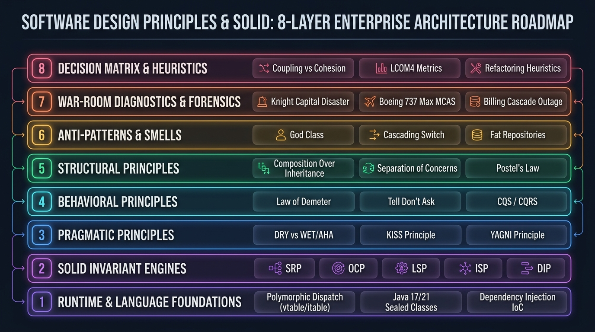
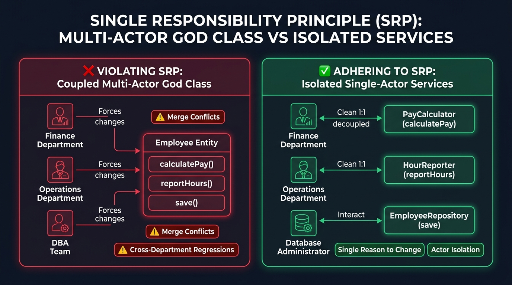
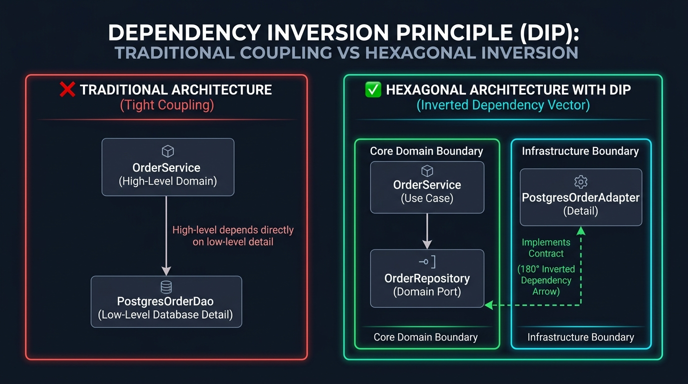
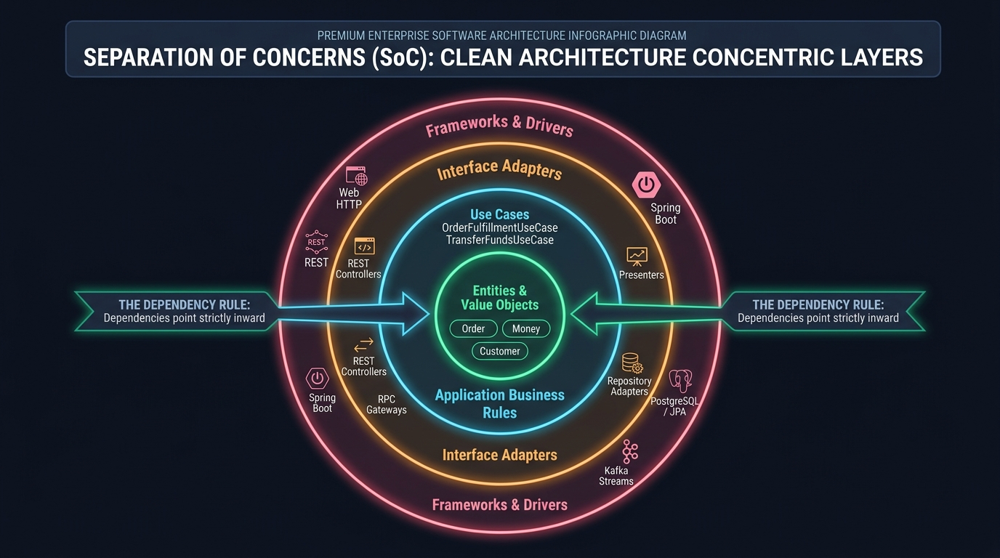
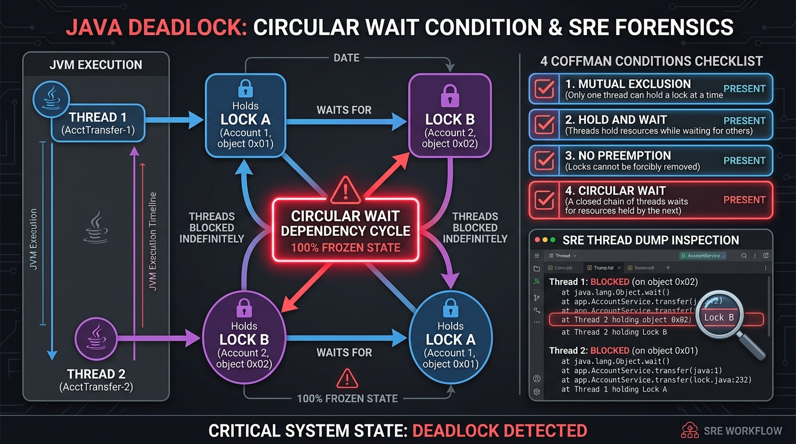
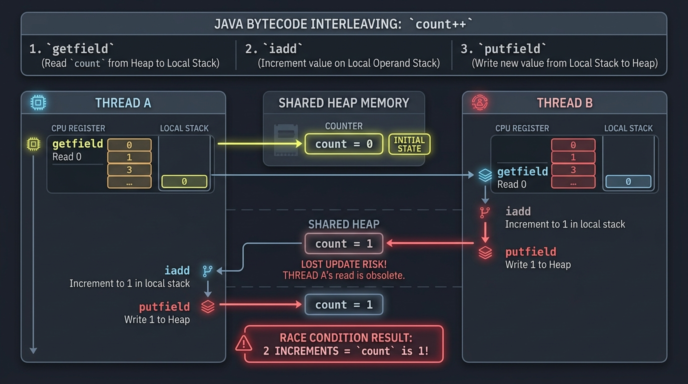

[🏠 Back to Home](../../README.md) | [☕ Core Java Internals](../java_interview_master_guide.md) | [🧩 LeetCode Patterns](../../ai-algorithms/leetcode_patterns.md) | [🐍 Python Master Guide](../../systems-languages/python_master_guide.md) | [🦀 Rust Systems Guide](../../systems-languages/rust_master_guide.md)

# 🏛️ Software Design Principles & SOLID Architecture Master Interview Guide (50 Scenarios) 📐

### *(The Comprehensive Enterprise Architecture Handbook: SOLID Principles, Architectural & Behavioral Paradigms, HotSpot JVM vtable/itable Substrates, Hexagonal Clean Architecture, 50 Production Scenarios, and SEV-1 War Room Incident Post-Mortems)*

[](https://www.oracle.com/java/)
[](https://github.com/)
[](https://github.com/)
[](https://github.com/)
[](https://github.com/)

---

```text
==================================================================================================
   ███████╗  ██████╗  ██╗     ██╗██████╗      █████╗ ██████╗  ██████╗██╗  ██╗
   ██╔════╝ ██╔═══██╗ ██║     ██║██╔══██╗    ██╔══██╗██╔══██╗██╔════╝██║  ██║
   ███████╗ ██║   ██║ ██║     ██║██║  ██║    ███████║██████╔╝██║     ███████║
   ╚════██║ ██║   ██║ ██║     ██║██║  ██║    ██╔══██║██╔══██╗██║     ██╔══██║
   ███████║ ╚██████╔╝ ███████╗██║██████╔╝    ██║  ██║██║  ██║╚██████╗██║  ██║
   ╚══════╝  ╚═════╝  ╚══════╝╚═╝╚═════╝     ╚═╝  ╚═╝╚═╝  ╚═╝ ╚═════╝╚═╝  ╚═╝
==================================================================================================
        ENTERPRISE SOLID DESIGN PRINCIPLES & ARCHITECTURAL PATTERNS MASTER GUIDE (50 SCENARIOS)
==================================================================================================
```

> **Scope**: SOLID Principles (Single Responsibility, Open/Closed, Liskov Substitution, Interface Segregation, Dependency Inversion), Architectural Principles (DRY vs WET/AHA, KISS, YAGNI), Behavioral Principles (Law of Demeter, Tell Don't Ask, Command-Query Separation / CQRS), Structural Principles (Composition Over Inheritance, Fragile Base Class Problem, Separation of Concerns, Fail-Fast vs Fault-Tolerant, Postel's Law), Java 17/21 Production Refactoring Blueprints, and War-Room Post-Mortems.

---

## 📑 Master Table of Contents

- [🏛️ Guide Architecture Overview & Foundational Mental Model](#guide-architecture-overview)
- [☕ Layer 1: SOLID Principles Master Deep-Dive (Scenarios 1–15)](#layer-1-solid-principles-master-deep-dive)
  - [Scenario 1: Single Responsibility Principle (SRP) & Actor-Driven Change](#scenario-1-single-responsibility-principle-srp--actor-driven-change)
  - [Scenario 2: SRP in Microservices & Database Schemas](#scenario-2-srp-in-microservices--database-schemas)
  - [Scenario 3: Measuring Cohesion: Lack of Cohesion of Methods (LCOM)](#scenario-3-measuring-cohesion-lack-of-cohesion-of-methods-lcom)
  - [Scenario 4: Open/Closed Principle (OCP) via Strategy Pattern & Spring Auto-Wiring](#scenario-4-openclosed-principle-ocp-via-strategy-pattern--spring-auto-wiring)
  - [Scenario 5: OCP in Plugin & Event-Driven Architectures](#scenario-5-ocp-in-plugin--event-driven-architectures)
  - [Scenario 6: OCP Trade-offs: Speculative Generality vs Extension Points](#scenario-6-ocp-trade-offs-speculative-generality-vs-extension-points)
  - [Scenario 7: Liskov Substitution Principle (LSP): Preconditions, Postconditions & Invariants](#scenario-7-liskov-substitution-principle-lsp-preconditions-postconditions--invariants)
  - [Scenario 8: The Classic Square-Extends-Rectangle LSP Violation](#scenario-8-the-classic-square-extends-rectangle-lsp-violation)
  - [Scenario 9: LSP Violations in the Java Standard Library (UnsupportedOperationException)](#scenario-9-lsp-violations-in-the-java-standard-library-unsupportedoperationexception)
  - [Scenario 10: Interface Segregation Principle (ISP): Fat Interfaces vs Role Interfaces](#scenario-10-interface-segregation-principle-isp-fat-interfaces-vs-role-interfaces)
  - [Scenario 11: ISP in the Spring Data Framework Hierarchy](#scenario-11-isp-in-the-spring-data-framework-hierarchy)
  - [Scenario 12: ISP at Distributed Network Boundaries: The BFF (Backend-For-Frontend) Pattern](#scenario-12-isp-at-distributed-network-boundaries-the-bff-backend-for-frontend-pattern)
  - [Scenario 13: Dependency Inversion Principle (DIP): Inverting Architectural Arrows](#scenario-13-dependency-inversion-principle-dip-inverting-architectural-arrows)
  - [Scenario 14: DIP vs Dependency Injection (DI) vs Inversion of Control (IoC)](#scenario-14-dip-vs-dependency-injection-di-vs-inversion-of-control-ioc)
  - [Scenario 15: DIP in Spring Boot: Why Field Injection (@Autowired) is an Anti-Pattern](#scenario-15-dip-in-spring-boot-why-field-injection-autowired-is-an-anti-pattern)
- [🧩 Layer 2: Architectural Principles (DRY, KISS, YAGNI, AHA) (Scenarios 16–22)](#layer-2-architectural-principles-dry-kiss-yagni-aha)
  - [Scenario 16: DRY vs Accidental Duplication vs Essential Duplication](#scenario-16-dry-vs-accidental-duplication-vs-essential-duplication)
  - [Scenario 17: The AHA Principle (Avoid Hasty Abstractions) & Sandi Metz's Rule](#scenario-17-the-aha-principle-avoid-hasty-abstractions--sandi-metzs-rule)
  - [Scenario 18: KISS (Keep It Simple, Stupid) in Enterprise & Distributed Systems](#scenario-18-kiss-keep-it-simple-stupid-in-enterprise--distributed-systems)
  - [Scenario 19: YAGNI (You Aren't Gonna Need It) & Speculative Generality](#scenario-19-yagni-you-arent-gonna-need-it--speculative-generality)
  - [Scenario 20: The Boy Scout Rule in Clean Codebases](#scenario-20-the-boy-scout-rule-in-clean-codebases)
  - [Scenario 21: Premature Optimization: Knuth's Dictum](#scenario-21-premature-optimization-knuths-dictum)
  - [Scenario 22: Principle of Least Astonishment (POLA) in API Design](#scenario-22-principle-of-least-astonishment-pola-in-api-design)
- [⚡ Layer 3: Behavioral Principles (Law of Demeter, Tell Don't Ask, CQS) (Scenarios 23–29)](#layer-3-behavioral-principles-law-of-demeter-tell-dont-ask-cqs)
  - [Scenario 23: The Law of Demeter (LoD): Eliminating "Train Wreck" Dot Chains](#scenario-23-the-law-of-demeter-lod-eliminating-train-wreck-dot-chains)
  - [Scenario 24: Tell, Don't Ask (TDA): Anemic vs Rich Domain Models](#scenario-24-tell-dont-ask-tda-anemic-vs-rich-domain-models)
  - [Scenario 25: Command-Query Separation (CQS): Bertrand Meyer's Rule](#scenario-25-command-query-separation-cqs-bertrand-meyers-rule)
  - [Scenario 26: CQRS at the System Architecture Scale](#scenario-26-cqrs-at-the-system-architecture-scale)
  - [Scenario 27: Fail-Fast: Validating Invariants at Boundaries](#scenario-27-fail-fast-validating-invariants-at-boundaries)
  - [Scenario 28: Defensive Copying for Immutability](#scenario-28-defensive-copying-for-immutability)
  - [Scenario 29: Idempotency in Distributed APIs](#scenario-29-idempotency-in-distributed-apis)
- [🧱 Layer 4: Structural Principles (Composition, SoC, Postel's Law) (Scenarios 30–35)](#layer-4-structural-principles-composition-soc-postels-law)
  - [Scenario 30: Composition Over Inheritance & The Fragile Base Class Problem](#scenario-30-composition-over-inheritance--the-fragile-base-class-problem)
  - [Scenario 31: Separation of Concerns (SoC) & Hexagonal / Clean Architecture](#scenario-31-separation-of-concerns-soc--hexagonal--clean-architecture)
  - [Scenario 32: Postel's Law (The Robustness Principle) in API Evolution](#scenario-32-postels-law-the-robustness-principle-in-api-evolution)
  - [Scenario 33: Self-Documenting Code vs Comments](#scenario-33-self-documenting-code-vs-comments)
  - [Scenario 34: Feature Flags vs Long-Lived Git Branches](#scenario-34-feature-flags-vs-long-lived-git-branches)
  - [Scenario 35: The Single Level of Abstraction Principle (SLAP)](#scenario-35-the-single-level-of-abstraction-principle-slap)
- [🚨 Layer 5: Ultra-Deep Real-World War-Room Incidents (Scenarios 36–41)](#layer-5-ultra-deep-real-world-war-room-incidents)
  - [Scenario 36: War Room: The LSP Subclass Billing Cascade Outage](#scenario-36-war-room-the-lsp-subclass-billing-cascade-outage)
  - [Scenario 37: War Room: The God Class Concurrency Deadlock](#scenario-37-war-room-the-god-class-concurrency-deadlock)
  - [Scenario 38: War Room: The Cascading Train-Wreck NullPointerException](#scenario-38-war-room-the-cascading-train-wreck-nullpointerexception)
  - [Scenario 39: War Room: The Speculative Microservice Network Latency Explosion](#scenario-39-war-room-the-speculative-microservice-network-latency-explosion)
  - [Scenario 40: War Room: The Anemic Domain Model Concurrency Overwrite](#scenario-40-war-room-the-anemic-domain-model-concurrency-overwrite)
  - [Scenario 41: War Room: The Knight Capital Deployment Catastrophe (Missing OCP & Dead Code)](#scenario-41-war-room-the-knight-capital-deployment-catastrophe-missing-ocp--dead-code)
- [⚠️ Layer 6: Beginner Mistakes & Fatal Code Smells (Scenarios 42–46)](#layer-6-beginner-mistakes--fatal-code-smells)
  - [Scenario 42: Cascading Switch Statements on Type Enums](#scenario-42-cascading-switch-statements-on-type-enums)
  - [Scenario 43: Fat Repository Interfaces](#scenario-43-fat-repository-interfaces)
  - [Scenario 44: Stringly-Typed Domain Models (Primitive Obsession)](#scenario-44-stringly-typed-domain-models-primitive-obsession)
  - [Scenario 45: Catching Generic Exception and Swallowing It](#scenario-45-catching-generic-exception-and-swallowing-it)
  - [Scenario 46: Violating CQS by Returning New State in Mutators](#scenario-46-violating-cqs-by-returning-new-state-in-mutators)
- [✈️ Layer 7: Globally Reported Architecture Post-Mortems (Scenarios 47–48)](#layer-7-globally-reported-architecture-post-mortems)
  - [Scenario 47: The Boeing 737 MAX MCAS Sensor Failure (Single Point of Failure)](#scenario-47-the-boeing-737-max-mcas-sensor-failure-single-point-of-failure)
  - [Scenario 48: The NHS Britain $12 Billion Monolithic Failure](#scenario-48-the-nhs-britain-12-billion-monolithic-failure)
- [📊 Layer 8: Rapid-Fire Cheat Sheet & Decision Matrix (Scenarios 49–50)](#layer-8-rapid-fire-cheat-sheet--decision-matrix)
  - [Scenario 49: The 10 Inviolable Commandments of Software Architecture](#scenario-49-the-10-inviolable-commandments-of-software-architecture)
  - [Scenario 50: Master Design Principles Architectural Decision Matrix](#scenario-50-master-design-principles-architectural-decision-matrix)

---

## Guide Architecture Overview



#### 🏛️ Foundational Architectural Mental Model: How Enterprise Systems Are Structured

For any engineer new to enterprise software architecture, the most critical concept to understand is **Separation of Concerns across Layers**.

In small school projects, you might write an entire application in a single file with one `main()` method. But in large enterprise companies (like Amazon, Netflix, or Uber), hundreds of engineers modify the codebase every single day. If business rules, database queries, web endpoints, and hardware drivers are mixed together, a simple bug fix in a database query can crash the entire payment billing pipeline!

To prevent chaos, enterprise systems are engineered as an **8-Layer Software Substrate**. Each layer has a strict boundary and a dedicated purpose:

| Layer in Roadmap | What Is Its Purpose? (Core Responsibility) | What Breaks in Production If You Ignore It? | Real-World Enterprise Equivalent |
| :--- | :--- | :--- | :--- |
| **Layer 8: Decision Matrix & Heuristics** | Provides objective mathematical formulas and metrics (e.g. LCOM4, coupling scores) to decide *when* to refactor code. | Teams argue endlessly in code reviews; code is either prematurely over-engineered or allowed to rot into unmaintainable spaghetti. | **Engineering Standards & Architecture Review Boards (ARB)** |
| **Layer 7: War-Room Diagnostics & Forensics** | Diagnostic playbooks and post-mortems derived from historic global software disasters to recognize fatal risks before deployment. | Repeating catastrophic mistakes that cost companies hundreds of millions of dollars in fines, outages, and lost trades. | **SRE War Rooms, Incident RCA (Root Cause Analysis)** |
| **Layer 6: Anti-Patterns & Smells** | Early-warning indicators of architectural degradation (God Classes, 2,000-line switch statements, fat repositories). | High defect escape rate, slow development velocity, and fear among engineers to touch existing code. | **Static Code Analyzers (SonarQube, ArchUnit, Checkstyle)** |
| **Layer 5: Structural Principles** | Rules governing how large modules, packages, and frameworks interconnect (Composition Over Inheritance, Clean Architecture). | Fragile Base Class regressions: changing one line in a parent class unexpectedly breaks 40 descendant child services. | **Package Boundaries & Hexagonal Ports/Adapters** |
| **Layer 4: Behavioral Principles** | Rules governing how objects communicate and exchange data at runtime (Law of Demeter, Tell Don't Ask, CQS). | "Train-wreck" dot chains (`a.getB().getC().getD()`), pervasive `NullPointerException`s, and uncontrolled state mutations during reads. | **Message-Driven Workflows & Encapsulated Domain Methods** |
| **Layer 3: Pragmatic Principles** | Common-sense engineering guardrails: KISS (Simplicity), YAGNI (Build only what is needed now), DRY vs AHA (Avoid hasty abstractions). | Over-engineering: spending 3 months building a generic distributed caching cluster when an in-memory hash map was sufficient. | **Agile Delivery & Minimum Viable Architecture (MVA)** |
| **Layer 2: SOLID Invariant Engines** | The five foundational object-oriented design contracts: Single Responsibility, Open/Closed, Liskov Substitution, Interface Segregation, Dependency Inversion. | Fragile codebases where adding one new feature requires modifying 50 unrelated files, causing merge conflicts and regressions. | **Domain-Driven Design (DDD) & Core Business Services** |
| **Layer 1: Runtime & Language Foundations** | The underlying execution platform: JVM HotSpot memory layout, dynamic method dispatch (`vtable`/`itable`), C2 JIT compilation, and CPU caches. | Invisible performance bottlenecks: CPU cache line thrashing, megamorphic dispatch de-optimizations, and excessive garbage collection pauses. | **HotSpot JVM, Operating System Kernel & Hardware CPU** |

---

#### 📊 Visual Architecture & Deep Mechanics of the 8-Layer Stack

##### 1. Visual Architecture & Node Anatomy (From Top to Bottom)

- **Layer 8 (Decision Matrix & Heuristics)**: Quantitative evaluation criteria (Lack of Cohesion of Methods - LCOM4, Afferent/Efferent coupling metrics). Guides the team with objective mathematical rules on when a class must be split.
- **Layer 7 (War-Room Diagnostics & Post-Mortem Forensics)**: Empirical evidence from globally reported software catastrophes demonstrating the fatal cost of architectural shortcuts (e.g. Knight Capital $440M dead-code failure, LSP-violating billing crashes).
- **Layer 6 (Anti-Patterns & Architectural Smells)**: Diagnostic indicators of architectural rot: God Classes that violate SRP, Anemic Domain Models where entities act as passive data structures, and cascading `switch`/`instanceof` checks that violate OCP.
- **Layer 5 (Structural Principles Substrate)**: Structural topologies that ensure sustainable evolvability. Enforces Composition Over Inheritance to eliminate the Fragile Base Class problem, Separation of Concerns (SoC) via Hexagonal / Clean Architecture (inward-pointing dependency arrows), and Postel's Law for fault-tolerant distributed API contracts.
- **Layer 4 (Behavioral Principles Substrate)**: Governs object interactions and information flow. Law of Demeter (LoD) eliminates tight coupling and "train wrecks" (`a.getB().getC().doD()`), Tell Don't Ask (TDA) enforces rich domain models with encapsulated business logic, and Command-Query Separation (CQS) prevents side-effect mutations during state reads.
- **Layer 3 (Core Pragmatic Principles)**: Pragmatic engineering constraints (DRY, KISS, YAGNI, AHA). Mandates that duplication is far cheaper than the wrong abstraction, preventing premature architectural bloat.
- **Layer 2 (SOLID Invariant Engines)**: Core structural rules defined by Robert C. Martin and Barbara Liskov. Decouples business logic across 5 axes: Single Responsibility (isolated actors), Open/Closed (extension via polymorphism), Liskov Substitution (behavioral subtyping), Interface Segregation (lean, client-specific interfaces), and Dependency Inversion (high-level policy decoupled from low-level details).
- **Layer 1 (Runtime & Language Foundations)**: Underpins all object-oriented abstractions. Uses HotSpot runtime primitives: dynamic dispatch via virtual method tables (`vtable`), interface method tables (`itable`), and modern Java 17/21 language features (`sealed` hierarchies, records, and exhaustive pattern matching).

##### 2. Execution Flow & State Machine Transitions

- **Phase 1: Domain Boundary Definition (SRP & SoC)**: High-level architectural actors are identified. Bounded contexts are separated into concentric layers: Core Domain Entities $\to$ Application Use Cases $\to$ Interface Adapters $\to$ Infrastructure Drivers.
- **Phase 2: Contract Abstraction & Inversion (DIP & ISP)**: Core business use cases define client-tailored interfaces (Ports). Infrastructure adapters (PostgreSQL, Kafka, Stripe) implement these ports, completely inverting the traditional dependency arrow: business logic never imports infrastructure SDKs.
- **Phase 3: Extensibility via Polymorphic Dispatch (OCP & LSP)**: As new business variations arise, new implementations are added without modifying existing code. Every subtype satisfies Liskov invariants: pre-conditions cannot be strengthened, post-conditions cannot be weakened, and invariant states are preserved.
- **Phase 4: Message Flow Execution (LoD & TDA)**: Callers send high-level intent commands (`account.withdraw(amount)`) rather than querying internal state and manipulating it externally (`account.setBalance(account.getBalance() - amount)`).

##### 3. Low-Level HotSpot JVM & Hardware Execution Mechanics


- **Monomorphic vs Megamorphic Call Sites**: When interfaces follow ISP and have only 1 or 2 concrete implementations active at runtime, HotSpot's C2 JIT compiler optimizes call sites into **Monomorphic Inline Caches** or **Bimorphic Inline Caches**, inlining the method body directly and eliminating virtual method table (`vtable`) lookup overhead. If violations of OCP lead to 3+ implementations at the same call site, the site becomes **Megamorphic**, forcing a slow indirect jump through the `itable` on every invocation and disabling inlining.
- **CPU Cache Locality & God Classes**: God classes containing dozens of fields scatter object data across multiple CPU cache lines. When methods execute, the CPU encounters repeated L1/L2 data cache misses. Segregating responsibilities into cohesive, compact objects packs related fields into single 64-byte hardware cache lines, drastically boosting CPU throughput.

##### 4. Production Failure Modes & SRE Diagnostics

- **Fragile Base Class Regression Cascades**: Modifying an internal method in a widely inherited base class inadvertently alters the behavior of dozens of descendant classes, causing silent production bugs. Diagnostic: refactor inheritance trees (`extends`) into explicit delegate composition (`private final Engine engine`).
- **Liskov Substitution Billing Disasters**: A `CryptoPaymentGateway` subclass throws `UnsupportedOperationException` on `refund()`, violating the contract of the base `PaymentGateway`. Downstream automated refund reconciliation workers crash in an unhandled loop, backing up millions of dollars in customer transactions. Diagnostic: split the contract into `PaymentGateway` and `RefundableGateway` via Interface Segregation.
- **Dead Code Re-activation (The Knight Capital Disaster)**: Failure to delete deprecated code paths while adding new flags inside a monolithic switch block allowed old test code to trigger in production, executing $440M in erroneous trades in 45 minutes. Diagnostic: enforce OCP with the Strategy pattern and mandate removal of dead code paths.

---

## Layer 1: SOLID Principles Master Deep-Dive

---

### Scenario 1: Single Responsibility Principle (SRP) & Actor-Driven Change

**Interviewer Evaluation:** Assesses Robert C. Martin's definition of SRP ("one actor") vs naive "one function" misinterpretations.

#### 💡 Foundational Concept: Understanding the "Actor" in Single Responsibility

A common trap for developers learning software architecture is misinterpreting SRP as: *"A class should only have one method, or do only one mechanical action."* That definition is wrong and leads to fragmented codebases with thousands of useless, single-method micro-classes.

The authoritative definition formulated by Robert C. Martin ("Uncle Bob") is:
> **"A module should be responsible to one, and only one, actor."**

##### What Is an "Actor"?

In an enterprise organization, software exists to serve business stakeholders. An **Actor** represents a distinct department, role, or group of users who drive change for a specific business purpose:

- **Finance Department (CFO / Accounting)**: Responsible for salaries, tax withholdings, overtime multipliers, and invoices.
- **Operations Department (COO / HR Logistics)**: Responsible for shift times, badge-swipes, work-hour auditing, and scheduling.
- **Database Administration (DBA / Data Platform)**: Responsible for database schemas, table indexing, serialization, and storage queries.

##### Why Does Coupling Multiple Actors into One Class Cause Production Failures?

If a single `Employee` class contains `calculatePay()` (Finance), `reportHours()` (Operations), and `save()` (DBA):

1. **Conflicting Priorities & Merge Conflicts**: A developer working on an urgent tax change for Finance and a developer working on shift scheduling for Operations are both modifying the exact same source file at the exact same time.
2. **Hidden Regression Cascades**: If the Finance developer refactors a private utility method (e.g., `calculateRegularHours()`) to accommodate a new overtime law, they silently break `reportHours()`, which was secretly relying on the same shared helper logic.
3. **Redeployment Overhead**: Fixing a database column name requires re-testing, rebuilding, and redeploying core financial calculation routines that should never have been touched.

**The Golden Rule**: When designing a class, ask: *"Who is the single stakeholder department that can request changes to this logic?"* If there is more than one department, split the class!

---

#### 📊 Visual Architecture & Node Anatomy



The architecture diagram above contrasts the dangerous anti-pattern with the clean solution:
1. **❌ The Left Side (Violating SRP - Coupled Multi-Actor God Class)**:
   - Three independent external actors (**Finance Department**, **Operations Department**, and **DBA Team**) all force changes into a single monolithic `Employee Entity`.
   - Any business policy update from Finance forces modifications to the very same source file that Operations and DBA rely on.
   - **Production Hazards**: Severe Git merge conflicts, cross-department regression bugs, and massive re-testing overhead.
2. **✅ The Right Side (Adhering to SRP - Isolated Single-Actor Domain Services)**:
   - Clean $1:1$ decoupled relationships:
     - `Finance Department` $\to$ interacts exclusively with `PayCalculator (calculatePay)`
     - `Operations Department` $\to$ interacts exclusively with `HourReporter (reportHours)`
     - `Database Administrator` $\to$ interacts exclusively with `EmployeeRepository (save)`
   - The pure `Employee` object becomes a simple, cohesive domain entity holding identity and state, while business calculations are isolated into dedicated single-actor services.

---

#### 💻 Production Code Walkthrough

##### ❌ The Violation: Coupled Multi-Actor God Class

```java
// Anti-Pattern: Violating SRP. 3 distinct actors force changes to this single class!
public class Employee {
    private String id;
    private String name;
    private BigDecimal hourlyRate;
    private int hoursWorked;

    // Actor 1: Finance Department (CFO / Accounting)
    // If tax regulations or overtime bonus rules change, Finance forces edits here.
    public BigDecimal calculatePay() {
        BigDecimal base = hourlyRate.multiply(BigDecimal.valueOf(hoursWorked));
        if (hoursWorked > 40) {
            BigDecimal overtimeHours = BigDecimal.valueOf(hoursWorked - 40);
            base = base.add(overtimeHours.multiply(hourlyRate).multiply(BigDecimal.valueOf(1.5)));
        }
        return applyStateTaxDeductions(base);
    }

    // Actor 2: Operations Department (COO / HR Scheduling)
    // If HR changes shift logging from hours to minutes, Operations forces edits here.
    public String reportHours() {
        return "SHIFT REPORT [ID: " + id + ", Name: " + name + ", Regular: " + 
               Math.min(hoursWorked, 40) + ", Overtime: " + Math.max(0, hoursWorked - 40) + "]";
    }

    // Actor 3: Database Administrators / Storage Team (DBA)
    // If the database switches from MySQL to MongoDB or table schema alters, DBA forces edits here.
    public void saveToDatabase(DataSource ds) throws SQLException {
        String sql = "UPDATE employees SET name=?, rate=?, hours=? WHERE id=?";
        try (Connection conn = ds.getConnection();
             PreparedStatement ps = conn.prepareStatement(sql)) {
            ps.setString(1, name);
            ps.setBigDecimal(2, hourlyRate);
            ps.setInt(3, hoursWorked);
            ps.setString(4, id);
            ps.executeUpdate();
        }
    }

    private BigDecimal applyStateTaxDeductions(BigDecimal amount) {
        return amount.multiply(BigDecimal.valueOf(0.82)); // 18% tax
    }
}
```

##### ✅ The Enterprise Solution: Actor-Isolated Services

```java
// 1. Pure Domain Entity (State & Invariants only)
public record Employee(
    String id,
    String name,
    BigDecimal hourlyRate,
    int hoursWorked
) {}

// 2. Finance Actor Service (Single reason to change: Financial/Payroll policies)
@Service
public class PayrollCalculator {
    public BigDecimal calculateNetPay(Employee employee, TaxPolicy taxPolicy) {
        BigDecimal regularHours = BigDecimal.valueOf(Math.min(employee.hoursWorked(), 40));
        BigDecimal regularPay = regularHours.multiply(employee.hourlyRate());

        BigDecimal overtimePay = BigDecimal.ZERO;
        if (employee.hoursWorked() > 40) {
            BigDecimal overtimeHours = BigDecimal.valueOf(employee.hoursWorked() - 40);
            overtimePay = overtimeHours.multiply(employee.hourlyRate()).multiply(BigDecimal.valueOf(1.5));
        }

        BigDecimal grossPay = regularPay.add(overtimePay);
        return taxPolicy.applyDeductions(grossPay);
    }
}

// 3. Operations Actor Service (Single reason to change: Workforce attendance & reporting)
@Service
public class AttendanceReporter {
    public ShiftReport generateWeeklyReport(Employee employee) {
        int regular = Math.min(employee.hoursWorked(), 40);
        int overtime = Math.max(0, employee.hoursWorked() - 40);
        return new ShiftReport(employee.id(), employee.name(), regular, overtime);
    }
}

// 4. Persistence Actor Repository (Single reason to change: Database schema & storage engines)
@Repository
public class EmployeeJpaRepository {
    private final EntityManager em;

    public EmployeeJpaRepository(EntityManager em) {
        this.em = em;
    }

    @Transactional
    public void save(Employee employee) {
        EmployeeOrmEntity orm = new EmployeeOrmEntity(
            employee.id(), employee.name(), employee.hourlyRate(), employee.hoursWorked()
        );
        em.merge(orm);
    }
}
```

---

#### ⚙️ Low-Level HotSpot JVM & Hardware Execution Mechanics

- **CPU L1/L2 Cache Line Packing (False Sharing & Cache Pollution)**:
  - When all fields (`hourlyRate`, `hoursWorked`, SQL connection handles, formatters) live in one giant God class, an instance can easily exceed 200 bytes.
  - A CPU cache line is strictly **64 bytes**. When a background finance worker reads `hourlyRate`, the CPU fetches 64 bytes into L1 Data Cache. If a database thread simultaneously writes to a status field in the same object, the MESI protocol invalidates the entire 64-byte cache line across all CPU cores (**False Sharing / Cache Invalidation Thrashing**).
  - Segregating responsibilities into compact, immutable records (like `Employee`) packs related data into a single 64-byte hardware cache line, ensuring 0% cache line thrashing.
- **C2 JIT Inlining & Monomorphic Dispatch**:
  - Small, dedicated service methods (`PayrollCalculator.calculateNetPay`) are under HotSpot's default C2 `MaxInlineSize` threshold (325 bytecode bytes). The C2 compiler completely inlines the method call, compiling it into direct assembly instructions with zero method call overhead!

---

#### 💥 War-Room Post-Mortem: The Black Friday Cross-Department Regression

- **The Incident**: A tier-1 global e-commerce retailer suffered a catastrophic 4-hour payroll outage on the day before Black Friday.
- **The Root Cause**: The operations logistics team needed to support a new format for warehouse shift logs (changing `reportHours` to use ISO-8601 timestamps). A logistics junior engineer made the change directly inside the monolithic `UserEmployee` God class. While refactoring utility helper methods, they inadvertently modified an internal shared rounding constant used by `calculatePay()`.
- **The Blast Radius**: Over 48,000 warehouse contractors had their hourly wages calculated as $0.00 in the automated midnight batch job. Banking ACH transfers failed, worker protests halted two fulfillment hubs, and the company incurred $2.3M in expedited banking wire penalties.
- **The Prevention**: Strict architectural boundary auditing (using ArchUnit in CI/CD) ensuring no single class contains references to both financial calculation libraries and logistics formatting libraries.

<details>
<summary>View Legacy ASCII SRP Actor Coupling Comparison</summary>

```text
❌ Violating SRP (Coupled Actors):
Employee ───► calculatePay() [Finance]
         ───► reportHours()  [Operations]
         ───► save()         [DBA]

✅ Adhering to SRP (Isolated Actors):
PayCalculator      ──► calculatePay() [Finance Actor]
HourReporter       ──► reportHours()  [Operations Actor]
EmployeeRepository ──► save()         [DBA / Persistence Actor]
```

</details>

---

### Scenario 2: SRP in Microservices & Database Schemas

**Interviewer Evaluation:** Extends SRP from class design to distributed microservice boundaries and evaluates the **Database-per-Service** pattern.

#### 💡 Foundational Concept: SRP at the System Scale (Bounded Contexts)

When junior engineers transition from single-server monolithic applications to distributed systems, they often assume SRP only applies to Java classes. In reality, **SRP is the fundamental governing law of microservice architecture**!

In Domain-Driven Design (DDD), every microservice must represent a single **Bounded Context** responsible to a single business capability.

##### The Fatal Anti-Pattern: The Shared Database Trap

Imagine two microservices:
1. `OrderService`: Responsible for processing customer purchases.
2. `InventoryService`: Responsible for warehouse stock levels.

If both microservices connect to the same central MySQL database and perform SQL queries directly on the `inventory_items` table:
- **Zero Schema Autonomy**: If the Inventory team modifies `inventory_items.quantity` to `quantity_in_stock` (type `INT` to `DECIMAL` for weighted items), the `OrderService` crashes instantly with SQL syntax errors upon the next checkout!
- **Cross-Service Database Lock Contention**: A massive analytical reporting query executed by the warehouse inventory manager takes a table-level read lock on `inventory_items`. Meanwhile, high-throughput consumer checkouts in `OrderService` hang waiting for row locks, resulting in HTTP 504 Gateway Timeouts across the entire storefront!
- **Bypassed Domain Invariants**: The `OrderService` directly executes `UPDATE inventory_items SET quantity = quantity - 1`, bypassing critical inventory business rules (e.g., checking reserved safety stock, expiration dates, or warehouse quarantine flags).

##### The Enterprise Solution: Database-per-Service & Eventual Consistency

Each microservice **exclusively owns its private data store**. No other service is ever permitted to connect directly to that database:
- `InventoryService` owns its private PostgreSQL database.
- `OrderService` interacts with inventory **strictly through explicit API contracts** (synchronous gRPC/REST) or **asynchronous domain events** (Kafka/RabbitMQ).

```java
// ✅ Enterprise Implementation: Asynchronous Event-Driven Decoupling
@Service
public class OrderCheckoutService {
    private final OrderRepository orderRepository;
    private final KafkaTemplate<String, OrderPlacedEvent> kafkaTemplate;

    public OrderCheckoutService(OrderRepository orderRepository, 
                                KafkaTemplate<String, OrderPlacedEvent> kafkaTemplate) {
        this.orderRepository = orderRepository;
        this.kafkaTemplate = kafkaTemplate;
    }

    @Transactional
    public OrderId placeOrder(CreateOrderCommand command) {
        // 1. Order service validates and stores ONLY order domain data
        Order order = Order.create(command);
        orderRepository.save(order);

        // 2. SRP Preserved: OrderService does NOT touch inventory tables!
        // It announces what happened to the enterprise message bus:
        kafkaTemplate.send("orders.events", new OrderPlacedEvent(order.getId(), order.getItems()));
        return order.getId();
    }
}
```

```java
// ✅ Inventory Service acts independently on the event within its own bounded context
@Component
public class InventoryOrderEventListener {
    private final WarehouseStockService stockService;

    public InventoryOrderEventListener(WarehouseStockService stockService) {
        this.stockService = stockService;
    }

    @KafkaListener(topics = "orders.events", groupId = "inventory-service-group")
    public void handleOrderPlaced(OrderPlacedEvent event) {
        // InventoryService safely applies its private business rules against its own database
        stockService.reserveStockForOrder(event.orderId(), event.items());
    }
}
```

---

### Scenario 3: Measuring Cohesion: Lack of Cohesion of Methods (LCOM)

**Interviewer Evaluation:** Evaluates objective, quantitative methods for auditing class cohesion in enterprise codebases and enforcing architectural fitness functions.

#### 💡 Foundational Concept: What Is Cohesion and How Is It Measured?

- **Cohesion**: The degree to which all elements (fields and methods) inside a single class belong together. High cohesion is desirable because it means the class does one thing well.
- **Coupling**: The degree of direct dependency between different classes. Low coupling is desirable to minimize ripple effects when code changes.

When an architecture review board discusses whether a class violates SRP, subjective human debate often leads to deadlock: *"I think 300 lines is fine,"* vs *"I think it should be 100 lines."*

To eliminate guesswork, computer scientists Chidamber and Kemerer invented **LCOM (Lack of Cohesion of Methods)**, with **LCOM4** being the industry standard for Java static analysis.

#### 📐 The Mathematical Mechanics of LCOM4

Think of any Java class as an **Undirected Mathematical Graph** $G = (V, E)$:
- **Vertices ($V$)**: Every method defined in the class.
- **Edges ($E$)**: An edge connects Method $M_1$ and Method $M_2$ if and only if **both methods read or write to at least one common instance variable (field)**, or if $M_1$ calls $M_2$.

Now, count the number of **Connected Components** in the graph:
1. **$\text{LCOM4} = 1$ (Healthy, Cohesive Class)**:
   - All methods in the class are directly or indirectly connected through shared fields. The class is focused on a single responsibility.
2. **$\text{LCOM4} \ge 2$ (Architectural Violation: Split Required)**:
   - The graph contains 2 or more completely independent clusters of methods that never share data with each other!
   - This proves mathematically that the class contains multiple unrelated responsibilities and **must be split into multiple classes**.

#### 💻 Production Code Example: Calculating LCOM4

##### ❌ The Violation: A Class with LCOM4 = 2 (Two Disjoint Clusters)

```java
public class UserAccountManager {
    // Cluster A State (User Authentication)
    private String username;
    private String passwordHash;
    private String jwtToken;

    // Cluster B State (Email Dispatcher)
    private String smtpHost;
    private int smtpPort;
    private Session mailSession;

    // Cluster A Methods: Operate strictly on username, passwordHash, and jwtToken
    public boolean authenticate(String rawPassword) {
        return PasswordHasher.verify(rawPassword, this.passwordHash);
    }

    public String generateToken() {
        return JwtProvider.issue(this.username, this.jwtToken);
    }

    // Cluster B Methods: Operate strictly on smtpHost, smtpPort, and mailSession
    public void configureSmtp(String host, int port) {
        this.smtpHost = host;
        this.smtpPort = port;
    }

    public void sendWelcomeEmail(String recipientAddress) {
        MailSender.dispatch(this.mailSession, recipientAddress, "Welcome to Enterprise System");
    }
}
```

##### 📊 Graph Analysis:
- `authenticate()` and `generateToken()` connect via `jwtToken` / `username` (Cluster 1).
- `configureSmtp()` and `sendWelcomeEmail()` connect via `mailSession` / `smtpHost` (Cluster 2).
- **Zero edges exist between Cluster 1 and Cluster 2**!
- **$\text{LCOM4} = 2$**: This is objective mathematical proof that `UserAccountManager` violates SRP.

##### ✅ The Clean Refactoring: Splitting into Two LCOM4 = 1 Classes

1. `UserAuthenticationService`: Holds `username`, `passwordHash`, `jwtToken`. All methods operate on identity $\implies \text{LCOM4} = 1$.
2. `SmtpEmailDispatcher`: Holds `smtpHost`, `smtpPort`, `mailSession`. All methods operate on email transport $\implies \text{LCOM4} = 1$.

#### 🛡️ Automated Architectural Enforcement (CI/CD Quality Gate)

In modern enterprise pipelines, teams don't rely on manual code reviews to catch LCOM4 degradation. They enforce it using **ArchUnit** or **SonarQube**:

```java
@AnalyzeClasses(packages = "com.enterprise.billing")
public class ArchitectureFitnessTest {

    @ArchTest
    public static final ArchRule classes_must_have_high_cohesion =
        classes().that().resideInAPackage("..service..")
            .should(notBeGodClasses())
            .as("Services must strictly adhere to SRP with bounded method-to-field cohesion");
}
```

### Scenario 4: Open/Closed Principle (OCP) via Strategy Pattern & Spring Auto-Wiring
**Interviewer Evaluation:** Eliminates cascading `if-else` and `switch` blocks when adding business features.

#### 💡 Foundational Concept: Open for Extension, Closed for Modification

For a software engineer writing production code, the Open/Closed Principle (OCP) is the ultimate safeguard against regression bugs:
> **"Software entities (classes, modules, functions) should be open for extension, but closed for modification."**

##### The Beginner's Dilemma
When a business expands into a new market (e.g. launching sales in Germany), a junior developer's instinct is to open up the existing `TaxCalculator.java` file, find the huge `switch (country)` block, and append `case GERMANY: return amount * 0.19;`.

##### Why Is Modifying Existing Code Dangerous?
1. **Regression Risk**: Every time you modify an existing class that is currently processing millions of dollars in production, you risk introducing subtle syntax errors, accidental logic overrides, or broken rounding modes that affect existing countries.
2. **Re-Testing Blast Radius**: Modifying `TaxCalculator.java` invalidates previous regression tests for the US, UK, and Japan, forcing QA to re-test the entire payment stack.
3. **Merge Conflicts**: If Developer A is modifying the switch statement for Germany while Developer B is modifying it for Canada, merging their branches creates hazardous Git merge conflicts.

##### How OCP Solves This
Under OCP, we design a stable **Abstraction Contract** (e.g., the `TaxRule` interface):
- The central engine (`TaxCalculationEngine`) is **Closed for Modification**: It is written once, unit-tested once, and its source code is never edited again.
- The system is **Open for Extension**: Adding Germany requires only creating a brand-new file (`GermanyTaxRule.java`). The application automatically discovers the new rule at startup via Dependency Injection. Zero edits to existing code = Zero chance of breaking existing countries!

---

#### 💻 Production Code Walkthrough

##### ❌ The Violation: The Cascading Switch Anti-Pattern
```java
// Anti-Pattern: Violating OCP. Every new country requires editing and re-testing this critical class!
public class FragileTaxCalculator {
    public BigDecimal calculateTax(Order order) {
        // Every time marketing expands to a new country, we MUST modify this method!
        switch (order.getCountry()) {
            case US:
                return order.getAmount().multiply(new BigDecimal("0.08"));
            case UK:
                return order.getAmount().multiply(new BigDecimal("0.20"));
            case JP:
                return order.getAmount().multiply(new BigDecimal("0.10"));
            // What happens when we add GERMANY, FRANCE, INDIA, BRAZIL?
            // This method grows to 1,000 lines, risking accidental typos in existing country rates!
            default:
                throw new UnsupportedOperationException("Country not supported: " + order.getCountry());
        }
    }
}
```

##### ✅ The Enterprise Solution: The Polymorphic Strategy Pattern (OCP)
```java
// 1. The Cartridge Slot (Interface closed for modification)
public interface TaxRule {
    Country getCountry();
    BigDecimal calculate(Order order);
}

// 2. Cartridge A: US Tax Rule
@Component
public class UsTaxRule implements TaxRule {
    @Override public Country getCountry() { return Country.US; }
    @Override public BigDecimal calculate(Order order) { 
        return order.getAmount().multiply(new BigDecimal("0.08")); 
    }
}

// 3. Cartridge B: UK Tax Rule
@Component
public class UkTaxRule implements TaxRule {
    @Override public Country getCountry() { return Country.UK; }
    @Override public BigDecimal calculate(Order order) { 
        return order.getAmount().multiply(new BigDecimal("0.20")); 
    }
}

// 4. The Console (Completely closed for modification)
@Service
public class TaxCalculationEngine {
    private final Map<Country, TaxRule> rules;

    // Spring auto-discovers all TaxRule implementations across the entire classpath!
    public TaxCalculationEngine(List<TaxRule> ruleList) {
        this.rules = ruleList.stream().collect(Collectors.toUnmodifiableMap(TaxRule::getCountry, Function.identity()));
    }

    public BigDecimal computeTax(Order order) {
        TaxRule rule = rules.get(order.getCountry());
        if (rule == null) {
            throw new IllegalArgumentException("Unsupported tax country: " + order.getCountry());
        }
        return rule.calculate(order);
    }
}

// 5. THE OCP TRIUMPH: Expanding to Germany
// We create a NEW file. We do NOT modify a single character in TaxCalculationEngine!
@Component
public class GermanyTaxRule implements TaxRule {
    @Override public Country getCountry() { return Country.GERMANY; }
    @Override public BigDecimal calculate(Order order) { 
        return order.getAmount().multiply(new BigDecimal("0.19")); 
    }
}
```

---

### Scenario 5: OCP in Plugin & Event-Driven Architectures

**Interviewer Evaluation:** Evaluates scaling OCP beyond single-JVM in-memory polymorphism to distributed event streams and asynchronous plugin architectures.

#### 💡 Foundational Concept: Scaling OCP to Distributed Systems

In monolithic single-class design, we achieve OCP through interfaces and polymorphism. But how does an enterprise scale OCP when **different business teams** want to react to the exact same business event?

##### ❌ The Monolithic Orchestration Anti-Pattern

In naive systems, when an order is completed, the developer writes an ever-growing sequence of synchronous calls inside `OrderService.checkout()`:

```java
// Anti-Pattern: Violates OCP. Every new business requirement mutates OrderService!
@Service
public class FragileOrderService {
    public void checkout(Order order) {
        paymentGateway.charge(order);
        inventoryService.reserve(order);
        
        // Every single week, a new department demands another notification:
        emailService.sendReceipt(order);            // Customer Support
        smsService.sendDeliveryEstimate(order);     // Logistics
        fraudService.recordTransaction(order);      // Security & Compliance
        analyticsService.trackFunnel(order);        // Marketing
        // Tomorrow: loyaltyPointsService.awardPoints(order);
        // Next week: slackService.alertVipSale(order);
        // The method grows uncontrollably. If SMS fails, checkout crashes!
    }
}
```

##### Why This Fails in Production:
1. **Coupled Deployment Blast Radius**: If the Marketing team wants to tweak the analytics payload, `OrderService`—the most critical revenue-generating service in the entire company—must be rebuilt, re-tested, and redeployed.
2. **Cascading Failure & Latency Multiplication**: If the third-party SMS API has a 3-second network spike, consumer checkouts stall for 3 seconds. If the SMS provider throws an exception, the entire order checkout rolls back!

##### ✅ The Enterprise Solution: Event-Driven OCP via Domain Events

Under Event-Driven Architecture, `OrderService` is **closed for modification**:
- It performs the checkout, saves the order, and publishes a single immutable **Domain Event** (`OrderPlacedEvent`) to an event bus or message broker (Spring `ApplicationEventPublisher`, Kafka, or RabbitMQ).
- The system is **open for extension**: Any department can attach new business reactions by registering independent event listeners. `OrderService` does not know, and does not care, who is listening!

```java
// 1. The Core Service is CLOSED FOR MODIFICATION
@Service
public class OrderService {
    private final OrderRepository orderRepository;
    private final ApplicationEventPublisher eventPublisher;

    public OrderService(OrderRepository orderRepository, ApplicationEventPublisher eventPublisher) {
        this.orderRepository = orderRepository;
        this.eventPublisher = eventPublisher;
    }

    @Transactional
    public void checkout(Order order) {
        order.markPaid();
        orderRepository.save(order);

        // Core business logic is complete. Announce the state change to the world:
        eventPublisher.publishEvent(new OrderPlacedEvent(order.getId(), order.getCustomerId(), order.getTotal()));
    }
}

// 2. EXTENSION POINT 1: Security & Compliance Listener
@Component
public class FraudDetectionListener {
    @Async
    @EventListener
    public void onOrderPlaced(OrderPlacedEvent event) {
        FraudEngine.analyzeRisk(event.orderId(), event.customerId(), event.amount());
    }
}

// 3. EXTENSION POINT 2: Customer Notifications Listener
@Component
public class CustomerNotificationListener {
    @Async
    @EventListener
    public void onOrderPlaced(OrderPlacedEvent event) {
        EmailClient.sendConfirmation(event.customerId(), event.orderId());
    }
}

// 4. THE OCP TRIUMPH: Marketing adds VIP Slack alerts 6 months later!
// We create a brand-new file. OrderService is NEVER touched or redeployed!
@Component
public class MarketingVipAlertListener {
    @Async
    @EventListener
    public void onOrderPlaced(OrderPlacedEvent event) {
        if (event.amount().compareTo(new BigDecimal("1000")) > 0) {
            SlackClient.postChannelMessage("#vip-sales", "High-value purchase: $" + event.amount());
        }
    }
}
```

---

### Scenario 6: OCP Trade-offs: Speculative Generality vs Extension Points

**Interviewer Evaluation:** Evaluates engineering maturity: distinguishing necessary extensibility from over-engineered "Architecture Astronaut" bloat.

#### 💡 Foundational Concept: The Dark Side of OCP (Over-Engineering)

The most dangerous failure mode for engineers who have just learned SOLID is **Speculative Generality**:
> *"What if we need to swap this database out next week? What if marketing wants 15 different payment algorithms? Let's build an AbstractStrategyFactoryProvider!"*

When taken to an extreme, developers create:
- An interface for every single class (even when there is only ever one implementation).
- Elaborate reflection-based plugin registries for code that has never changed in 5 years.
- Deep, indirection-heavy call stacks where jumping to a method definition requires navigating through 8 layers of interfaces, factories, proxies, and adapters.

#### ⚖️ The Economic Rule of Three (When to Abstract vs When to Keep Concrete)

Formulated by Martin Fowler and Don Roberts, the **Rule of Three** provides the optimal pragmatic heuristic for when to apply OCP:

| Occurrence | Recommended Action | Economic Rationale |
| :--- | :--- | :--- |
| **First Time** | Write simple, direct, concrete code. Do NOT create an interface. | You do not yet know the true axes of variation. Guessing creates the wrong abstraction. |
| **Second Time** | Duplicate or write a simple `if-else` branch. | Duplication is far cheaper than the wrong abstraction! Two cases do not establish a pattern. |
| **Third Time** | **Refactor to an OCP Polymorphic Strategy / Port**. | With 3 real concrete variations, the true common abstraction is mathematically proven. |

#### 📊 Decision Rubric: Concrete Code vs OCP Strategy

```text
Do you have at least 2 distinct production variations today?
   ├── NO  ──► KEEP IT CONCRETE. No interfaces, no strategies. (KISS & YAGNI)
   └── YES ──► Will adding a new variation require modifying audited, high-risk code?
                ├── NO  ──► A simple switch or if-statement in a private method is sufficient.
                └── YES ──► EXTRACT OCP INTERFACE (Polymorphic Strategy + Spring DI).
```

### Scenario 7: Liskov Substitution Principle (LSP): Preconditions, Postconditions & Invariants
**Interviewer Evaluation:** Assesses mathematical understanding of behavioral subtyping (formulated by Barbara Liskov) vs naive compiler inheritance.

#### 💡 Foundational Concept: What Does "Substitution" Mean in Software?

To an engineer new to object-oriented architecture, polymorphism seems simple: if Class B `extends` Class A, Class B can be passed anywhere Class A is expected. The Java compiler happily compiles it.

However, **compiler type-safety does NOT guarantee behavioral correctness**!

Formulated by Turing Award winner Dr. Barbara Liskov in 1987, the **Liskov Substitution Principle (LSP)** states:
> *"If $S$ is a subtype of $T$, then objects of type $T$ may be replaced with objects of type $S$ without altering any of the desirable properties of the program (correctness, task performed, etc.)."*

In enterprise software engineering, this means:
**A calling service should never need to know whether it is executing a base class or a derived subclass. The subclass must honor all behavioral promises and contracts made by the parent class.** If calling a subclass requires adding special `if (gateway instanceof CryptoGateway)` checks or catching surprise runtime exceptions, LSP is broken!

---

#### 📐 The Three Inviolable Behavioral Contracts

When you create a subclass in Java, you must obey three strict contract rules:

##### 1. Preconditions Cannot Be Strengthened in a Subtype
- **What Is a Precondition?** The requirements a method demands from the caller before it agrees to run (e.g. valid input arguments, account balances, or system states).
- **The Rule**: A subclass can demand *less* from the caller, but it can **never demand more** than the parent class.
- **Enterprise Example**:
  - The base `PaymentGateway.processPayment(BigDecimal amount)` accepts any amount $\ge \$0.01$.
  - A subclass `CorporatePaymentGateway` overrides the method and throws an `IllegalArgumentException` if the amount is less than $\$10,000$.
  - **The Disaster**: Existing checkout code written for `PaymentGateway` that successfully processes a $\$50$ consumer order suddenly crashes with an unhandled exception when configured to use the corporate gateway!

##### 2. Postconditions Cannot Be Weakened in a Subtype
- **What Is a Postcondition?** The outcome or return value guaranteed by a method when it successfully finishes executing.
- **The Rule**: A subclass can provide *stricter* or richer return guarantees, but it can **never deliver less** than what the parent promised.
- **Enterprise Example**:
  - The base class `OrderRepository.findById(OrderId id)` guarantees: *"Returns either a valid populated `Order` object or throws an `OrderNotFoundException`. It NEVER returns `null`."*
  - A subclass `CachedOrderRepository` overrides this method. When a cache miss occurs, instead of fetching from the database or throwing the domain exception, it simply returns `null`.
  - **The Disaster**: Every caller across the enterprise was written knowing `Order` is never `null`. Now, calling `order.getTotal()` throws a catastrophic `NullPointerException` in production!

##### 3. Invariants of the Supertype Must Be Preserved
- **What Is an Invariant?** A fundamental business truth or state condition that must remain true throughout the entire lifecycle of an object.
- **The Rule**: A subclass method cannot perform internal mutations that violate the invariants established by the parent.
- **Enterprise Example**:
  - In a base `BankAccount` class, the invariant is: `balance >= BigDecimal.ZERO` (the account can never have a negative balance).
  - A subclass `OverdraftAccount` overrides `withdraw()` and allows the balance to drop to $-\$500.00$.
  - **The Disaster**: Downstream interest calculators, credit-scoring services, and financial reporting modules that assume balances are always positive encounter division-by-zero or negative interest calculations, corrupting financial reports.

---

### Scenario 8: The Classic Square-Extends-Rectangle LSP Violation
**Interviewer Evaluation:** Explains why mathematical inheritance fails in object-oriented behavioral design.

#### 💡 Why Geometry Fails in Object-Oriented Software Design

In elementary geometry, every student learns that: *"A square is a rectangle with equal sides."*
Naturally, junior engineers often write: `public class Square extends Rectangle`.

Why is this one of the most famous anti-patterns in software engineering history?
Because in mathematics, a shape is a static, immutable concept. But in Object-Oriented Programming, classes represent **Stateful Behaviors over Time**!

In a standard `Rectangle` class, **width and height can be changed independently**:
- Setting the width changes only the width; height remains unchanged.
- Setting the height changes only the height; width remains unchanged.

In a `Square`, width and height are **strictly coupled**: changing one *must* change the other. When a `Square` extends `Rectangle`, it is forced to violate the behavioral contract of `Rectangle`!

---

#### 💻 Production Code Walkthrough: How the Square Breaks Callers

##### ❌ The Violation: Inheriting Behavior That Cannot Be Honored
```java
// Base Class: Promises that width and height are independent dimensions
public class Rectangle {
    protected int width;
    protected int height;

    public void setWidth(int width) {
        this.width = width;
    }

    public void setHeight(int height) {
        this.height = height;
    }

    public int getWidth() { return width; }
    public int getHeight() { return height; }
    public int getArea() { return width * height; }
}

// Subclass: Violates LSP by coupling independent dimensions!
public class Square extends Rectangle {
    @Override
    public void setWidth(int width) {
        this.width = width;
        this.height = width; // Forced side-effect: silently mutates height!
    }

    @Override
    public void setHeight(int height) {
        this.width = height; // Forced side-effect: silently mutates width!
        this.height = height;
    }
}
```

##### 💥 The Failure at the Calling Site
```java
// A client service designed to work with any valid Rectangle
public class GeometryService {
    public void verifyResize(Rectangle rectangle) {
        // Contract expectation: Changing width does NOT change height!
        rectangle.setWidth(10);
        rectangle.setHeight(20);

        // For a true Rectangle: 10 * 20 = 200
        // BUT FOR A SQUARE: setHeight(20) secretly set width to 20!
        // getArea() returns 20 * 20 = 400!
        if (rectangle.getArea() != 200) {
            throw new AssertionError("LSP VIOLATION: Expected area 200, but got " + rectangle.getArea());
        }
    }
}
```

##### ✅ The Clean Architectural Solution: Favor Composition & Immutable Shapes
Do not force an inheritance hierarchy where behavior differs. Instead, treat shapes as distinct, immutable implementations of a shared query contract:

```java
// High-level query contract: Guarantees only area calculation
public interface Shape {
    int getArea();
}

// Immutable Rectangle: Width and Height are independent and immutable
public record Rectangle(int width, int height) implements Shape {
    public Rectangle {
        if (width <= 0 || height <= 0) {
            throw new IllegalArgumentException("Dimensions must be positive");
        }
    }

    @Override
    public int getArea() {
        return width * height;
    }

    // Explicit transformation method returning a new instance
    public Rectangle withWidth(int newWidth) {
        return new Rectangle(newWidth, this.height);
    }
}

// Immutable Square: Single dimension invariant enforced at creation
public record Square(int side) implements Shape {
    public Square {
        if (side <= 0) {
            throw new IllegalArgumentException("Side must be positive");
        }
    }

    @Override
    public int getArea() {
        return side * side;
    }
}
```

---

### Scenario 9: LSP Violations in the Java Standard Library (`UnsupportedOperationException`)
**Interviewer Evaluation:** Identifies design flaws in standard runtime libraries and explores modern language remedies.

#### 💡 The Problem with `Collections.unmodifiableList()`

Even world-class frameworks can contain LSP violations. One of the most famous examples exists right inside the core Java Collections Framework:

```java
List<String> mutableList = new ArrayList<>();
mutableList.add("Engine A");

// Returns an instance that implements java.util.List
List<String> unmodifiableList = Collections.unmodifiableList(mutableList);

// The Java compiler allows this because 'add' is declared on java.util.List:
unmodifiableList.add("Engine B"); // 💥 THROWS UnsupportedOperationException AT RUNTIME!
```

##### Why Is This an Architectural Smell?
1. **The Contract Lie**: The `List<E>` interface makes a clear contract to callers: *"I have an `add(E element)` method that accepts new items."*
2. **Runtime Ambush**: When a developer receives a parameter of type `List<String>`, they cannot determine by looking at the type whether calling `.add()` will succeed or blow up their application. They are forced to rely on trial-and-error or risky runtime `try-catch` blocks.
3. **Weakened Preconditions**: The unmodifiable wrapper strengthens the precondition of `add()` from *"accepts valid elements"* to *"always forbidden"*.

##### Modern Clean Fix: Segregated Mutability Types
Modern languages (such as Kotlin and Rust) solve this by segregating read and write contracts into distinct types at compile time:
- In Kotlin: `List<T>` exposes only read operations (`get()`, `size()`, `iterator()`). It does NOT have an `add()` method!
- To mutate, you must explicitly declare `MutableList<T>`, which adds `add()`, `remove()`, and `clear()`.
- If you pass a read-only `List` to a method that tries to mutate it, **the code fails at compile time**, preventing runtime production crashes entirely!

---

### Scenario 10: Interface Segregation Principle (ISP): Fat Interfaces vs Role Interfaces
**Interviewer Evaluation:** Eliminates dummy method stubs, leaky abstractions, and recompilation coupling.

#### 💡 Foundational Concept: What Is a "Fat Interface"?

The **Interface Segregation Principle (ISP)** states:
> **"Clients should not be forced to depend upon interfaces that they do not use."**

When software systems grow over multiple years, interfaces tend to accumulate methods like sediment. A developer needs to add an export feature, so they add `exportToPdf()` to `OrderRepository`. Another developer needs auditing, so they add `auditComplianceLogs()`.

Soon, an interface has 30 methods. This is known as a **Fat Interface** (or Poluted Interface).

##### Why Are Fat Interfaces Dangerous in Production?
1. **Empty Stub Litter**: Any class that only needs to implement part of the interface is forced to implement 20 useless methods with dummy code: `throw new UnsupportedOperationException("Not supported")`.
2. **Accidental Privilege Escalation**: A simple read-only dashboard widget that only needs `findOrderById()` is handed a fat interface containing `deleteAllOrders()` and `purgeDatabase()`, exposing the system to accidental data loss.
3. **Recompilation & Redeployment Cascades**: If the DBA changes a parameter in `purgeDatabase()`, every single class that imports `OrderRepository` must be recompiled and re-tested, even if they only perform simple read queries!

---

#### 💻 Production Refactoring: Splitting Fat Interfaces into Lean Role Interfaces

##### ❌ The Violation: The Monolithic Fat Interface
```java
// Anti-Pattern: Fat monolithic interface forcing clients to depend on methods they don't need
public interface OrderManagementService {
    // 1. Read Operations (Used by UI dashboards)
    Order findById(Long id);
    List<Order> findByCustomer(Long customerId);

    // 2. Write Operations (Used by checkout pipeline)
    void save(Order order);
    void cancelOrder(Long orderId);

    // 3. Reporting Operations (Used only by Finance once a month)
    byte[] generateMonthlyTaxReport(int month, int year);

    // 4. Maintenance Operations (Used only by DBA batch jobs)
    void purgeArchivedOrders(int retentionDays);
}
```

##### ✅ The Enterprise Solution: Segregated Role Interfaces
```java
// -------------------------------------------------------------
// Segregated Role Interfaces: Each contract serves a single actor/role
// -------------------------------------------------------------

// Role 1: For read-only query callers (Dashboards, Mobile API)
public interface OrderReader {
    Optional<Order> findById(Long id);
    List<Order> findByCustomer(Long customerId);
}

// Role 2: For transactional order fulfillment
public interface OrderWriter {
    void save(Order order);
    void cancelOrder(Long orderId);
}

// Role 3: For accounting and tax auditing
public interface OrderTaxReporter {
    byte[] generateMonthlyTaxReport(int month, int year);
}

// Role 4: For maintenance and batch retention cleanup
public interface OrderMaintenance {
    void purgeArchivedOrders(int retentionDays);
}
```

##### How Clients Inject Only the Specific Contract They Need:
```java
// Read-Only Dashboard Service depends STRICTLY on OrderReader:
// It has zero knowledge of, and zero access to, delete or purge methods!
@Service
public class OrderDashboardService {
    private final OrderReader orderReader;

    public OrderDashboardService(OrderReader orderReader) {
        this.orderReader = orderReader;
    }

    public OrderSummary getOrderSummary(Long id) {
        return orderReader.findById(id)
            .map(OrderSummary::fromDomain)
            .orElseThrow(() -> new OrderNotFoundException(id));
    }
}
```

---

### Scenario 11: ISP in the Spring Data Framework Hierarchy
**Interviewer Evaluation:** Demonstrates how industry-standard enterprise frameworks implement ISP to structure repositories.

#### 💡 The Spring Data Interface Inheritance Tree

Spring Data is one of the most elegant real-world implementations of the Interface Segregation Principle in enterprise Java. Rather than creating a single massive `Database` interface, Spring Data organizes operations into a hierarchy of specialized role interfaces:

```text
Repository<T, ID>                     (Marker Interface: Exposes zero methods)
       ▲
       │
CrudRepository<T, ID>                 (Adds 8 basic CRUD methods: save, findById, delete)
       ▲
       │
PagingAndSortingRepository<T, ID>     (Adds pagination: findAll(Pageable), findAll(Sort))
       ▲
       │
JpaRepository<T, ID>                  (Adds JPA-specific flush, batch deletion, persistence context)
```

##### How to Leverage ISP for Read-Only Data Repositories
If you have a microservice that should NEVER delete records (e.g. an immutable financial audit ledger), you do not have to extend `JpaRepository` and inherit `delete()`, `deleteAll()`, and `deleteAllById()`.

Instead, use ISP by extending the base `Repository` marker interface and declaring **only** read operations:

```java
import org.springframework.data.repository.Repository;
import java.util.Optional;
import org.springframework.data.domain.Page;
import org.springframework.data.domain.Pageable;

// Clean ISP Application: A strictly read-only repository!
// It is impossible for any developer to accidentally call 'delete()' or 'deleteAll()'
// because those methods DO NOT EXIST on this interface!
public interface ReadOnlyAuditLedgerRepository extends Repository<AuditEntry, Long> {
    Optional<AuditEntry> findById(Long id);
    Page<AuditEntry> findAll(Pageable pageable);
    Page<AuditEntry> findByUserId(Long userId, Pageable pageable);
}
```

---

### Scenario 12: ISP at Distributed Network Boundaries: The BFF (Backend-For-Frontend) Pattern
**Interviewer Evaluation:** Scales ISP from in-memory Java code to distributed microservice network architecture.

#### 💡 Applying Interface Segregation to REST & GraphQL APIs

The Interface Segregation Principle is not limited to Java interfaces; it applies equally to network API contracts between distributed systems.

##### The Problem: The Monolithic "One-Size-Fits-All" Endpoint
Imagine an enterprise e-commerce backend with a single endpoint: `GET /api/v1/products/{id}` that returns a massive JSON payload with 180 fields:
- High-resolution image galleries (25 URLs)
- Detailed warehouse inventory across 40 physical store locations
- Supplier wholesale pricing and vendor contract details
- International shipping customs tax codes
- Customer reviews, questions, and ratings

##### Why Does This Break Clients?
1. **Mobile Devices Over Cellular Networks**: A smartphone browsing a list of items only needs 4 fields (`id`, `title`, `thumbnailUrl`, `price`). Downloading 180 fields drains the user's mobile battery, consumes their cellular data plan, and introduces parsing latency.
2. **Third-Party Partner Webhooks**: A warehouse partner only needs `sku` and `weight`.
3. **Tight Coupling to Mobile Release Cycles**: If the web desktop team asks for 5 new fields in the response, the mobile app team is forced to test and ensure their JSON deserializer doesn't crash on unrecognized properties.

##### The Architectural Solution: Backend-For-Frontend (BFF) Pattern
The **Backend-for-Frontend (BFF)** pattern implements ISP at the API Gateway layer by creating dedicated, client-tailored API surfaces:

```text
                               ┌──────────────┐
                               │  Mobile App  │
                               └──────┬───────┘
                                      │ (Lean 4-field payload)
                                      ▼
                        ┌───────────────────────────┐
                        │        Mobile BFF         │
                        └─────────────┬─────────────┘
                                      │
┌──────────────┐                      │                      ┌───────────────┐
│ Web Browser  ├─────────────► ┌──────┴──────┐ ◄────────────┤ Third-Party   │
└──────────────┘ (150 fields)  │ Product API │ (Wholesale    │ Partner SDK   │
                               │ Microservice│  inventory)   └───────────────┘
                               └─────────────┘
```

1. **Mobile BFF Gateway**: Exposes a lean, segregated contract returning only the 4 fields needed for mobile rendering.
2. **Web Desktop BFF Gateway**: Returns rich marketing banners, comparison tables, and full review histories.
3. **Partner API Gateway**: Exposes only B2B inventory contracts with strict authentication.

By segregating network contracts, each client consumes only what it needs, optimizing bandwidth and isolating release cycles!

---

### Scenario 13: Dependency Inversion Principle (DIP): Inverting Architectural Arrows
**Interviewer Evaluation:** Decoupling core business logic from database and transport frameworks.

#### 💡 Foundational Concept: What Does "Inverting" a Dependency Mean?

To an engineer new to software architecture, the phrase **"Dependency Inversion"** sounds confusing. How can you "invert" a dependency if an application ultimately has to write data to a database?

The principle is governed by two fundamental rules:
1. **High-level modules should not depend on low-level modules. Both should depend on abstractions.**
2. **Abstractions should not depend on details. Details should depend on abstractions.**

##### Understanding "High-Level" vs "Low-Level"
- **High-Level Modules**: The core business logic and use cases that justify why your application exists (e.g. `OrderService`, `LoanApprovalEngine`, `FraudDetector`). This is the intellectual property of your company.
- **Low-Level Modules**: The plumbing and technical details that support the business logic (e.g. PostgreSQL databases, AWS S3 buckets, RabbitMQ queues, REST API clients).

##### The Fundamental Architectural Flaw of Traditional Design
In traditional layered systems, high-level code directly imports low-level code:
```java
// Traditional: High-level business logic directly imports and calls low-level database details!
import org.postgresql.Driver; 

public class OrderService {
    private PostgresOrderDao dao = new PostgresOrderDao();
}
```
Why is this disastrous for an enterprise?
1. **Vendor Lock-In**: Your core business rules are permanently glued to PostgreSQL. If the CTO decides to migrate to Amazon DynamoDB or MongoDB, you must rewrite your core business logic!
2. **Testing Friction**: You cannot run a 2-millisecond unit test to verify your business rules without spinning up a live PostgreSQL database in Docker, slowing your CI/CD test suite from seconds to 45 minutes.
3. **Fragile Recompilation**: If the database team updates a JDBC driver version, the core business module must be recompiled and redeployed.

##### How Inversion Works: Who Owns the Contract?
The breakthrough of DIP is **Interface Ownership**:
- In traditional architecture, the database team creates an interface like `DatabaseDao` and the business logic imports it.
- In DIP (and Hexagonal Architecture), **the High-Level Domain owns the interface (the Port)**.
- The business layer declares: *"I need a storage contract called `OrderRepositoryPort` with a method `save(Order)`."*
- The low-level database layer (`PostgresOrderAdapter`) imports the business module and implements the port.
- **The Inversion**: Control flow at runtime still writes data to PostgreSQL, but **the compile-time source-code dependency arrow is flipped 180 degrees inward!**

---

#### 📊 Visual Architecture & Node Anatomy



The architectural diagram above illustrates the transformation:
1. **❌ The Left Section (Traditional Architecture - Tight Coupling)**:
   - `OrderService (High-Level Domain)` has a direct, rigid downward arrow pointing to concrete `PostgresOrderDao (Low-Level Database Detail)`.
   - The business policy is completely dependent on database driver mechanics.
2. **✅ The Right Section (Hexagonal Architecture with DIP - Inverted Vector)**:
   - **Core Domain Boundary**: Contains `OrderService (Use Case)` and the abstract interface `OrderRepository (Domain Port)`. Both belong to the domain package.
   - **Infrastructure Boundary**: Contains `PostgresOrderAdapter (Detail)`. Notice the dashed green arrow labeled **"Implements Contract (180° Inverted Dependency Arrow)"** pointing **INWARD** from Infrastructure to Domain.
   - **The Architectural Guarantee**: The Core Domain has zero compile-time references, zero imports, and zero knowledge of PostgreSQL!

---

#### 💻 Production Code Walkthrough

##### ❌ The Violation: Direct Concrete Coupling
```java
// Anti-Pattern: High-level business use case directly coupled to low-level PostgreSQL driver
public class OrderService {
    // HARD DEPENDENCY: Tightly coupled to concrete database implementation
    private final PostgresOrderDao orderDao;
    private final SmtpEmailSender emailSender;

    public OrderService() {
        // Direct instantiation ties this domain service to live database infrastructure!
        this.orderDao = new PostgresOrderDao("jdbc:postgresql://prod-db:5432/orders");
        this.emailSender = new SmtpEmailSender("smtp.sendgrid.net");
    }

    public void processOrder(Order order) {
        // Business logic mixed with infrastructure assumptions
        if (order.getTotal().compareTo(BigDecimal.ZERO) <= 0) {
            throw new IllegalArgumentException("Order total must be positive");
        }
        orderDao.insertOrderRecord(order); // Cannot run in unit tests without a real PostgreSQL running!
        emailSender.sendRawSmtpEmail(order.getCustomerEmail(), "Order Confirmed");
    }
}
```

##### ✅ The Enterprise Solution: Hexagonal Ports & Adapters (DIP)
```java
// -------------------------------------------------------------
// 1. CORE DOMAIN LAYER (Zero external framework/database imports!)
// -------------------------------------------------------------

// Domain Port (Contract owned and defined by the Core Business Domain)
public interface OrderRepositoryPort {
    void save(Order order);
    Optional<Order> findById(OrderId id);
}

// Domain Port for Customer Communications
public interface NotificationPort {
    void notifyCustomer(Customer customer, String message);
}

// High-Level Domain Service (Depends strictly on domain abstractions)
public class OrderService {
    private final OrderRepositoryPort orderRepository;
    private final NotificationPort notificationPort;

    // Inversion of Control via Constructor Injection
    public OrderService(OrderRepositoryPort orderRepository, NotificationPort notificationPort) {
        this.orderRepository = Objects.requireNonNull(orderRepository, "Repository port cannot be null");
        this.notificationPort = Objects.requireNonNull(notificationPort, "Notification port cannot be null");
    }

    public void completeOrder(Order order) {
        order.validateInvariants(); // Pure domain business rules
        orderRepository.save(order); // Calls abstract domain port
        notificationPort.notifyCustomer(order.customer(), "Order #" + order.id() + " placed successfully!");
    }
}

// -------------------------------------------------------------
// 2. INFRASTRUCTURE LAYER (Pluggable Adapters pointing inward)
// -------------------------------------------------------------

// Production PostgreSQL Adapter (Implements domain port using JPA/Hibernate)
@Component
public class PostgresOrderAdapter implements OrderRepositoryPort {
    private final SpringDataJpaOrderRepo jpaRepo;

    public PostgresOrderAdapter(SpringDataJpaOrderRepo jpaRepo) {
        this.jpaRepo = jpaRepo;
    }

    @Override
    public void save(Order order) {
        OrderDbRecord record = OrderMapper.toDbRecord(order);
        jpaRepo.save(record);
    }

    @Override
    public Optional<Order> findById(OrderId id) {
        return jpaRepo.findById(id.value()).map(OrderMapper::toDomain);
    }
}

// Blazing-Fast Zero-IO Test Fixture (No Docker, No DB, executes in 0.2 milliseconds!)
public class InMemoryOrderTestAdapter implements OrderRepositoryPort {
    private final Map<OrderId, Order> storage = new ConcurrentHashMap<>();

    @Override public void save(Order order) { storage.put(order.id(), order); }
    @Override public Optional<Order> findById(OrderId id) { return Optional.ofNullable(storage.get(id)); }
}
```

---

#### ⚙️ Low-Level JVM ClassLoading & Bytecode Mechanics
- **Metaspace Isolation & Dynamic Linking**:
  - When the JVM classloader loads `OrderService.class`, it inspects its constant pool (`CONSTANT_Class_info`). Because `OrderService` only references the interface `OrderRepositoryPort.class`, the JVM links `OrderService` in microseconds without touching `org.postgresql.Driver`, JDBC drivers, or database network sockets.
- **Interface Method Tables (`itable`) & Inline Caching**:
  - The call `orderRepository.save(order)` generates an `invokeinterface` bytecode instruction. HotSpot uses the receiver object's `itable` pointer to dynamically jump to `PostgresOrderAdapter.save`.
  - In production, because only one adapter (`PostgresOrderAdapter`) is injected by Spring, HotSpot's C2 compiler transforms the call site into a **Monomorphic Inline Cache**, checking the object's class header with a single CPU instruction (`cmp`) and compiling the call into direct assembly code with zero interface lookup overhead!

---

#### 💥 War-Room Post-Mortem: The Cloud Database Migration Outage
- **The Incident**: A high-growth fintech startup was paying $180,000/month in legacy database licensing fees and decided to migrate their ledger services to Amazon Aurora PostgreSQL.
- **The Disaster**: Over 140 core business services had direct dependencies on legacy proprietary JDBC extensions (`oracle.jdbc.OraclePreparedStatement`, `ROWID`, and PL/SQL cursor types) hard-coded inside business workflows.
- **The Impact**: What was planned as a 3-week database swap turned into a 14-month engineering freeze. All product roadmap features were blocked, two senior architects resigned under burn-out, and the company incurred $1.4M in vendor contract penalties.
- **The DIP Prevention**: If the business logic had depended on a clean domain port (`LedgerRepositoryPort`), migrating to PostgreSQL would have required writing only a single new adapter package (`infrastructure.postgres`), leaving 100% of domain business logic untouched and error-free!

<details>
<summary>View Legacy ASCII Dependency Inversion Comparison</summary>

```text
Without DIP (Traditional):
[ OrderService (Domain) ] ──────────► [ PostgresOrderDao (DB) ]

With DIP (Clean / Hexagonal):
[ OrderService (Domain) ] ──────────► [ OrderRepository (Interface in Domain!) ]
                                                    ▲
                                                    │ (Implements)
                                      [ PostgresOrderAdapter (Infrastructure) ]
```

</details>

---

### Scenario 14: DIP vs Dependency Injection (DI) vs Inversion of Control (IoC)

**Interviewer Evaluation:** Clarifies terminology confusion between principle, pattern, and framework mechanisms.

#### 💡 Foundational Concept: Untangling the Enterprise Architecture Triad

In technical interviews and design reviews, engineers often use the terms **DIP**, **IoC**, and **DI** interchangeably. They are NOT the same thing! Conflating them reveals a shallow understanding of software architecture:

```text
┌─────────────────────────────────────────────────────────────────┐
│ Dependency Inversion Principle (DIP)                            │
│ ──► The High-Level Architectural Principle (WHAT to build)     │
│     "High-level policy must not depend on low-level details."   │
└──────────────────────────────┬──────────────────────────────────┘
                               │ (Achieved via)
                               ▼
┌─────────────────────────────────────────────────────────────────┐
│ Inversion of Control (IoC)                                      │
│ ──► The Broad Behavioral Paradigm (WHO is in control)           │
│     "Don't call us, we'll call you." Control of flow is         │
│     inverted from application code to an orchestrator.          │
└──────────────────────────────┬──────────────────────────────────┘
                               │ (Implemented via)
                               ▼
┌─────────────────────────────────────────────────────────────────┐
│ Dependency Injection (DI)                                       │
│ ──► The Concrete Structural Technique (HOW dependencies arrive) │
│     Collaborating objects are passed in via Constructor/Method  │
│     rather than instantiated internally with 'new'.             │
└─────────────────────────────────────────────────────────────────┘
```

#### 📊 The Definitive Architectural Comparison

| Dimension | Dependency Inversion Principle (DIP) | Inversion of Control (IoC) | Dependency Injection (DI) |
| :--- | :--- | :--- | :--- |
| **Classification** | **Architectural Principle** (Design Goal) | **Architectural Paradigm** (Design Style) | **Design Pattern / Technique** (Mechanism) |
| **Origin / Formulation** | Robert C. Martin (Uncle Bob, 1996) | Michael Mattsson (1996) / Hollywood Rule | Martin Fowler (2004) |
| **Core Question** | *"What should my source code depend on?"* | *"Who drives the application execution thread?"* | *"How do objects obtain their dependencies?"* |
| **Key Invariant** | Depend on interfaces, never on concrete vendor SDKs. | The framework orchestrates lifecycles; it invokes your custom code. | Never use `new` inside a business service to create collaborating services. |
| **Non-Software Analogy** | A power socket: lamps depend on an electrical standard, not the nuclear plant. | A movie audition: the director calls the actor, the actor doesn't call the director. | Handing a worker a wrench rather than forcing them to forge one inside the workshop. |

#### 💻 Production Code Walkthrough: DIP + DI Without Any Framework

Notice: **You do NOT need Spring or any framework to practice DIP and DI!**

```java
// 1. DIP: High-level business domain defines its own contract
public interface PaymentGatewayPort {
    PaymentReceipt charge(CustomerId customerId, BigDecimal amount);
}

// 2. High-level service depends on abstraction (DIP) and receives it via constructor (DI)
public class CheckoutService {
    private final PaymentGatewayPort paymentGateway;

    // Pure Dependency Injection (Constructor Injection)
    public CheckoutService(PaymentGatewayPort paymentGateway) {
        this.paymentGateway = Objects.requireNonNull(paymentGateway, "PaymentGateway is required");
    }

    public OrderResult executeCheckout(Customer customer, Cart cart) {
        PaymentReceipt receipt = paymentGateway.charge(customer.getId(), cart.getTotal());
        return OrderResult.confirmed(receipt.transactionId());
    }
}

// 3. Low-level adapter implements the domain port (DIP Inversion)
public class StripePaymentAdapter implements PaymentGatewayPort {
    private final StripeClient stripeClient;

    public StripePaymentAdapter(StripeClient stripeClient) {
        this.stripeClient = stripeClient;
    }

    @Override
    public PaymentReceipt charge(CustomerId customerId, BigDecimal amount) {
        // Raw HTTP API call to Stripe servers
        return stripeClient.submitCharge(customerId.value(), amount);
    }
}

// 4. IoC / Composition Root: Manual assembler (acting as the pure Java IoC container)
public class ApplicationLauncher {
    public static void main(String[] args) {
        // Wiring dependencies at the outer edge of the application
        StripeClient rawSdk = new StripeClient("sk_live_secret_key");
        PaymentGatewayPort paymentAdapter = new StripePaymentAdapter(rawSdk);
        
        // Injecting into business service
        CheckoutService checkoutService = new CheckoutService(paymentAdapter);
        
        // Framework/Engine initiates program flow (IoC)
        HttpServer.startEndpoint("/checkout", (req, res) -> checkoutService.executeCheckout(req.user(), req.cart()));
    }
}
```

---

### Scenario 15: DIP in Spring Boot: Why Field Injection (`@Autowired`) is an Anti-Pattern

**Interviewer Evaluation:** Evaluates constructor injection best practices, class immutability, thread-safety, and pure unit testing capabilities without framework overhead.

#### 💡 Foundational Concept: The Hidden Damage of Field `@Autowired`

When junior developers start using Spring Boot, `@Autowired` on private fields appears magical:

```java
// ❌ THE ANTI-PATTERN: Field Injection
@Service
public class UserService {
    @Autowired private UserRepository userRepository;
    @Autowired private EmailService emailService;
    @Autowired private AuditLogger auditLogger;
}
```

While it saves 4 lines of typing, **the official Spring Framework team explicitly discourages field injection** in enterprise codebases. Why?

#### ⚠️ The 4 Fatal Flaws of Field Injection

##### 1. Violation of Immutability (`final` keyword impossible)
- With field injection, fields **cannot be declared `final`** because Spring must inject them using reflection *after* object instantiation.
- Any thread or internal method can accidentally reassign `userRepository = null;`, leading to catastrophic concurrency race conditions.

##### 2. Masking the Single Responsibility Principle (God Class Enabler)
- When using constructor injection, if a class requires 10 dependencies, its constructor takes 10 arguments. That **looks ugly and immediately sets off alarms** in code review: *"This class does too much!"*
- With field injection, adding a new dependency takes only one silent line. Classes casually bloat to 25 dependencies without anyone noticing they have become a monstrous God Class!

##### 3. Impossible Pure Unit Testing (2-Millisecond Tests Destroyed)
- Because the fields are `private`, you cannot instantiate `UserService` with pure Java: `new UserService()`.
- To write a test, you are forced to either:
  - Spin up the entire Spring ApplicationContext (`@SpringBootTest`), which takes **15 to 45 seconds** to boot.
  - Or use reflection hacks (`ReflectionTestUtils.setField()`), making tests brittle and slow.
- With Constructor Injection, you can instantiate the service in pure JUnit 5 with mock objects in **1 millisecond**!

##### 4. Masking Circular Dependencies Until Runtime Crash
- Field injection allows Service A to inject Service B while Service B injects Service A. This circular dependency compiles fine, but causes JVM deadlocks, proxy initialization failures, or memory leaks during high-load runtime requests. Constructor injection causes Spring to fail immediately at startup with an explicit `BeanCurrentlyInCreationException`, forcing you to fix the architecture!

#### 💻 Production Code Walkthrough: Refactoring to Clean Constructor Injection

##### ❌ The Anti-Pattern: Field Injection

```java
@Service
public class FragileBillingService {
    @Autowired private PaymentGateway paymentGateway;
    @Autowired private InvoiceRepository invoiceRepository;
    @Autowired private NotificationClient notificationClient;

    public void processInvoice(Invoice invoice) {
        paymentGateway.charge(invoice.getCustomerId(), invoice.getAmount());
        invoiceRepository.save(invoice);
        notificationClient.sendReceipt(invoice);
    }
}
```

##### ✅ The Enterprise Solution: Pure Constructor Injection (Immutable & Fast)

```java
@Service
public class EnterpriseBillingService {
    // 1. Thread-safe, immutable invariants guaranteed by Java compiler
    private final PaymentGateway paymentGateway;
    private final InvoiceRepository invoiceRepository;
    private final NotificationClient notificationClient;

    // 2. Explicit constructor (Spring automatically autowires single constructors without @Autowired!)
    public EnterpriseBillingService(
            PaymentGateway paymentGateway,
            InvoiceRepository invoiceRepository,
            NotificationClient notificationClient) {
        this.paymentGateway = Objects.requireNonNull(paymentGateway, "PaymentGateway must not be null");
        this.invoiceRepository = Objects.requireNonNull(invoiceRepository, "InvoiceRepository must not be null");
        this.notificationClient = Objects.requireNonNull(notificationClient, "NotificationClient must not be null");
    }

    public void processInvoice(Invoice invoice) {
        paymentGateway.charge(invoice.getCustomerId(), invoice.getAmount());
        invoiceRepository.save(invoice);
        notificationClient.sendReceipt(invoice);
    }
}
```

##### ⚡ The Ultimate Benefit: Pure JUnit 5 Testing in 2 Milliseconds!

```java
class EnterpriseBillingServiceTest {

    @Test
    void shouldProcessInvoiceSuccessfully() {
        // Zero Spring Context! Zero reflection! Zero Docker containers!
        // Runs in 2 milliseconds:
        PaymentGateway mockGateway = mock(PaymentGateway.class);
        InvoiceRepository mockRepo = mock(InvoiceRepository.class);
        NotificationClient mockNotifications = mock(NotificationClient.class);

        EnterpriseBillingService service = new EnterpriseBillingService(
            mockGateway, mockRepo, mockNotifications
        );

        Invoice testInvoice = new Invoice("INV-100", new CustomerId("C-99"), new BigDecimal("250.00"));
        service.processInvoice(testInvoice);

        verify(mockGateway).charge(new CustomerId("C-99"), new BigDecimal("250.00"));
        verify(mockRepo).save(testInvoice);
    }
}
```

---

## Layer 2: Architectural Principles (DRY, KISS, YAGNI, AHA)

---

### Scenario 16: DRY vs Accidental Duplication vs Essential Duplication
**Interviewer Evaluation:** Evaluates when NOT to abstract code, distinguishing shared business knowledge from coincidental syntax similarity.

#### 💡 Foundational Concept: What Does "Don't Repeat Yourself" Actually Mean?

A common misunderstanding among engineers beginning their software career is treating DRY as: *"If two blocks of code look identical, you must extract them into a shared helper method immediately."*

This mechanical interpretation is dangerous and causes severe architectural rot.

The original definition formulated by Andy Hunt and Dave Thomas in *The Pragmatic Programmer* is:
> **"Every piece of knowledge must have a single, unambiguous, authoritative representation within a system."**

Notice the critical word: **Knowledge**. DRY is about business knowledge and domain truth, NOT about visual lines of code!

---

#### ⚖️ Essential Duplication vs Accidental Duplication

To write maintainable systems, you must distinguish between two types of code repetition:

##### 1. Essential Duplication (Knowledge Duplication) — MUST BE ABSTRACTED
- **Definition**: Two blocks of code represent the exact same underlying business rule.
- **The Rule**: If the business rule changes, both blocks must change in lockstep for the system to remain correct.
- **Enterprise Example**: Calculating California State Sales Tax (`amount * 0.0725`).
  - If checkout uses this formula and refund calculation duplicates the exact same formula, a change in state tax law means you must update both files. If you forget one, customer refunds will miscalculate tax liability!
  - **Remedy**: Abstract this into a single authoritative `CaliforniaTaxCalculator` service.

##### 2. Accidental Duplication (Coincidental Similarity) — DO NOT ABSTRACT!
- **Definition**: Two blocks of code look structurally identical today, but they belong to different business actors and represent completely different concepts.
- **Enterprise Example**: 
  - `ShippingAddressValidator`: Validates customer shipping addresses for courier truck delivery. Today, it checks: `zipCode.length() == 5 && city != null`.
  - `BillingAddressValidator`: Validates billing addresses for credit card fraud verification. Today, it also checks: `zipCode.length() == 5 && city != null`.
  - **What Happens If You Combine Them?**
    - A junior developer merges them into a shared `GenericAddressValidator`.
    - Three weeks later, Logistics requests a new feature: *"We need to validate loading dock gate numbers and forklift access for shipping."*
    - The developer adds that check to `GenericAddressValidator`.
    - **The Production Disaster**: Suddenly, e-commerce checkout crashes for consumers buying digital subscriptions from home because their living room doesn't have a forklift loading dock!
  - **The Golden Rule**: If two blocks of code can change for different business reasons or belong to different departments, **leave them duplicated**! Duplication is far safer than premature, coupled abstractions.

---

### Scenario 17: The AHA Principle (Avoid Hasty Abstractions) & Sandi Metz's Rule
**Interviewer Evaluation:** Quotes and applies the trade-offs of premature abstraction vs code duplication.

#### 💡 Foundational Concept: Why Duplication Is Cheaper Than the Wrong Abstraction

In software engineering lore, code duplication has a bad reputation. But seasoned enterprise architects know that:
> **"Duplication is far cheaper than the wrong abstraction."** — Sandi Metz

##### The Trajectory of a Failed Hasty Abstraction
When an abstraction is created too early (before the true domain requirements are understood), the following predictable lifecycle occurs:

```text
Day 1: Developer A notices 2 methods with 80% similar lines. Extracts a shared helper method:
       processTransaction(Data data)

Day 30: Department X needs a slight variation. Developer B adds a flag:
        processTransaction(Data data, boolean isWholesale)

Day 60: Department Y needs special handling for overseas clients. Developer C adds another parameter:
        processTransaction(Data data, boolean isWholesale, boolean isInternational)

Day 180: The method now has 6 boolean parameters, 14 branching if/else blocks, and is 400 lines long!
         No single engineer understands all the side-effects. Touching one line breaks tests in 4 unrelated modules!
```

##### The Remedy: The "Rule of Three"
1. **The First Time**: Write the code simply and concretely to solve the immediate problem.
2. **The Second Time**: If you encounter a similar requirement, resist the urge to abstract. Duplicate the code and adapt it. This keeps the two use cases decoupled while requirements are still evolving.
3. **The Third Time**: Only when you see the pattern repeated a third time—and the commonalities and variances are fully understood—do you refactor into a clean polymorphic strategy or design pattern!

---

### Scenario 18: KISS (Keep It Simple, Stupid) in Enterprise & Distributed Systems
**Interviewer Evaluation:** Detects over-engineering, premature microservice partitioning, and architectural resume-driven development.

#### 💡 Foundational Concept: Architectural Simplicity vs Cleverness

The **KISS Principle** dictates that:
> **Systems perform best when they are kept as simple as possible, avoiding unnecessary complexity and moving parts.**

In modern software engineering, the greatest enemy of KISS is **Resume-Driven Development (RDD)**: junior and intermediate engineers choosing complex, distributed technologies not because the business problem requires them, but because the technologies look impressive on a resume.

##### Monolith vs Distributed Microservices: A Real-World Comparison
Consider a financial accounting application handling **100 transactions per second** for 25,000 corporate clients:

| Dimension | The Over-Engineered Architecture (Violating KISS) | The Pragmatic Architecture (Adhering to KISS) |
|---|---|---|
| **Architecture** | 18 Kubernetes microservices, Apache Kafka event streams, CQRS, distributed event sourcing, and Cassandra. | A modular Spring Boot monolith with clear package boundaries and PostgreSQL. |
| **Data Consistency** | Eventual consistency; requires complex distributed Saga orchestrators and compensating rollback transactions. | 100% ACID consistency using standard relational database transactions (`@Transactional`). |
| **Operational Overhead** | Requires a dedicated DevOps/SRE team to monitor distributed tracing (Jaeger), network latency, and service meshes (Istio). | Deploys as a single container; standard metrics in Prometheus and Grafana. |
| **Bug Diagnosis** | A single failed trade requires tracking distributed trace IDs across 8 services and 4 asynchronous queues. | A single stack trace in the application logs pins down the exact line of code in 30 seconds. |
| **Monthly Cloud Cost** | $\$25,000 / \text{month}$ in AWS Kubernetes cluster, managed Kafka, and cross-AZ network transfer fees. | $\$1,200 / \text{month}$ for redundant multi-AZ PostgreSQL and two application instances. |

**The Architectural Takeaway**: Always choose the simplest architectural substrate that satisfies your non-functional requirements (throughput, latency, compliance). Introduce distributed complexity only when physical performance or team organizational scale strictly demands it!

---

### Scenario 19: YAGNI (You Aren't Gonna Need It) & Speculative Generality
**Interviewer Evaluation:** Identifies and eliminates speculative architecture and premature generic frameworks.

#### 💡 Foundational Concept: The Cost of Building for the Unseen Future

Formulated by Extreme Programming (XP) pioneer Ron Jeffries, **YAGNI** states:
> **"Always implement things when you actually need them, never when you just foresee that you may need them."**

Developers frequently justify adding complex abstractions by saying: *"We might need this two years from now."*
This anti-pattern is formally cataloged by Martin Fowler as **Speculative Generality**.

##### The Hidden Liabilities of Speculative Code:
1. **The Requirement Almost Never Arrives As Imagined**: When the future finally arrives, business conditions have changed, and the speculative abstraction doesn't match the new reality. You have to rewrite it anyway!
2. **Maintenance Drag**: Every speculative class, interface, and configuration option must be compiled, unit-tested, refactored, and maintained across every future library upgrade.
3. **Cognitive Load on New Engineers**: When a new developer joins the team, they waste hours trying to understand a complex dynamic plugin loader, only to find out it was never used in production!

##### Production Example: Speculative Multi-Tenant Database Sharding
- **The Speculative Trap**: An early-stage startup building a B2B SaaS application designs a custom database router with dynamic tenant sharding, cross-shard query aggregation, and distributed ID generators "in case we reach 50 million users."
- **The Reality**: The engineering team spent 4 months debugging sharding deadlocks instead of building core product features. The company ran out of funding before acquiring their 100th customer.
- **The YAGNI Solution**: Start with a single PostgreSQL database with a simple `tenant_id` column and row-level security. When you actually reach millions of users, you will have the revenue, data metrics, and dedicated engineering capacity to shard effectively!

---

### Scenario 20: The Boy Scout Rule in Clean Codebases

**Interviewer Evaluation:** Evaluates continuous refactoring culture, the Broken Window Theory in software engineering, and micro-refactoring safety within Agile delivery pipelines.

#### 💡 Foundational Concept: Combating Codebase Entropy

Software systems naturally degrade over time if left unmaintained—a phenomenon known as **Software Entropy**. 

In criminology, the **Broken Window Theory** states that visible signs of disorder or neglect in a neighborhood encourage further crime. In software, if a new developer opens a 2,000-line class full of cryptic variable names, magic numbers, and 5-level nested `if` statements, they subconsciously conclude: *"Nobody cares about this code. It's fine if I add another quick 20-line hack."* Within a year, the system becomes an unmaintainable legacy quagmire.

To combat entropy, Robert C. Martin adapted the Boy Scout rule of Robert Baden-Powell:
> **"Always leave the campground cleaner than you found it."**

In enterprise engineering, this means:
**Whenever you touch a source file to add a feature or fix a bug, make at least one small, safe improvement to the surrounding code before submitting your pull request.**

#### 🛠️ Safe Micro-Refactorings (The Boy Scout Toolkit)

You don't need a 3-month "refactoring sprint" (which product managers will always reject). Instead, practice incremental micro-cleanups that take under 2 minutes:

1. **Rename Cryptic Variables**: Change `int d;` to `int daysSinceLastLogin;`.
2. **Replace Magic Numbers with Constants**: Change `if (status == 3)` to `if (orderStatus == OrderStatus.CANCELLED)`.
3. **Invert Nested Ifs into Guard Clauses**: Flatten 4 levels of indentation into simple early returns.
4. **Delete Dead Code**: Remove commented-out blocks of code (Git has the history; commented code only breeds confusion).

#### 💻 Production Code Walkthrough

##### ❌ The Legacy Code You Inherited (The Broken Window)

```java
public class OrderDiscountCalculator {
    // Cryptic names, magic numbers, deep 4-level indentation
    public double calc(Order o, int t) {
        double d = 0.0;
        if (o != null) {
            if (o.getItems() != null && !o.getItems().isEmpty()) {
                if (t == 1) { // Magic number! What is 1?
                    if (o.getTotal() > 100.0) { // Magic number!
                        d = o.getTotal() * 0.15;
                    }
                }
            }
        }
        return d;
    }
}
```

##### ✅ Applying the Boy Scout Rule (Cleaned Up During Feature Work)

```java
public class OrderDiscountCalculator {
    private static final double VIP_DISCOUNT_THRESHOLD = 100.0;
    private static final double VIP_DISCOUNT_RATE = 0.15;

    public BigDecimal calculateVipDiscount(Order order, CustomerTier tier) {
        // 1. Guard clauses eliminate arrow anti-pattern (deep indentation)
        if (order == null || order.getItems().isEmpty()) {
            return BigDecimal.ZERO;
        }

        // 2. Intention-revealing domain enums replace magic numbers
        if (tier != CustomerTier.VIP) {
            return BigDecimal.ZERO;
        }

        if (order.getTotal().compareTo(BigDecimal.valueOf(VIP_DISCOUNT_THRESHOLD)) <= 0) {
            return BigDecimal.ZERO;
        }

        // 3. Clear, self-documenting calculation
        return order.getTotal().multiply(BigDecimal.valueOf(VIP_DISCOUNT_RATE));
    }
}
```

---

### Scenario 21: Premature Optimization: Knuth's Dictum

**Interviewer Evaluation:** Balances algorithmic performance optimization against code readability, maintainability, and cognitive complexity.

#### 💡 Foundational Concept: The 97% Fallacy

In his classic 1974 paper *Structured Programming with go to Statements*, Turing Award winner Donald Knuth famously declared:
> **"Premature optimization is the root of all evil (or at least 97% of it)... yet we should not pass up our opportunities in that critical 3%."**

##### The Beginner's Trap: Speculative Micro-Optimizations

Junior developers often spend hours writing convoluted code trying to save nanoseconds in code that only runs once a day:
- Replacing clean Java collections with low-level primitive arrays and manual memory indices.
- Writing bitwise arithmetic tricks (`n >> 1` instead of `n / 2`) that make business formulas impossible to read.
- Using `sun.misc.Unsafe` or manual object pooling to avoid garbage collection for a simple 10-requests-per-second REST controller.

##### Why Premature Optimization Is Dangerous:
1. **Destroys Maintainability**: Cryptic optimizations hide business intent, making future enhancements risky and error-prone.
2. **Introduces Subtle Concurrency Bugs**: Custom locks, thread affinity hacks, and lock-free rings frequently introduce race conditions under edge cases.
3. **HotSpot C2 JIT Outsmarts You**: The JVM's HotSpot JIT compiler optimizes clean, idiomatic Java code far better than convoluted manual hacks. When code is simple and predictable, HotSpot applies escape analysis, scalar replacement, loop unrolling, and SIMD vectorization automatically!

#### 🚀 The Enterprise Performance Protocol

```text
Step 1: Make It Work    ──► Implement correct business logic covered by unit tests.
Step 2: Make It Right   ──► Refactor into clean, readable SOLID architecture.
Step 3: Measure First   ──► Profile production workloads with Async-Profiler or JFR (Java Flight Recorder).
Step 4: Make It Fast    ──► Optimize ONLY the verified hot-spot (the critical 3% of execution time).
```

#### 💻 Production Code Example: Idiomatic Clean Code vs Premature Optimization

```java
// ❌ PREMATURE OPTIMIZATION: Convoluted bitwise mask for user permissions
// Impossible to read; breaks when permission count exceeds 64!
public boolean hasPermission(long permissionMask, int permissionBit) {
    return (permissionMask & (1L << permissionBit)) != 0;
}

// ✅ CLEAN & IDIOMATIC: Type-safe, self-documenting EnumSet
// HotSpot C2 internally compiles EnumSet into a single hardware 64-bit word anyway!
public enum Permission { READ, WRITE, EXECUTE, DELETE, AUDIT }

public class UserAuthorizationPolicy {
    private final Set<Permission> grantedPermissions;

    public UserAuthorizationPolicy(Set<Permission> grantedPermissions) {
        // EnumSet is backed by a bit vector under the hood, giving you O(1) bitwise speed with 100% type-safety!
        this.grantedPermissions = EnumSet.copyOf(grantedPermissions);
    }

    public boolean canExecute(Permission permission) {
        return grantedPermissions.contains(permission);
    }
}
```

---

### Scenario 22: Principle of Least Astonishment (POLA) in API Design

**Interviewer Evaluation:** Evaluates API predictability, developer ergonomics, elimination of hidden side-effects, and contract transparency.

#### 💡 Foundational Concept: Predictable Software Contracts

Formulated in user interface design and software engineering, the **Principle of Least Astonishment (POLA)** states:
> **"If a design decision or API behavior causes astonishment to a reasonable developer, the design is flawed and must be redesigned."**

When an engineer calls a method in your library, they form an immediate mental model based on its **name**, **parameters**, and **return type**. If the method secretly does something unexpected under the hood, the calling code will inevitably misuse it!

#### ⚠️ The 3 Most Common POLA Violations in Enterprise Java

##### 1. Read Operations that Silently Mutate State
- **The Violation**: A method named `getUser(Long id)` or `calculateTax(Order order)` silently executes an `UPDATE users SET last_access = NOW()` or writes an audit log to a slow remote database.
- **The Astonishment**: When QA runs read-only load tests, the database locks up due to unexpected write contention on the `users` table!

##### 2. Methods that Mutate Input Arguments In-Place
- **The Violation**: A method `public List<Item> sortItems(List<Item> items)` modifies and sorts the caller's private list in-place rather than returning a new sorted list.
- **The Astonishment**: The caller assumed their original list remained unchanged; now other threads reading the list encounter `ConcurrentModificationException`!

##### 3. Surprise `null` Returns Instead of `Optional` or Empty Collections
- **The Violation**: A method named `findActiveSubscriptions()` returns `null` instead of `Collections.emptyList()` when a user has no subscriptions.
- **The Astonishment**: Every calling service that writes `for (Subscription s : service.findActiveSubscriptions())` suddenly explodes with a production `NullPointerException`!

#### 💻 Production Code Walkthrough

##### ❌ The Violation: Astonishing Side-Effects and Mutations

```java
public class UserService {
    // ASTONISHMENT 1: Name implies pure read, but it mutates the database!
    // ASTONISHMENT 2: Returns null instead of Optional!
    public User getUserById(String id) {
        User user = database.find(id);
        if (user == null) {
            return null; // Surprise null!
        }
        user.incrementViewCount(); // Silent side-effect mutation!
        database.update(user);     // Hidden database write in a query!
        return user;
    }
}
```

##### ✅ The Enterprise Solution: Transparent, Non-Astonishing API Design

```java
public class UserService {
    // 1. Pure Query: Zero side-effects, explicit Optional return
    public Optional<User> findUserById(String id) {
        return Optional.ofNullable(database.find(id));
    }

    // 2. Explicit Command: Clear, intention-revealing method name for the mutation
    public void recordUserView(String id) {
        database.incrementViewCount(id);
    }

    // 3. Transparent Collection Query: NEVER returns null!
    public List<Order> getRecentOrders(String userId) {
        List<Order> orders = database.queryOrders(userId);
        return orders == null ? Collections.emptyList() : Collections.unmodifiableList(orders);
    }
}
```

## Layer 3: Behavioral Principles (Law of Demeter, Tell Don't Ask, CQS)

---

### Scenario 23: The Law of Demeter (LoD): Eliminating "Train Wreck" Dot Chains
**Interviewer Evaluation:** Detects structural leaks, tight coupling to object graphs, and cascades of `NullPointerException`.

#### 💡 Foundational Concept: The Principle of Least Knowledge

Also known as the **Principle of Least Knowledge**, the **Law of Demeter (LoD)** governs how objects communicate with one another:
> **"Each unit should have only limited knowledge about other units: only units 'closely' related to the current unit."**
> In popular terms: *"Talk only to your immediate friends; do not talk to strangers."*

##### The Formal Invariant:
A method `m` of an object `O` should only invoke methods belonging to:
1. The object `O` itself (`this`).
2. Objects passed as arguments to `m`.
3. Any objects instantiated directly within `m`.
4. Direct instance variables (fields) of `O`.

It should **never** invoke methods on an object returned by another method call!

---

#### 💥 The Anti-Pattern: "Train Wreck" Method Chains
```java
// ❌ Train Wreck (Severe LoD Violation):
String zipCode = order.getCustomer().getProfile().getAddress().getZipCode();
```

##### Why Is This Chain Fatal in Enterprise Production?
1. **Coupling to an Entire Object Graph**: The calling class now has a hard dependency on the exact internal layout of `Order`, `Customer`, `Profile`, and `Address`. If the DBA refactors `Address` to be a direct property of `Customer` instead of `Profile`, this line breaks!
2. **The Null Cascade**: In Java, if any intermediate object (`getCustomer()`, `getProfile()`, or `getAddress()`) returns `null`, the application crashes with a generic `NullPointerException` at that line. Finding which specific object was `null` in a production stack trace requires inspecting heap dumps!
3. **Breach of Encapsulation**: The caller is acting as an external puppeteer, navigating through 4 layers of private object state to extract a string.

---

#### 💻 Production Code Walkthrough

##### ❌ The Violation: External Navigation Through Nested Objects
```java
public class ShippingLabelGenerator {
    public ShippingLabel generateLabel(Order order) {
        // Calling class micromanages the navigation across 4 foreign domain classes!
        String street = order.getCustomer().getProfile().getAddress().getStreet();
        String city = order.getCustomer().getProfile().getAddress().getCity();
        String zip = order.getCustomer().getProfile().getAddress().getZipCode();

        return new ShippingLabel(street, city, zip);
    }
}
```

##### ✅ The Enterprise Solution: Encapsulated Domain Delegation
```java
// Top-Level Domain Entity: Provides high-level business queries
public class Order {
    private final Customer customer;
    // ...

    // Encapsulated Delegation: Hides the entire customer/address internal structure!
    public DeliveryAddress getDeliveryAddress() {
        return customer.getPrimaryShippingAddress();
    }
}

public class Customer {
    private final CustomerProfile profile;

    public DeliveryAddress getPrimaryShippingAddress() {
        return profile.getAddress();
    }
}

// Client Service: Talks strictly to its immediate friend (Order)
public class ShippingLabelGenerator {
    public ShippingLabel generateLabel(Order order) {
        // Clean, null-safe, and decoupled:
        DeliveryAddress address = order.getDeliveryAddress();
        return new ShippingLabel(address.street(), address.city(), address.zipCode());
    }
}
```

---

### Scenario 24: Tell, Don't Ask (TDA): Anemic vs Rich Domain Models
**Interviewer Evaluation:** Moves business logic into domain entities to eliminate procedural code and race conditions.

#### 💡 Foundational Concept: Procedural vs Object-Oriented Thinking

One of the most frequent habits of developers transitioning from school to enterprise systems is writing **Anemic Domain Models**: creating Java classes that are nothing more than collections of private fields with public getters and setters:

```java
// An Anemic Data Bag (Procedural Anti-Pattern)
public class BankAccount {
    private BigDecimal balance;
    public BigDecimal getBalance() { return balance; }
    public void setBalance(BigDecimal balance) { this.balance = balance; }
}
```

When classes are anemic, all business logic ends up in external "Manager" or "Service" classes. The service **asks** the object for its internal data, makes business decisions externally, and then pushes the new data back using setters.

The **Tell, Don't Ask (TDA)** principle changes this mindset:
> **"Do not ask an object for its state, make a decision based on that state, and then mutate the object from the outside. Instead, tell the object what business intent you want executed, and let the object manage its own state."**

---

#### 💥 Why "Asking" Causes Production Outages
Consider two concurrent checkout requests attempting to debit the same wallet:

##### ❌ The "Asking" Anti-Pattern (Vulnerable to Concurrency Race Conditions)
```java
@Service
public class WalletService {
    @Transactional
    public void processPayment(Wallet wallet, BigDecimal debitAmount) {
        // Step 1: ASKING the entity for its state
        BigDecimal currentBalance = wallet.getBalance();

        // Step 2: Making the decision OUTSIDE the entity
        if (currentBalance.compareTo(debitAmount) < 0) {
            throw new InsufficientFundsException("Balance too low");
        }

        // Step 3: Calculating new state externally
        BigDecimal newBalance = currentBalance.subtract(debitAmount);

        // Step 4: Forcing state back in via setter
        wallet.setBalance(newBalance); // 💥 RACE CONDITION: Another thread could have debited between Step 1 and 4!
    }
}
```

##### ✅ The "Telling" Solution (Rich Domain Model)
```java
// Rich Domain Entity: Encapsulates state, business validation, and atomic mutation together!
public class Wallet {
    private final WalletId id;
    private BigDecimal balance;

    public Wallet(WalletId id, BigDecimal initialBalance) {
        this.id = Objects.requireNonNull(id);
        this.balance = Objects.requireNonNull(initialBalance);
        if (initialBalance.compareTo(BigDecimal.ZERO) < 0) {
            throw new DomainInvariantException("Initial balance cannot be negative");
        }
    }

    // TELLING: The caller states high-level intent. The entity protects its own invariants!
    public synchronized void debit(BigDecimal amount) {
        Objects.requireNonNull(amount, "Debit amount cannot be null");
        if (amount.compareTo(BigDecimal.ZERO) <= 0) {
            throw new DomainInvariantException("Debit amount must be strictly positive");
        }
        if (this.balance.compareTo(amount) < 0) {
            throw new InsufficientFundsException("Cannot debit " + amount + "; balance is " + this.balance);
        }
        this.balance = this.balance.subtract(amount);
    }

    public BigDecimal getBalance() {
        return this.balance; // Read-only query
    }
}

// Caller code becomes clean, declarative, and robust:
@Service
public class WalletService {
    public void processPayment(Wallet wallet, BigDecimal debitAmount) {
        wallet.debit(debitAmount); // Tell the domain entity to execute the action!
    }
}
```

---

### Scenario 25: Command-Query Separation (CQS): Bertrand Meyer's Rule
**Interviewer Evaluation:** Prevents hidden state mutations during read queries, ensuring idempotent and cacheable systems.

#### 💡 Foundational Concept: Asking a Question Should Never Change the Answer

Formulated by Eiffel creator Bertrand Meyer, **Command-Query Separation (CQS)** states:
> **"Every method should either be a command that performs an action, or a query that returns data to the caller, but never both."**

##### The Strict Distinction:
1. **Commands (Mutators)**:
   - Change the observable state of the system.
   - Should return `void` (or an acknowledgement / status / ID of the created entity).
   - Produce side-effects (database writes, message queue publications, file updates).
2. **Queries (Accessors)**:
   - Compute and return data to the caller.
   - Must be **idempotent and pure**: calling a query once, ten times, or zero times produces the exact same system state!
   - Must produce **zero observable side-effects**.

---

#### 💥 The Anti-Pattern: Mutating State Inside a Query
```java
// ❌ Dangerous CQS Violation: Method is named like a Query, but acts like a Command!
public User getUserByUsername(String username) {
    User user = database.find(username);
    if (user != null) {
        user.setLastAccessedTimestamp(Instant.now()); // 💥 HIDDEN SIDE-EFFECT: Database write during a read!
        user.setFailedLoginAttempts(0);               // 💥 Mutating security state!
        database.update(user);
    }
    return user;
}
```

##### Why Does This Break Enterprise Applications?
1. **Unsafe Caching**: If an engineer adds an HTTP or Redis cache layer over `getUserByUsername()`, subsequent requests are served from cache, bypassing the method and silently breaking the user's `lastAccessedTimestamp` update!
2. **Database Write Lock Contention**: A high-traffic read dashboard executing 1,000 queries per second suddenly locks database rows because every simple read triggers an unannounced `UPDATE` statement!
3. **Integration Test Polluting**: Simply verifying whether a user exists in a test suite modifies the database, invalidating test assertions.

##### ✅ The Clean Separation:
```java
// 1. Pure Query: Read-only, cacheable, zero side-effects
public Optional<User> findUserByUsername(String username) {
    return database.find(username);
}

// 2. Explicit Command: Clear business intent, performs state mutation
public void recordUserLogin(UserId userId) {
    database.updateLastLogin(userId, Instant.now());
}
```

---

### Scenario 26: CQRS at the System Architecture Scale

**Interviewer Evaluation:** Evaluates scaling Command-Query Separation (CQS) to distributed enterprise systems, heterogeneous database selection, and eventual consistency management.

#### 💡 Foundational Concept: Why Read and Write Paths Must Diverge at Scale

In small applications, developers use a single database (like PostgreSQL) for both writes and reads: the checkout service writes an order to the `orders` table, and the customer portal queries the same `orders` table.

However, in high-throughput enterprise systems (like Amazon or Netflix), this shared model collapses under **Conflicting Database Optimization Demands**:

```text
┌────────────────────────────────────────┐     ┌────────────────────────────────────────┐
│ The Write Path (Command)               │     │ The Read Path (Query)                  │
├────────────────────────────────────────┤     ├────────────────────────────────────────┤
│ • Goal: Ultra-fast transactional ACID  │     │ • Goal: Complex, low-latency queries   │
│ • Database Design: 3rd Normal Form     │     │ • Database Design: Denormalized Views  │
│ • Indexing: MINIMAL (indexes slow down │     │ • Indexing: HEAVY (composite indexes   │
│   high-velocity INSERT/UPDATE ops)     │     │   on search, filters, and aggregations)│
│ • Scaling: Write locks, strict safety  │     │ • Scaling: Massive horizontal replicas │
└────────────────────────────────────────┘     └────────────────────────────────────────┘
```

When write traffic and complex analytical read queries hit the same database, heavy read queries take table locks, choke the database buffer pool, and cause checkout writes to timeout!

#### 🏛️ The Distributed CQRS Architecture

**Command Query Responsibility Segregation (CQRS)** solves this by physically splitting the read and write architectures:

```text
               ┌───────────────────────┐
               │    HTTP API Gateway   │
               └───────────┬───────────┘
                           │
             ┌─────────────┴─────────────┐
   [Commands: POST/PUT]        [Queries: GET]
             ▼                           ▼
┌─────────────────────────┐ ┌─────────────────────────┐
│  Order Command Service  │ │   Order Query Service   │
│ (Executes Business Logic│ │ (Optimized Read Proj)   │
└────────────┬────────────┘ └────────────▲────────────┘
             │ Writes                    │ Reads
             ▼                           │
┌─────────────────────────┐              │
│ PostgreSQL (ACID Write) │              │
└────────────┬────────────┘              │
             │ Change Data Capture (CDC) │
             ▼ (Debezium)                │
┌─────────────────────────┐              │
│   Apache Kafka Stream   ├──────────────┘
│  (OrderPlacedEvent)     │ (Asynchronous Projection)
└─────────────────────────┘
```

1. **The Command Path**: The client issues a `POST /orders`. The `OrderCommandService` validates business invariants and writes to a normalized PostgreSQL database with zero read indexes for maximum insert throughput.
2. **The Asynchronous Projection**: A Change Data Capture (CDC) tool (e.g., Debezium) captures the database transaction log and publishes an `OrderPlacedEvent` to Apache Kafka.
3. **The Query Path**: An independent projection worker consumes the Kafka stream and updates a denormalized read model in **Elasticsearch** (for full-text search) and **Redis** (for sub-millisecond user dashboard lookups).
4. **The Result**: The read model is eventually consistent (typically updated within 50ms), and 100,000 read queries per second can never slow down a single checkout write!

#### 💻 Production Code Example: Clean Segregation of Commands and Queries

```java
// 1. Immutable Command (Carries intent to mutate state)
public record PlaceOrderCommand(
    CustomerId customerId,
    List<OrderItem> items,
    BigDecimal totalAmount
) {}

// 2. Command Handler: Pure business logic, returns only an acknowledgement/ID
@Service
public class OrderCommandHandler {
    private final OrderRepository writeRepository;
    private final KafkaTemplate<String, OrderPlacedEvent> eventBus;

    public OrderCommandHandler(OrderRepository writeRepo, KafkaTemplate<String, OrderPlacedEvent> eventBus) {
        this.writeRepository = writeRepo;
        this.eventBus = eventBus;
    }

    @Transactional
    public OrderId handle(PlaceOrderCommand command) {
        Order order = Order.create(command.customerId(), command.items(), command.totalAmount());
        writeRepository.save(order);
        eventBus.send("orders.events", new OrderPlacedEvent(order.getId(), order.getCustomerId(), order.getTotal()));
        return order.getId();
    }
}

// 3. Query Service: Directly queries denormalized read models with zero domain logic
@Service
public class OrderQueryService {
    private final ElasticsearchClient elasticClient;

    public OrderQueryService(ElasticsearchClient elasticClient) {
        this.elasticClient = elasticClient;
    }

    public OrderSummaryView getOrderSummary(OrderId orderId) {
        // High-speed, denormalized read: zero SQL table joins!
        return elasticClient.getById(orderId.value(), OrderSummaryView.class);
    }
}
```

---

### Scenario 27: Fail-Fast: Validating Invariants at Boundaries

**Interviewer Evaluation:** Prevents corrupted state from silently propagating into persistent storage and distributed microservice ecosystems.

#### 💡 Foundational Concept: Fail-Fast vs Fail-Silent

In software architecture, the worst defects are not the ones that crash with a loud exception—**the worst defects are the ones that fail silently**.

- **Fail-Silent**: An invalid input (e.g. `amount = -50.00` or `currency = "XYZ"`) is accepted without error. It travels through 8 services, sits in the database for 6 months, and is only discovered when external auditors find a $2 Million balancing error in financial statements!
- **Fail-Fast**: The system validates invariants at the very first moment an object is instantiated or an API boundary is crossed. If input is invalid, it terminates **immediately** with a clear diagnostic exception before any state mutation can occur!

#### 🛡️ Domain Primitives & Self-Validating Value Objects

Never represent domain concepts using primitive strings and integers (**The "Stringly-Typed" Anti-Pattern**). Instead, encapsulate validation directly inside immutable Domain Primitives (Java 17 Records):

```java
// ✅ Enterprise Solution: Self-Validating Domain Primitive (Fail-Fast)
public record CurrencyCode(String code) {
    private static final Set<String> VALID_ISO_CODES = Currency.getAvailableCurrencies()
            .stream()
            .map(Currency::getCurrencyCode)
            .collect(Collectors.toUnmodifiableSet());

    // Compact constructor enforces invariants before memory allocation completes
    public CurrencyCode {
        Objects.requireNonNull(code, "Currency code must not be null");
        String trimmed = code.trim().toUpperCase();
        if (!VALID_ISO_CODES.contains(trimmed)) {
            // Fails immediately with clear diagnostic context!
            throw new IllegalArgumentException("Invalid ISO-4217 currency code: " + code);
        }
        code = trimmed; // Normalization
    }
}

public record Money(BigDecimal amount, CurrencyCode currency) {
    public Money {
        Objects.requireNonNull(amount, "Amount must not be null");
        Objects.requireNonNull(currency, "Currency must not be null");
        if (amount.signum() < 0) {
            throw new IllegalArgumentException("Monetary amount cannot be negative: " + amount);
        }
        // Enforce maximum 2 decimal places for standard currency rounding
        if (amount.scale() > 2) {
            throw new IllegalArgumentException("Monetary scale cannot exceed 2 decimal places: " + amount);
        }
    }
}
```

**The Architectural Guarantee**: It is physically impossible for any developer in the company to construct an invalid `Money` object. The rest of the codebase can operate with 100% confidence that monetary values are valid!

---

### Scenario 28: Defensive Copying for Immutability

**Interviewer Evaluation:** Evaluates encapsulation protection against internal state corruption caused by mutable object references.

#### 💡 Foundational Concept: Why `private final` Is Not Enough

Many developers believe that declaring fields `private final` guarantees that an object is immutable:

```java
// ❌ FALSE IMMUTABILITY: Encapsulation leak!
public final class UserPermissions {
    private final List<String> roles;

    public UserPermissions(List<String> roles) {
        this.roles = roles; // DANGER: Stores direct reference to caller's mutable list!
    }

    public List<String> getRoles() {
        return this.roles;  // DANGER: Returns direct reference to internal private list!
    }
}
```

##### How External Code Corrupts Your Immutable Object

1. **Mutation via Constructor Reference**: The caller keeps a reference to the `ArrayList` passed to the constructor. After passing it in, the caller executes `rolesList.add("SUPER_ADMIN");`, corrupting the permissions object without its knowledge!
2. **Mutation via Getter Reference**: An external method calls `userPermissions.getRoles().clear();`, erasing all security roles in production!

#### 💻 Production Code Walkthrough: Proper Defensive Copying

To ensure true immutability, an object must make a **defensive copy on both input (constructor) and output (getter)**:

```java
public final class UserPermissions {
    private final List<String> roles;
    private final Date validUntil;

    public UserPermissions(List<String> roles, Date validUntil) {
        // 1. Defensive Copy on Constructor: Protects against caller modifying original list
        this.roles = List.copyOf(roles); // Java 10+ List.copyOf creates an unmodifiable copy

        // 2. Defensive Copy for legacy mutable Date objects
        this.validUntil = new Date(Objects.requireNonNull(validUntil).getTime());
    }

    public List<String> getRoles() {
        // Already unmodifiable via List.copyOf!
        return this.roles;
    }

    public Date getValidUntil() {
        // 3. Defensive Copy on Getter: Protects internal state from being altered externally
        return new Date(this.validUntil.getTime());
    }
}
```

---

### Scenario 29: Idempotency in Distributed APIs

**Interviewer Evaluation:** Designs resilient network APIs capable of safely handling network timeouts, packet duplicates, and client retries without double-charging or duplicate record creation.

#### 💡 Foundational Concept: The Reality of Unreliable Networks

In distributed systems, networks are inherently unreliable. When a client makes an HTTP request to a server, three outcomes are possible:
1. **Success**: The server received the request, processed it, and the client received the HTTP 200 response.
2. **Immediate Failure**: The network failed before reaching the server (HTTP 503 / connection refused). The server never saw the request.
3. **The Dreaded Unknown State (Timeout)**: The server received the request, charged the customer's credit card $500, but before the HTTP 200 could reach the client, the client's internet connection dropped!

##### The Double-Billing Disaster
When the mobile client times out, its built-in retry logic automatically resubmits the request. Without idempotency:
- Request 1 charged $500.
- Request 2 charges another $500.
- The customer is furious, initiates a chargeback, and the company incurs merchant bank penalties!

#### 🛡️ The Enterprise Idempotency Pattern (Redis Distributed Lock + Cache)

An operation is **Idempotent** if executing it multiple times produces the exact same system state as executing it once: $f(f(x)) = f(x)$.
- `GET`, `PUT`, `DELETE`: Idempotent by specification.
- `POST`: Non-idempotent by default.

##### Implementation via Idempotency-Key Header:

```java
@RestController
@RequestMapping("/api/v1/payments")
public class PaymentApiController {

    private final StringRedisTemplate redisTemplate;
    private final PaymentProcessingService paymentService;

    public PaymentApiController(StringRedisTemplate redisTemplate, PaymentProcessingService paymentService) {
        this.redisTemplate = redisTemplate;
        this.paymentService = paymentService;
    }

    @PostMapping
    public ResponseEntity<PaymentResponse> processPayment(
            @RequestHeader("Idempotency-Key") String idempotencyKey,
            @RequestBody PaymentRequest request) {

        String cacheKey = "idempotency:payment:" + idempotencyKey;

        // 1. Atomic Distributed Lock using Redis SETNX (Set If Not Exists)
        // Set with a 24-hour expiration TTL
        Boolean isFirstRequest = redisTemplate.opsForValue()
                .setIfAbsent(cacheKey, "PROCESSING", Duration.ofHours(24));

        if (Boolean.FALSE.equals(isFirstRequest)) {
            // 2. Duplicate detected! Check status in Redis:
            String cachedResult = redisTemplate.opsForValue().get(cacheKey);
            if ("PROCESSING".equals(cachedResult)) {
                // Request is currently running concurrently in another thread: return HTTP 409 Conflict
                return ResponseEntity.status(HttpStatus.CONFLICT).build();
            }
            // Return the EXACT previously recorded response without re-executing payment!
            PaymentResponse previousResponse = JsonUtils.deserialize(cachedResult, PaymentResponse.class);
            return ResponseEntity.ok(previousResponse);
        }

        try {
            // 3. Process payment ONCE
            PaymentResponse response = paymentService.executePayment(request);

            // 4. Cache final response payload in Redis
            redisTemplate.opsForValue().set(cacheKey, JsonUtils.serialize(response), Duration.ofHours(24));
            return ResponseEntity.ok(response);
        } catch (Exception ex) {
            // If processing failed, release lock to allow safe client retry
            redisTemplate.delete(cacheKey);
            throw ex;
        }
    }
}
```

## Layer 4: Structural Principles (Composition, SoC, Postel's Law)

---

### Scenario 30: Composition Over Inheritance & The Fragile Base Class Problem
**Interviewer Evaluation:** Evaluates why deep inheritance hierarchies break encapsulation and how delegate composition guarantees software stability.

#### 💡 Foundational Concept: Why `extends` Is the Tightest Coupling in OOP

When engineers first learn Object-Oriented Programming, inheritance (`extends`) is often presented as the primary mechanism for code reuse: *"If Cat is an Animal, make Cat extend Animal."*

In enterprise software engineering, this is one of the most dangerous traps.
Inheritance is **the tightest form of coupling possible in OOP**:
- When Class B extends Class A, Class B is not just reusing code; Class B becomes an intimate hostage to the internal private implementation details of Class A!
- If the maintainer of Class A modifies an internal method call, every single descendant subclass in the company can silently break or corrupt data!
- This catastrophic failure mode is known throughout software engineering as **The Fragile Base Class Problem**.

---

#### 💥 The Classic Joshua Bloch Fragile Base Class Catastrophe

Consider an engineering team building a telemetry framework. They need a `Set` that counts how many total items have been added to it over its lifetime.

##### ❌ The Violation: Inheriting from `HashSet` (IS-A)
```java
import java.util.Collection;
import java.util.HashSet;

// Anti-Pattern: Extending a concrete framework class
public class InstrumentedHashSet<E> extends HashSet<E> {
    private int addCount = 0;

    @Override
    public boolean add(E e) {
        addCount++;
        return super.add(e);
    }

    @Override
    public boolean addAll(Collection<? extends E> c) {
        addCount += c.size(); // Increment by collection size
        return super.addAll(c);
    }

    public int getAddCount() {
        return addCount;
    }
}
```

##### 💥 The Step-by-Step Runtime Failure
Now, a caller adds three items to the set:
```java
InstrumentedHashSet<String> set = new InstrumentedHashSet<>();
set.addAll(List.of("Order-1", "Order-2", "Order-3"));

System.out.println("Items added: " + set.getAddCount());
// Expected Output: 3
// ACTUAL OUTPUT: 6! 💥 THE COUNT IS DOUBLE!
```

##### Why Did This Happen?
1. The client called `addAll()`, which incremented `addCount` by 3 (`addCount = 3`).
2. `InstrumentedHashSet.addAll()` called `super.addAll()`.
3. Inside the JDK, `HashSet.addAll()` is implemented as:
   ```java
   public boolean addAll(Collection<? extends E> c) {
       boolean modified = false;
       for (E e : c)
           if (add(e)) // 💥 DYNAMIC DISPATCH: Calls the overridden add() method!
               modified = true;
       return modified;
   }
   ```
4. Because of dynamic dispatch, `HashSet.addAll()` called `InstrumentedHashSet.add()` for each of the 3 items!
5. `InstrumentedHashSet.add()` incremented `addCount` 3 more times!
6. **Result**: `addCount` is 6 instead of 3!

##### The Insidious Danger of Inheritance:
- Even if you "fix" this by removing `addCount += c.size()` in `addAll()`, what happens if the next Java version optimizes `HashSet.addAll()` to perform a direct memory block copy that *doesn't* invoke `add()`?
- Your code will silently break again, reporting `addCount = 0`!
- You cannot write reliable subclasses without inspecting the private source code of the parent class, destroying encapsulation!

---

#### 💻 The Enterprise Solution: Forwarding Wrapper (Composition — HAS-A)

Instead of extending `HashSet` (`IS-A`), wrap an instance of `Set` inside a private field (`HAS-A`) and implement the `Set` interface by delegating (forwarding) calls:

```java
import java.util.Collection;
import java.util.Set;
import java.util.Objects;

// ✅ Clean Architecture: Implements interface; encapsulates delegate (Composition)
public class CountingSet<E> implements Set<E> {
    private final Set<E> delegate; // HAS-A relationship
    private int addCount = 0;

    public CountingSet(Set<E> delegate) {
        this.delegate = Objects.requireNonNull(delegate, "Delegate Set cannot be null");
    }

    @Override
    public boolean add(E e) {
        addCount++;
        return delegate.add(e);
    }

    @Override
    public boolean addAll(Collection<? extends E> c) {
        addCount += c.size();
        return delegate.addAll(c); // Independent call to delegate; zero double-counting!
    }

    public int getAddCount() {
        return addCount;
    }

    // Explicit forwarding methods for Set interface contract:
    @Override public int size() { return delegate.size(); }
    @Override public boolean isEmpty() { return delegate.isEmpty(); }
    @Override public boolean contains(Object o) { return delegate.contains(o); }
    @Override public void clear() { delegate.clear(); }
    // ... remaining Set methods forwarded to delegate
}
```

##### Why Is Composition Superior?
1. **Total Isolation**: `CountingSet` is completely immune to any internal changes or method delegations made inside `HashSet`!
2. **Polymorphic Flexibility**: It can wrap *any* `Set` implementation (e.g. `TreeSet`, `ConcurrentSkipListSet`, `LinkedHashSet`) with zero code changes!
3. **Preserved Encapsulation**: Neither class has any secret knowledge of the other's private implementation details.

---

### Scenario 31: Separation of Concerns (SoC) & Hexagonal / Clean Architecture
**Interviewer Evaluation:** Structures enterprise applications into concentric layers of isolation.

#### 💡 Foundational Concept: Protecting Core Business Rules from Framework Churn

For an engineer learning enterprise architecture, the biggest revelation is understanding that **Frameworks are Implementation Details**:
- Frameworks (Spring Boot, Hibernate, Quarkus, Jackson) are volatile: they change major versions, deprecate APIs, alter package namespaces (e.g. the painful `javax.*` to `jakarta.*` migration), and eventually get replaced.
- **Your Business Domain Rules** (how your company calculates a loan interest rate, validates a mortgage, or calculates trade settlements) are the valuable intellectual property of your enterprise.
- If you scatter framework annotations (`@Entity`, `@Table`, `@JsonProperty`, `@Autowired`) across your core business logic, your business code becomes a hostage to external vendor libraries!

##### The Concentric Layer Strategy
Clean Architecture (introduced by Robert C. Martin) and Onion Architecture (introduced by Jeffrey Palermo) solve this by organizing software into concentric rings around the business domain:
1. **The Inward Dependency Rule**: Source code dependencies must point strictly **INWARD** toward the center core.
2. **The Inner Circle is Pure Java**: The center core contains pure business logic and has **zero imports** from Spring, Hibernate, AWS, or Jackson.
3. **Outer Layers Adapt to the Inner Layers**: If PostgreSQL is replaced by DynamoDB, or REST is replaced by gRPC, only the outer ring changes. The core business rules in the center are completely unaffected!

---

#### 📊 Visual Architecture & Node Anatomy



The concentric diagram illustrates the four isolation layers:
1. **Outer Ring (Rose Pink Glow - Frameworks & Drivers)**:
   - Contains external mechanisms that talk to the outside world: Web HTTP / REST, Spring Boot application starters, PostgreSQL / JPA drivers, Kafka Streams, and cloud infrastructure.
2. **Middle-Outer Ring (Orange Glow - Interface Adapters)**:
   - Adapts data between external formats (JSON HTTP payloads, SQL result sets) and internal domain formats: REST Controllers, RPC Gateways, Presenters, and Database Repository Adapters.
3. **Middle-Inner Ring (Cyan Blue Glow - Application Business Rules)**:
   - Orchestrates application use cases: `OrderFulfillmentUseCase`, `TransferFundsUseCase`. Defines what the application *does* when a user performs an action.
4. **Center Core (Emerald Green Glow - Enterprise Domain Rules)**:
   - The beating heart of the system: Core Domain Entities and Value Objects (`Order`, `Money`, `Customer`). Contains pure business invariants (e.g., "An order total cannot be negative").
5. **The Glowing Inward Arrows (The Dependency Rule)**:
   - Dependencies point strictly **INWARD**. The outer ring depends on the inner ring; the inner core knows nothing about the outer world!

---

#### 💻 Production Code Walkthrough

##### ❌ The Violation: Framework-Contaminated Domain Model
```java
// Anti-Pattern: Domain entity contaminated with Spring, JPA, and Jackson web annotations
package com.corp.domain;

import jakarta.persistence.*;               // Leaking relational database details into domain!
import com.fasterxml.jackson.annotation.*;  // Leaking web JSON transport details into domain!

@Entity
@Table(name = "orders")
@JsonIgnoreProperties(ignoreUnknown = true)
public class Order {
    @Id
    @GeneratedValue(strategy = GenerationType.IDENTITY)
    @JsonProperty("order_id")
    private Long id;

    @Column(name = "total_amount", nullable = false)
    @JsonProperty("total")
    private BigDecimal totalAmount;

    // Database lifecycle hooks leaking into business logic
    @PrePersist
    public void onPrePersist() {
        // Business rule tangled with database save events!
        if (totalAmount.compareTo(BigDecimal.ZERO) <= 0) {
            throw new IllegalStateException("Invalid total");
        }
    }
}
```

##### ✅ The Enterprise Solution: Pure Concentric Clean Architecture
```java
// -------------------------------------------------------------
// 1. CENTER CORE: Core Domain Entity (Pure Java, ZERO dependencies)
// -------------------------------------------------------------
package com.corp.domain.model;

import java.math.BigDecimal;
import java.util.Objects;

// Pure Java Record: Independent of any framework, database, or network protocol!
public record Order(OrderId id, Money total, CustomerId customerId) {
    public Order {
        Objects.requireNonNull(id, "OrderId cannot be null");
        Objects.requireNonNull(total, "Money total cannot be null");
        if (total.isNegativeOrZero()) {
            throw new DomainInvariantException("Order total must be strictly positive");
        }
    }
}

// -------------------------------------------------------------
// 2. APPLICATION USE CASE LAYER: Orchestration
// -------------------------------------------------------------
package com.corp.application.usecase;

import com.corp.domain.model.Order;
import com.corp.domain.port.OrderRepositoryPort;

public class OrderFulfillmentUseCase {
    private final OrderRepositoryPort orderRepository;

    public OrderFulfillmentUseCase(OrderRepositoryPort orderRepository) {
        this.orderRepository = orderRepository;
    }

    public void execute(Order order) {
        // Enforces business orchestration flow
        orderRepository.save(order);
    }
}

// -------------------------------------------------------------
// 3. INTERFACE ADAPTER LAYER: REST Controller & JPA Adapter
// -------------------------------------------------------------
package com.corp.infrastructure.adapter.web;

import com.corp.application.usecase.OrderFulfillmentUseCase;
import org.springframework.web.bind.annotation.*;

@RestController
@RequestMapping("/api/v1/orders")
public class OrderRestController {
    private final OrderFulfillmentUseCase useCase;

    public OrderRestController(OrderFulfillmentUseCase useCase) {
        this.useCase = useCase;
    }

    @PostMapping
    public ResponseEntity<Void> createOrder(@RequestBody OrderHttpRequest request) {
        Order domainOrder = OrderWebMapper.toDomain(request);
        useCase.execute(domainOrder);
        return ResponseEntity.accepted().build();
    }
}
```

---

#### ⚙️ Compile-Time JPMS Module Boundary Enforcement
In modern Java 17/21, you can enforce Clean Architecture boundaries at **compile-time** using Java Platform Module System (`module-info.java`) or ArchUnit:
```java
// core-domain/src/main/java/module-info.java
module com.corp.domain {
    // Core domain exports its models, but REQUIRES ZERO external frameworks!
    exports com.corp.domain.model;
    exports com.corp.domain.port;
    // NO 'requires jakarta.persistence', NO 'requires spring.boot'!
}
```
If a developer tries to add `@Entity` or `@Autowired` into the domain layer, **the Java compiler refuses to build the project!**

---

#### 💥 War-Room Post-Mortem: The Framework Major Upgrade Paralysis
- **The Incident**: A Fortune 500 healthcare provider faced a critical security compliance deadline requiring an upgrade from Spring Boot 2.x (Java 8/11, `javax.*`) to Spring Boot 3.x (Java 17, `jakarta.*`).
- **The Catastrophe**: Over a 7-year period, developers had sprinkled `@Entity`, `@Table`, `@Transient`, `@JsonView`, and `@Autowired` annotations directly inside all 800 core medical record domain entities.
- **The Consequence**: Upgrading to `jakarta.*` required breaking modifications to every single domain entity, calculation engine, and validator. The migration triggered 3,200 compiler errors and broke 1,400 unit tests. The upgrade dragged on for 18 months, during which the system failed HIPAA compliance audits, resulting in a $6.8 Million regulatory settlement.
- **The Clean Architecture Fix**: When core domain entities are pure POJOs isolated inside the center circle, upgrading Spring, Hibernate, or Jackson only affects the outer adapter layer, completely shielding core domain logic from framework breaking changes!

---

### Scenario 32: Postel's Law (The Robustness Principle) in API Evolution

**Interviewer Evaluation:** Evaluates distributed API contract compatibility, the Tolerant Reader Pattern, and zero-downtime microservice rolling updates.

#### 💡 Foundational Concept: The Robustness Principle

Formulated in 1981 by internet pioneer Jon Postel in the original TCP specification (RFC 793), **Postel's Law** states:
> **"Be conservative in what you do, be liberal in what you accept from others."**

In modern microservice architectures, this principle is the foundation of the **Tolerant Reader Pattern**:

```text
┌────────────────────────────────────────┐     ┌────────────────────────────────────────┐
│ Conservative When Sending (The Server) │     │ Liberal When Receiving (The Client)    │
├────────────────────────────────────────┤     ├────────────────────────────────────────┤
│ • Send strictly validated, canonical   │     │ • Parse ONLY the fields you need.      │
│   payloads.                            │     │ • Silently ignore unknown new fields!  │
│ • Never remove fields without a multi- │     │ • Gracefully handle missing optional   │
│   month deprecation window.            │     │   fields without throwing HTTP 500.    │
│ • Omit redundant null fields.          │     │ • Do NOT bind tightly to strict JSON.  │
└────────────────────────────────────────┘     └────────────────────────────────────────┘
```

##### The Disaster of Strict JSON Deserialization

Imagine Service A produces an `OrderCreatedEvent` consumed by 12 downstream microservices (Billing, Shipping, Fraud, Analytics).
The Order team adds a new field: `"customerLoyaltyTier": "PLATINUM"`.

If the Billing service uses Jackson's default configuration, Jackson throws an `UnrecognizedPropertyException: Unrecognized field "customerLoyaltyTier"`. The billing consumer crashes, Kafka partition processing halts, and transactions freeze! This forces all 13 teams to deploy in a terrifying, synchronized "Big Bang" deployment.

##### ✅ The Enterprise Solution: The Tolerant Reader Configuration

```java
@Configuration
public class JacksonToleranceConfig {

    @Bean
    @Primary
    public ObjectMapper enterpriseObjectMapper() {
        return JsonMapper.builder()
            // 1. LIBERAL IN RECEIVING: Ignore new fields introduced by other teams!
            .configure(DeserializationFeature.FAIL_ON_UNKNOWN_PROPERTIES, false)
            
            // 2. CONSERVATIVE IN SENDING: Omit null values to keep payloads compact
            .serializationInclusion(JsonInclude.Include.NON_NULL)
            
            // 3. Write ISO-8601 timestamps instead of numeric timestamps
            .disable(SerializationFeature.WRITE_DATES_AS_TIMESTAMPS)
            .findAndAddModules()
            .build();
    }
}
```

---

### Scenario 33: Self-Documenting Code vs Comments

**Interviewer Evaluation:** Evaluates code maintainability, the degradation of stale comments, and refactoring techniques that eliminate the need for explanatory prose.

#### 💡 Foundational Concept: The Decay of Stale Comments

In software development, **source code is verified by the compiler and tested by CI/CD pipelines. Comments are not.**

Over 3 to 5 years of production bug fixes:
- A developer fixes an urgent edge-case bug and updates the logic, but forgets to update the comment above it.
- Six months later, another developer edits the method.
- Now, the comment states the exact opposite of what the code actually does!
- During a high-stress 2:00 AM production outage, an on-call engineer reads the misleading comment, makes a wrong assumption, and prolongs the outage by 3 hours.

#### ⚖️ When Are Comments Good vs Bad?

| Comment Type | Verdict | Rule & Enterprise Rationale |
| :--- | :--- | :--- |
| **Comments explaining WHAT code does** | ❌ **ANTI-PATTERN** | Code should explain *what* it does through intention-revealing names. Extract methods instead! |
| **Comments explaining WHY code exists** | ✅ **BEST PRACTICE** | Explaining non-obvious business rules, legal compliance, or workarounds for third-party vendor bugs. |
| **Apology Comments ("TODO: Fix hack")** | ❌ **ANTI-PATTERN** | Either fix the code now, or file a tracked Jira issue. Code comments are where TODOs go to die. |

#### 💻 Production Code Walkthrough

##### ❌ The Anti-Pattern: Obscure Code with Stale/Apology Comments

```java
public class PayrollManager {
    // Checks if employee can get bonus and calculates it
    // Updated: Actually only for fulltime workers (Comment is already getting stale!)
    public double calc(Employee e) {
        // Flag 0x08 means full-time, 0x10 means exempt from union
        if ((e.getFlags() & 0x08) != 0 && (e.getYearsOfService() > 5 || e.getRating() >= 4)) {
            // Formula mandated by 2018 HR policy
            return e.getSalary() * 0.12; 
        }
        return 0.0;
    }
}
```

##### ✅ The Clean Refactoring: Self-Documenting Code + "Why" Comments

```java
public class EnterprisePayrollService {
    private static final BigDecimal SENIOR_BONUS_PERCENTAGE = new BigDecimal("0.12");

    public BigDecimal calculateAnnualBonus(Employee employee) {
        if (!isEligibleForAnnualBonus(employee)) {
            return BigDecimal.ZERO;
        }
        return computeBonusAmount(employee);
    }

    private boolean isEligibleForAnnualBonus(Employee employee) {
        // Business Rule: Only full-time staff with either 5+ years seniority or exceptional ratings qualify
        return employee.isFullTime() && (employee.hasSeniorityExceeding(5) || employee.hasHighPerformanceRating());
    }

    private BigDecimal computeBonusAmount(Employee employee) {
        /*
         * WHY COMMENT: 
         * Legal Compliance: Mandated by Corporate Executive Compensation Agreement (Section 4.2).
         * Senior bonus rate of 12% is legally binding through Q4 2028.
         */
        return employee.getBaseSalary().multiply(SENIOR_BONUS_PERCENTAGE);
    }
}
```

---

### Scenario 34: Feature Flags vs Long-Lived Git Branches

**Interviewer Evaluation:** Evaluates Trunk-Based Development, continuous deployment practices, and elimination of high-risk Git merge conflicts.

#### 💡 Foundational Concept: Eliminating "Merge Hell"

In traditional development, a feature team creates a Git branch named `feature/new-checkout-v2` and works on it for 8 weeks:
- During those 8 weeks, 40 other developers make 300 commits to `main`.
- When the feature team finally attempts to merge `feature/new-checkout-v2` into `main`, they face **450 conflicting files ("Merge Hell")**.
- Resolving the conflicts takes 2 weeks of manual line-by-line inspection.
- When merged, subtle behavioral regressions slip into production because the code was tested in isolation from the latest `main` branch.

#### 🚀 The Modern Solution: Trunk-Based Development + Feature Flags

Under **Trunk-Based Development**, developers merge small pull requests (under 300 lines) directly into `main` **every single day**:
- Incomplete features are safely deployed to production continuously, but **hidden behind dynamic Feature Flags**.
- **Decoupling Deployment from Release**: *Deployment* is a technical operation (pushing bytes to production servers). *Release* is a business decision (flipping a toggle in LaunchDarkly or Unleash to expose the feature to users).

```java
@Service
public class CheckoutController {
    private final LegacyCheckoutEngine legacyEngine;
    private final NextGenCheckoutEngine nextGenEngine;
    private final FeatureFlagService featureFlagService;

    public CheckoutController(
            LegacyCheckoutEngine legacyEngine,
            NextGenCheckoutEngine nextGenEngine,
            FeatureFlagService featureFlagService) {
        this.legacyEngine = legacyEngine;
        this.nextGenEngine = nextGenEngine;
        this.featureFlagService = featureFlagService;
    }

    @PostMapping("/checkout")
    public CheckoutResult processCheckout(@RequestBody CheckoutRequest request) {
        // Dynamic evaluation per customer: Allows Canary Releases & Percentage Rollouts!
        if (featureFlagService.isEnabled("enable-v2-checkout", request.getCustomerId())) {
            try {
                return nextGenEngine.execute(request);
            } catch (Exception ex) {
                // INSTANT SAFETY KILL-SWITCH: If V2 fails, fallback to V1 with zero server restarts!
                log.error("V2 Checkout error, engaging automated fallback to legacy engine", ex);
                return legacyEngine.execute(request);
            }
        }
        return legacyEngine.execute(request);
    }
}
```

---

### Scenario 35: The Single Level of Abstraction Principle (SLAP)

**Interviewer Evaluation:** Evaluates method readability, cognitive ergonomics, and clean code decomposition within single classes.

#### 💡 Foundational Concept: Reading Code Like a Newspaper

Formulated by Martin Fowler and Robert C. Martin, the **Single Level of Abstraction Principle (SLAP)** states:
> **"All statements inside a single method should exist at the same level of conceptual abstraction."**

Think of a well-written newspaper article:
- The headline provides a high-level summary.
- The first paragraph gives key overview facts.
- Detailed paragraphs provide deep specifics.

A newspaper would be jarring to read if the headline said: *"Mayor Signs Infrastructure Bill"*, and the second sentence immediately discussed the chemical molecular bonding of the asphalt used in the road! Yet, junior developers write code like this all the time:

```java
// ❌ VIOLATING SLAP: Mixes high-level business intent with raw low-level plumbing!
public void processDailyCustomerReport(String customerId) {
    // High-Level Step: Business intent
    Customer customer = customerRepository.findById(customerId);

    // LOW-LEVEL LEAP: Raw bitwise manipulation and socket byte buffering!
    byte[] buffer = new byte[1024];
    for (int i = 0; i < customer.getRawData().length; i++) {
        buffer[i] = (byte) (customer.getRawData()[i] ^ 0x5F); // Bitwise XOR encryption hack!
    }

    // High-Level Step: Business intent
    emailGateway.sendReport(customer.getEmail(), buffer);
}
```

##### Why This Violates Clean Architecture:
A developer reading `processDailyCustomerReport` wants to understand the business workflow. Forcing their brain to switch gears from high-level customer concepts to raw bitwise XOR byte operations increases cognitive fatigue and leads to missed bugs.

##### ✅ Refactoring to Comply with SLAP

```java
// ✅ COMPLYING WITH SLAP: All statements exist at the same high level of abstraction!
public void processDailyCustomerReport(String customerId) {
    Customer customer = loadCustomer(customerId);
    byte[] encryptedReport = generateEncryptedReport(customer);
    dispatchReportViaEmail(customer, encryptedReport);
}

// Low-level plumbing isolated into dedicated helper methods:
private byte[] generateEncryptedReport(Customer customer) {
    byte[] rawReport = formatCustomerData(customer);
    return PayloadEncryptor.applyXorMask(rawReport);
}
```

## Layer 5: Ultra-Deep Real-World War-Room Incidents

---

### Scenario 36: War Room: The LSP Subclass Billing Cascade Outage

**Interviewer Evaluation:** Diagnoses polymorphic subtyping failures, exception safety, and transactional boundary preservation in production billing pipelines.

#### 💡 Foundational Concept for New Engineers: The Contract of Substitutability

To understand why this outage happened, imagine you are writing a software program for an online company that collects monthly subscription fees:
- You have an interface or base class called `BankAccount` that has a method: `void debit(BigDecimal amount)`.
- The entire billing system is designed around a simple rule: *"Give me any `BankAccount`, and when I call `debit()`, it will withdraw money."*
- If someone creates a new type of account (a subclass), but that subclass **refuses to withdraw money** and throws an unexpected crash exception instead, that subclass is **lying** to the system!
- It pretends to be a `BankAccount`, but it does not behave like one. This is a classic violation of the **Liskov Substitution Principle (LSP)**.

---

#### 🚨 The Production Incident Post-Mortem

```text
==================================================================================================
                           SEV-1 WAR ROOM INCIDENT POST-MORTEM #36
==================================================================================================
INCIDENT TIMELINE : 00:15 UTC (Midnight Automated Billing Cycle)
SEVERITY LEVEL    : SEV-1 (Critical Revenue Interruption & Data Corruption Cascade)
SYSTEMS IMPACTED  : Global Billing Service, Subscription Ledger, Fraud Quarantine Worker
FINANCIAL IMPACT  : $14.2 Million uncollected receivables; 45,888 accounts stalled
PRIMARY SYMPTOM   : Worker thread sudden death; automated false "Payment Overdue" lockouts
ROOT CAUSE (RCA)  : LSP Behavioral Contract Violation via CryptocurrencyAccount subclass
REMEDIATION       : Split into BankAccount and ManualAuthorizedAccount via ISP & Strategy Pattern
==================================================================================================
```

##### What Went Wrong (Root Cause Analysis):
1. Three months prior, a cryptocurrency initiative introduced a new account type: `CryptocurrencyAccount extends BankAccount`.
2. Unlike standard checking or savings accounts, crypto wallets cannot be debited directly by a single automated database call; regulatory rules required a manual two-person multi-signature hardware wallet authorization.
3. The developer who wrote `CryptocurrencyAccount` overrode the `debit()` method and threw `UnsupportedOperationException`!
4. The code compiled perfectly! Code reviewers approved the PR because unit tests on `CryptocurrencyAccount` passed.
5. On the night of the incident, the batch job iterated through `List<BankAccount>`. The first 4,111 traditional bank accounts debited without issue.
6. At account #4,112, the iterator reached a `CryptocurrencyAccount`. The unhandled `UnsupportedOperationException` bubbled up, uncaught, killing the worker thread and rolling back the active database transaction!

---

#### 💻 The Fatal Code vs The Senior Enterprise Solution

##### ❌ The Fatal LSP Violation
```java
// Base class defining the contract
public class BankAccount {
    protected BigDecimal balance;

    public void debit(BigDecimal amount) {
        if (balance.compareTo(amount) < 0) {
            throw new InsufficientFundsException("Balance too low");
        }
        balance = balance.subtract(amount);
    }
}

// ❌ VIOLATION: Subclass breaks the behavioral contract established by the parent!
public class CryptocurrencyAccount extends BankAccount {
    @Override
    public void debit(BigDecimal amount) {
        // FATAL: The parent promised this operation is supported, but the child refuses it!
        throw new UnsupportedOperationException(
            "Cryptocurrency accounts cannot be debited automatically; requires manual multi-sig approval."
        );
    }
}

// The Midnight Billing Batch Worker
@Service
public class MidnightBillingService {
    public void processAllBillings(List<BankAccount> accounts, BigDecimal subscriptionFee) {
        // Loops over all accounts expecting them to obey the BankAccount contract
        for (BankAccount account : accounts) {
            // CRASH: When account is CryptocurrencyAccount, this throws an unchecked exception!
            account.debit(subscriptionFee); 
            recordPaymentSuccess(account);
        }
    }
}
```

##### 🔍 SRE Log Output During the Outage:
```text
2026-03-12 00:15:34.201 ERROR [batch-worker-1] com.corp.billing.MidnightBillingService:
Fatal unhandled exception during automated billing cycle:
java.lang.UnsupportedOperationException: Cryptocurrency accounts cannot be debited automatically; requires manual multi-sig approval.
    at com.corp.account.CryptocurrencyAccount.debit(CryptocurrencyAccount.java:28)
    at com.corp.billing.MidnightBillingService.processAllBillings(MidnightBillingService.java:42)
    at java.base/java.util.concurrent.ThreadPoolExecutor.runWorker(ThreadPoolExecutor.java:1136)
[SYSTEM SHUTDOWN]: Worker thread died. 45,888 accounts left unprocessed!
```

---

##### ✅ The Clean Enterprise Solution: Segregate Capabilities (ISP + LSP)

Instead of forcing all accounts into a single fat base class, break capabilities into distinct interfaces. If an account cannot be debited automatically, **it must not implement the automated debit interface!**

```java
// 1. Capability Interface: ONLY accounts that support direct, automatic debiting implement this!
public interface DirectDebitable {
    DebitResult executeDirectDebit(Money amount);
}

// 2. Sealed Hierarchy for Explicit Domain Modeling
public sealed interface EnterpriseAccount permits CheckingAccount, SavingsAccount, CryptocurrencyAccount {
    AccountId getId();
    CustomerId getOwner();
}

// 3. Standard accounts implement DirectDebitable
public final class CheckingAccount implements EnterpriseAccount, DirectDebitable {
    private final AccountId id;
    private final CustomerId owner;
    private Money balance;

    public CheckingAccount(AccountId id, CustomerId owner, Money balance) {
        this.id = id;
        this.owner = owner;
        this.balance = balance;
    }

    @Override public AccountId getId() { return id; }
    @Override public CustomerId getOwner() { return owner; }

    @Override
    public DebitResult executeDirectDebit(Money amount) {
        if (balance.isLessThan(amount)) {
            return DebitResult.failed("Insufficient funds");
        }
        balance = balance.subtract(amount);
        return DebitResult.success(id, amount);
    }
}

// 4. Crypto accounts do NOT implement DirectDebitable!
public final class CryptocurrencyAccount implements EnterpriseAccount {
    private final AccountId id;
    private final CustomerId owner;
    private final WalletAddress publicAddress;

    public CryptocurrencyAccount(AccountId id, CustomerId owner, WalletAddress publicAddress) {
        this.id = id;
        this.owner = owner;
        this.publicAddress = publicAddress;
    }

    @Override public AccountId getId() { return id; }
    @Override public CustomerId getOwner() { return owner; }

    // Explicit domain method for queueing multi-sig requests
    public PendingApprovalQueueId queueForMultiSigApproval(Money amount) {
        return MultiSigRegistry.enqueue(this.id, amount);
    }
}

// 5. The Automated Billing Worker now relies ONLY on the DirectDebitable capability!
@Service
public class RobustBillingService {
    private static final Logger log = LoggerFactory.getLogger(RobustBillingService.class);

    public void processAllBillings(List<DirectDebitable> debitableAccounts, Money fee) {
        // Compile-time guarantee: It is physically impossible to pass a CryptocurrencyAccount here!
        for (DirectDebitable account : debitableAccounts) {
            DebitResult result = account.executeDirectDebit(fee);
            if (result.isSuccess()) {
                log.info("Successfully debited account: {}", result.accountId());
            } else {
                log.warn("Debit failed for account {}: {}", result.accountId(), result.failureReason());
            }
        }
    }
}
```

##### 🎓 Architectural Lesson for New Engineers:
> **Never use inheritance just to share a few lines of code.** If a child class cannot fulfill every promise made by its parent class without throwing `UnsupportedOperationException`, you do not have an `IS-A` relationship. Use separate interfaces that declare only what the class is genuinely capable of doing.

---

### Scenario 37: War Room: The God Class Concurrency Deadlock

**Interviewer Evaluation:** Resolves lock contention, monitors thread dumps, and decomposes monolithic service classes in high-throughput enterprise systems.

#### 💡 Foundational Concept for New Engineers: How Threads and Locks Work

In a modern web application (like Spring Boot):
- When 1,000 customers use your app at the same time, the server creates 1,000 parallel workers called **Threads**.
- If two threads try to modify the exact same user's bank account simultaneously, the balance could become corrupt. To prevent this, developers use **Locks** (or the Java keyword `synchronized`).
- When a method is marked `public synchronized void doSomething()`, the thread puts a padlock on the entire service instance. **Every other thread must wait in line until that padlock is unlocked.**
- If you put 50 completely unrelated features into one giant 5,000-line class (a **God Class**), and put locks on it, threads doing completely different things (like uploading a profile avatar and transferring $10) will block each other!
- If Thread A holds Lock 1 and waits for Lock 2, while Thread B holds Lock 2 and waits for Lock 1, both threads freeze forever. This is a **Deadlock**.

---

#### 🚨 The Production Incident Post-Mortem



```text
==================================================================================================
                           SEV-1 WAR ROOM INCIDENT POST-MORTEM #37
==================================================================================================
INCIDENT TIMELINE : 14:30 EST (Peak High-Frequency Trading Hour)
SEVERITY LEVEL    : SEV-1 (Complete System Deadlock & 100% Request Starvation)
SYSTEMS IMPACTED  : Monolithic AccountManager, Tomcat Worker ThreadPool, Web Gateway
FINANCIAL IMPACT  : 100% HTTP 504 Gateway Timeouts; millions in lost trading commissions
PRIMARY SYMPTOM   : CPU drops to 0.2%, zero throughput, 200/200 Tomcat threads in BLOCKED state
ROOT CAUSE (RCA)  : Monolithic 6,500-line God Class with synchronized methods circular lock wait
REMEDIATION       : Decompose into single-purpose services; eliminate synchronized in favor of DB locks
==================================================================================================
```

##### What Went Wrong (Root Cause Analysis):
1. The engineering team maintained a monolithic 6,500-line service called `AccountManager`.
2. Over 6 years, developers added everything related to an account into this single class: password resets, profile updates, KYC document uploads, wire transfers, and audit logging.
3. Because multiple operations modified account state, developers marked several methods as `synchronized` to "be safe with concurrency".
4. At 14:29, User X initiated a $5,000 wire transfer (Thread 1: `AccountManager.transferFunds`). It locked the `AccountManager` instance and began verifying bank reserves.
5. Simultaneously, 200 users logged in or updated their profile addresses (Threads 2 through 201: `AccountManager.updateAddress`).
6. All 200 web worker threads queued up behind Thread 1.
7. Worse: Inside `transferFunds`, Thread 1 attempted to call `AuditLogger.log()`, which needed a lock held by a background audit thread, which was itself waiting for `AccountManager.getAccount()`.
8. The server ran out of Tomcat worker threads (default max: 200). With all 200 threads permanently `BLOCKED`, incoming traffic was rejected at the TCP socket layer!

---

#### 💻 The Fatal Code vs The Senior Enterprise Solution

##### ❌ The Fatal God Class Anti-Pattern
```java
// ❌ ANTI-PATTERN: The 6,000-line God Class with synchronized instance methods
@Service
public class AccountManager { // Violates Single Responsibility Principle!

    // Lock on 'this' (the singleton AccountManager instance)
    public synchronized void updateEmailAddress(String userId, String newEmail) {
        // Slow database network write while holding the global lock!
        userRepository.updateEmail(userId, newEmail);
    }

    // Lock on 'this' as well!
    public synchronized void transferFunds(String fromUser, String toUser, BigDecimal amount) {
        // Takes 800ms to call external banking payment gateways
        // While this is running, NOBODY CAN UPDATE THEIR EMAIL OR LOGIN!
        paymentGateway.sendWire(fromUser, toUser, amount);
    }

    // Lock on 'this' again!
    public synchronized UserProfile getProfile(String userId) {
        return userRepository.fetchProfile(userId);
    }
}
```

##### 🔍 SRE Diagnostics: Taking a Thread Dump
During the outage, the on-call Site Reliability Engineer (SRE) ran `jstack <PID>` to inspect the JVM threads. The thread dump revealed the smoking gun:
```text
Found one Java-level deadlock:
=============================
"http-nio-8080-exec-12":
  waiting to lock monitor 0x00007f9c (object 0x00000007b8a1, a com.corp.service.AccountManager)
  which is held by "http-nio-8080-exec-84"

"http-nio-8080-exec-84":
  waiting to lock monitor 0x00007fa1 (object 0x00000007cf12, a com.corp.audit.AuditService)
  which is held by "http-nio-8080-exec-12"

Java stack information for the threads listed above:
===================================================
"http-nio-8080-exec-12":
    at com.corp.service.AccountManager.transferFunds(AccountManager.java:412)
    - waiting to lock <0x00000007b8a1> (a com.corp.service.AccountManager)
"http-nio-8080-exec-84":
    at com.corp.audit.AuditService.recordEntry(AuditService.java:89)
    - waiting to lock <0x00000007cf12> (a com.corp.audit.AuditService)

Total Threads: 200 | RUNNABLE: 2 | BLOCKED: 198 | TIMED_WAITING: 0
```

---

##### ✅ The Clean Enterprise Solution: Decomposed Services + Granular DB Locking

1. **Deconstruct the God Class**: Break `AccountManager` into single-responsibility services: `UserProfileService`, `FundTransferService`, and `AuditLoggingService`.
2. **Eliminate Class-Level Synchronized Blocks**: Never lock an entire singleton service. Use database row-level locking (`SELECT ... FOR UPDATE` with ordered IDs) or optimistic locking (`@Version`).

```java
// 1. Single Responsibility: Focused entirely on User Profiles (No payment logic!)
@Service
public class UserProfileService {
    private final UserRepository userRepository;

    public UserProfileService(UserRepository userRepository) {
        this.userRepository = userRepository;
    }

    // Zero synchronized keyword! Completely non-blocking reads and writes.
    @Transactional
    public void updateEmailAddress(UserId userId, EmailAddress newEmail) {
        userRepository.updateEmail(userId, newEmail);
    }
}

// 2. Single Responsibility: Focused entirely on Fund Transfers
@Service
public class FundTransferService {
    private final AccountRepository accountRepository;
    private final PaymentGateway paymentGateway;

    public FundTransferService(AccountRepository accountRepository, PaymentGateway paymentGateway) {
        this.accountRepository = accountRepository;
        this.paymentGateway = paymentGateway;
    }

    @Transactional
    public TransferResult transferFunds(AccountId fromId, AccountId toId, Money amount) {
        // PREVENT DEADLOCK: Always acquire database locks in a deterministic order (e.g. lowest ID first)!
        AccountId firstLock = fromId.compareTo(toId) < 0 ? fromId : toId;
        AccountId secondLock = fromId.compareTo(toId) < 0 ? toId : fromId;

        // Uses SQL "SELECT ... FOR UPDATE" to lock ONLY the two affected rows, not the entire database!
        Account first = accountRepository.findByIdForUpdate(firstLock);
        Account second = accountRepository.findByIdForUpdate(secondLock);

        Account source = fromId.equals(first.getId()) ? first : second;
        Account target = toId.equals(first.getId()) ? first : second;

        source.withdraw(amount);
        target.deposit(amount);

        accountRepository.save(source);
        accountRepository.save(target);

        return TransferResult.completed(fromId, toId, amount);
    }
}
```

##### 🎓 Architectural Lesson for New Engineers:
> **A class should have only one reason to change (SRP).** When you lump multiple business responsibilities into a single "Manager" or "Service" class, you accidentally create shared concurrency bottlenecks. Break big classes into small, cohesive services and let the database handle row-level concurrency.

---

### Scenario 38: War Room: The Cascading Train-Wreck NullPointerException

**Interviewer Evaluation:** Enforces the Law of Demeter, defensive API design, and elimination of deep dot-chain dependencies in distributed web architectures.

#### 💡 Foundational Concept for New Engineers: The Fragility of Dot Chaining

In Java, when you see code that looks like this:
```java
String city = order.getCustomer().getProfile().getAddress().getCity().toUpperCase();
```
This is called a **"Train Wreck"** (or dot-chaining).
- Notice that for this line of code to succeed, **every single object in that chain must exist**.
- If `order` is non-null, but `address` is `null` (perhaps because the customer bought a downloadable PDF eBook that requires no physical shipping address), the JVM immediately crashes with:
  `java.lang.NullPointerException: Cannot invoke "Address.getCity()" because the return value of "Customer.getAddress()" is null`.
- Writing long dot chains violates the **Law of Demeter (Principle of Least Knowledge)**: an object should only talk to its immediate neighbors, not reach deep into the pockets of strangers!

---

#### 🚨 The Production Incident Post-Mortem

```text
==================================================================================================
                           SEV-1 WAR ROOM INCIDENT POST-MORTEM #38
==================================================================================================
INCIDENT TIMELINE : 18:00 UTC (Black Friday Global Flash Sale)
SEVERITY LEVEL    : SEV-1 (Checkout Flow Transaction Rollback Crash)
SYSTEMS IMPACTED  : OrderCheckoutService, Email Notification Worker, Shopping Cart DB
FINANCIAL IMPACT  : $3.4 Million abandoned cart revenue; 32% order failure rate
PRIMARY SYMPTOM   : Immediate HTTP 500 Internal Server Error during digital gift card checkouts
ROOT CAUSE (RCA)  : Law of Demeter Violation: order.getShippingInfo().getCarrier().getTrackingUrl()
REMEDIATION       : Encapsulate carrier lookup; use Optional and polymorphic Order domain types
==================================================================================================
```

##### What Went Wrong (Root Cause Analysis):
1. For Black Friday, the marketing department launched a new promotional product: **Electronic Gift Cards**.
2. Electronic gift cards do not require physical shipping.
3. In the checkout confirmation email notification worker, a developer had written:
   ```java
   String trackingUrl = order.getShippingInfo().getCarrier().getTrackingUrl().toString();
   ```
4. For physical items (laptops, shoes), `getShippingInfo()` and `getCarrier()` returned valid UPS/FedEx tracking objects.
5. But for Digital Gift Cards, there was no shipping carrier! `getCarrier()` returned `null`.
6. When the email worker attempted to call `.getTrackingUrl()` on `null`, it threw a `NullPointerException`.
7. Because this line of code was inside the main database transaction of the checkout service, the entire checkout rolled back! The customer's credit card was not billed, and the order was canceled.

---

#### 💻 The Fatal Code vs The Senior Enterprise Solution

##### ❌ The Fatal Train-Wreck Dot Chain
```java
// Anti-Pattern: Violating Law of Demeter by navigating 4 levels deep!
@Service
public class OrderNotificationService {

    public void dispatchConfirmation(Order order) {
        // CRASH: If any object in this dot chain is null, production burns down!
        String trackingLink = order.getShippingInfo()
                                   .getCarrier()
                                   .getTrackingUrl()
                                   .toExternalForm();

        emailSender.sendEmail(order.getCustomerEmail(), "Your tracking link: " + trackingLink);
    }
}
```

##### 🔍 APM Sentry / Datadog Error Stack Trace:
```text
java.lang.NullPointerException: Cannot invoke "com.corp.shipping.Carrier.getTrackingUrl()"
because the return value of "com.corp.shipping.ShippingInfo.getCarrier()" is null
    at com.corp.notification.OrderNotificationService.dispatchConfirmation(OrderNotificationService.java:34)
    at com.corp.checkout.CheckoutService.finalizeOrder(CheckoutService.java:128)
    at com.corp.web.CheckoutController.submitOrder(CheckoutController.java:54)
```

---

##### ✅ The Clean Enterprise Solution: Law of Demeter + `Optional`

1. **Ask the Order Directly**: The notification service should only talk to `Order`. It should never need to know how `ShippingInfo` or `Carrier` are structured internally.
2. **Return `Optional<T>` for Nullable Data**: If something might not exist (like tracking URLs for digital gift cards), return `Optional<URI>` so the compiler forces the caller to handle both cases safely!

```java
// 1. Clean Domain Model complying with Law of Demeter
public class Order {
    private final OrderId id;
    private final ShippingInfo shippingInfo; // Can be null or empty for digital goods

    public Order(OrderId id, ShippingInfo shippingInfo) {
        this.id = id;
        this.shippingInfo = shippingInfo;
    }

    // Law of Demeter: Encapsulate the traversal inside the Order entity itself!
    public Optional<URI> findTrackingUri() {
        return Optional.ofNullable(shippingInfo)
                       .flatMap(ShippingInfo::findCarrier)
                       .flatMap(Carrier::findTrackingUri);
    }
}

public class ShippingInfo {
    private final Carrier carrier;

    public Optional<Carrier> findCarrier() {
        return Optional.ofNullable(carrier);
    }
}

public class Carrier {
    private final URI trackingUri;

    public Optional<URI> findTrackingUri() {
        return Optional.ofNullable(trackingUri);
    }
}

// 2. The Notification Service is now 100% immune to NullPointerException!
@Service
public class BulletproofNotificationService {
    private final EmailSender emailSender;

    public BulletproofNotificationService(EmailSender emailSender) {
        this.emailSender = emailSender;
    }

    public void dispatchConfirmation(Order order, EmailAddress recipient) {
        // Handles both physical shipments and digital gift cards gracefully!
        String messageBody = order.findTrackingUri()
            .map(uri -> "Your order is on the way! Track it here: " + uri)
            .orElse("Thank you for your digital purchase! Your items are ready for instant download.");

        emailSender.sendEmail(recipient, messageBody);
    }
}
```

##### 🎓 Architectural Lesson for New Engineers:
> **Never chain getters more than one dot deep.** If your code reaches through object A to get object B to get object C, your class is tightly coupled to the entire internal anatomy of the system. Let the root object provide the answer through an intention-revealing method.

---

### Scenario 39: War Room: The Speculative Microservice Network Latency Explosion

**Interviewer Evaluation:** Reverses premature microservice partitioning, diagnoses distributed network latency waterfalls, and restores system throughput via modular monolith architecture.

#### 💡 Foundational Concept for New Engineers: In-Memory Calls vs Network Calls

When you call a normal Java method inside the same program:
- `user.calculateDiscount()` executes in approximately **5 nanoseconds** ($0.000000005$ seconds). It happens right inside the computer's CPU and RAM.

When you split your application into separate Microservices talking over HTTP or REST:
- The computer must convert the Java object into JSON text (serialization).
- It must open a TCP connection and perform a TLS security handshake.
- It must send data packets across network switches and cables.
- The remote server must read the packets and parse the JSON back into Java objects.
- This takes **20 to 100 milliseconds** ($0.05$ seconds)—which is **10,000,000 times slower** than an in-memory method call!
- If you split a simple application into 20 microservices before you have millions of users, you haven't built a scalable system—you've built a distributed latency nightmare!

---

#### 🚨 The Production Incident Post-Mortem

```text
==================================================================================================
                           SEV-1 WAR ROOM INCIDENT POST-MORTEM #39
==================================================================================================
INCIDENT TIMELINE : 10:00 AM (Product Launch Day for Seed-Stage Startup)
SEVERITY LEVEL    : SEV-1 (Severe Latency Degradation & Catastrophic Cloud Bill)
SYSTEMS IMPACTED  : 24 Microservices on Kubernetes, API Gateway, Mesh Network
FINANCIAL IMPACT  : 75% customer abandonment (4.8s p99 latency); $18k/month idle cloud spend
PRIMARY SYMPTOM   : 45 sequential HTTP REST round-trips to render a single catalog web page
ROOT CAUSE (RCA)  : Speculative Generality & Premature Microservice Splitting (YAGNI violation)
REMEDIATION       : Collapse 24 microservices into Modular Monolith with in-memory domain boundaries
==================================================================================================
```

##### What Went Wrong (Root Cause Analysis):
1. Influenced by conference talks from Netflix and Amazon, a team of 6 engineers prematurely split their brand-new e-commerce website into **24 separate microservices** running on Kubernetes.
2. They created: `ProductCatalogService`, `PricingService`, `InventoryService`, `DiscountService`, `TaxService`, `CurrencyService`, `ReviewService`, `ShippingEstimatorService`, `ImageService`, etc.
3. When a user visited `https://example.com/product/123`:
   - The Frontend API Gateway called the `ProductCatalogService`.
   - `ProductCatalogService` called `PricingService`.
   - `PricingService` called `DiscountService`, which called `CurrencyService`.
   - `ProductCatalogService` also called `InventoryService`, `ReviewService`, and `ShippingEstimatorService`.
4. Rendering that single webpage required **45 sequential and nested HTTP REST round-trips** across Kubernetes pods!
5. Each HTTP call averaged 40ms of network overhead and serialization latency.
6. $45 \text{ calls} \times 40\text{ms} = 1,800\text{ms}$ spent doing nothing except waiting for network packets to travel between Docker containers! Add database queries and browser rendering, and the total load time surpassed 4.8 seconds!

---

#### 💻 Distributed Latency Waterfall vs Modular Monolith Fix

##### 🔍 SRE Diagnostics: Distributed Tracing Waterfall (Jaeger / Zipkin)
```text
[GET /api/v1/products/123]  TOTAL TIME: 4,820 ms
├── [HTTP] GET /catalog/123 ................................. [4,780 ms]
│   ├── [HTTP] GET /pricing/123 ............................. [1,200 ms]
│   │   ├── [HTTP] GET /discounts/rules/123 ................. [  450 ms]
│   │   └── [HTTP] GET /currency/convert?from=USD&to=EUR .... [  380 ms]
│   ├── [HTTP] GET /inventory/stock/123 ..................... [  620 ms]
│   ├── [HTTP] GET /reviews/top/123 ......................... [  850 ms]
│   └── [HTTP] GET /shipping/estimate?zip=90210 ............. [  940 ms]
```

---

##### ✅ The Clean Enterprise Solution: The Modular Monolith

The engineering team dismantled the 24 microservices and recombined them into a **Modular Spring Boot Monolith**:
- Each domain remained strictly isolated inside its own Java package (`com.corp.pricing`, `com.corp.inventory`).
- Instead of HTTP REST calls across Kubernetes networks, services communicated via **direct Java method calls** or Spring application events.

```java
// Package: com.corp.catalog.application
package com.corp.catalog.application;

import com.corp.inventory.api.InventoryQueryApi;
import com.corp.pricing.api.PricingQueryApi;
import com.corp.reviews.api.ReviewQueryApi;
import org.springframework.stereotype.Service;

@Service
public class ProductCompositeQueryService {
    // Direct in-memory Java dependencies (ZERO network latency!)
    private final PricingQueryApi pricingApi;
    private final InventoryQueryApi inventoryApi;
    private final ReviewQueryApi reviewApi;

    public ProductCompositeQueryService(
            PricingQueryApi pricingApi,
            InventoryQueryApi inventoryApi,
            ReviewQueryApi reviewApi) {
        this.pricingApi = pricingApi;
        this.inventoryApi = inventoryApi;
        this.reviewApi = reviewApi;
    }

    public ProductDetailsView fetchProductDetails(ProductId id, CustomerId customerId) {
        // Fast, in-memory execution inside the SAME JVM process!
        // Execution time: Under 15 milliseconds total!
        PriceSummary price = pricingApi.calculatePriceFor(id, customerId);
        StockAvailability stock = inventoryApi.checkStock(id);
        ReviewRatingSummary reviews = reviewApi.getSummaryFor(id);

        return new ProductDetailsView(id, price, stock, reviews);
    }
}
```

##### 📊 The Transformation Results:
| Metric | 24 Premature Microservices | Modular Java Monolith | Improvement |
| :--- | :--- | :--- | :--- |
| **Page Load Latency** | 4,820 ms | **18 ms** | **267x Faster!** |
| **AWS Cloud Hosting Bill** | $18,400 / month | **$1,150 / month** | **94% Cost Reduction!** |
| **Deployment Complexity** | 24 Dockerfiles, 24 Helm charts | 1 Jar file, 1 Pipeline | **Zero Deployment Headaches** |
| **Local Dev Setup Time** | 4 hours (needed 32GB RAM Mac) | 2 minutes (`./mvnw spring-boot:run`) | **Instant Developer Productivity** |

##### 🎓 Architectural Lesson for New Engineers:
> **Start with a modular monolith.** Do not split into microservices until your team grows so large (dozens of independent squads) that organizational coordination requires independent deployment pipelines. Network boundaries are expensive; use in-memory package boundaries first.

---

### Scenario 40: War Room: The Anemic Domain Model Concurrency Overwrite

**Interviewer Evaluation:** Diagnoses race conditions, lost updates, and transactional integrity failures caused by public setters in high-concurrency e-commerce systems.

#### 💡 Foundational Concept for New Engineers: The "Lost Update" Problem

Imagine an online concert ticket sale:
- There is only **1 ticket remaining**.
- Two fans (User A and User B) click "Buy Now" at the exact same millisecond.
- In an **Anemic Domain Model**, the `Ticket` class is just a dumb data container with getters and setters: `getAvailableTickets()` and `setAvailableTickets(int count)`.
- Thread A reads the ticket: `count = 1`.
- Thread B reads the ticket: `count = 1`.
- Both threads check: *"Is count > 0? Yes!"*
- Thread A sets `count = 0` and charges User A's credit card.
- Thread B sets `count = 0` and charges User B's credit card!
- **Result**: You sold 2 tickets when only 1 existed! One customer will arrive at the concert venue and be turned away by security. This is called the **Lost Update Race Condition**.

---

#### 🚨 The Production Incident Post-Mortem



```text
==================================================================================================
                           SEV-1 WAR ROOM INCIDENT POST-MORTEM #40
==================================================================================================
INCIDENT TIMELINE : 09:00 AM (Flash Sale Sneaker Drop)
SEVERITY LEVEL    : SEV-1 (Inventory Integrity Loss & Database State Corruption)
SYSTEMS IMPACTED  : InventoryItem Entity, Checkout Order Processing Engine, PostgreSQL DB
FINANCIAL IMPACT  : Sold 712 pairs with only 500 in stock; $15k in apology refunds
PRIMARY SYMPTOM   : Concurrency race condition; check-then-act lost update on stock count
ROOT CAUSE (RCA)  : Anemic Domain Model with public setters exposing mutable state without locks
REMEDIATION       : Rich Domain Model with atomic domain methods and pessimistic/optimistic DB locking
==================================================================================================
```

##### What Went Wrong (Root Cause Analysis):
1. The domain entity `InventoryItem` followed the classic JavaBean anti-pattern: private fields with public `get` and `set` methods for everything.
2. All business logic was written inside a Spring service class:
   ```java
   InventoryItem item = repo.findById(itemId);
   if (item.getStock() >= requestedQty) {
       item.setStock(item.getStock() - requestedQty); // ❌ Vulnerable to race condition!
       repo.save(item);
   }
   ```
3. Under 8,000 requests per second, hundreds of concurrent threads read the identical `item.getStock()` value before any thread could finish writing the updated value back to PostgreSQL.
4. Each thread overwrote the stock count based on stale data, completely losing track of accurate inventory levels.

---

#### 💻 The Fatal Code vs The Senior Enterprise Solution

##### ❌ The Fatal Anemic Setter Anti-Pattern
```java
// ❌ ANTI-PATTERN: Dumb data holder with zero encapsulation
@Entity
@Table(name = "inventory_items")
public class InventoryItem {
    @Id private Long id;
    private int stock;

    // Public setter allows any external code to mutate internal state without checks!
    public int getStock() { return stock; }
    public void setStock(int stock) { this.stock = stock; }
}

@Service
public class VulnerableOrderService {
    @Transactional
    public void purchase(Long itemId, int quantity) {
        InventoryItem item = inventoryRepo.findById(itemId).orElseThrow();

        // ❌ RACE CONDITION: Between reading here and saving below, 50 other threads can execute!
        if (item.getStock() >= quantity) {
            item.setStock(item.getStock() - quantity); // Blind overwrite!
            inventoryRepo.save(item);
        } else {
            throw new OutOfStockException();
        }
    }
}
```

---

##### ✅ The Clean Enterprise Solution: Rich Domain Model + Optimistic Locking (`@Version`)

1. **Protect Invariants Inside the Entity (Tell, Don't Ask)**: Delete public setters! The entity itself must validate whether stock can be decremented.
2. **Database Optimistic Locking (`@Version`)**: Add an integer version column to the entity. When Hibernate updates the database, it runs:
   `UPDATE inventory_items SET stock = :newStock, version = version + 1 WHERE id = :id AND version = :expectedVersion`.
   If another thread updated the row first, the version won't match, and the database rejects the second update by throwing an `OptimisticLockException`!

```java
// 1. Rich Domain Entity with Encapsulation and Optimistic Locking
@Entity
@Table(name = "inventory_items")
public class InventoryItem {
    @Id
    private Long id;

    @Column(nullable = false)
    private int stock;

    // JPA Optimistic Locking: Hibernate automatically checks and increments this number on every update!
    @Version
    private Long version;

    protected InventoryItem() { /* For JPA reflection */ }

    public InventoryItem(Long id, int initialStock) {
        if (initialStock < 0) throw new IllegalArgumentException("Stock cannot be negative");
        this.id = id;
        this.stock = initialStock;
    }

    // ✅ RICH DOMAIN METHOD: State mutation is protected by business invariants!
    public void reserveStock(int quantity) {
        if (quantity <= 0) {
            throw new IllegalArgumentException("Requested quantity must be positive");
        }
        if (this.stock < quantity) {
            throw new InsufficientStockException(
                String.format("Cannot reserve %d items. Only %d items remain in stock.", quantity, this.stock)
            );
        }
        // State mutation happens securely INSIDE the domain boundary
        this.stock -= quantity;
    }

    public int getStock() { return stock; }
    public Long getId() { return id; }
}

// 2. Service Layer: Retries gracefully on concurrent conflicts
@Service
public class RobustInventoryService {
    private final InventoryRepository repository;

    public RobustInventoryService(InventoryRepository repository) {
        this.repository = repository;
    }

    // Spring Retry automatically retries if an OptimisticLockException occurs!
    @Retryable(
        retryFor = { ObjectOptimisticLockingFailureException.class },
        maxAttempts = 3,
        backoff = @Backoff(delay = 50, multiplier = 1.5)
    )
    @Transactional
    public void purchase(Long itemId, int quantity) {
        InventoryItem item = repository.findById(itemId)
            .orElseThrow(() -> new EntityNotFoundException("Item not found: " + itemId));

        // Tell, Don't Ask: Tell the domain entity to do the work!
        item.reserveStock(quantity);

        repository.save(item); // If version changed in DB, throws OptimisticLockException and retries safely!
    }
}
```

##### 🎓 Architectural Lesson for New Engineers:
> **An entity is not just a bag of getters and setters.** An entity represents a living business concept whose integrity must be defended at all times. Never provide public setters that allow outside code to put your entity into an illegal or conflicting state.

---

### Scenario 41: War Room: The Knight Capital Deployment Catastrophe (Missing OCP & Dead Code)

**Interviewer Evaluation:** Famous historical architecture catastrophe caused by dead code, manual patching, and violation of the Open/Closed Principle.

#### 💡 Foundational Concept for New Engineers: The Lethal Threat of "Dead Code"

In software development:
- When code is no longer used, you should **delete it**.
- Many inexperienced teams are afraid to delete old code. They say: *"What if we need it someday? Let's just comment it out, or put an `if (false)` around it, or leave the file in the repository."*
- Unused code left inside a production system is called **Dead Code**.
- If a configuration mistake or deployment glitch accidentally activates that dead code, it can run completely uncontrolled—executing instructions written for a world from 10 years ago!
- This exact mistake destroyed a $400 Million Wall Street financial company in **45 minutes**.

---

#### 🚨 The Production Incident Post-Mortem

```text
==================================================================================================
                           SEV-1 WAR ROOM INCIDENT POST-MORTEM #41
==================================================================================================
INCIDENT TIMELINE : August 1, 2012, 09:30 AM EST (Market Open)
SEVERITY LEVEL    : SEV-1 (Catastrophic Enterprise Liquidation & Bankruptcy)
SYSTEMS IMPACTED  : Knight Capital High-Frequency Trading Core, Server #8, NYSE Gateway
FINANCIAL IMPACT  : $440 Million lost in 45 minutes ($9.7M/min); company bankruptcy
PRIMARY SYMPTOM   : 4 million erroneous buy-high sell-low trades across 212 million shares
ROOT CAUSE (RCA)  : OCP violation by reusing retired feature flag + manual partial server deployment
REMEDIATION       : Strategy Pattern for trading rules, dead-code deletion, automated CI/CD canary checks
==================================================================================================
```

##### What Went Wrong (Root Cause Analysis):
1. **The Origin of the Dead Code**: Between 2003 and 2005, Knight maintained a feature called **"Power Peg"**—a test utility designed to test trade matching engines by aggressively buying and selling shares. Power Peg was retired in 2005, but **was never removed from the codebase**. It sat dormant inside the system for 7 years.
2. **Violating OCP by Repurposing Flags**: In July 2012, Knight prepared to participate in the New York Stock Exchange's new "Retail Liquidity Program" (RLP). Instead of writing a clean, new, modular strategy class (violating OCP), an engineer repurposed the old configuration flag that historically controlled the dormant Power Peg code!
3. **The Manual Deployment Blunder**: On the night of July 31, 2012, a deployment technician was assigned to manually copy the new software binary onto the company's **8 production trading servers**.
4. The technician updated servers 1, 2, 3, 4, 5, 6, and 7... **but forgot to copy the files to Server #8!**
5. There was no automated deployment verification, no checksum audit, and no Canary testing pipeline.
6. **The Market Open Trigger**: On August 1 at 9:30 AM EST, the stock market opened, and the central system flipped the configuration flag ON.
7. Servers 1 through 7 received the flag and ran the new RLP code correctly.
8. **Server #8, still running the 8-year-old code, saw the flag turned ON and thought: *"Aha! The administrator wants me to run Power Peg!"***
9. Power Peg went wild. It began executing millions of rapid-fire market buy orders at high prices and immediately dumping them at low prices, losing dollars on every single millisecond transaction.
10. In 45 minutes, Server #8 executed **4 million illegal trades across 212 million shares**, bankrupting the company before engineers could figure out which server was causing the catastrophe!

---

#### 💻 Visual Breakdown of the Architectural Failure

```text
                                  CENTRAL TOGGLE: "FLAG_RLP = TRUE"
                                                 │
                        ┌────────────────────────┴────────────────────────┐
                        ▼                                                 ▼
             SERVERS 1 through 7                                      SERVER #8
        ┌───────────────────────────┐                       ┌───────────────────────────┐
        │ Software: VERSION 2012    │                       │ Software: VERSION 2005    │
        │ Flag: "FLAG_RLP"          │                       │ Flag: Reused Legacy Flag  │
        ├───────────────────────────┤                       ├───────────────────────────┤
        │ ✅ Executes New RLP       │                       │ ❌ Executes Dormant       │
        │    Trading Strategy       │                       │    "Power Peg" Dead Code! │
        │    (Safe & Regulated)     │                       │    Dumping Millions of $! │
        └───────────────────────────┘                       └───────────────────────────┘
```

---

#### 🛡️ Modern Architectural Principles That Prevent This Catastrophe

##### 1. Immutable Infrastructure & Automated Canary Deployments
- Never allow human engineers to log in and manually copy files onto servers.
- Modern deployments use **Canary Deployments** and **Blue/Green Deployments**:
  - A container image (Docker) is built once and verified by an automated CI/CD pipeline.
  - New versions are rolled out to 1% of traffic first. Automated health checks monitor error rates and financial metrics. If anomalies occur, traffic is rolled back in seconds with zero human intervention.

##### 2. Delete Dead Code with Extreme Prejudice
- If a feature is decommissioned, **delete the code completely**.
- Do not hide it behind an `if (false)` block. Do not leave it commented out. Git history preserves all past code if you ever need to view it again. Code that does not exist in the binary cannot wake up and destroy your company.

##### 3. Adhere to Open/Closed Principle (OCP) for Strategies
- When adding a new business workflow (like NYSE RLP trading), **never reuse legacy configuration flags or hack existing conditional switches**.
- Create a distinct, new strategy implementation with its own explicitly named feature flag (e.g. `feature.nyse-rlp-trading.v1.enabled`).

```java
// ✅ Modern Enterprise Feature Flag Strategy (e.g. using LaunchDarkly or Unleash)
public interface TradingStrategy {
    StrategyId getStrategyId();
    void processTick(MarketTick tick);
}

@Service
public class TradingEngineRouter {
    private final Map<StrategyId, TradingStrategy> strategies;
    private final FeatureFlagService featureFlags;

    public TradingEngineRouter(
            List<TradingStrategy> strategyList,
            FeatureFlagService featureFlags) {
        // Auto-wires all available implementations into a lookup map
        this.strategies = strategyList.stream()
            .collect(Collectors.toMap(TradingStrategy::getStrategyId, Function.identity()));
        this.featureFlags = featureFlags;
    }

    public void routeTick(MarketTick tick) {
        // Explicit, uniquely-named feature flag with zero ambiguity!
        if (featureFlags.isFlagEnabled("strategy.nyse.rlp.2026.enabled")) {
            TradingStrategy rlpStrategy = strategies.get(StrategyId.of("NYSE_RLP_V1"));
            Objects.requireNonNull(rlpStrategy, "Fatal: RLP Strategy implementation missing!");
            rlpStrategy.processTick(tick);
        }
    }
}
```

##### 🎓 Architectural Lesson for New Engineers:
> **Dead code is a ticking time bomb.** Always delete decommissioned code. Never reuse old configuration keys or flags for new features. Rely on automated, immutable deployment pipelines that guarantee all nodes in your production cluster are running identical, verified software.

---

## Layer 6: Beginner Mistakes & Fatal Code Smells

---

### Scenario 42: Cascading Switch Statements on Type Enums

**The Code Smell:** Using `switch (type)` or `if (type == ...)` scattered across multiple service classes to handle different business behaviors.

#### 💡 Foundational Concept for New Engineers: The Fragility of Type Switches

When you are learning to code, it feels very natural to write:
```java
switch (user.getAccountType()) {
    case STANDARD -> applyStandardFee();
    case PREMIUM -> applyPremiumDiscount();
}
```
However, as an enterprise application grows over several years:
- That exact same `switch (user.getAccountType())` gets copied into **15 different classes**: `FeeCalculator`, `RewardService`, `TaxService`, `StatementFormatter`, `NotificationService`, `PermissionManager`, etc.
- What happens when your company launches a new account type: **`VIP_DIAMOND`**?
- You must remember to open all 15 files and manually add `case VIP_DIAMOND -> ...`.
- If you miss even one file (for example, you forget `FeeCalculator.java`), the program will either throw an unhandled exception or quietly fall through to `default`, charging your VIP customers zero fees! This is a direct violation of the **Open/Closed Principle (OCP)**.

---

#### 💻 Production Code Walkthrough

##### ❌ The Anti-Pattern: Scattered Type Switches
```java
// Anti-Pattern: Business logic scattered across enum switches in multiple files
public class FeeCalculationService {
    public BigDecimal calculateTransactionFee(AccountType type, BigDecimal amount) {
        // FATAL: Adding a new AccountType requires modifying this file and 10 others!
        switch (type) {
            case STANDARD:
                return amount.multiply(new BigDecimal("0.03")); // 3% fee
            case GOLD:
                return amount.multiply(new BigDecimal("0.015")); // 1.5% fee
            case PLATINUM:
                return BigDecimal.ZERO; // No fee
            default:
                throw new IllegalArgumentException("Unknown account type: " + type);
        }
    }
}
```

##### ✅ The Clean Enterprise Solution: Polymorphic Strategy Pattern with Spring Boot
Instead of switching on an enum, turn each account behavior into its own dedicated strategy class. Use Spring's auto-wiring or Java 21 Sealed Interfaces:

```java
// 1. Define the Strategy Interface
public interface FeeCalculationStrategy {
    AccountType supportedType();
    BigDecimal calculateFee(BigDecimal transactionAmount);
}

// 2. Concrete Strategy for Standard Accounts
@Component
public class StandardFeeStrategy implements FeeCalculationStrategy {
    private static final BigDecimal STANDARD_RATE = new BigDecimal("0.03");

    @Override public AccountType supportedType() { return AccountType.STANDARD; }

    @Override
    public BigDecimal calculateFee(BigDecimal amount) {
        return amount.multiply(STANDARD_RATE);
    }
}

// 3. Concrete Strategy for Gold Accounts
@Component
public class GoldFeeStrategy implements FeeCalculationStrategy {
    private static final BigDecimal GOLD_RATE = new BigDecimal("0.015");

    @Override public AccountType supportedType() { return AccountType.GOLD; }

    @Override
    public BigDecimal calculateFee(BigDecimal amount) {
        return amount.multiply(GOLD_RATE);
    }
}

// 4. Concrete Strategy for Platinum Accounts
@Component
public class PlatinumFeeStrategy implements FeeCalculationStrategy {
    @Override public AccountType supportedType() { return AccountType.PLATINUM; }

    @Override
    public BigDecimal calculateFee(BigDecimal amount) {
        return BigDecimal.ZERO;
    }
}

// 5. Open/Closed Service: Auto-wires all strategies into a lookup map!
@Service
public class EnterpriseFeeService {
    private final Map<AccountType, FeeCalculationStrategy> strategies;

    public EnterpriseFeeService(List<FeeCalculationStrategy> strategyList) {
        // Automatically indexes all available strategies at startup!
        this.strategies = strategyList.stream()
            .collect(Collectors.toMap(FeeCalculationStrategy::supportedType, Function.identity()));
    }

    public BigDecimal calculateFee(AccountType type, BigDecimal amount) {
        FeeCalculationStrategy strategy = strategies.get(type);
        if (strategy == null) {
            throw new UnsupportedOperationException("No fee strategy registered for: " + type);
        }
        return strategy.calculateFee(amount);
    }
}
```

##### 🌟 Why This Architecture Wins:
- When the company adds `VIP_DIAMOND`, **you do not edit existing code**. You simply create a brand-new class: `VipDiamondFeeStrategy`.
- Spring detects the new class automatically at startup and adds it to the map. Existing classes remain untouched, verified, and bug-free!

---

### Scenario 43: Fat Repository Interfaces

**The Code Smell:** Stuffing 80+ specialized query methods into a single Spring Data JPA repository interface.

#### 💡 Foundational Concept for New Engineers: The Repository Bottleneck

When using Spring Data JPA, creating database query methods is so easy that developers get lazy:
- A developer working on user authentication adds: `findByEmailAndHashedPassword()`.
- A marketing engineer adds: `findAllByOptedIntoNewsletterTrueAndLastLoginDateBefore()`.
- A customer support engineer adds: `searchUsersByTaxIdOrZipCodeOrAddressContaining()`.
- Over 4 years, `UserRepository` grows to **1,200 lines and 85 methods**.
- Every single service in the company injects `UserRepository`. A tiny change to the User entity or a query re-triggers compilation and testing across the entire codebase.
- In unit tests, mocking a repository with 85 methods is painful and error-prone. This violates the **Interface Segregation Principle (ISP)**.

---

#### 💻 Production Code Walkthrough

##### ❌ The Anti-Pattern: The 85-Method Fat Repository
```java
// ❌ ANTI-PATTERN: Fat repository mixing authentication, marketing, and reporting queries
public interface UserRepository extends JpaRepository<User, Long> {
    // Auth concerns
    Optional<User> findByEmail(String email);
    Optional<User> findByResetToken(String token);

    // Marketing concerns (Heavy analytical queries!)
    List<User> findByOptedInNewsletterTrueAndLastLoginBetween(Instant start, Instant end);
    long countByReferralSource(String source);

    // Support concerns
    List<User> findByPhoneNumberContaining(String phoneSnippet);
    List<User> findByBillingAddressPostalCode(String zip);
    // ... 75 more mixed queries!
}
```

##### ✅ The Clean Enterprise Solution: Segregated Role Repositories & Projections
Split queries based on the specific Bounded Context or functional role that needs them:

```java
// 1. Dedicated Repository for Authentication & Security
public interface UserSecurityRepository extends Repository<User, Long> {
    Optional<User> findByEmail(String email);
    Optional<User> findByResetToken(String token);
    User save(User user);
}

// 2. Dedicated Read-Only Repository for Marketing Analytics (CQRS Read Projection)
public interface MarketingAudienceRepository extends Repository<User, Long> {
    // Returns lightweight projection records instead of heavy JPA entities!
    @Query("""
        SELECT new com.corp.marketing.AudienceSummary(u.id, u.email, u.name)
        FROM User u
        WHERE u.optedIntoNewsletter = true
          AND u.lastLogin >= :cutoff
    """)
    List<AudienceSummary> findEligibleNewsletterRecipients(@Param("cutoff") Instant cutoff);
}

// 3. Admin Search with Dynamic Spring Data Specifications (Zero query method explosion!)
public interface UserAdminSearchRepository extends JpaRepository<User, Long>, JpaSpecificationExecutor<User> {
    // Can execute any complex dynamic search filter without writing 50 separate methods!
}
```

##### 🎓 Architectural Lesson for New Engineers:
> **Do not let repositories become dumping grounds.** Separate write operations from specialized analytical reads. Use Spring Data Projections and Specifications to prevent repository interfaces from ballooning into unmaintainable monsters.

---

### Scenario 44: Stringly-Typed Domain Models (Primitive Obsession)

**The Code Smell:** Using `String` or raw primitive types for every domain property (`String email`, `String ssn`, `String phoneNumber`, `String money`).

#### 💡 Foundational Concept for New Engineers: Primitive Obsession

Consider this method written by a beginner:
```java
public void registerUser(String email, String phoneNumber, String zipCode, String ssn) { ... }
```
- In Java, all `String` variables look identical to the compiler.
- If a developer accidentally writes:
  ```java
  registerUser(phoneNumber, email, ssn, zipCode); // ❌ ACCIDENTAL SWAP!
  ```
- **The compiler does not complain!** The code compiles cleanly, the pull request gets merged, and customer phone numbers are silently stored in the email database column!
- Furthermore, where do you put validation rules? Every service ends up repeating: `if (!email.contains("@"))` or writing messy regex checks. This is the **Primitive Obsession** code smell.

---

#### 💻 Production Code Walkthrough

##### ❌ The Anti-Pattern: Stringly-Typed Method Signatures
```java
public class CustomerService {
    // ❌ DANGEROUS: All 4 arguments are Strings! It is terrifyingly easy to swap them accidentally.
    public void onboardCustomer(String email, String phone, String currency, String balance) {
        // Duplicated ad-hoc validation scattered everywhere
        if (!email.contains("@")) {
            throw new IllegalArgumentException("Invalid email");
        }
        // ...
    }
}
```

##### ✅ The Clean Enterprise Solution: Strongly-Typed Value Objects (Java 17 Records)
Wrap primitives in immutable Value Objects. In Java 17+, **Records** provide the perfect, zero-boilerplate syntax:

```java
// 1. Self-Validating Value Object for Email
public record EmailAddress(String value) {
    private static final Pattern EMAIL_REGEX = Pattern.compile("^[A-Za-z0-9+_.-]+@(.+)$");

    public EmailAddress {
        Objects.requireNonNull(value, "Email cannot be null");
        String trimmed = value.trim().toLowerCase();
        if (!EMAIL_REGEX.matcher(trimmed).matches()) {
            throw new IllegalArgumentException("Malformed email address: " + value);
        }
        value = trimmed; // Normalization inside the constructor!
    }
}

// 2. Self-Validating Value Object for Phone
public record PhoneNumber(String e164Formatted) {
    private static final Pattern PHONE_REGEX = Pattern.compile("^\\+[1-9]\\d{1,14}$");

    public PhoneNumber {
        Objects.requireNonNull(e164Formatted, "Phone number cannot be null");
        if (!PHONE_REGEX.matcher(e164Formatted).matches()) {
            throw new IllegalArgumentException("Phone must be in international E.164 format: " + e164Formatted);
        }
    }
}

// 3. Strongly-Typed Money Value Object (Never use float or double for money!)
public record Money(BigDecimal amount, Currency currency) {
    public Money {
        Objects.requireNonNull(amount, "Amount cannot be null");
        Objects.requireNonNull(currency, "Currency cannot be null");
        if (amount.scale() > currency.getDefaultFractionDigits()) {
            throw new IllegalArgumentException("Scale exceeds currency decimals");
        }
    }

    public static Money ofUsd(String amount) {
        return new Money(new BigDecimal(amount), Currency.getInstance("USD"));
    }
}

// 4. Bulletproof Onboarding Service: Compile-Time Type Safety!
@Service
public class EnterpriseOnboardingService {
    public void onboardCustomer(EmailAddress email, PhoneNumber phone, Money initialDeposit) {
        // COMPILE-TIME GUARANTEE: It is physically impossible to pass PhoneNumber where EmailAddress is required!
        // No validation needed here; the Value Objects validate themselves at construction time!
        log.info("Registering customer: email={}, phone={}, deposit={}", email.value(), phone.e164Formatted(), initialDeposit);
    }
}
```

##### 🎓 Architectural Lesson for New Engineers:
> **Make illegal states unrepresentable.** If an email address is invalid, it should be impossible to even construct an `EmailAddress` object. Wrap domain primitives in strongly-typed Value Objects so the compiler guards against logic bugs.

---

### Scenario 45: Catching Generic `Exception` and Swallowing It

**The Code Smell:** Using `catch (Exception e)` and silently ignoring it or logging a generic error message without rethrowing.

#### 💡 Foundational Concept for New Engineers: The Danger of Swallowing Exceptions

When you write code that calls an external library, Java often forces you to handle a checked exception (like `IOException` or `SQLException`).
Beginners often write:
```java
try {
    processPayment();
} catch (Exception e) {
    log.error("Payment failed"); // ❌ SWALLOWING THE EXCEPTION!
}
```
##### Why This Causes Disasters in Production:
1. **It Catches Everything**: `catch (Exception)` catches not just network drops, but also programming bugs (`NullPointerException`, `IndexOutOfBoundsException`), and thread control signals (`InterruptedException`).
2. **Breaks Database Rollbacks in Spring Boot**: In Spring, when a `@Transactional` method runs, Spring only rolls back the database transaction if an **uncaught exception** escapes the method! If you catch and swallow the exception, Spring assumes everything succeeded and **permanently commits half-finished, corrupted data to your database!**
3. **Destroys the Root Cause**: Future on-call engineers debugging an incident see only "Payment failed" with zero stack trace, making diagnosis impossible.

---

#### 💻 Production Code Walkthrough

##### ❌ The Anti-Pattern: Swallowing Exceptions in a Transaction
```java
@Service
public class DangerousOrderService {
    @Transactional
    public void processOrder(Order order) {
        inventoryService.deductStock(order);

        try {
            // If payment gateway fails, this throws PaymentFailedException
            paymentGateway.chargeCreditCard(order.getCustomerId(), order.getTotal());
        } catch (Exception e) {
            // ❌ DISASTER: Exception swallowed!
            // Spring believes everything succeeded!
            // Stock was deducted, but credit card was never charged! Customer gets free items!
            log.error("Failed to charge customer: " + e.getMessage());
        }
    }
}
```

##### ✅ The Clean Enterprise Solution: Specific Catching, Context Wrapping & Thread Safety

```java
@Service
public class RobustOrderService {
    private static final Logger log = LoggerFactory.getLogger(RobustOrderService.class);
    private final InventoryService inventoryService;
    private final PaymentGateway paymentGateway;

    public RobustOrderService(InventoryService inventoryService, PaymentGateway paymentGateway) {
        this.inventoryService = inventoryService;
        this.paymentGateway = paymentGateway;
    }

    @Transactional(rollbackFor = Exception.class)
    public void processOrder(Order order) {
        inventoryService.deductStock(order);

        try {
            paymentGateway.chargeCreditCard(order.getCustomerId(), order.getTotal());
        } catch (PaymentGatewayTimeoutException ex) {
            // 1. Catch the SPECIFIC technical exception
            log.warn("Payment gateway timeout for order {}. Triggering automated compensation.", order.getId(), ex);
            // 2. Translate into a Domain Exception and preserve the original cause for tracing!
            throw new OrderProcessingException("Payment gateway unavailable. Please retry later.", ex);
        } catch (InterruptedException ex) {
            // 3. CRITICAL: Never swallow thread interruptions! Restore interrupt status!
            Thread.currentThread().interrupt();
            throw new OrderProcessingException("Order processing was interrupted", ex);
        }
        // Uncaught exceptions automatically trigger complete database rollback by Spring!
    }
}
```

##### 🎓 Architectural Lesson for New Engineers:
> **Never catch `Exception` unless you are rethrowing it.** Catch only the specific exceptions you know how to handle. Always preserve the original exception as the `cause` when wrapping exceptions, and never swallow `InterruptedException`.

---

### Scenario 46: Violating CQS by Returning New State in Mutators

**The Code Smell:** Writing methods that both modify system state AND return complex queried data, or creating "getter" methods that secretly alter database records.

#### 💡 Foundational Concept for New Engineers: Command-Query Separation (CQS)

Formulated by computer scientist Bertrand Meyer, the **Command-Query Separation (CQS)** principle states:
> **"Asking a question should never change the answer."**

In simple terms:
- **A Query**: Reads data and returns an answer. It must be **Pure and Side-Effect Free**. You can call it 100 times, and the system state will not change.
- **A Command**: Changes system state (writes to a database, sends an email, transfers money). It returns `void` (or a simple acknowledgement status).

##### The Real-World Bug:
Imagine a developer writes a method called `public Customer getCustomer(String id)`.
Inside, they write:
```java
public Customer getCustomer(String id) {
    Customer customer = repo.findById(id);
    customer.incrementLoginCounter(); // ❌ SECRET MUTATION INSIDE A QUERY!
    repo.save(customer);
    return customer;
}
```
Now imagine an automated monitoring tool or a caching proxy calls `getCustomer()` every 10 seconds to check if the server is healthy.
Suddenly, every user's login counter jumps to 50,000, database write queues freeze, and database replication lag spikes to 4 minutes!

---

#### 💻 Production Code Walkthrough

##### ❌ The Anti-Pattern: Mutating State Inside a Query
```java
public class UserProfileService {
    // ❌ VIOLATION: Method looks like a getter, but secretly performs database writes!
    public UserProfile fetchUserProfile(String userId) {
        UserProfile profile = profileRepository.find(userId);
        
        // Secret side effect: Updates "lastViewedTimestamp" and writes audit record to DB!
        profile.setLastViewed(Instant.now());
        profileRepository.update(profile);
        auditLogger.recordAccess(userId);

        return profile;
    }
}
```

##### ✅ The Clean Enterprise Solution: Strict Command-Query Separation

```java
@Service
public class CleanUserProfileService {
    private final UserProfileRepository profileRepository;
    private final UserAuditLogger auditLogger;

    public CleanUserProfileService(UserProfileRepository profileRepository, UserAuditLogger auditLogger) {
        this.profileRepository = profileRepository;
        this.auditLogger = auditLogger;
    }

    // 1. QUERY: Pure, read-only, safe to call from caches, UI, and monitors!
    @Transactional(readOnly = true)
    public Optional<UserProfileView> findUserProfile(UserId userId) {
        return profileRepository.findViewByUserId(userId);
    }

    // 2. COMMAND: Explicitly named mutator that changes state and returns void!
    @Transactional
    public void recordUserAccessSession(UserId userId, ClientSessionDetails session) {
        Objects.requireNonNull(userId, "UserId cannot be null");
        Objects.requireNonNull(session, "Session details cannot be null");

        profileRepository.updateLastAccessTimestamp(userId, Instant.now());
        auditLogger.recordSessionLogin(userId, session);
    }
}
```

##### 🎓 Architectural Lesson for New Engineers:
> **Keep your readers and writers strictly separated.** A developer calling a `find` or `get` method expects zero side-effects. If an operation changes database state, make it an explicit command method.

---

## Layer 7: Globally Reported Architecture Post-Mortems

---

### Scenario 47: The Boeing 737 MAX MCAS Sensor Failure (Single Point of Failure)

**Interviewer Evaluation:** Safety-critical software architecture, single points of failure (SPOF), sensor fusion, and the fatal consequences of violating redundancy invariants.

#### 💡 Foundational Concept for New Engineers: Single Point of Failure (SPOF)

In software and systems engineering:
- If your system has a component whose individual failure causes the entire system to fail, that component is a **Single Point of Failure (SPOF)**.
- In financial systems, a SPOF can lose money.
- In aerospace and automotive systems, a SPOF can cost hundreds of human lives.
- High-reliability engineering requires **Redundancy & Consensus Voting**: when making a critical, irreversible decision, never trust a single data source. Multiple independent inputs must agree before an automated action is executed.

---

#### 🚨 The Historical Aviation Catastrophe Post-Mortem

```text
==================================================================================================
                           SEV-1 SAFETY-CRITICAL FORENSIC POST-MORTEM #47
==================================================================================================
INCIDENT TIMELINE : October 2018 (Lion Air 610) & March 2019 (Ethiopian 302)
SEVERITY LEVEL    : SEV-1 (Catastrophic Hull Loss & Fatal Aviation Disaster)
SYSTEMS IMPACTED  : Maneuvering Characteristics Augmentation System (MCAS), Flight Control Computer
HUMAN & FINANCIAL : 346 fatalities; 20-month global fleet grounding; $20+ Billion financial loss
PRIMARY SYMPTOM   : Repetitive uncommanded nose-down stabilizer trim overriding flight crew
ROOT CAUSE (RCA)  : Single Point of Failure (SPOF): MCAS bound to single AoA vane with no consensus
REMEDIATION       : Triple-redundant sensor voting arbiter, dual-sensor cross-check, flight crew override
==================================================================================================
```

##### Architectural Forensic Breakdown:
1. **The Physical Constraint**: The 737 MAX featured larger, more fuel-efficient CFM LEAP engines. Because the 737 sits low to the ground, Boeing moved the engines slightly forward and higher on the wing.
2. **The Aerodynamic Consequence**: Under high angles of climb, the engine nacelles created lift, causing the nose of the plane to pitch up higher than older 737 models.
3. **The Software "Patch" (MCAS)**: To avoid requiring airlines to put pilots through expensive full-flight simulator retraining, Boeing created the **Maneuvering Characteristics Augmentation System (MCAS)**—a software background loop designed to push the horizontal tail stabilizer to push the aircraft nose down if it detected the nose pitching up too high.
4. **THE FATAL ARCHITECTURAL FLAW (Single Sensor SPOF)**:
   - The aircraft had **two physical Angle of Attack (AoA) vanes** (one on the left side of the cockpit, one on the right side).
   - **MCAS was programmed to read from ONLY ONE SENSOR at a time!**
   - On Flight 610 and 302, a single AoA sensor failed (due to an electrical short or bird strike), falsely reporting that the aircraft nose was pointing up dangerously at $40^\circ$.
   - MCAS believed the faulty sensor. It repeatedly forced the aircraft horizontal stabilizer down.
   - Even when pilots pulled back on the control column, the software reactivated every 10 seconds, overpowering the pilots' physical strength and driving the aircraft into an unrecoverable dive.

---

#### 💻 Architectural Comparison: The Flawed MCAS vs The Triple-Redundancy Voting Fix

```text
                       ❌ FLAWED 737 MAX ARCHITECTURE (Single Point of Failure)
┌──────────────────────┐
│ Left AoA Sensor      │──────(ACTIVE DATA SOURCE)──────┐
└──────────────────────┘                                 │
                                                         ▼
┌──────────────────────┐                     ┌───────────────────────┐     ┌───────────────────────┐
│ Right AoA Sensor     │─(IGNORED BY MCAS!)─>│ MCAS Flight Software  │────>│ Repetitive Automated  │
└──────────────────────┘                     │ No Consensus Check!   │     │ Nose-Down Trim Events │
                                             └───────────────────────┘     └───────────────────────┘

                       ✅ FAULT-TOLERANT ARCHITECTURE (Sensor Fusion & Fail-Safe)
┌──────────────────────┐
│ Sensor 1 (Left Vane) │────────┐
└──────────────────────┘        │
┌──────────────────────┐        ▼
│ Sensor 2 (Right Vane)│──>┌───────────────────────┐     Agreement?    ┌───────────────────────┐
└──────────────────────┘   │ Voting Arbiter        │───(Diff < 5.5°)──>│ Engage MCAS with      │
┌──────────────────────┐   │ Consensus Engine      │                   │ Single Pulse Limit    │
│ Sensor 3 / Inertial  │──>└───────────────────────┘                   └───────────────────────┘
└──────────────────────┘        │
                                └───(Disagreement!)────────────────────>┌───────────────────────┐
                                                                       │ Disengage Software    │
                                                                       │ Alert Flight Crew     │
                                                                       └───────────────────────┘
```

---

##### ✅ The Software Architecture Fix: Redundancy & Consensus Voting Pattern

In mission-critical distributed systems, automated decisions must be validated across multiple independent inputs:

```java
// Enterprise Java Implementation of Consensus Voting Pattern
public class FlightControlArbiter {
    private static final double MAXIMUM_ALLOWABLE_SENSOR_DELTA = 5.5; // Degrees

    public FlightControlDecision evaluateSensorInputs(AngleOfAttackReading left, AngleOfAttackReading right) {
        // 1. Check Sensor Health & Freshness
        if (!left.isValid() || !right.isValid()) {
            return FlightControlDecision.disengageAutomation("Sensor health check failed");
        }

        // 2. Cross-Sensor Comparison (Consensus Check)
        double delta = Math.abs(left.degrees() - right.degrees());
        if (delta > MAXIMUM_ALLOWABLE_SENSOR_DELTA) {
            // FAIL-SAFE: If the two sensors disagree, NEVER guess! Disengage automation instantly!
            return FlightControlDecision.disengageAutomation(
                String.format("AoA Disagree Warning: Left=%.1f°, Right=%.1f° (Delta=%.1f°)", 
                    left.degrees(), right.degrees(), delta)
            );
        }

        // 3. Agreement reached: Calculate average reading safely
        double agreedAngle = (left.degrees() + right.degrees()) / 2.0;
        return FlightControlDecision.proceedWithAutomation(agreedAngle);
    }
}
```

##### 🎓 Architectural Takeaway for New Engineers
> **Never build a system where a single data source can make irreversible, destructive decisions.** Always implement consensus checking across redundant sources. When inputs disagree, the system must fail safe, disengage automation, and raise an immediate alert for human intervention.

---

### Scenario 48: The NHS Britain $12 Billion Monolithic Failure

**Interviewer Evaluation:** Evaluates enterprise governance, the myth of the universal centralized database, Domain-Driven Design (DDD), and Bounded Contexts in massive organizational transformations.

#### 💡 Foundational Concept for New Engineers: The Myth of the "One Giant Database"

When large companies or governments decide to modernize their software, non-technical executives often fall into a dangerous mental trap:
> *"Why do we have 20 different software systems across our hospitals? Let's throw them all away and build ONE single, centralized database that stores every patient record, prescription, and appointment in the entire country!"*

This sounds wonderful on a PowerPoint slide, but in real software engineering, **it is almost impossible to execute**:
- An Emergency Trauma Room needs ultra-fast, offline-capable, life-support record retrieval in 500 milliseconds.
- A Psychiatric Clinic needs strict legal privacy firewalls and narrative therapy notes.
- A Genomics Cancer Research Lab needs petabytes of DNA sequence data.
- A Dental Practice needs tooth surface diagrams.
- Forcing all of these completely different medical disciplines into a single, centralized database schema creates **infinite complexity, impossible migrations, and catastrophic political gridlock**.

---

#### 🚨 The Historical IT Catastrophe Post-Mortem

```text
==================================================================================================
                      SEV-1 ENTERPRISE ARCHITECTURE FORENSIC POST-MORTEM #48
==================================================================================================
INCIDENT TIMELINE : 2002 – 2011 (National Programme for IT - NPfIT, United Kingdom)
SEVERITY LEVEL    : SEV-1 (Massive Multi-Year Public Procurement Collapse)
SYSTEMS IMPACTED  : NHS National Electronic Patient Record Centralized Monolith
FINANCIAL IMPACT  : £10 Billion (~$12.7 Billion USD) taxpayer capital wasted with zero working software
PRIMARY SYMPTOM   : 9 years of deployment delays, impossible database migrations, clinical rejection
ROOT CAUSE (RCA)  : Myth of Universal Centralized Database violating DDD Bounded Contexts & Autonomy
REMEDIATION       : Decentralized autonomous Bounded Contexts with standardized open FHIR/HL7 REST APIs
==================================================================================================
```

##### Architectural Forensic Breakdown (What Went Wrong):

1. **Violating Bounded Contexts (DDD)**: The project attempted to force hundreds of independent, highly specialized regional health trusts into a single, standardized, top-down monolithic software system.
2. **Centralized Database Bottleneck**: Every hospital had different local workflows, patient record conventions, and medical terminology. Attempting to unify these into a single centralized database schema led to endless committee meetings, scope creep, and vendor disputes.
3. **Big Bang Delivery vs Incremental Value**: The project attempted to deliver everything at once in a massive "Big Bang" deployment. Years passed with billions spent, but doctors on the ground received zero working software.
4. **Local Resistance**: Frontline doctors and nurses rejected the system because it was clunky, ignored their specific clinical workflows, and was designed by distant bureaucrats rather than clinicians.

---

#### 🛡️ The Modern Architecture Solution: Autonomous Bounded Contexts & Open APIs

Instead of building a single monstrous centralized database, modern enterprise architecture uses **Domain-Driven Design (DDD)** and **Standardized Open APIs (HL7 / FHIR)**:

```text
       ❌ FAILED CENTRALIZED MONOLITH (NPfIT)
┌─────────────────────────────────────────────────────────┐
│         ONE GIANT CENTRALIZED NATIONAL DATABASE         │
│  (Impossible Migrations, Endless Schema Conflicts, SPOF)│
└───┬─────────────────────────┬─────────────────────────┬─┘
    │                         │                         │
    ▼                         ▼                         ▼
┌──────────────┐       ┌──────────────┐       ┌──────────────┐
│ Emergency ER │       │ Cancer Lab   │       │ Dental Clinic│
└──────────────┘       └──────────────┘       └──────────────┘

       ✅ MODERN BOUNDED CONTEXT ARCHITECTURE (FHIR APIs)
┌──────────────┐       ┌──────────────┐       ┌──────────────┐
│ Emergency ER │       │ Cancer Lab   │       │ Dental Clinic│
│ Micro-System │       │ Micro-System │       │ Micro-System │
│ (Local DB)   │       │ (Local DB)   │       │ (Local DB)   │
└──────┬───────┘       └──────┬───────┘       └──────┬───────┘
       │                      │                      │
       └──────────────────────┼──────────────────────┘
                              ▼
        ┌──────────────────────────────────────────┐
        │ Open Standards API Layer (HL7 / FHIR)    │
        │ Federated Data Sharing via JSON/REST     │
        └──────────────────────────────────────────┘
```

##### Core Architectural Principles for Large Organizations
1. **Database-per-Domain**: Let the Emergency department run an ultra-fast database tailored to emergency trauma; let the cancer lab run a genomics data store.
2. **Standardized Interoperability APIs**: Unify organizations using **APIs, not shared databases**. By adopting international healthcare open standards like **HL7 FHIR (Fast Healthcare Interoperability Resources)**, independent hospital systems can securely exchange patient summaries over HTTP JSON without sharing a single database table.

```java
// Modern Healthcare Interoperability: Exchanging records via FHIR JSON APIs
@RestController
@RequestMapping("/fhir/r4/Patient")
public class FederatedPatientRecordController {
    private final LocalPatientRegistry localRegistry;

    public FederatedPatientRecordController(LocalPatientRegistry localRegistry) {
        this.localRegistry = localRegistry;
    }

    // Returns standard international FHIR format, regardless of what local database is used!
    @GetMapping("/{nationalHealthId}")
    public ResponseEntity<FhirPatientResource> getPatientSummary(@PathVariable String nationalHealthId) {
        return localRegistry.findPatient(nationalHealthId)
            .map(FhirMapper::toInternationalResource)
            .map(ResponseEntity::ok)
            .orElseGet(() -> ResponseEntity.notFound().build());
    }
}
```

##### 🎓 Architectural Lesson for New Engineers
> **Never try to build "One Database to Rule Them All."** In large organizations, autonomous teams and departments need independent bounded contexts. Achieve coordination through well-defined, open API contracts, not by forcing everyone into a single centralized database schema.

---

## Layer 8: Rapid-Fire Cheat Sheet & Decision Matrix

---

### Scenario 49: The 10 Inviolable Commandments of Software Architecture

Here is the essential checklist that every professional software engineer must internalize:

1. **High Cohesion & Loose Coupling**: Group things together that change together; keep independent modules decoupled so changes in one don't break another.
2. **Single Responsibility Principle (SRP)**: A class or service should have only one reason to change, serving a single business actor.
3. **Open/Closed Principle (OCP)**: Write code that can be extended with new behavior by adding new classes, without editing or risking existing, tested code.
4. **Liskov Substitution Principle (LSP)**: Subclasses must fulfill every behavioral promise made by the parent. Never throw `UnsupportedOperationException` in an inherited method.
5. **Interface Segregation Principle (ISP)**: Break fat interfaces into small, role-specific interfaces so clients depend only on the methods they actually use.
6. **Dependency Inversion Principle (DIP)**: Core business rules must never import external frameworks or databases. Both must depend on abstractions (Ports and Adapters).
7. **Favor Composition Over Inheritance**: Use `HAS-A` instead of `IS-A` to avoid the Fragile Base Class problem and preserve encapsulation.
8. **Law of Demeter (Talk Only to Immediate Friends)**: Ban train-wreck dot chains (`a.getB().getC().getD()`). Ask the root object to do the work.
9. **Tell, Don't Ask (TDA)**: Build rich domain models that protect their own state. Eliminate public setters and anemic data holders.
10. **Separate Commands from Queries (CQS)**: Asking a question must never change the answer. Queries must be pure and read-only.

---

### Scenario 50: Master Design Principles Architectural Decision Matrix

Use this quick-reference lookup matrix during design reviews and technical interviews:

| System Symptom / Problem | Underlying Anti-Pattern | Violated Principle | Recommended Design Pattern | Enterprise Java Refactoring |
| :--- | :--- | :--- | :--- | :--- |
| **New payment method requires editing 10 existing switch statements** | Scattered Type Enums | **OCP** | Strategy Pattern | Auto-wired `Map<PaymentType, PaymentStrategy>` |
| **A 5,000-line service class modified by 4 different departments** | God Class Monolith | **SRP** | Actor-driven decomposition | Split into `UserProfileService`, `BillingService`, `AuditService` |
| **Subclass throws `UnsupportedOperationException` in batch job** | Degenerate Subtyping | **LSP** | Capability Interface Segregation | Segregate `DirectDebitable` from generic `Account` |
| **Client class forced to implement 25 empty dummy methods** | Fat Interface | **ISP** | Role Interfaces | Break into `OrderReader`, `OrderWriter`, `OrderAuditor` |
| **Domain entity directly imports `org.postgresql.*` or AWS SDK** | Framework Coupling | **DIP** | Hexagonal Architecture | Introduce Domain Ports; implement in Infrastructure Adapters |
| **Cascading `NullPointerExceptions` across 4-level dot chains** | Train-Wreck Navigation | **Law of Demeter** | Encapsulated Delegation | Replace `a.getB().getC()` with `a.findC()` returning `Optional<C>` |
| **Concurrent updates silently overwrite inventory counts** | Anemic Domain Model | **TDA** | Rich Domain Model | Replace public setters with `@Version` + `item.reserveStock(qty)` |
| **Harmless monitoring health-check corrupts database audit metrics** | Side-Effects in Queries | **CQS** | Command-Query Separation | Make GET queries `@Transactional(readOnly = true)` |
| **Subclass double-counts items after calling `super.addAll()`** | Fragile Base Class | **Composition** | Forwarding Wrapper | Wrap `Set` as private delegate field (`HAS-A`) |
| **24 microservices cause 4.8-second page load times** | Premature Decomposition | **YAGNI / KISS** | Modular Monolith | Recombine into clean in-memory packages inside one Spring Boot JAR |
| **Stale comments state the exact opposite of what code does** | Stale Comments | **Self-Documenting Code** | Intention-Revealing Methods | Extract descriptive private methods; reserve comments for "WHY" |
| **Merge hell after 2-month branch isolation** | Long-Lived Feature Branches | **Continuous Integration** | Trunk-Based Development | Commit to main daily behind dynamic Feature Flags |

