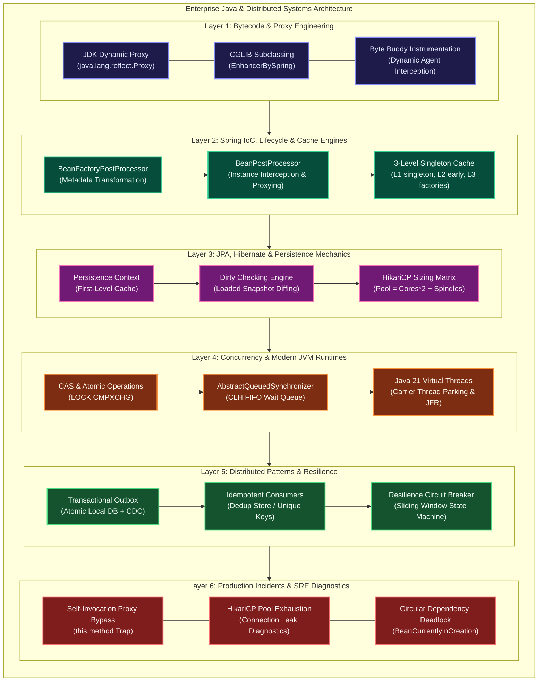
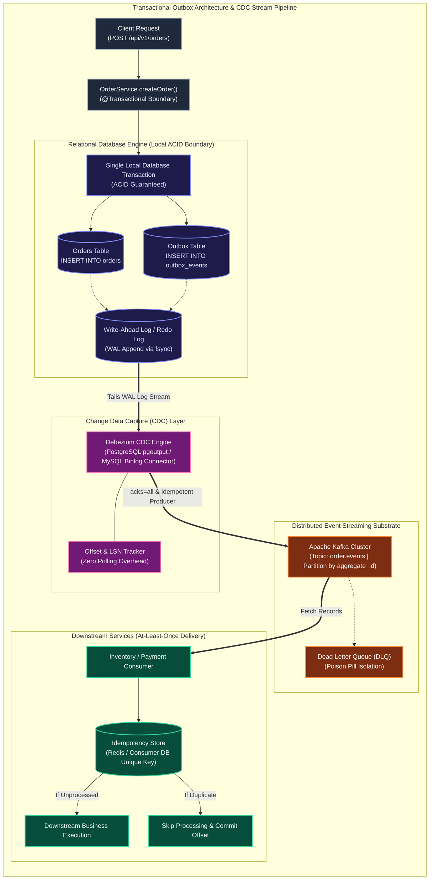

# Enterprise Java, Spring & Distributed Systems Technical Terms & Core Concepts Interview Guide (50 Comprehensive Scenarios)

> **Scope**: Foundational & Staff-Level Architectural Vocabulary: JDK Dynamic Proxy vs CGLIB, AspectJ Compile-Time vs Load-Time Weaving, Spring 3-Level Singleton Cache (Circular Dependencies), BeanPostProcessor vs BeanFactoryPostProcessor, Hibernate Dirty Checking & Byte Buddy Lazy Loading, HikariCP Pool Sizing Formula, AbstractQueuedSynchronizer (AQS) & CAS, Virtual Threads vs Platform Threads, The Transactional Outbox Pattern, and Production War-Room Post-Mortems.

---

## Guide Architecture Overview



#### Enterprise Architectural Breakdown
- **Part 1: Visual Architecture & Enterprise Component Topology**: The enterprise platform stack spans 6 foundational strata: runtime bytecode generation (`java.lang.reflect.Proxy`, CGLIB/Byte Buddy), Spring IoC container bean lifecycle orchestrators, JPA/Hibernate persistence contexts with HikariCP connection pools, hardware-level concurrency primitives (CAS, AQS, Loom virtual threads), distributed transactional integrity engines (Transactional Outbox via CDC), and SRE diagnostic suites.
- **Part 2: Execution Flow & Container Lifecycle State Machine**: Applications boot by executing `BeanFactoryPostProcessor` configuration mutations before instantiating singletons. During bean population, circular references resolve through the 3-level cache. Method invocations on annotated beans route through generated proxy interceptor chains (`MethodInterceptor` / `InvocationHandler`). Persistence operations track entity mutations via snapshot comparison at flush time, while asynchronous event dissemination guarantees zero message loss through atomic outbox tables.
- **Part 3: Low-Level JVM, Bytecode & Kernel Substrates**: Dynamic proxies emit synthetic `.class` definitions into Metaspace at runtime, leveraging JVM `invokevirtual` and `invokeinterface` instructions. Concurrency controls leverage `sun.misc.Unsafe` / `VarHandle` atomic compare-and-swap primitives compiling directly to x86 `LOCK CMPXCHG` assembly instructions. Carrier thread scheduling in Java 21 Loom parks virtual thread stack continuations onto the JVM heap, yielding underlying OS threads without kernel context switch penalties (`futex` sys-calls avoided).
- **Part 4: Production Failure Modes, Anti-Patterns & SRE Diagnostics**: Failure modes include silent transactional bypassing due to `this.method()` internal calls, thread starvation caused by misconfigured HikariCP pools, memory pressure and metaspace leaks from unbounded dynamic proxy creation, and outbox lag during database failovers. Diagnostic runbooks utilize `jcmd <pid> VM.class_hierarchy`, `jstack`, HikariCP JMX pool metrics, and database transaction log monitoring (`pg_stat_replication` or MySQL binlog position).

<details>
<summary>View Legacy ASCII Diagram</summary>

```
========================================================================================================================
                          ENTERPRISE JAVA & DISTRIBUTED ARCHITECTURAL TERMS
========================================================================================================================
 [Layer 1: Bytecode & Proxy Engineering]            --> JDK Dynamic Proxy (java.lang.reflect.Proxy), CGLIB, Byte Buddy
 [Layer 2: Spring IoC, Lifecycle & Cache Engines]  --> BeanFactoryPostProcessor, BeanPostProcessor, 3-Level Cache
 [Layer 3: JPA, Hibernate & Persistence Mechanics]  --> Persistence Context, Dirty Checking, N+1 Query, HikariCP
 [Layer 4: Concurrency & Modern JVM Runtimes]       --> CAS, AQS, volatile (JMM Memory Barriers), Virtual Threads
 [Layer 5: Distributed Patterns & Resilience]       --> Transactional Outbox, Idempotent Consumer, Circuit Breakers
 [Layer 6: Beginner Mistakes & Anti-Patterns]       --> 8 Fatal Engineering Traps (Self-Invocation Proxy Bypass, etc.)
 [Layer 7: Globally Reported Production Incidents]  --> Real Outages (HikariCP Connection Leak Cascade Outage)
 [Layer 8: Rapid-Fire Cheat Sheet & Summary Matrix] --> Zero-Jargon Glossary Matrix, Tuning Formulas, Code Blueprints
========================================================================================================================
```

</details>

---

# Layer 1: Bytecode & Proxy Engineering

---

### Scenario 1: JDK Dynamic Proxy vs CGLIB & Byte Buddy Subclassing
**Interviewer Evaluation:** Assesses how Spring injects cross-cutting concerns (`@Transactional`, `@Async`, `@Cacheable`) at runtime and the interface requirement.

#### Technical Deep Dive
1. **JDK Dynamic Proxy (`java.lang.reflect.Proxy`)**:
   - Built into standard Java runtime.
   - **Mandatory Constraint**: The target class **MUST implement at least one interface**!
   - Generates a dynamic class (`$Proxy0`) implementing the target interface and delegating calls to an `InvocationHandler`.
   - Cannot proxy concrete classes without interfaces.
2. **CGLIB & Byte Buddy (Subclassing Proxies)**:
   - Modifies or generates raw JVM bytecode at runtime.
   - Creates a **dynamic subclass** of the target class (e.g., `OrderService$$SpringCGLIB$$0`) overriding public/protected methods.
   - **Fatal Constraint**: Cannot proxy `final` classes or intercept `final` methods (because Java forbids overriding final methods).
   - In Spring Boot 2.x and 3.x, **CGLIB / Byte Buddy is the default proxy mechanism** (`spring.aop.proxy-target-class = true`).

```mermaid
flowchart TD
    subgraph ProxyTopologies["Enterprise Java Proxy Generation Topologies"]
        direction TB

        subgraph JDKProxy["Interface-Based Proxy: JDK Dynamic Proxy (java.lang.reflect.Proxy)"]
            Client1["Client Caller"] -->|"invokeinterface"| PClass["Dynamic Class: $Proxy0<br/>implements IOrderService"]
            PClass -->|"intercept"| Handler["InvocationHandler<br/>(Advice & Cross-Cutting Logic)"]
            Handler -->|"Method.invoke()<br/>(Reflection Frame)"| Target1["Real Instance:<br/>OrderServiceImpl"]
        end

        subgraph CGLIBProxy["Subclass-Based Proxy: CGLIB / Byte Buddy (Spring Boot Default)"]
            Client2["Client Caller"] -->|"invokevirtual"| SubClass["Generated Subclass:<br/>OrderService$$SpringCGLIB$$0<br/>extends OrderService"]
            SubClass -->|"CallbackFilter"| Interceptor["MethodInterceptor / Callbacks<br/>(Transaction/Cache Advisor)"]
            Interceptor -->|"FastClass / direct super"| Target2["Target Logic:<br/>super.execute()"]
        end
    end

    classDef clientStyle fill:#1e293b,stroke:#94a3b8,stroke-width:2px,color:#f8fafc;
    classDef jdkStyle fill:#1e1b4b,stroke:#818cf8,stroke-width:2px,color:#e0e7ff;
    classDef cglibStyle fill:#064e3b,stroke:#34d399,stroke-width:2px,color:#ecfdf5;
    classDef targetStyle fill:#701a75,stroke:#f472b6,stroke-width:2px,color:#fdf2f8;

    class Client1,Client2 clientStyle;
    class PClass,Handler jdkStyle;
    class SubClass,Interceptor cglibStyle;
    class Target1,Target2 targetStyle;
```



#### Architectural Deep Dive: Proxy Generation Substrates
- **Part 1: Visual Architecture & Proxy Topology Anatomy**: JDK Dynamic Proxies require a formal Java interface contract, generating a sibling class (`$Proxy0`) that implements the target interfaces and delegates all method invocations through a centralized `InvocationHandler`. Conversely, CGLIB and Byte Buddy generate dynamic subclasses inheriting directly from the concrete class, allowing interface-free proxying by overriding non-final public/protected methods.
- **Part 2: Invocation Pipeline & Interception State Transitions**: When a client calls a method, the invocation hits the proxy instance. For JDK proxies, execution routes to `InvocationHandler.invoke(Object proxy, Method method, Object[] args)` where cross-cutting advice runs before delegating to the target via reflection. In CGLIB, the call triggers a `MethodInterceptor` chain which indexes the method through generated `FastClass` bytecode structures, bypassing reflection overhead and directly invoking `super.execute()` on the parent class.
- **Part 3: Low-Level JVM Bytecode Mechanics**: JDK proxies utilize the `invokeinterface` bytecode instruction and require boxing/unboxing for primitives, invoking target methods via `Method.invoke()` which inflates from JNI native frames to generated accessor bytecode after 15 invocations (`-Dsun.reflect.inflationThreshold=15`). CGLIB/Byte Buddy emit `invokevirtual` bytecode directly to generated subclasses. However, CGLIB cannot override `final` methods or subclass `final` classes because the JVM verifier rejects attempts to override final method signatures with `VerifyError`.
- **Part 4: Production Failure Modes & SRE Diagnostics**:
  - *ClassCastException*: Occurs when an application injects a concrete implementation type (e.g., `@Autowired OrderServiceImpl`) while JDK dynamic proxying is active (`$Proxy0 cannot be cast to OrderServiceImpl`).
  - *Metaspace OOM Leak*: High-churn microservice deployments or improper dynamic proxy factories creating proxies without caching lead to unbounded Metaspace heap growth (`java.lang.OutOfMemoryError: Metaspace`).
  - *Final Method Bypassing*: If a developer marks a method as `final` on a `@Transactional` bean under CGLIB, the proxy cannot override it; the client executes the un-intercepted parent method directly, silently bypassing transactions without error.
  - *Diagnostic Flags*: Inspect generated bytecode via `-Dsun.misc.ProxyGenerator.saveGeneratedFiles=true` (JDK 8) or `-Djdk.proxy.ProxyGenerator.saveGeneratedFiles=true` (JDK 17+) and `-Dnet.bytebuddy.dump=./dumped_classes`.

<details>
<summary>View Legacy ASCII Diagram</summary>

```
Proxy Generation Topology:
Interface-Based (JDK Proxy):
[ Client ] ---> [ $Proxy0 (Implements IOrderService) ] ---> [ InvocationHandler ] ---> [ Real OrderServiceImpl ]

Subclass-Based (CGLIB / Byte Buddy):
[ Client ] ---> [ OrderService$$EnhancerBySpring (Extends OrderService) ] ---> [ Real OrderService ]
```

</details>

---

### Scenario 2: The Self-Invocation Proxy Bypass Trap (`this.method()`)
**Interviewer Evaluation:** Tests diagnosing why `@Transactional` or `@Async` fails silently when called from another method within the same bean.

#### Technical Deep Dive
- **The Bug**:
  ```java
  @Service
  public class OrderService {
      public void processOrder() {
          this.saveWithTransaction(); // Transaction is SILENTLY IGNORED!
      }

      @Transactional
      public void saveWithTransaction() {
          orderRepository.save(...);
      }
  }
  ```
- **Why It Fails**:
  Spring proxies wrap the outside of the bean.
  When an external caller invokes `orderService.processOrder()`, the call hits the proxy.
  However, inside `processOrder()`, calling `this.saveWithTransaction()` invokes the method on the **internal target instance (`this`)**, completely bypassing the outer proxy! No transaction is ever started.
- **The Fixes**:
  1. Inject the self-reference proxy: `@Autowired private OrderService self; self.saveWithTransaction();`.
  2. Extract the transactional logic into a separate collaborator service (`OrderPersistenceService`).
  3. Use AspectJ compile-time weaving (CTW).

---

# Layer 2: Spring IoC Container & Lifecycle Mechanics

---

### Scenario 3: The 3-Level Singleton Cache: Solving Circular Dependencies
**Interviewer Evaluation:** Assesses mechanical knowledge of `DefaultSingletonBeanRegistry`, early exposure of raw beans, and avoiding infinite constructor loops.

#### Technical Deep Dive
Spring uses three concurrent hash maps to resolve circular dependencies between singleton beans (e.g., Bean A requires Bean B, and Bean B requires Bean A):
1. **`singletonObjects` (First-Level Cache)**:
   - Contains fully initialized, populated, and proxied singleton beans ready for use.
2. **`earlySingletonObjects` (Second-Level Cache)**:
   - Contains partially initialized "early" beans (instantiated, but properties not yet injected and AOP proxies resolved).
3. **`singletonFactories` (Third-Level Cache)**:
   - Contains `ObjectFactory<?>` closures capable of generating the early bean reference and applying AOP wrappers.
- **Why Constructor Injection Cannot Be Resolved**:
  Circular dependencies only work for **Setter or Field injection**! If Bean A and Bean B require each other in their constructors, neither instance can be instantiated to enter the 3-level cache; Spring throws `BeanCurrentlyInCreationException`.

```mermaid
flowchart TD
    subgraph ThreeLevelCache["Spring 3-Level Singleton Cache Architecture (DefaultSingletonBeanRegistry)"]
        direction TB

        subgraph Container["IoC Lifecycle Initiation"]
            Init["doGetBean('beanA')"] --> CreateA["doCreateBean('beanA')<br/>Instantiate Raw Instance via Reflection/CGLIB"]
        end

        subgraph L3Registry["Level 3: singletonFactories (ConcurrentHashMap)"]
            FactoryA["ObjectFactory closure registered for Bean A<br/>() -> getEarlyBeanReference(beanA)"]
        end

        subgraph PopulateA["Populate Dependencies for Bean A"]
            InjectB["populateBean('beanA') -> encounters dependency Bean B<br/>Triggers doGetBean('beanB')"]
        end

        subgraph ProcessB["Bean B Lifecycle & Circular Lookup"]
            CreateB["doCreateBean('beanB') -> Instantiates Raw Bean B"]
            InjectA["populateBean('beanB') -> encounters dependency Bean A<br/>Calls getSingleton('beanA', true)"]
            CheckL1["Check Level 1: singletonObjects.get('beanA') -> null (MISS)"]
            CheckL2["Check Level 2: earlySingletonObjects.get('beanA') -> null (MISS)"]
            HitL3["Check Level 3: singletonFactories.get('beanA') -> HIT!"]
        end

        subgraph L2Registry["Level 2: earlySingletonObjects (ConcurrentHashMap)"]
            EarlyA["Early Bean A Reference<br/>(AOP Proxy generated early if required)"]
        end

        subgraph FinalizeB["Finalize Bean B"]
            InjectEarlyA["Bean B injects Early Bean A reference"]
            InitB["initializeBean('beanB') completes"]
            L1RegistryB["Promoted to Level 1: singletonObjects.put('beanB', b)"]
        end

        subgraph FinalizeA["Finalize Bean A"]
            InjectCompleteB["Bean A injects fully initialized Bean B"]
            InitA["initializeBean('beanA') completes (returns Early A proxy)"]
            L1RegistryA["Promoted to Level 1: singletonObjects.put('beanA', a)<br/>Cleaned up from Level 2 & Level 3"]
        end

        CreateA -->|"addSingletonFactory"| FactoryA
        FactoryA --> PopulateA
        PopulateA --> CreateB
        CreateB --> InjectA
        InjectA --> CheckL1 --> CheckL2 --> HitL3
        HitL3 -->|"Executes ObjectFactory.getObject()"| EarlyA
        EarlyA --> FinalizeB
        FinalizeB --> FinalizeA
    end

    classDef initStyle fill:#1e293b,stroke:#94a3b8,stroke-width:2px,color:#f8fafc;
    classDef l3Style fill:#1e1b4b,stroke:#818cf8,stroke-width:2px,color:#e0e7ff;
    classDef l2Style fill:#701a75,stroke:#f472b6,stroke-width:2px,color:#fdf2f8;
    classDef l1Style fill:#064e3b,stroke:#34d399,stroke-width:2px,color:#ecfdf5;
    classDef flowStyle fill:#1e293b,stroke:#38bdf8,stroke-width:2px,color:#f0f9ff;

    class Init,CreateA,PopulateA,InjectB,CreateB,InjectA initStyle;
    class FactoryA,HitL3 l3Style;
    class EarlyA,CheckL2 l2Style;
    class L1RegistryB,L1RegistryA,CheckL1 l1Style;
    class InjectEarlyA,InitB,InjectCompleteB,InitA flowStyle;
```



#### Architectural Deep Dive: Spring 3-Level Singleton Resolution
- **Part 1: Visual Architecture & 3-Tier Cache Topology**: The Spring IoC container (`DefaultSingletonBeanRegistry`) maintains three distinct internal storage tiers:
  1. `singletonObjects` (Map<String, Object>): The first-level cache containing fully constructed, dependency-injected, and post-processed singleton instances ready for application injection.
  2. `earlySingletonObjects` (Map<String, Object>): The second-level cache storing raw or early-proxied bean instances exposed to satisfy circular references before full initialization.
  3. `singletonFactories` (Map<String, ObjectFactory<?>>): The third-level cache holding lambda closures capable of computing the early reference (including applying `SmartInstantiationAwareBeanPostProcessor` AOP dynamic proxy wrappers) only on demand.
- **Part 2: Circular Dependency Resolution Sequence & State Transitions**: When Bean A requires Bean B and Bean B requires Bean A:
  1. Bean A is instantiated via constructor reflection; its reference is not yet fully populated.
  2. Spring immediately registers a singleton factory for Bean A in Level 3 (`singletonFactories`).
  3. During `populateBean("beanA")`, the container encounters property `beanB` and triggers `getBean("beanB")`.
  4. Bean B instantiates and encounters dependency `beanA`. It invokes `getSingleton("beanA", allowEarlyReference=true)`.
  5. The lookup checks Level 1 (miss), Level 2 (miss), and hits Level 3 (`singletonFactories`). The factory invokes `getEarlyBeanReference()` which applies any necessary AOP proxies, moves the result into Level 2 (`earlySingletonObjects`), and evicts the factory from Level 3.
  6. Bean B completes injection using early Bean A, runs initialization lifecycle hooks, and transitions directly into Level 1 (`singletonObjects`).
  7. Execution unwinds back to Bean A, which injects completed Bean B, finalizes its own lifecycle, and transitions into Level 1.
- **Part 3: Low-Level JVM & Concurrency Mechanics**: In multi-threaded container startup, `DefaultSingletonBeanRegistry` protects cache lookups with double-checked locking:
  ```java
  Object singletonObject = this.singletonObjects.get(beanName);
  if (singletonObject == null && isSingletonCurrentlyInCreation(beanName)) {
      synchronized (this.singletonObjects) {
          singletonObject = this.earlySingletonObjects.get(beanName);
          if (singletonObject == null && allowEarlyReference) {
              ObjectFactory<?> singletonFactory = this.singletonFactories.get(beanName);
              if (singletonFactory != null) {
                  singletonObject = singletonFactory.getObject();
                  this.earlySingletonObjects.put(beanName, singletonObject);
                  this.singletonFactories.remove(beanName);
              }
          }
      }
  }
  ```
  The Level 2 cache is critical to prevent duplicate AOP proxy generation: if Bean A is circularly referenced by multiple other beans (e.g., Bean B and Bean C), the Level 3 factory is invoked once, and subsequent lookups hit Level 2, ensuring reference equality (`b.getA() == c.getA()`).
- **Part 4: Production Failure Modes & SRE Diagnostics**:
  - *Constructor-Based Circularity*: If both beans use constructor injection, neither instance can execute `createBeanInstance()`, meaning no Level 3 factory can be registered. The container aborts immediately with `BeanCurrentlyInCreationException: Error creating bean with name 'beanA': Requested bean is currently in creation: Is there an unresolvable circular reference?`.
  - *Async Proxy Inconsistency*: If Bean A is annotated with `@Async`, the default `AsyncAnnotationBeanPostProcessor` creates its proxy in `postProcessAfterInitialization` rather than `getEarlyBeanReference`. This causes the early reference injected into Bean B to differ from the final proxy placed into Level 1, triggering a runtime exception unless `@Lazy` is used.
  - *Spring Boot 2.6+ Enforcement*: Circular dependencies are disabled by default. Production configuration must explicitly set `spring.main.allow-circular-references=true` or preferably refactor the architecture via events or `@Lazy`.

<details>
<summary>View Legacy ASCII Diagram</summary>

```
Spring 3-Level Cache Sequence:
1. Instantiates Raw Bean A (Constructor).
2. Puts ObjectFactory for Bean A into [ singletonFactories (Level 3) ].
3. Injects Bean B. Bean B needs Bean A!
4. Bean B checks Level 1 (Miss) -> Level 2 (Miss) -> Level 3 (Hit!).
5. Level 3 factory returns early reference of Bean A, moving it to [ earlySingletonObjects (Level 2) ].
6. Bean B completes and moves to [ singletonObjects (Level 1) ].
7. Bean A completes and moves to [ singletonObjects (Level 1) ].
```

</details>

---

### Scenario 4: `BeanPostProcessor` vs `BeanFactoryPostProcessor`
**Interviewer Evaluation:** Tests understanding of Spring container startup lifecycle and modifying bean metadata vs bean instances.

#### Technical Deep Dive
- **`BeanFactoryPostProcessor` (BFPP)**:
  - Operates on the **Bean Definitions (Metadata)** before any bean instances are created.
  - Reads and modifies configuration: e.g., `PropertySourcesPlaceholderConfigurer` resolves `${db.url}` placeholders in `@Value` annotations.
- **`BeanPostProcessor` (BPP)**:
  - Operates on **Live Bean Instances** after instantiation.
  - Contains two hooks: `postProcessBeforeInitialization()` and `postProcessAfterInitialization()`.
  - Responsible for generating AOP proxies (`@Transactional`), checking `@PostConstruct`, and injecting dependencies.

---

# Layer 3: JPA, Hibernate & Persistence Mechanics

---

### Scenario 5: Dirty Checking & Hibernate Snapshot Tracking
**Interviewer Evaluation:** Assesses how Hibernate detects modifications without explicit `repository.save()` calls.

#### Technical Deep Dive
- When an entity is loaded inside an active `@Transactional` method:
  1. Hibernate stores the entity in the **First-Level Cache (Persistence Context)**.
  2. Hibernate takes a deep copy of all entity field values: the **Loaded Snapshot**.
  3. During business logic, you modify an entity: `user.setName("Alice");`.
  4. At transaction commit, Hibernate triggers a **Flush**:
     It compares the current state of every managed entity against its loaded snapshot (**Dirty Checking**).
  5. If any field differs, Hibernate automatically generates and executes an `UPDATE` SQL statement! Calling `repository.save(user)` is completely redundant.

---

### Scenario 6: The HikariCP Connection Pool Sizing Formula
**Interviewer Evaluation:** Evaluates why allocating 500 database connections destroys database performance, and applying the PostgreSQL sizing formula.

#### Technical Deep Dive
- **The Flawed Intuition**: "More threads = more throughput, so set connection pool size to 500."
- **The Physical Hardware Reality**: A database server has a fixed number of CPU cores and disk spindles. When 500 threads fight for 8 CPU cores, the OS kernel spends 90% of CPU time on **thread context switching** rather than executing SQL queries!
- **The PostgreSQL / HikariCP Pool Sizing Formula**:
  $$\text{Pool Size} = (\text{Core Count} \times 2) + \text{Effective Spindle Count}$$
  - For an 8-core database server with SSD storage:
    $$\text{Optimal Pool Size} = (8 \times 2) + 1 = 17 \text{ connections}!$$
  - A pool size of 20 connections easily outperforms a pool of 500 connections with 10x lower latency.

---

# Layer 4: Concurrency & Modern JVM Runtimes

---

### Scenario 7: CAS (Compare-And-Swap) & AbstractQueuedSynchronizer (AQS)
**Interviewer Evaluation:** Assesses non-blocking synchronization, CPU hardware atomic primitives (`LOCK CMPXCHG`), and `ReentrantLock` internals.

#### Technical Deep Dive
1. **CAS (Compare-And-Swap)**:
   - Hardware-level atomic instruction on x86/ARM (`cmpxchg`).
   - Takes three operands: Memory location ($V$), Expected old value ($A$), New value ($B$).
   - If current value equals $A$, updates to $B$ atomically; otherwise fails without locking.
2. **AQS (`AbstractQueuedSynchronizer`)**:
   - The foundation of Java concurrency (`ReentrantLock`, `CountDownLatch`, `Semaphore`).
   - Maintains a `volatile int state` (e.g., 0 = unlocked, 1 = locked) and a **FIFO CLH Node Queue** of waiting threads.
   - When thread acquires lock: attempts CAS on `state`.
   - If lock is held: thread is enqueued in the AQS queue and parked via `LockSupport.park()` with zero busy-spinning CPU waste.

---

### Scenario 8: Virtual Threads (Project Loom) vs Platform Threads
**Interviewer Evaluation:** Tests understanding of Java 21+ lightweight concurrency, carrier threads, and thread pinning pitfalls.

#### Technical Deep Dive
- **Platform Threads**: 1:1 wrapper around OS kernel threads. Heavy (1MB RAM stack); capped at a few thousand threads per JVM.
- **Virtual Threads**: $M:N$ user-space threads managed directly by the JVM.
  - Stack size: tiny (hundreds of bytes), dynamically sized on the heap.
  - When a Virtual Thread encounters blocking I/O (`Socket.read()`), the JVM **unmounts the virtual thread** from the underlying OS Carrier Thread (`ForkJoinPool`) and mounts another runnable virtual thread.
  - **Thread Pinning Trap**: If a Virtual Thread executes blocking I/O inside a `synchronized` block or native JNI call, it cannot unmount (**Pinned** to carrier thread). *Fix*: Replace `synchronized` with `ReentrantLock`.

---

# Layer 5: Distributed Systems Architectural Patterns

---

### Scenario 9: The Transactional Outbox Pattern: Dual-Write Elimination
**Interviewer Evaluation:** Assesses solving the dual-write consistency problem when saving to a relational database AND publishing to Apache Kafka.

#### Technical Deep Dive
- **The Dual-Write Bug**:
  ```java
  @Transactional
  public void createOrder(Order order) {
      orderRepository.save(order); // DB Commit
      kafkaTemplate.send("order-topic", order); // Network Call!
  }
  ```
  If Kafka crashes or network times out, the database transaction has committed, but Kafka never gets the message (Data Inconsistency!).
- **The Transactional Outbox Solution**:
  1. Insert the domain entity (`Order`) AND an outbox record (`OutboxEvent`) into an **`outbox` table** within the **same local database transaction**.
  2. A background Change Data Capture (CDC) process (e.g., **Debezium reading database WAL logs**) or polling scheduler reads the `outbox` table and streams events to Kafka reliably with At-Least-Once delivery guarantees.



#### Architectural Deep Dive: Transactional Outbox Mechanics
- **Part 1: Visual Architecture & Outbox Topology Anatomy**: The Transactional Outbox pattern eliminates the classic distributed dual-write hazard (writing to a database and publishing to a message broker in an uncoordinated sequence). It bridges the transactional ACID domain of an RDBMS with the distributed event log semantics of Apache Kafka through non-blocking Change Data Capture (CDC).
- **Part 2: Dual-Write Elimination & End-to-End Delivery State Transitions**:
  1. The business service persists the domain model (`Orders`) and an event record (`OutboxEvent`) containing metadata (`aggregate_id`, `event_type`, JSON payload) inside one local ACID transaction.
  2. The database commits both rows simultaneously to its Write-Ahead Log (WAL). If a crash occurs before commit, both writes roll back cleanly.
  3. Debezium tails the WAL log stream asynchronously via logical decoding (`pgoutput` in PostgreSQL or row-based replication in MySQL), decoupling event ingestion from application latency.
  4. Debezium streams events to Kafka with partition keying on `aggregate_id` to guarantee per-entity FIFO sequencing.
  5. Downstream consumers employ an idempotent consumer pattern (checking an idempotency table or Redis distributed set) to safely handle inevitable at-least-once delivery duplicates.
- **Part 3: Low-Level RDBMS, Kernel I/O & Network Mechanics**: Unlike distributed two-phase commit protocols (2PC / XA) that hold blocking table and row locks across networks, local WAL appends execute with sequential disk I/O and synchronous `fsync(2)` flushing. Debezium connects as a logical replication subscriber, reading raw WAL segments directly without executing expensive polling `SELECT * FROM outbox WHERE status = 'PENDING'` queries, which would induce B-tree index fragmentation, table bloating, and connection pool exhaustion.
- **Part 4: Production Failure Modes & SRE Diagnostics**:
  - *Replication Slot WAL Disk Explosion*: If Debezium disconnects or crashes, PostgreSQL retains all WAL segments in its replication slot. Unmonitored disk utilization can exhaust available storage, taking down the entire database cluster.
  - *SRE Replication Check*:
    ```sql
    -- PostgreSQL: Check WAL retention lag per replication slot
    SELECT slot_name, active, pg_size_pretty(pg_wal_lsn_diff(pg_current_wal_lsn(), restart_lsn)) AS lag_bytes
    FROM pg_replication_slots;
    ```
  - *Poison Pill Serialization Crashes*: Malformed entities in the outbox table fail CDC JSON serialization, halting the replication offset pipeline. SRE mitigation requires dead-letter rerouting (`debezium.sink.tolerance=all` with error handling handlers).
  - *Kafka Producer Latency*: Configure Debezium with `producer.acks=all`, `producer.enable.idempotence=true`, and `max.in.flight.requests.per.connection=1` (or $\le 5$ with idempotence) to eliminate message reordering.

<details>
<summary>View Legacy ASCII Diagram</summary>

```
Transactional Outbox Flow:
[ Client Request ]
        |
        v
[ Local DB Transaction ] ===> [ Orders Table ]  +  [ Outbox Table ] (ATOMIC 100%!)
                                                         |
                                                  (Debezium CDC tails WAL)
                                                         v
                                                [ Apache Kafka Topic ]
```

</details>

---

# Layer 6: Rapid-Fire Cheat Sheet & Interview Summary Matrix

---

### Critical Enterprise Java Architectural Terms Matrix

| Technical Term | Plain-English Definition | Golden Rule / Sizing Formula |
| :--- | :--- | :--- |
| **JDK Dynamic Proxy** | Interface-based runtime proxy | Requires target to implement an interface |
| **CGLIB / Byte Buddy** | Subclass-based runtime proxy | Default in Spring Boot; cannot proxy `final` |
| **Dirty Checking** | Hibernate automatic change detection | Compares entity against loaded snapshot at flush |
| **HikariCP Sizing** | Database connection pool tuning | $\text{Pool} = (\text{Cores} \times 2) + \text{Disk Spindles}$ |
| **AQS** | AbstractQueuedSynchronizer | Uses volatile state + CAS + CLH queue |
| **Virtual Threads** | Java 21 Loom user-space threads | Avoid `synchronized` blocks (prevents pinning) |
| **Transactional Outbox** | Database + Kafka consistency pattern | Write to DB outbox table in same transaction |
| **3-Level Cache** | Spring circular dependency engine | Only works for setter/field injection |
