# Gradle Build Automation & DAG Engine Master Interview Guide (50 Comprehensive Scenarios)

> **Scope**: Gradle 3-Phase Lifecycle (Initialization, Configuration, Execution), Task Execution Graph (DAG) Traversal, Task Configuration Avoidance API (`register` vs `create`), Dependency Configurations (`api` vs `implementation`, `runtimeOnly`, `compileOnly`, `annotationProcessor`), "Highest Version Wins" Conflict Engine, Rich Version Constraints (`strictly`, `reject`), Version Catalogs (`libs.versions.toml`), Incremental Builds (`@Input`, `@OutputDirectory`, `UP-TO-DATE`), Configuration Cache Serialization, Local & Remote Build Cache (`FROM-CACHE`), Composite Builds (`includeBuild`), Convention Plugins with `build-logic`, Daemon Socket IPC, and Production War-Room Forensics.

---

## Guide Architecture Overview

```mermaid
flowchart TB
    subgraph L8 ["Layer 8: Production CLI & Performance Decision Matrix"]
        direction LR
        G1["CLI Flags: --scan, --build-cache<br/>(Develocity Scans, cache replay)"]
        G2["Parallel & Worker API: --parallel, --max-workers=8<br/>(Process/Thread isolation)"]
        G3["Daemon Maintenance: --status, --stop<br/>(Background JVM lifecycle)"]
    end

    subgraph L7 ["Layer 7: Configuration Anti-Patterns & Forensics"]
        direction LR
        E1["Configuration Phase I/O Trap<br/>(Network/disk calls freeze every run)"]
        E2["subprojects / allprojects Poisoning<br/>(Couples modules, breaks config cache)"]
        E3["Daemon Memory Leaks & Lockups<br/>(Metaspace exhaustion, file locks on Windows)"]
    end

    subgraph L6 ["Layer 6: Architecture Modularity & Composite Builds"]
        direction LR
        C1["includeBuild Composite Builds<br/>(Live cross-repo local source substitution)"]
        C2["build-logic Convention Plugins<br/>(Type-safe custom Kotlin plugins)"]
        C3["Version Catalogs (libs.versions.toml)<br/>(Type-safe multi-module dependency pinning)"]
    end

    subgraph L5 ["Layer 5: Configuration Cache & Remote Build Cache"]
        direction LR
        CC1["Configuration Cache<br/>(Serializes in-memory task DAG to disk)"]
        CC2["Remote Build Cache (FROM-CACHE)<br/>(SHA-256 fingerprint HTTP artifact cache)"]
        CC3["CC Disallowed Inputs<br/>(Direct Project references prohibited)"]
    end

    subgraph L4 ["Layer 4: Incremental Builds & UP-TO-DATE Mechanics"]
        direction LR
        I1["@Input / @InputFiles / @OutputDirectory<br/>(Annotated inputs & outputs)"]
        I2["Cryptographic Hash Fingerprinting<br/>(Compares prior build snapshot hashes)"]
        I3["Task State: UP-TO-DATE vs EXECUTED<br/>(Zero-time redundant execution skips)"]
    end

    subgraph L3 ["Layer 3: Dependency Resolution & Conflict Engine"]
        direction LR
        R1["api vs implementation<br/>(ABI leakage prevention & recompile avoidance)"]
        R2["Highest Version Wins Engine<br/>(Gradle default resolution vs Maven nearest)"]
        R3["Rich Version Constraints<br/>strictly, prefer, reject, require"]
    end

    subgraph L2 ["Layer 2: Task Execution Graph & Avoidance API"]
        direction LR
        T1["Task Execution Graph (DAG)<br/>(Topological sorting of dependsOn / mustRunAfter)"]
        T2["Task Configuration Avoidance<br/>tasks.register() (lazy) vs tasks.create() (eager)"]
        T3["Task Actions<br/>doFirst { } and doLast { } execution hooks"]
    end

    subgraph L1 ["Layer 1: Gradle 3-Phase Lifecycle & Settings"]
        direction LR
        P1["Initialization Phase<br/>(settings.gradle.kts determines projects)"]
        P2["Configuration Phase<br/>(Executes build.gradle.kts to build task graph)"]
        P3["Execution Phase<br/>(Traverses DAG and executes actions)"]
    end

    L8 --> L7
    L7 --> L6
    L6 --> L5
    L5 --> L4
    L4 --> L3
    L3 --> L2
    L2 --> L1

    classDef l8 fill:#1e1e2e,stroke:#f38ba8,stroke-width:2px,color:#cdd6f4;
    classDef l7 fill:#1e1e2e,stroke:#fab387,stroke-width:2px,color:#cdd6f4;
    classDef l6 fill:#1e1e2e,stroke:#f9e2af,stroke-width:2px,color:#cdd6f4;
    classDef l5 fill:#1e1e2e,stroke:#a6e3a1,stroke-width:2px,color:#cdd6f4;
    classDef l4 fill:#1e1e2e,stroke:#94e2d5,stroke-width:2px,color:#cdd6f4;
    classDef l3 fill:#1e1e2e,stroke:#89dceb,stroke-width:2px,color:#cdd6f4;
    classDef l2 fill:#1e1e2e,stroke:#89b4fa,stroke-width:2px,color:#cdd6f4;
    classDef l1 fill:#1e1e2e,stroke:#cba6f7,stroke-width:2px,color:#cdd6f4;

    class G1,G2,G3 l8;
    class E1,E2,E3 l7;
    class C1,C2,C3 l6;
    class CC1,CC2,CC3 l5;
    class I1,I2,I3 l4;
    class R1,R2,R3 l3;
    class T1,T2,T3 l2;
    class P1,P2,P3 l1;
```



#### Architectural Breakdown: The 8-Layer Gradle Build Automation & DAG Engine

1. **Visual Architecture & Engine Layer Anatomy**:
   - **Layer 1 (Gradle 3-Phase Lifecycle & Settings)**: The foundation of Gradle. Distinctly isolates the **Initialization Phase** (`settings.gradle.kts`), **Configuration Phase** (`build.gradle.kts` constructing the DAG), and **Execution Phase** (running task actions).
   - **Layer 2 (Task Execution Graph & Avoidance API)**: Manages build work via an acyclic directed graph. Leverages the Task Configuration Avoidance API (`tasks.register()` creating lazy `TaskProvider` instances) to eliminate unnecessary object allocation and configuration time.
   - **Layer 3 (Dependency Resolution & Conflict Engine)**: Manages dependencies via configurations. Enforces Application Binary Interface (ABI) isolation with `api` vs `implementation`. Unlike Maven's nearest-definition-wins, Gradle resolves version conflicts using **Highest Version Wins** by default, extensible via rich version constraints (`strictly`, `reject`).
   - **Layer 4 (Incremental Builds & UP-TO-DATE Mechanics)**: High-speed execution engine. Tasks declare annotated inputs (`@Input`, `@InputFiles`) and outputs (`@OutputDirectory`). Gradle hashes inputs and outputs before running a task; if unchanged since the prior invocation, the task is marked `UP-TO-DATE` and skipped in 0ms.
   - **Layer 5 (Configuration Cache & Remote Build Cache)**: Next-generation caching. Configuration Cache serializes the complete in-memory task execution graph directly to disk, bypassing Phase 2 on subsequent builds. Remote Build Cache shares task output JARs across teams and CI/CD pipelines via SHA-256 fingerprint matching (`FROM-CACHE`).
   - **Layer 6 (Architecture Modularity & Composite Builds)**: Supports monorepos and multi-repo architectures. `includeBuild` enables local source substitution without publishing snapshot artifacts. Centralized `build-logic` convention plugins eliminate duplicated build configuration across sub-projects.
   - **Layer 7 (Configuration Anti-Patterns & Forensics)**: Hardened guidance preventing slow configuration-phase I/O, leaky `subprojects` blocks, and Gradle daemon Metaspace memory leaks.
   - **Layer 8 (Production CLI & Performance Decision Matrix)**: Developer operations and debugging tools including Gradle Build Scans (`--scan`), parallel worker thread limits (`--parallel`), and daemon lifecycle commands.

2. **Execution Flow & Lifecycle State Transitions**:
   - **Phase 1: Initialization**: Gradle parses `settings.gradle.kts`, resolves included builds (`includeBuild`), and creates `Project` descriptors for the root and all sub-modules.
   - **Phase 2: Configuration**: Evaluates the `build.gradle.kts` buildscripts. Tasks register their inputs, outputs, and dependencies (`dependsOn`). Gradle computes the topological sort of the graph. If Configuration Cache is active and valid, Gradle loads the cached graph directly from disk and skips this entire phase.
   - **Phase 3: Execution**: Gradle traverses the DAG. For each task, it compares input/output cryptographic fingerprints. If unchanged, it marks the task `UP-TO-DATE`. If cached remotely, it downloads the artifact (`FROM-CACHE`). Otherwise, it executes `doFirst` and `doLast` actions.

3. **Low-Level Mediation & Cache Serialization Mechanics**:
   - **`api` vs `implementation` Classpath Isolation**: When Module A depends on Module B via `implementation`, Module B's internal classes are placed on Module A's compile classpath, but are **excluded** from the compile classpath of any module that depends on Module A. When Module B changes its internal private code, downstream consumers of Module A do not need to recompile, enabling massive parallel build speedups.
   - **Configuration Cache Fingerprinting**: The configuration cache records all inputs consumed during configuration (e.g. system properties, environment variables, Gradle files). If any recorded input changes, the cache is invalidated and Phase 2 runs again. Direct references to `Project` objects inside task actions are forbidden because `Project` contains live execution state that cannot be safely serialized.

4. **Production Failure Modes & SRE Diagnostics**:
   - **Configuration-Phase I/O Latency Trap**: Running network requests (e.g. fetching metadata from an internal API) or filesystem scans directly in the configuration phase blocks every build, even `./gradlew tasks`. SRE remediation: Migrate dynamic values into lazy providers (`providers.of()`) or dedicated task actions.
   - **Gradle Daemon Metaspace Exhaustion**: On CI workers that run hundreds of builds with various dynamic plugins, long-lived Gradle daemon JVMs leak Metaspace memory, eventually crashing with `OutOfMemoryError: Metaspace`. SRE diagnostic command: `./gradlew --status` and ensure CI configurations invoke `./gradlew --stop` at the end of build agent runs.

<details>
<summary>View Legacy ASCII Overview</summary>

```text
========================================================================================================================
                                     GRADLE BUILD ENGINE INTERVIEW GUIDE
========================================================================================================================
 [Layer 1: Gradle 3-Phase Lifecycle & Task Execution DAG]  --> Initialization, Configuration, Execution, Task Avoidance
 [Layer 2: Dependency Configurations & Conflict Engine]    --> api vs implementation, Highest Version Wins, Catalogs
 [Layer 3: Incremental Builds & UP-TO-DATE Mechanics]      --> Task Inputs/Outputs, Cryptographic Fingerprints, Actions
 [Layer 4: Configuration Cache & Remote Build Cache]       --> Graph Serialization to Disk, SHA-256 FROM-CACHE
 [Layer 5: Composite Builds & Convention Plugins]          --> includeBuild Local Source Substitution, build-logic
 [Layer 6: Ultra-Deep Real-World War-Room Incidents]       --> 6 Production Disasters (Daemon Deadlock, Cache Poisoning)
 [Layer 7: Beginner Mistakes & Configuration Traps]        --> 5 Anti-Patterns (Config-phase I/O, Eager Creation, subprojects)
 [Layer 8: Rapid-Fire Cheat Sheet & Decision Matrix]       --> CLI Flags, Kotlin DSL Syntax, Performance Decision Matrix
========================================================================================================================
```

</details>

---

# Layer 1: Gradle 3-Phase Lifecycle & Task Execution DAG

---

### Scenario 1: The 3 Distinct Build Phases of Gradle
**Interviewer Evaluation:** Assesses exact mental model of Gradle's execution lifecycle and preventing configuration-phase performance bottlenecks.

#### Technical Deep Dive
Every Gradle execution progresses through three isolated phases:
1. **Initialization Phase**: Evaluates `settings.gradle.kts`. Identifies which projects participate in the build, instantiating a `Project` instance for each.
2. **Configuration Phase**: Executes the `build.gradle.kts` scripts of **all participating projects** in order to configure tasks, plugins, and properties. It builds the in-memory **Task Execution Graph (DAG)**. **No compiled code or application logic should run here!**
3. **Execution Phase**: Traverses the calculated DAG in topological order and executes the `Action` closures (`doFirst` / `doLast`) of the requested tasks.

#### Follow-Up Trap Question & Winning Answer
- **Trap:** "If you run `./gradlew help`, does Gradle execute the configuration code of all subprojects in a 100-module monorepo?"
- **Winning Answer:** Yes! Unless the **Configuration Cache** is enabled, Gradle executes the configuration phase for *all* projects defined in `settings.gradle.kts` on *every single invocation*, even for simple tasks like `help` or `tasks`. This is why performing heavy I/O or network requests during the configuration phase destroys developer productivity.

---

### Scenario 2: Task Configuration Avoidance: `tasks.register()` vs `tasks.create()`
**Interviewer Evaluation:** Tests understanding of lazy task configuration and memory optimization.

#### Technical Deep Dive
- `tasks.create("heavyTask")`: **Eager**. Immediately instantiates the task and executes its configuration closure during the Configuration Phase, consuming heap memory and CPU cycles even if `heavyTask` is never executed!
- `tasks.register("heavyTask")`: **Lazy (Task Configuration Avoidance)**. Creates a `TaskProvider<HeavyTask>`. The task configuration closure is **deferred** and executed *only* if the task is requested on the CLI or needed by another executing task.

```kotlin
// ❌ EAGER ANTI-PATTERN:
tasks.create<Tar>("archive") {
    from("large-dir") // Configures Tar and scans files on EVERY build!
}

// ✅ LAZY BEST PRACTICE:
tasks.register<Tar>("archive") {
    from("large-dir") // Configured ONLY when archive task is actually executed!
}
```

---

### Scenario 3: Task Execution Graph (DAG) & Topological Ordering
**Interviewer Evaluation:** Assesses understanding of task dependencies and cyclic graph detection.

#### Technical Deep Dive
When a task is invoked (e.g. `./gradlew build`):
1. Gradle inspects explicit dependencies declared via `dependsOn()` and implicit dependencies derived from task inputs/outputs.
2. It constructs a **Directed Acyclic Graph (DAG)**.
3. It performs a topological sort to schedule tasks so that every prerequisite task finishes before a dependent task starts.
4. If Task A depends on Task B and Task B depends on Task A, Gradle terminates immediately during graph construction with `CircularDependencyException`.

---

### Scenario 4: The `doFirst` and `doLast` Action Execution Model
**Interviewer Evaluation:** Explains how custom task logic is scheduled into the Execution Phase.

#### Technical Deep Dive
```kotlin
tasks.register("processOrder") {
    // ⚠️ CONFIGURATION BLOCK: Runs during Configuration Phase!
    println("Configuring processOrder task...")

    doFirst {
        // Runs at the BEGINNING of the Execution Phase for this task
        println("Validating preconditions...")
    }

    doLast {
        // Runs at the END of the Execution Phase for this task
        println("Finalizing order payload...")
    }
}
```

---

### Scenario 5: Dynamic Task Dependencies via `mustRunAfter` vs `shouldRunAfter`
**Interviewer Evaluation:** Controls execution ordering without forcing dependency execution.

#### Technical Deep Dive
- `dependsOn(taskB)`: Hard dependency. Executing Task A **forces Task B to execute**.
- `mustRunAfter(taskB)`: Ordering constraint. If *both* Task A and Task B are scheduled to run, Task B is guaranteed to run before Task A. If Task A is scheduled alone, Task B is **not executed**.
- `shouldRunAfter(taskB)`: Soft ordering constraint. Like `mustRunAfter`, but Gradle can ignore it if executing in parallel or to avoid cycles.

---

### Scenario 6: Gradle Build Scans (`--scan`) for Deep Performance Profiling
**Interviewer Evaluation:** Analyzes build performance bottlenecks in production CI environments.

#### Technical Deep Dive
Running `./gradlew build --scan` publishes an exhaustive diagnostic profile to Gradle Develocity:
- Visual timeline of task execution across CPU worker threads.
- Breakdown of time spent in Configuration vs Execution phases.
- Cache hit/miss rates (`UP-TO-DATE`, `FROM-CACHE`, `EXECUTED`).
- Garbage collection pauses and memory allocation curves inside the Gradle Daemon.

---

### Scenario 7: Kotlin DSL Type-Safe Accessors & Plugin Precedence
**Interviewer Evaluation:** Explains how Gradle generates Kotlin extension functions for plugins and tasks.

#### Technical Deep Dive
When you declare plugins inside the `plugins {}` block:
```kotlin
plugins {
    `java-library`
    id("org.springframework.boot") version "3.2.4"
}
```
Gradle's Kotlin DSL compiler generates **type-safe extension accessors** (e.g. `java {}`, `tasks.compileJava {}`, `dependencies.implementation {}`), providing instant IDE auto-completion and compile-time verification that dynamically-typed Groovy DSL lacks.

---

# Layer 2: Dependency Configurations & Conflict Engine

---

### Scenario 8: `api` vs `implementation` & The Compile Avoidance Engine
**Interviewer Evaluation:** Evaluates compile-time classpath isolation and preventing cascading rebuilds.

#### Technical Deep Dive
In the `java-library` plugin:
- **`api`**: Exposes the dependency transitively to consumers of this library. If Module A depends on Module B, and Module B declares `api("com.google.guava:guava")`, Guava is present on Module A's compile classpath. If Guava changes, **Module A must recompile**.
- **`implementation`**: Hides the dependency from consumers' compile classpath (it is present only on the runtime classpath). If Guava changes, **Module A does NOT recompile** (**Compile Avoidance**).
- **Rule of Thumb**: Always default to `implementation`. Use `api` only when types from the dependency appear in public method return types or parameters of the module's public API.

---

### Scenario 9: "Highest Version Wins" Dependency Conflict Resolution
**Interviewer Evaluation:** Contrasts Gradle's default resolution strategy with Maven's "Nearest Definition Wins".

#### Technical Deep Dive
When conflicting transitive dependency versions are discovered:
- Maven selects the shallowest depth in the tree.
- **Gradle selects the highest semantic version** across the entire graph.

```kotlin
// Forcing a build failure on version conflict:
configurations.all {
    resolutionStrategy {
        failOnVersionConflict() // Rejects silent version upgrades!
    }
}
```

---

### Scenario 10: Rich Version Constraints (`strictly`, `prefer`, `require`, `reject`)
**Interviewer Evaluation:** Assesses fine-grained control over version selection in complex enterprise dependency graphs.

#### Technical Deep Dive
```kotlin
dependencies {
    implementation("org.yaml:snakeyaml") {
        version {
            strictly("[2.0, 3.0[") // Must be 2.x; rejects 1.x even if transitive libraries ask for it!
            reject("1.33")         // Explicitly blocks vulnerable CVE version!
        }
    }
}
```

---

### Scenario 11: Dependency Configurations Matrix: `compileOnly` vs `runtimeOnly`
**Interviewer Evaluation:** Evaluates minimizing runtime JAR footprints and managing compile-time-only annotations.

#### Technical Deep Dive
- `compileOnly`: Present during compilation, excluded from runtime (e.g. Lombok, `@Nullable` annotations).
- `runtimeOnly`: Excluded from compile classpath, included in runtime package (e.g. JDBC drivers).
- `annotationProcessor`: Isolated classpath specifically for annotation processing tools (e.g. MapStruct).

---

### Scenario 12: Modern TOML Version Catalogs (`libs.versions.toml`)
**Interviewer Evaluation:** Assesses the industry-standard mechanism for centralized dependency declarations.

#### Technical Deep Dive
`gradle/libs.versions.toml`:
```toml
[versions]
spring = "3.2.4"

[libraries]
spring-core = { module = "org.springframework.boot:spring-boot-starter", version.ref = "spring" }

[bundles]
core = ["spring-core"]
```
Usage in `build.gradle.kts`:
`implementation(libs.bundles.core)`

---

### Scenario 13: Dependency Substitution Rules
**Interviewer Evaluation:** Dynamically replaces external artifacts with forks or local projects.

#### Technical Deep Dive
```kotlin
configurations.all {
    resolutionStrategy.dependencySubstitution {
        // Redirect all requests for log4j to reload4j
        substitute(module("log4j:log4j"))
            .using(module("ch.qos.reload4j:reload4j:1.2.25"))
            .because("Log4j 1.x is vulnerable; reload4j is a secure drop-in replacement.")
    }
}
```

---

### Scenario 14: Dynamic and Changing (SNAPSHOT) Dependencies
**Interviewer Evaluation:** Controls caching and refresh intervals for SNAPSHOT artifacts.

#### Technical Deep Dive
```kotlin
configurations.all {
    resolutionStrategy.cacheChangingModulesFor(0, "seconds") // Always checks for fresh SNAPSHOTs
}
```
CLI override: `./gradlew build --refresh-dependencies`.

---

# Layer 3: Incremental Builds & UP-TO-DATE Mechanics

---

### Scenario 15: How Gradle Determines Task `UP-TO-DATE` Status
**Interviewer Evaluation:** Mathematical and algorithmic explanation of task input/output fingerprinting.

#### Technical Deep Dive
Before a task runs:
1. Gradle scans all `@Input`, `@InputFiles`, and `@InputDirectory` properties.
2. It computes a cryptographic SHA-256 hash of:
   - File contents.
   - Relative file paths and names.
   - Primitive property values and compiler arguments.
3. It checks the task output directory.
4. If the computed input/output hashes match the previous run stored in `.gradle/`, Gradle skips task action execution and marks the task **`UP-TO-DATE`** (0ms duration!).

---

### Scenario 16: Custom Task Input/Output Annotations
**Interviewer Evaluation:** Writing incremental-safe custom tasks.

#### Technical Deep Dive
```kotlin
abstract class MinifyTask : DefaultTask() {

    @get:InputFiles
    @get:PathSensitive(PathSensitivity.RELATIVE) // Prevents cache invalidation on directory moves!
    abstract val sourceFiles: ConfigurableFileCollection

    @get:OutputFile
    abstract val outputBundle: RegularFileProperty

    @TaskAction
    fun minify() {
        val combined = sourceFiles.files.joinToString("\n") { it.readText() }
        outputBundle.get().asFile.writeText(combined)
    }
}
```

---

### Scenario 17: Path Sensitivity: `PathSensitivity.RELATIVE` vs `ABSOLUTE`
**Interviewer Evaluation:** Prevents cache invalidation when projects reside in different directories.

#### Technical Deep Dive
- `PathSensitivity.ABSOLUTE` (Default): Uses the full path (`/home/user/project/src/...`). If Developer A clones to `/home/devA` and Developer B clones to `/home/devB`, their task inputs differ, **breaking build cache sharing**!
- `PathSensitivity.RELATIVE`: Hashes only the relative path (`src/main/...`), enabling seamless cache sharing across different machines.

---

### Scenario 18: Continuous Build Mode (`--continuous` or `-t`)
**Interviewer Evaluation:** Accelerates the developer inner loop via live file watching.

#### Technical Deep Dive
Executing `./gradlew test -t`:
- Gradle executes tests once.
- Instead of exiting, the process keeps running and uses the OS file system watcher (Linux `inotify`, macOS `fsevents`, Windows `ReadDirectoryChangesW`).
- The instant a `.java` file is saved, Gradle re-executes *only* the affected tests incrementally!

---

### Scenario 19: The `clean` Anti-Pattern during Local Development
**Interviewer Evaluation:** Prevents developers from needlessly throwing away incremental caches.

#### Technical Deep Dive
Running `./gradlew clean build` on every change deletes the `build/` directory, destroying all incremental fingerprints. Gradle is forced to recompile 100% of classes from scratch. Run `./gradlew build` directly; Gradle's incremental engine guarantees that changed files are recompiled automatically!

---

### Scenario 20: Worker API: Thread and Process Isolation
**Interviewer Evaluation:** High-concurrency task parallelization within a single task.

#### Technical Deep Dive
```kotlin
abstract class GenerateWorker : WorkAction<GenerateParameters> {
    override fun execute() {
        // Runs in a dedicated worker thread or forked daemon process!
    }
}
```
Allows a single task to parallelize execution of 50 sub-operations across available CPU cores.

---

### Scenario 21: Java Toolchains: Decoupling Build JDK from Execution JDK
**Interviewer Evaluation:** Guarantees deterministic compilation independent of the host environment JDK.

#### Technical Deep Dive
```kotlin
java {
    toolchain {
        languageVersion.set(JavaLanguageVersion.of(21))
        vendor.set(JvmVendorSpec.ADOPTIUM)
    }
}
```
Even if Gradle runs on JDK 17, Gradle automatically detects or downloads JDK 21 and compiles/tests using the requested JVM.

---

# Layer 4: Configuration Cache & Remote Build Cache

---

### Scenario 22: Configuration Cache Architecture: Serializing the DAG to Disk
**Interviewer Evaluation:** Explains how Gradle eliminates the Configuration Phase on repeated builds.

#### Technical Deep Dive
The Configuration Cache records the computed Task Execution Graph:
1. On the first build, it evaluates build scripts, captures all task properties, and serializes the in-memory object graph into `.gradle/configuration-cache/`.
2. On subsequent builds, Gradle **skips the Initialization and Configuration phases entirely**, deserializes the task graph, and starts executing tasks in $< 200\text{ ms}$!

---

### Scenario 23: Configuration Cache Invalidation Triggers
**Interviewer Evaluation:** Identifies what causes the configuration cache to re-run.

#### Technical Deep Dive
The cache is invalidated and re-evaluated only when:
- `settings.gradle.kts` or any `build.gradle.kts` file is modified.
- `gradle.properties` or environment variables accessed via `providers.environmentVariable()` change.
- Files accessed at configuration time change.

---

### Scenario 24: Common Configuration Cache Violations & Solutions
**Interviewer Evaluation:** Resolves `Configuration cache state could not be cached` errors.

#### Technical Deep Dive
- **Violation 1: Accessing `Project` at execution time**:
  ```kotlin
  // ❌ INVALID: Cannot serialize Project instance to disk!
  task.doLast { println(project.name) }
  
  // ✅ VALID: Capture property value at configuration time
  val projectName = project.name
  task.doLast { println(projectName) }
  ```
- **Violation 2: Reading undeclared system properties or environment variables**:
  Use `providers.gradleProperty("myProp")` or `providers.environmentVariable("ENV")`.

---

### Scenario 25: Local vs Remote Build Cache (`FROM-CACHE`)
**Interviewer Evaluation:** Explains cross-machine build acceleration.

#### Technical Deep Dive
```
[ CI Server ] ──compiles──► [ Generates Task Outputs ] ──pushes──► [ Remote Build Cache (HTTP) ]
                                                                             │
                                                                       (Pulls binaries)
                                                                             ▼
[ Developer Laptop ] ──runs ./gradlew build──► [ Skips compilation! Downloads from Cache in 2s! ]
```

---

### Scenario 26: Build Cache Key Calculation
**Interviewer Evaluation:** How Gradle constructs the cryptographic cache lookup key.

#### Technical Deep Dive
$$\text{BuildCacheKey} = \text{SHA-256}(\text{Task Implementation Bytecode} + \text{Input Hashes} + \text{Output Property Names})$$
If the key matches an entry on the remote server, Gradle streams the output archive and unpacks it directly into `build/classes/`.

---

### Scenario 27: The Gradle Daemon Socket IPC Architecture
**Interviewer Evaluation:** Low-level mechanics of Gradle's client-server architecture.

#### Technical Deep Dive
- The `./gradlew` command is merely a lightweight C/Java client.
- It scans the local machine for an active **Gradle Daemon process** matching JVM architecture and Java home.
- If found, it connects via a local TCP socket / Unix domain socket.
- It transmits environment variables, project directory, and task arguments.
- The daemon executes the build and streams log events back over the socket.

---

### Scenario 28: Virtual File System (VFS) File Watching
**Interviewer Evaluation:** How Gradle eliminates disk scanning overhead.

#### Technical Deep Dive
Between builds, the Daemon retains the **Virtual File System (VFS)** in memory. It registers OS kernel file system watches (`inotify` on Linux). When a file changes, the OS sends an event, updating the in-memory VFS entry immediately. Gradle never needs to recursively scan the disk before starting a build!

---

# Layer 5: Composite Builds & Convention Plugins

---

### Scenario 29: Composite Builds (`includeBuild`) for Seamless Multi-Repo Development
**Interviewer Evaluation:** Eliminates `mvn install` or publishing SNAPSHOTs to Nexus during local library development.

#### Technical Deep Dive
In `settings.gradle.kts`:
```kotlin
includeBuild("../common-security-sdk")
```
Gradle inspects `common-security-sdk`. If it produces `com.company:security-sdk:1.0.0`, Gradle automatically substitutes the external binary dependency with the local source project. Editing code in `common-security-sdk` immediately reflects in the consuming service upon next build!

---

### Scenario 30: Enterprise Convention Plugins in `build-logic`
**Interviewer Evaluation:** Replaces anti-pattern `subprojects {}` blocks with modular, testable convention plugins.

#### Technical Deep Dive
Create an independent project inside `build-logic`:
`build-logic/src/main/kotlin/company.spring-service.gradle.kts`:
```kotlin
plugins {
    id("org.springframework.boot")
    id("io.spring.dependency-management")
    java
}

dependencies {
    implementation("org.springframework.boot:spring-boot-starter-actuator")
}
```
Child services apply: `plugins { id("company.spring-service") }`.

---

### Scenario 31: Sharing Version Catalogs Across Multi-Repo Organizations
**Interviewer Evaluation:** Centralizes library versions across disparate repositories.

#### Technical Deep Dive
Publish the `libs.versions.toml` as an artifact to Nexus:
```kotlin
dependencyResolutionManagement {
    versionCatalogs {
        create("corporateLibs") {
            from("com.company:version-catalog:2024.1")
        }
    }
}
```

---

### Scenario 32: Test Suites API in Modern Gradle
**Interviewer Evaluation:** Replaces manual SourceSet configuration for Unit, Integration, and Functional tests.

#### Technical Deep Dive
```kotlin
testing {
    suites {
        val test by getting(JvmTestSuite::class) {
            useJUnitJupiter()
        }
        val integrationTest by registering(JvmTestSuite::class) {
            dependencies {
                implementation(project())
            }
            targets {
                all {
                    testTask.configure {
                        shouldRunAfter(test)
                    }
                }
            }
        }
    }
}
```

---

### Scenario 33: Dependency Verification with Cryptographic Checksums
**Interviewer Evaluation:** Protects against supply chain attacks and repository tampering.

#### Technical Deep Dive
Run `./gradlew --generate-checksums sha256`.
Gradle generates `gradle/verification-metadata.xml` containing SHA-256 signatures for every downloaded JAR. If an attacker tampers with an artifact in Nexus, Gradle detects the checksum mismatch and aborts the build.

---

### Scenario 34: Managing Parallel Task Execution (`org.gradle.parallel`)
**Interviewer Evaluation:** Multi-project execution concurrency.

#### Technical Deep Dive
In `gradle.properties`:
```properties
org.gradle.parallel=true
org.gradle.workers.max=8
```
Gradle builds independent subprojects simultaneously across 8 worker threads.

---

### Scenario 35: Gradle Plugin Portal vs Internal Enterprise Nexus Repositories
**Interviewer Evaluation:** Securing plugin resolution inside air-gapped corporate firewalls.

#### Technical Deep Dive
In `settings.gradle.kts`:
```kotlin
pluginManagement {
    repositories {
        maven {
            url = uri("https://nexus.internal.company.com/repository/maven-public/")
        }
    }
}
```

---

# Layer 6: Ultra-Deep Real-World War-Room Incidents

---

### Scenario 36: War Room: CI Agent Out-Of-Memory from Stale Gradle Daemons
**Interviewer Evaluation:** Diagnoses memory leaks caused by lingering background daemon processes.

#### Production Incident
CI worker nodes crashed daily with `Kernel: Out of memory: Kill process (gradle-daemon)`.

#### Root Cause
Each CI build spawned a 4GB Gradle Daemon. When jobs finished, daemons remained running in the background. After 10 builds, the host exhausted its 32GB RAM.

#### Remediation
Configured `org.gradle.daemon=false` in CI runner containers, or set `org.gradle.daemon.idletimeout=10000` (10 seconds) on persistent runners.

---

### Scenario 37: War Room: Corrupted Remote Build Cache Serving Broken Binaries
**Interviewer Evaluation:** Resolves task input omission leading to stale cache hits.

#### Production Incident
A production release contained old database queries despite Git commits altering the SQL.

#### Root Cause
A code generation task read a `.sql` file using `File("queries.sql")` inside `@TaskAction`, but did NOT declare `queries.sql` as an `@InputFile`. Gradle considered the task inputs unchanged, pulled the old pre-compiled bytecode from the remote build cache (`FROM-CACHE`), and packaged the obsolete queries.

#### Remediation
Declared `@InputFile abstract val sqlFile: RegularFileProperty`. Integrated `validatePlugins` to detect undeclared inputs automatically.

---

### Scenario 38: War Room: Configuration Phase HTTP Outage Blocking All Builds
**Interviewer Evaluation:** Prevents build script network dependencies.

#### Production Incident
Developers could not run `./gradlew test` or open projects in IntelliJ when the corporate network experienced an outage.

#### Root Cause
A developer placed `URL("https://api.company.com/schema").readText()` directly in `build.gradle.kts` outside any task action.

#### Remediation
Moved the HTTP request into a dedicated task action, and wrapped it in a lazy Gradle ValueSource provider.

---

### Scenario 39: War Room: Metaspace Exhaustion from Unbounded ClassLoaders
**Interviewer Evaluation:** Diagnoses JVM Metaspace leaks in Gradle Daemons.

#### Production Incident
Gradle Daemon crashed after 20 builds with `java.lang.OutOfMemoryError: Metaspace`.

#### Root Cause
Custom build script plugins loaded reflection libraries without unloading ClassLoaders, filling Metaspace.

#### Remediation
Tuned `gradle.properties`:
```properties
org.gradle.jvmargs=-XX:MaxMetaspaceSize=1024m -XX:+ClassUnloadingWithConcurrentMark
```

---

### Scenario 40: War Room: Circular Project Dependency Deadlock
**Interviewer Evaluation:** Resolves cyclic project dependencies in multi-project builds.

#### Production Incident
Gradle build failed with `CircularDependencyException: Circular dependency between :service-auth and :service-user`.

#### Remediation
Refactored common models and interfaces into a leaf project `:model-common`, establishing a clean Directed Acyclic Graph.

---

### Scenario 41: War Room: Gradle Lock Contention in Docker Containers
**Interviewer Evaluation:** Resolves file lock timeouts in containerized builds.

#### Production Incident
Builds failed inside Kubernetes pods with `Timeout waiting to lock journal cache`.

#### Root Cause
Multiple build containers shared the same mounted `/root/.gradle` directory over NFS. SQLite and file locks over NFS deadlocked.

#### Remediation
Configured unique `GRADLE_USER_HOME=/tmp/gradle-${POD_NAME}` per container.

---

# Layer 7: Beginner Mistakes & Configuration Anti-Patterns

---

### Scenario 42: Performing Work in the Configuration Phase
**The Anti-Pattern:** Executing logic directly in task definitions outside `doLast {}`.
**The Impact:** Sluggish build initialization and broken configuration caching.
**The Fix:** Always encapsulate operational logic in `doLast {}` or custom task actions.

---

### Scenario 43: Eager Task Creation (`tasks.create`)
**The Anti-Pattern:** Using `tasks.create()` everywhere.
**The Impact:** Eagerly instantiates every task on every build, inflating configuration time.
**The Fix:** Always use `tasks.register()`.

---

### Scenario 44: Monolithic `allprojects {}` and `subprojects {}` Blocks
**The Anti-Pattern:** Centralizing all subproject configurations in root `build.gradle.kts`.
**The Impact:** Couples subprojects, breaks configuration avoidance, and creates unmaintainable scripts.
**The Fix:** Use Convention Plugins in `build-logic`.

---

### Scenario 45: Hardcoding Dynamic Version Ranges (`+` or `latest.release`)
**The Anti-Pattern:** `implementation("org.springframework.boot:spring-boot-starter-web:+")`.
**The Impact:** Builds are non-reproducible. An external library release can silently break production without any code changes.
**The Fix:** Pin explicit versions via TOML Version Catalogs.

---

### Scenario 46: Modifying Task Outputs from Another Task Directly
**The Anti-Pattern:** Task B reads files directly from Task A's output folder path without wiring task dependencies.
**The Impact:** Race conditions in parallel builds; Task B runs before Task A has finished writing!
**The Fix:** Wire task outputs to task inputs: `taskB.inputFile.set(taskA.outputFile)`.

---

# Layer 8: Rapid-Fire Cheat Sheet & Decision Matrix

---

### Scenario 47: Master Gradle CLI Directives

| CLI Command | Action / Behavior |
| :--- | :--- |
| **`./gradlew build`** | Builds, packages, and runs all verification tests. |
| **`./gradlew test -t`** | Continuous test runner: watches files and re-executes on change. |
| **`./gradlew build --build-cache`** | Enables local and remote build caching (`FROM-CACHE`). |
| **`./gradlew build --configuration-cache`** | Serializes task graph to disk, skipping configuration phase. |
| **`./gradlew dependencies --configuration compileClasspath`** | Displays compile-time dependency tree. |
| **`./gradlew help --scan`** | Generates web-based build performance report. |
| **`./gradlew --stop`** | Terminates all background Gradle Daemons. |

---

### Scenario 48: Gradle Cache Statuses Matrix

| Status | Meaning | Duration |
| :--- | :--- | :--- |
| **`EXECUTED`** | Task action executed; inputs or outputs changed. | Normal execution time. |
| **`UP-TO-DATE`** | Inputs and outputs unchanged since last local run. | **$0\text{ ms}$** |
| **`FROM-CACHE`** | Outputs downloaded and unpacked from local/remote build cache. | **Milliseconds** |
| **`SKIPPED`** | Task disabled via `onlyIf` or command line flag (`-x`). | **$0\text{ ms}$** |
| **`NO-SOURCE`** | Task has no input files to process (e.g. no Java files). | **$0\text{ ms}$** |

---

### Scenario 49: The 10 Inviolable Rules of Enterprise Gradle

1. **Always use the Gradle Wrapper (`gradlew`)**: Guarantee binary reproducibility.
2. **Use Kotlin DSL (`.gradle.kts`)**: Enjoy compile-time validation and IDE auto-complete.
3. **Always use `tasks.register()`**: Avoid eager task configuration overhead.
4. **Never execute heavy logic in the Configuration Phase**: Put code in `doLast {}`.
5. **Prefer `implementation` over `api`**: Maximize compile avoidance.
6. **Use TOML Version Catalogs (`libs.versions.toml`)**: Centralize enterprise dependencies.
7. **Adopt Convention Plugins in `build-logic`**: Eliminate `subprojects {}`.
8. **Declare `@Input` and `@Output` on all custom tasks**: Enable incremental builds and caching.
9. **Enable the Configuration Cache**: Slash build initialization time to milliseconds.
10. **Use Composite Builds (`includeBuild`)**: Develop multi-repo libraries without publishing artifacts.

---

### Scenario 50: Gradle Architectural Troubleshooting Runbook

```
Gradle Build Failure:
 │
 ├── [ Configuration Cache Failure ]
 │     └── Error: "cannot serialize Project instance"
 │     └── Fix: Capture primitive values; avoid referring to project inside doLast
 │
 ├── [ Task Not UP-TO-DATE / Re-executing Every Time ]
 │     └── Diagnosis: Run with --info
 │     └── Fix: Ensure task declares @OutputDirectory and has no overlapping outputs
 │
 ├── [ CircularDependencyException ]
 │     └── Fix: Extract common DTOs into a new leaf subproject
 │
 └── [ Daemon Out of Memory in CI ]
       └── Fix: Set org.gradle.daemon=false in containerized CI environments
```
