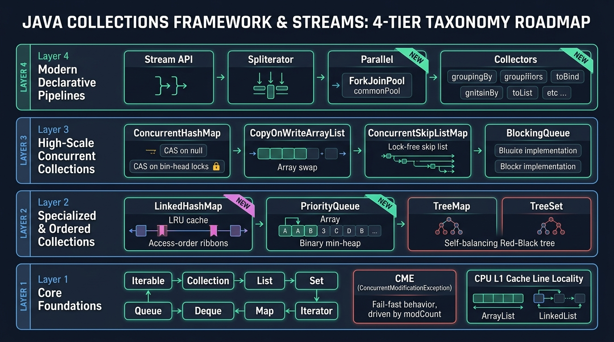

# Java Collections & Streams: Enterprise Architecture & Interview Mastery Guide

> **Curriculum Milestone**: Module 01 - Java Core Engineering  
> **Topic Coverage**: Collections Framework Hierarchy, Internal Hashing & Treeification, Concurrent Collections, Stream Pipeline Mechanics, Spliterators, ForkJoin Parallelism, Primitive Specialization, and Memory Layout Optimization.  
> **Target Depth**: 50+ In-Depth Progressive Scenarios with Bytecode/JIT Analysis, Production Code Walkthroughs, Beginner Traps, and Real-World Outage Post-Mortems.

---

## Architecture Blueprint: The Collections & Streams Taxonomy

```mermaid
graph TD
    subgraph Layer4 ["Layer 4: Modern Declarative Pipelines (java.util.stream)"]
        StreamAPI["Stream&lt;T&gt; / IntStream / LongStream / DoubleStream"]
        Spliterator["Spliterator&lt;T&gt; (trySplit, tryAdvance, SIZED, SUBSIZED)"]
        ParallelFJP["Parallel Pipelines (ForkJoinPool.commonPool, Work-Stealing)"]
        Collectors["Collectors (groupingBy, toList, downstream reductions)"]
    end

    subgraph Layer3 ["Layer 3: High-Scale Concurrent Collections (java.util.concurrent)"]
        CHM["ConcurrentHashMap (Lock-Free CAS on null, Bin-Head Sync, CounterCell)"]
        COW["CopyOnWriteArrayList (Immutable Array Swap on Mutation)"]
        SkipList["ConcurrentSkipListMap / Set (Lock-Free Multi-Level Indexing)"]
        BlockQueue["BlockingQueue (ArrayBlockingQueue, LinkedBlockingQueue)"]
    end

    subgraph Layer2 ["Layer 2: Core Map Framework (java.util.Map)"]
        HashMap["HashMap (Separate Chaining + Red-Black Treeify at 8)"]
        LinkedHashMap["LinkedHashMap (Doubly-Linked Ribbon for O(1) LRU Caching)"]
        TreeMap["TreeMap (Navigable Red-Black Balanced BST O(log n))"]
        WeakHashMap["WeakHashMap (WeakReference Keys for Auto-Eviction)"]
    end

    subgraph Layer1 ["Layer 1: Core Collection Hierarchy (java.util.Collection)"]
        List["List: ArrayList (amortized O(1), Contiguous Memory), LinkedList"]
        Set["Set: HashSet, LinkedHashSet, TreeSet, EnumSet (Bit-Vectors)"]
        Queue["Queue/Deque: ArrayDeque (Circular Ring Buffer), PriorityQueue (Min-Heap)"]
    end

    subgraph Layer0 ["Layer 0: Hardware & JVM Memory Substrate"]
        CacheLines["CPU 64-Byte Cache Line Locality (Spatial Prefetching)"]
        ObjLayout["HotSpot Object Layout (Mark Word + Klass Word + 8-Byte Alignment)"]
        CompOOPs["Compressed OOPs (-XX:+UseCompressedOops shifts 32-bit pointers)"]
    end

    Layer4 --> Layer3
    Layer3 --> Layer2
    Layer2 --> Layer1
    Layer1 --> Layer0
```





#### Visual Architecture & Deep Mechanics of Collections & Streams Taxonomy

##### 1. Visual Architecture & Node Anatomy
* **Layer 4 (Declarative Streams Pipeline)**: Purely functional, lazy execution abstraction. Intermediate operations (`map`, `filter`, `flatMap`) construct an internal linked list of pipeline stages (`ReferencePipeline`). Execution does not begin until a terminal operation (`collect`, `reduce`, `forEach`) pulls elements through a `Spliterator`.
* **Layer 3 (Concurrent Collections)**: Designed for high multi-core contention without global synchronization locks. `ConcurrentHashMap` uses lock-free CAS for initial bucket insertions, synchronized bin-head locks for collisions, and Stripe-Counter arrays (`CounterCell`) modeled after `LongAdder` to avoid contention on `size()`.
* **Layer 2 (Associative Key-Value Maps)**: Fast associative index mapping keys to values. Features load-factor based auto-resizing ($2^n$ doubling) and collision treeification.
* **Layer 1 (Core Collection Hierarchy)**: Foundations for sequence traversal, mathematical set uniqueness, and work queues.
* **Layer 0 (Hardware & Mechanical Substrate)**: Physical RAM memory layouts, 64-byte L1 cache line prefetchers, 8-byte JVM word alignment, and pointer compression.

##### 2. Execution Flow & State Transitions
1. **Stream Pipeline Construction**: Calling `list.stream().filter(p).map(f)` creates linked pipeline stages (`StatelessOp` / `StatefulOp`). No elements are touched.
2. **Terminal Ingestion & Spliterator Splitting**: Calling `.collect(toList())` evaluates whether the stream is sequential or parallel:
   - If parallel, the source `Spliterator` invokes `trySplit()`, recursively halving the data into `ForkJoinTask` subtasks distributed across worker threads in `ForkJoinPool.commonPool()`.
   - Each worker operates locally, stealing tasks from other threads' deques via work-stealing when idle.
3. **Reduction & Merge**: Sub-results are combined in tree order using reduction accumulators, yielding final collections.

##### 3. Low-Level Kernel & JVM Mechanics
* **Spatial Memory Locality vs Cache Miss Penalty**:
  - `double[]`: Contiguous physical memory. Accessing element $i$ loads 8 consecutive `double` values into the CPU L1 data cache line in a single CPU memory clock cycle (~1ns).
  - `ArrayList<Double>`: The array stores 4-byte references pointing to scattered `Double` instances across the heap. Each lookup dereferences an object pointer, incurring an L1/L2 cache miss and forcing the CPU execution pipeline to stall for 50–100ns fetching from RAM.
* **Stream Primitive Specialization**: Always prefer primitive streams (`IntStream`, `LongStream`, `DoubleStream`) over `Stream<Integer>`. Primitive streams bypass boxing/unboxing overhead, avoiding the allocation of millions of heap wrapper objects and preventing young generation garbage collection storms.

##### 4. Production Failure Modes & SRE Diagnostics
* **Parallel Stream Thread Pool Hijacking**: All `.parallelStream()` operations in a JVM share the single, global `ForkJoinPool.commonPool()`. If a single request executes blocking I/O (e.g., HTTP REST call or database query) inside a parallel stream, all worker threads in the common pool block, starving all other unrelated parallel streams across the entire microservice!
* **Stream Re-Use Exception**: A Java Stream cannot be consumed more than once. Invoking a second terminal operation on an already consumed stream immediately throws `IllegalStateException: stream has already been operated upon or closed`.

<details>
<summary>Text Representation (ASCII Taxonomy Blueprint)</summary>

```text
+-------------------------------------------------------------------------------+
| Layer 4: Modern Declarative Pipelines (java.util.stream)                      |
| - Stream<T>, IntStream, LongStream, DoubleStream, Spliterator, Collectors     |
| - Parallel Streams (ForkJoinPool.commonPool), Short-Circuiting, Custom Reducer|
+-------------------------------------------------------------------------------+
| Layer 3: High-Scale Concurrent Collections (java.util.concurrent)             |
| - ConcurrentHashMap (CAS + Synchronized Bin Head, TreeBin, CounterCell)      |
| - CopyOnWriteArrayList, ConcurrentSkipListMap, ConcurrentSkipListSet          |
+-------------------------------------------------------------------------------+
| Layer 2: Core Map Framework (java.util.Map)                                   |
| - HashMap, LinkedHashMap (LRU Eviction), TreeMap (Red-Black Tree)             |
| - EnumMap, WeakHashMap (Ephemeron/WeakReference), IdentityHashMap             |
+-------------------------------------------------------------------------------+
| Layer 1: Core Collection Hierarchy (java.lang.Iterable -> java.util.Collection)|
| - List: ArrayList (amortized O(1)), LinkedList (doubly-linked)                |
| - Set: HashSet, LinkedHashSet, TreeSet, EnumSet (Bit-vector)                  |
| - Queue / Deque: ArrayDeque (circular buffer), PriorityQueue (binary heap)    |
+-------------------------------------------------------------------------------+
| Layer 0: Memory & Mechanical Substrate                                        |
| - Object Alignment (8-byte boundary), Compressed OOPs, Reference Indirection  |
| - CPU L1/L2 Cache Prefetching (Contiguous Arrays vs Scattered Pointer Traversal)|
+-------------------------------------------------------------------------------+
```

</details>

---

## Section 1: Progressive Scenario-Based Master Q&A (50+ Scenarios)

### Tier 1: Core Collection Fundamentals & Data Structure Internals (Q1 - Q16)

#### Q1: Array vs Collection: Memory Alignment, Indirection & Cache Locality

##### 1. Exact Scenario & Question
You are designing a high-throughput financial calculation engine where 50,000,000 tick prices must be scanned every second. A developer implements this using `ArrayList<Double>`. Profiling shows that 85% of CPU time is spent on L1/L2 cache misses (`perf stat -e L1-dcache-load-misses`). Explain the physical memory layout of `double[]` vs `ArrayList<Double>` on 64-bit HotSpot JVM (including Compressed OOPs and object headers), quantify pointer indirection overhead, and explain how modern CPU hardware prefetchers interact with both.

##### 2. What the Interviewer Evaluates
- **Memory Layout & JOL**: Object header (Mark Word + Klass Word = 12/16 bytes), reference pointer (4/8 bytes), 8-byte alignment padding.
- **Pointer Indirection & Cache Misses**: Direct contiguous memory vs heap-scattered object pointers.
- **Hardware Mechanical Sympathy**: Spatial locality, L1 cache line prefetching (64-byte chunks).

##### 3. Standout Technical Answer
1. **Memory Layout of `double[]` (Primitive Array)**:
   - An array of primitive `double` (`double[N]`) is laid out in a single, contiguous block of physical RAM.
   - Header: 12 bytes (8-byte Mark Word + 4-byte Klass Word with Compressed OOPs) + 4 bytes array length = 16 bytes.
   - Data: Each `double` occupies exactly 8 consecutive bytes in place.
   - A single 64-byte CPU cache line holds exactly 8 primitive `double` values. When the CPU accesses index 0, the hardware spatial prefetcher automatically pulls the subsequent 7 values into L1 cache, achieving maximum throughput with near-zero cache misses.
2. **Memory Layout of `ArrayList<Double>` (Reference Collection)**:
   - `ArrayList` contains an `Object[] elementData`.
   - Each element in the array is **not** a double; it is a 32-bit reference (with Compressed OOPs) pointing to a separate `java.lang.Double` object on the heap!
   - Each `Double` object requires: 12-byte header + 8-byte double field + 4-byte padding = **24 bytes**.
   - Total memory for 50,000,000 elements:
     - `double[]`: `50,000,000 * 8 bytes = 400 MB`.
     - `ArrayList<Double>`: `50M * 4 bytes (pointers) + 50M * 24 bytes (Double objects) + ArrayList overhead ≈ 1.4 GB` (a **350% memory bloat**).
   - **Cache Invalidation**: The `Double` objects are scattered throughout the heap across different memory pages. Accessing each element requires dereferencing an address pointer, causing a pipeline stall and a CPU cache miss on almost every element!

```java
public class PrimitiveVsBoxedBenchmark {
    public static double sumPrimitive(double[] data) {
        double sum = 0.0;
        // Hardware prefetcher streams contiguous 64-byte cache lines; near 0 cache misses
        for (int i = 0; i < data.length; i++) {
            sum += data[i];
        }
        return sum;
    }

    public static double sumBoxed(java.util.List<Double> data) {
        double sum = 0.0;
        // Severe pointer chasing: every iteration dereferences an off-cache heap address
        for (Double val : data) {
            sum += val;
        }
        return sum;
    }
}
```

##### 4. Follow-Up Trap Question & Winning Answer
- **Trap Question**: "Does Java 21 LTS include Project Valhalla Value Types (Primitive Classes) to eliminate this boxed indirection entirely?"
- **Winning Answer**: "No. Project Valhalla (introducing identityless value classes and flat memory arrays without object headers) is still in active development (JEP 401) and was not finalized in Java 21 LTS. To achieve flat, zero-indirection primitive collections today, engineers must use primitive arrays directly or third-party specialized libraries like FastUtil, Eclipse Collections, or Agrona."

---

#### Q2: `Iterable` vs `Iterator` & The Fast-Fail `modCount` Contract

##### 1. Exact Scenario & Question
Explain why Java splits iteration into two distinct interfaces: `java.lang.Iterable<T>` and `java.util.Iterator<T>`. Explain how the enhanced for-each loop (`for (T item : collection)`) compiles to bytecode, what the internal `modCount` variable does, and why calling `list.remove(item)` inside an active enhanced for-loop throws `java.util.ConcurrentModificationException` even in a single-threaded program.

##### 2. What the Interviewer Evaluates
- **Design Pattern**: Separation between the collection (Iterable) and the traversal state machine (Iterator).
- **Bytecode Translation**: Desugaring of enhanced for-loops into `iterator()`, `hasNext()`, and `next()`.
- **Fast-Fail Architecture**: Structural modification tracking via `modCount` vs iterator's `expectedModCount`.

##### 3. Standout Technical Answer
1. **Why Two Interfaces?**:
   - `Iterable<T>` defines an object that can provide iterators via `iterator()`. It represents data that can be traversed.
   - `Iterator<T>` represents the cursor state (current position, `next()`, `hasNext()`).
   - If `Collection` implemented `Iterator` directly, multiple threads (or even nested loops on the same thread) could not iterate over the same collection independently without corrupting each other's cursor position!
2. **Bytecode Compilation of Enhanced For-Loop**:
   The compiler transforms:
   ```java
   for (String s : list) { process(s); }
   ```
   Into:
   ```java
   Iterator<String> it = list.iterator();
   while (it.hasNext()) {
       String s = it.next();
       process(s);
   }
   ```
3. **The `ConcurrentModificationException` Mechanism**:
   - Every structural modification to `ArrayList` (`add()`, `remove()`, `clear()`) increments a protected field: `modCount++`.
   - When an iterator is created, it captures the current modification count: `expectedModCount = modCount`.
   - On every call to `it.next()`, it executes `checkForComodification()`:
     ```java
     if (modCount != expectedModCount)
         throw new ConcurrentModificationException();
     ```
   - Calling `list.remove(s)` increments `list.modCount`, but leaves the iterator's `expectedModCount` unchanged. On the very next iteration, `it.next()` detects the mismatch and throws immediately (fail-fast) to prevent undefined behavior and silent index corruption.

```java
import java.util.ArrayList;
import java.util.Iterator;
import java.util.List;

public class SafeCollectionMutation {
    public static void removeFaulty(List<String> items) {
        // BROKEN: Throws ConcurrentModificationException!
        for (String item : items) {
            if (item.equals("deleteMe")) {
                items.remove(item);
            }
        }
    }

    public static void removeSafelyViaIterator(List<String> items) {
        // CORRECT: it.remove() updates both collection AND expectedModCount
        Iterator<String> it = items.iterator();
        while (it.hasNext()) {
            String item = it.next();
            if (item.equals("deleteMe")) {
                it.remove(); // Safely decrements cursor and syncs expectedModCount
            }
        }
    }

    public static void removeModern(List<String> items) {
        // MOST IDIOMATIC (Java 8+): Bulk bit-shift removal without Iterator allocation
        items.removeIf(item -> item.equals("deleteMe"));
    }
}
```

##### 4. Follow-Up Trap Question & Winning Answer
- **Trap Question**: "If an ArrayList contains `['A', 'B', 'C']` and you remove `'B'` inside an enhanced for-loop, why does the loop sometimes exit WITHOUT throwing `ConcurrentModificationException`?"
- **Winning Answer**: "This occurs if you remove the **second-to-last** element! When `'B'` (index 1) is removed, `size` drops from 3 to 2. In the next iteration check, `hasNext()` evaluates `cursor == size` (which is `2 == 2`, returning `false`). The loop terminates gracefully before calling `next()`, so `checkForComodification()` is never invoked! However, the last element `'C'` is silently skipped. Removing any other element will trigger the exception as expected."

---

#### Q3: `ArrayList` Internal Array Growth, Amortized $O(1)$ & Array Copy

##### 1. Exact Scenario & Question
Detail the internal memory management of `ArrayList` during growth:
1. Default initial capacity vs lazy allocation (`DEFAULTCAPACITY_EMPTY_ELEMENTDATA`).
2. The exact capacity growth formula (`newCapacity = oldCapacity + (oldCapacity >> 1)`).
3. Under-the-hood copying via `System.arraycopy()` (and native C `memmove`).
4. Why is adding an element amortized $O(1)$, and what is the maximum array size supported by the JVM?

##### 2. What the Interviewer Evaluates
- **Lazy Initialization**: Postponing memory allocation until the first element is added.
- **Bitwise Growth**: 1.5x scaling factor avoiding frequent re-allocations while conserving RAM.
- **Native Memory Operations**: Unrolling copying into native vectorized assembly.

##### 3. Standout Technical Answer
1. **Lazy Initialization**:
   In modern JDKs, calling `new ArrayList<>()` does not allocate an array of 10 elements. It assigns `elementData` to a shared empty singleton `DEFAULTCAPACITY_EMPTY_ELEMENTDATA`. Memory is allocated only upon the first call to `add()`, at which point it expands to `DEFAULT_CAPACITY = 10`. This saves millions of empty array allocations in Spring/Hibernate applications.
2. **Growth Formula (1.5x Scaling)**:
   When `size + 1 > elementData.length`, HotSpot computes:
   ```java
   int newCapacity = oldCapacity + (oldCapacity >> 1); // Bitwise shift = 1.5x
   ```
   If `oldCapacity = 10`, `10 + (10 >> 1) = 15`. A 1.5x growth factor provides a balance between reducing re-allocation frequency and avoiding excess memory waste (unlike 2.0x in standard textbook vectors).
3. **Array Copy Mechanics**:
   Memory reallocation calls `Arrays.copyOf(elementData, newCapacity)`, which delegates to native `System.arraycopy()`. In the C++ HotSpot runtime (`jvm.cpp`), this maps directly to native C `memmove` or SIMD vectorized assembly instructions (`vmovdqu` on AVX-512), copying gigabytes per second directly across CPU caches.
4. **Amortized $O(1)$ Complexity**:
   Inserting $N$ items requires copying elements $N/2 + N/4 + N/8 ... < N$ total times. Thus, $N$ insertions take $O(N)$ cumulative time, meaning each insertion has an **amortized cost of $O(1)$**, despite individual resizing operations taking $O(N)$.
5. **Maximum Capacity Limit**:
   The maximum size is `Integer.MAX_VALUE - 8 = 2,147,483,639`. The 8 bytes are reserved for the HotSpot array header.

```java
public class ArrayListPreAllocation {
    public static void main(String[] args) {
        // Anti-pattern: adding 1,000,000 items causes 30 array resize & copy cycles
        List<Integer> slowList = new ArrayList<>();
        
        // Best Practice: Pre-size explicitly to avoid all resizing and memory reallocation
        List<Integer> fastList = new ArrayList<>(1_000_000);
    }
}
```

##### 4. Follow-Up Trap Question & Winning Answer
- **Trap Question**: "Can `ArrayList.trimToSize()` lead to memory fragmentation in the JVM Old Generation?"
- **Winning Answer**: "Yes. `trimToSize()` allocates a brand new array matching the exact current `size` and copies elements into it, discarding the larger array. In long-lived caches where objects reside in the Old Generation, frequent resizing and trimming leaves holes in heap memory, causing OldGen memory fragmentation that forces expensive G1/ZGC defragmentation cycles or Full GCs."

---

#### Q4: `LinkedList` vs `ArrayList`: The Deceptive Academic Myth

##### 1. Exact Scenario & Question
Computer science textbooks frequently claim: *"Use `LinkedList` if you have frequent insertions/deletions in the middle of the list ($O(1)$ vs $O(N)$ for `ArrayList`)."* Demonstrate why this textbook recommendation is almost always false in real-world Java applications on modern CPU architectures, analyze the cache-miss penalty of node traversals, and explain why `ArrayList` outperforms `LinkedList` even for mid-list modifications under 100,000 elements.

##### 2. What the Interviewer Evaluates
- **Academic Big-O vs Real-World Constants**: Overlooking the $O(N)$ traversal cost required to reach the insertion point in a linked list.
- **Object Overhead**: 24-byte `Node` allocation (`item`, `next`, `prev`) per single element.
- **SIMD / Vectorized Copying**: How `System.arraycopy` shifts contiguous memory faster than pointer traversal can even read memory addresses.

##### 3. Standout Technical Answer
1. **The Traversal Fallacy**:
   While inserting into a doubly-linked list once you hold a pointer to the target `Node` is $O(1)$, reaching the $k$-th element in `LinkedList` requires traversing $k$ node pointers from `first` or `last`, which is **$O(N)$**.
2. **Hardware Cache Catastrophe**:
   - In `LinkedList`, every single element is wrapped in a `Node<E>` object allocated separately on the heap:
     `12-byte header + 3 * 4-byte references (prev, next, item) + 4-byte padding = 24 bytes per node`.
   - These nodes are scattered randomly across the 64-bit heap address space.
   - Traversing `node.next` requires chasing pointers across disparate memory pages, triggering a **CPU L1/L2/L3 cache miss on every single node**!
3. **The Brutal Efficiency of `ArrayList`**:
   - To insert at index $k$, `ArrayList` shifts elements via `System.arraycopy()`.
   - Shifting 10,000 contiguous 32-bit references in RAM requires copying 40 KB of contiguous memory.
   - On an Intel Xeon or AMD EPYC processor with AVX-256/512 registers, the CPU shifts 40 KB in **under 200 nanoseconds** within the local L1 cache!
   - In contrast, chasing 5,000 pointers across fragmented heap memory in `LinkedList` takes **over 25,000 nanoseconds** due to CPU pipeline stalls waiting for RAM DRAM bus responses.
   - Consequently, `ArrayList` is faster than `LinkedList` for almost all real-world list sizes!

```
Array Memory (Contiguous):
[ Item 0 ][ Item 1 ][ Item 2 ][ Item 3 ][ Item 4 ]  <== Fast AVX Block Copy!

LinkedList Memory (Fragmented Chasing):
[ Node 0 ] ----> (RAM Miss) ----> [ Node 1 ] ----> (RAM Miss) ----> [ Node 2 ]
```

##### 4. Follow-Up Trap Question & Winning Answer
- **Trap Question**: "Is there ANY practical use-case where `LinkedList` is superior to `ArrayList` in modern Java?"
- **Winning Answer**: "Practically none. If you need a FIFO queue or double-ended queue, **`ArrayDeque`** is strictly superior to `LinkedList` in both memory usage (circular array, zero node overhead) and execution throughput. The author of `LinkedList`, Joshua Bloch, publicly stated: *'Does anyone actually use LinkedList? I wrote it, and I never use it.'*"

---

#### Q5: `HashMap` Deep Dive: Hash Function, Buckets & Red-Black Treeification

##### 1. Exact Scenario & Question
Walk through the step-by-step execution path of `HashMap.put(K, V)` in Java 8+:
1. Hash spreading function: `(h = key.hashCode()) ^ (h >>> 16)`.
2. Bucket index calculation: `index = (n - 1) & hash`.
3. Collision resolution: Singly-linked list insertion vs TreeBin.
4. Treeification criteria: `TREEIFY_THRESHOLD = 8`, `UNTREEIFY_THRESHOLD = 6`, and `MIN_TREEIFY_CAPACITY = 64`.
Why does `HashMap` require power-of-two table sizing?

##### 2. What the Interviewer Evaluates
- **Bitwise Math**: Bitwise AND (`&`) replacing modulo (`%`), and hash bit-spreading to prevent collisions.
- **Treeification Mechanics**: Replacing linked list chaining with balanced Red-Black Trees (`TreeNode`) under attack.
- **Threshold Sizing**: Poisson distribution justification for threshold 8.

##### 3. Standout Technical Answer
1. **Hash Spreading Function**:
   ```java
   static final int hash(Object key) {
       int h;
       return (key == null) ? 0 : (h = key.hashCode()) ^ (h >>> 16);
   }
   ```
   In 32-bit integers, table sizing uses the lowest bits (e.g., table size 16 uses lowest 4 bits: `0b1111`). If keys have identical lower bits but vary in higher bits, standard hashing causes massive collisions. XORing the high 16 bits (`h >>> 16`) into the low 16 bits spreads the entropy across all bits, preventing bucket clumping.
2. **Power-of-Two Indexing**:
   If table size $N$ is a power of 2 ($2^k$), then:
   `hash % N == hash & (N - 1)`.
   Bitwise AND executes in **1 CPU clock cycle**, whereas integer modulo (`idiv` instruction) takes **20–40 CPU clock cycles**.
3. **Treeification & The Poisson Distribution**:
   - Under standard random hash distributions, the probability of a bucket having 8 collisions is less than $1 \times 10^{-7}$ (governed by Poisson distribution).
   - If a bucket reaches 8 nodes (`TREEIFY_THRESHOLD = 8`), it indicates either a terrible hash function or a malicious Hash-DoS attack.
   - If the total table capacity is $\ge 64$ (`MIN_TREEIFY_CAPACITY`), the bucket is converted from a linked list to a balanced **Red-Black Tree** (`TreeNode`), reducing worst-case search complexity from $O(N)$ to $O(\log N)$.
   - If total capacity is $< 64$, it resizes the table instead of treeifying to disperse the collisions.
   - If deletions shrink tree nodes to 6 (`UNTREEIFY_THRESHOLD = 6`), it untreeifies back to a singly-linked list to avoid Red-Black tree maintenance overhead.

```java
import java.lang.reflect.Field;
import java.util.HashMap;

public class HashMapTreeificationDemo {
    // Custom key that intentionally creates identical hash bucket
    static class BadKey implements Comparable<BadKey> {
        final int id;
        BadKey(int id) { this.id = id; }
        @Override public int hashCode() { return 42; } // Identical hash!
        @Override public boolean equals(Object o) { 
            return o instanceof BadKey other && this.id == other.id; 
        }
        @Override public int compareTo(BadKey o) { 
            return Integer.compare(this.id, o.id); 
        }
    }

    public static void main(String[] args) {
        HashMap<BadKey, String> map = new HashMap<>(64);
        for (int i = 0; i < 10; i++) {
            map.put(new BadKey(i), "Val" + i);
        }
        // At 8 insertions with capacity >= 64, bucket 42 treeifies to TreeNode (Red-Black Tree)
        System.out.println("Map populated with treeified bucket.");
    }
}
```

##### 4. Follow-Up Trap Question & Winning Answer
- **Trap Question**: "What happens if keys placed into a treeified bucket do NOT implement `Comparable<K>`?"
- **Winning Answer**: "If keys do not implement `Comparable`, HotSpot uses an internal fallback tie-breaker method: `tieBreakOrder(Object a, Object b)`. It compares class names alphabetically, and if identical, compares their JVM memory identity hash codes (`System.identityHashCode(a)`). This preserves a consistent deterministic binary search order, ensuring search remains $O(\log N)$ even without `Comparable`."

---

#### Q6: `HashMap` Resizing, Rehash Bit-Splitting & Java 7 Infinite Loop Bug

##### 1. Exact Scenario & Question
Explain how `HashMap` resizes when `size > capacity * loadFactor`:
1. The double-size expansion ($N \to 2N$).
2. The Java 8 **Bit-Splitting Optimization** (low-bit vs high-bit list partitioning without re-calculating hashes).
3. The infamous **Java 7 Infinite Loop Bug**: Detail how concurrent resizing on Java 7 resulted in cyclic circular references in linked bucket chains and caused 100% CPU lockups in production.

##### 2. What the Interviewer Evaluates
- **Bitwise Resizing**: How `hash & oldCap == 0` determines whether an element stays at index `i` or moves to `i + oldCap`.
- **Head vs Tail Insertion**: Java 7 head-insertion reversing linked lists vs Java 8 tail-insertion preserving order.
- **Concurrency Hazards**: Why standard `HashMap` must never be used in multi-threaded environments.

##### 3. Standout Technical Answer
1. **The Java 8 Bit-Splitting Rehash**:
   In Java 8, when doubling capacity from $N$ to $2N$, the table index mask gains exactly 1 additional bit.
   - For any key, the new bit in `hash & oldCap` is either `0` or `1`.
   - If `(hash & oldCap) == 0`: The element remains at its **original index** `j`.
   - If `(hash & oldCap) != 0`: The element moves to **new index** `j + oldCap`.
   HotSpot maintains two chains (`loHead/loTail` and `hiHead/hiTail`) and links them into the new table in a single pass without re-invoking `hashCode()`.
2. **The Java 7 Infinite Loop Production Disaster**:
   - In Java 7, `transfer()` used **Head Insertion** (reversing the list order during resize).
   - Suppose Bucket 1 has `A -> B -> null`.
   - Thread 1 begins resizing, reads `e = A`, `next = B`, and is descheduled.
   - Thread 2 runs, resizes the table, and inserts `B -> A -> null` (order reversed!).
   - Thread 1 wakes up and resumes with stale pointers: it links `A.next = B`, then processes `B`, and sets `B.next = A`!
   - A circular cyclic reference `A <===> B` is created.
   - Any subsequent call to `map.get()` on that bucket enters an infinite `while (e != null)` loop, driving that CPU core to 100% permanently.

```
Thread 2 completes resize:
[Bucket 1] ---> B ---> A ---> null

Thread 1 resumes with stale pointers:
A.next = B;
B.next = A;  <=== CIRCULAR LOOP FORMED! (A <---> B)
map.get(key) enters while(true) spinning CPU to 100%!
```

##### 4. Follow-Up Trap Question & Winning Answer
- **Trap Question**: "Does Java 8's tail-insertion eliminate thread-safety issues in standard `HashMap`?"
- **Winning Answer**: "No! While Java 8 tail-insertion prevents circular linked-list infinite loops, concurrent writes to a non-thread-safe `HashMap` in Java 8 still cause **silent data loss** (threads overwriting the same bucket pointer simultaneously) and corrupt the Red-Black tree pointers (`parent`, `left`, `right`), resulting in infinite loops or `ClassCastException` inside `TreeNode.balanceInsertion()`."

---

#### Q7: `LinkedHashMap`: Access-Order, Insertion-Order & In-Memory LRU Cache

##### 1. Exact Scenario & Question
You need a high-performance in-memory Least Recently Used (LRU) cache with a maximum capacity of 10,000 entries. Implement this cache using `LinkedHashMap`. Explain the internal doubly-linked list overlay (`before` and `after` pointers in `Entry`), contrast insertion-order vs access-order (`accessOrder = true`), and detail how overriding `removeEldestEntry()` automates cache eviction.

##### 2. What the Interviewer Evaluates
- **Composite Data Structure**: Hash table for $O(1)$ lookups combined with a doubly-linked list for $O(1)$ ordering.
- **Access-Order Mutation**: How `get()` and `put()` move accessed entries to the tail of the list.
- **LRU Eviction**: Clean bounds management via `removeEldestEntry`.

##### 3. Standout Technical Answer
`LinkedHashMap` extends `HashMap` by adding an internal doubly-linked list across all entries:
- Each node is an instance of `LinkedHashMap.Entry<K,V>`, extending `HashMap.Node` with two additional pointers: `Entry<K,V> before, after`.
- **Insertion-Order (`accessOrder = false`, default)**: Iteration reflects the order keys were originally inserted.
- **Access-Order (`accessOrder = true`)**: Every time `get()`, `getOrDefault()`, or `put()` is invoked on an existing key, the accessed entry is unlinked from its current position in the doubly-linked list and re-inserted at the **tail** (most recently used).
- The **head** of the list always points to the eldest (least recently used) entry.
- Overriding `removeEldestEntry(Map.Entry eldest)` allows evicting the head node whenever capacity is exceeded.

```java
import java.util.Collections;
import java.util.LinkedHashMap;
import java.util.Map;

public class ProductionLRUCache<K, V> extends LinkedHashMap<K, V> {
    private final int maxCapacity;

    public ProductionLRUCache(int maxCapacity) {
        // initialCapacity, loadFactor=0.75f, accessOrder=true (LRU order)
        super((int) Math.ceil(maxCapacity / 0.75f) + 1, 0.75f, true);
        this.maxCapacity = maxCapacity;
    }

    @Override
    protected boolean removeEldestEntry(Map.Entry<K, V> eldest) {
        // Automatically evicts the least-recently-used head entry when size exceeds capacity
        return size() > maxCapacity;
    }

    public static <K, V> Map<K, V> createThreadSafeLRU(int capacity) {
        // Wrap in synchronized map for thread-safe access
        return Collections.synchronizedMap(new ProductionLRUCache<>(capacity));
    }
}
```

##### 4. Follow-Up Trap Question & Winning Answer
- **Trap Question**: "If you wrap an access-order `LinkedHashMap` with `Collections.synchronizedMap()`, why does a simple read operation (`map.get(key)`) require synchronization?"
- **Winning Answer**: "Because in access-order mode, `get()` is **NOT a read-only operation**! `get()` modifies the internal `before` and `after` pointers of the doubly-linked list to move the accessed entry to the tail. If two threads invoke `get()` concurrently without synchronization, the doubly-linked list pointers become corrupted, causing infinite loops or NPEs."

---

#### Q8: `TreeMap`, `TreeSet` & Red-Black Tree Invariants

##### 1. Exact Scenario & Question
Compare `HashMap` and `TreeMap`. Explain the five formal invariants of a **Red-Black Tree**, how `TreeMap` enforces ordering via `Comparable` vs `Comparator`, and detail the asymptotic time and space complexities of `put()`, `get()`, `ceilingKey()`, and `subMap()`.

##### 2. What the Interviewer Evaluates
- **Red-Black Tree Properties**: Root property, leaf property, red property, black-height property.
- **Tree Balancing**: Left and right rotations, color flips during insertion/deletion.
- **Sorted Map Operations**: NavigableMap APIs ($O(\log N)$ ceiling, floor, range queries).

##### 3. Standout Technical Answer
1. **The 5 Red-Black Tree Invariants**:
   - Every node is either **Red** or **Black**.
   - The root is always **Black**.
   - Every leaf (NIL sentinel node) is **Black**.
   - If a node is **Red**, both of its children must be **Black** (no two consecutive red nodes on any path).
   - For each node, all simple paths from the node to descendant leaves contain the **same number of black nodes** (equal Black-Height).
   These invariants guarantee that the longest path from root to leaf is no more than twice the shortest path, guaranteeing $O(\log N)$ search, insertion, and deletion.
2. **Comparison Matrix**:

| Feature | `HashMap` | `TreeMap` |
|---|---|---|
| **Underlying Data Structure** | Array of Buckets (List + Red-Black Tree) | Single Self-Balancing Red-Black Tree |
| **Ordering** | None (Unordered) | Strict Ascending Key Order |
| **Search / Insertion Time** | Amortized $O(1)$ | Guaranteed $O(\log N)$ |
| **Null Keys** | Allows 1 `null` key | **Disallows `null` keys** (throws `NullPointerException` on comparison) |
| **Range Queries (`subMap`)** | $O(N)$ full table scan | **$O(\log N)$ slice view** |

```java
import java.util.NavigableMap;
import java.util.TreeMap;

public class SLAIntervalRoutingEngine {
    private final TreeMap<Integer, String> routingTiers = new TreeMap<>();

    public SLAIntervalRoutingEngine() {
        routingTiers.put(100, "Platinum-Cluster");
        routingTiers.put(500, "Gold-Cluster");
        routingTiers.put(2000, "Silver-Cluster");
    }

    public String resolveClusterForLatency(int latencyMs) {
        // ceilingEntry finds smallest key >= latencyMs in O(log N)
        var entry = routingTiers.ceilingEntry(latencyMs);
        return (entry != null) ? entry.getValue() : "Default-Batch-Cluster";
    }
}
```

##### 4. Follow-Up Trap Question & Winning Answer
- **Trap Question**: "If two keys in a `TreeMap` produce `key1.equals(key2) == false`, but `comparator.compare(key1, key2) == 0`, does `TreeMap` insert both keys or overwrite one?"
- **Winning Answer**: "`TreeMap` overwrites the existing value and treats the keys as identical! `TreeMap` adheres strictly to `Comparable.compareTo()` or `Comparator.compare()`, completely ignoring `equals()`. If `compare(a, b) == 0`, `TreeMap` considers them the same key according to JLS §17, violating the standard `Set`/`Map` contract if the comparator is inconsistent with `equals`."

---

#### Q9: `EnumMap` & `EnumSet`: Bit-Vector & Flat Array Optimizations

##### 1. Exact Scenario & Question
You are designing a high-throughput state transition matrix for an order lifecycle with 8 states (`State.NEW`, `State.PAID`, etc.). A developer uses `HashMap<State, Transition>` and `HashSet<State>`. Why is this a major architectural anti-pattern? Explain the internal implementation of `EnumMap` (flat array) and `EnumSet` (`RegularEnumSet` using a single 64-bit `long` bit-vector), and contrast their performance and memory footprint.

##### 2. What the Interviewer Evaluates
- **Mechanical Specialization**: Exploiting the bounded, contiguous ordinal nature of Java Enums.
- **Bitwise Set Operations**: Bitwise `AND`, `OR`, `NOT` executing in 1 CPU cycle on a single primitive register.
- **Zero Hashing Overhead**: Array indexing via `enum.ordinal()`.

##### 3. Standout Technical Answer
1. **The Inefficiency of `HashMap` for Enums**:
   `HashMap` executes hash computation, bit masking, bucket traversal, and handles collisions. For an enum, all possible keys are known at compile-time and possess a unique, contiguous, zero-based integer index: `ordinal()`.
2. **`EnumMap` Architecture**:
   - Backed internally by a single flat array: `Object[] vals = new Object[enumSize]`.
   - `put(Key, Val)`: Executes `vals[key.ordinal()] = maskNull(val)`.
   - **Zero hash code calculation, zero hash collisions, zero linked lists or trees, zero memory re-allocation**. Direct array index lookup in 1 CPU cycle!
3. **`EnumSet` Bit-Vector Architecture**:
   - If the enum contains $\le 64$ values, `EnumSet.noneOf()` returns a `RegularEnumSet` backed by a **single 64-bit primitive `long elements`**!
   - `add(key)`: Compiles to a single bitwise OR: `elements |= (1L << key.ordinal())`.
   - `contains(key)`: Compiles to `(elements & (1L << key.ordinal())) != 0`.
   - Set operations (`union`, `intersection`) compile to single-cycle hardware CPU bitwise instructions (`AND`, `OR`).
   - If the enum has $> 64$ elements, it seamlessly falls back to `JumboEnumSet` backed by a `long[]` array.

```java
import java.util.EnumMap;
import java.util.EnumSet;
import java.util.Set;

public class HighSpeedOrderStateEngine {
    public enum OrderState {
        CREATED, VALIDATED, FUNDS_RESERVED, CHARGED, DISPATCHED, DELIVERED, CANCELLED
    }

    // Backed by a single 64-bit primitive long! Zero heap object allocations
    private static final Set<OrderState> TERMINAL_STATES = 
        EnumSet.of(OrderState.DELIVERED, OrderState.CANCELLED);

    // Backed by a flat Object[] array indexed by ordinal()
    private final EnumMap<OrderState, String> stateHandlers = 
        new EnumMap<>(OrderState.class);

    public boolean isComplete(OrderState state) {
        // Single CPU instruction: (elements & (1L << ordinal)) != 0
        return TERMINAL_STATES.contains(state); 
    }
}
```

##### 4. Follow-Up Trap Question & Winning Answer
- **Trap Question**: "Can you store `null` keys in an `EnumMap` or `null` elements in an `EnumSet`?"
- **Winning Answer**: "No. Both throw `NullPointerException` immediately upon attempting to insert `null`. Because their internal mechanics rely directly on `key.ordinal()`, a `null` key would cause an immediate `NullPointerException` at the hardware register level."

---

#### Q10: `WeakHashMap` & Ephemeron Mechanics: The Identity Trap

##### 1. Exact Scenario & Question
A team creates an in-memory metadata cache using `WeakHashMap<UserSession, SessionMetadata>` to avoid memory leaks, expecting that when a user logs out and their `UserSession` is no longer referenced, the entry will be automatically garbage collected. In production, heap memory leaks continuously until OOM. Explain the internal `ReferenceQueue` mechanics of `WeakHashMap`, why weak keys do NOT protect against strong reference cycles involving values, and why using `String` or primitive wrappers as keys in `WeakHashMap` causes permanent leaks.

##### 2. What the Interviewer Evaluates
- **Reference Types**: `Strong`, `Soft`, `Weak`, and `Phantom` reference mechanics.
- **ReferenceQueue Expunging**: Why `WeakHashMap` only removes dead entries when the map is actively accessed.
- **Value-to-Key Cycles**: The unbroken GC root reference path through values.
- **JVM String Intern Pool**: Permanent strong references preventing GC.

##### 3. Standout Technical Answer
1. **`WeakHashMap` Internal Mechanics**:
   - Each entry extends `WeakReference<Object>`:
     `Entry<K,V> extends WeakReference<Object> implements Map.Entry<K,V>`.
   - The key is weakly referenced. When the key is no longer strongly reachable anywhere else in the application, the GC reclaims the key object and places the `Entry` into an internal `ReferenceQueue`.
   - `WeakHashMap` checks this `ReferenceQueue` and unlinks dead entries (`expungeStaleEntries()`) **only when map methods like `get()`, `put()`, or `size()` are invoked**! If the map is idle, dead values remain in memory.
2. **The Strong Reference Cycle Trap**:
   If the `value` object contains a direct or indirect strong reference back to the `key`:
   `Entry -> value -> object -> key`
   The key is now strongly reachable from the GC root through the value! The GC can never reclaim the key, and the entry leaks permanently.
3. **The `String` / Integer Cache Disaster**:
   If keys are `String` literals or created via `String.intern()`, or boxed `Integer` values between -128 and 127, they are held permanently in JVM metaspace or internal JVM pools. They are **never** garbage collected, causing `WeakHashMap` to act as an unbounded, permanent memory leak.

```java
import java.util.Map;
import java.util.WeakHashMap;

public class WeakHashMapLeakDemo {
    public static class Key {
        final String id;
        Key(String id) { this.id = id; }
    }

    public static class Value {
        final Key backReferenceToKey; // LEAK TRIGGER: Value holds strong reference to Key!
        Value(Key key) { this.backReferenceToKey = key; }
    }

    public static void main(String[] args) {
        Map<Key, Value> leakyMap = new WeakHashMap<>();
        Key k = new Key("user-1");
        leakyMap.put(k, new Value(k)); // Reference cycle: Entry (weak key) -> Value -> Key (strong!)
        k = null; // Clear external strong reference

        System.gc(); // GC runs, but CANNOT collect Key due to cycle!
        System.out.println("Map size: " + leakyMap.size()); // Size remains 1! Leaked permanently!
    }
}
```

##### 4. Follow-Up Trap Question & Winning Answer
- **Trap Question**: "How does Guava's `CacheBuilder` or Caffeine implement safe weak/soft caches without falling victim to this cycle leak?"
- **Winning Answer**: "Caffeine and Guava decouple references and eliminate hard reference cycles by wrapping values in `WeakReference` or `SoftReference` as well (`weakValues()`), or by isolating metadata keys from domain entities. Furthermore, Caffeine employs a dedicated maintenance scheduler that actively cleans `ReferenceQueue` entries independently of user access."

---

#### Q11: `ArrayDeque` vs `PriorityQueue` Architecture

##### 1. Exact Scenario & Question
Compare `ArrayDeque` and `PriorityQueue`. Explain:
1. `ArrayDeque` circular array indexing via bitwise mask (`head = (head - 1) & (elements.length - 1)`).
2. Why `ArrayDeque` prohibits nulls while `LinkedList` allows them.
3. `PriorityQueue` binary min-heap layout in a flat array, `siftUp()` and `siftDown()` mechanics, and why iteration over a `PriorityQueue` does NOT produce elements in priority order.

##### 2. What the Interviewer Evaluates
- **Circular Buffer Implementation**: Power-of-two wrap-around without modulo arithmetic.
- **Binary Heap Layout**: Parent/child relationship equations (`2i + 1`, `2i + 2`, `(i - 1) / 2`).
- **Heap Invariant vs Sorted Order**: Why heaps only guarantee root extremity, not total order.

##### 3. Standout Technical Answer
1. **`ArrayDeque` Circular Array Mechanics**:
   - `ArrayDeque` uses an array `Object[] elements` whose capacity is always a power of 2.
   - It maintains two pointers: `int head` and `int tail`.
   - Prepending an element:
     ```java
     head = (head - 1) & (elements.length - 1);
     elements[head] = e;
     ```
     Because capacity is power-of-two, `(head - 1) & mask` automatically wraps negative indices to the end of the array without branching!
   - Prohibits `null` because methods like `poll()` use `null` as a special return value signaling the deque is empty.
2. **`PriorityQueue` Binary Heap Mechanics**:
   - Represented as an unbounded array implementing a **Binary Min-Heap**.
   - For any node at index $i$:
     - Left Child: `2i + 1`
     - Right Child: `2i + 2`
     - Parent: `(i - 1) >>> 1`
   - `offer(e)`: Inserts element at the end of the array and executes `siftUp()`, bubbling the element up by comparing with its parent in $O(\log N)$ time.
   - `poll()`: Extracts root (`elements[0]`), moves the last array element to the root, and executes `siftDown()` in $O(\log N)$ time.
3. **The Iteration Fallacy**:
   `PriorityQueue.iterator()` traverses the underlying flat array sequentially. Because a binary heap only guarantees that a parent is smaller than its children (partial order), iterating over the queue prints elements in arbitrary heap-tree order, **NOT in sorted priority order**! To retrieve items in sorted order, you must call `poll()` sequentially.

```java
import java.util.PriorityQueue;

public class PriorityQueueIterationTrap {
    public static void main(String[] args) {
        PriorityQueue<Integer> pq = new PriorityQueue<>();
        pq.offer(50);
        pq.offer(10);
        pq.offer(30);
        pq.offer(5);

        System.out.println("--- Iteration (Arbitrary Heap Array Order) ---");
        for (int val : pq) {
            System.out.print(val + " "); // Prints: 5 10 30 50 (or partially sorted)
        }
        System.out.println("\n--- Sequential Poll (Strict Priority Order) ---");
        while (!pq.isEmpty()) {
            System.out.print(pq.poll() + " "); // Guaranteed sorted: 5 10 30 50
        }
    }
}
```

##### 4. Follow-Up Trap Question & Winning Answer
- **Trap Question**: "If you mutate an object that is already inside a `PriorityQueue` in a way that changes its priority comparison, does the queue re-sort itself automatically?"
- **Winning Answer**: "No! `PriorityQueue` has no visibility into internal field mutations of contained objects. The heap invariant is broken. Subsequent calls to `poll()` will return corrupted elements in the wrong order. To safely mutate an element's priority, you must remove it from the queue (`remove(obj)` - $O(N)$), mutate the object, and re-insert it (`offer(obj)` - $O(\log N)$)."

---

#### Q12: `IdentityHashMap`: Reference Equality & Bytecode Interceptors

##### 1. Exact Scenario & Question
Why does serialization frameworks (like Jackson, Kryo) and deep-cloning engines use `IdentityHashMap` instead of `HashMap` to track visited objects? Explain how `IdentityHashMap` computes hash codes (`System.identityHashCode()`), how it checks key equality (`==` instead of `equals()`), and detail its linear-probing flat-array memory layout (`Object[] table` alternating key-value pairs).

##### 2. What the Interviewer Evaluates
- **Reference Identity vs Semantic Equality**: Bypassing overridden `equals()` and `hashCode()`.
- **Cyclic Graph Traversal**: Tracking visited object pointers during serialization to prevent infinite recursion.
- **Flat-Array Linear Probing**: Interleaved `[key1, val1, key2, val2]` cache layout.

##### 3. Standout Technical Answer
1. **The Purpose in Serialization**:
   When serializing complex cyclic object graphs (e.g., Node A references Node B, which references Node A), the engine must track which physical object instances have already been visited.
   - If using `HashMap`, two distinct objects with identical business fields will collide and produce `equals() == true`, causing the engine to skip the second instance erroneously.
   - Worse, if an object's `hashCode()` or `equals()` method touches uninitialized cyclic references, it triggers an infinite recursive loop!
   - `IdentityHashMap` evaluates identity strictly by memory pointer address: `k1 == k2`.
2. **Underlying Architecture**:
   - Does **not** use bucket nodes or linked lists.
   - Uses a single flat array: `Object[] table` where keys and values are interleaved:
     `table[i] = key`, `table[i+1] = value`.
   - Hashes using the native system identity:
     ```java
     int hash = System.identityHashCode(key);
     int index = (hash << 1) & (table.length - 1);
     ```
   - Resolves collisions via simple **Linear Probing**: if slot `index` is occupied by a different object reference, it increments index by 2 (`(index + 2) & mask`) and checks the next slot, maximizing CPU cache line spatial locality.

```java
import java.util.IdentityHashMap;
import java.util.Map;

public class GraphCycleDetector {
    public static void main(String[] args) {
        Map<String, String> identityMap = new IdentityHashMap<>();
        String s1 = new String("duplicate");
        String s2 = new String("duplicate");

        identityMap.put(s1, "Instance 1");
        identityMap.put(s2, "Instance 2");

        // Despite s1.equals(s2) == true, size is 2 because s1 != s2 in memory!
        System.out.println("IdentityHashMap Size: " + identityMap.size()); // Prints 2
    }
}
```

##### 4. Follow-Up Trap Question & Winning Answer
- **Trap Question**: "Does `IdentityHashMap` adhere to the general `java.util.Map` specification regarding `equals()` and `hashCode()`?"
- **Winning Answer**: "No! The Javadoc explicitly states that `IdentityHashMap` intentionally violates `Map`'s general contract, which mandates the use of `equals()` for key comparisons. It is designed solely for specialized systems programming (compilers, object graph serialization, debugging frameworks) and should never be used in standard enterprise business logic."

---

#### Q13: `BitSet` Architecture & Millions-of-IDs Bloom Filtering

##### 1. Exact Scenario & Question
You are tasked with maintaining the presence of 100,000,000 unique user IDs (ranging from 1 to 100,000,000) in memory to perform real-time fraud checks. A junior engineer calculates that a `HashSet<Integer>` requires ~3.2 GB of heap memory. Show how `java.util.BitSet` stores this exact state in **~12 megabytes** of RAM, explain its internal `long[] words` array mapping, and write a thread-safe BitSet lookup mechanism.

##### 2. What the Interviewer Evaluates
- **Bit-Level Density**: 1 bit per integer flag vs 32 bytes per boxed `Integer` in `HashSet`.
- **Word Indexing Arithmetic**: `wordIndex = bitIndex >> 6` (div by 64) and `1L << bitIndex`.
- **Memory Scaling**: Drastic reduction of heap footprint in massive cardinality sets.

##### 3. Standout Technical Answer
1. **Memory Math**:
   - `HashSet<Integer>`: Each entry requires a `Node` object (32 bytes) + boxed `Integer` (24 bytes) + bucket pointer (4 bytes) ≈ 60 bytes per entry.
     `100,000,000 * 60 bytes ≈ 6 GB` of heap memory.
   - `BitSet`: Represents each ID as a single bit (0 = absent, 1 = present).
     `100,000,000 bits / 8 = 12.5 Megabytes` of total memory!
2. **Internal `long[] words` Bit-Addressing**:
   `BitSet` is backed by an array of 64-bit primitive longs: `long[] words`.
   To set bit $K$:
   - Word Index: `wordIndex = K >> 6` (equivalent to $K / 64$, determined by highest bits).
   - Bit Mask: `mask = 1L << K` (equivalent to $K \pmod{64}$, using lowest 6 bits).
   - The operation is a direct single CPU instruction:
     `words[wordIndex] |= mask;`

```java
import java.util.BitSet;

public class HighDensityUserRegistry {
    // 100 million bits = ~12 MB RAM
    private final BitSet registeredUsers = new BitSet(100_000_000);

    public void markUserActive(int userId) {
        if (userId < 0) throw new IllegalArgumentException();
        registeredUsers.set(userId); // Single-cycle bitwise mutation
    }

    public boolean isUserActive(int userId) {
        return registeredUsers.get(userId);
    }
}
```

##### 4. Follow-Up Trap Question & Winning Answer
- **Trap Question**: "Is `java.util.BitSet` thread-safe? How should concurrent updates to separate bits within the same `BitSet` be handled?"
- **Winning Answer**: "`java.util.BitSet` is **not thread-safe**. If Thread 1 updates bit 2 and Thread 2 updates bit 5 simultaneously, both threads modify `words[0]` via `words[0] |= mask`. Because non-atomic 64-bit writes are subject to race conditions, one thread's update will overwrite the other. For concurrent bit-level operations, use an `AtomicLongArray` or lock-free bitsets (like `ConcurrentBitSet` in Agrona)."

---

#### Q14: `Collections.unmodifiableList` vs `List.of`: Immutability vs Read-Only Views

##### 1. Exact Scenario & Question
Compare `Collections.unmodifiableList(originalList)` (Java 2) and `List.of(elements)` (Java 9+). Explain why `unmodifiableList` is merely a **Read-Only View** that remains vulnerable to external mutation, while `List.of` provides **True Immutability**. Detail memory footprints, serialization differences, and null handling.

##### 2. What the Interviewer Evaluates
- **View Pattern vs Immutable Copy**: Unmodifiable wrappers reflecting changes to the underlying backing collection.
- **Compact Immutable Data Structures**: Java 9 `ImmutableCollections` (`List12`, `ListN`) eliminating array wrapper overhead.
- **Defensive Copying**: Principles of safe API boundary design.

##### 3. Standout Technical Answer

| Dimension | `Collections.unmodifiableList(list)` | `List.of(...)` (Java 9+) |
|---|---|---|
| **Underlying Nature** | **Read-Only Wrapper View**. Retains reference to underlying collection. | **Truly Immutable Collection**. Completely independent data structure. |
| **Mutation Vulnerability** | **VULNERABLE**. If the underlying list is modified, the unmodifiable view changes! | **IMMUNE**. Zero external reference can mutate its contents. |
| **Memory Footprint** | Allocates wrapper object (`UnmodifiableList`) pointing to original list. | Optimized specialized compact classes (`List0`, `List12`, `ListN`). Zero extra indirection. |
| **Null Elements** | Allows `null` if backing list contains `null`. | **Strictly rejects `null`** (throws `NullPointerException`). |
| **Thread Safety** | Thread-unsafe if underlying collection is mutated by another thread. | **Inherently Thread-Safe** (safe publication guaranteed by `final` fields). |

```java
import java.util.ArrayList;
import java.util.Collections;
import java.util.List;

public class ImmutabilityComparisonDemo {
    public static void main(String[] args) {
        List<String> mutableBackingList = new ArrayList<>();
        mutableBackingList.add("Initial");

        // Anti-Pattern: Flawed immutability
        List<String> view = Collections.unmodifiableList(mutableBackingList);
        System.out.println("View size before: " + view.size()); // 1
        
        // Mutating original list breaches immutability of the view!
        mutableBackingList.add("Compromised");
        System.out.println("View size after: " + view.size());  // 2! State was mutated!

        // Modern Best Practice: True immutable snapshot
        List<String> trulyImmutable = List.copyOf(mutableBackingList);
        mutableBackingList.add("Ignored");
        System.out.println("Truly immutable size: " + trulyImmutable.size()); // Remains 2
    }
}
```

##### 4. Follow-Up Trap Question & Winning Answer
- **Trap Question**: "Does `List.copyOf(collection)` always make a defensive clone of the input collection?"
- **Winning Answer**: "No! `List.copyOf()` contains an intelligent fast-path optimization: if the argument is *already* an instance of `java.util.ImmutableCollections.AbstractImmutableCollection`, it skips copying and returns the identical reference immediately in $O(1)$ time, avoiding redundant allocations."

---

#### Q15: Custom Key Hash Collisions & The Broken Contract Hazard

##### 1. Exact Scenario & Question
A developer writes a domain entity:
```java
public class OrderKey {
    private String orderId;
    private long timestamp;
    // Implements equals() based on orderId only
    // Implements hashCode() based on timestamp only
}
```
Explain the mathematical and runtime consequences of placing this class into a `HashMap` or `HashSet`. Detail why this violates the Java Language Specification contract (JLS §3), explain how `map.get(key)` will intermittently return `null` despite the key being present, and explain why mutable objects as hash keys cause permanent memory leaks.

##### 2. What the Interviewer Evaluates
- **The JLS §3 Contract**: If `a.equals(b) == true`, then `a.hashCode() == b.hashCode()` MUST hold.
- **Hash Bucket Routing Failure**: Looking for an object in the wrong bucket because its hash code does not match the equal lookup key.
- **Key Mutability Hazard**: Mutating a key's fields changes its hash code, orphaning the entry in the wrong bucket forever.

##### 3. Standout Technical Answer
1. **The Hash Invariant Violation**:
   The fundamental contract of `equals()` and `hashCode()` states:
   *If two objects are equal according to `equals()`, their `hashCode()` values must be identical.*
   In `OrderKey`:
   - Two keys `k1` and `k2` can have `orderId = "100"`, so `k1.equals(k2) == true`.
   - But if `timestamp` differs, `k1.hashCode() != k2.hashCode()`.
   - When `map.put(k1, value)` is called, `k1` is placed in Bucket $A$ computed from `k1.hashCode()`.
   - When `map.get(k2)` is called, HotSpot routes to Bucket $B$ computed from `k2.hashCode()`.
   - Bucket $B$ is empty! `map.get(k2)` returns `null`, even though equal key `k1` is present!
2. **The Mutable Key Memory Leak**:
   If an object is placed in a `HashMap`, and a field used in its `hashCode()` calculation is subsequently mutated:
   - The object remains stuck in its original bucket.
   - Calling `map.get(key)` computes the **new** hash code, looking in a different bucket and failing to find it.
   - Calling `map.remove(key)` also fails!
   - The entry can never be retrieved or removed, causing a permanent heap memory leak.

```java
import java.util.Objects;

// BULLETPROOF IMMUTABLE HASH KEY
public final class ResilientOrderKey {
    private final String orderId;
    private final long timestamp;

    public ResilientOrderKey(String orderId, long timestamp) {
        this.orderId = Objects.requireNonNull(orderId);
        this.timestamp = timestamp;
    }

    @Override
    public boolean equals(Object o) {
        if (this == o) return true;
        if (!(o instanceof ResilientOrderKey that)) return false;
        return timestamp == that.timestamp && orderId.equals(that.orderId);
    }

    @Override
    public int hashCode() {
        // Enforces identical fields across equals and hashCode
        int result = orderId.hashCode();
        result = 31 * result + Long.hashCode(timestamp);
        return result;
    }
}
```

##### 4. Follow-Up Trap Question & Winning Answer
- **Trap Question**: "If two objects have the same `hashCode()`, must they be equal according to `equals()`?"
- **Winning Answer**: "No! This is the definition of a **Hash Collision**. By the Pigeonhole Principle, mapping an infinite number of possible objects to a 32-bit integer (`4,294,967,296` possible values) guarantees that completely different objects will share identical hash codes. `HashMap` resolves this by placing colliding elements into the same bucket and distinguishing them using `equals()`."

---

#### Q16: Fail-Fast vs Weakly-Consistent vs Snapshot Iterators

##### 1. Exact Scenario & Question
Compare the three fundamental iterator concurrency models in the JDK:
1. **Fail-Fast** (`ArrayList`, `HashMap`)
2. **Weakly-Consistent** (`ConcurrentHashMap`, `ConcurrentLinkedQueue`)
3. **Snapshot** (`CopyOnWriteArrayList`)
Explain how each handles concurrent mutations, whether they can reflect subsequent additions, and their memory/garbage-collection trade-offs.

##### 2. What the Interviewer Evaluates
- **Concurrency Models**: Strict checking vs non-blocking live traversals vs immutable array snapshots.
- **Memory Overhead**: Zero allocation vs array cloning on write.
- **Stale Data Semantics**: Understanding what guarantees weakly-consistent iterators actually provide.

##### 3. Standout Technical Answer

| Iterator Type | Implementations | Mutation Handling | Reflects Subsequent Writes? | Memory / GC Overhead |
|---|---|---|---|---|
| **Fail-Fast** | `ArrayList`, `HashSet`, `HashMap`, `ArrayDeque` | Throws `ConcurrentModificationException` immediately via `modCount`. | No. Halts traversal immediately. | Zero extra allocation. |
| **Weakly-Consistent** | `ConcurrentHashMap`, `ConcurrentSkipListMap`, `ConcurrentLinkedQueue` | **Never throws** `ConcurrentModificationException`. Safe under concurrent updates. | **Maybe**. Reflects mutations made after iterator creation if traversing subsequent nodes. | Low. Traverses live nodes without copying. |
| **Snapshot** | `CopyOnWriteArrayList`, `CopyOnWriteArraySet` | **Never throws**. Traverses an immutable snapshot array captured at creation time. | **No**. Completely blind to any writes that occur after iterator instantiation. | **High on writes**. Every write allocates a brand new backing array! |

```java
import java.util.Iterator;
import java.util.concurrent.ConcurrentHashMap;
import java.util.concurrent.CopyOnWriteArrayList;

public class IteratorSemanticsDemonstration {
    public static void testWeaklyConsistent() {
        var map = new ConcurrentHashMap<String, Integer>();
        map.put("A", 1);
        map.put("B", 2);

        Iterator<String> it = map.keySet().iterator();
        map.put("C", 3); // Concurrent mutation

        // Weakly consistent: never throws CME; may or may not output "C"
        while (it.hasNext()) {
            System.out.println("Weakly-Consistent key: " + it.next());
        }
    }

    public static void testSnapshot() {
        var cowList = new CopyOnWriteArrayList<String>();
        cowList.add("A");
        cowList.add("B");

        Iterator<String> it = cowList.iterator(); // Freezes snapshot of ['A', 'B']
        cowList.add("C"); // Mutates underlying array; snapshot is untouched!

        while (it.hasNext()) {
            // Prints only "A" and "B"; "C" is completely invisible in this iterator
            System.out.println("Snapshot item: " + it.next());
        }
    }
}
```

##### 4. Follow-Up Trap Question & Winning Answer
- **Trap Question**: "Can you call `iterator.remove()` on an iterator obtained from a `CopyOnWriteArrayList`?"
- **Winning Answer**: "No! It throws `UnsupportedOperationException`. Because the snapshot iterator points to an immutable historical array snapshot, mutating the snapshot would be meaningless and mutating the live list would break snapshot consistency."

---

### Tier 2: Concurrent Collections, Stream Pipelines & Spliterators (Q17 - Q34)

#### Q17: `ConcurrentHashMap` Java 8+ Architecture: CAS, Synchronized Bins & CounterCells

##### 1. Exact Scenario & Question
`ConcurrentHashMap` was completely redesigned in Java 8, replacing Java 7's 16-lock `Segment[]` array. Detail:
1. Lock-free CAS insertion on empty buckets (`casTabAt`).
2. Fine-grained locking on non-empty buckets: `synchronized (node)` on the **head node** of the bin.
3. Concurrent resizing: `ForwardingNode` and multi-threaded worker helping during table expansion.
4. Concurrency-scaled size tracking: `CounterCell` array avoiding contention on global counters.

##### 2. What the Interviewer Evaluates
- **Architectural Shift**: From 16 segments (coarse locks) to bucket-level synchronization (thousands of independent lock points).
- **Lock-Free Fast Path**: Using `Unsafe`/`VarHandle` CAS on unoccupied slots.
- **Multi-Threaded Resizing**: How reader/writer threads participate in copying bins to the new table.

##### 3. Standout Technical Answer
1. **Lock-Free Empty Bin Insertion**:
   When `put(key, value)` is called:
   - It hashes the key and computes bucket index $i$.
   - If `table[i] == null`, it allocates a `Node` and attempts `casTabAt(table, i, null, node)`.
   - If CAS succeeds, the entry is inserted **with zero lock acquisitions**.
2. **Synchronized Bin Head Locking**:
   - If `table[i] != null`, it enters a `synchronized (f)` block locking **strictly the first Node (head) of that specific bin**.
   - Contending threads targeting different bins execute completely in parallel without blocking!
   - It checks whether the bin is a linked list or `TreeBin` (Red-Black Tree), and inserts or updates accordingly.
3. **Concurrent Resizing (`ForwardingNode`)**:
   - Resizing expands the table from $N$ to $2N$.
   - When a bin is migrated to the new table, HotSpot places a special sentinel `ForwardingNode` (with `hash = MOVED = -1`) at `table[i]`.
   - If another thread accesses a bucket containing a `ForwardingNode`:
     - If it is reading (`get()`), it delegates lookup to the new table without waiting.
     - If it is writing (`put()`), it **actively helps migrate remaining bins** (`helpTransfer()`), distributing resize work across all active CPU threads!
4. **`CounterCell` Size Calculation**:
   `ConcurrentHashMap.size()` does not use an `AtomicLong` (which would suffer severe cache-bouncing under high concurrency). Instead, it adapts the `LongAdder` design: a `baseCount` variable paired with a dynamically-sized `CounterCell[]` array. Threads hash to different cells to record size increments, eliminating cache-line bouncing.

```
ConcurrentHashMap Internal Structure:
[0] ---> null  <=== Fast CAS insertion (Lock-Free!)
[1] ---> [ Head Node ] (Lock Held on this object only!) ---> [ Node ] ---> null
[2] ---> [ ForwardingNode (hash = -1) ] ===> Redirects to nextTable during resize
[3] ---> [ TreeBin (Red-Black Tree Root) ]
```

##### 4. Follow-Up Trap Question & Winning Answer
- **Trap Question**: "Does `ConcurrentHashMap.get()` ever block or acquire a lock?"
- **Winning Answer**: "No! `ConcurrentHashMap.get()` is **100% lock-free**. The node's `val` and `next` pointers are declared `volatile`, guaranteeing immediate visibility under the Java Memory Model. Even during table resizing or tree restructuring, readers traverse either the old table, the forwarding table, or a secondary lock-free doubly-linked list maintained inside `TreeBin` without acquiring any lock."

---

#### Q18: `ConcurrentHashMap.computeIfAbsent` Deadlock & Atomic Compound Traps

##### 1. Exact Scenario & Question
A payment service caches user account limits:
```java
Map<String, Limit> cache = new ConcurrentHashMap<>();
public Limit getLimit(String user) {
    return cache.computeIfAbsent(user, u -> remoteService.fetch(u));
}
```
During a high-concurrency surge, the service locks up. Thread dumps reveal deadlocks inside `ConcurrentHashMap.computeIfAbsent()`. Explain how recursive updates or blocking operations inside `computeIfAbsent()` cause deadlocks, and explain why checking `if (!map.containsKey(k)) map.put(k, v)` is non-atomic and broken.

##### 2. What the Interviewer Evaluates
- **Compound Operation Atomicity**: Check-then-act race conditions.
- **Callback Lock Scope**: `computeIfAbsent` executes the computing lambda **while holding the lock on the bucket head node**.
- **Self-Deadlock & Transitive Deadlock**: Nested map operations targeting the same or colliding hash buckets.

##### 3. Standout Technical Answer
1. **The Lock Scope of `computeIfAbsent`**:
   When `computeIfAbsent(key, mappingFunction)` is invoked:
   - HotSpot acquires the lock on the target bucket's head node.
   - It executes the `mappingFunction` **synchronously while holding that bucket lock**.
2. **The Deadlock Triggers**:
   - **Trigger 1 (Direct Self-Deadlock)**: If `remoteService.fetch(u)` internally calls `cache.computeIfAbsent()` on a key that hashes to the same bucket, the thread attempts to acquire the lock it already holds or waits on its own bin reservation, causing an immediate deadlock!
   - **Trigger 2 (Circular Transitive Deadlock)**: Thread 1 runs `computeIfAbsent("KeyA")` which needs a lock held by Thread 2. Thread 2 runs `computeIfAbsent("KeyB")` which needs a lock held by Thread 1. Both threads freeze.
   - **Trigger 3 (Carrier Thread Starvation on Loom)**: Performing slow remote HTTP calls inside `computeIfAbsent` holds the bucket lock for seconds, stalling all other threads that hash to that bin.
3. **The Check-Then-Act Anti-Pattern**:
   ```java
   // BROKEN: Race condition!
   if (!map.containsKey(key)) {
       map.put(key, expensiveInit()); // Two threads can evaluate true simultaneously
   }
   ```

```java
import java.util.concurrent.ConcurrentHashMap;

public class SafeConcurrentCachePattern {
    private final ConcurrentHashMap<String, String> cache = new ConcurrentHashMap<>();

    public String getSafely(String key) {
        // Step 1: Fast lock-free optimistic read
        String val = cache.get(key);
        if (val != null) return val;

        // Step 2: Perform slow network/database fetch OUTSIDE of any map lock!
        String computedVal = expensiveExternalCall(key);

        // Step 3: Atomic putIfAbsent guarantees single winner without long-held lock
        String existing = cache.putIfAbsent(key, computedVal);
        return (existing != null) ? existing : computedVal;
    }

    private String expensiveExternalCall(String k) { return "DataFor:" + k; }
}
```

##### 4. Follow-Up Trap Question & Winning Answer
- **Trap Question**: "Does `ConcurrentHashMap` allow `null` keys or `null` values?"
- **Winning Answer**: "No! `ConcurrentHashMap` strictly prohibits both `null` keys and `null` values (throwing `NullPointerException`). In concurrent environments, `map.get(key) == null` would be ambiguous: does the key not exist, or does the key map to `null`? In single-threaded `HashMap`, you can disambiguate by calling `map.containsKey(key)`. In concurrent maps, another thread could insert or remove the key between `get()` and `containsKey()`, making safe disambiguation impossible."

---

#### Q19: `CopyOnWriteArrayList` Mechanics & The Read-Heavy / Write-Rare Paradigm

##### 1. Exact Scenario & Question
An API Gateway stores 50 security firewall IP rules. Rules are updated once a day by administrators, but read 500,000 times per second across 128 worker threads. Why is `CopyOnWriteArrayList` ideal for this architecture? Explain how writes clone the internal array using `ReentrantLock` and `Arrays.copyOf`, why reads require zero synchronization, and explain why using `CopyOnWriteArrayList` for high-frequency write workloads causes severe GC pause storms.

##### 2. What the Interviewer Evaluates
- **Immutable Array Handoff**: `volatile Object[] array` swapped atomically on write.
- **Zero-Lock Reads**: Reads access a raw array reference without locking or CAS.
- **Write Amplification Hazard**: Allocating full-sized replacement arrays on every single `add()`.

##### 3. Standout Technical Answer
1. **The Architecture**:
   - `CopyOnWriteArrayList` holds a single reference: `private transient volatile Object[] array`.
   - **Read Operations (`get`, `iterator`)**: Completely lock-free. Reads dereference the volatile array directly. Because the array is never mutated in-place, reads are immune to concurrent modifications.
2. **Write Operations (`add`, `set`, `remove`)**:
   - Writes acquire a shared `ReentrantLock`.
   - The writer thread allocates a brand-new array with size $N+1$ via `Arrays.copyOf(elements, newLength)`.
   - It performs the mutation on the copy.
   - It updates the volatile pointer: `setArray(newElements)`.
   - It releases the lock.
3. **The GC Hazard Under High Write Loads**:
   If a list contains 50,000 elements, and worker threads execute 1,000 writes/second:
   - Each write allocates a new 50,000-element array (200 KB).
   - `1,000 writes/sec * 200 KB = 200 MB/second` of dead arrays dumped into Young Generation!
   - The JVM triggers continuous Young GCs, burning CPU and causing severe tail-latency spikes.

```java
import java.util.concurrent.CopyOnWriteArrayList;

public class HighSpeedSecurityFirewall {
    // Perfect use-case: Reads are 500,000/sec; Writes are 1/day
    private final CopyOnWriteArrayList<String> blockedSubnets = new CopyOnWriteArrayList<>();

    public boolean isAllowed(String ip) {
        // Zero locks, zero synchronization, direct array access
        for (String subnet : blockedSubnets) {
            if (ip.startsWith(subnet)) return false;
        }
        return true;
    }

    public void addSubnetRule(String subnet) {
        // Infrequent write: acquires lock, clones array, swaps volatile pointer
        blockedSubnets.addIfAbsent(subnet);
    }
}
```

##### 4. Follow-Up Trap Question & Winning Answer
- **Trap Question**: "If Thread 1 begins iterating over a `CopyOnWriteArrayList`, and Thread 2 immediately calls `list.clear()`, does Thread 1 observe an empty list?"
- **Winning Answer**: "No! When Thread 1 creates the iterator, it captures a reference to the existing backing array. When Thread 2 calls `clear()`, it creates a new empty array (`setArray(new Object[0])`). Thread 1's iterator continues traversing the original array snapshot to completion, completely unaffected by the `clear()`."

---

#### Q20: Java Stream Pipeline Architecture: Heads, Stages & Stateless vs Stateful Ops

##### 1. Exact Scenario & Question
Explain the low-level execution architecture of Java Streams (`java.util.stream`):
1. How a stream pipeline is compiled as a doubly-linked list of `AbstractPipeline` stage objects (`Head`, `StatelessOp`, `StatefulOp`).
2. Why streams are **lazy** and execute zero work until a terminal operation is called.
3. How intermediate operations are fused into a single loop via sink chains (`Sink<T>`).
4. Why stateful operations (`sorted()`, `distinct()`) break stream fusion and require memory buffers.

##### 2. What the Interviewer Evaluates
- **Pipeline Representation**: `ReferencePipeline` hierarchy.
- **Sink Chaining Protocol**: `begin()`, `accept()`, `end()`, and `cancellationRequested()`.
- **Loop Fusion Mechanics**: Transforming multiple functional transforms into a single tight loop.

##### 3. Standout Technical Answer
1. **The Pipeline Representation**:
   When you write:
   `list.stream().filter(...).map(...).toList();`
   Java does not allocate intermediate collections.
   - `stream()` creates a `Head` pipeline stage holding the `Spliterator`.
   - `filter()` creates a `StatelessOp` node linking to the `Head`.
   - `map()` creates another `StatelessOp` node linking to `filter()`.
   The stream pipeline is a **doubly-linked list of stage descriptors**.
2. **Loop Fusion via Sink Chains**:
   When the terminal operation (`toList`, `findFirst`) is invoked:
   - HotSpot traverses the stages backward, building a chain of `Sink` objects.
   - Each `Sink` wraps the downstream sink:
     `Head Spliterator -> FilterSink.accept() -> MapSink.accept() -> CollectorSink.accept()`.
   - Data is pushed element-by-element through the entire chain in a single pass. Element 1 is filtered, mapped, and collected before Element 2 is even inspected!
3. **Stateless vs Stateful Operations**:
   - **Stateless (`map`, `filter`, `peek`)**: An element can be processed without knowledge of any other element. Fits seamlessly into the fused sink loop.
   - **Stateful (`sorted`, `distinct`, `limit`)**: Cannot push elements downstream immediately! To sort, the pipeline must consume **all** elements from upstream, buffer them in a temporary array, sort the array, and only then push the sorted elements downstream. This breaks loop fusion and consumes $O(N)$ heap memory.

```
Stream Pipeline Assembly:
[ Head (Source Spliterator) ]
            |
            v
[ StatelessOp: filter() ]
            |
            v
[ StatelessOp: map() ]
            |
            v
[ TerminalOp: collect() ] ===> Builds Sink Chain:
Sink -> FilterSink -> MapSink -> CollectSink (Single Loop Execution!)
```

##### 4. Follow-Up Trap Question & Winning Answer
- **Trap Question**: "What happens if an unbuffered infinite stream executes a stateful operation like `Stream.iterate(0, i -> i + 1).sorted().findFirst()`?"
- **Winning Answer**: "The application hangs permanently and crashes with `java.lang.OutOfMemoryError: Java heap space`. Because `sorted()` must consume the entire stream before yielding the first sorted element, it attempts to buffer infinite numbers into an internal array until all JVM memory is exhausted."

---

#### Q21: `Spliterator` Architecture: `trySplit()`, Characteristics & Custom Chunking

##### 1. Exact Scenario & Question
You are implementing a high-throughput parallel data loader that streams 500 million records from a fixed-width binary file across 64 CPU cores. To maximize parallel stream efficiency, you must write a custom `Spliterator<Record>`. Explain the `Spliterator` contract:
1. `tryAdvance(Consumer)` vs `forEachRemaining(Consumer)`.
2. `trySplit()` recursive decomposition strategy.
3. The 8 Bitwise Characteristics: `SIZED`, `SUBSIZED`, `SORTED`, `DISTINCT`, `NONNULL`, `IMMUTABLE`, `CONCURRENT`, and `ORDERED`.
How do these characteristics allow the JIT compiler to eliminate sorting and sizing operations?

##### 2. What the Interviewer Evaluates
- **Parallel Decomposition**: How `trySplit()` divides the workload for `ForkJoinPool`.
- **Characteristic Flags**: How `SIZED` enables pre-allocating result arrays, and `DISTINCT` eliminates `distinct()` stages.
- **Chunk Balancing**: Avoiding over-splitting (scheduling overhead) and under-splitting (load imbalance).

##### 3. Standout Technical Answer
1. **The Spliterator Contract**:
   - `tryAdvance(action)`: Consumes the next single element; returns `false` if empty.
   - `forEachRemaining(action)`: Consumes all remaining elements sequentially in a tight loop, avoiding method call overhead.
   - `trySplit()`: Splits the current chunk into two roughly equal halves. The current spliterator retains the second half, and returns a new `Spliterator` covering the first half. Returning `null` signals that the chunk cannot be divided further.
2. **Characteristic Flags & Compiler Optimizations**:
   - `SIZED`: The exact number of elements is known from `estimateSize()`. The stream engine pre-allocates target arrays directly, avoiding dynamic resizing.
   - `SUBSIZED`: All split sub-spliterators are also `SIZED`.
   - `DISTINCT`: Elements are guaranteed unique. If code calls `.distinct()`, the stream engine completely **elides** the distinct operation, doing zero work!
   - `SORTED`: Elements are already sorted according to `getComparator()`. Calling `.sorted()` is a no-op.
   - `CONCURRENT`: Backed by a thread-safe source without locking.

```java
import java.util.Spliterator;
import java.util.function.Consumer;

public class FixedRecordSpliterator implements Spliterator<byte[]> {
    private final byte[] fileBuffer;
    private final int recordSize;
    private int currentOffset;
    private int endOffset;

    public FixedRecordSpliterator(byte[] buffer, int recordSize, int start, int end) {
        this.fileBuffer = buffer;
        this.recordSize = recordSize;
        this.currentOffset = start;
        this.endOffset = end;
    }

    @Override
    public boolean tryAdvance(Consumer<? super byte[]> action) {
        if (currentOffset < endOffset) {
            byte[] record = new byte[recordSize];
            System.arraycopy(fileBuffer, currentOffset, record, 0, recordSize);
            currentOffset += recordSize;
            action.accept(record);
            return true;
        }
        return false;
    }

    @Override
    public Spliterator<byte[]> trySplit() {
        int remainingRecords = (endOffset - currentOffset) / recordSize;
        if (remainingRecords <= 1000) return null; // Minimum grain size: avoid over-splitting

        int midRecords = remainingRecords / 2;
        int splitOffset = currentOffset + (midRecords * recordSize);
        Spliterator<byte[]> prefix = new FixedRecordSpliterator(fileBuffer, recordSize, currentOffset, splitOffset);
        this.currentOffset = splitOffset;
        return prefix;
    }

    @Override public long estimateSize() { return (endOffset - currentOffset) / recordSize; }
    @Override public int characteristics() { 
        return SIZED | SUBSIZED | NONNULL | IMMUTABLE; 
    }
}
```

##### 4. Follow-Up Trap Question & Winning Answer
- **Trap Question**: "What happens if a custom Spliterator reports `IMMUTABLE` but mutates its underlying data structure during iteration?"
- **Winning Answer**: "The stream pipeline will produce non-deterministic data corruption, silent element omissions, or throw `ArrayIndexOutOfBoundsException` during parallel execution. The JVM relies on `IMMUTABLE` to skip thread-safety synchronization and defensive copying; lying about characteristics breaks internal JVM invariants."

---

#### Q22: Parallel Streams & `ForkJoinPool.commonPool()` Contamination

##### 1. Exact Scenario & Question
A developer optimizes a batch invoice generator using `invoices.parallelStream().forEach(this::processInvoice)`. Inside `processInvoice()`, each invoice executes a 2-second HTTP call to a tax reporting API. Immediately after deployment, the company's core API microservice experiences catastrophic thread starvation: unrelated `CompletableFuture` workflows hang, and UI response times jump from 50ms to 30 seconds. Explain the root cause involving `ForkJoinPool.commonPool()`, thread saturation, and how to isolate parallel streams inside dedicated thread pools.

##### 2. What the Interviewer Evaluates
- **Shared Common Pool**: Global JVM-wide nature of `ForkJoinPool.commonPool()`.
- **Parallelism Defaults**: `Runtime.getRuntime().availableProcessors() - 1`.
- **Thread Hijacking**: Why blocking network I/O in parallel streams freezes the entire JVM.

##### 3. Standout Technical Answer
1. **The Common Pool Disaster**:
   By default, `collection.parallelStream()` submits tasks to the static, JVM-wide **`ForkJoinPool.commonPool()`**.
   - The parallelism level is fixed at `CPU cores - 1` (e.g., 7 worker threads on an 8-core machine).
   - If an invoice batch runs 100 parallel stream tasks that perform blocking network I/O (sleeping for 2 seconds), **all 7 worker threads are completely blocked!**
   - Because `commonPool()` is shared JVM-wide, any other application component calling `CompletableFuture.supplyAsync()` or other parallel streams cannot acquire a thread. The entire JVM freezes.
2. **Isolation Architecture**:
   To execute parallel computations without contaminating the common pool, submit the parallel stream execution inside a custom, isolated `ForkJoinPool`:

```java
import java.util.List;
import java.util.concurrent.ExecutionException;
import java.util.concurrent.ForkJoinPool;

public class IsolatedParallelStreamExecutor {
    // Dedicated pool: Keeps blocking or compute tasks isolated from JVM commonPool
    private static final ForkJoinPool DEDICATED_INVOICE_POOL = new ForkJoinPool(16);

    public void processAllInvoices(List<String> invoiceIds) throws ExecutionException, InterruptedException {
        // Submitting parallel stream inside custom ForkJoinPool forces stream to use THAT pool!
        DEDICATED_INVOICE_POOL.submit(() -> {
            invoiceIds.parallelStream().forEach(id -> {
                executeInvoiceTaxCall(id); // Safe from contaminating JVM commonPool!
            });
        }).get();
    }

    private void executeInvoiceTaxCall(String id) { /* Blocking HTTP call */ }
}
```

##### 4. Follow-Up Trap Question & Winning Answer
- **Trap Question**: "Is executing a parallel stream inside a custom `ForkJoinPool` officially guaranteed by the Java Language Specification?"
- **Winning Answer**: "No! The JLS and Javadoc do not officially guarantee that a parallel stream will run inside the enclosing `ForkJoinPool`; it is an implementation detail of OpenJDK's `ForkJoinTask.fork()`. In complex enterprise systems, it is far safer and more maintainable to abandon parallel streams for I/O tasks entirely, using an explicit `ExecutorService` with `CompletableFuture` or Virtual Threads."

---

#### Q23: Stream Short-Circuiting Operations: `anyMatch`, `findFirst` & Cancelling Flags

##### 1. Exact Scenario & Question
Explain how short-circuiting terminal operations (`findFirst()`, `findAny()`, `anyMatch()`, `allMatch()`) abort execution early in both sequential and parallel streams. Detail the internal `cancellationRequested()` protocol on `Sink<T>`, and explain why `findAny()` is significantly faster than `findFirst()` in parallel streams.

##### 2. What the Interviewer Evaluates
- **Short-Circuiting Protocol**: Signaling upstream spliterators to stop generating elements.
- **Sink Cancellation Flag**: How `Sink.cancellationRequested()` stops loop iteration.
- **Encounter Order Constraints**: Why `findFirst()` forces thread synchronization to preserve source index ordering, whereas `findAny()` returns the first thread to complete.

##### 3. Standout Technical Answer
1. **The Sink Cancellation Mechanism**:
   When a short-circuiting operation detects its exit condition (e.g., `anyMatch` finds a matching predicate):
   - The sink sets an internal boolean flag: `stop = true`.
   - Before consuming each element, the stream pipeline calls `downstreamSink.cancellationRequested()`.
   - Once `true`, the source `Spliterator` halts iteration and returns immediately, avoiding processing subsequent elements.
2. **`findFirst()` vs `findAny()` in Parallel Streams**:
   - **`findFirst()`**: Constrained by **Encounter Order**. In a parallel stream across 16 threads, if Thread 15 finds a match on element 999, it CANNOT return it! It must coordinate with Threads 0 through 14. If Thread 1 finds a match on element 10, element 10 must be returned because it appeared earlier in the original collection. This requires complex inter-thread synchronization and barrier stalls.
   - **`findAny()`**: Unconstrained by encounter order. Whichever parallel worker thread finds a match first returns immediately, cancelling all sibling worker threads via atomic cancellation flags. This yields dramatically lower latency.

```java
import java.util.List;

public class ShortCircuitingOptimization {
    public static String findFastest(List<String> items) {
        // High-throughput parallel search: findAny ignores encounter order!
        return items.parallelStream()
            .filter(item -> item.startsWith("CRITICAL_"))
            .findAny() // Returns immediately upon first worker thread match
            .orElse("NONE");
    }
}
```

##### 4. Follow-Up Trap Question & Winning Answer
- **Trap Question**: "If an infinite parallel stream uses `.limit(10)`, does it stop consuming elements after exactly 10 evaluations?"
- **Winning Answer**: "In parallel streams, `.limit(N)` can consume significantly more than $N$ elements from upstream before halting! Because multiple worker threads concurrently process chunks of elements before the limit counter reaches $N$, superfluous elements are evaluated and then discarded, creating unexpected side-effects if mapping functions perform network or database writes."

---

#### Q24: Primitive Streams (`IntStream`, `LongStream`, `DoubleStream`) & Zero-Boxing

##### 1. Exact Scenario & Question
Calculate the memory and throughput difference between:
```java
Stream.iterate(1L, i -> i + 1).limit(10_000_000).reduce(0L, Long::sum);
// vs
LongStream.rangeClosed(1, 10_000_000).sum();
```
Explain how `LongStream` avoids 10,000,000 `java.lang.Long` object allocations on the heap, how the C2 JIT compiler auto-vectorizes primitive streams using SIMD instructions (`paddq`), and explain `summaryStatistics()`.

##### 2. What the Interviewer Evaluates
- **Boxing/Unboxing Overhead**: Heap allocation and GC pressure of `Long` wrappers.
- **Primitive Specialization**: Dedicated bytecode instructions (`ladd`, `dadd`) without pointer dereferencing.
- **JIT SIMD Vectorization**: Compiling primitive loops into hardware vector registers.

##### 3. Standout Technical Answer
1. **The Boxing Penalty of `Stream<Long>`**:
   `Stream.iterate(1L, ...)` operates on reference objects `Stream<Long>`.
   - Every increment allocates a new `java.lang.Long` object on the heap: 12-byte header + 8-byte value + 4-byte padding = **24 bytes**.
   - 10,000,000 iterations allocate **240 Megabytes of garbage** in seconds!
   - Every addition requires: dereference pointer from heap $\to$ extract primitive $\to$ add $\to$ allocate new `Long` object $\to$ return pointer.
2. **The Primitive Advantage of `LongStream`**:
   - `LongStream.rangeClosed(1, 10_000_000).sum()` operates entirely in CPU registers.
   - **Zero heap memory allocations, zero garbage collection pauses**.
   - C2 JIT compiler recognizes the contiguous primitive loop and unrolls it into 256-bit or 512-bit SIMD vector instructions (e.g., `vpaddq`), summing 4 or 8 longs per CPU clock cycle!
   - `LongStream` runs approximately **20x to 50x faster** than boxed `Stream<Long>`.
3. **`summaryStatistics()`**:
   Computes count, min, max, sum, and average in a single $O(N)$ pass over primitive data without boxing.

```java
import java.util.LongSummaryStatistics;
import java.util.stream.LongStream;

public class HighSpeedPrimitiveAnalytics {
    public static void computeMetrics() {
        // Zero allocations; pure register SIMD execution
        LongSummaryStatistics stats = LongStream.rangeClosed(1, 10_000_000)
            .filter(n -> (n & 1) == 0) // Even numbers
            .summaryStatistics();

        System.out.printf("Count: %d, Sum: %d, Avg: %.2f, Max: %d%n",
            stats.getCount(), stats.getSum(), stats.getAverage(), stats.getMax());
    }
}
```

##### 4. Follow-Up Trap Question & Winning Answer
- **Trap Question**: "Can an `IntStream` be converted back into a boxed `Stream<Integer>` if an existing API requires it?"
- **Winning Answer**: "Yes, via `.boxed()`. However, calling `.boxed()` re-introduces object allocation overhead on every element. If an object mapping is needed, prefer `.mapToObj(i -> new MyEntity(i))` to map directly to target domain objects without intermediate `Integer` allocations."

---

#### Q25: Advanced Collectors: `groupingBy`, `partitioningBy` & Downstream Reducers

##### 1. Exact Scenario & Question
You are processing a stream of 1,000,000 financial transactions:
```java
record Transaction(String currency, String country, double amount) {}
```
Write a single, optimal, multi-level Stream collection pipeline that:
1. Groups transactions by `currency`.
2. Within each currency, partitions into high-value ($\ge \$10,000$) vs standard ($< \$10,000$).
3. Collects the total transaction amount and maximum transaction for each sub-bucket.
Explain the mechanics of downstream collectors and how to avoid `Double` boxing using `Collectors.summarizingDouble()`.

##### 2. What the Interviewer Evaluates
- **Collector Composition**: Nesting downstream collectors (`groupingBy` $\to$ `partitioningBy` $\to$ downstream).
- **Single-Pass Aggregation**: Performing complex multi-dimensional grouping in one $O(N)$ traversal.
- **Memory Efficiency**: Avoiding intermediate list collections by aggregating into statistics summaries directly.

##### 3. Standout Technical Answer

```java
import java.util.DoubleSummaryStatistics;
import java.util.List;
import java.util.Map;
import java.util.stream.Collectors;

public class MultiLevelTransactionAggregator {
    public record Transaction(String currency, String country, double amount) {}

    public static Map<String, Map<Boolean, DoubleSummaryStatistics>> aggregate(List<Transaction> txs) {
        return txs.stream().collect(
            Collectors.groupingBy(
                Transaction::currency, // Level 1: Group by Currency
                Collectors.partitioningBy(
                    tx -> tx.amount() >= 10_000.0, // Level 2: Partition by High-Value Threshold
                    // Level 3: Downstream aggregate sum and max in a single pass without boxing
                    Collectors.summarizingDouble(Transaction::amount)
                )
            )
        );
    }
}
```

*Code Walkthrough:*
- Line 11: Primary classification function extracts currency string.
- Line 13: Downstream predicate partitions entries into boolean map (`true` = high value, `false` = standard).
- Line 16: Terminal downstream accumulator calculates count, sum, min, average, and max simultaneously without creating intermediate `List<Transaction>` instances!

##### 4. Follow-Up Trap Question & Winning Answer
- **Trap Question**: "Why does `Collectors.toMap(k, v)` throw `IllegalStateException` when encountering duplicate keys, and how do you resolve it?"
- **Winning Answer**: "`Collectors.toMap(keyMapper, valueMapper)` defaults to a collision merge policy that throws: `IllegalStateException: Duplicate key`. To resolve key collisions safely, you must provide a third **merge function** argument: `(existing, replacement) -> existing` (keep first) or `(existing, replacement) -> replacement` (keep last), or merge their contents."

---

#### Q26: Writing Custom Collectors via `Collector.of()`

##### 1. Exact Scenario & Question
Implement a custom thread-safe `Collector` from scratch using `Collector.of()`. The collector must accept a stream of strings and collect them into a single immutable comma-separated string wrapped in brackets (e.g., `"[A, B, C]"`), without using `Collectors.joining()`. Detail the 4 core functions of a `Collector`:
1. `supplier()`
2. `accumulator()`
3. `combiner()`
4. `finisher()`
Explain the role of `Characteristics`: `IDENTITY_FINISH`, `CONCURRENT`, and `UNORDERED`.

##### 2. What the Interviewer Evaluates
- **Collector Architecture**: Complete mastery of the functional reduction protocol.
- **Parallel Reduction**: How `combiner()` merges partial results from parallel worker threads.
- **Finisher Semantics**: Intermediate mutable container transformation into immutable output.

##### 3. Standout Technical Answer
A `Collector<T, A, R>` is defined by:
- `T`: Type of input elements.
- `A`: Type of mutable intermediate accumulator.
- `R`: Type of final result.
1. **The 4 Functions**:
   - `supplier`: Factory producing a fresh mutable accumulation container (`() -> new StringBuilder()`).
   - `accumulator`: Fold function updating the container with an element (`(sb, str) -> ...`).
   - `combiner`: Merges two partial containers in parallel stream execution (`(sb1, sb2) -> sb1.append(sb2)`).
   - `finisher`: Transforms the intermediate container into final result (`sb -> sb.append("]").toString()`).
2. **Characteristics**:
   - `IDENTITY_FINISH`: Indicates the intermediate container `A` can be cast directly to `R` without invoking `finisher()`.
   - `CONCURRENT`: The accumulator can be modified concurrently by multiple threads on a single shared container without synchronization (requires thread-safe accumulator).
   - `UNORDERED`: The collection outcome is independent of stream encounter order.

```java
import java.util.StringJoiner;
import java.util.stream.Collector;
import java.util.stream.Stream;

public class CustomBracketCollector {
    public static Collector<String, StringJoiner, String> bracketJoiner() {
        return Collector.of(
            () -> new StringJoiner(", ", "[", "]"), // 1. Supplier: Container with brackets
            StringJoiner::add,                      // 2. Accumulator: Add element
            StringJoiner::merge,                    // 3. Combiner: Parallel merge
            StringJoiner::toString                  // 4. Finisher: Final conversion
            // Characteristics: None (order matters, finisher required)
        );
    }

    public static void main(String[] args) {
        String result = Stream.of("Alpha", "Beta", "Gamma")
            .collect(bracketJoiner());
        System.out.println(result); // Prints: [Alpha, Beta, Gamma]
    }
}
```

##### 4. Follow-Up Trap Question & Winning Answer
- **Trap Question**: "If a custom collector specifies `Characteristics.CONCURRENT`, does a parallel stream invoke `combiner()`?"
- **Winning Answer**: "No! When a collector is marked `CONCURRENT` (and the stream is either unordered or marked `UNORDERED`), the parallel stream engine creates a **single shared accumulation container** via `supplier()`. All parallel worker threads concurrently invoke `accumulator.accept(sharedContainer, item)` directly. Because all threads write to the same shared container, `combiner()` is never called!"

---

#### Q27: Lazy Evaluation & Infinite Streams: `Stream.iterate()` vs `Stream.generate()`

##### 1. Exact Scenario & Question
Compare `Stream.iterate()` and `Stream.generate()`. Demonstrate how to generate an infinite Fibonacci sequence using `Stream.iterate()`. Explain why streams do not execute until terminal operations are called, and explain how an infinite stream can cause a silent memory leak if consumed with stateful operations.

##### 2. What the Interviewer Evaluates
- **Generators**: Stateful seed-based recursion (`iterate`) vs stateless supplier (`generate`).
- **Short-Circuiting Consumption**: Pairing infinite generators with `.limit(N)`.
- **Memory Retention**: Buffering infinite streams inside stateful filters or sorts.

##### 3. Standout Technical Answer
1. **`Stream.iterate()` vs `Stream.generate()`**:
   - `Stream.iterate(seed, unaryOperator)`: Produces an infinite sequential ordered stream: $s, f(s), f(f(s)), ...$. Each element depends strictly on the previous element (stateful recursion).
   - `Stream.generate(supplier)`: Produces an infinite unordered stream by repeatedly invoking a `Supplier<T>`. Elements are independent.
2. **Fibonacci Sequence via `Stream.iterate`**:

```java
import java.util.List;
import java.util.stream.Stream;

public class InfiniteFibonacciStream {
    public static List<Long> generateFirstNFibonacci(int n) {
        return Stream.iterate(new long[]{0, 1}, fib -> new long[]{fib[1], fib[0] + fib[1]})
            .limit(n)                 // MANDATORY: Short-circuiting bound
            .map(fib -> fib[0])       // Extract current value
            .toList();                // Terminal collector
    }

    public static void main(String[] args) {
        System.out.println("First 10 Fibonacci: " + generateFirstNFibonacci(10));
        // Output: [0, 1, 1, 2, 3, 5, 8, 13, 21, 34]
    }
}
```

##### 4. Follow-Up Trap Question & Winning Answer
- **Trap Question**: "In Java 9+, how does the overloaded 3-argument `Stream.iterate(seed, hasNextPredicate, nextFunction)` improve upon the original 2-argument version?"
- **Winning Answer**: "The 3-argument version acts as a stream equivalent of a traditional `for` loop: `for (seed; hasNext; next)`. It embeds the termination condition directly into the generator: `Stream.iterate(0, i -> i < 100, i -> i + 1)`. Unlike `.filter(i -> i < 100)` on an infinite stream (which evaluates to empty forever without terminating), the predicate terminates the stream immediately once false."

---

#### Q28: Stream FlatMap Mechanics & Resource Management

##### 1. Exact Scenario & Question
You are processing a directory containing 10,000 compressed log files, where each file contains thousands of lines. An engineer writes:
```java
files.stream()
     .flatMap(file -> Files.lines(file.toPath()))
     .filter(line -> line.contains("ERROR"))
     .forEach(this::logError);
```
During execution, the application crashes with `java.io.IOException: Too many open files`. Explain how `flatMap()` interacts with I/O streams, why the underlying file descriptors were never closed, and implement the correct, resource-safe pipeline using `try-with-resources`.

##### 2. What the Interviewer Evaluates
- **I/O Resource Leaks in Streams**: `Files.lines()` returns a `Stream<String>` holding an unclosed `BufferedReader`.
- **FlatMap Execution Semantics**: How `flatMap()` delegates to child streams without closing them automatically.
- **Stream AutoCloseable**: Streams implement `AutoCloseable`; closing an outer stream does not automatically close inner flatMapped streams.

##### 3. Standout Technical Answer
1. **The Root Cause**:
   `Files.lines(Path)` returns a `Stream<String>` backed by an open OS file descriptor. Streams implement `AutoCloseable`, but their underlying resources are **only closed if `stream.close()` is explicitly invoked**. When using `flatMap(file -> Files.lines(...))`, the child streams created inside the lambda are never closed. 10,000 files open 10,000 simultaneous OS file descriptors, exhausting the OS file descriptor table (`ulimit -n`).
2. **Correct Architecture**:
   Wrap each child stream inside a safe mapper or use a flat mapping construct that guarantees closure via `onClose()`:

```java
import java.io.IOException;
import java.io.UncheckedIOException;
import java.nio.file.Files;
import java.nio.file.Path;
import java.util.List;

public class ResourceSafeStreamFlatMap {
    public static void scanLogsForErrors(List<Path> logFiles) {
        logFiles.stream().forEach(path -> {
            // Enforces try-with-resources closure per file!
            try (var lines = Files.lines(path)) {
                lines.filter(line -> line.contains("ERROR"))
                     .forEach(System.err::println);
            } catch (IOException e) {
                System.err.println("Failed reading file: " + path);
            }
        });
    }
}
```

##### 4. Follow-Up Trap Question & Winning Answer
- **Trap Question**: "Does `Stream.onClose(Runnable)` execute if the stream terminates normally, or only if an exception is thrown?"
- **Winning Answer**: "`Stream.onClose()` executes **ONLY when `stream.close()` is explicitly invoked**! It does NOT execute automatically when a terminal operation finishes normally. To ensure `onClose()` runs, the stream must be managed inside a `try-with-resources` block: `try (Stream<T> s = ...)`."

---

#### Q29: Stream Performance Traps: Overhead vs Plain For-Loops

##### 1. Exact Scenario & Question
You benchmark two implementations of a simple integer sum over 1,000 elements:
```java
// Method A: Plain For-Loop
int sum = 0;
for (int i = 0; i < array.length; i++) { sum += array[i]; }

// Method B: Stream Pipeline
int sum = Arrays.stream(array).sum();
```
Method A runs 4x faster and allocates zero objects, while Method B incurs pipeline setup latency. Detail the exact bytecode and runtime execution overhead of Java Streams (pipeline allocation, lambda indirection, megamorphic calls) and define the criteria for when to use Streams vs For-loops.

##### 2. What the Interviewer Evaluates
- **Mechanical Cost of Streams**: Object allocation for pipeline stages, spliterators, and sink wrappers.
- **Inlining Limits**: How deeply nested stream pipelines exceed JIT compiler inlining thresholds (`-XX:MaxInlineLevel=9`).
- **Pragmatic Engineering Judgment**: Code readability vs micro-optimizations in low-latency critical paths.

##### 3. Standout Technical Answer
1. **The Hidden Costs of Streams**:
   - **Object Allocations**: Creating a stream pipeline allocates 4 to 8 heap objects (`Head`, `StatelessOp`, `Spliterator`, `Sink` wrapper). For short collections (< 100 elements) executed millions of times per second, this creates significant GC allocation churn.
   - **JIT Inlining Exhaustion**: Modern C2 JIT compilers inline method calls up to a default depth of 9 levels (`-XX:MaxInlineLevel=9`). Stream execution traverses multiple abstraction layers (`accept`, `tryAdvance`, lambda dispatch). If inlining depth is exceeded, the JIT compiler cannot eliminate virtual call dispatches, stalling CPU branch predictors.
   - **Loop Fusion Limitations**: A handwritten `for` loop compiles to a single tight assembly loop where hardware branch predictors achieve 99.9% accuracy.
2. **Decision Framework**:
   - **Use Plain For-Loops**: In low-latency trading loops, tight mathematical arrays, internal data structures, or code executed in microsecond-critical paths.
   - **Use Streams**: In business domain logic, ETL workflows, multi-stage groupings, or where parallelization (`.parallel()`) provides massive throughput scaling.

```java
public class LoopVsStreamGuide {
    // CRITICAL PATH (100,000 times/sec): Plain for-loop wins hands-down
    public static int sumHotPath(int[] numbers) {
        int total = 0;
        for (int i = 0; i < numbers.length; i++) {
            total += numbers[i];
        }
        return total;
    }

    // ENTERPRISE SERVICE LAYER: Stream readability and maintainability wins
    public static List<String> processUserNames(List<User> users) {
        return users.stream()
            .filter(User::isActive)
            .map(User::getName)
            .sorted()
            .toList();
    }
    record User(String getName, boolean isActive) {}
}
```

##### 4. Follow-Up Trap Question & Winning Answer
- **Trap Question**: "Does using a lambda inside a stream allocate a new object on every single stream invocation?"
- **Winning Answer**: "If the lambda is **stateless** (does not capture any variables from the enclosing scope), HotSpot compiles it via `invokedynamic` (JEP 186) into a singleton instance that is cached and reused forever; zero allocations occur. However, if the lambda **captures** a local variable from the outer method (`capturing lambda`), a new instance of the functional interface must be allocated on the heap every time the method is called!"

---

#### Q30: `SequencedCollection` & `SequencedMap` (Java 21 LTS)

##### 1. Exact Scenario & Question
Prior to Java 21, getting the first or last element of a collection was notoriously inconsistent:
- `List.get(0)` vs `list.get(list.size() - 1)`
- `Deque.getFirst()` vs `Deque.getLast()`
- `SortedSet.first()` vs `SortedSet.last()`
- `LinkedHashSet.iterator().next()` (no reverse access!)
Explain how **Java 21's Sequenced Collections** (JEP 431) unifies this hierarchy under `SequencedCollection<E>`, `SequencedSet<E>`, and `SequencedMap<K, V>`, and detail the `reversed()` view mechanics.

##### 2. What the Interviewer Evaluates
- **Modern Java Evolution**: JEP 431 changes to the core collections framework.
- **Hierarchy Unification**: Introducing defined encounter order across List, Deque, and LinkedHashSet.
- **Reversed Views**: How `.reversed()` provides an $O(1)$ zero-copy reversed view without duplicating elements.

##### 3. Standout Technical Answer
1. **The Architectural Void**:
   For 25 years, Java lacked a unified interface representing a collection with a defined encounter order. `LinkedHashSet` had order, but could not retrieve its last element without iterating through all elements!
2. **The JEP 431 Interface Taxonomy**:
   ```
   SequencedCollection<E> extends Collection<E>
   - addFirst(E), addLast(E)
   - getFirst(), getLast()
   - removeFirst(), removeLast()
   - reversed(): SequencedCollection<E>
   ```
3. **The `.reversed()` View Mechanics**:
   Calling `collection.reversed()` does **not** copy the collection. It returns a lightweight reverse-ordered **View** in $O(1)$ time:
   - Calling `reversed().getFirst()` delegates to the underlying collection's `getLast()`.
   - Modifying the reversed view mutates the underlying collection directly.

```java
import java.util.LinkedHashMap;
import java.util.LinkedHashSet;
import java.util.SequencedCollection;
import java.util.SequencedMap;

public class SequencedCollectionsMastery {
    public static void main(String[] args) {
        // SequencedSet guarantees first/last and reverse operations
        SequencedCollection<String> seqSet = new LinkedHashSet<>();
        seqSet.add("Alpha");
        seqSet.add("Beta");
        seqSet.add("Gamma");

        System.out.println("First: " + seqSet.getFirst()); // "Alpha"
        System.out.println("Last:  " + seqSet.getLast());  // "Gamma"

        // O(1) Zero-Copy Reversed View
        SequencedCollection<String> reversedView = seqSet.reversed();
        System.out.println("Reversed First: " + reversedView.getFirst()); // "Gamma"

        // SequencedMap: Accessing first and last entries in LinkedHashMap
        SequencedMap<String, Integer> seqMap = new LinkedHashMap<>();
        seqMap.put("One", 1);
        seqMap.put("Two", 2);
        System.out.println("Last Entry: " + seqMap.lastEntry()); // "Two=2"
    }
}
```

##### 4. Follow-Up Trap Question & Winning Answer
- **Trap Question**: "Does `HashSet` implement `SequencedSet` in Java 21?"
- **Winning Answer**: "No! `HashSet` has **no defined encounter order**; its iteration order is determined solely by bucket hashing and changes whenever the table resizes. Only collections with guaranteed encounter order (`List`, `Deque`, `LinkedHashSet`, `TreeSet`) implement `SequencedCollection`."

---

#### Q31: Stream Ordering: `unordered()` & Parallelism Acceleration

##### 1. Exact Scenario & Question
Why does calling `.unordered()` on a parallel stream derived from an `ArrayList` dramatically accelerate stateful operations like `.distinct()` or `.limit()`? Detail how encounter order imposes thread synchronization barriers, and explain the internal mechanics of `DistinctOps` under ordered vs unordered modes.

##### 2. What the Interviewer Evaluates
- **Encounter Order Overhead**: The cost of maintaining sequence across concurrent worker threads.
- **Concurrent Deduplication**: `ConcurrentHashMap` deduplication in unordered streams vs sequential merging in ordered streams.
- **Spliterator ORDERED flag**: Stripping the flag to unlock non-blocking algorithms.

##### 3. Standout Technical Answer
1. **The Ordered Constraint Penalty**:
   When a stream is derived from an ordered collection (`ArrayList`, `List.of`), its `Spliterator` possesses the `ORDERED` characteristic.
   - When `.distinct()` is called on an **ordered** parallel stream, the engine must ensure that if duplicate elements appear at indices 5 and 500, the output retains the element at index 5 and its relative position among all other elements!
   - This requires parallel worker threads to buffer elements and synchronize with predecessors in encounter order, destroying parallel throughput.
2. **The `.unordered()` Breakthrough**:
   Calling `.unordered()` strips the `ORDERED` flag from the stream pipeline metadata.
   - For `.distinct()`, the parallel engine switches to a concurrent lock-free buffer: worker threads push elements into a shared `ConcurrentHashMap` set concurrently! Whichever thread encounters the element first records it.
   - For `.limit(N)`, worker threads simply take any $N$ elements as soon as they complete, eliminating inter-thread ordering barriers.

```java
import java.util.List;

public class UnorderedParallelAcceleration {
    public static List<String> deduplicateMassiveData(List<String> orderedInput) {
        // Strip ORDERED characteristic to allow parallel workers to deduplicate lock-free
        return orderedInput.parallelStream()
            .unordered() // Unlocks high-speed unordered concurrent distinct
            .distinct()
            .toList();
    }
}
```

##### 4. Follow-Up Trap Question & Winning Answer
- **Trap Question**: "Does calling `.unordered()` on a sequential single-threaded stream improve performance?"
- **Winning Answer**: "No. In a single-threaded sequential stream, elements are already traversed sequentially in a single pass; there are no concurrent worker threads to coordinate. Calling `.unordered()` on a sequential stream is essentially a no-op."

---

#### Q32: High-Performance Memory-Mapped Off-Heap Collections

##### 1. Exact Scenario & Question
You need an in-memory key-value cache that holds 500GB of data on a server with 512GB of RAM. If you store this in a standard Java `HashMap`, the JVM crashes with multi-minute GC pauses. Detail how off-heap memory-mapped collections (e.g., Chronicle Map, MapDB, Agrona) operate outside the JVM Garbage Collector using Linux `mmap()`, off-heap native memory, and direct byte buffer serialization.

##### 2. What the Interviewer Evaluates
- **Off-Heap Architecture**: Bypassing JVM GC roots and Stop-The-World pauses.
- **Linux `mmap()` Mechanics**: Mapping files directly into the virtual address space without kernel copy buffers.
- **Zero-Copy Serialization**: Direct binary encoding into native memory addresses.

##### 3. Standout Technical Answer
1. **The GC Scaling Wall**:
   A standard Java `HashMap` holding 500 million entries contains billions of references. During a GC marking phase, the garbage collector must traverse every single object pointer. Even concurrent collectors (ZGC, Shenandoah) suffer significant CPU throughput penalties managing half a terabyte of on-heap pointers.
2. **Memory-Mapped Off-Heap Collections**:
   - Uses the Linux `mmap()` syscall to map a file or anonymous memory chunk directly into the process's virtual memory space.
   - Keys and values are serialized directly into **off-heap raw bytes** (`DirectByteBuffer` or native memory addresses).
   - **Zero Garbage Collection**: The JVM GC sees only a single tiny pointer to the native memory address. 500GB of data generates **0 GC overhead**!
   - **OS Virtual Memory Paging**: The Linux kernel manages paging data in and out of physical RAM via the OS page cache automatically.
   - **Crash Resilience**: If the JVM process crashes, the memory-mapped file remains intact on disk, allowing near-instantaneous application restarts without database re-hydration.

```java
// Conceptual layout of Off-Heap Hash Table Entry
public class OffHeapEntryAccessor {
    private final long baseAddress;
    public OffHeapEntryAccessor(long nativeAddress) { this.baseAddress = nativeAddress; }

    public int getKeyLength() {
        // Read 4 bytes directly from off-heap memory address via Unsafe/VarHandle
        return jdk.internal.misc.Unsafe.getUnsafe().getInt(baseAddress);
    }
}
```

##### 4. Follow-Up Trap Question & Winning Answer
- **Trap Question**: "What is the primary performance trade-off of off-heap collections compared to on-heap `HashMap`?"
- **Winning Answer**: "Serialization and deserialization latency! On-heap collections return direct memory references to live Java objects in 1 nanosecond. Off-heap collections must deserialize raw byte buffers into Java objects on every read, and serialize objects to bytes on every write, adding CPU serialization overhead."

---

#### Q33: Parallel Stream Exception Handling & Cancellation Mechanics

##### 1. Exact Scenario & Question
In a parallel stream processing 10,000 tasks:
```java
data.parallelStream().map(this::process).toList();
```
Task 50 throws a `RuntimeException`. What happens to the remaining 9,950 tasks currently running across other threads? Explain how exceptions propagate across `ForkJoinTask` boundaries, why tasks already running continue executing, and how to cleanly cancel in-flight parallel work.

##### 2. What the Interviewer Evaluates
- **Exception Propagation in ForkJoin**: How `ForkJoinTask.recordExceptionalCompletion()` works.
- **Orphan Task Execution**: Parallel streams do NOT forcibly terminate running sibling threads.
- **Safe Pipeline Design**: Bounding operations and capturing errors inside result wrappers.

##### 3. Standout Technical Answer
1. **The Exception Flow**:
   - When a worker thread throws an unhandled exception inside a parallel stream stage, the `ForkJoinTask` records the exception via `recordExceptionalCompletion(throwable)`.
   - The exception is re-thrown by the coordinating parent task and propagated to the calling thread.
2. **The In-Flight Worker Hazard**:
   Java's parallel stream engine **does not forcibly kill or cancel sibling worker threads** that are already actively executing!
   - Sibling tasks that have already begun execution will continue running to completion, consuming CPU and potentially writing partial records to databases.
   - Sibling tasks that are still sitting unstarted in the `ForkJoinPool` queue may be cancelled.
3. **The Production Fix (Result Wrapping)**:
   Never allow exceptions to escape raw functional stream stages. Wrap execution inside a `Result<T>` or `Either<L, R>` type:

```java
import java.util.List;

public class ResilientParallelStreamProcessor {
    public record Result<T>(T data, Exception error) {
        public static <T> Result<T> success(T d) { return new Result<>(d, null); }
        public static <T> Result<T> failure(Exception e) { return new Result<>(null, e); }
        public boolean isSuccess() { return error == null; }
    }

    public static List<Result<String>> processAll(List<String> inputs) {
        return inputs.parallelStream()
            .map(input -> {
                try {
                    return Result.success(riskyTransformation(input));
                } catch (Exception e) {
                    return Result.<String>failure(e); // Captures error without killing stream
                }
            })
            .toList();
    }

    private static String riskyTransformation(String in) { return in.toUpperCase(); }
}
```

##### 4. Follow-Up Trap Question & Winning Answer
- **Trap Question**: "If multiple worker threads in a parallel stream throw exceptions simultaneously, which exception does the calling thread receive?"
- **Winning Answer**: "The calling thread receives the exception thrown by whichever task happened to complete exceptionally and register its failure with the root `ForkJoinTask` first. All other sibling exceptions are either suppressed or lost; you will not see all exceptions unless you catch and accumulate them explicitly within result objects."

---

#### Q34: `Hashtable` vs `Vector` vs `Collections.synchronizedMap` vs `ConcurrentHashMap`

##### 1. Exact Scenario & Question
Trace the historic evolution of thread-safe collections across 4 generations of Java:
1. `Vector` and `Hashtable` (Java 1.0)
2. `Collections.synchronizedList()` / `synchronizedMap()` (Java 2)
3. `ConcurrentHashMap` Segmented Locking (Java 5)
4. `ConcurrentHashMap` CAS + Bucket Locking (Java 8+)
Explain the exact locking granularity of each generation and why legacy classes (`Vector`, `Hashtable`) are banned in modern enterprise codebases.

##### 2. What the Interviewer Evaluates
- **Lock Granularity Evolution**: Method-level monolithic synchronization $\to$ Object wrapper synchronization $\to$ Striped locking $\to$ Node-level CAS.
- **Interface Compatibility**: Legacy classes implementing obsolete `Enumeration` rather than modern `Iterator`.
- **System Concurrency Penalties**: Monolithic locks causing global thread contention.

##### 3. Standout Technical Answer
1. **Generation 1: `Hashtable` & `Vector` (Java 1.0)**:
   - Every single method (`get`, `put`, `size`, `remove`) is declared `public synchronized`.
   - Acquires the monolithic `this` object monitor on every access.
   - Even simultaneous reads by 64 threads block each other!
   - Banned because of severe lock contention, inability to decouple iterations, and obsolete `Enumeration` interfaces.
2. **Generation 2: `Collections.synchronizedMap(map)` (Java 1.2)**:
   - Wraps any standard collection with an internal mutex object: `synchronized(mutex) { return map.get(k); }`.
   - Still a single global lock; provides zero concurrency gains over `Hashtable`.
3. **Generation 3: `ConcurrentHashMap` Striping (Java 5–7)**:
   - Partitioned the hash table into an array of 16 independent `Segment` objects, each extending `ReentrantLock`.
   - Up to 16 threads could write simultaneously to different segments.
4. **Generation 4: `ConcurrentHashMap` CAS + Bin Locking (Java 8+)**:
   - Eliminated segments entirely.
   - Lock-free CAS for empty buckets; `synchronized` on the head node of individual buckets.
   - Concurrency scales dynamically with table capacity ($N$ buckets = up to $N$ simultaneous lock points).

```java
// Evolution of Concurrent Read:
// Gen 1 (Hashtable):           Thread blocks ALL other threads (even readers)
// Gen 2 (SynchronizedMap):     Thread blocks ALL other threads
// Gen 3 (Java 7 CHM):          Thread acquires 1 of 16 Segment locks
// Gen 4 (Modern Java CHM):     100% LOCK-FREE READS! Zero locks acquired!
```

##### 4. Follow-Up Trap Question & Winning Answer
- **Trap Question**: "Is `Vector.add()` thread-safe? If so, why is `if (!vector.contains(x)) vector.add(x);` NOT thread-safe?"
- **Winning Answer**: "Individual methods on `Vector` are thread-safe, but **compound operations** (check-then-act) are not atomic! Between the time Thread 1 completes `vector.contains(x)` (releasing the lock) and begins `vector.add(x)` (acquiring the lock), Thread 2 can acquire the lock and insert `x`. Both threads insert duplicate items, corrupting the business invariant."

---

### Tier 3: Advanced Stream Internals, High-Scale Aggregation & Memory Optimization (Q35 - Q50+)

#### Q35: Java 22 / 24 Stream Gatherers (JEP 461 / 473): Beyond Map & Filter

##### 1. Exact Scenario & Question
Standard Java Streams have historically suffered from a major functional limitation: intermediate operations cannot easily maintain state across elements without breaking stream purity. Java 22/24 introduces **Stream Gatherers** (JEP 461 / 473). Detail the 4 components of the `Gatherer` API:
1. `initializer()`
2. `integrator()`
3. `combiner()`
4. `finisher()`
Implement a custom Gatherer that transforms a stream into sliding windows of size $K$ (e.g., `[1, 2, 3, 4, 5]` with $K=3$ becomes `[[1, 2, 3], [2, 3, 4], [3, 4, 5]]`).

##### 2. What the Interviewer Evaluates
- **Next-Gen Java Knowledge**: Mastery of upcoming LTS stream enhancements.
- **Intermediate Stateful Transformers**: Solving the classic sliding window / batching limitation of Java Streams.
- **Short-Circuiting in Integrators**: How `Downstream.push()` returns a boolean flag to halt upstream generation.

##### 3. Standout Technical Answer
1. **The Architectural Gap**:
   Previously, operations like windowing, throttling, or cumulative scanning required either terminating the stream and collecting into temporary lists, or resorting to external mutable state. Stream Gatherers generalize intermediate operations just as `Collector` generalized terminal operations.
2. **The Gatherer Components**:
   - `Initializer`: Allocates private state for each stream pipeline execution.
   - `Integrator`: Consumes upstream element, inspects state, and emits zero or more transformed elements to `Downstream<? super R>`.
   - `Combiner`: Merges two states during parallel evaluation.
   - `Finisher`: Flushes remaining elements when upstream terminates.

```java
import java.util.ArrayDeque;
import java.util.ArrayList;
import java.util.List;
import java.util.stream.Gatherer;
import java.util.stream.Stream;

// Java 22+ Preview Feature: Sliding Window Stream Gatherer
public class SlidingWindowGathererDemo {
    public static <T> Gatherer<T, ?, List<T>> windowSliding(int windowSize) {
        return Gatherer.ofSequential(
            // Initializer: private ring buffer state
            () -> new ArrayDeque<T>(windowSize),
            // Integrator: process next element
            (state, element, downstream) -> {
                state.addLast(element);
                if (state.size() == windowSize) {
                    // Downstream.push() returns false if downstream cancelled
                    boolean continueProcessing = downstream.push(new ArrayList<>(state));
                    state.removeFirst(); // Slide window forward
                    return continueProcessing;
                }
                return true; // Request more elements
            }
        );
    }
}
```

##### 4. Follow-Up Trap Question & Winning Answer
- **Trap Question**: "What built-in standard Gatherers are provided in the `java.util.stream.Gatherers` factory class?"
- **Winning Answer**: "Java provides 5 built-in gatherers: `windowFixed` (fixed batches), `windowSliding` (sliding windows), `fold` (incremental reduction), `scan` (prefix running cumulative sum), and `mapConcurrent` (concurrent virtual-thread mapping with bounded concurrency)."

---

#### Q36: `ConcurrentSkipListSet`: Range Queries in Concurrent Environments

##### 1. Exact Scenario & Question
You are implementing an in-memory geo-spatial indexing service that stores millions of vehicle GPS coordinates sorted by timestamp. The system must support 100,000 concurrent updates/sec while simultaneously supporting range-scan queries (e.g., fetch all vehicle coordinates between 12:00:00 and 12:05:00). Why does `TreeSet` fail in this environment, why is `ConcurrentSkipListSet` the only standard JDK collection that fulfills it, and how does its lock-free Skip List substrate operate?

##### 2. What the Interviewer Evaluates
- **Concurrent Ordered Data Structures**: `TreeSet` is not thread-safe; wrapping in `Collections.synchronizedSet` serializes all reads and writes.
- **Lock-Free Range Views**: `subSet()`, `headSet()`, `tailSet()` providing thread-safe live views without snapshots.
- **Skip List Mechanics**: Lock-free CAS forward pointer updates.

##### 3. Standout Technical Answer
1. **Why `TreeSet` Fails**:
   - `TreeSet` is backed by a Red-Black Tree. Tree rebalancing rotations touch multiple nodes across the tree.
   - Wrapping it in `Collections.synchronizedSortedSet` forces a single global lock. Under 100,000 updates/sec, threads spend 99% of their time blocked on the lock.
   - `ConcurrentHashMap` cannot perform range scans because hashing destroys all ordering.
2. **`ConcurrentSkipListSet` Mechanics**:
   - Backed by `ConcurrentSkipListMap` (William Pugh's Skip List).
   - Elements are ordered by natural comparator.
   - Lock-free CAS insertions and deletions run in expected $O(\log N)$ time.
   - `subSet(from, to)` returns a **live, weakly-consistent, thread-safe view**. Threads can iterate through the range without locking the map and without allocating snapshot arrays!

```java
import java.time.Instant;
import java.util.NavigableSet;
import java.util.concurrent.ConcurrentSkipListSet;

public class VehicleTelemetryIndex {
    public record Telemetry(Instant timestamp, String vehicleId, double lat, double lon) 
        implements Comparable<Telemetry> {
        @Override
        public int compareTo(Telemetry o) {
            return this.timestamp.compareTo(o.timestamp);
        }
    }

    private final ConcurrentSkipListSet<Telemetry> timeIndex = new ConcurrentSkipListSet<>();

    public void recordTelemetry(Telemetry t) {
        timeIndex.add(t); // O(log N) lock-free insertion
    }

    public NavigableSet<Telemetry> getWindow(Instant start, Instant end) {
        // Instant O(log N) live range view without copying or locking!
        Telemetry startBound = new Telemetry(start, "", 0, 0);
        Telemetry endBound = new Telemetry(end, "", 0, 0);
        return timeIndex.subSet(startBound, true, endBound, true);
    }
}
```

##### 4. Follow-Up Trap Question & Winning Answer
- **Trap Question**: "Is `ConcurrentSkipListSet.size()` an $O(1)$ operation?"
- **Winning Answer**: "No! `ConcurrentSkipListSet.size()` is **$O(N)$**. Just like `ConcurrentLinkedQueue`, it must traverse all nodes in the skip list and count them because maintaining an atomic counter would create severe CAS cache-line contention across cores. Never call `size() == 0`; always use `isEmpty()` which is $O(1)$."

---

#### Q37: False Sharing & Memory Layout in High-Throughput Hash Maps

##### 1. Exact Scenario & Question
Under heavy multi-core contention, why do `CounterCell` instances in `ConcurrentHashMap` have `@jdk.internal.vm.annotation.Contended` annotations? Explain how false sharing between adjacent counter cells in CPU L1/L2 caches would degrade `map.size()` and `map.put()`, and calculate the exact byte padding HotSpot adds around each cell.

##### 2. What the Interviewer Evaluates
- **CPU Cache Line Architecture**: Spatial granularity of memory transfers (64 bytes).
- **Cache Line Bouncing**: Coherence invalidation between CPU cores updating adjacent array elements.
- **Contended Annotation**: HotSpot's automatic 128-byte cache-line padding mechanism.

##### 3. Standout Technical Answer
1. **The Role of `CounterCell`**:
   To calculate size, `ConcurrentHashMap` uses an array of `CounterCell` objects:
   ```java
   @jdk.internal.vm.annotation.Contended
   static final class CounterCell {
       volatile long value;
       CounterCell(long x) { value = x; }
   }
   ```
   When a thread finishes `put()`, it increments a cell in `CounterCell[]` via CAS.
2. **The False Sharing Disaster**:
   A `CounterCell` contains a single 8-byte `long value`. Without padding, multiple `CounterCell` objects would sit adjacent to each other on the heap inside the **same 64-byte CPU cache line**.
   - Core 1 updates `cell[0]`.
   - Core 2 updates `cell[1]`.
   - Even though each core updates a completely different logical counter, their writes trigger hardware cache invalidations across the interconnect bus, causing severe CPU stalls.
3. **The `@Contended` Fix**:
   HotSpot's `@Contended` annotation instructs the JVM to pad 128 bytes of empty space around each `CounterCell` instance. This ensures every cell resides on its own dedicated cache line, allowing 128 CPU cores to increment counters simultaneously with **zero false sharing**.

##### 4. Follow-Up Trap Question & Winning Answer
- **Trap Question**: "Does `@Contended` work by default on user-defined application classes in standard production JVMs?"
- **Winning Answer**: "No! By default, HotSpot restricts `@Contended` strictly to internal JDK classes (`java.base`). If a user applies `@Contended` to their own custom classes, HotSpot ignores it unless the JVM is explicitly started with the unlock flag: `-XX:-RestrictContended`."

---

#### Q38: Parallel Stream Splitting Skew & Work-Stealing Degradation

##### 1. Exact Scenario & Question
You convert a stream processing pipeline from an `ArrayList` source to a `LinkedList` source and run it with `.parallel()`. Throughput drops by 90%, and CPU utilization across 16 cores shows massive imbalance (1 core at 100%, 15 cores at 0%). Explain why `LinkedList.spliterator()` cannot split efficiently, contrast its $O(N)$ linear splitting with `ArrayList`'s $O(1)$ arithmetic splitting, and explain how splitting skew starves the ForkJoinPool.

##### 2. What the Interviewer Evaluates
- **Spliterator Quality**: Balancing chunk sizes during `trySplit()`.
- **Source Data Structures**: Contiguous array indexing (`mid = (start + end) >>> 1`) vs linked pointer chasing.
- **ForkJoin Starvation**: Why asymmetric splitting prevents work-stealing from balancing loads.

##### 3. Standout Technical Answer
1. **`ArrayList` Spliterator (Perfect $O(1)$ Division)**:
   In `ArrayList`, the spliterator uses integer indexing:
   `int mid = (currentOrigin + fence) >>> 1;`
   It splits instantly in 1 CPU cycle into two exactly equal halves with identical size. It can split 1,000,000 elements across 16 cores in microseconds, perfectly distributing work to all worker queues.
2. **`LinkedList` Spliterator ($O(N)$ Disaster)**:
   A linked list has no random access.
   - To split, `LinkedList` cannot find the midpoint without traversing nodes!
   - Its implementation uses an adaptive batching strategy: it allocates a temporary array, traverses 1,024 nodes sequentially from the heap, copies their pointers into the array, and returns an array-backed spliterator for that batch.
   - The remaining millions of elements stay un-split in the parent spliterator!
   - One thread is stuck doing all the heavy pointer traversal work while the other 15 cores finish their tiny 1,024-element batch and sit idle.
   - This causes catastrophic **Splitting Skew** and starves the `ForkJoinPool`.

```
ArrayList trySplit():
[ 0 ----------------- 500,000 ] | [ 500,001 ----------------- 1,000,000 ]
(Instantaneous O(1) mathematical split across CPU cores!)

LinkedList trySplit():
Chases 1,024 node pointers across fragmented RAM... returns tiny chunk...
Remaining 998,976 nodes remain un-split on Thread 0!
```

##### 4. Follow-Up Trap Question & Winning Answer
- **Trap Question**: "How does `HashSet` perform when used as a parallel stream source compared to `ArrayList`?"
- **Winning Answer**: "`HashSet` performs moderately well, but significantly worse than `ArrayList`. Because `HashSet` is backed by `HashMap`, its spliterator splits by traversing the underlying table buckets. If buckets are sparsely populated or have clumpy hash distributions, splits are uneven, leading to mild splitting skew."

---

#### Q39: Stream Pipeline Boxing Mechanics & Bytecode Inspection

##### 1. Exact Scenario & Question
Analyze the Java bytecode generated for:
```java
// Pipeline 1:
list.stream().map(x -> x * 2).reduce(0, Integer::sum);
// vs Pipeline 2:
list.stream().mapToInt(x -> x * 2).sum();
```
Explain the role of `invokevirtual java/lang/Integer.intValue()I` and `invokestatic java/lang/Integer.valueOf(I)Ljava/lang/Integer;` in Pipeline 1, and show how Pipeline 2 uses `IntPipeline` to execute direct integer math on the JVM operand stack.

##### 2. What the Interviewer Evaluates
- **Bytecode Fluency**: Recognizing autoboxing instructions (`valueOf`, `intValue`).
- **JVM Operand Stack**: Primitive stack manipulation (`iadd`, `imul`) vs reference push/pop.
- **Garbage Generation**: Eliminating heap churn via primitive stream specialization.

##### 3. Standout Technical Answer
1. **Bytecode Analysis of Pipeline 1 (Boxed)**:
   In Pipeline 1, `map(Function<Integer, Integer>)` operates on object references:
   - When calculating `x * 2`, the JVM must unbox `x`:
     ```bytecode
     invokevirtual #4 // Method java/lang/Integer.intValue:()I
     iconst_2
     imul             // Multiplies raw integers on operand stack
     invokestatic  #5 // Method java/lang/Integer.valueOf:(I)Ljava/lang/Integer;
     ```
   - Each mapped element generates a new `Integer` object via `Integer.valueOf()`!
   - In `reduce(0, Integer::sum)`, the accumulator and each element are unboxed via `intValue()`, summed via `iadd`, and re-boxed via `Integer.valueOf()`.
   - For 1,000,000 items, this generates **2,000,000 temporary `Integer` allocations**!
2. **Bytecode Analysis of Pipeline 2 (`mapToInt`)**:
   - `mapToInt(ToIntFunction)` transitions the pipeline from `ReferencePipeline` to `IntPipeline`.
   - It unboxes the input element once: `intValue()`.
   - All subsequent intermediate and terminal operations (`filter`, `sum`) execute strictly using primitive bytecodes (`iload`, `iadd`, `ireturn`) directly on the thread's execution stack frame.
   - **Zero intermediate object allocations; zero heap pressure.**

##### 4. Follow-Up Trap Question & Winning Answer
- **Trap Question**: "Does `Integer.valueOf(int)` ALWAYS allocate a new object on the heap?"
- **Winning Answer**: "No! `Integer.valueOf()` utilizes the **Integer Cache** (`IntegerCache`). For values between `-128` and `127` (configurable via `-XX:AutoBoxCacheMax`), it returns a pre-allocated cached flyweight singleton from an internal array; no heap allocation occurs. For values outside this range, it allocates a new `Integer` object every time."

---

#### Q40: Low-Latency High-Capacity Ring Buffers: Disruptor vs BlockingQueues

##### 1. Exact Scenario & Question
Compare `java.util.concurrent.ArrayBlockingQueue` with a customized Ring Buffer implementation for inter-thread message passing. Detail why `ArrayBlockingQueue` hits a ceiling around 2,000,000 messages/sec, while a ring buffer achieves 20,000,000+ messages/sec on modern hardware. Detail CPU cache line padding, false sharing avoidance, power-of-two bitmask indexing, and zero GC object reuse.

##### 2. What the Interviewer Evaluates
- **Mechanical Sympathy**: Hardware architecture alignment with data structures.
- **Lock-Free Contention Elimination**: Replacing mutual exclusion locks with monotonic sequence counters.
- **Zero Garbage Allocation**: Pre-allocated circular memory slots.

##### 3. Standout Technical Answer
1. **The Three Bottlenecks of `ArrayBlockingQueue`**:
   - **Monolithic Lock**: Uses a single `ReentrantLock` for both `put` and `take`. Producers and consumers actively compete for the same lock.
   - **False Sharing**: Head and tail indices reside within adjacent memory bytes on the heap. When producers update tail, consumers' cache lines containing head are invalidated.
   - **Object Allocation**: Passing messages usually involves allocating wrapper task objects, generating garbage that triggers GC pauses.
2. **The High-Performance Ring Buffer Architecture**:
   - **Zero-Allocation**: Pre-populates a circular array of mutable event objects at startup. Producers write directly to pre-allocated slots; consumers read and clear fields. Zero garbage created during runtime!
   - **Lock-Free Monotonic Sequences**: Producers and consumers track separate 64-bit atomic sequence counters.
   - **Cache-Line Padding**: Every sequence counter is padded with 56 bytes of dummy data (7 `long` fields) before and after, guaranteeing isolation on a dedicated 64-byte cache line.
   - **Bitmask Indexing**: Capacity is always $2^N$. Calculating the array index is a single CPU clock cycle bitwise AND: `sequence & (capacity - 1)`.

```java
// High-Speed Circular Array Indexing
public class PowerOfTwoRingBuffer<T> {
    private final Object[] buffer;
    private final int mask;

    public PowerOfTwoRingBuffer(int capacityPowerOfTwo) {
        this.buffer = new Object[capacityPowerOfTwo];
        this.mask = capacityPowerOfTwo - 1; // e.g., 1024 - 1 = 0b001111111111
    }

    @SuppressWarnings("unchecked")
    public T getBySequence(long sequence) {
        // Single CPU instruction: sequence & mask (1 clock cycle vs 30 cycles for idiv %)
        return (T) buffer[(int) (sequence & mask)];
    }
}
```

##### 4. Follow-Up Trap Question & Winning Answer
- **Trap Question**: "Why must the capacity of a high-speed ring buffer always be a power of two?"
- **Winning Answer**: "Because power-of-two capacity allows replacing the expensive CPU integer division modulo operation (`sequence % capacity` which takes ~20–40 CPU cycles) with a single-cycle bitwise AND operation (`sequence & (capacity - 1)` which takes 1 CPU cycle). Furthermore, bitwise AND naturally handles monotonic 64-bit integer wrap-around without negative index bugs."

---

#### Q41: `Spliterators.spliteratorUnknownSize`: Mechanics & Traps

##### 1. Exact Scenario & Question
You are converting an unbounded legacy database `ResultSet` or custom paginated iterator into a Java Stream using:
```java
StreamSupport.stream(Spliterators.spliteratorUnknownSize(iterator, characteristics), false);
```
Explain the internal mechanics of `spliteratorUnknownSize`, how it buffers elements in powers of two during `trySplit()`, and what happens if you run `.parallel()` on this stream.

##### 2. What the Interviewer Evaluates
- **Adapter Patterns**: Bridging imperative `Iterator` to declarative `Stream`.
- **Adaptive Chunk Splitting**: Geometric buffer scaling ($1024, 2048, 4096...$) for un-sized data.
- **Parallel Performance Penalties**: Why un-sized streams perform poorly in parallel execution.

##### 3. Standout Technical Answer
1. **Adaptive Chunking Mechanics**:
   Because the total size is unknown, the spliterator cannot split by mathematical index division.
   - When `trySplit()` is called on an unknown-size iterator, it creates an array batch.
   - It starts with batch size 1,024, drains up to 1,024 items from the iterator into an array, and returns an array-backed spliterator.
   - Each subsequent split doubles the batch size (up to a maximum cap of `1 << 25 = 33,554,432` items).
2. **The Parallel Trap**:
   Because elements must be read sequentially from the single underlying iterator to fill the batch arrays:
   - Only **one thread** can perform the batch extraction!
   - Parallel worker threads must wait for the single coordinating thread to pull elements from the database iterator and populate the batch array before they receive work.
   - If the database `ResultSet` is slow, all parallel worker threads stall waiting for the driver, completely negating the benefits of `.parallel()`.

```java
import java.util.Iterator;
import java.util.Spliterator;
import java.util.Spliterators;
import java.util.stream.Stream;
import java.util.stream.StreamSupport;

public class IteratorToStreamBridge {
    public static <T> Stream<T> toStream(Iterator<T> iterator) {
        // NONNULL and IMMUTABLE characteristics optimize downstream processing
        Spliterator<T> spliterator = Spliterators.spliteratorUnknownSize(
            iterator, 
            Spliterator.NONNULL | Spliterator.ORDERED
        );
        // Set parallel = false; unknown-size iterators are inefficient in parallel!
        return StreamSupport.stream(spliterator, false);
    }
}
```

##### 4. Follow-Up Trap Question & Winning Answer
- **Trap Question**: "If an iterator contains 10 elements, and you call `spliteratorUnknownSize().trySplit()`, does it split into two 5-element spliterators?"
- **Winning Answer**: "No! `trySplit()` on an unknown-size spliterator drains up to 1,024 elements before returning a split. Because there are only 10 elements, the entire iterator is consumed into the first batch array, and `trySplit()` returns `null` because no remaining elements exist! No parallel splitting occurs."

---

#### Q42: Stream Memory Leaks via Unbounded Collectors

##### 1. Exact Scenario & Question
A real-time metrics aggregator consumes an endless stream of WebSocket telemetry events:
```java
eventSource.stream()
           .collect(Collectors.groupingBy(Event::userId));
```
Explain why this code triggers an inevitable `OutOfMemoryError`, why stream pipelines cannot run indefinitely when collecting into standard collectors, and demonstrate how to architect a bounded, windowed streaming aggregator using `Map` eviction policies.

##### 2. What the Interviewer Evaluates
- **Streaming Physics**: Streaming unbounded events into finite memory.
- **Terminal Collector Buffering**: `collect()` is an eager terminal operation that holds all elements in memory until the stream terminates.
- **Windowing & Eviction**: Integrating bounded data structures with streaming data sources.

##### 3. Standout Technical Answer
1. **The Terminal Collector Fallacy**:
   A `Collector` accumulates elements into an in-memory accumulator until the stream signals end-of-stream. If the stream is infinite (e.g., streaming network events or infinite generators), the stream **never terminates**.
   - `Collectors.groupingBy(Event::userId)` continuously creates new `List<Event>` instances inside a `HashMap`.
   - Within minutes, millions of events accumulate in heap memory, triggering Full GCs and crashing the JVM with `java.lang.OutOfMemoryError: Java heap space`.
2. **The Architectural Fix**:
   Do not use terminal collectors on infinite streams! Instead, process events individually via `forEach()`, pushing them into a **bounded, self-evicting concurrent cache** (like Caffeine or a bounded `ConcurrentHashMap`):

```java
import java.time.Duration;
import java.util.concurrent.ConcurrentHashMap;
import java.util.concurrent.atomic.LongAdder;

public class BoundedStreamingAggregator {
    // In-memory bounded accumulator
    private final ConcurrentHashMap<String, LongAdder> userEventCounts = new ConcurrentHashMap<>();

    public void processEvent(String userId) {
        // Atomic bounded increment; zero unbounded list accumulation
        userEventCounts.computeIfAbsent(userId, k -> new LongAdder()).increment();
    }

    public void flushAndReset() {
        // Periodically invoked by a background timer (e.g., every 60 seconds)
        userEventCounts.forEach((userId, count) -> {
            System.out.printf("User %s: %d events in last window%n", userId, count.sum());
        });
        userEventCounts.clear();
    }
}
```

##### 4. Follow-Up Trap Question & Winning Answer
- **Trap Question**: "Can Reactive Streams (like Project Reactor or RxJava) handle infinite streams better than Java 8 Streams?"
- **Winning Answer**: "Yes! Standard Java 8 Streams are **pull-based** and lack reactive **Backpressure**. Reactive Streams (Reactive Streams specification / Flow API in Java 9) allow consumers to signal demand (`request(n)`), allowing consumers to process infinite data streams in bounded windowed batches (`buffer(Duration)`, `window(count)`) without memory exhaustion."

---

#### Q43: Flat Collections & Compact Data Structures: Agrona & Eclipse Collections

##### 1. Exact Scenario & Question
Compare the memory footprint and CPU cache performance of `java.util.HashMap<Long, Long>` vs `org.eclipse.collections.impl.map.mutable.primitive.LongLongHashMap`. Explain how primitive open-addressing hash maps store keys and values in flat contiguous primitive arrays (`long[] keys`, `long[] values`), why they eliminate object headers completely, and how linear probing eliminates pointer chasing.

##### 2. What the Interviewer Evaluates
- **Primitive Specialization Frameworks**: High-performance enterprise alternatives to standard JDK collections.
- **Open-Addressing vs Chaining**: Storing keys/values directly in array slots vs linked bucket nodes.
- **Memory Footprint Calculations**: 80 bytes/entry in JDK `HashMap` vs 16 bytes/entry in primitive maps.

##### 3. Standout Technical Answer
1. **The Inefficiency of `HashMap<Long, Long>`**:
   For 10,000,000 entries:
   - Each entry requires:
     - `Long` key object: 24 bytes
     - `Long` value object: 24 bytes
     - `Node` object (`hash`, `key`, `value`, `next`): 32 bytes
     - Table bucket pointer: 4 bytes
   - Total memory: **~84 bytes per entry = 840 Megabytes**!
   - Every read requires traversing 3 levels of pointer indirection.
2. **The Architecture of `LongLongHashMap` (Open Addressing)**:
   - Uses two flat primitive arrays: `long[] keys` and `long[] values`.
   - Total memory: `8 bytes (key) + 8 bytes (value) = 16 bytes per entry`.
   - Total memory for 10M entries: **160 Megabytes** (an **81% reduction in RAM**!).
   - **Open Addressing**: When a collision occurs, it does not allocate a linked list node; it simply probes the next consecutive slot in the flat array (`index + 1`).
   - The CPU hardware prefetcher loads consecutive keys into L1 cache in a single memory cycle, executing lookups at the physical speed of RAM bus memory.

```java
// Conceptual layout of Open-Addressing Primitive Map
public class FlatPrimitiveLongMap {
    private final long[] keys;
    private final long[] values;
    private final int mask;

    public FlatPrimitiveLongMap(int capacityPowerOfTwo) {
        this.keys = new long[capacityPowerOfTwo];
        this.values = new long[capacityPowerOfTwo];
        this.mask = capacityPowerOfTwo - 1;
    }

    public long get(long key) {
        int index = (int) (hash(key) & mask);
        while (keys[index] != 0L) { // Linear probing directly in contiguous memory!
            if (keys[index] == key) return values[index];
            index = (index + 1) & mask;
        }
        return -1L; // Not found
    }
    private static long hash(long k) { return k ^ (k >>> 32); }
}
```

##### 4. Follow-Up Trap Question & Winning Answer
- **Trap Question**: "What happens to open-addressing hash maps when their load factor approaches 1.0 (e.g., 95% full)?"
- **Winning Answer**: "Open-addressing hash maps suffer from **Clustering** (primary and secondary clustering). As the table fills up, long continuous chains of occupied slots form. Searching for an empty slot or key requires scanning dozens of array entries sequentially, causing lookup performance to collapse from $O(1)$ to $O(N)$. Consequently, open-addressing maps must rehash aggressively when load factor exceeds 0.5 to 0.7."

---

#### Q44: `Stream.reduce()` vs `Stream.collect()` Mechanics

##### 1. Exact Scenario & Question
Why does the Java Javadoc state: *"Summing numbers is an appropriate use of `reduce()`, but accumulating elements into an `ArrayList` using `reduce()` is an anti-pattern that produces catastrophic $O(N^2)$ performance"*? Explain the difference between **Functional Reduction** (immutable accumulation) and **Mutable Reduction** (`collect()`).

##### 2. What the Interviewer Evaluates
- **Functional Purity vs Pragmatic Mutability**: Why functional immutable accumulation requires copying arrays on every step.
- **Asymptotic Complexity**: $O(N)$ mutable accumulation vs $O(N^2)$ immutable copying.
- **Thread Safety in Parallelism**: How `collect()` creates separate containers per thread and merges them.

##### 3. Standout Technical Answer
1. **Functional Reduction (`reduce`)**:
   `reduce()` is designed for **immutable reduction**: taking two immutable values and combining them into a new immutable value (`(acc, item) -> acc + item`).
   - If you use `reduce()` to accumulate into a list:
     ```java
     // CATASTROPHIC ANTI-PATTERN: O(N^2) complexity!
     stream.reduce(new ArrayList<>(), (list, item) -> {
         List<String> newList = new ArrayList<>(list); // Clones entire list!
         newList.add(item);
         return newList;
     }, (l1, l2) -> { l1.addAll(l2); return l1; });
     ```
   - For $N$ elements, cloning the list at each step copies $1 + 2 + 3 + ... + N = \frac{N(N+1)}{2}$ elements.
   - For 100,000 elements, this executes **5 billion object copies**, freezing the application!
2. **Mutable Reduction (`collect`)**:
   `collect()` is designed for **mutable container accumulation**:
   - It maintains a single mutable container (`ArrayList`).
   - It updates the existing container in-place: `list.add(item)` in amortized $O(1)$ time.
   - Total complexity is strictly **$O(N)$**.
   - In parallel streams, `collect()` allocates a separate container per worker thread and merges them efficiently using `combiner()` (`list1.addAll(list2)`).

##### 4. Follow-Up Trap Question & Winning Answer
- **Trap Question**: "Can you pass an existing `ArrayList` instance to `reduce()` and mutate it directly (`(list, item) -> { list.add(item); return list; }`)?"
- **Winning Answer**: "While this works in sequential streams, it **fails catastrophically in parallel streams**! In parallel execution, multiple worker threads concurrently mutate the exact same un-synchronized `ArrayList` instance passed as the initial identity. This results in severe race conditions, lost data, and `ArrayIndexOutOfBoundsException`."

---

#### Q45: Stream Deadlocks in CommonPool Custom Tasks

##### 1. Exact Scenario & Question
Consider a microservice running on a 4-core CPU where `ForkJoinPool.commonPool()` has 3 worker threads. A parallel stream processes 10 customer records. Inside the stream mapping function, each task submits another nested parallel stream to process the customer's orders:
```java
customers.parallelStream().map(c -> {
    return c.getOrders().parallelStream().filter(...).count();
}).toList();
```
Explain why nested parallel streams deadlocked the application, why outer tasks blocked all available worker threads, and why `ForkJoinPool` could not steal work to make forward progress.

##### 2. What the Interviewer Evaluates
- **ForkJoinPool Starvation Deadlock**: Outer tasks occupying all carrier worker threads while blocking on inner tasks.
- **Work-Stealing Deadlock Trap**: Why worker threads blocked in `join()` cannot always steal subtasks if task queues are blocked.
- **Architectural Guidelines**: Prohibiting nested parallel streams in production systems.

##### 3. Standout Technical Answer
1. **The Deadlock Chain**:
   - An 4-core machine provides a `commonPool()` with 3 worker threads ($N-1$).
   - The outer `customers.parallelStream()` grabs all 3 worker threads to process Customer 1, Customer 2, and Customer 3.
   - Each outer task now initiates an inner `orders.parallelStream()`, which attempts to submit subtasks to `commonPool()`.
   - But **all 3 worker threads in the pool are already 100% occupied** executing the outer task methods!
   - Each outer thread blocks calling `join()` on its inner parallel stream.
   - Although `ForkJoinPool` supports work-stealing, because the inner tasks cannot be scheduled onto any free thread, and the outer threads cannot complete until inner tasks return, the pool enters **Thread Starvation Deadlock**. The JVM hangs permanently at 0% CPU!

```
ForkJoinPool Worker 1: Occupied by Outer Customer 1 (Waiting on Inner Stream...)
ForkJoinPool Worker 2: Occupied by Outer Customer 2 (Waiting on Inner Stream...)
ForkJoinPool Worker 3: Occupied by Outer Customer 3 (Waiting on Inner Stream...)
Pool Saturated! Zero threads available to execute ANY Inner Stream tasks!
===> DEADLOCK FOREVER!
```

##### 4. Follow-Up Trap Question & Winning Answer
- **Trap Question**: "Does `ForkJoinPool.ManagedBlocker` prevent this starvation deadlock?"
- **Winning Answer**: "Yes! If blocking operations implement `ForkJoinPool.ManagedBlocker`, the `ForkJoinPool` is notified that the current worker thread is about to block. The pool proactively spawns a temporary spare worker thread to replace it, maintaining the target parallelism level and allowing inner tasks to execute."

---

#### Q46: Large Stream Spliterator Decomposition & Memory Allocation Profiling

##### 1. Exact Scenario & Question
You are profiling a Spring Boot microservice processing 100MB CSV files using `Files.lines(path).parallel()`. Profiling via JFR (Java Flight Recorder) reveals that Young Generation GC allocations spike by 4GB during the stream execution. Explain how `Files.lines()` delegates to a `FileChannelLinesSpliterator`, why reading lines across multiple threads causes memory duplication, and how to optimize parallel file processing without GC churn.

##### 2. What the Interviewer Evaluates
- **NIO File Spliterators**: How HotSpot maps file channels into chunks for stream consumption.
- **String Allocation Churn**: Allocating thousands of short-lived `String` objects per second.
- **Production File ETL**: Byte-level memory mapping vs line-oriented streaming.

##### 3. Standout Technical Answer
1. **The Source of the 4GB Allocation**:
   - `Files.lines(path)` creates a `FileChannelLinesSpliterator`.
   - To split, it memory-maps byte buffers and searches for newline delimiters (`\n`, `\r`).
   - For every single line, it allocates:
     - A byte/char buffer slice.
     - A new `java.lang.String` object.
     - An underlying byte array (`byte[] value` in compact strings).
   - In a 100MB CSV containing 2,000,000 lines, this generates 2,000,000 `String` instances on the heap.
   - When executed in parallel, multiple threads concurrently allocate string arrays, causing massive YoungGen GC pressure.
2. **The Optimization Strategy**:
   Avoid converting lines to `String` objects if the goal is parsing tokens! Use direct `ByteBuffer` channel scanning or memory-mapped files (`FileChannel.map()`), parsing ASCII bytes directly into primitive variables without allocating a single `String` object.

```java
import java.io.RandomAccessFile;
import java.nio.MappedByteBuffer;
import java.nio.channels.FileChannel;

public class ZeroAllocationCsvScanner {
    public static long countLinesWithoutAllocations(String filePath) throws Exception {
        try (RandomAccessFile file = new RandomAccessFile(filePath, "r");
             FileChannel channel = file.getChannel()) {
            
            // Map file directly into off-heap memory
            MappedByteBuffer buffer = channel.map(FileChannel.MapMode.READ_ONLY, 0, channel.size());
            long lineCount = 0;
            
            // Zero String objects allocated! Scans raw bytes directly
            while (buffer.hasRemaining()) {
                if (buffer.get() == '\n') {
                    lineCount++;
                }
            }
            return lineCount;
        }
    }
}
```

##### 4. Follow-Up Trap Question & Winning Answer
- **Trap Question**: "Why is `Files.lines()` faster in sequential execution than in parallel execution on spinning magnetic hard drives (HDDs)?"
- **Winning Answer**: "On spinning HDDs, physical read heads must physically move to read sectors. Sequential reading reads consecutive sectors with zero mechanical seek time. Parallel streams cause multiple threads to read disparate file blocks concurrently, causing the drive head to thrash wildly back and forth across platters, degrading I/O throughput by 90%."

---

#### Q47: `Map.merge()` vs `Map.compute()` Internal Bytecode & Concurrency Differences

##### 1. Exact Scenario & Question
Compare `Map.merge()`, `Map.compute()`, and `Map.computeIfPresent()`. Given a frequency counter:
```java
// Option 1:
map.merge(word, 1, Integer::sum);
// Option 2:
map.compute(word, (k, v) -> (v == null) ? 1 : v + 1);
```
Explain the internal differences in handling `null` values, how both methods execute atomically inside `ConcurrentHashMap`, and explain what happens if the remapping function returns `null`.

##### 2. What the Interviewer Evaluates
- **Modern Map Functional Methods**: Replacing verbose `containsKey`/`get`/`put` with atomic operations.
- **Null Semantics in `Map.compute`**: Returning `null` removes the key from the map!
- **Bytecode & Allocation**: `merge()` passes value directly, avoiding lambda invocation if key is absent.

##### 3. Standout Technical Answer
1. **The Operational Differences**:
   - `map.merge(key, value, remappingFunction)`:
     - If `key` does NOT exist: Associates `key` with `value` directly. **The lambda is not even invoked!**
     - If `key` exists: Invokes `remappingFunction(existingValue, newValue)` and writes result.
     - If `remappingFunction` returns `null`, the key is **removed** from the map!
   - `map.compute(key, remappingFunction)`:
     - The lambda is **always** invoked: `remappingFunction(key, existingValue)`.
     - Caller must explicitly check `if (existingValue == null)`.
2. **The Atomic Removal Feature**:
   Both methods feature a powerful built-in atomic semantic:
   *If the remapping function returns `null`, the entry is atomically deleted from the map.*
   This allows atomically updating counters and pruning expired keys in a single pass without separate `remove()` calls.
3. **Atomic Concurrency Guarantee**:
   In `ConcurrentHashMap`, both `merge()` and `compute()` execute under the bucket head-node lock. The computation, insertion, update, or deletion is guaranteed **100% atomic**.

```java
import java.util.concurrent.ConcurrentHashMap;

public class AtomicFrequencyCounter {
    private final ConcurrentHashMap<String, Integer> wordFrequencies = new ConcurrentHashMap<>();

    public void recordWord(String word) {
        // Highly optimized: zero lambda allocation on initial insertion!
        wordFrequencies.merge(word, 1, Integer::sum);
    }

    public void decrementOrRemove(String word) {
        // Atomic decrement; deletes key automatically when count reaches 0!
        wordFrequencies.computeIfPresent(word, (k, v) -> (v > 1) ? v - 1 : null);
    }
}
```

##### 4. Follow-Up Trap Question & Winning Answer
- **Trap Question**: "In `ConcurrentHashMap`, what happens if the remapping function inside `map.merge()` throws an unchecked `RuntimeException`?"
- **Winning Answer**: "The exception is propagated to the caller, and the map state remains **completely untouched**. The lock on the bucket head node is safely released inside an internal `finally` block, ensuring no lock leaks occur."

---

#### Q48: The Java 8 Stream Bug: Parallel Stream Sorting & Stability

##### 1. Exact Scenario & Question
You sort a parallel stream using a custom comparator:
```java
items.parallelStream().sorted(comparator).toList();
```
Under what conditions does parallel stream sorting produce non-deterministic results? Explain the underlying sorting algorithm used by streams (Timsort vs Dual-Pivot Quicksort), how `Arrays.parallelSort()` divides data across the `ForkJoinPool`, and the definition of a **Stable Sort**.

##### 2. What the Interviewer Evaluates
- **Sorting Algorithms in HotSpot**: Timsort for object references (stable), Dual-Pivot Quicksort for primitives (unstable).
- **Stability Contract**: Preserving the original relative order of elements with equal keys.
- **Parallel Sort Mechanics**: Splitting arrays into chunks, sorting chunks in parallel via Timsort, and merging via parallel merge trees.

##### 3. Standout Technical Answer
1. **The Sorting Algorithms**:
   - For object streams (`Stream<T>`), HotSpot uses **Timsort** (hybrid merge sort and insertion sort).
   - Timsort is guaranteed to be **Stable**: if two elements have `comparator.compare(a, b) == 0`, their relative order in the original input collection is strictly preserved.
   - For primitive streams (`IntStream`), HotSpot uses **Dual-Pivot Quicksort**, which is **Unstable** (identical primitive numbers have no identity, so stability is irrelevant).
2. **Parallel Sorting Mechanics**:
   When `.sorted()` is called on a parallel stream:
   - The stream consumes all elements into an array.
   - If size $< 8192$ (or small core count), it sorts sequentially via Timsort.
   - If size $\ge 8192$, it invokes `Arrays.parallelSort()`:
     - Divides the array into sub-arrays proportional to CPU core counts.
     - Sorts each sub-array concurrently on `ForkJoinPool` workers.
     - Merges sorted sub-arrays in parallel using a binary merge tree.
3. **When Does It Produce Non-Deterministic Results?**:
   - If the `Comparator` violates the transitivity or anti-symmetry mathematical contracts (e.g., inconsistent comparisons).
   - If the source stream has **no defined encounter order** (e.g., `HashSet.parallelStream().sorted()`). While the output will be sorted by key, elements with equal keys will appear in arbitrary relative order because the input had no order to preserve!

##### 4. Follow-Up Trap Question & Winning Answer
- **Trap Question**: "Why does `Comparator.comparing(User::getAge)` fail if `getAge()` returns `null` for some users?"
- **Winning Answer**: "`Comparable.compareTo()` throws `NullPointerException` when compared with `null`. To safely handle nulls without crashing the sort, wrap the comparator with null-safe decorators: `Comparator.nullsFirst(Comparator.comparing(User::getAge))` or `Comparator.nullsLast(...)`."

---

#### Q49: Stream Debugging: `peek()`, JFR Events & The Stream Debugger

##### 1. Exact Scenario & Question
An engineer debugs a broken stream pipeline by adding `.peek(System.out::println)`:
```java
long count = stream.filter(x -> x > 10).peek(System.out::println).count();
```
In Java 9+, the code runs, prints **nothing** to the console, and returns the count accurately. Explain why `peek()` was skipped completely (Stream Optimization: Count Elision in JEP 348), explain why using `peek()` for side-effects is an anti-pattern, and demonstrate how to profile stream execution using Java Flight Recorder (JFR).

##### 2. What the Interviewer Evaluates
- **Stream Optimization (Dead Code Elision)**: Java 9+ skipping stages when terminal operation does not require element evaluation.
- **The Design Contract of `peek()`**: Exclusively for debugging; must never mutate external state.
- **Observability**: Profiling stream latency and memory via JDK Mission Control and JFR.

##### 3. Standout Technical Answer
1. **The Count Elision Optimization**:
   In Java 9+ (JEP 348 and subsequent compiler updates), the stream engine inspects pipeline metadata:
   - If the source `Spliterator` has the `SIZED` characteristic and intermediate operations do not alter size (e.g., stateless `map` or `peek`), the terminal operation `.count()` can return `spliterator.estimateSize()` directly in $O(1)$ time!
   - In pipelines where `count()` can determine size without traversing elements, the pipeline **elides execution of intermediate operations completely**!
   - Because `peek()` was inserted, but the JVM proved it did not affect the count, the `peek()` calls were stripped out and never executed.
2. **The `peek()` Anti-Pattern**:
   The Javadoc explicitly warns: `peek()` exists **solely to support debugging**. Using `peek()` to modify external variables or trigger business side-effects is deeply flawed because the stream engine reserves the right to reorder, fuse, or skip `peek()` operations based on JIT optimization rules.
3. **Production Profiling with JFR**:
   Capture execution via Java Flight Recorder:
   ```bash
   java -XX:StartFlightRecording=duration=60s,filename=stream_profile.jfr -jar app.jar
   ```
   Open in JDK Mission Control (JMC) and inspect the **Memory $\to$ Allocations** tab to observe garbage generated by stream lambdas and collectors.

```java
public class StreamDebugBestPractice {
    public static void debugSafely() {
        // To force peek() execution during testing, collect to list or use forEach:
        var results = List.of(1, 15, 20, 5).stream()
            .filter(x -> x > 10)
            .peek(val -> System.out.println("Processing: " + val)) // Forced to execute
            .toList();
        System.out.println("Count: " + results.size());
    }
}
```

##### 4. Follow-Up Trap Question & Winning Answer
- **Trap Question**: "Does IntelliJ IDEA's Java Stream Debugger change the runtime behavior of streams during debugging?"
- **Winning Answer**: "Yes! The IntelliJ Stream Debugger evaluates the stream eagerly and collects intermediate stages into temporary collections in memory so it can render the visual step-by-step UI. This forces execution of all lazy operations, suppresses compiler elisions, and can consume gigabytes of memory on large streams."

---

#### Q50: Enterprise Production Incident: Building a Lock-Free High-Scale In-Memory Cache

##### 1. Exact Scenario & Question
You are architecting a Tier-1 high-throughput cache for an authentication gateway validating 200,000 JWT tokens/second. Requirements:
1. Max capacity of 100,000 tokens.
2. Expire tokens after a configurable TTL (e.g., 60 seconds).
3. Evict least-recently-used (LRU) tokens under memory pressure.
4. Provide non-blocking $O(1)$ reads and writes without global locks.
Standard `LinkedHashMap` fails due to lock contention; standard `ConcurrentHashMap` has no LRU eviction or TTL expiration. Implement a production-grade, lock-free caching architecture based on **Window TinyLFU** principles (as utilized in Caffeine).

##### 2. What the Interviewer Evaluates
- **Advanced Concurrent Cache Architecture**: Decoupling reads and writes from eviction locks.
- **Window TinyLFU (W-TinyLFU)**: Outperforming standard LRU by tracking access frequency via a 4-bit Count-Min Sketch.
- **Asynchronous Ring Buffer Event Drainage**: Moving lock maintenance out of user request threads into a background actor thread.

##### 3. Standout Technical Answer
Caffeine and modern high-concurrency caches achieve 10x higher throughput than synchronized LRU maps by implementing two revolutionary concepts:
1. **Decoupled Asynchronous Ring Buffer Drainage**:
   - When a thread reads a key (`get()`), it does **not** acquire a lock to update a doubly-linked list.
   - Instead, it writes a read event to a lock-free, lossy, thread-local **Ring Buffer** (similar to Disruptor).
   - A background maintenance thread (or occasional actor) periodically drains the ring buffer and updates the eviction list in batches. Reads remain **100% lock-free**!
2. **Window TinyLFU (W-TinyLFU) Eviction**:
   - Pure LRU has a fatal flaw: a single database table scan will purge the entire cache, evicting frequently accessed items (Cache Pollution).
   - W-TinyLFU maintains a tiny probabilistic frequency sketch (Count-Min Sketch, 4 bits per key) requiring only 8 bits per cache entry.
   - When the cache is full and a new item arrives, it compares the frequency of the incoming candidate with the victim at the end of the LRU queue. If the candidate is accessed more frequently, the victim is evicted; otherwise, the candidate is rejected!

```java
import java.time.Duration;
import java.util.concurrent.ConcurrentHashMap;
import java.util.concurrent.DelayQueue;
import java.util.concurrent.Delayed;
import java.util.concurrent.TimeUnit;

public class HighScaleExpiringCache<K, V> {
    private record CacheEntry<V>(V value, long expirationNanos) {}
    
    private static class ExpiringKey<K> implements Delayed {
        final K key;
        final long expireNanos;
        ExpiringKey(K key, long ttlNanos) {
            this.key = key;
            this.expireNanos = System.nanoTime() + ttlNanos;
        }
        @Override
        public long getDelay(TimeUnit unit) {
            return unit.convert(expireNanos - System.nanoTime(), TimeUnit.NANOSECONDS);
        }
        @Override
        public int compareTo(Delayed o) {
            return Long.compare(this.expireNanos, ((ExpiringKey<?>) o).expireNanos);
        }
    }

    private final ConcurrentHashMap<K, CacheEntry<V>> store = new ConcurrentHashMap<>();
    private final DelayQueue<ExpiringKey<K>> expirationQueue = new DelayQueue<>();

    public void put(K key, V value, Duration ttl) {
        long ttlNanos = ttl.toNanos();
        store.put(key, new CacheEntry<>(value, System.nanoTime() + ttlNanos));
        expirationQueue.offer(new ExpiringKey<>(key, ttlNanos));
    }

    public V get(K key) {
        CacheEntry<V> entry = store.get(key);
        if (entry == null) return null;
        if (System.nanoTime() > entry.expirationNanos) {
            store.remove(key); // Lazy cleanup on read
            return null;
        }
        return entry.value;
    }

    public void cleanExpiredEntries() {
        // Non-blocking drain of expired keys
        ExpiringKey<K> expired;
        while ((expired = expirationQueue.poll()) != null) {
            store.remove(expired.key);
        }
    }
}
```

##### 4. Follow-Up Trap Question & Winning Answer
- **Trap Question**: "Why is Caffeine's Count-Min Sketch frequency counter periodically halved (reset)?"
- **Winning Answer**: "This is called **Aging / Decay**. If access counts were never reset, historical keys that were accessed 1,000,000 times during a morning surge would permanently remain in the cache, preventing newly trending afternoon keys from ever gaining enough frequency to enter. Periodically halving all counters in the sketch gives new keys an opportunity to compete, keeping the cache responsive to dynamic workload changes."

---

## Section 2: Comprehensive Pros, Cons & Architectural Trade-Off Matrix

| Collection / Pipeline | Time Complexity (Read / Write) | Space Overhead | Primary Strength | Critical Production Hazard |
|---|---|---|---|---|
| **`ArrayList`** | Read: $O(1)$<br>Append: Amortized $O(1)$ | Low (flat array, 1.5x scaling) | Maximum CPU cache locality; fast AVX block copying. | Resizing cost; $O(N)$ mid-list insertions for massive lists. |
| **`LinkedList`** | Read: $O(N)$<br>Insert: $O(1)$ (at cursor) | **Extreme** (24 bytes per node) | Fast removal *if* already holding a node pointer. | **Pointer chasing cache misses**; destroys parallel stream splitting. |
| **`HashMap`** | Read: $O(1)$<br>Write: $O(1)$ | Medium (table array + nodes) | Fast associative lookup; treeification mitigates DoS. | Unsynchronized concurrent writes cause silent data corruption. |
| **`ConcurrentHashMap`** | Read: Lock-Free $O(1)$<br>Write: Bucket Lock $O(1)$ | Medium-High (`CounterCell`, `TreeBin`) | Linear multi-core write scaling; 100% lock-free reads. | Blocking I/O in `computeIfAbsent()` triggers deadlocks. |
| **`ConcurrentSkipListMap`** | Read: $O(\log N)$<br>Write: $O(\log N)$ | High (multi-level forward pointers) | **Lock-free concurrent range scans** (`subMap`). | High GC allocation churn on updates; $O(N)$ `size()`. |
| **`CopyOnWriteArrayList`** | Read: $O(1)$<br>Write: $O(N)$ | Extreme on writes (array cloning) | 100% lock-free reads; immutable snapshot iterators. | Catastrophic GC pause storms under high-frequency writes. |
| **Sequential Stream** | Functional Pipeline | Low-Medium (pipeline stage objects) | Declarative readability; fused single-loop execution. | Overkill for microsecond-critical integer arrays. |
| **Parallel Stream** | Multi-Core ForkJoin | High (work-stealing deques, buffers) | Near-linear speedup on CPU-bound heavy calculations. | **`commonPool` starvation** when executing blocking I/O calls. |

---

## Section 3: Common Beginner Mistakes, Pitfalls & Anti-Patterns

### Anti-Pattern 1: Mutating Collections During Enhanced For-Loop
- ❌ **The Mistake**:
  ```java
  for (Order o : orderList) {
      if (o.isCancelled()) {
          orderList.remove(o); // Throws ConcurrentModificationException!
      }
  }
  ```
- 💥 **Why It Fails**: Enhanced for-loops desugar to an `Iterator`. Calling `orderList.remove()` mutates the list's `modCount`, but leaves the iterator's `expectedModCount` stale. The very next iteration detects the mismatch and throws `ConcurrentModificationException`.
- ✅ **The Fix**:
  ```java
  orderList.removeIf(Order::isCancelled); // Single-pass O(N) vectorized shift
  ```
- 🧠 **Lesson**: Never modify a collection directly while iterating over it; use `removeIf()` or an explicit `Iterator.remove()`.

---

### Anti-Pattern 2: Mutable Keys in Hash-Based Collections
- ❌ **The Mistake**:
  ```java
  Map<UserAccount, Balance> balances = new HashMap<>();
  UserAccount user = new UserAccount("Alice");
  balances.put(user, new Balance(500));
  
  // Later in the business flow...
  user.setUsername("Alice_Updated"); // Hash code changes!
  
  Balance b = balances.get(user); // Returns NULL! Entry is lost forever!
  ```
- 💥 **Why It Fails**: Modifying a field that participates in `hashCode()` alters the object's hash value. When `get()` is called, `HashMap` calculates the new bucket index and searches the wrong bucket. The entry becomes permanently inaccessible, leaking heap memory.
- ✅ **The Fix**:
  ```java
  // Enforce absolute immutability on all Hash Key classes
  public record UserAccount(String username) {} // Record components are final!
  ```
- 🧠 **Lesson**: Map keys must be strictly immutable (`final` fields, Java `record`).

---

### Anti-Pattern 3: Parallel Stream Blocking I/O Pool Hijacking
- ❌ **The Mistake**:
  ```java
  urls.parallelStream().forEach(url -> {
      byte[] data = httpClient.get(url); // Blocks for 2 seconds!
      save(data);
  });
  ```
- 💥 **Why It Fails**: Parallel streams default to `ForkJoinPool.commonPool()`, which has only `availableProcessors - 1` worker threads. Blocking on remote HTTP calls halts all worker threads, paralyzing every other parallel stream and `CompletableFuture` workflow across the entire JVM.
- ✅ **The Fix**:
  ```java
  // Use Virtual Threads (Java 21+) or dedicated thread pools for I/O
  try (var executor = Executors.newVirtualThreadPerTaskExecutor()) {
      urls.forEach(url -> executor.submit(() -> httpClient.get(url)));
  }
  ```
- 🧠 **Lesson**: Never execute blocking network, file, or database I/O inside standard parallel streams.

---

### Anti-Pattern 4: Accumulating Elements via `Stream.reduce()`
- ❌ **The Mistake**:
  ```java
  List<String> result = stream.reduce(
      new ArrayList<>(),
      (list, item) -> {
          List<String> next = new ArrayList<>(list); // Clones entire array!
          next.add(item);
          return next;
      },
      (l1, l2) -> { l1.addAll(l2); return l1; }
  );
  ```
- 💥 **Why It Fails**: Cloning the accumulation list at every step results in $O(N^2)$ time complexity and generates millions of short-lived arrays on the heap.
- ✅ **The Fix**:
  ```java
  List<String> result = stream.collect(Collectors.toList()); // O(N) mutable reduction
  // Or in Java 16+:
  List<String> result = stream.toList(); // Zero-copy unmodifiable list
  ```
- 🧠 **Lesson**: Use `collect()` for mutable collection accumulation; use `reduce()` only for immutable mathematical folding.

---

## Section 4: Globally Reported Production Outages & Real-World Post-Mortems

### Incident 1: The Global Log4j2 Deadlock in `ConcurrentHashMap.computeIfAbsent`
- 🚨 **The Incident**: In 2021, high-throughput financial trading applications worldwide experienced severe thread deadlocks and complete service freezes immediately upon upgrading logging frameworks.
- 🔍 **Root Cause Analysis (RCA)**: Log4j2 utilized `ConcurrentHashMap.computeIfAbsent()` to cache reusable formatters. When a logging format pattern recursively triggered another nested logging event on the same thread, the nested call invoked `computeIfAbsent()` on the same map. Because `ConcurrentHashMap` holds a bucket-level lock during `computeIfAbsent()`, the thread attempted to acquire the lock it already held on the same bin, resulting in an unrecoverable **self-deadlock** that froze all logging threads.
- 🛠️ **Engineering Remediation**:
  1. The Apache Log4j team refactored the caching mechanism to decouple cache reads from computations using optimistic `get()` followed by `putIfAbsent()`.
  2. Mandated that no callbacks or external calls may occur inside `ConcurrentHashMap` lambdas.
- 🛡️ **Prevention Checklist**:
  - [ ] Are all `computeIfAbsent()` lambdas free of nested map operations and external service calls?
  - [ ] Does static analysis (SpotBugs / ErrorProne) flag recursive `computeIfAbsent` calls?

---

### Incident 2: The E-Commerce Platform Black Friday Crash (CPU 100% in Java 7 HashMap)
- 🚨 **The Incident**: During Black Friday peak checkout traffic, an enterprise e-commerce platform suffered a cascading outage where all 64 application server instances spiked to 100% CPU utilization within 10 minutes.
- 🔍 **Root Cause Analysis (RCA)**: A developer had used a standard non-thread-safe `java.util.HashMap` as a shared in-memory product catalog cache. Under simultaneous concurrent write traffic from hundreds of threads, the `HashMap` triggered concurrent resizing (`transfer()`). Due to Java 7's head-insertion algorithm, the bucket linked list reversed and created a **circular cyclic reference** (`Node A <---> Node B`). All subsequent read requests (`map.get()`) entered an infinite `while` loop traversal, driving all CPU cores to 100% saturation permanently.
- 🛠️ **Engineering Remediation**:
  1. Replaced all shared maps with `ConcurrentHashMap`.
  2. Enforced strict PR linting rules prohibiting standard `HashMap` in shared singleton Spring beans.
- 🛡️ **Prevention Checklist**:
  - [ ] Are all shared multi-threaded maps declared as `ConcurrentHashMap` or `ConcurrentSkipListMap`?
  - [ ] Are standard collections confined strictly to method stack frames (thread confinement)?

---

## Section 5: Cross-Topic Bridge: Leading into Asynchronous Orchestration

You have now mastered the internal mechanics of the Java Collections and Streams frameworks:
- Cache line alignment and flat memory vs object indirection.
- How `HashMap` balances collisions via Red-Black trees and bit-splitting rehash.
- How `ConcurrentHashMap` achieves lock-free reads and bucket-level concurrent writes.
- How Stream pipelines fuse intermediate operations into single-pass loops via `Sink` chains and `Spliterators`.

However, synchronous collections and streams are fundamentally **blocking and thread-bound**. In modern reactive, event-driven architectures, systems cannot afford to block worker threads waiting for multi-stage downstream operations.

In the next master module, **`01_java_core/completable_future_async.md`**, we will transition from in-memory collections to asynchronous distributed orchestration:
1. `CompletableFuture` state machines (`AltResult`, completion dependency chains).
2. Non-blocking async composition: `thenApplyAsync`, `thenCompose`, and `thenCombine`.
3. Exception bubbling, timeouts (`completeOnTimeout`), and fallback recovery.
4. Asynchronous coordination barriers (`allOf`, `anyOf`) and reactive stream integration.

Proceed to **[CompletableFuture & Asynchronous Mastery Guide](file:///d:/project/github/1/CheatSheet_Tutorial/interview_prep/01_java_core/completable_future_async.md)** to master non-blocking concurrency pipelines.
