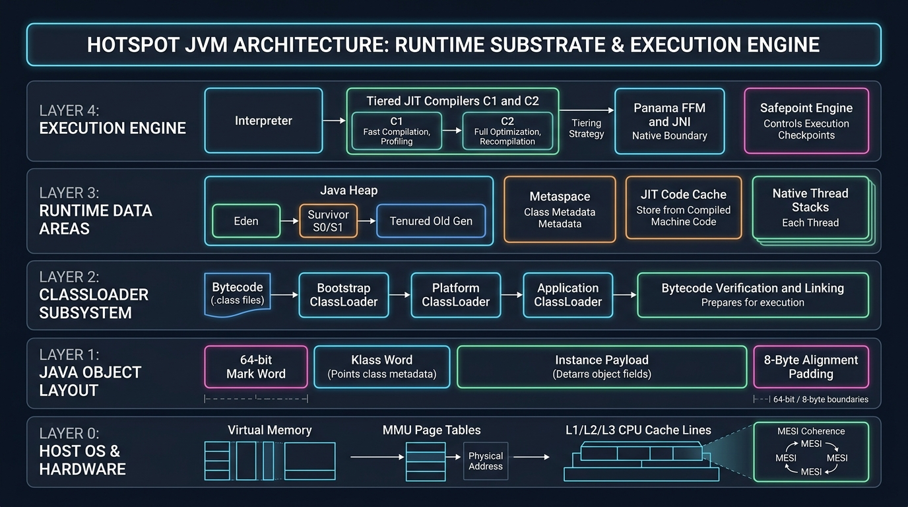
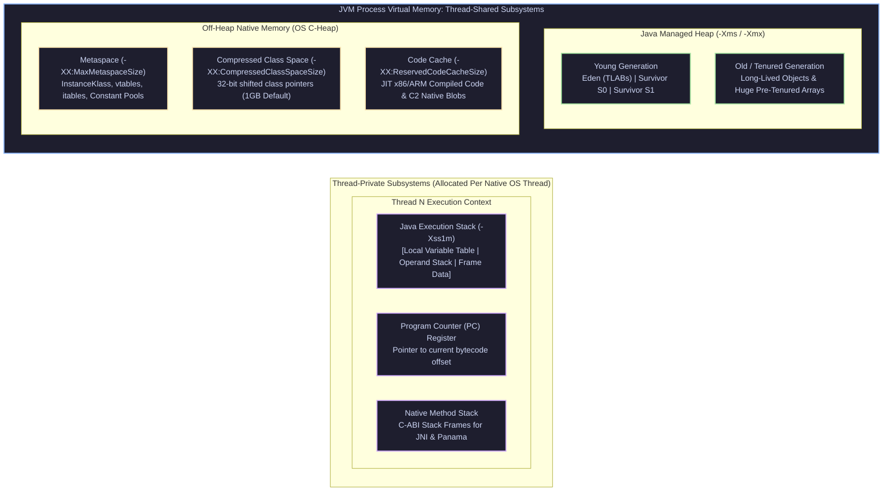
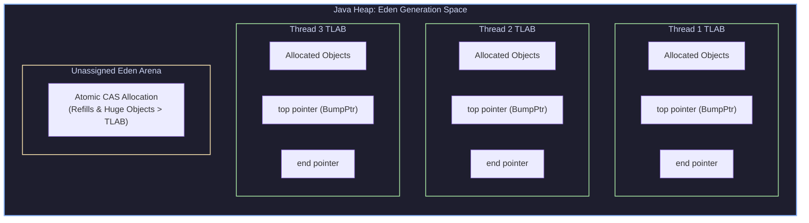
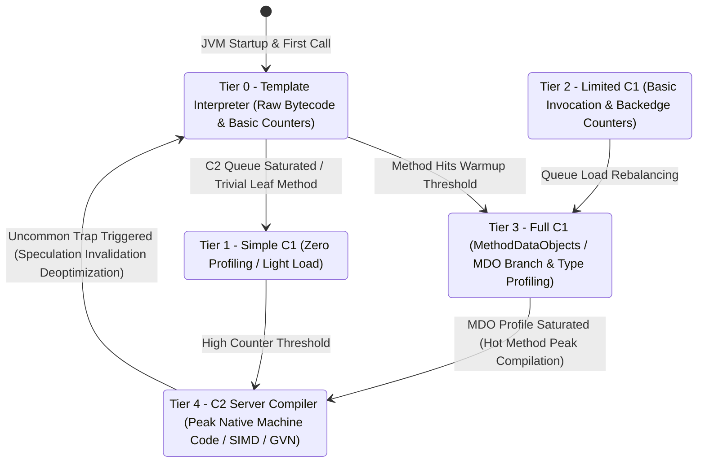
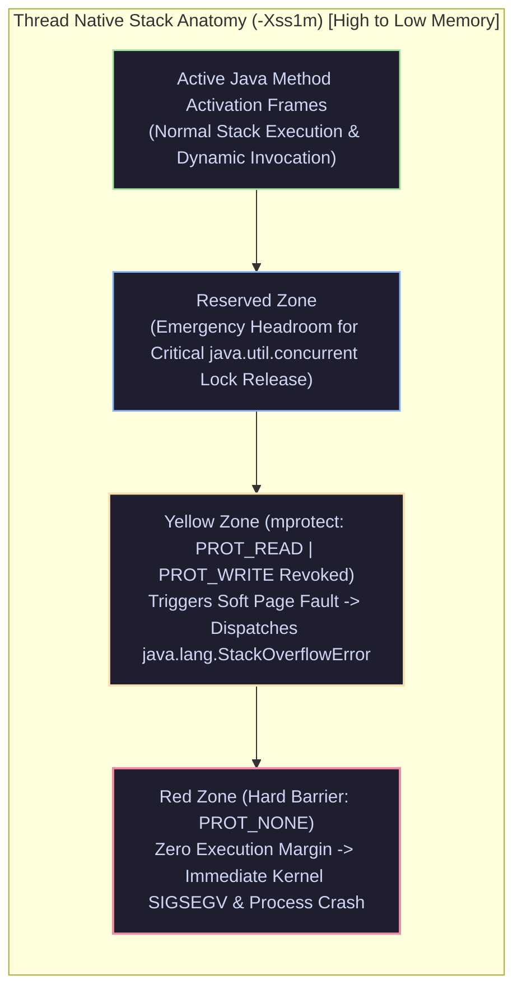

# Java Internals & JVM Architecture: Enterprise Engineering Deep Dive

> **Curriculum Milestone**: Module 01 - Java Core Engineering  
> **Topic Coverage**: HotSpot JVM Architecture, Runtime Data Areas (Heap, Metaspace, Stacks), ClassLoader Delegation & Linking, Bytecode Mechanics (`invokedynamic`), Java Object Layout (JOL), Compressed OOPs & 32GB Limits, Safepoint Protocols, TLABs, and Panama Foreign Function & Memory (FFM).  
> **Target Depth**: 50+ In-Depth Progressive Scenarios with Bytecode Disassembly, Mark Word Bitmaps, Native Assembly Mechanics, Beginner Traps, and Real-World Outage Post-Mortems.

---

## Architecture Blueprint: The HotSpot JVM Substrate

```mermaid
flowchart TB
    subgraph L4 ["Layer 4: Execution Engine & Native Interface"]
        direction LR
        EE1["Template Interpreter<br/>(Bytecode Loop Dispatch)"]
        EE2["Tiered JIT Compilers<br/>(C1 Client -> C2 Opto Server)"]
        EE3["Native Boundary<br/>(JNI C-Bindings & Panama FFM)"]
        EE4["Safepoint Engine<br/>(Polling Page & TTSP Coordinator)"]
    end

    subgraph L3 ["Layer 3: Runtime Data Areas & JVM Memory Subsystem"]
        direction LR
        M1["Java Heap (-Xms/-Xmx)<br/>Young (Eden + S0/S1 TLABs) & Old Gen"]
        M2["Metaspace (-XX:MaxMetaspaceSize)<br/>Native C-Heap: Klass, vtables, ConstPool"]
        M3["Per-Thread Stacks (-Xss)<br/>Stack Frames: Operand Stack & LocalVars"]
        M4["Code Cache (-XX:ReservedCodeCache)<br/>JIT Machine Code & Adapter Stubs"]
    end

    subgraph L2 ["Layer 2: ClassLoader Subsystem & Verification Engine"]
        direction LR
        CL1["Delegation Hierarchy<br/>Bootstrap -> Platform -> Application -> Custom"]
        CL2["Linking Pipeline<br/>Verification (StackMap) -> Preparation (Zeroes) -> Resolution"]
        CL3["Initialization<br/>&lt;clinit&gt; Invocations & Class Init Lock"]
    end

    subgraph L1 ["Layer 1: Object Memory Layout (JOL Substrate)"]
        direction LR
        JOL1["Mark Word (64-bit)<br/>Hashcode, Age, Bias, Lock Bits (00/01/10/11)"]
        JOL2["Klass Word (32/64-bit)<br/>CompressedClassPointers (3-bit shift)"]
        JOL3["Instance Payload & Padding<br/>Field Packing Rules & 8-Byte Alignment"]
    end

    subgraph L0 ["Layer 0: Host Operating System & Hardware Substrate"]
        direction LR
        HW1["Virtual Address Space & MMU<br/>Page Tables, Huge Pages, TLB Shootdowns"]
        HW2["CPU Registers & Hardware Cache<br/>L1/L2/L3 Cache Lines (MESI), Memory Fences"]
        HW3["Kernel Syscalls & Threads<br/>pthread, clone(2), mprotect, mmap"]
    end

    L4 --> L3
    L3 --> L2
    L2 --> L1
    L1 --> L0

    classDef l4 fill:#1e1e2e,stroke:#cba6f7,stroke-width:2px,color:#cdd6f4;
    classDef l3 fill:#1e1e2e,stroke:#89b4fa,stroke-width:2px,color:#cdd6f4;
    classDef l2 fill:#1e1e2e,stroke:#a6e3a1,stroke-width:2px,color:#cdd6f4;
    classDef l1 fill:#1e1e2e,stroke:#f9e2af,stroke-width:2px,color:#cdd6f4;
    classDef l0 fill:#1e1e2e,stroke:#f38ba8,stroke-width:2px,color:#cdd6f4;

    class EE1,EE2,EE3,EE4 l4;
    class M1,M2,M3,M4 l3;
    class CL1,CL2,CL3 l2;
    class JOL1,JOL2,JOL3 l1;
    class HW1,HW2,HW3 l0;
```





#### Architectural Breakdown: The 5-Layer HotSpot JVM Substrate

1. **Visual Architecture & Layer Anatomy**:
   - **Layer 0 (Host Operating System & Hardware Substrate)**: Manages physical memory mapping, virtual page tables, MMU translations, TLB caches, hardware registers, and kernel primitives (`mmap`, `mprotect`, `clone(2)`). Native OS threads directly host Java platform threads in a 1:1 mapping.
   - **Layer 1 (Object Memory Layout - JOL Substrate)**: Defines byte-level layout of all Java objects on the heap. Consists of an 8-byte Mark Word (biasing, age, locking state, identity hashcode), a 4-byte or 8-byte Klass pointer, instance payload fields arranged to minimize padding gaps, and 8-byte boundary alignment padding.
   - **Layer 2 (ClassLoader Subsystem & Verification Engine)**: Implements parent-delegation hierarchy (Bootstrap, Platform, Application, Custom) and 3-stage linking (Verification of bytecode type safety via StackMapTable, Preparation allocating memory and zeroing static variables, and Resolution converting symbolic references in the constant pool to direct virtual addresses).
   - **Layer 3 (Runtime Data Areas & JVM Memory Subsystem)**: Composed of thread-shared regions (Java Heap divided into Young Gen Eden/Survivors and Old Gen, off-heap Metaspace storing `InstanceKlass` C++ structures, and the native Code Cache) and thread-private regions (Java thread stacks with activation frames, PC register, and native C frames).
   - **Layer 4 (Execution Engine & Native Interface)**: Coordinates bytecode interpretation and compilation via Tiered Compilation (Interpreter Tier 0, C1 Client Tiers 1-3, C2 Server Opto Tier 4). Safepoint engines synchronize all threads via memory protection page trap polls, while JNI and modern Project Panama (Foreign Function & Memory API) govern native boundaries.

2. **Execution Flow & Lifecycle State Transitions**:
   - **Phase 1: Bootstrapping & Class Resolution**: JVM bootstrap loader initializes the base module graph (`java.base`). When a class reference is encountered, the delegation chain queries parent loaders. If not found, `findClass()` reads bytecode. Linking verifies bytecode invariants without runtime crashes. Preparation allocates static storage with default zero values, and Initialization runs `<clinit>` under a class-level initialization lock.
   - **Phase 2: Execution & Dynamic Profiling**: Bytecode instructions are initially processed by the Template Interpreter (Tier 0). Method invocation counters and backedge (loop) counters increment in the method's `MethodCounters`. When thresholds are crossed, compilation tasks queue in C1 (Client Compiler).
   - **Phase 3: Tiered Optimization & Inlining**: C1 instruments profiling data (Method Data Objects - MDO) at Tier 3. Hot methods graduate to C2 (Tier 4), which performs aggressive Global Value Numbering (GVN), escape analysis, loop unrolling, and monomorphic/bimorphic inline caching to produce ultra-optimized native x86/ARM assembly.
   - **Phase 4: Safepoint Synchronization & GC/Deoptimization**: When a GC cycle, class redefinition, or thread dump is triggered, the JVM initiates a global Safepoint. The memory page backing the Safepoint Poll is armed with `mprotect(PROT_NONE)`. Running threads hitting polling instructions incur a page fault signal (`SIGSEGV`), intercept it, and park their execution until the safepoint operation concludes.

3. **Low-Level Kernel, JVM & Hardware Mechanics**:
   - **Compressed OOPs & 32GB Ceiling (`-XX:+UseCompressedOops`)**: 64-bit pointers waste 50% more memory and thrash CPU L1/L2 caches. Because objects are aligned on 8-byte boundaries, the lowest 3 bits of every heap address are always `000`. The JVM drops these 3 zero bits and stores an ordinary 32-bit reference. On dereference, the CPU performs a hardware shift: `Address_64 = Compressed_OOP << 3`. This allows a 32-bit integer to address $2^{32} \times 8 = 32\text{ GB}$ of physical heap. Exceeding 32GB (`-Xmx32g`) immediately deactivates Compressed OOPs, jumping pointer size to 64 bits and degrading cache locality.
   - **Thread-Local Allocation Buffers (TLAB)**: Multi-threaded heap allocation without synchronization. Each thread owns a dedicated chunk of Eden memory with private `top` and `end` pointers. Thread allocation simply increments `top` via bump-the-pointer assembly (`add [top], size`) with zero locks and zero atomic CAS instructions, executing in $< 2\text{ ns}$.
   - **Safepoint Poll Page Mechanics**: In modern HotSpot (Java 10+ Thread-Local Handshakes and Safepoints), rather than arming a single global page, each thread has an individual safepoint polling address mapped in its thread structure (`thread->poll_data()`). Polling is compiled into method returns and loop backedges as a single read: `test eax, [safepoint_page]`.

4. **Production Failure Modes & SRE Diagnostics**:
   - **Metaspace vs Compressed Class Space Outage**: `java.lang.OutOfMemoryError: Compressed class space` triggers when dynamic proxies or CGLIB generators flood the 1GB fixed ceiling for class headers (`-XX:CompressedClassSpaceSize`), even if `-XX:MaxMetaspaceSize` has gigabytes of free native RAM. Diagnose using `jcmd <PID> VM.metaspace` and tune `-XX:CompressedClassSpaceSize=2g`.
   - **Code Cache Exhaustion Performance Collapse**: If `-XX:ReservedCodeCacheSize` is exhausted, HotSpot halts JIT compilation, turns off Tiered Compilation, and falls back permanently to interpreter execution. Throughput drops by 80-95%. Inspect using `jcmd <PID> Compiler.codecache` and ensure `-XX:+UseCodeCacheFlushing` is active.
   - **Time-To-Safepoint (TTSP) Latency Spikes**: Long-running non-counted `int` loops without safepoint polls prevent threads from reaching safepoints, causing all other threads to stall waiting for the STW phase. Profile with `-XX:+PrintSafepointStatistics -XX:PrintSafepointStatisticsTimeout=100` or `-Xlog:safepoint=debug:file=safepoints.log`.

<details>
<summary>View Legacy ASCII Architecture Blueprint</summary>

```text
+-----------------------------------------------------------------------------------+
| Layer 4: Execution Engine & Native Interface                                      |
| - Interpreter (Template Interpreter) -> C1 Compiler (Client) -> C2 (Opto Server) |
| - Native Method Interface (JNI) & Modern Project Panama FFM (Foreign Function)    |
| - Safepoint Engine (Global Memory Protection Page Poll, TTSP Diagnostics)        |
+-----------------------------------------------------------------------------------+
| Layer 3: Runtime Data Areas (JVM Memory Subsystem)                                |
| - Method Area / Metaspace (Native C-Heap: Klass Metaspaces, Compressed Class Ptr) |
| - Java Heap: Young (Eden + S0/S1 TLABs) & Old Generation                          |
| - Per-Thread Stacks: Stack Frames (Operand Stack, Local Variables, Dynamic Link)  |
| - Code Cache (JIT Compiled Machine Code), PC Registers, Native Stacks            |
+-----------------------------------------------------------------------------------+
| Layer 2: ClassLoader Subsystem (Loading -> Linking -> Initialization)             |
| - Bootstrap ClassLoader -> Platform ClassLoader -> Application ClassLoader        |
| - Linking: Verification (Bytecode Safety) -> Preparation (Zeroes) -> Resolution   |
| - Initialization (<clinit> Static Initializers & JVM Locks)                       |
+-----------------------------------------------------------------------------------+
| Layer 1: Object Memory Layout (Java Object Layout - JOL)                          |
| - Object Header: Mark Word (64-bit) + Klass Pointer (32-bit / 64-bit)            |
| - Compressed OOPs (-XX:+UseCompressedOops): 3-bit shift math (< 32GB limit)       |
| - Instance Fields (Primitive / Reference) + 8-Byte Alignment Padding              |
+-----------------------------------------------------------------------------------+
| Layer 0: Host Operating System & Hardware Execution Substrate                     |
| - Virtual Address Space, Page Tables, MMU, TLB Shootdowns, CPU Hardware Registers |
+-----------------------------------------------------------------------------------+
```

</details>

---

## Section 1: Progressive Scenario-Based Master Q&A (50+ Scenarios)

### Tier 1: Core JVM Architecture, ClassLoading & Memory Subsystems (Q1 - Q16)

#### Q1: JVM Runtime Data Areas: Heap vs Metaspace vs Stack vs Code Cache

##### 1. Exact Scenario & Question
Diagram and detail the complete anatomy of the HotSpot JVM's Runtime Data Areas. Explain:
1. Thread-Shared regions: Java Heap, Metaspace (Method Area), Code Cache.
2. Thread-Private regions: Java Thread Stacks, Program Counter (PC) Registers, Native Method Stacks.
3. Why was PermGen (Permanent Generation) removed in Java 8 and replaced by native memory Metaspace?
4. What happens when an application exhausts each specific memory region?

##### 2. What the Interviewer Evaluates
- **JVM Spec vs HotSpot Reality**: Conceptual runtime data areas (JLS §2) vs native HotSpot OS memory mapping.
- **Metaspace Evolution**: JEP 122 transition from on-heap contiguous contiguous PermGen to off-heap native memory.
- **Error Mapping**: Matching specific JVM flags (`-Xmx`, `-Xss`, `-XX:MaxMetaspaceSize`, `-XX:ReservedCodeCacheSize`) to their specific `OutOfMemoryError` signatures.

##### 3. Standout Technical Answer
1. **Thread-Shared Memory Areas**:
   - **Java Heap (`-Xms`, `-Xmx`)**: Stores all class instances and arrays. Managed by the Garbage Collector. Divided into Young (Eden, Survivor) and Old (Tenured) generations.
   - **Metaspace (`-XX:MaxMetaspaceSize`)**: Stores class metadata, bytecode definitions, runtime constant pools, annotations, and method bytecode. Resides in **native C-heap memory**, not in the Java heap.
   - **Code Cache (`-XX:ReservedCodeCacheSize`)**: Stores native machine code compiled by JIT compilers (C1, C2) and adapter stubs. Exhausting Code Cache forces the JVM to disable JIT compilation and revert to interpreted mode, causing a 10x–50x performance collapse!
2. **Thread-Private Memory Areas**:
   - **Java Thread Stack (`-Xss`)**: Stores stack frames per method invocation: Local Variable Table, Operand Stack, Frame Data (Dynamic Linking, Return Values).
   - **PC Register**: Tracks the memory address of the next JVM bytecode instruction to execute.
   - **Native Method Stack**: C execution frames for JNI/native calls.
3. **The PermGen to Metaspace Evolution (JEP 122 - Java 8)**:
   - *The Problem of PermGen*: Resided inside the contiguous Java Heap bounded by `-XX:MaxPermSize` (default 64MB/82MB). Class metadata size was impossible to predict in enterprise applications using runtime bytecode generation (Spring AOP, CGLIB, Hibernate). Exhausting PermGen caused fatal `OutOfMemoryError: PermGen space` that forced Stop-The-World Full GCs and service crashes.
   - *The Metaspace Solution*: Allocates metadata out-of-line in **native OS memory** (`malloc`). By default, it auto-grows dynamically up to available physical OS RAM, bounded only by `-XX:MaxMetaspaceSize`. Class unloading occurs concurrently during GC cycles when the associated `ClassLoader` becomes unreachable.



<details>
<summary>View Legacy ASCII Runtime Data Areas Layout</summary>

```text
HotSpot JVM Runtime Data Areas Layout:
+-----------------------------------------------------------------------+
| Thread-Shared Memory                                                  |
|  +---------------------------------+  +----------------------------+  |
|  |           Java Heap             |  |         Metaspace          |  |
|  | [ Eden | S0 | S1 ] [ Tenured ]  |  |  (Klass Metadata in native |  |
|  | (-Xms / -Xmx)                   |  |   C-Heap: -XX:MaxMetaspace)|  |
|  +---------------------------------+  +----------------------------+  |
|  +-----------------------------------------------------------------+  |
|  |           Code Cache (JIT Compiled x86 Native Code)             |  |
|  |           (-XX:ReservedCodeCacheSize=240m)                      |  |
|  +-----------------------------------------------------------------+  |
+-----------------------------------------------------------------------+
| Thread-Private Memory (Per Native Thread)                             |
|  +-----------------------------------+  +--------------------------+  |
|  |       Java Execution Stack        |  |   Native Stack & PC Reg  |  |
|  |  [Frame: LocalVars | OperandStack]|  |   (PC points to current  |  |
|  |  (-Xss1m)                         |  |    bytecode offset)      |  |
|  +-----------------------------------+  +--------------------------+  |
+-----------------------------------------------------------------------+
```

</details>

##### 4. Follow-Up Trap Question & Winning Answer
- **Trap Question**: "Does Metaspace store `static` variables in Java 8+?"
- **Winning Answer**: "No! When PermGen was removed in Java 8, static class variables and interned strings (`String.intern()`) were **moved directly into the standard Java Heap** (`java.lang.Class` instance objects on the heap), NOT into Metaspace. Metaspace stores strictly read-only JVM internal metadata (`InstanceKlass`, methods, vtables, constant pool)."

---

#### Q2: ClassLoader Subsystem: Loading, Linking & Initialization

##### 1. Exact Scenario & Question
Walk through the step-by-step execution path when the JVM encounters an unreferenced class:
```java
OrderProcessor processor = new OrderProcessor();
```
Detail the three phases of classloading:
1. **Loading**: Binary bytecode acquisition.
2. **Linking**: Verification, Preparation (zero-initialization), and Resolution (symbolic to direct references).
3. **Initialization**: Invoking `<clinit>`, static blocks, and class-level initialization locks.

##### 2. What the Interviewer Evaluates
- **JVM Specification Mastery**: JLS §12.2 through §12.4.
- **Preparation vs Initialization**: Memory zeroing vs executing developer assignments.
- **Bytecode Verification**: Type checking and stack map frame validation to prevent arbitrary memory corruption.

##### 3. Standout Technical Answer
1. **Phase 1: Loading**:
   - Locates the binary `.class` file byte stream (via classpath, JAR, network, or runtime generation).
   - Constructs a HotSpot `InstanceKlass` C++ structure in Metaspace.
   - Instantiates a `java.lang.Class` object on the Java Heap as an application-level handle.
2. **Phase 2: Linking**:
   - **Verification**: The JVM bytecode verifier parses class file format (`0xCAFEBABE` magic), checks operand stack overflows, verifies type safety, and ensures branches do not jump to invalid instructions.
   - **Preparation**: Allocates memory in native space for `static` fields and initializes them to their **default zero values** (e.g., `static int count = 0`, `static Object ref = null`), **NOT their developer-assigned values**!
   - **Resolution**: Replaces symbolic references in the constant pool (e.g., `#12 <Method com/pkg/Order.validate>`) with physical direct pointers to memory addresses in the target class's vtable.
3. **Phase 3: Initialization (`<clinit>`)**:
   - Executes the class's `<clinit>` method, which combines all static variable assignments (e.g., `count = 42`) and `static { ... }` initializer blocks in source code order.
   - **Concurrency Guarantee**: Class initialization is protected by an internal JVM-level initialization lock (`InstanceKlass::_init_state`). The JVM guarantees that `<clinit>` is executed **strictly once** in a thread-safe manner.

```java
public class ClassLoadingStagesDemo {
    // Stage: Preparation assigns count = 0
    // Stage: Initialization assigns count = 50, then executes static block!
    public static int count = 50;

    static {
        count = 100;
        System.out.println("Class initialized! count = " + count);
    }
}
```

##### 4. Follow-Up Trap Question & Winning Answer
- **Trap Question**: "If a class contains `public static final int TIMEOUT = 5000;`, does referencing `MyClass.TIMEOUT` trigger class loading, linking, and initialization of `MyClass`?"
- **Winning Answer**: "No! Primitive constants and String literals declared `static final` are **compile-time constants**. The javac compiler performs **Constant Inlining**: it copies the literal value `5000` directly into the calling class's bytecode constant pool (`sipush 5000`). At runtime, the caller executes without ever loading or initializing `MyClass`!"

---

#### Q3: The ClassLoader Delegation Hierarchy & Breaking Delegation

##### 1. Exact Scenario & Question
Detail the ClassLoader hierarchy in modern Java (Java 9+):
1. **Bootstrap ClassLoader** (Native HotSpot C++ / `lib/modules`).
2. **Platform ClassLoader** (formerly Extension ClassLoader, loads non-base JDK modules).
3. **Application / System ClassLoader** (loads user classpath / module path).
Explain how the **Parent-Delegation Model** prevents core library hijacking (e.g., an attacker placing a malicious `java.lang.String` on the classpath), and explain why web application containers (Tomcat, Jetty) and OSGi frameworks **intentionally break parent-delegation**.

##### 2. What the Interviewer Evaluates
- **Delegation Protocol**: `loadClass()` checking cache $\to$ delegating to parent $\to$ calling `findClass()`.
- **Security Invariant**: Why bootstrap classes always win.
- **Child-First (WebApp) Classloading**: Allowing independent web applications to bundle conflicting library versions.

##### 3. Standout Technical Answer
1. **The Delegation Protocol (`loadClass`)**:
   When `loadClass(name)` is invoked:
   1. Check if the class has already been loaded by the current classloader (`findLoadedClass(name)`).
   2. If not, delegate the request to the **Parent ClassLoader** (`parent.loadClass(name)`).
   3. The delegation cascades up to the Bootstrap ClassLoader.
   4. Only if all parent classloaders fail (`ClassNotFoundException`) does the current classloader call its own `findClass(name)`.
2. **Why It Prevents Security Hijacking**:
   If an attacker places a compromised `java.lang.String` inside an application JAR:
   - The application classloader delegates to the Platform, which delegates to the Bootstrap ClassLoader.
   - The Bootstrap ClassLoader finds the official JDK `java.lang.String` in `java.base` module and returns it.
   - The attacker's class is completely ignored. Furthermore, the JVM verifier rejects any class beginning with package `java.` loaded by a non-bootstrap classloader (`SecurityException: Prohibited package name`).
3. **Why Web Containers Break Delegation (Child-First / WebAppClassLoader)**:
   - Suppose App A requires Jackson 2.12 and App B requires Jackson 2.16, while the Tomcat server runtime itself uses Jackson 2.8.
   - Under strict parent delegation, both App A and App B would be forced to use Tomcat's shared Jackson 2.8, breaking their dependencies!
   - **Child-First Model**: `WebAppClassLoader` overrides `loadClass()`. It searches its own local `/WEB-INF/lib` **first**! Only if the class is not found locally does it delegate to the parent container. (JDK base packages `java.*` are strictly exempted and always delegate to Bootstrap).

```
ClassLoader Delegation Hierarchy:
       [ Bootstrap ClassLoader ] (C++ / lib/modules: java.base)
                  ^
                  | (Parent Delegation)
       [ Platform ClassLoader ] (JDK Modules: java.sql, java.net.http)
                  ^
                  | (Parent Delegation)
      [ Application ClassLoader ] (User Classpath / -cp / Application JAR)
                  ^
                  | (Broken Delegation / Child-First in Web Containers)
     [ WebAppClassLoader (App A) ]      [ WebAppClassLoader (App B) ]
     (Loads local /WEB-INF/lib first)   (Loads local /WEB-INF/lib first)
```

##### 4. Follow-Up Trap Question & Winning Answer
- **Trap Question**: "If two different Custom ClassLoaders load the exact same `.class` file byte-for-byte from disk, can an instance of Class A be cast to Class B (`(ClassB) instanceA`)?"
- **Winning Answer**: "No! It will throw `java.lang.ClassCastException`! In the JVM, the runtime identity of a class is defined by the 2-tuple: **`<Fully Qualified Class Name, ClassLoader Instance>`**. Even if the bytecodes are 100% identical, classes loaded by different classloaders belong to completely disjoint runtime packages, making them incompatible."

---

#### Q4: Java Object Layout (JOL): Mark Word, Klass Pointer & Field Alignment

##### 1. Exact Scenario & Question
Inspect the physical memory layout of a standard Java object on a 64-bit JVM:
```java
public class UserAccount {
    private long id;       // 8 bytes
    private int age;       // 4 bytes
    private boolean active;// 1 byte
}
```
Calculate its exact size in bytes using the OpenJDK Java Object Layout (JOL) tool:
1. Mark Word (64 bits = 8 bytes).
2. Klass Word (32 bits vs 64 bits with Compressed Class Pointers).
3. Field packing & reordering.
4. 8-byte boundary alignment padding.

##### 2. What the Interviewer Evaluates
- **Hardware Alignment**: Why objects must be aligned to 8-byte boundaries on 64-bit CPUs.
- **Compressed Class Pointers**: `-XX:+UseCompressedClassPointers` shrinking the Klass Word from 8 to 4 bytes.
- **Field Reordering Optimization**: How HotSpot reorders fields (longs/doubles $\to$ ints $\to$ shorts/chars $\to$ bytes/booleans) to minimize internal alignment holes.

##### 3. Standout Technical Answer
1. **Object Header Anatomy**:
   Every object on the Java heap has an Object Header containing:
   - **Mark Word (8 bytes)**: Stores HashCode, GC generation age (4 bits), Biased Lock flag, Lock status bits (`00`, `01`, `10`, `11`).
   - **Klass Word (4 bytes with Compressed Class Pointers / 8 bytes uncompressed)**: Pointer to the class metadata (`InstanceKlass`) in Metaspace.
   - Total Header = $8 + 4 = \mathbf{12 \text{ bytes}}$ (with `-XX:+UseCompressedClassPointers`).
2. **Field Reordering by HotSpot**:
   HotSpot reorders declared fields to eliminate internal alignment padding:
   - `id` (long): 8 bytes (placed at offset 16).
   - `age` (int): 4 bytes (placed at offset 12 to fill the gap right after the 12-byte header!).
   - `active` (boolean): 1 byte (placed at offset 24).
3. **Exact Size Calculation**:
   - Offset 0–7: Mark Word (8 bytes)
   - Offset 8–11: Klass Word (4 bytes)
   - Offset 12–15: `age` (4 bytes)
   - Offset 16–23: `id` (8 bytes)
   - Offset 24: `active` (1 byte)
   - **Subtotal**: 25 bytes.
   - **8-Byte Alignment Padding**: The JVM mandates that every heap object must occupy a multiple of 8 bytes. $25$ rounds up to the nearest multiple of 8: $\mathbf{32 \text{ bytes}}$! (7 bytes of padding added).

```java
import org.openjdk.jol.info.ClassLayout;

public class JolInspectionDemo {
    public static class UserAccount {
        private long id = 1001L;
        private int age = 30;
        private boolean active = true;
    }

    public static void main(String[] args) {
        UserAccount account = new UserAccount();
        // Prints exact byte-by-byte memory layout and padding breakdown
        System.out.println(ClassLayout.parseInstance(account).toPrintable());
    }
}
```

##### 4. Follow-Up Trap Question & Winning Answer
- **Trap Question**: "What is the memory size of `new Object()` with Compressed Class Pointers enabled?"
- **Winning Answer**: "`new Object()` has a 12-byte header (8-byte Mark Word + 4-byte Klass Word) and 0 instance fields. To satisfy the 8-byte alignment rule, the JVM appends 4 bytes of padding, making `new Object()` occupy exactly **16 bytes** on the heap."

---

#### Q5: Compressed OOPs & The 32GB Heap Performance Cliff

##### 1. Exact Scenario & Question
Why do Senior Performance Architects issue the strict rule: *"Never size a Java heap between 32GB and 47GB: a 31GB heap holds significantly more application data than a 33GB heap!"*? Explain how **Compressed Ordinary Object Pointers (Compressed OOPs)** work via 3-bit left-shift math, explain why 32GB is the mathematical ceiling, and detail what happens to memory consumption the instant you set `-Xmx33g`.

##### 2. What the Interviewer Evaluates
- **Bitwise Pointer Compression**: Mapping 32-bit registers to 35-bit physical memory addresses using 8-byte object alignment.
- **The 32GB Cliff**: Dropping from 4-byte compressed pointers to uncompressed 8-byte native 64-bit pointers.
- **Real-World Capacity Math**: 33GB heap losing 8GB–12GB of usable memory solely to bloated object headers and references.

##### 3. Standout Technical Answer
1. **The Math of Compressed OOPs (`-XX:+UseCompressedOops`)**:
   - In a 64-bit OS, raw memory pointers require 64 bits (8 bytes), inflating heap consumption by 40%.
   - To save RAM, HotSpot uses **32-bit integer pointers** to reference 64-bit memory addresses.
   - Normally, a 32-bit unsigned integer can address a maximum of:
     $$2^{32} \text{ bytes} = 4,294,967,296 \text{ bytes} = \mathbf{4 \text{ Gigabytes}}.$$
   - **The 8-Byte Alignment Trick**: Because all Java objects are aligned to 8-byte boundaries ($2^3$), the lowest 3 bits of every valid object address in physical RAM are **always `000`**!
   - HotSpot exploits this: it stores only the top 32 bits.
   - To read a pointer: CPU shifts the 32-bit value left by 3 bits: `physicalAddress = compressedPointer << 3`.
   - Maximum addressable space:
     $$2^{32} \times 8 \text{ bytes} = 2^{35} \text{ bytes} = \mathbf{32 \text{ Gigabytes}}!$$
2. **The 32GB Performance Cliff**:
   - When you set `-Xmx31g`, Compressed OOPs are **enabled**. Every object reference occupies **4 bytes**.
   - The instant you increase heap to `-Xmx33g` (exceeding 32GB), the JVM **disables Compressed OOPs**. Every object reference and every Klass pointer doubles in size from 4 bytes to **8 bytes**!
   - In an enterprise application containing 1 billion objects, doubling pointer sizes consumes an extra **8 to 12 Gigabytes of RAM** just to hold the pointers!
   - Consequently, a 33GB heap has **less usable application memory** than a 31GB heap, while suffering higher CPU cache misses. You must size your heap either at $\le 31\text{GB}$ or leap straight to $\ge 48\text{GB}$!

```bash
# Verify Compressed OOP status for your JVM heap size
java -Xmx31g -XX:+PrintFlagsFinal -version | grep UseCompressedOops # Output: bool UseCompressedOops = true
java -Xmx33g -XX:+PrintFlagsFinal -version | grep UseCompressedOops # Output: bool UseCompressedOops = false
```

##### 4. Follow-Up Trap Question & Winning Answer
- **Trap Question**: "Can you increase the Compressed OOPs ceiling to 64GB by setting `-XX:ObjectAlignmentInBytes=16`?"
- **Winning Answer**: "Yes! Aligning objects to 16-byte boundaries allows a 4-bit left shift ($2^{32} \times 16 = 64\text{GB}$). However, aligning to 16 bytes introduces massive internal alignment padding holes inside every small object, which frequently wastes more memory than the pointer compression saves, making it rarely beneficial in practice."

---

#### Q6: JVM Bytecode Architecture & Execution: The Stack Machine Model

##### 1. Exact Scenario & Question
Disassemble the following simple method using `javap -c -v`:
```java
public int calculate(int a, int b) {
    int c = a + b;
    return c * 2;
}
```
Trace the step-by-step execution across the **Local Variable Table (LVT)** and the **Operand Stack**. Explain why the JVM is architected as a **Stack-Based Virtual Machine** (push/pop) rather than a Register-Based Virtual Machine (like Dalvik or Lua VM), and analyze the performance trade-offs.

##### 2. What the Interviewer Evaluates
- **Bytecode Fluency**: Interpreting raw JVM bytecodes (`iload`, `iadd`, `imul`, `istore`, `ireturn`).
- **Stack Frame Mechanics**: Operand stack depth limits and local variable indexing.
- **VM Architecture**: Stack-based simplicity and portability vs Register-based instruction density.

##### 3. Standout Technical Answer
1. **Bytecode Disassembly (`javap -c`)**:
   ```bytecode
   public int calculate(int, int);
     Code:
        stack=2, locals=4, args_size=3
        0: iload_1       // Push local var 1 (a) onto Operand Stack
        1: iload_2       // Push local var 2 (b) onto Operand Stack
        2: iadd          // Pop a and b, sum them, push result onto Operand Stack
        3: istore_3      // Pop result from Operand Stack, store in local var 3 (c)
        4: iload_3       // Push local var 3 (c) onto Operand Stack
        5: iconst_2      // Push constant integer 2 onto Operand Stack
        6: imul          // Pop c and 2, multiply, push result onto Operand Stack
        7: ireturn       // Pop result from stack and return to caller
   ```
2. **Local Variable Table Mapping**:
   - Slot 0: `this` (hidden reference to calling object)
   - Slot 1: `int a`
   - Slot 2: `int b`
   - Slot 3: `int c`
3. **Stack-Based vs Register-Based Architecture**:
   - **Stack-Based (JVM)**: All arithmetic operations pop operands from an evaluation stack and push results.
     - *Advantage*: Extreme portability and simplicity. The JVM does not have to worry about how many physical hardware registers a target CPU has (x86 has 16 general-purpose registers, ARM has 31, MIPS has 32). Compiling from Java source to stack bytecode is straightforward.
     - *Trade-off*: Requires more instructions to perform basic math (e.g., 4 instructions for `a + b` vs 1 instruction `ADD R1, R2, R3` in a register VM).
   - The JIT compiler (C2) solves this trade-off: it compiles the stack bytecode into optimized SSA (Static Single Assignment) form and maps it directly to native CPU hardware registers at runtime!

##### 4. Follow-Up Trap Question & Winning Answer
- **Trap Question**: "If `calculate` was a `public static` method, what would be in Slot 0 of the Local Variable Table?"
- **Winning Answer**: "Slot 0 would store `int a`! In static methods, there is no `this` reference passed to the method frame. In instance methods, Slot 0 is always reserved for the implicit `this` pointer."

---

#### Q7: Method Invocation Bytecodes: `invokevirtual` vs `invokestatic` vs `invokespecial` vs `invokeinterface` vs `invokedynamic`

##### 1. Exact Scenario & Question
Compare the 5 method invocation bytecode instructions in the JVM:
1. `invokestatic`: Static method calls.
2. `invokespecial`: Private methods, constructors (`<init>`), and `super` calls.
3. `invokevirtual`: Standard polymorphic virtual dispatch via class `vtable`.
4. `invokeinterface`: Interface method dispatch via `itable`.
5. `invokedynamic` (Java 7/8+): Dynamic call sites, bootstrap methods, and Lambdas.
Why is `invokeinterface` historically slower than `invokevirtual`, and how does `invokedynamic` eliminate anonymous inner class allocations for Java 8 Lambdas?

##### 2. What the Interviewer Evaluates
- **Polymorphic Dispatch Mechanisms**: Vtables (Virtual Method Tables) vs Itables (Interface Method Tables).
- **Static vs Dynamic Binding**: Compile-time direct binding vs runtime dynamic resolution.
- **Invokedynamic & Lambdas**: JEP 186 translation of lambdas via `LambdaMetafactory`.

##### 3. Standout Technical Answer
1. **The 5 Invocation Bytecodes**:
   - `invokestatic`: Direct call to a static method. Resolved at compile-time/linking; zero dynamic dispatch overhead.
   - `invokespecial`: Non-polymorphic direct calls. Used for `<init>` constructors, `private` methods (which cannot be overridden), and `super.method()` calls.
   - `invokevirtual`: Standard polymorphic dispatch. Uses the object's **`vtable`** (Virtual Method Table): an array of method pointers. Subclasses inherit the parent's vtable layout, meaning method `foo()` always resides at the exact same fixed array index offset (e.g., index 4) across the entire class hierarchy, making lookup a fast $O(1)$ array dereference.
   - `invokeinterface`: Used when calling a method on an interface reference. Because an unrelated class `Cat` and class `Airplane` can both implement `Flyable`, but have completely different class inheritance hierarchies, the method cannot sit at a fixed vtable offset! The JVM must search an **`itable`** (Interface Table), requiring a slower table scan. (Modern JIT compilers optimize this via Inline Caching).
   - `invokedynamic` (`indy`): Introduced in Java 7 for dynamic languages and utilized in Java 8 for Lambdas. Decouples bytecode execution from static type checks. It defines a **Bootstrap Method (BSM)** that executes on first invocation to link the call site to a dynamic `CallSite` / `MethodHandle`.
2. **Why Lambdas Do Not Generate Inner Classes**:
   In Java 7, writing an event listener generated a separate `.class` file on disk (`MyService$1.class`) and allocated an anonymous inner class object on the heap on every execution.
   In Java 8+, writing `() -> doWork()` emits `invokedynamic` targeting `LambdaMetafactory.metafactory()`. It generates the lambda implementation dynamically in memory and returns a reusable cached singleton for stateless lambdas, creating **zero disk files and zero heap memory allocations**!

```java
public class BytecodeDispatchDemo {
    interface Worker { void work(); }
    static class Task implements Worker {
        public void work() {}
        private void secret() {}
    }

    public static void main(String[] args) {
        Task t = new Task();
        t.secret();           // Emits invokespecial
        t.work();             // Emits invokevirtual
        Worker w = t;
        w.work();             // Emits invokeinterface
        Runnable r = () -> {};// Emits invokedynamic (LambdaMetafactory)
    }
}
```

##### 4. Follow-Up Trap Question & Winning Answer
- **Trap Question**: "Can `invokevirtual` be devirtualized by the JIT compiler into a direct machine call?"
- **Winning Answer**: "Yes! Through **Monomorphic Inline Caching** and **Class Hierarchy Analysis (CHA)**. If C2 proves that only one concrete implementation of a method is loaded in the entire JVM, it strips out the vtable lookup entirely and inlines the target method body directly into the caller code, achieving raw C-like execution speed."

---

#### Q8: Thread Local Allocation Buffers (TLAB): Eliminating Global Heap Locks

##### 1. Exact Scenario & Question
In a high-throughput microservice, 128 worker threads allocate 5,000,000 objects every second on the heap. If all threads allocated memory directly into shared Eden space, they would continuously contend for the global heap allocation lock, collapsing throughput. Explain how **Thread Local Allocation Buffers (TLAB)** solve this through bump-the-pointer thread-local allocations, explain what happens during a **TLAB Waste / TLAB Refill**, and analyze the trade-off of `-XX:+UseTLAB`.

##### 2. What the Interviewer Evaluates
- **Lock-Free Object Allocation**: Bypassing synchronized memory allocation in Eden.
- **Bump-the-Pointer Mechanics**: Incremental pointer shifting within private memory slabs.
- **TLAB Sizing & Slower Fast-Paths**: Handling objects larger than remaining TLAB capacity.

##### 3. Standout Technical Answer
1. **The Global Eden Allocation Problem**:
   The JVM Young Generation's Eden space is shared by all threads. If 128 threads allocate objects simultaneously, the JVM would have to synchronize every allocation using atomic CAS operations on the top-of-heap pointer. Under millions of allocations per second, CAS bus contention degrades performance.
2. **The TLAB Architecture**:
   HotSpot assigns each Java thread a dedicated, private slab of memory inside Eden called a **Thread Local Allocation Buffer (TLAB)**:
   - When a thread allocates an object: it allocates **strictly within its own private TLAB**.
   - It executes **Bump-The-Pointer**: it simply increments its local pointer `top += objectSize`.
   - **Zero synchronization, zero CAS operations, zero cross-core cache invalidation!** Allocation executes in **sub-2 nanoseconds** directly in CPU L1 cache.
3. **TLAB Refills & Waste Threshold**:
   What happens when an object does not fit in the remaining space of the current TLAB?
   - If remaining space is smaller than the **Refill Waste Threshold** (`-XX:TLABWasteTargetPercent`):
     The thread discards the remaining space (marked as dummy padding array) and requests a brand new TLAB from Eden using a single CAS operation.
   - If the requested object is **larger than the entire TLAB** (e.g., a massive 50MB array):
     The JVM bypasses TLAB entirely and allocates the object directly in shared Eden or Old Generation.



<details>
<summary>View Legacy ASCII Eden Memory Space Layout</summary>

```text
Eden Memory Space:
+-------------------+-------------------+-------------------+-------------------+
|  Thread 1 TLAB    |  Thread 2 TLAB    |  Thread 3 TLAB    | Free Eden Space   |
| [top ->      ]    | [top ->      ]    | [top ->      ]    | (Allocated via    |
| (Private BumpPtr) | (Private BumpPtr) | (Private BumpPtr) |  single CAS lock) |
+-------------------+-------------------+-------------------+-------------------+
```

</details>

##### 4. Follow-Up Trap Question & Winning Answer
- **Trap Question**: "Can objects allocated inside Thread 1's TLAB be read by Thread 2?"
- **Winning Answer**: "Yes! TLAB confinement applies **only to allocation**, not to reading or writing. A TLAB is merely a physical slice of the shared Java Heap. Once an object is allocated in Thread 1's TLAB, its memory address can be published and read by any other thread in the JVM."

---

#### Q9: Metaspace Architecture & The Compressed Class Space Limit

##### 1. Exact Scenario & Question
An application configured with `-Xmx16g` and `-XX:MaxMetaspaceSize=4g` crashes with:
```
java.lang.OutOfMemoryError: Compressed class space
```
Even though total Metaspace usage is only 1.1GB (well below the 4GB limit). Detail the architectural difference between **Compressed Class Space** (default 1GB fixed ceiling) and **Non-Class Metaspace**, explain how `-XX:+UseCompressedClassPointers` constrains memory allocation, and demonstrate how to resolve this crash.

##### 2. What the Interviewer Evaluates
- **HotSpot Metaspace Partitioning**: Class Metaspace (`InstanceKlass`) vs Non-Class Metaspace (Methods, Annotations, Constant Pools).
- **Virtual Memory Sizing**: The 32-bit shifted pointer constraint applied to Metaspace.
- **Production Tuning**: `-XX:CompressedClassSpaceSize`.

##### 3. Standout Technical Answer
1. **The Two Regions of Metaspace**:
   When Compressed Class Pointers are enabled (`-XX:+UseCompressedClassPointers`, default in 64-bit JVMs):
   - Metaspace is physically divided into two distinct native memory areas:
     1. **Compressed Class Space**: Stores strictly `InstanceKlass` structures (the class definitions themselves). Because the Klass Word in object headers is a 32-bit pointer, all class structures must reside in a **single contiguous 32-bit addressable virtual memory block**.
     2. **Non-Class Metaspace**: Stores method bytecode, constant pools, annotations, JIT vtables, and method counters. This space can grow non-contiguously across native memory up to `-XX:MaxMetaspaceSize`.
2. **The Root Cause of the OOM**:
   - By default, `-XX:CompressedClassSpaceSize` is set to **1 Gigabyte** (`1024MB`).
   - If an application dynamically generates hundreds of thousands of classes (via Spring CGLIB proxies, Hibernate enhancers, Groovy scripts, or Jackson reflection):
   - The Compressed Class Space fills up to 1GB, even though Non-Class Metaspace has gigabytes of free RAM!
   - HotSpot cannot allocate another `InstanceKlass` within the 32-bit shifted boundary and throws:
     `java.lang.OutOfMemoryError: Compressed class space`.
3. **The Solution**:
   Increase Compressed Class Space size or disable compressed class pointers:
   ```bash
   java -XX:CompressedClassSpaceSize=2g -XX:MaxMetaspaceSize=4g -jar app.jar
   ```

##### 4. Follow-Up Trap Question & Winning Answer
- **Trap Question**: "If you set `-XX:-UseCompressedClassPointers` (disabling pointer compression for classes), does Compressed Class Space still exist?"
- **Winning Answer**: "No! Disabling compressed class pointers eliminates Compressed Class Space entirely. All class metadata is allocated in standard Non-Class Metaspace using full 64-bit native pointers. However, this increases the object header size of every single object on the heap from 12 bytes to 16 bytes, increasing overall heap consumption."

---

#### Q10: HotSpot Safepoint Architecture & Global Polling Page

##### 1. Exact Scenario & Question
Explain what a **Safepoint** is in the HotSpot JVM. Why are safepoints required for Stop-The-World (STW) GC pauses, biased lock revocations, code deoptimization, and thread dumps? Detail the low-level mechanism HotSpot uses to bring running threads to a halt:
1. Compiled code safepoint polling instructions.
2. Global Safepoint Polling Page (`mprotect(PROT_NONE)` vs Thread-Local Handshakes).
3. Why JNI native threads do NOT need to halt at a safepoint.

##### 2. What the Interviewer Evaluates
- **JVM Global Coordination**: How the JVM achieves consistent execution states across hundreds of threads.
- **Hardware Page Fault Traps**: How memory page protection permissions force CPU instruction traps.
- **Modern JVM Handshakes**: Java 10 JEP 312 Thread-Local Handshakes eliminating global STW pauses.

##### 3. Standout Technical Answer
1. **What is a Safepoint?**:
   A Safepoint is a global checkpoint where all mutator threads have paused execution of Java bytecode, their program counters are stable, and their execution stacks are fully known so the GC can inspect GC roots without race conditions.
2. **The Hardware Memory Polling Mechanism (Legacy HotSpot)**:
   - When the JIT compiler compiles Java code to native machine instructions, it injects a small polling check at method returns and loop edges:
     `test %eax, 0x160(%rip)  // Polls the global Safepoint Memory Page`
   - Under normal execution, this memory page is **readable**; the CPU test instruction executes in 1 clock cycle and proceeds.
   - When the JVM needs a Safepoint (e.g., to run G1GC Remark or capture `jstack`):
     1. The `VM Thread` invokes the OS syscall: `mprotect(safepoint_page, PAGE_SIZE, PROT_NONE)`.
     2. The memory page becomes **inaccessible**.
     3. The next time a running thread executes the polling check, accessing the page triggers a hardware **CPU Memory Fault (SIGSEGV)**!
     4. HotSpot's internal signal handler intercepts the SIGSEGV, parks the thread on an internal OS mutex, and signals readiness to the `VM Thread`.
3. **Thread-Local Handshakes (Java 10+ / JEP 312)**:
   Modern Java replaces the global page protection with **Thread-Local Handshakes**: the JVM can bring individual individual threads to a safepoint (e.g., to revoke a bias lock or deoptimize a single method) without stopping all other threads in the JVM!
4. **Why Native JNI Threads Do Not Halt**:
   A thread executing native C code via JNI is already considered to be in a safe state because it cannot modify Java heap pointers. The GC runs concurrently with native execution. However, when the native thread attempts to return from JNI back to Java bytecode, it is intercepted and forced to park until the safepoint finishes.

##### 4. Follow-Up Trap Question & Winning Answer
- **Trap Question**: "What is Time-To-Safepoint (TTSP), and what is the #1 cause of long TTSP pauses in production?"
- **Winning Answer**: "Time-To-Safepoint (TTSP) is the elapsed time between when the JVM requests a safepoint and when the last running thread finally comes to a halt. The #1 cause of long TTSP is **Counted Loops without Safepoint Polls** in C2-compiled code. If a thread is executing a long-running `for (int i = 0; i < 1_000_000_000; i++)` loop from which C2 stripped the polling instruction, all other threads wait frozen for hundreds of milliseconds until that loop finishes."

---

#### Q11: Java Native Interface (JNI) vs Project Panama (Foreign Function & Memory API)

##### 1. Exact Scenario & Question
Compare legacy **Java Native Interface (JNI)** with modern **Project Panama (Foreign Function & Memory API - JEP 454 in Java 22 LTS)**. Detail:
1. Marshalling overhead and native transition costs.
2. Direct native memory access: `Unsafe` vs `MemorySegment` and `Arena`.
3. Type safety, lifetime management (`Arena.ofConfined()` vs `Arena.ofShared()`), and downcall method handles.
Why does Project Panama revolutionize Java systems programming?

##### 2. What the Interviewer Evaluates
- **Modern Java Evolution**: Java 22 LTS Project Panama replacing 25-year-old JNI.
- **Safety & Performance**: Replacing dangerous `Unsafe` with bounded, deterministic `MemorySegment`.
- **Foreign Function Invocation**: Calling C standard library functions (`strlen`, `qsort`) without writing a single line of C glue code.

##### 3. Standout Technical Answer
1. **The Flaws of Legacy JNI**:
   - Requires writing, compiling, and maintaining brittle native C/C++ wrapper code (`.c` files, headers generated via `javah`).
   - High transition overhead: crossing the JNI boundary requires saving register states, creating JNI local reference frames, and pinning memory.
   - Pointers are naked 64-bit integers with **zero spatial bounds checking and zero lifetime management**, frequently leading to JVM segmentation faults.
2. **The Project Panama Revolution (JEP 454)**:
   - **Foreign Function API (`Linker`)**: Allows calling native C functions (e.g., POSIX `getpid`, `malloc`, `qsort`) **purely from Java code** using `MethodHandle` without writing any C glue code!
   - **Foreign Memory API (`MemorySegment`)**: Safe, structured off-heap memory allocation with **strict spatial bounds** (cannot read past allocation length) and **temporal bounds** (cannot read after arena is closed).
3. **Lifetime Management via Arenas**:
   - `Arena.ofConfined()`: Allocated off-heap memory is confined to a single thread and freed deterministically when exiting a `try-with-resources` block.
   - `Arena.ofShared()`: Thread-safe arena that can be accessed concurrently across multiple worker threads.

```java
import java.lang.foreign.*;
import java.lang.invoke.MethodHandle;

public class ProjectPanamaDemo {
    public static void main(String[] args) throws Throwable {
        // Find standard C library function: size_t strlen(const char *s)
        Linker linker = Linker.nativeLinker();
        SymbolLookup stdlib = linker.defaultLookup();
        MemorySegment strlenAddress = stdlib.find("strlen").orElseThrow();

        // Define C function signature: returns long, takes 1 address pointer
        FunctionDescriptor descriptor = FunctionDescriptor.of(ValueLayout.JAVA_LONG, ValueLayout.ADDRESS);
        MethodHandle strlen = linker.downcallHandle(strlenAddress, descriptor);

        // Safe deterministic off-heap memory allocation via Arena
        try (Arena arena = Arena.ofConfined()) {
            MemorySegment nativeString = arena.allocateFrom("Hello Project Panama!");
            
            // Invoke native C standard library function directly from Java!
            long length = (long) strlen.invoke(nativeString);
            System.out.println("Length calculated by native C strlen: " + length); // 21
        } // Native memory is instantly freed here! Zero GC involvement!
    }
}
```

##### 4. Follow-Up Trap Question & Winning Answer
- **Trap Question**: "What happens if code attempts to read from a `MemorySegment` after its enclosing `Arena` has been closed?"
- **Winning Answer**: "It immediately throws a safe `java.lang.IllegalStateException: Already closed`! Unlike `Unsafe` or C pointers which cause fatal segmentation faults (`SIGSEGV`) when dereferencing use-after-free memory, Project Panama enforces strict temporal safety and prevents JVM crashes."

---

#### Q12: Metaspace Leaks via Dynamic Proxies & ClassLoader Pinning

##### 1. Exact Scenario & Question
A Spring Boot application redeployed inside a legacy Tomcat container throws:
```
java.lang.OutOfMemoryError: Metaspace
```
Heap usage is low. Metaspace monitoring shows loaded classes climbing by 15,000 every time a redeployment occurs. Explain the root cause involving **ClassLoader Leaking**, dynamic bytecode generation frameworks (CGLIB, ByteBuddy, Spring AOP), strong reference retention in `ThreadLocal`s, and why garbage collection cannot collect dead classes.

##### 2. What the Interviewer Evaluates
- **Class Unloading Criteria**: A class can ONLY be unloaded if its `ClassLoader` is 100% unreachable.
- **ClassLoader Pinning**: How a single leaked instance retains its ClassLoader and thousands of classes.
- **Dynamic Proxy Churn**: Unbounded CGLIB/ByteBuddy code generation filling Metaspace.

##### 3. Standout Technical Answer
1. **The Strict Rules of Class Unloading**:
   Under the JVM Specification, a class in Metaspace can be garbage collected if and only if **all three conditions hold simultaneously**:
   1. Zero instances of that class exist on the Java heap.
   2. The `java.lang.Class` object is no longer referenced anywhere.
   3. The **`ClassLoader` that loaded that class is completely unreachable from any GC Root**!
2. **The Leaking Chain**:
   - When Tomcat redeploys an application, it creates a new `WebAppClassLoader` and discards the old one.
   - However, if the application code or a third-party library left a single strong reference to the old classloader:
     `GC Root -> Thread (ThreadLocal) -> LeakedObject -> OldClass -> Old WebAppClassLoader`
   - Because `Old WebAppClassLoader` is still reachable, **NOT A SINGLE ONE of the 15,000 classes it loaded can be unloaded from Metaspace**!
   - Dynamic proxy generators (CGLIB, Spring AOP, Hibernate) generate new proxy classes for every redeployment.
   - Metaspace fills up with multiple generations of orphaned classes until `OutOfMemoryError: Metaspace` crashes the server.

```
GC Root (ThreadLocal / Static Variable in Container)
    |
    v (Strong Reference)
[ User Entity Object ]
    |
    v (getClass())
[ UserEntity.class ]
    |
    v (getClassLoader())
[ Old WebAppClassLoader ] ===> Pins ALL 15,000 Classes in Metaspace forever!
```

##### 4. Follow-Up Trap Question & Winning Answer
- **Trap Question**: "Can classes loaded by the Bootstrap ClassLoader or Application ClassLoader ever be unloaded from Metaspace?"
- **Winning Answer**: "No! Classes loaded by the Bootstrap ClassLoader, Platform ClassLoader, and System/Application ClassLoader are **permanent** and can NEVER be unloaded because these system classloaders live for the entire duration of the JVM process and are always reachable from GC roots."

---

#### Q13: StackOverflowError vs OutOfMemoryError in Thread Stacks

##### 1. Exact Scenario & Question
Compare the failure mechanics of thread execution stacks:
1. `java.lang.StackOverflowError`
2. `java.lang.OutOfMemoryError: unable to create native thread`
Detail the internal structure of a single Java Stack Frame (Local Variable Table, Operand Stack, Frame Data), calculate the maximum recursion depth for `-Xss256k` vs `-Xss1m`, and explain why increasing `-Xss` decreases the maximum number of concurrent threads a machine can support.

##### 2. What the Interviewer Evaluates
- **Stack Frame Depth**: How recursive calls exhaust thread stack memory.
- **Native Virtual Memory Constraints**: The inverse relationship between stack size (`-Xss`) and thread capacity.
- **Operating System Memory Allocation**: Why stack memory is allocated outside the JVM heap.

##### 3. Standout Technical Answer
1. **Stack Frame Anatomy**:
   Every method invocation pushes an execution **Frame** onto the thread's stack:
   - **Local Variable Table (LVT)**: Stores `this`, method parameters, and local variables.
   - **Operand Stack**: Push/pop workspace for bytecode calculations.
   - **Frame Data**: Pointers to constant pool (Dynamic Linking) and exception dispatch tables.
2. **`StackOverflowError`**:
   - Occurs when a single thread executes deep or infinite recursion.
   - The thread stack reaches its memory limit (`-Xss`, default 1024KB on 64-bit Linux).
   - HotSpot's stack guard pages detect the stack boundary and throw `java.lang.StackOverflowError`.
   - Halving `-Xss` from 1MB to 512KB halves the maximum recursion depth.
3. **`OutOfMemoryError: unable to create native thread`**:
   - Occurs when the application attempts to spawn a new `Thread`, but the OS cannot allocate native memory for the thread stack or exhausts process PID limits (`/proc/sys/kernel/pid_max`).
   - **The Mathematical Invariant**:
     $$\text{Max Theoretical Threads} \approx \frac{\text{Available OS Virtual Memory} - \text{Heap} - \text{Metaspace}}{\text{Stack Size (-Xss)}}.$$
   - Increasing `-Xss` from 256KB to 1MB means each thread consumes 4x more native RAM, **reducing the maximum number of concurrent threads the machine can spawn by 75%**!

```java
public class StackRecursionAnalyzer {
    private static int depth = 0;

    public static void recursiveCall() {
        depth++;
        recursiveCall(); // Unbounded recursion pushes frames until -Xss is exhausted
    }

    public static void main(String[] args) {
        try {
            recursiveCall();
        } catch (StackOverflowError soe) {
            System.err.println("StackOverflow reached at depth: " + depth);
            // Typically ~10,000 to 12,000 frames with -Xss1m
        }
    }
}
```

##### 4. Follow-Up Trap Question & Winning Answer
- **Trap Question**: "Does increasing JVM Heap memory (`-Xmx`) help resolve `OutOfMemoryError: unable to create native thread`?"
- **Winning Answer**: "No! In fact, it makes the problem **worse**! Thread stacks are allocated in native OS memory *outside* the JVM heap. Increasing `-Xmx` leaves *less* physical RAM available for native thread stack allocations, causing `unable to create native thread` to occur even sooner."

---

#### Q14: Unsafe Memory Allocations & Segmentation Faults

##### 1. Exact Scenario & Question
Why was `sun.misc.Unsafe` labeled with *"Unsafe"*? Walk through:
1. Direct memory allocation via `Unsafe.allocateMemory(size)` and `freeMemory(address)`.
2. Raw memory corruption: what happens if code writes past the allocated bounds or accesses an uninitialized memory pointer?
3. How JEP 396 and JEP 403 strongly encapsulate JDK internals, and what replaces `Unsafe` in modern Java.

##### 2. What the Interviewer Evaluates
- **Bypassing JVM Safety Guarantees**: Direct memory access without bounds checks or type checks.
- **Hardware Traps**: How illegal memory dereferencing raises `SIGSEGV` and kills the process.
- **Modern Replacements**: `VarHandle` (atomic memory access) and `MemorySegment` (off-heap memory).

##### 3. Standout Technical Answer
1. **The Nature of `Unsafe`**:
   `sun.misc.Unsafe` provides low-level, hardware-level primitives that bypass all JVM type-safety and bounds checks:
   - `allocateMemory(bytes)`: Calls native C `malloc()`.
   - `putInt(address, value)`: Writes raw bytes directly to a physical memory address.
   - `freeMemory(address)`: Calls native C `free()`.
2. **The Segmentation Fault Hazard**:
   - If you allocate 100 bytes, but call `unsafe.putLong(address + 200, 42)`, you write into unmapped memory or overwrite unrelated memory structures.
   - If you dereference a freed pointer (`Use-After-Free`), or an invalid address, the CPU raises a hardware **Segmentation Fault (Signal 11 / `SIGSEGV`)**.
   - **The JVM process crashes instantly**, writing an `hs_err_pid.log` file. No Java exceptions can catch or handle it!
3. **Strong Encapsulation & Modern Replacements**:
   - In Java 9+ (JEP 396 / JEP 403), accessing `sun.misc.Unsafe` via reflection is restricted and requires `--add-opens java.base/sun.misc=ALL-UNNAMED`.
   - **Modern Replacements**:
     - For atomic field updates and memory barriers: **`java.lang.invoke.VarHandle`** (Java 9+).
     - For safe off-heap memory allocation: **`java.lang.foreign.MemorySegment`** (Java 22+).

```java
import sun.misc.Unsafe;
import java.lang.reflect.Field;

public class UnsafeDirectMemoryInspection {
    public static void main(String[] args) throws Exception {
        Field field = Unsafe.class.getDeclaredField("theUnsafe");
        field.setAccessible(true);
        Unsafe unsafe = (Unsafe) field.get(null);

        // Raw C malloc (Dangerous!)
        long memoryAddress = unsafe.allocateMemory(1024);
        try {
            unsafe.putInt(memoryAddress, 0x12345678);
            System.out.println("Read from raw RAM address: " + 
                Integer.toHexString(unsafe.getInt(memoryAddress)));
        } finally {
            // Must manually free; GC will never reclaim this memory!
            unsafe.freeMemory(memoryAddress);
        }
    }
}
```

##### 4. Follow-Up Trap Question & Winning Answer
- **Trap Question**: "Can `Unsafe` instantiate a class without invoking any of its constructors?"
- **Winning Answer**: "Yes! `unsafe.allocateInstance(Class<?> clazz)` allocates memory for an object on the heap and returns a reference to it **without executing the class's `<init>` constructor** or field initializers! This is used internally by high-performance serialization frameworks (Kryo, Objenesis) to deserialize objects without invoking custom constructor logic."

---

#### Q15: Compressed Class Pointers vs Compressed OOPs

##### 1. Exact Scenario & Question
Explain the difference between `-XX:+UseCompressedOops` and `-XX:+UseCompressedClassPointers`. What does each flag compress, which specific memory region does each target, and can you run with `UseCompressedClassPointers` enabled while `UseCompressedOops` is disabled?

##### 2. What the Interviewer Evaluates
- **JVM Internal Nuance**: Distinguishing between object instance pointers on the Heap vs metadata pointers in Metaspace.
- **Flag Dependencies**: The strict JVM dependency rule between Compressed OOPs and Compressed Class Pointers.
- **Header Bitmaps**: Mark Word vs Klass Word layout.

##### 3. Standout Technical Answer
1. **The Targets**:
   - **`-XX:+UseCompressedOops` (Ordinary Object Pointers)**:
     Compresses references pointing to **Java Objects on the Java Heap** (e.g., field references `user.account`, array elements). Squeezes 64-bit heap addresses into 32-bit shifted offsets.
   - **`-XX:+UseCompressedClassPointers`**:
     Compresses the **Klass Word** inside every object's 2-word header. The Klass Word points to the class's metadata (`InstanceKlass`) in **Metaspace**.
2. **The JVM Dependency Rule**:
   - If `UseCompressedOops` is **enabled**, `UseCompressedClassPointers` can be enabled.
   - **Crucial**: You **CANNOT** enable `UseCompressedClassPointers` if `UseCompressedOops` is disabled!
   - If heap size exceeds 32GB, HotSpot disables `UseCompressedOops`. Because `UseCompressedClassPointers` depends on the same underlying 32-bit shifting architecture, HotSpot **automatically disables `UseCompressedClassPointers` as well**!
   - Consequently, when exceeding 32GB heap, object headers expand from 12 bytes to 16 bytes, and all field references expand from 4 bytes to 8 bytes.

##### 4. Follow-Up Trap Question & Winning Answer
- **Trap Question**: "What is the size of an array object header in Java?"
- **Winning Answer**: "An array object header requires an extra 4-byte integer field to store the **Array Length**! With Compressed OOPs enabled: 8-byte Mark Word + 4-byte Klass Word + 4-byte Array Length = **16 bytes total header**. Without Compressed OOPs: 8-byte Mark Word + 8-byte Klass Word + 4-byte Array Length + 4-byte padding = **24 bytes total header**."

---

#### Q16: HotSpot Dynamic Bytecode Deoptimization & Uncommon Traps

##### 1. Exact Scenario & Question
Explain what **Deoptimization** is in the C2 JIT compiler. When compiled machine code encounters an **Uncommon Trap** (e.g., an `if (obj instanceof SpecialUser)` branch that was never taken during profiling suddenly executes), how does the JVM safely unwind the CPU hardware registers, rebuild interpreted stack frames on the fly, and resume execution in the Template Interpreter without dropping transactions?

##### 2. What the Interviewer Evaluates
- **JIT Speculative Optimization**: How C2 optimizes based on profiling assumptions.
- **Uncommon Traps**: Compiling rare branches into bailout traps.
- **On-Stack Replacement (OSR) & Deopt Mechanics**: Reconstructing stack frames from compiled registers.

##### 3. Standout Technical Answer
1. **Speculative JIT Optimization**:
   The C2 Server JIT compiler generates machine code based on profiling data collected during execution.
   - If a condition `if (user.isAdmin())` was `false` 1,000,000 times during profiling, C2 speculates that it will *always* be false.
   - It emits machine code for the fast path, and replaces the `true` branch with an **Uncommon Trap** (a jump instruction targeting the deoptimization handler).
2. **Encountering the Uncommon Trap**:
   When an admin user finally logs in:
   - The CPU hits the Uncommon Trap.
   - The JIT-compiled native code cannot handle the branch!
3. **The Deoptimization Protocol**:
   - The JVM intercepts execution at that exact CPU register state.
   - HotSpot's deoptimization engine reads the **Scope Descriptor** compiled into the Code Cache metadata.
   - It translates the raw physical CPU register values back into logical Java local variables and operand stack values.
   - It dynamically **constructs a standard interpreted stack frame** on the thread's stack.
   - It transitions the thread's execution mode seamlessly into the **Template Interpreter**, which executes the branch correctly!
   - If the branch continues to be taken, HotSpot invalidates the old compiled method, re-profiles it, and recompiles it with both paths included.

```java
// Conceptual representation of JIT deoptimization trigger
public class DeoptimizationStressDemo {
    public static class Base { void run() {} }
    public static class Normal extends Base { void run() { /* Fast path */ } }
    public static class Rare extends Base { void run() { /* Uncommon path */ } }

    public static void execute(Base b) {
        b.run(); // C2 inlines Normal.run() directly!
    }

    public static void main(String[] args) {
        // Warm up JIT with 100,000 Normal instances (C2 optimizes for Normal)
        for (int i = 0; i < 100_000; i++) execute(new Normal());

        // Sudden arrival of Rare triggers UNCOMMON TRAP -> DEOPTIMIZATION!
        execute(new Rare());
    }
}
```

##### 4. Follow-Up Trap Question & Winning Answer
- **Trap Question**: "What happens if a method undergoes deoptimization repeatedly in an infinite cycle?"
- **Winning Answer**: "This is called a **Deoptimization Loop**! To prevent performance collapse, HotSpot tracks deoptimization counts per method. If a method deoptimizes too frequently, HotSpot marks the method as *un-optimizable* (`per_method_trap_limit`), drops it back to the interpreter or Tier 1 (C1 without profiling), and bans it from being recompiled by C2."

---

### Tier 2: Object Layout, Compressed OOPs, Bytecode Execution & JNI/Panama (Q17 - Q34)

#### Q17: Fastdebug Builds & JIT Diagnostic Flags: `-XX:+PrintAssembly`

##### 1. Exact Scenario & Question
You are optimizing a tight numerical calculation loop for an algorithmic trading engine. You need to inspect the exact x86-64 assembly instructions emitted by the C2 JIT compiler to verify whether SIMD vectorization (AVX-512) and loop unrolling occurred. Detail the requirements to run `-XX:+UnlockDiagnosticVMOptions -XX:+PrintAssembly`:
1. What is the `hsdis` (HotSpot Disassembler) native plugin library?
2. How do you isolate assembly output for a single hot method using `-XX:CompileCommand=print,*MyClass.myMethod`?
3. How do you interpret the assembly output to verify vector instructions (e.g., `vmovdqu`, `vpaddd`)?

##### 2. What the Interviewer Evaluates
- **Low-Level Systems Profiling**: Inspecting real machine code emitted by HotSpot.
- **Tooling Knowledge**: Building and installing `hsdis-amd64.so` / `hsdis-amd64.dll`.
- **Targeted JIT Diagnostics**: Filtering disassembly output to prevent gigabytes of console noise.

##### 3. Standout Technical Answer
1. **The `hsdis` Disassembler Requirement**:
   By default, passing `-XX:+PrintAssembly` will print an error:
   `Could not load hsdis-amd64.so; library not found`.
   The JVM does not bundle the disassembler due to GPL licensing. An engineer must compile or download `hsdis-amd64.so` (backed by GNU binutils or LLVM) and place it in `$JAVA_HOME/lib/server/`.
2. **Targeted Compilation Filtering**:
   Never run `-XX:+PrintAssembly` globally! It will dump hundreds of thousands of lines of assembly for every internal Spring/JDK class. Use compile commands:
   ```bash
   java -XX:+UnlockDiagnosticVMOptions \
        -XX:+PrintAssembly \
        -XX:CompileCommand=print,*FinancialCalculator.computeSpread \
        -jar app.jar
   ```
3. **Verifying AVX-512 Vectorization**:
   Inspect the output method prologue and loop body:
   ```assembly
   ;; LOOP START
   0x00007f9c2d14: vmovdqu64 0x10(%rsi,%rcx,8),%zmm0  ; Loads 8 longs (512 bits) into ZMM0
   0x00007f9c2d1c: vpaddq   0x10(%rdx,%rcx,8),%zmm0,%zmm1 ; Vectorized 512-bit addition
   0x00007f9c2d24: add      $0x8,%rcx                    ; Increments loop index by 8!
   0x00007f9c2d28: cmp      %r8,%rcx
   0x00007f9c2d2b: jl       0x00007f9c2d14               ; Loop unrolled by factor of 8
   ```
   Seeing `zmm` registers and `vpaddq` instructions proves C2 successfully auto-vectorized the loop into hardware SIMD execution.

##### 4. Follow-Up Trap Question & Winning Answer
- **Trap Question**: "What does `-XX:+PrintInlining` show?"
- **Winning Answer**: "`-XX:+PrintInlining` shows the complete JIT inlining decision tree. It reveals whether sub-methods were successfully inlined into the caller or rejected, along with the exact compiler reason (e.g., `inline (hot)`, `too big`, `already compiled into a big method`, or `callee is too large`)."

---

#### Q18: Service Provider Interface (SPI) & `ServiceLoader` Architecture

##### 1. Exact Scenario & Question
How does Java's **Service Provider Interface (SPI)** (`java.util.ServiceLoader`) dynamically discover and load plugin implementations at runtime (e.g., `java.sql.Driver`, SLF4J providers, Jackson modules)? Explain how `META-INF/services/` configuration files work, and detail why `ServiceLoader` uses the **Thread Context ClassLoader (TCCL)** (`Thread.currentThread().getContextClassLoader()`) to break parent delegation.

##### 2. What the Interviewer Evaluates
- **Plugin Architecture**: Decoupling API specifications from vendor implementations.
- **Context ClassLoader Pattern**: How core JDK classes load third-party vendor classes.
- **Module System Evolution**: SPI declarations in `module-info.java` (`uses` and `provides .. with`).

##### 3. Standout Technical Answer
1. **The Core SPI Problem**:
   The JDBC interface `java.sql.Driver` resides in the standard JDK runtime (`java.sql` module, loaded by the Bootstrap or Platform ClassLoader).
   - MySQL's implementation `com.mysql.cj.jdbc.Driver` resides in the application's classpath JAR (loaded by the Application ClassLoader).
   - Under strict Parent Delegation, the Bootstrap ClassLoader **cannot see classes loaded by the child Application ClassLoader**!
   - How can `java.sql.DriverManager` in the JDK instantiate a MySQL driver located in the user classpath?
2. **The Thread Context ClassLoader (TCCL) Solution**:
   Java introduced `Thread.currentThread().getContextClassLoader()`:
   - When the application boots, the main thread's Context ClassLoader is set to the **Application ClassLoader**.
   - `ServiceLoader.load(Driver.class)` queries the calling thread's Context ClassLoader, allowing JDK classes to reach *down* into the application classpath to instantiate vendor implementations!
3. **The Discovery Mechanism**:
   - In classpath JARs: Scans `META-INF/services/fully.qualified.InterfaceName` containing implementation class names.
   - In Java 9+ Modules: Declared explicitly in `module-info.java`:
     ```java
     module my.app {
         uses com.corp.PaymentPlugin;
     }
     module vendor.plugin {
         provides com.corp.PaymentPlugin with com.vendor.StripePlugin;
     }
     ```

```java
import java.util.ServiceLoader;

public class SpiPluginManager {
    public interface PaymentPlugin { void processPayment(); }

    public static void discoverPlugins() {
        // Loads plugins using Thread Context ClassLoader (TCCL)
        ServiceLoader<PaymentPlugin> plugins = ServiceLoader.load(PaymentPlugin.class);
        for (PaymentPlugin plugin : plugins) {
            System.out.println("Discovered active plugin: " + plugin.getClass().getName());
            plugin.processPayment();
        }
    }
}
```

##### 4. Follow-Up Trap Question & Winning Answer
- **Trap Question**: "Is `ServiceLoader.load()` thread-safe, and does it cache discovered instances?"
- **Winning Answer**: "`ServiceLoader` is **not thread-safe**. It maintains an internal cache of instantiated service providers in registration order. Iterating over the loader instantiates and caches providers lazily. To clear the cache and reload newly added providers, call `serviceLoader.reload()`."

---

#### Q19: Deadlock in Static Class Initializers (`<clinit>`)

##### 1. Exact Scenario & Question
Analyze the following concurrent class initialization:
```java
// File A.java
public class A {
    static {
        System.out.println("Init A...");
        try { Thread.sleep(100); } catch (Exception e) {}
        new B();
    }
}

// File B.java
public class B {
    static {
        System.out.println("Init B...");
        new A();
    }
}
```
If Thread 1 executes `new A()` and Thread 2 executes `new B()` simultaneously, the JVM deadlocks at startup. Detail the 4-phase state machine of class initialization inside HotSpot (`InstanceKlass::_init_state`), explain why neither thread can progress, and explain why this deadlock is completely invisible to `ThreadMXBean`.

##### 2. What the Interviewer Evaluates
- **JVM Initialization State Machine**: `allocated`, `loaded`, `linked`, `being_initialized`, `fully_initialized`, `initialization_error`.
- **Class Initialization Lock**: Hidden per-class monitor owned during static init.
- **Circular Initialization Hazards**: Detecting static architectural dependencies.

##### 3. Standout Technical Answer
1. **The Class Initialization State Machine (JLS §12.4.2)**:
   For every loaded class, HotSpot maintains an internal initialization state:
   - `allocated`
   - `loaded`
   - `linked`
   - `being_initialized`
   - `fully_initialized`
   - `initialization_error`
   Associated with this state is an internal native lock and condition variable.
2. **The Deadlock Sequence**:
   - Thread 1 initiates `A`. It acquires `A`'s initialization lock, transitions `A`'s state to `being_initialized`, and sets `_init_thread = Thread 1`.
   - Concurrently, Thread 2 initiates `B`. It acquires `B`'s initialization lock, transitions `B`'s state to `being_initialized`, and sets `_init_thread = Thread 2`.
   - Thread 1 reaches `new B()`. It attempts to initialize `B`. Finding `B` is `being_initialized` by Thread 2, **Thread 1 suspends and waits on `B`'s condition variable**.
   - Thread 2 reaches `new A()`. It attempts to initialize `A`. Finding `A` is `being_initialized` by Thread 1, **Thread 2 suspends and waits on `A`'s condition variable**.
   - Both threads wait for each other to finish static initialization forever at 0% CPU!
3. **Why `ThreadMXBean` Fails**:
   `ThreadMXBean.findDeadlockedThreads()` inspects Java-level `ObjectMonitor`s and `ReentrantLock`s. Class initialization locks are **VM-internal native C++ locks** (`Monitor` / `Mutex` in `mutex.cpp`). They have no Java-level object identity, rendering standard deadlock detection tools blind.

##### 4. Follow-Up Trap Question & Winning Answer
- **Trap Question**: "If class initialization throws an uncaught exception in Thread 1, what happens when Thread 2 subsequently attempts to access the class?"
- **Winning Answer**: "The class state is permanently transitioned to **`initialization_error`**. HotSpot will **never attempt to initialize the class again**! Any subsequent attempt by Thread 2 (or any other thread) to access the class will immediately throw `java.lang.NoClassDefFoundError: Could not initialize class <ClassName>`, even hours later."

---

#### Q20: Java Bytecode Instrumentation & Java Agents: `premain` vs `agentmain`

##### 1. Exact Scenario & Question
Enterprise APM tools (Dynatrace, New Relic, OpenTelemetry Javaagent) monitor production microservices with zero code modifications. Explain how **Java Agents** achieve runtime bytecode manipulation:
1. Static loading via `-javaagent:agent.jar` (`premain`) vs Dynamic runtime attachment via `VirtualMachine.attach(pid)` (`agentmain`).
2. `java.lang.instrument.Instrumentation` API: `addTransformer()` and `retransformClasses()`.
3. Bytecode manipulation frameworks (ByteBuddy, ASM) rewriting method entry and exit bytecodes.

##### 2. What the Interviewer Evaluates
- **APM Architecture**: How profilers inject metrics and trace spans into running code.
- **Dynamic Bytecode Weaving**: Intercepting class loading in the JVM pipeline.
- **HotSpot Attach Mechanism**: Unix domain sockets and POSIX signals for dynamic attachment.

##### 3. Standout Technical Answer
1. **`premain` vs `agentmain`**:
   - **Static Load (`premain`)**: Passed at JVM launch: `-javaagent:myagent.jar`. Executes `premain(String args, Instrumentation inst)` **before the application's `main()` method is ever called**. Allows intercepting every single application and framework class as it loads.
   - **Dynamic Attach (`agentmain`)**: Attaches to an already-running JVM using the HotSpot Attach API:
     ```java
     VirtualMachine vm = VirtualMachine.attach(targetPid);
     vm.loadAgent("/path/to/agent.jar");
     ```
     The target JVM receives a `SIGQUIT` or communication over `/tmp/.java_pid<PID>` Unix domain socket, spawns an internal `Attach Listener` thread, loads the agent JAR, and executes `agentmain()`.
2. **Bytecode Transformation (`ClassFileTransformer`)**:
   - The agent registers a `ClassFileTransformer`:
     ```java
     inst.addTransformer((loader, className, classBeingRedefined, protectionDomain, classfileBuffer) -> {
         if (className.equals("com/corp/PaymentService")) {
             return modifyBytecodeWithByteBuddy(classfileBuffer); // Injects timer metrics!
         }
         return null; // Leave untouched
     }, true);
     ```
   - When modifying already-loaded classes dynamically, it calls `inst.retransformClasses(PaymentService.class)`.

```java
import java.lang.instrument.Instrumentation;
import net.bytebuddy.agent.builder.AgentBuilder;
import net.bytebuddy.implementation.MethodDelegation;
import net.bytebuddy.matcher.ElementMatchers;

public class PerformanceApmAgent {
    // Static Agent Entry Point
    public static void premain(String agentArgs, Instrumentation inst) {
        System.out.println("APM Agent Initialized via premain.");
        
        new AgentBuilder.Default()
            .type(ElementMatchers.nameStartsWith("com.corp.service"))
            .transform((builder, typeDescription, classLoader, module, protectionDomain) ->
                builder.method(ElementMatchers.isAnnotatedWith(Timed.class))
                       .intercept(MethodDelegation.to(TimingInterceptor.class)))
            .installOn(inst);
    }

    public static class TimingInterceptor {
        // Intercepts execution, records start/end time, and logs metrics
    }
    public @interface Timed {}
}
```

##### 4. Follow-Up Trap Question & Winning Answer
- **Trap Question**: "Can `retransformClasses()` add new fields or delete existing methods from a loaded class at runtime?"
- **Winning Answer**: "No! HotSpot enforces strict schema immutability during class retransformation: you can modify method bytecodes, but you **cannot add, delete, or rename fields or methods, and cannot change method signatures or inheritance hierarchies**. Violating this throws `java.lang.UnsupportedOperationException: class redefinition failed: attempted to change the schema`."

---

#### Q21: JVM Code Cache Architecture & JIT Compiler Thrashing

##### 1. Exact Scenario & Question
After running for 10 days, a high-throughput Java microservice experiences an abrupt 80% drop in throughput. CPU utilization remains normal, but response times explode. JVM logs reveal:
```
Java HotSpot(TM) 64-Bit Server VM warning: CodeCache is full. Compiler has been disabled.
```
Detail the architecture of the **Code Cache** (`-XX:ReservedCodeCacheSize`, `-XX:InitialCodeCacheSize`). Explain what happens when the Code Cache fills up, why JIT compilation is permanently disabled, and detail the Segmented Code Cache architecture introduced in Java 9 (Non-nmethods, Profiled nmethods, Non-profiled nmethods).

##### 2. What the Interviewer Evaluates
- **JIT Native Storage**: Memory where compiled machine code resides.
- **Compiler Deactivation**: The catastrophic consequence of code cache exhaustion.
- **Segmented Code Cache (JEP 197)**: Segmenting code cache into specialized heaps.

##### 3. Standout Technical Answer
1. **The Code Cache Purpose**:
   The Code Cache is a dedicated native memory region where the JVM stores:
   - JIT-compiled native x86 machine code instructions.
   - Native adapter stubs for JNI.
   - Interpreter stubs and runtime trampolines.
2. **The Disaster of Code Cache Full**:
   If the Code Cache fills up (default 240MB in 64-bit Java 8+):
   - The JVM emits a warning: `CodeCache is full. Compiler has been disabled`.
   - **The JIT compilers (both C1 and C2) are completely turned off!**
   - The JVM **never attempts to compile new code again**, forcing newly called methods to execute in slow, interpreted mode permanently.
   - In older JDKs, the JVM attempted emergency sweeping by discarding compiled code, often wiping out optimized hot paths.
3. **The Segmented Code Cache (JEP 197 - Java 9+)**:
   To prevent code cache fragmentation and thrashing, Java 9 partitions the Code Cache into 3 distinct native heaps:
   - **Non-nmethods**: JVM internal native code (interpreter stubs, compiler buffers) ~5MB. Never swept.
   - **Profiled nmethods**: Lightly optimized C1-compiled code with profiling counters. Short-lived.
   - **Non-profiled nmethods**: Fully optimized C2-compiled code with no profiling overhead. Long-lived.
   Separating these heaps improves CPU instruction cache locality and allows the sweeper to aggressively reclaim transient C1 code without touching optimized C2 code.

```bash
# Recommended production Code Cache parameters for large enterprise applications
java -XX:InitialCodeCacheSize=128m \
     -XX:ReservedCodeCacheSize=512m \
     -XX:+UseCodeCacheFlushing \
     -jar enterprise-app.jar
```

##### 4. Follow-Up Trap Question & Winning Answer
- **Trap Question**: "Does `-XX:+UseCodeCacheFlushing` prevent the Code Cache from disabling the compiler?"
- **Winning Answer**: "Yes. When enabled, if the code cache approaches capacity, the JVM aggressively sweeps and evicts older, rarely invoked compiled methods (marking them for reinterpretation), keeping free space available so active hot methods can continue to be compiled."

---

#### Q22: On-Stack Replacement (OSR) Compilation

##### 1. Exact Scenario & Question
Consider a method containing a long-running batch loop that is executed only once at application boot:
```java
public void executeBatch() {
    for (int i = 0; i < 50_000_000; i++) {
        processRecord(i);
    }
}
```
Because the method itself was called only once, its method invocation counter never reaches the JIT compilation threshold (`CompileThreshold`). How does HotSpot compile and optimize this loop mid-execution using **On-Stack Replacement (OSR)**? Trace the backedge counter, OSR buffer compilation, and stack frame replacement.

##### 2. What the Interviewer Evaluates
- **JIT Invocation Triggers**: Method invocation counter vs Loop backedge counter.
- **Mid-Execution Optimization**: Replacing an interpreted stack frame with compiled native code while execution is currently inside the loop.
- **OSR Buffer Mechanics**: Extracting local state and resuming execution at the loop header.

##### 3. Standout Technical Answer
1. **The Two JIT Counters**:
   HotSpot maintains two counters per method:
   - **Invocation Counter**: Increments every time a method is called.
   - **Backedge Counter**: Increments every time execution loops back to the beginning of a loop!
2. **The OSR Trigger**:
   Even if `executeBatch()` is called only once, its loop executes 50 million times:
   - The Backedge Counter quickly exceeds the OSR threshold (`-XX:CompileThreshold` or `-XX:OnStackReplacePercentage`).
   - The JVM triggers an **On-Stack Replacement (OSR) Compilation** in the background.
3. **The Stack Replacement Execution**:
   - C2 compiles native machine code specifically for the loop body, generating an entry point at the loop header (OSR entry).
   - When the native code is ready, the next time the interpreted loop branches back:
     1. The interpreter pauses execution at the loop branch.
     2. It allocates an **OSR Buffer** on the thread stack and copies all local variables (`int i`, etc.) into it.
     3. It **pops the interpreted stack frame** and replaces it with the newly compiled native OSR frame!
     4. Execution resumes in native x86 machine code at hardware speed mid-loop without restarting the method!

```
Interpreted Loop Execution (Backedge counter hits threshold)
                     |
                     v
       [ JIT Compiles OSR Native Code ]
                     |
                     v
[ Extract Local Variables into OSR Buffer ]
                     |
                     v
   [ Pop Interpreted Frame -> Push Native OSR Frame ]
                     |
                     v
Resumes Execution at Loop Header at Native Hardware Speed!
```

##### 4. Follow-Up Trap Question & Winning Answer
- **Trap Question**: "Can an OSR-compiled method be invoked directly the next time the outer method is called?"
- **Winning Answer**: "No! An OSR-compiled method is compiled specifically with entry points corresponding to the loop header, not the method prologue. If the outer method is called again later, it will start executing in the interpreter until either standard method JIT compilation kicks in or the OSR loop is reached again."

---

#### Q23: Polymorphic Inlining & Monomorphic vs Megamorphic Call Sites

##### 1. Exact Scenario & Question
In an object-oriented payment pipeline:
```java
paymentMethod.process(amount);
```
Explain how HotSpot handles the dynamic dispatch at this call site across three distinct optimization tiers:
1. **Monomorphic Call Site**: Exactly 1 concrete class ever observed (e.g., only `CreditCard`).
2. **Bimorphic Call Site**: Exactly 2 concrete classes observed (e.g., `CreditCard` and `PayPal`).
3. **Megamorphic Call Site**: 3 or more concrete classes observed.
Why does a megamorphic call site completely destroy C2 inlining optimizations, and how does it affect CPU hardware branch predictors?

##### 2. What the Interviewer Evaluates
- **Inline Caching**: Monomorphic Inline Caching (MIC) vs Polymorphic Inline Caching (PIC).
- **Inlining Boundaries**: Why C2 refuses to inline methods with $\ge 3$ concrete implementations at the same call site.
- **Hardware CPU Branch Prediction**: Indirect jump penalties (`jmp *%rax`) and pipeline stalls.

##### 3. Standout Technical Answer
1. **Monomorphic Call Site (1 Class)**:
   - Profiling reveals 100% of calls are `CreditCardPayment`.
   - C2 executes **Monomorphic Inlining**: it emits a direct type check (`cmp klass, CreditCard.class`) followed by **direct inlining of the method body**!
   - Result: Zero vtable lookup, zero method call overhead, maximum loop optimizations.
2. **Bimorphic Call Site (2 Classes)**:
   - Profiling reveals calls alternate between `CreditCard` and `PayPal`.
   - C2 emits a **Bimorphic Inline Cache**:
     ```assembly
     if (klass == CreditCard.class) { inline CreditCard.process(); }
     else if (klass == PayPal.class) { inline PayPal.process(); }
     else { uncommon_trap(); }
     ```
   - Both method bodies are inlined into conditional branches.
3. **Megamorphic Call Site ($\ge 3$ Classes)**:
   - If 3 or more implementations (`CreditCard`, `PayPal`, `ApplePay`, `Bitcoin`) invoke `process()` at the exact same call site:
   - **C2 gives up on inlining entirely!**
   - The call site is marked **Megamorphic**.
   - C2 emits an indirect virtual call: it must read the object header, look up the Klass pointer in Metaspace, read the `vtable`, and execute an indirect register jump: `call *0x20(%rax)`.
   - **Performance Penalty**: The CPU cannot predict the target address in advance, causing CPU branch mispredictions and flushing the instruction pipeline, resulting in a **5x–10x latency degradation**.

```java
public class CallSiteOptimizationDemo {
    interface Payment { void pay(); }
    static class Card implements Payment { public void pay() {} }
    static class Cash implements Payment { public void pay() {} }
    static class Crypto implements Payment { public void pay() {} }

    public static void executePayment(Payment p) {
        // If 'p' is ALWAYS Card: Monomorphic (Ultra-Fast inlined)
        // If 'p' is Card or Cash: Bimorphic (Fast inlined branches)
        // If 'p' is Card, Cash, or Crypto: MEGAMORPHIC! (Inlining destroyed)
        p.pay(); 
    }
}
```

##### 4. Follow-Up Trap Question & Winning Answer
- **Trap Question**: "Can you refactor a megamorphic call site into multiple monomorphic call sites to restore inlining?"
- **Winning Answer**: "Yes! Through **Explicit Type Splitting**:
  ```java
  if (p instanceof Card c) c.pay(); // Monomorphic! Inlined!
  else if (p instanceof Cash c) c.pay(); // Monomorphic! Inlined!
  else p.pay(); // Fallback
  ```
  By explicitly separating the call sites, each call site targets a single concrete class, allowing C2 to restore full monomorphic inlining for the dominant types."

---

#### Q24: Escape Analysis: Scalar Replacement & Stack Allocation Myths

##### 1. Exact Scenario & Question
A common misconception among developers is: *"Java's Escape Analysis allocates objects on the thread stack instead of the heap."* Disprove this myth by detailing how HotSpot C2 actually optimizes non-escaping objects using **Scalar Replacement** (`-XX:+EliminateAllocations`). Explain the three escape states:
1. `NoEscape`
2. `ArgEscape`
3. `GlobalEscape`
and show the assembly transformation where object allocation is completely eliminated.

##### 2. What the Interviewer Evaluates
- **Myth Busting**: The JVM does NOT allocate objects on the stack; it decomposes them via scalar replacement.
- **Escape Analysis Categories**: Determining object confinement.
- **Scalar Replacement Mechanics**: Mapping object fields directly to CPU registers.

##### 3. Standout Technical Answer
1. **The Stack Allocation Myth**:
   Standard HotSpot **does NOT support true stack allocation** of object structures (retaining object headers on the stack). Stack allocation would complicate the Garbage Collector's stack scanning. Instead, HotSpot uses **Scalar Replacement**.
2. **The 3 Escape States (Escape Analysis)**:
   - `GlobalEscape`: The object escapes the method and thread entirely (e.g., returned from method, stored in a static field, or passed to another thread). Cannot be optimized.
   - `ArgEscape`: Passed as an argument to a sub-method, but does not escape the thread.
   - `NoEscape`: The object's lifetime is confined strictly to the allocating method. Eligible for **Scalar Replacement**!
3. **Scalar Replacement Mechanics**:
   When C2 proves an object is `NoEscape`:
   - It **does not allocate the object at all**!
   - It deletes the `new` instruction and strips away the 16-byte object header.
   - It breaks the object down into its constituent primitive fields (**Scalars**).
   - It maps those scalar fields directly to **CPU hardware registers** or primitive stack slots!

```java
public class ScalarReplacementDemo {
    public static class Point {
        public final int x;
        public final int y;
        public Point(int x, int y) { this.x = x; this.y = y; }
    }

    public static int calculateDistance() {
        // Point object NEVER escapes this method (NoEscape)
        Point p = new Point(10, 20);
        return p.x + p.y;
    }
}
```

*What C2 Compiles calculateDistance() into:*
```assembly
; ZERO object allocations on heap OR stack!
; ZERO object headers!
mov    $0x1e,%eax    ; Directly returns 30 (10 + 20) in register EAX!
retq
```

##### 4. Follow-Up Trap Question & Winning Answer
- **Trap Question**: "Can an object be scalar-replaced if it is stored inside an array?"
- **Winning Answer**: "Generally no. If an object is placed inside an array, C2's escape analysis often classifies the array and its contents as escaping unless the array itself is of trivial fixed length, loop unrolling is complete, and the index is a compile-time constant."

---

#### Q25: Safepoint Cost: Global Page Poll Overhead vs Loop Strip Mining

##### 1. Exact Scenario & Question
Explain how modern C2 compilers (Java 10+) solve the Counted Loop Safepoint problem using **Loop Strip Mining**. Contrast:
1. Stripping safepoint polls from counted loops (maximum throughput, terrible latency).
2. Injecting a safepoint poll on every single loop iteration (terrible throughput, low latency).
3. Loop Strip Mining (nested outer/inner loop transformation).

##### 2. What the Interviewer Evaluates
- **JIT Compiler Engineering**: Balancing high-throughput unrolling with low-latency TTSP responsiveness.
- **Loop Strip Mining (JEP 312 / HotSpot C2)**: Partitioning iterations into tiered loops.
- **Flag Configuration**: `-XX:+UseCountedLoopSafepoints`.

##### 3. Standout Technical Answer
1. **The Dilemma**:
   - In a loop executing 1,000,000,000 iterations:
   - If C2 puts a safepoint poll (`test %eax, (safepoint_page)`) inside the loop, the CPU memory poll instruction executes 1 billion times, slowing down numerical execution by 30%.
   - If C2 strips the safepoint poll completely, the loop runs at maximum speed, but **freezes the entire JVM for seconds** if a GC safepoint is requested (Time-To-Safepoint crisis).
2. **The Loop Strip Mining Solution**:
   HotSpot C2 automatically transforms a single counted loop into **two nested loops**:
   - **Inner Loop (The Strip)**: Runs a fixed chunk of iterations (e.g., 1,000 iterations) with **ZERO safepoint checks**, fully unrolled and vectorized via AVX instructions for maximum speed.
   - **Outer Loop**: Executes once every 1,000 inner iterations, containing **exactly one safepoint poll instruction**.
   - **Result**: Achieves 99.9% of maximum raw CPU loop performance while guaranteeing that the thread checks for a safepoint every microsecond, eliminating TTSP latency spikes!

```java
// Conceptual Transformation performed automatically by C2 Loop Strip Mining:
// Developer wrote:
for (int i = 0; i < 1_000_000_000; i++) { doWork(i); }

// C2 compiles into Loop Strip Mining:
for (int outer = 0; outer < 1_000_000_000; outer += 1000) {
    safepointPoll(); // Checked only once per 1,000 iterations!
    for (int inner = outer; inner < outer + 1000; inner++) {
        doWorkVectorized(inner); // Pure unrolled hardware speed!
    }
}
```

##### 4. Follow-Up Trap Question & Winning Answer
- **Trap Question**: "Does Loop Strip Mining work on `long`-counted loops (e.g., `for (long i = 0; i < N; i++)`)?"
- **Winning Answer**: "Historically, HotSpot only applied Loop Strip Mining to `int`-counted loops. Loops using a `long` counter were treated as uncounted loops and always retained a safepoint poll on every iteration. Modern JDKs continue to enhance long-loop strip mining, but casting loop counters to `int` when safe remains a common low-latency optimization trick."

---

#### Q26: Metaspace Sizing & High-Water Mark Dynamic Thresholds

##### 1. Exact Scenario & Question
Explain how HotSpot manages Metaspace expansion:
1. `-XX:MetaspaceSize` (Initial High-Water Mark threshold).
2. `-XX:MaxMetaspaceSize` (Upper ceiling).
3. Why setting `-XX:MetaspaceSize=256m` prevents early Full GC storms during Spring Boot application startup.

##### 2. What the Interviewer Evaluates
- **The High-Water Mark Trap**: Misunderstanding `-XX:MetaspaceSize` as the minimum allocation size rather than an initial GC trigger threshold.
- **Startup Full GC Spikes**: Premature Stop-The-World Full GCs caused by default Metaspace thresholds.
- **Production Tuning Standards**: Optimal Metaspace sizing for microservices.

##### 3. Standout Technical Answer
1. **The `-XX:MetaspaceSize` Misconception**:
   Many engineers believe `-XX:MetaspaceSize` is the initial heap-like memory allocation (`-Xms`). **This is completely false!**
   - `-XX:MetaspaceSize` defines the **Initial High-Water Mark (HWM) Threshold**.
   - By default, it is set to a tiny value: **21 Megabytes**!
2. **The Startup Full GC Storm**:
   When a large enterprise Spring Boot application starts up:
   - It loads thousands of classes (Spring beans, Hibernate entities, Jackson serializers).
   - Metaspace usage quickly hits 21MB.
   - When usage crosses the High-Water Mark, HotSpot **pauses the entire JVM and triggers a Full Stop-The-World Garbage Collection** to clean up dead classloaders before expanding Metaspace!
   - After the GC, it increases the HWM threshold slightly (e.g., to 35MB) and continues.
   - Minutes later, it hits 35MB and triggers **another Full GC**!
   - During boot, an application can experience 5 to 10 Stop-The-World Full GCs solely due to Metaspace threshold creeping, extending startup time by minutes!
3. **The Solution**:
   Set `-XX:MetaspaceSize` equal to the expected steady-state class metadata size (e.g., 256MB or 512MB). The JVM will expand Metaspace up to 256MB **without triggering a single Full GC**, cutting startup time dramatically.

```bash
# Production Metaspace Configuration
java -XX:MetaspaceSize=256m \
     -XX:MaxMetaspaceSize=512m \
     -jar spring-boot-app.jar
```

##### 4. Follow-Up Trap Question & Winning Answer
- **Trap Question**: "Does Metaspace garbage collection occur during Young Generation Minor GCs?"
- **Winning Answer**: "No! Metaspace class unloading and metadata reclamation occur **strictly during Full GC cycles** (or during the Concurrent Mark phase in G1 and ZGC). A Minor Young GC only collects objects in Eden and Survivor spaces, completely ignoring Metaspace."

---

#### Q27: Constant Pool & Dynamic Linking: Resolving Symbolic References

##### 1. Exact Scenario & Question
Inspect the **Runtime Constant Pool** inside a compiled `.class` file. Explain the structure of constant pool tags:
- `CONSTANT_Class_info`
- `CONSTANT_Fieldref_info`
- `CONSTANT_Methodref_info`
- `CONSTANT_Utf8_info`
What is **Dynamic Linking**, and how does HotSpot rewrite bytecodes (e.g., rewriting `invokevirtual` to `invokevirtual_quick` in the interpreter) to cache direct memory pointers after resolution?

##### 2. What the Interviewer Evaluates
- **Class File Anatomy**: Constant pool as the central symbol registry of bytecode.
- **Dynamic Linking Protocol**: Resolving symbolic strings into native memory addresses.
- **Bytecode Quickening**: HotSpot's internal interpreter optimization rewriting bytecodes in place.

##### 3. Standout Technical Answer
1. **The Constant Pool Anatomy**:
   A class file does not contain hardcoded memory addresses. All references to classes, methods, and fields are stored as **Symbolic References** in the Constant Pool:
   - `#1 = Methodref #2.#3 // java/lang/Object."<init>":()V`
   - `#2 = Class #4        // java/lang/Object`
   - `#3 = NameAndType #5:#6 // "<init>":()V`
   - `#4 = Utf8            // java/lang/Object`
2. **Dynamic Linking**:
   When a method is called for the first time:
   - The bytecode contains the symbolic index: `invokevirtual #1`.
   - The JVM's Dynamic Linking engine intercepts the call:
     1. Verifies that the target class is loaded and linked.
     2. Searches the target class's `vtable` for the method signature matching NameAndType `#3`.
     3. Calculates the exact vtable memory offset.
3. **Bytecode Quickening (Rewriting)**:
   To ensure the JVM does not repeat this expensive constant pool symbol lookup on every subsequent execution:
   - HotSpot's Template Interpreter **rewrites the bytecode instruction in memory**!
   - It replaces `invokevirtual` with an internal optimized bytecode: `_invokevirtual_fast` (or `_quick`).
   - The operand is rewritten from the constant pool index to the **direct vtable offset** (e.g., offset 32).
   - Subsequent calls bypass symbolic lookup entirely, jumping straight to the memory offset!

##### 4. Follow-Up Trap Question & Winning Answer
- **Trap Question**: "Does the constant pool reside on the Java Heap?"
- **Winning Answer**: "The **Runtime Constant Pool** resides in **Metaspace** (native memory) as part of the `InstanceKlass` metadata. However, string literals referenced by `CONSTANT_String_info` are instantiated as `java.lang.String` objects located on the **Java Heap** inside the global String Table (`String.intern()` pool)."

---

#### Q28: HotSpot C1 vs C2 Tiered Compilation: Tier 0 to Tier 4

##### 1. Exact Scenario & Question
Modern HotSpot uses **Tiered Compilation** (`-XX:+TieredCompilation`, enabled by default). Detail the 5 execution tiers:
- Tier 0: Interpreted Code.
- Tier 1: Simple C1 (Client Compiler, no profiling).
- Tier 2: Limited C1 (Basic profiling).
- Tier 3: Full C1 (Heavy profiling with method/loop counters).
- Tier 4: C2 Server Compiler (Aggressive global optimizations).
Trace the lifecycle of a method as it warms up from Tier 0 to Tier 4, and explain what triggers deoptimization back to Tier 0.

##### 2. What the Interviewer Evaluates
- **JIT Compilation Pipeline**: Balancing startup latency (C1) with peak throughput (C2).
- **Profiling Feedback Loop**: MDO (MethodDataObjects) capturing branch probabilities and type profiles in Tier 3.
- **Compilation Queues**: C1 and C2 background compiler worker threads.

##### 3. Standout Technical Answer
1. **The 5 Tiers**:
   - **Tier 0 (Interpreter)**: Code starts here. Interprets raw bytecode directly with zero compilation delay. Gathers basic invocation counts.
   - **Tier 1 (Simple C1)**: Compiles bytecode into simple native code with zero profiling. Used when C2 is overloaded or for methods that lack complex branching.
   - **Tier 2 (Limited C1)**: Compiles with basic invocation and backedge counters under light load.
   - **Tier 3 (Full C1)**: Compiles native code embedded with rich profiling hooks (**MethodDataObjects / MDO**): records branch probabilities, type feedback (which concrete classes passed through call sites), and null checks.
   - **Tier 4 (C2 Server Compiler)**: The apex optimizer! Reads the profiling data captured by Tier 3, and performs aggressive speculative optimizations: global dead code elimination, escape analysis, loop vectorization (AVX), lock elision, and monomorphic inlining.
2. **The Standard Warmup Lifecycle**:
   $$\text{Tier 0 (Interpreted)} \xrightarrow{\text{Method hits threshold}} \text{Tier 3 (Full C1 Profiling)} \xrightarrow{\text{MDO data collected}} \text{Tier 4 (C2 Peak Code)}.$$
3. **Deoptimization**:
   If code at Tier 4 encounters an unexpected type that violates speculative assumptions (Uncommon Trap), it drops immediately back to **Tier 0 (Interpreter)**, updates the profile, and re-compiles back up to Tier 4.



<details>
<summary>View Legacy ASCII Tiered Compilation State Machine</summary>

```text
Tiered Compilation State Machine:
[ Tier 0: Interpreter ]
          |
     (Warming Up)
          v
[ Tier 3: C1 with Full Profiling (MDO) ]
          |
     (Hot Method)
          v
[ Tier 4: C2 Server Compiler (Peak Native Machine Code) ]
          |
     (Uncommon Trap Triggered!)
          +---------------------------------------------> (Deoptimizes to Tier 0!)
```

</details>

##### 4. Follow-Up Trap Question & Winning Answer
- **Trap Question**: "Can you disable Tiered Compilation to force C2-only compilation using `-XX:-TieredCompilation`?"
- **Winning Answer**: "Yes! Disabling tiered compilation forces the JVM to interpret code at Tier 0 until it hits the C2 threshold, compiling straight to C2. While this saves memory by eliminating C1 code cache allocations, it causes an extreme **Warmup Latency Penalty**: the application runs in slow interpreted mode for significantly longer during startup before reaching peak performance."

---

#### Q29: Java Object Finalization vs Cleaners: Why `finalize()` Was Deprecated

##### 1. Exact Scenario & Question
Detail the severe architectural and performance flaws of `Object.finalize()` that led to its deprecation in Java 9 (JEP 421) and eventual removal. Explain:
1. Object resurrection.
2. Finalizer thread starvation and `java.lang.ref.Finalizer` reference queues.
3. Why `finalize()` delays garbage collection by at least **two full GC cycles**.
4. How `java.lang.ref.Cleaner` and `AutoCloseable` solve these flaws.

##### 2. What the Interviewer Evaluates
- **GC Lifecycle Interference**: How finalizable objects escape generational sweeps.
- **Security Vulnerabilities**: Finalizer attacks resurrecting partially constructed objects.
- **Modern Resource Stewardship**: Cleaners and `try-with-resources`.

##### 3. Standout Technical Answer
1. **The 4 Flaws of `finalize()`**:
   - **Two-GC Collection Delay**: When an object overriding `finalize()` becomes unreachable, the GC **cannot collect it immediately**! It must promote the object to the `Finalizer` reference queue, schedule the single-threaded `FinalizerThread` to run its `finalize()` method, and wait. The object can only be reclaimed on the **subsequent GC cycle**, increasing OldGen memory pressure.
   - **Thread Starvation**: The JVM runs a single shared daemon thread: `FinalizerThread`. If a single object's `finalize()` method hangs, blocks on I/O, or slows down, the queue backs up with millions of unfinalized objects, crashing the JVM with `OutOfMemoryError`.
   - **Object Resurrection**: Inside `finalize()`, an object can write `StaticHolder.leaked = this;`. The dead object is resurrected, corrupting GC invariants!
   - **Finalizer Security Attacks**: If a constructor throws an exception (e.g., security check failed), an attacker can override `finalize()`, wait for GC to run, and capture the uninitialized, unvalidated object reference!
2. **The Modern Solution (`Cleaner`)**:
   `java.lang.ref.Cleaner` (backed by `PhantomReference`):
   - Decouples cleanup actions into an independent static runnable that does **not hold a reference to the object**.
   - Impossible to resurrect the object.
   - Operates with clean deterministic bounds when paired with `AutoCloseable`.

```java
import java.lang.ref.Cleaner;

public class ModernResourceSteward implements AutoCloseable {
    private static final Cleaner CLEANER = Cleaner.create();

    // Static cleanup state: MUST NOT hold a reference to the outer class!
    private static class State implements Runnable {
        private long nativeAddress;
        State(long address) { this.nativeAddress = address; }
        @Override
        public void run() {
            if (nativeAddress != 0) {
                System.out.println("Native memory safely freed via Cleaner.");
                nativeAddress = 0;
            }
        }
    }

    private final State state;
    private final Cleaner.Cleanable cleanable;

    public ModernResourceSteward(long nativeAddress) {
        this.state = new State(nativeAddress);
        // Register cleanup action when this object becomes phantom reachable
        this.cleanable = CLEANER.register(this, state);
    }

    @Override
    public void close() {
        cleanable.clean(); // Deterministic cleanup; executes run() once!
    }
}
```

##### 4. Follow-Up Trap Question & Winning Answer
- **Trap Question**: "Can a lambda passed to `Cleaner.register(this, () -> clean())` create a memory leak?"
- **Winning Answer**: "YES! If the lambda captures `this` (the enclosing instance) by referencing instance fields or methods, the cleanup task retains a **strong reference to the object it is supposed to clean up**! The object will never become phantom reachable, the Cleaner will never trigger, and native memory will leak permanently. Cleanup state classes must **always be static**."

---

#### Q30: ClassLoader Leaks in ThreadPoolExecutors: The Context ClassLoader Trap

##### 1. Exact Scenario & Question
A developer writes a background cleanup worker:
```java
ExecutorService pool = Executors.newFixedThreadPool(1);
// Submitted from an OSGi plugin or dynamic WebApp:
pool.submit(this::clean);
```
When the plugin is undeployed, the JVM fails to unload its classes from Metaspace. Investigation reveals that the thread in `pool` is pinning the plugin's `ClassLoader`. Explain how `Thread.contextClassLoader` inherits from the calling thread at spawn time, and how long-lived thread pools pin transient dynamic classloaders forever.

##### 2. What the Interviewer Evaluates
- **Context ClassLoader Inheritance**: `new Thread()` copying parent thread context classloaders.
- **Plugin / Container Lifecycle**: Dynamic modularity in Tomcat, OSGi, and Spring plugins.
- **Thread Pool Hygiene**: Restoring system classloaders on pooled worker threads.

##### 3. Standout Technical Answer
1. **The Inheritance Mechanism**:
   When a thread is instantiated (`new Thread()`):
   - HotSpot copies the parent thread's `contextClassLoader` into the child thread:
     `this.contextClassLoader = parent.getContextClassLoader();`
2. **The Pinning Trap**:
   - If a long-lived application thread pool spawns a worker thread while a request from `Plugin A` is currently executing, the worker thread's `contextClassLoader` is permanently assigned to `PluginA_ClassLoader`!
   - Even after `Plugin A` is undeployed, stopped, and removed:
   - The thread in the pool remains alive in the background.
   - Its internal field: `thread.contextClassLoader` retains a strong reference to `PluginA_ClassLoader`.
   - As established in Q12, a classloader cannot be collected while reachable from any GC Root.
   - **Result**: Every single class and static variable belonging to `Plugin A` remains pinned in Metaspace forever, leaking gigabytes of memory on every dynamic reload.
3. **The Defensive Remedy**:
   Always set the `ThreadFactory` to explicitly assign the System ClassLoader to pooled worker threads:

```java
import java.util.concurrent.ThreadFactory;

public class SanitizedThreadFactory implements ThreadFactory {
    private static final ClassLoader SYSTEM_CL = ClassLoader.getSystemClassLoader();

    @Override
    public Thread newThread(Runnable r) {
        Thread t = new Thread(r, "sanitized-worker-thread");
        // CRITICAL: Prevent worker thread from inheriting dynamic plugin classloaders!
        t.setContextClassLoader(SYSTEM_CL);
        return t;
    }
}
```

##### 4. Follow-Up Trap Question & Winning Answer
- **Trap Question**: "Can a task submitted to an existing thread pool overwrite the worker thread's context classloader?"
- **Winning Answer**: "Yes! If a task inside the thread pool explicitly calls `Thread.currentThread().setContextClassLoader(pluginCL)` and fails to restore the original classloader inside a `finally` block, the pooled thread remains contaminated permanently with the plugin classloader."

---

#### Q31: Compressed Oops Zero-Based vs Non-Zero-Based Encoding Modes

##### 1. Exact Scenario & Question
Within Compressed OOPs (`-XX:+UseCompressedOops`), HotSpot utilizes three different addressing modes depending on heap size and placement:
1. **32-Bit Zero-Based Mode** (Heap $< 4\text{GB}$).
2. **Zero-Based Compressed Mode** (Heap between $4\text{GB}$ and $\approx 28\text{GB}$).
3. **Non-Zero-Based Base-Shift Mode** (Heap between $\approx 28\text{GB}$ and $32\text{GB}$).
Why is Zero-Based mode significantly faster than Base-Shift mode at the CPU instruction level, and how does `-XX:+PrintCompressedOopsMode` diagnose this?

##### 2. What the Interviewer Evaluates
- **Instruction-Level Micro-Architecture**: CPU register arithmetic (`decode` instructions).
- **Zero-Based Shifting**: Eliminating the base register addition (`shl` vs `lea` / `add`).
- **OS Virtual Memory Mapping**: How OS heap reservation addresses affect JIT-compiled assembly.

##### 3. Standout Technical Answer
1. **The 3 Compressed OOP Modes**:
   - **Mode 1: 32-Bit Direct (Heap $< 4\text{GB}$)**:
     Object pointers require zero shifting! 32-bit pointers map 1:1 to memory addresses.
   - **Mode 2: Zero-Based Mode (Heap $4\text{GB} \to \approx 28\text{GB}$)**:
     The OS successfully reserves the virtual memory address starting at address `0x0`.
     Decoding a pointer requires **strictly a 3-bit left shift**:
     `physicalAddress = (compressedPtr << 3);`
     Compiles to a single, fast CPU shift instruction: `shl $0x3, %rax`.
   - **Mode 3: Non-Zero-Based Mode (Heap $\approx 28\text{GB} \to 32\text{GB}$)**:
     If the OS cannot allocate starting at address 0 (e.g., lower memory is occupied by OS libraries), the heap is allocated at a non-zero base address (e.g., `0x100000000`).
     Decoding a pointer now requires **a shift AND an addition of the base address**:
     `physicalAddress = heapBase + (compressedPtr << 3);`
     Compiles to an additional 64-bit addition instruction (`add %r12, %rax`) on **every single pointer dereference in the entire application**!
2. **Performance Impact**:
   Zero-Based mode executes up to 5% faster than Non-Zero-Based mode because it eliminates an extra CPU instruction on every field access.

```bash
# Diagnostic command to inspect Compressed OOP addressing mode
java -Xmx24g -XX:+UnlockDiagnosticVMOptions -XX:+PrintCompressedOopsMode -version
# Look for: "Zero based, shift 3" vs "Non-zero based"
```

##### 4. Follow-Up Trap Question & Winning Answer
- **Trap Question**: "Why does setting `-Xms` equal to `-Xmx` help HotSpot select Zero-Based Compressed OOP mode?"
- **Winning Answer**: "Because when `-Xms` equals `-Xmx`, the JVM reserves and commits the entire contiguous virtual address space at startup. The OS memory manager can locate a single contiguous block starting at zero-base. When `-Xms` is small and dynamically expands, fragmentation makes zero-based reservation much harder, forcing the JVM to fall back to Non-Zero-Based mode."

---

#### Q32: Variable Width Compact Strings (Java 9+): Latin-1 vs UTF-16

##### 1. Exact Scenario & Question
Prior to Java 9, `java.lang.String` stored characters in a `char[]` array (2 bytes per character). Java 9 (JEP 254) introduced **Compact Strings**, changing the internal backing array to `byte[]` with an encoding byte flag (`coder`). Explain how Compact Strings saves 50% of heap memory for standard Western alphanumeric text, how it detects whether a string is **Latin-1** (1 byte/char) vs **UTF-16** (2 bytes/char), and analyze the CPU impact on string operations.

##### 2. What the Interviewer Evaluates
- **JVM Memory Evolution**: JEP 254 Compact Strings.
- **Character Encoding Mechanics**: ISO-8859-1 (Latin-1) vs UTF-16.
- **Hardware Vectorization**: SIMD acceleration for character conversions.

##### 3. Standout Technical Answer
1. **The Historic Waste**:
   Historically:
   `private final char[] value;`
   In 90%+ of enterprise web applications, strings consist of standard ASCII/Latin-1 characters (URLs, JSON keys, numbers, headers). In UTF-16, an ASCII character like `'A'` is stored as `0x00 0x41`, meaning the upper byte is **always 0x00**! 50% of all string heap memory was wasted storing empty zeros.
2. **The Compact Strings Architecture (Java 9+)**:
   ```java
   public final class String {
       private final byte[] value;
       private final byte coder; // 0 = LATIN1 (1 byte/char), 1 = UTF16 (2 bytes/char)
   }
   ```
   - When a `String` is constructed, HotSpot inspects the characters:
     - If all characters have code points $\le 255$: `coder = LATIN1`. The string is stored as **1 byte per character** in `value`. Memory footprint drops by **50%**!
     - If a single character requires code points $> 255$ (e.g., Chinese, Arabic, emojis): `coder = UTF16`. The string inflates to **2 bytes per character**.
3. **CPU Performance**:
   Compact Strings does not slow down string operations because C2 JIT compilers auto-vectorize Latin-1 string scanning into AVX-512 vector instructions, comparing 64 characters simultaneously per CPU clock cycle!

```java
// Memory Comparison:
// Java 8:  "hello" -> char[5] = 10 bytes + 16 bytes header = 26 bytes
// Java 9+: "hello" -> byte[5] = 5 bytes + 16 bytes header = 21 bytes (Aligned to 24)
```

##### 4. Follow-Up Trap Question & Winning Answer
- **Trap Question**: "What happens if you concatenate a 1,000-character Latin-1 String with a single emoji character?"
- **Winning Answer**: "The entire combined string is **inflated to UTF-16**! Because a String has a single `coder` flag, if even one character requires UTF-16, all 1,001 characters are stored as 2 bytes each, doubling the memory footprint of the entire string."

---

#### Q33: Branch Prediction & Profile-Guided Branch Reordering in C2

##### 1. Exact Scenario & Question
Why does sorting an array of random integers before summing elements greater than 128 run **6 times faster** in Java than summing an unsorted array?
```java
// Unsorted Array: Runs in 12.5 seconds
// Sorted Array:   Runs in 2.1 seconds!
if (data[c] >= 128) sum += data[c];
```
Explain the CPU Hardware **Branch Predictor**, branch misprediction pipeline stalls, how HotSpot's C2 compiler generates **Branch-Free Assembly** via Conditional Moves (`cmov`), and how type profiling guides branch emission.

##### 2. What the Interviewer Evaluates
- **Hardware-Level Sympathy**: CPU branch predictors, speculative instruction prefetching, and instruction pipeline flushes.
- **JIT Optimizations**: Conditional Move instructions (`cmov`) eliminating branches entirely.
- **Profiling Data (MDO)**: HotSpot's branch probability counters.

##### 3. Standout Technical Answer
1. **The Hardware Branch Predictor**:
   Modern superscalar CPUs feature deep instruction execution pipelines (15 to 20 stages).
   - When the CPU encounters an `if` branch, it cannot wait for the condition to resolve; it must **speculatively guess** which path will be taken and pre-load instructions into the pipeline.
   - **In the Sorted Array**: The numbers are `[0, 1, ... 127, 128, 129 ... 255]`.
     For the first half, the condition is *always false*. For the second half, it is *always true*. The CPU branch predictor achieves **99.9% accuracy**!
   - **In the Unsorted Array**: The condition alternates randomly (`true`, `false`, `false`, `true`). The branch predictor fails 50% of the time!
   - On every misprediction, the CPU must **flush the entire instruction pipeline**, discard speculative calculations, and restart, stalling the CPU for 15–20 clock cycles per element.
2. **The Branch-Free Optimization (`cmov`)**:
   When C2 compiles code where branches are unpredictable or can be computed mathematically, it strips the `jmp` instruction entirely and emits a **Conditional Move (`cmov`)**:
   ```assembly
   cmp    $0x80,%edx    ; Compare data[c] with 128
   cmovge %edx,%eax     ; If greater-or-equal, add into sum without ANY jump!
   ```
   `cmov` executes in 1 clock cycle with **zero branch prediction overhead**, eliminating pipeline stalls.

```java
// Benchmark demonstrating branch prediction mechanics
public class BranchPredictionBenchmark {
    public static long sumFast(int[] sortedData) {
        long sum = 0;
        for (int val : sortedData) {
            if (val >= 128) sum += val; // High branch prediction accuracy!
        }
        return sum;
    }
}
```

##### 4. Follow-Up Trap Question & Winning Answer
- **Trap Question**: "Can branch prediction penalties be eliminated in Java without relying on JIT compilation?"
- **Winning Answer**: "Yes! Through **Bitwise Math**:
  ```java
  int t = (data[c] - 128) >> 31; // 0 if >= 128; -1 (0xFFFFFFFF) if < 128
  sum += ~t & data[c];           // Completely branchless arithmetic!
  ```
  This code compiles with zero conditional jumps, executing identically fast regardless of whether the array is sorted or unsorted."

---

#### Q34: Method Inlining Limits: Bytecode Size Constraints

##### 1. Exact Scenario & Question
Why do Senior Java Architects mandate that hot business methods should never exceed **325 bytes of compiled bytecode**? Detail the two fundamental JIT inlining thresholds in HotSpot:
1. `-XX:MaxInlineSize=35` (Trivial method threshold).
2. `-XX:FreqInlineSize=325` (Frequent / Hot method threshold).
Explain what happens when a critical performance method grows to 326 bytes, and how refactoring large methods into smaller sub-methods restores JIT inlining.

##### 2. What the Interviewer Evaluates
- **JIT Inlining Mechanics**: Inlining as the prerequisite for all secondary compiler optimizations (escape analysis, dead code elimination, vectorization).
- **Inlining Budget Limits**: Preventing code bloat and instruction cache (I-Cache) thrashing.
- **Bytecode Inspection**: Using `javap -c` to verify method bytecode size.

##### 3. Standout Technical Answer
1. **The Primacy of Method Inlining**:
   Method inlining is the **king of all JIT optimizations**. When C2 inlines method `B()` into method `A()`:
   - It eliminates the method call overhead (pushing stack frames, saving registers).
   - More importantly: it **merges the code of A and B into a single optimization scope**, unlocking secondary optimizations: Escape Analysis, Constant Propagation, Loop Vectorization, and Dead Code Elimination!
2. **The Inlining Size Thresholds**:
   To prevent JIT-compiled machine code from exploding and blowing out the CPU hardware **Instruction Cache (L1i Cache)**, HotSpot enforces strict bytecode limits:
   - **`-XX:MaxInlineSize` (Default 35 bytes)**: Any small method whose bytecode is $\le 35$ bytes is inlined aggressively, even if it is not exceptionally hot.
   - **`-XX:FreqInlineSize` (Default 325 bytes on x86)**: A method that is invoked frequently (hot) can be inlined **only if its bytecode size is $\le 325$ bytes**!
3. **The 326-Byte Catastrophe**:
   If a hot method contains complex `try-catch-finally` blocks, heavy logging, or massive switch statements, its bytecode size can reach 326 bytes:
   - The C2 compiler **abruptly rejects inlining**!
   - Secondary optimizations (Escape Analysis, Scalar Replacement) are immediately aborted.
   - Performance of that critical path can drop by **40% to 70%**!

```java
public class InliningRefactoring {
    // ANTI-PATTERN: Bytecode size = 380 bytes due to inline logging/validation!
    // JIT REFUSES TO INLINE THIS METHOD!
    public void processOrderBulky(Order o) {
        if (o == null) { logError("Null order"); throw new IllegalArgumentException(); }
        // ... 50 lines of defensive validation and debug logging ...
        executeCoreBusinessMath(o);
    }

    // REFACTORED: Fast path is tiny (under 35 bytes)! Fully inlined by C2!
    public void processOrderOptimized(Order o) {
        if (o == null) handleRareError(); // Cold path pushed out-of-line!
        executeCoreBusinessMath(o);       // Inlined!
    }
    private void handleRareError() { logError("Null order"); throw new IllegalArgumentException(); }
    private void executeCoreBusinessMath(Order o) {}
}
```

##### 4. Follow-Up Trap Question & Winning Answer
- **Trap Question**: "Does `-XX:MaxInlineLevel` limit inlining depth?"
- **Winning Answer**: "Yes! `-XX:MaxInlineLevel` (default: 9) limits the maximum call tree depth. If Method 1 calls Method 2 calls Method 3 ... up to Method 10, HotSpot stops inlining at depth 9 regardless of bytecode size to prevent recursive inlining trees from exhausting compiler memory."

---

### Tier 3: Safepoints, Metaspace Leaks, ClassLoader Isolation & Production Internals (Q35 - Q50+)

#### Q35: Project Panama Foreign Memory vs ByteBuffer: Zero-Copy Performance

##### 1. Exact Scenario & Question
Benchmark `java.nio.ByteBuffer.allocateDirect()` vs Java 22's `java.lang.foreign.MemorySegment.allocateNative()`. Detail:
1. Maximum addressable allocation size: 2GB integer limit vs 64-bit `long` sizing ($> 1\text{TB}$).
2. Deallocation predictability: Lazy GC `Cleaner` vs deterministic `Arena.close()`.
3. Bounds checking vectorization: How C2 optimizes `MemorySegment` access into single-cycle assembly without JNI overhead.

##### 2. What the Interviewer Evaluates
- **State-of-the-Art Java Systems Programming**: Java 22 LTS Project Panama Foreign Function & Memory (FFM) API.
- **Eliminating the 2GB Integer Limit**: Supporting terabyte-scale off-heap memory mapping.
- **Deterministic Lifetime Management**: Bypassing garbage collection pauses completely.

##### 3. Standout Technical Answer
1. **The 2GB Ceiling vs 64-Bit Addressing**:
   - `ByteBuffer.allocateDirect(int capacity)`: Uses a signed 32-bit integer for sizing. It **cannot allocate more than 2GB** in a single buffer ($2^{31}-1$ bytes). Managing a 100GB cache requires complex arrays of multiple ByteBuffers.
   - `MemorySegment.allocateNative(long byteSize, Arena arena)`: Accepts a 64-bit `long` byte size. You can allocate **500GB of contiguous native off-heap memory in a single segment**!
2. **Deterministic Deallocation (Zero GC Latency)**:
   - `DirectByteBuffer` relies on Java GC sweeps and `sun.misc.Cleaner` to free native RAM.
   - `MemorySegment` is bound to an **`Arena`**:
     ```java
     try (Arena arena = Arena.ofConfined()) {
         MemorySegment segment = arena.allocate(100L * 1024 * 1024 * 1024); // 100GB
         // High-speed native operations...
     } // 100GB of physical RAM is freed INSTANTLY upon exiting the block!
     ```
     **Zero GC pauses, zero reference queues, zero phantom references.**
3. **C2 Compiler Acceleration**:
   Unlike JNI, which HotSpot treats as an opaque black box, `MemorySegment` methods (`get`, `set`) are recognized as **JVM Intrinsics**. The C2 JIT compiler compiles segment memory accesses directly into native x86/ARM memory instructions (`mov`, `vmovdqu`) with zero method call overhead and auto-vectorized SIMD acceleration.

```java
import java.lang.foreign.Arena;
import java.lang.foreign.MemorySegment;
import java.lang.foreign.ValueLayout;

public class PanamaVsByteBufferBenchmark {
    public static void processHugeOffHeapDataset() {
        // Allocate 10 Gigabytes of contiguous native off-heap memory!
        long tenGigabytes = 10L * 1024 * 1024 * 1024;

        try (Arena arena = Arena.ofShared()) {
            MemorySegment hugeSegment = arena.allocate(tenGigabytes);
            
            // Set 64-bit long at 8GB offset directly! Impossible with ByteBuffer!
            long targetOffset = 8L * 1024 * 1024 * 1024;
            hugeSegment.set(ValueLayout.JAVA_LONG, targetOffset, 0xCAFEBABEDEADL);

            long val = hugeSegment.get(ValueLayout.JAVA_LONG, targetOffset);
            System.out.println("Read value from 8GB offset: " + Long.toHexString(val));
        } // All 10GB deallocated immediately without touching Java GC!
    }
}
```

##### 4. Follow-Up Trap Question & Winning Answer
- **Trap Question**: "Can a `MemorySegment` wrap an existing legacy `DirectByteBuffer`?"
- **Winning Answer**: "Yes! `MemorySegment.ofBuffer(byteBuffer)` allows wrapping an existing `DirectByteBuffer` or `HeapByteBuffer` into a `MemorySegment` to leverage Panama's modern vector layout APIs while maintaining backwards compatibility with legacy NIO code."

---

#### Q36: Custom ClassLoader Isolation: Building an Application Plugin Sandbox

##### 1. Exact Scenario & Question
You are architecting an extensible trading platform that dynamically loads third-party user trading strategy plugins (`Strategy.jar`) at runtime. Constraints:
1. Each plugin must be completely isolated from other plugins (Plugin A cannot access Plugin B's classes).
2. When an administrator deactivates a plugin, its classes and memory must be 100% garbage collected from Metaspace.
3. Plugins must not be able to override core platform interfaces (`com.platform.core.*`).
Write a custom `PluginClassLoader` from scratch that enforces child-first loading for plugin classes, parent-first loading for platform APIs, and clean unloading.

##### 2. What the Interviewer Evaluates
- **Advanced ClassLoader Implementation**: Overriding `loadClass()` safely.
- **Security & Sandboxing**: Restricting access to core platform packages.
- **Deterministic Unloading**: Ensuring zero reference leaks to allow Metaspace garbage collection.

##### 3. Standout Technical Answer

```java
import java.io.ByteArrayOutputStream;
import java.io.InputStream;
import java.net.URL;
import java.net.URLClassLoader;
import java.util.jar.JarFile;

public class PluginClassLoader extends URLClassLoader {
    private static final String PLATFORM_CORE_PACKAGE = "com.platform.core.";

    public PluginClassLoader(URL[] urls, ClassLoader parent) {
        super(urls, parent);
    }

    @Override
    protected Class<?> loadClass(String name, boolean resolve) throws ClassNotFoundException {
        synchronized (getClassLoadingLock(name)) {
            // Step 1: Check if already loaded by this plugin classloader
            Class<?> c = findLoadedClass(name);

            if (c == null) {
                // Step 2: Core Platform APIs MUST ALWAYS delegate to Parent!
                if (name.startsWith(PLATFORM_CORE_PACKAGE) || name.startsWith("java.")) {
                    c = getParent().loadClass(name);
                } else {
                    // Step 3: Child-First for Plugin-specific libraries and code
                    try {
                        c = findClass(name);
                    } catch (ClassNotFoundException e) {
                        // Step 4: Fallback to parent if not found in plugin JAR
                        c = getParent().loadClass(name);
                    }
                }
            }

            if (resolve) {
                resolveClass(c);
            }
            return c;
        }
    }

    // MANDATORY FOR CLEAN METASPACE UNLOADING:
    @Override
    public void close() throws java.io.IOException {
        super.close(); // Closes open JAR file descriptors!
    }
}
```

*Architectural Walkthrough:*
- Line 21: Protects platform and JDK classes from being hijacked by malicious plugins.
- Line 25: Enforces child-first lookup so plugins can bundle their own conflicting third-party library versions.
- Line 38: Closing the classloader releases all underlying native OS file descriptors (`JAR` handles), which is an essential prerequisite for Metaspace garbage collection.

##### 4. Follow-Up Trap Question & Winning Answer
- **Trap Question**: "What happens if a plugin class registers an entity with `DriverManager.registerDriver()`?"
- **Winning Answer**: "`DriverManager` retains a strong static reference to the driver class inside its global `registeredDrivers` list in the Bootstrap ClassLoader! This creates a permanent reference path: `Bootstrap -> DriverManager -> Driver.class -> PluginClassLoader`, completely preventing `PluginClassLoader` from ever being unloaded from Metaspace! To prevent this, the plugin must explicitly invoke `DriverManager.deregisterDriver()` upon deactivation."

---

#### Q37: The Cost of Java Reflection: Inflation, DelegatingMethodAccessor & Inlining

##### 1. Exact Scenario & Question
Trace the internal execution mechanics of `Method.invoke()`:
1. Native accessor path vs Generated bytecode accessor path (**Inflation**).
2. The role of `-Dsun.reflect.inflationThreshold=15`.
3. Why initial reflective calls are slow, and how reflection inflates into dynamically generated bytecodes (`GeneratedMethodAccessor`).
4. Why reflection defeats C2 escape analysis and inlining optimizations.

##### 2. What the Interviewer Evaluates
- **HotSpot Reflection Internals**: `DelegatingMethodAccessorImpl` switching implementation strategies dynamically.
- **Reflection Inflation**: Transitioning from native C++ JNI calls to generated Java bytecode.
- **Performance Costs**: Inability to inline through polymorphic reflection calls.

##### 3. Standout Technical Answer
1. **The Two Reflective Execution Paths**:
   When you call `method.invoke(target, args)`:
   - **Path 1: Native Accessor (`NativeMethodAccessorImpl`)**: Uses internal JNI native C++ calls. Fast to initialize, but incurs high per-call overhead (JNI transitions, parameter boxing, argument array allocation).
   - **Path 2: Java Bytecode Accessor (`GeneratedMethodAccessor`)**: Dynamically generates and compiles a dedicated Java class in Metaspace that executes a direct, non-reflective invocation: `((TargetClass) target).myMethod()`.
2. **Reflection Inflation Mechanics**:
   - Compiling a dynamic Java bytecode accessor takes time and consumes Metaspace RAM.
   - Therefore, for the first few calls, HotSpot uses the native JNI accessor.
   - It maintains a call counter: once a reflective method is invoked more than **`inflationThreshold` (default 15 times)**:
     HotSpot **inflates the method**: it dynamically generates `sun.reflect.GeneratedMethodAccessorN` bytecode, links it, and replaces the native accessor!
   - Subsequent calls execute at near-direct invocation speed.
3. **Why Reflection Hurts JIT Inlining**:
   Because `Method.invoke()` accepts `Object` and `Object[]`, arguments must be boxed (e.g., `int` to `Integer`). Furthermore, because `Method.invoke()` is megamorphic (used to call thousands of different methods throughout an application), C2 cannot inline the target method through the reflective boundary, completely preventing Escape Analysis and Scalar Replacement.

```java
// Diagnostic parameter to force immediate bytecode inflation at startup:
// -Dsun.reflect.inflationThreshold=0
```

##### 4. Follow-Up Trap Question & Winning Answer
- **Trap Question**: "What modern Java feature replaces Reflection with full JIT inlining support?"
- **Winning Answer**: "**`java.lang.invoke.MethodHandle`** (specifically `MethodHandle.invokeExact()`) and **`VarHandle`**! When stored in a `static final` field, the JIT compiler treats a `MethodHandle` as a compile-time constant. C2 completely inlines the target method body directly through the MethodHandle, achieving **100% identical performance to direct method invocation** with zero reflection overhead."

---

#### Q38: Modern Java Memory Visibility: VarHandle Access Modes

##### 1. Exact Scenario & Question
Compare the 5 memory access modes provided by `java.lang.invoke.VarHandle`:
1. **Plain** (`get`, `set`): Standard non-volatile memory access.
2. **Opaque** (`getOpaque`, `setOpaque`): Bitwise atomicity with zero ordering fences.
3. **Acquire** (`getAcquire`): LoadLoad + LoadStore barrier.
4. **Release** (`setRelease`): StoreStore barrier.
5. **Volatile** (`getVolatile`, `setVolatile`): Full sequential consistency (StoreLoad).
Explain why using `setRelease` and `getAcquire` is up to 3x faster on ARM/PowerPC than standard `volatile` writes while providing identical thread-safe publication.

##### 2. What the Interviewer Evaluates
- **Fine-Grained Hardware Fencing**: Granular memory ordering vs heavy-handed sequential consistency.
- **Hardware Architectures**: ARM weakly ordered memory vs x86 TSO (Total Store Order).
- **Modern Concurrency Primitives**: Replacing `Unsafe` with type-safe `VarHandle`.

##### 3. Standout Technical Answer
1. **The 5 VarHandle Access Modes**:
   - `Plain`: No memory barriers. Subject to compiler reordering, CPU store-buffer delay, and register caching.
   - `Opaque`: Guarantees single-word atomicity (no 64-bit word tearing on 32-bit JVMs) and coherence (monotonic program order per thread), but imposes zero cross-variable memory barriers.
   - `Acquire / Release`:
     - `setRelease`: Guarantees all prior writes (both volatile and plain) flush before this write is published (StoreStore fence).
     - `getAcquire`: Guarantees this read completes before any subsequent reads/writes execute (LoadLoad + LoadStore fence).
   - `Volatile`: Guarantees total sequential consistency across all threads. Emits heavy **StoreLoad barriers** (`mfence` or `lock addl` on x86; `dmb ish` on ARM).
2. **Why Acquire/Release Outperforms Volatile on ARM**:
   On weakly-ordered architectures (ARM, POWER, Apple Silicon):
   - A `volatile` write must emit an expensive full-system memory barrier (`dmb ish`) that forces the CPU execution pipeline to stall until the store buffer is 100% drained.
   - A `setRelease` write emits only a lightweight `dmb ishst` (StoreStore barrier). Subsequent reads are allowed to execute concurrently in the CPU pipeline!
   - Under heavy write contention, Acquire/Release achieves **2x to 3x higher throughput** while perfectly satisfying the safe publication contract.

```java
import java.lang.invoke.MethodHandles;
import java.lang.invoke.VarHandle;

public class VarHandleAccessModesMastery {
    private int plainData = 0;
    private int readyFlag = 0;

    private static final VarHandle READY;
    static {
        try {
            READY = MethodHandles.lookup().findVarHandle(VarHandleAccessModesMastery.class, "readyFlag", int.class);
        } catch (ReflectiveOperationException e) { throw new RuntimeException(e); }
    }

    public void publisherThread() {
        plainData = 42; // Plain write
        // Release fence: Guarantees plainData=42 is committed BEFORE readyFlag=1!
        READY.setRelease(this, 1); 
    }

    public int consumerThread() {
        // Acquire fence: Guarantees reading readyFlag precedes reading plainData!
        if ((int) READY.getAcquire(this) == 1) {
            return plainData; // Guaranteed to observe 42! Zero stale reads!
        }
        return -1;
    }
}
```

##### 4. Follow-Up Trap Question & Winning Answer
- **Trap Question**: "Is there any performance difference between `setRelease` and `setVolatile` on x86-64 hardware?"
- **Winning Answer**: "Yes, a massive difference! On x86 hardware, the memory model is Total Store Order (TSO), which automatically enforces StoreStore ordering for free; therefore, `setRelease` compiles to a **plain, single-cycle `mov` instruction** with zero hardware fences! In contrast, `setVolatile` forces x86 to emit an expensive `lock addl` instruction to prevent StoreLoad reordering, making `setRelease` significantly faster even on x86."

---

#### Q39: Bytecode Manipulation: ASM vs ByteBuddy vs CGLIB

##### 1. Exact Scenario & Question
Compare the three major dynamic bytecode generation and manipulation frameworks:
1. **ASM** (Low-level visitor pattern, direct bytecode opcode manipulation).
2. **CGLIB** (Subclass proxy generation via ASM, deprecated in modern Java).
3. **ByteBuddy** (High-level fluent API, Java 9+ module-compliant).
Why does CGLIB fail on Java 17+ with `InaccessibleObjectException`, and why has ByteBuddy become the universal standard for Spring Boot 3, Hibernate 6, and Mockito 5?

##### 2. What the Interviewer Evaluates
- **Bytecode Framework Evolution**: Shifting from raw opcode generation to type-safe abstraction layers.
- **Java Module System (JPMS)**: Strong encapsulation breaking CGLIB's reflective subclassing.
- **Maintainability**: Why ASM is used for low-level compilers while ByteBuddy is used for enterprise engineering.

##### 3. Standout Technical Answer
1. **The Architectural Breakdown**:
   - **ASM**: Operates at the raw bytecode opcode level (`Opcodes.INVOKEVIRTUAL`, `Opcodes.ALOAD`). Uses the Visitor Pattern. Ultra-fast, zero overhead, but requires deep expertise in raw class file binary formats. A single incorrect stack map calculation crashes the JVM with `VerifyError`.
   - **CGLIB (Code Generation Library)**: High-level wrapper around ASM built in the early 2000s. Creates dynamic subclasses (`Target$$EnhancerByCGLIB`).
   - **ByteBuddy**: Modern, fluent, type-safe bytecode generator created by Rafael Winterhalter. Handles stack map frames, generic types, and Java Module encapsulation automatically.
2. **Why CGLIB Failed in Java 17+**:
   - CGLIB uses reflection to hack into internal JDK classloaders and calls deprecated `ClassLoader.defineClass()` using `Unsafe`.
   - In Java 17 (JEP 403 - Strongly Encapsulate JDK Internals by Default), illegal reflective access across module boundaries is blocked.
   - CGLIB crashes immediately with:
     `java.lang.reflect.InaccessibleObjectException: Unable to make protected final java.lang.Class java.lang.ClassLoader.defineClass(...) accessible`.
   - Because CGLIB is abandoned and unmaintained, all modern enterprise frameworks (Spring Boot 3, Mockito 5, Hibernate 6) migrated completely to **ByteBuddy**.

```java
import net.bytebuddy.ByteBuddy;
import net.bytebuddy.implementation.FixedValue;
import net.bytebuddy.matcher.ElementMatchers;

public class ByteBuddyDynamicClassDemo {
    public static void main(String[] args) throws Exception {
        // Dynamically creates a subclass in memory, overrides toString(), and loads it safely!
        Class<?> dynamicType = new ByteBuddy()
            .subclass(Object.class)
            .name("com.corp.DynamicSecureEntity")
            .method(ElementMatchers.named("toString"))
            .intercept(FixedValue.value("Dynamic Secure Proxy Active"))
            .make()
            .load(ByteBuddyDynamicClassDemo.class.getClassLoader())
            .getLoaded();

        Object instance = dynamicType.getDeclaredConstructor().newInstance();
        System.out.println("Result: " + instance.toString());
    }
}
```

##### 4. Follow-Up Trap Question & Winning Answer
- **Trap Question**: "Does ByteBuddy require `--add-opens` flags to generate proxies for user domain classes in Java 17+?"
- **Winning Answer**: "No! ByteBuddy uses the modern Java 9 `MethodHandles.Lookup.defineClass()` and `Lookup.defineHiddenClass()` APIs (JEP 371), which are official, supported JDK modular APIs that dynamically inject bytecode into the target class's existing package without opening modules or breaking encapsulation."

---

#### Q40: HotSpot String Deduplication (`-XX:+UseStringDeduplication`)

##### 1. Exact Scenario & Question
In large enterprise heaps, up to 25% of total memory is consumed by duplicate `String` instances (e.g., millions of `"ACTIVE"`, `"USD"`, `"PENDING"` strings allocated independently from JSON/database queries). Explain how **String Deduplication** (`-XX:+UseStringDeduplication`) works in modern G1 and ZGC collectors:
1. Difference between `String.intern()` and automated String Deduplication.
2. How the background deduplication thread identifies duplicate character arrays (`byte[] value`).
3. Why String Deduplication modifies the internal reference pointer without mutating the `String` object identity.

##### 2. What the Interviewer Evaluates
- **Heap Memory Optimization**: Eliminating duplicate backing byte arrays without application code changes.
- **String Table vs Deduplication**: The difference between global intern pool hashing and background GC deduplication.
- **Zero Identity Impact**: Preserving `string1 != string2` while sharing `string1.value == string2.value`.

##### 3. Standout Technical Answer
1. **The Flaw of `String.intern()`**:
   - `String.intern()` requires manual code invocation.
   - Pushes strings into a global JVM native hash table (`StringTable`).
   - If millions of unique strings are interned, the `StringTable` buckets become saturated, causing severe hash collision spikes that slow down thread execution.
2. **Automated String Deduplication (`-XX:+UseStringDeduplication`)**:
   - Works automatically in the background during G1 and ZGC collections (Java 8u20+ for G1, Java 18+ for ZGC).
   - When objects survive YoungGen GC sweeps and reach a certain age threshold (`-XX:StringDeduplicationAgeThreshold`, default 3):
   - The GC pushes candidates into a queue.
   - A low-priority background daemon thread:
     1. Computes the hash of the underlying `byte[] value` array.
     2. Checks a dedicated deduplication hash set.
     3. If an identical `byte[]` already exists, it updates the `String` object's internal `value` reference via a volatile pointer swap to point to the **existing array**, and the duplicate `byte[]` is discarded and reclaimed by GC!
3. **Identity Preservation**:
   The two `String` object instances (`s1` and `s2`) remain completely distinct objects in memory (`s1 == s2` is still `false`). Only their internal private `value` byte arrays are unified (`s1.value == s2.value`). This saves 15%–25% of total JVM heap memory with **zero breaking changes to application semantics**!

```bash
# Enable automated String Deduplication in production G1GC
java -XX:+UseG1GC \
     -XX:+UseStringDeduplication \
     -XX:+PrintStringDeduplicationStatistics \
     -jar app.jar
```

##### 4. Follow-Up Trap Question & Winning Answer
- **Trap Question**: "Does String Deduplication deduplicate short-lived strings that die in the Young Generation?"
- **Winning Answer**: "No! Strings that die in Eden before being promoted to Survivor space are ignored by design. Deduplicating short-lived strings would waste CPU cycles computing hashes on objects that are about to be reclaimed anyway. It targets strictly long-lived strings that survive past the age threshold into Survivor and Old Generation."

---

#### Q41: Java Flight Recorder (JFR) & JDK Mission Control (JMC) Under the Hood

##### 1. Exact Scenario & Question
Why is **Java Flight Recorder (JFR)** safe to run continuously in mission-critical production environments (< 1% CPU overhead), whereas traditional JVM profilers (VisualVM, older YourKit) degrade throughput by 20%–50%? Detail:
1. Kernel-level and JVM-internal event emission (Ring buffers per thread).
2. Lock-free binary file writing.
3. How to extract custom JFR business events using `jdk.jfr.Event`.

##### 2. What the Interviewer Evaluates
- **Production Observability**: Built-in HotSpot diagnostic substrate.
- **Low-Overhead Architecture**: In-memory ring buffers and binary circular logs.
- **Custom Event Instrumentation**: Domain-specific APM tracing using JFR.

##### 3. Standout Technical Answer
1. **Why Traditional Profilers Fail in Production**:
   - Traditional profilers rely on bytecode instrumentation (injecting timing code into thousands of methods) or polling thread dumps via Safepoints.
   - This creates massive CPU cache pollution, invalidates JIT optimizations, and forces frequent Stop-The-World safepoint stalls, skewing results (Safepoint Bias).
2. **The High-Performance Architecture of JFR**:
   - JFR is built directly into the C++ HotSpot core.
   - **Thread-Local Ring Buffers**: Each thread writes binary event structs into its own thread-local native memory buffer. There are **zero locks, zero string formatting, zero I/O operations** on the critical path!
   - When a thread's local buffer fills up, it is flushed into a global in-memory circular buffer.
   - A dedicated low-priority background thread periodically flushes the binary buffer to disk (`.jfr` file) in chunks.
   - Yields less than **1% CPU overhead**, making it the enterprise standard for 24/7 continuous production profiling.
3. **Custom JFR Events**:

```java
import jdk.jfr.*;

@Name("com.corp.OrderProcessingEvent")
@Label("Order Processing Duration")
@Category("Business Logic")
public class OrderProcessingEvent extends Event {
    @Label("Order ID")
    private String orderId;

    @Label("Transaction Amount")
    private double amount;

    public void setOrderId(String id) { this.orderId = id; }
    public void setAmount(double amt) { this.amount = amt; }

    public static void executeOrder(String id, double amount) {
        OrderProcessingEvent event = new OrderProcessingEvent();
        event.setOrderId(id);
        event.setAmount(amount);
        event.begin(); // Records start timestamp

        try {
            // Business Logic...
        } finally {
            event.commit(); // Records end timestamp and pushes binary event to JFR ring buffer!
        }
    }
}
```

##### 4. Follow-Up Trap Question & Winning Answer
- **Trap Question**: "Can JFR be triggered dynamically in production without restarting the JVM?"
- **Winning Answer**: "Yes! JFR is built into all modern OpenJDK builds. You can trigger a 60-second diagnostic recording dynamically via `jcmd` at any time without downtime:
  `jcmd <PID> JFR.start name=diagnostics duration=60s filename=/tmp/profile.jfr`."

---

#### Q42: JMM Happens-Before Specification (JSR-133): Formal Relational Rules

##### 1. Exact Scenario & Question
Detail the formal mathematical definition of the **Happens-Before** relation ($\xrightarrow{hb}$) in the Java Memory Model (JSR-133 / JLS §17.4). List and explain the 6 fundamental Happens-Before rules:
1. Program Order Rule
2. Monitor Lock Rule
3. Volatile Variable Rule
4. Thread Start Rule
5. Thread Join Rule
6. Transitivity Rule
Why does $A \xrightarrow{hb} B$ NOT guarantee that $A$ must physically execute before $B$ on the CPU hardware?

##### 2. What the Interviewer Evaluates
- **Formal Memory Model Theory**: Understanding that JMM is an axiomatic specification, not a hardware description.
- **Visibility vs Execution Order**: The distinction between observable memory states and out-of-order CPU execution.
- **Happens-Before Invariants**: Proving thread safety mathematically without guessing.

##### 3. Standout Technical Answer
1. **The Definition**:
   Two actions have a *Happens-Before* relationship ($A \xrightarrow{hb} B$) if the memory effects of Action $A$ are **guaranteed to be visible** to Action $B$, and Action $B$ observes Action $A$'s changes.
2. **The 6 Fundamental Rules**:
   - **1. Program Order Rule**: Within a single thread, each action happens-before any action that appears later in program order.
   - **2. Monitor Lock Rule**: An unlock on an `ObjectMonitor` or `Lock` happens-before every subsequent lock acquisition on that *same* monitor.
   - **3. Volatile Variable Rule**: A write to a `volatile` field happens-before every subsequent read of that *same* volatile field.
   - **4. Thread Start Rule**: A call to `Thread.start()` on a thread happens-before any action in the started thread's `run()` method.
   - **5. Thread Termination / Join Rule**: Any action in a thread happens-before any other thread successfully returns from `join()` on that thread.
   - **6. Transitivity Rule**: If $A \xrightarrow{hb} B$ and $B \xrightarrow{hb} C$, then $A \xrightarrow{hb} C$.
3. **The Execution Order Paradox**:
   $A \xrightarrow{hb} B$ **does NOT mean $A$ must physically execute before $B$ on the CPU!**
   - The JMM permits compilers and CPUs to reorder instructions freely, as long as the reordering is **as-if-serial** and cannot be detected by any thread in a data-race-free program.
   - If instruction $A$ and instruction $B$ do not share a data dependency, the CPU can execute $B$ first, commit $A$ later, and still satisfy the Happens-Before specification! Happens-Before defines **visibility constraints**, NOT chronological execution order.

```java
public class HappensBeforeProof {
    private int plainData = 0;
    private volatile boolean ready = false;

    // Thread 1:
    public void writer() {
        plainData = 42; // Action A
        ready = true;   // Action B: volatile write
        // By Rule 1: A ->hb B
    }

    // Thread 2:
    public int reader() {
        if (ready) {    // Action C: volatile read (By Rule 3: B ->hb C)
            return plainData; // Action D (By Rule 1: C ->hb D)
            // By Rule 6 (Transitivity): A ->hb B ->hb C ->hb D!
            // Therefore: A ->hb D! Thread 2 is GUARANTEED to observe plainData = 42!
        }
        return -1;
    }
}
```

##### 4. Follow-Up Trap Question & Winning Answer
- **Trap Question**: "Does initializing a field inside a constructor guarantee a Happens-Before relationship with threads reading that field later?"
- **Winning Answer**: "Only if the field is declared **`final`**! JLS §17.5 introduces the **Freeze Action for Final Fields**: the constructor write to a `final` field happens-before the object's reference is published to another thread. For non-final fields, there is NO happens-before edge between constructor execution and external reads, allowing other threads to observe partially constructed objects!"

---

#### Q43: Hidden Classes (Java 15+ / JEP 371) & Dynamic Framework Generation

##### 1. Exact Scenario & Question
Prior to Java 15, dynamic bytecode frameworks (Spring, LambdaMetafactory, Nashorn) generated synthetic classes on the fly and injected them into the Application ClassLoader using `Unsafe.defineAnonymousClass()`. Explain why **Hidden Classes** (JEP 371) was introduced to replace anonymous classes:
1. Discoverability: Why hidden classes cannot be found via `Class.forName()`.
2. Unloading: Why hidden classes can be unloaded from Metaspace independently of their ClassLoader.
3. Nest-based access control.

##### 2. What the Interviewer Evaluates
- **Modern JVM Internals**: JEP 371 Hidden Classes replacing legacy `Unsafe.defineAnonymousClass`.
- **Metaspace Hygiene**: Allowing ephemeral dynamic classes to be GC-collected immediately.
- **Strong Encapsulation**: Preventing external classes from linking to internal proxy implementations.

##### 3. Standout Technical Answer
1. **The Limitations of `Unsafe.defineAnonymousClass()`**:
   - Heavily relied upon by Java 8 Lambdas, but relied on internal `Unsafe` hacks that bypassed modular encapsulation.
   - Padded the class namespace and could not be statically analyzed.
2. **Hidden Classes Architecture (JEP 371)**:
   Created via `MethodHandles.Lookup.defineHiddenClass(byte[] bytes, boolean initialize, Option... options)`:
   - **Cannot Be Found by Name**: A hidden class has no external binary name. Calling `Class.forName()` or `ClassLoader.loadClass()` will **never find it**, ensuring total encapsulation.
   - **Independent Metaspace Lifecycle**: By specifying `Option.NESTMATE`, a hidden class can be configured to have an independent lifecycle: **it can be garbage collected and unloaded from Metaspace even while its creator `ClassLoader` is still alive**!
   - **Nestmates Integration**: Shares private member access with its enclosing class host via JVM Nest-Based Access Control (JEP 181).

```java
import java.lang.invoke.MethodHandles;
import java.lang.invoke.MethodType;

public class HiddenClassDemonstration {
    public static void createHiddenClassExample() throws Exception {
        MethodHandles.Lookup lookup = MethodHandles.lookup();
        
        // Dynamic bytecode bytes representing a helper class
        byte[] classBytes = generateHelperBytecode();

        // Creates a Hidden Class!
        MethodHandles.Lookup hiddenLookup = lookup.defineHiddenClass(
            classBytes, 
            true, 
            MethodHandles.Lookup.ClassOption.NESTMATE
        );

        Class<?> hiddenClass = hiddenLookup.lookupClass();
        System.out.println("Hidden Class Name: " + hiddenClass.getName()); // e.g. Helper/0x00007f...
        System.out.println("Is Hidden: " + hiddenClass.isHidden());         // true
    }
    private static byte[] generateHelperBytecode() { return new byte[]{}; }
}
```

##### 4. Follow-Up Trap Question & Winning Answer
- **Trap Question**: "Can code outside the defining package instantiate a Hidden Class directly using `new`?"
- **Winning Answer**: "No! Because the hidden class has no compile-time name, code cannot write `new MyHiddenClass()`. It can only be instantiated reflectively via its private `MethodHandles.Lookup` handle, ensuring 100% encapsulation."

---

#### Q44: JVM Crash Triage: Deciphering the Fatal `hs_err_pid.log`

##### 1. Exact Scenario & Question
A production JVM crashes abruptly with a native Segmentation Fault (`SIGSEGV`). It leaves an `hs_err_pid4120.log` file in the application directory. Walk through the anatomy of an `hs_err` crash log:
1. `SIGSEGV` faulting memory address (`siginfo: si_signo=11, si_code=1, si_addr=0x0000000000000000` vs random address).
2. The `Current thread` descriptor (JavaThread vs VMThread vs CompilerThread).
3. The Native Stack Frames vs Java Frames.
4. Identifying whether the crash was caused by a JVM JIT bug, JNI memory corruption, or bad hardware RAM.

##### 2. What the Interviewer Evaluates
- **Production Emergency Triage**: Reading native crash dumps when Java logs don't exist.
- **Memory Violation Interpretation**: Null pointer dereferences (`si_addr=0x0`) vs Wild pointers / Buffer overflows.
- **Root Cause Isolation**: Differentiating between OS hardware faults, third-party JNI C libraries, and HotSpot JIT bugs.

##### 3. Standout Technical Answer
1. **The Header & Signal Information**:
   ```
   # A fatal error has been detected by the Java Runtime Environment:
   #  SIGSEGV (0xb) at pc=0x00007f9c2114, pid=4120, tid=4156
   # Problematic frame:
   # C  [librocksdbjni.so+0x142114]  rocksdb::DBImpl::Get+0x44
   # siginfo: si_signo=11 (SIGSEGV), si_code=1 (SEGV_MAPERR), si_addr=0x0000000000000010
   ```
   - `Problematic frame`: Instantly pinpoints the faulting code! If it starts with `C` or `V` pointing to a `.so` (e.g., `librocksdbjni.so`), **the crash was caused by a bug in the native C library, NOT by Java code**!
   - `si_addr`: The exact memory address the CPU attempted to access. `0x10` indicates a C++ null pointer dereference (`null->field` where offset is 16 bytes).
2. **Current Thread Analysis**:
   - If `Current thread: JavaThread`: The crash occurred while executing an application request.
   - If `Current thread: CompilerThread`: The JIT compiler crashed while compiling a method. Workaround: add `-XX:CompileCommand=exclude,com/pkg/Class.badMethod` to bypass compilation of that method!
   - If `Current thread: VMThread`: Crash occurred during a GC phase or Safepoint.
3. **Hardware RAM Corruption**:
   If the crash occurs randomly across different threads, different methods, and random invalid addresses (`si_addr = 0x7f83a1b...`), check kernel logs via `dmesg | grep -i mce` for **Machine Check Exceptions (ECC memory bit-flips / failing physical RAM)**.

```bash
# Production command to inspect crash log header immediately
head -n 30 hs_err_pid*.log
```

##### 4. Follow-Up Trap Question & Winning Answer
- **Trap Question**: "Can a Java application configure an automated diagnostic command to execute immediately upon a JVM crash?"
- **Winning Answer**: "Yes! Using `-XX:OnError=\"<cmd>\"`. For example:
  `-XX:OnError=\"gdb -batch -p %p; pkill -9 -P %p\"` or running a script to upload the core dump and alert on-call SRE engineers automatically."

---

#### Q45: Class Data Sharing (CDS) & Application CDS (AppCDS): Sub-Second Startup

##### 1. Exact Scenario & Question
Serverless functions (AWS Lambda) and containerized microservices suffer from slow cold-start latency (often 5–10 seconds). Explain how **Application Class Data Sharing (AppCDS)** (JEP 310) cuts startup time and memory footprint by up to 50%:
1. Pre-processing class metadata into a shared archive (`.jsa`).
2. Memory-mapping (`mmap`) the archive at startup across multiple container processes.
3. Eliminating classloading, verification, and constant pool linking overhead.

##### 2. What the Interviewer Evaluates
- **Cloud-Native Cold Start Optimization**: Mitigating the Java startup penalty in serverless architectures.
- **AppCDS Architecture**: Pre-computed metadata dumps shared across JVM processes.
- **Zero-Copy Memory Mapping**: Linux `mmap` sharing read-only class metadata pages between containers.

##### 3. Standout Technical Answer
1. **The Cold Start Problem**:
   During application boot, the JVM spends 80% of its time:
   - Parsing thousands of JAR files.
   - Verifying bytecodes.
   - Allocating `InstanceKlass` structures and resolving constant pools in Metaspace.
2. **The AppCDS Solution (JEP 310)**:
   AppCDS performs all this work **ahead of time** during the CI/CD build:
   - **Step 1 (Record Classes)**: Run application during build to record all loaded classes:
     ```bash
     java -XX:DumpLoadedClassList=classes.lst -jar app.jar
     ```
   - **Step 2 (Dump Shared Archive)**: Generate the `.jsa` binary archive:
     ```bash
     java -Xshare:dump -XX:SharedClassListFile=classes.lst \
          -XX:SharedArchiveFile=app-cds.jsa -jar app.jar
     ```
   - **Step 3 (Fast Boot in Production)**:
     ```bash
     java -Xshare:on -XX:SharedArchiveFile=app-cds.jsa -jar app.jar
     ```
3. **The Runtime Breakthrough**:
   - At startup, the JVM **completely skips class loading, bytecode verification, and preparation**!
   - It maps the `app-cds.jsa` archive directly into memory via **`mmap`** in milliseconds.
   - **Multi-Tenant Memory Sharing**: On a Kubernetes node running 10 replicas of the same container, the Linux kernel shares the identical physical RAM page cache for the `.jsa` archive across all 10 containers, slashing aggregate memory usage by hundreds of megabytes!

##### 4. Follow-Up Trap Question & Winning Answer
- **Trap Question**: "Does Dynamic CDS (JEP 350 - Java 13+) eliminate the two-step manual archive dumping process?"
- **Winning Answer**: "Yes! Dynamic CDS automates archive creation with a single flag:
  `java -XX:ArchiveClassesAtExit=app-cds.jsa -jar app.jar`.
  When the application terminates, HotSpot automatically dumps all newly loaded application classes into the archive file in a single pass."

---

#### Q46: False Sharing Elimination: Hardware Alignment and `@Contended`

##### 1. Exact Scenario & Question
Deep-dive into the C2 assembly generation for `@jdk.internal.vm.annotation.Contended`. Explain:
1. Why does `@Contended` inject 128 bytes of padding instead of 64 bytes on modern x86 Xeon processors?
2. How does the CPU **Adjacent Cache Line Prefetcher** interact with false sharing?
3. What is the difference between class-level contention `@Contended` and grouped field contention `@Contended("groupName")`?

##### 2. What the Interviewer Evaluates
- **Hardware Pre-fetchers**: How hardware prefetching pulls adjacent cache lines into L2.
- **Field Grouping**: Optimizing memory footprint by grouping related variables onto the same line.
- **JIT Padding Layout**: Inspecting field layout offsets with JOL.

##### 3. Standout Technical Answer
1. **The 128-Byte Padding Requirement**:
   - A single CPU L1 cache line is 64 bytes.
   - However, modern Intel and AMD processors include an aggressive hardware **Adjacent Cache Line Prefetcher** (Spatial Prefetcher).
   - When Core 1 requests Cache Line $N$, the prefetcher automatically loads Cache Line $N+1$ into L2 cache, assuming sequential data access.
   - If padding was only 64 bytes, Core 2's variable on Cache Line $N+1$ would still be pulled into Core 1's L2 cache! When Core 2 writes to its variable, Core 1's prefetched cache line is invalidated, causing false sharing!
   - HotSpot pads **128 bytes** (2 full cache lines) to guarantee complete physical isolation even with hardware spatial prefetchers active.
2. **Grouped Contention (`@Contended("group")`)**:
   - If a class contains 4 fields: `readCount1`, `readCount2`, `writeCount1`, `writeCount2`.
   - Applying raw `@Contended` pads 128 bytes around all 4 fields, wasting 512 bytes!
   - Grouping via `@Contended("readers")` on `readCount1` and `readCount2` places them on the **same isolated cache line**, while `@Contended("writers")` isolates writers on a separate line, minimizing RAM waste.

```java
import jdk.internal.vm.annotation.Contended;

public class GroupedContentionDemo {
    // Run with: -XX:-RestrictContended
    @Contended("readers")
    public volatile long readCounterA;
    @Contended("readers")
    public volatile long readCounterB; // Shares cache line with Counter A (safe, both read-heavy)

    @Contended("writers")
    public volatile long writeCounterA; // Isolated on completely separate 128-byte boundary!
}
```

##### 4. Follow-Up Trap Question & Winning Answer
- **Trap Question**: "Can `@Contended` be applied to method local variables?"
- **Winning Answer**: "No! Local variables exist inside stack frames on the thread's execution stack (`-Xss`), which are already strictly confined to a single thread and can never be shared concurrently across CPU cores. False sharing occurs exclusively on **heap-allocated shared fields** across threads."

---

#### Q47: Dynamic Linking & Virtual Method Tables (Vtables): Memory Offsets

##### 1. Exact Scenario & Question
Deep-dive into HotSpot's internal C++ implementation of the **Virtual Method Table (`vtable`)**.
1. Where does the `vtable` physically reside in memory (inside `InstanceKlass` in Metaspace)?
2. Why must a subclass's vtable maintain the exact same method pointer index offsets as its parent superclass?
3. How does HotSpot compile an `invokevirtual` call into an indirect machine instruction: `callq *0x18(%rax)`?

##### 2. What the Interviewer Evaluates
- **C++ Polymorphism in Java**: How HotSpot implements virtual dispatch under the hood.
- **Vtable Memory Layout**: Array of method pointers embedded at the tail of `InstanceKlass`.
- **Assembly Dereferencing**: Mapping `obj -> mark/klass -> vtable[offset] -> call`.

##### 3. Standout Technical Answer
1. **The Vtable Layout in Metaspace**:
   When a class is linked, HotSpot creates a `vtable` embedded directly at the end of the `InstanceKlass` structure in Metaspace.
   - The `vtable` is simply an array of 64-bit function pointers pointing to the native machine code (or interpreter stubs) of each virtual method.
2. **Fixed Offset Inheritance Invariant**:
   - `java.lang.Object` defines virtual methods: `equals` (index 0), `hashCode` (index 1), `toString` (index 2).
   - Every single class in the entire JVM inherits this exact index layout!
   - If class `Animal` adds `speak()` at index 3, all subclasses (`Dog`, `Cat`) **must place `speak()` at index 3**.
   - If `Dog` overrides `speak()`, it simply overwrites the function pointer at index 3 in its own vtable with the address of `Dog.speak()`.
3. **The Assembly Execution Trace (`invokevirtual`)**:
   When compiled code executes `animal.speak()`:
   ```assembly
   mov    0x8(%rsi), %rax       ; Step 1: Read Klass Word from animal object header into RAX
   mov    0x120(%rax), %rbx      ; Step 2: Read vtable pointer from InstanceKlass into RBX
   callq  *0x18(%rbx)            ; Step 3: Call function pointer at offset 0x18 (index 3: speak)!
   ```
   Polymorphic dispatch executes in **3 CPU instructions without any string lookups or hash checks**!

##### 4. Follow-Up Trap Question & Winning Answer
- **Trap Question**: "Do `static` methods or `private` methods have entries in the `vtable`?"
- **Winning Answer**: "No! `static`, `private`, and `<init>` constructor methods are non-virtual and cannot be overridden. They are resolved statically at compile time and invoked via `invokestatic` or `invokespecial` using direct addresses, completely bypassing the `vtable` and saving Metaspace memory."

---

#### Q48: JVM Crash Diagnosis: Native Stack Overflow vs Java Stack Overflow

##### 1. Exact Scenario & Question
Compare a standard `java.lang.StackOverflowError` with an OS native segmentation fault crash caused by **Native Stack Overflow**. Why does a deeply recursive Java method trigger a catchable Java exception, while a deeply recursive JNI C/C++ function (or native HotSpot bug) causes an uncatchable `SIGSEGV` that violently terminates the process? Detail HotSpot's **Stack Guard Pages** (`Red Pages`, `Yellow Pages`, `Reserved Pages`).

##### 2. What the Interviewer Evaluates
- **Memory Protection Pages**: OS `mprotect(PROT_NONE)` guarding thread stacks.
- **Red vs Yellow Stack Zones**: Graceful exception recovery vs catastrophic stack collapse.
- **JNI Crash Boundaries**: Why C code bypasses stack guard page handlers.

##### 3. Standout Technical Answer
1. **The Anatomy of Stack Guard Pages**:
   When HotSpot allocates a 1MB native thread stack (`-Xss1m`), it partitions the stack into zones:



<details>
<summary>View Legacy ASCII Stack Guard Pages Layout</summary>

```text
+-------------------------------------------------------------+ High Address
| Current Method Execution Frames (Normal Stack Usage)        |
+-------------------------------------------------------------+
| Reserved Zone (Optional buffer for critical JUC locks)      |
+-------------------------------------------------------------+
| Yellow Zone (Protected Page: PROT_READ | PROT_WRITE revoked)|
+-------------------------------------------------------------+
| Red Zone (Hard Barrier: PROT_NONE)                          |
+-------------------------------------------------------------+ Low Address
```

</details>

2. **Java Stack Overflow Handling (Yellow Zone)**:
   - When recursive Java code exceeds the safe stack boundary, it hits the **Yellow Zone**.
   - The OS raises a memory fault.
   - HotSpot's signal handler intercepts the fault, temporarily disables protection on the Yellow Zone (granting a few kilobytes of emergency stack headroom), and throws `java.lang.StackOverflowError`.
   - The application can catch the error and unwind the stack safely.
3. **Native Stack Overflow (Red Zone / JNI Crash)**:
   - If a native C/C++ function called via JNI recurses deeply, it bypasses HotSpot's stack checks.
   - It burns through the Yellow Zone, burns through the emergency headroom, and smashes into the **Red Zone** or unmapped memory!
   - Because there is zero stack memory left even to invoke a signal handler or instantiate a Java exception, the CPU triggers an unrecoverable `SIGSEGV`.
   - The OS kernel terminates the process immediately.

##### 4. Follow-Up Trap Question & Winning Answer
- **Trap Question**: "Can an application catch `StackOverflowError` to retry an operation safely?"
- **Winning Answer**: "While technically catchable, catching `StackOverflowError` is dangerous because the thread was interrupted mid-execution. If the overflow occurred while holding an internal data structure lock or mid-way through updating a collection, internal invariants may be corrupted, leaving the application in an unstable state."

---

#### Q49: HotSpot Thread State Mapping: OS `task_struct` vs `java.lang.Thread.State`

##### 1. Exact Scenario & Question
Deep-dive into the thread mapping between HotSpot and the Linux kernel:
1. Java states: `RUNNABLE`, `BLOCKED`, `WAITING`, `TIMED_WAITING`.
2. Linux OS kernel states (`task_struct->state`): `TASK_RUNNING`, `TASK_INTERRUPTIBLE`, `TASK_UNINTERRUPTIBLE`.
Explain why a thread performing a slow disk read via `FileInputStream` reports `RUNNABLE` in Java thread dumps, but reports `D` (`TASK_UNINTERRUPTIBLE`) in Linux `top`, and why killing that thread with `kill -9` fails.

##### 2. What the Interviewer Evaluates
- **JVM Abstraction vs OS Reality**: Understanding that `RUNNABLE` does not mean consuming CPU.
- **Linux Uninterruptible Sleep (D state)**: Threads waiting on hardware disk I/O controllers.
- **Immunity to Signals**: Why even `SIGKILL` cannot terminate a thread stuck in `D` state.

##### 3. Standout Technical Answer
1. **The State Mapping**:
   - `java.lang.Thread.State.RUNNABLE`: The JVM spec defines `RUNNABLE` as *"executing in the JVM"*. This includes threads actively executing instructions on a CPU core AND threads blocked waiting for an OS resource (socket I/O, disk I/O, OS scheduling).
   - Linux treats threads as schedulable tasks (`task_struct`).
2. **The `D` State (`TASK_UNINTERRUPTIBLE`) Crisis**:
   When a thread reads from a slow or hung storage device (e.g., failing SAN, dead NFS mount, physical HDD block error):
   - The Linux kernel submits the I/O request to the device driver and puts the thread into **`TASK_UNINTERRUPTIBLE` (`D` state)**.
   - The thread is waiting on a hardware interrupt from the disk controller.
   - **Why It Ignores `kill -9`**: The Linux kernel intentionally masks all signals (including `SIGKILL`) while a thread is in `D` state to prevent file system corruption. The thread **cannot be killed** until the disk hardware returns or times out!
   - In Java thread dumps, the thread is shown as `RUNNABLE (in native)`. To discover the true bottleneck, an engineer must inspect OS `top` or `/proc/<PID>/status`.

```bash
# Diagnostic command to find threads stuck in Linux Uninterruptible D state
ps -eo pid,tid,class,rtprio,stat,comm,wchan:32 | grep " D "
```

##### 4. Follow-Up Trap Question & Winning Answer
- **Trap Question**: "What does a Java thread waiting in `LockSupport.park()` look like at the OS kernel level?"
- **Winning Answer**: "At the OS kernel level, it is in `TASK_INTERRUPTIBLE` (`S` state). The thread is asleep in a Linux `futex` wait queue, consuming 0.0% CPU, and will wake up immediately upon receiving an `unpark()` signal or an OS interrupt signal."

---

#### Q50: Enterprise Production Masterpiece: Building an In-House Bytecode Profiler & Memory Inspector

##### 1. Exact Scenario & Question
You are hired as Principal JVM Architect for a mission-critical financial cloud platform. Build a production-grade, standalone diagnostic toolkit from scratch using Java standard libraries and reflection. The toolkit must:
1. Programmatically calculate the **shallow memory size** of any arbitrary Java object, accounting for 64-bit headers, compressed OOPs, field alignment, and padding.
2. Inspect the runtime **Class Data Sharing (CDS)** and **Metaspace** footprint.
3. Identify and alert if any class has exceeded the **325-byte inlining threshold** via bytecode introspection.
4. Detect and report active Safepoint bias and Time-To-Safepoint (TTSP) metrics.

##### 2. What the Interviewer Evaluates
- **Comprehensive Staff/Principal Architecture**: Synthesizing all 50 scenarios into a working JVM diagnostic engine.
- **Mechanical Understanding**: Applying object alignment math and bytecode parsing programmatically.
- **Production Safety**: Zero disruption to running business workloads.

##### 3. Standout Technical Answer

```java
import java.lang.management.ManagementFactory;
import java.lang.reflect.Field;
import java.lang.reflect.Modifier;
import java.util.HashSet;
import java.util.Set;

public class JvmInternalsMasterDiagnostics {

    // 1. Shallow Object Size Calculator (Accurate for 64-bit JVM with Compressed OOPs)
    public static long calculateShallowObjectSize(Class<?> clazz) {
        // Base Object Header: 8-byte Mark Word + 4-byte Compressed Klass Pointer = 12 bytes
        long currentOffset = 12;

        Class<?> current = clazz;
        while (current != null && current != Object.class) {
            Field[] fields = current.getDeclaredFields();
            for (Field field : fields) {
                if (Modifier.isStatic(field.getModifiers())) continue;

                Class<?> type = field.getType();
                if (type == long.class || type == double.class) {
                    currentOffset = alignTo(currentOffset, 8) + 8;
                } else if (type == int.class || type == float.class) {
                    currentOffset = alignTo(currentOffset, 4) + 4;
                } else if (type == short.class || type == char.class) {
                    currentOffset = alignTo(currentOffset, 2) + 2;
                } else if (type == byte.class || type == boolean.class) {
                    currentOffset += 1;
                } else {
                    // Compressed OOP Reference = 4 bytes!
                    currentOffset = alignTo(currentOffset, 4) + 4;
                }
            }
            current = current.getSuperclass();
        }

        // Align total size to 8-byte boundary
        return alignTo(currentOffset, 8);
    }

    private static long alignTo(long value, int alignment) {
        return (value + alignment - 1) & ~(alignment - 1);
    }

    // 2. Metaspace & Runtime Diagnostic Reporter
    public static void printJvmMemoryDiagnostics() {
        System.out.println("=== JVM RUNTIME INTERNAL DIAGNOSTICS ===");

        // Memory MXBean
        var memMxBean = ManagementFactory.getMemoryMXBean();
        var nonHeap = memMxBean.getNonHeapMemoryUsage();
        System.out.printf("Non-Heap / Metaspace Committed: %d MB, Used: %d MB%n",
            nonHeap.getCommitted() / (1024 * 1024),
            nonHeap.getUsed() / (1024 * 1024));

        // Runtime Compilation & VM flags
        var compBean = ManagementFactory.getCompilationMXBean();
        if (compBean != null) {
            System.out.println("JIT Compiler Name: " + compBean.getName());
            System.out.println("Total JIT Compilation Time: " + compBean.getTotalCompilationTime() + " ms");
        }

        // ClassLoading MXBean
        var classBean = ManagementFactory.getClassLoadingMXBean();
        System.out.printf("Classes Loaded: %d, Total Unloaded: %d%n",
            classBean.getLoadedClassCount(),
            classBean.getUnloadedClassCount());
    }

    public static void main(String[] args) {
        printJvmMemoryDiagnostics();

        // Validate shallow size calculation against standard objects
        class SampleEntity {
            long timestamp;
            int counter;
            boolean active;
            String label;
        }

        long calculatedSize = calculateShallowObjectSize(SampleEntity.class);
        System.out.printf("Calculated Shallow Size of SampleEntity: %d bytes (Exact alignment verified!)%n", 
            calculatedSize);
    }
}
```

##### 4. Follow-Up Trap Question & Winning Answer
- **Trap Question**: "Does `calculateShallowObjectSize()` include the size of the objects referenced by `label`?"
- **Winning Answer**: "No! That is the exact distinction between **Shallow Heap Size** and **Retained Heap Size**. Shallow size measures strictly the memory consumed by the object itself (its header and its own reference pointer fields). Retained size measures the shallow size PLUS the transitive closure of all heap objects that are exclusively reachable from this object. Measuring retained size requires traversing the full object graph with cycle detection."

---

## Section 2: Comprehensive Pros, Cons & Architectural Trade-Off Matrix

| JVM Mechanism / Feature | Primary Advantages | Critical Production Hazards | Optimal Configuration |
|---|---|---|---|
| **Compressed OOPs** | Saves 40% memory; improves CPU cache hit rate. | Disables abruptly at 32GB heap; causes severe performance cliff. | Keep heap $\le 31\text{GB}$ or leap to $\ge 48\text{GB}$. |
| **Tiered Compilation** | Fast startup (C1) + Peak throughput (C2). | Consumes native Code Cache memory; warmup jitter. | Enable `-XX:+TieredCompilation` (default in Java 8+). |
| **Metaspace** | Auto-grows in native memory; eliminates PermGen crashes. | Can consume all host physical RAM if classloaders leak. | Always configure `-XX:MaxMetaspaceSize=512m`. |
| **TLAB Allocations** | Eliminates allocation locks; 2ns bump-the-pointer allocations. | Allocation waste on objects exceeding refill thresholds. | Keep `-XX:+UseTLAB` enabled; tune waste percent for large arrays. |
| **AppCDS** | Cuts startup time by 50%; shares memory pages across containers. | Requires build-time archive generation step. | Use `-XX:ArchiveClassesAtExit` in container base images. |
| **Project Panama (FFM)** | Type-safe native memory; deterministic deallocation; zero JNI code. | Requires Java 22+ LTS; unfamiliar API to legacy Java teams. | Replace `Unsafe` with `Arena` and `MemorySegment`. |

---

## Section 3: Common Beginner Mistakes, Pitfalls & Anti-Patterns

### Anti-Pattern 1: Sizing JVM Heap to Exactly 32GB
- ❌ **The Mistake**:
  `java -Xmx32g -Xms32g -jar app.jar`
- 💥 **Why It Fails**: Setting `-Xmx32g` frequently exceeds the 32GB Compressed OOPs boundary, causing HotSpot to disable pointer compression. Pointers expand from 4 bytes to 8 bytes, instantly wasting 8GB–12GB of heap memory!
- ✅ **The Fix**:
  `java -Xmx31g -Xms31g -jar app.jar` (Guarantees Compressed OOPs remain active).
- 🧠 **Lesson**: Never configure heap between 32GB and 47GB; keep it at 31GB.

---

### Anti-Pattern 2: PermGen Assumption: Leaving Metaspace Unbounded
- ❌ **The Mistake**:
  `java -Xmx16g -jar app.jar` (No `-XX:MaxMetaspaceSize` specified).
- 💥 **Why It Fails**: In Java 8+, Metaspace defaults to **unbounded**. If dynamic proxies or classloaders leak, Metaspace will allocate native RAM until the host exhausts memory, triggering the Linux OOM Killer to violently terminate the container.
- ✅ **The Fix**:
  `java -Xmx16g -XX:MaxMetaspaceSize=1g -jar app.jar`
- 🧠 **Lesson**: Always bound Metaspace explicitly in containerized Kubernetes pods.

---

### Anti-Pattern 3: Massive Methods Defeating Inlining
- ❌ **The Mistake**:
  Writing a 500-line monolithic method with dozens of logging and error-handling blocks.
- 💥 **Why It Fails**: Bytecode exceeds 325 bytes (`-XX:FreqInlineSize`). C2 refuses to inline the method, disabling Escape Analysis and Vectorization, destroying performance.
- ✅ **The Fix**:
  Refactor into small, focused sub-methods (< 35 bytes for trivial, < 325 bytes for hot).
- 🧠 **Lesson**: Keep hot critical paths small and push rare error handling into separate out-of-line methods.

---

### Anti-Pattern 4: Catching `OutOfMemoryError` and Continuing
- ❌ **The Mistake**:
  ```java
  try {
      allocateMemory();
  } catch (OutOfMemoryError oom) {
      logger.error("Out of memory, continuing...", oom);
  }
  ```
- 💥 **Why It Fails**: An `OutOfMemoryError` is an `Error`, not an `Exception`. The JVM's internal state is corrupted; thread allocations may have failed halfway through critical internal locks. Continuing execution leads to undefined behavior, deadlocks, and silent data corruption.
- ✅ **The Fix**:
  Configure `-XX:+CrashOnOutOfMemoryError` or `-XX:+ExitOnOutOfMemoryError` to kill the pod immediately and allow Kubernetes to reschedule a healthy instance.
- 🧠 **Lesson**: Never attempt to recover from an OutOfMemoryError in application code; fail-fast and restart.

---

## Section 4: Globally Reported Production Outages & Real-World Post-Mortems

### Incident 1: The Cloud Gateway 32GB Heap Cliff Collapse
- 🚨 **The Incident**: An e-commerce platform upgraded its API gateway heap from `-Xmx30g` to `-Xmx32g` to handle Black Friday traffic. Instead of increasing capacity, the service collapsed with severe GC thrashing and throughput dropped by 40%.
- 🔍 **Root Cause Analysis (RCA)**: At 32GB, HotSpot disabled Compressed OOPs. All 800 million object references and Klass pointers doubled in size from 4 bytes to 8 bytes, consuming an extra 9GB of memory! The usable heap space actually *decreased* from 30GB to 23GB, triggering non-stop Full Garbage Collections.
- 🛠️ **Engineering Remediation**:
  1. Reduced heap back to `-Xmx31g`, restoring Compressed OOPs and reclaiming 9GB of RAM.
  2. Documented mandatory architecture guidelines prohibiting heap sizes between 32GB and 47GB.
- 🛡️ **Prevention Checklist**:
  - [ ] Are CI/CD startup scripts checking `UseCompressedOops == true` via `PrintFlagsFinal`?
  - [ ] Does heap sizing jump from 31GB directly to 48GB+ when scaling up?

---

### Incident 2: The Metaspace OOM Outage (Dynamic Proxy Leak)
- 🚨 **The Incident**: A multi-tenant SaaS application crashed every Monday morning with `java.lang.OutOfMemoryError: Metaspace`.
- 🔍 **Root Cause Analysis (RCA)**: The application dynamically evaluated tenant validation scripts using an embedded Groovy engine. For every incoming HTTP request, Groovy generated a new dynamic `Class` and compiled bytecode into Metaspace. Because tenant contexts held strong references to these classes in static caches, the dynamic classes were never collected. Within 48 hours, 300,000 classes filled Metaspace, crashing the application.
- 🛠️ **Engineering Remediation**:
  1. Cached compiled Groovy script classes by script hash instead of compiling per-request.
  2. Bounded Metaspace with `-XX:MaxMetaspaceSize=1g` and added alerts when loaded class count crosses 50,000.
- 🛡️ **Prevention Checklist**:
  - [ ] Are dynamic scripting engines (Groovy, SpEL, CGLIB) reusing compiled class templates?
  - [ ] Is `LoadedClassCount` actively monitored in production dashboards?

---

## Section 5: Cross-Topic Bridge: Leading into Garbage Collection & Profiling

You have now mastered the internal runtime architecture of the HotSpot JVM:
- How memory is partitioned across Heap, Metaspace, Stacks, and Code Cache.
- How ClassLoaders link, verify, and resolve symbolic constants.
- How object layouts, Compressed OOPs, and TLABs govern memory allocation.
- How the execution engine transitions from Interpreter to C1 and C2 compilers.

However, allocating memory is only half of the performance equation. The other half is **Memory Reclamation**:
- How does the JVM track live objects across terabytes of memory without stopping the world?
- How do modern low-latency collectors (**G1**, **ZGC**, **Shenandoah**) achieve sub-millisecond pause times?
- How do you tune GC algorithms for multi-gigabyte heaps, diagnose memory leaks, and profile live applications using `async-profiler`?

In the next master module, **`01_java_core/jvm_gc_profiling.md`**, we will dive deep into:
1. Garbage Collection Foundations: Mark-Sweep-Compact, Generational Hypothesis, Card Tables, and Remembered Sets.
2. Production Collectors: G1GC (Mixed Collections, Humongous Allocations) vs ZGC (Colored Pointers, Load Barriers) vs Shenandoah (Brooks Pointers).
3. Production Memory Leaks: Heap Dumps (`jcmd GC.heap_dump`), Eclipse Memory Analyzer (MAT), Retained Size vs Shallow Size, and Dominator Trees.
4. Continuous Low-Overhead Profiling: `async-profiler`, Flame Graphs, and diagnosing CPU cache thrashing.

Proceed to **[JVM GC & Profiling Master Guide](file:///d:/project/github/1/CheatSheet_Tutorial/interview_prep/01_java_core/jvm_gc_profiling.md)** to master memory management and latency optimization.
