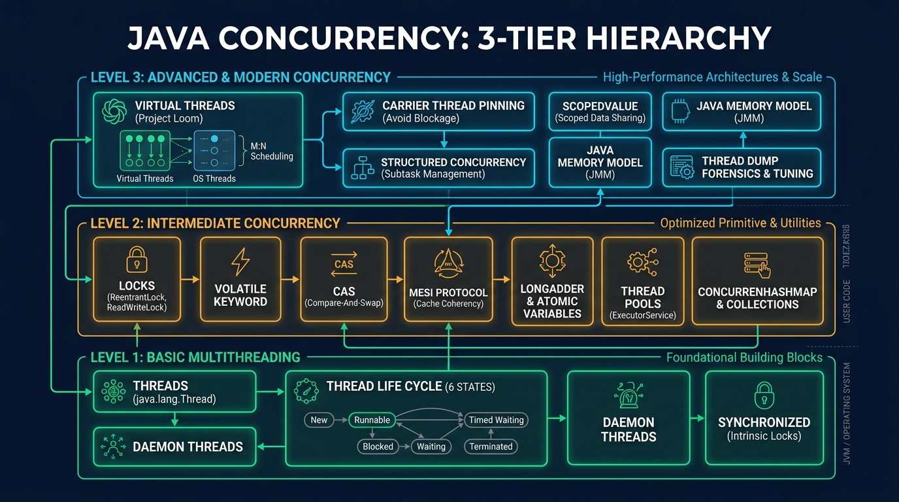

# Java Threads & Concurrency: Enterprise Interview Architecture Guide

> **Curriculum Milestone**: Module 01 - Java Core Engineering  
> **Topic Coverage**: Thread Lifecycles, Memory Model (JMM), Synchronization Primitives, Lock Framework, ThreadPoolExecutor Architecture, Virtual Threads (Project Loom), ForkJoinPool, Lock-Free Algorithms (AQS/CAS), and Concurrency Diagnostics.  
> **Target Audience**: Senior Software Engineers, Lead Architects, Staff & Principal Engineers.  
> **Target Depth**: 50+ Progressive Technical Scenarios with Runtime Mechanics, Production Code Walkthroughs, Beginner Traps, and Real-World Outage Post-Mortems.

---

## Architecture Blueprint: The Concurrency Stack

```mermaid
flowchart TB
    subgraph L4 ["Layer 4: Modern Asynchronous & Loom (Java 21+)"]
        direction LR
        Loom1["Virtual Threads (Project Loom)<br/>(Unmounts on I/O, ~1KB footprint)"]
        Loom2["Carrier Thread Pool<br/>(Underlying ForkJoinPool execution)"]
        Loom3["Scoped Values & Structured Concurrency<br/>(Immutable contextual inheritance)"]
    end

    subgraph L3 ["Layer 3: High-Level Orchestration (java.util.concurrent)"]
        direction LR
        O1["ThreadPoolExecutor & ScheduledExecutor<br/>(corePool, maxPool, workQueue, rejection)"]
        O2["ForkJoinPool (Work-Stealing)<br/>(Deque work-stealing algorithms)"]
        O3["Synchronizers<br/>CountDownLatch, CyclicBarrier, Phaser, Semaphore"]
    end

    subgraph L2 ["Layer 2: Explicit Locking & Synchronizers (j.u.c.locks)"]
        direction LR
        LK1["AbstractQueuedSynchronizer (AQS)<br/>(CLH lock queue, state int CAS)"]
        LK2["ReentrantLock & ReentrantReadWriteLock<br/>(Fair vs Non-Fair lock acquisition)"]
        LK3["StampedLock<br/>(Optimistic read validating)"]
    end

    subgraph L1 ["Layer 1: Core Language Primitives & Memory Model"]
        direction LR
        M1["synchronized & Intrinsic Monitors<br/>(ObjectMonitor: cxq, EntryList, WaitSet)"]
        M2["volatile & Memory Barriers<br/>(LoadLoad, LoadStore, StoreStore, StoreLoad)"]
        M3["Hardware Atomic CAS<br/>(Unsafe.compareAndSwap, VarHandle)"]
    end

    subgraph L0 ["Layer 0: OS Kernel & Hardware Substrate"]
        direction LR
        H1["1:1 Native Kernel Threading<br/>(POSIX pthread_create, task_struct)"]
        H2["CPU Cache Hierarchy & MESI Protocol<br/>(L1/L2/L3 caches, 64-byte cache lines)"]
        H3["OS Scheduler (Linux CFS)<br/>(Red-Black tree, vruntime accounting)"]
    end

    L4 --> L3
    L3 --> L2
    L2 --> L1
    L1 --> L0

    classDef l4 fill:#1e1e2e,stroke:#cba6f7,stroke-width:2px,color:#cdd6f4;
    classDef l3 fill:#1e1e2e,stroke:#89b4fa,stroke-width:2px,color:#cdd6f4;
    classDef l2 fill:#1e1e2e,stroke:#a6e3a1,stroke-width:2px,color:#cdd6f4;
    classDef l1 fill:#1e1e2e,stroke:#f9e2af,stroke-width:2px,color:#cdd6f4;
    classDef l0 fill:#1e1e2e,stroke:#f38ba8,stroke-width:2px,color:#cdd6f4;

    class Loom1,Loom2,Loom3 l4;
    class O1,O2,O3 l3;
    class LK1,LK2,LK3 l2;
    class M1,M2,M3 l1;
    class H1,H2,H3 l0;
```





#### Architectural Breakdown: The 5-Layer Java Concurrency Engineering Substrate

1. **Visual Architecture & Layer Anatomy**:
   - **Layer 0 (OS Kernel & Hardware Substrate)**: Foundation of execution. In HotSpot, every Java platform thread maps 1:1 to an OS POSIX kernel thread (`pthread_create`). Managed by the Linux Completely Fair Scheduler (CFS) via a Red-Black tree tracking `vruntime`. At the hardware layer, execution is governed by multi-core CPU architectures with L1/L2/L3 caches and 64-byte cache lines synchronized via the hardware MESI (Modified, Exclusive, Shared, Invalid) cache coherence protocol.
   - **Layer 1 (Core Language Primitives & Memory Model)**: Defines memory visibility and synchronization. Grounded in the Java Memory Model (JMM) *happens-before* rules. Includes JVM intrinsic monitors (`ObjectMonitor` with `_cxq`, `_EntryList`, and `_WaitSet`), `volatile` variable memory barrier instructions, and lock-free hardware Compare-And-Swap (`CAS`) primitives exposed through `Unsafe` and `VarHandle`.
   - **Layer 2 (Explicit Locking & Synchronizers)**: Built on Doug Lea's AbstractQueuedSynchronizer (`AQS`). Uses a state integer (`volatile int state`) and a FIFO variant of the Craig, Landin, and Hagersten (CLH) lock queue. Powers `ReentrantLock`, `ReentrantReadWriteLock`, and `StampedLock` (with optimistic lock validation).
   - **Layer 3 (High-Level Orchestration)**: Thread management abstractions. Features `ThreadPoolExecutor` (core/max threads, keep-alive, work queues, and rejection policies) and `ForkJoinPool` (work-stealing deques for recursive divide-and-conquer compute algorithms). Includes coordination barriers (`CountDownLatch`, `CyclicBarrier`, `Phaser`, `Semaphore`).
   - **Layer 4 (Modern Asynchronous & Project Loom)**: Java 21+ concurrency paradigms. Virtual Threads decouple application concurrency from OS thread counts by mounting thousands of lightweight, heap-allocated continuations onto a small pool of carrier platform threads, complemented by Scoped Values and Structured Concurrency.

2. **Execution Flow & Synchronization Dynamics**:
   - **AQS Lock Acquisition**: A thread invokes `lock.lock()`. AQS executes `compareAndSetState(0, 1)`. If CAS succeeds, the thread claims ownership. If contention occurs, an AQS Node is created and pushed onto the CLH wait queue via CAS. The thread is parked using `LockSupport.park()`, sleeping at the OS kernel level via `futex(FUTEX_WAIT)`.
   - **Loom Virtual Thread I/O Unmounting**: When a virtual thread performs blocking I/O (e.g., `socket.read()`), the JVM intercepts the call. The continuation is unmounted: active call stack frames are copied from the carrier thread's native stack onto the JVM heap, the carrier thread is freed to run another virtual thread, and the socket file descriptor is registered with background Linux `epoll`. Upon packet arrival, `epoll_wait` fires, and a carrier thread re-mounts the continuation and resumes execution seamlessly.

3. **Low-Level Kernel & JVM Mechanics**:
   - **CPU Memory Barriers & MESI Cache Invalidation**: Writing to a `volatile` variable emits a `StoreStore` barrier before the write and a `StoreLoad` barrier after the write. On x86, this compiles into a `LOCK` prefix (e.g. `lock addl $0,0(%rsp)`), which drains the CPU store buffer and broadcasts an invalidation signal across the CPU cache bus, forcing all other CPU cores to invalidate their cached copy of that 64-byte cache line.
   - **ObjectMonitor State Inflation**: Synchronized blocks transition through three optimization tiers:
     1. *Biased Locking* (deprecated in modern JDKs) / *Lightweight Locking*: Swaps a displaced Mark Word onto the thread's stack via CAS.
     2. *Inflated Heavyweight Locking*: When contention persists, HotSpot allocates a native C++ `ObjectMonitor`. Threads fail CAS, enter the lock-free Contention Queue (`_cxq`), and are put to sleep via `pthread_mutex` / `futex`.

4. **Production Failure Modes & SRE Diagnostics**:
   - **Thread Starvation & Deadlock**: Caused by circular resource acquisition order across multiple threads. SRE detection:
     - Run `jcmd <PID> Thread.print` or `jstack -l <PID>` to detect `Found one Java-level deadlock:`.
     - Inspect lock addresses and thread hold states in the thread dump.
   - **Carrier Thread Pinning in Project Loom**: Running `synchronized` methods or invoking JNI code inside a virtual thread pins the virtual thread to its underlying OS carrier thread. If I/O occurs while pinned, the OS carrier thread blocks, causing carrier pool starvation.
     - *Diagnostic flag*: `-Djdk.tracePinnedThreads=full`.
     - *Remediation*: Replace `synchronized` blocks with `ReentrantLock`.
   - **False Sharing (Cache Line Contention)**: When two threads on different CPU cores frequently update independent variables that reside within the same 64-byte cache line, the MESI protocol invalidates the entire cache line back and forth across the CPU bus (cache ping-pong), dropping throughput by 90%+. SRE mitigation: Apply `@jdk.internal.vm.annotation.Contended` to pad variables to separate 64-byte/128-byte cache lines.

<details>
<summary>View Legacy ASCII Blueprint</summary>

```text
+-------------------------------------------------------------------------+
| Layer 4: Modern Asynchronous & Loom (Java 21+)                           |
| - Virtual Threads (Loom), Carrier Threads, Continuation, Scoped Values   |
+-------------------------------------------------------------------------+
| Layer 3: High-Level Orchestration (java.util.concurrent)               |
| - ThreadPoolExecutor, ScheduledThreadPool, ForkJoinPool, CompletableFuture|
| - Phaser, CountDownLatch, CyclicBarrier, Exchanger, Semaphore           |
+-------------------------------------------------------------------------+
| Layer 2: Explicit Locking & Synchronizers (java.util.concurrent.locks)  |
| - ReentrantLock, ReentrantReadWriteLock, StampedLock, AQS, LockSupport  |
+-------------------------------------------------------------------------+
| Layer 1: Core Language Primitives & Memory Model                         |
| - synchronized, volatile, ThreadLocal, wait/notify, CAS (Unsafe/VarHandle) |
| - Java Memory Model (JMM), Happens-Before, Store/Load CPU Memory Barriers |
+-------------------------------------------------------------------------+
| Layer 0: OS & Hardware Substrate                                        |
| - OS Kernel Threads (1:1 pthread), CPU Cores, L1/L2/L3 Caches, MESI     |
+-------------------------------------------------------------------------+
```

</details>

---

## Section 1: Progressive Scenario-Based Master Q&A (50+ Scenarios)

### Tier 1: Core Fundamentals, Primitives & Memory Model (Q1 - Q16)

#### Q1: Process vs Thread & OS Kernel Schedulers (CFS)

##### 1. Exact Scenario & Question
You are architecting a low-latency microservice running on Linux (Ubuntu 22.04 LTS, x86_64, 16 vCPUs). A junior engineer suggests replacing the JVM thread pool with spawned child OS processes (`ProcessBuilder`) for handling independent HTTP requests, claiming that "processes provide absolute isolation and won't suffer from JVM stop-the-world GC pauses." Explain why this architecture is deeply flawed from an OS context-switching, virtual memory allocation, and IPC latency perspective, and detail the exact mechanics of how the OS Completely Fair Scheduler (CFS) handles Java platform threads.

##### 2. What the Interviewer Evaluates
- **System-level depth**: Understanding of virtual memory (page tables, TLB shootdowns, MMU).
- **Context-switch overhead**: Direct cost (register saving) vs indirect cost (CPU cache pollution, L1/L2/TLB invalidation).
- **Linux CFS internals**: vruntime, red-black tree scheduling, time slices, and thread-to-pthread 1:1 mapping in HotSpot.

##### 3. Standout Technical Answer
In HotSpot JVM on Linux, each Java `Thread` corresponds 1:1 to an underlying native kernel thread (POSIX `pthread_create`). Spawning an OS process via `ProcessBuilder` for every incoming request incurs catastrophic performance penalties:

1. **Virtual Memory & Page Table Overhead**: A new process requires its own virtual address space (`mm_struct`), page directory, and page table allocation. Forking invokes `clone(CLONE_VM ...)` copy-on-write page table duplication. When switching between processes, the CPU must flush or re-tag the Translation Lookaside Buffer (TLB). A thread switch retains the same address space (`CR3` register on x86 does not change), avoiding TLB invalidation.
2. **Context-Switch Cost**: A process context switch takes ~1,000–3,000 ns, while a thread context switch within the same process takes ~100–300 ns. The indirect cost—L1/L2 cache pollution—can degrade throughput by 40–70%.
3. **IPC Latency**: Inter-process communication requires domain sockets, pipes, or shared memory with kernel transitions, whereas threads communicate through shared heap memory protected by memory barriers.
4. **CFS Scheduling**: The Linux CFS tracks task runtime via `vruntime = physical_runtime * (NICE_0_LOAD / task_weight)`. Tasks are arranged in a red-black tree indexed by `vruntime`. Because CFS treats processes and threads identically as schedulable entities (`task_struct`), spawning 1,000 processes offers no scheduling fairness advantage over 1,000 threads, while consuming gigabytes of page table memory.

```java
public class ThreadVsProcessBaseline {
    public static void main(String[] args) throws Exception {
        // Platform Thread Allocation: 1:1 mapping to kernel pthread
        Thread platformThread = new Thread(() -> {
            System.out.println("Executing on Native Thread: " + 
                Thread.currentThread().getName() + " [OS Thread ID via ProcessHandle: " + 
                ProcessHandle.current().pid() + "]");
        }, "worker-platform-thread-1");
        
        platformThread.start();
        platformThread.join();
    }
}
```

*Code Walkthrough:*
- Line 5: Instantiates `Thread`, allocating an OS thread stack (typically 1MB via `-Xss1m`) and HotSpot `OSThread` structure.
- Line 10: Invokes `pthread_create` at the C++ HotSpot layer (`os_linux.cpp`), registering the thread into the kernel's runqueue.

##### 4. Follow-Up Trap Question & Winning Answer
- **Trap Question**: "If platform threads map 1:1 to kernel threads, why can an application create 50,000 Java threads and crash with `OutOfMemoryError: unable to create native thread`, even when JVM Heap has 10GB free?"
- **Winning Answer**: "The OS thread stack (`-Xss`, default 1024KB) is allocated outside the JVM heap in native C-heap memory. 50,000 threads require `50,000 * 1MB = 50GB` of native virtual address space, plus kernel thread structures (`task_struct`, `struct thread_info` ~4KB each) and OS PID limits (`/proc/sys/kernel/pid_max` and `vm.max_map_count`). The OOM is thrown by the OS `pthread_create` returning `EAGAIN` or `ENOMEM`, completely independent of JVM heap usage."

---

#### Q2: Thread Lifecycle, States & JVM Transition Mechanics

##### 1. Exact Scenario & Question
During a major incident, your order checkout service latency spikes to 30 seconds. You trigger `jcmd <PID> Thread.print` and analyze the thread dump. You notice threads in states: `BLOCKED`, `WAITING (on object monitor)`, `TIMED_WAITING (parking)`, and `RUNNABLE`. Explain the exact HotSpot JVM internal state transitions that lead to each state, what OS-level syscalls or kernel states correspond to them, and how `Thread.getState()` differs from OS `top -H` CPU states.

##### 2. What the Interviewer Evaluates
- **JVM Spec vs OS Reality**: `java.lang.Thread.State` (6 states) vs OS thread states (`TASK_RUNNING`, `TASK_INTERRUPTIBLE`, `TASK_UNINTERRUPTIBLE`).
- **Wait sets & Monitor queues**: `EntryList`, `WaitSet`, and `LockSupport.park()` mechanisms.
- **Diagnostics Mastery**: Reading thread dumps accurately without confusing I/O blocking with CPU spinning.

##### 3. Standout Technical Answer
Java defines 6 thread states in `java.lang.Thread.State`:
1. `NEW`: Thread instantiated, no OS resources allocated yet.
2. `RUNNABLE`: Executing in JVM. It may be actively consuming CPU or waiting for OS resources (such as socket I/O, disk I/O, or OS CPU slice).
3. `BLOCKED`: Waiting to acquire an intrinsic monitor lock (`synchronized`) held by another thread. The thread sits in the monitor's `EntryList`.
4. `WAITING`: Indefinitely waiting for another thread to perform a particular action. Caused by `Object.wait()` (placed in monitor's `WaitSet`), `Thread.join()`, or `LockSupport.park()` (used by `ReentrantLock`).
5. `TIMED_WAITING`: Waiting for a specified time period (e.g., `Thread.sleep()`, `Object.wait(timeout)`, `LockSupport.parkNanos()`).
6. `TERMINATED`: Execution completed, stack frames destroyed.

```
       [ NEW ] 
          |  start()
          v
   +--------------+  I/O or Scheduler  +---------------+
   |   RUNNABLE   | <================> | OS Scheduler  |
   +--------------+                    +---------------+
      |        ^
      | sync   | acquires
      | block  | monitor
      v        |
   +--------------+
   |   BLOCKED    | (in ObjectMonitor EntryList)
   +--------------+
      |        ^
      | wait() | notify() + acquires
      v        |
   +--------------+
   |   WAITING /  | (in ObjectMonitor WaitSet or LockSupport unpark)
   | TIMED_WAITING|
   +--------------+
```

```java
public class ThreadStateTransitionAnalyzer {
    private static final Object MONITOR = new Object();

    public static void main(String[] args) throws InterruptedException {
        Thread blockedWorker = new Thread(() -> {
            synchronized (MONITOR) {
                while (true) { /* Hold monitor indefinitely */ }
            }
        }, "HoldingThread");
        blockedWorker.start();
        Thread.sleep(100);

        Thread contender = new Thread(() -> {
            synchronized (MONITOR) {
                System.out.println("Contender acquired lock");
            }
        }, "ContendingThread");
        contender.start();
        Thread.sleep(100);

        // contender is in BLOCKED state inside EntryList
        System.out.println("Contender State: " + contender.getState()); // BLOCKED
    }
}
```

*Code Walkthrough:*
- Line 6: `HoldingThread` enters the monitor block, incrementing the monitor's recursion count to 1 and setting owner to itself.
- Line 14: `ContendingThread` attempts `monitorenter`. Finding the monitor owned, HotSpot parks it and registers it in the `EntryList`. `contender.getState()` returns `BLOCKED`.

##### 4. Follow-Up Trap Question & Winning Answer
- **Trap Question**: "If a thread is performing a synchronous socket read on `SocketInputStream.read()` and waiting for data from a remote server, what is its Java thread state, and what is its OS state in `top -H`?"
- **Winning Answer**: "In Java, its state is `RUNNABLE` because it is executing native code (`JVM_LEAF` / syscall). However, in OS `top -H`, its state is `S` (`TASK_INTERRUPTIBLE`), consuming 0.0% CPU because the Linux kernel has put the thread to sleep in the wait queue of the network socket file descriptor until incoming packets trigger a hardware interrupt."

---

#### Q3: Thread vs Runnable vs Callable vs Future Architecture

##### 1. Exact Scenario & Question
A distributed transaction coordinator must execute three independent credit-check tasks in parallel. If any check throws an unchecked exception, the coordinator must immediately cancel the other two, record the root cause, and roll back. Why is subclassing `Thread` or using `Runnable` inadequate for this pattern, how does `Callable<V>` combined with `Future<V>` solve it, and what are the hidden pitfalls of `Future.get()`?

##### 2. What the Interviewer Evaluates
- **Exception Propagation**: `Runnable.run()` signature (`void`, no checked exceptions) vs `Callable.call()` (`V`, throws `Exception`).
- **Cancellation Semantics**: `Future.cancel(boolean mayInterruptIfRunning)` and the `Thread.interrupt()` contract.
- **Blocking Nature**: Thread starvation risks with uncoordinated `Future.get()`.

##### 3. Standout Technical Answer
1. **Signature & Return Value**: `Runnable.run()` returns `void` and cannot throw checked exceptions; uncaught exceptions trigger the `Thread.UncaughtExceptionHandler`, discarding call-site context. `Callable<V>.call()` returns a typed value and can propagate checked exceptions.
2. **Future Mechanics**: `Future<V>` wraps task execution, capturing return values or exceptions inside a state machine (`NEW -> COMPLETING -> NORMAL / EXCEPTIONAL / CANCELLED / INTERRUPTED`).
3. **Cancellation Mechanics**: Calling `future.cancel(true)` sets the task state to `INTERRUPTED` and sends `Thread.interrupt()` to the executing worker thread. If the task does not cooperate with interruption, the thread continues running despite `cancel()`.

```java
import java.util.concurrent.*;

public class ResilientCreditCoordinator {
    private final ExecutorService executor = Executors.newFixedThreadPool(3);

    public record CreditResult(String bureau, boolean approved, int score) {}

    public CreditResult executeCheck(Callable<CreditResult> check1, 
                                     Callable<CreditResult> check2) throws Exception {
        Future<CreditResult> f1 = executor.submit(check1);
        Future<CreditResult> f2 = executor.submit(check2);

        try {
            // Pitfall: Sequential get() introduces head-of-line blocking
            CreditResult r1 = f1.get(2, TimeUnit.SECONDS);
            CreditResult r2 = f2.get(2, TimeUnit.SECONDS);
            return (r1.score() + r2.score()) > 1400 ? r1 : r2;
        } catch (Exception e) {
            // Proactive cancellation of in-flight siblings
            f1.cancel(true);
            f2.cancel(true);
            throw new IllegalStateException("Credit verification pipeline failed", e);
        }
    }
}
```

*Code Walkthrough:*
- Line 10: Submits `Callable` tasks, returning `FutureTask` instances backed by the thread pool.
- Line 15-16: `f1.get()` blocks the caller thread. If `f1` takes 1.9s and `f2` took 0.1s, total latency is 1.9s + 0.1s = 2.0s due to sequential evaluation.
- Line 20-21: Catch block ensures orphaned tasks do not consume cluster CPU by invoking `cancel(true)`.

##### 4. Follow-Up Trap Question & Winning Answer
- **Trap Question**: "If `f1.cancel(true)` is executed while `check1` is running a tight CPU loop without calling `Thread.sleep()` or I/O, does the thread stop immediately?"
- **Winning Answer**: "No. `cancel(true)` only sets the thread's interrupt flag (`Thread.currentThread().isInterrupted() == true`). It does not abruptly kill the thread (unlike deprecated `Thread.stop()`). If the worker code does not periodically inspect `Thread.interrupted()` or invoke interruptible blocking methods, it will continue executing until completion, causing resource leakage."

---

#### Q4: The Java Memory Model (JMM), Shared Memory & Hardware Architecture

##### 1. Exact Scenario & Question
Explain why the following code snippet can print `x = 0, y = 0` on an x86/ARM multi-core processor when executed concurrently by two threads:
```java
// Thread 1:
a = 1; x = b;
// Thread 2:
b = 1; y = a;
```
Walk through the processor caches (L1/L2 Store Buffers), CPU out-of-order execution, compiler instruction reordering, and explain how the JMM formalizes these guarantees.

##### 2. What the Interviewer Evaluates
- **Hardware Architecture**: Store Buffers, Memory Invalidation Queues, Store-Load reordering.
- **Compiler Optimizations**: Dead code elimination, register allocation, instruction scheduling.
- **Formal JMM**: `Actions`, `Program Order (PO)`, `Synchronization Order (SO)`, and `Happens-Before (HB)` relationships (JSR-133).

##### 3. Standout Technical Answer
In modern symmetric multiprocessing (SMP) hardware:
1. **Store Buffers**: CPUs write to a local Store Buffer before committing to L1 cache to avoid stalling on cache line ownership requests (MESI `Read For Ownership`). A CPU can read its own pending store from its store buffer (`Store-Load` bypassing), but other CPUs cannot see it yet.
2. **Reordering**: In Thread 1, the store to `a` is placed in CPU 0's store buffer. CPU 0 immediately loads `b` from L1 cache (where `b == 0`). Concurrently, CPU 1 stores `b = 1` into its store buffer and loads `a` from L1 cache (where `a == 0`). Both threads observe `0` before their store buffers flush to shared L3/RAM.
3. **Compiler Reordering**: JIT compilers (`C1`/`C2`) may reorder instructions if no data dependency exists within the single thread's execution trace (`as-if-serial` semantics).
4. **JMM Formalism**: Under JSR-133, execution is valid if it is sequentially consistent or complies with happens-before consistency. Without synchronization or `volatile`, there is no happens-before edge between Thread 1's store to `a` and Thread 2's read of `a`.

```java
import org.openjdk.jcstress.annotations.*;
import org.openjdk.jcstress.infra.results.II_Result;

@JCStressTest
@Outcome(id = "1, 1", expect = Expect.ACCEPTABLE, desc = "Sequential execution")
@Outcome(id = "0, 1", expect = Expect.ACCEPTABLE, desc = "T1 then T2")
@Outcome(id = "1, 0", expect = Expect.ACCEPTABLE, desc = "T2 then T1")
@Outcome(id = "0, 0", expect = Expect.ACCEPTABLE_INTERESTING, desc = "Hardware reordering!")
@State
public class MemoryReorderingStressTest {
    int a = 0, b = 0;

    @Actor
    public void actor1(II_Result r) {
        a = 1;
        r.r1 = b;
    }

    @Actor
    public void actor2(II_Result r) {
        b = 1;
        r.r2 = a;
    }
}
```

*Code Walkthrough:*
- Uses OpenJDK JCStress (Java Concurrency Stress) harness.
- `@Actor` methods are scheduled simultaneously across different CPU cores with high affinity.
- JCStress will reliably detect `0, 0` on x86 due to `StoreLoad` reordering.

##### 4. Follow-Up Trap Question & Winning Answer
- **Trap Question**: "Does x86 architecture allow `LoadLoad` or `StoreStore` reordering, or only `StoreLoad`?"
- **Winning Answer**: "x86/x64 possesses a relatively strong memory model (Total Store Order / TSO). It enforces hardware FIFO store buffers, preventing `LoadLoad`, `LoadStore`, and `StoreStore` reordering. It **only** permits `StoreLoad` reordering (a read can pass an earlier store to a different address). In contrast, ARM and POWER are weakly ordered architectures that permit all four reordering types (`LoadLoad`, `LoadStore`, `StoreStore`, `StoreLoad`) unless explicit fence instructions (`DMB`, `ISB`) are emitted."

---

#### Q5: `volatile` Runtime Mechanics, Hardware Memory Barriers & Cache Coherence (MESI)

##### 1. Exact Scenario & Question
A developer writes a shutdown flag `private volatile boolean running = true;`. When `shutdown()` sets `running = false;`, worker threads terminate immediately. Explain the exact assembly instructions emitted by the C2 JIT compiler on x86 vs ARM, how the hardware cache coherence protocol (MESI/MOESI) invalidates cache lines across CPU sockets, and why `volatile` does NOT guarantee atomicity for compound operations like `count++`.

##### 2. What the Interviewer Evaluates
- **Assembly-Level Understanding**: `lock addl` or `mfence` on x86, `dmb ish` on ARM.
- **Hardware Protocol**: MESI states (Modified, Exclusive, Shared, Invalid), bus snooping, RFO (Request For Ownership).
- **JMM volatile rules**: Volatile read = `LoadLoad` + `LoadStore`; Volatile write = `StoreStore` + `StoreLoad`.

##### 3. Standout Technical Answer
1. **C2 Assembly Generation**:
   - On x86: A write to a `volatile` variable emits a standard `mov` instruction followed by a `lock addl $0x0,(%rsp)` (a lock-prefixed dummy instruction on the stack) or an `mfence`. The `lock` prefix locks the cache line, serializes the pipeline, and forces the CPU store buffer to drain into L1/L2 cache before any subsequent load can proceed.
   - On ARM: Emits `dmb ishst` (Data Memory Barrier, Inner Shareable Store) before the store, and `dmb ish` after the store.
2. **MESI Coherence Protocol**:
   - When CPU 0 writes to the volatile variable, it broadcasts an RFO on the cache interconnect bus.
   - All other CPU cores snooping the bus transition their local cache lines holding that memory address from `Shared (S)` to `Invalid (I)`.
   - When CPU 1 attempts to read `running`, a cache miss occurs because its line is `Invalid`. It must fetch the fresh line from CPU 0's modified L1 or shared L3.
3. **Compound Operation Failure**:
   `count++` consists of three distinct bytecode instructions:
   - `getfield` (volatile read: fresh read from memory)
   - `iadd` (increment value in local operand stack/CPU register)
   - `putfield` (volatile write: push value back to memory)
   If Thread A and Thread B execute `getfield` simultaneously when `count=5`, both hold `5` in registers, compute `6`, and write `6`. One increment is lost.

```java
public class VolatileVisibilityProtocol {
    private volatile boolean running = true;
    private volatile long counter = 0L;

    public void stopServer() {
        // C2 emits StoreStore barrier before; StoreLoad barrier (lock addl) after
        this.running = false; 
    }

    public void pollLoop() {
        while (running) {
            // Volatile read ensures LoadLoad + LoadStore barrier
            // Thread never caches 'running' in CPU register
        }
    }

    public void brokenIncrement() {
        counter++; // NON-ATOMIC! Race condition
    }
}
```

##### 4. Follow-Up Trap Question & Winning Answer
- **Trap Question**: "Does declaring `private volatile double price` or `private volatile long timestamp` on a 32-bit JVM have any additional critical architectural consequence compared to a 64-bit JVM?"
- **Winning Answer**: "Yes! In 32-bit JVMs, reads and writes to non-volatile 64-bit types (`long` and `double`) are not guaranteed to be atomic by the Java Language Specification (JLS §17.7); the VM is permitted to treat a 64-bit write as two independent 32-bit writes (word tearing). Declaring them `volatile` forces the JVM to treat 64-bit reads and writes as atomic single operations, preventing corrupted values where the top 32 bits belong to write A and bottom 32 bits belong to write B."

---

#### Q6: `synchronized` Internals, ObjectMonitor & HotSpot Lock Escalation

##### 1. Exact Scenario & Question
A payment service handles 10,000 transactions/second. Profiling indicates that 95% of locks are acquired without contention, 4% face light contention, and 1% suffer heavy contention. Explain HotSpot's lock optimization pipeline: Biased Locking (and why JDK 15 disabled it), Lightweight Locking (BasicObjectLock stack frames), and Heavyweight Locking (OS Mutex via `ObjectMonitor`). Detail the exact bit patterns in the Java Object Header Mark Word during each phase.

##### 2. What the Interviewer Evaluates
- **Object Header Anatomy**: Mark Word (64-bit on 64-bit JVM) vs Klass Word vs Array Length.
- **Lock Escalation Path**: Biased (01) -> Lightweight (00) -> Heavyweight (10) -> Marked for GC (11).
- **Modern JVM Decisions**: JEP 374 deprecation and removal of Biased Locking due to revoke-bias Safepoint overheads.

##### 3. Standout Technical Answer
Every Java object has a 2-word header: `Mark Word` (64 bits) and `Klass Word` (32/64 bits depending on `+UseCompressedClassPointers`). The last 2 or 3 bits of the Mark Word encode the locking state:

| Lock State | Mark Word Bits (lowest 3 bits) | Contents of Mark Word |
|---|---|---|
| Unlocked | `001` | HashCode (31 bits), Age (4 bits), Biased Lock Flag (`0`) |
| Biased (Historical) | `101` | Thread ID (54 bits), Epoch (2 bits), Age (4 bits), Flag (`1`) |
| Lightweight | `000` | Pointer to `BasicObjectLock` on thread's execution stack |
| Heavyweight | `010` | Pointer to native C++ `ObjectMonitor` structure |
| Marked for GC | `011` | CMS/G1 collector metadata |

```
Uncontended Lock Attempt
         |
         v
[ Lightweight Lock: CAS Mark Word ] === Success ===> [ Lock Held in Thread Stack ]
         |
      Failure (Contention)
         |
         v
[ Adaptive Spinning (PAUSE instruction) ]
         |
      Exhausted Spins
         |
         v
[ Inflate to Heavyweight Lock: Allocate ObjectMonitor ]
         |
         v
[ Park Thread in EntryList via pthread_mutex / park() ]
```

1. **Lightweight Locking**: When a thread enters `synchronized(obj)`, the JVM pushes a `BasicObjectLock` record onto the thread's execution stack. It performs a CAS to swap the object's Mark Word with a pointer to this stack record. If CAS succeeds, lock acquired in userspace without any kernel syscall.
2. **Adaptive Spinning**: If CAS fails (contention), the thread spins in a loop executing the x86 `PAUSE` instruction. The spin count adapts based on historical lock hold times on the same core.
3. **Heavyweight Inflation**: If spinning fails, HotSpot inflates the lock. It allocates an OS-level `ObjectMonitor` containing `_owner`, `_EntryList`, and `_WaitSet`. The object's Mark Word is updated via CAS to point to this `ObjectMonitor` (lowest bits `010`). The competing thread is parked via Linux `futex` or `pthread_mutex_lock`, entering the kernel sleep queue.

```java
import org.openjdk.jol.info.ClassLayout;

public class LockEscalationVisualizer {
    public static void main(String[] args) throws InterruptedException {
        final Object lock = new Object();
        // Step 1: Unlocked Object
        System.out.println("=== Unlocked Mark Word ===");
        System.out.println(ClassLayout.parseInstance(lock).toPrintable());

        // Step 2: Lightweight Lock
        synchronized (lock) {
            System.out.println("=== Lightweight Locked Mark Word ===");
            System.out.println(ClassLayout.parseInstance(lock).toPrintable());
        }

        // Step 3: Heavyweight Contention
        new Thread(() -> {
            synchronized (lock) {
                try { Thread.sleep(2000); } catch (InterruptedException ignored) {}
            }
        }).start();

        Thread.sleep(100); // Allow thread to acquire
        synchronized (lock) { // Contention forces inflation to Heavyweight
            System.out.println("=== Heavyweight Inflated Mark Word ===");
            System.out.println(ClassLayout.parseInstance(lock).toPrintable());
        }
    }
}
```

##### 4. Follow-Up Trap Question & Winning Answer
- **Trap Question**: "Why was Biased Locking disabled by default in JDK 15 (JEP 374) and subsequently removed, despite saving CAS overhead on single-threaded lock acquisitions?"
- **Winning Answer**: "Biased locking was designed in the late 1990s when atomic CAS operations were slow. In modern systems, CAS operations cost only a few nanoseconds. Crucially, revoking a biased lock requires a JVM Safepoint (`Stop-The-World` pause for all threads) to inspect the thread's stack. In modern high-throughput architectures using thread pools, worker threads constantly acquire objects previously touched by other threads, triggering thousands of biased-lock revocation safepoint pauses that crippled latency."

---

#### Q7: `wait()`, `notify()`, `notifyAll()` & Spurious Wakeups

##### 1. Exact Scenario & Question
You are implementing a bounded blocking queue from scratch using only `synchronized`, `wait()`, and `notifyAll()`. An intern submits a pull request containing `if (count == capacity) wait();`. Explain precisely why using `if` instead of `while` leads to catastrophic data corruption due to spurious wakeups and race conditions, and explain why `notifyAll()` must be favored over `notify()` in multi-producer multi-consumer systems.

##### 2. What the Interviewer Evaluates
- **Condition Synchronization**: The `WaitSet` protocol and the rule of guarding conditions with `while`.
- **Spurious Wakeup Mechanics**: OS signals (POSIX `pthread_cond_signal`), interrupts, and kernel context switches.
- **Lost Signals / Livelock**: How `notify()` can wake the wrong consumer, stalling the entire system.

##### 3. Standout Technical Answer
1. **The `while` Condition Rule**:
   - When a thread calls `wait()`, it releases the monitor and enters the monitor's `WaitSet`.
   - When awakened (by `notify`, `notifyAll`, interrupt, or an OS spurious wakeup), it moves from the `WaitSet` to the `EntryList` to re-acquire the monitor.
   - Once it acquires the monitor, execution resumes *immediately after* the `wait()` call.
   - If guarded by `if`, the thread does NOT re-evaluate whether `count < capacity`. If another producer woke up earlier and inserted an item, the current thread will write past capacity, causing array index out of bounds or silent data overwrites.
2. **Spurious Wakeups**: Under POSIX thread implementations (`pthread_cond_wait`), signals, kernel interrupts, or multi-core race resolutions can cause a thread to wake up without any application-level `notify()` ever being called.
3. **The `notify()` vs `notifyAll()` Deadlock Trap**:
   In a queue with both waiting producers (queue full) and waiting consumers (queue empty), calling `notify()` wakes exactly one arbitrary thread from the `WaitSet`. If a producer finishes and calls `notify()`, hoping to wake a consumer, but the JVM wakes *another producer*, that second producer sees the queue is full and goes right back to `wait()`. All consumers remain asleep, and all producers sleep: the system is permanently frozen (signal lost). `notifyAll()` wakes all threads, guaranteeing that eligible consumers re-compete for the lock.

```java
public class CorrectBoundedQueue<T> {
    private final Object[] items;
    private int head = 0, tail = 0, count = 0;

    public CorrectBoundedQueue(int capacity) {
        this.items = new Object[capacity];
    }

    public synchronized void put(T x) throws InterruptedException {
        // MUST be a while loop to guard against spurious wakeups & stolen permits
        while (count == items.length) {
            wait(); // Releases lock, enters WaitSet
        }
        items[tail] = x;
        if (++tail == items.length) tail = 0;
        count++;
        // notifyAll ensures at least one waiting consumer wakes up
        notifyAll();
    }

    @SuppressWarnings("unchecked")
    public synchronized T take() throws InterruptedException {
        while (count == 0) {
            wait();
        }
        T x = (T) items[head];
        items[head] = null; // Prevent memory leak
        if (++head == items.length) head = 0;
        count--;
        notifyAll();
        return x;
    }
}
```

##### 4. Follow-Up Trap Question & Winning Answer
- **Trap Question**: "If calling `wait()` releases the intrinsic lock, does it also release locks held by the same thread on outer nested `synchronized` blocks?"
- **Winning Answer**: "No! `wait()` releases **only** the monitor of the specific object on which `wait()` is invoked. If a thread is executing `synchronized(outer) { synchronized(inner) { inner.wait(); } }`, it releases `inner`'s lock, but retains ownership of `outer`'s lock. Any other thread needing `outer` to produce the state change will deadlock, hanging the application."

---

#### Q8: `Thread.sleep()` vs `Object.wait()` vs `LockSupport.park()`

##### 1. Exact Scenario & Question
Compare the low-level execution mechanics of `Thread.sleep(ms)`, `obj.wait(ms)`, and `LockSupport.parkNanos(ns)`. Specifically address: lock ownership requirements, OS scheduling interactions, permit-based semantics, and responsiveness to thread interrupts.

##### 2. What the Interviewer Evaluates
- **Lock Retention**: `sleep()` holds monitors; `wait()` releases the target monitor; `park()` is monitor-agnostic.
- **Permit Semantics**: `LockSupport.park()` consuming an asynchronous `unpark()` permit (preventing lost wakeups).
- **Syscall Mapping**: Linux `nanosleep`, `pthread_cond_timedwait`, and `futex`.

##### 3. Standout Technical Answer

| Feature | `Thread.sleep(millis)` | `Object.wait(millis)` | `LockSupport.parkNanos(nanos)` |
|---|---|---|---|
| **Lock Requirement** | None. Retains ALL held locks. | Must hold target monitor (`IllegalMonitorStateException`). | None. Completely lock-agnostic. |
| **Lock Release** | Releases 0 locks. | Releases target monitor; keeps outer locks. | Releases 0 locks. |
| **Permit Model** | No permit. Cannot pre-grant sleep. | No permit. `notify()` before `wait()` is lost. | **Binary Permit (0 or 1)**. `unpark()` before `park()` consumes permit immediately without blocking! |
| **Interrupt Handling** | Clears interrupt flag, throws `InterruptedException`. | Clears interrupt flag, throws `InterruptedException`. | **Does NOT throw**. Returns silently; caller must check `Thread.interrupted()`. |
| **OS Syscall (Linux)** | `clock_nanosleep` | `pthread_cond_timedwait` (futex) | `futex(FUTEX_WAIT_BITSET)` |

```java
import java.util.concurrent.locks.LockSupport;

public class LockSupportPermitMechanics {
    public static void main(String[] args) throws InterruptedException {
        Thread worker = new Thread(() -> {
            try {
                Thread.sleep(500); // Simulate initial work
            } catch (InterruptedException ignored) {}

            System.out.println("Worker calling park()...");
            // Because main called unpark() FIRST, this park() does NOT block!
            LockSupport.park();
            System.out.println("Worker unparked successfully without blocking!");
        });

        worker.start();
        // Give worker a permit BEFORE it even calls park()
        LockSupport.unpark(worker);
        worker.join();
    }
}
```

*Code Walkthrough:*
- Demonstrates why `java.util.concurrent` synchronizers (like `AQS`, `FutureTask`, `StampedLock`) are built on `LockSupport.park()` rather than `wait/notify`: it is immune to the race condition where `unpark()` is signaled before `park()` is invoked.

##### 4. Follow-Up Trap Question & Winning Answer
- **Trap Question**: "If `LockSupport.park()` returns because the thread was interrupted, does it throw `InterruptedException`? How does `AbstractQueuedSynchronizer` (AQS) handle this?"
- **Winning Answer**: "No, `LockSupport.park()` never throws `InterruptedException`. It simply unparks and returns execution to the caller. AQS checks `Thread.interrupted()` immediately after `park()` returns. If interrupted, AQS records the interruption in a boolean flag and continues competing for the lock; once the lock is acquired, it either restores the interrupt flag (`selfInterrupt()`) or throws `InterruptedException` if the user invoked an interruptible lock method (e.g., `lockInterruptibly()`)."

---

#### Q9: `ThreadLocal`, InheritableThreadLocal & Memory Leak Mechanics

##### 1. Exact Scenario & Question
A multi-tenant SaaS application stores tenant security context in a `ThreadLocal<SecurityContext>`. Over 3 weeks in production, the application crashes with `java.lang.OutOfMemoryError: Java heap space`. Memory heap dump inspection reveals millions of `ThreadLocalMap$Entry` objects holding tenant entities, even though all HTTP requests completed. Explain the root cause involving thread pools (`ThreadPoolExecutor`), `WeakReference` key reclamation, strong-reference value chains, and how to bulletproof the implementation.

##### 2. What the Interviewer Evaluates
- **ThreadLocalMap Anatomy**: Array of `Entry` objects extending `WeakReference<ThreadLocal<?>>`.
- **GC Garbage Collection Mechanics**: Why weak keys are collected during Minor GC, leaving null keys with strong references to values.
- **Worker Thread Reuse**: The lifecycle mismatch between ephemeral HTTP requests and long-lived thread pool workers.

##### 3. Standout Technical Answer
1. **Memory Topology**:
   - Each `Thread` object maintains an internal instance field: `ThreadLocal.ThreadLocalMap threadLocals`.
   - The map uses linear probing with entries defined as:
     `static class Entry extends WeakReference<ThreadLocal<?>> { Object value; }`.
   - The key is weakly referenced. If the application's strong reference to the `ThreadLocal` object goes out of scope, the GC collects the key during the next collection cycle, leaving the entry's key as `null`.
2. **The Leak Mechanism in Thread Pools**:
   - Threads in a thread pool (`Executors.newFixedThreadPool`) live forever.
   - The entry value (`SecurityContext` -> tenant data) is strongly referenced by the thread's `threadLocals` map.
   - Because the thread never dies, the reference path:
     `Thread (GC Root) -> ThreadLocalMap -> Entry -> value (Tenant Context)` remains unbroken!
   - Although `ThreadLocalMap` performs heuristic expunging of stale entries (where `key == null`) during `get()`, `set()`, or `rehash()`, if the worker thread is returned to the pool and idle, or touches different hash buckets, the values leak permanently.

```
[ Thread (Pool Worker - GC Root) ]
       |
       v (strong)
[ ThreadLocalMap ]
       |
       v (table array)
   [ Entry ]  ====== (WeakRef) ======> [ ThreadLocal Object ] (Collected by GC!)
       |                                       |
       | (strong)                       null Key left behind
       v
  [ Heavy Value Object (TenantContext / ClassLoader) ] ===> LEAK FOREVER!
```

```java
public class BulletproofTenantFilter {
    private static final ThreadLocal<TenantContext> CONTEXT_HOLDER = new ThreadLocal<>();

    public void doFilter(HttpRequest request, HttpResponse response, FilterChain chain) {
        try {
            TenantContext context = resolveTenant(request);
            CONTEXT_HOLDER.set(context);
            chain.doFilter(request, response);
        } finally {
            // CRITICAL DEFENSIVE CODING: remove() is MANDATORY in thread pools
            CONTEXT_HOLDER.remove();
        }
    }

    private TenantContext resolveTenant(HttpRequest req) {
        return new TenantContext(req.getHeader("X-Tenant-ID"));
    }
}
```

*Code Walkthrough:*
- Line 12: `CONTEXT_HOLDER.remove()` explicitly searches the current thread's map, removes the entry, and immediately triggers `expungeStaleEntry()`, breaking the reference chain to prevent heap bloat.

##### 4. Follow-Up Trap Question & Winning Answer
- **Trap Question**: "Why is `InheritableThreadLocal` an even bigger hazard when used with thread pools?"
- **Winning Answer**: "`InheritableThreadLocal` copies values from the parent thread to child threads **only at child creation time** (`new Thread()`). In a thread pool, threads are pre-spawned. Re-used worker threads will execute new tasks under the stale tenant context of whichever request happened to spawn that worker thread months ago, causing catastrophic cross-tenant data leakage and security violations."

---

#### Q10: Deadlock, Livelock, Starvation & Lock Ordering

##### 1. Exact Scenario & Question
A high-frequency trading matching engine deadlocks during market open. Two accounts are attempting mutual funds transfer: Thread 1 transfers $10,000 from Account A to Account B, while Thread 2 transfers $5,000 from Account B to Account A. Show how naive lock acquisition produces deadlocks, formulate the strict mathematical proof of Coffman conditions, and implement a production-grade, deadlock-free transfer algorithm using dynamic lock ordering and `System.identityHashCode`.

##### 2. What the Interviewer Evaluates
- **Coffman's 4 Conditions**: Mutual Exclusion, Hold and Wait, No Preemption, Circular Wait.
- **Global Lock Ordering**: Breaking circular wait by establishing a total order over all lockable entities.
- **Tie-Breaking Mechanisms**: Handling identical hash codes with an auxiliary tie-breaker lock.

##### 3. Standout Technical Answer
A deadlock can occur if and only if all four Coffman conditions hold simultaneously:
1. *Mutual Exclusion*: Resources are non-shareable.
2. *Hold and Wait*: A thread holds at least one resource while waiting for another.
3. *No Preemption*: Locks cannot be forcibly confiscated from a thread.
4. *Circular Wait*: Thread A waits for lock held by B, which waits for lock held by A.

To eliminate deadlocks definitively, we must break the **Circular Wait** condition by enforcing a strict global lock hierarchy: regardless of parameter order, always acquire locks in ascending order of unique identifier.

```java
public class DeadlockFreeTransferService {
    private static final Object TIE_BREAKER_LOCK = new Object();

    public static class Account {
        final long id;
        double balance;

        public Account(long id, double balance) {
            this.id = id;
            this.balance = balance;
        }
    }

    public void transfer(Account from, Account to, double amount) {
        // Enforce total lock ordering via immutable entity ID
        if (from.id < to.id) {
            synchronized (from) {
                synchronized (to) {
                    executeTransfer(from, to, amount);
                }
            }
        } else if (from.id > to.id) {
            synchronized (to) {
                synchronized (from) {
                    executeTransfer(from, to, amount);
                }
            }
        } else {
            // Self-transfer or ID collision: use global tie-breaker
            synchronized (TIE_BREAKER_LOCK) {
                synchronized (from) {
                    synchronized (to) {
                        executeTransfer(from, to, amount);
                    }
                }
            }
        }
    }

    private void executeTransfer(Account from, Account to, double amount) {
        if (from.balance < amount) throw new IllegalArgumentException("Insufficient funds");
        from.balance -= amount;
        to.balance += amount;
    }
}
```

##### 4. Follow-Up Trap Question & Winning Answer
- **Trap Question**: "What is a livelock, and how does poorly implemented `ReentrantLock.tryLock()` back-off logic trigger it?"
- **Winning Answer**: "In a livelock, threads actively change their state in response to each other without making any forward progress (consuming 100% CPU, unlike deadlock which consumes 0%). If Thread 1 acquires Lock A and calls `Lock B.tryLock()`, fails, releases Lock A, waits 10ms, and retries; while Thread 2 acquires Lock B, fails on `Lock A.tryLock()`, releases Lock B, waits 10ms, and retries—both threads repeatedly step in lockstep, acquiring and releasing locks forever. The solution is adding **randomized exponential jitter** to the retry back-off."

---

#### Q11: Thread Interruption Architecture & Cooperative Cancellation

##### 1. Exact Scenario & Question
A batch data-ingestion pipeline runs long-running file ETL tasks. When the deployment pipeline issues a graceful shutdown `SIGTERM`, tasks must stop immediately without corrupting output files. A junior developer writes:
```java
try { Thread.sleep(10000); } catch (InterruptedException e) { /* ignore */ }
```
Explain why swallowing `InterruptedException` breaks Java's cancellation contract, how `Thread.currentThread().interrupt()` restores the state, and design a task loop that cooperates gracefully with interruption.

##### 2. What the Interviewer Evaluates
- **The Cooperative Model**: Java does not forcibly kill threads; interruption is a status flag.
- **Flag Reset Semantics**: Why blocking methods (`sleep`, `wait`, `take`) clear the interrupt flag upon throwing.
- **Upward Propagation**: Re-throwing vs preserving interrupt state for higher-level frameworks.

##### 3. Standout Technical Answer
1. **The Contract of `InterruptedException`**:
   When a thread is blocked in an interruptible method (`Thread.sleep()`, `Object.wait()`, `BlockingQueue.take()`), and another thread calls `targetThread.interrupt()`, the JVM:
   - Clears the thread's interrupt status flag (`isInterrupted() == false`).
   - Wakes the thread from the OS sleep/wait queue.
   - Throws `InterruptedException`.
2. **The Crime of Swallowing**:
   If the catch block is empty, the notification that cancellation was requested is completely erased. Calling code further up the stack (e.g., Spring framework, thread pool worker loop) has no way of knowing a shutdown was requested.
3. **Correct Remediation**:
   - Either propagate `InterruptedException` up the method call stack.
   - Or restore the interrupt flag in the catch block via `Thread.currentThread().interrupt()` so outer callers can inspect it.

```java
import java.nio.file.Path;

public class ResilientBatchWorker implements Runnable {
    private final Path sourceFile;

    public ResilientBatchWorker(Path sourceFile) {
        this.sourceFile = sourceFile;
    }

    @Override
    public void run() {
        System.out.println("Processing file: " + sourceFile);
        while (!Thread.currentThread().isInterrupted()) {
            try {
                processNextRecord();
                // Simulating rate-limiting pause
                Thread.sleep(50);
            } catch (InterruptedException e) {
                System.err.println("Graceful shutdown received during sleep. Cleaning up file handles...");
                // CRITICAL: Restore the interrupt flag!
                Thread.currentThread().interrupt();
                break; // Exit processing loop safely
            }
        }
        cleanupTemporaryFiles();
    }

    private void processNextRecord() { /* ETL Record logic */ }
    private void cleanupTemporaryFiles() { /* Flush buffers, close channels */ }
}
```

##### 4. Follow-Up Trap Question & Winning Answer
- **Trap Question**: "What is the difference between `Thread.interrupted()` and `Thread.currentThread().isInterrupted()`?"
- **Winning Answer**: "`Thread.interrupted()` is a **static** method that checks the interrupt status of the current thread and **clears** it (resets it to `false`). `Thread.currentThread().isInterrupted()` is an **instance** method that checks the interrupt status **without altering** the flag. Calling `Thread.interrupted()` twice consecutively will always return `false` on the second call unless interrupted again in between."

---

#### Q12: Compare-And-Swap (CAS), `Unsafe`, `VarHandle` & Hardware Atomics

##### 1. Exact Scenario & Question
Compare the mechanical evolution of lock-free programming in Java from `sun.misc.Unsafe` (JDK 5–8) to `java.lang.invoke.VarHandle` (JDK 9+). Explain how a CPU executes a CAS operation at the bus level (`CMPXCHG` instruction with `LOCK` prefix), how cache lines are arbitrated, and why lock-free algorithms can suffer from severe throughput collapse under extreme multi-socket contention.

##### 2. What the Interviewer Evaluates
- **Hardware Instruction Level**: `lock cmpxchg` on x86, `ldrex/strex` (load-linked/store-conditional) on ARM.
- **Java API Evolution**: Memory barriers and access modes in `VarHandle` (`getVolatile`, `compareAndSet`, `getAcquire`, `setRelease`).
- **Cache-Bouncing Performance Trap**: Coherence traffic storm on high-core NUMA machines.

##### 3. Standout Technical Answer
1. **Hardware CAS Mechanics**:
   On x86, atomic CAS compiles to `lock cmpxchg [destination], source`. The `lock` prefix asserts a bus lock signal (or in modern processors, asserts a cache line lock via the cache coherence protocol). The core obtains exclusive ownership of the cache line containing `destination`, evaluates if its value matches expected, swaps if true, and releases exclusivity.
2. **Unsafe vs VarHandle**:
   - `sun.misc.Unsafe`: Required passing raw byte offsets within object memory (`objectFieldOffset`), bypassed type safety, and exposed the JVM to segmentation faults.
   - `VarHandle`: Standardized in JDK 9 (JEP 193). Provides strongly-typed, memory-safe references to fields with fine-grained JMM memory fencing modes (Plain, Opaque, Acquire/Release, Volatile).
3. **Throughput Collapse (Cache Bouncing)**:
   When 64 threads across 4 NUMA sockets concurrently execute CAS on the same memory address (e.g., updating a shared `AtomicLong` counter), only one thread succeeds per cycle. The other 63 fail and retry. Each CAS invalidates the cache line across all other sockets via MESI RFO messages. The CPU interconnect (Intel UPI / AMD Infinity Fabric) becomes saturated with cache line invalidation traffic, causing latency to increase by 100x—a phenomenon called **CAS starvation / cache bouncing**.

```java
import java.lang.invoke.MethodHandles;
import java.lang.invoke.VarHandle;

public class ModernLockFreeStack<T> {
    private static class Node<T> {
        final T item;
        Node<T> next;
        Node(T item) { this.item = item; }
    }

    private volatile Node<T> head = null;
    private static final VarHandle HEAD;

    static {
        try {
            HEAD = MethodHandles.lookup().findVarHandle(
                ModernLockFreeStack.class, "head", Node.class);
        } catch (ReflectiveOperationException e) {
            throw new ExceptionInInitializerError(e);
        }
    }

    public void push(T item) {
        Node<T> newHead = new Node<>(item);
        do {
            newHead.next = head;
            // Atomic CAS via VarHandle
        } while (!HEAD.compareAndSet(this, newHead.next, newHead));
    }

    public T pop() {
        Node<T> oldHead;
        Node<T> newHead;
        do {
            oldHead = head;
            if (oldHead == null) return null;
            newHead = oldHead.next;
        } while (!HEAD.compareAndSet(this, oldHead, newHead));
        return oldHead.item;
    }
}
```

##### 4. Follow-Up Trap Question & Winning Answer
- **Trap Question**: "How does `LongAdder` solve the CAS cache-bouncing bottleneck of `AtomicLong` under heavy multi-threaded contention?"
- **Winning Answer**: "`LongAdder` uses a stripped array of `Cell` structures (`Cell[]`) dynamically sized to the number of CPU cores. When threads compete, instead of hammering a single memory location, each thread hashes to a distinct `Cell` based on its thread probe hash (`ThreadLocalRandom.getProbe()`) and performs CAS on that independent cache line. Each `Cell` is annotated with `@jdk.internal.vm.annotation.Contended` to prevent false sharing. The total sum is computed lazily only when `sum()` is called by aggregating the cells."

---

#### Q13: The ABA Problem & Memory Reclamation in Lock-Free Data Structures

##### 1. Exact Scenario & Question
You are implementing a lock-free memory pool. Thread 1 reads top of stack `A`, sees next is `B`. Before Thread 1 can execute `CAS(A, B)`, it is descheduled for 50 milliseconds. During this pause, Thread 2 pops `A`, pops `B`, frees both, and pushes a newly allocated object that happens to reuse the identical memory address `A`. Thread 1 wakes up, executes `CAS(A, B)`, and succeeds. Explain why this corrupts the entire data structure and demonstrate how `AtomicStampedReference` solves the ABA problem.

##### 2. What the Interviewer Evaluates
- **Lock-Free Pitfalls**: The classic ABA hazard in pointer-manipulating structures (Treiber stacks, Michael-Scott queues).
- **Pointer Tagging / Versioning**: Tracking modification counters alongside references.
- **Garbage Collection Advantage**: Why Java suffers from ABA less than C++ (due to GC object life tracking), yet remains vulnerable in object pools.

##### 3. Standout Technical Answer
1. **The ABA Mechanics**:
   CAS checks equality by value (pointer identity). It verifies: `current == expected`. It has no knowledge of historical state transitions. If an address changes from `A -> B -> A`, CAS succeeds, even though the internal structure or pointees of `A` may have been completely modified.
2. **Why ABA occurs in Java**:
   In languages without GC (like C++), `malloc` frequently reuses freed memory addresses immediately, making ABA extremely common. In Java, as long as Thread 1 holds a reference to `A`, the GC will never collect `A`, preventing memory reuse. However, in **object pools**, **free lists**, or algorithms tracking state machines, the identical Java object `A` can be recycled, reproducing the exact ABA bug.
3. **The Solution: Double-Word CAS or Version Tagging**:
   Pair the object reference with an integer version stamp. A state change updates the stamp: `(A, v1) -> (B, v2) -> (A, v3)`. Thread 1's `CAS((A, v1), (B, v2))` will fail because the current stamp is `v3`.

```java
import java.util.concurrent.atomic.AtomicStampedReference;

public class ABASafeStack<T> {
    private static class Node<T> {
        final T value;
        Node<T> next;
        Node(T value) { this.value = value; }
    }

    private final AtomicStampedReference<Node<T>> top = 
        new AtomicStampedReference<>(null, 0);

    public void push(T val) {
        Node<T> newTop = new Node<>(val);
        int[] stampHolder = new int[1];
        while (true) {
            Node<T> currentTop = top.get(stampHolder);
            int currentStamp = stampHolder[0];
            newTop.next = currentTop;
            // Compares both reference AND stamp atomically
            if (top.compareAndSet(currentTop, newTop, currentStamp, currentStamp + 1)) {
                return;
            }
        }
    }

    public T pop() {
        int[] stampHolder = new int[1];
        while (true) {
            Node<T> currentTop = top.get(stampHolder);
            int currentStamp = stampHolder[0];
            if (currentTop == null) return null;
            Node<T> nextNode = currentTop.next;
            if (top.compareAndSet(currentTop, nextNode, currentStamp, currentStamp + 1)) {
                return currentTop.value;
            }
        }
    }
}
```

##### 4. Follow-Up Trap Question & Winning Answer
- **Trap Question**: "Does `AtomicMarkableReference` protect against the ABA problem?"
- **Winning Answer**: "No! `AtomicMarkableReference` uses a single boolean flag (`true`/`false`), not an integer version counter. It is designed for logical node deletion marking in concurrent linked lists (e.g., Harris's non-blocking linked lists). If an object transitions `(A, true) -> (B, false) -> (A, true)`, the boolean mark cycles back, leaving it vulnerable to the ABA hazard."

---

#### Q14: False Sharing, Cache Lines & `@Contended` Annotation

##### 1. Exact Scenario & Question
You benchmark two implementations of a multi-threaded metrics accumulator on an AWS c6i.32xlarge instance (128 vCPUs):
```java
// Implementation A:
long[] metrics = new long[128]; // Each thread i increments metrics[i]
// Implementation B:
// Each thread increments an independently padded structure
```
Implementation A runs 25 times slower than Implementation B, despite every thread writing to completely disjoint array indices. Explain the hardware phenomenon of False Sharing, CPU L1/L2 cache lines (64 bytes), MESI cache-line ping-pong, and how the JVM solves this via `@jdk.internal.vm.annotation.Contended`.

##### 2. What the Interviewer Evaluates
- **CPU Cache Line Architecture**: Spatial granularity of cache transfers (64 bytes).
- **Cache Line Bouncing**: How writes to adjacent memory locations trigger full cache line invalidations across cores.
- **Memory Padding**: Manual padding vs JVM automatic padding with `-XX:-RestrictContended`.

##### 3. Standout Technical Answer
1. **Cache Line Mechanics**:
   CPUs do not load individual bytes from RAM into L1/L2 caches; they load memory in chunks called **Cache Lines** (typically 64 bytes on x86 and ARM).
2. **The False Sharing Bug**:
   A Java `long` occupies 8 bytes. Therefore, a single 64-byte cache line holds exactly 8 consecutive `long` elements: `metrics[0]` through `metrics[7]`.
   - When Core 0 (Thread 0) writes to `metrics[0]`, it must acquire exclusive ownership (`Modified` state in MESI) of the entire 64-byte cache line.
   - Core 1 (Thread 1) writing to `metrics[1]` finds its cache line invalidated! Core 1 must force Core 0 to flush its cache line to L3, invalidate Core 0, and pull the line to Core 1 in `Modified` state.
   - Even though Thread 0 and Thread 1 never touch the same logical variable, their proximity inside the same 64-byte boundary causes the cache line to bounce endlessly between cores at the speed of the interconnect bus, decimating throughput.

```
64-Byte Cache Line
+-------------+-------------+-------------+-------------+ ... +-------------+
| metrics[0]  | metrics[1]  | metrics[2]  | metrics[3]  |     | metrics[7]  |
|  (Core 0)   |  (Core 1)   |  (Core 2)   |  (Core 3)   |     |  (Core 7)   |
+-------------+-------------+-------------+-------------+ ... +-------------+
      ^             ^
      |             |
Write by Core 0 ===> Invalidates entire line on Core 1! (False Sharing)
```

```java
import jdk.internal.vm.annotation.Contended;

public class FalseSharingEliminator {
    // Requires JVM flag: -XX:-RestrictContended
    public static class ThreadCounter {
        @Contended("group1")
        public volatile long count = 0L;
    }

    public static class ManuallyPaddedCounter {
        // Manual cache-line padding (8 longs = 64 bytes)
        public volatile long p1, p2, p3, p4, p5, p6, p7;
        public volatile long actualCount = 0L;
        public volatile long p8, p9, p10, p11, p12, p13, p14;
    }
}
```

*Code Walkthrough:*
- `@Contended` instructs HotSpot to pad 128 bytes of empty space (2 cache lines) around the annotated field, isolating it onto its own dedicated cache line.

##### 4. Follow-Up Trap Question & Winning Answer
- **Trap Question**: "Why does `@Contended` add 128 bytes of padding by default instead of 64 bytes on modern Intel processors?"
- **Winning Answer**: "Modern Intel processors (such as Nehalem, Skylake, and Xeon Ice Lake) feature an automatic hardware spatial prefetcher (Adjacent Cache Line Prefetcher) that fetches pairs of 64-byte cache lines (128 bytes aligned). If fields were padded by only 64 bytes, the spatial prefetcher would still pull the adjacent core's cache line into L2, causing false sharing. 128 bytes guarantees isolation even with aggressive CPU prefetching."

---

#### Q15: `Thread.yield()` vs Cooperative Schedulers

##### 1. Exact Scenario & Question
In a high-throughput polling loop, an engineer adds `Thread.yield()` inside a busy-wait condition check:
```java
while (!condition) { Thread.yield(); }
```
Explain how `Thread.yield()` is handled by HotSpot and the OS scheduler, why it provides zero timing or fairness guarantees, how it behaves differently on Linux CFS vs Windows, and what should be used instead in production low-latency spin-wait loops.

##### 2. What the Interviewer Evaluates
- **JVM Specification Vagueness**: `yield()` as an advisory hint that the JVM is free to ignore.
- **OS Realities**: Linux `sched_yield()` moving tasks to the end of their priority runqueue vs Windows quantum adjustments.
- **CPU Energy & Pipeline**: x86 `PAUSE` instruction (`Thread.onSpinWait()`).

##### 3. Standout Technical Answer
1. **The `Thread.yield()` Contract**:
   According to JLS §17.9, `yield()` is purely an advisory hint to the JVM that the current thread is willing to yield its current use of a processor. The JVM is entirely free to ignore this hint.
2. **OS Scheduling Discrepancies**:
   - On Linux: HotSpot translates `yield()` directly to the `sched_yield()` syscall. If no other thread of equal or higher priority is ready on the same CPU core, CFS immediately re-schedules the same thread! The thread spins, burning 100% CPU. If other threads are runnable, it gives up its CPU quantum, causing unpredictable latency spikes.
   - On Windows: Yielding can cause the thread to switch to any ready thread across cores, introducing context switch overheads.
3. **The Modern Production Solution (`Thread.onSpinWait()`)**:
   Introduced in Java 9 (JEP 285). It emits the x86 `PAUSE` instruction (or ARM `YIELD`). The `PAUSE` instruction:
   - Delays the pipeline execution slightly to prevent CPU memory-order pipeline violations upon exiting the loop.
   - Drastically reduces CPU core power consumption.
   - Avoids kernel context switches entirely.

```java
public class OptimizedBusyWaitLoop {
    private volatile boolean eventOccurred = false;

    public void waitForEvent() {
        while (!eventOccurred) {
            // Superior to Thread.yield(): emits x86 PAUSE instruction
            Thread.onSpinWait(); 
        }
        processEvent();
    }

    private void processEvent() { /* Fast path logic */ }
}
```

##### 4. Follow-Up Trap Question & Winning Answer
- **Trap Question**: "Can `Thread.yield()` be used to prevent priority inversion in real-time systems?"
- **Winning Answer**: "No. `Thread.yield()` does not solve priority inversion. In priority inversion, a high-priority thread is blocked waiting for a lock held by a low-priority thread, while a medium-priority thread consumes all CPU. Calling `yield()` from the high-priority thread yields back to the scheduler, which will simply continue running the medium-priority thread. The only real solution is **Priority Inheritance** (implemented at the OS mutex level), where the low-priority lock owner temporarily inherits the high-priority thread's priority."

---

#### Q16: Thread Group Architecture, Daemon Threads & JVM Graceful Shutdown

##### 1. Exact Scenario & Question
You are designing a background heartbeat reporter for a payment gateway. The engineer sets `heartbeatThread.setDaemon(true);`. During deployment, Kubernetes sends a `SIGTERM`. The JVM abruptly halts mid-way through a critical transactional log write. Explain the JVM termination protocol regarding user threads vs daemon threads, shutdown hooks (`Runtime.getRuntime().addShutdownHook`), and why `finally` blocks on daemon threads are NOT guaranteed to execute.

##### 2. What the Interviewer Evaluates
- **JVM Exit Criteria**: The JVM halts when all non-daemon (user) threads terminate.
- **Daemon Thread Guarantees**: Why daemon threads are killed instantly without unwinding stacks.
- **Shutdown Hooks**: Execution order, timeout constraints, and thread safety.

##### 3. Standout Technical Answer
1. **Daemon vs User Threads**:
   The JVM exits when all non-daemon (user) threads terminate, regardless of how many daemon threads are still active. When the last user thread completes, the JVM abruptly initiates termination.
2. **The `finally` Block Illusion**:
   A widespread misconception is that `finally` blocks *always* execute in Java. **This is false for daemon threads!** When the JVM halts because all user threads finished, the OS destroys the native threads of running daemons immediately. No stack frames are unwound, no `catch` or `finally` blocks are executed, and uncommitted file buffers in `FileOutputStream` or `ByteBuffer` are lost.
3. **Shutdown Protocol**:
   When a `SIGTERM` arrives, the JVM starts all registered shutdown hooks concurrently. Daemon threads continue running until the shutdown hooks complete and the JVM process exits via `exit()`.

```java
public class GracefulShutdownCoordinator {
    private final Thread workerThread;
    private volatile boolean isRunning = true;

    public GracefulShutdownCoordinator() {
        this.workerThread = new Thread(this::runWorker, "TransactionFlusher");
        // Non-daemon: guarantees JVM won't exit while flushing critical records
        this.workerThread.setDaemon(false); 
    }

    public void init() {
        workerThread.start();
        Runtime.getRuntime().addShutdownHook(new Thread(() -> {
            System.out.println("SIGTERM received. Triggering cooperative shutdown...");
            isRunning = false;
            workerThread.interrupt();
            try {
                // Wait up to 5 seconds for worker to finish in-flight writes
                workerThread.join(5000);
            } catch (InterruptedException e) {
                System.err.println("Shutdown interrupted while joining worker");
            }
        }, "Shutdown-Hook-Thread"));
    }

    private void runWorker() {
        while (isRunning) {
            try {
                flushNextTransaction();
                Thread.sleep(100);
            } catch (InterruptedException e) {
                Thread.currentThread().interrupt();
                break;
            }
        }
        System.out.println("Worker successfully flushed and closed resources cleanly.");
    }

    private void flushNextTransaction() { /* Disk write */ }
}
```

##### 4. Follow-Up Trap Question & Winning Answer
- **Trap Question**: "If two shutdown hooks are registered, do they run sequentially or concurrently? What happens if a shutdown hook deadlocks?"
- **Winning Answer**: "All registered shutdown hooks run **concurrently** in an unpredicable order. If a shutdown hook deadlocks (e.g., waiting on a lock held by an already interrupted thread), the JVM will hang indefinitely and never terminate. In Kubernetes environments, this triggers a `SIGKILL` after the container `terminationGracePeriodSeconds` (default 30s) expires, violently terminating the container without clean resource release."

---

### Tier 2: Thread Pools, Advanced Locks, Synchronizers & ForkJoin (Q17 - Q34)

#### Q17: `ThreadPoolExecutor` Core Architecture & Queue Rejection Policies

##### 1. Exact Scenario & Question
An engineer configures a `ThreadPoolExecutor` with:
- `corePoolSize = 10`
- `maximumPoolSize = 100`
- `workQueue = new LinkedBlockingQueue<Runnable>()` (unbounded)
During a traffic surge of 5,000 requests/second, the application's active thread count never exceeds 10, response times climb to 45 seconds, and the service eventually crashes with `OutOfMemoryError: Java heap space`. Explain the internal task submission algorithm of `ThreadPoolExecutor.execute()` that caused `maximumPoolSize` to be completely ignored, and detail the four standard `RejectedExecutionHandler` strategies.

##### 2. What the Interviewer Evaluates
- **`ThreadPoolExecutor` State Machine**: How `ctl` combines worker count and run state.
- **Task Submission Sequence**: Step 1 (core threads) -> Step 2 (queue offer) -> Step 3 (max threads) -> Step 4 (rejection).
- **Production Sizing & Backpressure**: Sizing bounded queues vs bounding max threads.

##### 3. Standout Technical Answer
The task submission lifecycle inside `ThreadPoolExecutor.execute(Runnable command)` strictly follows three sequential rules:

```
execute(task)
     |
     +---> [ Less than corePoolSize threads running? ]
     |             |
     |          YES: Create new worker thread with task as firstTask
     |             |
     |           NO: [ Attempt workQueue.offer(task) ]
     |                       |
     |                    SUCCESS: Task sits in queue waiting for worker
     |                       |
     |                    FAILURE (Queue Full!):
     |                               |
     |                     [ Less than maximumPoolSize threads? ]
     |                               |
     |                            YES: Create new non-core worker thread
     |                               |
     |                             NO: [ Trigger RejectedExecutionHandler ]
```

1. **The Unbounded Queue Trap**:
   `new LinkedBlockingQueue<Runnable>()` has a capacity of `Integer.MAX_VALUE`. Therefore, `workQueue.offer()` **never fails**. As a result, Step 3 (`maximumPoolSize`) is unreachable! The pool stays permanently at 10 threads, accumulating millions of tasks in heap memory until the JVM runs out of RAM.
2. **The 4 Standard Rejection Policies**:
   - `AbortPolicy` (Default): Throws `RejectedExecutionException`. Protects system boundaries by failing fast.
   - `CallerRunsPolicy`: Executes the task directly on the **calling thread**. Provides natural backpressure by throttling the producer (e.g., HTTP accept thread stops reading from socket).
   - `DiscardPolicy`: Silently drops the task with no notification. Catastrophic for critical business transactions.
   - `DiscardOldestPolicy`: Discards the task at the head of the queue (oldest pending) and retries `execute()`.

```java
import java.util.concurrent.*;

public class ProductionThreadPoolFactory {
    public static ThreadPoolExecutor createResilientPool(int cores) {
        return new ThreadPoolExecutor(
            cores,                      // corePoolSize
            cores * 4,                  // maximumPoolSize
            60L, TimeUnit.SECONDS,      // keepAliveTime for idle non-core threads
            new ArrayBlockingQueue<>(1000), // STRICTLY BOUNDED QUEUE
            new NamedThreadFactory("order-processor-"),
            new ThreadPoolExecutor.CallerRunsPolicy() // Backpressure mechanism
        );
    }

    private static class NamedThreadFactory implements ThreadFactory {
        private final String prefix;
        private int count = 0;
        NamedThreadFactory(String prefix) { this.prefix = prefix; }
        @Override
        public synchronized Thread newThread(Runnable r) {
            return new Thread(r, prefix + (++count));
        }
    }
}
```

##### 4. Follow-Up Trap Question & Winning Answer
- **Trap Question**: "If `CallerRunsPolicy` is active and the `ThreadPoolExecutor` has been shut down via `shutdown()`, does the caller thread still execute the task?"
- **Winning Answer**: "No! When the executor is shutting down or terminated, `CallerRunsPolicy` discards the task silently. The implementation checks: `if (!executor.isShutdown()) { r.run(); }`. If the pool is shut down, the task is dropped."

---

#### Q18: All `Executors` Factory Types & Their Hidden Production Pitfalls

##### 1. Exact Scenario & Question
Analyze the architectural trade-offs, internal queue types, and failure modes of all standard factory methods in `java.util.concurrent.Executors`:
1. `newFixedThreadPool(n)`
2. `newCachedThreadPool()`
3. `newSingleThreadExecutor()`
4. `newScheduledThreadPool(n)`
5. `newWorkStealingPool()`
6. `newVirtualThreadPerTaskExecutor()` (Java 21+)
Why do modern enterprise static analysis tools (e.g., SonarQube, Google ErrorProne) flag almost all standard `Executors.*` factory methods as critical code smells?

##### 2. What the Interviewer Evaluates
- **Memory & Resource Limits**: Unbounded queues vs unbounded thread creation.
- **Underlying Implementations**: `SynchronousQueue`, `LinkedBlockingQueue`, `DelayedWorkQueue`, `ForkJoinPool`.
- **System Stability**: Designing predictable, bounded enterprise workloads.

##### 3. Standout Technical Answer

| Factory Method | Work Queue Used | Thread Bound | Primary Production Failure Mode |
|---|---|---|---|
| `newFixedThreadPool(n)` | `LinkedBlockingQueue` (Unbounded) | Fixed `n` | **OOM Heap Space**: Memory fills up under load spikes; latencies explode. |
| `newCachedThreadPool()` | `SynchronousQueue` (Direct handoff, 0 capacity) | **Unbounded** (`Integer.MAX_VALUE`) | **OOM Native Threads / CPU Thrashing**: 20,000 requests create 20,000 threads, exhausting OS PIDs and CPU context switches. |
| `newSingleThreadExecutor()` | `LinkedBlockingQueue` (Unbounded) | Fixed `1` | **OOM Heap Space**: Queue grows indefinitely if task generation exceeds consumer speed. |
| `newScheduledThreadPool(n)` | `DelayedWorkQueue` (Unbounded binary heap) | Unbounded max | **OOM Heap Space**: Long-delay schedules pile up in memory; unhandled task exceptions halt recurring runs silently. |
| `newWorkStealingPool()` | Deque per thread (`ForkJoinPool`) | `Runtime.getRuntime().availableProcessors()` | **Thread Starvation on I/O**: Designed exclusively for CPU-bound computations; blocking I/O blocks worker lanes. |
| `newVirtualThreadPerTaskExecutor()` | Virtual Thread Scheduler (`ForkJoinPool`) | Unlimited virtual threads | **Native Resource Exhaustion**: If tasks open database connections without semaphores, pool exhausts remote DB connection limits instantly. |

```java
// Anti-Pattern: Banned in enterprise production
ExecutorService dangerousPool1 = Executors.newFixedThreadPool(50);
ExecutorService dangerousPool2 = Executors.newCachedThreadPool();

// Production Standard: Custom ThreadPoolExecutor with explicit bounds
ExecutorService safePool = new ThreadPoolExecutor(
    16, 32, 60L, TimeUnit.SECONDS,
    new LinkedBlockingQueue<>(5000), // Explicit bound prevents OOM
    new ThreadPoolExecutor.AbortPolicy()
);
```

##### 4. Follow-Up Trap Question & Winning Answer
- **Trap Question**: "If `newSingleThreadExecutor()` is functionally identical to `newFixedThreadPool(1)`, why does `newSingleThreadExecutor()` wrap its instance in a `FinalizableDelegatedExecutorService`?"
- **Winning Answer**: "`newFixedThreadPool(1)` returns a `ThreadPoolExecutor` instance, meaning a client could downcast it: `((ThreadPoolExecutor) executor).setCorePoolSize(100)` and mutate the pool into a multi-threaded pool! `newSingleThreadExecutor()` returns an uncastable wrapper class exposing only the `ExecutorService` interface, preventing any runtime reconfiguration of its single-thread guarantee."

---

#### Q19: Thread Pool Graceful Shutdown: `shutdown()` vs `shutdownNow()`

##### 1. Exact Scenario & Question
During a rolling update in Kubernetes, your service pods receive a `SIGTERM` and are given 30 seconds before `SIGKILL`. Implement a production-grade graceful shutdown routine for a multi-threaded order-processing engine. Contrast the internal behaviors of `shutdown()` and `shutdownNow()`, explaining what happens to in-flight tasks, queued tasks, and how thread interrupts are routed.

##### 2. What the Interviewer Evaluates
- **ThreadPoolExecutor State Transitions**: `RUNNING -> SHUTDOWN -> STOP -> TIDYING -> TERMINATED`.
- **Drainage Mechanics**: `shutdown()` stops accepting new tasks but drains queue; `shutdownNow()` halts active threads via interrupt and drains queue into a `List<Runnable>`.
- **Clean Resource Stewardship**: Two-phase shutdown pattern recommended by Oracle.

##### 3. Standout Technical Answer
1. **`shutdown()` Internal Mechanics**:
   - Updates pool state to `SHUTDOWN`.
   - Rejects any newly submitted tasks via configured `RejectedExecutionHandler`.
   - Does **NOT** interrupt actively running tasks.
   - Allows all tasks currently in the `workQueue` to be processed to completion.
2. **`shutdownNow()` Internal Mechanics**:
   - Updates pool state to `STOP`.
   - Rejects any newly submitted tasks.
   - Iterates through all active worker threads and sends `thread.interrupt()`.
   - Drains all pending tasks out of the `workQueue` and returns them as a `List<Runnable>`.
3. **The Standard Two-Phase Shutdown Blueprint**:

```java
import java.util.List;
import java.util.concurrent.ExecutorService;
import java.util.concurrent.TimeUnit;

public class GracefulThreadPoolShutdownHandler {
    public static void shutdownGracefully(ExecutorService pool, long timeoutSeconds) {
        // Phase 1: Disable new tasks from being submitted
        pool.shutdown();
        try {
            // Phase 2: Wait for existing tasks to terminate
            if (!pool.awaitTermination(timeoutSeconds / 2, TimeUnit.SECONDS)) {
                System.err.println("Pool did not terminate within timeout. Forcing shutdownNow()...");
                // Phase 3: Cancel currently executing tasks via interrupt
                List<Runnable> droppedTasks = pool.shutdownNow();
                System.err.println("Drained " + droppedTasks.size() + " unexecuted tasks from queue for dead-letter persistence.");

                // Phase 4: Wait for tasks to respond to interrupt
                if (!pool.awaitTermination(timeoutSeconds / 2, TimeUnit.SECONDS)) {
                    System.err.println("CRITICAL: Thread pool worker threads refused to terminate!");
                }
            }
        } catch (InterruptedException ie) {
            // Preserve interrupt status and force immediate shutdown
            pool.shutdownNow();
            Thread.currentThread().interrupt();
        }
    }
}
```

##### 4. Follow-Up Trap Question & Winning Answer
- **Trap Question**: "If tasks submitted to a thread pool execute via `executor.submit(runnable)` rather than `executor.execute(runnable)`, and throw an uncaught `RuntimeException`, what happens to the exception and the worker thread?"
- **Winning Answer**: "With `execute()`, the uncaught exception kills the worker thread, triggers `UncaughtExceptionHandler`, and forces `ThreadPoolExecutor` to allocate a brand new worker thread to replace it. With `submit()`, the exception is silently captured by `FutureTask` and stored internally; the worker thread survives unharmed and returns to the pool. If the caller never calls `future.get()`, the exception is permanently swallowed without a single log line!"

---

#### Q20: Dynamic Thread Pool Tuning & Production Monitoring

##### 1. Exact Scenario & Question
You are responsible for a high-volume payment processing system that experiences sudden 10x traffic spikes during Black Friday. You cannot restart the JVM to alter thread pool parameters. Explain how to dynamically resize `corePoolSize` and `maximumPoolSize` at runtime without dropping connections, how to safely decrease pool sizes, and what key metrics (`ActiveCount`, `CompletedTaskCount`, `QueueSize`) must be monitored via Micrometer to detect thread starvation.

##### 2. What the Interviewer Evaluates
- **Runtime Mutability**: `ThreadPoolExecutor.setCorePoolSize()` and `setMaximumPoolSize()` order constraints.
- **Worker Pruning**: How decreasing `corePoolSize` causes idle workers to exit when polling the queue.
- **Observability Mastery**: Accurate metrics tracking vs locking contention caused by calling `getActiveCount()`.

##### 3. Standout Technical Answer
1. **Dynamic Resizing Rules**:
   `ThreadPoolExecutor` provides thread-safe setters:
   - Increasing: Call `setMaximumPoolSize(newMax)` *before* `setCorePoolSize(newCore)` if the new core size exceeds the current max size (to prevent `IllegalArgumentException`).
   - Decreasing: Call `setCorePoolSize(newCore)` *before* `setMaximumPoolSize(newMax)`.
   When `corePoolSize` is reduced, excess idle workers terminate during their next `workQueue.poll(keepAliveTime)` timeout. Calling `allowCoreThreadTimeOut(true)` allows even core threads to scale down to zero when idle.
2. **Monitoring Caveats**:
   - `getQueue().size()`: O(1) for bounded queues; reflects backpressure accumulation.
   - `getActiveCount()`: **Acquires the internal `mainLock`** in `ThreadPoolExecutor` and iterates over the worker hash set. Polling `getActiveCount()` at high frequencies (e.g., 100 times/second) introduces serious lock contention that slows down task execution! Use it sparingly in metrics scrapers.

```java
import java.util.concurrent.ThreadPoolExecutor;

public class DynamicPoolManager {
    private final ThreadPoolExecutor executor;

    public DynamicPoolManager(ThreadPoolExecutor executor) {
        this.executor = executor;
    }

    public synchronized void updatePoolCapacity(int targetCore, int targetMax) {
        int currentMax = executor.getMaximumPoolSize();
        if (targetCore > currentMax) {
            executor.setMaximumPoolSize(targetMax);
            executor.setCorePoolSize(targetCore);
        } else {
            executor.setCorePoolSize(targetCore);
            executor.setMaximumPoolSize(targetMax);
        }
        System.out.printf("Dynamically adjusted pool: Core=%d, Max=%d%n", targetCore, targetMax);
    }
}
```

##### 4. Follow-Up Trap Question & Winning Answer
- **Trap Question**: "If you submit a task to an idle thread pool with `corePoolSize=10`, `prestartAllCoreThreads()` has not been called, and 0 threads currently exist, does the pool spawn all 10 core threads at once?"
- **Winning Answer**: "No. Threads are created lazily on demand. Each incoming task spawns exactly one new core thread until `corePoolSize` is reached. To pre-allocate all core threads at application boot time to avoid latency hits on initial user requests, one must explicitly invoke `executor.prestartAllCoreThreads()`."

---

#### Q21: `ReentrantLock` vs `synchronized`: Mechanics, Fairness & AQS

##### 1. Exact Scenario & Question
Compare `ReentrantLock` and `synchronized` in modern Java (Java 17+). Explain:
1. Reentrancy tracking mechanisms.
2. Fair vs Non-Fair lock acquisition throughput differences.
3. Condition variables (`Condition.await()` vs `Object.wait()`).
4. Lock interruptibility and timed acquisitions.
Why does a non-fair lock provide up to 10x higher throughput than a fair lock under high concurrency?

##### 2. What the Interviewer Evaluates
- **AbstractQueuedSynchronizer (AQS)**: The FIFO wait queue, node status (`SIGNAL`, `CANCELLED`), and `state` volatile counter.
- **Fairness Penalty**: Thread convoy effect, context switch latency vs lock stealing (barging).
- **Condition Objects**: Multiple independent wait-queues per single lock.

##### 3. Standout Technical Answer
1. **Reentrancy**:
   - `synchronized`: Tracked via the object's `ObjectMonitor._recursions` counter.
   - `ReentrantLock`: Tracked by the AQS 32-bit `state` variable. Each `lock()` by the owning thread increments `state`; each `unlock()` decrements `state`. The lock is released when `state == 0`.
2. **Why Non-Fair Locks Outperform Fair Locks**:
   - In a **Fair Lock**, if the lock is released, and a newly arriving thread attempts to acquire it, AQS forces the newcomer into the tail of the wait queue if predecessors exist (`hasQueuedPredecessors()`). The lock remains idle while the OS unparks the head thread from sleep—a process requiring a ~2–10 microsecond context switch!
   - In a **Non-Fair Lock (Barging)**, the arriving thread attempts a direct CAS to acquire the lock immediately. If it succeeds, it proceeds without a context switch, utilizing the CPU cache lines already hot in its core. Only if the CAS fails does it enqueue. This eliminates thousands of thread suspends and resumes per second.
3. **Multiple Conditions**:
   `ReentrantLock.newCondition()` allows creating distinct `notEmpty` and `notFull` condition sets on the same lock, eliminating the need for `notifyAll()` broadcast storms.

```java
import java.util.concurrent.locks.Condition;
import java.util.concurrent.locks.ReentrantLock;

public class MultiConditionBuffer<T> {
    private final Object[] items = new Object[100];
    private int putIndex, takeIndex, count;

    private final ReentrantLock lock = new ReentrantLock(false); // Non-fair for maximum throughput
    private final Condition notEmpty = lock.newCondition();
    private final Condition notFull  = lock.newCondition();

    public void put(T x) throws InterruptedException {
        lock.lockInterruptibly(); // Responsive to cancellation
        try {
            while (count == items.length) {
                notFull.await(); // Sleeps ONLY on notFull queue
            }
            items[putIndex] = x;
            if (++putIndex == items.length) putIndex = 0;
            count++;
            notEmpty.signal(); // Wakes ONLY one waiting consumer!
        } finally {
            lock.unlock();
        }
    }
}
```

##### 4. Follow-Up Trap Question & Winning Answer
- **Trap Question**: "What happens if a developer forgets to invoke `unlock()` in a `finally` block with `ReentrantLock` vs `synchronized`?"
- **Winning Answer**: "With `synchronized`, the JVM compiler automatically generates a bytecode `try-finally` construct (`monitorenter` and `monitorexit` on all normal and exception exit paths), guaranteeing the lock is released even if an unchecked `Error` or `Exception` is thrown. With `ReentrantLock`, failure to place `unlock()` inside an explicit `finally` block leaves the lock permanently held if an exception occurs, causing all subsequent contending threads to hang forever."

---

#### Q22: `ReentrantReadWriteLock` (RRWL) & Write Starvation

##### 1. Exact Scenario & Question
An in-memory product catalog service has a 99:1 read-to-write ratio. The team adopts `ReentrantReadWriteLock` to improve concurrency over `ReentrantLock`. Under production load (50,000 read requests/sec), incoming catalog update writes stall for over 2 minutes, causing downstream timeouts. Explain the internal bit-masking architecture of RRWL's AQS state, the phenomenon of Write Starvation, and how lock reentrancy rules differ between readers and writers.

##### 2. What the Interviewer Evaluates
- **AQS State Partitioning**: High 16 bits (shared read count) vs Low 16 bits (exclusive write count).
- **Starvation Mechanics**: How continuous overlapping reader acquisitions block exclusive write acquisitions.
- **Lock Degradation vs Lock Upgrading**: Why downgrading (Write -> Read) is supported, but upgrading (Read -> Write) deadlocks.

##### 3. Standout Technical Answer
1. **State Partitioning**:
   RRWL uses a single 32-bit atomic integer in AQS to represent both read and write locks:
   - High 16 bits: `state >>> 16` represents the shared **Read Lock Count**.
   - Low 16 bits: `state & 0x0000FFFF` represents the exclusive **Write Lock Count** (and recursion).
2. **Write Starvation Mechanics**:
   In non-fair RRWL, readers can acquire the read lock as long as no writer holds the lock. Under high read concurrency, new reader threads arrive before existing reader threads release the lock. The shared read count never drops to zero. The writer thread sits in the AQS queue indefinitely, starved of execution.
   *(Note: Hotspot's non-fair RRWL mitigates this by rejecting new readers if a writer is waiting at the head of the queue, but under heavy pipelining, writer latency still degrades).*
3. **Lock Upgrading vs Downgrading**:
   - **Lock Downgrading (Supported)**: A thread holding the write lock can acquire the read lock, then release the write lock. It retains read ownership without any gap in protection.
   - **Lock Upgrading (DEADLOCK Hazard)**: A thread holding a read lock CANNOT acquire a write lock without first releasing its read lock. If two reader threads both attempt to upgrade simultaneously, both wait for the other to release their read lock, causing an immediate deadlock!

```java
import java.util.concurrent.locks.ReentrantReadWriteLock;

public class CatalogCacheManager {
    private final ReentrantReadWriteLock rrwl = new ReentrantReadWriteLock();
    private String cachedData = "Initial";

    public void safeLockDowngrade() {
        rrwl.writeLock().lock();
        try {
            cachedData = "Updated Payload";
            // Downgrade: Acquire read lock while holding write lock
            rrwl.readLock().lock();
        } finally {
            // Release write lock; still hold read lock
            rrwl.writeLock().unlock();
        }

        try {
            // Perform read operations with guaranteed continuity
            System.out.println("Consistent read: " + cachedData);
        } finally {
            rrwl.readLock().unlock();
        }
    }
}
```

##### 4. Follow-Up Trap Question & Winning Answer
- **Trap Question**: "Can a thread hold both a Read Lock and a Write Lock simultaneously in `ReentrantReadWriteLock`?"
- **Winning Answer**: "A thread that holds an exclusive **Write Lock** can subsequently acquire a **Read Lock** (this is the prerequisite for lock downgrading). However, a thread that holds only a **Read Lock** can NEVER acquire a Write Lock; attempting to do so blocks the thread forever waiting for its own read lock to be released."

---

#### Q23: `StampedLock`: Optimistic Reading & Lock Upgrading

##### 1. Exact Scenario & Question
Explain why `StampedLock` was introduced in Java 8 to supersede `ReentrantReadWriteLock`. Detail the exact mechanics of **Optimistic Reading** (`tryOptimisticRead()`), stamp validation (`validate(stamp)`), and why optimistic reads do NOT acquire a lock, do not modify AQS state, and generate zero cache-line invalidation traffic. Implement a thread-safe 2D Point class with `move()` and `distanceFromOrigin()`.

##### 2. What the Interviewer Evaluates
- **Zero-Coherence Reads**: Reading without CAS memory writes.
- **Stamp Validation Pattern**: Copying shared state to local variables before validating stamp.
- **Non-Reentrancy Warning**: Why `StampedLock` is NOT reentrant and will self-deadlock.

##### 3. Standout Technical Answer
1. **The Flaw of RRWL**:
   In `ReentrantReadWriteLock`, every reader acquisition executes a CAS to increment the shared read count in the AQS state. Under 64 cores, this causes memory bus saturation and cache invalidation bouncing, limiting read scalability.
2. **`StampedLock` Optimistic Reading**:
   `stampedLock.tryOptimisticRead()` returns a non-zero stamp (representing the current version of the lock). It performs a `LoadStore` barrier without executing **any atomic CAS instruction**.
   - The reading thread copies the fields into local method variables.
   - It calls `stampedLock.validate(stamp)`.
   - If no write lock was acquired in the interim, `validate()` returns `true`, and the local snapshot is guaranteed consistent!
   - If a writer intervened, `validate()` returns `false`, and the reader gracefully falls back to an acquire-based pessimistic read lock (`readLock()`).

```java
import java.util.concurrent.locks.StampedLock;

public class OptimizedPoint2D {
    private double x, y;
    private final StampedLock sl = new StampedLock();

    public void move(double deltaX, double deltaY) {
        long stamp = sl.writeLock(); // Exclusive lock
        try {
            x += deltaX;
            y += deltaY;
        } finally {
            sl.unlockWrite(stamp);
        }
    }

    public double distanceFromOrigin() {
        // Step 1: Optimistic read stamp (no lock acquired!)
        long stamp = sl.tryOptimisticRead();
        double currentX = x;
        double currentY = y;

        // Step 2: Validate whether a write occurred during the read
        if (!sl.validate(stamp)) {
            // Step 3: Fallback to pessimistic read lock
            stamp = sl.readLock();
            try {
                currentX = x;
                currentY = y;
            } finally {
                sl.unlockRead(stamp);
            }
        }
        return Math.sqrt(currentX * currentX + currentY * currentY);
    }
}
```

##### 4. Follow-Up Trap Question & Winning Answer
- **Trap Question**: "Is `StampedLock` reentrant? What happens if a method holding a `writeLock()` calls another internal method on the same instance that also attempts `writeLock()`?"
- **Winning Answer**: "`StampedLock` is **NOT reentrant**. If a thread holding a write lock attempts to acquire the write lock again, it will **deadlock with itself** immediately. Furthermore, `StampedLock` does not support `Condition` objects, and calling `Thread.interrupt()` on a thread waiting in `stampedLock.writeLock()` can trigger high-CPU infinite spinning inside HotSpot (always use `writeLockInterruptibly()` instead)."

---

#### Q24: `CountDownLatch` vs `CyclicBarrier` vs `Phaser`

##### 1. Exact Scenario & Question
You are architecting a distributed load testing runner that must:
1. Coordinate 50 worker threads to start generating traffic at the exact same millisecond.
2. Run across 10 progressive benchmark rounds without re-instantiating synchronization primitives.
3. Allow worker threads to dynamically register or de-register as nodes join or crash.
Compare `CountDownLatch`, `CyclicBarrier`, and `Phaser`. Explain why `CountDownLatch` cannot be reused, why `CyclicBarrier` is rigid regarding participant counts, and implement the requirements using `Phaser`.

##### 2. What the Interviewer Evaluates
- **Lifecycle Semantics**: One-shot count-down vs cyclic generation barriers vs multi-phase tree synchronization.
- **Dynamic Membership**: Fixed parties at creation vs runtime `register()` and `arriveAndDeregister()`.
- **Barrier Actions**: Executing convergence logic between iterative phases.

##### 3. Standout Technical Answer

| Feature | `CountDownLatch` | `CyclicBarrier` | `Phaser` (Java 7+) |
|---|---|---|---|
| **Reusability** | **One-shot only**. Count cannot be reset. | **Reusable**. Resets automatically after all parties arrive. | **Reusable across infinite phases**. |
| **Participant Count** | Fixed at instantiation. | Fixed at instantiation. | **Dynamic**. Parties can register/deregister at any time. |
| **Thread Roles** | Separate callers of `countDown()` and `await()`. | All participating threads call `await()`. | Threads can arrive without waiting (`arrive()`) or await advance (`arriveAndAwaitAdvance()`). |
| **Phase Tracking** | None (single countdown). | Generations (tracks index, resets). | Full integer phase numbers (`getPhase()`). |
| **Underlying Engine** | AQS Shared Mode | `ReentrantLock` + `Condition` | Lock-free CAS + `LockSupport.park` |

```java
import java.util.concurrent.ExecutorService;
import java.util.concurrent.Executors;
import java.util.concurrent.Phaser;

public class DynamicLoadTestCoordinator {
    public static void runBenchmark() {
        // Self-registering phaser (main thread is party 1)
        final Phaser phaser = new Phaser(1) {
            @Override
            protected boolean onAdvance(int phase, int registeredParties) {
                System.out.printf("=== Phase %d Complete. Active Workers: %d ===%n", 
                    phase, registeredParties - 1);
                // Return true to terminate phaser after 3 rounds
                return phase >= 2 || registeredParties == 0;
            }
        };

        ExecutorService workers = Executors.newFixedThreadPool(3);
        for (int i = 1; i <= 3; i++) {
            final int workerId = i;
            phaser.register(); // Dynamically register worker party
            workers.submit(() -> {
                while (!phaser.isTerminated()) {
                    System.out.println("Worker " + workerId + " ready for Phase " + phaser.getPhase());
                    // Synchronize start of round across all threads
                    phaser.arriveAndAwaitAdvance();
                    
                    // Simulate load execution
                    System.out.println("Worker " + workerId + " executing traffic load...");
                    phaser.arriveAndAwaitAdvance(); // Synchronize end of round
                }
            });
        }

        phaser.arriveAndDeregister(); // Deregister main thread so workers can progress
        workers.shutdown();
    }
}
```

##### 4. Follow-Up Trap Question & Winning Answer
- **Trap Question**: "If one thread in a `CyclicBarrier` is interrupted while waiting at the barrier, what happens to all other threads currently waiting at the barrier?"
- **Winning Answer**: "If any waiting thread is interrupted or times out, the `CyclicBarrier` is **broken**. The barrier updates its internal state to `broken = true`, and all other waiting threads immediately wake up and throw `BrokenBarrierException`. The barrier remains broken and unusable until explicitly reset via `cyclicBarrier.reset()`."

---

#### Q25: `Semaphore` Runtime Architecture & Distributed Concurrency Limiting

##### 1. Exact Scenario & Question
Your microservice communicates with a legacy mainframe that crashes if it receives more than 50 concurrent TCP requests. You implement rate-limiting using `Semaphore(50, true)`. Under sustained load, thread profiling shows severe lock contention inside the semaphore. Explain the difference between Fair and Non-Fair Semaphores, how permit release works at the AQS level, and explain how to prevent permit leakage when calls throw unexpected exceptions.

##### 2. What the Interviewer Evaluates
- **AQS Shared Acquires**: How `acquireSharedInterruptibly()` handles permit depletion.
- **Fair vs Non-Fair FIFO Queuing**: Overhead of fair ordering in high-frequency network boundaries.
- **Permit Leak Defenses**: Strict `try-finally` permit release hygiene.

##### 3. Standout Technical Answer
1. **AQS Shared Mode Mechanics**:
   `Semaphore` stores available permits in AQS's volatile `state`.
   - `acquire()`: Executes `tryAcquireShared()`. Computes `remaining = current - permits`. If `remaining < 0`, the thread allocates an AQS node, appends to the queue, and parks.
   - `release()`: Executes `tryReleaseShared()`. Atomically increments `state` via CAS in an infinite loop. It then unparks the successor node at the head of the AQS queue, which cascades unparking to subsequent waiting threads if permits remain.
2. **Fair vs Non-Fair Semaphores**:
   - `Fair Semaphore`: If threads are waiting in the AQS queue, arriving threads are immediately forced to queue up behind them, even if permits are available. Prevents starvation but cuts throughput.
   - `Non-Fair Semaphore (Default)`: Arriving threads immediately attempt to claim available permits via CAS before enqueuing.
3. **Permit Leak Prevention**:
   If an exception is thrown between `acquire()` and `release()`, permits are permanently lost, causing the semaphore to slowly choke until all threads block forever.

```java
import java.util.concurrent.Semaphore;
import java.util.concurrent.TimeUnit;

public class MainframeGatewayThrottler {
    // Non-fair for high throughput
    private final Semaphore semaphore = new Semaphore(50, false); 

    public String callLegacyMainframe(String payload) throws Exception {
        // Enforce timeout to prevent permanent thread hanging
        if (!semaphore.tryAcquire(2, TimeUnit.SECONDS)) {
            throw new IllegalStateException("Mainframe connection queue saturated: Backpressure rejected");
        }
        try {
            return executeRawSocketCall(payload);
        } finally {
            // CRITICAL: Always release in finally block to prevent permit leakage
            semaphore.release();
        }
    }

    private String executeRawSocketCall(String payload) {
        return "SUCCESS:" + payload.hashCode();
    }
}
```

##### 4. Follow-Up Trap Question & Winning Answer
- **Trap Question**: "Can a thread call `semaphore.release()` without having previously called `semaphore.acquire()`? What happens to the permit count?"
- **Winning Answer**: "Yes! `Semaphore` has **no concept of ownership**. Any thread can invoke `release()` at any time, which unconditionally increments the available permit counter via CAS. If a misbehaved component erroneously calls `release()`, the permit count can exceed the initial limit of 50 (e.g., reaching 1,000), completely defeating the concurrency-limiting protection and causing the downstream mainframe to crash."

---

#### Q26: `Exchanger` Internal Architecture & Zero-Copy Buffer Swapping

##### 1. Exact Scenario & Question
In a high-throughput network packet capture engine, Thread A reads raw packets from a network card into a 10MB memory buffer, while Thread B processes and serializes the captured buffer to disk. Using a shared blocking queue creates massive garbage collection pressure and lock contention. Demonstrate how `java.util.concurrent.Exchanger` enables zero-copy, bidirectionally swapped double-buffering between these two threads, and explain its internal slot-arena lock-free mechanics.

##### 2. What the Interviewer Evaluates
- **Bilateral Synchronization**: The mechanics of simultaneous bidirectional object handoff.
- **Double-Buffering Architecture**: Eliminating memory allocation by alternating producer/consumer buffers.
- **Arena Contention Scaling**: How `Exchanger` transitions from a single slot to an arena of slots under multi-threaded contention.

##### 3. Standout Technical Answer
1. **Exchanger Mechanics**:
   `Exchanger<V>` provides a synchronization point at which two threads can pair and swap elements. Thread A presents buffer `1` and waits. When Thread B presents buffer `2`, the exchanger swaps them atomically and both threads return immediately.
2. **Zero-Copy Double Buffering**:
   Instead of allocating new byte arrays for every transmission, exactly two reusable pre-allocated buffers circulate perpetually between the reader and writer threads.
3. **Internal Slot vs Arena Architecture**:
   Under low contention, `Exchanger` uses a single volatile `Slot` reference with CAS. Under high contention (multiple exchanging pairs), it expands to an array-based **Arena** of cache-line padded slots, distributing threads across slots based on their thread hash IDs to prevent CAS contention.

```java
import java.nio.ByteBuffer;
import java.util.concurrent.Exchanger;

public class ZeroCopyPacketPipeline {
    private final Exchanger<ByteBuffer> exchanger = new Exchanger<>();
    private final int BUFFER_CAPACITY = 10 * 1024 * 1024; // 10MB Direct Buffer

    public void startPipeline() {
        // Thread A: Network Capture Producer
        new Thread(() -> {
            ByteBuffer captureBuffer = ByteBuffer.allocateDirect(BUFFER_CAPACITY);
            try {
                while (!Thread.currentThread().isInterrupted()) {
                    fillBufferFromNic(captureBuffer);
                    // Handoff full buffer to Consumer and receive empty buffer back
                    captureBuffer = exchanger.exchange(captureBuffer);
                    captureBuffer.clear();
                }
            } catch (InterruptedException e) {
                Thread.currentThread().interrupt();
            }
        }, "NIC-Producer").start();

        // Thread B: Disk Writer Consumer
        new Thread(() -> {
            ByteBuffer processingBuffer = ByteBuffer.allocateDirect(BUFFER_CAPACITY);
            try {
                while (!Thread.currentThread().isInterrupted()) {
                    // Wait for Producer to deliver full buffer, hand back empty buffer
                    processingBuffer = exchanger.exchange(processingBuffer);
                    writeBufferToStorage(processingBuffer);
                }
            } catch (InterruptedException e) {
                Thread.currentThread().interrupt();
            }
        }, "Disk-Consumer").start();
    }

    private void fillBufferFromNic(ByteBuffer buf) { /* Read bytes into buf */ }
    private void writeBufferToStorage(ByteBuffer buf) { /* Flush buf to disk */ }
}
```

##### 4. Follow-Up Trap Question & Winning Answer
- **Trap Question**: "What happens if three threads attempt to use a single `Exchanger` simultaneously?"
- **Winning Answer**: "`Exchanger` pairs threads strictly in arrivals of two. Thread 1 and Thread 2 will pair, exchange objects, and continue. Thread 3 will block indefinitely waiting for an incoming fourth thread to pair with. If no fourth thread arrives, Thread 3 hangs permanently unless `exchange(buffer, timeout, unit)` was used."

---

#### Q27: `ForkJoinPool`, Work-Stealing Algorithm & WorkQueue Deques

##### 1. Exact Scenario & Question
You are processing a massive graph-traversal computation across 100 million nodes. A developer implements this using `ForkJoinPool.commonPool()`. In production, the computation stalls, and other unrelated parts of the microservice (e.g., parallel stream operations) hang. Explain the architecture of the **Work-Stealing Algorithm**, the structure of per-worker double-ended queues (`WorkQueue`), LIFO vs FIFO stealing, and why executing blocking I/O on `ForkJoinPool.commonPool()` is catastrophic.

##### 2. What the Interviewer Evaluates
- **Work-Stealing Mechanics**: Each worker thread has its own double-ended queue (`WorkQueue`).
- **Deque Contention Avoidance**: Owner thread pushes and pops from the **head (LIFO)** for cache locality; thieves steal from the **tail (FIFO)** using CAS to minimize lock conflicts.
- **Common Pool Contamination**: `commonPool()` is a shared JVM-wide singleton used by `CompletableFuture` and `parallelStream()`.

##### 3. Standout Technical Answer
1. **Work-Stealing Architecture**:
   - Unlike `ThreadPoolExecutor` which has a single shared work queue, `ForkJoinPool` maintains an array of `WorkQueue` instances (`WorkQueue[]`), each assigned to a worker thread.
   - **Local Work (LIFO)**: When a worker thread spawns a subtask via `fork()`, it pushes the task to the top of its own deque. When looking for work, it pops from the top of its own deque. This maintains strict CPU cache locality (warm L1/L2 caches).
   - **Stealing (FIFO)**: When an idle worker exhausts its own deque, it randomly selects another worker's deque and steals a task from the **bottom (tail)** via CAS. Stealing from the tail minimizes contention with the owner operating at the top and steals the largest chunk of remaining work (oldest subtask).
2. **The `commonPool()` Hazard**:
   `ForkJoinPool.commonPool()` is statically shared across the entire JVM. Its parallelism defaults to `Runtime.getRuntime().availableProcessors() - 1`. If an engineer runs a blocking HTTP or database call inside a parallel stream or `CompletableFuture`, all common pool workers become blocked. Every other component in the JVM relying on `parallelStream()` or `CompletableFuture` starves completely!

```java
import java.util.concurrent.ForkJoinPool;
import java.util.concurrent.RecursiveTask;

public class GraphParallelCompute {
    // ISOLATED dedicated ForkJoinPool for compute tasks; NEVER contaminate commonPool
    private static final ForkJoinPool COMPUTE_POOL = new ForkJoinPool(
        Runtime.getRuntime().availableProcessors(),
        ForkJoinPool.defaultForkJoinWorkerThreadFactory,
        null, 
        false // asyncMode: false = LIFO (compute recursive tasks), true = FIFO
    );

    public static class ComputeTask extends RecursiveTask<Long> {
        private final long[] array;
        private final int start, end;
        private static final int THRESHOLD = 10_000;

        public ComputeTask(long[] array, int start, int end) {
            this.array = array;
            this.start = start;
            this.end = end;
        }

        @Override
        protected Long compute() {
            if ((end - start) <= THRESHOLD) {
                long sum = 0;
                for (int i = start; i < end; i++) sum += array[i];
                return sum;
            }
            int mid = (start + end) >>> 1;
            ComputeTask left = new ComputeTask(array, start, mid);
            ComputeTask right = new ComputeTask(array, mid, end);

            // Asynchronously fork left task into local WorkQueue deque
            left.fork();
            // Compute right task directly on current thread to save thread context switch
            Long rightResult = right.compute();
            // Join left task (steals work if not yet completed)
            Long leftResult = left.join();

            return leftResult + rightResult;
        }
    }
}
```

##### 4. Follow-Up Trap Question & Winning Answer
- **Trap Question**: "In the code above, why is it considered a major performance bug to write: `left.fork(); right.fork(); left.join(); right.join();`?"
- **Winning Answer**: "Calling `left.fork(); right.fork();` pushes both tasks onto the deque, leaving the current worker thread completely idle while waiting to call `left.join()`. Writing `left.fork(); Long rightRes = right.compute();` keeps the current thread actively executing the right subtask on its already-warm CPU stack frames, reducing task scheduling overhead by 50%."

---

#### Q28: BlockingQueue Implementations: Array vs Linked vs Synchronous vs Priority vs DelayQueue

##### 1. Exact Scenario & Question
Compare the internal concurrency designs, memory layout, and lock structures of:
1. `ArrayBlockingQueue`
2. `LinkedBlockingQueue`
3. `SynchronousQueue`
4. `PriorityBlockingQueue`
5. `DelayQueue`
Explain why `ArrayBlockingQueue` uses a single `ReentrantLock` for both put and take, while `LinkedBlockingQueue` uses two independent locks (`putLock` and `takeLock`), and analyze the memory throughput implications.

##### 2. What the Interviewer Evaluates
- **Lock Granularity**: Single dual-condition lock vs Two-lock queue algorithm (Michael & Scott).
- **Array Contiguity vs Node Allocation**: Cache locality vs garbage collection pressure.
- **Rendezvous Mechanisms**: Direct handoff without storage in `SynchronousQueue`.

##### 3. Standout Technical Answer

| Queue Implementation | Internal Lock Structure | Backing Storage | Capacity | Primary Trade-Off |
|---|---|---|---|---|
| `ArrayBlockingQueue` | **Single** `ReentrantLock` (for both read and write) | Circular Array (`Object[]`) | Fixed / Bounded | High cache locality; zero GC allocations; producers block consumers on lock. |
| `LinkedBlockingQueue` | **Two independent** locks (`putLock`, `takeLock`) | Singly-linked list of `Node<E>` | Optionally bounded (default `Integer.MAX_VALUE`) | Higher concurrency (producers & consumers don't block each other); creates GC pressure per node. |
| `SynchronousQueue` | Lock-free dual stack/queue (`TransferStack`/`TransferQueue`) | None (0 capacity) | 0 | Direct thread-to-thread handoff. Extremely low latency; requires immediate consumer. |
| `PriorityBlockingQueue` | Single lock + CAS for array resize | Binary Heap (`Object[]`) | Unbounded | Elements ordered by `Comparable`. `put()` never blocks; can exhaust heap memory! |
| `DelayQueue` | Single lock + `Condition` (`available`) | Backed by `PriorityQueue` | Unbounded | Elements can only be polled when their `Delayed.getDelay()` expires. Leader-follower pattern. |

```java
// Demonstration of DelayQueue Leader-Follower Pattern for Expiring Caches
import java.util.concurrent.Delayed;
import java.util.concurrent.TimeUnit;

public class ExpiringSessionToken implements Delayed {
    private final String tokenId;
    private final long expireTimeNanos;

    public ExpiringSessionToken(String tokenId, long delayMillis) {
        this.tokenId = tokenId;
        this.expireTimeNanos = System.nanoTime() + TimeUnit.MILLISECONDS.toNanos(delayMillis);
    }

    @Override
    public long getDelay(TimeUnit unit) {
        return unit.convert(expireTimeNanos - System.nanoTime(), TimeUnit.NANOSECONDS);
    }

    @Override
    public int compareTo(Delayed o) {
        return Long.compare(this.expireTimeNanos, ((ExpiringSessionToken) o).expireTimeNanos);
    }

    public String getTokenId() { return tokenId; }
}
```

##### 4. Follow-Up Trap Question & Winning Answer
- **Trap Question**: "In `LinkedBlockingQueue`, if producers acquire `putLock` and consumers acquire `takeLock`, how does the queue atomically update and inspect the shared `count` variable without holding both locks simultaneously?"
- **Winning Answer**: "`LinkedBlockingQueue` decouples `count` from both locks by defining it as an `AtomicInteger`. When a producer enqueues, it updates `count.getAndIncrement()`. It only acquires `takeLock` if `count` transitions from 0 to 1 to signal sleeping consumers. Similarly, a consumer only acquires `putLock` if `count` drops from capacity to capacity-1 to wake sleeping producers. This is the **Two-Lock Concurrent Queue Algorithm**."

---

#### Q29: ConcurrentLinkedQueue & Lock-Free Michael-Scott Algorithm

##### 1. Exact Scenario & Question
Explain how `ConcurrentLinkedQueue` achieves thread-safety without acquiring any mutual-exclusion locks. Walk through the Michael-Scott non-blocking queue algorithm, detailing how the `head` and `tail` pointers are updated via CAS, how the algorithm handles intermediate states where a node has been inserted but `tail` has not yet been advanced, and why `size()` is an $O(N)$ operation.

##### 2. What the Interviewer Evaluates
- **Lock-Free Queue Mechanics**: Sentinel dummy head node, CAS pointer manipulation.
- **Helping Mechanism**: How a contending thread helps an earlier thread complete its uncompleted `tail` advancement.
- **Traversal Complexity**: Why `size()` traverses the linked nodes and can be inaccurate under concurrent mutations.

##### 3. Standout Technical Answer
1. **The Michael-Scott Algorithm**:
   `ConcurrentLinkedQueue` is an unbounded thread-safe FIFO queue based on the 1996 Michael & Scott non-blocking algorithm.
   - The queue initializes with a dummy sentinel node: `head` and `tail` both point to `Node(null)`.
   - Each node contains a volatile value and a volatile `next` pointer.
2. **The 2-Phase Enqueue Operation**:
   - **Phase 1 (Link Node)**: A producer finds the last node (where `tail.next == null`) and attempts `CAS(tail.next, null, newNode)`.
   - **Phase 2 (Advance Tail)**: Once the node is linked, the producer updates `tail` via `CAS(tail, oldTail, newNode)`.
3. **The Helping Mechanism**:
   If Thread A finishes Phase 1, but is descheduled before Phase 2, the queue is in an intermediate state: `tail.next != null`. When Thread B arrives to enqueue, it detects `tail.next != null`. Instead of failing or waiting, Thread B executes Phase 2 on behalf of Thread A (`CAS(tail, currentTail, currentTail.next)`), advancing the tail before performing its own insertion!
4. **The $O(N)$ `size()` Cost**:
   Because there is no atomic `count` variable (which would cause massive CAS cache bouncing), calculating `size()` requires traversing the entire linked list from `head` to `tail`, counting non-null items. Under concurrent mutations, `size()` is both slow ($O(N)$) and inexact.

```java
import java.util.concurrent.ConcurrentLinkedQueue;

public class HighSpeedTelemetryBuffer {
    // Completely non-blocking; zero lock acquisitions
    private final ConcurrentLinkedQueue<byte[]> queue = new ConcurrentLinkedQueue<>();

    public void emitTelemetry(byte[] payload) {
        queue.offer(payload); // Never blocks, never allocates locks
    }

    public byte[] pollTelemetry() {
        return queue.poll(); // Lock-free retrieval
    }

    public boolean hasData() {
        // Fast O(1) check; NEVER use queue.size() > 0 which is O(N)!
        return !queue.isEmpty(); 
    }
}
```

##### 4. Follow-Up Trap Question & Winning Answer
- **Trap Question**: "In `ConcurrentLinkedQueue`, why does `poll()` leave the old head node pointing to itself (`node.next = node`) after detaching it?"
- **Winning Answer**: "This is an optimization for garbage collection called **hop-off / unlinking**. Setting `oldHead.next = oldHead` signals to active iterators that this node has been unlinked from the queue, allowing iterators to jump directly to the current `head`. More importantly, it breaks long-lived reference chains, enabling the HotSpot garbage collector to reclaim dead nodes without traversing the entire historical chain."

---

#### Q30: `ConcurrentSkipListMap` vs `ConcurrentHashMap`

##### 1. Exact Scenario & Question
Your engineering team needs an in-memory concurrent key-value store. Requirements:
1. Support 100,000 concurrent updates/sec.
2. Provide real-time range scans (e.g., fetch all transactions between timestamp $T_1$ and $T_2$).
Why does `ConcurrentHashMap` fail completely for this use-case, how does `ConcurrentSkipListMap` fulfill it using a probabilistic multi-level skip list, and what are the time/space complexities involved?

##### 2. What the Interviewer Evaluates
- **Data Structure Selection**: Hash tables (unordered, $O(1)$) vs Skip Lists (sorted, $O(\log N)$).
- **Concurrent Skip List Mechanics**: Multi-level forward pointers, lock-free index updates via CAS.
- **Range Scans**: `subMap()`, `headMap()`, and `tailMap()` without global locking.

##### 3. Standout Technical Answer
1. **Why `ConcurrentHashMap` Fails**:
   `ConcurrentHashMap` organizes keys into hash buckets based on hash code distribution. It has **zero ordering**. Performing a range query (`find all keys between K1 and K2`) requires a full $O(N)$ table scan, iterating through every single bucket in the entire map.
2. **`ConcurrentSkipListMap` Mechanics**:
   - `ConcurrentSkipListMap` is a thread-safe, lock-free implementation of William Pugh's Skip List algorithm.
   - It maintains a sorted hierarchy of linked lists. Level 0 contains all elements in ascending order. Higher levels act as 'express lanes', skipping over intermediate nodes.
   - When inserting a node, its height (number of levels) is determined probabilistically via coin flips (50% probability per level).
   - Search, insertion, and deletion run in $O(\log N)$ expected time using lock-free CAS on forward pointers.
3. **Range Scans**:
   Provides sorted navigability via `subMap(fromKey, toKey)`. A range scan finds `fromKey` in $O(\log N)$ time, and traverses the Level 0 forward pointers directly until `toKey` is reached.

```
Level 3: [Head] -------------------------> [30] ------------------------------> null
Level 2: [Head] ------------> [15] ------> [30] -------------> [60] ----------> null
Level 1: [Head] ----> [8] --> [15] ------> [30] ----> [45] --> [60] ----------> null
Level 0: [Head] -> [4]-> [8]-> [15]-> [22]-> [30]-> [38]-> [45]-> [60]-> [75]-> null
```

```java
import java.util.concurrent.ConcurrentNavigableMap;
import java.util.concurrent.ConcurrentSkipListMap;

public class FinancialOrderBook {
    // Thread-safe sorted map ordered by price
    private final ConcurrentSkipListMap<Double, String> priceLadder = 
        new ConcurrentSkipListMap<>();

    public void submitLimitOrder(double price, String orderId) {
        priceLadder.put(price, orderId); // O(log N) lock-free insertion
    }

    public ConcurrentNavigableMap<Double, String> getOrdersInRange(double minPrice, double maxPrice) {
        // O(log N) range query lookup; instant iterable slice
        return priceLadder.subMap(minPrice, true, maxPrice, true);
    }
}
```

##### 4. Follow-Up Trap Question & Winning Answer
- **Trap Question**: "Why didn't the Java architects use a balanced binary search tree (like a Red-Black Tree) for concurrent sorted maps instead of a Skip List?"
- **Winning Answer**: "Balancing a Red-Black Tree requires tree rotations that re-structure multiple nodes across several levels. Implementing lock-free tree rotations with single-word CAS is notoriously complex and requires locking large portions of the tree, destroying concurrency. In contrast, Skip List insertions only modify local pointers between immediate predecessors and successors, making it exceptionally suited for lock-free CAS operations without global rebalancing locks."

---

#### Q31: Thread Dumps, High-CPU Troubleshooting & Linux Diagnostics (`top -H`, `perf`)

##### 1. Exact Scenario & Question
A production Kubernetes node reports that a Java application pod is consuming 100% CPU on all vCPUs. Latency is spiked, and health checks are failing. Walk through the step-by-step diagnostic workflow using Linux CLI tools (`top`, `top -H`, `printf "%x"`, `jstack` / `jcmd`) to pinpoint the exact line of Java code and the exact thread causing the CPU burn.

##### 2. What the Interviewer Evaluates
- **Production Triage Skills**: Rapid identification of rogue threads without restarting the container.
- **Hexadecimal Thread ID Conversion**: Correlating Linux OS Thread LWP/PID with HotSpot's native `nid`.
- **Root Cause Categorization**: Differentiating between infinite application loops, GC thrashing, and lock spinning.

##### 3. Standout Technical Answer
1. **Identify the Process**:
   ```bash
   top
   # Identify Java process PID (e.g., PID 4120 consuming 800% CPU)
   ```
2. **Isolate the Rogue Thread (LWP)**:
   ```bash
   top -H -p 4120
   # Lists all lightweight processes (threads) within PID 4120 sorted by CPU
   # Identify top thread PID, e.g., Thread 4156 consuming 99.8% CPU
   ```
3. **Convert Thread ID to Hexadecimal**:
   HotSpot thread dumps record native thread IDs in hexadecimal format (`nid=0x...`):
   ```bash
   printf "0x%x\n" 4156
   # Output: 0x103c
   ```
4. **Capture Thread Dump and Correlate**:
   ```bash
   jcmd 4120 Thread.print > /tmp/threaddump.txt
   # Grep for the hex nid
   grep -A 30 "nid=0x103c" /tmp/threaddump.txt
   ```
5. **Analyze the Trace**:
   - If the thread is named `VM Thread` or `GC Thread`, the root cause is **Garbage Collection Thrashing** (full GC loop). Verify via `jstat -gcutil 4120 1000 10`.
   - If the thread is an application worker stuck in `RUNNABLE` at `MyService.java:142`, inspect that exact line for an infinite `while` loop, regex catastrophic backtracking, or unbounded hashmap collision traversal.

```java
// Example of the classic bug found via the diagnostic process above
public class InfiniteLoopBug {
    public static void main(String[] args) {
        // Simulating the thread that spikes CPU to 100%
        new Thread(() -> {
            while (true) {
                // Bug: Condition never updates; CPU core runs at 100%
            }
        }, "Rogue-Worker-Thread").start();
    }
}
```

##### 4. Follow-Up Trap Question & Winning Answer
- **Trap Question**: "What if `top -H` shows 20 different threads consuming equal amounts of modest CPU (~5%), but aggregate pod CPU is 100% and response times are terrible? What does this signify?"
- **Winning Answer**: "This indicates **Thread Pool Over-Provisioning and Excessive Context Switching**. When hundreds of threads compete for few CPU cores, the CPU spends most of its time swapping registers, saving stack frames, and invalidating CPU caches rather than executing instructions. Verify by running `vmstat 1` and checking the `cs` (context switches) and `in` (interrupts) columns. If context switches exceed 100,000/sec, reduce thread pool capacities."

---

#### Q32: Memory Leaks in Direct Byte Buffers & Off-Heap Allocations

##### 1. Exact Scenario & Question
A netty-based gateway service crashes with `java.lang.OutOfMemoryError: Direct buffer memory`. JVM heap monitoring shows heap usage is only 20% utilized. Explain what Direct Memory is (`ByteBuffer.allocateDirect()`), how the JVM manages off-heap memory via `Cleaner` and phantom references, why calling `System.gc()` is sometimes required by `Bits.reserveMemory()`, and why running with `-XX:+DisableExplicitGC` can cause fatal off-heap memory leaks.

##### 2. What the Interviewer Evaluates
- **Off-Heap Architecture**: Native memory vs Java Heap; bypassing GC copy overhead during socket I/O.
- **Cleaner & Deallocation**: PhantomReference mechanics for native memory freeing.
- **JVM Flag Hazards**: The dangerous interaction between `-XX:+DisableExplicitGC` and NIO Direct Buffers.

##### 3. Standout Technical Answer
1. **Direct Memory Mechanics**:
   `ByteBuffer.allocateDirect(size)` allocates memory outside the JVM heap using native `malloc()`. Network cards and disk controllers can read/write directly to this memory via DMA (Direct Memory Access), eliminating the intermediate copy from native memory to the JVM heap.
2. **Deallocation Lifecycle**:
   Direct Byte Buffers do not get collected by standard GC sweeps. Instead, each `DirectByteBuffer` object on the heap holds a `sun.misc.Cleaner` (an extension of `PhantomReference`). When the small on-heap `DirectByteBuffer` wrapper is eventually garbage collected, the `Cleaner` invokes its thunk: `Unsafe.freeMemory()`, releasing the native allocation.
3. **The `-XX:+DisableExplicitGC` Disaster**:
   - Because the heap wrapper is minuscule (~64 bytes) while the native allocation is massive (e.g., 50MB), on-heap memory pressure remains low.
   - If on-heap GC is not triggered, the heap wrappers are never collected, and native memory fills up.
   - When `DirectByteBuffer` attempts to allocate and finds native memory exhausted, it calls `Bits.reserveMemory()`, which explicitly invokes `System.gc()` to force a collection of dead wrappers.
   - If an engineer configured `-XX:+DisableExplicitGC` in their production startup script, that `System.gc()` call is completely ignored! The JVM cannot trigger the cleanup of dead wrappers, and immediately throws `OutOfMemoryError: Direct buffer memory`.

```java
import java.nio.ByteBuffer;

public class DirectMemoryAllocationInspection {
    public static void main(String[] args) {
        // Direct allocation: outside JVM heap, in C-heap
        ByteBuffer directBuf = ByteBuffer.allocateDirect(100 * 1024 * 1024); // 100MB
        directBuf.putInt(42);
        System.out.println("Allocated 100MB Direct Off-Heap Memory. Value: " + directBuf.getInt(0));
        
        // Releasing direct memory immediately requires accessing internal cleaner or awaiting GC
        directBuf = null; // Unlink heap wrapper
        System.gc(); // Triggers cleaner to run Unsafe.freeMemory()
    }
}
```

##### 4. Follow-Up Trap Question & Winning Answer
- **Trap Question**: "What JVM flag should be used instead of `-XX:+DisableExplicitGC` to prevent stop-the-world pauses from explicit `System.gc()` while still allowing NIO direct buffers to trigger garbage collection?"
- **Winning Answer**: "Use `-XX:+ExplicitGCInvokesConcurrent`. This flag ensures that calls to `System.gc()` trigger a background concurrent GC cycle (such as G1 or ZGC concurrent mark) instead of a catastrophic Stop-The-World Full GC, allowing off-heap `Cleaner` references to be processed safely without stalling the application."

---

#### Q33: Java Memory Profiling: Async-Profiler, Flame Graphs & Safepoint Bias

##### 1. Exact Scenario & Question
Why do traditional sampling profilers (such as VisualVM or older JProfiler versions) produce inaccurate CPU hotspot reports due to **Safepoint Bias**? Explain how `async-profiler` bypasses this limitation using HotSpot's `AsyncGetCallTrace` and Linux `perf_events`, and explain how to interpret an on-CPU flame graph to identify synchronization bottlenecks.

##### 2. What the Interviewer Evaluates
- **Safepoint Bias Problem**: Profilers that sample thread stacks only at JVM safepoints miss CPU-intensive loops that lack safepoints.
- **AsyncGetCallTrace Mechanics**: Signal-based sampling (`SIGPROF`) directly interrupting CPU execution.
- **Flame Graph Analysis**: Width = CPU time percentage; Plateaus = execution bottlenecks.

##### 3. Standout Technical Answer
1. **The Safepoint Bias Defect**:
   Traditional JVM profilers use standard thread dump APIs (such as `Thread.getStackTrace()`). To capture a stack trace, the JVM must bring all threads to a **Safepoint** (a point where thread state is known and consistent, e.g., method calls or loop iterations). Consequently:
   - Uncounted small loops without safepoint polls (e.g., counted integer loops in C2 JIT) are completely invisible to the profiler.
   - Time spent waiting for a safepoint is misattributed to the method containing the safepoint.
   - The profiling results are severely skewed and misleading.
2. **The `async-profiler` Solution**:
   `async-profiler` leverages Linux kernel hardware performance counters (`perf_event_open`) to deliver a `SIGPROF` operating system signal to the thread when a fixed number of CPU cycles elapse.
   - The signal handler intercepts the thread **immediately**, wherever it is currently executing in hardware registers, completely independent of JVM safepoints.
   - Inside the signal handler, it invokes the JVM internal API `AsyncGetCallTrace` to parse the HotSpot execution frames, capturing Java code, JVM internal C++ code, and OS kernel syscalls with absolute accuracy.
3. **Flame Graph Reading**:
   - The horizontal axis (X-axis) represents the population of samples (width indicates percentage of CPU time consumed; it is NOT chronological time).
   - The vertical axis (Y-axis) represents stack depth.
   - Wide 'mountain tops' (plateaus) pinpoint the exact functions where CPU cycles are burning.

```bash
# Production profiling command using async-profiler
./asprof -d 30 -e cpu -f /tmp/flamegraph.html <PID>
```

##### 4. Follow-Up Trap Question & Winning Answer
- **Trap Question**: "What is an 'Off-CPU' flame graph, and when should you generate one instead of an on-CPU flame graph?"
- **Winning Answer**: "An on-CPU flame graph shows where threads spend time executing on processor cores. An **Off-CPU flame graph** (`./asprof -e lock -d 30 ...` or measuring task descheduling) shows where threads spend time blocked and waiting—sleeping on locks (`BLOCKED`), waiting for network I/O, or waiting in queue synchronization. If an application has low CPU usage but dismal response times, an Off-CPU flame graph instantly identifies the exact lock or downstream dependency causing thread starvation."

---

#### Q34: Deadlock Automated Detection: JMX vs `ThreadMXBean` vs Programmatic

##### 1. Exact Scenario & Question
Implement a self-healing background watchdog service inside a high-reliability telecommunications gateway. The watchdog must run every 30 seconds, detect any deadlocks involving intrinsic monitors (`synchronized`) or ownable synchronizers (`ReentrantLock`), log the full cycle of culprit thread names, stack traces, and locked resources, and alert operations. Compare `ThreadMXBean.findDeadlockedThreads()` and `findMonitorDeadlockedThreads()`.

##### 2. What the Interviewer Evaluates
- **JVM Management APIs**: `java.lang.management.ThreadMXBean` capabilities.
- **Monitor vs Synchronizer Deadlocks**: Detection boundaries between language-level monitors and JUC locks.
- **Performance Impact of Deadlock Scanning**: $O(V + E)$ cycle-finding graph traversal cost.

##### 3. Standout Technical Answer
1. **API Differences**:
   - `findMonitorDeadlockedThreads()`: Only detects deadlocks caused by intrinsic object monitors (`synchronized`). It does **NOT** detect deadlocks caused by `ReentrantLock`, `ReentrantReadWriteLock`, or `Semaphore`.
   - `findDeadlockedThreads()`: Detects deadlocks caused by **both** intrinsic monitors and ownable synchronizers (`AbstractOwnableSynchronizer`). Always prefer this method in modern applications.
2. **Performance Considerations**:
   Deadlock detection constructs a directed wait-for graph of threads and locks, and searches for cycles using Tarjan's or depth-first search algorithms. This has a performance complexity proportional to the number of threads and active locks. Running it every few seconds in a system with 5,000 threads can introduce noticeable pauses. A 30–60 second interval is standard.

```java
import java.lang.management.ManagementFactory;
import java.lang.management.ThreadInfo;
import java.lang.management.ThreadMXBean;

public class AutomatedDeadlockWatchdog {
    private static final ThreadMXBean THREAD_MX_BEAN = ManagementFactory.getThreadMXBean();

    public static void scanForDeadlocks() {
        // Scans both synchronized monitors AND ReentrantLocks
        long[] deadlockedThreadIds = THREAD_MX_BEAN.findDeadlockedThreads();

        if (deadlockedThreadIds != null && deadlockedThreadIds.length > 0) {
            ThreadInfo[] threadInfos = THREAD_MX_BEAN.getThreadInfo(deadlockedThreadIds, true, true);
            System.err.println("CRITICAL ALERT: System Deadlock Detected! Cycle details:");
            
            for (ThreadInfo info : threadInfos) {
                System.err.printf("Thread '%s' [ID: %d] is BLOCKED on lock: %s, held by Thread '%s'%n",
                    info.getThreadName(),
                    info.getThreadId(),
                    info.getLockInfo(),
                    info.getLockOwnerName());
                
                System.err.println("Stack trace of deadlocked thread:");
                for (StackTraceElement ste : info.getStackTrace()) {
                    System.err.println("\tat " + ste);
                }
            }
            // Trigger operational pager alert or take defensive action
        }
    }
}
```

##### 4. Follow-Up Trap Question & Winning Answer
- **Trap Question**: "Can `ThreadMXBean.findDeadlockedThreads()` detect deadlocks caused by worker threads in a `ThreadPoolExecutor` waiting on tasks that are queued behind them in the same thread pool?"
- **Winning Answer**: "No! That is a **Thread Starvation Deadlock** (or pool exhaustion deadlock), not a mutual lock acquisition deadlock. The threads are not waiting on a held `Lock` or `ObjectMonitor`; they are in `WAITING` state waiting on a `Future.get()` or queue condition, while the tasks required to satisfy those futures sit unexecuted in the queue. `ThreadMXBean` cannot detect this dependency relationship."

---

### Tier 3: High-Scale Distributed Concurrency, Virtual Threads & JMM Edge Cases (Q35 - Q50+)

#### Q35: Project Loom: Virtual Threads vs Platform Threads Architecture

##### 1. Exact Scenario & Question
With the release of Java 21 LTS (Project Loom), an architect proposes replacing all existing `ThreadPoolExecutor` instances with `Executors.newVirtualThreadPerTaskExecutor()`. Detail the runtime architecture of Virtual Threads:
1. Virtual Thread vs Carrier Thread relationship.
2. The Continuation mechanism (`jdk.internal.vm.Continuation`).
3. Memory footprint differences (1KB vs 1MB).
4. Scheduler implementation (FIFO Work-Stealing `ForkJoinPool`).
Explain why Virtual Threads do NOT make CPU-bound computations faster.

##### 2. What the Interviewer Evaluates
- **Loom Internal Substrate**: User-mode threads scheduled by the JVM rather than the OS kernel.
- **Continuation Yielding**: How non-blocking parking saves thread stack frames to the Java heap.
- **Applicability Matrix**: Throughput scaling for I/O-bound workloads vs zero benefit for CPU-bound math/cryptography.

##### 3. Standout Technical Answer
1. **The Architecture**:
   - **Platform Thread**: 1:1 mapped to an OS kernel thread. Heavyweight (~1MB fixed stack), costly context switches via OS kernel (~1–2 microseconds). Limited to a few thousand per JVM.
   - **Virtual Thread**: An instance of `java.lang.VirtualThread` (extends `Thread`), managed entirely in userspace by the JVM. Its stack frames are stored dynamically on the JVM **Heap**. Initial footprint is only ~200 to 1,000 bytes! You can run millions of virtual threads simultaneously.
2. **The Carrier Thread & Continuation Mechanism**:
   - Virtual threads are scheduled onto a small pool of standard OS platform threads called **Carrier Threads** (backed by a default `ForkJoinPool`).
   - When code on a virtual thread reaches a blocking operation (e.g., socket read, JDBC query, `Thread.sleep()`), HotSpot intercepts the call.
   - The virtual thread executes `Continuation.yield()`. The JVM unmounts the virtual thread, freezes its call stack, and writes the stack frames to the heap.
   - The underlying Carrier Thread is completely freed up to execute other virtual threads!
   - When the OS signals that the I/O socket has data ready (via `epoll`/`kqueue`), the JVM schedules the continuation back onto an available carrier thread, which restores the stack frames from the heap and resumes execution seamlessly.
3. **Why CPU-Bound Tasks Do Not Benefit**:
   Virtual threads provide scalability for **waiting**, not computing. If tasks are purely CPU-bound (e.g., video transcoding, matrix multiplication, cryptography), the thread never yields for I/O. A CPU core can execute only one hardware instruction stream at a time. Running 1,000,000 virtual threads on 16 cores for CPU-bound work adds continuation swapping overhead without increasing throughput.

```java
import java.util.concurrent.Executors;

public class VirtualThreadArchitecturalDemo {
    public static void main(String[] args) throws Exception {
        // Creates a lightweight executor that spawns a new Virtual Thread per task
        try (var executor = Executors.newVirtualThreadPerTaskExecutor()) {
            for (int i = 0; i < 100_000; i++) {
                final int taskId = i;
                executor.submit(() -> {
                    // Blocking I/O unmounts virtual thread from Carrier thread
                    Thread.sleep(1000);
                    return taskId;
                });
            }
        } // Executor.close() automatically waits for all tasks to complete!
        System.out.println("100,000 Virtual Threads executed cleanly with minimal RAM!");
    }
}
```

##### 4. Follow-Up Trap Question & Winning Answer
- **Trap Question**: "Should you pool Virtual Threads using a custom pool like Apache Commons Pool or `ThreadPoolExecutor`?"
- **Winning Answer**: "**Never pool Virtual Threads!** Pooling was invented solely because platform threads are expensive native OS resources. Virtual threads are cheap, ephemeral garbage-collected objects designed to be created for a single task and then discarded. Pooling virtual threads introduces unnecessary synchronization, retains heap memory unnecessarily, and completely violates the Loom design philosophy."

---

#### Q36: Virtual Thread Pinning: `synchronized` Pitfalls & ObjectMonitors

##### 1. Exact Scenario & Question
After migrating a high-throughput Spring Boot 3 service to Virtual Threads in Java 21, performance collapses under load. Database queries that usually take 5ms now take 10 seconds, and carrier threads are completely exhausted. Investigation reveals **Virtual Thread Pinning**. Explain what pinning is, why `synchronized` blocks and native JNI calls pin the virtual thread to its carrier thread, and how to detect and refactor pinned code using `ReentrantLock`.

##### 2. What the Interviewer Evaluates
- **Pinning Mechanics**: Carrier thread unable to unmount because stack frame holds an OS/JVM monitor address.
- **Diagnostic JVM Flags**: `-Djdk.tracePinnedThreads=full`.
- **Refactoring Strategy**: Replacing legacy `synchronized` methods in database drivers or libraries with `ReentrantLock`.

##### 3. Standout Technical Answer
1. **The Pinning Phenomenon**:
   Normally, when a virtual thread blocks on I/O, it unmounts from its carrier thread. However, under two conditions, the virtual thread **cannot be unmounted**:
   - Inside a `synchronized` block or method (due to the current HotSpot implementation tying the object monitor to native stack addresses).
   - Inside a native method call (`JNI`) or foreign function call.
   When pinned, if the virtual thread performs blocking I/O (e.g., waiting for PostgreSQL to return rows), **the underlying OS Carrier Thread is also blocked from executing any other work!**
2. **Cascading Exhaustion**:
   Because the Carrier Pool defaults to `Runtime.getRuntime().availableProcessors()` (e.g., 16 threads), if 16 virtual threads are pinned inside `synchronized` blocks waiting for slow database responses, the entire carrier thread pool is starved. Millions of other virtual threads are frozen, bringing the entire microservice to a dead halt.
3. **Detection & Solution**:
   - Run JVM with: `-Djdk.tracePinnedThreads=full` or `-Djdk.tracePinnedThreads=short`.
   - Replace `synchronized` blocks surrounding I/O calls with `ReentrantLock`, which properly unmounts virtual threads without pinning.

```java
import java.util.concurrent.locks.ReentrantLock;

public class PinningEliminationRefactor {
    // ANTI-PATTERN: Pins virtual thread to carrier thread during I/O
    public synchronized String legacyBlockedFetch() throws Exception {
        Thread.sleep(1000); // Simulating socket I/O; CARRIER THREAD IS FROZEN!
        return "data";
    }

    // MODERN PATTERN: Unmounts virtual thread cleanly from carrier thread
    private final ReentrantLock lock = new ReentrantLock();
    
    public String safeVirtualThreadFetch() throws Exception {
        lock.lock();
        try {
            Thread.sleep(1000); // Carrier thread freed up to run other virtual threads!
            return "data";
        } finally {
            lock.unlock();
        }
    }
}
```

##### 4. Follow-Up Trap Question & Winning Answer
- **Trap Question**: "Does `synchronized` ALWAYS pin the virtual thread, even if no blocking I/O is performed inside the synchronized block?"
- **Winning Answer**: "While technically the thread is pinned for the duration of the `synchronized` block, if the code inside executes in-memory CPU operations (e.g., updating a variable or reading a hash map in 10 nanoseconds) without blocking on I/O or sleep, pinning is completely harmless. Pinning is **only** harmful when a blocking operation occurs *while* pinned, holding the carrier thread hostage."

---

#### Q37: Scoped Values (`ScopedValue`) vs `ThreadLocal` in Loom

##### 1. Exact Scenario & Question
Why does using `ThreadLocal` in an application running 1,000,000 Virtual Threads lead to massive memory bloat and design anti-patterns? Explain how Java 21's preview feature **Scoped Values** (`java.lang.ScopedValue`) solves this through immutability, bounded lifetimes, and inheritance tree sharing without copying.

##### 2. What the Interviewer Evaluates
- **Scale Limitations of ThreadLocal**: Mutability, unbound lifetimes, and memory overhead when multiplied by millions of threads.
- **ScopedValue Semantics**: One-way rebinding, automatic out-of-scope cleanup, and structural execution bounds.
- **Performance**: Constant-time access via carrier stack sharing.

##### 3. Standout Technical Answer
1. **The ThreadLocal Problem at Scale**:
   - `ThreadLocal` was designed when applications had at most a few hundred threads.
   - When 1,000,000 virtual threads allocate `ThreadLocal` variables, 1,000,000 independent `ThreadLocalMap` arrays are created on the heap, consuming gigabytes of memory.
   - `ThreadLocal` is mutable (`set()`), making it impossible to reason about data integrity across deep call graphs.
2. **Scoped Values Architecture**:
   `ScopedValue<T>` allows safely sharing immutable data with child tasks and downstream methods without passing parameters:
   - **Immutable**: Once bound, its value cannot be modified within that scope.
   - **Bounded Lifetime**: The value is bound only for the duration of a specific lambda execution (`ScopedValue.where(KEY, val).run(...)`). Once the method exits, the binding is destroyed, guaranteeing zero memory leaks.
   - **Zero-Copy Inheritance**: When spawning child virtual threads via Structured Concurrency, child threads share the parent's scoped value pointer directly on the stack without copying or map allocation!

```java
public class ScopedSecurityContextDemo {
    public static final ScopedValue<String> TENANT_ID = ScopedValue.newInstance();

    public void handleIncomingRequest(String tenant, Runnable task) {
        // Value bound strictly within the dynamic execution scope of the lambda
        ScopedValue.where(TENANT_ID, tenant).run(() -> {
            invokeRepository();
            invokeDownstreamService();
        });
        // Out of scope here! Memory automatically freed; zero leak hazard
    }

    private void invokeRepository() {
        // Read directly without passing parameter through 10 layers of methods
        System.out.println("Executing SQL under Tenant: " + TENANT_ID.get());
    }

    private void invokeDownstreamService() { /* Business logic */ }
}
```

##### 4. Follow-Up Trap Question & Winning Answer
- **Trap Question**: "Can a method inside a `ScopedValue` scope rebind a new value to the same `ScopedValue`?"
- **Winning Answer**: "Yes, via nested rebinding: `ScopedValue.where(TENANT_ID, 'tenant-B').run(...)`. However, this does **NOT** mutate the outer binding. It creates an inner scope where the new value shadows the outer value. Once the inner scope completes, the outer scope's original value (`tenant-A`) is restored automatically, preserving strict immutability."

---

#### Q38: Structured Concurrency (`StructuredTaskScope`)

##### 1. Exact Scenario & Question
In traditional Java, if you initiate two asynchronous calls via `CompletableFuture` to fetch user credentials and user credit scores, and the credential check fails with `UserNotFoundException`, the credit score task continues executing in the background, wasting CPU and remote API costs. Explain how Java 21's **Structured Concurrency** (`StructuredTaskScope`) restores thread hierarchy, handles cancellation cascading, and prevents thread leakage.

##### 2. What the Interviewer Evaluates
- **Unstructured vs Structured Concurrency**: Goroutine/Future leaks vs syntactic containment where task lifetime matches code block lifetime.
- **Short-Circuit Policies**: `ShutdownOnFailure` (fail fast) vs `ShutdownOnSuccess` (speculative search / first-response wins).
- **Subtask Lifecycle**: Automated cancellation propagation via thread interruption.

##### 3. Standout Technical Answer
1. **The Unstructured Concurrency Dilemma**:
   When using thread pools or `CompletableFuture`, child tasks are orphaned if the parent task fails or times out. The child task has no parent-child relationship in the JVM runtime.
2. **Structured Concurrency Paradigm**:
   Structured Concurrency treats multiple tasks running in different threads as a single unit of work. It enforces that child threads spawned within a lexical scope *must* complete or cancel before the lexical scope exits.
3. **`StructuredTaskScope` Policies**:
   - `ShutdownOnFailure`: Runs subtasks in parallel. If any subtask fails, it immediately cancels all other unfinished subtasks and propagates the exception.
   - `ShutdownOnSuccess`: Runs subtasks in parallel. As soon as the first subtask succeeds, it cancels the remaining tasks and returns the winner (ideal for multi-region speculative queries).

```java
import java.util.concurrent.StructuredTaskScope;
import java.util.function.Supplier;

public class ResilientUserAggregationService {
    public record UserProfile(String info, int creditScore) {}

    public UserProfile fetchUserProfile(String userId) throws Exception {
        // Enforces structural boundaries using try-with-resources
        try (var scope = new StructuredTaskScope.ShutdownOnFailure()) {
            // Fork runs each subtask in its own newly spawned Virtual Thread
            Supplier<String> userInfoSubtask = scope.fork(() -> queryUserDb(userId));
            Supplier<Integer> creditSubtask   = scope.fork(() -> queryCreditBureau(userId));

            // Block until both complete OR any fails
            scope.join();
            scope.throwIfFailed(Exception::new); // Propagates failure immediately

            // If queryUserDb threw UserNotFoundException, queryCreditBureau was cancelled automatically!
            return new UserProfile(userInfoSubtask.get(), creditSubtask.get());
        }
    }

    private String queryUserDb(String id) { return "User:" + id; }
    private int queryCreditBureau(String id) { return 780; }
}
```

##### 4. Follow-Up Trap Question & Winning Answer
- **Trap Question**: "What happens if a developer tries to call `subtask.get()` before calling `scope.join()`?"
- **Winning Answer**: "`subtask.get()` will throw `IllegalStateException: Subtask not completed or fork not called`. Structured Concurrency strictly enforces the temporal boundary: you are syntactically and at runtime prohibited from reading results before `join()` has completed."

---

#### Q39: Non-Blocking Ring Buffers & The LMAX Disruptor Architecture

##### 1. Exact Scenario & Question
Financial trading systems processing 10,000,000 orders/sec avoid `ArrayBlockingQueue` entirely in favor of the **LMAX Disruptor**. Detail the low-level architectural reasons why `ArrayBlockingQueue` fails at extreme scale: lock contention, memory allocation, cache misses, and head/tail false sharing. Explain how the Disruptor achieves ultra-low latency via a pre-allocated RingBuffer, sequence numbers, memory barriers, and single-writer lock-free patterns.

##### 2. What the Interviewer Evaluates
- **Hardware-Mechanical Sympathy**: Designing software aligned with CPU cache hierarchies and memory controllers.
- **Lock-Free Sequencing**: Using sequence numbers with power-of-two bitwise modulo masking (`seq & (capacity - 1)`).
- **Zero-Allocation**: Reusing pre-allocated event objects to prevent GC pauses.

##### 3. Standout Technical Answer
1. **Why Traditional Blocking Queues Suffer**:
   - `ArrayBlockingQueue` uses a single `ReentrantLock`. Readers and writers mutually block each other.
   - Head and tail pointers sit close in memory, causing continuous **False Sharing** cache-line invalidation.
   - Traditional queues push new node objects or wrap primitives, generating steady garbage collection pressure.
2. **The Disruptor Architecture**:
   - **Pre-Allocated RingBuffer**: An array pre-populated with mutable event objects at startup. Zero garbage generation during runtime.
   - **Power-of-Two Indexing**: Buffer size is always $2^N$. Computing array slot is a single CPU clock cycle bitwise AND: `sequence & (bufferSize - 1)`.
   - **Padded Sequence Counters**: Sequence numbers are padded with 56 bytes of dummy data to ensure each counter occupies its own 64-byte cache line, eliminating false sharing.
   - **Claim Strategy**: In a single-producer model, claiming a slot requires zero locks and zero atomic CAS instructions—just a plain volatile write with a `StoreStore` barrier! Consumers track the producer sequence and poll without locks.

```java
// Conceptual representation of cache-line padded Disruptor Sequence
public class PaddedSequence {
    // Prevent false sharing on left side (7 longs = 56 bytes)
    public long p1, p2, p3, p4, p5, p6, p7;
    // The actual volatile sequence number
    public volatile long value = 0L;
    // Prevent false sharing on right side
    public long p8, p9, p10, p11, p12, p13, p14;

    public void set(long val) {
        // Emits StoreStore fence; zero locks
        this.value = val;
    }
}
```

##### 4. Follow-Up Trap Question & Winning Answer
- **Trap Question**: "How does the Disruptor prevent a fast producer from overwriting events that a slow consumer has not yet finished processing?"
- **Winning Answer**: "The producer reads the volatile sequence numbers of all registered consumers. Before claiming slot `N`, the producer verifies that `N - bufferSize < min(consumerSequences)`. If the slowest consumer has not advanced past that boundary, the producer does not overwrite the slot; it backs off using a configured `WaitStrategy` (such as `BusySpinWaitStrategy`, `YieldingWaitStrategy`, or `SleepingWaitStrategy`)."

---

#### Q40: AbstractQueuedSynchronizer (AQS) Deep Dive: State, Node & CLH Queue

##### 1. Exact Scenario & Question
You are asked in a staff engineer interview to implement a custom, non-reentrant mutex from scratch by extending `AbstractQueuedSynchronizer`. Detail the internal mechanics of AQS:
1. The 32-bit `volatile int state` variable.
2. The modified CLH (Craig, Landin, and Hagersten) lock-free linked queue.
3. Node wait states (`CANCELLED`, `SIGNAL`, `CONDITION`, `PROPAGATE`).
4. Exclusive vs Shared acquisition flows.

##### 2. What the Interviewer Evaluates
- **Core JVM Framework Depth**: AQS forms the foundation of `ReentrantLock`, `Semaphore`, `CountDownLatch`, and `FutureTask`.
- **Atomic Queue Manipulation**: Enqueuing via `compareAndSetTail` and head-node unparking.
- **Template Method Pattern**: Overriding `tryAcquire`, `tryRelease`, `tryAcquireShared`, and `tryReleaseShared`.

##### 3. Standout Technical Answer
1. **AQS Foundation**:
   AQS manages synchronization state via a single 32-bit volatile integer `state`, manipulated exclusively via `getState()`, `setState()`, and `compareAndSetState()`.
2. **The CLH Queue Substrate**:
   - AQS maintains a FIFO wait queue of `Node` objects.
   - It tracks `head` (the node currently holding the lock or dummy sentinel) and `tail`.
   - When a thread fails `tryAcquire()`, it creates a node and executes an atomic enqueuing loop: `for(;;) { if (CAS(tail, currentTail, newNode)) break; }`.
3. **The Unparking Protocol (`SIGNAL`)**:
   - A newly queued node must ensure its predecessor will wake it up when the predecessor releases the lock.
   - It sets the predecessor's status to `Node.SIGNAL (-1)`.
   - It then safely parks itself via `LockSupport.park()`.
   - When the predecessor releases the lock (`tryRelease()`), it inspects its wait status. If `SIGNAL`, it unparks its successor (`LockSupport.unpark(s.thread)`).

```java
import java.util.concurrent.TimeUnit;
import java.util.concurrent.locks.AbstractQueuedSynchronizer;
import java.util.concurrent.locks.Condition;
import java.util.concurrent.locks.Lock;

public class CustomExplicitMutex implements Lock {
    // Custom AQS helper
    private static class Sync extends AbstractQueuedSynchronizer {
        @Override
        protected boolean tryAcquire(int acquires) {
            assert acquires == 1;
            // State 0 = unlocked, 1 = locked
            if (compareAndSetState(0, 1)) {
                setExclusiveOwnerThread(Thread.currentThread());
                return true;
            }
            return false;
        }

        @Override
        protected boolean tryRelease(int releases) {
            assert releases == 1;
            if (getState() == 0) throw new IllegalMonitorStateException();
            setExclusiveOwnerThread(null);
            setState(0); // Volatile write: releases lock
            return true;
        }

        @Override
        protected boolean isHeldExclusively() {
            return getState() == 1 && getExclusiveOwnerThread() == Thread.currentThread();
        }

        Condition newCondition() { return new ConditionObject(); }
    }

    private final Sync sync = new Sync();

    @Override public void lock() { sync.acquire(1); }
    @Override public void unlock() { sync.release(1); }
    @Override public void lockInterruptibly() throws InterruptedException { sync.acquireInterruptibly(1); }
    @Override public boolean tryLock() { return sync.tryAcquire(1); }
    @Override public boolean tryLock(long time, TimeUnit unit) throws InterruptedException { 
        return sync.tryAcquireNanos(1, unit.toNanos(time)); 
    }
    @Override public Condition newCondition() { return sync.newCondition(); }
}
```

##### 4. Follow-Up Trap Question & Winning Answer
- **Trap Question**: "When unparking the successor node during `release()`, why does AQS search backward from the `tail` if the immediate `head.next` node is null or cancelled?"
- **Winning Answer**: "Because node insertion into the CLH queue is **not atomic across all pointer assignments**. When enqueuing, a node sets `node.prev = pred`, then performs `CAS(tail, pred, node)`, and only *afterwards* sets `pred.next = node`. If a release occurs immediately after the CAS, `pred.next` is still temporarily null! The backward pointers (`prev`) are guaranteed consistent, so traversing backwards from `tail` guarantees finding the true un-cancelled successor without losing wakeups."

---

#### Q41: JVM Garbage Collection Interference with High-Concurrency Latency

##### 1. Exact Scenario & Question
You are optimizing a low-latency matching engine. Every 15 minutes, 99.9th percentile latencies spike from 200 microseconds to 150 milliseconds. GC logs reveal that the G1GC garbage collector is taking 120ms pauses for **Object Copying** and **Remark Safepoint pauses**. Explain how GC pauses degrade concurrent thread pools, compare G1GC with modern low-latency collectors (**ZGC** and **Shenandoah**), and explain how colored pointers and load barriers achieve sub-millisecond pauses.

##### 2. What the Interviewer Evaluates
- **Stop-The-World Mechanics**: How Safepoints freeze all application threads.
- **Concurrent GC Innovations**: Generational ZGC vs Shenandoah; Load Barriers vs Write Barriers.
- **Off-Heap & Object Pooling**: Mitigating GC impact on concurrency pipelines.

##### 3. Standout Technical Answer
1. **The Concurrency Impact of GC Safepoints**:
   When G1GC initiates a pause, HotSpot brings all application threads to a Safepoint. Even lock-free algorithms (Disruptor, CAS loops) and high-priority threads are completely frozen by the OS kernel/JVM.
2. **Generational ZGC (Java 21+) Architecture**:
   - ZGC operates concurrently with application threads, limiting pause times to **< 1 millisecond**, even on multi-terabyte heaps.
   - **Colored Pointers**: Reference pointers embed 4 metadata bits (e.g., `Finalizable`, `Remapped`, `Marked0`, `Marked1`) directly inside the 64-bit virtual memory address.
   - **Load Barriers**: When an application thread dereferences an object pointer (`obj.field`), a tiny JIT-compiled Load Barrier checks the color bits of the pointer. If the pointer has not yet been relocated by the GC, the thread itself relocates the object or updates the pointer in-flight (self-healing), allowing compaction to happen 100% concurrently without stopping the world.

```bash
# Production JVM parameters for low-latency concurrency
java -XX:+UseZGC -XX:+ZGenerational \
     -Xms32g -Xmx32g \
     -XX:+AlwaysPreTouch \
     -jar trading-engine.jar
```

##### 4. Follow-Up Trap Question & Winning Answer
- **Trap Question**: "Why is `-XX:+AlwaysPreTouch` critical for high-concurrency applications at startup?"
- **Winning Answer**: "When the OS allocates heap memory at JVM startup (`-Xms`), it only allocates virtual address space; physical RAM pages are mapped lazily on-demand upon first write. During initial production traffic spikes, threads writing to newly allocated objects trigger thousands of OS Page Faults, causing massive multi-millisecond latency spikes. `-XX:+AlwaysPreTouch` forces the JVM to touch every single page byte at boot time, pre-faulting and committing all physical memory pages in advance."

---

#### Q42: Non-Blocking Multi-Producer Multi-Consumer (MPMC) Queue Algorithms

##### 1. Exact Scenario & Question
In ultra-low-latency messaging systems, even `ConcurrentLinkedQueue` can experience performance degradation under 32 contending producer threads due to CAS contention on the shared `tail`. Design a bounded, lock-free **Multi-Producer Multi-Consumer (MPMC)** queue based on Dmitry Vyukov's algorithm using an array of sequence-stamped cells.

##### 2. What the Interviewer Evaluates
- **Advanced Lock-Free Engineering**: Eliminating dynamic node allocation entirely.
- **Cache Contention Decoupling**: Each array slot manages its own sequence state, distributing producer and consumer contention across independent memory lines.
- **Buffer Wrap Handling**: Monotonically increasing 64-bit sequence counters.

##### 3. Standout Technical Answer
Vyukov's bounded MPMC queue uses an array of `Cell` structures. Each cell contains an element and a volatile sequence counter.
- **Initialization**: Cell $i$ has sequence initialized to $i$.
- **Enqueue**:
  1. Producer reads current `enqueuePos`.
  2. Inspects `cell = buffer[enqueuePos & mask]`.
  3. Evaluates `diff = cell.sequence - enqueuePos`.
  4. If `diff == 0` (slot is empty and ready for this turn), attempt `CAS(enqueuePos, enqueuePos + 1)`.
  5. Once claimed, store element and update `cell.sequence = enqueuePos + 1` (signals consumers).
  6. If `diff < 0`, queue is full!
- **Dequeue**:
  Symmetric operation: consumer waits until `cell.sequence == dequeuePos + 1`, claims `dequeuePos`, reads data, and sets `cell.sequence = dequeuePos + mask + 1`.

```java
import java.util.concurrent.atomic.AtomicLong;

public class BoundedMPMCQueue<T> {
    private static class Cell<T> {
        volatile long sequence;
        T data;
        Cell(long seq) { this.sequence = seq; }
    }

    private final Cell<T>[] buffer;
    private final int mask;
    private final AtomicLong enqueuePos = new AtomicLong(0);
    private final AtomicLong dequeuePos = new AtomicLong(0);

    @SuppressWarnings("unchecked")
    public BoundedMPMCQueue(int capacity) {
        if (Integer.bitCount(capacity) != 1) throw new IllegalArgumentException("Capacity must be power of 2");
        this.buffer = new Cell[capacity];
        this.mask = capacity - 1;
        for (int i = 0; i < capacity; i++) {
            buffer[i] = new Cell<>(i);
        }
    }

    public boolean offer(T data) {
        Cell<T> cell;
        long pos = enqueuePos.get();
        for (;;) {
            cell = buffer[(int) (pos & mask)];
            long seq = cell.sequence;
            long diff = seq - pos;
            if (diff == 0) {
                if (enqueuePos.compareAndSet(pos, pos + 1)) {
                    break;
                }
            } else if (diff < 0) {
                return false; // Queue Full!
            } else {
                pos = enqueuePos.get();
            }
        }
        cell.data = data;
        cell.sequence = pos + 1; // Releases data to consumers
        return true;
    }
}
```

##### 4. Follow-Up Trap Question & Winning Answer
- **Trap Question**: "What happens when the 64-bit `pos` counter wraps around after $2^{64}$ operations?"
- **Winning Answer**: "A 64-bit integer incrementing at 10 billion operations per second would take over **584 years** to overflow. Therefore, 64-bit sequence counters can be safely treated as infinite without handling wrap-around logic in real-world software."

---

#### Q43: Safe Publication, Escaping References & Partial Initialization

##### 1. Exact Scenario & Question
Explain how a multi-threaded application can observe an object in a **partially initialized state** where a non-volatile field is observed as `null` or `0`, even after its constructor finished executing. Explain the concept of **Safe Publication**, the role of `final` fields under the Java Memory Model (JSR-133), and why escaping `this` in constructors causes security vulnerabilities.

##### 2. What the Interviewer Evaluates
- **JMM Final Field Freeze**: `StoreStore` barrier emitted at the end of constructor for `final` fields.
- **Instruction Reordering**: How `new Object()` can write pointer to reference variable *before* constructor fields are initialized.
- **Reference Escaping**: Publishing `this` to event listeners or collections before constructor completion.

##### 3. Standout Technical Answer
1. **Partial Initialization Mechanics**:
   The expression `instance = new HeavyResource()` consists of three bytecode instructions:
   1. `allocate`: Allocate raw heap memory for the object.
   2. `invokespecial`: Execute `<init>` constructor to populate fields.
   3. `putstatic / putfield`: Assign the memory address to the reference variable `instance`.
   The JIT compiler and CPU store buffer can reorder steps 2 and 3! As a result, Thread 1 writes the address to `instance` (step 3) before constructor writes (step 2) have flushed. Thread 2 checks `if (instance != null)`, sees `true`, reads `instance.data`, and observes an uninitialized, broken state!
2. **The `final` Field Guarantee (JLS §17.5)**:
   The JMM guarantees that any field declared `final` is completely frozen when the constructor terminates. The JVM emits a `StoreStore` barrier at the end of the constructor, guaranteeing that all `final` fields are fully visible to all other threads before the reference to the object itself becomes visible.
3. **Escaping `this`**:
   If a constructor registers `this` into an event bus or starts a thread:
   `EventListener.register(this);`
   Another thread can immediately retrieve this reference and read fields that have not yet been assigned by subsequent constructor lines.

```java
public class SafePublicationPattern {
    // Immutable + final guarantees safe publication under JMM
    public static final class ImmutableSecurityToken {
        private final String token;
        private final long expiration;

        public ImmutableSecurityToken(String token, long expiration) {
            this.token = token;
            this.expiration = expiration;
            // HotSpot emits StoreStore barrier here: fields frozen!
        }
        public String getToken() { return token; }
        public long getExpiration() { return expiration; }
    }
}
```

##### 4. Follow-Up Trap Question & Winning Answer
- **Trap Question**: "Can reflection modify a `private final` field, and does modifying a `final` field via reflection break the JMM's safe publication guarantees?"
- **Winning Answer**: "Yes, modifying a `final` field via reflection (`Field.setAccessible(true)`) strips away all JMM guarantees. The JIT compiler is permitted to inline the original value of `final` fields at compile time (treating them as constants). Reflection-modified values may be seen by some threads and ignored by others, leading to bizarre, irreproducible memory anomalies."

---

#### Q44: Lock Elision, Lock Coarsening & Biased Locking Deoptimization

##### 1. Exact Scenario & Question
The C2 JIT compiler performs aggressive runtime optimizations on synchronization primitives. Detail:
1. **Lock Elision** via Escape Analysis (`-XX:+DoEscapeAnalysis`).
2. **Lock Coarsening**.
3. **Biased Locking Deoptimization Safepoints**.
Provide code examples demonstrating how C2 completely deletes `synchronized` blocks at runtime when it proves thread confinement.

##### 2. What the Interviewer Evaluates
- **JIT Compiler Optimization**: Escape analysis categories (GlobalEscape, ArgEscape, NoEscape).
- **Lock Coarsening**: Merging adjacent synchronized blocks to reduce CAS overhead.
- **Deoptimization Triggers**: What happens when an assumption made by C2 is violated.

##### 3. Standout Technical Answer
1. **Lock Elision**:
   Using **Escape Analysis**, the C2 compiler determines whether an object's lifetime is confined strictly to the allocating thread (`NoEscape`). If an object never escapes the method stack frame, no other thread can ever synchronize on it. The JIT compiler completely strips out the `monitorenter` and `monitorexit` bytecodes, emitting pure sequential assembly with zero locking overhead.
2. **Lock Coarsening**:
   If C2 detects a sequence of consecutive lock/unlock operations on the same object (e.g., inside a loop or consecutive lines), it widens the lock boundary to encompass the entire sequence, replacing 100 lock acquisitions with a single acquisition.

```java
public class JITLockOptimizations {
    // LOCK ELISION DEMONSTRATION
    public String concatWithElidedLocks(String s1, String s2) {
        // StringBuffer methods are synchronized
        StringBuffer sb = new StringBuffer(); 
        // C2 detects 'sb' does NOT escape method (NoEscape).
        // It ELIDES all synchronized locks completely!
        sb.append(s1);
        sb.append(s2);
        return sb.toString();
    }

    // LOCK COARSENING DEMONSTRATION
    public void coarseLocking(Object lock) {
        // Un-optimized:
        // synchronized(lock) { doWork1(); }
        // synchronized(lock) { doWork2(); }
        
        // C2 COARSENS into:
        synchronized (lock) {
            doWork1();
            doWork2();
        }
    }
    private void doWork1() {}
    private void doWork2() {}
}
```

##### 4. Follow-Up Trap Question & Winning Answer
- **Trap Question**: "Can C2 elide locks if the locked object is returned from the method?"
- **Winning Answer**: "No! If the object is returned from the method, its escape status is classified as `GlobalEscape`. Because the caller or other threads could subsequently acquire references to it, C2 cannot prove thread confinement and is strictly forbidden from eliding the lock."

---

#### Q45: Thread-Per-Core vs Work-Stealing vs Reactive Models

##### 1. Exact Scenario & Question
Architectural comparison: You are designing a high-throughput API gateway processing 500,000 requests/second. Compare three concurrency architectures:
1. **Thread-Per-Core (Shared-Nothing)** (e.g., Netty, Seastar).
2. **Work-Stealing Multi-Threaded** (e.g., ForkJoinPool).
3. **Reactive Event-Loop with Backpressure** (e.g., Project Reactor, WebFlux).
Detail CPU cache affinity, lock contention, debugging complexity, and explain why Thread-Per-Core delivers the lowest tail latency (p99.9).

##### 2. What the Interviewer Evaluates
- **Architectural Paradigms**: Shared-state multi-threading vs Message-passing shared-nothing.
- **Hardware Alignment**: Thread-to-core pinning (`pthread_setaffinity_np`), eliminating context switching.
- **Tail Latency Physics**: Why thread coordination queues create latency outliers under load.

##### 3. Standout Technical Answer
1. **Thread-Per-Core (Shared-Nothing)**:
   - Exactly one event loop thread is pinned to each physical CPU core (`pthread_setaffinity_np`).
   - Each thread owns its own disjoint memory, I/O channels (`io_uring`/`epoll`), and data structures.
   - **Zero cross-core locks, zero CAS operations, zero cache invalidation traffic**.
   - Delivers the lowest p99.9 tail latency because there are **zero OS context switches** and CPU L1/L2 caches remain permanently hot.
2. **Work-Stealing Multi-Threaded**:
   - High overall throughput for dynamic workloads, but susceptible to cross-core cache invalidations when workers steal tasks across NUMA nodes.
3. **Reactive Event Loop (Reactor / WebFlux)**:
   - Non-blocking cooperative scheduling on a fixed thread pool. Excellent throughput on limited resources.
   - Drawbacks: Call-stack destruction makes stack traces unreadable; high risk of blocking the event loop with synchronous calls; cognitive complexity.

```java
// Netty Thread-Per-Core EventLoop initialization
import io.netty.channel.EventLoopGroup;
import io.netty.channel.epoll.EpollEventLoopGroup;

public class ThreadPerCoreGateway {
    public static void main(String[] args) {
        // One thread per physical core; zero over-provisioning
        int cores = Runtime.getRuntime().availableProcessors();
        EventLoopGroup group = new EpollEventLoopGroup(cores);
        System.out.println("Initialized Thread-Per-Core EventLoop with " + cores + " cores.");
    }
}
```

##### 4. Follow-Up Trap Question & Winning Answer
- **Trap Question**: "What is the biggest drawback of the Thread-Per-Core model when request execution times vary wildly (e.g., request A takes 50 microseconds, request B takes 50 milliseconds)?"
- **Winning Answer**: "Head-of-line blocking and load imbalance. In a shared-nothing model, if an expensive 50ms request is assigned to Core 3, all subsequent 50-microsecond requests queued behind it on Core 3 are delayed, even while Core 1 and Core 2 are completely idle! Work-stealing architectures handle heterogeneous workloads much better by allowing idle cores to steal queued work."

---

#### Q46: Asynchronous Stack Traces & Distributed Context Propagation

##### 1. Exact Scenario & Question
In an asynchronous pipeline utilizing `CompletableFuture`, `ForkJoinPool`, and reactive streams, an exception is thrown inside a downstream worker thread:
```
java.lang.NullPointerException
    at com.corp.BillingService.lambda$process$2(BillingService.java:85)
    at java.base/java.util.concurrent.ForkJoinTask$RunnableExecuteAction.exec(ForkJoinTask.java:1423)
```
The stack trace has completely lost all context regarding which user or HTTP request initiated the workflow. Explain why asynchronous boundaries destroy Java call stacks, how OpenTelemetry context propagation works across thread boundaries, and implement an execution context wrapper.

##### 2. What the Interviewer Evaluates
- **Asynchronous Stack Erasure**: The initiating thread stack frame was unwound hours/seconds before the async worker executes.
- **Context Loss**: `ThreadLocal` variables do not propagate automatically to worker threads.
- **Tracing Instrumentations**: Decorating `Runnable`/`Callable` with trace span context.

##### 3. Standout Technical Answer
1. **The Root Cause of Stack Loss**:
   In synchronous programming, the call stack is a direct physical manifestation of the thread's execution stack frames (`RSP`/`RBP` registers). In asynchronous models, Thread A constructs a lambda and pushes it to an executor queue. Thread A's stack unwinds immediately and returns to the HTTP pool. Seconds later, Thread B pops the task and runs it. The stack trace begins at Thread B's worker root (`ForkJoinTask.exec`), with zero historical linkage to Thread A.
2. **Context Propagation Solution**:
   Capture the context snapshot (MDC, OpenTelemetry `Span`, Security Context) at task creation time on Thread A, and restore it immediately before execution on Thread B inside a `try-finally` block.

```java
import java.util.Map;
import java.util.concurrent.Callable;
import java.util.concurrent.Executor;
import org.slf4j.MDC;

public class ContextPreservingExecutor implements Executor {
    private final Executor delegate;

    public ContextPreservingExecutor(Executor delegate) {
        this.delegate = delegate;
    }

    @Override
    public void execute(Runnable command) {
        // Step 1: Capture context from calling thread
        Map<String, String> callingThreadContext = MDC.getCopyOfContextMap();
        
        delegate.execute(() -> {
            // Step 2: Bind captured context to worker thread
            Map<String, String> originalWorkerContext = MDC.getCopyOfContextMap();
            if (callingThreadContext != null) {
                MDC.setContextMap(callingThreadContext);
            } else {
                MDC.clear();
            }
            try {
                // Step 3: Execute actual async logic with full trace metadata
                command.run();
            } finally {
                // Step 4: Restore original worker context to prevent thread leak
                if (originalWorkerContext != null) {
                    MDC.setContextMap(originalWorkerContext);
                } else {
                    MDC.clear();
                }
            }
        });
    }
}
```

##### 4. Follow-Up Trap Question & Winning Answer
- **Trap Question**: "How does Project Loom's Java 21 Virtual Thread implementation improve upon asynchronous stack traces?"
- **Winning Answer**: "Because Virtual Threads allow writing code in a synchronous blocking style (e.g., `user = fetchUser(); credit = fetchCredit();`) rather than chained reactive callbacks, the entire business operation runs within a single continuous `Thread`. When an exception occurs on a virtual thread, the resulting stack trace is a standard, fully unified, end-to-end call trace containing every parent method frame all the way back to request inception!"

---

#### Q47: `ThreadLocalRandom` vs `Random` Internal Architecture

##### 1. Exact Scenario & Question
A distributed unique-ID generator experiences a 90% drop in throughput when scaled from 4 threads to 64 threads. Profiling identifies severe contention on `java.util.Random.next()`. Explain why `java.util.Random` suffers from thread contention, how `ThreadLocalRandom` eliminates this contention via seed offsets inside the `Thread` object, and why you must never share a `ThreadLocalRandom` instance across multiple threads.

##### 2. What the Interviewer Evaluates
- **Atomic CAS Bottleneck**: `Random` updating a single shared `AtomicLong seed`.
- **HotSpot Field Inlining**: How `ThreadLocalRandom` writes to package-private fields (`threadLocalRandomSeed`) in `java.lang.Thread`.
- **Misuse Traps**: Sharing `ThreadLocalRandom.current()` across threads causes seed corruption.

##### 3. Standout Technical Answer
1. **The Defect of `java.util.Random`**:
   `java.util.Random` is thread-safe, but it maintains a single shared state:
   `private final AtomicLong seed;`
   Every call to `nextInt()` executes a CAS loop on this single seed:
   ```java
   do {
       nextSeed = (oldSeed * multiplier + addend) & mask;
   } while (!seed.compareAndSet(oldSeed, nextSeed));
   ```
   Under 64 cores, 63 threads fail the CAS on every cycle and spin, saturating memory buses and destroying throughput.
2. **The Architecture of `ThreadLocalRandom`**:
   - `ThreadLocalRandom` completely eliminates the shared seed.
   - It stores the 64-bit random seed directly as an instance variable inside the `java.lang.Thread` class itself:
     `long threadLocalRandomSeed;`
   - Access is performed using internal `VarHandle` or `Unsafe` offsets directly on the executing thread's memory.
   - **Zero CAS operations, zero synchronization, zero cache-line invalidation**.
3. **The Sharing Hazard**:
   If Thread A calls `ThreadLocalRandom.current()` and passes that reference to Thread B, both threads will read and mutate Thread A's internal seed offset simultaneously, breaking the mathematical randomness guarantees and causing race conditions. Always call `ThreadLocalRandom.current().nextInt()` directly at the call-site.

```java
import java.util.concurrent.ThreadLocalRandom;

public class HighSpeedEntropyGenerator {
    public static long generateNonContendedId() {
        // Correct usage: retrieves the executing thread's local seed
        return ThreadLocalRandom.current().nextLong(1_000_000_000L);
    }
}
```

##### 4. Follow-Up Trap Question & Winning Answer
- **Trap Question**: "How does `SplittableRandom` differ from `ThreadLocalRandom`?"
- **Winning Answer**: "`SplittableRandom` is designed for parallel compute frameworks (like `ForkJoinPool` and parallel streams). Instead of being bound to a thread, it can be **split**: calling `splittableRandom.split()` creates a new independent instance with a mathematically distinct pseudo-random sequence and zero overlap, allowing parent and child recursive tasks to generate numbers in parallel without synchronization."

---

#### Q48: JVM Safepoints, Time-To-Safepoint (TTSP) & Long-Stall Incidents

##### 1. Exact Scenario & Question
During low-latency trade executions, your service experiences random 200ms freezes. Garbage collection is not running. Deep profiling with `-XX:+PrintSafepointStatistics` reveals:
```
Total time for which application threads were stopped: 0.2054120 seconds
Time to reach safepoint (TTSP): 0.2049100 seconds
```
Explain what **Time-To-Safepoint (TTSP)** is, how the JIT compiler injects safepoint polling checks into machine code, how **Counted Loops without Safepoints** stall the entire JVM, and how `-XX:+UseCountedLoopSafepoints` fixes it.

##### 2. What the Interviewer Evaluates
- **JVM Internal Execution Mechanics**: How the JVM halts threads for revoke-bias, deoptimization, and GC.
- **JIT Loop Optimizations**: Why C2 removes safepoints from counted integer loops to improve throughput.
- **Production Latency Triage**: Distinguishing between GC pause duration and Time-To-Safepoint delay.

##### 3. Standout Technical Answer
1. **What is a Safepoint?**:
   A Safepoint is a global JVM state where all application threads have paused execution of Java bytecode and their execution stacks are fully consistent. Safepoints are required for: GC phases, biased lock revocations, class redefinition, heap dumps, and JIT deoptimizations.
2. **The TTSP Crisis**:
   When the JVM requests a safepoint, it updates a global memory page. Threads running compiled code poll this page; when protected, the thread traps into the kernel and parks.
   - However, the JVM cannot proceed until **ALL** threads reach a safepoint!
   - If 63 threads reach the safepoint in 10 microseconds, but 1 rogue thread takes 200 milliseconds to reach a safepoint, the entire JVM remains frozen for the full 200ms!
   - This delay is called **Time-To-Safepoint (TTSP)**.
3. **Counted Loops Without Safepoints**:
   To maximize raw CPU throughput, the C2 compiler optimizes counted loops (e.g., `for (int i = 0; i < 1_000_000_000; i++)`) by **stripping out the safepoint poll instruction**. If a thread is executing a long-running counted loop, it will not check for a safepoint until the loop terminates! All other threads in the cluster wait frozen.
4. **The Fix**:
   - Modern Java (Java 10+) defaults to loop strip mining.
   - For older setups: add `-XX:+UseCountedLoopSafepoints` or convert loop counters from `int` to `long` (C2 never strips safepoint polls from `long` loops).

```java
public class CountedLoopSafepointTrap {
    public static void computeHeavy() {
        // In older C2 JIT, this int-counted loop has NO safepoint poll!
        // A thread running this will block the entire JVM from reaching a safepoint!
        int sum = 0;
        for (int i = 0; i < 1_000_000_000; i++) {
            sum += (i * 3);
        }
        System.out.println("Result: " + sum);
    }
}
```

##### 4. Follow-Up Trap Question & Winning Answer
- **Trap Question**: "Does a thread executing a blocking native system call (e.g., reading a raw OS file or sleeping via `sleep()`) prevent the JVM from reaching a safepoint?"
- **Winning Answer**: "No! A thread in native code (`JNI` or OS syscall) is already considered to be in a safe state because it cannot modify the Java heap or alter object references. The JVM initiates the safepoint immediately without waiting for the native thread. However, when the native thread returns from the syscall back to Java bytecode, it is intercepted and forced to wait until the global safepoint has completed."

---

#### Q49: CPU Cache Line Bouncing, NUMA Architecture & Cross-Socket Invalidation

##### 1. Exact Scenario & Question
You deploy a multi-threaded application onto a dual-socket server (2 x AMD EPYC 64-core CPUs = 128 physical cores, 4 NUMA nodes). As you scale worker threads from 32 to 64 to 128, performance does not increase; it drops by 60%. Memory profiling shows continuous NUMA remote node memory accesses. Explain NUMA (Non-Uniform Memory Access), cross-socket interconnect latency (Infinity Fabric / UPI), cache line invalidation storms, and how to optimize Java for multi-socket NUMA hardware.

##### 2. What the Interviewer Evaluates
- **Hardware Topology**: Local RAM access (60ns) vs Remote Socket RAM access (140ns+).
- **Interconnect Saturation**: Inter-socket bandwidth limits under cache invalidation.
- **JVM NUMA Flags**: `-XX:+UseNUMA` and Linux `numactl` process pinning.

##### 3. Standout Technical Answer
1. **NUMA Architecture Mechanics**:
   On multi-socket servers, each CPU socket owns its physically attached local RAM bank.
   - Accessing local memory takes ~50–60 nanoseconds.
   - Accessing remote memory attached to the other CPU socket across the inter-socket bus (AMD Infinity Fabric or Intel UPI) takes ~120–150 nanoseconds, consuming shared interconnect bandwidth.
2. **The Multi-Socket Scaling Collapse**:
   If threads on Socket 0 and threads on Socket 1 concurrently mutate the same shared object (e.g., an `AtomicLong` or shared `ConcurrentHashMap`), cache coherence traffic (MESI invalidations) must perpetually cross the physical inter-socket cable. The interconnect becomes saturated, stalling CPU pipelines.
3. **Optimization Strategy**:
   - Enable HotSpot's NUMA-aware allocator: `-XX:+UseNUMA`. The JVM partitions young-generation Eden memory across NUMA nodes so threads allocate objects into their socket's local physical RAM.
   - Pin JVM processes to dedicated NUMA nodes using Linux `numactl`:
     ```bash
     numactl --cpunodebind=0 --membind=0 java -jar app.jar
     ```
     Running multiple independent JVM instances (one per NUMA node) frequently delivers 2x–3x higher throughput than running a single massive JVM across multiple sockets.

```bash
# Verify NUMA hardware configuration
numactl --hardware
# Run Java application isolated to NUMA Node 0
numactl --interleave=all java -XX:+UseNUMA -jar trading-engine.jar
```

##### 4. Follow-Up Trap Question & Winning Answer
- **Trap Question**: "What does `-XX:+UseNUMA` do in G1GC vs ParallelGC?"
- **Winning Answer**: "Historically, `-XX:+UseNUMA` only worked with `ParallelGC`. Support for NUMA-aware memory allocation in G1GC was added in **Java 14** (JEP 345). In G1GC, `-XX:+UseNUMA` ensures that when a mutator thread requests a new region for object allocation, G1 allocates a free region located in the local NUMA memory of the requesting thread's core, significantly reducing cross-socket memory bus traffic."

---

#### Q50: Production Concurrency Diagnostics: Building an In-House Thread Starvation Detector

##### 1. Exact Scenario & Question
In mission-critical enterprise environments, thread pools can become silently saturated, causing incoming requests to queue up until health checks fail and the load balancer cuts traffic. Write a production-grade, self-monitoring `MonitoredThreadPoolExecutor` from scratch. The executor must:
1. Intercept `beforeExecute()` and `afterExecute()`.
2. Detect and alert if task queue wait time exceeds a critical SLA (e.g., 500ms).
3. Detect if a task execution duration exceeds a stall threshold (e.g., 5,000ms) and log thread stack traces.
4. Capture and log uncaught exceptions thrown inside `submit()` calls.

##### 2. What the Interviewer Evaluates
- **ThreadPoolExecutor Hook Customization**: Proper extension of internal lifecycle hooks.
- **SLA & Latency Tracking**: Measuring queue wait time vs execution time.
- **Exception Extraction from Future**: Unwrapping exceptions from `FutureTask` inside `afterExecute()`.

##### 3. Standout Technical Answer

```java
import java.util.concurrent.*;
import java.util.concurrent.atomic.AtomicLong;

public class ProductionMonitoredThreadPoolExecutor extends ThreadPoolExecutor {
    private static final long MAX_QUEUE_WAIT_NANOS = TimeUnit.MILLISECONDS.toNanos(500);
    private static final long MAX_EXECUTION_TIME_NANOS = TimeUnit.MILLISECONDS.toNanos(5000);

    // Wrapper to record task enqueue timestamp
    private static class TimedRunnable implements Runnable {
        final Runnable actualTask;
        final long enqueuedNanos = System.nanoTime();
        TimedRunnable(Runnable actualTask) { this.actualTask = actualTask; }
        @Override public void run() { actualTask.run(); }
    }

    private final ConcurrentHashMap<Runnable, Long> taskStartTimes = new ConcurrentHashMap<>();

    public ProductionMonitoredThreadPoolExecutor(int corePoolSize, int maximumPoolSize,
                                                long keepAliveTime, TimeUnit unit,
                                                BlockingQueue<Runnable> workQueue,
                                                ThreadFactory threadFactory,
                                                RejectedExecutionHandler handler) {
        super(corePoolSize, maximumPoolSize, keepAliveTime, unit, workQueue, threadFactory, handler);
    }

    @Override
    public void execute(Runnable command) {
        // Wrap command to track queue wait duration
        super.execute(new TimedRunnable(command));
    }

    @Override
    protected void beforeExecute(Thread t, Runnable r) {
        super.beforeExecute(t, r);
        long now = System.nanoTime();
        if (r instanceof TimedRunnable timed) {
            long queueWaitDuration = now - timed.enqueuedNanos;
            if (queueWaitDuration > MAX_QUEUE_WAIT_NANOS) {
                System.err.printf("SLA ALERT: Task queued for %d ms before thread acquisition! Pool Saturated!%n",
                    TimeUnit.NANOSECONDS.toMillis(queueWaitDuration));
            }
        }
        taskStartTimes.put(r, now);
    }

    @Override
    protected void afterExecute(Runnable r, Throwable t) {
        super.afterExecute(r, t);
        Long startTime = taskStartTimes.remove(r);
        if (startTime != null) {
            long executionDuration = System.nanoTime() - startTime;
            if (executionDuration > MAX_EXECUTION_TIME_NANOS) {
                System.err.printf("WARNING: Task took %d ms to execute! Potential thread freeze.%n",
                    TimeUnit.NANOSECONDS.toMillis(executionDuration));
            }
        }

        // CRITICAL BUG FIX: Extract exceptions swallowed by FutureTask (when submit() was used)
        if (t == null && r instanceof Future<?> future) {
            try {
                if (future.isDone()) {
                    future.get(); // Throws ExecutionException if task failed
                }
            } catch (CancellationException ce) {
                t = ce;
            } catch (ExecutionException ee) {
                t = ee.getCause(); // Extract real root cause
            } catch (InterruptedException ie) {
                Thread.currentThread().interrupt(); // Restore interrupt status
            }
        }

        if (t != null) {
            System.err.println("UNCAUGHT EXCEPTION IN WORKER THREAD: " + t.getMessage());
            t.printStackTrace();
        }
    }
}
```

##### 4. Follow-Up Trap Question & Winning Answer
- **Trap Question**: "In `afterExecute()`, why is inspecting `Throwable t` alone insufficient to catch exceptions thrown by tasks submitted via `executor.submit()`?"
- **Winning Answer**: "Because `submit()` encapsulates the `Runnable` or `Callable` inside a `FutureTask`. When an unhandled exception occurs inside a `FutureTask`, it catches the exception and stores it internally in its `outcome` field so it can be re-thrown when the caller invokes `future.get()`. Consequently, the exception never escapes `FutureTask.run()`, and the `Throwable t` passed to `afterExecute()` is **always null**! The code must explicitly check `if (r instanceof Future<?>)` and invoke `future.get()` to unwrap the swallowed exception."

---

## Section 2: Comprehensive Pros, Cons & Architectural Trade-Off Matrix

| Technology / Primitive | Primary Advantages | Critical Disadvantages | Ideal Production Scenarios | Inadvisable Scenarios |
|---|---|---|---|---|
| **`synchronized`** | Native JVM support; automatic lock release; low memory overhead; C2 lock elision/coarsening. | Inflexible (cannot span methods); no timeout; no interruptible acquisition; historically pinned virtual threads. | In-memory atomic variable mutations; simple critical sections; defensive copying. | Long I/O operations; complex lock ordering requiring `tryLock()`. |
| **`ReentrantLock`** | Flexible lock boundaries; timed acquisitions; interruptible; fairness choice; multiple `Condition` queues. | Requires strict `try-finally` hygiene; higher memory overhead; risks permanent lock freeze if `unlock()` missed. | Complex state machines; bounded buffer queues; Project Loom I/O protection. | Trivial single-variable updates where `AtomicLong` suffices. |
| **`StampedLock`** | Optimistic reading without CAS; ultra-high read throughput; zero memory bus invalidations. | **Non-reentrant** (self-deadlock hazard); no condition variables; can freeze CPU on interrupt. | High-read caches (99:1 read:write); spatial 2D/3D geometry calculations. | Reentrant call trees; code holding locks across deep sub-methods. |
| **`ThreadPoolExecutor`** | Full control over core/max bounds; custom queues and rejection policies; proven reliability. | Platform thread memory limit (~1MB/thread); risk of OOM with unbounded queues; thread exhaustion on I/O. | Mixed I/O and compute; enterprise workloads requiring strict rate-limiting and backpressure. | Handling 500,000 concurrent sleeping network sockets (use Loom). |
| **Virtual Threads (Loom)** | Lightweight (~1KB); millions can run concurrently; simplifies async code into synchronous style. | Zero benefit for CPU-bound tasks; pinning hazards on native code; risk of downstream database exhaustion. | High-concurrency I/O-bound microservices (HTTP, gRPC, JDBC, Redis). | Cryptography, video encoding, machine learning, CPU matrix processing. |
| **`ForkJoinPool`** | Hardware-efficient work-stealing; excellent cache locality (LIFO owner, FIFO thief). | Shared `commonPool` contamination hazard; terrible for blocking I/O; complex debugging. | Recursive Divide-and-Conquer algorithms; parallel array processing. | Microservice HTTP routing; blocking network socket operations. |
| **`Disruptor`** | Zero-allocation; no locks; mechanical sympathy with CPU cache lines; millions of msgs/sec. | Complex operational model; high CPU consumption in busy-spin mode; fixed ring capacity. | Financial order matching engines; real-time telemetry ingestion. | Standard CRUD web applications with low transaction rates. |

---

## Section 3: Common Beginner Mistakes, Pitfalls & Anti-Patterns

### Anti-Pattern 1: The Swallowed InterruptedException
- ❌ **The Mistake**:
  ```java
  try {
      Thread.sleep(5000);
  } catch (InterruptedException e) {
      // Swallowed! Flag cleared, outer caller completely unaware of cancellation request
  }
  ```
- 💥 **Why It Fails**: The JVM clears the interrupt flag before throwing `InterruptedException`. Swallowing it erases the shutdown signal. Upstream containers (Kubernetes, Spring) cannot cleanly shut down the pod, resulting in 30-second deployment hangs followed by forceful `SIGKILL`.
- ✅ **The Fix**:
  ```java
  try {
      Thread.sleep(5000);
  } catch (InterruptedException e) {
      Thread.currentThread().interrupt(); // Restore interrupt status flag!
      break; // Exit worker loop cleanly
  }
  ```
- 🧠 **Lesson**: Never catch `InterruptedException` without either propagating it or re-asserting the interrupt status on the current thread.

---

### Anti-Pattern 2: Unbounded Queue in ThreadPoolExecutor
- ❌ **The Mistake**:
  ```java
  ExecutorService pool = new ThreadPoolExecutor(
      10, 100, 60L, TimeUnit.SECONDS,
      new LinkedBlockingQueue<Runnable>() // Unbounded!
  );
  ```
- 💥 **Why It Fails**: `LinkedBlockingQueue` defaults to `Integer.MAX_VALUE`. The pool will never spawn more than 10 threads, because tasks are continuously accepted into the queue. During a traffic surge, millions of requests queue up in RAM until the JVM crashes with `java.lang.OutOfMemoryError: Java heap space`.
- ✅ **The Fix**:
  ```java
  ExecutorService pool = new ThreadPoolExecutor(
      10, 100, 60L, TimeUnit.SECONDS,
      new ArrayBlockingQueue<>(2000), // Bounded!
      new ThreadPoolExecutor.CallerRunsPolicy() // Backpressure protection!
  );
  ```
- 🧠 **Lesson**: Production thread pools must **always** use bounded queues paired with a conscious rejection/backpressure strategy.

---

### Anti-Pattern 3: ThreadLocal Memory Leak in Thread Pools
- ❌ **The Mistake**:
  ```java
  public class RequestContextHolder {
      public static final ThreadLocal<UserContext> CTX = new ThreadLocal<>();
      
      public void process(Request req) {
          CTX.set(new UserContext(req));
          doWork();
          // Bug: No CTX.remove() in finally block!
      }
  }
  ```
- 💥 **Why It Fails**: Worker threads in pools live forever. The thread's `threadLocals` map retains a strong reference from the entry value to `UserContext`. Over weeks of execution, hundreds of thousands of orphaned contexts leak, eventually causing an OutOfMemoryError.
- ✅ **The Fix**:
  ```java
  try {
      CTX.set(new UserContext(req));
      doWork();
  } finally {
      CTX.remove(); // Mandatory cleanup!
  }
  ```
- 🧠 **Lesson**: Any `ThreadLocal.set()` must be matched with a `ThreadLocal.remove()` inside an airtight `finally` block.

---

### Anti-Pattern 4: Double-Checked Locking Without `volatile`
- ❌ **The Mistake**:
  ```java
  public class LazySingleton {
      private static LazySingleton instance; // Missing volatile!

      public static LazySingleton getInstance() {
          if (instance == null) {
              synchronized (LazySingleton.class) {
                  if (instance == null) {
                      instance = new LazySingleton(); // CPU reorders write before init!
                  }
              }
          }
          return instance;
      }
  }
  ```
- 💥 **Why It Fails**: Memory allocation, field assignment, and reference writing can be reordered by the compiler. A contending thread can observe `instance != null` before the constructor has finished initializing fields, causing intermittent, catastrophic `NullPointerException`s in production.
- ✅ **The Fix**:
  ```java
  private static volatile LazySingleton instance; // volatile enforces StoreStore fence
  ```
- 🧠 **Lesson**: Double-checked locking is broken without `volatile` because memory barrier semantics are required to prevent publication of partially constructed objects.

---

## Section 4: Globally Reported Production Outages & Real-World Post-Mortems

### Incident 1: The Knight Capital Group $440M Catastrophe (Thread Race & Deadlock)
- 🚨 **The Incident**: In August 2012, Knight Capital deployed new trading software that experienced a multi-threaded configuration race condition. Within 45 minutes, unintended orders flooded the New York Stock Exchange, resulting in a **$440 million loss** and bankruptcy.
- 🔍 **Root Cause Analysis (RCA)**: A flag tracking whether an algorithmic trading module was active was read concurrently by worker threads without memory barrier synchronization (`volatile`). Some cores read stale cached values from store buffers while others saw new values. Threads began executing deactivated historical test code that repeatedly bought high and sold low.
- 🛠️ **Engineering Remediation**:
  1. Mandated that all configuration and feature flags use immutable, safely published configuration records wrapped in `AtomicReference`.
  2. Implemented strict automated integration testing using JCStress to detect memory visibility flaws prior to release.
- 🛡️ **Prevention Checklist**:
  - [ ] Are all mutable configuration flags declared `volatile` or wrapped in `AtomicBoolean`?
  - [ ] Are shared objects published via `final` fields or safe static initializers?

---

### Incident 2: The Major Cloud Identity Provider Outage (Pinning Carrier Thread Starvation)
- 🚨 **The Incident**: In 2024, a major enterprise identity provider migrated its token verification microservice to Java 21 Virtual Threads. Under peak morning login traffic, the service stopped responding entirely. CPU usage dropped to 2%, but all HTTP requests timed out after 30 seconds.
- 🔍 **Root Cause Analysis (RCA)**: The service used an older version of an internal caching library that wrapped all cache read-through queries in `synchronized (cacheLock)`. The read-through queried an external LDAP server via socket I/O. When LDAP latency degraded from 2ms to 200ms, the virtual threads were **pinned** to their carrier threads. Within 3 seconds, all 16 available OS Carrier Threads were pinned and sleeping on network I/O. Over 80,000 virtual threads piled up in memory unable to acquire a carrier thread, halting the entire identity platform.
- 🛠️ **Engineering Remediation**:
  1. Replaced the internal caching library with Caffeine (which uses non-blocking algorithms and explicit `ReentrantLock` structures).
  2. Added `-Djdk.tracePinnedThreads=full` to JVM startup options to automatically fail staging builds if virtual thread pinning occurs.
  3. Placed strict timeouts on all downstream LDAP connections.
- 🛡️ **Prevention Checklist**:
  - [ ] Has your codebase been scanned for `synchronized` blocks that enclose network or database I/O?
  - [ ] Are CI/CD pipelines running with `-Djdk.tracePinnedThreads=short` during load tests?

---

## Section 5: Cross-Topic Bridge: Leading into Collections & Streams

You have now mastered the foundational mechanics of threads, memory barriers, lock escalation, AQS, thread pools, and Virtual Threads. However, concurrent programs are only as resilient as the data structures they operate upon.

When multiple threads read and write shared data, standard collections (`HashMap`, `ArrayList`, `HashSet`) fail catastrophically:
- `HashMap.put()` under concurrent updates can cause CPU 100% infinite loops in older JDKs and corrupt internal bucket tree nodes in modern JDKs.
- `ArrayList.add()` results in silent data loss and `ArrayIndexOutOfBoundsException`.

In the next master module, **`01_java_core/java_collections_streams.md`**, we will dive deep into:
1. `ConcurrentHashMap` internal bucket-level locking (`synchronized` on Node head) and lock-free CAS initialization.
2. `CopyOnWriteArrayList` vs synchronized wrappers.
3. Stream pipeline parallelism mechanics, spliterators, and fork-join integration.
4. Fast-fail vs weakly-consistent iterators.

Proceed to **[Java Collections & Streams Master Guide](file:///d:/project/github/1/CheatSheet_Tutorial/interview_prep/01_java_core/java_collections_streams.md)** to master concurrent state management.
