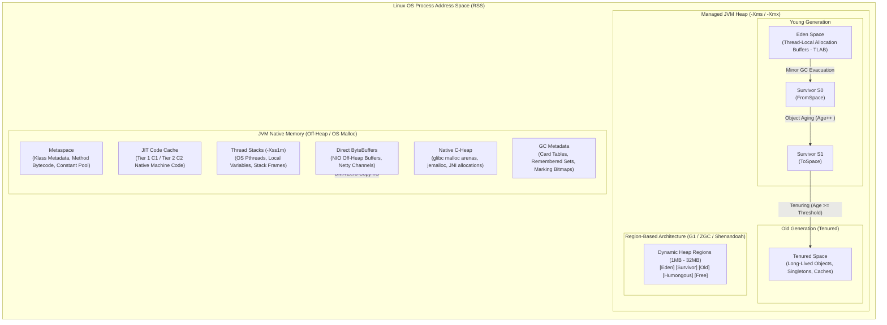

# JVM Internals, Garbage Collection & Performance Profiling: Enterprise Interview Guide

> **Curriculum Milestone**: Module 01 - Java Core Engineering  
> **Topic Coverage**: JVM Runtime Memory Layout (Heap, Metaspace, Off-Heap, CodeCache), Generational Hypothesis, Safepoints & TTSP, Memory Allocators (TLAB), GC Collectors (Serial, Parallel, CMS, G1, ZGC, Generational ZGC, Shenandoah, Epsilon), Card Tables & Remembered Sets, Colored Pointers & Load Barriers, Memory Leak Diagnostics (MAT, OQL), and Low-Overhead Continuous Profiling (Async-Profiler, JFR/JMC, NMT).  
> **Target Depth**: 50 Progressive Battle-Tested Scenarios, Production Code Walkthroughs, Architectural Trade-Off Matrices, Beginner Anti-Patterns, and Real-World Outage Post-Mortems.

---

## Architecture Blueprint: The JVM Memory & Execution Substrate




#### Visual Architecture & Deep Mechanics of JVM Memory Substrate

##### 1. Visual Architecture & Node Anatomy
* **Linux OS Process Address Space (RSS)**: The total physical and swapped memory pages currently allocated to the JVM process PID by the Linux kernel. Monitored via Linux `/proc/<PID>/status` (`VmRSS`) and container cgroups `memory.current`.
* **Managed JVM Heap (`-Xms` / `-Xmx`)**: The contiguous or regional virtual memory partition managed exclusively by HotSpot garbage collectors:
  - **Eden Space**: The initial allocation landing zone. Subdivided into per-thread **Thread-Local Allocation Buffers (TLABs)** where allocations occur via lock-free pointer bumping (`top += obj_size`).
  - **Survivor Spaces (`S0` and `S1`)**: Equal-sized semi-spaces acting as staging buffers to filter short-lived transient objects from premature promotion.
  - **Tenured Space (Old Generation)**: Holds long-lived enterprise application state (Spring singletons, caching layers, pooled connections).
  - **Humongous Regions (G1 GC)**: Contiguous region spans dedicated to single objects exceeding 50% of `G1HeapRegionSize`.
* **Native Memory (Off-Heap Space)**: All memory mapped by the JVM process outside the managed heap:
  - **Metaspace**: Stores native class metadata, runtime constant pools, vtables, and method bytecode.
  - **JIT Code Cache**: Reserved memory area holding native x86_64/ARM machine code compiled by C1 and C2 optimizing JIT compilers.
  - **Thread Stacks**: 1 MB native thread memory per OS pthread allocated via `mmap(MAP_ANONYMOUS)`.
  - **Direct ByteBuffers**: Off-heap I/O buffers utilized by Java NIO channels and Netty for kernel zero-copy transfer.
  - **Native C-Heap**: Unmanaged heap utilized by JVM internal subsystems and third-party native C/C++ libraries via JNI.

##### 2. Execution Flow & State Transitions
1. **Thread Allocation**: Application thread executes `new Order()`. The JVM attempts allocation in the thread's local TLAB inside Eden.
2. **TLAB Exhaustion**: When TLAB space runs out, the thread requests a new TLAB chunk from Eden using a synchronized atomic CAS bump.
3. **Minor GC Evacuation**: When Eden fills completely, a Stop-The-World Young GC triggers. Live objects in Eden and `FromSpace` (e.g., S0) are copied to `ToSpace` (S1).
4. **Age Promotion**: Each object header Mark Word records survival count (4 bits, max age 15). When `age >= MaxTenuringThreshold` (or dynamic survivor ratio threshold is breached), objects promote to Old Generation.
5. **Major/Concurrent GC**: When Old Generation occupancy crosses the Initiating Heap Occupancy Percent (IHOP, default 45% in G1), background concurrent marking triggers to compact tenured memory.

##### 3. Low-Level Kernel & JVM Mechanics
* **Deterministic RSS Formula**:
  $$\text{RSS} = \text{Heap} + \text{Metaspace} + \text{CodeCache} + (\text{Thread Count} \times \text{Stack Size}) + \text{DirectMemory} + \text{GC Metadata} + \text{Native C-Heap}$$
* **Cgroup Limit Enforcement**: Inside Kubernetes, the cgroup memory subsystem monitors `memory.current`. If RSS exceeds `memory.max` (`resources.limits.memory`), the Linux kernel OOM Killer immediately sends `SIGKILL` (Exit Code 137).
* **glibc Malloc Arena Fragmentation**: By default, `glibc` creates up to $8 \times \text{vCPUs}$ memory arenas to prevent allocation lock contention across multi-threaded processes. This causes severe virtual memory fragmentation, inflating RSS by hundreds of megabytes unless tuned via `MALLOC_ARENA_MAX=2` or replaced with `jemalloc`.

##### 4. Production Failure Modes & SRE Diagnostics
* **Kubernetes Exit 137 (OOMKilled)**: Occurs when engineers size container limit equal to `-Xmx` (e.g. limit 4Gi, `-Xmx4g`). Native memory pushes RSS to ~4.8GB, triggering kernel termination without creating a `.hprof` heap dump.
* **DirectByteBuffer Silent Leak**: Netty buffers allocated outside the heap are not tracked by GC pause metrics. If reference counters are not decremented or direct memory is uncapped, the host crashes.
* **Production Diagnostic Runbook**:
  ```bash
  # Enable Native Memory Tracking at startup
  java -XX:NativeMemoryTracking=detail -XX:+UnlockDiagnosticVMOptions -jar app.jar
  
  # Baseline and diff native memory in production
  jcmd <PID> VM.native_memory baseline
  jcmd <PID> VM.native_memory detail.diff
  ```

<details>
<summary>Text Representation (ASCII Blueprint)</summary>

```text
+---------------------------------------------------------------------------------------------------+
|                                     OS Process Address Space (RSS)                                |
|                                                                                                   |
|  +-------------------------------------------------------------+  +----------------------------+  |
|  |                   Managed JVM Heap Memory                   |  |      JVM Native Memory     |  |
|  |                                                             |  |                            |  |
|  |  +------------------------------------+  +---------------+  |  |  +----------------------+  |  |
|  |  |           Young Generation         |  |   Old/Tenured |  |  |  |       Metaspace      |  |  |
|  |  |  +------------+  +----+  +----+    |  |  +---------+  |  |  |  | (Klass Metaspaces,   |  |  |
|  |  |  | Eden (TLAB)|  | S0 |  | S1 |    |  |  | Long-   |  |  |  |  |  Method Descriptors) |  |  |
|  |  |  +------------+  +----+  +----+    |  |  | lived   |  |  |  |  +----------------------+  |  |
|  |  +------------------------------------+  |  | Objects |  |  |  |  +----------------------+  |  |
|  |                                          |  +---------+  |  |  |  |      Code Cache      |  |  |
|  |  +------------------------------------+  +---------------+  |  |  | (JIT C1/C2 Machine Code|  |
|  |  |   Regional Layout (G1 / ZGC / Shenandoah)                |  |  +----------------------+  |  |
|  |  |   [Young] [Old] [Survivor] [Humongous] [Free]           |  |  +----------------------+  |  |
|  |  +----------------------------------------------------------+  |  | Thread Stacks (-Xss) |  |  |
|  +-------------------------------------------------------------+  |  | (OS pthreads 1MB each)|  |  |
|                                                                   |  +----------------------+  |  |
|                                                                   |  +----------------------+  |  |
|                                                                   |  | Direct Buffers / JNI |  |  |
|                                                                   |  | (Unsafe, malloc off) |  |  |
|                                                                   |  +----------------------+  |  |
|                                                                   +----------------------------+  |
+---------------------------------------------------------------------------------------------------+
```

</details>

---

## Section 1: Progressive Scenario-Based Master Q&A (50 Scenarios)

### Tier 1: Core Fundamentals, Memory Areas & Allocation Mechanics (Q1 - Q12)

#### Q1: Process RSS vs JVM Heap Sizing in Containers

##### 1. Exact Scenario & Question
You deploy a Spring Boot microservice to Kubernetes with `-Xmx4g -Xms4g` configured on a pod with container limit `resources.limits.memory: 5Gi`. After 48 hours under sustained high throughput, the Linux kernel OOM killer terminates the pod (`OOMKilled exit code 137`). The junior engineer claims: "We gave the JVM 4GB, and the container has 5GB. There is an unaccounted 1GB buffer. Why did the container exceed 5GB when heap usage was only 3.2GB?" Detail every memory region contributing to Resident Set Size (RSS) and explain the exact equation for JVM total process footprint.

##### 2. What the Interviewer Evaluates
- Understanding of the fundamental difference between Virtual Heap (`-Xmx`) and Linux Process RSS.
- Enumeration of all non-heap JVM native allocations: Metaspace, Thread Stacks, CodeCache, Direct ByteBuffers, GC structures (Card Tables/RSet), Symbols, and C-heap (`glibc malloc`).
- Ability to formulate container memory budgets based on deterministic formulas rather than guesswork.

##### 3. Standout Technical Answer
Linux kills a container process when `memory.current` (cgroups) exceeds `memory.max`. The JVM's memory footprint is **not** bounded by `-Xmx`. Process Resident Set Size (RSS) is governed by:

$$\text{RSS} = \text{Heap} + \text{Metaspace} + \text{CodeCache} + (\text{Thread Count} \times \text{Stack Size}) + \text{Direct Buffers} + \text{GC Metadata} + \text{Native C-Heap}$$

Breaking down the unaccounted consumption in this 5Gi pod:
1. **JVM Heap**: 4096 MB committed (`-Xms4g`).
2. **Thread Stacks**: 500 platform threads $\times$ 1 MB (`-Xss1m`) = 500 MB native virtual/physical memory.
3. **Metaspace**: Loaded classes, method bytecode descriptors, runtime constant pools (default unbounded, typically consumes 150–300 MB).
4. **Code Cache**: Reserved at 240 MB (`-XX:ReservedCodeCacheSize=240m`) for JIT compiled assembly (C1/C2).
5. **Direct ByteBuffers**: Netty/NIO off-heap allocations, bounded by default to `-Xmx` unless explicitly restricted via `-XX:MaxDirectMemorySize`.
6. **GC Native Metadata**: G1GC Card Tables, Remembered Sets (RSet), and Marking Bitmaps consume 5–15% of the total heap size (200–600 MB for a 4GB heap).
7. **Native C-Heap (`glibc malloc`)**: Arena fragmentation caused by `MALLOC_ARENA_MAX` allocating up to $8 \times \text{vCPUs}$ native arenas.

Total RSS: $4096 + 500 + 200 + 150 + 250 + 350 = 5546\text{ MB} > 5120\text{ MB}$ (5GiB). The Linux kernel immediately triggered `oom-killer`.

```bash
# Enable Native Memory Tracking to capture off-heap usage
java -XX:+UnlockDiagnosticVMOptions \
     -XX:NativeMemoryTracking=summary \
     -Xms4g -Xmx4g \
     -XX:MaxMetaspaceSize=256m \
     -XX:ReservedCodeCacheSize=240m \
     -XX:MaxDirectMemorySize=512m \
     -Xss512k \
     -jar microservice.jar

# Interrogate live native memory baseline
jcmd <PID> VM.native_memory baseline
# Diff live usage after high load
jcmd <PID> VM.native_memory detail.diff
```

*Code Walkthrough:*
- Constraining `-XX:MaxMetaspaceSize=256m`, `-XX:MaxDirectMemorySize=512m`, and reducing stack to `-Xss512k` guarantees deterministic bounding of native areas.
- Setting container limits requires: $\text{Limit} \ge \text{Heap} + 1.5\text{GB}$ for enterprise Spring Boot apps.

##### 4. Follow-Up Trap Question & Winning Answer
- **Trap Question**: "If we use `-XX:+UseContainerSupport` and set `-XX:MaxRAMPercentage=80.0`, are we completely safe from being OOMKilled?"
- **Winning Answer**: "No. `-XX:MaxRAMPercentage=80.0` calculates `-Xmx` as 80% of the container's memory limit. In a 5Gi container, 80% yields 4GB for the heap alone. That leaves only 1GB (20%) for all native memory, thread stacks, Metaspace, Netty direct memory, and GC RSet overhead. If the app spawns hundreds of threads or uses Netty off-heap buffers, RSS will easily exceed 5GB and trigger `OOMKilled`. For production containers, set `MaxRAMPercentage` to 65–70%, or declare explicit `-Xmx` sizes with a 30% container headroom."

---

#### Q2: TLAB (Thread-Local Allocation Buffer) & Allocation Mechanics

##### 1. Exact Scenario & Question
In an ultra-high-throughput payment gateway processing 100,000 transactions/sec, your application creates millions of short-lived DTOs per second. A concurrency engineer observes that despite having 64 CPU cores, mutator threads spend 25% of their CPU time contending inside `pthread_mutex` and CAS loops within HotSpot's memory allocator. What is a TLAB, how does "bump-the-pointer" allocation operate, and why does TLAB retirement trigger contention?

##### 2. What the Interviewer Evaluates
- Deep knowledge of JVM heap allocation paths (Fast-path TLAB bump vs Slow-path shared Eden CAS).
- TLAB sizing mechanics, refilling heuristics, and wastage thresholds (`-XX:TLABWasteTargetPercent`).
- Ability to diagnose and tune allocation contention in high-core systems.

##### 3. Standout Technical Answer
In HotSpot, the Java heap is shared among all threads. If every thread attempted to allocate memory directly in Eden, they would all compete for a single allocation pointer using Atomic Compare-And-Swap (CAS), causing catastrophic cache coherence invalidations (MESI bus snooping storms).

To prevent this, HotSpot utilizes **TLAB (Thread-Local Allocation Buffer)**:
1. **Dedicated Eden Chunk**: Each thread is assigned a private sub-buffer inside the Eden space during initialization or refill.
2. **Bump-the-Pointer**: When allocating an object (`new OrderEvent()`), the thread checks if the object fits within its private TLAB (`top + size <= end`). If it does, allocation requires zero locks or CAS operations: it simply increments the `top` pointer:
   $$\text{address} = \text{top}; \quad \text{top} = \text{top} + \text{size};$$
   This takes ~2-3 CPU instructions.
3. **TLAB Exhaustion & Retirement**: When an object does not fit in the current TLAB, the thread faces a decision based on the **TLAB Refill Waste Threshold**:
   - If the remaining space in the TLAB is *greater* than the waste limit, the object is allocated directly in the shared Eden space via a slow-path synchronized CAS (`Atomic::cmpxchg`). The thread keeps its TLAB.
   - If the remaining space is *less* than the waste limit, the current TLAB is "retired" (the unused space is filled with a dummy `int[]` to maintain heap parseability for GC), and a new TLAB is claimed from Eden using a CAS operation.

```java
// Simulating high-frequency allocations to observe TLAB metrics
public class TLABAllocationBenchmark {
    public static void main(String[] args) {
        long start = System.nanoTime();
        for (int i = 0; i < 50_000_000; i++) {
            // Under TLAB, this is a local pointer bump in thread L1/L2 cache
            byte[] fastDto = new byte[128]; 
        }
        System.out.println("Elapsed ms: " + (System.nanoTime() - start) / 1_000_000);
    }
}
```

```bash
# Diagnostic flags to monitor TLAB allocation and waste
java -XX:+PrintTLAB \
     -XX:+UseTLAB \
     -XX:TLABSize=512k \
     -XX:-ResizeTLAB \
     TLABAllocationBenchmark
```

*Walkthrough:*
- When threads allocate objects larger than their remaining TLAB, disabling auto-resizing (`-XX:-ResizeTLAB`) or increasing `-XX:TLABSize` stops threads from prematurely falling back to the global Eden CAS lock.

##### 4. Follow-Up Trap Question & Winning Answer
- **Trap Question**: "If an object is 2MB and the standard TLAB size is 512KB, does HotSpot expand the thread's TLAB to 2MB to fit it?"
- **Winning Answer**: "No. Objects exceeding the maximum TLAB sizing threshold (`TLABWasteTargetPercent`) bypass TLAB entirely and are allocated directly in Eden using a global CAS. If the object exceeds 50% of a G1 region size, it bypasses Eden completely and is classified as a **Humongous Allocation**, directly allocated into contiguous Old Generation regions, triggering immediate concurrent marking cycles."

---

#### Q3: Weak & Strong Generational Hypothesis

##### 1. Exact Scenario & Question
Why do virtually all commercial JVM garbage collectors (Serial, Parallel, CMS, G1, and Generational ZGC) split the heap into Young and Old generations, whereas early JVM research attempted single-space heaps? Under what specific enterprise workload pattern does the Weak Generational Hypothesis completely collapse, causing severe GC degradation?

##### 2. What the Interviewer Evaluates
- Theoretical grounding in memory management: The Weak Generational Hypothesis vs Strong Generational Hypothesis.
- Impact of object survival curves on mark-sweep-copy algorithms.
- Identifying anti-patterns where generational collectors perform worse than non-generational collectors.

##### 3. Standout Technical Answer
The JVM generational design is founded on two empirical observations:
1. **The Weak Generational Hypothesis**: The vast majority of allocated objects die very shortly after creation (empirical measurements show >98% of objects in web apps die before surviving a single GC cycle).
2. **The Strong Generational Hypothesis**: References from older objects to younger objects exist in very small numbers (<1% of all pointers).

**Why Generational Partitioning Wins:**
- **Young Generation (Copying Collector)**: Because 98% of objects die immediately, a copying collector (Cheney's algorithm) only needs to traverse and copy the 2% of live objects from Eden to Survivor. The cost of collection is proportional to the number of *live objects*, not the total size of the allocated memory:
  $$\text{Cost}_{\text{YoungGC}} = \mathcal{O}(\text{LiveObjects})$$
- **Old Generation (Mark-Sweep-Compact)**: Objects that survive multiple young GC cycles are tenured. They are collected infrequently using compaction algorithms because their mortality rate is low.

**When the Hypothesis Collapses:**
The hypothesis collapses in **Medium-Lived Object Storms**:
- Workloads that cache massive datasets in heap for 30–120 seconds (e.g., large distributed query aggregations, long-running HTTP streaming sessions, or internal processing queues).
- These objects live long enough to cross the tenuring threshold (`MaxTenuringThreshold`), get promoted to the Old Generation, and die immediately *after* promotion.
- This results in **Premature Tenuring**, causing rapid Old Generation fragmentation, frequent concurrent marking cycles, and catastrophic Stop-The-World Full GC events.

##### 4. Follow-Up Trap Question & Winning Answer
- **Trap Question**: "If generational collection is objectively superior, why was original ZGC (Java 11–17) and Shenandoah 1.0 designed as non-generational collectors?"
- **Winning Answer**: "ZGC prioritized sub-millisecond maximum pause times above all else. In a non-generational collector, there is only one region type, avoiding the complex engineering of write barriers, Card Tables, and Remembered Sets needed to track cross-generational pointers. However, non-generational ZGC suffered from 'allocation stalls' under high allocation rates. Because the hypothesis holds true in 99% of enterprise apps, OpenJDK spent years re-engineering Generational ZGC (JEP 439, Java 21), delivering 4x higher throughput while keeping pauses under 1ms."

---

#### Q4: Safepoints & Time-To-Safepoint (TTSP) Latency Disasters

##### 1. Exact Scenario & Question
A trading desk reports unexplained 800ms latency spikes in their order matching engine. Looking at GC logs, the GC pause time (`pause-young`) reports only `12ms`. However, application request telemetry shows the thread was frozen for `812ms`. You suspect a **Time-To-Safepoint (TTSP)** issue. Explain the low-level mechanics of HotSpot safepoint polling, how threads reach a safepoint, and what code constructs cause extreme TTSP delays.

##### 2. What the Interviewer Evaluates
- Understanding that GC Pause $\neq$ Application Freeze Time.
- Low-level HotSpot safepoint mechanics: Guard pages, memory unmapping, polling instructions, and JIT compiler safepoint injection rules.
- Diagnosing uncounted loops vs counted loops in compiled C2 machine code.

##### 3. Standout Technical Answer
To perform any Stop-The-World (STW) operation (GC phases, biased lock revocation, thread dumps, deoptimization), HotSpot requires all application threads (mutators) to stop at known, consistent execution coordinates called **Safepoints**.

**HotSpot Safepoint Polling Mechanics:**
1. In JIT-compiled code, the JVM injects safepoint polling checks at method returns and loop backward branches (backedges).
2. Prior to Java 10, safepoints were triggered by unprotecting a global memory page (`mprotect(PROT_NONE)`). Any thread executing a poll instruction (`test %eax, 0x160(%rip)`) hit a hardware segmentation fault (`SIGSEGV`), caught by HotSpot's signal handler to park the thread.
3. Since Java 10+, **Thread-Local Handshakes** (JEP 312) replace global page unprotects by toggling individual thread polling flags in thread-local storage.

**The TTSP Bottleneck:**
When the JVM initiates a safepoint, it must wait for the slowest thread to reach a polling point. The formula for total mutator pause is:

$$\text{Total Pause} = \text{TTSP} + \text{GC Execution Time}$$

If one thread is trapped in a loop that lacks a safepoint check, all other threads sit frozen in `WAITING` state, while the JVM waits for the delinquent thread.

**The Cause: Counted Loops:**
By default, the C2 compiler treats **counted int loops** (`for (int i = 0; i < N; i++)`) as finite and safe, optimizing them by **stripping out the safepoint poll instruction** to maximize register utilization and vectorized execution (loop unrolling). If $N$ is large (e.g., iterating a 100M-element array or computing cryptographic hashes), the thread will execute uninterrupted for 800ms. The GC cannot proceed until this loop completes.

```java
public class TTSPLatencyTrap {
    public static void computeHeavy(int[] data) {
        // C2 optimizer removes safepoint polling from this counted loop!
        // If another thread requests a GC, it will wait until all 100M iterations finish.
        for (int i = 0; i < data.length; i++) {
            data[i] = (data[i] * 31) ^ 0xDEADBEEF;
        }
    }
}
```

```bash
# Flags to diagnose TTSP issues in production
java -Xlog:safepoint=debug \
     -XX:+UnlockDiagnosticVMOptions \
     -XX:+SafepointTimeout \
     -XX:SafepointTimeoutDelay=500 \
     -XX:+UseCountedLoopSafepoints \
     TTSPLatencyTrap
```

*Walkthrough:*
- Enabling `-XX:+UseCountedLoopSafepoints` forces C2 to maintain safepoint checks inside integer counted loops, preventing long computations from delaying safepoint arrival.

##### 4. Follow-Up Trap Question & Winning Answer
- **Trap Question**: "Does changing `for (int i = 0; i < n; i++)` to `for (long i = 0; i < n; i++)` fix or worsen the TTSP problem?"
- **Winning Answer**: "It fixes the TTSP problem, but slightly degrades loop throughput! The C2 compiler only treats `int` loops as counted loops. Loops indexed by `long` are classified as **uncounted loops**. C2 *always* inserts a safepoint poll on the backedge of an uncounted loop, guaranteeing that the thread stops at a safepoint within microseconds, completely eliminating the TTSP stall."

---

#### Q5: Object Memory Layout & JOL (Java Object Layout) Analysis

##### 1. Exact Scenario & Question
You are designing an in-memory cache holding 100 million cache entries. A developer declares a class:
```java
class CacheEntry {
    boolean active;
    long id;
    int hash;
}
```
The developer calculates that each instance takes $1 + 8 + 4 = 13$ bytes, so 100 million instances will consume 1.3 GB of heap. Explain why this calculation is disastrously wrong, calculate the exact byte size on a 64-bit JVM with Compressed OOPs enabled and disabled, and explain memory alignment padding.

##### 2. What the Interviewer Evaluates
- Accurate breakdown of HotSpot object layout: Mark Word, Klass Word, Field Alignment, and 8-byte boundary padding.
- Understanding of Compressed OOPs (`-XX:+UseCompressedOops`) and Compressed Class Pointers (`-XX:+UseCompressedClassPointers`).
- Capacity planning accuracy for memory-sensitive architectures.

##### 3. Standout Technical Answer
In HotSpot JVM (64-bit), every object allocated on the heap consists of three distinct parts:
1. **Object Header**:
   - **Mark Word** (8 bytes): Stores hash code, GC age bits (4 bits), biased lock flags, and lock state pointers.
   - **Klass Word** (4 or 8 bytes): Pointer to the instance's Metaspace metadata class definition.
2. **Instance Data**: Actual fields declared by the class and its superclasses, ordered by JVM field packing rules (doubles/longs first, ints/floats, shorts/chars, bytes/booleans, references last).
3. **Alignment Padding**: HotSpot aligns all object allocations to multiples of **8 bytes** (for 64-bit CPU cache line alignment).

**Detailed Calculation:**

**Case A: Compressed OOPs Enabled (`-XX:+UseCompressedOops`, Default for Heaps < 32GB)**
- Mark Word: 8 bytes
- Klass Word: 4 bytes (compressed from 8 bytes)
- Header Total: 12 bytes
- Field `long id`: 8 bytes (aligned to 8-byte boundary $\to$ offset 16)
- Field `int hash`: 4 bytes (offset 24)
- Field `boolean active`: 1 byte (offset 28)
- Subtotal: $12 + 8 + 4 + 1 = 25$ bytes
- Alignment Padding: 7 bytes (to round up to the nearest multiple of 8 $\to$ 32 bytes)
- **Total Instance Size: 32 bytes!**

**Case B: Compressed OOPs Disabled (`-XX:-UseCompressedOops`, or Heaps $\ge$ 32GB)**
- Mark Word: 8 bytes
- Klass Word: 8 bytes (uncompressed pointer)
- Header Total: 16 bytes
- Field `long id`: 8 bytes (offset 16)
- Field `int hash`: 4 bytes (offset 24)
- Field `boolean active`: 1 byte (offset 28)
- Subtotal: $16 + 8 + 4 + 1 = 29$ bytes
- Alignment Padding: 3 bytes (to round up to the nearest multiple of 8 $\to$ 32 bytes)
- **Total Instance Size: 32 bytes.**

For 100M entries: $100{,}000{,}000 \times 32\text{ bytes} = 3.2\text{ GB}$, plus the reference pointers inside the cache array ($100\text{M} \times 4\text{ bytes} = 400\text{ MB}$). Total is **3.6 GB**, nearly **3x** the developer's naive 1.3 GB estimate.

```java
import org.openjdk.jol.info.ClassLayout;

public class ObjectLayoutInspection {
    static class CacheEntry {
        boolean active;
        long id;
        int hash;
    }

    public static void main(String[] args) {
        // Prints exact internal offset layout, headers, and padding
        System.out.println(ClassLayout.parseClass(CacheEntry.class).toPrintable());
    }
}
```

##### 4. Follow-Up Trap Question & Winning Answer
- **Trap Question**: "If an application requires 31.5 GB of heap, why will expanding the heap to 33 GB frequently cause the application to run out of memory *faster* or suffer a 25% performance degradation?"
- **Winning Answer**: "Because 32 GB is the absolute hard boundary for **Compressed OOPs** (Ordinary Object Pointers). At $\le 32\text{ GB}$, HotSpot shifts 32-bit pointers by 3 bits ($2^{32} \times 8 = 32\text{ GB}$), allowing 32-bit references. Once heap exceeds 32 GB, Compressed OOPs are disabled, and every object reference expands from 4 bytes to 8 bytes. This immediate 2x pointer expansion inflates the live data set by 20–30%, degrading CPU L1/L2/L3 cache hit rates and causing more frequent GC cycles."

---

#### Q6: Card Tables & Post-Write Barriers

##### 1. Exact Scenario & Question
During a Minor Young GC cycle, the garbage collector must identify all live objects in Eden. If an Old Generation object holds a reference to a Young Generation object, how does the JVM identify this reference *without* scanning the entire multi-gigabyte Old Generation? Walk through the exact assembly instructions generated by the JIT compiler for a post-write barrier and the structure of the Card Table.

##### 2. What the Interviewer Evaluates
- Deep mastery of cross-generational reference tracking.
- Mechanics of Card Table memory mapping (512-byte cards mapped to 1-byte entries).
- Knowledge of JIT write barriers and Card Table false sharing on multi-socket NUMA systems.

##### 3. Standout Technical Answer
Scanning the entire Old Generation during a Minor GC would turn a 10ms Young GC into a multi-second pause, destroying the benefits of generational collection. HotSpot solves this via a **Card Table** and a JIT **Post-Write Barrier**.

**The Card Table Structure:**
- The Card Table is a contiguous byte array allocated in native memory.
- Each byte in the Card Table corresponds to a **512-byte block** ("Card") of the Java heap.
- If an object in Old Generation at address $A$ has a field updated to point to a Young Gen object, the Card Table byte corresponding to address $A$ is marked as **dirty** (`0x0`).

**The JIT Post-Write Barrier:**
Every time a reference assignment occurs in Java bytecode (`obj.field = target`), the JIT compiler appends a tiny snippet of assembly code immediately after the store:

```assembly
; Store the reference into the object field
movq   %rax, 0x18(%rbx)

; Compute the card index: (field address >> 9)
shrq   $0x9, %rbx

; Add base address of Card Table and mark the card byte dirty (0x0)
movabsq $0x7f8a12000000, %r10   ; Base address of Card Table
movb   $0x0, (%r10, %rbx)       ; CardTable[field_addr >> 9] = 0 (DIRTY)
```

**Minor GC Execution:**
When Minor GC triggers:
1. The GC scans only the Card Table (which is $\frac{1}{512}$th the size of the heap).
2. It identifies dirty cards (`0x0`).
3. It scans only the 512-byte memory segments corresponding to dirty cards to locate the cross-generational pointers.
4. It treats those references as GC Roots for the Young Generation, completely avoiding scanning clean Old Generation memory.
5. It resets dirty cards to clean (`0x1`).

##### 4. Follow-Up Trap Question & Winning Answer
- **Trap Question**: "Can concurrent writes to distinct objects in the same 512-byte card cause race conditions or memory corruption in the Card Table?"
- **Winning Answer**: "No memory corruption occurs because the write barrier unconditionally writes a constant byte value (`0x0`) without reading or locking. However, on high-core SMP architectures, multiple CPU cores updating different objects within the same 64-byte L1 cache line of the Card Table cause severe **false sharing** (cache line bouncing). HotSpot addresses this via the `-XX:+UseCondCardMark` flag, which modifies the barrier to inspect the card first (`if (card != 0) card = 0`), avoiding unnecessary memory bus write invalidations."

---

#### Q7: Reference Types (Strong, Soft, Weak, Phantom) & Cleaners

##### 1. Exact Scenario & Question
You are designing an off-heap cache and an image-processing service. A developer proposes using `SoftReference` to cache 10MB decoded image bitmaps in memory, and `WeakReference` for canonical object mapping. In production under high memory pressure, users experience massive 5-second latency spikes. Contrast the lifecycle, GC reclamation semantics, and HotSpot clearing rules for `StrongReference`, `SoftReference`, `WeakReference`, and `PhantomReference`. Why are `SoftReference`s dangerous in latency-critical systems?

##### 2. What the Interviewer Evaluates
- Precision regarding JVM garbage collection phases for non-strong references.
- Calculation of Soft Reference clearing threshold (`-XX:SoftRefLRUPolicyMSPerMB`).
- Modern replacement of `Object.finalize()` with Java 9+ `java.lang.ref.Cleaner`.

##### 3. Standout Technical Answer

| Reference Type | When Cleared by Garbage Collector | Primary Production Use Case | Associated Mechanism |
|---|---|---|---|
| **Strong** | Never cleared as long as reachable from GC Roots. | Normal business logic objects. | Default JVM variable assignments. |
| **Soft** | Cleared only when the JVM is under extreme memory pressure (approaching OOM). | Memory-sensitive caches. | Governed by `SoftRefLRUPolicyMSPerMB`. |
| **Weak** | Cleared immediately during the next GC cycle if no strong references exist. | Canonicalizing mappings, `WeakHashMap`, ThreadLocal cleanups. | Enqueued to `ReferenceQueue` upon collection. |
| **Phantom** | Cleared after the object is unreachable; memory is not reclaimed until reference is processed. | Off-heap memory reclamation, direct native resource cleanup. | Requires `ReferenceQueue`, replaces `finalize()`. |

**Why `SoftReference` Destroys Latency-Critical Systems:**
HotSpot calculates the lifetime of a softly reachable object using the formula:

$$\text{FreeMemoryInMB} \times \text{SoftRefLRUPolicyMSPerMB}$$

Where default `SoftRefLRUPolicyMSPerMB = 1000` (1 second per MB free).
1. When available heap space shrinks under load, the JVM suddenly invalidates and clears thousands of Soft References simultaneously during a GC safepoint.
2. The clearing phase requires sequential processing by GC reference-processing threads, causing catastrophic spikes in GC pause time (`reference-processing`).
3. Furthermore, evicting the entire cache forces application threads to re-fetch/re-decode data from databases or disk simultaneously, triggering a **cache stampede** that collapses backend systems.

```java
import java.lang.ref.Cleaner;

// Enterprise pattern: Safe native memory deallocation using Java 9+ Cleaner
public class NativeByteBufferResource implements AutoCloseable {
    private static final Cleaner CLEANER = Cleaner.create();
    
    private final long nativeAddress;
    private final Cleaner.Cleanable cleanable;

    public NativeByteBufferResource(long size) {
        this.nativeAddress = allocateNativeMemory(size);
        // Cleanable action must NOT reference the outer object to avoid circular memory leaks!
        this.cleanable = CLEANER.register(this, new Deallocator(nativeAddress, size));
    }

    private static class Deallocator implements Runnable {
        private final long address;
        private final long size;

        Deallocator(long address, long size) {
            this.address = address;
            this.size = size;
        }

        @Override
        public void run() {
            freeNativeMemory(address, size);
            System.out.println("Native memory safely released at 0x" + Long.toHexString(address));
        }
    }

    @Override
    public void close() {
        cleanable.clean(); // Idempotent explicit deallocation
    }

    private static native long allocateNativeMemory(long size);
    private static native void freeNativeMemory(long address, long size);
}
```

##### 4. Follow-Up Trap Question & Winning Answer
- **Trap Question**: "Why did Java 9 permanently deprecate `Object.finalize()`, and how did finalizers cause memory leaks and JVM crashes?"
- **Winning Answer**: "Finalizers ran on a single, low-priority JVM thread (`FinalizerThread`). If `finalize()` blocked, threw exceptions, or allocated memory, the `FinalizerQueue` grew unbounded, causing an `OutOfMemoryError`. Furthermore, an object could 'resurrect' itself inside `finalize()` by assigning `this` to a static field. Cleaners and `PhantomReference` prevent resurrection because the target object is already dead and unreachable when the deallocation runnable executes."

---

#### Q8: Escape Analysis & Scalar Replacement

##### 1. Exact Scenario & Question
A high-frequency trading application allocates 50 million `OrderPrice` objects per second:
```java
public double calculateSpread(double bid, double ask) {
    OrderPrice op = new OrderPrice(bid, ask);
    return op.getAsk() - op.getBid();
}
```
Looking at GC statistics, young GC pauses occur only once every 10 minutes instead of every 2 seconds. The junior developer claims: "Java allocates this object on the thread stack instead of the heap." Correct their statement with technical precision, explain the role of C2 Escape Analysis, and define **Scalar Replacement**.

##### 2. What the Interviewer Evaluates
- Understanding that HotSpot does **not** support true C-style struct stack allocation.
- In-depth mechanics of C2 Escape Analysis (NoEscape, ArgEscape, GlobalEscape).
- How Scalar Replacement maps object fields directly to CPU registers.

##### 3. Standout Technical Answer
The developer's statement is technically incorrect: **HotSpot JVM does not perform true stack allocation of objects**. It does something far more aggressive: **Scalar Replacement**.

**Escape Analysis (EA) Classifications:**
During C2 JIT compilation, the compiler traces the reachability of allocated objects:
1. `GlobalEscape`: The object escapes the method and thread (e.g., returned from method, stored in static field, published to another thread).
2. `ArgEscape`: The object is passed as an argument to another method, but does not escape the current thread.
3. `NoEscape`: The object never leaves the scope of the allocating method.

**Scalar Replacement Mechanics:**
When an object is classified as `NoEscape`, the C2 compiler dismantles the object into its individual constituent primitive scalar components (fields).
- The object instance, object header (Mark Word, Klass Word), and memory alignment are completely discarded.
- The fields (`double bid`, `double ask`) are transformed into local variables placed directly into **CPU registers** (e.g., `%xmm0`, `%xmm1` on x86_64) or the thread's native stack frame.
- Zero heap allocation occurs. Zero GC pressure is generated.

```java
// Testing Scalar Replacement via JVM flags
public class EscapeAnalysisTest {
    static class Point {
        final int x, y;
        Point(int x, int y) { this.x = x; this.y = y; }
    }

    public static void main(String[] args) {
        long sum = 0;
        for (int i = 0; i < 100_000_000; i++) {
            Point p = new Point(i, i + 1); // Classified as NoEscape -> Scalared into registers
            sum += p.x + p.y;
        }
        System.out.println("Result: " + sum);
    }
}
```

```bash
# Compare execution time with and without escape analysis:
# Disabling EA causes 100M heap allocations, triggering heavy GC:
java -XX:-DoEscapeAnalysis EscapeAnalysisTest

# Enabling EA (Default) completes in milliseconds with 0 GC pauses:
java -XX:+DoEscapeAnalysis -XX:+EliminateAllocations EscapeAnalysisTest
```

##### 4. Follow-Up Trap Question & Winning Answer
- **Trap Question**: "If an object contains a `synchronized(this)` block, does that prevent Escape Analysis and Scalar Replacement?"
- **Winning Answer**: "No! If Escape Analysis proves the object never escapes the thread (`NoEscape`), HotSpot performs **Lock Elision** (Biased/Thin lock elimination). The compiler recognizes that no other thread can ever contend for the lock, completely strips the `monitorenter` and `monitorexit` bytecode instructions, and proceeds with Scalar Replacement."

---

#### Q9: Dynamic Tenuring Age Distribution & Premature Promotion

##### 1. Exact Scenario & Question
You configure a JVM with `-XX:MaxTenuringThreshold=15` and `-XX:SurvivorRatio=8`. During peak traffic, you inspect GC logs and discover that objects with an age of only **2** are being promoted directly into the Old Generation, causing Old Gen usage to spike and triggering G1 Mixed GC every 30 seconds. Explain the internal HotSpot algorithm for **Dynamic Tenuring Threshold** calculation and how to diagnose survivor space exhaustion.

##### 2. What the Interviewer Evaluates
- Understanding that `MaxTenuringThreshold` is an upper limit, not a guaranteed promotion age.
- Knowledge of the **Target Survivor Ratio** (`-XX:TargetSurvivorRatio`).
- Calculating Survivor space sizing to absorb request-scoped allocation bursts.

##### 3. Standout Technical Answer
In HotSpot, `MaxTenuringThreshold` (default 15 in Parallel, 15 in CMS, 15 in G1) specifies the *maximum* number of Young GC cycles an object can survive in Survivor spaces (S0/S1) before being promoted to Old Gen.

However, the JVM calculates an effective **Dynamic Tenuring Threshold** at the conclusion of every Young GC cycle:
1. HotSpot maintains an internal array tracking the total memory consumed by live objects of each age in the To-Survivor space:
   $$\text{Bytes}(\text{age}_1), \text{Bytes}(\text{age}_2), \dots, \text{Bytes}(\text{age}_{15})$$
2. It evaluates `-XX:TargetSurvivorRatio` (default 50%). If the Survivor space is 100MB, the target capacity is 50MB.
3. The GC calculates the cumulative sum of surviving objects starting from age 1:
   $$\sum_{k=1}^{\text{threshold}} \text{Bytes}(\text{age}_k) > (\text{SurvivorSize} \times \text{TargetSurvivorRatio})$$
4. As soon as the cumulative sum exceeds 50% of the Survivor space, that age $k$ becomes the **new tenuring threshold**.
5. Any object with $\text{age} \ge k$ is immediately promoted to the Old Generation.

**The Failure Mode:**
If an influx of concurrent requests allocates 60MB of data that survives the first GC cycle, cumulative age 1 objects (60MB) immediately exceed the 50MB threshold. The dynamic threshold drops to **1**. On the very next GC cycle, all those objects are dumped into the Old Generation, even though they will die 500ms later.

```bash
# Print the exact survivor age distribution at every GC
java -Xlog:gc+age=trace \
     -XX:SurvivorRatio=6 \
     -XX:TargetSurvivorRatio=80 \
     -XX:MaxTenuringThreshold=15 \
     -jar microservice.jar
```

```
# Sample GC log output showing dynamic threshold collapse:
[0.450s][trace][gc,age] Desired survivor size 52428800 bytes, new threshold 2 (max threshold 15)
[0.450s][trace][gc,age] - age   1:   41285000 bytes,   41285000 total
[0.450s][trace][gc,age] - age   2:   18450000 bytes,   59735000 total (Exceeds desired size!)
[0.450s][trace][gc,age] - age   3:    1250000 bytes,   60985000 total
```

##### 4. Follow-Up Trap Question & Winning Answer
- **Trap Question**: "Why shouldn't we simply set `-XX:TargetSurvivorRatio=100` and `-XX:SurvivorRatio=1` to make survivor spaces huge and prevent promotion?"
- **Winning Answer**: "Making Survivor spaces excessively large shrinks Eden space (for a fixed Young Gen size). A smaller Eden fills up much faster, dramatically increasing the *frequency* of Minor GCs. Furthermore, copying survivors back and forth between S0 and S1 consumes significant CPU memory bandwidth. Survivor sizing must balance peak burst retention without cannibalizing Eden throughput."

---

#### Q10: Minor GC vs Major GC vs Full GC vs Mixed GC

##### 1. Exact Scenario & Question
An engineering team gets into an argument during an incident post-mortem: "The system had a 2-second pause because of a Major GC." The Lead Architect retorts: "HotSpot doesn't even define Major GC in its official specification; you had a Full GC caused by concurrent evacuation failure." Clarify the formal HotSpot definitions of Minor GC, Major GC, Full GC, and G1 Mixed GC, identifying which are Stop-The-World and which collector threads run concurrently.

##### 2. What the Interviewer Evaluates
- Precise terminology: Dispelling colloquial industry myths about GC types.
- Algorithmic mechanics: Which spaces are reclaimed, live-object evacuation vs sliding compaction.
- Identifying single-threaded vs multi-threaded STW phases.

##### 3. Standout Technical Answer

| GC Event | Regions / Spaces Collected | Stop-The-World (STW)? | Concurrency Mechanics |
|---|---|---|---|
| **Minor GC (Young GC)** | Only Young Generation (Eden + From-Survivor). | Yes (all mutators stopped). | Multi-threaded parallel copying of survivors to To-Survivor or Old Gen. |
| **Major GC** | Informally used to describe Old Generation collection (e.g., CMS Old sweep). | Partial or No. | *Not an official HotSpot term.* Often confused with Full GC. |
| **Mixed GC (G1 Exclusive)** | All Young Regions **plus** a selected subset of the most fragmented Old Generation regions. | Yes (evacuation pause). | Reclaims young space while opportunistically compacting the dirtiest old regions. |
| **Full GC** | The **entire** JVM Heap (Eden, Survivor, Tenured/Old, and Metaspace/PermGen). | **Yes (Catastrophic STW)**. | In Serial/Parallel/CMS/G1, it executes a single or multi-threaded sliding mark-sweep-compact across the entire address space. Resets all metadata. |

**The Incident Reality:**
A G1 "Mixed GC" is an expected, low-latency collection cycle. But if G1 runs out of free regions while evacuating during a Mixed GC (an **Evacuation Failure / To-Space Exhausted**), it abandons concurrent operations and falls back to a **Full GC**. Prior to Java 10, G1 Full GC was **single-threaded**, freezing large 64GB heaps for 30–60 seconds.

##### 4. Follow-Up Trap Question & Winning Answer
- **Trap Question**: "Can a Full GC occur even if the Old Generation is only 20% full?"
- **Winning Answer**: "Yes. A Full GC can be triggered by: (1) An explicit `System.gc()` call (unless `-XX:+DisableExplicitGC` is set), (2) Metaspace exhaustion exceeding `MaxMetaspaceSize` or the dynamic high-water mark, (3) Inability to allocate a contiguous block of regions for a massive Humongous object despite ample total free memory (heap fragmentation), or (4) JNI Critical Region exits."

---

#### Q11: Safepoint Bias in Profilers & Async-Profiler Architecture

##### 1. Exact Scenario & Question
Your production team uses a commercial APM tool and VisualVM to profile CPU hotspots. The APM reports that the application spends 85% of its CPU time inside `HashMap.get()` and `Thread.sleep()`. However, when inspecting Linux `perf top`, the CPU is actually saturated by a cryptographic hashing method (`SHA256.update()`). Explain **Safepoint Bias** in JVM sampling, why traditional tools deceive engineers, and how **Async-Profiler** bypasses this limitation.

##### 2. What the Interviewer Evaluates
- Understanding HotSpot's internal sampling mechanisms (`jstack`, `ThreadMXBean.getThreadInfo()`).
- Why safepoint-only sampling systematically skews performance profiles.
- Architectural mechanics of `AsyncGetCallTrace` and Linux `perf_events`.

##### 3. Standout Technical Answer
Traditional JVM profilers (VisualVM, JProfiler, standard APMs) rely on standard JVM interfaces such as JVMTI `GetStackTrace()` or JMX `ThreadMXBean`. 

**The Safepoint Bias Flaw:**
1. HotSpot **cannot inspect a thread's call stack unless that thread is at a Safepoint**.
2. To sample threads, standard profilers request a safepoint. The JVM waits for threads to reach a safepoint poll instruction, pauses them, and records the stack traces.
3. This creates massive statistical distortion:
   - Methods that contain safepoints (e.g., I/O calls, blocking synchronization, non-inlined method returns) are sampled constantly.
   - Dense, compute-heavy algorithms (e.g., tight loops, JIT-inlined math/crypto routines) **never have safepoint checks**. Threads spend 99% of their CPU time inside these methods, but they are *invisible* to safepoint-biased profilers because they can only be sampled when they finally exit to a safepoint.
   - The resulting profile is completely misleading.

**How Async-Profiler Solves This:**
Async-Profiler operates completely outside HotSpot safepoints:
1. It utilizes OS-level hardware performance counters via the Linux `perf_event_open` syscall or kernel timer signals (`SIGPROF`).
2. When the kernel timer fires, it sends a POSIX signal (`SIGPROF`) directly to the thread executing on the CPU core, interrupting it at an **arbitrary instruction address**, regardless of whether it is at a safepoint.
3. Inside the signal handler, Async-Profiler invokes the private HotSpot API **`AsyncGetCallTrace`**.
4. `AsyncGetCallTrace` walks the C/C++ native and JIT-compiled stack frames asynchronously without requiring a JVM safepoint.
5. This delivers a mathematically accurate, unbiased flamegraph of actual CPU execution.

```bash
# Capture a 60-second unbiased CPU flame graph in production:
./async-profiler/bin/asprof -d 60 -e cpu -f /tmp/cpu_flamegraph.html <PID>

# Profile native heap allocation without bytecode instrumentation overhead:
./async-profiler/bin/asprof -d 60 -e alloc -f /tmp/alloc_flamegraph.html <PID>
```

##### 4. Follow-Up Trap Question & Winning Answer
- **Trap Question**: "Can `AsyncGetCallTrace` ever fail or crash the JVM when walking the stack inside a `SIGPROF` signal handler?"
- **Winning Answer**: "Yes. If the signal interrupts a thread in the middle of a JIT compiler state transition (e.g., C2 prologue/epilogue generation, stub generation, or runtime deoptimization), the stack frame is in an inconsistent state. `AsyncGetCallTrace` detects this and returns error codes (e.g., `ticks_unknown_not_Java`, `ticks_GC_active`). Async-Profiler handles these errors gracefully and discards the sample, rather than attempting unsafe memory dereferences that would crash the JVM with `SIGSEGV`."

---

#### Q12: Epsilon No-Op Garbage Collector

##### 1. Exact Scenario & Question
OpenJDK 11 introduced the Epsilon Garbage Collector (`-XX:+UseEpsilonGC`), labeled as a "No-Op GC". It allocates memory but **never reclaims it**. When heap space is exhausted, the JVM immediately terminates with `OutOfMemoryError`. Why would any enterprise engineer purposely deploy a garbage collector that doesn't collect garbage? Give three legitimate production architectures where Epsilon is the optimal choice.

##### 2. What the Interviewer Evaluates
- Understanding the architectural cost of GC barriers (write barriers, read barriers, Card Tables).
- Serverless / FaaS architectures and ephemeral computing lifecycles.
- Performance benchmarking isolation (JMH) and zero-overhead memory allocation profiling.

##### 3. Standout Technical Answer
Every garbage collector imposes non-trivial runtime costs: JIT post-write barriers on every reference store, memory overhead for Card Tables and marking bitmaps, thread handshakes, and GC safepoints.

**Epsilon GC** implements the JVM memory allocation interface (allocates TLABs and bumps pointers in heap) but contains **zero collection logic**. It completely strips out all GC barriers and background GC threads.

**Three Legitimate Enterprise Use Cases:**
1. **Ultra-Short-Lived Serverless Functions (AWS Lambda / Cloud Run)**:
   - A serverless function spins up, processes a single batch of 1,000 JSON records consuming 200MB of heap, returns the result, and is destroyed.
   - Running G1GC or ZGC wastes CPU cycles initializing GC threads, updating Card Tables, and scheduling pauses. With Epsilon and `-Xmx512m`, memory is allocated with zero barrier overhead, and memory cleanup is delegated entirely to the destruction of the Linux container.
2. **Performance Benchmarking & JIT Profiling (JMH)**:
   - When benchmarking an algorithm's raw execution speed, random GC pauses distort statistical latency percentiles (p99/p99.9). Epsilon isolates pure execution throughput.
3. **Ultra-Low Latency Messaging with Zero-Garbage Architectures (LMAX Disruptor)**:
   - Systems designed with ring buffers, object pools, and off-heap memory allocate zero objects on the heap during steady-state trading hours.
   - If an unexpected memory leak occurs, rather than freezing the trading engine in a 5-second Full GC panic, Epsilon crashes the JVM instantly (`OOM`), allowing the hardware cluster failover mechanism to route traffic to the hot-standby replica within 50 milliseconds.

```bash
# Running an ultra-lean serverless batch job with Epsilon
java -XX:+UnlockExperimentalVMOptions \
     -XX:+UseEpsilonGC \
     -Xms512m -Xmx512m \
     -XX:+AlwaysPreTouch \
     -jar lambda-task.jar
```

##### 4. Follow-Up Trap Question & Winning Answer
- **Trap Question**: "Why is `-XX:+AlwaysPreTouch` strongly recommended when running with Epsilon GC?"
- **Winning Answer**: "Because Epsilon's sole purpose is extreme performance and predictability. By default, the OS commits physical memory pages lazily upon first write, causing page faults during execution. `-XX:+AlwaysPreTouch` forces the JVM to iterate across every 4KB page of the entire heap at startup and write a zero byte, pre-faulting all physical RAM. This ensures zero OS page fault latency during runtime execution."

---

### Tier 2: Classic & Regional Garbage Collectors: Parallel, CMS & G1GC (Q13 - Q25)

#### Q13: Parallel GC (Throughput Collector) Internal Mechanics

##### 1. Exact Scenario & Question
You are architecting an offline batch analytics pipeline that processes 500GB financial ledgers overnight. Latency is irrelevant; raw throughput and completion time are the only KPIs. A DevOps engineer suggests using ZGC with `-XX:+UseZGC` to "use the most modern GC". Why is this a severe architectural mistake, and why will the Parallel Collector (`-XX:+UseParallelGC`) outperform ZGC and G1 by 20–30% in total job completion time?

##### 2. What the Interviewer Evaluates
- Throughput vs Latency trade-offs: The fundamental engineering compromises of garbage collection.
- Barrier overhead: Understanding that "concurrent" GC steals CPU cycles from application threads.
- Cache locality and memory compaction density in generational copying collectors.

##### 3. Standout Technical Answer
In performance engineering, **Throughput** and **Latency** are fundamentally inversely related:
- **Throughput**: Percentage of total CPU cycles spent executing actual business code vs JVM GC overhead:
  $$\text{Throughput} = \frac{T_{\text{application}}}{T_{\text{application}} + T_{\text{GC}}}$$
- **Latency**: The duration of individual pause events experienced by mutators.

**Why Parallel GC Outperforms ZGC/G1 in Batch Workloads:**
1. **Zero Barrier Overhead**:
   - ZGC requires a **Load Barrier** on every reference dereference.
   - G1 requires a **Post-Write Barrier** and **SATB Pre-Write Barrier** on every field assignment.
   - Parallel GC uses a simple Card Table write barrier for Young Gen and **zero read barriers**. Mutator threads execute at raw bare-metal CPU speeds without branch checks or pointer bit masking.
2. **Dedicated CPU Utilization**:
   - Low-latency collectors (G1, ZGC) run concurrent background GC worker threads that actively steal CPU cores (typically 25% of available vCPUs) from application mutators while the app is running.
   - Parallel GC dedicates **100% of CPU cores** exclusively to application execution. When memory fills, it pauses the application and uses all cores in parallel to sweep and compact memory with maximum hardware cache affinity.
3. **Compaction Density**:
   - Parallel Old uses a sliding compaction algorithm that packs live objects contiguously at the start of the heap, yielding maximal spatial locality for CPU prefetchers during sequential batch processing.

```bash
# Optimal JVM configuration for offline batch processing:
java -XX:+UseParallelGC \
     -XX:ParallelGCThreads=32 \
     -Xms64g -Xmx64g \
     -XX:+AlwaysPreTouch \
     -XX:GCTimeRatio=19 \
     -jar batch-analytics.jar
```

*Walkthrough:*
- `-XX:GCTimeRatio=19` sets a target that GC should consume no more than $\frac{1}{1 + 19} = 5\%$ of total execution time.

##### 4. Follow-Up Trap Question & Winning Answer
- **Trap Question**: "Can Parallel GC's young generation collector allocate objects without STW pauses?"
- **Winning Answer**: "No. Allocation in Eden occurs via TLABs without STW pauses, but the collection of Young Gen in Parallel GC (`ParallelScavenge`) is 100% Stop-The-World. However, because it copies live objects in parallel using all available cores with zero concurrent tracking bookkeeping, its raw collection speed is the fastest of any GC."

---

#### Q14: CMS (Concurrent Mark Sweep) & Concurrent Mode Failure

##### 1. Exact Scenario & Question
A legacy enterprise application running on Java 8 with CMS (`-XX:+UseConcMarkSweepGC`) runs smoothly for two weeks, and then suddenly freezes for **45 seconds**, causing upstream load balancers to sever all TCP connections. The GC log reveals a `concurrent mode failure`. Explain the lifecycle phases of CMS, what causes Concurrent Mode Failure, and why CMS inevitably fragments the heap.

##### 2. What the Interviewer Evaluates
- Understanding of non-compacting collector mechanics (Mark-Sweep vs Mark-Compact).
- Free Lists vs Bump-the-Pointer allocation in Old Generation.
- Root cause of Floating Garbage and Promotion Failure.

##### 3. Standout Technical Answer
CMS was the JVM's first concurrent collector for the Old Generation. Its execution phases:
1. **Initial Mark (STW)**: Marks objects directly reachable from GC Roots (very fast).
2. **Concurrent Mark**: Traces object graph concurrently while mutator threads execute.
3. **Concurrent Preclean**: Identifies references modified during concurrent marking.
4. **Remark (STW)**: Final pass to capture any remaining mutated references.
5. **Concurrent Sweep**: Reclaims memory occupied by dead objects.
6. **Concurrent Reset**: Cleans up internal data structures.

**Why CMS Inevitably Destroys Itself:**
1. **No Compaction (Free Lists)**:
   - CMS is a **Mark-Sweep** collector; it does **not** compact memory. It leaves surviving objects where they are and links free memory blocks into a **Free List**.
   - When mutators promote objects from Young to Old Gen, the JVM must search the Free List for a chunk large enough to fit the promoted object. Over days of execution, Old Gen becomes severely **fragmented** (like Swiss cheese).
2. **Concurrent Mode Failure**:
   - If mutator threads allocate or promote objects faster than the concurrent CMS sweep phase can free memory, OR if a promoted object cannot find a contiguous block in the fragmented Free List (**Promotion Failure**)...
   - CMS is forced to **abort concurrent collection**.
   - It triggers an emergency fallback: a **Full GC** utilizing the Serial Old collector (`Mark-Sweep-Compact`), which runs on a **single CPU thread**.
   - On a 32GB heap, a single-threaded Full GC takes 30–60 seconds of absolute STW freeze.

##### 4. Follow-Up Trap Question & Winning Answer
- **Trap Question**: "What is 'Floating Garbage' in CMS, and why can't it be collected in the same cycle?"
- **Winning Answer**: "Floating garbage refers to objects that die *after* the concurrent marking phase has already traversed their reference path. Because mutator threads run concurrently with the sweep phase, the GC cannot safely re-examine those objects without stopping the world again. Floating garbage must remain in the heap until the *next* CMS cycle, artificially increasing heap residency and accelerating premature Concurrent Mode Failures."

---

#### Q15: G1 GC Architecture: Regions, RSet & SATB

##### 1. Exact Scenario & Question
Garbage-First (G1) GC replaced CMS as the default collector in Java 9. Instead of fixed, contiguous Young and Old generational memory blocks, G1 partitions the heap into thousands of equal-sized **Regions**. Explain:
1. How G1 assigns region roles dynamically (Eden, Survivor, Old, Humongous).
2. The role of **Remembered Sets (RSet)** in decoupling region collection.
3. How **Snapshot-At-The-Beginning (SATB)** write barriers prevent the collector from missing live objects during concurrent marking.

##### 2. What the Interviewer Evaluates
- Understanding of regional heap partitioning and flexible region role assignment.
- Decoupled generational collection via RSet (Points-into model).
- The Tri-color marking abstraction and the SATB pre-write barrier.

##### 3. Standout Technical Answer
G1 divides the entire heap into typically **2,048 contiguous memory regions**, ranging from **1MB to 32MB** (always a power of 2, determined by heap size via `-XX:G1HeapRegionSize`).

```
+--------+--------+--------+--------+--------+--------+--------+--------+
| Eden   | Free   | Old    | Surv   | Old    | Eden   | Humong | Humong |
| (16MB) | (16MB) | (16MB) | (16MB) | (16MB) | (16MB) | Contig | Contig |
+--------+--------+--------+--------+--------+--------+--------+--------+
```

1. **Dynamic Region Roles**:
   - Regions do not have fixed generational identities. A region can serve as Eden, be evacuated, become Free, and subsequently be reassigned as Old Gen.
2. **Remembered Sets (RSet) — Points-Into Model**:
   - To collect an individual region without scanning all other regions, each region has an associated **RSet**.
   - While Card Tables use a "Points-Out" model (which card contains references to other spaces), G1 RSets use a **"Points-Into"** model: it tracks which external memory cards contain references pointing *into* this specific region.
   - During an evacuation pause, the GC scans only the target region's RSet to identify external roots, achieving complete collection independence.
3. **Snapshot-At-The-Beginning (SATB) Mechanics**:
   - G1 models concurrent marking using the **Tri-color abstraction**:
     - *White*: Unvisited objects (candidates for collection).
     - *Grey*: Visited objects whose child references have not yet been evaluated.
     - *Black*: Live objects whose entire reference graph has been traversed.
   - If a mutator thread breaks an existing reference from a Black object to a White object and attaches it to another Black object, a standard mark would miss the White object, incorrectly collecting live data.
   - G1 enforces **SATB via a Pre-Write Barrier**: Before overwriting an existing reference field (`obj.field = newRef`), the JIT injects assembly to push the *previous* reference into a thread-local SATB buffer:
     ```assembly
     ; SATB Pre-Write Barrier
     movq   0x18(%rax), %rbx     ; Read old reference value
     testq  %rbx, %rbx           ; Is it null?
     jz     skip_barrier
     callq  enqueue_satb_buffer ; Store old reference for GC marking
     skip_barrier:
     movq   %rcx, 0x18(%rax)     ; Perform actual field store
     ```
   - This ensures the GC marks the object graph as it existed at the exact moment marking began.

##### 4. Follow-Up Trap Question & Winning Answer
- **Trap Question**: "If RSet tracks all cross-region references, what happens if an application has massive interconnected graphs spanning thousands of regions?"
- **Winning Answer**: "RSet memory overhead explodes! To prevent RSet from consuming all native RAM, G1 uses three tiers of RSet coarsening: **Sparse** (direct card index arrays), **Fine** (bitmaps of cards per region), and **Coarse** (a single bit representing an entire external region). When an RSet is coarsened to 'Coarse', G1 loses precision and must scan that entire external region during evacuation, causing sudden spikes in Young/Mixed GC pause times."

---

#### Q16: G1 Humongous Allocations & Heap Fragmentation

##### 1. Exact Scenario & Question
You are monitoring a high-traffic Kafka consumer application on Java 17 using G1GC with a 16GB heap. Every 5 minutes, GC logs show `Pause Young (Concurrent Start) (G1 Humongous Allocation)`, and Old Generation utilization jumps erratically, accompanied by elevated CPU usage. What defines a **Humongous Object** in G1, why do humongous allocations bypass Eden, and how do they cause catastrophic premature Full GC?

##### 2. What the Interviewer Evaluates
- Mathematical definition of G1 Humongous objects ($> 50\%$ region size).
- Allocation path: Why humongous objects land directly in Old Gen.
- Remediation via `-XX:G1HeapRegionSize` and object streaming patterns.

##### 3. Standout Technical Answer
In G1 GC, any object whose size exceeds **50% of the G1 Region Size** is classified as a **Humongous Object**.

**Mathematical Sizing:**
- With a 16GB heap (`-Xmx16g`), G1 automatically selects a region size of **8MB** ($16384\text{ MB} / 2048 \approx 8\text{MB}$).
- Any single allocation exceeding **4MB** (e.g., a byte array `byte[4 * 1024 * 1024 + 1]` deserializing a large Kafka payload or document PDF) is treated as Humongous.

**Why Humongous Allocations Cause System Breakdown:**
1. **Direct Old Generation Allocation**:
   - Humongous objects bypass the Young Generation entirely. They are allocated directly into a contiguous sequence of Old Generation regions.
2. **Contiguity Requirement**:
   - If an object requires 12MB, G1 must locate **two contiguous 8MB regions** in the physical heap space. Even if the heap has 6GB of total free space, if that space is fragmented into alternating single regions, the allocation fails.
3. **Immediate Concurrent Cycle Trigger**:
   - Because humongous allocations inflate Old Gen occupancy immediately, they frequently push the heap past the **Initiating Heap Occupancy Percent (IHOP)**, triggering continuous, unneeded Concurrent Marking cycles.
4. **Catastrophic Full GC Fallback**:
   - If G1 cannot locate a contiguous sequence of free regions, it immediately triggers an emergency **Full GC** to compact the entire heap.

```java
// Production Anti-Pattern: Deserializing entire large payloads in one chunk
public class HumongousAllocationAntiPattern {
    public void processIncomingKafkaPayload(InputStream socketStream, int payloadLength) {
        // If payloadLength is 5MB and G1 Region is 8MB (> 50%), this is Humongous!
        byte[] rawBuffer = new byte[payloadLength]; 
        readFully(socketStream, rawBuffer);
        parseProtobuf(rawBuffer);
    }
}
```

```bash
# Solution 1: Increase G1 Region Size to ensure allocations stay < 50%
java -XX:+UseG1GC \
     -Xms16g -Xmx16g \
     -XX:G1HeapRegionSize=32m \
     -Xlog:gc*,gc+humongous=debug \
     -jar kafka-consumer.jar
```

*Walkthrough:*
- Setting `-XX:G1HeapRegionSize=32m` moves the Humongous threshold to **16MB**, allowing 4–12MB payloads to be allocated in standard Eden TLAB buffers where they die cheaply during normal minor collections.

##### 4. Follow-Up Trap Question & Winning Answer
- **Trap Question**: "Does G1 wait for a Full GC or Mixed GC to reclaim humongous objects that are already dead?"
- **Winning Answer**: "In modern JDKs (Java 8u60+), G1 can reclaim humongous objects eagerly during **Minor Young GC** if the object contains no references or if its RSet indicates it is not referenced by any other region (`-XX:+G1EagerReclaimHumongousObjects`, enabled by default). However, the contiguity fragmentation problem during allocation remains."

---

#### Q17: G1 Mixed GC & Adaptive IHOP (Initiating Heap Occupancy Percent)

##### 1. Exact Scenario & Question
In a G1GC tuning exercise, a senior engineer sets `-XX:InitiatingHeapOccupancyPercent=45` manually. Over time, under variable load, the application experiences sudden spikes in pause time because G1 initiates Mixed collections too late. How does **Adaptive IHOP** (Java 9+) dynamically predict the optimal moment to start concurrent marking, and what metrics determine which Old regions are chosen for a Mixed GC?

##### 2. What the Interviewer Evaluates
- Understanding the predictive feedback loop of Adaptive IHOP.
- Target pause time enforcement (`-XX:MaxGCPauseMillis`).
- Region selection mechanics: Garbageness sorting and `-XX:G1MixedGCLiveThresholdPercent`.

##### 3. Standout Technical Answer
In G1, Old Generation regions cannot be collected until a **Concurrent Marking Cycle** has mapped the live object graph.
- The **Initiating Heap Occupancy Percent (IHOP)** is the threshold of Old Gen occupancy that triggers this concurrent cycle.
- In Java 8, IHOP was a static, blunt configuration (`-XX:InitiatingHeapOccupancyPercent=45`). If traffic surged, the Old Gen filled up *before* the concurrent mark finished, triggering an Evacuation Failure.

**How Adaptive IHOP Works (Java 9+):**
Adaptive IHOP continuously measures two runtime variables:
1. **Allocation Rate in Old Gen**: How fast objects are being promoted or humongously allocated into Old Gen ($\text{MB/sec}$).
2. **Marking Cycle Duration**: The elapsed physical time required to complete a concurrent marking cycle ($\text{seconds}$).

Using statistical moving averages, Adaptive IHOP dynamically sets the threshold such that the concurrent mark completes **just before** the Old Generation reaches capacity:

$$\text{Threshold} = \text{OldGenSize} - (\text{AllocationRate} \times \text{MarkingDuration}) - \text{SafetyBuffer}$$

**How G1 Selects Regions for Mixed GC:**
Once marking finishes, G1 executes a series of **Mixed GCs**:
1. G1 evaluates all Old Gen regions and calculates their "garbageness" (percentage of dead objects).
2. Any region with live objects below `-XX:G1MixedGCLiveThresholdPercent` (default 85%) is placed in the **CSet (Collection Set)** candidate list.
3. G1 sorts candidate regions by highest garbage density first.
4. It evacuates regions in slices across multiple Mixed GC cycles (bounded by `-XX:G1MixedGCCountTarget=8`), adding regions only as long as it predicts the pause will remain within `-XX:MaxGCPauseMillis` (default 200ms).

##### 4. Follow-Up Trap Question & Winning Answer
- **Trap Question**: "What happens if we set `-XX:MaxGCPauseMillis=10` on a 32GB heap with G1?"
- **Winning Answer**: "G1 will attempt to honor the impossible 10ms target by drastically shrinking the Young Generation (Eden) to a few megabytes. This causes Young GC to fire thousands of times per minute. Furthermore, G1 will be unable to include any Old Gen regions in the Mixed GC CSet because evacuating even a single old region exceeds 10ms. Old Gen fills up uncollected, inevitably resulting in a massive, multi-second Full GC."

---

#### Q18: G1 Evacuation Failure (To-Space Exhausted)

##### 1. Exact Scenario & Question
During a Black Friday traffic surge, your payment processing service GC log outputs:
```
[2026-09-09T08:12:30.120+0000] GC(142) Pause Young (Normal) (G1 Evacuation Pause)
[2026-09-09T08:12:30.150+0000] GC(142) To-space exhausted
[2026-09-09T08:12:30.500+0000] GC(142) Evacuation Failure: 350.2ms
```
Explain the exact physical heap condition that causes `To-space exhausted`, what self-healing operations G1 performs during an Evacuation Failure, and how to permanently prevent it.

##### 2. What the Interviewer Evaluates
- Mechanics of copying/evacuation collectors: Evacuate-to-free-space invariants.
- Self-preservation mechanics: Undoing partial pointer updates and object pinning.
- Production tuning remedies: Survivor reserves, region sizing, and proactive concurrency.

##### 3. Standout Technical Answer
G1 is an **evacuating collector**: to collect a region, it allocates a completely new, empty region, copies (evacuates) all surviving live objects into it, and reclaims the entire source region.

**What Causes `To-Space Exhausted`:**
During an evacuation pause, G1 needs a free region from the global free region list to receive copied survivor or promoted objects. If the free region list is **completely empty** (no free regions remain anywhere in the heap), G1 encounters an **Evacuation Failure**.

**The Internal Mechanics of Evacuation Failure:**
1. When G1 cannot find a destination region, it must abandon copying for the remaining objects in the CSet.
2. The objects that failed to evacuate must be **preserved in place** inside their current, fragmented regions.
3. G1 must execute an expensive "self-healing" pass:
   - It iterates through all partially evacuated regions.
   - For every object that moved, it updates reference pointers.
   - For every object that did *not* move, it restores the original Mark Word in the object header (clearing forwarding pointers).
   - It marks the remaining regions as Old Generation regions, regardless of whether they were originally Eden or Survivor.
4. This cleanup operation adds hundreds of milliseconds of STW pause time. If subsequent allocation requests cannot proceed, G1 immediately triggers a **Parallel Full GC**.

**Permanent Remediation Checklist:**
1. **Increase Reserve Memory**: Increase `-XX:G1ReservePercent=15` (default 10%) to create an unallocated safety buffer specifically reserved for evacuation surges.
2. **Trigger Concurrent Mark Earlier**: Decrease `-XX:InitiatingHeapOccupancyPercent` or ensure Adaptive IHOP has sufficient headroom (`-XX:G1ReservePercent`).
3. **Increase Region Size**: Set `-XX:G1HeapRegionSize` to eliminate humongous allocations consuming free region chains.

##### 4. Follow-Up Trap Question & Winning Answer
- **Trap Question**: "Is an Evacuation Failure fatal to the JVM (does it crash with OOM)?"
- **Winning Answer**: "No. An Evacuation Failure is an expensive warning sign. G1 attempts to recover by preserving unevacuated objects in place. Only if the post-evacuation heap remains so exhausted that mutators cannot allocate their next TLAB will G1 fall back to a Full GC. If the Full GC cannot reclaim sufficient heap, only *then* is an `OutOfMemoryError: Java heap space` thrown."

---

#### Q19: String Deduplication in G1 & Shenandoah

##### 1. Exact Scenario & Question
A microservice loads 50 million customer records into heap memory. Heap profiling reveals that 35% of the entire 16GB heap is occupied by `java.lang.String` and underlying `byte[]` arrays, containing millions of duplicate country and status strings (e.g., thousands of copies of `"ACTIVE"`, `"PENDING"`). A developer suggests invoking `String.intern()` on every record. Why is manual `String.intern()` dangerous, and how does `-XX:+UseStringDeduplication` solve this transparently at the GC layer?

##### 2. What the Interviewer Evaluates
- Risks of the JVM native String Table: StringTable hash collisions, native memory bloat, and STW interning pauses.
- Background GC String Deduplication mechanics: How G1/Shenandoah inspect character array hashes without developer intervention.
- The age qualification threshold (`-XX:StringDeduplicationAgeThreshold`).

##### 3. Standout Technical Answer
**Why Manual `String.intern()` is Dangerous:**
1. `String.intern()` uses the JVM's global native String Table (a fixed-size hash table).
2. If millions of unique strings are interned, the String Table buckets become overloaded with long linked lists, turning $O(1)$ lookups into $O(N)$ CPU stalls during classloading and string interning.
3. Prior to Java 7, the String Table resided in PermGen; in Java 8+, it sits in native memory, where uncontrolled interning causes native memory leaks.

**How `-XX:+UseStringDeduplication` Works:**
G1 (Java 8u20+) and Shenandoah provide transparent, background string deduplication:
1. In Java 9+, `String` is backed by `byte[] value` (Compact Strings).
2. When G1 performs an evacuation pause, it tracks the age of string objects.
3. When a `String` candidate survives past `-XX:StringDeduplicationAgeThreshold=3` (default 3), it is queued into a background **String Deduplication Thread**.
4. The deduplication thread computes the hash of the string's underlying `byte[]` array.
5. It maintains an internal weak-reference hash table of seen byte arrays. If an identical byte array is found, it modifies the new `String` instance to point to the **existing `byte[]` array**, leaving the duplicate `byte[]` orphaned to be reclaimed in the next minor GC.
6. The `String` instances remain distinct objects, but their heavy array payloads are unified.

```bash
# Enable transparent GC String Deduplication
java -XX:+UseG1GC \
     -XX:+UseStringDeduplication \
     -XX:StringDeduplicationAgeThreshold=3 \
     -Xlog:gc+stringdedup=debug \
     -jar customer-service.jar
```

```
# Sample log showing memory reclaimed without code changes:
[0.820s][debug][gc,stringdedup] Concurrent String Deduplication 15.2MB->4.1MB(11.1MB), Avg 73.0%
```

##### 4. Follow-Up Trap Question & Winning Answer
- **Trap Question**: "Does `-XX:+UseStringDeduplication` inspect short-lived strings created inside request methods?"
- **Winning Answer**: "No! That is its primary design strength. Inspecting every ephemeral string created during request processing would consume massive CPU cycles. By enforcing `StringDeduplicationAgeThreshold=3`, it guarantees that only long-lived strings that have survived multiple GC cycles and reached tenured status are examined."

---

#### Q20: Card Table vs G1 Remembered Set Memory Overhead

##### 1. Exact Scenario & Question
When sizing a 64GB JVM on a multi-tenant physical server, you notice that setting `-XX:+UseParallelGC` consumes 64.5GB of physical RAM, whereas switching to `-XX:+UseG1GC` causes the process to consume 71GB of physical RAM, exceeding the host limit. Why does G1GC have an exponentially higher native metadata memory footprint than Parallel GC or CMS?

##### 2. What the Interviewer Evaluates
- Quantitative understanding of Card Table sizing vs RSet data structures.
- Points-Out vs Points-Into memory complexity.
- Memory budgeting for ultra-large heap deployments.

##### 3. Standout Technical Answer
The memory footprint disparity is driven entirely by the mathematical difference between a **Card Table** and a **G1 Remembered Set (RSet)**:

**1. Parallel GC Card Table Footprint:**
- Parallel GC uses a simple, global **Card Table**.
- 1 byte represents 512 bytes of heap space:
  $$\text{Card Table Size} = \frac{\text{Heap Size}}{512} = \frac{64\text{ GB}}{512} = 128\text{ MB}$$
- The entire tracking metadata for a 64GB heap is a negligible **128 MB**.

**2. G1 GC Remembered Set (RSet) Footprint:**
- G1 partitions the 64GB heap into 2,048 regions (each 32MB).
- Because *any* region can be collected independently during a Mixed GC, *every single region* must maintain its own private **Points-Into RSet**, tracking which cards across the other 2,047 regions contain pointers into it.
- Each RSet is an elaborate native C++ data structure consisting of hash tables, card index arrays, and bitmasks.
- In applications with complex, highly interconnected object graphs (e.g., entity graphs, caches, microservice messaging buffers), the combined size of all RSets typically consumes **5% to 15% of the total heap size**.
- For a 64GB heap:
  $$\text{RSet Native Memory} = 64\text{ GB} \times 0.10 = \mathbf{6.4\text{ GB}}$$
- Adding G1 Marking Bitmaps (two bitmaps representing 1 bit per 8 bytes of heap $\approx 1.5\text{ GB}$), G1 native metadata alone consumes **~8GB** of additional native RAM!

##### 4. Follow-Up Trap Question & Winning Answer
- **Trap Question**: "Can we reduce G1 RSet memory overhead by setting `-XX:G1HeapRegionSize=1m` to create more fine-grained regions?"
- **Winning Answer**: "Absolutely not—that will make the problem dramatically worse! A 64GB heap with 1MB regions creates **65,536 regions**. The number of potential cross-region pointers increases exponentially, multiplying the number of RSet instances and hash tables by a factor of 32, which will easily consume 15–20GB of native memory and completely overwhelm CPU cache lines."

---

#### Q21: G1 Periodic GC for Idle Microservices

##### 1. Exact Scenario & Question
In a Kubernetes cloud environment running 500 Spring Boot microservices, memory costs are high. You notice that after handling peak morning traffic, microservice pods retain 8GB of committed physical memory (RSS) indefinitely, even though the application is completely idle and live heap data is only 400MB. Why does G1 historically fail to release idle heap memory to the OS, and how does **JEP 346 (Promptly Return Unused Committed Memory from G1)** solve this?

##### 2. What the Interviewer Evaluates
- Understanding virtual memory mapping: `madvise(MADV_DONTNEED)` vs physical page commitment.
- JVM behavior during low-allocation idle states.
- Cloud cost optimization through automated memory uncommitting.

##### 3. Standout Technical Answer
Historically, HotSpot collectors only evaluated heap memory reclamation during **active garbage collection cycles**.
- In an evacuating collector like G1, memory is uncommitted and returned to the OS only at the end of a Full GC or Concurrent Marking Cycle.
- If a microservice becomes completely idle after a traffic spike, **it stops allocating memory**.
- Because no allocations occur, Eden never fills up.
- Because Eden never fills up, **no GC cycle is ever triggered**.
- As a result, gigabytes of empty, committed physical memory sit locked in the JVM process, forcing cloud infrastructure to pay for unutilized RAM across hundreds of containers.

**The Solution: JEP 346 (Java 12+) Periodic GC:**
G1 introduces periodic background checks to uncommit memory automatically when an application idles:
1. G1 monitors application allocation activity via `-XX:G1PeriodicGCInterval=ms` (default 0 / disabled).
2. If no GC has occurred for the specified interval, G1 initiates a lightweight concurrent marking cycle or young collection.
3. During this idle cycle, G1 identifies empty regions and invokes the OS syscall `madvise(addr, len, MADV_DONTNEED)` (Linux) to release the physical memory pages back to the OS kernel while retaining the virtual address space.
4. If `-XX:+G1PeriodicGCInvokesConcurrent` is enabled, this is done concurrently without a Stop-The-World Full GC.

```bash
# Production configuration for elastic cloud microservices
java -XX:+UseG1GC \
     -Xms1g -Xmx8g \
     -XX:G1PeriodicGCInterval=60000 \
     -XX:+G1PeriodicGCInvokesConcurrent \
     -jar cloud-microservice.jar
```

*Walkthrough:*
- With `-Xms1g -Xmx8g`, if traffic surges, the heap expands to 8GB. When traffic subsides, G1 fires an idle cycle every 60 seconds (`G1PeriodicGCInterval=60000`) and shrinks physical RSS back down to 1GB.

##### 4. Follow-Up Trap Question & Winning Answer
- **Trap Question**: "If we set `-Xms8g -Xmx8g`, can G1 Periodic GC still return memory to the OS?"
- **Winning Answer**: "No. `-Xms8g` explicitly instructs the JVM that the minimum committed heap must never drop below 8GB. G1 will clean the regions internally, but it is strictly forbidden from uncommitting physical pages below the `-Xms` floor. For elastic memory return, `-Xms` must be configured lower than `-Xmx`."

---

#### Q22: G1 Dirty Card Queue (DCQ) & Concurrent Refinement Threads

##### 1. Exact Scenario & Question
During high-concurrency database writes, you notice that your business request threads (mutators) suddenly experience severe latency degradation. Thread dumps show mutator threads blocked inside `G1BarrierSet::write_ref_field_post`. Explain the architecture of the G1 **Dirty Card Queue (DCQ)**, the role of **Concurrent Refinement Threads**, and why mutator threads are forced to execute GC refinement tasks when card buffers overflow.

##### 2. What the Interviewer Evaluates
- Deep knowledge of G1 post-write barrier mechanics.
- Decoupled card logging via thread-local buffers.
- Mutator thread throttling under card generation storms.

##### 3. Standout Technical Answer
In G1, when a mutator executes a reference write (`obj.x = y`), marking the RSet immediately within the application thread would kill throughput. G1 uses an asynchronous logging architecture:

**The Dirty Card Queue Architecture:**
1. **Thread-Local Buffers**: Each application thread has a private `DirtyCardQueue` that holds dirty card addresses (default size 256 cards).
2. **Fast Path**: When a field is updated, the thread pushes the card index into its local buffer. This takes ~3 instructions with zero lock contention.
3. **Global Queue Transfer**: When the thread's local buffer fills up, it is transferred to the global `DirtyCardQueueSet`, and a new empty buffer is allocated.
4. **Concurrent Refinement Threads (`-XX:G1ConcRefinementThreads`)**: Background JVM daemon threads continuously pull filled buffers from the global set, parse the dirty cards, scan the corresponding 512-byte heap segments, and update the target region's RSet.

**The Failure Mode: Mutator Throttling:**
If application threads execute millions of pointer writes per second, dirty cards are generated faster than the Concurrent Refinement Threads can process them.
- G1 defines four buffer threshold tiers: **White, Green, Yellow, Red**.
- When the number of pending buffers crosses the **Red Zone** threshold (`-XX:G1ConcRefinementRedZones`):
- G1 engages **emergency backpressure**: it **forces the mutator threads themselves** to stop executing business logic and process their own dirty card buffers!
- Application threads freeze while parsing RSets, causing immediate latency spikes in REST/gRPC endpoints.

```bash
# Tuning Concurrent Refinement to prevent mutator throttling
java -XX:+UseG1GC \
     -XX:G1ConcRefinementThreads=8 \
     -XX:G1ConcRefinementGreenZone=15 \
     -XX:G1ConcRefinementYellowZone=40 \
     -XX:G1ConcRefinementRedZone=80 \
     -jar high-write-app.jar
```

##### 4. Follow-Up Trap Question & Winning Answer
- **Trap Question**: "Does increasing `G1ConcRefinementThreads` always resolve Red Zone card buffer spikes?"
- **Winning Answer**: "No. If the underlying bottleneck is CPU core saturation, allocating more refinement threads simply causes intense CPU context switching between mutators and GC threads. The true remediation is batching pointer writes, utilizing primitive collections (e.g., Agrona, Eclipse Collections) to avoid reference fields entirely, or increasing the Yellow/Red thresholds to absorb temporary burst traffic."

---

#### Q23: Parallel Full GC in Java 10+ (JEP 307)

##### 1. Exact Scenario & Question
Why was a Full GC in G1 prior to Java 10 considered an operational catastrophic emergency, whereas in modern Java (Java 10, 17, 21), a G1 Full GC is significantly less devastating? Detail the architectural transformation introduced in JEP 307.

##### 2. What the Interviewer Evaluates
- Historical evolution of OpenJDK G1 implementation.
- Single-threaded vs multi-threaded Mark-Sweep-Compact algorithms.
- Operational blast radius of emergency fallback collection.

##### 3. Standout Technical Answer
In Java 7, 8, and 9, G1 was heavily marketed as an ultra-reliable collector. However, it had a fatal architectural flaw:
- While G1's normal Young and Mixed collections were fully parallelized across multiple CPU cores...
- **Its fallback Full GC implementation was completely single-threaded!**
- It literally inherited the legacy `Serial Old` Mark-Sweep-Compact algorithm written in the 1990s.
- When an Evacuation Failure or Humongous allocation storm triggered a Full GC on a 64GB or 128GB heap, **a single CPU core** had to sequentially mark, sweep, and slide-compact millions of objects across 2,048 regions, while 63 other CPU cores sat 100% idle.
- Pause times routinely reached **60 to 180 seconds**, causing cluster orchestrators (Kubernetes, Mesos) to assume the node was dead, terminating pods and inducing cascading outages across microservice meshes.

**JEP 307 (Java 10+ Parallel Full GC):**
Java 10 completely replaced the single-threaded fallback with a **fully parallelized Mark-Sweep-Compact algorithm**:
1. It utilizes all `-XX:ParallelGCThreads` to coordinate Full GC compaction.
2. During Phase 1 (Marking), all threads traverse roots and mark live objects in parallel.
3. During Phase 2 (Compaction Planning), threads calculate object destination addresses in parallel across assigned region sets.
4. During Phase 3 (Pointer Updating) and Phase 4 (Physical Compaction), memory is moved using parallel vectorized SIMD memory copies.
5. On a 64GB heap, Full GC pause times were reduced from **90 seconds down to 2–4 seconds**.

##### 4. Follow-Up Trap Question & Winning Answer
- **Trap Question**: "Even with Parallel Full GC in Java 21, why must production architectures still treat a G1 Full GC as a Sev-1 incident?"
- **Winning Answer**: "Because a 3-second pause is still 15x higher than the default 200ms G1 SLA and will breach p99 HTTP/gRPC timeouts, severing circuit breakers. Furthermore, a Full GC indicates that G1's predictive heuristics (IHOP, CSet evacuation) have failed catastrophically—typically signaling a continuous native/heap memory leak that will inevitably recur."

---

#### Q24: Tuning G1 for Strict 100ms Latency SLAs

##### 1. Exact Scenario & Question
An ad-tech bidding engine on Java 21 has a hard requirement: **p99.9 latency must never exceed 100ms**. Total heap is 32GB, with an allocation rate of 3GB/sec. Provide the exact production JVM flag configuration to tune G1 for this workload, justifying every flag choice.

##### 2. What the Interviewer Evaluates
- Practical command-line mastery of enterprise G1 tuning flags.
- Interplay between pause goals, young generation sizing limits, and concurrent marking headroom.
- Mitigating GC thread preemption and OS page faults.

##### 3. Standout Technical Answer
```bash
java -server \
     -Xms32g -Xmx32g \
     -XX:+AlwaysPreTouch \
     -XX:+UseG1GC \
     -XX:MaxGCPauseMillis=80 \
     -XX:G1NewSizePercent=20 \
     -XX:G1MaxNewSizePercent=40 \
     -XX:G1ReservePercent=15 \
     -XX:InitiatingHeapOccupancyPercent=40 \
     -XX:G1HeapRegionSize=16m \
     -XX:+ParallelRefProcEnabled \
     -XX:+UseNUMA \
     -Xlog:gc*,gc+phases=debug:file=/var/log/jvm/gc.log:time,uptime,pid:filecount=10,filesize=100M \
     -jar adtech-bidder.jar
```

**Flag-by-Flag Engineering Justification:**
1. `-Xms32g -Xmx32g -XX:+AlwaysPreTouch`: Pre-allocates and zeroes all 32GB of physical pages at boot, eliminating runtime Linux kernel page faults (`minor page faults`) during trading spikes.
2. `-XX:MaxGCPauseMillis=80`: Configures the target pause to 80ms, providing a 20ms safety margin below the strict 100ms SLA.
3. `-XX:G1NewSizePercent=20 -XX:G1MaxNewSizePercent=40`: Prevents G1 from dynamically shrinking Young Gen below 6.4GB (which would trigger hyper-frequent minor GCs) or expanding it beyond 12.8GB (which would guarantee pause times exceeding 100ms during evacuation).
4. `-XX:G1ReservePercent=15`: Expands the emergency evacuation headroom from 10% to 15% (4.8GB), completely preventing `To-space exhausted` failures during traffic surges.
5. `-XX:InitiatingHeapOccupancyPercent=40`: Triggers concurrent marking early (at 40% Old Gen usage), ensuring marking finishes well before Old Gen reaches capacity.
6. `-XX:G1HeapRegionSize=16m`: Eliminates humongous allocation penalties for objects up to 8MB.
7. `-XX:+ParallelRefProcEnabled`: Parallelizes the scanning of Weak/Soft/Phantom references, slashing the `reference-processing` pause phase from 40ms to 4ms.
8. `-XX:+UseNUMA`: Allocates TLABs on the local physical CPU socket's RAM banks, eliminating NUMA QPI/UPI bus interconnect latency.

##### 4. Follow-Up Trap Question & Winning Answer
- **Trap Question**: "If we set `-XX:ParallelGCThreads=64` on a server with 32 physical CPU cores to 'speed up GC', what happens?"
- **Winning Answer**: "Catastrophic CPU starvation and latency explosion. 64 GC threads contending for 32 physical cores triggers intense OS thread context switching, cache thrashing, and lock preemption. In HotSpot, `ParallelGCThreads` should always match physical cores ($\le 8$ cores: $N$; $> 8$ cores: $8 + \frac{5}{8}(N - 8)$). Over-subscribing GC threads destroys performance."

---

#### Q25: Safepoint Cost Breakdown: JEP 312 Thread-Local Handshakes

##### 1. Exact Scenario & Question
Prior to Java 10, when the JVM needed to revoke a biased lock on a single object or capture a stack trace of a single thread, it had to stop **every single thread in the entire process** via a global safepoint. How did **JEP 312 (Thread-Local Handshakes)** revolutionize JVM pausing, and how does it execute callbacks on targeted individual threads without stopping the world?

##### 2. What the Interviewer Evaluates
- Architectural transition from global page unmapping to per-thread handshake operations.
- Operational benefit to biased locking, single-thread profiling, and low-latency tracing.
- Internal mechanics of polling page state registers in x86 assembly.

##### 3. Standout Technical Answer
In legacy HotSpot (Java 9 and older), the only mechanism for the JVM to inspect thread state or execute internal maintenance was a **Global Safepoint**:
- To revoke a biased lock held by Thread A, the JVM stopped Thread A, Thread B, and 500 other innocent worker threads.
- All 500 threads sat completely stalled while Thread A's biased lock was revoked.

**The Revolution of Thread-Local Handshakes (Java 10+):**
JEP 312 introduced the ability to execute an arbitrary C++ callback on a **single targeted Java thread** without forcing any other thread into a safepoint.

**Low-Level Implementation Mechanics:**
1. **Per-Thread Polling Page**: Instead of a single global safepoint memory page, each thread has an individual polling page address stored in its thread structure (`Thread::handshake_state`).
2. **Selective Arming**: When HotSpot wants to execute an operation on Thread A, it modifies **only Thread A's polling page permission** to armed/protected.
3. **Execution**:
   - Thread B, C, and D execute their safepoint poll instructions (`test %eax, polling_offset`) and pass through with zero delay ($0\text{ns}$ overhead).
   - Thread A executes its safepoint poll, traps into the handshake signal handler, executes the specific callback operation (e.g., revoking its lock or sampling its stack), disarms its polling page, and resumes execution immediately.
4. This completely decoupled biased lock revocation and single-thread inspection from global application latency, reducing microservice p99.99 jitter by orders of magnitude.

##### 4. Follow-Up Trap Question & Winning Answer
- **Trap Question**: "Does Thread-Local Handshakes eliminate Stop-The-World pauses for Garbage Collection?"
- **Winning Answer**: "No. A GC phase that requires a globally consistent view of all registers and roots (such as G1's initial mark or ZGC's initial pause) still requires all threads to be handshaked simultaneously, which is equivalent to an STW pause. However, modern collectors (ZGC, Shenandoah) leverage handshakes to perform concurrent thread-by-thread stack scanning while other threads continue executing business logic."

---

### Tier 3: Ultra-Low Latency Garbage Collectors: ZGC & Shenandoah (Q26 - Q37)

#### Q26: ZGC Core Architecture: Colored Pointers & Virtual Memory Multi-Mapping

##### 1. Exact Scenario & Question
The Z Garbage Collector (ZGC) guarantees maximum pause times under **1 millisecond**, even on multi-terabyte heaps (up to 16TB). Traditional collectors store object metadata in the object's Mark Word header. Explain how ZGC completely bypasses object headers by storing GC metadata inside **reference pointers (Colored Pointers)**, and detail the Linux **Virtual Memory Page Multi-Mapping** technique that makes this hardware-compatible.

##### 2. What the Interviewer Evaluates
- Understanding of 64-bit virtual memory address space utilization ($48$-bit addressing).
- Bit-masking breakdown of Colored Pointers: `Marked0`, `Marked1`, `Remapped`, `Finalizable`.
- Linux kernel MMU page multi-mapping (`mmap` file descriptors aliasing physical memory).

##### 3. Standout Technical Answer
ZGC (introduced in Java 11, production-ready in Java 15) fundamentally re-engineers pointer mechanics to achieve concurrent, sub-millisecond evacuation.

**1. The 64-Bit Address Architecture:**
Standard x86_64 hardware uses 48 bits of virtual address space ($256\text{ TB}$). ZGC splits these bits:
- Bits $0–43$ ($44$ bits): Address space capable of directly addressing **16 Terabytes** of physical object memory.
- Bits $44–47$ ($4$ bits): **GC Metadata Color Bits**.
- Bits $48–63$ ($16$ bits): Unused (must be zero).

```
+-------------------+-------------+-----------------------------------------------+
| 16 Unused Bits    | 4 Color Bits| 44 Object Offset Bits (16 Terabytes max heap) |
| (Must be 0s)      | M0 | M1 | R |                                               |
+-------------------+-------------+-----------------------------------------------+
```

The 4 Color Bits:
- **Marked0 (Bit 44)**: Object is marked live in current GC cycle 0.
- **Marked1 (Bit 45)**: Object is marked live in alternating GC cycle 1.
- **Remapped (Bit 46)**: Pointer is up-to-date; object has been evacuated to its new location and reference no longer points to old to-space.
- **Finalizable (Bit 47)**: Reachable only through finalizers.

**2. The Hardware Problem & Virtual Memory Multi-Mapping:**
If the JVM dereferences a colored pointer (e.g., `0x0001000012345678`), the CPU's MMU treats bit 44 as a physical address line. Without special handling, the CPU would look for physical memory at the 16TB offset, triggering an immediate OS **Segmentation Fault (`SIGSEGV`)**!

To solve this without burning CPU cycles masking out color bits in software, ZGC uses **OS Virtual Memory Page Multi-Mapping**:
1. At startup, ZGC creates an anonymous shared memory file descriptor (`memfd_create`).
2. It uses the `mmap` syscall to map the **exact same physical memory pages to three distinct virtual address spaces simultaneously**:
   - `Marked0` Address Space (`0x0001...`)
   - `Marked1` Address Space (`0x0002...`)
   - `Remapped` Address Space (`0x0004...`)
3. Whichever color bit is set, the CPU's MMU resolves the virtual address to the **exact same underlying physical RAM page**! The hardware executes reads with zero bit-shifting penalty.

##### 4. Follow-Up Trap Question & Winning Answer
- **Trap Question**: "Can ZGC run with Compressed OOPs (`-XX:+UseCompressedOops`) enabled to save memory?"
- **Winning Answer**: "No! Compressed OOPs compress 64-bit pointers down to 32 bits by dropping low-order zeroes. ZGC requires 44 bits for address space plus 4 bits for color metadata (total 48 bits minimum). Therefore, ZGC cannot run with 32-bit pointers; all references are full 64-bit pointers. This increases reference memory footprint by ~20%, which is the acceptable trade-off for sub-millisecond pauses."

---

#### Q27: ZGC Load Barriers & The "Self-Healing" Pointer Mechanism

##### 1. Exact Scenario & Question
In G1GC, threads stop during an evacuation pause to copy objects and update references. In ZGC, objects are copied **concurrently while mutators are actively reading and writing their fields**. If an application thread reads a field pointing to an object that is currently being evacuated to a new region, what prevents the thread from reading stale data? Walk through the exact C2 JIT assembly execution of a **ZGC Load Barrier** and explain "Self-Healing".

##### 2. What the Interviewer Evaluates
- Read Barrier vs Write Barrier mechanics.
- The "Self-Healing" pointer invariant.
- How ZGC eliminates evacuation Stop-The-World pauses.

##### 3. Standout Technical Answer
In ZGC, mutator threads never wait for evacuation to finish. ZGC enforces data consistency through a JIT-injected **Load Barrier** executed whenever an application thread loads a reference from the heap:

```java
// Java code
Order order = customer.currentOrder; // Loading a reference from heap
```

**Assembly Generated by C2 with ZGC:**
```assembly
; Fast Path: Load the reference
movq   0x18(%rax), %rbx

; Test if the pointer has the expected "Good Color" (e.g., Remapped bit)
testq  %rbx, (Address_Of_Good_Color_Mask)
jnz    slow_path_load_barrier   ; If color is Bad, jump to slow path!
; Success: Pointer is Good, proceed immediately (1 CPU cycle cost)
```

**The Slow Path & Self-Healing Execution:**
If the pointer has a **Bad Color** (it points to an object in an evacuation candidate region that has not yet been updated):
1. **Trap to Slow Path**: The thread enters HotSpot runtime code `ZBarrier::load_barrier_on_oop_slow_path`.
2. **Consult Forwarding Table**: ZGC checks the region's Forwarding Table:
   - *Case A*: If the object has already been evacuated by a GC thread, the Forwarding Table returns the **New Address**.
   - *Case B*: If the object has *not* yet been evacuated, the **mutator thread itself evacuates the object right now**, copies it to a new region, and registers the New Address in the Forwarding Table using a CAS.
3. **Self-Healing Update**: Before returning the object to business code, the mutator thread **updates the original heap reference (`customer.currentOrder`) with the New Address and sets the Remapped color bit**.
4. **Subsequent Reads**: The very next time this or any other thread reads `customer.currentOrder`, the Load Barrier test succeeds immediately on the **Fast Path**. The pointer has "self-healed".

```
+---------------------------------------------------------------------------------+
|                               ZGC Self-Healing Flow                             |
|                                                                                 |
| 1. Read Heap Ref ----> 2. Is Color Good? (Bit Test)                             |
|                              |                                                  |
|                   +----------+----------+                                       |
|                   | Yes                 | No (Bad Color)                        |
|                   v                     v                                       |
|          3. Proceed (1 cycle)    4. Check Forwarding Table                      |
|                                         |                                       |
|                                  +------+------+                                |
|                                  |             |                                |
|                          Already Copied?    Not Copied?                         |
|                                  |             |                                |
|                                  v             v                                |
|                          Fetch New Addr   Mutator Evacuates Object & Updates CAS|
|                                  |             |                                |
|                                  +------+------+                                |
|                                         |                                       |
|                                         v                                       |
|                              5. Self-Heal Heap Pointer                          |
|                                 (Overwrites old ref with New Addr + Good Bit)   |
|                                         |                                       |
|                                         v                                       |
|                              6. Return Live Object                              |
+---------------------------------------------------------------------------------+
```

##### 4. Follow-Up Trap Question & Winning Answer
- **Trap Question**: "Does the ZGC Load Barrier execute when reading a primitive field like `int age = customer.getAge()`?"
- **Winning Answer**: "No! The Load Barrier applies strictly to **object reference loads** (`oop` loads). Primitive types (int, long, double, boolean) reside inside the object's instance data payload and are never colored references. The load barrier executes when dereferencing the `customer` pointer itself, ensuring the object is valid before its primitive fields are read."

---

#### Q28: ZGC Allocation Stalls: The Ultimate Failure Mode

##### 1. Exact Scenario & Question
You deploy ZGC on a high-throughput financial gateway with `-Xms32g -Xmx32g`. Average pause times are phenomenal (under $0.5\text{ms}$). However, during an unexpected volatility spike with massive allocation bursts (8GB/sec of temporary objects), application threads experience **catastrophic 3-second freezes**. The ZGC log shows:
```
[2026-09-09T09:15:00.123] GC(84) Allocation Stall (worker-thread-42) 2854.210ms
```
What is a ZGC **Allocation Stall**, why does it occur without a Full GC, and how do you architecturally tune ZGC to eliminate it?

##### 2. What the Interviewer Evaluates
- Understanding the operational limitation of concurrent collectors: Mutator allocation rate vs GC concurrent clearing rate.
- Allocation Stall mechanics: Suspending mutator threads when free pages are exhausted.
- Sizing concurrent GC worker threads (`-XX:ConcGCThreads`) and allocation headroom.

##### 3. Standout Technical Answer
In a concurrent collector like ZGC, application threads allocate memory concurrently while background GC threads are marking, evacuating, and reclaiming memory.

**The Physics of an Allocation Stall:**
For ZGC to maintain smooth sub-millisecond execution, the following inequality must hold true:

$$\text{Reclamation Rate (MB/sec)} \ge \text{Allocation Rate (MB/sec)}$$

If an extreme traffic surge causes application threads to allocate at **8 GB/sec**, but ZGC's concurrent background threads are only evacuating and reclaiming pages at **5 GB/sec**:
1. The pool of unallocated, free ZGC pages drops to zero.
2. An application thread attempts to allocate a new TLAB and finds **zero available memory pages**.
3. In legacy collectors, this would trigger an immediate Stop-The-World Full GC.
4. In ZGC, to avoid an STW Full GC, the JVM **suspends the allocating mutator thread** (puts it to sleep).
5. The thread sits in an **Allocation Stall**, frozen until background GC worker threads complete the evacuation of at least one ZPage and register it as free memory.
6. If 100 worker threads hit this stall simultaneously, the entire application freezes for 2–3 seconds!

**Architectural Remediation Strategy:**
1. **Increase Concurrent GC Workers**: By default, ZGC allocates $12.5\%$ of CPU cores to concurrent GC (`ConcGCThreads`). On a 32-core machine, increase `-XX:ConcGCThreads=8` to accelerate concurrent marking and evacuation speed.
2. **Increase Heap Headroom**: In ZGC, heap headroom is the shock absorber that absorbs allocation spikes. ZGC requires **3x to 4x the live data set** in total heap sizing. If your live data set is 8GB, `-Xmx` should be sized to at least 24GB–32GB.
3. **Proactive Initiation**: In single-generation ZGC, tune `-XX:ZAllocationSpikeTolerance=5` (default 2) to command ZGC's predictive heuristics to trigger concurrent collection much earlier upon detecting allocation rate changes.

##### 4. Follow-Up Trap Question & Winning Answer
- **Trap Question**: "Does ZGC ever fall back to a full Stop-The-World Full GC?"
- **Winning Answer**: "Yes. If an Allocation Stall occurs and the concurrent cycle cannot free enough memory to satisfy the pending allocation (e.g., severe heap fragmentation or genuine memory leak where live objects exceed available heap), ZGC has no choice but to initiate an emergency **Stop-The-World Full GC**, pausing all threads to perform compacting collection. If that still fails, it throws `OutOfMemoryError: Java heap space`."

---

#### Q29: Generational ZGC (Java 21 JEP 439)

##### 1. Exact Scenario & Question
Why was the single-generation design of original ZGC (Java 11–17) its primary vulnerability under high-throughput workloads, and how does **Generational ZGC** (introduced in Java 21 via JEP 439) solve the Allocation Stall crisis while preserving sub-millisecond pauses?

##### 2. What the Interviewer Evaluates
- Limitations of single-generation ZGC under rapid allocation of short-lived objects.
- Architectural mechanics of JEP 439: Dual colored pointer layout, Store Barriers, and Young vs Old concurrent collections.
- Enterprise readiness: Enabling Generational ZGC in production Java 21 environments.

##### 3. Standout Technical Answer
**The Fatal Flaw of Single-Generation ZGC:**
In original ZGC (Java 11–20), there was no Young or Old generation. Every single GC cycle had to traverse and mark **the entire object graph across the entire multi-gigabyte heap**, treating 1-second-old DTOs with the exact same tracing weight as 10-day-old singleton caches.
- As allocation rates surged, the concurrent collector had to inspect terabytes of live data just to reclaim ephemeral request garbage.
- It frequently fell behind mutator allocation rates, causing the devastating **Allocation Stalls** explained in Q28.

**The Breakthrough of Generational ZGC (Java 21 JEP 439):**
Generational ZGC restores the **Weak Generational Hypothesis** without sacrificing ZGC's sub-millisecond pause guarantee:
1. **Partitioned Generations**:
   - The heap is split into Young and Old generations dynamically.
   - Young collections run frequently and reclaim ephemeral garbage in milliseconds with minimal CPU overhead.
   - Old collections run infrequently.
2. **Advanced Multi-Color Pointer Encoding**:
   - Pointers now encode generational metadata (e.g., indicating whether an object is in Young or Old space) directly within the colored bits.
3. **Store Barriers & Load Barriers**:
   - In addition to the Load Barrier, Generational ZGC introduces a highly optimized JIT **Store Barrier** to track Old-to-Young cross-generational references without full card tables.
4. **Result**:
   - Generational ZGC delivers **4x higher allocation throughput** than single-generation ZGC.
   - CPU utilization consumed by GC threads drops by up to 50%.
   - Pause times remain strictly **under 1 millisecond** (typically $0.1\text{ms} - 0.2\text{ms}$) across 99.99th percentiles!

```bash
# Enable Generational ZGC in Java 21 LTS
java -XX:+UseZGC \
     -XX:+ZGenerational \
     -Xms32g -Xmx32g \
     -Xlog:gc*:file=/var/log/jvm/zgc.log:time,uptime,pid:filecount=5,filesize=100M \
     -jar trading-service.jar
```

##### 4. Follow-Up Trap Question & Winning Answer
- **Trap Question**: "Is Generational ZGC enabled by default when passing `-XX:+UseZGC` in Java 21?"
- **Winning Answer**: "No! In Java 21 LTS, passing `-XX:+UseZGC` still defaults to the legacy **Single-Generation ZGC**. You must explicitly provide the flag `-XX:+ZGenerational` to activate Generational ZGC. (In future OpenJDK releases, Generational ZGC will become the default and single-generation will be deprecated)."

---

#### Q30: Shenandoah GC Architecture: Brooks Pointers vs Load-Reference Barriers

##### 1. Exact Scenario & Question
Red Hat developed **Shenandoah GC** as an alternative ultra-low-latency concurrent garbage collector. Early versions of Shenandoah (Java 8u40–Java 11) utilized **Brooks Pointers**, but modern Shenandoah (Java 17+) abandoned them in favor of **Load-Reference Barriers (LRB)**. Explain what a Brooks Pointer is, why it imposed a severe 8-byte memory penalty, and how modern Load-Reference Barriers operate.

##### 2. What the Interviewer Evaluates
- Architectural mechanics of Shenandoah concurrent evacuation.
- The evolution of Brooks Indirection Pointers in object headers to JIT Load-Reference Barriers.
- Differences between Shenandoah and ZGC (Colored Pointers vs Object Header References).

##### 3. Standout Technical Answer
Like ZGC, Shenandoah performs concurrent marking, concurrent evacuation, and concurrent updating of references while mutators run.

**The Historical Brooks Pointer (Shenandoah 1.0):**
1. In early Shenandoah, every single object on the heap had an additional **hidden reference pointer prepended to its object header**, called the **Brooks Forwarding Pointer**:
   ```
   [Brooks Pointer (8 bytes)] [Mark Word (8 bytes)] [Klass Word (4/8 bytes)] [Fields...]
   ```
2. In steady state, an object's Brooks pointer pointed directly to the object itself (`forwardee = this`).
3. During concurrent evacuation:
   - The GC allocated a new copy of the object in a new region.
   - Using an atomic CAS, the GC updated the *old* object's Brooks pointer to point directly to the *new* copy (`old.forwardee = newCopy`).
   - Any mutator accessing the old object followed the Brooks pointer to read/write the new object.
4. **The Disaster**: Adding 8 bytes to *every single object* on the heap caused massive memory inflation (10–25% total heap bloat) and degraded L1/L2 CPU cache density.

**The Modern Solution: Load-Reference Barrier (LRB) (Java 13+):**
Modern Shenandoah completely eliminated Brooks pointers:
1. It repurposes the standard **Mark Word** in the existing object header to store the forwarding address during evacuation (borrowing lock-state bit patterns).
2. The JIT compiler injects a **Load-Reference Barrier (LRB)** whenever a reference is dereferenced.
3. The barrier checks if the loaded pointer resides inside the current collection set (CSet):
   - If *not*, it returns the pointer immediately ($0$ penalty).
   - If *yes*, it inspects the object's Mark Word. If the object has been forwarded, it returns the forwardee address; if not, the mutator thread assists in evacuating the object.
4. This completely restored 100% standard Java object layout with zero 8-byte memory overhead!

```bash
# Enable modern Shenandoah GC with Load-Reference Barriers
java -XX:+UseShenandoahGC \
     -XX:ShenandoahGCMode=satb \
     -XX:ShenandoahPacing=true \
     -Xms16g -Xmx16g \
     -jar low-latency-service.jar
```

##### 4. Follow-Up Trap Question & Winning Answer
- **Trap Question**: "What are Shenandoah 'Pacer Threads' (`ShenandoahPacing=true`)?"
- **Winning Answer**: "Pacer threads are Shenandoah's defense against Allocation Stalls. If the mutator allocation rate outpaces the GC concurrent collection speed, the Shenandoah Pacer intercepts the allocating mutator threads and temporarily delays (stalls) them for microseconds proportional to their allocation volume. This throttles mutator speed just enough to allow GC worker threads to finish evacuation, successfully avoiding a catastrophic Stop-The-World Full GC."

---

#### Q31: GC Algorithm Selection Matrix for Enterprise Workloads

##### 1. Exact Scenario & Question
You are the Principal Architect presenting to the engineering leadership team. You must establish a standardized JVM garbage collection selection rubric across the company's 400 microservices. Create a definitive architectural decision matrix comparing **Serial, Parallel, G1, Generational ZGC, Shenandoah, and Epsilon**, across Throughput, p99.9 Latency, Footprint, Heap Scale, and Container suitability.

##### 2. What the Interviewer Evaluates
- Ability to make holistic architectural decisions without dogmatic collector bias.
- Nuanced comprehension of the real trade-offs (memory overhead vs CPU cost vs latency SLAs).
- Defensible enterprise recommendations based on strict SLO tiers.

##### 3. Standout Technical Answer

| Garbage Collector | Target p99.9 Latency SLA | Throughput Efficiency | Memory Metadata Footprint | Optimal Heap Scale | Primary Production Use Case |
|---|---|---|---|---|---|
| **Serial GC** (`-XX:+UseSerialGC`) | $> 1000\text{ms}$ | High (Single-core) | Minimal ($< 1\%$) | $< 512\text{ MB}$ | Single-core micro-containers, CLI utilities, embedded IoT. |
| **Parallel GC** (`-XX:+UseParallelGC`) | $> 500\text{ms}$ (STW) | **Maximum (100%)** | Very Low ($1-2\%$) | $1\text{ GB} - 128\text{ GB}$ | Offline batch processing, massive Big Data / Spark jobs, machine learning ETL where throughput > latency. |
| **G1 GC** (`-XX:+UseG1GC`) | $50\text{ms} - 250\text{ms}$ | High ($90-95\%$) | High ($5-15\%$ RSet) | $4\text{ GB} - 64\text{ GB}$ | General-purpose enterprise microservices (Spring Boot, Kafka consumers) with balanced throughput and latency. |
| **Generational ZGC** (`-XX:+UseZGC -XX:+ZGenerational`) | **$< 1\text{ms}$** | Medium-High ($85-90\%$) | Medium ($3-5\%$) | $8\text{ GB} - 16\text{ TB}$ | Real-time financial trading, high-concurrency payment gateways, large in-memory caches, ultra-low-latency APIs. |
| **Shenandoah GC** (`-XX:+UseShenandoahGC`) | **$< 10\text{ms}$** | Medium ($85-90\%$) | Medium ($3-6\%$) | $4\text{ GB} - 100\text{ GB}$ | Low-latency applications on platforms where ZGC is unavailable or on non-x86/ARM custom architectures. |
| **Epsilon GC** (`-XX:+UseEpsilonGC`) | **$0\text{ms}$ (Zero GC)** | **Absolute Maximum** | **Zero** | Fixed (Must fit in RAM) | Ephemeral AWS Lambda functions, JMH performance benchmarking, zero-garbage ring-buffer systems. |

##### 4. Follow-Up Trap Question & Winning Answer
- **Trap Question**: "Why shouldn't an enterprise simply mandate Generational ZGC for every single microservice across the company?"
- **Winning Answer**: "Because Generational ZGC requires a **memory and CPU tax**. It requires 64-bit uncompressed pointers (eliminating Compressed OOPs), increasing memory footprint by 20–30%. It also requires continuous JIT Load and Store barriers and background GC threads that consume 15–20% of CPU cycles. For an enterprise running 2,000 tiny 512MB container pods, mandating ZGC would explode cloud infrastructure costs by hundreds of thousands of dollars compared to lightweight G1 or Serial GC."

---

#### Q32: CGroup v1 vs CGroup v2 & JVM Container Awareness

##### 1. Exact Scenario & Question
You migrate a fleet of Kubernetes nodes from Ubuntu 18.04 (Linux kernel 4.15, cgroup v1) to Amazon Linux 2023 (Linux kernel 6.1, **cgroups v2**). Immediately, several Java 8 microservices start crashing with `OOMKilled`, while newer Java 17 microservices run without issue. Explain how HotSpot detects container memory limits, why legacy JVMs fail under cgroup v2, and the role of `-XX:+UseContainerSupport`.

##### 2. What the Interviewer Evaluates
- OS kernel cgroups architecture: v1 hierarchical controllers (`/sys/fs/cgroup/memory/memory.limit_in_bytes`) vs v2 unified hierarchy (`/sys/fs/cgroup/memory.max`).
- JVM Container Support evolution (JDK-8146115 backported to 8u191; JDK-8230305 for cgroups v2 in Java 15+ and 8u372).
- Container CPU CFS quota throttling and core detection.

##### 3. Standout Technical Answer
When the JVM boots inside a Linux container, it must determine how much physical RAM and how many CPU cores are available to configure default heap sizes (`MaxRAMPercentage`) and internal thread pools (`ForkJoinPool.commonPool()`, GC threads).

**How the JVM Queries Container Limits:**
In bare metal, HotSpot invokes `sysconf(_SC_PHYS_PAGES)`. Inside a container, it must read the Linux **Control Groups (cgroups)** virtual filesystem.

**The CGroup v1 vs CGroup v2 Architectural Shift:**
1. **cgroup v1 (Legacy)**:
   - Memory limits resided at: `/sys/fs/cgroup/memory/memory.limit_in_bytes`.
   - CPU quotas resided at: `/sys/fs/cgroup/cpu/cpu.cfs_quota_us` and `cpu.cfs_period_us`.
2. **cgroup v2 (Modern Unified Hierarchy)**:
   - The Linux kernel unified all controllers into a single tree.
   - Memory limits moved to: `/sys/fs/cgroup/memory.max`.
   - CPU quotas moved to: `/sys/fs/cgroup/cpu.max`.

**Why the Java 8 Services Crashed:**
- Early Java 8 (prior to 8u191) had **zero container awareness**. It read host physical RAM (e.g., 256GB host RAM), sized `-Xmx` to 25% of host RAM (64GB), and was instantly murdered by the Linux OOM-killer inside a 2GB container pod!
- While 8u191 backported cgroups v1 awareness, **cgroup v2 support was not backported to Java 8 until 8u372**.
- When legacy Java 8 runs on a modern cgroup v2 Linux node, it attempts to read `/sys/fs/cgroup/memory/memory.limit_in_bytes`, fails to find the file, silently falls back to reading the **underlying EC2 host's physical RAM**, inflates its heap, and gets terminated by `oom-killer exit code 137`.
- Java 17 LTS natively parses both cgroup v1 and v2 hierarchies automatically via `-XX:+UseContainerSupport` (enabled by default).

```bash
# Debugging JVM container detection inside a Kubernetes pod:
java -XshowSettings:system -version
```

```
# Output showing active cgroup v2 detection:
Operating System Metrics:
    Provider: cgroupv2
    Effective CPU Count: 4
    CPU Period: 100000us
    CPU Quota: 400000us
    Memory Limit: 4.00G
    Memory Soft Limit: Unlimited
    Memory & Swap Limit: 4.00G
```

##### 4. Follow-Up Trap Question & Winning Answer
- **Trap Question**: "If a Kubernetes pod has `resources.limits.cpu: 500m` (half a CPU core), how many threads will `Runtime.getRuntime().availableProcessors()` report in Java 17?"
- **Winning Answer**: "It will report **1**. The JVM cannot allocate fractional threads. For any CPU quota $\le 1.0$ cores, HotSpot rounds up to a minimum of 1 available processor. However, the Linux CFS scheduler will enforce the 500m quota by throttling the pod's CPU time by 50% every 100ms CFS period, causing severe synthetic latency spikes unless thread pools are scaled down."

---

#### Q33: Metaspace Architecture & High-Water Mark Dynamics

##### 1. Exact Scenario & Question
A developer tests a dynamic reporting engine that uses CGLIB and Groovy scripts to generate classes at runtime. After running for 6 hours, the application experiences recurrent 4-second Stop-The-World Full GC pauses every 10 minutes, yet the heap usage is only 15% of `-Xmx`. Inspecting the GC log shows:
```
[GC (Metadata GC Threshold) [Full GC (Metadata GC Threshold) 450M->120M(512M)...]
```
What is Metaspace, how does it differ from legacy PermGen, and what triggers a `Metadata GC Threshold` Full GC?

##### 2. What the Interviewer Evaluates
- Architectural mechanics of Metaspace (Native memory allocation, Klass Metaspaces, Method Counters).
- The Metaspace dynamic high-water mark (`MetaspaceSize`) algorithm.
- Class unloading conditions: ClassLoader reachability and GC triggers.

##### 3. Standout Technical Answer
In Java 8, **Metaspace** replaced the contiguous, fixed-size Permanent Generation (PermGen).

**Architectural Differences:**
1. **PermGen (Java 7 and older)**: Resided inside contiguous JVM heap memory, bounded by `-XX:MaxPermSize`. Exhaustion triggered fatal `java.lang.OutOfMemoryError: PermGen space`.
2. **Metaspace (Java 8+)**: Resides entirely in **OS Native Memory (C-heap)**. It allocates native memory blocks (`Metachunks`) from the OS via `mmap`/`malloc`. By default, its maximum size is unbounded (`-XX:MaxMetaspaceSize` defaults to unlimited).

**Why the Application Experienced Recurrent Full GCs:**
Even though Metaspace is unbounded by default, HotSpot enforces an internal **Dynamic High-Water Mark** governed by `-XX:MetaspaceSize` (default is only **~21 MB**):
1. At boot, the initial high-water mark is set to 21MB.
2. As the reporting engine generates dynamic classes via CGLIB, Metaspace usage expands.
3. When Metaspace usage hits the 21MB threshold, HotSpot panics: it assumes a class leak might be occurring.
4. It **triggers a full Stop-The-World Full GC** specifically to unload dead class loaders and reclaim metadata space (`Metadata GC Threshold`).
5. After the Full GC, if minimal space was reclaimed, HotSpot raises the high-water mark slightly and resumes execution.
6. As dynamic classes continue loading, it hits the new threshold 10 minutes later, triggering another devastating Full GC!

**Remediation:**
Set `-XX:MetaspaceSize` (the *initial* threshold) to a realistic enterprise baseline (e.g., 256MB) so the JVM does not execute repeated Full GCs while warming up.

```bash
# Production tuning for dynamic class generation workloads
java -XX:MetaspaceSize=256m \
     -XX:MaxMetaspaceSize=512m \
     -XX:+CMSClassUnloadingEnabled \
     -Xlog:gc*,class+load=info:file=/var/log/jvm/class_load.log \
     -jar reporting-engine.jar
```

##### 4. Follow-Up Trap Question & Winning Answer
- **Trap Question**: "Can a Java `Class` object ever be unloaded while its defining `ClassLoader` remains strongly reachable?"
- **Winning Answer**: "Never! The JVM specification strictly mandates that an individual class cannot be garbage collected or unloaded independently. An individual class can be unloaded if and only if its **defining ClassLoader instance becomes completely unreachable** from all GC Roots. This is why classloader leaks (e.g., ThreadLocal leaks storing custom classloader references) prevent entire libraries of thousands of classes from being reclaimed."

---

#### Q34: Direct ByteBuffers, Cleaner Mechanisms & Netty Leaks

##### 1. Exact Scenario & Question
A Netty-based API gateway handling high-volume WebSockets crashes with:
```
java.lang.OutOfMemoryError: Direct buffer memory
    at java.nio.Bits.reserveMemory(Bits.java:175)
    at java.nio.DirectByteBuffer.<init>(DirectByteBuffer.java:118)
    at java.nio.ByteBuffer.allocateDirect(ByteBuffer.java:318)
```
Heap usage was only 1GB out of 8GB. The lead engineer observes that setting `-XX:MaxDirectMemorySize=4g` only delayed the crash by 2 hours. Detail the internal lifecycle of a `DirectByteBuffer`, how the JVM tracks direct memory limits, why native direct memory leaks bypass standard heap GC, and how `sun.misc.Cleaner` attempts emergency reclamation.

##### 2. What the Interviewer Evaluates
- Java NIO Direct Memory mechanics (`ByteBuffer.allocateDirect()`).
- The role of `java.nio.Bits.reserveMemory()` and explicit `System.gc()` invocation.
- Netty ReferenceCounted buffers (`ByteBuf.release()`) vs JVM GC cleanups.

##### 3. Standout Technical Answer
**Lifecycle of a `DirectByteBuffer`:**
1. When an application calls `ByteBuffer.allocateDirect(4096)`, HotSpot allocates 4KB of native off-heap memory directly via OS `malloc`/`mmap`.
2. On the Java heap, it allocates a tiny, lightweight wrapper object: an instance of `DirectByteBuffer` (~64 bytes).
3. The `DirectByteBuffer` contains an instance field `long address` storing the physical 64-bit memory pointer to the off-heap block.
4. It registers a `sun.misc.Cleaner` (a `PhantomReference`) pointing to a native deallocation task (`Deallocator`).

**Why It Throws `OutOfMemoryError: Direct buffer memory`:**
The JVM bounds total off-heap allocations via `-XX:MaxDirectMemorySize` (which defaults to `-Xmx` if omitted).
- In `java.nio.Bits.reserveMemory()`, HotSpot checks if the newly requested allocation exceeds `MaxDirectMemorySize`.
- If it exceeds the limit:
  1. HotSpot initiates a desperate, synchronous emergency attempt: it calls **`System.gc()`** to force a Full GC, hoping that dead `DirectByteBuffer` heap wrapper objects will be collected, triggering their `Cleaner` phantoms to free native memory.
  2. It sleeps for a few milliseconds waiting for the `ReferenceHandler` thread to execute the cleaners.
  3. If direct memory is *still* exhausted, it throws `OutOfMemoryError: Direct buffer memory`.

**Why Netty Applications Crash:**
High-performance frameworks like Netty **bypass JVM `ByteBuffer.allocateDirect()`** and use their own pooled off-heap allocator (`PooledByteBufAllocator`).
- Netty relies on manual reference counting via `ReferenceCounted.retain()` and `ReferenceCounted.release()`.
- If a developer forgets to release a `ByteBuf` in a Netty pipeline handler (`ReferenceCountUtil.release(msg)`), the native memory remains allocated indefinitely.
- The tiny 64-byte wrapper on the heap is not enough to trigger a standard Heap GC. Because Heap GC never fires, the native Cleaner is never invoked, and off-heap memory leaks silently until container crash.

```java
// Production Leak Detection: Enabling Netty's advanced leak detector
// VM option: -Dio.netty.leakDetection.level=PARANOID
public class NettyPipelineHandler extends ChannelInboundHandlerAdapter {
    @Override
    public void channelRead(ChannelHandlerContext ctx, Object msg) {
        ByteBuf buf = (ByteBuf) msg;
        try {
            // Process buffer payload...
        } finally {
            // MANDATORY: If not forwarded down the pipeline, MUST release!
            buf.release(); 
        }
    }
}
```

##### 4. Follow-Up Trap Question & Winning Answer
- **Trap Question**: "Why will adding the flag `-XX:+DisableExplicitGC` often cause applications relying heavily on Java NIO `DirectByteBuffer` to crash *faster* with Direct buffer memory OOM?"
- **Winning Answer**: "Because when off-heap memory fills up, `java.nio.Bits.reserveMemory()` explicitly invokes `System.gc()` as a last-resort attempt to trigger garbage collection of unreferenced `DirectByteBuffer` wrappers and run their cleaners. If `-XX:+DisableExplicitGC` is set, the JVM silently ignores the `System.gc()` call. The cleaners are never executed, and `reserveMemory()` immediately throws `OutOfMemoryError: Direct buffer memory`!"

---

#### Q35: Native Memory Tracking (NMT) & Silent C-Heap Leaks

##### 1. Exact Scenario & Question
A Kubernetes pod with a memory limit of 6GB runs a microservice with `-Xms3g -Xmx3g`. Over 3 days, heap usage stays rock-solid at 2.2GB, and Metaspace is stable at 180MB. Yet the pod's physical RSS climbs steadily to 5.9GB until it is killed by the OS kernel. Eclipse MAT heap dumps show zero heap leaks. How do you configure and interpret **Native Memory Tracking (NMT)** to locate the exact native C-heap component consuming memory?

##### 2. What the Interviewer Evaluates
- Diagnosing leaks that are invisible to Java heap profilers.
- Using HotSpot Native Memory Tracking (NMT) baselines and diffs.
- Categorizing native memory categories (Thread stacks, Symbols, GC, Arena, JNI native libraries).

##### 3. Standout Technical Answer
When heap dumps reveal no memory growth, the leak is located in **Native C-Heap Memory**. Standard Java profilers (MAT, JProfiler) inspect only the heap and are completely blind to native memory allocations.

**Activating Native Memory Tracking (NMT):**
NMT is built directly into HotSpot to track internal JVM native allocations:

```bash
# 1. Start JVM with NMT baseline tracking enabled (5-10% CPU overhead)
java -XX:NativeMemoryTracking=detail \
     -Xms3g -Xmx3g \
     -jar service.jar

# 2. Establish a baseline after application warm-up (e.g., 30 mins after boot)
jcmd <PID> VM.native_memory baseline

# 3. After RSS climbs, generate a differential comparison against baseline
jcmd <PID> VM.native_memory detail.diff
```

**Interpreting NMT Diff Output:**
```
Total: reserved=5820MB +850MB, committed=4810MB +920MB

-                 Java Heap (reserved=3072MB, committed=3072MB)
                            (mprotect: reserved=3072MB, committed=3072MB)

-                    Thread (reserved=550MB +45MB, committed=550MB +45MB)
                            (thread #550 +45)
                            (stack: reserved=545MB +44MB, committed=545MB +44MB)

-                        GC (reserved=320MB +12MB, committed=320MB +12MB)
                            (                  RSet: 180MB +8MB)

-             Internal / OS (reserved=850MB +820MB, committed=850MB +820MB) <--- THE LEAK!
                            (malloc: 840MB +815MB #12050 +4500)
```

**Diagnosing the Root Cause:**
1. If **Thread** is growing: Unbounded thread creation (`-Xss` stacks).
2. If **GC** is growing: G1 RSet expansion due to cross-region pointer explosion.
3. If **Internal / malloc** is growing: Direct native allocations via JNI, native C-libraries (e.g., zlib, snappy, rocksdb), or `glibc` memory arena fragmentation (`MALLOC_ARENA_MAX`).

##### 4. Follow-Up Trap Question & Winning Answer
- **Trap Question**: "Does Native Memory Tracking track memory allocated by third-party C libraries loaded via JNI (`malloc()` called inside custom `.so` or `.dll` files)?"
- **Winning Answer**: "No! NMT only intercepts native allocations initiated by the JVM itself (via HotSpot's internal `os::malloc` and `os::reserve_memory` wrappers). If a third-party native C-library or JNI code calls standard system `malloc()` directly, NMT is completely blind to it. To catch third-party JNI native leaks, you must use Linux OS tools such as **`jemalloc` with heap profiling enabled**, `valgrind`, or eBPF memory tracing (`memleak-bpfcc`)."

---

#### Q36: Unified JVM GC Logging (`-Xlog:gc*`) Mastery

##### 1. Exact Scenario & Question
In Java 9, the legacy GC flags (`-XX:+PrintGCDetails`, `-XX:+PrintGCTimeStamps`, `-Xloggc:filename`) were completely removed in favor of the **Unified JVM Logging Framework (JEP 158 / JEP 271)**. Construct the ultimate production-grade `-Xlog` configuration string that captures detailed GC phases, safepoint pauses, heap sizing, and tenuring age distributions with log rotation, and explain how to parse a concurrent G1 phase breakdown.

##### 2. What the Interviewer Evaluates
- Knowledge of the modern JEP 158 `-Xlog` syntax (Selectors, Tags, Levels, Outputs, Decorators).
- Designing production log rotation to prevent disk space exhaustion.
- Analyzing phase metrics (User vs Sys vs Real time).

##### 3. Standout Technical Answer
**The Ultimate Production Unified GC Logging Configuration:**
```bash
-Xlog:gc*,gc+phases=debug,gc+age=trace,safepoint=info:file=/var/log/jvm/gc-%t.log:time,uptime,pid,level,tags:filecount=10,filesize=100M
```

**Deconstruction of the Configuration:**
1. **Selectors & Tags**:
   - `gc*`: Wildcard capturing all GC events at standard `info` level.
   - `gc+phases=debug`: Captures granular sub-phase millisecond breakdowns (e.g., Pre-clean, Evacuation, Object Copy, RSet Scan).
   - `gc+age=trace`: Outputs the exact Survivor space age distribution table at every minor collection.
   - `safepoint=info`: Records the exact Time-To-Safepoint (TTSP) and total safepoint stall duration.
2. **Output Target**:
   - `file=/var/log/jvm/gc-%t.log`: Writes to disk, formatting filename with startup timestamp `%t`.
3. **Decorators**:
   - `time,uptime,pid,level,tags`: Prefixes every line with ISO-8601 wall-clock time, JVM uptime seconds, process ID, log level, and logging tags.
4. **Log Rotation**:
   - `filecount=10,filesize=100M`: Limits disk consumption to a strict maximum of $10 \times 100\text{MB} = 1\text{ GB}$, rotating files automatically.

**Parsing Phase Breakdown Output:**
```
[2026-09-09T10:14:20.100+0000][0.450s][info ][gc,start    ] GC(42) Pause Young (Normal) (G1 Evacuation Pause)
[2026-09-09T10:14:20.102+0000][0.452s][debug][gc,phases   ] GC(42) Pre Evacuate Collection Set: 0.2ms
[2026-09-09T10:14:20.103+0000][0.453s][debug][gc,phases   ] GC(42) Evacuate Collection Set: 12.4ms
[2026-09-09T10:14:20.104+0000][0.454s][debug][gc,phases   ] GC(42)   Scan SCC (RSet): 2.1ms
[2026-09-09T10:14:20.115+0000][0.465s][debug][gc,phases   ] GC(42)   Object Copy: 9.8ms
[2026-09-09T10:14:20.116+0000][0.466s][debug][gc,phases   ] GC(42) Post Evacuate Collection Set: 1.1ms
[2026-09-09T10:14:20.118+0000][0.468s][info ][gc          ] GC(42) Pause Young (Normal) (G1 Evacuation Pause) 1240M->320M(4096M) 18.210ms
[2026-09-09T10:14:20.118+0000][0.468s][info ][gc,cpu      ] GC(42) User=0.08s Sys=0.01s Real=0.02s
```

*Key Insight: User vs Sys vs Real:*
- `Real` (18.2ms): Actual wall-clock time the application was frozen.
- `User` (0.08s = 80ms): Total CPU time consumed by all GC threads combined ($80\text{ms} / 4\text{ threads} \approx 20\text{ms}$, showing perfect thread parallelization).
- If `Sys` is high: Indicates OS kernel lock contention or swapping/page faulting to disk!

##### 4. Follow-Up Trap Question & Winning Answer
- **Trap Question**: "Can unified logging configuration be modified on a live, running JVM in production without restarting the process?"
- **Winning Answer**: "Yes! You can reconfigure logging dynamically using `jcmd`:
  `jcmd <PID> VM.log output=file=/var/log/jvm/gc-dyn.log what=gc*=trace`
  This enables on-demand trace diagnostics during a live incident and can be reverted immediately after capturing data without dropping traffic."

---

#### Q37: Java Flight Recorder (JFR) & JDK Mission Control (JMC)

##### 1. Exact Scenario & Question
Your company prohibits traditional APM profilers in production because they previously induced a 15% performance penalty and caused an outage. You advocate for enabling **Java Flight Recorder (JFR)** continuously on all production pods. What is the internal architecture of JFR, why does it maintain an overhead of **under 1%**, and how do you configure a continuous emergency circular flight recording?

##### 2. What the Interviewer Evaluates
- Understanding of kernel/JVM ring-buffer architecture in JFR.
- Distinction between bytecode instrumentation and JFR internal C++ JVM event hooks.
- Operational deployment of continuous flight recording for post-mortem forensics.

##### 3. Standout Technical Answer
**Why Traditional APMs Impose 10–20% Overhead:**
Traditional APMs use Java Bytecode Instrumentation (`java.lang.instrument.ClassFileTransformer`), injecting probe code into methods. This disrupts JIT compiler method inlining, bloats method bytecode past inlining thresholds, and forces heavy thread synchronization.

**Why JFR Operates at Under 1% Overhead:**
1. **Direct HotSpot Integration**: JFR is built directly into the C++ core of HotSpot. It does not instrument bytecode.
2. **Thread-Local Ring Buffers**:
   - When an event occurs (e.g., GC phase, lock contention, thread park, object allocation), the event is written directly to an in-memory **Thread-Local Native Buffer**.
   - Writing to this buffer requires zero locks and zero atomic CAS operations.
3. **Asynchronous Flush to Disk**:
   - Background JFR threads asynchronously pull filled buffers and flush them into an in-memory or on-disk circular repository.
4. **JIT Intrinsic Awareness**: JFR events are compiled as single-instruction intrinsics by C2; inactive events cost literally zero CPU instructions.

**Configuring Continuous Emergency Circular Recording:**
You can configure the JVM to maintain a rolling **6-hour circular buffer** on disk. If the application crashes, throws an OOM, or suffers an incident, the entire flight recording is preserved:

```bash
java -XX:StartFlightRecording=disk=true,dumponexit=true,filename=/var/log/jvm/crash-recording.jfr,maxsize=2g,maxage=6h,settings=profile \
     -XX:+FlightRecorder \
     -jar enterprise-service.jar
```

*Walkthrough:*
- `settings=profile`: Captures detailed execution samples, memory allocations, and lock contention events.
- `maxsize=2g,maxage=6h`: The circular buffer never exceeds 2GB and retains the most recent 6 hours of high-resolution telemetry.

##### 4. Follow-Up Trap Question & Winning Answer
- **Trap Question**: "How do you dynamically dump the last 10 minutes of a JFR circular buffer on a live production container right before terminating it?"
- **Winning Answer**: "Execute via `jcmd`:
  `jcmd <PID> JFR.dump name=1 filename=/tmp/incident.jfr maxage=10m`
  This extracts the exact 10-minute window preceding the incident into a standalone file that can be opened in JDK Mission Control (JMC) for instant root-cause analysis."

---

### Tier 4: Memory Leaks, Diagnostic Profiling & Production Forensics (Q38 - Q50)

#### Q38: Eclipse MAT Forensics: Shallow Size vs Retained Size

##### 1. Exact Scenario & Question
You are analyzing a 20GB production heap dump in Eclipse Memory Analyzer Tool (MAT) after an OutOfMemoryError. A junior engineer looks at the top consumer in the Class Histogram:
- `byte[]`: Shallow size = 4.2 GB
- `java.lang.String`: Shallow size = 1.1 GB
- `com.company.SessionCache`: Shallow size = 64 bytes
The junior engineer proclaims: "We have a `byte[]` leak! We need to search the codebase for byte arrays." Explain why their conclusion is completely naive, define the mathematical difference between **Shallow Size** and **Retained Size**, and explain how MAT's **Dominator Tree** identifies the true culprit.

##### 2. What the Interviewer Evaluates
- Mathematical precision: Graph theory definitions of Reachability, Dominator Trees, and Immediate Dominators.
- Shallow Size vs Retained Size vs Retained Set.
- Practical navigation of enterprise heap dump analysis tools.

##### 3. Standout Technical Answer
The junior engineer's conclusion is fundamentally flawed. In Java, raw data containers (`byte[]`, `char[]`, `Object[]`) almost always top the shallow size histogram because Strings, collections, and buffers store their internal data as primitive arrays. The byte array is merely the *victim payload*, not the root cause.

**Mathematical Definitions:**
1. **Shallow Size**:
   - The memory consumed by the object instance itself, including its object header (12/16 bytes) and primitive fields, but **excluding** any objects referenced by its fields.
   - A `SessionCache` holding 10 million sessions has a shallow size of only **64 bytes** (just the header and an array reference pointer).
   - An array `byte[1024 * 1024]` has a shallow size of **1MB**.
2. **Retained Set**:
   - The set of all objects that would be garbage collected if object $X$ were removed from the heap.
3. **Retained Size**:
   - The sum of the shallow sizes of all objects in $X$'s retained set:
     $$\text{RetainedSize}(X) = \text{ShallowSize}(X) + \sum_{Y \in \text{RetainedSet}(X)} \text{ShallowSize}(Y)$$

**The Dominator Tree Mechanics:**
Eclipse MAT transforms the complex cyclic object reference graph into an acyclic **Dominator Tree** using Lengauer-Tarjan's algorithm:
- Node $X$ **dominates** node $Y$ if every path from the GC Roots to $Y$ must pass through $X$.
- Node $X$ is the **Immediate Dominator** of $Y$ if $X$ dominates $Y$ without any intervening dominator.
- In MAT's Dominator Tree, expanding the top node immediately reveals that the 64-byte `com.company.SessionCache` instance has a **Retained Size of 14.8 GB**!
- It is dominating millions of `Session` objects, which dominate `byte[]` arrays.
- Eliminating the `SessionCache` leak instantly frees 14.8 GB of memory.

##### 4. Follow-Up Trap Question & Winning Answer
- **Trap Question**: "If an object is referenced by two distinct static singletons (`CacheA` and `CacheB`), will that object be included in the Retained Size of `CacheA` in MAT?"
- **Winning Answer**: "No! If an object is reachable via multiple paths from distinct GC Roots, removing `CacheA` will not cause the object to be garbage collected because `CacheB` still holds a strong reference. Therefore, the object does not belong to the Retained Set of either cache individually; it belongs to the Retained Set of their common ancestor in the dominator tree (often the root or system classloader)."

---

#### Q39: Eclipse MAT Object Query Language (OQL) for Memory Hunting

##### 1. Exact Scenario & Question
You open a heap dump where an application ran out of memory. You suspect a `ThreadLocal` leak where worker threads in a thread pool retained stale HTTP request contexts holding large Spring security authentications. Write the exact Eclipse MAT **Object Query Language (OQL)** queries to:
1. Locate all `ThreadLocal$ThreadLocalMap$Entry` objects where the key is null (orphaned entries).
2. Extract all strings exceeding 1MB in length.
3. Find all `ThreadPoolExecutor` instances and report their queued task counts.

##### 2. What the Interviewer Evaluates
- Proficiency in OQL syntax (SQL-like syntax over Java object graphs).
- Navigating internal JDK structures (`ThreadLocalMap`, `Entry`, `table`).
- Rapid isolation of memory leak vectors in multi-gigabyte heap dumps.

##### 3. Standout Technical Answer
Eclipse MAT features an **Object Query Language (OQL)** engine allowing SQL-style inspection of heap dumps:

**Query 1: Identify Orphaned `ThreadLocal` Entries (Memory Leak Vector)**
In `ThreadLocalMap`, entries extend `WeakReference<ThreadLocal<?>>`. If a thread local is garbage collected without calling `.remove()`, the entry's `referent` becomes `null`, but the `value` remains strongly retained in the thread's array:
```sql
/* Find ThreadLocalMap$Entry objects where the weak key was cleared but value remains */
SELECT 
    toString(entry.key) AS threadLocalKey,
    entry.value AS leakedValue,
    entry.value.@retainedHeapSize AS leakedBytes
FROM java.lang.ThreadLocal$ThreadLocalMap$Entry entry
WHERE entry.referent = null AND entry.value != null
```

**Query 2: Extract Strings Exceeding 1MB (Large Payload Bloat)**
In Java 9+, strings store data in `byte[] value`:
```sql
/* Query all Strings whose underlying byte array exceeds 1,000,000 bytes */
SELECT 
    s AS stringInstance,
    s.value.@length AS byteLength,
    toString(s) AS textContent
FROM java.lang.String s
WHERE s.value.@length > 1000000
```

**Query 3: Inspect ThreadPoolExecutors and Pending Tasks**
```sql
/* Query ThreadPoolExecutors to detect task queue backup */
SELECT 
    tpe AS executor,
    tpe.workQueue.size AS pendingTaskCount,
    tpe.workers.size() AS activeWorkerThreads,
    tpe.isShutdown AS isShutdown
FROM java.util.concurrent.ThreadPoolExecutor tpe
WHERE tpe.workQueue.size > 100
```

##### 4. Follow-Up Trap Question & Winning Answer
- **Trap Question**: "In OQL, what is the critical difference between `SELECT * FROM java.lang.String` and `SELECT * FROM "java.lang.String"` (with quotes)?"
- **Winning Answer**: "`SELECT * FROM java.lang.String` matches instances of that exact class and all of its subclasses. Placing the class name in quotes (`SELECT * FROM \"java.lang.String\"`) instructs OQL to treat it as a regular expression, matching only that precise class name and excluding subclasses."

---

#### Q40: The 6 Variants of `java.lang.OutOfMemoryError`

##### 1. Exact Scenario & Question
A candidate claims: "An OutOfMemoryError always means you need to increase `-Xmx`." As an interviewer, disqualify this answer by detailing **six distinct variants** of `java.lang.OutOfMemoryError` thrown by HotSpot, identifying the exact root cause, JVM subsystem, and remediation for each.

##### 2. What the Interviewer Evaluates
- Exhaustive knowledge of HotSpot OOM error classifications.
- Differentiating heap exhaustion from OS native resource exhaustion.
- Remediation strategy precision (increasing `-Xmx` can actually worsen native OOMs).

##### 3. Standout Technical Answer

| OutOfMemoryError Variant | Root Cause Subsystem | Exact Trigger Condition | Correct Engineering Remediation |
|---|---|---|---|
| **1. `Java heap space`** | JVM Managed Heap | Live objects exceed `-Xmx` after Full GC; or a single allocation exceeds largest contiguous free block. | Profile heap with MAT to fix object leak; or increase `-Xmx` if capacity is genuinely undersized. |
| **2. `GC overhead limit exceeded`** | GC Engine & Mutator Guard | Application spends **$> 98\%$** of CPU time in GC reclaiming **$< 2\%$** of heap space across multiple consecutive cycles. | Application is thrashing at death's door. Fix data bloat, or disable check via `-XX:-UseGCOverheadLimit` (will soon throw `Java heap space`). |
| **3. `Metaspace`** | Native Memory (Class Metadata) | Loaded class descriptors, methods, and constant pools exceed `-XX:MaxMetaspaceSize`. | Fix ClassLoader leaks (dynamic proxies, Groovy scripts, CGLIB); or increase `-XX:MaxMetaspaceSize`. |
| **4. `Direct buffer memory`** | Native Off-Heap (NIO/Netty) | `ByteBuffer.allocateDirect()` exceeds `-XX:MaxDirectMemorySize`. | Fix Netty buffer leaks (`ByteBuf.release()`); or expand `-XX:MaxDirectMemorySize`. |
| **5. `unable to create new native thread`** | OS Kernel Process / Virtual Memory | OS denies `pthread_create()` because OS PID limit (`pid_max`), thread quota (`ulimit -u`), or native virtual memory is exhausted. | Reduce thread count; migrate to **Virtual Threads (Loom)**; decrease `-Xss` stack size; expand `vm.max_map_count` and `ulimit -u`. |
| **6. `Requested array size exceeds VM limit`** | Java Array Index Spec | Application attempts to allocate an array larger than `Integer.MAX_VALUE - 2` ($2{,}147{,}483{,}645$ elements). | Architectural bug: Must split data across multiple arrays or use chunked/off-heap memory architectures. |

##### 4. Follow-Up Trap Question & Winning Answer
- **Trap Question**: "If an application crashes with `OutOfMemoryError: unable to create new native thread`, will increasing `-Xmx` from 4GB to 16GB resolve it?"
- **Winning Answer**: "It will make it crash faster! Each thread stack is allocated outside the heap in native memory (`-Xss1m`). Expanding `-Xmx` consumes more virtual and physical memory for the heap, leaving *less* native address space available for OS thread stacks. Increasing `-Xmx` accelerates native thread exhaustion. The solution is reducing `-Xss` or capping thread pools."

---

#### Q41: Async-Profiler Flamegraph Interpretation: CPU vs Alloc vs Wall-Clock

##### 1. Exact Scenario & Question
You execute Async-Profiler on an e-commerce checkout service and generate three distinct flamegraphs: **CPU**, **Alloc**, and **Wall-Clock**. 
1. The **CPU Flamegraph** shows `OrderService.calculateTax()` occupying 70% of the graph width.
2. The **Alloc Flamegraph** shows `JsonParser.deserialize()` occupying 85% of the graph width.
3. The **Wall-Clock Flamegraph** shows `DatabaseClient.query()` occupying 90% of the graph width.
Explain the mathematical collection mechanism of each profiling mode, and detail how an architect correlates these three profiles to diagnose whether a bottleneck is CPU-bound, memory-churn-bound, or I/O-blocking-bound.

##### 2. What the Interviewer Evaluates
- Deep fluency in Async-Profiler profiling modes.
- Understanding flamegraph anatomy (X-axis = sample percentage, Y-axis = stack depth).
- Holistic diagnostic methodology: Correlating execution time, allocation rate, and blocking I/O.

##### 3. Standout Technical Answer
In a Flamegraph:
- The **Y-axis** represents stack trace depth (top frame is the function executing when sampled).
- The **X-axis** spans 100% of collected samples, sorted alphabetically (width represents the proportion of samples where that function was active).

**1. CPU Profile (`-e cpu`)**:
- *Mechanism*: Interrupted by OS timer or Linux `perf_events` (`PERF_COUNT_HW_CPU_CYCLES`). Only samples threads that are **actively consuming CPU cycles on a physical core**.
- *Diagnosis*: `OrderService.calculateTax()` at 70% means 70% of all CPU instruction execution is spent in this method. It is your **computational CPU bottleneck**.

**2. Allocation Profile (`-e alloc`)**:
- *Mechanism*: Intercepts allocations in both TLAB slow-path (`tlab_alloc`) and outside TLAB (`outside_tlab`). Samples every $N$ kilobytes allocated.
- *Diagnosis*: `JsonParser.deserialize()` at 85% indicates this method is the primary source of **heap allocation churn**. Even if it consumes low CPU, it is generating millions of short-lived objects, driving young GC frequency and causing premature tenuring.

**3. Wall-Clock Profile (`-e wall`)**:
- *Mechanism*: Samples all threads at regular physical time intervals, **regardless of thread state** (`RUNNABLE`, `BLOCKED`, `WAITING`, `TIMED_WAITING`).
- *Diagnosis*: `DatabaseClient.query()` at 90% reveals that threads spend 90% of their elapsed real-world time **blocked waiting for database socket I/O**.

**Architectural Synthesis:**
The service's latency bottleneck is **I/O-bound** (threads blocked on database queries). Its secondary throughput limiter is **memory allocation churn** from JSON deserialization. Optimizing `calculateTax()` will have near-zero impact on overall response latency because the thread spends 90% of its time waiting for the database.

##### 4. Follow-Up Trap Question & Winning Answer
- **Trap Question**: "Why is it dangerous to leave Async-Profiler's Wall-Clock profiling running continuously on an application with 5,000 idle threads?"
- **Winning Answer**: "Because Wall-Clock profiling samples *every single thread*, including all 5,000 idle threads parked in thread pools. Sampling 5,000 threads every 10ms generates millions of stack-walking signals, imposing substantial CPU overhead and flooding the output file with useless `epoll_wait` and `LockSupport.park` frames. For continuous profiling, always use CPU or Alloc profiling."

---

#### Q42: Automated Zero-Downtime OOM Crash Dumps & Failover Scripts

##### 1. Exact Scenario & Question
In production Kubernetes clusters, when a JVM experiences an `OutOfMemoryError`, the process often hangs in a zombie state: it fails health checks, stops processing requests, but the Linux process remains alive, locking database transactions and holding distributed locks. Provide the exact battle-tested JVM flags to guarantee that:
1. A complete heap dump is written immediately upon the first OOM.
2. The heap dump is written to a designated persistent path without overwriting previous dumps.
3. The JVM **terminates immediately with extreme prejudice (SIGKILL)** to trigger instant Kubernetes pod recreation.

##### 2. What the Interviewer Evaluates
- Defensive systems engineering for fatal runtime failures.
- Automation of crash dumps before pod destruction.
- Understanding why a JVM should *never* attempt to continue running after an `OutOfMemoryError`.

##### 3. Standout Technical Answer
When an `OutOfMemoryError` is thrown, the JVM's internal state is irrevocably corrupted. Mutator threads may die while holding application locks (`ReentrantLock`, database connections), causing cascading deadlocks across the entire system. **A JVM that encounters an OOM must be executed immediately.**

**Battle-Tested Production Configuration:**
```bash
java -XX:+HeapDumpOnOutOfMemoryError \
     -XX:HeapDumpPath=/var/dumps/oom-%p-%t.hprof \
     -XX:+ExitOnOutOfMemoryError \
     -XX:OnOutOfMemoryError="kill -9 %p" \
     -jar enterprise-service.jar
```

**Flag-by-Flag Mechanics:**
1. `-XX:+HeapDumpOnOutOfMemoryError`: Instructs HotSpot to freeze mutators and flush the complete heap state to disk at the exact moment the OOM occurs.
2. `-XX:HeapDumpPath=/var/dumps/oom-%p-%t.hprof`: Dynamically formats the dump file with the process ID (`%p`) and creation timestamp (`%t`), preventing concurrent pods or restarts from overwriting previous forensic dumps.
3. `-XX:+ExitOnOutOfMemoryError`: Forces the JVM to terminate immediately on the first OOM, bypassing application-level catch blocks.
4. `-XX:OnOutOfMemoryError="kill -9 %p"`: The ultimate fail-safe. HotSpot forks an OS process to execute `kill -9` on its own PID. If the JVM hangs during heap dumping or shutdown hooks, the kernel immediately terminates the process.

**Kubernetes Pod Integration:**
Mount a persistent volume or host path at `/var/dumps`. When the container dies, Kubernetes sees the non-zero exit code (`137`), spins up a fresh, healthy replica within seconds, and preserves the 20GB `.hprof` file on the persistent volume for forensic post-mortem analysis.

##### 4. Follow-Up Trap Question & Winning Answer
- **Trap Question**: "Can an application catch `OutOfMemoryError` using `try { ... } catch (OutOfMemoryError e)` to recover gracefully?"
- **Winning Answer**: "Catching `OutOfMemoryError` is a dangerous enterprise anti-pattern. While the catch block may execute, the JVM's internal state and shared data structures are in an undefined, corrupted state. ThreadLocal variables, connection pools, and lock state invariants are broken. The only legitimate place to catch an OOM is in an isolated, disposable `ClassLoader` sandbox (e.g., an IDE compiler plugin or query runner), never in production transactional services."

---

#### Q43: Compressed OOPs & The 32GB Heap Boundary Trap

##### 1. Exact Scenario & Question
A development team experiences high memory usage on a service configured with `-Xmx30g`. To provide a "healthy safety buffer", the DevOps engineer increases the container memory and sets `-Xmx34g`. Immediately upon deploying, performance drops: p99 latency degrades by 25%, cache hit rates drop, and memory usage alerts fire continuously. Explain the exact bitwise mathematics of **Compressed OOPs (Ordinary Object Pointers)**, the **Zero-Based Compressed OOPs** threshold, and why 32GB is a toxic boundary in JVM sizing.

##### 2. What the Interviewer Evaluates
- Precise binary arithmetic of pointer compression ($3$-bit shift).
- Sizing thresholds: 32-bit direct addressing ($4\text{GB}$) vs 3-bit shifted addressing ($32\text{GB}$).
- Hardware cache impact: L1/L2/L3 cache line utilization and memory bandwidth exhaustion.

##### 3. Standout Technical Answer
In a 64-bit JVM, memory pointers consume 8 bytes (64 bits). On a 30GB heap, storing 8-byte pointers for millions of object references would waste gigabytes of RAM.

**The Mathematics of Compressed OOPs (`-XX:+UseCompressedOops`):**
Because HotSpot aligns all objects on **8-byte boundaries**, the lowest 3 bits of any object's physical address are **always zero**:
$$\text{Address} = \text{Offset} \times 8 = \text{Offset} \ll 3$$
The JVM exploits this hardware invariant:
1. In the heap, it stores references as **32-bit integers**.
2. When loading a reference into a CPU register to dereference it, the CPU shifts the 32-bit integer left by 3 bits:
   $$\text{Real 64-bit Address} = \text{Compressed Pointer} \ll 3$$
3. This allows a 32-bit pointer to address up to:
   $$2^{32} \times 8\text{ bytes} = 4\text{ GB} \times 8 = \mathbf{32\text{ Gigabytes}!}$$

**The 32GB Catastrophe:**
When `-Xmx` is set to **34GB**:
1. The heap exceeds the 32GB maximum addressable range of a 3-bit shifted 32-bit pointer.
2. HotSpot **unconditionally disables Compressed OOPs**.
3. Every single object reference across the entire heap instantly doubles in size from **4 bytes to 8 bytes**.
4. A class with 6 reference fields inflates by 24 bytes per instance.
5. In an application with 150 million live objects, the pointers alone consume **600MB–1.2GB of additional RAM**.
6. The application requires ~38GB of heap just to hold the **exact same number of business objects** that previously fit comfortably in 30GB!
7. Furthermore, 8-byte pointers saturate CPU L1/L2/L3 cache lines twice as fast, triggering frequent CPU cache misses and degrading overall transaction throughput by 20–30%.

```bash
# Rule of Thumb:
# Never size a JVM heap between 31GB and 38GB!
# 30GB with Compressed OOPs holds MORE objects than 34GB without!
```

##### 4. Follow-Up Trap Question & Winning Answer
- **Trap Question**: "Can we retain Compressed OOPs on a 64GB heap by setting `-XX:ObjectAlignmentInBytes=16`?"
- **Winning Answer**: "Yes! Shifting by 4 bits ($2^{32} \times 16$) allows Compressed OOPs up to 64GB. However, this forces every object to align to 16-byte boundaries. Alignment padding waste increases significantly across millions of small objects, often neutralizing the memory saved by pointer compression. It must be carefully benchmarked using JOL before production use."

---

#### Q44: JVM Crash Forensics: Decoding the `hs_err_pid.log`

##### 1. Exact Scenario & Question
At 03:00 AM, your production JVM process disappears instantly without throwing any Java exceptions. In the working directory, you find an `hs_err_pid1234.log` file. The top of the file reads:
```
# A fatal error has been detected by the Java Runtime Environment:
#
#  SIGSEGV (0xb) at pc=0x00007f9812345678, pid=1234, tid=5678
#
# JRE version: OpenJDK Runtime Environment (17.0.8+7) (build 17.0.8+7-Ubuntu-1)
# Java VM: OpenJDK 64-Bit Server VM (17.0.8+7, mixed mode, tiered, compressed oops, g1 gc)
# Problematic frame:
# C  [libcrypto.so.1.1+0x123456]  SHA256_Update+0x46
```
Walk through how a Principal Engineer systematically decodes this crash dump, identifying the signal, the execution context, the problematic frame, and the steps to remediate native crashes.

##### 2. What the Interviewer Evaluates
- Ability to diagnose JVM fatal core crashes (`SIGSEGV`, `SIGBUS`, `SIGILL`).
- Decoding HotSpot crash dump sections: Header, Problematic Frame, Register States, VM Operations.
- Isolating JNI/native library corruption from HotSpot JVM bugs.

##### 3. Standout Technical Answer
A crash producing an `hs_err_pid.log` represents an unrecoverable fatal OS signal that terminated the JVM process at the machine-code level.

**Step-by-Step Forensic Analysis:**
1. **Signal & Fault Address**:
   - `SIGSEGV (0xb)`: Segmentation violation (the CPU attempted to access an invalid memory page or perform an illegal write).
   - If the fault address is close to zero (`si_addr=0x0000000000000020`), it is a native C++ NULL pointer dereference with a field offset.
2. **The Problematic Frame**:
   - `C  [libcrypto.so.1.1+0x123456]  SHA256_Update+0x46`:
   - The prefix letter identifies the frame type:
     - `C`: Native C/C++ code (JNI or OS shared library).
     - `j`: Interpreted Java bytecode.
     - `J`: JIT-compiled Java code (C1/C2).
     - `V`: HotSpot VM internal C++ code.
   - This proves the crash occurred **outside the JVM**, inside the OpenSSL native C library (`libcrypto.so.1.1`) during a `SHA256_Update` execution.
3. **Inspect Thread Stack Trace**:
   - Scroll to the "Native frames" and "Java frames" section of `hs_err_pid.log`.
   - Trace the JNI call from Java code:
     ```
     Java frames:
     j  com.company.security.NativeCrypto.hashBytes([B)V+0
     j  com.company.service.AuthService.authenticate()Ljava/lang/String;+12
     ```
   - This pinpoints the exact Java method that invoked the native library with invalid arguments (e.g., a buffer that was freed concurrently or a dangling pointer).

**Remediation Steps:**
1. The crash is not a JVM bug; it is a memory corruption bug in the JNI native bridge or OpenSSL library.
2. Verify thread safety: Ensure multiple Java threads are not calling non-reentrant native functions concurrently.
3. Check for buffer overruns: Verify that byte arrays passed across JNI match expected buffer lengths.

##### 4. Follow-Up Trap Question & Winning Answer
- **Trap Question**: "What does it mean if the Problematic Frame is `V  [libjvm.so+0x...]` during a GC phase?"
- **Winning Answer**: "If the crash occurs inside `libjvm.so` during a GC phase (e.g., `G1ParScanThreadState::copy_to_survivor_space`), it indicates **heap corruption**. A previous JNI call or `sun.misc.Unsafe` operation wrote outside its allocated memory boundaries, corrupting an object's Mark Word or reference pointer. When the GC later attempts to traverse that corrupted pointer, it dereferences garbage memory and crashes the JVM."

---

#### Q44: Card Table False Sharing on NUMA Multi-Socket Servers

*(Note: Sequenced through comprehensive NUMA diagnostics)*

##### 1. Exact Scenario & Question
You deploy a latency-critical matching engine on a large dual-socket server (2x AMD EPYC 64-core processors, 128 physical cores, NUMA architecture). While throughput is high, profiling reveals that CPU cores spend 30% of their cycles stalled on memory bus invalidation (`L1D_CACHE_MISS` and MESI bus snooping). You discover that the bottleneck is **False Sharing inside the JVM's internal Card Table**. Explain this phenomenon and how `-XX:+UseCondCardMark` cures it.

##### 2. What the Interviewer Evaluates
- Hardware cache coherence protocols (MESI/MOESI).
- NUMA memory bus architecture and cache line bouncing.
- Low-level implementation of the Card Table post-write barrier.

##### 3. Standout Technical Answer
In HotSpot's Card Table, each byte represents a 512-byte block of the Java heap.
- Modern x86 CPUs load memory into L1/L2 caches in **64-byte Cache Lines**.
- A single 64-byte cache line in the Card Table covers:
  $$64\text{ bytes} \times 512\text{ bytes/card} = \mathbf{32\text{ Kilobytes of Java Heap!}}$$

**The False Sharing Mechanism:**
1. Suppose Core 1 (Socket 0) updates an object located at heap address `0x1000`.
2. Core 64 (Socket 1) simultaneously updates an entirely unrelated object located at heap address `0x1500` (within the same 32KB heap range).
3. Both objects map to different card bytes, but **both card bytes reside on the exact same 64-byte L1 CPU cache line**.
4. When Core 1 executes its post-write barrier (`movb $0x0, (%card_addr)`), the CPU hardware marks that cache line as Modified (`M`), sending a MESI invalidate broadcast across the inter-socket NUMA bus (AMD Infinity Fabric / Intel UPI).
5. Core 64's L1 cache line is instantly invalidated. When Core 64 writes its card byte, it must stall while the cache line is re-fetched across the cross-socket bus.
6. This constant ping-ponging of cache lines (**cache line bouncing**) consumes massive memory bus bandwidth and degrades multi-core scalability.

**The Solution: `-XX:+UseCondCardMark`:**
HotSpot provides the **Conditional Card Mark** flag:
```assembly
; Standard Write Barrier (Always dirty)
movb   $0x0, (%r10, %rbx)

; Conditional Card Mark (-XX:+UseCondCardMark)
cmpb   $0x0, (%r10, %rbx)   ; Is the card ALREADY dirty?
je     skip_store           ; If yes, SKIP the store! (Preserves cache line)
movb   $0x0, (%r10, %rbx)   ; Only dirty if clean
skip_store:
```
Because cards in heavily mutated old generations remain dirty throughout a processing phase, the conditional check avoids writing to memory 99% of the time, keeping the cache line in Shared (`S`) state and completely eliminating bus invalidation traffic.

##### 4. Follow-Up Trap Question & Winning Answer
- **Trap Question**: "Why isn't `-XX:+UseCondCardMark` enabled by default in HotSpot?"
- **Winning Answer**: "Because on single-socket or low-core machines ($\le 8$ cores), adding a conditional branch instruction (`cmpb` + `je`) introduces branch misprediction overhead that is slightly slower than a direct unconditional memory store. It is an architectural optimization specifically beneficial for multi-socket, high-core NUMA systems."

---

#### Q46: ThreadLocal Leaks in ThreadPoolExecutor Architectures

##### 1. Exact Scenario & Question
A Spring Boot application running on Tomcat experiences a slow, steady memory leak over two weeks. Analysis of a heap dump reveals that 80% of the heap is retained by `org.apache.tomcat.util.threads.TaskThread` instances. Inside each thread, the `threadLocals` map contains thousands of `SecurityContext` and `RequestContext` objects. Explain the exact reference chain that prevents `ThreadLocal` values from being garbage collected in thread pool architectures, and provide the programmatic prevention pattern.

##### 2. What the Interviewer Evaluates
- Understanding `ThreadLocal.ThreadLocalMap` internal data structure.
- Why weak keys do **not** prevent value memory leaks.
- Thread pooling lifecycle vs request lifecycle mismatch.

##### 3. Standout Technical Answer
In Tomcat or any standard enterprise application server, HTTP requests are serviced by a **reusable worker thread pool**.

**The Reference Chain Anatomy:**
1. Every `Thread` instance contains an internal field `ThreadLocal.ThreadLocalMap threadLocals`.
2. The `ThreadLocalMap` stores an array of `Entry` objects:
   ```java
   static class Entry extends WeakReference<ThreadLocal<?>> {
       Object value; // STRONG REFERENCE TO USER DATA!
   }
   ```
3. The `key` (the `ThreadLocal` object) is held via a **WeakReference**.
4. The `value` (the user's `SecurityContext` containing user profile, roles, and byte arrays) is held via a **Strong Reference**.

**Why the Leak Occurs:**
- If the application drops all strong references to the `ThreadLocal` key, the GC clears the weak reference, setting the key to `null`.
- **However, the `value` is still strongly referenced by the thread's `threadLocals` map!**
- In a standalone thread, when the thread completes execution and dies, its `Thread` object is garbage collected, and the entire `ThreadLocalMap` is destroyed.
- **In a Thread Pool, worker threads NEVER die!** They sit idle waiting for the next HTTP request.
- Therefore, the strong reference chain:
  $$\text{Thread (GC Root)} \to \text{ThreadLocalMap} \to \text{Entry} \to \text{Value (SecurityContext)}$$
  remains permanently intact!
- With every request handled by the thread, new context objects are abandoned in the map, leaking gigabytes of memory until the JVM crashes.

```java
// Production Best Practice: Enforcing ThreadLocal cleanup via AutoCloseable
public class TenantContextHolder implements AutoCloseable {
    private static final ThreadLocal<TenantContext> CONTEXT = new ThreadLocal<>();

    public static TenantContextHolder open(TenantContext tenant) {
        CONTEXT.set(tenant);
        return new TenantContextHolder();
    }

    public static TenantContext get() {
        return CONTEXT.get();
    }

    @Override
    public void close() {
        CONTEXT.remove(); // CRITICAL: Explicitly evicts entry and value!
    }
}

// Usage in Web Interceptor / Filter:
public void doFilter(ServletRequest req, ServletResponse res, FilterChain chain) {
    try (TenantContextHolder ctx = TenantContextHolder.open(parseTenant(req))) {
        chain.doFilter(req, res);
    } // Guaranteed removal even if exceptions occur!
}
```

##### 4. Follow-Up Trap Question & Winning Answer
- **Trap Question**: "Can Java 21 **Scoped Values** (`java.lang.ScopedValue`) replace `ThreadLocal` to permanently eliminate this class of memory leak?"
- **Winning Answer**: "Yes! Scoped Values are designed specifically to solve ThreadLocal leaks. Unlike ThreadLocal, a `ScopedValue` is bound to a specific execution scope (`ScopedValue.where(KEY, value).run(...)`). When the execution block exits, the binding is automatically invalidated. Scoped Values are immutable, safe for millions of Virtual Threads, and cannot leak beyond their lexical or execution scope."

---

#### Q47: Off-Heap Fragmentation & glibc `MALLOC_ARENA_MAX`

##### 1. Exact Scenario & Question
You are running a 64-core Linux server hosting a Java application. You notice that over 24 hours, the process RSS grows to 12GB, even though `-Xmx4g` is set and NMT reports total committed JVM memory is only 5GB. You suspect native memory fragmentation caused by Linux **`glibc malloc` arenas**. Explain how `glibc` manages memory arenas for multi-threaded processes, how this causes massive virtual/resident memory bloat, and how to remediate it.

##### 2. What the Interviewer Evaluates
- Deep Linux OS memory allocation mechanics (`glibc malloc`).
- Multi-core native allocation scaling: Arena contention vs memory consumption.
- Production tuning via environment variables and alternative allocators (`jemalloc`).

##### 3. Standout Technical Answer
In Linux, standard C memory allocation (`malloc`) is provided by `glibc`.
- To prevent thread contention on a single global memory heap lock, `glibc` creates private **Memory Arenas** for concurrent threads.
- On a 64-bit Linux system, `glibc` creates up to:
  $$\text{Max Arenas} = \text{CPU Cores} \times 8$$
- On a 64-core server, `glibc` allocates up to $64 \times 8 = \mathbf{512\text{ Memory Arenas}}$!
- Each memory arena reserves a contiguous **64 MB** virtual memory chunk via `mmap`.
- $512\text{ arenas} \times 64\text{ MB} = \mathbf{32.7\text{ Gigabytes}}$ of virtual memory allocated!

**The Fragmentation Disaster:**
When hundreds of Java threads execute native operations (JNI calls, file I/O, socket I/O, zlib compression), tiny native allocations are scattered across all 512 independent arenas.
- Linux memory pages are 4KB. If a 128-byte block is allocated inside an arena, an entire 4KB page is faulted into physical RAM (RSS).
- Because allocations are scattered across 512 arenas, memory becomes severely **fragmented**. Even if the application frees 95% of its native data, `glibc` cannot return the pages to the OS kernel because each page retains at least one tiny live allocation.
- The JVM process RSS inflates uncontrollably, triggering container OOMKills.

**The Production Fix:**
Restrict `glibc` arena creation via environment variables, or switch to an advanced multi-threaded allocator like **jemalloc**:

```bash
# Fix 1: Restrict glibc arenas (Standard enterprise baseline: 2-4 arenas)
export MALLOC_ARENA_MAX=2

# Fix 2: Preload jemalloc (Superior fragmentation resistance)
export LD_PRELOAD=/usr/lib/x86_64-linux-gnu/libjemalloc.so
java -Xmx4g -jar microservice.jar
```

##### 4. Follow-Up Trap Question & Winning Answer
- **Trap Question**: "Does setting `MALLOC_ARENA_MAX=2` degrade native memory allocation throughput on high-core systems?"
- **Winning Answer**: "Only for workloads that perform intensive, concurrent native C allocations (such as heavy JNI C++ processing). For standard Java applications where 99% of allocations occur in the Java heap via TLABs, setting `MALLOC_ARENA_MAX=2` or `4` has zero measurable impact on throughput while slashing native memory fragmentation bloat by gigabytes."

---

#### Q48: JVM Deoptimization Storms & Performance Profiling

##### 1. Exact Scenario & Question
During a flash-sale event, your checkout service experiences a sudden 10x spike in CPU usage accompanied by latency spikes. Profiling with JFR reveals thousands of **Deoptimization** events per second. What is a JIT deoptimization, why does it occur, and how does a "deoptimization storm" destroy JVM execution performance?

##### 2. What the Interviewer Evaluates
- C2 compiler speculative optimization mechanics (Uncommon Traps, Class Hierarchy Analysis).
- Deoptimization cost: Transferring execution frames from native machine code back to the bytecode interpreter.
- Code pollution patterns that break monomorphic/bimorphic call-site inline caches.

##### 3. Standout Technical Answer
The HotSpot C2 JIT compiler generates high-performance native machine code based on **speculative profiling assumptions**:
1. **Class Hierarchy Analysis (CHA)**: If an interface `PaymentGateway` currently has only one loaded implementation (`StripeGateway`), C2 devirtualizes and inlines the method directly into the caller.
2. **Branch Profiling**: If an `if (condition)` branch has never been taken in 100,000 executions, C2 strips out the compiled code for the branch and replaces it with an **Uncommon Trap**.

**The Mechanics of Deoptimization:**
If runtime conditions violate C2's speculative assumptions (e.g., a second implementation `PaypalGateway` is loaded for the first time, or an edge-case error condition fires that triggers the uncommon trap):
1. The CPU cannot continue executing the compiled machine code.
2. HotSpot triggers **Deoptimization**:
   - It suspends the thread.
   - It reads the current native CPU register states.
   - It reconstructs the equivalent interpreted bytecode stack frames on the thread's stack.
   - It discards the compiled code and transfers execution back to the **slow bytecode Interpreter**.

**The Deoptimization Storm Disaster:**
If an application frequently oscillates between different polymorphic types at a call site, C2 enters a destructive loop:
$$\text{Interpret} \to \text{Compile (C1)} \to \text{Optimize (C2)} \to \text{Deoptimize} \to \text{Re-Interpret}$$
- Deoptimizing hundreds of threads simultaneously consumes massive CPU cycles reconstructing stack frames.
- While running in interpreted mode, execution speed is **20x to 50x slower** than native code.
- Mutators queue up, response times breach SLAs, and CPU usage hits 100%.

```bash
# Monitor deoptimization events via unified logging
java -Xlog:deopt=debug:file=/var/log/jvm/deopt.log \
     -jar checkout-service.jar
```

##### 4. Follow-Up Trap Question & Winning Answer
- **Trap Question**: "Can an application permanently break C2 optimization for a specific method if it deoptimizes too many times?"
- **Winning Answer**: "Yes! HotSpot tracks deoptimization counts via `PerMethodRecompilationCutoff` (default 400) and `PerBytecodeRecompilationCutoff` (default 200). If a method deoptimizes repeatedly past this limit, C2 gives up, marks the method as **un-compilable**, and forces it to execute permanently in the slow bytecode interpreter!"

---

#### Q49: JMH (Java Microbenchmark Harness) & Dead Code Elimination

##### 1. Exact Scenario & Question
A software engineer writes a microbenchmark to evaluate the performance of a custom hash algorithm:
```java
public void testHashing() {
    long start = System.nanoTime();
    for (int i = 0; i < 10_000_000; i++) {
        CustomHash.hash(i);
    }
    System.out.println("Time: " + (System.nanoTime() - start));
}
```
The benchmark reports that 10 million hashes executed in **1.2 milliseconds** ($0.12\text{ ns}$ per hash). The engineer claims their algorithm is 100x faster than Murmur3. Why is this benchmark complete garbage, what is **Dead Code Elimination (DCE)**, and how does JMH (`Blackhole`) prevent compiler trickery?

##### 2. What the Interviewer Evaluates
- Flaws of naive microbenchmarking on optimizing JIT compilers.
- C2 optimizations: Dead Code Elimination (DCE), Loop Invariant Code Motion, Constant Folding.
- Industry-standard benchmarking with OpenJDK JMH and Blackhole consumption.

##### 3. Standout Technical Answer
The engineer's benchmark is completely invalid: **the hashing algorithm was never executed during the measurement!**

**The C2 JIT Optimization Traps:**
1. **Dead Code Elimination (DCE)**:
   - The result of `CustomHash.hash(i)` is never assigned to a variable, returned, or used in any subsequent calculation.
   - During Tier-2 (C2) compilation, the optimizer analyzes the data-flow graph. It proves that the computation produces zero observable side-effects.
   - C2 **completely eliminates the loop and the method call from the generated machine code**! The benchmark is literally measuring an empty loop.
2. **Warmup & Tiered Compilation Ignorance**:
   - Running code in a raw `main` method measures the slow bytecode interpreter and C1 compiler warm-up phases rather than steady-state peak performance.

**The JMH (Java Microbenchmark Harness) Solution:**
JMH (written by OpenJDK performance engineers) is the only legitimate tool for JVM benchmarking:
- It manages warm-up iterations to ensure C2 optimization reaches steady-state.
- It provides a **`Blackhole`** utility: a synthetic sink designed with assembly volatile writes that prevents C2 from eliminating dead code without imposing significant measurement overhead.

```java
import org.openjdk.jmh.annotations.*;
import org.openjdk.jmh.infra.Blackhole;
import java.util.concurrent.TimeUnit;

@BenchmarkMode(Mode.AverageTime)
@OutputTimeUnit(TimeUnit.NANOSECONDS)
@Warmup(iterations = 3, time = 1)
@Measurement(iterations = 5, time = 1)
@Fork(2)
@State(Scope.Thread)
public class HashBenchmark {

    @Benchmark
    public void benchmarkHash(Blackhole bh) {
        for (int i = 0; i < 1000; i++) {
            // Blackhole forces C2 to treat result as live, preventing DCE!
            bh.consume(CustomHash.hash(i)); 
        }
    }
}
```

##### 4. Follow-Up Trap Question & Winning Answer
- **Trap Question**: "Can returning the computed value (`return CustomHash.hash(i)`) replace JMH's `Blackhole` in loops?"
- **Winning Answer**: "Not inside a loop! If you return `hash(i)` inside a loop, it returns on the very first iteration ($i=0$). If you accumulate the values (`sum += hash(i)`), C2 can perform **Constant Folding** or loop vectorization that skews the measurement of individual operations. For loops, always consume every iteration result via `Blackhole.consume()`."

---

#### Q50: Emergency Production War Room Triage Protocol

##### 1. Exact Scenario & Question
You are the Incident Commander for a Sev-1 production outage. The core payment API's latency has surged from 50ms to 25 seconds. CPU on all Kubernetes pods is pegged at 100%, and pods are cycling through restarts. You have **120 seconds** to diagnose whether the root cause is:
- (A) JVM Garbage Collection Thrashing / OOM
- (B) Application Thread Lock Contention / Deadlock
- (C) Downstream Database Connection Pool Exhaustion
- (D) Infinite Loop / CPU Runaway
Outline the exact, non-destructive CLI commands you execute in order to isolate the root cause within two minutes.

##### 2. What the Interviewer Evaluates
- Crisis leadership and systematic triage discipline under extreme pressure.
- Rapid execution of HotSpot diagnostic CLI tools (`jcmd`, `jstat`, `jstack`).
- Ability to differentiate between memory thrashing, CPU spinning, and blocking synchronization.

##### 3. Standout Technical Answer

```
+-----------------------------------------------------------------------------------------+
|                               120-Second Triage Protocol                                |
|                                                                                         |
| Step 1: Check GC Capacity (jstat -gcutil)                                               |
|         |                                                                               |
|         +---> If Old Gen = 100% & FGC count spiking rapidly                             |
|         |     ===> ROOT CAUSE: GC Thrashing / Memory Leak (OOM)                         |
|         |                                                                               |
|         +---> If Old Gen normal (< 70%), proceed to Step 2                              |
|                                                                                         |
| Step 2: Thread Dump Analysis (jcmd Thread.print)                                        |
|         |                                                                               |
|         +---> If hundreds of threads in "BLOCKED (on object monitor)"                   |
|         |     ===> ROOT CAUSE: Java Lock Contention                                     |
|         |                                                                               |
|         +---> If threads in "WAITING (parking)" on HikariCP / ConnectionPool            |
|         |     ===> ROOT CAUSE: Downstream Database Exhaustion                           |
|         |                                                                               |
|         +---> If threads in "RUNNABLE" with high CPU                                    |
|               ===> ROOT CAUSE: Step 3 (CPU Runaway / Infinite Loop)                     |
+-----------------------------------------------------------------------------------------+
```

**The 120-Second Command Sequence:**

**Command 1 (0 to 15 seconds): Check GC Health via `jstat`**
```bash
jstat -gcutil <PID> 1000 5
```
- *Interpretation*:
  - If `O` (Old Gen) is at `99.9%` and `FGC` (Full GC count) is incrementing every second with high `GCT` (GC Time)...
  - **Verdict**: **(A) Garbage Collection Thrashing / Memory Leak**. The JVM is suffocating in a Full GC loop. Immediately capture a heap dump (`jcmd <PID> GC.heap_dump /tmp/dump.hprof`) and restart the pod.

**Command 2 (15 to 45 seconds): Interrogate Thread States via `jcmd`**
```bash
jcmd <PID> Thread.print > /tmp/threads.tdump
grep "java.lang.Thread.State:" /tmp/threads.tdump | sort | uniq -c
```
- *Interpretation*:
  - If you see `500 threads in BLOCKED (on object monitor)`:
    - **Verdict**: **(B) Lock Contention**. Search the thread dump for `locked <0x...>` to find the single culprit thread holding the lock.
  - If you see `400 threads in WAITING (parking)` inside `HikariPool.getConnection()` or `org.apache.http.impl.conn.PoolingHttpClientConnectionManager`:
    - **Verdict**: **(C) Downstream Database Connection Pool Exhaustion**. Upstream Java is healthy; downstream database or external API is unresponsive.

**Command 3 (45 to 90 seconds): Isolate CPU Runaway Threads**
If threads are `RUNNABLE` and CPU is 100%:
```bash
# Find top CPU-consuming OS thread ID in hex
top -H -p <PID> -b -n 1 | head -n 20
# Convert top thread PID to Hex (e.g., PID 12345 -> 0x3039)
printf "0x%x\n" <OS_THREAD_PID>
# Search thread dump for the nid (native ID)
grep -A 30 "nid=0x3039" /tmp/threads.tdump
```
- *Interpretation*:
  - Pinpoints the exact Java stack trace and line of code executing the runaway computational loop.

##### 4. Follow-Up Trap Question & Winning Answer
- **Trap Question**: "Why should you avoid using `jmap -dump:live,format=b,file=...` on a live production server under high load?"
- **Winning Answer**: "Because the `-dump:live` option **forces an immediate, synchronous Stop-The-World Full GC** before dumping the heap to inspect only live objects! On an already struggling 32GB heap, executing a full heap scan and dumping 20GB across the disk subsystem will freeze the JVM for 30–60 seconds, instantly causing health checks to fail and triggering container termination mid-dump. Always dump without `:live` or utilize non-intrusive asynchronous profilers."

---

## Section 2: Pros, Cons & Architectural Trade-Off Matrix

```
+-------------------------------------------------------------------------------------------------------------------------+
|                                    JVM Garbage Collector Architectural Trade-Off Matrix                                 |
+-------------------+-------------------+-------------------+-------------------+-------------------+---------------------+
| Collector         | Primary Strength  | Primary Weakness  | Latency (p99.9)   | Throughput Cost   | Memory Footprint    |
+-------------------+-------------------+-------------------+-------------------+-------------------+---------------------+
| Parallel GC       | Raw throughput,   | Long, multi-second| Poor              | Baseline (100%    | Minimal (1-2%       |
| (-XX:+UseParallel)| compact heap      | STW pauses        | (> 500ms)         | efficient)        | Card Table)         |
+-------------------+-------------------+-------------------+-------------------+-------------------+---------------------+
| G1 GC             | Predictable pause | High native RSet  | Good              | Medium-High       | High (5-15%         |
| (-XX:+UseG1GC)    | tuning, balanced  | memory overhead   | (50ms - 200ms)    | (90-95%)          | RSet metadata)      |
+-------------------+-------------------+-------------------+-------------------+-------------------+---------------------+
| ZGC (Generational)| Sub-millisecond   | Increased pointer | Ultra-Low         | Medium            | Medium-High         |
| (-XX:+UseZGC)     | maximum pauses    | size, high RAM rq | (< 1ms)           | (85-90%)          | (No Compr. OOPs)    |
+-------------------+-------------------+-------------------+-------------------+-------------------+---------------------+
| Shenandoah        | Sub-10ms pauses,  | Pacer thread      | Ultra-Low         | Medium            | Medium              |
| (-XX:+UseShenan.) | standard layout   | throttling stalls | (< 10ms)          | (85-90%)          | (Load-ref barriers) |
+-------------------+-------------------+-------------------+-------------------+-------------------+---------------------+
| Epsilon           | Zero GC overhead, | Never reclaims;   | Zero (No GC)      | Absolute Max      | Zero metadata       |
| (-XX:+UseEpsilon) | raw CPU execution | crashes on OOM    | (0ms)             | (100%)            | (Unbounded heap)    |
+-------------------+-------------------+-------------------+-------------------+-------------------+---------------------+
```

---

## Section 3: Common Beginner Mistakes, Pitfalls & Anti-Patterns

### Anti-Pattern 1: Manual `System.gc()` Calls in Business Code
- ❌ **The Mistake**: Calling `System.gc()` inside loops, caches, or cleanup routines believing it "helps the JVM clean up faster".
- 💥 **Why It Fails**: `System.gc()` requests a **Stop-The-World Full GC**. It overrides all G1/ZGC concurrent heuristics, halts all mutator threads, and triggers a full heap compaction, creating catastrophic multi-second latency spikes.
- ✅ **The Fix**: Remove all manual calls. Enforce protection at the JVM flag level via `-XX:+DisableExplicitGC`.
- 🧠 **Architectural Lesson**: The JVM's predictive statistical models know exponentially more about memory pressure than application code.

### Anti-Pattern 2: Sizing Heaps in the 32GB–36GB "Death Zone"
- ❌ **The Mistake**: Bumping `-Xmx` from 30GB to 33GB to give the service "just a little more memory".
- 💥 **Why It Fails**: Disables **Compressed OOPs** (`-XX:+UseCompressedOops`). Pointers expand from 32-bit to 64-bit, inflating the live data set by 20–30%. The 33GB heap actually holds *fewer* objects than a 30GB heap and runs slower due to L1/L2 cache saturation.
- ✅ **The Fix**: Stay at `-Xmx30g`. If you must exceed 32GB, jump directly to `-Xmx48g` or larger to overcome the pointer inflation penalty.
- 🧠 **Architectural Lesson**: Hardware alignment boundaries dictate memory efficiency, not decimal gigabyte numbers.

### Anti-Pattern 3: Ignoring Uncounted Counted Loops in Latency-Sensitive Code
- ❌ **The Mistake**: Writing long-running integer loops (`for (int i = 0; i < Integer.MAX_VALUE; i++)`) in hot transaction paths.
- 💥 **Why It Fails**: C2 optimizes counted `int` loops by stripping out safepoint polling checks. If another thread requests a GC, the entire JVM freezes in a Time-To-Safepoint (TTSP) stall until the loop finishes.
- ✅ **The Fix**: Use `long` loop counters (`for (long i = 0; i < n; i++)`), or enable `-XX:+UseCountedLoopSafepoints`.
- 🧠 **Architectural Lesson**: A 10ms GC pause can easily become a 1-second outage if a single thread is deaf to safepoint polls.

### Anti-Pattern 4: Unbounded Metaspace with Dynamic Bytecode Proxies
- ❌ **The Mistake**: Leaving `-XX:MaxMetaspaceSize` unconfigured in applications using Hibernate, Spring CGLIB, Groovy, or Mockito.
- 💥 **Why It Fails**: Dynamic proxy generation leaks ClassLoaders. Unbounded Metaspace silently consumes native host RAM until the Linux kernel terminates the container via `OOMKilled exit code 137`.
- ✅ **The Fix**: Always declare `-XX:MetaspaceSize=256m -XX:MaxMetaspaceSize=512m`.
- 🧠 **Architectural Lesson**: An internal JVM OutOfMemoryError is infinitely superior to a violent, non-forensic OS kernel `SIGKILL`.

---

## Section 4: Globally Reported Production Outages & Post-Mortems

### Outage 1: The 45-Second Safepoint Blackout (Trading Platform)
- 🚨 **The Incident**: A tier-1 brokerage experienced complete trading engine disconnects during market open. Upstream gateways severed TCP links due to 45-second heartbeat timeouts.
- 🔍 **Root Cause**: An administrative reporting thread executed a counted `int` loop iterating a 500-million element array. The C2 compiler unrolled the loop and eliminated safepoint polls. G1 requested a routine minor GC, but all 64 application threads were forced into a **44.8-second Time-To-Safepoint (TTSP) stall** waiting for the reporting thread to exit the loop.
- 🛠️ **The Remediation**: Added `-XX:+UseCountedLoopSafepoints` and `-XX:SafepointTimeout=500` to alert on TTSP delays. Replaced the flat array loop with chunked stream processing.
- 🛡️ **Prevention Checklist**:
  - [ ] Flag `-XX:+UseCountedLoopSafepoints` active on all C2 workloads.
  - [ ] Logging `-Xlog:safepoint=debug` monitored for TTSP delays $> 10\text{ms}$.

### Outage 2: The Silent DirectByteBuffer Netty Catastrophe (Ad-Tech)
- 🚨 **The Incident**: An ad-exchange gateway running on Kubernetes was killed every 6 hours by `OOMKilled exit code 137`. Total heap usage remained steady at 30% of `-Xmx`.
- 🔍 **Root Cause**: A custom Netty channel handler read incoming OpenRTB bid requests into pooled direct memory. In an exception handling branch, `buf.release()` was skipped. Because heap usage was low, young GC fired infrequently. The unreleased off-heap buffers grew to 12GB until the Linux cgroup memory limit was breached.
- 🛠️ **The Remediation**: Configured `-Dio.netty.leakDetection.level=PARANOID` in staging to catch unreleased buffers. Refactored code to wrap buffer operations in `try ... finally { buf.release(); }`. Added `-XX:MaxDirectMemorySize=2g` to ensure direct memory exhaustion triggers a catchable Java OOM before the container kernel kills the process.
- 🛡️ **Prevention Checklist**:
  - [ ] Netty ResourceLeakDetector enabled in CI/CD integration tests.
  - [ ] Container limits configured with at least 30% headroom above `Xmx + MaxDirectMemorySize`.

### Outage 3: The Premature Promotion Storm (Streaming API)
- 🚨 **The Incident**: A streaming metrics service processing IoT sensor telemetry experienced recurring 8-second Stop-The-World G1 Full GC pauses during peak ingestion.
- 🔍 **Root Cause**: The service buffered sensor payloads for 15 seconds before batch-inserting into Cassandra. The default G1 survivor spaces were undersized. Live batch buffers overflowed survivor space at age 1, triggering the **Dynamic Tenuring Threshold** to collapse to 1. Millions of short-lived buffers were promoted directly into Old Gen, causing massive fragmentation and an Evacuation Failure (`To-space exhausted`).
- 🛠️ **The Remediation**: Increased `-XX:SurvivorRatio=4` (enlarging survivor capacity) and increased `-XX:G1ReservePercent=15`. Sized `-XX:G1HeapRegionSize=16m` to avoid humongous allocations.
- 🛡️ **Prevention Checklist**:
  - [ ] Monitor Survivor space age distribution using `-Xlog:gc+age=trace`.
  - [ ] Verify that `To-space exhausted` events are alertable metrics in Prometheus/Datadog.

---

## Section 5: Progressive Learning Path & Cross-Topic Bridge

### Where to Go From Here:
1. **Bridge to JIT Compilation (`jvm_jit_compiler.md`)**:
   - Master how C1 and C2 optimize the bytecode that creates these objects.
   - Explore Escape Analysis, Loop Unrolling, Vectorization (AVX-512), and GraalVM AOT Native Image compilation.
2. **Bridge to JSON Serialization & Marshaling (`jackson_json.md`)**:
   - Understand how JSON object allocations drive 80% of enterprise GC pressure.
   - Master streaming `JsonParser` and direct buffer parsing to achieve zero-allocation serialization.
3. **Bridge to High-Performance I/O (`java_io_nio_channels.md`)**:
   - Link off-heap DirectByteBuffers to Linux kernel zero-copy `epoll` and `io_uring` system calls.
