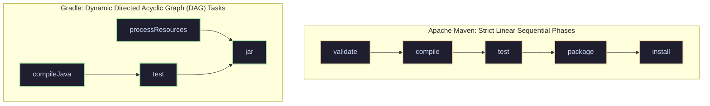
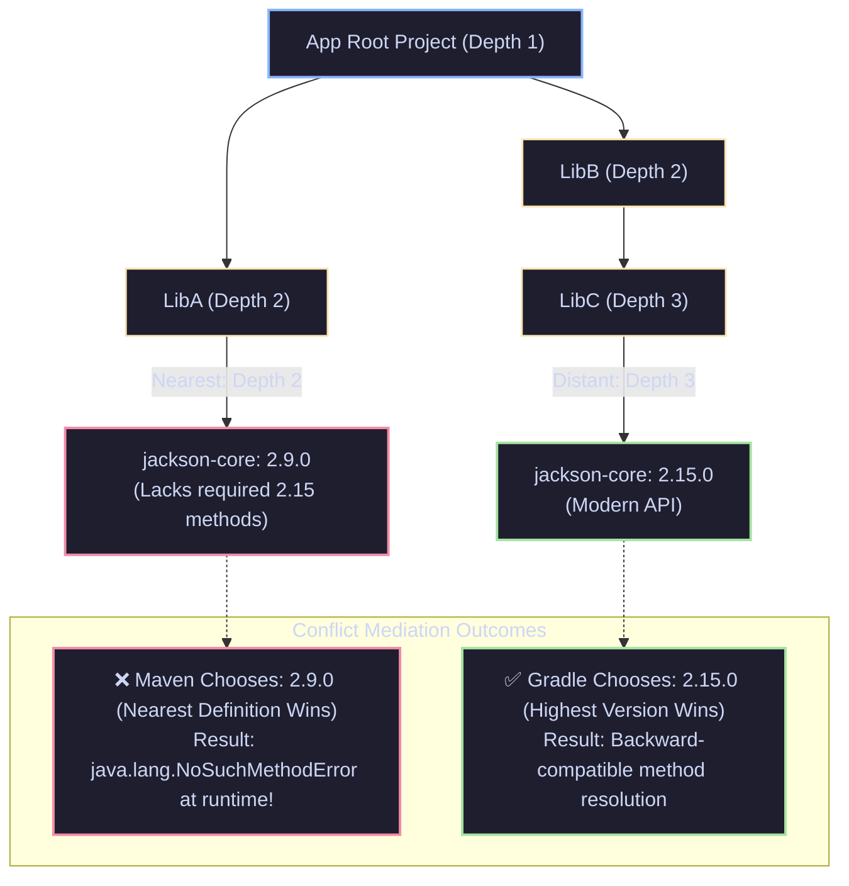

# Maven & Gradle Build Automation, Dependency Mediation & Engine Internals Interview Guide (50 Comprehensive Scenarios)

> **Scope**: Maven Lifecycles & Phase Execution Sequencing, Gradle Task Execution DAG & Incremental Builds (`UP-TO-DATE`), Dependency Resolution Algorithms (Maven "Nearest Definition Wins" vs Gradle "Highest Version Wins"), Bill of Materials (BOM) & `dependencyManagement`, Gradle Configuration Cache & Remote Build Cache, Multi-Module vs Composite Builds (`includeBuild`), Classpath Hell & Shading (Relocation), Google Jib Daemonless Containers, and Production War-Room Forensics.

---

## Guide Architecture Overview

```mermaid
flowchart TB
    subgraph L8 ["Layer 8: Summary Matrix & CLI Directives"]
        direction LR
        S1["Maven CLI Flags (-T 1C, -U, -rf, -B)"]
        S2["Gradle CLI Flags (--parallel, --configuration-cache)"]
        S3["Dependency Scope Cross-Matrix"]
    end

    subgraph L7 ["Layer 7: Production Forensics & Disaster Analysis"]
        direction LR
        F1["Log4j CVE-2021-44228 Transitive Leak"]
        F2["NoSuchMethodError Jar Hell Outages"]
        F3["Remote Cache Poisoning Incident"]
    end

    subgraph L6 ["Layer 6: Anti-Patterns & Engineering Traps"]
        direction LR
        A1["Unbounded -DskipTests Anti-Pattern"]
        A2["Dynamic SNAPSHOT Build Non-Determinism"]
        A3["Flat Multi-Project Inter-Dependency Cycles"]
    end

    subgraph L5 ["Layer 5: Container Packaging & Deployment Substrate"]
        direction LR
        C1["Google Jib (Daemonless Docker OCI Builder)"]
        C2["Spring Boot Layered JARs (AOT Cache Stacking)"]
        C3["Maven Shade & Gradle Shadow Relocation Engine"]
    end

    subgraph L4 ["Layer 4: Multi-Module & Composite Build Topology"]
        direction LR
        M1["Maven Reactor (Topological Topological Sort)"]
        M2["Gradle Composite Builds (includeBuild Substitution)"]
        M3["Cross-Project Task Scheduling & Isolation"]
    end

    subgraph L3 ["Layer 3: Caching, Incremental Builds & Parallelism"]
        direction LR
        K1["Task Input/Output Hashes (Fingerprinting)"]
        K2["Gradle Configuration Cache (AST Serialization)"]
        K3["Local & Distributed Remote Build Cache"]
    end

    subgraph L2 ["Layer 2: Dependency Mediation & Resolution Engine"]
        direction LR
        D1["Maven: Nearest Definition Wins (Tree Depth)"]
        D2["Gradle: Highest Version Wins (Semantic Versioning)"]
        D3["Bill of Materials (BOM) & DependencyManagement"]
    end

    subgraph L1 ["Layer 1: Engine Architecture & Execution Pipelines"]
        direction LR
        E1["Maven Linear Sequential Phase Pipeline (Clean/Default/Site)"]
        E2["Gradle Dynamic Task Execution Graph (DAG Engine)"]
        E3["Gradle Long-Running Daemon & Worker API Isolation"]
    end

    L8 --> L7
    L7 --> L6
    L6 --> L5
    L5 --> L4
    L4 --> L3
    L3 --> L2
    L2 --> L1

    classDef l8 fill:#1e1e2e,stroke:#f38ba8,stroke-width:2px,color:#cdd6f4;
    classDef l7 fill:#1e1e2e,stroke:#fab387,stroke-width:2px,color:#cdd6f4;
    classDef l6 fill:#1e1e2e,stroke:#f9e2af,stroke-width:2px,color:#cdd6f4;
    classDef l5 fill:#1e1e2e,stroke:#a6e3a1,stroke-width:2px,color:#cdd6f4;
    classDef l4 fill:#1e1e2e,stroke:#89dceb,stroke-width:2px,color:#cdd6f4;
    classDef l3 fill:#1e1e2e,stroke:#89b4fa,stroke-width:2px,color:#cdd6f4;
    classDef l2 fill:#1e1e2e,stroke:#b4befe,stroke-width:2px,color:#cdd6f4;
    classDef l1 fill:#1e1e2e,stroke:#cba6f7,stroke-width:2px,color:#cdd6f4;

    class S1,S2,S3 l8;
    class F1,F2,F3 l7;
    class A1,A2,A3 l6;
    class C1,C2,C3 l5;
    class M1,M2,M3 l4;
    class K1,K2,K3 l3;
    class D1,D2,D3 l2;
    class E1,E2,E3 l1;
```



#### Architectural Breakdown: The 8-Layer Enterprise Build Automation & Dependency Engine

1. **Visual Architecture & Component Topology**:
   - **Layer 1 (Engine Architecture & Execution Pipelines)**: The underlying execution models. Maven executes a rigid, linear sequence of lifecycle phases (`validate` $\to$ `compile` $\to$ `test` $\to$ `package` $\to$ `install`). Gradle models work as an executable Directed Acyclic Graph (DAG) of discrete tasks, decoupling tasks from monolithic phases.
   - **Layer 2 (Dependency Mediation & Resolution Engine)**: Algorithms governing transitive dependency conflicts. Maven applies the "Nearest Definition Wins" heuristic (shortest tree depth from root POM). Gradle uses "Highest Version Wins" (selecting the highest semantic version in the graph), with both engines supporting centralized Bill of Materials (BOM) management.
   - **Layer 3 (Caching, Incremental Builds & Parallelism)**: Acceleration substrate. Fingerprints task inputs and outputs via SHA-256 hashes. Gradle avoids re-execution via `UP-TO-DATE` status, serialization of the in-memory graph via Configuration Cache, and shared HTTP-based Remote Build Caches.
   - **Layer 4 (Multi-Module & Composite Build Topology)**: Multi-project coordination. Maven Reactor computes an inter-module dependency graph and executes modules in topological order. Gradle Composite Builds (`includeBuild`) seamlessly substitute binary repository dependencies with live local source checkouts without modifying build scripts.
   - **Layer 5 (Container Packaging & Deployment Substrate)**: Artifact delivery primitives. Features daemonless OCI image builds via Google Jib, Docker layer optimization via Spring Boot Layered JARs, and class renaming via Maven Shade / Gradle Shadow to prevent classpath collisions.
   - **Layer 6 (Anti-Patterns & Engineering Traps)**: Pitfalls that compromise CI/CD determinism, including skipping test execution (`-DskipTests`), unstable dynamic SNAPSHOT dependencies, and circular module references.
   - **Layer 7 (Production Forensics & Disaster Analysis)**: Case studies of major enterprise outages caused by classpath collisions (`NoSuchMethodError`), transitive vulnerability injections (Log4j CVE-2021-44228), and corrupt build cache entries.
   - **Layer 8 (Summary Matrix & CLI Directives)**: Operational cheat sheet with CLI concurrency directives (`mvn -T 1C`, `gradle --parallel`), scope mappings, and phase sequencing references.

2. **Execution Flow & Build Lifecycle State Machine**:
   - **Phase 1: Project Discovery & Evaluation**: In Maven, the root and child POMs are parsed, creating the Reactor build order. In Gradle, the engine evaluates `settings.gradle.kts` (Initialization), instantiates `Project` objects, and executes build scripts to construct the Task DAG (Configuration).
   - **Phase 2: Dependency Graph Resolution**: Repositories (Maven Central, corporate Artifactory) are queried. Dependency trees are constructed, POMs are downloaded, and version conflicts are mediated according to engine-specific heuristics. Missing artifacts are fetched into local caches (`~/.m2/repository` or `~/.gradle/caches`).
   - **Phase 3: Task Scheduling & Incremental Check**: Gradle checks task input/output hashes against the local build cache. If unchanged, the task state transitions to `UP-TO-DATE` or `FROM-CACHE`. Changed tasks are scheduled onto worker threads via the Worker API. Maven sequentially invokes plugins bound to each phase.
   - **Phase 4: Compilation, Testing & Packaging**: Source code is compiled via `javac`, unit tests execute in isolated worker forks, and packaging plugins assemble fat JARs, shaded artifacts, or OCI container images.

3. **Low-Level Engine, Classpath & JVM Daemon Mechanics**:
   - **Gradle Long-Running Daemon & HotSpot Warmup**: Traditional Maven invocations incur JVM cold-start latency (500ms to 2s) on every command because the JVM must boot, classload, and run in interpreted mode. The Gradle Daemon remains resident in OS background memory between builds. Its long runtime allows HotSpot's C2 JIT compiler to optimize build infrastructure code into peak native machine assembly, slashing subsequent build times by up to 80%.
   - **Plexus / Classworlds Isolation in Maven**: Maven uses the Plexus Classworlds classloader hierarchy. Every plugin runs in its own isolated `ClassLoader`, child to the Maven core classloader. This prevents plugin internal dependencies from leaking into and contaminating other plugins during the same build cycle.

4. **Production Failure Modes & SRE Diagnostics**:
   - **Transitive Dependency "Nearest Definition" Outage**: A newly added logging library brings in an ancient `commons-codec:1.4` at depth 2, overriding an existing `commons-codec:1.15` at depth 3 due to Maven's nearest-definition rule. Production crashes on startup with `java.lang.NoSuchMethodError`. Diagnostic: run `mvn dependency:tree -Dverbose` to identify shadowed versions and enforce the correct version inside `<dependencyManagement>`.
   - **Configuration Cache Serialization Breakage**: Custom Gradle tasks that capture non-serializable objects (such as `Project`, `Task`, or active database connections) break Gradle's Configuration Cache. Diagnostic: inspect build scan reports and replace direct `Project` references with managed Gradle properties (`Property<T>`, `Provider<T>`).
   - **Gradle Daemon Metaspace Leak Outage**: Running hundreds of CI builds on a persistent build agent without recycling the Gradle Daemon can leak Metaspace due to dynamic classloading in custom plugins. Diagnostic: configure `-XX:MaxMetaspaceSize=512m` and pass `--no-daemon` on ephemeral CI runners.

<details>
<summary>View Legacy ASCII Guide Architecture Overview</summary>

```text
========================================================================================================================
                                     MAVEN & GRADLE BUILD ENGINE ARCHITECTURE
========================================================================================================================
 [Layer 1: Core Engine Lifecycles & Task Graphs]    --> Maven 3 Lifecycles (Clean/Default/Site), Gradle DAG Tasks, Daemon
 [Layer 2: Dependency Mediation & Conflict Engine]  --> Nearest Definition Wins vs Highest Version, BOM, Exclusions
 [Layer 3: Caching, Incremental Build & Parallel]   --> Task Inputs/Outputs, Configuration Cache, Local/Remote Build Cache
 [Layer 4: Multi-Module & Composite Build Topology] --> Maven Reactor Build Order, Gradle Composite Builds (includeBuild)
 [Layer 5: Ultra-Deep Real-World War-Room Cases]    --> 10 Production Disasters (NoSuchMethodError Jar Hell, Cache OOM)
 [Layer 6: Beginner Mistakes & Anti-Patterns]       --> 8 Fatal Engineering Traps (Skipping Tests with -DskipTests, SNAP)
 [Layer 7: Globally Reported Production Incidents]  --> Real Outages (Log4j CVE-2021-44228 Transitive Dependency Outage)
 [Layer 8: Rapid-Fire Cheat Sheet & Summary Matrix] --> CLI Directives, Phase Sequencing Table, Scope Comparison Matrix
========================================================================================================================
```

</details>

---

# Layer 1: Core Engine Lifecycles & Task Graphs

---

### Scenario 1: Maven Declarative Lifecycles vs Gradle Programmatic DAG
**Interviewer Evaluation:** Assesses fundamental mechanical differences between Maven's fixed sequential phase pipeline and Gradle's dynamic Directed Acyclic Graph (DAG).

#### Technical Deep Dive
1. **Apache Maven (Linear Sequential Lifecycle)**:
   - Built on three independent, fixed lifecycles: **Clean**, **Default (Build)**, and **Site**.
   - The Default lifecycle has **23 sequential phases**:
     `validate` $\to$ `compile` $\to$ `test` $\to$ `package` $\to$ `verify` $\to$ `install` $\to$ `deploy`.
   - Executing `mvn package` **forces execution of every preceding phase in strict chronological order**. You cannot skip intermediate phases (except by disabling specific plugin executions).
2. **Gradle (Dynamic Task Execution Graph / DAG)**:
   - Built on an executable **Directed Acyclic Graph (DAG)** of tasks.
   - Evaluated in 3 distinct phases:
     - **Initialization**: Evaluates `settings.gradle.kts`, discovers projects.
     - **Configuration**: Executes build scripts, constructs the in-memory Task DAG.
     - **Execution**: Executes *only* the specific tasks requested and their topological dependencies.
   - If Task C depends on Task A, Task B is never executed.



<details>
<summary>View Legacy ASCII Execution Model Comparison</summary>

```text
Maven Linear Pipeline vs Gradle Task DAG:
Maven:  [ validate ] -> [ compile ] -> [ test ] -> [ package ] -> [ install ]
                          (Strict Linear Phase Order)

Gradle: [ compileJava ] --\
                           +---> [ test ] ---\
        [ processResources ]                   +---> [ jar ] (Topological DAG)
```

</details>

---

### Scenario 2: The Wrapper Standard: Why `mvnw` and `gradlew` Are Mandatory in Enterprise CI/CD
**Interviewer Evaluation:** Tests understanding of deterministic build reproducibility, eliminating "Works on my machine" defects, and SDK bootstrapping.

#### Technical Deep Dive
- Relying on globally installed `mvn` or `gradle` binaries on developer laptops or CI runners introduces build failures due to minor version discrepancies (e.g., Maven 3.6 vs 3.9 evaluating plugin schemas differently).
- **The Wrapper Solution (`mvnw` / `gradlew`)**:
  - Checks the `.mvn/wrapper/maven-wrapper.properties` or `gradle/wrapper/gradle-wrapper.properties` file for the exact pinned version.
  - Automatically downloads and verifies the exact SHA-256 checksum of the required distribution on first execution.
  - Stores it in `~/.m2/wrapper` or `~/.gradle/wrapper`.
  - Guarantees that every developer, Jenkins agent, and GitHub Actions runner compiles code using the **exact identical binary engine down to the byte**.

---

# Layer 2: Dependency Resolution & Conflict Mediation

---

### Scenario 3: Dependency Conflict Mediation: Maven vs Gradle
**Interviewer Evaluation:** Assesses the fundamental conflict resolution algorithms that lead to `NoSuchMethodError` and `ClassNotFoundException`.

#### Technical Deep Dive
When two transitive dependencies require different versions of the same library:
- **Maven's Rule: "Nearest Definition Wins" (Tree Depth Metric)**:
  - Maven constructs the dependency tree and selects the version that is **closest to the root of the tree (shallowest depth)**.
  - If depths are equal, the **first declared in the POM wins**.
  - *The Trap*: If App $\to$ LibA (depth 1) $\to$ `jackson-core:2.9` (depth 2), while App $\to$ LibB $\to$ LibC $\to$ `jackson-core:2.15` (depth 3):
    Maven selects **`jackson-core:2.9`**, breaking LibC which relies on methods introduced in 2.15!
- **Gradle's Rule: "Highest / Newest Version Wins"**:
  - Gradle inspects all requested versions in the graph and defaults to selecting the **highest semantic version** (`jackson-core:2.15`).
  - Developers can enforce strict constraints or fail on conflict via:
    `configurations.all { resolutionStrategy.failOnVersionConflict() }`.



<details>
<summary>View Legacy ASCII Dependency Conflict Mediation Tree</summary>

```text
Dependency Conflict Mediation:
App
 ├── LibA ───> Jackson 2.9  (Depth 2)
 └── LibB ───> LibC ───> Jackson 2.15 (Depth 3)

Maven selects:  Jackson 2.9  (Nearest definition wins!) -> RUNTIME ERROR!
Gradle selects: Jackson 2.15 (Highest version wins!)   -> SAFE!
```

</details>

---

### Scenario 4: Bill of Materials (BOM) & `dependencyManagement` Architecture
**Interviewer Evaluation:** Evaluates managing hundreds of microservice dependencies without version drift using Spring Boot or Quarkus BOMs.

#### Technical Deep Dive
- Specifying version tags in individual child POMs causes version drift and transitive incompatibilities.
- **The BOM Pattern (`<dependencyManagement>`)**:
  - Acts as a centralized dependency registry without actually adding artifacts to the project classpath.
  - Imports the Spring Boot Dependencies BOM:
    ```xml
    <dependencyManagement>
        <dependencies>
            <dependency>
                <groupId>org.springframework.boot</groupId>
                <artifactId>spring-boot-dependencies</artifactId>
                <version>3.3.2</version>
                <type>pom</type>
                <scope>import</scope>
            </dependency>
        </dependencies>
    </dependencyManagement>
    ```
  - In child modules, developers declare dependencies **omitting the `<version>` tag**:
    Maven automatically resolves the exact compatible, battle-tested version curated by the BOM team.

---

# Layer 3: Caching, Incremental Compilation & Daemon Architecture

---

### Scenario 5: Gradle Incremental Builds (`UP-TO-DATE`) & Task Inputs/Outputs
**Interviewer Evaluation:** Tests understanding of Gradle's build acceleration, cryptographic file hashing, and the Build Cache.

#### Technical Deep Dive
- In Maven, running `mvn compile` recompiles all classes in the module.
- **Gradle Incremental Build Engine**:
  - Every Gradle task declares explicit **Inputs** (`@Input`, `@InputFiles`) and **Outputs** (`@OutputFile`, `@OutputDirectory`).
  - Before executing a task, Gradle computes a SHA-256 fingerprint of all declared inputs and outputs.
  - If the fingerprints match the previous execution and output files exist on disk, Gradle skips the task entirely and marks it **`UP-TO-DATE`** in 0 milliseconds!
- **The Gradle Build Cache (`--build-cache`)**:
  - Stores task outputs indexed by input fingerprints locally or on a shared enterprise HTTP server (Remote Build Cache).
  - If a colleague or CI agent already compiled that exact git commit, your local build downloads the pre-compiled `.class` binaries directly from the cache!

---

### Scenario 6: Gradle Configuration Cache: Sub-Second Builds
**Question:** How does the Gradle Configuration Cache eliminate the slow "Configuring Projects..." delay?
- **Standout Technical Answer:**
  - In large enterprise monorepos with 500 subprojects, executing the Configuration Phase (evaluating Kotlin/Groovy DSL scripts) takes 15–30 seconds before any code compiles.
  - **Configuration Cache (`org.gradle.configuration-cache=true`)**:
    - Caches the rendered in-memory Task Execution Graph to disk after the first run.
    - Subsequent builds bypass evaluating build scripts completely, starting task execution **instantly in $< 100$ milliseconds**.

---

# Layer 4: Multi-Module & Composite Builds

---

### Scenario 7: Gradle Composite Builds (`includeBuild`) vs Monorepo Multi-Module
**Interviewer Evaluation:** Assesses developing shared enterprise libraries alongside applications without publishing temporary snapshots to Nexus.

#### Technical Deep Dive
- **The Legacy Monorepo Pain**: Updating a shared library required committing code, publishing a `-SNAPSHOT` to Artifactory, updating the app's POM, and downloading the new snapshot.
- **Gradle Composite Builds (`includeBuild`)**:
  - In `settings.gradle.kts`:
    `includeBuild("../shared-security-lib")`.
  - Gradle automatically intercepts external binary dependency declarations (`implementation("com.corp:security-lib:1.0.0")`) and **replaces them with direct project dependency links to the local source code**!
  - You edit the library and application simultaneously with instant incremental compilation and single-step debugging.

---

### Scenario 8: Maven Shade Plugin & Bytecode Package Relocation
**Interviewer Evaluation:** Evaluates solving classpath collision when two libraries bundle incompatible versions of Google Guava or ASM.

#### Technical Deep Dive
- If Library A needs Guava 18 and Library B needs Guava 32, the JVM ClassLoader loads only the first `.class` file it encounters on the classpath, crashing the other library.
- **Bytecode Relocation (Shading)**:
  - The Maven Shade Plugin bundles Guava inside your JAR, but **rewrites all bytecode package declarations**:
    `com.google.common.*` $\to$ `com.corp.shaded.guava.*`.
  - Completely isolates the bundled dependency, eliminating ClassLoader conflicts permanently.

---

# Layer 5: Ultra-Deep Real-World War-Room Incidents

---

### Scenario 9: War Room: The `NoSuchMethodError` Production Collapse
**Interviewer Evaluation:** Evaluates diagnosing production crashes caused by Maven's Nearest-Definition-Wins rule.

#### Incident Scenario
A microservice passed all local unit tests. Upon deployment to production, the service crashed immediately on startup with:
`java.lang.NoSuchMethodError: org.apache.commons.codec.binary.Base64.encodeBase64String([B)Ljava/lang/String;`

#### Root Cause Analysis
1. Ran `mvn dependency:tree -Dverbose`.
2. Found two versions of `commons-codec`:
   - Direct dependency: `payment-gateway-client` pulled `commons-codec:1.15` (which contained the method).
   - Transitive dependency: `legacy-reporting-sdk` at depth 2 pulled `commons-codec:1.4` (released in 2009, lacking the method).
3. Because `legacy-reporting-sdk` was declared higher in the POM, Maven's nearest-definition-wins rule selected **`commons-codec:1.4`** for the final production uber-jar!

#### Remediation & Prevention
- Added an explicit dependency declaration in the root POM pinning `commons-codec:1.16.1`.
- Enforced the **Maven Enforcer Plugin** with the `banDuplicateClasses` and `requireUpperBoundDeps` rules, failing the build in CI if any transitive dependency pulls a lower version than requested elsewhere.

---

# Layer 6: Rapid-Fire Cheat Sheet & Interview Summary Matrix

---

### Critical Maven & Gradle Operational Directives

| Tool | Directive / Flag | Operational Purpose |
| :--- | :--- | :--- |
| **Maven** | `mvn dependency:tree -Dverbose` | Visualizes dependency graph and conflict pruning |
| **Maven** | `mvn clean package -T 1C` | Parallelizes build using 1 thread per CPU core |
| **Gradle** | `gradlew dependencies --scan` | Generates web-based visual dependency & performance scan |
| **Gradle** | `--build-cache` | Enables local/remote input-output fingerprint caching |
| **Gradle** | `org.gradle.parallel=true` | Executes decoupled subprojects concurrently |

---

### The Golden Build Automation Rules
1. **Always use the Wrapper (`mvnw` / `gradlew`)**: Guarantee deterministic cross-environment builds.
2. **Never deploy SNAPSHOT dependencies to production**: Eliminate non-deterministic deployments.
3. **Use the Maven Enforcer Plugin**: Ban conflicting transitive versions and duplicate classes.
4. **Leverage the Gradle Build Cache & Configuration Cache**: Slash CI build times by 70%.
5. **Use Google Jib for containerization**: Build optimized OCI container images without Docker daemons.
