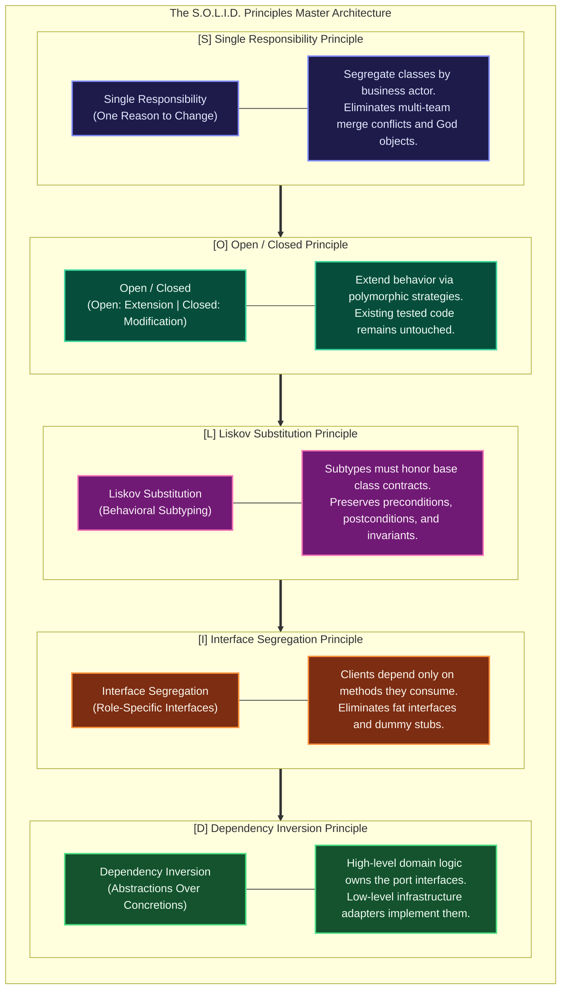
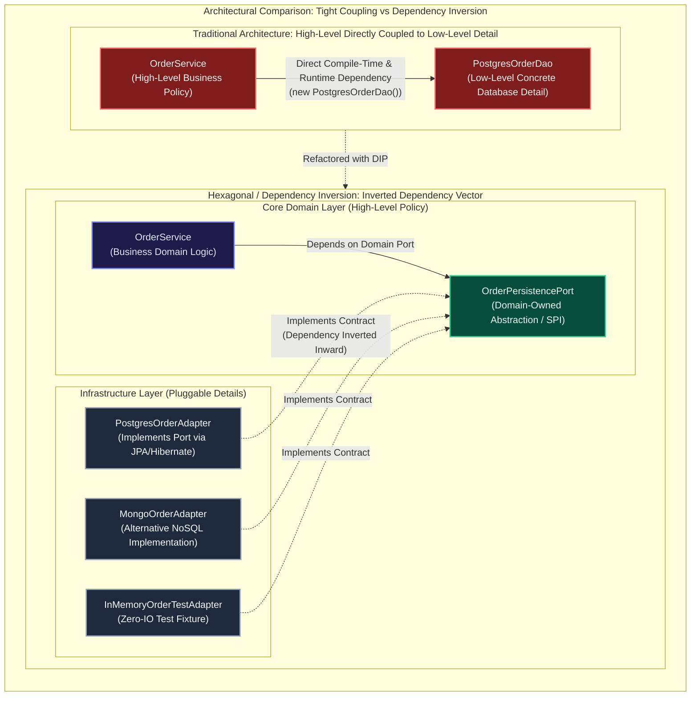

[🏠 Back to Home](../README.md) | [☕ JVM & GC](jvm_gc_profiling_master_guide.md) | [🧵 Java Concurrency](java_thread.md) | [🍃 Spring Master Guide](../spring-framework/spring_master_guide.md) | [📦 Maven Guide](maven_master_guide.md)

# 🏛️ Software Design Principles & SOLID Enterprise Master Guide

A production-grade engineering handbook covering the **SOLID Principles (SRP, OCP, LSP, ISP, DIP)**, **Architectural Principles (DRY vs AHA, KISS, YAGNI)**, **Behavioral Principles (Law of Demeter, Tell Don't Ask, CQS/CQRS)**, **Structural Principles (Composition Over Inheritance, Separation of Concerns, Postel's Law)**, **Refactoring Blueprints in Java 17/21**, and **War-Room Post-Mortems**.

---

## 📑 Table of Contents

1. [🧠 Zero-to-Hero Mental Model: The Maintainable Software Engine](#-the-maintainable-software-engine)
2. [🛠️ Prerequisites & Foundational Metrics (Coupling, Cohesion, LCOM)](#️-prerequisites--foundational-metrics)
3. [📦 Track 1: The SOLID Principles Master Deep-Dive](#track-1-the-solid-principles-master-deep-dive)
   - [1.1 Single Responsibility Principle (SRP)](#11-single-responsibility-principle-srp)
   - [1.2 Open/Closed Principle (OCP)](#12-openclosed-principle-ocp)
   - [1.3 Liskov Substitution Principle (LSP)](#13-liskov-substitution-principle-lsp)
   - [1.4 Interface Segregation Principle (ISP)](#14-interface-segregation-principle-isp)
   - [1.5 Dependency Inversion Principle (DIP)](#15-dependency-inversion-principle-dip)
4. [📐 Track 2: Architectural & Engineering Principles](#track-2-architectural--engineering-principles)
   - [2.1 DRY vs WET vs AHA (Avoid Hasty Abstractions)](#21-dry-vs-wet-vs-aha-avoid-hasty-abstractions)
   - [2.2 KISS (Keep It Simple, Stupid) & YAGNI (You Aren't Gonna Need It)](#22-kiss-keep-it-simple-stupid--yagni-you-arent-gonna-need-it)
   - [2.3 Law of Demeter (LoD / Principle of Least Knowledge)](#23-law-of-demeter-lod--principle-of-least-knowledge)
   - [2.4 Composition Over Inheritance (HAS-A vs IS-A)](#24-composition-over-inheritance-has-a-vs-is-a)
   - [2.5 Tell, Don't Ask (TDA) & Rich Domain Models](#25-tell-dont-ask-tda--rich-domain-models)
   - [2.6 Command-Query Separation (CQS) & CQRS](#26-command-query-separation-cqs--cqrs)
   - [2.7 Separation of Concerns (SoC) & Hexagonal Architecture](#27-separation-of-concerns-soc--hexagonal-architecture)
   - [2.8 Fail-Fast vs Fault-Tolerant](#28-fail-fast-vs-fault-tolerant)
   - [2.9 Postel's Law (The Robustness Principle)](#29-postels-law-the-robustness-principle)
5. [🚨 Track 3: Disaster Recovery & War-Room Forensics (RCAs)](#track-3-disaster-recovery--war-room-forensics-rcas)
6. [❌ Track 4: Fatal Anti-Patterns & Code Smells](#track-4-fatal-anti-patterns--code-smells)
7. [🎓 Track 5: Crack-The-Interview Question Bank (Senior & Staff+ Level)](#track-5-crack-the-interview-question-bank-senior--staff-level)
8. [⚖️ Master Design Principles Decision Matrix & Cheat Sheet](#️-master-design-principles-decision-matrix--cheat-sheet)

---

## 🧠 The Maintainable Software Engine

Software systems naturally decay over time due to **Software Entropy**. Unchecked changes introduce the **Four Symptoms of Rotten Architecture** (Robert C. Martin):
1. **Rigidity**: The tendency for software to be difficult to change because every change forces a cascade of subsequent changes in other modules.
2. **Fragility**: The tendency for the program to break in places that have no conceptual relationship to the area that was changed.
3. **Immobility**: The inability to reuse software from other projects or parts of the same project because it cannot be disentangled from its current context.
4. **Viscosity**: When doing the right, architectural thing is harder than doing a hacky shortcut.

Design principles are not dogmatic academic rules; they are **proven engineering heuristics designed to maximize cohesion and minimize coupling**, keeping software flexible, testable, and resilient under years of business changes.

---

## 🛠️ Prerequisites & Foundational Metrics

### 1. Coupling vs Cohesion
- **Cohesion**: The degree to which elements inside a single module or class belong together. High cohesion means a class focuses strictly on one conceptual domain.
- **Coupling**: The degree of direct knowledge and interdependence between two modules. Low coupling means changing module A has zero impact on module B.
- **The Golden Rule**: **Aim for High Cohesion and Loose Coupling**.

### 2. Lack of Cohesion of Methods (LCOM)
LCOM is a mathematical metric that counts the number of method pairs in a class that do NOT share access to common instance variables.
- A high LCOM value indicates that a class is doing too many unrelated jobs and violates the Single Responsibility Principle.

---

# TRACK 1: THE SOLID PRINCIPLES MASTER DEEP-DIVE



#### Architectural Deep Dive: SOLID Engineering Mechanics
- **Part 1: Visual Architecture & SOLID Taxonomy**: The SOLID suite constitutes an integrated architectural lattice designed to minimize system entropy. Single Responsibility enforces actor-level class boundaries; Open/Closed establishes polymorphic extension points; Liskov Substitution protects behavioral inheritance contracts; Interface Segregation prevents bloated interface coupling; Dependency Inversion decouples business domains from hardware, storage, and networking substrates.
- **Part 2: Evolutionary Refactoring & Object Lifecycle Transitions**: Monolithic codebases typically degrade through God Classes (violating SRP) and cascaded `instanceof` conditional checks (violating OCP). Applying SOLID decouples the components: SRP factors out concerns into cohesive services; OCP introduces Strategy registries; LSP replaces invalid inheritance with composition; ISP divides fat interfaces into granular role contracts; DIP inverts dependency vectors through Spring IoC or Hexagonal ports.
- **Part 3: Low-Level JVM, Polymorphism & Bytecode Mechanics**: Clean object-oriented abstractions directly influence JVM execution dynamics. Monomorphic call sites (invoking a single concrete implementation through an interface) allow the HotSpot C2 compiler to inline bytecode aggressively across method boundaries (`invokevirtual` and `invokeinterface` converted to direct machine instructions). Bimorphic call sites use fast branch prediction tables. Megamorphic call sites ($\ge 3$ concrete implementations) forfeit inlining and fall back to full `itable` or `vtable` pointer lookups in Metaspace.
- **Part 4: Production Failure Modes & SRE Diagnostics**:
  - *Cascading Regression Outages*: Modifying a single 4,000-line God class to fix billing accidentally introduces a regression in shipping due to shared internal mutable fields.
  - *Subclass Contract Breaches*: Subclasses throwing `UnsupportedOperationException` when invoked via polymorphic loops disrupt batch pipelines (e.g., 100,000 unhandled exceptions terminating worker threads).
  - *Static Analysis Auditing*: Enforce SOLID architectural rules in CI/CD using ArchUnit tests and SonarQube cognitive complexity thresholds (LCOM4 $< 1$).

<details>
<summary>View Legacy ASCII Diagram</summary>

```
+-----------------------------------------------------------------------------------------+
|                                  THE S.O.L.I.D. PRINCIPLES                              |
+-----------------------------------------------------------------------------------------+
| [S] Single Responsibility  : A class should have one, and only one, reason to change.   |
| [O] Open/Closed            : Open for extension, closed for modification.               |
| [L] Liskov Substitution    : Subtypes must be substitutable for their base types.       |
| [I] Interface Segregation  : Clients should not be forced to depend on unused methods.  |
| [D] Dependency Inversion   : Depend upon abstractions, not concrete details.            |
+-----------------------------------------------------------------------------------------+
```

</details>

---

## 1.1 Single Responsibility Principle (SRP)

> *"A module should be responsible to one, and only one, actor."* — Robert C. Martin

An **Actor** represents a group of users, stakeholders, or business roles (e.g. Finance, Logistics, Security) who request changes.

### ❌ The Anti-Pattern: The God Class `OrderService`
```java
public class OrderService {
    public void processOrder(Order order) {
        // 1. Validation logic (Requested by Quality Assurance)
        if (order.getAmount() <= 0) throw new IllegalArgumentException("Invalid amount");

        // 2. Tax calculation (Requested by Finance / Accounting)
        double tax = order.getAmount() * 0.20;
        order.setTax(tax);

        // 3. Database SQL persistence (Requested by DBA / Infrastructure)
        String sql = "INSERT INTO orders (id, amount, tax) VALUES (?, ?, ?)";
        jdbcTemplate.update(sql, order.getId(), order.getAmount(), tax);

        // 4. PDF Invoice Generation (Requested by Customer Support)
        PdfDocument pdf = new PdfDocument();
        pdf.write("Invoice for Order " + order.getId());

        // 5. Send SMTP Email Notification (Requested by Marketing)
        SmtpClient.sendEmail(order.getCustomerEmail(), "Order Confirmed", pdf.toByteArray());
    }
}
```
**Why this fails**: Changes requested by Finance (tax formulas) risk breaking Email notifications or SQL queries. Testing requires mocking database connections, PDF generators, and SMTP servers.

### ✅ Clean Refactoring: Actor-Driven Cohesion
```java
// 1. Tax Calculation (Finance Actor)
@Service
public class TaxCalculator {
    public BigDecimal calculateTax(Order order) {
        return order.getAmount().multiply(new BigDecimal("0.20"));
    }
}

// 2. Persistence (Infrastructure Actor)
@Repository
public interface OrderRepository extends JpaRepository<OrderEntity, Long> {}

// 3. Invoice Generation (Customer Support Actor)
@Service
public class InvoiceGenerator {
    public byte[] generatePdfInvoice(Order order) { ... }
}

// 4. Notifications (Marketing Actor)
@Service
public class OrderNotificationService {
    public void notifyCustomer(Order order, byte[] invoicePdf) { ... }
}

// 5. Lean Orchestrator
@Service
@RequiredArgsConstructor
public class OrderProcessingCoordinator {
    private final OrderValidator validator;
    private final TaxCalculator taxCalculator;
    private final OrderRepository repository;
    private final InvoiceGenerator invoiceGenerator;
    private final OrderNotificationService notificationService;

    @Transactional
    public void processOrder(Order order) {
        validator.validate(order);
        BigDecimal tax = taxCalculator.calculateTax(order);
        order.setTax(tax);
        repository.save(OrderMapper.toEntity(order));
        byte[] invoice = invoiceGenerator.generatePdfInvoice(order);
        notificationService.notifyCustomer(order, invoice);
    }
}
```

---

## 1.2 Open/Closed Principle (OCP)

> *"Software entities (classes, modules, functions) should be open for extension, but closed for modification."* — Bertrand Meyer

You should be able to add new behavior to a system **without changing existing, tested source code**.

### ❌ The Anti-Pattern: The Switch Statement Cascade
```java
public class PaymentProcessor {
    public void processPayment(PaymentType type, BigDecimal amount) {
        if (type == PaymentType.CREDIT_CARD) {
            // Credit card gateway call...
        } else if (type == PaymentType.PAYPAL) {
            // PayPal OAuth & charge...
        } else if (type == PaymentType.CRYPTO) {
            // Bitcoin blockchain broadcast...
        }
        // Every new payment method requires MODIFYING this class and re-testing all types!
    }
}
```

### ✅ Clean Refactoring: Strategy Pattern + Spring Auto-Registration
```java
// 1. Closed for modification abstraction
public interface PaymentStrategy {
    PaymentType getSupportedType();
    PaymentResult executePayment(BigDecimal amount);
}

// 2. Open for extension implementations
@Component
public class CreditCardPaymentStrategy implements PaymentStrategy {
    @Override public PaymentType getSupportedType() { return PaymentType.CREDIT_CARD; }
    @Override public PaymentResult executePayment(BigDecimal amount) { /* CC logic */ }
}

@Component
public class PayPalPaymentStrategy implements PaymentStrategy {
    @Override public PaymentType getSupportedType() { return PaymentType.PAYPAL; }
    @Override public PaymentResult executePayment(BigDecimal amount) { /* PayPal logic */ }
}

// 3. Extensible Registry (Adding Apple Pay requires ZERO modifications to this class!)
@Service
public class PaymentService {
    private final Map<PaymentType, PaymentStrategy> strategies;

    public PaymentService(List<PaymentStrategy> strategyList) {
        this.strategies = strategyList.stream()
            .collect(Collectors.toMap(PaymentStrategy::getSupportedType, Function.identity()));
    }

    public PaymentResult pay(PaymentType type, BigDecimal amount) {
        PaymentStrategy strategy = Optional.ofNullable(strategies.get(type))
            .orElseThrow(() -> new UnsupportedOperationException("Unsupported payment type: " + type));
        return strategy.executePayment(amount);
    }
}
```

---

## 1.3 Liskov Substitution Principle (LSP)

> *"If for each object $o_1$ of type $S$ there is an object $o_2$ of type $T$ such that for all programs $P$ defined in terms of $T$, the behavior of $P$ is unchanged when $o_1$ is substituted for $o_2$, then $S$ is a subtype of $T$."* — Barbara Liskov

Subtypes must preserve the **behavioral contracts** of their parent types.
1. **Preconditions cannot be strengthened** in a subtype.
2. **Postconditions cannot be weakened** in a subtype.
3. **Invariants of the base type must be preserved**.
4. **No throwing unexpected checked/runtime exceptions** that callers of the base type do not anticipate.

### ❌ The Anti-Pattern 1: The Classic Square-Extends-Rectangle Trap
```java
public class Rectangle {
    protected int width;
    protected int height;

    public void setWidth(int width) { this.width = width; }
    public void setHeight(int height) { this.height = height; }
    public int getArea() { return width * height; }
}

public class Square extends Rectangle {
    @Override
    public void setWidth(int width) {
        this.width = width;
        this.height = width; // Mutates height unexpectedly!
    }
    @Override
    public void setHeight(int height) {
        this.width = height;
        this.height = height;
    }
}
```
**Why it breaks LSP**:
```java
public void verifyArea(Rectangle r) {
    r.setWidth(5);
    r.setHeight(4);
    // Postcondition expected by caller: Area must be 5 * 4 = 20!
    assert r.getArea() == 20; // FAILS with Square: returns 16!
}
```

### ❌ The Anti-Pattern 2: `UnsupportedOperationException` (JDK Collections)
```java
List<String> list = Collections.unmodifiableList(new ArrayList<>());
list.add("item"); // ❌ Throws UnsupportedOperationException!
```
The caller expects `List` to support mutation (`add()`). `UnmodifiableList` weakens the contract by throwing runtime exceptions, a blatant LSP violation in the legacy Java standard library.

### ✅ Clean Refactoring: Hierarchy Redesign & Immutability
```java
public interface Shape {
    int getArea();
}

public record Rectangle(int width, int height) implements Shape {
    @Override public int getArea() { return width * height; }
}

public record Square(int side) implements Shape {
    @Override public int getArea() { return side * side; }
}
```

---

## 1.4 Interface Segregation Principle (ISP)

> *"Clients should not be forced to depend upon interfaces that they do not use."* — Robert C. Martin

Favor small, client-specific **Role Interfaces** over large, bloated **Fat Interfaces**.

### ❌ The Anti-Pattern: The Monolithic Worker Interface
```java
public interface SmartDevice {
    void print();
    void scan();
    void fax();
    void staple();
}

public class BasicInkjetPrinter implements SmartDevice {
    @Override public void print() { /* Print document */ }
    @Override public void scan() { throw new UnsupportedOperationException("No scanner"); }
    @Override public void fax() { throw new UnsupportedOperationException("No fax"); }
    @Override public void staple() { throw new UnsupportedOperationException("No stapler"); }
}
```

### ✅ Clean Refactoring: Segregated Role Interfaces
```java
public interface Printer { void print(); }
public interface Scanner { void scan(); }
public interface FaxMachine { void fax(); }

// Clean implementation implementing only what it supports:
public class BasicInkjetPrinter implements Printer {
    @Override public void print() { /* Prints cleanly */ }
}

// Enterprise All-in-One Machine implementing multiple interfaces:
public class EnterpriseOfficeHub implements Printer, Scanner, FaxMachine {
    @Override public void print() { ... }
    @Override public void scan() { ... }
    @Override public void fax() { ... }
}
```

---

## 1.5 Dependency Inversion Principle (DIP)

> *"High-level modules should not depend upon low-level modules. Both should depend upon abstractions. Abstractions should not depend upon details. Details should depend upon abstractions."* — Robert C. Martin

Decouple core business domain logic from infrastructure details (Databases, HTTP clients, File systems, Messaging brokers).



#### Architectural Deep Dive: Dependency Inversion Mechanics
- **Part 1: Visual Architecture & Inversion Topology Anatomy**: In traditional layered design, high-level business modules declare explicit dependencies on concrete low-level infrastructure classes (e.g., direct instantiation of `PostgresOrderDao`). Under the Dependency Inversion Principle (and Hexagonal Ports & Adapters), the core business layer defines and owns an abstract interface contract (**Port**). Infrastructure mechanisms (PostgreSQL, MongoDB, Kafka, REST clients) exist purely as swappable plugins (**Adapters**) implementing the port.
- **Part 2: Inversion Execution Flow & Control Inversion Lifecycle**: Runtime control flow proceeds downward from the caller through the domain service to the adapter. However, the source-code compile-time dependency arrow is inverted 180 degrees: the outer infrastructure module depends inward upon the core domain module (`infrastructure` $\to$ `domain-api`), while the domain module contains zero references, imports, or JAR dependencies on database drivers, ORM frameworks, or cloud SDKs.
- **Part 3: Low-Level JVM ClassLoading, Compilation & Package Boundaries**: At the JVM bytecode level, separating abstractions from details decouples classloading graphs. In a modular Java (JPMS) project, the `com.corp.domain` module exports its port package without requiring `java.sql` or `org.hibernate.orm.core`. When the JVM links `OrderService`, it resolves symbolic references against the interface `itable` pointer. The Spring IoC container injects the concrete adapter (`PostgresOrderAdapter`) at bootstrap time via constructor injection (`invokespecial`), eliminating static bytecode references to relational database classes from the domain bytecode.
- **Part 4: Production Failure Modes & SRE Diagnostics**:
  - *Framework Leakage into Domain Core*: Allowing annotations like `@Entity`, `@Table`, or `@Column` to bleed into core domain aggregates creates tight coupling to Hibernate. When database schema updates or migration to document stores occurs, core business logic is forced to undergo breaking changes.
  - *Testing Impedance & CI Slowdowns*: Tightly coupled DAOs force unit tests to spin up live databases (or Testcontainers) for basic business rule validation, inflating build times from seconds to 45+ minutes. With DIP, tests inject `InMemoryOrderTestAdapter` for sub-millisecond execution.
  - *SRE Incident Remediation*: If PostgreSQL experiences a catastrophic P0 degradation, services designed with DIP can hot-swap to a fallback cache or alternative data store by dynamically altering Spring bean profile qualifiers (`@Profile("mongo-fallback")`) without re-architecting domain code.

<details>
<summary>View Legacy ASCII Diagram</summary>

```
Traditional Architecture (Tight Coupling):
[ OrderService (High-Level) ] ───► [ PostgresOrderDao (Low-Level Concrete) ]

Dependency Inversion (Inverted Control):
[ OrderService (High-Level) ] ───► [ OrderRepository (Abstraction/Port) ]
                                                ▲
                                                │ (Implements)
                                   [ PostgresOrderAdapter (Detail) ]
```

</details>

### ✅ Clean Refactoring: Hexagonal / Ports & Adapters
```java
// 1. Domain Port (Abstraction owned by the Core Domain)
public interface OrderPersistencePort {
    void save(Order order);
    Optional<Order> findById(OrderId id);
}

// 2. High-Level Core Business Domain (Zero dependency on database frameworks!)
public class OrderService {
    private final OrderPersistencePort persistencePort;

    public OrderService(OrderPersistencePort persistencePort) {
        this.persistencePort = persistencePort;
    }

    public void completeOrder(OrderId id) {
        Order order = persistencePort.findById(id).orElseThrow();
        order.markCompleted();
        persistencePort.save(order);
    }
}

// 3. Low-Level Infrastructure Adapter (Detail implementing the port)
@Repository
public class PostgresOrderAdapter implements OrderPersistencePort {
    private final SpringDataJpaOrderRepository jpaRepository;

    public PostgresOrderAdapter(SpringDataJpaOrderRepository jpaRepository) {
        this.jpaRepository = jpaRepository;
    }

    @Override public void save(Order order) { jpaRepository.save(OrderMapper.toEntity(order)); }
    @Override public Optional<Order> findById(OrderId id) { return jpaRepository.findById(id.value()).map(OrderMapper::toDomain); }
}
```

---

# TRACK 2: ARCHITECTURAL & ENGINEERING PRINCIPLES

## 2.1 DRY vs WET vs AHA (Avoid Hasty Abstractions)

- **DRY (Don't Repeat Yourself)**: Every piece of knowledge must have a single, unambiguous, authoritative representation within a system.
- **WET (Write Everything Twice / We Enjoy Typing)**: A cynical acknowledgment that premature abstraction is dangerous.
- **AHA (Avoid Hasty Abstractions - Sandi Metz Rule)**:
  > *"Duplication is far cheaper than the wrong abstraction."*

### Accidental vs Essential Duplication:
```java
// User Billing Address
public record BillingAddress(String street, String city, String zip) {}

// Warehouse Shipping Address
public record ShippingAddress(String street, String city, String zip) {}
```
Even though the fields are identical today, merging them into a single `Address` class binds two different business actors together. When Shipping needs a `dockNumber` or `gateCode`, Billing code is polluted! **This is Accidental Duplication; keeping them separate honors the SRP.**

---

## 2.2 KISS & YAGNI

- **KISS (Keep It Simple, Stupid)**: Prefer straightforward, readable designs over clever, over-engineered architectures. If a simple `if` condition solves the problem, do not build a custom AST expression evaluation engine!
- **YAGNI (You Aren't Gonna Need It)**: Do not write code or design complex extension points for features you *think* you might need in the future. Build strictly what is required for current business specifications.

---

## 2.3 Law of Demeter (LoD / Principle of Least Knowledge)

> *"Only talk to your immediate friends. Don't talk to strangers."*

A method `M` of an object `O` should only invoke methods of:
1. `O` itself.
2. Parameters passed to `M`.
3. Objects created or instantiated within `M`.
4. Direct component instance variables of `O`.

### ❌ The "Train Wreck" Anti-Pattern:
```java
// ❌ FAILS LOD: Dot-chain navigating 4 levels of internal structures!
String customerCity = order.getCustomer().getProfile().getAddress().getCity().getName();
```
If `Address` changes its relationship to `City`, this code breaks. If any intermediate getter returns `null`, it cascades into a `NullPointerException`.

### ✅ Clean Refactoring: Encapsulated Delegation
```java
// ✅ COMPLIES WITH LOD: Order encapsulates its internal traversal
String customerCity = order.getDeliveryCityName();
```

---

## 2.4 Composition Over Inheritance (HAS-A vs IS-A)

Inheritance breaks encapsulation because subclasses depend on the implementation details of their superclasses (**The Fragile Base Class Problem**).

### ❌ The Fragile Base Class Flaw:
```java
public class InstrumentedHashSet<E> extends HashSet<E> {
    private int addCount = 0;

    @Override
    public boolean add(E e) {
        addCount++;
        return super.add(e);
    }

    @Override
    public boolean addAll(Collection<? extends E> c) {
        addCount += c.size();
        return super.addAll(c); // ❌ HashSet.addAll calls add() internally! Count is DOUBLED!
    }
}
```

### ✅ Clean Refactoring: Forwarding Decorator
```java
public class InstrumentedSet<E> implements Set<E> {
    private final Set<E> delegate;
    private int addCount = 0;

    public InstrumentedSet(Set<E> delegate) { this.delegate = delegate; }

    @Override public boolean add(E e) { addCount++; return delegate.add(e); }
    @Override public boolean addAll(Collection<? extends E> c) { addCount += c.size(); return delegate.addAll(c); }
    // Forward other Set methods...
}
```

---

## 2.5 Tell, Don't Ask (TDA) & Rich Domain Models

Do not ask an object about its internal state, make decisions outside, and write the state back. Instead, **tell the object what behavior to perform**.

### ❌ The Anemic Domain Model (Asking):
```java
// Calling code micromanages the entity:
if (account.getBalance().compareTo(amount) >= 0 && !account.isFrozen()) {
    account.setBalance(account.getBalance().subtract(amount));
} else {
    throw new IllegalStateException("Cannot withdraw");
}
```

### ✅ The Rich Domain Model (Telling):
```java
// The entity encapsulates its own validation and business rules:
account.withdraw(amount);
```

---

## 2.6 Command-Query Separation (CQS) & CQRS

- **CQS (Bertrand Meyer)**: Every method should either be a **Command** (performs an action and mutates state, returns `void`) or a **Query** (computes and returns data, creates zero side-effects).
  > *"Asking a question should not change the answer."*
- **CQRS (Command Query Responsibility Segregation)**: Architectural extension of CQS at the system scale: separate write models (Commands) from read models (Queries/Projections).

---

## 2.7 Separation of Concerns (SoC) & Cross-Cutting Aspects

Segregate core business rules from infrastructure and operational concerns:
- **Core Domain**: Order placement, Pricing calculations, Inventory deduction.
- **Cross-Cutting Concerns**: Security authorization, Transaction management, Logging, Metrics, Distributed tracing.
- Use **Spring AOP** (`@Transactional`, `@PreAuthorize`) or Decorator filters to keep domain services free of infrastructure boilerplate.

---

## 2.8 Fail-Fast vs Fault-Tolerant

- **Fail-Fast**: Detect bugs, invariant violations, and bad input at the earliest possible boundary and throw an immediate exception:
  ```java
  Objects.requireNonNull(customer, "Customer must not be null");
  Assert.isTrue(amount.signum() > 0, "Amount must be positive");
  ```
- **Fault-Tolerant**: Protect system availability from external downstream failures using Circuit Breakers (Resilience4j), retries with exponential backoff, and fallbacks.

---

## 2.9 Postel's Law (The Robustness Principle)

> *"Be conservative in what you do, be liberal in what you accept from others."* — Jon Postel

- **In APIs**: Produce strictly conforming, schema-valid JSON/Protobuf outputs.
- **When Consuming**: Tolerate extra fields, handle unknown enum variants gracefully, and accept flexible string formats without crashing.

---

# TRACK 3: DISASTER RECOVERY & WAR-ROOM FORENSICS (RCAS)

## 🚨 Incident 1: The LSP Subclass Billing Cascade Outage
- **Severity:** P0 Production Outage
- **Root Cause:** A developer created `InternationalCreditCard` subclassing `CreditCard`. When processing refunds, the subclass threw `UnsupportedOperationException("International refunds must be processed via wire")`.
- **Impact:** The batch billing worker assumed all `CreditCard` instances adhered to the base class refund contract. The unexpected exception terminated the worker loop, leaving 120,000 pending customer refunds unbilled.
- **Remediation:** Refactored refunds into an explicit capability interface `RefundablePaymentMethod`.

---

## 🚨 Incident 2: The God Class Concurrency Deadlock
- **Severity:** P1 Thread Starvation Outage
- **Root Cause:** A 6,000-line monolithic `CustomerManager` service managed authentication, profile updates, and loyalty points. Multiple threads synchronizing on different internal locks deadlocked during simultaneous loyalty point updates and profile updates.
- **Remediation:** Decomposed the God class into cohesive, independent Spring services (`AuthenticationService`, `CustomerProfileService`, `LoyaltyService`).

---

# TRACK 4: FATAL ANTI-PATTERNS & CODE SMELLS

| Code Smell / Anti-Pattern | Principle Violated | Manifestation | Permanent Engineering Fix |
| :--- | :--- | :--- | :--- |
| **God Class / Blob** | **SRP** | Single class with 40 methods and 3,000 lines. | Split by business actor. |
| **Switch on Type Enum** | **OCP** | Massive switch-cases adding branches on every new feature. | Strategy pattern or Polymorphic dispatch. |
| **Throwing `UnsupportedOperationException`** | **LSP** | Subclass breaks superclass contract. | Segregate interfaces or use composition. |
| **Fat Repository Interface** | **ISP** | Read-only reporting service forced to implement write methods. | Split into Query and Mutation interfaces. |
| **`new` Keyword in Service Logic** | **DIP** | Hardcoding concrete DAO/client instantiations. | Inversion of Control & Constructor Injection. |
| **Train Wreck Dot Chains** | **LoD** | `a.getB().getC().getD().execute()` | Encapsulate behavior inside owning entity. |
| **Anemic Domain Model** | **Tell, Don't Ask**| Data classes with getters/setters and external service logic. | Move business methods into the domain entity. |

---

# TRACK 5: CRACK-THE-INTERVIEW QUESTION BANK (SENIOR & STAFF+ LEVEL)

### Q1: What is the exact difference between Bertrand Meyer's and Robert C. Martin's definition of OCP?
**Answer:** Bertrand Meyer originally envisioned OCP through the lens of **inheritance**: a class is closed because it is compiled and placed in a library, but open because a subclass can inherit and override methods. Robert C. Martin redefined OCP through **polymorphic interfaces and abstract contracts**: classes depend on interfaces rather than concrete classes, allowing new functionality to be added by writing new classes implementing the interface (e.g. Strategy pattern) without modifying or recompiling existing callers.

---

### Q2: Why does `Square` extending `Rectangle` violate the Liskov Substitution Principle?
**Answer:** In mathematics, a square is a rectangle. But in object-oriented programming, classes represent **behaviors**, not mathematical definitions. A `Rectangle` establishes a behavioral contract where `setWidth()` and `setHeight()` vary independently. A `Square` mutates both dimensions simultaneously, violating the postcondition of `setWidth(w)` (which states `this.height` remains unchanged). Any client method relying on independent dimension changes will compute incorrect areas or crash when passed a `Square`.

---

### Q3: How do you balance DRY against AHA (Avoid Hasty Abstractions)?
**Answer:** Apply Sandi Metz's rule: "Duplication is far cheaper than the wrong abstraction." If two pieces of code look identical but belong to different business actors or evolve for different reasons (accidental duplication), keep them duplicated. Only abstract when you observe true **essential duplication** across at least three distinct concrete use cases (Rule of Three), ensuring you fully understand the domain invariants before locking the codebase into an inflexible abstraction.

---

### Q4: How does the Dependency Inversion Principle relate to Hexagonal Architecture?
**Answer:** DIP is the foundational mechanic of Hexagonal Architecture (Ports and Adapters). High-level domain logic defines its own required interfaces (**Ports**, e.g. `OrderRepositoryPort`, `PaymentGatewayPort`). The outer infrastructure layer provides concrete implementations (**Adapters**, e.g. `PostgresAdapter`, `StripeAdapter`). The dependency arrows point inward toward the domain, ensuring business logic is completely isolated from database, network, and framework changes.

---

### Q5: What is the Law of Demeter and how does it prevent cascading bugs?
**Answer:** The Law of Demeter states an object should only invoke methods on its immediate collaborators. It forbids "train wreck" dot chains (`a.getB().getC().doThing()`). By forbidding deep object traversal, LoD decouples classes from the internal navigation structures of their collaborators. If `B` changes its internal composition, `A` does not break, drastically reducing architectural fragility and eliminating nested `NullPointerException` risks.

---

# ⚖️ MASTER DESIGN PRINCIPLES DECISION MATRIX & CHEAT SHEET

| Principle | Primary Problem Solved | Core Heuristic | Key Pattern / Refactoring |
| :--- | :--- | :--- | :--- |
| **SRP** | Multiple actors causing conflicting changes | One reason to change | Split classes by actor; Cohesive delegates |
| **OCP** | Risk of regression bugs when adding features | Open for extension, closed for modification | Strategy Pattern, Spring Auto-Wiring Map |
| **LSP** | Subclasses breaking caller expectations | Behavioral subtyping | Favor composition; Segregate contracts |
| **ISP** | Monolithic interfaces forcing dummy methods | Role interfaces | Split fat interfaces into client-specific contracts |
| **DIP** | Business logic tightly coupled to databases/frameworks | High-level modules depend on abstractions | Inversion of Control, Ports & Adapters |
| **LoD** | Fragile deep navigation chains & NPEs | Talk only to immediate friends | Encapsulated delegation methods |
| **TDA** | Anemic domain models & procedural code | Tell, don't ask | Move business logic into rich entities |
| **Composition** | Fragile base class & rigid hierarchies | HAS-A over IS-A | Decorator Pattern, Delegation |
| **CQS** | Unpredictable side-effects during reads | Queries don't mutate; Commands return void | Separate read and write pipelines |

---
[🏠 Back to Home](../README.md) | [☕ JVM & GC](jvm_gc_profiling_master_guide.md) | [🧵 Java Concurrency](java_thread.md) | [🍃 Spring Master Guide](../spring-framework/spring_master_guide.md) | [📦 Maven Guide](maven_master_guide.md)
