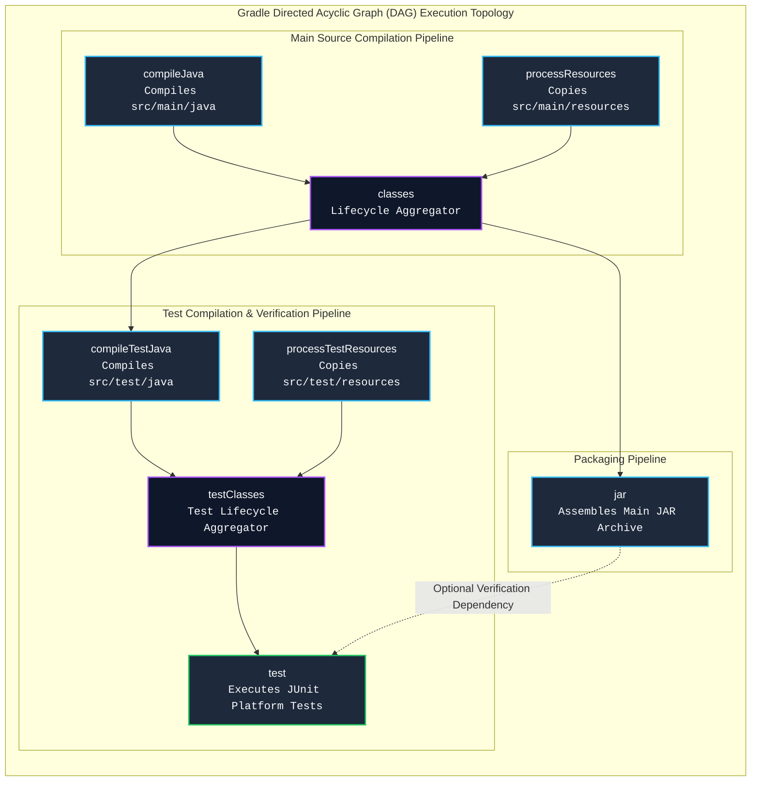
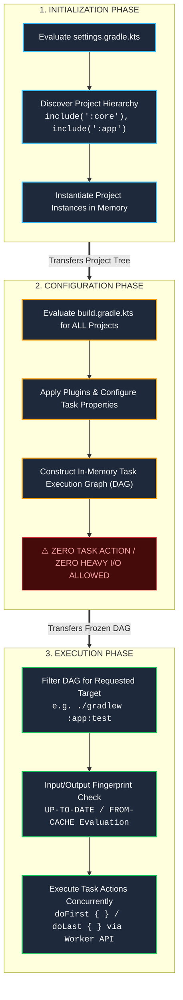
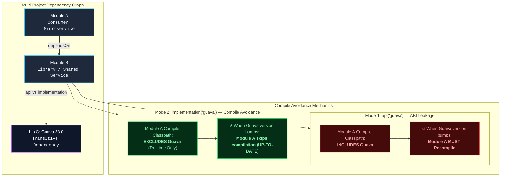
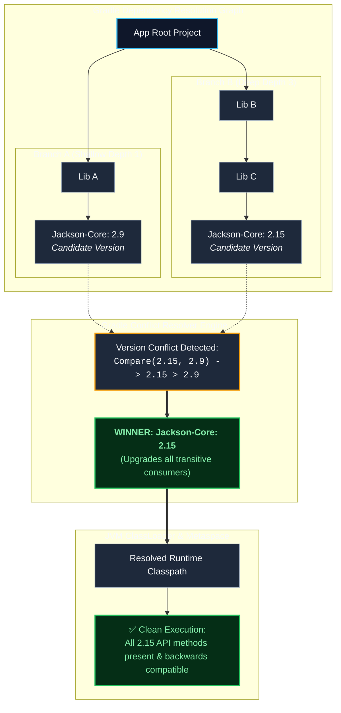
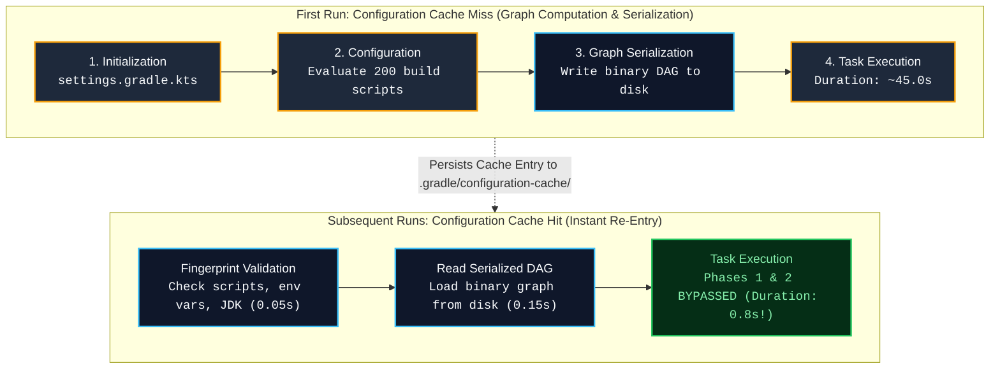
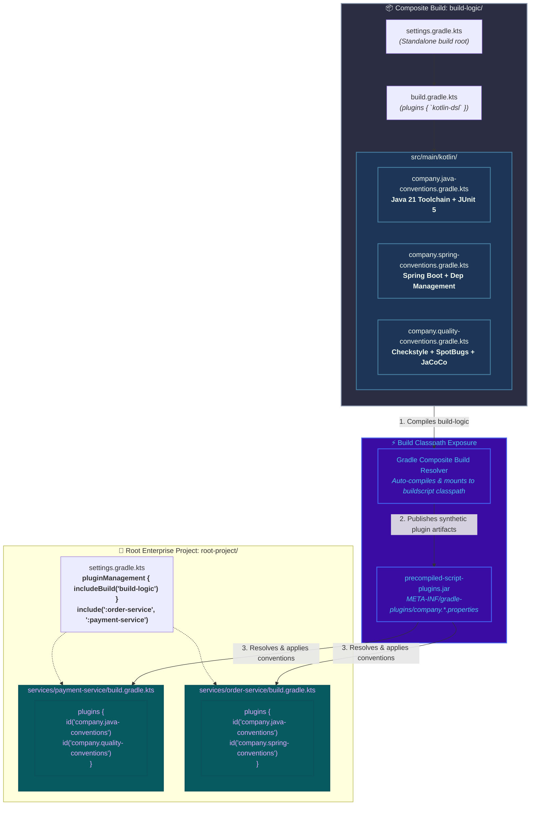
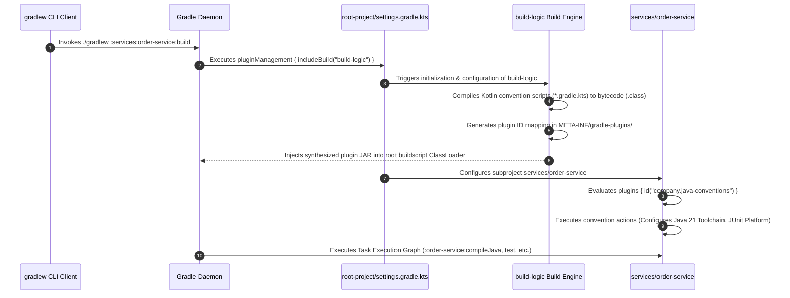

[🏠 Back to Home](../README.md) | [📦 Maven Master Guide](maven_master_guide.md) | [☕ JVM & GC](jvm_gc_profiling_master_guide.md) | [🧵 Java Concurrency](java_thread.md) | [🍃 Spring Master Guide](../spring-framework/spring_master_guide.md)

# 🐘 Gradle Build Automation Enterprise Master Guide

A production-grade engineering handbook covering the **Gradle Build Engine**, **3-Phase Lifecycle Architecture**, **Task Execution Graph (DAG)**, **Kotlin DSL (`build.gradle.kts`)**, **Incremental Builds (`UP-TO-DATE`)**, **Configuration Cache & Remote Build Cache**, **"Highest Version Wins" Dependency Resolution**, **Version Catalogs (`libs.versions.toml`)**, **Composite Builds (`includeBuild`)**, **Convention Plugins with `build-logic`**, and **War-Room Post-Mortems**.

---

## 📑 Table of Contents

1. [🧠 Zero-to-Hero Mental Model: The Smart Construction Crew](#-the-smart-construction-crew)
2. [🛠️ Prerequisites & Foundational Knowledge](#️-prerequisites--foundational-knowledge)
3. [📦 Track 1: Gradle 3-Phase Lifecycle & Task DAG Architecture](#track-1-gradle-3-phase-lifecycle--task-dag-architecture)
4. [🌳 Track 2: Dependency Resolution & Modern Version Catalogs](#track-2-dependency-resolution--modern-version-catalogs)
5. [⚡ Track 3: High-Performance Caching & Build Engine Internals](#track-3-high-performance-caching--build-engine-internals)
6. [🏛️ Track 4: Multi-Project, Composite Builds & Convention Plugins](#track-4-multi-project-composite-builds--convention-plugins)
7. [🚨 Track 5: Disaster Recovery & War-Room Forensics (RCAs)](#track-5-disaster-recovery--war-room-forensics-rcas)
8. [❌ Track 6: Beginner Anti-Patterns & Fatal Engineering Traps](#track-6-beginner-anti-patterns--fatal-engineering-traps)
9. [🎓 Track 7: Crack-The-Interview Question Bank (Senior & Staff+ Level)](#track-7-crack-the-interview-question-bank-senior--staff-level)
10. [⚖️ Master Gradle Kotlin DSL Cheat Sheet & Decision Matrix](#️-master-gradle-kotlin-dsl-cheat-sheet--decision-matrix)

---

## 🧠 The Smart Construction Crew



#### Architectural Breakdown of the Task DAG Construction

##### 1. Visual Architecture & Component Topology
- **Graph-Centric Task Model**: Unlike Maven's monolithic, linear phase state machine, Gradle models every build action as an independent, discrete **Task Node** within a Directed Acyclic Graph (DAG).
- **Explicit Edge Declarations**: Edges represent strict semantic constraints established via `dependsOn`, `mustRunAfter`, or automatic provider wiring (`tasks.named("test") { classpath = tasks.named("jar").get().archiveFile }`).
- **Lifecycle Aggregators**: Synthetic tasks (e.g. `classes`, `testClasses`) perform zero work themselves; they serve as topological synchronization barriers binding compilation and resource processing.

##### 2. Execution Flow & Lifecycle State Transitions
- **Dynamic Demand-Driven Traversal**: When an operator invokes `./gradlew :app:test`, Gradle queries the DAG engine to compute the minimal transitive subgraph required to satisfy `:app:test`. Unrelated tasks (e.g., `javadoc`, `publish`) are never scheduled or executed.
- **Topological Sorting**: Tasks are sequenced using Kahn's algorithm. Tasks with zero unfulfilled dependencies are dispatched immediately to execution workers.
- **Incremental State Outcomes**: For every task in the execution graph, Gradle assigns an outcome:
  - `EXECUTED`: Task inputs changed; actions executed.
  - `UP-TO-DATE`: Inputs and outputs match historical local snapshots; actions bypassed (0ms).
  - `FROM-CACHE`: Output fetched directly from local or remote build cache.
  - `SKIPPED`: Task explicitly disabled via predicate (`onlyIf`).

##### 3. Low-Level Kernel, JVM & Hardware Mechanics
- **Cryptographic Fingerprinting**: Gradle hashes all `@Input` properties, `@InputFiles`, and task action bytecode using fast SHA-256 / Murmur3 implementations. Hashes are recorded in local LMDB / SQLite binary stores inside `.gradle/`.
- **OS Virtual File System (VFS) Watching**: Through the Gradle Daemon, Gradle initializes native OS filesystem watchers (`ReadDirectoryChangesW` on Windows, `inotify` on Linux, `kqueue` on macOS). If no file events occur between builds, Gradle bypasses disk scanning entirely.
- **Parallel Worker API**: Tasks marked as non-conflicting execute concurrently across worker threads inside the Daemon or in forked worker JVMs communicating via IPC socket loops.

##### 4. Production Failure Modes & SRE Diagnostics
- **Hidden Input Mutation Outages**:
  - *Symptom*: Build produces stale bytecode despite code changes, or incorrectly marks a task `UP-TO-DATE`.
  - *Root Cause*: Task reads untracked system properties or local timestamps without declaring them via `@Input`.
- **SRE Triaging Commands**:
  ```bash
  # Dry-run build to print the exact calculated task DAG without executing actions
  ./gradlew test --dry-run
  
  # Trace task execution decisions and reasons why a task was not UP-TO-DATE
  ./gradlew test --info | grep -E "(UP-TO-DATE|Executing task)"
  
  # Generate full Develocity build scan profiling task graph execution bottlenecks
  ./gradlew build --scan
  ```

<details>
<summary>View Legacy ASCII Diagram</summary>

```
Gradle: The Directed Acyclic Graph (DAG)
      [ compileJava ] ──────► [ processResources ]
             │                         │
             ▼                         ▼
      [ classes ] ──────────► [ compileTestJava ]
             │                         │
             ▼                         ▼
      [ jar ] ──────────────► [ test ]
(Tasks execute strictly on-demand based on topological dependency and input/output changes.)
```

</details>

### The Core Concept:
Unlike Maven's fixed sequential lifecycle, Gradle is built on a **task-based execution graph (DAG)**. Instead of executing arbitrary intermediate phases, Gradle inspects task dependencies, calculates what has changed on disk via cryptographic hashes (**Incremental Build Engine**), and executes *only* the specific tasks required. If nothing changed, tasks execute in **0 milliseconds (`UP-TO-DATE` or `FROM-CACHE`)**.

---

## 🛠️ Prerequisites & Foundational Knowledge

### 1. The Gradle Wrapper (`gradlew`)
The Gradle Wrapper (`gradlew` on Linux/macOS, `gradlew.bat` on Windows) guarantees that every developer and CI agent uses the exact pinned distribution specified in `gradle/wrapper/gradle-wrapper.properties`:
```properties
distributionBase=GRADLE_USER_HOME
distributionPath=wrapper/dists
distributionUrl=https\://services.gradle.org/distributions/gradle-8.7-bin.zip
networkTimeout=10000
validateDistributionUrl=true
distributionSha256Sum=544c35d6bd849ae8a5ed07ec1734679d14f0744971216e5374d1841a01f4c980
```

### 2. Groovy DSL vs Kotlin DSL (`.gradle` vs `.gradle.kts`)
- **Legacy Groovy DSL (`build.gradle`)**: Dynamically typed. Prone to runtime syntax errors, poor IDE autocomplete, and ambiguous method calls.
- **Modern Kotlin DSL (`build.gradle.kts`)**: **The Industry Standard**. Statically typed, provides compile-time error checking, instant IDE refactoring, type-safe model accessors, and seamless navigation to Gradle source code.

---

# TRACK 1: GRADLE 3-PHASE LIFECYCLE & TASK DAG ARCHITECTURE

## 1.1 The 3 Distinct Build Phases

Every Gradle invocation executes through **three strictly separated phases**:



#### Architectural Breakdown of the 3-Phase Build Lifecycle

##### 1. Visual Architecture & Component Topology
- **Strict Phase Gateways**: Gradle partitions every build invocation into three non-overlapping, strictly ordered phases:
  - **Initialization**: Scans repository layout and builds the multi-project hierarchy tree.
  - **Configuration**: Evaluates build scripts to create the task graph without performing heavy task actions.
  - **Execution**: Dispatches task work units based on topological graph dependencies and fingerprint delta checks.
- **Scope Isolation**: `Settings` objects exist exclusively in Phase 1. `Project` instances are mutated during Phase 2. In Phase 3, the project model is frozen into an immutable Task Execution Graph.

##### 2. Execution Flow & Lifecycle State Transitions
- **Phase 1 Handshake**: The Gradle Daemon evaluates `settings.gradle.kts`. For every `include(":subproject")` statement, Gradle creates a corresponding `ProjectDescriptor` and instantiates a `DefaultProject` object in memory.
- **Phase 2 Graph Compilation**: Gradle traverses all projects, compiling and executing their `build.gradle.kts` scripts. Plugins configure extensions, wire dependencies, and register tasks lazily into `TaskContainer`. At the conclusion of this phase, Gradle finalizes the DAG.
- **Phase 3 Worker Dispatch**: Given the CLI target (e.g. `:app:test`), Gradle walks the DAG backward to determine required prerequisites, checks cached SHA-256 signatures, and executes only tasks that are stale or un-cached.

##### 3. Low-Level Kernel, JVM & Hardware Mechanics
- **Kotlin Script Compilation**: In Phase 1 and 2, Kotlin DSL scripts (`.gradle.kts`) are compiled dynamically to JVM bytecode by an embedded Kotlin compiler daemon. Output class files are cached in `~/.gradle/caches/<version>/kotlin-dsl/` to avoid recompilation on warm daemon invocations.
- **ClassLoader Hierarchy & Metaspace**: Gradle constructs an isolated ClassLoader tree:
  - System/Core ClassLoader $\to$ Gradle API Realm $\to$ Buildscript ClassLoader $\to$ Project Script ClassLoader.
  - In large multi-module codebases, eager script evaluation creates high Metaspace pressure.
- **Configuration Cache Serialization**: With Configuration Cache enabled, Gradle serializes the entire resolved Task Execution Graph directly to disk (`.gradle/configuration-cache/`) using binary object serialization. On subsequent builds, Phases 1 and 2 are skipped entirely (0.2s startup).

##### 4. Production Failure Modes & SRE Diagnostics
- **Configuration-Phase Bloat**:
  - *Symptom*: Running `./gradlew help` or `./gradlew tasks` takes 45 seconds to respond.
  - *Root Cause*: A build engineer placed HTTP requests, database calls, or `git rev-parse` shell commands inside the top-level script body instead of inside a task action (`doLast {}`).
- **SRE Triaging Commands**:
  ```bash
  # Profile time spent across Initialization, Configuration, and Execution phases
  ./gradlew build --profile
  
  # Fail build if any Configuration Phase code violates caching rules
  ./gradlew build --configuration-cache --configuration-cache-problems=fail
  ```

<details>
<summary>View Legacy ASCII Diagram</summary>

```
+─────────────────────────────────────────────────────────────────────────────────────────+
| 1. INITIALIZATION PHASE                                                                 |
| - Evaluates settings.gradle.kts.                                                        |
| - Discovers multi-project hierarchy (include(":core"), include(":api")).                |
| - Instantiates Project objects for all included subprojects.                            |
+─────────────────────────────────────────────────────────────────────────────────────────+
                                             │
                                             ▼
+─────────────────────────────────────────────────────────────────────────────────────────+
| 2. CONFIGURATION PHASE                                                                  |
| - Executes build.gradle.kts for ALL projects in the hierarchy.                          |
| - Configures plugins, extensions, and task properties.                                  |
| - Constructs the in-memory Task Execution Graph (DAG).                                  |
| ⚠️ ZERO CODE EXECUTION / ZERO HEAVY I/O ALLOWED HERE!                                  |
+─────────────────────────────────────────────────────────────────────────────────────────+
                                             │
                                             ▼
+─────────────────────────────────────────────────────────────────────────────────────────+
| 3. EXECUTION PHASE                                                                      |
| - Inspects the requested task (e.g. ./gradlew :app:test).                               |
| - Traverses the DAG in topological order.                                               |
| - Executes the task actions (doFirst / doLast) for tasks that are not UP-TO-DATE.       |
+─────────────────────────────────────────────────────────────────────────────────────────+
```

</details>

> [!CAUTION]
> **The Configuration-Phase Trap**: Any code placed directly inside a task definition outside a `doFirst` or `doLast` block executes during the **Configuration Phase** on *every single build*, even if you only run `./gradlew help`!
> ```kotlin
> // ❌ FATAL ANTI-PATTERN: Executes during CONFIGURATION on EVERY build!
> tasks.register("deployArtifact") {
>     println("Deploying to AWS...") // Runs even if you run ./gradlew test!
>     uploadToS3()                   // Blocks the configuration phase!
> }
>
> // ✅ PROPER: Executes strictly during the EXECUTION phase when task is invoked!
> tasks.register("deployArtifact") {
>     doLast {
>         println("Deploying to AWS...")
>         uploadToS3()
>     }
> }
> ```

---

## 1.2 Task Configuration Avoidance API
Modern Gradle strictly distinguishes between **Task Creation (`create`)** and **Task Registration (`register`)**:
- `tasks.create("myTask")`: Eagerly creates and configures the task object immediately during the Configuration Phase, wasting CPU and memory.
- `tasks.register("myTask")`: Lazily registers the task. The task configuration block is **never executed** unless the task is explicitly requested on the command line or required as a dependency by another task!

---

# TRACK 2: DEPENDENCY RESOLUTION & MODERN VERSION CATALOGS

## 2.1 `api` vs `implementation` (The Compile Avoidance Engine)

The Java Library plugin (`java-library`) introduces `api` and `implementation` configurations to strictly manage the **Application Binary Interface (ABI)** boundary and prevent cascading recompilations:



#### Architectural Breakdown of Compile Avoidance

##### 1. Visual Architecture & Component Topology
- **ABI Boundary Isolation**: The `java-library` plugin creates two primary dependency configurations:
  - **`api`**: Used for types, annotations, or base classes exposed in Module B’s public method signatures, public fields, or return types. These dependencies become part of Module B’s public ABI.
  - **`implementation`**: Used for internal implementation details (e.g. JSON parsers, internal collections). The dependency is sealed inside Module B.
- **Classpath Topology**:
  - `compileClasspath` of Module A includes Module B, but excludes Module B's `implementation` dependencies.
  - `runtimeClasspath` of Module A includes all transitive dependencies (`api` + `implementation`) required for JVM execution.

##### 2. Execution Flow & Lifecycle State Transitions
- **ABI Signature Hashing**: When Module B compiles, Gradle analyzes the resulting class files, stripping private methods, internal bytecodes, and comments to generate a pure **ABI hash**.
- **Compile Avoidance Decision**:
  - If a developer edits a method body inside Module B or bumps an `implementation` dependency version (e.g. Guava), the public ABI hash of Module B remains identical.
  - Gradle inspects the `@Input` ABI hash for Module A's `compileJava` task. Because the hash did not change, Module A's compilation is marked **`UP-TO-DATE`** and 100% skipped!

##### 3. Low-Level Kernel, JVM & Hardware Mechanics
- **Javac Parameter Truncation**: When Gradle executes `javac`, it constructs the `-classpath` CLI flag. Using `implementation` shortens the classpath argument, reducing the number of JAR descriptors the JVM must open.
- **Constant Pool & Symbol Resolution**: The Java compiler resolves symbols (identifiers, types) against the compile classpath. Truncating unused transitive libraries reduces compiler symbol table lookups and prevents `javac` from accidentally linking against un-exported classes.
- **I/O & Worker Process Reduction**: Eliminating unnecessary recompilations spares CPU cycles, avoids OS `CreateProcessW`/`fork()` overhead for `javac`, and saves gigabytes of disk write I/O across large enterprise builds.

##### 4. Production Failure Modes & SRE Diagnostics
- **Accidental ClassNotFoundException**:
  - *Symptom*: Code compiles cleanly in Module B, but downstream Module A throws `NoClassDefFoundError` at compile time when attempting to use a transitive utility class.
  - *Root Cause*: Module B declared the library as `implementation` instead of `api`, correctly preventing downstream leakage.
  - *Solution*: Module A must explicitly declare direct dependencies on the libraries it imports.
- **SRE Triaging Commands**:
  ```bash
  # Inspect exact compile classpath for a module to verify absence of leaked libraries
  ./gradlew :services:order-service:dependencies --configuration compileClasspath
  
  # Inspect runtime classpath to verify transitive availability of implementation dependencies
  ./gradlew :services:order-service:dependencies --configuration runtimeClasspath
  ```

<details>
<summary>View Legacy ASCII Diagram</summary>

```
Scenario:
[ Module A ] ──depends on──► [ Module B ] ──depends on──► [ Lib C (Guava) ]
```

</details>

| Configuration | Leakage to Downstream Classpath? | When Lib C Changes, does Module A Recompile? |
| :--- | :--- | :--- |
| **`api`** | **Yes (Transitive)**: Lib C is exposed on Module A's compile classpath. | **YES**: Module A must be recompiled. |
| **`implementation`** | **No (Internal)**: Lib C is hidden from Module A's compile classpath. | **NO**: Module A skips compilation completely (**Compile Avoidance**)! |

```kotlin
// In Module B's build.gradle.kts:
plugins {
    `java-library`
}

dependencies {
    // Hidden internally: changing Guava version never triggers recompilation of Module A!
    implementation("com.google.guava:guava:33.0.0-jre")

    // Part of Module B's public method signatures: exposed to Module A
    api("org.apache.commons:commons-lang3:3.14.0")
}
```

---

## 2.2 Dependency Resolution: "Highest Version Wins"
Unlike Maven's "Nearest Definition Wins", Gradle defaults to selecting the **highest semantic version** among all requested transitive versions:



#### Architectural Breakdown of "Highest Version Wins" Resolution

##### 1. Visual Architecture & Component Topology
- **Conflict Resolution Topology**: When multiple components in the transitive graph demand divergent versions of the same module (`group:name`), Gradle identifies them as a conflict group.
- **Semantic Version Comparator**: Instead of relying on structural tree depth (hops from the root), Gradle compares the version strings using semantic version ordering (major.minor.patch-qualifier), defaulting to the greatest version candidate (`2.15` over `2.9`).

##### 2. Execution Flow & Lifecycle State Transitions
- **Resolution Queuing**: When a task requests a configuration’s files (e.g. `configurations.runtimeClasspath.get().files`), Gradle triggers the resolution engine.
- **Automatic Graph Mutation**:
  1. Engine traverses all graph paths, collecting all requested version strings for each module.
  2. For `jackson-core`, it notes requests for `2.9` and `2.15`.
  3. Resolver selects `2.15`, replacing the `2.9` node on Branch A. Both Branch A and Branch B now point to `Jackson-Core: 2.15`.
  4. The graph is marked as resolved and cached.

##### 3. Low-Level Kernel, JVM & Hardware Mechanics
- **ClassLoader Determinism**: The JVM ClassLoader receives a unified classpath containing only a single version (`jackson-core-2.15.jar`).
- **Elimination of Classpath Shadowing**: Because only one version is selected, class files cannot collide or shadow each other across ClassLoader linear searches, preventing erratic JVM `NoSuchMethodError` caused by shallow obsolete libraries.
- **Metaspace Memory Efficiency**: Loading a single version of each library avoids duplicate class metadata allocations in JVM Metaspace, preserving native memory.

##### 4. Production Failure Modes & SRE Diagnostics
- **Breaking API Drift (Major Upgrades)**:
  - *Symptom*: A deep transitive library requests a newer major version (e.g., Spring 6 vs Spring 5, or Guava 33 vs Guava 20) with breaking removals, breaking an older sibling library.
  - *Root Cause*: Gradle's optimistic "Highest Version Wins" can introduce breaking semantic changes if libraries violate SemVer.
  - *Mitigation*: Enable `failOnVersionConflict()` to reject ambiguous upgrades, or lock versions using `strictly()`.
- **SRE Triaging Commands**:
  ```bash
  # Interrogate exactly why a specific version was selected and which paths requested it
  ./gradlew :app:dependencyInsight --dependency jackson-core --configuration runtimeClasspath
  
  # Audit full dependency tree with upgrade markers
  ./gradlew :app:dependencies --configuration runtimeClasspath
  ```

<details>
<summary>View Legacy ASCII Diagram</summary>

```
App
 ├── LibA ───► Jackson-Core: 2.9
 └── LibB ───► LibC ───► Jackson-Core: 2.15

Gradle Resolution: Selects Jackson-Core: 2.15 (Highest version wins!)
```

</details>

### Enforcing Strict Resolution:
```kotlin
configurations.all {
    resolutionStrategy {
        // Fail the build immediately if any transitive version differs
        failOnVersionConflict()
        
        // Force a specific version globally
        force("com.fasterxml.jackson.core:jackson-core:2.15.3")
    }
}
```

---

## 2.3 Rich Version Constraints: `strictly`, `require`, `prefer`, `reject`
Gradle allows declarative, multi-dimensional version constraints:

```kotlin
dependencies {
    implementation("org.apache.logging.log4j:log4j-core") {
        version {
            strictly("2.17.1") // Overrides all transitive requests; fails if cannot resolve
            prefer("2.17.0")   // Uses 2.17.0 if no higher version is demanded
            reject("2.14.0", "2.14.1", "2.15.0") // Explicitly blocks vulnerable Log4j versions!
        }
    }
}
```

---

## 2.4 Modern Version Catalogs (`libs.versions.toml`)

Gradle's standard for enterprise dependency management is the **TOML Version Catalog** (located at `gradle/libs.versions.toml`):

```toml
[versions]
springBoot = "3.2.4"
kotlin = "1.9.23"
jackson = "2.17.0"
junit = "5.10.2"

[libraries]
spring-web = { module = "org.springframework.boot:spring-boot-starter-web", version.ref = "springBoot" }
spring-data = { module = "org.springframework.boot:spring-boot-starter-data-jpa", version.ref = "springBoot" }
jackson-databind = { module = "com.fasterxml.jackson.core:jackson-databind", version.ref = "jackson" }
junit-jupiter = { module = "org.junit.jupiter:junit-jupiter", version.ref = "junit" }

[bundles]
spring-core-bundle = ["spring-web", "spring-data"]

[plugins]
spring-boot = { id = "org.springframework.boot", version.ref = "springBoot" }
kotlin-jvm = { id = "org.jetbrains.kotlin.jvm", version.ref = "kotlin" }
```

### Type-Safe Usage in `build.gradle.kts`:
```kotlin
plugins {
    alias(libs.plugins.spring.boot)
    alias(libs.plugins.kotlin.jvm)
}

dependencies {
    implementation(libs.bundles.spring.core.bundle) // Adds both web and data!
    implementation(libs.jackson.databind)
    testImplementation(libs.junit.jupiter)
}
```

---

# TRACK 3: HIGH-PERFORMANCE CACHING & BUILD ENGINE INTERNALS

## 3.1 Incremental Builds & `UP-TO-DATE` Mechanics

Every Gradle task declares its inputs and outputs:
- **Inputs**: Source files, properties, compiler flags, JVM arguments.
- **Outputs**: Generated `.class` files, JAR archives, test reports.

```kotlin
abstract class CodeGeneratorTask : DefaultTask() {

    @get:InputDirectory
    abstract val templateDir: DirectoryProperty

    @get:Input
    abstract val packageName: Property<String>

    @get:OutputDirectory
    abstract val outputDir: DirectoryProperty

    @TaskAction
    fun generate() {
        // Generates code into outputDir...
    }
}
```
Before executing a task, Gradle computes a **cryptographic SHA-256 fingerprint** of all `@Input` properties and checks the output directory. If neither has changed since the last execution, Gradle skips the task entirely and marks it **`UP-TO-DATE`** (0 milliseconds duration!).

---

## 3.2 The Configuration Cache: Eliminating Configuration Overhead

In large multi-project builds with 200 modules, evaluating build scripts during the Configuration Phase can take 30 to 60 seconds *before a single task runs*!
The **Configuration Cache** serializes the calculated Task Execution Graph to disk:



#### Architectural Breakdown of the Configuration Cache

##### 1. Visual Architecture & Component Topology
- **Cache Storage Architecture**: The Configuration Cache records the computed Task Execution Graph along with all inputs, task configurations, dependencies, and environment variables into `.gradle/configuration-cache/<hash>/`.
- **Decoupled Task Nodes**: Tasks stored in the cache must be self-contained value objects. They cannot hold live references to the mutable Gradle `Project`, `Settings`, or `Gradle` objects, enforcing strict decoupling between configuration and execution.

##### 2. Execution Flow & Lifecycle State Transitions
- **Cold Run (Cache Miss)**:
  1. Gradle executes Phase 1 (Initialization) and Phase 2 (Configuration).
  2. Gradle traverses the resulting DAG, capturing an input fingerprint of all evaluated build files, Gradle properties, and declared environment variables.
  3. Gradle serializes the task graph into an optimized binary format on disk.
  4. Phase 3 (Execution) runs.
- **Warm Run (Cache Hit)**:
  1. Gradle verifies that the recorded input fingerprint is valid (no build scripts changed, environment matches).
  2. **Phases 1 and 2 are completely bypassed!**
  3. The task graph is deserialized in ~150ms.
  4. Execution starts immediately.

##### 3. Low-Level Kernel, JVM & Hardware Mechanics
- **Binary Object Graph Serialization**: Gradle utilizes high-speed custom binary serializers (bypassing standard Java `Serializable`) to stream task fields, properties, and task action Lambdas directly into memory-mapped files (`mmap`).
- **Isolation Barrier Enforcement**: At serialization time, any task attempting to write or read a `Project` instance triggers a reflection interceptor, aborting serialization with a cache violation error.
- **CPU & Memory Savings**: Bypassing script compilation and execution eliminates thousands of short-lived ClassLoaders and garbage collection pauses, saving gigabytes of transient JVM heap.

##### 4. Production Failure Modes & SRE Diagnostics
- **Cache Invalidation Violations**:
  - *Symptom*: Build fails with `Cannot access Project from task action at execution time`.
  - *Root Cause*: Task accesses `project.version` or `project.rootDir` inside `doLast {}`.
  - *Fix*: Replace dynamic project access with Gradle `Provider<T>` or `ValueSource` APIs.
- **SRE Triaging Commands**:
  ```bash
  # Enable configuration cache and fail on any non-compliant plugins
  ./gradlew test --configuration-cache --configuration-cache-problems=fail
  
  # Inspect generated HTML report detailing all configuration cache problems
  # Location: build/reports/configuration-cache/<hash>/configuration-cache-report.html
  ```

<details>
<summary>View Legacy ASCII Diagram</summary>

```
First Run (Cache Miss):
[ Initialization ] ──► [ Configuration ] ──► [ Execution ] ──► [ Stores Graph to Disk ]

Subsequent Runs (Cache Hit):
[ Reads Graph from Disk (0.2s!) ] ──────────────────────────► [ Execution ]
(Initialization & Configuration phases are 100% BYPASSED!)
```

</details>

### Enabling Configuration Cache:
In `gradle.properties`:
```properties
org.gradle.configuration-cache=true
org.gradle.configuration-cache.problems=fail
```
*Rule: Tasks must not access mutable shared state, `Project` instances, or environment variables at execution time.*

---

## 3.3 Local & Remote Build Cache: The `FROM-CACHE` Revolution

- **Incremental Build (`UP-TO-DATE`)**: Works only on your local machine when outputs exist in `build/`.
- **Build Cache (`FROM-CACHE`)**: Stores task outputs indexed by task input SHA-256 fingerprints in a local directory (`~/.gradle/caches/build-cache-1`) or a **Shared Remote HTTP Server** (Develocity / Artifactory).

```kotlin
// In settings.gradle.kts:
buildCache {
    local {
        isEnabled = true
    }
    remote<HttpBuildCache> {
        url = uri("https://build-cache.company.com/cache/")
        isPush = System.getenv("CI") != null // CI pushes outputs; devs pull!
        credentials {
            username = System.getenv("CACHE_USER")
            password = System.getenv("CACHE_PASSWORD")
        }
    }
}
```
**The Impact**: When a developer checks out a branch that was already compiled by CI, running `./gradlew build` downloads pre-compiled `.class` and `.jar` files from the remote cache. Build time drops from 15 minutes to **12 seconds**!

---

## 3.4 The Gradle Daemon & Socket IPC Architecture

The Gradle Daemon is a long-lived background JVM process:
- Remains running between builds in user memory.
- Caches in-memory ClassLoaders, JIT compiled bytecode, and file system watches (**VFS - Virtual File System**).
- When you run `./gradlew`, a tiny CLI client connects to the daemon via local socket IPC, transmits arguments, and displays terminal output.

### Tuning Daemon in `gradle.properties`:
```properties
org.gradle.daemon=true
org.gradle.jvmargs=-Xmx4g -XX:+UseG1GC -XX:MaxMetaspaceSize=1g
org.gradle.vfs.watch=true # OS-level inotify / fsevents file system watcher
```

---

# TRACK 4: MULTI-PROJECT, COMPOSITE BUILDS & CONVENTION PLUGINS

## 4.1 Multi-Project Structure & `settings.gradle.kts`
```kotlin
// settings.gradle.kts
rootProject.name = "enterprise-platform"

include(":common:model")
include(":common:util")
include(":services:order-service")
include(":services:payment-service")
```

```kotlin
// services/order-service/build.gradle.kts
dependencies {
    implementation(project(":common:model"))
    implementation(project(":common:util"))
}
```

---

## 4.2 Composite Builds (`includeBuild`): Seamless Multi-Repo Development

Suppose you maintain both an application (`order-service`) and a shared corporate library (`company-auth-sdk`), stored in separate Git repositories.
Traditionally, testing a change in `company-auth-sdk` requires:
1. Make change in SDK.
2. Publish `2.1.0-SNAPSHOT` to local Nexus.
3. Update version in `order-service`.
4. Rebuild.

With **Composite Builds**, you link the two repos locally:
```kotlin
// In order-service/settings.gradle.kts:
rootProject.name = "order-service"

includeBuild("../company-auth-sdk") // Replaces binary dependency with live local source!
```
Gradle automatically detects that `company-auth-sdk` provides `com.company:auth-sdk`, **substitutes the binary dependency with the local source project**, and compiles it on the fly!

---

## 4.3 Enterprise Convention Plugins with `build-logic`

The modern replacement for messy `allprojects {}` and `subprojects {}` blocks is **Convention Plugins** defined in a composite `build-logic` folder:



##### 1. Visual Architecture & Composite Plugin Topology
- **Composite Build Isolation (`build-logic/`)**:
  - `build-logic` operates as a distinct, self-contained Gradle project nested inside the root directory. It contains its own `settings.gradle.kts` and build definition.
  - Isolates plugin dependencies and compilation logic from the business logic builds, ensuring that build-tool dependencies (e.g., Checkstyle, SonarQube, Kotlin compiler plugins) do not pollute application dependency graphs.
- **Precompiled Script Plugins**:
  - Files matching `*.gradle.kts` placed in `build-logic/src/main/kotlin/` are automatically converted by Gradle's `kotlin-dsl` into first-class binary plugins.
  - Gradle synthesizes plugin identifiers from the filenames (e.g., `company.java-conventions.gradle.kts` -> plugin ID `company.java-conventions`) and generates required `META-INF/gradle-plugins/<id>.properties` descriptors.
- **Declarative Consumer Application**:
  - Consumer subprojects (`order-service`, `payment-service`) apply corporate standards declaratively via `plugins { id(...) }` without runtime scripting or imperative logic.

##### 2. Execution Flow & Lifecycle State Transitions


##### 3. Low-Level JVM, ClassLoader & Build Cache Mechanics
- **Hierarchical ClassLoader Topology**:
  - Gradle uses a tree of isolated `ClassLoader` instances. The root is the *System ClassLoader*, followed by *Gradle Core API ClassLoader*.
  - When `build-logic` compiles, it produces a dedicated *Plugin ClassLoader* that is parented by the Gradle API ClassLoader.
  - Each subproject script has its own *Script ClassLoader* whose parent is the *Plugin ClassLoader*. This strict hierarchy ensures that dependencies declared within `build-logic/build.gradle.kts` are visible to plugin classes but prevents subprojects from mutating plugin internals at runtime.
- **Elimination of `subprojects {}` Evaluation Deadlocks**:
  - Legacy `subprojects { ... }` or `allprojects { ... }` blocks in root buildscripts require eager cross-project mutation: the root project injects configuration into child projects, forcing sequential evaluation and breaking Project Isolation.
  - Convention plugins leverage **Task Configuration Avoidance**: tasks configured via `tasks.withType<Test>().configureEach { ... }` are registered lazily in the engine's internal `TaskContainerInternal`, deferring instantiation until explicitly demanded by the execution DAG.

##### 4. Production Failure Modes & SRE Diagnostics
- **Plugin Descriptor Collision / Missing Plugin ID**:
  - *Symptom*: Build aborts with `Plugin [id: 'company.java-conventions'] was not found in any of the following sources`.
  - *Root Cause*: `pluginManagement { includeBuild("build-logic") }` omitted from `settings.gradle.kts`, or `build-logic` is missing `plugins { `kotlin-dsl` }` in its `build.gradle.kts`.
  - *Fix*: Ensure `includeBuild("build-logic")` is placed inside `pluginManagement {}` in `settings.gradle.kts`.
- **Composite Build Cyclic Dependency**:
  - *Symptom*: `Circular dependency between projects found when evaluating settings`.
  - *Root Cause*: `build-logic` inadvertently imports or references a subproject from the main build.
- **SRE Triaging Commands**:
  ```bash
  # Inspect composite build inclusion and build classpath dependencies
  ./gradlew buildEnvironment
  
  # Independently compile and test convention plugins in isolation
  ./gradlew :build-logic:testClasses
  
  # Run build with configuration cache to verify convention plugin compliance
  ./gradlew build --configuration-cache
  ```

<details>
<summary>View Legacy ASCII Diagram</summary>

```
root-project/
 ├── build-logic/
 │    ├── settings.gradle.kts
 │    └── src/main/kotlin/
 │         └── company.java-conventions.gradle.kts
 ├── settings.gradle.kts
 └── services/order-service/build.gradle.kts
```

</details>

```kotlin
// build-logic/src/main/kotlin/company.java-conventions.gradle.kts
plugins {
    java
    checkstyle
}

java {
    toolchain {
        languageVersion = JavaLanguageVersion.of(21)
    }
}

tasks.withType<Test> {
    useJUnitPlatform()
}
```

Any subproject simply applies:
```kotlin
plugins {
    id("company.java-conventions")
}
```

---

# TRACK 5: DISASTER RECOVERY & WAR-ROOM FORENSICS (RCAS)

## 🚨 Incident 1: CI Pipeline Frozen by Deadlocked Stale Gradle Daemons
- **Severity:** P1 CI/CD Gridlock
- **Symptom:** Jenkins build agents froze with 100% RAM utilization; new builds hung indefinitely.
- **Root Cause:** CI agents spawned a persistent Gradle Daemon per job without resource limits. Over days, 20 idle daemons occupied 40GB of RAM, triggering Linux kernel memory swapping and socket deadlocks.
- **The Permanent Fix:**
  1. On ephemeral CI containers, disable the daemon: `./gradlew build --no-daemon`.
  2. For persistent CI runners, configure automatic daemon idle timeout:
     `org.gradle.daemon.idletimeout=60000` (1 minute).

---

## 🚨 Incident 2: Corrupted Remote Build Cache Serving Broken Artifacts
- **Severity:** P0 Production Build Corruption
- **Symptom:** Production release contained non-functional code even though all PR unit tests passed.
- **Root Cause:** A custom code generation task did NOT declare its `@Input` properties (it read a hardcoded git branch via system properties). When Branch B compiled, Gradle saw the task inputs as "identical" to Branch A, pulled the cached classes from Branch A (`FROM-CACHE`), and packaged the wrong bytecode!
- **The Permanent Fix:**
  1. Annotated all task properties with `@Input`, `@InputFile`, and `@OutputDirectory`.
  2. Integrated Gradle's task validation plugin: `java-gradle-plugin` to fail builds on missing task annotations.

---

# TRACK 6: BEGINNER ANTI-PATTERNS & FATAL ENGINEERING TRAPS

### ❌ Anti-Pattern 1: Performing Network / Disk I/O in the Configuration Phase
```kotlin
// ❌ FATAL ANTI-PATTERN: Runs on EVERY gradle command (including ./gradlew tasks)
val latestToken = URL("https://auth.company.com/token").readText()
```
**Impact:** Destroys build performance and breaks Configuration Caching. Move all I/O into task actions (`doLast {}`) or ValueSource providers.

### ❌ Anti-Pattern 2: Overusing `allprojects {}` and `subprojects {}`
Causes tight coupling across modules, breaks configuration avoidance, and prevents parallel project configuration. Use **Convention Plugins** in `build-logic`.

### ❌ Anti-Pattern 3: Mutating Shared Collections Across Tasks
Tasks must be strictly isolated. Modifying shared static variables across tasks breaks Gradle Worker API parallelism and causes non-deterministic build race conditions.

---

# TRACK 7: CRACK-THE-INTERVIEW QUESTION BANK (SENIOR & STAFF+ LEVEL)

### Q1: Exactly how does Gradle's Incremental Build Engine determine if a task is `UP-TO-DATE`?
**Answer:** Gradle calculates cryptographic SHA-256 fingerprints of all task inputs (input files, properties, compiler arguments) and outputs. Before task execution, it compares the current input/output fingerprints against historical snapshots stored in `.gradle/`. If all hashes match and outputs are intact on disk, Gradle skips task action execution and marks the task `UP-TO-DATE`.

---

### Q2: What is the mechanical difference between `api` and `implementation`?
**Answer:** `api` exports the dependency to the compile classpath of consumers, meaning changes to the library will force all downstream consumers to recompile. `implementation` keeps the dependency internal; it is present on the runtime classpath but hidden from downstream compile classpaths. This enables **Compile Avoidance**, drastically reducing multi-project build times.

---

### Q3: How does the Gradle Configuration Cache achieve near-instant build initialization?
**Answer:** The Configuration Cache records the computed Task Execution Graph along with all inputs, task configurations, and dependencies, serializing the object graph to disk. On subsequent builds with unchanged build scripts and environments, Gradle completely skips the Initialization and Configuration phases, deserializes the task graph, and starts executing tasks in milliseconds.

---

### Q4: How do Composite Builds (`includeBuild`) eliminate local Maven install steps?
**Answer:** Composite Builds allow a project to transparently substitute external binary dependencies with local source projects. By declaring `includeBuild("../shared-lib")`, Gradle overrides artifact coordinates (`com.company:shared-lib`) with the output of the local project, compiling dependencies from source without publishing to `~/.m2` or a remote repository.

---

### Q5: Why is `tasks.register()` preferred over `tasks.create()`?
**Answer:** `tasks.create()` eagerly instantiates and configures the task object during the Configuration Phase, wasting CPU and heap memory. `tasks.register()` is lazy: Gradle only configures the task if it is explicitly invoked or required as a dependency by another executing task (**Task Configuration Avoidance**).

---

# ⚖️ MASTER GRADLE KOTLIN DSL CHEAT SHEET & DECISION MATRIX

| Command / Flag | Engine Operation |
| :--- | :--- |
| **`./gradlew build`** | Assembles outputs and executes all verification checks/tests. |
| **`./gradlew test --continuous`** | Continuous testing: watches files and re-executes tests on save! |
| **`./gradlew build --build-cache`** | Enables local and remote build caching (`FROM-CACHE`). |
| **`./gradlew build --configuration-cache`** | Caches the task execution graph, bypassing configuration phase. |
| **`./gradlew build --scan`** | Generates a deep web-based build performance report (Develocity). |
| **`./gradlew dependencies --configuration runtimeClasspath`** | Displays tree of dependencies for specific configuration. |
| **`./gradlew --stop`** | Terminates all running Gradle Daemon processes to release memory. |

---
[🏠 Back to Home](../README.md) | [📦 Maven Master Guide](maven_master_guide.md) | [☕ JVM & GC](jvm_gc_profiling_master_guide.md) | [🧵 Java Concurrency](java_thread.md) | [🍃 Spring Master Guide](../spring-framework/spring_master_guide.md)
