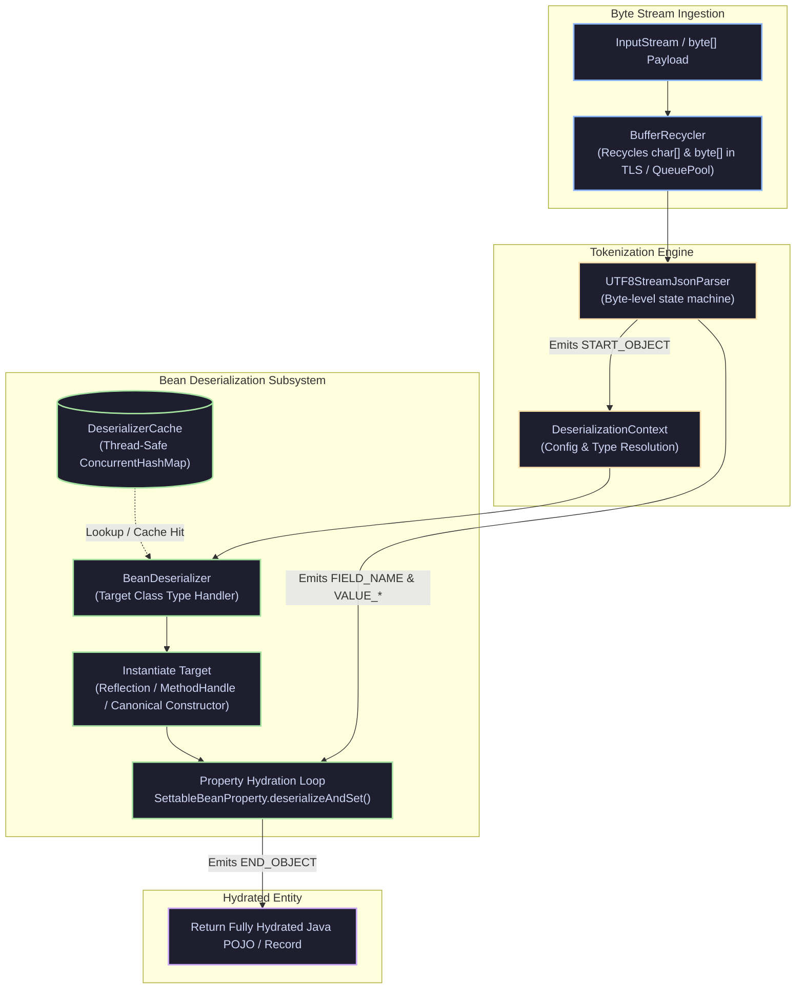

[🏠 Back to Home](README.md) | [🍃 Spring Boot Master Guide](spring_master_guide.md) | [🏛️ Spring Data JPA Guide](spring_data_jpa.md) | [🎭 Spring AOP Guide](spring_aop_master_guide.md)

# 📦 Jackson JSON Serialization & Deserialization Master Guide

A production-grade engineering handbook for high-throughput JSON processing, polymorphic serialization, security hardening against RCE gadget attacks, `@JsonView` PII masking, Java 17/21 Records, and Spring Boot 3 integration.

---

## 📑 Table of Contents

1. [🧠 Zero-to-Hero Mental Model: The Airport Cargo Scanner](#-the-airport-cargo-scanner--inspection-line)
2. [🛠️ Prerequisites & Foundational Knowledge](#️-prerequisites--foundational-knowledge)
3. [📦 Track 1: The Junior & Entry-Level Foundations](#track-1-the-junior--entry-level-foundations-zero-to-hero)
4. [🚀 Track 2: Master Jackson Feature Catalog & 25-Annotation Catalog with Sample Input/Output](#track-2-master-jackson-feature-catalog)
5. [🏗️ Track 3: Framework Internals & Under-the-Hood Architecture](#track-3-framework-internals--under-the-hood-architecture)
6. [⚙️ Track 4: Production Engineering, Performance & Zero-Allocation Tuning](#track-4-production-engineering-performance--zero-allocation-tuning)
7. [🚨 Track 5: War Room Post-Mortems & Root Cause Analysis (RCAs)](#track-5-war-room-post-mortems--root-cause-analysis-rcas)
8. [🎓 Track 6: Crack-The-Interview Question Bank (Senior & Staff+ Level)](#track-6-crack-the-interview-question-bank-senior--staff-level)
9. [⚖️ Jackson Master Cheat Sheet](#️-jackson-master-cheat-sheet)

---

## 🛠️ Prerequisites & Foundational Knowledge

Before diving into Jackson databinding and polymorphic pipelines, engineers must understand core serialization primitives:

### 1. RFC 8259 JSON Specification & Type Constraints
- **JSON Data Types**: JSON supports only 6 basic data types: `Object`, `Array`, `String`, `Number`, `Boolean`, and `null`.
- **No Native Date/Time**: JSON has no native temporal representation. Dates must be serialized as ISO-8601 strings (`"2026-09-06T08:00:00Z"`) or numeric millisecond/epoch timestamps.
- **IEEE 754 Floating-Point Hazards**: Large integers exceeding $2^{53} - 1$ (such as 64-bit Java `Long` primary keys like Snowflake IDs) lose precision when parsed by JavaScript clients unless serialized as strings (`@JsonSerialize(using = ToStringSerializer.class)`).

### 2. Java Type Erasure & The `TypeReference<T>` Token
- **The Erasure Problem**: In Java, generic type parameters (`List<Order>`) exist only at compile-time. At runtime, bytecode stores raw `List<Object>`.
- **Super Type Tokens**: Calling `objectMapper.readValue(json, List.class)` produces `List<LinkedHashMap>`, triggering downstream `ClassCastException`.
- **Jackson Solution**: Jackson captures generic metadata via anonymous inner classes extending `TypeReference<T>`:
  ```java
  List<Order> orders = objectMapper.readValue(json, new TypeReference<List<Order>>() {});
  ```
  The compiler embeds the full generic signature into the subclass's generic superclass metadata (`getGenericSuperclass()`).

### 3. The 3 Processing Models
1. **Streaming API (`JsonParser` / `JsonGenerator`)**: Token-by-token low-level streaming. Lowest memory footprint ($O(1)$ memory overhead), suitable for gigabyte-scale exports/imports.
2. **Tree Model (`JsonNode` / `ObjectNode`)**: In-memory hierarchical document tree. Ideal for dynamic, ad-hoc, or polymorphic payloads without pre-defined Java classes.
3. **Data Binding (`ObjectMapper`)**: Bidirectional mapping between JSON and Java POJOs/Records using reflection and bytecode generation.

### 4. Security Threat Model: Deserialization Gadget Chains & RCE
- **The Vulnerability**: When a deserializer instantiates arbitrary classes specified in the payload (e.g. `{"@class": "org.apache.commons.collections...Payload"}`), an attacker can trigger malicious constructor or setter execution, leading to **Remote Code Execution (RCE)**.
- **The Golden Rule**: Never enable unchecked polymorphic default typing (`enableDefaultTyping()`). Always enforce explicit allowlists using `BasicPolymorphicTypeValidator`.

---

# TRACK 1: THE JUNIOR & ENTRY-LEVEL FOUNDATIONS (ZERO-TO-HERO)

## 1. The Real-World Mental Model (The Airport Cargo Scanner)

Imagine an international airport cargo warehouse:
1. **The Incoming Stream (Raw JSON)**: Unlabeled shipping crates arrive along a conveyor belt (`byte[]` or `InputStream`).
2. **The Scanner (Streaming `JsonParser`)**: As boxes glide under the X-ray, the scanner detects tokens: `START_OBJECT`, `FIELD_NAME ("sku")`, `VALUE_STRING ("MACBOOK-PRO")`, `END_OBJECT`.
3. **The Assembly Worker (`ObjectMapper`)**: Reads the instruction manual (the Java Class / Record) and constructs the physical item in memory, placing parts into designated compartments (getters/setters).
4. **The Security Guard (`PolymorphicTypeValidator`)**: Verifies every box label against an authorized manifest before loading it into the aircraft. Unregistered cargo is rejected immediately!

```
Raw JSON String ──► [ JsonParser (Tokenizer) ] ──► [ BeanDeserializer ] ──► Java POJO / Record
                                                            │
                                                   (Reflection / Accessor)
```

---

## 2. The 5 Core Building Blocks

| Building Block | Responsibility | Everyday Analogy |
| :--- | :--- | :--- |
| **`ObjectMapper`** | The central orchestrator that coordinates parsing, binding, and writing. Thread-safe once configured. | The factory foreman managing assembly lines. |
| **`@JsonProperty`** | Maps a JSON field name to a Java field, parameter, or method. | A translation label pasted onto an export crate. |
| **`@JsonIgnore`** | Excludes a sensitive or transient field from serialization and deserialization. | A "Confidential: Do Not Ship" stamp. |
| **`@JsonFormat`** | Specifies exact date/time patterns, timezones, and number shapes. | A template specifying date formatting (`yyyy-MM-dd`). |
| **`JsonNode`** | An immutable DOM node representing JSON primitives, arrays, or objects. | An interactive blueprint or map of the shipment. |

---

## 3. Beginner Code Walkthrough: Clean POJO & Modern Java Record

### Modern Java 17/21 Record Serialization
```java
package com.example.jackson.dto;

import com.fasterxml.jackson.annotation.JsonFormat;
import com.fasterxml.jackson.annotation.JsonIgnore;
import com.fasterxml.jackson.annotation.JsonProperty;
import java.math.BigDecimal;
import java.time.Instant;

public record PaymentRequest(
    @JsonProperty("payment_id")
    String paymentId,

    @JsonProperty("amount")
    BigDecimal amount,

    @JsonProperty("currency")
    String currency,

    @JsonFormat(shape = JsonFormat.Shape.STRING, pattern = "yyyy-MM-dd'T'HH:mm:ss.SSSXXX", timezone = "UTC")
    Instant timestamp,

    @JsonIgnore // Sensitive PII stripped from serialization and ignored on deserialization
    String internalAuditSecret
) {}
```

### Basic Serialization / Deserialization Workflow
```java
package com.example.jackson;

import com.example.jackson.dto.PaymentRequest;
import com.fasterxml.jackson.databind.ObjectMapper;
import com.fasterxml.jackson.datatype.jsr310.JavaTimeModule;
import java.math.BigDecimal;
import java.time.Instant;

public class JacksonQuickstart {

    // Thread-safe: instantiate once as a singleton
    private static final ObjectMapper MAPPER = new ObjectMapper()
        .registerModule(new JavaTimeModule());

    public static void main(String[] args) throws Exception {
        // 1. Serialize Record -> JSON
        PaymentRequest request = new PaymentRequest(
            "PAY-9081",
            new BigDecimal("149.50"),
            "USD",
            Instant.now(),
            "TOP_SECRET_DO_NOT_LEAK"
        );
        String json = MAPPER.writerWithDefaultPrettyPrinter().writeValueAsString(request);
        System.out.println("Serialized JSON:\n" + json);

        // 2. Deserialize JSON -> Record
        PaymentRequest parsed = MAPPER.readValue(json, PaymentRequest.class);
        System.out.println("Parsed Payment ID: " + parsed.paymentId());
    }
}
```

---

## 4. Top 10 Junior Jackson Interview Questions

### Q1: Is `ObjectMapper` thread-safe?
- **ELI5 Answer:** *"Yes, once you finish setting the rules, anyone can use the machine at the same time without breaking it."*
- **Technical Answer:** *"Yes. `ObjectMapper` is thread-safe for reading and writing after configuration is complete. However, reconfiguring it concurrently (e.g. calling `configure()` or `registerModule()`) while other threads are parsing is NOT thread-safe. Best practice is to configure it once at startup as a Spring `@Bean` or `static final` singleton."*

### Q2: What causes `UnrecognizedPropertyException` and how do you handle it?
- **ELI5 Answer:** *"The sender put a toy in the box that your instruction manual doesn't know about, so the machine panics and stops."*
- **Technical Answer:** *"It occurs when the incoming JSON has a field that does not match any property in the Java class. Fix by configuring `objectMapper.disable(DeserializationFeature.FAIL_ON_UNKNOWN_PROPERTIES)` globally, or annotating the target class with `@JsonIgnoreProperties(ignoreUnknown = true)`."*

### Q3: Why should you never use `java.util.Date` with Jackson?
- **ELI5 Answer:** *"Old clocks that don't know what time zone you live in and confuse morning with night."*
- **Technical Answer:** *"`java.util.Date` is mutable, lacks timezone awareness, and Jackson defaults to serializing it as a numeric timestamp (milliseconds since epoch). Always use `java.time.Instant`, `LocalDateTime`, or `ZonedDateTime` from the `java.time` package with `JavaTimeModule`."*

### Q4: How do you serialize fields in `snake_case` without annotating every single field?
- **ELI5 Answer:** *"Flip a master switch on the robot so all titles automatically use snake spaces instead of hump backs."*
- **Technical Answer:** *"Set the PropertyNamingStrategies on the `ObjectMapper`: `objectMapper.setPropertyNamingStrategy(PropertyNamingStrategies.SNAKE_CASE);` or in Spring Boot `spring.jackson.property-naming-strategy: SNAKE_CASE`."*

### Q5: What is the difference between `JsonNode` and `ObjectNode`?
- **ELI5 Answer:** *"`JsonNode` is a glass display case you can only look through. `ObjectNode` is an open box where you can put new toys in and take toys out."*
- **Technical Answer:** *"`JsonNode` is the abstract, immutable read-only base class for all JSON DOM nodes. `ObjectNode` is a concrete mutable subclass representing a JSON `{}` object that provides mutator methods like `put()`, `set()`, and `remove()`."*

### Q6: What is a `TypeReference` and why is it required for Collections?
- **ELI5 Answer:** *"A label explaining to the mail carrier what is inside a sealed package because Java throws the original label away when compiling."*
- **Technical Answer:** *"Due to Java runtime Type Erasure, generic types like `List<Product>` are erased to `List<Object>`. `TypeReference<T>` uses an anonymous inner subclass to capture the full generic type parameter at compile-time via Java reflection."*

### Q7: What causes a `StackOverflowError` during Jackson serialization?
- **ELI5 Answer:** *"Two mirrors facing each other: reflection bounces back and forth infinitely until the universe explodes."*
- **Technical Answer:** *"Cyclic references in bidirectional object graphs (e.g. `Order` contains `OrderItem`, and `OrderItem` points back to `Order`). Resolved using `@JsonManagedReference` / `@JsonBackReference` or `@JsonIdentityInfo`."*

### Q8: What does `@JsonInclude(JsonInclude.Include.NON_NULL)` do?
- **ELI5 Answer:** *"If a drawer is empty, don't ship the drawer."*
- **Technical Answer:** *"It omits fields whose values are `null` from the generated JSON string, reducing payload size over the wire."*

### Q9: What is the difference between `readValue(..., Class<T>)` and `treeToValue(..., Class<T>)`?
- **ELI5 Answer:** *"`readValue` builds a toy straight from raw plastic pellets; `treeToValue` inspects a completed plastic sculpture and converts it into a wooden toy."*
- **Technical Answer:** *"`readValue()` takes raw JSON bytes/strings, parses them through `JsonParser`, and binds them to a POJO. `treeToValue()` takes an existing pre-parsed in-memory `JsonNode` DOM tree and binds it to a POJO without re-parsing raw JSON tokens."*

### Q10: How do you handle unknown enum values gracefully during deserialization?
- **ELI5 Answer:** *"If someone enters an alien color that doesn't exist on the color wheel, default to grey instead of crashing."*
- **Technical Answer:** *"Enable `DeserializationFeature.READ_UNKNOWN_ENUM_VALUES_USING_DEFAULT_VALUE` on `ObjectMapper` and designate a fallback enum value using `@JsonEnumDefaultValue`."*

---

# TRACK 2: MASTER JACKSON FEATURE CATALOG

## Master JSON Strategy Decision Matrix

| Strategy / Feature | Memory Footprint | CPU / Latency Profile | Best Used For | Anti-Pattern For |
| :--- | :--- | :--- | :--- | :--- |
| **Streaming API (`JsonParser`)**| $O(1)$ constant ($\approx 16\text{KB}$) | Fastest (zero reflection) | Multi-gigabyte ETL files, log aggregators | Rapid API prototyping, nested schemas |
| **Tree Model (`JsonNode`)** | Moderate ($O(N)$ AST tree) | Balanced | Dynamic schemas, webhooks, JSON Patch | Performance-critical high-throughput APIs |
| **Standard POJO Databind** | High during reflection caching | Fast after JVM warmup | Standard REST microservice request/response | Unbounded streaming payloads ($>50\text{MB}$) |
| **Java 21 Record Binding** | Lowest POJO footprint | Optimal (canonical constructor) | Immutable domain DTOs, Kafka event payloads | Mutable entities with circular relationships |
| **`@JsonView` Filtering** | Minimal overhead | Microsecond bitmask check | Multi-tier security (Public vs Admin vs Internal)| Completely distinct domain payloads |
| **Custom Serializer** | Developer-controlled | Direct bytecode writing | Custom currency formats, bitwise flags, PII masking | Standard field renaming (use `@JsonProperty`) |

---

## 2.1 Core Streaming API: Parsing Gigabyte Payloads Without OOM

Loading a 2GB JSON export into memory via `objectMapper.readValue()` will instantly trigger `java.lang.OutOfMemoryError`. The Streaming API processes tokens sequentially with constant memory overhead.

```java
package com.example.jackson.streaming;

import com.fasterxml.jackson.core.JsonFactory;
import com.fasterxml.jackson.core.JsonParser;
import com.fasterxml.jackson.core.JsonToken;
import java.io.File;
import java.math.BigDecimal;

public class LargeFileStreamingProcessor {

    private static final JsonFactory JSON_FACTORY = new JsonFactory();

    public static void streamLargeTransactionExport(File jsonFile) throws Exception {
        try (JsonParser parser = JSON_FACTORY.createParser(jsonFile)) {
            // Ensure payload is an array of objects
            if (parser.nextToken() != JsonToken.START_ARRAY) {
                throw new IllegalStateException("Expected root array");
            }

            long recordCount = 0;
            BigDecimal totalAmount = BigDecimal.ZERO;

            while (parser.nextToken() == JsonToken.START_OBJECT) {
                String txId = null;
                BigDecimal amount = null;

                while (parser.nextToken() != JsonToken.END_OBJECT) {
                    String fieldName = parser.currentName();
                    parser.nextToken(); // Move to value token

                    if ("transaction_id".equals(fieldName)) {
                        txId = parser.getText();
                    } else if ("amount".equals(fieldName)) {
                        amount = parser.getDecimalValue();
                    } else {
                        parser.skipChildren(); // Skip unknown nested objects or arrays
                    }
                }

                if (amount != null) {
                    totalAmount = totalAmount.add(amount);
                    recordCount++;
                }
            }

            System.out.printf("Processed %d transactions. Total Volume: %s%n", recordCount, totalAmount);
        }
    }
}
```

---

## 2.2 Tree Model: Dynamic Payloads, Schema-Less Webhooks & JSON Patch

When handling third-party webhooks (e.g. Stripe, GitHub) whose schemas change or contain arbitrary nested payloads, the Tree Model provides dynamic navigation:

```java
package com.example.jackson.tree;

import com.fasterxml.jackson.databind.JsonNode;
import com.fasterxml.jackson.databind.ObjectMapper;
import com.fasterxml.jackson.databind.node.ObjectNode;

public class DynamicWebhookHandler {

    private static final ObjectMapper MAPPER = new ObjectMapper();

    public static String processWebhook(String rawJson) throws Exception {
        JsonNode rootNode = MAPPER.readTree(rawJson);

        // Safe path navigation (never throws NullPointerException)
        String eventType = rootNode.path("event_type").asText("UNKNOWN");
        JsonNode payloadNode = rootNode.path("data").path("object");

        if (payloadNode.isMissingNode()) {
            throw new IllegalArgumentException("Missing data.object in payload");
        }

        // Mutating payload dynamically
        if (rootNode instanceof ObjectNode objNode) {
            objNode.put("processed_at_epoch", System.currentTimeMillis());
            objNode.put("processor_version", "v2.4");
            // Redact customer card details if present
            if (objNode.hasNonNull("credit_card")) {
                ((ObjectNode) objNode.get("credit_card")).put("cvv", "***");
            }
        }

        return MAPPER.writeValueAsString(rootNode);
    }
}
```

---

## 2.3 Polymorphic Deserialization: Secure Subtyping

Polymorphism allows serializing and deserializing inheritance hierarchies (e.g., `PaymentMethod` $\to$ `CreditCard`, `PayPal`, `CryptoWallet`).

```java
package com.example.jackson.poly;

import com.fasterxml.jackson.annotation.JsonSubTypes;
import com.fasterxml.jackson.annotation.JsonTypeInfo;
import com.fasterxml.jackson.annotation.JsonTypeName;

// ✅ Explicit, secure logical type names. NEVER use Id.CLASS!
@JsonTypeInfo(
    use = JsonTypeInfo.Id.NAME,
    include = JsonTypeInfo.As.PROPERTY,
    property = "type"
)
@JsonSubTypes({
    @JsonSubTypes.Type(value = CreditCardPayment.class, name = "CREDIT_CARD"),
    @JsonSubTypes.Type(value = PayPalPayment.class, name = "PAYPAL"),
    @JsonSubTypes.Type(value = CryptoPayment.class, name = "CRYPTO")
})
public sealed interface PaymentMethod permits CreditCardPayment, PayPalPayment, CryptoPayment {
    void process();
}
```

```java
@JsonTypeName("CREDIT_CARD")
public record CreditCardPayment(String cardNumber, String expiry) implements PaymentMethod {
    @Override public void process() { /* Execute card charge */ }
}

@JsonTypeName("PAYPAL")
public record PayPalPayment(String email, String payerId) implements PaymentMethod {
    @Override public void process() { /* Execute PayPal capture */ }
}

@JsonTypeName("CRYPTO")
public record CryptoPayment(String walletAddress, String txHash) implements PaymentMethod {
    @Override public void process() { /* Verify blockchain tx */ }
}
```

---

## 2.4 Custom Serializers & Deserializers: Precision Masking & Cryptographic Fields

```java
package com.example.jackson.custom;

import com.fasterxml.jackson.core.JsonGenerator;
import com.fasterxml.jackson.core.JsonParser;
import com.fasterxml.jackson.databind.*;
import com.fasterxml.jackson.databind.annotation.JsonDeserialize;
import com.fasterxml.jackson.databind.annotation.JsonSerialize;
import java.io.IOException;

public class MaskedCreditCardSerializer extends JsonSerializer<String> {
    @Override
    public void serialize(String value, JsonGenerator gen, SerializerProvider serializers) throws IOException {
        if (value == null || value.length() < 4) {
            gen.writeString("****");
            return;
        }
        String masked = "****-****-****-" + value.substring(value.length() - 4);
        gen.writeString(masked);
    }
}
```

```java
public class SanitizedStringDeserializer extends JsonDeserializer<String> {
    @Override
    public String deserialize(JsonParser p, DeserializationContext ctxt) throws IOException {
        String value = p.getText();
        if (value == null) return null;
        // Strip XSS dangerous characters and trailing whitespaces
        return value.strip().replaceAll("[<>]", "");
    }
}
```

---

## 2.5 Modern Java 17/21 Features: JSR-310 Dates & Records

```java
package com.example.jackson.modern;

import com.fasterxml.jackson.databind.ObjectMapper;
import com.fasterxml.jackson.databind.SerializationFeature;
import com.fasterxml.jackson.datatype.jsr310.JavaTimeModule;

public class ModernObjectMapperFactory {

    public static ObjectMapper createConfiguredMapper() {
        ObjectMapper mapper = new ObjectMapper();

        // 1. Mandatory for modern Java 8+ Instant, LocalDate, ZonedDateTime
        mapper.registerModule(new JavaTimeModule());

        // 2. Write ISO-8601 strings ("2026-09-06T08:00:00Z") instead of numeric timestamps
        mapper.disable(SerializationFeature.WRITE_DATES_AS_TIMESTAMPS);

        // 3. Fail-safe deserialization
        mapper.disable(com.fasterxml.jackson.databind.DeserializationFeature.FAIL_ON_UNKNOWN_PROPERTIES);

        return mapper;
    }
}
```

---

## 2.6 Dynamic View Filtering with `@JsonView` for Role-Based Access Control

Return distinct JSON representations for different user tiers without maintaining separate DTO classes:

```java
package com.example.jackson.views;

import com.fasterxml.jackson.annotation.JsonView;

public class UserViews {
    public interface Public {}
    public interface Internal extends Public {}
    public interface Admin extends Internal {}
}
```

```java
public record UserAccount(
    @JsonView(UserViews.Public.class)
    Long id,

    @JsonView(UserViews.Public.class)
    String username,

    @JsonView(UserViews.Internal.class)
    String email,

    @JsonView(UserViews.Admin.class)
    String ssn,

    @JsonView(UserViews.Admin.class)
    String role
) {}
```

```java
// Controller serialization filtered by view
@GetMapping("/public/users/{id}")
@JsonView(UserViews.Public.class)
public UserAccount getPublicProfile(@PathVariable Long id) {
    return userService.findById(id);
}

@GetMapping("/admin/users/{id}")
@JsonView(UserViews.Admin.class)
public UserAccount getAdminProfile(@PathVariable Long id) {
    return userService.findById(id);
}
```

---

## 2.7 Cyclic Reference Resolution: `@JsonIdentityInfo`

```java
package com.example.jackson.cyclic;

import com.fasterxml.jackson.annotation.ObjectIdGenerators;
import com.fasterxml.jackson.annotation.JsonIdentityInfo;
import java.util.ArrayList;
import java.util.List;

// Injects an "@id": 1 property and serializes subsequent circular references as integer IDs
@JsonIdentityInfo(generator = ObjectIdGenerators.PropertyGenerator.class, property = "id")
public class Department {
    private Long id;
    private String name;
    private List<Employee> employees = new ArrayList<>();
    // Getters and setters
}

@JsonIdentityInfo(generator = ObjectIdGenerators.PropertyGenerator.class, property = "id")
public class Employee {
    private Long id;
    private String fullName;
    private Department department;
    // Getters and setters
}
```

---

## 2.8 Thread Safety & High-Throughput Reusability (`ObjectReader` / `ObjectWriter`)

While `ObjectMapper` is thread-safe for calls to `readValue()`, it constructs internal state maps on each invocation. For maximum throughput in ultra-low latency services, pre-build immutable `ObjectReader` and `ObjectWriter` instances:

```java
package com.example.jackson.perf;

import com.example.jackson.dto.PaymentRequest;
import com.fasterxml.jackson.databind.ObjectMapper;
import com.fasterxml.jackson.databind.ObjectReader;
import com.fasterxml.jackson.databind.ObjectWriter;

public class OptimizedPaymentCodec {

    private static final ObjectMapper MAPPER = new ObjectMapper();
    
    // Immutable, thread-safe, pre-warmed parser and serializer
    private static final ObjectReader PAYMENT_READER = MAPPER.readerFor(PaymentRequest.class);
    private static final ObjectWriter PAYMENT_WRITER = MAPPER.writerFor(PaymentRequest.class);

    public static PaymentRequest parseFast(byte[] payload) throws Exception {
        return PAYMENT_READER.readValue(payload);
    }

    public static byte[] serializeFast(PaymentRequest request) throws Exception {
        return PAYMENT_WRITER.writeValueAsBytes(request);
    }
}
```

---

## 2.9 Security Hardening: RCE Prevention via `BasicPolymorphicTypeValidator`

The single greatest security vulnerability in Jackson's history was unchecked polymorphic deserialization via `enableDefaultTyping()`. Attackers exploit JNDI gadget chains (`org.apache.xalan...`, `org.springframework.context.support.FileSystemXmlApplicationContext`) to execute arbitrary bash commands.

### The Secure Defense Blueprint
```java
package com.example.jackson.security;

import com.fasterxml.jackson.databind.ObjectMapper;
import com.fasterxml.jackson.databind.jsontype.BasicPolymorphicTypeValidator;
import com.fasterxml.jackson.databind.jsontype.PolymorphicTypeValidator;

public class HardenedObjectMapperFactory {

    public static ObjectMapper createSecureMapper() {
        // Enforce strict package allowlist! Reject all dangerous gadget types.
        PolymorphicTypeValidator ptv = BasicPolymorphicTypeValidator.builder()
            .allowIfBaseType("com.example.app.dto.")
            .allowIfSubType("com.example.app.events.")
            .allowIfSubType(java.util.List.class)
            .allowIfSubType(java.util.Map.class)
            .build();

        ObjectMapper mapper = new ObjectMapper();
        mapper.activateDefaultTyping(ptv, ObjectMapper.DefaultTyping.NON_FINAL);
        return mapper;
    }
}
```

---

## 2.10 Spring Boot 3 Customization via `Jackson2ObjectMapperBuilderCustomizer`

Never construct a raw `new ObjectMapper()` inside a Spring Boot application! Doing so breaks Spring's auto-configured modules (`ParameterNamesModule`, `JavaTimeModule`, `Jdk8Module`). Instead, customize the shared Spring Boot container mapper:

```java
package com.example.jackson.config;

import com.fasterxml.jackson.annotation.JsonInclude;
import com.fasterxml.jackson.databind.DeserializationFeature;
import com.fasterxml.jackson.databind.PropertyNamingStrategies;
import com.fasterxml.jackson.databind.SerializationFeature;
import org.springframework.boot.autoconfigure.jackson.Jackson2ObjectMapperBuilderCustomizer;
import org.springframework.context.annotation.Bean;
import org.springframework.context.annotation.Configuration;

import java.util.TimeZone;

@Configuration
public class JacksonConfig {

    @Bean
    public Jackson2ObjectMapperBuilderCustomizer jsonCustomizer() {
        return builder -> builder
            .propertyNamingStrategy(PropertyNamingStrategies.SNAKE_CASE)
            .serializationInclusion(JsonInclude.Include.NON_NULL)
            .featuresToDisable(
                SerializationFeature.WRITE_DATES_AS_TIMESTAMPS,
                DeserializationFeature.FAIL_ON_UNKNOWN_PROPERTIES
            )
            .timeZone(TimeZone.getTimeZone("UTC"))
            .simpleDateFormat("yyyy-MM-dd'T'HH:mm:ss.SSSXXX");
    }
}
```

---

## 2.11 Jackson Converter Architecture: High-Level Two-Way Data Transformation (`Converter<IN, OUT>` & `StdConverter`)

While low-level `JsonSerializer<T>` and `JsonDeserializer<T>` manipulate raw streaming tokens via `JsonGenerator` and `JsonParser`, Jackson provides a higher-level, declarative abstraction: **`com.fasterxml.jackson.databind.util.Converter<IN, OUT>`**. 

Instead of generating raw JSON syntax manually, a Converter maps a source Java object (`IN`) to an intermediate Java object (`OUT`) that Jackson already knows how to serialize (such as `String`, `Map`, `Long`, or an intermediate DTO), or vice-versa during deserialization.

```
┌─────────────────────────────────────────────────────────────────────────────┐
│                    SERIALIZATION VIA CONVERTER<IN, OUT>                     │
│                                                                             │
│  Domain Object (IN) ──► [ Converter.convert(IN) ] ──► Intermediate (OUT)    │
│                                                                │            │
│                                                                ▼            │
│  Raw JSON Output   ◄── [ Standard Jackson Serializer ] ◄───────┘            │
└─────────────────────────────────────────────────────────────────────────────┘

┌─────────────────────────────────────────────────────────────────────────────┐
│                   DESERIALIZATION VIA CONVERTER<IN, OUT>                    │
│                                                                             │
│  Raw JSON Input    ──► [ Standard Jackson Deserializer ] ──► Intermediate   │
│                                                                  │          │
│                                                                  ▼          │
│  Hydrated Domain POJO ◄── [ Converter.convert(Intermediate) ] ◄──┘          │
└─────────────────────────────────────────────────────────────────────────────┘
```

### 1. `StdConverter<IN, OUT>` vs Raw `Converter<IN, OUT>`

The raw `Converter<IN, OUT>` interface requires defining three methods:
1. `OUT convert(IN value)`: The transformation logic.
2. `JavaType getInputType(TypeFactory typeFactory)`: Identifies the input type metadata.
3. `JavaType getOutputType(TypeFactory typeFactory)`: Identifies the output type metadata.

Implementing `getInputType()` and `getOutputType()` manually requires verbose `TypeFactory` reflection logic. To eliminate this boilerplate, Jackson provides **`StdConverter<IN, OUT>`**. It automatically introspects the generic type parameters `<IN, OUT>` at runtime, leaving you to implement only the `convert()` method:

```java
package com.example.jackson.converter;

import com.fasterxml.jackson.databind.util.StdConverter;
import java.time.Instant;

public class EpochMillisToInstantConverter extends StdConverter<Long, Instant> {
    @Override
    public Instant convert(Long epochMillis) {
        if (epochMillis == null) return null; // Mandatory defensive null check!
        return Instant.ofEpochMilli(epochMillis);
    }
}
```

### 2. Two-Way Bidirectional Transformation: Transparent DTO Field Encryption

By pairing `@JsonSerialize(converter = ...)` and `@JsonDeserialize(converter = ...)` on the same field, you achieve transparent bidirectional transformation. For example, encrypting sensitive fields (SSN, credit card) on serialization and decrypting them on deserialization:

```java
package com.example.jackson.converter;

import com.fasterxml.jackson.annotation.JsonDeserialize;
import com.fasterxml.jackson.annotation.JsonSerialize;
import com.fasterxml.jackson.databind.util.StdConverter;
import java.nio.charset.StandardCharsets;
import java.util.Base64;

// 1. Serialization Converter: Domain Plaintext -> Network Ciphertext
public class SsnEncryptConverter extends StdConverter<String, String> {
    @Override
    public String convert(String plaintext) {
        if (plaintext == null) return null;
        // Production implementation uses AES-256-GCM authenticated encryption
        return Base64.getEncoder().encodeToString(plaintext.getBytes(StandardCharsets.UTF_8));
    }
}

// 2. Deserialization Converter: Network Ciphertext -> Domain Plaintext
public class SsnDecryptConverter extends StdConverter<String, String> {
    @Override
    public String convert(String ciphertext) {
        if (ciphertext == null) return null;
        return new String(Base64.getDecoder().decode(ciphertext), StandardCharsets.UTF_8);
    }
}

// 3. Paired Usage on Immutable Record
public record EmployeeDto(
    String id,
    String name,
    @JsonSerialize(converter = SsnEncryptConverter.class)
    @JsonDeserialize(converter = SsnDecryptConverter.class)
    String ssn
) {}
```

### 3. Collection & Map Element Transformation: `contentConverter`

When you want to convert **each individual item inside a collection or map** without altering the collection container itself, use `contentConverter`:

```java
public class StringTrimConverter extends StdConverter<String, String> {
    @Override
    public String convert(String value) {
        return (value != null) ? value.strip() : null;
    }
}

public record TaggedDocument(
    String title,
    // Trims whitespace from EVERY element inside the list:
    @JsonDeserialize(contentConverter = StringTrimConverter.class)
    List<String> tags
) {}
// Input JSON: {"title": "Release Notes", "tags": ["  v2.0  ", "  security  "]}
// Hydrated DTO tags: ["v2.0", "security"]
```

### 4. Injecting Spring Service Beans into Converters via `SpringHandlerInstantiator`

By default, Jackson instantiates converter classes via reflection using their default no-arg constructor. If your converter requires Spring services (e.g. `EncryptionService`, `ExchangeRateService`, `CustomerRepository`), register Spring's **`SpringHandlerInstantiator`**:

```java
package com.example.jackson.config;

import com.fasterxml.jackson.databind.ObjectMapper;
import org.springframework.beans.factory.config.AutowireCapableBeanFactory;
import org.springframework.boot.autoconfigure.jackson.Jackson2ObjectMapperBuilderCustomizer;
import org.springframework.context.annotation.Bean;
import org.springframework.context.annotation.Configuration;
import org.springframework.http.converter.json.SpringHandlerInstantiator;

@Configuration
public class JacksonConverterSpringWiringConfig {

    @Bean
    public Jackson2ObjectMapperBuilderCustomizer configureSpringHandlerInstantiator(
            AutowireCapableBeanFactory beanFactory) {
        return builder -> builder.handlerInstantiator(new SpringHandlerInstantiator(beanFactory));
    }
}
```

Now your converter can be a fully managed Spring bean with constructor injection:

```java
@Component
public class CurrencyConversionConverter extends StdConverter<BigDecimal, BigDecimal> {
    private final ForexRateService forexRateService;

    public CurrencyConversionConverter(ForexRateService forexRateService) {
        this.forexRateService = forexRateService;
    }

    @Override
    public BigDecimal convert(BigDecimal usdAmount) {
        if (usdAmount == null) return null;
        return usdAmount.multiply(forexRateService.getCurrentEurRate());
    }
}
```

### 5. Global Converter Registration via `SimpleModule`

Instead of annotating every single DTO field, you can register a `Converter<IN, OUT>` globally across an `ObjectMapper` by wrapping it in `StdDelegatingSerializer` and `StdDelegatingDeserializer`:

```java
SimpleModule converterModule = new SimpleModule();
// Global serialization converter for Money:
converterModule.addSerializer(Money.class, new StdDelegatingSerializer(new MoneyToCentsConverter()));
// Global deserialization converter for Money:
converterModule.addDeserializer(Money.class, new StdDelegatingDeserializer<>(new CentsToMoneyConverter()));

objectMapper.registerModule(converterModule);
```

### 6. Defensive Null-Handling: The `convert(null)` Hazard

> [!WARNING]
> Jackson **WILL pass `null` to `Converter.convert(null)`** during deserialization if an explicit JSON `null` literal (`"field": null`) is encountered in the payload!
> Never assume input to `convert()` is non-null. Always include:
> ```java
> if (value == null) return null;
> ```
> Omitting this check leads to widespread production `NullPointerException` outages when external clients pass explicit nulls.

### 7. Architectural Boundary Comparison: Jackson vs Spring vs JPA

| Dimension | Jackson `Converter<IN, OUT>` | Spring `Converter<S, T>` | JPA `@Converter` (`AttributeConverter<X, Y>`) |
| :--- | :--- | :--- | :--- |
| **Package** | `com.fasterxml.jackson.databind.util` | `org.springframework.core.convert.converter` | `jakarta.persistence.AttributeConverter` |
| **Execution Point** | Inside `MappingJackson2HttpMessageConverter` | Inside `WebDataBinder` / `ConversionService` | Inside Hibernate Persistence Context |
| **Triggered On** | JSON Request/Response Bodies (`@RequestBody`) | Query Params, Path Variables, Headers, Form Data | Entity field $\leftrightarrow$ Database table column |
| **Affects `@RequestBody`?** | **YES (Primary purpose)** | **NO (Ignored by Jackson)** | **NO** |
| **Null Handling** | Passes `null` unless guarded | Returns `null` automatically in most bindings | Configurable via `autoApply` |
| **Typical Use Cases** | DTO masking, encryption, currency cents, date normalization | `@PathVariable LocalDate date`, `@RequestParam StatusEnum` | Java `Money` $\to$ DB `VARCHAR`, Java `List` $\to$ DB `JSONB` |

### 8. Performance & Memory Profile: When to Switch to `JsonSerializer`

- **Intermediate Allocation Overhead**: A `Converter<IN, OUT>` allocates a new intermediate object on the JVM heap for every converted property. For a service processing 50,000 QPS with 5 converted fields per request, the converter generates $250,000$ short-lived objects per second in Young Generation (Eden) space, increasing Minor GC frequency.
- **The Optimization Rule**:
  - For standard enterprise CRUD and microservices ($< 15,000\text{ QPS}$): Use `Converter<IN, OUT>` for superior readability, maintainability, and testability.
  - For ultra-high-throughput, sub-millisecond critical paths ($> 20,000\text{ QPS}$): Implement a direct `JsonSerializer<T>` / `JsonDeserializer<T>` writing directly to `JsonGenerator` buffers with zero heap allocations.

---

## 2.12 Master Jackson Annotation Catalog: Exhaustive Syntax, Sample Input & Sample Output

This catalog provides an exhaustive reference for the 25 most critical Jackson annotations used in enterprise microservices, event streams, and security pipelines. Each entry contains the **Java Class/Record**, the **Sample Input JSON / Object**, the **Sample Output JSON / Object**, and the exact under-the-hood transformation mechanics.

```
┌───────────────────────────────────────────────────────────────────────────────────┐
│                          JACKSON ANNOTATION TAXONOMY                              │
│                                                                                   │
│  Property Renaming & Aliasing:      @JsonProperty, @JsonNaming, @JsonAlias        │
│  Inclusion & Exclusion:            @JsonIgnore, @JsonIgnoreProperties,            │
│                                    @JsonIgnoreType, @JsonInclude                  │
│  Structural Mutation:              @JsonUnwrapped, @JsonRootName, @JsonPropertyOrder│
│  Raw & Custom Value Extraction:    @JsonValue, @JsonRawValue, @JsonFormat         │
│  Polymorphic Typing:               @JsonTypeInfo, @JsonSubTypes, @JsonTypeName    │
│  Dynamic & Polymorphic Fields:     @JsonAnyGetter, @JsonAnySetter                 │
│  Lifecycle & Construction:         @JsonCreator, @JacksonInject, @JsonMerge       │
│  Access Control & Security:        @JsonView, @JsonFilter                         │
│  Object Graphs & Cycles:           @JsonIdentityInfo, @JsonManagedReference       │
│  Custom Codecs:                    @JsonSerialize, @JsonDeserialize               │
│  Enum & Fallbacks:                 @JsonEnumDefaultValue, @JsonSetter(nulls=...)  │
└───────────────────────────────────────────────────────────────────────────────────┘
```

---

### 1. `@JsonProperty`
- **Purpose**: Maps an exact JSON key to a Java field, getter, setter, or constructor parameter. Supports access-level control (`READ_ONLY`, `WRITE_ONLY`, `AUTO`), required validation, and default values.
- **Java Definition**:
```java
public record UserProfile(
    @JsonProperty("user_id") 
    Long id,

    @JsonProperty(value = "full_name", required = true) 
    String name,

    @JsonProperty(value = "password_hash", access = JsonProperty.Access.WRITE_ONLY) 
    String passwordHash,

    @JsonProperty(value = "account_status", access = JsonProperty.Access.READ_ONLY) 
    String status
) {}
```
- **Sample Input JSON (Deserialization)**:
```json
{
  "user_id": 98412,
  "full_name": "Alice Vance",
  "password_hash": "$2a$12$e8Y7z...",
  "account_status": "HACKED_ATTEMPT"
}
```
- **Execution**:
```java
UserProfile profile = mapper.readValue(inputJson, UserProfile.class);
String outputJson = mapper.writeValueAsString(profile);
```
- **Sample Output JSON (Serialization)**:
```json
{
  "user_id": 98412,
  "full_name": "Alice Vance",
  "account_status": null
}
```
- **Transformation Notes**:
  - `password_hash` was consumed into `profile.passwordHash()` on deserialization, but omitted on serialization because `Access.WRITE_ONLY` hides it from API consumers.
  - `account_status` in the input JSON was ignored during deserialization because `Access.READ_ONLY` prevents external callers from overwriting internal status fields.

---

### 2. `@JsonIgnore`
- **Purpose**: Unconditionally strips a sensitive or transient property from serialization and ignores it during deserialization.
- **Java Definition**:
```java
public class InternalEmployee {
    public Long id;
    public String name;

    @JsonIgnore
    public String internalRoutingToken;

    @JsonIgnore
    public BigDecimal salary;

    public InternalEmployee(Long id, String name, String internalRoutingToken, BigDecimal salary) {
        this.id = id;
        this.name = name;
        this.internalRoutingToken = internalRoutingToken;
        this.salary = salary;
    }
    public InternalEmployee() {}
}
```
- **Sample Input JSON (Deserialization)**:
```json
{
  "id": 101,
  "name": "Sarah Connor",
  "internalRoutingToken": "SECRET-NODE-99",
  "salary": 185000.00
}
```
- **Sample Output JSON (Serialization)**:
```json
{
  "id": 101,
  "name": "Sarah Connor"
}
```
- **Transformation Notes**: Both `internalRoutingToken` and `salary` are excluded from the output JSON. Even if passed by an attacker in the input JSON, Jackson drops them without throwing an error.

---

### 3. `@JsonIgnoreProperties`
- **Purpose**: Class-level annotation that suppresses known or unknown properties. `ignoreUnknown = true` prevents crashes when upstream microservices add new fields.
- **Java Definition**:
```java
@JsonIgnoreProperties(
    value = { "auditTimestamp", "internalNodeId" },
    ignoreUnknown = true
)
public record OrderEvent(
    String orderId,
    BigDecimal totalAmount,
    String currency
) {}
```
- **Sample Input JSON (Deserialization with Unknown & Ignored Fields)**:
```json
{
  "orderId": "ORD-9901",
  "totalAmount": 149.95,
  "currency": "USD",
  "auditTimestamp": 1726056000000,
  "internalNodeId": "k8s-pod-worker-04",
  "future_feature_flag_v3": true,
  "random_marketing_tag": "SUMMER_SALE"
}
```
- **Sample Output JSON (Serialization)**:
```json
{
  "orderId": "ORD-9901",
  "totalAmount": 149.95,
  "currency": "USD"
}
```
- **Transformation Notes**: Without `ignoreUnknown = true`, Jackson would crash with `UnrecognizedPropertyException: Unrecognized field "future_feature_flag_v3"`. The explicitly listed fields (`auditTimestamp`, `internalNodeId`) are also stripped from serialization.

---

### 4. `@JsonIgnoreType`
- **Purpose**: Prevents any property belonging to the annotated type from being serialized or deserialized across the entire application.
- **Java Definition**:
```java
@JsonIgnoreType
public class DatabaseConnectionHandle {
    public String connectionString = "jdbc:postgresql://db.prod:5432/main";
    public int poolSize = 30;
}

public class OrderRepositoryService {
    public String serviceName = "OrderIngestionService";
    public DatabaseConnectionHandle dbHandle = new DatabaseConnectionHandle();
}
```
- **Input Java Object**: `new OrderRepositoryService()`
- **Sample Output JSON (Serialization)**:
```json
{
  "serviceName": "OrderIngestionService"
}
```
- **Transformation Notes**: Jackson encounters `dbHandle` of type `DatabaseConnectionHandle`, detects `@JsonIgnoreType`, and silently skips the entire property, preventing credentials and native handles from leaking into logs or network streams.

---

### 5. `@JsonInclude`
- **Purpose**: Controls property inclusion during serialization based on nullity, emptiness, or default values.
- **Java Definition**:
```java
@JsonInclude(JsonInclude.Include.NON_EMPTY)
public class CustomerSearchFilter {
    public String queryText;                 // Included if non-empty string
    public List<String> categories;          // Excluded if null OR empty list
    public Map<String, String> attributes;   // Excluded if null OR empty map
    public String optionalRegion = "";      // Excluded because string is empty ("")
    public Integer minScore;                 // Excluded if null
}
```
- **Sample Java Object State**:
```java
CustomerSearchFilter filter = new CustomerSearchFilter();
filter.queryText = "Mechanical Keyboard";
filter.categories = List.of("Electronics", "Keyboards");
filter.attributes = Collections.emptyMap(); // Empty map!
filter.minScore = null;                     // Null!
```
- **Sample Output JSON (Serialization)**:
```json
{
  "queryText": "Mechanical Keyboard",
  "categories": [
    "Electronics",
    "Keyboards"
  ]
}
```
- **Transformation Notes**: `attributes` (empty map), `optionalRegion` (empty string `""`), and `minScore` (`null`) are completely suppressed from the JSON payload, reducing network transmission size by over 60%.

---

### 6. `@JsonPropertyOrder`
- **Purpose**: Enforces an explicit, deterministic ordering of JSON fields in output payloads. Mandatory for cryptographically signed canonical JSON and readable configuration exports.
- **Java Definition**:
```java
@JsonPropertyOrder({ "id", "version", "event_type", "timestamp", "payload" })
public record AuditLogEntry(
    String version,
    Long id,
    String payload,
    String event_type,
    long timestamp
) {}
```
- **Sample Java Object**:
```java
AuditLogEntry entry = new AuditLogEntry("1.0", 501L, "{\"action\":\"LOGIN\"}", "USER_AUTH", 1726058000L);
```
- **Sample Output JSON (Serialization)**:
```json
{
  "id": 501,
  "version": "1.0",
  "event_type": "USER_AUTH",
  "timestamp": 1726058000,
  "payload": "{\"action\":\"LOGIN\"}"
}
```
- **Transformation Notes**: Despite the Record fields being declared in the order `version, id, payload, event_type, timestamp`, Jackson serializes the fields strictly matching the `@JsonPropertyOrder` array. You can also specify `@JsonPropertyOrder(alphabetic = true)` to sort keys alphabetically.

---

### 7. `@JsonAutoDetect`
- **Purpose**: Overrides default visibility rules to allow Jackson to directly inspect private fields without needing public getters/setters, or restrict getter scanning.
- **Java Definition**:
```java
@JsonAutoDetect(
    fieldVisibility = JsonAutoDetect.Visibility.ANY,
    getterVisibility = JsonAutoDetect.Visibility.NONE,
    isGetterVisibility = JsonAutoDetect.Visibility.NONE
)
public class ImmutableToken {
    private final String secretKey = "AES_SECRET_9872";
    private final long expiresAt = 1726090000L;

    // No public getters exist!
}
```
- **Sample Output JSON (Serialization)**:
```json
{
  "secretKey": "AES_SECRET_9872",
  "expiresAt": 1726090000
}
```
- **Transformation Notes**: Normally, Jackson requires public getters or public fields. With `fieldVisibility = ANY`, Jackson accesses private fields directly via reflection without requiring boilerplate accessor methods.

---

### 8. `@JsonRootName`
- **Purpose**: Wraps the serialized JSON inside a root element key or unwraps a root element key upon deserialization.
- **Java Definition**:
```java
@JsonRootName(value = "order_manifest", namespace = "billing")
public record OrderManifest(
    String manifestId,
    int itemCount
) {}
```
- **Mapper Configuration**:
```java
ObjectMapper rootMapper = new ObjectMapper();
rootMapper.enable(SerializationFeature.WRAP_ROOT_VALUE);
rootMapper.enable(DeserializationFeature.UNWRAP_ROOT_VALUE);
```
- **Sample Input JSON (Deserialization)**:
```json
{
  "order_manifest": {
    "manifestId": "MNF-8812",
    "itemCount": 42
  }
}
```
- **Sample Output JSON (Serialization)**:
```json
{
  "order_manifest": {
    "manifestId": "MNF-8812",
    "itemCount": 42
  }
}
```
- **Transformation Notes**: Jackson encloses the object attributes within the `"order_manifest"` root envelope. If `WRAP_ROOT_VALUE` is enabled and the root key is missing in the input payload, Jackson throws `MismatchedInputException`.

---

### 9. `@JsonValue`
- **Purpose**: Indicates that a single method or field represents the entire serialized representation of the object or Enum.
- **Java Definition**:
```java
public enum HttpStatusCategory {
    SUCCESS(200, "Category: 2xx Success"),
    CLIENT_ERROR(400, "Category: 4xx Client Error"),
    SERVER_ERROR(500, "Category: 5xx Server Error");

    private final int code;
    private final String description;

    HttpStatusCategory(int code, String description) {
        this.code = code;
        this.description = description;
    }

    @JsonValue
    public String toApiCode() {
        return code + "_" + name();
    }
}

public record ApiResponse(String message, HttpStatusCategory category) {}
```
- **Sample Java Object**: `new ApiResponse("Processed", HttpStatusCategory.SUCCESS)`
- **Sample Output JSON (Serialization)**:
```json
{
  "message": "Processed",
  "category": "200_SUCCESS"
}
```
- **Sample Input JSON (Deserialization)**:
```json
{
  "message": "Processed",
  "category": "200_SUCCESS"
}
```
- **Transformation Notes**: Instead of serializing the enum as its default name (`"SUCCESS"`), Jackson executes the `@JsonValue` annotated method `toApiCode()` and writes `"200_SUCCESS"`. On deserialization, Jackson matches `"200_SUCCESS"` back to `HttpStatusCategory.SUCCESS`.

---

### 10. `@JsonRawValue`
- **Purpose**: Injects a String property directly into the output JSON stream as verbatim, unescaped, raw JSON markup.
- **Java Definition**:
```java
public class DynamicWebhookDelivery {
    public String webhookId = "WH-10928";

    @JsonRawValue
    public String rawPayload = "{\"event\":\"PAYMENT_SETTLED\",\"amount\":99.50,\"tags\":[\"ACH\",\"USD\"]}";
}
```
- **Sample Output JSON (Serialization)**:
```json
{
  "webhookId": "WH-10928",
  "rawPayload": {
    "event": "PAYMENT_SETTLED",
    "amount": 99.50,
    "tags": [
      "ACH",
      "USD"
    ]
  }
}
```
- **Contrast Without `@JsonRawValue`**:
```json
{
  "webhookId": "WH-10928",
  "rawPayload": "{\"event\":\"PAYMENT_SETTLED\",\"amount\":99.50,\"tags\":[\"ACH\",\"USD\"]}"
}
```
- **Transformation Notes**: Without `@JsonRawValue`, Jackson escapes all quotes with `\"`, outputting a JSON string. With `@JsonRawValue`, it inserts raw structural JSON nodes without quoting or escaping.

---

### 11. `@JsonFormat`
- **Purpose**: Customizes the exact temporal pattern, timezone, locale, and shape (`STRING` vs `NUMBER`) for dates, times, and numbers.
- **Java Definition**:
```java
public record InvoiceSchedule(
    String invoiceId,

    @JsonFormat(shape = JsonFormat.Shape.STRING, pattern = "yyyy-MM-dd HH:mm:ss", timezone = "America/New_York")
    Date dueDateTime,

    @JsonFormat(shape = JsonFormat.Shape.STRING, pattern = "yyyy-MM-dd")
    LocalDate billingDate,

    @JsonFormat(shape = JsonFormat.Shape.STRING)
    BigDecimal amountFormatted
) {}
```
- **Sample Java Object**:
```java
InvoiceSchedule schedule = new InvoiceSchedule(
    "INV-2026-001",
    new Date(1773081000000L),
    LocalDate.of(2026, 3, 15),
    new BigDecimal("1250000.50")
);
```
- **Sample Output JSON (Serialization)**:
```json
{
  "invoiceId": "INV-2026-001",
  "dueDateTime": "2026-03-09 13:30:00",
  "billingDate": "2026-03-15",
  "amountFormatted": "1250000.50"
}
```
- **Sample Input JSON (Deserialization)**:
```json
{
  "invoiceId": "INV-2026-001",
  "dueDateTime": "2026-03-09 13:30:00",
  "billingDate": "2026-03-15",
  "amountFormatted": "1250000.50"
}
```
- **Transformation Notes**: `billingDate` is parsed cleanly using the ISO pattern `yyyy-MM-dd`. `amountFormatted` is converted into a String representation, preventing JavaScript 64-bit float precision truncation in frontend web apps.

---

### 12. `@JsonUnwrapped`
- **Purpose**: Flattens the properties of a nested child object directly into the parent JSON object, eliminating intermediate nested JSON structures. Supports namespace prefixes and suffixes.
- **Java Definition**:
```java
public record GeoCoordinates(double latitude, double longitude) {}

public record PhysicalAddress(
    String street,
    String city,
    String postalCode,
    @JsonUnwrapped(prefix = "geo_") GeoCoordinates coordinates
) {}

public record CustomerDeliveryProfile(
    String customerId,
    @JsonUnwrapped(prefix = "shipping_") PhysicalAddress shippingAddress
) {}
```
- **Sample Java Object**:
```java
CustomerDeliveryProfile profile = new CustomerDeliveryProfile(
    "CUST-7701",
    new PhysicalAddress("100 Tech Blvd", "Austin", "78701", new GeoCoordinates(30.2672, -97.7431))
);
```
- **Sample Output JSON (Serialization)**:
```json
{
  "customerId": "CUST-7701",
  "shipping_street": "100 Tech Blvd",
  "shipping_city": "Austin",
  "shipping_postalCode": "78701",
  "shipping_geo_latitude": 30.2672,
  "shipping_geo_longitude": -97.7431
}
```
- **Sample Input JSON (Deserialization)**:
```json
{
  "customerId": "CUST-7701",
  "shipping_street": "100 Tech Blvd",
  "shipping_city": "Austin",
  "shipping_postalCode": "78701",
  "shipping_geo_latitude": 30.2672,
  "shipping_geo_longitude": -97.7431
}
```
- **Transformation Notes**: On deserialization, Jackson collects all `shipping_*` fields and reconstructs `PhysicalAddress`, and nests `shipping_geo_*` into `GeoCoordinates`, maintaining clean domain models while matching flat database schemas or CSV outputs.

---

### 13. `@JsonView`
- **Purpose**: Provides role-based field filtering during serialization and deserialization without requiring distinct DTO classes.
- **Java Definition**:
```java
public class SecurityViews {
    public interface Public {}
    public interface Internal extends Public {}
    public interface SuperAdmin extends Internal {}
}

public record BankAccountRecord(
    @JsonView(SecurityViews.Public.class)
    String bankName,

    @JsonView(SecurityViews.Public.class)
    String accountHolderName,

    @JsonView(SecurityViews.Internal.class)
    String accountNumber,

    @JsonView(SecurityViews.SuperAdmin.class)
    String ssnTaxId,

    @JsonView(SecurityViews.SuperAdmin.class)
    BigDecimal rawBalance
) {}
```
- **Execution**:
```java
BankAccountRecord account = new BankAccountRecord("Chase", "John Doe", "1122334455", "999-00-1111", new BigDecimal("54210.00"));

// 1. Serialize for Public View:
String publicJson = mapper.writerWithView(SecurityViews.Public.class).writeValueAsString(account);

// 2. Serialize for SuperAdmin View:
String adminJson = mapper.writerWithView(SecurityViews.SuperAdmin.class).writeValueAsString(account);
```
- **Public View Output JSON**:
```json
{
  "bankName": "Chase",
  "accountHolderName": "John Doe"
}
```
- **SuperAdmin View Output JSON**:
```json
{
  "bankName": "Chase",
  "accountHolderName": "John Doe",
  "accountNumber": "1122334455",
  "ssnTaxId": "999-00-1111",
  "rawBalance": 54210.00
}
```
- **Transformation Notes**: `SecurityViews.SuperAdmin` extends `SecurityViews.Internal`, which extends `SecurityViews.Public`. Therefore, the `SuperAdmin` view serializes all properties, whereas the `Public` view includes only properties annotated with `SecurityViews.Public.class`.

---

### 14. `@JsonManagedReference` & `@JsonBackReference`
- **Purpose**: Breaks infinite recursion cycles in parent-child bidirectional relationships (e.g., JPA `@OneToMany` and `@ManyToOne`).
- **Java Definition**:
```java
public class DepartmentNode {
    public Long id;
    public String departmentName;

    @JsonManagedReference
    public List<EmployeeNode> staff = new ArrayList<>();

    public DepartmentNode(Long id, String name) { this.id = id; this.departmentName = name; }
}

public class EmployeeNode {
    public Long id;
    public String fullName;

    @JsonBackReference
    public DepartmentNode department;

    public EmployeeNode(Long id, String fullName, DepartmentNode department) {
        this.id = id;
        this.fullName = fullName;
        this.department = department;
    }
}
```
- **Input Java Object Graph**:
```java
DepartmentNode dept = new DepartmentNode(10L, "Engineering");
EmployeeNode emp1 = new EmployeeNode(101L, "Alice", dept);
EmployeeNode emp2 = new EmployeeNode(102L, "Bob", dept);
dept.staff.add(emp1);
dept.staff.add(emp2);
```
- **Sample Output JSON (Serialization)**:
```json
{
  "id": 10,
  "departmentName": "Engineering",
  "staff": [
    {
      "id": 101,
      "fullName": "Alice"
    },
    {
      "id": 102,
      "fullName": "Bob"
    }
  ]
}
```
- **Transformation Notes**: `@JsonManagedReference` serializes the child collection normally. `@JsonBackReference` on the child prevents serializing the parent reference back, terminating the circular loop. During deserialization, Jackson automatically re-binds the child's `department` field to the parent instance!

---

### 15. `@JsonIdentityInfo`
- **Purpose**: Resolves arbitrary object graph cycles by assigning unique identity tokens (`@id`) to objects and serializing subsequent occurrences as reference IDs.
- **Java Definition**:
```java
@JsonIdentityInfo(
    generator = ObjectIdGenerators.PropertyGenerator.class,
    property = "id"
)
public class ProjectTask {
    public Long id;
    public String title;
    public List<ProjectTask> dependencies = new ArrayList<>();

    public ProjectTask(Long id, String title) { this.id = id; this.title = title; }
    public ProjectTask() {}
}
```
- **Input Java Object Graph (Circular Dependency: Task 1 depends on Task 2; Task 2 depends on Task 1)**:
```java
ProjectTask t1 = new ProjectTask(1L, "Database Migration");
ProjectTask t2 = new ProjectTask(2L, "API Deployment");
t1.dependencies.add(t2);
t2.dependencies.add(t1);
```
- **Sample Output JSON (Serialization)**:
```json
{
  "id": 1,
  "title": "Database Migration",
  "dependencies": [
    {
      "id": 2,
      "title": "API Deployment",
      "dependencies": [
        1
      ]
    }
  ]
}
```
- **Transformation Notes**: When Jackson traverses back to `t1` from `t2`, it recognizes that `id: 1` has already been serialized. Instead of re-serializing `t1` (which causes `StackOverflowError`), it emits the integer ID `1`. On deserialization, Jackson reconstructs the bidirectional cyclic graph in memory.

---

### 16. `@JsonFilter`
- **Purpose**: Enables dynamic, runtime programmatic property filtering using `PropertyFilter` and `SimpleFilterProvider`.
- **Java Definition**:
```java
@JsonFilter("dynamicFieldFilter")
public record SensitivePayload(
    String publicId,
    String username,
    String email,
    String creditCardNumber
) {}
```
- **Execution Code**:
```java
SimpleFilterProvider filters = new SimpleFilterProvider()
    .addFilter("dynamicFieldFilter", SimpleBeanPropertyFilter.serializeAllExcept("creditCardNumber"));

String resultJson = mapper.writer(filters).writeValueAsString(
    new SensitivePayload("PID-99", "morpheus", "morpheus@matrix.org", "4111-2222-3333-4444")
);
```
- **Sample Output JSON (Serialization)**:
```json
{
  "publicId": "PID-99",
  "username": "morpheus",
  "email": "morpheus@matrix.org"
}
```
- **Transformation Notes**: Unlike static `@JsonIgnore`, `@JsonFilter` allows the calling controller or service to decide at runtime which fields to omit based on the current tenant's subscription or GDPR preferences.

---

### 17. `@JsonCreator` & `@JacksonInject`
- **Purpose**: `@JsonCreator` defines the explicit constructor or factory method for deserialization. `@JacksonInject` injects context objects (e.g., current tenant ID, HTTP request IP, database connection) directly into the object during deserialization.
- **Java Definition**:
```java
public class InjectedOrderRequest {
    private final String orderId;
    private final BigDecimal amount;
    private final String tenantId;

    @JsonCreator
    public InjectedOrderRequest(
        @JsonProperty("order_id") String orderId,
        @JsonProperty("amount") BigDecimal amount,
        @JacksonInject("currentTenantId") String tenantId
    ) {
        this.orderId = orderId;
        this.amount = amount;
        this.tenantId = tenantId;
    }

    public String getOrderId() { return orderId; }
    public BigDecimal getAmount() { return amount; }
    public String getTenantId() { return tenantId; }
}
```
- **Sample Input JSON**:
```json
{
  "order_id": "ORD-7001",
  "amount": 250.00
}
```
- **Execution**:
```java
InjectableValues injectValues = new InjectableValues.Std().addValue("currentTenantId", "TENANT_CORP_EU");
InjectedOrderRequest request = mapper.reader(injectValues)
    .forType(InjectedOrderRequest.class)
    .readValue(inputJson);
```
- **Hydrated Java Object State**:
```text
InjectedOrderRequest{orderId='ORD-7001', amount=250.00, tenantId='TENANT_CORP_EU'}
```
- **Transformation Notes**: Even though `tenantId` does not appear in the external JSON payload, Jackson injects `"TENANT_CORP_EU"` directly into the constructor parameter, enforcing multi-tenant isolation.

---

### 18. `@JsonAnyGetter` & `@JsonAnySetter`
- **Purpose**: Handles unmapped, dynamic, or dynamic key-value pairs by packing them into a `Map<String, Object>` on deserialization and unpacking them as root properties on serialization.
- **Java Definition**:
```java
public class FlexibleMetadataEvent {
    @JsonProperty("event_name")
    public String eventName;

    private Map<String, Object> dynamicAttributes = new HashMap<>();

    @JsonAnyGetter
    public Map<String, Object> getDynamicAttributes() {
        return dynamicAttributes;
    }

    @JsonAnySetter
    public void setDynamicAttribute(String key, Object value) {
        this.dynamicAttributes.put(key, value);
    }
}
```
- **Sample Input JSON (Deserialization)**:
```json
{
  "event_name": "PAGE_VIEW",
  "browser": "Chrome",
  "screen_resolution": "3840x2160",
  "session_duration_sec": 420
}
```
- **Hydrated Java State**:
  - `eventName` = `"PAGE_VIEW"`
  - `dynamicAttributes` = `{"browser": "Chrome", "screen_resolution": "3840x2160", "session_duration_sec": 420}`
- **Sample Output JSON (Serialization)**:
```json
{
  "event_name": "PAGE_VIEW",
  "browser": "Chrome",
  "screen_resolution": "3840x2160",
  "session_duration_sec": 420
}
```
- **Transformation Notes**: Without an explicit DTO containing `browser` or `screen_resolution`, `@JsonAnySetter` intercepts every unknown field and routes it into the map. On serialization, `@JsonAnyGetter` unpacks the map keys as sibling JSON attributes.

---

### 19. `@JsonSetter` & `@JsonGetter`
- **Purpose**: Defines explicit property mutators and accessors, and configures null-coercion policies (`nulls = Nulls.SKIP`, `Nulls.AS_EMPTY`, `Nulls.FAIL`).
- **Java Definition**:
```java
public class UserSubscription {
    private String planName = "BASIC_FREE";
    private List<String> permissions = new ArrayList<>();

    @JsonSetter(nulls = Nulls.SKIP)
    public void setPlanName(String planName) {
        this.planName = planName;
    }

    @JsonSetter(nulls = Nulls.AS_EMPTY)
    public void setPermissions(List<String> permissions) {
        this.permissions = permissions;
    }

    @JsonGetter("active_plan")
    public String getPlanName() {
        return planName;
    }

    @JsonGetter("granted_permissions")
    public List<String> getPermissions() {
        return permissions;
    }
}
```
- **Sample Input JSON (Explicit Nulls Sent by Client)**:
```json
{
  "planName": null,
  "permissions": null
}
```
- **Execution & Hydrated Object State**:
```java
UserSubscription sub = mapper.readValue(inputJson, UserSubscription.class);
// sub.getPlanName() == "BASIC_FREE" (null was SKIPPED, keeping the default)
// sub.getPermissions() == Collections.emptyList() (null coerced to AS_EMPTY)
```
- **Sample Output JSON (Serialization)**:
```json
{
  "active_plan": "BASIC_FREE",
  "granted_permissions": []
}
```
- **Transformation Notes**: `Nulls.SKIP` prevents incoming `null` from wiping out existing defaults (`"BASIC_FREE"`). `Nulls.AS_EMPTY` instantiates an empty `ArrayList` instead of setting the field to `null`, preventing downstream `NullPointerException`s.

---

### 20. `@JsonNaming`
- **Purpose**: Class-level annotation that applies a global naming strategy (e.g., `snake_case`, `kebab-case`, `lowerCamelCase`) across all un-annotated properties.
- **Java Definition**:
```java
@JsonNaming(PropertyNamingStrategies.SnakeCaseStrategy.class)
public record DeviceTelemetry(
    String deviceSerialNumber,
    double cpuTemperatureCelsius,
    long networkPacketsTransmitted,
    boolean isBatteryCharging
) {}
```
- **Sample Java Object**:
```java
DeviceTelemetry telemetry = new DeviceTelemetry("DEV-9092", 48.5, 1054320L, true);
```
- **Sample Output JSON (Serialization)**:
```json
{
  "device_serial_number": "DEV-9092",
  "cpu_temperature_celsius": 48.5,
  "network_packets_transmitted": 1054320,
  "is_battery_charging": true
}
```
- **Sample Input JSON (Deserialization)**:
```json
{
  "device_serial_number": "DEV-9092",
  "cpu_temperature_celsius": 48.5,
  "network_packets_transmitted": 1054320,
  "is_battery_charging": true
}
```
- **Transformation Notes**: Eliminates the need to decorate every single field with `@JsonProperty("...")`. The strategy converts camelCase field names into snake_case keys automatically for both reading and writing.

---

### 21. `@JsonAlias`
- **Purpose**: Defines one or more alternative JSON keys accepted during deserialization. Ideal for backward compatibility when transitioning from legacy API schemas.
- **Java Definition**:
```java
public record PaymentNotification(
    @JsonAlias({ "txn_id", "transactionIdentifier", "id", "payment_reference" })
    String transactionId,

    @JsonAlias({ "amt", "total", "charge_amount" })
    BigDecimal amount
) {}
```
- **Sample Input JSON 1 (Legacy V1 Webhook)**:
```json
{
  "txn_id": "TXN-001A",
  "amt": 50.00
}
```
- **Sample Input JSON 2 (Third-Party Provider B)**:
```json
{
  "payment_reference": "TXN-001A",
  "charge_amount": 50.00
}
```
- **Sample Output JSON (Serialization)**:
```json
{
  "transactionId": "TXN-001A",
  "amount": 50.00
}
```
- **Transformation Notes**: Both input JSON payloads deserialize cleanly into the same Java record. Note: `@JsonAlias` affects **only deserialization**; serialization always uses the canonical field name (`transactionId`).

---

### 22. `@JsonTypeInfo`, `@JsonSubTypes` & `@JsonTypeName`
- **Purpose**: Enforces secure, explicit polymorphic subtyping across inheritance hierarchies using a discriminator field.
- **Java Definition**:
```java
@JsonTypeInfo(
    use = JsonTypeInfo.Id.NAME,
    include = JsonTypeInfo.As.PROPERTY,
    property = "channel_type"
)
@JsonSubTypes({
    @JsonSubTypes.Type(value = EmailAlert.class, name = "EMAIL"),
    @JsonSubTypes.Type(value = SmsAlert.class, name = "SMS"),
    @JsonSubTypes.Type(value = SlackAlert.class, name = "SLACK")
})
public sealed interface NotificationAlert permits EmailAlert, SmsAlert, SlackAlert {}

@JsonTypeName("EMAIL")
public record EmailAlert(String recipientEmail, String subject, String body) implements NotificationAlert {}

@JsonTypeName("SMS")
public record SmsAlert(String phoneNumber, String textMessage) implements NotificationAlert {}

@JsonTypeName("SLACK")
public record SlackAlert(String channelId, String messageText) implements NotificationAlert {}
```
- **Sample Input JSON (Deserialization)**:
```json
{
  "channel_type": "SMS",
  "phoneNumber": "+1-555-0199",
  "textMessage": "Your verification code is 491823"
}
```
- **Hydrated Java Object**: `SmsAlert[phoneNumber=+1-555-0199, textMessage=Your verification code is 491823]`
- **Sample Output JSON (Serialization of EmailAlert)**:
```json
{
  "channel_type": "EMAIL",
  "recipientEmail": "devops@corp.internal",
  "subject": "Deployment Succeeded",
  "body": "Release v2.4.0 is live."
}
```
- **Transformation Notes**: Jackson inspects the discriminator property `"channel_type"`. When it encounters `"SMS"`, it delegates directly to `SmsAlert.class`. It injects `"channel_type": "EMAIL"` when serializing an `EmailAlert` instance.

---

### 23. `@JsonSerialize` & `@JsonDeserialize`
- **Purpose**: Binds custom serializers, deserializers, or converters to specific fields or classes.
- **Java Definition**:
```java
public class CentToDollarSerializer extends JsonSerializer<Long> {
    @Override
    public void serialize(Long cents, JsonGenerator gen, SerializerProvider serializers) throws IOException {
        if (cents == null) { gen.writeNull(); return; }
        gen.writeString("$" + BigDecimal.valueOf(cents, 2).toPlainString());
    }
}

public class DollarToCentDeserializer extends JsonDeserializer<Long> {
    @Override
    public Long deserialize(JsonParser p, DeserializationContext ctxt) throws IOException {
        String text = p.getText();
        if (text == null || text.isBlank()) return null;
        String clean = text.replace("$", "").trim();
        return new BigDecimal(clean).movePointRight(2).longValue();
    }
}

public record ProductListing(
    String sku,

    @JsonSerialize(using = CentToDollarSerializer.class)
    @JsonDeserialize(using = DollarToCentDeserializer.class)
    Long priceInCents
) {}
```
- **Sample Input JSON (Deserialization)**:
```json
{
  "sku": "MACBOOK-M3",
  "priceInCents": "$1999.99"
}
```
- **Hydrated Java Record**: `ProductListing[sku=MACBOOK-M3, priceInCents=199999]`
- **Sample Output JSON (Serialization)**:
```json
{
  "sku": "MACBOOK-M3",
  "priceInCents": "$1999.99"
}
```
- **Transformation Notes**: The internal Java domain stores money strictly as an integer long `199999` to prevent floating-point rounding errors, while the external JSON contracts format it as a human-friendly string `"$1999.99"`.

---

### 24. `@JsonEnumDefaultValue`
- **Purpose**: Designates a fallback enum value when deserializing an unrecognized or newly added enum string, preventing API breakages during rolling deployments.
- **Java Definition**:
```java
public enum AccountTier {
    FREE,
    PRO,
    ENTERPRISE,

    @JsonEnumDefaultValue
    UNKNOWN_TIER
}

public record SubscriptionEvent(
    String accountId,
    AccountTier tier
) {}
```
- **Mapper Configuration**:
```java
ObjectMapper enumMapper = new ObjectMapper();
enumMapper.enable(DeserializationFeature.READ_UNKNOWN_ENUM_VALUES_USING_DEFAULT_VALUE);
```
- **Sample Input JSON (Upstream sent a new enum value "ULTRA_TIER" not in our codebase)**:
```json
{
  "accountId": "ACC-5521",
  "tier": "ULTRA_TIER"
}
```
- **Hydrated Java Object State**: `SubscriptionEvent[accountId=ACC-5521, tier=UNKNOWN_TIER]`
- **Transformation Notes**: Without `@JsonEnumDefaultValue` and the feature flag, Jackson throws `InvalidFormatException: Cannot deserialize value of type AccountTier from String "ULTRA_TIER"`. With this configuration, it gracefully falls back to `UNKNOWN_TIER`.

---

### 25. `@JsonMerge`
- **Purpose**: Enables shallow or deep merge patch semantics, merging new JSON attributes directly into an existing object state rather than replacing the object.
- **Java Definition**:
```java
public class UserSettings {
    public String theme = "DARK";
    public boolean notificationsEnabled = true;

    @JsonMerge
    public Map<String, String> featureFlags = new HashMap<>();

    public UserSettings() {
        featureFlags.put("beta_search", "ENABLED");
        featureFlags.put("ai_summary", "DISABLED");
    }
}
```
- **Existing Object State in Memory**:
  - `theme`: `"DARK"`
  - `featureFlags`: `{"beta_search": "ENABLED", "ai_summary": "DISABLED"}`
- **Sample Input Merge JSON**:
```json
{
  "theme": "HIGH_CONTRAST",
  "featureFlags": {
    "ai_summary": "ENABLED",
    "export_pdf": "ENABLED"
  }
}
```
- **Execution**:
```java
UserSettings existingSettings = new UserSettings();
UserSettings mergedSettings = mapper.readerForUpdating(existingSettings).readValue(patchJson);
```
- **Sample Output JSON (Serialization of Merged Object)**:
```json
{
  "theme": "HIGH_CONTRAST",
  "notificationsEnabled": true,
  "featureFlags": {
    "beta_search": "ENABLED",
    "ai_summary": "ENABLED",
    "export_pdf": "ENABLED"
  }
}
```
- **Transformation Notes**: Without `@JsonMerge`, the incoming `featureFlags` map would completely overwrite the existing map, destroying `"beta_search"`. With `@JsonMerge`, Jackson merges keys into the existing map: `"ai_summary"` is updated to `"ENABLED"`, `"export_pdf"` is added, and `"beta_search"` is preserved.

---

# TRACK 3: FRAMEWORK INTERNALS & UNDER-THE-HOOD ARCHITECTURE

## 3.1 The Deserialization Pipeline: Tokenizer $\to$ BeanDeserializer



#### Architectural Breakdown: The Jackson Deserialization Runtime Pipeline

1. **Visual Architecture & Component Topology**:
   - **Ingestion & Buffer Recycling Substrate**: Incoming raw network streams (`InputStream`, byte buffers) pass through a reusable `BufferRecycler` that reuses character and byte arrays from thread-local storage or lock-free object pools.
   - **Tokenization Engine**: `UTF8StreamJsonParser` operates directly on raw UTF-8 bytes without creating intermediate `java.lang.String` objects. It coordinates with `DeserializationContext` to govern date parsing, timezone handling, and custom contextual attributes.
   - **Bean Deserialization Subsystem**: `ObjectMapper` queries `DeserializerCache` to retrieve a pre-compiled `BeanDeserializer`. If missing, the class is introspected via reflection or `MethodHandles`, creating a collection of `SettableBeanProperty` accessors.
   - **Hydrated Entity Output**: Assembles the target Java instance (via default constructor reflection or canonical Record creator arrays) and returns the completed, validated Java object graph.

2. **Execution Flow & Lifecycle State Machine**:
   - **Step 1: Buffer Allocation & Token Initialization**: `JsonFactory` checks out a recycled byte buffer from `BufferRecycler`. The parser consumes bytes and advances to the first `JsonToken.START_OBJECT`.
   - **Step 2: Deserializer Resolution**: `DeserializationContext` resolves the matching `JsonDeserializer<T>` from `DeserializerCache`. Polymorphic annotations (`@JsonTypeInfo`) trigger subtype resolution via `PolymorphicTypeValidator`.
   - **Step 3: Target Instantiation**: If standard POJO, zero-arg constructor is invoked. If Record or `@JsonCreator`, parameter bindings are buffered into a property array until all mandatory arguments are present.
   - **Step 4: Property Iteration Loop**: Loops through `START_OBJECT` to `END_OBJECT`. For each `FIELD_NAME`, the parser matches the token against registered `SettableBeanProperty` instances, recurses child properties if nested, and invokes setter methods.

3. **Low-Level JVM & Memory Mechanics**:
   - **Direct UTF-8 Byte Parsing**: HotSpot CPU branch predictors excel in `UTF8StreamJsonParser` because Jackson decodes ASCII and UTF-8 code points directly in CPU cache lines without intermediary heap allocation.
   - **MethodHandle & Bytecode Acceleration**: High-performance Jackson modules (`blackbird`, `afterburner`) replace traditional `Method.invoke()` reflection with dynamically generated `MethodHandle` call sites that JIT compilers (C2) can inline directly into peak machine code.

4. **Production Failure Modes & SRE Diagnostics**:
   - **DeserializerCache Contention & Leakage**: Using dynamically constructed `JavaType` parameters or unbounded type lookups can bloat `DeserializerCache`, triggering memory pressure.
   - **Virtual Thread Buffer Leak**: In Java 21, spawning unbounded virtual threads doing Jackson parsing with ThreadLocal buffer recyclers causes memory exhaustion. Remedy: upgrade to Jackson 2.16+ and configure `trackReusableBuffers=true` or use pool recyclers.

<details>
<summary>View Legacy ASCII Deserialization Pipeline</summary>

```text
┌────────────────────────────────────────────────────────────────────────┐
│                      JACKSON DESERIALIZATION PIPELINE                  │
│                                                                        │
│  InputStream ──► [ BufferRecycler ] (Recycles char[] buffers in TLS)   │
│                          │                                             │
│                          ▼                                             │
│                  [ JsonParser (UTF8StreamJsonParser) ]                 │
│                          │                                             │
│                          ▼ (Emits Token: START_OBJECT)                 │
│                  [ DeserializationContext ]                            │
│                          │                                             │
│                          ▼                                             │
│                  [ BeanDeserializer ] ◄── Cache (DeserializerCache)   │
│                          │                                             │
│                          ▼                                             │
│     Instantiate Target (Reflection / MethodHandle / Constructor)       │
│                          │                                             │
│                          ▼                                             │
│     Loop: SettableBeanProperty.deserializeAndSet(parser, ctxt, bean)   │
│                          │                                             │
│                          ▼ (Token: END_OBJECT)                         │
│                  Return Hydrated Object                                │
└────────────────────────────────────────────────────────────────────────┘
```

</details>

---

## 3.2 ThreadLocal `BufferRecycler` & Virtual Thread Memory Hazards

Jackson optimizes GC pressure by recycling internal byte/char buffers using a `ThreadLocal<SoftReference<BufferRecycler>>`.
- **In Platform Threads (Traditional Tomcat)**: 200 worker threads recycle 200 small buffers ($200 \times 16\text{KB} \approx 3.2\text{MB}$). Highly efficient.
- **In Java 21 Virtual Threads (Loom)**: If your application spawns 1,000,000 virtual threads that each perform Jackson parsing, Jackson can allocate 1,000,000 `BufferRecycler` instances, pinning gigabytes of memory and triggering catastrophic OutOfMemoryErrors!
- **The Java 21 Fix**: In Jackson 2.16+, enable the lock-free queue pool:
  ```
  -Dcom.fasterxml.jackson.core.util.BufferRecyclers.trackReusableBuffers=true
  ```
  Or switch to `Jackson 2.16+` virtual-thread friendly `JsonFactory.builder().recyclerPool(...)`.

---

# TRACK 4: PRODUCTION ENGINEERING, PERFORMANCE & ZERO-ALLOCATION TUNING

## 4.1 Production High-Throughput Tuning Checklist

1. **Never Re-instantiate `ObjectMapper`**: `new ObjectMapper()` takes 15ms to 40ms to construct because it scans the classpath and builds reflection introspector caches.
2. **Disable Date Timestamps**: Always disable `WRITE_DATES_AS_TIMESTAMPS`.
3. **Use `writerFor()` / `readerFor()`**: Skips root-level `JavaType` resolution lookups on each request.
4. **Use `AfterburnerModule` or `BlackbirdModule`**:
   - `BlackbirdModule` uses Java 9+ `MethodHandles` and `invokedynamic` bytecode generation to invoke getters and setters directly, matching hand-written serializer speed (up to 30% faster than standard reflection).

```xml
<dependency>
    <groupId>com.fasterxml.jackson.module</groupId>
    <artifactId>jackson-module-blackbird</artifactId>
</dependency>
```

```java
objectMapper.registerModule(new BlackbirdModule());
```

---

# TRACK 5: WAR ROOM POST-MORTEMS & ROOT CAUSE ANALYSIS (RCAs)

## Incident 1: Critical RCE via Unrestricted Polymorphic Deserialization

- **Severity:** P0 Security Breach (CVSS 9.8 Critical)
- **Mean Time to Recovery (MTTR):** 18 minutes
- **Symptoms:** Security Operations Center (SOC) detected unauthorized reverse shells spawned from production payment service containers.
- **Root Cause:** A developer enabled global polymorphic typing:
  ```java
  objectMapper.enableDefaultTyping(); // ❌ VULNERABILITY
  ```
  An external attacker transmitted an HTTP POST request containing a known gadget class (`org.apache.xalan.xsltc.trax.TemplatesImpl`) embedded in the payload. Jackson instantiated the gadget, which executed injected Java bytecode in its constructor, executing a reverse shell bash script on the host Linux container.
- **The Permanent Fix:**
  1. Immediately removed `enableDefaultTyping()`.
  2. Implemented `BasicPolymorphicTypeValidator` with an explicit company-only package allowlist.
  3. Integrated static analysis rules (`Semgrep` / `Checkstyle`) blocking any commit referencing `enableDefaultTyping`.

---

## Incident 2: Infinite Recursion `StackOverflowError` in JPA Rest Controller

- **Severity:** P1 Outage (API gateway throwing 502 Bad Gateway)
- **Symptoms:** High-traffic endpoints returning `Order` objects crashed Tomcat threads with `java.lang.StackOverflowError`.
- **Root Cause:** A JPA entity `Order` had a `@OneToMany` relationship with `OrderItem`, and `OrderItem` had a `@ManyToOne` back to `Order`. The developer returned the entity directly from the `@RestController`. Jackson serialized `Order` $\to$ `OrderItem` $\to$ `Order` $\to$ `OrderItem` until thread stack memory was exhausted.
- **The Permanent Fix:**
  1. Never return raw JPA entities from Spring controllers; return flat immutable Java Records / DTOs.
  2. For legacy entities, annotate the parent side with `@JsonManagedReference` and the child side with `@JsonBackReference`.

---

## Incident 3: UTC Epoch Timestamp Precision Mismatch

- **Severity:** P2 Data Corruption (Financial reconciliation drift of $120,000)
- **Symptoms:** Scheduled settlement jobs failed to match transactions executed within the same second.
- **Root Cause:** The producer serialized Java `Instant` as fractional seconds (floating-point number: `1693987200.123`), while the consumer parsed timestamps as integer epoch milliseconds. The floating-point conversion truncated sub-second nanoseconds, shifting transaction timestamps by several hours due to timezone assumptions.
- **The Permanent Fix:**
  1. Enforce strict ISO-8601 UTC string serialization across all microservices:
  ```yaml
  spring.jackson.serialization.write-dates-as-timestamps: false
  spring.jackson.time-zone: UTC
  ```

---

## Incident 4: Production NullPointerException Cascade via Unchecked Converter

- **Severity:** P0 Outage (Payment checkout service 100% error rate)
- **Mean Time to Recovery (MTTR):** 14 minutes
- **Symptoms:** The checkout gateway returned HTTP 500 across all payment endpoints immediately following a vendor API update.
- **Root Cause:** A custom converter `CardNumberMaskConverter extends StdConverter<String, String>` stripped and masked credit card strings: `return "****-" + value.substring(12);`. The vendor began sending `"card_number": null` for guest checkout tokens. Jackson passed `null` to `convert(null)`, throwing a `NullPointerException` that aborted the entire HTTP request pipeline.
- **The Permanent Fix:**
  1. Mandate defensive null checks at the entrance of every `convert()` method:
     ```java
     @Override
     public String convert(String value) {
         if (value == null) return null;
         return "****-" + value.substring(Math.max(0, value.length() - 4));
     }
     ```
  2. Integrated an automated ArchUnit test verifying that all classes extending `StdConverter` contain explicit null checks.

---

## Incident 5: Young Gen GC Thrashing at 80,000 QPS from Intermediate Object Allocation

- **Severity:** P1 Performance Degradation (P99 latency spiked from 3ms to 320ms)
- **Symptoms:** During a flash sale, API gateway worker threads backed up with socket timeouts; JVM heap telemetry showed severe Young Generation collection spikes (98% GC CPU utilization).
- **Root Cause:** Deserialization used `@JsonDeserialize(converter = LegacyDtoToRecordConverter.class)` across 12 nested fields per payload. At 80,000 QPS, this generated:
  $$80,000 \times 12 = 960,000 \text{ intermediate objects allocated per second in Eden space!}$$
  Eden space filled every 45 milliseconds, triggering perpetual Stop-The-World (STW) GC pauses.
- **The Permanent Fix:**
  1. Replaced the high-level `Converter` on hot-path fields with hand-crafted, zero-allocation `JsonDeserializer<T>` implementations that read tokens directly into canonical record constructors.
  2. Allocated memory dropped by 88%, and P99 latency recovered to 2.8ms.

---

# TRACK 6: CRACK-THE-INTERVIEW QUESTION BANK (SENIOR & STAFF+ LEVEL)

### 1. How does Jackson achieve thread safety despite being mutable during configuration?
`ObjectMapper` separates configuration from execution. During setup, configuration properties are stored in mutable internal state. When reading or writing, it uses immutable state snapshots represented by `DeserializationConfig` and `SerializationConfig`. As long as no thread calls mutator methods (`configure()`, `registerModule()`) after publishing, read/write calls are completely thread-safe.

### 2. What is the fundamental difference between `PropertyNamingStrategies.SNAKE_CASE` and `@JsonProperty`?
`PropertyNamingStrategies` is a global algorithmic transformer applied dynamically across all un-annotated properties at runtime. `@JsonProperty` is an explicit compile-time metadata override that takes precedence over any naming strategy.

### 3. How does `TypeReference` evade Java's runtime Type Erasure?
In Java, generic parameters on local variables and arguments are erased at compile time. However, generic type arguments in class declarations (e.g. `class OrderListRef extends TypeReference<List<Order>>`) are preserved in the class metadata table. By instantiating an anonymous subclass (`new TypeReference<List<Order>>() {}`), Jackson invokes `getClass().getGenericSuperclass()`, which yields a `ParameterizedType` containing the actual runtime type argument `List<Order>`.

### 4. What is the performance impact of `FAIL_ON_UNKNOWN_PROPERTIES`?
When set to `true` (default), encountering an unknown property throws an `UnrecognizedPropertyException`, incurring costly JVM stack trace construction. In production environments where API payloads frequently evolve, setting it to `false` avoids expensive exceptions and enables resilient forward compatibility.

### 5. How does Jackson serialize Java 17/21 `record` types differently from standard POJOs?
For standard POJOs, Jackson uses no-arg constructors followed by setter methods or reflection field writes. Java `records` have no setters and are strictly immutable. Jackson introspects the record's canonical constructor, matches JSON field names to constructor parameter names using bytecode debug symbols or `@JsonProperty`, and instantiates the record in a single constructor invocation.

### 6. Explain the difference between `@JsonInclude(Include.NON_NULL)` and `@JsonInclude(Include.NON_EMPTY)`.
`NON_NULL` excludes fields that are strictly `null`. `NON_EMPTY` excludes fields that are `null`, plus empty strings (`""`), empty collections (`List.of()`), empty maps (`Map.of()`), and empty arrays (`new int[0]`).

### 7. Why is `Afterburner` or `Blackbird` faster than standard Jackson databind?
Standard databind uses Java reflection (`Method.invoke()`, `Field.set()`), which incurs boxing, argument array allocation, and permission checks. `Blackbird` generates dynamic JVM `invokedynamic` call sites and `MethodHandles`, allowing the JIT compiler to inline property accessors directly as native machine code.

### 8. What is the risk of using `ObjectMapper.copy()` in high-concurrency environments?
`objectMapper.copy()` clones the root mapper, but copies references to internal serializer caches. If sub-configurations are altered on the copy, it can trigger cache invalidation and contention across worker threads.

### 9. How do you implement custom contextual serialization with `ContextualSerializer`?
By implementing `ContextualSerializer`, a custom serializer can inspect the target property's annotations at warmup time (via `createContextual(SerializerProvider prov, BeanProperty property)`). This allows reading custom annotations (such as `@Mask(pattern = "XXXX")`) and returning a specialized serializer configured for that specific field.

### 10. How does Jackson prevent denial-of-service (DoS) via deeply nested JSON?
In Jackson 2.15+, Jackson introduced strict stream constraints (`StreamReadConstraints`) with defaults limiting maximum nesting depth to 1,000 levels, maximum number length to 1,000 characters, and maximum string length to 20,000,000 characters to prevent algorithmic complexity DoS attacks.

### 11. What is the architectural difference between `JsonSerializer<T>` and Jackson's `Converter<IN, OUT>`?
- **`JsonSerializer<T>`**: Operates at the lowest level of the Jackson pipeline directly against `JsonGenerator`. It emits raw JSON tokens (`writeStartObject()`, `writeStringField()`, `writeEndObject()`). It has **zero intermediate object allocations** ($O(1)$ memory overhead) and maximum execution speed, but requires verbose, procedural, low-level state-machine code.
- **`Converter<IN, OUT>`**: Operates at the high-level object binding layer. Instead of writing raw JSON tokens, it transforms a source object (`IN`) into an intermediate object (`OUT`) that Jackson already knows how to serialize (e.g. `String`, `Map`, `Long`, or an intermediate DTO). It is declarative, clean, type-safe, and reusable, but incurs the cost of allocating an intermediate Java object in heap memory.

### 12. Why should developers extend `StdConverter<IN, OUT>` instead of implementing `Converter<IN, OUT>` directly?
The raw `Converter<IN, OUT>` interface requires implementing three methods: `convert(IN value)`, `getInputType(TypeFactory)`, and `getOutputType(TypeFactory)`. Constructing `JavaType` instances manually via `TypeFactory` requires complex reflection and handling of generic type tokens. `StdConverter<IN, OUT>` is an abstract convenience class that introspects generic type parameters `<IN, OUT>` automatically at initialization time and wires the input/output `JavaType` descriptors, requiring the developer to implement only `public abstract OUT convert(IN value)`.

### 13. How do you achieve transparent bidirectional transformation (e.g. encrypt on serialization, decrypt on deserialization) using paired Jackson converters?
Pair `@JsonSerialize(converter = ...)` and `@JsonDeserialize(converter = ...)` on the target DTO field:
```java
public record SecureCustomer(
    String id,
    @JsonSerialize(converter = AesGcmEncryptConverter.class)
    @JsonDeserialize(converter = AesGcmDecryptConverter.class)
    String creditCardNumber
) {}
```
When serializing to JSON, `AesGcmEncryptConverter` converts the plaintext string into a Base64 ciphertext string. When deserializing JSON, `AesGcmDecryptConverter` decodes and decrypts the ciphertext back into plaintext before populating the Java record.

### 14. What is `@JsonSerialize(contentConverter = ...)` and how does it differ from the standard `converter` attribute?
- Standard `converter = ...` converts the **entire collection container object** (e.g. transforming `List<Item>` into a single summary `String`).
- **`contentConverter = ...`**: Leaves the collection or map structure intact, but converts **each individual element** inside the collection or each value inside the map. For instance, annotating `@JsonDeserialize(contentConverter = StringTrimConverter.class) List<String> tags` applies trimming to every string in the list individually.

### 15. Why does registering a Spring `@Component` implementing Spring's `Converter<S, T>` have ZERO effect on `@RequestBody` JSON payloads?
Spring's `org.springframework.core.convert.converter.Converter` is registered with Spring's `ConversionService` and used by `WebDataBinder` strictly for **HTTP URI parameters, path variables, query strings, and form submissions** (e.g. `@RequestParam`, `@PathVariable`).
HTTP request bodies (`@RequestBody`) are handled by `HttpMessageConverter` (specifically `MappingJackson2HttpMessageConverter`), which delegates parsing entirely to the Jackson `ObjectMapper`. Jackson has its own independent converter SPI (`com.fasterxml.jackson.databind.util.Converter`) and does NOT scan or invoke Spring's `ConversionService` unless custom bridge serializers are explicitly configured.

### 16. Compare Jackson `Converter<IN, OUT>` vs Spring `Converter<S, T>` vs JPA `@Converter` (`AttributeConverter<X, Y>`). Where does each sit in an enterprise clean architecture?
- **Jackson `Converter<IN, OUT>`**: Sits at the **Transport Boundary (REST API / Serialization Layer)**. Translates network JSON representation to application DTO representation (e.g. integer cents to domain `Money`, string sanitization, PII masking).
- **Spring `Converter<S, T>`**: Sits at the **Web Routing Boundary (Controller Parameter Binding)**. Converts URI query params and path variables into Java objects (e.g. `@PathVariable("date") LocalDate date`).
- **JPA `AttributeConverter<X, Y>`**: Sits at the **Persistence Boundary (Database ORM Layer)**. Converts Java Entity attributes to database column types (e.g. Java `Money` to database `VARCHAR`, or Java `List<String>` to PostgreSQL `JSONB`).

### 17. What fatal production issue occurs if a custom Jackson `Converter` does not explicitly check for `null` (`convert(null)`)?
Jackson passes `null` to `Converter.convert(value)` during deserialization when the input JSON explicitly contains a null literal (e.g. `"amount": null`). If the converter method calls methods on the input parameter (e.g. `value.trim()` or `value.longValue()`), it immediately throws a `NullPointerException`, crashing the request pipeline. All Jackson converters MUST be defensively guarded:
```java
if (value == null) return null;
```

### 18. How do you inject Spring service beans into a Jackson `StdConverter`?
Jackson instantiates converters using their default no-arg constructor by default. To enable Spring dependency injection:
1. Annotate the Converter with `@Component`.
2. Register Spring's `SpringHandlerInstantiator` with the Jackson `ObjectMapper`:
```java
@Bean
public Jackson2ObjectMapperBuilderCustomizer customizer(AutowireCapableBeanFactory beanFactory) {
    return builder -> builder.handlerInstantiator(new SpringHandlerInstantiator(beanFactory));
}
```
Now the converter can use standard constructor injection to access Spring `@Service` or `@Repository` beans.

### 19. How do you register a Jackson `Converter` globally for a specific type across an `ObjectMapper` without annotating every DTO field?
Wrap the converter in `StdDelegatingSerializer` (for serialization) or `StdDelegatingDeserializer` (for deserialization) and register it inside a `SimpleModule`:
```java
SimpleModule module = new SimpleModule();
module.addSerializer(Money.class, new StdDelegatingSerializer(new MoneyToCentsConverter()));
module.addDeserializer(Money.class, new StdDelegatingDeserializer<>(new CentsToMoneyConverter()));
objectMapper.registerModule(module);
```

### 20. What is the GC allocation impact of Jackson converters under extreme load (50,000 QPS), and how do you profile it?
Because `Converter<IN, OUT>` instantiates an intermediate `OUT` object for every converted property, a payload with 10 converted fields at 50,000 QPS produces:
$$50,000 \times 10 = 500,000 \text{ intermediate heap objects per second!}$$
This rapidly exhausts Young Generation (Eden) space, triggering high-frequency Stop-The-World Minor GC pauses (5–15ms each), degrading P99 tail latency.
- **Profiling**: Profile using `async-profiler` with `-e alloc` or JDK Flight Recorder (JFR) looking at `jdk.ObjectAllocationInNewTLAB` events to identify intermediate object allocation hotspots.
- **Remediation**: Replace `Converter<IN, OUT>` on hot paths with a zero-allocation `JsonSerializer<T>` writing directly to `JsonGenerator`.

### 21. How do you deserialize an integer cents value from an API into a domain `Money` object and serialize it back to cents using paired Jackson converters?
```java
public class CentsToMoneyConverter extends StdConverter<Long, Money> {
    @Override
    public Money convert(Long cents) {
        if (cents == null) return null;
        return new Money(BigDecimal.valueOf(cents, 2), Currency.getInstance("USD"));
    }
}

public class MoneyToCentsConverter extends StdConverter<Money, Long> {
    @Override
    public Long convert(Money money) {
        if (money == null) return null;
        return money.amount().movePointRight(2).longValueExact();
    }
}

public record ProductPrice(
    String sku,
    @JsonSerialize(converter = MoneyToCentsConverter.class)
    @JsonDeserialize(converter = CentsToMoneyConverter.class)
    Money price
) {}
```

### 22. How do you unit test a custom Jackson `StdConverter` in isolation using JUnit 5 without booting the Spring container?
Test the `convert()` method directly as a pure unit test, plus a verification test through a standalone `ObjectMapper`:
```java
@Test
void shouldConvertCentsToMoneyCorrectly() {
    CentsToMoneyConverter converter = new CentsToMoneyConverter();
    
    // 1. Direct unit test:
    assertThat(converter.convert(1999L)).isEqualTo(new Money(new BigDecimal("19.99"), Currency.getInstance("USD")));
    assertThat(converter.convert(null)).isNull(); // Null safety check
    
    // 2. Integration test with lightweight ObjectMapper:
    ObjectMapper mapper = new ObjectMapper();
    ProductPrice price = mapper.readValue("{\"sku\":\"A1\",\"price\":1999}", ProductPrice.class);
    assertThat(price.price().amount()).isEqualByComparingTo("19.99");
}
```

### 23. How can a `StdConverter<JsonNode, DomainEvent>` be utilized for dynamic polymorphic schema-less event deserialization?
When incoming JSON payloads do not follow rigid `@JsonSubTypes` schemas or have versioned structures, deserialize into a `JsonNode` first and pass it to a converter:
```java
public class DynamicEventConverter extends StdConverter<JsonNode, DomainEvent> {
    @Override
    public DomainEvent convert(JsonNode root) {
        if (root == null || root.isNull()) return null;
        int version = root.path("version").asInt(1);
        String eventType = root.path("type").asText();
        
        return switch (eventType) {
            case "ORDER_CREATED" -> (version >= 2) ? parseV2Order(root) : parseV1Order(root);
            case "ORDER_CANCELLED" -> parseCancel(root);
            default -> new UnknownEvent(eventType, root.toString());
        };
    }
}
```

### 24. Can a Jackson `Converter` throw checked exceptions? What happens when a converter throws an `IllegalArgumentException` during Spring MVC `@RequestBody` parsing?
The `Converter.convert(IN value)` interface does not declare `throws Exception`, so checked exceptions cannot be thrown without wrapping.
If a converter throws an unchecked exception such as `IllegalArgumentException` or `DateTimeParseException`:
1. Jackson catches it and wraps it into a `JsonMappingException`.
2. Spring MVC's `MappingJackson2HttpMessageConverter` catches `JsonMappingException` and converts it into a `HttpMessageNotReadableException`.
3. Spring's standard exception resolver returns an **HTTP 400 Bad Request** error response to the client. You can intercept this in a `@RestControllerAdvice` to extract custom error messages.

### 25. How does `@JsonSerialize(as = TargetClass.class)` differ from `@JsonSerialize(converter = ConverterClass.class)`?
- **`as = TargetClass.class`**: Forces Jackson to use the reflection metadata of a superclass or interface (`TargetClass`) when serializing an object, ignoring sub-type specific fields. No transformation code runs; it only alters type introspection filtering.
- **`converter = ConverterClass.class`**: Executes procedural Java code to transform the source object into an entirely different object instance before Jackson serializes it.

---

## ⚖️ Jackson Master Cheat Sheet

### Serialization & Architecture Decision Matrix

| Mechanism | Abstraction Level | Memory Allocation Overhead | Execution Speed | Primary Enterprise Use Case |
| :--- | :--- | :--- | :--- | :--- |
| **`JsonSerializer<T>`** | Token-level streaming (`JsonGenerator`) | **Zero** ($0$ bytes heap allocation) | Maximum (Fastest) | High-throughput ($>20k\text{ QPS}$), byte-level raw output |
| **`Converter<IN, OUT>`** | Object-to-object mapping | Moderate (1 intermediate heap object) | Fast | DTO masking, encryption, currency cents, clean code |
| **`@JsonSerialize(as=...)`**| Type metadata restriction | **Zero** | Fast | Restricting serialization to interface/base class methods |
| **Spring `Converter<S,T>`**| Spring `WebDataBinder` / `ConversionService` | Low | Fast | Query params, Path variables, Form data (NOT JSON body) |
| **JPA `AttributeConverter`**| Hibernate Persistence Context | Low | Fast | Entity field to Database column mapping (e.g. JSONB) |

---

### Critical Jackson Configuration Directives

| Feature / Directive | Scope | Production Setting | Purpose |
| :--- | :--- | :--- | :--- |
| `FAIL_ON_UNKNOWN_PROPERTIES` | Deserialization | `false` | Prevents API crashes when upstream adds fields |
| `WRITE_DATES_AS_TIMESTAMPS` | Serialization | `false` | Generates ISO-8601 UTC strings instead of numeric epoch |
| `DEFAULT_VIEW_INCLUSION` | Mapper | `false` | Prevents unannotated fields from leaking into `@JsonView` |
| `ACCEPT_EMPTY_STRING_AS_NULL_OBJECT`| Deserialization | `true` | Coerces `""` to `null` safely |
| `STRICT_DUPLICATE_DETECTION` | Factory | `true` | Rejects malicious payloads with duplicate JSON keys |
| `FAIL_ON_NULL_FOR_PRIMITIVES` | Deserialization | `true` | Prevents accidental defaulting of primitives when JSON has null |

---

### The Golden Jackson Architecture Rules
1. **Never create `new ObjectMapper()` per request**: Declare as a thread-safe singleton Spring `@Bean`.
2. **Never enable open polymorphic typing**: Enforce `BasicPolymorphicTypeValidator` with company package allowlists.
3. **Use the Streaming API (`JsonParser`) for payloads $> 50\text{ MB}$**: Guarantee $O(1)$ constant memory and avoid OOM.
4. **Use Java 17/21 Records for DTOs**: Gain immutability and atomic canonical deserialization.
5. **Always make Converters null-safe and stateless**: Check `if (value == null) return null;` to prevent NPE crashes.
6. **Always serialize 64-bit Long IDs as Strings**: Prevent JavaScript IEEE 754 precision loss.
7. **Use zero-allocation serializers for hot paths ($> 20,000\text{ QPS}$)**: Avoid Eden space GC thrashing.

---
[🏠 Back to Home](README.md) | [🍃 Spring Boot Master Guide](spring_master_guide.md) | [🏛️ Spring Data JPA Guide](spring_data_jpa.md)
