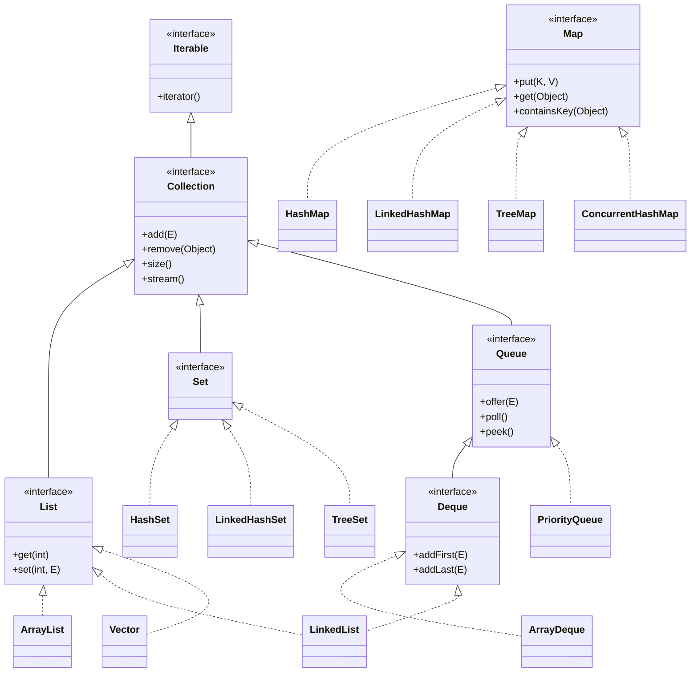
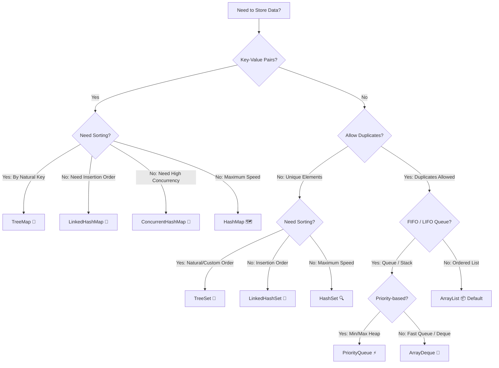
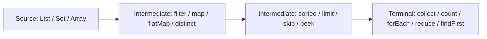

[🏠 Back to Home](README.md) | [📚 Deep Dive: 100+ Collections Scenarios](java_collection_stream.md) | [🐙 Collections Mastery Topic](topics/java_collections_mastery.md)

# 📚 Java Collections & Streams Complete Architecture & Quick Reference

A high-performance cheat sheet and architectural guide to the Java Collections Framework (JCF) and Stream API. Covers complexity matrices, data structure decision models, thread-safe collections, and Stream pipeline operations.

---

## 📑 Table of Contents

1. [🧠 Zero-to-Hero Mental Model: Memory Layouts & CPU Cache Locality](#-zero-to-hero-mental-model-memory-layouts--cpu-cache-locality)
2. [📦 Track 1: The 5 Core Building Blocks of Collections](#1-the-5-core-building-blocks-of-collections)
3. [📝 Beginner Code Walkthrough: Clean Modern Java 17/21 Collections](#2-beginner-code-walkthrough-clean-modern-java-1721-collections)
4. [💥 What Happens When Things Break? (Top 3 Disasters)](#3-what-happens-when-things-break-top-3-disasters)
5. [⚠️ Top 5 Beginner Mistakes in Production](#4-top-5-beginner-mistakes-in-production)
6. [🎓 Top 10 Junior Interview Questions (ELI5 Answers)](#5-top-10-junior-interview-questions-with-explain-like-im-5-answers)
7. [🌳 The Java Collections Class Hierarchy](#-the-java-collections-class-hierarchy)
8. [🏆 The "Which Collection Should I Use?" Decision Matrix](#-the-which-collection-should-i-use-decision-matrix)
9. [⚡ Time & Space Complexity Master Grid](#-time--space-complexity-master-grid)
10. [🐙 Thread-Safe & Concurrent Collections](#-thread-safe--concurrent-collections)
11. [🌊 Java 8+ Stream API Mastery & Method Reference](#-java-8-stream-api-mastery--method-reference)
12. [⚠️ Top 10 Collections Traps & Performance Nightmares](#️-top-10-collections-traps--performance-nightmares)
13. [🎓 Senior Interview Preparation & Scenario Q&A](#-7-senior-interview-preparation--scenario-qa)
14. [🔄 Architectural Transferability: Where & How to Apply Elsewhere](#-8-architectural-transferability-where--how-to-apply-elsewhere)

---

## 🧠 Zero-to-Hero Mental Model: Memory Layouts & CPU Cache Locality

### 🗄️ The Warehouse Analogy (Contiguous Array vs. Linked Pointers)

1. **`ArrayList` (Contiguous Shelf Array):**
   - Think of a long shelf with numbered boxes side-by-side in a straight line.
   - When the CPU asks for box `#5`, the hardware pre-fetches boxes `#6`, `#7`, and `#8` into the ultra-fast **L1/L2 CPU Cache** (Cache Line Locality). Scanning an `ArrayList` is blazingly fast ($O(1)$ random access).
2. **`LinkedList` (Scavenger Hunt):**
   - Each item is hidden in a random room in a massive building. Box #1 contains a note with the GPS coordinates of Box #2.
   - To find Box #10, the CPU must jump across memory addresses 10 times, causing constant **CPU Cache Misses**. Even though inserting in the middle is theoretically $O(1)$ once you have the node, finding the node is $O(n)$.
3. **`HashMap` (Indexed Mailboxes with Buckets):**
   - An array of mailboxes. When a letter arrives, its address is converted into a mailbox number via `hashCode() % array_length`.
   - If two letters map to the same mailbox (Collision), they form a small list. If 8+ letters collide in the same mailbox, Java automatically upgrades that mailbox into a **Red-Black Binary Search Tree** ($O(\log n)$) to prevent Denial of Service (HashDoS) attacks.

```
ArrayList (Contiguous Memory - L1/L2 Cache Friendly):
[ Element 0 ][ Element 1 ][ Element 2 ][ Element 3 ][ Element 4 ]

LinkedList (Fragmented Heap - Cache Misses):
[ Node A | Next* ] ──> [ Node B | Next* ] ──> [ Node C | Next* ]
 (0x10A4)               (0x89F0)               (0x3B12)
```

---

## 🛠️ Prerequisites & Foundational Knowledge

Before mastering the Java Collections Framework (JCF) and Stream API, developers must understand the foundational computer science and hardware memory architecture concepts:

### 1. Memory Hierarchy & CPU Cache Lines
- **Contiguous Array Memory**: Elements in an array are stored in consecutive physical RAM addresses. When a thread reads `array[i]`, the CPU hardware prefetcher loads the surrounding 64-byte **Cache Line** into L1/L2 cache, enabling ultra-low-latency ($O(1)$) iteration.
- **Pointer-Chasing Overhead**: Linked structures (`LinkedList`, tree nodes) allocate small isolated objects scattered across the JVM heap. Traversing next/prev pointers incurs repeated CPU L1/L2 cache misses, stalling the CPU memory bus for 50–100ns per node traversal.

### 2. Hash Functions & Modulo Arithmetic
- **The Hash Contract**: A hash function converts an arbitrary object into a 32-bit signed integer (`int hashCode()`).
- **Bitwise Bucket Indexing**: In `HashMap`, bucket index is calculated via bitwise AND with a power-of-two capacity:
  $$\text{index} = (n - 1) \ \& \ \text{hash}$$
  This bitwise mask is equivalent to $\text{hash} \pmod n$, executing in a single CPU instruction cycle ($<0.5\text{ns}$).
- **Avalanche Effect & Perturbation Function**: To prevent lower-bit clustering when hash codes share common suffixes, Java 8 applies a bitwise XOR shift:
  $$\text{hash} = h \ \hat{} \ (h >>> 16)$$

### 3. Tree Balancing & Red-Black Invariants
A Red-Black Tree is a self-balancing binary search tree ensuring $O(\log n)$ search, insert, and delete operations:
1. Every node is either RED or BLACK.
2. The root is always BLACK.
3. No two consecutive RED nodes can exist on any path.
4. Every path from root to null leaves must contain the exact same number of BLACK nodes (Black-Height invariant).

---

# TRACK 1: THE JUNIOR & ENTRY-LEVEL FOUNDATIONS (ZERO-TO-HERO)

## 1. The 5 Core Building Blocks of Collections

| Interface | Ordering Guarantee | Allows Duplicates? | Real-World Analogy | Primary Use Case |
| :--- | :--- | :--- | :--- | :--- |
| **`List`** | ✅ Preserves insertion order (indexed $0, 1, 2\dots$) | ✅ Yes | A numbered shopping to-do list. | Storing ordered items, search results, or chronological history. |
| **`Set`** | ❌ No guarantee (unless `LinkedHashSet` / `TreeSet`) | ❌ No (strictly unique) | A VIP nightclub guest list where duplicate names are rejected at the door. | Deduplicating user IDs, tracking unique IP addresses. |
| **`Map`** | ❌ No guarantee (unless `LinkedHashMap` / `TreeMap`) | ❌ Unique keys, duplicate values | A coat-check counter: Hand in ticket #42, get back Alice's winter coat. | Fast $O(1)$ dictionary lookups (User ID $\to$ Profile). |
| **`Queue`** | ✅ FIFO (First-In, First-Out) | ✅ Yes | People standing in line at a movie theater ticket booth. | Background worker task processing, print spoolers. |
| **`Deque`** | ✅ FIFO or LIFO (Double-Ended Queue) | ✅ Yes | A deck of cards or a tube of Pringles (take or put at either end). | Undo/Redo history, browser back-forward navigation. |

---

## 2. Beginner Code Walkthrough: Clean Modern Java 17/21 Collections

```java
package com.example.collections.basics;

import java.util.ArrayList;
import java.util.Collections;
import java.util.Comparator;
import java.util.HashMap;
import java.util.List;
import java.util.Map;

public class CollectionsBasicsMasterclass {

    public static void main(String[] args) {
        // =====================================================================
        // 1. Creating Collections: Modern Immutable vs. Mutable
        // =====================================================================
        // 🌟 Modern standard: List.of() creates an unmodifiable, null-safe list!
        List<String> immutableColors = List.of("Red", "Green", "Blue");
        // immutableColors.add("Yellow"); // 💥 Throws UnsupportedOperationException!

        // If you need to mutate, wrap in ArrayList with an initial capacity:
        List<Product> products = new ArrayList<>(100);
        products.add(new Product(101L, "Laptop", 1200.00));
        products.add(new Product(102L, "Mouse", 25.50));
        products.add(new Product(103L, "Keyboard", 75.00));

        // =====================================================================
        // 2. Idiomatic Sorting with Comparator
        // =====================================================================
        // Sort products by price ascending, then by name alphabetically:
        products.sort(Comparator
            .comparingDouble(Product::price)
            .thenComparing(Product::name)
        );

        System.out.println("Sorted Products: " + products);

        // =====================================================================
        // 3. Map Operations & Avoiding NullPointerExceptions
        // =====================================================================
        Map<String, Integer> inventory = new HashMap<>();
        inventory.put("SKU-APPLE", 50);
        inventory.put("SKU-ORANGE", 20);

        // 🌟 Trainer Best Practice: getOrDefault prevents NullPointerExceptions!
        int bananaStock = inventory.getOrDefault("SKU-BANANA", 0);
        System.out.println("Banana Stock: " + bananaStock); // 0

        // 🌟 Atomic Increment with merge():
        inventory.merge("SKU-APPLE", 10, Integer::sum); // Increments from 50 to 60
        System.out.println("Updated Apple Stock: " + inventory.get("SKU-APPLE"));
    }

    record Product(Long id, String name, double price) {}
}
```

---

## 3. What Happens When Things Break? (Top 3 Disasters)

1. **`ConcurrentModificationException` Disaster:**
   Iterating over a collection with a `for-each` loop while simultaneously calling `list.remove(item)`. Java checks an internal counter called `modCount`. If `modCount` changes unexpectedly during iteration, the JVM immediately throws an exception to protect against corrupted data! **Fix:** Use `list.removeIf(item -> condition)` or call `iterator.remove()`.
2. **The Mutated HashMap Key Memory Leak:**
   Using a mutable Java class as a `HashMap` key, and modifying a field after inserting it into the map. When you later call `map.get(key)`, the key's `hashCode()` has changed! The map searches in the wrong bucket, returns `null`, and the old key-value entry remains permanently orphaned in memory, leaking RAM! **Fix:** Keys must be strictly **Immutable** (`String`, `UUID`, Java `record`).
3. **The Unsized `ArrayList` Allocation Storm:**
   Adding 1,000,000 items to `new ArrayList<>()` without specifying initial capacity. Java starts with capacity 10 and repeatedly resizes by 1.5x (10 $\to$ 15 $\to$ 22 $\dots$), triggering **30+ array re-allocations and CPU memory copies**, causing massive GC pauses! **Fix:** Always provide expected capacity: `new ArrayList<>(1_000_000)`.

---

## 4. Top 5 Beginner Mistakes in Production

1. **Defaulting to `LinkedList` for "Fast Insertions":** Fresh developers think `LinkedList` has $O(1)$ insertion. In reality, to insert at index 500, `LinkedList` must first jump through 500 node pointers in memory ($O(n)$ search), causing CPU cache misses! `ArrayList` is faster in 99% of real-world scenarios due to contiguous memory.
2. **Violating the `equals()` and `hashCode()` Contract:** Overriding `equals()` without overriding `hashCode()`. Two identical objects will produce different hash codes and land in different `HashMap` buckets, making retrieval impossible!
3. **`list.remove(1)` Ambiguity on `List<Integer>`:** Calling `list.remove(1)` removes the item at **Index 1**, NOT the integer value `1`. To remove the value, you must write `list.remove(Integer.valueOf(1))`.
4. **Modifying `Arrays.asList()`:** Calling `.add()` on `Arrays.asList(arr)` throws `UnsupportedOperationException` because it produces a fixed-size wrapper around the array.
5. **Re-using a Consumed Stream:** Attempting to run `.count()` or `.collect()` twice on the same `Stream` instance triggers `IllegalStateException: stream has already been operated upon or closed`.

---

## 5. Top 10 Junior Interview Questions (With "Explain Like I'm 5" Answers)

### Q1: What is the difference between `ArrayList` and `LinkedList`?

- **ELI5 Answer:** *"`ArrayList` is a straight row of numbered lockers side-by-side. The CPU can run down the hallway in a straight line instantly. `LinkedList` is a scavenger hunt where each note gives you a treasure map to find the next box in a different room."*
- **Technical Answer:** *"`ArrayList` is backed by a dynamic resizable array with $O(1)$ random access by index and excellent CPU L1/L2 cache locality. `LinkedList` is a doubly-linked list with $O(n)$ access time, high memory overhead (24 bytes per node for pointers on 64-bit JVMs), and frequent CPU cache misses."*

### Q2: How does `HashMap` work internally in Java 8+?

- **ELI5 Answer:** *"It converts the key's name into a mailbox number using math (`hashCode`). It walks over to that mailbox and puts your letter in. If the mailbox gets too full, it reorganizes the mailbox into an alphabetized tree so looking up letters takes seconds."*
- **Technical Answer:** *"`HashMap` is an array of `Node<K,V>` buckets. Index is calculated as `(n - 1) & hash(key)`. Collisions are initially stored as a singly linked list. When a bucket reaches 8 elements (`TREEIFY_THRESHOLD`) and map capacity $\ge 64$, the bucket is converted into a Red-Black balanced Binary Search Tree ($O(\log n)$ lookup) to defend against HashDoS attacks."*

### Q3: Why does `HashMap` convert linked lists to Red-Black trees at 8 collisions?

- **ELI5 Answer:** *"Because under fair coin flips (normal math), having 8 letters land in the exact same mailbox is a 1-in-10-million freak accident. If it happens, an attacker is probably trying to slow down your server on purpose!"*
- **Technical Answer:** *"Under random hash distribution (Poisson distribution), the probability of 8 keys landing in the same bucket is less than 1 in 10 million ($0.00000006$). If 8 collisions occur, it indicates either a flawed hash function or a deliberate hash collision attack. Upgrading from $O(n)$ linked list traversal to $O(\log n)$ Red-Black tree traversal prevents CPU denial-of-service."*

### Q4: What is the contract between `equals()` and `hashCode()`?

- **ELI5 Answer:** *"If two passports belong to the exact same citizen (`equals() == true`), their government tax ID numbers must match (`hashCode() == hashCode()`). But two strangers could have the same birth year (`hashCode() == hashCode()`) without being the same person (`equals() == false`)."*
- **Technical Answer:** *"1. If `o1.equals(o2)` is true, their `hashCode()` values MUST be strictly identical. 2. If `o1.hashCode() == o2.hashCode()`, the objects do NOT necessarily have to be equal (this is called a hash collision). Violating rule #1 breaks `HashSet` and `HashMap` lookups."*

### Q5: What is the difference between `HashMap` and `ConcurrentHashMap`?

- **ELI5 Answer:** *"`HashMap` is an unlocked room where 10 people trying to write on the whiteboard at once will break the markers. `ConcurrentHashMap` has a smart security guard who lets 100 people read the board at once, and only locks a single line when someone writes on it."*
- **Technical Answer:** *"`HashMap` is unsynchronized and not thread-safe; concurrent writes cause race conditions and corrupted buckets. `ConcurrentHashMap` (Java 8+) provides thread-safe operations using lock-free CAS (Compare-And-Swap) for inserts into empty buckets, fine-grained bucket-head synchronization for collisions, and completely lock-free volatile reads ($O(1)$)."*

### Q6: What is the difference between Fail-Fast and Fail-Safe iterators?

- **ELI5 Answer:** *"`Fail-Fast` is a strict referee who blows the whistle and stops the match the instant someone touches the ball with their hands. `Fail-Safe` is a video replay team that works on a recorded tape copy while the match keeps playing."*
- **Technical Answer:** *"`Fail-Fast` iterators (`ArrayList`, `HashMap`) track a `modCount`. If concurrent structural modifications occur during iteration, they immediately throw `ConcurrentModificationException`. `Fail-Safe` (weakly consistent) iterators (`CopyOnWriteArrayList`, `ConcurrentHashMap`) iterate over a snapshot or tolerate concurrent modifications without throwing exceptions."*

### Q7: What is the difference between `Comparable` and `Comparator`?

- **ELI5 Answer:** *"`Comparable` is an object saying: 'This is my natural birth order' (`compareTo`). `Comparator` is an outside judge saying: 'Today I will rank you by height, and tomorrow by weight' (`compare`)."*
- **Technical Answer:** *"`Comparable<T>` is implemented inside the class itself, providing a single natural ordering via `compareTo(T other)`. `Comparator<T>` is an external functional interface (`(o1, o2) -> int`) that can define multiple alternative sorting strategies."*

### Q8: Why are `String` and `Integer` ideal keys for a `HashMap`?

- **ELI5 Answer:** *"Because they are immutable—once created, their value can never change, so their locker number never moves!"*
- **Technical Answer:** *"`String` and `Integer` are immutable and have cached, precomputed `hashCode()` values. Immutability guarantees that the hash code will never change after insertion, preventing orphaned bucket keys."*

### Q9: What is the difference between `List.of()` and `Arrays.asList()`?

- **ELI5 Answer:** *"`List.of()` is a stone carving—completely frozen, rejects nulls, and cannot be changed. `Arrays.asList()` is a cardboard sleeve around an array—you can modify existing items, but you cannot change the box size."*
- **Technical Answer:** *"`List.of()` (Java 9+) returns a 100% unmodifiable list that rejects null elements (`NullPointerException`). `Arrays.asList()` returns a fixed-size list view backed by the original array: mutations to the list mutate the original array, and calling `.add()` throws `UnsupportedOperationException`."*

### Q10: What is the difference between `Poll()` and `Remove()` in a Queue?

- **ELI5 Answer:** *"`poll()` checks the mailbox politely: if empty, it shrugs and returns nothing (`null`). `remove()` kicks the mailbox door open: if empty, it screams and sounds an alarm (`NoSuchElementException`)."*
- **Technical Answer:** *"`poll()` retrieves and removes the head of the queue, returning `null` if the queue is empty. `remove()` retrieves and removes the head, but throws `NoSuchElementException` if empty."*

---

# TRACK 2: MASTER COLLECTIONS & STREAMS CATALOG

```
Java Collections Master Feature Matrix:
+--------------------------+-----------------------+---------------------+-------------------------------+
| Collection               | Ordering Guarantee    | Lookup Complexity   | Thread Safety Model           |
+--------------------------+-----------------------+---------------------+-------------------------------+
| ArrayList                | Insertion (Index 0..N)| O(1) by index       | Unsynchronized (Fail-Fast)    |
| LinkedList               | Insertion (Doubly-link| O(N) linear scan    | Unsynchronized (Fail-Fast)    |
| HashSet                  | None                  | O(1) average        | Unsynchronized (Fail-Fast)    |
| LinkedHashSet            | Insertion / Access    | O(1) average        | Unsynchronized (Fail-Fast)    |
| TreeSet                  | Natural / Comparator  | O(log N) Red-Black  | Unsynchronized (Fail-Fast)    |
| HashMap                  | None                  | O(1) avg / O(log N) | Unsynchronized (Fail-Fast)    |
| LinkedHashMap            | Insertion / Access    | O(1) avg / O(log N) | Unsynchronized (Fail-Fast)    |
| TreeMap                  | Sorted Keys           | O(log N) Red-Black  | Unsynchronized (Fail-Fast)    |
| ConcurrentHashMap        | None                  | O(1) lock-free read | Lock-Free CAS + Bucket Locks  |
| PriorityQueue            | Heap Priority (Min/Max| O(1) peek / O(log N)| Unsynchronized (Fail-Fast)    |
| ArrayDeque               | FIFO / LIFO           | O(1) head/tail      | Unsynchronized (Fail-Fast)    |
| CopyOnWriteArrayList     | Insertion             | O(1) lock-free read | Copy-on-Write (Snapshot Iter) |
| EnumSet / EnumMap        | Enum Ordinal          | O(1) bitwise / array| Unsynchronized (Fail-Fast)    |
| SequencedCollection (J21)| Bidirectional Order   | O(1) first/last     | Inherits backing collection   |
+--------------------------+-----------------------+---------------------+-------------------------------+
```

---

### 2.1 `ArrayList` vs `LinkedList` (Memory Layout, Cache Locality & Resizing)
- **Deep Overview**: `ArrayList` is backed by a contiguous `Object[]` array. When capacity is exceeded, it expands by 50% ($1.5\times$ via `newCapacity = oldCapacity + (oldCapacity >> 1)`). `LinkedList` is a doubly-linked chain of `Node<E>` objects with `item`, `next`, and `prev` pointers.
- **Pros**: `ArrayList` offers $O(1)$ random access, zero pointer overhead, and exceptional CPU L1/L2 cache prefetching.
- **Cons**: `LinkedList` consumes 24 extra bytes of heap per node on 64-bit JVMs and causes constant CPU cache misses.
- **Hard Limits & Gotchas**: Almost never use `LinkedList` in production! Even insertions in the middle of a list are faster in `ArrayList` up to 100,000 elements because CPU memory copying (`System.arraycopy`) in contiguous RAM is orders of magnitude faster than pointer-chasing through cache misses.
- **Production Code Blueprint**:
```java
// Sizing ArrayList with initial capacity prevents expensive array copy reallocations
List<OrderDto> orders = new ArrayList<>(expectedBatchSize);
for (RawOrder raw : rawBatch) {
    orders.add(transformer.toDto(raw));
}
```

---

### 2.2 `HashSet` vs `TreeSet` vs `LinkedHashSet`
- **`HashSet`**: Backed by an internal `HashMap<E, Object>` with a dummy present value. Provides $O(1)$ add, remove, and contains, with zero ordering guarantee.
- **`LinkedHashSet`**: Maintains a doubly-linked list running through all entries, guaranteeing deterministic **insertion-order iteration** with $O(1)$ performance.
- **`TreeSet`**: Backed by a `NavigableMap` (`TreeMap`), maintaining elements sorted by `Comparable` natural order or a custom `Comparator` in $O(\log n)$ time.
- **Hard Limits & Gotchas**: `TreeSet` uses `comparator.compare(a, b) == 0` (NOT `equals()`) to determine uniqueness! If `compare(a, b) == 0`, `TreeSet` rejects `b` even if `a.equals(b)` is false.
- **Production Code Blueprint**:
```java
// Deduplicate user roles while preserving exact assignment order
Set<Role> assignedRoles = new LinkedHashSet<>();
assignedRoles.add(Role.USER);
assignedRoles.add(Role.ADMIN);
assignedRoles.add(Role.USER); // Rejected automatically, order preserved
```

---

### 2.3 `HashMap` vs `TreeMap` vs `LinkedHashMap` (Collisions, Treeification & LRU Caches)
- **`HashMap`**: Fast $O(1)$ hash table. Under hash collisions, buckets store elements as singly linked lists. When a bucket reaches 8 elements (`TREEIFY_THRESHOLD`) and capacity $\ge 64$, it converts into a Red-Black tree ($O(\log n)$) to prevent HashDoS attacks.
- **`LinkedHashMap`**: Adds a doubly-linked list across entries. Can order by **insertion order** or **access order** (`accessOrder = true`), making it ideal for building LRU caches.
- **`TreeMap`**: Red-Black tree providing $O(\log n)$ operations with range queries (`subMap`, `headMap`, `tailMap`).
- **Production Code Blueprint (Thread-Safe LRU Cache)**:
```java
public class LruCache<K, V> extends LinkedHashMap<K, V> {
    private final int maxCapacity;

    public LruCache(int maxCapacity) {
        super(maxCapacity, 0.75f, true); // true = Access-Order
        this.maxCapacity = maxCapacity;
    }

    @Override
    protected boolean removeEldestEntry(Map.Entry<K, V> eldest) {
        return size() > maxCapacity;
    }
}
```

---

### 2.4 `ConcurrentHashMap` (Hardware CAS, Bucket Locks & CounterCells)
- **Deep Overview**: In Java 8+, `ConcurrentHashMap` eliminated segment locks.
  1. **Lock-Free Reads**: Reads (`get()`) are completely lock-free; node references and values are marked `volatile`.
  2. **CAS Insertion**: Inserts into empty bucket heads use hardware `CompareAndSwap` with zero locking.
  3. **Synchronized Bucket Heads**: Collisions lock only the first `Node` in that specific bucket, allowing concurrent writes to all other buckets.
  4. **Concurrent Resizing**: Multiple threads cooperate to migrate buckets during table expansion.
- **Production Code Blueprint**:
```java
ConcurrentMap<String, AtomicLong> userAccessCounts = new ConcurrentHashMap<>();

// Thread-safe atomic read-modify-write without external locking
userAccessCounts.computeIfAbsent(userId, k -> new AtomicLong()).incrementAndGet();
```

---

### 2.5 `PriorityQueue` & Binary Heaps
- **Deep Overview**: An unbounded priority queue based on a balanced **Binary Min-Heap** stored in a flat array (`Object[] queue`). For any element at index $i$, its children reside at $2i + 1$ and $2i + 2$.
- **Complexity**: $O(1)$ `peek()`, $O(\log n)$ `offer()` and `poll()`, $O(n)$ `contains()`.
- **Hard Limits & Gotchas**: Unsynchronized and not thread-safe (use `PriorityBlockingQueue` for concurrent producers/consumers). Does not permit `null` elements.
- **Production Code Blueprint**:
```java
// Max-Heap tracking Top-K highest-value transactions
Queue<Transaction> topTransactions = new PriorityQueue<>(
    Comparator.comparing(Transaction::amount).reversed()
);
```

---

### 2.6 `ArrayDeque` & Ring Buffers (Why `Stack` Is Deprecated)
- **Deep Overview**: Resizable-array implementation of the `Deque` interface with head and tail pointers. Uses bitwise wrap-around masking (`(tail + 1) & (elements.length - 1)`).
- **Why `Stack` Is Deprecated**: `java.util.Stack` extends `Vector`, which synchronizes every single operation on the object lock, introducing massive performance penalties.
- **Pros**: Faster than `Stack` when used as a LIFO stack, and faster than `LinkedList` when used as a FIFO queue.
- **Production Code Blueprint**:
```java
// High-performance LIFO stack
Deque<String> callStack = new ArrayDeque<>();
callStack.push("Frame1");
callStack.push("Frame2");
String top = callStack.pop();
```

---

### 2.7 `CopyOnWriteArrayList` & `CopyOnWriteArraySet`
- **Deep Overview**: Thread-safe variant of `List` in which all mutative operations (`add`, `set`, `remove`) make a fresh clone copy of the underlying array under a `ReentrantLock`.
- **Pros**: Read operations never lock and iterate over an immutable snapshot, completely eliminating `ConcurrentModificationException`.
- **Cons**: Write operations are extremely expensive ($O(n)$ array allocation and memory copy).
- **Production Code Blueprint**:
```java
// Ideal for listener lists and infrequently updated configuration registries
public class EventBus {
    private final List<EventListener> listeners = new CopyOnWriteArrayList<>();

    public void register(EventListener listener) { listeners.add(listener); }

    public void emit(Event event) {
        for (EventListener l : listeners) { l.onEvent(event); } // 100% lock-free iteration!
    }
}
```

---

### 2.8 `EnumSet` & `EnumMap` (Bit Vector Mastery)
- **Deep Overview**:
  - `EnumSet`: Backed by a single 64-bit `long` primitive bitfield (`RegularEnumSet`) if the enum has $\le 64$ elements. Adding or testing membership is a single bitwise CPU instruction (`1L << ordinal()`).
  - `EnumMap`: Backed by a flat array indexed directly by `enum.ordinal()`, with zero hashing and zero collisions.
- **Pros**: Consumes a fraction of the memory of `HashSet`/`HashMap`; fastest possible collections in the JVM.
- **Production Code Blueprint**:
```java
// Bit-vector permission flags
Set<Permission> userPermissions = EnumSet.of(Permission.READ, Permission.WRITE);
if (userPermissions.contains(Permission.ADMIN)) {
    // Single bitwise check in 0.3ns!
}
```

---

### 2.9 Stream API Pipelines, Collectors & Parallel Processing
- **Deep Overview**: Declarative data pipelines operating lazily over data sources.
  - **Intermediate Operations**: Lazy (stateless: `filter`, `map`; stateful: `sorted`, `distinct`).
  - **Terminal Operations**: Eager (`collect`, `reduce`, `forEach`, `findFirst`).
  - **Spliterator**: Governs parallel partitioning across `ForkJoinPool.commonPool()`.
- **Hard Limits & Gotchas**: Do NOT use `parallelStream()` for blocking I/O (HTTP or database queries)! It runs on the shared common ForkJoinPool; blocking threads in it starves all other parallel streams across the entire JVM.
- **Production Code Blueprint**:
```java
Map<Department, List<EmployeeDto>> groupedEmployees = employees.stream()
    .filter(Employee::isActive)
    .collect(Collectors.groupingBy(
        Employee::getDepartment,
        Collectors.mapping(EmployeeDto::fromEntity, Collectors.toList())
    ));
```

---

### 2.10 Java 21 Sequenced Collections (`SequencedCollection`, `SequencedMap`)
- **Deep Overview**: Introduced in Java 21 (JEP 431) to fix the longstanding lack of a unified interface for collections with defined encounter orders.
- **Core Methods**: `getFirst()`, `getLast()`, `addFirst()`, `addLast()`, `removeFirst()`, `removeLast()`, and `reversed()` (which returns a reverse-ordered view in $O(1)$ without copying).
- **Production Code Blueprint**:
```java
LinkedHashMap<String, String> auditLog = new LinkedHashMap<>();
auditLog.put("op1", "LOGIN");
auditLog.put("op2", "UPDATE");

// Modern Java 21 Sequenced Access
String firstEntry = auditLog.firstEntry().getValue();
String lastEntry = auditLog.lastEntry().getValue();

// View reversed in O(1) time
SequencedMap<String, String> reversedView = auditLog.reversed();
```

---

# TRACK 3: DEEP TECHNICAL INTERNALS & ARCHITECTURAL TAXONOMY

## 🌳 The Java Collections Class Hierarchy



---

# TRACK 4: PRODUCTION ENGINEERING & DECISION MATRICES

## 🏆 The "Which Collection Should I Use?" Decision Matrix



---

## ⚡ Time & Space Complexity Master Grid

| Data Structure | Underlying Storage | Access (by Index) | Search (by Value) | Insert (at End) | Insert (at Head/Middle) | Delete | Memory Overhead |
| :--- | :--- | :--- | :--- | :--- | :--- | :--- | :--- |
| **`ArrayList`** | Dynamic Array | $O(1)$ | $O(n)$ | $O(1)$ amortized | $O(n)$ (array shift) | $O(n)$ | 🟢 Low (contiguous memory) |
| **`LinkedList`** | Doubly-Linked Nodes | $O(n)$ | $O(n)$ | $O(1)$ | $O(1)$ (if at node) | $O(1)$ | 🔴 High (2 pointers per node) |
| **`ArrayDeque`** | Resizable Circular Array | $O(1)$ | $O(n)$ | $O(1)$ | $O(1)$ | $O(1)$ | 🟢 Very Low (cache-friendly) |
| **`HashSet`** | Hash Table (`HashMap`) | N/A | $O(1)$ avg / $O(\log n)$ worst | $O(1)$ | $O(1)$ | $O(1)$ | 🟡 Moderate (Map.Entry wrapper) |
| **`LinkedHashSet`** | Hash Table + Linked List | N/A | $O(1)$ | $O(1)$ | $O(1)$ | $O(1)$ | 🔴 High (hash table + doubly-linked pointers) |
| **`TreeSet`** | Red-Black Balanced Tree | N/A | $O(\log n)$ | $O(\log n)$ | $O(\log n)$ | $O(\log n)$ | 🟡 Moderate (Tree nodes) |
| **`HashMap`** | Array of Buckets + Tree | N/A | $O(1)$ avg / $O(\log n)$ worst | $O(1)$ | $O(1)$ | $O(1)$ | 🟡 Moderate |
| **`ConcurrentHashMap`**| Synchronized Bins + CAS | N/A | $O(1)$ lock-free read | $O(1)$ | $O(1)$ | $O(1)$ | 🟡 Moderate (Segmented) |

---

## 🐙 Thread-Safe & Concurrent Collections

| Requirement | ❌ Legacy (Slow / Synchronized) | ✅ Modern High-Concurrency Collection |
| :--- | :--- | :--- |
| Concurrent Map | `Hashtable` / `Collections.synchronizedMap()` | `ConcurrentHashMap` (Lock-free reads, bin-level write locks) |
| Concurrent List | `Vector` / `Collections.synchronizedList()` | `CopyOnWriteArrayList` (Reads are $O(1)$ lock-free, best for 99% reads) |
| Concurrent Set | `Collections.synchronizedSet()` | `ConcurrentHashMap.newKeySet()` or `CopyOnWriteArraySet` |
| Producer-Consumer Queue | `Vector` polling loop | `BlockingQueue` (`ArrayBlockingQueue`, `LinkedBlockingQueue`) |
| Thread-Safe Deque | `Stack` | `ConcurrentLinkedDeque` |

---

## 🌊 Java 8+ Stream API Mastery & Method Reference

Streams allow functional, declarative processing of collections.



### Essential Stream Operations Cheat Sheet
```java
List<Order> orders = fetchOrders();

// 1. Grouping by Customer ID & Summing Total Spend:
Map<String, Double> spendByCustomer = orders.stream()
    .filter(o -> o.getStatus() == Status.COMPLETED)
    .collect(Collectors.groupingBy(
        Order::getCustomerId,
        Collectors.summingDouble(Order::getAmount)
    ));

// 2. Partitioning into High-Value vs Regular Orders:
Map<Boolean, List<Order>> partitioned = orders.stream()
    .collect(Collectors.partitioningBy(o -> o.getAmount() > 1000.0));

// 3. Flattening Nested Lists (flatMap):
List<String> allProductSkus = orders.stream()
    .flatMap(order -> order.getItems().stream())
    .map(OrderItem::getSku)
    .distinct()
    .sorted()
    .toList(); // Java 16+ unmodifiable list
```

---

## ⚠️ Top 10 Collections Traps & Performance Nightmares

1. **The `subList()` Memory Leak Trap:**
   - Calling `list.subList(0, 5)` keeps a hard reference to the **entire parent array** in memory!
   - *Fix:* Create a new list copy: `new ArrayList<>(list.subList(0, 5))`.
2. **The `list.remove(1)` Overload Ambiguity:**
   - For `List<Integer>`, `list.remove(1)` removes the item at **Index 1**, NOT value `1`.
   - *Fix:* `list.remove(Integer.valueOf(1))`.
3. **`ConcurrentModificationException` during iteration:**
   - Modifying a collection with `.remove()` inside a `for-each` loop throws `ConcurrentModificationException`.
   - *Fix:* Use `list.removeIf(predicate)` or `Iterator.remove()`.
4. **The `equals()` and `hashCode()` Contract Violation:**
   - Overriding `equals()` without overriding `hashCode()` breaks `HashSet` and `HashMap` key lookups.
5. **Re-using a Consumed Stream:**
   - Streams in Java are single-use. Calling a terminal operation twice throws `IllegalStateException: stream has already been operated upon or closed`.
6. **Parallel Stream Thread Starvation:**
   - `collection.parallelStream()` uses `ForkJoinPool.commonPool()`. Running blocking I/O calls inside it freezes the entire JVM.
7. **`Arrays.asList()` Fixed-Size Trap:**
   - `Arrays.asList(array)` returns a fixed-size wrapper. Calling `.add()` throws `UnsupportedOperationException`.
   - *Fix:* `new ArrayList<>(Arrays.asList(array))` or `List.of(...)`.
8. **High Initial Allocation Storm:**
   - Adding 1,000,000 items to `new ArrayList<>()` forces 20+ array resizing and copy operations.
   - *Fix:* Initialize with capacity: `new ArrayList<>(1_000_000)`.
9. **`TreeSet` without `Comparable`:**
   - Adding an object that doesn't implement `Comparable` to `TreeSet` or `TreeMap` without a `Comparator` throws `ClassCastException`.
10. **Using `LinkedList` by Default:**
    - `LinkedList` has poor CPU cache locality and consumes 24 bytes of overhead per node on 64-bit JVMs. Use `ArrayList` or `ArrayDeque` instead.

---

## 🎓 7. Senior Interview Preparation & Scenario Q&A

### 📌 Core Conceptual Interview Questions

#### Q1: What happens internally in Java 8+ when you call `map.put(key, value)` on a HashMap?
> **Answer & Explanation:**
> 1. **Hash Calculation:** The key's `hashCode()` is computed, and high bits are XORed with low bits (`h ^ (h >>> 16)`) to spread entropy across smaller array tables.
> 2. **Bucket Indexing:** The array index is calculated using bitwise AND: `index = (n - 1) & hash` (where `n` is always a power of 2).
> 3. **Empty Bucket:** If the bucket is `null`, a new `Node<K,V>` is inserted directly.
> 4. **Collision Handling:**
>    - If a node exists, it checks if `key.equals(existingKey)`. If true, the value is updated.
>    - If false, it traverses the linked list. If the bucket size reaches **`TREEIFY_THRESHOLD = 8`** AND total map capacity $\ge 64$ (`MIN_TREEIFY_CAPACITY`), the bucket is converted into a **Red-Black Tree** ($O(\log n)$ lookup) to defend against malicious hash-collision attacks.
> 5. **Resize:** If total entries exceed `capacity * loadFactor (0.75)`, the array doubles in size ($2n$), and elements are re-indexed via bitwise check (`(hash & oldCap) == 0`).

#### Q2: How does `ConcurrentHashMap` achieve high concurrency in Java 8+ compared to Java 7?
> **Answer & Explanation:**
> - **Java 7:** Used **Segmented Locking** (`ReentrantLock` over 16 fixed segments). Concurrency was limited to the number of segments (concurrency level).
> - **Java 8+:** Removed Segments completely.
>   - **Lock-Free Inserts:** Uses hardware **CAS (Compare-And-Swap)** primitives when inserting into an empty bucket head.
>   - **Fine-Grained Node Locks:** Only acquires a `synchronized` lock on the **individual head Node** of the colliding bucket during collisions or treeification.
>   - Reads (`get()`) are completely lock-free because node `val` and `next` pointers are marked `volatile`.

#### Q3: What is the difference between Fail-Fast and Fail-Safe (Weakly Consistent) Iterators?
> **Answer & Explanation:**
> - **Fail-Fast (`ArrayList`, `HashMap`, `HashSet`):** Maintains an internal `modCount` counter. If `modCount` changes during iteration without using the iterator's own methods, it immediately throws `ConcurrentModificationException`.
> - **Fail-Safe / Weakly Consistent (`CopyOnWriteArrayList`, `ConcurrentHashMap`):** Operates on a snapshot or dynamically accommodates concurrent mutations without throwing exceptions. Iterators may or may not reflect modifications made after iterator creation.

#### Q4: Why does mutating a field of an object used as a `HashMap` key cause a silent memory leak?
> **Answer & Explanation:**
> - When an object is inserted as a key, its bucket index is computed from its initial `hashCode()`.
> - If you mutate a field that participates in `hashCode()`, the object's hash changes.
> - When calling `map.get(key)` or `map.remove(key)` later, the map computes the **new hash**, calculates the **wrong bucket index**, and fails to find the entry.
> - The original entry remains orphaned inside the old bucket forever, causing a silent **Heap Memory Leak**.
> - **Rule:** Map keys MUST be strictly **Immutable** (e.g., `String`, `UUID`, Java `record`, or `@Value` classes).

---

### 🚨 Real-World Scenario-Based Interview Questions

#### Scenario Q1: Custom In-Memory LRU Cache
> **Interviewer Question:** *"How would you build a thread-safe, high-performance in-memory Least Recently Used (LRU) Cache with a fixed capacity of 5,000 entries using standard Java Collections?"*
>
> **Senior Architect Answer:**
> We extend `LinkedHashMap` with `accessOrder = true` and override `removeEldestEntry`:
> ```java
> public class LruCache<K, V> extends LinkedHashMap<K, V> {
>     private final int maxCapacity;
> 
>     public LruCache(int maxCapacity) {
>         // initialCapacity, loadFactor, accessOrder (true = access-order, false = insertion-order)
>         super(maxCapacity, 0.75f, true);
>         this.maxCapacity = maxCapacity;
>     }
> 
>     @Override
>     protected boolean removeEldestEntry(Map.Entry<K, V> eldest) {
>         return size() > maxCapacity;
>     }
> 
>     // For thread-safety, wrap with Collections.synchronizedMap()
>     public static <K, V> Map<K, V> createSynchronized(int capacity) {
>         return Collections.synchronizedMap(new LruCache<>(capacity));
>     }
> }
> ```

#### Scenario Q2: Ultra-High-Read Configuration Registry
> **Interviewer Question:** *"You have an API Gateway routing table that is read 500,000 times/second by 200 threads, but updated only once every hour by an admin. What collection do you choose and why?"*
>
> **Senior Architect Answer:**
> - **Choice:** `CopyOnWriteArrayList` or an unmodifiable snapshot wrapped in an `AtomicReference<Map<String, Route>>`.
> - **Justification:** `CopyOnWriteArrayList` provides $O(1)$ lock-free, volatile array reads with 0 synchronization overhead. Writes create a cloned copy of the array, which is completely acceptable for rare mutations (once per hour) in exchange for near-zero read latency.

---

## 🔄 8. Architectural Transferability: Where & How to Apply Elsewhere

The core data structures and concurrency models in the Java Collections Framework map directly to distributed and systems-level architectures:

### 1. 📈 Financial Order Books & Limit Matching
- **Data Structure:** `TreeMap` / `ConcurrentSkipListMap`
- **Application:** Matching buy/sell orders in stock exchanges requires sorting orders by price in $O(\log n)$ time and retrieving the best bid/ask in $O(1)$ (`firstEntry()` / `lastEntry()`).

### 2. ⏱️ Distributed Rate Limiters & Sliding Windows
- **Data Structure:** `ArrayDeque` / Ring Buffer
- **Application:** Tracking API request timestamps per user IP. As new requests arrive, push timestamps to the tail and prune expired entries from the head in $O(1)$ time without memory reallocation.

### 3. 🗺️ In-Memory Geospatial & Spatial Indexing
- **Data Structure:** Custom Prefix Trees / `Trie` built on `HashMap<Character, Node>`
- **Application:** Autocomplete search engines, routing gateways, and IP routing tables (longest prefix match).

---

[⬆️ Back to Top](#-java-collections--streams-complete-architecture--quick-reference)

