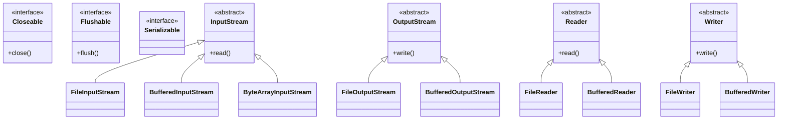

[🏠 Back to Home](README.md) | [🧵 Multithreading](java_thread.md) | [⚡ CompletableFuture](completable_future.md) | [🔥 200 I/O & NIO Scenarios Guide](java_io_nio_200_scenarios_master_guide.md)

# 📘 Java I/O & NIO: Complete Enterprise Architecture & Scenario Guide

> 🚀 **Looking for Tier-1 Product Interview Scenarios?** Check out the dedicated **[Java I/O, NIO & High-Performance Channels: 200 Real-World Interview Scenarios Master Guide](java_io_nio_200_scenarios_master_guide.md)** featuring 200 deep technical scenarios across 10 master categories!

---

## 📑 Table of Contents

1. [🧠 Zero-to-Hero Mental Model: Streams vs. Channels & Buffers](#-zero-to-hero-mental-model-streams-vs-channels--buffers)
2. [🛠️ Prerequisites & Foundational Knowledge](#️-prerequisites--foundational-knowledge)
3. [📦 Track 1: The Junior & Entry-Level Foundations](#track-1-the-junior--entry-level-foundations-zero-to-hero)
4. [🚀 Track 2: Master Java I/O & NIO Catalog](#track-2-master-java-io--nio-catalog)
5. [🏗️ Track 3: Deep Technical Internals & Class Hierarchy Taxonomy](#track-3-deep-technical-internals--class-hierarchy-taxonomy)
6. [⚙️ Track 4: Production Engineering, Modern NIO.2 & Virtual Threads](#track-4-production-engineering-modern-nio2--virtual-threads)
7. [🚨 Track 5: Disaster Recovery, Post-Mortems & War Room Troubleshooting](#track-5-disaster-recovery-post-mortems--war-room-troubleshooting)
8. [🎓 Track 6: Crack-The-Interview Question Bank (Senior & Staff+ Level)](#track-6-crack-the-interview-question-bank-senior--staff-level)
9. [🔄 Architectural Transferability: Where & How to Apply Elsewhere](#-architectural-transferability-where--how-to-apply-elsewhere)

---

## 🧠 Zero-to-Hero Mental Model: Streams vs. Channels & Buffers

### 🚰 The Bucket Brigade vs. Freight Train Analogy

1. **Standard I/O (BIO - The Bucket Brigade):**
   - Traditional `InputStream` / `OutputStream` moves data **1 byte at a time** (or small buffer). It is **blocking** and **one-directional** (you need separate input and output streams).
   - If no bytes are available from the network, the thread goes to sleep, wasting CPU resources.

2. **New I/O (NIO - The Freight Train & Train Station):**
   - **`ByteBuffer` (The Freight Cargo Car):** A memory block where data is loaded and unloaded.
   - **`Channel` (The Railroad Tracks):** Two-way conduit (reads and writes over the same channel).
   - **`Selector` (The Train Station Master):** A single thread monitors thousands of channels using OS-level event notification (`epoll` on Linux, `kqueue` on macOS, `IOCP` on Windows). The thread only wakes up when a train arrives with data.

3. **Zero-Copy File Transfer (`FileChannel.transferTo`):**
   - Traditional transfer copies data 4 times: Disk $\rightarrow$ OS Kernel $\rightarrow$ JVM Heap $\rightarrow$ OS Socket $\rightarrow$ NIC.
   - **Zero-Copy** streams data directly from the **OS Page Cache to the NIC Hardware Buffer**, bypassing JVM user-space entirely ($0$ CPU memory copies).

```
Traditional I/O (4 Buffer Copies + 4 Context Switches):
[ Disk ] ──> [ OS Page Cache ] ──> [ JVM Heap ] ──> [ OS Socket Buffer ] ──> [ NIC Buffer ]

Zero-Copy NIO (Direct Kernel transfer via sendfile):
[ Disk ] ──> [ OS Page Cache ] ────────────────────> [ NIC Buffer ] (Direct DMA)
```

---

## 🛠️ Prerequisites & Foundational Knowledge

Before mastering Java I/O and NIO, developers must master the low-level operating system and hardware storage primitives that govern all disk and network interactions:

### 1. OS File Descriptors & Socket Handles
- **POSIX File Descriptors (FD)**: In Unix and POSIX operating systems, *"everything is a file"*. Sockets, regular disk files, pipes, and devices are represented by non-negative integer indices into the process-level **File Descriptor Table**.
- **Kernel Open File Table**: The process descriptor index points to an entry in the system-wide Open File Description Table (containing current byte offset, status flags, and access mode), which in turn points to the underlying filesystem **Inode table** or kernel socket struct.
- **Resource Limits (`ulimit -n`)**: Each operating system process has a strict limit on concurrent open descriptors (default: 1024 on many Linux distros; production servers typically tune this to `65535` or `1048576`). Leaking streams or unclosed sockets leads directly to OS socket refusal (`java.io.IOException: Too many open files`).

### 2. User Space vs. Kernel Space Memory Boundaries
- **CPU Privilege Rings**: Modern processors enforce hardware isolation via execution rings: **Ring 0 (Kernel Mode)** has unrestricted access to CPU registers, MMU page tables, and physical device controllers; **Ring 3 (User Mode)** runs user processes including the Java Virtual Machine.
- **Syscall Gateways**: User-space applications cannot directly command physical disks or network interface cards (NICs). Every read or write must transition into Ring 0 through a CPU hardware interrupt or software syscall instruction (`SYS_read`, `SYS_write`).
- **Context Switch Latency**: Each syscall forces the CPU to save user registers, switch page table pointers, flush instruction pipelines, execute the kernel routine, and restore user registers—costing $1,000$ to $1,500$ CPU cycles per transition.

### 3. Traditional I/O System Calls & 4-Copy Penalty
Traditional Java stream I/O (`FileInputStream.read()` or `SocketOutputStream.write()`) incurs 4 data copies and 4 context switches for a simple file-to-socket transfer:
1. **Disk $\to$ OS Page Cache**: Kernel issues DMA read from disk controller into OS kernel page cache.
2. **OS Page Cache $\to$ JVM Heap**: Kernel CPU copies data across the user/kernel boundary into the JVM `byte[]` array.
3. **JVM Heap $\to$ Socket Buffer**: Application calls `socket.write()`, and CPU copies data from JVM heap back across the boundary into the OS kernel socket buffer.
4. **Socket Buffer $\to$ NIC Buffer**: NIC DMA engine reads from the kernel socket buffer directly into network hardware memory.

```
Traditional BIO Data Flow:
Disk ──(DMA)──> Kernel Page Cache ──(CPU Copy)──> JVM User Heap ──(CPU Copy)──> Kernel Socket Buffer ──(DMA)──> NIC
```

### 4. Zero-Copy Direct Memory Access (DMA) & Linux `sendfile`
- **DMA (Direct Memory Access)**: Dedicated hardware controller transfers data directly between physical memory and peripheral hardware without burdening the central CPU.
- **Linux `sendfile()` Syscall**: Replaces the 4-copy pipeline with a direct kernel-level transfer. In modern Linux with scatter-gather DMA support:
  1. DMA copies data from disk into the OS Page Cache.
  2. The kernel passes only buffer descriptors (pointer & length) to the socket buffer—**zero payload bytes are copied**.
  3. The NIC DMA engine reads directly from the OS Page Cache into the network wire.
- **Context Switches Drop**: From 4 down to 2; CPU data copies drop from 2 down to **0**. Java exposes this via `FileChannel.transferTo()` and `FileChannel.transferFrom()`.

### 5. I/O Multiplexing Models: BIO vs. NIO Multiplexers (`select`, `poll`, `epoll`, `kqueue`, `IOCP`)
- **BIO (Blocking I/O - Thread-Per-Connection)**: A thread invoking `read()` blocks indefinitely until data arrives. Handling 50,000 connections requires 50,000 OS threads, overwhelming OS kernel memory and context scheduler ($1\text{MB}$ stack per thread $\approx 50\text{GB}$ RAM).
- **`select()` Syscall ($O(N)$)**: User space passes an array of bitmasks (`fd_set`). Kernel checks all descriptors. Hard limit of 1024 FDs (`FD_SETSIZE`). Linear scan on every event check.
- **`poll()` Syscall ($O(N)$)**: Uses an array of `pollfd` structs. Removes the 1024 limit, but still requires an $O(N)$ linear scan of all registered descriptors on every event check.
- **`epoll()` (Linux - $O(1)$ Event-Driven)**:
  - `epoll_create()`: Creates an in-kernel event poll instance backed by a **Red-Black Tree** (tracking registered FDs) and a **Ready List** (doubly-linked list of descriptors with active events).
  - `epoll_ctl()`: Registers, modifies, or deletes monitored FDs in $O(\log N)$ time.
  - `epoll_wait()`: Blocks until events occur. Returns only the active descriptors in $O(1)$ time without scanning idle connections.
  - Modes: **Level-Triggered (LT)** (notifies repeatedly while buffer has data) vs. **Edge-Triggered (ET)** (notifies only on state transitions; requires non-blocking loop drain until `EAGAIN`).
- **`kqueue()` (BSD/macOS)**: Efficient kernel-level event filter and notification mechanism analogous to `epoll`.
- **`IOCP` (Windows I/O Completion Ports)**: True asynchronous I/O (Proactor pattern). The application initiates the I/O, and the kernel notifies a completion port thread pool when the transfer has already completed into the target buffer.

---

# TRACK 1: THE JUNIOR & ENTRY-LEVEL FOUNDATIONS (ZERO-TO-HERO)

## 1. The 5 Core Building Blocks of Java I/O

| Term | What It Is | Real-World Analogy | Primary Use Case |
| :--- | :--- | :--- | :--- |
| **Byte Stream** (`InputStream`/`OutputStream`) | Low-level binary pipeline handling raw 8-bit bytes ($0-255$). | Water flowing through a pipe drop by drop. | Images, audio, PDF files, raw encrypted network packets. |
| **Character Stream** (`Reader`/`Writer`) | Text-oriented pipeline that automatically handles Unicode charsets (`UTF-8`). | Translating Morse code into human-readable English words. | CSV, JSON, XML, log files, plain text configuration. |
| **Buffered Stream** (`BufferedReader`/`BufferedOutputStream`) | In-memory RAM buffer (typically 8KB) wrapping raw streams. | Filling a wheelbarrow with 50 bricks instead of carrying 1 brick at a time. | Accelerating disk and socket I/O by minimizing OS syscalls. |
| **Channel** (`FileChannel`/`SocketChannel`) | High-speed, two-way open pipeline connected to native OS handles. | A multi-lane two-way highway allowing simultaneous two-way traffic. | Java NIO non-blocking high-throughput file/network transfers. |
| **Buffer** (`ByteBuffer`) | Fixed-capacity memory block managed via `position`, `limit`, and `capacity`. | A delivery tray where you load items, flip the switch, and serve them. | Zero-copy packet transfers, direct off-heap memory manipulation. |

---

## 2. Beginner Code Walkthrough: Clean Modern Java 17/21 File I/O

```java
package com.example.io.basics;

import java.io.BufferedReader;
import java.io.BufferedWriter;
import java.io.IOException;
import java.nio.charset.StandardCharsets;
import java.nio.file.Files;
import java.nio.file.Path;
import java.nio.file.StandardOpenOption;
import java.util.stream.Stream;

public class ModernIoMasterclass {

    public static void main(String[] args) {
        Path tempFile = Path.of("sample_report.txt");

        try {
            // =================================================================
            // 1. Modern Fast Text Writing (Java 11+)
            // =================================================================
            // 🌟 One-liner for small to medium text files with explicit UTF-8!
            Files.writeString(tempFile, "OrderID,Customer,Amount\n101,Alice,250.00\n102,Bob,450.50\n",
                StandardCharsets.UTF_8, StandardOpenOption.CREATE, StandardOpenOption.WRITE);

            // =================================================================
            // 2. Safe Streaming for Large Files (Memory-Friendly Stream)
            // =================================================================
            // 🌟 Trainer Rule: NEVER use Files.readAllLines() on large files!
            // Files.lines() reads lazily line-by-line without loading entire file into heap!
            try (Stream<String> lines = Files.lines(tempFile, StandardCharsets.UTF_8)) {
                lines.filter(line -> !line.startsWith("OrderID"))
                     .forEach(row -> System.out.println("Processing Row: " + row));
            }

            // =================================================================
            // 3. Classic try-with-resources with BufferedReader
            // =================================================================
            // 🌟 try-with-resources automatically closes readers even if an exception occurs!
            try (BufferedReader reader = Files.newBufferedReader(tempFile, StandardCharsets.UTF_8)) {
                String line;
                while ((line = reader.readLine()) != null) {
                    // Process line
                }
            }

        } catch (IOException e) {
            System.err.println("❌ I/O Operation failed: " + e.getMessage());
        } finally {
            // Cleanup
            try { Files.deleteIfExists(tempFile); } catch (IOException ignored) {}
        }
    }
}
```

---

## 3. What Happens When Things Break? (Top 3 Disasters)

1. **The "Too Many Open Files" OS File Descriptor Leak:**
   Opening an `InputStream` or `Socket` without `try-with-resources`. Every open file/socket consumes an OS File Descriptor handle. When active handles hit the OS limit (`ulimit -n`, typically 1024 on Linux), the operating system rejects **ALL new network connections**, crashing the entire server with `java.io.IOException: Too many open files`! **Fix:** Always use `try-with-resources`.
2. **The `Files.readAllBytes()` Heap Explosion (OOM):**
   A user uploads a 4GB video or CSV file, and the code calls `Files.readAllBytes(path)`. The JVM attempts to allocate a contiguous 4GB `byte[]` array on the heap. If `-Xmx` is 2GB, the entire application immediately crashes with `java.lang.OutOfMemoryError: Java heap space`! **Fix:** Stream data using `InputStream` chunk buffers (8KB) or `FileChannel`.
3. **The Silent Mojibake (Charset Encoding Corruption):**
   Reading or writing files using `new FileReader("file.txt")` without specifying `StandardCharsets.UTF_8`. On Linux, the default might be UTF-8; on Windows, it might default to Windows-1252. Accented characters or emojis turn into corrupted gibberish (`????` or `é`)! **Fix:** Always pass `StandardCharsets.UTF_8` explicitly.

---

## 4. Top 5 Beginner Mistakes in Production

1. **Reading Streams 1 Byte at a Time (`stream.read()`):** Reading 10MB byte-by-byte executes 10,000,000 native OS kernel interrupts (`read()` syscalls). Wrapping in `BufferedInputStream` reduces this to ~1,200 syscalls, running up to **50x faster**!
2. **Calling `Files.readAllLines()` on Production Logs:** `readAllLines()` loads every single line into a heap-allocated `List<String>`. Use `Files.lines()` (lazy Stream) instead.
3. **Forgetting `buffer.flip()` in Java NIO:** Writing data into a `ByteBuffer` moves the `position` forward. If you attempt to read from it without calling `buffer.flip()`, it reads empty memory!
4. **Swallowing `IOException` with Empty Catch Block:** Catching `IOException` and doing nothing hides corrupt disks, full disk partitions, or severed network sockets from monitoring systems.
5. **Ignoring `flush()` on Output Streams:** Writing data to `BufferedOutputStream` and expecting it to immediately land on disk. If the application crashes before an 8KB buffer fills, unflushed data in memory is permanently lost! Always `flush()` or `close()`.

---

## 5. Top 10 Junior Interview Questions (With "Explain Like I'm 5" Answers)

### Q1: What is the difference between Byte Streams and Character Streams?

- **ELI5 Answer:** *"`Byte Streams` move raw water droplets (0s and 1s) regardless of what they are—great for pictures, music, and zip files. `Character Streams` have a built-in dictionary that translates those droplets into human letters and words in UTF-8."*
- **Technical Answer:** *"`InputStream` and `OutputStream` operate on 8-bit raw bytes and are used for binary media (images, PDFs, sockets). `Reader` and `Writer` operate on 16-bit Unicode characters (`char`) and handle character encoding/decoding automatically."*

### Q2: Why is `BufferedReader` significantly faster than raw `FileReader`?

- **ELI5 Answer:** *"Going to the grocery store once with a shopping cart to buy 20 apples is much faster than running back and forth to the store 20 times for 1 apple each trip!"*
- **Technical Answer:** *"`FileReader` makes an expensive native OS system call for each read operation. `BufferedReader` reads a large chunk (default: 8192 bytes / 8KB) into a heap memory buffer in a single native call, serving subsequent read requests directly from RAM."*

### Q3: What is `try-with-resources` and how does `AutoCloseable` work?

- **ELI5 Answer:** *"A self-closing door with an automatic lock: whether you exit calmly or run out during a fire alarm, the door is guaranteed to slam shut behind you."*
- **Technical Answer:** *"Introduced in Java 7, `try-with-resources` ensures that any resource implementing `java.lang.AutoCloseable` is closed automatically at the end of the block, even if an exception is thrown. It also preserves suppressed exceptions if closing fails."*

### Q4: What is the difference between BIO (Blocking I/O) and NIO (Non-blocking I/O)?

- **ELI5 Answer:** *"`BIO` is a waiter who stands frozen at your table waiting for you to chew your food before moving to the next customer. `NIO` is a waiter who hands menus to 20 tables and only comes back to a table when someone raises their hand."*
- **Technical Answer:** *"`BIO` (traditional Java I/O) assigns 1 OS thread per connection; threads block on `read()` until bytes arrive. `NIO` uses non-blocking channels and a `Selector` (`epoll`), allowing a single worker thread to multiplex thousands of concurrent socket connections."*

### Q5: What does `buffer.flip()` do in Java NIO?

- **ELI5 Answer:** *"Flipping an hourglass: you spent time filling sand in through the top (Writing), now you flip it upside down so sand can pour out through the bottom (Reading)."*
- **Technical Answer:** *"`buffer.flip()` transitions a `ByteBuffer` from **writing mode** to **reading mode**. It sets `limit = position`, and then resets `position = 0`, allowing you to read all the bytes you just wrote."*

### Q6: What is Zero-Copy in Java NIO?

- **ELI5 Answer:** *"Sending a letter directly from the post office to the airplane without driving it to your house first just to look at it."*
- **Technical Answer:** *"`FileChannel.transferTo()` uses the OS kernel's `sendfile()` system call (DMA - Direct Memory Access). Data is transferred directly from the OS Page Cache to the NIC network card buffer, completely bypassing the JVM user-space heap and eliminating CPU copying overhead."*

### Q7: What is a `Selector` in Java NIO?

- **ELI5 Answer:** *"An air traffic control tower: one controller with binoculars watching 50 runways, only talking to a plane when it is ready to land or take off."*
- **Technical Answer:** *"A `Selector` is a multiplexer of `SelectableChannel` objects. It uses native OS event notifications (`epoll` on Linux) so a single thread can monitor thousands of channels for `OP_ACCEPT`, `OP_CONNECT`, `OP_READ`, or `OP_WRITE` events."*

### Q8: Why should you avoid `Files.readAllLines()` on large files?

- **ELI5 Answer:** *"Trying to drink a whole swimming pool in one gulp instead of using a straw—your stomach will burst!"*
- **Technical Answer:** *"`Files.readAllLines()` reads the entire file into memory simultaneously as a `List<String>`. For multi-gigabyte files, this immediately triggers `OutOfMemoryError: Java heap space`. Always use `Files.lines()` which streams lines lazily."*

### Q9: What is `serialVersionUID` and what happens if you don't define it?

- **ELI5 Answer:** *"A version barcode on a LEGO set. If you build with Version 1 and someone tries to open it with Version 2, the barcode tells them if the pieces still fit."*
- **Technical Answer:** *"`serialVersionUID` is a 64-bit hash identifying the class version during Java Object Serialization. If omitted, the JVM calculates one dynamically based on class structure. Any modification to fields changes the generated ID, causing `InvalidClassException` when deserializing older records."*

### Q10: What does the `transient` keyword do in Java?

- **ELI5 Answer:** *"Writing 'TOP SECRET' on a password sticky note so the photocopier skips over it when printing public records."*
- **Technical Answer:** *"The `transient` keyword prevents a field from being serialized when an object is saved to disk or sent over a socket via `ObjectOutputStream`. Upon deserialization, transient fields are initialized to their default values (`null`, `0`, or `false`)."*

---

# TRACK 2: MASTER JAVA I/O & NIO CATALOG

```
Java I/O & NIO Master Feature Matrix:
+-------------------------------+---------------+-------------------+-----------------------+-----------------------------+
| Component / Primitive         | Paradigm      | Memory Location   | Underlying Syscall    | Optimal Throughput / Limits |
+-------------------------------+---------------+-------------------+-----------------------+-----------------------------+
| FileInputStream / OutStream   | Sync Blocking | JVM Heap (byte[]) | read(2), write(2)     | 50-150 MB/s (High Syscalls) |
| FileReader / FileWriter       | Sync Blocking | JVM Heap (char[]) | read(2), write(2)     | Text only; Charset decoders |
| BufferedInputStream / Reader  | Sync Blocking | JVM Heap (8KB RAM)| read(2) batch (8KB)   | 300-600 MB/s (Syscall batch)|
| Heap ByteBuffer               | Sync Block/NB | JVM Heap          | read(2) via Temp C-Buf| GC overhead on compaction   |
| Direct ByteBuffer             | Sync Block/NB | Off-Heap C-Memory | Direct DMA read/write | 1-3 GB/s (Pooled Zero-Copy) |
| FileChannel (Standard)        | Sync Block/Pos| OS Page Cache/Heap| pread(2), pwrite(2)   | High-speed random/multithrd |
| MappedByteBuffer (mmap)       | Memory-Mapped | Virtual Page Cache| mmap(2), msync(2)     | 4-8 GB/s (Page fault driven)|
| SocketChannel + Selector      | Non-Blocking  | Direct/Heap Buffer| epoll_wait(2)/kevent  | 100k+ Conns/Worker Thread   |
| Zero-Copy transferTo()        | Kernel Direct | OS Page Cache->NIC| sendfile(2) / DMA     | Near-Wire Speed (10-40 Gbps)|
| AsynchronousFileChannel       | Async Proactor| Off-Heap / Heap   | POSIX aio / Win IOCP  | Non-blocking event dispatch |
| Files.lines() / Path (NIO.2)  | Lazy Streaming| JVM Heap (Stream) | Batched NIO Channels  | Memory bounded to 1 line    |
+-------------------------------+---------------+-------------------+-----------------------+-----------------------------+
```

---

### 2.1 Byte Streams (`FileInputStream`, `FileOutputStream` & Buffer Sizing)
- **Deep Overview**: `InputStream` and `OutputStream` are the bedrock binary abstractions of `java.io`. They process raw 8-bit sequences ($0-255$). `FileInputStream` and `FileOutputStream` bind directly to underlying OS native file descriptors (`FileDescriptor.in`, `fd.out`). Unbuffered reads (`read()`) invoke an individual `SYS_read` syscall per single byte, causing severe CPU register thrashing.
- **Pros**: Direct binary control, universal support across every library, minimal memory overhead when properly chunk-buffered.
- **Cons**: Unbuffered reads cause massive syscall overhead. Blocking semantics hold threads hostage during disk stalls. Cannot seek backwards without wrapping in `BufferedInputStream` with `mark()` support or using `RandomAccessFile`.
- **Hard Limits & Gotchas**: Calling `in.read(buffer)` is **never guaranteed** to fill the array! It returns the number of bytes actually read ($1 \le k \le \text{buffer.length}$) or $-1$ on EOF. Always loop until desired bytes are read or use Java 9+ `in.readNBytes(buffer, 0, len)`.
- **Production Code Blueprint**:
```java
// Production batch file copy with pre-allocated 64KB transfer chunk
public static void copyBinaryFile(Path source, Path destination) throws IOException {
    byte[] chunk = new byte[65536]; // 64KB L2 cache friendly buffer
    try (InputStream in = new FileInputStream(source.toFile());
         OutputStream out = new FileOutputStream(destination.toFile())) {
        int bytesRead;
        while ((bytesRead = in.read(chunk)) != -1) {
            out.write(chunk, 0, bytesRead);
        }
        out.flush();
    }
}
```

---

### 2.2 Character Streams & Encodings (`FileReader`, `FileWriter`, `InputStreamReader` & UTF-8)
- **Deep Overview**: `Reader` and `Writer` process 16-bit Unicode `char` units ($0-65535$), handling the translation between raw byte streams and text via `CharsetDecoder` and `CharsetEncoder`. Prior to Java 18, `FileReader` defaulted to the OS default charset (`sun.jnu.encoding` / Windows-1252), causing cross-platform mojibake corruption.
- **Pros**: Native multi-byte Unicode handling, automatic grapheme and character boundary decoding, seamless integration with text parsers.
- **Cons**: Character decoding allocates intermediary `char[]` arrays, adding JVM heap garbage collection churn. Unfit for binary data (reading JPEG or ZIP with a `Reader` corrupts byte sequences permanently).
- **Hard Limits & Quotas**: Beware Byte Order Marks (BOM)! Standard Java UTF-8 decoders do not automatically strip the 3-byte UTF-8 BOM (`0xEF, 0xBB, 0xBF`), causing the first parsed line to contain an invisible `\uFEFF` zero-width non-breaking space that breaks JSON/XML parsers.
- **Production Code Blueprint**:
```java
// Explicit UTF-8 decoding with malformed input reporting (never silent substitution)
public static void streamTextSafely(InputStream rawStream, Consumer<String> lineConsumer) throws IOException {
    CharsetDecoder decoder = StandardCharsets.UTF_8.newDecoder()
        .onMalformedInput(CodingErrorAction.REPORT)
        .onUnmappableCharacter(CodingErrorAction.REPORT);
    
    try (BufferedReader reader = new BufferedReader(new InputStreamReader(rawStream, decoder))) {
        String line;
        while ((line = reader.readLine()) != null) {
            lineConsumer.accept(line);
        }
    }
}
```

---

### 2.3 Buffered Streams & Decorator Pattern (`BufferedInputStream`, `BufferedReader` & Flushing)
- **Deep Overview**: `BufferedInputStream` and `BufferedReader` implement the classic Gang-of-Four **Decorator Pattern**, wrapping underlying low-level streams with an in-memory buffer (default: 8192 bytes / 8KB). Single-byte read requests are served directly from the RAM buffer, dropping OS syscall volume by over 99.9%.
- **Pros**: Radically reduces OS user-to-kernel context switching. Provides `mark(int readlimit)` and `reset()` capabilities to peek ahead and rewind stream pointers.
- **Cons**: Adds a layer of internal state synchronization (`synchronized` blocks in legacy `BufferedInputStream`). Buffered data not written to disk until buffer fills or explicit `flush()` occurs.
- **Hard Limits & Quotas**: If an application crashes or the JVM terminates abnormally (`kill -9` or OOM), any unflushed data sitting inside `BufferedOutputStream`'s 8KB internal array is permanently lost without an OS disk trace!
- **Production Code Blueprint**:
```java
// Buffered line reading with bounded memory and deterministic flushing
public static void processLargeCsv(Path csvPath, Consumer<String[]> recordHandler) throws IOException {
    try (BufferedReader br = Files.newBufferedReader(csvPath, StandardCharsets.UTF_8)) {
        String line;
        boolean isHeader = true;
        while ((line = br.readLine()) != null) {
            if (isHeader) { isHeader = false; continue; }
            if (line.isBlank() || line.startsWith("#")) continue;
            recordHandler.accept(line.split(",", -1));
        }
    }
}
```

---

### 2.4 NIO `ByteBuffer` & Buffer State Engine (Direct vs Non-Direct)
- **Deep Overview**: `ByteBuffer` is the foundational data container of Java NIO. It manages memory via four state pointers: `mark <= position <= limit <= capacity`.
  - `capacity`: Total byte slots allocated (immutable).
  - `position`: Index of next byte to read or write.
  - `limit`: Boundary past which no bytes can be read or written.
  - `mark`: Remembered position reset point.
- **Direct vs. Non-Direct**:
  - `ByteBuffer.allocate(size)`: Allocates `byte[]` on JVM Heap. Subject to GC movement; OS I/O requires JVM to copy heap memory into a temporary native buffer first.
  - `ByteBuffer.allocateDirect(size)`: Calls native C `malloc()`. Memory resides outside the JVM heap in process virtual memory. Enables direct OS DMA hardware transfers. Cleaned via `sun.misc.Cleaner` / PhantomReferences.
- **Pros**: Direct memory allocation eliminates GC heap pressure; zero intermediate copies during channel socket transfers.
- **Cons**: Direct buffers are expensive to allocate/deallocate (must be pooled in production); buffer state management (`flip()`, `compact()`, `clear()`) is notorious for state-corruption bugs.
- **Hard Limits & Quotas**: Managed off-heap memory is capped by `-XX:MaxDirectMemorySize` (defaults to `-Xmx`). Exceeding it throws `OutOfMemoryError: Direct buffer memory`.
- **Production Code Blueprint**:
```java
// Idiomatic ByteBuffer state transition engine: Read -> Flip -> Drain -> Compact
public static void parseNetworkPackets(SocketChannel channel, ByteBuffer buffer) throws IOException {
    while (channel.read(buffer) > 0) {
        buffer.flip(); // Transition from Writing mode to Reading mode (limit=pos, pos=0)
        
        while (buffer.remaining() >= 4) { // 4-byte packet header
            buffer.mark();
            int payloadLength = buffer.getInt();
            if (buffer.remaining() < payloadLength) {
                buffer.reset(); // Incomplete payload, rewind to header start and wait for more data
                break;
            }
            byte[] payload = new byte[payloadLength];
            buffer.get(payload);
            processPayload(payload);
        }
        
        buffer.compact(); // Shift unread bytes to buffer start; position=remaining, limit=capacity
    }
}
```

---

### 2.5 NIO `FileChannel` & Memory-Mapped Files (`MappedByteBuffer` & Dirty Sync)
- **Deep Overview**: `FileChannel` provides thread-safe, positional random access to disk files. Unlike streams, multiple threads can concurrently call `channel.read(buffer, position)` and `channel.write(buffer, position)` without mutual interference.
- **Memory-Mapped Files (`mmap`)**: `channel.map(MapMode.READ_WRITE, 0, length)` uses the kernel `mmap()` syscall to map file contents directly into the process's 64-bit virtual address space. Reading/writing to the resulting `MappedByteBuffer` directly modifies the OS Page Cache. Physical disk I/O happens asynchronously via OS page faults and background kernel flusher threads (`pdflush`/`kswapd`).
- **Pros**: Blazing throughput ($>5\text{GB/s}$), reads directly from OS Page Cache without JVM heap allocations. Survives JVM crashes (OS kernel persists dirty pages to disk).
- **Cons**: Unmapping a `MappedByteBuffer` in Java is not officially exposed before Java 14+ / 21 Foreign Function & Memory API (`Arena`). Mapping a file that is truncated externally causes a `SIGBUS` crash that terminates the JVM process.
- **Hard Limits & Quotas**: Single `MappedByteBuffer` is capped at $2\text{GB}$ (`Integer.MAX_VALUE` bytes). Files $>2\text{GB}$ must be mapped across multiple chunks.
- **Production Code Blueprint**:
```java
// High-throughput Append-Only Commit Log using Memory-Mapped Files
public class MappedCommitLog implements AutoCloseable {
    private final FileChannel channel;
    private final MappedByteBuffer mappedBuffer;

    public MappedCommitLog(Path logPath, long logSizeBytes) throws IOException {
        this.channel = FileChannel.open(logPath, 
            StandardOpenOption.CREATE, StandardOpenOption.READ, StandardOpenOption.WRITE);
        this.mappedBuffer = channel.map(FileChannel.MapMode.READ_WRITE, 0, logSizeBytes);
    }

    public synchronized void appendRecord(byte[] record) {
        if (mappedBuffer.remaining() < record.length + 4) {
            throw new IllegalStateException("Commit log capacity exhausted");
        }
        mappedBuffer.putInt(record.length);
        mappedBuffer.put(record);
    }

    public void flushToDisk() {
        mappedBuffer.force(); // msync() syscall: flushes dirty OS pages to non-volatile disk
    }

    @Override
    public void close() throws IOException {
        flushToDisk();
        channel.close();
    }
}
```

---

### 2.6 NIO Sockets & Non-Blocking Multiplexing (`SocketChannel`, `Selector` & Event Loops)
- **Deep Overview**: Java NIO enables non-blocking event-driven network architectures (the Reactor pattern). By configuring `channel.configureBlocking(false)`, socket operations return immediately without thread suspension. A `Selector` multiplexes thousands of `SelectableChannel`s using native kernel primitives (`epoll` on Linux, `kqueue` on BSD/macOS).
- **Pros**: Scales to 100,000+ concurrent network connections with a handful of worker threads. Eliminates the thread-per-connection memory ceiling.
- **Cons**: Complex event loop state machine. Handing slow blocking tasks (database queries) inside the selector thread stalls all other concurrent connections.
- **Hard Limits & Quotas**: The historic Linux `epoll` 100% CPU spin bug (JDK-6403933) where an unexpected TCP reset flag caused `Selector.select()` to wake up continuously in an infinite loop without selecting any keys.
- **Production Code Blueprint**:
```java
// Ultra-scalable Non-Blocking Echo Server using Selector and Epoll Multiplexing
public class NioEchoServer implements Runnable {
    private final int port;

    public NioEchoServer(int port) { this.port = port; }

    @Override
    public void run() {
        try (Selector selector = Selector.open();
             ServerSocketChannel serverChannel = ServerSocketChannel.open()) {
            
            serverChannel.bind(new InetSocketAddress(port));
            serverChannel.configureBlocking(false);
            serverChannel.register(selector, SelectionKey.OP_ACCEPT);

            ByteBuffer sharedBuffer = ByteBuffer.allocateDirect(16384);

            while (!Thread.currentThread().isInterrupted()) {
                selector.select(); // Blocks on OS epoll_wait until at least 1 event occurs
                Iterator<SelectionKey> keys = selector.selectedKeys().iterator();

                while (keys.hasNext()) {
                    SelectionKey key = keys.next();
                    keys.remove(); // CRITICAL: Must manually remove key to avoid reprocessing

                    if (!key.isValid()) continue;

                    if (key.isAcceptable()) {
                        ServerSocketChannel server = (ServerSocketChannel) key.channel();
                        SocketChannel client = server.accept();
                        if (client != null) {
                            client.configureBlocking(false);
                            client.register(selector, SelectionKey.OP_READ);
                        }
                    } else if (key.isReadable()) {
                        SocketChannel client = (SocketChannel) key.channel();
                        sharedBuffer.clear();
                        int read = client.read(sharedBuffer);
                        if (read == -1) {
                            client.close();
                        } else if (read > 0) {
                            sharedBuffer.flip();
                            while (sharedBuffer.hasRemaining()) {
                                client.write(sharedBuffer); // Echo back
                            }
                        }
                    }
                }
            }
        } catch (IOException e) {
            e.printStackTrace();
        }
    }
}
```

---

### 2.7 Zero-Copy File Transfer (`FileChannel.transferTo()` / `transferFrom()`)
- **Deep Overview**: `FileChannel.transferTo(position, count, targetChannel)` directly connects an open file channel to a writable channel (such as a network `SocketChannel`). It routes the transfer through the host operating system's native `sendfile(2)` system call.
- **Pros**: Data moves directly from the OS Page Cache to the network interface card via Direct Memory Access (DMA). Zero CPU memory copying, zero JVM heap usage, 0% GC pressure.
- **Cons**: Cannot apply application-layer cryptographic encryption (TLS/HTTPS) or data transformations in transit, because bytes never touch user space RAM.
- **Hard Limits & Quotas**: On Linux 32-bit kernels or certain storage subsystems, `transferTo()` transfers are capped at 2GB ($2,147,483,647$ bytes) per invocation. Production code must always loop while `transferred < totalSize`.
- **Production Code Blueprint**:
```java
// Production-grade Zero-Copy File to Socket Transfer with 2GB chunk handling
public static void streamFileZeroCopy(FileChannel fileChannel, WritableByteChannel targetSocket) throws IOException {
    long position = 0;
    long totalBytes = fileChannel.size();

    while (position < totalBytes) {
        // Transfer up to 16MB per chunk to allow interleaving and prevent kernel socket buffer starvation
        long bytesToTransfer = Math.min(totalBytes - position, 16L * 1024 * 1024);
        long transferred = fileChannel.transferTo(position, bytesToTransfer, targetSocket);
        if (transferred <= 0) {
            // Socket buffer full; wait or yield
            break;
        }
        position += transferred;
    }
}
```

---

### 2.8 Asynchronous I/O (`AsynchronousFileChannel` & `CompletionHandler`)
- **Deep Overview**: Introduced in Java 7 (NIO.2 / JSR 203), Asynchronous I/O implements the true **Proactor Pattern**. Operations are delegated to the underlying operating system kernel or background thread pools (`AsynchronousChannelGroup`). The calling thread initiates the I/O and returns immediately; upon completion, the runtime executes a registered `CompletionHandler`.
- **Pros**: Fully non-blocking without requiring complex manual `Selector` polling loops.
- **Cons**: High callback depth ("callback hell"), thread context switches across thread pool workers, higher CPU scheduling overhead for small I/O operations compared to memory-mapped files.
- **Hard Limits & Quotas**: On Linux, NIO.2 asynchronous sockets emulate true async using internal `epoll` thread pools because native POSIX AIO has historically had unpredictable kernel edge cases.
- **Production Code Blueprint**:
```java
// Non-blocking Asynchronous File Write with CompletionHandler
public static void writeAsync(Path targetPath, byte[] data, CompletableFuture<Integer> future) throws IOException {
    AsynchronousFileChannel channel = AsynchronousFileChannel.open(targetPath,
        StandardOpenOption.CREATE, StandardOpenOption.WRITE);
    
    ByteBuffer buffer = ByteBuffer.wrap(data);

    channel.write(buffer, 0, null, new CompletionHandler<Integer, Void>() {
        @Override
        public void completed(Integer result, Void attachment) {
            try { channel.close(); } catch (IOException ignored) {}
            future.complete(result);
        }

        @Override
        public void failed(Throwable exc, Void attachment) {
            try { channel.close(); } catch (IOException ignored) {}
            future.completeExceptionally(exc);
        }
    });
}
```

---

### 2.9 Modern NIO.2 `Path` & `Files` API (Java 7 through 21)
- **Deep Overview**: Java 7 introduced `java.nio.file.Path` and `java.nio.file.Files`, replacing the legacy `java.io.File`. The modern API surfaces rich filesystem operations (symbolic link resolution, POSIX file permissions, atomic file moves, lazy recursive directory streams) with explicit charset handling and descriptive exceptions (`NoSuchFileException` instead of silent boolean `false`).
- **Pros**: Safe, robust error reporting; lazy streaming for huge directories and files; atomic operations via `StandardCopyOption.ATOMIC_MOVE`.
- **Cons**: `Files.lines()` and `Files.walk()` return lazy `Stream<T>` instances that **must be wrapped in try-with-resources**! Failing to close the stream leaves an open OS file descriptor leaking permanently.
- **Hard Limits & Quotas**: `Files.readAllBytes()` and `Files.readAllLines()` allocate the entire file into JVM heap memory. Exceeding available heap causes immediate `OutOfMemoryError: Java heap space`.
- **Production Code Blueprint**:
```java
// Safe, leak-free recursive directory search with depth bounding
public static List<Path> findConfigFiles(Path rootDir, int maxDepth) throws IOException {
    try (Stream<Path> stream = Files.walk(rootDir, maxDepth, FileVisitOption.FOLLOW_LINKS)) {
        return stream
            .filter(Files::isRegularFile)
            .filter(path -> path.getFileName().toString().endsWith(".yaml") || 
                            path.getFileName().toString().endsWith(".properties"))
            .toList();
    } // CRITICAL: try-with-resources automatically closes the underlying DirectoryStream FD
}
```

---

### 2.10 Serialization vs Off-Heap / Binary Protocols (Protobuf, FlatBuffers & Security)
- **Deep Overview**: Standard Java Object Serialization (`Serializable`, `ObjectOutputStream`, `ObjectInputStream`) encodes object graphs into a binary protocol including class metadata and field reflection. Because `ObjectInputStream.readObject()` instantiates arbitrary classes before validating types, it is susceptible to remote code execution (RCE) via deserialization gadget chains (e.g., Apache Commons Collections exploits).
- **Pros**: Built into the JVM core; serializes arbitrary cyclic object graphs with zero third-party libraries.
- **Cons**: Crippling security vulnerabilities, sluggish serialization performance, huge serialized byte bloat, fragile version compatibility (`serialVersionUID` mismatches).
- **Modern Enterprise Alternatives**: Google Protocol Buffers (Protobuf), Apache Avro, FlatBuffers, or JSON with Jackson / Kryo.
- **Hard Limits & Quotas**: Never expose an unauthenticated `ObjectInputStream` to a public network socket! Java 9+ introduced `ObjectInputFilter` to restrict allowed classes if legacy serialization cannot be decommissioned.
- **Production Code Blueprint**:
```java
// Hardening legacy ObjectInputStream using Java 9+ Deserialization Filter
public static Object safeDeserialize(byte[] serializedData) throws IOException, ClassNotFoundException {
    // Whitelist only safe application DTO classes; reject all gadget candidates
    ObjectInputFilter filter = ObjectInputFilter.Config.createFilter(
        "com.example.dto.*;java.base/*;!*" // Allow specific DTO package and base types; reject everything else
    );

    try (ByteArrayInputStream bais = new ByteArrayInputStream(serializedData);
         ObjectInputStream ois = new ObjectInputStream(bais)) {
        ois.setObjectInputFilter(filter);
        return ois.readObject();
    }
}
```

---

# TRACK 3: DEEP TECHNICAL INTERNALS & CLASS HIERARCHY TAXONOMY

## 🌳 IO Class Hierarchy (Mermaid)


## 🔗 1. CORE INTERFACES (Root Level)
### 🔹 1.1 Closeable Interface

> **🤔 Why we need it:** To prevent resource leaks (file handles, network sockets) which can crash applications.
> **⚙️ Key Methods:**
> - `void close()`: Closes stream & releases resources.

> **Purpose:** Marks resources that need to be closed after use.
```java
**📜 // Source code structure**
public interface Closeable {
    void close() throws IOException;
}

**🏗️ // Real-world implementation example**
public class DatabaseConnection implements Closeable {
    private Connection connection;
    private boolean isClosed = false;

    @Override
    public void close() throws IOException {
        if (!isClosed) {
            try {
                if (connection != null) {
                    connection.close();
                }
            } catch (SQLException e) {
                throw new IOException("Failed to close database connection", e);
            } finally {
                isClosed = true;
            }
        }
    }
}

**🏢 // Usage in enterprise application**
public class ReportGenerationService {
    public void generateMonthlyReport() {
        // Try-with-resources automatically calls close()
        try (DatabaseConnection dbConn = new DatabaseConnection();
             FileWriter reportWriter = new FileWriter("monthly_report.csv")) {

            List<SalesData> data = dbConn.fetchMonthlySales();
            writeReport(data, reportWriter);

        } catch (IOException e) {
            logger.error("Report generation failed", e);
        }
    }
}
```
### 🔹 1.2 Flushable Interface

> **🤔 Why we need it:** Buffered streams hold data in memory. Flushing ensures data is written to disk/network even if buffer isn't full.
> **⚙️ Key Methods:**
> - `void flush()`: Writes buffered output.

> **Purpose:** Indicates that buffered data can be flushed.
```java
// Interface definition
public interface Flushable {
    void flush() throws IOException;
}

// Real-world custom implementation
public class AuditLogWriter implements Flushable, Closeable {
    private BufferedWriter writer;
    private List<String> buffer = new ArrayList<>();
    private static final int BATCH_SIZE = 100;

    public void log(String message) throws IOException {
        buffer.add(String.format("[%s] %s",
            LocalDateTime.now(), message));

        if (buffer.size() >= BATCH_SIZE) {
            flush(); // Auto-flush when buffer is full
        }
    }

    @Override
    public void flush() throws IOException {
        if (!buffer.isEmpty()) {
            for (String logEntry : buffer) {
                writer.write(logEntry);
                writer.newLine();
            }
            buffer.clear();
            writer.flush(); // Ensure OS writes to disk

            // Real-time monitoring systems need immediate visibility
            System.out.println("Audit log flushed: " +
                LocalDateTime.now());
        }
    }

    @Override
    public void close() throws IOException {
        flush(); // Ensure all pending logs are written
        writer.close();
    }
}

// Banking transaction logging
public class BankingAuditService {
    private AuditLogWriter auditWriter;

    public void processTransaction(Transaction tx) {
        try {
            // Log transaction start
            auditWriter.log(String.format(
                "TRANSACTION_START: Account=%s, Amount=%.2f, Type=%s",
                tx.getAccountId(), tx.getAmount(), tx.getType()));

            // Process transaction logic here...
            boolean success = processTransfer(tx);

            // Log transaction completion
            auditWriter.log(String.format(
                "TRANSACTION_COMPLETE: ID=%s, Success=%s",
                tx.getTransactionId(), success));

            // Force flush for critical financial transactions
            auditWriter.flush();

        } catch (IOException e) {
            logger.error("Audit logging failed", e);
            // In banking, we might rollback the transaction
            rollbackTransaction(tx);
        }
    }
}
```
### 🔹 1.3 DataInput & DataOutput Interfaces
> **Purpose:** Provide methods for reading/writing primitive data types.
```java
// DataInput interface methods
public interface DataInput {
    boolean readBoolean() throws IOException;
    byte readByte() throws IOException;
    char readChar() throws IOException;
    double readDouble() throws IOException;
    float readFloat() throws IOException;
    void readFully(byte[] b) throws IOException;
    int readInt() throws IOException;
    String readLine() throws IOException;
    long readLong() throws IOException;
    short readShort() throws IOException;
    int skipBytes(int n) throws IOException;
}

// DataOutput interface methods
public interface DataOutput {
    void writeBoolean(boolean v) throws IOException;
    void writeByte(int v) throws IOException;
    void writeBytes(String s) throws IOException;
    void writeChar(int v) throws IOException;
    void writeChars(String s) throws IOException;
    void writeDouble(double v) throws IOException;
    void writeFloat(float v) throws IOException;
    void writeInt(int v) throws IOException;
    void writeLong(long v) throws IOException;
    void writeShort(int v) throws IOException;
    void writeUTF(String str) throws IOException;
}

// Real-world implementation: Network protocol handler
public class NetworkProtocolHandler implements DataInput, DataOutput {
    private DataInputStream dis;
    private DataOutputStream dos;

    // Protocol message format for IoT device communication
    public static class SensorDataPacket {
        private long timestamp;
        private int deviceId;
        private float temperature;
        private float humidity;
        private boolean alarmStatus;
        private String deviceName;

        // Constructor, getters, setters...
    }

    public void sendSensorData(SensorDataPacket packet) throws IOException {
        // Write packet header
        writeInt(0x534E4454); // Magic number "SNDT"
        writeLong(packet.getTimestamp());
        writeInt(packet.getDeviceId());

        // Write sensor readings
        writeFloat(packet.getTemperature());
        writeFloat(packet.getHumidity());
        writeBoolean(packet.isAlarmStatus());

        // Write device name using UTF-8
        writeUTF(packet.getDeviceName());

        // Flush to ensure immediate transmission
        flush();
    }

    public SensorDataPacket receiveSensorData() throws IOException {
        // Read and validate header
        int magic = readInt();
        if (magic != 0x534E4454) {
            throw new IOException("Invalid packet format");
        }

        SensorDataPacket packet = new SensorDataPacket();

        // Read packet data
        packet.setTimestamp(readLong());
        packet.setDeviceId(readInt());
        packet.setTemperature(readFloat());
        packet.setHumidity(readFloat());
        packet.setAlarmStatus(readBoolean());
        packet.setDeviceName(readUTF());

        return packet;
    }

    @Override
    public void write(int b) throws IOException {
        dos.write(b);
    }

    @Override
    public int read() throws IOException {
        return dis.read();
    }
}

// Enterprise IoT platform usage
public class IoTDeviceManager {
    private NetworkProtocolHandler protocolHandler;

    public void collectSensorData() {
        try {
            // Receive data from thousands of IoT devices
            while (true) {
                SensorDataPacket packet = protocolHandler.receiveSensorData();

                // Process and store in database
                processSensorData(packet);

                // Send acknowledgment
                protocolHandler.writeBoolean(true);

                // Real-time monitoring
                if (packet.isAlarmStatus()) {
                    triggerAlarm(packet.getDeviceId(), packet.getTemperature());
                }
            }
        } catch (IOException e) {
            logger.error("Device communication failed", e);
            // Attempt reconnection logic
            scheduleReconnection();
        }
    }
}
```
### 🔹 1.4 Serializable Interface
> **Purpose:** Marks objects that can be serialized to byte streams.
```java
// Interface definition (marker interface)
public interface Serializable {
    // No methods - marker interface
}

// Real-world implementation: Distributed cache system
public class UserSession implements Serializable {
    private static final long serialVersionUID = 1L;

    private String userId;
    private String username;
    private transient String password; // Won't be serialized
    private List<String> permissions;
    private LocalDateTime loginTime;
    private Map<String, Object> attributes = new HashMap<>();

    // Custom serialization for security
    private void writeObject(ObjectOutputStream oos) throws IOException {
        oos.defaultWriteObject();

        // Encrypt sensitive data before serialization
        String encryptedPermissions = encryptPermissions(permissions);
        oos.writeObject(encryptedPermissions);
    }

    private void readObject(ObjectInputStream ois)
            throws IOException, ClassNotFoundException {
        ois.defaultReadObject();

        // Decrypt sensitive data after deserialization
        String encryptedPermissions = (String) ois.readObject();
        this.permissions = decryptPermissions(encryptedPermissions);
    }

    // Distributed session management
    public byte[] serializeSession() throws IOException {
        try (ByteArrayOutputStream baos = new ByteArrayOutputStream();
             ObjectOutputStream oos = new ObjectOutputStream(baos)) {

            oos.writeObject(this);
            return baos.toByteArray();
        }
    }

    public static UserSession deserializeSession(byte[] data)
            throws IOException, ClassNotFoundException {
        try (ByteArrayInputStream bais = new ByteArrayInputStream(data);
             ObjectInputStream ois = new ObjectInputStream(bais)) {

            return (UserSession) ois.readObject();
        }
    }
}

// Enterprise distributed cache implementation
public class DistributedSessionCache {
    private RedisTemplate<String, byte[]> redisTemplate;

    public void storeSession(String sessionId, UserSession session) {
        try {
            byte[] serializedSession = session.serializeSession();

            // Store in distributed cache with TTL
            redisTemplate.opsForValue().set(
                "session:" + sessionId,
                serializedSession,
                Duration.ofHours(24)
            );

            logger.info("Session stored: {}", sessionId);

        } catch (IOException e) {
            logger.error("Failed to serialize session", e);
            throw new SessionStorageException("Session serialization failed", e);
        }
    }

    public UserSession retrieveSession(String sessionId) {
        try {
            byte[] serializedSession = redisTemplate.opsForValue()
                .get("session:" + sessionId);

            if (serializedSession != null) {
                UserSession session = UserSession.deserializeSession(serializedSession);

                // Validate session expiry
                if (session.isExpired()) {
                    redisTemplate.delete("session:" + sessionId);
                    return null;
                }

                return session;
            }

            return null;

        } catch (IOException | ClassNotFoundException e) {
            logger.error("Failed to deserialize session", e);
            throw new SessionRetrievalException("Session deserialization failed", e);
        }
    }
}
```
### 🔹 1.5 Externalizable Interface
> **Purpose:** Provides complete control over serialization process.
```java
// Interface definition
public interface Externalizable extends Serializable {
    void writeExternal(ObjectOutput out) throws IOException;
    void readExternal(ObjectInput in)
        throws IOException, ClassNotFoundException;
}

// Real-world: Financial transaction with version control
public class FinancialTransaction implements Externalizable {
    private static final int CURRENT_VERSION = 2;

    private String transactionId;
    private BigDecimal amount;
    private String currency;
    private LocalDateTime timestamp;
    private String fromAccount;
    private String toAccount;
    private TransactionType type;
    private Map<String, String> metadata;

    @Override
    public void writeExternal(ObjectOutput out) throws IOException {
        // Write version first for backward compatibility
        out.writeInt(CURRENT_VERSION);

        // Write critical fields
        out.writeUTF(transactionId);
        out.writeObject(amount);
        out.writeUTF(currency);
        out.writeObject(timestamp);
        out.writeUTF(fromAccount);
        out.writeUTF(toAccount);
        out.writeUTF(type.name());

        // Write metadata
        out.writeInt(metadata.size());
        for (Map.Entry<String, String> entry : metadata.entrySet()) {
            out.writeUTF(entry.getKey());
            out.writeUTF(entry.getValue());
        }
    }

    @Override
    public void readExternal(ObjectInput in)
            throws IOException, ClassNotFoundException {
        int version = in.readInt();

        switch (version) {
            case 1:
                readVersion1(in);
                break;
            case 2:
                readVersion2(in);
                break;
            default:
                throw new IOException("Unsupported version: " + version);
        }
    }

    private void readVersion1(ObjectInput in)
            throws IOException, ClassNotFoundException {
        // Read version 1 format (legacy)
        this.transactionId = in.readUTF();
        this.amount = (BigDecimal) in.readObject();
        this.currency = in.readUTF();
        this.timestamp = (LocalDateTime) in.readObject();
        this.fromAccount = in.readUTF();
        this.toAccount = in.readUTF();
        this.type = TransactionType.valueOf(in.readUTF());
        // Version 1 didn't have metadata
        this.metadata = new HashMap<>();
    }

    private void readVersion2(ObjectInput in)
            throws IOException, ClassNotFoundException {
        // Read current version format
        this.transactionId = in.readUTF();
        this.amount = (BigDecimal) in.readObject();
        this.currency = in.readUTF();
        this.timestamp = (LocalDateTime) in.readObject();
        this.fromAccount = in.readUTF();
        this.toAccount = in.readUTF();
        this.type = TransactionType.valueOf(in.readUTF());

        // Read metadata
        int metadataSize = in.readInt();
        this.metadata = new HashMap<>();
        for (int i = 0; i < metadataSize; i++) {
            String key = in.readUTF();
            String value = in.readUTF();
            metadata.put(key, value);
        }
    }
}

// Banking system with audit trail
public class TransactionAuditService {
    private static final String AUDIT_FILE = "transactions.dat";

    public void recordTransaction(FinancialTransaction transaction) {
        try (FileOutputStream fos = new FileOutputStream(AUDIT_FILE, true);
             ObjectOutputStream oos = new ObjectOutputStream(fos)) {

            // Write transaction with externalizable format
            transaction.writeExternal(oos);

            // Write separator for reading individual transactions
            oos.writeUTF("---END_TRANSACTION---");

            logger.info("Transaction recorded: {}", transaction.getTransactionId());

        } catch (IOException e) {
            logger.error("Failed to record transaction", e);
            // In banking, this is critical - might need to rollback
            notifyAuditFailure(transaction);
        }
    }

    public List<FinancialTransaction> getAuditTrail(String accountNumber) {
        List<FinancialTransaction> transactions = new ArrayList<>();

        try (FileInputStream fis = new FileInputStream(AUDIT_FILE);
             ObjectInputStream ois = new ObjectInputStream(fis)) {

            while (fis.available() > 0) {
                FinancialTransaction tx = new FinancialTransaction();
                tx.readExternal(ois);

                // Check if transaction involves this account
                if (tx.getFromAccount().equals(accountNumber) ||
                    tx.getToAccount().equals(accountNumber)) {
                    transactions.add(tx);
                }

                // Skip separator
                ois.readUTF();
            }

        } catch (EOFException e) {
            // End of file reached - normal termination
        } catch (IOException | ClassNotFoundException e) {
            logger.error("Failed to read audit trail", e);
        }

        return transactions;
    }
}
```
## 🧱 2. ABSTRACT BASE CLASSES
### 🔹 2.1 InputStream (Abstract Class)

> **🤔 Why we need it:** Defines the contract for reading raw binary data byte-by-byte.
> **⚙️ Key Methods:**
> - `int read()`: Reads next byte.
> - `int read(byte[] b)`: Reads into buffer.
> - `close()`: Closes stream.

> **Purpose:** Base class for all byte input streams.
```java
// Core methods explained
public abstract class InputStream implements Closeable {

    // Abstract method - MUST be implemented by subclasses
    public abstract int read() throws IOException;

    // Reads into byte array - concrete implementation
    public int read(byte b[]) throws IOException {
        return read(b, 0, b.length);
    }

    // Reads into portion of array
    public int read(byte b[], int off, int len) throws IOException {
        if (b == null) {
            throw new NullPointerException();
        }
        if (off < 0 || len < 0 || len > b.length - off) {
            throw new IndexOutOfBoundsException();
        }
        if (len == 0) {
            return 0;
        }

        int c = read(); // Read first byte
        if (c == -1) {
            return -1;
        }
        b[off] = (byte)c;

        int i = 1;
        try {
            for (; i < len ; i++) {
                c = read();
                if (c == -1) {
                    break;
                }
                b[off + i] = (byte)c;
            }
        } catch (IOException ee) {
        }
        return i;
    }

    // Skip bytes
    public long skip(long n) throws IOException {
        long remaining = n;
        int nr;

        if (n <= 0) {
            return 0;
        }

        int size = (int)Math.min(MAX_SKIP_BUFFER_SIZE, remaining);
        byte[] skipBuffer = new byte[size];
        while (remaining > 0) {
            nr = read(skipBuffer, 0, (int)Math.min(size, remaining));
            if (nr < 0) {
                break;
            }
            remaining -= nr;
        }

        return n - remaining;
    }

    // Available bytes
    public int available() throws IOException {
        return 0;
    }

    // Close stream
    public void close() throws IOException {}

    // Mark/Reset support
    public synchronized void mark(int readlimit) {}

    public synchronized void reset() throws IOException {
        throw new IOException("mark/reset not supported");
    }

    public boolean markSupported() {
        return false;
    }
}

// Real-world custom implementation: Encrypted input stream
public class EncryptedInputStream extends InputStream {
    private final InputStream wrappedStream;
    private final Cipher cipher;
    private final byte[] buffer;
    private int bufferPos = 0;
    private int bufferSize = 0;
    private boolean finalized = false;

    public EncryptedInputStream(InputStream in, String key)
            throws GeneralSecurityException {
        this.wrappedStream = in;
        this.cipher = Cipher.getInstance("AES/CBC/PKCS5Padding");

        // Initialize cipher with key and IV
        SecretKeySpec keySpec = new SecretKeySpec(
            key.getBytes(StandardCharsets.UTF_8), "AES");
        IvParameterSpec ivSpec = new IvParameterSpec(
            Arrays.copyOf(key.getBytes(), 16));

        cipher.init(Cipher.DECRYPT_MODE, keySpec, ivSpec);
        this.buffer = new byte[8192];
    }

    @Override
    public int read() throws IOException {
        if (bufferPos >= bufferSize && !finalized) {
            fillBuffer();
        }

        if (bufferPos < bufferSize) {
            return buffer[bufferPos++] & 0xFF;
        }

        return -1; // End of stream
    }

    private void fillBuffer() throws IOException {
        bufferPos = 0;
        bufferSize = 0;

        // Read encrypted data
        byte[] encryptedData = new byte[buffer.length];
        int bytesRead = wrappedStream.read(encryptedData);

        if (bytesRead == -1) {
            // End of encrypted data, finalize cipher
            try {
                buffer = cipher.doFinal();
                bufferSize = buffer.length;
                finalized = true;
            } catch (GeneralSecurityException e) {
                throw new IOException("Decryption finalization failed", e);
            }
        } else {
            // Decrypt data
            try {
                buffer = cipher.update(encryptedData, 0, bytesRead);
                bufferSize = buffer.length;
            } catch (GeneralSecurityException e) {
                throw new IOException("Decryption failed", e);
            }
        }
    }

    @Override
    public int available() throws IOException {
        return bufferSize - bufferPos + wrappedStream.available();
    }

    @Override
    public void close() throws IOException {
        try {
            wrappedStream.close();
        } finally {
            // Clear sensitive data
            Arrays.fill(buffer, (byte) 0);
        }
    }
}

// Enterprise secure file transfer system
public class SecureFileTransferService {
    private static final String ENCRYPTION_KEY = "MySuperSecretKey1234567890";

    public void downloadEncryptedFile(String fileId, OutputStream destination) {
        try {
            // Get encrypted file from cloud storage
            InputStream encryptedStream = cloudStorageService.getFile(fileId);

            // Wrap with decryption stream
            EncryptedInputStream decryptedStream =
                new EncryptedInputStream(encryptedStream, ENCRYPTION_KEY);

            // Transfer decrypted data
            byte[] buffer = new byte[8192];
            int bytesRead;
            while ((bytesRead = decryptedStream.read(buffer)) != -1) {
                destination.write(buffer, 0, bytesRead);
            }

            logger.info("Secure file download completed: {}", fileId);

        } catch (GeneralSecurityException | IOException e) {
            logger.error("Secure file download failed", e);
            throw new FileTransferException("Download failed", e);
        }
    }
}
```
### 🔹 2.2 OutputStream (Abstract Class)

> **🤔 Why we need it:** Defines the contract for writing raw binary data.
> **⚙️ Key Methods:**
> - `write(int b)`: Writes byte.
> - `write(byte[] b)`: Writes buffer.
> - `flush()`: Flushes output.

> **Purpose:** Base class for all byte output streams.
```java
public abstract class OutputStream implements Closeable, Flushable {

    // Abstract method - MUST be implemented
    public abstract void write(int b) throws IOException;

    // Write byte array
    public void write(byte b[]) throws IOException {
        write(b, 0, b.length);
    }

    // Write portion of array
    public void write(byte b[], int off, int len) throws IOException {
        if (b == null) {
            throw new NullPointerException();
        }
        if (off < 0 || len < 0 || len > b.length - off) {
            throw new IndexOutOfBoundsException();
        }
        for (int i = 0 ; i < len ; i++) {
            write(b[off + i]);
        }
    }

    // Flush stream
    public void flush() throws IOException {}

    // Close stream
    public void close() throws IOException {}
}

// Real-world custom implementation: Compression output stream
public class CompressionOutputStream extends OutputStream {
    private final OutputStream wrappedStream;
    private final Deflater deflater;
    private final byte[] buffer;
    private boolean closed = false;

    public CompressionOutputStream(OutputStream out, int compressionLevel) {
        this.wrappedStream = out;
        this.deflater = new Deflater(compressionLevel);
        this.buffer = new byte[8192];
    }

    @Override
    public void write(int b) throws IOException {
        ensureOpen();

        byte[] singleByte = new byte[]{(byte) b};
        deflater.setInput(singleByte);

        compressAndWrite();
    }

    @Override
    public void write(byte[] b, int off, int len) throws IOException {
        ensureOpen();

        if (len == 0) return;

        deflater.setInput(b, off, len);
        compressAndWrite();
    }

    private void compressAndWrite() throws IOException {
        while (!deflater.needsInput()) {
            int compressedSize = deflater.deflate(buffer);
            if (compressedSize > 0) {
                wrappedStream.write(buffer, 0, compressedSize);
            }
        }
    }

    @Override
    public void flush() throws IOException {
        ensureOpen();

        // Finish compression
        deflater.finish();
        while (!deflater.finished()) {
            int compressedSize = deflater.deflate(buffer);
            if (compressedSize > 0) {
                wrappedStream.write(buffer, 0, compressedSize);
            }
        }

        wrappedStream.flush();

        // Reset deflater for future use
        deflater.reset();
    }

    @Override
    public void close() throws IOException {
        if (!closed) {
            try {
                flush();
            } finally {
                try {
                    deflater.end();
                    wrappedStream.close();
                } finally {
                    closed = true;
                }
            }
        }
    }

    private void ensureOpen() throws IOException {
        if (closed) {
            throw new IOException("Stream closed");
        }
    }
}

// Enterprise backup system with compression
public class BackupService {
    private static final int COMPRESSION_LEVEL = Deflater.BEST_COMPRESSION;

    public void createCompressedBackup(String sourceDir, String backupFile) {
        try (FileOutputStream fos = new FileOutputStream(backupFile);
             CompressionOutputStream cos = new CompressionOutputStream(fos, COMPRESSION_LEVEL);
             DataOutputStream dos = new DataOutputStream(cos)) {

            // Write backup header
            dos.writeUTF("BACKUP_FORMAT_2.0");
            dos.writeLong(System.currentTimeMillis());

            // Backup directory recursively
            Path sourcePath = Paths.get(sourceDir);
            backupDirectory(sourcePath, dos, sourcePath);

            logger.info("Backup completed: {}", backupFile);

        } catch (IOException e) {
            logger.error("Backup failed", e);
            // Clean up partial backup
            cleanupFailedBackup(backupFile);
            throw new BackupException("Backup creation failed", e);
        }
    }

    private void backupDirectory(Path dir, DataOutputStream dos, Path basePath)
            throws IOException {
        try (DirectoryStream<Path> stream = Files.newDirectoryStream(dir)) {
            for (Path entry : stream) {
                if (Files.isDirectory(entry)) {
                    // Write directory marker
                    dos.writeByte('D');
                    dos.writeUTF(basePath.relativize(entry).toString());
                    backupDirectory(entry, dos, basePath);
                } else {
                    // Write file data
                    dos.writeByte('F');
                    dos.writeUTF(basePath.relativize(entry).toString());
                    dos.writeLong(Files.size(entry));

                    // Write file content with compression
                    try (InputStream fis = Files.newInputStream(entry)) {
                        byte[] buffer = new byte[8192];
                        int bytesRead;
                        while ((bytesRead = fis.read(buffer)) != -1) {
                            dos.write(buffer, 0, bytesRead);
                        }
                    }
                }
            }
        }
    }
}
```
### 🔹 2.3 Reader (Abstract Class)

> **🤔 Why we need it:** Base for reading character streams (text). Handles encoding unlike InputStream.
> **🔑 Key Variables:**
> - `Object lock`: Synchronization lock.
> **⚙️ Key Methods:**
> - `read(char[] cbuf)`: Reads chars.
> - `skip(long n)`: Skips chars.

> **Purpose:** Base class for all character input streams.
```java
public abstract class Reader implements Readable, Closeable {

    // Abstract method - MUST be implemented
    public int read(java.nio.CharBuffer target) throws IOException {
        int len = target.remaining();
        char[] cbuf = new char[len];
        int n = read(cbuf, 0, len);
        if (n > 0) {
            target.put(cbuf, 0, n);
        }
        return n;
    }

    // Read single character
    public int read() throws IOException {
        char cb[] = new char[1];
        if (read(cb, 0, 1) == -1)
            return -1;
        else
            return cb[0];
    }

    // Read into character array
    public int read(char cbuf[]) throws IOException {
        return read(cbuf, 0, cbuf.length);
    }

    // Abstract method - MUST be implemented
    abstract public int read(char cbuf[], int off, int len) throws IOException;

    // Skip characters
    public long skip(long n) throws IOException {
        if (n < 0L)
            throw new IllegalArgumentException("skip value is negative");

        int nn = (int) Math.min(n, maxSkipBufferSize);
        char[] skipBuffer = new char[nn];
        long r = n;

        while (r > 0) {
            int nc = read(skipBuffer, 0, (int)Math.min(r, nn));
            if (nc == -1)
                break;
            r -= nc;
        }

        return n - r;
    }

    // Mark/Reset support
    public boolean markSupported() { return false; }
    public void mark(int readAheadLimit) throws IOException {
        throw new IOException("mark() not supported");
    }
    public void reset() throws IOException {
        throw new IOException("reset() not supported");
    }

    public void close() throws IOException {}
}

// Real-world custom implementation: CSV parser reader
public class CSVReader extends Reader {
    private final Reader wrappedReader;
    private final char delimiter;
    private final char quoteChar;
    private final char escapeChar;
    private final boolean strictQuotes;
    private final boolean ignoreLeadingWhiteSpace;

    private long currentLine = 1;
    private boolean hasNext = true;
    private List<String> nextLine = null;

    public CSVReader(Reader reader, char delimiter, char quoteChar,
                     char escapeChar, boolean strictQuotes,
                     boolean ignoreLeadingWhiteSpace) {
        this.wrappedReader = reader;
        this.delimiter = delimiter;
        this.quoteChar = quoteChar;
        this.escapeChar = escapeChar;
        this.strictQuotes = strictQuotes;
        this.ignoreLeadingWhiteSpace = ignoreLeadingWhiteSpace;
    }

    @Override
    public int read(char[] cbuf, int off, int len) throws IOException {
        if (nextLine == null && hasNext) {
            nextLine = readNextLine();
        }

        if (nextLine == null) {
            return -1; // End of stream
        }

        // Convert nextLine to character array
        StringBuilder sb = new StringBuilder();
        for (int i = 0; i < nextLine.size(); i++) {
            if (i > 0) sb.append(delimiter);
            sb.append(nextLine.get(i));
        }
        sb.append(System.lineSeparator());

        String line = sb.toString();
        int length = Math.min(len, line.length());
        line.getChars(0, length, cbuf, off);

        nextLine = null; // Consume the line
        return length;
    }

    private List<String> readNextLine() throws IOException {
        String line = readLine();
        if (line == null) {
            hasNext = false;
            return null;
        }

        return parseLine(line);
    }

    private String readLine() throws IOException {
        StringBuilder sb = new StringBuilder();
        int ch;

        while ((ch = wrappedReader.read()) != -1) {
            if (ch == '\n') {
                currentLine++;
                break;
            }
            if (ch == '\r') {
                int nextCh = wrappedReader.read();
                if (nextCh != '\n') {
                    // Push back the character
                    // (In real implementation, would need pushback reader)
                }
                currentLine++;
                break;
            }
            sb.append((char) ch);
        }

        return ch == -1 && sb.length() == 0 ? null : sb.toString();
    }

    private List<String> parseLine(String line) {
        List<String> tokens = new ArrayList<>();
        StringBuilder sb = new StringBuilder();
        boolean inQuotes = false;

        for (int i = 0; i < line.length(); i++) {
            char ch = line.charAt(i);

            if (ch == quoteChar) {
                if (inQuotes && i + 1 < line.length() && line.charAt(i + 1) == quoteChar) {
                    // Escaped quote
                    sb.append(quoteChar);
                    i++; // Skip next quote
                } else {
                    inQuotes = !inQuotes;
                }
            } else if (ch == delimiter && !inQuotes) {
                tokens.add(sb.toString());
                sb.setLength(0);
            } else {
                sb.append(ch);
            }
        }

        tokens.add(sb.toString());
        return tokens;
    }

    @Override
    public void close() throws IOException {
        wrappedReader.close();
    }
}

// Enterprise data processing pipeline
public class DataProcessingPipeline {
    private CSVReader csvReader;
    private DataValidationService validationService;
    private DatabaseWriter databaseWriter;

    public void processCSVData(String csvFilePath) {
        try (FileReader fileReader = new FileReader(csvFilePath);
             CSVReader csvReader = new CSVReader(fileReader, ',', '"', '\\',
                 false, true)) {

            String[] headers = null;
            String[] line;
            int processedRecords = 0;
            int failedRecords = 0;

            while ((line = csvReader.readNext()) != null) {
                if (headers == null) {
                    headers = line;
                    continue; // Skip header row
                }

                try {
                    // Validate record
                    ValidationResult result = validationService.validateRecord(
                        headers, line);

                    if (result.isValid()) {
                        // Transform to business object
                        BusinessObject obj = transformToBusinessObject(
                            headers, line);

                        // Write to database
                        databaseWriter.write(obj);
                        processedRecords++;

                        // Commit every 1000 records
                        if (processedRecords % 1000 == 0) {
                            databaseWriter.commit();
                            logger.info("Processed {} records", processedRecords);
                        }
                    } else {
                        failedRecords++;
                        logValidationFailure(line, result.getErrors());
                    }

                } catch (Exception e) {
                    failedRecords++;
                    logger.error("Failed to process record", e);
                }
            }

            // Final commit
            databaseWriter.commit();

            logger.info("Processing completed. Success: {}, Failed: {}",
                processedRecords, failedRecords);

        } catch (IOException e) {
            logger.error("CSV processing failed", e);
            throw new DataProcessingException("Failed to process CSV file", e);
        }
    }
}
```
### 🔹 2.4 Writer (Abstract Class)

> **🤔 Why we need it:** Base for writing character streams.
> **🔑 Key Variables:**
> - `char[] writeBuffer`: Temporary buffer.
> **⚙️ Key Methods:**
> - `write(String str)`: Writes string.
> - `append(CharSequence c)`: Appends sequence.

> **Purpose:** Base class for all character output streams.
```java
public abstract class Writer implements Appendable, Closeable, Flushable {

    // Write single character
    public void write(int c) throws IOException {
        synchronized (lock) {
            if (writeBuffer == null){
                writeBuffer = new char[WRITE_BUFFER_SIZE];
            }
            writeBuffer[0] = (char) c;
            write(writeBuffer, 0, 1);
        }
    }

    // Write character array
    public void write(char cbuf[]) throws IOException {
        write(cbuf, 0, cbuf.length);
    }

    // Abstract method - MUST be implemented
    abstract public void write(char cbuf[], int off, int len) throws IOException;

    // Write string
    public void write(String str) throws IOException {
        write(str, 0, str.length());
    }

    public void write(String str, int off, int len) throws IOException {
        synchronized (lock) {
            char cbuf[];
            if (len <= WRITE_BUFFER_SIZE) {
                if (writeBuffer == null) {
                    writeBuffer = new char[WRITE_BUFFER_SIZE];
                }
                cbuf = writeBuffer;
            } else {
                cbuf = new char[len];
            }
            str.getChars(off, (off + len), cbuf, 0);
            write(cbuf, 0, len);
        }
    }

    // Append methods
    public Writer append(CharSequence csq) throws IOException {
        if (csq == null)
            write("null");
        else
            write(csq.toString());
        return this;
    }

    public Writer append(CharSequence csq, int start, int end)
            throws IOException {
        CharSequence cs = (csq == null ? "null" : csq);
        write(cs.subSequence(start, end).toString());
        return this;
    }

    public Writer append(char c) throws IOException {
        write(c);
        return this;
    }

    public abstract void flush() throws IOException;
    public abstract void close() throws IOException;
}

// Real-world custom implementation: Templating engine writer
public class TemplateWriter extends Writer {
    private final Writer wrappedWriter;
    private final Map<String, Object> context;
    private final Stack<String> blockStack = new Stack<>();
    private boolean inExpression = false;
    private StringBuilder expressionBuffer = new StringBuilder();

    public TemplateWriter(Writer writer, Map<String, Object> context) {
        this.wrappedWriter = writer;
        this.context = context;
    }

    @Override
    public void write(char[] cbuf, int off, int len) throws IOException {
        for (int i = off; i < off + len; i++) {
            char ch = cbuf[i];

            if (inExpression) {
                if (ch == '}') {
                    // End of expression
                    inExpression = false;
                    processExpression(expressionBuffer.toString());
                    expressionBuffer.setLength(0);
                } else {
                    expressionBuffer.append(ch);
                }
            } else {
                if (ch == '$' && i + 1 < off + len && cbuf[i + 1] == '{') {
                    // Start of expression
                    inExpression = true;
                    i++; // Skip '{'
                } else if (ch == '<' && i + 1 < off + len && cbuf[i + 1] == '%') {
                    // Start of block
                    i++; // Skip '%'
                    processBlockStart(cbuf, i + 1, off + len);
                } else {
                    wrappedWriter.write(ch);
                }
            }
        }
    }

    private void processExpression(String expression) throws IOException {
        // Simple expression evaluation: ${variableName}
        Object value = context.get(expression.trim());
        if (value != null) {
            wrappedWriter.write(value.toString());
        } else {
            wrappedWriter.write("${" + expression + "}");
        }
    }

    private void processBlockStart(char[] cbuf, int start, int end)
            throws IOException {
        StringBuilder blockName = new StringBuilder();

        for (int i = start; i < end; i++) {
            char ch = cbuf[i];
            if (ch == '%' && i + 1 < end && cbuf[i + 1] == '>') {
                // End of block start
                String name = blockName.toString().trim();

                if ("if".equals(name)) {
                    blockStack.push("if");
                    // Process condition - simplified
                    boolean condition = evaluateCondition(cbuf, i + 2, end);
                    if (!condition) {
                        // Skip until matching endif
                        skipToEndBlock(cbuf, i + 2, end, "if");
                    }
                } else if ("for".equals(name)) {
                    blockStack.push("for");
                    // Process loop - simplified
                    processLoop(cbuf, i + 2, end);
                }

                return;
            } else {
                blockName.append(ch);
            }
        }
    }

    private boolean evaluateCondition(char[] cbuf, int start, int end) {
        // Simplified condition evaluation
        String condition = extractCondition(cbuf, start, end);
        Object value = context.get(condition);

        if (value instanceof Boolean) {
            return (Boolean) value;
        } else if (value instanceof String) {
            return !((String) value).isEmpty();
        } else if (value instanceof Collection) {
            return !((Collection<?>) value).isEmpty();
        }

        return false;
    }

    private void processLoop(char[] cbuf, int start, int end)
            throws IOException {
        // Extract collection from context
        String collectionName = extractCollectionName(cbuf, start, end);
        Object collection = context.get(collectionName);

        if (collection instanceof Iterable) {
            Iterable<?> items = (Iterable<?>) collection;

            for (Object item : items) {
                // Create new context with loop variable
                Map<String, Object> loopContext = new HashMap<>(context);
                loopContext.put("item", item);

                // Process loop body
                TemplateWriter loopWriter = new TemplateWriter(
                    wrappedWriter, loopContext);
                // ... process loop body
            }
        }
    }

    @Override
    public void flush() throws IOException {
        wrappedWriter.flush();
    }

    @Override
    public void close() throws IOException {
        try {
            if (inExpression && expressionBuffer.length() > 0) {
                // Handle incomplete expression
                wrappedWriter.write("${" + expressionBuffer.toString());
            }
            wrappedWriter.close();
        } finally {
            blockStack.clear();
        }
    }
}

// Enterprise email templating system
public class EmailTemplateService {
    private TemplateWriter templateWriter;
    private Map<String, Object> globalContext;

    public void sendWelcomeEmail(User user) {
        String template = loadTemplate("welcome_email.html");

        try (StringWriter stringWriter = new StringWriter();
             TemplateWriter templateWriter = new TemplateWriter(
                 stringWriter, createEmailContext(user))) {

            // Process template
            templateWriter.write(template);
            templateWriter.flush();

            String processedEmail = stringWriter.toString();

            // Send email
            EmailMessage email = EmailMessage.builder()
                .to(user.getEmail())
                .subject("Welcome to our platform!")
                .htmlContent(processedEmail)
                .build();

            emailService.send(email);

            logger.info("Welcome email sent to: {}", user.getEmail());

        } catch (IOException e) {
            logger.error("Failed to process email template", e);
            throw new EmailException("Template processing failed", e);
        }
    }

    private Map<String, Object> createEmailContext(User user) {
        Map<String, Object> context = new HashMap<>();
        context.put("user", user);
        context.put("companyName", "TechCorp Inc.");
        context.put("supportEmail", "support@techcorp.com");
        context.put("loginUrl", "https://app.techcorp.com/login");
        context.put("currentYear", Year.now().getValue());

        // Add user-specific data
        context.put("firstName", user.getFirstName());
        context.put("lastName", user.getLastName());
        context.put("email", user.getEmail());
        context.put("accountType", user.getAccountType());

        return context;
    }
}

# TRACK 4: PRODUCTION ENGINEERING, MODERN NIO.2 & VIRTUAL THREADS

### 🧩 Scenario: Modern File Operations (Files & Path)
> **Problem Statement:** Efficiently read, write, and manipulate files using the modern `java.nio.file` API (Java 7+), avoiding legacy `File` io.
> **Solution:**
```java
import java.nio.file.*;
import java.io.IOException;
import java.util.List;
import java.util.stream.Stream;

public class ModernFileOps {
    public static void main(String[] args) throws IOException {
        Path path = Paths.get("example.txt");
        
        // Writing
        String content = "Hello, Modern Java IO!";
        Files.writeString(path, content); // Java 11+
        
        // Reading
        String readContent = Files.readString(path);
        System.out.println(readContent);
        
        // Stream lines (memory efficient)
        try (Stream<String> lines = Files.lines(path)) {
            lines.filter(line -> line.contains("Java"))
                 .forEach(System.out::println);
        }
        
        // Copy/Move
        Path backup = Paths.get("example.bak");
        Files.copy(path, backup, StandardCopyOption.REPLACE_EXISTING);
    }
}
```
> **Explanation:** `Files` class provides static methods for common tasks, handling exceptions and resources better than legacy IO.

### 🧩 Scenario: Asynchronous File IO
> **Problem Statement:** Read a large file without blocking the main thread using `AsynchronousFileChannel`.
> **Solution:**
```java
import java.nio.ByteBuffer;
import java.nio.channels.AsynchronousFileChannel;
import java.nio.file.*;
import java.util.concurrent.Future;

public class AsyncIO {
    public static void main(String[] args) throws Exception {
        Path path = Paths.get("large_data.bin");
        
        try (AsynchronousFileChannel channel = AsynchronousFileChannel.open(path, StandardOpenOption.READ)) {
            ByteBuffer buffer = ByteBuffer.allocate(1024);
            Future<Integer> operation = channel.read(buffer, 0); // Read starting at pos 0
            
            while (!operation.isDone()) {
                System.out.println("Do other work while reading...");
                Thread.sleep(10);
            }
            
            int bytesRead = operation.get();
            System.out.println("Bytes read: " + bytesRead);
        }
    }
}
```
> **Explanation:** NIO.2 supports true asynchronous file operations, useful for high-throughput applications.

### 🧩 Scenario: IO with Virtual Threads (Java 21)
> **Problem Statement:** Handle thousands of concurrent network requests using blocking IO style but running on Virtual Threads.
> **Solution:**
```java
import java.net.*;
import java.io.*;
import java.util.concurrent.Executors;

public class BioOnVirtualThreads {
    public static void main(String[] args) throws Exception {
        try (var executor = Executors.newVirtualThreadPerTaskExecutor()) {
            // Echo server
            try (var serverSocket = new ServerSocket(8080)) {
                while (true) {
                    Socket client = serverSocket.accept();
                    executor.submit(() -> handle(client));
                }
            }
        }
    }
    
    static void handle(Socket socket) {
        try (socket; 
             var reader = new BufferedReader(new InputStreamReader(socket.getInputStream()));
             var writer = new PrintWriter(socket.getOutputStream(), true)) {
             
             String line;
             while ((line = reader.readLine()) != null) {
                 writer.println("Echo: " + line); // Blocking IO is fine!
             }
        } catch (Exception e) {
            e.printStackTrace();
        }
    }
}
```
> **Explanation:** With Virtual Threads, blocking IO operations (like `readLine`) only block the virtual thread, not the OS thread. This allows using simple blocking IO models for high-scalability apps.

---

# TRACK 5: DISASTER RECOVERY, POST-MORTEMS & WAR ROOM TROUBLESHOOTING

### 🚨 Post-Mortem 1: Global Ingress Gateway "Too Many Open Files" Crash
- **Incident Summary**: At 14:02 UTC, the primary API gateway fleet began dropping 100% of incoming customer HTTPS requests, throwing `java.io.IOException: Too many open files`.
- **Root Cause Analysis (RCA)**: A newly deployed microservice routine queried configuration files dynamically on every incoming request using `Files.lines(configPath)`. Because `Files.lines()` returns a lazy `Stream<String>` backed by an open OS File Descriptor, and the code failed to enclose the stream within a `try-with-resources` block, each HTTP request leaked 1 OS file descriptor. Within 12 minutes, the JVM exhausted its process descriptor ceiling (`ulimit -n 1024`).
- **War Room Diagnostics**:
  ```bash
  # 1. Count active open file descriptors for JVM process
  lsof -p <JVM_PID> | wc -l

  # 2. Inspect leaked file types (sockets vs regular files)
  ls -l /proc/<JVM_PID>/fd | awk '{print $11}' | sort | uniq -c | sort -rn | head -n 20
  ```
- **Remediation & Guardrails**:
  1. Enforced `try-with-resources` across all `Files.lines()`, `Files.walk()`, and `Files.list()` invocations.
  2. Tuned Linux container limits in systemd: `LimitNOFILE=65536`.
  3. Added Prometheus alerting on `process_open_fds / process_max_fds > 0.75`.

---

### 🚨 Post-Mortem 2: The DirectMemory OOM & Silent Container Termination (Exit 137)
- **Incident Summary**: Ingest nodes handling raw telemetry streams abruptly vanished without generating a JVM `hs_err_pid.log` or heap dump. Kubernetes reported `OOMKilled (Exit Code 137)`.
- **Root Cause Analysis (RCA)**: The ingest engine allocated thousands of temporary direct byte buffers via `ByteBuffer.allocateDirect(1024 * 1024)` to process uncompressed telemetry packets. Direct ByteBuffers are allocated off-heap via C `malloc()`. Deallocation occurs only when the phantom reference `sun.misc.Cleaner` runs during a JVM Garbage Collection cycle. Because JVM heap memory was sized generously (`-Xmx8g`) and only 15% utilized, the GC rarely ran, allowing off-heap RSS memory to swell past the container's 12GB cgroup RAM ceiling until the Linux kernel OOM Killer terminated the process.
- **War Room Diagnostics**:
  ```bash
  # Enable Native Memory Tracking (NMT) in JVM startup flags
  -XX:NativeMemoryTracking=detail -XX:MaxDirectMemorySize=4g

  # Inspect off-heap allocation baseline in live running JVM
  jcmd <JVM_PID> VM.native_memory baseline
  jcmd <JVM_PID> VM.native_memory detail.diff
  ```
- **Remediation & Guardrails**:
  1. Set explicit hard ceiling: `-XX:MaxDirectMemorySize=3g`.
  2. Replaced ad-hoc `allocateDirect()` calls with Netty's `PooledByteBufAllocator` with jemalloc, reusing memory blocks from a thread-local pool without unmanaged allocations.

---

### 🚨 Post-Mortem 3: The Linux Epoll 100% CPU Spin Bug (JDK-6403933)
- **Incident Summary**: Worker node CPU jumped from 8% to 100% on all cores simultaneously during a network blip between the application server and client proxy, with zero requests being processed.
- **Root Cause Analysis (RCA)**: When an active TCP socket suffers an abnormal reset (`RST`) or abrupt connection disconnect while registered with a Java NIO `Selector`, certain Linux kernel versions signal `EPOLLHUP` or `EPOLLERR` on a cancelled key. The JVM native epoll wrapper (`EPollArrayWrapper.epollWait()`) interprets this as an immediate event, waking `selector.select()` immediately with zero keys in `selectedKeys()`. Because no keys were ready, the event loop looped infinitely without blocking, consuming 100% CPU on that core.
- **War Room Diagnostics**:
  - `top -H -p <JVM_PID>` showed worker thread pinned at 99.9% CPU.
  - Repeated thread dumps showed thread oscillating continuously between `Selector.select()` and loop start without ever waiting.
- **Remediation & Guardrails**:
  Implemented Netty's battle-tested Selector Rebuild Pattern:
  ```java
  // Detect premature epoll wakeups and rebuild selector if count exceeds threshold
  int selectCount = 0;
  long start = System.currentTimeMillis();
  int selected = selector.select(1000);
  long duration = System.currentTimeMillis() - start;

  if (selected == 0 && duration < 500) {
      selectCount++;
      if (selectCount > 512) { // 512 consecutive spurious wakeups
          rebuildSelector(); // Create fresh Selector, re-register valid channels, close old
      }
  } else {
      selectCount = 0;
  }
  ```

---

### 🚨 Post-Mortem 4: Truncated Production Audit Logs on Pod Restart
- **Incident Summary**: Following a routine rolling deployment in Kubernetes, security compliance identified that the last 150 transaction audit records were missing from disk.
- **Root Cause Analysis (RCA)**: The transaction service wrote audit records via `BufferedWriter`. When Kubernetes sent a `SIGTERM` signal, the application initiated an abrupt shutdown. Because `BufferedWriter` holds data in an internal 8KB RAM buffer until full or explicitly flushed, and the shutdown handler omitted `writer.flush()`, all data in memory was destroyed when the process exited.
- **War Room Diagnostics**: Hexdump verification confirmed audit log file ended abruptly mid-JSON string with file size matching an exact multiple of 8192 bytes.
- **Remediation & Guardrails**:
  Registered an explicit JVM shutdown hook ensuring deterministic flushing and file synchronization:
  ```java
  Runtime.getRuntime().addShutdownHook(new Thread(() -> {
      try {
          if (auditWriter != null) {
              auditWriter.flush();
              auditWriter.close();
          }
      } catch (IOException e) {
          System.err.println("Failed to flush audit writer: " + e.getMessage());
      }
  }));
  ```

---

# TRACK 6: CRACK-THE-INTERVIEW QUESTION BANK (SENIOR & STAFF+ LEVEL)

### 📌 Core Conceptual Interview Questions

#### Q1: What is "Zero-Copy" and how does Java NIO implement it?
> **Answer & Explanation:**
> - In standard I/O, sending a file over a socket requires 4 context switches and 4 data copies (Disk $\rightarrow$ OS Read Buffer $\rightarrow$ JVM Heap $\rightarrow$ Socket Buffer $\rightarrow$ NIC Hardware Buffer).
> - **Java NIO Zero-Copy (`FileChannel.transferTo()` / `transferFrom()`):** Directly invokes the OS kernel system call (`sendfile()` on Linux, `TransmitFile()` on Windows).
> - The OS directly transfers data from the **Page Cache (DMA)** to the **Network Interface Card (NIC)** without copying a single byte into JVM Heap memory or context switching into user mode. This yields near wire-speed throughput and 0% JVM GC pressure.

#### Q2: How does Java NIO `Selector` multiplex thousands of connections on 1 thread?
> **Answer & Explanation:**
> - In standard BIO (`ServerSocket`), each client connection requires a dedicated thread blocked in `socket.read()`. 10,000 clients = 10,000 blocked OS threads.
> - In NIO, channels are set to non-blocking (`channel.configureBlocking(false)`) and registered with a `Selector` for specific interest events (`OP_READ`, `OP_WRITE`, `OP_ACCEPT`).
> - Under the hood, Java NIO maps `Selector.select()` to OS-native I/O multiplexing primitives:
>   - **Linux:** `epoll` ($O(1)$ event notifications; doesn't poll dormant sockets).
>   - **BSD / macOS:** `kqueue`.
>   - **Windows:** `IOCP` (I/O Completion Ports).
> - A single worker thread loops over `selector.selectedKeys()`, processing only the sockets that have pending data.

#### Q3: What is the difference between Direct ByteBuffers (`allocateDirect`) and Heap ByteBuffers (`allocate`)?
> **Answer & Explanation:**
> - **Heap ByteBuffer (`ByteBuffer.allocate(size)`):** Allocated in the standard JVM garbage-collected heap. Before the OS native C-library can perform socket/file I/O, the JVM must copy the heap buffer into a temporary off-heap C-buffer (to prevent GC compaction from moving the memory address during I/O).
> - **Direct ByteBuffer (`ByteBuffer.allocateDirect(size)`):** Allocated outside the JVM heap in native OS memory via C `malloc()`. The OS performs direct DMA reads/writes without intermediate copying.
> - *Trade-off:* Direct buffers are slower to allocate and deallocate (GC does not manage them directly; cleaned via `Cleaner` / phantom references). Best used for long-lived, pooled I/O buffers (e.g., Netty ByteBuf pools).

#### Q4: How does `FileChannel.force(boolean metaData)` guarantee durability, and what is the difference between `fsync()` and `fdatasync()`?
> **Answer & Explanation:**
> - When `FileChannel.write()` executes, data is written only to the OS Page Cache in RAM. If power fails immediately, unwritten dirty pages are lost.
> - `channel.force(true)` executes Linux `fsync(2)`: flushes both file payload data AND inode file metadata (modification timestamp, file size, access permissions) to non-volatile disk media.
> - `channel.force(false)` executes Linux `fdatasync(2)`: flushes only the payload data, omitting metadata updates unless the file size changed. This avoids an extra disk head seek to update the filesystem superblock/inode table, providing up to $2\times$ higher write-ahead log (WAL) commit throughput.

#### Q5: What is Scatter/Gather I/O and what OS system calls does it invoke?
> **Answer & Explanation:**
> - **Gathering Write (`GatheringByteChannel.write(ByteBuffer[] srcs)`):** Transmits data from multiple separate memory buffers over a channel in a single invocation. Invokes the native Linux `writev(2)` syscall. Avoids concatenating packet headers and payloads into an intermediate contiguous buffer.
> - **Scattering Read (`ScatteringByteChannel.read(ByteBuffer[] dsts)`):** Dispatches incoming bytes across multiple discrete buffers sequentially (e.g., reading a fixed 16-byte protocol header into buffer 1, and the dynamic payload into buffer 2). Invokes the native Linux `readv(2)` syscall.

#### Q6: How do Virtual Threads (Project Loom) handle blocking socket I/O under the hood?
> **Answer & Explanation:**
> - When a virtual thread calls `socket.getInputStream().read()`, the JVM rewires the underlying network socket into non-blocking mode.
> - If data is not immediately available, the virtual thread's call stack is copied from the carrier thread to the heap (`Continuation.yield()`).
> - The virtual thread registers its file descriptor with the internal JVM poller thread (`epoll` or `kqueue`).
> - The underlying OS carrier thread (`ForkJoinPool` worker) is completely released to execute other virtual threads.
> - When the kernel signals that bytes are ready, the poller thread wakes the continuation, and the virtual thread is scheduled back onto an available carrier thread to resume execution.

#### Q7: What causes "Carrier Thread Pinning" in Virtual Threads during I/O?
> **Answer & Explanation:**
> - A virtual thread becomes **pinned** to its carrier OS thread if it performs a blocking I/O operation inside:
>   1. A `synchronized` block or method (fixed in Java 24; prominent in Java 21).
>   2. A native JNI call or Foreign Function invocation.
> - *Consequence:* While pinned, the underlying OS carrier thread is physically blocked and cannot execute any other virtual threads. If all carrier workers in `ForkJoinPool` become pinned, throughput crashes and thread pool starvation occurs.
> - *Fix:* Replace `synchronized` with `java.util.concurrent.locks.ReentrantLock`.

---

### 🚨 Real-World Scenario-Based Interview Questions

#### Scenario Q1: Ultra-Fast File Streaming Server (50GB Video Streaming)
> **Interviewer Question:** *"You need to stream a 50GB 4K video file to 1,000 concurrent HTTP clients without causing JVM OutOfMemory errors or GC latency spikes. How do you design the I/O layer?"*
>
> **Senior Architect Answer:**
> Use `FileChannel.transferTo()` with Spring WebFlux / Netty / Servlet 3.1 asynchronous response:
> ```java
> public void streamVideo(File videoFile, WritableByteChannel clientChannel) throws IOException {
>     try (FileChannel fileChannel = FileChannel.open(videoFile.toPath(), StandardOpenOption.READ)) {
>         long position = 0;
>         long size = fileChannel.size();
>         while (position < size) {
>             // Streams chunks directly via OS sendfile (Zero-Copy)
>             long transferred = fileChannel.transferTo(position, size - position, clientChannel);
>             position += transferred;
>         }
>     }
> }
> ```
> - **Result:** The 50GB file flows directly from disk cache to the network cards via DMA. JVM Heap usage remains negligible ($< 10\text{MB}$) regardless of file size.

#### Scenario Q2: High-Frequency Trading (HFT) Market Data Feed Parser
> **Interviewer Question:** *"You receive 5,000,000 FIX/ITCH protocol market tick packets per second over UDP/multicast. How do you design the Java I/O architecture with sub-microsecond latency and 0 GC pauses?"*
>
> **Senior Architect Answer:**
> 1. Bind to non-blocking `DatagramChannel` with kernel socket receive buffer scaled to 64MB (`SO_RCVBUF`).
> 2. Pre-allocate a single direct native ring buffer via `ByteBuffer.allocateDirect()`.
> 3. Employ the **Flyweight Pattern**: decode fields in-place using direct memory byte offsets without allocating a single `String` or DTO object on the heap.
> 4. Use Agrona or Chronicle-Queue off-heap shared memory rings to hand off parsed quotes to worker threads pinned to isolated CPU cores (`taskset` / thread affinity).

#### Scenario Q3: Multi-Gigabyte File Sorting with 256MB JVM Heap
> **Interviewer Question:** *"You are given a 100GB text file of unsorted transaction records on a machine with a strict 256MB JVM heap limit. How do you sort it efficiently?"*
>
> **Senior Architect Answer:**
> Implement an **External Merge Sort (K-Way Merge)**:
> 1. **Chunking Phase:** Read the input file in 100MB batches using `BufferedReader` and `Files.newBufferedReader()`. Sort each 100MB chunk in memory and flush to temporary sorted disk files (`chunk_001.tmp`).
> 2. **K-Way Merge Phase:** Open a `BufferedReader` for all 1,000 sorted chunk files concurrently.
> 3. Maintain a `PriorityQueue<RecordChunkReader>` of size $K=1,000$, ordering by each reader's current top record.
> 4. Poll the minimum record from the queue, write it to the final sorted output stream via `BufferedWriter`, advance that chunk's reader by one line, and re-insert into the queue.
> - **Memory Profile:** Fixed heap consumption of $O(K \times \text{buffer\_size}) \approx 1000 \times 8\text{KB} = 8\text{MB}$, easily fitting inside 256MB RAM.

#### Scenario Q4: Zero-Loss High-Throughput Write-Ahead Log (WAL) with Group Commit
> **Interviewer Question:** *"In a distributed database replica, every financial transaction must be guaranteed durable on disk before acknowledging the client. Disk `fsync()` takes 1-5ms per call (limiting single-thread throughput to ~500 writes/sec). How do you scale to 50,000 durable writes/sec?"*
>
> **Senior Architect Answer:**
> Implement **Group Commit** with `FileChannel` or `MappedByteBuffer`:
> 1. Incoming client threads append transactions into a lock-free queue or ring buffer and register a `CompletableFuture`.
> 2. A dedicated single flusher thread wakes up periodically (every $1\text{ms}$ or when batch reaches 128KB).
> 3. The flusher batches all queued transactions, writes them to `FileChannel` in a single contiguous write, and invokes `channel.force(false)` (`fdatasync`).
> 4. Upon `force()` return, the flusher completes all 2,000 futures in the batch simultaneously.
> - **Result:** Amortizes the 1ms disk sync latency across thousands of transactions, scaling from 500 ops/sec to 50,000+ ops/sec with full durability.

---

## 🔄 Architectural Transferability: Where & How to Apply Elsewhere

1. **Apache Kafka Distributed Commit Log:** Kafka owes its world-record throughput to Linux Page Cache and `sendfile()` Zero-Copy file transfers when streaming partition segments to consumers.
2. **Netty & High-Performance API Gateways:** Event-driven NIO `Selector` and pooled Direct ByteBuffers power high-throughput gateways like Spring Cloud Gateway, Zuul 2, and gRPC.
3. **Database Storage Engines (LSM-Trees & WAL):** High-speed disk logging using Memory-Mapped Files (`MappedByteBuffer` / `mmap`) in Elasticsearch, Lucene, and RocksDB.

---

[🏠 Back to Home](README.md) | [🧵 Multithreading](java_thread.md) | [⚡ CompletableFuture](completable_future.md)

