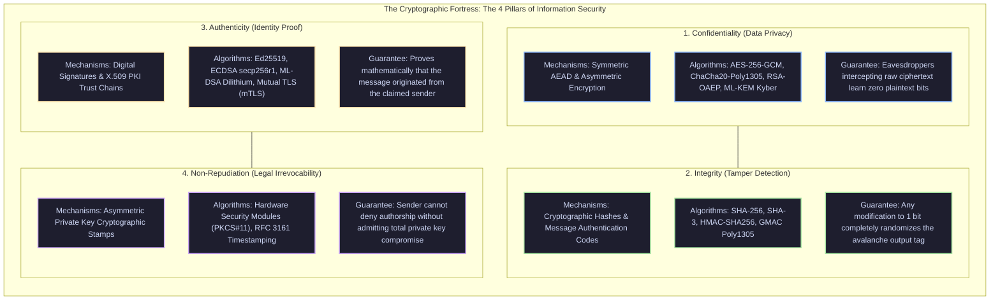

[🏠 Back to Home](../README.md) | [🍃 Spring Boot Master Guide](../spring-framework/spring_master_guide.md) | [🏛️ Spring Data JPA Guide](../spring-framework/spring_data_jpa.md) | [📦 Jackson Guide](jackson_master_guide.md)

# 🔐 Java & Spring Enterprise Cryptography & Security Master Guide

A production-grade engineering handbook for building zero-trust cryptographic architectures using the **Java Cryptography Architecture (JCA/JCE)**, **Spring Security Crypto**, **Bouncy Castle**, **Symmetric AEAD (AES-256-GCM, ChaCha20-Poly1305)**, **Asymmetric Public/Private Keys (RSA, ECC, Ed25519, Post-Quantum Kyber/Dilithium)**, **TLS 1.2 / TLS 1.3 & mTLS**, **SSH Protocol Internals**, **X.509 Certificates & PKI**, **Java KeyStore / TrustStore**, and **Cloud KMS Envelope Encryption**.

---

## 📑 Table of Contents

1. [🧠 Zero-to-Hero Mental Model: The Cryptographic Fortress](#-the-cryptographic-fortress)
2. [🛠️ Prerequisites & Foundational Mathematics](#️-prerequisites--foundational-mathematics)
3. [📦 Track 1: The Junior & Entry-Level Foundations](#track-1-the-junior--entry-level-foundations-zero-to-hero)
4. [🚀 Track 2: Master Java & Spring Cryptography Feature Catalog](#track-2-master-java--spring-cryptography-feature-catalog)
   - [2.1 JCA / JCE Architecture & Bouncy Castle Registration](#21-jca--jce-architecture--bouncy-castle-registration)
   - [2.2 Symmetric Ciphers: AES-256-GCM with AAD & ChaCha20-Poly1305](#22-symmetric-ciphers-aes-256-gcm-with-aad--chacha20-poly1305)
   - [2.3 Asymmetric Encryption: RSA-OAEP with SHA-256](#23-asymmetric-encryption-rsa-oaep-with-sha-256)
   - [2.4 Modern Elliptic Curves: ECC (secp256r1), X25519 & Ed25519 Signatures](#24-modern-elliptic-curves-ecc-secp256r1-x25519--ed25519-signatures)
   - [2.5 Post-Quantum Cryptography (PQC): NIST ML-KEM (Kyber) & ML-DSA (Dilithium)](#25-post-quantum-cryptography-pqc-nist-ml-kem-kyber--ml-dsa-dilithium)
   - [2.6 Cryptographic Hash Functions, HMAC & Password KDFs (Argon2id, BCrypt)](#26-cryptographic-hash-functions-hmac--password-kdfs-argon2id-bcrypt)
   - [2.7 Public Key Infrastructure (PKI), X.509 Certificates & Trust Chains](#27-public-key-infrastructure-pki-x509-certificates--trust-chains)
   - [2.8 Java KeyStore vs TrustStore Architecture (PKCS12, JKS, PKCS11 HSM)](#28-java-keystore-vs-truststore-architecture-pkcs12-jks-pkcs11-hsm)
   - [2.9 Network Security: SSL, TLS 1.2 vs TLS 1.3 & Mutual TLS (mTLS)](#29-network-security-ssl-tls-12-vs-tls-13--mutual-tls-mtls)
   - [2.10 SSH (Secure Shell) Protocol Internals & Java SSH Clients](#210-ssh-secure-shell-protocol-internals--java-ssh-clients)
   - [2.11 Cloud KMS Envelope Encryption Pattern (KEK + DEK)](#211-cloud-kms-envelope-encryption-pattern-kek--dek)
   - [2.12 Spring Data JPA Column Encryption via `AttributeConverter`](#212-spring-data-jpa-column-encryption-via-attributeconverter)
5. [🏗️ Track 3: JCA Engine Internals & Memory Hygiene](#track-3-jca-engine-internals--memory-hygiene)
6. [⚙️ Track 4: Production Engineering, Key Rotation & Hardware Acceleration](#track-4-production-engineering-key-rotation--hardware-acceleration)
7. [🚨 Track 5: War Room Post-Mortems & Root Cause Analysis (RCAs)](#track-5-war-room-post-mortems--root-cause-analysis-rcas)
8. [❌ Track 6: Beginner Mistakes & Fatal Security Traps](#track-6-beginner-mistakes--fatal-security-traps)
9. [🎓 Track 7: Crack-The-Interview Question Bank (Senior & Staff+ Level)](#track-7-crack-the-interview-question-bank-senior--staff-level)
10. [⚖️ Master Cryptography Decision Matrix & Cheat Sheet](#️-master-cryptography-decision-matrix--cheat-sheet)

---

## 🧠 The Cryptographic Fortress



#### Architectural Breakdown: The 4 Pillars of Enterprise Information Security

1. **Visual Architecture & Cryptographic Foundations**:
   - **Confidentiality**: Conceals plaintext from unauthorized observers using symmetric block/stream ciphers (AES-256-GCM, ChaCha20-Poly1305) and asymmetric key encapsulation mechanisms (RSA-OAEP, ML-KEM Kyber).
   - **Integrity**: Assures that data has not been modified in flight. Employs cryptographically secure hash functions (SHA-256, SHA-3) and keyed hash authenticators (HMAC, Galois GMAC).
   - **Authenticity**: Verifies identity of communicating principals. Relies on digital signatures (Ed25519, ECDSA) and X.509 Public Key Infrastructure (PKI) certificates bound to Subject Alternative Names (SANs).
   - **Non-Repudiation**: Guarantees that a principal cannot dispute the validity of an authored message or contract. Achieved via asymmetric private key signatures anchored in Hardware Security Modules (HSMs) and RFC 3161 cryptographic timestamps.

2. **Execution Flow & Combined Cryptographic Protocols**:
   - Modern enterprise security combines all four pillars simultaneously within hybrid protocols like **TLS 1.3**:
     1. *Authenticity & Non-Repudiation*: Server authenticates via its X.509 leaf certificate signed by a Certificate Authority (Pillar 3 & 4).
     2. *Key Agreement*: Client and server perform ephemeral ECDHE over Curve25519 to establish a high-entropy shared secret.
     3. *Confidentiality & Integrity*: All subsequent HTTP payload frames are encrypted using AES-256-GCM (Pillar 1) and authenticated via an embedded 128-bit Poly1305 or GMAC tag (Pillar 2).

3. **Low-Level Mathematical & Hardware Mechanics**:
   - **AES-NI Acceleration**: Modern x86 processors implement dedicated hardware instructions (`AESENC`, `AESENCLAST`, `PCLMULQDQ`). PCLMULQDQ executes carry-less multiplication for the GMAC GHASH Galois field $\text{GF}(2^{128})$, allowing AES-GCM encryption and authentication to process at speeds exceeding 5 GB/s per core with zero CPU branch penalties.
   - **Avalanche Effect in Hashing**: Cryptographic hash functions (such as SHA-256) enforce strict non-linear diffusion. Changing a single bit in a 100MB input payload flips on average 50% of the 256 output digest bits, defeating differential cryptanalysis.

4. **Production Failure Modes & SRE Diagnostics**:
   - **Unauthenticated Encryption Trap (AES-CBC without HMAC)**: Using raw AES in Cipher Block Chaining (CBC) mode without an authenticated MAC allows attackers to perform padding oracle attacks (e.g. POODLE, Lucky Thirteen) by measuring server decryption error responses to decrypt ciphertext byte-by-byte. Always mandate Authenticated Encryption with Associated Data (AEAD: AES-GCM or ChaCha20-Poly1305).
   - **Key Generation Entropy Exhaustion**: In containerized Kubernetes environments, poorly configured pods may deplete `/dev/random` entropy pools, causing `SecureRandom` calls to block the JVM indefinitely. SRE remediation: Ensure Linux kernels use `getrandom(2)` syscall (Linux 3.17+) or configure Java to use `file:/dev/urandom`.

<details>
<summary>View Legacy ASCII Fortress Diagram</summary>

```text
+----------------------------------------------------------------------------------------------------+
|                                    THE 4 PILLARS OF INFORMATION SECURITY                           |
+----------------------------------------------------------------------------------------------------+
| 1. Confidentiality (Encryption)   : Only authorized parties can read the data. (AES-GCM, RSA)      |
| 2. Integrity (Hashing / MAC)       : Nobody has secretly tampered with the data. (SHA-256, HMAC)   |
| 3. Authenticity (Signatures / Certs): We can prove mathematically WHO sent the data. (Ed25519, X.509)|
| 4. Non-Repudiation                 : The author cannot deny having sent the message. (Digital Sig)  |
+----------------------------------------------------------------------------------------------------+
```

</details>

### Everyday Analogies for Core Concepts:
- **Symmetric Encryption (The Padlock)**: A shared combination lock. Alice locks the box; Bob opens it with the exact same combination. Fast and efficient, but requires a pre-shared secret.
- **Asymmetric Encryption (The Slotted Mailbox)**: Anyone can drop mail through the public slot (**Public Key**), but only Bob has the physical key to unlock the door (**Private Key**).
- **Digital Signatures (The Royal Wax Seal)**: The King stamps a document using his personal signet ring (**Private Key**). Anyone who knows the royal crest (**Public Key**) can visually confirm the seal came from the King.
- **Digital Certificate (The Passport)**: A public key stamped by a globally trusted authority (the government / Certificate Authority) attesting to your true identity.
- **TLS / SSL (The Armored Convoy)**: An encrypted tunnel combining asymmetric exchange (to agree on keys) and symmetric stream encryption (to transfer data at high speed).
- **SSH (The Cryptographic Bouncer)**: Verifies server authenticity via `known_hosts` and client authenticity via public key challenges before opening a secure shell.

---

## 🛠️ Prerequisites & Foundational Mathematics

### 1. Entropy, Randomness & CSPRNG
- **Linear Congruential Generators (LCG - `java.util.Random`)**: `Math.random()` and `Random` are deterministic. Observing just two 32-bit values allows an attacker to compute the internal 48-bit seed and predict all future outputs. **Never use `Random` for security!**
- **Cryptographically Secure Pseudo-Random Number Generators (CSPRNG - `SecureRandom`)**: Draws entropy from physical hardware and OS kernel pools (`/dev/urandom` on Linux, `BCryptGenRandom` on Windows).
- **Entropy Exhaustion Flaw (`/dev/random`)**: Legacy `/dev/random` on Linux blocks application threads if environmental entropy is low. Always use `/dev/urandom` or Java's `NativePRNGNonBlocking`.

### 2. Mathematics Behind Cryptography
- **Prime Factorization (RSA)**: Multiplying two 2048-bit primes $p \cdot q = n$ takes microseconds; factoring $n$ back into $p$ and $q$ takes billions of years on classical computers.
- **Discrete Logarithm Problem (Diffie-Hellman)**: Given $g^a \pmod p$, finding $a$ is computationally intractable.
- **Elliptic Curve Discrete Logarithm (ECDSA, Ed25519)**: Given point $P$ and $Q = d \cdot P$ on an elliptic curve, finding scalar private key $d$ is computationally impossible. Curves offer equivalent security with $1/10\text{th}$ the key size of RSA!

---

# TRACK 1: THE JUNIOR & ENTRY-LEVEL FOUNDATIONS (ZERO-TO-HERO)

## 1. Core JCA Building Blocks in Java

| JCA Interface / Class | Responsibility | Analogy |
| :--- | :--- | :--- |
| **`Cipher`** | Encrypts and decrypts byte streams. | Encryption/Decryption machine. |
| **`KeyStore`** | Secure encrypted repository for private keys, certificates, and secrets. | Fireproof bank safe. |
| **`MessageDigest`** | Computes cryptographic one-way hashes (SHA-256, SHA-3). | Digital fingerprint scanner. |
| **`Mac`** | Computes Keyed-Hash Message Authentication Codes (HMAC). | Tamper-evident wax seal. |
| **`Signature`** | Signs data with private key; verifies with public key. | Notary stamp and signature. |
| **`KeyGenerator`** | Generates symmetric secret keys (AES, ChaCha20). | Key cutting machine. |
| **`KeyPairGenerator`**| Generates asymmetric public/private key pairs (RSA, EC, Ed25519). | Master locksmith forge. |
| **`SecureRandom`** | Generates non-deterministic, cryptographically secure random bytes. | Atmospheric noise dice roller. |

---

## 2. Production AES-256-GCM Blueprint with Nonce Management

```java
package com.example.crypto;

import javax.crypto.Cipher;
import javax.crypto.KeyGenerator;
import javax.crypto.SecretKey;
import javax.crypto.spec.GCMParameterSpec;
import java.nio.ByteBuffer;
import java.nio.charset.StandardCharsets;
import java.security.SecureRandom;
import java.util.Base64;

public final class AesGcmCipherService {

    private static final String TRANSFORMATION = "AES/GCM/NoPadding";
    private static final int TAG_LENGTH_BITS = 128; // 16 bytes authentication tag
    private static final int IV_LENGTH_BYTES = 12;  // 96 bits nonce as recommended by NIST SP 800-38D
    private static final SecureRandom SECURE_RANDOM = new SecureRandom();

    public static SecretKey generateAes256Key() throws Exception {
        KeyGenerator keyGen = KeyGenerator.getInstance("AES");
        keyGen.init(256, SECURE_RANDOM);
        return keyGen.generateKey();
    }

    public static String encrypt(String plaintext, SecretKey key) throws Exception {
        byte[] iv = new byte[IV_LENGTH_BYTES];
        SECURE_RANDOM.nextBytes(iv); // ⚠️ Fresh cryptographically random IV per encryption!

        Cipher cipher = Cipher.getInstance(TRANSFORMATION);
        cipher.init(Cipher.ENCRYPT_MODE, key, new GCMParameterSpec(TAG_LENGTH_BITS, iv));

        byte[] ciphertext = cipher.doFinal(plaintext.getBytes(StandardCharsets.UTF_8));

        // Prepend IV to ciphertext (IV is public and required for decryption)
        ByteBuffer buffer = ByteBuffer.allocate(iv.length + ciphertext.length);
        buffer.put(iv);
        buffer.put(ciphertext);

        return Base64.getEncoder().encodeToString(buffer.array());
    }

    public static String decrypt(String base64Payload, SecretKey key) throws Exception {
        byte[] decoded = Base64.getDecoder().decode(base64Payload);
        ByteBuffer buffer = ByteBuffer.wrap(decoded);

        byte[] iv = new byte[IV_LENGTH_BYTES];
        buffer.get(iv);

        byte[] ciphertext = new byte[buffer.remaining()];
        buffer.get(ciphertext);

        Cipher cipher = Cipher.getInstance(TRANSFORMATION);
        cipher.init(Cipher.DECRYPT_MODE, key, new GCMParameterSpec(TAG_LENGTH_BITS, iv));

        // doFinal verifies GHASH authentication tag; throws AEADBadTagException if altered!
        byte[] plaintext = cipher.doFinal(ciphertext);
        return new String(plaintext, StandardCharsets.UTF_8);
    }
}
```

---

# TRACK 2: MASTER JAVA & SPRING CRYPTOGRAPHY FEATURE CATALOG

## 2.1 JCA / JCE Architecture & Bouncy Castle Registration

The Java Cryptography Architecture (JCA) uses a dynamically pluggable provider model. By default, Oracle OpenJDK ships with `SunJCE`, `SunPKCS11`, and `SunRsaSign`. To unlock advanced algorithms (Post-Quantum, ChaCha20, Argon2, BCFIPS compliance), register the **Bouncy Castle Provider**:

```java
package com.example.crypto.config;

import org.bouncycastle.jce.provider.BouncyCastleProvider;
import java.security.Security;

public final class CryptoProviderInitializer {

    public static void initialize() {
        if (Security.getProvider(BouncyCastleProvider.PROVIDER_NAME) == null) {
            // Register Bouncy Castle at priority position 1
            Security.insertProviderAt(new BouncyCastleProvider(), 1);
        }
    }
}
```

---

## 2.2 Symmetric Ciphers: AES-256-GCM with AAD & ChaCha20-Poly1305

### 1. AES-GCM with Associated Authenticated Data (AAD)
Additional Authenticated Data (AAD) allows authenticating unencrypted metadata (e.g. `tenant_id`, `account_number`, `timestamp`) alongside ciphertext:

```java
public static byte[] encryptWithAad(byte[] plaintext, SecretKey key, byte[] aad) throws Exception {
    byte[] iv = new byte[12];
    new SecureRandom().nextBytes(iv);

    Cipher cipher = Cipher.getInstance("AES/GCM/NoPadding");
    cipher.init(Cipher.ENCRYPT_MODE, key, new GCMParameterSpec(128, iv));
    cipher.updateAAD(aad); // Cryptographically binds AAD into GHASH tag

    byte[] ciphertext = cipher.doFinal(plaintext);
    return ByteBuffer.allocate(12 + ciphertext.length).put(iv).put(ciphertext).array();
}
```

### 2. ChaCha20-Poly1305 (Stream Cipher AEAD - Java 11+)
ChaCha20-Poly1305 is an AEAD cipher that executes in **constant time on any CPU architecture without hardware AES-NI instructions**, making it ideal for mobile devices and ARM servers:
```java
public static byte[] encryptChaCha20(byte[] plaintext, SecretKey key) throws Exception {
    byte[] nonce = new byte[12];
    new SecureRandom().nextBytes(nonce);

    Cipher cipher = Cipher.getInstance("ChaCha20-Poly1305/None/NoPadding");
    cipher.init(Cipher.ENCRYPT_MODE, key, new ChaCha20ParameterSpec(nonce, 1));

    byte[] ciphertext = cipher.doFinal(plaintext);
    return ByteBuffer.allocate(12 + ciphertext.length).put(nonce).put(ciphertext).array();
}
```

---

## 2.3 Asymmetric Encryption: RSA-OAEP with SHA-256

> [!WARNING]
> Never use PKCS#1 v1.5 padding for RSA encryption! It is vulnerable to Bleichenbacher's Million Message padding oracle attack. Always use **RSA/ECB/OAEPWithSHA-256AndMGF1Padding**:

```java
package com.example.crypto.asymmetric;

import javax.crypto.Cipher;
import java.security.*;
import java.security.spec.MGF1ParameterSpec;
import javax.crypto.spec.OAEPParameterSpec;
import javax.crypto.spec.PSource;

public final class RsaOaepCipher {

    private static final String TRANSFORMATION = "RSA/ECB/OAEPWithSHA-256AndMGF1Padding";

    public static KeyPair generateRsaKeyPair() throws Exception {
        KeyPairGenerator generator = KeyPairGenerator.getInstance("RSA");
        generator.initialize(4096, new SecureRandom());
        return generator.generateKeyPair();
    }

    public static byte[] encrypt(byte[] plaintext, PublicKey publicKey) throws Exception {
        Cipher cipher = Cipher.getInstance(TRANSFORMATION);
        OAEPParameterSpec params = new OAEPParameterSpec(
            "SHA-256", "MGF1", MGF1ParameterSpec.SHA256, PSource.PSpecified.DEFAULT
        );
        cipher.init(Cipher.ENCRYPT_MODE, publicKey, params);
        return cipher.doFinal(plaintext);
    }

    public static byte[] decrypt(byte[] ciphertext, PrivateKey privateKey) throws Exception {
        Cipher cipher = Cipher.getInstance(TRANSFORMATION);
        OAEPParameterSpec params = new OAEPParameterSpec(
            "SHA-256", "MGF1", MGF1ParameterSpec.SHA256, PSource.PSpecified.DEFAULT
        );
        cipher.init(Cipher.DECRYPT_MODE, privateKey, params);
        return cipher.doFinal(ciphertext);
    }
}
```

---

## 2.4 Modern Elliptic Curves: ECC (secp256r1), X25519 & Ed25519 Signatures

### 1. Curve Comparison Matrix:
| Curve | Standard | Equation Type | Primary Use Case | Security Strength |
| :--- | :--- | :--- | :--- | :--- |
| **secp256r1 (NIST P-256)**| ANSI X9.62 / FIPS 186 | Short Weierstrass | TLS 1.2/1.3, Enterprise PKI | 128-bit (Requires constant-time protection) |
| **secp256k1** | Koblitz Curve | Short Weierstrass | Bitcoin, Ethereum Blockchain | 128-bit |
| **X25519 (Curve25519)** | RFC 7748 | Montgomery Curve | ECDH Key Exchange in TLS 1.3 | 128-bit (Immune to cache-timing attacks) |
| **Ed25519 (EdDSA)** | RFC 8032 | Twisted Edwards Curve | Digital Signatures, SSH, JWT | 128-bit (Deterministic, blazing speed) |

### 2. Ed25519 Digital Signatures in Java 15+
```java
public class Ed25519SignatureService {

    public static KeyPair generateKeyPair() throws NoSuchAlgorithmException {
        KeyPairGenerator kpg = KeyPairGenerator.getInstance("Ed25519");
        return kpg.generateKeyPair();
    }

    public static byte[] sign(byte[] data, PrivateKey privateKey) throws Exception {
        Signature signature = Signature.getInstance("Ed25519");
        signature.initSign(privateKey);
        signature.update(data);
        return signature.sign(); // Produces exact 64-byte signature!
    }

    public static boolean verify(byte[] data, byte[] sig, PublicKey publicKey) throws Exception {
        Signature signature = Signature.getInstance("Ed25519");
        signature.initVerify(publicKey);
        signature.update(data);
        return signature.verify(sig);
    }
}
```

---

## 2.5 Post-Quantum Cryptography (PQC): NIST ML-KEM (Kyber) & ML-DSA (Dilithium)

Quantum computers running Shor's Algorithm will break all classical public-key cryptography (RSA, ECC, Diffie-Hellman). In August 2024, NIST published the finalized Post-Quantum standards:
- **ML-KEM (FIPS 203 - CRYSTALS-Kyber)**: Module-Lattice-Based Key-Encapsulation Mechanism. Used for key exchange in TLS 1.3.
- **ML-DSA (FIPS 204 - CRYSTALS-Dilithium)**: Module-Lattice-Based Digital Signature Standard.
- **SLH-DSA (FIPS 205 - SPHINCS+)**: Stateless Hash-Based Digital Signature Standard.

### Post-Quantum Hybrid TLS 1.3 Key Exchange:
Modern systems adopt a **Hybrid Approach** (`X25519Kyber768Draft00`): combining classical X25519 with ML-KEM-768. Even if quantum computers arrive, the X25519 layer protects current security, while Kyber protects against "Store Now, Decrypt Later" adversaries!

---

## 2.6 Cryptographic Hash Functions, HMAC & Password KDFs (Argon2id, BCrypt)

```
+----------------------------------------------------------------------------------------------------+
|                                    HASHING vs MAC vs PASSWORD KDF                                  |
+----------------------------------------------------------------------------------------------------+
| Algorithm Category | Purpose                       | Target Speed            | Hardware Hardness   |
+--------------------+-------------------------------+-------------------------+---------------------+
| SHA-256 / SHA-3    | Integrity, Checksums          | Nanoseconds (Ultra-Fast)| None (Vulnerable GPU)
| HMAC-SHA256        | Symmetric Authentication, API | Microseconds (Fast)     | Secret-Key Bound    |
| Argon2id           | User Password Storage, KDF    | 50 - 250 Milliseconds   | Memory-Hard (64 MB) |
| BCrypt             | User Password Storage         | 100 - 300 Milliseconds  | CPU-Hard (4 KB RAM) |
+--------------------+-------------------------------+-------------------------+---------------------+
```

### Bulletproof Argon2id Configuration in Spring Security:
```java
@Configuration
public class SecurityCryptoConfig {

    @Bean
    public PasswordEncoder passwordEncoder() {
        // Parameters: salt=16 bytes, hash=32 bytes, parallelism=1, memory=65536 KB (64MB), iterations=3
        return new Argon2PasswordEncoder(16, 32, 1, 65536, 3);
    }
}
```

---

## 2.7 Public Key Infrastructure (PKI), X.509 Certificates & Trust Chains

### 1. The Anatomy of an X.509 v3 Digital Certificate:
```
+─────────────────────────────────────────────────────────────+
| X.509 v3 Digital Certificate Structure                      |
+─────────────────────────────────────────────────────────────+
| 1. Version                 : v3 (0x02)                      |
| 2. Serial Number           : Unique integer assigned by CA  |
| 3. Signature Algorithm     : SHA256withECDSA / SHA256withRSA|
| 4. Issuer                  : Distinguished Name (DN) of CA  |
| 5. Validity Period         : Not Before & Not After dates   |
| 6. Subject                 : DN of Certificate Owner        |
| 7. Subject Public Key Info : Algorithm identifier + PubKey  |
| 8. Extensions:                                              |
|    - Subject Alternative Name (SAN): DNS:api.example.com    |
|    - Basic Constraints     : CA:FALSE (Leaf Certificate)    |
|    - Key Usage             : Digital Signature, Key Encipher|
|    - Extended Key Usage    : Server Auth (1.3.6.1.5.5.7.3.1)|
| 9. CA Signature            : Signed by Intermediate/Root CA |
+─────────────────────────────────────────────────────────────+
```

### 2. The Chain of Trust & PKIX Path Validation:
```
[ Root CA ] (Self-signed, trusted in OS/JVM TrustStore: cacerts)
     │
     ▼ (Signs)
[ Intermediate CA ] (Cross-signs organizational certs)
     │
     ▼ (Signs)
[ Leaf Server Certificate ] (api.example.com - Presented during TLS Handshake)
```

### 3. Revocation Mechanics: CRL vs OCSP vs OCSP Stapling:
- **CRL (Certificate Revocation List)**: Downloaded periodic list of serial numbers. Slow, heavy bandwidth, high latency.
- **OCSP (Online Certificate Status Protocol)**: Real-time query to CA responder. Leaks client browsing habits and adds 100ms handshake delay.
- **OCSP Stapling (TLS Extension `status_request`)**: The **Industry Standard**. The web server queries the CA periodically, caches the cryptographically signed OCSP response, and "staples" it directly to the TLS handshake certificate, achieving zero client latency and total privacy!

---

## 2.8 Java KeyStore vs TrustStore Architecture (PKCS12, JKS, PKCS11 HSM)

| Dimension | `KeyStore` | `TrustStore` |
| :--- | :--- | :--- |
| **Role** | **Identity** ("Who am I?") | **Trust** ("Who do I trust?") |
| **Contents** | Application's Private Key + Public Certificate chain. | Public CA Root & Intermediate Certificates. |
| **JVM System Property** | `-Djavax.net.ssl.keyStore=keystore.p12` | `-Djavax.net.ssl.trustStore=truststore.p12` |
| **Factory Class** | `KeyManagerFactory` | `TrustManagerFactory` |

### Programmatic PKCS12 KeyStore Creation:
```java
KeyStore keyStore = KeyStore.getInstance("PKCS12");
keyStore.load(null, "SecretPassword".toCharArray()); // Initialize new empty store

// Store Private Key with Certificate Chain:
keyStore.setKeyEntry(
    "server-cert",
    serverPrivateKey,
    "KeyPassword".toCharArray(),
    new Certificate[]{ leafCert, intermediateCert }
);

try (FileOutputStream fos = new FileOutputStream("server-keystore.p12")) {
    keyStore.store(fos, "SecretPassword".toCharArray());
}
```

---

## 2.9 Network Security: SSL, TLS 1.2 vs TLS 1.3 & Mutual TLS (mTLS)

### 1. TLS 1.2 vs TLS 1.3 Handshake Protocol Flow

```
====================================================================================================
               TLS 1.2 (2-RTT Handshake)                   |             TLS 1.3 (1-RTT Handshake)
====================================================================================================
 Client                                Server              |  Client                                Server
   │                                     │                 |    │                                     │
   ├── ClientHello ─────────────────────>│                 |    ├── ClientHello + KeyShare(ECDH) ────>│
   │   (Supported Ciphers, TLS 1.2)      │                 |    │   (Supported Ciphers, Ephemeral Key)│
   │                                     │                 |    │                                     │
   │<── ServerHello + Certificate ───────┤                 |    │<── ServerHello + KeyShare + Cert ───┤
   │    + ServerKeyExchange (ECDHE)      │                 |    │    + Finished [Encrypted!]          │
   │    + ServerHelloDone                │                 |    │                                     │
   │                                     │                 |    ├── Finished [Encrypted!] ───────────>│
   ├── ClientKeyExchange (ECDHE) ───────>│                 |    │                                     │
   │   + ChangeCipherSpec + Finished     │                 |    │                                     │
   │                                     │                 |    │                                     │
   │<── ChangeCipherSpec + Finished ─────┤                 |    │                                     │
   │                                     │                 |    │                                     │
   ├═══ APPLICATION DATA (2-RTT) ════════┤                 |    ├═══ APPLICATION DATA (1-RTT) ════════┤
====================================================================================================
```

### 2. Perfect Forward Secrecy (PFS)
In legacy RSA key transport, if an attacker records encrypted network traffic for 5 years and subsequently steals the server's private key, they can decrypt all 5 years of historical traffic!
With **Ephemeral Diffie-Hellman (ECDHE)** in TLS 1.2/1.3:
- A fresh, ephemeral keypair is generated per session.
- Once the handshake completes, the ephemeral private keys are erased from RAM.
- Leaking the server's private key in the future **cannot decrypt historical captured sessions**!

### 3. Mutual TLS (mTLS) Zero-Trust Handshake:
In mTLS, the server sends a `CertificateRequest`. The client must present its own client certificate and sign a cryptographic challenge (`CertificateVerify`) using its private key, guaranteeing bidirectional identity verification.

---

## 2.10 SSH (Secure Shell) Protocol Internals & Java SSH Clients

SSH (RFC 4251–4254) operates over 3 distinct protocol layers:
1. **SSH Transport Layer (RFC 4253)**: Establishes an encrypted channel over TCP port 22 using Diffie-Hellman key exchange and verifies server host identity via `~/.ssh/known_hosts`.
2. **SSH Authentication Layer (RFC 4252)**: Authenticates client to server using public key cryptography (`~/.ssh/authorized_keys`), keyboard-interactive, or passwords.
3. **SSH Connection Layer (RFC 4254)**: Multiplexes encrypted channels over the single connection (interactive shells, SFTP, local/remote TCP port forwarding).

### Modern SSH Key Recommendation:
- `ssh-ed25519`: The premier modern standard. Fast, compact, immune to side-channel attacks.
- `rsa-sha2-512`: Acceptable for legacy systems (RSA 4096-bit).
- `ssh-rsa` (SHA-1): **Strictly deprecated and blocked by modern OpenSSH servers!**

---

## 2.11 Cloud KMS Envelope Encryption Pattern (KEK + DEK)

Envelope encryption decouples key management from bulk data encryption:
```
1. Generate Data Key:
   App ---> Cloud KMS.generateDataKey(KEK_ID)
   KMS ---> App: [ Plaintext DEK (32 bytes) ] + [ Encrypted DEK (Ciphertext) ]

2. Encrypt Bulk Data:
   Plaintext File + Plaintext DEK ---> AES-256-GCM ---> [ Encrypted File ]

3. Wipe Plaintext DEK:
   Arrays.fill(plaintextDek, (byte) 0);

4. Persist Artifacts:
   Save [ Encrypted File ] + [ Encrypted DEK ] to S3 / Database.
```

---

## 2.12 Spring Data JPA Column Encryption via `AttributeConverter`

```java
@Converter
public class EncryptedAttributeConverter implements AttributeConverter<String, String> {

    private static final String TRANSFORMATION = "AES/GCM/NoPadding";
    private static final SecretKey SECRET_KEY = /* Inject via KMS / Vault */;

    @Override
    public String convertToDatabaseColumn(String attribute) {
        if (attribute == null) return null;
        try {
            byte[] iv = new byte[12];
            new SecureRandom().nextBytes(iv);
            Cipher cipher = Cipher.getInstance(TRANSFORMATION);
            cipher.init(Cipher.ENCRYPT_MODE, SECRET_KEY, new GCMParameterSpec(128, iv));
            byte[] ciphertext = cipher.doFinal(attribute.getBytes(StandardCharsets.UTF_8));
            return Base64.getEncoder().encodeToString(
                ByteBuffer.allocate(12 + ciphertext.length).put(iv).put(ciphertext).array()
            );
        } catch (Exception e) {
            throw new IllegalStateException("Failed to encrypt column", e);
        }
    }

    @Override
    public String convertToEntityAttribute(String dbData) {
        if (dbData == null) return null;
        try {
            byte[] decoded = Base64.getDecoder().decode(dbData);
            ByteBuffer buffer = ByteBuffer.wrap(decoded);
            byte[] iv = new byte[12];
            buffer.get(iv);
            byte[] ciphertext = new byte[buffer.remaining()];
            buffer.get(ciphertext);

            Cipher cipher = Cipher.getInstance(TRANSFORMATION);
            cipher.init(Cipher.DECRYPT_MODE, SECRET_KEY, new GCMParameterSpec(128, iv));
            return new String(cipher.doFinal(ciphertext), StandardCharsets.UTF_8);
        } catch (Exception e) {
            throw new IllegalStateException("Failed to decrypt column", e);
        }
    }
}
```

---

# TRACK 3: JCA ENGINE INTERNALS & MEMORY HYGIENE

## 3.1 Constant-Time Comparison to Thwart Remote Timing Attacks

```java
// ❌ VULNERABLE: Exposes timing side-channel via early-exit loop
if (computedHmac.equals(clientProvidedHmac)) { ... }

// ✅ SECURE: Constant-time bitwise XOR comparison
if (MessageDigest.isEqual(computedHmac.getBytes(StandardCharsets.UTF_8), clientProvidedHmac.getBytes(StandardCharsets.UTF_8))) {
    // Authenticated safely
}
```

## 3.2 JVM Memory Hygiene: Zeroing Sensitive Buffers

```java
public void processSensitiveKey(byte[] rawKey) {
    try {
        // Perform crypto operations...
    } finally {
        // Explicitly wipe key material from RAM immediately
        Arrays.fill(rawKey, (byte) 0);
    }
}
```

---

# TRACK 4: PRODUCTION ENGINEERING, KEY ROTATION & HARDWARE ACCELERATION

## 4.1 Zero-Downtime Key Rotation (Versioned Ciphertext Header)

```
[ Key Version: 2 bytes ("v1") ] : [ IV: 12 bytes ] : [ Ciphertext & Tag ]
```

```java
public String decryptWithRotation(String payload) {
    if (payload.startsWith("v1:")) {
        return decryptWithKey(payload.substring(3), keyV1);
    } else if (payload.startsWith("v2:")) {
        return decryptWithKey(payload.substring(3), keyV2);
    }
    throw new IllegalArgumentException("Unknown key version");
}
```

---

# TRACK 5: WAR ROOM POST-MORTEMS & ROOT CAUSE ANALYSIS (RCAs)

## 🚨 Incident 1: Total Plaintext Recovery via Static Hardcoded AES-GCM IV
- **Severity:** P0 Security Incident
- **Root Cause:** A developer initialized the IV with a constant array (`byte[] iv = new byte[12]`) to make unit tests reproducible.
- **Impact:** Reusing the same key and IV in GCM allowed an external attacker to XOR ciphertexts ($C_1 \oplus C_2 = P_1 \oplus P_2$), recovering all database plaintexts and calculating the internal GHASH key $H$.
- **Remediation:** Enforced fresh `SecureRandom` 12-byte IVs per write; deployed Semgrep CI guardrails.

---

## 🚨 Incident 2: Expired Internal mTLS Root Certificate Outage
- **Severity:** P1 Outage (Complete microservice mesh partition)
- **Root Cause:** The internal CA root certificate had a 2-year validity that expired on a Sunday. No automated certificate monitoring was in place.
- **Remediation:** Integrated automated certificate renewal via HashiCorp Vault / Cert-Manager; established Prometheus alerting for certificates with $<30$ days validity.

---

## 🚨 Incident 3: The `TrustAllManager` Catastrophe Shipped to Production
- **Severity:** P0 Critical Vulnerability
- **Root Cause:** To bypass self-signed certificate errors during local development, a developer added a custom `X509TrustManager` that returned `null` for `getAcceptedIssuers()` and had empty `checkServerTrusted()` methods.
- **Impact:** The application accepted any certificate presented on the internet, exposing all inter-service traffic to trivial Man-in-the-Middle (MITM) credential theft.
- **Remediation:** Banned dummy TrustManagers via Checkstyle/ArchUnit rules; deployed private CA certificates into the internal JVM `cacerts` truststore.

---

## 🚨 Incident 4: Sony PlayStation 3 Private Key Extraction via Static ECDSA Nonce $k$
- **Severity:** Landmark Cryptographic Catastrophe
- **Root Cause:** Sony's ECDSA signing code failed to generate a random nonce $k$ per signature, instead hardcoding $k$ as a constant.
- **Impact:** Two signatures $(r, s_1)$ and $(r, s_2)$ sharing the same $r$ allowed hackers to compute:
  $$k = \frac{z_1 - z_2}{s_1 - s_2} \implies d = \frac{s_1 \cdot k - z_1}{r}$$
  recovering Sony's root private key $d$ and completely breaking PS3 security.
- **Remediation:** Always use deterministic RFC 6979 nonce generation or switch to modern **Ed25519**!

---

# TRACK 6: BEGINNER MISTAKES & FATAL SECURITY TRAPS

### ❌ Trap 1: Using `Cipher.getInstance("AES")`
Defaults to `AES/ECB/PKCS5Padding`. Electronic Codebook (ECB) encrypts identical plaintext blocks into identical ciphertext blocks, leaking structural patterns. Always use `AES/GCM/NoPadding`.

### ❌ Trap 2: Storing Passwords in `String` Instead of `char[]`
Strings are interned and immutable. Memory cannot be overwritten until GC runs. Heap dumps expose passwords in plaintext.

### ❌ Trap 3: Creating Custom Cryptographic Algorithms ("Rolling Your Own Crypto")
Proprietary algorithms invariably suffer from mathematical flaws, padding oracle vulnerabilities, and timing side-channels. Always use peer-reviewed NIST/RFC standards.

### ❌ Trap 4: Disabling Hostname Verification
Calling `HttpsURLConnection.setDefaultHostnameVerifier((hostname, session) -> true)` allows any valid certificate issued for `attacker.com` to impersonate `bank.com`!

---

# TRACK 7: CRACK-THE-INTERVIEW QUESTION BANK (SENIOR & STAFF+ LEVEL)

### Q1: Why does AES-GCM require an IV of exactly 96 bits (12 bytes)?
NIST SP 800-38D specifies that 96-bit IVs are converted directly to the initial counter block $J_0$ by appending the 32-bit integer $1$ (`iv || 0^31 || 1`). Any other IV length forces GCM to run an expensive GHASH computation over the entire IV to condense it to 128 bits, degrading throughput and increasing collision risks.

### Q2: What is the fundamental difference between TLS 1.2 and TLS 1.3?
TLS 1.3 eliminates the second round trip, reducing handshake latency from 2-RTT to 1-RTT (and 0-RTT for resumed sessions). It removes all insecure legacy primitives (MD5, SHA-1, RC4, DES, CBC mode, RSA key exchange) and mandates Authenticated Encryption (AEAD) and Ephemeral Diffie-Hellman (PFS) exclusively.

### Q3: How does Ed25519 eliminate the catastrophic ECDSA nonce reuse vulnerability?
In ECDSA, reusing or biasing the random nonce $k$ reveals the private key. Ed25519 (RFC 8032) derives its nonce deterministically:
$$k = \text{SHA-512}(\text{privateKey} \parallel \text{message})$$
Because $k$ is deterministically generated from the secret key and the message, no two distinct messages can ever share the same nonce $k$, eliminating RNG failure attacks permanently.

### Q4: Explain the difference between KeyStore and TrustStore in Spring Boot.
A `KeyStore` holds private keys and certificate chains to authenticate the server to clients. A `TrustStore` holds trusted third-party Certificate Authority (CA) root certificates to verify the authenticity of remote servers or incoming client certificates in mTLS.

### Q5: What is Post-Quantum Cryptography and how does ML-KEM work?
PQC algorithms rely on mathematical problems that quantum computers cannot solve efficiently (such as the Learning With Errors problem over module lattices). ML-KEM (Kyber) allows two parties to agree on a shared secret without either party exposing the key material to Shor's algorithm.

---

# ⚖️ MASTER CRYPTOGRAPHY DECISION MATRIX & CHEAT SHEET

| Security Objective | Recommended Standard | Configuration / Implementation |
| :--- | :--- | :--- |
| **Payload & Database Encryption** | AES-256-GCM (AEAD) | `AES/GCM/NoPadding`, 96-bit random IV, 128-bit tag |
| **Mobile / Non-AES Hardware** | ChaCha20-Poly1305 | Constant-time stream cipher with Poly1305 authenticator |
| **Enterprise Password Storage** | Argon2id | Memory $\ge 64\text{MB}$, Iterations $= 3$, Parallelism $= 1$ |
| **Digital Signatures & Identity** | Ed25519 | Deterministic, immune to timing side-channels |
| **Constant-Time Verification** | `MessageDigest.isEqual()` | Bitwise XOR evaluation against timing attacks |
| **Key Vault Storage Format** | PKCS12 (`.p12`) | Standard cross-platform encrypted archive |
| **Network Transport Security** | TLS 1.3 | Mandates AEAD + PFS exclusively; 1-RTT latency |
| **Microservice Zero-Trust** | mTLS | Bidirectional X.509 certificate verification |
| **Remote Server Administration** | SSH with `ssh-ed25519` | Public key challenge-response authentication |

---
[🏠 Back to Home](../README.md) | [🍃 Spring Boot Master Guide](../spring-framework/spring_master_guide.md) | [🏛️ Spring Data JPA Guide](../spring-framework/spring_data_jpa.md) | [📦 Jackson Guide](jackson_master_guide.md)
