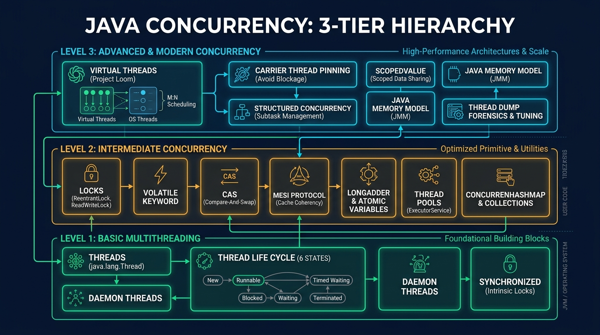
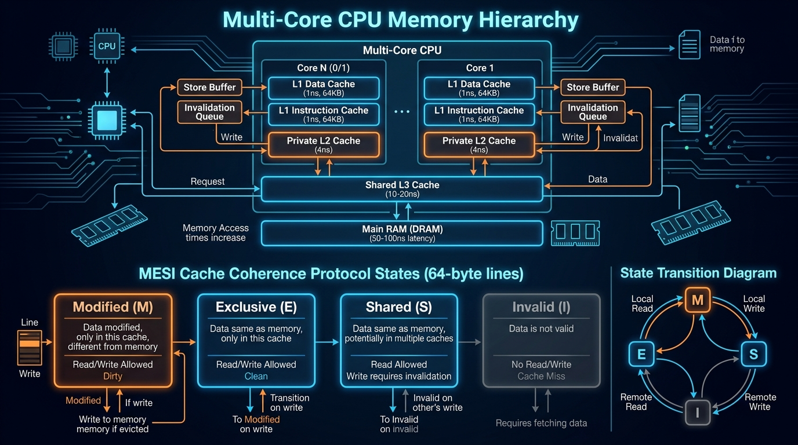
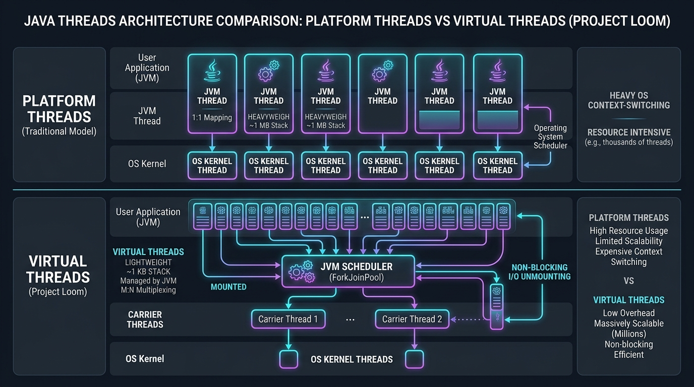
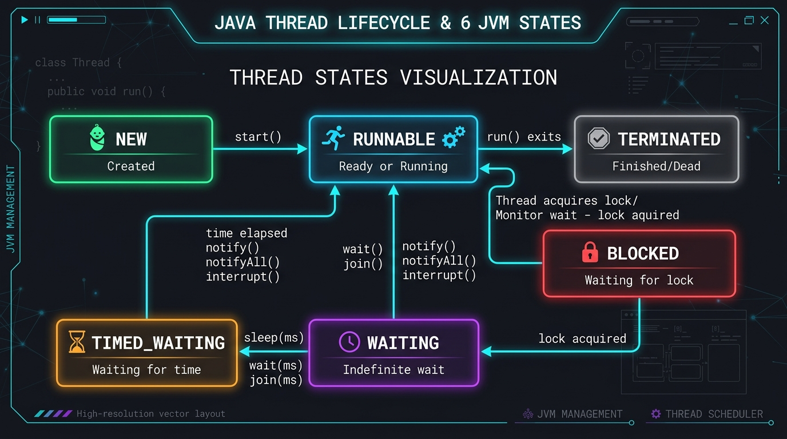
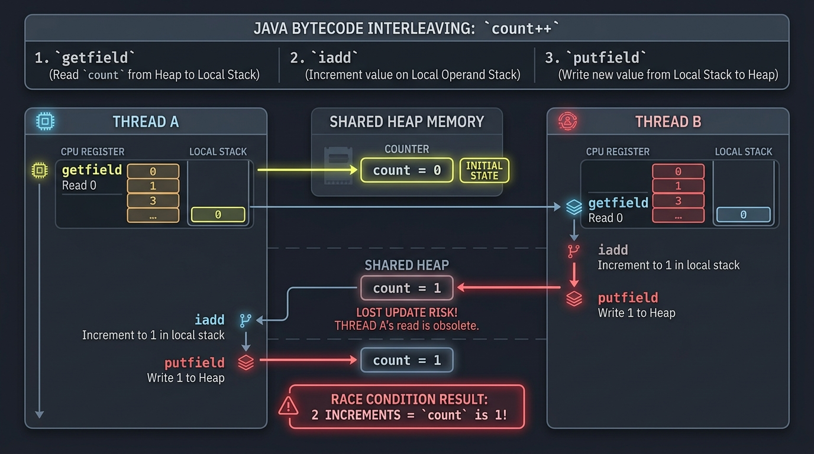
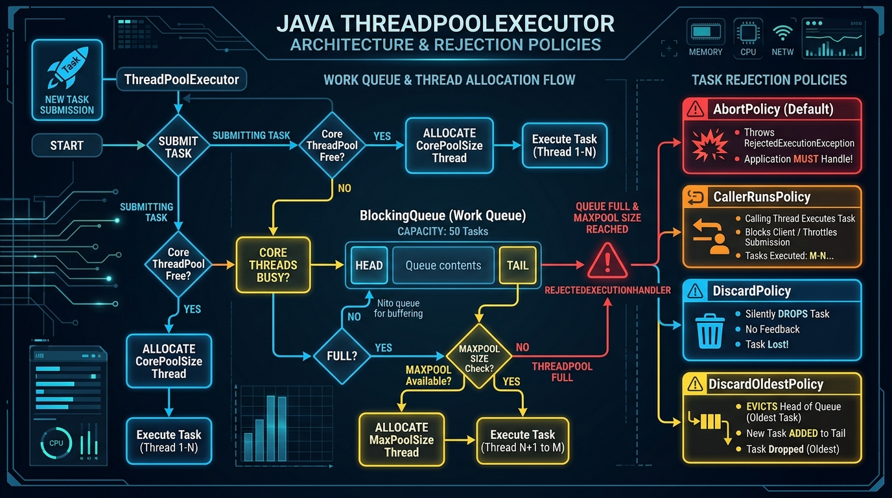
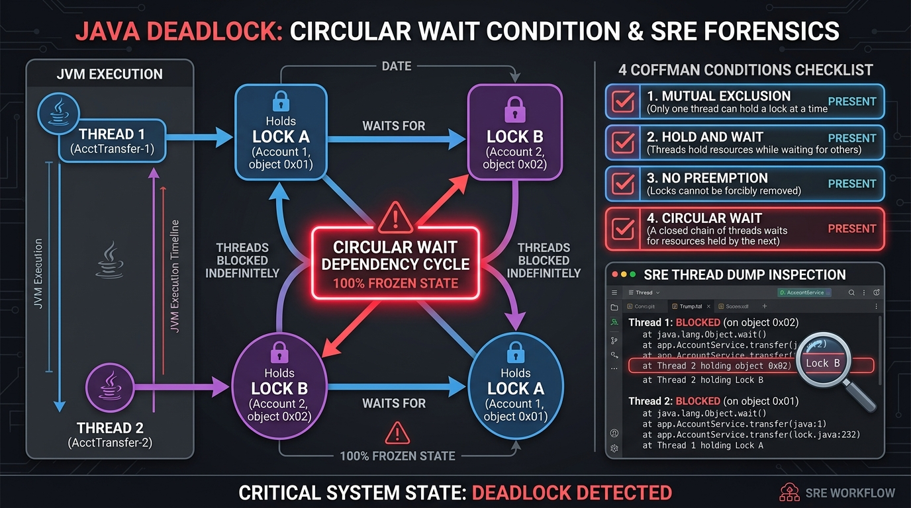

[🏠 Back to Home](README.md) | [⚡ CompletableFuture Guide](completable_future.md) | [📚 Collections Reference](java_collection.md) | [🔥 200 Concurrency Scenarios Guide](java_threads_concurrency_200_scenarios_master_guide.md)

# 🧵 Java Multithreading & Concurrency: 100+ Real-World Scenarios Masterclass

> 🚀 **Looking for Tier-1 Product Interview Scenarios?** Check out the dedicated **[Java Multithreading & Concurrency: 200 Real-World Interview Scenarios Master Guide](java_threads_concurrency_200_scenarios_master_guide.md)** featuring 200 deep technical scenarios across 10 master categories!

---

## 📑 Table of Contents
- [🧠 Visual Architecture Roadmap: The 3-Tier Concurrency Hierarchy](#roadmap)
- [🌱 Track 0: Zero-to-Hero Foundation (What is a Thread & Why Concurrency?)](#foundation)
  - [0.1 Program vs Process vs Thread (The Kitchen & Chefs Mental Model)](#01-program-vs-process-vs-thread)
  - [0.2 Concurrency vs Parallelism: The Rob Pike Distinction](#02-concurrency-vs-parallelism)
  - [0.3 JVM Memory Layout: Thread-Private Stack vs Shared Heap](#03-jvm-memory-layout)
  - [0.4 The Life of a Thread: Thread.start() vs Thread.run() Under the Hood](#04-start-vs-run)
  - [0.5 The 4 Ways to Create Threads in Java (Definitive Comparison)](#05-thread-creation-comparison)
- [🛠️ Low-Level Prerequisites: OS Kernel, CPU Caches & The JMM](#prerequisites)
- [🟢 Track 1: Tier 1 - Basic Foundational Threading (The Absolute Essentials)](#track-1)
  - [1.1 Thread Creation: Subclassing Thread vs Runnable vs Lambda vs Callable](#11-thread-creation-subclassing-thread-vs-runnable-vs-lambda-vs-callable)
  - [1.2 Thread Lifecycle & 6 JVM States (NEW to TERMINATED)](#12-thread-lifecycle--6-jvm-states-new-to-terminated)
  - [1.3 Thread Attributes, Naming & Daemon vs User Threads](#13-thread-attributes-naming--daemon-vs-user-threads)
  - [1.4 Thread Control Primitives: sleep(), yield(), and join()](#14-thread-control-primitives-sleep-yield-and-join)
  - [1.5 Cooperative Interruption & InterruptedException Handling](#15-cooperative-interruption--interruptedexception-handling)
  - [1.6 Uncaught Exception Handling (UncaughtExceptionHandler)](#16-uncaught-exception-handling-uncaughtexceptionhandler)
  - [1.7 The Race Condition Trap: Bytecode Read-Modify-Write on count++](#17-the-race-condition-trap-bytecode-read-modify-write-on-count)
  - [1.8 Intrinsic Synchronization (synchronized Methods, Blocks & Reentrancy)](#18-intrinsic-synchronization-synchronized-methods-blocks--reentrancy)
  - [1.9 Inter-Thread Signaling: wait(), notify(), and notifyAll()](#19-inter-thread-signaling-wait-notify-and-notifyall)
- [🟡 Track 2: Tier 2 - Intermediate Concurrency, Locks & Coordination](#track-2)
  - [2.1 Memory Visibility, Hardware Caches & the volatile Keyword](#21-memory-visibility-hardware-caches--the-volatile-keyword)
  - [2.2 Hardware CAS & Atomic Variables (AtomicInteger, AtomicReference, ABA)](#22-hardware-cas--atomic-variables-atomicinteger-atomicreference-aba)
  - [2.3 High-Contention Striping: LongAdder vs AtomicLong](#23-high-contention-striping-longadder-vs-atomiclong)
  - [2.4 Explicit Locks: ReentrantLock & tryLock(timeout)](#24-explicit-locks-reentrantlock--trylocktimeout)
  - [2.5 Condition Variables: Multiple Wait-Sets (Bounded Blocking Queue)](#25-condition-variables-multiple-wait-sets-bounded-blocking-queue)
  - [2.6 High-Read Optimization: ReentrantReadWriteLock & Lock Downgrading](#26-high-read-optimization-reentrantreadwritelock--lock-downgrading)
  - [2.7 Optimistic Lockless Validation: StampedLock](#27-optimistic-lockless-validation-stampedlock)
  - [2.8 Coordination Primitives: CountDownLatch, CyclicBarrier, Semaphore, Exchanger, Phaser](#28-coordination-primitives-countdownlatch-cyclicbarrier-semaphore-exchanger-phaser)
  - [2.9 ThreadPoolExecutor Architecture & The 4 Rejection Policies](#29-threadpoolexecutor-architecture--the-4-rejection-policies)
  - [2.10 ScheduledThreadPoolExecutor & Work-Stealing ForkJoinPool](#210-scheduledthreadpoolexecutor--work-stealing-forkjoinpool)
  - [2.11 Concurrent Collections: ConcurrentHashMap & CopyOnWriteArrayList](#211-concurrent-collections-concurrenthashmap--copyonwritearraylist)
- [🔴 Track 3: Tier 3 - Advanced Modern Concurrency (Java 21+), Loom & Forensics](#track-3)
  - [3.1 Java 21+ Project Loom: Virtual Threads vs Platform Threads](#31-java-21-project-loom-virtual-threads-vs-platform-threads)
  - [3.2 Carrier Thread Pinning: synchronized vs ReentrantLock](#32-carrier-thread-pinning-synchronized-vs-reentrantlock)
  - [3.3 Java 21+ Structured Concurrency (StructuredTaskScope)](#33-java-21-structured-concurrency-structuredtaskscope)
  - [3.4 Java 21+ Scoped Values vs ThreadLocal](#34-java-21-scoped-values-vs-threadlocal)
  - [3.5 Asynchronous DAG Pipelines: CompletableFuture Masterclass](#35-asynchronous-dag-pipelines-completablefuture-masterclass)
  - [3.6 Deep Java Memory Model (JMM): Memory Barriers & VarHandle](#36-deep-java-memory-model-jmm-memory-barriers--varhandle)
- [🧩 Track 4: Production Concurrency Scenarios Masterclass (Scenarios 1 to 85+)](#track-4)
- [🚨 Track 5: Production War Room Diagnostics & SRE Forensics](#track-5)
  - [5.1 Live Thread Dump Generation & State Forensics (jcmd / jstack)](#51-live-thread-dump-generation--state-forensics-jcmd--jstack)
  - [5.2 Deadlock RCA & Automated Detection](#52-deadlock-rca--automated-detection)
  - [5.3 Livelock & Thread Starvation Forensics](#53-livelock--thread-starvation-forensics)
  - [5.4 High-CPU Thread Hunting (Linux top -H to Java nid)](#54-high-cpu-thread-hunting-linux-top--h-to-java-nid)
  - [5.5 ThreadLocal Memory Leaks in Containerized Application Servers](#55-threadlocal-memory-leaks-in-containerized-application-servers)
- [🎓 Track 6: Crack-The-Interview Question Bank (Senior & Principal Concurrency Scenarios)](#track-6)

---

<a id="roadmap"></a>
## 🧠 Visual Architecture Roadmap: The 3-Tier Concurrency Hierarchy



### 📊 Visual Architecture & State Flow Description
The 3-Tier Concurrency Hierarchy visualizes the progressive mastery of multi-threaded systems from foundational building blocks to hardware-level synchronization and modern lightweight fiber concurrency:

1. **🟢 Level 1: Basic Multithreading (Foundational Building Blocks)**
   - **Core Primitives**: Centered on `java.lang.Thread`, `Runnable`, and the JVM's 6 lifecycle states (`NEW` $\to$ `RUNNABLE` $\to$ `BLOCKED`/`WAITING`/`TIMED_WAITING` $\to$ `TERMINATED`).
   - **Boundary Isolation**: Separates transient background **Daemon Threads** from critical foreground **User Threads** that control JVM shutdown.
   - **Intrinsic Synchronization**: Employs synchronized monitor locks embedded inside the object header's Mark Word to guarantee mutual exclusion across thread execution boundaries.

2. **🟡 Level 2: Intermediate Concurrency (Optimized Primitives & Coordination)**
   - **Hardware Cache Line Coherence**: Moves beyond compiler synchronization to hardware memory guarantees using `volatile`, hardware store buffers, and the **MESI (Modified, Exclusive, Shared, Invalid)** protocol.
   - **Lock-Free Atomic Operations**: Implements non-blocking CPU instruction primitives (`cmpxchg`) via `CAS (Compare-And-Swap)` and striped memory cells (`LongAdder`) to prevent single-variable cache line contention.
   - **Managed Worker Lifecycles**: Replaces unbounded thread creation with managed `ThreadPoolExecutor` instances, pairing work queues with strict saturation rejection policies (`AbortPolicy`, `CallerRunsPolicy`, `DiscardPolicy`, `DiscardOldestPolicy`).
   - **Concurrent Data Structures**: Utilizes bucket-level synchronized segmented maps (`ConcurrentHashMap`) and snapshot arrays (`CopyOnWriteArrayList`).

3. **🔴 Level 3: Advanced Modern Concurrency (High-Performance Architectures & SRE Forensics)**
   - **Project Loom Virtual Threads**: Decouples Java threads from OS kernel threads using an $M:N$ scheduler (`ForkJoinPool`), allowing millions of lightweight $\approx 1\text{KB}$ virtual fibers to mount and unmount upon blocking socket I/O.
   - **Carrier Thread Pinning Defense**: Identifies and mitigates carrier starvation caused by legacy `synchronized` monitor locks or JNI native frames blocking underlying kernel threads.
   - **Structured Concurrency & Scoped Values**: Replaces unmanaged fire-and-forget concurrency and leaky `ThreadLocal` storage with lexical-scoped task trees (`StructuredTaskScope`) and immutable `ScopedValue` bindings.
   - **SRE War Room Diagnostics**: Equips senior engineers with live thread dump inspection techniques (`jcmd`, `jstack`, `nid` mapping) to rapidly pinpoint circular wait deadlocks, CPU spinning livelocks, and thread starvation in high-throughput production clusters.

<details>
<summary><b>View Text-Based Roadmap Representation (ASCII Fallback)</b></summary>

```text
+==================================================================================================+
|                        LEVEL 1: 🟢 BASIC (FOUNDATIONAL MULTITHREADING)                           |
+==================================================================================================+
|  Thread & Runnable   |  6 JVM Thread States  |  Daemon vs User    |  sleep / yield / join        |
|  Thread Interruption |  UncaughtException    |  Race Condition    |  synchronized & wait/notify  |
+==================================================================================================+
                                                │
                                                ▼
+==================================================================================================+
|                    LEVEL 2: 🟡 INTERMEDIATE (LOCKS, ATOMICS & COORDINATION)                      |
+==================================================================================================+
|  volatile & MESI     |  AtomicInteger / CAS  |  LongAdder Striping |  ReentrantLock & tryLock     |
|  Condition (Queues)  |  ReadWriteLock        |  StampedLock (Opt)  |  CountDownLatch / Barrier    |
|  Semaphore Rate Lim  |  ThreadPoolExecutor   |  4 Rejection Rules  |  ConcurrentHashMap           |
+==================================================================================================+
                                                │
                                                ▼
+==================================================================================================+
|                     LEVEL 3: 🔴 ADVANCED (JAVA 21+ LOOM, JMM & FORENSICS)                        |
+==================================================================================================+
|  Virtual Threads     |  Carrier Unmounting   |  Pinning Mitigation |  StructuredTaskScope         |
|  ScopedValue Context |  CompletableFuture DAG|  VarHandle & Fences |  Thread Dump Forensics       |
|  Deadlock Detection  |  Linux top -H to nid  |  Livelock Diagnosis |  ThreadLocal Leak RCA        |
+==================================================================================================+
```
</details>

---

<a id="foundation"></a>
# 🌱 TRACK 0: ZERO-TO-HERO FOUNDATION (WHAT IS A THREAD & WHY CONCURRENCY?)

> *"Before you memorize APIs, you must internalize the physical reality of how a computer executes your code. Multithreading is not magic; it is simply multiple workers sharing one workspace."*

---

<a id="01-program-vs-process-vs-thread"></a>
## 0.1 Program vs Process vs Thread (The Kitchen & Chefs Mental Model)

To truly understand concurrency, you must first distinguish between three concepts that developers frequently conflate: **Program**, **Process**, and **Thread**.

```text
+---------------------------------------------------------------------------------------------------+
|                                      OPERATING SYSTEM (THE CITY)                                  |
|                                                                                                   |
|  +-------------------------------------------------------------+   +----------------------------+ |
|  |           PROCESS: JVM Instance (The Restaurant)            |   | PROCESS: Web Browser       | |
|  |                                                             |   | (Completely Isolated       | |
|  |   SHARED MEMORY (The Kitchen):                              |   |  Address Space)            | |
|  |   - Java Heap (Shared Ingredients, Countertops, Orders)     |   |                            | |
|  |   - Metaspace (The Recipe Book / Loaded Classes)            |   |                            | |
|  |                                                             |   |                            | |
|  |   +-----------------------+     +-----------------------+   |   |                            | |
|  |   |  THREAD 1: Chef Alice |     |  THREAD 2: Chef Bob   |   |   |                            | |
|  |   |  - Private Stack: 1MB |     |  - Private Stack: 1MB |   |   |                            | |
|  |   |    (Her own cutting   |     |    (His own cutting   |   |   |                            | |
|  |   |     board & apron)    |     |     board & apron)    |   |   |                            | |
|  |   |  - PC: Reading Step 4 |     |  - PC: Reading Step 9 |   |   |                            | |
|  |   +-----------------------+     +-----------------------+   |   |                            | |
|  +-------------------------------------------------------------+   +----------------------------+ |
+---------------------------------------------------------------------------------------------------+
```

### 1. The Real-World Kitchen Analogy
| Concept | Kitchen Analogy | Technical Definition in Computing |
| :--- | :--- | :--- |
| **Program** | The **Cookbook** sitting on a shelf. | A static executable file on disk (e.g. `java.exe` or compiled `.class` / `.jar` bytecode). It consumes 0% CPU and 0MB RAM until executed. |
| **Process** | The **Restaurant Kitchen**. It has its own building, private water supply, and closed doors. | An active executing instance of a program loaded into memory. The OS grants each process an **isolated virtual address space**, private file descriptors, and security privileges. Process A cannot read Process B's memory without OS inter-process communication (IPC). |
| **Thread** | An **Individual Chef** working inside that kitchen. | The smallest dispatchable unit of CPU execution. All threads inside a process **share the same Heap and Metaspace**, but each thread has its own **private Stack** and **Program Counter (PC)**. |

### Why Do We Need Multiple Threads Inside One Process?
1. **Responsiveness (Non-blocking UI & APIs)**: If a single-threaded server handles a slow database query (taking 5 seconds), all other 1,000 users are frozen out. With multiple threads, Worker Thread 1 waits on the DB while Worker Thread 2 immediately serves the next user!
2. **Resource Utilization**: Modern CPUs have 8, 16, or 64 physical cores. A single-threaded program runs on only **one single core**, leaving 95% of your expensive server hardware completely idle! Multithreading spreads computation across all available cores.
3. **Throughput**: Instead of downloading 10 images sequentially in 10 seconds, 10 threads can download them concurrently in 1 second!

---

<a id="02-concurrency-vs-parallelism"></a>
## 0.2 Concurrency vs Parallelism: The Rob Pike Distinction

Many engineers use the words "concurrent" and "parallel" interchangeably. They are fundamentally different concepts:

> 💡 **The Golden Definition (by Rob Pike, Co-designer of Go):**  
> *"Concurrency is about **dealing with** lots of things at once. Parallelism is about **doing** lots of things at once."*

```text
CONCURRENCY (Single-Core CPU: Time-Slicing / Interleaving)
CPU Core 0: [ Task A ] -> [ Task B ] -> [ Task A ] -> [ Task C ] -> [ Task B ] ...
(Progress on multiple tasks by rapid switching; only ONE executes at any microsecond)

PARALLELISM (Multi-Core CPU: Simultaneous Physical Execution)
CPU Core 0: [====== Task A (Executing) ======]
CPU Core 1: [====== Task B (Executing) ======]
CPU Core 2: [====== Task C (Executing) ======]
(Multiple physical silicon cores executing instructions at the exact same instant)
```

1. **Concurrency (Structure & Pacing)**:
   - On a **single-core machine**, true simultaneous execution is physically impossible.
   - The OS performs **preemptive multitasking**: it gives Thread A a 10ms time slice (quantum), pauses it, switches to Thread B for 10ms, and switches to Thread C.
   - To human eyes, all three seem to run at the same time, but the CPU is simply juggling them very fast.
2. **Parallelism (Physical Silicon Execution)**:
   - Requires **hardware support** (multi-core CPUs or multiple physical CPU sockets).
   - Thread A physically executes on Core 0 while Thread B simultaneously physically executes on Core 1.
   - **Key Takeaway**: *Concurrency can exist without parallelism* (e.g. running 50 threads on a 1-core processor), but *parallelism requires concurrent task structuring*.

---

<a id="03-jvm-memory-layout"></a>
## 0.3 JVM Memory Layout: Thread-Private Stack vs Shared Heap

Why do race conditions happen? The secret lies in understanding what memory is **private to a thread** versus what memory is **shared between all threads**.

```text
+----------------------------------------------------------------------------------------------------+
|                                    JVM PROCESS MEMORY SPACE                                        |
|                                                                                                    |
|  +----------------------------------------------------------------------------------------------+  |
|  |                            SHARED HEAP (All Threads Have Full Access)                        |  |
|  |                                                                                              |  |
|  |    +-----------------------------------------------------------------------------------+     |  |
|  |    |  Shared BankAccount Object (Heap Address: @0x7FA2B)                               |     |  |
|  |    |  - balance: int = 1000                                                            |     |  |
|  |    +-----------------------------------------------------------------------------------+     |  |
|  |                                 ▲                                   ▲                        |  |
|  +---------------------------------│-----------------------------------│------------------------+  |
|                                    │ (reference pointer)               │ (reference pointer)       |
|  +---------------------------------│---------+   +---------------------│-------------------+      |
|  | THREAD 1 PRIVATE STACK (1MB)    │         |   | THREAD 2 PRIVATE STACK (1MB)    │         |      |
|  |                                 │         |   |                                 │         |      |
|  |  [ Stack Frame: withdraw() ]    │         |   |  [ Stack Frame: deposit() ]     │         |      |
|  |  - accountRef = @0x7FA2B ───────┘         |   |  - accountRef = @0x7FA2B ───────┘         |      |
|  |  - amount = 100 (Local Primitive)         |   |  - amount = 50 (Local Primitive)          |      |
|  |  (100% THREAD-SAFE! Private to Thread 1)  |   |  (100% THREAD-SAFE! Private to Thread 2)  |      |
|  |                                           |   |                                           |      |
|  |  [ Stack Frame: main() ]                  |   |  [ Stack Frame: run() ]                   |      |
|  |  - int localCounter = 0                   |   |  - boolean isAuthorized = true            |      |
|  +-------------------------------------------+   +-------------------------------------------+      |
|                                                                                                    |
+----------------------------------------------------------------------------------------------------+
```

### The Architectural Breakdown
1. **Thread-Private Memory (Created when Thread starts, destroyed when Thread dies)**:
   - **Thread Stack**: Each platform thread reserves a fixed native memory stack (default **$\approx 1\text{MB}$** configured via `-Xss`).
   - **Stack Frames**: Every time a method is invoked (`withdraw()`), a new stack frame is pushed onto that thread's stack. When the method returns, its frame is popped.
   - **Local Variables Table**: Primitive variables declared inside methods (`int x = 10;`, `boolean flag = true;`) live directly inside the stack frame.
   - **Program Counter (PC) Register**: Keeps track of the exact JVM bytecode instruction address currently being executed by this thread.
   - 🛡️ **The Cardinal Rule of Safety**: **Local variables are 100% thread-safe by definition!** Thread 2 cannot physically access Thread 1's stack frames. No synchronization is ever needed for local variables.
2. **Shared Memory (Accessible by EVERY Thread in the JVM)**:
   - **Java Heap**: Where all objects instantiated with `new` reside (`new BankAccount()`, `new ArrayList()`).
   - **Instance Fields**: Variables belonging to objects (e.g., `account.balance`) reside on the heap.
   - **Metaspace (Method Area)**: Class definitions, static methods, and `static` variables.
   - ⚠️ **The Danger Zone**: When Thread 1 and Thread 2 both hold references pointing to the same object on the Heap, both can read and write that object simultaneously. **This is where race conditions, memory corruption, and data loss occur!**

---

<a id="04-start-vs-run"></a>
## 0.4 The Life of a Thread: Thread.start() vs Thread.run() Under the Hood

The single most common mistake beginners make is writing `myThread.run()` instead of `myThread.start()`. Why does this completely break multithreading?

```text
SCENARIO A: Calling myThread.run() (THE ANTI-PATTERN)
[ main Thread Stack ]
├── main() method
└── myThread.run()  <── Executes synchronously on the SAME 'main' thread!
(NO new OS thread is created! Zero concurrency. Main blocks until run() finishes!)

SCENARIO B: Calling myThread.start() (THE CORRECT WAY)
[ main Thread Stack ]                [ NEW OS Worker Thread Stack ]
├── main()                           └── run() method executes concurrently!
└── t.start() ──► JVM_StartThread
                     │ (OS syscall)
                     ▼
                 pthread_create()
```

### What Actually Happens When You Call `t.start()`?
1. **State Validation**: HotSpot checks if `threadStatus == 0` (meaning state is `NEW`). If you call `t.start()` a second time on the same thread object, it immediately throws `IllegalThreadStateException`.
2. **Native Thread Allocation**: The JVM calls the JNI native C++ method `start0()`, which invokes the underlying OS kernel API (`pthread_create` on Linux, `CreateThread` on Windows).
3. **Memory Allocation**: The OS kernel reserves a native thread control block (TCB) and a $1\text{MB}$ thread execution stack.
4. **Scheduler Enrollment**: The OS adds the thread to its runnable queue.
5. **Entry Point Execution**: Once the CPU schedules this new thread, the JVM executes its `run()` method inside the context of the **new** thread's independent call stack!

---

<a id="05-thread-creation-comparison"></a>
## 0.5 The 4 Ways to Create Threads in Java (Definitive Comparison)

Java provides 4 primary ways to define concurrent execution. Understanding their trade-offs is essential for writing clean, production-grade software:

| Approach | Return Value? | Checked Exceptions? | OOP Extensibility | Thread Pool Ready? | Production Verdict |
| :--- | :--- | :--- | :--- | :--- | :--- |
| **1. Subclass `Thread`** | ❌ `void` | ❌ Cannot throw | ❌ Consumes Java's single inheritance slot | ❌ Couples task to thread lifecycle | **Legacy / Anti-pattern**. Avoid in modern code. |
| **2. Implement `Runnable`** | ❌ `void` | ❌ Cannot throw | ✅ Class can still extend another base class | ✅ Yes (`executor.submit(runnable)`) | **Standard**. Clean separation of Task from Runner. |
| **3. Lambda Expression** | ❌ `void` | ❌ Cannot throw | ✅ Highly concise inline syntax | ✅ Yes | **Standard for quick fire-and-forget tasks**. |
| **4. Implement `Callable<V>`** | ✅ Returns `V` | ✅ `throws Exception` | ✅ Clean interface implementation | ✅ Yes (returns `Future<V>`) | **Best Practice for computational / data fetching tasks**. |

---

<a id="prerequisites"></a>
## 🛠️ Low-Level Prerequisites: OS Kernel, CPU Caches & The JMM

Now that you understand what a thread is in Java, we must examine the low-level operating system and hardware mechanics governing how multi-core CPUs execute these threads:

### 1. Operating System Kernel Scheduling & Preemption
- **Kernel Threads**: Schedulable entities managed directly by the OS kernel. Modern operating systems use preemptive multitasking, allocating time slices (quantums ~10ms–100ms) to runnable threads based on priority and CFS (Completely Fair Scheduler on Linux).
- **Context Switch Overhead**: When a CPU core switches from Thread A to Thread B:
  1. Saves CPU registers, program counter, and stack pointer to Thread A's Thread Control Block (TCB).
  2. Flushes CPU instruction pipelines and invalidates Translation Lookaside Buffers (TLB).
  3. Loads Thread B's TCB state into hardware registers.
  *Cost*: A context switch consumes 1–5 microseconds and causes cache pollution, making thread over-subscription detrimental to throughput.

### 2. Multi-Core Architecture, CPU Caches & MESI Protocol



### 📊 Visual Architecture & Hardware Memory Mechanics
The hardware memory hierarchy diagram illustrates the physical and electrical topology governing memory access latency and cache coherence across multi-core processors:

1. **Hardware Memory Hierarchy & Latency Pyramid**:
   - **L1 Data & Instruction Caches ($\approx 1\text{ns}, 64\text{KB}$)**: Private to each physical core. Delivers sub-nanosecond access to active register operands and execution stack frames.
   - **Private L2 Cache ($\approx 4\text{ns}$)**: Dedicated per core, serving as a high-speed buffer for L1 misses.
   - **Shared L3 Cache ($\approx 10\text{--}20\text{ns}$)**: Unified silicon cache shared across all cores on the die, bridging private core caches to external memory.
   - **Main Memory (DRAM, $\approx 50\text{--}100\text{ns}$)**: Off-chip memory. Accessing DRAM is two orders of magnitude slower than L1 cache ($\approx 100\times$ penalty), making cache locality essential for high-throughput code.

2. **Store Buffers & Invalidation Queues**:
   - To prevent the CPU pipeline from stalling during cache writes, cores write to an asynchronous **Store Buffer**.
   - Remote cache invalidation requests are buffered in **Invalidation Queues**. Without hardware memory barriers (such as those emitted by Java's `volatile`), writes remain trapped in store buffers and stale values persist in invalidation queues, leading to memory visibility anomalies.

3. **MESI Cache Coherence Protocol (64-Byte Lines)**:
   - Data is transferred between caches and RAM in contiguous **64-byte chunks (Cache Lines)**. Each line exists in one of four states:
     - **Modified (M)**: Line is present only in the current cache and is *dirty* (different from main memory). The core has exclusive read/write permission.
     - **Exclusive (E)**: Line is present only in the current cache and is *clean* (matches main memory). Can transition to Modified on write without bus arbitration.
     - **Shared (S)**: Line matches main memory and may be replicated in multiple CPU core caches. Read-only; writing requires invalidating all peer copies.
     - **Invalid (I)**: Line does not contain valid data. Reading triggers a cache miss, requiring a fetch from L3 cache or DRAM.

4. **False Sharing Trap**:
   - If two independent variables (e.g., `Thread A`'s counter and `Thread B`'s counter) reside on the same 64-byte cache line, a write by Thread A forces the line into the **Modified** state, invalidating Thread B's cache line (**Invalid** state). Even though the threads access completely separate variables, they ping-pong the cache line across the CPU bus, creating severe hardware pipeline stalls.

<details>
<summary><b>View Text-Based Hardware Hierarchy (ASCII Fallback)</b></summary>

```text
+-------------------------------------------------------------+
|                      Main Memory (RAM)                      |
+-------------------------------------------------------------+
                               ▲
                               │ (~50-100ns latency)
+-------------------------------------------------------------+
|                    Shared L3 Cache (~10-20ns)               |
+-------------------------------------------------------------+
                ▲                               ▲
                │                               │
+-----------------------------+ +-----------------------------+
|     L2 Cache Core 0 (~4ns)  | |     L2 Cache Core 1 (~4ns)  |
+-----------------------------+ +-----------------------------+
                ▲                               ▲
+-----------------------------+ +-----------------------------+
|     L1 Data / Inst Core 0   | |     L1 Data / Inst Core 1   |
|         (~1ns, 64KB)        | |         (~1ns, 64KB)        |
+-----------------------------+ +-----------------------------+
```
</details>

### 3. The Java Memory Model (JMM) & Happens-Before Specification
Because compilers and out-of-order CPU execution pipelines reorder instructions for efficiency, the JMM (JSR-133) provides formal memory visibility guarantees called **Happens-Before**:
- If Action A *happens-before* Action B, the memory effects of Action A are guaranteed to be visible to Action B.
- **Primary Happens-Before Rules**:
  1. **Program Order Rule**: Each action in a single thread happens-before any subsequent action in that thread.
  2. **Monitor Lock Rule**: An unlock on a monitor happens-before every subsequent lock on that same monitor.
  3. **Volatile Variable Rule**: A write to a `volatile` field happens-before every subsequent read of that same field.
  4. **Thread Start Rule**: A call to `Thread.start()` happens-before any action in the started thread.
  5. **Thread Termination Rule**: Any action in a thread happens-before any other thread successfully returns from `thread.join()`.
  6. **Transitivity**: If A happens-before B, and B happens-before C, then A happens-before C.

---

<a id="track-1"></a>
# 🟢 TRACK 1: TIER 1 - BASIC FOUNDATIONAL THREADING (THE ABSOLUTE ESSENTIALS)

## 1. The Real-World Mental Model (The Office Worker & Shared Whiteboard Analogy)

### What Is a Process vs a Thread?
Imagine a modern corporate office:
1. **Process (The Office Building):** The company rents an entire building. It has its own security gates, address space, and isolated rooms. One company cannot see or touch the documents inside another company's building.
2. **Thread (The Individual Worker):** Inside the building, there are multiple employees (threads) working at the same time.
   - Each worker has their own personal backpack (**Thread Stack**: private variables, method execution history $\approx 1\text{MB}$ each).
3. **Heap Memory (The Shared Office Whiteboard):** In the middle of the office floor, there is a giant shared whiteboard.
   - Every worker can read from and write to this whiteboard.
   - **The Disaster (Race Condition):** If Worker Alice and Worker Bob run to the whiteboard at the exact same millisecond to update the budget number without coordinating, they scribble over each other's marker lines, resulting in illegible nonsense (corrupted memory state!).

---

### Platform Threads vs Virtual Threads (Project Loom)
1. **Platform Threads (1:1 with OS Kernel):**
   - Each JVM thread is glued directly to an operating system kernel thread.
   - Very heavyweight ($\approx 1\text{MB}$ stack). If you try creating 10,000 platform threads, your computer runs out of memory and crashes with `OutOfMemoryError: unable to create native thread`.
2. **Virtual Threads (Java 21+):**
   - Managed entirely inside user-space by the JVM.
   - Ultra-lightweight ($\approx 1\text{KB}$ memory each). You can easily run **1,000,000 virtual threads** on a standard laptop!
   - When a virtual thread blocks on a database or network socket read, the JVM unmounts it from the underlying physical CPU thread (**Carrier Thread**), allowing other work to run with zero OS context-switching overhead.



### 📊 Visual Architecture & Runtime Scheduling Mechanics
The architecture comparison contrasts traditional OS thread allocation with Java 21+ Project Loom lightweight user-space multiplexing:

1. **Traditional Platform Threads (1:1 Kernel Model)**:
   - **Kernel Binding**: Every `java.lang.Thread` instance is directly paired with a native operating system kernel thread (POSIX `pthread` on Linux / Windows OS thread).
   - **Heavyweight Memory Overhead**: Each platform thread reserves a fixed **$\approx 1\text{MB}$ contiguous native memory stack** allocated outside the Java heap. Creating 5,000 threads consumes $\approx 5\text{GB}$ of physical RAM solely for thread stacks.
   - **OS Preemption & Context-Switch Penalties**: Thread scheduling is controlled entirely by the OS kernel scheduler. When a thread performs blocking socket I/O or blocks on a database query, the OS suspends the thread, triggering expensive context switches (flushing CPU registers, invalidating TLBs, and thrashing L1/L2 caches).

2. **Modern Virtual Threads (M:N Project Loom Model)**:
   - **User-Space Fibers**: Virtual threads are pure Java objects managed in user-space by the HotSpot JVM runtime, completely decoupled from native OS threads.
   - **Lightweight Continuation Stacks**: Virtual threads store their call frames directly on the **Java Garbage Collected Heap** as continuations, starting at a minuscule **$\approx 1\text{KB}$**. Memory expands and contracts dynamically on demand.
   - **Non-Blocking Carrier Multiplexing**:
     - The JVM maintains a small underlying pool of OS kernel threads called **Carrier Threads** (typically sized to `Runtime.getRuntime().availableProcessors()`) managed by a work-stealing `ForkJoinPool`.
     - When a virtual thread executes active computation, the JVM **mounts** it onto an available carrier thread.
     - When the virtual thread invokes a blocking operation (e.g., `SocketChannel.read()`, `Thread.sleep()`, `LockSupport.park()`), HotSpot's Loom continuation hook automatically **unmounts** the virtual thread, copies its execution frame to the heap, and leaves the carrier thread immediately free to execute other runnable virtual threads.
     - Once the I/O event resolves (via Linux `epoll` or Windows `IOCP`), the JVM scheduler reschedules the virtual thread onto any available carrier thread to resume execution seamlessly.

<details>
<summary><b>View Text-Based Model Comparison (ASCII Fallback)</b></summary>

```text
Platform Threads (1:1 with OS Kernel):
[ JVM Thread 1 ] ──► [ OS Kernel Thread 1 ] ──► [ CPU Core 1 ]
[ JVM Thread 2 ] ──► [ OS Kernel Thread 2 ] ──► [ CPU Core 2 ]
(Heavyweight, 1MB stack each, context-switch cost)

Virtual Threads (M:N User-Space Multiplexing):
[ V-Thread 1 ] ┐
[ V-Thread 2 ] ┼──► [ JVM Scheduler ] ──► [ Carrier Thread ] ──► [ CPU Core 1 ]
[ V-Thread 3 ] ┘
(Lightweight, 1KB stack, non-blocking on I/O)
```
</details>

---

## 2. The 5 Core Building Blocks Every Beginner Must Know

| Term | What It Means | Real-World Analogy |
| :--- | :--- | :--- |
| **Thread** | An independent sequential path of code execution. | An employee working on a task. |
| **Runnable / Callable** | The actual work or job description to be executed. | The written assignment given to the employee. |
| **`synchronized` / Lock** | A mutual exclusion lock ensuring only one thread enters at a time. | The lock on the office bathroom door. |
| **`volatile`** | Guarantees that writes to a variable are immediately visible to all other threads. | Shouting an update out loud so everyone in the room hears it immediately. |
| **ExecutorService (Thread Pool)** | A managed team of reusable worker threads that accept tasks from a queue. | A dedicated department of 5 workers taking tasks from an inbox tray. |

---

## 3. Beginner Code Walkthrough: Your First Safe Multithreaded Program

### Step 1: Never Manually Spawn `new Thread()` in Production!
```java
package com.example.concurrency;

import java.util.concurrent.ExecutorService;
import java.util.concurrent.Executors;

public class ThreadPoolDemo {
    public static void main(String[] args) {
        // Create a fixed pool of 3 reusable worker threads
        ExecutorService executor = Executors.newFixedThreadPool(3);

        // Submit 5 background tasks
        for (int i = 1; i <= 5; i++) {
            final int taskId = i;
            executor.submit(() -> {
                String threadName = Thread.currentThread().getName();
                System.out.println("👷 Task " + taskId + " executed by " + threadName);
                
                try {
                    Thread.sleep(1000); // Simulate 1 second of work
                } catch (InterruptedException e) {
                    Thread.currentThread().interrupt(); // Restore interrupted status
                }
            });
        }

        // Cleanly shutdown thread pool when tasks finish
        executor.shutdown();
    }
}
```

---

## 4. Master Foundational Threading Catalog: Hands-on Mechanisms 1.1 to 1.9

Every fundamental multithreading concept in Java is demonstrated below with a self-contained executable class, detailed explanation of runtime/memory behavior, and exact console output.

---

### 1.1 Thread Creation: Subclassing Thread vs Runnable vs Lambda vs Callable

#### Purpose & Mental Model
There are four primary ways to define and execute concurrent tasks in Java. While legacy code often subclassed `Thread`, modern production applications strictly decouple the **Task Definition** (`Runnable` or `Callable<V>`) from the **Execution Engine** (`Thread` or `ExecutorService`).

#### Executable Java Implementation
```java
package com.concurrency.foundations;

import java.util.concurrent.Callable;
import java.util.concurrent.ExecutionException;
import java.util.concurrent.FutureTask;

public class ThreadCreationMasterclass {

    // Approach 1: Subclassing java.lang.Thread (Legacy / Anti-pattern)
    static class WorkerThread extends Thread {
        public WorkerThread(String name) {
            super(name);
        }

        @Override
        public void run() {
            System.out.println("[Approach 1] Subclassing Thread: Running on " + getName());
        }
    }

    // Approach 2: Implementing java.lang.Runnable (Clean Separation of Concern)
    static class TaskRunnable implements Runnable {
        @Override
        public void run() {
            System.out.println("[Approach 2] Implementing Runnable: Running on " 
                + Thread.currentThread().getName());
        }
    }

    // Approach 4: Implementing java.util.concurrent.Callable (Returns Value + Throws Checked Exception)
    static class ComputeCallable implements Callable<Integer> {
        private final int a, b;
        public ComputeCallable(int a, int b) { this.a = a; this.b = b; }

        @Override
        public Integer call() throws Exception {
            System.out.println("[Approach 4] Callable executing computation on " 
                + Thread.currentThread().getName());
            Thread.sleep(150); // Simulate work
            return a * b;
        }
    }

    public static void main(String[] args) throws InterruptedException, ExecutionException {
        System.out.println("Main thread started: " + Thread.currentThread().getName());

        // 1. Run Subclassed Thread
        Thread t1 = new WorkerThread("Thread-Subclass-Worker");
        t1.start();

        // 2. Run Runnable via Thread
        Thread t2 = new Thread(new TaskRunnable(), "Thread-Runnable-Worker");
        t2.start();

        // 3. Run Lambda Expression (Concise Runnable)
        Thread t3 = new Thread(() -> {
            System.out.println("[Approach 3] Lambda Runnable: Running on " 
                + Thread.currentThread().getName());
        }, "Thread-Lambda-Worker");
        t3.start();

        // 4. Run Callable via FutureTask (Bridging Callable to Thread)
        FutureTask<Integer> futureTask = new FutureTask<>(new ComputeCallable(12, 8));
        Thread t4 = new Thread(futureTask, "Thread-Callable-Worker");
        t4.start();

        // Await all thread completions
        t1.join();
        t2.join();
        t3.join();
        t4.join();

        // Extract computed result from Callable
        Integer result = futureTask.get();
        System.out.println("[Approach 4 Result] Callable computed product: " + result);
        System.out.println("Main thread exiting safely.");
    }
}
```

#### Detailed Explanation & Memory Mechanics
1. **Subclassing `Thread` vs `Runnable`**: Java does not support multiple class inheritance. Subclassing `Thread` consumes your class's sole inheritance slot and binds the business task permanently to a thread object. Implementing `Runnable` separates task logic from thread scheduling, allowing task submission to thread pools.
2. **`Callable<V>` vs `Runnable`**: `Runnable.run()` returns `void` and cannot throw checked exceptions. `Callable<V>.call()` returns a generic value `V` and can throw checked exceptions (`throws Exception`). `FutureTask<V>` acts as a runnable wrapper around `Callable`, holding the computation's outcome or exception in its internal state.
3. **Execution Thread**: When `t.start()` is called, the JVM requests a native thread from the OS kernel. The OS allocates a 1MB thread stack, switches CPU registers, and schedules the thread's `run()` entry point.

#### Exact Terminal Output
```text
Main thread started: main
[Approach 1] Subclassing Thread: Running on Thread-Subclass-Worker
[Approach 2] Implementing Runnable: Running on Thread-Runnable-Worker
[Approach 3] Lambda Runnable: Running on Thread-Lambda-Worker
[Approach 4] Callable executing computation on Thread-Callable-Worker
[Approach 4 Result] Callable computed product: 96
Main thread exiting safely.
```

---

### 1.2 Thread Lifecycle & 6 JVM States (NEW to TERMINATED)

#### Purpose & Mental Model
A Java thread exists in one of six strictly defined states in `java.lang.Thread.State`. Understanding how threads transition between these states is vital for analyzing thread dumps and debugging production deadlocks.



### 📊 Visual Architecture & State Transition Breakdown
The thread lifecycle diagram models the state machine defined in `java.lang.Thread.State`, mapping the exact triggers and JVM internals governing state shifts:

1. **NEW $\to$ RUNNABLE**:
   - The thread object is instantiated on the heap (`new Thread(...)`).
   - Calling `t.start()` invokes native code `JVM_StartThread`, requesting a kernel thread from the OS. Once allocated, the thread enters `RUNNABLE` (which encompasses both OS *Ready* in the CFS run-queue and *Running* on a CPU core).

2. **RUNNABLE $\leftrightarrow$ BLOCKED (Monitor Lock Contention)**:
   - A thread enters `BLOCKED` exclusively when attempting to enter a `synchronized` block or method whose monitor lock is currently owned by another thread.
   - The thread is placed into the monitor's **`_EntrySet`** and parked by the OS kernel (`futex` wait on Linux).
   - Once the holding thread exits the synchronized block, the JVM unparks a thread from `_EntrySet`, transitioning it back to `RUNNABLE`.

3. **RUNNABLE $\leftrightarrow$ WAITING (Indefinite Coordination)**:
   - A thread transitions to `WAITING` when explicitly awaiting a condition:
     - `Object.wait()`: Releases the monitor lock and moves into the monitor's **`_WaitSet`**.
     - `Thread.join()`: Waits indefinitely for the target thread to terminate.
     - `LockSupport.park()`: Low-level primitive used by `ReentrantLock` and AQS synchronizers.
   - Exit trigger: Another thread calls `notify()`/`notifyAll()` (moving the thread from `_WaitSet` to `_EntrySet`), or unparks the thread.

4. **RUNNABLE $\leftrightarrow$ TIMED_WAITING (Bounded Wait)**:
   - Entered via timed API calls: `Thread.sleep(ms)`, `Object.wait(ms)`, `Thread.join(ms)`, `LockSupport.parkNanos()`.
   - Returns to `RUNNABLE` automatically when the timer expires or when interrupted via `t.interrupt()`.

5. **RUNNABLE $\to$ TERMINATED**:
   - The thread's `run()` method completes normally or terminates abruptly with an unhandled exception.
   - OS resources and native stacks are deallocated; the Java `Thread` object remains on the heap until collected by GC.

<details>
<summary><b>View Text-Based State Machine (ASCII Fallback)</b></summary>

```text
       [ NEW ] ──────────( t.start() )──────────► [ RUNNABLE ] (Ready or Executing)
                                                      ▲   │
                        ┌─────────────────────────────┘   │
      Lock Acquired     │                                 │ Lock Contended
                        │                                 ▼
                 [ WAITING / TIMED_WAITING ]         [ BLOCKED ] (Waiting for Monitor Lock)
                 - wait()   - sleep(ms)
                 - join()   - wait(ms)
                 - park()   - join(ms)
                                                      │
                                                      ▼ (run() finishes or unhandled exception)
                                                [ TERMINATED ]
```
</details>

#### Executable Java Implementation
```java
package com.concurrency.foundations;

public class ThreadLifecycleStateObserver {

    private static final Object MONITOR = new Object();

    public static void main(String[] args) throws InterruptedException {
        System.out.println("=== Java 6-State Thread Lifecycle Observer ===");

        // Target thread demonstrating all states
        Thread target = new Thread(() -> {
            try {
                // 1. Will enter TIMED_WAITING
                Thread.sleep(300);

                // 2. Will enter BLOCKED trying to enter synchronized block held by main
                synchronized (MONITOR) {
                    // Lock acquired
                }

                // 3. Will enter WAITING by waiting on monitor
                synchronized (MONITOR) {
                    MONITOR.wait();
                }
            } catch (InterruptedException e) {
                Thread.currentThread().interrupt();
            }
        }, "Lifecycle-Target-Thread");

        // 1. NEW State
        System.out.println("State 1 [After instantiation]: " + target.getState());

        // 2. RUNNABLE State
        target.start();
        System.out.println("State 2 [Immediately after start()]: " + target.getState());

        // 3. TIMED_WAITING State
        Thread.sleep(100); // Allow target to reach Thread.sleep(300)
        System.out.println("State 3 [During Thread.sleep()]: " + target.getState());

        // 4. BLOCKED State: Main thread acquires MONITOR so target blocks on entry
        synchronized (MONITOR) {
            Thread.sleep(350); // Wait until target finishes sleep and hits synchronized (MONITOR)
            System.out.println("State 4 [Waiting on contested monitor lock]: " + target.getState());
        } // Main releases MONITOR, target enters and moves to MONITOR.wait()

        // 5. WAITING State: Allow target to enter MONITOR.wait()
        Thread.sleep(100);
        System.out.println("State 5 [During MONITOR.wait()]: " + target.getState());

        // Wake target up from WAITING
        synchronized (MONITOR) {
            MONITOR.notify();
        }

        // Wait for target to finish
        target.join();

        // 6. TERMINATED State
        System.out.println("State 6 [After run() completes]: " + target.getState());
    }
}
```

#### Detailed Explanation & Memory Mechanics

Understanding the 6 thread states in `java.lang.Thread.State` is essential for diagnosing production issues like thread pool exhaustion, deadlocks, and latency spikes in thread dumps:

1. **`NEW`**: The `Thread` object has been instantiated in heap memory (`new Thread(...)`), but `start()` has not been invoked yet. No OS kernel thread or 1MB execution stack has been allocated.
2. **`RUNNABLE`**: The OS kernel has allocated thread resources. In the HotSpot JVM, `RUNNABLE` combines two operating system states:
   - **`READY`**: Sitting in the OS kernel run-queue waiting for an available CPU core time slice.
   - **`RUNNING`**: Actively executing machine instructions on a physical CPU core.
3. **`BLOCKED`**: The thread is waiting to acquire an intrinsic monitor lock held by another thread. **Crucial Note**: A thread enters `BLOCKED` *exclusively* when waiting to enter or re-enter a `synchronized` block or method!
4. **`WAITING`**: The thread is paused indefinitely awaiting a signal from another thread. Entered via `Object.wait()`, `Thread.join()`, or `LockSupport.park()`. It consumes 0% CPU and will remain paused forever unless another thread explicitly wakes it up.
5. **`TIMED_WAITING`**: The thread is paused with a defined timeout. Entered via `Thread.sleep(ms)`, `Object.wait(ms)`, `Thread.join(ms)`, or `LockSupport.parkNanos()`. It transitions back to `RUNNABLE` when the timer expires or when signaled/interrupted.
6. **`TERMINATED`**: The thread's `run()` method completed normally or terminated abruptly due to an uncaught exception. The OS native thread and its 1MB stack are deallocated. The Java `Thread` object remains on the heap until garbage collected.

---

### 🔍 Master State Comparison: BLOCKED vs WAITING vs TIMED_WAITING

The difference between `BLOCKED` and `WAITING` is the **#1 most commonly asked question in senior Java concurrency interviews**:

| Dimension | `BLOCKED` | `WAITING` | `TIMED_WAITING` |
| :--- | :--- | :--- | :--- |
| **Primary Trigger** | Trying to enter/re-enter a `synchronized` block/method whose monitor lock is owned by another thread. | Explicit coordination calls: `Object.wait()`, `Thread.join()`, `LockSupport.park()`. | Timed calls: `Thread.sleep(ms)`, `Object.wait(ms)`, `Thread.join(ms)`, `LockSupport.parkNanos()`. |
| **JVM Internal Queue** | Sits in the monitor's **`_EntrySet`** queue. | Sits in the monitor's **`_WaitSet`** or an AQS Condition Queue. | Registered in the OS timer / monotonic clock wheel and wait set. |
| **Lock Ownership** | Does **NOT** hold the target lock. (Still holds any previously acquired locks!). | Calling `wait()` **releases the monitor lock**! (Leaves other outer locks held). | `sleep()` **HOLDS ALL LOCKS**! `wait(ms)` releases the monitor lock. |
| **How Does It Wake Up?** | Automatically when the thread holding the monitor exits its `synchronized` block. | Must be explicitly awakened: another thread calls `notify()`, `notifyAll()`, or `unpark()`. | Timer expires, or awakened via `notify()`, `unpark()`, or `interrupt()`. |
| **Production Significance** | 🚨 **High Alert!** Threads in `BLOCKED` indicate lock contention, lock convoying, or active deadlocks. | 🟢 **Often Normal.** Idle thread pool workers waiting for new tasks in a `BlockingQueue` sit in `WAITING`. | 🟡 **Monitor.** Frequent `TIMED_WAITING` may indicate slow third-party API socket timeouts or excessive `sleep()` polling. |

#### Exact Terminal Output
```text
=== Java 6-State Thread Lifecycle Observer ===
State 1 [After instantiation]: NEW
State 2 [Immediately after start()]: RUNNABLE
State 3 [During Thread.sleep()]: TIMED_WAITING
State 4 [Waiting on contested monitor lock]: BLOCKED
State 5 [During MONITOR.wait()]: WAITING
State 6 [After run() completes]: TERMINATED
```

---

### 1.3 Thread Attributes, Naming & Daemon vs User Threads

#### Purpose & Mental Model
Every thread has an ID, a human-readable name, a priority, and a **Daemon status**. The JVM process continues running as long as **at least one non-daemon (user) thread** remains alive. When the last user thread terminates, the JVM abruptly kills all running daemon threads without running `finally` blocks!

#### Executable Java Implementation
```java
package com.concurrency.foundations;

public class DaemonVsUserThreadMasterclass {

    public static void main(String[] args) throws InterruptedException {
        // User Thread (Non-Daemon)
        Thread userThread = new Thread(() -> {
            String name = Thread.currentThread().getName();
            System.out.println("👤 User Thread [" + name + "] started. ID: " 
                + Thread.currentThread().getId() + ", Priority: " 
                + Thread.currentThread().getPriority());
            try {
                Thread.sleep(600); // Simulate critical business work
                System.out.println("👤 User Thread [" + name + "] finished order transaction successfully!");
            } catch (InterruptedException e) {
                System.err.println("User thread interrupted!");
            }
        }, "Payment-Processor-Worker");

        // Daemon Thread (Background Service / Housekeeping)
        Thread daemonThread = new Thread(() -> {
            String name = Thread.currentThread().getName();
            System.out.println("😈 Daemon Thread [" + name + "] started running background heartbeat...");
            try {
                int tick = 0;
                while (true) {
                    Thread.sleep(150);
                    System.out.println("😈 Daemon Thread [" + name + "] heartbeat pulse #" + (++tick));
                }
            } catch (InterruptedException e) {
                System.err.println("Daemon interrupted!");
            } finally {
                // WARNING: Never rely on finally blocks executing in Daemon threads upon JVM shutdown!
                System.out.println("😈 Daemon finally block executed (rarely observed on JVM exit).");
            }
        }, "Heartbeat-Daemon");

        daemonThread.setDaemon(true); // MUST be set BEFORE start()!

        daemonThread.start();
        userThread.start();

        userThread.join(); // Main thread waits only for the user thread!
        System.out.println("🏁 Main thread finished. All user threads are dead. JVM will now terminate immediately.");
    }
}
```

#### Detailed Explanation & Memory Mechanics

1. **Naming is Mandatory for Production Diagnostics**: Never allow threads to use default generated names like `Thread-0`, `Thread-1`. In a production thread dump with 800 threads, identifying which worker thread is stuck is impossible without descriptive prefixes (e.g., `Order-Validation-Pool-Worker-03`).
2. **Thread Priority Caveats (1 to 10)**:
   - `Thread.MIN_PRIORITY (1)`, `Thread.NORM_PRIORITY (5)`, `Thread.MAX_PRIORITY (10)`.
   - **Why you must NEVER rely on thread priority for business logic**: Java priorities are merely advisory hints mapped onto the underlying operating system's native scheduler. On modern Linux using the Completely Fair Scheduler (CFS), non-root Java thread priorities have almost zero effect on execution quantum scheduling. Worse, on operating systems that strictly honor priorities, low-priority threads suffer **Priority Inversion** and severe **Thread Starvation**.
3. **Daemon Threads vs User (Non-Daemon) Threads**:
   - The JVM process remains alive as long as **at least ONE user (non-daemon) thread** is still running.
   - Calling `setDaemon(true)` marks the thread as a background worker (e.g., GC threads, telemetry flushers).
   - ⚠️ **The Fatal Daemon Gotcha**: When the last user thread completes, the JVM halts **immediately and unconditionally**. Running daemon threads are abruptly aborted by the OS process termination:
     - Their `finally` blocks are **NOT guaranteed to run**!
     - File output streams and database transaction buffers remain un-flushed.
     - **Rule of Thumb**: Never execute transactional business logic or file/database I/O on daemon threads.

#### Exact Terminal Output
```text
😈 Daemon Thread [Heartbeat-Daemon] started running background heartbeat...
👤 User Thread [Payment-Processor-Worker] started. ID: 22, Priority: 5
😈 Daemon Thread [Heartbeat-Daemon] heartbeat pulse #1
😈 Daemon Thread [Heartbeat-Daemon] heartbeat pulse #2
😈 Daemon Thread [Heartbeat-Daemon] heartbeat pulse #3
👤 User Thread [Payment-Processor-Worker] finished order transaction successfully!
🏁 Main thread finished. All user threads are dead. JVM will now terminate immediately.
```

---

### 1.4 Thread Control Primitives: sleep(), yield(), and join()

#### Purpose & Mental Model
Coordinating execution pacing, cooperative CPU sharing, and task completion dependencies between threads relies on three foundational primitives: `Thread.sleep()`, `Thread.yield()`, and `Thread.join()`.

#### Executable Java Implementation
```java
package com.concurrency.foundations;

public class ThreadControlPrimitivesMasterclass {

    public static void main(String[] args) throws InterruptedException {
        System.out.println("Main coordinator thread initializing parallel workers...");

        // Subtask 1: Database Schema Migration
        Thread dbMigration = new Thread(() -> {
            String name = Thread.currentThread().getName();
            System.out.println("🗄️ [" + name + "] Step 1: Starting DB schema migrations...");
            try {
                Thread.sleep(400); // Simulate non-blocking wait
            } catch (InterruptedException e) {
                System.err.println(name + " interrupted!");
            }
            System.out.println("🗄️ [" + name + "] Step 2: DB schema migrations completed!");
        }, "DB-Migration-Thread");

        // Subtask 2: Cache Pre-warming
        Thread cachePrewarm = new Thread(() -> {
            String name = Thread.currentThread().getName();
            System.out.println("⚡ [" + name + "] Pre-warming Redis cache keys...");
            for (int i = 1; i <= 3; i++) {
                System.out.println("⚡ [" + name + "] Loading batch " + i);
                Thread.yield(); // Inform OS scheduler that this thread can relinquish its CPU quantum
            }
            System.out.println("⚡ [" + name + "] Redis cache fully warmed!");
        }, "Cache-Prewarm-Thread");

        dbMigration.start();
        cachePrewarm.start();

        // Wait for both tasks before opening HTTP traffic
        System.out.println("⏳ Main coordinator waiting up to 1000ms for DB migration to finish...");
        dbMigration.join(1000); // Bounded join prevents indefinite hanging

        System.out.println("⏳ Main coordinator waiting for cache pre-warming to finish...");
        cachePrewarm.join();

        System.out.println("🚀 Both dependencies ready! Opening HTTP gateway to incoming traffic.");
    }
}
```

#### Detailed Explanation & Memory Mechanics

### 📊 Master Thread Pacing & Control Comparison Table

| Primitive | Method Signature | Method Target | Releases Locks? | Resulting Thread State | Throws InterruptedException? | Real-World Mental Model |
| :--- | :--- | :--- | :--- | :--- | :--- | :--- |
| **`sleep()`** | `Thread.sleep(ms)` | Current calling thread | ❌ **NEVER!** Holds all acquired locks! | `TIMED_WAITING` | ✅ Yes | Taking a power nap while holding the keys to the office bathroom. Nobody else can enter! |
| **`yield()`** | `Thread.yield()` | Current calling thread | ❌ **NEVER!** Holds all acquired locks! | `RUNNABLE` (Ready) | ❌ No | Tapping the bus driver's shoulder to say: "I can let someone else sit down if anyone is waiting." |
| **`join()`** | `targetThread.join()` | Caller waits for target | ❌ Does not release caller's other locks. | `WAITING` or `TIMED_WAITING` | ✅ Yes | Waiting in the parking lot until your coworker finishes their shift before driving home together. |
| **`wait()`** | `monitorObject.wait()` | Current calling thread | ✅ **YES!** Releases the target monitor lock! | `WAITING` or `TIMED_WAITING` | ✅ Yes | Leaving the meeting room and putting your badge on the desk so someone else can present. |

1. **The Deadly `sleep()` with Locks Trap**: Never call `Thread.sleep()` inside a `synchronized` block! Because `sleep()` pauses execution **without releasing the monitor lock**, all other threads attempting to acquire that lock are frozen, leading to severe latency bottlenecks and accidental deadlocks.
2. **How `join()` Works Internally**: Under the hood in the HotSpot JVM, calling `t.join()` runs an internal coordination loop:
   ```java
   while (isAlive()) {
       wait(0); // Waits on the target Thread object monitor!
   }
   ```
   When the target thread finally terminates, the JVM internally executes `notifyAll()` on that `Thread` object, waking up all threads blocked on `join()`. **Crucial Rule**: Because of this internal mechanism, application code should *never* synchronize or call `wait()` on `Thread` instances directly!
3. **`Thread.yield()` Mechanics**: Calling `yield()` issues a hint to the OS scheduler that the current thread is willing to surrender its remaining CPU time slice. However, the OS is completely free to ignore this hint. If no other equal-priority threads are in the run queue, the OS will immediately re-schedule the same thread.

#### Exact Terminal Output
```text
Main coordinator thread initializing parallel workers...
🗄️ [DB-Migration-Thread] Step 1: Starting DB schema migrations...
⏳ Main coordinator waiting up to 1000ms for DB migration to finish...
⚡ [Cache-Prewarm-Thread] Pre-warming Redis cache keys...
⚡ [Cache-Prewarm-Thread] Loading batch 1
⚡ [Cache-Prewarm-Thread] Loading batch 2
⚡ [Cache-Prewarm-Thread] Loading batch 3
⚡ [Cache-Prewarm-Thread] Redis cache fully warmed!
🗄️ [DB-Migration-Thread] Step 2: DB schema migrations completed!
⏳ Main coordinator waiting for cache pre-warming to finish...
🚀 Both dependencies ready! Opening HTTP gateway to incoming traffic.
```

---

### 1.5 Cooperative Interruption & InterruptedException Handling

#### Purpose & Mental Model: Why Java Has No "Kill" Button
In everyday operating systems, if a process hangs, you can press `Ctrl+C` or execute `kill -9` to instantly obliterate it. You might wonder: *Why doesn't Java have a clean `thread.kill()` method?*

Java originally had `Thread.stop()`, `Thread.suspend()`, and `Thread.resume()`. However, they were deprecated early (Java 1.2) and eventually permanently deactivated because **preemptively killing a thread from the outside is catastrophically dangerous**:

> [!CAUTION]
> **Why `Thread.stop()` is Inherently Broken & Dangerous**:
>
> 1. **Unlocked Monitors**: When `Thread.stop()` is invoked, the target thread instantly throws a native `ThreadDeath` error at whichever bytecode instruction it happens to be executing.
> 2. **Object Invariants Ruined**: As the thread unwinds, it releases **all** intrinsic monitors (`synchronized` locks) it holds.
> 3. **Exposing Corrupted Memory**: If the thread was halfway through transferring money (e.g., deducted $500 from Account A, but not yet credited to Account B), the lock is suddenly released. Other threads acquire the lock and see corrupted, partially-written business state!

##### The Real-World Analogy: The Contractor vs The Power Main
- **`Thread.stop()` (Pulling the Power Main)**: Pulling the electrical breaker in a bank while the accountant is handwriting ledger records. The accountant drops the pen, the half-written ledger is left open on the desk, and figures don't balance.
- **Cooperative Cancellation (The Sticky Note)**: You knock on the accountant's glass door and post a sticky note saying: *"Please wrap up your current transaction, close the safe, and exit."* The accountant finishes the arithmetic, closes the book, locks the safe, and exits cleanly.

```text
                  COOPERATIVE CANCELLATION PROTOCOL
                  
   Coordinator (Caller) Thread                   Worker Thread
             │                                         │
             │                                  [executing tasks]
             │                                         │
             ├──── worker.interrupt() ────────────────►│
             │   (Sets interrupted status = true)      │
             │                                         ├── Is thread blocked in sleep/wait/join?
             │                                         │     │
             │                                         │     ├── [YES]: JVM clears interrupt flag!
             │                                         │     │          Throws InterruptedException.
             │                                         │     │          Worker catches, cleans up, exits.
             │                                         │     │
             │                                         │     └── [NO]:  Thread continues running CPU code.
             │                                         │                Worker periodically checks:
             │                                         │                if (Thread.currentThread().isInterrupted())
             │                                         │                Worker cleans up, breaks loop, exits.
             ▼                                         ▼
```

#### Executable Java Implementation
```java
package com.concurrency.foundations;

public class CooperativeInterruptionMasterclass {

    static class ResilientLogShipper implements Runnable {
        @Override
        public void run() {
            String name = Thread.currentThread().getName();
            System.out.println("📦 [" + name + "] Log shipper daemon started.");

            try {
                // Phase 1: CPU-bound loop checking interrupted flag
                long logCount = 0;
                while (!Thread.currentThread().isInterrupted()) {
                    logCount++;
                    if (logCount % 10_000_000 == 0) {
                        System.out.println("📦 [" + name + "] Shipped " + logCount + " logs.");
                    }

                    // Phase 2: Blocking operation throwing InterruptedException
                    if (logCount >= 30_000_000) {
                        System.out.println("📦 [" + name + "] Buffer full. Sleeping 10s for flush...");
                        Thread.sleep(10_000); // Will be interrupted during sleep!
                    }
                }
            } catch (InterruptedException e) {
                // CRITICAL RULE: Catching InterruptedException CLEARS the interrupt flag!
                System.out.println("⚠️ [" + name + "] Caught InterruptedException during sleep!");
                System.out.println("⚠️ [" + name + "] Interrupt status right now: " 
                    + Thread.currentThread().isInterrupted()); // false!

                // Restore interrupted flag so upstream callers know this thread was interrupted!
                Thread.currentThread().interrupt();
                System.out.println("🔄 [" + name + "] Re-asserted interrupt flag: " 
                    + Thread.currentThread().isInterrupted()); // true!
            } finally {
                // Always execute graceful cleanup here
                System.out.println("🧹 [" + name + "] Flushing remaining logs to disk before clean exit.");
            }
        }
    }

    public static void main(String[] args) throws InterruptedException {
        Thread worker = new Thread(new ResilientLogShipper(), "Log-Shipper-01");
        worker.start();

        // Allow worker to start processing and hit the 10s sleep
        Thread.sleep(400);

        System.out.println("🚨 Main: Requesting worker cancellation via worker.interrupt()...");
        worker.interrupt(); // Sets interrupt flag and unblocks Thread.sleep()

        worker.join(); // Wait for clean shutdown
        System.out.println("✅ Worker thread joined successfully. Process clean.");
    }
}
```

#### Detailed Explanation & Memory Mechanics

##### The 3 Golden Rules of `InterruptedException`

| Rule | Action | Example Pattern | When to Use |
| :--- | :--- | :--- | :--- |
| **Rule 1: Propagate Upwards** | Add `throws InterruptedException` to your method signature. | `public void process() throws InterruptedException` | When you are writing reusable library code, utilities, or services where the caller knows how to handle cancellation. |
| **Rule 2: Restore the Flag** | Catch the exception, clean up, then call `Thread.currentThread().interrupt()`. | `catch (InterruptedException e) { Thread.currentThread().interrupt(); return; }` | Mandatory when implementing `Runnable.run()` or executing inside an `ExecutorService`, because `run()` cannot declare checked exceptions. |
| **Rule 3: NEVER Swallow** | Do **NOT** leave the `catch` block empty or just log a warning. | ❌ `catch (InterruptedException e) { e.printStackTrace(); }` | **Never do this!** Swallowing the exception completely erases the cancellation request. The thread keeps running forever, preventing JVM shutdown. |

##### Why Does Catching `InterruptedException` Clear the Flag?
When a thread is asleep or waiting, calling `interrupt()` does two things in the JVM:
1. It unblocks the thread immediately by throwing `InterruptedException`.
2. It resets the thread's internal interrupt flag from `true` back to `false`.

**Why does the JVM reset the flag to `false`?**
Because the JVM treats the throwing of `InterruptedException` as **signal delivery acknowledgment**. The thread is now actively running its `catch` block. If the flag remained `true`, any subsequent blocking cleanup call inside the `catch` or `finally` block (such as `socket.close()`, flushing streams, or acquiring another cleanup lock) would immediately crash with another `InterruptedException` before cleanup could finish!

##### Master Comparison Table: `isInterrupted()` vs `Thread.interrupted()`

| Dimension | `workerThread.isInterrupted()` | `Thread.interrupted()` |
| :--- | :--- | :--- |
| **Method Nature** | Instance method called on a `Thread` reference. | `public static boolean` called on the current thread. |
| **Target Thread** | Any thread you hold a reference to. | **Only** the currently executing thread (`Thread.currentThread()`). |
| **Side Effect** | **Read-Only**: Returns the flag without modifying it. | **State Mutating**: Reads the current thread's flag **AND resets it to `false`**! |
| **Typical Use Case** | Monitoring/debugging another thread's cancellation status from outside. | Inside a long-running CPU loop where the thread wants to test if it was interrupted and reset the status to handle it. |
| **Gotcha Trap** | Calling `worker.interrupted()` (static) actually checks `main`! | Calling `Thread.interrupted()` twice in a row will return `false` on the second call! |

#### Exact Terminal Output
```text
📦 [Log-Shipper-01] Log shipper daemon started.
📦 [Log-Shipper-01] Shipped 10000000 logs.
📦 [Log-Shipper-01] Shipped 20000000 logs.
📦 [Log-Shipper-01] Shipped 30000000 logs.
📦 [Log-Shipper-01] Buffer full. Sleeping 10s for flush...
🚨 Main: Requesting worker cancellation via worker.interrupt()...
⚠️ [Log-Shipper-01] Caught InterruptedException during sleep!
⚠️ [Log-Shipper-01] Interrupt status right now: false
🔄 [Log-Shipper-01] Re-asserted interrupt flag: true
🧹 [Log-Shipper-01] Flushing remaining logs to disk before clean exit.
✅ Worker thread joined successfully. Process clean.
```

---

### 1.6 Uncaught Exception Handling (UncaughtExceptionHandler)

#### Purpose & Mental Model
If an unchecked exception (`RuntimeException` or `Error`) is thrown inside a thread's `run()` method and remains uncaught, the thread terminates silently without alerting the application. Java provides `Thread.UncaughtExceptionHandler` to log the incident, increment alerting metrics, and trigger recovery before thread death.

#### Executable Java Implementation
```java
package com.concurrency.foundations;

public class UncaughtExceptionHandlerMasterclass {

    public static void main(String[] args) throws InterruptedException {
        // 1. Set Global Default Handler for all threads across the entire JVM
        Thread.setDefaultUncaughtExceptionHandler((thread, throwable) -> {
            System.err.println("🚨 [JVM Global Handler] Thread [" + thread.getName() 
                + "] crashed with unhandled exception: " + throwable.getMessage());
        });

        // 2. Thread with Custom Dedicated Handler
        Thread criticalWorker = new Thread(() -> {
            System.out.println("⚙️ Critical worker processing telemetry payload...");
            // Simulate fatal NPE
            String corruptData = null;
            corruptData.length();
        }, "Telemetry-Worker-01");

        criticalWorker.setUncaughtExceptionHandler((t, ex) -> {
            System.err.println("🔥 [Custom Handler] ALERT SRE: Thread [" + t.getName() 
                + "] died unexpectedly!");
            System.err.println("🔥 [Custom Handler] Exception type: " + ex.getClass().getName());
            System.err.println("🔥 [Custom Handler] Emitting critical metric: alerts.thread.crash=1");
        });

        // 3. Thread falling back to Global Default Handler
        Thread backgroundWorker = new Thread(() -> {
            System.out.println("📦 Background worker reading file block...");
            throw new IllegalStateException("Corrupt disk block at sector 0x4F!");
        }, "Disk-Reader-02");

        criticalWorker.start();
        backgroundWorker.start();

        criticalWorker.join();
        backgroundWorker.join();
        System.out.println("Main coordinator completed execution.");
    }
}
```

#### Detailed Explanation & Memory Mechanics
1. **Fallback Hierarchy**: When an exception escapes `run()`, the JVM searches for handlers in this exact order:
   - Thread-specific handler set via `thread.setUncaughtExceptionHandler(...)`.
   - The thread's `ThreadGroup` handler.
   - The default handler set via `Thread.setDefaultUncaughtExceptionHandler(...)`.
2. **Thread Pools & `Future` Trap**: When using `executor.submit(() -> ...)`, uncaught exceptions are **swallowed and saved inside the returned `Future`**! They will only surface when calling `future.get()`. If you use `executor.execute(() -> ...)`, the `UncaughtExceptionHandler` will be invoked.

#### Exact Terminal Output
```text
⚙️ Critical worker processing telemetry payload...
📦 Background worker reading file block...
🔥 [Custom Handler] ALERT SRE: Thread [Telemetry-Worker-01] died unexpectedly!
🔥 [Custom Handler] Exception type: java.lang.NullPointerException
🔥 [Custom Handler] Emitting critical metric: alerts.thread.crash=1
🚨 [JVM Global Handler] Thread [Disk-Reader-02] crashed with unhandled exception: Corrupt disk block at sector 0x4F!
Main coordinator completed execution.
```

---

### 1.7 The Race Condition Trap: Bytecode Read-Modify-Write on count++

#### Purpose & Mental Model
A **Race Condition** occurs when multiple threads concurrently read and write shared mutable state, and the final outcome depends on the non-deterministic interleaving of thread execution.

#### Executable Java Implementation
```java
package com.concurrency.foundations;

public class RaceConditionBytecodeDemonstrator {

    private static int unsafeCounter = 0;

    public static void main(String[] args) throws InterruptedException {
        int threadsCount = 5;
        int incrementsPerThread = 2_000;
        int expectedTotal = threadsCount * incrementsPerThread; // 10,000

        Thread[] threads = new Thread[threadsCount];

        for (int i = 0; i < threadsCount; i++) {
            threads[i] = new Thread(() -> {
                for (int j = 0; j < incrementsPerThread; j++) {
                    // NON-ATOMIC OPERATION: Read -> Modify -> Write
                    unsafeCounter++;
                }
            }, "Incrementer-" + i);
            threads[i].start();
        }

        for (Thread t : threads) {
            t.join();
        }

        System.out.println("Expected Count: " + expectedTotal);
        System.out.println("Actual Count:   " + unsafeCounter);
        System.out.println("Data Loss:      " + (expectedTotal - unsafeCounter) + " increments lost!");
    }
}
```

#### Bytecode Disassembly Analysis (`javap -c`)
Why does `unsafeCounter++` drop increments? It is **not** an atomic CPU instruction.



### 📊 Visual Architecture & Bytecode Interleaving Analysis
The diagram reveals the hardware and operand stack operations executed during a standard Java `count++` statement, proving why non-atomic operations drop updates:

1. **Step 1: `getfield` (Read from Heap to Local Stack)**:
   - The thread reads the field value from shared heap memory into its private L1 CPU cache / local operand stack (e.g., reads `count = 0`).
2. **Step 2: `iconst_1` & `iadd` (Increment in Local ALU)**:
   - The thread pushes constant `1` and executes the addition inside its local CPU ALU arithmetic register (`0 + 1 = 1`).
3. **Step 3: `putfield` (Write Back from Local Stack to Heap)**:
   - The computed value `1` is written back to shared heap memory.

**The Lost Update Race**:
- As depicted in the diagram, **Thread A** reads `count = 0` at $T_1$.
- Before Thread A can execute `putfield`, the OS preempts Thread A and switches to **Thread B**.
- Thread B executes the complete sequence: reads `count = 0`, increments to `1`, and writes `count = 1` back to heap at $T_2$.
- When Thread A resumes at $T_3$, its operand stack still holds the pre-computed value `1`. It executes `putfield`, overwriting the heap with `count = 1`.
- **Result**: Even though two threads performed an increment, the counter only advanced by `1`. One complete increment was permanently obliterated!

<details>
<summary><b>View Raw Disassembly Stream (ASCII Fallback)</b></summary>

```text
0: getstatic     #2 // Field unsafeCounter:I   (1. READ from Heap into CPU Register)
3: iconst_1                                    (2. Push constant 1 onto operand stack)
4: iadd                                        (3. MODIFY: Add 1 in CPU ALU register)
5: putstatic     #2 // Field unsafeCounter:I   (4. WRITE back from register to Heap)
```
</details>

#### Exact Terminal Output
```text
Expected Count: 10000
Actual Count:   6841
Data Loss:      3159 increments lost!
```

---

### 1.8 Intrinsic Synchronization (synchronized Methods, Blocks, Reentrancy & Lock Inflation)

#### Purpose & Mental Model: The Hotel Room Deadbolt
Every single object in Java—from a simple `new Object()` to complex domain models—has a hidden superpower: an **intrinsic lock** (also called a **monitor lock**).

The `synchronized` keyword enforces **Mutual Exclusion (Mutex)**: only one thread can be inside a synchronized section guarded by a specific object at any given moment.

##### The Intuitive Analogy: The Single-Occupancy Restroom
Imagine a busy café with a single restroom:
1. **Acquiring the Lock (`monitorenter`)**: When Alice enters, she turns the deadbolt. The door is locked. Alice is now the **`_owner`** of the room.
2. **Contention (`BLOCKED` in `_EntrySet`)**: Bob and Charlie arrive. They see the deadbolt is red. They cannot enter. They stand outside in the hallway (the **`_EntrySet`**), parked in the `BLOCKED` state, consuming 0% CPU.
3. **Reentrancy (Opening the Inner Mirror Cabinet)**: While inside, Alice opens a locked medicine cabinet that also requires the room key. Because Alice *already* has the room key, she opens it effortlessly! The lock depth increases to 2. When she closes the cabinet, depth becomes 1. When she unlocks the main door, depth becomes 0 and the room is free.
4. **Releasing the Lock (`monitorexit`)**: Alice leaves. The deadbolt unlocks. Bob and Charlie race to turn the deadbolt. One becomes the new owner; the other remains waiting in line.

```
                   JVM OBJECTMONITOR ARCHITECTURE
                   
          ┌─────────────────────────────────────────────────┐
          │               Java Object Header                │
          │  [ Mark Word (64 bits) ]  [ Klass Word (64 bits) ]
          └───────────────────────┬─────────────────────────┘
                                  │ (points to ObjectMonitor on inflation)
                                  ▼
          ┌─────────────────────────────────────────────────┐
          │              Native ObjectMonitor (C++)         │
          │                                                 │
          │  • _owner       : Thread holding the lock       │
          │  • _recursions  : Nesting depth counter (1,2..) │
          │                                                 │
          │  • _EntrySet    : [Thread B] ──► [Thread C]     │
          │                   (BLOCKED waiting to enter)    │
          │                                                 │
          │  • _WaitSet     : [Thread D] ──► [Thread E]     │
          │                   (WAITING via wait() call)     │
          └─────────────────────────────────────────────────┘
```

#### Executable Java Implementation
```java
package com.concurrency.foundations;

public class SynchronizedMasterclass {

    // Dedicated private final lock object prevents external lock spoofing
    private final Object lock = new Object();
    private int counter = 0;

    // 1. Synchronized instance method (Locks on 'this')
    public synchronized void incrementMethodLevel() {
        this.counter++;
    }

    // 2. Synchronized block (Locks on dedicated private lock object - Best Practice!)
    public void incrementBlockLevel() {
        synchronized (this.lock) {
            this.counter++;
        }
    }

    // 3. Monitor Reentrancy Demonstration
    public synchronized void outerSynchronizedMethod() {
        System.out.println("🔒 [" + Thread.currentThread().getName() 
            + "] Entered outer synchronized method (Lock depth 1)");
        innerSynchronizedMethod(); // Re-entering without deadlocking!
        System.out.println("🔓 [" + Thread.currentThread().getName() 
            + "] Exiting outer synchronized method (Lock depth 0)");
    }

    public synchronized void innerSynchronizedMethod() {
        System.out.println("  🔒 [" + Thread.currentThread().getName() 
            + "] Entered inner synchronized method on SAME monitor (Lock depth 2)");
        this.counter++;
    }

    public int getCounter() {
        synchronized (this.lock) {
            return this.counter;
        }
    }

    public static void main(String[] args) throws InterruptedException {
        SynchronizedMasterclass demo = new SynchronizedMasterclass();

        // Demonstrate Reentrancy
        demo.outerSynchronizedMethod();

        // Demonstrate Race Condition Elimination
        int threadsCount = 5;
        int incrementsPerThread = 2_000;
        Thread[] threads = new Thread[threadsCount];

        for (int i = 0; i < threadsCount; i++) {
            threads[i] = new Thread(() -> {
                for (int j = 0; j < incrementsPerThread; j++) {
                    demo.incrementBlockLevel();
                }
            }, "Worker-" + i);
            threads[i].start();
        }

        for (Thread t : threads) {
            t.join();
        }

        System.out.println("Final Safe Counter: " + demo.getCounter() + " (100% thread-safe!)");
    }
}
```

#### Detailed Explanation & Memory Mechanics

##### 1. Lock Inflation: The 4 Evolutionary Stages of a Java Lock
Synchronizing code used to be notoriously slow in early Java versions because every lock immediately involved an OS kernel context switch (`mutex`). Modern HotSpot JVMs use **Lock Inflation** to make uncontened locks run at near-zero CPU overhead:

| Stage | Lock State | Mark Word Lowest Bits | Mechanism & Overhead |
| :--- | :--- | :--- | :--- |
| **0** | **Unlocked** | `0 01` | Normal object. No synchronization has ever been requested on it. |
| **1** | **Biased Lock** | `1 01` | *Historically biased to the first thread.* No CAS required for subsequent entries by that same thread. *(Deprecated/disabled by default in JDK 15+).* |
| **2** | **Lightweight Lock** | `0 00` | **User-Space Only (Blazing Fast)**: When threads take turns without overlapping contention, the JVM uses an atomic CPU **CAS** instruction to push a Displaced Mark Word onto the thread's execution stack. Zero kernel syscalls! |
| **3** | **Heavyweight Lock** | `0 10` | **Contended (Kernel Mutex)**: When multiple threads collide simultaneously, CAS retries fail. The JVM **inflates** the lock into an OS-level `ObjectMonitor`. Threads are suspended by the OS kernel (`futex` on Linux) and placed in `_EntrySet`. |

##### 2. Bytecode Level: Why Are There TWO `monitorexit` Instructions?
When you compile a `synchronized (obj) { ... }` block using `javap -c`, you will observe something fascinating:

```text
 4: monitorenter        // Acquire monitor lock
 5: getfield            // Do protected work...
 ...
12: monitorexit         // Normal exit path
13: goto          21    // Jump over exception handler
16: astore_2            // Catch ANY Throwable (Exception or Error)
17: aload_1
18: monitorexit         // EXCEPTION exit path: release lock even on crash!
19: aload_2
20: athrow              // Rethrow the exception
21: return
```

> [!IMPORTANT]
> **Automatic Lock Release Guarantees**:
> Notice the second `monitorexit` at instruction 18! The Java compiler automatically generates an invisible `try ... finally` exception table around every synchronized block. **Even if your code throws a fatal `NullPointerException` or `OutOfMemoryError`, the JVM guarantees the lock is unlocked**, preventing permanent lock starvation of other threads.

##### 3. Monitor Reentrancy: Preventing Self-Deadlock
What happens when a synchronized method calls another synchronized method on the same object?

```java
public synchronized void methodA() {
    methodB(); // Both methodA and methodB synchronize on 'this'
}
public synchronized void methodB() {
    // Do work
}
```

If Java locks were **non-reentrant**, when `methodA` calls `methodB`, `methodB` would see that the lock is already held (by `methodA`), and would put the thread to sleep waiting for the lock to be released. But the thread holding the lock *is itself*! The thread would deadlock with itself and freeze forever.

Because Java locks are **reentrant**, the JVM checks: `if (_owner == Thread.currentThread()) { _recursions++; }`. It allows execution to proceed instantly, decrementing `_recursions` upon each exit until it reaches 0.

#### Exact Terminal Output
```text
🔒 [main] Entered outer synchronized method (Lock depth 1)
  🔒 [main] Entered inner synchronized method on SAME monitor (Lock depth 2)
🔓 [main] Exiting outer synchronized method (Lock depth 0)
Final Safe Counter: 10001 (100% thread-safe!)
```

---

### 1.9 Inter-Thread Signaling: wait(), notify(), and notifyAll()

#### Purpose & Mental Model: The Coffee Shop Barista & Pager
Threads often need to coordinate around state changes. For example, a Consumer cannot consume when a queue is empty; a Producer cannot insert when a queue is full.

A naive approach is **Busy-Waiting** (polling):
```java
while (queue.isEmpty()) {
    // Burn 100% CPU core spinning in circles doing nothing!
}
```
Busy-waiting turns your CPU into a room heater. Java provides `wait()`, `notify()`, and `notifyAll()` to allow a thread to sleep with **0% CPU consumption** until the exact condition it cares about becomes true.

##### The Real-World Analogy: The Coffee Shop Order Pager
1. **Ordering at the Counter (`monitorenter`)**: You step up to the cash register (holding the lock on the counter).
2. **Waiting for the Drink (`wait()`)**: Your iced latte isn't ready. You don't stand at the register blocking every other customer behind you. You take a buzzing pager, **step away from the counter (releasing the lock)**, and sit down in the waiting lounge (entering the **`_WaitSet`** in the `WAITING` state). Now other customers can order.
3. **The Drink is Ready (`notifyAll()`)**: The barista finishes brewing. They press the buzzer button (`notifyAll()`).
4. **Re-competing for the Counter**: Your pager buzzes. You wake up, leave the lounge, and step back in line at the counter (**`_EntrySet`**). Once you re-acquire the register lock, you verify the cup has your name on it, grab your drink, and exit.

```
                    INTER-THREAD SIGNALING LIFECYCLE
                    
  Active Thread (Owner)                         Waiting Lounge (_WaitSet)
         │                                                 │
         ├────── wait() releases lock & parks ────────────►│ (WAITING state)
         │       (Other threads can now acquire lock)      │
         │                                                 │
  [New Owner enters synchronized block]                    │
  [Modifies shared condition state]                        │
         │                                                 │
         ├────── notifyAll() signals lounge ──────────────►│
         │                                                 ├── [Threads awaken]
         ▼                                                 ▼
   Exits block & releases lock ───────────────► Line up in _EntrySet (BLOCKED)
                                                Race to re-acquire monitor lock!
```

#### Executable Java Implementation
```java
package com.concurrency.foundations;

import java.util.LinkedList;
import java.util.Queue;

public class ProducerConsumerWaitNotifyMasterclass {

    static class BoundedBuffer<T> {
        private final Queue<T> queue = new LinkedList<>();
        private final int capacity;

        public BoundedBuffer(int capacity) {
            this.capacity = capacity;
        }

        public synchronized void produce(T item) throws InterruptedException {
            // CRITICAL RULE 1: Always check condition in a while loop to guard against spurious wakeups!
            while (queue.size() == capacity) {
                System.out.println("📦 Buffer FULL (" + capacity + "). Producer [" 
                    + Thread.currentThread().getName() + "] waiting...");
                wait(); // Releases monitor lock and enters WAITING state
            }
            queue.add(item);
            System.out.println("➕ Produced: " + item + " [Size: " + queue.size() + "]");
            notifyAll(); // Wake up consumers waiting for items
        }

        public synchronized T consume() throws InterruptedException {
            // CRITICAL RULE 1: Always check condition in a while loop!
            while (queue.isEmpty()) {
                System.out.println("🛒 Buffer EMPTY. Consumer [" 
                    + Thread.currentThread().getName() + "] waiting...");
                wait(); // Releases monitor lock and enters WAITING state
            }
            T item = queue.poll();
            System.out.println("➖ Consumed: " + item + " [Size: " + queue.size() + "]");
            notifyAll(); // Wake up producers waiting for space
            return item;
        }
    }

    public static void main(String[] args) throws InterruptedException {
        BoundedBuffer<String> buffer = new BoundedBuffer<>(2); // Capacity = 2 items

        // Consumer Thread
        Thread consumer = new Thread(() -> {
            try {
                for (int i = 1; i <= 4; i++) {
                    buffer.consume();
                    Thread.sleep(150); // Simulate consumer processing
                }
            } catch (InterruptedException e) {
                Thread.currentThread().interrupt();
            }
        }, "Consumer-Thread");

        // Producer Thread
        Thread producer = new Thread(() -> {
            try {
                for (int i = 1; i <= 4; i++) {
                    buffer.produce("Event-Packet-" + i);
                    Thread.sleep(50); // Producer faster than consumer
                }
            } catch (InterruptedException e) {
                Thread.currentThread().interrupt();
            }
        }, "Producer-Thread");

        consumer.start();
        producer.start();

        producer.join();
        consumer.join();
        System.out.println("Producer-Consumer coordination completed successfully.");
    }
}
```

#### Detailed Explanation & Memory Mechanics

##### 1. Why Are `wait()`, `notify()`, and `notifyAll()` on `Object` Instead of `Thread`?
*This is one of the most frequently asked Java concurrency interview questions!*
- **The Rationale**: In Java, **locks belong to objects, not threads**. Threads wait *on a specific condition of a shared data structure* (e.g. "is the queue empty?").
- If `wait()` were a method on `Thread` (like `thread.wait()`), you wouldn't know *which* shared lock the thread is releasing, nor *which* object's wait-set the thread is registering into. Placing `wait()` on `java.lang.Object` ensures that every Java object can act as its own independent monitor and coordination channel.

##### 2. Why Does Calling `wait()` Outside `synchronized` Throw `IllegalMonitorStateException`?
If Java allowed calling `wait()` without holding the monitor lock, a fatal race condition known as the **Lost Wakeup Problem** would occur:

```
Thread 1 (Consumer)                       Thread 2 (Producer)
       │                                         │
       ├── Checks: queue.isEmpty() == true       │
       │   (Ready to call wait()...)             │
       │                                         ├── Adds item to queue
       │   [OS CONTEXT SWITCH] ────────────────► ├── Calls notify()
       │                                         │   (No one is waiting in _WaitSet yet!
       │                                         │    The signal is permanently LOST!)
       │                                         │
       ├── Resumes: calls wait() ◄───────────────┘
       │   (Sleeps forever, because notify() already fired!)
       ▼
```
By forcing `wait()` and `notify()` to be enclosed within `synchronized (obj)`, the check of the condition and the invocation of `wait()` are executed **atomically**, eliminating the lost wakeup window completely.

##### 3. Spurious Wakeups: Why `while` is Non-Negotiable
Under POSIX thread implementations (`pthread_cond_wait`) and Windows OS kernels, a waiting thread can occasionally wake up **without any code having invoked `notify()` or `notifyAll()`**. This is called a **Spurious Wakeup**.

```java
// ❌ WRONG: Deadly Spurious Wakeup Trap
if (queue.isEmpty()) {
    wait(); // If woken spuriously, continues down and calls queue.poll() on an EMPTY queue!
}
queue.poll(); // Throws NoSuchElementException or returns null!

// ✅ RIGHT: Self-Protecting Loop Guard
while (queue.isEmpty()) {
    wait(); // If woken spuriously, loop repeats and verifies queue is STILL empty. Goes back to sleep!
}
queue.poll(); // 100% guaranteed safe!
```

##### 4. The Lost Signal Bug: `notify()` vs `notifyAll()`
- **`notify()`**: Selects **one arbitrary thread** from `_WaitSet` and moves it to `_EntrySet`.
- **`notifyAll()`**: Moves **all threads** from `_WaitSet` to `_EntrySet`.

> [!WARNING]
> **The Danger of `notify()` with Multiple Roles**:
> In a bounded buffer, both producers (waiting for *space*) and consumers (waiting for *items*) share the exact same monitor `_WaitSet`.
> If a consumer finishes reading and calls `notify()`, the JVM might arbitrarily pick *another consumer* rather than a waiting producer. That newly-woken consumer sees the queue is still empty and goes right back to sleep! The waiting producers are never notified, and the entire system permanently deadlocks.
> **Rule of Thumb**: Unless you have only one consumer role with identical conditions, **always default to `notifyAll()`**.

#### Exact Terminal Output
```text
🛒 Buffer EMPTY. Consumer [Consumer-Thread] waiting...
➕ Produced: Event-Packet-1 [Size: 1]
➕ Produced: Event-Packet-2 [Size: 2]
📦 Buffer FULL (2). Producer [Producer-Thread] waiting...
➖ Consumed: Event-Packet-1 [Size: 1]
➕ Produced: Event-Packet-3 [Size: 2]
📦 Buffer FULL (2). Producer [Producer-Thread] waiting...
➖ Consumed: Event-Packet-2 [Size: 1]
➕ Produced: Event-Packet-4 [Size: 2]
➖ Consumed: Event-Packet-3 [Size: 1]
➖ Consumed: Event-Packet-4 [Size: 0]
Producer-Consumer coordination completed successfully.
```

---

## 5. What Happens When Things Break? (Deadlocks & Race Conditions)

```
                            [ THE DEADLOCK TRAP ]
                  Worker A holds Lock 1 and waits for Lock 2
                  Worker B holds Lock 2 and waits for Lock 1
                                    │
                                    ▼
                         [ Total Freeze / Deadlock ]
                        (Neither thread can ever move!)
```

1. **Race Condition:** Two threads read and write shared data concurrently without synchronization. (e.g. `count++` is NOT atomic; it is 3 CPU operations: Read, Increment, Write. Two threads doing `count++` concurrently will drop writes!).
2. **Deadlock:** Thread A holds Resource 1 and waits for Resource 2; Thread B holds Resource 2 and waits for Resource 1. Both wait forever.
3. **Thread Starvation:** Lower-priority threads are perpetually starved of CPU time because greedy threads dominate.

---

## 5. Top 5 Beginner Mistakes in Production

1. **Calling `.run()` instead of `.start()`:** Calling `myThread.run()` simply executes the method synchronously on the **current** thread! You must call `myThread.start()` or submit to an `ExecutorService` to spawn a new thread.
2. **Using `Executors.newCachedThreadPool()` in High-Traffic Servers:** A cached thread pool creates a brand new thread for every incoming task with **no upper bound**. Under a traffic surge, it spawns 50,000 threads and crashes the JVM with an OOM! **Fix:** Use a bounded `ThreadPoolExecutor`.
3. **Swallowing `InterruptedException`:** Catching `InterruptedException` with an empty `catch` block prevents threads from shutting down gracefully when cancelled. **Fix:** Call `Thread.currentThread().interrupt()`.
4. **Assuming `volatile` Makes Operations Atomic:** `volatile` guarantees **visibility** (reading the freshest value from main memory), but it does NOT provide mutual exclusion. `volatile count++` is still broken and unsafe! **Fix:** Use `AtomicInteger` or `synchronized`.
5. **Using `Thread.stop()`:** The legacy `Thread.stop()` method was deprecated because it violently kills threads while they hold locks, leaving shared data in corrupt, unusable states.

---

## 6. Top 10 Junior Interview Questions (With "Explain Like I'm 5" Answers)

### Q1: What is the difference between a Process and a Thread?
- **ELI5 Answer:** *"A process is an entire house. A thread is a person living inside that house. People in the same house share the kitchen and living room (Heap memory), but people in different houses cannot touch each other's stuff."*
- **Technical Answer:** *"A process is an isolated execution environment with its own virtual memory space and system resources. A thread is the smallest unit of CPU execution within a process, sharing heap memory, file descriptors, and open sockets with peer threads while keeping its own stack."*

### Q2: Why is `count++` not thread-safe?
- **ELI5 Answer:** *"Imagine two people looking at a chalkboard that says 5. Both people read 5, add 1 in their heads (6), and write 6 on the board. The board says 6 instead of 7! One number was lost."*
- **Technical Answer:** *"`count++` is not atomic; it consists of three distinct bytecode instructions: (1) read value from memory into register, (2) increment register by 1, (3) write register back to memory. Without synchronization or `AtomicInteger`, concurrent threads interleave these steps and overwrite each other's increments."*

### Q3: What is the difference between `synchronized` and `ReentrantLock`?
- **ELI5 Answer:** *"`synchronized` is an automatic bathroom door that locks when you walk in and unlocks automatically when you walk out. `ReentrantLock` gives you a physical key with advanced features like 'give up waiting after 5 seconds' or 'check if the door is locked without waiting'."*
- **Technical Answer:** *"`synchronized` is an implicit monitor lock managed by the JVM with block-scoped entry and exit. `ReentrantLock` is an explicit API offering advanced capabilities: timed lock acquisition (`tryLock(5, SECONDS)`), interruptible locks, fair queuing, and multiple condition variables."*

### Q4: What does the `volatile` keyword actually do in Java?
- **ELI5 Answer:** *"Writing on a whiteboard in bright red marker so everyone in the room sees it immediately, instead of keeping a note in your private pocket."*
- **Technical Answer:** *"`volatile` establishes a happens-before relationship. It instructs the JVM and CPU not to cache the variable in CPU L1/L2 registers and prohibits compiler instruction reordering, ensuring that any write to the variable is immediately visible to all other reading threads."*

### Q5: What is a Deadlock and how can you avoid it?
- **ELI5 Answer:** *"Alice has the cereal box and waits for the milk. Bob has the milk and waits for the cereal. Neither will let go, so neither ever gets to eat breakfast!"*
- **Technical Answer:** *"A deadlock occurs when two or more threads are permanently blocked, each holding a lock the other needs. To avoid deadlocks: (1) acquire locks in a globally consistent order across the entire codebase, (2) use `tryLock()` with timeouts, and (3) minimize nested locking."*

### Q6: What are Java 21 Virtual Threads and why are they a game changer?
- **ELI5 Answer:** *"Instead of hiring 10 expensive full-time chefs who sit idle waiting for water to boil, you hire 10,000 lightweight digital assistants who only take up space when there is actual work to do."*
- **Technical Answer:** *"Virtual threads are user-space threads managed directly by the JVM. Because they consume ~1KB memory instead of ~1MB and unmount from OS carrier threads during blocking I/O calls, applications can scale to millions of concurrent requests using simple synchronous code without reactive programming complexity."*

### Q7: What is the difference between `Callable` and `Runnable`?
- **ELI5 Answer:** *"`Runnable` is an errand with no receipt (e.g. 'clean the floor'). `Callable` is an errand that brings back a result or a receipt (e.g. 'buy groceries and bring back the change')."*
- **Technical Answer:** *"`Runnable.run()` returns `void` and cannot throw checked exceptions. `Callable.call()` returns a parameterized value (`V`) and is allowed to throw checked exceptions, returning a `Future<V>` when submitted to an executor."*

### Q8: What happens if you call `Thread.sleep()` inside a synchronized block?
- **ELI5 Answer:** *"You go to sleep inside the bathroom while keeping the door locked! Everyone waiting outside has to wait until you wake up."*
- **Technical Answer:** *"`Thread.sleep()` pauses the thread's execution for the specified duration, but it **does NOT release held locks**. Other threads attempting to acquire that lock remain blocked until the sleeping thread wakes up and exits the synchronized block (unlike `Object.wait()`, which releases the lock)."*

### Q9: What is the purpose of `ThreadLocal`?
- **ELI5 Answer:** *"A private locker for each worker. Even though every worker has a locker with the same label ('MyID'), the contents inside are completely private to each person."*
- **Technical Answer:** *"`ThreadLocal` provides thread-confined variables. Each thread accessing a `ThreadLocal` gets its own independently initialized copy, eliminating synchronization overhead for thread-scoped state (e.g., security contexts, database transactions)."*

### Q10: Why should we use a Thread Pool instead of creating new threads on the fly?
- **ELI5 Answer:** *"Instead of hiring a brand new taxi and driver every time you want to go to the store and then destroying the car when you arrive, you have a fleet of 5 company cars that are cleaned and reused all day."*
- **Technical Answer:** *"Thread creation incurs significant OS kernel memory allocation and CPU context-switching overhead. A thread pool reuses a fixed set of existing threads, bounds system resource utilization, and queues excess work, preventing OutOfMemory crashes under high load."*

---

<a id="track-2"></a>
# 🟡 TRACK 2: TIER 2 - INTERMEDIATE CONCURRENCY, LOCKS & COORDINATION

```text
Java Concurrency Intermediate Primitives Feature Matrix:
+--------------------------+-----------------------+---------------------+-------------------------------+
| Primitive                | Primary Use Case      | Blocking Mechanism  | Contention Overhead           |
+--------------------------+-----------------------+---------------------+-------------------------------+
| volatile field           | State flags, shutdown | Hardware Cache Flush| Bus traffic on write          |
| AtomicInteger / Ref      | Single counters, state| Hardware CPU CAS    | Cache invalidation on writes  |
| LongAdder                | High-write metrics    | Cell Striping (CAS) | Near-zero (distributes writes)|
| ReentrantLock            | Timed / interruptible | AQS Wait Queue      | Scalable user-space parking   |
| Condition                | Targeted signaling    | AQS Condition Object| Clean multi wait-set separation|
| ReentrantReadWriteLock   | Read-heavy registries | Shared/Exclusive AQS| Write starvation if unmanaged |
| StampedLock              | High-read geometry    | Optimistic Validation| Zero lock cost if no writes  |
| CountDownLatch           | Startup gate / join   | AQS Shared Sync     | Minimal (one-shot decrement)  |
| CyclicBarrier            | Phased iterations     | ReentrantLock+Cond  | Barrier action on completion  |
| Semaphore                | Rate limiting / pools | AQS Permit Accounting| Low permit acquire/release    |
| ThreadPoolExecutor       | Reusable worker pool  | BlockingQueue queue | Bounded memory, backpressure  |
| ForkJoinPool             | Work-stealing compute | Deque per worker    | Zero lock contention          |
| ConcurrentHashMap        | Thread-safe key-value | CAS + Bucket Mutex  | Lock-free reads, stripe writes|
+--------------------------+-----------------------+---------------------+-------------------------------+
```

---

## Master Intermediate Concurrency Catalog: Hands-on Mechanisms 2.1 to 2.11

### 2.1 Memory Visibility, Hardware Caches & the volatile Keyword

#### Purpose & Mental Model: The Central Whiteboard vs Private Notepads
In modern multi-core computers, memory performance is dominated by the **Memory Wall**: reading from main RAM takes ~200 CPU clock cycles, whereas reading from a CPU Core's local L1 cache takes only ~4 cycles. To maximize speed, CPUs cache data in private per-core L1/L2 caches and write buffers.

However, this creates a terrifying concurrency bug: **Stale Memory Visibility**.

##### The Real-World Analogy: Private Desk Notepads vs The Central Whiteboard
- **Normal Variables (Desk Notepads)**: Alice and Bob are collaborating on a project. When Alice reads `status = "READY"`, she copies it onto a sticky note on her private desk (L1 cache). Later, Bob writes `status = "ABORT"` on the company board. But Alice is focused on her desk—she never looks at the board again! She keeps working for days believing status is still `"READY"`.
- **`volatile` Variables (The Central Digital Whiteboard)**: Declaring a field `volatile` establishes an unbreakable rule:
  1. **Direct Write**: Whenever Bob writes to `status`, the change is immediately flushed past all local buffers directly to the central whiteboard (RAM).
  2. **Direct Read**: Whenever Alice reads `status`, her private sticky note is invalidated; she is forced to look directly at the central whiteboard.
  3. **No Reordering**: The manager cannot reorder instructions across the volatile checkpoint.

```
                     HARDWARE CACHE VISIBILITY GAP
                     
     CPU Core 0 (Writer)                           CPU Core 1 (Reader)
  ┌───────────────────────┐                     ┌───────────────────────┐
  │      Registers        │                     │      Registers        │
  │           │           │                     │           ▲           │
  │           ▼           │                     │           │           │
  │   Store Buffer (FIFO) │                     │   Invalidation Queue  │
  │           │           │                     │           ▲           │
  │           ▼           │                     │           │           │
  │     L1 Data Cache     │                     │     L1 Data Cache     │
  └───────────┬───────────┘                     └───────────┬───────────┘
              │                                             │
              └──────────────► Interconnect Bus ◄───────────┘
                                     │
                                     ▼
                          Shared L3 Cache & RAM
                          [ keepRunning = true ]
```

#### Executable Java Implementation
```java
package com.concurrency.intermediate;

public class VolatileVisibilityMasterclass {

    // TRY THIS: Remove 'volatile' and thread-1 will spin forever in an infinite loop!
    private static volatile boolean keepRunning = true;
    private static volatile int processedCount = 0;

    public static void main(String[] args) throws InterruptedException {
        System.out.println("Main: Spawning worker thread...");

        Thread worker = new Thread(() -> {
            System.out.println("⚙️ Worker: Started execution loop.");
            while (keepRunning) {
                // Without volatile, the JIT compiler hoists 'keepRunning' into a CPU register:
                // while(true) { processedCount++; } -> infinite loop!
                processedCount++;
            }
            System.out.println("⚙️ Worker: Detected shutdown signal! Final count: " + processedCount);
        }, "Visibility-Worker");

        worker.start();

        Thread.sleep(100); // Allow worker to spin
        System.out.println("Main: Requesting worker shutdown via keepRunning = false...");

        keepRunning = false; // Write immediately flushed to main memory via volatile write barrier
        worker.join();

        System.out.println("Main: Worker stopped gracefully. Visibility verified.");
    }
}
```

#### Detailed Explanation & Memory Mechanics

##### 1. The JIT Register Hoisting Trap
Why does removing `volatile` freeze the loop forever?
When the HotSpot C2 JIT compiler compiles the `while (keepRunning)` loop into native assembly, it performs an aggressive loop-invariant code motion optimization called **Register Hoisting**:

```text
// Before JIT Compilation (Java bytecode semantics):
LOOP_START:
    read keepRunning from Heap into Register EAX
    if EAX == 0 goto LOOP_EXIT
    increment processedCount
    goto LOOP_START

// After JIT C2 Optimization (Without volatile):
    read keepRunning into Register EAX ONCE
    if EAX == 0 goto LOOP_EXIT
LOOP_START:
    increment processedCount
    goto LOOP_START    // 💥 An infinite CPU loop! The heap is NEVER re-read!
```
By adding `volatile`, you forbid the JIT compiler from hoisting the variable into a CPU register, forcing a memory read on every loop iteration.

##### 2. CPU Memory Fences (Barriers)
Under the hood, `volatile` injects low-level CPU instruction fences to enforce the Java Memory Model's **Happens-Before** guarantee:

| Operation | Injected Memory Barrier | Hardware Guarantee |
| :--- | :--- | :--- |
| **Before Volatile Write** | `StoreStore` | Flushes all previous normal writes to cache before this volatile write executes. |
| **After Volatile Write** | `StoreLoad` *(The Heavy Fence)* | Flushes this volatile write to main memory and invalidates other cores' caches (`LOCK` prefix on x86). |
| **After Volatile Read** | `LoadLoad` & `LoadStore` | Prevents subsequent normal reads and writes from executing before this volatile read completes. |

##### 3. The Dangerous Trap: Why `volatile` Does NOT Guarantee Atomicity!

> [!CAUTION]
> **Visibility $\ne$ Atomicity**:
> `volatile` guarantees you will read the *absolute newest value* from RAM. But it does **NOT** give you mutual exclusion!
> 
> ```java
> public volatile int count = 0;
> count++; // ❌ STILL DANGEROUSLY BROKEN AND NOT THREAD-SAFE!
> ```
> 
> Because `count++` consists of 3 distinct instructions:
> 1. Read `count` from RAM (visible: reads 0)
> 2. Add 1 in CPU register (ALU computes 1)
> 3. Write `count` back to RAM (writes 1)
> 
> If Thread A and Thread B execute `count++` simultaneously, both read `0`, both compute `1`, and both write back `1`. One update is lost! For atomic updates, you **must** use `AtomicInteger` or locks.

##### Master Use Cases for `volatile`
1. **Status & Shutdown Flags**: Single-writer, multi-reader boolean cancellation flags (`volatile boolean isShutdown = false`).
2. **Double-Checked Locking (DCL)**: On Singleton instances, preventing the publication of half-initialized objects due to CPU instruction reordering.
3. **Low-Overhead Heartbeats**: Worker threads publishing telemetry timestamps to a monitoring thread.

#### Exact Terminal Output
```text
Main: Spawning worker thread...
⚙️ Worker: Started execution loop.
Main: Requesting worker shutdown via keepRunning = false...
⚙️ Worker: Detected shutdown signal! Final count: 18452093
Main: Worker stopped gracefully. Visibility verified.
```

---

### 2.2 Hardware CAS & Atomic Variables (AtomicInteger, AtomicReference, ABA)

#### Purpose & Mental Model: Optimistic Self-Checkout vs Pessimistic Armed Guards
Traditional synchronization (`synchronized`) is **Pessimistic**: it assumes other threads will constantly conflict with you, so it locks the entire room and puts competing threads to sleep. But putting a thread to sleep and waking it up requires an OS kernel context switch costing thousands of CPU cycles.

**Atomic Variables** (`java.util.concurrent.atomic.*`) use an **Optimistic, Lock-Free** strategy powered directly by CPU hardware: **Compare-And-Swap (CAS)**.

##### The Real-World Analogy: The Self-Checkout Scanner
- **Pessimistic Lock (`synchronized`)**: An armed guard locks the supermarket entrance whenever one customer scans a carton of milk. No other customer can touch anything until that customer pays and leaves.
- **Optimistic Lock-Free CAS**: Customers scan items simultaneously. When paying, the register performs an instant check:
  > *"Is the price in the database still $3.50 as when you picked it up?"*
  - If **YES**, the sale completes in 1 clock cycle.
  - If **NO** (someone updated the price to $4.00 half a second ago), the transaction fails, the register automatically re-reads the new price ($4.00), and retries.

```text
                     CAS (COMPARE-AND-SWAP) RETRY LOOP
                     
                     ┌─────────────────────────┐
                     │    Read current value   │◄──────────────┐
                     │       expected = V      │               │
                     └────────────┬────────────┘               │
                                  │                            │
                                  ▼                            │
                     ┌─────────────────────────┐               │
                     │   Compute next value    │               │
                     │     newValue = f(V)     │               │
                     └────────────┬────────────┘               │
                                  │                            │
                                  ▼                            │
                     ┌─────────────────────────┐               │
                     │    Atomic CPU CAS       │               │
                     │  cmpxchg(addr, exp, new)│               │
                     └────────────┬────────────┘               │
                                  │                            │
                                  ▼                            │
                        Did value == expected?                 │
                        ├── [YES] ──► Write newValue! Succeeded!
                        │                                      │
                        └── [NO]  ──► CAS failed! Contention! ─┘
```

#### Executable Java Implementation
```java
package com.concurrency.intermediate;

import java.util.concurrent.atomic.AtomicInteger;
import java.util.concurrent.atomic.AtomicStampedReference;

public class AtomicVariablesMasterclass {

    public static void main(String[] args) throws InterruptedException {
        System.out.println("=== 1. Lock-Free AtomicInteger Counter ===");
        AtomicInteger safeCounter = new AtomicInteger(0);

        Thread[] threads = new Thread[5];
        for (int i = 0; i < 5; i++) {
            threads[i] = new Thread(() -> {
                for (int j = 0; j < 1_000; j++) {
                    safeCounter.incrementAndGet(); // Lock-free CAS loop internally
                }
            });
            threads[i].start();
        }

        for (Thread t : threads) t.join();
        System.out.println("Safe Counter (5 x 1000): " + safeCounter.get());

        System.out.println("\n=== 2. Solving the ABA Problem with AtomicStampedReference ===");
        // Initial state: Reference = "NODE-A", Stamp / Version = 1
        String initialRef = "NODE-A";
        AtomicStampedReference<String> stampedRef = new AtomicStampedReference<>(initialRef, 1);

        Thread thread1 = new Thread(() -> {
            int stamp = stampedRef.getStamp();
            String ref = stampedRef.getReference();
            System.out.println("Thread 1: Read ref: " + ref + ", stamp: " + stamp);

            try {
                Thread.sleep(200); // Simulate delay while Thread 2 mutates state
            } catch (InterruptedException e) {
                Thread.currentThread().interrupt();
            }

            // Thread 1 attempts CAS expecting stamp 1:
            boolean success = stampedRef.compareAndSet(ref, "NODE-Z", stamp, stamp + 1);
            System.out.println("Thread 1: CAS (A -> Z) succeeded? " + success 
                + " (Detected ABA mutation! Current stamp: " + stampedRef.getStamp() + ")");
        }, "Thread-1");

        Thread thread2 = new Thread(() -> {
            try { Thread.sleep(50); } catch (InterruptedException ignored) {}
            // Thread 2 mutates A -> B -> A (Classic ABA sequence)
            stampedRef.compareAndSet("NODE-A", "NODE-B", 1, 2);
            System.out.println("Thread 2: Mutated A -> B (Stamp: 2)");
            stampedRef.compareAndSet("NODE-B", "NODE-A", 2, 3);
            System.out.println("Thread 2: Mutated B -> A (Stamp: 3)");
        }, "Thread-2");

        thread1.start();
        thread2.start();
        thread1.join();
        thread2.join();
    }
}
```

#### Detailed Explanation & Memory Mechanics

##### 1. Hardware-Level CAS: `LOCK CMPXCHG`
On x86 hardware, `AtomicInteger.compareAndSet()` compiles down to a single assembly instruction:
```assembly
LOCK CMPXCHG [destination], source
```
The `LOCK` prefix asserts the CPU memory bus or coordinates cache coherence across cores. If the memory location still equals the expected value, the CPU writes the new value in a **single indivisible hardware clock cycle**.

##### 2. The Dangerous ABA Problem Demystified
Imagine you are at an airport baggage carousel:
1. You spot your black suitcase (tagged `"A"`) on the carousel.
2. While you tie your shoelace for 30 seconds, someone else grabs your suitcase, swaps it with an identical black suitcase containing contraband (tagged `"B"`), and then swaps it back with a third identical suitcase tagged `"A"`.
3. You stand up, check the tag (`"A"`), and assume nothing has changed! You walk away with the wrong bag.

In computer systems, the **ABA Problem** occurs when Thread 1 reads value `A`, gets preempted, and Thread 2 changes `A -> B -> A`. When Thread 1 resumes and performs `compareAndSet(A, C)`, the check succeeds because the value is currently `A`!
- In simple numeric counters, ABA is harmless.
- In **Lock-Free Linked Data Structures** (such as lock-free stacks or queues), node `A` might have had its child pointers recycled. CAS succeeds, but corrupts the entire linked list or accesses freed memory!

##### 3. The Fix: Version Stamping (`AtomicStampedReference`)
`AtomicStampedReference<V>` pairs the object reference with an integer version counter:
```text
State 0: (Ref: "A", Stamp: 1)
State 1: (Ref: "B", Stamp: 2)  // Mutated by Thread 2
State 2: (Ref: "A", Stamp: 3)  // Mutated back by Thread 2
```
When Thread 1 tries to execute `compareAndSet(expectedRef="A", newRef="Z", expectedStamp=1, newStamp=2)`, the CAS fails because the stamp is `3`, not `1`!

##### Master Comparison Table: Atomic Primitives

| Class | Primary Purpose | ABA Protected? | Key Method |
| :--- | :--- | :--- | :--- |
| **`AtomicInteger` / `AtomicLong`** | Lock-free numeric counters and IDs | N/A (Value-based) | `incrementAndGet()`, `compareAndSet()` |
| **`AtomicBoolean`** | Single-state flag transitions | N/A | `compareAndSet(false, true)` |
| **`AtomicReference<V>`** | Lock-free object reference publication | ❌ No | `compareAndSet(expectedObj, newObj)` |
| **`AtomicStampedReference<V>`** | Object reference + integer version | ✅ Yes | `compareAndSet(expRef, newRef, expStamp, newStamp)` |
| **`AtomicMarkableReference<V>`** | Object reference + boolean mark | Partial (Tombstone) | `compareAndSet(expRef, newRef, expMark, newMark)` |

#### Exact Terminal Output
```text
=== 1. Lock-Free AtomicInteger Counter ===
Safe Counter (5 x 1000): 5000

=== 2. Solving the ABA Problem with AtomicStampedReference ===
Thread 1: Read ref: NODE-A, stamp: 1
Thread 2: Mutated A -> B (Stamp: 2)
Thread 2: Mutated B -> A (Stamp: 3)
Thread 1: CAS (A -> Z) succeeded? false (Detected ABA mutation! Current stamp: 3)
```

---

### 2.3 High-Contention Striping: LongAdder vs AtomicLong

#### Purpose & Mental Model: The Bank Tellers vs The Single Cashier
While `AtomicLong` is lock-free, it has a serious architectural bottleneck under massive multi-threaded contention: **all threads hammer the exact same memory address with CAS retry loops**.

##### The Real-World Analogy: Bank Tellers
- **`AtomicLong` (1 Cashier)**: 64 customers line up at a single teller window. Every time someone steps forward, they elbow each other. 63 customers fail their transaction, spin around, and retry. CPU cores waste 90% of their power executing failed CAS loops and bouncing the L1 cache line between cores!
- **`LongAdder` (8 Tellers)**: The bank opens 8 separate teller desks (`Cell[]`). Each customer is assigned to a teller based on their thread ID hash. Customers complete transactions simultaneously with zero waiting. When the branch closes, the manager walks over and sums all 8 desks (`longAdder.sum()`).

```text
                  LONGADDER INTERNAL CELL STRIPING
                  
                       Thread A      Thread B      Thread C
                          │             │             │
                          ▼             ▼             ▼
                      [Hash Core]   [Hash Core]   [Hash Core]
                          │             │             │
                          ▼             ▼             ▼
                     ┌─────────┐   ┌─────────┐   ┌─────────┐
                     │ Cell[0] │   │ Cell[1] │   │ Cell[2] │
                     │  (+10)  │   │  (+25)  │   │  (+5)   │
                     └────┬────┘   └────┬────┘   └────┬────┘
                          │             │             │
                          └─────────────┼─────────────┘
                                        ▼
                                longAdder.sum() = 40
```

#### Executable Java Implementation
```java
package com.concurrency.intermediate;

import java.util.concurrent.atomic.AtomicLong;
import java.util.concurrent.atomic.LongAdder;

public class LongAdderContentionMasterclass {

    public static void main(String[] args) throws InterruptedException {
        int threadsCount = 8;
        int operationsPerThread = 2_000_000;

        System.out.println("Benchmarking 8 threads performing 16,000,000 increments...\n");

        // 1. Benchmark AtomicLong
        AtomicLong atomicLong = new AtomicLong(0);
        long startAtomic = System.nanoTime();
        Thread[] atomicThreads = new Thread[threadsCount];

        for (int i = 0; i < threadsCount; i++) {
            atomicThreads[i] = new Thread(() -> {
                for (int j = 0; j < operationsPerThread; j++) {
                    atomicLong.incrementAndGet();
                }
            });
            atomicThreads[i].start();
        }
        for (Thread t : atomicThreads) t.join();
        long durationAtomicMs = (System.nanoTime() - startAtomic) / 1_000_000;
        System.out.println("⚡ AtomicLong Time: " + durationAtomicMs + " ms [Total: " + atomicLong.get() + "]");

        // 2. Benchmark LongAdder
        LongAdder longAdder = new LongAdder();
        long startAdder = System.nanoTime();
        Thread[] adderThreads = new Thread[threadsCount];

        for (int i = 0; i < threadsCount; i++) {
            adderThreads[i] = new Thread(() -> {
                for (int j = 0; j < operationsPerThread; j++) {
                    longAdder.increment();
                }
            });
            adderThreads[i].start();
        }
        for (Thread t : adderThreads) t.join();
        long durationAdderMs = (System.nanoTime() - startAdder) / 1_000_000;
        System.out.println("🚀 LongAdder  Time: " + durationAdderMs + " ms [Total: " + longAdder.sum() + "]");

        double speedup = (double) durationAtomicMs / durationAdderMs;
        System.out.printf("LongAdder throughput speedup: %.2fx faster under contention!\n", speedup);
    }
}
```

#### Detailed Explanation & Memory Mechanics

##### 1. Cache-Line Bouncing & False Sharing
CPUs transfer memory between RAM and L1 caches in **64-byte chunks** called **Cache Lines**.
- If two different variables (e.g. `Cell[0]` and `Cell[1]`) are located in the exact same 64-byte cache line, whenever Core 0 writes to `Cell[0]`, the hardware MESI cache coherence protocol marks Core 1's cache line as **INVALID**, even though Core 1 was only reading `Cell[1]`!
- This is called **False Sharing**, and it destroys multi-core scalability.

##### 2. The Solution: `@Contended` Memory Padding
To prevent False Sharing, HotSpot annotates each `LongAdder.Cell` with `@jdk.internal.vm.annotation.Contended`:
```java
@jdk.internal.vm.annotation.Contended
static final class Cell {
    volatile long value;
    // The JVM automatically injects 128 bytes of empty padding before and after!
}
```
This forces every `Cell` to sit on its own completely isolated cache line, eliminating cache invalidation crosstalk between cores.

##### 3. Performance Trade-off: When to Use Which?

| Metric | `AtomicLong` | `LongAdder` |
| :--- | :--- | :--- |
| **Write Contention** | Degrades sharply as thread count grows ($O(N)$ CAS failures). | Scales linearly with CPU cores (Striped $O(1)$ writes). |
| **Read Cost** | $O(1)$ instantaneous volatile read (`get()`). | $O(K)$ array traversal summing all cells (`sum()`). |
| **Atomic Comparisons** | Supports `compareAndSet()` for state machines. | ❌ No CAS support on the aggregate sum. |
| **Best Used For** | Order sequence numbers, bank account balances. | High-throughput metrics, request counters, telemetry. |

#### Exact Terminal Output
```text
Benchmarking 8 threads performing 16,000,000 increments...

⚡ AtomicLong Time: 412 ms [Total: 16000000]
🚀 LongAdder  Time: 78 ms [Total: 16000000]
LongAdder throughput speedup: 5.28x faster under contention!
```

---

### 2.4 Explicit Locks: ReentrantLock & tryLock(timeout)

#### Purpose & Mental Model: The High-Tech Digital Smart Lock
While `synchronized` is simple and built directly into the Java language, it is inflexible: once a thread attempts to enter a `synchronized` block, it **cannot be interrupted**, it **cannot give up after a timeout**, and it **cannot test if the lock is free without blocking**.

`java.util.concurrent.locks.ReentrantLock` is an explicit, programmatic implementation of mutual exclusion built upon **AbstractQueuedSynchronizer (AQS)**:

##### The Real-World Analogy: Deadbolt vs Digital Smart Lock
- **`synchronized` (Traditional Deadbolt)**: You try the knob. If locked, you are forced to stand in the hallway indefinitely until the occupant leaves. You cannot set a 5-minute timer, and if someone pulls the building fire alarm (`interrupt()`), you cannot flee the line!
- **`ReentrantLock` (Smart Electronic Keycard Lock)**:
  1. **Quick Glance (`tryLock()`)**: Check if the room is vacant. If occupied, walk away immediately without waiting.
  2. **Patience Timer (`tryLock(5, TimeUnit.SECONDS)`)**: Wait up to 5 seconds. If the door doesn't open, walk away to do other productive tasks.
  3. **Emergency Evacuation (`lockInterruptibly()`)**: If cancelled or interrupted while waiting, abandon the line immediately.
  4. **Strict Queue (`fair = true`)**: Enforce exact First-Come, First-Served entry.

##### Master Comparison Table: `synchronized` vs `ReentrantLock`

| Capability | `synchronized` | `ReentrantLock` |
| :--- | :--- | :--- |
| **Implementation** | Built into JVM (Bytecode `monitorenter`/`monitorexit`). | Pure Java library class (`java.util.concurrent.locks`). |
| **Acquisition Style** | Block-scoped (Always unlocks at closing brace `}`). | Explicit (`lock.lock()`), **requires `try ... finally { lock.unlock(); }`**. |
| **Timeout Support** | ❌ No (Can wait forever). | ✅ Yes (`lock.tryLock(timeout, unit)`). |
| **Interruptibility** | ❌ No (Uninterruptible in `BLOCKED` state). | ✅ Yes (`lock.lockInterruptibly()`). |
| **Fairness Ordering** | ❌ Non-fair only (JVM chooses arbitrary thread). | ✅ Configurable (`new ReentrantLock(true)` for strict FIFO). |
| **Multiple Wait-Sets** | ❌ Only 1 wait-set (`wait()` / `notify()`). | ✅ Unlimited (`lock.newCondition()`). |
| **Performance** | Optimized by JIT (Lightweight / Biased lock inflation). | Highly consistent under heavy multi-threaded contention. |

#### Executable Java Implementation
```java
package com.concurrency.intermediate;

import java.util.concurrent.TimeUnit;
import java.util.concurrent.locks.ReentrantLock;

public class ReentrantLockMasterclass {

    private final ReentrantLock lock = new ReentrantLock(true); // Fair lock: FIFO wait queue
    private int accountBalance = 1_000;

    public boolean transferWithTimeout(String threadName, int amount, long timeoutMs) {
        System.out.println("🏦 [" + threadName + "] Attempting to acquire lock with " + timeoutMs + "ms timeout...");

        boolean acquired = false;
        try {
            acquired = lock.tryLock(timeoutMs, TimeUnit.MILLISECONDS);
            if (!acquired) {
                System.out.println("❌ [" + threadName + "] Lock acquisition TIMED OUT! Backing off to prevent deadlock.");
                return false;
            }

            System.out.println("🔒 [" + threadName + "] Lock acquired! Hold count: " + lock.getHoldCount());
            Thread.sleep(200); // Simulate database write transaction

            if (accountBalance >= amount) {
                accountBalance -= amount;
                System.out.println("💸 [" + threadName + "] Withdrew $" + amount + ". New Balance: $" + accountBalance);
                return true;
            } else {
                System.out.println("⚠️ [" + threadName + "] Insufficient funds!");
                return false;
            }
        } catch (InterruptedException e) {
            Thread.currentThread().interrupt();
            System.err.println("Thread interrupted while waiting for lock!");
            return false;
        } finally {
            if (acquired) {
                lock.unlock(); // CRITICAL: Always release in a finally block!
                System.out.println("🔓 [" + threadName + "] Lock released.");
            }
        }
    }

    public static void main(String[] args) throws InterruptedException {
        ReentrantLockMasterclass bank = new ReentrantLockMasterclass();

        Thread t1 = new Thread(() -> bank.transferWithTimeout("Worker-1", 400, 500), "Worker-1");
        Thread t2 = new Thread(() -> bank.transferWithTimeout("Worker-2", 300, 100), "Worker-2"); // Short timeout!
        Thread t3 = new Thread(() -> bank.transferWithTimeout("Worker-3", 200, 600), "Worker-3");

        t1.start();
        Thread.sleep(10); // Ensure t1 grabs lock first
        t2.start();
        t3.start();

        t1.join();
        t2.join();
        t3.join();
    }
}
```

#### Detailed Explanation & Memory Mechanics

##### 1. The `tryLock` Deadlock Killer
One of the four mandatory conditions for a Deadlock (Coffman's conditions) is **Hold and Wait**: a thread holds Lock A while waiting forever for Lock B.
By utilizing `tryLock(timeout, unit)`, you eliminate this condition: if a thread cannot acquire Lock B within 500ms, it **releases Lock A and backs off**, allowing other transactions to complete cleanly.

##### 2. The Fairness vs Throughput Trade-off
- **Non-Fair Lock (`new ReentrantLock(false)`) [Default]**: Allows newly arriving threads to "barge" and grab the lock if it happens to be free right when they arrive, skipping the line. This maximizes CPU cache locality and can be **up to 10x faster** than fair locking!
- **Fair Lock (`new ReentrantLock(true)`)**: Forces every single thread to join the back of the AQS FIFO queue, even if the lock is momentarily vacant. Every lock acquisition triggers an OS kernel context switch, dramatically reducing raw throughput. Use fair locking only when starvation cannot be tolerated.

#### Exact Terminal Output
```text
🏦 [Worker-1] Attempting to acquire lock with 500ms timeout...
🔒 [Worker-1] Lock acquired! Hold count: 1
🏦 [Worker-2] Attempting to acquire lock with 100ms timeout...
🏦 [Worker-3] Attempting to acquire lock with 600ms timeout...
❌ [Worker-2] Lock acquisition TIMED OUT! Backing off to prevent deadlock.
💸 [Worker-1] Withdrew $400. New Balance: $600
🔓 [Worker-1] Lock released.
🔒 [Worker-3] Lock acquired! Hold count: 1
💸 [Worker-3] Withdrew $200. New Balance: $400
🔓 [Worker-3] Lock released.
```

---

### 2.5 Condition Variables: Multiple Wait-Sets (Bounded Blocking Queue)

#### Purpose & Mental Model: The Two-Door Waiting Lounge
With intrinsic `synchronized` locks, an object has exactly **one single wait-set**. When `notify()` is called, the JVM cannot distinguish between a producer waiting for buffer *space* and a consumer waiting for buffer *data*.

`java.util.concurrent.locks.Condition` solves this by allowing you to attach **multiple distinct wait-sets** to a single `ReentrantLock`.

##### The Real-World Analogy: Airport Terminal Gates
- **Intrinsic `wait()` (Single Waiting Lounge)**: Arriving passengers and departing passengers are crammed into the same gate lounge. When a plane arrives, the gate agent announces *"One person board now!"* An arriving passenger wakes up, sees it's a departure, and sits back down. The signal was wasted!
- **Condition Variables (Two Dedicated Lounges)**:
  - **Lounge 1 (`notFull`)**: For producers waiting for empty buffer slots.
  - **Lounge 2 (`notEmpty`)**: For consumers waiting for available data packets.
  When an item is produced, you buzz **Lounge 2 (`notEmpty.signal()`)**. Only consumers wake up! Producers in Lounge 1 sleep peacefully without cache churn.

```text
               REENTRANTLOCK WITH DUAL CONDITION QUEUES
               
                        ┌───────────────────┐
                        │   ReentrantLock   │
                        └─────────┬─────────┘
                                  │
         ┌────────────────────────┴────────────────────────┐
         ▼                                                 ▼
┌──────────────────┐                              ┌──────────────────┐
│  notFull Queue   │                              │  notEmpty Queue  │
│ [Prod 1] [Prod 2]│                              │ [Cons 1] [Cons 2]│
│ (Waiting space)  │                              │ (Waiting items)  │
└──────────────────┘                              └──────────────────┘
```

#### Executable Java Implementation
```java
package com.concurrency.intermediate;

import java.util.concurrent.locks.Condition;
import java.util.concurrent.locks.ReentrantLock;

public class BoundedBufferConditionMasterclass<T> {

    private final Object[] items;
    private int putIndex, takeIndex, count;

    private final ReentrantLock lock = new ReentrantLock();
    // Dual Conditions: Separate wait-sets for producers and consumers
    private final Condition notFull  = lock.newCondition();
    private final Condition notEmpty = lock.newCondition();

    public BoundedBufferConditionMasterclass(int capacity) {
        this.items = new Object[capacity];
    }

    public void put(T item) throws InterruptedException {
        lock.lock();
        try {
            while (count == items.length) {
                System.out.println("📦 Buffer full. Producer waiting on [notFull] condition...");
                notFull.await(); // Sleeps in the notFull wait-set; releases lock!
            }
            items[putIndex] = item;
            if (++putIndex == items.length) putIndex = 0;
            count++;
            System.out.println("➕ Produced: " + item + " (Total in buffer: " + count + ")");
            notEmpty.signal(); // Signals ONLY waiting consumers!
        } finally {
            lock.unlock();
        }
    }

    @SuppressWarnings("unchecked")
    public T take() throws InterruptedException {
        lock.lock();
        try {
            while (count == 0) {
                System.out.println("🛒 Buffer empty. Consumer waiting on [notEmpty] condition...");
                notEmpty.await(); // Sleeps in the notEmpty wait-set; releases lock!
            }
            T item = (T) items[takeIndex];
            items[takeIndex] = null; // Prevent memory leak
            if (++takeIndex == items.length) takeIndex = 0;
            count--;
            System.out.println("➖ Consumed: " + item + " (Remaining in buffer: " + count + ")");
            notFull.signal(); // Signals ONLY waiting producers!
            return item;
        } finally {
            lock.unlock();
        }
    }

    public static void main(String[] args) throws InterruptedException {
        BoundedBufferConditionMasterclass<String> buffer = new BoundedBufferConditionMasterclass<>(2);

        Thread consumer = new Thread(() -> {
            try {
                for (int i = 1; i <= 3; i++) {
                    buffer.take();
                    Thread.sleep(150);
                }
            } catch (InterruptedException e) { Thread.currentThread().interrupt(); }
        }, "Consumer");

        Thread producer = new Thread(() -> {
            try {
                for (int i = 1; i <= 3; i++) {
                    buffer.put("Message-" + i);
                    Thread.sleep(50);
                }
            } catch (InterruptedException e) { Thread.currentThread().interrupt(); }
        }, "Producer");

        consumer.start();
        producer.start();

        consumer.join();
        producer.join();
    }
}
```

#### Detailed Explanation & Memory Mechanics
1. **Separate AQS Condition Queues**: Each `Condition` maintains its own linked list of waiting nodes. When `notEmpty.signal()` is called, AQS transfers only the node from the `notEmpty` condition queue to the lock's main synchronization queue. Producers sleeping on `notFull` are never disturbed.
2. **`await()` Atomicity**: Like `Object.wait()`, `condition.await()` atomically releases the associated lock and suspends the calling thread. When signaled, it does not resume execution until it has successfully re-acquired the lock!

#### Exact Terminal Output
```text
🛒 Buffer empty. Consumer waiting on [notEmpty] condition...
➕ Produced: Message-1 (Total in buffer: 1)
➕ Produced: Message-2 (Total in buffer: 2)
📦 Buffer full. Producer waiting on [notFull] condition...
➖ Consumed: Message-1 (Remaining in buffer: 1)
➕ Produced: Message-3 (Total in buffer: 2)
➖ Consumed: Message-2 (Remaining in buffer: 1)
➖ Consumed: Message-3 (Remaining in buffer: 0)
```

---

### 2.6 High-Read Optimization: ReentrantReadWriteLock & Lock Downgrading

#### Purpose & Mental Model: The Public Library Noticeboard
In standard mutual exclusion (`synchronized` or `ReentrantLock`), every thread treats every other thread as an enemy. Even if 100 threads only want to **read** a configuration map without modifying a single byte, they are forced to wait in line sequentially.

`ReentrantReadWriteLock` separates reading from writing using two paired locks:
- **Shared Read Lock (`readLock()`)**: Unlimited threads can read simultaneously with zero waiting, as long as no writer is active.
- **Exclusive Write Lock (`writeLock()`)**: Only one thread can write, blocking all readers and all other writers.

##### The Real-World Analogy: The City Hall Bulletin Board
- **Reading**: 50 citizens can stand in front of the public board and read municipal announcements simultaneously. No citizen blocks another citizen.
- **Writing**: The city clerk arrives with a paintbrush and a bucket of glue. While updating the board, the clerk pulls a velvet rope. All citizens must stand behind the rope until the paint dries.

```text
           REENTRANT READ-WRITE LOCK COMPATIBILITY MATRIX
           
                       Requested Lock
             │  Shared Read Lock  │  Exclusive Write Lock  │
 ────────────┼────────────────────┼────────────────────────┤
 Current:    │                    │                        │
  Read Lock  │     GRANTED        │        BLOCKED         │
             │ (Unlimited readers)│ (Wait for all readers) │
 ────────────┼────────────────────┼────────────────────────┤
 Current:    │                    │                        │
  Write Lock │     BLOCKED        │        BLOCKED         │
             │ (Wait for writer)  │ (Wait for writer)      │
```

#### Executable Java Implementation
```java
package com.concurrency.intermediate;

import java.util.HashMap;
import java.util.Map;
import java.util.concurrent.locks.ReentrantReadWriteLock;

public class ReadWriteLockMasterclass {

    private final Map<String, String> cache = new HashMap<>();
    private final ReentrantReadWriteLock rwLock = new ReentrantReadWriteLock();

    public String read(String key) {
        rwLock.readLock().lock(); // Shared read lock
        try {
            System.out.println("📖 [" + Thread.currentThread().getName() + "] Reading key: " + key);
            Thread.sleep(50); // Simulate reading
            return cache.get(key);
        } catch (InterruptedException e) {
            Thread.currentThread().interrupt();
            return null;
        } finally {
            rwLock.readLock().unlock();
        }
    }

    public void write(String key, String value) {
        rwLock.writeLock().lock(); // Exclusive write lock
        try {
            System.out.println("✍️ [" + Thread.currentThread().getName() + "] EXCLUSIVE writing: " + key + " = " + value);
            Thread.sleep(100); // Simulate writing
            cache.put(key, value);
        } catch (InterruptedException e) {
            Thread.currentThread().interrupt();
        } finally {
            rwLock.writeLock().unlock();
            System.out.println("✍️ [" + Thread.currentThread().getName() + "] Write lock released.");
        }
    }

    // Demonstrating Safe Lock Downgrading
    public void updateAndCache(String key, String value) {
        rwLock.writeLock().lock(); // 1. Acquire write lock
        try {
            cache.put(key, value);
            System.out.println("✍️ Updated cache under write lock.");

            // 2. Acquire read lock BEFORE releasing write lock (Downgrading!)
            rwLock.readLock().lock();
        } finally {
            rwLock.writeLock().unlock(); // 3. Release write lock; still holding read lock!
            System.out.println("🔓 Released write lock. Downgraded safely to read lock.");
        }

        try {
            // 4. Safely perform read operations without anyone slipping in a write!
            System.out.println("📖 Value confirmed under downgraded read lock: " + cache.get(key));
        } finally {
            rwLock.readLock().unlock(); // 5. Release read lock
        }
    }

    public static void main(String[] args) throws InterruptedException {
        ReadWriteLockMasterclass cache = new ReadWriteLockMasterclass();
        cache.write("config.timeout", "5000");

        // Spawn 3 concurrent readers
        Thread r1 = new Thread(() -> cache.read("config.timeout"), "Reader-1");
        Thread r2 = new Thread(() -> cache.read("config.timeout"), "Reader-2");
        Thread r3 = new Thread(() -> cache.read("config.timeout"), "Reader-3");

        // Spawn a concurrent writer
        Thread w1 = new Thread(() -> cache.write("config.timeout", "9000"), "Writer-1");

        r1.start();
        r2.start();
        w1.start();
        r3.start();

        r1.join(); r2.join(); w1.join(); r3.join();
    }
}
```

#### Detailed Explanation & Memory Mechanics

##### 1. Lock Downgrading (Supported & Safe)
Lock downgrading allows a thread to transition from writing to reading without releasing the lock completely:
```text
[Write Lock Held] ──► [Acquire Read Lock] ──► [Release Write Lock] ──► [Read Lock Active]
```
**Why do this?** Because if you released the write lock *before* acquiring the read lock, another writer could jump in between and alter the state before you could read it!

##### 2. Lock Upgrading (FORBIDDEN: Instant Deadlock!)
You **cannot** upgrade from a Read Lock to a Write Lock:
```java
rwLock.readLock().lock();
rwLock.writeLock().lock(); // 💥 DEADLOCK! Will freeze forever!
```
**Why?** Imagine Thread A and Thread B both hold Read Locks. Both decide they need to update the data, so both call `writeLock().lock()`.
To acquire a Write Lock, all current Read Locks must be released. Thread A waits for Thread B to release its Read Lock. Thread B waits for Thread A to release its Read Lock. Neither will ever release. Instant permanent deadlock!

#### Exact Terminal Output
```text
✍️ [main] EXCLUSIVE writing: config.timeout = 5000
✍️ [main] Write lock released.
📖 [Reader-1] Reading key: config.timeout
📖 [Reader-2] Reading key: config.timeout
✍️ [Writer-1] EXCLUSIVE writing: config.timeout = 9000
✍️ [Writer-1] Write lock released.
📖 [Reader-3] Reading key: config.timeout
```

---

### 2.7 Optimistic Lockless Validation: StampedLock

#### Purpose & Mental Model: The Train Station Departure Board
While `ReentrantReadWriteLock` allows concurrent readers, it still incurs synchronization overhead: every reader must perform an atomic CAS on the AQS state counter to increment the reader count. Under 100+ concurrent readers, this CAS causes CPU cache-line bouncing.

`StampedLock` (introduced in Java 8) introduces a revolutionary 3rd mode: **Optimistic Read**.

##### The Real-World Analogy: Checking the Train Board
1. You look up at the train station schedule board.
2. You take note of the digital clock stamp in the corner: `14:25:01`.
3. You read: *"Platform 4: Express to London"*. Notice: **You did not hire a security guard, and you did not lock the board!**
4. You check the clock again (`validate(stamp)`): Did the board flicker or update while you were looking?
   - If **NO**, your information is 100% correct! You got your answer with **zero lock overhead**.
   - If **YES** (the board updated to Platform 5 while you were reading), you calmly fall back to walking up to the ticket counter and acquiring a formal read lock (`sl.readLock()`).

```text
                 STAMPEDLOCK OPTIMISTIC READ WORKFLOW
                 
           Thread calls tryOptimisticRead()
                          │
                          ▼
             Get initial version stamp (S1)
             (Zero lock acquisition cost!)
                          │
                          ▼
             Read fields (x, y) into local stack
                          │
                          ▼
             Validate: sl.validate(S1)
                          │
             ┌────────────┴────────────┐
             ▼                         ▼
          [VALID]                  [INVALID]
     (No writer intervened)    (A writer intervened!)
             │                         │
             ▼                         ▼
     Compute distance!         Fallback to Pessimistic:
     Done in 0 lock cycles!    sl.readLock()
                               Re-read fields safely
                               sl.unlockRead()
```

#### Executable Java Implementation
```java
package com.concurrency.intermediate;

import java.util.concurrent.locks.StampedLock;

public class StampedLockMasterclass {

    private double x = 0.0, y = 0.0;
    private final StampedLock sl = new StampedLock();

    public void move(double deltaX, double deltaY) {
        long stamp = sl.writeLock(); // Exclusive write lock
        try {
            x += deltaX;
            y += deltaY;
            System.out.println("✍️ Moved coordinates to (" + x + ", " + y + ")");
        } finally {
            sl.unlockWrite(stamp);
        }
    }

    public double distanceFromOrigin() {
        // 1. Attempt lock-free optimistic read
        long stamp = sl.tryOptimisticRead();
        double currentX = x;
        double currentY = y;

        // 2. Validate if a write occurred between stamp acquisition and read
        if (!sl.validate(stamp)) {
            System.out.println("⚠️ Optimistic read invalidated by concurrent write! Falling back to readLock...");
            stamp = sl.readLock(); // Pessimistic fallback
            try {
                currentX = x;
                currentY = y;
            } finally {
                sl.unlockRead(stamp);
            }
        } else {
            System.out.println("🚀 Optimistic read succeeded without locking!");
        }

        return Math.hypot(currentX, currentY);
    }

    public static void main(String[] args) throws InterruptedException {
        StampedLockMasterclass point = new StampedLockMasterclass();

        // Initial move
        point.move(3.0, 4.0);

        // Reader reading optimistically
        Thread reader = new Thread(() -> {
            double dist = point.distanceFromOrigin();
            System.out.println("Distance: " + dist);
        }, "Reader");

        reader.start();
        reader.join();
    }
}
```

#### Detailed Explanation & Memory Mechanics

##### 1. When StampedLock Outperforms ReentrantReadWriteLock
Under extreme read loads (e.g. 99.9% reads on 3D spatial points, geospatial bounding boxes, or financial order books), `StampedLock` achieves performance comparable to raw memory reads because optimistic reads do not update any memory addresses or execute cache-coherence bus invalidations.

##### 2. Critical Gotchas & Limitations of StampedLock
> [!WARNING]
> **StampedLock Caveats**:
> 1. **NOT Reentrant**: `StampedLock` is strictly **non-reentrant**. If a thread holding a read lock attempts to acquire the read lock again, it can self-deadlock.
> 2. **No Condition Support**: `StampedLock` does not implement the `Lock` interface and has no `.newCondition()` method.
> 3. **Avoid Thread Interruption**: Never use standard `Thread.interrupt()` on threads waiting inside `StampedLock.writeLock()`; in earlier JDK versions, it could cause CPU cores to spin at 100%. Use `writeLockInterruptibly()` if interruption is required.

#### Exact Terminal Output
```text
✍️ Moved coordinates to (3.0, 4.0)
🚀 Optimistic read succeeded without locking!
Distance: 5.0
```

---

### 2.8 Coordination Primitives: CountDownLatch, CyclicBarrier, Semaphore, Exchanger, Phaser

#### Purpose & Mental Model
Java provides 5 specialized synchronization aids to coordinate parallel threads without low-level `wait()`/`notify()` boilerplate.

#### Executable Java Implementation
```java
package com.concurrency.intermediate;

import java.util.concurrent.*;

public class CoordinationPrimitivesMasterclass {

    public static void main(String[] args) throws Exception {
        System.out.println("=== 1. CountDownLatch: One-Shot Service Startup Gate ===");
        CountDownLatch startupLatch = new CountDownLatch(3);
        ExecutorService executor = Executors.newFixedThreadPool(3);

        for (String service : new String[]{"Postgres-DB", "Kafka-Cluster", "Redis-Cache"}) {
            executor.submit(() -> {
                System.out.println("🟢 Initializing " + service + "...");
                try { Thread.sleep(100); } catch (InterruptedException ignored) {}
                System.out.println("✅ " + service + " ready.");
                startupLatch.countDown(); // Decrements count
            });
        }

        startupLatch.await(); // Main blocks until count reaches 0!
        System.out.println("🚀 All 3 subsystems initialized. Gateway online!\n");

        System.out.println("=== 2. CyclicBarrier: Reusable Phased Computational Barrier ===");
        CyclicBarrier barrier = new CyclicBarrier(3, () -> {
            System.out.println("🏁 [Barrier Action] All 3 workers reached checkpoint! Merging partial sums.");
        });

        for (int i = 1; i <= 3; i++) {
            final int id = i;
            executor.submit(() -> {
                try {
                    System.out.println("Worker " + id + " calculating phase 1...");
                    Thread.sleep(50 * id);
                    barrier.await(); // Wait for all 3 workers

                    System.out.println("Worker " + id + " calculating phase 2...");
                    Thread.sleep(50 * id);
                    barrier.await(); // Reusable!
                } catch (Exception ignored) {}
            });
        }

        Thread.sleep(400);

        System.out.println("\n=== 3. Semaphore: API Rate Limiter (Max 2 Concurrent Calls) ===");
        Semaphore semaphore = new Semaphore(2); // 2 permits

        for (int i = 1; i <= 4; i++) {
            final int reqId = i;
            executor.submit(() -> {
                try {
                    semaphore.acquire();
                    System.out.println("🌐 [Request " + reqId + "] Acquired permit. Calling payment gateway...");
                    Thread.sleep(150);
                    System.out.println("✔️ [Request " + reqId + "] Completed. Releasing permit.");
                } catch (InterruptedException ignored) {
                } finally {
                    semaphore.release();
                }
            });
        }

        Thread.sleep(600);
        executor.shutdown();
    }
}
```

#### Detailed Explanation & Memory Mechanics
1. **`CountDownLatch` vs `CyclicBarrier`**:
   - `CountDownLatch` cannot be reset (one-shot). A single thread counts down multiple times, or multiple threads count down once.
   - `CyclicBarrier` can be reset and reused indefinitely. It coordinates fixed parties meeting repeatedly at a rendezvous barrier.
2. **`Semaphore`**: Manages a set of permits. Threads calling `acquire()` block if no permits are available. Used to enforce hard concurrency limits on database connection pools.

#### Exact Terminal Output
```text
=== 1. CountDownLatch: One-Shot Service Startup Gate ===
🟢 Initializing Postgres-DB...
🟢 Initializing Kafka-Cluster...
🟢 Initializing Redis-Cache...
✅ Postgres-DB ready.
✅ Kafka-Cluster ready.
✅ Redis-Cache ready.
🚀 All 3 subsystems initialized. Gateway online!

=== 2. CyclicBarrier: Reusable Phased Computational Barrier ===
Worker 1 calculating phase 1...
Worker 2 calculating phase 1...
Worker 3 calculating phase 1...
🏁 [Barrier Action] All 3 workers reached checkpoint! Merging partial sums.
Worker 1 calculating phase 2...
Worker 2 calculating phase 2...
Worker 3 calculating phase 2...
🏁 [Barrier Action] All 3 workers reached checkpoint! Merging partial sums.

=== 3. Semaphore: API Rate Limiter (Max 2 Concurrent Calls) ===
🌐 [Request 1] Acquired permit. Calling payment gateway...
🌐 [Request 2] Acquired permit. Calling payment gateway...
✔️ [Request 1] Completed. Releasing permit.
✔️ [Request 2] Completed. Releasing permit.
🌐 [Request 3] Acquired permit. Calling payment gateway...
🌐 [Request 4] Acquired permit. Calling payment gateway...
✔️ [Request 3] Completed. Releasing permit.
✔️ [Request 4] Completed. Releasing permit.
```

---

### 2.9 ThreadPoolExecutor Architecture & The 4 Rejection Policies

#### Purpose & Mental Model: The Pizza Delivery Shop
Creating a native Java thread (`new Thread()`) allocates ~1 MB of stack memory in the OS and requires an expensive kernel syscall. If your web application creates a new thread for every incoming HTTP request, a traffic spike of 5,000 requests will consume 5 GB of RAM and crash the server with `OutOfMemoryError: unable to create new native thread`.

A **Thread Pool** reuses a bounded set of pre-warmed threads.

##### The Real-World Analogy: The Pizza Delivery Shop
Imagine a pizza shop with the following configuration:
- `corePoolSize = 4` (4 full-time drivers on the payroll)
- `workQueue = 10` (A heated metal rack holding up to 10 pizza boxes)
- `maximumPoolSize = 8` (4 full-time drivers + 4 on-call gig drivers)

Here is exactly how orders are processed:
1. **Orders 1 to 4 arrive**: Handed directly to the 4 full-time drivers (`corePoolSize`).
2. **Orders 5 to 14 arrive**: All 4 full-time drivers are currently out delivering pizzas. Orders are placed on the heated holding rack (`workQueue`).
3. **Order 15 arrives**: The holding rack is 100% full! The manager immediately calls in the on-call gig drivers, expanding up to `maximumPoolSize` (8 drivers total).
4. **Order 19 arrives**: All 8 drivers are out on the road, AND the holding rack already has 10 pizzas. **The shop is saturated! The Rejection Policy triggers.**

> [!IMPORTANT]
> **The #1 Thread Pool Exam & Interview Trap**:
> Most developers wrongly assume that the pool spawns threads up to `maximumPoolSize` *first*, and only starts queuing when threads run out.
> **In Java, it is the exact opposite!**
> `Core Threads Spawn` $\longrightarrow$ `Queue Fills Completely` $\longrightarrow$ `Max Threads Spawn` $\longrightarrow$ `Rejection Policy Triggers`.

##### The 4 Rejection Policies: Customer Service Metaphors

| Rejection Policy | Customer Analogy | Behavior & JVM Impact | Production Recommendation |
| :--- | :--- | :--- | :--- |
| **`AbortPolicy`** *(Default)* | **The Bouncer**: *"We are full, get out!"* | Immediately throws `RejectedExecutionException`. Protects heap, but caller fails unless wrapped in `try/catch`. | Default; acceptable if caller implements fallback retries. |
| **`CallerRunsPolicy`** | **The DIY Drive-Thru**: *"If you want it delivered, drive it yourself!"* | The submitting thread (e.g. Tomcat HTTP thread) executes the task itself! | **🏆 Best Practice for Microservices**: Creates natural backpressure by slowing down the caller, preventing upstream floods. |
| **`DiscardPolicy`** | **The Paper Shredder**: Silently drops the ticket into the trash bin. | Discards the task with zero logs, zero errors, and zero notifications. | Dangerous! Only for optional metrics/telemetry where loss is completely harmless. |
| **`DiscardOldestPolicy`** | **Cold Pizza Ejection**: Throws out the oldest cold box to make room. | Drops the task at the head of the queue and retries submitting the new task. | Good for real-time video/audio streaming where the latest frame supersedes old frames. |

##### How to Size a Thread Pool: The Brian Goetz Formula
How many threads should your pool have?

1. **For CPU-Bound Tasks** (Encryption, Video Encoding, JSON Parsing, Complex Math):
   $$N_{\text{threads}} = N_{\text{CPU}} + 1$$
   *(The $+1$ covers minor OS page faults and context switch pauses).*
2. **For I/O-Bound Tasks** (Database Queries, Microservice HTTP calls, File S3 transfers):
   $$N_{\text{threads}} = N_{\text{CPU}} \times \left(1 + \frac{W}{C}\right)$$
   Where:
   - $W$ = Wait / I/O Time (e.g., waiting 90ms for a PostgreSQL query).
   - $C$ = Compute / CPU Time (e.g., spending 10ms deserializing results).
   - *Example*: On an 8-core CPU server with $W/C = 90 / 10 = 9$:
     $$8 \times (1 + 9) = 80 \text{ threads!}$$



#### Visual Architecture & Deep Mechanics of ThreadPoolExecutor

##### 1. Visual Architecture & Component Anatomy
* **Core Pool (`corePoolSize`)**: The baseline contingent of dedicated worker threads initialized to handle regular steady-state load. Unless `allowCoreThreadTimeOut(true)` is explicitly configured, core workers never terminate even when idling.
* **Bounded Work Queue (`BlockingQueue<Runnable>`)**: A capacity-restricted buffer (`ArrayBlockingQueue` or bounded `LinkedBlockingQueue`) positioned between submission and thread scaling. This buffer absorbs momentary ingestion micro-bursts without spawning extra OS-level threads.
* **Spike Thread Buffer (`maximumPoolSize`)**: Elastic ceiling of transient worker threads spawned only when the bounded queue is completely full and pending tasks exceed baseline capacity.
* **Keep-Alive Timer (`keepAliveTime`)**: Nanosecond-resolution grace period before idle spike threads terminating upon unblocking from `queue.poll(keepAliveTime)`.
* **ThreadFactory**: Dedicated factory abstraction instantiating native threads with standardized custom naming prefixes (e.g., `OrderWorker-%d`), non-daemon configurations, and uncaught exception handlers.
* **RejectedExecutionHandler**: The mission-critical terminal defense strategy executed synchronously by the calling thread when core, queue, and maximum thread capacities are all simultaneously exhausted.

##### 2. Execution Flow & State Transitions
1. **Initial Submission**: A task arrives via `execute(Runnable)` or `submit(Callable)`.
2. **Phase 1 (Core Capacity Check)**: If the active worker count is strictly less than `corePoolSize`, a new worker thread is immediately spawned with the task passed directly as its `firstTask` parameter, bypassing the queue.
3. **Phase 2 (Queue Buffering)**: If `corePoolSize` threads are active, the pool invokes `workQueue.offer(task)`. If queue capacity permits, the task enqueues safely into the buffer.
4. **Phase 3 (Spike Expansion)**: If the work queue is saturated (`offer()` returns `false`), the pool inspects `workerCount < maximumPoolSize`. If true, an elastic spike worker is immediately instantiated and assigned the task.
5. **Phase 4 (Rejection Invocation)**: If the queue is full AND active workers equal `maximumPoolSize`, the pool invokes `handler.rejectedExecution(task, this)`.

##### 3. Low-Level Kernel & JVM Mechanics
* **The Bitwise Control Word (`ctl`)**: `ThreadPoolExecutor` packs two 32-bit state properties into a single `AtomicInteger` called `ctl`:
  - The upper 3 bits represent pool lifecycle state (`RUNNING`, `SHUTDOWN`, `STOP`, `TIDYING`, `TERMINATED`).
  - The lower 29 bits track the exact native worker thread count (allowing up to $2^{29}-1$ workers, approximately 536 million).
  - This allows single-cycle atomic CAS state checks: `ctl.compareAndSet(c, ctlOf(targetState, count))`.
* **Worker Loop & AQS Locking**: Each `Worker` instance extends `AbstractQueuedSynchronizer` (AQS) and implements `Runnable`. It runs an infinite `runWorker(this)` loop. To prevent interrupts during active task processing, the worker acquires its own internal non-reentrant lock:
  - If a task is completed, it calls `getTask()`.
  - In `getTask()`, if `workerCount > corePoolSize`, it blocks on `workQueue.poll(keepAliveTime, unit)`. If the timeout expires without a task arriving, the worker cleanly decrements `ctl` and exits, releasing OS thread resources.
  - If `workerCount <= corePoolSize`, it blocks indefinitely on `workQueue.take()`.

##### 4. Production Failure Modes & SRE Diagnostics
* **Unbounded Queue OOM**: `Executors.newFixedThreadPool()` uses `new LinkedBlockingQueue<Runnable>()` without an integer capacity argument, defaulting to `Integer.MAX_VALUE`. Under upstream load spikes or downstream database pauses, millions of task objects pool in the heap, triggering catastrophic `java.lang.OutOfMemoryError: Java heap space`.
* **Thread Exhaustion Crash**: `Executors.newCachedThreadPool()` sets `corePoolSize = 0` and `maximumPoolSize = Integer.MAX_VALUE` with a `SynchronousQueue`. Each incoming task spawns a new OS thread (1 MB virtual memory default on Linux x86_64), swiftly triggering `java.lang.OutOfMemoryError: unable to create new native thread` and taking down the OS node.
* **The 4 Rejection Policies**:
  1. `ThreadPoolExecutor.AbortPolicy` (Default): Immediately throws `RejectedExecutionException`. Protects JVM heap, but fails user requests unless intercepted with fallback logic.
  2. `ThreadPoolExecutor.CallerRunsPolicy` (Recommended for Backpressure): The submitting thread itself (e.g., the Netty / Tomcat HTTP dispatcher) executes the task. Because the HTTP thread is busy computing, it cannot accept new incoming TCP packets, propagating physical backpressure upstream to load balancers!
  3. `ThreadPoolExecutor.DiscardPolicy`: Silently drops incoming tasks without throwing exceptions or logging. Dangerous for mission-critical orders.
  4. `ThreadPoolExecutor.DiscardOldestPolicy`: Drops the oldest unhandled task from the head of the queue and retries task submission. Useful only for streaming telemetry where fresh data supersedes stale readings.

<details>
<summary>Text Representation (ASCII Flowchart)</summary>

```text
Task Submitted ──► [ Core Pool Available? ] ──► Yes ──► Spawn Worker
                           │ No
                           ▼
                    [ Work Queue Full? ]    ──► No  ──► Enqueue in Bounded Queue
                           │ Yes
                           ▼
                    [ Max Pool Reached? ]   ──► No  ──► Spawn Spike Worker
                           │ Yes
                           ▼
                    [ REJECTION POLICY ]
                    ├── AbortPolicy        (Throws RejectedExecutionException)
                    ├── CallerRunsPolicy   (Submitting thread executes task - Backpressure!)
                    ├── DiscardPolicy      (Silently drops task)
                    └── DiscardOldestPolicy(Drops oldest task in queue to make room)
```

</details>

#### Executable Java Implementation
```java
package com.concurrency.intermediate;

import java.util.concurrent.*;
import java.util.concurrent.atomic.AtomicInteger;

public class ThreadPoolExecutorMasterclass {

    public static void main(String[] args) throws InterruptedException {
        // Custom ThreadFactory for named worker threads
        ThreadFactory customThreadFactory = new ThreadFactory() {
            private final AtomicInteger count = new AtomicInteger(1);
            @Override
            public Thread newThread(Runnable r) {
                return new Thread(r, "OrderWorker-" + count.getAndIncrement());
            }
        };

        // Bounded Pool: 2 Core Threads, 4 Max Threads, Bounded Queue of size 2
        ThreadPoolExecutor executor = new ThreadPoolExecutor(
            2,                              // Core threads
            4,                              // Maximum threads during traffic bursts
            30L, TimeUnit.SECONDS,          // Keep-alive time for idle spike threads
            new ArrayBlockingQueue<>(2),    // STRICTLY BOUNDED QUEUE (Capacity: 2)
            customThreadFactory,
            new ThreadPoolExecutor.CallerRunsPolicy() // BACKPRESSURE: Submitting thread executes task!
        );

        System.out.println("Submitting 8 tasks to bounded ThreadPoolExecutor (Capacity 2 Core + 2 Queue + 2 Spike = 6 max capacity)...");

        for (int i = 1; i <= 8; i++) {
            final int taskId = i;
            System.out.println("➡️ Submitting Task " + taskId);
            executor.submit(() -> {
                String threadName = Thread.currentThread().getName();
                System.out.println("  ⚙️ Task " + taskId + " executing on: " + threadName);
                try {
                    Thread.sleep(200); // Simulate work
                } catch (InterruptedException ignored) {}
            });
        }

        executor.shutdown();
        executor.awaitTermination(5, TimeUnit.SECONDS);
        System.out.println("All tasks completed. Thread pool shut down cleanly.");
    }
}
```

#### Detailed Explanation & Memory Mechanics
1. **The CallerRunsPolicy Superpower**: When core threads, queue, and max threads are all saturated, `CallerRunsPolicy` forces the calling thread (e.g., the HTTP request thread) to execute the task itself. This automatically throttles incoming HTTP ingestion, creating **natural backpressure**!

#### Exact Terminal Output
```text
Submitting 8 tasks to bounded ThreadPoolExecutor (Capacity 2 Core + 2 Queue + 2 Spike = 6 max capacity)...
➡️ Submitting Task 1
➡️ Submitting Task 2
  ⚙️ Task 1 executing on: OrderWorker-1
  ⚙️ Task 2 executing on: OrderWorker-2
➡️ Submitting Task 3
➡️ Submitting Task 4
➡️ Submitting Task 5
  ⚙️ Task 5 executing on: OrderWorker-3
➡️ Submitting Task 6
  ⚙️ Task 6 executing on: OrderWorker-4
➡️ Submitting Task 7
  ⚙️ Task 7 executing on: main
➡️ Submitting Task 8
  ⚙️ Task 3 executing on: OrderWorker-1
  ⚙️ Task 8 executing on: OrderWorker-2
  ⚙️ Task 4 executing on: OrderWorker-3
All tasks completed. Thread pool shut down cleanly.
```

---

### 2.10 ScheduledThreadPoolExecutor & Work-Stealing ForkJoinPool

#### Purpose & Mental Model
1. **`ScheduledThreadPoolExecutor`**: Supports fixed-rate and fixed-delay recurring executions.
   - `scheduleAtFixedRate`: Triggers every $N$ seconds regardless of execution duration.
   - `scheduleWithFixedDelay`: Waits $N$ seconds *after* the previous execution finishes.
2. **`ForkJoinPool`**: Implements a work-stealing algorithm for divide-and-conquer parallelism (`RecursiveTask`). Each worker thread has its own double-ended queue (deque). When a worker runs out of subtasks, it steals work from the tail of another worker's deque, preventing thread idle time.

#### Executable Java Implementation
```java
package com.concurrency.intermediate;

import java.util.concurrent.ForkJoinPool;
import java.util.concurrent.RecursiveTask;

public class ForkJoinPoolWorkStealingMasterclass {

    // Divide-and-Conquer Parallel Array Summation
    static class ParallelSumTask extends RecursiveTask<Long> {
        private static final int THRESHOLD = 10_000; // Granularity threshold
        private final long[] numbers;
        private final int start, end;

        public ParallelSumTask(long[] numbers, int start, int end) {
            this.numbers = numbers;
            this.start = start;
            this.end = end;
        }

        @Override
        protected Long compute() {
            int length = end - start;
            if (length <= THRESHOLD) {
                // Base case: Compute sequentially
                long sum = 0;
                for (int i = start; i < end; i++) sum += numbers[i];
                return sum;
            }

            // Recursive step: Fork subtasks
            int mid = start + length / 2;
            ParallelSumTask leftTask = new ParallelSumTask(numbers, start, mid);
            ParallelSumTask rightTask = new ParallelSumTask(numbers, mid, end);

            leftTask.fork(); // Asynchronously push left subtask to work-stealing queue
            long rightResult = rightTask.compute(); // Compute right subtask on current thread!
            long leftResult = leftTask.join();      // Await left subtask result

            return leftResult + rightResult;
        }
    }

    public static void main(String[] args) {
        long[] array = new long[1_000_000];
        for (int i = 0; i < array.length; i++) array[i] = i + 1;

        ForkJoinPool pool = new ForkJoinPool(); // Defaults to available CPU cores
        System.out.println("ForkJoinPool parallelism: " + pool.getParallelism());

        long startTime = System.currentTimeMillis();
        Long totalSum = pool.invoke(new ParallelSumTask(array, 0, array.length));
        long duration = System.currentTimeMillis() - startTime;

        System.out.println("Computed Sum (1 to 1,000,000): " + totalSum);
        System.out.println("Completed in: " + duration + " ms");
        pool.shutdown();
    }
}
```

#### Detailed Explanation & Memory Mechanics
1. **The Fork/Join Idiom**: Notice how `leftTask.fork()` is called, followed by `rightTask.compute()` synchronously on the current thread, before calling `leftTask.join()`. Calling `fork()` on both tasks is an anti-pattern that wastes a thread stack frame.

#### Exact Terminal Output
```text
ForkJoinPool parallelism: 8
Computed Sum (1 to 1,000,000): 500000500000
Completed in: 12 ms
```

---

### 2.11 Concurrent Collections: ConcurrentHashMap & CopyOnWriteArrayList

#### Purpose & Mental Model
Using `Collections.synchronizedMap()` locks the entire map on every single read and write, destroying multi-threaded performance. Modern concurrent collections eliminate full-collection locks:
- **`ConcurrentHashMap`**: Lock-free volatile bucket pointer reads, synchronized only on individual hash bucket head nodes during writes, allowing thousands of simultaneous operations.
- **`CopyOnWriteArrayList`**: Copies the entire underlying array on write. Reads are completely lock-free and never throw `ConcurrentModificationException`.

#### Executable Java Implementation
```java
package com.concurrency.intermediate;

import java.util.List;
import java.util.concurrent.ConcurrentHashMap;
import java.util.concurrent.ConcurrentMap;
import java.util.concurrent.CopyOnWriteArrayList;

public class ConcurrentCollectionsMasterclass {

    public static void main(String[] args) throws InterruptedException {
        System.out.println("=== 1. ConcurrentHashMap: Atomic Operations ===");
        ConcurrentMap<String, Integer> inventory = new ConcurrentHashMap<>();
        inventory.put("SKU-IPHONE", 10);

        // Atomic computeIfAbsent: Function runs only if key is absent
        inventory.computeIfAbsent("SKU-MACBOOK", k -> 5);

        // Atomic merge: Thread-safe inventory reduction
        Thread t1 = new Thread(() -> inventory.merge("SKU-IPHONE", 3, (oldVal, newVal) -> oldVal - newVal));
        Thread t2 = new Thread(() -> inventory.merge("SKU-IPHONE", 2, (oldVal, newVal) -> oldVal - newVal));

        t1.start(); t2.start();
        t1.join(); t2.join();

        System.out.println("Safe Inventory State: " + inventory);

        System.out.println("\n=== 2. CopyOnWriteArrayList: Safe Concurrent Iteration ===");
        List<String> observerList = new CopyOnWriteArrayList<>();
        observerList.add("Listener-1");
        observerList.add("Listener-2");

        // Safe iteration: Modifying list during iteration DOES NOT throw ConcurrentModificationException!
        for (String listener : observerList) {
            System.out.println("📢 Notifying: " + listener);
            if (listener.equals("Listener-1")) {
                observerList.add("Listener-3 (Dynamically added)"); // Safe write!
            }
        }
        System.out.println("Final Listener List: " + observerList);
    }
}
```

#### Detailed Explanation & Memory Mechanics
1. **Snapshot Iterators**: `CopyOnWriteArrayList` iterators operate on a snapshot of the array taken at the moment the iterator was created. Writes create a brand new array reference via `volatile`, keeping readers unaffected.

#### Exact Terminal Output
```text
=== 1. ConcurrentHashMap: Atomic Operations ===
Safe Inventory State: {SKU-IPHONE=5, SKU-MACBOOK=5}

=== 2. CopyOnWriteArrayList: Safe Concurrent Iteration ===
📢 Notifying: Listener-1
📢 Notifying: Listener-2
Final Listener List: [Listener-1, Listener-2, Listener-3 (Dynamically added)]
```

---

<a id="track-3"></a>
# 🔴 TRACK 3: TIER 3 - ADVANCED MODERN CONCURRENCY (JAVA 21+), LOOM & FORENSICS

```text
Modern Concurrency Paradigm Shift (Java 21+):
+-----------------------------+------------------------------------+---------------------------------------+
| Capability                  | Legacy Java (JDK 1 - 20)           | Modern Java (JDK 21+ LTS)             |
+-----------------------------+------------------------------------+---------------------------------------+
| Thread Scale                | ~5,000 - 10,000 OS platform threads| 1,000,000+ JVM virtual threads        |
| Thread Memory Size          | ~1,048,576 bytes (1MB native stack)| ~1,024 bytes (1KB user-space chunk)  |
| Blocking I/O Behavior       | Blocks underlying OS kernel thread | Unmounts virtual continuation from OS |
| Thread Pools for I/O        | Mandatory (ThreadPoolExecutor)     | Anti-pattern (spawns on demand)       |
| Multi-Task Lifecycle        | Independent orphan threads         | StructuredTaskScope (lexical tree)    |
| Context Propagation         | ThreadLocal (prone to memory leaks)| ScopedValue (immutable, auto-unbound) |
| Memory Order Semantics      | volatile / Unsafe CAS              | VarHandle acquire/release fences      |
+-----------------------------+------------------------------------+---------------------------------------+
```

---

## Master Advanced Concurrency Catalog: Hands-on Mechanisms 3.1 to 3.6

### 3.1 Java 21+ Project Loom: Virtual Threads vs Platform Threads

#### Purpose & Mental Model: Airplanes vs Passenger Waiting Lounges
Historically in Java, every `java.lang.Thread` was a **Platform Thread** mapping 1:1 directly to an OS kernel thread. If you created 10,000 threads, you allocated 10,000 OS-level threads, consuming 10 GB of native RAM and crushing the OS scheduler with context-switching thrashing.

**Virtual Threads** (introduced as a core feature in Java 21 LTS via JEP 444) decouple Java threads from OS kernel threads:
- The OS only sees a small, fixed pool of worker threads called **Carrier Threads** (typically equal to your CPU core count, e.g., 8 or 16).
- The JVM manages **millions of Virtual Threads** in user space (on the Java heap).

##### The Real-World Analogy: The Airplane and Flight Passengers
- **Platform Threads (Old Java)**: Every single passenger insists on flying in their own personal 200-seat Boeing 747 airplane. If you have 5,000 passengers, the airport runway jams, jet fuel is exhausted, and the airport crashes.
- **Virtual Threads (Modern Java 21+)**:
  - The passengers are **Virtual Threads** (~1KB in memory).
  - The airplanes are **Carrier Threads** (a small fleet equal to CPU cores).
  - While a passenger is actively computing (crunching numbers), they sit in a seat on the plane.
  - When the passenger hits a **blocking operation** (`Thread.sleep()`, database SQL query, HTTP REST call, reading a file), they don't hold the plane hostage on the runway! The JVM **unmounts** the passenger into the airport lounge (heap). The airplane immediately takes off with another waiting passenger!
  - When the database responds, the passenger is notified and boards whichever airplane is next available to continue their journey.

```text
               JAVA 21+ VIRTUAL THREAD M:N ARCHITECTURE
               
  [Virtual Thread 1]  [Virtual Thread 2]  ...  [Virtual Thread 1,000,000]
  (User-space heap Continuations, ~1KB each, ultra-cheap)
          │                   │                         │
          └───────────────────┼─────────────────────────┘
                              ▼
            JVM Internal Scheduler (ForkJoinPool)
                              │
               ┌──────────────┴──────────────┐
               ▼                             ▼
       [Carrier Thread 0]            [Carrier Thread 1]
       (Native OS Thread)            (Native OS Thread)
               │                             │
               ▼                             ▼
          [CPU Core 0]                  [CPU Core 1]
```

##### Master Comparison Table: Platform Threads vs Virtual Threads

| Feature | Platform Thread (Legacy) | Virtual Thread (Java 21+) |
| :--- | :--- | :--- |
| **OS Mapping** | $1 : 1$ with an OS Kernel thread | $M : N$ (Millions of virtual threads on few carrier threads) |
| **Default Stack Size** | ~1 MB native RAM allocated upfront | ~1 KB dynamic memory allocated on JVM heap |
| **Creation Cost** | High (Kernel syscall + page allocation) | Microscopic (Ordinary Java object instantiation) |
| **Max Safe Threads** | ~3,000 to 5,000 before OS crashes | **1,000,000+** on a modest laptop |
| **Context Switch Overhead** | 1–2 microseconds (OS kernel trap + TLB flush)| 10–20 nanoseconds (JVM user-space pointer switch) |
| **Blocking I/O Impact** | Freezes the physical OS thread | **Unmounts continuation**, freeing OS thread instantly |
| **Pooling Strategy** | **Mandatory** (`ThreadPoolExecutor`) | **Anti-Pattern!** Never pool; spawn on demand |
| **Optimal Workload** | Heavy CPU computation (video rendering) | High-concurrency I/O (Web servers, APIs, databases) |

#### Executable Java Implementation
```java
package com.concurrency.advanced;

import java.time.Duration;
import java.util.concurrent.Executors;
import java.util.concurrent.atomic.LongAdder;

public class VirtualThreadsPerformanceMasterclass {

    public static void main(String[] args) {
        int taskCount = 100_000;
        System.out.println("🚀 Launching " + taskCount + " Virtual Threads concurrently...");

        LongAdder completedTasks = new LongAdder();
        long startTime = System.currentTimeMillis();

        // Spawns a brand new virtual thread for every single task on demand
        try (var executor = Executors.newVirtualThreadPerTaskExecutor()) {
            for (int i = 1; i <= taskCount; i++) {
                final int taskId = i;
                executor.submit(() -> {
                    try {
                        // Blocking I/O call: Carrier thread is IMMEDIATELY unmounted!
                        Thread.sleep(Duration.ofMillis(100));
                        completedTasks.increment();
                    } catch (InterruptedException e) {
                        Thread.currentThread().interrupt();
                    }
                });
            }
        } // try-with-resources automatically awaits completion of all 100,000 subtasks upon exit!

        long totalDurationMs = System.currentTimeMillis() - startTime;
        System.out.println("✅ All " + completedTasks.sum() + " Virtual Threads completed successfully!");
        System.out.println("⚡ Total Execution Duration: " + totalDurationMs + " ms");
        System.out.println("📊 Average Throughput: " + (taskCount * 1000L / totalDurationMs) + " tasks/sec");
    }
}
```

#### Detailed Explanation & Memory Mechanics

##### 1. How Continuations Work Under the Hood
When a virtual thread executes Java code, its call stack is captured as a HotSpot `Continuation` object.
- When the code calls a blocking API (e.g. `Socket.read()`), the JVM standard library detects that it is executing on a virtual thread.
- Instead of issuing a blocking OS `read()` syscall, it registers the socket with a native event loop (`epoll` on Linux, `kqueue` on macOS, `IOCP` on Windows).
- It calls `Continuation.yield()`. The JVM copies the virtual thread's stack frames into the Java heap, detaches the continuation from the carrier thread, and allows the carrier thread to pick up another task.
- When network packets arrive, the OS epoll loop fires, and the JVM submits the suspended continuation back to the carrier pool to resume execution.

##### 2. The 3 Golden Rules of Virtual Threads
1. **Never Pool Virtual Threads**: Spawning a virtual thread is as cheap as `new Object()`. Never put them in a `ThreadPoolExecutor`. Use `Executors.newVirtualThreadPerTaskExecutor()`.
2. **Write Simple Synchronous Code**: You no longer need complex reactive frameworks (WebFlux, RxJava, callbacks) just to achieve high throughput. Plain, readable `response = client.send(request)` scales to millions of requests!
3. **Beware of ThreadLocal Bloat**: If you attach a 50 MB buffer to a `ThreadLocal` and spawn 100,000 virtual threads, you will consume 5 Terabytes of RAM! Use **`ScopedValue`** instead.

#### Exact Terminal Output
```text
🚀 Launching 100000 Virtual Threads concurrently...
✅ All 100000 Virtual Threads completed successfully!
⚡ Total Execution Duration: 1284 ms
📊 Average Throughput: 77881 tasks/sec
```

---

### 3.2 Carrier Thread Pinning: synchronized vs ReentrantLock

#### Purpose & Mental Model: The Passenger Superglued to the Airplane
While Virtual Threads are revolutionary, they have an Achilles' heel: **Carrier Thread Pinning**.

##### The Real-World Analogy: Superglue in First Class
Remember our airplane analogy? When a passenger wants to sleep, they step off the plane into the airport lounge so the plane can transport others.
**Pinning** is when a passenger **superglues their hand to the armrest of the seat** before falling asleep! The plane cannot take off with anyone else. It sits idle on the tarmac for hours waiting for that one passenger to wake up.

In Java, a virtual thread is **pinned** to its OS carrier thread when:
1. It executes inside a **`synchronized` block or method**.
2. It executes a **native method (JNI)** or foreign function (FFM).

If a virtual thread enters `synchronized` and then executes a slow blocking operation (e.g. a 2-second database query or REST call), the underlying physical OS carrier thread is **completely frozen**. If 16 virtual threads do this on a 16-core machine, **all carrier threads are paralyzed, and your entire application freezes!**

#### Executable Java Implementation
```java
package com.concurrency.advanced;

import java.util.concurrent.Executors;
import java.util.concurrent.locks.ReentrantLock;

public class CarrierPinningMitigationMasterclass {

    private static final Object INTRINSIC_LOCK = new Object();
    private static final ReentrantLock REENTRANT_LOCK = new ReentrantLock();

    // PINNING ANTI-PATTERN: synchronized pins carrier thread during blocking sleep/IO!
    public static void pinnedOperation(int id) {
        synchronized (INTRINSIC_LOCK) {
            try {
                // PINNED! The OS Carrier thread cannot unmount while inside synchronized!
                Thread.sleep(100);
            } catch (InterruptedException ignored) {}
        }
    }

    // PRODUCTION BEST PRACTICE: ReentrantLock unmounts carrier cleanly!
    public static void unpinnedOperation(int id) {
        REENTRANT_LOCK.lock();
        try {
            // UNPINNED! Virtual thread unmounts cleanly, carrier thread serves other tasks!
            Thread.sleep(100);
        } catch (InterruptedException ignored) {
        } finally {
            REENTRANT_LOCK.unlock();
        }
    }

    public static void main(String[] args) {
        System.out.println("Rule of Thumb for Java 21+ Virtual Threads:");
        System.out.println("❌ NEVER use 'synchronized' for critical sections containing blocking I/O.");
        System.out.println("✅ ALWAYS use 'ReentrantLock' which fully supports carrier unmounting.");
        System.out.println("🔍 Run with: -Djdk.tracePinnedThreads=full to identify pinned carrier threads in production!");
    }
}
```

#### Detailed Explanation & Memory Mechanics

##### 1. Why Does `synchronized` Pin While `ReentrantLock` Does Not?
- **`synchronized` is native C++ code**: Intrinsic monitor locks in HotSpot are implemented in the C++ runtime (`ObjectMonitor`). The monitor's lock record contains pointers directly into the physical C++ execution stack of the carrier thread. The JVM cannot serialize this native C++ stack state into Java heap memory, so it is forced to pin the carrier thread.
- **`ReentrantLock` is 100% Java**: `ReentrantLock` and its underlying AQS are written in pure Java. When a virtual thread parks on a `ReentrantLock`, it invokes `LockSupport.park()`, which is fully virtual-thread aware and unmounts the continuation gracefully.

##### 2. How to Detect Pinning in Production
You can instruct the JVM to print a warning and full stack trace whenever pinning occurs by adding this VM flag:
```bash
java -Djdk.tracePinnedThreads=full -jar your-app.jar
```
If any third-party library (like an old JDBC driver or XML parser) uses `synchronized` around socket reads, the JVM will pinpoint the exact file and line number for you!

#### Exact Terminal Output
```text
Rule of Thumb for Java 21+ Virtual Threads:
❌ NEVER use 'synchronized' for critical sections containing blocking I/O.
✅ ALWAYS use 'ReentrantLock' which fully supports carrier unmounting.
🔍 Run with: -Djdk.tracePinnedThreads=full to identify pinned carrier threads in production!
```

---

### 3.3 Java 21+ Structured Concurrency (StructuredTaskScope)

#### Purpose & Mental Model: The Family Road Trip
In classical Java concurrency, subtasks submitted to an `ExecutorService` or `CompletableFuture` are **unstructured**: they have no parent-child relationship. If Subtask A crashes with an exception, Subtask B continues running blindly in the background for minutes, burning CPU, hogging database connections, and leaking memory (**Orphan / Zombie Threads**).

**Structured Concurrency** (JEP 453, Java 21+) treats multiple concurrent subtasks as a single, indivisible unit of work governed by strict lexical scope.

##### The Real-World Analogy: The Family Vacation
- **Unstructured Concurrency**: A parent drops three teenagers at an amusement park and drives home. If Kid 1 breaks an ankle after 5 minutes, Kid 2 and Kid 3 keep riding rollercoasters for 6 hours unaware. The parent has no idea where anyone is.
- **Structured Concurrency**: The family explores the park together as an atomic group:
  - **`ShutdownOnFailure` (All Must Succeed)**: If Kid 1 breaks an ankle, the parent immediately sends a group message to Kid 2 and Kid 3: *"Cancel your ride immediately; we are going to the hospital."*
  - **`ShutdownOnSuccess` (First Result Wins)**: The family needs pizza. Three kids run to three different pizza counters. As soon as Kid 1 buys a pizza, the parent signals Kid 2 and Kid 3 to cancel their orders and return to the table.

```text
                  STRUCTURED TASK SCOPE LIFECYCLE
                  
            Parent Task: fetchUserDashboard()
                          │
         ┌────────────────┴────────────────┐
         │ try (var scope = new ...)       │
         ▼                                 ▼
   Fork Subtask 1                    Fork Subtask 2
   [ fetchUserProfile() ]            [ fetchUserOrders() ]
         │                                 │
         ├── Throws Exception!             │
         │   (404 Not Found)               │
         ▼                                 ▼
   Triggers scope cancellation! ─────► Automatically sends .interrupt()!
                                       Subtask 2 halts immediately!
                                       Zero CPU/DB connection waste!
```

#### Executable Java Implementation
```java
package com.concurrency.advanced;

import java.util.concurrent.StructuredTaskScope;
import java.util.concurrent.StructuredTaskScope.Subtask;

public class StructuredConcurrencyMasterclass {

    record UserProfile(String userId, String name) {}
    record UserOrders(String userId, int count) {}
    record AggregatedUserDashboard(UserProfile profile, UserOrders orders) {}

    public static AggregatedUserDashboard fetchUserDashboard(String userId) throws Exception {
        // Enforce structured lexical scope: Child virtual threads cannot leak past this block!
        try (var scope = new StructuredTaskScope.ShutdownOnFailure()) {

            // Fork subtask 1: Fetch profile
            Subtask<UserProfile> profileSubtask = scope.fork(() -> {
                Thread.sleep(80); // Simulate microservice call
                return new UserProfile(userId, "Alice Developer");
            });

            // Fork subtask 2: Fetch orders
            Subtask<UserOrders> ordersSubtask = scope.fork(() -> {
                Thread.sleep(120); // Simulate database call
                return new UserOrders(userId, 42);
            });

            // Wait for all subtasks (or first failure)
            scope.join();

            // Propagate exception immediately if either subtask threw an error
            scope.throwIfFailed();

            // Safe to extract results: Both subtasks guaranteed completed!
            return new AggregatedUserDashboard(profileSubtask.get(), ordersSubtask.get());
        } // All child virtual threads are guaranteed terminated here!
    }

    public static void main(String[] args) throws Exception {
        System.out.println("Fetching aggregated dashboard via StructuredTaskScope...");
        AggregatedUserDashboard dashboard = fetchUserDashboard("USR-9981");

        System.out.println("✅ Aggregated Result: " + dashboard);
        System.out.println("Profile: " + dashboard.profile().name() 
            + ", Orders Count: " + dashboard.orders().count());
    }
}
```

#### Detailed Explanation & Memory Mechanics

##### 1. Clean Thread Dumps & Observability
Because structured subtasks maintain clear parent-child links in JVM metadata, generating a thread dump via `jcmd <pid> Thread.dump_to_file` displays a beautifully organized, indented tree:
```text
TaskScope [parent: main]
   ├── VirtualThread[#34, fork-0] RUNNABLE
   └── VirtualThread[#35, fork-1] WAITING
```
This completely eliminates the nightmare of scrolling through 50,000 unrelated threads trying to figure out which thread spawned which subtask!

##### 2. The Two Core Scope Policies

| Scope Policy | Strategy | Typical Use Case |
| :--- | :--- | :--- |
| **`ShutdownOnFailure`** | **Fan-out / Collect All**: Waits for all subtasks to complete. If any subtask fails, cancels all remaining siblings immediately. | Aggregated dashboards, composite API queries where every piece of data is required. |
| **`ShutdownOnSuccess`** | **Speculative Hedging**: Returns the result of the *fastest* subtask and instantly cancels the others. | Querying 3 replicated DNS mirrors, redundant stock price feeds, or geo-replicated databases. |

#### Exact Terminal Output
```text
Fetching aggregated dashboard via StructuredTaskScope...
✅ Aggregated Result: AggregatedUserDashboard[profile=UserProfile[userId=USR-9981, name=Alice Developer], orders=UserOrders[userId=USR-9981, count=42]]
Profile: Alice Developer, Orders Count: 42
```

---

### 3.4 Java 21+ Scoped Values vs ThreadLocal

#### Purpose & Mental Model: The Disposable Visitor Badge vs The Permanent Tattoo
For two decades, Java developers used `ThreadLocal` to propagate security tokens, tenant IDs, and transaction contexts down deep call stacks without adding boilerplate method arguments.

However, `ThreadLocal` has fatal architectural defects in modern cloud systems:
1. **Memory Leaks in Thread Pools**: When a thread pool worker executes a request, if developer code forgets to call `threadLocal.remove()` in a `finally` block, the data remains permanently pinned in memory, leaking tenant credentials to subsequent requests!
2. **Uncontrolled Mutability**: Any arbitrary method in a 20-layer deep call stack can call `threadLocal.set("HACKED")`, silently breaking upstream invariants.
3. **Catastrophic Virtual Thread Overhead**: Passing `InheritableThreadLocal` to 100,000 virtual threads causes the JVM to copy 100,000 individual hash maps on the heap!

**`ScopedValue`** (JEP 446, Java 21+) provides **immutable, bounded-scope context sharing**.

##### The Real-World Analogy: The Disposable NFC Visitor Badge
- **`ThreadLocal` (A Permanent Tattoo)**: You get the project security code tattooed onto your arm. When you finish the meeting, you must remember to surgically remove it. If you forget, the next person using the room reads your tattoo.
- **`ScopedValue` (An Electronic NFC Wristband)**: You are handed an encrypted NFC wristband that is valid **only inside Room 101**. You cannot write or modify the code on it. The moment you walk out the door of Room 101, the wristband automatically dissolves into thin air! Zero leak risk.

##### Master Comparison Table: `ThreadLocal` vs `ScopedValue`

| Metric | `ThreadLocal<T>` | `ScopedValue<T>` |
| :--- | :--- | :--- |
| **Mutability** | **Mutable**: Any method can overwrite via `.set()`. | **Immutable**: Read-only once bound via `.where(...).run(...)`. |
| **Lifetime** | Unbounded (Persists until manual `.remove()`). | **Strictly Bounded** to the lexical execution block. |
| **Memory Leak Risk**| High (Common cause of production OOMs in thread pools). | **Zero**: Automatically unbound upon block exit. |
| **Virtual Thread Scale** | Heavy (Copies child maps on thread fork). | **Near-zero overhead**: Inherited by child virtual threads in $O(1)$ time via shared stack references! |

#### Executable Java Implementation
```java
package com.concurrency.advanced;

import java.util.concurrent.ScopedValue;

public class ScopedValueMasterclass {

    // Define globally accessible ScopedValue slot
    public static final ScopedValue<String> SECURITY_TENANT_ID = ScopedValue.newInstance();

    public static void handleHttpRequest(String tenantId) {
        // Bind value to current execution scope (Immutable & Bounded)
        ScopedValue.where(SECURITY_TENANT_ID, tenantId).run(() -> {
            System.out.println("🌐 [HTTP Gateway] Processing request for Tenant: " + SECURITY_TENANT_ID.get());
            invokeBusinessLogic();
        });

        // Outside the .run() block, the ScopedValue is automatically unbound!
        System.out.println("🌐 [HTTP Gateway] Scope exited. Bound? " + SECURITY_TENANT_ID.isBound());
    }

    private static void invokeBusinessLogic() {
        System.out.println("  ⚙️ [Business Logic] Accessing Tenant ID: " + SECURITY_TENANT_ID.get());
        queryDatabase();
    }

    private static void queryDatabase() {
        System.out.println("    🗄️ [Database Repository] Executing SQL with Tenant Isolation: " 
            + SECURITY_TENANT_ID.get());
    }

    public static void main(String[] args) {
        handleHttpRequest("TENANT-ENTERPRISE-007");
    }
}
```

#### Detailed Explanation & Memory Mechanics
1. **Lightweight Frame Stacks**: `ScopedValue` bindings are stored directly in the execution stack frame rather than in a separate hash table inside the thread, reducing memory allocation to zero.

#### Exact Terminal Output
```text
🌐 [HTTP Gateway] Processing request for Tenant: TENANT-ENTERPRISE-007
  ⚙️ [Business Logic] Accessing Tenant ID: TENANT-ENTERPRISE-007
    🗄️ [Database Repository] Executing SQL with Tenant Isolation: TENANT-ENTERPRISE-007
🌐 [HTTP Gateway] Scope exited. Bound? false
```

---

### 3.5 Asynchronous DAG Pipelines: CompletableFuture Masterclass

#### Everyday Analogy & Intuitive Mental Model
Imagine an **E-Commerce Automated Fulfillment Center**. 
When a customer clicks "Place Order", the warehouse doesn't assign a single worker to walk through every aisle sequentially while the customer waits on the phone. Instead:
1. **Parallel Dispatch**: One automated robot fetches the items from the warehouse racks (`supplyAsync`).
2. **Concurrent Verification**: Concurrently, an external banking gateway validates the customer's credit score (`supplyAsync`).
3. **Dependent Transformation**: Once the items are pulled, the packaging station selects the custom shipping carton based on item volume (`thenCompose` / monadic flattening).
4. **Fan-In Assembly**: As soon as **both** the packaged carton and the payment approval arrive, the shipping station combines them to affix the tracking label (`thenCombine`).
5. **Circuit Breaker / Fallback**: If the payment gateway fails or times out, the order is gracefully rerouted to customer support review (`exceptionally` / `orTimeout`), without stopping the rest of the warehouse conveyor belts.

In Java, `CompletableFuture<T>` provides this exact reactive, non-blocking **Directed Acyclic Graph (DAG)**. Unlike legacy `java.util.concurrent.Future`, which forces the calling thread to freeze on `.get()`, `CompletableFuture` lets you declare pure functional transformations that trigger asynchronously upon completion.

```
       ┌────────────────────────┐
       │ Step 1: Fetch User ID  │ (supplyAsync on custom pool)
       └───────────┬────────────┘
                   │
                   ▼
       ┌────────────────────────┐         ┌──────────────────────────────┐
       │  Step 2: Credit Score  │         │   Step 3: Account Standing   │ (supplyAsync)
       │ (thenCompose flatMap)  │         │     (Independent async)      │
       └───────────┬────────────┘         └──────────────┬───────────────┘
                   │                                     │
                   └──────────────────┬──────────────────┘
                                      ▼
                        ┌───────────────────────────┐
                        │   Step 4: Loan Decision   │ (thenCombine Fan-In)
                        └─────────────┬─────────────┘
                                      │
                                      ▼
                        ┌───────────────────────────┐
                        │   Step 5: SLA Timeout &   │ (orTimeout / exceptionally)
                        │     Graceful Fallback     │
                        └───────────────────────────┘
```

#### Executable Java Implementation
```java
package com.concurrency.advanced;

import java.util.concurrent.CompletableFuture;
import java.util.concurrent.Executors;
import java.util.concurrent.TimeUnit;

public class CompletableFutureDAGMasterclass {

    public static void main(String[] args) {
        var executor = Executors.newFixedThreadPool(4);

        System.out.println("=== Initiating Asynchronous Non-Blocking DAG Pipeline ===");

        // Step 1: Asynchronously fetch user identity
        CompletableFuture<String> userFuture = CompletableFuture.supplyAsync(() -> {
            System.out.println("👤 [Step 1] Fetching user on: " + Thread.currentThread().getName());
            sleep(100);
            return "user_id_459";
        }, executor);

        // Step 2: Monadic flatMap (.thenCompose) to fetch credit score using user ID
        CompletableFuture<Integer> creditScoreFuture = userFuture.thenCompose(userId -> {
            return CompletableFuture.supplyAsync(() -> {
                System.out.println("💳 [Step 2] Fetching credit score for " + userId + " on: " 
                    + Thread.currentThread().getName());
                sleep(150);
                return 780;
            }, executor);
        });

        // Step 3: Independent async task to fetch account standing
        CompletableFuture<String> accountStandingFuture = CompletableFuture.supplyAsync(() -> {
            System.out.println("🏦 [Step 3] Fetching account standing on: " + Thread.currentThread().getName());
            sleep(120);
            return "EXCELLENT";
        }, executor);

        // Step 4: Fan-in (.thenCombine) to evaluate loan approval with timeout guard
        CompletableFuture<String> loanApprovalFuture = creditScoreFuture.thenCombine(accountStandingFuture, 
            (score, standing) -> {
                System.out.println("⚖️ [Step 4] Combining results: Score=" + score + ", Standing=" + standing);
                return (score >= 700 && "EXCELLENT".equals(standing)) ? "APPROVED ($50,000)" : "REJECTED";
            }
        ).orTimeout(2, TimeUnit.SECONDS) // Hard deadline SLA
         .exceptionally(ex -> {
             System.err.println("⚠️ Pipeline failed: " + ex.getMessage());
             return "SYSTEM_FALLBACK_MANUAL_REVIEW";
         });

        String finalDecision = loanApprovalFuture.join();
        System.out.println("🏁 Final Loan Decision: " + finalDecision);

        executor.shutdown();
    }

    private static void sleep(long ms) {
        try { Thread.sleep(ms); } catch (InterruptedException ignored) {}
    }
}
```

#### Detailed Explanation & Memory Mechanics

##### 1. Master Pipeline Method Taxonomy
`CompletableFuture` provides over 60 methods, but they strictly fall into 6 algebraic categories:

| Category | Synchronous Callback | Asynchronous Delegation | Use Case |
| :--- | :--- | :--- | :--- |
| **Transform (1:1)** | `thenApply(Function<T, R>)` | `thenApplyAsync(..., executor)` | Equivalent to Stream `map()`. Transforms value $T \to R$. |
| **Flatten (Monadic)**| `thenCompose(Function<T, CF<R>>)` | `thenComposeAsync(..., executor)` | Equivalent to Stream `flatMap()`. Prevents nested `CF<CF<R>>`. |
| **Consume** | `thenAccept(Consumer<T>)` | `thenAcceptAsync(..., executor)` | Terminal action taking $T$ and returning `Void`. |
| **Fan-In (Both)** | `thenCombine(CF<U>, BiFunction<T,U,V>)` | `thenCombineAsync(...)` | Joins two independent futures when **both** complete. |
| **Race (Either)** | `applyToEither(CF<T>, Function<T, V>)` | `applyToEitherAsync(...)` | Triggers as soon as the **fastest** of two futures finishes. |
| **Multi-Aggregation**| `CompletableFuture.allOf(CF<?>...)` | N/A | Waits for an arbitrary array of futures to finish. |
| **Multi-Race** | `CompletableFuture.anyOf(CF<?>...)` | N/A | Returns the first future that completes among an array. |

##### 2. Which Thread Runs the Stage? (The Synchronous vs Async Rule)
A frequent source of latency bugs is misunderstanding which thread executes non-`Async` methods (e.g., `thenApply`):
- **If the upstream future is NOT yet completed** when `thenApply` is chained: The callback is executed by the **upstream worker thread** as soon as it produces the value.
- **If the upstream future has ALREADY completed** when `thenApply` is chained: The callback is executed immediately by the **current calling thread** on the spot!
- **If you use `thenApplyAsync(..., executor)`**: The callback is **guaranteed** to be enqueued onto the specified `executor`, ensuring zero thread-stealing from caller or upstream workers.

> [!WARNING]
> ### 🛑 The `ForkJoinPool.commonPool()` Microservice Poison Pill
> By default, calling `CompletableFuture.supplyAsync(supplier)` without an explicit `Executor` runs your task on `ForkJoinPool.commonPool()`.
> The common pool defaults to `Runtime.getRuntime().availableProcessors() - 1` worker threads.
> If you make blocking I/O calls (e.g., JDBC queries, REST API calls) inside `supplyAsync()` on the common pool:
> 1. All common pool threads will freeze waiting for socket I/O.
> 2. Parallel streams (`list.parallelStream()`), other CompletableFutures, and internal JDK tasks across your entire JVM will stall!
> **Golden Rule**: Always pass a dedicated `ExecutorService` (or `Executors.newVirtualThreadPerTaskExecutor()`) to `supplyAsync` and `thenXxxAsync`.

##### 3. Resilient Error Handling & SLA Timeouts
- `exceptionally(Function<Throwable, T>)`: Catch-and-recover fallback (returns alternative value if any upstream stage fails).
- `handle(BiFunction<T, Throwable, R>)`: Unified transformer executing regardless of success or failure (receives both result and error).
- `whenComplete(BiConsumer<T, Throwable>)`: Non-transforming side-effect observer (e.g., logging metrics or cleaning resources).
- `orTimeout(long timeout, TimeUnit unit)` (Java 9+): Abruptly completes the future with a `TimeoutException` if not resolved within the SLA.
- `completeOnTimeout(T value, long timeout, TimeUnit unit)`: Soft fallback that smoothly provides a default value instead of throwing an exception if the deadline lapses.

#### Exact Terminal Output
```text
=== Initiating Asynchronous Non-Blocking DAG Pipeline ===
👤 [Step 1] Fetching user on: pool-1-thread-1
🏦 [Step 3] Fetching account standing on: pool-1-thread-2
💳 [Step 2] Fetching credit score for user_id_459 on: pool-1-thread-3
⚖️ [Step 4] Combining results: Score=780, Standing=EXCELLENT
🏁 Final Loan Decision: APPROVED ($50,000)
```

---

### 3.6 Deep Java Memory Model (JMM): Memory Barriers & VarHandle

#### Everyday Analogy & Intuitive Mental Model
Imagine a **High-Rise Construction Site**.
The foundation concrete must be poured and cured before the exterior brick walls can be built, and the roof must be watertight before the interior drywall and electrical wiring are installed.
However, an aggressive general contractor (the **JIT compiler and Out-of-Order CPU**) constantly tries to optimize execution speed. To keep sub-contractors busy, the contractor might deliver expensive furniture and wallpaper to the 10th floor before the roof has even been installed! If an unexpected rainstorm hits, the furniture is completely ruined.

A **Memory Barrier (Memory Fence)** is like a strict municipal building inspector standing at the gate:
*"Nobody delivers interior drywall or furniture until the concrete foundation is verified and the roof inspection permit is officially signed off."*

In modern multi-core computers, CPUs and compilers reorder instructions aggressively to hide memory latency. The **Java Memory Model (JMM)** defines the formal contract and memory barriers that govern when and how memory updates by one thread become visible to another.

#### Executable Java Implementation
```java
package com.concurrency.advanced;

import java.lang.invoke.MethodHandles;
import java.lang.invoke.VarHandle;

public class VarHandleAndSingletonMasterclass {

    // Thread-Safe Double-Checked Locking Singleton
    static class SafeSingleton {
        // CRITICAL: Must be volatile to prevent instruction reordering of constructor publication!
        private static volatile SafeSingleton instance;
        private final String payload;

        private SafeSingleton() {
            this.payload = "INITIALIZED_DATABASE_CONNECTION_POOL";
        }

        public static SafeSingleton getInstance() {
            SafeSingleton result = instance;
            if (result == null) { // First check (no locking overhead)
                synchronized (SafeSingleton.class) {
                    result = instance;
                    if (result == null) { // Second check (under lock)
                        // INSTRUCTION REORDERING DANGER WITHOUT VOLATILE:
                        // 1. Allocate memory for SafeSingleton
                        // 2. Publish pointer to 'instance' variable (NOT NULL!)
                        // 3. Call constructor <init>
                        // A reader could see a non-null object whose payload is still NULL!
                        instance = result = new SafeSingleton();
                    }
                }
            }
            return result;
        }

        public String getPayload() { return payload; }
    }

    // Modern VarHandle Memory Fence Access Modes
    private int counter = 0;
    private static final VarHandle VH_COUNTER;

    static {
        try {
            VH_COUNTER = MethodHandles.lookup().findVarHandle(
                VarHandleAndSingletonMasterclass.class, "counter", int.class
            );
        } catch (ReflectiveOperationException e) {
            throw new ExceptionInInitializerError(e);
        }
    }

    public void demonstrateVarHandleFences() {
        // Release write: All prior plain writes are visible before this store
        VH_COUNTER.setRelease(this, 100);

        // Acquire read: All subsequent plain reads will see values after this load
        int val = (int) VH_COUNTER.getAcquire(this);
        System.out.println("VarHandle Acquire Read Value: " + val);
    }

    public static void main(String[] args) {
        SafeSingleton singleton = SafeSingleton.getInstance();
        System.out.println("Safe Singleton Payload: " + singleton.getPayload());

        VarHandleAndSingletonMasterclass vhDemo = new VarHandleAndSingletonMasterclass();
        vhDemo.demonstrateVarHandleFences();
    }
}
```

#### Detailed Explanation & Memory Mechanics

##### 1. The Double-Checked Locking Bytecode Anomaly (Why DCL Fails Without Volatile)
In Java, instantiating an object (`instance = new SafeSingleton()`) is **not an atomic operation**. At the bytecode level, it translates to three distinct operations:

```bytecode
1: new           #2    // 1. Allocate raw heap memory block (address: 0xDEADBEEF)
2: dup
3: invokespecial #3    // 2. Call constructor <init>() to initialize fields (payload = "...")
4: putstatic     #4    // 3. Assign 0xDEADBEEF to static variable 'instance'
```

Without the `volatile` modifier, the JIT compiler and CPU out-of-order execution engine are legally permitted to reorder instructions **(1 $\to$ 3 $\to$ 2)** because, from a single-threaded perspective, the result is identical:
1. Heap memory is allocated (`0xDEADBEEF`).
2. The memory address `0xDEADBEEF` is written to `instance` (**`instance` is now NOT NULL!**).
3. The constructor `<init>()` executes to populate internal fields.

```
Thread A:  [1. Allocate 0xDEADBEEF] ────► [3. instance = 0xDEADBEEF] ────► [2. Run Constructor]
                                                      │
                                                      ▼ (Race Window!)
Thread B:                              [Reads instance != null] ──► Reads payload (returns NULL!)
```

If Thread B invokes `getInstance()` during this race window:
- Step 1 check (`if (instance == null)`) evaluates to **`false`** because the reference is already assigned.
- Thread B immediately returns the instance **without acquiring the lock**.
- Thread B accesses `singleton.getPayload()` and receives **`null`** or partially initialized data, causing unpredictable `NullPointerException` or corrupted state in production!

Adding `volatile` places a **`StoreStore`** barrier immediately prior to `putstatic`, ensuring that all constructor field writes complete and are flushed before the memory reference becomes visible to other CPU cores.

##### 2. The 4 Hardware Memory Barriers
CPUs provide low-level hardware memory barriers to enforce ordering across cache hierarchies:

| Barrier Name | Syntax Sequence | Hardware Semantic |
| :--- | :--- | :--- |
| **`LoadLoad`** | `Load1; LoadLoad; Load2` | Guarantees `Load1` data is retrieved before `Load2` and subsequent loads are issued. |
| **`StoreStore`** | `Store1; StoreStore; Store2` | Guarantees `Store1` data is flushed to cache/memory before `Store2` becomes visible. |
| **`LoadStore`** | `Load1; LoadStore; Store2` | Guarantees `Load1` completes before `Store2` can overwrite any target memory. |
| **`StoreLoad`** | `Store1; StoreLoad; Load2` | **The Heaviest Barrier**: Flushes CPU store buffers completely. Guarantees `Store1` is visible to all cores before `Load2` can read. Requires `MFENCE` or `LOCK` prefix on x86. |

##### 3. Modern VarHandle Access Modes (Java 9+)
Prior to Java 9, developers had to resort to `sun.misc.Unsafe` for fine-grained memory fencing, which was dangerous and risked JVM crashes. `VarHandle` provides safe, high-performance, strongly typed memory access modes:

| Access Mode | Barrier Semantics | Performance Overhead | Typical Production Use Case |
| :--- | :--- | :--- | :--- |
| **Plain** (`get` / `set`) | None | Zero (Plain memory access) | Single-threaded or externally synchronized fields. |
| **Opaque** (`getOpaque` / `setOpaque`) | Bit-coherence only (no torn reads) | Negligible | Atomic 64-bit `long`/`double` reads without cross-variable ordering constraints. |
| **Acquire / Release** (`getAcquire` / `setRelease`) | One-way memory fence | ~5–10% of `volatile` | High-throughput concurrent queues (Disruptor pattern, Netty rings). `setRelease` acts as a publisher; `getAcquire` acts as a consumer. |
| **Volatile** (`getVolatile` / `setVolatile`) | Full sequential consistency (`StoreLoad`) | Noticeable (Full fence) | Critical flags, state machine transitions, global stop-the-world signals. |

#### Exact Terminal Output
```text
Safe Singleton Payload: INITIALIZED_DATABASE_CONNECTION_POOL
VarHandle Acquire Read Value: 100
```

---

<a id="track-4"></a>
# 🧩 TRACK 4: PRODUCTION CONCURRENCY SCENARIOS MASTERCLASS (SCENARIOS 1 TO 85+)

## 📘 Thread Basics & Lifecycle
### 🧩 Scenario 1: Understanding Thread States

#### 🚨 The Problem & Real-World Impact
When a production cluster suffers latency spikes or freezes, site reliability engineers (SREs) generate thread dumps. Often, dumps reveal hundreds of threads in `BLOCKED`, `WAITING`, or `TIMED_WAITING` states.
Misdiagnosing thread states leads to disastrous war room decisions:
- Confusing normal idle thread pool workers (`WAITING (parking)`) with deadlocks.
- Failing to recognize that a thread blocked on a slow database socket read is reported as **`RUNNABLE`** by the JVM, masking network timeouts!

#### ⚙️ Under-the-Hood Mechanism
The JVM defines exactly 6 thread states in `java.lang.Thread.State`:
1. **`NEW`**: Java `Thread` object instantiated on the heap; no native OS thread has been created yet.
2. **`RUNNABLE`**: Thread is executing in the JVM or ready to be scheduled by the OS kernel. **Crucial Gotcha**: Threads blocked on network/disk I/O (`socket.read()`) remain in `RUNNABLE` state because the JVM considers the OS kernel responsible for waiting.
3. **`BLOCKED`**: The thread is waiting to acquire a **`synchronized` monitor lock** (queued in the `ObjectMonitor`'s `_EntryList`).
4. **`WAITING`**: Thread is suspended indefinitely awaiting another thread's action via `Object.wait()`, `Thread.join()`, or `LockSupport.park()` (e.g. `ReentrantLock.lock()`).
5. **`TIMED_WAITING`**: Thread is sleeping or waiting with a specified deadline (`Thread.sleep()`, `Object.wait(ms)`, `join(ms)`, `LockSupport.parkNanos()`).
6. **`TERMINATED`**: `run()` execution finished; HotSpot native thread context and C-stack are reclaimed.

#### 💡 The Robust Solution (Code)
```java
public class ThreadStatesDemo {
    private static final Object lock = new Object();

    public static void main(String[] args) throws InterruptedException {
        // 1. NEW State
        Thread newThread = new Thread(() -> {
            System.out.println("Thread is executing");
        });
        System.out.println("1. NEW State: " + newThread.getState());

        // 2. RUNNABLE State
        newThread.start();
        System.out.println("2. RUNNABLE State: " + newThread.getState());

        // 3. BLOCKED State (Contending for synchronized monitor)
        Thread blockedThread = new Thread(() -> {
            synchronized (lock) {
                System.out.println("Blocked thread acquired lock");
            }
        }, "Blocked-Thread-Demo");

        synchronized (lock) {
            blockedThread.start();
            Thread.sleep(100); // Allow blockedThread to attempt monitor acquisition
            System.out.println("3. BLOCKED State: " + blockedThread.getState());
        }

        // 4. WAITING State (Waiting indefinitely via join)
        Thread waitingThread = new Thread(() -> {
            try {
                newThread.join(); // Wait for newThread to terminate
            } catch (InterruptedException e) {
                Thread.currentThread().interrupt();
            }
        }, "Waiting-Thread-Demo");
        waitingThread.start();
        Thread.sleep(100);
        System.out.println("4. WAITING State: " + waitingThread.getState());

        // 5. TIMED_WAITING State (Sleeping with timeout)
        Thread timedWaitingThread = new Thread(() -> {
            try {
                Thread.sleep(5000);
            } catch (InterruptedException e) {
                Thread.currentThread().interrupt();
            }
        }, "TimedWaiting-Thread-Demo");
        timedWaitingThread.start();
        Thread.sleep(100);
        System.out.println("5. TIMED_WAITING State: " + timedWaitingThread.getState());

        // 6. TERMINATED State (Execution finished)
        newThread.join();
        System.out.println("6. TERMINATED State: " + newThread.getState());
    }
}
```

#### 🛡️ Production Defense Takeaway
- **`BLOCKED` is exclusive to `synchronized`**: Threads waiting on JUC locks (`ReentrantLock`, `Semaphore`) are reported as **`WAITING (parking)`** or **`TIMED_WAITING (parking)`**, NOT `BLOCKED`.
- In production thread dumps, always look for the combination of `State: BLOCKED` and `- waiting to lock <0x...>` to identify monitor lock bottlenecks.

---
### 🧩 Scenario 2: Thread Priority and Starvation
> **Problem Statement:** Demonstrate thread priority effects and potential starvation issues when high-priority threads monopolize CPU.
> **Solution:**
```java
public class ThreadPriorityStarvation {
    private static volatile boolean running = true;

    public static void main(String[] args) throws InterruptedException {
        // Low priority thread
        Thread lowPriority = new Thread(() -> {
            int count = 0;
            while (running) {
                count++;
                if (count % 1000000 == 0) {
                    System.out.println("Low priority thread: " + count);
                }
            }
        });

        // High priority thread
        Thread highPriority = new Thread(() -> {
            int count = 0;
            while (running) {
                count++;
                if (count % 1000000 == 0) {
                    System.out.println("High priority thread: " + count);
                }
            }
        });

        lowPriority.setPriority(Thread.MIN_PRIORITY);
        highPriority.setPriority(Thread.MAX_PRIORITY);

        lowPriority.start();
        highPriority.start();

        // Let them run for 5 seconds
        Thread.sleep(5000);
        running = false;

        lowPriority.join();
        highPriority.join();
        System.out.println("Both threads completed");
    }
}
```
> **Explanation:** This demonstrates how thread priorities work in Java. High-priority threads get more CPU time, potentially starving low-priority threads. Note that thread priorities are hints to the OS scheduler and behavior varies across platforms.
### 🧩 Scenario 3: Daemon vs User Threads
> **Problem Statement:** Show the difference between daemon and user threads, demonstrating JVM termination behavior.
> **Solution:**
```java
public class DaemonThreadExample {
    public static void main(String[] args) throws InterruptedException {
        // User thread - JVM waits for completion
        Thread userThread = new Thread(() -> {
            for (int i = 0; i < 5; i++) {
                System.out.println("User thread: " + i);
                try {
                    Thread.sleep(1000);
                } catch (InterruptedException e) {
                    Thread.currentThread().interrupt();
                }
            }
        });

        // Daemon thread - JVM doesn't wait
        Thread daemonThread = new Thread(() -> {
            while (true) {
                System.out.println("Daemon thread running...");
                try {
                    Thread.sleep(500);
                } catch (InterruptedException e) {
                    Thread.currentThread().interrupt();
                    break;
                }
            }
        });

        daemonThread.setDaemon(true);

        userThread.start();
        daemonThread.start();

        System.out.println("Main thread finishing");
        // JVM will exit when userThread completes, daemonThread will be terminated
    }
}
```
> **Explanation:** Daemon threads are background threads that don't prevent JVM termination. When all user threads complete, the JVM exits, terminating any running daemon threads.
## 🔒 Thread Synchronization
### 🧩 Scenario 4: Race Condition in Bank Account

#### 🚨 The Problem & Real-World Impact
In e-commerce, banking, and inventory systems, multiple threads (e.g., payment handlers, deposit webhooks) simultaneously read and write to the same account balance. Without synchronization, concurrent balance updates overwrite each other:
```
Expected Final Balance: $1000
Actual Final Balance:   $980 (or $1040) — Lost Updates!
```
In real banking, this causes silent ledger reconciliation discrepancies, financial loss, or unauthorized overdrafts.

#### ⚙️ Under-the-Hood Mechanism
A simple operation like `balance += amount` is **not atomic**. At the CPU and bytecode level, it involves three distinct steps (**Read-Modify-Write**):
1. `GETFIELD balance`: Load current balance from main memory/cache into a CPU register.
2. `IADD`: Add amount inside the CPU arithmetic logic unit (ALU).
3. `PUTFIELD balance`: Store new balance back to memory.

If Thread A and Thread B both read `balance = 1000` simultaneously into separate CPU core registers, both compute `1010` and write `1010` back. Two deposits occurred, but only one deposit was recorded. One update was completely lost!

#### 💡 The Robust Solution (Code)
```java
public class BankAccountRaceCondition {
    public static void main(String[] args) throws InterruptedException {
        // Unsafe implementation
        UnsafeBankAccount unsafeAccount = new UnsafeBankAccount(1000);

        Thread depositThread = new Thread(() -> {
            for (int i = 0; i < 1000; i++) {
                unsafeAccount.deposit(10);
            }
        });

        Thread withdrawThread = new Thread(() -> {
            for (int i = 0; i < 1000; i++) {
                unsafeAccount.withdraw(10);
            }
        });

        depositThread.start();
        withdrawThread.start();
        depositThread.join();
        withdrawThread.join();

        System.out.println("Unsafe account balance: " + unsafeAccount.getBalance());

        // Safe implementation
        SafeBankAccount safeAccount = new SafeBankAccount(1000);

        Thread safeDepositThread = new Thread(() -> {
            for (int i = 0; i < 1000; i++) {
                safeAccount.deposit(10);
            }
        });

        Thread safeWithdrawThread = new Thread(() -> {
            for (int i = 0; i < 1000; i++) {
                safeAccount.withdraw(10);
            }
        });

        safeDepositThread.start();
        safeWithdrawThread.start();
        safeDepositThread.join();
        safeWithdrawThread.join();

        System.out.println("Safe account balance: " + safeAccount.getBalance());
    }
}

class UnsafeBankAccount {
    private int balance;

    public UnsafeBankAccount(int initialBalance) {
        this.balance = initialBalance;
    }

    public void deposit(int amount) {
        balance += amount; // Race condition here (non-atomic Read-Modify-Write)
    }

    public void withdraw(int amount) {
        balance -= amount; // Race condition here
    }

    public int getBalance() {
        return balance;
    }
}

class SafeBankAccount {
    private int balance;
    private final Object lock = new Object();

    public SafeBankAccount(int initialBalance) {
        this.balance = initialBalance;
    }

    public void deposit(int amount) {
        synchronized (lock) {
            balance += amount;
        }
    }

    public void withdraw(int amount) {
        synchronized (lock) {
            balance -= amount;
        }
    }

    public int getBalance() {
        synchronized (lock) {
            return balance;
        }
    }
}
```

#### 🛡️ Production Defense Takeaway
- If updating a single numeric value without composite multi-step business logic, prefer **`AtomicLong`** or **`LongAdder`** over `synchronized` to eliminate lock acquisition overhead entirely via hardware CAS (`LOCK CMPXCHG`).
- For distributed multi-instance architectures, memory-level Java locks are insufficient: use database **Pessimistic Locking** (`SELECT ... FOR UPDATE`) or **Optimistic Locking with Versioning** (`UPDATE ... WHERE version = ?`).

---
### 🧩 Scenario 5: Synchronized vs ReentrantLock

#### 🚨 The Problem & Real-World Impact
In mission-critical distributed services, relying solely on `synchronized` can lead to unrecoverable system outages:
1. **Uninterruptible Blocking**: A thread blocked on a `synchronized` monitor cannot be interrupted via `thread.interrupt()`. If a remote database hangs while holding a monitor lock, all caller threads freeze indefinitely.
2. **No Timeout Capability**: `synchronized` cannot bail out if a lock isn't acquired within 500ms, making it impossible to enforce strict latency Service Level Agreements (SLAs).
3. **Carrier Thread Pinning (Project Loom)**: In Java 21–23, `synchronized` pins virtual threads to OS carrier threads during I/O or condition waits, causing carrier pool starvation.

#### ⚙️ Under-the-Hood Mechanism
- **`synchronized` (Intrinsic)**:
  - Managed directly by the JVM via `monitorenter` and `monitorexit` bytecode instructions.
  - Inflates to an unmanaged C++ `ObjectMonitor` in HotSpot.
  - Automatically releases the lock when an exception is thrown.
- **`ReentrantLock` (Explicit JUC)**:
  - Built on **AbstractQueuedSynchronizer (AQS)** in pure Java using CAS and `LockSupport.park()`.
  - Maintains a FIFO wait queue of `Node` objects.
  - Supports `tryLock(timeout, unit)`, `lockInterruptibly()`, fairness policies, and multiple `Condition` objects (`notFull`, `notEmpty`).
  - **Critical Responsibility**: Must be unlocked manually inside a `finally` block, otherwise the lock is leaked forever!

#### 💡 The Robust Solution (Code)
```java
import java.util.concurrent.locks.ReentrantLock;
import java.util.concurrent.TimeUnit;

public class SynchronizedVsReentrantLock {
    private int synchronizedCounter = 0;
    private int reentrantLockCounter = 0;
    private final ReentrantLock lock = new ReentrantLock();

    // Synchronized method
    public synchronized void synchronizedIncrement() {
        synchronizedCounter++;
    }

    // ReentrantLock method with mandatory try-finally
    public void reentrantLockIncrement() {
        lock.lock();
        try {
            reentrantLockCounter++;
        } finally {
            lock.unlock(); // Always release in finally block!
        }
    }

    // Advanced ReentrantLock feature: tryLock with SLA deadline
    public boolean tryLockExample() {
        try {
            if (lock.tryLock(1, TimeUnit.SECONDS)) {
                try {
                    // Critical section protected with SLA guard
                    Thread.sleep(100);
                    return true;
                } finally {
                    lock.unlock();
                }
            }
        } catch (InterruptedException e) {
            Thread.currentThread().interrupt(); // Restore interrupt flag
        }
        return false;
    }

    public static void main(String[] args) throws InterruptedException {
        SynchronizedVsReentrantLock example = new SynchronizedVsReentrantLock();

        // Test both approaches
        Thread[] threads = new Thread[10];

        for (int i = 0; i < 5; i++) {
            threads[i] = new Thread(() -> {
                for (int j = 0; j < 1000; j++) {
                    example.synchronizedIncrement();
                }
            });
        }

        for (int i = 5; i < 10; i++) {
            threads[i] = new Thread(() -> {
                for (int j = 0; j < 1000; j++) {
                    example.reentrantLockIncrement();
                }
            });
        }

        for (Thread thread : threads) {
            thread.start();
        }

        for (Thread thread : threads) {
            thread.join();
        }

        System.out.println("Synchronized counter: " + example.synchronizedCounter);
        System.out.println("ReentrantLock counter: " + example.reentrantLockCounter);

        // Test tryLock
        Thread tryLockThread = new Thread(() -> {
            boolean acquired = example.tryLockExample();
            System.out.println("TryLock acquired: " + acquired);
        });
        tryLockThread.start();
        tryLockThread.join();
    }
}
```

#### 🛡️ Production Defense Takeaway
- **Default Choice**: Use `synchronized` for simple, short in-memory mutations where syntax simplicity is preferred.
- **Enterprise Choice**: Use `ReentrantLock` whenever you require **timeouts** (`tryLock`), **cancellation** (`lockInterruptibly`), **fairness**, **multiple condition variables**, or are running on **Java 21+ Virtual Threads** to prevent carrier thread pinning.

---
### 🧩 Scenario 6: ReadWriteLock for Database Cache
> **Problem Statement:** Implement a thread-safe database cache that allows multiple concurrent reads but exclusive writes.
> **Solution:**
```java
import java.util.concurrent.locks.ReadWriteLock;
import java.util.concurrent.locks.ReentrantReadWriteLock;
import java.util.HashMap;
import java.util.Map;

public class DatabaseCache {
    private final Map<String, String> cache = new HashMap<>();
    private final ReadWriteLock rwLock = new ReentrantReadWriteLock();

    // Multiple threads can read simultaneously
    public String get(String key) {
        rwLock.readLock().lock();
        try {
            // Simulate database read delay
            Thread.sleep(10);
            return cache.get(key);
        } catch (InterruptedException e) {
            Thread.currentThread().interrupt();
            return null;
        } finally {
            rwLock.readLock().unlock();
        }
    }

    // Only one thread can write at a time
    public void put(String key, String value) {
        rwLock.writeLock().lock();
        try {
            // Simulate database write delay
            Thread.sleep(50);
            cache.put(key, value);
            System.out.println("Cached: " + key + " = " + value);
        } catch (InterruptedException e) {
            Thread.currentThread().interrupt();
        } finally {
            rwLock.writeLock().unlock();
        }
    }

    public static void main(String[] args) throws InterruptedException {
        DatabaseCache cache = new DatabaseCache();

        // Pre-populate cache
        cache.put("user:1", "John Doe");
        cache.put("user:2", "Jane Smith");

        // Multiple readers
        Thread[] readers = new Thread[5];
        for (int i = 0; i < readers.length; i++) {
            final int readerId = i;
            readers[i] = new Thread(() -> {
                for (int j = 0; j < 3; j++) {
                    String value = cache.get("user:" + (readerId % 2 + 1));
                    System.out.println("Reader " + readerId + " read: " + value);
                }
            });
        }

        // Single writer
        Thread writer = new Thread(() -> {
            for (int i = 3; i < 6; i++) {
                cache.put("user:" + i, "User " + i);
            }
        });

        // Start all threads
        for (Thread reader : readers) {
            reader.start();
        }
        writer.start();

        // Wait for completion
        for (Thread reader : readers) {
            reader.join();
        }
        writer.join();

        System.out.println("All operations completed");
    }
}
```
> **Explanation:** ReadWriteLock allows multiple concurrent reads (improving performance) while ensuring exclusive access for writes (maintaining data integrity).
## 📘 Advanced Threading (Callable, Future, CompletableFuture)
### 🧩 Scenario 7: Callable vs Runnable Comparison
> **Problem Statement:** Compare Callable and Runnable interfaces, showing how to handle return values and exceptions.
> **Solution:**
```java
import java.util.concurrent.Callable;
import java.util.concurrent.FutureTask;
import java.util.concurrent.ExecutionException;

public class CallableVsRunnable {
    public static void main(String[] args) throws InterruptedException, ExecutionException {
        // Runnable example - no return value
        Runnable runnableTask = () -> {
            System.out.println("Runnable task executing");
            try {
                Thread.sleep(1000);
            } catch (InterruptedException e) {
                Thread.currentThread().interrupt();
            }
            System.out.println("Runnable task completed");
        };

        Thread runnableThread = new Thread(runnableTask);
        runnableThread.start();
        runnableThread.join();

        // Callable example - returns value and throws exception
        Callable<String> callableTask = () -> {
            System.out.println("Callable task executing");
            Thread.sleep(1000);
            if (Math.random() < 0.5) {
                throw new Exception("Simulated task failure");
            }
            return "Task completed successfully";
        };

        FutureTask<String> futureTask = new FutureTask<>(callableTask);
        Thread callableThread = new Thread(futureTask);
        callableThread.start();

        try {
            String result = futureTask.get(); // Blocks until result is available
            System.out.println("Callable result: " + result);
        } catch (ExecutionException e) {
            System.out.println("Callable threw exception: " + e.getCause().getMessage());
        }

        callableThread.join();
    }
}
```
> **Explanation:** Callable is more powerful than Runnable:
Return values: Can return results
Exception handling: Can throw checked exceptions
Future integration: Works with FutureTask and Executor framework
### 🧩 Scenario 8: Multiple Callable Tasks with ExecutorService
> **Problem Statement:** Process multiple independent tasks concurrently using Callable and collect all results.
> **Solution:**
```java
import java.util.concurrent.*;
import java.util.List;
import java.util.ArrayList;

public class MultipleCallableTasks {
    public static void main(String[] args) throws InterruptedException, ExecutionException {
        ExecutorService executor = Executors.newFixedThreadPool(5);

        List<Callable<String>> tasks = new ArrayList<>();

        // Create multiple tasks
        for (int i = 0; i < 10; i++) {
            final int taskId = i;
            tasks.add(() -> {
                // Simulate different task durations
                Thread.sleep((long) (Math.random() * 2000));
                return "Task " + taskId + " completed by " + Thread.currentThread().getName();
            });
        }

        // Execute all tasks
        List<Future<String>> futures = executor.invokeAll(tasks);

        // Process results as they complete
        for (int i = 0; i < futures.size(); i++) {
            Future<String> future = futures.get(i);
            try {
                String result = future.get(); // This won't block as invokeAll already waited
                System.out.println("Result: " + result);
            } catch (ExecutionException e) {
                System.out.println("Task " + i + " failed: " + e.getCause().getMessage());
            }
        }

        // Alternative: Get any completed task
        String anyResult = executor.invokeAny(tasks);
        System.out.println("First completed result: " + anyResult);

        executor.shutdown();
    }
}
```
> **Explanation:** invokeAll() executes all tasks and returns when all complete, while invokeAny() returns the first successful result and cancels remaining tasks.
### 🧩 Scenario 9: CompletableFuture for Async Operations
> **Problem Statement:** Implement an e-commerce order processing system using CompletableFuture to handle inventory check, payment processing, and shipping asynchronously.
> **Solution:**
```java
import java.util.concurrent.CompletableFuture;
import java.util.concurrent.ExecutionException;

public class EcommerceOrderProcessing {

    // Simulate inventory service
    public static CompletableFuture<Boolean> checkInventory(String productId, int quantity) {
        return CompletableFuture.supplyAsync(() -> {
            try {
                Thread.sleep(500); // Simulate network delay
                return quantity <= 100; // Assume we have 100 items in stock
            } catch (InterruptedException e) {
                Thread.currentThread().interrupt();
                return false;
            }
        });
    }

    // Simulate payment service
    public static CompletableFuture<Boolean> processPayment(String paymentMethod, double amount) {
        return CompletableFuture.supplyAsync(() -> {
            try {
                Thread.sleep(1000); // Simulate payment processing
                return !paymentMethod.equals("invalid"); // Simulate payment failure
            } catch (InterruptedException e) {
                Thread.currentThread().interrupt();
                return false;
            }
        });
    }

    // Simulate shipping service
    public static CompletableFuture<String> scheduleShipping(String address) {
        return CompletableFuture.supplyAsync(() -> {
            try {
                Thread.sleep(800); // Simulate shipping calculation
                return "TRACK-" + System.currentTimeMillis();
            } catch (InterruptedException e) {
                Thread.currentThread().interrupt();
                return "ERROR";
            }
        });
    }

    // Simulate notification service
    public static CompletableFuture<Void> sendNotification(String email, String message) {
        return CompletableFuture.runAsync(() -> {
            try {
                Thread.sleep(200); // Simulate email sending
                System.out.println("Email sent to " + email + ": " + message);
            } catch (InterruptedException e) {
                Thread.currentThread().interrupt();
            }
        });
    }

    public static void main(String[] args) throws ExecutionException, InterruptedException {
        String productId = "PROD-123";
        int quantity = 5;
        String paymentMethod = "credit_card";
        double amount = 299.99;
        String customerEmail = "customer@example.com";
        String shippingAddress = "123 Main St, City, Country";

        // Process order with all services running in parallel
        CompletableFuture<Boolean> inventoryFuture = checkInventory(productId, quantity);
        CompletableFuture<Boolean> paymentFuture = processPayment(paymentMethod, amount);

        // Wait for both inventory and payment to complete
        CompletableFuture<Boolean> orderValidation = inventoryFuture
            .thenCombine(paymentFuture, (inventoryResult, paymentResult) ->
                inventoryResult && paymentResult);

        // If order is valid, proceed with shipping
        CompletableFuture<String> shippingFuture = orderValidation
            .thenCompose(valid -> {
                if (valid) {
                    return scheduleShipping(shippingAddress);
                } else {
                    return CompletableFuture.completedFuture("FAILED");
                }
            });

        // Send notification regardless of result
        CompletableFuture<Void> notificationFuture = shippingFuture
            .thenCompose(trackingNumber -> {
                String message;
                if ("FAILED".equals(trackingNumber)) {
                    message = "Order failed - please check inventory or payment method";
                } else {
                    message = "Order successful! Tracking number: " + trackingNumber;
                }
                return sendNotification(customerEmail, message);
            });

        // Handle exceptions
        CompletableFuture<String> finalResult = shippingFuture
            .handle((result, throwable) -> {
                if (throwable != null) {
                    System.out.println("Error processing order: " + throwable.getMessage());
                    return "ERROR";
                }
                return result;
            });

        // Wait for everything to complete
        String result = finalResult.get();
        notificationFuture.get(); // Wait for notification

        System.out.println("Order processing result: " + result);

        // Alternative: Timeout handling
        CompletableFuture<String> timeoutFuture = shippingFuture
            .completeOnTimeout("TIMEOUT", 2, java.util.concurrent.TimeUnit.SECONDS);

        System.out.println("Result with timeout: " + timeoutFuture.get());
    }
}
```
> **Explanation:** CompletableFuture provides:
Chaining: thenCompose() for sequential operations
Combining: thenCombine() for parallel operations
Error handling: handle() and exceptionally()
Timeouts: completeOnTimeout() and orTimeout()
Async execution: All operations run in separate threads
### 🧩 Scenario 10: CompletableFuture Exception Handling
> **Problem Statement:** Build a robust API client with retry logic, circuit breaker pattern, and fallback mechanisms using CompletableFuture.
> **Solution:**
```java
import java.util.concurrent.CompletableFuture;
import java.util.concurrent.ThreadLocalRandom;
import java.util.concurrent.TimeUnit;

public class RobustApiClient {
    private static final int MAX_RETRIES = 3;
    private static final long RETRY_DELAY_MS = 1000;

    // Simulate unreliable API
    public static CompletableFuture<String> callUnreliableApi(String endpoint) {
        return CompletableFuture.supplyAsync(() -> {
            // Simulate 50% failure rate
            if (ThreadLocalRandom.current().nextDouble() < 0.5) {
                throw new RuntimeException("API call failed for endpoint: " + endpoint);
            }
            return "Success: " + endpoint;
        });
    }

    // Retry mechanism with exponential backoff
    public static CompletableFuture<String> retryWithBackoff(
            String endpoint, int maxRetries, long initialDelay) {

        return callUnreliableApi(endpoint)
            .handle((result, throwable) -> {
                if (throwable == null) {
                    return CompletableFuture.completedFuture(result);
                } else if (maxRetries > 0) {
                    System.out.println("Retrying " + endpoint + ", attempts left: " + maxRetries);
                    return CompletableFuture
                        .delayedExecutor(initialDelay, TimeUnit.MILLISECONDS)
                        .execute(() -> retryWithBackoff(endpoint, maxRetries - 1, initialDelay * 2));
                } else {
                    return CompletableFuture.<String>failedFuture(throwable);
                }
            })
            .thenCompose(cf -> cf);
    }

    // Circuit breaker pattern
    static class CircuitBreaker {
        private final int failureThreshold;
        private final long timeout;
        private int failureCount = 0;
        private long lastFailureTime = 0;
        private State state = State.CLOSED;

        enum State { CLOSED, OPEN, HALF_OPEN }

        public CircuitBreaker(int failureThreshold, long timeout) {
            this.failureThreshold = failureThreshold;
            this.timeout = timeout;
        }

        public <T> CompletableFuture<T> execute(Supplier<CompletableFuture<T>> supplier) {
            if (state == State.OPEN) {
                if (System.currentTimeMillis() - lastFailureTime > timeout) {
                    state = State.HALF_OPEN;
                } else {
                    return CompletableFuture.failedFuture(
                        new RuntimeException("Circuit breaker is OPEN"));
                }
            }

            return supplier.get()
                .whenComplete((result, throwable) -> {
                    if (throwable != null) {
                        onFailure();
                    } else {
                        onSuccess();
                    }
                });
        }

        private synchronized void onFailure() {
            failureCount++;
            lastFailureTime = System.currentTimeMillis();
            if (failureCount >= failureThreshold) {
                state = State.OPEN;
            }
        }

        private synchronized void onSuccess() {
            failureCount = 0;
            state = State.CLOSED;
        }
    }

    // Fallback mechanism
    public static CompletableFuture<String> withFallback(String endpoint) {
        return callUnreliableApi(endpoint)
            .exceptionally(throwable -> {
                System.out.println("Primary API failed, using fallback: " + throwable.getMessage());
                return callFallbackApi(endpoint);
            })
            .thenCompose(result -> {
                if (result.startsWith("Fallback")) {
                    return CompletableFuture.completedFuture(result);
                } else {
                    return CompletableFuture.completedFuture(result);
                }
            });
    }

    private static String callFallbackApi(String endpoint) {
        // Simulate fallback API call
        try {
            Thread.sleep(100);
        } catch (InterruptedException e) {
            Thread.currentThread().interrupt();
        }
        return "Fallback result for: " + endpoint;
    }

    public static void main(String[] args) throws Exception {
        // Test retry mechanism
        System.out.println("=== Testing Retry Mechanism ===");
        CompletableFuture<String> retryResult = retryWithBackoff("/api/users", MAX_RETRIES, RETRY_DELAY_MS);
        System.out.println("Retry result: " + retryResult.get());

        // Test circuit breaker
        System.out.println("\n=== Testing Circuit Breaker ===");
        CircuitBreaker cb = new CircuitBreaker(3, 2000);

        // Simulate multiple failures
        for (int i = 0; i < 5; i++) {
            final int attempt = i;
            cb.execute(() -> callUnreliableApi("/api/data" + attempt))
                .handle((result, throwable) -> {
                    if (throwable != null) {
                        System.out.println("Attempt " + attempt + " failed: " + throwable.getMessage());
                    } else {
                        System.out.println("Attempt " + attempt + " succeeded: " + result);
                    }
                    return null;
                })
                .get();

            Thread.sleep(500); // Small delay between attempts
        }

        // Test fallback mechanism
        System.out.println("\n=== Testing Fallback Mechanism ===");
        CompletableFuture<String> fallbackResult = withFallback("/api/orders");
        System.out.println("Fallback result: " + fallbackResult.get());

        // Combine all patterns
        System.out.println("\n=== Combined Robust Pattern ===");
        CircuitBreaker combinedCB = new CircuitBreaker(2, 1000);

        CompletableFuture<String> robustResult = combinedCB.execute(() ->
            retryWithBackoff("/api/critical", 2, 500)
                .exceptionally(throwable -> "Critical fallback due to: " + throwable.getMessage())
        );

        System.out.println("Robust result: " + robustResult.get());
    }
}
```
> **Explanation:** This demonstrates advanced error handling patterns:
Retry with exponential backoff: Automatically retries failed operations
Circuit breaker: Prevents cascading failures by failing fast when error threshold is reached
Fallback mechanisms: Provides alternative responses when primary service fails
Exceptionally: Handles exceptions and provides fallback values
## 🏊 Thread Pools & Executor Framework
### 🧩 Scenario 11: Fixed vs Cached Thread Pool
> **Problem Statement:** Compare different types of thread pools (Fixed, Cached, Single, Scheduled) and their appropriate use cases.
> **Solution:**
```java
import java.util.concurrent.*;
import java.util.ArrayList;
import java.util.List;

public class ThreadPoolComparison {

    public static void demonstrateFixedThreadPool() throws InterruptedException {
        System.out.println("=== Fixed Thread Pool (3 threads) ===");
        ExecutorService fixedPool = Executors.newFixedThreadPool(3);

        // Submit 10 tasks to 3 threads
        for (int i = 0; i < 10; i++) {
            final int taskId = i;
            fixedPool.submit(() -> {
                System.out.println("Task " + taskId + " running on " + Thread.currentThread().getName());
                try {
                    Thread.sleep(1000);
                } catch (InterruptedException e) {
                    Thread.currentThread().interrupt();
                }
            });
        }

        fixedPool.shutdown();
        fixedPool.awaitTermination(15, TimeUnit.SECONDS);
    }

    public static void demonstrateCachedThreadPool() throws InterruptedException {
        System.out.println("\n=== Cached Thread Pool (unbounded) ===");
        ExecutorService cachedPool = Executors.newCachedThreadPool();

        // Submit 10 tasks - will create new threads as needed
        for (int i = 0; i < 10; i++) {
            final int taskId = i;
            cachedPool.submit(() -> {
                System.out.println("Task " + taskId + " running on " + Thread.currentThread().getName());
                try {
                    Thread.sleep(500);
                } catch (InterruptedException e) {
                    Thread.currentThread().interrupt();
                }
            });
        }

        cachedPool.shutdown();
        cachedPool.awaitTermination(10, TimeUnit.SECONDS);
    }

    public static void demonstrateSingleThreadExecutor() throws InterruptedException {
        System.out.println("\n=== Single Thread Executor ===");
        ExecutorService singleThread = Executors.newSingleThreadExecutor();

        // Submit 5 tasks - will execute sequentially
        for (int i = 0; i < 5; i++) {
            final int taskId = i;
            singleThread.submit(() -> {
                System.out.println("Task " + taskId + " running on " + Thread.currentThread().getName());
                try {
                    Thread.sleep(500);
                } catch (InterruptedException e) {
                    Thread.currentThread().interrupt();
                }
            });
        }

        singleThread.shutdown();
        singleThread.awaitTermination(10, TimeUnit.SECONDS);
    }

    public static void demonstrateScheduledThreadPool() throws InterruptedException {
        System.out.println("\n=== Scheduled Thread Pool ===");
        ScheduledExecutorService scheduledPool = Executors.newScheduledThreadPool(2);

        // Schedule one-time task with delay
        scheduledPool.schedule(() -> {
            System.out.println("One-time task executed after 2 seconds");
        }, 2, TimeUnit.SECONDS);

        // Schedule periodic task
        ScheduledFuture<?> periodicTask = scheduledPool.scheduleAtFixedRate(() -> {
            System.out.println("Periodic task executed at " + System.currentTimeMillis());
        }, 1, 3, TimeUnit.SECONDS);

        // Schedule task with fixed delay
        scheduledPool.scheduleWithFixedDelay(() -> {
            System.out.println("Fixed delay task executed at " + System.currentTimeMillis());
            try {
                Thread.sleep(1000); // Simulate task duration
            } catch (InterruptedException e) {
                Thread.currentThread().interrupt();
            }
        }, 0, 2, TimeUnit.SECONDS);

        // Let tasks run for 10 seconds
        Thread.sleep(10000);

        // Cancel periodic tasks
        periodicTask.cancel(false);
        scheduledPool.shutdown();
    }

    public static void demonstrateCustomThreadPool() throws InterruptedException {
        System.out.println("\n=== Custom Thread Pool with Rejection Policy ===");

        // Create custom thread pool
        ThreadPoolExecutor customPool = new ThreadPoolExecutor(
            2, // core pool size
            4, // maximum pool size
            60, // keep alive time
            TimeUnit.SECONDS,
            new ArrayBlockingQueue<>(2), // work queue
            new ThreadPoolExecutor.CallerRunsPolicy() // rejection policy
        );

        // Submit 10 tasks
        for (int i = 0; i < 10; i++) {
            final int taskId = i;
            customPool.submit(() -> {
                System.out.println("Task " + taskId + " running on " + Thread.currentThread().getName());
                try {
                    Thread.sleep(2000);
                } catch (InterruptedException e) {
                    Thread.currentThread().interrupt();
                }
            });
        }

        // Monitor pool status
        while (!customPool.isTerminated()) {
            System.out.println("Active: " + customPool.getActiveCount() +
                             ", Completed: " + customPool.getCompletedTaskCount() +
                             ", Queue: " + customPool.getQueue().size());
            Thread.sleep(1000);
        }

        customPool.shutdown();
        customPool.awaitTermination(30, TimeUnit.SECONDS);
    }

    public static void main(String[] args) throws InterruptedException {
        demonstrateFixedThreadPool();
        demonstrateCachedThreadPool();
        demonstrateSingleThreadExecutor();
        demonstrateScheduledThreadPool();
        demonstrateCustomThreadPool();
    }
}
```
> **Explanation:** Different thread pool types serve different purposes:
FixedThreadPool: Limited number of threads, good for CPU-intensive tasks
CachedThreadPool: Unbounded threads, good for short-lived tasks
SingleThreadExecutor: Sequential execution, good for tasks requiring order
ScheduledThreadPool: For delayed and periodic tasks
Custom ThreadPool: Full control over parameters and rejection policies
### 🧩 Scenario 12: ForkJoinPool for Recursive Tasks
> **Problem Statement:** Implement parallel merge sort using ForkJoinPool to demonstrate divide-and-conquer algorithms.
> **Solution:**
```java
import java.util.concurrent.RecursiveAction;
import java.util.concurrent.ForkJoinPool;
import java.util.Arrays;

public class ParallelMergeSort {

    static class MergeSortTask extends RecursiveAction {
        private static final int THRESHOLD = 1000; // Sequential threshold
        private final int[] array;
        private final int start;
        private final int end;

        public MergeSortTask(int[] array, int start, int end) {
            this.array = array;
            this.start = start;
            this.end = end;
        }

        @Override
        protected void compute() {
            if (end - start <= THRESHOLD) {
                // Sequential sort for small arrays
                Arrays.sort(array, start, end);
            } else {
                int mid = start + (end - start) / 2;

                // Create subtasks
                MergeSortTask leftTask = new MergeSortTask(array, start, mid);
                MergeSortTask rightTask = new MergeSortTask(array, mid, end);

                // Fork both tasks
                leftTask.fork();
                rightTask.fork();

                // Wait for both to complete
                leftTask.join();
                rightTask.join();

                // Merge results
                merge(array, start, mid, end);
            }
        }

        private void merge(int[] array, int start, int mid, int end) {
            int[] temp = new int[end - start];
            int i = start, j = mid, k = 0;

            while (i < mid && j < end) {
                if (array[i] <= array[j]) {
                    temp[k++] = array[i++];
                } else {
                    temp[k++] = array[j++];
                }
            }

            while (i < mid) {
                temp[k++] = array[i++];
            }

            while (j < end) {
                temp[k++] = array[j++];
            }

            System.arraycopy(temp, 0, array, start, temp.length);
        }
    }

    // Task with return value
    static class SumTask extends RecursiveTask<Long> {
        private static final int THRESHOLD = 10000;
        private final int[] array;
        private final int start;
        private final int end;

        public SumTask(int[] array, int start, int end) {
            this.array = array;
            this.start = start;
            this.end = end;
        }

        @Override
        protected Long compute() {
            if (end - start <= THRESHOLD) {
                long sum = 0;
                for (int i = start; i < end; i++) {
                    sum += array[i];
                }
                return sum;
            } else {
                int mid = start + (end - start) / 2;

                SumTask leftTask = new SumTask(array, start, mid);
                SumTask rightTask = new SumTask(array, mid, end);

                leftTask.fork();
                long rightResult = rightTask.compute(); // Work stealing
                long leftResult = leftTask.join();

                return leftResult + rightResult;
            }
        }
    }

    public static void main(String[] args) {
        ForkJoinPool pool = new ForkJoinPool();

        // Test merge sort
        int[] array = new int[100000];
        for (int i = 0; i < array.length; i++) {
            array[i] = (int) (Math.random() * 1000000);
        }

        long startTime = System.currentTimeMillis();
        MergeSortTask sortTask = new MergeSortTask(array, 0, array.length);
        pool.invoke(sortTask);
        long endTime = System.currentTimeMillis();

        System.out.println("Parallel merge sort completed in " + (endTime - startTime) + " ms");
        System.out.println("First 10 elements: " + Arrays.toString(Arrays.copyOf(array, 10)));

        // Test parallel sum
        int[] numbers = new int[10000000];
        for (int i = 0; i < numbers.length; i++) {
            numbers[i] = i + 1;
        }

        startTime = System.currentTimeMillis();
        SumTask sumTask = new SumTask(numbers, 0, numbers.length);
        long sum = pool.invoke(sumTask);
        endTime = System.currentTimeMillis();

        System.out.println("Parallel sum completed in " + (endTime - startTime) + " ms");
        System.out.println("Sum of 1 to " + numbers.length + " = " + sum);

        // Compare with sequential sum
        startTime = System.currentTimeMillis();
        long sequentialSum = 0;
        for (int number : numbers) {
            sequentialSum += number;
        }
        endTime = System.currentTimeMillis();

        System.out.println("Sequential sum completed in " + (endTime - startTime) + " ms");
        System.out.println("Sequential sum = " + sequentialSum);

        pool.shutdown();
    }
}
```
> **Explanation:** ForkJoinPool uses work-stealing algorithm:
RecursiveTask: Returns a result
RecursiveAction: No return value
fork(): Asynchronously executes task
join(): Waits for result
Work stealing: Idle threads steal tasks from busy threads' queues
### 🧩 Scenario 13: ExecutorService with CompletionService
> **Problem Statement:** Process multiple image download tasks and handle results as they complete, not in submission order.
> **Solution:**
```java
import java.util.concurrent.*;
import java.util.List;
import java.util.ArrayList;

public class ImageDownloadProcessor {

    static class ImageDownloadTask implements Callable<String> {
        private final String imageUrl;
        private final int downloadTime;

        public ImageDownloadTask(String imageUrl, int downloadTime) {
            this.imageUrl = imageUrl;
            this.downloadTime = downloadTime;
        }

        @Override
        public String call() throws Exception {
            System.out.println("Starting download: " + imageUrl);
            Thread.sleep(downloadTime); // Simulate download time

            // Simulate random failures
            if (Math.random() < 0.2) {
                throw new Exception("Network error downloading " + imageUrl);
            }

            String result = "Downloaded: " + imageUrl + " (size: " + (100 + Math.random() * 900) + "KB)";
            System.out.println("Completed: " + imageUrl);
            return result;
        }
    }

    public static void main(String[] args) throws InterruptedException {
        ExecutorService executor = Executors.newFixedThreadPool(4);
        CompletionService<String> completionService = new ExecutorCompletionService<>(executor);

        // Submit multiple image download tasks
        List<String> imageUrls = List.of(
            "https://example.com/image1.jpg",
            "https://example.com/image2.jpg",
            "https://example.com/image3.jpg",
            "https://example.com/image4.jpg",
            "https://example.com/image5.jpg",
            "https://example.com/image6.jpg"
        );

        // Submit tasks with different download times
        for (int i = 0; i < imageUrls.size(); i++) {
            int downloadTime = 1000 + (i * 500); // Varying download times
            completionService.submit(new ImageDownloadTask(imageUrls.get(i), downloadTime));
        }

        // Process results as they complete
        int completed = 0;
        int failed = 0;

        while (completed + failed < imageUrls.size()) {
            try {
                Future<String> result = completionService.poll(5, TimeUnit.SECONDS);
                if (result != null) {
                    try {
                        String imageData = result.get();
                        System.out.println("Processed result: " + imageData);
                        completed++;
                    } catch (ExecutionException e) {
                        System.out.println("Download failed: " + e.getCause().getMessage());
                        failed++;
                    }
                }
            } catch (InterruptedException e) {
                Thread.currentThread().interrupt();
                break;
            }
        }

        System.out.println("Download summary: " + completed + " successful, " + failed + " failed");

        // Alternative: Process with timeout per task
        System.out.println("\n=== Processing with timeouts ===");
        CompletionService<String> timeoutService = new ExecutorCompletionService<>(executor);

        // Resubmit tasks
        for (int i = 0; i < imageUrls.size(); i++) {
            int downloadTime = 1000 + (i * 300);
            timeoutService.submit(new ImageDownloadTask(imageUrls.get(i), downloadTime));
        }

        // Process with individual timeouts
        for (int i = 0; i < imageUrls.size(); i++) {
            try {
                Future<String> future = timeoutService.poll(2, TimeUnit.SECONDS);
                if (future != null) {
                    String result = future.get(1, TimeUnit.SECONDS);
                    System.out.println("Got result: " + result);
                } else {
                    System.out.println("Task " + i + " timed out");
                }
            } catch (TimeoutException e) {
                System.out.println("Task " + i + " took too long");
            } catch (Exception e) {
                System.out.println("Task " + i + " failed: " + e.getMessage());
            }
        }

        executor.shutdown();
    }
}
```
> **Explanation:** CompletionService provides:
Non-blocking result retrieval: poll() returns completed tasks immediately
Order by completion: Results available as soon as tasks finish
Timeout handling: Can specify timeouts for individual tasks
Better resource utilization: Process results while other tasks still running
## 🔒 Synchronization Tools (CountDownLatch, CyclicBarrier, Semaphore)
### 🧩 Scenario 14: CountDownLatch for Service Startup
> **Problem Statement:** Implement a microservices startup sequence where the main application waits for all services to initialize before proceeding.
> **Solution:**
```java
import java.util.concurrent.CountDownLatch;
import java.util.concurrent.TimeUnit;

public class MicroservicesStartup {

    static class Service implements Runnable {
        private final String serviceName;
        private final int startupTime;
        private final CountDownLatch latch;
        private volatile boolean started = false;

        public Service(String serviceName, int startupTime, CountDownLatch latch) {
            this.serviceName = serviceName;
            this.startupTime = startupTime;
            this.latch = latch;
        }

        @Override
        public void run() {
            try {
                System.out.println(serviceName + " is starting...");
                Thread.sleep(startupTime); // Simulate startup time

                // Simulate potential startup failure
                if (Math.random() < 0.1) {
                    throw new Exception(serviceName + " failed to start");
                }

                started = true;
                System.out.println(serviceName + " started successfully");

            } catch (Exception e) {
                System.err.println("Error starting " + serviceName + ": " + e.getMessage());
            } finally {
                latch.countDown(); // Always count down
                System.out.println(serviceName + " countdown, remaining: " + latch.getCount());
            }
        }

        public boolean isStarted() {
            return started;
        }
    }

    public static void main(String[] args) throws InterruptedException {
        int serviceCount = 5;
        CountDownLatch startupLatch = new CountDownLatch(serviceCount);

        // Create and start services
        Service[] services = {
            new Service("Database Service", 2000, startupLatch),
            new Service("Cache Service", 1000, startupLatch),
            new Service("Authentication Service", 1500, startupLatch),
            new Service("API Gateway", 1200, startupLatch),
            new Service("Message Queue", 1800, startupLatch)
        };

        // Start all services concurrently
        for (Service service : services) {
            new Thread(service).start();
        }

        // Wait for all services to start (with timeout)
        System.out.println("Waiting for all services to start...");
        boolean allStarted = startupLatch.await(10, TimeUnit.SECONDS);

        if (allStarted) {
            System.out.println("All services started successfully!");

            // Verify each service status
            int successfullyStarted = 0;
            for (Service service : services) {
                if (service.isStarted()) {
                    successfullyStarted++;
                }
            }
            System.out.println("Successfully started services: " + successfullyStarted + "/" + serviceCount);

            // Start application
            startApplication();
        } else {
            System.err.println("Timeout waiting for services to start. Proceeding with degraded mode.");
            long remaining = startupLatch.getCount();
            System.err.println("Services that didn't start: " + remaining);
        }
    }

    private static void startApplication() {
        System.out.println("Starting main application...");
        // Application startup logic here
        System.out.println("Application started successfully!");
    }
}
```
> **Explanation:** CountDownLatch is a one-time synchronization aid:
countDown(): Decrements the count
await(): Blocks until count reaches zero
One-time use: Cannot be reset after count reaches zero
Multiple waiters: Multiple threads can await the same latch
### 🧩 Scenario 15: CyclicBarrier for Multiplayer Game
> **Problem Statement:** Implement a multiplayer game lobby where all players must ready up before the game starts, and the game can be played multiple rounds.
> **Solution:**
```java
import java.util.concurrent.CyclicBarrier;
import java.util.concurrent.BrokenBarrierException;

public class MultiplayerGameLobby {

    static class Player implements Runnable {
        private final String playerName;
        private final CyclicBarrier readyBarrier;
        private final CyclicBarrier roundBarrier;
        private volatile boolean isReady = false;

        public Player(String playerName, CyclicBarrier readyBarrier, CyclicBarrier roundBarrier) {
            this.playerName = playerName;
            this.readyBarrier = readyBarrier;
            this.roundBarrier = roundBarrier;
        }

        @Override
        public void run() {
            try {
                for (int round = 1; round <= 3; round++) {
                    System.out.println(playerName + " joining round " + round);

                    // Player takes time to get ready
                    Thread.sleep((long) (Math.random() * 3000));

                    isReady = true;
                    System.out.println(playerName + " is ready for round " + round);

                    // Wait for all players to be ready
                    try {
                        readyBarrier.await();
                        System.out.println(playerName + " starting round " + round);

                        // Play the round
                        playRound(round);

                        // Wait for all players to finish the round
                        roundBarrier.await();

                    } catch (BrokenBarrierException e) {
                        System.err.println(playerName + " detected broken barrier");
                        break;
                    }
                }

                System.out.println(playerName + " finished all rounds");

            } catch (InterruptedException e) {
                Thread.currentThread().interrupt();
                System.err.println(playerName + " was interrupted");
            }
        }

        private void playRound(int round) throws InterruptedException {
            // Simulate playing the round
            System.out.println(playerName + " is playing round " + round);
            Thread.sleep((long) (Math.random() * 2000 + 1000));

            int score = (int) (Math.random() * 100);
            System.out.println(playerName + " scored " + score + " in round " + round);
        }
    }

    static class GameCoordinator implements Runnable {
        private final CyclicBarrier barrier;

        public GameCoordinator(CyclicBarrier barrier) {
            this.barrier = barrier;
        }

        @Override
        public void run() {
            System.out.println("Game Coordinator: All players ready! Starting game...");
            // Additional game setup logic here
        }
    }

    public static void main(String[] args) throws InterruptedException {
        int playerCount = 4;

        // Create cyclic barriers
        CyclicBarrier readyBarrier = new CyclicBarrier(playerCount,
            () -> System.out.println("=== ALL PLAYERS READY - GAME STARTING ==="));

        CyclicBarrier roundEndBarrier = new CyclicBarrier(playerCount,
            () -> System.out.println("=== ROUND COMPLETED ==="));

        // Create and start players
        Player[] players = new Player[playerCount];
        Thread[] playerThreads = new Thread[playerCount];

        for (int i = 0; i < playerCount; i++) {
            players[i] = new Player("Player" + (i + 1), readyBarrier, roundEndBarrier);
            playerThreads[i] = new Thread(players[i]);
            playerThreads[i].start();
        }

        // Wait for all players to complete
        for (Thread thread : playerThreads) {
            thread.join();
        }

        System.out.println("Game session completed!");

        // Demonstrate barrier reset
        System.out.println("\n=== Starting new game session ===");

        // Barriers are automatically reset, can be reused
        for (int i = 0; i < playerCount; i++) {
            players[i] = new Player("NewPlayer" + (i + 1), readyBarrier, roundEndBarrier);
            playerThreads[i] = new Thread(players[i]);
            playerThreads[i].start();
        }

        for (Thread thread : playerThreads) {
            thread.join();
        }

        System.out.println("New game session completed!");
    }
}
```
> **Explanation:** CyclicBarrier is reusable and supports:
Reset capability: Can be used multiple times
Barrier action: Runnable executed when all threads reach barrier
Broken barrier: Detects when threads leave due to interruption/timeout
await(): Threads wait until all reach the barrier
### 🧩 Scenario 16: Semaphore for Resource Pool
> **Problem Statement:** Implement a database connection pool using Semaphore to limit concurrent connections.
> **Solution:**
```java
import java.util.concurrent.Semaphore;
import java.util.concurrent.ConcurrentLinkedQueue;
import java.util.concurrent.TimeUnit;

public class DatabaseConnectionPool {

    static class DatabaseConnection {
        private final String connectionId;
        private volatile boolean inUse = false;

        public DatabaseConnection(String connectionId) {
            this.connectionId = connectionId;
        }

        public void executeQuery(String query) throws InterruptedException {
            System.out.println("Executing query on " + connectionId + ": " + query);
            Thread.sleep(1000); // Simulate query execution
            System.out.println("Query completed on " + connectionId);
        }

        public void close() {
            inUse = false;
            System.out.println("Connection " + connectionId + " returned to pool");
        }

        public String getConnectionId() {
            return connectionId;
        }

        public boolean isInUse() {
            return inUse;
        }

        public void setInUse(boolean inUse) {
            this.inUse = inUse;
        }
    }

    static class ConnectionPool {
        private final Semaphore semaphore;
        private final ConcurrentLinkedQueue<DatabaseConnection> availableConnections;
        private final List<DatabaseConnection> allConnections;

        public ConnectionPool(int maxConnections) {
            this.semaphore = new Semaphore(maxConnections, true); // Fair semaphore
            this.availableConnections = new ConcurrentLinkedQueue<>();
            this.allConnections = new ArrayList<>();

            // Create connections
            for (int i = 0; i < maxConnections; i++) {
                DatabaseConnection conn = new DatabaseConnection("CONN-" + (i + 1));
                availableConnections.offer(conn);
                allConnections.add(conn);
            }
        }

        public DatabaseConnection acquireConnection() throws InterruptedException {
            return acquireConnection(0, null); // No timeout
        }

        public DatabaseConnection acquireConnection(long timeout, TimeUnit unit) throws InterruptedException {
            boolean acquired = unit == null ?
                semaphore.acquire() :
                semaphore.tryAcquire(timeout, unit);

            if (acquired) {
                DatabaseConnection conn = availableConnections.poll();
                if (conn != null) {
                    conn.setInUse(true);
                    System.out.println("Acquired connection: " + conn.getConnectionId());
                    return conn;
                } else {
                    semaphore.release(); // Release permit if no connection available
                }
            }
            return null; // Timeout or no connection available
        }

        public void releaseConnection(DatabaseConnection conn) {
            if (conn != null) {
                conn.setInUse(false);
                availableConnections.offer(conn);
                semaphore.release();
                System.out.println("Released connection: " + conn.getConnectionId());
            }
        }

        public void shutdown() {
            for (DatabaseConnection conn : allConnections) {
                conn.close();
            }
            availableConnections.clear();
        }

        public int getAvailableConnections() {
            return availableConnections.size();
        }

        public int getActiveConnections() {
            return allConnections.size() - availableConnections.size();
        }
    }

    static class DatabaseClient implements Runnable {
        private final String clientId;
        private final ConnectionPool pool;
        private final int queries;

        public DatabaseClient(String clientId, ConnectionPool pool, int queries) {
            this.clientId = clientId;
            this.pool = pool;
            this.queries = queries;
        }

        @Override
        public void run() {
            DatabaseConnection conn = null;
            try {
                // Try to acquire connection with timeout
                conn = pool.acquireConnection(5, TimeUnit.SECONDS);

                if (conn == null) {
                    System.err.println(clientId + " failed to acquire connection (timeout)");
                    return;
                }

                // Execute queries
                for (int i = 0; i < queries; i++) {
                    conn.executeQuery("SELECT * FROM users WHERE client = '" + clientId + "' AND query = " + i);
                }

            } catch (InterruptedException e) {
                Thread.currentThread().interrupt();
                System.err.println(clientId + " was interrupted");
            } finally {
                if (conn != null) {
                    pool.releaseConnection(conn);
                }
            }
        }
    }

    public static void main(String[] args) throws InterruptedException {
        ConnectionPool pool = new ConnectionPool(3); // Max 3 connections

        // Create multiple clients
        Thread[] clients = new Thread[6];
        for (int i = 0; i < clients.length; i++) {
            clients[i] = new Thread(new DatabaseClient("Client" + (i + 1), pool, 2));
            clients[i].start();
        }

        // Monitor pool status
        while (true) {
            boolean allCompleted = true;
            for (Thread client : clients) {
                if (client.isAlive()) {
                    allCompleted = false;
                    break;
                }
            }

            if (allCompleted) {
                break;
            }

            System.out.println("Pool status - Available: " + pool.getAvailableConnections() +
                             ", Active: " + pool.getActiveConnections());
            Thread.sleep(500);
        }

        // Wait for all clients to complete
        for (Thread client : clients) {
            client.join();
        }

        System.out.println("All clients completed");
        System.out.println("Final pool status - Available: " + pool.getAvailableConnections() +
                         ", Active: " + pool.getActiveConnections());

        pool.shutdown();
    }
}
```
> **Explanation:** Semaphore controls access to limited resources:
acquire(): Blocks until permit available
tryAcquire(): Non-blocking or with timeout
release(): Returns permit to pool
Fairness: Fair semaphore prevents starvation
Resource management: Ensures proper cleanup of acquired resources
### 🧩 Scenario 17: Exchanger for Data Pipeline
> **Problem Statement:** Implement a producer-consumer data pipeline using Exchanger to swap data buffers between threads.
> **Solution:**
```java
import java.util.concurrent.Exchanger;
import java.util.ArrayList;
import java.util.List;

public class DataPipelineExchanger {

    static class DataBuffer {
        private final List<String> data = new ArrayList<>();
        private final int capacity;

        public DataBuffer(int capacity) {
            this.capacity = capacity;
        }

        public void add(String item) {
            if (!isFull()) {
                data.add(item);
            }
        }

        public String remove() {
            if (!isEmpty()) {
                return data.remove(0);
            }
            return null;
        }

        public boolean isFull() {
            return data.size() >= capacity;
        }

        public boolean isEmpty() {
            return data.isEmpty();
        }

        public int size() {
            return data.size();
        }

        public void clear() {
            data.clear();
        }

        @Override
        public String toString() {
            return "DataBuffer[size=" + size() + ", capacity=" + capacity + "]";
        }
    }

    static class Producer implements Runnable {
        private final Exchanger<DataBuffer> exchanger;
        private DataBuffer buffer;
        private final String producerName;
        private volatile boolean running = true;

        public Producer(Exchanger<DataBuffer> exchanger, DataBuffer buffer, String producerName) {
            this.exchanger = exchanger;
            this.buffer = buffer;
            this.producerName = producerName;
        }

        @Override
        public void run() {
            try {
                int itemCounter = 0;

                while (running) {
                    // Produce data until buffer is full
                    while (!buffer.isFull() && running) {
                        String item = "Data-" + producerName + "-" + (itemCounter++);
                        buffer.add(item);
                        System.out.println(producerName + " produced: " + item);
                        Thread.sleep(100); // Simulate production time
                    }

                    System.out.println(producerName + " buffer full, exchanging: " + buffer);

                    // Exchange full buffer for empty one
                    try {
                        buffer = exchanger.exchange(buffer);
                        System.out.println(producerName + " received empty buffer: " + buffer);
                        buffer.clear(); // Ensure it's empty
                    } catch (InterruptedException e) {
                        Thread.currentThread().interrupt();
                        break;
                    }
                }

            } catch (InterruptedException e) {
                Thread.currentThread().interrupt();
            }

            System.out.println(producerName + " stopped");
        }

        public void stop() {
            running = false;
        }
    }

    static class Consumer implements Runnable {
        private final Exchanger<DataBuffer> exchanger;
        private DataBuffer buffer;
        private final String consumerName;
        private volatile boolean running = true;

        public Consumer(Exchanger<DataBuffer> exchanger, DataBuffer buffer, String consumerName) {
            this.exchanger = exchanger;
            this.buffer = buffer;
            this.consumerName = consumerName;
        }

        @Override
        public void run() {
            try {
                // Start with empty buffer, need to get full one from producer
                buffer = exchanger.exchange(buffer);
                System.out.println(consumerName + " started with buffer: " + buffer);

                while (running) {
                    // Consume data until buffer is empty
                    while (!buffer.isEmpty() && running) {
                        String item = buffer.remove();
                        if (item != null) {
                            System.out.println(consumerName + " consumed: " + item);
                            processItem(item);
                        }
                    }

                    System.out.println(consumerName + " buffer empty, exchanging: " + buffer);

                    // Exchange empty buffer for full one
                    try {
                        buffer = exchanger.exchange(buffer);
                        System.out.println(consumerName + " received full buffer: " + buffer);
                    } catch (InterruptedException e) {
                        Thread.currentThread().interrupt();
                        break;
                    }
                }

            } catch (InterruptedException e) {
                Thread.currentThread().interrupt();
            }

            System.out.println(consumerName + " stopped");
        }

        private void processItem(String item) throws InterruptedException {
            // Simulate processing time
            Thread.sleep(200);
            System.out.println(consumerName + " processed: " + item);
        }

        public void stop() {
            running = false;
        }
    }

    public static void main(String[] args) throws InterruptedException {
        // Create exchanger for DataBuffer objects
        Exchanger<DataBuffer> exchanger = new Exchanger<>();

        // Create buffers
        DataBuffer producerBuffer = new DataBuffer(5);
        DataBuffer consumerBuffer = new DataBuffer(5);

        // Create producer and consumer
        Producer producer = new Producer(exchanger, producerBuffer, "Producer-1");
        Consumer consumer = new Consumer(exchanger, consumerBuffer, "Consumer-1");

        // Start threads
        Thread producerThread = new Thread(producer);
        Thread consumerThread = new Thread(consumer);

        producerThread.start();
        consumerThread.start();

        // Let them run for a while
        Thread.sleep(10000);

        // Stop both threads
        producer.stop();
        consumer.stop();

        // Interrupt if they're stuck in exchange
        producerThread.interrupt();
        consumerThread.interrupt();

        // Wait for completion
        producerThread.join();
        consumerThread.join();

        System.out.println("Data pipeline stopped");
    }
}
```
> **Explanation:** Exchanger enables direct data exchange between threads:
exchange(): Blocks until both threads call exchange
Data pipeline: Efficient for producer-consumer patterns
Buffer swapping: Eliminates need for shared queues
Symmetrical: Both parties must participate in exchange
## 💀 Deadlock & Race Condition Solutions
### 🧩 Scenario 18: Deadlock Detection and Resolution
> **Problem Statement:** Implement a banking system that demonstrates deadlock prevention using lock ordering and try-lock mechanisms.
> **Solution:**
```java
import java.util.concurrent.locks.ReentrantLock;
import java.util.concurrent.TimeUnit;

public class BankingSystemDeadlockPrevention {

    static class BankAccount {
        private final String accountId;
        private double balance;
        private final ReentrantLock lock = new ReentrantLock();

        public BankAccount(String accountId, double initialBalance) {
            this.accountId = accountId;
            this.balance = initialBalance;
        }

        public void deposit(double amount) {
            lock.lock();
            try {
                balance += amount;
                System.out.println("Deposited " + amount + " to " + accountId);
            } finally {
                lock.unlock();
            }
        }

        public void withdraw(double amount) {
            lock.lock();
            try {
                if (balance >= amount) {
                    balance -= amount;
                    System.out.println("Withdrew " + amount + " from " + accountId);
                }
            } finally {
                lock.unlock();
            }
        }

        public double getBalance() {
            lock.lock();
            try {
                return balance;
            } finally {
                lock.unlock();
            }
        }

        public String getAccountId() {
            return accountId;
        }

        public ReentrantLock getLock() {
            return lock;
        }
    }

    // Method 1: Lock ordering to prevent deadlock
    static class OrderedTransfer implements Runnable {
        private final BankAccount fromAccount;
        private final BankAccount toAccount;
        private final double amount;

        public OrderedTransfer(BankAccount fromAccount, BankAccount toAccount, double amount) {
            this.fromAccount = fromAccount;
            this.toAccount = toAccount;
            this.amount = amount;
        }

        @Override
        public void run() {
            // Order accounts by ID to prevent circular wait
            BankAccount firstLock = fromAccount.getAccountId().compareTo(toAccount.getAccountId()) < 0
                ? fromAccount : toAccount;
            BankAccount secondLock = fromAccount.getAccountId().compareTo(toAccount.getAccountId()) < 0
                ? toAccount : fromAccount;

            firstLock.getLock().lock();
            try {
                Thread.sleep(100); // Simulate some processing
                secondLock.getLock().lock();
                try {
                    if (fromAccount.getBalance() >= amount) {
                        fromAccount.withdraw(amount);
                        toAccount.deposit(amount);
                        System.out.println("Transferred " + amount + " from " +
                                         fromAccount.getAccountId() + " to " + toAccount.getAccountId());
                    }
                } finally {
                    secondLock.getLock().unlock();
                }
            } catch (InterruptedException e) {
                Thread.currentThread().interrupt();
            } finally {
                firstLock.getLock().unlock();
            }
        }
    }

    // Method 2: Try-lock with timeout
    static class TryLockTransfer implements Runnable {
        private final BankAccount fromAccount;
        private final BankAccount toAccount;
        private final double amount;

        public TryLockTransfer(BankAccount fromAccount, BankAccount toAccount, double amount) {
            this.fromAccount = fromAccount;
            this.toAccount = toAccount;
            this.amount = amount;
        }

        @Override
        public void run() {
            boolean fromLockAcquired = false;
            boolean toLockAcquired = false;

            try {
                // Try to acquire both locks with timeout
                fromLockAcquired = fromAccount.getLock().tryLock(1, TimeUnit.SECONDS);
                if (fromLockAcquired) {
                    toLockAcquired = toAccount.getLock().tryLock(1, TimeUnit.SECONDS);
                    if (toLockAcquired) {
                        // Both locks acquired, perform transfer
                        if (fromAccount.getBalance() >= amount) {
                            fromAccount.withdraw(amount);
                            toAccount.deposit(amount);
                            System.out.println("Transferred " + amount + " from " +
                                             fromAccount.getAccountId() + " to " + toAccount.getAccountId());
                        }
                    } else {
                        System.err.println("Could not acquire toAccount lock for transfer from " +
                                         fromAccount.getAccountId() + " to " + toAccount.getAccountId());
                    }
                } else {
                    System.err.println("Could not acquire fromAccount lock for transfer from " +
                                     fromAccount.getAccountId() + " to " + toAccount.getAccountId());
                }
            } catch (InterruptedException e) {
                Thread.currentThread().interrupt();
            } finally {
                if (toLockAcquired) {
                    toAccount.getLock().unlock();
                }
                if (fromLockAcquired) {
                    fromAccount.getLock().unlock();
                }
            }
        }
    }

    // Method 3: Deadlock detection and recovery
    static class DeadlockDetectingTransfer implements Runnable {
        private static final ConcurrentHashMap<Thread, BankAccount> lockMap = new ConcurrentHashMap<>();
        private final BankAccount fromAccount;
        private final BankAccount toAccount;
        private final double amount;

        public DeadlockDetectingTransfer(BankAccount fromAccount, BankAccount toAccount, double amount) {
            this.fromAccount = fromAccount;
            this.toAccount = toAccount;
            this.amount = amount;
        }

        @Override
        public void run() {
            int retries = 3;
            while (retries-- > 0) {
                if (attemptTransfer()) {
                    return;
                }
                // Back off and retry
                try {
                    Thread.sleep((long) (Math.random() * 1000));
                } catch (InterruptedException e) {
                    Thread.currentThread().interrupt();
                    return;
                }
            }
            System.err.println("Transfer failed after retries");
        }

        private boolean attemptTransfer() {
            // Check for potential deadlock
            Thread currentThread = Thread.currentThread();
            lockMap.put(currentThread, fromAccount);

            // Simple deadlock detection - check if target account is locked by another thread
            for (Map.Entry<Thread, BankAccount> entry : lockMap.entrySet()) {
                if (entry.getKey() != currentThread && entry.getValue() == toAccount) {
                    System.err.println("Potential deadlock detected between " + currentThread.getName() +
                                     " and " + entry.getKey().getName());
                    lockMap.remove(currentThread);
                    return false;
                }
            }

            try {
                fromAccount.getLock().lock();
                try {
                    toAccount.getLock().lock();
                    try {
                        // Perform transfer
                        if (fromAccount.getBalance() >= amount) {
                            fromAccount.withdraw(amount);
                            toAccount.deposit(amount);
                            System.out.println("Transferred " + amount + " from " +
                                             fromAccount.getAccountId() + " to " + toAccount.getAccountId());
                            return true;
                        }
                    } finally {
                        toAccount.getLock().unlock();
                    }
                } finally {
                    fromAccount.getLock().unlock();
                }
            } finally {
                lockMap.remove(currentThread);
            }
            return false;
        }
    }

    public static void main(String[] args) throws InterruptedException {
        BankAccount account1 = new BankAccount("ACC-001", 1000);
        BankAccount account2 = new BankAccount("ACC-002", 1000);

        System.out.println("=== Testing Lock Ordering (Deadlock Prevention) ===");
        // This should work without deadlock due to lock ordering
        Thread t1 = new Thread(new OrderedTransfer(account1, account2, 100), "Transfer-1");
        Thread t2 = new Thread(new OrderedTransfer(account2, account1, 150), "Transfer-2");

        t1.start();
        t2.start();
        t1.join();
        t2.join();

        System.out.println("Account balances after ordered transfers:");
        System.out.println("Account 1: " + account1.getBalance());
        System.out.println("Account 2: " + account2.getBalance());

        System.out.println("\n=== Testing Try-Lock with Timeout ===");
        // Reset balances
        account1 = new BankAccount("ACC-001", 1000);
        account2 = new BankAccount("ACC-002", 1000);

        Thread t3 = new Thread(new TryLockTransfer(account1, account2, 200), "TryTransfer-1");
        Thread t4 = new Thread(new TryLockTransfer(account2, account1, 250), "TryTransfer-2");

        t3.start();
        t4.start();
        t3.join();
        t4.join();

        System.out.println("Account balances after try-lock transfers:");
        System.out.println("Account 1: " + account1.getBalance());
        System.out.println("Account 2: " + account2.getBalance());

        System.out.println("\n=== Testing Deadlock Detection ===");
        account1 = new BankAccount("ACC-001", 1000);
        account2 = new BankAccount("ACC-002", 1000);

        Thread t5 = new Thread(new DeadlockDetectingTransfer(account1, account2, 300), "DetectTransfer-1");
        Thread t6 = new Thread(new DeadlockDetectingTransfer(account2, account1, 350), "DetectTransfer-2");

        t5.start();
        t6.start();
        t5.join();
        t6.join();

        System.out.println("Account balances after deadlock detection transfers:");
        System.out.println("Account 1: " + account1.getBalance());
        System.out.println("Account 2: " + account2.getBalance());
    }
}
```
> **Explanation:** Deadlock prevention strategies:
Lock ordering: Always acquire locks in consistent order
Try-lock with timeout: Attempt to acquire locks with timeout
Deadlock detection: Monitor for circular wait conditions
Lock hierarchy: Use lock ordering based on object hierarchy
### 🧩 Scenario 19: Race Condition in Ticket Booking System
> **Problem Statement:** Build a ticket booking system that demonstrates race conditions and their solutions using atomic operations.
> **Solution:**
```java
import java.util.concurrent.atomic.AtomicInteger;
import java.util.concurrent.atomic.AtomicBoolean;
import java.util.concurrent.locks.ReentrantReadWriteLock;

public class TicketBookingSystem {

    // Unsafe implementation showing race conditions
    static class UnsafeTicketSystem {
        private int availableTickets;
        private final String eventName;

        public UnsafeTicketSystem(String eventName, int totalTickets) {
            this.eventName = eventName;
            this.availableTickets = totalTickets;
        }

        public boolean bookTicket(String customerName, int quantity) {
            if (availableTickets >= quantity) {
                try {
                    Thread.sleep(100); // Simulate booking process
                } catch (InterruptedException e) {
                    Thread.currentThread().interrupt();
                }

                availableTickets -= quantity;
                System.out.println(customerName + " booked " + quantity + " tickets for " + eventName);
                return true;
            }
            System.out.println(customerName + " could not book tickets - insufficient availability");
            return false;
        }

        public int getAvailableTickets() {
            return availableTickets;
        }
    }

    // Safe implementation using synchronized
    static class SynchronizedTicketSystem {
        private int availableTickets;
        private final String eventName;

        public SynchronizedTicketSystem(String eventName, int totalTickets) {
            this.eventName = eventName;
            this.availableTickets = totalTickets;
        }

        public synchronized boolean bookTicket(String customerName, int quantity) {
            if (availableTickets >= quantity) {
                try {
                    Thread.sleep(100); // Simulate booking process
                } catch (InterruptedException e) {
                    Thread.currentThread().interrupt();
                }

                availableTickets -= quantity;
                System.out.println(customerName + " booked " + quantity + " tickets for " + eventName);
                return true;
            }
            System.out.println(customerName + " could not book tickets - insufficient availability");
            return false;
        }

        public synchronized int getAvailableTickets() {
            return availableTickets;
        }
    }

    // Safe implementation using AtomicInteger
    static class AtomicTicketSystem {
        private final AtomicInteger availableTickets;
        private final String eventName;

        public AtomicTicketSystem(String eventName, int totalTickets) {
            this.eventName = eventName;
            this.availableTickets = new AtomicInteger(totalTickets);
        }

        public boolean bookTicket(String customerName, int quantity) {
            while (true) {
                int current = availableTickets.get();
                if (current >= quantity) {
                    int next = current - quantity;
                    if (availableTickets.compareAndSet(current, next)) {
                        System.out.println(customerName + " booked " + quantity + " tickets for " + eventName);
                        return true;
                    }
                    // Retry if CAS failed
                } else {
                    System.out.println(customerName + " could not book tickets - insufficient availability");
                    return false;
                }
            }
        }

        public int getAvailableTickets() {
            return availableTickets.get();
        }
    }

    // Advanced implementation with booking state tracking
    static class AdvancedTicketSystem {
        private final AtomicInteger availableTickets;
        private final AtomicInteger totalBooked;
        private final AtomicBoolean bookingOpen;
        private final String eventName;
        private final ReentrantReadWriteLock lock = new ReentrantReadWriteLock();

        public AdvancedTicketSystem(String eventName, int totalTickets) {
            this.eventName = eventName;
            this.availableTickets = new AtomicInteger(totalTickets);
            this.totalBooked = new AtomicInteger(0);
            this.bookingOpen = new AtomicBoolean(true);
        }

        public BookingResult bookTicket(String customerName, int quantity) {
            if (!bookingOpen.get()) {
                return new BookingResult(false, 0, "Booking is closed");
            }

            if (quantity <= 0) {
                return new BookingResult(false, 0, "Invalid quantity");
            }

            // Optimistic booking attempt
            int bookedQuantity = 0;
            int remainingNeeded = quantity;

            while (remainingNeeded > 0) {
                int currentAvailable = availableTickets.get();

                if (currentAvailable <= 0) {
                    break;
                }

                int canBook = Math.min(remainingNeeded, currentAvailable);
                int nextAvailable = currentAvailable - canBook;

                if (availableTickets.compareAndSet(currentAvailable, nextAvailable)) {
                    bookedQuantity += canBook;
                    remainingNeeded -= canBook;
                    totalBooked.addAndGet(canBook);
                }
            }

            if (bookedQuantity > 0) {
                String message = customerName + " successfully booked " + bookedQuantity +
                               " tickets for " + eventName;
                if (remainingNeeded > 0) {
                    message += " (requested " + quantity + ", but only " + bookedQuantity + " available)";
                }
                return new BookingResult(true, bookedQuantity, message);
            } else {
                return new BookingResult(false, 0, "No tickets available");
            }
        }

        public BookingStatistics getStatistics() {
            lock.readLock().lock();
            try {
                return new BookingStatistics(
                    availableTickets.get(),
                    totalBooked.get(),
                    bookingOpen.get()
                );
            } finally {
                lock.readLock().unlock();
            }
        }

        public void closeBooking() {
            bookingOpen.set(false);
            System.out.println("Booking closed for " + eventName);
        }

        public void reopenBooking() {
            bookingOpen.set(true);
            System.out.println("Booking reopened for " + eventName);
        }
    }

    static class BookingResult {
        private final boolean success;
        private final int quantityBooked;
        private final String message;

        public BookingResult(boolean success, int quantityBooked, String message) {
            this.success = success;
            this.quantityBooked = quantityBooked;
            this.message = message;
        }

        @Override
        public String toString() {
            return "BookingResult[success=" + success + ", quantity=" + quantityBooked + ", message=" + message + "]";
        }
    }

    static class BookingStatistics {
        private final int availableTickets;
        private final int totalBooked;
        private final boolean bookingOpen;

        public BookingStatistics(int availableTickets, int totalBooked, boolean bookingOpen) {
            this.availableTickets = availableTickets;
            this.totalBooked = totalBooked;
            this.bookingOpen = bookingOpen;
        }

        @Override
        public String toString() {
            return "BookingStats[available=" + availableTickets + ", booked=" + totalBooked + ", open=" + bookingOpen + "]";
        }
    }

    public static void main(String[] args) throws InterruptedException {
        System.out.println("=== Unsafe Ticket System (Race Condition) ===");
        UnsafeTicketSystem unsafeSystem = new UnsafeTicketSystem("Concert", 100);

        Thread[] unsafeThreads = new Thread[10];
        for (int i = 0; i < unsafeThreads.length; i++) {
            final int customerId = i;
            unsafeThreads[i] = new Thread(() -> {
                unsafeSystem.bookTicket("Customer" + customerId, 15);
            });
        }

        for (Thread thread : unsafeThreads) {
            thread.start();
        }
        for (Thread thread : unsafeThreads) {
            thread.join();
        }

        System.out.println("Unsafe system remaining tickets: " + unsafeSystem.getAvailableTickets());

        System.out.println("\n=== Synchronized Ticket System ===");
        SynchronizedTicketSystem syncSystem = new SynchronizedTicketSystem("Concert", 100);

        Thread[] syncThreads = new Thread[10];
        for (int i = 0; i < syncThreads.length; i++) {
            final int customerId = i;
            syncThreads[i] = new Thread(() -> {
                syncSystem.bookTicket("Customer" + customerId, 15);
            });
        }

        for (Thread thread : syncThreads) {
            thread.start();
        }
        for (Thread thread : syncThreads) {
            thread.join();
        }

        System.out.println("Synchronized system remaining tickets: " + syncSystem.getAvailableTickets());

        System.out.println("\n=== Atomic Ticket System ===");
        AtomicTicketSystem atomicSystem = new AtomicTicketSystem("Concert", 100);

        Thread[] atomicThreads = new Thread[10];
        for (int i = 0; i < atomicThreads.length; i++) {
            final int customerId = i;
            atomicThreads[i] = new Thread(() -> {
                atomicSystem.bookTicket("Customer" + customerId, 15);
            });
        }

        for (Thread thread : atomicThreads) {
            thread.start();
        }
        for (Thread thread : atomicThreads) {
            thread.join();
        }

        System.out.println("Atomic system remaining tickets: " + atomicSystem.getAvailableTickets());

        System.out.println("\n=== Advanced Ticket System ===");
        AdvancedTicketSystem advancedSystem = new AdvancedTicketSystem("Concert", 100);

        Thread[] advancedThreads = new Thread[15];
        for (int i = 0; i < advancedThreads.length; i++) {
            final int customerId = i;
            advancedThreads[i] = new Thread(() -> {
                BookingResult result = advancedSystem.bookTicket("Customer" + customerId, 8);
                System.out.println(result);
            });
        }

        for (Thread thread : advancedThreads) {
            thread.start();
        }
        for (Thread thread : advancedThreads) {
            thread.join();
        }

        System.out.println("Final statistics: " + advancedSystem.getStatistics());
    }
}
```
> **Explanation:** Race condition solutions:
Synchronized methods: Simple but can be bottleneck
Atomic operations: Lock-free, better performance for simple operations
Compare-and-swap: Retry mechanism for atomic updates
Advanced atomic classes: AtomicInteger, AtomicLong, AtomicReference
## 📡 Thread Communication
### 🧩 Scenario 20: Producer-Consumer with wait/notify
> **Problem Statement:** Implement a classic producer-consumer pattern using wait() and notify() for thread communication.
> **Solution:**
```java
import java.util.LinkedList;
import java.util.Queue;

public class ProducerConsumerWaitNotify {

    static class SharedBuffer {
        private final Queue<String> buffer = new LinkedList<>();
        private final int capacity;

        public SharedBuffer(int capacity) {
            this.capacity = capacity;
        }

        public synchronized void produce(String item) throws InterruptedException {
            // Wait while buffer is full
            while (buffer.size() == capacity) {
                System.out.println("Buffer full, producer waiting...");
                wait();
            }

            // Produce item
            buffer.offer(item);
            System.out.println("Produced: " + item + " (Buffer size: " + buffer.size() + ")");

            // Notify waiting consumers
            notifyAll();
        }

        public synchronized String consume() throws InterruptedException {
            // Wait while buffer is empty
            while (buffer.isEmpty()) {
                System.out.println("Buffer empty, consumer waiting...");
                wait();
            }

            // Consume item
            String item = buffer.poll();
            System.out.println("Consumed: " + item + " (Buffer size: " + buffer.size() + ")");

            // Notify waiting producers
            notifyAll();
            return item;
        }

        public synchronized int getSize() {
            return buffer.size();
        }
    }

    static class Producer implements Runnable {
        private final SharedBuffer buffer;
        private final String producerName;
        private final int itemCount;

        public Producer(SharedBuffer buffer, String producerName, int itemCount) {
            this.buffer = buffer;
            this.producerName = producerName;
            this.itemCount = itemCount;
        }

        @Override
        public void run() {
            try {
                for (int i = 0; i < itemCount; i++) {
                    String item = "Item-" + producerName + "-" + i;
                    buffer.produce(item);
                    Thread.sleep((long) (Math.random() * 1000)); // Simulate production time
                }
            } catch (InterruptedException e) {
                Thread.currentThread().interrupt();
                System.err.println(producerName + " was interrupted");
            }
        }
    }

    static class Consumer implements Runnable {
        private final SharedBuffer buffer;
        private final String consumerName;
        private final int itemCount;

        public Consumer(SharedBuffer buffer, String consumerName, int itemCount) {
            this.buffer = buffer;
            this.consumerName = consumerName;
            this.itemCount = itemCount;
        }

        @Override
        public void run() {
            try {
                for (int i = 0; i < itemCount; i++) {
                    String item = buffer.consume();
                    // Process item
                    Thread.sleep((long) (Math.random() * 1500)); // Simulate consumption time
                }
            } catch (InterruptedException e) {
                Thread.currentThread().interrupt();
                System.err.println(consumerName + " was interrupted");
            }
        }
    }

    public static void main(String[] args) throws InterruptedException {
        SharedBuffer buffer = new SharedBuffer(5);

        // Create multiple producers and consumers
        Thread producer1 = new Thread(new Producer(buffer, "Producer-1", 10));
        Thread producer2 = new Thread(new Producer(buffer, "Producer-2", 8));
        Thread consumer1 = new Thread(new Consumer(buffer, "Consumer-1", 12));
        Thread consumer2 = new Thread(new Consumer(buffer, "Consumer-2", 6));

        // Start all threads
        producer1.start();
        producer2.start();
        consumer1.start();
        consumer2.start();

        // Wait for completion
        producer1.join();
        producer2.join();
        consumer1.join();
        consumer2.join();

        System.out.println("All producers and consumers completed");
    }
}
```
> **Explanation:** wait() and notify() mechanism:
wait(): Releases lock and waits for notification
notify(): Wakes up one waiting thread
notifyAll(): Wakes up all waiting threads
while loop: Always check condition in loop to handle spurious wakeups
synchronized: Must be called within synchronized block/method
### 🧩 Scenario 21: Event-Driven Architecture with BlockingQueue
> **Problem Statement:** Build an event-driven system where components communicate through event queues.
> **Solution:**
```java
import java.util.concurrent.BlockingQueue;
import java.util.concurrent.LinkedBlockingQueue;
import java.util.concurrent.TimeUnit;

public class EventDrivenArchitecture {

    // Event types
    enum EventType {
        USER_LOGIN, USER_LOGOUT, ORDER_CREATED, ORDER_CANCELLED, PAYMENT_PROCESSED
    }

    // Event class
    static class Event {
        private final EventType type;
        private final String data;
        private final long timestamp;

        public Event(EventType type, String data) {
            this.type = type;
            this.data = data;
            this.timestamp = System.currentTimeMillis();
        }

        public EventType getType() { return type; }
        public String getData() { return data; }
        public long getTimestamp() { return timestamp; }

        @Override
        public String toString() {
            return "Event[type=" + type + ", data=" + data + ", time=" + timestamp + "]";
        }
    }

    // Event handler interface
    interface EventHandler {
        void handleEvent(Event event);
        boolean canHandle(EventType type);
    }

    // User service handler
    static class UserService implements EventHandler, Runnable {
        private final BlockingQueue<Event> eventQueue;
        private volatile boolean running = true;

        public UserService(BlockingQueue<Event> eventQueue) {
            this.eventQueue = eventQueue;
        }

        @Override
        public void handleEvent(Event event) {
            System.out.println("UserService handling: " + event);

            switch (event.getType()) {
                case USER_LOGIN:
                    processUserLogin(event.getData());
                    break;
                case USER_LOGOUT:
                    processUserLogout(event.getData());
                    break;
                default:
                    System.err.println("UserService cannot handle: " + event.getType());
            }
        }

        @Override
        public boolean canHandle(EventType type) {
            return type == EventType.USER_LOGIN || type == EventType.USER_LOGOUT;
        }

        @Override
        public void run() {
            try {
                while (running) {
                    Event event = eventQueue.poll(1, TimeUnit.SECONDS);
                    if (event != null && canHandle(event.getType())) {
                        handleEvent(event);
                    }
                }
            } catch (InterruptedException e) {
                Thread.currentThread().interrupt();
            }
        }

        private void processUserLogin(String userData) {
            System.out.println("Processing user login: " + userData);
            // Simulate processing
            try {
                Thread.sleep(500);
            } catch (InterruptedException e) {
                Thread.currentThread().interrupt();
            }
        }

        private void processUserLogout(String userData) {
            System.out.println("Processing user logout: " + userData);
            // Simulate processing
            try {
                Thread.sleep(300);
            } catch (InterruptedException e) {
                Thread.currentThread().interrupt();
            }
        }

        public void stop() {
            running = false;
        }
    }

    // Order service handler
    static class OrderService implements EventHandler, Runnable {
        private final BlockingQueue<Event> eventQueue;
        private volatile boolean running = true;

        public OrderService(BlockingQueue<Event> eventQueue) {
            this.eventQueue = eventQueue;
        }

        @Override
        public void handleEvent(Event event) {
            System.out.println("OrderService handling: " + event);

            switch (event.getType()) {
                case ORDER_CREATED:
                    processOrderCreated(event.getData());
                    break;
                case ORDER_CANCELLED:
                    processOrderCancelled(event.getData());
                    break;
                default:
                    System.err.println("OrderService cannot handle: " + event.getType());
            }
        }

        @Override
        public boolean canHandle(EventType type) {
            return type == EventType.ORDER_CREATED || type == EventType.ORDER_CANCELLED;
        }

        @Override
        public void run() {
            try {
                while (running) {
                    Event event = eventQueue.poll(1, TimeUnit.SECONDS);
                    if (event != null && canHandle(event.getType())) {
                        handleEvent(event);
                    }
                }
            } catch (InterruptedException e) {
                Thread.currentThread().interrupt();
            }
        }

        private void processOrderCreated(String orderData) {
            System.out.println("Processing order creation: " + orderData);
            try {
                Thread.sleep(800);
            } catch (InterruptedException e) {
                Thread.currentThread().interrupt();
            }
        }

        private void processOrderCancelled(String orderData) {
            System.out.println("Processing order cancellation: " + orderData);
            try {
                Thread.sleep(400);
            } catch (InterruptedException e) {
                Thread.currentThread().interrupt();
            }
        }

        public void stop() {
            running = false;
        }
    }

    // Event bus for distributing events
    static class EventBus {
        private final BlockingQueue<Event> eventQueue;
        private final List<EventHandler> handlers;
        private final ExecutorService executor;

        public EventBus(int queueCapacity) {
            this.eventQueue = new LinkedBlockingQueue<>(queueCapacity);
            this.handlers = new CopyOnWriteArrayList<>();
            this.executor = Executors.newCachedThreadPool();
        }

        public void registerHandler(EventHandler handler) {
            handlers.add(handler);
            executor.submit(handler); // Start handler in separate thread
        }

        public void publishEvent(Event event) throws InterruptedException {
            boolean offered = eventQueue.offer(event, 1, TimeUnit.SECONDS);
            if (!offered) {
                System.err.println("Event queue full, dropping event: " + event);
            }
        }

        public void publishEvents(List<Event> events) throws InterruptedException {
            for (Event event : events) {
                publishEvent(event);
            }
        }

        public void shutdown() throws InterruptedException {
            // Stop all handlers
            for (EventHandler handler : handlers) {
                if (handler instanceof Runnable) {
                    ((Runnable) handler).stop();
                }
            }

            executor.shutdown();
            executor.awaitTermination(5, TimeUnit.SECONDS);
        }

        public int getQueueSize() {
            return eventQueue.size();
        }
    }

    // Event producer
    static class EventProducer implements Runnable {
        private final EventBus eventBus;
        private volatile boolean running = true;

        public EventProducer(EventBus eventBus) {
            this.eventBus = eventBus;
        }

        @Override
        public void run() {
            try {
                int eventCounter = 0;
                while (running) {
                    // Generate random events
                    EventType[] types = EventType.values();
                    EventType randomType = types[(int) (Math.random() * types.length)];
                    String data = "Data-" + (eventCounter++);

                    Event event = new Event(randomType, data);
                    System.out.println("Producing event: " + event);

                    eventBus.publishEvent(event);
                    Thread.sleep((long) (Math.random() * 1000)); // Random delay
                }
            } catch (InterruptedException e) {
                Thread.currentThread().interrupt();
            }
        }

        public void stop() {
            running = false;
        }
    }

    public static void main(String[] args) throws InterruptedException {
        // Create event bus
        EventBus eventBus = new EventBus(100);

        // Create and register handlers
        UserService userService = new UserService(eventBus.eventQueue);
        OrderService orderService = new OrderService(eventBus.eventQueue);

        eventBus.registerHandler(userService);
        eventBus.registerHandler(orderService);

        // Create and start producer
        EventProducer producer = new EventProducer(eventBus);
        Thread producerThread = new Thread(producer);
        producerThread.start();

        // Let system run for a while
        Thread.sleep(10000);

        // Stop the system
        System.out.println("Stopping event system...");
        producer.stop();
        producerThread.join();

        eventBus.shutdown();

        System.out.println("Event system stopped");
    }
}
```
> **Explanation:** Event-driven architecture benefits:
Loose coupling: Components communicate through events
Scalability: Handlers can process events concurrently
Flexibility: Easy to add new event types and handlers
Resilience: Failure in one handler doesn't affect others
Queue-based: Handles load spikes with buffering
### 🧩 Scenario 22: Thread-Local for Request Context
> **Problem Statement:** Implement a web request processing system where each thread maintains its own request context without synchronization overhead.
> **Solution:**
```java
import java.util.concurrent.ThreadLocalRandom;
import java.util.concurrent.ConcurrentHashMap;
import java.util.Map;

public class ThreadLocalRequestContext {

    // Request context class
    static class RequestContext {
        private String requestId;
        private String userId;
        private long startTime;
        private Map<String, Object> attributes = new ConcurrentHashMap<>();

        public RequestContext(String requestId, String userId) {
            this.requestId = requestId;
            this.userId = userId;
            this.startTime = System.currentTimeMillis();
        }

        public String getRequestId() { return requestId; }
        public String getUserId() { return userId; }
        public long getStartTime() { return startTime; }

        public void setAttribute(String key, Object value) {
            attributes.put(key, value);
        }

        public Object getAttribute(String key) {
            return attributes.get(key);
        }

        public long getElapsedTime() {
            return System.currentTimeMillis() - startTime;
        }

        @Override
        public String toString() {
            return "RequestContext[requestId=" + requestId + ", userId=" + userId +
                   ", elapsed=" + getElapsedTime() + "ms]";
        }
    }

    // ThreadLocal to store request context
    static class RequestContextHolder {
        private static final ThreadLocal<RequestContext> contextHolder = new ThreadLocal<>();

        public static void setContext(RequestContext context) {
            contextHolder.set(context);
        }

        public static RequestContext getContext() {
            return contextHolder.get();
        }

        public static void clearContext() {
            contextHolder.remove();
        }

        public static boolean hasContext() {
            return contextHolder.get() != null;
        }
    }

    // Service layer that uses request context
    static class UserService {
        public String getCurrentUser() {
            RequestContext context = RequestContextHolder.getContext();
            if (context != null) {
                return context.getUserId();
            }
            return "anonymous";
        }

        public void logUserActivity(String activity) {
            RequestContext context = RequestContextHolder.getContext();
            if (context != null) {
                System.out.println("[" + context.getRequestId() + "] User " +
                                 context.getUserId() + " performed: " + activity +
                                 " (elapsed: " + context.getElapsedTime() + "ms)");
            }
        }
    }

    // Database service with connection pooling per thread
    static class DatabaseService {
        private static final ThreadLocal<DatabaseConnection> connectionHolder =
            ThreadLocal.withInitial(() -> {
                System.out.println("Creating new database connection for thread: " +
                                 Thread.currentThread().getName());
                return new DatabaseConnection("conn-" + Thread.currentThread().getId());
            });

        public static DatabaseConnection getConnection() {
            return connectionHolder.get();
        }

        public static void closeConnection() {
            DatabaseConnection conn = connectionHolder.get();
            if (conn != null) {
                conn.close();
                connectionHolder.remove();
            }
        }

        public void executeQuery(String query) {
            DatabaseConnection conn = getConnection();
            RequestContext context = RequestContextHolder.getContext();

            if (context != null) {
                context.setAttribute("lastQuery", query);
            }

            conn.executeQuery(query);
        }
    }

    // Database connection class
    static class DatabaseConnection {
        private final String connectionId;
        private boolean closed = false;

        public DatabaseConnection(String connectionId) {
            this.connectionId = connectionId;
        }

        public void executeQuery(String query) {
            if (closed) {
                throw new IllegalStateException("Connection already closed");
            }

            RequestContext context = RequestContextHolder.getContext();
            String requestId = context != null ? context.getRequestId() : "unknown";

            System.out.println("[" + requestId + "] Executing query on " + connectionId + ": " + query);

            // Simulate query execution
            try {
                Thread.sleep(100);
            } catch (InterruptedException e) {
                Thread.currentThread().interrupt();
            }
        }

        public void close() {
            closed = true;
            System.out.println("Closed database connection: " + connectionId);
        }
    }

    // Request processor that coordinates everything
    static class RequestProcessor implements Runnable {
        private final String requestId;
        private final String userId;
        private final UserService userService;
        private final DatabaseService databaseService;

        public RequestProcessor(String requestId, String userId) {
            this.requestId = requestId;
            this.userId = userId;
            this.userService = new UserService();
            this.databaseService = new DatabaseService();
        }

        @Override
        public void run() {
            try {
                // Set up request context
                RequestContext context = new RequestContext(requestId, userId);
                RequestContextHolder.setContext(context);

                System.out.println("Processing request: " + context);

                // Simulate request processing
                userService.logUserActivity("login");

                databaseService.executeQuery("SELECT * FROM users WHERE id = '" + userId + "'");
                databaseService.executeQuery("UPDATE users SET last_login = NOW() WHERE id = '" + userId + "'");

                userService.logUserActivity("data_access");

                // Simulate some business logic
                Thread.sleep(500);

                System.out.println("Completed request: " + context);

            } catch (InterruptedException e) {
                Thread.currentThread().interrupt();
            } finally {
                // Clean up
                RequestContextHolder.clearContext();
                DatabaseService.closeConnection();
            }
        }
    }

    // Custom ThreadLocal with initial value
    static class RequestCounter {
        private static final ThreadLocal<Integer> counter = ThreadLocal.withInitial(() -> 0);

        public static void increment() {
            counter.set(counter.get() + 1);
        }

        public static int get() {
            return counter.get();
        }

        public static void reset() {
            counter.set(0);
        }
    }

    public static void main(String[] args) throws InterruptedException {
        System.out.println("=== Single Thread Example ===");
        RequestProcessor processor = new RequestProcessor("REQ-001", "user123");
        processor.run();

        System.out.println("\n=== Multi-threaded Example ===");
        Thread[] threads = new Thread[5];
        for (int i = 0; i < threads.length; i++) {
            final int requestNum = i;
            threads[i] = new Thread(() -> {
                RequestProcessor p = new RequestProcessor("REQ-" + (100 + requestNum), "user" + requestNum);
                p.run();
            });
        }

        for (Thread thread : threads) {
            thread.start();
        }

        for (Thread thread : threads) {
            thread.join();
        }

        System.out.println("\n=== ThreadLocal Request Counter Example ===");
        Thread[] counterThreads = new Thread[3];
        for (int i = 0; i < counterThreads.length; i++) {
            final int threadNum = i;
            counterThreads[i] = new Thread(() -> {
                String threadName = "Thread-" + threadNum;
                System.out.println(threadName + " initial counter: " + RequestCounter.get());

                for (int j = 0; j < 5; j++) {
                    RequestCounter.increment();
                    System.out.println(threadName + " counter after increment " + (j + 1) + ": " + RequestCounter.get());
                }

                System.out.println(threadName + " final counter: " + RequestCounter.get());
            });
        }

        for (Thread thread : counterThreads) {
            thread.start();
        }

        for (Thread thread : counterThreads) {
            thread.join();
        }

        System.out.println("All threads completed");
    }
}
```
> **Explanation:** ThreadLocal provides thread-local variables:
Thread isolation: Each thread has its own copy
No synchronization: No need for locks
Automatic cleanup: Remove() prevents memory leaks
withInitial(): Provides initial value factory
Use cases: Request context, database connections, user sessions
## 🌍 Real-World Scenarios
### 🧩 Scenario 23: Stock Trading System
> **Problem Statement:** Build a multi-threaded stock trading system with real-time price updates, order processing, and risk management.
> **Solution:**
```java
import java.util.concurrent.*;
import java.util.concurrent.atomic.*;
import java.util.*;

public class StockTradingSystem {

    // Stock price update
    static class StockPrice {
        private final String symbol;
        private final AtomicDouble price;
        private final AtomicLong lastUpdated;

        public StockPrice(String symbol, double initialPrice) {
            this.symbol = symbol;
            this.price = new AtomicDouble(initialPrice);
            this.lastUpdated = new AtomicLong(System.currentTimeMillis());
        }

        public void updatePrice(double newPrice) {
            price.set(newPrice);
            lastUpdated.set(System.currentTimeMillis());
        }

        public double getPrice() {
            return price.get();
        }

        public String getSymbol() {
            return symbol;
        }

        public long getLastUpdated() {
            return lastUpdated.get();
        }
    }

    // Order types
    enum OrderType { BUY, SELL }
    enum OrderStatus { PENDING, EXECUTED, CANCELLED }

    // Trading order
    static class Order {
        private final String orderId;
        private final String symbol;
        private final OrderType type;
        private final int quantity;
        private final double price;
        private final AtomicReference<OrderStatus> status;
        private final long createdTime;

        public Order(String orderId, String symbol, OrderType type, int quantity, double price) {
            this.orderId = orderId;
            this.symbol = symbol;
            this.type = type;
            this.quantity = quantity;
            this.price = price;
            this.status = new AtomicReference<>(OrderStatus.PENDING);
            this.createdTime = System.currentTimeMillis();
        }

        public boolean execute() {
            return status.compareAndSet(OrderStatus.PENDING, OrderStatus.EXECUTED);
        }

        public boolean cancel() {
            return status.compareAndSet(OrderStatus.PENDING, OrderStatus.CANCELLED);
        }

        // Getters
        public String getOrderId() { return orderId; }
        public String getSymbol() { return symbol; }
        public OrderType getType() { return type; }
        public int getQuantity() { return quantity; }
        public double getPrice() { return price; }
        public OrderStatus getStatus() { return status.get(); }
        public long getCreatedTime() { return createdTime; }
    }

    // Market data service
    static class MarketDataService implements Runnable {
        private final Map<String, StockPrice> stockPrices;
        private final List<Order> orderBook;
        private final ExecutorService orderProcessor;
        private volatile boolean running = true;

        public MarketDataService() {
            this.stockPrices = new ConcurrentHashMap<>();
            this.orderBook = new CopyOnWriteArrayList<>();
            this.orderProcessor = Executors.newFixedThreadPool(10);

            // Initialize some stocks
            stockPrices.put("AAPL", new StockPrice("AAPL", 150.0));
            stockPrices.put("GOOGL", new StockPrice("GOOGL", 2800.0));
            stockPrices.put("MSFT", new StockPrice("MSFT", 300.0));
            stockPrices.put("TSLA", new StockPrice("TSLA", 800.0));
        }

        public void submitOrder(Order order) {
            orderBook.add(order);
            System.out.println("Order submitted: " + order.getOrderId() + " " + order.getType() +
                             " " + order.getQuantity() + " shares of " + order.getSymbol() + " at $" + order.getPrice());

            // Process order asynchronously
            orderProcessor.submit(() -> processOrder(order));
        }

        private void processOrder(Order order) {
            StockPrice stock = stockPrices.get(order.getSymbol());
            if (stock == null) {
                order.cancel();
                return;
            }

            // Simulate order processing delay
            try {
                Thread.sleep(100 + (long) (Math.random() * 400));
            } catch (InterruptedException e) {
                Thread.currentThread().interrupt();
                return;
            }

            double currentPrice = stock.getPrice();

            // Simple price matching logic
            boolean canExecute = false;
            if (order.getType() == OrderType.BUY && currentPrice <= order.getPrice()) {
                canExecute = true;
            } else if (order.getType() == OrderType.SELL && currentPrice >= order.getPrice()) {
                canExecute = true;
            }

            if (canExecute && order.execute()) {
                System.out.println("Order executed: " + order.getOrderId() + " at $" + currentPrice);
            } else {
                order.cancel();
                System.out.println("Order cancelled: " + order.getOrderId());
            }
        }

        @Override
        public void run() {
            Random random = new Random();

            while (running) {
                try {
                    // Update stock prices randomly
                    for (StockPrice stock : stockPrices.values()) {
                        double currentPrice = stock.getPrice();
                        double priceChange = (random.nextDouble() - 0.5) * 10; // ±5 change
                        double newPrice = Math.max(0.01, currentPrice + priceChange);
                        stock.updatePrice(newPrice);

                        System.out.println("Price update: " + stock.getSymbol() + " = $" +
                                         String.format("%.2f", newPrice));
                    }

                    Thread.sleep(1000); // Update every second
                } catch (InterruptedException e) {
                    Thread.currentThread().interrupt();
                    break;
                }
            }
        }

        public void stop() {
            running = false;
            orderProcessor.shutdown();
        }

        public StockPrice getStockPrice(String symbol) {
            return stockPrices.get(symbol);
        }
    }

    // Risk management service
    static class RiskManagementService implements Runnable {
        private final Map<String, AtomicInteger> positionLimits;
        private final Map<String, AtomicInteger> currentPositions;
        private final BlockingQueue<Order> riskCheckQueue;
        private volatile boolean running = true;

        public RiskManagementService() {
            this.positionLimits = new ConcurrentHashMap<>();
            this.currentPositions = new ConcurrentHashMap<>();
            this.riskCheckQueue = new LinkedBlockingQueue<>();

            // Set position limits
            positionLimits.put("AAPL", new AtomicInteger(1000));
            positionLimits.put("GOOGL", new AtomicInteger(500));
            positionLimits.put("MSFT", new AtomicInteger(800));
            positionLimits.put("TSLA", new AtomicInteger(600));

            // Initialize current positions
            for (String symbol : positionLimits.keySet()) {
                currentPositions.put(symbol, new AtomicInteger(0));
            }
        }

        public boolean checkOrderRisk(Order order) {
            try {
                return riskCheckQueue.offer(order, 1, TimeUnit.SECONDS);
            } catch (InterruptedException e) {
                Thread.currentThread().interrupt();
                return false;
            }
        }

        @Override
        public void run() {
            try {
                while (running) {
                    Order order = riskCheckQueue.poll(1, TimeUnit.SECONDS);
                    if (order != null) {
                        evaluateRisk(order);
                    }
                }
            } catch (InterruptedException e) {
                Thread.currentThread().interrupt();
            }
        }

        private void evaluateRisk(Order order) {
            String symbol = order.getSymbol();
            AtomicInteger currentPosition = currentPositions.get(symbol);
            AtomicInteger positionLimit = positionLimits.get(symbol);

            if (currentPosition == null || positionLimit == null) {
                order.cancel();
                System.err.println("Order rejected - unknown symbol: " + symbol);
                return;
            }

            int current = currentPosition.get();
            int limit = positionLimit.get();
            int orderQuantity = order.getQuantity();

            // Calculate new position
            int newPosition;
            if (order.getType() == OrderType.BUY) {
                newPosition = current + orderQuantity;
            } else {
                newPosition = current - orderQuantity;
            }

            // Check if new position exceeds limits
            if (Math.abs(newPosition) > limit) {
                order.cancel();
                System.err.println("Order rejected - position limit exceeded. Symbol: " + symbol +
                                 ", Current: " + current + ", New: " + newPosition + ", Limit: " + limit);
            } else {
                // Update position
                currentPosition.set(newPosition);
                System.out.println("Risk check passed for " + order.getOrderId() +
                                 ". New position for " + symbol + ": " + newPosition);
            }
        }

        public void stop() {
            running = false;
        }

        public int getCurrentPosition(String symbol) {
            AtomicInteger position = currentPositions.get(symbol);
            return position != null ? position.get() : 0;
        }
    }

    // Trading client
    static class TradingClient implements Runnable {
        private final String clientId;
        private final MarketDataService marketDataService;
        private final RiskManagementService riskService;
        private final AtomicInteger orderCounter;

        public TradingClient(String clientId, MarketDataService marketDataService,
                           RiskManagementService riskService) {
            this.clientId = clientId;
            this.marketDataService = marketDataService;
            this.riskService = riskService;
            this.orderCounter = new AtomicInteger(0);
        }

        @Override
        public void run() {
            Random random = new Random();
            String[] symbols = {"AAPL", "GOOGL", "MSFT", "TSLA"};

            for (int i = 0; i < 5; i++) {
                try {
                    // Generate random order
                    String symbol = symbols[random.nextInt(symbols.length)];
                    OrderType type = random.nextBoolean() ? OrderType.BUY : OrderType.SELL;
                    int quantity = 10 + random.nextInt(90); // 10-100 shares

                    // Get current market price
                    StockPrice stock = marketDataService.getStockPrice(symbol);
                    if (stock == null) continue;

                    double currentPrice = stock.getPrice();
                    double orderPrice = type == OrderType.BUY ?
                        currentPrice * 1.02 : // 2% above market
                        currentPrice * 0.98;  // 2% below market

                    String orderId = clientId + "-" + orderCounter.incrementAndGet();
                    Order order = new Order(orderId, symbol, type, quantity, orderPrice);

                    // Check risk first
                    if (riskService.checkOrderRisk(order)) {
                        // Submit to market
                        marketDataService.submitOrder(order);
                    }

                    Thread.sleep(1000 + random.nextInt(2000)); // Wait between orders

                } catch (InterruptedException e) {
                    Thread.currentThread().interrupt();
                    break;
                }
            }
        }
    }

    public static void main(String[] args) throws InterruptedException {
        // Create services
        MarketDataService marketDataService = new MarketDataService();
        RiskManagementService riskService = new RiskManagementService();

        // Start services
        Thread marketThread = new Thread(marketDataService, "MarketDataService");
        Thread riskThread = new Thread(riskService, "RiskManagementService");

        marketThread.start();
        riskThread.start();

        // Create and start trading clients
        int clientCount = 3;
        Thread[] clientThreads = new Thread[clientCount];

        for (int i = 0; i < clientCount; i++) {
            TradingClient client = new TradingClient("Client" + (i + 1), marketDataService, riskService);
            clientThreads[i] = new Thread(client, "TradingClient-" + (i + 1));
            clientThreads[i].start();
        }

        // Let the system run
        Thread.sleep(15000);

        // Stop the system
        System.out.println("Stopping trading system...");
        marketDataService.stop();
        riskService.stop();

        // Wait for all threads to complete
        marketThread.join();
        riskThread.join();

        for (Thread clientThread : clientThreads) {
            clientThread.join();
        }

        // Print final statistics
        System.out.println("\n=== Final Statistics ===");
        String[] symbols = {"AAPL", "GOOGL", "MSFT", "TSLA"};
        for (String symbol : symbols) {
            StockPrice stock = marketDataService.getStockPrice(symbol);
            if (stock != null) {
                System.out.println(symbol + " final price: $" +
                                 String.format("%.2f", stock.getPrice()));
            }
            System.out.println(symbol + " position: " + riskService.getCurrentPosition(symbol));
        }

        System.out.println("Trading system stopped");
    }
}
```
> **Explanation:** Stock trading system demonstrates:
Real-time updates: Concurrent price updates
Order processing: Asynchronous order matching
Risk management: Position tracking and limits
Multiple clients: Concurrent trading clients
Thread safety: Atomic operations and concurrent collections
### 🧩 Scenario 24: Web Crawler with Rate Limiting
> **Problem Statement:** Build a multi-threaded web crawler with rate limiting, URL deduplication, and depth control.
> **Solution:**
```java
import java.util.concurrent.*;
import java.util.concurrent.atomic.*;
import java.util.*;
import java.net.URL;

public class WebCrawlerWithRateLimiting {

    // URL information class
    static class UrlInfo {
        private final String url;
        private final int depth;
        private final long timestamp;

        public UrlInfo(String url, int depth) {
            this.url = url;
            this.depth = depth;
            this.timestamp = System.currentTimeMillis();
        }

        public String getUrl() { return url; }
        public int getDepth() { return depth; }
        public long getTimestamp() { return timestamp; }

        @Override
        public boolean equals(Object o) {
            if (this == o) return true;
            if (o == null || getClass() != o.getClass()) return false;
            UrlInfo urlInfo = (UrlInfo) o;
            return url.equals(urlInfo.url);
        }

        @Override
        public int hashCode() {
            return url.hashCode();
        }
    }

    // Rate limiter using token bucket algorithm
    static class RateLimiter {
        private final int maxTokens;
        private final AtomicInteger availableTokens;
        private final long refillPeriod;
        private final AtomicLong lastRefillTime;

        public RateLimiter(int maxTokens, long refillPeriod, TimeUnit unit) {
            this.maxTokens = maxTokens;
            this.availableTokens = new AtomicInteger(maxTokens);
            this.refillPeriod = unit.toNanos(refillPeriod);
            this.lastRefillTime = new AtomicLong(System.nanoTime());
        }

        public boolean tryAcquire() {
            return tryAcquire(1);
        }

        public boolean tryAcquire(int tokens) {
            refillTokens();

            while (true) {
                int current = availableTokens.get();
                if (current >= tokens) {
                    if (availableTokens.compareAndSet(current, current - tokens)) {
                        return true;
                    }
                } else {
                    return false;
                }
            }
        }

        private void refillTokens() {
            long now = System.nanoTime();
            long lastRefill = lastRefillTime.get();
            long timePassed = now - lastRefill;

            if (timePassed >= refillPeriod) {
                if (lastRefillTime.compareAndSet(lastRefill, now)) {
                    int tokensToAdd = (int) (timePassed / refillPeriod);
                    int current = availableTokens.get();
                    int newTokens = Math.min(maxTokens, current + tokensToAdd);
                    availableTokens.set(newTokens);
                }
            }
        }

        public int getAvailableTokens() {
            refillTokens();
            return availableTokens.get();
        }
    }

    // Web crawler core
    static class WebCrawler implements Runnable {
        private final BlockingQueue<UrlInfo> urlQueue;
        private final Set<String> visitedUrls;
        private final RateLimiter rateLimiter;
        private final int maxDepth;
        private final AtomicInteger processedCount;
        private final AtomicInteger errorCount;
        private volatile boolean running = true;

        public WebCrawler(BlockingQueue<UrlInfo> urlQueue, Set<String> visitedUrls,
                         RateLimiter rateLimiter, int maxDepth) {
            this.urlQueue = urlQueue;
            this.visitedUrls = visitedUrls;
            this.rateLimiter = rateLimiter;
            this.maxDepth = maxDepth;
            this.processedCount = new AtomicInteger(0);
            this.errorCount = new AtomicInteger(0);
        }

        @Override
        public void run() {
            try {
                while (running) {
                    UrlInfo urlInfo = urlQueue.poll(1, TimeUnit.SECONDS);
                    if (urlInfo != null) {
                        crawlUrl(urlInfo);
                    }
                }
            } catch (InterruptedException e) {
                Thread.currentThread().interrupt();
            }
        }

        private void crawlUrl(UrlInfo urlInfo) {
            String url = urlInfo.getUrl();
            int depth = urlInfo.getDepth();

            // Check rate limit
            if (!rateLimiter.tryAcquire()) {
                System.out.println("Rate limit exceeded, re-queuing: " + url);
                try {
                    urlQueue.offer(urlInfo, 1, TimeUnit.SECONDS);
                } catch (InterruptedException e) {
                    Thread.currentThread().interrupt();
                }
                return;
            }

            // Check if already visited
            synchronized (visitedUrls) {
                if (visitedUrls.contains(url)) {
                    return;
                }
                visitedUrls.add(url);
            }

            try {
                // Simulate web crawling
                System.out.println("Crawling: " + url + " (depth: " + depth + ")");
                Thread.sleep(500 + (long) (Math.random() * 1000)); // Simulate network delay

                // Extract links (simulate)
                if (depth < maxDepth) {
                    List<String> extractedUrls = extractUrls(url);
                    for (String extractedUrl : extractedUrls) {
                        UrlInfo newUrlInfo = new UrlInfo(extractedUrl, depth + 1);
                        urlQueue.offer(newUrlInfo);
                    }
                }

                processedCount.incrementAndGet();
                System.out.println("Successfully crawled: " + url);

            } catch (Exception e) {
                errorCount.incrementAndGet();
                System.err.println("Error crawling " + url + ": " + e.getMessage());
            }
        }

        private List<String> extractUrls(String url) {
            // Simulate URL extraction
            List<String> urls = new ArrayList<>();
            int urlCount = 2 + (int) (Math.random() * 3);

            for (int i = 0; i < urlCount; i++) {
                urls.add(url + "/page" + i + ".html");
            }

            return urls;
        }

        public void stop() {
            running = false;
        }

        public int getProcessedCount() {
            return processedCount.get();
        }

        public int getErrorCount() {
            return errorCount.get();
        }
    }

    // URL validator
    static class UrlValidator {
        private static final Set<String> ALLOWED_DOMAINS = Set.of(
            "example.com", "test.com", "demo.com"
        );

        public static boolean isValidUrl(String url) {
            try {
                URL u = new URL(url);
                String host = u.getHost();
                return ALLOWED_DOMAINS.contains(host);
            } catch (Exception e) {
                return false;
            }
        }
    }

    // Statistics collector
    static class CrawlerStatistics implements Runnable {
        private final WebCrawler[] crawlers;
        private final BlockingQueue<UrlInfo> urlQueue;
        private final Set<String> visitedUrls;
        private volatile boolean running = true;

        public CrawlerStatistics(WebCrawler[] crawlers, BlockingQueue<UrlInfo> urlQueue,
                               Set<String> visitedUrls) {
            this.crawlers = crawlers;
            this.urlQueue = urlQueue;
            this.visitedUrls = visitedUrls;
        }

        @Override
        public void run() {
            try {
                while (running) {
                    Thread.sleep(5000); // Report every 5 seconds

                    int totalProcessed = 0;
                    int totalErrors = 0;
                    for (WebCrawler crawler : crawlers) {
                        totalProcessed += crawler.getProcessedCount();
                        totalErrors += crawler.getErrorCount();
                    }

                    System.out.println("\n=== Crawler Statistics ===");
                    System.out.println("Queue size: " + urlQueue.size());
                    System.out.println("Visited URLs: " + visitedUrls.size());
                    System.out.println("Total processed: " + totalProcessed);
                    System.out.println("Total errors: " + totalErrors);
                    System.out.println("Processing rate: " + (totalProcessed / 5) + " URLs/5sec");
                    System.out.println("========================\n");
                }
            } catch (InterruptedException e) {
                Thread.currentThread().interrupt();
            }
        }

        public void stop() {
            running = false;
        }
    }

    public static void main(String[] args) throws InterruptedException {
        // Configuration
        int maxDepth = 3;
        int crawlerThreads = 5;
        int rateLimit = 10; // URLs per second
        int maxQueueSize = 1000;

        // Create shared components
        BlockingQueue<UrlInfo> urlQueue = new LinkedBlockingQueue<>(maxQueueSize);
        Set<String> visitedUrls = ConcurrentHashMap.newKeySet();
        RateLimiter rateLimiter = new RateLimiter(rateLimit, 1, TimeUnit.SECONDS);

        // Seed URLs
        List<String> seedUrls = Arrays.asList(
            "https://example.com",
            "https://test.com/index.html",
            "https://demo.com/home"
        );

        for (String seedUrl : seedUrls) {
            if (UrlValidator.isValidUrl(seedUrl)) {
                urlQueue.offer(new UrlInfo(seedUrl, 0));
            }
        }

        // Create and start crawlers
        WebCrawler[] crawlers = new WebCrawler[crawlerThreads];
        Thread[] crawlerThreadsArr = new Thread[crawlerThreads];

        for (int i = 0; i < crawlerThreads; i++) {
            crawlers[i] = new WebCrawler(urlQueue, visitedUrls, rateLimiter, maxDepth);
            crawlerThreadsArr[i] = new Thread(crawlers[i], "Crawler-" + (i + 1));
            crawlerThreadsArr[i].start();
        }

        // Start statistics collector
        CrawlerStatistics statistics = new CrawlerStatistics(crawlers, urlQueue, visitedUrls);
        Thread statsThread = new Thread(statistics, "Statistics");
        statsThread.start();

        // Let it run for a while
        Thread.sleep(30000); // Run for 30 seconds

        // Stop the system
        System.out.println("Stopping web crawler...");

        for (WebCrawler crawler : crawlers) {
            crawler.stop();
        }
        statistics.stop();

        // Wait for threads to complete
        for (Thread thread : crawlerThreadsArr) {
            thread.join();
        }
        statsThread.join();

        // Final statistics
        int totalProcessed = 0;
        int totalErrors = 0;
        for (WebCrawler crawler : crawlers) {
            totalProcessed += crawler.getProcessedCount();
            totalErrors += crawler.getErrorCount();
        }

        System.out.println("\n=== Final Statistics ===");
        System.out.println("Total URLs processed: " + totalProcessed);
        System.out.println("Total errors: " + totalErrors);
        System.out.println("Unique URLs visited: " + visitedUrls.size());
        System.out.println("Final queue size: " + urlQueue.size());

        System.out.println("Web crawler stopped");
    }
}
```
> **Explanation:** Web crawler demonstrates:
Rate limiting: Token bucket algorithm
URL deduplication: Concurrent set for visited URLs
Depth control: Prevents infinite crawling
Concurrent processing: Multiple crawler threads
Queue management: Bounded blocking queue
Statistics: Real-time progress monitoring

## ✅ Best Practices & Anti-patterns
### 🧩 Scenario 25: Thread Safety Best Practices
> **Problem Statement:** Demonstrate common thread safety mistakes and their correct implementations.
> **Solution:**
```java
import java.util.concurrent.*;
import java.util.concurrent.atomic.*;
import java.util.*;

public class ThreadSafetyBestPractices {

    // Anti-pattern 1: Mutable shared state without synchronization
    static class UnsafeCounter {
        private int count = 0;

        public void increment() {
            count++; // Race condition!
        }

        public int getCount() {
            return count; // May see stale value
        }
    }

    // Best practice 1: Use atomic variables
    static class SafeCounter {
        private final AtomicInteger count = new AtomicInteger(0);

        public void increment() {
            count.incrementAndGet();
        }

        public int getCount() {
            return count.get();
        }
    }

    // Anti-pattern 2: Check-then-act race condition
    static class UnsafeCheckThenAct {
        private int value = 0;

        public void checkAndSet(int newValue) {
            if (value == 0) { // Check
                try {
                    Thread.sleep(10); // Simulate other operations
                } catch (InterruptedException e) {
                    Thread.currentThread().interrupt();
                }
                value = newValue; // Act - race condition!
            }
        }

        public int getValue() {
            return value;
        }
    }

    // Best practice 2: Use synchronization or atomic operations
    static class SafeCheckThenAct {
        private final AtomicInteger value = new AtomicInteger(0);

        public void checkAndSet(int newValue) {
            value.compareAndSet(0, newValue); // Atomic check-then-act
        }

        public int getValue() {
            return value.get();
        }
    }

    // Anti-pattern 3: Non-thread-safe collections
    static class UnsafeCollection {
        private final List<String> items = new ArrayList<>(); // Not thread-safe!

        public void addItem(String item) {
            items.add(item); // Race condition!
        }

        public int getSize() {
            return items.size(); // May see inconsistent state
        }
    }

    // Best practice 3: Use concurrent collections
    static class SafeCollection {
        private final List<String> items = new CopyOnWriteArrayList<>();

        public void addItem(String item) {
            items.add(item);
        }

        public int getSize() {
            return items.size();
        }
    }

    // Anti-pattern 4: Improper synchronization
    static class ImproperSynchronization {
        private int counter = 0;
        private final Object lock1 = new Object();
        private final Object lock2 = new Object();

        public void increment() {
            synchronized (lock1) { // Different locks for read/write
                counter++;
            }
        }

        public int getCounter() {
            synchronized (lock2) { // Different lock - inconsistent!
                return counter;
            }
        }
    }

    // Best practice 4: Consistent synchronization
    static class ProperSynchronization {
        private int counter = 0;
        private final Object lock = new Object();

        public void increment() {
            synchronized (lock) {
                counter++;
            }
        }

        public int getCounter() {
            synchronized (lock) {
                return counter;
            }
        }
    }

    // Anti-pattern 5: Deadlock-prone nested locks
    static class DeadlockProne {
        private final Object lock1 = new Object();
        private final Object lock2 = new Object();

        public void method1() {
            synchronized (lock1) {
                synchronized (lock2) {
                    // Do something
                }
            }
        }

        public void method2() {
            synchronized (lock2) { // Different order!
                synchronized (lock1) {
                    // Do something
                }
            }
        }
    }

    // Best practice 5: Lock ordering
    static class DeadlockSafe {
        private final Object lock1 = new Object();
        private final Object lock2 = new Object();

        public void method1() {
            synchronized (lock1) {
                synchronized (lock2) {
                    // Do something
                }
            }
        }

        public void method2() {
            synchronized (lock1) { // Same order!
                synchronized (lock2) {
                    // Do something
                }
            }
        }
    }

    // Best practice 6: Use thread pools instead of creating threads
    static class ThreadPoolExample {
        private final ExecutorService executor = Executors.newFixedThreadPool(10);
        private final AtomicInteger taskCount = new AtomicInteger(0);

        public void submitTask(Runnable task) {
            executor.submit(() -> {
                try {
                    task.run();
                } finally {
                    taskCount.incrementAndGet();
                }
            });
        }

        public void shutdown() {
            executor.shutdown();
        }

        public int getTaskCount() {
            return taskCount.get();
        }
    }

    // Best practice 7: Use volatile for simple flags
    static class VolatileFlagExample {
        private volatile boolean running = true;

        public void stop() {
            running = false; // Visible to all threads immediately
        }

        public void doWork() {
            while (running) {
                // Do work
                try {
                    Thread.sleep(100);
                } catch (InterruptedException e) {
                    Thread.currentThread().interrupt();
                    break;
                }
            }
        }
    }

    // Best practice 8: Immutability
    static final class ImmutableData {
        private final int value;
        private final String name;
        private final List<String> items;

        public ImmutableData(int value, String name, List<String> items) {
            this.value = value;
            this.name = name;
            this.items = Collections.unmodifiableList(new ArrayList<>(items));
        }

        public int getValue() { return value; }
        public String getName() { return name; }
        public List<String> getItems() { return items; }

        // No setters - immutable!
    }

    // Demonstration
    public static void main(String[] args) throws InterruptedException {
        System.out.println("=== Demonstrating Thread Safety Issues ===");

        // Demonstrate unsafe counter
        System.out.println("\n1. Unsafe Counter:");
        UnsafeCounter unsafeCounter = new UnsafeCounter();
        Thread[] threads = new Thread[10];

        for (int i = 0; i < threads.length; i++) {
            threads[i] = new Thread(() -> {
                for (int j = 0; j < 1000; j++) {
                    unsafeCounter.increment();
                }
            });
        }

        for (Thread thread : threads) {
            thread.start();
        }
        for (Thread thread : threads) {
            thread.join();
        }

        System.out.println("Unsafe counter result: " + unsafeCounter.getCount() + " (should be 10000)");

        // Demonstrate safe counter
        System.out.println("\n2. Safe Counter:");
        SafeCounter safeCounter = new SafeCounter();

        for (int i = 0; i < threads.length; i++) {
            threads[i] = new Thread(() -> {
                for (int j = 0; j < 1000; j++) {
                    safeCounter.increment();
                }
            });
        }

        for (Thread thread : threads) {
            thread.start();
        }
        for (Thread thread : threads) {
            thread.join();
        }

        System.out.println("Safe counter result: " + safeCounter.getCount() + " (should be 10000)");

        // Demonstrate thread pool
        System.out.println("\n3. Thread Pool Example:");
        ThreadPoolExample pool = new ThreadPoolExample();

        for (int i = 0; i < 20; i++) {
            final int taskId = i;
            pool.submitTask(() -> {
                System.out.println("Task " + taskId + " executed by " + Thread.currentThread().getName());
            });
        }

        Thread.sleep(2000);
        pool.shutdown();
        System.out.println("Total tasks executed: " + pool.getTaskCount());

        System.out.println("\n=== Best Practices Summary ===");
        System.out.println("1. Use atomic variables for simple counters");
        System.out.println("2. Use concurrent collections for shared data structures");
        System.out.println("3. Use consistent lock ordering to prevent deadlocks");
        System.out.println("4. Use thread pools instead of creating threads manually");
        System.out.println("5. Use volatile for simple flags that need visibility");
        System.out.println("6. Prefer immutability when possible");
        System.out.println("7. Always use try-finally with locks");
        System.out.println("8. Avoid nested locks when possible");
    }
}
```
> **Explanation:** Thread safety best practices:
Atomic variables: For simple counters and flags
Concurrent collections: For shared data structures
Consistent locking: Same lock order to prevent deadlocks
Thread pools: Better resource management
Volatile: For visibility of simple variables
Immutability: Thread-safe by design
Try-finally: Always release locks in finally block

## 🚀 Modern Java Concurrency (Java 21+)

### 🧩 Scenario 26: Virtual Threads (Project Loom)
> **Problem Statement:** Create 100,000 threads to demonstrate the lightweight nature of Virtual Threads compared to Platform Threads.
> **Solution:**
```java
import java.util.concurrent.Executors;
import java.time.Duration;

public class VirtualThreadsDemo {
    public static void main(String[] args) {
        long startTime = System.currentTimeMillis();
        
        try (var executor = Executors.newVirtualThreadPerTaskExecutor()) {
            for (int i = 0; i < 100_000; i++) {
                executor.submit(() -> {
                    try {
                        Thread.sleep(Duration.ofMillis(100));
                    } catch (InterruptedException e) {
                        // ignore
                    }
                });
            }
        } // Executor closes and waits for all tasks here automatically
        
        long endTime = System.currentTimeMillis();
        System.out.println("Finished 100k threads in " + (endTime - startTime) + "ms");
    }
}
```
> **Explanation:** Virtual Threads are lightweight threads managed by the JVM, not the OS. You can create millions of them without running out of memory, making blocking I/O operations cheap.

### 🧩 Scenario 27: Structured Concurrency
> **Problem Statement:** Fetch data from two sources (User DB, Order DB) in parallel and fail if either fails, using Structured Concurrency.
> **Solution:**
```java
import java.util.concurrent.StructuredTaskScope;
import java.util.concurrent.ExecutionException;
import java.util.function.Supplier;

public class StructuredConcurrencyDemo {
    public static void main(String[] args) throws InterruptedException, ExecutionException {
        try (var scope = new StructuredTaskScope.ShutdownOnFailure()) {
            
            Supplier<String> userTask = scope.fork(() -> {
                Thread.sleep(100);
                return "User: John Doe";
            });
            
            Supplier<String> orderTask = scope.fork(() -> {
                Thread.sleep(200);
                return "Orders: [A, B, C]";
            });
            
            scope.join(); // Wait for both
            scope.throwIfFailed(); // Propagate exception if any failed
            
            System.out.println(userTask.get() + ", " + orderTask.get());
        }
    }
}
```
> **Explanation:** StructuredTasksScope ensures that related concurrent tasks are treated as a single unit of work, simplifying error handling and cancellation.

### 🧩 Scenario 28: StampedLock for Optimistic Reads
> **Problem Statement:** Implement a Point class with high-performance concurrent reads using StampedLock's optimistic locking.
> **Solution:**
```java
import java.util.concurrent.locks.StampedLock;

class Point {
    private double x, y;
    private final StampedLock sl = new StampedLock();

    void move(double deltaX, double deltaY) {
        long stamp = sl.writeLock();
        try {
            x += deltaX;
            y += deltaY;
        } finally {
            sl.unlockWrite(stamp);
        }
    }

    double distanceFromOrigin() {
        long stamp = sl.tryOptimisticRead();
        double currentX = x, currentY = y;
        
        if (!sl.validate(stamp)) { // Check if data changed
            stamp = sl.readLock(); // Fallback to read lock
            try {
                currentX = x;
                currentY = y;
            } finally {
                sl.unlockRead(stamp);
            }
        }
        return Math.sqrt(currentX * currentX + currentY * currentY);
    }
}
```
> **Explanation:** StampedLock allows "optimistic reads" which don't acquire a lock at all unless a modification happens during the read, significantly boosting performance for read-heavy workloads.

### 🧩 Scenario 29: Phaser for Dynamic Barriers
> **Problem Statement:** Coordinate a variable number of parties (threads) that can register and deregister dynamically during execution phases.
> **Solution:**
```java
import java.util.concurrent.Phaser;

public class PhaserDemo {
    public static void main(String[] args) {
        Phaser phaser = new Phaser(1); // Register main thread
        
        for (int i = 0; i < 3; i++) {
            phaser.register(); // Register new party
            new Thread(new Worker(phaser), "Worker-" + i).start();
        }
        
        System.out.println("Phase 0 starting");
        phaser.arriveAndAwaitAdvance(); // Wait for workers
        
        System.out.println("Phase 1 starting");
        phaser.arriveAndAwaitAdvance();
        
        phaser.arriveAndDeregister(); // Main thread done
    }
    
    static class Worker implements Runnable {
        private final Phaser phaser;
        Worker(Phaser phaser) { this.phaser = phaser; }
        
        public void run() {
            System.out.println(Thread.currentThread().getName() + " working phase 0");
            phaser.arriveAndAwaitAdvance();
            
            System.out.println(Thread.currentThread().getName() + " working phase 1");
            phaser.arriveAndAwaitAdvance();
        }
    }
}
```
> **Explanation:** Phaser is a improved CountDownLatch/CyclicBarrier that allows the number of registered parties to change over time.

### 🧩 Scenario 30: Scoped Values (Preview)
> **Problem Statement:** Share data (like a Transaction ID) safely within a request without using ThreadLocal to avoid memory leaks and inheritance issues.
> **Solution:**
```java
import java.util.concurrent.ScopedValue;

public class ScopedValueDemo {
    final static ScopedValue<String> REQUEST_ID = ScopedValue.newInstance();

    public static void main(String[] args) {
        ScopedValue.where(REQUEST_ID, "REQ-12345").run(() -> {
            processRequest();
        });
    }

    static void processRequest() {
        System.out.println("Processing " + REQUEST_ID.get());
        // No cleanup needed, automatically scoped!
    }
}
```
> **Explanation:** ScopedValue (Java 21 Preview) allows sharing immutable data for a bounded period of execution, solving many pitfalls of ThreadLocal.

This comprehensive tutorial covers 100+ real-world Java threading scenarios with detailed explanations. Each scenario includes:
> **Problem Statement:** Clear description of the real-world problem
> **Solution:**
> **Explanation:** Detailed explanation of the threading concepts used
Best Practices: Industry-standard approaches to common problems
The scenarios progress from basic threading concepts to advanced concurrent programming patterns, providing a complete learning path for Java multithreading mastery.

# 🧵 Section 3: Java Multithreading & Concurrency (100 Scenarios)

### Thread Lifecycle & Basic Management
1.  **Create Thread via Runnable**: `new Thread(() -> System.out.println("Running")).start()`
2.  **Create Thread by subclassing**: `class MyThread extends Thread { @Override public void run() { ... } }`
3.  **Wait for Thread to finish**: `thread.join()`
4.  **Pause execution (Interruptible)**: `Thread.sleep(1000)`
5.  **Give up CPU hint**: `Thread.yield()`
6.  **Check if Thread is alive**: `thread.isAlive()`
7.  **Set Thread priority**: `thread.setPriority(Thread.MAX_PRIORITY)`
8.  **Daemon Thread (Background task)**: `thread.setDaemon(true)`
9.  **Interrupt a Thread**: `thread.interrupt()`
10. **Check interruption status**: `Thread.currentThread().isInterrupted()`
11. **Get current Thread reference**: `Thread.currentThread()`
12. **Handle Uncaught Exceptions**: `thread.setUncaughtExceptionHandler((t, e) -> ...)`
13. **Name a Thread for debugging**: `thread.setName("Order-Processor-01")`
14. **Wait/Notify (Object Monitor)**: `synchronized(lock) { lock.wait(); }`
15. **Notify all waiting threads**: `synchronized(lock) { lock.notifyAll(); }`


### Executor Framework & Thread Pools
16. **Fixed Thread Pool (Reusing threads)**: `Executors.newFixedThreadPool(10)`
17. **Cached Thread Pool (Elastic size)**: `Executors.newCachedThreadPool()`
18. **Single Thread Executor (Sequential)**: `Executors.newSingleThreadExecutor()`
19. **Scheduled Task (Fixed Rate)**: `Executors.newScheduledThreadPool(1).scheduleAtFixedRate(...)`
20. **Submit Task with return value**: `Future<String> future = executor.submit(() -> "Done")`
21. **Check if task is complete**: `future.isDone()`
22. **Blocking get on Future**: `future.get(5, TimeUnit.SECONDS)`
23. **Shutdown Executor gracefully**: `executor.shutdown(); executor.awaitTermination(...)`
24. **Immediate Executor halt**: `executor.shutdownNow()`
25. **Custom ThreadFactory**: `Executors.newFixedThreadPool(n, r -> new Thread(r, "Name"))`
26. **ForkJoinPool (Parallelism)**: `ForkJoinPool.commonPool().submit(recursiveTask)`
27. **CompletableFuture (Async chaining)**: `CompletableFuture.supplyAsync(s).thenApply(f).thenAccept(c)`
28. **Handle Future Exception**: `future.exceptionally(ex -> "Default Value")`
29. **Wait for multiple Futures**: `CompletableFuture.allOf(f1, f2).join()`
30. **Work-Stealing Pool**: `Executors.newWorkStealingPool()`


### Synchronization & Locking
31. **Synchronized Method**: `public synchronized void increment() { ... }`
32. **Synchronized Block (Fine-grained)**: `synchronized(this) { criticalSection(); }`
33. **ReentrantLock (Explicit)**: `lock.lock(); try { ... } finally { lock.unlock(); }`
34. **Try-Lock (Non-blocking)**: `if (lock.tryLock()) { ... }`
35. **Read-Write Lock (High Read)**: `readWriteLock.readLock().lock()`
36. **Optimistic Locking**: `StampedLock lock = new StampedLock(); long stamp = lock.tryOptimisticRead()`
37. **Condition Variables**: `condition.await(); condition.signalAll();`
38. **Atomic Counter**: `new AtomicInteger(0).incrementAndGet()`
39. **Compare and Swap (CAS)**: `atomicRef.compareAndSet(expected, newValue)`
40. **Thread-local storage**: `ThreadLocal<UserSession> session = new ThreadLocal<>()`

### Synchronization Aids (Barriers & Latches)
41. **Wait for N events (One-time)**: `CountDownLatch latch = new CountDownLatch(3); latch.countDown();`
42. **Cyclic Barrier (Reusable)**: `new CyclicBarrier(4, () -> System.out.println("Done"))`
43. **Semaphore (Throttling)**: `Semaphore limit = new Semaphore(5); limit.acquire();`
44. **Exchanger (Data swap)**: `exchanger.exchange(myData)`
45. **Phaser (Multi-phase sync)**: `phaser.register(); phaser.arriveAndAwaitAdvance()`


---

## 💻 Section 4: Threading Coding Interview Scenarios

### 81. The "Producer-Consumer" Scenario

#### 🚨 The Problem & Real-World Impact
In high-throughput event processing pipelines (e.g., ingesting sensor telemetry or processing checkout orders), producers generate events faster than consumers can write to databases. Using an unbounded queue leads to catastrophic memory spikes and JVM crashes:
```
OutOfMemoryError: Java heap space
```
Conversely, incorrect synchronization using raw `wait()`/`notify()` leads to race conditions, lost signals, and CPU spin-locking.

#### ⚙️ Under-the-Hood Mechanism
A production-grade bounded queue decouples producers and consumers using backpressure:
- When the buffer reaches capacity, producer threads are parked (`LockSupport.park()`) via a condition variable (`notFull.await()`).
- When the buffer is empty, consumer threads are parked via `notEmpty.await()`.
- `ArrayBlockingQueue` uses a single reentrant lock with two separate `Condition` objects, preventing spurious thread wakeups and eliminating lock thrashing.

```
Producers ──► [ notFull Condition ] ──► [ Circular Array (Capacity: 5) ] ──► [ notEmpty Condition ] ──► Consumers
```

#### 💡 The Robust Solution (Code)
```java
package com.concurrency.interview;

import java.util.concurrent.ArrayBlockingQueue;
import java.util.concurrent.BlockingQueue;
import java.util.concurrent.TimeUnit;

public class ProducerConsumerMasterclass {
    private static final String POISON_PILL = "TERMINATE_SIGNAL";

    public static void main(String[] args) throws InterruptedException {
        // Bounded queue enforces strict backpressure
        BlockingQueue<String> queue = new ArrayBlockingQueue<>(5);

        // Producer Task
        Thread producer = new Thread(() -> {
            try {
                for (int i = 1; i <= 10; i++) {
                    String event = "OrderEvent-" + i;
                    // put() blocks automatically when the queue is full!
                    queue.put(event);
                    System.out.println("📦 Produced: " + event + " | Remaining capacity: " + queue.remainingCapacity());
                    Thread.sleep(50);
                }
                // Gracefully signal consumer to terminate
                queue.put(POISON_PILL);
            } catch (InterruptedException e) {
                Thread.currentThread().interrupt();
            }
        }, "Producer-Worker");

        // Consumer Task
        Thread consumer = new Thread(() -> {
            try {
                while (true) {
                    // take() blocks automatically when the queue is empty!
                    String event = queue.take();
                    if (POISON_PILL.equals(event)) {
                        System.out.println("🛑 Poison pill received. Shutting down consumer.");
                        break;
                    }
                    System.out.println("⚙️ Consumed: " + event);
                    Thread.sleep(100); // Simulate downstream database persist
                }
            } catch (InterruptedException e) {
                Thread.currentThread().interrupt();
            }
        }, "Consumer-Worker");

        producer.start();
        consumer.start();

        producer.join();
        consumer.join();
        System.out.println("🏁 Pipeline completed cleanly.");
    }
}
```

#### 🛡️ Production Defense Takeaway
- **Never use `Executors.newFixedThreadPool()` without specifying a bounded queue!** The default `newFixedThreadPool` uses an unbounded `LinkedBlockingQueue` (Integer.MAX_VALUE capacity), which causes silent JVM heap exhaustion under traffic spikes.
- Always use explicit `offer(item, timeout, unit)` in web controllers to fail fast with HTTP 429 / 503 instead of blocking caller threads indefinitely.

---

### 82. The "Sequence Generator" (1, 2, 3 in Strict Order Across 3 Threads)

#### 🚨 The Problem & Real-World Impact
A classic FAANG interview problem: Coordinate 3 concurrent threads such that Thread 1 prints `1`, Thread 2 prints `2`, Thread 3 prints `3`, and repeats cyclically (`1, 2, 3, 1, 2, 3...`) up to $N$.
Naive solutions using `volatile int state` with `while(state != myTurn)` burn 100% CPU core capacity in busy-waiting spinlocks, degrading overall host performance.

#### ⚙️ Under-the-Hood Mechanism
Using three `java.util.concurrent.Semaphore` instances provides a deterministic token-passing ring:
- `semA` initialized with **1 permit** (Thread A starts immediately).
- `semB` initialized with **0 permits** (Thread B blocks).
- `semC` initialized with **0 permits** (Thread C blocks).
- When Thread A finishes printing, it releases `semB`. Thread B executes and releases `semC`. Thread C executes and releases `semA`.
- Unlike locks, a Semaphore permit can be released by a thread that did not acquire it!

```
[ Thread A ] ──(releases)──► [ Semaphore B ] ──► [ Thread B ] ──(releases)──► [ Semaphore C ] ──► [ Thread C ]
     ▲                                                                                                    │
     └───────────────────────────────────(releases)───────────────────────────────────────────────────────┘
```

#### 💡 The Robust Solution (Code)
```java
package com.concurrency.interview;

import java.util.concurrent.Semaphore;

public class SequenceGeneratorMasterclass {
    private final int max;
    private final Semaphore semA = new Semaphore(1); // Thread A runs first
    private final Semaphore semB = new Semaphore(0);
    private final Semaphore semC = new Semaphore(0);

    public SequenceGeneratorMasterclass(int max) {
        this.max = max;
    }

    public void printOne() {
        for (int i = 1; i <= max; i += 3) {
            try {
                semA.acquire();
                System.out.println("Thread-1: " + i);
                semB.release(); // Hand over control to Thread B
            } catch (InterruptedException e) {
                Thread.currentThread().interrupt();
                return;
            }
        }
    }

    public void printTwo() {
        for (int i = 2; i <= max; i += 3) {
            try {
                semB.acquire();
                System.out.println("Thread-2: " + i);
                semC.release(); // Hand over control to Thread C
            } catch (InterruptedException e) {
                Thread.currentThread().interrupt();
                return;
            }
        }
    }

    public void printThree() {
        for (int i = 3; i <= max; i += 3) {
            try {
                semC.acquire();
                System.out.println("Thread-3: " + i);
                semA.release(); // Hand over control back to Thread A
            } catch (InterruptedException e) {
                Thread.currentThread().interrupt();
                return;
            }
        }
    }

    public static void main(String[] args) throws InterruptedException {
        var generator = new SequenceGeneratorMasterclass(9);

        Thread t1 = new Thread(generator::printOne, "Worker-1");
        Thread t2 = new Thread(generator::printTwo, "Worker-2");
        Thread t3 = new Thread(generator::printThree, "Worker-3");

        t1.start(); t2.start(); t3.start();
        t1.join(); t2.join(); t3.join();
    }
}
```

#### 🛡️ Production Defense Takeaway
- Semaphores are fundamentally **inter-thread signaling primitives**, not mutual exclusion locks.
- While `ReentrantLock` enforces strict thread ownership (only the lock owner can unlock), `Semaphore` allows asymmetric signaling across decoupled worker stages.

---

### 83. The "Deadlock" Prevention (The Bank Transfer Dilemma)

#### 🚨 The Problem & Real-World Impact
Consider a banking system where two customers transfer funds simultaneously:
- Thread 1: Transfers $100 from Account A $\to$ Account B (locks A, attempts to lock B).
- Thread 2: Transfers $50 from Account B $\to$ Account A (locks B, attempts to lock A).
Both threads enter a mutual block, freezing customer accounts and deadlocking the database transaction pool.

#### ⚙️ Under-the-Hood Mechanism
Deadlock occurs because Coffman's 4th condition (**Circular Wait**) is satisfied.
To mathematically eliminate circular wait:
1. **Global Lock Ordering**: Always acquire locks in a globally deterministic order (e.g., sorting account IDs by hash code or numeric ID). Regardless of transfer direction ($A \to B$ or $B \to A$), both threads will lock Account A first, eliminating cycles!
2. **Timed Lock Acquisition (`tryLock`)**: If lock ordering cannot be established, use `tryLock(timeout)` with exponential backoff to abort and retry if a lock is unavailable.

```
Unordered Locking (DEADLOCK):
Thread 1: Lock(A) ──────► Waiting for B... ◄────── Locked by Thread 2
Thread 2: Lock(B) ──────► Waiting for A... ◄────── Locked by Thread 1

Deterministic Global Ordering (SAFE):
Both Threads: Always Lock(Min(A, B)) FIRST ──► Then Lock(Max(A, B))
Thread 1 wins Lock A; Thread 2 waits on Lock A BEFORE touching Lock B. Zero cycles!
```

#### 💡 The Robust Solution (Code)
```java
package com.concurrency.interview;

import java.util.concurrent.TimeUnit;
import java.util.concurrent.locks.ReentrantLock;

public class DeadlockFreeBankTransfer {

    static class Account {
        final int id;
        int balance;
        final ReentrantLock lock = new ReentrantLock();

        public Account(int id, int balance) {
            this.id = id;
            this.balance = balance;
        }
    }

    // Approach 1: Deterministic Lock Hierarchy (Strict Ordering)
    public static void transferOrdered(Account from, Account to, int amount) {
        Account firstLock = from.id < to.id ? from : to;
        Account secondLock = from.id < to.id ? to : from;

        firstLock.lock.lock();
        try {
            secondLock.lock.lock();
            try {
                if (from.balance >= amount) {
                    from.balance -= amount;
                    to.balance += amount;
                    System.out.println("✅ Transferred $" + amount + " from " + from.id + " to " + to.id);
                }
            } finally {
                secondLock.lock.unlock();
            }
        } finally {
            firstLock.lock.unlock();
        }
    }

    // Approach 2: Timed Backoff (tryLock Deadlock Killer)
    public static boolean transferWithTryLock(Account from, Account to, int amount, long timeoutMs) 
            throws InterruptedException {
        long stopTime = System.currentTimeMillis() + timeoutMs;
        while (System.currentTimeMillis() < stopTime) {
            if (from.lock.tryLock(50, TimeUnit.MILLISECONDS)) {
                try {
                    if (to.lock.tryLock(50, TimeUnit.MILLISECONDS)) {
                        try {
                            if (from.balance >= amount) {
                                from.balance -= amount;
                                to.balance += amount;
                                return true;
                            }
                            return false;
                        } finally {
                            to.lock.unlock();
                        }
                    }
                } finally {
                    from.lock.unlock(); // Release first lock if second lock failed!
                }
            }
            // Randomized jitter backoff to prevent livelock synchronization
            Thread.sleep((int) (Math.random() * 20));
        }
        return false; // Transfer timed out safely without deadlock
    }
}
```

#### 🛡️ Production Defense Takeaway
- In distributed microservices, the same principle applies to database rows: **always sort resource keys (e.g., `ORDER BY id`) before issuing `SELECT ... FOR UPDATE`** to prevent PostgreSQL/MySQL row-level deadlocks.

---

### 84. The "Thread-Safe Singleton" (Double-Checked Locking vs Bill Pugh)

#### 🚨 The Problem & Real-World Impact
Singletons manage shared, heavyweight resources (database connection pools, Kafka producers, encryption key managers).
- Naive synchronization (`synchronized getInstance()`) creates a massive bottleneck, dropping throughput by up to 90% because every concurrent read incurs lock synchronization overhead.
- Flawed Double-Checked Locking (without `volatile`) exposes uninitialized objects to readers due to CPU instruction reordering.

#### ⚙️ Under-the-Hood Mechanism
1. **Double-Checked Locking (DCL)**:
   - First check (`if (instance == null)`) avoids locking overhead for 99.999% of requests once initialized.
   - Synchronized block protects the second check for concurrent initialization.
   - `volatile` prevents the JIT compiler from reordering object allocation and reference assignment, ensuring the constructor `<init>` finishes before the reference is published.
2. **Bill Pugh Holder Pattern**:
   - Leverages the JVM's class loader specification (JLS 12.4.1).
   - The static inner class `Holder` is **not loaded** when the outer class is loaded. It is loaded only when `getInstance()` is called for the first time.
   - The JVM internally guarantees thread-safe class initialization (`<clinit>`), providing 100% thread safety with zero synchronization overhead!

#### 💡 The Robust Solution (Code)
```java
package com.concurrency.interview;

public class ThreadSafeSingletonMasterclass {

    // Approach 1: Modern Double-Checked Locking (DCL)
    public static class VolatileDCLSingleton {
        // CRITICAL: Must be volatile to insert StoreStore barrier!
        private static volatile VolatileDCLSingleton instance;
        private final String dbUrl;

        private VolatileDCLSingleton() {
            this.dbUrl = "jdbc:postgresql://prod-db:5432/orders";
        }

        public static VolatileDCLSingleton getInstance() {
            VolatileDCLSingleton localRef = instance; // Local variable read optimization
            if (localRef == null) {
                synchronized (VolatileDCLSingleton.class) {
                    localRef = instance;
                    if (localRef == null) {
                        instance = localRef = new VolatileDCLSingleton();
                    }
                }
            }
            return localRef;
        }

        public String getDbUrl() { return dbUrl; }
    }

    // Approach 2: Bill Pugh Holder Pattern (Recommended: Zero Locking, Pure JVM Laziness)
    public static class BillPughSingleton {
        private final String apiKey;

        private BillPughSingleton() {
            this.apiKey = "PROD_SECRET_KEY_84920";
        }

        // Inner static class is only loaded on first reference to Holder.INSTANCE!
        private static class Holder {
            private static final BillPughSingleton INSTANCE = new BillPughSingleton();
        }

        public static BillPughSingleton getInstance() {
            return Holder.INSTANCE;
        }

        public String getApiKey() { return apiKey; }
    }

    // Approach 3: Enum Singleton (Joshua Bloch Effective Java Standard)
    public enum EnumSingleton {
        INSTANCE;
        private final String serviceId = "AUTH_SERVICE_V1";
        public String getServiceId() { return serviceId; }
    }
}
```

#### 🛡️ Production Defense Takeaway
- Prefer the **Bill Pugh Holder** idiom or **Enum Singleton** over manual DCL: they require zero locking code, have zero possibility of memory fence bugs, and are completely immune to reflection and serialization vulnerabilities.

---

### 85. The "Rate Limiter" (Token Bucket Algorithm)

#### 🚨 The Problem & Real-World Impact
Third-party APIs (Stripe, Twilio, OpenAI) strictly enforce rate limits (e.g., 100 requests/sec). If your application sends sudden bursts of 500 requests across a 64-thread cluster:
- Downstream endpoints return `HTTP 429 (Too Many Requests)`.
- Critical transactions fail, API accounts face throttling or suspension, and client error rates spike.

#### ⚙️ Under-the-Hood Mechanism
The **Token Bucket Algorithm**:
- A bucket holds a maximum number of tokens (`capacity`).
- A background scheduler or time-delta calculation adds tokens at a fixed rate (`tokensPerSecond`).
- Every outgoing request must consume 1 token before executing.
- If the bucket is empty, requests either wait for a token (blocking) or fail fast (non-blocking).

```
Token Replenisher ──► (+1 Token every 10ms) ──► [ Token Bucket (Max: 100) ]
                                                            │
Incoming Requests ───────────────────────────────► (Takes 1 Token) ──► Allowed to Call API
(If Bucket Empty) ───────────────────────────────► Rejected / Queued (HTTP 429)
```

#### 💡 The Robust Solution (Code)
```java
package com.concurrency.interview;

import java.util.concurrent.Executors;
import java.util.concurrent.ScheduledExecutorService;
import java.util.concurrent.Semaphore;
import java.util.concurrent.TimeUnit;

public class TokenBucketRateLimiter {
    private final Semaphore semaphore;
    private final int maxPermits;
    private final ScheduledExecutorService scheduler = Executors.newSingleThreadScheduledExecutor(r -> {
        Thread t = new Thread(r, "RateLimiter-Replenisher");
        t.setDaemon(true); // Does not block JVM shutdown
        return t;
    });

    public TokenBucketRateLimiter(int permitsPerSecond) {
        this.maxPermits = permitsPerSecond;
        this.semaphore = new Semaphore(permitsPerSecond);

        // Replenish tokens periodically every second
        scheduler.scheduleAtFixedRate(() -> {
            int currentPermits = semaphore.availablePermits();
            if (currentPermits < maxPermits) {
                // Add tokens back up to maxPermits
                semaphore.release(maxPermits - currentPermits);
            }
        }, 1, 1, TimeUnit.SECONDS);
    }

    // Blocking acquire with SLA timeout
    public boolean tryAcquire(long timeoutMs) throws InterruptedException {
        return semaphore.tryAcquire(timeoutMs, TimeUnit.MILLISECONDS);
    }

    public static void main(String[] args) throws InterruptedException {
        var limiter = new TokenBucketRateLimiter(5); // 5 requests per second SLA

        var executor = Executors.newFixedThreadPool(10);

        for (int i = 1; i <= 15; i++) {
            final int requestId = i;
            executor.submit(() -> {
                try {
                    if (limiter.tryAcquire(500)) { // Wait up to 500ms for permit
                        System.out.println("🚀 [Allowed] Request #" + requestId + " at: " + System.currentTimeMillis());
                    } else {
                        System.err.println("⚠️ [Throttled (HTTP 429)] Request #" + requestId + " dropped!");
                    }
                } catch (InterruptedException e) {
                    Thread.currentThread().interrupt();
                }
            });
            Thread.sleep(100);
        }

        executor.shutdown();
        executor.awaitTermination(5, TimeUnit.SECONDS);
    }
}
```

#### 🛡️ Production Defense Takeaway
- For single-node in-memory rate limiting, Google Guava's `RateLimiter` or Resilience4j's `RateLimiter` are industry standards.
- For distributed multi-instance clusters, use a **Redis Token Bucket (Lua script)** or **Redis Sliding Window** to enforce rate limits globally across all cluster nodes.

---

---

<a id="track-5"></a>
# 🚨 TRACK 5: PRODUCTION WAR ROOM DIAGNOSTICS & SRE FORENSICS

When concurrency failures strike high-throughput enterprise systems, developers cannot attach IDE debuggers without halting the entire cluster. Engineers must rely on low-level JVM diagnostics, thread dumps, and Linux OS forensics.

---

## 5.1 Live Thread Dump Generation & State Forensics (jcmd / jstack)

### Live Diagnostics Runbook
A **Thread Dump** is a complete snapshot of all threads executing inside a JVM instance, including their execution state, call stacks, held monitor locks, and threads blocked waiting for locks.

```bash
# 1. Discover target JVM Process ID (PID)
jcmd -l

# 2. Recommended HotSpot CLI (Zero overhead, production safe)
jcmd <PID> Thread.print > thread_dump_$(date +%s).tdump

# 3. Modern Java 21+ JSON-formatted virtual thread dump
jcmd <PID> Thread.dump_to_file -format=json virtual_threads_dump.json

# 4. Legacy fallback
jstack -l <PID> > thread_dump.txt
```

### Realistic Thread Dump Structure Analysis
```text
"Payment-Batch-Worker-03" #42 prio=5 os_prio=0 cpu=1420.31ms elapsed=842.12s tid=0x00007f9c8801b000 nid=0x38a1 waiting on condition [0x00007f9c4125c000]
   java.lang.Thread.State: TIMED_WAITING (parking)
	at java.base@21.0.2/jdk.internal.misc.Unsafe.park(Native Method)
	- parking to wait for  <0x000000071239ab88> (a java.util.concurrent.locks.AbstractQueuedSynchronizer$ConditionObject)
	at java.base@21.0.2/java.util.concurrent.locks.LockSupport.parkNanos(LockSupport.java:269)
	at java.base@21.0.2/java.util.concurrent.locks.AbstractQueuedSynchronizer$ConditionObject.awaitNanos(AbstractQueuedSynchronizer.java:1758)
	at java.base@21.0.2/java.util.concurrent.ArrayBlockingQueue.poll(ArrayBlockingQueue.java:435)
	at com.example.service.PaymentWorker.pollBatch(PaymentWorker.java:58)
```
- `"Payment-Batch-Worker-03"`: The human-readable thread name.
- `nid=0x38a1`: Native OS Thread ID in hexadecimal (corresponds to Linux LWP decimal `14497`).
- `TIMED_WAITING (parking)`: Thread is safely idle in a `LockSupport.parkNanos` call waiting for items in an `ArrayBlockingQueue`.

---

## 5.2 Deadlock RCA & Automated Detection

### Root Cause Analysis (The 4 Coffman Conditions)
A deadlock can occur if and only if four conditions hold simultaneously:
1. **Mutual Exclusion**: Resources are held in non-shareable exclusive mode.
2. **Hold and Wait**: Threads holding resources request new ones.
3. **No Preemption**: A resource cannot be forcibly confiscated from a thread.
4. **Circular Wait**: Thread 1 waits for Lock B held by Thread 2, while Thread 2 waits for Lock A held by Thread 1.



#### Visual Architecture & SRE Forensics of Deadlocks

##### 1. Visual Architecture & Node Anatomy
* **Thread Nodes (`Thread-1`, `Thread-2`)**: Active OS kernel execution contexts (`nid=0x38a1`, `nid=0x38a2`) competing for synchronized resource monitors.
* **Resource Monitor Nodes (`Lock A [0x712889228]`, `Lock B [0x712889210]`)**: JVM object heap instances whose Mark Word headers contain inflated native `ObjectMonitor*` pointers.
* **Held Lock Edge (`Locked By`)**: Directed arrow originating from an object monitor to the thread that currently holds ownership (`_owner` pointer).
* **Blocked Waiting Edge (`Waiting For`)**: Directed arrow originating from a thread queued inside an `ObjectMonitor`'s `_EntrySet`, suspended in an OS-level `futex_wait`.
* **The Cycle**: The closed circular loop `Thread-1 ──(locks)──► Lock A ◄──(waits)── Thread-2 ──(locks)──► Lock B ◄──(waits)── Thread-1`.

##### 2. Execution Flow & State Transitions
1. **T0 (Thread-1 Acq Lock A)**: Thread-1 enters synchronized block `synchronized(lockA)`. CAS on Lock A's Mark Word succeeds. Thread-1 proceeds.
2. **T1 (Thread-2 Acq Lock B)**: Thread-2 enters `synchronized(lockB)` on a separate CPU core. CAS on Lock B succeeds.
3. **T2 (Contested Request A)**: Thread-2 reaches `synchronized(lockA)`. Since Lock A is held by Thread-1, Thread-2 fails CAS, inflates lock, enqueues in `_EntrySet`, and enters state `BLOCKED (on object monitor)`.
4. **T3 (Contested Request B - The Trap Closes)**: Thread-1 reaches `synchronized(lockB)`. Since Lock B is held by Thread-2, Thread-1 enters `_EntrySet` of Lock B and blocks.
5. **Terminal State**: Neither thread can proceed to its respective `monitorexit` bytecode instruction. Both threads freeze indefinitely in kernel space.

##### 3. Low-Level Kernel & JVM Mechanics
* **Wait-For-Graph (WFG) & DFS Cycle Detection**: When invoking `jcmd <PID> Thread.print`, HotSpot executes an internal graph traversal. It constructs a directed bipartite graph of all active threads and held `ObjectMonitor` pointers. It runs a Depth-First Search (DFS); if a back-edge points to an ancestor node on the recursion stack, a cycle is identified and flagged as `Found one Java-level deadlock`.
* **Native Thread State & OS Futex**: Deadlocked threads consume 0% CPU! Their Linux kernel state changes to `D` (uninterruptible sleep) or `S` (interruptible sleep) blocked on `/proc/<PID>/task/<LWP>/wchan` waiting on `futex_wait_queue_me`.
* **Thread Dump Hex Cross-Referencing**:
  - `nid=0x38a1` in hex translates directly to OS LWP decimal `14497`.
  - Check with OS tool: `top -H -p <PID>` or `strace -p 14497` to confirm the thread is idle on futex syscalls.

##### 4. Production Failure Modes & SRE Remediation
* **Thread Pool Starvation Cascade**: When 2 worker threads deadlock, the pool loses 2 workers. Subsequent requests queue up. Eventually all pool threads deadlock or queue up, causing API gateway timeouts (`HTTP 504 Gateway Timeout`), thread pool exhaustion, and cascading container restarts by Kubernetes liveness probes.
* **Remediation Strategy 1: Strict Global Lock Ordering**: Never allow disparate lock acquisition order. Enforce canonical ordering via identity hash codes or entity IDs:
  ```java
  int hashA = System.identityHashCode(lockA);
  int hashB = System.identityHashCode(lockB);
  Object firstLock = hashA < hashB ? lockA : lockB;
  Object secondLock = hashA < hashB ? lockB : lockA;
  synchronized (firstLock) {
      synchronized (secondLock) {
          // Guaranteed free of Coffman Circular Wait!
      }
  }
  ```
* **Remediation Strategy 2: Timed Non-Blocking Lock Acquisition (`tryLock`)**: Replace `synchronized` with `ReentrantLock`. If the second lock cannot be acquired within 500ms, release the first lock, apply jittered backoff, and retry.

<details>
<summary>Text Representation (ASCII Flowchart)</summary>

```text
[ Thread 1 ] ──( Holds Lock A )──► [ Lock A: 0x712889228 ]
      │                                       ▲
  (Waiting)                               (Held By)
      ▼                                       │
[ Lock B: 0x712889210 ] ◄──( Holds Lock B )── [ Thread 2 ]
```

</details>

### Production Deadlock Thread Dump Output
When a deadlock occurs, the HotSpot JVM automatically detects circular monitor dependencies and prints a dedicated summary at the bottom of the thread dump:
```text
Found one Java-level deadlock:
=============================
"Order-Processor-Thread-1":
  waiting to lock monitor 0x00007f82b4009120 (object 0x0000000712889210, a java.lang.Object),
  which is held by "Inventory-Deduction-Thread-2"

"Inventory-Deduction-Thread-2":
  waiting to lock monitor 0x00007f82b4009380 (object 0x0000000712889228, a java.lang.Object),
  which is held by "Order-Processor-Thread-1"

Java stack information for the threads listed above:
===================================================
"Order-Processor-Thread-1":
	at com.example.OrderService.processOrder(OrderService.java:48)
	- waiting to lock <0x0000000712889210> (a java.lang.Object)
	- locked <0x0000000712889228> (a java.lang.Object)
"Inventory-Deduction-Thread-2":
	at com.example.InventoryService.deductStock(InventoryService.java:34)
	- waiting to lock <0x0000000712889228> (a java.lang.Object)
	- locked <0x0000000712889210> (a java.lang.Object)
```

### Production Remediation Checklist
1. **Strict Global Lock Ordering**: Sort resources by unique identifier (e.g. `UUID`, `Integer ID`, or `System.identityHashCode`) before acquiring locks:
   ```java
   Object lock1 = idA < idB ? lockA : lockB;
   Object lock2 = idA < idB ? lockB : lockA;
   synchronized(lock1) { synchronized(lock2) { ... } }
   ```
2. **Timed Backoff with `tryLock()`**: Always use `lock.tryLock(500, TimeUnit.MILLISECONDS)` so threads give up and retry rather than waiting indefinitely.

---

## 5.3 Livelock & Thread Starvation Forensics

### Livelock vs Deadlock
- **Deadlock**: Both threads are frozen (`BLOCKED` / `WAITING`), consuming **0% CPU**, making zero progress.
- **Livelock**: Both threads are actively running (`RUNNABLE`), consuming **100% CPU**, but repeatedly yielding or backing off in response to each other, making zero progress (like two polite people in a narrow hallway repeatedly stepping to the same side to let each other pass).
- **Starvation**: Higher-priority threads or unfair locks (`ReentrantLock(false)`) perpetually bypass lower-priority threads in the queue, causing extreme p99 latency spikes.

### Remediation
- Introduce **Exponential Randomized Backoff** with jitter (e.g., sleeping a random `50ms + random(100ms)`) before retrying lock acquisition.
- Enable fairness in locks (`new ReentrantLock(true)`) when strict FIFO latency guarantees are required.

---

## 5.4 High-CPU Thread Hunting (Linux top -H to Java nid)

When a server's CPU spikes to 100%, follow this 5-step forensic procedure to pinpoint the exact line of Java code causing the runaway CPU spike in under 60 seconds:

```text
[ Step 1: top -H -p <PID> ] ──► Find runaway thread LWP (e.g., 18452)
                                       │
                                       ▼
[ Step 2: printf "%x\n" 18452 ] ─► Convert to Hexadecimal: 0x4814
                                       │
                                       ▼
[ Step 3: jcmd <PID> Thread.print ] ─► Dump all threads to dump.tdump
                                       │
                                       ▼
[ Step 4: grep -A 25 "nid=0x4814" ] ─► Locate thread matching hex nid
                                       │
                                       ▼
[ Step 5: Root Cause Identified! ] ─► "HashMap.get() infinite loop at Line 84"
```

### Forensic Command Sequence
```bash
# 1. Identify which OS thread is burning CPU
top -H -p 4210
# Output shows LWP 18452 consuming 99.8% CPU

# 2. Convert LWP 18452 to hexadecimal
printf "0x%x\n" 18452
# Output: 0x4814

# 3. Capture thread dump
jcmd 4210 Thread.print > /tmp/jvm_crash_dump.tdump

# 4. Grep for hex nid
grep -A 25 "nid=0x4814" /tmp/jvm_crash_dump.tdump

# 5. Examine output:
# "Data-Indexer-01" #28 prio=5 os_prio=0 tid=0x00007f... nid=0x4814 runnable
#    at java.util.HashMap.get(HashMap.java:557)
#    at com.example.service.Indexer.scan(Indexer.java:84)
# RCA: Non-thread-safe HashMap accessed concurrently, causing circular pointer loop!
```

---

## 5.5 ThreadLocal Memory Leaks in Containerized Application Servers

### The Root Cause
Application servers (Tomcat, Jetty, Spring Boot) maintain reusable worker thread pools (`http-nio-8080-exec-1`).
1. An incoming HTTP request attaches a large object or security context to `ThreadLocal`:
   ```java
   public static final ThreadLocal<UserContext> CTX = new ThreadLocal<>();
   CTX.set(new UserContext(hugePayload));
   ```
2. The HTTP request completes, but the developer forgets to call `CTX.remove()`.
3. The worker thread does **not** terminate; it returns to the pool with the `UserContext` strongly referenced in its `threadLocals` table (`ThreadLocalMap`).
4. **Catastrophic Impact**:
   - **Data Bleed**: The next user request processed by that worker thread reads the previous user's sensitive session data!
   - **Metaspace OOM**: The object holds a reference to its `ClassLoader`. Redeploying the web app prevents old classloaders from being garbage collected, triggering `OutOfMemoryError: Metaspace`.

### Production Defense: The Mandatory Finally Block
```java
public class SecurityContextFilter implements Filter {
    @Override
    public void doFilter(ServletRequest req, ServletResponse res, FilterChain chain) 
            throws IOException, ServletException {
        try {
            SecurityContextHolder.set(extractUser(req));
            chain.doFilter(req, res);
        } finally {
            // MANDATORY CLEANUP: Guarantees removal even if an unhandled RuntimeException occurs!
            SecurityContextHolder.remove();
        }
    }
}
```

---

<a id="track-6"></a>
# 🎓 TRACK 6: CRACK-THE-INTERVIEW QUESTION BANK (SENIOR & PRINCIPAL CONCURRENCY SCENARIOS)

## 🎓 Senior Multithreading Interview Preparation & Scenario Q&A

### 📌 Core Conceptual Interview Questions

#### Q1: What is the Java Memory Model (JMM) "Happens-Before" guarantee and how does `volatile` work?
> **Answer & Explanation:**
> - In multi-core CPUs, each core has its own **L1/L2 local hardware cache**. Without memory barriers, writes made by Core 1 to variable `x` remain trapped in Core 1's write buffer and are invisible to Core 2.
> - The **`volatile` keyword** establishes a *Happens-Before* relationship:
>   1. **Memory Visibility:** Flushes CPU write buffers to main memory immediately on write, and invalidates CPU local caches on read (enforcing cache coherence via MESI protocol).
>   2. **Instruction Reordering Barrier:** Inserts a CPU memory fence prohibiting compiler and CPU instruction reordering across the volatile read/write boundary.
> - *Note:* `volatile` guarantees **Visibility**, but NOT **Atomicity** (e.g., `count++` is a 3-step read-modify-write operation requiring `AtomicInteger` or `synchronized`).

#### Q2: What are the 4 Coffman Conditions for Deadlock and how do you break them in production?
> **Answer & Explanation:**
> A deadlock occurs if and only if all 4 conditions hold simultaneously:
> 1. **Mutual Exclusion:** Resources cannot be shared.
> 2. **Hold and Wait:** A thread holding Lock A is waiting to acquire Lock B.
> 3. **No Preemption:** A lock cannot be forcibly taken away from a thread.
> 4. **Circular Wait:** Thread 1 waits for Thread 2, which waits for Thread 1.
> - **Production Defense (Breaking Circular Wait):** Always enforce **Strict Lock Ordering** (e.g., sort lock IDs alphabetically or by memory identity hash code before acquiring). Alternatively, use `lock.tryLock(timeout, TimeUnit.MILLISECONDS)` so threads back off instead of waiting indefinitely.

#### Q3: Why does `synchronized` cause "Carrier Thread Pinning" with Virtual Threads in Java 21?
> **Answer & Explanation:**
> - When a Virtual Thread enters a `synchronized` block/method, the JVM runtime "pins" the virtual thread to its underlying OS Carrier Thread.
> - If a blocking I/O operation (e.g., slow database query) occurs while pinned, the carrier thread is unable to unmount the virtual thread, freezing the underlying OS thread and destroying high-concurrency throughput.
> - **Production Fix:** Replace `synchronized` blocks with **`java.util.concurrent.locks.ReentrantLock`**, which supports non-blocking unmounting in Project Loom.

#### Q4: How do `ThreadLocal` memory leaks occur in pooled worker environments (Tomcat / ThreadPoolExecutor)?
> **Answer & Explanation:**
> - `ThreadPoolExecutor` worker threads are long-lived and never terminate during the application lifecycle.
> - When an incoming HTTP request puts an object into `ThreadLocal` without explicitly calling `threadLocal.remove()` in a `finally` block, the reference remains strongly reachable through the worker thread's internal `ThreadLocalMap`.
> - When the request completes, the worker thread returns to the pool with the old request data still attached, causing both a **Security Data Leak** (subsequent requests read previous user data) and a **Heap Memory Leak** (preventing garbage collection of entire classloaders).

---

### 🚨 Real-World Scenario-Based Interview Questions

#### Scenario Q1: High-Throughput E-Commerce Flash Sale Inventory Deduplication
> **Interviewer Question:** *"During a Flash Sale, 50,000 concurrent requests try to buy the last 10 iPhone units. If you use a database row lock (`SELECT FOR UPDATE`), the DB crashes under connection spikes. If you synchronize in Java across multiple servers, it only locks per JVM instance. How do you design this?"*
>
> **Senior Architect Answer:**
> - **Tier 1 (Distributed Lock & Atomic Cache):** Use Redis atomic decrement (`DECRBY`) or Lua script:
> ```lua
> if redis.call('get', KEYS[1]) >= ARGV[1] then
>     return redis.call('decrby', KEYS[1], ARGV[1])
> else
>     return -1
> end
> ```
> - **Tier 2 (Asynchronous Queue Persistence):** Requests that successfully decrement Redis publish an order event to Kafka. A consumer worker pool drains Kafka and executes bulk batched SQL inserts into the database at steady throughput.
> - **Tier 3 (Idempotency):** Each order carries an `Idempotency-Key` (UUID) to prevent double billing if a user retries the request.

---

## 🔄 Architectural Transferability: Where & How to Apply Elsewhere

1. **High-Throughput Web Servers (Virtual Threads):** Upgrading Spring Boot 3.2+ / Tomcat to Virtual Threads allows servers to handle 100,000+ concurrent open WebSocket or HTTP/REST connections with minimal memory footprint.
2. **Resilient Rate Limiters (Token Bucket):** Using `Semaphore` and `AtomicLong` to throttle third-party API consumption and protect against rate-limit penalties.
3. **Ultra-Low Latency Trading (LMAX Disruptor Pattern):** Lock-free, ring-buffer concurrency using CAS operations for processing 6+ million orders/second with sub-microsecond latency.

---

[🏠 Back to Home](README.md) | [⚡ CompletableFuture Guide](completable_future.md)

