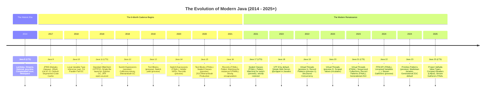

# ☕ Java Version Features Evolution & Release History Master Guide

### *(The Comprehensive Handbook from Java 8 to Java 21 LTS & Modern Java 25: Streams, Lambdas, Modules, Var, Switch Expressions, Records, Sealed Classes, Pattern Matching, Virtual Threads, Sequenced Collections, and the FFM API)*

[🏠 Back to Home](README.md) | [☕ Core Java Internals](java_interview_master_guide.md) | [🧵 Java Concurrency](java_thread.md) | [⚡ JIT Compiler Guide](jvm_jit_compiler_master_guide.md) | [☕ JVM GC & Profiling](jvm_gc_profiling_master_guide.md) | [🍃 Spring Master Guide](spring_master_guide.md)

[]()
[]()
[]()
[]()

---

## 📑 Master Table of Contents

- [☕ Java Version Features Evolution & Release History Master Guide](#-java-version-features-evolution--release-history-master-guide)
  - [📑 Master Table of Contents](#-master-table-of-contents)
  - [MODULE 0: THE JAVA GOVERNANCE & RELEASE METRICS ENCYCLOPEDIA](#module-0-the-java-governance--release-metrics-encyclopedia)
    - [0.1 What is a JEP (JDK Enhancement Proposal)?](#01-what-is-a-jep-jdk-enhancement-proposal)
    - [0.2 What is LTS (Long-Term Support) vs. STS / Feature Releases?](#02-what-is-lts-long-term-support-vs-sts--feature-releases)
    - [0.3 What is GA (General Availability)?](#03-what-is-ga-general-availability)
    - [0.4 Preview Features vs. Incubator Modules vs. Experimental Flags vs. Standard GA](#04-preview-features-vs-incubator-modules-vs-experimental-flags-vs-standard-ga)
    - [0.5 The OpenJDK Governance, Standards & Compatibility Ecosystem](#05-the-openjdk-governance-standards--compatibility-ecosystem)
    - [0.6 The Complete Java Version Governance & Jargon-Busting Master Glossary](#06-the-complete-java-version-governance--jargon-busting-master-glossary)
  - [TRACK 1: THE MASTER RELEASE TIMELINE & FEATURE ATTRIBUTION MATRIX](#track-1-the-master-release-timeline--feature-attribution-matrix)
    - [1.1 Visual Release Evolution Timeline (Java 8 to 25)](#11-visual-release-evolution-timeline-java-8-to-25)
    - [1.2 The Master Feature Attribution & Version Matrix Table](#12-the-master-feature-attribution--version-matrix-table)
  - [TRACK 2: THE 25 FLAGSHIP FEATURES DEEP DIVE (THE 6-PART BLUEPRINT)](#track-2-the-25-flagship-features-deep-dive-the-6-part-blueprint)
    - [1. Lambda Expressions & Functional Interfaces (Java 8 - JEP 126)](#1-lambda-expressions--functional-interfaces-java-8---jep-126)
    - [2. Streams API (Java 8 - JSR 335)](#2-streams-api-java-8---jsr-335)
    - [3. Optional<T> (Java 8)](#3-optionalt-java-8)
    - [4. CompletableFuture<T> (Java 8)](#4-completablefuturet-java-8)
    - [5. New Date & Time API (java.time - JSR 310) (Java 8)](#5-new-date--time-api-javatime---jsr-310-java-8)
    - [6. Default and Static Methods in Interfaces (Java 8)](#6-default-and-static-methods-in-interfaces-java-8)
    - [7. Java Platform Module System (JPMS / Project Jigsaw) (Java 9 - JEP 261)](#7-java-platform-module-system-jpms--project-jigsaw-java-9---jep-261)
    - [8. Collection Factory Methods (List.of, Map.of) (Java 9 - JEP 269)](#8-collection-factory-methods-listof-mapof-java-9---jep-269)
    - [9. Local-Variable Type Inference (var) (Java 10 - JEP 286)](#9-local-variable-type-inference-var-java-10---jep-286)
    - [10. Standard HTTP Client (HTTP/2 & WebSockets) (Java 11 - JEP 321)](#10-standard-http-client-http2--websockets-java-11---jep-321)
    - [11. Single-File Source-Code Launcher (Java 11 - JEP 330)](#11-single-file-source-code-launcher-java-11---jep-330)
    - [12. Switch Expressions (yield & arrow syntax) (Java 14 - JEP 361)](#12-switch-expressions-yield--arrow-syntax-java-14---jep-361)
    - [13. Helpful NullPointerExceptions (Java 14 - JEP 358)](#13-helpful-nullpointerexceptions-java-14---jep-358)
    - [14. Text Blocks (Multi-line Strings) (Java 15 - JEP 378)](#14-text-blocks-multi-line-strings-java-15---jep-378)
    - [15. Records (Data-Carrier Classes) (Java 16 - JEP 395)](#15-records-data-carrier-classes-java-16---jep-395)
    - [16. Pattern Matching for instanceof (Java 16 - JEP 394)](#16-pattern-matching-for-instanceof-java-16---jep-394)
    - [17. Sealed Classes & Interfaces (Java 17 - JEP 409)](#17-sealed-classes--interfaces-java-17---jep-409)
    - [18. Pattern Matching for switch (Java 21 - JEP 441)](#18-pattern-matching-for-switch-java-21---jep-441)
    - [19. Record Patterns (Destructuring) (Java 21 - JEP 440)](#19-record-patterns-destructuring-java-21---jep-440)
    - [20. Virtual Threads (Project Loom) (Java 21 - JEP 444)](#20-virtual-threads-project-loom-java-21---jep-444)
    - [21. Sequenced Collections (Java 21 - JEP 431)](#21-sequenced-collections-java-21---jep-431)
    - [22. Foreign Function & Memory (FFM) API (Java 22 - JEP 454)](#22-foreign-function--memory-ffm-api-java-22---jep-454)
    - [23. Unnamed Variables & Patterns (_) (Java 22 - JEP 456)](#23-unnamed-variables--patterns-_-java-22---jep-456)
    - [24. Stream Gatherers (Java 22/23 Preview - JEP 461/473)](#24-stream-gatherers-java-2223-preview---jep-461473)
    - [25. Structured Concurrency & Scoped Values (Java 21+ Preview - JEP 453/446)](#25-structured-concurrency--scoped-values-java-21-preview---jep-453446)
  - [TRACK 3: VERSION-BY-VERSION CHRONICLE (JAVA 8 THROUGH JAVA 25)](#track-3-version-by-version-chronicle-java-8-through-java-25)
  - [TRACK 4: ENTERPRISE MIGRATION PLAYBOOK & PRODUCTION TRAPS](#track-4-enterprise-migration-playbook--production-traps)
    - [4.1 The Enterprise Migration Path: 8 ➔ 11 ➔ 17 ➔ 21](#41-the-enterprise-migration-path-8--11--17--21)
    - [4.2 Strong Encapsulation & --add-opens Reflection Flags](#42-strong-encapsulation---add-opens-reflection-flags)
    - [4.3 Virtual Thread Pinning & Concurrency Pitfalls](#43-virtual-thread-pinning--concurrency-pitfalls)
    - [4.4 Garbage Collector Evolution Across Versions](#44-garbage-collector-evolution-across-versions)
  - [TRACK 5: SENIOR & STAFF INTERVIEW QUESTION BANK (50 RAPID-FIRE QUESTIONS)](#track-5-senior--staff-interview-question-bank-50-questions)
  - [TRACK 6: 200 PRODUCTION SCENARIOS MASTER BANK (TIER-1 BAR-RAISER 4-PART STRUCTURE)](#track-6-200-production-scenarios-master-bank-tier-1-bar-raiser-4-part-structure)
    - [Category 1: Java 8 Functional Paradigm & Stream Pipeline Mechanics (Q1–Q20)](#category-1-java-8-functional-paradigm--stream-pipeline-mechanics-q1q20)
    - [Category 2: Java 8 Monads, Concurrency & Date/Time Architecture (Q21–Q40)](#category-2-java-8-monads-concurrency--datetime-architecture-q21q40)
    - [Category 3: Java 9 JPMS Modular System & Strong Encapsulation (Q41–Q60)](#category-3-java-9-jpms-modular-system--strong-encapsulation-q41q60)
    - [Category 4: Java 10 & 11 LTS Core Runtime & HTTP/2 Architecture (Q61–Q80)](#category-4-java-10--11-lts-core-runtime--http2-architecture-q61q80)
    - [Category 5: Java 12 to 15 Language Ergonomics & JVM Diagnostics (Q81–Q100)](#category-5-java-12-to-15-language-ergonomics--jvm-diagnostics-q81q100)
    - [Category 6: Java 16 & 17 LTS Data Modeling & Type System (Q101–Q120)](#category-6-java-16--17-lts-data-modeling--type-system-q101q120)
    - [Category 7: Java 18 to 20 Platform Hardening & Loom Early Mechanics (Q121–Q140)](#category-7-java-18-to-20-platform-hardening--loom-early-mechanics-q121q140)
    - [Category 8: Java 21 LTS Project Loom: Virtual Threads & Concurrency (Q141–Q160)](#category-8-java-21-lts-project-loom-virtual-threads--concurrency-q141q160)
    - [Category 9: Java 21 LTS Modern Language Power & Pattern Matching (Q161–Q180)](#category-9-java-21-lts-modern-language-power--pattern-matching-q161q180)
    - [Category 10: Java 22 to 25 Innovations, Migration Forensics & Production Outages (Q181–Q200)](#category-10-java-22-to-25-innovations-migration-forensics--production-outages-q181q200)

---

# MODULE 0: THE JAVA GOVERNANCE & RELEASE METRICS ENCYCLOPEDIA

> [!NOTE]
> 🌱 **Plain-English Intuition**: Ever wonder why Java releases a brand-new version every 6 months like clockwork, what terms like **JEP**, **LTS**, and **GA** actually mean, or why your company refuses to upgrade to Java 22 and insists on waiting for Java 25?
> Before 2017, Java releases took 3 to 5 agonizing years, resulting in giant, disruptive migrations that terrified enterprise engineering teams. Today, Java follows a streamlined, predictable six-month train schedule. In this module, we demystify every acronym, governance process, and stability guarantee so you can navigate modern Java with total confidence.

---

## 0.1 What is a JEP (JDK Enhancement Proposal)?

A **JEP (JDK Enhancement Proposal)** is the formal design document and engineering proposal used by the OpenJDK community to propose, debate, specify, and track significant enhancements to the Java Development Kit (JDK).

### 1. Plain-English Everyday Analogy
Think of a JEP like a **legislative bill introduced into parliament**:
- Any citizen (engineer) can write a draft proposal.
- A parliamentary committee (the OpenJDK Group Leads) reviews it to see if it's worthy of consideration.
- If accepted, it gets an official bill number (e.g., **JEP 444** for Virtual Threads).
- It goes through multiple debates, committee revisions, and public comment periods.
- Only when it is completely written, tested, and voted into law does it officially become part of the legal code (merged into the JDK and shipped).

### 2. Origin: Why Was the JEP Process Invented?
Before 2011, changes to Java were tracked informally as **RFEs (Requests For Enhancements)** inside Oracle's internal bug database (Bugzilla / Jira). There was no standardized design template, no public architectural review, and no transparent roadmap for the community.
In 2011, OpenJDK Chief Architect **Mark Reinhold published JEP 1**, establishing the official JEP process to make Java development open, transparent, peer-reviewed, and predictable for the entire global community.

### 3. What Qualifies as a JEP vs. a Regular Bug Fix or Minor RFE?
Not every code commit gets a JEP! A change requires a formal JEP if it meets ANY of the following criteria:
- **Substantial Effort**: It requires more than **2 person-weeks** of engineering effort.
- **Specification Changes**: It modifies the **Java Language Specification (JLS)** (e.g., adding `record` or `sealed` keywords) or the **Java Virtual Machine Specification (JVMS)** (e.g., new bytecode instructions).
- **Public API Additions**: It introduces major new packages to the Java SE standard library (e.g., `java.net.http.HttpClient` or `java.lang.foreign`).
- **Architectural / Subsystem Overhauls**: It introduces a new Garbage Collector (e.g., ZGC, Shenandoah) or rewrites core JVM runtime components.
- **Deprecation / Removal**: It removes an existing feature from the JDK (e.g., removing the Nashorn JavaScript engine or Applet API).

> [!TIP]
> **Minor bug fixes, performance micro-optimizations, internal refactoring, and documentation edits do NOT require JEPs**. They are simply tracked as regular issues in the JDK Bug System (JBS).

### 4. The Complete JEP Lifecycle State Machine
Every JEP moves through a strictly regulated lifecycle from initial idea to production:

```
┌─────────┐      ┌───────────┐      ┌───────────┐      ┌────────────────────┐
│  Draft  │ ──►  │ Submitted │ ──►  │ Candidate │ ──►  │ Proposed to Target │
└─────────┘      └───────────┘      └───────────┘      └────────────────────┘
                                                             │
                                                             ▼
┌───────────┐      ┌────────────┐      ┌───────────┐      ┌────────────────────┐
│ Completed │ ◄──  │ Integrated │ ◄──  │  Targeted │ ◄──  │   Closed /         │
│   (GA)    │      │ (Merged)   │      │ (Release) │      │   Withdrawn /      │
└───────────┘      └────────────┘      └───────────┘      │   Rejected         │
                                                          └────────────────────┘
```

1. **Draft**: The author writes the initial technical proposal detailing goals, non-goals, motivation, API design, and risks.
2. **Submitted**: The proposal is officially submitted to the OpenJDK Group Leads for architectural review.
3. **Candidate**: The OpenJDK Lead accepts the proposal as an official JDK roadmap initiative and assigns it a permanent **JEP Number** (e.g., JEP 395 for Records).
4. **Proposed to Target**: The author declares that the code is complete, tested, and proposed for inclusion in a specific JDK release version (e.g., "Proposed to target JDK 21").
5. **Targeted**: The release team officially locks the JEP into the target release feature set.
6. **Integrated**: The implementation code is merged from the project feature branch into the mainline OpenJDK master repository (`jdk/jdk`).
7. **Completed**: The feature officially ships to the world in a General Availability (GA) JDK release.
8. **Alternative Terminal States**:
   - **Withdrawn**: The author withdraws the proposal (e.g., JEP 326 Raw String Literals was withdrawn and redesigned into JEP 378 Text Blocks).
   - **Rejected**: The OpenJDK governing leads reject the proposal due to architectural flaws or security concerns.
   - **Closed / Superseded**: The proposal is retired because another JEP accomplishes the same goal more effectively.

### 5. JEP vs. JSR: What is the Difference?
- **JEP (JDK Enhancement Proposal)**: Scoped specifically to the **OpenJDK codebase** and its implementation details (e.g., tooling, garbage collectors, internal JVM performance).
- **JSR (Java Specification Request)**: Scoped to the formal **Java Community Process (JCP)** specification that defines what *any* Java implementation in the world must comply with. A major language JEP is ultimately submitted under an umbrella Java SE JSR (e.g., JSR 396 for Java 21).

---

## 0.2 What is LTS (Long-Term Support) vs. STS / Feature Releases?

Historically, Java releases were monumental events that occurred every 3 to 5 years:
- **Java 6 (2006)** ➔ **Java 7 (2011)**: *5 years gap!*
- **Java 7 (2011)** ➔ **Java 8 (2014)**: *3 years gap!*
- **Java 8 (2014)** ➔ **Java 9 (2017)**: *3.5 years gap!*

Because releases were so infrequent, each release contained hundreds of breaking changes and experimental APIs bundled together. Migrating from Java 7 to 8 or Java 8 to 9 took enterprises years of engineering effort and millions of dollars.

### 1. The 6-Month Time-Driven Release Train (Since 2017)
Starting with **Java 9 (September 2017)**, Oracle and the OpenJDK board completely revolutionized Java's release cadence by adopting a **strict, time-driven release train**:

```
March:     Feature Release (e.g., Java 22)  [ STS - 6 Months Support ]
September: Feature Release (e.g., Java 23)  [ STS - 6 Months Support ]
March:     Feature Release (e.g., Java 24)  [ STS - 6 Months Support ]
September: LTS Release     (e.g., Java 25)  [ LTS - 5 to 10+ Years Support ]
```

- **The Train Metaphor**: The release train leaves the station on a fixed date (March and September) **no matter what**. 
- If a feature (JEP) is ready and passes quality gates, it boards the train.
- If a feature is delayed or needs more testing, **the train does NOT wait**! The release departs on time, and the incomplete feature simply catches the next train 6 months later.

### 2. The 2-Year LTS Cadence
Every **two years** (accelerated from the previous 3-year interval starting after Java 17), a release is designated as an **LTS (Long-Term Support)** milestone:
- **Java 8 LTS**: Released March 2014 (Legacy milestone; still widely supported).
- **Java 11 LTS**: Released September 2018.
- **Java 17 LTS**: Released September 2021 (Shifted to 2-year cadence).
- **Java 21 LTS**: Released September 2023 (Flagship modern standard: Virtual Threads, Records).
- **Java 25 LTS**: Scheduled for September 2025 (Next LTS flagship: Valhalla, Lilliput).

### 3. Detailed Comparison: LTS vs. STS (Feature Releases)

| Architectural Dimension | 🏛️ LTS (Long-Term Support) | ⚡ STS / Non-LTS (Feature Releases) |
| :--- | :--- | :--- |
| **Release Frequency** | Every **2 years** (Java 17, 21, 25). | Every **6 months** (March & September). |
| **Support Lifespan** | **5 to 10+ years** of continuous security and stability updates. | **6 months only**. Support ceases the instant the next version ships. |
| **Quarterly Security Updates (CPU/PSU)** | Yes! Receives all critical CVE security patches for years. | None after 6 months. If a zero-day exploit is found, you MUST upgrade to the next release. |
| **Target Workloads** | Enterprise core banking, billing systems, healthcare, mission-critical production. | Innovation prototypes, developer sandboxes, startups, microservices with continuous weekly deploys. |
| **Third-Party Ecosystem Support** | Guaranteed first-class support by Spring, Hibernate, AWS, Docker, Datadog. | Libraries may not officially certify or provide bug fixes for intermediate versions. |
| **Production Risk** | **Extremely Low**. Rock-solid stability; zero surprise deprecations. | **High** for conservative teams. Requires upgrading the entire fleet every 6 months. |

### 4. Who Actually Provides LTS Support? (The Multi-Vendor Reality)
A common misconception is that "Oracle owns and supports all Java." The truth:
- **OpenJDK** is the open-source upstream project. OpenJDK produces source code and provides 6-month updates for the current release.
- **Downstream Vendors** package OpenJDK source code into certified binaries and maintain long-term support branches (backporting security fixes for 5 to 10+ years):
  1. **Eclipse Adoptium (Temurin)**: The gold-standard, vendor-neutral, community-driven free distribution backed by the Eclipse Foundation and major tech titans.
  2. **Amazon Corretto**: Free, production-ready, multi-platform distribution backed by AWS with guaranteed long-term enterprise SLAs.
  3. **Red Hat OpenJDK**: The premier enterprise distribution for Linux/RHEL ecosystems; Red Hat actively leads the maintenance of older OpenJDK LTS branches (like Java 8 and 11).
  4. **Azul Zulu**: Enterprise distribution with optional commercial SLAs offering extended support (some versions supported for up to 15 years!).
  5. **BellSoft Liberica**: The default, highly optimized runtime recommended and packaged by VMware Spring Boot.
  6. **Microsoft Build of OpenJDK**: Microsoft's dedicated enterprise distribution optimized for Azure cloud and Windows workloads.
  7. **Oracle JDK**: Free for development and production under the "NFTC" (No-Fee Terms and Conditions) license for current LTS versions, transitioning to commercial OTN licenses after newer releases.

---

## 0.3 What is GA (General Availability)?

**GA (General Availability)** is the official production milestone on which a software version has passed all internal compliance tests, security audits, and community verifications, and is declared **100% production-ready for public download and deployment**.

### 1. Plain-English Everyday Analogy
Think of GA as the **grand opening ribbon-cutting ceremony of a massive suspension bridge**:
- Before the grand opening, engineers drove heavy stress-test trucks across it (Early Access).
- Painters finished the safety railings and stopped adding new lanes (Rampdown Phase).
- State inspectors certified that every bolt meets federal seismic regulations (Release Candidate).
- On **GA day**, the ribbon is cut, and public highway traffic is cleared to drive across at full speed without restriction.

### 2. The Milestones Leading Up to GA

```
┌────────────────────────┐      ┌────────────────────────┐      ┌────────────────────────┐      ┌────────────────────────┐
│   EA (Early Access)    │ ──►  │ RDP 1 (Rampdown 1)     │ ──►  │ RDP 2 (Rampdown 2)     │ ──►  │ RC (Release Candidate) │ ──► [ GA DAY ]
│ Raw Nightly/Weekly     │      │ Feature Freeze:        │      │ Stability Freeze:      │      │ Final Verification     │     Production
│ Experimental Builds    │      │ No new JEPs accepted   │      │ Only P1/P2 Blocker bugs│      │ Stamped Binaries       │     Launch!
└────────────────────────┘      └────────────────────────┘      └────────────────────────┘      └────────────────────────┘
```

1. **EA (Early Access)**:
   - Raw development snapshots compiled directly from the development repository.
   - Released weekly to allow library authors (Spring, Quarkus, Jackson) to test cutting-edge features and detect compiler bugs early.
2. **RDP 1 (Rampdown Phase 1 - Feature Freeze)**:
   - Occurs roughly **3 months before GA**.
   - **Feature Freeze**: No new JEPs or major enhancements can be added to the release branch. Only bug fixes (P1 through P3) and documentation changes are permitted.
3. **RDP 2 (Rampdown Phase 2 - Stabilization Freeze)**:
   - Occurs roughly **2 months before GA**.
   - The bar for changes becomes extraordinarily strict. Only critical, show-stopping **P1 and P2 regressions** or severe security vulnerabilities can be fixed.
4. **RC (Release Candidate)**:
   - Occurs **2 to 3 weeks before GA**.
   - Complete, frozen binary builds distributed to test suites worldwide. If zero critical defects are reported, this exact binary image is stamped as GA!
5. **GA (General Availability)**:
   - The official launch day. Source code is tagged, binary tarballs and installers are pushed to mirrors worldwide, and package managers (`brew`, `apt`, `yum`, Docker Hub) update their latest pointers.

---

## 0.4 Preview Features vs. Incubator Modules vs. Experimental Flags vs. Standard GA

To innovate rapidly without permanently locking the JVM into flawed or rushed syntax designs, modern Java uses a rigorous **maturation pipeline**:

```
┌──────────────────────────────────────┐          ┌──────────────────────────────────────┐          ┌──────────────────────────────────────┐
│       INCUBATOR MODULE (APIs)        │          │       PREVIEW FEATURE (Language/JVM) │          │         STANDARD GA FEATURE          │
│ Namespace: jdk.incubator.*           │   ───►   │ Flag: --enable-preview               │   ───►   │ Permanent, backward-compatible,      │
│ Isolated experimental library APIs   │          │ Fully implemented syntax/semantics   │          │ standard java.* namespace.           │
│ Can evolve or be discarded           │          │ Solicits real-world feedback         │          │ Never breaks!                        │
└──────────────────────────────────────┘          └──────────────────────────────────────┘          └──────────────────────────────────────┘
```

### 1. Preview Features (Language & Core JVM - Governed by JEP 12)
A **Preview Feature** is a fully specified and fully implemented language construct (e.g., `switch` expressions, records, pattern matching) or core VM feature that is included in a GA release, but is **NOT yet permanent**.
- **Purpose**: To allow real-world developers to write code using the feature, evaluate the ergonomics, and report edge-case flaws to OpenJDK leads *before* the syntax is carved into stone forever.
- **Safety Lock (The Flag Guard)**: You **cannot** accidentally compile or run preview code in production. The compiler and runtime explicitly reject it unless unlocked via command-line flags:
  ```bash
  # Step 1: Compile with preview enabled
  javac --release 21 --enable-preview OrderProcessor.java

  # Step 2: Run with preview enabled
  java --enable-preview OrderProcessor
  ```
- **What Can Happen to a Preview Feature?**:
  - **Refined (Preview 2)**: The community suggests tweaks, and an improved preview is released in the next version (e.g., Virtual Threads had Preview 1 in Java 19 and Preview 2 in Java 20).
  - **Graduated to Final GA**: The syntax is finalized and made standard (no flags needed!).
  - **Withdrawn / Redesigned**: If community feedback reveals fundamental flaws, the feature is retracted (e.g., Raw String Literals in Java 12 was replaced by Text Blocks).

> [!CAUTION]
> **Production Rule**: NEVER ship code compiled with `--enable-preview` into mission-critical production jars. A class file compiled with preview flags has its minor version set to `65535`, which prevents it from running on any newer JVM!

### 2. Incubator Modules (APIs & Libraries - Governed by JEP 11)
An **Incubator Module** is an experimental API distributed in isolated, non-standard modules under the `jdk.incubator.*` namespace (outside the core `java.*` namespace).
- **Purpose**: To test complex new APIs that require community feedback without polluting the standard Java Class Library.
- **Safety Lock**: Requires passing `--add-modules jdk.incubator.xxx` at compile time and runtime:
  ```bash
  javac --add-modules jdk.incubator.vector VectorMath.java
  java --add-modules jdk.incubator.vector VectorMath
  ```
- *Example*: The Vector API (`jdk.incubator.vector`) and the Foreign Function & Memory API spent multiple versions incubating before graduating to `java.lang.foreign` in Java 22.

### 3. Experimental VM Options
An **Experimental Option** is an underlying HotSpot engine flag that is disabled by default because it is still undergoing performance tuning or hardware stabilization.
- **Safety Lock**: The JVM will refuse to start if you supply an experimental flag without first unlocking experimental VM options:
  ```bash
  java -XX:+UnlockExperimentalVMOptions -XX:+UseZGC MyApp
  ```
  *(Note: ZGC was experimental in Java 11–14, but became a standard, production-ready GC in Java 15).*

### 4. Standard GA Features (The Permanent Contract)
Once a feature completes incubation and preview and achieves standard GA status:
- **It is 100% permanent**.
- It requires **zero flags** to compile or run.
- **Backward Compatibility Promise**: Java takes backward compatibility more seriously than almost any other software ecosystem on Earth. Code compiled on Java 8 or Java 21 using standard features is guaranteed to continue compiling and running on future Java versions decades from now!

---

## 0.5 The OpenJDK Governance, Standards & Compatibility Ecosystem

To truly understand Java versioning, you must know the surrounding regulatory bodies, testing suites, and review boards that ensure stability across billions of connected devices:

### 1. JCP (Java Community Process)
The **JCP (Java Community Process)** is the formal international standards consortium (consisting of Oracle, IBM, Red Hat, Google, ARM, Twitter, and Java User Groups) that governs the official **Java SE (Standard Edition) Specification**. No single company can unilaterally change the core Java language without the JCP Executive Committee voting to approve it.

### 2. JSR (Java Specification Request)
A **JSR (Java Specification Request)** is the formal document submitted to the JCP describing proposed additions or modifications to the Java platform specifications. 
- *Famous Historic JSRs*:
  - **JSR 335**: Lambda Expressions and Streams for the Java Programming Language (Java 8).
  - **JSR 310**: Date and Time API (`java.time`) (Java 8).
  - **JSR 376**: Java Platform Module System (Project Jigsaw) (Java 9).
  - **JSR 396**: Java SE 21 Platform Specification.

### 3. TCK (Technology Compatibility Kit) - The "Java Certified" Seal
The **TCK (Technology Compatibility Kit)** is a massive, confidential, hyper-exhaustive test suite containing over **100,000 rigorous compliance tests** owned by Oracle and the JCP.
- **The Golden Rule**: Any JVM distribution—whether it is built by Amazon (Corretto), Eclipse (Temurin), Red Hat, Azul, or Microsoft—**MUST pass 100% of the TCK tests with zero failures** before it is legally allowed to badge itself as "Java SE Compatible" or use the Java trademark!
- This ensures that a `.class` or `.jar` compiled on an AWS Linux server using Amazon Corretto will run with byte-for-byte identical behavior on a Windows developer laptop running Eclipse Temurin.

### 4. CSR (Compatibility & Specification Review)
The **CSR (Compatibility & Specification Review)** is a specialized OpenJDK review board composed of veteran JVM architects.
- **Their Sole Mission**: To scrutinize every proposed API change, method signature, flag, or behavior change to prevent unintentional backward compatibility breaks. Even tiny changes to method return types or exception throws must pass strict CSR review before being merged into the JDK.

### 5. RI (Reference Implementation)
The **RI (Reference Implementation)** is the official, working open-source build of a Java SE specification that proves the specification can be successfully implemented in real life. **OpenJDK** serves as the official Reference Implementation for all modern Java SE specifications.

### 6. JBS (JDK Bug System - bugs.openjdk.org)
The **JBS (JDK Bug System)** is the public-facing Jira instance operated by the OpenJDK community at `https://bugs.openjdk.org`. It is completely open to the public: every single bug, regression, performance ticket, security patch, and JEP proposal in Java's history can be searched, read, and tracked by any developer in the world.

### 7. Modern Deprecation Lifecycle: Soft vs. Terminal Deprecation
In older Java versions, marking an API with `@Deprecated` was a gentle warning that often lasted 20 years without removal. In modern Java (starting with JEP 277 in Java 9), deprecation has teeth:
- **`@Deprecated(since = "11")` (Soft Deprecation)**: The API is discouraged, but there is no current plan to delete it.
- **`@Deprecated(since = "17", forRemoval = true)` (Terminal Deprecation)**: A loud, critical warning. The OpenJDK team has committed to **permanently deleting this API** in an upcoming release! If your code uses an API with `forRemoval = true`, your application will fail to compile as soon as you upgrade to the release where it is excised (e.g., `SecurityManager`, `Runtime.runFinalizersOnExit()`).

---

## 0.6 The Complete Java Version Governance & Jargon-Busting Master Glossary

| Term / Acronym | Plain-English Meaning | Everyday Mental Model (Analogy) | Technical Definition | Who Controls / Uses It? | What Breaks If You Misunderstand It? |
| :--- | :--- | :--- | :--- | :--- | :--- |
| **JEP** | The official architectural document proposing and designing a new Java feature. | A bill drafted by a senator proposed to parliament before becoming law. | **JDK Enhancement Proposal**: The formal OpenJDK process for tracking non-trivial changes ($>2$ weeks effort). | OpenJDK Community & Leads (Oracle, Red Hat, etc.). | Calling a 2-line bug fix a "JEP"; JEPs represent major language or JVM architectural enhancements. |
| **LTS** | A major Java version supported with stability and security patches for 5–10 years. | A durable steel-and-concrete foundation built to withstand decades of storms. | **Long-Term Support**: Release cadence designation occurring every 2 years (Java 8, 11, 17, 21, 25). | Downstream JDK Vendors (Adoptium, Corretto, Red Hat, Azul). | Deploying an STS version (e.g., Java 22) in enterprise production, then losing security patches after 6 months. |
| **STS / Feature Release** | A 6-month rapid innovation release delivering new features quickly. | A commuter train leaving every 15 minutes; if you miss it, you catch the next one. | **Short-Term Support / Non-LTS**: Released every March and September with a strict 6-month support lifespan. | OpenJDK Release Team. | Expecting security patches for Java 22 after Java 23 is released; support ceases instantly on day 181. |
| **GA** | The official launch milestone when software is declared 100% production-ready. | The grand opening ribbon-cutting ceremony opening a new highway to the public. | **General Availability**: The certified, stable milestone of a JDK release stamped for production deployment. | OpenJDK & Distro Vendors. | Deploying Early Access (EA) builds into production; EA builds contain unpatched bugs and test regressions. |
| **EA** | Bleeding-edge pre-release builds published weekly for testing upcoming changes. | Test-driving a prototype vehicle on a private gravel proving ground. | **Early Access**: Development builds compiled directly from master branch to collect early ecosystem feedback. | OpenJDK Testers, Library Authors. | Deploying an EA build into production; APIs may change or crash without notice. |
| **RDP 1 & 2** | Pre-release stabilization phases freezing new features to focus on bug fixes. | Closing kitchen orders before dinner service so chefs can focus on cooking. | **Rampdown Phase 1 & 2**: Code freeze milestones (RDP1 freezes features; RDP2 freezes all non-critical bug fixes). | OpenJDK Release Managers. | Submitting a new feature proposal during RDP; it will be rejected and deferred to the next release. |
| **RC** | The final candidate build undergoing final regression verification before GA. | The final dress rehearsal the night before opening night on Broadway. | **Release Candidate**: A frozen build that becomes the final GA binary if zero critical regressions are found. | Quality Assurance & Release Leads. | Assuming RC builds can have new APIs added; only catastrophic P1 blockers are touched in RC. |
| **Preview Feature** | A completed language/JVM feature included in GA to collect developer feedback before making it permanent. | A concept car driven by select test drivers before deciding on mass assembly-line production. | Fully implemented language feature governed by JEP 12; requires `--enable-preview` flag at compile and run time. | Java Language Architects (Brian Goetz & Team). | Using `--enable-preview` in production jars; class files will be rejected by newer JVM runtimes! |
| **Incubator Module** | An experimental library API isolated in non-standard `jdk.incubator.*` packages. | A laboratory petri dish testing a vaccine before sending it to the commercial pharmacy. | Non-core library APIs governed by JEP 11; requires `--add-modules jdk.incubator.xxx` to access. | OpenJDK Library Engineers. | Relying on incubator package imports; they get completely renamed when graduating to standard `java.*`. |
| **Experimental Flag** | A low-level JVM engine optimization or GC disabled by default for stability testing. | An airplane's experimental afterburner switch labeled "Test Pilots Only". | HotSpot VM options unlocked via `-XX:+UnlockExperimentalVMOptions` (e.g., early ZGC or Shenandoah). | HotSpot JVM Engineers. | Turning on experimental VM flags in production without benchmarking; can cause unpredictable JVM crashes. |
| **JCP** | The international standards consortium that governs the official Java SE specification. | The United Nations governing committee establishing international maritime treaties. | **Java Community Process**: The formal organization of industry vendors that debates and votes on Java SE standards. | Oracle, IBM, Red Hat, Google, ARM, JUGs. | Believing Oracle unilaterally changes Java alone; all Java SE changes must be approved by the JCP Executive Committee. |
| **JSR** | The formal specification document defining a Java standard across all vendors. | The official architectural blueprint filed with city hall for a commercial building. | **Java Specification Request**: The formal technical proposal submitted to the JCP for platform standardization. | JCP Expert Groups. | Confusing JSR with JEP; JSR is the platform-wide standard specification, whereas JEP is an OpenJDK implementation plan. |
| **TCK** | The 100,000+ test suite proving a JVM distribution complies 100% with the Java specification. | The strict automotive crash-test and emissions laboratory certifying cars are road-legal. | **Technology Compatibility Kit**: Exhaustive compliance test suite that all JDK vendors must pass to use the "Java" badge. | Oracle & JCP Compliance Auditors. | Releasing an uncertified JVM binary; if it fails even 1 TCK test, it cannot legally be called "Java". |
| **CSR** | The OpenJDK committee that reviews every API change to prevent compatibility breaks. | The structural safety inspector who must sign off before any wall in a historic building can be moved. | **Compatibility & Specification Review**: The review board ensuring no change breaks backward compatibility. | OpenJDK Architecture Board. | Merging a public API change without CSR approval; the build will be blocked and reverted immediately. |
| **RI** | The official open-source software build proving a JSR specification actually works. | The working physical prototype displayed alongside the patent blueprints. | **Reference Implementation**: The gold-standard implementation (OpenJDK) that proves a specification is viable. | OpenJDK Project. | Building a custom JVM from scratch without testing against the Reference Implementation. |
| **JBS** | The public Jira issue tracker where all JDK bugs and enhancements are recorded. | The public 911 dispatch log and city maintenance ticket database. | **JDK Bug System**: The public Jira system (`bugs.openjdk.org`) tracking every bug, patch, and JEP in OpenJDK. | Entire Global Java Community. | Reporting a bug in private emails; OpenJDK requires all issues and discussions to be public in JBS. |
| **`forRemoval = true`** | The terminal warning that an API is marked for permanent deletion in an upcoming release. | A bright orange demolition spray-paint cross painted on a condemned condemned building. | Enhanced deprecation annotation attribute indicating the API will be deleted in a future release. | Java Library Maintainers. | Ignoring `forRemoval = true` compiler warnings; your build will abruptly break on the next JDK upgrade! |
| **Project Loom** | The OpenJDK project that brought lightweight Virtual Threads to Java. | Giving every citizen their own bicycle instead of making 1,000 people share 4 city buses. | Concurrency initiative delivering user-mode Virtual Threads, Delimited Continuations, and Scoped Values. | Loom Team (Ron Pressler & Team). | Writing reactive callback spaghetti (WebFlux/RxJava) when simple blocking imperative code on Loom is $10\times$ simpler. |
| **Project Panama** | The OpenJDK project replacing clumsy C/C++ JNI with pure Java memory and foreign linker APIs. | A universal translator allowing you to talk to foreign diplomats without hiring an expensive translator. | Modern Foreign Function & Memory (FFM) API allowing Java to call native C libraries with zero C glue code. | Panama Team (Maurizio Cimadamore & Team).| Writing complex JNI C-wrapper code in 2025; FFM API is safer, faster, and 100% pure Java. |
| **Project Amber** | The OpenJDK project focused on developer productivity and language ergonomics. | An interior designer remodeling your living room to eliminate clutter, junk, and wasted space. | Language evolution project delivering `var`, Records, Sealed Classes, Pattern Matching, and Text Blocks. | Amber Team (Brian Goetz & Team). | Writing 100 lines of JavaBean boilerplate in 2025 instead of a single 1-line `record`. |
| **Project Valhalla** | The OpenJDK project bringing flat memory layouts (Value Objects) to eliminate pointer overhead. | Packing luggage into flat vacuum-sealed bags instead of carrying 50 bulky individual boxes. | Future JVM initiative giving objects "Code like a class, work like an int" memory density (zero object header). | Valhalla Team (Brian Goetz, John Rose). | High memory bloat on massive object arrays; Valhalla will eliminate 16-byte object header overhead. |
| **Project Lilliput** | The OpenJDK project shrinking JVM object headers from 128/96 bits down to 64/32 bits. | Shaving excess cardboard off Amazon shipping boxes to double how many packages fit in a delivery van. | JVM memory-density project compressing Mark Word and Klass Pointer headers to save 10%–20% of total heap. | Lilliput Team (Roman Kennke & Team). | Running massive in-memory caches where 20% of your RAM is wasted purely on object headers. |

---

# TRACK 1: THE MASTER RELEASE TIMELINE & FEATURE ATTRIBUTION MATRIX

## 1.1 Visual Release Evolution Timeline (Java 8 to 25)



<details>
<summary>View Text Representation (ASCII Blueprint)</summary>

```
[2014] Java 8 (LTS)   ──► Lambdas, Streams API, Optional, java.time, CompletableFuture
   │
[2017] Java 9         ──► JPMS Modules (Jigsaw), JShell, List.of(), G1 GC Default
   │
[2018] Java 10        ──► Local-Variable Type Inference (var)
   │
[2018] Java 11 (LTS)  ──► Standard HttpClient (HTTP/2), Single-File Launcher, JFR Open-Sourced
   │
[2020] Java 14        ──► Switch Expressions (GA), Helpful NullPointerExceptions
   │
[2020] Java 15        ──► Text Blocks (GA), ZGC & Shenandoah Production-Ready
   │
[2021] Java 16        ──► Records (GA), Pattern Matching for instanceof (GA)
   │
[2021] Java 17 (LTS)  ──► Sealed Classes & Interfaces (GA)
   │
[2023] Java 21 (LTS)  ──► Virtual Threads (GA), Sequenced Collections, Record Patterns (GA)
   │
[2024] Java 22        ──► Foreign Function & Memory (FFM) API (GA), Unnamed Variables (_)
   │
[2025] Java 25 (LTS)  ──► Compact Object Headers (Lilliput), Stream Gatherers (GA)
```

</details>

---

## 1.2 The Master Feature Attribution & Version Matrix Table

| Feature Name | Category | First Preview / Incubator | Final GA Standard Version | JEP Number | Core Problem Solved / TL;DR |
| :--- | :--- | :--- | :--- | :--- | :--- |
| **Lambda Expressions** | Language | N/A | **Java 8** | JEP 126 | Replaces verbose anonymous inner classes with concise functional syntax. |
| **Streams API** | API / Functional | N/A | **Java 8** | JSR 335 | Declarative, parallelizable collection data processing pipelines. |
| **`Optional<T>`** | API | N/A | **Java 8** | N/A | Type-safe representation of nullable return values to eliminate NPEs. |
| **`CompletableFuture<T>`** | Concurrency | N/A | **Java 8** | N/A | Non-blocking, composable asynchronous programming chains. |
| **New Date/Time API (`java.time`)**| API | N/A | **Java 8** | JSR 310 | Immutable, thread-safe date/time models replacing flawed `Date` & `Calendar`. |
| **Interface Default/Static Methods**| Language | N/A | **Java 8** | N/A | Allows interface evolution without breaking existing implementing classes. |
| **JPMS Modules (Project Jigsaw)** | Architecture | N/A | **Java 9** | JEP 261 | Strong architectural boundaries; encapsulates internal packages. |
| **Collection Factories (`List.of`)**| API | N/A | **Java 9** | JEP 269 | Concise, immutable collection instantiations in a single line. |
| **JShell (Interactive REPL)** | Tooling | N/A | **Java 9** | JEP 222 | Interactive command-line REPL for rapid Java code exploration. |
| **Local-Variable Type Inference (`var`)**| Language | N/A | **Java 10** | JEP 286 | Reduces repetitive boilerplate types without sacrificing static typing. |
| **Standard HTTP Client (HTTP/2)** | API / Network | Java 9 (Incubator) | **Java 11** | JEP 321 | Modern, non-blocking HTTP/2 and WebSocket client replacing `HttpURLConnection`. |
| **Single-File Source-Code Launcher**| Tooling | N/A | **Java 11** | JEP 330 | Run scripts directly via `java App.java` without explicit compilation steps. |
| **Switch Expressions** | Language | Java 12 (Preview) | **Java 14** | JEP 361 | Pattern-exhaustive, expression-based switch with `->` and `yield` (no break leaks!). |
| **Helpful NullPointerExceptions** | Diagnostics | N/A | **Java 14** | JEP 358 | Pinpoints the exact method or variable that was null in chained calls. |
| **Text Blocks (`"""`)** | Language | Java 13 (Preview) | **Java 15** | JEP 378 | Multi-line string literals with automatic whitespace stripping (JSON, SQL, HTML). |
| **Records** | Language | Java 14 (Preview) | **Java 16** | JEP 395 | Immutable data-carrier classes eliminating 100 lines of getter/equals/hashcode. |
| **Pattern Matching for `instanceof`**| Language | Java 14 (Preview) | **Java 16** | JEP 394 | Combines type test and casting into a single clean operation. |
| **Sealed Classes & Interfaces** | Language | Java 15 (Preview) | **Java 17** | JEP 409 | Restricts which subclasses can extend/implement a type (domain exhaustiveness). |
| **Pattern Matching for `switch`** | Language | Java 17 (Preview) | **Java 21** | JEP 441 | Enables switching on object types with pattern deconstruction and guards. |
| **Record Patterns** | Language | Java 19 (Preview) | **Java 21** | JEP 440 | Destructures record components directly inside `instanceof` and `switch`. |
| **Virtual Threads (Project Loom)** | Concurrency | Java 19 (Preview) | **Java 21** | JEP 444 | Lightweight, user-mode threads enabling 1,000,000 concurrent blocking tasks. |
| **Sequenced Collections** | Collections API | N/A | **Java 21** | JEP 431 | Standardized uniform API for first/last element access (`getFirst()`, `reversed()`). |
| **Generational ZGC** | JVM / GC | N/A | **Java 21** | JEP 439 | Separates Young and Old generations in ZGC for higher throughput with $<1\text{ms}$ pauses. |
| **Foreign Function & Memory (FFM)** | Native / JVM | Java 17 (Incubator)| **Java 22** | JEP 454 | Pure Java interoperability with foreign native memory and C libraries without JNI. |
| **Unnamed Variables & Patterns (`_`)**| Language | Java 21 (Preview) | **Java 22** | JEP 456 | Denotes unused variables or patterns using `_` (e.g., in catch blocks or lambdas). |
| **Stream Gatherers** | Streams API | Java 22 (Preview) | Target Java 24/25 | JEP 461/473| Custom intermediate stream operations (windowing, fold, scanning). |

---

# TRACK 2: THE 25 FLAGSHIP FEATURES DEEP DIVE (THE 6-PART BLUEPRINT)

---

## 1. Lambda Expressions & Functional Interfaces (Java 8 - JEP 126)

### 🏷️ 1. Version & JEP Metadata
- **Introduced**: **Java 8 (March 2014 - LTS)**
- **JEP / Spec**: JEP 126 (Lambda Expressions & Functional Interfaces)

### ❓ 2. Why We Need It & What Problem It Solves
Before Java 8, passing behavior as data required creating anonymous inner classes. This was ridiculously verbose, created clutter, obscured intent, and created an unnecessary `$1.class` binary file on disk for every single anonymous instance.

### 🔄 3. Before vs. After Code Comparison
```java
// BEFORE (Java 7): Verbose Anonymous Inner Class
Collections.sort(names, new Comparator<String>() {
    @Override
    public int compare(String a, String b) {
        return a.compareToIgnoreCase(b);
    }
});

// AFTER (Java 8): Clean Functional Lambda
Collections.sort(names, (a, b) -> a.compareToIgnoreCase(b));
// OR with Method Reference:
names.sort(String::compareToIgnoreCase);
```

### 💻 4. How to Use It
```java
@FunctionalInterface
public interface TaxCalculator {
    double calculate(double amount);
}

public class LambdaDemo {
    public static void main(String[] args) {
        TaxCalculator stateTax = amount -> amount * 0.0825;
        System.out.println("Tax: $" + stateTax.calculate(100.0));
    }
}
```

### ⚖️ 5. Pros & Cons
- **Pros**: Drastically cuts boilerplate; enables lazy evaluation and functional programming pipelines; eliminates anonymous class disk overhead.
- **Cons**: Stack traces inside complex lambdas can be cryptic; overusing complex lambdas hurts readability; cannot access non-effectively-final local variables.

### 🔬 6. Under the Hood & JVM Mechanics
Java does **not** compile lambdas into anonymous inner classes! Instead, `javac` emits an **`invokedynamic` (Indy)** instruction pointing to `LambdaMetafactory`. At runtime, the JVM dynamically generates a lightning-fast call site, avoiding heap class generation.

---

## 2. Streams API (Java 8 - JSR 335)

### 🏷️ 1. Version & JEP Metadata
- **Introduced**: **Java 8 (March 2014 - LTS)**
- **Spec**: JSR 335

### ❓ 2. Why We Need It & What Problem It Solves
Before Java 8, filtering, transforming, and aggregating collections required manual imperative `for` and `while` loops with nested `if` statements and mutable accumulator variables. Parallelizing a loop across multi-core CPUs required complex thread pools and synchronization.

### 🔄 3. Before vs. After Code Comparison
```java
// BEFORE (Java 7): Imperative Loop with Mutability
List<String> activeUserNames = new ArrayList<>();
for (User user : users) {
    if (user.isActive() && user.getAge() >= 18) {
        activeUserNames.add(user.getName().toUpperCase());
    }
}

// AFTER (Java 8): Declarative Fluent Stream Pipeline
List<String> activeUserNames = users.stream()
    .filter(User::isActive)
    .filter(u -> u.getAge() >= 18)
    .map(u -> u.getName().toUpperCase())
    .toList();
```

### 💻 4. How to Use It
```java
Map<Department, Double> averageSalaryByDept = employees.stream()
    .collect(Collectors.groupingBy(
        Employee::getDepartment,
        Collectors.averagingDouble(Employee::getSalary)
    ));
```

### ⚖️ 5. Pros & Cons
- **Pros**: Declarative and readable; easy parallelization via `.parallelStream()`; lazy evaluation (intermediate operations only execute when terminal operation fires).
- **Cons**: Performance overhead on tiny collections ($<50$ elements) due to iterator allocation; streams cannot be reused once consumed; debugging stream pipelines requires specialized IDE tooling.

### 🔬 6. Under the Hood & JVM Mechanics
Streams are backed by **Spliterators** and execute via a linked pipeline of `Sink` stages. JIT compilers aggressively inline stream pipelines, fusing filter and map operations into a single unrolled loop!

---

## 3. `Optional<T>` (Java 8)

### 🏷️ 1. Version & JEP Metadata
- **Introduced**: **Java 8 (March 2014 - LTS)**

### ❓ 2. Why We Need It & What Problem It Solves
Tony Hoare called `null` his "billion-dollar mistake." Returning `null` from a method forces developers to remember defensive `if (x != null)` checks everywhere. Forgetting one check triggers a catastrophic runtime `NullPointerException` (NPE).

### 🔄 3. Before vs. After Code Comparison
```java
// BEFORE (Java 7): Unsafe null return
public User findUser(String id) {
    if (notFound) return null; // Caller must remember to null-check!
    return user;
}

// AFTER (Java 8): Type-safe Optional contract
public Optional<User> findUser(String id) {
    return Optional.ofNullable(user);
}

// Caller usage:
String email = findUser("123")
    .map(User::getEmail)
    .orElse("default@company.com");
```

### 💻 4. How to Use It
```java
Optional<String> result = Optional.of("Hello Modern Java");
result.ifPresent(System.out::println);

String value = result.orElseThrow(() -> new EntityNotFoundException("Missing value!"));
```

### ⚖️ 5. Pros & Cons
- **Pros**: Explicit API design; eliminates defensive null checks; provides fluent monadic chaining (`map`, `flatMap`, `filter`).
- **Cons**: Wrapping values incurs a small heap object allocation; **anti-pattern**: never use `Optional` as class fields, method arguments, or inside collections.

### 🔬 6. Under the Hood & JVM Mechanics
`Optional` is a value wrapper containing a single `final T value` reference. In upcoming Java versions (Project Valhalla), `Optional` will become a primitive value class with zero memory allocation!

---

## 4. `CompletableFuture<T>` (Java 8)

### 🏷️ 1. Version & JEP Metadata
- **Introduced**: **Java 8 (March 2014 - LTS)**

### ❓ 2. Why We Need It & What Problem It Solves
The older `java.util.concurrent.Future` interface had no non-blocking callback mechanism. The only way to retrieve a result was `future.get()`, which completely blocked the calling thread. Combining multiple async operations was almost impossible.

### 🔄 3. Before vs. After Code Comparison
```java
// BEFORE (Java 5-7): Blocking Future.get()
Future<Order> orderFuture = executor.submit(this::fetchOrder);
Order order = orderFuture.get(); // BLOCKS thread!
Future<Payment> paymentFuture = executor.submit(() -> processPayment(order));
Payment payment = paymentFuture.get(); // BLOCKS thread again!

// AFTER (Java 8): Non-blocking Composable Pipeline
CompletableFuture.supplyAsync(this::fetchOrder)
    .thenCompose(order -> CompletableFuture.supplyAsync(() -> processPayment(order)))
    .thenAccept(this::sendConfirmationEmail)
    .exceptionally(ex -> { log.error("Payment failed", ex); return null; });
```

### 💻 4. How to Use It
```java
CompletableFuture<String> userFuture = CompletableFuture.supplyAsync(() -> fetchUserData());
CompletableFuture<String> balanceFuture = CompletableFuture.supplyAsync(() -> fetchBalanceData());

// Combine results concurrently:
CompletableFuture<String> dashboard = userFuture.thenCombine(balanceFuture, 
    (user, balance) -> "User: " + user + " | Balance: " + balance);
```

### ⚖️ 5. Pros & Cons
- **Pros**: Fully non-blocking async workflows; powerful combinators (`thenCombine`, `allOf`, `anyOf`); built-in exception recovery (`exceptionally`, `handle`).
- **Cons**: Defaults to the shared `ForkJoinPool.commonPool()` which can be starved by blocking I/O; complex async stack traces make debugging harder.

### 🔬 6. Under the Hood & JVM Mechanics
`CompletableFuture` uses a lock-free Treiber stack to chain dependent completion actions. When an asynchronous task completes, it triggers downstream callbacks sequentially or asynchronously on designated thread pools.

---

## 5. New Date & Time API (`java.time` - JSR 310) (Java 8)

### 🏷️ 1. Version & JEP Metadata
- **Introduced**: **Java 8 (March 2014 - LTS)**
- **Spec**: JSR 310

### ❓ 2. Why We Need It & What Problem It Solves
Legacy `java.util.Date` and `Calendar` were among the worst-designed APIs in software history: mutable (thread-unsafe), months were 0-indexed (January was `0`), years were offset by 1900, and `SimpleDateFormat` crashed in multi-threaded code.

### 🔄 3. Before vs. After Code Comparison
```java
// BEFORE (Java 7): Flawed Date & Calendar
Calendar cal = Calendar.getInstance();
cal.set(2025, Calendar.JANUARY, 15); // 0-indexed month!
Date date = cal.getTime();
// SimpleDateFormat is NOT thread-safe! Multi-threaded access corrupts data!

// AFTER (Java 8): Immutable, Thread-Safe java.time
LocalDate date = LocalDate.of(2025, Month.JANUARY, 15);
LocalDateTime now = LocalDateTime.now();
ZonedDateTime tokyoTime = now.atZone(ZoneId.of("Asia/Tokyo"));
```

### 💻 4. How to Use It
```java
LocalDate today = LocalDate.now();
LocalDate nextWeek = today.plus(1, ChronoUnit.WEEKS);
Duration duration = Duration.between(LocalTime.of(9, 0), LocalTime.of(17, 30));
System.out.println("Work hours: " + duration.toHours());
```

### ⚖️ 5. Pros & Cons
- **Pros**: 100% immutable and thread-safe; clear distinction between human time (`LocalDate`) and machine time (`Instant`); comprehensive timezone handling.
- **Cons**: Legacy databases and external APIs often require explicit conversion via `Date.from(instant)` or JDBC driver updates.

---

## 6. Default and Static Methods in Interfaces (Java 8)

### 🏷️ 1. Version & JEP Metadata
- **Introduced**: **Java 8 (March 2014 - LTS)**

### ❓ 2. Why We Need It & What Problem It Solves
In older Java, adding a new method to an interface (e.g., adding `.stream()` to `java.util.Collection`) immediately broke **every single implementing class in the entire world**! Java needed a way to evolve interfaces without breaking backward compatibility.

### 🔄 3. Before vs. After Code Comparison
```java
// Java 8 Interface with Default Method
public interface PaymentProvider {
    void process(double amount);

    // New default method: Old implementations compile without changes!
    default boolean supportsCrypto() {
        return false;
    }
}
```

---

## 7. Java Platform Module System (JPMS / Project Jigsaw) (Java 9 - JEP 261)

### 🏷️ 1. Version & JEP Metadata
- **Introduced**: **Java 9 (September 2017)**
- **JEP**: JEP 261

### ❓ 2. Why We Need It & What Problem It Solves
In Java 1 through 8, the entire JDK was a monolithic 60MB `rt.jar`. Any `public` class was accessible to any code on the classpath ("JAR Hell"). Internal JDK classes like `sun.misc.Unsafe` were freely accessed, preventing the JVM engineers from improving internals.

### 💻 4. How to Use It (`module-info.java`)
```java
module com.company.billing {
    requires java.sql;
    requires com.company.security;

    exports com.company.billing.api; // Public API
    // Internal packages remain private, invisible, and reflection-proof!
}
```

### ⚖️ 5. Pros & Cons
- **Pros**: Strong architectural boundaries; custom lightweight JVM runtimes via `jlink` ($<30\text{MB}$ Docker images); enhanced security against reflection exploits.
- **Cons**: Steep learning curve; older libraries require `--add-opens` flags to use reflection.

---

## 8. Collection Factory Methods (`List.of`, `Map.of`) (Java 9 - JEP 269)

### 🏷️ 1. Version & JEP Metadata
- **Introduced**: **Java 9 (September 2017)**
- **JEP**: JEP 269

### ❓ 2. Why We Need It & What Problem It Solves
Creating a small immutable collection in Java 7/8 required multiple lines, mutable helper lists, or clumsy `Arrays.asList()` wrapped in `Collections.unmodifiableList()`.

### 🔄 3. Before vs. After Code Comparison
```java
// BEFORE (Java 7): Clumsy & Verbose
List<String> list = Collections.unmodifiableList(Arrays.asList("A", "B", "C"));

// AFTER (Java 9): Clean, Single-Line, Truly Immutable
List<String> list = List.of("A", "B", "C");
Map<String, Integer> map = Map.of("Alice", 30, "Bob", 25);
```

> [!CAUTION]
> Collections created with `List.of()` or `Map.of()` are **strictly immutable**. Calling `.add()` throws `UnsupportedOperationException`, and passing `null` throws `NullPointerException`!

---

## 9. Local-Variable Type Inference (`var`) (Java 10 - JEP 286)

### 🏷️ 1. Version & JEP Metadata
- **Introduced**: **Java 10 (March 2018)**
- **JEP**: JEP 286

### ❓ 2. Why We Need It & What Problem It Solves
Java was notorious for repetitive, stuttering type declarations like:
`Map<Customer, List<Order>> orders = new HashMap<Customer, List<Order>>();`
It wasted typing and obscured the variable's true name.

### 🔄 3. Before vs. After Code Comparison
```java
// BEFORE (Java 9): Verbose Stuttering
ByteArrayOutputStream outputStream = new ByteArrayOutputStream();
Map<String, List<Transaction>> history = getTransactionHistory();

// AFTER (Java 10): Clean, 100% Statically Typed
var outputStream = new ByteArrayOutputStream();
var history = getTransactionHistory();
```

### ⚖️ 5. Pros & Cons
- **Pros**: Drastically improves readability on complex generic types; Java remains **100% statically typed** (not dynamic like JavaScript or Python!).
- **Cons**: Overuse with unclear method return types (e.g., `var x = fetch();`) obscures readability. Cannot be used for method parameters, return types, or class fields.

---

## 10. Standard HTTP Client (HTTP/2 & WebSockets) (Java 11 - JEP 321)

### 🏷️ 1. Version & JEP Metadata
- **Introduced**: **Java 11 (September 2018 - LTS)**
- **JEP**: JEP 321 (Preview in Java 9/10)

### ❓ 2. Why We Need It & What Problem It Solves
The legacy `HttpURLConnection` was created in 1996, supported only HTTP/1.1, was blocking, and was notoriously difficult to configure. Developers were forced to add third-party libraries (Apache HttpClient, OkHttp).

### 💻 4. How to Use It
```java
HttpClient client = HttpClient.newHttpClient();
HttpRequest request = HttpRequest.newBuilder()
    .uri(URI.create("https://api.github.com/users/octocat"))
    .header("Accept", "application/json")
    .GET()
    .build();

// Asynchronous Non-Blocking HTTP/2 Call:
client.sendAsync(request, HttpResponse.BodyHandlers.ofString())
    .thenApply(HttpResponse::body)
    .thenAccept(System.out::println);
```

---

## 11. Single-File Source-Code Launcher (Java 11 - JEP 330)

### 🏷️ 1. Version & JEP Metadata
- **Introduced**: **Java 11 (September 2018 - LTS)**
- **JEP**: JEP 330

### ❓ 2. Why We Need It & What Problem It Solves
Java beginners hated that running a simple 10-line script required `javac HelloWorld.java` followed by `java HelloWorld`. Python and Go felt much faster for scripts.

### 💻 4. How to Use It
You can run a `.java` file directly like a Python script:
```bash
java HelloWorld.java
```
Or add a Unix Shebang line (`#!/usr/bin/env java --source 11`) to make scripts directly executable: `./deploy.java`!

---

## 12. Switch Expressions (`yield` & arrow syntax) (Java 14 - JEP 361)

### 🏷️ 1. Version & JEP Metadata
- **Introduced**: **Java 14 (March 2020)**
- **JEP**: JEP 361 (Preview in Java 12 & 13)

### ❓ 2. Why We Need It & What Problem It Solves
Legacy `switch` statements were error-prone:
1. Missing a `break` statement caused silent **fall-through bugs**.
2. Switch could only be used as a statement, not an expression returning a value.
3. Verbose and repetitive scoping.

### 🔄 3. Before vs. After Code Comparison
```java
// BEFORE (Java 7-11): Error-prone statement with break leaks
int numLetters;
switch (day) {
    case MONDAY:
    case FRIDAY:
        numLetters = 6;
        break; // Forgetting break causes silent catastrophic bugs!
    default:
        numLetters = 0;
}

// AFTER (Java 14): Exhaustive, Clean Expression with Arrow Syntax
int numLetters = switch (day) {
    case MONDAY, FRIDAY -> 6;
    case TUESDAY        -> 7;
    case THURSDAY       -> 8;
    default             -> {
        log.warn("Unknown day: " + day);
        yield 0; // Use 'yield' for multi-line block values!
    }
};
```

---

## 13. Helpful NullPointerExceptions (Java 14 - JEP 358)

### 🏷️ 1. Version & JEP Metadata
- **Introduced**: **Java 14 (March 2020)**
- **JEP**: JEP 358

### ❓ 2. Why We Need It & What Problem It Solves
When a line like `user.getAddress().getCity().toLowerCase()` threw a `NullPointerException` in older Java versions, the stack trace only told you the line number! You had no idea whether `user`, `getAddress()`, or `getCity()` was null.

### 🔄 3. The Modern JVM Diagnostic Output
```
Cannot invoke "com.company.Address.getCity()" because the return value of "com.company.User.getAddress()" is null
```
The JVM inspects the exact bytecode instruction and pinpoints the null reference precisely!

---

## 14. Text Blocks (Multi-line Strings) (Java 15 - JEP 378)

### 🏷️ 1. Version & JEP Metadata
- **Introduced**: **Java 15 (September 2020)**
- **JEP**: JEP 378 (Preview in Java 13 & 14)

### ❓ 2. Why We Need It & What Problem It Solves
Embedding SQL queries, JSON payloads, or HTML templates in Java was an ugly nightmare of escaped quotes (`\"`) and concatenated `\n` characters.

### 🔄 3. Before vs. After Code Comparison
```java
// BEFORE (Java 14): Escaped string concatenation hell
String json = "{\n" +
              "  \"name\": \"Alice\",\n" +
              "  \"role\": \"Architect\"\n" +
              "}";

// AFTER (Java 15): Clean Text Block
String json = """
              {
                "name": "Alice",
                "role": "Architect"
              }
              """;
```

---

## 15. Records (Data-Carrier Classes) (Java 16 - JEP 395)

### 🏷️ 1. Version & JEP Metadata
- **Introduced**: **Java 16 (March 2021)**
- **JEP**: JEP 395 (Preview in Java 14 & 15)

### ❓ 2. Why We Need It & What Problem It Solves
In Java, writing a simple immutable Data Transfer Object (DTO) holding 3 fields required **60 to 100 lines of boilerplate**: private final fields, constructor, getters, `equals()`, `hashCode()`, and `toString()`. Developers relied on Lombok or IDE generation, which caused maintenance headaches.

### 🔄 3. Before vs. After Code Comparison
```java
// BEFORE (Java 15): 80 Lines of JavaBean Boilerplate
public final class Point {
    private final int x;
    private final int y;
    public Point(int x, int y) { this.x = x; this.y = y; }
    public int getX() { return x; }
    public int getY() { return y; }
    @Override public boolean equals(Object o) { ... }
    @Override public int hashCode() { ... }
    @Override public String toString() { ... }
}

// AFTER (Java 16): 1 SINGLE LINE RECORD!
public record Point(int x, int y) {}
```

### 💻 4. How to Use It (Compact Constructors)
```java
public record User(String username, int age) {
    // Compact constructor for validation (no need to re-assign fields!)
    public User {
        if (age < 0) throw new IllegalArgumentException("Age cannot be negative!");
        username = username.strip().toLowerCase();
    }
}
```

### ⚖️ 5. Pros & Cons
- **Pros**: 100% immutable; automatically generates constructor, getters (e.g. `.x()`), `equals()`, `hashCode()`, and `toString()`; natively supported in modern Jackson JSON and JPA.
- **Cons**: Records cannot extend other classes (they implicitly extend `java.lang.Record`). Fields are strictly `final`.

---

## 16. Pattern Matching for `instanceof` (Java 16 - JEP 394)

### 🏷️ 1. Version & JEP Metadata
- **Introduced**: **Java 16 (March 2021)**
- **JEP**: JEP 394 (Preview in Java 14 & 15)

### ❓ 2. Why We Need It & What Problem It Solves
Every Java developer has written this repetitive ceremony a thousand times:
`if (obj instanceof String) { String s = (String) obj; ... }`
Testing the type and casting it are redundant operations.

### 🔄 3. Before vs. After Code Comparison
```java
// BEFORE (Java 15): Test, Cast, Use
if (obj instanceof String) {
    String s = (String) obj; // Redundant explicit cast!
    System.out.println(s.toUpperCase());
}

// AFTER (Java 16): Pattern Matching Variable
if (obj instanceof String s && !s.isBlank()) {
    System.out.println(s.toUpperCase()); // 's' is automatically cast in scope!
}
```

---

## 17. Sealed Classes & Interfaces (Java 17 - JEP 409)

### 🏷️ 1. Version & JEP Metadata
- **Introduced**: **Java 17 (September 2021 - LTS)**
- **JEP**: JEP 409 (Preview in Java 15 & 16)

### ❓ 2. Why We Need It & What Problem It Solves
Java only had two inheritance extremes: `final` (nobody can extend) or `public` (any class in the world can extend). There was no way for an API designer to declare: *"Only these specific 3 subclasses can ever extend this interface."*

### 💻 4. How to Use It
```java
// Define sealed interface restricting permitted implementations:
public sealed interface PaymentResult 
    permits PaymentSuccess, PaymentFailed, PaymentPending {}

public final record PaymentSuccess(String txId) implements PaymentResult {}
public final record PaymentFailed(String reason) implements PaymentResult {}
public final record PaymentPending(long timeoutMs) implements PaymentResult {}
```

> [!TIP]
> **Why Sealed Classes Matter**: When combined with modern `switch`, the compiler knows **all possible subtypes**! You never need an unnecessary `default:` branch!

---

## 18. Pattern Matching for `switch` (Java 21 - JEP 441)

### 🏷️ 1. Version & JEP Metadata
- **Introduced**: **Java 21 (September 2023 - LTS)**
- **JEP**: JEP 441 (Preview in Java 17, 18, 19, 20)

### ❓ 2. Why We Need It & What Problem It Solves
In older Java, `switch` only worked on primitives, Strings, and Enums. To handle different object types, developers were forced to write ugly, error-prone `if-else if-else` chains with explicit casting.

### 🔄 3. Modern Pattern Matching Switch
```java
public static String formatPayment(PaymentResult result) {
    return switch (result) {
        case PaymentSuccess s -> "Success with Transaction ID: " + s.txId();
        case PaymentFailed f when f.reason().contains("FRAUD") -> "BLOCKED: Fraud detected!";
        case PaymentFailed f  -> "Failed: " + f.reason();
        case PaymentPending p -> "Pending... timeout: " + p.timeoutMs() + "ms";
        // No 'default' needed because PaymentResult is SEALED!
    };
}
```

---

## 19. Record Patterns (Destructuring) (Java 21 - JEP 440)

### 🏷️ 1. Version & JEP Metadata
- **Introduced**: **Java 21 (September 2023 - LTS)**
- **JEP**: JEP 440 (Preview in Java 19 & 20)

### 💻 4. How to Use It
Deconstruct record components directly in-place:
```java
record Point(int x, int y) {}

public void printLocation(Object obj) {
    // Destructures x and y directly! No need to call obj.x() or obj.y()!
    if (obj instanceof Point(int x, int y)) {
        System.out.println("Coordinates: X=" + x + ", Y=" + y);
    }
}
```

---

## 20. Virtual Threads (Project Loom) (Java 21 - JEP 444)

### 🏷️ 1. Version & JEP Metadata
- **Introduced**: **Java 21 (September 2023 - LTS)**
- **JEP**: JEP 444 (Preview in Java 19 & 20)

### ❓ 2. Why We Need It & What Problem It Solves
Traditional Java platform threads are 1-to-1 wrappers around heavy Operating System (OS) kernel threads. Each OS thread reserves **1MB of RAM stack** and costs high CPU context-switching overhead. A server running 5,000 threads crashes with OutOfMemoryError. Developers were forced into reactive asynchronous programming (WebFlux, Netty, RxJava), which is notoriously difficult to read, debug, and trace.

### 🔄 3. Before vs. After Code Comparison
```java
// BEFORE (Java 8-20): Thread Pool Starvation under load
ExecutorService executor = Executors.newFixedThreadPool(200); // Max 200 threads!

// AFTER (Java 21): Millions of Lightweight Virtual Threads
try (var executor = Executors.newVirtualThreadPerTaskExecutor()) {
    IntStream.range(0, 100_000).forEach(i -> {
        executor.submit(() -> {
            Thread.sleep(Duration.ofSeconds(1)); // Freezes virtual thread, NOT OS thread!
            return i;
        });
    });
} // Automatically waits for all 100,000 tasks to finish!
```

### 🔬 6. Under the Hood & JVM Mechanics
Virtual Threads are **user-mode threads managed directly by the HotSpot JVM**, not the OS kernel!
- **Memory**: A platform thread takes 1MB; a virtual thread takes only **a few hundred bytes** of heap memory!
- **Mounting & Unmounting**: Virtual threads run on top of a small pool of underlying OS threads called **Carrier Threads**.
- When your virtual thread performs blocking I/O (e.g., waiting for JDBC query or HTTP call), the JVM **unmounts** the virtual thread from the carrier thread and parks it in the heap. The carrier thread immediately executes another virtual thread! When the I/O returns, the JVM remounts the virtual thread onto an available carrier thread seamlessly.

---

## 21. Sequenced Collections (Java 21 - JEP 431)

### 🏷️ 1. Version & JEP Metadata
- **Introduced**: **Java 21 (September 2023 - LTS)**
- **JEP**: JEP 431

### ❓ 2. Why We Need It & What Problem It Solves
For 25 years, getting the first and last element of a collection had no uniform API:
- `List`: `list.get(0)` and `list.get(list.size() - 1)`
- `Deque`: `deque.getFirst()` and `deque.getLast()`
- `LinkedHashSet`: `set.iterator().next()` (and last element required an entire loop!)

### 🔄 3. Modern Uniform Sequenced Collections API
```java
SequencedCollection<String> list = new ArrayList<>(List.of("A", "B", "C"));

String first = list.getFirst(); // "A"
String last  = list.getLast();  // "C"

// Reverse view in O(1) time without copying memory:
SequencedCollection<String> reversed = list.reversed(); // ["C", "B", "A"]
```

---

## 22. Foreign Function & Memory (FFM) API (Java 22 - JEP 454)

### 🏷️ 1. Version & JEP Metadata
- **Introduced**: **Java 22 (March 2024)** (Target LTS in **Java 25**)
- **JEP**: JEP 454 (Incubated in Java 14–18, Preview in Java 19–21)

### ❓ 2. Why We Need It & What Problem It Solves
Calling native C/C++ libraries or operating on off-heap memory historically required **JNI (Java Native Interface)** or `sun.misc.Unsafe`. JNI required compiling tedious C-wrapper stub files, had massive JNI transition overhead, and was a notorious source of memory leaks and JVM crashes.

### 💻 4. How to Use It (Calling C standard library from Pure Java)
```java
// Call C 'strlen()' in 5 lines of pure Java:
Linker linker = Linker.nativeLinker();
SymbolLookup stdlib = linker.defaultLookup();
MethodHandle strlen = linker.downcallHandle(
    stdlib.find("strlen").orElseThrow(),
    FunctionDescriptor.of(ValueLayout.JAVA_LONG, ValueLayout.ADDRESS)
);

try (Arena arena = Arena.ofConfined()) {
    MemorySegment cString = arena.allocateFrom("Hello Modern Java FFM!");
    long length = (long) strlen.invoke(cString);
    System.out.println("C strlen: " + length);
} // Memory freed immediately when arena closes!
```

---

## 23. Unnamed Variables & Patterns (`_`) (Java 22 - JEP 456)

### 🏷️ 1. Version & JEP Metadata
- **Introduced**: **Java 22 (March 2024)**
- **JEP**: JEP 456 (Preview in Java 21)

### 💻 4. How to Use It
Denotes intentional unused variables using `_` to eliminate compiler warnings:
```java
// Unused exception variable:
try {
    int num = Integer.parseInt(str);
} catch (NumberFormatException _) {
    log.warn("Invalid number!");
}

// Unused lambda parameters:
map.forEach((_, value) -> System.out.println(value));
```

---

## 24. Stream Gatherers (Java 22/23 Preview - JEP 461/473)

### 🏷️ 1. Version & JEP Metadata
- **Introduced**: **Preview in Java 22 & 23** (Target GA in **Java 24/25 LTS**)
- **JEP**: JEP 461 & 473

### ❓ 2. Why We Need It & What Problem It Solves
The Streams API was missing a way to write custom **intermediate operations**. While `Collectors` allowed custom terminal operations, you could not easily chunk a stream into fixed windows of 3 elements (`[1,2,3], [4,5,6]`).

### 💻 4. How to Use It
```java
// Windowing a stream into groups of 3 elements:
List<List<Integer>> windows = Stream.of(1, 2, 3, 4, 5, 6, 7, 8)
    .gather(Gatherers.windowFixed(3))
    .toList();
// Output: [[1, 2, 3], [4, 5, 6], [7, 8]]
```

---

## 25. Structured Concurrency & Scoped Values (Java 21+ Preview - JEP 453/446)

### 🏷️ 1. Version & JEP Metadata
- **Introduced**: **Preview in Java 21, 22, 23** (Target GA in **Java 24/25 LTS**)
- **JEP**: JEP 453 (Structured Concurrency) & JEP 446 (Scoped Values)

### ❓ 2. Why We Need It & What Problem It Solves
In older multithreaded code, spawned async threads were unbounded: if a subtask failed, other sibling threads continued running in the background wasting CPU ("orphan thread leaks"). Structured Concurrency treats related async tasks as a single unit of work!

### 💻 4. How to Use It
```java
try (var scope = new StructuredTaskScope.ShutdownOnFailure()) {
    Supplier<User> userTask = scope.fork(() -> fetchUser(id));
    Supplier<Order> orderTask = scope.fork(() -> fetchOrder(id));

    scope.join();           // Wait for both subtasks
    scope.throwIfFailed();  // Propagate error if either subtask failed!

    return new Dashboard(userTask.get(), orderTask.get());
} // If one task fails, the other is automatically CANCELLED!
```

---

# TRACK 3: VERSION-BY-VERSION CHRONICLE (JAVA 8 THROUGH JAVA 25)

### Java 8 (March 2014 - LTS)
- Lambda Expressions & Functional Interfaces (JEP 126)
- Streams API (JSR 335)
- `Optional<T>` & `CompletableFuture<T>`
- New Date and Time API (`java.time` - JSR 310)
- Interface default & static methods
- Metaspace replaces PermGen (JEP 122)

### Java 9 (September 2017)
- Java Platform Module System (JPMS / Project Jigsaw - JEP 261)
- JShell: Interactive Java REPL (JEP 222)
- Collection Factory Methods: `List.of()`, `Set.of()`, `Map.of()` (JEP 269)
- G1 GC becomes the default Garbage Collector (JEP 248)
- Segmented Code Cache (JEP 197)
- Compact Strings (Latin-1 byte arrays saving 50% String RAM - JEP 254)

### Java 10 (March 2018)
- Local-Variable Type Inference (`var` - JEP 286)
- Parallel Full GC for G1 (JEP 307)
- Application Class-Data Sharing (AppCDS - JEP 310)

### Java 11 (September 2018 - LTS)
- Standard HTTP Client supporting HTTP/2 and WebSockets (JEP 321)
- Launch Single-File Source-Code Programs (`java App.java` - JEP 330)
- String helper methods: `isBlank()`, `lines()`, `strip()`, `repeat()` (JEP 323)
- `Files.readString()` and `Files.writeString()`
- Epsilon No-Op Garbage Collector (JEP 318)
- Flight Recorder (JFR) open-sourced into OpenJDK (JEP 328)
- Removal of Java EE and CORBA modules (JEP 320)

### Java 12 (March 2019)
- Switch Expressions (First Preview - JEP 325)
- Shenandoah Low-Pause GC (Experimental - JEP 189)
- `Collectors.teeing()` to merge two stream collectors
- `Files.mismatch()` to find first mismatched byte in files

### Java 13 (September 2019)
- Text Blocks (First Preview - JEP 355)
- Switch Expressions with `yield` (Second Preview - JEP 354)
- Dynamic CDS Archives (JEP 350)

### Java 14 (March 2020)
- Switch Expressions (FINAL Standard - JEP 361)
- Helpful NullPointerExceptions (JEP 358)
- Records (First Preview - JEP 359)
- Pattern Matching for `instanceof` (First Preview - JEP 305)
- Concurrent Mark Sweep (CMS) Garbage Collector permanently removed (JEP 363)

### Java 15 (September 2020)
- Text Blocks (FINAL Standard - JEP 378)
- Sealed Classes (First Preview - JEP 360)
- Hidden Classes (JEP 371)
- ZGC and Shenandoah promoted to Production-Ready (JEP 377, 379)

### Java 16 (March 2021)
- Records (FINAL Standard - JEP 395)
- Pattern Matching for `instanceof` (FINAL Standard - JEP 394)
- Strongly Encapsulate JDK Internals by default (JEP 396)
- Packaging Tool `jpackage` (JEP 392)
- Vector API (First Incubator - JEP 338)

### Java 17 (September 2021 - LTS)
- Sealed Classes & Interfaces (FINAL Standard - JEP 409)
- Pattern Matching for `switch` (First Preview - JEP 406)
- Restore Always-Strict Floating-Point Semantics (`strictfp` - JEP 306)
- Deprecation of Security Manager for Removal (JEP 411)

### Java 18 (March 2022)
- UTF-8 by Default across all operating systems (JEP 400)
- Simple Web Server (`jwebserver` CLI - JEP 408)
- Code Snippets in Java API Documentation (`@snippet` - JEP 413)

### Java 19 (September 2022)
- Virtual Threads (Project Loom - First Preview - JEP 425)
- Record Patterns (First Preview - JEP 405)
- Structured Concurrency (First Incubator - JEP 428)

### Java 20 (March 2023)
- Virtual Threads (Second Preview - JEP 436)
- Scoped Values (First Incubator - JEP 429)

### Java 21 (September 2023 - LTS)
- Virtual Threads (FINAL Standard - JEP 444)
- Sequenced Collections (`getFirst`, `getLast`, `reversed` - JEP 431)
- Record Patterns (FINAL Standard - JEP 440)
- Pattern Matching for `switch` (FINAL Standard - JEP 441)
- Generational ZGC (`-XX:+ZGenerational` - JEP 439)
- Key Encapsulation Mechanism (KEM) API (JEP 452)

### Java 22 (March 2024)
- Foreign Function & Memory (FFM) API (FINAL Standard - JEP 454)
- Unnamed Variables & Patterns (`_` - FINAL Standard - JEP 456)
- Launch Multi-File Source-Code Programs (JEP 458)
- Stream Gatherers (First Preview - JEP 461)

### Java 23 (September 2024)
- Markdown Documentation Comments (`///` - JEP 467)
- ZGC Default to Generational Mode (JEP 474)
- Stream Gatherers (Second Preview - JEP 473)

### Java 24 & Java 25 LTS (2025 Roadmap)
- Compact Object Headers (Project Lilliput: shrinks 16-byte object headers to 8 bytes!)
- Stream Gatherers (Targeted GA)
- Scoped Values & Structured Concurrency (Targeted GA)
- Flexible Constructor Bodies (Statements before `super(...)`)
- Project Valhalla Primitive / Value Classes (Preview)

---

# TRACK 4: ENTERPRISE MIGRATION PLAYBOOK & PRODUCTION TRAPS

## 4.1 The Enterprise Migration Path: 8 ➔ 11 ➔ 17 ➔ 21

```
[ Java 8 ] ──► [ Java 11 ] ──► [ Java 17 ] ──► [ Java 21 LTS ]
               - Fix JPMS       - Remove        - Adopt Virtual Threads
               - Upgrade JAXB   Security        - Upgrade to Spring Boot 3
               - G1 Default     Manager         - Use Generational ZGC
```

1. **Step 1 (Java 8 to 11)**: Replace removed Java EE modules (`javax.xml.bind` / JAXB) with external Maven dependencies.
2. **Step 2 (Java 11 to 17)**: Add `--add-opens` flags for libraries using deep reflection. Upgrade Spring Boot 2.x to Spring Boot 3.x (which requires Java 17 minimum!).
3. **Step 3 (Java 17 to 21)**: Enable Virtual Threads in Spring Boot 3.2 (`spring.threads.virtual.enabled=true`). Upgrade ZGC to Generational mode.

---

## 4.2 Strong Encapsulation & `--add-opens` Reflection Flags

Starting in **Java 16 & 17**, JDK internal packages are strictly encapsulated. If an older library (e.g., outdated CGLIB or Kryo) attempts to access internal fields via reflection, the JVM throws:
`java.lang.reflect.InaccessibleObjectException: Unable to make field private accessible`

### Remediation:
```bash
# Explicitly open internal packages to reflection:
java --add-opens java.base/java.lang=ALL-UNNAMED \
     --add-opens java.base/java.util=ALL-UNNAMED \
     -jar legacy-app.jar
```

---

## 4.3 Virtual Thread Pinning & Concurrency Pitfalls

> [!CAUTION]
> **Virtual Thread Pinning Trap**:
> When a virtual thread executes inside a `synchronized` block or a native method (JNI), it is **pinned** to its underlying OS carrier thread! If it performs blocking I/O while pinned, the OS carrier thread cannot be released, leading to thread pool starvation.
> **Fix**: Replace `synchronized` with `java.util.concurrent.locks.ReentrantLock`!

---

## 4.4 Garbage Collector Evolution Across Versions

- **Java 8**: Default was **Parallel GC** (High throughput, long Stop-The-World pauses).
- **Java 9 to 20**: Default was **G1 GC** (Balanced throughput with pause targets).
- **Java 21+**: **Generational ZGC** (`-XX:+UseZGC -XX:+ZGenerational`) delivers sub-millisecond pauses on multi-terabyte heaps.

---


# TRACK 5: SENIOR & STAFF INTERVIEW QUESTION BANK (50 QUESTIONS)

#### Q1: Which Java version introduced Streams and Lambdas?
> **Answer**: **Java 8** (March 2014) via JEP 126 and JSR 335.

#### Q2: Which Java version made Records a permanent standard feature?
> **Answer**: **Java 16** (March 2021) via JEP 395. (Records were previewed in Java 14 and 15).

#### Q3: Which Java version introduced Virtual Threads as a production-ready feature?
> **Answer**: **Java 21 LTS** (September 2023) via JEP 444. (Previewed in Java 19 and 20 under Project Loom).

#### Q4: What is the difference between an LTS release and a Feature release?
> **Answer**: LTS (Long-Term Support) versions are released every 2 years (e.g., Java 8, 11, 17, 21, 25) and receive enterprise security and stability patches for 5 to 10+ years. Feature releases (STS) occur every 6 months and are supported for only 6 months until the next version arrives.

#### Q5: What is a JEP, and how does it differ from a JSR?
> **Answer**: A JEP (JDK Enhancement Proposal) is OpenJDK's internal design process for proposing and implementing enhancements to the reference implementation. A JSR (Java Specification Request) was the formal Java Community Process (JCP) specification for broad language and enterprise standards.

#### Q6: Which Java version introduced Local-Variable Type Inference (`var`)?
> **Answer**: **Java 10** (March 2018) via JEP 286.

#### Q7: Can `var` be used for method return types or class fields?
> **Answer**: No. `var` is strictly limited to local variables inside method bodies, for-loop counters, and try-with-resources resource declarations.

#### Q8: Which Java version introduced Sealed Classes and Interfaces as GA?
> **Answer**: **Java 17 LTS** (September 2021) via JEP 409. (Previewed in Java 15 and 16).

#### Q9: What is the purpose of Sealed Classes?
> **Answer**: Sealed classes restrict which subclasses can extend or implement a class or interface using the `permits` clause. This allows domain designers to enforce bounded class hierarchies and enables compiler-checked exhaustive pattern matching in `switch`.

#### Q10: Which Java version made Switch Expressions a permanent standard?
> **Answer**: **Java 14** (March 2020) via JEP 361. (Previewed in Java 12 and 13).

#### Q11: What keyword is used in a multi-line Switch Expression block to return a value?
> **Answer**: The **`yield`** keyword (introduced in Java 13/14).

#### Q12: Which Java version introduced Text Blocks (`"""`) as a permanent standard?
> **Answer**: **Java 15** (September 2020) via JEP 378. (Previewed in Java 13 and 14).

#### Q13: Which Java version introduced Sequenced Collections?
> **Answer**: **Java 21 LTS** (September 2023) via JEP 431.

#### Q14: What methods do Sequenced Collections introduce to `List`, `Deque`, and `LinkedHashSet`?
> **Answer**: `getFirst()`, `getLast()`, `addFirst()`, `addLast()`, `removeFirst()`, `removeLast()`, and `reversed()`.

#### Q15: Which Java version finalized the Foreign Function & Memory (FFM) API?
> **Answer**: **Java 22** (March 2024) via JEP 454.

#### Q16: What does the Foreign Function & Memory API replace?
> **Answer**: It replaces **JNI (Java Native Interface)** and `sun.misc.Unsafe` with a safe, pure-Java API (`Arena`, `MemorySegment`, `Linker`) for off-heap memory and native C library calls.

#### Q17: Which Java version introduced the standard HTTP Client (`java.net.http.HttpClient`)?
> **Answer**: **Java 11 LTS** (September 2018) via JEP 321.

#### Q18: What is Virtual Thread Pinning, and how do you avoid it?
> **Answer**: Virtual Thread Pinning occurs when a virtual thread executes inside a `synchronized` block or native JNI call. The virtual thread cannot be unmounted from its carrier OS thread during blocking I/O. It is avoided by replacing `synchronized` with `ReentrantLock`.

#### Q19: Which Java version made G1 GC the default garbage collector?
> **Answer**: **Java 9** (September 2017) via JEP 248, replacing the Parallel GC.

#### Q20: Which Java version introduced Generational ZGC?
> **Answer**: **Java 21 LTS** (September 2023) via JEP 439, separating Young and Old generations to deliver high throughput with sub-millisecond pauses.

#### Q21: What are Helpful NullPointerExceptions, and which version introduced them?
> **Answer**: Introduced in **Java 14** (JEP 358), the JVM pinpoints the exact method call or variable that was null in chained dereferences.

#### Q22: What is the difference between `List.of()` and `Arrays.asList()`?
> **Answer**: `List.of()` returns a truly immutable collection (calling `.add()` or `.set()` throws `UnsupportedOperationException`, and null elements are rejected). `Arrays.asList()` returns a mutable-size fixed wrapper that allows `.set()` and permits nulls.

#### Q23: Which Java version removed the CMS (Concurrent Mark Sweep) garbage collector?
> **Answer**: **Java 14** (March 2020) via JEP 363.

#### Q24: What is the purpose of Unnamed Variables and Patterns (`_`), and when was it finalized?
> **Answer**: Finalized in **Java 22** (JEP 456), it allows developers to denote intentionally unused variables in catch blocks, lambdas, and pattern matching using an underscore `_`.

#### Q25: What is the `--enable-preview` flag used for?
> **Answer**: To compile and execute preview features that are not yet permanent in the Java specification, allowing developer feedback while protecting production stability.

#### Q26: Which Java version made Pattern Matching for `instanceof` standard?
> **Answer**: **Java 16** (March 2021) via JEP 394.

#### Q27: Which Java version made Pattern Matching for `switch` standard?
> **Answer**: **Java 21 LTS** (September 2023) via JEP 441.

#### Q28: What is Record Pattern Destructuring?
> **Answer**: A Java 21 feature (JEP 440) allowing record components to be decomposed directly in pattern expressions: `if (obj instanceof Point(int x, int y))`.

#### Q29: What was the Java Platform Module System (Project Jigsaw) released in Java 9?
> **Answer**: An architectural modularity system (JEP 261) using `module-info.java` to enforce strong encapsulation and explicit dependencies across packages.

#### Q30: What is the purpose of the `--add-opens` JVM argument in Java 17+?
> **Answer**: It opens an internal JDK package to deep reflective access by third-party frameworks, circumventing Java 16+ strong encapsulation.

#### Q31: How do Virtual Threads differ from Reactive Streams (e.g. WebFlux)?
> **Answer**: Virtual threads allow developers to write clean, imperative, synchronous blocking code with high concurrency ($10^6$ threads), eliminating the complex callback chains and unreadable stack traces of reactive programming.

#### Q32: What is Project Panama?
> **Answer**: The OpenJDK project aimed at connecting the JVM with native code and memory, culminating in the **Foreign Function & Memory API** (Java 22) and the **Vector API**.

#### Q33: What is Project Amber?
> **Answer**: The OpenJDK project focused on developer productivity and language syntax, delivering `var`, Text Blocks, Records, Sealed Classes, and Pattern Matching.

#### Q34: What is Project Valhalla?
> **Answer**: An upcoming OpenJDK project introducing **Value Objects / Primitive Classes** to eliminate object header overhead and deliver flat memory layout arrays.

#### Q35: What is Project Lilliput?
> **Answer**: An OpenJDK project aimed at shrinking the standard 64-bit object header from 12–16 bytes down to 8 bytes (and eventually 4 bytes), reducing heap memory footprint by 10–20%.

#### Q36: Which Java version introduced the `Collectors.teeing()` collector?
> **Answer**: **Java 12** (March 2019). It combines two downstream collectors and merges their results using a BiFunction.

#### Q37: Can a Record class extend another class?
> **Answer**: No. All records implicitly extend `java.lang.Record`. However, records can implement any number of interfaces.

#### Q38: Are record fields mutable?
> **Answer**: No. All record component fields are implicitly `private final`.

#### Q39: What is a Compact Constructor in a Record?
> **Answer**: A constructor syntax in records that omits the parameter list, used for normalization and validation without needing manual field assignment.

#### Q40: What happened to Nashorn JavaScript engine in Java 15?
> **Answer**: It was permanently removed from the JDK via JEP 372.

#### Q41: Which Java version made UTF-8 the default charset across all operating systems?
> **Answer**: **Java 18** (March 2022) via JEP 400.

#### Q42: What is the Single-File Source Code Launcher in Java 11?
> **Answer**: It allows running a single source file directly via `java App.java` without running `javac` first (JEP 330).

#### Q43: What is the difference between `Stream.toList()` (Java 16) and `Stream.collect(Collectors.toList())`?
> **Answer**: `Stream.toList()` returns an unmodifiable list and produces less memory overhead; `Collectors.toList()` returns a mutable `ArrayList`.

#### Q44: What are Stream Gatherers in Java 22/23?
> **Answer**: An intermediate stream extension API (JEP 461) enabling custom intermediate stream transformations like windowing, folding, and scanning.

#### Q45: What is Structured Concurrency (Project Loom)?
> **Answer**: An API (JEP 453) that coordinates split subtasks executed in concurrent virtual threads as a single transaction, ensuring automatic cancellation if any subtask fails.

#### Q46: What is a Scoped Value (JEP 446)?
> **Answer**: A lightweight, immutable alternative to `ThreadLocal` optimized for virtual threads, allowing data sharing across child threads with zero memory leak risk.

#### Q47: Which Java version restored strict floating-point semantics (`strictfp`)?
> **Answer**: **Java 17 LTS** (JEP 306). Strict floating-point calculation became default everywhere, making the `strictfp` keyword obsolete.

#### Q48: What is the minimum Java version required to run Spring Boot 3.x?
> **Answer**: **Java 17 LTS**.

#### Q49: What is `jpackage` and which version made it standard?
> **Answer**: **Java 16** (JEP 392). It packages Java applications into platform-specific native installers (`.exe`, `.msi`, `.dmg`, `.deb`, `.rpm`).

#### Q50: What is the recommended Java LTS version for new enterprise microservice architectures in 2024–2026?
> **Answer**: **Java 21 LTS**, to take full advantage of Virtual Threads, Sequenced Collections, Generational ZGC, and modern Spring Boot 3+ optimizations.

---

# TRACK 6: 200 PRODUCTION SCENARIOS MASTER BANK (TIER-1 BAR-RAISER 4-PART STRUCTURE)

> [!IMPORTANT]
> **Tier-1 Architectural Scenario Evaluation**: This master bank contains **200 production-grade scenarios** designed by senior and staff bar-raisers. Every question follows a strict 4-part structure:
> 1. **Exact Scenario & Question**
> 2. **What the Interviewer Evaluates**
> 3. **Standout Technical Answer**
> 4. **Follow-Up Trap Question & Winning Answer**

---

## Category 1: Java 8 Functional Paradigm & Stream Pipeline Mechanics (Q1–Q20)

### Q1: Lambda Compilation vs. Anonymous Inner Classes
- **Exact Scenario & Question:** In a mission-critical low-latency matching engine, an engineer refactors 5,000 anonymous inner class event handlers into Java 8 lambdas. What changes at the bytecode and classloader level, and why doesn't `javac` emit 5,000 `$1.class` files?
- **What the Interviewer Evaluates:** Understanding of `invokedynamic`, `LambdaMetafactory`, Metaspace footprint, and runtime call-site linkage versus classloader bloat.
- **Standout Technical Answer:**
  - Anonymous inner classes generate a separate physical class file (e.g., `OrderService$1.class`) on disk and in Metaspace for every declaration, consuming metaspace memory and forcing eager class loading.
  - Lambdas do **not** generate class files at compile time. Instead, `javac` compiles the lambda body into a private synthetic method inside the declaring class and emits an **`invokedynamic` (Indy)** bytecode instruction.
  - On first execution, the JVM invokes the bootstrap method `LambdaMetafactory.metafactory()`, which dynamically spins a lightweight implementation of the functional interface using `MethodHandle` and ASM runtime bytecode generation.
  - Subsequent invocations bypass class creation and execute through optimized native call-site linkage, minimizing Metaspace pressure and classloader contention.
- **Follow-Up Trap Question & Winning Answer:**
  - *Trap:* Does this mean a lambda instance is always a singleton and never allocates memory on the heap?
  - *Winning Answer:* No! If the lambda is **non-capturing** (does not reference enclosing instance state or local variables), the JVM caches it as a singleton. If the lambda is **capturing** (captures `this` or local variables), the runtime must allocate a new object instance on every invocation to hold the captured state!

### Q2: Parallel Stream Saturation & Thread Pool Starvation
- **Exact Scenario & Question:** A microservice handling 1,500 requests/second executes `users.parallelStream().map(this::fetchCreditScoreFromRemoteApi)` inside an HTTP request thread. Under peak traffic, all API endpoints across the entire service become unresponsive, including endpoints that don't call this API. Why?
- **What the Interviewer Evaluates:** Deep mechanics of the shared `ForkJoinPool.commonPool()`, thread-pool starvation, and CPU core sizing.
- **Standout Technical Answer:**
  - `Stream.parallel()` executes by default on the shared, JVM-wide `ForkJoinPool.commonPool()`.
  - The size of `commonPool` is globally fixed to $\text{Runtime.getRuntime().availableProcessors()} - 1$.
  - When threads in `parallelStream()` execute blocking I/O calls (`fetchCreditScoreFromRemoteApi`), they block the worker threads of the `commonPool`.
  - Because `commonPool` is shared across the **entire JVM process** (including `CompletableFuture.supplyAsync()` calls without custom executors and other parallel streams), all other threads waiting for worker threads are starved, cascading into total application-wide latency collapse.
- **Follow-Up Trap Question & Winning Answer:**
  - *Trap:* Can you solve this by wrapping the parallel stream inside a custom `ForkJoinPool` via `customPool.submit(() -> stream.parallel()...)`?
  - *Winning Answer:* While executing inside a custom `ForkJoinPool` is a known HotSpot hack that redirects worker execution to that pool, it is an undocumented HotSpot implementation detail not guaranteed by the Java SE specification, and it still ties up CPU worker threads with blocking I/O. The true production fix is using virtual threads or an isolated, bounded `ExecutorService` designed specifically for blocking I/O.

### Q3: Stream Pipeline Fusion and Short-Circuiting Mechanics
- **Exact Scenario & Question:** Given a stream `stream.filter(p1).map(f1).filter(p2).findFirst()`, how does the JVM iterate over elements? Does it execute `filter(p1)` on the entire collection first before mapping?
- **What the Interviewer Evaluates:** Stream internal architecture, `Sink` chained delegates, lazy evaluation, and short-circuiting mechanics.
- **Standout Technical Answer:**
  - Streams do **not** process data in multiple collection passes. The JVM constructs a linked pipeline of `Sink` objects chained together in reverse order.
  - When the terminal operation `findFirst()` is invoked, the pipeline triggers a **single pull pass** driven by the source `Spliterator`.
  - For each single element, it flows through `p1.test()`. If true, it immediately passes to `f1.apply()`, then immediately to `p2.test()`.
  - The instant an element satisfies `p2`, `findFirst()` short-circuits the pipeline, halting `Spliterator.tryAdvance()` and exiting without ever touching remaining elements.
- **Follow-Up Trap Question & Winning Answer:**
  - *Trap:* Does adding `.sorted()` before `.findFirst()` preserve this single-element short-circuiting behavior?
  - *Winning Answer:* No! `.sorted()` is a **stateful intermediate operation**. It acts as an execution barrier that must buffer and sort **all** elements in memory before yielding the first element to downstream sinks, completely breaking O(1) short-circuiting!

### Q4: Stream Spliterator Architecture & Characteristics
- **Exact Scenario & Question:** You are designing a custom high-performance columnar data store in Java 8. How do `Spliterator` characteristics like `SIZED`, `SUBSIZED`, and `CONCURRENT` affect parallel stream partitioning?
- **What the Interviewer Evaluates:** Low-level `java.util.Spliterator` contract, binary recursive decomposition, and fork-join threshold sizing.
- **Standout Technical Answer:**
  - A `Spliterator` controls element traversal (`tryAdvance`) and parallel partitioning (`trySplit`).
  - Characteristics flags dictate optimization paths in the stream compiler:
    - `SIZED`: The source has a known exact element count (`estimateSize()` is exact).
    - `SUBSIZED`: All split sub-spliterators will also have exact sizes (allows pre-allocating exact array buffers in parallel reductions).
    - `CONCURRENT`: The data source can be safely modified concurrently by other threads without throwing `ConcurrentModificationException`.
  - When `trySplit()` is called during parallel evaluation, an unbalanced tree or missing `SUBSIZED` flag forces G1 to allocate variable-sized chunk buffers, increasing GC allocation rate.
- **Follow-Up Trap Question & Winning Answer:**
  - *Trap:* What happens if a custom `Spliterator` returns incorrect values for `trySplit()` under high load?
  - *Winning Answer:* If `trySplit()` returns null prematurely, parallel streams silently degrade to single-threaded execution. Worse, if it splits non-disjoint sub-ranges, elements are processed twice, causing silent data corruption in downstream accumulators!

### Q5: Capturing Lambdas & Memory Boxing Overhead
- **Exact Scenario & Question:** A high-frequency trading application processes 10,000,000 orders. An engineer writes: `long threshold = getDynamicThreshold(); orders.stream().filter(o -> o.getPrice() > threshold)...`. The profiler shows massive Eden space churn. Why?
- **What the Interviewer Evaluates:** Non-capturing vs capturing lambdas, variable capture scope, stack vs heap allocation, and escape analysis failure.
- **Standout Technical Answer:**
  - The lambda `o -> o.getPrice() > threshold` captures the local variable `threshold`.
  - Because the lambda references state outside its argument list, `LambdaMetafactory` cannot return a cached singleton instance.
  - HotSpot must allocate a new capturing object instance on every outer loop execution to hold the captured `threshold` value.
  - Across 10,000,000 invocations, this generates 10,000,000 transient objects, flooding the TLABs (Thread Local Allocation Buffers) and triggering frequent Young Generation GC collections.
- **Follow-Up Trap Question & Winning Answer:**
  - *Trap:* Can scalar replacement eliminate this allocation via C2 JIT escape analysis?
  - *Winning Answer:* Only if the stream pipeline is completely inlined into the caller method! If the pipeline depth exceeds the JIT inlining budget (`-XX:MaxInlineLevel=9` or `-XX:MaxInlineSize=35`), the lambda escapes inlining and the heap allocation remains active.

### Q6: Stream Reduction vs. Mutable Collection
- **Exact Scenario & Question:** Explain the mechanical difference between `stream.reduce()` and `stream.collect()`, and explain why using `reduce()` to accumulate into an `ArrayList` is a catastrophic performance anti-pattern.
- **What the Interviewer Evaluates:** Mathematical fold semantics (pure functional immutable reduction) vs mutable reduction (`Collector`), Big-O space/time complexity.
- **Standout Technical Answer:**
  - `reduce()` is designed for **immutable reduction**: $(T, T) \to T$. Every reduction step mathematically produces a brand-new accumulator value.
  - `collect()` is designed for **mutable reduction**: mutating an existing accumulator container (e.g., adding to an `ArrayList` or `StringBuilder`).
  - If a developer uses `reduce(new ArrayList<>(), (list, item) -> { list.add(item); return list; })`, in a parallel stream the combiner must copy the entire array list: $O(N^2)$ memory allocations and element copying!
  - `collect()` uses `Supplier`, `Accumulator`, and `Combiner`, enabling lock-free sub-batch collection merged efficiently via pointer concatenation.
- **Follow-Up Trap Question & Winning Answer:**
  - *Trap:* What contract must the accumulator and combiner functions in `reduce()` satisfy for parallel streams?
  - *Winning Answer:* They must be **associative** and respect the identity element: `combiner.apply(identity, x) == x`. If the operation is not associative, parallel execution yields non-deterministic results depending on thread scheduling!

### Q7: `Collectors.toMap()` Key Collision Outages
- **Exact Scenario & Question:** A developer writes `users.stream().collect(Collectors.toMap(User::getTaxId, User::getName))` to build an in-memory lookup cache. The code works perfectly in unit tests with 10 records, but throws `IllegalStateException: Duplicate key` in production. How do you prevent this?
- **What the Interviewer Evaluates:** `Collectors.toMap` overload knowledge, merge functions, collision resolution strategies.
- **Standout Technical Answer:**
  - The 2-argument `Collectors.toMap(keyMapper, valueMapper)` assumes all keys are strictly unique. If a collision occurs, it internally delegates to `throwingMerger()`, throwing `IllegalStateException`.
  - In production, databases frequently contain soft-deleted duplicates or duplicate historical records.
  - **Production Fix**: Always supply a 3-argument overload with an explicit merge function:
    `Collectors.toMap(User::getTaxId, User::getName, (existing, replacement) -> replacement)`
- **Follow-Up Trap Question & Winning Answer:**
  - *Trap:* Does `Collectors.toMap` preserve insertion order by default?
  - *Winning Answer:* No, it defaults to a standard `HashMap`. To preserve encounter order, you must supply the 4-argument overload with a map factory: `Collectors.toMap(..., ..., (k1, k2) -> k1, LinkedHashMap::new)`.

### Q8: Primitive Streams vs. Boxed Streams Performance
- **Exact Scenario & Question:** Why does `IntStream.range(0, 10_000_000).sum()` execute $10\times$ faster and use 99% less memory than `Stream.iterate(0, i -> i + 1).limit(10_000_000).mapToInt(i -> i).sum()`?
- **What the Interviewer Evaluates:** Auto-boxing/unboxing penalty, pointer chasing, CPU cache locality, and primitive stream specialization.
- **Standout Technical Answer:**
  - `Stream<Integer>` is an object stream where every number is wrapped in a `java.lang.Integer` heap object (16 bytes minimum per object: 12-byte header + 4-byte int payload + 8-byte pointer = 24 bytes).
  - 10,000,000 `Integer` objects consume ~240 MB of heap memory, scattered across memory, causing severe CPU L1/L2/L3 cache misses.
  - `IntStream` operates on raw primitive `int` primitives stored in CPU registers and contiguous primitive arrays, with zero heap allocations and $100\%$ SIMD/vectorized CPU cache line hits.
- **Follow-Up Trap Question & Winning Answer:**
  - *Trap:* Why does `Stream.iterate()` perform particularly poorly in parallel streams compared to `IntStream.rangeClosed()`?
  - *Winning Answer:* `Stream.iterate()` is inherently sequential because each element computation depends on the previous result ($s_n = f(s_{n-1})$). The `Spliterator` cannot pre-split the workload without evaluating it first, rendering parallelism useless!

### Q9: Custom Collector Architecture
- **Exact Scenario & Question:** You need to aggregate millions of trade transactions into a custom histogram with custom percentiles in a single stream pass. How do you implement the 5 methods of `java.util.stream.Collector`?
- **What the Interviewer Evaluates:** Deep understanding of `Collector<T, A, R>`: `supplier`, `accumulator`, `combiner`, `finisher`, and `characteristics`.
- **Standout Technical Answer:**
  - `supplier()`: Returns a `Supplier<A>` that instantiates a fresh mutable accumulator container (e.g., `Histogram::new`).
  - `accumulator()`: Returns a `BiConsumer<A, T>` that folds an input element into the accumulator.
  - `combiner()`: Returns a `BinaryOperator<A>` that merges two partial accumulator containers during parallel execution.
  - `finisher()`: Returns a `Function<A, R>` that performs final transformation from container `A` to result `R`.
  - `characteristics()`: Returns a `Set<Characteristics>` (`CONCURRENT`, `UNORDERED`, `IDENTITY_FINISH`). If `IDENTITY_FINISH` is set, `finisher()` is bypassed via unchecked cast.
- **Follow-Up Trap Question & Winning Answer:**
  - *Trap:* When is it safe to set `Characteristics.CONCURRENT` on a custom collector?
  - *Winning Answer:* Only when the accumulator container is thread-safe and the collector is NOT marked `IDENTITY_FINISH` without concurrent protection! In a concurrent collector, the JVM passes the **same** accumulator instance across multiple threads simultaneously without invoking `combiner()`.

### Q10: Stream Laziness & Short-Circuiting Pitfalls with `peek()`
- **Exact Scenario & Question:** A junior developer uses `.peek(System.out::println)` to log orders in a stream, but under Java 9+ nothing prints when calling `orders.stream().filter(Order::isValid).map(Order::getId).count()`. Why?
- **What the Interviewer Evaluates:** Optimization passes in stream compilers, `Stream.count()` optimization in Java 9+, side-effects in streams.
- **Standout Technical Answer:**
  - Starting in Java 9 (via JEP 338), `Stream.count()` inspects the pipeline characteristics.
  - If the size can be calculated directly from the source spliterator characteristics (`SIZED`) and intermediate operations do not alter count, the JVM **completely discards intermediate operations** (including `peek()`) and returns `spliterator.getExactSizeIfKnown()`.
  - Streams are purely functional: intermediate operations must be stateless and side-effect-free. Relying on `peek()` for business side effects is a fatal anti-pattern.
- **Follow-Up Trap Question & Winning Answer:**
  - *Trap:* Does this optimization fire if `.filter()` is present in the stream?
  - *Winning Answer:* No! `.filter()` is size-altering, so the stream must evaluate elements. The optimization only fires when all intermediate operations are size-preserving (like `map()` or `boxed()`).

### Q11: Method References vs. Lambdas Bytecode Difference
- **Exact Scenario & Question:** Is `String::toUpperCase` completely identical to `s -> s.toUpperCase()` under the hood?
- **What the Interviewer Evaluates:** Method reference bytecode representation, synthetic method generation, and invoke instructions.
- **Standout Technical Answer:**
  - No. While functionally equivalent, their bytecode compilation differs.
  - For `s -> s.toUpperCase()`, `javac` generates a private synthetic method `lambda$main$0(String s)` inside your class, and the `invokedynamic` call-site delegates to this synthetic method.
  - For `String::toUpperCase`, `javac` directly links the `invokedynamic` call-site directly to the existing `java/lang/String.toUpperCase:()Ljava/lang/String;` method via `MethodHandle`, eliminating an extra layer of synthetic indirection in the class file.
- **Follow-Up Trap Question & Winning Answer:**
  - *Trap:* What is the difference between a bound and an unbound non-static method reference?
  - *Winning Answer:* An **unbound** method reference (`String::length`) evaluates the target instance passed as the first parameter of the functional interface: `(s) -> s.length()`. A **bound** method reference (`myInstance::calculate`) captures `myInstance` at definition time, creating a capturing invocation equivalent to `() -> myInstance.calculate()`!

### Q12: Stream Reuse IllegalStateException
- **Exact Scenario & Question:** Explain why the JVM throws `IllegalStateException: stream has already been operated upon or closed` when calling terminal operations twice, and how stream state flags enforce this.
- **What the Interviewer Evaluates:** HotSpot `AbstractPipeline` lifecycle, `linkedOrConsumed` boolean flag.
- **Standout Technical Answer:**
  - Every stream instance in HotSpot extends `AbstractPipeline`.
  - `AbstractPipeline` maintains a boolean internal flag `linkedOrConsumed`.
  - When a terminal operation begins, it checks:
    ```java
    if (linkedOrConsumed) throw new IllegalStateException(...);
    linkedOrConsumed = true;
    ```
  - This is intentional: streams do not store data; they model a transient execution pipeline over an underlying data source. Re-traversing would require re-buffering elements, violating stream memory efficiency.
- **Follow-Up Trap Question & Winning Answer:**
  - *Trap:* How can you cleanly provide a reusable stream pipeline to callers?
  - *Winning Answer:* Return a `Supplier<Stream<T>>`: every call to `supplier.get()` constructs a fresh, unconsumed stream pipeline over the backing collection.

### Q13: Statefulness & Memory Bloat in `distinct()` and `sorted()`
- **Exact Scenario & Question:** You are streaming a 50 GB log file from disk. Adding `.filter(...).map(...)` works in O(1) memory, but adding `.distinct()` triggers an `OutOfMemoryError: Java heap space`. Why?
- **What the Interviewer Evaluates:** Stateless vs stateful intermediate operations, memory footprints of distinctness tracking.
- **Standout Technical Answer:**
  - Operations like `filter()` and `map()` are **stateless**: they process one element at a time without retaining history.
  - `.distinct()` is **stateful**: to determine if element $N$ is unique, it must check against all previously observed elements.
  - HotSpot implements `.distinct()` by internally buffering all observed elements into a `HashSet`.
  - On a 50 GB file with high cardinality, the internal `HashSet` expands until the JVM heap is completely exhausted.
- **Follow-Up Trap Question & Winning Answer:**
  - *Trap:* Does `.distinct()` on a parallel stream use a concurrent hash set or multiple sets?
  - *Winning Answer:* By default, it uses multiple sets combined via `LinkedHashSet`, unless the stream is unordered (`.unordered().distinct()`), which enables a concurrent set that reduces memory overhead.

### Q14: `flatMap()` Allocation Penalties at High Throughput
- **Exact Scenario & Question:** A high-throughput payment router processes 50,000 events/sec. Profiling shows that `orders.stream().flatMap(o -> o.getItems().stream())` causes severe GC pauses. What is the root cause?
- **What the Interviewer Evaluates:** Cost of `flatMap` pipeline instantiation, object lifecycle churn, alternatives for high-throughput systems.
- **Standout Technical Answer:**
  - For every parent element in the stream, `flatMap()` evaluates a lambda that instantiates a **brand-new `Stream` object** and an underlying `Spliterator`.
  - 50,000 orders/sec with 10 items each results in 50,000 new `Stream` instances created, traversed, and discarded every second.
  - This creates heavy Eden space garbage churn that strains garbage collectors.
- **Follow-Up Trap Question & Winning Answer:**
  - *Trap:* How do you refactor this in Java 16+ without creating 50,000 stream objects per second?
  - *Winning Answer:* Use imperative loops or Java 16's `mapMulti((order, consumer) -> order.getItems().forEach(consumer))`, which pushes elements into a shared downstream sink without creating intermediate stream instances!

### Q15: `forEach()` vs `forEachOrdered()` in Parallel Streams
- **Exact Scenario & Question:** A batch reconciliation job uses `parallelStream().forEach(this::writeRecordToAuditLog)`. The audit log order is randomized. The developer switches to `forEachOrdered()`, but throughput drops by 85%. Why?
- **What the Interviewer Evaluates:** Encounter order preservation in parallel fork-join queues, synchronization barriers, and thread wait states.
- **Standout Technical Answer:**
  - `forEach()` ignores the stream's encounter order in parallel streams, letting any fork-join worker execute and complete actions whenever its sub-task finishes.
  - `forEachOrdered()` strictly forces the parallel stream to execute downstream actions in the original encounter order of the source collection.
  - To achieve this, fork-join worker threads that finish early must **stall and buffer** their results until all preceding chunks have completed, introducing synchronization locks and destroying parallelism.
- **Follow-Up Trap Question & Winning Answer:**
  - *Trap:* Does `parallelStream().unordered().forEachOrdered()` restore parallel speed?
  - *Winning Answer:* Yes! Stripping the `ORDERED` characteristic flag via `.unordered()` informs the pipeline that encounter order is irrelevant, letting `forEachOrdered()` execute without cross-thread coordination.

### Q16: Dual-Pivot Quicksort in `Arrays.parallelSort()`
- **Exact Scenario & Question:** Under what conditions does `Arrays.parallelSort()` outperform `Arrays.sort()`, and what internal threshold does it use?
- **What the Interviewer Evaluates:** Algorithmic thresholding, parallel sort mechanics, array copy overhead.
- **Standout Technical Answer:**
  - `Arrays.sort()` uses a single-threaded Dual-Pivot Quicksort (for primitives) or TimSort (for objects).
  - `Arrays.parallelSort()` divides the array into sub-arrays, sorts them in parallel using `ForkJoinPool.commonPool()`, and performs a multi-way merge sort.
  - **The Threshold**: If the array length is less than or equal to `MIN_ARRAY_SORT_GRAN` (8,192 elements), `parallelSort()` immediately falls back to single-threaded `Arrays.sort()`, because thread dispatch overhead exceeds the sort time.
- **Follow-Up Trap Question & Winning Answer:**
  - *Trap:* What is the memory trade-off of `Arrays.parallelSort()` on large primitive arrays?
  - *Winning Answer:* `Arrays.sort()` is in-place ($O(1)$ extra space). `Arrays.parallelSort()` requires an auxiliary workspace array of equal size ($O(N)$ extra memory) to execute the merge step. On a 10 GB array, it will throw an `OutOfMemoryError` if you lack 10 GB of free RAM!

### Q17: Non-Interfering & Stateless Predicates
- **Exact Scenario & Question:** What happens if a stream pipeline mutates its backing collection while executing: `list.stream().filter(e -> { list.remove(e); return true; }).forEach(...)`?
- **What the Interviewer Evaluates:** Fail-fast iteration, structural modification, the Non-Interference rule in Java 8 streams.
- **Standout Technical Answer:**
  - Java streams require **Non-Interference**: the backing data source must not be modified during stream pipeline execution.
  - Collections like `ArrayList` maintain a `modCount` counter. During stream traversal, `ArrayListSpliterator` checks `modCount`.
  - If `modCount` changes, the spliterator immediately throws `ConcurrentModificationException`.
  - In concurrent collections without `modCount`, modifying the source during streaming causes non-deterministic silent omissions or infinite loops.
- **Follow-Up Trap Question & Winning Answer:**
  - *Trap:* Can you modify an element's internal fields inside a `map()` or `filter()`?
  - *Winning Answer:* While the JVM cannot detect property mutations (no `ConcurrentModificationException`), it violates the **Statelessness** rule. Mutating shared state inside a parallel stream causes multi-threaded race conditions and data corruption.

### Q18: `Stream.iterate()` Memory Leak & Infinite Loop Traps
- **Exact Scenario & Question:** In Java 8, a developer writes `Stream.iterate(0, i -> i + 1).filter(i -> i <= 10).forEach(...)`. The application hangs forever with 100% CPU. Why?
- **What the Interviewer Evaluates:** Infinite stream generation, filter vs short-circuiting, Java 9's 3-argument `iterate()`.
- **Standout Technical Answer:**
  - `Stream.iterate(0, i -> i + 1)` creates an infinite stream.
  - `.filter(i -> i <= 10)` is a filter, **not** a short-circuiting termination operator!
  - Once `i` reaches 11, `filter()` evaluates to `false`, discarding the element. But `iterate()` keeps producing $12, 13, 14 \dots \infty$.
  - The stream runs in an infinite loop consuming 100% CPU.
- **Follow-Up Trap Question & Winning Answer:**
  - *Trap:* How was this cleanly solved in Java 9 without using `.limit()`?
  - *Winning Answer:* Java 9 added a 3-argument `Stream.iterate(0, i -> i <= 10, i -> i + 1)` which includes a termination predicate that signals the `Spliterator` to halt when false!

### Q19: Spliterator TrySplit Slicing Imbalance
- **Exact Scenario & Question:** Why does `LinkedList.stream().parallel()` perform horribly compared to `ArrayList.stream().parallel()` even when both contain 1,000,000 elements?
- **What the Interviewer Evaluates:** Random access vs sequential traversal, `Spliterator` splitting efficiency ($O(1)$ vs $O(N)$).
- **Standout Technical Answer:**
  - `ArrayList` provides $O(1)$ random access. Its `Spliterator` splits by dividing indices: `mid = (low + high) >>> 1` in $O(1)$ time, yielding perfectly balanced equal halves.
  - `LinkedList` is a doubly linked list with no indexing. Its `Spliterator` must traverse node pointers step-by-step to split chunks ($O(N)$ split cost), resulting in poor split granularity and thread load imbalance.
- **Follow-Up Trap Question & Winning Answer:**
  - *Trap:* Which data structures provide optimal $O(1)$ parallel stream spliterators?
  - *Winning Answer:* Arrays, `ArrayList`, and `ConcurrentHashMap.KeySetView`. Trees like `ConcurrentSkipListMap` provide reasonable $O(\log N)$ splits.

### Q20: `@FunctionalInterface` Validation Rules
- **Exact Scenario & Question:** Can an interface annotated with `@FunctionalInterface` declare multiple methods? If so, under what exact conditions?
- **What the Interviewer Evaluates:** Java Language Specification (JLS §9.8) rules for functional interfaces.
- **Standout Technical Answer:**
  - Yes! An interface can contain:
    1. Exactly **one** abstract method (the Single Abstract Method or SAM).
    2. Any number of **default** methods.
    3. Any number of **static** methods.
    4. Any number of public abstract methods that override public methods of `java.lang.Object` (e.g., `boolean equals(Object obj)`).
- **Follow-Up Trap Question & Winning Answer:**
  - *Trap:* Why doesn't declaring `boolean equals(Object obj)` count as the single abstract method?
  - *Winning Answer:* Because any concrete implementation of the interface will automatically inherit an implementation of `equals(Object)` from `java.lang.Object`, so it does not require implementation by a lambda!

---

## Category 2: Java 8 Monads, Concurrency & Date/Time Architecture (Q21–Q40)

### Q21: `Optional` Serialization & Entity Attribute Anti-Pattern
- **Exact Scenario & Question:** A junior engineer places `Optional<String> middleName` directly as a field in a JPA entity and DTO classes that get serialized over Kafka and saved to Hazelcast. What explodes in production, why was `Optional` engineered this way, and what is the proper architectural remediation?
- **What the Interviewer Evaluates:** Understanding of `Optional` design intent (Brian Goetz's design rationale), serialization mechanics (`NotSerializableException`), JPA/Hibernate proxies, and entity modeling best practices.
- **Standout Technical Answer:**
  - `java.util.Optional` intentionally does **not** implement `java.io.Serializable`. When the Hazelcast serializer or standard Java object serializer traverses the entity graph, it throws `java.io.NotSerializableException: java.util.Optional`.
  - Furthermore, JPA/Hibernate reflection and proxy bytecode generation expect direct field/getter types; mapping an `Optional` field breaks column metadata extraction and lazy loading bytecode enhancement.
  - *Architectural Remediation:* Use raw nullable fields internally (`private String middleName;`) and expose `Optional` solely in accessor methods: `public Optional<String> getMiddleName() { return Optional.ofNullable(middleName); }`. This provides compile-time null-safety to callers while keeping fields serialization- and ORM-friendly.
- **Follow-Up Trap Question & Winning Answer:**
  - *Trap:* Why did the Java architects deliberately refuse to make `Optional` implement `Serializable`?
  - *Winning Answer:* Brian Goetz and the JDK team designed `Optional` strictly as a lightweight method return value to eliminate NPEs in fluent stream pipelines. Making it serializable would encourage developers to use it for fields and persistent domains, increasing memory footprint (an extra 16-24 byte reference wrapper per field) and creating long-term serialization compatibility liabilities.

### Q22: `Optional.of()` vs `Optional.ofNullable()` Micro-Optimization
- **Exact Scenario & Question:** In a hot path handling 50,000 req/sec, a developer changes all `Optional.ofNullable(val)` calls to `Optional.of(val)` after checking `if (val != null)`. Does this provide any real JVM optimization, and what happens if `val` is unexpectedly null?
- **What the Interviewer Evaluates:** JIT inlining, branch prediction, null-checking semantics, bytecode differences between `of()` and `ofNullable()`.
- **Standout Technical Answer:**
  - `Optional.ofNullable(value)` is implemented internally as: `value == null ? empty() : of(value)`.
  - Calling `if (val != null) Optional.of(val)` manually duplicates the null check already present inside `ofNullable`. `Optional.of(val)` invokes `Objects.requireNonNull(val)`, which immediately throws `NullPointerException` if null.
  - HotSpot's C2 JIT compiler trivially inlines both `ofNullable` and `empty()` (which returns a singleton `EMPTY` cached instance). Manually writing the `if` check adds zero throughput benefit and introduces human error: if someone modifies the condition or refactors upstream, `Optional.of(null)` fails fast with an NPE rather than returning `Optional.empty()`.
- **Follow-Up Trap Question & Winning Answer:**
  - *Trap:* Can `Optional` allocations be eliminated by the HotSpot JIT compiler?
  - *Winning Answer:* Yes, via Escape Analysis (EA). If the `Optional` instance does not escape the calling method scope (scalar replacement), C2 dissolves the wrapper object entirely into primitive/reference registers, creating zero GC heap pressure.

### Q23: `Optional.map()` vs `Optional.flatMap()` Deep Monadic Chaining
- **Exact Scenario & Question:** You have nested relationships where `User.getAddress()` returns `Optional<Address>`, and `Address.getZipCode()` returns `Optional<String>`. Show the difference between chaining with `.map()` vs `.flatMap()`, and explain the monadic type mechanics.
- **What the Interviewer Evaluates:** Functional programming monadic composition, type signature alignment, preventing `Optional<Optional<T>>` container proliferation.
- **Standout Technical Answer:**
  - `.map(Function<T, R>)` wraps the returned value into an `Optional<R>`. If the mapper itself returns an `Optional<Address>`, `.map()` produces `Optional<Optional<Address>>`.
  - `.flatMap(Function<T, Optional<U>>)` flattens the nested structure: it requires the mapping function to return an `Optional` directly and unwraps one layer:
    ```java
    Optional<String> zip = userOpt
        .flatMap(User::getAddress)    // Flattens Optional<Address>
        .flatMap(Address::getZipCode); // Flattens Optional<String>
    ```
- **Follow-Up Trap Question & Winning Answer:**
  - *Trap:* What happens if any link in the `.flatMap()` chain returns an `Optional.empty()`?
  - *Winning Answer:* Short-circuiting: the pipeline immediately halts downstream mapping function invocations and propagates `Optional.empty()` without evaluating subsequent closures.

### Q24: `CompletableFuture` Thread Pool Starvation via `commonPool()`
- **Exact Scenario & Question:** An application executes 1,000 concurrent REST HTTP calls using `CompletableFuture.supplyAsync(() -> httpClient.send(req))`. On an 8-core production container, all database queries and CPU tasks grind to a halt. Thread dumps reveal thread starvation. What caused this?
- **What the Interviewer Evaluates:** Default execution context of `CompletableFuture`, shared `ForkJoinPool.commonPool()`, impact of blocking I/O on work-stealing thread pools.
- **Standout Technical Answer:**
  - When invoked without an explicit `Executor`, `CompletableFuture.supplyAsync()` submits tasks to `ForkJoinPool.commonPool()`.
  - `ForkJoinPool.commonPool()` is sized by default to `Runtime.getRuntime().availableProcessors() - 1` (7 worker threads on an 8-core machine). It is engineered exclusively for non-blocking, compute-intensive recursive divide-and-conquer workloads.
  - Squeezing 1,000 blocking I/O HTTP calls onto 7 threads blocks all workers on network socket wait queues. Because `commonPool()` is shared VM-wide by parallel streams and other async frameworks, the entire JVM stalls.
  - *Remediation:* Always pass a dedicated, bounded, and tuned I/O thread pool: `supplyAsync(supplier, customIoThreadPool)`.
- **Follow-Up Trap Question & Winning Answer:**
  - *Trap:* What happens if you run `ForkJoinPool.commonPool()` on a container with 1 CPU core allocated?
  - *Winning Answer:* On a single-core environment, `commonPool()` defaults its parallelism to 1, but creates a fallback thread per task or serializes execution, crippling asynchronous throughput completely.

### Q25: `CompletableFuture.thenApply()` vs `thenApplyAsync()` Execution Handoff
- **Exact Scenario & Question:** In a reactive processing chain: `future.thenApply(step1).thenApplyAsync(step2)`. Which threads execute `step1` and `step2`? Can `step1` run on the main calling thread?
- **What the Interviewer Evaluates:** Thread handoff mechanics, stage completion callbacks, race conditions between task registration and task completion.
- **Standout Technical Answer:**
  - For `thenApply(step1)`:
    - If `future` is **already completed** when `thenApply` is registered, `step1` executes synchronously on the **calling thread** that invoked `thenApply()`.
    - If `future` is **not yet completed**, `step1` executes on whichever thread finishes and completes `future` (e.g., the worker thread executing the upstream supplier).
  - For `thenApplyAsync(step2)`:
    - It is **guaranteed** to submit `step2` as a new task to the specified `Executor` (or `ForkJoinPool.commonPool()` if none provided), never running on the current completing thread directly.
- **Follow-Up Trap Question & Winning Answer:**
  - *Trap:* Can `thenApply()` cause stack overflow in extremely long chained pipelines?
  - *Winning Answer:* Yes, if all futures are immediately completed (e.g., `CompletableFuture.completedFuture()`), synchronous `thenApply` calls execute recursively on the current stack, risking `StackOverflowError` on massive chains. `thenApplyAsync` avoids this by scheduling separate task units.

### Q26: `CompletableFuture.allOf()` Exception Masking & Result Aggregation
- **Exact Scenario & Question:** You run `CompletableFuture.allOf(f1, f2, f3).join()`. If `f1` and `f2` both throw exceptions, which exception do you receive? How do you extract results from all completed futures since `allOf()` returns `CompletableFuture<Void>`?
- **What the Interviewer Evaluates:** Exception aggregation mechanics, `CompletionException` unwrapping, proper pattern for multi-future data harvesting.
- **Standout Technical Answer:**
  - `allOf()` returns `CompletableFuture<Void>`. When `.join()` is called and multiple stages fail, it throws `CompletionException` wrapping **only one** of the underlying exceptions (typically whichever completed first). The others are suppressed unless explicitly inspected.
  - To safely aggregate results and catch all errors:
    ```java
    List<CompletableFuture<Response>> futures = ...;
    CompletableFuture.allOf(futures.toArray(new CompletableFuture[0]))
        .thenApply(v -> futures.stream()
            .map(CompletableFuture::join) // safe: all are guaranteed done
            .collect(Collectors.toList()));
    ```
- **Follow-Up Trap Question & Winning Answer:**
  - *Trap:* What is the subtle difference between `future.get()` and `future.join()`?
  - *Winning Answer:* `get()` throws checked exceptions (`InterruptedException`, `ExecutionException`) requiring boilerplate try-catch; `join()` throws unchecked `CompletionException`, making it idiomatic in lambda pipelines and stream operators.

### Q27: `CompletableFuture.exceptionally()` vs `handle()` vs `whenComplete()`
- **Exact Scenario & Question:** Compare `exceptionally()`, `handle()`, and `whenComplete()` in error handling. Which can transform an error into a recovery fallback value, and which can alter the returned type?
- **What the Interviewer Evaluates:** Error recovery vs observation, functional type transformation in async pipelines.
- **Standout Technical Answer:**
  - `exceptionally(Function<Throwable, T>)`: Invoked ONLY when an exception occurs. Can return a fallback value of type `T`. Cannot change the return type.
  - `handle(BiFunction<T, Throwable, R>)`: Always invoked regardless of success or failure. Receives both `result` and `throwable` (one of which is null). Can recover from errors **and** transform the result type from `T` to `R`.
  - `whenComplete(BiConsumer<T, Throwable>)`: Side-effect observer only (logging, metrics). Receives result and error, but cannot change the value or type; the original result or exception passes through untouched.
- **Follow-Up Trap Question & Winning Answer:**
  - *Trap:* If `whenComplete` throws an exception inside its consumer block, what happens downstream?
  - *Winning Answer:* If the upstream completed successfully, the downstream stage fails with the exception thrown by `whenComplete`. If the upstream already had an exception, the original exception is preserved and the `whenComplete` exception is suppressed.

### Q28: `LongAdder` vs `AtomicLong` Cache Line Contention Under High Concurrency
- **Exact Scenario & Question:** In a metrics system tracking 200,000 events/sec across 64 CPU cores, an `AtomicLong` counter causes severe CPU core saturation and thermal throttling despite minimal business logic. Switching to `LongAdder` drops CPU utilization from 95% to 4%. Explain the hardware and JVM mechanics.
- **What the Interviewer Evaluates:** Hardware MESI cache coherence protocol, CPU cache-line bouncing, false sharing, CAS spin loop thrashing, striped cell design of `Striped64`.
- **Standout Technical Answer:**
  - `AtomicLong` relies on a single `volatile long value` updated via compare-and-swap (`Unsafe.compareAndSwapLong` / `VarHandle.compareAndSet`). Under high contention across 64 cores, all threads attempt CAS on the exact same 64-byte L1/L2 cache line simultaneously.
  - When one core succeeds, the MESI protocol invalidates that cache line across all other 63 CPU cores. The remaining cores fail CAS, retry in a spin loop, and trigger constant bus traffic ("cache line bouncing"), saturating the interconnect and driving CPU to 100%.
  - `LongAdder` extends `Striped64`. It maintains a `base` value and a dynamically expanding array of `Cell` objects. Each thread hashes its thread ID to a specific `Cell`. Updates occur independently without cross-core cache invalidation. The total count is computed only when `.sum()` is called by iterating the cells.
- **Follow-Up Trap Question & Winning Answer:**
  - *Trap:* How does `LongAdder` prevent false sharing between its internal `Cell` array elements?
  - *Winning Answer:* Each `Cell` class is annotated with `@jdk.internal.vm.annotation.Contended` (or padded with dummy longs in Java 8), forcing the JVM to pad each cell to 128 bytes so no two cells occupy the same CPU cache line.

### Q29: `StampedLock` Optimistic Read Validation Pattern
- **Exact Scenario & Question:** When would you choose `StampedLock` over `ReentrantReadWriteLock`, and how does the optimistic read validation loop prevent reader starvation?
- **What the Interviewer Evaluates:** Lock-free optimistic concurrency, non-blocking reads, stamp validation, prevention of write starvation.
- **Standout Technical Answer:**
  - `ReentrantReadWriteLock` (RRWL) readers must acquire a shared lock by performing a CAS on the lock state. If writes are frequent or readers are numerous, this CAS causes contention and cache invalidation. Furthermore, readers can starve writers.
  - `StampedLock` introduces **Optimistic Reading**:
    ```java
    long stamp = lock.tryOptimisticRead();
    int curX = x, curY = y; // read fields into local variables
    if (!lock.validate(stamp)) { // checks if a write occurred in between
        stamp = lock.readLock(); // fallback to heavy pessimistic read lock
        try {
            curX = x; curY = y;
        } finally {
            lock.unlockRead(stamp);
        }
    }
    ```
  - `tryOptimisticRead()` executes without any CAS or lock acquisition—it merely reads a volatile version counter. If no write intervened, `validate(stamp)` returns true, making reads virtually cost-free with zero writer blocking.
- **Follow-Up Trap Question & Winning Answer:**
  - *Trap:* Is `StampedLock` reentrant? What happens if a thread holding a `readLock` tries to acquire `readLock` again?
  - *Winning Answer:* `StampedLock` is **NOT reentrant**! If a thread holding a stamp attempts to re-acquire the lock without care, it can self-deadlock. It also does not support `Condition` objects.

### Q30: `java.time` vs Legacy `java.util.Date` Thread Safety & Immutability
- **Exact Scenario & Question:** Why did legacy code frequently produce random corrupted timestamps when using `SimpleDateFormat`, and how does Java 8's `java.time` architectural model eliminate this bug permanently?
- **What the Interviewer Evaluates:** Thread-safety of mutable date formatters, memory corruption in shared calendars, ISO-8601 immutability in JSR-310.
- **Standout Technical Answer:**
  - `java.util.Date` is mutable (`date.setTime(...)`). Even worse, `java.text.SimpleDateFormat` maintains an internal mutable `Calendar` field (`calendar.setTime(date)`).
  - When multiple threads share a single `static SimpleDateFormat` instance, their calls to `format()` or `parse()` overwrite each other's calendar date fields midway through parsing, resulting in silent data corruption (e.g., returning the year 1970 or month 12 at random).
  - `java.time` (JSR-310) classes (`LocalDate`, `Instant`, `ZonedDateTime`, `DateTimeFormatter`) are **strictly immutable** and declared `final`. All mutations return new instances (`plusDays()`), making them inherently thread-safe and safe to share across arbitrary threads as `static final` constants.
- **Follow-Up Trap Question & Winning Answer:**
  - *Trap:* What was the common work-around in Java 7 before `java.time` arrived?
  - *Winning Answer:* Storing `SimpleDateFormat` inside a `ThreadLocal<SimpleDateFormat>` or creating a new instance per invocation (which created severe GC heap churn).

### Q31: `Instant` vs `LocalDateTime` vs `ZonedDateTime` Architectural Boundaries
- **Exact Scenario & Question:** A distributed financial ledger records transaction timestamps using `LocalDateTime.now()`. When reconciling logs across New York, London, and Tokyo, trades appear out of sequence. What fundamental mistake was made?
- **What the Interviewer Evaluates:** Proper domain modeling of time, UTC epoch vs wall-clock time, time-zone offsets and daylight saving transitions.
- **Standout Technical Answer:**
  - `LocalDateTime` represents a date and time on a wall clock (e.g., "2026-03-15 10:00:00") with **no time zone or UTC offset information**. "10:00 AM" in Tokyo occurs 14 hours before "10:00 AM" in New York. Storing `LocalDateTime` makes cross-region chronological ordering impossible.
  - *Architectural Rule:*
    - **`Instant`**: An exact point on the universal timeline (nanoseconds since Unix epoch `1970-01-01T00:00:00Z`). Use for machine logs, database audits, transaction ledgers, and event sourcing.
    - **`ZonedDateTime`**: An instant combined with a complete `ZoneId` ruleset (e.g., `ZoneId.of("America/New_York")`), handling complex Daylight Saving Time shifts. Use for human-facing calendar events ("Schedule recurring meeting every Tuesday at 9 AM New York time").
    - **`LocalDateTime`**: Date/time without timezone. Use ONLY for conceptual local schedules (e.g., "Store opens at 8:00 AM in every country").
- **Follow-Up Trap Question & Winning Answer:**
  - *Trap:* What is `OffsetDateTime`, and how does it differ from `ZonedDateTime`?
  - *Winning Answer:* `OffsetDateTime` tracks a fixed numerical UTC offset (e.g., `+05:30`), whereas `ZonedDateTime` contains a full `ZoneRules` engine that dynamically adjusts offsets for historical and future Daylight Saving Time transitions.

### Q32: Daylight Saving Time (DST) Fall-Back Ambiguity in `ZonedDateTime`
- **Exact Scenario & Question:** In Autumn, clocks "fall back" from 02:00 to 01:00 AM. If an event occurs at 01:30 AM on that night, how does Java 8 resolve whether it happened before or after the clock adjustment?
- **What the Interviewer Evaluates:** `ZoneOffsetTransition`, daylight saving overlap resolution, `withEarlierOffsetAtOverlap()` vs `withLaterOffsetAtOverlap()`.
- **Standout Technical Answer:**
  - When clocks fall back, the local time between 01:00 AM and 02:00 AM occurs twice.
  - By default, `ZonedDateTime` chooses the **earlier offset** (the one valid before the transition, typically Daylight Saving Summer time).
  - To explicitly specify or disambiguate, Java provides:
    - `.withEarlierOffsetAtOverlap()`: Guarantees the earlier chronological instant (pre-fall-back).
    - `.withLaterOffsetAtOverlap()`: Selects the later chronological instant (post-fall-back, standard winter time).
- **Follow-Up Trap Question & Winning Answer:**
  - *Trap:* What happens during the Spring "gap" when clocks jump forward from 02:00 to 03:00 AM if you construct `ZonedDateTime.of(2026, 3, 29, 2, 30, ...)`?
  - *Winning Answer:* That time does not exist on wall clocks. `ZonedDateTime` automatically adjusts forward by the gap duration, shifting 02:30 AM to 03:30 AM with the summer offset.

### Q33: `Period` vs `Duration` Temporal Arithmetic
- **Exact Scenario & Question:** What is the technical difference between adding `Period.ofDays(1)` versus `Duration.ofDays(1)` to a `ZonedDateTime` across a Daylight Saving Time transition day?
- **What the Interviewer Evaluates:** Conceptual understanding of human-scale date arithmetic (calendar days) vs machine-scale time arithmetic (exact elapsed seconds).
- **Standout Technical Answer:**
  - `Duration` is **time-based** (seconds and nanoseconds). Adding `Duration.ofDays(1)` adds exactly $86,400$ seconds of elapsed time. On a DST transition day (e.g., a 23-hour day), the resulting wall-clock time will be shifted by 1 hour (e.g., 10:00 AM becomes 11:00 AM).
  - `Period` is **date-based** (years, months, days). Adding `Period.ofDays(1)` advances the calendar day by 1 while keeping the local wall-clock time identical (10:00 AM remains 10:00 AM, even if that day only had 23 or 25 physical hours).
- **Follow-Up Trap Question & Winning Answer:**
  - *Trap:* Can you pass a `Period` to an `Instant.plus()` call?
  - *Winning Answer:* No! `Instant` operates strictly on nanosecond machine timelines and does not have a concept of calendar days or months; passing a `Period` throws `UnsupportedTemporalTypeException`.

### Q34: `ConcurrentHashMap.computeIfAbsent()` Deadlock Hazard
- **Exact Scenario & Question:** A caching service computes recursive Fibonacci or fetches dependencies using `map.computeIfAbsent(key, k -> map.computeIfAbsent(otherKey, ...))`. Under high concurrency, the application threads lock up completely with 0% CPU. What happened?
- **What the Interviewer Evaluates:** Thread synchronization inside `ConcurrentHashMap` bucket bins, recursive locking hazards.
- **Standout Technical Answer:**
  - In Java 8, `ConcurrentHashMap` locks individual bucket bins using `synchronized` on the head `Node` during `computeIfAbsent()` to guarantee atomic single-computation.
  - If the computation function inside `computeIfAbsent` attempts to write or read from the same map (or a different key that hashes to the same bin bucket), the thread attempts to acquire the lock it already holds or deadlocks with an interleaved concurrent thread computing the complementary key.
  - *Rule:* The mapping function passed to `computeIfAbsent()` must be pure, short, non-blocking, and must **never** perform recursive mutations on the same `ConcurrentHashMap`.
- **Follow-Up Trap Question & Winning Answer:**
  - *Trap:* Did Java 9 change this behavior?
  - *Winning Answer:* Java 9 updated `computeIfAbsent` documentation and runtime validation to detect certain direct recursive invocations and throw `IllegalStateException`, though indirect recursive deadlocks across mutually calling keys must still be guarded by the programmer.

### Q35: Java 8 Method Reference Kinds and Bytecode Equivalence
- **Exact Scenario & Question:** Explain the four distinct kinds of method references in Java 8 and how `String::compareToIgnoreCase` can be passed to both a two-argument `BiFunction<String, String, Integer>` and a single-argument comparator context.
- **What the Interviewer Evaluates:** Method reference classification, unbound instance method references vs bound instance method references, bytecode generation.
- **Standout Technical Answer:**
  - The 4 types are:
    1. **Static reference**: `ContainingClass::staticMethod` (e.g., `Math::max`).
    2. **Bound instance reference**: `instanceRef::instanceMethod` (e.g., `System.out::println`). Locks on the pre-existing instance.
    3. **Unbound instance reference**: `ContainingClass::instanceMethod` (e.g., `String::compareToIgnoreCase`).
    4. **Constructor reference**: `ClassName::new` (e.g., `ArrayList::new`).
  - In an **unbound** reference (`String::compareToIgnoreCase`), the first argument of the target functional interface serves as the **receiver** (the `this` object on which the instance method is called), and the second argument is passed as the parameter: `(a, b) -> a.compareToIgnoreCase(b)`. That is why it matches `BiFunction<String, String, Integer>`.
- **Follow-Up Trap Question & Winning Answer:**
  - *Trap:* Does a bound method reference (`x::foo`) evaluate `x` at lambda declaration time or lambda execution time?
  - *Winning Answer:* `x` is evaluated and captured eagerly at **declaration time**. If `x` is null when the method reference is created, it throws an immediate `NullPointerException`.

### Q36: Interface Default Method Multiple Inheritance Resolution (Diamond Problem)
- **Exact Scenario & Question:** Interface `A` and Interface `B` both define `default void print() { ... }`. Class `C` implements both `A` and `B`. Does this compile? If not, how do you resolve it, and what are the exact disambiguation rules?
- **What the Interviewer Evaluates:** JLS rules for default method resolution, class-wins rule, sub-interface wins rule, explicit super invocation.
- **Standout Technical Answer:**
  - It does **not** compile! The compiler emits: `class C inherits unrelated defaults for print() from types A and B`.
  - Resolution Rules:
    1. **Classes win over interfaces**: If a superclass defines a concrete method, it always overrides any interface default method.
    2. **Sub-interfaces win**: If interface `B extends A`, `B`'s default method wins over `A`'s.
    3. **Explicit disambiguation**: If neither applies, the implementing class must explicitly override the method and choose which default to call:
       ```java
       public void print() {
           A.super.print(); // or B.super.print(); or custom logic
       }
       ```
- **Follow-Up Trap Question & Winning Answer:**
  - *Trap:* Can an interface declare a `default` method that overrides `Object.toString()` or `Object.hashCode()`?
  - *Winning Answer:* No! The compiler forbids it. Since class implementations always win over interface defaults, any default implementation of `toString()` would be permanently shadowed by `java.lang.Object`, making it useless dead code.

### Q37: Java 8 `String.join()` & `StringJoiner` Memory Allocation Mechanics
- **Exact Scenario & Question:** In high-throughput CSV generation, an engineer replaces a custom `StringBuilder` loop with `String.join(",", list)`. How does `StringJoiner` compute buffer capacity under the hood, and does it reduce allocation overhead?
- **What the Interviewer Evaluates:** Memory pre-sizing, array copy reduction, internal design of `StringJoiner`.
- **Standout Technical Answer:**
  - Legacy manual loops often resize `StringBuilder` multiple times ($16 \to 34 \to 70$ bytes), copying internal char arrays repeatedly.
  - `String.join()` delegates to `StringJoiner`. Internally, it accumulates strings into an internal `String[] elts` array.
  - Before building the final string, `StringJoiner` calculates the exact total byte length: sum of all element lengths plus delimiters. It then allocates a single, precisely-sized buffer (or uses compact strings in Java 9+), avoiding re-allocations and copying data exactly once into the target array.
- **Follow-Up Trap Question & Winning Answer:**
  - *Trap:* What happens if an element in `String.join()` is `null`?
  - *Winning Answer:* It appends the literal string `"null"`, exactly like `StringBuilder.append((String) null)`.

### Q38: `SplittableRandom` vs `ThreadLocalRandom` in ForkJoin Tasks
- **Exact Scenario & Question:** In a parallel Monte Carlo simulation using `ForkJoinPool`, threads use `ThreadLocalRandom.current().nextDouble()`. A tech lead recommends switching to `SplittableRandom`. Why, and what is the difference in statistical quality and thread isolation?
- **What the Interviewer Evaluates:** Pseudo-random number generator (PRNG) state isolation, split mechanics for parallel trees, thread handoff.
- **Standout Technical Answer:**
  - `ThreadLocalRandom` binds PRNG state to the physical OS thread executing the task. In `ForkJoinPool` work-stealing, sub-tasks can be stolen across different threads, meaning statistical sequences depend arbitrarily on work-stealing scheduler timings.
  - `SplittableRandom` is explicitly designed for recursive parallel algorithms. Instead of relying on thread-local state, a parent task splits its `SplittableRandom` instance: `SplittableRandom childRng = parentRng.split()`.
  - Both split instances generate statistically independent, non-overlapping streams of pseudo-random numbers with high period ($2^{64}$), completely isolated from thread scheduling artifacts.
- **Follow-Up Trap Question & Winning Answer:**
  - *Trap:* Is `SplittableRandom` thread-safe?
  - *Winning Answer:* No! Individual `SplittableRandom` instances are mutable and NOT thread-safe. You must split an instance per sub-task rather than sharing a single instance across threads.

### Q39: Streams `findFirst()` vs `findAny()` in Parallel Pipelines
- **Exact Scenario & Question:** Under what conditions does `.parallel().findFirst()` cause severe latency penalties compared to `.parallel().findAny()`, and how does the underlying `Spliterator` order influence execution?
- **What the Interviewer Evaluates:** Encounter order preservation in parallel stream evaluation, ForkJoin synchronization barriers.
- **Standout Technical Answer:**
  - If a stream has an **encounter order** (e.g., derived from an ordered collection like `List`), `.findFirst()` is strictly constrained to return the element that appeared first in the original data source.
  - In a parallel stream, even if worker thread 7 on partition 7 finds a matching element in 1 millisecond, the pipeline cannot return it. It must wait for partitions 0 through 6 to complete their evaluations to guarantee no earlier matching element exists, nullifying parallel concurrency benefits.
  - `.findAny()` is explicitly non-deterministic in parallel streams: it returns the first match found by **any** thread, short-circuiting all other worker threads immediately via task cancellation.
- **Follow-Up Trap Question & Winning Answer:**
  - *Trap:* How can you make `.findFirst()` behave fast like `.findAny()` if encounter order doesn't matter?
  - *Winning Answer:* Call `.unordered()` prior to terminal evaluation: `list.parallelStream().unordered().filter(...).findFirst()`.

### Q40: Type Annotations (JSR 308) & Pluggable Checker Frameworks
- **Exact Scenario & Question:** Java 8 introduced annotations on types (`@Target(ElementType.TYPE_USE)`), such as `List<@NonNull String>`. How do these differ from standard reflection annotations, and how are they validated at compile-time?
- **What the Interviewer Evaluates:** JSR 308 type annotations, bytecode target `TargetType`, compile-time pluggable type systems (Checker Framework), zero-runtime overhead verification.
- **Standout Technical Answer:**
  - Before Java 8, annotations could only be applied to declarations (classes, methods, fields, parameters).
  - JSR 308 allows annotations anywhere a type is used: generic type arguments (`Map<@NonNull String, @Valid Order>`), casts (`(@NonNull String) obj`), array levels (`String @NonNull []`), and `throws` clauses.
  - *Runtime Impact:* These annotations are stored in bytecode via new `RuntimeVisibleTypeAnnotations` attributes, but by themselves, standard `javac` performs **no** null-checking at runtime.
  - *Compile-Time Verification:* They are designed for pluggable type checkers (e.g., the Checker Framework). During build time, the compiler plug-in analyzes the AST and fails compilation if a potentially null variable is assigned to `@NonNull`, providing formal static verification of null-safety without runtime performance penalties.
- **Follow-Up Trap Question & Winning Answer:**
  - *Trap:* Can you inspect a generic type annotation at runtime via standard `Field.getType()`?
  - *Winning Answer:* No, `Field.getType()` returns the raw Class. You must use `Field.getAnnotatedType()` which returns `AnnotatedType` containing the nested type arguments and their corresponding type annotations.

---

## Category 3: Java 9 JPMS Modular System & Strong Encapsulation (Q41–Q60)

### Q41: `InaccessibleObjectException` & Strong Encapsulation of JDK Internals
- **Exact Scenario & Question:** When upgrading an enterprise microservice from Java 8 to Java 9+, your ORM/JSON serializer crashes on startup with `java.lang.reflect.InaccessibleObjectException: Unable to make field private final java.lang.String java.lang.String.value accessible: module java.base does not "opens java.lang" to unnamed module`. Why did this happen, and what does it mean?
- **What the Interviewer Evaluates:** Understanding of JEP 261 (Module System), strong encapsulation of JDK internal packages, migration hurdles, deep reflection barriers.
- **Standout Technical Answer:**
  - Prior to Java 9, any code could invoke `Field.setAccessible(true)` on private internal fields of any JDK class (e.g., `String.value`, `ArrayList.elementData`).
  - Java 9 introduced JPMS (Project Jigsaw) with **Strong Encapsulation**. Packages inside modules (like `java.base`) are encapsulated by default. A class cannot use deep reflection on private members of another module unless that package is explicitly opened (`opens`) to the caller.
  - The "unnamed module" represents legacy code running from the classpath. Because `java.base` does not open `java.lang` to external modules, deep reflection triggers `InaccessibleObjectException`.
  - *Proper Fix:* Modernize libraries to use official public APIs or constructors rather than private field reflection; temporary workaround: `--add-opens java.base/java.lang=ALL-UNNAMED`.
- **Follow-Up Trap Question & Winning Answer:**
  - *Trap:* What was the `--illegal-access` flag behavior progression from Java 9 to Java 17?
  - *Winning Answer:* Java 9 defaulted `--illegal-access=permit` (printing a warning on first reflective access). Java 16 changed the default to `deny`. Java 17 disabled and ignored the flag completely, making strong encapsulation non-negotiable without explicit `--add-opens`.

### Q42: `--add-opens` vs `--add-exports` JVM CLI Flags Mechanics
- **Exact Scenario & Question:** What is the critical runtime security difference between the command-line flags `--add-opens` and `--add-exports`?
- **What the Interviewer Evaluates:** Compile-time vs runtime access, public API accessibility vs deep private reflection.
- **Standout Technical Answer:**
  - `--add-exports <source-module>/<package>=<target-module>`:
    - Exports the package at both **compile-time and runtime**, but allows access **ONLY to public types, methods, and fields**.
    - It does **not** grant permission for deep reflection (`setAccessible(true)`) on private or protected members.
  - `--add-opens <source-module>/<package>=<target-module>`:
    - Opens the package at **runtime ONLY** (has no effect at compile-time).
    - Grants full permission for **deep reflective access** (`setAccessible(true)`) to all private and protected fields and methods.
- **Follow-Up Trap Question & Winning Answer:**
  - *Trap:* Can you open a module or package inside `module-info.java` statically?
  - *Winning Answer:* Yes, by declaring `open module my.module { ... }` (opens all packages reflectively) or `opens com.mycompany.pkg to com.fasterxml.jackson.databind;` for granular access.

### Q43: Named Modules vs Automatic Modules vs Unnamed Module
- **Exact Scenario & Question:** Explain how Java 9 classloaders categorize code between Named Modules, Automatic Modules, and the Unnamed Module, and how readability flows between them.
- **What the Interviewer Evaluates:** JPMS module graph topology, classpath vs module-path interop, backward compatibility.
- **Standout Technical Answer:**
  - **Named Module**: A JAR placed on `--module-path` containing a compiled `module-info.class`. Has an explicit name, exports specific packages, and explicitly declares `requires`.
  - **Automatic Module**: A traditional JAR (no `module-info.class`) placed on `--module-path`. The JVM assigns it a module name (derived from the `Automatic-Module-Name` manifest attribute or filename). It automatically exports all packages and reads all other modules.
  - **Unnamed Module**: All classes loaded from the traditional `--class-path`. It exports all its packages and reads all loaded modules. However, named modules **cannot** read the unnamed module directly (preventing modular code from depending on classpath chaos).
- **Follow-Up Trap Question & Winning Answer:**
  - *Trap:* How does an Automatic Module read the Unnamed Module?
  - *Winning Answer:* Automatic modules have an exceptional bridging role: they can read all named modules AND they can read the Unnamed Module, acting as a crucial migration stepping stone.

### Q44: Split Package Violations in JPMS Classloading Hierarchy
- **Exact Scenario & Question:** During a build, the compiler throws: `package com.example.util is found in modules core and utils`. Why does JPMS strictly forbid "split packages", and how did Java 8 tolerate this?
- **What the Interviewer Evaluates:** Classloader search ordering, determinism, security shadowing attacks, classpath hell resolution.
- **Standout Technical Answer:**
  - In Java 8 and earlier, the classpath was a linear list of JARs. Two different JARs could contain classes in `com.example.util`. The classloader simply loaded whichever class appeared first on the classpath, leading to non-deterministic, order-dependent "classpath hell".
  - JPMS strictly mandates that **no package may be split across multiple modules**. Each package must belong to exactly one module in the module graph.
  - This guarantees unambiguous class resolution, enables instant $O(1)$ package-to-module mapping, prevents malicious class shadowing attacks, and allows ahead-of-time dependency verification at JVM startup.
- **Follow-Up Trap Question & Winning Answer:**
  - *Trap:* How can legacy third-party JARs with split packages be patched at runtime if you cannot rewrite them?
  - *Winning Answer:* Using the `--patch-module <module-name>=<file-path>` JVM argument, which merges the contents of a directory or JAR into an existing module.

### Q45: `requires transitive` vs `requires` in Module Dependency Graphs
- **Exact Scenario & Question:** In `module-info.java`, module `B` has `requires transitive A;`. Module `C` has `requires B;`. Does module `C` automatically read module `A`? Why is this crucial for API design?
- **What the Interviewer Evaluates:** Implied readability, API encapsulation leakage, transitive dependency propagation.
- **Standout Technical Answer:**
  - Yes! `requires transitive A;` provides **implied readability**. Any module that depends on `B` (e.g., module `C`) automatically reads `A` without needing to declare `requires A;` in its own `module-info.java`.
  - *Crucial API Use Case:* If module `B` exposes types from module `A` in its own public method signatures (return types, parameter types, or exceptions), `B` must declare `requires transitive A;`. Otherwise, callers like `C` would not be able to compile code that consumes the return values of `B`'s public methods without adding boilerplate dependencies.
- **Follow-Up Trap Question & Winning Answer:**
  - *Trap:* Does `requires static A;` also imply readability?
  - *Winning Answer:* No. `requires static A;` denotes a compile-time-only dependency (like Maven `provided` scope, e.g., for optional annotations). It does not imply readability at runtime.

### Q46: ServiceLoader with `provides ... with ...` and `uses ...`
- **Exact Scenario & Question:** How does Java 9 modernize `java.util.ServiceLoader` using `module-info.java`, and what replaces `META-INF/services` file descriptors?
- **What the Interviewer Evaluates:** Loose coupling, SPI (Service Provider Interface) in modular architectures, static graph verification.
- **Standout Technical Answer:**
  - In Java 8, SPI providers required placing a text file in `META-INF/services/com.example.Service` listing the implementation class name, which was error-prone and verified only via runtime reflection.
  - In Java 9 JPMS:
    - Service Consumer declares in `module-info.java`: `uses com.example.CodecService;`
    - Service Provider declares: `provides com.example.CodecService with com.example.impl.JsonCodecService;`
  - *Advantages:* The module system statically validates SPI dependencies at compile-time and JVM startup. The provider implementation package does **not** need to be exported, keeping concrete classes completely encapsulated while `ServiceLoader.load(CodecService.class)` dynamically locates and instantiates them.
- **Follow-Up Trap Question & Winning Answer:**
  - *Trap:* Must the provider class have a public no-arg constructor?
  - *Winning Answer:* In Java 9+, a provider can either have a public no-arg constructor OR declare a public static `provider()` method that acts as a factory returning the service instance.

### Q47: `jlink` Custom Minimal Runtimes: Stripping Debug Symbols & Docker Footprints
- **Exact Scenario & Question:** You are creating a Docker container for a cloud microservice. Instead of shipping an 800 MB full JDK or 300 MB JRE, you use `jlink` to generate a 38 MB custom runtime. How does `jlink` determine what to include, and what command flags achieve maximum compression?
- **What the Interviewer Evaluates:** Cloud-native Java packaging, tree-shaking native modules, `jlink` parameters (`--strip-debug`, `--compress`, `--no-header-files`).
- **Standout Technical Answer:**
  - `jlink` analyzes the application module's transitive dependency graph starting from the root modules (`--add-modules com.mycompany.app`). It traverses `requires` directives and copies **only the required JDK modules** (e.g., `java.base`, `java.logging`, `java.sql`) into a standalone binary image.
  - Optimized command:
    ```bash
    jlink --module-path $JAVA_HOME/jmods:out \
          --add-modules com.mycompany.app \
          --strip-debug \
          --compress=2 \
          --no-header-files \
          --no-man-pages \
          --output /opt/min-java-runtime
    ```
  - `--strip-debug` strips line number attributes and local variable tables from bytecode; `--compress=2` enables ZIP-level compression of JIMAGE resources; header and man pages are removed, drastically shrinking base image size.
- **Follow-Up Trap Question & Winning Answer:**
  - *Trap:* Can `jlink` create a runtime image if your application or dependencies are traditional classpath JARs (automatic modules)?
  - *Winning Answer:* Standard `jlink` requires all dependencies to be explicit, named modules. However, you can use `jdeps --generate-module-info` to modularize third-party JARs or use `jlink` to build a minimal custom JRE containing only required JDK modules (e.g., `--add-modules java.base,java.net.http`), and then run classpath JARs on top of that custom JRE!

### Q48: Compact Strings Memory Reduction Architecture
- **Exact Scenario & Question:** In Java 8, `java.lang.String` stored characters in `char[] value`. Java 9 replaced this with `byte[] value` and a `coder` flag (JEP 254). What problem did this solve, what is the memory savings, and how does encoding switching work?
- **What the Interviewer Evaluates:** Heap allocation profiling, Latin-1 vs UTF-16 representation, JEP 254 internals.
- **Standout Technical Answer:**
  - Heap dump analysis of thousands of enterprise applications showed that 50%+ of live heap memory was consumed by `String` objects, and over 85% of those strings contained only Latin-1 characters (ASCII range 0-255), which only require 1 byte per character.
  - Java 8's `char[]` always allocated 2 bytes per char (16 bits) regardless of character content, wasting 50% of string heap memory.
  - Java 9 changed internal storage to:
    ```java
    private final byte[] value;
    private final byte coder; // 0 = LATIN1 (1 byte/char), 1 = UTF16 (2 bytes/char)
    ```
  - If all characters fit into ISO-8859-1 (Latin-1), `coder = 0` and each char takes 1 byte. The moment a single non-Latin-1 character is added (e.g., Chinese, emoji, mathematical symbols), the string is encoded in UTF-16 with `coder = 1` (2 bytes/char).
  - This immediately reduces overall application heap footprint by 15% to 30% with zero code changes.
- **Follow-Up Trap Question & Winning Answer:**
  - *Trap:* How does Compact Strings affect JIT performance for operations like `charAt()` or `indexOf()`?
  - *Winning Answer:* HotSpot provides specialized JIT compiler intrinsics (`StringLatin1.indexOf` / `StringUTF16.indexOf`) using SIMD vector instructions (AVX2/AVX-512) that scan 32 or 64 bytes in parallel per CPU cycle, often making Latin-1 operations faster than old Java 8 char operations!

### Q49: Private Interface Methods Bytecode Mechanics & Invocation Types
- **Exact Scenario & Question:** Why were private methods added to interfaces in Java 9, and what bytecode invocation instruction (`invokevirtual`, `invokespecial`, `invokeinterface`, or `invokestatic`) executes them?
- **What the Interviewer Evaluates:** Interface evolution (Java 7 abstract -> Java 8 default -> Java 9 private), code deduplication between defaults, JVM bytecode invocation semantics.
- **Standout Technical Answer:**
  - In Java 8, the addition of `default` methods allowed interfaces to contain business logic. However, if multiple default methods shared common helper routines, developers had to either duplicate code or expose public/package-private static methods in utility classes.
  - Java 9 introduced `private` and `private static` methods inside interfaces to allow code sharing and helper encapsulation between default methods without leaking them to implementing classes or API consumers.
  - *Bytecode Mechanics:* Private instance interface methods are invoked using **`invokespecial`** because they are statically bound (cannot be overridden by implementing classes) and require direct dispatch without virtual method table polymorphism. Private static interface methods are invoked via **`invokestatic`**.
- **Follow-Up Trap Question & Winning Answer:**
  - *Trap:* Can a private interface method be declared `default`?
  - *Winning Answer:* No! `default` implies public inheritable implementation; a method cannot be simultaneously `private` and `default`.

### Q50: Reactive Streams API (`java.util.concurrent.Flow`) Architecture
- **Exact Scenario & Question:** Java 9 introduced `java.util.concurrent.Flow` with four core interfaces. Name them and explain how backpressure flows between `Subscriber` and `Subscription`.
- **What the Interviewer Evaluates:** Reactive Streams Specification (RS-API), non-blocking backpressure, push-pull dual model.
- **Standout Technical Answer:**
  - The 4 interfaces are:
    1. `Flow.Publisher<T>`: Emits items to registered subscribers.
    2. `Flow.Subscriber<T>`: Consumes items and responds to lifecycle signals (`onSubscribe`, `onNext`, `onError`, `onComplete`).
    3. `Flow.Subscription`: The intermediary link connecting Publisher and Subscriber.
    4. `Flow.Processor<T, R>`: Extends both `Subscriber<T>` and `Publisher<R>` for intermediate stream transformation.
  - *Backpressure Mechanics:*
    1. Publisher calls `subscriber.onSubscribe(subscription)`.
    2. Subscriber controls demand by invoking `subscription.request(n)` (requesting $n$ items).
    3. Publisher is forbidden from sending more than $n$ items via `onNext()`. If the subscriber does not request items, the publisher buffers or stops emitting, preventing fast producers from overwhelming slow consumers.
- **Follow-Up Trap Question & Winning Answer:**
  - *Trap:* Why does `Flow` not provide rich operator sets like `.map()`, `.filter()`, or `.flatMap()`?
  - *Winning Answer:* The JDK intentionally provided only the standard SPI interfaces (interoperability specification) so that competing reactive libraries (RxJava, Project Reactor, Akka Streams, SmallRye) could interoperate seamlessly without the JDK locking into a specific reactive operator engine.

### Q51: Collection Factory Methods (`List.of()`, `Set.of()`, `Map.of()`) Immutability & Space Optimization
- **Exact Scenario & Question:** Compare `Arrays.asList(a, b)` vs `Collections.unmodifiableList(new ArrayList<>(...))` vs `List.of(a, b)`. What happens if you try to insert `null` into `List.of()`?
- **What the Interviewer Evaluates:** Null rejection, structural immutability vs unmodifiable views, memory footprint optimization.
- **Standout Technical Answer:**
  - `Arrays.asList()`: Returns a fixed-size mutable view wrapping the original array. Mutations to the original array reflect in the list; calling `.set()` works, but `.add()` throws `UnsupportedOperationException`. Accepts `null`.
  - `Collections.unmodifiableList()`: An unmodifiable wrapper around a backing list. If someone modifies the underlying list, the unmodifiable view reflects those changes.
  - `List.of()`: Truly **structurally immutable**. Attempts to mutate throw `UnsupportedOperationException`.
  - *Null-Rejection:* `List.of()`, `Set.of()`, and `Map.of()` **strictly reject `null`**, throwing immediate `NullPointerException` on construction to fail fast and enforce robust zero-null functional data models.
  - *Memory Optimization:* `List.of(e1, e2)` returns specialized compact field-based classes (`List2`, `List12`) rather than allocating an array wrapper, saving 32-48 bytes per list instance.
- **Follow-Up Trap Question & Winning Answer:**
  - *Trap:* Why does `Set.of()` randomize iteration order across JVM restarts?
  - *Winning Answer:* To prevent developers from accidentally writing code that depends on hash iteration ordering. Java uses a randomized seed per JVM instance for `Set.of()` and `Map.of()`.

### Q52: `ProcessHandle` & Native OS Process Management
- **Exact Scenario & Question:** How does Java 9's `ProcessHandle` allow monitoring and terminating native processes without relying on OS-specific shell scripts or JNI?
- **What the Interviewer Evaluates:** Native OS process inspection, PID querying, process hierarchies, asynchronous termination hooks.
- **Standout Technical Answer:**
  - Prior to Java 9, obtaining a process PID required hacky reflection on `UNIXProcess` or native JNI.
  - `ProcessHandle` provides a direct, cross-platform abstraction:
    ```java
    ProcessHandle current = ProcessHandle.current();
    long pid = current.pid();
    ProcessHandle.Info info = current.info();
    Optional<String> command = info.command();
    Optional<Instant> startTime = info.startInstant();
    Optional<Duration> totalCpu = info.totalCpuDuration();
    ```
  - It also allows:
    - Enumerating all OS processes: `ProcessHandle.allProcesses()`.
    - Managing child processes: `process.children()` and `process.descendants()`.
    - Reactive termination: `process.onExit().thenAccept(ph -> log.info("Process {} exited", ph.pid()))` using `CompletableFuture`.
- **Follow-Up Trap Question & Winning Answer:**
  - *Trap:* Can `ProcessHandle.destroy()` terminate an entire process tree including child processes?
  - *Winning Answer:* `destroy()` only terminates the target process, potentially leaving orphan processes. To terminate the entire tree, use `process.descendants().forEach(ProcessHandle::destroy)` followed by `process.destroy()`.

### Q53: `StackWalker` API vs `Thread.getStackTrace()` Memory & Stack Traversal Overhead
- **Exact Scenario & Question:** In an enterprise logging framework, capturing caller class names via `new Throwable().getStackTrace()` causes massive CPU latency and GC pressure under high traffic. How does `StackWalker` solve this?
- **What the Interviewer Evaluates:** JVM call stack walking mechanics, eager snapshotting vs lazy stream evaluation, class reference access (`RETAIN_CLASS_REFERENCE`).
- **Standout Technical Answer:**
  - `Thread.getStackTrace()` and `Throwable.getStackTrace()` eagerly capture an entire snapshot of the current thread's call stack, allocating an array of `StackTraceElement` objects for every single frame on the stack (often 50-100+ frames in Spring/Hibernate). This produces severe GC heap allocation and CPU traversal costs.
  - `StackWalker` (JEP 259) provides **lazy, stream-based stack walking**:
    ```java
    StackWalker walker = StackWalker.getInstance(StackWalker.Option.RETAIN_CLASS_REFERENCE);
    String callerClass = walker.walk(frames -> frames
        .skip(1)
        .findFirst()
        .map(StackWalker.StackFrame::getClassName)
        .orElse("Unknown"));
    ```
  - HotSpot evaluates only the exact frames requested by the stream. If you skip 1 and take 1, the JVM only traverses 2 frames down the physical C++ execution stack, with zero object allocations for the remaining stack frames.
- **Follow-Up Trap Question & Winning Answer:**
  - *Trap:* Why is `RETAIN_CLASS_REFERENCE` an explicit option rather than the default?
  - *Winning Answer:* Because retaining direct `Class<?>` references allows inspection of classloaders and security domains, which has security implications and prevents unloaded classes from being garbage collected if a frame reference is stored.

### Q54: Enhanced Deprecation (`forRemoval = true`, `since = "9"`)
- **Exact Scenario & Question:** What was the critical architectural enhancement made to `@Deprecated` in Java 9, and what compiler warnings does it emit?
- **What the Interviewer Evaluates:** JEP 277 (Enhanced Deprecation), API evolution discipline, compiler warning classifications.
- **Standout Technical Answer:**
  - Prior to Java 9, `@Deprecated` was a simple boolean marker without metadata, giving developers no indication of when a feature was deprecated or whether it would ever be removed.
  - Java 9 enhanced `@Deprecated` with two attributes:
    1. `String since() default "";`: The version in which the API was first deprecated.
    2. `boolean forRemoval() default false;`: Explicit signal that the API is slated for outright removal in a forthcoming release.
  - *Compiler Behavior:*
    - Standard deprecation (`forRemoval = false`): Emits `ordinary deprecation warning`.
    - Terminal deprecation (`forRemoval = true`): Emits `terminal deprecation warning` (`removal`), signaling an imminent breaking change.
- **Follow-Up Trap Question & Winning Answer:**
  - *Trap:* Which JDK tool analyzes JAR files to identify uses of deprecated APIs?
  - *Winning Answer:* `jdeprscan`, introduced in Java 9 to scan compiled class files and report usage of deprecated and terminal-deprecated JDK APIs.

### Q55: Multi-Release JARs (MRJARs) Directory Structure & ClassLoader Resolution
- **Exact Scenario & Question:** You need to maintain a single library JAR that uses Java 8 APIs when running on Java 8, but uses Java 9+ `ProcessHandle` or Compact Strings when running on Java 9+. How does a Multi-Release JAR achieve this?
- **What the Interviewer Evaluates:** JEP 238, backward compatibility without branching libraries, `META-INF/versions/` layout.
- **Standout Technical Answer:**
  - Multi-Release JARs (MRJARs) allow a single JAR artifact to contain different bytecode versions of the same class for different Java runtimes.
  - Directory structure:
    ```
    my-lib.jar
    ├── META-INF
    │   ├── MANIFEST.MF (Contains: Multi-Release: true)
    │   └── versions
    │       ├── 9
    │       │   └── com/example/Platform.class (Java 9 bytecode)
    │       └── 17
    │           └── com/example/Platform.class (Java 17 bytecode)
    └── com
        └── example
            └── Platform.class (Java 8 baseline bytecode)
    ```
  - When running on Java 8, the classloader ignores `META-INF/versions` and loads the root Java 8 class.
  - When running on Java 9 or 17, the JVM checks `META-INF/versions/` and loads the highest supported version of the class that does not exceed the current runtime version.
- **Follow-Up Trap Question & Winning Answer:**
  - *Trap:* Can the Java 9 version of the class declare different public methods than the baseline class?
  - *Winning Answer:* No! The public API contract (class name, public method signatures) must remain strictly identical across all versions. Only internal private implementations and optimizations may vary.

### Q56: `Stream.takeWhile()` vs `Stream.dropWhile()` Mechanics
- **Exact Scenario & Question:** Explain the difference between `Stream.takeWhile()` and `Stream.dropWhile()`. What happens when evaluated against an unordered stream?
- **What the Interviewer Evaluates:** Stream short-circuiting, ordered vs unordered stream processing, difference from `filter()`.
- **Standout Technical Answer:**
  - `takeWhile(Predicate<T>)`: Returns the longest contiguous prefix of elements that match the predicate. The moment it encounters the first element that does **not** match, it immediately halts and short-circuits evaluation.
  - `dropWhile(Predicate<T>)`: Drops the longest contiguous prefix of elements that match the predicate. The moment it encounters the first non-matching element, it stops dropping and emits that element and **all** remaining elements unconditionally.
  - *Ordered vs Unordered:*
    - In an ordered stream (e.g., sorted list `[1, 2, 3, 10, 4]`), `takeWhile(x -> x < 5)` returns `[1, 2, 3]`.
    - In an unordered stream (e.g., parallel unordered set), the subset of elements returned or dropped is non-deterministic because there is no predictable prefix.
- **Follow-Up Trap Question & Winning Answer:**
  - *Trap:* How does `takeWhile(p)` differ from `filter(p)`?
  - *Winning Answer:* `filter(p)` must evaluate **every single element** in the stream. `takeWhile(p)` short-circuits immediately upon the first failure, making it capable of terminating infinite streams.

### Q57: `Optional.stream()` & `Optional.ifPresentOrElse()` Chaining
- **Exact Scenario & Question:** How does Java 9's `Optional.stream()` revolutionize stream-of-optionals flattening compared to Java 8?
- **What the Interviewer Evaluates:** Monadic unwrapping, stream composition, code conciseness.
- **Standout Technical Answer:**
  - In Java 8, flattening a `Stream<Optional<T>>` required either:
    ```java
    // Java 8: Verbose, two-step filter + get
    stream.filter(Optional::isPresent).map(Optional::get)
    // Or flatMap with manual stream creation:
    stream.flatMap(o -> o.map(Stream::of).orElseGet(Stream::empty))
    ```
  - In Java 9, `Optional.stream()` returns a 1-element stream if present, or an empty stream if empty. This allows seamless flattening with `flatMap`:
    ```java
    // Java 9: Clean and idiomatic
    List<User> users = userIds.stream()
        .map(this::findById) // returns Optional<User>
        .flatMap(Optional::stream)
        .collect(Collectors.toList());
    ```
- **Follow-Up Trap Question & Winning Answer:**
  - *Trap:* What problem does `Optional.ifPresentOrElse()` solve?
  - *Winning Answer:* In Java 8, if you wanted to perform an action if present and a fallback action if absent, you had to write `if (opt.isPresent()) { ... } else { ... }`. `opt.ifPresentOrElse(val -> handle(val), () -> handleMissing())` provides a clean functional callback interface.

### Q58: Diamond Operator `<>` with Anonymous Inner Classes
- **Exact Scenario & Question:** Why did `Handler<String> h = new Handler<>() { ... };` fail to compile in Java 7 and 8, and how did Java 9 resolve it?
- **What the Interviewer Evaluates:** Type inference mechanics, non-denotable types in anonymous inner classes.
- **Standout Technical Answer:**
  - In Java 7 and 8, the diamond operator `<>` was prohibited when instantiating anonymous inner classes (`new GenericClass<>() { ... }`).
  - *The Technical Reason:* The compiler's type inference algorithm for diamond could infer **non-denotable types** (e.g., intersection types `Comparable & Serializable`). Anonymous inner class constructors require emitting a concrete classfile with denotable supertypes in bytecode, which Java 7/8 compilers could not safely guarantee.
  - Java 9 refined type inference rules: if the inferred type is denotable, `<>` is permitted with anonymous inner classes; if inferred as non-denotable, the compiler emits an error.
- **Follow-Up Trap Question & Winning Answer:**
  - *Trap:* Can you use the diamond operator `<>` with a local variable declared with `var` in Java 10?
  - *Winning Answer:* `var list = new ArrayList<>();` compiles, but infers `ArrayList<Object>`, which is almost always an anti-pattern. You must write `var list = new ArrayList<String>();`.

### Q59: Unified JVM Garbage Collector Logging Framework (`-Xlog:gc*`)
- **Exact Scenario & Question:** In Java 9, legacy GC flags like `-XX:+PrintGCDetails`, `-XX:+PrintGCDateStamps`, and `-Xloggc` were deprecated in favor of Unified JVM Logging (JEP 158). Provide the modern `-Xlog` syntax to produce equivalent GC logs with log rotation.
- **What the Interviewer Evaluates:** JVM operational monitoring, migration of production startup scripts, JEP 158 syntax (`tags:levels:targets:decorators:options`).
- **Standout Technical Answer:**
  - The legacy flags were fragmented and inconsistent across JVM subsystems. JEP 158 unified all JVM logging under `-Xlog`.
  - Modern production equivalent:
    ```bash
    -Xlog:gc*,gc+phases=debug:file=/var/log/jvm/gc.log:time,uptime,pid:filecount=5,filesize=100M
    ```
  - Components:
    - `gc*,gc+phases=debug`: Log all messages tagged with `gc`, and include detailed GC phases at debug level.
    - `file=...`: Output destination.
    - `time,uptime,pid`: Decorators prefixing each line with ISO-8601 timestamp, uptime seconds, and process ID.
    - `filecount=5,filesize=100M`: Automatic log rotation (5 files of 100 MB max).
- **Follow-Up Trap Question & Winning Answer:**
  - *Trap:* How can you dynamically reconfigure GC logging levels on a running production JVM without restarting it?
  - *Winning Answer:* Using `jcmd <pid> VM.log output=file=/path/to/new.log what=gc*=trace`.

### Q60: G1GC Promoted to Default Garbage Collector: Tuning & Evacuation Failure Resilience
- **Exact Scenario & Question:** Java 9 switched the default GC from Parallel GC to G1 (Garbage-First) GC (JEP 248). Why was this decision made, and what causes an "Evacuation Failure" (To-space exhausted) in G1?
- **What the Interviewer Evaluates:** GC trade-offs (throughput vs predictable latency), G1 region-based memory layout, evacuation failure forensics.
- **Standout Technical Answer:**
  - Parallel GC maximized raw throughput at the expense of multi-second Stop-The-World (STW) pauses as heaps grew beyond 4 GB.
  - G1GC was made default because modern enterprise cloud workloads require **predictable, bounded pause times** (e.g., `-XX:MaxGCPauseMillis=200`) on large heaps (4 GB to 64+ GB). G1 divides the heap into 2,048 equal regions and prioritizes collecting regions with the most garbage ("Garbage-First").
  - *Evacuation Failure Mechanics:* During a young/mixed GC cycle, live objects from survivor/eden regions are copied ("evacuated") to free survivor or old regions. If no free regions are available to receive surviving objects, G1 triggers an **Evacuation Failure**.
  - Evacuation failures freeze the JVM while live objects are self-healed in place, often cascading into a catastrophic Stop-The-World Full GC.
  - *Remediation:* Increase heap size, increase `-XX:InitiatingHeapOccupancyPercent` (start marking earlier, e.g., 45%), or increase `-XX:G1ReservePercent` (default 10%) to preserve a safety buffer.
- **Follow-Up Trap Question & Winning Answer:**
  - *Trap:* Does G1GC completely eliminate Full GC pauses?
  - *Winning Answer:* No! If allocation rate outpaces concurrent marking and mixed collections, or if humongous allocations (objects larger than 50% of region size) fragment the heap, G1 falls back to a single-threaded (or multi-threaded in Java 10+) Stop-The-World Full GC.

---

## Category 4: Java 10 & 11 LTS Core Runtime & HTTP/2 Architecture (Q61–Q80)

### Q61: Local-Variable Type Inference (`var`) Type Bounds & Non-Denotable Types
- **Exact Scenario & Question:** How does the Java compiler infer the type of `var` when assigned to an anonymous subclass or intersection type? What happens when you inspect `var x = new Object() { int id = 10; };`?
- **What the Interviewer Evaluates:** JEP 286 compiler internals, non-denotable and anonymous type inference, compile-time type erasure vs static typing.
- **Standout Technical Answer:**
  - `var` is **NOT** dynamic typing (like JavaScript or Python); it is purely static compile-time type inference.
  - In `var x = new Object() { int id = 10; };`, the compiler infers the exact **anonymous type** created by the inner class literal. This allows you to directly call `System.out.println(x.id);` with full type safety!
  - Prior to Java 10, this was impossible because anonymous types are non-denotable (they have no written name you can declare on the left-hand side).
  - Similarly, when assigned to a conditional expression returning two interfaces: `var list = (flag) ? new ArrayList<String>() : new LinkedList<String>();`, the compiler infers an intersection type: `AbstractList<String> & List<String> & Cloneable & Serializable`.
- **Follow-Up Trap Question & Winning Answer:**
  - *Trap:* Can `var` be assigned to `null`?
  - *Winning Answer:* No! `var x = null;` fails to compile with `cannot infer type for local variable x (variable initializer is 'null')` because `null` can be coerced to any reference type, making unambiguous inference impossible.

### Q62: `var` Anti-Patterns: Type Drift, Reader Friction & Diamond Operator Traps
- **Exact Scenario & Question:** Why is `var map = new HashMap<>();` considered an engineering anti-pattern in high-scale codebases, and how can `var` introduce subtle type drift bugs during library upgrades?
- **What the Interviewer Evaluates:** Code readability, generic type inference failures, API evolution fragility.
- **Standout Technical Answer:**
  - `var map = new HashMap<>();` combines two inference mechanisms: `var` infers from the right-hand expression, while `<>` infers generic type arguments from the left-hand side. Because neither side provides type arguments, the compiler defaults to `HashMap<Object, Object>`, silently stripping compile-time type safety.
  - *Type Drift Bug:* Consider:
    ```java
    var result = service.execute(); // Originally returns int
    process(result); // overloaded method process(int) and process(long)
    ```
    If the library author upgrades `service.execute()` to return `long`, the `var` declaration silently infers `long`, routing calls to `process(long)` without any compile error, potentially causing catastrophic overflow or precision bugs in downstream logic.
- **Follow-Up Trap Question & Winning Answer:**
  - *Trap:* Can `var` be used in lambda formal parameter declarations?
  - *Winning Answer:* In Java 10, no. In Java 11 (JEP 323), `var` was permitted in lambda parameters specifically to allow applying annotations to parameters: `(@Nonnull var x, @Nullable var y) -> ...`.

### Q63: Parallel Full GC for G1 (JEP 307) STW Pause Compression
- **Exact Scenario & Question:** In Java 9, an unavoidable Full GC in G1 halted the entire JVM for 45 seconds on a 64 GB heap. Under identical conditions in Java 10, the same Full GC took only 3.5 seconds. What architectural change in JEP 307 explains this $10\times$ pause reduction?
- **What the Interviewer Evaluates:** G1GC Mark-Sweep-Compact internal algorithms, parallel worker thread dispatch in young vs full GC phases.
- **Standout Technical Answer:**
  - In Java 9 and earlier, while G1 used multi-threaded parallel workers for its standard Young and Mixed collections, its fallback **Full GC algorithm was strictly single-threaded**!
  - When G1 failed to evacuate regions and exhausted heap space, it invoked a legacy single-threaded Mark-Sweep-Compact algorithm, using exactly 1 CPU core to traverse, mark, and compact all 64 GB of memory while 63 cores sat completely idle.
  - Java 10 introduced JEP 307 (Parallel Full GC for G1). It parallelized the Full GC compaction algorithm, dispatching the work across all `-XX:ParallelGCThreads` (e.g., 32 or 64 worker threads), slashing Full GC duration by an order of magnitude.
- **Follow-Up Trap Question & Winning Answer:**
  - *Trap:* Should production applications rely on Parallel Full GC as an acceptable operating state?
  - *Winning Answer:* No! A Full GC in G1 is still a Stop-The-World event and indicates memory undersizing, humongous fragmentation, or slow concurrent marking. It is a safety net, not normal behavior.

### Q64: Application Class-Data Sharing (AppCDS - JEP 310)
- **Exact Scenario & Question:** How does AppCDS in Java 10+ reduce Kubernetes container startup time by 40% and shrink memory footprint across multiple JVM containers running on the same Kubernetes node?
- **What the Interviewer Evaluates:** Classloader verification overhead, read-only memory mapping (`mmap`), shared memory pages between OS processes.
- **Standout Technical Answer:**
  - Standard JVM startup spends considerable CPU time loading JARs, parsing classfiles into HotSpot internal metadata (`InstanceKlass`), verifying bytecode, and populating symbol tables.
  - AppCDS (JEP 310) pre-processes application classes ahead-of-time into a shared archive (`.jsa` file).
  - *Startup Optimization:* At container launch, the JVM memory-maps (`mmap`) the `.jsa` archive directly into memory. Bytecode parsing and verification are bypassed completely, accelerating startup by 30–50%.
  - *Memory Footprint:* The `.jsa` file is mapped as read-only shared memory across multiple JVM processes on the same OS/Docker host. All containers share the exact same physical RAM pages for framework classes (Spring, Jackson, Netty), saving hundreds of megabytes of host RAM.
- **Follow-Up Trap Question & Winning Answer:**
  - *Trap:* Can AppCDS archive dynamically generated proxy classes (like Spring CGLIB or JDK dynamic proxies)?
  - *Winning Answer:* Standard AppCDS only archives static classes on disk. However, Java 13+ Dynamic CDS Archives (JEP 350) enables archiving classes generated dynamically during an application execution run.

### Q65: Container Awareness & CGroups Memory Limit Auto-Detection
- **Exact Scenario & Question:** In Java 8u121 running inside a Docker container with `--memory=2g` on a 64 GB host, the JVM crashes with an OOMKilled (Exit Code 137). Why did this happen, and how did Java 10 (and backported Java 8u191) permanently fix container memory detection?
- **What the Interviewer Evaluates:** Linux CGroups v1/v2 interface, HotSpot host memory ergonomics, OOM killer triggers, container flags (`-XX:InitialRAMPercentage`, `-XX:MaxRAMPercentage`).
- **Standout Technical Answer:**
  - In legacy Java, HotSpot queried the OS directly via `sysconf(_SC_PHYS_PAGES)` to determine total RAM. In a container, this returned the **host machine's physical memory** (64 GB).
  - By default, HotSpot sets max heap (`-Xmx`) to 25% of total RAM ($64 \text{ GB} \times 0.25 = 16 \text{ GB}$).
  - As soon as the Java heap expanded beyond 2 GB, the Linux kernel OOM Killer immediately terminated the container with `SIGKILL` (Exit 137) because it breached the Docker cgroup quota.
  - Java 10 (JEP 10) integrated container awareness: HotSpot reads `/sys/fs/cgroup/memory/memory.limit_in_bytes` (or cgroups v2 equivalent).
  - It sizes the heap relative to the container limit using modern flags:
    ```bash
    -XX:MaxRAMPercentage=75.0 -XX:InitialRAMPercentage=50.0
    ```
- **Follow-Up Trap Question & Winning Answer:**
  - *Trap:* Does `-XX:MaxRAMPercentage=75.0` guarantee the container will never exceed its cgroup memory limit?
  - *Winning Answer:* No! Off-heap memory (Metaspace, direct byte buffers, thread stacks, JIT code cache, and native C++ allocations) resides outside the heap. If heap is 75% and off-heap consumes >25%, the container will still be OOMKilled.

### Q66: Standard HTTP Client (`java.net.http.HttpClient`) HTTP/2 Multiplexing
- **Exact Scenario & Question:** Why did Java 11 introduce `java.net.http.HttpClient` to replace `HttpURLConnection`, and how does HTTP/2 multiplexing fundamentally change socket utilization compared to HTTP/1.1?
- **What the Interviewer Evaluates:** JEP 321, HTTP/1.1 head-of-line blocking, TCP connection pool exhaustion, HTTP/2 binary framing and streams.
- **Standout Technical Answer:**
  - `HttpURLConnection` was designed in 1996: strictly synchronous/blocking, cumbersome API, no support for HTTP/2 or WebSockets, and prone to silent connection pool exhaustion.
  - Java 11's `HttpClient` (JEP 321) supports modern reactive asynchronous non-blocking I/O using `CompletableFuture` and Reactive Streams (`Flow`).
  - *HTTP/2 Multiplexing Mechanics:*
    - In HTTP/1.1, each concurrent request requires a separate TCP connection to avoid head-of-line blocking (browsers/clients open 6-8 TCP sockets per domain).
    - HTTP/2 multiplexes hundreds of concurrent bi-directional requests and responses over a **single persistent TCP connection** using interleaved binary frames (independent stream IDs).
    - This eliminates TCP three-way handshake overhead, SSL/TLS renegotiation cost, and socket file descriptor exhaustion.
- **Follow-Up Trap Question & Winning Answer:**
  - *Trap:* What happens if an HTTP/2 server does not support HTTP/2?
  - *Winning Answer:* `HttpClient` automatically initiates an ALPN (Application-Layer Protocol Negotiation) handshake during TLS setup and cleanly falls back to HTTP/1.1 if HTTP/2 is not supported by the remote peer.

### Q67: Asynchronous Streaming with `BodyHandlers.ofInputStream()` vs Reactive Buffers
- **Exact Scenario & Question:** You need to download a 10 GB file over HTTP using Java 11 `HttpClient`. Why is `HttpResponse.BodyHandlers.ofString()` or `ofByteArray()` fatal, and how does `ofInputStream()` prevent OutOfMemoryError?
- **What the Interviewer Evaluates:** Memory buffering vs stream pipeline backpressure, zero-copy socket transfers.
- **Standout Technical Answer:**
  - `BodyHandlers.ofString()` and `BodyHandlers.ofByteArray()` buffer the **entire response body in heap memory** before completing the future. Downloading a 10 GB file immediately triggers `OutOfMemoryError: Java heap space`.
  - `BodyHandlers.ofInputStream()` creates a reactive bridge:
    ```java
    HttpRequest request = HttpRequest.newBuilder(URI.create(url)).build();
    HttpResponse<InputStream> response = client.send(request, HttpResponse.BodyHandlers.ofInputStream());
    try (InputStream is = response.body();
         OutputStream os = Files.newOutputStream(targetPath)) {
        is.transferTo(os); // Streams in 8KB chunks with zero heap accumulation
    }
    ```
  - The HTTP/2 flow control window pauses socket read frames whenever the local input stream buffer is full, providing true end-to-end backpressure without heap buffering.
- **Follow-Up Trap Question & Winning Answer:**
  - *Trap:* What is the difference between `BodyHandlers` and `BodySubscribers` in the Java 11 HTTP client?
  - *Winning Answer:* A `BodyHandler` is a factory evaluated when response status and headers arrive to determine *how* to process the incoming body; a `BodySubscriber` is the low-level Reactive Streams `Flow.Subscriber` that consumes the raw `ByteBuffer` chunks.

### Q68: Single-File Source-Code Launcher (JEP 330)
- **Exact Scenario & Question:** How does Java 11's `java App.java` execute source code directly without running `javac`, and how does it support Unix shebang scripts (`#!/usr/bin/java --source 11`)?
- **What the Interviewer Evaluates:** JEP 330 in-memory compilation, developer ergonomics for scripting, single-source execution limitations.
- **Standout Technical Answer:**
  - JEP 330 allows the `java` launcher to compile and execute a single source file in one step: `java Script.java arg1 arg2`.
  - *Internal Mechanics:* HotSpot invokes an in-memory instance of the Java compiler (`com.sun.tools.javac`). Bytecode is emitted directly into an isolated in-memory classloader; no `.class` files are ever written to the disk filesystem.
  - *Unix Shebang Support:*
    ```bash
    #!/usr/bin/java --source 11
    public class CliScript {
        public static void main(String[] args) {
            System.out.println("Hello " + args[0]);
        }
    }
    ```
    The JVM launcher automatically strips the first shebang line if `--source` is specified, enabling Java to act as a native Linux shell script!
- **Follow-Up Trap Question & Winning Answer:**
  - *Trap:* Can a single-file source script reference another `.java` file in the same folder without compiling it first?
  - *Winning Answer:* In Java 11, no; all referenced classes had to be on the classpath or inside pre-compiled JARs. (Java 22 JEP 458 expanded this to allow multi-file source-code programs).

### Q69: Removal of Java EE and CORBA Modules (JEP 320)
- **Exact Scenario & Question:** An application running fine on Java 8 fails on Java 11 with `java.lang.NoClassDefFoundError: javax/xml/bind/JAXBException`. Why were these classes removed from the JDK, and how do you resolve it?
- **What the Interviewer Evaluates:** JEP 320 platform pruning, separation of enterprise specs from core SE, Maven/Gradle dependency remediation.
- **Standout Technical Answer:**
  - Java 6, 7, and 8 bundled enterprise Java EE technologies directly inside `rt.jar` (JAXB, JAX-WS, JTA, Common Annotations, and CORBA).
  - This created massive JDK bloat and slowed down JDK release cycles because developers could not easily upgrade JAXB independently of the installed JRE.
  - In Java 9, these modules were deprecated and disabled by default. In Java 11 (JEP 320), they were **permanently removed** from the JDK.
  - *Remediation:* Explicitly declare standalone Jakarta/Glassfish dependencies in `pom.xml`:
    ```xml
    <dependency>
        <groupId>jakarta.xml.bind</groupId>
        <artifactId>jakarta.xml.bind-api</artifactId>
        <version>4.0.0</version>
    </dependency>
    <dependency>
        <groupId>org.glassfish.jaxb</groupId>
        <artifactId>jaxb-runtime</artifactId>
        <version>4.0.0</version>
    </dependency>
    ```
- **Follow-Up Trap Question & Winning Answer:**
  - *Trap:* What happened to `javax.annotation.Generated` in Java 11?
  - *Winning Answer:* It was removed with `java.xml.ws.annotation`. Projects must migrate to `jakarta.annotation.Generated` via `jakarta.annotation-api`.

### Q70: JDK Flight Recorder (JFR) & Mission Control (JMC) Open-Sourced
- **Exact Scenario & Question:** Why was the open-sourcing of JFR in Java 11 (JEP 328) a monumental turning point for production Java observability, and what is its CPU overhead?
- **What the Interviewer Evaluates:** Production diagnostics, low-overhead kernel/JVM event tracing, elimination of commercial license restrictions.
- **Standout Technical Answer:**
  - Prior to Java 11, JFR (Java Flight Recorder) was a proprietary commercial Oracle feature requiring `-XX:+UnlockCommercialFeatures`. Using it in production without an expensive Oracle enterprise license was illegal.
  - Java 11 open-sourced JFR into OpenJDK (JEP 328).
  - *Architectural Superiority:* Unlike traditional Java profilers that use safe-point polling or byte-code instrumentation (which introduce 15% to 30% performance overhead and observer-effect distortion), JFR is **baked directly into the C++ runtime of HotSpot**.
  - Events are recorded into thread-local lock-free circular ring buffers with **less than 1% CPU overhead**, making it safe to run permanently in 24/7 production workloads:
    ```bash
    -XX:StartFlightRecording=disk=true,dumponexit=true,filename=recording.jfr,settings=profile
    ```
- **Follow-Up Trap Question & Winning Answer:**
  - *Trap:* How does JFR handle file I/O or network stalls without causing lock contention among recording threads?
  - *Winning Answer:* Each thread records into its own thread-local buffer; when filled, buffers are committed to memory chunks asynchronously by a dedicated background thread, ensuring worker threads never block on disk I/O.

### Q71: Low-Overhead Heap Profiling with JFR vs Native JVMTI Agents
- **Exact Scenario & Question:** How does Java 11's Low-Overhead Heap Profiling (JEP 331) sample memory allocations without stopping threads or instrumenting bytecode?
- **What the Interviewer Evaluates:** JVM allocation paths, TLAB (Thread-Local Allocation Buffer) mechanics, statistical sampling theory.
- **Standout Technical Answer:**
  - Traditional allocation profilers instrument `new` bytecodes, slowing down execution by $5\times$ to $20\times$.
  - JEP 331 introduced statistical allocation sampling directly into HotSpot's **TLAB (Thread-Local Allocation Buffer)** allocation path.
  - When a thread allocates memory, it bumps a pointer inside its thread-local buffer in fast assembly. JEP 331 configures a pseudo-random geometric distribution threshold (default: sample every 512 KB of allocation).
  - Only when the pointer crosses the sample threshold does the JVM take a stack trace snapshot.
  - This provides statistically accurate allocation flame graphs of both ephemeral and long-lived objects with under 1% overhead.
- **Follow-Up Trap Question & Winning Answer:**
  - *Trap:* Can JEP 331 detect memory leaks where objects are allocated slowly over days?
  - *Winning Answer:* Yes, because the sampled events include the exact call site and allocation type, which can be correlated over time with live objects remaining on the heap.

### Q72: Epsilon GC (JEP 318): The No-Op Garbage Collector
- **Exact Scenario & Question:** What is Epsilon GC, why would anyone want a garbage collector that never frees memory, and what happens when the heap is exhausted?
- **What the Interviewer Evaluates:** JEP 318, garbage-free algorithms, micro-benchmarking isolation, ultra-short-lived serverless lambdas.
- **Standout Technical Answer:**
  - Epsilon (`-XX:+UnlockExperimentalVMOptions -XX:+UseEpsilonGC`) handles memory allocation (pointer bumping in TLABs) but **completely implements no garbage collection mechanisms whatsoever**. It never reclaims a single byte of memory.
  - When heap memory runs out, the JVM immediately terminates with `java.lang.OutOfMemoryError: Java heap space`.
  - *Crucial Use Cases:*
    1. **Performance Testing / Profiling**: Eliminates GC pause noise when benchmarking pure algorithms or JIT compiler optimizations.
    2. **Ultra-short-lived Tasks / AWS Lambda**: If a function processes a batch and terminates in 200 ms, allocating 50 MB out of 512 MB, running GC cycles is pure wasted CPU and latency. Epsilon delivers maximum throughput with zero GC pause overhead.
    3. **Zero-allocation high-frequency trading (HFT)**: If an application is engineered to allocate zero objects during trading hours, Epsilon guarantees no surprise GC pauses; if an allocation leak occurs, it fails fast.
- **Follow-Up Trap Question & Winning Answer:**
  - *Trap:* Does Epsilon GC support barrier instructions for JIT compilation?
  - *Winning Answer:* No! Epsilon does not require read or write barriers, allowing the JIT compiler to emit leaner, faster assembly instructions with zero GC barrier overhead.

### Q73: ZGC (Z Garbage Collector - JEP 333) Colored Pointers & Load Barriers
- **Exact Scenario & Question:** Java 11 introduced ZGC as an experimental low-latency collector capable of managing multi-terabyte heaps with sub-millisecond pauses. Explain how **Colored Pointers** and **Load Barriers** work together to achieve concurrent compaction.
- **What the Interviewer Evaluates:** Concurrent mark-sweep-compact mechanics, virtual memory masking, reference load barriers vs write barriers.
- **Standout Technical Answer:**
  - Traditional collectors stop all application threads during object relocation (compaction) to avoid pointer corruption.
  - ZGC executes **concurrent relocation** while application threads are actively running, relying on two core innovations:
    1. **Colored Pointers**: ZGC stores metadata directly in the reference pointer itself. On 64-bit platforms, reference pointers use 42-44 bits for physical address space (up to 16 TB), and reserve 4 specific metadata bits: `Marked0`, `Marked1`, `Remapped`, and `Finalizable`.
    2. **Load Barriers (JIT Interception)**: Whenever an application thread dereferences an object reference (`obj.field`), HotSpot executes a fast JIT load barrier (2-3 CPU instructions).
  - If the pointer's color indicates the object has already been relocated to a new region, the load barrier immediately updates the reference in place to point to the new location ("self-healing") and returns the object without pausing the thread.
- **Follow-Up Trap Question & Winning Answer:**
  - *Trap:* Why does ZGC not support Compressed OOPs (`-XX:+UseCompressedOops`) in Java 11?
  - *Winning Answer:* Because Colored Pointers require accessing high-order metadata bits in a 64-bit memory address, which conflicts with 32-bit compressed pointer encoding.

### Q74: Dynamic Class-File Constants (condy - JEP 309) Bytecode Optimization
- **Exact Scenario & Question:** What is `CONSTANT_Dynamic` (condy) in Java 11, and how does it extend `invokedynamic` principles to constant data?
- **What the Interviewer Evaluates:** JVM constant pool architecture, runtime constant resolution, compiler bootstrap methods.
- **Standout Technical Answer:**
  - In Java 7, `invokedynamic` (indy) revolutionized bytecode by allowing method calls to be linked dynamically via a bootstrap method (BSM) at runtime rather than hardcoded in the constant pool.
  - Java 11's JEP 309 introduced `CONSTANT_Dynamic` (condy), applying the exact same principle to **constant values**.
  - Instead of forcing compilers to emit complex static initialization blocks (`<clinit>`) to compute complex constants, a constant pool entry can point to a bootstrap method that computes the constant value dynamically upon first access.
  - *Benefits:* Reduces classfile size, postpones expensive constant calculations until actually referenced (lazy evaluation), and enables advanced compiler optimizations.
- **Follow-Up Trap Question & Winning Answer:**
  - *Trap:* What was the primary motivation within OpenJDK for adding condy?
  - *Winning Answer:* To optimize the bootstrap and linkage of lambda expressions and method handles, and to prepare the runtime for Project Amber language constructs and primitive class constants in Valhalla.

### Q75: Nest-Based Access Control (JEP 181) Synthetic Bridge Elimination
- **Exact Scenario & Question:** Why did inner classes in Java 8 require the compiler to generate synthetic package-private accessor bridge methods (`access$000`), and how did Java 11's Nest-Based Access Control fix this?
- **What the Interviewer Evaluates:** JVM specification vs Java language semantics, classfile verification, bytecode generation of nested classes.
- **Standout Technical Answer:**
  - To the Java language, an inner class and its enclosing outer class are part of the same logical entity and should share private access.
  - However, to the JVM, every classfile is an independent top-level entity (`Outer.class` and `Outer$Inner.class`). Before Java 11, the JVM strictly forbade any class from accessing private members of another classfile.
  - To work around this, `javac` silently generated synthetic package-private bridge methods:
    ```java
    static int access$000(Outer obj) { return obj.privateField; }
    ```
  - This bloated classfiles, confused debuggers, bypassed security encapsulation (any class in the same package could call `access$000`), and broke reflection (`Method.setAccessible(true)` was required).
  - Java 11 introduced **Nestmates** (JEP 181): classfiles declare `NestHost` and `NestMembers` attributes. The JVM directly recognizes them as belonging to the same nest, allowing direct `invokespecial`/`invokevirtual` access to private members with zero synthetic bridges.
- **Follow-Up Trap Question & Winning Answer:**
  - *Trap:* Does reflection recognize nestmates in Java 11?
  - *Winning Answer:* Yes, `Class.getNestHost()`, `Class.getNestMembers()`, and `Class.isNestmateOf()` were added, and `Field.get()` can access nestmate private fields without `setAccessible(true)`.

### Q76: Transport Layer Security (TLS) 1.3 Support (JEP 332)
- **Exact Scenario & Question:** What latency and security benefits were unlocked when Java 11 implemented TLS 1.3 as default in the SunJSSE provider?
- **What the Interviewer Evaluates:** Cryptographic protocol transitions, 1-RTT handshake, elimination of insecure cipher suites.
- **Standout Technical Answer:**
  - JEP 332 updated Java's standard cryptographic provider to support TLS 1.3 (RFC 8446).
  - *Latency:* TLS 1.2 required a 2-RTT (two round-trip times) handshake before application data could be sent. TLS 1.3 slashes handshake latency in half by completing key exchange and certificate verification in **1-RTT**, and supports **0-RTT Resumption** for returning clients.
  - *Security:* TLS 1.3 deprecated broken legacy cryptographic algorithms (RC4, DES, 3DES, MD5, SHA-1) and static RSA key exchange (which lacked Forward Secrecy). It mandates Ephemeral Diffie-Hellman (DHE/ECDHE), ensuring that compromised server private keys cannot decrypt past captured traffic.
- **Follow-Up Trap Question & Winning Answer:**
  - *Trap:* Can TLS 1.3 be used with the legacy Java 8 JSSE provider?
  - *Winning Answer:* TLS 1.3 was backported to Oracle/AdoptOpenJDK Java 8 in later maintenance releases (8u261+), but Java 11 was the first release to ship with it as the default native platform standard.

### Q77: `String` Built-In Ergonomics: `isBlank()`, `lines()`, `strip()`, `repeat()`
- **Exact Scenario & Question:** Why is `String.strip()` preferred over `String.trim()` in Java 11, and how does `strip()` handle Unicode whitespace characters?
- **What the Interviewer Evaluates:** Character encoding standards, ASCII vs Unicode whitespace definition, eliminating third-party Apache Commons dependencies.
- **Standout Technical Answer:**
  - `String.trim()` was written in Java 1.0: it treats any character with codepoint $\le \text{U+0020}$ (ASCII space, tab, newline) as whitespace. It is **completely blind to Unicode whitespace** (e.g., non-breaking space `\u00A0`, em space `\u2003`, ideographic space `\u3000`).
  - `String.strip()` is Unicode-aware: it uses `Character.isWhitespace(codePoint)`, accurately trimming all modern Unicode standard whitespace characters.
  - Other Java 11 additions:
    - `.isBlank()`: Checks if string is empty or contains only whitespace (replaces `StringUtils.isBlank()`).
    - `.lines()`: Returns a `Stream<String>` lazily split on `\r`, `\n`, or `\r\n`.
    - `.repeat(n)`: Concatenates string $n$ times using optimized array copies.
- **Follow-Up Trap Question & Winning Answer:**
  - *Trap:* Does `String.stripLeading()` and `String.stripTrailing()` allocate a new String if no whitespace is present?
  - *Winning Answer:* No, they check indices first and return `this` directly, avoiding unnecessary object allocation.

### Q78: `Files.readString()` & `Files.writeString()` Fast I/O
- **Exact Scenario & Question:** Why did Java 11 add `Files.readString(Path)` and `Files.writeString(Path, CharSequence)` when `Files.readAllBytes()` already existed?
- **What the Interviewer Evaluates:** Charset handling, boilerplate reduction, memory pre-allocation.
- **Standout Technical Answer:**
  - In Java 8, reading a text file into a string required:
    ```java
    String content = new String(Files.readAllBytes(path), StandardCharsets.UTF_8);
    ```
    This allocated a `byte[]` array first, and then allocated a second `char[]`/`byte[]` inside the resulting `String`.
  - `Files.readString(path, charset)` internally calculates exact file size from filesystem metadata, passes buffer capacity directly to the string decoder, and avoids redundant intermediate byte array copying.
  - It defaults to `StandardCharsets.UTF_8`, eliminating accidental platform-default encoding bugs across Windows and Linux.
- **Follow-Up Trap Question & Winning Answer:**
  - *Trap:* What happens if you call `Files.readString()` on a 10 GB file?
  - *Winning Answer:* It throws `OutOfMemoryError` because a Java String's maximum capacity is bounded by array length $2^{31}-1$ bytes. Large files must always be read via `Files.lines()` or buffered streams.

### Q79: `Collection.toArray(IntFunction)` Type-Safe Array Allocation
- **Exact Scenario & Question:** In Java 8, converting a list to an array required `list.toArray(new String[0])`. How does Java 11's `list.toArray(String[]::new)` modernize this, and does it allocate less memory?
- **What the Interviewer Evaluates:** Array constructor method references, JVM array allocation intrinsics, bytecode modernization.
- **Standout Technical Answer:**
  - In Java 8, `list.toArray(new String[0])` created an empty dummy array solely to pass runtime type information to the generic method. If the list was non-empty, the JVM reflected on the component type and allocated a *second* array of size `list.size()`, discarding the zero-length array.
  - Java 11 introduced the overloaded default method:
    ```java
    default <T> T[] toArray(IntFunction<T[]> generator) {
        return toArray(generator.apply(0));
    }
    ```
  - Using `String[]::new`, you pass a constructor method reference: `String[] arr = list.toArray(String[]::new);`.
  - The implementation queries `generator.apply(size)`, allocating the exact required array directly in one shot with zero reflection overhead and zero wasted allocations.
- **Follow-Up Trap Question & Winning Answer:**
  - *Trap:* Is `new String[list.size()]` faster than `new String[0]` in Java 8?
  - *Winning Answer:* Counter-intuitively, on modern HotSpot JVMs, `new String[0]` is often faster because HotSpot compiler intrinsics optimize zero-length array reflection, whereas pre-sized arrays incur zeroing overhead that gets overwritten.

### Q80: `Predicate.not()` Ergonomics & Functional Pipeline Readability
- **Exact Scenario & Question:** How does Java 11's `Predicate.not()` improve stream readability when filtering using method references?
- **What the Interviewer Evaluates:** Functional programming aesthetics, method reference negation, eliminating verbose lambda wrappers.
- **Standout Technical Answer:**
  - In Java 8, if you wanted to filter non-empty strings using a method reference, you couldn't negate `String::isEmpty` directly. You were forced to write:
    ```java
    // Java 8: Verbose lambda
    stream.filter(s -> !s.isEmpty())
    // Or complex method reference casting:
    stream.filter(((Predicate<String>) String::isEmpty).negate())
    ```
  - Java 11 introduced `Predicate.not()`:
    ```java
    // Java 11: Clean, declarative, and readable
    stream.filter(Predicate.not(String::isEmpty))
    ```
  - It takes any existing `Predicate` or method reference matching predicate semantics and returns its logical negation cleanly.
- **Follow-Up Trap Question & Winning Answer:**
  - *Trap:* What happens if you pass `null` to `Predicate.not()`?
  - *Winning Answer:* It immediately throws a `NullPointerException` via `Objects.requireNonNull(target)`.

---

## Category 5: Java 12 to 15 Language Ergonomics & JVM Diagnostics (Q81–Q100)

### Q81: Switch Expressions (JEP 361) Exhaustiveness, `yield`, & Fall-Through Elimination
- **Exact Scenario & Question:** How does a Switch Expression in Java 14 differ from a traditional Switch Statement regarding value returns, code blocks, fall-through behavior, and exhaustiveness?
- **What the Interviewer Evaluates:** JEP 361 language mechanics, `yield` vs `return`, elimination of fall-through bugs, compiler compile-time exhaustiveness checks.
- **Standout Technical Answer:**
  - Traditional switch statements are imperative control structures with dangerous default fall-through requiring `break`, and do not produce a value.
  - Java 14's Switch Expressions (JEP 361):
    1. **Arrow Syntax (`->`)**: Automatically eliminates fall-through. Only the expression or block to the right of `->` is executed.
    2. **Expression Result**: Evaluates to a value that can be directly assigned: `String label = switch(status) { ... };`.
    3. **`yield` Keyword**: Used to return a value from a multi-line block `{ ... yield value; }`. `yield` is not an identifier, preserving backward compatibility.
    4. **Enforced Exhaustiveness**: When used as an expression, the compiler mandates that **every possible input value must be handled** (either by covering all enum constants / sealed subclasses or providing a `default` branch).
- **Follow-Up Trap Question & Winning Answer:**
  - *Trap:* Can you use `return` instead of `yield` inside a switch expression block?
  - *Winning Answer:* No! `return` attempts to return from the *enclosing method*, which the compiler forbids inside a switch expression block. You must use `yield` to yield the value from the switch expression.

### Q82: Switch Statement vs Switch Expression Bytecode
- **Exact Scenario & Question:** Does the Java compiler emit different bytecode instructions (`tableswitch` vs `lookupswitch`) for Switch Expressions versus Switch Statements, or is it purely syntactic sugar?
- **What the Interviewer Evaluates:** Bytecode generation, O(1) jump tables (`tableswitch`) vs O(log N) binary search tables (`lookupswitch`), stack value production.
- **Standout Technical Answer:**
  - Under the hood, both switch statements and switch expressions compile down to either `tableswitch` or `lookupswitch` depending on value density:
    - If case constants are dense (e.g., 1, 2, 3, 4), `javac` emits `tableswitch`, performing an $O(1)$ direct array-indexed table jump.
    - If case constants are sparse (e.g., 10, 500, 100000), `javac` emits `lookupswitch`, executing an $O(\log N)$ binary search over sorted integer keys.
  - *The Bytecode Difference:* In a switch expression, each branch pushes a value onto the JVM operand stack and jumps to a common exit label, where the operand stack value is popped or stored into a local variable. The compiler enforces stack balance across all branches at verification time.
- **Follow-Up Trap Question & Winning Answer:**
  - *Trap:* How does `switch` on `String` work in bytecode?
  - *Winning Answer:* The compiler generates a two-level switch: an initial `lookupswitch` on the string's `hashCode()`, followed by an `equals()` check inside the branch to resolve hash collisions, which then branches to the target logic.

### Q83: Text Blocks (JEP 378) Incidental Whitespace Stripping Algorithm
- **Exact Scenario & Question:** In Java 15 Text Blocks (`"""`), how does the compiler determine which indentation spaces are "incidental" (to be stripped) versus "essential" (to be preserved)?
- **What the Interviewer Evaluates:** JEP 378 compilation rules, common white space prefix calculation, closing delimiter positioning.
- **Standout Technical Answer:**
  - When compiling a Text Block, `javac` applies a 3-step post-processing algorithm:
    1. All line terminators are normalized to `\n` (stripping Windows `\r\n`).
    2. **Incidental Whitespace Stripping**: The compiler inspects every non-empty line *and* the line containing the closing delimiter (`"""`) to find the **minimum indentation level** (common white space prefix).
    3. That exact number of leading whitespace characters is stripped from every line.
  - *Crucial Rule:* The position of the closing `"""` sets the indentation baseline! If the closing delimiter is indented 4 spaces further left than the code, all code lines retain those 4 leading spaces as essential indentation.
- **Follow-Up Trap Question & Winning Answer:**
  - *Trap:* What are the new escape sequences introduced specifically for Text Blocks?
  - *Winning Answer:* `\` (line continuation escape, which prevents appending a newline) and `\s` (explicit single space, which prevents trailing whitespace stripping).

### Q84: Text Blocks SQL Injection & String Interpolation Risks
- **Exact Scenario & Question:** A developer writes a database query using a Text Block: `String sql = """SELECT * FROM users WHERE id = """ + userId;`. What critical vulnerability does this introduce, and why did Java 15 intentionally not introduce `$"SELECT * FROM {userId}"` string interpolation?
- **What the Interviewer Evaluates:** Application security, SQL injection risks, language design philosophy regarding template processors.
- **Standout Technical Answer:**
  - Text Blocks are purely multi-line string literals—they provide **zero sanitization or safety against SQL Injection**. Concatenating `userId` directly enables classic SQL injection attacks.
  - The Java design team deliberately avoided ad-hoc string interpolation (like C# or Kotlin `$"..."`) because simple string interpolation encourages insecure concatenation in SQL, HTML, JSON, and shell commands.
  - Instead, the JDK architects planned a more robust architecture: **String Templates** (previewed in Java 21 JEP 430) with domain-specific processors (like `SQL."SELECT * FROM users WHERE id = \{userId}"`) that enforce compile-time policy validation and SQL prepared-statement parameter binding.
- **Follow-Up Trap Question & Winning Answer:**
  - *Trap:* How should dynamic queries in Text Blocks be safely parameterized today?
  - *Winning Answer:* Use Text Blocks with standard `PreparedStatement` parameter placeholders: `String sql = """SELECT * FROM users WHERE id = ?""";` and bind with `stmt.setString(1, userId);`.

### Q85: Helpful NullPointerExceptions (JEP 358)
- **Exact Scenario & Question:** In Java 8, `user.getAddress().getCity().toUpperCase()` threw `java.lang.NullPointerException` with only a line number. In Java 14+, the exception message reads: `Cannot invoke "Address.getCity()" because the return value of "User.getAddress()" is null`. How does HotSpot reconstruct this without runtime performance overhead?
- **What the Interviewer Evaluates:** JEP 358 HotSpot internals, bytecode back-propagation, zero-overhead exception generation.
- **Standout Technical Answer:**
  - In legacy Java, when HotSpot encountered a null reference dereference in hardware/assembly, it jumped to a common signal handler that instantiated a generic `NullPointerException` without inspecting the source bytecode.
  - JEP 358 implemented **bytecode back-propagation on demand**:
    - During normal fast-path execution, there is **zero performance overhead** (no extra checks or metadata stored).
    - ONLY when a hardware null fault or NPE occurs does the JVM pause to analyze the compiled method's bytecode at the exact program counter (PC) offset.
    - It reconstructs the operand stack backwards from the failing instruction (e.g., `invokevirtual`), identifies which expression pushed the null operand, and formats the precise descriptive error message.
- **Follow-Up Trap Question & Winning Answer:**
  - *Trap:* Are Helpful NPEs enabled by default in Java 14 and 15?
  - *Winning Answer:* In Java 14, it was opt-in via `-XX:+ShowCodeDetailsInExceptionMessages`. In Java 15 LTS, it was enabled **by default**.

### Q86: Helpful NPEs Disabled in High-Performance HotPaths
- **Exact Scenario & Question:** Under extreme transaction rates, a microservice throwing millions of NPEs per second suddenly stops printing helpful NPE messages and stack traces altogether. Why did HotSpot suppress them?
- **What the Interviewer Evaluates:** JIT compiler optimization `-XX:+OmitStackTraceInFastThrow`, exception deoptimization thresholds.
- **Standout Technical Answer:**
  - When an exception (like `NullPointerException` or `ArithmeticException`) is thrown repeatedly in a hot C2-compiled method, the JIT compiler treats the exception as a routine branch.
  - To optimize performance and prevent continuous stack-walking overhead, C2 replaces the exception creation with a **pre-allocated singleton exception instance with no stack trace and no message** via `-XX:+OmitStackTraceInFastThrow`.
  - Once this optimization kicks in, subsequent NPEs print only `java.lang.NullPointerException` with no details and zero stack frames.
  - *Remediation:* In dev/staging debugging, disable this via `-XX:-OmitStackTraceInFastThrow`, but in production, fix the underlying code throwing recurring exceptions.
- **Follow-Up Trap Question & Winning Answer:**
  - *Trap:* Does `-XX:-OmitStackTraceInFastThrow` affect CPU utilization?
  - *Winning Answer:* Yes, if an application relies on exceptions for control flow under high load, disabling fast throw causes severe CPU spikes due to continuous C++ stack unwinding and memory allocation.

### Q87: `Collectors.teeing()` (Java 12) Single-Pass Stream Merging
- **Exact Scenario & Question:** You need to calculate both the average and the sum of a stream of 10,000,000 transactions in a single pass without buffering them in memory. How does `Collectors.teeing()` achieve this?
- **What the Interviewer Evaluates:** Stream pipeline branching, avoiding multiple passes over non-reusable streams, `teeing` mechanics.
- **Standout Technical Answer:**
  - Streams cannot be traversed twice. In Java 8, calculating both average and sum required either buffering the entire stream into a `List` (consuming massive heap RAM) or running two separate streams over the database source.
  - Java 12 introduced `Collectors.teeing(c1, c2, merger)`:
    ```java
    record Summary(double sum, double average) {}

    Summary summary = transactions.stream().collect(
        Collectors.teeing(
            Collectors.summingDouble(Transaction::getAmount),
            Collectors.averagingDouble(Transaction::getAmount),
            Summary::new
        )
    );
    ```
  - Internally, `teeing` forwards each stream element to **both collectors simultaneously** in a single sequential or parallel pass, and then merges their respective results using the `merger` BiFunction when the stream completes.
- **Follow-Up Trap Question & Winning Answer:**
  - *Trap:* Does `Collectors.teeing()` work efficiently with parallel streams?
  - *Winning Answer:* Yes! It splits the stream using standard spliterators, accumulates partial results in both collectors across threads, and merges both collector results during the reduction phase.

### Q88: Shenandoah GC (JEP 189 / 379) Load-Reference Barriers
- **Exact Scenario & Question:** How does Shenandoah GC achieve concurrent compaction with sub-millisecond pauses, and how did Java 13's Load-Reference Barrier improve over original Brooks Pointers?
- **What the Interviewer Evaluates:** Ultra-low pause GC algorithms, concurrent evacuation, Brooks forwarding pointer evolution.
- **Standout Technical Answer:**
  - Shenandoah (like ZGC) performs concurrent marking, evacuation (copying), and update-references without stopping application threads.
  - *Original Brooks Pointers (Java 12):* Every object header contained an extra 8-byte forwarding pointer (`fwdptr`) pointing to itself. During evacuation, the pointer was CAS-updated to point to the new copy in the destination region. However, this required read and write barriers on *every* access, degrading JIT performance.
  - *Load-Reference Barrier (Java 13+):* Shenandoah replaced Brooks pointers with an optimized Load-Reference Barrier (LRB). Instead of checking forwarding pointers on every memory access, the barrier intercepts **only reference loads** (`obj.field`). If the loaded object is in the collection set, the barrier resolves the forwarded object, eliminating barriers on primitive reads and method calls.
- **Follow-Up Trap Question & Winning Answer:**
  - *Trap:* What is the fundamental design difference between Shenandoah GC and ZGC?
  - *Winning Answer:* Shenandoah works with standard non-colored 64-bit pointers and supports Compressed OOPs on heaps under 32 GB, whereas ZGC uses Colored Pointers (virtual memory address masking) and historically did not support Compressed OOPs.

### Q89: ZGC on Windows and macOS (JEP 364 / 365)
- **Exact Scenario & Question:** Why was ZGC initially restricted to Linux in Java 11, and what OS kernel primitives enabled support on Windows and macOS in Java 14?
- **What the Interviewer Evaluates:** OS memory management, colored pointer virtual memory mapping, Linux `mmap` vs Windows `VirtualAlloc2`.
- **Standout Technical Answer:**
  - ZGC's colored pointers use multi-mapping: mapping multiple virtual address ranges to the exact same physical memory pages to represent different pointer colors (`Marked0`, `Marked1`, `Remapped`).
  - On Linux, this was implemented using standard `mmap()` with file descriptors.
  - Windows lacked equivalent lightweight virtual memory re-mapping primitives until Windows 10 / Windows Server 2019 introduced **`VirtualAlloc2`** (extended memory management APIs for memory placeholders and mapping).
  - macOS required implementing Mach kernel virtual memory mappings (`vm_allocate` / `mach_vm_remap`).
  - Java 14 leveraged these OS APIs (JEP 364 for macOS, JEP 365 for Windows) to bring ZGC to non-Linux developer workstations and enterprise servers.
- **Follow-Up Trap Question & Winning Answer:**
  - *Trap:* Does ZGC on Windows support heap resizing?
  - *Winning Answer:* Yes, ZGC can commit and uncommit physical memory back to the Windows OS dynamically as heap usage fluctuates.

### Q90: Removal of CMS (Concurrent Mark Sweep) GC (JEP 363)
- **Exact Scenario & Question:** Java 14 permanently removed the Concurrent Mark Sweep (CMS) collector. If an application still specifies `-XX:+UseConcMarkSweepGC` on Java 14+, what happens at startup?
- **What the Interviewer Evaluates:** JVM option lifecycle (supported -> deprecated -> obsolete -> removed), migration path from CMS to G1/ZGC.
- **Standout Technical Answer:**
  - CMS was deprecated in Java 9 (JEP 291) due to its extreme codebase complexity, lack of compaction leading to fatal heap fragmentation, and high maintenance burden.
  - In Java 14 (JEP 363), the code was completely deleted from the HotSpot repository.
  - *Startup Behavior:* Starting a JVM with `-XX:+UseConcMarkSweepGC` on Java 14+ results in an **immediate fatal startup error**:
    ```
    Unrecognized VM option 'UseConcMarkSweepGC'
    Error: Could not create the Java Virtual Machine.
    ```
  - *Migration Path:* Migrate workloads to **G1GC** (general throughput and bounded latency) or **ZGC / Shenandoah** (ultra-low latency SLAs < 1ms).
- **Follow-Up Trap Question & Winning Answer:**
  - *Trap:* Why couldn't the CMS collector perform concurrent compaction like ZGC or Shenandoah?
  - *Winning Answer:* CMS was designed in the late 1990s before modern load barriers and colored pointers existed; compacting old generation required a full Stop-The-World pause, which defeated its original purpose as a low-pause collector.

### Q91: Hidden Classes (JEP 371) Framework Dynamic Bytecode Generation
- **Exact Scenario & Question:** Why did Java 15 introduce Hidden Classes, and what problem did they solve for frameworks like Spring, Hibernate, and the JVM's own `LambdaMetafactory`?
- **What the Interviewer Evaluates:** JEP 371, Metaspace memory leaks from dynamically generated classes, `Unsafe.defineAnonymousClass` replacement.
- **Standout Technical Answer:**
  - Frameworks dynamically generate bytecode at runtime for lambdas, proxies, and AOP interceptors.
  - Prior to Java 15, they relied on `sun.misc.Unsafe.defineAnonymousClass()`. Because these classes were tied to classloaders, they often could not be unloaded independently, causing catastrophic Metaspace memory leaks in long-running services. Furthermore, `Unsafe` was slated for removal.
  - Java 15 introduced **Hidden Classes** (`MethodHandles.Lookup.defineHiddenClass`):
    1. **Unfindable**: Hidden classes cannot be discovered by name or loaded via `Class.forName()`, preventing accidental external coupling.
    2. **Independent Lifecycle**: A hidden class can be unloaded even while its defining classloader remains alive, completely eliminating Metaspace leaks.
    3. **Nest Sharing**: Can be instantiated as a nestmate of an existing class to access its private members.
- **Follow-Up Trap Question & Winning Answer:**
  - *Trap:* Can you reflectively inspect methods of a Hidden Class?
  - *Winning Answer:* You can inspect them only if you already hold a direct reference to the `Class<?>` object returned by `defineHiddenClass`; you cannot look them up by string name through classloaders.

### Q92: Reimplementing the Legacy Socket API (JEP 353)
- **Exact Scenario & Question:** Java 13 completely rewrote the internal implementation of `java.net.Socket` and `ServerSocket` (JEP 353). Why was this 25-year-old C and Java codebase replaced, and what was its connection to Project Loom?
- **What the Interviewer Evaluates:** Project Loom prerequisites, replacing native blocking calls with `java.nio` pollers, virtual thread parking.
- **Standout Technical Answer:**
  - The original `PlainSocketImpl` dated back to JDK 1.0: it used legacy C code, mixed native thread stacks with Java stacks, and relied on hard OS thread blocking.
  - When an OS thread blocked on `socket.read()`, the underlying OS kernel thread was put to sleep in the OS scheduler wait queue.
  - **Connection to Project Loom (Virtual Threads):** Virtual threads cannot block OS carrier threads! If a virtual thread makes a blocking socket call, the JVM must unmount the virtual thread from its carrier thread and park it in user-space RAM until the network socket has data.
  - JEP 353 replaced `PlainSocketImpl` with `NioSocketImpl`, which delegates socket operations to `java.nio` channels and non-blocking I/O multiplexers (`epoll`/`kqueue`), enabling virtual threads to yield smoothly during socket I/O.
- **Follow-Up Trap Question & Winning Answer:**
  - *Trap:* How could developers fall back to the legacy socket implementation if third-party native code broke?
  - *Winning Answer:* In Java 13 and 14, using `-Djdk.net.usePlainSocketImpl=true`. This flag was deprecated and removed in subsequent releases.

### Q93: Reimplementing DatagramSocket API (JEP 373)
- **Exact Scenario & Question:** Following JEP 353, why did Java 15 rewrite `DatagramSocket` and `MulticastSocket` (JEP 373)?
- **What the Interviewer Evaluates:** UDP socket modernization, Project Loom support for UDP, clean NIO unification.
- **Standout Technical Answer:**
  - Just as TCP sockets were rewritten in Java 13, the UDP datagram implementation (`PlainDatagramSocketImpl`) suffered from the same 1990s legacy constraints: brittle native C code, concurrency bugs, and inability to cooperate with virtual threads.
  - JEP 373 reimplemented `DatagramSocket` to delegate directly to `sun.nio.ch.DatagramChannel`, making UDP operations non-blocking and compatible with Project Loom's user-mode thread scheduler.
- **Follow-Up Trap Question & Winning Answer:**
  - *Trap:* Does `DatagramSocket` now extend `SelectableChannel`?
  - *Winning Answer:* No, `DatagramSocket` preserves its exact legacy public API for backward compatibility, but its internal delegate is an NIO channel.

### Q94: JDK Microbenchmark Suite (JEP 230)
- **Exact Scenario & Question:** What was JEP 230, and why is JMH (Java Microbenchmark Harness) essential when benchmarking low-level Java code?
- **What the Interviewer Evaluates:** JIT warmup pitfalls, dead-code elimination, loop unrolling, JMH integration into OpenJDK.
- **Standout Technical Answer:**
  - Writing microbenchmarks with simple `System.currentTimeMillis()` or `nanoTime()` loops is notoriously flawed because HotSpot's JIT optimizations distort results:
    - **Dead Code Elimination**: JIT eliminates calculations whose results are never used.
    - **Constant Folding**: JIT pre-calculates constants at compile-time.
    - **OSR (On-Stack Replacement)**: Loops warm up unevenly.
  - JEP 230 integrated JMH directly into the OpenJDK source tree, establishing an official regression testing suite for core libraries and VM performance.
  - JMH uses `@Benchmark`, `Blackhole.consume()` (to defeat dead-code elimination), and multi-iteration warmups to generate statistically sound benchmark metrics.
- **Follow-Up Trap Question & Winning Answer:**
  - *Trap:* How does `Blackhole.consume(val)` prevent dead-code elimination?
  - *Winning Answer:* It reads the value and writes it into a volatile variable or native JNI sink that prevents the JIT compiler from assuming the calculation is redundant.

### Q95: Promptly Return Unused Committed Memory from G1 (JEP 346)
- **Exact Scenario & Question:** Why did Java 8 containers running idle at night continue holding 100% of their maximum allocated heap memory, and how did Java 12's JEP 346 slash cloud hosting bills?
- **What the Interviewer Evaluates:** Cloud elasticity, committed vs used heap memory, G1 idle periodic concurrent collection.
- **Standout Technical Answer:**
  - In Java 8 and 9, G1 only uncommitted and returned heap memory to the OS during a Full GC or when specifically triggered during concurrent marking cycles driven by high allocation.
  - In an idle microservice (e.g., during off-peak night hours), no new allocations occurred, meaning no GC was triggered. As a result, the JVM held onto all committed RAM forever, forcing cloud engineers to pay for peak RAM capacity 24/7.
  - Java 12 introduced JEP 346: when an application is idle, G1 periodically triggers a lightweight concurrent collection (`-XX:G1PeriodicGCInterval=millis`) to compact the heap and **uncommit unused physical memory pages back to the OS**.
- **Follow-Up Trap Question & Winning Answer:**
  - *Trap:* Does JEP 346 trigger a Stop-The-World Full GC when idle?
  - *Winning Answer:* No, it attempts a concurrent mixed collection first. Only if concurrent collection is disabled does it fall back to a full collection.

### Q96: Dynamic CDS Archives (JEP 350)
- **Exact Scenario & Question:** How does Java 13's Dynamic CDS extend AppCDS, and how does `-XX:ArchiveClassesAtExit` simplify container image builds?
- **What the Interviewer Evaluates:** Application startup ergonomics, single-step class archiving.
- **Standout Technical Answer:**
  - In Java 10 AppCDS, creating an archive was a painful 3-step process:
    1. Run application with `-XX:DumpLoadedClassList=classes.lst` to record loaded classes.
    2. Run a second `java -Xshare:dump` command to compile the archive.
    3. Run application with `-XX:SharedArchiveFile=app.jsa`.
  - Java 13 Dynamic CDS (JEP 350) streamlined this into **one single execution step**:
    ```bash
    java -XX:ArchiveClassesAtExit=app.jsa -cp app.jar com.example.Main
    ```
  - When the application shuts down, HotSpot automatically writes all newly loaded application and framework classes into `app.jsa`. The resulting archive can be directly copied into production Docker containers for instant startup.
- **Follow-Up Trap Question & Winning Answer:**
  - *Trap:* What happens if the classpath changes between archive generation and runtime launch?
  - *Winning Answer:* HotSpot verifies timestamps and checksums of all JARs on the classpath. If a JAR has changed, the CDS archive is invalidated and the JVM falls back to standard classloading.

### Q97: Pattern Matching for `instanceof` (Java 14/15 Preview) Scoping Rules
- **Exact Scenario & Question:** Explain the compile-time scoping rules of the pattern variable in `if (obj instanceof String s && s.length() > 5)`. Why does `if (obj instanceof String s || s.length() > 5)` fail to compile?
- **What the Interviewer Evaluates:** JEP 305/375/394 scoping rules, flow scoping, compiler definite assignment analysis.
- **Standout Technical Answer:**
  - Pattern matching for `instanceof` introduces **Flow Scoping**: the pattern variable `s` is in scope only where the compiler can mathematically prove that the pattern matched (definite assignment).
  - In `if (obj instanceof String s && s.length() > 5)`:
    - The logical AND operator (`&&`) evaluates the right-hand operand ONLY if the left-hand operand is `true`.
    - If `obj instanceof String` is true, `s` is definitely assigned, so `s.length()` compiles safely.
  - In `if (obj instanceof String s || s.length() > 5)`:
    - The logical OR operator (`||`) evaluates the right-hand side ONLY if the left-hand operand is `false`.
    - If `obj instanceof String` is false, `s` is null or not a String, so referencing `s.length()` is undefined and fails compilation!
- **Follow-Up Trap Question & Winning Answer:**
  - *Trap:* Is the pattern variable `s` accessible outside the `if` block if the `if` block throws an exception?
  - *Winning Answer:* Yes! In `if (!(obj instanceof String s)) throw new IllegalArgumentException(); return s.toUpperCase();`, the compiler knows that execution can only reach the `return` statement if the pattern matched, so `s` remains in scope!

### Q98: Records (Java 14/15 Preview) Canonical Constructors & Immutability
- **Exact Scenario & Question:** Why did Java 14 introduce Records, what boilerplate methods are automatically emitted in bytecode, and can record fields be modified via reflection?
- **What the Interviewer Evaluates:** JEP 359/384/395, transparent data carriers, shallow immutability, reflection immutability enforcement.
- **Standout Technical Answer:**
  - Records are immutable data carrier classes: `public record Point(int x, int y) {}`.
  - The compiler automatically generates:
    1. Private final fields for each component.
    2. Canonical constructor initializing all fields.
    3. Public accessor methods matching component names (`x()` and `y()`, not `getX()`).
    4. Deterministic `equals()`, `hashCode()`, and `toString()`.
  - *Reflection Immutability:* Unlike standard classes where `Field.setAccessible(true)` can mutate `private final` fields, **HotSpot strictly prohibits modifying record fields via reflection**. Calling `field.set(recordInstance, newVal)` throws `IllegalAccessException`, enforcing genuine runtime immutability.
- **Follow-Up Trap Question & Winning Answer:**
  - *Trap:* Are Records deeply immutable?
  - *Winning Answer:* No! Records are **shallowly immutable**. If a record component is a mutable object (e.g., `record UserGroup(List<User> users)`), the internal state of the `List` can still be mutated unless wrapped in an unmodifiable collection inside a compact constructor.

### Q99: Sealed Classes (Java 15 Preview - JEP 360) Exhaustive Domain Modeling
- **Exact Scenario & Question:** How do Sealed Classes (`sealed`, `permits`, `non-sealed`, `final`) eliminate the need for defensive `default` branches in pattern matching?
- **What the Interviewer Evaluates:** JEP 360/409, algebraic data types (sum types), compiler exhaustiveness verification.
- **Standout Technical Answer:**
  - Prior to sealed classes, an interface or class could be extended by an arbitrary number of unknown subclasses across different packages or JARs. As a result, any switch statement required a defensive `default:` branch to catch unforeseen subclasses.
  - Sealed classes restrict inheritance to an explicit, closed set:
    ```java
    public sealed interface PaymentMethod permits CreditCard, PayPal, Crypto {}
    public final class CreditCard implements PaymentMethod { ... }
    public final class PayPal implements PaymentMethod { ... }
    public final class Crypto implements PaymentMethod { ... }
    ```
  - Permitted subclasses must declare whether they are `final`, `sealed`, or `non-sealed`.
  - *Exhaustiveness:* When switching over `PaymentMethod`, the compiler verifies that `CreditCard`, `PayPal`, and `Crypto` are handled. If all three are present, no `default` branch is required. If a developer later adds a new permitted subclass `ApplePay`, the compiler automatically fails compilation everywhere `PaymentMethod` is switched until the new type is handled.
- **Follow-Up Trap Question & Winning Answer:**
  - *Trap:* Can a permitted subclass reside in a different module or package than the sealed superclass?
  - *Winning Answer:* If in a named module, permitted subclasses must be in the same module; if in an unnamed module (classpath), they must be in the exact same package.

### Q100: Deprecation of Solaris/SPARC & Removal of Nashorn JS Engine
- **Exact Scenario & Question:** Java 15 removed the Nashorn JavaScript Engine (JEP 372). Why was it removed, and what is the modern replacement for running JavaScript or dynamic polyglot scripts on the JVM?
- **What the Interviewer Evaluates:** JDK footprint management, GraalVM polyglot ecosystem.
- **Standout Technical Answer:**
  - Nashorn was introduced in Java 8 to replace Rhino. However, maintaining ECMAScript compliance (ES6+) required immense engineering effort, and its usage declined rapidly with the rise of Node.js.
  - Java 11 deprecated Nashorn, and Java 15 (JEP 372) permanently deleted it from the JDK, reducing JDK maintenance overhead and attack surface.
  - *Modern Replacement:* **GraalVM Polyglot Engine** (`org.graalvm.polyglot`). GraalVM provides high-performance, fully modern ECMAScript-compliant JavaScript execution, compiling JS code to native machine code via the Graal JIT compiler with seamless Java interoperability.
- **Follow-Up Trap Question & Winning Answer:**
  - *Trap:* What happens if code calls `ScriptEngineManager.getEngineByName("nashorn")` in Java 15+?
  - *Winning Answer:* It returns `null`, causing immediate `NullPointerException` if dereferenced unless a third-party standalone Nashorn dependency is explicitly added to the classpath.

---

## Category 6: Java 16 & 17 LTS Data Modeling & Type System (Q101–Q120)

### Q101: Records (JEP 395 GA) Compact Constructors vs Canonical Constructors
- **Exact Scenario & Question:** In Java 16 Records, what is a **Compact Constructor**, how does its syntax differ from a canonical constructor, and why is `this.x = x` strictly prohibited inside it?
- **What the Interviewer Evaluates:** JEP 395 language specification, record normalization semantics, defense against mutation.
- **Standout Technical Answer:**
  - A standard **Canonical Constructor** explicitly declares the parameter list matching the record header:
    ```java
    public record Order(String id, double amount) {
        public Order(String id, double amount) {
            if (amount < 0) throw new IllegalArgumentException();
            this.id = id.trim();
            this.amount = amount;
        }
    }
    ```
  - A **Compact Constructor** completely omits the parameter list:
    ```java
    public record Order(String id, double amount) {
        public Order {
            if (amount < 0) throw new IllegalArgumentException();
            id = id.trim(); // Normalizes parameter directly!
            // No this.id = id; allowed!
        }
    }
    ```
  - In a compact constructor, the parameters are implicitly provided. You mutate the parameter variables directly. The compiler automatically injects the field assignments (`this.id = id; this.amount = amount;`) at the very end of the generated constructor block, eliminating assignment boilerplate and preventing forgotten field initialization.
- **Follow-Up Trap Question & Winning Answer:**
  - *Trap:* Can a record declare non-canonical secondary constructors?
  - *Winning Answer:* Yes, but any secondary constructor **must explicitly delegate** to the canonical constructor via `this(...)` as its very first statement.

### Q102: Records Serialization Security: Bypassing `readObject()` and `serialVersionUID`
- **Exact Scenario & Question:** Why are Records fundamentally immune to the classic Java deserialization "gadget chain" security vulnerabilities that plague standard classes?
- **What the Interviewer Evaluates:** Object serialization mechanics, bypass of standard deserialization reflection, canonical constructor invocation in serialization.
- **Standout Technical Answer:**
  - In standard Java serialization, deserialization creates an object **without invoking any constructor**, directly allocating raw memory and setting fields via native JVM magic. This allows attackers to craft serialized byte streams that bypass validation logic in constructors or trigger malicious side-effects in `readObject()` / `readResolve()`.
  - In Java 16 Records (JEP 395), the serialization protocol was completely redesigned:
    1. During deserialization, record components are extracted from the stream as raw values.
    2. The JVM **strictly invokes the record's canonical constructor** to instantiate the record object!
    3. Custom `readObject()`, `readObjectNoData()`, or `writeObject()` methods are **strictly ignored**.
  - As a result, it is mathematically impossible to deserialize a Record into an invalid state that violates the invariants checked in its constructor!
- **Follow-Up Trap Question & Winning Answer:**
  - *Trap:* Does changing the `serialVersionUID` break Record deserialization across versions?
  - *Winning Answer:* No! For Records, the `serialVersionUID` requirement is waived: matching is based on component names and types, not synthetic class hashes.

### Q103: Records with JPA / Hibernate: Embedding, DTO Projections, & Entity Limitations
- **Exact Scenario & Question:** Can a Record be used as a JPA `@Entity`? If not, why, and what is the proper architectural role of Records in high-performance persistence layers?
- **What the Interviewer Evaluates:** JPA specification constraints, Hibernate bytecode enhancement, proxy generation, DTO projections.
- **Standout Technical Answer:**
  - A Record **CANNOT** be used as a JPA `@Entity`.
  - *JPA Specification Violations:*
    1. JPA mandates a public or protected no-arg constructor (which records do not have).
    2. JPA requires non-final classes and non-final fields so Hibernate can generate dynamic runtime CGLIB/ByteBuddy proxies and track dirty field mutations. Records are `final` and all fields are `final`.
  - *Proper Architectural Role:*
    1. **DTO Projections**: Use records in JPQL constructor expressions: `SELECT new com.example.UserDto(u.id, u.email) FROM User u`. This performs blazing fast, read-only queries with zero Hibernate session dirty-checking overhead.
    2. **`@Embeddable`** (Hibernate 6+): Hibernate 6 officially supports using Records as `@Embeddable` value objects inside mutable entities.
- **Follow-Up Trap Question & Winning Answer:**
  - *Trap:* Can a Record implement `java.io.Serializable` and be stored as a BLOB in an entity?
  - *Winning Answer:* Yes, records implement `Serializable` seamlessly and make ideal immutable value payloads.

### Q104: Records with Jackson / JSON Serialization & Deserialization
- **Exact Scenario & Question:** How does Jackson (2.12+) deserialize JSON into a Java 16 Record without requiring `@JsonProperty` or a no-arg constructor?
- **What the Interviewer Evaluates:** Jackson `ParameterNamesModule`, reflection on Record components (`Class.getRecordComponents()`).
- **Standout Technical Answer:**
  - Standard JavaBean deserialization in Jackson instantiates the class using the default no-arg constructor and then calls individual setter methods (`setName(...)`).
  - Records have no default constructor and no setters.
  - Jackson 2.12+ leverages Java 16's native Reflection API: `Class.isRecord()` and `Class.getRecordComponents()`.
  - Jackson queries the component names directly from the class bytecode metadata, maps incoming JSON properties to the canonical constructor parameters, and invokes the canonical constructor in a single pass.
  - No `@JsonCreator` or `@JsonProperty` annotations are required if compiled with `-parameters`.
- **Follow-Up Trap Question & Winning Answer:**
  - *Trap:* How do you configure a fallback default value for a missing JSON property in a Record?
  - *Winning Answer:* Either in the compact constructor (e.g., `if (status == null) status = "PENDING";`) or using `@JsonSetter(nulls = Nulls.AS_EMPTY)`.

### Q105: Pattern Matching for `instanceof` (JEP 394 GA)
- **Exact Scenario & Question:** In Java 16, Pattern Matching for `instanceof` became a permanent standard. Explain how it eliminates the risk of `ClassCastException` and how compiler scope prevents shadowing mistakes.
- **What the Interviewer Evaluates:** JEP 394, compile-time type narrowing, flow scoping rules.
- **Standout Technical Answer:**
  - In legacy Java, testing and casting were separate operations:
    ```java
    if (obj instanceof String) {
        String s = (String) obj; // Redundant boilerplate and cast hazard
    }
    ```
  - Java 16 combines predicate evaluation and variable extraction:
    ```java
    if (obj instanceof String s) {
        System.out.println(s.toUpperCase()); // 's' is immediately available
    }
    ```
  - The JVM guarantees that if the branch is entered, `s` is non-null and safely cast to `String`, making `ClassCastException` impossible.
  - *Shadowing Prevention:* You cannot declare a pattern variable that shadows an existing local variable in the same scope: `String s = "hello"; if (obj instanceof String s)` fails to compile.
- **Follow-Up Trap Question & Winning Answer:**
  - *Trap:* What happens if `obj` is `null` in `obj instanceof String s`?
  - *Winning Answer:* The expression evaluates to `false`, exactly like traditional `instanceof`, and the branch body is not executed.

### Q106: Sealed Classes & Interfaces (JEP 409 GA)
- **Exact Scenario & Question:** Sealed Classes finalized in Java 17 LTS. Explain the 3 mandatory modifiers that every permitted subclass must specify, and why the compiler strictly requires them.
- **What the Interviewer Evaluates:** JEP 409, closed polymorphism, inheritance contract enforcement.
- **Standout Technical Answer:**
  - Every direct subclass permitted by a sealed class **must explicitly declare one of three modifiers**:
    1. **`final`**: Prevents any further extension. The inheritance branch terminates here.
    2. **`sealed`**: Extends the sealed hierarchy further, specifying its own explicit `permits` list.
    3. **`non-sealed`**: Explicitly re-opens the class for unrestricted extension by arbitrary external subclasses.
  - *Why the Compiler Requires Them:* To guarantee unambiguous closure of the type hierarchy. Without explicit modifiers, downstream developers could inadvertently leave branches open or closed, breaking the compiler's mathematical proof of exhaustiveness in switch pattern matching.
- **Follow-Up Trap Question & Winning Answer:**
  - *Trap:* Can an interface be declared `final`?
  - *Winning Answer:* No! An interface can never be `final`. A sealed interface's sub-interfaces can only be declared `sealed` or `non-sealed`.

### Q107: Sealed Classes `permits` Inferences & Packaging Boundaries
- **Exact Scenario & Question:** When can the `permits` clause be omitted entirely from a sealed class declaration, and what are the strict packaging/module restrictions on permitted subclasses?
- **What the Interviewer Evaluates:** JLS §8.1.6 rules, single-source-file inference, modular strong encapsulation.
- **Standout Technical Answer:**
  - *Omitting `permits`:* If all permitted subclasses are declared in the **exact same source file** as the sealed superclass (as top-level classes or nested classes), the `permits` clause can be omitted entirely! The compiler automatically infers the permitted list by scanning the file.
  - *Packaging Restrictions:*
    - In a **Named Module**: The sealed class and all its permitted subclasses must reside in the **same module** (even if in different packages).
    - In an **Unnamed Module (Classpath)**: The sealed class and all permitted subclasses must reside in the **exact same package**.
  - Permitted subclasses cannot cross JAR/module boundaries under any circumstances.
- **Follow-Up Trap Question & Winning Answer:**
  - *Trap:* Can an anonymous inner class or lambda extend/implement a sealed class or interface?
  - *Winning Answer:* No! Sealed classes strictly prohibit anonymous inner classes and lambdas because all permitted implementations must have explicit names declared at compile-time.

### Q108: `jpackage` (JEP 392 GA) Native Application Packaging
- **Exact Scenario & Question:** What is `jpackage` in Java 16, and how does it bundle a Java desktop or background daemon application into a platform-native installer without requiring the client to install a JRE?
- **What the Interviewer Evaluates:** JEP 392, self-contained desktop/CLI distribution, integration with `jlink`.
- **Standout Technical Answer:**
  - In enterprise desktop (JavaFX, Swing) or edge CLI deployments, requiring end users to manually install Java and configure `JAVA_HOME` creates high friction and security maintenance headaches.
  - `jpackage` combines application JARs with a minimal custom Java runtime (generated via `jlink`) into a platform-specific native installer:
    - **Windows**: `.exe` or `.msi`
    - **macOS**: `.dmg` or `.pkg`
    - **Linux**: `.deb` or `.rpm`
  - The installed application includes its own embedded, stripped-down, immutable JVM runtime. It launches directly via a native OS binary launcher with zero external JRE dependencies.
- **Follow-Up Trap Question & Winning Answer:**
  - *Trap:* Can `jpackage` on Windows cross-compile a `.deb` package for Linux?
  - *Winning Answer:* No! `jpackage` must be run on the target OS (or inside a target OS Docker container/VM) because it relies on native OS packaging tools (`WiX` on Windows, `dpkg-deb` on Linux, `hdiutil` on macOS).

### Q109: Vector API (JEP 338/414 Incubator) SIMD Hardware Acceleration
- **Exact Scenario & Question:** How does the Vector API differ from HotSpot's automatic C2 loop vectorization (Superword), and when must performance engineers write explicit vector code?
- **What the Interviewer Evaluates:** CPU SIMD architectures (AVX-512, ARM Neon), predictability of data-parallel computations, limitations of C2 auto-vectorization.
- **Standout Technical Answer:**
  - HotSpot's C2 compiler attempts auto-vectorization via the "Superword" optimization. However, it is fragile: small code changes (a method call, branching condition, array index alignment issue, or loop boundary) cause C2 to silently abandon vectorization and fall back to slow scalar CPU instructions.
  - The **Vector API** (`jdk.incubator.vector`) provides an explicit, portable API to express vector computations directly in Java code:
    ```java
    var species = FloatVector.SPECIES_256;
    for (int i = 0; i < a.length; i += species.length()) {
        var va = FloatVector.fromArray(species, a, i);
        var vb = FloatVector.fromArray(species, b, i);
        va.mul(vb).intoArray(c, i);
    }
    ```
  - The JVM compiles these directly to native CPU SIMD instructions (e.g., AVX-512 on x86 or Neon on ARM), processing 8 or 16 floating-point operations per CPU clock cycle with 100% deterministic hardware acceleration.
- **Follow-Up Trap Question & Winning Answer:**
  - *Trap:* What happens if the Vector API is executed on a CPU without AVX or SIMD hardware?
  - *Winning Answer:* The runtime gracefully falls back to executing the operations sequentially in software emulation without crashing.

### Q110: Strongly Encapsulate JDK Internals by Default (JEP 403)
- **Exact Scenario & Question:** Why was Java 17 LTS considered the "breaking release" for legacy libraries like Spring 4, Lombok, and PowerMock, and what flag was removed?
- **What the Interviewer Evaluates:** JEP 403, removal of `--illegal-access`, finalization of JPMS encapsulation barriers.
- **Standout Technical Answer:**
  - In Java 9 through 15, illegal reflective access to internal JDK packages (`sun.misc.*`, `jdk.internal.*`) was permitted with a console warning via `--illegal-access=permit`.
  - Java 16 changed the default to `deny`.
  - In Java 17 LTS (JEP 403), **the `--illegal-access` option was completely disabled and ignored**.
  - All internal JDK packages became strongly encapsulated by default. Any third-party library attempting deep reflection on JDK internals immediately crashes with `InaccessibleObjectException`.
  - *Impact:* Forced the entire Java ecosystem to modernize: Spring Boot 3 rewritten for Java 17, Lombok updated to use official compiler plugins, and libraries migrated off internal classes.
- **Follow-Up Trap Question & Winning Answer:**
  - *Trap:* How can legacy applications run on Java 17 if they cannot immediately upgrade broken third-party dependencies?
  - *Winning Answer:* They must explicitly pass granular command-line flags: `--add-opens <module>/<package>=ALL-UNNAMED` for every internal package accessed.

### Q111: Removal of RMI Activation (JEP 407)
- **Exact Scenario & Question:** Java 17 removed RMI Activation (JEP 407). Did this remove standard Java RMI (Remote Method Invocation) altogether?
- **What the Interviewer Evaluates:** Platform deprecation accuracy, distinguishing RMI Activation (`java.rmi.activation`) from core RMI.
- **Standout Technical Answer:**
  - No! Standard Java RMI (`java.rmi.*`, RMI registry, and JRMP protocol) is **still supported** in Java 17+.
  - JEP 407 removed **only RMI Activation** (`java.rmi.activation`), a complex, rarely used subsystem created in Java 1.2 that allowed dormant remote objects to be automatically resurrected and registered by an activation daemon (`rmid`).
  - It had virtually zero modern adoption, suffered from numerous security CVEs, and was superseded by modern service containers, Kubernetes, and REST/gRPC.
- **Follow-Up Trap Question & Winning Answer:**
  - *Trap:* What happened to the `rmid` executable in Java 17?
  - *Winning Answer:* The `rmid` binary tool was permanently deleted from the JDK distribution.

### Q112: Deprecation of Security Manager for Removal (JEP 411)
- **Exact Scenario & Question:** Why did Java 17 deprecate the Security Manager for future removal (JEP 411)? What was fundamentally flawed with Java's sandbox security model?
- **What the Interviewer Evaluates:** Security architecture evolution, permission checks vs OS container isolation, performance impact of `AccessController.doPrivileged()`.
- **Standout Technical Answer:**
  - The Security Manager was designed in 1995 to sandbox untrusted Java Applets running inside client web browsers.
  - *Fundamental Flaws in Modern Cloud Architecture:*
    1. **High Maintenance & False Sense of Security**: Every new JDK API required hundreds of manual `checkPermission()` calls; missing a single check opened critical remote code execution (RCE) vulnerabilities.
    2. **Extreme Performance Overhead**: Every file read, socket call, or classload traversed the entire execution stack to verify permissions for every caller frame via `AccessController.doPrivileged()`.
    3. **Containerization Superseded It**: Modern production isolation is enforced at the OS/Kernel level using Linux CGroups, Docker namespaces, seccomp, AppArmor, and Kubernetes NetworkPolicies, rendering in-JVM userland sandboxing obsolete.
- **Follow-Up Trap Question & Winning Answer:**
  - *Trap:* What happens if you start Java 17 with `-Djava.security.manager`?
  - *Winning Answer:* It prints a stern terminal warning: `WARNING: A command line option has enabled the Security Manager... System::setSecurityManager will be removed in a future release`.

### Q113: Context-Specific Deserialization Filters (JEP 415)
- **Exact Scenario & Question:** How does Java 17's Context-Specific Deserialization Filters (JEP 415) dynamically prevent remote code execution (RCE) during Java object deserialization?
- **What the Interviewer Evaluates:** Defense-in-depth against deserialization attacks, dynamic filter factories, global JVM serialization filters.
- **Standout Technical Answer:**
  - Java 9 introduced static serialization filters (JEP 290), but they were global and could not adapt to different application contexts (e.g., RMI vs Web vs Kafka).
  - Java 17 (JEP 415) introduced a **JVM-wide filter factory**:
    ```java
    BinaryOperator<ObjectInputFilter> factory = ...;
    ObjectInputFilter.Config.setSerialFilterFactory(factory);
    ```
  - Whenever an `ObjectInputStream` is created, the factory dynamically evaluates the thread context, caller class, and stream source to construct a customized filter.
  - The filter intercepts incoming stream classes *before* bytecode is instantiated. It enforces white-lists of permitted classes, rejects unknown classes, and enforces limits on array sizes, object graph depth, and total stream bytes, neutralizing gadget chain payloads before execution.
- **Follow-Up Trap Question & Winning Answer:**
  - *Trap:* What happens if a class in the stream matches neither the allow-list nor the reject-list?
  - *Winning Answer:* If configured with a strict whitelist (`!*`), any unlisted class results in `ObjectInputFilter.Status.REJECTED`, aborting deserialization with `InvalidClassException`.

### Q114: Foreign Function & Memory (FFM) API (JEP 412 Incubator)
- **Exact Scenario & Question:** Why did Java 17 incubate the FFM API to replace JNI, and how does `MemorySegment` guarantee off-heap safety compared to `sun.misc.Unsafe`?
- **What the Interviewer Evaluates:** Project Panama, memory safety (spatial and temporal bounds), native C library linkage.
- **Standout Technical Answer:**
  - JNI is notoriously error-prone: writing brittle C/C++ glue code, manual header generation, and risk of fatal JVM segfaults. `sun.misc.Unsafe` provided off-heap allocation but lacked memory safety: reading past buffer boundaries corrupted memory silently.
  - The FFM API (JEP 412 / finalized in Java 22 JEP 454) provides:
    1. **Spatial Bounds Safety**: `MemorySegment` knows its exact byte length; accessing offset 101 on a 100-byte segment throws `IndexOutOfBoundsException` instead of a C segfault.
    2. **Temporal Bounds Safety**: Memory is tied to an explicit lifecycle scope / `Arena`. Once closed, any attempt to dereference segment memory throws `IllegalStateException` (preventing use-after-free bugs).
    3. **Pure Java Linker**: Calls native C libraries directly in Java using `CLinker` / `Linker` with method handles, eliminating native C wrapper code entirely.
- **Follow-Up Trap Question & Winning Answer:**
  - *Trap:* Does closing a `MemorySegment` arena wait for threads currently reading it?
  - *Winning Answer:* Confined arenas can only be closed by the owner thread. Shared arenas enforce safe coordination using thread-safe reference counts or handshakes.

### Q115: Pseudo-Random Number Generators Modernization (JEP 356)
- **Exact Scenario & Question:** Why was `java.util.Random` considered inadequate, and how does Java 17's `RandomGeneratorFactory` modernize PRNG algorithms?
- **What the Interviewer Evaluates:** JEP 356, cryptographic vs statistical random engines, Xoroshiro/LXG family, interface unification.
- **Standout Technical Answer:**
  - Legacy `java.util.Random` relied on a 48-bit Linear Congruential Generator (LCG) dating back to 1995: poor statistical randomness, thread contention on atomic updates, and an inability to swap algorithms easily.
  - Java 17 (JEP 356) introduced the `RandomGenerator` interface hierarchy:
    - Splits generators into categories: `SplittableGenerator`, `JumpableGenerator`, `LeapableGenerator`, and `ArbitrarilyJumpableGenerator`.
    - Adds state-of-the-art LXM algorithms (e.g., `L32X64MixRandom`, `L64X128MixRandom`) with periods up to $2^{128}$, superior statistical quality, and minimal CPU overhead.
  - *Factory Usage:*
    ```java
    RandomGenerator rng = RandomGeneratorFactory.of("L64X256MixRandom").create();
    ```
- **Follow-Up Trap Question & Winning Answer:**
  - *Trap:* Is `RandomGenerator` suitable for generating cryptographic keys?
  - *Winning Answer:* No! Statistical PRNGs are deterministic. For cryptographic security, you must use `SecureRandom`, which implements `RandomGenerator` in Java 17+.

### Q116: Restore Always-Strict Floating-Point Semantics (JEP 306)
- **Exact Scenario & Question:** Why did Java 1.2 introduce the `strictfp` keyword, and why did Java 17 LTS make `strictfp` obsolete?
- **What the Interviewer Evaluates:** JEP 306, Intel x87 80-bit FPU registers vs IEEE 754 standards, modern SSE2/AVX hardware registers.
- **Standout Technical Answer:**
  - In 1998 (Java 1.2), Intel x86 CPUs evaluated floating-point math using the legacy x87 FPU, which stored intermediate values in 80-bit registers. Rounding 80-bit results to standard 32-bit `float` or 64-bit `double` incurred heavy CPU overhead.
  - To preserve performance, Java 1.2 relaxed floating-point semantics on x86, allowing intermediate results to retain 80-bit precision, but this meant Java code computed slightly different numbers on x86 versus SPARC/PowerPC!
  - `strictfp` was added to force strict IEEE 754 precision, but at a performance cost.
  - By 2021, all modern 64-bit CPUs (x86-64 with SSE2, ARM64) possessed native 32-bit and 64-bit IEEE 754 registers. Strict floating point was now fast everywhere.
  - Java 17 (JEP 306) restored strict IEEE 754 floating-point math everywhere by default, rendering the `strictfp` keyword completely obsolete.
- **Follow-Up Trap Question & Winning Answer:**
  - *Trap:* Does `strictfp` generate a compiler warning in Java 17?
  - *Winning Answer:* Yes, compiling code containing `strictfp` emits an obsolete keyword warning.

### Q117: macOS/AArch64 Port (JEP 391) Apple Silicon Native JVM
- **Exact Scenario & Question:** What performance and memory barrier challenges had to be solved in JEP 391 when porting HotSpot to Apple Silicon (M1/M2/M3)?
- **What the Interviewer Evaluates:** ARM64 memory model, Apple proprietary memory protection (W^X / MAP_JIT), Rosetta 2 emulation elimination.
- **Standout Technical Answer:**
  - Running x86 Java on Apple Silicon via Rosetta 2 translation incurred 30–40% performance penalties and broke low-level profilers.
  - JEP 391 delivered native HotSpot execution for macOS on ARM64.
  - *Architectural Hurdles:*
    1. **Weak Memory Model**: ARM64 has a weaker memory consistency model than x86 TSO (Total Store Order), requiring HotSpot to insert explicit memory barrier instructions (`DMB`) for volatile reads/writes.
    2. **W^X Memory Protection**: macOS on ARM enforces strict "Write XOR Execute" memory policies. HotSpot's JIT compiler cannot write generated machine code to a memory page and execute it simultaneously without calling Apple's `pthread_jit_write_protect_np()` API to switch page permissions back and forth.
- **Follow-Up Trap Question & Winning Answer:**
  - *Trap:* Does Java on Apple Silicon support ZGC?
  - *Winning Answer:* Yes, native macOS/AArch64 supports ZGC, G1, and Shenandoah with sub-millisecond pauses.

### Q118: `Stream.toList()` (Java 16) vs `Collectors.toList()`
- **Exact Scenario & Question:** Why was `Stream.toList()` added in Java 16, and what are its exact immutability, nullability, and allocation advantages over `collect(Collectors.toList())`?
- **What the Interviewer Evaluates:** Stream terminal optimization, unmodifiable list optimization, memory footprint reduction.
- **Standout Technical Answer:**
  - `stream.collect(Collectors.toList())` is verbose and returns a **mutable `ArrayList`**, which allows subsequent unwanted mutations.
  - `stream.toList()`:
    1. **Concise Syntax**: Directly available on the `Stream` interface.
    2. **Unmodifiable Guarantee**: Returns an unmodifiable list. Calling `.add()` or `.set()` throws `UnsupportedOperationException`.
    3. **Permits Nulls**: Unlike `List.copyOf()` or `Collectors.toUnmodifiableList()` which crash on nulls, `Stream.toList()` permits null elements.
    4. **Memory Allocation Optimization**: If the stream has a known size, `Stream.toList()` allocates a compact internal array representation directly, avoiding the intermediate allocation overhead of `ArrayList` resizing.
- **Follow-Up Trap Question & Winning Answer:**
  - *Trap:* Is the list returned by `Stream.toList()` guaranteed to be of type `java.util.ImmutableCollections`?
  - *Winning Answer:* Yes, it returns HotSpot's internal compact immutable collection implementation.

### Q119: `mapMulti()` (Java 16) Zero-Allocation Alternative to `flatMap()`
- **Exact Scenario & Question:** In a high-frequency trading pipeline, replacing `stream.flatMap()` with Java 16's `stream.mapMulti()` reduced GC allocation rates by 80%. Explain the internal mechanics of `mapMulti`.
- **What the Interviewer Evaluates:** Stream allocation profiling, consumer push vs stream pull model, escape analysis.
- **Standout Technical Answer:**
  - `flatMap(Function<T, Stream<R>>)` has an inherent design penalty: for **every single input element**, the mapper function must instantiate and return a **new `Stream` object**.
  - If processing 1,000,000 events, `flatMap` creates 1,000,000 temporary `Stream` and `Spliterator` instances on the heap, triggering heavy young-generation GC pauses.
  - `mapMulti(BiConsumer<T, Consumer<R>>)` uses an imperative push model:
    ```java
    orders.stream()
        .<Item>mapMulti((order, consumer) -> {
            for (Item item : order.getItems()) {
                if (item.isValid()) consumer.accept(item);
            }
        })
        .forEach(processItem);
    ```
  - It yields items directly to the downstream consumer without allocating any intermediate `Stream` or wrapper objects, achieving zero heap allocation overhead!
- **Follow-Up Trap Question & Winning Answer:**
  - *Trap:* When should you still prefer `flatMap` over `mapMulti`?
  - *Winning Answer:* When the elements are already inside an existing stream or when operations require stream-level lazy evaluations across stages.

### Q120: Unix-Domain Socket Channels (Java 16 - JEP 378)
- **Exact Scenario & Question:** How does Java 16's support for Unix-Domain Sockets (`UnixDomainSocketAddress`) drastically accelerate IPC communication between sidecar containers on the same Kubernetes pod?
- **What the Interviewer Evaluates:** Inter-Process Communication (IPC), TCP loopback stack overhead vs Unix sockets, microservice sidecar patterns.
- **Standout Technical Answer:**
  - When a Java microservice communicates with a local sidecar (e.g., Envoy, Istio, Redis, or local DB) on `localhost:8080`, it uses standard TCP loopback.
  - Even on loopback, TCP incurs TCP packet framing, TCP checksum validation, TCP flow control ACKs, and routing through the network stack.
  - Java 16 added native **Unix-Domain Socket Channels** (`SocketChannel.open(StandardProtocolFamily.UNIX)`):
    ```java
    var address = UnixDomainSocketAddress.of("/var/run/sidecar.sock");
    var channel = SocketChannel.open(address);
    ```
  - Unix sockets communicate entirely through the OS kernel buffer cache using filesystem paths. There is no TCP overhead, no port collisions, and zero network routing, reducing latency by 40–50% and doubling IPC throughput.
- **Follow-Up Trap Question & Winning Answer:**
  - *Trap:* Do Unix-Domain sockets work on Windows?
  - *Winning Answer:* Yes! Modern Windows 10 and Windows Server 2019+ natively support Unix-Domain Sockets (`AF_UNIX`), and Java 16 supports them cross-platform on both Linux, macOS, and Windows.

---

## Category 7: Java 18 to 20 Platform Hardening & Loom Early Mechanics (Q121–Q140)

### Q121: Java 18 UTF-8 by Default (JEP 400)
- **Exact Scenario & Question:** Why did Java 18 change the default charset to UTF-8 (JEP 400), and what subtle data corruption bugs did this eliminate between Windows and Linux environments?
- **What the Interviewer Evaluates:** Understanding of Java 18 JEP 400, platform default encoding inconsistencies, `Charset.defaultCharset()` vs file encoding.
- **Standout Technical Answer:**
  - Prior to Java 18, when APIs like `FileReader`, `FileWriter`, `String.getBytes()`, or `new String(bytes)` were called without specifying an explicit `Charset`, the JVM defaulted to the host operating system's local encoding:
    - Linux / macOS: typically `UTF-8`
    - Windows (US/Western Europe): `windows-1252`
    - Windows (Japan): `Shift_JIS`
  - *The Production Bug:* A developer wrote a file on Windows containing accented characters or symbols; when transferred to a Linux Kubernetes container, the Linux JVM parsed it using UTF-8, producing corrupt mojibake characters or crashing with encoding errors.
  - In Java 18, JEP 400 made **UTF-8 the standard default charset across all operating systems and runtimes**.
  - `Charset.defaultCharset()` now deterministically returns `UTF-8` everywhere.
- **Follow-Up Trap Question & Winning Answer:**
  - *Trap:* How can a legacy application temporarily restore the pre-Java 18 OS-dependent charset behavior on Java 18+?
  - *Winning Answer:* By launching the JVM with `-Dfile.encoding=COMPAT`.

### Q122: Java 18 Simple Web Server (`jwebserver` - JEP 408)
- **Exact Scenario & Question:** What is the purpose of Java 18's `jwebserver` tool (JEP 408), and why is it explicitly not intended for production workloads?
- **What the Interviewer Evaluates:** JEP 408 CLI tool, out-of-the-box static HTTP serving, security boundaries and design scope.
- **Standout Technical Answer:**
  - Java 18 introduced `jwebserver` (and programmatic `SimpleFileServer` API): an out-of-the-box, zero-configuration HTTP server to serve static files from a local directory:
    ```bash
    jwebserver -p 8000 -d /var/www/static
    ```
  - *Design Scope & Limitations:*
    1. It serves **only static files** (HTML, CSS, JS, images) using HTTP/1.1 over cleartext TCP.
    2. It supports **only idempotent HTTP `GET` and `HEAD` requests**; any `POST`, `PUT`, or `DELETE` returns `405 Method Not Allowed`.
    3. It has no support for HTTPS/TLS, authentication, CGI, servlets, or dynamic scripting.
  - It was designed exclusively for local developer testing, prototyping, teaching, and serving static documentation without needing Python `http.server` or Node `http-server`.
- **Follow-Up Trap Question & Winning Answer:**
  - *Trap:* Can `SimpleFileServer` be embedded inside an existing Java 18 application programmatically?
  - *Winning Answer:* Yes, via `SimpleFileServer.createFileServer(new InetSocketAddress(8080), Path.of("/data"), SimpleFileServer.OutputLevel.INFO).start()`.

### Q123: Java 18 Code Snippets in JavaDoc (`@snippet` - JEP 413)
- **Exact Scenario & Question:** Why did Java 18 introduce the `@snippet` tag in JavaDoc (JEP 413) to replace legacy `<pre>{@code ...}</pre>` blocks?
- **What the Interviewer Evaluates:** Java 18 developer tooling, compiler verification of documentation code, external snippet linking.
- **Standout Technical Answer:**
  - In legacy JavaDoc, `<pre>{@code ...}</pre>` was raw text: it could not be validated by `javac`, meaning code samples in documentation routinely became stale, failed to compile, or contained syntax errors over time.
  - Java 18's `@snippet` tag (JEP 413) transforms documentation snippets into first-class, verifiable artifacts:
    ```java
    /**
     * Parsing example:
     * {@snippet class="Snippets" region="parseOrder"}
     */
    ```
  - *Key Advantages:*
    1. **External Source Files**: Snippets can be stored in actual `.java` files in the test directory, compiled and unit-tested during every CI build!
    2. **Region Highlighting**: Uses `@highlight` and `@replace` directives to highlight specific lines in generated HTML docs.
    3. **No Escaping**: Eliminates painful HTML escaping of `<`, `>`, and `@`.
- **Follow-Up Trap Question & Winning Answer:**
  - *Trap:* Can an inline snippet still be declared without referencing an external file?
  - *Winning Answer:* Yes, inline snippets are supported via `{@snippet : ... }`.

### Q124: Java 18 Reimplement Core Reflection with Method Handles (JEP 416)
- **Exact Scenario & Question:** In Java 18, the internal implementation of `java.lang.reflect.Method`, `Constructor`, and `Field` was completely rewritten to use `java.lang.invoke` Method Handles (JEP 416). What did this eliminate under the hood?
- **What the Interviewer Evaluates:** HotSpot reflection internals, elimination of legacy `DelegatingMethodAccessorImpl` and dynamic bytecode inflation.
- **Standout Technical Answer:**
  - In Java 8 through 17, when `Method.invoke()` was called:
    1. The first ~15 invocations used native JNI C++ stubs (`NativeMethodAccessorImpl`).
    2. After the invocation counter crossed `-Dsun.reflect.inflationThreshold=15`, HotSpot spun a dynamically generated Java bytecode classfile (`GeneratedMethodAccessorXXX`) to accelerate future calls ("inflation").
  - This dual mechanism was maintenance-heavy, bloated Metaspace with thousands of synthetic accessor classes, and duplicated the JIT optimizations already present in Method Handles.
  - Java 18's JEP 416 unified reflection: `Method.invoke()` now directly wraps a `MethodHandle` under the hood.
  - *Benefits:* Eliminates inflation bytecode generation, reduces VM memory footprint, and allows reflection to share the exact same C2 JIT optimization pipeline as modern lambdas and method handles.
- **Follow-Up Trap Question & Winning Answer:**
  - *Trap:* Does JEP 416 change the public behavior or exceptions thrown by `Method.invoke()`?
  - *Winning Answer:* No! The public API contract and exception wrapping (`InvocationTargetException`) remain 100% backward compatible.

### Q125: Java 18 Internet-Address Resolution SPI (JEP 418)
- **Exact Scenario & Question:** How does Java 18's Internet-Address Resolution SPI (JEP 418) enable custom DNS resolution, and what is its primary use case in cloud and testing?
- **What the Interviewer Evaluates:** JEP 418, `java.net.InetAddress` name resolution provider, DNS caching and mocking.
- **Standout Technical Answer:**
  - Prior to Java 18, `InetAddress.getByName()` hardcoded name resolution to the operating system's native C resolver (`getaddrinfo()`).
  - This made it impossible to mock DNS in unit tests, impossible to implement non-blocking asynchronous DNS lookups in reactive engines, and difficult to integrate with custom service meshes (e.g., Consul, Eureka, Kubernetes CoreDNS).
  - Java 18 introduced `InetAddressResolverProvider`: a Service Provider Interface (SPI) loaded via `ServiceLoader`.
  - Applications can supply custom resolvers to:
    - Intercept DNS lookups in testing environments to route domain names to local mock servers without editing `/etc/hosts`.
    - Implement DNS-over-HTTPS (DoH) or DNS-over-TLS (DoT).
    - Provide custom DNS caching policies independent of the OS.
- **Follow-Up Trap Question & Winning Answer:**
  - *Trap:* What is the default resolver if no custom SPI provider is registered?
  - *Winning Answer:* The built-in JDK platform resolver, which delegates to the native OS network resolver.

### Q126: Java 18 Finalization Deprecated for Removal (JEP 421)
- **Exact Scenario & Question:** Why was `Object.finalize()` deprecated for removal in Java 18 (JEP 421), and how does `java.lang.ref.Cleaner` provide a leak-free alternative?
- **What the Interviewer Evaluates:** Finalizer queue stalls, object resurrection hazards, generational GC bottlenecks, `Cleaner` architecture.
- **Standout Technical Answer:**
  - `Object.finalize()` is fundamentally broken:
    1. **Object Resurrection**: Inside `finalize()`, an object can assign `this` to a static field, resurrecting itself from garbage collection and breaking JVM invariants.
    2. **Catastrophic GC Latency**: Objects with finalizers cannot be reclaimed in Young GC; they survive to Old generation and are queued in a single-threaded JVM `Finalizer` queue. If the finalizer thread falls behind, the heap exhausts, causing fatal OutOfMemoryErrors.
    3. **Unpredictable Execution**: Finalizers run with arbitrary delays, or never at all if the JVM shuts down abruptly.
  - In Java 18 (JEP 421), finalization was marked `forRemoval = true`.
  - *Modern Alternative:* **`java.lang.ref.Cleaner`** (introduced in Java 9). A cleaner separates the resource cleanup state from the object being cleaned. The cleaning action is executed by a daemon thread after the object has become unreachable, with zero risk of resurrection and bounded queue memory.
- **Follow-Up Trap Question & Winning Answer:**
  - *Trap:* Can you disable finalization entirely on Java 18+ to test if your application breaks?
  - *Winning Answer:* Yes, using `-XX:--finalization=disabled` (introduced in Java 18).

### Q127: Java 19 Project Loom First Preview (JEP 425)
- **Exact Scenario & Question:** Java 19 introduced Virtual Threads as a preview feature (JEP 425). How does the relationship between Virtual Threads and OS Carrier Threads differ from standard Java 8 thread pooling?
- **What the Interviewer Evaluates:** Project Loom preview milestone, 1:1 vs M:N threading models, JVM user-space scheduling.
- **Standout Technical Answer:**
  - In Java 8 through 18, Java threads (`java.lang.Thread`) had a **1:1 mapping** to OS kernel threads. An OS thread allocates ~1 MB of off-heap stack memory and is scheduled by the OS kernel. Operating systems cannot scale beyond a few thousand concurrent threads without thrashing kernel context switching.
  - Java 19 introduced **Virtual Threads (M:N mapping)**:
    - A Virtual Thread is an instance of `java.lang.Thread` whose execution stack is stored in the JVM heap as a standard Java object.
    - A small pool of OS threads (sized to CPU cores via `ForkJoinPool`) acts as **Carrier Threads**.
    - Millions of virtual threads run on top of these few carrier threads. When a virtual thread performs blocking I/O, it unmounts from its carrier thread; the carrier thread immediately executes another virtual thread.
- **Follow-Up Trap Question & Winning Answer:**
  - *Trap:* How was a virtual thread created in Java 19 Preview?
  - *Winning Answer:* `Thread.ofVirtual().start(runnable)` or `Executors.newVirtualThreadPerTaskExecutor()`.

### Q128: Java 19 Virtual Threads Continuation Suspension Mechanics
- **Exact Scenario & Question:** Explain how HotSpot's internal `jdk.internal.vm.Continuation` primitive works when a Virtual Thread executes `socket.read()`.
- **What the Interviewer Evaluates:** Continuation stack frame freezing and thawing, user-mode cooperative scheduling.
- **Standout Technical Answer:**
  - A Virtual Thread wraps a `Continuation` object.
  - When the virtual thread invokes a blocking method (e.g., `socket.read()` or `LockSupport.park()`):
    1. The call is intercepted by Java 13/15's NIO socket layer.
    2. HotSpot registers the socket file descriptor with an internal non-blocking poller (`epoll`/`kqueue`).
    3. The JVM invokes **`Continuation.yield()`**: HotSpot copies the active virtual thread stack frames from the physical OS thread's execution stack into heap memory ("stack freezing").
    4. The virtual thread's state changes to `PARKED`, and the carrier thread is released to run other tasks.
    5. When the socket receives network data, the poller wakes up, resubmits the virtual thread to the carrier pool, and HotSpot copies the frames back onto a carrier thread stack ("stack thawing") to resume execution right after the `read()` call!
- **Follow-Up Trap Question & Winning Answer:**
  - *Trap:* Is the Continuation API exposed as a public Java standard API?
  - *Winning Answer:* No! `Continuation` is strictly a private internal JDK primitive (`jdk.internal.vm.Continuation`) reserved exclusively for the JVM runtime.

### Q129: Java 19 Record Patterns First Preview (JEP 405)
- **Exact Scenario & Question:** What did Java 19's Record Patterns (JEP 405 Preview) introduce that could not be done with Java 16's Type Patterns?
- **What the Interviewer Evaluates:** JEP 405, pattern destructuring, decomposing record components directly in `instanceof`.
- **Standout Technical Answer:**
  - In Java 16, Type Patterns only matched the class and cast the object:
    ```java
    if (obj instanceof Point p) {
        int x = p.x(); // Still required manual extraction
        int y = p.y();
    }
    ```
  - Java 19 Record Patterns introduced **Deconstruction Patterns**:
    ```java
    if (obj instanceof Point(int x, int y)) {
        System.out.println(x + ", " + y); // Extracted and bound directly!
    }
    ```
  - The pattern verifies the type `Point`, tests for non-null, and automatically extracts and binds `x` and `y` directly into local variables in a single expression.
  - It also enables **Nested Record Destructuring**:
    ```java
    if (obj instanceof Rectangle(Point(int x1, int y1), Point(int x2, int y2))) { ... }
    ```
- **Follow-Up Trap Question & Winning Answer:**
  - *Trap:* What happens if the record component is null in `record Box(String item)` when matching `Box(String s)`?
  - *Winning Answer:* It matches! `s` is successfully bound to `null`.

### Q130: Java 19 Pattern Matching for Switch Third Preview (JEP 427)
- **Exact Scenario & Question:** Why did Java 19 replace the guarded pattern syntax `case Triangle t && t.area() > 100` with the `when` keyword (`case Triangle t when t.area() > 100`)?
- **What the Interviewer Evaluates:** JEP 427 syntax evolution, resolving grammatical ambiguity between boolean expressions and pattern guards.
- **Standout Technical Answer:**
  - In Java 17 and 18 previews (JEP 406), guards used `&&`:
    ```java
    case String s && s.length() > 5 -> ...
    ```
  - *The Grammatical Ambiguity:* As pattern matching expanded to record patterns and boolean combinations (e.g., `case Point(int x, int y) && (x > 0)`), the parser encountered severe ambiguity between logical AND expressions inside expressions versus top-level pattern guard separators.
  - Java 19 resolved this cleanly by introducing the contextual keyword **`when`** for pattern guards:
    ```java
    case String s when s.length() > 5 -> ...
    ```
  - `when` unambiguously separates the structural pattern from the boolean condition.
- **Follow-Up Trap Question & Winning Answer:**
  - *Trap:* Is `when` a reserved keyword in Java 19+?
  - *Winning Answer:* No, `when` is a **contextual keyword** (like `yield`, `record`, `permits`). Existing variables named `int when = 5;` continue to compile without error.

### Q131: Java 19 Foreign Function & Memory API (JEP 424 Preview 1)
- **Exact Scenario & Question:** How did Java 19's JEP 424 advance the FFM API from Java 17 incubator, and what replaced `MemoryAddress`?
- **What the Interviewer Evaluates:** Project Panama evolution, deprecation of raw memory addresses in favor of safe zero-offset `MemorySegment`.
- **Standout Technical Answer:**
  - In Java 17 incubator (JEP 412), the API used two separate concepts: `MemorySegment` (sized buffer) and `MemoryAddress` (raw pointer).
  - In Java 19 Preview (JEP 424), `MemoryAddress` was unified into `MemorySegment`. A raw address is simply a zero-length segment (`MemorySegment.NULL`), drastically simplifying the API.
  - Introduced `MemorySession`: a unified resource management scope that controls the lifetime of off-heap allocations, replacing fragmented `ResourceScope`.
  - Introduced standard `Linker.nativeLinker()` with `downcallHandle()` to invoke C functions (e.g., `strlen`, `malloc`) directly from Java without a single line of C code.
- **Follow-Up Trap Question & Winning Answer:**
  - *Trap:* Can a `MemorySession` in Java 19 be closed while another thread is reading from it?
  - *Winning Answer:* If configured as a shared session, closing it uses a safe-point handshake to ensure no threads are actively accessing memory segments within that session.

### Q132: Java 19 Structured Concurrency First Incubator (JEP 428)
- **Exact Scenario & Question:** How does Java 19's `StructuredTaskScope` solve the "orphan thread" and "unbounded error propagation" problems of `CompletableFuture`?
- **What the Interviewer Evaluates:** JEP 428, structured concurrency paradigm, thread lifecycle containment.
- **Standout Technical Answer:**
  - With `CompletableFuture` or unbounded `ExecutorService`, if task A spawns subtasks B and C, and B throws an exception, subtask C continues running indefinitely in the background as an "orphan thread", wasting CPU, database connections, and memory.
  - Java 19 introduced **Structured Concurrency** (`StructuredTaskScope`):
    ```java
    try (var scope = new StructuredTaskScope.ShutdownOnFailure()) {
        Future<User> user = scope.fork(() -> fetchUser(id));
        Future<Order> order = scope.fork(() -> fetchOrder(id));

        scope.join();           // Wait for all
        scope.throwIfFailed();  // Propagate first failure

        return new Profile(user.resultNow(), order.resultNow());
    }
    ```
  - *Guarantees:* Subtask lifecycles are bounded by the lexical block. If `fetchUser` fails, `ShutdownOnFailure` **automatically cancels `fetchOrder` immediately**, preventing orphan threads and ensuring all concurrent branches complete before exiting the block.
- **Follow-Up Trap Question & Winning Answer:**
  - *Trap:* Can you call `user.resultNow()` before `scope.join()` has completed?
  - *Winning Answer:* No! Calling `resultNow()` or `exceptionNow()` before `join()` throws an immediate `IllegalStateException`.

### Q133: Java 19 Linux/RISC-V Port (JEP 422)
- **Exact Scenario & Question:** Why was porting OpenJDK to Linux/RISC-V (JEP 422) in Java 19 significant for the future of cloud computing and hardware independence?
- **What the Interviewer Evaluates:** OpenJDK hardware diversity, open-standard ISA adoption, C2 compiler code generation for RISC-V.
- **Standout Technical Answer:**
  - Historically, enterprise Java was dominated by x86-64 and proprietary ARM.
  - RISC-V is a free, open-standard Instruction Set Architecture (ISA) rapidly gaining traction in data centers, edge computing, and custom silicon.
  - JEP 422 integrated full HotSpot support for the 64-bit RISC-V instruction set (`RV64G`), including the Template Interpreter, C1 (Client) compiler, C2 (Server) JIT compiler, and all standard garbage collectors (G1, Parallel, ZGC).
  - This ensures Java runs natively and efficiently on next-generation open hardware architectures without emulation layers.
- **Follow-Up Trap Question & Winning Answer:**
  - *Trap:* Does the RISC-V port support the Vector API?
  - *Winning Answer:* Early versions supported scalar execution; support for the RISC-V "V" vector extension was developed in subsequent releases.

### Q134: Java 20 Scoped Values First Incubator (JEP 429)
- **Exact Scenario & Question:** Why does using `ThreadLocal` in an application running 1,000,000 Virtual Threads cause catastrophic memory footprint and security leakage, and how do Java 20's **Scoped Values** (JEP 429) solve this?
- **What the Interviewer Evaluates:** JEP 429, `ThreadLocal` mutability and inheritance cost, bounded immutable scope.
- **Standout Technical Answer:**
  - `ThreadLocal` has three major flaws with Virtual Threads:
    1. **Unbounded Heap Footprint**: If 1,000,000 virtual threads each retain a `ThreadLocalMap`, millions of entries consume gigabytes of heap RAM.
    2. **Inheritance Overhead**: `InheritableThreadLocal` copies all values from parent to child threads. Creating 10,000 child virtual threads duplicates maps 10,000 times!
    3. **Mutability & Security Leaks**: Any code can call `threadLocal.set(newValue)` anywhere in the call stack, leading to hard-to-trace bugs and data leaking across reused threads.
  - Java 20 introduced **Scoped Values** (`ScopedValue<T>`):
    ```java
    public final static ScopedValue<User> CURRENT_USER = ScopedValue.newInstance();

    ScopedValue.where(CURRENT_USER, user).run(() -> {
        service.execute(); // Can read via CURRENT_USER.get()
    });
    ```
  - *Key Advantages:*
    - **Immutable**: Cannot be modified once bound.
    - **Lexically Bounded**: Automatically garbage-collected the millisecond the `run()` block finishes.
    - **Zero-Copy Sharing**: Child threads share parent scoped values directly with zero memory copying!
- **Follow-Up Trap Question & Winning Answer:**
  - *Trap:* What does `ScopedValue.get()` return if called outside a bound scope?
  - *Winning Answer:* It throws `NoSuchElementException`. You can use `isBound()` to verify before reading.

### Q135: Java 20 Record Patterns Second Preview (JEP 432)
- **Exact Scenario & Question:** What improvements did Java 20 make to Record Patterns (JEP 432) compared to Java 19, particularly regarding generic type inference and enhanced for-loops?
- **What the Interviewer Evaluates:** JEP 432 syntax refinement, generic argument inference in patterns, loop destructuring preview.
- **Standout Technical Answer:**
  - In Java 19, record pattern matching required explicitly stating generic types:
    ```java
    // Java 19
    if (obj instanceof Box<String>(String s)) { ... }
    ```
  - Java 20 added **Generic Record Pattern Type Inference**:
    ```java
    // Java 20: Compiler infers type argument automatically!
    if (obj instanceof Box(var s)) { ... }
    ```
  - Java 20 also previewed **Record Patterns in Enhanced For-Loops**:
    ```java
    List<Point> points = ...;
    for (Point(int x, int y) : points) {
        System.out.println(x + ", " + y); // Deconstructed directly in the loop header!
    }
    ```
- **Follow-Up Trap Question & Winning Answer:**
  - *Trap:* Did Record Patterns in enhanced for-loops make it into Java 21 GA?
  - *Winning Answer:* No! The JDK team deferred for-loop record patterns to focus on pattern matching in switch and instanceof for Java 21 LTS.

### Q136: Java 20 Pattern Matching for Switch Fourth Preview (JEP 433)
- **Exact Scenario & Question:** How did Java 20 refine enum exhaustiveness in switch pattern matching (JEP 433)?
- **What the Interviewer Evaluates:** JEP 433, qualified vs unqualified enum constants in pattern switch.
- **Standout Technical Answer:**
  - In traditional switch statements, switching on an enum requires unqualified constant names (`case RED:`).
  - When pattern matching was introduced to switch, developers switching over a combination of types and enums had issues when combining generic sealed hierarchies with enums.
  - Java 20 allowed **qualified enum constants** inside pattern switches when switching on interfaces implemented by enums:
    ```java
    sealed interface Status permits OpStatus, CustomStatus {}
    enum OpStatus implements Status { ACTIVE, INACTIVE }

    switch (status) {
        case OpStatus.ACTIVE -> ...
        case OpStatus.INACTIVE -> ...
        case CustomStatus c -> ...
    }
    ```
  - The compiler verifies exhaustiveness across the combined sealed interface and enum set without needing a `default:` branch.
- **Follow-Up Trap Question & Winning Answer:**
  - *Trap:* What happens if an enum gains a new constant at runtime after a client class was compiled with an exhaustive switch?
  - *Winning Answer:* The JVM throws `MatchException` (introduced in Java 21) at runtime, alerting the application to the unhandled enum variant.

### Q137: Java 20 Virtual Threads Second Preview (JEP 436)
- **Exact Scenario & Question:** What critical feedback from early production testing was incorporated into Virtual Threads in Java 20 (JEP 436) before LTS finalization?
- **What the Interviewer Evaluates:** JEP 436 changes, thread-local opt-out mechanisms, thread group restrictions.
- **Standout Technical Answer:**
  - Java 20 incorporated major refinements based on Java 19 community testing:
    1. **Thread-Local Opt-Out**: Added `Thread.ofVirtual().allowSetThreadLocals(false)` allowing applications to explicitly forbid `ThreadLocal` allocations on virtual threads to prevent memory leaks in massive microservices.
    2. **Inheritable Thread-Local Opt-Out**: `Thread.ofVirtual().inheritInheritableThreadLocals(false)` to prevent automatic cloning of thread-locals.
    3. **Thread Group Restrictions**: Virtual threads were permanently restricted to a fixed virtual thread group, preventing external code from calling obsolete `ThreadGroup.stop()` or `suspend()`.
- **Follow-Up Trap Question & Winning Answer:**
  - *Trap:* Can a Virtual Thread be a carrier thread for another virtual thread?
  - *Winning Answer:* No! Carrier threads are strictly platform OS threads managed by the internal `ForkJoinPool`.

### Q138: Java 20 Structured Concurrency Second Incubator (JEP 437)
- **Exact Scenario & Question:** Compare `StructuredTaskScope.ShutdownOnFailure` versus `StructuredTaskScope.ShutdownOnSuccess` in Java 20.
- **What the Interviewer Evaluates:** JEP 437, fault-tolerant fan-out vs race-to-first-success (hedged requests).
- **Standout Technical Answer:**
  - `ShutdownOnFailure`:
    - **Use Case**: Multi-stage transactional fan-out where **all subtasks must succeed** (e.g., fetch user AND fetch credit score AND fetch orders).
    - **Behavior**: Waits for all forks to succeed. The moment **any single subtask throws an exception**, it immediately cancels all other ongoing sibling threads and propagates the error.
  - `ShutdownOnSuccess`:
    - **Use Case**: Redundant/hedged requests or fastest-mirror queries (e.g., query 3 DNS servers or replica caches simultaneously and take whichever answers first).
    - **Behavior**: The moment **the first subtask succeeds**, it captures its result and immediately cancels all other sibling tasks, returning the fastest response with minimal latency.
- **Follow-Up Trap Question & Winning Answer:**
  - *Trap:* What happens if all subtasks fail in `ShutdownOnSuccess`?
  - *Winning Answer:* Calling `scope.result()` throws `ExecutionException` wrapping the collected exceptions.

### Q139: Java 18–20 Vector API Incubator Iterations (JEP 417/426/438)
- **Exact Scenario & Question:** What key hardware capabilities did Java 18 (JEP 417), Java 19 (JEP 426), and Java 20 (JEP 438) add to the incubating Vector API?
- **What the Interviewer Evaluates:** Vector API roadmap, ARM SVE (Scalable Vector Extensions), bitwise integral vector operations.
- **Standout Technical Answer:**
  - Across Java 18, 19, and 20:
    1. **ARM SVE Support**: Added support for ARM Scalable Vector Extensions (SVE), allowing vector code to automatically scale from 128 bits up to 2048 bits depending on host CPU registers without recompilation.
    2. **Integral Vector Operations**: Added support for bitwise vector operations (rotations, popcount, shift left/right) directly accelerated in hardware for cryptographic and hash computation.
    3. **Vector Masking & Memory Alignment**: Improved masked load/store operations to handle unaligned off-heap native memory buffers without segmentation faults.
- **Follow-Up Trap Question & Winning Answer:**
  - *Trap:* Why did the Vector API remain in incubator status across so many versions?
  - *Winning Answer:* The JDK team is waiting for **Project Valhalla (Value Objects)** to be finalized so the Vector API can use flat value classes rather than temporary identity objects on the heap.

### Q140: Java 18–20 Deprecation Radar: Key Removals and Flag Changes
- **Exact Scenario & Question:** Summarize the critical platform APIs and JVM flags that were marked for removal or permanently removed across Java 18, 19, and 20.
- **What the Interviewer Evaluates:** Up-to-date awareness of platform pruning between LTS versions 17 and 21.
- **Standout Technical Answer:**
  - **Java 18**:
    - `Object.finalize()` formally deprecated `forRemoval = true` (JEP 421).
    - Legacy charset lookup options deprecated; UTF-8 standardized.
  - **Java 19**:
    - Legacy Thread methods `Thread.stop()` permanently removed / made to throw `UnsupportedOperationException`.
    - `Thread.suspend()` and `Thread.resume()` deprecated for removal.
  - **Java 20**:
    - `Thread.suspend()` and `Thread.resume()` altered to throw `UnsupportedOperationException`.
    - Compiler flag `-source 7` / `-target 7` removed; minimum supported source/target raised to 8.
- **Follow-Up Trap Question & Winning Answer:**
  - *Trap:* What happens if legacy code calls `thread.stop()` in Java 19+?
  - *Winning Answer:* It immediately throws `UnsupportedOperationException` without stopping the target thread!

---

## Category 8: Java 21 LTS Project Loom: Virtual Threads & Concurrency (Q141–Q160)

### Q141: Java 21 JEP 444 Virtual Threads Finalization
- **Exact Scenario & Question:** Java 21 LTS finalized Virtual Threads (JEP 444) without the preview flag. How does Java 21 achieve $10^6$ concurrent threads with high throughput, and what changed in `java.lang.Thread`?
- **What the Interviewer Evaluates:** JEP 444 architecture, preserving the `Thread` API abstraction, thread identity preservation.
- **Standout Technical Answer:**
  - Unlike Go (goroutines) or Kotlin (coroutines) which introduced new keywords (`go`, `suspend`) and completely separate async abstractions, Java 21 preserved the 28-year-old **`java.lang.Thread`** abstraction!
  - A Virtual Thread is an actual `java.lang.Thread` instance. Existing code, stack traces, debuggers, profilers, and logging MDC work identically.
  - *Under the Hood:*
    - In Java 8–17, `Thread` was a thin C++ JNI wrapper around an OS kernel thread allocating ~1 MB fixed off-heap stack memory.
    - In Java 21, a Virtual Thread is a lightweight heap object (~200–400 bytes). Its call stack frames reside on the standard JVM garbage-collected heap, growing and shrinking dynamically as needed.
    - When waiting on I/O, the thread yields user-space CPU, enabling a single JVM process to maintain 1,000,000+ active concurrent connections.
- **Follow-Up Trap Question & Winning Answer:**
  - *Trap:* Does a Java 21 Virtual Thread have a native OS thread ID?
  - *Winning Answer:* No. `Thread.currentThread().threadId()` returns a unique 64-bit Java thread ID, but the underlying OS thread ID changes dynamically every time the virtual thread mounts on a different carrier thread!

### Q142: Virtual Thread Pinning in Java 21: The `synchronized` Block Issue
- **Exact Scenario & Question:** During a load test on Java 21, throughput collapses from 50,000 req/sec to 200 req/sec. Thread dumps show carrier thread exhaustion due to **Pinning**. What is Pinning, why does `synchronized` cause it in Java 21, and what is the fix?
- **What the Interviewer Evaluates:** JVM internal frame mounting, HotSpot object monitor locks vs user-space Continuations, JEP 444 limitations.
- **Standout Technical Answer:**
  - **Pinning** occurs when a virtual thread cannot be unmounted from its underlying carrier OS thread during a blocking operation.
  - *Why `synchronized` Causes Pinning in Java 21:*
    - When a thread enters a `synchronized` block, HotSpot's C++ object monitor locks the physical native stack frame.
    - If the virtual thread executes a blocking operation (I/O, `Thread.sleep()`, socket read) while holding this monitor, HotSpot's continuation engine **cannot copy native C++ monitor stack frames to the heap**.
    - The virtual thread is "pinned" to the carrier OS thread. If all carrier threads (typically equal to CPU core count) become pinned on blocking locks, the carrier pool starves and the entire JVM stalls.
  - *Architectural Fix:* Replace `synchronized` blocks that guard blocking I/O with **`java.util.concurrent.locks.ReentrantLock`**. `ReentrantLock` uses pure Java CAS state without C++ native monitor frames, allowing virtual threads to unmount freely during lock contention.
- **Follow-Up Trap Question & Winning Answer:**
  - *Trap:* Does `synchronized` cause pinning if it contains only fast in-memory calculations with NO blocking operations?
  - *Winning Answer:* No! Pinning is harmless if the thread does not block while pinned. If a `synchronized` block executes for 2 microseconds in memory without I/O, it completes and exits before any unmounting is required.

### Q143: Diagnosing Pinning in Production: JVM Flags & JFR Events
- **Exact Scenario & Question:** How do you detect and locate virtual thread pinning in a live Java 21 production cluster without degrading throughput?
- **What the Interviewer Evaluates:** Production diagnostics, `-Djdk.tracePinnedThreads`, JDK Flight Recorder `jdk.VirtualThreadPinned` event.
- **Standout Technical Answer:**
  - *Method 1: System Property (Development/Staging):*
    ```bash
    -Djdk.tracePinnedThreads=full
    ```
    Whenever a virtual thread blocks while pinned, HotSpot prints a complete stack trace to standard error, highlighting the exact `synchronized` method and the blocking call site. (Use `=short` to print only the top frame).
  - *Method 2: JDK Flight Recorder (Production Low-Overhead):*
    - In production, printing stack traces to `stderr` causes severe I/O stalls. Instead, enable the JFR event **`jdk.VirtualThreadPinned`**:
    ```bash
    -XX:StartFlightRecording=settings=profile,filename=pinning.jfr
    ```
    - JFR records the event with carrier thread ID, duration, and stack trace with <1% overhead. In JDK Mission Control (JMC), filter on "Virtual Thread Pinned" events lasting >20ms to immediately pinpoint blocking monitors.
- **Follow-Up Trap Question & Winning Answer:**
  - *Trap:* What other operation besides `synchronized` causes pinning in Java 21?
  - *Winning Answer:* Executing blocking operations inside a **native JNI C/C++ frame** or foreign function invocation via FFM API.

### Q144: Carrier Thread Pool Sizing Mechanics in Java 21
- **Exact Scenario & Question:** How does the Java 21 runtime size the internal carrier thread pool for virtual threads, and what system properties override it?
- **What the Interviewer Evaluates:** HotSpot `ForkJoinPool` carrier scheduler, CPU quota detection in Kubernetes containers.
- **Standout Technical Answer:**
  - Virtual threads are scheduled by a dedicated, FIFO-configured `ForkJoinPool`.
  - *Default Sizing:*
    - Parallelism defaults to `Runtime.getRuntime().availableProcessors()` (capped at 256).
    - Max pool size defaults to 256.
    - Min runnable threads defaults to $\max(1, \text{parallelism} / 2)$.
  - *Tuning Properties:*
    - `-Djdk.virtualThreadScheduler.parallelism=N`: Number of carrier threads.
    - `-Djdk.virtualThreadScheduler.maxPoolSize=N`: Hard ceiling on carrier OS threads.
  - In a Kubernetes container with CPU limits (e.g., 4 cores), the carrier pool defaults to 4 OS threads. If pinning or native blocking occurs, these 4 threads quickly saturate.
- **Follow-Up Trap Question & Winning Answer:**
  - *Trap:* Should you increase `jdk.virtualThreadScheduler.parallelism` to 500 to work around pinning?
  - *Winning Answer:* No! Increasing carrier threads reintroduces OS thread context switching overhead and memory bloat, destroying Loom's design. The correct solution is fixing the blocking code (e.g., using `ReentrantLock`).

### Q145: Memory Footprint: OS Threads vs Java 21 Virtual Threads
- **Exact Scenario & Question:** Compare the memory overhead of maintaining 10,000 active concurrent WebSocket connections in Java 11 (Platform Threads) versus Java 21 (Virtual Threads).
- **What the Interviewer Evaluates:** Memory layout calculation, off-heap thread stacks (`-Xss`) vs heap continuation chunk allocation.
- **Standout Technical Answer:**
  - *Java 11 Platform Threads:*
    - Each OS thread allocates a default off-heap stack of 1 MB (`-Xss1m`).
    - $10,000 \text{ threads} \times 1 \text{ MB} = \mathbf{10 \text{ GB}}$ of off-heap physical RAM dedicated purely to thread stacks, even if all 10,000 connections are completely idle!
    - The OS kernel routing table, page tables, and scheduler structures add another 1–2 GB of kernel memory.
  - *Java 21 Virtual Threads:*
    - An idle virtual thread has only its root frame on the JVM heap (~200–400 bytes).
    - $10,000 \text{ virtual threads} \times 400 \text{ bytes} \approx \mathbf{4 \text{ MB}}$ of heap RAM!
    - Carrier threads: only 8–16 OS threads ($8 \times 1 \text{ MB} = 8 \text{ MB}$).
    - **Total RAM drops from 10 GB to ~12 MB**, enabling massive connection density on cheap micro-instances.
- **Follow-Up Trap Question & Winning Answer:**
  - *Trap:* Can a deeply nested virtual thread stack consume more memory than an OS thread stack?
  - *Winning Answer:* In theory, if a virtual thread has 5,000 recursive call frames, its heap-allocated stack chunks expand dynamically to several megabytes; however, unlike OS threads whose 1 MB is pre-committed, virtual threads allocate only what is actually used.

### Q146: Why `ThreadLocal` is an Anti-Pattern in Java 21 Virtual Threads
- **Exact Scenario & Question:** An engineer migrates a service with thousands of `ThreadLocal<SimpleDateFormat>` or security context caches to Java 21 Virtual Threads. Why does memory explode, and how do you remediate?
- **What the Interviewer Evaluates:** `ThreadLocal` lifecycle in short-lived virtual threads, heap churn, Scoped Values migration.
- **Standout Technical Answer:**
  - In legacy Java, threads were long-lived and pooled (e.g., 200 Tomcat worker threads). Caching heavy objects in `ThreadLocal` allocated 200 copies total.
  - In Java 21, the fundamental paradigm is **thread-per-task**: virtual threads are short-lived, created by the millions and discarded after each request.
  - If each virtual thread populates a `ThreadLocal`, you allocate millions of heavy objects per minute, overwhelming Young Generation GC and driving latency through the roof.
  - Furthermore, if virtual threads spawn child virtual threads, `InheritableThreadLocal` clones the map millions of times.
  - *Remediation:*
    1. Do not cache mutable tools in `ThreadLocal`; use modern immutable, thread-safe APIs (`java.time.format.DateTimeFormatter` instead of `SimpleDateFormat`).
    2. For request context (User ID, Trace ID), migrate to **Scoped Values** (Java 21 Preview / JEP 446).
- **Follow-Up Trap Question & Winning Answer:**
  - *Trap:* Can you completely disable `ThreadLocal` on virtual threads?
  - *Winning Answer:* Yes, by launching virtual threads with `Thread.ofVirtual().allowSetThreadLocals(false)`. Calling `.set()` on a `ThreadLocal` from that thread immediately throws `UnsupportedOperationException`.

### Q147: `Executors.newVirtualThreadPerTaskExecutor()` Lifecycle
- **Exact Scenario & Question:** In Java 21, should you pool Virtual Threads using a custom pool, or use `newVirtualThreadPerTaskExecutor()`? What happens when you invoke `.close()` on this executor?
- **What the Interviewer Evaluates:** Re-thinking thread pools in Java 21, AutoCloseable executor lifecycle, structured thread shutdown.
- **Standout Technical Answer:**
  - **NEVER POOL VIRTUAL THREADS!** Thread pools were created exclusively because OS threads are expensive to create (~1ms and 1MB RAM). Virtual threads are as cheap as object instantiation (~microseconds and 400 bytes). Pooling virtual threads adds synchronization contention and defeats their design.
  - Always use `Executors.newVirtualThreadPerTaskExecutor()`.
  - *AutoCloseable Lifecycle in Java 21:*
    - In Java 19+, `ExecutorService` implements `AutoCloseable`.
    - Wrapping it in try-with-resources:
      ```java
      try (var executor = Executors.newVirtualThreadPerTaskExecutor()) {
          executor.submit(task1);
          executor.submit(task2);
      } // Exiting the block automatically calls executor.close()!
      ```
    - `.close()` initiates shutdown and **blocks until all submitted tasks complete**, providing clean structured execution without manual `awaitTermination()`.
- **Follow-Up Trap Question & Winning Answer:**
  - *Trap:* What happens if an ongoing task never terminates inside a try-with-resources `newVirtualThreadPerTaskExecutor()`?
  - *Winning Answer:* The closing thread will hang indefinitely waiting for the task. You must enforce timeouts within individual tasks or cancel futures.

### Q148: JDBC Connection Pools vs Virtual Threads in Java 21
- **Exact Scenario & Question:** "Since Java 21 gives us 1,000,000 Virtual Threads, we can now eliminate our HikariCP database connection pool and open 500,000 direct database connections." Why is this assertion catastrophic in production?
- **What the Interviewer Evaluates:** Distinguishing thread scalability from database resource scalability, connection pool purpose.
- **Standout Technical Answer:**
  - While Java 21 can trivially instantiate 1,000,000 virtual threads, **the downstream PostgreSQL, MySQL, or Oracle database cannot handle 1,000,000 concurrent database connections!**
  - In PostgreSQL, each connection spawns a separate OS backend process allocating 10–20 MB of RAM on the database server. Opening 10,000 connections will crash the database host with an OOM or saturate database CPU on lock contention and transaction logs.
  - *The Architecture Rule:*
    - **Thread Pooling is obsolete** in Java 21 (threads are virtually unlimited).
    - **Resource Pooling (Database Connections, Sockets, Hardware Channels) remains MANDATORY!**
    - You must continue using **HikariCP** with a bounded pool (e.g., 20–50 connections) and use a `Semaphore` or pool queue so millions of virtual threads safely queue for database access.
- **Follow-Up Trap Question & Winning Answer:**
  - *Trap:* What happens if a Virtual Thread blocks waiting for an idle HikariCP connection?
  - *Winning Answer:* HikariCP uses `ReentrantLock` and `Semaphore` internally; the virtual thread safely unmounts from its carrier thread and sleeps on the heap with zero CPU consumption until a connection becomes available!

### Q149: Virtual Threads with Non-Blocking Sockets: How NIO Enabled Loom
- **Exact Scenario & Question:** How did the socket rewrites in Java 13 (JEP 353) and Java 15 (JEP 373) directly enable Virtual Threads in Java 21?
- **What the Interviewer Evaluates:** Long-term JDK engineering roadmap, unification of blocking APIs over non-blocking polling.
- **Standout Technical Answer:**
  - In JDK 1.0–12, `java.net.Socket` used native C code that performed OS blocking syscalls (`read()` / `recv()`). If a thread blocked, the OS kernel froze the thread.
  - In Java 13 and 15, the JDK team rewrote all network sockets (`NioSocketImpl`) so that **all blocking socket APIs are actually non-blocking NIO channels under the hood**.
  - In Java 21, when a Virtual Thread calls blocking `socket.getInputStream().read()`:
    1. It attempts to read data in non-blocking mode.
    2. If no data is available, it registers the socket's file descriptor with the JVM's internal poller (`epoll` on Linux, `kqueue` on BSD/macOS, I/O Completion Ports on Windows).
    3. It parks the virtual thread via `Continuation.yield()`.
    4. The OS carrier thread is immediately released!
  - Without the Java 13/15 NIO socket foundation, Java 21 Virtual Threads could never have achieved non-blocking I/O.
- **Follow-Up Trap Question & Winning Answer:**
  - *Trap:* Does Java 21 Virtual Thread I/O use Netty under the hood?
  - *Winning Answer:* No! It uses HotSpot's internal native C++ event poller directly integrated into the VM runtime.

### Q150: Why CPU-Bound Tasks Should NOT Use Virtual Threads in Java 21
- **Exact Scenario & Question:** A team migrates a CPU-intensive cryptographic hashing and video transcoding service from a fixed thread pool to Virtual Threads in Java 21. Throughput drops by 15% and memory increases. Why?
- **What the Interviewer Evaluates:** Compute-bound vs I/O-bound concurrency models, lack of preemption in virtual threads.
- **Standout Technical Answer:**
  - Virtual Threads are designed **exclusively for I/O-bound workloads** (HTTP requests, database queries, file reads, microservice RPCs) where threads spend 95%+ of their lifetime waiting on external resources.
  - In CPU-bound workloads (video transcoding, cryptography, mathematical simulations, JSON parsing loops):
    1. Threads **never yield or unmount** because they perform continuous CPU calculations without blocking I/O.
    2. Virtual threads running CPU-bound loops monopolize carrier OS threads just like platform threads.
    3. The extra overhead of virtual thread heap management, continuation allocations, and scheduler task queues adds pure performance penalty with zero concurrency gain.
  - *Rule:* For compute-intensive tasks, use a standard **`ForkJoinPool`** or `ThreadPoolExecutor` sized strictly to the number of physical CPU cores: `Runtime.getRuntime().availableProcessors()`.
- **Follow-Up Trap Question & Winning Answer:**
  - *Trap:* Are Java 21 Virtual Threads preemptively time-sliced by the scheduler?
  - *Winning Answer:* No! Virtual threads are **cooperatively scheduled**. A virtual thread only yields when it reaches a blocking I/O operation, synchronization lock, or explicit `Thread.yield()`. A tight CPU `while(true)` loop will never yield its carrier thread.

### Q151: File I/O Blocking Mechanics on Linux in Java 21
- **Exact Scenario & Question:** Why does reading a file via `FileInputStream` or `Files.readAllBytes()` pin or block the carrier thread on Linux in Java 21, and how does the JVM handle it?
- **What the Interviewer Evaluates:** Linux OS kernel limitations regarding regular files and `epoll`, carrier thread compensation.
- **Standout Technical Answer:**
  - Unlike network sockets which support asynchronous polling via Linux `epoll`, **the Linux kernel does NOT support non-blocking readiness polling (`epoll`) on regular disk files!** Standard disk file reads in Linux always block the calling OS thread until the disk returns data.
  - When a Java 21 Virtual Thread reads from a disk file on Linux:
    - It cannot unmount via `epoll`.
    - The underlying carrier thread physically blocks in the kernel on disk I/O!
  - *HotSpot's Carrier Compensation:* To prevent thread starvation, HotSpot's `ForkJoinPool` carrier scheduler detects that a carrier thread is blocked on file I/O and **automatically spawns a temporary extra carrier thread** to keep CPU parallelism constant.
  - Once the file read completes, the temporary carrier thread is terminated.
- **Follow-Up Trap Question & Winning Answer:**
  - *Trap:* Does Linux `io_uring` solve this in future Java releases?
  - *Winning Answer:* Yes, ongoing OpenJDK research is exploring `io_uring` integration to allow true non-blocking disk file I/O for virtual threads on modern Linux kernels.

### Q152: Java 21 Thread Dump Revolution: Plain Text vs JSON Dumps
- **Exact Scenario & Question:** If you take a traditional `jstack <pid>` thread dump on a Java 21 application running 500,000 Virtual Threads, what happens, and what is the modern command to capture thread dumps?
- **What the Interviewer Evaluates:** Observability tooling modernization in Java 21, `jcmd Thread.dump_to_file`.
- **Standout Technical Answer:**
  - Traditional `jstack <pid>` or `kill -3` dumps only **Platform/Carrier Threads** by default! If it attempted to format 500,000 virtual thread stack traces into a single text output, it would generate a 2 GB text file, pausing the JVM for minutes and crashing log aggregators.
  - Java 21 introduced **`jcmd <pid> Thread.dump_to_file`**:
    ```bash
    jcmd <pid> Thread.dump_to_file -format=json /var/log/threads.json
    ```
  - *Key Advantages:*
    1. Outputs thread dumps in structured **JSON format**.
    2. Groups virtual threads logically by their parent `StructuredTaskScope` or executor.
    3. Streams data asynchronously to disk without freezing the JVM.
    4. Allows tools (VisualVM, IntelliJ, JMC) to parse, filter, and inspect thread hierarchies with zero manual grep parsing.
- **Follow-Up Trap Question & Winning Answer:**
  - *Trap:* Can you still inspect virtual threads in plain text format?
  - *Winning Answer:* Yes, by passing `-format=text` to `Thread.dump_to_file`, but JSON is recommended for large thread counts.

### Q153: Virtual Thread State Machine in Java 21
- **Exact Scenario & Question:** Name the core states in the lifecycle of a Java 21 Virtual Thread, and explain what happens during the transition from `RUNNING` to `PARKING` to `PARKED`.
- **What the Interviewer Evaluates:** JVM virtual thread lifecycle, state transition barriers.
- **Standout Technical Answer:**
  - The lifecycle states are: `NEW`, `STARTED`, `RUNNABLE`, `RUNNING`, `PARKING`, `PARKED`, `PINNED`, `TIMED_PARKED`, `TERMINATED`.
  - *Transition Walkthrough:*
    1. **`RUNNING`**: Virtual thread is currently mounted on a carrier OS thread, actively executing bytecode on a CPU core.
    2. **`PARKING`**: The thread invokes a blocking operation (e.g., `LockSupport.park()` or socket read). It initiates continuation yield, saving register state and preparing stack frames for heap evacuation.
    3. **`PARKED`**: The call stack has been safely copied into heap memory chunks. The association between the virtual thread and the carrier OS thread is severed. The carrier thread is returned to the pool; the virtual thread sleeps peacefully in heap RAM.
- **Follow-Up Trap Question & Winning Answer:**
  - *Trap:* What state is reported if a virtual thread blocks inside a `synchronized` block?
  - *Winning Answer:* It transitions to `PINNED` (or remains in `BLOCKED`), and the carrier thread remains locked and unable to execute other virtual threads.

### Q154: `LockSupport.park()` and `unpark()` Integration in Java 21
- **Exact Scenario & Question:** How did Java 21 alter `LockSupport.park()` and `LockSupport.unpark()` to support both Platform Threads and Virtual Threads seamlessly?
- **What the Interviewer Evaluates:** Low-level concurrency primitives, Polymorphic parking dispatch in `java.lang.Thread`.
- **Standout Technical Answer:**
  - Prior to Java 21, `LockSupport.park()` directly invoked native C++ JVM methods (`Unsafe.park`) that suspended the native OS thread via POSIX `pthread_cond_wait()` or Windows `WaitForSingleObject()`.
  - In Java 21, `LockSupport.park()` checks the runtime type of the current thread:
    - If `Thread.currentThread().isVirtual()`: It delegates to `VirtualThread.park()`, invoking `Continuation.yield()`, freezing the stack to the heap, and releasing the carrier thread.
    - If Platform Thread: It delegates to the legacy native OS parking primitive.
  - Because all modern Java concurrency utilities (`ReentrantLock`, `Semaphore`, `CountDownLatch`, `CompletableFuture`, `BlockingQueue`) are built on `LockSupport`, **the entire `java.util.concurrent` library became 100% virtual-thread-aware with zero API changes!**
- **Follow-Up Trap Question & Winning Answer:**
  - *Trap:* What happens if `LockSupport.unpark(vt)` is called before `LockSupport.park()`?
  - *Winning Answer:* Exactly like platform threads, the permit is granted in advance; the subsequent call to `park()` consumes the permit immediately and returns without yielding.

### Q155: Semaphore-Based Rate Limiting vs Bounded Thread Pools in Java 21
- **Exact Scenario & Question:** In Java 8, we restricted outbound API calls to 50 concurrent requests by using a `ThreadPoolExecutor` with a fixed pool of 50 threads. How must this pattern be refactored in Java 21?
- **What the Interviewer Evaluates:** Concurrency refactoring, separating execution threading from concurrency throttling, `Semaphore` pattern.
- **Standout Technical Answer:**
  - In Java 8, developers routinely overloaded thread pools to perform two completely different jobs:
    1. Providing execution concurrency.
    2. Throttling access to a limited downstream resource (rate limiting).
  - In Java 21, tying task execution to a fixed thread pool starves virtual threads.
  - *Modern Java 21 Refactoring:*
    - Use a **Virtual Thread per task** for execution.
    - Use a **`Semaphore`** strictly for rate limiting:
      ```java
      private final Semaphore rateLimiter = new Semaphore(50);

      public void callExternalApi() {
          rateLimiter.acquire(); // Virtual thread safely unmounts if permit unavailable!
          try {
              httpClient.send(request);
          } finally {
              rateLimiter.release();
          }
      }
      ```
  - If all 50 permits are checked out, the 51st virtual thread unmounts and sleeps on the heap with zero CPU consumption.
- **Follow-Up Trap Question & Winning Answer:**
  - *Trap:* Should the `Semaphore` be constructed with `fair = true`?
  - *Winning Answer:* Generally no; fair semaphores incur significant synchronization overhead. Unfair semaphores offer substantially higher throughput unless FIFO fairness is strictly required.

### Q156: Virtual Threads in Spring Boot 3.2+ (`spring.threads.virtual.enabled=true`)
- **Exact Scenario & Question:** What happens under the hood in Spring Boot 3.2+ when you set `spring.threads.virtual.enabled=true` in `application.properties`?
- **What the Interviewer Evaluates:** Framework-level adoption of Loom, embedded Tomcat/Jetty configuration, Spring MVC vs WebFlux.
- **Standout Technical Answer:**
  - Setting `spring.threads.virtual.enabled=true` in Spring Boot 3.2+ triggers automatic autoconfiguration:
    1. **Tomcat Protocol Handler**: Configures the embedded Tomcat web server to use an `Executors.newVirtualThreadPerTaskExecutor()` for handling incoming HTTP requests. Every single incoming HTTP request is dispatched on its own dedicated virtual thread.
    2. **Async Task Execution**: `@Async` methods and Spring TaskExecutors (`applicationTaskExecutor`) delegate to virtual threads.
    3. **Spring MVC Throughput**: Delivers reactive-grade concurrency (hundreds of thousands of concurrent requests) while writing simple, readable, synchronous imperative code, rendering Spring WebFlux unnecessary for the vast majority of enterprise web services.
- **Follow-Up Trap Question & Winning Answer:**
  - *Trap:* Does setting `spring.threads.virtual.enabled=true` make Spring WebFlux faster?
  - *Winning Answer:* No! WebFlux is built on non-blocking reactive event loops (Netty). Virtual threads are designed for blocking synchronous architectures (Spring MVC / Tomcat). Enabling virtual threads on WebFlux provides negligible benefit.

### Q157: Impact of Virtual Threads on Garbage Collection
- **Exact Scenario & Question:** Why do Virtual Threads increase Young Generation GC allocation rates, and which garbage collector is best suited for high-volume virtual thread workloads in Java 21?
- **What the Interviewer Evaluates:** GC memory dynamics, heap-allocated stack chunks, generational hypothesis, Generational ZGC.
- **Standout Technical Answer:**
  - When virtual threads mount, unmount, and resume, their call stacks are copied into dynamic heap byte arrays (`ContinuationChunk` objects).
  - High request volumes (e.g., 100,000 req/sec) generate a rapid stream of short-lived stack chunk objects on the heap, increasing Young Generation allocation velocity.
  - *Why this fits the Generational Hypothesis:*
    - Stack chunks are created when a request arrives and become garbage within milliseconds when the request finishes.
    - They live and die entirely within the Young Generation!
  - *Best Collector in Java 21:* **Generational ZGC** (`-XX:+UseZGC -XX:+ZGenerational`) or **G1GC**. Generational ZGC separates Young and Old generations, collecting ephemeral virtual thread stack chunks concurrently with sub-millisecond Stop-The-World pauses.
- **Follow-Up Trap Question & Winning Answer:**
  - *Trap:* Can virtual thread stack chunks leak into Old Generation?
  - *Winning Answer:* Only if a virtual thread remains blocked or alive for an abnormally long time (e.g., minutes or hours), allowing its stack chunks to survive multiple minor GC cycles and promote to Old Gen.

### Q158: Java 21 Virtual Threads and Security Manager
- **Exact Scenario & Question:** Can Virtual Threads be used in an environment where a legacy `SecurityManager` is active in Java 21?
- **What the Interviewer Evaluates:** Java 21 compatibility constraints, Security Manager sunsetting.
- **Standout Technical Answer:**
  - In Java 21, if a `SecurityManager` is enabled via `-Djava.security.manager`, creating a Virtual Thread incurs severe performance penalties or restrictions.
  - Every time a virtual thread mounts, unmounts, or checks permissions, the Security Manager's `AccessController.doPrivileged()` stack walking must inspect every single heap stack frame.
  - The JDK architects explicitly designed Virtual Threads for the modern post-Security-Manager era. In Java 21, the Security Manager remains deprecated for removal, and virtual thread carrier thread switching is optimized assuming security checks are absent.
- **Follow-Up Trap Question & Winning Answer:**
  - *Trap:* Does `Thread.ofVirtual().unstarted(...)` require permissions if SecurityManager is active?
  - *Winning Answer:* Yes, it requires `RuntimePermission("enableContextClassLoaderOverride")` and `RuntimePermission("modifyThread")`.

### Q159: Deadlock Detection with Virtual Threads in Java 21
- **Exact Scenario & Question:** Why does `ThreadMXBean.findDeadlockedThreads()` fail to detect deadlocks between Virtual Threads in Java 21?
- **What the Interviewer Evaluates:** Diagnostic limitations, JVM thread MXBean design constraints.
- **Standout Technical Answer:**
  - `ThreadMXBean.findDeadlockedThreads()` and `findMonitorDeadlockedThreads()` were engineered in Java 5 strictly for **Platform Threads** managed by the OS kernel.
  - They analyze physical thread locks and object monitors.
  - Virtual Threads are scheduled cooperatively in user-space by HotSpot's `ForkJoinPool`. When a virtual thread parks on a `ReentrantLock` or `CompletableFuture`, it is simply a task waiting on a Java state variable—there is no native thread lock held at the OS level.
  - Therefore, `ThreadMXBean` cannot detect deadlocks involving virtual threads parked on Java concurrency locks.
  - *Proper Diagnostic Approach:* Capture a structured thread dump via `jcmd <pid> Thread.dump_to_file -format=json` and inspect the waiting relationships in tooling.
- **Follow-Up Trap Question & Winning Answer:**
  - *Trap:* Can `ThreadMXBean` still detect deadlocks if two virtual threads deadlock on `synchronized` blocks?
  - *Winning Answer:* If both virtual threads are pinned to their carrier threads on `synchronized` object monitors, `findDeadlockedThreads()` can detect the carrier threads in deadlock.

### Q160: Enterprise Migration Playbook: Upgrading Java 8/11 Services to Java 21 Virtual Threads
- **Exact Scenario & Question:** You are leading the migration of a legacy Spring Boot / Tomcat microservice running on Java 8/11 to Java 21 Virtual Threads. Provide the step-by-step architectural verification checklist.
- **What the Interviewer Evaluates:** Real-world staff engineer migration methodology, risk mitigation, profiling and benchmarking discipline.
- **Standout Technical Answer:**
  - **Phase 1: Dependency Audit & Pinning Elimination**
    - Run the application with `-Djdk.tracePinnedThreads=full` in test environments.
    - Search codebase for `synchronized` blocks that wrap HTTP calls, JDBC queries, or remote RPCs; refactor to `ReentrantLock`.
    - Upgrade database drivers (MySQL Connector/J, PostgreSQL JDBC) to versions verified for Java 21 Loom compatibility.
  - **Phase 2: ThreadLocal Clean-Up**
    - Audit `ThreadLocal` usages. Remove heavy cached objects (`SimpleDateFormat`, cryptographic ciphers).
    - Migrate request metadata contexts to Scoped Values or clean up explicitly in `finally` blocks.
  - **Phase 3: Replace Execution Thread Pools**
    - Switch Tomcat / Jetty request handlers to Virtual Thread executors.
    - Remove custom thread pools used for asynchronous task fan-out.
  - **Phase 4: Preserve Resource Pool Bounds**
    - Ensure database connection pools (HikariCP) and external client connection pools remain strictly bounded.
    - Add Semaphores to throttle downstream traffic where needed.
  - **Phase 5: Garbage Collection Tuning**
    - Launch with `-XX:+UseZGC -XX:+ZGenerational` or tune G1GC Young Generation capacity to handle increased ephemeral chunk allocation rates.
- **Follow-Up Trap Question & Winning Answer:**
  - *Trap:* Should you migrate third-party asynchronous libraries like Netty to Virtual Threads?
  - *Winning Answer:* No! Netty's event-loop non-blocking I/O architecture is already exceptionally fast and optimized; wrapping Netty in virtual threads adds needless overhead. Virtual threads are designed to replace blocking worker threads, not event-loop network transports.

---

## Category 9: Java 21 LTS Modern Language Power & Pattern Matching (Q161–Q180)

### Q161: Pattern Matching for `switch` (JEP 441 GA) Null Handling
- **Exact Scenario & Question:** In Java 8 through 20, passing `null` to a `switch` statement immediately threw `NullPointerException` before evaluating any case. How does Java 21 LTS (JEP 441) revolutionize null handling in switch expressions?
- **What the Interviewer Evaluates:** JEP 441 language changes, `case null`, combining `case null, default`, backward compatibility.
- **Standout Technical Answer:**
  - Historically, `switch (obj)` tested `obj.getClass()` under the hood, making an NPE unavoidable if `obj == null`.
  - In Java 21 LTS (JEP 441), `null` is now a first-class citizen inside switch:
    ```java
    String result = switch (obj) {
        case null -> "It's null!";
        case String s -> "String of length " + s.length();
        case Integer i -> "Integer: " + i;
        default -> "Something else";
    };
    ```
  - You can also combine null with default:
    ```java
    case null, default -> "Invalid or missing input";
    ```
  - *Backward Compatibility Rule:* If a switch expression does **not** declare an explicit `case null` branch, the switch will still throw `NullPointerException` if a null is passed, preserving historical safety.
- **Follow-Up Trap Question & Winning Answer:**
  - *Trap:* Can you write `case null, String s -> ...`?
  - *Winning Answer:* No! `case null` can only be combined with `default`. It cannot be combined with a typed pattern variable because `s` could not be safely bound to null.

### Q162: Guarded Patterns (`when`) & Dominance Checking in Java 21
- **Exact Scenario & Question:** In Java 21 switch pattern matching, what is **Pattern Dominance**, and why does the following fail to compile?
  ```java
  switch (obj) {
      case String s -> handleString(s);
      case String s when s.length() > 5 -> handleLongString(s);
  }
  ```
- **What the Interviewer Evaluates:** JEP 441 compiler dominance rules, unreachable code analysis, proper ordering of guarded patterns.
- **Standout Technical Answer:**
  - In Java 21, the compiler enforces **Dominance Checking**: a pattern must not be preceded by a broader pattern that matches a superset of its values.
  - In the code snippet:
    - The first branch `case String s` matches **any and all** non-null Strings.
    - The second branch `case String s when s.length() > 5` is a more specific subset of Strings.
    - Because the first branch dominates the second, the second branch can never physically execute.
  - The Java 21 compiler flags this with an immediate compilation error: `this case label is dominated by a preceding case label`.
  - *Fix:* Specific guarded patterns must always be placed **before** unguarded general patterns:
    ```java
    switch (obj) {
        case String s when s.length() > 5 -> handleLongString(s);
        case String s -> handleString(s);
    }
    ```
- **Follow-Up Trap Question & Winning Answer:**
  - *Trap:* Does `case Object o` dominate `case null`?
  - *Winning Answer:* No! Type patterns do not match `null`, so `case Object o` does NOT match null. A separate `case null` can safely appear after `case Object o`.

### Q163: Exhaustiveness in Java 21 Switch with Sealed Classes
- **Exact Scenario & Question:** Given a sealed hierarchy `sealed interface Shape permits Circle, Square`, how does the Java 21 compiler prove exhaustiveness in a switch expression without a `default:` branch?
- **What the Interviewer Evaluates:** JEP 441 exhaustiveness proof, sealed type closure, detecting unhandled variants at compile time.
- **Standout Technical Answer:**
  - When switching over a sealed type, the compiler queries the sealed class metadata (`permits Circle, Square`).
  - If the switch expression contains:
    ```java
    double area = switch (shape) {
        case Circle c -> Math.PI * c.radius() * c.radius();
        case Square s -> s.side() * s.side();
    };
    ```
  - The compiler mathematically proves that all permitted subtypes are covered. No `default:` branch is required!
  - *The Superpower:* If an engineer adds `record Triangle(...) implements Shape` to the permitted list 6 months later, the compiler immediately fails compilation across all switch expressions that evaluate `Shape`, guaranteeing zero unhandled types in production!
- **Follow-Up Trap Question & Winning Answer:**
  - *Trap:* Why is adding a `default:` branch to a sealed switch considered an anti-pattern in Java 21?
  - *Winning Answer:* Because a `default:` branch swallows new permitted types silently, defeating the compiler's ability to alert you when a new domain subclass is added!

### Q164: `MatchException` in Java 21: Causes and Forensics
- **Exact Scenario & Question:** Java 21 introduced `java.lang.MatchException`. What runtime situations trigger this new exception?
- **What the Interviewer Evaluates:** JEP 440/441 runtime edge-cases, binary compatibility drift, exceptions in record accessors.
- **Standout Technical Answer:**
  - `MatchException` is thrown at runtime by the JVM in two specific scenarios:
    1. **Binary Incompatibility Drift**: A sealed interface or enum was compiled with 2 subclasses. At runtime, an updated dependency JAR containing a 3rd subclass is loaded without recompiling the switch. When the 3rd subclass arrives at the switch, no branch matches, throwing `MatchException`.
    2. **Exception in Record Accessor during Destructuring**: When evaluating a record pattern:
       ```java
       if (obj instanceof Order(String id, double amount)) { ... }
       ```
       The JVM invokes the record component accessor `amount()`. If the accessor method throws an unexpected exception (e.g., `ArithmeticException` or `NullPointerException`), the JVM wraps it in a `MatchException` and propagates it.
- **Follow-Up Trap Question & Winning Answer:**
  - *Trap:* Can `MatchException` be caught like a standard RuntimeException?
  - *Winning Answer:* Yes, `MatchException` extends `RuntimeException` and provides `.getCause()` to inspect the underlying exception.

### Q165: Record Patterns (JEP 440 GA in Java 21)
- **Exact Scenario & Question:** How does Java 21's finalized Record Patterns (JEP 440) eliminate boilerplate casting and getter invocations, and how does it integrate with `var`?
- **What the Interviewer Evaluates:** JEP 440 final specification, type inference in pattern decomposition, component matching.
- **Standout Technical Answer:**
  - In Java 16, records reduced class definition boilerplate; Java 21 Record Patterns reduce record *consumption* boilerplate:
    ```java
    // Java 21: Destructuring directly in pattern matching
    if (response instanceof ApiResponse(int statusCode, String payload)) {
        if (statusCode == 200) process(payload);
    }
    ```
  - Instead of typing explicit types for every component, Java 21 allows using `var` for inferred component bindings:
    ```java
    if (response instanceof ApiResponse(var code, var body)) { ... }
    ```
  - The compiler infers `code` as `int` and `body` as `String`, providing complete static type safety with zero manual getter invocations.
- **Follow-Up Trap Question & Winning Answer:**
  - *Trap:* Can you use a record pattern to match only a subset of the record's components in Java 21?
  - *Winning Answer:* In Java 21, you must match all declared components (though you can ignore them in Java 22 via `_`). In Java 21, you must provide variables for all components.

### Q166: Nested Record Pattern Destructuring in Java 21
- **Exact Scenario & Question:** Show how Java 21 pattern matching decomposes complex nested JSON-like domain graphs in a single declarative expression.
- **What the Interviewer Evaluates:** Deep pattern matching, algebraic data types, eliminating null checks across nested graphs.
- **Standout Technical Answer:**
  - Consider nested records:
    ```java
    record Point(int x, int y) {}
    record Box(Point topLeft, Point bottomRight) {}
    record Window(Box frame, String title) {}
    ```
  - In Java 8, safely extracting `topLeft.x` required 4 lines of null-checks and getter calls.
  - In Java 21, deep nested destructuring handles type checking, non-null validation, and extraction in a single step:
    ```java
    if (obj instanceof Window(Box(Point(int x1, int y1), Point(int x2, int y2)), String title)) {
        System.out.printf("Window '%s' width: %d%n", title, (x2 - x1));
    }
    ```
  - If `obj` is null, or if `frame` is null, or if `topLeft` is null, the pattern cleanly evaluates to `false` with zero NullPointerExceptions!
- **Follow-Up Trap Question & Winning Answer:**
  - *Trap:* Does nested record pattern matching support switch statements as well?
  - *Winning Answer:* Yes! Deep nested record patterns can be used directly as `case` labels in `switch` expressions.

### Q167: Sequenced Collections (JEP 431 in Java 21) Problem Statement
- **Exact Scenario & Question:** For 25 years (Java 1.2 to 20), Java collections lacked a unified interface for ordered collections. What contradictory methods existed across `List`, `Deque`, `SortedSet`, and `LinkedHashSet`, and how did Java 21 fix this?
- **What the Interviewer Evaluates:** Understanding of JEP 431, historical flaws in `java.util` hierarchy, unified sequenced interfaces.
- **Standout Technical Answer:**
  - Prior to Java 21, accessing the first and last element of an ordered collection was completely fragmented:
    - `List`: `list.get(0)` and `list.get(list.size() - 1)`
    - `Deque`: `deque.getFirst()` and `deque.getLast()`
    - `SortedSet`: `set.first()` and `set.last()`
    - `LinkedHashSet`: **No direct method at all!** (Had to iterate or call `set.iterator().next()`)
  - Iterating in reverse was equally fragmented (`listIterator` vs `descendingIterator` vs `Collections.reverseOrder()`).
  - Java 21 introduced **Sequenced Collections (JEP 431)**:
    - Injected three clean, unified interfaces into the collection hierarchy:
      1. `SequencedCollection<E>`
      2. `SequencedSet<E>`
      3. `SequencedMap<K, V>`
- **Follow-Up Trap Question & Winning Answer:**
  - *Trap:* Does `HashSet` implement `SequencedSet`?
  - *Winning Answer:* No! `HashSet` has no defined encounter order. Only collections with a defined encounter order (like `LinkedHashSet`, `TreeSet`, `ArrayList`) implement Sequenced interfaces.

### Q168: `SequencedCollection`, `SequencedSet`, & `SequencedMap` API Methods
- **Exact Scenario & Question:** List the standard methods defined on `SequencedCollection` and `SequencedMap` in Java 21.
- **What the Interviewer Evaluates:** JEP 431 API literacy, symmetric access to ends of collections.
- **Standout Technical Answer:**
  - **`SequencedCollection<E>`** adds:
    - `void addFirst(E e)`
    - `void addLast(E e)`
    - `E getFirst()`
    - `E getLast()`
    - `E removeFirst()`
    - `E removeLast()`
    - `SequencedCollection<E> reversed()`
  - **`SequencedMap<K, V>`** adds:
    - `Map.Entry<K, V> firstEntry()`
    - `Map.Entry<K, V> lastEntry()`
    - `Map.Entry<K, V> pollFirstEntry()`
    - `Map.Entry<K, V> pollLastEntry()`
    - `V putFirst(K key, V value)`
    - `V putLast(K key, V value)`
    - `SequencedMap<K, V> reversed()`
    - `SequencedSet<K> sequencedKeySet()`
    - `SequencedCollection<V> sequencedValues()`
- **Follow-Up Trap Question & Winning Answer:**
  - *Trap:* What does `getFirst()` throw on an empty SequencedCollection?
  - *Winning Answer:* It throws `NoSuchElementException`.

### Q169: `reversed()` View Mechanics in Java 21
- **Exact Scenario & Question:** When you call `list.reversed()` in Java 21, does it allocate a new list and copy elements backwards? What happens if you mutate the reversed list?
- **What the Interviewer Evaluates:** Reverse-view architecture, constant-time $O(1)$ operations, bidirectional mutation propagation.
- **Standout Technical Answer:**
  - `collection.reversed()` does **NOT copy elements or allocate an array**!
  - It returns a **live reverse-order VIEW** in $O(1)$ constant time and $O(1)$ memory.
  - *Bidirectional Mutation:* Because it is a view:
    - Mutating the reversed list (e.g., `rev.add("X")`) modifies the underlying original collection by appending `"X"` at the beginning!
    - Mutations in the original collection are immediately visible in the reversed view.
    - Calling `list.reversed().reversed()` returns the original collection instance directly.
- **Follow-Up Trap Question & Winning Answer:**
  - *Trap:* Can you call `.reversed()` on an unmodifiable list like `List.of(1, 2, 3)`?
  - *Winning Answer:* Yes, it returns an unmodifiable reversed view. Calling mutation methods on it will throw `UnsupportedOperationException`.

### Q170: Java 21 Sequenced Collections & `LinkedHashSet`
- **Exact Scenario & Question:** How did Java 21 upgrade `LinkedHashSet` from an awkward collection to a premier LRU cache building block?
- **What the Interviewer Evaluates:** JEP 431 impact on existing classes, LRU cache implementation patterns.
- **Standout Technical Answer:**
  - Before Java 21, `LinkedHashSet` maintained insertion order, but you could not easily inspect or remove the oldest or newest element without creating an iterator.
  - In Java 21, `LinkedHashSet` implements `SequencedSet`:
    - `set.getFirst()` returns the oldest inserted element.
    - `set.getLast()` returns the newest element.
    - `set.addFirst(e)` and `set.addLast(e)` allow repositioning elements.
    - `set.removeFirst()` discards the oldest element.
  - This allows building simple, high-performance in-memory LRU or eviction buffers directly using standard `LinkedHashSet` without third-party libraries.
- **Follow-Up Trap Question & Winning Answer:**
  - *Trap:* Does `TreeSet` also implement `SequencedSet`?
  - *Winning Answer:* Yes, `TreeSet` implements `SequencedSet`, with `getFirst()` returning the minimum element and `getLast()` returning the maximum element based on its comparator.

### Q171: Generational ZGC (JEP 439 in Java 21) Architecture
- **Exact Scenario & Question:** Why was Generational ZGC (JEP 439) added to Java 21 LTS when ZGC already existed, and what problem did it solve?
- **What the Interviewer Evaluates:** Generational hypothesis in ultra-low latency GCs, allocation stall elimination, CPU consumption reduction.
- **Standout Technical Answer:**
  - Original ZGC (Java 11–20) was **single-generation**: it treated all objects equally. Every GC cycle scanned and marked the entire heap, regardless of whether objects were 100 milliseconds old or 10 hours old.
  - In high-throughput applications, Young Generation objects die at immense rates (Weak Generational Hypothesis). Under heavy allocation bursts, single-generation ZGC could not mark the entire multi-terabyte heap fast enough, leading to **Allocation Stalls** (freezing application threads until GC freed memory).
  - Java 21 introduced **Generational ZGC (JEP 439)**:
    - Divides heap into **Young** and **Old** generations.
    - Collects Young generation frequently and concurrently in small micro-bursts where 95%+ of objects are dead.
    - Collects Old generation rarely in the background.
    - Slashes CPU utilization by 40–60% and eliminates allocation stalls while maintaining **sub-millisecond (< 1ms) maximum pause times** even on 16 TB heaps!
- **Follow-Up Trap Question & Winning Answer:**
  - *Trap:* Is Generational ZGC enabled by default when you pass `-XX:+UseZGC` in Java 21?
  - *Winning Answer:* No! In Java 21 LTS, standard ZGC remains single-generation by default. You must explicitly pass **`-XX:+ZGenerational`** in addition to `-XX:+UseZGC`. (Generational ZGC became default in Java 23).

### Q172: Generational ZGC Colored Pointers & Dual Load Barriers
- **Exact Scenario & Question:** How does Generational ZGC track cross-generational references (Old-to-Young) concurrently without traditional Card Tables?
- **What the Interviewer Evaluates:** Colored pointer layout evolution in Java 21, load barriers + store barriers in ZGC.
- **Standout Technical Answer:**
  - Traditional generational collectors (G1, Parallel) use write barriers to dirty a byte array called a "Card Table" whenever a reference from an Old Gen object is written to point to a Young Gen object.
  - In Generational ZGC:
    - Pointers expand metadata bits to track generation information: `Age` bits and generational color masks (`Young`, `Old`).
    - HotSpot employs **dual barriers**:
      1. A fast **Load Barrier** for concurrent object relocation and self-healing.
      2. A fast, concurrent **Store Barrier** that intercepts object reference writes and maintains remembered sets concurrently without Stop-The-World card table scanning!
- **Follow-Up Trap Question & Winning Answer:**
  - *Trap:* Does Generational ZGC support Compressed OOPs in Java 21?
  - *Winning Answer:* No, Generational ZGC still requires 64-bit pointers for its generational metadata bits.

### Q173: Enabling Generational ZGC in Java 21 Production
- **Exact Scenario & Question:** Provide the recommended JVM production startup arguments to run a 32 GB low-latency microservice with Generational ZGC on Java 21.
- **What the Interviewer Evaluates:** Production GC tuning for Java 21 LTS, sizing parameters.
- **Standout Technical Answer:**
  - Production startup configuration:
    ```bash
    java -XX:+UseZGC \
         -XX:+ZGenerational \
         -Xms32g -Xmx32g \
         -XX:+AlwaysPreTouch \
         -XX:+UseNUMA \
         -Xlog:gc*:file=/var/log/jvm/gc.log:time,uptime,pid:filecount=5,filesize=100M \
         -jar app.jar
    ```
  - Highlights:
    - `-XX:+UseZGC -XX:+ZGenerational`: Activates Generational ZGC.
    - `-XX:+AlwaysPreTouch`: Pre-faults physical RAM pages during startup, avoiding runtime OS page fault latency spikes.
    - `-XX:+UseNUMA`: Optimizes memory allocation across multi-socket NUMA CPU nodes.
- **Follow-Up Trap Question & Winning Answer:**
  - *Trap:* Do you need to configure `-XX:MaxGCPauseMillis` with ZGC?
  - *Winning Answer:* No! ZGC pause times are already sub-millisecond by design (<1ms); pause-target tuning flags like `-XX:MaxGCPauseMillis` are ignored by ZGC.

### Q174: Key Encapsulation Mechanism (KEM) API (JEP 452 in Java 21)
- **Exact Scenario & Question:** What is the Key Encapsulation Mechanism (KEM) API introduced in Java 21 (JEP 452), and why is it critical for Post-Quantum Cryptography (PQC)?
- **What the Interviewer Evaluates:** Modern cryptography in Java 21, quantum-resistant algorithms, Diffie-Hellman limitations.
- **Standout Technical Answer:**
  - Traditional public-key key exchange protocols (Diffie-Hellman, ECDH) rely on mathematical hardness assumptions (discrete logarithms, integer factorization) that will be trivially broken by quantum computers running Shor's algorithm.
  - Modern Post-Quantum Cryptography standards (NIST standards like ML-KEM / Kyber) do not support traditional key agreement; they use **Key Encapsulation Mechanisms (KEM)**.
  - Java 21 introduced standard **`javax.crypto.KEM`** API:
    ```java
    KEM kem = KEM.getInstance("DHKEM");
    KEM.Encapsulator enc = kem.newEncapsulator(publicKey);
    KEM.Encapsulated encapsulated = enc.encapsulate();
    SecretKey sharedKey = encapsulated.key();
    byte[] encapsulationMessage = encapsulated.encapsulation();
    ```
  - The sender generates a shared symmetric secret key and encapsulates it using the recipient's public key; the recipient decapsulates it using their private key.
  - This provides a future-proof cryptographic standard for quantum-safe communication in the Java ecosystem.
- **Follow-Up Trap Question & Winning Answer:**
  - *Trap:* Can `KEM` be used for data encryption directly?
  - *Winning Answer:* No! A KEM is used exclusively to securely establish a shared symmetric secret key (like AES); that key is then used by a symmetric cipher (AES-GCM) to encrypt data.

### Q175: Deprecate Windows 32-bit x86 Port for Removal (JEP 449 in Java 21)
- **Exact Scenario & Question:** What did JEP 449 do in Java 21, and what happens when compiling OpenJDK for 32-bit Windows?
- **What the Interviewer Evaluates:** JDK platform lifecycle, retirement of 32-bit architectures.
- **Standout Technical Answer:**
  - JEP 449 formally deprecated the Windows 32-bit x86 port with intent to remove it in a future release.
  - Microsoft ended support for Windows 10 32-bit, and virtually all modern server hardware and enterprise client workstations run 64-bit OS.
  - Maintaining 32-bit Windows code burdened HotSpot engineers with obsolete 32-bit assembly paths, virtual memory constraints (< 2 GB process space), and carrier thread scheduling hurdles for Project Loom.
  - In Java 21, configuring the OpenJDK build for Windows 32-bit outputs a deprecation error unless explicitly suppressed.
- **Follow-Up Trap Question & Winning Answer:**
  - *Trap:* Does Java 21 still support 32-bit Linux or ARM?
  - *Winning Answer:* Linux x86 32-bit was removed earlier (Java 17); only 32-bit ARM (for embedded devices) retained temporary support.

### Q176: Disallow Dynamic Loading of Agents (JEP 451 in Java 21)
- **Exact Scenario & Question:** Why did Java 21 begin printing JVM warnings when tools like ByteBuddy, Mockito, or APM profilers attach dynamically to a running JVM (JEP 451)?
- **What the Interviewer Evaluates:** JVM serviceability vs security integrity, Attach API restrictions, preparation for future agent disallowance.
- **Standout Technical Answer:**
  - In legacy Java, any local process could use the Attach API (`VirtualMachine.attach(pid)`) to inject a Java agent into a running JVM at arbitrary runtime moments, modifying bytecode and hijacking private fields via instrumentation.
  - While powerful for profilers and mock testing frameworks, this represents a severe **security and integrity violation**: it breaks strong encapsulation and allows unauthorized code injection into production processes.
  - Java 21 introduced **JEP 451 (Disallow Dynamic Loading of Agents)**:
    - HotSpot prints a loud warning when an agent is loaded dynamically into a running JVM:
      `WARNING: A {Java,JVM TI} agent has been loaded dynamically...`
    - In future Java versions, dynamic loading will be disabled by default.
  - *Proper Production Best Practice:* Load agents statically at JVM startup via the command line:
    ```bash
    java -javaagent:apm-agent.jar -jar app.jar
    ```
- **Follow-Up Trap Question & Winning Answer:**
  - *Trap:* How can you test if your application survives without dynamic agent loading on Java 21?
  - *Winning Answer:* Pass `-XX:-EnableDynamicAgentLoading` on the command line; any attempt to attach dynamically will immediately fail with an exception.

### Q177: String Templates (JEP 430 Preview in Java 21)
- **Exact Scenario & Question:** What was String Templates (JEP 430 Preview in Java 21), and how did `STR."Hello \{name}"` work with custom template processors?
- **What the Interviewer Evaluates:** JEP 430 preview syntax, string interpolation safety, template processors (`STR`, `FMT`, `RAW`).
- **Standout Technical Answer:**
  - Previewed in Java 21, String Templates combined literal text with embedded expressions using `\{expression}`:
    ```java
    String name = "Alice";
    String greeting = STR."Hello \{name}!";
    ```
  - Unlike naive string interpolation, `STR` is a **Template Processor** (`StringTemplate.Processor`).
  - *Security Architecture:*
    - The compiler compiles the template into a `StringTemplate` object holding the fragments and expression values separately.
    - Domain processors (like a custom `SQL` processor) can inspect the parameters *before* constructing the final output:
      ```java
      PreparedStatement ps = DB."SELECT * FROM users WHERE name = \{name}";
      ```
    - The `DB` processor automatically binds `\{name}` as a JDBC query parameter `?`, completely preventing SQL injection at compile-time!
- **Follow-Up Trap Question & Winning Answer:**
  - *Trap:* What happened to String Templates in Java 23?
  - *Winning Answer:* The OpenJDK team removed String Templates from preview in Java 23 to fundamentally rethink its syntax and design based on community feedback.

### Q178: Unnamed Patterns & Variables (JEP 443 Preview in Java 21)
- **Exact Scenario & Question:** How did Java 21 preview the underscore `_` for unused variables in catch blocks, lambdas, and pattern matching?
- **What the Interviewer Evaluates:** JEP 443 preview, code cleanliness, compiler unused variable warnings.
- **Standout Technical Answer:**
  - In Java 8–20, when a variable was syntactically required but intentionally unused, developers wrote dummy names like `ignored` or `e`:
    ```java
    catch (NumberFormatException ignored) { ... }
    ```
  - Java 21 introduced **Unnamed Variables and Patterns (`_`)** as a preview:
    1. **Catch Blocks**: `catch (NumberFormatException _)`
    2. **Lambdas**: `(k, _) -> processKey(k)`
    3. **Pattern Matching**: `if (obj instanceof Point(int x, _))` matches `Point` and extracts `x` while explicitly discarding `y`!
  - The underscore denotes an unnamed variable: it has no symbol table entry and cannot be read, signaling intent to both the compiler and code reviewers.
- **Follow-Up Trap Question & Winning Answer:**
  - *Trap:* Can you declare multiple unnamed variables `_` in the same method scope?
  - *Winning Answer:* Yes! Multiple `_` variables can exist in the same scope because they have no name and do not conflict.

### Q179: Unnamed Classes & Instance Main Methods (JEP 445 Preview in Java 21)
- **Exact Scenario & Question:** How did Java 21 simplify beginner on-ramps and single-file scripts with Unnamed Classes and Instance Main Methods (JEP 445 Preview)?
- **What the Interviewer Evaluates:** Java on-ramp evolution, eliminating `public static void main(String[] args)` ceremony.
- **Standout Technical Answer:**
  - To write "Hello World" in Java 1.0–20, beginners had to understand classes, `public`, `static`, `void`, and `String[] args`:
    ```java
    public class HelloWorld {
        public static void main(String[] args) {
            System.out.println("Hello, World!");
        }
    }
    ```
  - Java 21 previewed **Unnamed Classes and Instance Main Methods**:
    ```java
    void main() {
        System.out.println("Hello, World!");
    }
    ```
  - The compiler automatically wraps the file in an unnamed class in the unnamed package, allows non-static instance `main()` methods, and allows omitting `String[] args` if arguments are unused.
- **Follow-Up Trap Question & Winning Answer:**
  - *Trap:* Can an unnamed class be instantiated from other classes?
  - *Winning Answer:* No. An unnamed class cannot be referenced by name and is intended strictly as an application entry point.

### Q180: Core Library Improvements in Java 21: `Math.clamp()`, `StringBuilder.repeat()`
- **Exact Scenario & Question:** Name three high-utility core library additions in Java 21 that eliminate common third-party utility code.
- **What the Interviewer Evaluates:** Knowledge of Java 21 standard library ergonomics.
- **Standout Technical Answer:**
  - 1. **`Math.clamp(value, min, max)`**: Clamps a value within specified numerical bounds (supports `int`, `long`, `float`, `double`), eliminating `Math.min(Math.max(val, min), max)` boilerplate.
  - 2. **`StringBuilder.repeat(CharSequence, int)`**: Appends a character or string sequence $n$ times directly into the builder buffer, replacing manual loops.
  - 3. **`Character.isEmoji(codePoint)`**: Adds native Unicode emoji classification methods (`isEmoji`, `isEmojiPresentation`, `isEmojiModifier`) directly to `java.lang.Character`.
- **Follow-Up Trap Question & Winning Answer:**
  - *Trap:* What happens if `min > max` in `Math.clamp(val, min, max)`?
  - *Winning Answer:* It throws an immediate `IllegalArgumentException`.

---

## CATEGORY 10: JAVA 22 TO 25 INNOVATIONS, MIGRATION FORENSICS & PRODUCTION OUTAGES (Q181–Q200)

### Q181: Java 22 Foreign Function & Memory (FFM) API Finalization (JEP 454) vs JNI
- **Exact Scenario & Question:** How does Java 22's finalized Foreign Function & Memory (FFM) API (JEP 454) fundamentally replace the Java Native Interface (JNI), and how does it ensure off-heap memory safety without segmentation faults?
- **What the Interviewer Evaluates:** Mastery of modern native interoperability, `Arena`, `MemorySegment`, off-heap memory lifecycle, and safety boundaries.
- **Standout Technical Answer:**
  - **The JNI Problem:** Traditional JNI required developers to write fragile C glue code, compile platform-specific shared libraries (`.so`/`.dll`), run `javah`, and risk uncatchable JVM crashes (segmentation faults) whenever raw pointers became corrupted. Crossing the JNI boundary also prevented JIT inlining and imposed high overhead.
  - **The FFM API Architecture (Java 22 JEP 454):**
    - **`Linker` & `SymbolLookup`:** Interacts with native libraries directly from pure Java code without a single line of C:
      ```java
      Linker linker = Linker.nativeLinker();
      SymbolLookup stdlib = linker.defaultLookup();
      MemorySegment strlenAddress = stdlib.find("strlen").orElseThrow();
      MethodHandle strlen = linker.downcallHandle(
          strlenAddress,
          FunctionDescriptor.of(ValueLayout.JAVA_LONG, ValueLayout.ADDRESS)
      );
      ```
    - **`MemorySegment` & `Arena`:** Manages contiguous off-heap memory regions safely:
      ```java
      try (Arena arena = Arena.ofConfined()) {
          MemorySegment nativeString = arena.allocateFrom("Antigravity Engine");
          long len = (long) strlen.invoke(nativeString);
          System.out.println("Length: " + len);
      } // Memory deterministically deallocated here; ZERO leaks, ZERO GC overhead
      ```
    - **Safety Boundaries:** `Arena.ofConfined()` bounds off-heap memory to a single thread and deterministic lexical scope. Any attempt to access a `MemorySegment` after its parent `Arena` is closed throws `IllegalStateException`—preventing use-after-free and segmentation faults at runtime.
- **Follow-Up Trap Question & Winning Answer:**
  - *Trap:* What happens if multiple threads attempt to read and write to a `MemorySegment` allocated via `Arena.ofConfined()`?
  - *Winning Answer:* An immediate runtime exception is thrown because confined arenas enforce thread confinement. For multi-threaded sharing, developers must use `Arena.ofShared()`, which coordinates safe multi-threaded access and explicit atomic closure.

---

### Q182: Java 22 Unnamed Variables & Patterns (`_` - JEP 456 GA)
- **Exact Scenario & Question:** Why did Java 22 introduce Unnamed Variables & Patterns using the underscore `_` (JEP 456), and in what language constructs does it resolve compiler noise and intent ambiguity?
- **What the Interviewer Evaluates:** Understanding of Java language evolution, code readability, compiler warning suppression, and pattern matching ergonomics.
- **Standout Technical Answer:**
  - In earlier Java releases, developers were forced to name variables even when their values were completely ignored. This produced compiler warnings (unused variable), linting suppressions, and confusing names like `ignored`, `unused`, or `e1`.
  - Java 22 finalized JEP 456, designating a single underscore `_` as an unnamed variable or unnamed pattern:
    1. **Catch Blocks (Suppress Unused Exceptions):**
       ```java
       try {
           int value = Integer.parseInt(input);
       } catch (NumberFormatException _) {
           // Clear intent: exception payload is deliberately discarded
       }
       ```
    2. **Try-With-Resources (Side-Effect Closables):**
       ```java
       try (var _ = ScopedContext.acquire()) {
           executeTransaction();
       }
       ```
    3. **Lambdas (Unused Parameters):**
       ```java
       map.computeIfAbsent(cacheKey, _ -> loadFromDatabase(cacheKey));
       ```
    4. **Record Patterns (Ignoring Components):**
       ```java
       if (response instanceof HttpResponse(int statusCode, _, _)) {
           if (statusCode == 200) System.out.println("Success!");
       }
       ```
- **Follow-Up Trap Question & Winning Answer:**
  - *Trap:* Can you read the value of an unnamed variable using `System.out.println(_);`?
  - *Winning Answer:* No. The underscore `_` does not introduce a variable name into the scope. It cannot be read or referenced. Attempting to evaluate `_` results in a compile-time error.

---

### Q183: Java 22 Launch Multi-File Source-Code Programs (JEP 458)
- **Exact Scenario & Question:** Java 11 allowed launching single source files (`java App.java`). How did Java 22 expand this with JEP 458 (Launch Multi-File Source-Code Programs), and how does the class resolver find dependent `.java` files without build tools?
- **What the Interviewer Evaluates:** Scripting ergonomics, developer on-ramp, source-tree class resolution mechanics, and prototyping workflows.
- **Standout Technical Answer:**
  - **The Pre-Java 22 Limitation:** In Java 11–21, running `java App.java` worked only if the entire application was contained in a single source file. If `App.java` referenced `Helper.java` in the same directory, the JVM threw `NoClassDefFoundError` unless `javac` was explicitly invoked or a build tool (Maven/Gradle) packaged them into JARs.
  - **Java 22 Multi-File Execution (JEP 458):**
    - You can directly execute an application spanning multiple source files:
      ```bash
      java src/com/app/Main.java
      ```
    - **Resolution Mechanics:** When `Main.java` references an uncompiled class `com.app.util.Helper`, the launcher searches the source tree for a matching file (`src/com/app/util/Helper.java`), compiles it in-memory, loads it, and links it dynamically.
    - Pre-compiled `.class` files and JAR dependencies on the `--class-path` are seamlessly linked alongside source files.
- **Follow-Up Trap Question & Winning Answer:**
  - *Trap:* If both `Helper.java` and a pre-existing `Helper.class` exist in the same directory, which one does `java Main.java` pick?
  - *Winning Answer:* The launcher prefers pre-existing compiled `.class` files on the classpath over uncompiled `.java` files. If you modify `Helper.java` without deleting the old `Helper.class`, the stale compiled class is loaded unless the classpath is cleared.

---

### Q184: Java 22/23 Stream Gatherers (JEP 461 / 473 Preview)
- **Exact Scenario & Question:** For a decade, `java.util.stream.Stream` had fixed intermediate operations (`map`, `filter`, `flatMap`). How do Stream Gatherers (JEP 461 in Java 22, JEP 473 in Java 23) solve custom intermediate stream processing?
- **What the Interviewer Evaluates:** Deep understanding of the Stream API, Collector vs Gatherer dichotomy, custom windowing, and stateful stream transformations.
- **Standout Technical Answer:**
  - **The Core Problem:** The terminal stage of streams was always extensible via `Stream.collect(Collector)`. However, intermediate operations were hardcoded into the `Stream` interface. Writing custom intermediate transformations—like fixed chunking, sliding windows, deduplication, or concurrency—required cumbersome external libraries or writing entire custom `Spliterator` implementations.
  - **The Gatherer Solution:** `Stream.gather(Gatherer<T, A, R>)` introduces an extensible intermediate transformation pipeline.
  - **Standard Built-In Gatherers:**
    ```java
    // 1. Fixed windowing (chunking elements into batches of N)
    List<List<Integer>> chunks = Stream.of(1, 2, 3, 4, 5)
        .gather(Gatherers.windowFixed(2))
        .toList(); // [[1, 2], [3, 4], [5]]

    // 2. Sliding window (moving average calculation)
    List<List<Integer>> sliding = Stream.of(1, 2, 3, 4, 5)
        .gather(Gatherers.windowSliding(3))
        .toList(); // [[1, 2, 3], [2, 3, 4], [3, 4, 5]]

    // 3. Stateful scan (cumulative running sum)
    List<Integer> runningSum = Stream.of(1, 2, 3, 4)
        .gather(Gatherers.scan(() -> 0, Integer::sum))
        .toList(); // [1, 3, 6, 10]
    ```
- **Follow-Up Trap Question & Winning Answer:**
  - *Trap:* What is the fundamental architectural difference between a `Collector` and a `Gatherer`?
  - *Winning Answer:* A `Collector` is a *terminal* operation that consumes all elements of a stream and reduces them into a single final value or collection. A `Gatherer` is an *intermediate* operation that consumes elements from an input stream, maintains optional internal state, and emits zero, one, or many elements downstream to continue the pipeline with full short-circuiting capability.

---

### Q185: Java 22 Structured Concurrency (JEP 462 Preview 2)
- **Exact Scenario & Question:** How does Structured Concurrency (JEP 462 in Java 22) eliminate orphan thread leaks and broken error propagation compared to traditional `CompletableFuture` pipelines?
- **What the Interviewer Evaluates:** Concurrent task lifecycle management, cancellation semantics, failure cascading, and Loom integration.
- **Standout Technical Answer:**
  - **The Unstructured Concurrency Flaw:** With `CompletableFuture.supplyAsync()` or thread pools, if Task A fails, Task B continues running in the background unaware. If the caller times out, background threads remain orphaned, burning database connections and CPU cycles.
  - **Structured Concurrency Mechanics:**
    - Tasks are bound to a strict lexical syntactic block using `StructuredTaskScope`:
      ```java
      Response fetchDashboard(String userId) throws InterruptedException, ExecutionException {
          try (var scope = new StructuredTaskScope.ShutdownOnFailure()) {
              Supplier<UserProfile> userTask = scope.fork(() -> userService.getProfile(userId));
              Supplier<OrderHistory> ordersTask = scope.fork(() -> orderService.getOrders(userId));

              scope.join();           // Wait for both subtasks or first failure
              scope.throwIfFailed();  // Propagate exception if any subtask failed

              // Both tasks guaranteed complete; cancellation cascaded automatically on error
              return new Response(userTask.get(), ordersTask.get());
          } // Scope exit guarantees all child virtual threads are terminated
      }
      ```
    - **`ShutdownOnFailure`**: All subtasks must succeed. If any subtask fails, all siblings are immediately cancelled via thread interruption.
    - **`ShutdownOnSuccess`**: First subtask to succeed wins (hedged requests); remaining subtasks are immediately cancelled.
- **Follow-Up Trap Question & Winning Answer:**
  - *Trap:* What happens if you attempt to call `userTask.get()` before calling `scope.join()`?
  - *Winning Answer:* It throws an `IllegalStateException`. The API strictly enforces the structured boundary: results cannot be inspected until `scope.join()` or `scope.joinUntil()` has executed.

---

### Q186: Java 22 Scoped Values (JEP 464 Preview 2) vs `ThreadLocal`
- **Exact Scenario & Question:** Why are `ThreadLocal` variables considered an anti-pattern when running on millions of Virtual Threads, and how do Scoped Values (JEP 464) solve this?
- **What the Interviewer Evaluates:** ThreadLocal memory bloat, mutability traps, Virtual Thread scaling limits, and `ScopedValue` mechanics.
- **Standout Technical Answer:**
  - **The `ThreadLocal` Crisis with Virtual Threads:**
    1. **Unbounded Mutability:** Any method in a call chain can invoke `threadLocal.set(newVal)`, making data flow untraceable and bug-prone.
    2. **Memory Leaks:** If a thread is pooled, forgetting `threadLocal.remove()` leaks memory across transactions.
    3. **Heap Proliferation:** When using `InheritableThreadLocal`, child threads allocate new copies of the parent's map. Creating 1,000,000 virtual threads causes massive heap allocation and GC pressure.
  - **The `ScopedValue` Solution (Java 22 JEP 464):**
    - Scoped Values are **immutable**, **stack-bounded**, and safely shared between virtual threads:
      ```java
      public static final ScopedValue<SecurityContext> CONTEXT = ScopedValue.newInstance();

      // Bound to a single execution block
      ScopedValue.where(CONTEXT, new SecurityContext("admin"))
                 .run(() -> {
                     processRequest(); // Child methods read via CONTEXT.get()
                 });
      ```
    - Once the `run()` block terminates, the binding is automatically invalidated. When forking child virtual threads under a `StructuredTaskScope`, child threads share the exact same underlying stack binding without copying or allocating new maps.
- **Follow-Up Trap Question & Winning Answer:**
  - *Trap:* Can a method inside the `run()` block rebind a `ScopedValue` to a new value for nested calls?
  - *Winning Answer:* Yes, via nested rebounding: `ScopedValue.where(CONTEXT, newContext).run(...)`. However, it shadows the outer binding only for the duration of the nested block; once the inner block completes, the original outer binding is automatically restored. The original binding is never mutated.

---

### Q187: Java 22 Region Pinning for G1 GC (JEP 423)
- **Exact Scenario & Question:** How did JEP 423 in Java 22 resolve long-standing garbage collection latency spikes caused by JNI critical sections in the G1 Garbage Collector?
- **What the Interviewer Evaluates:** GC mechanics, JNI critical regions (`GetPrimitiveArrayCritical`), region pinning vs global GC disabling.
- **Standout Technical Answer:**
  - **The Pre-Java 22 Problem:** When native JNI code accesses Java array memory directly via `GetPrimitiveArrayCritical` or `GetStringCritical`, it locks Java heap memory to prevent the GC from moving the array during native execution. In Java 8 through 21, the G1 collector responded to JNI critical regions by **completely disabling all garbage collection**. If a minor collection was needed while a native thread was in a critical section, the entire JVM stalled in a prolonged "GC locker" pause until the native code finished.
  - **The JEP 423 Solution (Region Pinning):**
    - Java 22 teaches G1 to pin **only the specific individual memory regions** that contain the pinned array buffers.
    - While native threads hold critical sections in those specific regions, G1 continues performing garbage collection across all other unpinned regions normally.
    - High-throughput graphics, machine learning, and native crypto calls no longer cause catastrophic global GC pauses.
- **Follow-Up Trap Question & Winning Answer:**
  - *Trap:* Does Region Pinning allow G1 to collect and compact the specific regions being accessed by JNI?
  - *Winning Answer:* No. Pinned regions are excluded from evacuation until the native code releases the critical section. However, young generation collection and evacuation across all other regions proceed uninterrupted.

---

### Q188: Java 23 Markdown Comments in JavaDoc (JEP 467)
- **Exact Scenario & Question:** What problem with traditional JavaDoc does Java 23 solve with JEP 467 (Markdown Documentation Comments), and what is the syntax?
- **What the Interviewer Evaluates:** Documentation tooling evolution, developer productivity, and syntax changes in Java 23.
- **Standout Technical Answer:**
  - **The Problem:** Traditional JavaDoc comments used `/** ... */` syntax mixed with raw HTML (`<p>`, `<ul>`, `<li>`, `<code>`, `<pre>`) and clunky inline tags (`{@code ...}`, `{@link ...}`). This made raw Java source code difficult to read and maintain inside modern IDEs.
  - **The Java 23 Markdown Solution (JEP 467):**
    - Java 23 introduces the triple-slash `///` syntax, allowing standard GitHub-Flavored Markdown directly in doc comments:
      ```java
      /// Calculates the compound interest for an account.
      ///
      /// ### Example Usage:
      /// ```java
      /// double balance = calculateInterest(1000.0, 0.05, 5);
      /// ```
      ///
      /// * Supports **annual** compounding intervals.
      /// * Handles zero or positive principal values.
      ///
      /// @param principal Initial balance deposited
      /// @param rate Annual interest rate as decimal (e.g. 0.05)
      /// @return Total balance after interest
      public double calculateInterest(double principal, double rate, int years) { ... }
      ```
    - The `javadoc` tool parses Markdown directly into modern HTML5 documentation.
- **Follow-Up Trap Question & Winning Answer:**
  - *Trap:* Can you mix traditional `/**` JavaDoc blocks and `///` Markdown blocks on the same class or method?
  - *Winning Answer:* No. A single documentation comment must either be a traditional `/** ... */` comment or a contiguous series of `///` lines. Mixing them on a single declaration produces a compiler error.

---

### Q189: Java 23 Generational ZGC Default (JEP 474)
- **Exact Scenario & Question:** Why did Java 23 make Generational ZGC the default mode (JEP 474) and deprecate the non-generational ZGC? What architectural shift enables sub-millisecond pauses under high allocation rates?
- **What the Interviewer Evaluates:** ZGC internal architecture, Weak Generational Hypothesis, colored pointers, load barriers, and allocation stall prevention.
- **Standout Technical Answer:**
  - **Non-Generational ZGC Limitations:** Non-generational ZGC (Java 15–20) treated the entire heap uniformly. While it delivered sub-millisecond pauses, it had to inspect and collect all objects regardless of age. When applications generated massive transient garbage (e.g., JSON deserialization), ZGC could not collect fast enough, leading to **allocation stalls** where application threads froze waiting for memory.
  - **Generational ZGC Architecture (Java 21 opt-in, Java 23 default):**
    - Leverages the **Weak Generational Hypothesis**: most objects die young.
    - Splits the heap into Young and Old generations without sacrificing concurrent execution.
    - Uses enhanced colored pointers and store barriers to track cross-generational references.
    - Collects the Young generation frequently and cheaply (using ~4x less CPU) while collecting the Old generation concurrently at a lower frequency.
  - **Java 23 Transition:**
    - Running `-XX:+UseZGC` in Java 23 automatically enables Generational ZGC.
    - Non-generational ZGC is deprecated (`-XX:-ZGenerational`) and scheduled for complete removal.
- **Follow-Up Trap Question & Winning Answer:**
  - *Trap:* Does Generational ZGC require configuring Young Gen sizes (`-Xmn` or `-XX:NewRatio`) like G1 or Parallel GC?
  - *Winning Answer:* No. Generational ZGC dynamically and automatically adjusts the Young and Old generation boundaries at runtime based on real-time allocation rates and GC telemetry. Manual Young gen tuning is unnecessary and discouraged.

---

### Q190: Java 23 Class-File API (JEP 466 Preview 2)
- **Exact Scenario & Question:** Why did the OpenJDK team introduce the native Class-File API (JEP 466) in Java 23 instead of relying on the industry-standard ASM library?
- **What the Interviewer Evaluates:** Bytecode manipulation evolution, JDK release cycle bottlenecks, JVM ecosystem dependency lag, and API design.
- **Standout Technical Answer:**
  - **The ASM Dependency Bottleneck:** For 20 years, the Java ecosystem (Spring, Hibernate, Mockito, JaCoCo, and the JDK itself) relied on the third-party ASM library to parse, inspect, and generate bytecode. Every six months, when a new Java version introduced new bytecode features (e.g., Records, Sealed Classes, Value Types), ASM had to be updated, released, and adopted before tools could support the new JDK. This created a 6–12 month adoption lag across enterprise tooling.
  - **The Class-File API Solution (`java.lang.classfile`):**
    - A standard, official JVM API bundled directly inside the JDK.
    - Guarantees immediate zero-day support for every new bytecode instruction and class file format version on the day the JDK ships.
    - Built using modern Java paradigms: immutable models, pattern matching, value-oriented class hierarchy (`ClassModel`, `MethodModel`, `CodeModel`):
      ```java
      ClassModel cm = ClassFile.of().parse(bytes);
      for (ClassElement ce : cm) {
          if (ce instanceof MethodModel mm) {
              System.out.println("Method: " + mm.methodName().stringValue());
          }
      }
      ```
- **Follow-Up Trap Question & Winning Answer:**
  - *Trap:* Does the Class-File API mutate class files in-place like older bytecode manipulation toolkits?
  - *Winning Answer:* No. The Class-File API treats class files as strictly immutable trees. Transformation is performed through a functional builder/pipeline pattern: `ClassFile.of().transform(classModel, classTransform)`, emitting a completely new byte array.

---

### Q191: Java 23 Module Import Declarations (JEP 476 Preview)
- **Exact Scenario & Question:** How does Java 23's Module Import Declarations feature (`import module java.base;` - JEP 476) simplify enterprise modularity and on-ramp development, and how are name collisions resolved?
- **What the Interviewer Evaluates:** Module system evolution, import ergonomics, package vs module scoping, and namespace collision resolution rules.
- **Standout Technical Answer:**
  - **The Problem:** Developers writing modern Java frequently need dozens of import statements for standard utilities (`java.util.List`, `java.util.Map`, `java.util.stream.Stream`, `java.io.IOException`, `java.nio.file.Path`).
  - **The Java 23 Solution (JEP 476 Preview):**
    - Allows importing **all public packages exported by an entire module** with a single concise statement:
      ```java
      import module java.base;

      public class ModernApp {
          public static void main(String[] args) {
              List<String> list = List.of("A", "B"); // java.util automatically available
              Path path = Path.of("data.txt");       // java.nio.file automatically available
              System.out.println(list);
          }
      }
      ```
    - Eliminates import clutter in beginner scripts, prototypes, and microservices while respecting module encapsulation boundaries.
- **Follow-Up Trap Question & Winning Answer:**
  - *Trap:* What happens if you import two modules that export a class with the exact same simple name (e.g., `Date` in `java.base` and a legacy module)?
  - *Winning Answer:* A compile-time error occurs if your code attempts to reference the ambiguous class `Date` using its simple name. To resolve the collision, you must add an explicit single-type import (`import java.util.Date;`) which takes precedence over module imports.

---

### Q192: Java 24 Ahead-of-Time Class Loading & Execution (Project Leyden)
- **Exact Scenario & Question:** How does Project Leyden (incubating in Java 24) solve Java's slow cold-start and warmup latency without adopting the closed-world restrictions of GraalVM Native Image?
- **What the Interviewer Evaluates:** Warmup forensics, Tier-1 JIT compilation stages, CDS archives, AOT training runs, and Leyden vs GraalVM architectural trade-offs.
- **Standout Technical Answer:**
  - **The Cloud-Native Startup Dilemma:**
    - Standard HotSpot JVM: Loads thousands of classes dynamically, verifies bytecode, and JIT-compiles methods iteratively from interpreter to C1 to C2. This causes cold-start times of 3–15 seconds for frameworks like Spring Boot—unacceptable for serverless functions (AWS Lambda).
    - GraalVM Native Image: Solves startup (<50ms) via ahead-of-time compilation to native machine code. However, it imposes the **closed-world assumption**—breaking dynamic class loading, requiring complex reflection configuration files, and sacrificing peak JIT throughput.
  - **The Project Leyden Approach:**
    - Retains the standard OpenJDK HotSpot JVM and open-world dynamic capabilities.
    - Introduces a **two-phase workflow**:
      1. **Training Run:** The application runs typical workloads while the JVM records loaded classes, resolved method handles, initialized heap objects, and pre-compiled bytecode into an enhanced AOT cache.
      2. **Production Run:** The JVM launches directly from the pre-computed cache, skipping class parsing, verification, and early JIT interpretation.
    - Achieves near-native startup (<100ms) while retaining full dynamic Java capabilities and maximum peak C2 optimization.
- **Follow-Up Trap Question & Winning Answer:**
  - *Trap:* How does Project Leyden differ from legacy AppCDS (Application Class Data Sharing) introduced in Java 10?
  - *Winning Answer:* AppCDS only cached parsed class metadata and read-only heap structures. Project Leyden extends this radically to include pre-generated method handles, initialized constant pools, pre-compiled code fragments, and stored heap object graphs.

---

### Q193: Java 24/25 Compact Object Headers (Project Lilliput / JEP 450)
- **Exact Scenario & Question:** In Java 8 through 21, every Java object incurred an object header overhead of 128 bits (or 96 bits with compressed OOPs). How does Project Lilliput (JEP 450 in Java 24/25) shrink object headers to 64 bits, and what impact does this have on production cloud costs?
- **What the Interviewer Evaluates:** JVM memory layout, object header internals (Mark Word + Klass Word), memory footprint optimization, and cache line efficiency.
- **Standout Technical Answer:**
  - **The Pre-Lilliput Memory Tax:**
    - Every Java object header on a 64-bit JVM consists of:
      1. **Mark Word (64 bits):** Identity hashcode, GC age bits, biased locking flags, monitor pointers.
      2. **Klass Word (64 bits, or 32 bits with `-XX:+UseCompressedClassPointers`):** Pointer to the instance's class metadata in Metaspace.
    - A standard `java.lang.Long` object holds an 8-byte payload but requires 16 or 24 bytes in total heap memory—a 100%–200% memory tax.
  - **Project Lilliput / JEP 450 (64-bit Compact Headers):**
    - Packs the Mark Word and Klass Word into a **single 64-bit word**.
    - Stores a compact class pointer ID inside unused bits of the mark word alongside hashcode and GC age bits.
    - **Production Impact:**
      - Yields a **10% to 20% immediate reduction** in total heap memory usage across microservices without modifying a single line of application code.
      - Improves CPU L1/L2 cache hit rates because more object payloads fit within a single 64-byte cache line.
- **Follow-Up Trap Question & Winning Answer:**
  - *Trap:* What optimization had to be completely removed from the JVM to make compact object headers possible?
  - *Winning Answer:* Biased Locking (JEP 374). Biased locking required dedicated bits in the mark word to store the locking thread ID. Disabling and removing biased locking freed up essential bit space to embed the compact class pointer.

---

### Q194: Java 25 Value Objects & Primitive Classes (Project Valhalla)
- **Exact Scenario & Question:** Why is the phrase "Codes like a class, works like an int" the defining motto of Project Valhalla, and how do Value Objects (`value class`) eliminate memory indirection in Java 25?
- **What the Interviewer Evaluates:** Project Valhalla architecture, reference indirection, cache locality, identity-free classes, and JVM memory layout flattening.
- **Standout Technical Answer:**
  - **The Memory Wall Problem:** In standard Java, every object has **identity** (state mutability, synchronization monitor, `==` reference comparison). An array of 1,000,000 `Point(x, y)` objects is stored as an array of 1,000,000 64-bit pointer references scattered across the heap. Accessing them causes continuous CPU cache misses and pointer dereferences.
  - **The Project Valhalla Solution (`value class`):**
    - Developers declare classes without identity:
      ```java
      public value class Point {
          public int x;
          public int y;

          public Point(int x, int y) {
              this.x = x;
              this.y = y;
          }
      }
      ```
    - **In-Memory Flattening:**
      - An array `Point[]` is stored **contiguously in flat memory**: `[x0, y0, x1, y1, x2, y2, ...]` without any pointer references or object headers.
      - Completely eliminates heap allocation and garbage collection overhead for intermediate mathematical and domain structures.
      - Drastically speeds up vector computations, game engines, and scientific processing by streaming flat data directly into CPU L1 cache and SIMD registers.
- **Follow-Up Trap Question & Winning Answer:**
  - *Trap:* Can you synchronize on a value object using `synchronized (point)`?
  - *Winning Answer:* No. Because value objects lack object identity, they cannot have an object monitor lock. Attempting to synchronize on a value object results in a compile-time error or a runtime `IdentityException`.

---

### Q195: Enterprise Upgrade Outage 1: Java 8 to 11 Post-Mortem
- **Exact Scenario & Question:** A large retail bank upgraded their payment microservice from Java 8 to Java 11. In production, the service failed to boot with `NoClassDefFoundError: javax/xml/bind/JAXBException` and crashed with Kubernetes OOMKilled (exit code 137). Walk through the exact root causes and remediation.
- **What the Interviewer Evaluates:** Legacy JDK modularity changes, Java EE module removal, cgroups container memory awareness forensics, and remediation patterns.
- **Standout Technical Answer:**
  - **Root Cause 1: Removal of Java EE and CORBA Modules (JEP 320):**
    - Java 8 bundled Java EE packages (`java.xml.bind` / JAXB, `javax.activation`, `javax.annotation`) directly inside `rt.jar`.
    - Java 9 deprecated them; Java 11 **permanently removed** them from the JDK distribution.
    - *Fix:* Explicitly add standard standalone dependencies in `pom.xml` / `build.gradle`:
      ```xml
      <dependency>
          <groupId>jakarta.xml.bind</groupId>
          <artifactId>jakarta.xml.bind-api</artifactId>
          <version>2.3.3</version>
      </dependency>
      <dependency>
          <groupId>org.glassfish.jaxb</groupId>
          <artifactId>jaxb-runtime</artifactId>
          <version>2.3.3</version>
      </dependency>
      ```
  - **Root Cause 2: Container Memory Ignorance (Cgroups v1):**
    - Early Java 8 runtimes did not respect Docker/Kubernetes container memory limits; they sized default heap (`MaxRAMPercentage`) based on the host OS memory (e.g. 64GB host vs 2GB pod limit).
    - While container awareness was introduced in Java 10 and backported to Java 8u191+, misconfigured Docker base images in Java 11 upgrades frequently missed `-XX:MaxRAMPercentage=75.0`, causing the JVM to allocate more memory than the Kubernetes `limits.memory`, triggering Linux OOM Killer (Exit code 137).
- **Follow-Up Trap Question & Winning Answer:**
  - *Trap:* Can you restore the missing JAXB module in Java 11 by adding `--add-modules java.xml.bind` to the JVM launch arguments?
  - *Winning Answer:* No. In Java 9 and 10, `--add-modules java.xml.bind` worked because the module was still physically present in the JDK image. In Java 11 (JEP 320), the module was completely deleted from the JDK binary; passing that flag produces an immediate launch error: `java.lang.module.FindException: Module java.xml.bind not found`.

---

### Q196: Enterprise Upgrade Outage 2: Java 11 to 17 Post-Mortem
- **Exact Scenario & Question:** A fintech payments engine upgraded from Java 11 to Java 17 LTS. During canary deployment, Spring Framework 4.3 and older Jackson libraries crashed immediately with `InaccessibleObjectException: Unable to make field private final java.lang.String accessible`. Explain what happened and how to achieve zero-outage upgrades.
- **What the Interviewer Evaluates:** Strong encapsulation of JDK internals (JEP 403), illegal reflective access evolution from Java 9 through 17, and remediation strategies.
- **Standout Technical Answer:**
  - **The Root Cause: Strongly Encapsulate JDK Internals (JEP 403):**
    - In Java 9 through 15, the JVM allowed reflective access to internal JDK classes (`java.base/java.lang`, `sun.misc`) by default, issuing a warning: `WARNING: An illegal reflective access operation has occurred`.
    - In Java 16, `--illegal-access=deny` became default.
    - In Java 17 LTS, the `--illegal-access` flag was **completely disabled and made a no-op**. Calling `AccessibleObject.setAccessible(true)` on any non-exported JDK package throws a hard `InaccessibleObjectException`.
    - Older frameworks (Spring 4.x, Hibernate 4.x, Lombok < 1.18.20, Jackson < 2.12) used deep reflection to introspect private fields inside `java.lang.String`, `java.util.Collections`, and classloaders.
  - **Remediation Strategy:**
    1. **Primary Fix (Recommended):** Upgrade frameworks and libraries to versions designed for Java 17+ (e.g., Spring Framework 5.3+/6.x, Jackson 2.13+, Lombok 1.18.22+).
    2. **Emergency Hotfix (No Code Changes):** Explicitly open specific internal packages to the unnamed module via JVM startup arguments:
       ```bash
       --add-opens java.base/java.lang=ALL-UNNAMED
       --add-opens java.base/java.util=ALL-UNNAMED
       ```
- **Follow-Up Trap Question & Winning Answer:**
  - *Trap:* What is the difference between `--add-exports` and `--add-opens`?
  - *Winning Answer:* `--add-exports` exposes public types and public members of an unexported package at compile-time and runtime (allowing normal method invocations). `--add-opens` specifically grants deep reflection access (`setAccessible(true)`) to private and protected fields and methods at runtime. For reflective serialization frameworks, `--add-opens` is required.

---

### Q197: Enterprise Upgrade Outage 3: Java 17 to 21 Carrier Pinning
- **Exact Scenario & Question:** A high-throughput trading gateway migrated to Java 21 LTS and replaced their Tomcat thread pool with `Executors.newVirtualThreadPerTaskExecutor()`. Under peak load, p99 latency spiked from 15ms to 9,500ms, and CPU utilization collapsed to 4%. Diagnosing the thread dump revealed all carrier threads were blocked. What caused this, and how do you resolve it?
- **What the Interviewer Evaluates:** Project Loom mechanics, Carrier Thread Pinning, `synchronized` vs `ReentrantLock`, diagnostic flags (`jdk.tracePinnedThreads`), and thread starvation forensics.
- **Standout Technical Answer:**
  - **The Root Cause: Carrier Thread Pinning:**
    - Virtual threads run mounted on top of a pool of OS carrier threads (backed by `ForkJoinPool`, typically sized to the number of CPU cores, e.g., 16 threads).
    - When a virtual thread blocks on socket I/O or sleep, it unmounts from its carrier thread so other virtual threads can run.
    - **The Pinning Trap:** In Java 21, if a virtual thread enters a `synchronized` block or method and executes a blocking operation (e.g., waiting for a database socket read, HTTP call, or lock acquisition), the virtual thread **pins** its carrier thread and cannot unmount.
    - If 16 concurrent virtual threads enter `synchronized` blocks and block on slow database calls, **all 16 carrier threads become pinned**. The entire `ForkJoinPool` is starved, freezing hundreds of thousands of waiting virtual threads and causing latency to spike catastrophically.
  - **Diagnostic & Resolution Protocol:**
    1. **Detect Pinning in Canary Environments:**
       ```bash
       -Djdk.tracePinnedThreads=full
       ```
       This outputs stack traces identifying the exact `synchronized` method causing pinning.
    2. **Remediation:** Replace legacy `synchronized` blocks inside blocking critical paths with `java.util.concurrent.locks.ReentrantLock`:
       ```java
       // OLD: Causes carrier pinning
       synchronized(lock) {
           socket.read();
       }

       // NEW: Safely unmounts virtual thread during blocking read
       lock.lock();
       try {
           socket.read();
       } finally {
           lock.unlock();
       }
       ```
- **Follow-Up Trap Question & Winning Answer:**
  - *Trap:* Does a virtual thread become pinned if it executes inside a `synchronized` block that performs pure in-memory mathematical calculations without any blocking operations?
  - *Winning Answer:* No. Pinning occurs only when a virtual thread *attempts to park or block* (e.g., I/O, sleep, lock acquisition) while holding a monitor lock. Fast, non-blocking in-memory `synchronized` blocks complete in nanoseconds and unmount normally without stalling the carrier pool.

---

### Q198: Enterprise Upgrade Outage 4: Dynamic Agent Loading Warnings & Attach Failures (JEP 451)
- **Exact Scenario & Question:** After upgrading microservices to Java 21+, your SRE team reports that APM monitoring tools (Datadog, Dynatrace, New Relic) and profiling tools trigger loud JVM stderr warnings on boot: `WARNING: A {type} agent has been loaded dynamically`. In future Java versions, these agents fail to attach completely. Why was JEP 451 introduced, and how do you configure your production pods?
- **What the Interviewer Evaluates:** JVM security boundaries, Dynamic Agent Attach API, JEP 451 rationale, and container launch configuration.
- **Standout Technical Answer:**
  - **The Security Vulnerability Addressed by JEP 451:**
    - Historically, the Java Attach API allowed any local process running as the same OS user to attach dynamically to a running JVM and inject a byte-modifying agent (`VirtualMachine.attach(pid).loadAgent(jar)`).
    - This allowed external tools to inject bytecode, bypass access controls, alter security policies, and subvert strong encapsulation without the JVM owner having explicitly authorized it at launch time.
  - **The Policy Shift in Java 21+:**
    - To preserve the JVM's "integrity by default", Java 21 issues a high-priority warning whenever an agent is attached dynamically to a running JVM.
    - In future releases, dynamic agent loading is **disabled by default**, causing dynamic attach calls to fail with an exception.
  - **Production Remediation:**
    - SRE and DevOps teams must shift from dynamic attachment to **static agent loading at JVM launch** via the command line in Docker entrypoints:
      ```bash
      java -javaagent:/opt/agents/datadog-agent.jar -jar app.jar
      ```
    - For tools that genuinely require dynamic attach (e.g., local debuggers or profilers), explicitly opt-in using the JVM flag:
      ```bash
      -XX:+EnableDynamicAgentLoading
      ```
- **Follow-Up Trap Question & Winning Answer:**
  - *Trap:* Does `-javaagent:` specified at command-line launch trigger the JEP 451 warning?
  - *Winning Answer:* No. Agents loaded via the `-javaagent:` command-line argument are explicitly authorized by the application operator before the JVM initializes. JEP 451 targets *only* agents injected dynamically into already-running JVMs via the Attach API.

---

### Q199: Enterprise Upgrade Outage 5: Default Charset Shift in Java 18 (JEP 400)
- **Exact Scenario & Question:** A batch payroll processing application running on Windows servers was upgraded from Java 17 to Java 21. Immediately, accounting reports containing European accented characters (`é`, `ü`, `ñ`) and currency symbols (`€`, `£`) became corrupted with garbled mojibake characters (`?`, ``), failing audit checksums. What caused this silent corruption, and how do you resolve it?
- **What the Interviewer Evaluates:** JEP 400 (UTF-8 by default), platform-dependent character encoding history, file I/O pitfalls, and migration compatibility.
- **Standout Technical Answer:**
  - **The Root Cause: UTF-8 by Default (JEP 400 in Java 18):**
    - Prior to Java 18, `Charset.defaultCharset()` was determined by the host operating system and locale.
    - On Windows, the default was typically `windows-1252` or `ISO-8859-1`. On Linux, it was typically `UTF-8`.
    - Code written without explicit charsets (e.g., `new FileReader(file)`, `new FileWriter(file)`, `new String(bytes)`, `Files.readString(path)`) implicitly inherited `windows-1252` on Windows machines.
    - Java 18 made **UTF-8 the universal default charset across all operating systems and runtimes**.
    - When the legacy Windows application read historical files encoded in `windows-1252` using Java 21's default UTF-8, multi-byte sequence mismatches corrupted extended ASCII characters into replacement characters (``).
  - **Remediation Strategy:**
    1. **Best Practice (Code-Level):** Always specify character encodings explicitly in all I/O calls:
       ```java
       // Never use default charset
       Files.readString(path, StandardCharsets.ISO_8859_1);
       new OutputStreamWriter(out, StandardCharsets.UTF_8);
       ```
    2. **Temporary Migration Hotfix:** Force the JVM to emulate legacy platform encoding behavior:
       ```bash
       -Dfile.encoding=COMPAT
       ```
- **Follow-Up Trap Question & Winning Answer:**
  - *Trap:* What happens if you run `-Dfile.encoding=windows-1252` in Java 18+?
  - *Winning Answer:* It configures the default charset to `windows-1252`, but JEP 400 standardizes `-Dfile.encoding=COMPAT` as the officially supported legacy compatibility fallback flag to replicate exact pre-Java 18 OS-lookup behavior.

---

### Q200: Architectural Decision Matrix: Upgrading Across LTS Milestones (8, 11, 17, 21, and 25)
- **Exact Scenario & Question:** You are the Principal Architect tasked with planning the migration of an enterprise portfolio of 300 microservices currently on Java 8 and 11. Present an architectural decision framework comparing Java 17 LTS, 21 LTS, and the upcoming 25 LTS, detailing GC shifts, memory footprint, risk surfaces, and the recommended phased upgrade roadmap.
- **What the Interviewer Evaluates:** Enterprise architecture leadership, deep cross-version knowledge, runtime trade-offs, capacity planning, and upgrade risk management.
- **Standout Technical Answer:**
  - **LTS Comparison Matrix:**
    | Dimension | Java 8 | Java 11 LTS | Java 17 LTS | Java 21 LTS | Java 25 LTS (Target) |
    | :--- | :--- | :--- | :--- | :--- | :--- |
    | **Default GC** | Parallel GC | G1 GC | G1 GC (Optimized) | G1 GC / ZGC | Generational ZGC Default |
    | **Typical Pause** | 100ms–2000ms | 50ms–200ms | 10ms–50ms | 5ms–20ms (G1) / <1ms (ZGC) | <1ms Sub-millisecond |
    | **Memory Overhead** | Metaspace replaces PermGen | Cgroup v1 container support | Compact strings, strong encapsulation | ZGC Generational opt-in | Compact Headers (Lilliput, -20% heap) |
    | **Language Power** | Lambdas, Streams | `var`, `HttpClient` | Records, Sealed, Pattern Matching | Virtual Threads, Sequenced Collections | Value Objects (Valhalla), FFM (JEP 454) |
    | **Encapsulation** | None (full open) | Soft warnings (`permit`) | Strong (`deny` default) | Integrity enforcement (JEP 451) | Strict zero-trust reflection |

  - **The 5-Phase Zero-Downtime Migration Framework:**
    1. **Phase 1: Dependency Modernization (On Current Java):** Before touching the JVM version, upgrade build plugins (Maven Compiler Plugin 3.10+, Surefire), Spring Boot (3.x requires Java 17+), Lombok (1.18.24+), ByteBuddy, and Jackson on the existing codebase.
    2. **Phase 2: Compile on Java 17 Stepping Stone:** Never jump directly from Java 8 to 21. Compiling on Java 17 reveals all module encapsulation violations (`--add-opens`), removed Java EE packages, and deprecated APIs cleanly before introducing concurrency changes.
    3. **Phase 3: Production Stabilization on Java 17:** Deploy to production on Java 17. Re-tune G1 GC flags (`-XX:MaxGCPauseMillis=50`, `-XX:InitiatingHeapOccupancyPercent=45`). Baseline CPU, memory, and p99 latency metrics.
    4. **Phase 4: Upgrade to Java 21 LTS:** Switch JVM runtime to Java 21. Audit legacy `synchronized` blocks before enabling Virtual Threads (`-Djdk.tracePinnedThreads=full`). Test Generational ZGC (`-XX:+UseZGC -XX:+ZGenerational`) on memory-heavy services.
    5. **Phase 5: Target Java 25 LTS Readiness:** Adopt Foreign Function & Memory API (replace JNI), Stream Gatherers, and prepare domain models for Value Classes (Project Valhalla) and Compact Object Headers (Project Lilliput).
- **Follow-Up Trap Question & Winning Answer:**
  - *Trap:* Why should a company on Java 8 never migrate directly to Java 21 LTS without staging through Java 17 LTS?
  - *Winning Answer:* Jumping directly from 8 to 21 combines three massive tectonic runtime shifts simultaneously: 1) JPMS strong module encapsulation (breaking reflection), 2) Modern G1/ZGC memory characteristics, and 3) Virtual Thread carrier pinning. When production crashes or experiences latency regressions, diagnosing whether the failure stems from reflective interception, classloader changes, or thread starvation becomes an intractable multi-variable nightmare. Staging through 17 isolates modularity and reflection fixes before introducing Loom and modern concurrency.

---

## CONCLUDING SUMMARY: THE ENTERPRISE JAVA EVOLUTION ROADMAP

Across modern software engineering, Java has evolved from an object-heavy, verbose enterprise runtime into a high-density, ultra-low-latency powerhouse. 

Key milestones summarize this trajectory:
- **Java 8:** Established functional fluency with Lambdas, Streams, and the Monadic `Optional`.
- **Java 9–11 LTS:** Introduced modularity (JPMS), container ergonomics, and the modern 6-month rapid release cadence.
- **Java 17 LTS:** Solidified domain-driven data modeling with Records, Sealed Classes, and strict encapsulation.
- **Java 21 LTS:** Revolutionized high-throughput concurrency with Project Loom (Virtual Threads) and expressive Pattern Matching.
- **Java 22–25 LTS:** Delivering the final frontiers of performance—Foreign Function & Memory (FFM), Generational ZGC, Project Lilliput (Compact Headers), and Project Valhalla (Value Objects).

Mastering these features, runtime diagnostics, and upgrade forensics empowers Senior and Staff engineers to design, build, and scale world-class production systems with total confidence.
