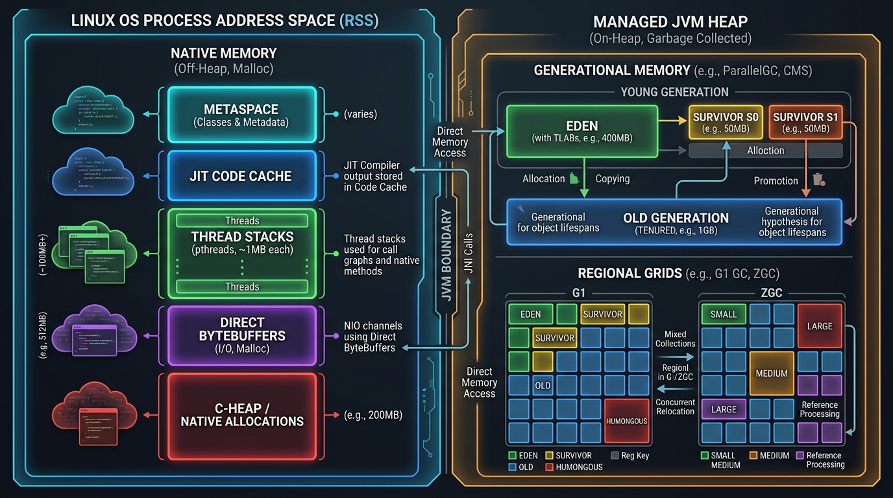
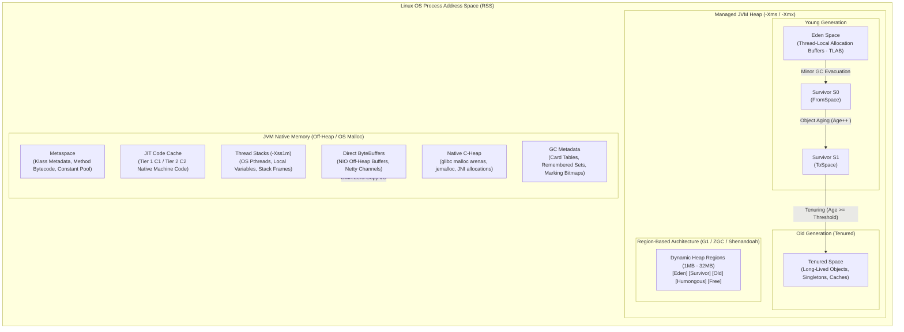

# ☕ JVM Internals, Garbage Collection & Performance Profiling Master Guide

[🏠 Back to Home](README.md) | [🧵 Java Concurrency](java_thread.md) | [⚡ CompletableFuture](completable_future.md) | [📦 Maven & Gradle](maven_gradle_master_guide.md) | [🍃 Spring Master Guide](spring_master_guide.md)

---

## 📑 Master Table of Contents

- [☕ JVM Internals, Garbage Collection \& Performance Profiling Master Guide](#-jvm-internals-garbage-collection--performance-profiling-master-guide)
  - [📑 Master Table of Contents](#-master-table-of-contents)
  - [MODULE 0: THE COMPLETE JARGON-BUSTING GLOSSARY](#module-0-the-complete-jargon-busting-glossary)
  - [🛠️ Prerequisites \& Foundational Knowledge](#️-prerequisites--foundational-knowledge)
    - [1. JVM Architecture \& Runtime Data Areas](#1-jvm-architecture--runtime-data-areas)
    - [2. Operating System Memory Model vs JVM Memory](#2-operating-system-memory-model-vs-jvm-memory)
    - [3. Bytecode Execution \& Just-In-Time (JIT) Compilation](#3-bytecode-execution--just-in-time-jit-compilation)
    - [4. Diagnostic Environment Setup](#4-diagnostic-environment-setup)
- [TRACK 1: JUNIOR \& ENTRY-LEVEL FOUNDATIONS (ZERO-TO-HERO)](#track-1-junior--entry-level-foundations-zero-to-hero)
  - [1.1 The Real-World Mental Model (The City Waste Management Analogy)](#11-the-real-world-mental-model-the-city-waste-management-analogy)
  - [1.2 JVM Memory Layout: Generational Heap \& Non-Heap](#12-jvm-memory-layout-generational-heap--non-heap)
  - [1.3 GC Fundamentals: Allocation, Minor GC, Major GC \& Full GC](#13-gc-fundamentals-allocation-minor-gc-major-gc--full-gc)
  - [1.4 Stop-The-World (STW) Pauses \& Safepoints](#14-stop-the-world-stw-pauses--safepoints)
  - [1.5 Profiling Fundamentals: Sampling vs Instrumentation](#15-profiling-fundamentals-sampling-vs-instrumentation)
  - [1.6 The Complete Inventory of Beginner JVM Disasters \& Production Anti-Patterns](#16-the-complete-inventory-of-beginner-jvm-disasters--production-anti-patterns)
- [TRACK 2: MASTER GC ALGORITHMS \& PROFILING TOOLS CATALOG](#track-2-master-gc-algorithms--profiling-tools-catalog)
  - [2.1 Serial Garbage Collector (`-XX:+UseSerialGC`)](#21-serial-garbage-collector--xxuseserialgc)
  - [2.2 Parallel Garbage Collector / Throughput Collector (`-XX:+UseParallelGC`)](#22-parallel-garbage-collector--throughput-collector--xxuseparallelgc)
  - [2.3 Garbage-First Collector (G1 GC: `-XX:+UseG1GC`)](#23-garbage-first-collector-g1-gc--xxuseg1gc)
  - [2.4 Z Garbage Collector (ZGC: `-XX:+UseZGC`)](#24-z-garbage-collector-zgc--xxusezgc)
  - [2.5 Shenandoah Garbage Collector (`-XX:+UseShenandoahGC`)](#25-shenandoah-garbage-collector--xxuseshenandoahgc)
  - [2.6 Epsilon No-Op Garbage Collector (`-XX:+UseEpsilonGC`)](#26-epsilon-no-op-garbage-collector--xxuseepsilongc)
  - [2.7 JDK Flight Recorder (JFR) \& JDK Mission Control (JMC)](#27-jdk-flight-recorder-jfr--jdk-mission-control-jmc)
  - [2.8 Async-Profiler (CPU, Allocations, Wall-Clock \& Flame Graphs)](#28-async-profiler-cpu-allocations-wall-clock--flame-graphs)
  - [2.9 CLI Production Diagnostics (`jcmd`, `jstat`, `jstack`, `jmap`)](#29-cli-production-diagnostics-jcmd-jstat-jstack-jmap)
  - [2.10 Live In-Flight Diagnostics \& APM (Arthas, VisualVM, OpenTelemetry)](#210-live-in-flight-diagnostics--apm-arthas-visualvm-opentelemetry)
- [TRACK 3: DEEP TECHNICAL INTERNALS \& ARCHITECTURAL TAXONOMY](#track-3-deep-technical-internals--architectural-taxonomy)
  - [3.1 Card Tables, Remembered Sets \& Write Barriers](#31-card-tables-remembered-sets--write-barriers)
  - [3.2 Colored Pointers \& Load Barriers in ZGC](#32-colored-pointers--load-barriers-in-zgc)
  - [3.3 Safepoint Mechanism \& Time-To-Safepoint (TTSP) Pitfalls](#33-safepoint-mechanism--time-to-safepoint-ttsp-pitfalls)
  - [3.4 Memory Allocation Pathology: Humongous Allocations \& Allocation Stalls](#34-memory-allocation-pathology-humongous-allocations--allocation-stalls)
  - [3.5 Off-Heap Memory Anatomy: DirectByteBuffer, Unsafe, JNI \& Metaspace](#35-off-heap-memory-anatomy-directbytebuffer-unsafe-jni--metaspace)
- [TRACK 4: PRODUCTION ENGINEERING, CONTAINER TUNING \& AUTOMATION](#track-4-production-engineering-container-tuning--automation)
  - [4.1 Container \& Kubernetes JVM Sizing (CGroup v1/v2 Awareness)](#41-container--kubernetes-jvm-sizing-cgroup-v1v2-awareness)
  - [4.2 Production Garbage Collection Flag Templates](#42-production-garbage-collection-flag-templates)
  - [4.3 Proactive Out-Of-Memory Automation \& Crash Dumps](#43-proactive-out-of-memory-automation--crash-dumps)
  - [4.4 Automated Low-Overhead Continuous Profiling Pipeline](#44-automated-low-overhead-continuous-profiling-pipeline)
  - [4.5 CI/CD Performance Regression Gates with JMH \& Async-Profiler](#45-cicd-performance-regression-gates-with-jmh--async-profiler)
- [TRACK 5: DISASTER RECOVERY, WAR ROOM FORENSICS \& POST-MORTEMS](#track-5-disaster-recovery-war-room-forensics--post-mortems)
  - [5.1 Real-World Incident 1: Premature Tenuring Storm Triggering Cascading Full GC](#51-real-world-incident-1-premature-tenuring-storm-triggering-cascading-full-gc)
  - [5.2 Real-World Incident 2: High Latency Spikes Caused by Uncounted Loop Safepoints](#52-real-world-incident-2-high-latency-spikes-caused-by-uncounted-loop-safepoints)
  - [5.3 Real-World Incident 3: Kubernetes OOMKilled by Silent DirectByteBuffer Leak](#53-real-world-incident-3-kubernetes-oomkilled-by-silent-directbytebuffer-leak)
  - [5.4 Real-World Incident 4: Metaspace Exhaustion Due to Dynamic Proxy Class Generation](#54-real-world-incident-4-metaspace-exhaustion-due-to-dynamic-proxy-class-generation)
  - [5.5 Real-World Incident 5: CPU Starvation Caused by High-Concurrency Lock Contention](#55-real-world-incident-5-cpu-starvation-caused-by-high-concurrency-lock-contention)
  - [5.6 The Emergency Production Triage Cheat-Sheet](#56-the-emergency-production-triage-cheat-sheet)
- [TRACK 6: CRACK-THE-INTERVIEW QUESTION BANK (50 SENIOR/STAFF+ SCENARIOS)](#track-6-crack-the-interview-question-bank-50-seniorstaff-scenarios)

---

## 🛠️ Prerequisites & Foundational Knowledge

Before diving into garbage collection tuning and JVM profiling, engineers must understand the underlying operating system and virtual machine mechanics.

### 1. JVM Architecture & Runtime Data Areas
The Java Virtual Machine (JVM) divides process memory into distinct runtime data areas:
- **Thread-Private Areas**:
  - **Program Counter (PC) Register**: Stores the address of the currently executing JVM instruction.
  - **JVM Thread Stack**: Stores execution frames containing local variables, operand stacks, and method references. Default size is typically 1024 KB (`-Xss1m`).
  - **Native Method Stack**: Backs execution of C/C++ native code via JNI (Java Native Interface).
- **Shared Memory Areas**:
  - **Java Heap**: Shared memory space where all class instances and arrays are allocated. Subject to Garbage Collection.
  - **Metaspace (Java 8+)**: Native memory storing class metadata, method descriptors, runtime constant pools, and annotations. Replaced the contiguous contiguous PermGen.
  - **Code Cache**: Native memory where the JIT compiler stores compiled machine code (Tier 1 C1, Tier 2 C2, or Graal).
  - **Off-Heap / Direct Memory**: Buffers allocated outside the JVM heap via `ByteBuffer.allocateDirect()` or `sun.misc.Unsafe`, managed via OS system calls (`malloc`/`mmap`).

### 2. Operating System Memory Model vs JVM Memory
A running Java application is an OS process (PID). Its total Resident Set Size (RSS) is calculated as:
$$\text{RSS} \approx \text{Heap} + \text{Metaspace} + \text{CodeCache} + (\text{Thread Count} \times \text{Stack Size}) + \text{Direct Buffers} + \text{JVM Native Overhead}$$





#### Visual Architecture & Deep Mechanics of JVM Memory Substrate

##### 1. Visual Architecture & Node Anatomy
* **Linux OS Process Address Space (RSS)**: Total physical and swapped memory pages allocated to the JVM PID by the OS kernel. Monitored via `/proc/<PID>/status` (`VmRSS`) and Kubernetes `memory.current`.
* **Managed JVM Heap (`-Xms` / `-Xmx`)**: Partition of memory managed exclusively by HotSpot garbage collectors:
  - **Eden Space**: Landing zone for newly instantiated objects. Uses per-thread **Thread-Local Allocation Buffers (TLABs)** for lock-free pointer bumping.
  - **Survivor Spaces (`S0` and `S1`)**: Equal-sized semi-spaces acting as staging buffers to age transient objects.
  - **Tenured Space (Old Generation)**: Stores long-lived enterprise application state (singletons, caches, pooled connections).
  - **Humongous Regions (G1 GC)**: Spans of contiguous regions for individual objects exceeding 50% of `G1HeapRegionSize`.
* **Native Memory (Off-Heap Space)**:
  - **Metaspace**: Holds class metadata, runtime constant pools, and method bytecode.
  - **JIT Code Cache**: Holds native x86_64/ARM machine code compiled by C1 and C2 JIT compilers.
  - **Thread Stacks**: 1 MB native stack per OS pthread allocated via `mmap`.
  - **Direct ByteBuffers**: Off-heap buffers used by Java NIO channels and Netty for kernel zero-copy transfer.
  - **Native C-Heap**: Unmanaged heap utilized by internal HotSpot subsystems and JNI C/C++ libraries.

##### 2. Execution Flow & State Transitions
1. **Thread Allocation**: Object creation lands in thread's local TLAB inside Eden without global locking.
2. **TLAB Exhaustion**: Thread requests new TLAB chunk from Eden via atomic CAS bump.
3. **Minor GC Evacuation**: Full Eden triggers Stop-The-World Young GC. Live objects in Eden and `FromSpace` copy to `ToSpace`.
4. **Age Promotion**: Mark Word age bits increment. Once `age >= MaxTenuringThreshold`, objects promote to Tenured Old Gen.
5. **Major/Concurrent GC**: When Old Gen occupancy crosses IHOP (default 45%), background concurrent marking initiates.

##### 3. Low-Level Kernel & JVM Mechanics
* **Deterministic RSS Formula**:
  $$\text{RSS} = \text{Heap} + \text{Metaspace} + \text{CodeCache} + (\text{Thread Count} \times \text{Stack Size}) + \text{DirectMemory} + \text{GC Metadata} + \text{Native C-Heap}$$
* **Cgroup Limit Enforcement**: If RSS breaches `memory.max` in Kubernetes, the Linux kernel OOM Killer terminates the pod with Exit Code 137.
* **glibc Malloc Arena Overhead**: Up to $8 \times \text{vCPUs}$ native arenas multiply virtual memory fragmentation; mitigated by `MALLOC_ARENA_MAX=2` or `jemalloc`.

##### 4. Production Failure Modes & SRE Diagnostics
* **Kubernetes Exit 137 (OOMKilled)**: Occurs when container limits equal `-Xmx` without factoring native overhead.
* **DirectByteBuffer Silent Leak**: Off-heap buffers bypass GC pause metrics and cause unexpected host memory exhaustion.
* **Production Diagnostic Runbook**:
  ```bash
  # Enable Native Memory Tracking
  java -XX:NativeMemoryTracking=detail -XX:+UnlockDiagnosticVMOptions -jar app.jar
  
  # Check live native memory diffs
  jcmd <PID> VM.native_memory baseline
  jcmd <PID> VM.native_memory detail.diff
  ```

<details>
<summary>Text Representation (ASCII Blueprint)</summary>

```text
+--------------------------------------------------------------------------------+
|                        OS Process Address Space (RSS)                          |
|  +-------------------------------------+  +---------------------------------+  |
|  |           JVM Managed Heap          |  |         JVM Native Space        |  |
|  |  +------------+  +---------------+  |  |  +------------+  +-----------+  |  |
|  |  | Young Gen  |  | Old / Tenured |  |  |  | Metaspace  |  | CodeCache |  |  |
|  |  | (Eden/S0/S1|  | (Long-lived)  |  |  |  +------------+  +-----------+  |  |
|  |  +------------+  +---------------+  |  |  +------------+  +-----------+  |  |
|  +-------------------------------------+  |  | ThreadStks |  | DirectBuf |  |  |
|                                           |  +------------+  +-----------+  |  |
|                                           +---------------------------------+  |
+--------------------------------------------------------------------------------+
```

</details>

### 3. Bytecode Execution & Just-In-Time (JIT) Compilation
- **Interpreter**: Executes bytecode sequentially with minimal startup latency.
- **Tiered Compilation (`-XX:+TieredCompilation`)**:
  - **Level 0**: Interpreted bytecode.
  - **Levels 1–3 (C1 Compiler / Client)**: Compiles bytecode into native code with profiling counters (invocation and backedge counters).
  - **Level 4 (C2 Compiler / Server)**: High-performance optimizing compiler utilizing profile-guided optimization (escape analysis, inlining, loop unrolling, devirtualization).
- **Escape Analysis**: Determines if an object allocated inside a method escapes the method scope or current thread. If not, the JVM can perform:
  1. **Scalar Replacement**: Deconstructs object fields into primitive registers/stack variables, avoiding heap allocation completely.
  2. **Lock Elision**: Removes synchronization locks if the object is never shared across threads.

### 4. Diagnostic Environment Setup
Ensure standard diagnostic tools are installed in your development and staging environments:
- **JDK 17 LTS / JDK 21 LTS** (`openjdk-21-jdk` or Eclipse Temurin)
- **Async-Profiler**: High-precision, low-overhead profiler based on `AsyncGetCallTrace`.
- **JDK Mission Control (JMC)**: GUI for visualising Java Flight Recorder (JFR) files.
- **Eclipse Memory Analyzer Tool (MAT)**: Enterprise heap dump analyzer for finding memory leaks.

---

# MODULE 0: THE COMPLETE JARGON-BUSTING GLOSSARY

| Term / Acronym | The Simple Plain-English Meaning | The Everyday Mental Model (Analogy) | Low-Level Technical Definition | What Breaks If You Get This Wrong? |
|---|---|---|---|---|
| **Allocation Stall** | Mutator threads freezing because they request heap memory faster than concurrent GC can reclaim it. | Shoppers standing frozen at the store entrance because all shopping carts are dirty and the cleaning crew hasn't returned any. | A condition where mutator threads attempting to allocate in Eden/TLAB are suspended because free memory is exhausted and GC evacuation/compaction is trailing allocation rate. | Triggers massive multi-second latency spikes in ZGC or Shenandoah, completely violating sub-millisecond SLAs. |
| **Async-Profiler** | A low-overhead, non-safepoint-biased CPU and memory allocation profiler for the JVM. | A stealth radar detector that measures car speeds anywhere on the highway without forcing cars to stop at toll booths. | High-performance profiler utilizing the HotSpot internal `AsyncGetCallTrace` API and Linux `perf_events` / OS timers to sample threads at arbitrary instruction addresses without safepoint bias. | Relying on standard sampling tools (`jstack`, VisualVM) skews hotspot reports toward methods containing loop safepoints. |
| **Card Table** | A memory array tracking Old Generation memory blocks that contain references to Young Generation objects. | A desk calendar where an office clerk stamps a red checkmark on any date where an old archive folder points to a new incoming letter. | A byte array where each byte represents a 512-byte block ("Card") of Old Gen memory. When an Old Gen object field is updated to reference a Young Gen object, a post-write barrier marks the corresponding card dirty (`0x0`). | Turning an $O(k)$ targeted minor collection into an $O(N)$ full heap scan, spiking Young GC pause times. |
| **Colored Pointers** | Embedding GC metadata directly inside reference pointer bits rather than in object headers. | Stamping colored stickers directly onto the shipping label of a package to show its inspection status. | A technique used in ZGC where 4 metadata bits (Marked0, Marked1, Remapped, Finalizable) are stored in the high bits ($42-45$) of 64-bit reference pointers. Combined with MMU virtual memory page aliasing. | Misinterpreting colored pointer bit manipulation in native C/JNI extensions triggers fatal OS segmentation faults (`SIGSEGV`). |
| **Concurrent Marking** | Tracing the live object graph concurrently while application threads continue executing. | City census workers counting residents while people walk around and go about their daily workday. | Phase in modern collectors (G1, ZGC, Shenandoah) where background GC threads traverse object reference graphs concurrently with mutator execution, using write or load barriers to track in-flight pointer changes. | Inadequate marking worker thread allocation causes concurrent mark cycles to trail mutator allocation rates, causing Concurrent Mode Failure. |
| **Eden Space** | The initial heap region where newly instantiated objects land. | The nursery ward in a maternity hospital where all newborn babies arrive. | Young generation memory partition backed by Thread-Local Allocation Buffers (TLABs). Objects are allocated via bump-the-pointer assembly without global synchronization. | Undersizing Eden causes extreme Young GC frequency, burning CPU on continuous evacuation pauses. |
| **Epsilon GC** | A no-op garbage collector that handles memory allocation but never reclaims it. | A trash can with no bottom that simply overflows when full, requiring you to throw out the entire building. | JVM garbage collector (`-XX:+UseEpsilonGC`) providing memory allocation without reclamation. When heap memory is exhausted, the JVM immediately throws `OutOfMemoryError`. | Deploying in long-running production web services causes instant process termination once traffic exhausts `-Xmx`. |
| **Evacuation Failure** | A failure state in G1 GC when no free memory regions exist to copy surviving objects into. | A hotel fire drill where all guests evacuate into the parking lot, but the parking lot is completely packed with cars. | Occurs during a G1 Young/Mixed pause when the collector cannot find a free region to evacuate live objects into. Forces G1 to preserve objects in place ("self-forwarding") and trigger a Stop-The-World Full GC. | Triggers devastating multi-second Stop-The-World pauses and container evictions under peak traffic. |
| **Full GC** | A Stop-The-World pause that stops all mutator threads to clean and compact the entire JVM memory space. | Shutting down the entire city for 24 hours so every street, building, and basement can be scrubbed clean. | A heavy, global garbage collection scanning and compacting Young Generation, Old Generation, and Metaspace. Pauses all application mutator threads for the duration. | High-frequency Full GCs cause client timeouts, health check failures, and cascading Kubernetes pod restarts. |
| **G1 GC (Garbage-First)** | A region-based generational garbage collector designed for multi-gigabyte heaps with predictable pause targets. | A postal warehouse divided into 2,048 sorting bins that cleans out the bins with the most junk mail first. | Divides the heap into 2,048 equal regions ($1\text{MB}-32\text{MB}$). Uses concurrent marking, remembered sets (RSets), and incremental mixed evacuations to meet `-XX:MaxGCPauseMillis`. | Misconfiguring region size on large objects causes excessive humongous allocations, fragmenting heap regions. |
| **Humongous Allocation** | Allocating an object whose size exceeds 50% of a G1 heap region. | Delivering a massive 18-wheel tractor-trailer that takes up 4 standard car parking spaces at once. | In G1 GC, any object exceeding 50% of the `G1HeapRegionSize`. Allocated directly into contiguous Old Gen regions, bypassing Eden and Survivor spaces. | High rates of humongous allocations bypass young generation efficiency, trigger continuous concurrent marks, and cause fragmentation. |
| **JFR (JDK Flight Recorder)** | An internal low-overhead diagnostic and event monitoring engine built into the HotSpot JVM. | The black-box flight data recorder inside an airplane that continuously logs altitude, speed, and engine metrics. | Kernel-efficient profiling framework (<1% overhead) logging JVM internal events (allocations, locks, safepoints, GC phases) into binary `.jfr` files for offline analysis in JMC. | Running without JFR in production means you lack forensic data when diagnosing intermittent Sev-1 latency spikes. |
| **Load Barrier** | A JIT-inlined instruction intercepting reference reads to verify and update pointer addresses concurrently. | A hotel concierge who intercepts you at the lobby elevator to tell you your room was moved to the 5th floor and updates your keycard. | Specialized assembly check inserted by JIT before reference read operations (`o.field`) in ZGC. Tests pointer color bits and remaps old pointers on the fly without stopping threads. | Incompatible compiler flags or native code bypasses cause stale pointer dereferencing, reading corrupted memory. |
| **Metaspace** | Native memory storing class metadata, runtime constant pools, and method bytecodes. | The city hall blueprint archives holding structural architectural plans for all buildings in town. | Native memory partition allocated outside the Java heap. Introduced in Java 8 to replace the contiguous, fixed PermGen. Sized dynamically up to `-XX:MaxMetaspaceSize`. | Unbounded Metaspace with dynamic class generation (e.g., dynamic proxies, un-cached CGLIB) triggers native memory leaks and host OOM kills. |
| **Minor GC / Young GC** | A fast garbage collection cycle collecting strictly the Young Generation (Eden + Survivor). | A street sweeper truck cleaning curbside leaves every morning without disturbing houses or backyards. | Stop-The-World collection reclaiming dead objects in Eden and active Survivor spaces. Copies surviving objects to the alternate Survivor space or promotes them to Old Gen. | Sizing Survivor spaces too small causes premature tenuring, spilling short-lived objects into Old Generation. |
| **Parallel GC** | A multi-threaded, high-throughput Stop-The-World collector optimizing CPU efficiency over pause time. | A crew of 8 workers who freeze all factory machinery and sprint to clean the entire assembly line at maximum speed. | Default collector in Java 8 (`-XX:+UseParallelGC`). Uses multiple threads to collect Young (Parallel Scavenge) and Old (Parallel Old) generations with full Stop-The-World pauses. | Unacceptable for low-latency web services; pauses scale linearly with heap size (5–15 seconds on 32GB heaps). |
| **Premature Tenuring** | Short-lived objects surviving Eden and spilling into the Old Generation before they have a chance to die. | Young college students accidentally being registered into an elderly retirement village because the dormitory ran out of beds. | Occurs when Survivor spaces overflow (`TargetSurvivorRatio`) or objects exceed `MaxTenuringThreshold` prematurely, forcing temporary DTOs into Old Gen where they must wait for a Major/Full GC. | Saturates Old Generation rapidly, triggering frequent mixed collections or cascading Full GCs. |
| **Remembered Set (RSet)** | A per-region data structure in G1 tracking incoming reference pointers from external heap regions. | An index card taped to a locker listing every student in other classrooms who has borrowed a textbook from this locker. | Data structure maintained by G1 GC regions tracking which external regions contain references pointing into the region. Populated via dirty card table post-write barriers. | Excessive cross-region references inflate RSet native memory overhead, consuming up to 10–20% of total JVM memory. |
| **Safepoint** | A predefined checkpoint in application bytecode where all mutator threads can be safely suspended. | Red traffic lights across all city intersections that turn on simultaneously when an emergency motorcade needs to pass. | Points in program execution (method returns, loop branches, allocations) where JVM thread registers and stack maps are fully consistent. Used for GC pauses, deoptimizations, and thread dumps. | Uncounted integer loops without safepoints delay JVM safepoint synchronization, causing multi-second latency spikes (TTSP). |
| **Shenandoah GC** | An ultra-low-pause concurrent collector that performs marking, evacuation, and reference updates concurrently. | A road maintenance crew that repaves highway lanes concurrently while morning commuter traffic flows normally. | Open-source low-latency collector utilizing Brooks pointers (or load-reference barriers) to evacuate memory regions concurrently with mutator threads, achieving <10ms pauses regardless of heap size. | High allocation spikes can outpace concurrent evacuation, forcing the collector into a Degenerated or Full GC. |
| **Stop-The-World (STW)** | A pause during which all application mutator execution is suspended to ensure memory consistency. | Freezing time on a soccer field so the referee can repaint the boundary lines without players kicking the ball. | The operational state where all application threads are parked at Safepoints while GC threads mutate references, move objects, or update card tables. | Protracted STW pauses drop network connections, trigger heartbeat timeouts, and cause distributed cluster rebalance storms. |
| **TLAB (Thread Local Allocation Buffer)** | A dedicated slice of Eden memory assigned exclusively to a single thread for lock-free allocations. | A carpenter carrying a private pouch of nails instead of walking across the job site to the shared tool chest for every nail. | A small, private region inside Eden allocated to each thread. Allows thread allocations to execute via atomic pointer bumping (`top += size`) without locking the shared heap. | Setting TLAB sizes incorrectly causes excessive shared-space Eden allocations, increasing contention on the global heap lock. |
| **TTSP (Time-To-Safepoint)** | The latency between the JVM requesting a safepoint and all application threads coming to a complete halt. | The time it takes for every student in a chaotic playground to stop running and freeze after the teacher blows the whistle. | The elapsed duration required for all active mutator threads to poll their safepoint page and voluntarily park. A single thread stuck in an uncounted loop delays the entire safepoint. | P99 latency spikes that appear in APM without corresponding GC pause times in GC logs are almost always caused by high TTSP. |
| **ZGC (Z Garbage Collector)** | A scalable, low-latency concurrent garbage collector delivering sub-millisecond pauses on terabyte heaps. | A self-cleaning robotic vacuum system that tidies up rooms constantly in the background without anyone noticing. | Concurrent collector utilizing colored pointers, load barriers, and virtual memory page mapping to perform concurrent marking, evacuation, and reference updates with <1ms pause times. | High sustained allocation rates can cause allocation stalls if GC marking cycles are not started early enough. |

---

# TRACK 1: JUNIOR & ENTRY-LEVEL FOUNDATIONS (ZERO-TO-HERO)

## 1.1 The Real-World Mental Model (The City Waste Management Analogy)

To master Garbage Collection, visualize a bustling metropolitan city:
1. **Citizens (Threads)** produce items on their desks (creating objects).
2. **Post-it Notes & Scratchpads (Short-Lived Objects)**: 95% of notes are thrown into desk trash cans within minutes (The **Weak Generational Hypothesis**: most objects die young).
3. **Office Desk Waste Cans (Eden Space)**: Fast, cheap local collection.
4. **Temporary Recycling Bins (Survivor Spaces S0/S1)**: Items that survived the initial disposal round are inspected. If an item survives 15 rounds of recycling checks, it is deemed permanent.
5. **City Archives & Warehouses (Tenured / Old Generation)**: Long-lived items (caches, singleton spring beans, thread pools, database connections). Cleaning this warehouse requires extensive cataloging and heavy machinery (Major / Full GC).

---

## 1.2 JVM Memory Layout: Generational Heap & Non-Heap

```
+-----------------------------------------------------------------------+
|                               JAVA HEAP                               |
|  +-----------------------------------------+  +--------------------+  |
|  |           Young Generation              |  |   Old Generation   |  |
|  |  +-----------------+  +-------+  +----+ |  |     (Tenured)      |  |
|  |  |      Eden       |  |  S0   |  | S1 | |  |                    |  |
|  |  |  (New Objects)  |  | (From)|  | (To) |  |  (Long-lived objs) |  |
|  |  +-----------------+  +-------+  +----+ |  |                    |  |
|  +-----------------------------------------+  +--------------------+  |
+-----------------------------------------------------------------------+
```

1. **Young Generation**:
   - **Eden**: Where newly allocated objects (`new Order()`) land. Allocation is lightning-fast using **Thread Local Allocation Buffers (TLABs)**, which eliminate thread synchronization during memory pointer bumping.
   - **Survivor Spaces (`S0` and `S1`)**: Equal-sized semi-spaces. At any moment, one is active (`From`) and the other is empty (`To`). Live objects in Eden and `From` are copied into `To`, swapping roles every cycle.
2. **Old Generation (Tenured)**:
   - Stores objects that have survived multiple young collection cycles (governed by `-XX:MaxTenuringThreshold=15`).
   - Stores oversized objects directly if they exceed the TLAB or pre-tenuring threshold (`-XX:PretenureSizeThreshold`).
3. **Non-Heap Spaces**:
   - **Metaspace**: Stores class structures, method bytecodes, symbol tables. Dynamically resizes up to `-XX:MaxMetaspaceSize`.
   - **Code Cache**: Holds compiled native code. Sized via `-XX:ReservedCodeCacheSize=256m`.

---

## 1.3 GC Fundamentals: Allocation, Minor GC, Major GC & Full GC

| GC Type | Target Region | Trigger Condition | Relative Pause Impact |
| :--- | :--- | :--- | :--- |
| **Minor GC (Young GC)** | Young Gen (Eden + Survivors) | Eden space fills up | Minimal (1ms – 20ms). Only traces roots pointing into Young Gen. |
| **Major GC** | Old Gen | Old Gen fills up past occupancy threshold | Medium to High. Cleans and compacts tenured space. |
| **Full GC** | Entire JVM (Young, Old, Metaspace) | Explicit `System.gc()`, Metaspace overflow, or evacuation failure | Severe (100ms to several seconds). Pauses all application threads. |

### Object Age & Promotion Mechanism
Each Java object header contains a 64-bit Mark Word (on 64-bit JVMs):
- Age bits: 4 bits are allocated for object age ($2^4 - 1 = 15$ maximum age).
- Every time an object survives a Young GC copy cycle between Survivor spaces, its age increments by 1.
- **Tenuring Threshold**: When `age >= MaxTenuringThreshold`, it is promoted to Old Gen.
- **Dynamic Age Calculation**: If the total size of objects of a given age in a Survivor space exceeds 50% of the Survivor space (`-XX:TargetSurvivorRatio=50`), objects with age $\ge$ that age are promoted immediately, preventing survivor overflow.

---

## 1.4 Stop-The-World (STW) Pauses & Safepoints

### What is Stop-The-World?
During certain phases of garbage collection, application threads must be temporarily suspended so the collector can mutate object pointers, evacuate memory regions, and update object references without race conditions.

### Safepoints: How the JVM Stops Threads
The JVM cannot freeze a running thread at arbitrary machine instructions because registers and stack frames might be in intermediate states. Instead, threads only stop at **Safepoints**:
- Safepoints are placed at:
  1. Method returns.
  2. Loop branch instructions (except uncounted integer loops in older JVMs).
  3. Memory allocation points.
  4. Thread state transitions (e.g., entering synchronized blocks, JNI boundaries).
- When a GC requests a safepoint, it arms a global memory page. Each thread periodically polls this page; when armed, the thread voluntarily parks itself.
- **Time-To-Safepoint (TTSP)**: The delay between when the GC requests a pause and when the slowest thread finally reaches a safepoint. A high TTSP causes severe latency spikes even if the GC pause itself is only 2ms!

---

## 1.5 Profiling Fundamentals: Sampling vs Instrumentation

Understanding how profiling tools measure JVM execution is vital to avoid the Observer Effect:

```
Sampling Profiler (Low Overhead, Statistical):
[Thread 1] ====|====|====|====|====|====> (Sample callstack every 10ms)
[Overhead: < 2%, Safe for Production]

Instrumentation Profiler (High Overhead, Exact Invocations):
[Method Enter] -> [Counter++] -> [Original Code] -> [Timer End] -> [Method Exit]
[Overhead: 20% - 300%, Skews JIT compilation, Unsafe for High Throughput]
```

1. **Instrumentation Profilers** (e.g., traditional JProfiler/YourKit dynamic tracing):
   - Injects bytecode instructions at the entrance and exit of every method.
   - Measures exact invocation counts and execution durations.
   - **Downside**: Drastically changes cache locality, inflates method sizes, disables JIT inlining, and can degrade throughput by 50–200%.
2. **Sampling Profilers** (e.g., JFR, Async-Profiler):
   - An OS timer periodically interrupts the JVM process (e.g., every 10ms) and captures stack traces.
   - **AsyncGetCallTrace**: Async-profiler uses a private JVM API that can read stack traces even outside of safepoints, eliminating the **Safepoint Bias** that plagues older tools like standard VisualVM sampling.

---

## 1.6 The Complete Inventory of Beginner JVM Disasters & Production Anti-Patterns

### 1. Hardcoding `-Xmx` Without Container CGroup Awareness
- **The Anti-Pattern:** Setting `-Xmx4g -Xms4g` inside a Kubernetes container configured with a 4GB memory limit (`resources.limits.memory: 4Gi`).
- **Why It Crashes Production Under the Hood:** Total OS process Resident Set Size (RSS) is $\text{Heap} + \text{Metaspace} + \text{CodeCache} + (\text{Threads} \times \text{Stack}) + \text{DirectMemory} + \text{JVM Native}$. With a 4GB heap, native overhead pushes total memory to ~4.8GB. The Linux kernel cgroup controller immediately terminates the container with signal 9 / exit code 137 (`OOMKilled`).
- **The Corrected Baseline:**
  ```bash
  -XX:+UseContainerSupport -XX:MaxRAMPercentage=75.0 -XX:InitialRAMPercentage=75.0
  ```
- **Rule of Thumb:** *"Never allocate more than 70–75% of container RAM limit to Java heap."*

---

### 2. Manual Invocations of `System.gc()` in Application Libraries
- **The Anti-Pattern:** Calling `System.gc()` or `Runtime.getRuntime().gc()` in application code or third-party RMI/remoting libraries.
- **Why It Crashes Production Under the Hood:** Initiates an explicit Stop-The-World Full GC across all generations and Metaspace. On multi-gigabyte heaps, application execution freezes for 2 to 15 seconds, dropping database connections, violating health check probes, and causing Kubernetes rolling restarts.
- **The Corrected Baseline:**
  ```bash
  -XX:+DisableExplicitGC
  # Or if DirectByteBuffer cleaner needs explicit triggers:
  -XX:+ExplicitGCInvokesConcurrent
  ```
- **Rule of Thumb:** *"Always disable explicit GC calls in production flags."*

---

### 3. Survivor Space Undersizing (Premature Tenuring Storms)
- **The Anti-Pattern:** Leaving `-XX:SurvivorRatio=8` or reducing Young Gen to 10% of total heap on high-allocation streaming services.
- **Why It Crashes Production Under the Hood:** Young generation Eden fills in milliseconds. The survivor spaces overflow their `TargetSurvivorRatio` (50%), triggering dynamic tenuring: live short-lived DTOs bypass survivor aging and are promoted directly into the Old Generation. Old Gen rapidly exhausts, triggering continuous concurrent mark cycles and cascading Full GCs.
- **The Corrected Baseline:**
  ```bash
  -XX:G1NewSizePercent=30 -XX:G1MaxNewSizePercent=60 -XX:SurvivorRatio=4
  ```
- **Rule of Thumb:** *"Size Survivor spaces so that short-lived DTOs survive at least 2–3 minor GC cycles without spilling into Old Gen."*

---

### 4. Unbounded Thread Spawning Triggering Native Memory OOM
- **The Anti-Pattern:** Spawning raw threads via `new Thread(runnable).start()` inside HTTP request handlers.
- **Why It Crashes Production Under the Hood:** Each OS thread allocates a native virtual memory stack (default 1MB via `-Xss1m`). Under traffic spikes of 5,000 requests, thread stacks consume 5GB of native RAM outside the heap. When the OS kernel runs out of virtual memory addresses or hits `kernel.pid_max`, the JVM crashes with `java.lang.OutOfMemoryError: unable to create new native thread`.
- **The Corrected Baseline:**
  ```java
  // In Java 21+: Use lightweight Virtual Threads
  ExecutorService executor = Executors.newVirtualThreadPerTaskExecutor();
  // In Java 8/17: Use bounded ThreadPoolExecutor with CallerRunsPolicy
  ```
- **Rule of Thumb:** *"Never instantiate raw Threads in server applications; use bounded pools or Virtual Threads."*

---

### 5. Unbounded Metaspace Exhaustion via Dynamic Class Generation
- **The Anti-Pattern:** Leaving `-XX:MaxMetaspaceSize` unbounded while using reflection libraries, dynamic CGLIB proxies, or Groovy scripts that dynamically generate classes per request.
- **Why It Crashes Production Under the Hood:** Dynamically generated classes and their associated `ClassLoader` instances cannot be garbage collected as long as any strong reference exists. Metaspace expands indefinitely until host virtual memory is exhausted, taking down the entire virtual machine.
- **The Corrected Baseline:**
  ```bash
  -XX:MetaspaceSize=128m -XX:MaxMetaspaceSize=512m
  ```
- **Rule of Thumb:** *"Always cap Metaspace with -XX:MaxMetaspaceSize to prevent silent host native memory starvation."*

---

### 6. Setting `-Xms` and `-Xmx` to Different Values
- **The Anti-Pattern:** Configuring `-Xms1g -Xmx8g` on production microservices.
- **Why It Crashes Production Under the Hood:** The JVM starts with 1GB and must dynamically request virtual memory pages from the OS kernel as load increases. When memory pressure subsides, the JVM shrinks heap, and expands it again during the next spike. Each heap resize triggers a Stop-The-World pause and page table modifications, causing unpredictable P99 latency spikes.
- **The Corrected Baseline:**
  ```bash
  -Xms8g -Xmx8g -XX:+AlwaysPreTouch
  ```
- **Rule of Thumb:** *"Always set initial heap (-Xms) equal to maximum heap (-Xmx) in production."*

---

### 7. Sizing Heap Exceeding 32GB Without Evaluating Compressed OOPs Threshold
- **The Anti-Pattern:** Allocating `-Xmx34g` believing a 2GB bump will increase capacity.
- **Why It Crashes Production Under the Hood:** Crossing the ~32GB boundary disables **Compressed Ordinary Object Pointers (`-XX:+UseCompressedOops`)**. Pointers expand from 4 bytes to 8 bytes. Every object header and reference field doubles in size, instantly increasing application memory consumption by 30–40%. A 34GB heap actually holds *less* useful domain data than a 31GB heap!
- **The Corrected Baseline:**
  ```bash
  # Keep heap under 31GB to ensure Compressed OOPs remain active:
  -Xms31g -Xmx31g -XX:+UseCompressedOops
  ```
- **Rule of Thumb:** *"Either stay strictly under 32GB (e.g. 31GB), or jump straight to 48GB+ to justify the loss of Compressed OOPs."*

---

### 8. Uncounted Loops Delaying Safepoint Synchronization (TTSP Spikes)
- **The Anti-Pattern:** Writing computational loops using integer counters (`for (int i = 0; i < n; i++)`) in C2-compiled hot methods.
- **Why It Crashes Production Under the Hood:** The C2 JIT compiler historically omits safepoint checks in counted loops. When GC requests a Stop-The-World safepoint, the thread executing this loop ignores the request until the loop terminates. All other application threads sit frozen at safepoints for seconds, inflating P999 latency while GC pause logs show only 5ms.
- **The Corrected Baseline:**
  ```bash
  -XX:+UseCountedLoopSafepoints
  ```
- **Rule of Thumb:** *"Enable -XX:+UseCountedLoopSafepoints or use long loop counters in CPU-intensive batch jobs."*

---

### 9. Setting Unrealistically Aggressive Pause Targets in G1 GC
- **The Anti-Pattern:** Setting `-XX:MaxGCPauseMillis=5` on an 8GB heap.
- **Why It Crashes Production Under the Hood:** G1 attempts to satisfy the 5ms target by shrinking the Young Generation to a minuscule fraction (e.g. 20MB). The tiny Eden space fills every few milliseconds, causing hundreds of Young GCs per minute. Application throughput plummets, and objects are prematurely tenured into Old Gen, causing Full GC collapses.
- **The Corrected Baseline:**
  ```bash
  -XX:MaxGCPauseMillis=200
  ```
- **Rule of Thumb:** *"G1 GC is designed for 100ms–200ms targets. If you require <1ms pauses, switch to Generational ZGC."*

---

### 10. Missing Heap Dump on Out-Of-Memory Error
- **The Anti-Pattern:** Running production JVMs without automated crash dump triggers.
- **Why It Crashes Production Under the Hood:** When an OOM occurs, the container dies or restarts. Without an automated heap dump, SREs and engineers have zero memory forensics to identify the leaking data structures, forcing teams to wait until the outage reoccurs.
- **The Corrected Baseline:**
  ```bash
  -XX:+HeapDumpOnOutOfMemoryError -XX:HeapDumpPath=/var/log/jvm/oom_dump.hprof -XX:+ExitOnOutOfMemoryError
  ```
- **Rule of Thumb:** *"Every production JVM must have -XX:+HeapDumpOnOutOfMemoryError and exit cleanly on OOM."*

---

# TRACK 2: MASTER GC ALGORITHMS & PROFILING TOOLS CATALOG

```
JVM Garbage Collectors Evolution Matrix:
+-------------------+--------------------+--------------------+-----------------------+
| Collector         | Primary Target     | Target Latency     | Max Heap Scalability  |
+-------------------+--------------------+--------------------+-----------------------+
| Serial GC         | Single-core / IoT  | 50ms - 1000ms      | < 512 MB              |
| Parallel GC       | High Throughput    | 100ms - 5000ms     | < 32 GB               |
| G1 GC             | Balanced Prod Work | 10ms - 200ms       | 4 GB - 64 GB          |
| ZGC               | Sub-millisecond SLA| < 1 ms             | 16 GB - 16 TB         |
| Shenandoah        | Ultra-low Pause    | < 10 ms            | 4 GB - 100 GB         |
| Epsilon           | Zero GC / Bench    | 0 ms (No Collect)  | Limited by RAM        |
+-------------------+--------------------+--------------------+-----------------------+
```

---

## 2.1 Serial Garbage Collector (`-XX:+UseSerialGC`)

### Deep Overview
The Serial Collector uses a single thread to execute all garbage collection work. Both Young and Old generation collections are strictly Stop-The-World. Young generation uses the "Copy" algorithm, while Old generation uses "Mark-Sweep-Compact".

### Pros & Cons
- **Pros**: Zero thread-synchronization overhead; smallest runtime footprint (<30MB JVM overhead).
- **Cons**: Total application freeze during collection; scales terribly on multi-core architectures.

### Hard Limits, Quotas & Gotchas
- Unacceptable for production web applications handling concurrent HTTP traffic.
- Ideal for CLI tools, AWS Lambda micro-functions (<512MB RAM), or embedded edge devices.

### Production Flags Blueprint
```bash
java -XX:+UseSerialGC -Xms128m -Xmx256m -jar micro-cli-service.jar
```

---

## 2.2 Parallel Garbage Collector / Throughput Collector (`-XX:+UseParallelGC`)

### Deep Overview
The default collector in Java 8. It uses multiple parallel threads to perform Young generation collection (Parallel Scavenge) and Old generation collection (Parallel Old). It focuses entirely on maximizing overall throughput ($\frac{T_{\text{application}}}{T_{\text{application}} + T_{\text{GC}}}$) at the expense of pause predictability.

### Pros & Cons
- **Pros**: Highest raw CPU efficiency; minimal runtime CPU barrier overhead; compact memory footprint.
- **Cons**: Stop-The-World pauses scale linearly with live heap size. A 32GB heap can experience 5–15 second Full GC pauses.

### Hard Limits, Quotas & Gotchas
- Do not use when P99 response time SLAs are under 500ms.
- Ideal for offline batch processing, map-reduce jobs, and financial end-of-day reconciliation pipelines.

### Production Flags Blueprint
```bash
java -XX:+UseParallelGC \
     -XX:ParallelGCThreads=8 \
     -Xms16g -Xmx16g \
     -XX:MaxGCPauseMillis=500 \
     -XX:GCTimeRatio=19 \
     -jar batch-processing-worker.jar
```

---

## 2.3 Garbage-First Collector (G1 GC: `-XX:+UseG1GC`)

### Deep Overview
The default collector in Java 9+. G1 splits the entire heap into 2,048 equal-sized contiguous memory regions (ranging from 1MB to 32MB depending on heap size). Regions are dynamically assigned as Eden, Survivor, or Old. G1 performs concurrent marking and prioritizes collecting regions containing the most garbage first ("Garbage First").

```
G1 Heap Layout (2,048 Independent Regions):
[ E ][ O ][ S ][ Free ][ E ][ H ][ O ][ S ][ E ][ Free ][ O ][ H ]
Legend: E = Eden, S = Survivor, O = Old, H = Humongous (> 50% Region Size)
```

### Pros & Cons
- **Pros**: Predictable pause times via `-XX:MaxGCPauseMillis=200`; compacts memory incrementally to prevent fragmentation; supports heaps from 4GB to 64GB.
- **Cons**: High CPU overhead due to card tables, remembered sets (R-Sets), and write barriers (consuming 10–15% additional heap memory).

### Hard Limits, Quotas & Gotchas
- Objects larger than 50% of a region size are classified as **Humongous Objects** and allocated directly into contiguous Old regions, bypassing TLABs and causing premature GC cycles.

### Production Flags Blueprint
```bash
java -XX:+UseG1GC \
     -Xms16g -Xmx16g \
     -XX:MaxGCPauseMillis=150 \
     -XX:G1ReservePercent=15 \
     -XX:InitiatingHeapOccupancyPercent=45 \
     -XX:G1HeapRegionSize=16m \
     -XX:+ParallelRefProcEnabled \
     -jar enterprise-payment-api.jar
```

---

## 2.4 Z Garbage Collector (ZGC: `-XX:+UseZGC`)

### Deep Overview
A scalable, low-latency garbage collector designed for heaps from 16MB to 16TB. ZGC performs all expensive phases concurrently: marking, relocation (compaction), and reference processing. Pauses do not scale with heap size and consistently stay under **1 millisecond**.

In **Java 21+**, ZGC transitioned to **Generational ZGC** (`-XX:+UseZGC -XX:+ZGenerational`), separating Young and Old objects for dramatically higher throughput.

### Pros & Cons
- **Pros**: Sub-millisecond pauses regardless of heap size (even on 1TB heaps!); eliminates Stop-The-World latency spikes.
- **Cons**: Requires CPU load-barriers on object reference reads; slightly lower peak throughput compared to Parallel GC; generational support requires Java 21+.

### Hard Limits, Quotas & Gotchas
- Must ensure sufficient allocation headroom. If allocation rate exceeds concurrent collection speed, ZGC enters an **Allocation Stall**, degrading throughput.

### Production Flags Blueprint (Java 21 Generational ZGC)
```bash
java -XX:+UseZGC \
     -XX:+ZGenerational \
     -Xms32g -Xmx32g \
     -XX:SoftMaxHeapSize=28g \
     -XX:+UnlockDiagnosticVMOptions \
     -XX:GuaranteedSafepointInterval=0 \
     -jar ultra-low-latency-trading-engine.jar
```

---

## 2.5 Shenandoah Garbage Collector (`-XX:+UseShenandoahGC`)

### Deep Overview
An ultra-low-pause collector developed by Red Hat. Like ZGC, Shenandoah performs concurrent marking, concurrent evacuation, and concurrent references update. It utilizes **Load-Reference Barriers (LRBs)** (and historically Brooks Pointers) to allow application threads to read and write to objects while they are actively being moved in memory.

### Pros & Cons
- **Pros**: Pause times typically 5–10ms; available across older OpenJDK backports (Java 11, 17, 21).
- **Cons**: Read/write barrier overhead impacts mutator throughput by 5–15%; susceptible to Degenerated/Full GC if memory fills faster than collection cycles.

### Hard Limits, Quotas & Gotchas
- Ensure `-XX:ShenandoahPacing=true` (default) to gracefully pace mutator threads during extreme allocation pressure instead of hard crashing.

### Production Flags Blueprint
```bash
java -XX:+UseShenandoahGC \
     -XX:+UnlockExperimentalVMOptions \
     -Xms16g -Xmx16g \
     -XX:ShenandoahGCMode=iu \
     -XX:ShenandoahPacing=true \
     -jar high-frequency-gateway.jar
```

---

## 2.6 Epsilon No-Op Garbage Collector (`-XX:+UseEpsilonGC`)

### Deep Overview
A passive "no-op" garbage collector. It handles memory allocation (TLABs and pointer bumping) but **never reclaims any memory**. When the heap is exhausted, the JVM exits immediately with `java.lang.OutOfMemoryError`.

### Pros & Cons
- **Pros**: Absolute 0 GC overhead; no write/load barriers; purest possible memory allocation performance.
- **Cons**: Process lifespan is strictly bounded by total heap allocations.

### Use Cases & Blueprints
- Performance micro-benchmarking with JMH (eliminating GC noise).
- Ultra-short-lived serverless functions (AWS Lambda executing a 50ms task where all memory is released upon container shutdown).

```bash
java -XX:+UnlockExperimentalVMOptions \
     -XX:+UseEpsilonGC \
     -Xms512m -Xmx512m \
     -jar ephemeral-lambda-task.jar
```

---

## 2.7 JDK Flight Recorder (JFR) & JDK Mission Control (JMC)

### Deep Overview
JFR is an event-recording engine built directly into the HotSpot JVM kernel. It continuously captures detailed metrics on threads, GC pauses, memory allocations, CPU samples, lock contention, file I/O, and socket latency with **less than 1% runtime overhead**.

### Production Continuous Recording Command
```bash
# Start JVM with continuous in-memory circular buffer recording (keeps last 2 hours)
java -XX:StartFlightRecording=disk=true,dumponexit=true,filename=recording.jfr,maxsize=2g,maxage=2h,settings=profile \
     -jar payment-service.jar

# Dynamically trigger a 60-second on-demand JFR recording in production via jcmd
jcmd <PID> JFR.start name=ProdIncident duration=60s filename=/tmp/prod_dump.jfr settings=profile
```

### JMC Analysis Workflow
1. Open `.jfr` recording in JDK Mission Control.
2. Navigate to **Memory** $\rightarrow$ Check **Allocation in New TLAB** and **Allocation outside TLAB** to identify object churn hot-spots.
3. Check **Threads** $\rightarrow$ **Lock Instances** to pinpoint thread synchronization bottlenecks.

---

## 2.8 Async-Profiler (CPU, Allocations, Wall-Clock & Flame Graphs)

### Deep Overview
Async-profiler is the gold-standard open-source profiler for Linux and macOS. It uses Linux `perf_events` and the JVM's `AsyncGetCallTrace` to sample execution without suffering from safepoint bias, generating interactive HTML Flame Graphs.

```
Async-Profiler Capabilities:
1. CPU Profiling: Pinpoints methods consuming CPU cycles.
2. Memory Allocations: Pinpoints exact lines of code instantiating heap memory.
3. Wall-Clock Profiling: Crucial for diagnosing latency spent waiting on I/O, locks, or network calls.
4. Lock Contention: Profiles time spent blocked on synchronized or ReentrantLock blocks.
```

### Production Execution Blueprints
```bash
# 1. Profile CPU for 30 seconds and output Flame Graph HTML
./asprof -d 30 -e cpu -f /tmp/cpu_flamegraph.html <PID>

# 2. Profile Heap Allocations (bytes allocated per call-stack)
./asprof -d 30 -e alloc -f /tmp/alloc_flamegraph.html <PID>

# 3. Profile Wall-Clock (Reveals thread off-CPU waiting time on DB or sockets)
./asprof -d 30 -e wall -t -f /tmp/wall_clock.html <PID>

# 4. Profile Lock Contention
./asprof -d 30 -e lock -f /tmp/lock_contention.html <PID>
```

---

## 2.9 CLI Production Diagnostics (`jcmd`, `jstat`, `jstack`, `jmap`)

Every senior Java engineer must know the raw diagnostic commands available on zero-dependency Linux production hosts:

```bash
# 1. Discover all running JVM processes
jcmd -l

# 2. Live GC Statistics (sample every 1000ms, print 10 times)
# S0C, S1C, S0U, S1U, EC, EU, OC, OU, MC, MU, YGC, YGCT, FGC, FGCT, GCT
jstat -gcutil <PID> 1000 10

# 3. Capture Thread Dump (Safe, recommended over jstack)
jcmd <PID> Thread.print > /tmp/thread_dump_$(date +%s).txt

# 4. Trigger Heap Dump on Demand (gzip compressed, live objects only)
jcmd <PID> GC.heap_dump -all=false /tmp/heap_dump_live.hprof

# 5. Inspect Native Memory Tracking (NMT)
jcmd <PID> VM.native_memory baseline
jcmd <PID> VM.native_memory detail.diff

# 6. Check JVM System Properties & Flags
jcmd <PID> VM.flags -all | grep -i gc
```

---

## 2.10 Live In-Flight Diagnostics & APM (Arthas, VisualVM, OpenTelemetry)

### Alibaba Arthas: Zero-Restart Diagnostic Swiss Army Knife
When an issue only reproduces on production node #4 and you cannot attach a debugger or restart the pod, use Arthas:

```bash
# Attach Arthas to running JVM PID
curl -O https://arthas.aliyun.com/arthas-boot.jar
java -jar arthas-boot.jar

# Inside Arthas Shell:
# 1. Real-time CPU dashboard
dashboard

# 2. Watch method arguments, return value, and exceptions in real time
watch com.enterprise.payment.PaymentService processOrder '{params, returnObj, throwExp}' -x 3 -n 5

# 3. Trace method execution latency step-by-step
trace com.enterprise.payment.PaymentService processOrder '#cost > 100'

# 4. Decompile loaded class from memory (verifies what exact code is running)
jad com.enterprise.payment.PaymentService
```

---

# TRACK 3: DEEP TECHNICAL INTERNALS & ARCHITECTURAL TAXONOMY

## 3.1 Card Tables, Remembered Sets & Write Barriers

When performing a Minor GC on the Young Generation, how does the collector identify if an object in Old Generation points to an object in Eden without scanning the entire multi-gigabyte Old Generation?

```
Old Gen Heap Memory:
[ Object X (Old) ] ──points to──> [ Object Y (Eden) ]
       │
       ▼ (Mutator executes: x.child = y)
+-------------------------------------------------------------+
| Card Table Array (1 byte per 512 bytes of Old Gen Memory)   |
| [ 0x00 ][ 0x00 ][ 0x01 (DIRTY) ][ 0x00 ][ 0x00 ]             |
+-------------------------------------------------------------+
```

1. **Card Table**: An array of bytes where each byte represents a 512-byte block ("Card") of physical heap memory.
2. **Post-Write Barrier**: Whenever an application thread (mutator) executes a reference write instruction (`x.field = y`), the JIT compiler emits a post-write assembly barrier:
   ```c
   // JIT emitted write-barrier logic
   card_table[((uintptr_t)x) >> 9] = 0; // Marks card as DIRTY (0)
   ```
3. **Remembered Sets (R-Sets)** in G1: Each G1 region maintains an R-Set that tracks which external regions contain cards pointing into it. During a Young collection, G1 only scans the Young regions and the dirty cards listed in the R-Sets, turning an $O(N)$ full heap scan into an $O(k)$ targeted scan.

---

## 3.2 Colored Pointers & Load Barriers in ZGC

Traditional collectors store GC metadata inside object headers (Mark Word) or external bitmaps. ZGC stores GC metadata directly inside the **64-bit object reference pointer itself**:

```
ZGC 64-bit Reference Pointer Layout:
+-------------------+-------------+-------------+-------------+------------------------+
| 16 bits (Unused)  | 1 bit Final | 1 bit Remap | 2 bits Mark | 44 bits Object Address |
+-------------------+-------------+-------------+-------------+------------------------+
```

- **Marked0 / Marked1**: Indicates whether the object is reachable in the current marking phase.
- **Remapped**: Indicates whether the pointer points to the relocated object's new address.
- **Load Barrier (Hardware Intercept)**: Whenever a thread reads a reference from heap (`Object o = order.customer;`), ZGC executes a fast JIT-inlined assembly check:
  - If the pointer's color bits match the current GC phase, execution proceeds with zero delay (single test instruction).
  - If the color bits indicate the object has been moved but not yet updated, a "slow path" triggers: ZGC looks up the **Forwarding Table**, updates the reference to the new location, repaints the pointer color, and returns the live object.

---

## 3.3 Safepoint Mechanism & Time-To-Safepoint (TTSP) Pitfalls

### The Uncounted Loop Trap
When the JVM compiles code with C2, it inserts safepoint checks at the loop backedge for safety. However, for **counted loops** (`for (int i = 0; i < n; i++)`), C2 historically omits the safepoint check to optimize performance!

```java
// DANGEROUS CODE: Can stall the entire JVM for seconds during GC!
public void processBatch(int[] data) {
    for (int i = 0; i < 2_000_000_000; i++) {
        // Intensive calculation with no safepoints
        data[i % data.length] = computeHash(i);
    }
}
```

- **The Disaster**: If a GC requests a Safepoint, 99 threads stop immediately, but the thread executing this loop continues running for 5 seconds. All other threads remain suspended in Stop-The-World, causing a 5-second P99 latency spike!
- **The Modern Fix**: Use `-XX:+UseCountedLoopSafepoints` (default in modern JDKs) or upgrade to Java 17/21 where loop strip-mining mitigates this issue.

---

## 3.4 Memory Allocation Pathology: Humongous Allocations & Allocation Stalls

In G1 GC, any object exceeding 50% of the `G1HeapRegionSize` is designated as a **Humongous Object**:
- If `G1HeapRegionSize = 16m`, any byte array `byte[] data = new byte[9 * 1024 * 1024];` (>8MB) is Humongous.
- **Consequences**:
  1. Humongous objects are allocated immediately into contiguous blocks of Old Generation regions.
  2. If the heap does not have enough contiguous empty regions, G1 initiates a concurrent marking cycle or an immediate Stop-The-World Full GC!
  3. Memory fragmentation skyrockets.

---

## 3.5 Off-Heap Memory Anatomy: DirectByteBuffer, Unsafe, JNI & Metaspace

Off-heap memory leaks are invisible to `-Xmx` heap dump inspectors.

```
Total Process Memory (RSS):
├── Java Heap (-Xmx) [Tracked by Heap Dumps]
└── Native / Off-Heap [Untracked by standard Heap Dumps]
    ├── DirectByteBuffers (Netty, gRPC, NIO)
    ├── sun.misc.Unsafe / Foreign Memory API (Panama)
    ├── Metaspace (Class Metadata)
    ├── Code Cache (JIT Compiled Code)
    ├── Thread Stacks (Thread Count * -Xss)
    └── JNI Native Libraries (C/C++ shared libs like libuv, snappy)
```

- **`DirectByteBuffer` Mechanics**:
  - Allocated via `ByteBuffer.allocateDirect(size)`.
  - Backed by a `sun.misc.Cleaner` phantom reference.
  - Native memory is only reclaimed when the wrapping Java object is garbage collected! If heap allocations are infrequent, Young GC may not run, causing native Direct Memory to expand until OS `OOMKilled` occurs.

---

# TRACK 4: PRODUCTION ENGINEERING, CONTAINER TUNING & AUTOMATION

## 4.1 Container & Kubernetes JVM Sizing (CGroup v1/v2 Awareness)

In modern Kubernetes clusters, the JVM must adapt dynamically to Pod resource limits (`resources.limits.memory`):

```yaml
# Kubernetes Pod Resource Definition
resources:
  limits:
    memory: "8Gi"
    cpu: "4"
  requests:
    memory: "8Gi"
    cpu: "2"
```

### Production Sizing Math
Do **not** set `-Xmx8g` on an 8GB container!
- Heap Allocation: 70–75% of container limit ($8\text{GB} \times 0.75 = 6\text{GB}$).
- Headroom (25%): 2GB reserved for Metaspace (512MB), Thread Stacks (500 threads $\times 1\text{MB} = 500\text{MB}$), Code Cache (256MB), Direct Buffers (Netty/gRPC), and OS kernel buffers.

---

## 4.2 Production Garbage Collection Flag Templates

### High-Throughput REST API (G1 GC - Java 17/21)
```bash
java -XX:+UseG1GC \
     -XX:+UseContainerSupport \
     -XX:MaxRAMPercentage=75.0 \
     -XX:InitialRAMPercentage=75.0 \
     -XX:MaxGCPauseMillis=100 \
     -XX:G1ReservePercent=15 \
     -XX:InitiatingHeapOccupancyPercent=45 \
     -XX:G1HeapRegionSize=16m \
     -XX:+ParallelRefProcEnabled \
     -XX:+AlwaysPreTouch \
     -XX:+UseNUMA \
     -Xlog:gc*,gc+phases=debug:file=/var/log/jvm/gc-%t.log:time,uptime,pid:filecount=5,filesize=100M \
     -jar app.jar
```

### Ultra-Low Latency FinTech Engine (Generational ZGC - Java 21+)
```bash
java -XX:+UseZGC \
     -XX:+ZGenerational \
     -XX:+UseContainerSupport \
     -XX:MaxRAMPercentage=75.0 \
     -XX:InitialRAMPercentage=75.0 \
     -XX:+AlwaysPreTouch \
     -XX:+UseNUMA \
     -Xlog:gc*:file=/var/log/jvm/zgc-%t.log:time,uptime,pid:filecount=5,filesize=100M \
     -jar trading-service.jar
```

---

## 4.3 Proactive Out-Of-Memory Automation & Crash Dumps

Never allow a JVM in production to crash silently without leaving forensic artifacts:

```bash
# Critical Production Crash Automation Flags
-XX:+HeapDumpOnOutOfMemoryError \
-XX:HeapDumpPath=/var/log/jvm/dumps/heap_oom_%p_%t.hprof \
-XX:+CrashOnOutOfMemoryError \
-XX:ErrorFile=/var/log/jvm/hs_err_pid%p.log \
-XX:+ExitOnOutOfMemoryError
```

- **`-XX:+ExitOnOutOfMemoryError`**: Once an `OutOfMemoryError` occurs, the JVM state is irrecoverably corrupted. Leaving the pod alive causes incoming traffic to black-hole. Killing the process immediately forces Kubernetes to spin up a healthy replica.

---

## 4.4 Automated Low-Overhead Continuous Profiling Pipeline

Enterprise clusters run continuous profiling across 100% of production workloads using JFR or Grafana Pyroscope / Datadog:

```bash
# Automatically rotate continuous JFR recording every 24 hours or 2GB
java -XX:StartFlightRecording=disk=true,maxsize=2g,maxage=24h,settings=profile,path-to-gc-roots=true,filename=/var/log/jvm/continuous.jfr \
     -jar app.jar
```

---

## 4.5 CI/CD Performance Regression Gates with JMH & Async-Profiler

Integrate automated microbenchmarks into Git pull requests using JMH (Java Microbenchmark Harness):

```java
@BenchmarkMode(Mode.Throughput)
@OutputTimeUnit(TimeUnit.MICROSECONDS)
@State(Scope.Benchmark)
@Warmup(iterations = 3, time = 1)
@Measurement(iterations = 5, time = 1)
@Fork(value = 2, jvmArgs = {"-XX:+UseG1GC", "-Xms2g", "-Xmx2g"})
public class SerializationBenchmark {

    private OrderService orderService;
    private Order testOrder;

    @Setup
    public void setup() {
        orderService = new OrderService();
        testOrder = new Order(12345L, "UUID-9876", 99.99);
    }

    @Benchmark
    public byte[] serializeOrder() {
        return orderService.serialize(testOrder);
    }
}
```

---

# TRACK 5: DISASTER RECOVERY, WAR ROOM FORENSICS & POST-MORTEMS

## 5.1 Real-World Incident 1: Premature Tenuring Storm Triggering Cascading Full GC

### Incident Signature
- **PagerDuty Severity:** P1 (Critical Outage)
- **Symptoms:** During a Black Friday flash sale, checkout service P99 latency surged from 45ms to 8,000ms. CPU spiked to 100% across all Kubernetes pods.
- **Log Excerpt:**
  ```text
  [WARN] [2026-09-07T12:00:15Z] [G1 Evacuation Pause (young)] 
     [Eden: 512.0M(512.0M)->0.0B(512.0M) Survivors: 64.0M->64.0M Heap: 3840.0M(4096.0M)->3584.0M(4096.0M)]
  [WARN] [2026-09-07T12:00:16Z] [Pause Full (Allocation Failure) 3584M->1200M(4096M), 3.2104520 secs]
  ```
- **Prometheus Metric Signals:**
  - `jvm_gc_pause_seconds_count`: Spiked $20\times$ baseline.
  - `jvm_memory_used_bytes{area="heap", id="G1 Old Gen"}`: Climbed 8% per second.

### In-Depth Root Cause Analysis (RCA)
A high-volume caching layer was deserializing 50MB JSON payloads on every request. Because the Young Generation Eden was only 512MB, it filled in under 120ms. Survivor spaces overflowed (`TargetSurvivorRatio=50`), forcing multi-megabyte JSON DTOs directly into the Old Generation. Old Gen became fragmented, triggering continuous 3.2-second Stop-The-World Full GCs that starved mutator threads.

### Emergency Mitigation (<15 Minutes)
1. Double container memory and scale up heap allocation:
   ```bash
   kubectl set resources deployment checkout-service --limits=memory=8Gi --requests=memory=8Gi
   ```
2. Apply immediate JVM ergonomics override to increase Young Generation ratio:
   ```bash
   -XX:G1NewSizePercent=40 -XX:G1MaxNewSizePercent=60
   ```
3. Perform rolling pod restart.

### Permanent Architectural Fix
1. Refactor JSON deserialization from DOM-based parsing to Jackson streaming (`JsonParser`), cutting allocation rate by 85%.
2. Tune G1 region size to 16MB (`-XX:G1HeapRegionSize=16m`) and set explicit young gen boundaries.

---

## 5.2 Real-World Incident 2: High Latency Spikes Caused by Uncounted Loop Safepoints

### Incident Signature
- **PagerDuty Severity:** P2 (High)
- **Symptoms:** Microservice P999 latency periodically spiked to 6,200ms, while APM dashboards reported total GC pause time as only 4ms.
- **Log Excerpt (`-Xlog:safepoint=debug`):**
  ```text
  [safepoint] Safepoint "G1CollectForAllocation", Time to safepoint: 6185 ms, Entering safepoint: 6186 ms, Total time: 6190 ms
  ```

### In-Depth Root Cause Analysis (RCA)
An internal security verification loop was iterating $10^9$ times using an `int` counter (`for (int i = 0; i < 1_000_000_000; i++)`). The C2 JIT compiler omitted the loop safepoint check. When G1 GC initiated an allocation pause, all threads halted except this single verification thread, which ran for 6,185ms before hitting a safepoint. The entire JVM sat frozen in Stop-The-World state for 6.2 seconds.

### Emergency Mitigation (<15 Minutes)
1. Add JVM flag override to enforce counted loop safepoints:
   ```bash
   -XX:+UseCountedLoopSafepoints
   ```
2. Restart application instances.

### Permanent Architectural Fix
1. Refactor sequential verification loop into parallel chunks using `ForkJoinPool` or `LongStream.range()`.
2. Standardize `-XX:+UseCountedLoopSafepoints` across all microservice base Docker images.

---

## 5.3 Real-World Incident 3: Kubernetes OOMKilled by Silent DirectByteBuffer Leak

### Incident Signature
- **PagerDuty Severity:** P1 (Critical Outage)
- **Symptoms:** Netty API Gateway pods killed with Exit Code 137 (`OOMKilled`) every 6 hours. Heap dumps analyzed in MAT showed only 1.2GB utilized out of 4GB maximum heap.
- **Log Excerpt (Native Memory Tracking):**
  ```text
  - Internal (reserved=3842MB, committed=3842MB)
    (malloc=3842MB #124194)
  ```

### In-Depth Root Cause Analysis (RCA)
A custom Netty pipeline handler was allocating pooled direct byte buffers (`Unpooled.directBuffer()`) but failed to call `ReferenceCountUtil.release(msg)` inside an exception-handling catch block. Direct byte buffers allocate native memory outside the heap via `malloc`. Because young generation heap pressure was minimal, GC cycles rarely ran, leaving native memory uncollected until breaching the container's 6GB cgroup limit.

### Emergency Mitigation (<15 Minutes)
1. Inject a native direct memory ceiling:
   ```bash
   -XX:MaxDirectMemorySize=1g
   ```
2. Restart gateway deployment to release host memory.

### Permanent Architectural Fix
1. Fix reference counting leak in Netty channel handler by wrapping messages in `SimpleChannelInboundHandler<ByteBuf>`, which guarantees automatic release.
2. Integrate Netty leak detection in staging CI: `-Dio.netty.leakDetection.level=PARANOID`.

---

## 5.4 Real-World Incident 4: Metaspace Exhaustion Due to Dynamic Proxy Class Generation

### Incident Signature
- **PagerDuty Severity:** P1 (Critical Outage)
- **Symptoms:** Application crashed with `java.lang.OutOfMemoryError: Metaspace` after 48 hours of continuous uptime.
- **Log Excerpt:**
  ```text
  [FATAL] [2026-09-07T08:14:22Z] [http-nio-8080-exec-12] 
  java.lang.OutOfMemoryError: Metaspace
      at java.base/java.lang.ClassLoader.defineClass1(Native Method)
      at java.base/java.lang.ClassLoader.defineClass(ClassLoader.java:1017)
  ```

### In-Depth Root Cause Analysis (RCA)
A legacy custom JSON serialization library was dynamically generating dynamic proxy classes (`com.sun.proxy.$Proxy*`) for every outgoing HTTP request instead of caching the generated class definitions. Over 48 hours, 280,000 class definitions and their associated classloaders accumulated in Metaspace, exhausting physical RAM.

### Emergency Mitigation (<15 Minutes)
1. Increase Metaspace ceiling and restart service:
   ```bash
   -XX:MaxMetaspaceSize=1g
   ```

### Permanent Architectural Fix
1. Replace un-cached dynamic proxy generation with a thread-safe singleton cache (`ConcurrentHashMap<Class<?>, Serializer>`).
2. Set strict Metaspace limits: `-XX:MetaspaceSize=128m -XX:MaxMetaspaceSize=512m`.

---

## 5.5 Real-World Incident 5: CPU Starvation Caused by High-Concurrency Lock Contention

### Incident Signature
- **PagerDuty Severity:** P1 (Critical Outage)
- **Symptoms:** Throughput collapsed from 20,000 req/sec to 800 req/sec when concurrent user sessions increased from 500 to 2,000. CPU pinned at 100%.
- **Async-Profiler Flame Graph Output:**
  ```text
  82.4% of execution samples blocked in:
    java.util.Collections$SynchronizedMap.get()
      --> Monitor Contention on java.util.Collections$SynchronizedMap
  ```

### In-Depth Root Cause Analysis (RCA)
An internal session token cache was wrapped in `Collections.synchronizedMap()`. Under high concurrency, 2,000 worker threads competed for a single monitor lock. Threads were repeatedly placed into OS kernel parking states, burning CPU on context switches rather than executing business logic.

### Emergency Mitigation (<15 Minutes)
1. Scale out horizontal pod replicas ($5 \to 25$) to dilute concurrency per instance.

### Permanent Architectural Fix
1. Replace `Collections.synchronizedMap()` with `ConcurrentHashMap` providing lock-free $O(1)$ reads and fine-grained bucket synchronization.

---

## 5.6 The Emergency Production Triage Cheat-Sheet

```bash
# ==============================================================================
# JVM PRODUCTION EMERGENCY WAR ROOM RUNBOOK
# ==============================================================================

# 1. Identify high-CPU Java threads inside the process
top -H -p <PID>
# Take the hex of the highest CPU thread ID: printf "0x%x\n" <TID>
# Search thread dump for the hex TID:
jcmd <PID> Thread.print | grep -A 30 "0x<HEX_TID>"

# 2. Inspect GC activity in real time
jstat -gcutil <PID> 1000

# 3. Capture an emergency live heap dump
jcmd <PID> GC.heap_dump /tmp/emergency_dump.hprof

# 4. Generate instant CPU & Allocation Flame Graphs (Async-profiler)
./asprof -d 30 -e cpu -f /tmp/cpu.html <PID>
./asprof -d 30 -e alloc -f /tmp/alloc.html <PID>

# 5. Check Native Memory leaks (if NMT enabled)
jcmd <PID> VM.native_memory detail
```

---

# TRACK 6: CRACK-THE-INTERVIEW QUESTION BANK (50 SENIOR/STAFF+ SCENARIOS)

#### Q01: How does the HotSpot JVM execute an object allocation on the fast path?
> **Answer**: On the fast path, the JVM uses Thread Local Allocation Buffers (TLABs). Each thread has a pre-allocated chunk of Eden memory. Allocation simply increments the thread-local allocation pointer (bump-the-pointer) via raw CPU registers without taking any global heap locks. If the TLAB is full, the thread requests a new TLAB via an atomic CAS operation against the global Eden space.

#### Q02: What is Safepoint Bias, and why does standard `jstack` produce skewed profiling results?
> **Answer**: Safepoint bias occurs because traditional sampling tools can only take stack trace samples when threads reach a Safepoint. Threads performing heavy uncounted loops or native execution take longer to reach a safepoint, artificially inflating the apparent execution time of methods that happen to have safepoint checks. Async-profiler avoids this by using POSIX signals and `AsyncGetCallTrace`, which interrupts threads at arbitrary CPU instructions.

#### Q03: What are the primary differences between G1 GC and Generational ZGC in Java 21?
> **Answer**: G1 GC uses region-based generational collection with Stop-The-World evacuation pauses (typically 10–100ms) and uses remembered sets and write barriers. Generational ZGC performs concurrent evacuation, marking, and reference updates with sub-millisecond pauses (<1ms) using colored pointers and hardware load barriers, separating young and old generations without Stop-The-World evacuation freezes.

#### Q04: Why can `-XX:+AlwaysPreTouch` reduce production latency spikes?
> **Answer**: By default, the OS only commits virtual memory pages when the JVM first writes to them (page faulting). `-XX:+AlwaysPreTouch` forces the JVM to iterate over all allocated heap memory pages during startup, faulting them into physical RAM. This eliminates page fault latency during runtime request handling.

#### Q05: Explain the mechanics of Compressed OOPs (`-XX:+UseCompressedOops`) and Compressed Class Pointers.
> **Answer**: On 64-bit architectures, pointers consume 8 bytes. Compressed Ordinary Object Pointers (OOPs) shift 32-bit integers by 3 bits to address up to 32GB of heap ($2^{32} \times 8 = 32\text{GB}$) using 4-byte pointers. This saves 30–40% cache and memory footprint. If heap size exceeds ~32GB, Compressed OOPs are disabled, causing an immediate 25% efficiency drop.

#### Q06: What triggers a "Concurrent Mode Failure" in G1 GC, and how do you mitigate it?
> **Answer**: Concurrent Mode Failure occurs when application mutator threads allocate memory faster than G1 can complete its concurrent marking and evacuation cycle, causing the heap to completely fill before collection finishes. G1 aborts concurrent processing and falls back to a single-threaded or multi-threaded Stop-The-World Full GC. Mitigation: Increase heap size, increase `-XX:G1ReservePercent=15`, or start concurrent marking earlier by lowering `-XX:InitiatingHeapOccupancyPercent=40`.

#### Q07: How does Escape Analysis allow the JVM to avoid heap allocation entirely?
> **Answer**: The C2 JIT compiler analyzes the call graph of a method. If an object instantiated in the method never escapes into a field, return value, or another thread, the compiler performs scalar replacement: it eliminates the object layout and stores its fields directly in CPU registers or on the stack frame. It also eliminates synchronization overhead (lock elision).

#### Q08: How do you identify whether high CPU usage is caused by GC threads or application mutator threads?
> **Answer**: Run `top -H -p <PID>` to view per-thread CPU utilization. Note the thread IDs (TID). In HotSpot, GC threads are named `GC Thread#0`, `G1 Conc#0`, or `VM Thread`. Convert the TID to hexadecimal (`printf "0x%x\n" <TID>`) and match against a thread dump (`jcmd <PID> Thread.print`). If the busy threads are `VM Thread` or `GC Thread`, the bottleneck is memory pressure and garbage collection.

#### Q09: What is the purpose of `sun.misc.Cleaner` and Phantom References in direct buffer memory management?
> **Answer**: Phantom references allow an application to be notified when an object has been finalized and reclaimed from the Java heap. `DirectByteBuffer` allocates native off-heap memory via `malloc()`. It registers a `Cleaner` (which extends `PhantomReference`). When the Java `DirectByteBuffer` instance is garbage collected, the Cleaner's `clean()` method is invoked, triggering `Unsafe.freeMemory()` to release the native OS memory.

#### Q10: Why does setting `-Xms` equal to `-Xmx` represent standard production best practice?
> **Answer**: Setting `-Xms` equal to `-Xmx` prevents the JVM from continuously resizing the heap (expanding when memory pressure is high and shrinking when low). Heap resizing operations require Stop-The-World pauses and virtual memory re-mappings, which introduce unnecessary latency spikes in production.

#### Q11: Explain the difference between Young Gen evacuation failure and Full GC in G1.
> **Answer**: Evacuation failure occurs during a Young or Mixed GC when G1 cannot find a free region to move a surviving object into. G1 preserves the surviving object in place ("self-forwarding"), rolls back region state, and completes the pause. However, repeated evacuation failures exhaust free regions and inevitably trigger an expensive Stop-The-World Full GC.

#### Q12: How does `jcmd <PID> GC.class_histogram` help triage memory leaks without capturing a multi-gigabyte heap dump?
> **Answer**: `GC.class_histogram` outputs a summary table showing class names, instance counts, and total shallow heap bytes directly in the terminal without dumping gigabytes of memory to disk. Running it twice allows you to compare instance count deltas and identify rapidly leaking object types with minimal pause overhead.

#### Q13: What is the significance of the Mark Word in an object header during synchronization?
> **Answer**: The 64-bit Mark Word stores object age, hashcode, biased locking flags, and lock state bits. When an object is unlocked, it contains hashcode and age. Under lightweight locking, it points to the lock record on the owner thread's stack. Under heavyweight locking, it points to the OS `ObjectMonitor` structure allocated in native memory.

#### Q14: How does `-XX:+UseContainerSupport` detect CPU quotas in Docker?
> **Answer**: It reads the Linux cgroup controllers (`/sys/fs/cgroup/cpu/cpu.cfs_quota_us` and `cpu.cfs_period_us` or cgroup v2 `cpu.max`). By dividing the quota by the period, the JVM determines its available fractional CPUs and configures thread pools (`Runtime.getRuntime().availableProcessors()`, `ForkJoinPool.commonPool()`, and GC parallel threads) accordingly.

#### Q15: What is the "Weak Generational Hypothesis"?
> **Answer**: It is the empirical observation in software engineering that the vast majority of allocated objects die very shortly after creation (often >95% within milliseconds), while objects that survive past a certain threshold tend to survive for a very long duration. Generational garbage collectors exploit this by partitioning memory into Young and Old generations and optimizing collection algorithms for each.

#### Q16: Why should you avoid using `jmap -dump:live` on a live production instance under heavy load?
> **Answer**: Passing `:live` forces the JVM to perform a full Stop-The-World GC across the entire heap before generating the dump file. On a large heap (e.g., 32GB+), this can stall the JVM for tens of seconds, causing health check timeouts, dropped connections, and Kubernetes pod terminations.

#### Q17: What is the difference between shallow heap and retained heap in MAT?
> **Answer**:
> - **Shallow Heap**: The memory consumed by the object itself (its header, fields, and references, typically 16–32 bytes).
> - **Retained Heap**: The total memory that would be freed if this object were garbage collected. It equals the object's shallow heap plus the retained sizes of all objects solely reachable from it through the dominator tree.

#### Q18: What is Card Table false sharing, and how did JVM engineers address it?
> **Answer**: In multi-threaded workloads, multiple CPU cores modifying adjacent objects might update dirty bits that reside on the same 64-byte L1 CPU cache line of the Card Table. This causes the cache line to bounce between CPU cores (false sharing). The JVM introduced `-XX:+UseCondCardMark`, which checks if the card is already marked dirty before issuing the store instruction, eliminating unnecessary cache invalidations.

#### Q19: What is the function of `-XX:InitiatingHeapOccupancyPercent` (IHOP) in G1 GC?
> **Answer**: IHOP defines the Old Generation occupancy threshold (as a percentage of the total heap) that triggers the start of a concurrent marking cycle. In Java 9+, G1 includes adaptive IHOP (`-XX:-G1UseAdaptiveIHOP` to disable), which monitors allocation rate and marking time to calculate the optimal trigger point automatically.

#### Q20: How do you diagnose a memory leak in native memory caused by JNI libraries?
> **Answer**: Enable Native Memory Tracking (`-XX:NativeMemoryTracking=detail`), take a baseline with `jcmd <PID> VM.native_memory baseline`, let the service run under load, and take a diff with `jcmd <PID> VM.native_memory detail.diff`. For deeper OS-level allocations outside the JVM runtime, use Linux `jemalloc` with profiling enabled (`MALLOC_CONF=prof:true`) or `valgrind --tool=massif`.

#### Q21: What is a Dominator Tree in memory analysis?
> **Answer**: In graph theory, node A dominates node B if every path from the GC root to node B must pass through node A. In heap dump analysis, the Dominator Tree aggregates memory ownership: if object A is garbage collected, all objects dominated by A will also be collected. This immediately reveals the root culprit holding onto a leak.

#### Q22: What are the risks of using Finalizers (`finalize()`) and why were they deprecated?
> **Answer**: Objects with `finalize()` methods must be placed on a finalization queue before being reclaimed. This delays garbage collection by at least two GC cycles. The finalizer thread runs at low priority, meaning if objects are allocated faster than finalization proceeds, the finalization queue exhausts heap memory. Finalizers can also accidentally resurrect dead objects. Modern Java uses `java.lang.ref.Cleaner` or try-with-resources.

#### Q23: How does biased locking work, and why was it deprecated and disabled in modern Java?
> **Answer**: Biased locking optimized uncontended synchronized blocks by allowing a thread to bias an object toward itself by writing its thread ID into the Mark Word. Once biased, that thread could acquire the lock without atomic CAS instructions. However, revoking a bias when another thread contested the lock required an expensive Stop-The-World safepoint. With modern multi-threaded architectures, revocation costs outweighed acquisition savings.

#### Q24: What is the Code Cache, and what happens when it becomes completely full?
> **Answer**: The Code Cache stores native machine code produced by JIT compilers (C1 and C2). If it becomes full, the JIT compiler shuts down, the JVM logs a warning (`CodeCache is full. Compiler has been disabled`), and all subsequent code execution reverts to interpreted mode, degrading performance by 10x–50x. Sized via `-XX:ReservedCodeCacheSize=256m`.

#### Q25: Explain the difference between CPU profiling and Wall-Clock profiling in Async-Profiler.
> **Answer**:
> - **CPU Profiling**: Samples threads that are actively executing on physical CPU cores. Ideal for identifying mathematical computations, serialization bottlenecks, and algorithmic complexity.
> - **Wall-Clock Profiling**: Samples threads at fixed clock intervals regardless of state (running, sleeping, blocked on locks, or waiting on socket/database I/O). Ideal for diagnosing why an API request takes 500ms when CPU utilization is only 5%.

#### Q26: What is the TLAB Waste Target and how does it prevent memory fragmentation?
> **Answer**: If an object cannot fit into the remaining free space of a thread's current TLAB, the JVM must decide: either allocate the object in the global shared Eden (taking a lock) or discard the remaining TLAB space and allocate a new TLAB. The TLAB waste target (`-XX:TLABWasteTargetPercent`) defines the maximum percentage of a TLAB that can be retired as waste before forcing allocation in shared space.

#### Q27: How does generational hypothesis apply to modern microservices streaming gigabytes of data?
> **Answer**: Streaming architectures (e.g., Kafka consumers or reactive WebFlux) frequently break the generational hypothesis if large buffers are held in memory across asynchronous pipeline stages. Objects live long enough to pass the tenuring threshold into Old Gen, but die shortly after, causing Old Gen fragmentation and frequent GC cycles. Solution: Use bounded off-heap ring buffers (like LMAX Disruptor) or stream data in small chunks.

#### Q28: What is the effect of `-XX:+PrintFlagsFinal`?
> **Answer**: It prints all JVM flags (over 600 parameters), their data types, and their resolved final values at startup. Essential for validating whether ergonomic defaults or container detection modified your expected settings.

#### Q29: How does ZGC handle reference updates during concurrent relocation without Stop-The-World pauses?
> **Answer**: ZGC uses **Forwarding Tables**. When a page is selected for evacuation, ZGC moves live objects to new pages and records the mapping in a forwarding table. Application threads reading an old reference trigger the JIT **Load Barrier**, which looks up the new address in the forwarding table, "self-heals" the reference pointer in the heap, and continues execution with no pause.

#### Q30: What is the difference between `-XX:SoftMaxHeapSize` and `-XX:MaxHeapSize` in ZGC?
> **Answer**: `-XX:MaxHeapSize` (`-Xmx`) is the absolute hard ceiling. `-XX:SoftMaxHeapSize` is a flexible target that ZGC strives not to exceed. If heap usage exceeds the soft limit, ZGC increases its collection frequency to shrink the heap back, providing smooth memory elasticity in cloud environments.

#### Q31: How do you verify whether a class was loaded by the Bootstrap, Platform, or Application ClassLoader?
> **Answer**: Inspect `clazz.getClassLoader()`. If it returns `null`, it was loaded by the native Bootstrap ClassLoader. Otherwise, check the instance type (`jdk.internal.loader.ClassLoaders$PlatformClassLoader` or `AppClassLoader`). In production triage, run `jcmd <PID> VM.classloader_hierarchy`.

#### Q32: What is the significance of the Safepoint Timeout mechanism (`-XX:+SafepointTimeout`)?
> **Answer**: When enabled with `-XX:SafepointTimeoutDelay=2000`, the JVM logs detailed diagnostics if any thread takes longer than 2,000ms to reach a safepoint. It prints the offending thread's name, TID, and native stack trace, allowing you to instantly diagnose uncounted loop stalls.

#### Q33: What is the role of the Epilogue and Prologue in JIT compiled native code?
> **Answer**: The Prologue allocates the method's stack frame, sets up registers, and performs stack overflow checks. The Epilogue cleans up the stack frame, restores callee-saved registers, checks for safepoint polls, and returns execution to the caller.

#### Q34: What causes `java.lang.OutOfMemoryError: Requested array size exceeds VM limit`?
> **Answer**: Trying to allocate an array whose size exceeds the maximum index limit supported by the JVM implementation (typically `Integer.MAX_VALUE - 2` or `Integer.MAX_VALUE - 8` due to object header overhead).

#### Q35: How does `-XX:+UseNUMA` optimize JVM memory allocations on multi-socket servers?
> **Answer**: On Non-Uniform Memory Access (NUMA) servers, accessing memory attached to the local CPU socket is significantly faster than accessing remote memory. `-XX:+UseNUMA` configures the JVM to allocate young generation TLABs directly in the NUMA node local to the CPU core executing the allocating thread.

#### Q36: What is Metaspace High-Water Mark and how does it trigger GC?
> **Answer**: When Metaspace usage reaches the initial capacity defined by `-XX:MetaspaceSize`, a Full GC is triggered to unload unused classloaders and reclaim class metadata. The JVM then increases the high-water mark. If `-XX:MetaspaceSize` is set too low, an application may experience multiple Full GCs during startup class loading.

#### Q37: How do you configure JFR to capture GC root references for heap leak diagnosis?
> **Answer**: Run JFR with `path-to-gc-roots=true`:
> `jcmd <PID> JFR.start settings=profile path-to-gc-roots=true duration=60s filename=/tmp/roots.jfr`. This records reference paths from GC roots to allocated instances, enabling leak triage without full heap dumps.

#### Q38: What are Humongous Reclaim opportunities in G1?
> **Answer**: In Java 8u40+, G1 can eagerly reclaim dead humongous objects during Young GC cycles without waiting for a full concurrent mark or mixed collection cycle, provided the humongous object is of a primitive array type (e.g., `byte[]`) and has no incoming references from Old Gen remembered sets.

#### Q39: What is the performance cost of setting `-XX:MaxGCPauseMillis` unrealistically low in G1?
> **Answer**: If `-XX:MaxGCPauseMillis` is set to an impossibly low value (e.g., 5ms on an 8GB heap), G1 responds by drastically shrinking the Young Generation (Eden) to ensure it can evacuate it within 5ms. A tiny Eden fills in milliseconds, resulting in an extreme frequency of Young GCs, degraded mutator throughput, and premature promotion to Old Gen.

#### Q40: What information is contained in an `hs_err_pid.log` crash file?
> **Answer**:
> 1. Fatal signal (e.g., `SIGSEGV`, `SIGBUS`, `SIGILL`).
> 2. Exact instruction pointer (PC) and register dump.
> 3. Native C/C++ call stack and Java stack trace.
> 4. Thread and process state at the time of crash.
> 5. Host memory, CPU architecture, OS kernel version, and cgroup limits.
> 6. Complete list of JVM command-line flags and loaded dynamic libraries.

#### Q41: What is the difference between Strong, Soft, Weak, and Phantom references?
> **Answer**:
> - **Strong**: Standard references (`Object o = new Object()`). Never collected while reachable.
> - **Soft**: Reclaimed only when the JVM is running low on heap memory before throwing OOM. Used for memory-sensitive caches.
> - **Weak**: Reclaimed immediately during the next GC cycle if no strong or soft references exist. Used in `WeakHashMap`.
> - **Phantom**: Enqueued in a `ReferenceQueue` after the object is finalized and memory is ready to be reclaimed. Used for off-heap cleanup (`Cleaner`).

#### Q42: What is the purpose of Shenandoah's "Degenerated GC"?
> **Answer**: If Shenandoah detects that allocation pressure is too high during a concurrent collection phase (e.g., concurrent evacuation), it falls back to a Degenerated GC. It stops application threads (STW) and completes the remaining collection work in parallel, avoiding a full single-threaded Full GC.

#### Q43: How do you profile thread lock contention using JDK Flight Recorder?
> **Answer**: In JMC, open the **Threads** $\rightarrow$ **Java Monitor Blocked** view. JFR automatically records an event whenever a thread is blocked waiting for a monitor for more than the threshold (default 20ms, configurable via `jdk.JavaMonitorEnter`). It records the blocking thread, the lock object instance, and the thread currently holding the lock.

#### Q44: What is Object Alignment and how does it affect memory padding?
> **Answer**: The 64-bit HotSpot JVM aligns all objects on 8-byte boundaries (configurable via `-XX:ObjectAlignmentInBytes=8`). If an object's header and fields total 21 bytes, the JVM adds 3 bytes of internal padding to reach 24 bytes. This alignment ensures CPU memory bus read efficiency.

#### Q45: Why does excessive thread creation lead to native OutOfMemoryError instead of heap OutOfMemoryError?
> **Answer**: Each thread in the JVM is backed by a native OS thread. The JVM allocates a stack for each thread outside the Java heap in native OS memory (default 1MB, `-Xss1m`). If an application spawns 5,000 threads, it consumes 5GB of native RAM. If the OS cannot allocate the memory, the JVM throws `java.lang.OutOfMemoryError: unable to create new native thread`.

#### Q46: What is Class Data Sharing (CDS) and AppCDS?
> **Answer**: CDS allows a set of common classes to be pre-processed and dumped into an archive file (`.jsa`). At startup, the JVM memory-maps (`mmap`) this archive directly, sharing class metadata across multiple JVM instances on the same host and cutting application startup time and memory footprint by up to 50%.

#### Q47: How can you detect if thread pools are being starved in a production Spring Boot application?
> **Answer**: Monitor the Micrometer metrics: `executor.active`, `executor.queued`, and `executor.completed`. If `executor.queued` is steadily climbing while `executor.active` is at max capacity, tasks are piling up. Take a thread dump and look for worker threads in `WAITING (parking)` on remote HTTP/database calls without timeouts.

#### Q48: What is JIT Deoptimization and what triggers it?
> **Answer**: Deoptimization occurs when compiled C2 native machine code makes assumptions that become invalid at runtime (e.g., class hierarchy changes when a new class is dynamically loaded, or branch profile predictions fail). The JVM drops back to interpreted mode or re-compiles with C1/C2 with updated profiling metadata.

#### Q49: What is the difference between `-XX:+PrintGCDetails` (Java 8) and Unified JVM Logging `-Xlog` (Java 9+)?
> **Answer**: Java 8 used fragmented flags (`-XX:+PrintGCDetails`, `-XX:+PrintGCDateStamps`). Java 9 unified all JVM subsystem logging under the `-Xlog` framework: `-Xlog:[selectors]:[output]:[decorators]:[output-options]`. This allows precise control over log tags (`gc`, `safepoint`, `class`, `jit`), log levels (`info`, `debug`, `trace`), file rotation, and decorators (`time`, `uptime`, `pid`).

#### Q50: How do you design a zero-allocation high-frequency trading pipeline in Java?
> **Answer**:
> 1. Pre-allocate all data structures at startup using fixed-size flat primitive arrays or native off-heap memory.
> 2. Reuse mutable DTO objects (flyweight pattern) rather than creating new objects per event.
> 3. Avoid boxing/unboxing primitives (`Integer`, `Double`).
> 4. Use lock-free ring buffers (such as LMAX Disruptor) with pre-allocated event objects.
> 5. Avoid standard Java Collections (`ArrayList`, `HashMap`) which instantiate node wrappers; use primitive-specialized collections (Agrona or fastutil).
> 6. Run with Epsilon GC or Generational ZGC to ensure zero Stop-The-World latency spikes during trading windows.

---
[⬆️ Back to Top](#-jvm-internals-garbage-collection--performance-profiling-master-guide)
