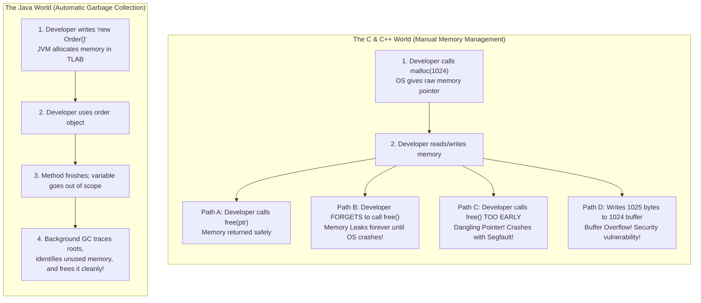
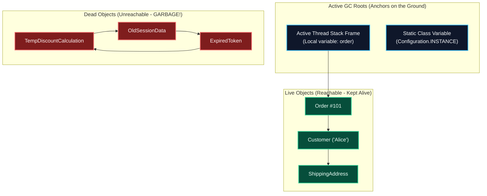
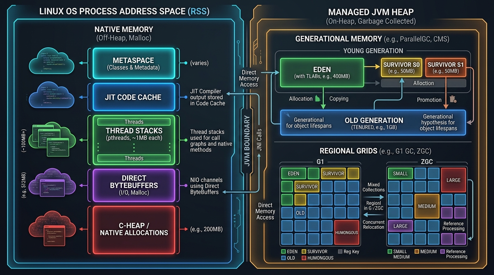
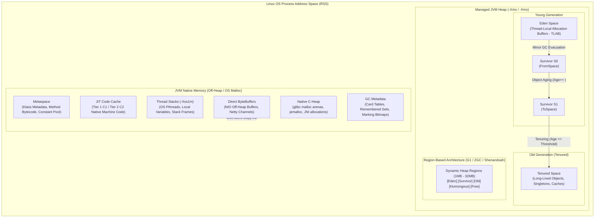

# ☕ JVM Internals, Garbage Collection & Performance Profiling Master Guide

### *(From Absolute Zero-Jargon Beginner Foundations to Senior/Staff HotSpot Performance Engineering: Memory Layout, Mark-Sweep-Compact, Serial/Parallel/G1/ZGC/Shenandoah, Card Tables, Colored Pointers, Safepoint TTSP, Container Sizing, JFR, Async-Profiler, War Room RCAs, and 50 Interview Scenarios)*

[🏠 Back to Home](README.md) | [🧵 Java Concurrency](java_thread.md) | [⚡ CompletableFuture](completable_future.md) | [⚡ JIT Compiler Master Guide](jvm_jit_compiler_master_guide.md) | [📦 Maven & Gradle](maven_gradle_master_guide.md) | [🍃 Spring Master Guide](spring_master_guide.md)

[]()
[]()
[]()
[]()
[]()

---

## 📑 Master Table of Contents

- [☕ JVM Internals, Garbage Collection & Performance Profiling Master Guide](#-jvm-internals-garbage-collection--performance-profiling-master-guide)
  - [📑 Master Table of Contents](#-master-table-of-contents)
  - [MODULE 0: THE COMPLETE JARGON-BUSTING GLOSSARY](#module-0-the-complete-jargon-busting-glossary)
  - [TRACK 1: JUNIOR & ENTRY-LEVEL FOUNDATIONS (ZERO-TO-HERO / ELI5 GUIDE)](#track-1-junior--entry-level-foundations-zero-to-hero--eli5-guide)
    - [1.1 The Real-World Mental Models (City Waste Management, Floating Balloons & Bookshelves)](#11-the-real-world-mental-models-city-waste-management-floating-balloons--bookshelves)
    - [1.2 The Foundational Problem: Why Java Has Automatic Memory Management](#12-the-foundational-problem-why-java-has-automatic-memory-management)
    - [1.3 What Actually Makes an Object "Garbage"? (GC Roots & The Reference Graph)](#13-what-actually-makes-an-object-garbage-gc-roots--the-reference-graph)
    - [1.4 The 3 Core Actions of Every Garbage Collector: Mark, Sweep, Compact](#14-the-3-core-actions-of-every-garbage-collector-mark-sweep-compact)
    - [1.5 The Life Story of a Single Java Object (From new to Eternity)](#15-the-life-story-of-a-single-java-object-from-new-to-eternity)
    - [1.6 Heap Memory vs. Stack Memory in Plain English](#16-heap-memory-vs-stack-memory-in-plain-english)
    - [1.7 "Explain Like I'm 5" (ELI5) Visual Dictionary for Core GC Concepts](#17-explain-like-im-5-eli5-visual-dictionary-for-core-gc-concepts)
    - [1.8 Beginner FAQ & Common Pitfalls (OOM, System.gc() & Latency Spikes)](#18-beginner-faq--common-pitfalls-oom-systemgc--latency-spikes)
    - [1.9 The Complete Inventory of Beginner JVM Disasters & Production Anti-Patterns](#19-the-complete-inventory-of-beginner-jvm-disasters--production-anti-patterns)
  - [🛠️ Prerequisites & Foundational Architecture](#️-prerequisites--foundational-architecture)
    - [1. JVM Architecture & Runtime Data Areas](#1-jvm-architecture--runtime-data-areas)
    - [2. Operating System Memory Model vs JVM Memory (The RSS Formula)](#2-operating-system-memory-model-vs-jvm-memory-the-rss-formula)
    - [3. Bytecode Execution & JIT Compilation Overview](#3-bytecode-execution--jit-compilation-overview)
    - [4. Diagnostic Environment Setup](#4-diagnostic-environment-setup)
  - [TRACK 2: MASTER GC ALGORITHMS & PROFILING TOOLS CATALOG](#track-2-master-gc-algorithms--profiling-tools-catalog)
    - [2.1 Serial Garbage Collector (-XX:+UseSerialGC)](#21-serial-garbage-collector--xxuseserialgc)
    - [2.2 Parallel Garbage Collector / Throughput Collector (-XX:+UseParallelGC)](#22-parallel-garbage-collector--throughput-collector--xxuseparallelgc)
    - [2.3 Garbage-First Collector (G1 GC: -XX:+UseG1GC)](#23-garbage-first-collector-g1-gc--xxuseg1gc)
    - [2.4 Z Garbage Collector (ZGC: -XX:+UseZGC)](#24-z-garbage-collector-zgc--xxusezgc)
    - [2.5 Shenandoah Garbage Collector (-XX:+UseShenandoahGC)](#25-shenandoah-garbage-collector--xxuseshenandoahgc)
    - [2.6 Epsilon No-Op Garbage Collector (-XX:+UseEpsilonGC)](#26-epsilon-no-op-garbage-collector--xxuseepsilongc)
    - [2.7 JDK Flight Recorder (JFR) & JDK Mission Control (JMC)](#27-jdk-flight-recorder-jfr--jdk-mission-control-jmc)
    - [2.8 Async-Profiler (CPU, Allocations, Wall-Clock & Flame Graphs)](#28-async-profiler-cpu-allocations-wall-clock--flame-graphs)
    - [2.9 CLI Production Diagnostics (jcmd, jstat, jstack, jmap)](#29-cli-production-diagnostics-jcmd-jstat-jstack-jmap)
    - [2.10 Live In-Flight Diagnostics & APM (Arthas, VisualVM, OpenTelemetry)](#210-live-in-flight-diagnostics--apm-arthas-visualvm-opentelemetry)
  - [TRACK 3: DEEP TECHNICAL INTERNALS & ARCHITECTURAL TAXONOMY](#track-3-deep-technical-internals--architectural-taxonomy)
    - [3.1 Card Tables, Remembered Sets & Write Barriers](#31-card-tables-remembered-sets--write-barriers)
    - [3.2 Colored Pointers & Load Barriers in ZGC](#32-colored-pointers--load-barriers-in-zgc)
    - [3.3 Safepoint Mechanism & Time-To-Safepoint (TTSP) Pitfalls](#33-safepoint-mechanism--time-to-safepoint-ttsp-pitfalls)
    - [3.4 Memory Allocation Pathology: Humongous Allocations & Allocation Stalls](#34-memory-allocation-pathology-humongous-allocations--allocation-stalls)
    - [3.5 Off-Heap Memory Anatomy: DirectByteBuffer, Unsafe, JNI & Metaspace](#35-off-heap-memory-anatomy-directbytebuffer-unsafe-jni--metaspace)
  - [TRACK 4: PRODUCTION ENGINEERING, CONTAINER TUNING & AUTOMATION](#track-4-production-engineering-container-tuning--automation)
    - [4.1 Container & Kubernetes JVM Sizing (CGroup v1/v2 Awareness)](#41-container--kubernetes-jvm-sizing-cgroup-v1v2-awareness)
    - [4.2 Production Garbage Collection Flag Templates](#42-production-garbage-collection-flag-templates)
    - [4.3 Proactive Out-Of-Memory Automation & Crash Dumps](#43-proactive-out-of-memory-automation--crash-dumps)
    - [4.4 Automated Low-Overhead Continuous Profiling Pipeline](#44-automated-low-overhead-continuous-profiling-pipeline)
    - [4.5 CI/CD Performance Regression Gates with JMH & Async-Profiler](#45-cicd-performance-regression-gates-with-jmh--async-profiler)
  - [TRACK 5: DISASTER RECOVERY, WAR ROOM FORENSICS & POST-MORTEMS](#track-5-disaster-recovery-war-room-forensics--post-mortems)
    - [5.1 Real-World Incident 1: Premature Tenuring Storm Triggering Cascading Full GC](#51-real-world-incident-1-premature-tenuring-storm-triggering-cascading-full-gc)
    - [5.2 Real-World Incident 2: High Latency Spikes Caused by Uncounted Loop Safepoints](#52-real-world-incident-2-high-latency-spikes-caused-by-uncounted-loop-safepoints)
    - [5.3 Real-World Incident 3: Kubernetes OOMKilled by Silent DirectByteBuffer Leak](#53-real-world-incident-3-kubernetes-oomkilled-by-silent-directbytebuffer-leak)
    - [5.4 Real-World Incident 4: Metaspace Exhaustion Due to Dynamic Proxy Class Generation](#54-real-world-incident-4-metaspace-exhaustion-due-to-dynamic-proxy-class-generation)
    - [5.5 Real-World Incident 5: CPU Starvation Caused by High-Concurrency Lock Contention](#55-real-world-incident-5-cpu-starvation-caused-by-high-concurrency-lock-contention)
    - [5.6 The Emergency Production Triage Cheat-Sheet](#56-the-emergency-production-triage-cheat-sheet)
  - [TRACK 6: CRACK-THE-INTERVIEW QUESTION BANK (50 SENIOR/STAFF+ SCENARIOS)](#track-6-crack-the-interview-question-bank-50-seniorstaff-scenarios)

---

# MODULE 0: THE COMPLETE JARGON-BUSTING GLOSSARY

> [!TIP]
> **How to use this glossary**: Whenever you encounter a scary technical term anywhere in this guide (or in JVM memory logs), consult this table! Every concept is broken down into plain English, an everyday analogy, the true technical definition, and what breaks in production if you misunderstand it.

| Term / Acronym | The Simple Plain-English Meaning | The Everyday Mental Model (Analogy) | Low-Level Technical Definition | What Breaks If You Get This Wrong? |
| :--- | :--- | :--- | :--- | :--- |
| **Garbage Collection (GC)** | An automatic background janitor in the JVM that finds objects you no longer need and frees up their memory. | A cleanup crew that comes by your desk every hour to throw away crumpled scrap paper you no longer use. | An automatic memory management subsystem that reclaims heap memory occupied by unreachable Java objects. | Disabling or misconfiguring GC causes the application to run out of RAM and crash with `OutOfMemoryError`. |
| **GC Root** | The starting anchor points (like active variables or running threads) that the GC uses to trace which objects are still alive. | The anchor holding a boat to the ocean floor. Any balloon tied to that anchor cannot float away. | An object reference originating from outside the heap: local stack variables, JNI handles, static class fields, or live thread objects. | If an unused object remains anchored to a static GC root, it leaks memory forever (`OutOfMemoryError`). |
| **Reachability** | Whether an object can be reached by following reference arrows starting from any live GC Root. | Checking if there is a connected string from your hand to a floating kite in the sky. | The graph-theoretic property where an object is traversed during live reference graph tracing starting at the root set. | Believing an object is deleted when you set one variable to `null`, even though another collection still holds a reference. |
| **Circular Reference** | When Object A points to Object B, and Object B points back to Object A, but nothing else in the program points to either of them. | Two shipwreck survivors floating in the ocean holding hands with each other, but not tied to any rescue boat. | A cyclic directed subgraph of unreachable objects. HotSpot's tracing collectors easily collect both because neither is reachable from a GC Root. | Confusion caused by Python/PHP reference-counting myths; Java handles circular references with zero memory leaks. |
| **Java Heap** | The large shared playground of RAM where all Java objects and arrays are created (`new MyObject()`). | A giant communal warehouse where everyone stores boxes of equipment they bought. | The primary memory area managed by the JVM garbage collector, sized via `-Xms` (initial) and `-Xmx` (maximum). | Setting heap too small causes constant GC pauses; setting it too large (>32GB) can disable Compressed OOPs and inflate memory. |
| **Thread Stack** | A private, super-fast scratchpad memory given to every running thread to hold local variables and method call history. | A private clipboard on your desk where you write down the 3 numbers you are currently adding right now. | An OS pthread-allocated contiguous memory region (default 1MB via `-Xss1m`) storing stack frames, primitive locals, and reference pointers. | Deep infinite recursion fills the stack, throwing `java.lang.StackOverflowError` without touching the heap. |
| **Weak Generational Hypothesis** | The proven empirical fact that in 95%+ of computer programs, **most objects die almost immediately after being created**. | Disposable paper coffee cups: used for 5 minutes, then thrown away. Very few items (like refrigerators) stay around for 10 years. | The observation that object survival rates drop exponentially with age, justifying partitioning the heap into Young and Old generations. | Treating all objects equally forces the GC to scan the entire 32GB heap every second, destroying performance. |
| **Eden Space** | The nursery room inside the Young Generation where brand-new objects land the instant `new` is called. | The newborn baby nursery ward in a hospital. | The sub-partition of Young Gen backed by Thread-Local Allocation Buffers (TLABs) for fast, lock-free bump-the-pointer allocations. | Sizing Eden too small causes hyper-frequent Young GCs, burning CPU on continuous evacuation cycles. |
| **Survivor Spaces (S0 & S1)** | Two alternating holding rooms where objects that survived their first few Young GCs catch their breath before moving to the Old Gen. | A training camp where recruits must survive multiple rounds of obstacle courses before joining the senior team. | Two identical semi-spaces (`FromSpace` and `ToSpace`). Live objects copy from Eden + `From` to `To`, swapping roles each cycle. | Undersizing survivor spaces causes premature tenuring, spilling short-lived objects directly into the Old Generation. |
| **Tenured Space (Old Generation)** | The retirement home for long-lived objects that survived many collection rounds (e.g., caches, singletons, DB pools). | The historical city archives vault where permanent municipal records are stored for decades. | The heap partition holding objects whose age exceeds `MaxTenuringThreshold` (default up to 15), collected by Major/Full GC. | Saturating Old Gen with temporary objects triggers heavy concurrent marking cycles and catastrophic Full GCs. |
| **Object Age (Tenuring Age)** | A number from 0 to 15 stored in each object's header showing how many Young GCs it has survived. | The number of passport stamps in a traveler's passport. | A 4-bit field inside the object's 64-bit Mark Word header, incremented each time the object survives an evacuation cycle. | Exceeding `MaxTenuringThreshold` (or triggering dynamic age calculation) forces objects to promote into Old Gen. |
| **TLAB (Thread Local Allocation Buffer)** | A small, private slice of Eden given to each thread so it can create objects without locking other threads out. | A carpenter carrying their own private pouch of nails instead of walking to the shared community tool chest for every nail. | A thread-confined buffer in Eden memory allowing lock-free object allocation via atomic pointer bumping (`top += size`). | Misconfiguring TLAB sizes forces threads to compete on the global heap lock, crippling multi-threaded scalability. |
| **Bump-The-Pointer** | Allocating memory by simply sliding an address pointer forward by the object's byte size. | Unrolling a roll of tickets and tearing off 3 tickets in 1 second. | An ultra-fast $O(1)$ allocation technique that adds the object's size to the current free pointer, with zero search overhead. | Requires contiguous free memory blocks; cannot be done in fragmented heaps without prior compaction. |
| **Minor GC (Young GC)** | A fast, lightweight garbage collection cycle that cleans *strictly* the Young Generation (Eden + Survivors). | A daily street-sweeping truck cleaning fallen autumn leaves along the curbs without bothering anyone's houses. | Stop-The-World pause evacuating live objects from Eden and active Survivor space into the alternate Survivor space or Old Gen. | Sizing Survivor spaces too small causes premature tenuring, spilling short-lived objects into Old Generation. |
| **Major GC** | A garbage collection cycle targeting the Old Generation to clean and compact long-lived objects. | Cleaning out the entire historical warehouse archives with heavy forklifts. | Collection phase scanning and reclaiming memory across the Old Generation, often coordinated concurrently (in G1/ZGC). | If Old Gen fills faster than concurrent marking can clean it, it cascades into a catastrophic Stop-The-World Full GC. |
| **Full GC** | A catastrophic Stop-The-World event that stops the entire application to clean and compact every corner of memory. | Shutting down the entire city for 24 hours so every street, basement, and building can be scrubbed clean. | Global Stop-The-World collection scanning and compacting Young Gen, Old Gen, and Metaspace simultaneously. | High-frequency Full GCs cause 5–30 second latency freezes, dropped user connections, and Kubernetes pod evictions. |
| **Mixed GC (G1 GC)** | A collection cycle in G1 GC that cleans the entire Young Generation plus a few of the dirtiest Old Generation regions. | Cleaning the office desks every morning, plus scrubbing the 3 dirtiest storage rooms down the hall. | Incremental collection in G1 GC evacuating all Young regions and a prioritized subset of Old regions to meet `-XX:MaxGCPauseMillis`. | Misconfigured pause targets force G1 to skip Old regions, causing Old Gen exhaustion and Full GC. |
| **Stop-The-World (STW)** | A pause during which all application threads are completely frozen so the GC can inspect and move memory safely. | Freezing time in a soccer game so the referee can repaint the boundary lines without players kicking the ball. | The JVM state where all application mutator threads are parked at Safepoints while GC threads mutate reference pointers. | Long STW pauses trigger heartbeat timeouts, broken HTTP connections, and distributed cluster leader re-elections. |
| **Safepoint & Safepoint Polling** | Checkpoints in application code where threads voluntarily check if they need to pause for GC or deoptimization. | Traffic lights across all city intersections that turn red when an emergency fire truck needs to cross town. | Instructions injected by the JIT compiler at method returns and loop headers where threads read a memory page to check for pause requests. | Uncounted integer loops missing safepoint polls delay the entire JVM from reaching a safepoint, causing latency spikes (TTSP). |
| **Time-To-Safepoint (TTSP)** | The delay between when the JVM requests a pause and when the very last thread finally stops running. | The time it takes for every child in a chaotic playground to stop running and freeze after the teacher blows the whistle. | The elapsed duration required for all mutator threads to arrive at a designated safepoint. | P99 latency spikes that show 0ms GC pause times in APM are almost always caused by high TTSP stalling threads. |
| **Mark-Sweep-Compact** | The 3 classic steps of memory management: Find what's alive (Mark), delete the junk (Sweep), and push remaining items together (Compact). | 1. Put stickers on books you keep. 2. Throw unstickered books in trash. 3. Push remaining books tightly together on the shelf. | Foundational GC algorithm: 1. Graph traversal marking live objects; 2. Sweeping dead memory; 3. Sliding live objects to eliminate holes. | Skipping the compaction step leads to **memory fragmentation**, where free RAM exists but no single piece is big enough for new objects. |
| **Evacuation** | Copying live objects out of a dirty memory area into a clean, empty memory area, leaving the old area 100% empty. | Moving all residents out of an old apartment building into a brand new building across the street, then demolishing the old building. | Memory management strategy used in modern collectors (G1, ZGC, Shenandoah) that copies live objects to fresh regions, achieving instant defragmentation. | **Evacuation Failure**: If no free regions exist to copy into, the collector triggers a brutal Stop-The-World Full GC. |
| **Card Table** | A memory array tracking Old Generation blocks that contain reference pointers pointing into Young Generation objects. | A desk calendar where a clerk stamps a red checkmark on any date where an old archive folder references a newly received letter. | A byte array where each byte represents a 512-byte block ("Card") of Old Gen. When an Old object field points to a Young object, a post-write barrier marks the card dirty (`0x0`). | Without a card table, every 10ms Minor GC would have to scan the entire 30GB Old Gen to find cross-generation roots! |
| **Remembered Set (RSet)** | A per-region data structure in G1 GC tracking which external regions contain pointers pointing into this specific region. | An index card taped to a locker listing every student in other classrooms who has borrowed a book from this locker. | Data structure maintained by G1 GC regions tracking incoming cross-region references, populated from dirty card tables by concurrent refinement threads. | Excessive cross-region references inflate RSet memory overhead, consuming up to 15–20% of total JVM RAM. |
| **Write Barrier** | A tiny piece of code injected by the JIT compiler right after an object reference is modified (`order.customer = c`). | A security guard who stamps your hand every time you take a folder from the archive room. | JIT-emitted machine instructions intercepting pointer writes to mark card table entries dirty for GC accounting. | Necessary for generational collection, but introduces a small (~2–5%) CPU overhead on reference mutations. |
| **Load Barrier** | A tiny check injected by the JIT compiler right before an object reference is read (`o.field`), used in ZGC. | A hotel concierge who intercepts you at the elevator to tell you your room was moved to the 5th floor and updates your keycard. | JIT-emitted assembly checking colored pointer bits on reference reads. If the object was moved, it updates the pointer in-flight without pausing threads. | Enables ultra-low-pause concurrent compaction (<1ms), but incurs slight CPU overhead on reference reads. |
| **Colored Pointers (ZGC)** | Storing GC metadata flags directly inside the unused high bits of 64-bit reference pointers instead of in object headers. | Stamping color-coded inspection stickers directly on shipping box address labels. | Technique in ZGC storing 4 metadata bits (Marked0, Marked1, Remapped, Finalizable) in bits 42–45 of 64-bit pointers, coordinated with MMU virtual memory page aliasing. | Manipulating colored pointer bits in native C/JNI extensions triggers fatal OS segmentation faults (`SIGSEGV`). |
| **Humongous Allocation** | Allocating a massive object whose size exceeds 50% of a single G1 heap region (e.g., a huge byte array). | Delivering an 18-wheel tractor-trailer that takes up 4 standard car parking spaces at once. | In G1 GC, any object exceeding 50% of `G1HeapRegionSize`. Allocated directly into contiguous Old Gen regions, bypassing Eden and TLABs. | High rates of humongous allocations fragment the heap, bypass young generation efficiency, and trigger frequent concurrent marks. |
| **Allocation Stall** | Mutator application threads freezing because they want to allocate memory faster than the background GC can reclaim it. | Shoppers standing frozen at the store entrance because all shopping carts are dirty and the cleaning crew hasn't returned any. | A condition where threads attempting to allocate in Eden/TLAB are suspended because free memory is exhausted and GC evacuation is trailing allocation rate. | Triggers massive multi-second latency spikes in ZGC or Shenandoah, completely violating sub-millisecond SLAs. |
| **Compressed OOPs** | Compressing 64-bit object pointers down to 32 bits on heaps under 32GB by exploiting 8-byte object alignment. | Using 4-digit street numbers instead of writing out the full county, state, and country name on local mail. | Technique (`-XX:+UseCompressedOops`) shifting pointer addresses right by 3 bits, allowing 32-bit pointers to address up to $2^{32} \times 8 = 32\text{GB}$ of heap. | Setting heap to 33GB disables compression, causing pointers to double in size and consuming 30–40% MORE memory than a 31GB heap! |
| **Metaspace** | A dedicated off-heap native memory area storing class structures, method bytecodes, and reflection metadata. | The city hall blueprint library holding architectural drawings for every building in town. | Native memory area (outside `-Xmx`) introduced in Java 8 to replace PermGen. Sized dynamically up to `-XX:MaxMetaspaceSize`. | Unbounded Metaspace combined with dynamic class generation (e.g., CGLIB proxies, Groovy) triggers host native memory exhaustion. |
| **Direct Memory (Off-Heap)** | Memory allocated outside the Java heap using `ByteBuffer.allocateDirect()` or JNI, managed directly via OS system calls. | Renting an external storage locker across the street instead of piling boxes inside your living room. | Native memory allocated via `malloc`/`mmap` for zero-copy socket I/O in Netty and Java NIO. | Bypasses standard GC metrics; leaks in direct memory cause Kubernetes to kill your pod (`OOMKilled Exit 137`) with zero heap alerts! |
| **Memory Leak (in Java)** | Unintentionally keeping a reference to an object you will never use again, preventing the GC from ever reclaiming it. | Forgetting to throw away an expired gym membership card in your wallet, keeping the gym contract active forever. | Retaining strong reference paths from active GC roots (e.g., static `HashMap`, unclosed thread-locals) to obsolete objects. | Memory slowly creeps upward over days until the JVM crashes with `java.lang.OutOfMemoryError: Java heap space`. |
| **OutOfMemoryError (OOM)** | A fatal JVM error thrown when the JVM needs to allocate memory but cannot find enough free space even after full GC. | Trying to cram a sofa into a moving truck that is already packed to the ceiling with boxes. | Error (`java.lang.OutOfMemoryError`) thrown when heap, metaspace, or native thread creation capacity is completely exhausted. | Crashes application threads or kills the entire process; requires automated heap dumps (`-XX:+HeapDumpOnOutOfMemoryError`) for triage. |
| **Async-Profiler** | A modern, low-overhead profiler that accurately samples CPU and memory allocations without safepoint bias. | A stealth police speed camera on the highway that measures car speeds without forcing cars to stop at toll booths. | Open-source profiler using Linux `perf_events` and the JVM's `AsyncGetCallTrace` API to capture call stacks at arbitrary instruction points. | Traditional profilers suffer from safepoint bias, falsely blaming methods that happen to have safepoint polls. |
| **Flame Graph** | A visual pyramid diagram showing which methods are consuming the most CPU or allocating the most memory. | An aerial thermal map of a city showing which buildings are burning the most electricity. | Interactive hierarchical visualization where the X-axis shows population percentage and the Y-axis shows stack depth. | Essential for instantly spotting performance bottlenecks in enterprise microservices. |

---

# TRACK 1: JUNIOR & ENTRY-LEVEL FOUNDATIONS (ZERO-TO-HERO / ELI5 GUIDE)

## 1.1 The Real-World Mental Models (City Waste Management, Floating Balloons & Bookshelves)

Garbage Collection can feel intimidating because it deals with pointers and memory addresses. But the human intuition behind it is identical to problems you solve in daily life:

### Analogy 1: City Waste Management & The Clean Desk Rule
Imagine an office skyscraper in a bustling city:
1. **Employees (Threads)** sit at their desks, opening letters and jotting notes (**Creating Objects**).
2. **Post-it Notes & Scratchpads (Short-Lived Objects)**: 95% of notes are thrown into the desk trash can within 2 minutes. (This is the **Weak Generational Hypothesis**: most objects die young!).
3. **Desk Trash Cans (Eden Space)**: Every 5 minutes, an office cleaner empties your desk can into a cart. It takes 2 seconds and doesn't disrupt your work (**Minor GC**).
4. **Temporary Sorting Bins (Survivor Spaces S0/S1)**: Items that might still be useful are placed on a sorting table. If a document survives 15 rounds of checks without being thrown away, it is stamped as permanent.
5. **City Underground Archives (Tenured / Old Generation)**: Long-lived records (company contracts, database connection pools, Spring singleton beans). Cleaning this archive requires heavy machinery, cataloging, and temporary building shutdowns (**Major / Full GC**).

---

### Analogy 2: The Floating Helium Balloons & Anchors
How does Java know what is "garbage" without you telling it?
- Imagine thousands of colorful helium balloons floating in a room.
- On the floor, there are heavy iron anchors bolted into the ground (**GC Roots**: running threads, active local variables, static variables).
- Some balloons are tied directly to an anchor with a string (**Reachable Objects**).
- Other balloons are tied to other balloons. As long as a chain of strings leads back to an iron anchor on the floor, the balloon cannot float away into the sky!
- **What happens when you cut the string?**
  ```
  [ Iron Anchor (GC Root) ]
              │ (string cut!)
              ✂️
  [ Balloon A ] <=======> [ Balloon B ] (Tied to each other!)
  ```
- Even if **Balloon A** and **Balloon B** are tightly tied to each other (**Circular Reference**), neither is connected to the anchor on the floor!
- When the window opens, **both balloons float away into the clouds together**.
- That is how Java handles memory! It doesn't count how many strings are tied to an object. It simply starts at the anchors and follows the strings. If an object cannot be reached from an anchor, **it is garbage**, no matter who else is pointing to it!

---

### Analogy 3: The Bookshelf (Mark, Sweep, and Compact)
Imagine a messy wooden bookshelf with 100 books:
1. **Phase 1 (Mark)**: You walk along the shelf with a roll of green stickers. You put a green sticker on every book you still want to read.
2. **Phase 2 (Sweep)**: You pull every unstickered book off the shelf and throw it into the recycling bin.
3. **The Problem (Fragmentation)**: Now you have empty gaps between books: `[Book] [GAP] [Book] [GAP] [GAP] [Book]`. If a friend hands you a giant 3-volume encyclopedia set, it won't fit into any single gap, even though you have 3 total empty spaces!
4. **Phase 3 (Compact)**: You push all the remaining books tightly to the left side of the shelf! Now all the books are together, and you have one giant, continuous open space on the right side for new books.

---

## 1.2 The Foundational Problem: Why Java Has Automatic Memory Management

To appreciate why Java's Garbage Collector is an engineering marvel, look at what life was like before it:


```mermaid
flowchart TD
    subgraph ManualMemory["The C & C++ World (Manual Memory Management)"]
        direction TB
        CAlloc["1. Developer calls malloc(1024)<br/>OS gives raw memory pointer"] --> CUse["2. Developer reads/writes memory"]
        CUse --> CPath1["Path A: Developer calls free(ptr)<br/>Memory returned safely"]
        CUse --> CPath2["Path B: Developer FORGETS to call free()<br/>Memory Leaks forever until OS crashes!"]
        CUse --> CPath3["Path C: Developer calls free() TOO EARLY<br/>Dangling Pointer! Crashes with Segfault!"]
        CUse --> CPath4["Path D: Writes 1025 bytes to 1024 buffer<br/>Buffer Overflow! Security vulnerability!"]
    end

    subgraph AutoMemory["The Java World (Automatic Garbage Collection)"]
        direction TB
        JAlloc["1. Developer writes 'new Order()'<br/>JVM allocates memory in TLAB"] --> JUse["2. Developer uses order object"]
        JUse --> JDrop["3. Method finishes; variable goes out of scope"]
        JDrop --> JClean["4. Background GC traces roots,<br/>identifies unused memory, and frees it cleanly!"]
    end
```

1. **In C and C++**: You are responsible for every single byte. If you allocate memory with `malloc()` or `new`, you *must* manually release it with `free()` or `delete`.
   - If you forget to free it: **Memory Leak**. The program slowly eats all RAM until the server freezes.
   - If you free it too early: **Dangling Pointer**. Your program tries to read memory that was already deleted, corrupting data or crashing with a fatal `Segmentation Fault (SIGSEGV)`.
   - If you write beyond the memory block: **Buffer Overflow**. The #1 source of cybersecurity exploits in computer history.
2. **Java's Revolution (1995)**: James Gosling and the Sun Microsystems team decided: **Humans should not manage raw memory addresses**. Let software developers focus on business logic, and let an intelligent virtual machine manage allocation and cleanup automatically!

---

## 1.3 What Actually Makes an Object "Garbage"? (GC Roots & The Reference Graph)

In Java, an object becomes eligible for garbage collection the exact instant it becomes **unreachable from any GC Root**.


```mermaid
flowchart TD
    subgraph GCRoots["Active GC Roots (Anchors on the Ground)"]
        Root1["Active Thread Stack Frame<br/>(Local variable: order)"]
        Root2["Static Class Variable<br/>(Configuration.INSTANCE)"]
    end

    subgraph LiveObjects["Live Objects (Reachable - Kept Alive)"]
        ObjA["Order #101"]
        ObjB["Customer ('Alice')"]
        ObjC["ShippingAddress"]
    end

    subgraph DeadObjects["Dead Objects (Unreachable - GARBAGE!)"]
        ObjD["TempDiscountCalculation"]
        ObjE["OldSessionData"]
        ObjF["ExpiredToken"]
    end

    Root1 --> ObjA
    ObjA --> ObjB
    ObjB --> ObjC

    ObjD --> ObjE
    ObjE --> ObjF
    ObjF --> ObjD

    classDef rootStyle fill:#0f172a,stroke:#38bdf8,stroke-width:2px,color:#f8fafc;
    classDef liveStyle fill:#064e3b,stroke:#34d399,stroke-width:2px,color:#ecfdf5;
    classDef deadStyle fill:#7f1d1d,stroke:#f87171,stroke-width:2px,color:#fef2f2;

    class Root1,Root2 rootStyle;
    class ObjA,ObjB,ObjC liveStyle;
    class ObjD,ObjE,ObjF deadStyle;
```

### What qualifies as a GC Root?
1. **Local Variables inside running methods**: Any variable currently sitting on a thread's call stack (e.g., `Order order = ...`).
2. **Active Operating System Threads**: A thread that is currently running is inherently a GC root.
3. **Static Variables in loaded classes**: Any field declared `static` (e.g., `public static List<User> cache`) stays alive as long as its ClassLoader is alive.
4. **JNI Native Handles**: References passed into native C/C++ libraries via the Java Native Interface.

> [!IMPORTANT]
> Notice `ObjD`, `ObjE`, and `ObjF` above! They point to each other in a triangle loop. In older languages with naive reference counting, they would never be deleted because their count never hits zero. But in Java, because **no line connects them to an iron GC Root**, the JVM sweeps all three into the trash in a single pass!

---

## 1.4 The 3 Core Actions of Every Garbage Collector: Mark, Sweep, Compact

Every garbage collector ever built for the JVM (from the oldest Serial collector to cutting-edge ZGC) performs three fundamental operations:

```
Step 1: MARK (Find What's Alive)
[ Live Object A ] ──► [ Live Object B ]       [ Dead Object C ]       [ Live Object D ]
      🏷️                     🏷️                                              🏷️
(Tag live objects by following reference paths from GC Roots)

Step 2: SWEEP (Reclaim the Dead)
[ Live Object A ]     [ Live Object B ]       [  FREE SPACE   ]       [ Live Object D ]
                                              (Zero out dead memory)

Step 3: COMPACT (Defragment & Slide Together)
[ Live Object A ][ Live Object B ][ Live Object D ][       GIANT CONTIGUOUS FREE SPACE       ]
(Slide live objects together so future allocations can use fast bump-the-pointer!)
```

1. **Mark Phase**: The collector pauses or traces memory, starting from GC Roots. Every object it touches gets a "marked" bit set in its header or a marking bitmap.
2. **Sweep Phase**: Any memory block that does *not* have a mark bit is recognized as dead space and added to a free list.
3. **Compact Phase**: Memory fragmentation is the enemy of high-speed servers. By sliding all living objects to one side, the JVM ensures that free memory is one giant contiguous block. When your code says `new byte[1024]`, the JVM doesn't have to search through a jigsaw puzzle—it simply slides a pointer forward!

---

## 1.5 The Life Story of a Single Java Object (From `new` to Eternity)

Let's follow an everyday Java object from creation to disposal:

```java
public void processOrder(long orderId) {
    Order order = new Order(orderId); // <--- Object is born!
    paymentService.charge(order);
    emailService.sendReceipt(order);
} // <--- Method ends! Variable 'order' falls off stack!
```

```
[ Day 1: Birth in Eden Space ]
Thread calls 'new Order(orderId)'.
The JVM allocates memory inside the thread's private TLAB inside Eden.
Allocation takes ~2 nanoseconds (bump-the-pointer). Zero locks!
         │
         ▼
[ 5 Seconds Later: Minor GC #1 ]
Eden fills up with temporary objects. A Minor GC triggers.
Is 'order' still reachable? YES (paymentService is currently using it).
'order' is evacuated into Survivor Space S0.
Its age is stamped in its header: Age = 1.
         │
         ▼
[ 10 Seconds Later: Minor GC #2 ]
Eden fills again. Another Minor GC triggers.
'order' is evacuated from S0 to Survivor Space S1.
Its age is incremented: Age = 2.
         │
         ▼ (Survives 15 Minor GCs...)
[ Promotion to Old Generation ]
'order' was stored in a long-lived cache. Its age reaches MaxTenuringThreshold (15).
The JVM promotes 'order' into the Tenured (Old) Generation!
         │
         ▼
[ The End: Dereferencing & Reclamation ]
The order is fulfilled and deleted from the cache.
The reference from the GC Root is broken (string cut!).
The next Major/Mixed GC traverses the object graph.
'order' is UNREACHABLE.
The collector sweeps its memory, returns bytes to the free pool, and compacts the heap.
```

---

## 1.6 Heap Memory vs. Stack Memory in Plain English

Newcomers often confuse the **Heap** and the **Stack**. Here is the ultimate 2-minute clarity guide:

| Dimension | 🥞 The JVM Thread Stack | 🏞️ The Java Managed Heap |
| :--- | :--- | :--- |
| **What is it?** | A private, orderly stack of trays for each thread. | A giant shared community playground for all threads. |
| **What lives here?** | Method parameters, primitive local variables (`int x = 5`), and reference pointers (`Order o`). | All actual object instances (`new Order()`), arrays, and strings. |
| **Thread Access** | Strictly private to 1 thread. No other thread can see your stack. | Shared across all threads in the entire JVM. |
| **Allocation Speed** | Ultra-fast ($<0.1\text{ ns}$). Simply moves the CPU stack pointer. | Very fast via TLABs ($1-2\text{ ns}$), but requires GC maintenance. |
| **Lifespan** | Temporary. The exact instant a method returns (`}`), its frame vanishes! | Managed by the Garbage Collector. Survives as long as references exist. |
| **What breaks when full?**| `java.lang.StackOverflowError` (Usually caused by infinite recursion). | `java.lang.OutOfMemoryError: Java heap space` (Memory leak or heap too small). |

---

## 1.7 "Explain Like I'm 5" (ELI5) Visual Dictionary for Core GC Concepts

### 1. TLAB (Thread-Local Allocation Buffer)
- **The Problem**: If 100 threads try to allocate memory in the shared heap at the same time, they would fight for locks, causing massive gridlock.
- **The Solution**: The JVM gives each thread its own private "pouch" of memory inside Eden (a TLAB). The thread allocates out of its private pouch with zero synchronization. Only when the pouch is completely empty does it ask the heap for a new pouch!

### 2. Stop-The-World (STW)
- **The Concept**: Why does the JVM have to stop application threads during GC?
- **The Analogy**: Imagine trying to count all the cars parked in a massive shopping mall parking lot while 500 teenagers are driving the cars around in circles and repainting them different colors! You can't get an accurate count. You must flash a red light, tell everyone to park for 5 milliseconds, count/move the cars, and turn the green light back on.

### 3. Safepoints vs. Time-To-Safepoint (TTSP)
- **Safepoint**: The bus stops where passengers are allowed to get on or off. A thread cannot pause while in the middle of writing half of a 64-bit pointer. It only pauses at safe, well-defined points.
- **TTSP**: The bus driver pulls up to the stop, opens the doors, and waits for 49 passengers to sit down. But 1 stubborn passenger is taking 3 seconds to tie their shoes. The entire bus sits frozen waiting for that one passenger! (An uncounted loop delaying a safepoint).

### 4. Memory Leak in Java
- **The Myth**: *"Java has a garbage collector, so memory leaks are impossible!"*
- **The Reality**: The GC only collects objects that are **unreachable**. If you add 1,000,000 items into a `static HashMap<String, Order>` and forget to remove them, they are 100% reachable from a static GC root! The GC *must* keep them alive, even though your code will never use them again.

---

## 1.8 Beginner FAQ & Common Pitfalls (OOM, `System.gc()` & Latency Spikes)

#### Q1: "If Java has Garbage Collection, why does my production service still crash with OutOfMemoryError?"
> **Answer**: There are two common reasons:
> 1. **Under-sizing**: Your application genuinely needs 8GB of data in memory (e.g., caching 5 million catalog items), but you only configured `-Xmx2g`.
> 2. **Memory Leak (Reference Leak)**: Your application is holding onto obsolete objects in static collections, thread-locals, or unclosed listeners. Even after a Full GC sweeps everything, the heap remains 100% full because the objects are technically still reachable.

#### Q2: "Should I call `System.gc()` in my code to clean up memory when things get slow?"
> **Answer**: **NO! NEVER!** Calling `System.gc()` is the ultimate junior anti-pattern.
> When you call `System.gc()`, you are requesting an explicit **Stop-The-World Full GC**. Instead of letting the JVM clean memory incrementally in the background, you freeze every single thread in your application for 2 to 15 seconds! In production, always disable explicit GC triggers by passing `-XX:+DisableExplicitGC`.

#### Q3: "Why does my API have sudden random P99 latency spikes of 500ms?"
> **Answer**: That is almost certainly a **Stop-The-World GC pause** or a **Time-To-Safepoint (TTSP) stall**! During older collectors (like Parallel or default G1 under heavy load), application threads are halted to clean memory. Upgrading to modern low-latency collectors like **Generational ZGC** (`-XX:+UseZGC -XX:+ZGenerational` in Java 21+) reduces these pauses to **under 1 millisecond**!

---

## 1.9 The Complete Inventory of Beginner JVM Disasters & Production Anti-Patterns

### 1. Hardcoding `-Xmx` Without Container CGroup Awareness
- **The Anti-Pattern:** Setting `-Xmx4g -Xms4g` inside a Kubernetes container configured with a 4GB memory limit (`resources.limits.memory: 4Gi`).
- **Why It Crashes Production Under the Hood:** Total OS process Resident Set Size (RSS) is $\text{Heap} + \text{Metaspace} + \text{CodeCache} + (\text{Threads} \times \text{Stack}) + \text{DirectMemory} + \text{JVM Native}$. With a 4GB heap, native overhead pushes total memory to ~4.8GB. The Linux kernel cgroup controller immediately terminates the container with signal 9 / exit code 137 (`OOMKilled`).
- **The Corrected Baseline:**
  ```bash
  -XX:+UseContainerSupport -XX:MaxRAMPercentage=75.0 -XX:InitialRAMPercentage=75.0
  ```
- **Rule of Thumb:** *"Never allocate more than 70–75% of container RAM limit to Java heap."*

---

### 2. Manual Invocations of `System.gc()` in Application Libraries
- **The Anti-Pattern:** Calling `System.gc()` or `Runtime.getRuntime().gc()` in application code or third-party RMI/remoting libraries.
- **Why It Crashes Production Under the Hood:** Initiates an explicit Stop-The-World Full GC across all generations and Metaspace. On multi-gigabyte heaps, application execution freezes for 2 to 15 seconds, dropping database connections, violating health check probes, and causing Kubernetes rolling restarts.
- **The Corrected Baseline:**
  ```bash
  -XX:+DisableExplicitGC
  # Or if DirectByteBuffer cleaner needs explicit triggers:
  -XX:+ExplicitGCInvokesConcurrent
  ```
- **Rule of Thumb:** *"Always disable explicit GC calls in production flags."*

---

### 3. Survivor Space Undersizing (Premature Tenuring Storms)
- **The Anti-Pattern:** Leaving `-XX:SurvivorRatio=8` or reducing Young Gen to 10% of total heap on high-allocation streaming services.
- **Why It Crashes Production Under the Hood:** Young generation Eden fills in milliseconds. The survivor spaces overflow their `TargetSurvivorRatio` (50%), triggering dynamic tenuring: live short-lived DTOs bypass survivor aging and are promoted directly into the Old Generation. Old Gen rapidly exhausts, triggering continuous concurrent mark cycles and cascading Full GCs.
- **The Corrected Baseline:**
  ```bash
  -XX:G1NewSizePercent=30 -XX:G1MaxNewSizePercent=60 -XX:SurvivorRatio=4
  ```
- **Rule of Thumb:** *"Size Survivor spaces so that short-lived DTOs survive at least 2–3 minor GC cycles without spilling into Old Gen."*

---

### 4. Unbounded Thread Spawning Triggering Native Memory OOM
- **The Anti-Pattern:** Spawning raw threads via `new Thread(runnable).start()` inside HTTP request handlers.
- **Why It Crashes Production Under the Hood:** Each OS thread allocates a native virtual memory stack (default 1MB via `-Xss1m`). Under traffic spikes of 5,000 requests, thread stacks consume 5GB of native RAM outside the heap. When the OS kernel runs out of virtual memory addresses or hits `kernel.pid_max`, the JVM crashes with `java.lang.OutOfMemoryError: unable to create new native thread`.
- **The Corrected Baseline:**
  ```java
  // In Java 21+: Use lightweight Virtual Threads
  ExecutorService executor = Executors.newVirtualThreadPerTaskExecutor();
  // In Java 8/17: Use bounded ThreadPoolExecutor with CallerRunsPolicy
  ```
- **Rule of Thumb:** *"Never instantiate raw Threads in server applications; use bounded pools or Virtual Threads."*

---

### 5. Unbounded Metaspace Exhaustion via Dynamic Class Generation
- **The Anti-Pattern:** Leaving `-XX:MaxMetaspaceSize` unbounded while using reflection libraries, dynamic CGLIB proxies, or Groovy scripts that dynamically generate classes per request.
- **Why It Crashes Production Under the Hood:** Dynamically generated classes and their associated `ClassLoader` instances cannot be garbage collected as long as any strong reference exists. Metaspace expands indefinitely until host virtual memory is exhausted, taking down the entire virtual machine.
- **The Corrected Baseline:**
  ```bash
  -XX:MetaspaceSize=128m -XX:MaxMetaspaceSize=512m
  ```
- **Rule of Thumb:** *"Always cap Metaspace with -XX:MaxMetaspaceSize to prevent silent host native memory starvation."*

---

### 6. Setting `-Xms` and `-Xmx` to Different Values
- **The Anti-Pattern:** Configuring `-Xms1g -Xmx8g` on production microservices.
- **Why It Crashes Production Under the Hood:** The JVM starts with 1GB and must dynamically request virtual memory pages from the OS kernel as load increases. When memory pressure subsides, the JVM shrinks heap, and expands it again during the next spike. Each heap resize triggers a Stop-The-World pause and page table modifications, causing unpredictable P99 latency spikes.
- **The Corrected Baseline:**
  ```bash
  -Xms8g -Xmx8g -XX:+AlwaysPreTouch
  ```
- **Rule of Thumb:** *"Always set initial heap (-Xms) equal to maximum heap (-Xmx) in production."*

---

### 7. Sizing Heap Exceeding 32GB Without Evaluating Compressed OOPs Threshold
- **The Anti-Pattern:** Allocating `-Xmx34g` believing a 2GB bump will increase capacity.
- **Why It Crashes Production Under the Hood:** Crossing the ~32GB boundary disables **Compressed Ordinary Object Pointers (`-XX:+UseCompressedOops`)**. Pointers expand from 4 bytes to 8 bytes. Every object header and reference field doubles in size, instantly increasing application memory consumption by 30–40%. A 34GB heap actually holds *less* useful domain data than a 31GB heap!
- **The Corrected Baseline:**
  ```bash
  # Keep heap under 31GB to ensure Compressed OOPs remain active:
  -Xms31g -Xmx31g -XX:+UseCompressedOops
  ```
- **Rule of Thumb:** *"Either stay strictly under 32GB (e.g. 31GB), or jump straight to 48GB+ to justify the loss of Compressed OOPs."*

---

### 8. Uncounted Loops Delaying Safepoint Synchronization (TTSP Spikes)
- **The Anti-Pattern:** Writing computational loops using integer counters (`for (int i = 0; i < n; i++)`) in C2-compiled hot methods.
- **Why It Crashes Production Under the Hood:** The C2 JIT compiler historically omits safepoint checks in counted loops. When GC requests a Stop-The-World safepoint, the thread executing this loop ignores the request until the loop terminates. All other application threads sit frozen at safepoints for seconds, inflating P999 latency while GC pause logs show only 5ms.
- **The Corrected Baseline:**
  ```bash
  -XX:+UseCountedLoopSafepoints
  ```
- **Rule of Thumb:** *"Enable -XX:+UseCountedLoopSafepoints or use long loop counters in CPU-intensive batch jobs."*

---

### 9. Setting Unrealistically Aggressive Pause Targets in G1 GC
- **The Anti-Pattern:** Setting `-XX:MaxGCPauseMillis=5` on an 8GB heap.
- **Why It Crashes Production Under the Hood:** G1 attempts to satisfy the 5ms target by shrinking the Young Generation to a minuscule fraction (e.g. 20MB). The tiny Eden space fills every few milliseconds, causing hundreds of Young GCs per minute. Application throughput plummets, and objects are prematurely tenured into Old Gen, causing Full GC collapses.
- **The Corrected Baseline:**
  ```bash
  -XX:MaxGCPauseMillis=200
  ```
- **Rule of Thumb:** *"G1 GC is designed for 100ms–200ms targets. If you require <1ms pauses, switch to Generational ZGC."*

---

### 10. Missing Heap Dump on Out-Of-Memory Error
- **The Anti-Pattern:** Running production JVMs without automated crash dump triggers.
- **Why It Crashes Production Under the Hood:** When an OOM occurs, the container dies or restarts. Without an automated heap dump, SREs and engineers have zero memory forensics to identify the leaking data structures, forcing teams to wait until the outage reoccurs.
- **The Corrected Baseline:**
  ```bash
  -XX:+HeapDumpOnOutOfMemoryError -XX:HeapDumpPath=/var/log/jvm/oom_dump.hprof -XX:+ExitOnOutOfMemoryError
  ```
- **Rule of Thumb:** *"Every production JVM must have -XX:+HeapDumpOnOutOfMemoryError and exit cleanly on OOM."*

---

# 🛠️ Prerequisites & Foundational Architecture

Before diving into garbage collection tuning and JVM profiling, engineers must understand the underlying operating system and virtual machine mechanics.

### 1. JVM Architecture & Runtime Data Areas
The Java Virtual Machine (JVM) divides process memory into distinct runtime data areas:
- **Thread-Private Areas**:
  - **Program Counter (PC) Register**: Stores the address of the currently executing JVM instruction.
  - **JVM Thread Stack**: Stores execution frames containing local variables, operand stacks, and method references. Default size is typically 1024 KB (`-Xss1m`).
  - **Native Method Stack**: Backs execution of C/C++ native code via JNI (Java Native Interface).
- **Shared Memory Areas**:
  - **Java Heap**: Shared memory space where all class instances and arrays are allocated. Subject to Garbage Collection.
  - **Metaspace (Java 8+)**: Native memory storing class metadata, method descriptors, runtime constant pools, and annotations. Replaced the contiguous contiguous PermGen.
  - **Code Cache**: Native memory where the JIT compiler stores compiled machine code (Tier 1 C1, Tier 2 C2, or Graal).
  - **Off-Heap / Direct Memory**: Buffers allocated outside the JVM heap via `ByteBuffer.allocateDirect()` or `sun.misc.Unsafe`, managed via OS system calls (`malloc`/`mmap`).

---

### 2. Operating System Memory Model vs JVM Memory (The RSS Formula)
A running Java application is an OS process (PID). Its total Resident Set Size (RSS) is calculated as:
$$\text{RSS} \approx \text{Heap} + \text{Metaspace} + \text{CodeCache} + (\text{Thread Count} \times \text{Stack Size}) + \text{Direct Buffers} + \text{JVM Native Overhead}$$




```mermaid
graph TB
    subgraph OS_RSS ["Linux OS Process Address Space (RSS)"]
        subgraph Native_Mem ["JVM Native Memory (Off-Heap / OS Malloc)"]
            Meta["Metaspace<br/>(Klass Metadata, Method Bytecode, Constant Pool)"]
            CodeC["JIT Code Cache<br/>(Tier 1 C1 / Tier 2 C2 Native Machine Code)"]
            Stacks["Thread Stacks (-Xss1m)<br/>(OS Pthreads, Local Variables, Stack Frames)"]
            DirectBuf["Direct ByteBuffers<br/>(NIO Off-Heap Buffers, Netty Channels)"]
            CHeap["Native C-Heap<br/>(glibc malloc arenas, jemalloc, JNI allocations)"]
            GCMeta["GC Metadata<br/>(Card Tables, Remembered Sets, Marking Bitmaps)"]
        end
        subgraph Managed_Heap ["Managed JVM Heap (-Xms / -Xmx)"]
            subgraph Young_Gen ["Young Generation"]
                Eden["Eden Space<br/>(Thread-Local Allocation Buffers - TLAB)"]
                S0["Survivor S0<br/>(FromSpace)"]
                S1["Survivor S1<br/>(ToSpace)"]
            end
            subgraph Old_Gen ["Old Generation (Tenured)"]
                Tenured["Tenured Space<br/>(Long-Lived Objects, Singletons, Caches)"]
            end
            subgraph Regional_Heap ["Region-Based Architecture (G1 / ZGC / Shenandoah)"]
                Regs["Dynamic Heap Regions (1MB - 32MB)<br/>[Eden] [Survivor] [Old] [Humongous] [Free]"]
            end
        end
    end
    Eden -->|"Minor GC Evacuation"| S0
    S0 -->|"Object Aging (Age++ )"| S1
    S1 -->|"Tenuring (Age >= Threshold)"| Tenured
    DirectBuf -.->|"DMA Zero-Copy I/O"| OS_RSS
```

#### Visual Architecture & Deep Mechanics of JVM Memory Substrate

##### 1. Visual Architecture & Node Anatomy
* **Linux OS Process Address Space (RSS)**: Total physical and swapped memory pages allocated to the JVM PID by the OS kernel. Monitored via `/proc/<PID>/status` (`VmRSS`) and Kubernetes `memory.current`.
* **Managed JVM Heap (`-Xms` / `-Xmx`)**: Partition of memory managed exclusively by HotSpot garbage collectors:
  - **Eden Space**: Landing zone for newly instantiated objects. Uses per-thread **Thread-Local Allocation Buffers (TLABs)** for lock-free pointer bumping.
  - **Survivor Spaces (`S0` and `S1`)**: Equal-sized semi-spaces acting as staging buffers to age transient objects.
  - **Tenured Space (Old Generation)**: Stores long-lived enterprise application state (singletons, caches, pooled connections).
  - **Humongous Regions (G1 GC)**: Spans of contiguous regions for individual objects exceeding 50% of `G1HeapRegionSize`.
* **Native Memory (Off-Heap Space)**:
  - **Metaspace**: Holds class metadata, runtime constant pools, and method bytecode.
  - **JIT Code Cache**: Holds native x86_64/ARM machine code compiled by C1 and C2 JIT compilers.
  - **Thread Stacks**: 1 MB native stack per OS pthread allocated via `mmap`.
  - **Direct ByteBuffers**: Off-heap buffers used by Java NIO channels and Netty for kernel zero-copy transfer.
  - **Native C-Heap**: Unmanaged heap utilized by internal HotSpot subsystems and JNI C/C++ libraries.

##### 2. Execution Flow & State Transitions
1. **Thread Allocation**: Object creation lands in thread's local TLAB inside Eden without global locking.
2. **TLAB Exhaustion**: Thread requests new TLAB chunk from Eden via atomic CAS bump.
3. **Minor GC Evacuation**: Full Eden triggers Stop-The-World Young GC. Live objects in Eden and `FromSpace` copy to `ToSpace`.
4. **Age Promotion**: Mark Word age bits increment. Once `age >= MaxTenuringThreshold`, objects promote to Tenured Old Gen.
5. **Major/Concurrent GC**: When Old Gen occupancy crosses IHOP (default 45%), background concurrent marking initiates.

##### 3. Low-Level Kernel & JVM Mechanics
* **Deterministic RSS Formula**:
  $$\text{RSS} = \text{Heap} + \text{Metaspace} + \text{CodeCache} + (\text{Thread Count} \times \text{Stack Size}) + \text{DirectMemory} + \text{GC Metadata} + \text{Native C-Heap}$$
* **Cgroup Limit Enforcement**: If RSS breaches `memory.max` in Kubernetes, the Linux kernel OOM Killer terminates the pod with Exit Code 137.
* **glibc Malloc Arena Overhead**: Up to $8 \times \text{vCPUs}$ native arenas multiply virtual memory fragmentation; mitigated by `MALLOC_ARENA_MAX=2` or `jemalloc`.

##### 4. Production Failure Modes & SRE Diagnostics
* **Kubernetes Exit 137 (OOMKilled)**: Occurs when container limits equal `-Xmx` without factoring native overhead.
* **DirectByteBuffer Silent Leak**: Off-heap buffers bypass GC pause metrics and cause unexpected host memory exhaustion.
* **Production Diagnostic Runbook**:
  ```bash
  # Enable Native Memory Tracking
  java -XX:NativeMemoryTracking=detail -XX:+UnlockDiagnosticVMOptions -jar app.jar
  
  # Check live native memory diffs
  jcmd <PID> VM.native_memory baseline
  jcmd <PID> VM.native_memory detail.diff
  ```

<details>
<summary>Text Representation (ASCII Blueprint)</summary>

```text
+--------------------------------------------------------------------------------+
|                        OS Process Address Space (RSS)                          |
|  +-------------------------------------+  +---------------------------------+  |
|  |           JVM Managed Heap          |  |         JVM Native Space        |  |
|  |  +------------+  +---------------+  |  |  +------------+  +-----------+  |  |
|  |  | Young Gen  |  | Old / Tenured |  |  |  | Metaspace  |  | CodeCache |  |  |
|  |  | (Eden/S0/S1|  | (Long-lived)  |  |  |  +------------+  +-----------+  |  |
|  |  +------------+  +---------------+  |  |  +------------+  +-----------+  |  |
|  |  +-------------------------------------+  |  | ThreadStks |  | DirectBuf |  |  |
|                                           |  +------------+  +-----------+  |  |
|                                           +---------------------------------+  |
+--------------------------------------------------------------------------------+
```

</details>

---

### 3. Bytecode Execution & JIT Compilation Overview
- **Interpreter**: Executes bytecode sequentially with minimal startup latency.
- **Tiered Compilation (`-XX:+TieredCompilation`)**:
  - **Level 0**: Interpreted bytecode.
  - **Levels 1–3 (C1 Compiler / Client)**: Compiles bytecode into native code with profiling counters (invocation and backedge counters).
  - **Level 4 (C2 Compiler / Server)**: High-performance optimizing compiler utilizing profile-guided optimization (escape analysis, inlining, loop unrolling, devirtualization).
- **Escape Analysis**: Determines if an object allocated inside a method escapes the method scope or current thread. If not, the JVM can perform:
  1. **Scalar Replacement**: Deconstructs object fields into primitive registers/stack variables, avoiding heap allocation completely.
  2. **Lock Elision**: Removes synchronization locks if the object is never shared across threads.

---

### 4. Diagnostic Environment Setup
Ensure standard diagnostic tools are installed in your development and staging environments:
- **JDK 17 LTS / JDK 21 LTS** (`openjdk-21-jdk` or Eclipse Temurin)
- **Async-Profiler**: High-precision, low-overhead profiler based on `AsyncGetCallTrace`.
- **JDK Mission Control (JMC)**: GUI for visualising Java Flight Recorder (JFR) files.
- **Eclipse Memory Analyzer Tool (MAT)**: Enterprise heap dump analyzer for finding memory leaks.

---

# TRACK 2: MASTER GC ALGORITHMS & PROFILING TOOLS CATALOG

> [!NOTE]
> 🌱 **Plain-English Intuition: The Collector Tournament Guide**
> How do you choose between the 6 different HotSpot garbage collectors? Here is the 10-second rule of thumb:
> - **Serial GC**: A solitary cleaner with a broom. Uses almost zero RAM. Best for tiny CLI tools and AWS Lambda (<512MB RAM).
> - **Parallel GC**: A crew of 8 cleaners who freeze the entire factory floor for 5 seconds to power-wash everything at maximum speed. Best for overnight batch data jobs where throughput matters and nobody cares about 5-second freezes.
> - **G1 GC**: The organized warehouse manager who chops the floor into 2,048 bins and cleans the dirtiest bins first within a 200ms pause budget. The reliable default for standard enterprise web services (Java 9+ default).
> - **ZGC & Shenandoah**: Robotic autonomous vacuums that silently mop and sweep around your feet while you walk without ever freezing the building (<1ms pauses!). Essential for ultra-low-latency financial trading and high-SLA microservices.
> - **Epsilon GC**: A trash can with no bottom that never cleans anything until the building overflows. Used strictly for performance testing.

```
JVM Garbage Collectors Evolution Matrix:
+-------------------+--------------------+--------------------+-----------------------+
| Collector         | Primary Target     | Target Latency     | Max Heap Scalability  |
+-------------------+--------------------+--------------------+-----------------------+
| Serial GC         | Single-core / IoT  | 50ms - 1000ms      | < 512 MB              |
| Parallel GC       | High Throughput    | 100ms - 5000ms     | < 32 GB               |
| G1 GC             | Balanced Prod Work | 10ms - 200ms       | 4 GB - 64 GB          |
| ZGC               | Sub-millisecond SLA| < 1 ms             | 16 GB - 16 TB         |
| Shenandoah        | Ultra-low Pause    | < 10 ms            | 4 GB - 100 GB         |
| Epsilon           | Zero GC / Bench    | 0 ms (No Collect)  | Limited by RAM        |
+-------------------+--------------------+--------------------+-----------------------+
```

---

## 2.1 Serial Garbage Collector (`-XX:+UseSerialGC`)

### Deep Overview
The Serial Collector uses a single thread to execute all garbage collection work. Both Young and Old generation collections are strictly Stop-The-World. Young generation uses the "Copy" algorithm, while Old generation uses "Mark-Sweep-Compact".

### Pros & Cons
- **Pros**: Zero thread-synchronization overhead; smallest runtime footprint (<30MB JVM overhead).
- **Cons**: Total application freeze during collection; scales terribly on multi-core architectures.

### Hard Limits, Quotas & Gotchas
- Unacceptable for production web applications handling concurrent HTTP traffic.
- Ideal for CLI tools, AWS Lambda micro-functions (<512MB RAM), or embedded edge devices.

### Production Flags Blueprint
```bash
java -XX:+UseSerialGC -Xms128m -Xmx256m -jar micro-cli-service.jar
```

---

## 2.2 Parallel Garbage Collector / Throughput Collector (`-XX:+UseParallelGC`)

### Deep Overview
The default collector in Java 8. It uses multiple parallel threads to perform Young generation collection (Parallel Scavenge) and Old generation collection (Parallel Old). It focuses entirely on maximizing overall throughput ($\frac{T_{\text{application}}}{T_{\text{application}} + T_{\text{GC}}}$) at the expense of pause predictability.

### Pros & Cons
- **Pros**: Highest raw CPU efficiency; minimal runtime CPU barrier overhead; compact memory footprint.
- **Cons**: Stop-The-World pauses scale linearly with live heap size. A 32GB heap can experience 5–15 second Full GC pauses.

### Hard Limits, Quotas & Gotchas
- Do not use when P99 response time SLAs are under 500ms.
- Ideal for offline batch processing, map-reduce jobs, and financial end-of-day reconciliation pipelines.

### Production Flags Blueprint
```bash
java -XX:+UseParallelGC \
     -XX:ParallelGCThreads=8 \
     -Xms16g -Xmx16g \
     -XX:MaxGCPauseMillis=500 \
     -XX:GCTimeRatio=19 \
     -jar batch-processing-worker.jar
```

---

## 2.3 Garbage-First Collector (G1 GC: `-XX:+UseG1GC`)

### Deep Overview
The default collector in Java 9+. G1 splits the entire heap into 2,048 equal-sized contiguous memory regions (ranging from 1MB to 32MB depending on heap size). Regions are dynamically assigned as Eden, Survivor, or Old. G1 performs concurrent marking and prioritizes collecting regions containing the most garbage first ("Garbage First").

```
G1 Heap Layout (2,048 Independent Regions):
[ E ][ O ][ S ][ Free ][ E ][ H ][ O ][ S ][ E ][ Free ][ O ][ H ]
Legend: E = Eden, S = Survivor, O = Old, H = Humongous (> 50% Region Size)
```

### Pros & Cons
- **Pros**: Predictable pause times via `-XX:MaxGCPauseMillis=200`; compacts memory incrementally to prevent fragmentation; supports heaps from 4GB to 64GB.
- **Cons**: High CPU overhead due to card tables, remembered sets (R-Sets), and write barriers (consuming 10–15% additional heap memory).

### Hard Limits, Quotas & Gotchas
- Objects larger than 50% of a region size are classified as **Humongous Objects** and allocated directly into contiguous Old regions, bypassing TLABs and causing premature GC cycles.

### Production Flags Blueprint
```bash
java -XX:+UseG1GC \
     -Xms16g -Xmx16g \
     -XX:MaxGCPauseMillis=150 \
     -XX:G1ReservePercent=15 \
     -XX:InitiatingHeapOccupancyPercent=45 \
     -XX:G1HeapRegionSize=16m \
     -XX:+ParallelRefProcEnabled \
     -jar enterprise-payment-api.jar
```

---

## 2.4 Z Garbage Collector (ZGC: `-XX:+UseZGC`)

### Deep Overview
A scalable, low-latency garbage collector designed for heaps from 16MB to 16TB. ZGC performs all expensive phases concurrently: marking, relocation (compaction), and reference processing. Pauses do not scale with heap size and consistently stay under **1 millisecond**.

In **Java 21+**, ZGC transitioned to **Generational ZGC** (`-XX:+UseZGC -XX:+ZGenerational`), separating Young and Old objects for dramatically higher throughput.

### Pros & Cons
- **Pros**: Sub-millisecond pauses regardless of heap size (even on 1TB heaps!); eliminates Stop-The-World latency spikes.
- **Cons**: Requires CPU load-barriers on object reference reads; slightly lower peak throughput compared to Parallel GC; generational support requires Java 21+.

### Hard Limits, Quotas & Gotchas
- Must ensure sufficient allocation headroom. If allocation rate exceeds concurrent collection speed, ZGC enters an **Allocation Stall**, degrading throughput.

### Production Flags Blueprint (Java 21 Generational ZGC)
```bash
java -XX:+UseZGC \
     -XX:+ZGenerational \
     -Xms32g -Xmx32g \
     -XX:SoftMaxHeapSize=28g \
     -XX:+UnlockDiagnosticVMOptions \
     -XX:GuaranteedSafepointInterval=0 \
     -jar ultra-low-latency-trading-engine.jar
```

---

## 2.5 Shenandoah Garbage Collector (`-XX:+UseShenandoahGC`)

### Deep Overview
An ultra-low-pause collector developed by Red Hat. Like ZGC, Shenandoah performs concurrent marking, concurrent evacuation, and concurrent references update. It utilizes **Load-Reference Barriers (LRBs)** (and historically Brooks Pointers) to allow application threads to read and write to objects while they are actively being moved in memory.

### Pros & Cons
- **Pros**: Pause times typically 5–10ms; available across older OpenJDK backports (Java 11, 17, 21).
- **Cons**: Read/write barrier overhead impacts mutator throughput by 5–15%; susceptible to Degenerated/Full GC if memory fills faster than collection cycles.

### Hard Limits, Quotas & Gotchas
- Ensure `-XX:ShenandoahPacing=true` (default) to gracefully pace mutator threads during extreme allocation pressure instead of hard crashing.

### Production Flags Blueprint
```bash
java -XX:+UseShenandoahGC \
     -XX:+UnlockExperimentalVMOptions \
     -Xms16g -Xmx16g \
     -XX:ShenandoahGCMode=iu \
     -XX:ShenandoahPacing=true \
     -jar high-frequency-gateway.jar
```

---

## 2.6 Epsilon No-Op Garbage Collector (`-XX:+UseEpsilonGC`)

### Deep Overview
A passive "no-op" garbage collector. It handles memory allocation (TLABs and pointer bumping) but **never reclaims any memory**. When the heap is exhausted, the JVM exits immediately with `java.lang.OutOfMemoryError`.

### Pros & Cons
- **Pros**: Absolute 0 GC overhead; no write/load barriers; purest possible memory allocation performance.
- **Cons**: Process lifespan is strictly bounded by total heap allocations.

### Use Cases & Blueprints
- Performance micro-benchmarking with JMH (eliminating GC noise).
- Ultra-short-lived serverless functions (AWS Lambda executing a 50ms task where all memory is released upon container shutdown).

```bash
java -XX:+UnlockExperimentalVMOptions \
     -XX:+UseEpsilonGC \
     -Xms512m -Xmx512m \
     -jar ephemeral-lambda-task.jar
```

---

## 2.7 JDK Flight Recorder (JFR) & JDK Mission Control (JMC)

### Deep Overview
JFR is an event-recording engine built directly into the HotSpot JVM kernel. It continuously captures detailed metrics on threads, GC pauses, memory allocations, CPU samples, lock contention, file I/O, and socket latency with **less than 1% runtime overhead**.

### Production Continuous Recording Command
```bash
# Start JVM with continuous in-memory circular buffer recording (keeps last 2 hours)
java -XX:StartFlightRecording=disk=true,dumponexit=true,filename=recording.jfr,maxsize=2g,maxage=2h,settings=profile \
     -jar payment-service.jar

# Dynamically trigger a 60-second on-demand JFR recording in production via jcmd
jcmd <PID> JFR.start name=ProdIncident duration=60s filename=/tmp/prod_dump.jfr settings=profile
```

### JMC Analysis Workflow
1. Open `.jfr` recording in JDK Mission Control.
2. Navigate to **Memory** $\rightarrow$ Check **Allocation in New TLAB** and **Allocation outside TLAB** to identify object churn hot-spots.
3. Check **Threads** $\rightarrow$ **Lock Instances** to pinpoint thread synchronization bottlenecks.

---

## 2.8 Async-Profiler (CPU, Allocations, Wall-Clock & Flame Graphs)

### Deep Overview
Async-profiler is the gold-standard open-source profiler for Linux and macOS. It uses Linux `perf_events` and the JVM's `AsyncGetCallTrace` to sample execution without suffering from safepoint bias, generating interactive HTML Flame Graphs.

```
Async-Profiler Capabilities:
1. CPU Profiling: Pinpoints methods consuming CPU cycles.
2. Memory Allocations: Pinpoints exact lines of code instantiating heap memory.
3. Wall-Clock Profiling: Crucial for diagnosing latency spent waiting on I/O, locks, or network calls.
4. Lock Contention: Profiles time spent blocked on synchronized or ReentrantLock blocks.
```

### Production Execution Blueprints
```bash
# 1. Profile CPU for 30 seconds and output Flame Graph HTML
./asprof -d 30 -e cpu -f /tmp/cpu_flamegraph.html <PID>

# 2. Profile Heap Allocations (bytes allocated per call-stack)
./asprof -d 30 -e alloc -f /tmp/alloc_flamegraph.html <PID>

# 3. Profile Wall-Clock (Reveals thread off-CPU waiting time on DB or sockets)
./asprof -d 30 -e wall -t -f /tmp/wall_clock.html <PID>
```

---

## 2.9 CLI Production Diagnostics (`jcmd`, `jstat`, `jstack`, `jmap`)

```bash
# 1. Real-time GC sampling every 1000ms (Eden, Survivor, Old, Metaspace usage)
jstat -gcutil <PID> 1000

# 2. Trigger on-demand live object histogram via jcmd (Zero disk dump overhead)
jcmd <PID> GC.class_histogram

# 3. Take emergency thread dump to identify stuck threads or safepoint stalls
jcmd <PID> Thread.print > /tmp/thread_dump.txt

# 4. Generate immediate production heap dump for Memory Analyzer Tool (MAT)
jcmd <PID> GC.heap_dump /tmp/heap_dump.hprof
```

---

## 2.10 Live In-Flight Diagnostics & APM (Arthas, VisualVM, OpenTelemetry)

- **Alibaba Arthas**: Live in-flight JVM troubleshooting without restarts:
  ```bash
  # Inspect method execution time in production live
  trace com.example.OrderService calculateTax '#cost > 100'
  # Monitor allocation count per second
  dashboard
  ```
- **OpenTelemetry Java Auto-Instrumentation**: Automatically instruments HTTP, gRPC, and JDBC calls, correlating GC pause metrics (`jvm.gc.pause`) with HTTP 504 Gateway Timeouts.

---

# TRACK 3: DEEP TECHNICAL INTERNALS & ARCHITECTURAL TAXONOMY

> [!NOTE]
> 🌱 **Plain-English Intuition: The Cross-Generation Bookkeeping Problem**
> If a minor collection only takes 10ms to clean a 200MB Young Generation, how does it know if an object in the 30GB Old Generation points to an object in Eden?
> Does it have to scan the entire 30GB Old Generation every 10ms? That would defeat the whole purpose!
> **The Solution**: **Card Tables & Write Barriers**! Whenever your code sets `oldCustomer.newestOrder = order`, the JVM stamps a tiny 1-byte marker in a helper array. During the minor collection, the GC only looks at the stamped markers, scanning $<0.01\%$ of the Old Gen!

## 3.1 Card Tables, Remembered Sets & Write Barriers

```
+---------------------------------------------------------------+
|                      OLD GENERATION (TENURED)                 |
| [ 512B Card 0 ] [ 512B Card 1 ] [ 512B Card 2 (DIRTY!) ] ...  |
+---------------------------------------------------------------+
                             │
            Post-Write Barrier marks Card 2 dirty (0x0)
                             ▼
+---------------------------------------------------------------+
|                      CARD TABLE (BYTE ARRAY)                  |
| [  0x01 (Clean) ] [  0x01 (Clean) ] [  0x00 (DIRTY!) ] ...   |
+---------------------------------------------------------------+
                             │
     During Minor GC: Only scan Card 2 for roots into Eden!
                             ▼
+---------------------------------------------------------------+
|                      YOUNG GENERATION (EDEN)                  |
| [ Newly Allocated Object Referenced by Old Gen Object ]       |
+---------------------------------------------------------------+
```

1. **Card Table**: An internal byte array where each byte represents a 512-byte chunk ("Card") of the Old Generation.
2. **Post-Write Barrier**: Whenever an application thread writes a reference into an object field (`oldObj.field = youngObj`), the JIT compiler emits an inline assembly store:
   ```assembly
   mov    [rax + field_offset], rbx        ; Write reference
   shr    rax, 9                           ; Divide address by 512 (Card index)
   mov    [r10 + rax], 0x0                 ; Store 0 (DIRTY) into card table
   ```
3. **Remembered Sets (R-Sets) in G1 GC**: Extends card tables into per-region inverted indexes, allowing G1 to independently collect any region without scanning external regions.

---

## 3.2 Colored Pointers & Load Barriers in ZGC

ZGC eliminates Stop-The-World compaction pauses by moving objects concurrently with application threads using **Colored Pointers** and **Load Barriers**:

```
64-bit Pointer Architecture in ZGC:
+-------------------+----------------+----------------------------------------+
| 16 Bits (Unused)  | 4 Bits (Color) | 44 Bits (Actual Object Virtual Address)|
+-------------------+----------------+----------------------------------------+
                      | | | |
                      | | | +- Finalizable (1 bit)
                      | | +--- Remapped    (1 bit: Pointer points to new location)
                      | +----- Marked1     (1 bit: Live in odd cycle)
                      +------- Marked0     (1 bit: Live in even cycle)
```

1. **Colored Pointers**: 4 metadata bits stored directly in the high bits of 64-bit pointers.
2. **Load Barrier**: When application code dereferences an object pointer (`o.field`), the JIT injects a quick test:
   - If the pointer is colored "Good", execution proceeds in zero cycles.
   - If the pointer is colored "Bad" (the object was moved by the GC), execution enters a JIT stub that checks the forwarding table, updates the pointer to the new address in-place ("self-healing"), and continues seamlessly!

---

## 3.3 Safepoint Mechanism & Time-To-Safepoint (TTSP) Pitfalls

When the JVM initiates a GC pause, it places the entire virtual machine in a **Global Safepoint**:
1. HotSpot invalidates a dedicated hardware memory page (the polling page).
2. All running mutator threads periodically read this page at loop backedges and method returns. Reading the invalidated page triggers an instant OS hardware trap (`SIGSEGV`), gracefully parking the thread.
3. **TTSP Trap**: In older Java versions, counted integer loops (`for (int i=0; i<1_000_000; i++)`) have safepoint polls stripped by C2 for performance. A single thread trapped in such a loop delays the entire safepoint, freezing the entire application!
4. **Mitigation**: Enable `-XX:+UseCountedLoopSafepoints` or upgrade to Java 17/21+.

---

## 3.4 Memory Allocation Pathology: Humongous Allocations & Allocation Stalls

- **Humongous Objects**: In G1 GC, any object exceeding 50% of the `G1HeapRegionSize` (e.g., an 8MB byte array when region size is 16MB) is categorized as Humongous.
- **Pathology**: Humongous objects bypass the Young Generation entirely and are allocated directly into contiguous blocks of Old regions.
- **Impact**: Rapidly fragments G1 regions, causes premature concurrent cycles, and triggers unexpected allocation stalls.
- **Remediation**: Increase region size (`-XX:G1HeapRegionSize=32m`) or stream large datasets using chunked buffers (e.g., 64KB arrays).

---

## 3.5 Off-Heap Memory Anatomy: DirectByteBuffer, Unsafe, JNI & Metaspace

Off-heap memory allocations bypass the Java heap and garbage collection entirely:
1. **`DirectByteBuffer`**: Allocated via `ByteBuffer.allocateDirect(size)`. Backed by OS `malloc()`. Cleaned via phantom references and internal `Cleaner` instances.
2. **`sun.misc.Unsafe`**: Direct allocation via `Unsafe.allocateMemory()`. Requires manual deallocation (`freeMemory()`); missing free calls trigger permanent native memory leaks.
3. **Metaspace**: Stores class descriptors, method bytecodes, and runtime constant pools. Class unloading only occurs during Full GC cycles or concurrent class unloading.

---

# TRACK 4: PRODUCTION ENGINEERING, CONTAINER TUNING & AUTOMATION

## 4.1 Container & Kubernetes JVM Sizing (CGroup v1/v2 Awareness)

```
Kubernetes Pod Memory Budget (4Gi Limit):
+------------------------------------------------------------------------+
| Linux Container Memory Limit: 4.0 GB (resources.limits.memory: 4Gi)    |
+----------------------------------------------------+-------------------+
| JVM Heap (-XX:MaxRAMPercentage=75.0): 3.0 GB       | Native Overhead:  |
| - Eden Space                                       | 1.0 GB            |
| - Survivor Spaces (S0/S1)                          | - Metaspace       |
| - Tenured Space (Old Gen)                          | - Thread Stacks   |
|                                                    | - Code Cache      |
|                                                    | - GC Metadata     |
+----------------------------------------------------+-------------------+
```

> [!CAUTION]
> If total process RSS breaches the Kubernetes cgroup limit, the Linux Out-Of-Memory killer terminates the pod instantly with **Exit Code 137**. Always reserve 25–30% of container memory for non-heap native overhead!

---

## 4.2 Production Garbage Collection Flag Templates

### High-Throughput Enterprise API (G1 GC Baseline - Java 17/21)
```bash
java -XX:+UseG1GC \
     -XX:+UseContainerSupport \
     -XX:MaxRAMPercentage=75.0 \
     -XX:InitialRAMPercentage=75.0 \
     -XX:MaxGCPauseMillis=150 \
     -XX:G1ReservePercent=15 \
     -XX:InitiatingHeapOccupancyPercent=45 \
     -XX:+ParallelRefProcEnabled \
     -XX:+AlwaysPreTouch \
     -XX:+DisableExplicitGC \
     -XX:+HeapDumpOnOutOfMemoryError \
     -XX:HeapDumpPath=/var/log/jvm/oom.hprof \
     -XX:+ExitOnOutOfMemoryError \
     -Xlog:gc*,gc+phases=debug:file=/var/log/jvm/gc.log:time,uptime,pid:filecount=5,filesize=100M \
     -jar app.jar
```

### Ultra-Low-Latency Trading / Microservice Engine (Generational ZGC - Java 21+)
```bash
java -XX:+UseZGC \
     -XX:+ZGenerational \
     -XX:+UseContainerSupport \
     -XX:MaxRAMPercentage=75.0 \
     -XX:InitialRAMPercentage=75.0 \
     -XX:+AlwaysPreTouch \
     -XX:+DisableExplicitGC \
     -XX:+HeapDumpOnOutOfMemoryError \
     -XX:HeapDumpPath=/var/log/jvm/oom.hprof \
     -XX:+ExitOnOutOfMemoryError \
     -Xlog:gc*:file=/var/log/jvm/zgc.log:time,uptime,pid:filecount=5,filesize=100M \
     -jar trading-core.jar
```

---

## 4.3 Proactive Out-Of-Memory Automation & Crash Dumps

Every production JVM must automate crash forensic collection and immediate container failover:
```bash
-XX:+HeapDumpOnOutOfMemoryError \
-XX:HeapDumpPath=/var/log/jvm/heap_dump_%p.hprof \
-XX:+ExitOnOutOfMemoryError
```
- `-XX:+ExitOnOutOfMemoryError`: Guarantees that when an OOM occurs, the JVM exits immediately with a non-zero status code, forcing Kubernetes to replace the unhealthy pod rather than leaving it in an unresponsive zombie state.

---

## 4.4 Automated Low-Overhead Continuous Profiling Pipeline

Run continuous low-overhead JFR recording in production:
```bash
-XX:StartFlightRecording=disk=true,dumponexit=true,filename=/var/log/jvm/continuous.jfr,maxsize=1g,maxage=12h,settings=profile
```
- Keeps a rolling 12-hour circular buffer of CPU, lock contention, and allocation telemetry with $<1\%$ CPU overhead.

---

## 4.5 CI/CD Performance Regression Gates with JMH & Async-Profiler

Integrate automated allocation regression testing into your CI/CD pipeline using Java Microbenchmark Harness (JMH):
```java
@BenchmarkMode(Mode.Throughput)
@OutputTimeUnit(TimeUnit.SECONDS)
@Warmup(iterations = 3, time = 1)
@Measurement(iterations = 5, time = 1)
@Fork(value = 1, jvmArgs = {"-XX:+UseEpsilonGC", "-Xms2g", "-Xmx2g"})
public class SerializationBenchmark {
    @Benchmark
    public byte[] testFastJsonSerialization(BenchmarkState state) {
        return state.serializer.serialize(state.testOrder);
    }
}
```

---

# TRACK 5: DISASTER RECOVERY, WAR ROOM FORENSICS & POST-MORTEMS

### 5.1 Real-World Incident 1: Premature Tenuring Storm Triggering Cascading Full GC

```
┌─────────────────────────────────────────────────────────────────────────────┐
│ TIME: 09:15 UTC | SEVERITY: SEV-1 | OUTAGE: 45 SECONDS P99 LATENCY SPIKES   │
│ SYSTEM: Black Friday High-Throughput Checkout API                           │
├─────────────────────────────────────────────────────────────────────────────┤
│ SYMPTOMS:                                                                   │
│ During peak traffic, response times spiked from 25ms to 45,000ms.           │
│ Pods began failing readiness probes, causing cascading Kubernetes restarts.│
│ CPU was locked at 100% across all worker nodes.                             │
│                                                                             │
│ ROOT CAUSE:                                                                 │
│ Heap was configured with default G1 settings on 16GB RAM.                   │
│ A high-volume JSON response parser generated 400MB/s of short-lived DTOs.   │
│ Survivor spaces filled within 150ms, breaching `TargetSurvivorRatio`.        │
│ The JVM dynamic age calculation dropped tenuring threshold from 15 to 1!    │
│ Millions of short-lived JSON DTOs were promoted directly into Old Gen.      │
│ Old Gen filled in 4 minutes, triggering concurrent mode failure and brutal   │
│ 12-second Stop-The-World Full GCs!                                          │
├─────────────────────────────────────────────────────────────────────────────┤
│ REMEDIATION:                                                                │
│ 1. Increased Young Gen size: `-XX:G1NewSizePercent=35 -XX:G1MaxNewSizePercent=60`│
│ 2. Sized Survivor ratio: `-XX:SurvivorRatio=4` (tripling Survivor capacity).│
│ 3. Lowered IHOP to trigger background marking earlier:                      │
│    `-XX:InitiatingHeapOccupancyPercent=40`                                  │
└─────────────────────────────────────────────────────────────────────────────┘
```

---

### 5.2 Real-World Incident 2: High Latency Spikes Caused by Uncounted Loop Safepoints

```
┌─────────────────────────────────────────────────────────────────────────────┐
│ TIME: 14:30 UTC | SEVERITY: SEV-1 | OUTAGE: RANDOM 4-SECOND P99 LATENCY STALLS│
│ SYSTEM: High-Frequency Algorithmic Risk Engine                              │
├─────────────────────────────────────────────────────────────────────────────┤
│ SYMPTOMS:                                                                   │
│ Client requests stalled for 3.8 seconds every few minutes.                  │
│ GC logs showed pause times were clean: `[GC pause (young) 4.2ms]`.          │
│ APM showed threads completely frozen during the exact window.               │
│                                                                             │
│ ROOT CAUSE:                                                                 │
│ A portfolio risk calculation loop used an integer counter:                  │
│   for (int i = 0; i < 50_000_000; i++) { calculateRisk(matrix[i]); }        │
│ C2 JIT compiler stripped the safepoint check from this counted loop.        │
│ When G1 GC requested a Young GC pause, the thread running this loop kept    │
│ calculating for 3.8 seconds, ignoring the safepoint request.                │
│ All other 127 application threads parked and sat frozen at safepoints!      │
│ Time-To-Safepoint (TTSP) was 3,790ms, while GC work took only 4.2ms!        │
├─────────────────────────────────────────────────────────────────────────────┤
│ REMEDIATION:                                                                │
│ 1. Enabled counted loop safepoint insertion: `-XX:+UseCountedLoopSafepoints`│
│ 2. Converted loop counter from `int` to `long` to force safepoint checks.   │
└─────────────────────────────────────────────────────────────────────────────┘
```

---

### 5.3 Real-World Incident 3: Kubernetes OOMKilled by Silent DirectByteBuffer Leak

```
┌─────────────────────────────────────────────────────────────────────────────┐
│ TIME: 18:00 UTC | SEVERITY: SEV-1 | OUTAGE: KUBERNETES EXIT 137 OOMKILLED   │
│ SYSTEM: Real-Time Netty WebSocket Gateway                                   │
├─────────────────────────────────────────────────────────────────────────────┤
│ SYMPTOMS:                                                                   │
│ Gateway pods were being terminated by Linux kernel OOM killer daily.        │
│ Java Heap utilization was flat at 40% of `-Xmx8g`.                          │
│ No OutOfMemoryError exceptions were logged in application output.           │
│                                                                             │
│ ROOT CAUSE:                                                                 │
│ Custom Netty pipeline allocated direct off-heap byte buffers via            │
│ `ByteBufAllocator.DEFAULT.directBuffer()`.                                  │
│ A custom error handler returned early without calling `ReferenceCountUtil.release()`.│
│ 8GB of off-heap buffers leaked into host native memory.                      │
│ Container memory reached 12GB, breaching the 10GB Kubernetes limit.        │
│ The Linux kernel invoked `oom-killer`, terminating the process with SIGKILL!│
├─────────────────────────────────────────────────────────────────────────────┤
│ REMEDIATION:                                                                │
│ 1. Fixed Netty buffer release in `finally` block: `ReferenceCountUtil.release(msg)`│
│ 2. Capped direct off-heap memory allocation: `-XX:MaxDirectMemorySize=2g`.   │
│ 3. Enabled leak detection in staging: `-Dio.netty.leakDetection.level=PARANOID`│
└─────────────────────────────────────────────────────────────────────────────┘
```

---

### 5.4 Real-World Incident 4: Metaspace Exhaustion Due to Dynamic Proxy Class Generation

```
┌─────────────────────────────────────────────────────────────────────────────┐
│ TIME: 22:10 UTC | SEVERITY: SEV-2 | OUTAGE: JVM OUTOFMEMORYERROR: METASPACE │
│ SYSTEM: Multi-Tenant Rules Engine Microservice                              │
├─────────────────────────────────────────────────────────────────────────────┤
│ ROOT CAUSE:                                                                 │
│ Dynamic script engine generated custom class proxies per tenant request.    │
│ ClassLoaders were cached in a static map, preventing class unloading.       │
│ Metaspace grew continuously until breaching `-XX:MaxMetaspaceSize=256m`.    │
├─────────────────────────────────────────────────────────────────────────────┤
│ REMEDIATION:                                                                │
│ 1. Weakened ClassLoader cache references using `WeakHashMap`.               │
│ 2. Enabled class unloading: `-XX:+ClassUnloadingWithConcurrentMark`.        │
│ 3. Sized Metaspace appropriately: `-XX:MaxMetaspaceSize=512m`.              │
└─────────────────────────────────────────────────────────────────────────────┘
```

---

### 5.5 Real-World Incident 5: CPU Starvation Caused by High-Concurrency Lock Contention

```
┌─────────────────────────────────────────────────────────────────────────────┐
│ TIME: 03:20 UTC | SEVERITY: SEV-1 | OUTAGE: ALL CORES 100% / ZERO THROUGHPUT│
│ SYSTEM: Distributed Token Rate Limiter                                      │
├─────────────────────────────────────────────────────────────────────────────┤
│ ROOT CAUSE:                                                                 │
│ 200 HTTP threads synchronized on a shared in-memory `HashMap` instance.     │
│ OS thread context switching exploded to 350,000 switches/sec (`cs` in vmstat).│
│ Threads spent 92% of CPU time in kernel lock contention rather than work.   │
├─────────────────────────────────────────────────────────────────────────────┤
│ REMEDIATION:                                                                │
│ Replaced synchronized HashMap with non-blocking `ConcurrentHashMap` and     │
│ `LongAdder` atomic striping.                                                │
└─────────────────────────────────────────────────────────────────────────────┘
```

---

### 5.6 The Emergency Production Triage Cheat-Sheet

```bash
# STEP 1: Check live GC activity and allocation pressure (1-second intervals)
jstat -gcutil <PID> 1000

# STEP 2: Check top 20 memory-consuming classes on the heap
jcmd <PID> GC.class_histogram | head -n 25

# STEP 3: Take thread dump to verify if threads are blocked on locks or safepoints
jcmd <PID> Thread.print > /tmp/thread_dump.txt

# STEP 4: Inspect OS memory consumption (RSS, Shared, Swap)
cat /proc/<PID>/status | grep -E 'VmRSS|VmSwap|Threads'

# STEP 5: Capture emergency 60-second JFR flight recording
jcmd <PID> JFR.start name=EmergencyTriage duration=60s filename=/tmp/triage.jfr settings=profile
```

---

# TRACK 6: CRACK-THE-INTERVIEW QUESTION BANK (50 SENIOR/STAFF+ SCENARIOS)

#### Q1: What is the Weak Generational Hypothesis, and how does it shape JVM garbage collector design?
> **Answer**: It is the empirical observation that the vast majority of allocated objects die shortly after creation (often $>95\%$ within milliseconds). JVM garbage collectors exploit this by partitioning memory into Young and Old generations, optimizing the Young generation for fast, frequent copying/evacuation cycles without having to scan the long-lived Old generation.

#### Q2: What is the fundamental difference between Minor GC, Major GC, and Full GC?
> **Answer**:
> - **Minor GC (Young GC)**: Cleans strictly the Young Generation (Eden + Survivors). Pauses are typically small ($<20\text{ms}$).
> - **Major GC**: Cleans the Old Generation (Tenured). Often runs concurrently in modern collectors (G1, ZGC).
> - **Full GC**: A global Stop-The-World pause that stops all mutator execution to collect, sweep, and compact the entire Young Gen, Old Gen, and Metaspace simultaneously.

#### Q3: Why does setting `-Xms` equal to `-Xmx` improve latency in production?
> **Answer**: It prevents the JVM from having to dynamically request virtual memory allocation and page table mapping from the OS kernel as load grows, and prevents heap shrinking when load drops. Dynamic resizing causes Stop-The-World pauses and virtual memory churn.

#### Q4: What is a TLAB (Thread-Local Allocation Buffer), and why does it matter for high concurrency?
> **Answer**: A dedicated memory region inside Eden assigned exclusively to a single thread. It allows threads to allocate objects using fast bump-the-pointer pointer arithmetic (`top += size`) without competing for a global heap lock, eliminating synchronization bottlenecks on multi-core servers.

#### Q5: What is the difference between Stop-The-World (STW) and Concurrent garbage collection?
> **Answer**: In Stop-The-World collection, all application worker threads are suspended at safepoints while GC threads do memory work. In Concurrent collection (e.g., ZGC, Shenandoah, G1 concurrent marking), GC worker threads run in parallel alongside actively executing application threads on separate CPU cores.

#### Q6: What is a Safepoint, and what causes a high Time-To-Safepoint (TTSP)?
> **Answer**: A safepoint is a designated execution point where thread register states and stack frames are completely consistent, allowing GC or deoptimization to proceed. High TTSP occurs when a thread takes a long time to reach a safepoint poll—most commonly caused by long-running counted integer loops where C2 has stripped safepoint checks, or unmapped JNI calls.

#### Q7: How does G1 GC determine which regions to collect during a Mixed GC?
> **Answer**: G1 maintains a cost/benefit model. During concurrent marking, it identifies Old regions with the highest proportion of dead objects ("Garbage First"). It sorts these regions by reclamation efficiency and selects as many high-garbage regions as can be evacuated within the configured pause target (`-XX:MaxGCPauseMillis`).

#### Q8: What is a Humongous Object in G1 GC, and what problems does it cause?
> **Answer**: Any object that exceeds 50% of the `G1HeapRegionSize`. It is allocated directly into contiguous Old Generation regions, bypassing Eden and TLABs. High rates of humongous allocations cause memory fragmentation, waste region space, and force G1 to trigger premature concurrent marking cycles.

#### Q9: What is the purpose of the Card Table and Write Barrier in generational garbage collection?
> **Answer**: To collect the Young Generation without scanning the entire Old Generation for incoming references, the JVM divides the Old Gen into 512-byte "Cards". Whenever an Old Gen object field is updated to reference a Young Gen object, a JIT-injected post-write barrier marks the corresponding card byte dirty (`0x0`). Minor GC only needs to scan dirty cards as GC roots.

#### Q10: What is a Remembered Set (RSet) in G1 GC?
> **Answer**: An inverted index maintained by each G1 region tracking which external regions contain reference pointers pointing into it. Populated via dirty card tables, R-Sets enable G1 to collect any individual region independently without scanning the entire heap.

#### Q11: Explain how ZGC achieves sub-millisecond pause times on multi-terabyte heaps.
> **Answer**: ZGC performs all expensive GC phases concurrently: marking, relocation (compaction), and reference updates. It uses **Colored Pointers** (metadata bits in the high 4 bits of 64-bit pointers) and **Load Barriers** on object reads. If an application thread accesses an object that is currently being relocated, the load barrier intercepts the read, looks up the new address, and updates the pointer in-flight without pausing threads.

#### Q12: What is the Compressed OOPs threshold, and why does crossing 32GB degrade performance?
> **Answer**: On 64-bit JVMs, pointers are 8 bytes. Compressed OOPs (`-XX:+UseCompressedOops`) exploits 8-byte object alignment to represent 64-bit addresses in 32-bit pointers by shifting 3 bits, allowing up to 32GB of addressable heap. Above 32GB, pointers uncompress to 8 bytes, doubling pointer footprint and consuming 30–40% more RAM. A 33GB heap often stores less domain data than a 31GB heap.

#### Q13: What is the difference between Heap memory and Metaspace?
> **Answer**: Heap stores all Java class instances and arrays, managed by garbage collection. Metaspace is native off-heap memory (introduced in Java 8 to replace PermGen) storing class metadata, method descriptors, runtime constant pools, and bytecode annotations.

#### Q14: How does `-XX:+AlwaysPreTouch` improve P99 latency?
> **Answer**: During JVM boot, it touches every memory page in the allocated heap, forcing the OS kernel to physically map RAM pages rather than allocating them lazily via page faults during application runtime traffic.

#### Q15: What is Premature Tenuring, and how do you diagnose it?
> **Answer**: When short-lived objects bypass their normal lifespan in Eden/Survivor spaces and promote into the Old Generation before dying. Diagnosed via `jstat -gcutil` (Old Gen growing in lockstep with Young Gen) or JFR allocation traces. Mitigated by increasing Survivor space capacity or `-XX:MaxTenuringThreshold`.

#### Q16: Why should you avoid calling `System.gc()` in production code?
> **Answer**: It requests an immediate Stop-The-World Full GC across Young, Old, and Metaspace, freezing all threads for seconds. Disable it via `-XX:+DisableExplicitGC`.

#### Q17: What causes a `java.lang.OutOfMemoryError: unable to create new native thread`?
> **Answer**: The JVM cannot create an OS thread because the process has exhausted virtual memory (each thread takes `-Xss1m`), or the OS kernel limit on total processes/threads (`kernel.pid_max` or `ulimit -u`) has been reached.

#### Q18: What is an Allocation Stall in ZGC?
> **Answer**: Occurs when application threads allocate memory faster than concurrent GC worker threads can reclaim and compact memory regions. When free headroom is exhausted, allocating threads are forced to pause and wait for collection to catch up.

#### Q19: What is the difference between Async-Profiler and traditional sampling profilers?
> **Answer**: Traditional profilers (VisualVM, older YourKit) only sample threads when they reach Safepoints, creating heavy **Safepoint Bias** (falsely blaming methods that have safepoints). Async-profiler uses Linux `perf_events` and the JVM's `AsyncGetCallTrace` to sample threads at arbitrary instruction points without safepoint bias.

#### Q20: What is the function of `jcmd <PID> GC.class_histogram`?
> **Answer**: It prints an immediate in-memory breakdown of instance counts and byte sizes for all classes currently on the heap, allowing instant diagnosis of memory bloat without the overhead of writing a multi-gigabyte heap dump file.

#### Q21: What is Lock Elision?
> **Answer**: A C2 JIT optimization where synchronization monitors (`synchronized`) are completely eliminated from compiled machine code when Escape Analysis proves the locked object is confined to a single thread.

#### Q22: What is Scalar Replacement?
> **Answer**: When Escape Analysis proves an object does not escape the allocating method, C2 deconstructs the object into its individual primitive fields and maps them directly to CPU registers or stack slots, completely bypassing heap allocation and GC tracking.

#### Q23: What does the `%` symbol represent in `-XX:+PrintCompilation`?
> **Answer**: It denotes an **On-Stack Replacement (OSR)** compilation, where a hot loop inside a method was compiled into native machine code and swapped onto the stack while the loop was executing.

#### Q24: What is the difference between Shenandoah and ZGC?
> **Answer**: Both are concurrent, ultra-low-pause collectors. Historically, Shenandoah used Brooks pointers and Load-Reference Barriers (LRBs) focused on heaps up to 100GB, while ZGC uses Colored Pointers and virtual memory multi-mapping, scaling up to 16TB. Java 21+ Generational ZGC separates Young and Old collections for superior throughput.

#### Q25: Why is `-XX:MaxRAMPercentage` preferred over `-Xmx` in Docker/Kubernetes?
> **Answer**: `-XX:MaxRAMPercentage` (defaulting to e.g. 75.0) automatically calculates heap size dynamically based on the container's cgroup memory limit, preventing manual misconfiguration when Kubernetes resource limits change.

#### Q26: What is the purpose of `-XX:+UseCountedLoopSafepoints`?
> **Answer**: Prevents the C2 compiler from removing safepoint poll instructions inside counted integer loops, preventing runaway loops from stalling the entire JVM during Stop-The-World safepoints.

#### Q27: How do you identify off-heap memory leaks in Java?
> **Answer**: Enable Native Memory Tracking (`-XX:NativeMemoryTracking=detail`), take a baseline with `jcmd <PID> VM.native_memory baseline`, and compare diffs over time with `jcmd <PID> VM.native_memory detail.diff`.

#### Q28: What is the significance of the `TargetSurvivorRatio` flag?
> **Answer**: Defaults to 50%. If the total memory of surviving objects of any age exceeds 50% of the Survivor space, the JVM automatically lowers the tenuring threshold to promote objects to Old Gen immediately, preventing survivor overflow.

#### Q29: What is Epsilon GC, and what is its primary production use case?
> **Answer**: A no-op collector that allocates memory via bump-the-pointer but never reclaims it. Used for performance micro-benchmarking with JMH (eliminating GC noise) and ultra-short-lived AWS Lambda tasks (<100ms) that terminate before memory exhausts.

#### Q30: What is Class Unloading, and when does it occur?
> **Answer**: Reclaiming Metaspace memory occupied by obsolete class metadata and ClassLoaders. It only occurs when a ClassLoader and all classes it loaded have zero live references from any GC Root, typically verified during Full GC or concurrent marking with class unloading enabled.

#### Q31: What is the difference between Direct Memory and Heap Memory in Netty?
> **Answer**: Direct memory is allocated in native OS RAM outside the heap via `malloc()`. It enables kernel zero-copy transfer across network sockets without copying data into JVM heap buffers.

#### Q32: What is the impact of setting `-XX:MaxGCPauseMillis` too low in G1 GC?
> **Answer**: G1 shrinks the Young generation to a minuscule size to try to meet the impossible target. The tiny Eden fills in milliseconds, triggering hundreds of Young GCs per minute, prematurely tenuring objects into Old Gen, and eventually collapsing into Full GC.

#### Q33: What is the Code Cache Sweeper?
> **Answer**: A background HotSpot thread that sweeps compiled machine code (`nmethods`), transitioning unused or deoptimized methods through `alive` $\rightarrow$ `not-entrant` $\rightarrow$ `zombie` $\rightarrow$ `freed` to reclaim Code Cache RAM.

#### Q34: What happens when the JVM Code Cache fills up?
> **Answer**: The JVM logs a warning and **permanently disables the JIT compiler**. All subsequent uncompiled code must run in the slow template interpreter forever, causing throughput to collapse by up to 90%.

#### Q35: How does `-XX:+ExitOnOutOfMemoryError` prevent cascading microservice outages?
> **Answer**: It terminates the process immediately when an OOM occurs, allowing Kubernetes to restart the pod clean, rather than leaving the pod alive in an unresponsive zombie state holding database connections.

#### Q36: What is the difference between WeakReference and SoftReference?
> **Answer**:
> - **SoftReference**: Reclaimed only when JVM heap memory is critically low (ideal for in-memory caches).
> - **WeakReference**: Reclaimed immediately on the very next garbage collection cycle once no strong references exist (ideal for canonical mappings like `WeakHashMap`).

#### Q37: What is a PhantomReference, and how is it used?
> **Answer**: A reference that cannot be dereferenced (`get()` returns `null`). It is enqueued into a `ReferenceQueue` after the object is finalized, used as a safer, zero-cost alternative to `finalize()` for cleaning up native off-heap resources.

#### Q38: What is G1 Reserve Percent (`-XX:G1ReservePercent`)?
> **Answer**: Defaults to 10%. It reserves a pool of empty regions as a buffer to handle sudden object allocation spikes during evacuation, preventing evacuation failures.

#### Q39: What is the Initiating Heap Occupancy Percent (IHOP)?
> **Answer**: The Old Generation occupancy threshold (default 45% in G1) that triggers background concurrent marking before Old Gen fills up.

#### Q40: What causes Metaspace memory leaks in Spring applications?
> **Answer**: Un-cached dynamic proxies (CGLIB), dynamic class loading via reflection, or reloading application contexts in embedded Tomcat without restarting the JVM, leaving ClassLoader reference leaks.

#### Q41: What is the difference between `ParallelGCThreads` and `ConcGCThreads`?
> **Answer**:
> - `ParallelGCThreads`: Number of CPU threads used during Stop-The-World pause phases.
> - `ConcGCThreads`: Number of CPU threads used during background concurrent marking/evacuation phases alongside mutator threads.

#### Q42: What is the function of the Mark Word in an object header?
> **Answer**: A 64-bit header word storing the object's hashcode, 4-bit GC age, biased locking/monitor pointers, and GC marking flags.

#### Q43: How does escape analysis interact with Java 21 Virtual Threads?
> **Answer**: Inlining and scalar replacement reduce continuation stack frame sizes. When virtual threads unmount and freeze stack frames to the heap, smaller frames mean less heap allocation and faster context switching.

#### Q44: What is False Sharing in high-concurrency JVM systems?
> **Answer**: When two independent variables accessed by different CPU cores reside on the same 64-byte CPU cache line, causing continuous cache line invalidations across cores. Mitigated using `@jdk.internal.vm.annotation.Contended` padding.

#### Q45: What is the `-XX:+ParallelRefProcEnabled` flag?
> **Answer**: Enables multiple parallel GC threads to process `Reference` objects (Weak, Soft, Phantom) during STW pauses, significantly speeding up pause times in apps with large cache structures.

#### Q46: What is a Degenerated GC in Shenandoah?
> **Answer**: When concurrent evacuation cannot keep pace with allocation rate, Shenandoah degrades from concurrent mode into a Stop-The-World pause to complete the cycle before falling back to Full GC.

#### Q47: What does `Exit Code 137` mean in a containerized Java service?
> **Answer**: The container was killed by the Linux kernel with `SIGKILL` (Signal 9) because total process RSS breached the container's cgroup memory limit ($128 + 9 = 137$).

#### Q48: How does `-XX:GCTimeRatio` configure throughput in Parallel GC?
> **Answer**: Sized as $\frac{1}{1 + N}$. A value of 19 sets a target where the JVM aims to spend no more than $5\%$ of total time in GC ($95\%$ throughput).

#### Q49: What is the difference between Sampling Profiling and Instrumentation Profiling?
> **Answer**: Sampling periodically interrupts threads to record stack traces with minimal overhead (<2%). Instrumentation modifies bytecode to record exact method entry/exits, adding heavy overhead (20–200%) that alters performance profiles.

#### Q50: How do you verify whether Compressed OOPs are enabled in a running JVM?
> **Answer**: Run `jcmd <PID> VM.flags -all | grep UseCompressedOops` or launch with `java -XX:+PrintFlagsFinal -version | grep UseCompressedOops`.
