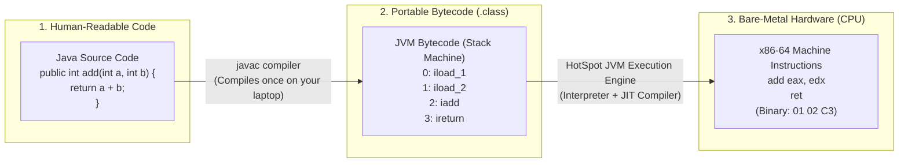
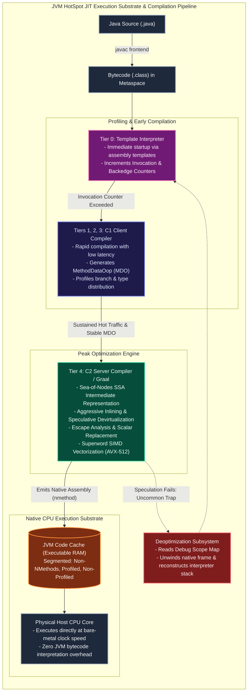
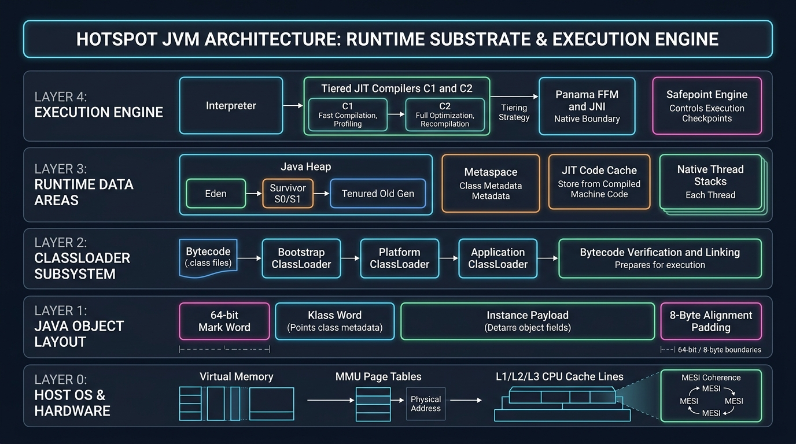
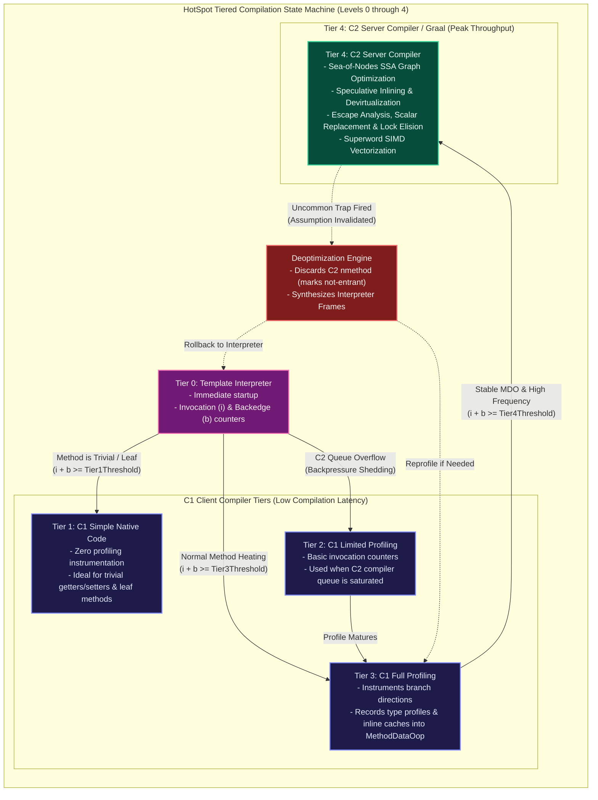

[🏠 Back to Home](README.md) | [☕ Core Java Internals](java_interview_master_guide.md) | [🎭 Spring AOP Architecture](spring_aop_master_guide.md) | [🏛️ Spring Data JPA](spring_data_jpa.md) | [⚙️ C & C++ Systems Guide](c_cpp_master_guide.md)

# ⚡ JVM JIT Compiler Internals, Tiered Compilation, Advanced Optimizations & Diagnostics Master Guide

### *(From Absolute Zero-Jargon Beginner Foundations to Senior/Staff HotSpot Engineering: Template Interpreter, C1/C2 Compilers, Graal, Tiered Levels 0–4, Escape Analysis & Scalar Replacement, Inlining, On-Stack Replacement, Deoptimization, Segmented Code Cache, and hsdis Assembly)*

[]()
[]()
[]()
[]()
[]()

---

## 📑 Master Table of Contents

- [⚡ JVM JIT Compiler Internals, Tiered Compilation, Advanced Optimizations & Diagnostics Master Guide](#-jvm-jit-compiler-internals-tiered-compilation-advanced-optimizations--diagnostics-master-guide)
  - [📑 Master Table of Contents](#-master-table-of-contents)
  - [MODULE 0: THE COMPLETE JARGON-BUSTING GLOSSARY](#module-0-the-complete-jargon-busting-glossary)
  - [TRACK 1: JUNIOR & ENTRY-LEVEL FOUNDATIONS (ZERO-TO-HERO / ELI5 GUIDE)](#track-1-junior--entry-level-foundations-zero-to-hero--eli5-guide)
    - [1.1 The Real-World Mental Models (The Live UN Translator & The Formula 1 Pit Crew)](#11-the-real-world-mental-models-the-live-un-translator--the-formula-1-pit-crew)
    - [1.2 The Fundamental Problem: Why Computers Can't Run Java Directly](#12-the-fundamental-problem-why-computers-cant-run-java-directly)
    - [1.3 The Grand Comparison: Interpreter vs. Ahead-of-Time (AOT) vs. Just-In-Time (JIT)](#13-the-grand-comparison-interpreter-vs-ahead-of-time-aot-vs-just-in-time-jit)
    - [1.4 The Step-by-Step Journey of a Single Line of Code](#14-the-step-by-step-journey-of-a-single-line-of-code)
    - [1.5 "Explain Like I'm 5" (ELI5) Visual Dictionary for Core Optimizations](#15-explain-like-im-5-eli5-visual-dictionary-for-core-optimizations)
    - [1.6 Beginner FAQ & Common Pitfalls (Warmup, Memory & "Why Not Just Compile Like C++?")](#16-beginner-faq--common-pitfalls-warmup-memory--why-not-just-compile-like-c)
  - [TRACK 2: EXECUTIVE ARCHITECTURE: THE HOTSPOT EXECUTION ENGINE & JIT PHILOSOPHY](#track-2-executive-architecture-the-hotspot-execution-engine--jit-philosophy)
    - [2.1 Interpretation vs. AOT vs. Dynamic Profile-Guided JIT](#21-interpretation-vs-aot-vs-dynamic-profile-guided-jit)
    - [2.2 The HotSpot Speculation Paradigm: Optimizing for the Common Case](#22-the-hotspot-speculation-paradigm-optimizing-for-the-common-case)
    - [2.3 The Execution Lifecycle: From Bytecode to Native Instructions](#23-the-execution-lifecycle-from-bytecode-to-native-instructions)
  - [TRACK 3: MASTER VOCABULARY & ARCHITECTURAL TAXONOMY](#track-3-master-vocabulary--architectural-taxonomy)
    - [3.1 Profiling & Execution Tracking Terms](#31-profiling--execution-tracking-terms)
    - [3.2 Compilation, IR & Graph Structures](#32-compilation-ir--graph-structures)
    - [3.3 Dynamic Dispatch & Inlining Terms](#33-dynamic-dispatch--inlining-terms)
    - [3.4 Deoptimization, State Transition & Safepoint Terms](#34-deoptimization-state-transition--safepoint-terms)
    - [3.5 Optimization & Hardware Vectorization Terms](#35-optimization--hardware-vectorization-terms)
  - [TRACK 4: THE TIERED COMPILATION PIPELINE (LEVELS 0 THROUGH 4)](#track-4-the-tiered-compilation-pipeline-levels-0-through-4)
    - [4.1 Tier 0: The Template Interpreter](#41-tier-0-the-template-interpreter)
    - [4.2 Tier 1: C1 Simple (Client Compiler, Zero Profiling)](#42-tier-1-c1-simple-client-compiler-zero-profiling)
    - [4.3 Tier 2: C1 Limited Profile (Basic Counters)](#43-tier-2-c1-limited-profile-basic-counters)
    - [4.4 Tier 3: C1 Full Profile (Full MDO Branch & Type Profiling)](#44-tier-3-c1-full-profile-full-mdo-branch--type-profiling)
    - [4.5 Tier 4: C2 Server / Opto & Graal Compiler](#45-tier-4-c2-server--opto--graal-compiler)
    - [4.6 Promotion State Machine & Invocation/Backedge Threshold Formulas](#46-promotion-state-machine--invocationbackedge-threshold-formulas)
  - [TRACK 5: DEEP-DIVE: JIT OPTIMIZATION TECHNIQUES & COMPILER INTERNALS](#track-5-deep-dive-jit-optimization-techniques--compiler-internals)
    - [5.1 Method Inlining: The Mother of All Optimizations](#51-method-inlining-the-mother-of-all-optimizations)
    - [5.2 Devirtualization & Inline Caching (Monomorphic, Bimorphic, Megamorphic)](#52-devirtualization--inline-caching-monomorphic-bimorphic-megamorphic)
    - [5.3 Escape Analysis (EA), Scalar Replacement & Lock Elimination](#53-escape-analysis-ea-scalar-replacement--lock-elimination)
    - [5.4 Loop Optimizations & Superword Vectorization (SIMD)](#54-loop-optimizations--superword-vectorization-simd)
    - [5.5 Global Value Numbering (GVN), Dead Code Elimination & Branch Pruning](#55-global-value-numbering-gvn-dead-code-elimination--branch-pruning)
    - [5.6 JVM Intrinsics (@HotSpotIntrinsicCandidate)](#56-jvm-intrinsics-hotspotintrinsiccandidate)
  - [TRACK 6: DEOPTIMIZATION & ON-STACK REPLACEMENT (OSR)](#track-6-deoptimization--on-stack-replacement-osr)
    - [6.1 Uncommon Traps: The Price of Speculation](#61-uncommon-traps-the-price-of-speculation)
    - [6.2 Deoptimization Stack Reconstruction (Compiled Frame to Interpreter Frame)](#62-deoptimization-stack-reconstruction-compiled-frame-to-interpreter-frame)
    - [6.3 On-Stack Replacement (OSR) Mechanics & State Migration](#63-on-stack-replacement-osr-mechanics--state-migration)
  - [TRACK 7: CODE CACHE ARCHITECTURE & MEMORY DYNAMICS](#track-7-code-cache-architecture--memory-dynamics)
    - [7.1 Native Machine Code Storage: nmethods, Stubs & Adapters](#71-native-machine-code-storage-nmethods-stubs--adapters)
    - [7.2 Segmented Code Cache (Non-NMethods, Profiled, Non-Profiled)](#72-segmented-code-cache-non-nmethods-profiled-non-profiled)
    - [7.3 Code Cache Exhaustion Disaster & Sweeper Flushing Cycle](#73-code-cache-exhaustion-disaster--sweeper-flushing-cycle)
  - [TRACK 8: JIT DIAGNOSTIC FLAGS, TOOLING & ASSEMBLY DISASSEMBLY](#track-8-jit-diagnostic-flags-tooling--assembly-disassembly)
    - [8.1 Essential JIT Diagnostic Flags & Decoding -XX:+PrintCompilation](#81-essential-jit-diagnostic-flags--decoding--xxprintcompilation)
    - [8.2 Visualizing JIT with JITWatch](#82-visualizing-jit-with-jitwatch)
    - [8.3 Disassembling JIT Assembly with hsdis & -XX:+PrintAssembly](#83-disassembling-jit-assembly-with-hsdis---xxprintassembly)
  - [TRACK 9: PRODUCTION WAR ROOM INCIDENTS & POST-MORTEMS (RCAS)](#track-9-production-war-room-incidents--post-mortems-rcas)
    - [Incident 1: The Silent Code Cache Exhaustion & Latency Cliff Disaster](#incident-1-the-silent-code-cache-exhaustion--latency-cliff-disaster)
    - [Incident 2: The Megamorphic Interface Call Site Deoptimization Storm](#incident-2-the-megamorphic-interface-call-site-deoptimization-storm)
    - [Incident 3: Escape Analysis Failure Causing Heap OOM & GC Thrashing](#incident-3-escape-analysis-failure-causing-heap-oom--gc-thrashing)
    - [Incident 4: Endless OSR Compilation & CPU Starvation in Event Loop](#incident-4-endless-osr-compilation--cpu-starvation-in-event-loop)
  - [TRACK 10: SENIOR & STAFF JVM COMPILER ENGINEER INTERVIEW BANK (45 QUESTIONS)](#track-10-senior--staff-jvm-compiler-engineer-interview-bank-45-questions)

---

# MODULE 0: THE COMPLETE JARGON-BUSTING GLOSSARY

> [!TIP]
> **How to use this glossary**: Whenever you encounter a scary technical term anywhere in this guide (or in JVM logs), come here first! Every concept is broken down into plain English, an everyday analogy, the true technical definition, and what breaks in production if you misunderstand it.

| Term / Acronym | The Simple Plain-English Meaning | The Everyday Mental Model (Analogy) | Low-Level Technical Definition | What Breaks If You Get This Wrong? |
| :--- | :--- | :--- | :--- | :--- |
| **Bytecode** | An intermediate, platform-neutral set of instructions generated by `javac`. Not human code, but not real hardware CPU instructions either. | Sheet music written in universal musical notation that any instrument player can read. | A stream of 8-bit opcodes (`.class` format) executed by the JVM virtual stack machine (`iload`, `invokevirtual`, `ireturn`). | Assuming bytecode runs directly on CPU silicon. It cannot; hardware CPUs have no idea what bytecode is. |
| **Interpreter (Template Interpreter)** | A component that reads bytecode line-by-line and executes it immediately without waiting to compile. | A live human translator whispering translations into your ear word-by-word as someone speaks. | Execution engine that jumps to pre-assembled native instruction stubs matching each bytecode opcode. | Zero warmup time, but $10\times - 50\times$ slower execution throughput if methods stay uncompiled. |
| **JIT Compiler (Just-In-Time)** | An intelligent background compiler that converts frequently executed bytecode into blazing-fast native machine code *while the program is running*. | A court stenographer who invents high-speed shorthand abbreviations for phrases the judge repeats all day. | Dynamic native compiler (C1/C2/Graal) translating HotSpot intermediate representations into bare-metal x86/ARM assembly at runtime. | Disabling JIT (`-Xint`) collapses application throughput by up to $95\%$. |
| **AOT Compilation (Ahead-Of-Time)** | Translating source code or bytecode into permanent native machine code *before* the application ever launches (e.g., GraalVM Native Image). | Printing and binding a translated book in advance so readers don't need any translator present. | Static compilation process generating native OS binaries prior to execution, removing runtime JIT compilers and the bytecode interpreter. | Instant startup and low memory, but misses runtime dynamic profiling optimizations that beat static C++ compilers. |
| **JVM Warmup** | The initial time period after application boot where the JVM identifies hot code, gathers statistics, and compiles native machine code. | An athlete stretching and jogging before sprinting at Olympic speeds. | Time elapsed until critical execution paths promote through Tier 0 $\rightarrow$ Tier 3 $\rightarrow$ Tier 4 C2 compilation and populate the Code Cache. | Sending full production traffic to a cold instance causes severe latency spikes, CPU saturation, and health-check timeouts. |
| **Hot Method / "HotSpot"** | A method or loop executed so frequently that compiling it into bare-metal machine code yields massive performance gains. | The most popular highway in a city that gets paved with ultra-smooth high-speed asphalt. | Code whose invocation counter and loop backedge counter exceed configured thresholds ($T_{\text{inv}}, T_{\text{compile}}$). | If hot methods fail to compile (e.g., exceed bytecode limits), the application runs crippled on the slow interpreter. |
| **Invocation Counter** | A counter tracking how many times a method has been called. | A turnstile counter at a subway station counting every passenger who walks through. | An integer counter in method metadata incremented on method entry during interpretation and Tier 2/3 execution. | Miscalculating counter thresholds causes delayed compilation or premature compilation thrashing. |
| **Backedge Counter** | A counter tracking how many times a loop repeats its execution. | A lap counter at a racetrack clicking every time a racecar completes a lap. | Counter incremented at the backward branching instruction of a loop; triggers **On-Stack Replacement (OSR)** for long loops. | Massive loops inside methods called only once will freeze in interpreter mode unless OSR is triggered. |
| **Tiered Compilation** | HotSpot's multi-level compilation pipeline combining fast startup (Tier 0-1) with peak long-term speed (Tier 4 C2). | A martial arts belt system: beginners start at White Belt (Interpreter) and earn Black Belt (C2) through hard practice. | Architecture (`-XX:+TieredCompilation`) orchestrating Tier 0 (Interpreter), Tiers 1–3 (C1 Client), and Tier 4 (C2 Server). | Disabling tiered compilation forces you to choose between slow startup (pure C2) or low throughput (pure C1). |
| **C1 Compiler (Client)** | A lightweight JIT compiler that compiles code quickly with simple optimizations and inserts profiling sensors. | A quick sketch artist who draws a fast outline in 10 seconds. | Fast native compiler utilizing High-Level IR (HIR) and Low-Level IR (LIR) to emit machine code with minimal CPU overhead. | Without C1, the JVM would have to choose between crawling in the interpreter or stalling while C2 builds massive graphs. |
| **C2 Compiler (Server / Opto)** | The heavy-duty optimizing JIT compiler that produces hyper-optimized machine code using deep runtime statistics. | A master oil painter spending 3 weeks crafting a flawless museum masterpiece. | Optimizing compiler using the Sea-of-Nodes SSA intermediate representation to apply escape analysis, inlining, and SIMD vectorization. | Starving C2 compiler threads in single-core containers prolongs cold warmup latency for tens of minutes. |
| **MethodDataOop (MDO)** | An internal memory record holding runtime telemetry about which paths and classes a method actually used. | A racecar's black box recorder logging cornering speeds, tire temperatures, and driver habits. | Metaspace data structure storing branch execution probabilities, call site receiver types, and deoptimization trap histories. | Corrupted or unstable profiling forces C2 to make conservative guesses, generating sub-optimal machine code. |
| **Profile-Guided Optimization (PGO)**| Optimizing code based on real measurements of actual live traffic rather than theoretical guesses. | A store manager rearranging aisles based on the exact paths shoppers walk every Monday morning. | Compiler optimizations that prune dead branches, inline dominant target classes, and align loops using MDO runtime metrics. | Benchmarking micro-benchmarks without realistic data trains the JIT on unreal traffic patterns, skewing benchmarks. |
| **Method Inlining** | Copy-pasting the body of a called method directly into the caller, eliminating the function call entirely. | Answering a quick question at your desk instead of scheduling a 30-minute Zoom meeting in another room. | Compiler optimization replacing an `invokevirtual`/`invokestatic` call site with the callee bytecode/IR nodes. | If a method is too big to inline (`>325` bytes), it blocks all other downstream optimizations (Escape Analysis, SIMD). |
| **Devirtualization** | Turning a dynamic interface/virtual method lookup into a direct, hardwired CPU function call. | Calling your doctor directly on their private cell phone instead of calling the hospital switchboard. | Replacing dynamic dispatch table lookups (`vtable`/`itable`) with a direct static address jump (`call <address>`). | Failing to devirtualize forces indirect CPU branch lookups, stalling CPU execution pipelines. |
| **Class Hierarchy Analysis (CHA)**| An inspection of all loaded classes to check if an interface or abstract class has only one real implementation. | Checking the company directory to see if there is currently only one "Accountant" hired in the whole company. | Compiler analysis querying loaded class metadata to verify whether a virtual call site currently has a single target. | Dynamically loading a 2nd implementation at runtime invalidates CHA, triggering mass deoptimizations. |
| **Inline Cache (IC)** | A small hardware-level cache at a call site remembering the concrete object types seen recently. | A barista who remembers your coffee order as soon as you walk in the door because you come every morning. | Assembly-level patch storing the last-seen receiver class pointer and jumping directly to cached compiled code. | Unstable polymorphic traffic causes cache misses, degrading performance into slow megamorphic lookups. |
| **Monomorphic Call Site** | A call site that has only ever encountered **exactly 1** concrete class type. | A vending machine that only accepts one specific type of golden token. | A call site profiled with $100\%$ uniform receiver type. The JIT inlines the target completely behind a single comparison guard. | Code is maximally fast ($0.2\text{ ns}$ execution). |
| **Bimorphic Call Site** | A call site that encounters **exactly 2** concrete class types. | A toll booth with two lanes: Cash and Electronic Pass. | A call site profiled with 2 receiver classes. The JIT emits a fast two-way `if/else` jump and inlines both method bodies. | Slightly slower than monomorphic, but still avoids expensive dynamic virtual table searches. |
| **Megamorphic Call Site** | A call site that encounters **3 or more** different concrete class types. | A busy international airport passport desk dealing with travelers from 195 different countries. | Call site with $\ge 3$ receiver types. The JIT aborts inlining and falls back to indirect table searches (`itable`/`vtable`). | Throughput drops by $3\times - 10\times$; Escape Analysis is completely disabled; CPU pipeline stalls occur. |
| **Escape Analysis (EA)** | Analyzing whether a newly created object stays inside the method or escapes to the rest of the program. | Checking whether a confidential memo stays inside the meeting room or is mailed outside the building. | Global data-flow analysis categorizing object lifetime as `NoEscape`, `ArgEscape`, or `GlobalEscape`. | If an object escapes, it must be allocated on the heap, forcing the Garbage Collector to clean it up later. |
| **Scalar Replacement** | Disassembling an object into its basic primitive variables and storing them directly in CPU registers, **bypassing the heap completely**. | Emptying the contents of your backpack into your jacket pockets so you can leave the bulky backpack at home. | C2 optimization mapping fields of a `NoEscape` object directly to CPU registers or stack slots with **zero heap allocation**. | If Escape Analysis fails, millions of temporary objects flood the Young Generation, causing GC pauses. |
| **Lock Elision** | Removing `synchronized` locks completely because the object is only accessible to a single thread. | Taking the lock off your private bedroom door when you live alone in a house on an empty island. | Compiler optimization deleting `monitorenter` and `monitorexit` bytecode instructions from generated machine assembly. | Unnecessary synchronization wastes CPU cycles on atomic memory bus locks. |
| **Lock Coarsening** | Combining multiple back-to-back locks on the same object into one single lock block. | Unlocking your front door once to bring in 5 grocery bags instead of locking and unlocking it 5 times. | Merging adjacent synchronized blocks on the same monitor to minimize lock acquire/release overhead. | High-frequency lock cycles burn CPU in lock contention and memory barriers. |
| **Loop Unrolling** | Duplicating the body of a loop multiple times to reduce the number of loop counter checks and branch jumps. | Taking 4 stairs at a time instead of taking 1 stair at a time and stopping to count on every single step. | Compiler transformation expanding loop iterations (e.g., $i += 4$) to maximize instruction-level parallelism. | Reduces branch predictor pressure; enables hardware vectorization. |
| **SIMD (Superword Vectorization)** | Processing multiple numbers in parallel in a single CPU clock cycle using wide 256-bit or 512-bit hardware registers. | Loading 8 passengers into a van for 1 trip instead of driving 8 separate motorbikes. | Mapping scalar array loops to CPU vector instructions (AVX-2, AVX-512, ARM NEON), computing 4–16 values per cycle. | Missing SIMD vectorization leaves $75\% - 90\%$ of modern CPU math throughput completely unutilized. |
| **Global Value Numbering (GVN)**| Recognizing identical calculations in code and computing them only once. | Solving a math equation once on a chalkboard and pointing to the answer whenever someone asks for it again. | Optimization pass on the Sea-of-Nodes graph merging redundant nodes that produce mathematically identical values. | Eliminates wasted duplicate CPU arithmetic. |
| **Dead Code Elimination (DCE)** | Completely deleting code instructions whose results are never used or read by anything. | Throwing away junk mail before opening it because it has zero impact on your life. | Graph optimization removing nodes with zero outgoing data-flow consumers from final machine code emission. | Keeps compiled binary small, saving instruction cache space. |
| **Branch Pruning** | Deleting code inside an `if` or `else` branch from compiled machine code because live profiling shows it is never taken. | Tearing down an old abandoned road that has had zero cars drive on it for 5 years. | Emitting native code only for the hot branch path and replacing the cold branch with an **Uncommon Trap**. | Saves CPU cache space; creates straight-line execution pipelines with zero branch misprediction penalties. |
| **Deoptimization (Deopt)** | Safely ditching fast compiled machine code and switching back to the slow interpreter mid-execution when an assumption fails. | Pulling over your high-speed sports car when the highway is blocked and walking safely along the detour path. | Reconstructing virtual interpreter stack frames from native CPU registers and transferring thread execution back to Tier 0. | Normal in small amounts; but "Deoptimization Storms" can spike CPU to $100\%$ and collapse system throughput. |
| **Uncommon Trap (UCT)** | A tripwire planted in compiled machine code where an assumption was made. If triggered, it calls the deoptimizer. | A burglar alarm sensor that trips only if an intruder steps into a room nobody was supposed to enter. | A small assembly stub emitted at cold/unprofiled paths that halts native execution and initiates stack unwinding. | Frequent trap execution forces the JVM to discard compiled methods and recompile repeatedly (compiler thrashing). |
| **On-Stack Replacement (OSR)**| Upgrading a long-running loop to hyper-fast native machine code *while the loop is still spinning mid-execution*. | Changing the tires and tuning the engine of a racecar while it is driving 100 mph down the track without stopping. | Compiling a hot loop into an OSR `nmethod` and swapping the thread's stack frame from interpreter to native mid-loop. | Without OSR, long batch-processing loops in methods called once would crawl in slow interpreter mode indefinitely. |
| **Code Cache** | A dedicated off-heap native memory area where the JVM stores all compiled machine code (`nmethods`). | A whiteboard right next to the engine where translated machine instructions are kept for instant access. | Non-heap native memory partition storing compiled JIT assembly, JVM runtime stubs, and interpreter adapters. | **Catastrophic Failure**: If full, the JVM **permanently disables the JIT compiler**, trapping all new code in the slow interpreter! |
| **Segmented Code Cache** | Dividing the Code Cache into 3 isolated physical heaps (Non-NMethods, Profiled, Non-Profiled) to avoid memory fragmentation. | Dividing a closet into 3 dedicated bins: one for coats, one for shirts, and one for shoes so items don't mix. | Java 9+ feature splitting code cache into static stubs, short-lived C1 profiled code, and permanent C2 native code. | Prevents short-lived C1 methods from fragmenting memory needed by long-lived peak-performance C2 methods. |
| **Code Cache Sweeper** | A background garbage cleaner that reclaims memory from outdated or deoptimized compiled code. | An office janitor erasing outdated notes from the whiteboard to make room for new diagrams. | HotSpot background process transitioning methods through `alive` $\rightarrow$ `not-entrant` $\rightarrow$ `zombie` $\rightarrow$ `freed`. | If the sweeper runs too slowly, the Code Cache overflows, shutting down the compiler forever. |
| **Safepoint & Safepoint Polling**| Checkpoints inserted into code where threads pause so the JVM can inspect stacks, perform GC, or deoptimize. | Traffic lights across all city intersections that turn red simultaneously when an emergency convoy passes. | Hardware memory-read or register-test instructions injected at loop headers and method returns to pause threads safely. | Uncounted integer loops missing safepoints cause **Time-To-Safepoint (TTSP)** delays, causing multi-second latency spikes. |
| **JVM Intrinsic** | A method whose bytecode is completely thrown away and replaced by hand-crafted assembly written by JVM CPU architects. | Using a pre-built industrial laser cutter instead of hand-carving a wooden gear with a pocketknife. | Methods annotated with `@HotSpotIntrinsicCandidate` (`System.arraycopy`, `Math.sqrt`) mapped directly to hardware opcodes. | Delivers the absolute physical limits of hardware execution speed for foundational algorithms. |
| **Sea-of-Nodes** | C2's intermediate representation graph where data and control flow float freely without rigid basic block borders. | A fluid web of interconnected dominoes where each domino falls only when its dependencies are ready. | Static Single Assignment (SSA) graph structure combining value flow and control dependencies into unified graph nodes. | Enables mathematically optimal code motion, inlining, and global optimizations that traditional compilers miss. |

---

# TRACK 1: JUNIOR & ENTRY-LEVEL FOUNDATIONS (ZERO-TO-HERO / ELI5 GUIDE)

## 1.1 The Real-World Mental Models (The Live UN Translator & The Formula 1 Pit Crew)

If you are new to the JVM or compilers, modern Just-In-Time compilation can seem like dark magic. Let's demystify it using two intuitive real-world analogies:

### Analogy 1: The United Nations Live Speech Translator
Imagine an international summit where a delegate speaks a foreign language. How can the audience understand them?
1. **The Interpreter Approach**: A live human translator sits with headphones, translating sentences word-by-word into a microphone as the speaker speaks.
   - *Advantage*: The speech begins immediately. Zero delay!
   - *Disadvantage*: It is slow, mentally exhausting, and the translator repeats common greetings like *"Good morning ladies and gentlemen"* word-by-word every single time.
2. **The Ahead-Of-Time (AOT) Approach**: You tell the speaker: *"Write your speech on paper, send it to a publishing house 3 months in advance, have it professionally translated and printed as a hardcover book."*
   - *Advantage*: Reading the published book is instantaneous and error-free.
   - *Disadvantage*: You cannot change a single word dynamically. If the audience asks a surprise question, the book is useless.
3. **The Just-In-Time (JIT) Approach**: A smart assistant starts by translating live word-by-word (fast startup). But the assistant keeps a secret notepad. When they notice the speaker uses the exact same 50-word phrase 500 times, the assistant types out a printed shortcut card. By the 10th minute, the assistant isn't translating anymore—they are sliding pre-printed, hyper-fast, perfect translation cards across the desk!
   - *Advantage*: Fast startup, but reaches maximum native speed while adapting dynamically to the speaker's live habits!

---

### Analogy 2: The Formula 1 Racing Team
When an enterprise Java microservice boots up, think of a Formula 1 racecar rolling onto the track:

```
[ Lap 1: Pit Exit ] ──► [ Laps 2–10: Telemetry ] ──► [ Lap 11+: Hyper-Drive ]
Tier 0: Interpreter     Tiers 1–3: C1 Profiling      Tier 4: C2 Server Compiler
Drive carefully, test   Sensors record tire wear,    Deploy active aerodynamics,
track conditions.       wind, cornering speeds.      max turbo boost, tuned to
(Instant Startup)       (MethodDataOop Telemetry)    THIS exact track! (Peak Speed)
```

1. **Tier 0 (Template Interpreter)**: The car leaves the pit box at safe, moderate speed. The engine starts immediately without waiting for aerodynamic calculations.
2. **Tiers 1–3 (C1 Client Compiler)**: Hundreds of onboard sensors record live telemetry: How tight are the left turns? How hot is the asphalt? (This telemetry is the **`MethodDataOop`**).
3. **Tier 4 (C2 Server Compiler)**: The pit wall computers analyze the telemetry. They adjust the wings, lower the suspension, and unleash maximum engine horsepower tuned specifically for this exact race track!

---

## 1.2 The Fundamental Problem: Why Computers Can't Run Java Directly

To understand why the JIT compiler exists, you must understand how physical computer chips work:



1. **CPUs only understand binary voltage signals (Machine Code)**: An Intel Core i9 or AMD Ryzen or Apple M3 chip knows nothing about Java, classes, interfaces, or garbage collection. It only knows bare-metal CPU opcodes (e.g., `add eax, edx`).
2. **C and C++ Compile Directly to One CPU**: If you compile C++ on an Intel Windows laptop, it emits an `.exe` full of x86 machine instructions. That file will instantly crash if you try to run it on an ARM Linux server or an Apple Silicon Mac. You have to recompile it for every single target machine!
3. **Java's Revolution: "Write Once, Run Anywhere" (WORA)**:
   - When you run `javac`, it does **not** generate machine code.
   - It compiles your Java source into **Bytecode** stored in `.class` files.
   - Bytecode is an idealized, imaginary assembly language for a hypothetical computer called the **Java Virtual Machine (JVM)**.
4. **The Dilemma**: Real hardware chips cannot execute bytecode! The JVM must translate bytecode into real silicon instructions.
   - If it translates line-by-line using an **Interpreter**, it is safe and starts instantly, but runs slowly.
   - If it compiles with the **JIT Compiler**, it produces bare-metal machine code that runs at the absolute physical speed of the CPU!

---

## 1.3 The Grand Comparison: Interpreter vs. Ahead-of-Time (AOT) vs. Just-In-Time (JIT)

| Dimension | 🐢 The Interpreter | 📦 Ahead-Of-Time (AOT / Native Image) | ⚡ Dynamic JIT (HotSpot Tiered C1/C2) |
| :--- | :--- | :--- | :--- |
| **How It Works** | Reads bytecode instruction-by-instruction and executes native stubs on the fly. | Compiles Java directly into an OS executable binary on your laptop/CI before running. | Starts in the interpreter, gathers live profiling stats, and compiles hot code into native RAM. |
| **Startup Speed** | **Instantaneous ($< 5\text{ ms}$)** | **Lightning Fast ($< 20\text{ ms}$)** | Moderate ($1\text{ to } 30\text{ s}$ warm-up required). |
| **Memory Footprint** | Tiny (Just the basic JVM process). | Extremely small (Zero compiler threads, no Code Cache). | Higher (Requires Code Cache RAM and compiler background threads). |
| **Peak Throughput** | Very Low ($10\times - 50\times$ slower). | High (Comparable to standard C++). | **Absolute Maximum ($10\% - 30\%$ faster than AOT in long runs!)** |
| **Knowledge of Traffic** | Zero. | Zero (Guessed at compile time unless manual PGO files provided). | **100% Live Dynamic Profile** (Optimizes for what real users actually do). |
| **Best Use Case** | Quick scripts, debugging, CLI tools. | AWS Lambda, Serverless, CLI tools requiring sub-second startup. | High-throughput backend microservices, payment gateways, trading systems. |

> [!NOTE]
> **Can JIT really beat C++ and AOT? YES!**
> A static C++ or AOT compiler must generate code that handles every theoretical case. If a class has 50 subclasses, C++ *must* perform an indirect pointer lookup every single time.
> But the JIT compiler watches your running application. If it sees that for 5 hours, $100\%$ of incoming orders use `CreditCardPayment`, the JIT **deletes the dynamic lookup entirely and hardwires the credit card code directly into the CPU!** If a `PayPalPayment` suddenly arrives later, the JIT safely steps back (Deoptimization). Static compilers cannot do this!

---

## 1.4 The Step-by-Step Journey of a Single Line of Code

Let's trace a concrete, everyday Java method from your keyboard to physical silicon:

```java
public class PricingService {
    public int calculateDiscount(int price, boolean isVip) {
        if (isVip) {
            return price - 20;
        }
        return price;
    }
}
```

```
[ Step 1: Source (.java) ]
        │
        ▼ (Developer runs javac)
[ Step 2: Bytecode (.class) ]
   0: iload_2       (Load boolean isVip)
   1: ifeq 8        (If false, jump to line 8)
   4: iload_1       (Load int price)
   5: bipush 20     (Push 20)
   7: isub          (Subtract 20)
   8: ireturn       (Return result)
        │
        ▼ (Application boots in production)
[ Step 3: Tier 0 Template Interpreter ]
   Executes bytecodes 0 to 8 one by one.
   Invocation Counter: 1, 2, 3... 200.
        │
        ▼ (Counter crosses Tier 3 threshold: ~2,000 calls)
[ Step 4: Tier 3 C1 Client Compiler ]
   Quickly compiles method to basic machine code.
   Inserts profiling hooks into MethodDataOop (MDO).
   MDO discovers: "Wait! 100% of calls have isVip == true!"
        │
        ▼ (Counter crosses Tier 4 threshold: ~15,000 calls)
[ Step 5: Tier 4 C2 Server Compiler ]
   C2 reads the MDO profile.
   C2 says: "isVip is ALWAYS true. The false branch has NEVER been used!"
   C2 PRUNES the false branch completely (Branch Pruning)!
   C2 reduces the entire method to a SINGLE x86 subtraction:
        │
        ▼
[ Step 6: Native x86-64 Machine Code in Code Cache ]
   cmp    esi, 0x1              ; Guard: Is isVip still true?
   jne    deoptimize            ; If someone passes false, BAIL TO INTERPRETER!
   sub    edi, 20               ; Single CPU clock cycle: price - 20
   mov    eax, edi              ; Return value in accumulator register
   ret                          ; Done! (~0.2 nanoseconds!)
```

---

## 1.5 "Explain Like I'm 5" (ELI5) Visual Dictionary for Core Optimizations

Here is how the legendary JVM optimizations work, explained with everyday life concepts:

### 1. Method Inlining
- **Without Inlining**: You are working at your desk. You need to calculate a number. You stand up, walk down the hallway to Bob's office, ask Bob for the answer, wait for Bob to finish, walk back to your desk, and sit down. (Massive function call overhead!).
- **With Inlining**: You write Bob's quick formula directly on your desk notepad. You never leave your chair!
- **Why It Matters**: Beyond saving the walk, having the formula on your desk lets you spot shortcuts (e.g., *"Wait, Bob's formula multiplies by zero, so the answer is always zero!"*).

### 2. Escape Analysis & Scalar Replacement
- **Without It**: Every time you want to add two numbers, you go to the store, buy a brand-new leather briefcase, put two slips of paper inside, pull them out, and throw the briefcase into the trash. (Heavy heap allocation + Garbage Collector fatigue!).
- **With It**: The JIT compiler checks: *"Does this briefcase ever leave this room?"* If the answer is NO (`NoEscape`), the JIT **never buys the briefcase!** It puts the two slips of paper directly into your shirt pockets (CPU registers).
- **Result**: Zero heap memory used, zero garbage generated, zero GC pauses!

### 3. Lock Elision
- **Without It**: You install a heavy biometric steel lock on your bedroom diary. Every time you write a sentence, you unlock the steel door, write, and lock it again.
- **With It**: The compiler notices: *"Wait, you live completely alone on a deserted private island!"* It throws the steel lock away.
- **Result**: Zero synchronization overhead.

### 4. Loop Unrolling & SIMD (Vectorization)
- **Without It**: You need to carry 8 grocery bags from your car into the kitchen. You carry 1 bag, walk to the kitchen, walk back to the car, count *"That's 1 bag"*, and repeat 8 times.
- **With SIMD**: You load all 8 bags into a wheelbarrow and push them all into the kitchen in a **single trip!**
- **Result**: Modern CPU chips have wide 256-bit and 512-bit registers (AVX-512) that can add 8 or 16 numbers in parallel in a single clock tick.

### 5. Speculation & Deoptimization
- **The Concept**: You are driving to work. 364 days a year, the highway bridge is open. Do you drive at 5 mph waiting for the bridge to collapse? No! You drive at 70 mph assuming the bridge is open (**Speculation**).
- **The Safe Fallback**: What if on day 365, the bridge has maintenance cones? You don't crash into the river—you safely brake and take the side street (**Deoptimization to Interpreter**).

---

## 1.6 Beginner FAQ & Common Pitfalls (Warmup, Memory & "Why Not Just Compile Like C++?")

#### Q1: "Why does my brand-new Spring Boot pod spike CPU to 100% when it starts up?"
> **Answer**: That is the **Warmup Phase**! When your container receives its first few thousand HTTP requests, hundreds of methods cross their invocation thresholds at the same moment. The C1 and C2 compiler threads are furiously building Sea-of-Nodes graphs and emitting machine code. Once the hot paths are compiled into the Code Cache, CPU usage drops back down to normal ($15\% - 25\%$).

#### Q2: "Can I just force Java to compile everything immediately with `-Xcomp`?"
> **Answer**: You *can*, but you shouldn't! `-Xcomp` compiles every method on its very first call. This causes two massive problems:
> 1. Application boot time slows down to a crawl (startup takes minutes).
> 2. The compiler compiles code *without any runtime profiling data*! It cannot perform speculative optimizations, devirtualization, or branch pruning. As a result, your long-term peak performance will actually be **significantly worse** than normal Tiered Compilation!

#### Q3: "Does JIT compilation eat up my Java Heap space?"
> **Answer**: No! JIT compilation artifacts do **not** live on the Java Heap. They live in a dedicated native off-heap memory region called the **Code Cache**. If your Code Cache is sized at 240 MB, it uses 240 MB of host OS RAM outside of your `-Xmx` heap setting.

#### Q4: "Why did the original creators of Java invent Bytecode instead of compiling straight to machine code like C++?"
> **Answer**: In 1995, software had to be compiled separately for Windows x86, Solaris SPARC, Mac PowerPC, and various Unix architectures. Distributing software was a nightmare. Bytecode enabled the historic promise: *"Write Once, Run Anywhere."* You compile one `.jar` file, and any machine on Earth with a JVM installed can execute it!

---

# TRACK 2: EXECUTIVE ARCHITECTURE: THE HOTSPOT EXECUTION ENGINE & JIT PHILOSOPHY

> [!NOTE]
> 🌱 **Plain-English Intuition**: Now that you know the basics, let's look under the hood at how HotSpot combines the interpreter with compilers to achieve near-magical execution speed.

In high-throughput enterprise systems, the Java Virtual Machine (JVM) achieves near-C/C++ native execution speeds not through static Ahead-Of-Time (AOT) compilation, but through an adaptive, profile-driven **Just-In-Time (JIT) Compiler**.

## 2.1 Interpretation vs. AOT vs. Dynamic Profile-Guided JIT

| Metric / Dimension | Interpreter | Ahead-Of-Time (AOT / Graal Native) | JIT (HotSpot Tiered C1/C2) |
| :--- | :--- | :--- | :--- |
| **Startup Latency** | **Instant ($<10\text{ ms}$)** | **Instant ($<50\text{ ms}$)** | Moderate ($\sim 1\text{ to } 30\text{ s}$) due to warm-up |
| **Memory Footprint** | Extremely Low | Minimal (No JIT compiler or code cache in RAM) | Higher (Requires Code Cache, compiler threads, MDOs) |
| **Peak Throughput** | Very Low ($10\times - 50\times$ slower) | High (Static optimizations) | **Maximum Peak Performance ($20\% - 50\%$ faster than AOT)** |
| **Profile Knowledge** | Zero | Static profiles only (PGO requires manual training runs) | **Live Dynamic Runtime Profiling** (Adapts to actual production traffic) |
| **Speculative Optimization** | None | Limited (Must remain strictly correct for all possible paths) | **Aggressive Speculation** (Deoptimizes safely if invariants break) |

---

## 2.2 The HotSpot Speculation Paradigm: Optimizing for the Common Case

Static compilers (like `gcc`, `clang`, or standard AOT compilers) must generate code that is provably correct for **100% of theoretical execution paths**. If a pointer could theoretically be null, or if an interface could theoretically have 50 different implementations, the static compiler must emit safe defensive checks and indirect function pointer lookups.

HotSpot JIT operates under a completely different paradigm: **Aggressive Speculation with Safe Fallback**.
1. **Observe**: The Template Interpreter and C1 compiler observe that in $99.999\%$ of calls, an interface `PaymentGateway` is implemented *only* by `StripePaymentGateway`.
2. **Speculate**: The C2 compiler emits code that completely eliminates the dynamic virtual method dispatch table (`vtable`/`itable`), inlining `StripePaymentGateway.process()` directly into the caller.
3. **Guard**: It inserts an ultra-fast hardware comparison guard:
   ```assembly
   cmp    rax, [rsi + 0x8]   ; Check if object class == StripePaymentGateway.class
   jne    deoptimize         ; If a new PayPalGateway class appears, BAIL OUT!
   ```
4. **Deoptimize**: If a brand-new implementation is loaded dynamically at runtime, the JIT fires an **Uncommon Trap**, unwinds the native stack back into interpreter frames, discards the native code, and resumes interpretation seamlessly.

---

## 2.3 The Execution Lifecycle: From Bytecode to Native Instructions





#### Architectural Deep Dive: Execution Lifecycle & Compilation Substrates
- **Part 1: Visual Architecture & Subsystem Topology**: The HotSpot JVM blends interpretation with multi-tier dynamic compilation. Bytecode loaded into Metaspace starts inside the Template Interpreter (Tier 0). Methods exhibiting high call counts or loop iterations promote through the C1 Client Compiler (Tiers 1–3) to accumulate profiling metadata, before reaching peak native compilation under the C2 Server Compiler (Tier 4). Generated machine code resides in the executable JVM Code Cache.
- **Part 2: Execution Flow & Tier Promotion State Machine**:
  1. *Interpretation (Tier 0)*: Bytecodes execute sequentially. Every method entry and backward loop jump increments thread-local hardware counters.
  2. *Tier 2 / Tier 3 (C1 Compilation)*: When invocation thresholds exceed `CompileThreshold` ($\sim 2,000$), C1 compiles the method, embedding profiling instructions into a `MethodDataOop` (MDO) object to track type frequencies at call sites and branch paths.
  3. *Tier 4 (C2 Compilation)*: When counters surpass tier thresholds ($\sim 15,000$), the C2 compiler ingests the MDO profile. C2 builds a Sea-of-Nodes graph, inlines hot call targets, executes escape analysis, eliminates redundant synchronization, vectorizes loops via SIMD, and emits highly optimized x86/ARM machine code (`nmethod`).
  4. *Deoptimization*: If assumptions are invalidated at runtime (e.g., a branch marked dead is entered, or a new subclass loads), an **Uncommon Trap** executes, tearing down native frames and synthesizing interpreter frames on the fly.
- **Part 3: Low-Level HotSpot Runtime, CPU Registers & Hardware Execution**: Compiled `nmethod` artifacts reside in non-garbage-collected native RAM marked executable via kernel system calls (`mprotect(..., PROT_READ | PROT_WRITE | PROT_EXEC)`). C2 optimizes register allocation using Chaitin's graph-coloring algorithm, assigning hot variables directly to general-purpose hardware registers (e.g., `RAX`, `RBX`, `R12-R15` on x86-64), avoiding roundtrips to L1 data caches. Vectorized loops emit AVX-256 or AVX-512 instructions (`vmovups`, `vpaddd`), processing multiple 32-bit floats or integers per CPU cycle.
- **Part 4: Production Failure Modes & SRE Diagnostics**:
  - *Warmup CPU Jitter & Latency Spikes*: During cold microservice boot, hundreds of threads trigger simultaneous C2 compilations, spiking CPU usage to 100% and causing Kubernetes readiness probe timeouts. SRE mitigations: JVM warmup traffic scripts, Application Class Data Sharing (AppCDS), or CRaC (Coordinated Restore at Checkpoint).
  - *Deoptimization Storms*: Dynamically loading classes via reflection inside high-throughput loops invalidates Class Hierarchy Analysis (CHA), triggering mass deoptimizations and dumping thousands of methods back to the slow interpreter.
  - *Diagnostic Triage Commands*:
    ```bash
    # Print real-time JIT compilation events
    java -XX:+PrintCompilation -XX:+UnlockDiagnosticVMOptions -XX:+PrintInlining -jar app.jar
    # Inspect Code Cache status via jcmd
    jcmd <pid> Compiler.Code_Cache
    ```

<details>
<summary>View Legacy ASCII Diagram</summary>

```
Java Source Code (.java) ──► javac ──► Bytecode (.class)
                                            │
                                            ▼
                        ┌─────────────────────────────────────────┐
                        │      JVM Template Interpreter (Tier 0)  │
                        │      - Executes bytecode directly       │
                        │      - Increments Invocation Counters   │
                        │      - Increments Backedge Counters     │
                        └────────────────────┬────────────────────┘
                                             │ [Hot Method Detected]
                                             ▼
                        ┌─────────────────────────────────────────┐
                        │     C1 Client Compiler (Tiers 1, 2, 3)  │
                        │     - Fast compilation                  │
                        │     - Builds MethodDataOop (MDO)        │
                        │     - Profiles branch & type frequency  │
                        └────────────────────┬────────────────────┘
                                             │ [Sustained Hot Traffic]
                                             ▼
                        ┌─────────────────────────────────────────┐
                        │     C2 Server Compiler (Tier 4) / Graal │
                        │     - Sea-of-Nodes Intermediate Rep     │
                        │     - Aggressive Inlining & Speculation │
                        │     - Escape Analysis & Scalar Replace  │
                        │     - Superword Vectorization (SIMD)    │
                        └────────────────────┬────────────────────┘
                                             │ Emits Native Machine Code
                                             ▼
                        ┌─────────────────────────────────────────┐
                        │          JVM CODE CACHE (RAM)           │
                        │   - Directly executed by physical CPU   │
                        │   - Zero JVM interpreter overhead       │
                        └─────────────────────────────────────────┘
```

</details>

---

# TRACK 3: MASTER VOCABULARY & ARCHITECTURAL TAXONOMY

Every systems engineer working with low-latency Java must master these internal terms and concepts:

## 3.1 Profiling & Execution Tracking Terms

- **Invocation Counter**: A per-method hardware counter tracking how many times a method has been entered. When it crosses threshold $T_{\text{inv}}$, compilation is scheduled.
- **Backedge Counter**: A per-loop counter incremented every time a loop branches back to its header. Tracks hot loops inside otherwise cold methods, triggering **On-Stack Replacement (OSR)**.
- **MethodDataOop (MDO)**: An internal JVM metadata structure allocated in Metaspace for hot methods. Holds detailed execution profiling:
  - Branch execution frequencies (how often the `if` vs `else` branch took place).
  - Type feedback (which concrete classes passed through call sites).
  - Trap history (records of previous deoptimizations).
- **Profile-Guided Optimization (PGO)**: Dynamic compiler optimizations informed by runtime statistics recorded in the MDO rather than static analysis.

---

## 3.2 Compilation, IR & Graph Structures

- **Intermediate Representation (IR)**: An abstract, machine-independent representation of the program used by compilers during optimization passes.
- **High-Level IR (HIR)**: C1's SSA-based (Static Single Assignment) graph representation preserving high-level object concepts.
- **Low-Level IR (LIR)**: C1's register-level representation close to machine instructions, used for register allocation and code emission.
- **Sea-of-Nodes (Ideal Graph)**: C2's graph-based intermediate representation where both **Data Flow** and **Control Flow** are represented as directed edges between nodes. Eliminates traditional basic block boundaries, allowing optimizations (like loop invariant motion) to happen organically as graph transformations.
- **SSA (Static Single Assignment) Form**: A property of an intermediate representation where every variable is assigned exactly once, simplifying optimizations like Constant Propagation and Dead Code Elimination.

---

## 3.3 Dynamic Dispatch & Inlining Terms

- **Method Inlining**: The process of replacing a method call site with the actual body of the callee method. Eliminates function call prologue/epilogue, argument passing, and stack frame allocation.
- **Devirtualization**: Transforming an indirect virtual method call (`invokevirtual` or `invokeinterface`) into a direct static machine call (`call <address>`).
- **Class Hierarchy Analysis (CHA)**: A compiler analysis that inspects all currently loaded classes in the JVM to determine whether an interface or abstract method has only one concrete implementation.
- **Inline Cache (IC)**: An in-memory cache at a compiled call site that remembers the concrete target class of recent invocations:
  - **Monomorphic Call Site**: Exactly **1** concrete receiver class observed. The JIT inlines the method body protected by a single class check.
  - **Bimorphic Call Site**: Exactly **2** concrete receiver classes observed. The JIT generates a fast conditional branch: `if (type == A) call A; else if (type == B) call B;`.
  - **Megamorphic Call Site**: **3 or more** concrete receiver classes observed. The JIT aborts inlining and falls back to a table lookup (`vtable`/`itable`), degrading throughput by $3\times - 10\times$.

---

## 3.4 Deoptimization, State Transition & Safepoint Terms

- **Deoptimization (Deopt)**: The process of rolling back natively compiled machine code to bytecode interpretation mid-execution when a speculative optimization assumption is violated.
- **Uncommon Trap (UCT)**: A stub emitted by C2 at cold branches (e.g., an exception handler that was never executed during profiling). When taken, it halts native execution and triggers immediate deoptimization.
- **On-Stack Replacement (OSR)**: The capability of replacing an actively executing interpreter frame on the call stack with a JIT-compiled native stack frame while a long-running loop is running mid-execution.
- **Safepoint**: A global coordination state where all application threads are brought to a known, stable execution point, allowing the JVM to inspect stacks, deoptimize code, or execute Stop-The-World (STW) GC cycles.
- **Safepoint Polling**: Compiler-injected instructions at loop backedges and method returns where threads check whether a global safepoint has been requested (e.g., reading a designated memory page that the JVM invalidates to trigger a hardware trap).

---

## 3.5 Optimization & Hardware Vectorization Terms

- **Escape Analysis (EA)**: A compiler pass that analyzes the scope and lifetime of newly allocated objects:
  - **`NoEscape`**: The object never escapes the allocating method or thread. Eligible for **Scalar Replacement** and **Lock Elision**.
  - **`ArgEscape`**: The object is passed as an argument to other methods but does not escape the current thread. Eligible for Lock Elision.
  - **`GlobalEscape`**: The object escapes to a static field, heap collection, or another thread. Must be allocated on the heap.
- **Scalar Replacement**: Deconstructing a `NoEscape` object into its individual primitive fields, allocating them directly in CPU registers or stack slots, **bypassing heap allocation completely** (zero GC allocation overhead).
- **Lock Elision**: Completely eliminating `synchronized` monitors when Escape Analysis proves the object is confined strictly to a single thread.
- **Lock Coarsening**: Merging multiple sequential synchronization blocks on the same monitor into a single large block to eliminate monitor acquire/release overhead.
- **Superword Vectorization (SIMD)**: An optimization pass in C2 that transforms scalar array loops into Single Instruction Multiple Data (SIMD) vector instructions (AVX-2, AVX-512, ARM NEON), operating on 4, 8, or 16 numbers simultaneously in a single CPU cycle.
- **JVM Intrinsic (`@HotSpotIntrinsicCandidate`)**: Methods whose implementations are replaced entirely by hand-tuned assembly routines provided directly by the JVM engineers (e.g., `System.arraycopy`, `Math.sin`, `Integer.bitCount`).

---

# TRACK 4: THE TIERED COMPILATION PIPELINE (LEVELS 0 THROUGH 4)

> [!NOTE]
> 🌱 **Plain-English Intuition**: Why does HotSpot have 5 different tiers instead of just compiling everything with the super-fast C2 compiler immediately?
> Because deep C2 optimization takes heavy CPU time! If the JVM tried to C2-compile all 10,000 methods of a Spring Boot app during startup, your laptop would freeze for 5 minutes.
> Instead, HotSpot uses an adaptive pipeline: code starts in Tier 0 (Interpreter) instantly. If called a few hundred times, Tier 1/2/3 C1 compiles it in milliseconds to take the load off the interpreter and plant telemetry sensors. Only methods that prove they are truly "hot" ($>15,000$ calls) get sent to the heavyweight Tier 4 C2 compiler!

Tiered Compilation (enabled by default since Java 8 via `-XX:+TieredCompilation`) solves the classic JVM dilemma: **Fast startup time (Client compiler) vs. Peak long-term throughput (Server compiler)**.



#### Architectural Deep Dive: Tiered Compilation State Mechanics
- **Part 1: Visual Architecture & 5-Tier Pipeline Topology**: HotSpot's tiered compilation orchestrates 5 runtime tiers to balance startup latency with peak algorithmic throughput:
  - *Tier 0 (Interpreter)*: Direct execution with invocation and loop backedge accounting.
  - *Tier 1 (C1 Simple)*: Generates native machine code without any profiling hooks; terminal tier for simple accessors.
  - *Tier 2 (C1 Limited)*: Emits native code with basic execution counters when compiler queues experience backpressure.
  - *Tier 3 (C1 Full)*: Injects comprehensive profiling instrumentation into the `MethodDataOop` (MDO).
  - *Tier 4 (C2 Server)*: Consumes stable MDO profiles to generate maximum-performance native assembly.
- **Part 2: Tier Promotion State Machine & Adaptive Feedback Loop**:
  1. A method starts executing in Tier 0.
  2. If the method is detected to be trivial (e.g., getter/setter with $< 35$ bytes and no branches), it transitions directly to Tier 1, avoiding profiling overhead entirely.
  3. Standard business methods promote from Tier 0 to Tier 3 when `invocation_count + backedge_count` surpasses `Tier3MinInvocationThreshold`. Tier 3 profiles polymorphic call sites (monomorphic, bimorphic, or megamorphic) and branch probabilities.
  4. When profiling stabilizes and throughput justifies deep optimization, the method compiles in Tier 4.
  5. If an optimization assumption fails (e.g., class loading breaks Class Hierarchy Analysis), Tier 4 executes an Uncommon Trap, deoptimizing execution back to Tier 0 or Tier 3 for reprofiling.
- **Part 3: Low-Level JVM Counters, MDO & Compiler Queue Mechanics**: Tier promotion decisions are evaluated using dynamic formulas:
  $$i \cdot F_i + b \cdot F_b > \text{Threshold}$$
  where $i$ is the invocation counter, $b$ is the backedge counter, and $F$ represents queue-load weighting factors. HotSpot manages two background compiler queues: the C1 queue and the C2 queue. If the C2 queue backs up due to massive compilation tasks, HotSpot automatically reroutes incoming methods to Tier 2 to quickly shed interpreter load without stalling on heavy C2 optimization graphs.
- **Part 4: Production Failure Modes & SRE Diagnostics**:
  - *Deoptimization Flapping / Compiler Thrashing*: A method repeatedly optimizes to Tier 4, hits an uncommon trap, drops to Tier 0, reprofiles in Tier 3, and recompiles in Tier 4. After 5 deoptimizations for the same reason (`PerMethodTrapLimit=100`), C2 permanently disables the speculative optimization for that method.
  - *Compiler Queue Starvation*: Container environments configured with single-core or fractional CPU quotas starve compiler threads (`C1CompilerThread`, `C2CompilerThread`), causing application startup warmup to drag out for tens of minutes.
  - *SRE Diagnostics & Flags*:
    ```bash
    # View tiered compilation state transitions live
    java -XX:+PrintTieredEvents -XX:+PrintCompilation -jar app.jar
    # For serverless / CLI tools where peak throughput is secondary to instant startup:
    java -XX:TieredStopAtLevel=1 -jar app.jar
    ```

<details>
<summary>View Legacy ASCII Diagram</summary>

```
       ┌────────────────────────────────────────────────────────┐
       │               Tier 0: Template Interpreter             │
       └───────────┬────────────────────────────────┬───────────┘
                   │                                │
    [Method is Trivial / C2 Queue Full]     [Method is Hot]
                   ▼                                ▼
       ┌──────────────────────┐        ┌────────────────────────┐
       │   Tier 1: C1 Simple  │        │ Tier 3: C1 Full Profile│
       │   (No Profiling)     │        │ (Branch/Type Feedback) │
       └──────────────────────┘        └───────────┬────────────┘
                                                   │
                                            [Hot & Stable MDO]
                                                   ▼
                                       ┌────────────────────────┐
                                       │   Tier 4: C2 Server    │
                                       │   (Peak Optimizations) │
                                       └────────────────────────┘
```

</details>

---

## 4.1 Tier 0: The Template Interpreter
- **Mechanism**: Translates bytecodes one-by-one into native assembly using pre-built machine code templates.
- **Purpose**: Zero compilation overhead, instant application startup.
- **Action**: Increments method invocation counters and loop backedge counters.

## 4.2 Tier 1: C1 Simple (Client Compiler, Zero Profiling)
- **Mechanism**: Compiles bytecode to native code with basic optimizations (constant folding, register allocation) but **records no profiling data**.
- **Use Case**: Used for trivial methods (getters, setters) or when the C2 compilation queue is completely saturated, providing immediate speedup without overhead.

## 4.3 Tier 2: C1 Limited Profile (Basic Counters)
- **Mechanism**: Compiles with basic invocation and loop counters, but without full branch or type profiling.
- **Use Case**: Transient tier used when the Tier 3 compiler queue is backlogged.

## 4.4 Tier 3: C1 Full Profile (Full MDO Branch & Type Profiling)
- **Mechanism**: Compiles the method with full instrumentation instructions inserted into the native code.
- **Action**: Dynamically records branch probabilities, type feedback at polymorphic call sites, and exception occurrences into the **`MethodDataOop` (MDO)**.
- **Trade-off**: Slightly slower native execution than Tier 1, but produces the rich profiling data essential for C2.

## 4.5 Tier 4: C2 Server / Opto & Graal Compiler
- **Mechanism**: The heavyweight optimizing compiler. Consumes the MDO generated by Tier 3.
- **Optimizations Applied**:
  - Aggressive speculative inlining via CHA.
  - Sea-of-Nodes Global Value Numbering.
  - Escape Analysis & Scalar Replacement.
  - Loop unrolling, range-check elimination, and SIMD vectorization.
  - Strips out profiling code to maximize execution speed.

---

## 4.6 Promotion State Machine & Invocation/Backedge Threshold Formulas

In Tiered Compilation, a method is queued for Tier 3 compilation when:
$$i > \text{Tier3InvocationThreshold} \quad \text{OR} \quad (i > \text{Tier3MinInvocationThreshold} \ \land \ i + b > \text{Tier3CompileThreshold})$$
Where:
- $i$ is the method invocation counter.
- $b$ is the backedge counter.
- $\text{Tier3InvocationThreshold} = 200$ (default).
- $\text{Tier3CompileThreshold} = 2000$ (default).

For promotion from Tier 3 to **Tier 4 (C2)**:
$$\text{Tier4CompileThreshold} = 15000 \quad (\text{adjusted dynamically based on C2 compiler queue depth})$$

---

# TRACK 5: DEEP-DIVE: JIT OPTIMIZATION TECHNIQUES & COMPILER INTERNALS

> [!NOTE]
> 🌱 **Plain-English Intuition**: How does the C2 compiler take normal Java code and make it run almost as fast as hand-written C++ or Fortran?
> It uses a toolkit of aggressive transformations:
> 1. It inlines small methods (eliminating function call hops).
> 2. It devirtualizes interfaces (guessing the concrete class and hardwiring it).
> 3. It analyzes escape paths to avoid allocating memory on the heap.
> 4. It unrolls loops and uses wide CPU SIMD registers to process multiple items per cycle.
> Let's examine the exact mechanics and generated assembly for each optimization.

## 5.1 Method Inlining: The Mother of All Optimizations

Method inlining is the foundational optimization in the JVM. Beyond saving call overhead, inlining brings the callee's code into the caller's context, exposing it to **Escape Analysis, Constant Propagation, and Dead Code Elimination**.

### Inlining Heuristics & JVM Flags:
- **Trivial Inlining**: Methods with bytecode size $< 35$ bytes (`-XX:MaxInlineSize=35`) are aggressively inlined everywhere.
- **Hot Method Inlining**: Hot methods with bytecode size $< 325$ bytes (`-XX:FreqInlineSize=325`) are inlined.
- **Inline Depth Limit**: The maximum nested inlining depth is restricted to 9 levels (`-XX:MaxInlineLevel=9`).
- **Compiler Directives**: Use `-XX:+PrintInlining` to inspect why a method was or was not inlined:
  ```
  @ 12   java.lang.String::charAt (29 bytes)   inline (hot)
  @ 24   com.trade.Order::validate (412 bytes)   too big
  ```

---

## 5.2 Devirtualization & Inline Caching (Monomorphic, Bimorphic, Megamorphic)

When Java executes `order.calculateTax()`, the runtime must resolve which concrete implementation to call.

```java
public interface TaxCalculator { double calculate(double amount); }
public class USTax implements TaxCalculator { public double calculate(double a) { return a * 0.08; } }
public class EUTax implements TaxCalculator { public double calculate(double a) { return a * 0.20; } }
```

### 1. Monomorphic Site (1 Type Profiled):
The JIT compiler emits direct inlined code with an ultra-fast speculative guard:
```assembly
; Inlined USTax.calculate directly into caller
mov    rax, [rsi + 0x8]             ; Load receiver object class pointer
cmp    rax, USTax.class             ; Is it USTax?
jne    deoptimize_uncommon_trap     ; If false, bail to interpreter!
mulsd  xmm0, [rip + 0.08_constant]  ; Fast inline calculation
```

### 2. Bimorphic Site (2 Types Profiled):
Emits a two-way branch switch without dynamic dispatch table lookups:
```assembly
cmp    rax, USTax.class
je     execute_us_tax
cmp    rax, EUTax.class
je     execute_eu_tax
jmp    deoptimize_uncommon_trap
```

### 3. Megamorphic Site ($\ge 3$ Types Profiled):
The JIT aborts speculation and emits an indirect table lookup (`itable` stub):
```assembly
mov    r10, [rsi + 0x8]             ; Load class pointer
mov    r11, [r10 + itable_offset]   ; Dereference interface table
call   [r11 + method_offset]        ; Indirect branch (Branch target buffer miss!)
```
> [!CAUTION]
> Megamorphic call sites prevent inlining, prevent Escape Analysis, and incur CPU pipeline stall cycles due to indirect branch prediction misses.

---

## 5.3 Escape Analysis (EA), Scalar Replacement & Lock Elimination

Escape Analysis determines whether the lifetime of an allocated object is confined to the creating thread and method.

### Java Source:
```java
public long processOrder(long orderId, long price) {
    // Pointless allocation?
    OrderContext ctx = new OrderContext(orderId, price);
    return ctx.computeFee();
}
```

### 1. Scalar Replacement in Action:
C2 proves that `ctx` has `NoEscape`. It dissolves `ctx` into two local 64-bit registers:
- `long r1 = orderId;`
- `long r2 = price;`
- **Heap Allocation (`new`) is completely eliminated!** Zero GC allocation, zero heap pressure.

### 2. Lock Elision:
```java
public String getThreadLocalData() {
    // Synchronization on a newly allocated, non-escaping object:
    synchronized (new Object()) {
        return readSensitiveConfig();
    }
}
```
C2 detects that the lock object has `NoEscape`. It completely erases the `monitorenter` and `monitorexit` instructions from native code!

---

## 5.4 Loop Optimizations & Superword Vectorization (SIMD)

### 1. Loop Unrolling:
Decreases branch predictor stress and unrolls iterations:
```java
// Original Loop
for (int i = 0; i < 1024; i++) {
    sum += data[i];
}

// Unrolled 4x by C2
for (int i = 0; i < 1024; i += 4) {
    sum += data[i] + data[i+1] + data[i+2] + data[i+3];
}
```

### 2. Superword Auto-Vectorization:
C2 compiles the unrolled loop into hardware SIMD instructions using **AVX-512 / AVX-2**:
```assembly
vmovdqu ymm0, [rdi + rsi*4]       ; Load 8 integers into 256-bit SIMD register
vpaddd  ymm1, ymm1, ymm0          ; Add 8 integers in 1 single CPU clock cycle!
```

---

## 5.5 Global Value Numbering (GVN), Dead Code Elimination & Branch Pruning

Operating on the **Sea-of-Nodes** graph, C2 assigns identical numbers to expressions that are mathematically guaranteed to produce the same value:
```java
int a = x * y;
int b = z + 10;
int c = x * y; // GVN replaces this node with 'a'
```
If branch profiling shows that `if (flag)` was **never taken** across 1,000,000 requests, C2 **completely eliminates the branch body from compiled native code**, replacing it with a single Uncommon Trap!

---

## 5.6 JVM Intrinsics (`@HotSpotIntrinsicCandidate`)

Certain standard library methods are not compiled from Java bytecode. Instead, the JIT substitutes them with hand-crafted machine assembly tuned for the host processor:
- `System.arraycopy()`: Emits optimized block-copying hardware instructions (`rep movsq` on x86).
- `Math.sqrt()`: Compiles to a single `sqrtsd` CPU instruction.
- `Integer.bitCount()`: Compiles to hardware POPCNT instruction (`popcnt rax, rbx`).
- `Unsafe.compareAndSetInt()`: Compiles to atomic `lock cmpxchg`.

---

# TRACK 6: DEOPTIMIZATION & ON-STACK REPLACEMENT (OSR)

> [!NOTE]
> 🌱 **Plain-English Intuition**: What happens when an aggressive compiler guess turns out to be wrong?
> The JVM doesn't crash! It triggers **Deoptimization**: it pauses the thread, converts the native machine registers back into standard interpreter variables, and transfers control seamlessly back to the interpreter.
> And what if a single method contains an endless loop? That's **On-Stack Replacement (OSR)**: HotSpot upgrades the loop to native speed while the loop is still spinning mid-execution!

## 6.1 Uncommon Traps: The Price of Speculation

When C2 compiles native code based on speculative profiles, it inserts an **Uncommon Trap (UCT)** at all points where the speculation might be invalidated:
1. An uninitialized class is referenced.
2. A branch previously marked as "never taken" is suddenly traversed.
3. An interface call site encounters an unexpected 3rd concrete class.
4. Class Hierarchy Analysis is invalidated by dynamic class loading (`Class.forName()`).

---

## 6.2 Deoptimization Stack Reconstruction

When an Uncommon Trap fires:
1. **Thread Halt**: The thread halts at the compiled instruction.
2. **Reconstruction**: The JVM reads the compiler's **Debug Scope Map** (which maps native CPU registers and stack slots back to bytecode local variables and operand stack values).
3. **Frame Unwinding**: The native compiled C2 stack frame is destroyed.
4. **Interpreter Re-population**: Multiple interpreter frames are synthesized directly on the call stack, populated with the exact local variable and operand values.
5. **Execution Resumption**: The JVM switches execution mode and resumes running the template interpreter at the next bytecode instruction.
6. **Marking Zombie**: The compiled `nmethod` is marked as `not-entrant` and scheduled for reclamation.

---

## 6.3 On-Stack Replacement (OSR) Mechanics & State Migration

What happens if a method containing a massive `while (true)` loop is called once at startup?
- The method invocation counter equals **1** (it will never trigger standard JIT compilation).
- However, the loop's **Backedge Counter** reaches 10,000 within seconds!

```java
public void eventLoop() {
    // Method called only once!
    while (running) { // Backedge counter explodes here!
        processEvent();
    }
}
```

### The OSR Solution:
1. HotSpot compiles the loop body into an **OSR nmethod** (`%` indicator in `-XX:+PrintCompilation`).
2. At the loop backedge safepoint, the interpreter **migrates local variables directly into the newly compiled native frame**.
3. Execution jumps straight into the native machine code mid-loop, without returning from the method!

---

# TRACK 7: CODE CACHE ARCHITECTURE & MEMORY DYNAMICS

> [!NOTE]
> 🌱 **Plain-English Intuition**: Where does compiled machine code actually live?
> In the **Code Cache**! Think of the Code Cache as a high-speed whiteboard mounted directly next to the CPU. Every time C1 or C2 compiles a method, it writes the machine assembly onto this whiteboard.
> **The Golden Warning**: If this whiteboard runs out of space, the JVM will log a warning and **shut down the JIT compiler permanently**! Any code not yet compiled will crawl in the interpreter forever, causing your application speed to fall off a cliff.

The **Code Cache** is a dedicated region of native memory (outside the Java Heap and outside Metaspace) where the JVM stores compiled native machine code.

## 7.1 Native Machine Code Storage: `nmethods`, Stubs & Adapters
1. **`nmethods`**: JIT-compiled Java methods.
2. **Runtime Stubs**: Assembly routines for exception handling, array bounds checking, and barriers.
3. **Interpreter Adapters**: Bridge code converting C calling conventions into Java interpreter stack frames.

---

## 7.2 Segmented Code Cache (Java 9+)

Starting with Java 9, the Code Cache is partitioned into three independent segments to prevent fragmentation:

```mermaid
flowchart TD
    subgraph ReservedCodeCache["Java 9+ Segmented Code Cache Architecture (RAM Substrate)"]
        direction TB

        subgraph TotalCodeCache["Reserved Code Cache (-XX:ReservedCodeCacheSize)"]
            direction LR

            subgraph NonNMethods["1. Non-NMethods Segment<br/>(CodeHeap 'non-nmethods')"]
                S1["JVM Runtime Stubs"]
                S2["C1/C2 Interpreter Adapters"]
                S3["GC Allocation Barriers & Trampolines"]
                S4["Compiler Buffers"]
                S1 --- S2 --- S3 --- S4
            end

            subgraph Profiled["2. Profiled NMethods Segment<br/>(CodeHeap 'profiled nmethods')"]
                P1["Tier 2 C1 Limited Code"]
                P2["Tier 3 C1 Full Profiling Code"]
                P3["MethodDataOop (MDO) Hooks"]
                P4["Short-Lived Instrumentation<br/>(High Churn / Frequent Sweeping)"]
                P1 --- P2 --- P3 --- P4
            end

            subgraph NonProfiled["3. Non-Profiled NMethods Segment<br/>(CodeHeap 'non-profiled nmethods')"]
                NP1["Tier 1 Simple Leaf Code"]
                NP2["Tier 4 C2 Server Code"]
                NP3["Graal JIT Compiled Artifacts"]
                NP4["Peak Performance / Long-Lived<br/>(Zero Profiling Overhead)"]
                NP1 --- NP2 --- NP3 --- NP4
            end
        end

        subgraph SweeperEngine["HotSpot Code Cache Sweeper Lifecycle"]
            Alive["alive: Actively Executing Code"] -->|"Deoptimized / Higher Tier Built"| NotEntrant["not-entrant: Existing Threads Finish<br/>New Callers Route to Interpreter"]
            NotEntrant -->|"No Active Frames on Any Stack"| Zombie["zombie: Ready for Deallocation"]
            Zombie -->|"Code Sweeper Reclaims Block"| Freed["freed: Returned to Segment Free-List"]
        end

        Profiled -.-> SweeperEngine
        NonProfiled -.-> SweeperEngine
    end

    classDef totalStyle fill:#0f172a,stroke:#38bdf8,stroke-width:2px,color:#f8fafc;
    classDef nonNMethodStyle fill:#1e1b4b,stroke:#818cf8,stroke-width:2px,color:#e0e7ff;
    classDef profiledStyle fill:#701a75,stroke:#f472b6,stroke-width:2px,color:#fdf2f8;
    classDef nonProfiledStyle fill:#064e3b,stroke:#34d399,stroke-width:2px,color:#ecfdf5;
    classDef sweepStyle fill:#7c2d12,stroke:#fb923c,stroke-width:2px,color:#fff7ed;

    class S1,S2,S3,S4 nonNMethodStyle;
    class P1,P2,P3,P4 profiledStyle;
    class NP1,NP2,NP3,NP4 nonProfiledStyle;
    class Alive,NotEntrant,Zombie,Freed sweepStyle;
```



#### Architectural Deep Dive: Segmented Code Cache Mechanics
- **Part 1: Visual Architecture & Segmented Code Cache Topology**: Starting with Java 9 (JEP 197), the monolithic HotSpot Code Cache was divided into 3 physically isolated heap segments:
  1. *Non-NMethods*: Houses JVM runtime stubs, compiler trampolines, and type adapters. This segment is static and never swept.
  2. *Profiled NMethods*: Stores Tier 2 and Tier 3 C1 code embedded with branch and type profiling instructions. Highly dynamic and volatile.
  3. *Non-Profiled NMethods*: Stores permanent Tier 1 simple code and Tier 4 C2 peak-optimized code. Low churn and high cache-line density.
- **Part 2: Code Allocation, Promotion & Sweeper Flushing Cycle**:
  - Code is allocated into its corresponding heap segment based on the active compiler tier.
  - When Tier 4 finishes compiling a method, the previous Tier 3 implementation transitions to `not-entrant`. Existing threads running inside the old method finish their stack frames; subsequent callers invoke the new Tier 4 entrypoint.
  - When the JVM safepoint sweep verifies that no active thread stack references the `not-entrant` method, its state flips to `zombie`.
  - The Sweeper unlinks the code block and releases memory back to the segment's segregated free-list (`freed`), preventing fragmentation from cross-polluting long-lived C2 code with short-lived C1 profiling stubs.
- **Part 3: Low-Level OS Virtual Memory, MMU & Execution Permissions**: Memory blocks in the Code Cache require executable permissions managed via `mprotect(2)` system calls (`PROT_READ | PROT_WRITE | PROT_EXEC`). Segmenting the cache optimizes host CPU instruction caching (I-Cache) and Translation Lookaside Buffer (TLB) hits by clustering long-lived, hot C2 instructions together on contiguous physical pages, preventing cold runtime stubs from thrashing CPU L1i caches. Memory is aligned to `CodeCacheSegmentSize=64` bytes matching standard x86 CPU cache lines.
- **Part 4: Production Failure Modes & SRE Diagnostics**:
  - *The Latency Cliff (Compiler Shutdown)*: If any segment exhausts its allocated quota (`NonProfiledCodeHeapSize`, `ProfiledCodeHeapSize`, or `NonNMethodCodeHeapSize`), HotSpot issues:
    `Java HotSpot(TM) 64-Bit Server VM warning: CodeCache is full. Compiler has been disabled.`
    When this triggers, the JIT compiler shuts down permanently. Uncompiled methods remain trapped in the interpreter forever, causing throughput to collapse by up to 90%.
  - *SRE Production Tuning & Commands*:
    ```bash
    # Tune total and segmented code cache in high-throughput microservices
    java -XX:ReservedCodeCacheSize=512m \
         -XX:NonProfiledCodeHeapSize=350m \
         -XX:ProfiledCodeHeapSize=130m \
         -XX:NonNMethodCodeHeapSize=32m \
         -XX:+UseCodeCacheFlushing -jar app.jar
    # Inspect live segment utilization via jcmd
    jcmd <pid> Compiler.Code_Cache
    ```

<details>
<summary>View Legacy ASCII Diagram</summary>

```
┌────────────────────────────────────────────────────────────────────────┐
│                      RESERVED CODE CACHE (RAM)                         │
├────────────────────────┬───────────────────────┬───────────────────────┤
│ Non-NMethods Segment   │ Profiled Segment      │ Non-Profiled Segment  │
│ - JVM runtime stubs    │ - Tier 2 & Tier 3 C1  │ - Tier 1 Simple       │
│ - Adapters & Allocators│   compiled code       │ - Tier 4 C2 & Graal   │
│ - Compiler buffers     │ - Short-lived, high   │ - Peak performance,   │
│                        │   instrumentation     │   long-lived code     │
└────────────────────────┴───────────────────────┴───────────────────────┘
```

</details>

---

## 7.3 Code Cache Exhaustion Disaster & Sweeper Flushing Cycle

When `ReservedCodeCacheSize` is exhausted:
```
Java HotSpot(TM) 64-Bit Server VM warning: CodeCache is full. Compiler has been disabled.
Java HotSpot(TM) 64-Bit Server VM warning: Try increasing the code cache size using -XX:ReservedCodeCacheSize=
```
> [!CRITICAL]
> When the Code Cache fills up, **the JIT compiler is permanently shut down**. All uncompiled code must run in the Template Interpreter forever. Throughput plummets by up to $95\%$, and latency spikes by $50\times$!

### The Sweeper Cycle:
- `alive`: Actively executed compiled method.
- `not-entrant`: Deoptimized or superseded by a higher tier. New callers redirect to interpreter.
- `zombie`: No thread has an active frame in this method. Safe for reclamation.
- `freed`: Memory block returned to Code Cache free-list.

---

# TRACK 8: JIT DIAGNOSTIC FLAGS, TOOLING & ASSEMBLY DISASSEMBLY

> [!NOTE]
> 🌱 **Plain-English Intuition**: How do you prove what the JIT compiler is doing in your live application?
> HotSpot provides built-in diagnostic flags like `-XX:+PrintCompilation` and visual tools like **JITWatch**. You can watch methods promote in real-time and even inspect the exact x86 assembly instructions emitted to physical silicon!

## 8.1 Essential JIT Diagnostic Flags & Decoding `-XX:+PrintCompilation`

```bash
java -XX:+PrintCompilation -XX:+UnlockDiagnosticVMOptions -XX:+PrintInlining -jar app.jar
```

### Decoding `-XX:+PrintCompilation` Output:
```
  timestamp   id  attributes  tier  method name (bytes)
   1245       82       s       3    java.lang.StringBuffer::append (13 bytes)
   1248       83      %        4    com.trade.Engine::processBatch @ 14 (120 bytes)
   1252       84     !         4    com.trade.OrderService::submit (88 bytes)
```
- **Attribute Symbols**:
  - `s`: Method is `synchronized`.
  - `%`: **On-Stack Replacement (OSR)** compilation.
  - `!`: Method contains an **exception handler** (`try-catch`).
  - `b`: Compilation occurred in **blocking mode** (`-Xbatch`).
  - `*`: Generating an interpreter/native adapter.
- **Tier Numbers**:
  - `0`: Interpreter
  - `1`: C1 Simple
  - `2`: C1 Limited Profile
  - `3`: C1 Full Profile
  - `4`: **C2 Server Compiler (Opto)**

---

## 8.2 Visualizing JIT with JITWatch

**JITWatch** is the industry-standard visual log analyzer for HotSpot compilation:
```bash
# Enable XML compilation logging
java -XX:+UnlockDiagnosticVMOptions -XX:+LogCompilation -XX:LogFile=jit.log -jar app.jar
```
Load `jit.log` into JITWatch to inspect:
- Tri-view comparison: **Java Source $\longleftrightarrow$ Bytecode $\longleftrightarrow$ Native Machine Assembly**.
- Inlining failures with explicit explanations (e.g., "callee is too big").
- Branch probabilities and deoptimization hotspots.

---

## 8.3 Disassembling JIT Assembly with `hsdis` & `-XX:+PrintAssembly`

Using the HotSpot Disassembler plugin (`hsdis-amd64.so` / `hsdis-amd64.dll`):
```bash
java -XX:+UnlockDiagnosticVMOptions -XX:+PrintAssembly \
     -XX:CompileCommand=print,com.trade.Calculator.compute \
     -jar app.jar
```

---

# TRACK 9: PRODUCTION WAR ROOM INCIDENTS & POST-MORTEMS (RCAS)

### Incident 1: The Silent Code Cache Exhaustion & Latency Cliff Disaster

```
┌─────────────────────────────────────────────────────────────────────────────┐
│ TIME: 11:20 UTC | SEVERITY: SEV-1 | OUTAGE: P99 LATENCY SPIKED FROM 2ms TO 180ms│
│ SYSTEM: High-Frequency Payment Processing Gateway                           │
├─────────────────────────────────────────────────────────────────────────────┤
│ SYMPTOMS:                                                                   │
│ After 18 days of flawless uptime, transaction latency jumped 90x.           │
│ CPU utilization spiked from 25% to 100% across all Kubernetes pods.         │
│ Memory and GC pause times were completely normal (<5ms).                    │
│                                                                             │
│ ROOT CAUSE:                                                                 │
│ The application loaded 150,000 dynamically generated Groovy scripts.        │
│ The default `-XX:ReservedCodeCacheSize=240m` was exhausted.                 │
│ The JVM logged a single warning and permanently disabled the JIT compiler. │
│ New transactions hit newly loaded classes that were forced to run in the    │
│ Template Interpreter forever, triggering a catastrophic latency cliff!      │
├─────────────────────────────────────────────────────────────────────────────┤
│ REMEDIATION:                                                                │
│ 1. Increase Code Cache to 512 MB: `-XX:ReservedCodeCacheSize=512m`.         │
│ 2. Enable Code Cache flushing: `-XX:+UseCodeCacheFlushing`.                 │
│ 3. Add Prometheus alerting for JVM Code Cache memory pool utilization:      │
│    `jvm_memory_used_bytes{area="nonheap",id="CodeHeap 'non-nmethods'"} > 80%`│
└─────────────────────────────────────────────────────────────────────────────┘
```

---

### Incident 2: The Megamorphic Interface Call Site Deoptimization Storm

```
┌─────────────────────────────────────────────────────────────────────────────┐
│ TIME: 04:15 UTC | SEVERITY: SEV-1 | OUTAGE: CPU SPIKE & THROUGHPUT COLLAPSE │
│ SYSTEM: Multi-Tenant Real-Time Billing Engine                               │
├─────────────────────────────────────────────────────────────────────────────┤
│ THE CODE:                                                                   │
│   for (BillableTenant tenant : tenants) {                                   │
│       tenant.computeCharges(event); // Inlined monomorphic call for 6 months│
│   }                                                                         │
│                                                                             │
│ WHAT TRIGGERED THE DISASTER:                                                │
│ For 6 months, only 2 implementations existed (`StandardTenant`, `ProTenant`).│
│ C2 had compiled the call site as a lightning-fast Bimorphic Inline Cache.   │
│ A deployment introduced a 3rd implementation (`EnterpriseTenant`).          │
│ As soon as the 3rd class passed through the loop, the call site turned      │
│ **MEGAMORPHIC**.                                                            │
│ 1. C2 fired an Uncommon Trap, deoptimizing the entire billing loop.         │
│ 2. Method inlining was stripped out.                                        │
│ 3. Escape analysis failed, flooding the Young Gen with 8 GB/s of garbage!   │
├─────────────────────────────────────────────────────────────────────────────┤
│ REMEDIATION:                                                                │
│ Refactor megamorphic interfaces using Visitor or enum-driven switch tables: │
│   switch (tenant.getType()) {                                               │
│       case STANDARD -> standardHandler.compute(event);                      │
│       case PRO      -> proHandler.compute(event);                           │
│       case ENTERPRISE -> enterpriseHandler.compute(event);                  │
│   }                                                                         │
│ All 3 call sites remain strictly **monomorphic**, enabling full inlining!   │
└─────────────────────────────────────────────────────────────────────────────┘
```

---

### Incident 3: Escape Analysis Failure Causing Heap OOM & GC Thrashing

```
┌─────────────────────────────────────────────────────────────────────────────┐
│ TIME: 16:40 UTC | SEVERITY: SEV-1 | OUTAGE: FULL GC PAUSES (8 SECONDS)      │
│ SYSTEM: Real-Time Order Stream Consumer                                     │
├─────────────────────────────────────────────────────────────────────────────┤
│ THE CODE:                                                                   │
│   public void onMessage(OrderEvent event) {                                 │
│       OrderSummary summary = new OrderSummary(event);                       │
│       metricsTracker.record(summary); // <--- Escapes method!               │
│       executeOrder(summary.getId());                                        │
│   }                                                                         │
│                                                                             │
│ ROOT CAUSE:                                                                 │
│ Developers assumed `OrderSummary` would be scalar-replaced by C2.           │
│ However, `metricsTracker.record()` stored `summary` into a bounded internal │
│ queue (`GlobalEscape`).                                                     │
│ Escape Analysis failed. 500,000 `OrderSummary` objects per second were      │
│ allocated on the heap instead of CPU registers, overloading the Young Gen   │
│ and causing 8-second Stop-The-World Full GC pauses!                         │
├─────────────────────────────────────────────────────────────────────────────┤
│ REMEDIATION:                                                                │
│ Pass primitive scalar values instead of the wrapper object:                 │
│   metricsTracker.record(summary.getId(), summary.getLatency());             │
│ `OrderSummary` now has `NoEscape` -> C2 completely eliminates heap alloc!   │
└─────────────────────────────────────────────────────────────────────────────┘
```

---

### Incident 4: Endless OSR Compilation & CPU Starvation in Event Loop

```
┌─────────────────────────────────────────────────────────────────────────────┐
│ TIME: 21:00 UTC | SEVERITY: SEV-2 | OUTAGE: APPLICATION STARTUP FREEZE      │
│ SYSTEM: High-Throughput In-Memory Cache Initializer                         │
├─────────────────────────────────────────────────────────────────────────────┤
│ THE CODE:                                                                   │
│   void warmupCache() {                                                      │
│       for (int i = 0; i < 50_000_000; i++) {                                │
│           cache.put(generateKey(i), generateValue(i));                     │
│       }                                                                     │
│   }                                                                         │
│                                                                             │
│ ROOT CAUSE:                                                                 │
│ The loop body was extremely complex (>2,000 bytecodes with nested calls).    │
│ The backedge counter triggered Tier 3 OSR compilation. While Tier 3 was     │
│ compiling, the counter triggered Tier 4 OSR compilation.                    │
│ Because the method was massive, C2's Sea-of-Nodes graph builder hit         │
│ combinatorial explosion, consuming 100% of 4 compiler threads for 12       │
│ minutes, starving incoming HTTP traffic from getting JIT compiled!          │
├─────────────────────────────────────────────────────────────────────────────┤
│ REMEDIATION:                                                                │
│ 1. Break monolithic loops into small helper methods (<100 bytecodes).       │
│ 2. Disable OSR for that specific method if needed:                          │
│    `-XX:CompileCommand=exclude,com.cache.Initializer::warmupCache`          │
└─────────────────────────────────────────────────────────────────────────────┘
```

---

# TRACK 10: SENIOR & STAFF JVM COMPILER ENGINEER INTERVIEW BANK (45 QUESTIONS)

#### Q1: What is the primary difference between C1 and C2 compilers in HotSpot?
> **Answer**: C1 (Client Compiler) is designed for high compilation speed with modest optimizations (HIR, LIR, basic register allocation), optimizing startup latency. C2 (Server / Opto Compiler) performs deep, computationally expensive optimizations using the Sea-of-Nodes graph representation (Escape Analysis, aggressive inlining, loop vectorization, global value numbering) to deliver peak runtime throughput.

#### Q2: What are the 5 tiers in HotSpot's Tiered Compilation?
> **Answer**:
> - Tier 0: Template Interpreter (Bytecode execution + profiling counters).
> - Tier 1: C1 Simple (Native compilation, zero profiling).
> - Tier 2: C1 Limited Profile (Basic invocation and backedge counters).
> - Tier 3: C1 Full Profile (Branch and type profiling recorded into MDO).
> - Tier 4: C2 Server / Graal (Peak optimization using Tier 3 profiling data).

#### Q3: What is a `MethodDataOop` (MDO), and where is it stored?
> **Answer**: An internal HotSpot metadata object allocated in Metaspace for hot methods. It stores branch execution frequencies, call site receiver class distributions (type feedback), and deoptimization histories used by C2 to make speculative optimizations.

#### Q4: Why is method inlining considered the most important optimization in JIT?
> **Answer**: Inlining eliminates call overhead (stack frame creation, argument passing, return jump). Crucially, it brings the callee bytecode into the caller's scope, exposing the combined code to Escape Analysis, Constant Folding, Dead Code Elimination, and Global Value Numbering.

#### Q5: What is the difference between Monomorphic, Bimorphic, and Megamorphic call sites?
> **Answer**:
> - **Monomorphic**: Exactly 1 receiver class observed. The JIT inlines the method body protected by a single class comparison guard.
> - **Bimorphic**: Exactly 2 receiver classes observed. The JIT emits a 2-way conditional branch, inlining both.
> - **Megamorphic**: 3 or more receiver classes observed. The JIT cannot inline and falls back to an indirect `vtable`/`itable` table lookup, causing branch target buffer misses.

#### Q6: Explain the three escape states in HotSpot Escape Analysis.
> **Answer**:
> - **`NoEscape`**: The object never escapes the allocating method or thread. Eligible for Scalar Replacement and Lock Elision.
> - **`ArgEscape`**: The object is passed as an argument to other methods but does not outlive the thread. Eligible for Lock Elision.
> - **`GlobalEscape`**: The object is stored in a static field, collection, or shared across threads. Must be allocated on the Java heap.

#### Q7: What is Scalar Replacement, and how does it prevent GC pauses?
> **Answer**: When an object has `NoEscape`, C2 disassembles the object into its individual primitive fields and stores them directly in CPU registers or stack slots. The object is never allocated on the Java heap, completely bypassing GC allocation tracking and reclamation overhead.

#### Q8: What is an Uncommon Trap (UCT)?
> **Answer**: A compiler-generated stub placed at cold execution paths that were never observed during profiling. If execution enters an Uncommon Trap, native execution halts, and the JVM triggers deoptimization to transfer control back to the interpreter.

#### Q9: What happens during Deoptimization?
> **Answer**: The compiled native stack frame is read using the JIT's metadata scope maps. The JVM reconstructs one or more virtual interpreter stack frames populated with equivalent local variables and operand stack values, discards the native frame, marks the `nmethod` as `not-entrant`, and resumes interpretation.

#### Q10: What is On-Stack Replacement (OSR)?
> **Answer**: The mechanism that allows the JVM to replace an actively executing interpreter frame on the call stack with a JIT-compiled native frame mid-loop, when a loop's backedge counter crosses compilation thresholds while the method is still executing.

#### Q11: What is the Code Cache, and what catastrophe occurs when it is exhausted?
> **Answer**: A dedicated off-heap native memory area where the JVM stores compiled `nmethods`, runtime stubs, and adapters. When exhausted, JIT compilation is permanently disabled, forcing all future code to run in the slow Template Interpreter, causing throughput to collapse by up to 95%.

#### Q12: How did Java 9's Segmented Code Cache improve performance?
> **Answer**: It divided the Code Cache into three distinct heaps: **Non-NMethods** (stubs/adapters), **Profiled** (Tier 2/3 C1 code), and **Non-Profiled** (Tier 1 and Tier 4 C2 code). This prevents long-lived C2 code from being fragmented by short-lived C1 profiled methods, reducing sweeper churn.

#### Q13: What is Class Hierarchy Analysis (CHA)?
> **Answer**: A compiler technique that queries the loaded class metadata to verify if an interface or abstract class currently has only a single concrete implementation loaded. If true, C2 devirtualizes the call into a direct inline call with a guard.

#### Q14: What is Lock Elision vs. Lock Coarsening?
> **Answer**:
> - **Lock Elision**: Completely removes synchronization monitors on objects proven to have `NoEscape` (thread-confined).
> - **Lock Coarsening**: Merges multiple contiguous `synchronized` blocks on the same monitor into a single larger block, reducing monitor entry/exit overhead.

#### Q15: What is Superword Vectorization?
> **Answer**: An auto-vectorization pass in C2 that unrolls array loops and maps scalar operations to hardware SIMD instructions (AVX-2, AVX-512, NEON), processing 4, 8, or 16 numbers in a single CPU cycle.

#### Q16: What does the `%` symbol indicate in `-XX:+PrintCompilation`?
> **Answer**: It denotes an **On-Stack Replacement (OSR)** compilation triggered by a hot loop backedge counter.

#### Q17: What does the `!` symbol indicate in `-XX:+PrintCompilation`?
> **Answer**: It indicates that the method contains an **exception handler** (`try-catch` block).

#### Q18: What is a Safepoint, and how does the JIT implement safepoint checks?
> **Answer**: A coordination state where all application threads pause to allow GC or deoptimization. In compiled code, the JIT injects safepoint polls at method returns and loop backedges (e.g., reading a memory address; when a safepoint is requested, the JVM unmaps that page, causing an instant hardware trap).

#### Q19: What is the difference between `-Xcomp`, `-Xint`, and `-Xmixed`?
> **Answer**:
> - `-Xint`: Pure interpretation mode (zero JIT compilation).
> - `-Xcomp`: Force-compiles every method on first invocation (very slow startup, lacks profile data).
> - `-Xmixed`: Default mode. Runs interpreter first, compiles hot methods via Tiered JIT.

#### Q20: What is the Sea-of-Nodes intermediate representation?
> **Answer**: C2's graph-based IR where both data dependencies and control flow dependencies are represented as directed edges between nodes, without rigid basic block boundaries. This enables global optimizations (like GVN and loop invariant code motion) to occur naturally as graph reductions.

#### Q21: What is Global Value Numbering (GVN)?
> **Answer**: An optimization pass that identifies identical computations across the Sea-of-Nodes graph and merges them into a single node, eliminating redundant CPU calculations.

#### Q22: What is Loop Invariant Code Motion (LICM)?
> **Answer**: Moving computations that produce the exact same value on every iteration of a loop outside the loop header, executing them only once.

#### Q23: What is Range Check Elimination (RCE)?
> **Answer**: Proving at compile time that loop indices will never exceed array bounds (`0 <= i < array.length`), allowing the JIT to completely eliminate the hardware bounds check instructions from the loop body.

#### Q24: What is the Graal compiler, and how does it differ from C2?
> **Answer**: Graal is a modern JIT compiler written in Java (using the JVMCI interface) rather than C++. It features superior escape analysis, advanced speculative inlining, and native support for polyglot languages via Truffle.

#### Q25: What is JVMCI?
> **Answer**: The Java Virtual Machine Compiler Interface (JEP 243). A standardized interface allowing external compilers written in Java (like Graal) to be plugged into HotSpot as dynamic JIT compilers.

#### Q26: What is the default value of `-XX:ReservedCodeCacheSize` in 64-bit Java 17/21?
> **Answer**: 240 Megabytes.

#### Q27: How can you prevent a specific method from being inlined?
> **Answer**: Using the JVM option `-XX:CompileCommand=dontinline,com.example.MyClass::myMethod` or the `@CompilerControl(Mode.DONT_INLINE)` annotation in JMH benchmarks.

#### Q28: What is JITWatch?
> **Answer**: An open-source log analyzer that parses HotSpot compilation logs (`-XX:+LogCompilation`) to provide visual insights into inlining decisions, bytecode execution, and assembly translation.

#### Q29: What is the difference between `not-entrant` and `zombie` code states?
> **Answer**:
> - `not-entrant`: The compiled method has been deoptimized or replaced. Existing executions continue, but new callers are redirected to the interpreter.
> - `zombie`: No thread has an active execution frame inside the method. Its code cache memory is ready to be reclaimed by the Sweeper.

#### Q30: What is False Megamorphism?
> **Answer**: A scenario where an interface call site receives multiple classes, but only one is executed per tenant or lifecycle phase. The JVM marks it megamorphic and disables inlining even though runtime execution is practically monomorphic.

#### Q31: How does `-XX:+UseCodeCacheFlushing` work?
> **Answer**: When the Code Cache approaches capacity, the JVM attempts to free memory by aggressively sweeping and unlinking `not-entrant` and oldest compiled methods before disabling the compiler.

#### Q32: What is an Intrinsic Method?
> **Answer**: A method whose implementation is substituted with hand-crafted machine assembly by HotSpot engineers (e.g., `System.arraycopy`, `Math.sqrt`), completely bypassing bytecode translation.

#### Q33: Why does deep object nesting hurt Escape Analysis?
> **Answer**: Escape analysis algorithms have recursion and depth limits. If an object references other objects across deep call chains, the compiler cannot prove containment and conservatively classifies the object as `GlobalEscape`.

#### Q34: What is the impact of `-XX:TieredStopAtLevel=1`?
> **Answer**: Restricts the JVM to Tier 0 (Interpreter) and Tier 1 (C1 Simple). Disables C2 and profiling, resulting in fast startup and low memory footprint at the expense of peak throughput (often used in serverless/lambdas).

#### Q35: What is Branch Pruning?
> **Answer**: When branch profiling shows an `if` branch has a $0\%$ execution rate, C2 omits the branch instructions from the compiled binary and replaces it with an Uncommon Trap.

#### Q36: How does String Concatenation compile under Java 9+?
> **Answer**: Rather than generating static `StringBuilder` chains, `javac` emits `invokedynamic` with `StringConcatFactory.makeConcatWithConstants()`, allowing the JIT to emit optimal assembly directly.

#### Q37: What is the significance of the `-Xbatch` flag?
> **Answer**: Disables background compilation. Compilation tasks execute synchronously on the application thread, preventing interpretation during warm-up (useful for deterministic benchmarking).

#### Q38: What is Dead Code Elimination (DCE)?
> **Answer**: An optimization pass that identifies nodes in the Sea-of-Nodes graph with zero output consumers and prunes them from the final machine code.

#### Q39: What is an Inline Cache Miss?
> **Answer**: When a call site compiled for class $A$ receives class $B$. The guard check fails, and execution branches to runtime stubs to update the inline cache or deoptimize.

#### Q40: What is Loop Strip Mining?
> **Answer**: Splitting a single large loop into nested inner and outer loops to balance vectorization throughput with safepoint polling responsiveness.

#### Q41: Can an abstract class method be inlined?
> **Answer**: Yes. If Class Hierarchy Analysis proves only one concrete subclass exists, the abstract call is devirtualized and inlined directly.

#### Q42: What is the function of `hsdis`?
> **Answer**: The HotSpot Disassembler library (`hsdis.so` / `hsdis.dll`), required by `-XX:+PrintAssembly` to disassemble binary machine code into readable x86/ARM assembly instructions.

#### Q43: What is the default threshold for `-XX:MaxInlineSize`?
> **Answer**: 35 bytes of bytecode.

#### Q44: What is the danger of large methods (> 8,000 bytecodes)?
> **Answer**: HotSpot enforces `-XX:HugeMethodLimit=8000`. Any method whose bytecode exceeds 8,000 bytes will **never be compiled by C2**, running forever in the interpreter or C1.

#### Q45: How do Virtual Threads (Project Loom) interact with JIT inlining?
> **Answer**: Virtual threads run on standard carrier threads. Deep inlining benefits virtual threads by flattening call stacks and reducing the size of continuation stack frames that must be frozen to the heap when unmounting.
