# 📦 Maven & Gradle Build Automation Enterprise Master Guide

[🏠 Back to Home](README.md) | [☕ JVM & GC](jvm_gc_profiling_master_guide.md) | [🧵 Java Concurrency](java_thread.md) | [🍃 Spring Master Guide](spring_master_guide.md) | [🧪 Test Automation](test_automation_master_guide.md)

---

## 📑 Master Table of Contents

- [📦 Maven \& Gradle Build Automation Enterprise Master Guide](#-maven--gradle-build-automation-enterprise-master-guide)
  - [📑 Master Table of Contents](#-master-table-of-contents)
  - [🛠️ Prerequisites \& Foundational Knowledge](#️-prerequisites--foundational-knowledge)
    - [1. Build Automation Fundamentals: Compilation, Classpath \& Packaging](#1-build-automation-fundamentals-compilation-classpath--packaging)
    - [2. Semantic Versioning \& Artifact Repositories](#2-semantic-versioning--artifact-repositories)
    - [3. Classpath vs Java 9+ Modulepath (JPMS)](#3-classpath-vs-java-9-modulepath-jpms)
    - [4. Diagnostic Environment Setup](#4-diagnostic-environment-setup)
- [TRACK 1: JUNIOR \& ENTRY-LEVEL FOUNDATIONS (ZERO-TO-HERO)](#track-1-junior--entry-level-foundations-zero-to-hero)
  - [1.1 The Real-World Mental Model (The Assembly Line vs The Smart Construction Crew)](#11-the-real-world-mental-model-the-assembly-line-vs-the-smart-construction-crew)
  - [1.2 Maven Core Mechanics: Coordinates, POM Layout \& Lifecycles](#12-maven-core-mechanics-coordinates-pom-layout--lifecycles)
  - [1.3 Gradle Core Mechanics: Kotlin DSL, Projects, Tasks \& Phases](#13-gradle-core-mechanics-kotlin-dsl-projects-tasks--phases)
  - [1.4 The Wrapper Standard: Why `mvnw` and `gradlew` Are Mandatory](#14-the-wrapper-standard-why-mvnw-and-gradlew-are-mandatory)
  - [1.5 Top 5 Beginner Build Disasters \& Prevention](#15-top-5-beginner-build-disasters--prevention)
- [TRACK 2: MASTER BUILD ENGINES \& CONFIGURATION CATALOG](#track-2-master-build-engines--configuration-catalog)
  - [2.1 Maven Lifecycles (Clean, Default, Site) \& Phase Sequencing](#21-maven-lifecycles-clean-default-site--phase-sequencing)
  - [2.2 Maven Core Plugins Ecosystem (Compiler, Surefire, Failsafe, Shade, JaCoCo)](#22-maven-core-plugins-ecosystem-compiler-surefire-failsafe-shade-jacoco)
  - [2.3 Maven Dependency Mediation \& Conflict Resolution](#23-maven-dependency-mediation--conflict-resolution)
  - [2.4 Maven Multi-Module Enterprise Architecture \& Bill of Materials (BOM)](#24-maven-multi-module-enterprise-architecture--bill-of-materials-bom)
  - [2.5 Gradle Task Execution Graph \& Incremental Builds (`UP-TO-DATE`)](#25-gradle-task-execution-graph--incremental-builds-up-to-date)
  - [2.6 Gradle Configuration Cache \& Local/Remote Build Cache](#26-gradle-configuration-cache--localremote-build-cache)
  - [2.7 Gradle Daemon \& Parallel Worker Execution Engine](#27-gradle-daemon--parallel-worker-execution-engine)
  - [2.8 Gradle Multi-Project \& Composite Builds (`includeBuild`)](#28-gradle-multi-project--composite-builds-includebuild)
  - [2.9 Gradle Advanced Dependency Resolution \& Rich Version Constraints](#29-gradle-advanced-dependency-resolution--rich-version-constraints)
  - [2.10 Containerization \& Modern CI/CD Publishing (Google Jib, Nexus, Artifactory)](#210-containerization--modern-cicd-publishing-google-jib-nexus-artifactory)
- [TRACK 3: DEEP TECHNICAL INTERNALS \& ARCHITECTURAL TAXONOMY](#track-3-deep-technical-internals--architectural-taxonomy)
  - [3.1 Aether / Maven Resolver Directed Acyclic Graph (DAG) Traversal](#31-aether--maven-resolver-directed-acyclic-graph-dag-traversal)
  - [3.2 Gradle Execution Graph \& Worker API Threading Mechanics](#32-gradle-execution-graph--worker-api-threading-mechanics)
  - [3.3 Gradle ClassLoader Hierarchy \& Plugin Isolation](#33-gradle-classloader-hierarchy--plugin-isolation)
  - [3.4 Gradle Kotlin DSL Script Compilation \& Caching Pipeline](#34-gradle-kotlin-dsl-script-compilation--caching-pipeline)
  - [3.5 Gradle Daemon Socket IPC \& Memory Architecture](#35-gradle-daemon-socket-ipc--memory-architecture)
- [TRACK 4: PRODUCTION ENGINEERING, MONOREPOS \& AUTOMATION PATTERNS](#track-4-production-engineering-monorepos--automation-patterns)
  - [4.1 Enterprise Multi-Module Parent POM Template](#41-enterprise-multi-module-parent-pom-template)
  - [4.2 Enterprise Gradle Convention Plugins with `buildSrc` / `build-logic`](#42-enterprise-gradle-convention-plugins-with-buildsrc--build-logic)
  - [4.3 High-Performance Build Speed Optimization Runbook](#43-high-performance-build-speed-optimization-runbook)
  - [4.4 CI/CD Pipeline Automation: Fast-Fail Matrix \& Test Partitioning](#44-cicd-pipeline-automation-fast-fail-matrix--test-partitioning)
  - [4.5 Security Vulnerability Scanning in Build Pipelines (OWASP \& Snyk)](#45-security-vulnerability-scanning-in-build-pipelines-owasp--snyk)
- [TRACK 5: DISASTER RECOVERY, WAR ROOM FORENSICS \& POST-MORTEMS](#track-5-disaster-recovery-war-room-forensics--post-mortems)
  - [5.1 Real-World Incident 1: Silent Diamond Dependency Hell Causing Runtime `NoSuchMethodError`](#51-real-world-incident-1-silent-diamond-dependency-hell-causing-runtime-nosuchmethoderror)
  - [5.2 Real-World Incident 2: CI Pipeline Frozen by Deadlocked Stale Gradle Daemons](#52-real-world-incident-2-ci-pipeline-frozen-by-deadlocked-stale-gradle-daemons)
  - [5.3 Real-World Incident 3: Corrupted Remote Build Cache Serving Broken Artifacts](#53-real-world-incident-3-corrupted-remote-build-cache-serving-broken-artifacts)
  - [5.4 Real-World Incident 4: Circular Dependency Deadlock in Multi-Module Maven Projects](#54-real-world-incident-4-circular-dependency-deadlock-in-multi-module-maven-projects)
  - [5.5 Real-World Incident 5: Transitive Dependency Supply-Chain Hijacking](#55-real-world-incident-5-transitive-dependency-supply-chain-hijacking)
  - [5.6 Emergency Build Triage \& Forensic Command Reference](#56-emergency-build-triage--forensic-command-reference)
- [TRACK 6: CRACK-THE-INTERVIEW QUESTION BANK (50 SENIOR/STAFF+ SCENARIOS)](#track-6-crack-the-interview-question-bank-50-seniorstaff-scenarios)

---

## 🛠️ Prerequisites & Foundational Knowledge

### 1. Build Automation Fundamentals: Compilation, Classpath & Packaging
Every JVM build tool automates three core operational steps:
1. **Compilation (`javac`)**: Converts `.java` source code into `.class` bytecode files, verifying type safety, generics, and annotation processing.
2. **Classpath Assembly**: Aggregates all dependent JAR files, third-party libraries, and compiled classes required at runtime or compile-time.
3. **Packaging (`jar`, `war`)**: Assembles compiled bytecode, resources (`application.yml`), and the `META-INF/MANIFEST.MF` metadata file into a compressed ZIP-compatible archive.

### 2. Semantic Versioning & Artifact Repositories
Artifacts in the JVM ecosystem adhere to **GAV Coordinates**:
- **`GroupId`**: Inverted domain name representing the organization or enterprise (e.g., `org.springframework.boot`).
- **`ArtifactId`**: The specific project module or binary name (e.g., `spring-boot-starter-web`).
- **`Version`**: Semantic Versioning (`MAJOR.MINOR.PATCH` with optional `-SNAPSHOT` or `-RELEASE` suffix).

Artifacts are resolved through a hierarchy of repositories:
1. **Local Repository Cache**: Located at `~/.m2/repository` (Maven) or `~/.gradle/caches` (Gradle).
2. **Enterprise Remote Proxy**: Nexus, JFrog Artifactory, or AWS CodeArtifact.
3. **Public Upstream**: Maven Central (`repo.maven.apache.org`), Google Maven Repo, or Gradle Plugin Portal.

### 3. Classpath vs Java 9+ Modulepath (JPMS)
- **Classpath (`-classpath` or `-cp`)**: Flat list of directories and JARs. Classes are resolved on a first-found basis with **zero encapsulation**. If two JARs contain `com.util.StringHelper`, whichever JAR appears first on the classpath wins, leading to silent classpath collisions.
- **Modulepath (`--module-path` or `-p`)**: Strong encapsulation introduced in Java 9 (Project Jigsaw). Requires a `module-info.java` file declaring explicit module dependencies (`requires`) and exported packages (`exports`). Resolves split-package and duplicate-package conflicts at boot-up.

### 4. Diagnostic Environment Setup
Ensure your development environment has modern build automation tooling installed:
- **Apache Maven 3.9+** or **Maven 4.0**
- **Gradle 8.5+** (Utilizing Kotlin DSL)
- **Java 17 LTS / Java 21 LTS** JDK
- **Dependency Graph Visualizer**: `mvn dependency:tree` and `gradle dependencies`

---

# TRACK 1: JUNIOR & ENTRY-LEVEL FOUNDATIONS (ZERO-TO-HERO)

## 1.1 The Real-World Mental Model (The Assembly Line vs The Smart Construction Crew)

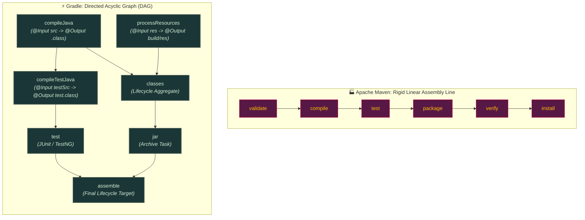

##### 1. Visual Architecture & Execution Paradigms
- **Maven's Monolithic Pipeline**:
  - Operates as a deterministic, non-branching conveyor belt. Lifecycles are composed of fixed, sequentially locked phases.
  - Phase execution requires all preceding phases in that lifecycle to execute unconditionally in strict sequence (e.g., executing `mvn package` implicitly mandates `validate`, `compile`, and `test`).
- **Gradle's Granular Directed Acyclic Graph (DAG)**:
  - Operates as a dynamic dependency graph composed of discrete, decoupled `Task` nodes.
  - Inter-task relationships are determined dynamically via explicit outputs-to-inputs wiring (`dependsOn`, task outputs consumed as inputs).
  - Enables true multi-threaded parallel execution across independent branches (e.g., `compileJava` and `processResources` execute simultaneously on separate worker threads).

##### 2. Execution Flow & Lifecycle State Transitions
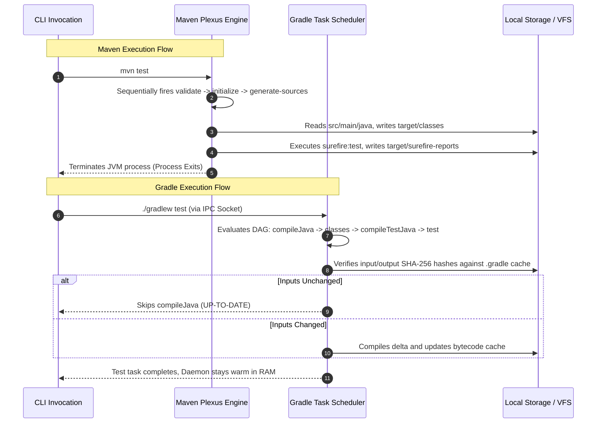

##### 3. Low-Level JVM, Operating System & File System Mechanics
- **Process Lifecycle & HotSpot JIT Optimization**:
  - *Maven*: Spawns a brand new JVM HotSpot process per command (`mvn`). C2 JIT optimization must restart from Tier 0 interpreted mode, incurring high compilation warmup latency.
  - *Gradle*: Communicates with a persistent background JVM daemon via local UNIX domain sockets or TCP loopback (`127.0.0.1`). HotSpot JIT reaches Tier 4 optimized native machine code, keeping core classes pre-compiled and JIT-optimized across builds.
- **File System Watching & In-Memory VFS**:
  - *Maven*: Traverses physical directory trees on every run via repeated `stat()`, `read()`, and directory scanning syscalls, incurring heavy OS disk I/O bottlenecks.
  - *Gradle*: Mounts an in-memory Virtual File System (VFS) wired directly to OS-level kernel file notification APIs (`inotify` on Linux, `kqueue` on macOS, `ReadDirectoryChangesW` on Windows). Only files modified in OS buffers are invalidated and re-hashed.

##### 4. Production Failure Modes & SRE Diagnostics
- **Phantom Phase Execution in Maven**:
  - *Symptom*: Running `mvn test` triggers code compilation even when no files have changed, extending CI wall-clock times.
  - *Root Cause*: Maven's default lifecycle lacks universal cryptographic artifact caching; unless third-party build cache plugins are installed, plugins execute eagerly.
- **Stale Daemon JVM Leaks in Gradle**:
  - *Symptom*: CI build agents exhaust host RAM and trigger Linux kernel OOM killer (`exit code 137`).
  - *Root Cause*: Ephemeral CI nodes spawn new daemons without teardown hooks, stranding multi-gigabyte JVM heaps.
- **SRE Triaging Commands**:
  ```bash
  # Maven: Run with thread concurrency and debug phase timings
  mvn clean test -T 1C -X -DtrimStackTrace=false
  
  # Gradle: Check task execution reasons and detect why tasks ran instead of UP-TO-DATE
  ./gradlew test --info | grep -E "(Executing task|Task .* is not UP-TO-DATE)"
  
  # Gradle: Terminate all orphan background daemons
  ./gradlew --stop && pkill -f '.*GradleDaemon.*'
  ```

<details>
<summary>View Legacy ASCII Diagram</summary>

```
Maven: The Rigid Conveyor Belt (Linear Lifecycles)
[ Validate ] ──► [ Compile ] ──► [ Test ] ──► [ Package ] ──► [ Verify ] ──► [ Install ]
(Fixed sequential phases. You cannot change the order of the belt.)

Gradle: The Directed Acyclic Graph (DAG) (Smart Task Graph)
      [ compileJava ] ──────► [ processResources ]
             │                         │
             ▼                         ▼
      [ compileTestJava ] ────► [ classes ] ──► [ jar ]
             │                                    │
             ▼                                    ▼
       [ test ] ───────────────────────────► [ assemble ]
(Dynamic tasks with inputs & outputs. Only outdated tasks execute.)
```

</details>

1. **Apache Maven (The Rigid Factory Assembly Line)**:
   - Built around strict **Convention over Configuration**.
   - You declare *what* your project is in a declarative `pom.xml` file.
   - You execute fixed lifecycle phases (`mvn clean package`). You cannot arbitrarily re-order phases or execute a phase without executing all preceding phases.
2. **Gradle (The Dynamic Construction Crew with a Blueprint)**:
   - Built around a **Directed Acyclic Graph (DAG)** of granular tasks.
   - Written in expressive Kotlin DSL (`build.gradle.kts`) or Groovy.
   - Tasks declare explicit `@Input` and `@Output` files. If inputs haven't changed, Gradle skips the task entirely (`UP-TO-DATE`), yielding 10x faster incremental builds.

---

## 1.2 Maven Core Mechanics: Coordinates, POM Layout & Lifecycles

### Maven Standard Directory Layout
Maven enforces a strict directory standard recognized by all IDEs and CI engines:
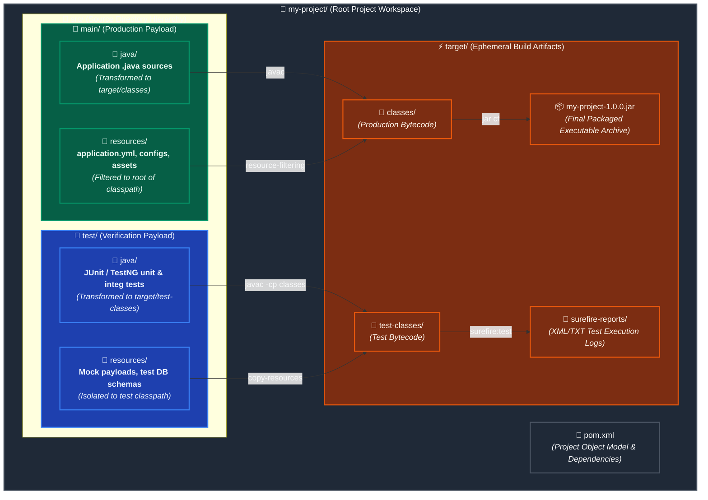

##### 1. Visual Architecture & Directory Topology
- **Convention-Over-Configuration Hierarchy**:
  - The standard layout eliminates arbitrary path declarations in build scripts: Maven plugins natively assume `src/main/java` contains production sources and `src/test/java` contains test sources.
  - Zero-configuration builds ensure predictable cross-IDE imports (IntelliJ IDEA, Eclipse, VS Code) and standard CI pipeline configurations.
- **Classpath Isolation Boundary**:
  - `src/main/resources` is placed directly at the root of the resulting runtime classpath (`/`), allowing standard ClassLoader lookups (e.g., `getResourceAsStream("/application.properties")`).
  - `src/test/*` artifacts are strictly sequestered from the final distribution archive (`target/*.jar`), preventing test doubles, mock frameworks, and sensitive test credentials from leaking into production.

##### 2. Execution Flow & Lifecycle State Transitions
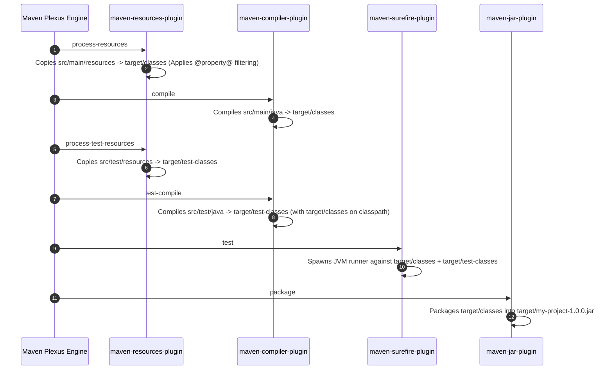

##### 3. Low-Level JVM, File Descriptors & ClassLoader Mechanics
- **ClassLoader Classpath Segregation**:
  - At compile-time, the JVM compiler (`javac`) receives `target/classes` via the `-classpath` option during `test-compile`.
  - When running tests, the Surefire plugin constructs a specialized `URLClassLoader` containing `target/test-classes`, `target/classes`, and all dependency JARs from `~/.m2/repository`. Test classes can see production classes, but production classes cannot reference test classes.
- **File System Descriptors & Archive Packing**:
  - Packaging invokes the standard `ZipOutputStream` to stream directory entries from `target/classes` into the `.jar` container file.
  - The compiler maintains open file descriptors (`FD`) for source files and writes `.class` files directly using OS buffered page writes (`write()`), minimizing kernel context transitions.

##### 4. Production Failure Modes & SRE Diagnostics
- **Resource Overwrite / Filtering Corruption**:
  - *Symptom*: Binary files (e.g., `.keystore`, `.png`, `.xlsx`) placed in `src/main/resources` become corrupted with `InvalidKeyException` or EOF errors.
  - *Root Cause*: `maven-resources-plugin` attempted textual filtering on binary files, corrupting byte signatures.
  - *Fix*: Configure `<nonFilteredFileExtensions>` for binary file extensions in `pom.xml`.
- **Accidental Test Secret Leakage**:
  - *Symptom*: Staging/Test API keys or passwords accidentally packaged into the production container.
  - *Root Cause*: Developer placed test configs in `src/main/resources/` instead of `src/test/resources/`.
- **SRE Triaging Commands**:
  ```bash
  # Inspect contents of packaged JAR without extraction
  jar tf target/my-project-1.0.0.jar
  
  # Verify whether sensitive properties leaked into the final archive
  unzip -p target/my-project-1.0.0.jar application.yml | grep -iE "(password|secret|key)"
  
  # Print all effective directory paths configured for Maven
  mvn help:effective-pom | grep -E "(sourceDirectory|scriptSourceDirectory|testSourceDirectory)"
  ```

<details>
<summary>View Legacy ASCII Diagram</summary>

```
my-project/
├── pom.xml
└── src/
    ├── main/
    │   ├── java/         # Application Java source code
    │   └── resources/    # Config files, application.yml, static assets
    └── test/
        ├── java/         # JUnit / TestNG test classes
        └── resources/    # Test-specific mock data and properties
```

</details>

### Anatomical `pom.xml` Walkthrough
```xml
<project xmlns="http://maven.apache.org/POM/4.0.0"
         xmlns:xsi="http://www.w3.org/2001/XMLSchema-instance"
         xsi:schemaLocation="http://maven.apache.org/POM/4.0.0 http://maven.apache.org/xsd/maven-4.0.0.xsd">
    <modelVersion>4.0.0</modelVersion>

    <groupId>com.enterprise.banking</groupId>
    <artifactId>payment-service</artifactId>
    <version>1.0.0-SNAPSHOT</version>
    <packaging>jar</packaging>

    <properties>
        <java.version>21</java.version>
        <maven.compiler.source>21</maven.compiler.source>
        <maven.compiler.target>21</maven.compiler.target>
        <project.build.sourceEncoding>UTF-8</project.build.sourceEncoding>
    </properties>

    <dependencies>
        <dependency>
            <groupId>org.springframework.boot</groupId>
            <artifactId>spring-boot-starter-web</artifactId>
            <version>3.2.3</version>
            <scope>compile</scope> <!-- Default scope -->
        </dependency>
        <dependency>
            <groupId>org.junit.jupiter</groupId>
            <artifactId>junit-jupiter</artifactId>
            <version>5.10.2</version>
            <scope>test</scope> <!-- Available only during testing -->
        </dependency>
    </dependencies>
</project>
```

---

## 1.3 Gradle Core Mechanics: Kotlin DSL, Projects, Tasks & Phases

Gradle executes every build in **three distinct phases**:
1. **Initialization Phase**: Evaluates `settings.gradle.kts` to identify which projects participate in the build (single vs multi-project).
2. **Configuration Phase**: Executes the build scripts (`build.gradle.kts`) of all participating projects to instantiate task objects and construct the Task DAG. *Code written outside a task action runs here!*
3. **Execution Phase**: Executes the subset of tasks requested on the CLI (`./gradlew build`) in topological DAG order.

```kotlin
// build.gradle.kts (Kotlin DSL)
plugins {
    java
    id("org.springframework.boot") version "3.2.3"
    id("io.spring.dependency-management") version "1.1.4"
}

group = "com.enterprise.banking"
version = "1.0.0-SNAPSHOT"

java {
    toolchain {
        languageVersion.set(JavaLanguageVersion.of(21))
    }
}

repositories {
    mavenCentral()
}

dependencies {
    implementation("org.springframework.boot:spring-boot-starter-web")
    testImplementation("org.junit.jupiter:junit-jupiter:5.10.2")
}

tasks.withType<Test> {
    useJUnitPlatform()
}
```

---

## 1.4 The Wrapper Standard: Why `mvnw` and `gradlew` Are Mandatory

Never require developers or CI servers to have Maven or Gradle pre-installed on their machine! Always commit the **Wrapper**:
- **`./mvnw` / `mvnw.cmd`**: Maven Wrapper script.
- **`./gradlew` / `gradlew.cmd`**: Gradle Wrapper script.

### Benefits
1. **Guaranteed Reproducibility**: Enforces that every developer, Docker container, and GitHub Actions runner uses the exact same version (e.g., Gradle 8.6 or Maven 3.9.6).
2. **Automatic Bootstrapping**: If the binary is missing, the wrapper automatically downloads and verifies the correct distribution using SHA-256 checksums before running.

```bash
# Generate Maven Wrapper in a project
mvn wrapper:wrapper -Dmaven=3.9.6

# Generate or upgrade Gradle Wrapper
gradle wrapper --gradle-version 8.6 --distribution-type all
```

---

## 1.5 Top 5 Beginner Build Disasters & Prevention

1. **Writing Expensive Code in Gradle's Configuration Phase**:
   - *Mistake*: Placing database queries, HTTP calls, or file downloads directly in the body of `build.gradle.kts` outside of a `doLast {}` block.
   - *Result*: Every Gradle command (even `./gradlew help`) freezes for seconds because the configuration phase executes unconditionally!
   - *Fix*: Wrap actions inside `doLast {}` or define custom `DefaultTask` classes with `@TaskAction`.
2. **Accidental Snapshot Publishing to Production**:
   - *Mistake*: Deploying artifacts with `-SNAPSHOT` versions to production Kubernetes clusters.
   - *Result*: Repositories overwrite SNAPSHOT binaries, causing pods deployed at 10:00 AM to run different code than pods deployed at 10:30 AM!
   - *Fix*: Enforce strict semantic release tagging (`1.2.0`) in CI release branches.
3. **Missing `<dependencyManagement>` in Multi-Module Projects**:
   - *Mistake*: Specifying version numbers independently inside each child `pom.xml`.
   - *Result*: Module A uses Jackson 2.14 while Module B uses Jackson 2.16, leading to runtime classpath conflicts and serialization bugs.
   - *Fix*: Declare all versions centrally in the root parent POM's `<dependencyManagement>`.
4. **Ignoring Dependency Scopes**:
   - *Mistake*: Putting JUnit or Mockito in the default `compile` / `implementation` scope.
   - *Result*: Test libraries leak into the production JAR/WAR, inflating binary size and exposing security attack surfaces.
   - *Fix*: Strictly use `<scope>test</scope>` (Maven) or `testImplementation` (Gradle).
5. **Hardcoding Java Paths**:
   - *Mistake*: Hardcoding `JAVA_HOME=/usr/lib/jvm/java-17-openjdk` in scripts.
   - *Result*: Builds immediately fail on colleagues' machines or Apple Silicon Macs.
   - *Fix*: Use Gradle Java Toolchains (`jvmToolchain(21)`) or Maven Toolchains.

---

# TRACK 2: MASTER BUILD ENGINES & CONFIGURATION CATALOG

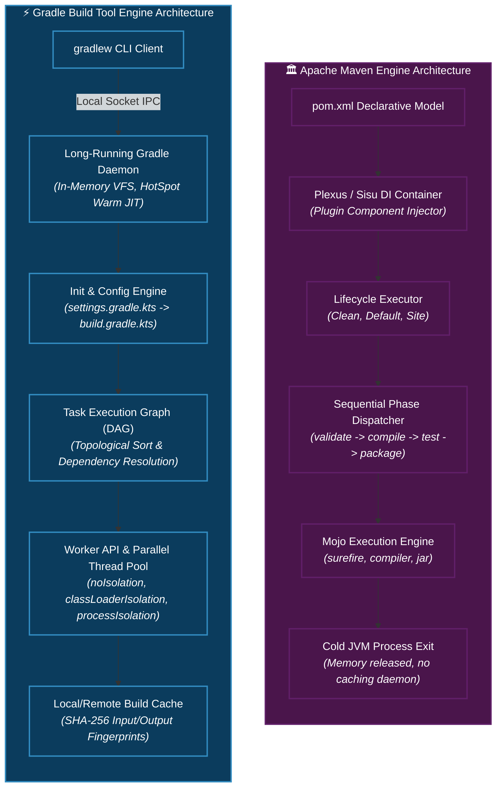

| Dimension | Apache Maven | Gradle |
| :--- | :--- | :--- |
| **Configuration Model** | Declarative XML (`pom.xml`) | Programmatic Type-Safe Kotlin DSL (`build.gradle.kts`) |
| **Execution Paradigm** | Fixed Linear Lifecycles & Sequential Phases | Dynamic Directed Acyclic Graph (DAG) of Granular Tasks |
| **Incremental Builds** | Plugin-dependent & limited to compile outputs | Native Universal Input/Output Fingerprinting (`UP-TO-DATE`) |
| **Build Caching** | Local repository caching only (`~/.m2/repository`) | Multi-layer Local (`~/.gradle/caches`) + Shared Remote Cache |
| **Process Model** | Short-lived, cold JVM process per execution | Persistent background Daemon with in-memory VFS & JIT |
| **Multi-Module Topology**| Parent POM `<modules>` inheritance tree | `settings.gradle.kts` `include()` + Composite Builds |
| **Parallel Execution** | Module-level multithreading (`-T 1C`) | Intra-project task parallelization + Worker API forks |

##### 1. Visual Architecture & Core Engine Topology
- **Maven Sisu/Plexus Inversion-of-Control**:
  - Maven utilizes the Eclipse Sisu / Plexus IoC container to discover and inject plugin components (Mojos) at runtime based on `META-INF/plexus/components.xml`.
  - Architecture favors strict immutability: project structure is defined entirely before build execution begins, eliminating side-effects during configuration.
- **Gradle Multi-Process Daemon Architecture**:
  - Decouples user-facing CLI terminal interactions from heavy build execution. The client is a lightweight native/Java wrapper that forwards stdio streams over a local loopback TCP socket.
  - The Daemon process retains loaded classes, file-system caches, and JIT compiler profiling data across successive invocations.

##### 2. Execution Flow & Lifecycle State Transitions
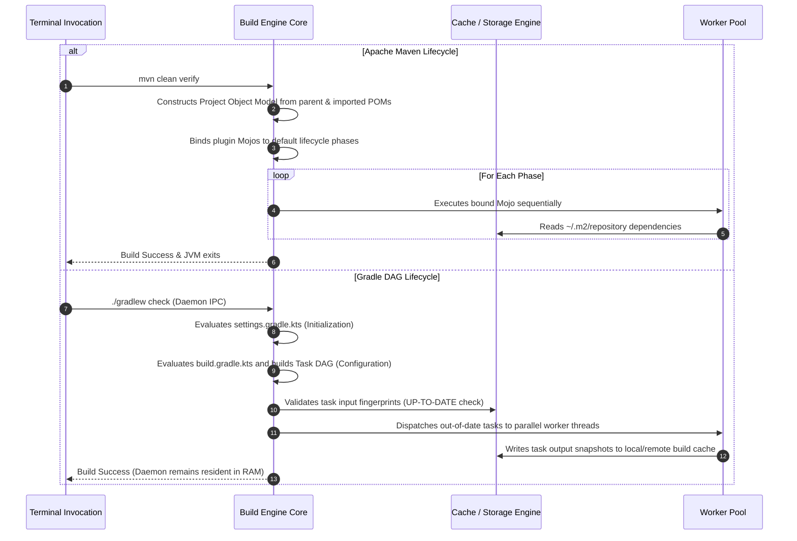

##### 3. Low-Level JVM, Process Model & Memory Footprint
- **JIT Compiler Optimization**:
  - In Maven, every execution forces the JVM through C1 (Client) compiler warmup; short compilation runs rarely trigger C2 (Server) compiler high-tier optimizations.
  - In Gradle, long-lived Daemon processes run thousands of tasks over time, allowing the HotSpot C2 compiler to aggressively inline methods, vectorize loops, and eliminate dead code paths, yielding 3x faster raw Java execution.
- **Process Memory Overhead & ClassLoaders**:
  - Maven manages plugin isolation by allocating child `ClassRealm` loaders within a single JVM memory pool, disposing of them when the command finishes.
  - Gradle maintains isolated ClassLoaders across builds. To prevent Metaspace leaks caused by dynamic script classes, Gradle implements custom ClassLoader caching and garbage-collection sweep routines.

##### 4. Production Failure Modes & SRE Diagnostics
- **Daemon Metaspace Exhaustion**:
  - *Symptom*: Gradle builds freeze with `java.lang.OutOfMemoryError: Metaspace`.
  - *Root Cause*: Repeated dynamic evaluation of build scripts creates thousands of ephemeral `ClassLoader` instances that exceed default native memory limits.
  - *Fix*: Set `org.gradle.jvmargs=-XX:MaxMetaspaceSize=1g` in `gradle.properties`.
- **Maven Reactor Deadlocks**:
  - *Symptom*: Multi-threaded Maven build (`-T 4`) hangs indefinitely on inter-module dependencies.
  - *Root Cause*: Plugin execution inside child modules creates circular thread dependencies or lock contentions on `~/.m2` local artifact locks.
- **SRE Triaging Commands**:
  ```bash
  # Check Gradle Daemon status and resource consumption
  ./gradlew --status
  
  # Profile Maven execution times across all lifecycles and plugins
  mvn clean package -Dprofile -DtrimStackTrace=false
  
  # Inspect active JVM threads inside the Gradle daemon
  jstack $(pgrep -f '.*GradleDaemon.*') | grep -E "State:|daemon"
  ```

<details>
<summary>View Legacy ASCII Diagram</summary>

```
Maven vs Gradle Architectural Comparison Matrix:
+------------------------+------------------------------------+---------------------------------------+
| Feature                | Apache Maven                       | Gradle                                |
+------------------------+------------------------------------+---------------------------------------+
| Configuration Model    | Declarative XML (`pom.xml`)        | Programmatic DSL (`.kts` / Groovy)    |
| Execution Paradigm     | Fixed Linear Lifecycles & Phases   | Directed Acyclic Graph (DAG) of Tasks |
| Incremental Builds     | Plugin-dependent (Limited)         | Built-in Task Inputs/Outputs Tracking |
| Build Caching          | Local repository only              | Local + Remote Distributed Cache      |
| Daemon Execution       | No (Process restarts per build)    | Long-running background daemon        |
| Multi-Module Structure | Parent POM + `<modules>`           | `settings.gradle.kts` + `include()`   |
| Learning Curve         | Low (High convention)              | Medium to High (Advanced flexibility) |
+------------------------+------------------------------------+---------------------------------------+
```

</details>

---

## 2.1 Maven Lifecycles (Clean, Default, Site) & Phase Sequencing

### Deep Overview
Maven provides three built-in lifecycles. Each lifecycle consists of an ordered sequence of phases. Invoking a phase automatically executes all preceding phases in that lifecycle.

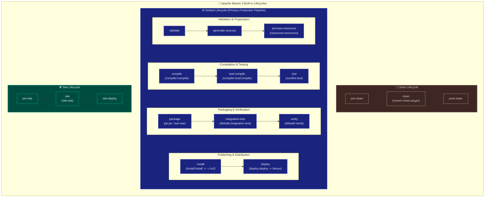

##### 1. Visual Architecture & Phase Sequence Topology
- **Three Independent Lifecycles**:
  - `clean`, `default`, and `site` are completely decoupled lifecycle pipelines. Invoking a phase in one lifecycle (e.g., `mvn clean`) does NOT trigger any phases in another lifecycle unless explicitly chained on the CLI (`mvn clean install`).
- **Ordered Phase Determinism**:
  - The Default lifecycle consists of sequential milestone phases. Requesting an execution phase instructs the Maven engine to construct a plan containing every single preceding phase from `validate` up to the requested target.
- **Mojo-to-Phase Binding**:
  - Phases themselves possess zero inherent executable bytecode; they are logical milestones. Executable tasks (*Mojos*) are bound to phases either by packaging type mappings (`<packaging>jar</packaging>`) or explicit `<executions>` declarations in `pom.xml`.

##### 2. Execution Flow & Lifecycle State Transitions
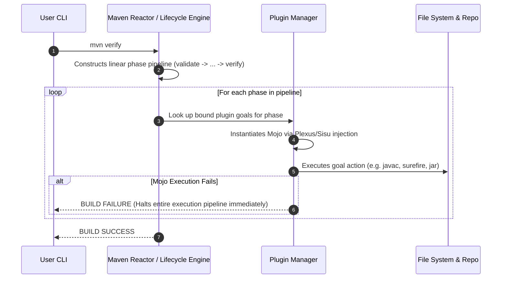

##### 3. Low-Level JVM, Process Forking & File I/O Mechanics
- **Surefire / Failsafe Process Forking**:
  - When reaching the `test` phase, `maven-surefire-plugin` does not run unit tests in the build runner's JVM. It spawns a dedicated child OS process via `ProcessBuilder.start()` (fork mode).
  - Isolates memory spaces: test memory leaks or system crashes (`System.exit()`) will not terminate the parent Maven build process.
- **Transactional Deployment Locks**:
  - During the `install` phase, Maven acquires file-level locks (`.lock`) in `~/.m2/repository` before writing binary JARs and metadata XMLs to prevent concurrent process corruption.
  - Generates cryptographic SHA-1 and MD5 checksum files simultaneously to ensure repository storage verification.

##### 4. Production Failure Modes & SRE Diagnostics
- **Premature Integration Test Failure Without Teardown**:
  - *Symptom*: When integration tests fail inside `integration-test`, teardown goals bound to `post-integration-test` are skipped, stranding live database containers or mock servers.
  - *Root Cause*: Using Surefire instead of Failsafe. Surefire aborts on the first test failure; Failsafe defers failure reporting until the `verify` phase, guaranteeing teardown execution.
- **Test Skip Flags Confusion**:
  - `-DskipTests`: Compiles test source files in `test-compile`, but skips running test executions.
  - `-Dmaven.test.skip=true`: Completely skips compiling test source files AND skips test executions (leaves `target/test-classes` empty).
- **SRE Triaging Commands**:
  ```bash
  # Display all plugin goals bound to every lifecycle phase in current project
  mvn fr.jcgay.maven.plugins:lifecycle-mapping-plugin:list
  
  # Run clean and verify skipping unit tests while running integration tests
  mvn clean verify -Dtest=false -DfailIfNoTests=false
  
  # Force offline mode to verify build executes without remote HTTP repository calls
  mvn verify -o
  ```

<details>
<summary>View Legacy ASCII Diagram</summary>

```
Maven Default Lifecycle Flow:
validate ──► compile ──► test ──► package ──► verify ──► install ──► deploy
```

</details>

1. **Clean Lifecycle**: `pre-clean` $\rightarrow$ `clean` $\rightarrow$ `post-clean`. Removes the `target/` directory.
2. **Default Lifecycle**:
   - `validate`: Verifies project is correct and all information is available.
   - `compile`: Compiles the source code of the project.
   - `test`: Tests the compiled code using unit testing frameworks (Surefire).
   - `package`: Takes compiled code and packages it in its distributable format (`jar`, `war`).
   - `verify`: Runs integration tests against packaged binary (Failsafe).
   - `install`: Installs package into local repository (`~/.m2/repository`).
   - `deploy`: Copies final package to remote enterprise repository (Nexus/Artifactory).
3. **Site Lifecycle**: `pre-site` $\rightarrow$ `site` $\rightarrow$ `post-site` $\rightarrow$ `site-deploy`. Generates HTML documentation reports.

---

## 2.2 Maven Core Plugins Ecosystem (Compiler, Surefire, Failsafe, Shade, JaCoCo)

### Production Plugin Configuration Blueprint
```xml
<build>
    <plugins>
        <!-- 1. Compiler Plugin: Enforce Java 21 & Parameter Reflection -->
        <plugin>
            <groupId>org.apache.maven.plugins</groupId>
            <artifactId>maven-compiler-plugin</artifactId>
            <version>3.12.1</version>
            <configuration>
                <release>21</release>
                <parameters>true</parameters>
                <compilerArgs>
                    <arg>-Xlint:all</arg>
                    <arg>-Werror</arg>
                </compilerArgs>
            </configuration>
        </plugin>

        <!-- 2. Surefire Plugin: Fast Unit Tests -->
        <plugin>
            <groupId>org.apache.maven.plugins</groupId>
            <artifactId>maven-surefire-plugin</artifactId>
            <version>3.2.5</version>
            <configuration>
                <includes>
                    <include>**/*Test.java</include>
                </includes>
                <parallel>classes</parallel>
                <threadCount>4</threadCount>
            </configuration>
        </plugin>

        <!-- 3. Failsafe Plugin: Integration Tests (Runs during verify phase) -->
        <plugin>
            <groupId>org.apache.maven.plugins</groupId>
            <artifactId>maven-failsafe-plugin</artifactId>
            <version>3.2.5</version>
            <executions>
                <execution>
                    <goals>
                        <goal>integration-test</goal>
                        <goal>verify</goal>
                    </goals>
                </execution>
            </executions>
        </plugin>

        <!-- 4. JaCoCo: Enforce Code Coverage Quality Gate -->
        <plugin>
            <groupId>org.jacoco</groupId>
            <artifactId>jacoco-maven-plugin</artifactId>
            <version>0.8.11</version>
            <executions>
                <execution>
                    <goals>
                        <goal>prepare-agent</goal>
                    </goals>
                </execution>
                <execution>
                    <id>report</id>
                    <phase>verify</phase>
                    <goals>
                        <goal>report</goal>
                    </goals>
                </execution>
                <execution>
                    <id>check</id>
                    <goals>
                        <goal>check</goal>
                    </goals>
                    <configuration>
                        <rules>
                            <rule>
                                <element>BUNDLE</element>
                                <limits>
                                    <limit>
                                        <counter>LINE</counter>
                                        <value>COVEREDRATIO</value>
                                        <minimum>0.80</minimum>
                                    </limit>
                                </limits>
                            </rule>
                        </rules>
                    </configuration>
                </execution>
            </executions>
        </plugin>
    </plugins>
</build>
```

---

## 2.3 Maven Dependency Mediation & Conflict Resolution

### The "Nearest-Definition Wins" Rule
When two transitive dependencies conflict in Maven, Maven does **not** pick the newest version! It uses **Nearest-Definition Wins** in the dependency tree:

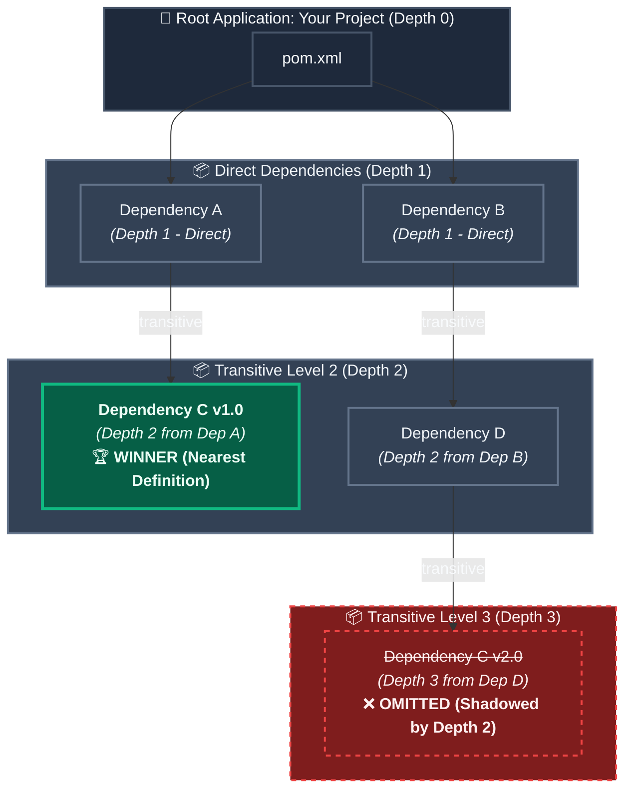

##### 1. Visual Architecture & Dependency Tree Mediation Algorithm
- **Nearest-Definition Wins**:
  - Maven traverses the dependency tree and calculates the topological depth (distance in hops from the root project) for every requested artifact.
  - When encountering multiple conflicting versions of the same `groupId:artifactId`, Maven unconditionally selects the version with the smallest depth. Semantic version ordering (i.e. whether `v2.0` is newer than `v1.0`) is completely ignored.
- **Tie-Breaking Rule (First-Declared Wins)**:
  - If two conflicting versions exist at the exact same depth in the tree, Maven resolves the conflict by picking whichever dependency is declared first in the upstream `pom.xml`.

##### 2. Execution Flow & Lifecycle State Transitions
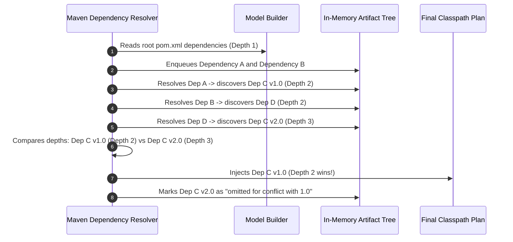

##### 3. Low-Level JVM, Classpath & LinkageError Mechanics
- **Linear Classpath Serialization**:
  - The JVM has no native concept of a "dependency tree". Maven flattens the resolved graph into a linear `-classpath` argument passed to `javac` and `java`.
  - Because `Dep C v1.0` won the mediation algorithm, only `c-1.0.jar` is placed on the classpath. `c-2.0.jar` is completely discarded.
- **Runtime `NoSuchMethodError` & `LinkageError`**:
  - If `Dependency D` was compiled against `Dep C v2.0` and invokes a method introduced in v2.0 (e.g. `public void processNewFeature()`), this method will not exist in `c-1.0.jar`.
  - At runtime, when the JVM's `MethodResolution` executes the `invokevirtual` bytecode instruction, the class loader fails to resolve the symbolic reference in the Constant Pool and throws a fatal `java.lang.NoSuchMethodError`.

##### 4. Production Failure Modes & SRE Diagnostics
- **Silent Diamond Dependency Hell**:
  - *Symptom*: Application compiles successfully in CI, but crashes on specific API calls in production with `NoSuchMethodError`, `NoClassDefFoundError`, or `AbstractMethodError`.
  - *Root Cause*: A shallow legacy dependency pulled an obsolete version of a core transitive library (such as Jackson, Netty, or Guava), shadowing the modern version required by Spring Boot.
  - *Fix*: Pin the uniform version inside the root project's `<dependencyManagement>` or enforce `<dependencyConvergence/>` via `maven-enforcer-plugin`.
- **SRE Triaging Commands**:
  ```bash
  # Print the verbose dependency tree highlighting all shadowed and omitted artifacts
  mvn dependency:tree -Dverbose
  
  # Search specifically for conflicting versions of a problematic artifact
  mvn dependency:tree -Dverbose -Dincludes=com.fasterxml.jackson.core:*
  
  # Analyze unused declared and used undeclared classpath dependencies
  mvn dependency:analyze
  ```

<details>
<summary>View Legacy ASCII Diagram</summary>

```
Your Project
├── Dependency A (Depth 1)
│   └── Dependency C v1.0 (Depth 2)  <-- WINNER! (Depth 2 < Depth 3)
└── Dependency B (Depth 1)
    └── Dependency D (Depth 2)
        └── Dependency C v2.0 (Depth 3)
```

</details>

- In this diagram, **`Dependency C v1.0`** is chosen because it is closer to the root project (depth 2 vs depth 3), even though v2.0 is newer!
- If two versions appear at the exact same depth, **First-Declared Wins** based on order in `pom.xml`.

### Enforcing Modern Resolution with Enforcer Plugin
```xml
<plugin>
    <groupId>org.apache.maven.plugins</groupId>
    <artifactId>maven-enforcer-plugin</artifactId>
    <version>3.4.1</version>
    <executions>
        <execution>
            <id>enforce-no-duplicates</id>
            <goals>
                <goal>enforce</goal>
            </goals>
            <configuration>
                <rules>
                    <dependencyConvergence/> <!-- Fails build if versions don't converge! -->
                    <requireJavaVersion>
                        <version>[21,)</version>
                    </requireJavaVersion>
                </rules>
            </configuration>
        </execution>
    </executions>
</plugin>
```

---

## 2.4 Maven Multi-Module Enterprise Architecture & Bill of Materials (BOM)

### Multi-Module Hierarchy
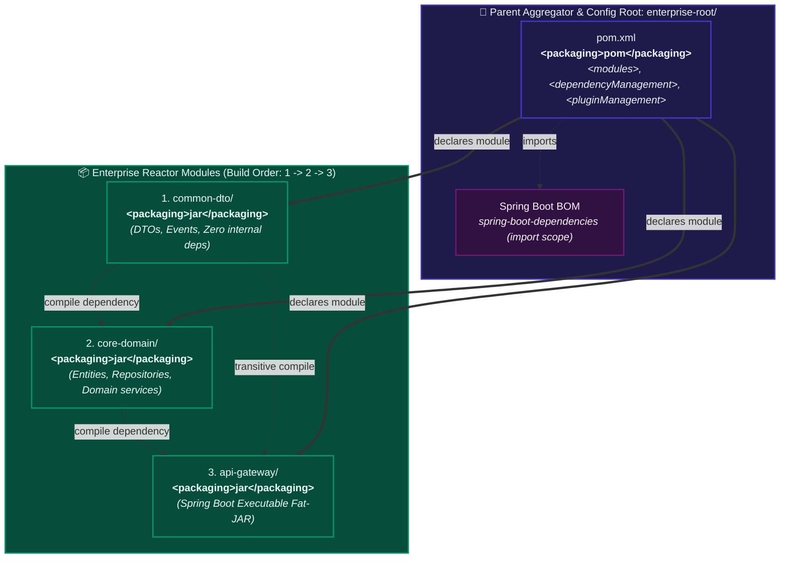

##### 1. Visual Architecture & Reactor Hierarchy Topology
- **Parent Aggregator vs Inheritance**:
  - The root POM serves two dual roles: an **Aggregator** (`<modules>` list instructing the Maven Reactor to build subprojects) and an **Inheritance Parent** (`<parent>` tags in children providing dependency versions and build plugins).
  - Centralizes dependency versions via `<dependencyManagement>` and build plugins via `<pluginManagement>`, ensuring uniform versions across 50+ microservices without child POM version duplication.
- **Topological Reactor Order**:
  - The Maven Reactor analyzes inter-module `<dependencies>` and sorts the modules into a Directed Acyclic Graph (DAG).
  - The execution order is strictly deterministic: `enterprise-root` (metadata) $\rightarrow$ `common-dto` $\rightarrow$ `core-domain` $\rightarrow$ `api-gateway`.

##### 2. Execution Flow & Lifecycle State Transitions
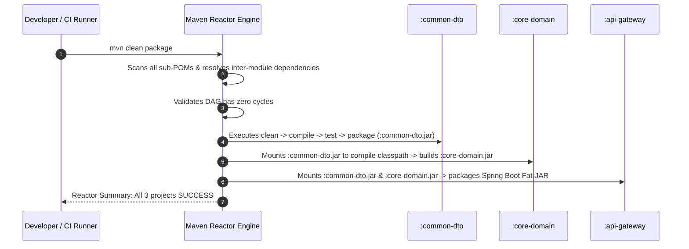

##### 3. Low-Level JVM, In-Memory Classpath & Reactor Artifact Resolution
- **In-Memory Reactor Artifact Resolution**:
  - In a multi-module build, when `core-domain` compiles against `common-dto`, Maven does **not** fetch `common-dto.jar` from `~/.m2/repository`.
  - The Reactor substitutes the repository lookup with the local file system target folder (`common-dto/target/classes` or `common-dto/target/common-dto-1.0.0.jar`) stored in memory inside the active `MavenSession`.
  - Running `mvn package` works seamlessly even if `common-dto` was never installed to local storage via `mvn install`.

##### 4. Production Failure Modes & SRE Diagnostics
- **Reactor Circular Dependency Deadlock**:
  - *Symptom*: Build fails immediately with `[ERROR] The projects in the reactor contain a cyclic reference: Edge introduces a cycle`.
  - *Root Cause*: Two modules depend on each other (e.g. `core-domain` references `api-gateway` while `api-gateway` references `core-domain`).
  - *Fix*: Break the cycle by extracting shared data models or interfaces into an independent module (`common-dto`).
- **Resuming Failed Multi-Module Builds**:
  - If module 14 out of 20 fails during a 45-minute build, do NOT re-run from scratch. Use the Reactor resume flag.
- **SRE Triaging Commands**:
  ```bash
  # Resume a failed multi-module build from the specific failed project
  mvn compile -rf :core-domain
  
  # Build only a specific submodule and all its upstream dependencies
  mvn package -pl :api-gateway -am
  
  # Build only a specific submodule and all downstream dependents
  mvn package -pl :common-dto -amd
  ```

<details>
<summary>View Legacy ASCII Diagram</summary>

```
enterprise-root/
├── pom.xml                   (Packaging: pom, declares <modules>)
├── common-dto/               (Packaging: jar)
│   └── pom.xml
├── core-domain/              (Packaging: jar, depends on common-dto)
│   └── pom.xml
└── api-gateway/              (Packaging: jar, Spring Boot executable)
    └── pom.xml
```

</details>

### Root `pom.xml` Dependency Management with Spring Boot BOM
```xml
<packaging>pom</packaging>
<modules>
    <module>common-dto</module>
    <module>core-domain</module>
    <module>api-gateway</module>
</modules>

<dependencyManagement>
    <dependencies>
        <!-- Import Spring Boot BOM to align 100+ dependencies -->
        <dependency>
            <groupId>org.springframework.boot</groupId>
            <artifactId>spring-boot-dependencies</artifactId>
            <version>3.2.3</version>
            <type>pom</type>
            <scope>import</scope>
        </dependency>
        <!-- Internal Module Versions -->
        <dependency>
            <groupId>com.enterprise</groupId>
            <artifactId>common-dto</artifactId>
            <version>${project.version}</version>
        </dependency>
    </dependencies>
</dependencyManagement>
```

---

## 2.5 Gradle Task Execution Graph & Incremental Builds (`UP-TO-DATE`)

### How Incremental Builds Work
Every Gradle task can declare:
- **`@Input` / `@InputFiles`**: Files, properties, or strings that affect the task output.
- **`@OutputDirectory` / `@OutputFile`**: The resulting generated files.

Before running a task, Gradle hashes all inputs. If the hashes match the previous run and outputs are intact, Gradle skips execution:
```
> Task :compileJava UP-TO-DATE
> Task :processResources UP-TO-DATE
> Task :classes UP-TO-DATE
> Task :jar UP-TO-DATE
```

### Custom High-Performance Incremental Task in Kotlin DSL
```kotlin
abstract class CodeGeneratorTask : DefaultTask() {

    @get:InputDirectory
    abstract val schemaDirectory: DirectoryProperty

    @get:OutputDirectory
    abstract val generatedJavaDirectory: DirectoryProperty

    @TaskAction
    fun execute() {
        val inputDir = schemaDirectory.get().asFile
        val outputDir = generatedJavaDirectory.get().asFile
        outputDir.mkdirs()

        inputDir.walkTopDown().filter { it.extension == "json" }.forEach { file ->
            val className = file.nameWithoutExtension.capitalize() + "Dto"
            File(outputDir, "$className.java").writeText(
                "package com.generated;\n\npublic record $className(String id) {}"
            )
        }
    }
}
```

---

## 2.6 Gradle Configuration Cache & Local/Remote Build Cache

### 1. Configuration Cache (`--configuration-cache`)
Normally, Gradle re-evaluates all build scripts during the Configuration phase on every run.
- With **Configuration Cache enabled**, Gradle snapshots the entire Task Execution Graph into binary format on disk.
- Subsequent runs skip script evaluation entirely and jump straight to executing tasks, reducing build startup time from 4s to **0.05s**!

### 2. Build Cache (`--build-cache`)
Reuses task outputs across different machines, branches, and CI nodes:
- **Local Cache**: Stored in `~/.gradle/caches/build-cache-1`.
- **Remote Distributed Cache**: Hosted via Gradle Enterprise / Develocity or an HTTP REST endpoint (e.g., Nginx or S3).

```kotlin
// settings.gradle.kts: Enabling Remote Build Cache
buildCache {
    local {
        isEnabled = true
        removeUnusedEntriesAfterDays = 30
    }
    remote<HttpBuildCache> {
        url = uri("https://build-cache.enterprise.internal/cache/")
        isPush = System.getenv("CI") != null // Only CI pushes new entries
        credentials {
            username = System.getenv("CACHE_USER")
            password = System.getenv("CACHE_PASSWORD")
        }
    }
}
```

---

## 2.7 Gradle Daemon & Parallel Worker Execution Engine

### The Gradle Daemon
A background JVM process that stays alive between build invocations:
- **Keeps JIT Optimizations Warm**: HotSpot compiler optimizes build logic after a few runs.
- **Retains In-Memory Caches**: Holds task execution graphs and filesystem watch caches.
- Configured in `gradle.properties`:
  ```properties
  org.gradle.daemon=true
  org.gradle.jvmargs=-Xmx4g -XX:+UseG1GC -XX:MaxMetaspaceSize=1g
  org.gradle.parallel=true
  org.gradle.vfs.watch=true
  org.gradle.caching=true
  org.gradle.configuration-cache=true
  ```

---

## 2.8 Gradle Multi-Project & Composite Builds (`includeBuild`)

### Composite Builds: Eliminating Snapshot Publishing Hell
In traditional workflows, if you are developing `app-service` and need to test a change in your shared library `enterprise-common`, you must:
1. Edit `enterprise-common`.
2. Run `mvn install` or `./gradlew publishToMavenLocal`.
3. Bump version in `app-service`.
4. Re-run `app-service`.

With **Gradle Composite Builds**, you substitute binary dependencies with live local source code instantly:

```kotlin
// app-service/settings.gradle.kts
rootProject.name = "app-service"

// Seamlessly substitutes dependency "com.enterprise:enterprise-common:1.0.0" with local project!
includeBuild("../enterprise-common")
```

Now, clicking "Run" in your IDE compiles `enterprise-common` from source directly into your running app without publishing any local JARs!

---

## 2.9 Gradle Advanced Dependency Resolution & Rich Version Constraints

Gradle provides expressive dependency resolution rules that eliminate Maven's blunt "nearest wins" limitations:

```kotlin
dependencies {
    implementation("org.apache.logging.log4j:log4j-core") {
        version {
            strictly("[2.17.1, 3.0.0)") // Hard reject vulnerable Log4j versions
            prefer("2.20.0")
        }
        because("Mitigating CVE-2021-44228 Log4Shell vulnerability")
    }

    // Force specific dependency version transitively across all configurations
    constraints {
        implementation("com.fasterxml.jackson.core:jackson-databind:2.16.1") {
            because("Enforcing uniform Jackson serialization across all microservice modules")
        }
    }
}
```

---

## 2.10 Containerization & Modern CI/CD Publishing (Google Jib, Nexus, Artifactory)

### Google Jib: Containerize Without Docker Daemons
Traditional Docker builds require a running Docker daemon, root privileges in CI, and slow Dockerfile layers. Google Jib builds optimized, layered OCI Docker images directly from Maven or Gradle:

```kotlin
// build.gradle.kts with Jib Plugin
plugins {
    id("com.google.cloud.tools.jib") version "3.4.0"
}

jib {
    from {
        image = "eclipse-temurin:21-jre-jammy"
    }
    to {
        image = "registry.enterprise.internal/payment-service:${project.version}"
        auth {
            username = System.getenv("REGISTRY_USER")
            password = System.getenv("REGISTRY_PASS")
        }
    }
    container {
        jvmFlags = listOf(
            "-XX:+UseG1GC",
            "-XX:MaxRAMPercentage=75.0",
            "-XX:+AlwaysPreTouch"
        )
        ports = listOf("8080")
    }
}
```

Execute build and publish with a single command:
```bash
./gradlew jib
```

---

# TRACK 3: DEEP TECHNICAL INTERNALS & ARCHITECTURAL TAXONOMY

## 3.1 Aether / Maven Resolver Directed Acyclic Graph (DAG) Traversal

When Maven resolves dependencies, it delegates to **Eclipse Aether (now Maven Resolver)**:
1. **Breadth-First Search (BFS) Traversal**: Traverses the dependency tree level by level.
2. **Mediation Table**: Tracks coordinates $(G, A)$. When it encounters a second instance of $(G, A)$:
   - Compares depth. If current depth is greater than stored depth, the new dependency is pruned immediately.
   - If depth is identical, the first-encountered declaration in the POM file is preserved.
3. **Scope Transitivity Matrix**:
   - `compile` + `compile` = `compile`
   - `compile` + `runtime` = `runtime`
   - `test` + `compile` = `test` (Transitive dependencies of test-scoped libraries stay in test scope).

---

## 3.2 Gradle Execution Graph & Worker API Threading Mechanics

Gradle constructs a Directed Acyclic Graph (DAG) of tasks during the Configuration Phase:

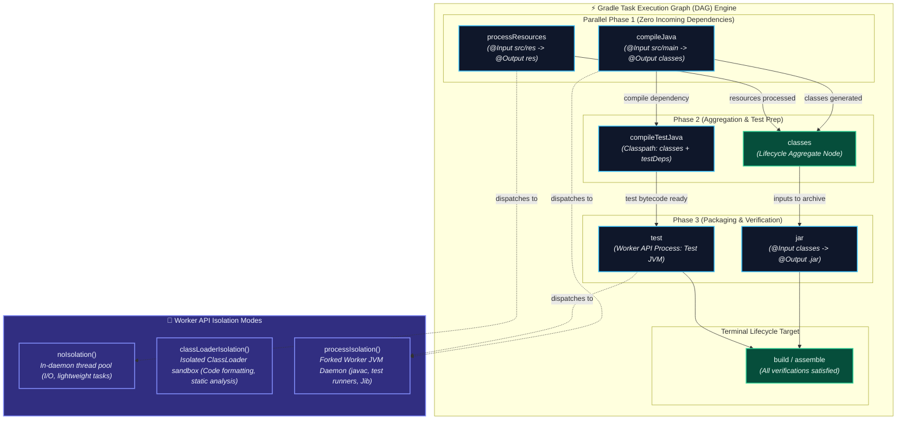

##### 1. Visual Architecture & Task Graph Topology
- **Topological Task Sorting**:
  - During the Configuration phase, Gradle constructs a Directed Acyclic Graph (DAG) where nodes represent `Task` instances and edges represent explicit (`dependsOn`) or implicit (output property consumed as input property) data dependencies.
  - Tasks without mutual dependencies (e.g., `compileJava` and `processResources`) occupy the same topological tier and execute concurrently across CPU cores when `--parallel` is active.
- **Pluggable Worker API**:
  - The Worker API decouples task action orchestration from raw thread execution. It submits `WorkQueue` items to a managed thread pool that respects `--max-workers` limits, preventing host CPU oversubscription.

##### 2. Execution Flow & Lifecycle State Transitions
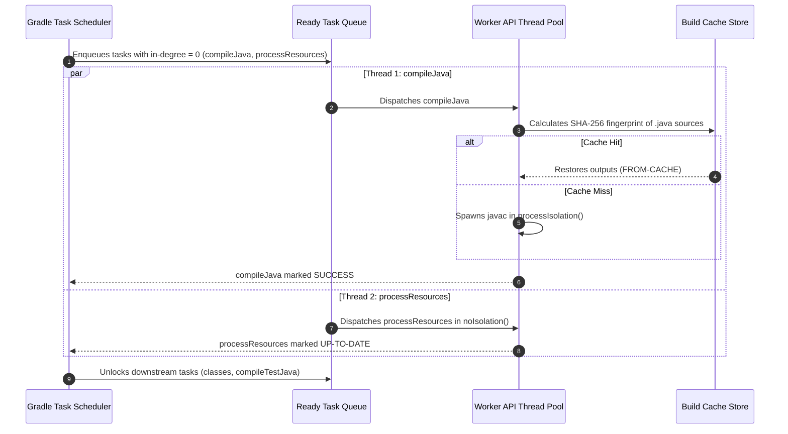

##### 3. Low-Level JVM, Worker API Thread Pools & Process Isolation Mechanics
- **Worker Process Forking (`processIsolation`)**:
  - When a task specifies `processIsolation()`, Gradle forks an independent OS process using `ProcessBuilder`. The child JVM is initialized with custom heap memory (`-Xmx2g`) and minimal classpath arguments.
  - Communication between the Gradle daemon and the worker daemon occurs over standard local loopback sockets via an internal binary RPC protocol.
- **ClassLoader Sandboxing (`classLoaderIsolation`)**:
  - For tasks requiring third-party libraries (e.g. Checkstyle, SpotBugs) that conflict with Gradle's internal dependencies, Gradle creates a transient `URLClassLoader` child instance.
  - Once the work item completes, the ClassLoader is unreferenced, allowing Garbage Collection to reclaim native Metaspace memory.

##### 4. Production Failure Modes & SRE Diagnostics
- **Undeclared Task Dependency Race Conditions**:
  - *Symptom*: Flaky builds where tests occasionally fail with `FileNotFoundException` or missing classes during parallel execution (`--parallel`).
  - *Root Cause*: Task B reads outputs created by Task A, but failed to declare `dependsOn(taskA)` or wire Task A's `Provider<RegularFile>` into its `@InputFile`.
  - *Fix*: Connect outputs to inputs using Gradle's lazy configuration API (`taskB.inputs.files(taskA.outputs)`).
- **Worker Daemon Heap Starvation**:
  - *Symptom*: Compilation fails with `Process 'Gradle Worker Daemon 1' finished with non-zero exit value 137`.
  - *Root Cause*: Host kernel out-of-memory killer killed the forked compiler worker.
- **SRE Triaging Commands**:
  ```bash
  # Run Gradle build with task execution timeline profiling
  ./gradlew build --profile
  
  # Inspect task dependency chains that lead to a specific task
  ./gradlew help --task test
  
  # Check if parallel worker execution is saturated
  ./gradlew build --parallel --max-workers=8 --info | grep "Starting process"
  ```

<details>
<summary>View Legacy ASCII Diagram</summary>

```
Task Execution Graph (DAG):
+----------------+      +--------------------+
|  compileJava   |      |  processResources  |
+----------------+      +--------------------+
        │                         │
        ▼                         ▼
+----------------+      +--------------------+
|  compileTest   |      |      classes       |
+----------------+      +--------------------+
        │                         │
        ▼                         ▼
+----------------+      +--------------------+
|      test      |      |        jar         |
+----------------+      +--------------------+
```

</details>

- **Topological Sorting**: Gradle calculates dependencies via Kahn's algorithm or DFS. Tasks without mutual dependencies execute concurrently across available worker threads (`--parallel`).
- **Worker API**: Tasks can isolate execution in three modes:
  1. `noIsolation()`: Runs in the same JVM thread as Gradle.
  2. `classLoaderIsolation()`: Runs in an isolated ClassLoader, preventing plugin library classpath pollution.
  3. `processIsolation()`: Forks an independent worker daemon process (used for memory-intensive compilers or test suites).

---

## 3.3 Gradle ClassLoader Hierarchy & Plugin Isolation

Gradle employs a multi-tiered ClassLoader hierarchy to isolate the build runtime from user plugins and project dependencies:

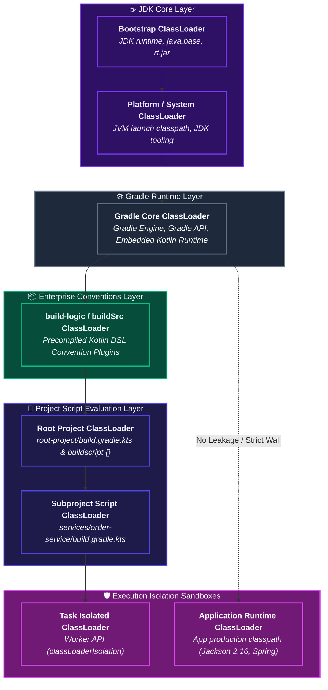

##### 1. Visual Architecture & ClassLoader Hierarchy Topology
- **Strict Hierarchical Isolation**:
  - Gradle uses a tree of isolated `ClassLoader` instances to prevent classpath cross-contamination.
  - The build tool runtime classes (`Gradle Core`) reside at the top of the user hierarchy.
  - `build-logic` plugins reside in their own ClassLoader, isolating custom convention plugins from individual subproject scripts.
- **Decoupled Application Classpath**:
  - The application's runtime dependencies (e.g. `implementation("com.fasterxml.jackson.core:jackson-databind:2.16.1")`) are never loaded into the Gradle buildscript ClassLoader.
  - This prevents classpath collision: a Gradle plugin built with Jackson 2.11 can execute in the same build process without conflicting with the application's modern Jackson 2.16 runtime dependencies.

##### 2. Execution Flow & Lifecycle State Transitions
```mermaid
sequenceDiagram
    autonumber
    participant JVM as JVM System ClassLoader
    participant Core as Gradle Core ClassLoader
    participant Logic as build-logic ClassLoader
    participant Script as Subproject Script ClassLoader
    participant Worker as Worker API ClassLoader

    JVM->>Core: Loads org.gradle.api.* and org.gradle.internal.*
    Core->>Logic: Loads corporate convention plugins (company.java-conventions)
    Logic->>Script: Instantiates project build script bytecode
    Script->>Worker: Spawns task work action with custom classpath (e.g. Checkstyle 10.x)
    Worker->>Worker: Executes work action in isolated sandbox
    Worker-->>Script: Returns result; worker ClassLoader marked for garbage collection
```

##### 3. Low-Level JVM, Metaspace & Bytecode Verification Mechanics
- **HotSpot Metaspace Allocation & Class Unloading**:
  - Every compiled Kotlin DSL script and dynamically generated plugin class allocates native memory in JVM Metaspace (`Klass` metadata structures, constant pool caches, method vtables).
  - In HotSpot, a `Class` object can only be garbage-collected if its defining `ClassLoader` becomes unreachable.
  - Gradle caches script classloaders across builds based on the SHA-256 hash of the build script text to avoid continuous Metaspace churn.
- **Parent-First Class Loading**:
  - Class resolution follows standard JVM parent-first delegation (`findLoadedClass()` $\rightarrow$ `parent.loadClass()` $\rightarrow$ `findClass()`).
  - Core Gradle APIs are always resolved by the top-level loader, ensuring singletons and internal service registries remain homogeneous across the entire build.

##### 4. Production Failure Modes & SRE Diagnostics
- **Loader Constraint Violation / `LinkageError`**:
  - *Symptom*: Build crashes with `java.lang.LinkageError: loader constraint violation: when resolving method ... the class loader ... and the class loader ... have different Class objects for the type`.
  - *Root Cause*: Two different convention plugins loaded conflicting versions of the same shared library into non-isolated classloader scopes.
- **Metaspace Memory Exhaustion**:
  - *Symptom*: Persistent CI daemons crash after 20 builds with `java.lang.OutOfMemoryError: Metaspace`.
  - *Root Cause*: Dynamically generated task classes in non-cacheable custom plugins holding strong static references, preventing ClassLoader unloading.
- **SRE Triaging Commands**:
  ```bash
  # Inspect Metaspace memory usage and classloader count in the running daemon
  jcmd $(pgrep -f '.*GradleDaemon.*') VM.classloader_stats
  
  # Inspect class loading activity during script compilation
  ./gradlew help -Dorg.gradle.logging.level=debug | grep -E "Class loaded|ClassLoader"
  
  # Check build classpath dependencies
  ./gradlew buildEnvironment
  ```

<details>
<summary>View Legacy ASCII Diagram</summary>

```
Bootstrap ClassLoader (JDK runtime)
       │
       ▼
Gradle Core ClassLoader (Gradle runtime binaries)
       │
       ▼
Root Project ClassLoader (`buildscript` classpath & plugins)
       │
       ▼
Subproject ClassLoader (Subproject-specific plugins)
       │
       ▼
Task Isolated ClassLoader (Worker API sandbox)
```

</details>

This isolation ensures that a Gradle plugin requiring Jackson 2.11 cannot accidentally pollute or conflict with the application's runtime dependencies using Jackson 2.16.

---

## 3.4 Gradle Kotlin DSL Script Compilation & Caching Pipeline

When executing `build.gradle.kts`, Gradle compiles the Kotlin code into JVM bytecode before execution:
1. **Lexical Parsing & Hashing**: Computes a SHA-256 hash of the script text and its classpath.
2. **Two-Stage Compilation**:
   - **Stage 1 (Plugins Block)**: Extracts and compiles the `plugins {}` block to determine build classpath.
   - **Stage 2 (Script Body)**: Compiles the remainder of the build script with full type-safety and IDE autocomplete support.
3. **Bytecode Cache**: Persists compiled script `.class` files in `~/.gradle/caches/<version>/kotlin-dsl/`. Future runs execute compiled bytecode directly.

---

## 3.5 Gradle Daemon Socket IPC & Memory Architecture

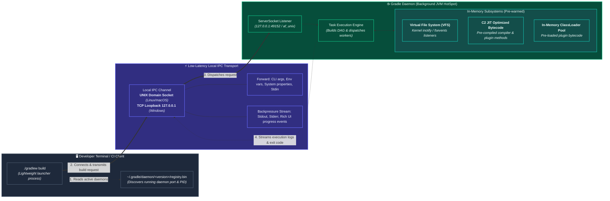

##### 1. Visual Architecture & IPC Channel Topology
- **Client-Server Separation**:
  - The `./gradlew` CLI script does not compile or run the build directly. It launches a lightweight client JVM that reads `registry.bin` to locate an idle, compatible daemon process.
  - If a compatible daemon is found, the client connects to it over local loopback; if no daemon matches the requested JDK vendor, version, or JVM arguments, the launcher forks a brand-new daemon process.
- **Bi-directional Multiplexed IPC**:
  - Over the established socket connection, the client serializes build arguments, current working directory (`user.dir`), environment variables, and stdin.
  - The daemon streams live status events, styled terminal ANSI sequences, and build metrics back to the client in real time.

##### 2. Execution Flow & Lifecycle State Transitions
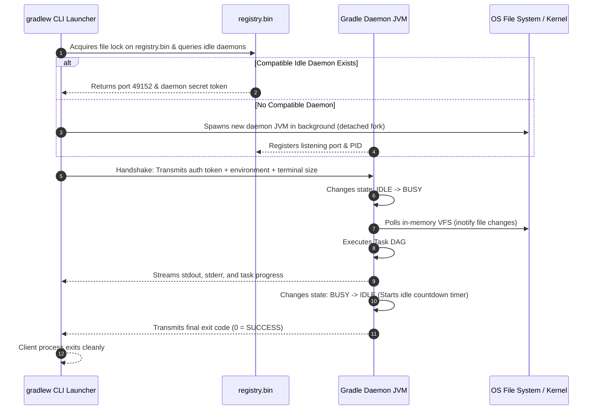

##### 3. Low-Level Kernel, Socket IPC & Memory Architecture
- **Socket Transport Protocols**:
  - *Linux & macOS*: Employs UNIX Domain Sockets (`af_unix`) backed by filesystem inodes, bypassing IP network stack overhead and eliminating network interface packet routing.
  - *Windows*: Utilizes TCP loopback (`127.0.0.1`) with a randomly bound ephemeral port. Authentication is enforced via a 128-bit cryptographic token stored in `registry.bin` with file permissions restricted to the current user.
- **Kernel File System Event Hooks**:
  - The daemon maintains active OS watches (`inotify_add_watch` on Linux, `kqueue` on macOS, `ReadDirectoryChangesW` on Windows).
  - Instead of scanning directories on disk using `stat()` syscalls, the daemon's VFS is proactively updated whenever file-modification events arrive from kernel ring buffers.

##### 4. Production Failure Modes & SRE Diagnostics
- **Orphan Daemon Storm on Ephemeral CI Nodes**:
  - *Symptom*: Continuous Integration runners run out of memory or experience extreme CPU thrashing.
  - *Root Cause*: CI runners execute one-off build containers without `--no-daemon` or `./gradlew --stop`, leaving resident 4GB JVM daemons running indefinitely until the host crashes.
  - *Fix*: Pass `--no-daemon` on CI environments or configure `org.gradle.daemon.idletimeout=60000` (1 minute).
- **Corrupted Registry File Lock Deadlocks**:
  - *Symptom*: Build hangs on startup with `Timeout waiting to lock daemon addresses registry`.
  - *Root Cause*: An unclean process termination or sudden power loss left `registry.bin.lck` locked on disk.
  - *Fix*: Delete `~/.gradle/daemon/<version>/*.lck` files.
- **SRE Triaging Commands**:
  ```bash
  # Check status of all active and idle Gradle Daemons
  ./gradlew --status
  
  # Gracefully terminate all running daemons
  ./gradlew --stop
  
  # Forcefully terminate runaway daemons on Unix host
  pkill -9 -f '.*GradleDaemon.*'
  
  # Inspect active daemon socket connections on Linux
  lsof -iTCP -sTCP:LISTEN | grep -i java
  ```

<details>
<summary>View Legacy ASCII Diagram</summary>

```
User Terminal (CLI)                      Gradle Daemon (Background JVM)
+-----------------------+                +-------------------------------+
| ./gradlew build       |                | Long-running HotSpot Process  |
|                       |                | (Warm JIT, In-Memory VFS)     |
| Reads gradle.properties                |                               |
| Discovers Daemon Port |                | ServerSocket: 127.0.0.1:49152 |
| Connects via UNIX/TCP | ─────────────► | Executes Task DAG             |
| Streams stdout/stderr | ◄───────────── | Streams Progress Events       |
+-----------------------+                +-------------------------------+
```

</details>

- If no compatible daemon exists (matching JDK, JVM memory args, and locale), the CLI automatically spawns a new daemon process.
- Daemons automatically shut down after 3 hours of idle inactivity (`org.gradle.daemon.idletimeout=10800000`).

---

# TRACK 4: PRODUCTION ENGINEERING, MONOREPOS & AUTOMATION PATTERNS

## 4.1 Enterprise Multi-Module Parent POM Template

```xml
<project xmlns="http://maven.apache.org/POM/4.0.0"
         xmlns:xsi="http://www.w3.org/2001/XMLSchema-instance"
         xsi:schemaLocation="http://maven.apache.org/POM/4.0.0 http://maven.apache.org/xsd/maven-4.0.0.xsd">
    <modelVersion>4.0.0</modelVersion>

    <groupId>com.enterprise.platform</groupId>
    <artifactId>platform-parent</artifactId>
    <version>1.0.0</version>
    <packaging>pom</packaging>

    <properties>
        <java.version>21</java.version>
        <project.build.sourceEncoding>UTF-8</project.build.sourceEncoding>
        <spring.boot.version>3.2.3</spring.boot.version>
        <lombok.version>1.18.30</lombok.version>
    </properties>

    <dependencyManagement>
        <dependencies>
            <dependency>
                <groupId>org.springframework.boot</groupId>
                <artifactId>spring-boot-dependencies</artifactId>
                <version>${spring.boot.version}</version>
                <type>pom</type>
                <scope>import</scope>
            </dependency>
            <dependency>
                <groupId>org.projectlombok</groupId>
                <artifactId>lombok</artifactId>
                <version>${lombok.version}</version>
                <scope>provided</scope>
            </dependency>
        </dependencies>
    </dependencyManagement>

    <build>
        <pluginManagement>
            <plugins>
                <plugin>
                    <groupId>org.apache.maven.plugins</groupId>
                    <artifactId>maven-compiler-plugin</artifactId>
                    <version>3.12.1</version>
                    <configuration>
                        <release>21</release>
                        <parameters>true</parameters>
                    </configuration>
                </plugin>
            </plugins>
        </pluginManagement>
    </build>
</project>
```

---

## 4.2 Enterprise Gradle Convention Plugins with `buildSrc` / `build-logic`

Instead of duplicating build configuration across 50 microservice subprojects, create **Convention Plugins** using `build-logic`:

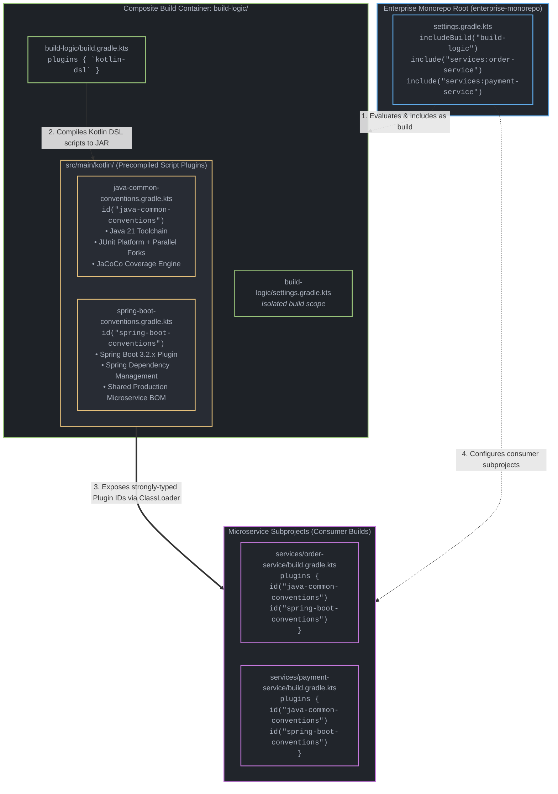

#### Architectural Breakdown: Enterprise Convention Plugins with `build-logic`

##### 1. Visual Architecture & Monorepo Topology
- **Composite Build Decoupling**: Historically, Gradle utilized the special `buildSrc` directory at the project root. However, modern enterprise engineering leverages an included composite build (`build-logic/` declared via `includeBuild("build-logic")` in `settings.gradle.kts`). While any microscopic edit inside `buildSrc` invalidates the configuration and task caches across *all* subprojects globally, `build-logic` runs as an independent build with isolated task inputs and outputs.
- **Precompiled Script Plugins**: Files matching `src/main/kotlin/*.gradle.kts` inside `build-logic` are recognized by Gradle's `kotlin-dsl` compiler as first-class convention plugins. The filename directly maps to the plugin ID (e.g., `java-common-conventions.gradle.kts` automatically registers as `id("java-common-conventions")`).
- **Consumer Monorepo Subprojects**: Consumer microservices (`order-service`, `payment-service`) contain zero duplicated boilerplate. They simply apply the organization's standardized convention plugin IDs, inheriting JVM toolchains, test runners, linter configurations, and enterprise BOM dependencies uniformly.

##### 2. Execution Flow, Compilation Lifecycle & Handshake
1. **Root Settings Evaluation**: The Gradle Daemon evaluates `settings.gradle.kts` in the root repository. Upon encountering `includeBuild("build-logic")`, Gradle registers `build-logic` as a nested build participant.
2. **Nested Build Execution (Phase 0)**: Before any subproject build scripts in the main build are evaluated, Gradle triggers the compilation and execution of `build-logic`.
3. **Precompiled Script Plugin Synthesis**: The `kotlin-dsl` plugin processes each `*.gradle.kts` file:
   - Synthesizes an implementation class implementing `org.gradle.api.Plugin<Project>`.
   - Generates a plugin descriptor file in `META-INF/gradle-plugins/<plugin-id>.properties` pointing to the generated class.
   - Emits compiled `.class` bytecodes and packages them into an in-memory or cached JAR artifact.
4. **ClassLoader Injection**: Gradle creates an isolated `ClassLoaderScope` for the build-logic output JAR and bridges it into the main build's plugin resolution mechanism.
5. **Main Build Configuration Phase**: Gradle evaluates `services/order-service/build.gradle.kts`. When it encounters `plugins { id("java-common-conventions") }`, the plugin resolver loads the synthesized class from the `build-logic` ClassLoader, applying toolchains, tasks, and configurations seamlessly.

##### 3. Low-Level JVM, ClassLoader Isolation & Kotlin DSL Compilation Mechanics
- **ClassLoader Hierarchy & Class Isolation**: 
  - `buildSrc` places its classes directly onto the root buildscript ClassLoader (`root Project.classLoader`), causing global classpath contamination where plugin dependencies can conflict with user dependencies.
  - `build-logic` (as an included composite build) compiles in a completely disjoint JVM ClassLoader sandbox (`RootClassLoader` -> `GradleApiClassLoader` -> `BuildLogicExportClassLoader`). Only exported plugin identifiers and public APIs are visible to consumer projects, strictly enforcing separation of concerns.
- **Kotlin DSL Bytecode Generation**: Under the hood, the Kotlin compiler (`kotlinc`) translates declarative script blocks into synthetic Kotlin classes extending `org.gradle.kotlin.dsl.precompile.PrecompiledProjectScript`. Top-level calls (such as `java { ... }` or `tasks.withType<Test> { ... }`) are compiled into invocations against Gradle's type-safe schema accessors generated during script compilation.
- **Incremental Compilation & Configuration Cache Safety**: `build-logic` participates fully in Gradle's build cache and configuration cache. If neither `build-logic/build.gradle.kts` nor the files in `src/main/kotlin/` change, Gradle reuses the cached build-logic JAR, skipping compilation entirely and configuring downstream projects in milliseconds.

##### 4. Production Failure Modes & SRE Diagnostics
- **Metaspace Exhaustion / Leak During Active Plugin Iteration**: Frequent modifications to precompiled script plugins in `build-logic` during local development force the Gradle Daemon to compile new Kotlin classes and dynamically allocate new `PluginClassLoader` instances. If the daemon lacks sufficient Metaspace headroom, it crashes with `java.lang.OutOfMemoryError: Metaspace`.
  - *Mitigation*: Allocate generous Metaspace in `gradle.properties`: `org.gradle.jvmargs=-Xmx4g -XX:MaxMetaspaceSize=1g -XX:+UseG1GC`.
- **Plugin ID Collision & Duplicate Application**: Declaring an external plugin in both `build-logic/build.gradle.kts` and a consumer project with mismatched versions triggers `PluginAlreadyRegisteredException` or `ClassNotFoundException` due to conflicting ClassLoader boundaries.
  - *Mitigation*: Centrally manage all plugin versions in a shared version catalog (`gradle/libs.versions.toml`) referenced by both `build-logic/settings.gradle.kts` and root `settings.gradle.kts`.
- **Task Lambda Serialization Failures in Convention Plugins**: Embedding non-serializable objects (such as open file handles, database connections, or raw Project references) within convention plugin task actions causes Gradle's Configuration Cache to fail with `ConfigurationCacheException`.
  - *Mitigation*: Strictly inject Gradle managed types (`Property<T>`, `DirectoryProperty`, `Provider<T>`) and worker executors instead of capturing project state in closures.
- **SRE Diagnostic Runbook**:
  ```bash
  # Validate build-logic compilation independently with detailed stack traces
  ./gradlew :build-logic:build --stacktrace

  # Inspect effective classpath and plugin dependencies applied to a service
  ./gradlew :services:order-service:buildEnvironment

  # Verify configuration cache compatibility across convention plugins
  ./gradlew :services:order-service:help --configuration-cache

  # Analyze active daemon JVM Metaspace consumption
  jcmd $(jps -l | grep GradleDaemon | awk '{print $1}') VM.metaspace
  ```

<details>
<summary>View Legacy ASCII Diagram</summary>

```
enterprise-monorepo/
├── build-logic/
│   ├── settings.gradle.kts
│   ├── build.gradle.kts
│   └── src/main/kotlin/
│       ├── java-common-conventions.gradle.kts
│       └── spring-boot-conventions.gradle.kts
├── services/
│   ├── order-service/build.gradle.kts
│   └── payment-service/build.gradle.kts
└── settings.gradle.kts
```

</details>

### `build-logic/src/main/kotlin/java-common-conventions.gradle.kts`
```kotlin
plugins {
    java
    checkstyle
    jacoco
}

java {
    toolchain {
        languageVersion.set(JavaLanguageVersion.of(21))
    }
}

tasks.withType<Test> {
    useJUnitPlatform()
    maxParallelForks = (Runtime.getRuntime().availableProcessors() / 2).coerceAtLeast(1)
}
```

### `services/order-service/build.gradle.kts` (Zero Boilerplate!)
```kotlin
plugins {
    id("java-common-conventions")
    id("spring-boot-conventions")
}

dependencies {
    implementation("org.springframework.boot:spring-boot-starter-web")
}
```

---

## 4.3 High-Performance Build Speed Optimization Runbook

Follow these five rules to accelerate enterprise builds by 70%:
1. **Enable Filesystem Watching**: `org.gradle.vfs.watch=true` keeps directory file-change listeners active.
2. **Thread Parallelization**: Run Maven with multiple threads: `mvn clean install -T 1C` (1 thread per CPU core).
3. **Skip Redundant Quality Checks in Local Dev**:
   ```bash
   mvn clean install -DskipTests -Dcheckstyle.skip -Djacoco.skip
   ```
4. **Tune JVM Memory for the Build Daemon**:
   Give the build process sufficient heap to avoid GC thrashing:
   ```properties
   org.gradle.jvmargs=-Xmx6g -XX:+UseG1GC -XX:+ParallelRefProcEnabled
   ```
5. **Prune Unused Repositories**: Every declared repository adds network HTTP latency during resolution checks. Place `mavenCentral()` first.

---

## 4.4 CI/CD Pipeline Automation: Fast-Fail Matrix & Test Partitioning

Optimize GitHub Actions / GitLab CI pipelines by executing unit tests and integration tests in parallel shards:

```yaml
# GitHub Actions Test Matrix
jobs:
  test:
    runs-on: ubuntu-latest
    strategy:
      matrix:
        shard: [1, 2, 3, 4]
    steps:
      - uses: actions/checkout@v4
      - uses: actions/setup-java@v4
        with:
          distribution: 'temurin'
          java-version: '21'
          cache: 'gradle'
      - name: Run Test Shard
        run: ./gradlew test -PtestShard=${{ matrix.shard }} -PtotalShards=4
```

---

## 4.5 Security Vulnerability Scanning in Build Pipelines (OWASP & Snyk)

Automatically fail pull requests containing known Common Vulnerabilities and Exposures (CVEs):

```xml
<!-- OWASP Dependency-Check Maven Plugin -->
<plugin>
    <groupId>org.owasp</groupId>
    <artifactId>dependency-check-maven</artifactId>
    <version>9.0.9</version>
    <configuration>
        <failBuildOnCVSS>7.0</failBuildOnCVSS> <!-- Fails on High/Critical CVEs -->
        <suppressionFiles>
            <suppressionFile>owasp-suppressions.xml</suppressionFile>
        </suppressionFiles>
    </configuration>
    <executions>
        <execution>
            <goals>
                <goal>check</goal>
            </goals>
        </execution>
    </executions>
</plugin>
```

---

# TRACK 5: DISASTER RECOVERY, WAR ROOM FORENSICS & POST-MORTEMS

## 5.1 Real-World Incident 1: Silent Diamond Dependency Hell Causing Runtime `NoSuchMethodError`

### Root Cause Analysis (RCA)
- **Symptom**: Immediately after deployment, production checkout pods crashed with:
  ```
  java.lang.NoSuchMethodError: 'com.fasterxml.jackson.core.JsonParser.getNumberTypeFP()'
  ```
- **Investigation**:
  - The application compiled successfully in CI.
  - Ran `mvn dependency:tree -Dverbose -Dincludes=com.fasterxml.jackson.core:*`:
    ```
    +- com.enterprise:legacy-auth-client:jar:1.2.0:compile
    |  \- com.fasterxml.jackson.core:jackson-core:jar:2.11.0:compile (Depth 2 - WINNER)
    \- org.springframework.boot:spring-boot-starter-json:jar:3.2.3:compile
       \- com.fasterxml.jackson.core:jackson-databind:jar:2.16.1:compile (Depth 3)
          \- (jackson-core:jar:2.16.1 omitted for conflict with 2.11.0)
    ```
  - Maven's nearest-definition rule selected `jackson-core:2.11.0` (depth 2) while selecting `jackson-databind:2.16.1` (depth 3). At runtime, `jackson-databind` invoked a new method added in 2.16 that did not exist in the 2.11 binary!
- **Resolution**: Added `jackson-bom` inside root `<dependencyManagement>` to force all Jackson modules to uniform version 2.16.1. Added `maven-enforcer-plugin` with `<dependencyConvergence/>` to permanently prevent conflicting versions.

---

## 5.2 Real-World Incident 2: CI Pipeline Frozen by Deadlocked Stale Gradle Daemons

### Root Cause Analysis (RCA)
- **Symptom**: Jenkins build agents ran out of memory, and CI builds timed out after 60 minutes with `Gradle daemon disappeared unexpectedly`.
- **Investigation**:
  - Executed `ps aux | grep GradleDaemon` on the build runner: Found 22 orphan Gradle daemon processes running concurrently, consuming 100% of host RAM.
  - Jenkins was spinning up ephemeral build directories without stopping daemons. Each build had slightly different JVM arguments, causing Gradle to fork a new daemon process every build until the host ran out of native memory.
- **Resolution**: Configured CI build step to run with `--no-daemon` on ephemeral worker nodes or added post-build step: `./gradlew --stop`.

---

## 5.3 Real-World Incident 3: Corrupted Remote Build Cache Serving Broken Artifacts

### Root Cause Analysis (RCA)
- **Symptom**: Developers pulling latest `main` branch experienced random runtime failures, while a clean build with `--no-build-cache` worked perfectly.
- **Investigation**:
  - A custom code generation task had declared an input file property that depended on an uncommitted local file path (`/Users/dev/config.json`).
  - When CI built the task, it generated an output artifact using its local path and pushed the cache entry to the remote HTTP cache.
  - When developers pulled the cached artifact, their tasks skipped execution (`FROM-CACHE`), pulling down corrupted classes containing hardcoded CI paths.
- **Resolution**: Fixed task input declarations to use relative path normalization (`@PathSensitive(PathSensitivity.RELATIVE)`). Flushed the remote build cache bucket.

---

## 5.4 Real-World Incident 4: Circular Dependency Deadlock in Multi-Module Maven Projects

### Root Cause Analysis (RCA)
- **Symptom**: Developer adding a new feature between `billing-core` and `notification-service` caused Maven build failure:
  ```
  [ERROR] The projects in the reactor contain a cyclic reference:
  [ERROR] Edge between 'billing-core' and 'notification-service' introduces to cycle
  ```
- **Investigation**: `billing-core` imported `notification-service` to send payment alerts, while `notification-service` imported `billing-core` to look up invoice schemas.
- **Resolution**: Extracted shared contracts and event definitions into a third module `billing-events` with zero incoming dependencies. Both modules now depend on `billing-events`.

---

## 5.5 Real-World Incident 5: Transitive Dependency Supply-Chain Hijacking

### Root Cause Analysis (RCA)
- **Symptom**: Security alert triggered: a widely used utility library was compromised with a malicious crypto-miner in version `3.4.1`.
- **Investigation**: The library was not in the root project's `pom.xml`, but was brought in transitively by an old XML parsing dependency.
- **Resolution**: Added an explicit `<exclusion>` tag in the offending dependency and added a strict rule in `<dependencyManagement>` forcing an updated, audited version.

---

## 5.6 Emergency Build Triage & Forensic Command Reference

```bash
# ==============================================================================
# BUILD AUTOMATION EMERGENCY WAR ROOM RUNBOOK
# ==============================================================================

# 1. Maven Dependency Conflict Forensics (Print full tree with conflicts)
mvn dependency:tree -Dverbose > /tmp/mvn_tree.txt
grep -i "conflict" /tmp/mvn_tree.txt

# 2. Force Maven to update all SNAPSHOTs and clean cache
mvn clean install -U -X

# 3. Analyze Gradle Dependency Graph for a specific configuration
./gradlew dependencies --configuration runtimeClasspath > /tmp/gradle_deps.txt

# 4. Explain why a specific dependency was brought into Gradle
./gradlew dependencyInsight --dependency jackson-core --configuration runtimeClasspath

# 5. Stop all stuck or running Gradle Daemons
./gradlew --stop
pkill -f '.*GradleDaemon.*'

# 6. Profile Gradle build speed and generate interactive report
./gradlew build --scan --profile
```

---

# TRACK 6: CRACK-THE-INTERVIEW QUESTION BANK (50 SENIOR/STAFF+ SCENARIOS)

#### Q01: Explain Maven's "Nearest-Definition Wins" conflict resolution algorithm.
> **Answer**: When two versions of the same dependency are transitively requested, Maven picks the version that is closest to the root project in the dependency tree (shallowest depth). If both versions are at the exact same depth, the version declared first in the POM file takes precedence. Maven never compares semantic version numbers to pick the newest version automatically.

#### Q02: What is the difference between `<dependencyManagement>` and `<dependencies>` in Maven?
> **Answer**: `<dependencies>` declares libraries that are immediately added to the project's compilation and runtime classpath. `<dependencyManagement>` is a centralized lookup table that configures version numbers, scopes, and exclusions for dependencies without adding them to the classpath. Child modules only inherit the dependency if they declare it in their own `<dependencies>` section, but they omit the `<version>` tag.

#### Q03: What are the three phases of a Gradle build lifecycle, and what code executes in each?
> **Answer**:
> 1. **Initialization**: Determines which projects participate in the build (`settings.gradle.kts`).
> 2. **Configuration**: Executes all build scripts (`build.gradle.kts`) to configure project objects and construct the Task DAG. Code placed outside task action blocks executes here.
> 3. **Execution**: Executes the task actions (`@TaskAction` / `doLast {}`) of requested tasks in topological DAG order.

#### Q04: How does the Gradle Configuration Cache achieve instantaneous build startups?
> **Answer**: It serializes the in-memory Task Execution Graph to disk after the Configuration phase completes. On subsequent invocations, if no build logic, inputs, or system properties have changed, Gradle bypasses script evaluation and executes the cached task graph immediately.

#### Q05: What is the purpose of Maven's `mvn dependency:analyze`?
> **Answer**: It detects two major dependency antipatterns:
> 1. **Used undeclared dependencies**: Code imports classes from a JAR that is only on the classpath transitively. (Dangerous: if the upstream library drops the dependency, your code breaks).
> 2. **Unused declared dependencies**: Libraries explicitly declared in `pom.xml` that are never referenced in bytecode, inflating artifact size.

#### Q06: What is a Gradle Composite Build, and how does it improve monorepo developer productivity?
> **Answer**: Composite builds allow one Gradle build to include another independent Gradle build via `includeBuild("../path")`. Gradle dynamically substitutes external binary module dependencies (`group:name:version`) with live source code projects, eliminating the need to publish local SNAPSHOT JARs to test library modifications.

#### Q07: Explain the difference between Gradle's `api` and `implementation` dependency configurations.
> **Answer**:
> - `implementation`: The dependency is private to the module. It is available at compile-time for this module and at runtime for consumers, but is **not** exposed on the compile classpath of consuming modules (prevents compile classpath pollution and triggers fewer recompilations).
> - `api`: The dependency is transitively exposed on the compile classpath of consuming modules. Necessary when types from the dependency appear in public method signatures.

#### Q08: How do you enforce reproducible builds in Maven and Gradle?
> **Answer**:
> 1. Always commit and use the Wrapper (`./mvnw` or `./gradlew`).
> 2. Use fixed semantic versions; ban `-SNAPSHOT` and dynamic version ranges (`1.+`).
> 3. Lock dependency versions using Gradle Dependency Locking (`--write-locks`) or Maven Enforcer plugin.
> 4. Use Java Toolchains to pin the exact JDK distribution and vendor.
> 5. Enable deterministic packaging (e.g., stripping file timestamps from JAR manifests).

#### Q09: What is the Bill of Materials (BOM) pattern?
> **Answer**: A BOM is a special POM file with `<packaging>pom</packaging>` that contains an exhaustive `<dependencyManagement>` section listing compatible versions of dozens of related libraries (e.g., Spring Boot, AWS SDK, Jackson). Consuming projects import the BOM with `<scope>import</scope>` to guarantee version alignment across all modules without version mismatches.

#### Q10: What causes a `ClassNotFoundException` vs `NoClassDefFoundError`?
> **Answer**:
> - `ClassNotFoundException`: A checked exception thrown when an application tries to load a class by string name via reflection (`Class.forName()`, `ClassLoader.loadClass()`) and the class is missing from the classpath.
> - `NoClassDefFoundError`: A fatal runtime error thrown when a class was present during compilation, but cannot be found or loaded at runtime during static initialization or method invocation.

#### Q11: How does Gradle's Incremental Build determine if a task is `UP-TO-DATE`?
> **Answer**: Gradle calculates cryptographic hashes of all declared `@Input` properties and files, and records hashes of all `@Output` files in a local database (`.gradle/`). Before executing the task, it compares current hashes with recorded hashes. If identical, the task execution is skipped.

#### Q12: Why should you avoid using `compileClasspath` for runtime tasks?
> **Answer**: `compileClasspath` contains only the classes needed to compile source files. It omits libraries that are strictly needed at runtime (such as database JDBC drivers or logging implementations marked as `runtimeOnly`), leading to runtime failures if used to execute the application.

#### Q13: What is the purpose of the Maven Failsafe Plugin compared to the Surefire Plugin?
> **Answer**: Surefire runs unit tests during the `test` phase; if a test fails, it aborts the build immediately. Failsafe runs integration tests during `integration-test` and reports failures during `verify`. This allows post-integration-test cleanup steps (e.g., stopping Docker containers or tearing down test databases) to execute even if tests failed.

#### Q14: How does Google Jib build Docker images without a Docker daemon?
> **Answer**: Jib directly constructs the OCI / Docker image specification by assembling tarballs and metadata layers in Java user-space. It reads compiled classes and resources, packages them into distinct filesystem layers, computes SHA-256 digests, and pushes them directly to the container registry via HTTP REST API.

#### Q15: What is Gradle's `buildSrc` directory?
> **Answer**: `buildSrc` is a special directory treated by Gradle as an included build. Any Kotlin or Java code written inside `buildSrc` is automatically compiled and added to the build script classpath of all projects, making it ideal for custom tasks, convention plugins, and shared constants.

#### Q16: What is the role of `settings.gradle.kts`?
> **Answer**: It is executed during the Initialization phase. It configures the build name, specifies which subprojects participate in a multi-project build via `include()`, configures plugin management repositories, and configures local/remote build caches.

#### Q17: What does the Maven command flag `-U` do?
> **Answer**: `-U` forces Maven to check remote repositories for updated releases and SNAPSHOT dependencies, bypassing local repository caching intervals.

#### Q18: What is Gradle's Worker API, and why is it preferred over raw threads?
> **Answer**: The Worker API provides asynchronous, parallel execution of work items within a task. It manages thread pools, prevents CPU over-subscription, and provides classloader and process isolation modes to prevent memory leaks and classpath conflicts.

#### Q19: How do you exclude a transitive dependency in Gradle?
> **Answer**:
> ```kotlin
> implementation("org.springframework.boot:spring-boot-starter-web") {
>     exclude(group = "org.springframework.boot", module = "spring-boot-starter-tomcat")
> }
> ```

#### Q20: What is the difference between Maven's `clean` and Gradle's `clean` task?
> **Answer**: Both delete the build output directory (`target/` in Maven, `build/` in Gradle). However, in Gradle, running `clean build` is often an antipattern because it wipes out local incremental build caches. Gradle can safely execute `build` incrementally without cleaning.

#### Q21: What is Gradle Dependency Locking?
> **Answer**: A mechanism that records the exact resolved dynamic versions and transitive dependencies in a `gradle.lockfile`. Future builds read this lockfile to guarantee that builds remain identical even if an upstream repository publishes a new transitive minor version.

#### Q22: What is the purpose of the `provided` scope in Maven?
> **Answer**: Indicates that the dependency is required to compile the code, but will be provided at runtime by the container or JDK (e.g., `servlet-api` provided by Tomcat, or Lombok which is only needed during compilation). It is excluded from the packaged WAR/JAR.

#### Q23: How do you identify why a specific JAR was pulled into a Maven project?
> **Answer**: Run `mvn dependency:tree -Dincludes=groupId:artifactId`. It prints the exact chain of parent and transitive dependencies that caused the library to be included.

#### Q24: What is the difference between `settings.xml` and `pom.xml` in Maven?
> **Answer**: `pom.xml` defines project-specific configuration (dependencies, plugins, modules) and is committed to Git. `settings.xml` (located at `~/.m2/settings.xml`) defines environment-specific settings (passwords, proxy servers, enterprise mirror URLs) and is never committed to Git.

#### Q25: How does Gradle handle task caching across different Git branches?
> **Answer**: The Gradle Build Cache keys entries by a cryptographic hash of task inputs (source files, compiler options, classpath). If Branch A and Branch B share the same commit on common modules, Gradle pulls compiled task outputs directly from the cache without recompiling, regardless of branch switching.

#### Q26: What is a Split-Package issue in Java 9+ Modules (JPMS)?
> **Answer**: A situation where two different JAR files contain classes within the exact same package name (e.g., both `lib-a.jar` and `lib-b.jar` contain classes in `com.enterprise.common`). JPMS strictly forbids split-packages and halts startup with an error.

#### Q27: What is the Maven Shade Plugin used for?
> **Answer**: It packages an application and all its dependencies into an executable "Uber-JAR" / "Fat-JAR". Crucially, it supports **package relocation** (renaming bytecode package namespaces, e.g., renaming `com.google.common` to `my.hidden.guava`) to prevent classpath conflicts with host application libraries.

#### Q28: How do you profile a slow Maven build?
> **Answer**: Run Maven with the Profiler extension or pass `-Dprofile` / use Maven 3.9+ build timings: `mvn clean install -DtrimStackTrace=false`. Alternatively, use Develocity (Gradle Enterprise) Maven extension to get comprehensive web-based build scans.

#### Q29: What is Gradle's `java-library` plugin vs `java` plugin?
> **Answer**: The `java-library` plugin introduces the `api` configuration in addition to `implementation`. It is designed specifically for reusable libraries to allow consumers to inherit transitive API dependencies while shielding private implementation details.

#### Q30: What causes Maven's "Non-resolvable parent POM" error?
> **Answer**: Maven cannot locate the parent POM file. This occurs if the parent POM is not published to a remote repository and the `<relativePath>` tag in the child POM is incorrect or missing.

#### Q31: How do you run tests in parallel in Gradle?
> **Answer**:
> ```kotlin
> tasks.withType<Test> {
>     maxParallelForks = (Runtime.getRuntime().availableProcessors() / 2).coerceAtLeast(1)
> }
> ```

#### Q32: What is the Maven Reactor?
> **Answer**: The Maven Reactor is the internal component that parses multi-module projects, resolves module inter-dependencies, constructs a Directed Acyclic Graph, and calculates the correct chronological build execution order.

#### Q33: How do you enforce Java toolchain versions in Gradle?
> **Answer**:
> ```kotlin
> java {
>     toolchain {
>         languageVersion.set(JavaLanguageVersion.of(21))
>         vendor.set(JvmVendorSpec.TEMURIN)
>     }
> }
> ```
> Gradle will automatically download and install the specified JDK if it is not present on the host system.

#### Q34: What is the difference between `SNAPSHOT` and release versions in Maven repositories?
> **Answer**: Releases are immutable; once `1.0.0` is published to a repository, it can never be overwritten. SNAPSHOTs (e.g., `1.0.0-SNAPSHOT`) represent active development and are mutable; repositories append a timestamp (`1.0.0-20260301.120000-1`) and allow continuous overwriting.

#### Q35: How does Gradle's `test` task avoid running tests when no code has changed?
> **Answer**: Gradle treats test source files, compiled application classes, and test classpath dependencies as inputs to the `Test` task. If none of these inputs have changed since the last test run, Gradle marks the task `UP-TO-DATE` and skips test execution.

#### Q36: What is the purpose of Maven's `flatten-maven-plugin`?
> **Answer**: It generates a simplified, flattened version of `pom.xml` (resolving parent properties and variables) before publishing to a repository. This prevents consumer projects from needing to inherit or resolve internal parent POM hierarchies.

#### Q37: How do you diagnose Gradle Configuration Cache incompatibilities?
> **Answer**: Run with `--configuration-cache` and inspect the generated HTML report. Gradle flags tasks that reference live `Project` instances, environment variables, or build script state during the execution phase.

#### Q38: What is Maven's `targetPath` in resource filtering?
> **Answer**: In `<resources>`, `targetPath` specifies the destination directory inside the target JAR where filtered resources (with variables replaced) should be placed.

#### Q39: What is the role of `.mvn/jvm.config`?
> **Answer**: A file committed to the repository root that defines JVM memory flags (`-Xmx2g -XX:+UseG1GC`) for the Maven process itself, ensuring consistent memory configuration across all developer and CI machines.

#### Q40: How does Gradle Capability Alignment resolve library conflicts?
> **Answer**: Capabilities allow libraries that provide the same functionality under different coordinates (e.g., `log4j-over-slf4j` vs `slf4j-log4j12`) to declare a shared capability. Gradle detects the conflict and forces the build to select only one.

#### Q41: What is the risk of using dynamic version ranges (`[1.0, 2.0)`) in production POMs?
> **Answer**: Non-deterministic builds. If an upstream library publishes a buggy minor update, your next build will automatically pull it, potentially causing unexpected production outages without code changes.

#### Q42: What is the purpose of Gradle's `onlyIf {}` block?
> **Answer**: It defines a runtime predicate condition. If the predicate evaluates to `false`, the task is skipped during execution.

#### Q43: How do you configure Maven to publish sources and javadocs alongside the binary JAR?
> **Answer**: Add `maven-source-plugin` and `maven-javadoc-plugin` bound to the `package` or `verify` phases.

#### Q44: What is the Gradle Build Scan?
> **Answer**: An interactive web-based diagnostic report generated by `--scan` that provides detailed insights into build execution times, task cache hits/misses, dependency resolution graphs, and JVM memory usage.

#### Q45: What is the difference between `clean install` and `clean verify` in Maven?
> **Answer**: `verify` runs all unit and integration tests and validates quality gates without publishing the JAR to the local `~/.m2/repository`. `install` executes all verification steps and copies the JAR into the local repository cache.

#### Q46: How do you override a transitive dependency's version in Maven without modifying its parent POM?
> **Answer**: Declare the dependency directly in your child module's `pom.xml` with the desired version, or declare it in `<dependencyManagement>`.

#### Q47: What causes "Gradle build failed: Metaspace" error during multi-project builds?
> **Answer**: The Gradle Daemon loaded too many plugin classes or compiled too many Kotlin DSL scripts without sufficient native memory. Fix by increasing Metaspace in `gradle.properties`: `org.gradle.jvmargs=-XX:MaxMetaspaceSize=1g`.

#### Q48: How do you publish artifacts to an authenticated private Nexus/Artifactory repository in Gradle?
> **Answer**: Configure `publishing { repositories { maven { url = uri(...); credentials { ... } } } }` using environment variables for credentials.

#### Q49: What is the difference between compile-time annotation processors and runtime annotations in build configuration?
> **Answer**: Annotation processors (like MapStruct, Lombok) run during `javac` compilation and generate source code or bytecode before packaging. Runtime annotations (`@Autowired`, `@Entity`) are retained in bytecode and read via reflection at application startup.

#### Q50: How do you structure a massive multi-repo build migration to a single Gradle monorepo?
> **Answer**:
> 1. Set up a root `settings.gradle.kts` declaring shared convention plugins in `build-logic`.
> 2. Standardize Java Toolchains and dependency BOMs.
> 3. Migrate repositories one by one as subprojects.
> 4. Enable Gradle Configuration Cache and Remote Build Cache across CI.
> 5. Implement GitHub Actions path filtering to execute builds only on modules affected by pull request changes.

---
[⬆️ Back to Top](#-maven--gradle-build-automation-enterprise-master-guide)
