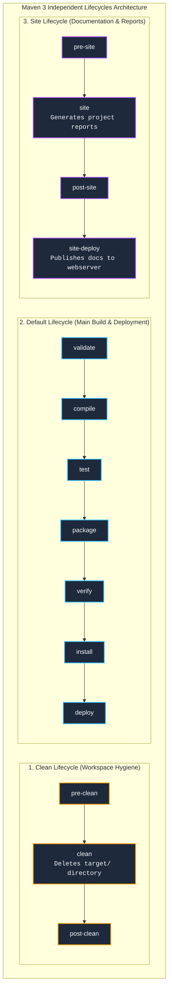
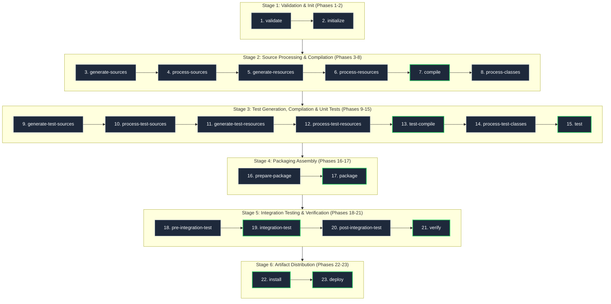
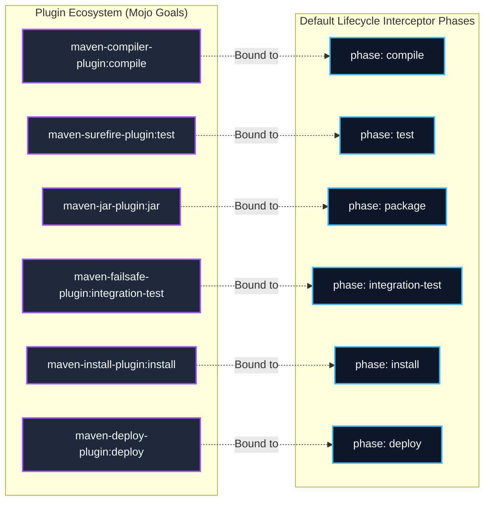
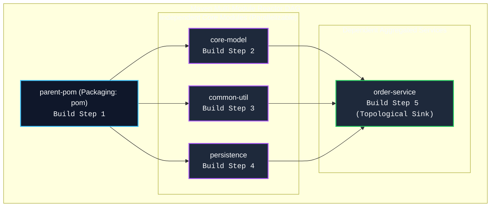

[🏠 Back to Home](../README.md) | [🐘 Gradle Master Guide](gradle_master_guide.md) | [☕ JVM & GC](jvm_gc_profiling_master_guide.md) | [🧵 Java Concurrency](java_thread.md) | [🍃 Spring Master Guide](../spring-framework/spring_master_guide.md)

# 📦 Apache Maven Build Automation Enterprise Master Guide

A production-grade engineering handbook covering the **Apache Maven Build Engine**, **Lifecycles & 23 Phase Sequencing**, **Aether / Maven Resolver DAG Internals**, **"Nearest Definition Wins" Dependency Mediation**, **BOM & `<dependencyManagement>`**, **Plugin Architecture (Compiler, Surefire, Failsafe, Shade Relocation, Jib)**, **Multi-Module Reactor Builds**, and **War-Room Post-Mortems**.

---

## 📑 Table of Contents

1. [🧠 Zero-to-Hero Mental Model: The Rigid Assembly Line](#-the-rigid-assembly-line)
2. [🛠️ Prerequisites & Foundational Knowledge](#️-prerequisites--foundational-knowledge)
3. [📦 Track 1: Maven Core Mechanics, Lifecycles & 23 Phases](#track-1-maven-core-mechanics-lifecycles--23-phases)
4. [🔌 Track 2: The Core Plugin Ecosystem](#track-2-the-core-plugin-ecosystem)
5. [🌳 Track 3: Dependency Resolution Engine & Mediation Algorithms](#track-3-dependency-resolution-engine--mediation-algorithms)
6. [🏛️ Track 4: Multi-Module Enterprise Architecture & The Reactor](#track-4-multi-module-enterprise-architecture--the-reactor)
7. [🚨 Track 5: Disaster Recovery & War-Room Forensics (RCAs)](#track-5-disaster-recovery--war-room-forensics-rcas)
8. [❌ Track 6: Beginner Anti-Patterns & Fatal Engineering Traps](#track-6-beginner-anti-patterns--fatal-engineering-traps)
9. [🎓 Track 7: Crack-The-Interview Question Bank (Senior & Staff+ Level)](#track-7-crack-the-interview-question-bank-senior--staff-level)
10. [⚖️ Master Maven Command Cheat Sheet & Decision Matrix](#️-master-maven-command-cheat-sheet--decision-matrix)

---

## 🧠 The Rigid Assembly Line

```mermaid
flowchart LR
    subgraph Maven_Assembly_Line["Maven Deterministic Linear Assembly Line (Default Lifecycle)"]
        direction LR
        V["1. validate<br/><code>Verify POM & Config</code>"] --> C["2. compile<br/><code>Compile src/main/java</code>"]
        C --> T["3. test<br/><code>Surefire Unit Tests</code>"]
        T --> P["4. package<br/><code>Assemble JAR / WAR</code>"]
        P --> VF["5. verify<br/><code>Failsafe IT Checks</code>"]
        VF --> I["6. install<br/><code>Copy to ~/.m2/repository</code>"]
        I --> D["7. deploy<br/><code>Publish to Nexus / Artifactory</code>"]
    end

    classDef phase fill:#1e293b,stroke:#38bdf8,stroke-width:2px,color:#f8fafc;
    classDef terminal fill:#0f172a,stroke:#22c55e,stroke-width:2px,color:#f8fafc;
    class V,C,T,P,VF,I phase;
    class D terminal;
```



#### Architectural Breakdown of the Linear Conveyor Belt

##### 1. Visual Architecture & Component Topology
- **Linear State Machine**: Maven’s Default Lifecycle is modeled as an immutable, forward-only finite state machine (FSM). Execution proceeds in a strictly ordered sequence of phases: `validate` $\to$ `compile` $\to$ `test` $\to$ `package` $\to$ `verify` $\to$ `install` $\to$ `deploy`.
- **Phase Invariance**: You cannot jump into an arbitrary phase without executing all preceding phases. Requesting `package` forces Maven to first execute `validate`, all source processing phases, `compile`, test compilation, and `test`.
- **Packaging Decoupling**: The lifecycle phases remain static regardless of whether the artifact packaging is `jar`, `war`, `pom`, or `maven-plugin`. The underlying packaging binding merely alters which plugin goals are wired to each phase.

##### 2. Execution Flow & Lifecycle State Transitions
- **Phase Invocation**: Running `mvn package` initiates the Default Lifecycle engine. Maven creates an internal execution plan containing all bound Mojos from phase 1 (`validate`) through phase 17 (`package`).
- **Goal Binding Hook**: Each phase serves as an interceptor hook. When a phase is triggered, Maven retrieves all plugin goals registered to that phase and executes their respective `Mojo.execute()` methods in POM declaration order.
- **Fail-Fast Barrier**: If any goal execution fails (e.g. `javac` compilation error in `compile` or an assertion failure in `test`), the build halts immediately with `BUILD FAILURE`, skipping all downstream packaging and deployment phases.

##### 3. Low-Level Kernel, JVM & Hardware Mechanics
- **JVM Process Bootstrapping**: Running `./mvnw` or `mvn` invokes the Maven launcher class (`org.codehaus.plexus.classworlds.launcher.Launcher`) via the JVM. Classworlds constructs a hierarchical ClassLoader graph to isolate Maven core classes from plugin realms.
- **Worker Process Forking**: When reaching the `test` phase, the `maven-surefire-plugin` invokes `ProcessBuilder` to spawn a separate JVM child process (`forkCount=1`). This guarantees that test execution cannot pollute or mutate system properties and Metaspace of the host Maven build process.
- **Filesystem & Page Cache I/O**: Compiling code causes intense write traffic to the `target/classes` directory via OS file descriptors (`openat`, `write`, `fsync`). Output class files reside in OS page cache buffers before being packaged into a compressed ZIP/JAR archive using `DeflaterOutputStream`.

##### 4. Production Failure Modes & SRE Diagnostics
- **Premature Deployment Traps**: Running `mvn clean deploy` in CI without gating tests can push untested or broken snapshot binaries to remote artifact repositories if tests are skipped via `-DskipTests` in downstream pipelines.
- **Build Drift Forensics**:
  ```bash
  # Print the exact calculated execution plan showing all bound plugins and phases
  mvn fr.jcgay.maven.plugins:buildplan-maven-plugin:list
  
  # Run in full debug mode to trace exact goal-to-phase bindings and ClassLoader paths
  mvn package -X
  ```

<details>
<summary>View Legacy ASCII Diagram</summary>

```
Maven: The Linear Conveyor Belt Pipeline
[ validate ] ──► [ compile ] ──► [ test ] ──► [ package ] ──► [ verify ] ──► [ install ] ──► [ deploy ]
(Every phase is bound to strict sequential order. Running 'package' guarantees all prior phases execute.)
```

</details>

### The Core Concept:
Apache Maven is a **declarative, convention-over-configuration** build system. Unlike programmatic scripting tools, Maven defines a standard project model (**Project Object Model - POM**) and an immutable lifecycle state machine. Developers do not script "how" to compile or package; instead, they declare dependencies and plugin goals, which Maven binds to specific lifecycle phases.

---

## 🛠️ Prerequisites & Foundational Knowledge

### 1. GAV Coordinates & Super POM
Every Maven artifact is universally addressed via **GAV Coordinates**:
- **`groupId`**: The organization domain in reverse (e.g. `org.apache.commons`).
- **`artifactId`**: The binary or project name (e.g. `commons-lang3`).
- **`version`**: The semantic version (e.g. `3.14.0` or `1.0.0-SNAPSHOT`).
- **`packaging`**: `jar` (default), `war`, `pom`, `maven-plugin`.

#### The Super POM:
Every `pom.xml` implicitly inherits from Maven's internal **Super POM** (located inside `maven-model-builder.jar`). The Super POM defines:
- Default directory structures: `src/main/java`, `src/main/resources`, `src/test/java`, `target/`.
- Default central repository: `https://repo.maven.apache.org/maven2`.
- Default plugin version bindings.

### 2. The Maven Wrapper (`mvnw`)
Relying on developers or CI runners to install a global `mvn` binary causes "Works on my machine" failures due to version drift (e.g. Maven 3.6 vs 3.9).
- **`mvnw`** ensures that anyone executing `./mvnw clean package` automatically downloads, verifies the SHA-256 checksum of, and runs the exact pinned Maven version declared in `.mvn/wrapper/maven-wrapper.properties`.

---

# TRACK 1: MAVEN CORE MECHANICS, LIFECYCLES & 23 PHASES

## 1.1 The 3 Independent Lifecycles

Maven has **3 distinct, independent lifecycles**. Invoking a phase from one lifecycle does NOT execute phases from another lifecycle:



#### Architectural Breakdown of the 3 Independent Lifecycles

##### 1. Visual Architecture & Component Topology
- **Orthogonal Execution Domains**: Maven cleanly partitions build concerns into three disjoint lifecycle state machines:
  - **Clean**: Dedicated strictly to filesystem garbage collection and cache invalidation.
  - **Default**: The primary artifact compilation, verification, packaging, and distribution pipeline.
  - **Site**: Specialized static site generation, Javadoc aggregation, and documentation deployment.
- **Isolation Barrier**: No implicit transitions exist across lifecycles. Executing `mvn compile` will never trigger `clean`. Running `mvn site` will not build missing class files unless the Default Lifecycle is explicitly prepended.

##### 2. Execution Flow & Lifecycle State Transitions
- **Sequential Pipeline Dispatch**: When an operator invokes `mvn clean install site`, the Maven CLI parser partitions the input arguments across lifecycle boundaries.
- **Serial Execution Handshake**:
  1. Phase execution engine runs the `Clean` lifecycle from `pre-clean` up to `clean`.
  2. Upon clean completion, Maven resets execution telemetry and shifts to the `Default` lifecycle, starting fresh from `validate` through `install`.
  3. Maven subsequently switches to the `Site` lifecycle, executing `pre-site` through `site`.
- **Atomic Failure Handling**: If an early phase in the sequence fails (e.g. file lock failure in `clean`), all subsequent lifecycles (`Default`, `Site`) are instantly aborted.

##### 3. Low-Level Kernel, JVM & Hardware Mechanics
- **Directory Invalidation & Syscalls**: The `clean` phase triggers `maven-clean-plugin`, recursively unlinking entries in `${project.build.directory}` (`target/`). Under Linux, this invokes `unlinkat()` syscalls; on Windows, it issues `DeleteFileW` and `RemoveDirectoryW`.
- **File System VFS Contention**: If an IDE (IntelliJ, Eclipse), virus scanner, or background JVM daemon holds an open handle (`CreateFileW` with shared-read without `FILE_SHARE_DELETE`), the Windows kernel rejects the deletion with `ERROR_SHARING_VIOLATION` (`0x20`), throwing `java.io.IOException: Unable to delete file`.
- **Buffer Invalidation**: Deleting `target/` flushes OS page cache buffers associated with previous `.class` files, forcing fresh disk allocations when `compile` recreates the directory.

##### 4. Production Failure Modes & SRE Diagnostics
- **Windows File Lock Freezes**:
  - *Symptom*: CI agents on Windows fail with `Failed to clean project: File locked by another process`.
  - *Mitigation*: Ensure CI build runners kill lingering test workers (`taskkill /F /IM java.exe`) or leverage the `@Retryable` clean plugin configuration.
- **CI Diagnosis Commands**:
  ```bash
  # Check which process holds file locks on Windows
  handle.exe target
  
  # Trace exact plugin goals executed across all 3 lifecycles in order
  mvn clean install site -X | grep "---"
  ```

<details>
<summary>View Legacy ASCII Diagram</summary>

```
+-----------------------------------------------------------------------------------------+
|                                    MAVEN'S 3 LIFECYCLES                                 |
+-----------------------------------------------------------------------------------------+
| 1. Clean Lifecycle    : Handles project cleanup and artifact deletion.                  |
| 2. Default Lifecycle  : Handles the main compilation, testing, packaging, and deploy.  |
| 3. Site Lifecycle     : Generates documentation, project reports, and web sites.        |
+-----------------------------------------------------------------------------------------+
```

</details>

When you run:
`mvn clean install`
Maven executes two completely separate pipelines: first the **Clean lifecycle** up to `clean`, then the **Default lifecycle** up to `install`.

---

## 1.2 The 23 Sequential Phases of the Default Lifecycle

The Default Lifecycle comprises 23 sequential phases. If you invoke any phase, Maven executes **every preceding phase in strict chronological order**:



#### Architectural Breakdown of the 23 Sequential Phases

##### 1. Visual Architecture & Component Topology
- **Fine-Grained Chronological Milestones**: The Default Lifecycle partitions the build into 23 distinct states across 6 logical stages. Each stage is strictly separated by pre-, core-, and post-processing gateways (e.g. `pre-integration-test` $\to$ `integration-test` $\to$ `post-integration-test` $\to$ `verify`).
- **Convention-Over-Configuration Bindings**: The default super-POM leaves many utility phases unoccupied (e.g. `process-classes`, `prepare-package`), reserving them as standardized extension hooks for code-generators (MapStruct, OpenAPI, Protobuf) and bytecode manipulators (ByteBuddy, AspectJ).

##### 2. Execution Flow & Lifecycle State Transitions
- **Monotonic Progression**: Maven guarantees forward monotonicity. When an operator runs `mvn verify`, Maven cannot skip phases 1 through 20; it traverses each phase index sequentially.
- **Fail-Fast Barrier**: If an unhandled exception or exit code is returned by any Mojo execution (e.g. `javac` compilation failure in phase 7 or test failure in phase 15), execution halts instantly. Downstream phases (packaging, deployment) are never evaluated.
- **Integration Test Isolation**: Unlike unit tests in phase 15 (`test`) which abort immediately on error, integration tests executed by `maven-failsafe-plugin` in phase 19 (`integration-test`) capture failures without immediately terminating the build, guaranteeing that phase 20 (`post-integration-test`) tears down test environments (e.g., Docker containers) before phase 21 (`verify`) fails the build.

##### 3. Low-Level Kernel, JVM & Hardware Mechanics
- **Compiler Invocations & Memory Allocation**: During phase 7 (`compile`), `maven-compiler-plugin` invokes the JDK `javax.tools.JavaCompiler` API or forks `javac`. Annotation processors run in successive rounds, generating new source files written to `target/generated-sources/annotations`.
- **Worker Process Forking**: During phase 15 (`test`), `maven-surefire-plugin` executes tests inside a distinct forked JVM spawned via OS `fork()`/`execve()` or Windows `CreateProcessW`. Communication between the Maven parent process and the Surefire test runner occurs via standard I/O pipes or TCP sockets (`surefire.forkChannel`).
- **Archive Compression & Syscalls**: Phase 17 (`package`) uses `maven-jar-plugin` or `maven-shade-plugin`. The JVM traverses `target/classes`, computing CRC32 checksums and encoding byte streams into a `.jar` ZIP file using DEFLATE compression before issuing sequential `write()` syscalls.

##### 4. Production Failure Modes & SRE Diagnostics
- **Skip Test Flag Hazards**:
  - `-Dmaven.test.skip=true`: Disables phase 13 (`test-compile`) and phase 15 (`test`). Test classes are never compiled, allowing broken test code to escape into repositories.
  - `-DskipTests`: Compiles test classes in phase 13, but skips test execution in phase 15. This is the only safe mechanism for fast CI builds.
- **SRE Triaging Commands**:
  ```bash
  # View exact execution plan showing which plugin goal runs in each phase
  mvn fr.jcgay.maven.plugins:buildplan-maven-plugin:list-phase
  
  # Resume a multi-module reactor build from a specific failed phase/module
  mvn install -rf :failing-submodule
  ```

<details>
<summary>View Legacy ASCII Diagram</summary>

```
 1. validate             : Validate project is correct and all required information is available.
 2. initialize           : Initialize build state (e.g. set properties, create directories).
 3. generate-sources     : Generate any source code for inclusion in compilation (e.g. Protobuf/OpenAPI).
 4. process-sources      : Process source code (e.g. filter values in source code).
 5. generate-resources   : Generate resources for packaging.
 6. process-resources    : Copy and filter resources into target output directory.
 7. compile              : Compile the source code of the project.
 8. process-classes      : Post-process generated bytecode (e.g. bytecode enhancement/weaving).
 9. generate-test-sources: Generate test sources.
10. process-test-sources : Process test source code.
11. generate-test-resources: Create test resources.
12. process-test-resources: Copy and filter test resources into test output directory.
13. test-compile         : Compile test source code into test destination directory.
14. process-test-classes : Post-process test bytecode.
15. test                 : Run unit tests using a testing framework (Surefire).
16. prepare-package      : Perform actions needed before packaging.
17. package              : Package compiled code into distributable archive (JAR/WAR).
18. pre-integration-test : Prepare integration test environment (e.g. spin up Docker containers).
19. integration-test     : Run integration tests (Failsafe).
20. post-integration-test: Clean up integration test environment (e.g. tear down Docker).
21. verify               : Run verification checks on package quality and integration results.
22. install              : Install package into local repository (~/.m2/repository).
23. deploy               : Copy final package to remote enterprise repository (Nexus/Artifactory).
```

</details>

---

# TRACK 2: THE CORE PLUGIN ECOSYSTEM

Maven phases do nothing on their own; they are empty hooks. Functionality is provided by **Plugins**, which bind specific **Goals** (implemented as **Mojos** - Maven Plain Old Java Objects) to phases.



#### Architectural Breakdown of Plugin Goal Binding

##### 1. Visual Architecture & Component Topology
- **Mojo Component Architecture**: Plugins are packaged collections of one or more executable units termed **Mojos** (`org.apache.maven.plugin.Mojo`). Each Mojo exposes a specific goal (e.g. `compiler:compile`, `surefire:test`).
- **Plexus / Eclipse Sisu IoC Registry**: Maven maintains an internal Inversion of Control (IoC) container. During project model building, Maven parses plugin descriptors (`META-INF/maven/plugin.xml`), registers Mojos as components, and maps their `@phase` annotations or explicit `<executions>` configurations to specific lifecycle phases.

##### 2. Execution Flow & Lifecycle State Transitions
- **Phase Interception Dispatch**: When the lifecycle engine enters a phase (e.g. `compile`), it queries the execution plan for all bound Mojos.
- **Dependency & Parameter Injection**:
  1. Maven instantiates the Mojo within its dedicated ClassWorld realm.
  2. Maven injects configuration parameters declared in `pom.xml` using reflection (`@Parameter(property = "maven.compiler.release")`).
  3. Maven invokes `mojo.execute()`.
- **Exit Handshake**: If `execute()` completes without throwing `MojoExecutionException` or `MojoFailureException`, Maven marks the phase execution as successful and advances the state machine to the next phase.

##### 3. Low-Level Kernel, JVM & Hardware Mechanics
- **Plexus Classworlds ClassLoader Isolation**:
  - **Core Realm**: Contains Maven engine classes (`org.apache.maven.*`).
  - **Plugin Realm**: Created dynamically for each plugin, loading the plugin's JAR and its direct dependencies into an isolated `ClassRealm`.
  - **Project Realm**: Contains the compiled project classes and runtime dependencies.
- **ClassLoader Leak Prevention**: This strict isolation prevents a plugin requiring an ancient version of Guava or ASM from causing `LinkageError` or `NoSuchMethodError` against Maven's internal dependencies.
- **Worker Process Forking**: Heavy plugins (`surefire`, `failsafe`) do not run within Maven's JVM memory space. They invoke OS `CreateProcessW` / `fork()` to execute tests in an isolated child JVM, piping console output back via standard streams (`stdin`/`stdout`).

##### 4. Production Failure Modes & SRE Diagnostics
- **Plugin Realm ClassCastException**:
  - *Symptom*: Plugin fails with `java.lang.ClassCastException: org.slf4j.impl.StaticLoggerBinder cannot be cast to...`
  - *Cause*: A plugin leaked or imported logging implementations directly into the Project ClassLoader realm, colliding with Maven core SLF4J bindings.
- **SRE Triaging Commands**:
  ```bash
  # Inspect detailed metadata, parameters, and bound phases for any plugin goal
  mvn help:describe -Dplugin=org.apache.maven.plugins:maven-compiler-plugin:3.13.0 -Ddetail
  
  # Run with debug logging to inspect ClassRealm classloading paths
  mvn compile -X | grep -i "realm"
  ```

<details>
<summary>View Legacy ASCII Diagram</summary>

```
Plugin Goal Binding:
[ maven-compiler-plugin:compile ]    ─────► Bound to phase: [ compile ]
[ maven-surefire-plugin:test ]       ─────► Bound to phase: [ test ]
[ maven-jar-plugin:jar ]             ─────► Bound to phase: [ package ]
[ maven-failsafe-plugin:integration-test ] ──► Bound to phase: [ integration-test ]
[ maven-install-plugin:install ]     ─────► Bound to phase: [ install ]
```

</details>

---

## 2.1 Compiler Plugin (`maven-compiler-plugin`)
Controls `javac` compilation, Java release version, and annotation processors:

```xml
<plugin>
    <groupId>org.apache.maven.plugins</groupId>
    <artifactId>maven-compiler-plugin</artifactId>
    <version>3.13.0</version>
    <configuration>
        <release>21</release> <!-- Modern Java 21 release flag (sets source, target, bootclasspath) -->
        <parameters>true</parameters> <!-- Preserves method parameter names for Spring reflection -->
        <annotationProcessorPaths>
            <path>
                <groupId>org.projectlombok</groupId>
                <artifactId>lombok</artifactId>
                <version>1.18.32</version>
            </path>
            <path>
                <groupId>org.mapstruct</groupId>
                <artifactId>mapstruct-processor</artifactId>
                <version>1.5.5.Final</version>
            </path>
        </annotationProcessorPaths>
    </configuration>
</plugin>
```

---

## 2.2 Surefire vs Failsafe: Unit Tests vs Integration Tests

| Dimension | `maven-surefire-plugin` | `maven-failsafe-plugin` |
| :--- | :--- | :--- |
| **Primary Scope** | Fast, isolated **Unit Tests** | Environment-dependent **Integration Tests** |
| **Naming Convention** | `**/*Test.java`, `**/*TestCase.java` | `**/*IT.java`, `**/*ITCase.java` |
| **Bound Phases** | `test` | `integration-test` AND `verify` |
| **Failure Handling** | Fails build **immediately** on first test error. | Records failures, allows `post-integration-test` to clean up resources, then fails in `verify`! |

### Why Failsafe is Critical for Integration Testing:
If a test fails inside Surefire, the build aborts immediately. If you started a Testcontainers PostgreSQL container in `pre-integration-test`, an immediate abort leaves the container running as a zombie process! Failsafe guarantees `post-integration-test` runs to cleanly shut down containers before failing the build in `verify`.

```xml
<plugin>
    <groupId>org.apache.maven.plugins</groupId>
    <artifactId>maven-failsafe-plugin</artifactId>
    <version>3.2.5</version>
    <executions>
        <execution>
            <goals>
                <goal>integration-test</goal>
                <goal>verify</goal>
            </goals>
        </execution>
    </executions>
</plugin>
```

---

## 2.3 Maven Shade Plugin & Bytecode Package Relocation (Defeating JAR Hell)

When creating a standalone CLI tool or Spark job, you may depend on `guava:32.0`, while the hosting runtime environment already loads `guava:18.0`. Standard classloading causes `NoSuchMethodError`!
The **Maven Shade Plugin** solves this by:
1. Unpacking all dependency JARs into a single "Fat / Uber" JAR.
2. **Bytecode Relocation**: Renaming package prefixes in both `.class` files and constant pools:

```xml
<plugin>
    <groupId>org.apache.maven.plugins</groupId>
    <artifactId>maven-shade-plugin</artifactId>
    <version>3.5.3</version>
    <executions>
        <execution>
            <phase>package</phase>
            <goals><goal>shade</goal></goals>
            <configuration>
                <relocations>
                    <relocation>
                        <pattern>com.google.common</pattern>
                        <shadedPattern>com.mycompany.shaded.guava</shadedPattern>
                    </relocation>
                </relocations>
            </configuration>
        </execution>
    </executions>
</plugin>
```
Now, all references to Guava classes in your code point to `com.mycompany.shaded.guava.*`, coexisting peacefully with the host's older Guava version!

---

## 2.4 Google Jib: Fast Daemonless OCI Container Builds
Google Jib builds optimized Docker/OCI container images directly from Maven **without needing a local Docker daemon**:

```xml
<plugin>
    <groupId>com.google.cloud.tools</groupId>
    <artifactId>jib-maven-plugin</artifactId>
    <version>3.4.2</version>
    <configuration>
        <to>
            <image>registry.mycompany.com/services/payment-service:${project.version}</image>
        </to>
        <container>
            <jvmFlags>
                <jvmFlag>-XX:+UseZGC</jvmFlag>
                <jvmFlag>-XX:+ZGenerational</jvmFlag>
            </jvmFlags>
        </container>
    </configuration>
</plugin>
```
Commands: `mvn compile jib:build` pushes directly to the registry; `mvn compile jib:dockerBuild` loads into local Docker.

---

# TRACK 3: DEPENDENCY RESOLUTION ENGINE & MEDIATION ALGORITHMS

## 3.1 The "Nearest Definition Wins" Mediation Algorithm

When transitive dependencies introduce conflicting versions of the same artifact, Maven uses the **Tree Depth Metric**:

```mermaid
flowchart TD
    subgraph Dependency_Tree["Maven Aether Conflict Resolution Graph"]
        App["App Root Project (Depth 0)"]
        
        subgraph BranchA["Branch A (Shallow Depth)"]
            DepA["Dependency A (Depth 1)"]
            JackOld["Jackson-Core: 2.9 (Depth 2)<br/><b>WINNER (Nearest Definition)</b>"]
        end
        
        subgraph BranchB["Branch B (Deep Path)"]
            DepB["Dependency B (Depth 1)"]
            DepC["Dependency C (Depth 2)"]
            JackNew["Jackson-Core: 2.15 (Depth 3)<br/><b>SHADOWED & EVICTED</b>"]
        end
        
        App --> DepA
        DepA --> JackOld
        App --> DepB
        DepB --> DepC
        DepC -.->|Requires 2.15| JackNew
    end

    subgraph Runtime_Crash["JVM ClassLoader & Runtime Execution"]
        ClassLoader["AppClassLoader Classpath"]
        Crash["💥 java.lang.NoSuchMethodError:<br/>JsonParser.getNumberTypeFP()"]
    end

    JackOld ==>|Placed on Classpath| ClassLoader
    DepC -.->|Calls getNumberTypeFP()| ClassLoader
    ClassLoader --> Crash

    classDef root fill:#0f172a,stroke:#38bdf8,stroke-width:2px,color:#f8fafc;
    classDef winner fill:#1e293b,stroke:#22c55e,stroke-width:2px,color:#f8fafc;
    classDef evicted fill:#1e293b,stroke:#ef4444,stroke-width:2px,stroke-dasharray: 5 5,color:#f8fafc;
    classDef crash fill:#450a0a,stroke:#dc2626,stroke-width:2px,color:#fca5a5;
    classDef normal fill:#1e293b,stroke:#94a3b8,stroke-width:1px,color:#f8fafc;

    class App root;
    class DepA,DepB,DepC normal;
    class JackOld winner;
    class JackNew evicted;
    class Crash crash;
    class ClassLoader normal;
```

#### Architectural Breakdown of Dependency Mediation

##### 1. Visual Architecture & Component Topology
- **Tree Depth Hierarchy**: Maven models project dependencies as an N-ary directed tree traversed by the **Maven Artifact Resolver** (formerly Aether). Each node represents an artifact coordinate (`groupId:artifactId:version:scope`).
- **Depth Metric Definition**: Depth is defined as the number of hops along the shortest directed path from the root POM to the dependency node:
  - Root: Depth 0.
  - Direct Dependencies (`App` $\to$ `DepA`, `App` $\to$ `DepB`): Depth 1.
  - Transitive Dependencies: Depth $\ge 2$.

##### 2. Execution Flow & Lifecycle State Transitions
- **Resolution Phase Traversal**: During project initialization in the `validate` phase, Maven builds the dependency graph via Breadth-First Search (BFS).
- **Nearest-Wins Pruning**:
  1. Engine encounters `Jackson-Core: 2.9` at Depth 2 via `DepA`.
  2. Engine encounters `Jackson-Core: 2.15` at Depth 3 via `DepB` $\to$ `DepC`.
  3. Resolver compares depth values: $\text{Depth}(2.9) = 2 < \text{Depth}(2.15) = 3$.
  4. Resolver selects version `2.9` and drops version `2.15` from the resolved classpath graph.
- **The Tie-Breaker Rule**: If conflicting versions reside at the exact same depth, the version originating from the dependency declared **earlier in the `pom.xml` document order** wins. Reordering `<dependency>` XML stanzas silently changes runtime classpath binaries.

##### 3. Low-Level Kernel, JVM & Hardware Mechanics
- **Classpath Assembly & JVM Linkage**: The final resolved dependencies form an ordered `-classpath` list passed to `java.exe`. When `DepC` executes, the JVM invokes `CONSTANT_Methodref` resolution against the loaded classes.
- **Virtual Method Table (`vtable`) Lookup**: The JVM checks the loaded `com.fasterxml.jackson.core.JsonParser` class in Metaspace. Because Maven forced version 2.9 onto the classpath, the method `getNumberTypeFP()` does not exist in the class definition or its `vtable`.
- **Hardware Trap & JVM Abort**: Dynamic method dispatch fails, triggering a CPU trap that the JVM handles by allocating and throwing `java.lang.NoSuchMethodError`, immediately aborting the worker thread.

##### 4. Production Failure Modes & SRE Diagnostics
- **Production Classpath Outage**:
  - *Symptom*: Clean compilation in CI (because tests may not hit the specific code path), followed by crash in production under traffic.
  - *Permanent Solution*: Enforce explicit dependency versions via parent `<dependencyManagement>` or add `maven-enforcer-plugin` with `<requireUpperBoundDeps>`.
- **Forensic Commands**:
  ```bash
  # Identify all duplicate, shadowed, and omitted dependencies across the graph
  mvn dependency:tree -Dverbose -Dincludes=com.fasterxml.jackson.core:jackson-core
  
  # Audit bytecode for undeclared or conflicting classes
  mvn dependency:analyze
  ```

<details>
<summary>View Legacy ASCII Diagram</summary>

```
Scenario:
App (Root)
 ├── Dependency A (Depth 1)
 │    └── Jackson-Core: 2.9 (Depth 2)
 └── Dependency B (Depth 1)
      └── Dependency C (Depth 2)
           └── Jackson-Core: 2.15 (Depth 3)
```

</details>

1. **Tree Depth Evaluation**: `Jackson-Core 2.9` is at Depth 2. `Jackson-Core 2.15` is at Depth 3.
2. **The Winner**: Maven selects **`Jackson-Core 2.9`** because it is closer to the root!
3. **The Disaster**: Dependency C calls methods introduced in Jackson 2.15. At runtime, the JVM crashes with:
   `java.lang.NoSuchMethodError: com.fasterxml.jackson.core.JsonParser.getNumberTypeFP()`!

### The Tie-Breaker Rule:
If two conflicting dependencies reside at the **exact same depth**, the **first one declared in the `pom.xml` wins**. Swapping the order of `<dependency>` tags in your POM alters runtime bytecode resolution!

---

## 3.2 Bill of Materials (BOM) & `<dependencyManagement>`

To eliminate dependency version conflicts across large projects, Maven uses `<dependencyManagement>`:
- Does NOT add dependencies to the project classpath.
- Defines a **centralized version lookup table** for transitive and direct dependencies.
- Overrides the "Nearest Definition Wins" algorithm, forcing all modules and transitive libraries to use the explicitly declared version.

### Importing an Enterprise BOM:
```xml
<dependencyManagement>
    <dependencies>
        <dependency>
            <groupId>org.springframework.boot</groupId>
            <artifactId>spring-boot-dependencies</artifactId>
            <version>3.3.0</version>
            <type>pom</type>
            <scope>import</scope> <!-- Imports the BOM version table -->
        </dependency>
    </dependencies>
</dependencyManagement>

<dependencies>
    <!-- Version is omitted! Inherited automatically from BOM -->
    <dependency>
        <groupId>org.springframework.boot</groupId>
        <artifactId>spring-boot-starter-web</artifactId>
    </dependency>
</dependencies>
```

---

## 3.3 Maven Dependency Scopes & Transitivity Matrix

Maven provides 6 dependency scopes that control classpath presence across build phases:

| Scope | Compile Classpath | Test Classpath | Runtime Classpath | Transitive? |
| :--- | :---: | :---: | :---: | :---: |
| **`compile`** (Default) | ✅ Yes | ✅ Yes | ✅ Yes | ✅ Yes |
| **`provided`** | ✅ Yes | ✅ Yes | ❌ No (Container provides) | ❌ No |
| **`runtime`** | ❌ No | ✅ Yes | ✅ Yes | ✅ Yes |
| **`test`** | ❌ No | ✅ Yes | ❌ No | ❌ No |
| **`system`** | ✅ Yes | ✅ Yes | ❌ No (Hardcoded path) | ❌ No |
| **`import`** | ❌ N/A | ❌ N/A | ❌ N/A | (Used only in `<dependencyManagement>`) |

---

# TRACK 4: MULTI-MODULE ENTERPRISE ARCHITECTURE & THE REACTOR

## 4.1 The Reactor Execution Mechanism
In multi-module Maven projects, the **Reactor** inspects the dependency relationships between modules and calculates a **Directed Acyclic Graph (DAG)** to determine the correct build sequence.



#### Architectural Breakdown of the Reactor Execution Mechanism

##### 1. Visual Architecture & Component Topology
- **Multi-Module Topology**: In an enterprise repository, a parent aggregator POM orchestrates multiple nested sub-modules. The Reactor models these modules as nodes in a **Directed Acyclic Graph (DAG)**, where directed edges represent compile-time and test-time inter-module dependencies (`<dependency>` pointing to a sibling module within the reactor).
- **Sink Node Identification**: Leaf libraries (`core-model`, `common-util`, `persistence`) have in-degrees from the parent and out-degrees toward consumer microservices (`order-service`). `order-service` represents a DAG topological sink that cannot begin compilation until all its upstream dependencies have completed packaging.

##### 2. Execution Flow & Lifecycle State Transitions
- **Kahn's Topological Sorting**: During the `initialize` phase of the reactor, Maven collects all module POMs, verifies there are no directed cycles, and executes Kahn's algorithm or Depth-First Search topological sorting to produce a deterministic total ordering:
  1. `parent-pom`
  2. `core-model`
  3. `common-util`
  4. `persistence`
  5. `order-service`
- **In-Memory Artifact Handshake**: When `order-service` compiles against `core-model`, Maven does **not** fetch `core-model.jar` from `~/.m2/repository` or remote Nexus. The Reactor intercepts artifact resolution, dynamically binding the dependency directly to the in-memory output directory (`core-model/target/classes`).
- **Reactor Exit Barrier**: If any module fails a unit test or compilation check, the Reactor immediately aborts all downstream modules that depend on it.

##### 3. Low-Level Kernel, JVM & Hardware Mechanics
- **Multithreaded Task Dispatching (`-T`)**: When executing `mvn clean install -T 1C`, the Reactor wraps the DAG in a concurrent task scheduler. Independent nodes at the same topological depth (e.g. `core-model`, `common-util`, `persistence`) are dispatched concurrently to a `ThreadPoolExecutor`.
- **Inter-Thread Barrier Synchronization**: Worker threads execute distinct Mojo pipelines simultaneously. Maven uses lock-free concurrency primitives (`AtomicInteger`, `CompletableFuture`) to track in-degrees. As soon as all prerequisites for `order-service` complete, its barrier opens and a worker thread claims its compilation.
- **CPU & Memory Scaling**: Parallel builds multiply compiler memory footprints. Each worker thread runs its own annotation processing and bytecode generation phases, demanding higher JVM heap (`-Xmx`) and Metaspace (`-XX:MaxMetaspaceSize`) allocations to prevent `OutOfMemoryError: Metaspace`.

##### 4. Production Failure Modes & SRE Diagnostics
- **Cycle Detection Failures**:
  - *Symptom*: Build fails instantly with `org.apache.maven.project.ProjectCycleException: The projects in the reactor contain a cyclic reference`.
  - *Mitigation*: Circular dependencies between modules violate DAG principles. Decouple shared models or interfaces into an independent API module.
- **SRE Triaging Commands**:
  ```bash
  # Resume a failed multi-module build starting from the module that failed
  mvn clean install -rf :order-service
  
  # Build only order-service and all its upstream prerequisites
  mvn clean install -pl :order-service -am
  
  # Build order-service and all downstream modules that depend on it
  mvn clean install -pl :order-service -amd
  ```

<details>
<summary>View Legacy ASCII Diagram</summary>

```
                    [ parent-pom ]
                          │
          ┌───────────────┼───────────────┐
          ▼               ▼               ▼
     [ core-model ]  [ common-util ]  [ persistence ]
          │               │               │
          └───────┬───────┘               │
                  ▼                       ▼
            [ order-service ] ◄───────────┘
```

</details>

**Reactor Build Order**:
1. `parent-pom`
2. `core-model`
3. `common-util`
4. `persistence`
5. `order-service`

If `order-service` depends on `core-model`, the Reactor guarantees `core-model` is compiled and packaged *before* `order-service` begins compilation.

---

## 4.2 Aggregator POM vs Parent Inheritance POM

| Feature | Aggregator POM (`<modules>`) | Parent POM (`<parent>`) |
| :--- | :--- | :--- |
| **Purpose** | Batches module builds together. | Shares configuration, plugins, dependencies. |
| **Directory** | Root project folder. | Can reside anywhere in repository or remote Nexus. |
| **Declaration** | Contains `<modules><module>sub-app</module></modules>`. | Sub-projects declare `<parent>...</parent>`. |
| **Packaging** | Must be `<packaging>pom</packaging>`. | Must be `<packaging>pom</packaging>`. |

*In enterprise projects, the root POM usually serves as both the Aggregator and the Parent.*

---

## 4.3 High-Throughput Parallel Reactor Builds

By default, Maven builds modules sequentially on a single thread. To accelerate build times on modern multicore CI runners:

```bash
# Build using 4 worker threads
mvn clean install -T 4

# Build using 1 thread per CPU core
mvn clean install -T 1C

# Resume a failed build from a specific module
mvn clean install -rf :order-service

# Build only a specific module and its upstream dependencies
mvn clean install -pl :order-service -am
```
- `-pl` / `--projects`: Selects target module.
- `-am` / `--also-make`: Builds all upstream dependencies required by the target module.
- `-amd` / `--also-make-dependents`: Builds target module and all downstream modules depending on it.

---

# TRACK 5: DISASTER RECOVERY & WAR-ROOM FORENSICS (RCAS)

## 🚨 Incident 1: The Silent Diamond Dependency `NoSuchMethodError` Outage
- **Severity:** P0 Production Outage
- **Symptom:** Microservice compiled cleanly in CI, but threw `NoSuchMethodError: org.apache.http.conn.ssl.SSLConnectionSocketFactory` on production boot.
- **Root Cause:**
  - `aws-sdk` depended on `httpclient:4.5.13` (Depth 2).
  - `legacy-internal-client` depended on `httpclient:4.2.1` (Depth 1).
  - Under "Nearest Definition Wins", Maven selected `httpclient:4.2.1`. The newer methods expected by `aws-sdk` did not exist in the 4.2.1 binary!
- **The Forensic Investigation:**
  ```bash
  mvn dependency:tree -Dincludes=org.apache.httpcomponents:httpclient
  ```
- **The Permanent Fix:** Enforced the latest version in the parent `<dependencyManagement>`. Added the `maven-enforcer-plugin` with `enforceBytecodeVersion` and `banDuplicateClasses`.

---

## 🚨 Incident 2: The SNAPSHOT Mutability Poisoning Attack
- **Severity:** P1 Build Non-Reproducibility Outage
- **Symptom:** Code built successfully on Friday; on Monday, without a single Git commit, CI broke with compilation errors.
- **Root Cause:** The project depended on `com.partner:auth-sdk:2.1-SNAPSHOT`. Over the weekend, the partner team published a breaking change to their SNAPSHOT artifact in Nexus. Maven downloaded the updated SNAPSHOT during Monday's build.
- **The Permanent Fix:**
  1. Strictly ban `-SNAPSHOT` dependencies in production release branches.
  2. Configured Maven Enforcer rule: `<requireReleaseDeps>`.

---

## 🚨 Incident 3: Circular Dependency Deadlock in Multi-Module Reactor
- **Severity:** P2 Build Failure
- **Symptom:** Maven failed with `ProjectCycleException: The projects in the reactor contain a cyclic reference`.
- **Root Cause:** `user-service` depended on `billing-service` for subscription validation; `billing-service` depended on `user-service` for user profile lookup.
- **The Architectural Fix:** Extracted shared DTO interfaces into an independent leaf module (`user-billing-api`), breaking the circular dependency into a clean DAG.

---

# TRACK 6: BEGINNER ANTI-PATTERNS & FATAL ENGINEERING TRAPS

### ❌ Anti-Pattern 1: Skipping Tests with `-Dmaven.test.skip=true`
```bash
# ❌ DANGEROUS: Skips compilation of test classes entirely!
mvn clean package -Dmaven.test.skip=true

# ✅ PROPER: Compiles test classes, but skips test execution
mvn clean package -DskipTests
```
`-Dmaven.test.skip=true` does not compile test source files. If a developer breaks a shared test class signature, the build passes, hiding broken tests until someone else compiles them!

### ❌ Anti-Pattern 2: Using `<scope>system</scope>` with Hardcoded Local Paths
```xml
<!-- ❌ FATAL ANTI-PATTERN: Breaks on every machine except author's laptop! -->
<dependency>
    <groupId>com.oracle</groupId>
    <artifactId>ojdbc8</artifactId>
    <version>19.3</version>
    <scope>system</scope>
    <systemPath>C:/Users/john/libs/ojdbc8.jar</systemPath>
</dependency>
```
**The Fix**: Deploy custom JARs to an internal corporate artifact repository (Nexus/Artifactory) using `mvn deploy:deploy-file`.

### ❌ Anti-Pattern 3: Specifying Versions on Child POM Dependencies Managed by BOM
Declaring `<version>` tags on child dependencies overrides the centralized BOM, re-introducing dependency divergence and classpath hell.

---

# TRACK 7: CRACK-THE-INTERVIEW QUESTION BANK (SENIOR & STAFF+ LEVEL)

### Q1: Exactly how does Maven's "Nearest Definition Wins" algorithm work, and why does it fail?
**Answer:** When Maven encounters multiple versions of the same dependency transitively, it resolves conflicts based on the tree depth metric: the version closest to the root project wins. If two versions reside at the exact same depth, the one declared first in the POM wins. It fails because it evaluates depth, not semantic version compatibility. A shallow library requesting an obsolete version will override a deeper library requiring newer methods, triggering `NoSuchMethodError` or `ClassNotFoundException` at runtime.

---

### Q2: What is the difference between Surefire and Failsafe plugins?
**Answer:** Surefire runs unit tests during the `test` phase and aborts the build immediately upon the first failure. Failsafe runs integration tests during `integration-test` and records test failures, but allows the subsequent `post-integration-test` phase to execute. This ensures test environments, databases, and Docker containers are cleanly torn down before the build officially fails during the `verify` phase.

---

### Q3: What is the difference between `<dependencyManagement>` and `<dependencies>`?
**Answer:** `<dependencies>` immediately adds libraries to the compile and runtime classpaths of the declaring project and its transitive consumers. `<dependencyManagement>` is purely a configuration lookup table; it does not add anything to the classpath until a module explicitly declares the dependency without a version tag.

---

### Q4: How does the Maven Shade plugin solve classpath collisions via bytecode relocation?
**Answer:** The Shade plugin unpacks all dependent JARs and re-packages them into an uber-jar. Through bytecode relocation, it rewrites the package names (e.g. `com.google.common` $\to$ `com.mycompany.shaded.guava`) inside both `.class` files and the constant pools of the bytecode. This allows two incompatible versions of the same library to run simultaneously inside the same JVM without ClassLoader conflicts.

---

### Q5: How do you build a single module in a 100-module Maven reactor along with its upstream dependencies?
**Answer:** Using the `-pl` (project list) and `-am` (also make) flags:
`mvn clean install -pl :payment-service -am`
Maven calculates the reactor DAG, identifies all modules that `payment-service` depends on, compiles and packages them in topological order, and builds `payment-service` without compiling the other 90 unrelated modules.

---

# ⚖️ MASTER MAVEN COMMAND CHEAT SHEET & DECISION MATRIX

| Build Objective | Command | Engine Action |
| :--- | :--- | :--- |
| **Standard Clean Build** | `./mvnw clean package` | Deletes `target/`, compiles, runs unit tests, packages JAR. |
| **Fast Build (Skip Tests)** | `./mvnw clean package -DskipTests` | Compiles test sources, skips Surefire test execution. |
| **High-Speed Parallel Build** | `./mvnw clean install -T 1C` | Executes reactor modules in parallel using 1 thread per core. |
| **Inspect Dependency Tree** | `mvn dependency:tree -Dverbose` | Outputs full tree with omitted/conflicted markers. |
| **Analyze Unused Dependencies**| `mvn dependency:analyze` | Identifies used undeclared and declared unused dependencies. |
| **Build Module + Upstream** | `mvn package -pl :order-svc -am` | Builds `order-svc` and all required prerequisite modules. |
| **Resume Failed Build** | `mvn package -rf :order-svc` | Resumes reactor execution starting from the failed module. |
| **Purge Local Cache & Re-download**| `mvn dependency:purge-local-repository` | Cleans corrupted artifacts from `~/.m2/repository`. |

---
[🏠 Back to Home](../README.md) | [🐘 Gradle Master Guide](gradle_master_guide.md) | [☕ JVM & GC](jvm_gc_profiling_master_guide.md) | [🧵 Java Concurrency](java_thread.md) | [🍃 Spring Master Guide](../spring-framework/spring_master_guide.md)
