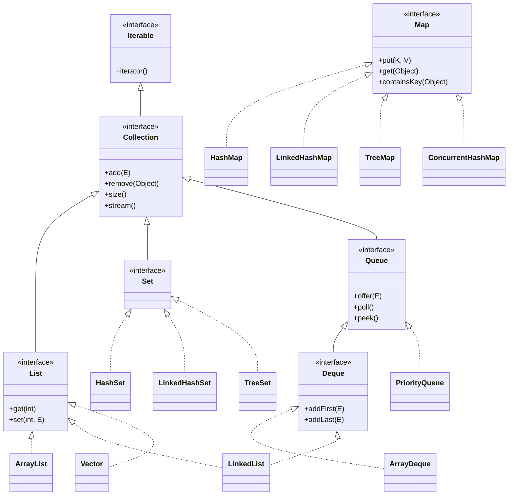
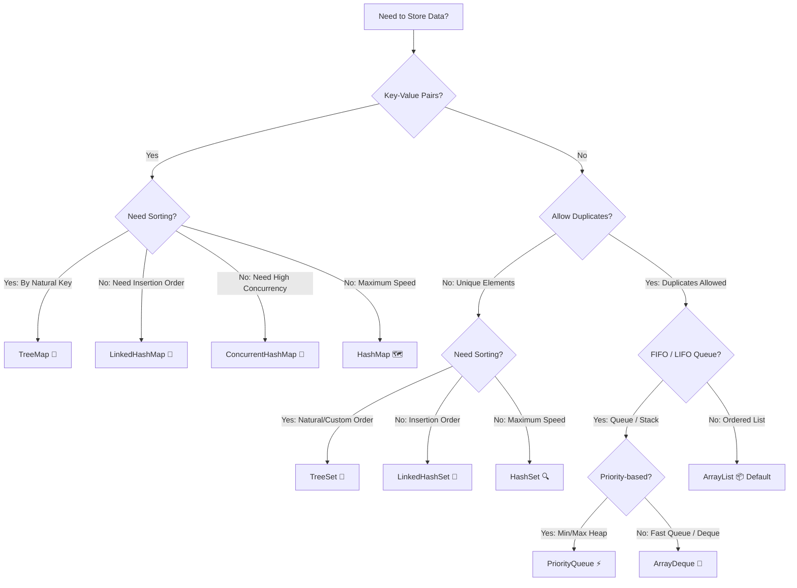
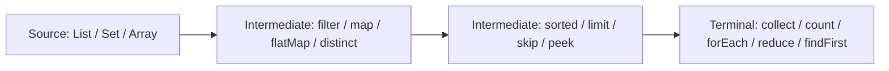

[🏠 Back to Home](README.md) | [📚 Deep Dive: 100+ Collections Scenarios](java_collection_stream.md) | [🐙 Collections Mastery Topic](topics/java_collections_mastery.md)

# 📚 Java Collections & Streams Complete Architecture & Quick Reference

A high-performance cheat sheet and architectural guide to the Java Collections Framework (JCF) and Stream API. Covers complexity matrices, data structure decision models, thread-safe collections, and Stream pipeline operations.

---

## 📑 Table of Contents
1. [🧠 Zero-to-Hero Mental Model: Memory Layouts & CPU Cache Locality](#-zero-to-hero-mental-model-memory-layouts--cpu-cache-locality)
2. [🌳 The Java Collections Class Hierarchy](#-the-java-collections-class-hierarchy)
3. [🏆 The "Which Collection Should I Use?" Decision Matrix](#-the-which-collection-should-i-use-decision-matrix)
4. [⚡ Time & Space Complexity Master Grid](#-time--space-complexity-master-grid)
5. [🐙 Thread-Safe & Concurrent Collections](#-thread-safe--concurrent-collections)
6. [🌊 Java 8+ Stream API Mastery & Method Reference](#-java-8-stream-api-mastery--method-reference)
7. [⚠️ Top 10 Collections Traps & Performance Nightmares](#️-top-10-collections-traps--performance-nightmares)
8. [🎓 7. Senior Interview Preparation & Scenario Q&A](#-7-senior-interview-preparation--scenario-qa)
9. [🔄 8. Architectural Transferability: Where & How to Apply Elsewhere](#-8-architectural-transferability-where--how-to-apply-elsewhere)

---

## 🧠 Zero-to-Hero Mental Model: Memory Layouts & CPU Cache Locality

### 🗄️ The Warehouse Analogy (Contiguous Array vs. Linked Pointers)

1. **`ArrayList` (Contiguous Shelf Array):**
   - Think of a long shelf with numbered boxes side-by-side in a straight line.
   - When the CPU asks for box `#5`, the hardware pre-fetches boxes `#6`, `#7`, and `#8` into the ultra-fast **L1/L2 CPU Cache** (Cache Line Locality). Scanning an `ArrayList` is blazingly fast ($O(1)$ random access).
2. **`LinkedList` (Scavenger Hunt):**
   - Each item is hidden in a random room in a massive building. Box #1 contains a note with the GPS coordinates of Box #2.
   - To find Box #10, the CPU must jump across memory addresses 10 times, causing constant **CPU Cache Misses**. Even though inserting in the middle is theoretically $O(1)$ once you have the node, finding the node is $O(n)$.
3. **`HashMap` (Indexed Mailboxes with Buckets):**
   - An array of mailboxes. When a letter arrives, its address is converted into a mailbox number via `hashCode() % array_length`.
   - If two letters map to the same mailbox (Collision), they form a small list. If 8+ letters collide in the same mailbox, Java automatically upgrades that mailbox into a **Red-Black Binary Search Tree** ($O(\log n)$) to prevent Denial of Service (HashDoS) attacks.

```
ArrayList (Contiguous Memory - L1/L2 Cache Friendly):
[ Element 0 ][ Element 1 ][ Element 2 ][ Element 3 ][ Element 4 ]

LinkedList (Fragmented Heap - Cache Misses):
[ Node A | Next* ] ──> [ Node B | Next* ] ──> [ Node C | Next* ]
 (0x10A4)               (0x89F0)               (0x3B12)
```

---

## 🌳 The Java Collections Class Hierarchy



---

## 🏆 The "Which Collection Should I Use?" Decision Matrix



---

## ⚡ Time & Space Complexity Master Grid

| Data Structure | Underlying Storage | Access (by Index) | Search (by Value) | Insert (at End) | Insert (at Head/Middle) | Delete | Memory Overhead |
| :--- | :--- | :--- | :--- | :--- | :--- | :--- | :--- |
| **`ArrayList`** | Dynamic Array | $O(1)$ | $O(n)$ | $O(1)$ amortized | $O(n)$ (array shift) | $O(n)$ | 🟢 Low (contiguous memory) |
| **`LinkedList`** | Doubly-Linked Nodes | $O(n)$ | $O(n)$ | $O(1)$ | $O(1)$ (if at node) | $O(1)$ | 🔴 High (2 pointers per node) |
| **`ArrayDeque`** | Resizable Circular Array | $O(1)$ | $O(n)$ | $O(1)$ | $O(1)$ | $O(1)$ | 🟢 Very Low (cache-friendly) |
| **`HashSet`** | Hash Table (`HashMap`) | N/A | $O(1)$ avg / $O(\log n)$ worst | $O(1)$ | $O(1)$ | $O(1)$ | 🟡 Moderate (Map.Entry wrapper) |
| **`LinkedHashSet`** | Hash Table + Linked List | N/A | $O(1)$ | $O(1)$ | $O(1)$ | $O(1)$ | 🔴 High (hash table + doubly-linked pointers) |
| **`TreeSet`** | Red-Black Balanced Tree | N/A | $O(\log n)$ | $O(\log n)$ | $O(\log n)$ | $O(\log n)$ | 🟡 Moderate (Tree nodes) |
| **`HashMap`** | Array of Buckets + Tree | N/A | $O(1)$ avg / $O(\log n)$ worst | $O(1)$ | $O(1)$ | $O(1)$ | 🟡 Moderate |
| **`ConcurrentHashMap`**| Synchronized Bins + CAS | N/A | $O(1)$ lock-free read | $O(1)$ | $O(1)$ | $O(1)$ | 🟡 Moderate (Segmented) |

---

## 🐙 Thread-Safe & Concurrent Collections

| Requirement | ❌ Legacy (Slow / Synchronized) | ✅ Modern High-Concurrency Collection |
| :--- | :--- | :--- |
| Concurrent Map | `Hashtable` / `Collections.synchronizedMap()` | `ConcurrentHashMap` (Lock-free reads, bin-level write locks) |
| Concurrent List | `Vector` / `Collections.synchronizedList()` | `CopyOnWriteArrayList` (Reads are $O(1)$ lock-free, best for 99% reads) |
| Concurrent Set | `Collections.synchronizedSet()` | `ConcurrentHashMap.newKeySet()` or `CopyOnWriteArraySet` |
| Producer-Consumer Queue | `Vector` polling loop | `BlockingQueue` (`ArrayBlockingQueue`, `LinkedBlockingQueue`) |
| Thread-Safe Deque | `Stack` | `ConcurrentLinkedDeque` |

---

## 🌊 Java 8+ Stream API Mastery & Method Reference

Streams allow functional, declarative processing of collections.



### Essential Stream Operations Cheat Sheet
```java
List<Order> orders = fetchOrders();

// 1. Grouping by Customer ID & Summing Total Spend:
Map<String, Double> spendByCustomer = orders.stream()
    .filter(o -> o.getStatus() == Status.COMPLETED)
    .collect(Collectors.groupingBy(
        Order::getCustomerId,
        Collectors.summingDouble(Order::getAmount)
    ));

// 2. Partitioning into High-Value vs Regular Orders:
Map<Boolean, List<Order>> partitioned = orders.stream()
    .collect(Collectors.partitioningBy(o -> o.getAmount() > 1000.0));

// 3. Flattening Nested Lists (flatMap):
List<String> allProductSkus = orders.stream()
    .flatMap(order -> order.getItems().stream())
    .map(OrderItem::getSku)
    .distinct()
    .sorted()
    .toList(); // Java 16+ unmodifiable list
```

---

## ⚠️ Top 10 Collections Traps & Performance Nightmares

1. **The `subList()` Memory Leak Trap:**
   - Calling `list.subList(0, 5)` keeps a hard reference to the **entire parent array** in memory!
   - *Fix:* Create a new list copy: `new ArrayList<>(list.subList(0, 5))`.
2. **The `list.remove(1)` Overload Ambiguity:**
   - For `List<Integer>`, `list.remove(1)` removes the item at **Index 1**, NOT value `1`.
   - *Fix:* `list.remove(Integer.valueOf(1))`.
3. **`ConcurrentModificationException` during iteration:**
   - Modifying a collection with `.remove()` inside a `for-each` loop throws `ConcurrentModificationException`.
   - *Fix:* Use `list.removeIf(predicate)` or `Iterator.remove()`.
4. **The `equals()` and `hashCode()` Contract Violation:**
   - Overriding `equals()` without overriding `hashCode()` breaks `HashSet` and `HashMap` key lookups.
5. **Re-using a Consumed Stream:**
   - Streams in Java are single-use. Calling a terminal operation twice throws `IllegalStateException: stream has already been operated upon or closed`.
6. **Parallel Stream Thread Starvation:**
   - `collection.parallelStream()` uses `ForkJoinPool.commonPool()`. Running blocking I/O calls inside it freezes the entire JVM.
7. **`Arrays.asList()` Fixed-Size Trap:**
   - `Arrays.asList(array)` returns a fixed-size wrapper. Calling `.add()` throws `UnsupportedOperationException`.
   - *Fix:* `new ArrayList<>(Arrays.asList(array))` or `List.of(...)`.
8. **High Initial Allocation Storm:**
   - Adding 1,000,000 items to `new ArrayList<>()` forces 20+ array resizing and copy operations.
   - *Fix:* Initialize with capacity: `new ArrayList<>(1_000_000)`.
9. **`TreeSet` without `Comparable`:**
   - Adding an object that doesn't implement `Comparable` to `TreeSet` or `TreeMap` without a `Comparator` throws `ClassCastException`.
10. **Using `LinkedList` by Default:**
    - `LinkedList` has poor CPU cache locality and consumes 24 bytes of overhead per node on 64-bit JVMs. Use `ArrayList` or `ArrayDeque` instead.

---

## 🎓 7. Senior Interview Preparation & Scenario Q&A

### 📌 Core Conceptual Interview Questions

#### Q1: What happens internally in Java 8+ when you call `map.put(key, value)` on a HashMap?
> **Answer & Explanation:**
> 1. **Hash Calculation:** The key's `hashCode()` is computed, and high bits are XORed with low bits (`h ^ (h >>> 16)`) to spread entropy across smaller array tables.
> 2. **Bucket Indexing:** The array index is calculated using bitwise AND: `index = (n - 1) & hash` (where `n` is always a power of 2).
> 3. **Empty Bucket:** If the bucket is `null`, a new `Node<K,V>` is inserted directly.
> 4. **Collision Handling:**
>    - If a node exists, it checks if `key.equals(existingKey)`. If true, the value is updated.
>    - If false, it traverses the linked list. If the bucket size reaches **`TREEIFY_THRESHOLD = 8`** AND total map capacity $\ge 64$ (`MIN_TREEIFY_CAPACITY`), the bucket is converted into a **Red-Black Tree** ($O(\log n)$ lookup) to defend against malicious hash-collision attacks.
> 5. **Resize:** If total entries exceed `capacity * loadFactor (0.75)`, the array doubles in size ($2n$), and elements are re-indexed via bitwise check (`(hash & oldCap) == 0`).

#### Q2: How does `ConcurrentHashMap` achieve high concurrency in Java 8+ compared to Java 7?
> **Answer & Explanation:**
> - **Java 7:** Used **Segmented Locking** (`ReentrantLock` over 16 fixed segments). Concurrency was limited to the number of segments (concurrency level).
> - **Java 8+:** Removed Segments completely.
>   - **Lock-Free Inserts:** Uses hardware **CAS (Compare-And-Swap)** primitives when inserting into an empty bucket head.
>   - **Fine-Grained Node Locks:** Only acquires a `synchronized` lock on the **individual head Node** of the colliding bucket during collisions or treeification.
>   - Reads (`get()`) are completely lock-free because node `val` and `next` pointers are marked `volatile`.

#### Q3: What is the difference between Fail-Fast and Fail-Safe (Weakly Consistent) Iterators?
> **Answer & Explanation:**
> - **Fail-Fast (`ArrayList`, `HashMap`, `HashSet`):** Maintains an internal `modCount` counter. If `modCount` changes during iteration without using the iterator's own methods, it immediately throws `ConcurrentModificationException`.
> - **Fail-Safe / Weakly Consistent (`CopyOnWriteArrayList`, `ConcurrentHashMap`):** Operates on a snapshot or dynamically accommodates concurrent mutations without throwing exceptions. Iterators may or may not reflect modifications made after iterator creation.

#### Q4: Why does mutating a field of an object used as a `HashMap` key cause a silent memory leak?
> **Answer & Explanation:**
> - When an object is inserted as a key, its bucket index is computed from its initial `hashCode()`.
> - If you mutate a field that participates in `hashCode()`, the object's hash changes.
> - When calling `map.get(key)` or `map.remove(key)` later, the map computes the **new hash**, calculates the **wrong bucket index**, and fails to find the entry.
> - The original entry remains orphaned inside the old bucket forever, causing a silent **Heap Memory Leak**.
> - **Rule:** Map keys MUST be strictly **Immutable** (e.g., `String`, `UUID`, Java `record`, or `@Value` classes).

---

### 🚨 Real-World Scenario-Based Interview Questions

#### Scenario Q1: Custom In-Memory LRU Cache
> **Interviewer Question:** *"How would you build a thread-safe, high-performance in-memory Least Recently Used (LRU) Cache with a fixed capacity of 5,000 entries using standard Java Collections?"*
>
> **Senior Architect Answer:**
> We extend `LinkedHashMap` with `accessOrder = true` and override `removeEldestEntry`:
> ```java
> public class LruCache<K, V> extends LinkedHashMap<K, V> {
>     private final int maxCapacity;
> 
>     public LruCache(int maxCapacity) {
>         // initialCapacity, loadFactor, accessOrder (true = access-order, false = insertion-order)
>         super(maxCapacity, 0.75f, true);
>         this.maxCapacity = maxCapacity;
>     }
> 
>     @Override
>     protected boolean removeEldestEntry(Map.Entry<K, V> eldest) {
>         return size() > maxCapacity;
>     }
> 
>     // For thread-safety, wrap with Collections.synchronizedMap()
>     public static <K, V> Map<K, V> createSynchronized(int capacity) {
>         return Collections.synchronizedMap(new LruCache<>(capacity));
>     }
> }
> ```

#### Scenario Q2: Ultra-High-Read Configuration Registry
> **Interviewer Question:** *"You have an API Gateway routing table that is read 500,000 times/second by 200 threads, but updated only once every hour by an admin. What collection do you choose and why?"*
>
> **Senior Architect Answer:**
> - **Choice:** `CopyOnWriteArrayList` or an unmodifiable snapshot wrapped in an `AtomicReference<Map<String, Route>>`.
> - **Justification:** `CopyOnWriteArrayList` provides $O(1)$ lock-free, volatile array reads with 0 synchronization overhead. Writes create a cloned copy of the array, which is completely acceptable for rare mutations (once per hour) in exchange for near-zero read latency.

---

## 🔄 8. Architectural Transferability: Where & How to Apply Elsewhere

The core data structures and concurrency models in the Java Collections Framework map directly to distributed and systems-level architectures:

### 1. 📈 Financial Order Books & Limit Matching
- **Data Structure:** `TreeMap` / `ConcurrentSkipListMap`
- **Application:** Matching buy/sell orders in stock exchanges requires sorting orders by price in $O(\log n)$ time and retrieving the best bid/ask in $O(1)$ (`firstEntry()` / `lastEntry()`).

### 2. ⏱️ Distributed Rate Limiters & Sliding Windows
- **Data Structure:** `ArrayDeque` / Ring Buffer
- **Application:** Tracking API request timestamps per user IP. As new requests arrive, push timestamps to the tail and prune expired entries from the head in $O(1)$ time without memory reallocation.

### 3. 🗺️ In-Memory Geospatial & Spatial Indexing
- **Data Structure:** Custom Prefix Trees / `Trie` built on `HashMap<Character, Node>`
- **Application:** Autocomplete search engines, routing gateways, and IP routing tables (longest prefix match).

---

[⬆️ Back to Top](#-java-collections--streams-complete-architecture--quick-reference)

