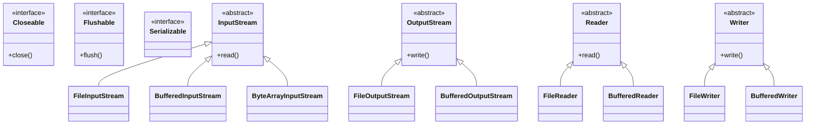

# 📘 Java IO Complete Reference - Part 1: Core Hierarchy & Interfaces
Complete IO Class Hierarchy Overview

## 🌳 IO Class Hierarchy (Mermaid)


## 🔗 1. CORE INTERFACES (Root Level)
### 🔹 1.1 Closeable Interface

> **🤔 Why we need it:** To prevent resource leaks (file handles, network sockets) which can crash applications.
> **⚙️ Key Methods:**
> - `void close()`: Closes stream & releases resources.

> **Purpose:** Marks resources that need to be closed after use.
```java
**📜 // Source code structure**
public interface Closeable {
    void close() throws IOException;
}

**🏗️ // Real-world implementation example**
public class DatabaseConnection implements Closeable {
    private Connection connection;
    private boolean isClosed = false;

    @Override
    public void close() throws IOException {
        if (!isClosed) {
            try {
                if (connection != null) {
                    connection.close();
                }
            } catch (SQLException e) {
                throw new IOException("Failed to close database connection", e);
            } finally {
                isClosed = true;
            }
        }
    }
}

**🏢 // Usage in enterprise application**
public class ReportGenerationService {
    public void generateMonthlyReport() {
        // Try-with-resources automatically calls close()
        try (DatabaseConnection dbConn = new DatabaseConnection();
             FileWriter reportWriter = new FileWriter("monthly_report.csv")) {

            List<SalesData> data = dbConn.fetchMonthlySales();
            writeReport(data, reportWriter);

        } catch (IOException e) {
            logger.error("Report generation failed", e);
        }
    }
}
```
### 🔹 1.2 Flushable Interface

> **🤔 Why we need it:** Buffered streams hold data in memory. Flushing ensures data is written to disk/network even if buffer isn't full.
> **⚙️ Key Methods:**
> - `void flush()`: Writes buffered output.

> **Purpose:** Indicates that buffered data can be flushed.
```java
// Interface definition
public interface Flushable {
    void flush() throws IOException;
}

// Real-world custom implementation
public class AuditLogWriter implements Flushable, Closeable {
    private BufferedWriter writer;
    private List<String> buffer = new ArrayList<>();
    private static final int BATCH_SIZE = 100;

    public void log(String message) throws IOException {
        buffer.add(String.format("[%s] %s",
            LocalDateTime.now(), message));

        if (buffer.size() >= BATCH_SIZE) {
            flush(); // Auto-flush when buffer is full
        }
    }

    @Override
    public void flush() throws IOException {
        if (!buffer.isEmpty()) {
            for (String logEntry : buffer) {
                writer.write(logEntry);
                writer.newLine();
            }
            buffer.clear();
            writer.flush(); // Ensure OS writes to disk

            // Real-time monitoring systems need immediate visibility
            System.out.println("Audit log flushed: " +
                LocalDateTime.now());
        }
    }

    @Override
    public void close() throws IOException {
        flush(); // Ensure all pending logs are written
        writer.close();
    }
}

// Banking transaction logging
public class BankingAuditService {
    private AuditLogWriter auditWriter;

    public void processTransaction(Transaction tx) {
        try {
            // Log transaction start
            auditWriter.log(String.format(
                "TRANSACTION_START: Account=%s, Amount=%.2f, Type=%s",
                tx.getAccountId(), tx.getAmount(), tx.getType()));

            // Process transaction logic here...
            boolean success = processTransfer(tx);

            // Log transaction completion
            auditWriter.log(String.format(
                "TRANSACTION_COMPLETE: ID=%s, Success=%s",
                tx.getTransactionId(), success));

            // Force flush for critical financial transactions
            auditWriter.flush();

        } catch (IOException e) {
            logger.error("Audit logging failed", e);
            // In banking, we might rollback the transaction
            rollbackTransaction(tx);
        }
    }
}
```
### 🔹 1.3 DataInput & DataOutput Interfaces
> **Purpose:** Provide methods for reading/writing primitive data types.
```java
// DataInput interface methods
public interface DataInput {
    boolean readBoolean() throws IOException;
    byte readByte() throws IOException;
    char readChar() throws IOException;
    double readDouble() throws IOException;
    float readFloat() throws IOException;
    void readFully(byte[] b) throws IOException;
    int readInt() throws IOException;
    String readLine() throws IOException;
    long readLong() throws IOException;
    short readShort() throws IOException;
    int skipBytes(int n) throws IOException;
}

// DataOutput interface methods
public interface DataOutput {
    void writeBoolean(boolean v) throws IOException;
    void writeByte(int v) throws IOException;
    void writeBytes(String s) throws IOException;
    void writeChar(int v) throws IOException;
    void writeChars(String s) throws IOException;
    void writeDouble(double v) throws IOException;
    void writeFloat(float v) throws IOException;
    void writeInt(int v) throws IOException;
    void writeLong(long v) throws IOException;
    void writeShort(int v) throws IOException;
    void writeUTF(String str) throws IOException;
}

// Real-world implementation: Network protocol handler
public class NetworkProtocolHandler implements DataInput, DataOutput {
    private DataInputStream dis;
    private DataOutputStream dos;

    // Protocol message format for IoT device communication
    public static class SensorDataPacket {
        private long timestamp;
        private int deviceId;
        private float temperature;
        private float humidity;
        private boolean alarmStatus;
        private String deviceName;

        // Constructor, getters, setters...
    }

    public void sendSensorData(SensorDataPacket packet) throws IOException {
        // Write packet header
        writeInt(0x534E4454); // Magic number "SNDT"
        writeLong(packet.getTimestamp());
        writeInt(packet.getDeviceId());

        // Write sensor readings
        writeFloat(packet.getTemperature());
        writeFloat(packet.getHumidity());
        writeBoolean(packet.isAlarmStatus());

        // Write device name using UTF-8
        writeUTF(packet.getDeviceName());

        // Flush to ensure immediate transmission
        flush();
    }

    public SensorDataPacket receiveSensorData() throws IOException {
        // Read and validate header
        int magic = readInt();
        if (magic != 0x534E4454) {
            throw new IOException("Invalid packet format");
        }

        SensorDataPacket packet = new SensorDataPacket();

        // Read packet data
        packet.setTimestamp(readLong());
        packet.setDeviceId(readInt());
        packet.setTemperature(readFloat());
        packet.setHumidity(readFloat());
        packet.setAlarmStatus(readBoolean());
        packet.setDeviceName(readUTF());

        return packet;
    }

    @Override
    public void write(int b) throws IOException {
        dos.write(b);
    }

    @Override
    public int read() throws IOException {
        return dis.read();
    }
}

// Enterprise IoT platform usage
public class IoTDeviceManager {
    private NetworkProtocolHandler protocolHandler;

    public void collectSensorData() {
        try {
            // Receive data from thousands of IoT devices
            while (true) {
                SensorDataPacket packet = protocolHandler.receiveSensorData();

                // Process and store in database
                processSensorData(packet);

                // Send acknowledgment
                protocolHandler.writeBoolean(true);

                // Real-time monitoring
                if (packet.isAlarmStatus()) {
                    triggerAlarm(packet.getDeviceId(), packet.getTemperature());
                }
            }
        } catch (IOException e) {
            logger.error("Device communication failed", e);
            // Attempt reconnection logic
            scheduleReconnection();
        }
    }
}
```
### 🔹 1.4 Serializable Interface
> **Purpose:** Marks objects that can be serialized to byte streams.
```java
// Interface definition (marker interface)
public interface Serializable {
    // No methods - marker interface
}

// Real-world implementation: Distributed cache system
public class UserSession implements Serializable {
    private static final long serialVersionUID = 1L;

    private String userId;
    private String username;
    private transient String password; // Won't be serialized
    private List<String> permissions;
    private LocalDateTime loginTime;
    private Map<String, Object> attributes = new HashMap<>();

    // Custom serialization for security
    private void writeObject(ObjectOutputStream oos) throws IOException {
        oos.defaultWriteObject();

        // Encrypt sensitive data before serialization
        String encryptedPermissions = encryptPermissions(permissions);
        oos.writeObject(encryptedPermissions);
    }

    private void readObject(ObjectInputStream ois)
            throws IOException, ClassNotFoundException {
        ois.defaultReadObject();

        // Decrypt sensitive data after deserialization
        String encryptedPermissions = (String) ois.readObject();
        this.permissions = decryptPermissions(encryptedPermissions);
    }

    // Distributed session management
    public byte[] serializeSession() throws IOException {
        try (ByteArrayOutputStream baos = new ByteArrayOutputStream();
             ObjectOutputStream oos = new ObjectOutputStream(baos)) {

            oos.writeObject(this);
            return baos.toByteArray();
        }
    }

    public static UserSession deserializeSession(byte[] data)
            throws IOException, ClassNotFoundException {
        try (ByteArrayInputStream bais = new ByteArrayInputStream(data);
             ObjectInputStream ois = new ObjectInputStream(bais)) {

            return (UserSession) ois.readObject();
        }
    }
}

// Enterprise distributed cache implementation
public class DistributedSessionCache {
    private RedisTemplate<String, byte[]> redisTemplate;

    public void storeSession(String sessionId, UserSession session) {
        try {
            byte[] serializedSession = session.serializeSession();

            // Store in distributed cache with TTL
            redisTemplate.opsForValue().set(
                "session:" + sessionId,
                serializedSession,
                Duration.ofHours(24)
            );

            logger.info("Session stored: {}", sessionId);

        } catch (IOException e) {
            logger.error("Failed to serialize session", e);
            throw new SessionStorageException("Session serialization failed", e);
        }
    }

    public UserSession retrieveSession(String sessionId) {
        try {
            byte[] serializedSession = redisTemplate.opsForValue()
                .get("session:" + sessionId);

            if (serializedSession != null) {
                UserSession session = UserSession.deserializeSession(serializedSession);

                // Validate session expiry
                if (session.isExpired()) {
                    redisTemplate.delete("session:" + sessionId);
                    return null;
                }

                return session;
            }

            return null;

        } catch (IOException | ClassNotFoundException e) {
            logger.error("Failed to deserialize session", e);
            throw new SessionRetrievalException("Session deserialization failed", e);
        }
    }
}
```
### 🔹 1.5 Externalizable Interface
> **Purpose:** Provides complete control over serialization process.
```java
// Interface definition
public interface Externalizable extends Serializable {
    void writeExternal(ObjectOutput out) throws IOException;
    void readExternal(ObjectInput in)
        throws IOException, ClassNotFoundException;
}

// Real-world: Financial transaction with version control
public class FinancialTransaction implements Externalizable {
    private static final int CURRENT_VERSION = 2;

    private String transactionId;
    private BigDecimal amount;
    private String currency;
    private LocalDateTime timestamp;
    private String fromAccount;
    private String toAccount;
    private TransactionType type;
    private Map<String, String> metadata;

    @Override
    public void writeExternal(ObjectOutput out) throws IOException {
        // Write version first for backward compatibility
        out.writeInt(CURRENT_VERSION);

        // Write critical fields
        out.writeUTF(transactionId);
        out.writeObject(amount);
        out.writeUTF(currency);
        out.writeObject(timestamp);
        out.writeUTF(fromAccount);
        out.writeUTF(toAccount);
        out.writeUTF(type.name());

        // Write metadata
        out.writeInt(metadata.size());
        for (Map.Entry<String, String> entry : metadata.entrySet()) {
            out.writeUTF(entry.getKey());
            out.writeUTF(entry.getValue());
        }
    }

    @Override
    public void readExternal(ObjectInput in)
            throws IOException, ClassNotFoundException {
        int version = in.readInt();

        switch (version) {
            case 1:
                readVersion1(in);
                break;
            case 2:
                readVersion2(in);
                break;
            default:
                throw new IOException("Unsupported version: " + version);
        }
    }

    private void readVersion1(ObjectInput in)
            throws IOException, ClassNotFoundException {
        // Read version 1 format (legacy)
        this.transactionId = in.readUTF();
        this.amount = (BigDecimal) in.readObject();
        this.currency = in.readUTF();
        this.timestamp = (LocalDateTime) in.readObject();
        this.fromAccount = in.readUTF();
        this.toAccount = in.readUTF();
        this.type = TransactionType.valueOf(in.readUTF());
        // Version 1 didn't have metadata
        this.metadata = new HashMap<>();
    }

    private void readVersion2(ObjectInput in)
            throws IOException, ClassNotFoundException {
        // Read current version format
        this.transactionId = in.readUTF();
        this.amount = (BigDecimal) in.readObject();
        this.currency = in.readUTF();
        this.timestamp = (LocalDateTime) in.readObject();
        this.fromAccount = in.readUTF();
        this.toAccount = in.readUTF();
        this.type = TransactionType.valueOf(in.readUTF());

        // Read metadata
        int metadataSize = in.readInt();
        this.metadata = new HashMap<>();
        for (int i = 0; i < metadataSize; i++) {
            String key = in.readUTF();
            String value = in.readUTF();
            metadata.put(key, value);
        }
    }
}

// Banking system with audit trail
public class TransactionAuditService {
    private static final String AUDIT_FILE = "transactions.dat";

    public void recordTransaction(FinancialTransaction transaction) {
        try (FileOutputStream fos = new FileOutputStream(AUDIT_FILE, true);
             ObjectOutputStream oos = new ObjectOutputStream(fos)) {

            // Write transaction with externalizable format
            transaction.writeExternal(oos);

            // Write separator for reading individual transactions
            oos.writeUTF("---END_TRANSACTION---");

            logger.info("Transaction recorded: {}", transaction.getTransactionId());

        } catch (IOException e) {
            logger.error("Failed to record transaction", e);
            // In banking, this is critical - might need to rollback
            notifyAuditFailure(transaction);
        }
    }

    public List<FinancialTransaction> getAuditTrail(String accountNumber) {
        List<FinancialTransaction> transactions = new ArrayList<>();

        try (FileInputStream fis = new FileInputStream(AUDIT_FILE);
             ObjectInputStream ois = new ObjectInputStream(fis)) {

            while (fis.available() > 0) {
                FinancialTransaction tx = new FinancialTransaction();
                tx.readExternal(ois);

                // Check if transaction involves this account
                if (tx.getFromAccount().equals(accountNumber) ||
                    tx.getToAccount().equals(accountNumber)) {
                    transactions.add(tx);
                }

                // Skip separator
                ois.readUTF();
            }

        } catch (EOFException e) {
            // End of file reached - normal termination
        } catch (IOException | ClassNotFoundException e) {
            logger.error("Failed to read audit trail", e);
        }

        return transactions;
    }
}
```
## 🧱 2. ABSTRACT BASE CLASSES
### 🔹 2.1 InputStream (Abstract Class)

> **🤔 Why we need it:** Defines the contract for reading raw binary data byte-by-byte.
> **⚙️ Key Methods:**
> - `int read()`: Reads next byte.
> - `int read(byte[] b)`: Reads into buffer.
> - `close()`: Closes stream.

> **Purpose:** Base class for all byte input streams.
```java
// Core methods explained
public abstract class InputStream implements Closeable {

    // Abstract method - MUST be implemented by subclasses
    public abstract int read() throws IOException;

    // Reads into byte array - concrete implementation
    public int read(byte b[]) throws IOException {
        return read(b, 0, b.length);
    }

    // Reads into portion of array
    public int read(byte b[], int off, int len) throws IOException {
        if (b == null) {
            throw new NullPointerException();
        }
        if (off < 0 || len < 0 || len > b.length - off) {
            throw new IndexOutOfBoundsException();
        }
        if (len == 0) {
            return 0;
        }

        int c = read(); // Read first byte
        if (c == -1) {
            return -1;
        }
        b[off] = (byte)c;

        int i = 1;
        try {
            for (; i < len ; i++) {
                c = read();
                if (c == -1) {
                    break;
                }
                b[off + i] = (byte)c;
            }
        } catch (IOException ee) {
        }
        return i;
    }

    // Skip bytes
    public long skip(long n) throws IOException {
        long remaining = n;
        int nr;

        if (n <= 0) {
            return 0;
        }

        int size = (int)Math.min(MAX_SKIP_BUFFER_SIZE, remaining);
        byte[] skipBuffer = new byte[size];
        while (remaining > 0) {
            nr = read(skipBuffer, 0, (int)Math.min(size, remaining));
            if (nr < 0) {
                break;
            }
            remaining -= nr;
        }

        return n - remaining;
    }

    // Available bytes
    public int available() throws IOException {
        return 0;
    }

    // Close stream
    public void close() throws IOException {}

    // Mark/Reset support
    public synchronized void mark(int readlimit) {}

    public synchronized void reset() throws IOException {
        throw new IOException("mark/reset not supported");
    }

    public boolean markSupported() {
        return false;
    }
}

// Real-world custom implementation: Encrypted input stream
public class EncryptedInputStream extends InputStream {
    private final InputStream wrappedStream;
    private final Cipher cipher;
    private final byte[] buffer;
    private int bufferPos = 0;
    private int bufferSize = 0;
    private boolean finalized = false;

    public EncryptedInputStream(InputStream in, String key)
            throws GeneralSecurityException {
        this.wrappedStream = in;
        this.cipher = Cipher.getInstance("AES/CBC/PKCS5Padding");

        // Initialize cipher with key and IV
        SecretKeySpec keySpec = new SecretKeySpec(
            key.getBytes(StandardCharsets.UTF_8), "AES");
        IvParameterSpec ivSpec = new IvParameterSpec(
            Arrays.copyOf(key.getBytes(), 16));

        cipher.init(Cipher.DECRYPT_MODE, keySpec, ivSpec);
        this.buffer = new byte[8192];
    }

    @Override
    public int read() throws IOException {
        if (bufferPos >= bufferSize && !finalized) {
            fillBuffer();
        }

        if (bufferPos < bufferSize) {
            return buffer[bufferPos++] & 0xFF;
        }

        return -1; // End of stream
    }

    private void fillBuffer() throws IOException {
        bufferPos = 0;
        bufferSize = 0;

        // Read encrypted data
        byte[] encryptedData = new byte[buffer.length];
        int bytesRead = wrappedStream.read(encryptedData);

        if (bytesRead == -1) {
            // End of encrypted data, finalize cipher
            try {
                buffer = cipher.doFinal();
                bufferSize = buffer.length;
                finalized = true;
            } catch (GeneralSecurityException e) {
                throw new IOException("Decryption finalization failed", e);
            }
        } else {
            // Decrypt data
            try {
                buffer = cipher.update(encryptedData, 0, bytesRead);
                bufferSize = buffer.length;
            } catch (GeneralSecurityException e) {
                throw new IOException("Decryption failed", e);
            }
        }
    }

    @Override
    public int available() throws IOException {
        return bufferSize - bufferPos + wrappedStream.available();
    }

    @Override
    public void close() throws IOException {
        try {
            wrappedStream.close();
        } finally {
            // Clear sensitive data
            Arrays.fill(buffer, (byte) 0);
        }
    }
}

// Enterprise secure file transfer system
public class SecureFileTransferService {
    private static final String ENCRYPTION_KEY = "MySuperSecretKey1234567890";

    public void downloadEncryptedFile(String fileId, OutputStream destination) {
        try {
            // Get encrypted file from cloud storage
            InputStream encryptedStream = cloudStorageService.getFile(fileId);

            // Wrap with decryption stream
            EncryptedInputStream decryptedStream =
                new EncryptedInputStream(encryptedStream, ENCRYPTION_KEY);

            // Transfer decrypted data
            byte[] buffer = new byte[8192];
            int bytesRead;
            while ((bytesRead = decryptedStream.read(buffer)) != -1) {
                destination.write(buffer, 0, bytesRead);
            }

            logger.info("Secure file download completed: {}", fileId);

        } catch (GeneralSecurityException | IOException e) {
            logger.error("Secure file download failed", e);
            throw new FileTransferException("Download failed", e);
        }
    }
}
```
### 🔹 2.2 OutputStream (Abstract Class)

> **🤔 Why we need it:** Defines the contract for writing raw binary data.
> **⚙️ Key Methods:**
> - `write(int b)`: Writes byte.
> - `write(byte[] b)`: Writes buffer.
> - `flush()`: Flushes output.

> **Purpose:** Base class for all byte output streams.
```java
public abstract class OutputStream implements Closeable, Flushable {

    // Abstract method - MUST be implemented
    public abstract void write(int b) throws IOException;

    // Write byte array
    public void write(byte b[]) throws IOException {
        write(b, 0, b.length);
    }

    // Write portion of array
    public void write(byte b[], int off, int len) throws IOException {
        if (b == null) {
            throw new NullPointerException();
        }
        if (off < 0 || len < 0 || len > b.length - off) {
            throw new IndexOutOfBoundsException();
        }
        for (int i = 0 ; i < len ; i++) {
            write(b[off + i]);
        }
    }

    // Flush stream
    public void flush() throws IOException {}

    // Close stream
    public void close() throws IOException {}
}

// Real-world custom implementation: Compression output stream
public class CompressionOutputStream extends OutputStream {
    private final OutputStream wrappedStream;
    private final Deflater deflater;
    private final byte[] buffer;
    private boolean closed = false;

    public CompressionOutputStream(OutputStream out, int compressionLevel) {
        this.wrappedStream = out;
        this.deflater = new Deflater(compressionLevel);
        this.buffer = new byte[8192];
    }

    @Override
    public void write(int b) throws IOException {
        ensureOpen();

        byte[] singleByte = new byte[]{(byte) b};
        deflater.setInput(singleByte);

        compressAndWrite();
    }

    @Override
    public void write(byte[] b, int off, int len) throws IOException {
        ensureOpen();

        if (len == 0) return;

        deflater.setInput(b, off, len);
        compressAndWrite();
    }

    private void compressAndWrite() throws IOException {
        while (!deflater.needsInput()) {
            int compressedSize = deflater.deflate(buffer);
            if (compressedSize > 0) {
                wrappedStream.write(buffer, 0, compressedSize);
            }
        }
    }

    @Override
    public void flush() throws IOException {
        ensureOpen();

        // Finish compression
        deflater.finish();
        while (!deflater.finished()) {
            int compressedSize = deflater.deflate(buffer);
            if (compressedSize > 0) {
                wrappedStream.write(buffer, 0, compressedSize);
            }
        }

        wrappedStream.flush();

        // Reset deflater for future use
        deflater.reset();
    }

    @Override
    public void close() throws IOException {
        if (!closed) {
            try {
                flush();
            } finally {
                try {
                    deflater.end();
                    wrappedStream.close();
                } finally {
                    closed = true;
                }
            }
        }
    }

    private void ensureOpen() throws IOException {
        if (closed) {
            throw new IOException("Stream closed");
        }
    }
}

// Enterprise backup system with compression
public class BackupService {
    private static final int COMPRESSION_LEVEL = Deflater.BEST_COMPRESSION;

    public void createCompressedBackup(String sourceDir, String backupFile) {
        try (FileOutputStream fos = new FileOutputStream(backupFile);
             CompressionOutputStream cos = new CompressionOutputStream(fos, COMPRESSION_LEVEL);
             DataOutputStream dos = new DataOutputStream(cos)) {

            // Write backup header
            dos.writeUTF("BACKUP_FORMAT_2.0");
            dos.writeLong(System.currentTimeMillis());

            // Backup directory recursively
            Path sourcePath = Paths.get(sourceDir);
            backupDirectory(sourcePath, dos, sourcePath);

            logger.info("Backup completed: {}", backupFile);

        } catch (IOException e) {
            logger.error("Backup failed", e);
            // Clean up partial backup
            cleanupFailedBackup(backupFile);
            throw new BackupException("Backup creation failed", e);
        }
    }

    private void backupDirectory(Path dir, DataOutputStream dos, Path basePath)
            throws IOException {
        try (DirectoryStream<Path> stream = Files.newDirectoryStream(dir)) {
            for (Path entry : stream) {
                if (Files.isDirectory(entry)) {
                    // Write directory marker
                    dos.writeByte('D');
                    dos.writeUTF(basePath.relativize(entry).toString());
                    backupDirectory(entry, dos, basePath);
                } else {
                    // Write file data
                    dos.writeByte('F');
                    dos.writeUTF(basePath.relativize(entry).toString());
                    dos.writeLong(Files.size(entry));

                    // Write file content with compression
                    try (InputStream fis = Files.newInputStream(entry)) {
                        byte[] buffer = new byte[8192];
                        int bytesRead;
                        while ((bytesRead = fis.read(buffer)) != -1) {
                            dos.write(buffer, 0, bytesRead);
                        }
                    }
                }
            }
        }
    }
}
```
### 🔹 2.3 Reader (Abstract Class)

> **🤔 Why we need it:** Base for reading character streams (text). Handles encoding unlike InputStream.
> **🔑 Key Variables:**
> - `Object lock`: Synchronization lock.
> **⚙️ Key Methods:**
> - `read(char[] cbuf)`: Reads chars.
> - `skip(long n)`: Skips chars.

> **Purpose:** Base class for all character input streams.
```java
public abstract class Reader implements Readable, Closeable {

    // Abstract method - MUST be implemented
    public int read(java.nio.CharBuffer target) throws IOException {
        int len = target.remaining();
        char[] cbuf = new char[len];
        int n = read(cbuf, 0, len);
        if (n > 0) {
            target.put(cbuf, 0, n);
        }
        return n;
    }

    // Read single character
    public int read() throws IOException {
        char cb[] = new char[1];
        if (read(cb, 0, 1) == -1)
            return -1;
        else
            return cb[0];
    }

    // Read into character array
    public int read(char cbuf[]) throws IOException {
        return read(cbuf, 0, cbuf.length);
    }

    // Abstract method - MUST be implemented
    abstract public int read(char cbuf[], int off, int len) throws IOException;

    // Skip characters
    public long skip(long n) throws IOException {
        if (n < 0L)
            throw new IllegalArgumentException("skip value is negative");

        int nn = (int) Math.min(n, maxSkipBufferSize);
        char[] skipBuffer = new char[nn];
        long r = n;

        while (r > 0) {
            int nc = read(skipBuffer, 0, (int)Math.min(r, nn));
            if (nc == -1)
                break;
            r -= nc;
        }

        return n - r;
    }

    // Mark/Reset support
    public boolean markSupported() { return false; }
    public void mark(int readAheadLimit) throws IOException {
        throw new IOException("mark() not supported");
    }
    public void reset() throws IOException {
        throw new IOException("reset() not supported");
    }

    public void close() throws IOException {}
}

// Real-world custom implementation: CSV parser reader
public class CSVReader extends Reader {
    private final Reader wrappedReader;
    private final char delimiter;
    private final char quoteChar;
    private final char escapeChar;
    private final boolean strictQuotes;
    private final boolean ignoreLeadingWhiteSpace;

    private long currentLine = 1;
    private boolean hasNext = true;
    private List<String> nextLine = null;

    public CSVReader(Reader reader, char delimiter, char quoteChar,
                     char escapeChar, boolean strictQuotes,
                     boolean ignoreLeadingWhiteSpace) {
        this.wrappedReader = reader;
        this.delimiter = delimiter;
        this.quoteChar = quoteChar;
        this.escapeChar = escapeChar;
        this.strictQuotes = strictQuotes;
        this.ignoreLeadingWhiteSpace = ignoreLeadingWhiteSpace;
    }

    @Override
    public int read(char[] cbuf, int off, int len) throws IOException {
        if (nextLine == null && hasNext) {
            nextLine = readNextLine();
        }

        if (nextLine == null) {
            return -1; // End of stream
        }

        // Convert nextLine to character array
        StringBuilder sb = new StringBuilder();
        for (int i = 0; i < nextLine.size(); i++) {
            if (i > 0) sb.append(delimiter);
            sb.append(nextLine.get(i));
        }
        sb.append(System.lineSeparator());

        String line = sb.toString();
        int length = Math.min(len, line.length());
        line.getChars(0, length, cbuf, off);

        nextLine = null; // Consume the line
        return length;
    }

    private List<String> readNextLine() throws IOException {
        String line = readLine();
        if (line == null) {
            hasNext = false;
            return null;
        }

        return parseLine(line);
    }

    private String readLine() throws IOException {
        StringBuilder sb = new StringBuilder();
        int ch;

        while ((ch = wrappedReader.read()) != -1) {
            if (ch == '\n') {
                currentLine++;
                break;
            }
            if (ch == '\r') {
                int nextCh = wrappedReader.read();
                if (nextCh != '\n') {
                    // Push back the character
                    // (In real implementation, would need pushback reader)
                }
                currentLine++;
                break;
            }
            sb.append((char) ch);
        }

        return ch == -1 && sb.length() == 0 ? null : sb.toString();
    }

    private List<String> parseLine(String line) {
        List<String> tokens = new ArrayList<>();
        StringBuilder sb = new StringBuilder();
        boolean inQuotes = false;

        for (int i = 0; i < line.length(); i++) {
            char ch = line.charAt(i);

            if (ch == quoteChar) {
                if (inQuotes && i + 1 < line.length() && line.charAt(i + 1) == quoteChar) {
                    // Escaped quote
                    sb.append(quoteChar);
                    i++; // Skip next quote
                } else {
                    inQuotes = !inQuotes;
                }
            } else if (ch == delimiter && !inQuotes) {
                tokens.add(sb.toString());
                sb.setLength(0);
            } else {
                sb.append(ch);
            }
        }

        tokens.add(sb.toString());
        return tokens;
    }

    @Override
    public void close() throws IOException {
        wrappedReader.close();
    }
}

// Enterprise data processing pipeline
public class DataProcessingPipeline {
    private CSVReader csvReader;
    private DataValidationService validationService;
    private DatabaseWriter databaseWriter;

    public void processCSVData(String csvFilePath) {
        try (FileReader fileReader = new FileReader(csvFilePath);
             CSVReader csvReader = new CSVReader(fileReader, ',', '"', '\\',
                 false, true)) {

            String[] headers = null;
            String[] line;
            int processedRecords = 0;
            int failedRecords = 0;

            while ((line = csvReader.readNext()) != null) {
                if (headers == null) {
                    headers = line;
                    continue; // Skip header row
                }

                try {
                    // Validate record
                    ValidationResult result = validationService.validateRecord(
                        headers, line);

                    if (result.isValid()) {
                        // Transform to business object
                        BusinessObject obj = transformToBusinessObject(
                            headers, line);

                        // Write to database
                        databaseWriter.write(obj);
                        processedRecords++;

                        // Commit every 1000 records
                        if (processedRecords % 1000 == 0) {
                            databaseWriter.commit();
                            logger.info("Processed {} records", processedRecords);
                        }
                    } else {
                        failedRecords++;
                        logValidationFailure(line, result.getErrors());
                    }

                } catch (Exception e) {
                    failedRecords++;
                    logger.error("Failed to process record", e);
                }
            }

            // Final commit
            databaseWriter.commit();

            logger.info("Processing completed. Success: {}, Failed: {}",
                processedRecords, failedRecords);

        } catch (IOException e) {
            logger.error("CSV processing failed", e);
            throw new DataProcessingException("Failed to process CSV file", e);
        }
    }
}
```
### 🔹 2.4 Writer (Abstract Class)

> **🤔 Why we need it:** Base for writing character streams.
> **🔑 Key Variables:**
> - `char[] writeBuffer`: Temporary buffer.
> **⚙️ Key Methods:**
> - `write(String str)`: Writes string.
> - `append(CharSequence c)`: Appends sequence.

> **Purpose:** Base class for all character output streams.
```java
public abstract class Writer implements Appendable, Closeable, Flushable {

    // Write single character
    public void write(int c) throws IOException {
        synchronized (lock) {
            if (writeBuffer == null){
                writeBuffer = new char[WRITE_BUFFER_SIZE];
            }
            writeBuffer[0] = (char) c;
            write(writeBuffer, 0, 1);
        }
    }

    // Write character array
    public void write(char cbuf[]) throws IOException {
        write(cbuf, 0, cbuf.length);
    }

    // Abstract method - MUST be implemented
    abstract public void write(char cbuf[], int off, int len) throws IOException;

    // Write string
    public void write(String str) throws IOException {
        write(str, 0, str.length());
    }

    public void write(String str, int off, int len) throws IOException {
        synchronized (lock) {
            char cbuf[];
            if (len <= WRITE_BUFFER_SIZE) {
                if (writeBuffer == null) {
                    writeBuffer = new char[WRITE_BUFFER_SIZE];
                }
                cbuf = writeBuffer;
            } else {
                cbuf = new char[len];
            }
            str.getChars(off, (off + len), cbuf, 0);
            write(cbuf, 0, len);
        }
    }

    // Append methods
    public Writer append(CharSequence csq) throws IOException {
        if (csq == null)
            write("null");
        else
            write(csq.toString());
        return this;
    }

    public Writer append(CharSequence csq, int start, int end)
            throws IOException {
        CharSequence cs = (csq == null ? "null" : csq);
        write(cs.subSequence(start, end).toString());
        return this;
    }

    public Writer append(char c) throws IOException {
        write(c);
        return this;
    }

    public abstract void flush() throws IOException;
    public abstract void close() throws IOException;
}

// Real-world custom implementation: Templating engine writer
public class TemplateWriter extends Writer {
    private final Writer wrappedWriter;
    private final Map<String, Object> context;
    private final Stack<String> blockStack = new Stack<>();
    private boolean inExpression = false;
    private StringBuilder expressionBuffer = new StringBuilder();

    public TemplateWriter(Writer writer, Map<String, Object> context) {
        this.wrappedWriter = writer;
        this.context = context;
    }

    @Override
    public void write(char[] cbuf, int off, int len) throws IOException {
        for (int i = off; i < off + len; i++) {
            char ch = cbuf[i];

            if (inExpression) {
                if (ch == '}') {
                    // End of expression
                    inExpression = false;
                    processExpression(expressionBuffer.toString());
                    expressionBuffer.setLength(0);
                } else {
                    expressionBuffer.append(ch);
                }
            } else {
                if (ch == '$' && i + 1 < off + len && cbuf[i + 1] == '{') {
                    // Start of expression
                    inExpression = true;
                    i++; // Skip '{'
                } else if (ch == '<' && i + 1 < off + len && cbuf[i + 1] == '%') {
                    // Start of block
                    i++; // Skip '%'
                    processBlockStart(cbuf, i + 1, off + len);
                } else {
                    wrappedWriter.write(ch);
                }
            }
        }
    }

    private void processExpression(String expression) throws IOException {
        // Simple expression evaluation: ${variableName}
        Object value = context.get(expression.trim());
        if (value != null) {
            wrappedWriter.write(value.toString());
        } else {
            wrappedWriter.write("${" + expression + "}");
        }
    }

    private void processBlockStart(char[] cbuf, int start, int end)
            throws IOException {
        StringBuilder blockName = new StringBuilder();

        for (int i = start; i < end; i++) {
            char ch = cbuf[i];
            if (ch == '%' && i + 1 < end && cbuf[i + 1] == '>') {
                // End of block start
                String name = blockName.toString().trim();

                if ("if".equals(name)) {
                    blockStack.push("if");
                    // Process condition - simplified
                    boolean condition = evaluateCondition(cbuf, i + 2, end);
                    if (!condition) {
                        // Skip until matching endif
                        skipToEndBlock(cbuf, i + 2, end, "if");
                    }
                } else if ("for".equals(name)) {
                    blockStack.push("for");
                    // Process loop - simplified
                    processLoop(cbuf, i + 2, end);
                }

                return;
            } else {
                blockName.append(ch);
            }
        }
    }

    private boolean evaluateCondition(char[] cbuf, int start, int end) {
        // Simplified condition evaluation
        String condition = extractCondition(cbuf, start, end);
        Object value = context.get(condition);

        if (value instanceof Boolean) {
            return (Boolean) value;
        } else if (value instanceof String) {
            return !((String) value).isEmpty();
        } else if (value instanceof Collection) {
            return !((Collection<?>) value).isEmpty();
        }

        return false;
    }

    private void processLoop(char[] cbuf, int start, int end)
            throws IOException {
        // Extract collection from context
        String collectionName = extractCollectionName(cbuf, start, end);
        Object collection = context.get(collectionName);

        if (collection instanceof Iterable) {
            Iterable<?> items = (Iterable<?>) collection;

            for (Object item : items) {
                // Create new context with loop variable
                Map<String, Object> loopContext = new HashMap<>(context);
                loopContext.put("item", item);

                // Process loop body
                TemplateWriter loopWriter = new TemplateWriter(
                    wrappedWriter, loopContext);
                // ... process loop body
            }
        }
    }

    @Override
    public void flush() throws IOException {
        wrappedWriter.flush();
    }

    @Override
    public void close() throws IOException {
        try {
            if (inExpression && expressionBuffer.length() > 0) {
                // Handle incomplete expression
                wrappedWriter.write("${" + expressionBuffer.toString());
            }
            wrappedWriter.close();
        } finally {
            blockStack.clear();
        }
    }
}

// Enterprise email templating system
public class EmailTemplateService {
    private TemplateWriter templateWriter;
    private Map<String, Object> globalContext;

    public void sendWelcomeEmail(User user) {
        String template = loadTemplate("welcome_email.html");

        try (StringWriter stringWriter = new StringWriter();
             TemplateWriter templateWriter = new TemplateWriter(
                 stringWriter, createEmailContext(user))) {

            // Process template
            templateWriter.write(template);
            templateWriter.flush();

            String processedEmail = stringWriter.toString();

            // Send email
            EmailMessage email = EmailMessage.builder()
                .to(user.getEmail())
                .subject("Welcome to our platform!")
                .htmlContent(processedEmail)
                .build();

            emailService.send(email);

            logger.info("Welcome email sent to: {}", user.getEmail());

        } catch (IOException e) {
            logger.error("Failed to process email template", e);
            throw new EmailException("Template processing failed", e);
        }
    }

    private Map<String, Object> createEmailContext(User user) {
        Map<String, Object> context = new HashMap<>();
        context.put("user", user);
        context.put("companyName", "TechCorp Inc.");
        context.put("supportEmail", "support@techcorp.com");
        context.put("loginUrl", "https://app.techcorp.com/login");
        context.put("currentYear", Year.now().getValue());

        // Add user-specific data
        context.put("firstName", user.getFirstName());
        context.put("lastName", user.getLastName());
        context.put("email", user.getEmail());
        context.put("accountType", user.getAccountType());

        return context;
    }
}
This is getting quite extensive. Would you like me to continue with the concrete implementation classes (FileInputStream, FileOutputStream, BufferedInputStream, etc.) in the next part? I want to ensure you get the complete picture of every IO class with detailed explanations and real-world examples.
Should I continue with:
Concrete Byte Stream Classes (FileInputStream, BufferedInputStream, DataInputStream, etc.)
Concrete Character Stream Classes (FileReader, BufferedReader, InputStreamReader, etc.)
File Operations Classes (File, RandomAccessFile, etc.)
Which would you like me to cover next?


K2
```


## 🚀 Modern Java IO (NIO.2) & Visual Threads

### 🧩 Scenario: Modern File Operations (Files & Path)
> **Problem Statement:** Efficiently read, write, and manipulate files using the modern `java.nio.file` API (Java 7+), avoiding legacy `File` io.
> **Solution:**
```java
import java.nio.file.*;
import java.io.IOException;
import java.util.List;
import java.util.stream.Stream;

public class ModernFileOps {
    public static void main(String[] args) throws IOException {
        Path path = Paths.get("example.txt");
        
        // Writing
        String content = "Hello, Modern Java IO!";
        Files.writeString(path, content); // Java 11+
        
        // Reading
        String readContent = Files.readString(path);
        System.out.println(readContent);
        
        // Stream lines (memory efficient)
        try (Stream<String> lines = Files.lines(path)) {
            lines.filter(line -> line.contains("Java"))
                 .forEach(System.out::println);
        }
        
        // Copy/Move
        Path backup = Paths.get("example.bak");
        Files.copy(path, backup, StandardCopyOption.REPLACE_EXISTING);
    }
}
```
> **Explanation:** `Files` class provides static methods for common tasks, handling exceptions and resources better than legacy IO.

### 🧩 Scenario: Asynchronous File IO
> **Problem Statement:** Read a large file without blocking the main thread using `AsynchronousFileChannel`.
> **Solution:**
```java
import java.nio.ByteBuffer;
import java.nio.channels.AsynchronousFileChannel;
import java.nio.file.*;
import java.util.concurrent.Future;

public class AsyncIO {
    public static void main(String[] args) throws Exception {
        Path path = Paths.get("large_data.bin");
        
        try (AsynchronousFileChannel channel = AsynchronousFileChannel.open(path, StandardOpenOption.READ)) {
            ByteBuffer buffer = ByteBuffer.allocate(1024);
            Future<Integer> operation = channel.read(buffer, 0); // Read starting at pos 0
            
            while (!operation.isDone()) {
                System.out.println("Do other work while reading...");
                Thread.sleep(10);
            }
            
            int bytesRead = operation.get();
            System.out.println("Bytes read: " + bytesRead);
        }
    }
}
```
> **Explanation:** NIO.2 supports true asynchronous file operations, useful for high-throughput applications.

### 🧩 Scenario: IO with Virtual Threads (Java 21)
> **Problem Statement:** Handle thousands of concurrent network requests using blocking IO style but running on Virtual Threads.
> **Solution:**
```java
import java.net.*;
import java.io.*;
import java.util.concurrent.Executors;

public class BioOnVirtualThreads {
    public static void main(String[] args) throws Exception {
        try (var executor = Executors.newVirtualThreadPerTaskExecutor()) {
            // Echo server
            try (var serverSocket = new ServerSocket(8080)) {
                while (true) {
                    Socket client = serverSocket.accept();
                    executor.submit(() -> handle(client));
                }
            }
        }
    }
    
    static void handle(Socket socket) {
        try (socket; 
             var reader = new BufferedReader(new InputStreamReader(socket.getInputStream()));
             var writer = new PrintWriter(socket.getOutputStream(), true)) {
             
             String line;
             while ((line = reader.readLine()) != null) {
                 writer.println("Echo: " + line); // Blocking IO is fine!
             }
        } catch (Exception e) {
            e.printStackTrace();
        }
    }
}
```
> **Explanation:** With Virtual Threads, blocking IO operations (like `readLine`) only block the virtual thread, not the OS thread. This allows using simple blocking IO models for high-scalability apps.
