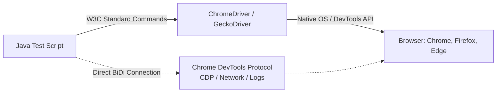
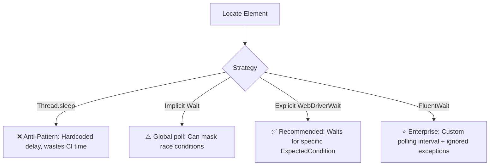
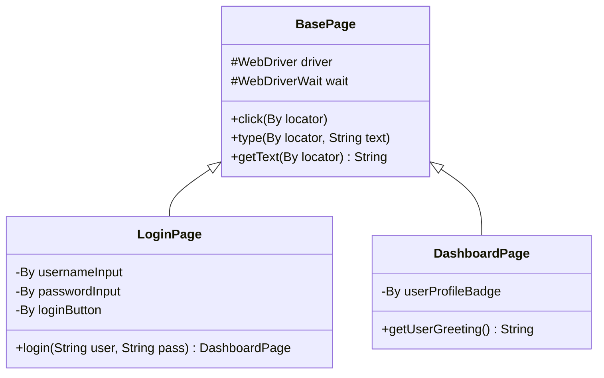

[🏠 Back to Home](README.md) | [🧪 Test Automation Master Guide: Cucumber, Selenium 4 & Playwright](test_automation_master_guide.md)

# 🏎️ Selenium 4 WebDriver: Architecture, Design Patterns & Enterprise Automation

A comprehensive, production-grade guide to Web UI Test Automation using Selenium 4 in Java. Covers W3C WebDriver architecture, Chrome DevTools Protocol (CDP), Page Object Model (POM), synchronization strategies, dynamic element handling, and production failure troubleshooting.

---

## 📑 Table of Contents

1. [🏗️ Selenium 4 W3C Architecture & Key Upgrades](#️-selenium-4-w3c-architecture--key-upgrades)
2. [📦 Track 1: The 5 Core Building Blocks of Selenium WebDriver](#2-the-5-core-building-blocks-of-selenium-webdriver)
3. [📝 Beginner Code Walkthrough: Clean Page Object Model (POM)](#3-beginner-code-walkthrough-clean-page-object-model-pom)
4. [💥 What Happens When Things Break? (Top 3 Disasters)](#4-what-happens-when-things-break-top-3-disasters)
5. [⚠️ Top 5 Beginner Mistakes in Production](#5-top-5-beginner-mistakes-in-production)
6. [🎓 Top 10 Junior Interview Questions (ELI5 Answers)](#6-top-10-junior-interview-questions-with-explain-like-im-5-answers)
7. [🎯 1. Modern Locators & Advanced XPath / CSS Strategies](#-1-modern-locators--advanced-xpath--css-strategies)
8. [⏱️ 2. Synchronization Mastery: Implicit vs. Explicit vs. FluentWait](#️-2-synchronization-mastery-implicit-vs-explicit-vs-fluentwait)
9. [🏛️ 3. The Page Object Model (POM) & Clean Design Architecture](#️-3-the-page-object-model-pom--clean-design-architecture)
10. [🕹️ 4. Handling Complex UI: Actions, Alerts, Iframes & Shadow DOM](#️-4-handling-complex-ui-actions-alerts-iframes--shadow-dom)
11. [🧪 5. 5+ Real-World Automation Scenarios with Full Code](#-5-5-real-world-automation-scenarios-with-full-code)
12. [🌐 6. Selenium 4 Chrome DevTools Protocol (CDP) & Network Mocking](#-6-selenium-4-chrome-devtools-protocol-cdp--network-mocking)
13. [⚖️ 7. Selenium Developer Cheat Sheet & Troubleshooting Grid](#️-7-selenium-developer-cheat-sheet--troubleshooting-grid)

---

## 🏗️ Selenium 4 W3C Architecture & Key Upgrades

Unlike Selenium 3 (which required JSON Wire Protocol encoding/decoding over HTTP), **Selenium 4 communicates directly with browser drivers using the native W3C WebDriver Standard**.



### Key Upgrades in Selenium 4:
1. **Full W3C Compliance:** No JSON Wire encoding overhead; faster and more reliable commands.
2. **Native DevTools Protocol (CDP):** Direct access to Network interception, Console logs, Geolocation spoofing, and Performance metrics.
3. **Relative Locators (`with()`, `above()`, `below()`, `toLeftOf()`, `toRightOf()`, `near()`).**
4. **Enhanced Window/Tab Management (`driver.switchTo().newWindow(WindowType.TAB)`).**

---

# TRACK 1: THE JUNIOR & ENTRY-LEVEL FOUNDATIONS (ZERO-TO-HERO)

## 1. The Real-World Mental Model (The Blind Remote Pilot & The Traffic Signals)

### Why Is UI Automation Hard?
Imagine flying a drone through a busy city:
- **The Browser:** A bustling city where neon signs flash, billboards load images dynamically, and buildings shift shape as JavaScript renders React/Angular components.
- **Selenium (The Blind Drone Pilot):** Selenium sits miles away in a dark room. It has no eyeballs. It only knows what you tell it: *"Fly to coordinates (x, y) and click the blue button."*
- **The Timing Trap:**
  - If Java executes at the speed of light (1 millisecond), it reaches for the "Checkout" button **before** the React JavaScript bundle has finished fetching product data from the server.
  - The pilot reaches into thin air, touches nothing, and crashes with `NoSuchElementException`!
- **The Golden Solution (Synchronization):** You must give the pilot a radar detector (`WebDriverWait` / Explicit Wait). Instead of blindly guessing or taking naps (`Thread.sleep()`), the pilot waits until the radar confirms: *"The button is visible, clickable, and steady on screen!"*

---

## 2. The 5 Core Building Blocks of Selenium WebDriver

| Component | What It Is | Real-World Analogy | Purpose in Code |
| :--- | :--- | :--- | :--- |
| **`WebDriver`** | The root interface controlling the browser instance. | The steering wheel and dashboard of a remote-control car. | `driver.get(url)`, `driver.manage()`, `driver.quit()`. |
| **`WebElement`** | An individual HTML DOM node on the webpage. | A specific button, text box, or checkbox on the control panel. | `element.click()`, `element.sendKeys("text")`, `element.getText()`. |
| **`By` Locators** | The targeting mechanism used to find elements. | GPS coordinates or street addresses (`ID`, `CSS`, `XPath`). | `driver.findElement(By.id("login-btn"))`. |
| **`WebDriverWait`** | Smart conditional polling engine. | A traffic light sensor that turns green only when the road is clear. | `wait.until(ExpectedConditions.elementToBeClickable(btn))`. |
| **Page Object Model (POM)** | Clean design pattern separating page locators from test logic. | An architectural blueprint of a building. | If a button ID changes, update it in 1 Page class instead of 100 test files! |

---

## 3. Beginner Code Walkthrough: Clean Page Object Model (POM)

### Step 1: The Page Class (`LoginPage.java`)
```java
package com.example.pages;

import org.openqa.selenium.By;
import org.openqa.selenium.WebDriver;
import org.openqa.selenium.WebElement;
import org.openqa.selenium.support.ui.ExpectedConditions;
import org.openqa.selenium.support.ui.WebDriverWait;
import java.time.Duration;

public class LoginPage {
    private final WebDriver driver;
    private final WebDriverWait wait;

    // 🌟 Encapsulate locators as private By constants:
    private final By usernameInput = By.id("user-name");
    private final By passwordInput = By.id("password");
    private final By loginButton = By.id("login-button");
    private final By errorMessage = By.cssSelector("[data-test='error']");

    public LoginPage(WebDriver driver) {
        this.driver = driver;
        // 🌟 10-second explicit wait timeout
        this.wait = new WebDriverWait(driver, Duration.ofSeconds(10));
    }

    public void login(String user, String pass) {
        // Wait until username is visible before typing:
        WebElement userEl = wait.until(ExpectedConditions.visibilityOfElementLocated(usernameInput));
        userEl.clear();
        userEl.sendKeys(user);

        driver.findElement(passwordInput).sendKeys(pass);
        
        // Wait until button is clickable before clicking:
        wait.until(ExpectedConditions.elementToBeClickable(loginButton)).click();
    }

    public String getErrorText() {
        return wait.until(ExpectedConditions.visibilityOfElementLocated(errorMessage)).getText();
    }
}
```

### Step 2: The Test Script (`LoginTest.java`)
```java
package com.example.tests;

import com.example.pages.LoginPage;
import org.junit.jupiter.api.AfterEach;
import org.junit.jupiter.api.Assertions;
import org.junit.jupiter.api.BeforeEach;
import org.junit.jupiter.api.Test;
import org.openqa.selenium.WebDriver;
import org.openqa.selenium.chrome.ChromeDriver;
import org.openqa.selenium.chrome.ChromeOptions;

public class LoginTest {
    private WebDriver driver;

    @BeforeEach
    void setUp() {
        ChromeOptions options = new ChromeOptions();
        options.addArguments("--start-maximized", "--headless=new");
        driver = new ChromeDriver(options);
        driver.get("https://www.saucedemo.com/");
    }

    @Test
    void testLockedOutUserGetsErrorMessage() {
        LoginPage loginPage = new LoginPage(driver);
        loginPage.login("locked_out_user", "secret_sauce");

        String error = loginPage.getErrorText();
        Assertions.assertTrue(error.contains("Sorry, this user has been locked out."));
    }

    @AfterEach
    void tearDown() {
        // 🌟 Trainer Rule: ALWAYS call quit() to terminate chromedriver.exe processes!
        if (driver != null) {
            driver.quit();
        }
    }
}
```

---

## 4. What Happens When Things Break? (Top 3 Disasters)

1. **`StaleElementReferenceException` (The Phantom Element Disaster):**
   You locate an element (`WebElement btn = driver.findElement(...)`). Before you click it, an AJAX call or React re-render replaces the DOM node with a brand new element in memory. The original pointer now references a "dead" memory object! **Fix:** Re-locate the element right before clicking, or wrap in a retry loop using `WebDriverWait`.
2. **`ElementClickInterceptedException` (The Floating Banner Blocker):**
   Selenium calculates the (x, y) coordinates of the button and clicks. However, a floating cookie-consent banner, sticky header, or spinner overlay sits directly on top of the button, intercepting the click! **Fix:** Wait for the overlay to disappear (`invisibilityOfElementLocated`), or use `JavascriptExecutor` to trigger the click directly on the DOM node.
3. **The Ghost Chromedriver Memory Leak (Zombie Processes):**
   Calling `driver.close()` instead of `driver.quit()` inside test teardown. `close()` closes the current browser tab, but **leaves the `chromedriver.exe` process running in background OS memory**! After running 500 tests, hundreds of zombie processes saturate 100% of RAM and CPU, freezing the Jenkins/GitHub Actions CI runner! **Fix:** Always call `driver.quit()` in `@AfterEach`.

---

## 5. Top 5 Beginner Mistakes in Production

1. **Hardcoding `Thread.sleep(5000)`:** Putting static sleeps throughout test code wastes thousands of hours of CI build time and still fails when network latency exceeds 5 seconds. Use `WebDriverWait`.
2. **Mixing Implicit Wait and Explicit Wait:** Setting `driver.manage().timeouts().implicitlyWait(10s)` and using `WebDriverWait(10s)`. The W3C specification explicitly warns that mixing wait types produces unpredictable timeout durations (e.g. 10s + 10s = 20s unexpected delay)!
3. **Using Fragile Absolute XPaths:** Copy-pasting `/html/body/div[1]/div[2]/section/div[3]/form/div/input`. If a designer adds a single wrapper `<div>`, all 100 tests break instantly. Use robust CSS selectors (`input#user-name` or `button[data-test='submit']`).
4. **Not Running Headless in CI/CD:** Trying to launch GUI browser windows on a headless Linux Docker container without `--headless=new`, crashing the entire build.
5. **Storing `WebDriver` in a Non-Thread-Safe Static Variable:** Using `public static WebDriver driver` breaks parallel test execution. Use `ThreadLocal<WebDriver>`.

---

## 6. Top 10 Junior Interview Questions (With "Explain Like I'm 5" Answers)

### Q1: How does Selenium 4 WebDriver communicate with browsers?

- **ELI5 Answer:** *"Like speaking directly to someone in English, instead of hiring an expensive translator who takes 5 seconds to decode every word into JSON Wire first."*
- **Technical Answer:** *"Selenium 4 communicates directly with browser drivers (ChromeDriver, GeckoDriver) using the native **W3C WebDriver Standard** protocol over direct HTTP/REST. It also includes bidirectional communication via the Chrome DevTools Protocol (CDP) for network interception and console logging."*

### Q2: What is the difference between `driver.close()` and `driver.quit()`?

- **ELI5 Answer:** *"`driver.close()` closes the browser tab you are currently looking at. `driver.quit()` slams the laptop shut, shuts down the engine, and turns off the electricity completely."*
- **Technical Answer:** *"`driver.close()` closes the currently active browser window/tab. If it is the last tab, the browser may close, but the underlying driver process remains active. `driver.quit()` terminates all open browser tabs and cleanly kills the background driver process (`chromedriver.exe`), freeing OS memory."*

### Q3: What is the difference between Implicit Wait, Explicit Wait, and FluentWait?

- **ELI5 Answer:** *"`Implicit Wait` is a global rule saying: 'Look for every toy for 10 seconds before crying.' `Explicit Wait` is a targeted rule: 'Wait specifically for the red ball to stop bouncing.' `FluentWait` is: 'Check for the red ball every 250 milliseconds, and ignore any dust in your eyes.'*
- **Technical Answer:** *"`ImplicitlyWait` is a global timeout applied to all `findElement` calls. `WebDriverWait` (Explicit) halts execution until a specific `ExpectedCondition` evaluates to true. `FluentWait` is the underlying configurable engine allowing custom polling intervals (e.g. 250ms) and exception ignorance list (`NoSuchElementException`, `StaleElementReferenceException`)."*

### Q4: Why is `Thread.sleep()` considered an anti-pattern in automation?

- **ELI5 Answer:** *"Pausing a video game for 10 seconds every time you open a door, even when the room loaded in 0.1 seconds."*
- **Technical Answer:** *"`Thread.sleep(ms)` is an unconditional blocking sleep that wastes precious CI/CD pipeline minutes when elements appear quickly, yet remains brittle when network latency exceeds the hardcoded sleep duration."*

### Q5: What causes `StaleElementReferenceException` and how do you resolve it?

- **ELI5 Answer:** *"Holding a ticket for seat #14B, but the stadium tore down row 14 and rebuilt it with new seats before you sat down. Your ticket is now pointing to a ghost seat!"*
- **Technical Answer:** *"It occurs when an element referenced by a `WebElement` is deleted, detached, or replaced in the DOM (e.g. via AJAX refresh or React re-render). Resolution: Re-query the element from the DOM using `driver.findElement()` right before acting, or use `ExpectedConditions.refreshed(...)`."*

### Q6: CSS Selector vs. XPath: Which is faster and why?

- **ELI5 Answer:** *"CSS Selectors are native speedboats built into the browser engine. XPath is a scuba diver who can swim both forward and backward, but moves slightly slower."*
- **Technical Answer:** *"CSS Selectors are rendered natively by all browser engines (`document.querySelectorAll`), making them significantly faster and cleaner. XPath traverses both directions (ancestor/parent axis) and can search by inner text (`text()='Save'`), but has slightly more parsing overhead."*

### Q7: What is the Page Object Model (POM) and why is it standard?

- **ELI5 Answer:** *"Giving every room in a house its own map. If the refrigerator moves, you update the kitchen map once, instead of writing new directions for every person living in the house."*
- **Technical Answer:** *"POM is an architectural design pattern that creates an object repository for web UI elements. Webpages are modeled as classes (`LoginPage`, `CartPage`) containing locators and action methods. Tests interact only with page methods, decoupling test logic from UI locators and reducing maintenance costs by 80%."*

### Q8: How do you handle iframes in Selenium?

- **ELI5 Answer:** *"Stepping through a secret portal into a smaller house built inside your living room: you must step inside the portal before you can touch the furniture inside it."*
- **Technical Answer:** *"An iframe is an independent HTML document embedded inside a parent page. The driver cannot access elements inside an iframe until you explicitly switch focus: `driver.switchTo().frame("frameNameOrId")`. To return back to the main document, call `driver.switchTo().defaultContent()`."*

### Q9: How do you handle custom dropdowns that do not use the HTML `<select>` tag?

- **ELI5 Answer:** *"Clicking the dropdown box to open the popup list, and then clicking the item with the text you want."*
- **Technical Answer:** *"Standard Selenium `new Select(element)` only works on native HTML `<select>` tags. Modern React/Material UI dropdowns use `<div>` and `<ul>/<li>` elements. You must click the parent dropdown container to expand the options, wait for visibility of the target option via XPath/CSS, and then click the option element."*

### Q10: What are Relative Locators in Selenium 4?

- **ELI5 Answer:** *"Telling someone: 'Find the input box directly below the password label and to the left of the cancel button.'*
- **Technical Answer:** *"Introduced in Selenium 4 (`RelativeLocator.with()`), relative locators allow developers to find elements based on visual DOM layout using `above()`, `below()`, `toLeftOf()`, `toRightOf()`, and `near()`, simplifying locators when IDs or unique classes are unavailable."*

---

## 🎯 1. Modern Locators & Advanced XPath / CSS Strategies

| Locator Strategy | Syntax Example | Performance | Best Used For |
| :--- | :--- | :--- | :--- |
| **ID** | `By.id("login-btn")` | ⚡ Fastest | Unique element identification |
| **Name** | `By.name("username")` | ⚡ Fast | Form input fields |
| **CSS Selector** | `By.cssSelector("button.btn-primary[type='submit']")` | ⚡ Very Fast | Rich styling attributes & hierarchical nesting |
| **XPath (Relative)** | `By.xpath("//input[@placeholder='Email']/following-sibling::span")` | 🐢 Moderate | Sibling/Parent DOM traversal and text matching |
| **Relative Locators**| `RelativeLocator.with(By.tagName("input")).below(By.id("email"))` | 🐢 Moderate | Visual layout relative positioning |

### Essential XPath Formulas for Dynamic Elements:
```java
// 1. Match by Inner Text:
By.xpath("//button[text()='Submit Order']");

// 2. Partial Match by Dynamic Attribute (e.g. dynamic IDs like 'btn_129381'):
By.xpath("//button[starts-with(@id, 'btn_') and contains(@class, 'active')]");

// 3. Traversal to Parent / Sibling:
By.xpath("//td[text()='INV-2026-001']/following-sibling::td/button[contains(@class, 'pay')]");

// 4. Indexing in a list:
By.xpath("(//div[@class='product-card'])[1]");
```

---

## ⏱️ 2. Synchronization Mastery: Implicit vs. Explicit vs. FluentWait

> [!CAUTION]
> **Never mix Implicit Waits and Explicit Waits!** Mixing them can cause unpredictable timeout delays (e.g. 10s + 10s = 20s unexpected wait).
> **Never use `Thread.sleep()` in production test suites!** It slows down CI pipelines and creates brittle tests.



### 2.1 The Enterprise Standard: `FluentWait`
```java
public class WaitUtils {
    public static WebElement waitForElement(WebDriver driver, By locator, int timeoutSec) {
        Wait<WebDriver> wait = new FluentWait<>(driver)
            .withTimeout(Duration.ofSeconds(timeoutSec))
            .pollingEvery(Duration.ofMillis(250))
            .ignoring(NoSuchElementException.class)
            .ignoring(StaleElementReferenceException.class);

        return wait.until(d -> {
            WebElement el = d.findElement(locator);
            return (el.isDisplayed() && el.isEnabled()) ? el : null;
        });
    }
}
```

---

## 🏛️ 3. The Page Object Model (POM) & Clean Design Architecture

The **Page Object Model** separates test verification logic from DOM locators and page interaction details.



### 3.1 `BasePage.java` (Encapsulating Safe Interactions)
```java
package com.example.pages;

import org.openqa.selenium.By;
import org.openqa.selenium.WebDriver;
import org.openqa.selenium.WebElement;
import org.openqa.selenium.support.ui.ExpectedConditions;
import org.openqa.selenium.support.ui.WebDriverWait;

import java.time.Duration;

public abstract class BasePage {
    protected final WebDriver driver;
    protected final WebDriverWait wait;

    public BasePage(WebDriver driver) {
        this.driver = driver;
        this.wait = new WebDriverWait(driver, Duration.ofSeconds(10));
    }

    protected void click(By locator) {
        wait.until(ExpectedConditions.elementToBeClickable(locator)).click();
    }

    protected void type(By locator, String text) {
        WebElement element = wait.until(ExpectedConditions.visibilityOfElementLocated(locator));
        element.clear();
        element.sendKeys(text);
    }

    protected String getText(By locator) {
        return wait.until(ExpectedConditions.visibilityOfElementLocated(locator)).getText();
    }
}
```

### 3.2 `LoginPage.java`
```java
package com.example.pages;

import org.openqa.selenium.By;
import org.openqa.selenium.WebDriver;

public class LoginPage extends BasePage {
    private final By usernameField = By.id("user_email");
    private final By passwordField = By.id("user_password");
    private final By submitButton  = By.cssSelector("button[type='submit']");
    private final By errorMessage  = By.cssSelector(".alert-danger");

    public LoginPage(WebDriver driver) {
        super(driver);
    }

    public DashboardPage loginAsValidUser(String email, String password) {
        type(usernameField, email);
        type(passwordField, password);
        click(submitButton);
        return new DashboardPage(driver);
    }

    public String getErrorMessage() {
        return getText(errorMessage);
    }
}
```

---

## 🕹️ 4. Handling Complex UI: Actions, Alerts, Iframes & Shadow DOM

### 4.1 Advanced Mouse & Keyboard Interactions (`Actions`)
```java
Actions actions = new Actions(driver);

// 1. Mouse Hover over Menu to reveal sub-menu:
WebElement navMenu = driver.findElement(By.id("products-menu"));
actions.moveToElement(navMenu).perform();

// 2. Drag and Drop:
WebElement source = driver.findElement(By.id("item-draggable"));
WebElement target = driver.findElement(By.id("dropzone"));
actions.dragAndDrop(source, target).perform();

// 3. Right Click (Context Click):
actions.contextClick(target).perform();
```

### 4.2 Handling Javascript Alerts
```java
// Switch to Alert, read message, and accept (click OK)
Alert alert = driver.switchTo().alert();
String alertText = alert.getText();
alert.accept(); // or alert.dismiss();
```

### 4.3 Switching Iframes & Multi-Windows
```java
// 1. Switch to iframe by ID or Element
driver.switchTo().frame("payment-gateway-iframe");
// Interact inside iframe...
driver.switchTo().defaultContent(); // Switch back to main DOM

// 2. Switch to newly opened browser Tab/Window:
String originalWindow = driver.getWindowHandle();
for (String handle : driver.getWindowHandles()) {
    if (!handle.equals(originalWindow)) {
        driver.switchTo().window(handle);
        break;
    }
}
```

### 4.4 Handling Open Shadow DOM (Modern Web Components)
```java
WebElement host = driver.findElement(By.cssSelector("my-custom-element"));
SearchContext shadowRoot = host.getShadowRoot();
WebElement innerButton = shadowRoot.findElement(By.cssSelector("button.inner-action"));
innerButton.click();
```

---

## 🧪 5. 5+ Real-World Automation Scenarios with Full Code

### 🧩 Scenario 1: Overcoming `StaleElementReferenceException` on Dynamic Tables
**Problem:** A JavaScript framework (React/Angular) re-renders the table rows upon filter selection, causing previously found `WebElement` pointers to become stale.

```java
public class StaleElementSafeHandler {
    public static boolean clickWithRetry(WebDriver driver, By locator, int maxAttempts) {
        int attempts = 0;
        while (attempts < maxAttempts) {
            try {
                WebDriverWait wait = new WebDriverWait(driver, Duration.ofSeconds(3));
                wait.until(ExpectedConditions.elementToBeClickable(locator)).click();
                return true;
            } catch (StaleElementReferenceException e) {
                attempts++;
                System.out.println("Encountered StaleElementReferenceException. Retrying attempt " + attempts);
            }
        }
        throw new RuntimeException("Failed to click element after " + maxAttempts + " attempts: " + locator);
    }
}
```

---

### 🧩 Scenario 2: Dynamic Web Table Row Extraction & Data Scraping
**Problem:** In an admin portal, find a user by email across paginated table pages and click their specific "Deactivate" action button.

```java
public class TableScraper {
    public void deactivateUser(WebDriver driver, String targetEmail) {
        boolean found = false;
        while (!found) {
            List<WebElement> rows = driver.findElements(By.xpath("//table[@id='users-table']/tbody/tr"));
            for (WebElement row : rows) {
                String email = row.findElement(By.xpath("./td[2]")).getText();
                if (email.equalsIgnoreCase(targetEmail)) {
                    row.findElement(By.xpath(".//button[contains(text(),'Deactivate')]")).click();
                    found = true;
                    break;
                }
            }
            if (!found) {
                WebElement nextBtn = driver.findElement(By.cssSelector(".pagination-next"));
                if (nextBtn.isEnabled()) nextBtn.click();
                else throw new NoSuchElementException("User " + targetEmail + " not found in table.");
            }
        }
    }
}
```

---

### 🧩 Scenario 3: Headless Chrome File Download & Verification
**Problem:** In CI/CD headless mode, clicking download must save to a known directory without prompting OS native dialogs.

```java
public class HeadlessDownloadManager {
    public static WebDriver createHeadlessDownloadDriver(Path downloadDir) {
        ChromeOptions options = new ChromeOptions();
        options.addArguments("--headless=new");
        options.addArguments("--disable-gpu");
        options.addArguments("--window-size=1920,1080");

        Map<String, Object> prefs = new HashMap<>();
        prefs.put("download.default_directory", downloadDir.toAbsolutePath().toString());
        prefs.put("download.prompt_for_download", false);
        options.setExperimentalOption("prefs", prefs);

        return new ChromeDriver(options);
    }
}
```

---

## 🌐 6. Selenium 4 Chrome DevTools Protocol (CDP) & Network Mocking

### 6.1 Mocking Backend API Response via CDP (Zero-Backend UI Testing)
```java
ChromeDriver driver = new ChromeDriver();
DevTools devTools = driver.getDevTools();
devTools.createSession();

// Enable Network interception
devTools.send(Network.enable(Optional.empty(), Optional.empty(), Optional.empty()));

// Mock a 500 Internal Server Error for /api/v1/payment to test UI error banner
devTools.send(Fetch.enable(
    List.of(new RequestPattern(Optional.of("*/api/v1/payment*"), Optional.empty(), Optional.empty())),
    Optional.empty()
));

devTools.addListener(Fetch.requestPaused(), req -> {
    devTools.send(Fetch.fulfillRequest(
        req.getRequestId(),
        500,
        List.of(new HeaderEntry("Content-Type", "application/json")),
        Optional.empty(),
        Optional.of(Base64.getEncoder().encodeToString("{\"error\":\"Bank Gateway Down\"}".getBytes())),
        Optional.of("Internal Server Error")
    ));
});
```

---

## ⚖️ 7. Selenium Developer Cheat Sheet & Troubleshooting Grid

| Symptom / Exception | Root Cause | Architectural Fix |
| :--- | :--- | :--- |
| `NoSuchElementException` | Element not in DOM yet or wrong locator | Use `WebDriverWait` with `ExpectedConditions.presenceOfElementLocated` |
| `ElementClickInterceptedException` | Sticky header/loading spinner covers element | Wait for spinner to disappear, or scroll into view with JS |
| `StaleElementReferenceException` | DOM re-rendered after element was found | Re-query the `By` locator or use `clickWithRetry()` |
| `ElementNotInteractableException` | Element hidden (`display:none` or `opacity:0`) | Wait for `visibilityOfElementLocated` before typing/clicking |
| `TimeoutException` | Page or element took longer than duration | Inspect network tab in DevTools, check selector accuracy |

---

## 🎓 8. Senior Selenium 4 Interview Preparation & Scenario Q&A

### 📌 Core Conceptual Interview Questions

#### Q1: What causes `StaleElementReferenceException` and how do you eliminate it architecturally?
> **Answer & Explanation:**
> - A `WebElement` reference in Selenium holds a direct pointer to an element in the browser's DOM tree.
> - If Single Page Applications (React, Vue, Angular) trigger a re-render, reload an AJAX section, or rebuild the DOM node, the previous node is detached from the document. Calling `.click()` or `.getText()` on the old Java reference throws `StaleElementReferenceException`.
> - **Architectural Fix (Encapsulated Locator Pattern):** Never store raw `WebElement` fields in Page Objects. Always store `By` locators and query them fresh on-demand:
> ```java
> public void clickWithRetry(By locator, int maxAttempts) {
>     for (int i = 0; i < maxAttempts; i++) {
>         try {
>             wait.until(ExpectedConditions.elementToBeClickable(locator)).click();
>             return;
>         } catch (StaleElementReferenceException ex) {
>             if (i == maxAttempts - 1) throw ex;
>         }
>     }
> }
> ```

#### Q2: Why is mixing Implicit Wait and Explicit Wait considered a severe anti-pattern in Selenium?
> **Answer & Explanation:**
> - According to the W3C WebDriver specification, mixing implicit and explicit waits produces **undefined behavior**.
> - If `implicitWait = 10s` and `explicitWait = 15s`, when an element is missing, the driver will poll for `implicitWait` first on every polling cycle of the `explicitWait`, compounding timeouts and causing tests to freeze for up to $10 \times 15 = 150\text{ seconds}$ before failing.
> - **Best Practice:** Keep `implicitWait = 0` globally and use `WebDriverWait` with explicit conditions everywhere.

#### Q3: How do you design a Thread-Safe WebDriver Factory for parallel TestNG / JUnit 5 execution?
> **Answer & Explanation:**
> - Use `ThreadLocal<WebDriver>` to ensure each parallel test thread controls its own isolated browser process:
> ```java
> public class DriverFactory {
>     private static final ThreadLocal<WebDriver> driverThreadLocal = new ThreadLocal<>();
> 
>     public static void setDriver(WebDriver driver) {
>         driverThreadLocal.set(driver);
>     }
> 
>     public static WebDriver getDriver() {
>         return driverThreadLocal.get();
>     }
> 
>     public static void quitDriver() {
>         if (driverThreadLocal.get() != null) {
>             driverThreadLocal.get().quit();
>             driverThreadLocal.remove(); // Prevent ThreadLocal memory leak
>         }
>     }
> }
> ```

---

### 🚨 Real-World Scenario-Based Interview Questions

#### Scenario Q1: Testing Micro-Frontends Embedded in Nested Shadow DOMs
> **Interviewer Question:** *"Modern web apps frequently encapsulate UI components inside Shadow DOM roots. Standard `driver.findElement(By.xpath(...))` cannot penetrate shadow roots and throws `NoSuchElementException`. How do you interact with elements inside open Shadow Roots in Selenium 4?"*
>
> **Senior Architect Answer:**
> Selenium 4 introduced native `.getShadowRoot()` support:
> ```java
> // 1. Locate the Shadow Host element
> WebElement shadowHost = driver.findElement(By.cssSelector("settings-ui"));
> 
> // 2. Retrieve the SearchContext from the Shadow Root
> SearchContext shadowRoot = shadowHost.getShadowRoot();
> 
> // 3. Find inner elements using CSS Selectors (XPath is unsupported inside Shadow DOM)
> WebElement innerButton = shadowRoot.findElement(By.cssSelector("cr-button#saveBtn"));
> innerButton.click();
> ```

---

## 🔄 9. Architectural Transferability: Where & How to Apply Elsewhere

1. **RPA & Automated Web Scraping:** Using headless Chromium and CDP session manipulation for automated tax filing, invoice downloading, and competitor price tracking.
2. **Automated Accessibility & Performance Auditing:** Intercepting CDP performance metrics and integrating axe-core to evaluate WCAG 2.1 accessibility compliance on every pull request.
3. **Synthetic Production Monitoring (Canary Testing):** Running headless Selenium/Playwright scripts every 5 minutes against production login/checkout journeys to verify customer uptime.

---

[⬆️ Back to Top](#️-selenium-4-webdriver-architecture-design-patterns--enterprise-automation)

