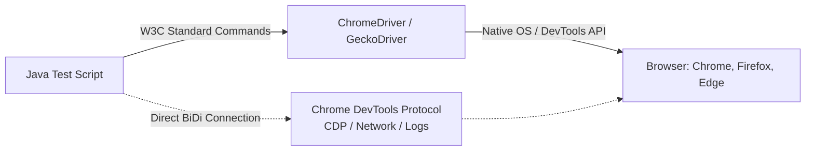
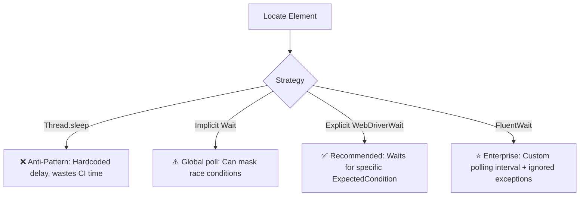
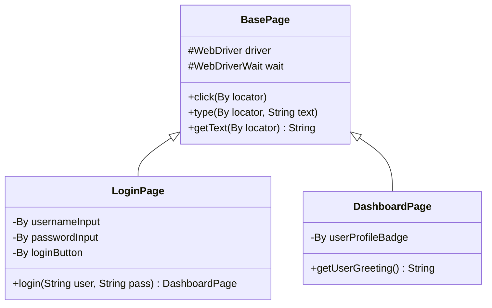

[🏠 Back to Home](README.md)

# 🏎️ Selenium 4 WebDriver: Architecture, Design Patterns & Enterprise Automation

A comprehensive, production-grade guide to Web UI Test Automation using Selenium 4 in Java. Covers W3C WebDriver architecture, Chrome DevTools Protocol (CDP), Page Object Model (POM), synchronization strategies, dynamic element handling, and production failure troubleshooting.

---

## 📑 Table of Contents
1. [🏗️ Selenium 4 W3C Architecture & Key Upgrades](#️-selenium-4-w3c-architecture--key-upgrades)
2. [🎯 1. Modern Locators & Advanced XPath / CSS Strategies](#-1-modern-locators--advanced-xpath--css-strategies)
3. [⏱️ 2. Synchronization Mastery: Implicit vs. Explicit vs. FluentWait](#️-2-synchronization-mastery-implicit-vs-explicit-vs-fluentwait)
4. [🏛️ 3. The Page Object Model (POM) & Clean Design Architecture](#️-3-the-page-object-model-pom--clean-design-architecture)
5. [🕹️ 4. Handling Complex UI: Actions, Alerts, Iframes & Shadow DOM](#️-4-handling-complex-ui-actions-alerts-iframes--shadow-dom)
6. [🧪 5. 5+ Real-World Automation Scenarios with Full Code](#-5-5-real-world-automation-scenarios-with-full-code)
7. [🌐 6. Selenium 4 Chrome DevTools Protocol (CDP) & Network Mocking](#-6-selenium-4-chrome-devtools-protocol-cdp--network-mocking)
8. [⚖️ 7. Selenium Developer Cheat Sheet & Troubleshooting Grid](#️-7-selenium-developer-cheat-sheet--troubleshooting-grid)

---

## 🏗️ Selenium 4 W3C Architecture & Key Upgrades

Unlike Selenium 3 (which required JSON Wire Protocol encoding/decoding over HTTP), **Selenium 4 communicates directly with browser drivers using the native W3C WebDriver Standard**.



### Key Upgrades in Selenium 4:
1. **Full W3C Compliance:** No JSON Wire encoding overhead; faster and more reliable commands.
2. **Native DevTools Protocol (CDP):** Direct access to Network interception, Console logs, Geolocation spoofing, and Performance metrics.
3. **Relative Locators (`with()`, `above()`, `below()`, `toLeftOf()`, `toRightOf()`, `near()`).**
4. **Enhanced Window/Tab Management (`driver.switchTo().newWindow(WindowType.TAB)`).**

---

## 🎯 1. Modern Locators & Advanced XPath / CSS Strategies

| Locator Strategy | Syntax Example | Performance | Best Used For |
| :--- | :--- | :--- | :--- |
| **ID** | `By.id("login-btn")` | ⚡ Fastest | Unique element identification |
| **Name** | `By.name("username")` | ⚡ Fast | Form input fields |
| **CSS Selector** | `By.cssSelector("button.btn-primary[type='submit']")` | ⚡ Very Fast | Rich styling attributes & hierarchical nesting |
| **XPath (Relative)** | `By.xpath("//input[@placeholder='Email']/following-sibling::span")` | 🐢 Moderate | Sibling/Parent DOM traversal and text matching |
| **Relative Locators**| `RelativeLocator.with(By.tagName("input")).below(By.id("email"))` | 🐢 Moderate | Visual layout relative positioning |

### Essential XPath Formulas for Dynamic Elements:
```java
// 1. Match by Inner Text:
By.xpath("//button[text()='Submit Order']");

// 2. Partial Match by Dynamic Attribute (e.g. dynamic IDs like 'btn_129381'):
By.xpath("//button[starts-with(@id, 'btn_') and contains(@class, 'active')]");

// 3. Traversal to Parent / Sibling:
By.xpath("//td[text()='INV-2026-001']/following-sibling::td/button[contains(@class, 'pay')]");

// 4. Indexing in a list:
By.xpath("(//div[@class='product-card'])[1]");
```

---

## ⏱️ 2. Synchronization Mastery: Implicit vs. Explicit vs. FluentWait

> [!CAUTION]
> **Never mix Implicit Waits and Explicit Waits!** Mixing them can cause unpredictable timeout delays (e.g. 10s + 10s = 20s unexpected wait).
> **Never use `Thread.sleep()` in production test suites!** It slows down CI pipelines and creates brittle tests.



### 2.1 The Enterprise Standard: `FluentWait`
```java
public class WaitUtils {
    public static WebElement waitForElement(WebDriver driver, By locator, int timeoutSec) {
        Wait<WebDriver> wait = new FluentWait<>(driver)
            .withTimeout(Duration.ofSeconds(timeoutSec))
            .pollingEvery(Duration.ofMillis(250))
            .ignoring(NoSuchElementException.class)
            .ignoring(StaleElementReferenceException.class);

        return wait.until(d -> {
            WebElement el = d.findElement(locator);
            return (el.isDisplayed() && el.isEnabled()) ? el : null;
        });
    }
}
```

---

## 🏛️ 3. The Page Object Model (POM) & Clean Design Architecture

The **Page Object Model** separates test verification logic from DOM locators and page interaction details.



### 3.1 `BasePage.java` (Encapsulating Safe Interactions)
```java
package com.example.pages;

import org.openqa.selenium.By;
import org.openqa.selenium.WebDriver;
import org.openqa.selenium.WebElement;
import org.openqa.selenium.support.ui.ExpectedConditions;
import org.openqa.selenium.support.ui.WebDriverWait;

import java.time.Duration;

public abstract class BasePage {
    protected final WebDriver driver;
    protected final WebDriverWait wait;

    public BasePage(WebDriver driver) {
        this.driver = driver;
        this.wait = new WebDriverWait(driver, Duration.ofSeconds(10));
    }

    protected void click(By locator) {
        wait.until(ExpectedConditions.elementToBeClickable(locator)).click();
    }

    protected void type(By locator, String text) {
        WebElement element = wait.until(ExpectedConditions.visibilityOfElementLocated(locator));
        element.clear();
        element.sendKeys(text);
    }

    protected String getText(By locator) {
        return wait.until(ExpectedConditions.visibilityOfElementLocated(locator)).getText();
    }
}
```

### 3.2 `LoginPage.java`
```java
package com.example.pages;

import org.openqa.selenium.By;
import org.openqa.selenium.WebDriver;

public class LoginPage extends BasePage {
    private final By usernameField = By.id("user_email");
    private final By passwordField = By.id("user_password");
    private final By submitButton  = By.cssSelector("button[type='submit']");
    private final By errorMessage  = By.cssSelector(".alert-danger");

    public LoginPage(WebDriver driver) {
        super(driver);
    }

    public DashboardPage loginAsValidUser(String email, String password) {
        type(usernameField, email);
        type(passwordField, password);
        click(submitButton);
        return new DashboardPage(driver);
    }

    public String getErrorMessage() {
        return getText(errorMessage);
    }
}
```

---

## 🕹️ 4. Handling Complex UI: Actions, Alerts, Iframes & Shadow DOM

### 4.1 Advanced Mouse & Keyboard Interactions (`Actions`)
```java
Actions actions = new Actions(driver);

// 1. Mouse Hover over Menu to reveal sub-menu:
WebElement navMenu = driver.findElement(By.id("products-menu"));
actions.moveToElement(navMenu).perform();

// 2. Drag and Drop:
WebElement source = driver.findElement(By.id("item-draggable"));
WebElement target = driver.findElement(By.id("dropzone"));
actions.dragAndDrop(source, target).perform();

// 3. Right Click (Context Click):
actions.contextClick(target).perform();
```

### 4.2 Handling Javascript Alerts
```java
// Switch to Alert, read message, and accept (click OK)
Alert alert = driver.switchTo().alert();
String alertText = alert.getText();
alert.accept(); // or alert.dismiss();
```

### 4.3 Switching Iframes & Multi-Windows
```java
// 1. Switch to iframe by ID or Element
driver.switchTo().frame("payment-gateway-iframe");
// Interact inside iframe...
driver.switchTo().defaultContent(); // Switch back to main DOM

// 2. Switch to newly opened browser Tab/Window:
String originalWindow = driver.getWindowHandle();
for (String handle : driver.getWindowHandles()) {
    if (!handle.equals(originalWindow)) {
        driver.switchTo().window(handle);
        break;
    }
}
```

### 4.4 Handling Open Shadow DOM (Modern Web Components)
```java
WebElement host = driver.findElement(By.cssSelector("my-custom-element"));
SearchContext shadowRoot = host.getShadowRoot();
WebElement innerButton = shadowRoot.findElement(By.cssSelector("button.inner-action"));
innerButton.click();
```

---

## 🧪 5. 5+ Real-World Automation Scenarios with Full Code

### 🧩 Scenario 1: Overcoming `StaleElementReferenceException` on Dynamic Tables
**Problem:** A JavaScript framework (React/Angular) re-renders the table rows upon filter selection, causing previously found `WebElement` pointers to become stale.

```java
public class StaleElementSafeHandler {
    public static boolean clickWithRetry(WebDriver driver, By locator, int maxAttempts) {
        int attempts = 0;
        while (attempts < maxAttempts) {
            try {
                WebDriverWait wait = new WebDriverWait(driver, Duration.ofSeconds(3));
                wait.until(ExpectedConditions.elementToBeClickable(locator)).click();
                return true;
            } catch (StaleElementReferenceException e) {
                attempts++;
                System.out.println("Encountered StaleElementReferenceException. Retrying attempt " + attempts);
            }
        }
        throw new RuntimeException("Failed to click element after " + maxAttempts + " attempts: " + locator);
    }
}
```

---

### 🧩 Scenario 2: Dynamic Web Table Row Extraction & Data Scraping
**Problem:** In an admin portal, find a user by email across paginated table pages and click their specific "Deactivate" action button.

```java
public class TableScraper {
    public void deactivateUser(WebDriver driver, String targetEmail) {
        boolean found = false;
        while (!found) {
            List<WebElement> rows = driver.findElements(By.xpath("//table[@id='users-table']/tbody/tr"));
            for (WebElement row : rows) {
                String email = row.findElement(By.xpath("./td[2]")).getText();
                if (email.equalsIgnoreCase(targetEmail)) {
                    row.findElement(By.xpath(".//button[contains(text(),'Deactivate')]")).click();
                    found = true;
                    break;
                }
            }
            if (!found) {
                WebElement nextBtn = driver.findElement(By.cssSelector(".pagination-next"));
                if (nextBtn.isEnabled()) nextBtn.click();
                else throw new NoSuchElementException("User " + targetEmail + " not found in table.");
            }
        }
    }
}
```

---

### 🧩 Scenario 3: Headless Chrome File Download & Verification
**Problem:** In CI/CD headless mode, clicking download must save to a known directory without prompting OS native dialogs.

```java
public class HeadlessDownloadManager {
    public static WebDriver createHeadlessDownloadDriver(Path downloadDir) {
        ChromeOptions options = new ChromeOptions();
        options.addArguments("--headless=new");
        options.addArguments("--disable-gpu");
        options.addArguments("--window-size=1920,1080");

        Map<String, Object> prefs = new HashMap<>();
        prefs.put("download.default_directory", downloadDir.toAbsolutePath().toString());
        prefs.put("download.prompt_for_download", false);
        options.setExperimentalOption("prefs", prefs);

        return new ChromeDriver(options);
    }
}
```

---

## 🌐 6. Selenium 4 Chrome DevTools Protocol (CDP) & Network Mocking

### 6.1 Mocking Backend API Response via CDP (Zero-Backend UI Testing)
```java
ChromeDriver driver = new ChromeDriver();
DevTools devTools = driver.getDevTools();
devTools.createSession();

// Enable Network interception
devTools.send(Network.enable(Optional.empty(), Optional.empty(), Optional.empty()));

// Mock a 500 Internal Server Error for /api/v1/payment to test UI error banner
devTools.send(Fetch.enable(
    List.of(new RequestPattern(Optional.of("*/api/v1/payment*"), Optional.empty(), Optional.empty())),
    Optional.empty()
));

devTools.addListener(Fetch.requestPaused(), req -> {
    devTools.send(Fetch.fulfillRequest(
        req.getRequestId(),
        500,
        List.of(new HeaderEntry("Content-Type", "application/json")),
        Optional.empty(),
        Optional.of(Base64.getEncoder().encodeToString("{\"error\":\"Bank Gateway Down\"}".getBytes())),
        Optional.of("Internal Server Error")
    ));
});
```

---

## ⚖️ 7. Selenium Developer Cheat Sheet & Troubleshooting Grid

| Symptom / Exception | Root Cause | Architectural Fix |
| :--- | :--- | :--- |
| `NoSuchElementException` | Element not in DOM yet or wrong locator | Use `WebDriverWait` with `ExpectedConditions.presenceOfElementLocated` |
| `ElementClickInterceptedException` | Sticky header/loading spinner covers element | Wait for spinner to disappear, or scroll into view with JS |
| `StaleElementReferenceException` | DOM re-rendered after element was found | Re-query the `By` locator or use `clickWithRetry()` |
| `ElementNotInteractableException` | Element hidden (`display:none` or `opacity:0`) | Wait for `visibilityOfElementLocated` before typing/clicking |
| `TimeoutException` | Page or element took longer than duration | Inspect network tab in DevTools, check selector accuracy |

---

## 🎓 8. Senior Selenium 4 Interview Preparation & Scenario Q&A

### 📌 Core Conceptual Interview Questions

#### Q1: What causes `StaleElementReferenceException` and how do you eliminate it architecturally?
> **Answer & Explanation:**
> - A `WebElement` reference in Selenium holds a direct pointer to an element in the browser's DOM tree.
> - If Single Page Applications (React, Vue, Angular) trigger a re-render, reload an AJAX section, or rebuild the DOM node, the previous node is detached from the document. Calling `.click()` or `.getText()` on the old Java reference throws `StaleElementReferenceException`.
> - **Architectural Fix (Encapsulated Locator Pattern):** Never store raw `WebElement` fields in Page Objects. Always store `By` locators and query them fresh on-demand:
> ```java
> public void clickWithRetry(By locator, int maxAttempts) {
>     for (int i = 0; i < maxAttempts; i++) {
>         try {
>             wait.until(ExpectedConditions.elementToBeClickable(locator)).click();
>             return;
>         } catch (StaleElementReferenceException ex) {
>             if (i == maxAttempts - 1) throw ex;
>         }
>     }
> }
> ```

#### Q2: Why is mixing Implicit Wait and Explicit Wait considered a severe anti-pattern in Selenium?
> **Answer & Explanation:**
> - According to the W3C WebDriver specification, mixing implicit and explicit waits produces **undefined behavior**.
> - If `implicitWait = 10s` and `explicitWait = 15s`, when an element is missing, the driver will poll for `implicitWait` first on every polling cycle of the `explicitWait`, compounding timeouts and causing tests to freeze for up to $10 \times 15 = 150\text{ seconds}$ before failing.
> - **Best Practice:** Keep `implicitWait = 0` globally and use `WebDriverWait` with explicit conditions everywhere.

#### Q3: How do you design a Thread-Safe WebDriver Factory for parallel TestNG / JUnit 5 execution?
> **Answer & Explanation:**
> - Use `ThreadLocal<WebDriver>` to ensure each parallel test thread controls its own isolated browser process:
> ```java
> public class DriverFactory {
>     private static final ThreadLocal<WebDriver> driverThreadLocal = new ThreadLocal<>();
> 
>     public static void setDriver(WebDriver driver) {
>         driverThreadLocal.set(driver);
>     }
> 
>     public static WebDriver getDriver() {
>         return driverThreadLocal.get();
>     }
> 
>     public static void quitDriver() {
>         if (driverThreadLocal.get() != null) {
>             driverThreadLocal.get().quit();
>             driverThreadLocal.remove(); // Prevent ThreadLocal memory leak
>         }
>     }
> }
> ```

---

### 🚨 Real-World Scenario-Based Interview Questions

#### Scenario Q1: Testing Micro-Frontends Embedded in Nested Shadow DOMs
> **Interviewer Question:** *"Modern web apps frequently encapsulate UI components inside Shadow DOM roots. Standard `driver.findElement(By.xpath(...))` cannot penetrate shadow roots and throws `NoSuchElementException`. How do you interact with elements inside open Shadow Roots in Selenium 4?"*
>
> **Senior Architect Answer:**
> Selenium 4 introduced native `.getShadowRoot()` support:
> ```java
> // 1. Locate the Shadow Host element
> WebElement shadowHost = driver.findElement(By.cssSelector("settings-ui"));
> 
> // 2. Retrieve the SearchContext from the Shadow Root
> SearchContext shadowRoot = shadowHost.getShadowRoot();
> 
> // 3. Find inner elements using CSS Selectors (XPath is unsupported inside Shadow DOM)
> WebElement innerButton = shadowRoot.findElement(By.cssSelector("cr-button#saveBtn"));
> innerButton.click();
> ```

---

## 🔄 9. Architectural Transferability: Where & How to Apply Elsewhere

1. **RPA & Automated Web Scraping:** Using headless Chromium and CDP session manipulation for automated tax filing, invoice downloading, and competitor price tracking.
2. **Automated Accessibility & Performance Auditing:** Intercepting CDP performance metrics and integrating axe-core to evaluate WCAG 2.1 accessibility compliance on every pull request.
3. **Synthetic Production Monitoring (Canary Testing):** Running headless Selenium/Playwright scripts every 5 minutes against production login/checkout journeys to verify customer uptime.

---

[⬆️ Back to Top](#️-selenium-4-webdriver-architecture-design-patterns--enterprise-automation)

