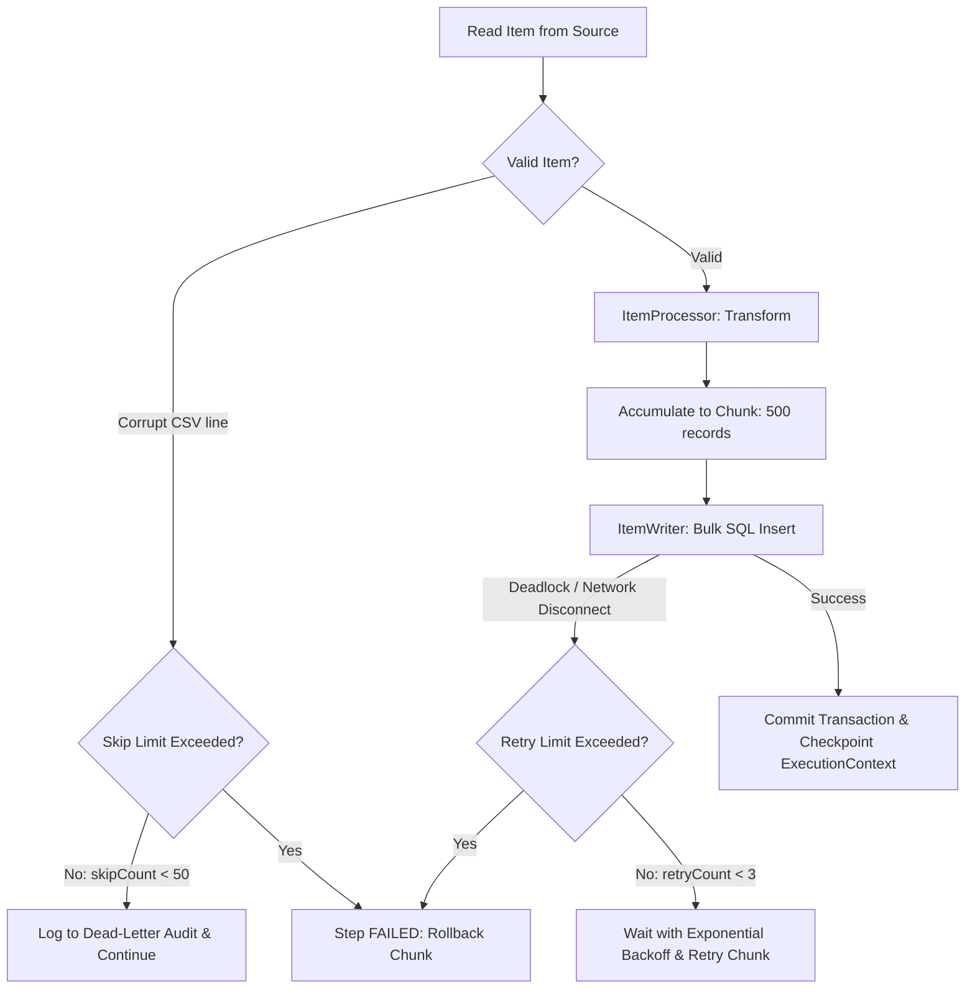

[🏠 Back to Home](README.md)

# 📦 Spring Batch 5+ & Spring Boot 3 Enterprise Processing Master Guide

A production-grade handbook for architecting high-throughput, fault-tolerant batch workloads, ETL pipelines, and massive data transformations using **Spring Batch 5.x**, **Spring Boot 3.x**, and **Java 17/21**. Covers chunk architecture, skip/retry policies, transaction boundaries, partitioning, and zero-downtime restartability.

---

## 📑 Table of Contents

### Track 1: Junior & Entry-Level Foundations

- [🌱 1. Real-World Mental Model (Amazon Warehouse Assembly Line)](#1-the-real-world-mental-model-the-amazon-warehouse-packing-assembly-line)
- [🧩 2. The 5 Core Building Blocks of Spring Batch](#2-the-5-core-building-blocks)
- [💻 3. Beginner Code Walkthrough: Spring Batch 5 Chunk Configuration](#3-beginner-code-walkthrough-spring-batch-5-chunk-configuration)
- [💥 4. What Happens When Things Break? (Skip vs Retry vs Fail)](#4-what-happens-when-things-break-skip-vs-retry-vs-fail)
- [⚠️ 5. Top 5 Beginner Mistakes in Production](#5-top-5-beginner-mistakes-in-production)
- [🎯 6. Top 10 Junior Interview Questions (With "ELI5" Answers)](#6-top-10-junior-interview-questions-with-explain-like-im-5-answers)

### Track 2: Advanced Architecture & Enterprise Pipelines

1. [⚙️ 1. Spring Batch 5 Core Architecture & Metadata Schema](#️-1-spring-batch-5-core-architecture--metadata-schema)
2. [🔄 2. Chunk-Oriented Processing vs Tasklet](#-2-chunk-oriented-processing-vs-tasklet)
3. [📖 3. Production Readers & Writers (FlatFile, JDBC, JPA, Kafka)](#-3-production-readers--writers-flatfile-jdbc-jpa-kafka)
4. [🛡️ 4. Fault Tolerance: Skip, Retry & Transaction Boundaries](#️-4-fault-tolerance-skip-retry--transaction-boundaries)
5. [👂 5. Lifecycle Interception with Listeners](#-5-lifecycle-interception-with-listeners)
6. [🚀 6. High-Throughput Scaling: Multi-Threading & Partitioning](#-6-high-throughput-scaling-multi-threading--partitioning)
7. [🏭 7. Production Scenarios & War Room Incident Forensics](#-7-production-scenarios--war-room-incident-forensics)
8. [⚖️ 8. Spring Batch 5 Master Annotation & API Cheat Sheet](#️-8-spring-batch-5-master-annotation--api-cheat-sheet)

# TRACK 1: THE JUNIOR & ENTRY-LEVEL FOUNDATIONS (ZERO-TO-HERO)

## 1. The Real-World Mental Model (The Amazon Warehouse Packing Assembly Line)

### What Is Batch Processing?
Imagine you are the manager of an Amazon fulfillment warehouse:
- During the day, individual customers buy items one-by-one (**Online Transaction Processing / OLTP**).
- At midnight, you have to generate invoices, calculate sales taxes, and sync 10,000,000 records with bank partners (**Batch Processing**).
- If you process 10,000,000 items one-by-one with individual database commits, it will take 3 days!
- If you try loading all 10,000,000 records into memory at the same second, your computer runs out of RAM and crashes with `OutOfMemoryError`.

---

### The Solution: Chunk-Oriented Processing
Instead of loading everything or processing one-by-one, you use an **Automated Conveyor Belt (Chunks)**:
1. **`ItemReader`:** Pick up 1 item from the input crate.
2. **`ItemProcessor`:** Inspect and polish 1 item.
3. Repeat steps 1 and 2 until a box is full (e.g. **Chunk Size = 100 items**).
4. **`ItemWriter`:** Seal the box and ship all 100 items to the truck in **one single database transaction commit**!
5. If the power cuts out at item 5,400, Spring Batch looks at its clipboard (**`JobRepository`**), skips the first 5,300 successfully committed items, and resumes right at item 5,301!

```
┌────────────────────────────────────────────────────────────────────────────────────────┐
│                                 JOB (The Factory Shift)                                 │
│                                                                                        │
│  ┌──────────────────────────────────────────────────────────────────────────────────┐  │
│  │                              STEP (The Assembly Station)                         │  │
│  │                                                                                  │  │
│  │   ┌───────────────┐     ┌───────────────────┐     ┌───────────────┐              │  │
│  │   │  ItemReader   │ ──► │   ItemProcessor   │ ──► │  ItemWriter   │              │  │
│  │   │  (Read 1 item)│     │  (Transform/Filter│     │  (Write Chunk)│              │  │
│  │   └───────────────┘     └───────────────────┘     └───────────────┘              │  │
│  │          ▲                        ▲                       │                      │  │
│  │          │                        │                       │                      │  │
│  │          └──────── Loop N times ──┴───────────────────────┘                      │  │
│  │                     (Until Chunk Commit Interval reached, e.g. 100)              │  │
│  │                                                                                  │  │
│  │   [ Transaction Boundary Begins ] ───────────────► [ Transaction Commits Chunk ] │  │
│  └──────────────────────────────────────────────────────────────────────────────────┘  │
│                                                                                        │
│  Persisted to Database: [ JobRepository ] (BATCH_JOB_EXECUTION, BATCH_STEP_EXECUTION)  │
└────────────────────────────────────────────────────────────────────────────────────────┘
```

---

## 2. The 5 Core Building Blocks

| Term | What It Means | Real-World Analogy |
| :--- | :--- | :--- |
| **`Job`** | The entire batch execution workflow composed of one or more steps. | The complete night shift at the warehouse. |
| **`Step`** | An isolated, independent phase of a job (Chunk-based or Tasklet). | A specific assembly line station. |
| **`ItemReader`** | Reads 1 record at a time. Returns `null` when data is exhausted. | The worker taking items out of the supply box. |
| **`ItemProcessor`** | Transforms, cleanses, or validates 1 record. Returning `null` filters it out. | The quality inspector stamping or rejecting items. |
| **`ItemWriter`** | Receives a List of chunk items and writes them all in 1 batch. | The loader stacking the completed pallet onto the truck. |
| **`JobRepository`** | The relational database tables storing execution state, commits, and skips. | The supervisor's logbook tracking progress for restartability. |

---

## 3. Beginner Code Walkthrough: Spring Batch 5 Chunk Configuration

```java
package com.example.batch.config;

import org.springframework.batch.core.Job;
import org.springframework.batch.core.Step;
import org.springframework.batch.core.job.builder.JobBuilder;
import org.springframework.batch.core.repository.JobRepository;
import org.springframework.batch.core.step.builder.StepBuilder;
import org.springframework.batch.item.ItemProcessor;
import org.springframework.batch.item.ItemReader;
import org.springframework.batch.item.ItemWriter;
import org.springframework.batch.item.support.ListItemReader;
import org.springframework.context.annotation.Bean;
import org.springframework.context.annotation.Configuration;
import org.springframework.transaction.PlatformTransactionManager;

import java.util.List;

@Configuration
public class SimpleBatchConfig {

    // 1. Reader: Reads numbers from memory list
    @Bean
    public ItemReader<Integer> itemReader() {
        return new ListItemReader<>(List.of(1, 2, 3, 4, 5, 6, 7, 8, 9, 10));
    }

    // 2. Processor: Multiplies number by 10 (or filters odd numbers by returning null)
    @Bean
    public ItemProcessor<Integer, String> itemProcessor() {
        return item -> "Result: " + (item * 10);
    }

    // 3. Writer: Writes the batch chunk to console / DB
    @Bean
    public ItemWriter<String> itemWriter() {
        return chunk -> {
            System.out.println("📦 Committing Chunk of size " + chunk.size() + ": " + chunk.getItems());
        };
    }

    // 4. Step: Process in chunks of 3 items per transaction commit!
    @Bean
    public Step processNumbersStep(JobRepository jobRepository, 
                                  PlatformTransactionManager transactionManager) {
        return new StepBuilder("processNumbersStep", jobRepository)
            .<Integer, String>chunk(3, transactionManager) // Chunk size: 3
            .reader(itemReader())
            .processor(itemProcessor())
            .writer(itemWriter())
            .build();
    }

    // 5. Job: Execute the step
    @Bean
    public Job processNumbersJob(JobRepository jobRepository, Step processNumbersStep) {
        return new JobBuilder("processNumbersJob", jobRepository)
            .start(processNumbersStep)
            .build();
    }
}
```

---

## 4. What Happens When Things Break? (Skip vs Retry vs Fail)

When processing millions of records, bad records (e.g. corrupt CSV lines or missing phone numbers) are inevitable:
1. **Fail Fast (Default):** If item #4,500 throws an exception, the entire job aborts immediately and transaction rolls back.
2. **Skip Policy:** You tell Spring Batch: *"If you see a `NumberFormatException`, skip it, record it in the skip counter, and continue to item #4,501."* (e.g. `.faultTolerant().skip(NumberFormatException.class).skipLimit(10)`).
3. **Retry Policy:** If a network call times out, retry up to 3 times before failing or skipping.
4. **Restartability:** When a failed job is re-run with the same `JobParameters`, Spring Batch looks at `BATCH_STEP_EXECUTION` and automatically jumps straight to the last committed chunk offset!

---

## 5. Top 5 Beginner Mistakes in Production

1. **Chunk Size of 1:** Setting chunk size to 1 commits a database transaction for every single row. Inserting 100,000 records takes 30 minutes instead of 4 seconds! **Rule of thumb:** Chunk size should typically be between 100 and 1,000.
2. **Chunk Size of 1,000,000:** Setting chunk size too large holds database row locks for too long, starves other queries, and crashes the JVM with `OutOfMemoryError`.
3. **Using Non-Thread-Safe Readers in Multi-Threaded Steps:** Standard readers like `FlatFileItemReader` or `JdbcCursorItemReader` maintain internal state (`read()` incrementing current line). Using them across multiple threads causes race conditions and dropped rows! **Fix:** Use `SynchronizedItemStreamReader` or `JdbcPagingItemReader`.
4. **Not Knowing Returning `null` Filters Records:** If an `ItemProcessor` returns `null`, Spring Batch intentionally drops that item and does NOT pass it to the `ItemWriter`. Beginners often think the record was lost due to a bug.
5. **Re-Running a Completed Job with the Same Parameters:** Spring Batch enforces that a `JobInstance` that completed with status `COMPLETED` cannot be run again with the exact same parameters. You must pass a new identifying parameter (e.g. `System.currentTimeMillis()`) or use `RunIdIncrementer`.

---

## 6. Top 10 Junior Interview Questions (With "Explain Like I'm 5" Answers)

### Q1: What is Chunk-Oriented Processing in Spring Batch?
- **ELI5 Answer:** *"Instead of carrying 1,000 bricks to the truck one-by-one (slow) or trying to lift all 1,000 at once (breaks your back), you put 100 bricks in a wheelbarrow, walk to the truck, dump them in, and go back for the next 100."*
- **Technical Answer:** *"Chunk-oriented processing reads data item-by-item via `ItemReader`, passes each item to `ItemProcessor`, and aggregates processed items in memory until reaching the chunk commit interval. It then hands the entire chunk list to `ItemWriter` to be persisted within a single transaction boundary."*

### Q2: What is the difference between a Tasklet and a Chunk step?
- **ELI5 Answer:** *"A Tasklet is doing one simple chore (like deleting an old file or sending an email). A Chunk step is an assembly line processing millions of items in boxes."*
- **Technical Answer:** *"A `Tasklet` executes a single method (`execute()`) once to perform a simple, discrete task (e.g. file cleanup, stored procedure call). A `Chunk` step is designed for high-volume streaming data pipelines involving repeated read-process-write cycles with pagination and transaction management."*

### Q3: What is the purpose of the `JobRepository`?
- **ELI5 Answer:** *"The teacher's gradebook that records which students finished their homework, who was absent, and where to start reading tomorrow if the fire alarm goes off."*
- **Technical Answer:** *"`JobRepository` provides CRUD operations for Spring Batch metadata tables (`BATCH_JOB_INSTANCE`, `BATCH_JOB_EXECUTION`, `BATCH_STEP_EXECUTION`). It persists job execution status, commit counts, skip counts, timestamps, and execution context checkpoints for restartability."*

### Q4: What is the difference between `JobInstance` and `JobExecution`?
- **ELI5 Answer:** *"`JobInstance` is the movie script ('End of Month Payroll'). `JobExecution` is each time the movie is played in the theater ('Playing on March 31', 'Playing on April 30', or 'Retry after projector broke')."*
- **Technical Answer:** *"A `JobInstance` represents a logical job run identified by unique `JobParameters`. A `JobExecution` represents an individual physical attempt to run that instance. If a `JobExecution` fails, running the job again creates a new `JobExecution` tied to the same `JobInstance` until it succeeds."*

### Q5: How does Spring Batch handle failures and restartability?
- **ELI5 Answer:** *"If you are reading a 500-page book and drop it on page 200, you don't start over on page 1; you pick it up and resume reading from page 200."*
- **Technical Answer:** *"Spring Batch saves reader offsets and step state in `ExecutionContext` within `BATCH_STEP_EXECUTION_CONTEXT` at each chunk commit. When a failed job is restarted with identical parameters, it reads the persisted offset and resumes processing from the last committed chunk."*

### Q6: What is the Skip Policy in Spring Batch?
- **ELI5 Answer:** *"If you find one rotten apple in a basket, you throw it in the compost bin and keep washing the rest of the good apples instead of throwing away the entire basket."*
- **Technical Answer:** *"Skip policies allow steps to tolerate specific exceptions (e.g. `FlatFileParseException`) up to a configured `skipLimit`. Instead of rolling back the step, the offending record is discarded, a `SkipListener` is notified, and processing continues."*

### Q7: What is the difference between `Cursor` and `Paging` ItemReaders in JDBC?
- **ELI5 Answer:** *"`Cursor` keeps a door open to the warehouse and carries items out one-by-one. `Paging` runs in, grabs 500 items, closes the door, and runs back in later for the next 500."*
- **Technical Answer:** *"`JdbcCursorItemReader` opens a single streaming database cursor over a long-lived connection, reading rows via `ResultSet.next()`. `JdbcPagingItemReader` executes separate SQL queries using `LIMIT / OFFSET` pagination, closing database connections between pages, making it safer for multi-threaded and long-running steps."*

### Q8: What does returning `null` from an `ItemProcessor` do?
- **ELI5 Answer:** *"Throwing away junk mail before putting the important letters into the mailbox."*
- **Technical Answer:** *"Returning `null` acts as a record filter. Spring Batch detects `null` and omits that item from the current chunk, meaning it will never be sent to the `ItemWriter`."*

### Q9: How can you scale a Spring Batch job to handle 50,000,000 records?
- **ELI5 Answer:** *"Instead of 1 worker packing boxes, you hire 10 workers, divide the warehouse into 10 sections, and let each worker pack their own section simultaneously."*
- **Technical Answer:** *"Spring Batch provides multiple scaling options: (1) Multi-threaded Step (shared reader/writer with synchronized lock), (2) Partitioning (master step splits data into independent subsets processed concurrently by worker steps), (3) Remote Chunking (master reads, workers process over Kafka/JMS), and (4) Parallel Steps."*

### Q10: What is a `TaskletStep` and when should you use it?
- **ELI5 Answer:** *"A single one-time errand like 'turn off the lights' or 'zip this folder'."*
- **Technical Answer:** *"A `TaskletStep` executes a single `Tasklet.execute()` method returning `RepeatStatus.FINISHED`. It is used for operations that do not fit chunk-based iteration, such as unzipping an incoming archive, running a table cleanup `TRUNCATE` script, or notifying Slack after job completion."*

---

# TRACK 2: ADVANCED ARCHITECTURE & ENTERPRISE PIPELINES

## ⚙️ 1. Spring Batch 5 Core Architecture & Metadata Schema

> [!IMPORTANT]
> **Spring Batch 5 Migration Note:**
> `JobBuilderFactory` and `StepBuilderFactory` are **deprecated / removed**.
> In Spring Batch 5+, instantiate steps and jobs explicitly using:
> `new JobBuilder("jobName", jobRepository)` and `new StepBuilder("stepName", jobRepository)`.

### Maven Dependencies (`pom.xml`)
```xml
<dependencies>
    <!-- Spring Boot 3 Batch Starter -->
    <dependency>
        <groupId>org.springframework.boot</groupId>
        <artifactId>spring-boot-starter-batch</artifactId>
    </dependency>

    <!-- Database Drivers & Connection Pool -->
    <dependency>
        <groupId>org.postgresql</groupId>
        <artifactId>postgresql</artifactId>
        <scope>runtime</scope>
    </dependency>
    <dependency>
        <groupId>org.springframework.boot</groupId>
        <artifactId>spring-boot-starter-jdbc</artifactId>
    </dependency>
</dependencies>
```

### Essential Spring Batch Metadata Tables
Spring Batch automatically manages its state through 6 core tables:
- `BATCH_JOB_INSTANCE`: Top-level job identity keyed by name and `JobParameters`.
- `BATCH_JOB_EXECUTION`: Represents a single physical run of a Job Instance (status: `STARTING`, `COMPLETED`, `FAILED`).
- `BATCH_JOB_EXECUTION_PARAMS`: Key-value arguments passed at startup (e.g. `run.date=2026-09-03`).
- `BATCH_STEP_EXECUTION`: Granular metrics for each step (read count, write count, commit count, rollback count, skip count).
- `BATCH_STEP_EXECUTION_CONTEXT`: Key-value state machine checkpoint for restarting failed jobs exactly where they left off.

---

## 🔄 2. Chunk-Oriented Processing vs Tasklet

### When to Use What?
| Feature | Chunk Processing (`Reader -> Processor -> Writer`) | Tasklet Step (`Tasklet`) |
| :--- | :--- | :--- |
| **Primary Use Case** | Streaming 10,000+ to millions of records | Single discrete actions (file move, table purge, notification) |
| **Memory Footprint** | Constant $O(\text{chunk size})$, never loads full dataset | Depends on tasklet implementation |
| **Transaction Boundary**| Committed every $N$ records (`chunkSize`) | Single transaction wrapping the entire tasklet |
| **Restartability** | Automatically resumes from last committed chunk | Re-executes from step start unless manually tracked |

### Tasklet Example: Staging Directory Cleanup
```java
package com.example.batch.tasklets;

import org.springframework.batch.core.StepContribution;
import org.springframework.batch.core.scope.context.ChunkContext;
import org.springframework.batch.core.step.tasklet.Tasklet;
import org.springframework.batch.repeat.RepeatStatus;
import org.springframework.stereotype.Component;

import java.io.File;
import java.nio.file.Files;
import java.nio.file.Path;
import java.nio.file.Paths;

@Component
public class FileCleanupTasklet implements Tasklet {

    private final String targetDirectory = "target/batch-staging";

    @Override
    public RepeatStatus execute(StepContribution contribution, ChunkContext chunkContext) throws Exception {
        Path path = Paths.get(targetDirectory);
        if (Files.exists(path)) {
            try (var stream = Files.walk(path)) {
                stream.filter(Files::isRegularFile)
                      .map(Path::toFile)
                      .forEach(File::delete);
            }
        }
        // Signal that the tasklet has completed its execution
        return RepeatStatus.FINISHED;
    }
}
```

---

## 📖 3. Production Readers & Writers (FlatFile, JDBC, JPA, Kafka)

### 3.1 Streaming CSV FlatFileItemReader
```java
package com.example.batch.config;

import com.example.batch.model.CustomerRecord;
import org.springframework.batch.item.file.FlatFileItemReader;
import org.springframework.batch.item.file.builder.FlatFileItemReaderBuilder;
import org.springframework.batch.item.file.mapping.BeanWrapperFieldSetMapper;
import org.springframework.context.annotation.Bean;
import org.springframework.context.annotation.Configuration;
import org.springframework.core.io.FileSystemResource;

@Configuration
public class CustomerReaderConfig {

    @Bean
    public FlatFileItemReader<CustomerRecord> customerCsvReader() {
        return new FlatFileItemReaderBuilder<CustomerRecord>()
            .name("customerCsvReader")
            .resource(new FileSystemResource("inbound/customers.csv"))
            .linesToSkip(1) // Skip CSV Header line
            .delimited()
            .delimiter(",")
            .names("customerId", "firstName", "lastName", "email", "accountBalance")
            .fieldSetMapper(new BeanWrapperFieldSetMapper<>() {{
                setTargetType(CustomerRecord.class);
            }})
            .saveState(true) // Crucial for restartability from checkpoint
            .build();
    }
}
```

### 3.2 High-Throughput JdbcBatchItemWriter
Instead of running $N$ individual `INSERT` statements, `JdbcBatchItemWriter` groups records into a single multi-row network payload using JDBC Batching.

```java
package com.example.batch.config;

import com.example.batch.model.CustomerRecord;
import org.springframework.batch.item.database.JdbcBatchItemWriter;
import org.springframework.batch.item.database.builder.JdbcBatchItemWriterBuilder;
import org.springframework.context.annotation.Bean;
import org.springframework.context.annotation.Configuration;

import javax.sql.DataSource;

@Configuration
public class CustomerWriterConfig {

    @Bean
    public JdbcBatchItemWriter<CustomerRecord> customerDatabaseWriter(DataSource dataSource) {
        return new JdbcBatchItemWriterBuilder<CustomerRecord>()
            .dataSource(dataSource)
            .sql("""
                INSERT INTO customers (customer_id, first_name, last_name, email, account_balance, updated_at)
                VALUES (:customerId, :firstName, :lastName, :email, :accountBalance, NOW())
                ON CONFLICT (customer_id) DO UPDATE
                SET account_balance = EXCLUDED.account_balance, updated_at = NOW()
                """)
            .beanMapped()
            .build();
    }
}
```

---

## 🛡️ 4. Fault Tolerance: Skip, Retry & Transaction Boundaries

In production, corrupt CSV records or temporary database deadlocks must not crash a 5-hour batch job.



### Complete Fault-Tolerant Step Configuration
```java
package com.example.batch.config;

import com.example.batch.model.CustomerRecord;
import org.springframework.batch.core.Step;
import org.springframework.batch.core.repository.JobRepository;
import org.springframework.batch.core.step.builder.StepBuilder;
import org.springframework.batch.item.ItemProcessor;
import org.springframework.batch.item.ItemReader;
import org.springframework.batch.item.ItemWriter;
import org.springframework.batch.item.file.FlatFileParseException;
import org.springframework.context.annotation.Bean;
import org.springframework.context.annotation.Configuration;
import org.springframework.dao.TransientDataAccessException;
import org.springframework.transaction.PlatformTransactionManager;

@Configuration
public class ResilientBatchStepConfig {

    @Bean
    public Step processCustomerBatchStep(
            JobRepository jobRepository,
            PlatformTransactionManager transactionManager,
            ItemReader<CustomerRecord> reader,
            ItemProcessor<CustomerRecord, CustomerRecord> processor,
            ItemWriter<CustomerRecord> writer) {

        return new StepBuilder("processCustomerBatchStep", jobRepository)
            .<CustomerRecord, CustomerRecord>chunk(500, transactionManager)
            .reader(reader)
            .processor(processor)
            .writer(writer)
            // Enable Fault Tolerance
            .faultTolerant()
            // Skip invalid data rows (up to 50 records)
            .skip(FlatFileParseException.class)
            .skip(IllegalArgumentException.class)
            .skipLimit(50)
            // Retry transient database locks or network drops (up to 3 times)
            .retry(TransientDataAccessException.class)
            .retryLimit(3)
            .build();
    }
}
```

---

## 👂 5. Lifecycle Interception with Listeners

Listeners allow teams to publish Slack alerts, record audit metrics in Prometheus/Micrometer, or track failed skipped items.

```java
package com.example.batch.listeners;

import com.example.batch.model.CustomerRecord;
import org.slf4j.Logger;
import org.slf4j.LoggerFactory;
import org.springframework.batch.core.ItemProcessListener;
import org.springframework.batch.core.JobExecution;
import org.springframework.batch.core.JobExecutionListener;
import org.springframework.batch.core.SkipListener;
import org.springframework.stereotype.Component;

@Component
public class BatchMonitoringListener implements JobExecutionListener, SkipListener<CustomerRecord, CustomerRecord> {

    private static final Logger log = LoggerFactory.getLogger(BatchMonitoringListener.class);

    @Override
    public void beforeJob(JobExecution jobExecution) {
        log.info("Batch Job [{}] started with parameters: {}", 
            jobExecution.getJobInstance().getJobName(), 
            jobExecution.getJobParameters());
    }

    @Override
    public void afterJob(JobExecution jobExecution) {
        log.info("Batch Job [{}] finished with exit status: {}. Duration: {} ms",
            jobExecution.getJobInstance().getJobName(),
            jobExecution.getExitStatus(),
            System.currentTimeMillis() - jobExecution.getStartTime().toEpochMilli());
    }

    @Override
    public void onSkipInRead(Throwable t) {
        log.error("Corrupt line encountered during read! Reason: {}", t.getMessage());
    }

    @Override
    public void onSkipInWrite(CustomerRecord item, Throwable t) {
        log.error("Failed to write customer ID [{}]: {}", item.getCustomerId(), t.getMessage());
    }
}
```

---

## 🚀 6. High-Throughput Scaling: Multi-Threading & Partitioning

When single-threaded processing cannot meet a nightly SLA (e.g., 20 million rows in 30 minutes), use **Multi-Threaded Steps** or **Partitioning**.

### 6.1 Multi-Threaded Step (Single Process, Multiple Worker Threads)
> [!CAUTION]
> Most standard `ItemReader` instances (like `FlatFileItemReader` or `JdbcCursorItemReader`) are **NOT thread-safe** because they maintain internal pointer state.
> In a multi-threaded step, you must either synchronize access, use a `SynchronizedItemStreamReader`, or use a naturally thread-safe reader like `JdbcPagingItemReader`.

```java
@Bean
public Step multiThreadedStep(JobRepository jobRepo, PlatformTransactionManager txManager) {
    ThreadPoolTaskExecutor executor = new ThreadPoolTaskExecutor();
    executor.setCorePoolSize(8);
    executor.setMaxPoolSize(16);
    executor.setThreadNamePrefix("batch-worker-");
    executor.initialize();

    return new StepBuilder("multiThreadedStep", jobRepo)
        .<TransactionDto, TransactionDto>chunk(1000, txManager)
        .reader(pagingDatabaseReader()) // Thread-safe paging reader!
        .writer(databaseBatchWriter())
        .taskExecutor(executor)
        .throttleLimit(8)
        .build();
}
```

### 6.2 Partitioned Step (Divide & Conquer by Range)
Divides a dataset into independent slices (e.g., partition by `Region` or `ID % 10`), running each partition on a separate thread or remote worker.

```java
@Bean
public Step managerStep(JobRepository jobRepo, Step workerStep) {
    return new StepBuilder("managerStep", jobRepo)
        .partitioner("workerStep", new CustomerRangePartitioner())
        .step(workerStep)
        .gridSize(4) // 4 concurrent partition workers
        .taskExecutor(new SimpleAsyncTaskExecutor())
        .build();
}
```

---

## 🏭 7. Production Scenarios & War Room Incident Forensics

### Scenario 1: Out Of Memory (OOM) via Unbounded Hibernate / JPA Caching
- **The Symptom:** Batch process crashes with `java.lang.OutOfMemoryError: Java heap space` after processing 150,000 entities.
- **Root Cause:** Hibernate's First-Level Session cache stores every read/written entity in memory. Even though chunks commit to the database, the `EntityManager` session retains object references until explicitly cleared.
- **The Fix:** Inject a custom `ItemWriter` or `ChunkListener` that invokes `entityManager.clear()`, or use `JpaItemWriter` which clears the session automatically after each chunk write.

### Scenario 2: Duplicate Execution Exception (`JobInstanceAlreadyCompleteException`)
- **The Symptom:** Triggering a daily batch fails with: `A job instance already exists and is complete for parameters={date=2026-09-03}`.
- **Root Cause:** Spring Batch prevents re-running a completed job instance with identical identifying parameters to enforce idempotency.
- **The Fix:**
  1. If re-running is intended, pass a unique non-identifying parameter:
  ```java
  JobParameters params = new JobParametersBuilder()
      .addString("date", "2026-09-03", true) // identifying
      .addLong("run.id", System.currentTimeMillis(), false) // non-identifying
      .toJobParameters();
  jobLauncher.run(job, params);
  ```

---

## ⚖️ 8. Spring Batch 5 Master Annotation & API Cheat Sheet

| Task / Concept | Spring Batch 5+ API Construct |
| :--- | :--- |
| **Declare Job** | `new JobBuilder("jobName", jobRepository).start(step1).next(step2).build()` |
| **Declare Chunk Step** | `new StepBuilder("stepName", jobRepository).<I, O>chunk(chunkSize, txManager)...` |
| **Fault Tolerance** | `.faultTolerant().skip(DataAccessException.class).skipLimit(10)` |
| **Retry on Lock** | `.retry(CannotAcquireLockException.class).retryLimit(3)` |
| **Prevent Restart** | `new JobBuilder(...).preventRestart().start(...)` |
| **Non-Identifying Param**| `new JobParametersBuilder().addString("token", uuid, false)` |
| **Async Step** | `AsyncItemProcessor<I, O>` + `AsyncItemWriter<O>` |
| **Step Execution Context**| `stepExecution.getExecutionContext().put("lastProcessedIndex", index)` |

---
[🏠 Back to Home](README.md)
