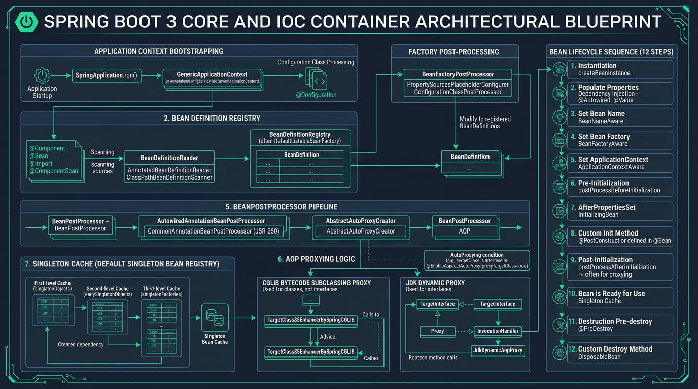

# 🍃 Spring Framework 6 & Spring Boot 3 Enterprise Master Guide

[🏠 Back to Home](README.md) | [☕ JVM & GC](jvm_gc_profiling_master_guide.md) | [📦 Maven & Gradle](maven_gradle_master_guide.md) | [🧪 Test Automation](test_automation_master_guide.md) | [🧵 Java Concurrency](java_thread.md)

---

## 📑 Master Table of Contents

- [🍃 Spring Framework 6 \& Spring Boot 3 Enterprise Master Guide](#-spring-framework-6--spring-boot-3-enterprise-master-guide)
  - [📑 Master Table of Contents](#-master-table-of-contents)
  - [🛠️ Prerequisites \& Foundational Knowledge](#️-prerequisites--foundational-knowledge)
    - [1. Modern Java 17/21 LTS Language Foundations](#1-modern-java-1721-lts-language-foundations)
    - [2. Inversion of Control (IoC) \& Dependency Injection (DI) Theory](#2-inversion-of-control-ioc--dependency-injection-di-theory)
    - [3. Relational Persistence, JDBC \& ORM Foundations](#3-relational-persistence-jdbc--orm-foundations)
    - [4. Reactive Streams Specification \& Project Reactor Basics](#4-reactive-streams-specification--project-reactor-basics)
    - [5. Diagnostic \& Development Environment Setup](#5-diagnostic--development-environment-setup)
- [TRACK 1: JUNIOR \& ENTRY-LEVEL FOUNDATIONS (ZERO-TO-HERO)](#track-1-junior--entry-level-foundations-zero-to-hero)
  - [1.1 The Real-World Mental Model (The Hotel Concierge \& Security Guards)](#11-the-real-world-mental-model-the-hotel-concierge--security-guards)
  - [1.2 Spring Core IoC: `@Component`, `@Service`, `@Repository` \& Constructor Injection](#12-spring-core-ioc-component-service-repository--constructor-injection)
  - [1.3 Spring Boot 3 Essentials: Starters, Autoconfiguration \& YAML Profiles](#13-spring-boot-3-essentials-starters-autoconfiguration--yaml-profiles)
  - [1.4 REST API Architecture: Controllers, DTO Validation \& RFC 7807 Errors](#14-rest-api-architecture-controllers-dto-validation--rfc-7807-errors)
  - [1.5 Top 5 Rookie Spring Disasters \& How to Prevent Them](#15-top-5-rookie-spring-disasters--how-to-prevent-them)
- [TRACK 2: MASTER SPRING FRAMEWORKS \& MODULES CATALOG](#track-2-master-spring-frameworks--modules-catalog)
  - [2.1 Spring Boot 3 Core, Auto-Configuration \& GraalVM AOT Compilation](#21-spring-boot-3-core-auto-configuration--graalvm-aot-compilation)
  - [2.2 Spring Security 6, OAuth2 Resource Server \& JWT Filter Chains](#22-spring-security-6-oauth2-resource-server--jwt-filter-chains)
  - [2.3 Spring Data JPA, Hibernate 6 \& High-Performance Persistence](#23-spring-data-jpa-hibernate-6--high-performance-persistence)
  - [2.4 Spring WebFlux, Project Reactor \& Non-Blocking Event Loops](#24-spring-webflux-project-reactor--non-blocking-event-loops)
  - [2.5 Spring Cloud Microservices (Gateway, OpenFeign, Consul/Eureka)](#25-spring-cloud-microservices-gateway-openfeign-consuleureka)
  - [2.6 Spring for Apache Kafka \& Event-Driven Messaging](#26-spring-for-apache-kafka--event-driven-messaging)
  - [2.7 Spring Cache \& Redis Distributed Caching](#27-spring-cache--redis-distributed-caching)
  - [2.8 Spring Batch \& High-Throughput Chunk-Oriented Processing](#28-spring-batch--high-throughput-chunk-oriented-processing)
  - [2.9 Spring Boot Actuator, Micrometer \& Distributed Tracing](#29-spring-boot-actuator-micrometer--distributed-tracing)
  - [2.10 Spring Testing: MockMvc, WebTestClient \& Testcontainers](#210-spring-testing-mockmvc-webtestclient--testcontainers)
- [TRACK 3: DEEP TECHNICAL INTERNALS \& ARCHITECTURAL TAXONOMY](#track-3-deep-technical-internals--architectural-taxonomy)
  - [3.1 ApplicationContext Lifecycle, BeanPostProcessors \& InitializingBean](#31-applicationcontext-lifecycle-beanpostprocessors--initializingbean)
  - [3.2 Spring AOP \& Proxy Generation: CGLIB / Byte Buddy vs JDK Dynamic Proxies](#32-spring-aop--proxy-generation-cglib--byte-buddy-vs-jdk-dynamic-proxies)
  - [3.3 `@Transactional` Deep Internals: AOP Interception, Propagation \& Rollbacks](#33-transactional-deep-internals-aop-interception-propagation--rollbacks)
  - [3.4 Hibernate 6 Dirty Checking, Entity Life-Cycles \& Caches](#34-hibernate-6-dirty-checking-entity-life-cycles--caches)
  - [3.5 WebFlux Netty EventLoop Threading Architecture \& Thread Confinement](#35-webflux-netty-eventloop-threading-architecture--thread-confinement)
- [TRACK 4: PRODUCTION ENGINEERING, RESILIENCE \& CLEAN ARCHITECTURE](#track-4-production-engineering-resilience--clean-architecture)
  - [4.1 Hexagonal / Clean Architecture Blueprint for Spring Boot 3](#41-hexagonal--clean-architecture-blueprint-for-spring-boot-3)
  - [4.2 Enterprise Resilience4j Integration (CircuitBreaker, RateLimiter, Bulkhead)](#42-enterprise-resilience4j-integration-circuitbreaker-ratelimiter-bulkhead)
  - [4.3 Database Schema Migration: Flyway / Liquibase with Zero-Downtime Deployments](#43-database-schema-migration-flyway--liquibase-with-zero-downtime-deployments)
  - [4.4 Zero-Trust Security Configuration: RBAC \& Method-Level Security](#44-zero-trust-security-configuration-rbac--method-level-security)
  - [4.5 Kubernetes Production Readiness: Actuator Probes \& Graceful Shutdown](#45-kubernetes-production-readiness-actuator-probes--graceful-shutdown)
- [TRACK 5: DISASTER RECOVERY, WAR ROOM FORENSICS \& POST-MORTEMS](#track-5-disaster-recovery-war-room-forensics--post-mortems)
  - [5.1 Real-World Incident 1: HikariCP Connection Pool Starvation Freezing Production Gateway](#51-real-world-incident-1-hikaricp-connection-pool-starvation-freezing-production-gateway)
  - [5.2 Real-World Incident 2: High Latency Outage from Blocking JDBC Query in WebFlux Event Loop](#52-real-world-incident-2-high-latency-outage-from-blocking-jdbc-query-in-webflux-event-loop)
  - [5.3 Real-World Incident 3: `LazyInitializationException` in High-Concurrency Checkout Flow](#53-real-world-incident-3-lazyinitializationexception-in-high-concurrency-checkout-flow)
  - [5.4 Real-World Incident 4: Database Deadlock Cascade Under Concurrent Multi-Row Updates](#54-real-world-incident-4-database-deadlock-cascade-under-concurrent-multi-row-updates)
  - [5.5 Real-World Incident 5: JWT Token Validation Bypass Caused by SecurityFilterChain Misconfiguration](#55-real-world-incident-5-jwt-token-validation-bypass-caused-by-securityfilterchain-misconfiguration)
  - [5.6 Emergency Spring Boot Production Triage Cheat-Sheet](#56-emergency-spring-boot-production-triage-cheat-sheet)
- [TRACK 6: CRACK-THE-INTERVIEW QUESTION BANK (50 SENIOR/STAFF+ SCENARIOS)](#track-6-crack-the-interview-question-bank-50-seniorstaff-scenarios)

---

## 🛠️ Prerequisites & Foundational Knowledge

### 1. Modern Java 17/21 LTS Language Foundations
Spring Framework 6 and Spring Boot 3 have a hard baseline requirement of **Java 17+**:
- **Records**: Immutable data carriers used for DTOs and API payloads (`public record CreateOrderRequest(String sku, int quantity) {}`).
- **Pattern Matching for `switch` & `instanceof`**: Eliminates ugly manual casts.
- **Sealed Classes**: Restricts interface hierarchies for domain-driven state modeling.
- **Java 21 Virtual Threads**: Built-in compatibility via `spring.threads.virtual.enabled=true`.

### 2. Inversion of Control (IoC) & Dependency Injection (DI) Theory
- **Tight Coupling (The Anti-Pattern)**: Class A instantiates its own dependencies (`new DatabaseConnection()`). Changes to the database constructor break Class A. Testing Class A in isolation is impossible.
- **Inversion of Control**: Control over object instantiation, wiring, and lifecycle management is delegated to an external container (the `ApplicationContext`).
- **Dependency Injection**: The container injects required collaborators into dependent objects via constructor parameters.

### 3. Relational Persistence, JDBC & ORM Foundations
- **JDBC Connection**: A physical TCP socket opened to PostgreSQL/MySQL. Creating connections is computationally expensive (~50–100ms), requiring a connection pool (HikariCP).
- **Object-Relational Mapping (ORM)**: Bridges relational tables (`rows`/`columns`) to object-oriented graphs (`entities`).
- **ACID Transactions**: Atomicity, Consistency, Isolation, and Durability enforced via database locks and undo logs.

### 4. Reactive Streams Specification & Project Reactor Basics
The Reactive Streams specification defines non-blocking backpressure:
- **`Publisher<T>`**: Emits a sequence of items (`Mono<T>` for 0..1, `Flux<T>` for 0..N).
- **`Subscriber<T>`**: Receives elements via `onNext()`, `onError()`, and `onComplete()`.
- **`Subscription`**: Controls backpressure via `request(n)`, preventing fast producers from overwhelming slow consumers.

### 5. Diagnostic & Development Environment Setup
- **Java 17 / 21 LTS** JDK
- **Docker / Testcontainers** (for PostgreSQL, Redis, Kafka)
- **Spring Boot CLI / IntelliJ IDEA / VS Code**

---

# TRACK 1: JUNIOR & ENTRY-LEVEL FOUNDATIONS (ZERO-TO-HERO)

## 1.1 The Real-World Mental Model & Architectural Blueprint

In enterprise Java architectures, Spring operates as the foundational control plane and runtime container:
1. **The ApplicationContext (The Intelligent Concierge)**: Ingests configuration sources, discovers component definitions, validates dependency trees, constructs bean instances, and wires dependencies into immutable object graphs.
2. **The Spring Beans (The Managed Appliances)**: Reusable, thread-safe singleton services, repositories, and components registered within the container.
3. **The Dynamic Proxy Layer (The Gatehouse Interceptor)**: Dynamically wraps beans with runtime bytecode proxies (CGLIB or JDK Dynamic Proxies) to inject orthogonal cross-cutting concerns (transactions, security, caching, tracing) transparently.



### Deep-Dive Architectural Breakdown: Spring Boot 3 Core & IoC Container Blueprint

The architectural blueprint above decodes the seven mission-critical subsystems, registration mechanics, and lifecycle phases driving the Spring container:

#### 1. ApplicationContext Bootstrapping & Environment Ingestion
- **Entry Point**: Bootstrapping begins with `SpringApplication.run()`. The bootstrap phase initializes the `Environment` abstraction (`StandardEnvironment` for web or non-web contexts), combining JVM system properties, OS environment variables, configuration profiles (`application.yml`), and command-line arguments.
- **Context Synthesis**: Spring instantiates the specialized container instance—typically `AnnotationConfigServletWebServerApplicationContext` for Spring MVC or `AnnotationConfigReactiveWebServerApplicationContext` for WebFlux. It applies `ApplicationContextInitializer` hooks and emits `ApplicationStartingEvent` and `ApplicationEnvironmentPreparedEvent` lifecycle signals.

#### 2. Bean Definition Registry & Source Scanning
- **Scanning Infrastructure**: The container utilizes `ClassPathBeanDefinitionScanner` and `AnnotatedBeanDefinitionReader` to discover candidates decorated with stereotype annotations (`@Component`, `@Service`, `@Repository`, `@Controller`, `@Configuration`).
- **BeanDefinition Metadata Object**: Raw classes are not instantiated immediately. The container parses bytecode into `BeanDefinition` metadata records stored in `DefaultListableBeanFactory`. Each definition encapsulates:
  - Concrete class type, constructor arguments, and property overrides.
  - Scope (`singleton`, `prototype`, `request`, `session`).
  - Lazy initialization flags (`@Lazy`), primary flags (`@Primary`), and qualifier names.
  - Factory method references for `@Bean` annotated configurations.

#### 3. Factory Post-Processing (`BeanFactoryPostProcessor` SPI)
- **Metadata Mutation Before Instantiation**: Executes after all `BeanDefinition`s are registered, but **before a single bean instance is constructed in memory**.
- **`ConfigurationClassPostProcessor`**: Detects `@Configuration` classes and generates CGLIB subclasses (when `proxyBeanMethods = true`) to enforce singleton semantics across intra-class `@Bean` method calls.
- **`PropertySourcesPlaceholderConfigurer`**: Parses and resolves `${property.key:defaultValue}` expressions inside bean definitions, injecting live values from the active `Environment`.

#### 4. BeanPostProcessor (BPP) Pipeline & Metadata Interception
- **Extensible Interception Hooks**: Beans implementing `BeanPostProcessor` intercept every newly created bean during initialization:
  - `postProcessBeforeInitialization(Object bean, String beanName)`: Invoked before any initialization callbacks.
  - `postProcessAfterInitialization(Object bean, String beanName)`: Invoked after initialization callbacks; **this is the exact phase where dynamic AOP proxies are created**.
- **Core Engine BPPs**:
  - `AutowiredAnnotationBeanPostProcessor`: Injects dependencies for `@Autowired` and `@Value` fields/methods.
  - `CommonAnnotationBeanPostProcessor`: Resolves JSR-250 lifecycle hooks (`@PostConstruct`, `@PreDestroy`) and `@Resource`.
  - `AbstractAutoProxyCreator`: Evaluates pointcuts against the bean's methods. If matches occur, wraps the target bean in a CGLIB or JDK Dynamic Proxy.

#### 5. Three-Level Singleton Cache (`DefaultSingletonBeanRegistry`)
To resolve circular references between singleton beans safely, Spring employs a hierarchical three-tier cache architecture:
| Cache Level | Cache Field Name | Underlying Data Structure | Role & Lifecycle State |
| :--- | :--- | :--- | :--- |
| **Level 1 (Singleton Cache)** | `singletonObjects` | `ConcurrentHashMap<String, Object>` | Holds fully initialized, post-processed, ready-to-use singleton bean instances. |
| **Level 2 (Early Singleton Objects)** | `earlySingletonObjects` | `HashMap<String, Object>` | Holds partially constructed beans (instantiated, but property injection or BPPs incomplete) exposed to break circular loops. |
| **Level 3 (Singleton Factories)** | `singletonFactories` | `HashMap<String, ObjectFactory<?>>` | Holds anonymous factory lambdas capable of returning early proxy references (`SmartInstantiationAwareBeanPostProcessor`) on-demand. |

#### 6. AOP Proxying Architecture: CGLIB Bytecode Subclassing vs JDK Dynamic Proxies
- **CGLIB / Byte Buddy (`TargetClass$$EnhancerBySpringCGLIB`)**:
  - Generates a synthetic child subclass of the target bean at runtime.
  - Overrides public/protected methods to execute the interceptor chain (`MethodInterceptor`).
  - Default proxy engine in Spring Boot 2 & 3 (`spring.aop.proxy-target-class=true`).
  - *Hard Constraint*: Classes and methods marked `final` cannot be overridden; self-invocation (`this.method()`) bypasses the proxy subclass.
- **JDK Dynamic Proxies (`java.lang.reflect.Proxy`)**:
  - Dynamically implements the interfaces exposed by the target class via `InvocationHandler`.
  - Requires target beans to implement interfaces; cannot cast the generated proxy back to the concrete class implementation.

#### 7. Deterministic 12-Step Bean Lifecycle Sequence
Every managed bean transitions through an exact, sequential lifecycle pipeline managed by the container:
| Step # | Phase Name | Invocation Mechanism | Internal Action Taken |
| :--- | :--- | :--- | :--- |
| **Step 1** | Instantiation | Constructor Reflection / Factory Method | JVM creates raw object instance via constructor injection. |
| **Step 2** | Populate Properties | `AutowiredAnnotationBeanPostProcessor` | Setter and field dependencies resolved and injected. |
| **Step 3** | Set Bean Name | `BeanNameAware.setBeanName()` | Container passes the registered bean identifier string. |
| **Step 4** | Set Bean Factory | `BeanFactoryAware.setBeanFactory()` | Passes internal `BeanFactory` reference to the bean. |
| **Step 5** | Set Application Context | `ApplicationContextAware.setApplicationContext()` | Passes enclosing `ApplicationContext` container reference. |
| **Step 6** | Pre-Initialization | `BPP.postProcessBeforeInitialization()` | Invokes `@PostConstruct` methods via `CommonAnnotationBeanPostProcessor`. |
| **Step 7** | Initializing Bean | `InitializingBean.afterPropertiesSet()` | Interface callback verifying all properties are configured. |
| **Step 8** | Custom Init Method | `@Bean(initMethod = "customInit")` | Invokes custom XML or annotation-declared initializer. |
| **Step 9** | Post-Initialization | `BPP.postProcessAfterInitialization()` | Wraps target with AOP proxies (`@Transactional`, `@Async`, `@Cacheable`). |
| **Step 10** | Bean Ready | Registered into `singletonObjects` | Bean available for concurrent dependency injection across application threads. |
| **Step 11** | Pre-Destroy | `CommonAnnotationBeanPostProcessor` | Invoked on container shutdown; executes methods annotated with `@PreDestroy`. |
| **Step 12** | Disposable Bean | `DisposableBean.destroy()` / `destroyMethod` | Releases open connections, thread pools, and system resources. |

## 1.2 Spring Core IoC: `@Component`, `@Service`, `@Repository` & Constructor Injection

### Why Field Injection (`@Autowired private OrderService svc;`) Is Banned
1. Prevents immutability (fields cannot be `final`).
2. Hides dependencies, making classes bloated without warning.
3. Makes unit testing impossible without starting a slow Spring context or using reflection hacks.

### Modern Production Standard: Constructor Injection with `final` Fields
```java
@Service
public class OrderService {

    private final OrderRepository orderRepository;
    private final PaymentClient paymentClient;

    // In Spring 4.3+, single constructor does NOT need @Autowired!
    public OrderService(OrderRepository orderRepository, PaymentClient paymentClient) {
        this.orderRepository = Objects.requireNonNull(orderRepository, "orderRepository required");
        this.paymentClient = Objects.requireNonNull(paymentClient, "paymentClient required");
    }

    public OrderResponse placeOrder(CreateOrderRequest request) {
        // Business logic...
        return new OrderResponse("ORD-1001", OrderStatus.CONFIRMED);
    }
}
```

---

## 1.3 Spring Boot 3 Essentials: Starters, Autoconfiguration & YAML Profiles

### Starter Dependencies: Curated Transitive Graphs
Instead of declaring 15 separate libraries with version numbers, import a single starter:
- `spring-boot-starter-web`: Pulls Tomcat, Spring MVC, Jackson, and Validation.
- `spring-boot-starter-data-jpa`: Pulls Hibernate, HikariCP, and Spring Data core.

### Production `application.yml` with Multi-Profile Structure
```yaml
spring:
  application:
    name: order-service
  profiles:
    active: local
  threads:
    virtual:
      enabled: true # Enable Java 21 Virtual Threads across all Tomcat worker threads!

---
# Local Development Profile
spring:
  config:
    activate:
      on-profile: local
  datasource:
    url: jdbc:h2:mem:orderdb;DB_CLOSE_DELAY=-1
    username: sa
    password: ""
  jpa:
    hibernate:
      ddl-auto: update
    show-sql: true

---
# Production Profile (Hardened)
spring:
  config:
    activate:
      on-profile: prod
  datasource:
    url: jdbc:postgresql://${DB_HOST:postgres.internal}:5432/orderdb
    username: ${DB_USER}
    password: ${DB_PASS}
    hikari:
      maximum-pool-size: 20
      minimum-idle: 10
      connection-timeout: 30000
  jpa:
    hibernate:
      ddl-auto: validate # NEVER use update or create-drop in production!
    properties:
      hibernate:
        format_sql: false
```

---

## 1.4 REST API Architecture: Controllers, DTO Validation & RFC 7807 Errors

```java
@RestController
@RequestMapping("/api/v1/orders")
public class OrderController {

    private final OrderService orderService;

    public OrderController(OrderService orderService) {
        this.orderService = orderService;
    }

    @PostMapping
    public ResponseEntity<OrderResponse> createOrder(@Valid @RequestBody CreateOrderRequest request) {
        OrderResponse response = orderService.placeOrder(request);
        URI location = ServletUriComponentsBuilder.fromCurrentRequest()
                .path("/{id}")
                .buildAndExpand(response.orderId())
                .toUri();
        return ResponseEntity.created(location).body(response);
    }
}

// Java 21 Record DTO with Bean Validation
public record CreateOrderRequest(
    @NotBlank(message = "Customer ID is required")
    String customerId,

    @NotEmpty(message = "Order must contain at least one item")
    List<@Valid OrderItemDto> items,

    @Positive(message = "Order amount must be greater than zero")
    BigDecimal totalAmount
) {}
```

### Centralized RFC 7807 Problem Details Exception Handler
```java
@RestControllerAdvice
public class GlobalExceptionHandler {

    @ExceptionHandler(MethodArgumentNotValidException.class)
    public ProblemDetail handleValidationErrors(MethodArgumentNotValidException ex) {
        ProblemDetail problem = ProblemDetail.forStatusAndDetail(
                HttpStatus.BAD_REQUEST, "One or more input fields failed validation"
        );
        problem.setTitle("Constraint Violation");
        problem.setType(URI.create("https://api.enterprise.internal/errors/validation-failed"));

        Map<String, String> errors = new HashMap<>();
        ex.getBindingResult().getFieldErrors().forEach(error -> 
            errors.put(error.getField(), error.getDefaultMessage())
        );
        problem.setProperty("invalidFields", errors);
        return problem;
    }

    @ExceptionHandler(EntityNotFoundException.class)
    public ProblemDetail handleNotFound(EntityNotFoundException ex) {
        ProblemDetail problem = ProblemDetail.forStatusAndDetail(HttpStatus.NOT_FOUND, ex.getMessage());
        problem.setTitle("Resource Not Found");
        return problem;
    }
}
```

---

## 1.5 Top 5 Rookie Spring Disasters & How to Prevent Them

1. **`@Transactional` Self-Invocation Bypass**:
   - *Mistake*: Calling `@Transactional public void innerMethod()` from another method within the **same class** (`this.innerMethod()`).
   - *Result*: The call completely bypasses the Spring CGLIB Dynamic Proxy! No transaction is started; exceptions do not roll back; data corruption occurs.
   - *Fix*: Move the transactional method to a separate collaborator bean or inject the bean proxy.
2. **N+1 Database Query Explosion in Spring Data JPA**:
   - *Mistake*: Iterating over `List<Order>` and calling `order.getCustomer().getName()` with default `FetchType.LAZY`.
   - *Result*: Executing 1 query for orders generates 1,000 subsequent individual SQL queries for customers, bringing the database to 100% CPU.
   - *Fix*: Use `JOIN FETCH` in JPQL or `@EntityGraph(attributePaths = {"customer"})`.
3. **Executing Blocking Code in WebFlux Event Loops**:
   - *Mistake*: Calling `Thread.sleep()`, synchronous JDBC repositories (`JpaRepository`), or synchronous `RestTemplate` inside a WebFlux reactive pipeline.
   - *Result*: Freezes the Netty EventLoop thread, stalling all thousands of concurrent connections handled by that core.
   - *Fix*: Use Spring Data R2DBC, WebClient, or offload blocking calls to `Schedulers.boundedElastic()`.
4. **Using Field-Level `@Autowired`**:
   - *Mistake*: Annotating private fields with `@Autowired`.
   - *Result*: Cannot write pure unit tests without booting a heavyweight Spring context or using brittle reflection.
   - *Fix*: Always use constructor injection with `final` fields.
5. **Leaving `spring.jpa.hibernate.ddl-auto=update` in Production**:
   - *Mistake*: Allowing Hibernate to automatically mutate production database schemas.
   - *Result*: Table locks during peak traffic, accidental schema changes, and zero rollback capability.
   - *Fix*: Set to `validate` in production and manage all DDL schema migrations with Flyway or Liquibase.

---

# TRACK 2: MASTER SPRING FRAMEWORKS & MODULES CATALOG

### Spring Ecosystem Master Component Matrix

| Module | Core Objective | Threading Model | Production Use Case |
| :--- | :--- | :--- | :--- |
| **Spring Boot 3 Core** | Rapid App Bootstrapping & Auto-Configuration | Worker Pool / Java 21 Virtual Threads | Microservices, REST APIs, CLI Daemons |
| **Spring Security 6** | Zero-Trust Auth, RBAC & OAuth2/OIDC | `SecurityContext` / `ThreadLocal` | OAuth2 Resource Server, JWT Gateway |
| **Spring Data JPA** | Relational ORM Persistence & Dirty Checking | Synchronous JDBC (HikariCP) | Transactional OLTP Workloads |
| **Spring WebFlux** | High-Concurrency Non-Blocking Streaming | Netty EventLoop (Project Reactor) | Edge Gateways, SSE, WebSocket Streams |
| **Spring Cloud** | Distributed Routing, Discovery & Config | Hybrid (Reactive Gateway + Client) | Service Mesh, Dynamic Routing, Resilience |
| **Spring Kafka** | Enterprise Event-Driven Commit Log Messaging | Polling Worker Threads / Batch Listener | Event Sourcing, Pub/Sub, Saga Workflows |
| **Spring Cache / Redis** | In-Memory Latency Reduction & Distributed State | Synchronous / Lettuce Netty Multiplexing | Read-heavy registries, Distributed Sessions |
| **Spring Batch** | High-Volume Chunk-Oriented Processing | Multi-threaded / Partitioned Steps | End-of-Day Reconciliation, ETL Pipelines |
| **Spring Actuator** | Production Health & Observability Telemetry | In-process Micrometer Metrics | Prometheus, OpenTelemetry, Grafana |
| **Spring Test** | Deterministic Automated Verification | Isolated Test Workers (Testcontainers) | Integration Testing, Mocking, Sliced Contexts |

---

## 2.1 Spring Boot 3 Core, Auto-Configuration & GraalVM AOT Compilation

### How Auto-Configuration Works Under the Hood
Spring Boot 3 uses `@AutoConfiguration` classes registered in `META-INF/spring/org.springframework.boot.autoconfigure.AutoConfiguration.imports`. Each auto-configuration evaluates condition annotations:
- `@ConditionalOnClass(DataSource.class)`: Runs only if the class is present on the classpath.
- `@ConditionalOnMissingBean(DataSource.class)`: Runs only if the developer hasn't defined their own custom bean.
- `@ConditionalOnProperty(name = "feature.enabled", havingValue = "true")`: Runs only if application properties match.

### GraalVM Ahead-Of-Time (AOT) Compilation
Spring Boot 3 natively supports compiling Java applications into standalone OS machine binaries via GraalVM Native Image:
- Startup time drops from 4,000ms to **35 milliseconds**!
- Memory footprint drops from 500MB to **40MB**!
- Requires declaring runtime reflection and proxy hints using `@RegisterReflectionForBinding`.

---

## 2.2 Spring Security 6, OAuth2 Resource Server & JWT Filter Chains

In Spring Security 6, legacy `WebSecurityConfigurerAdapter` is completely removed. Everything is configured via a `@Bean SecurityFilterChain`:

```java
@Configuration
@EnableWebSecurity
@EnableMethodSecurity // Enables @PreAuthorize("hasRole('ADMIN')")
public class SecurityConfig {

    @Bean
    public SecurityFilterChain securityFilterChain(HttpSecurity http) throws Exception {
        return http
            .csrf(AbstractHttpConfigurer::disable) // Safe for stateless REST APIs using JWT
            .sessionManagement(session -> session.sessionCreationPolicy(SessionCreationPolicy.STATELESS))
            .authorizeHttpRequests(auth -> auth
                .requestMatchers("/actuator/health/**", "/public/**").permitAll()
                .requestMatchers("/api/v1/admin/**").hasRole("ADMIN")
                .anyRequest().authenticated()
            )
            .oauth2ResourceServer(oauth2 -> oauth2.jwt(Customizer.withDefaults()))
            .build();
    }
}
```

---

## 2.3 Spring Data JPA, Hibernate 6 & High-Performance Persistence

### Production Repository with Optimized Fetching
```java
public interface OrderRepository extends JpaRepository<Order, UUID> {

    // Resolves N+1 Problem: Single SQL query joins order and customer in one round-trip
    @Query("SELECT o FROM Order o JOIN FETCH o.customer WHERE o.status = :status")
    List<Order> findAllByStatusWithCustomer(@Param("status") OrderStatus status);

    // Read-only query optimization: Skips Hibernate dirty-checking snapshot creation
    @Transactional(readOnly = true)
    @Query("SELECT o FROM Order o WHERE o.id = :id")
    Optional<Order> findReadOnlyById(@Param("id") UUID id);
}
```

---

## 2.4 Spring WebFlux, Project Reactor & Non-Blocking Event Loops

### Reactive REST Controller with Backpressure
```java
@RestController
@RequestMapping("/api/v1/stream")
public class StreamController {

    private final ProductEventService eventService;

    public StreamController(ProductEventService eventService) {
        this.eventService = eventService;
    }

    // Server-Sent Events (SSE) streaming live data to client without blocking
    @GetMapping(value = "/prices", produces = MediaType.TEXT_EVENT_STREAM_VALUE)
    public Flux<PriceUpdate> streamRealtimePrices() {
        return eventService.getPriceStream()
                .delayElements(Duration.ofMillis(100))
                .onBackpressureDrop(dropped -> log.warn("Dropped slow client item: {}", dropped));
    }
}
```

---

## 2.5 Spring Cloud Microservices (Gateway, OpenFeign, Consul/Eureka)

### Spring Cloud Gateway Reactive Routing
```yaml
spring:
  cloud:
    gateway:
      routes:
        - id: payment-service-route
          uri: lb://payment-service # Load balanced across Eureka/Consul instances
          predicates:
            - Path=/api/v1/payments/**
          filters:
            - StripPrefix=0
            - name: CircuitBreaker
              args:
                name: paymentCircuitBreaker
                fallbackUri: forward:/fallback/payment
```

### Declarative HTTP Client with OpenFeign
```java
@FeignClient(name = "inventory-service", fallback = InventoryFallback.class)
public interface InventoryClient {

    @GetMapping("/api/v1/inventory/{sku}")
    InventoryResponse checkStock(@PathVariable("sku") String sku);
}
```

---

## 2.6 Spring for Apache Kafka & Event-Driven Messaging

### Production Kafka Producer & Consumer Blueprint
```java
@Service
public class OrderEventProducer {

    private final KafkaTemplate<String, OrderCreatedEvent> kafkaTemplate;

    public OrderEventProducer(KafkaTemplate<String, OrderCreatedEvent> kafkaTemplate) {
        this.kafkaTemplate = kafkaTemplate;
    }

    public void publishOrderCreated(OrderCreatedEvent event) {
        kafkaTemplate.send("orders.v1.created", event.orderId(), event)
            .whenComplete((result, ex) -> {
                if (ex != null) {
                    log.error("Failed to publish order event: {}", event.orderId(), ex);
                } else {
                    log.info("Order event sent to partition: {}", result.getRecordMetadata().partition());
                }
            });
    }
}

@Component
public class PaymentProcessingConsumer {

    @KafkaListener(topics = "orders.v1.created", groupId = "payment-consumer-group", concurrency = "3")
    public void onOrderCreated(OrderCreatedEvent event, Acknowledgment ack) {
        try {
            // Process payment idempotently...
            ack.acknowledge(); // Manual commit after business logic succeeds!
        } catch (Exception ex) {
            log.error("Failed processing payment for order: {}", event.orderId(), ex);
            // Routed to Dead Letter Topic (DLT) automatically
            throw ex;
        }
    }
}
```

---

## 2.7 Spring Cache & Redis Distributed Caching

```java
@Service
public class CatalogService {

    private final ProductRepository productRepository;

    public CatalogService(ProductRepository productRepository) {
        this.productRepository = productRepository;
    }

    // Cache hit returns instantly from Redis without touching database
    @Cacheable(value = "products", key = "#sku", unless = "#result == null")
    public ProductDto getProduct(String sku) {
        return productRepository.findBySku(sku)
                .map(ProductDto::fromEntity)
                .orElseThrow(() -> new EntityNotFoundException("Product not found: " + sku));
    }

    // Cache eviction: Invalidates Redis cache key when product is updated
    @CacheEvict(value = "products", key = "#sku")
    public void updateProduct(String sku, UpdateProductRequest request) {
        // Update database...
    }
}
```

---

## 2.8 Spring Batch & High-Throughput Chunk-Oriented Processing

```java
@Configuration
public class EndOfDayReconciliationBatchConfig {

    @Bean
    public Step reconcileStep(JobRepository jobRepository, PlatformTransactionManager txManager,
                             ItemReader<Transaction> reader,
                             ItemProcessor<Transaction, SettledTransaction> processor,
                             ItemWriter<SettledTransaction> writer) {
        return new StepBuilder("reconcileStep", jobRepository)
            .<Transaction, SettledTransaction>chunk(1000, txManager) // 1000 items per transaction commit!
            .reader(reader)
            .processor(processor)
            .writer(writer)
            .faultTolerant()
            .skip(InvalidPaymentException.class)
            .skipLimit(50)
            .build();
    }
}
```

---

## 2.9 Spring Boot Actuator, Micrometer & Distributed Tracing

### Production Observability Configuration
```yaml
management:
  endpoints:
    web:
      exposure:
        include: health,info,metrics,prometheus
  endpoint:
    health:
      show-details: when-authorized
      probes:
        enabled: true
  metrics:
    tags:
      application: ${spring.application.name}
      environment: ${spring.profiles.active}
  tracing:
    sampling:
      probability: 1.0 # Trace 100% of requests in staging, 10% in high-volume prod
```

---

## 2.10 Spring Testing: MockMvc, WebTestClient & Testcontainers

### Full Integration Test with Live PostgreSQL via Testcontainers
```java
@SpringBootTest(webEnvironment = SpringBootTest.WebEnvironment.RANDOM_PORT)
@Testcontainers
class OrderIntegrationTest {

    @Container
    @ServiceConnection // Spring Boot 3.1+ automatically wires datasource connection properties!
    static PostgreSQLContainer<?> postgres = new PostgreSQLContainer<>("postgres:16-alpine");

    @Autowired
    private TestRestTemplate restTemplate;

    @Test
    void shouldCreateAndPersistOrder() {
        CreateOrderRequest request = new CreateOrderRequest("CUST-99", List.of(), BigDecimal.valueOf(149.99));
        ResponseEntity<OrderResponse> response = restTemplate.postForEntity("/api/v1/orders", request, OrderResponse.class);

        assertEquals(HttpStatus.CREATED, response.getStatusCode());
        assertNotNull(response.getBody().orderId());
    }
}
```

---

## 2.11 Spring Type Conversion, Formatting & HttpMessageConverter Architecture

Spring provides two distinct data transformation subsystems depending on where data enters the application:
1. **The Conversion & Formatting SPI (`ConversionService`)**: Operates on HTTP query parameters, path variables, request headers, and form-data via Spring MVC's `WebDataBinder`.
2. **The HTTP Message Conversion Pipeline (`HttpMessageConverter`)**: Operates on HTTP request and response bodies (`@RequestBody` / `@ResponseBody`), delegating parsing directly to JSON libraries (e.g., Jackson's `MappingJackson2HttpMessageConverter`).

### Spring Web Data Transformation Pipeline Architecture

| Inbound Data Stream | Entry Mechanism | Processing Engine | Target Destination |
| :--- | :--- | :--- | :--- |
| **URI Path, Query, Header, Form-Data** | `WebDataBinder` | `ConversionService` (`Converter<S,T>`, `ConverterFactory`, `GenericConverter`, `Formatter<T>`) | Method parameters (`@PathVariable`, `@RequestParam`, `@RequestHeader`) |
| **HTTP Request Body (JSON/XML)** | `DispatcherServlet` | `HttpMessageConverter` (`MappingJackson2HttpMessageConverter` wrapping `ObjectMapper`) | Strongly typed Record/DTO (`@RequestBody`) |
| **Outbound Model / View** | Controller return | `HttpMessageConverter` serialization pipeline | HTTP Response body (`@ResponseBody` / `ResponseEntity<T>`) |

### 1. Spring Conversion SPI: The 4 Core Interfaces

| Interface | Generics | Responsibility | Best Use Case |
| :--- | :--- | :--- | :--- |
| **`Converter<S, T>`** | `<S, T>` | Simple, stateless 1-to-1 conversion between source type `S` and target type `T`. | Converting `String` to `IsoCountryCode` or `String` to `LocalDate`. |
| **`ConverterFactory<S, R>`** | `<S, R>` | 1-to-hierarchy conversion. Produces converters for any class in a target class hierarchy `R`. | Converting `String` to any Java `Enum` (`StringToEnumConverterFactory`). |
| **`GenericConverter`** | None | Full control over complex source/target contexts (`TypeDescriptor`), supporting multiple type pairs. | Converting complex collections, arrays, and parameterized types. |
| **`ConditionalGenericConverter`** | None | Combines `GenericConverter` with a `matches(TypeDescriptor, TypeDescriptor)` boolean guard. | Applying conversions conditionally based on annotations or target attributes. |

### 2. Spring `Formatter<T>`: Locale-Aware Text Formatting

While `Converter<S, T>` is a general-purpose type conversion interface between any two Java types, `Formatter<T>` is strictly tailored for **Web UI and client-facing text-to-object conversions**. It combines two interfaces:
- `Printer<T>`: `String print(T object, Locale locale)`
- `Parser<T>`: `T parse(String text, Locale locale) throws ParseException`

```java
package com.example.spring.formatter;

import org.springframework.format.Formatter;
import java.text.ParseException;
import java.util.Currency;
import java.util.Locale;

public class CurrencyFormatter implements Formatter<Currency> {
    @Override
    public Currency parse(String text, Locale locale) throws ParseException {
        if (text == null || text.isBlank()) return null;
        return Currency.getInstance(text.trim().toUpperCase(locale));
    }

    @Override
    public String print(Currency object, Locale locale) {
        return (object != null) ? object.getSymbol(locale) : "";
    }
}
```

### 3. Registering Custom Converters in Spring Boot 3

In Spring Boot 3, custom converters can be registered in two ways:
1. **Declaring as a Spring `@Component`**: Spring Boot's auto-configured `FormattingConversionService` automatically discovers all beans implementing `Converter`, `GenericConverter`, or `Formatter` and registers them with the application conversion service.
2. **Explicit Registration via `WebMvcConfigurer`**: Guarantees deterministic ordering:

```java
package com.example.spring.config;

import com.example.spring.converter.StringToPaymentMethodConverter;
import com.example.spring.formatter.CurrencyFormatter;
import org.springframework.context.annotation.Configuration;
import org.springframework.format.FormatterRegistry;
import org.springframework.web.servlet.config.annotation.WebMvcConfigurer;

@Configuration
public class WebConversionConfig implements WebMvcConfigurer {

    @Override
    public void addFormatters(FormatterRegistry registry) {
        registry.addConverter(new StringToPaymentMethodConverter());
        registry.addFormatter(new CurrencyFormatter());
    }
}
```

### 4. Enterprise Boundary Separation: Where Converters Live

| Request Ingestion Stage | Inbound Protocol & Payload | Conversion Interface | Runtime Execution Scope |
| :--- | :--- | :--- | :--- |
| **(1) Query Param / Header** | `GET /orders?date=2026-09-11` | Spring `Converter<String, LocalDate>` | Executed by `WebDataBinder` before controller method entry |
| **(2) Request Payload** | `POST {"unit_price": 1999}` | Jackson `Converter<Long, Money>` | Executed by `MappingJackson2HttpMessageConverter` during JSON deserialization |
| **(3) DB Persistence** | `INSERT INTO products VALUES ('19.99 USD')` | JPA `AttributeConverter<Money, String>` | Executed by Hibernate dialect layer during JDBC parameter binding |

---

# TRACK 3: DEEP TECHNICAL INTERNALS & ARCHITECTURAL TAXONOMY

## 3.1 ApplicationContext Lifecycle, BeanPostProcessors & InitializingBean

The Spring container bootstraps beans through an exact sequence of lifecycle callbacks:

| Execution Order | Lifecycle Phase | Invocation Hook / Mechanism | Proxy & State Implication |
| :--- | :--- | :--- | :--- |
| **1. Instantiation** | Constructor Execution | Reflection / CGLIB Enhancer | Raw Java instance allocated on heap; fields unpopulated |
| **2. Populate Properties** | Dependency Injection | `AutowiredAnnotationBeanPostProcessor` | `@Autowired` and `@Value` fields resolved and injected |
| **3. Aware Callbacks** | Framework Notification | `BeanNameAware`, `BeanFactoryAware`, `ApplicationContextAware` | Injects container runtime infrastructure handles |
| **4. BPP Pre-Initialization** | Before Init Hooks | `BeanPostProcessor.postProcessBeforeInitialization()` | Processes JSR-250 `@PostConstruct` annotations |
| **5. InitializingBean** | Framework Contract | `InitializingBean.afterPropertiesSet()` | Core validation that required properties are non-null |
| **6. Custom Init** | Custom Configuration | `@Bean(initMethod = "init")` | Custom initializer method executed |
| **7. BPP Post-Initialization** | Proxy Creation | `BeanPostProcessor.postProcessAfterInitialization()` | **CRITICAL: Dynamic AOP Proxies created here** (`@Transactional`, `@Async`) |
| **8. Production Ready** | Cache Registration | Inserted into `DefaultSingletonBeanRegistry` | Exposed for concurrent injection across all request threads |
| **9. Destruction** | Teardown Phase | `@PreDestroy` -> `DisposableBean.destroy()` -> `destroyMethod` | Closes network sockets, flushes buffers, terminates thread pools |

- **Crucial Rule**: Dynamic proxies for `@Transactional`, `@Async`, and `@Cacheable` are wrapped at **Step 7** (`postProcessAfterInitialization`). If you execute code inside a constructor or `@PostConstruct`, proxy advice has NOT yet been applied!

---

## 3.2 Spring AOP & Proxy Generation: CGLIB / Byte Buddy vs JDK Dynamic Proxies

- **JDK Dynamic Proxies**: Built into the standard JDK (`java.lang.reflect.Proxy`). Can **only proxy interfaces**. If a class implements `PaymentService`, Spring creates a runtime proxy implementing `PaymentService`.
- **CGLIB / Byte Buddy**: Generates runtime subclasses of the concrete class. In Spring Boot 2 & 3, **CGLIB / Byte Buddy is the default for all beans** (`spring.aop.proxy-target-class=true`).
  - *Limitation*: Because CGLIB uses inheritance (`class OrderService$$SpringCGLIB extends OrderService`), methods marked `final` or classes marked `final` cannot be proxied!

---

## 3.3 `@Transactional` Deep Internals: AOP Interception, Propagation & Rollbacks

When a method with `@Transactional` is invoked through its CGLIB proxy:
1. The proxy delegates to `TransactionAspectSupport`.
2. `PlatformTransactionManager` looks up the active `TransactionStatus`.
3. If `Propagation.REQUIRED` (default), it binds the existing JDBC Connection from `TransactionSynchronizationManager` or fetches a fresh connection from HikariCP and executes `connection.setAutoCommit(false)`.
4. The target method executes.
5. **Rollback Decision**: By default, Spring only rolls back on **`RuntimeException` and `Error`**! It does **NOT** roll back on checked exceptions (`IOException`, `Exception`) unless explicitly configured:
   ```java
   @Transactional(rollbackFor = Exception.class)
   ```

---

## 3.4 Hibernate 6 Dirty Checking, Entity Life-Cycles & Caches

| Entity State | Description & Lifecycle Boundary | Persistence Context Status | Database Synchronization Action |
| :--- | :--- | :--- | :--- |
| **Transient** | Newly instantiated via Java constructor (`new Order()`). | Not associated with any `EntityManager`. | No database representation; no SQL generated. |
| **Persistent (Managed)** | Associated with active Persistence Context via `em.persist()` or `findById()`. | Managed in First-Level Session Cache with baseline dirty-check snapshot. | Tracked for changes; automatically flushed on transaction commit. |
| **Detached** | Persistence Context closed, transaction ended, or `em.detach()` invoked. | No longer managed by active session. | Updates ignored unless explicitly re-attached via `em.merge()`. |
| **Removed** | Marked for deletion via `em.remove()`. | Scheduled for removal within the ActionQueue. | Emits SQL `DELETE` during next transaction flush. |

- **First-Level Cache**: Bound to the active `EntityManager` / Hibernate Session. When you call `findById(1L)` twice within the same `@Transactional` method, Hibernate issues **only 1 SQL query**; the second call returns the reference directly from the First-Level Cache.
- **Dirty Checking**: At transaction commit time, Hibernate compares the entity's current in-memory field state against a hidden snapshot captured when it was loaded. If any field changed, Hibernate automatically executes SQL `UPDATE` without calling `save()`.

---

## 3.5 WebFlux Netty EventLoop Threading Architecture & Thread Confinement

Unlike traditional Spring MVC which allocates 1 platform thread per HTTP request (Tomcat default 200 threads), WebFlux uses **Netty with $1 \times \text{CPU Core}$ EventLoop threads**:

| Architectural Tier | Netty Non-Blocking Engine | Thread Confinement Mechanics | High-Concurrency Profile |
| :--- | :--- | :--- | :--- |
| **Acceptor Socket** | Single Parent EventLoop Group | Accepts incoming TCP SYN packets, manages handshakes | $O(1)$ socket registration on OS multiplexer (`epoll`/`kqueue`) |
| **Worker EventLoops** | Child EventLoop Group ($N = \text{CPU Cores}$) | Round-robin socket channel assignment | Continuously processes I/O events without thread switching |
| **Thread Confinement** | Single-threaded per channel | All read/write operations for a given socket stay on 1 thread | Zero lock contention, zero volatile memory synchronization penalties |
| **Blocking Offloading** | `Schedulers.boundedElastic()` | Dedicated worker pool for legacy JDBC/blocking calls | Caps thread creation to $10 \times \text{CPU Cores}$, prevents EventLoop stalls |

- If an EventLoop thread blocks on an I/O operation for 200ms, thousands of other requests assigned to that EventLoop stall immediately.
- To execute blocking calls safely in WebFlux:
  ```java
  Mono.fromCallable(() -> legacyBlockingDatabaseCall())
      .subscribeOn(Schedulers.boundedElastic()); // Offloads to dedicated elastic thread pool!
  ```

---

# TRACK 4: PRODUCTION ENGINEERING, RESILIENCE & CLEAN ARCHITECTURE

## 4.1 Hexagonal / Clean Architecture Blueprint for Spring Boot 3

| Architectural Layer | Package Path | Canonical Artifacts | Responsibilities & Dependency Rules |
| :--- | :--- | :--- | :--- |
| **Pure Domain (Core)** | `domain/model/` | `Order.java`, `OrderId.java` | Core business logic and invariants. **Strict Invariant**: Zero Spring or persistence dependencies. |
| **Driving Ports (Inbound)** | `domain/port/in/` | `PlaceOrderUseCase.java` | Interfaces exposing use-case operations to external clients. |
| **Driven Ports (Outbound)** | `domain/port/out/` | `OrderPersistencePort.java`, `PaymentGatewayPort.java` | Interfaces declaring data persistence and third-party gateway interactions. |
| **Application Layer** | `application/service/` | `OrderApplicationService.java` | Orchestrates domain entities and executes use-case flows; coordinates transactions. |
| **Driving Adapters (Inbound)** | `infrastructure/adapter/in/web/` | `OrderRestController.java` | Spring MVC REST controllers translating incoming HTTP JSON payloads into domain requests. |
| **Driven Adapters (Outbound)** | `infrastructure/adapter/out/persistence/` | `OrderJpaEntity.java`, `OrderJpaAdapter.java` | JPA entities and adapter classes implementing domain persistence ports. |
| **Dependency Wiring** | `infrastructure/config/` | `OrderBeanConfiguration.java` | Explicit Spring `@Configuration` beans injecting adapters into pure application services. |

```text
src/main/java/com/enterprise/order/
├── domain/                      # Pure Business Domain (Zero Spring dependencies!)
│   ├── model/
│   │   ├── Order.java
│   │   └── OrderId.java
│   └── port/                    # Inbound & Outbound Interfaces
│       ├── in/
│       │   └── PlaceOrderUseCase.java
│       └── out/
│           ├── OrderPersistencePort.java
│           └── PaymentGatewayPort.java
├── application/                 # Use-case Implementations
│   └── service/
│       └── OrderApplicationService.java
└── infrastructure/              # Adapters (Spring, Database, Kafka, HTTP)
    ├── adapter/
    │   ├── in/web/
    │   │   └── OrderRestController.java
    │   └── out/persistence/
    │       ├── OrderJpaEntity.java
    │       └── OrderJpaAdapter.java
    └── config/
        └── OrderBeanConfiguration.java
```

---

## 4.2 Enterprise Resilience4j Integration (CircuitBreaker, RateLimiter, Bulkhead)

```java
@Service
public class PaymentGatewayService {

    private final ExternalPaymentClient client;

    public PaymentGatewayService(ExternalPaymentClient client) {
        this.client = client;
    }

    @CircuitBreaker(name = "paymentService", fallbackMethod = "fallbackPayment")
    @RateLimiter(name = "paymentService")
    @Retry(name = "paymentService")
    public PaymentReceipt charge(PaymentRequest request) {
        return client.executeCharge(request);
    }

    // Fallback executed when circuit breaker opens or timeout occurs
    public PaymentReceipt fallbackPayment(PaymentRequest request, Throwable ex) {
        log.warn("Payment circuit breaker open. Enqueuing offline reconciliation for: {}", request.id(), ex);
        return new PaymentReceipt(request.id(), PaymentStatus.QUEUED_FOR_RECONCILIATION);
    }
}
```

---

## 4.3 Database Schema Migration: Flyway / Liquibase with Zero-Downtime Deployments

### Expand-Contract Migration Pattern
Never rename or drop a production column in a single migration! Follow the **Expand-Contract (Parallel Run)** strategy:
1. **Migration 1 (Expand)**: Add new column `customer_email`. Keep old column `email`.
2. **Deploy Code Version A**: Writes to both `email` and `customer_email`, reads from `email`.
3. **Migration 2**: Backfill legacy rows: `UPDATE users SET customer_email = email WHERE customer_email IS NULL;`.
4. **Deploy Code Version B**: Reads and writes exclusively to `customer_email`.
5. **Migration 3 (Contract)**: Drop old column `email`.

---

## 4.4 Zero-Trust Security Configuration: RBAC & Method-Level Security

```java
@Service
public class SalaryService {

    // Evaluated via SpEL before method execution
    @PreAuthorize("hasRole('HR_ADMIN') or #employeeId == authentication.principal.claims['employee_id']")
    public SalaryDto getSalaryReport(String employeeId) {
        // Business logic...
        return new SalaryDto(employeeId, BigDecimal.valueOf(125000));
    }
}
```

---

## 4.5 Kubernetes Production Readiness: Actuator Probes & Graceful Shutdown

```yaml
# application.yml: Cloud-Native K8s Configuration
server:
  shutdown: graceful # Waits for in-flight requests to complete before JVM shutdown

spring:
  lifecycle:
    timeout-per-shutdown-phase: 30s # 30-second window to finish active requests

management:
  endpoint:
    health:
      probes:
        enabled: true # Exposes /actuator/health/liveness and /readiness automatically!
```

---

# TRACK 5: DISASTER RECOVERY, WAR ROOM FORENSICS & POST-MORTEMS

## 5.1 Real-World Incident 1: HikariCP Connection Pool Starvation Freezing Production Gateway

### Root Cause Analysis (RCA)
- **Symptom**: During a marketing flash campaign, all API gateway endpoints began throwing `Connection is not available, request timed out after 30000ms`.
- **Investigation**:
  - Thread dumps showed 200 Tomcat worker threads in `WAITING (parking)` on `HikariPool.getConnection()`.
  - The maximum pool size was set to default 10 (`maximum-pool-size: 10`), while Tomcat had 200 worker threads.
  - A slow third-party tax API was being called **inside an open `@Transactional` method**, holding physical JDBC connections idle for 15 seconds while waiting on HTTP responses!
- **Resolution**:
  1. Refactored the method to call the tax API **before** opening the database transaction boundary.
  2. Tuned HikariCP connection pool size based on PostgreSQL CPU cores: $\text{Pool Size} = (\text{Core Count} \times 2) + \text{Disk Spindles}$.

---

## 5.2 Real-World Incident 2: High Latency Outage from Blocking JDBC Query in WebFlux Event Loop

### Root Cause Analysis (RCA)
- **Symptom**: A WebFlux microservice capable of 50,000 req/sec collapsed to 12 req/sec when 4 database queries were added.
- **Investigation**:
  - Ran Async-Profiler: Found 99% of time in `Thread.sleep` and `SocketInputStream.read()` inside `reactor-http-epoll-1..4`.
  - A developer had injected a standard synchronous Spring Data JPA repository into a WebFlux controller without wrapping it in a reactive scheduler!
- **Resolution**: Replaced JPA with Spring Data R2DBC for true reactive non-blocking SQL.

---

## 5.3 Real-World Incident 3: `LazyInitializationException` in High-Concurrency Checkout Flow

### Root Cause Analysis (RCA)
- **Symptom**: Checkout API intermittently threw `org.hibernate.LazyInitializationException: could not initialize proxy [Order#123] - no Session` during JSON serialization.
- **Investigation**:
  - The controller was returning the JPA `@Entity` directly instead of a DTO record.
  - When Jackson accessed `order.getItems()`, the `@Transactional` boundary had already closed, destroying the Hibernate Session.
- **Resolution**: Implemented MapStruct DTO mapping inside the `@Transactional` service layer, guaranteeing all required relations are fetched before closing the session.

---

## 5.4 Real-World Incident 4: Database Deadlock Cascade Under Concurrent Multi-Row Updates

### Root Cause Analysis (RCA)
- **Symptom**: Batch inventory updates threw `PSQLException: ERROR: deadlock detected` during high-volume sales.
- **Investigation**:
  - Transaction 1 updated SKU `A` then SKU `B`.
  - Transaction 2 updated SKU `B` then SKU `A` simultaneously.
  - Both transactions acquired exclusive row locks in reverse order, deadlocking PostgreSQL.
- **Resolution**: Sorted the list of SKUs alphabetically (`Collections.sort(skus)`) before acquiring row locks, ensuring every transaction locks rows in the exact same deterministic order.

---

## 5.5 Real-World Incident 5: JWT Token Validation Bypass Caused by SecurityFilterChain Misconfiguration

### Root Cause Analysis (RCA)
- **Symptom**: Pentest team discovered that modifying URL casing (`/API/V1/ADMIN`) bypassed Spring Security authentication.
- **Investigation**:
  - `requestMatchers("/api/v1/admin/**")` had a subtle regex mismatch with case-insensitive proxy path routing in Nginx.
- **Resolution**: Enforced strict path normalization and replaced URL pattern matching with `@PreAuthorize` method-level annotations directly on the controller methods.

---

## 5.6 Emergency Spring Boot Production Triage Cheat-Sheet

```bash
# ==============================================================================
# SPRING BOOT EMERGENCY WAR ROOM RUNBOOK
# ==============================================================================

# 1. Check live Health Probes
curl -i http://localhost:8080/actuator/health

# 2. Inspect active HikariCP Connection Pool metrics
curl -s http://localhost:8080/actuator/metrics/hikaricp.connections.active | jq .
curl -s http://localhost:8080/actuator/metrics/hikaricp.connections.pending | jq .

# 3. Dynamically change Log Level to DEBUG without restarting the JVM!
curl -i -X POST -H "Content-Type: application/json" \
     -d '{"configuredLevel": "DEBUG"}' \
     http://localhost:8080/actuator/loggers/com.enterprise.order

# 4. View JVM Thread Dumps directly via Actuator
curl -s http://localhost:8080/actuator/threaddump > /tmp/actuator_threads.json

# 5. Capture Heap Dump on production node
curl -s http://localhost:8080/actuator/heapdump -o /tmp/prod_dump.hprof
```

---

# TRACK 6: CRACK-THE-INTERVIEW QUESTION BANK (50 SENIOR/STAFF+ SCENARIOS)

#### Q01: How does Spring Boot's `@EnableAutoConfiguration` discover and load auto-configuration classes?
> **Answer**: In Spring Boot 3, it reads the file `META-INF/spring/org.springframework.boot.autoconfigure.AutoConfiguration.imports`. It uses `SpringFactoriesLoader` to scan classpaths, evaluates conditional annotations (`@ConditionalOnClass`, `@ConditionalOnMissingBean`), and instantiates matching beans into the `ApplicationContext` in ordered phases.

#### Q02: Why does calling an internal `@Transactional` method from another method in the same class fail to start a transaction?
> **Answer**: Spring `@Transactional` works via AOP dynamic proxies (CGLIB or JDK dynamic proxies). When a caller invokes a method from the outside, it calls the proxy, which applies transaction advice. When a method calls another method on `this` internally, the invocation bypasses the proxy and executes on the raw target object, skipping transaction interception.

#### Q03: What is the difference between Spring's Bean Scopes: `singleton`, `prototype`, `request`, and `session`?
> **Answer**:
> - `singleton` (default): Exactly 1 bean instance per Spring `ApplicationContext`.
> - `prototype`: A new bean instance is created every time it is injected or requested via `getBean()`.
> - `request`: Exactly 1 instance per HTTP request lifecycle (Web-aware contexts).
> - `session`: Exactly 1 instance per HTTP Session.

#### Q04: How do you resolve a circular dependency between two Spring beans in modern Spring Boot?
> **Answer**: In Spring Boot 2.6+, circular dependencies are disabled by default. Best practice is to refactor architecture: extract shared functionality into a third collaborator bean, use event-driven communication (`ApplicationEventPublisher`), or as a temporary workaround, use `@Lazy` injection on one of the constructor parameters.

#### Q05: Explain the difference between `JOIN FETCH` and regular `JOIN` in JPQL.
> **Answer**: A regular `JOIN` applies SQL join filtering but only instantiates the root entity; accessing the joined relationship later triggers a secondary SQL query (or throws `LazyInitializationException`). `JOIN FETCH` forces Hibernate to populate both the root entity and the associated relationship eagerly in a single SQL query, eliminating the N+1 query problem.

#### Q06: What are the migration requirements when moving from Spring Boot 2 (Spring Security 5) to Spring Boot 3 (Spring Security 6)?
> **Answer**:
> 1. Java 17+ baseline.
> 2. `javax.*` namespace migrated to `jakarta.*` (Jakarta EE 10).
> 3. `WebSecurityConfigurerAdapter` is removed; replace with `SecurityFilterChain` bean.
> 4. `authorizeRequests()` replaced with `authorizeHttpRequests()`.
> 5. `antMatchers()` replaced with `requestMatchers()`.

#### Q07: How does Spring Boot Actuator implement Kubernetes Liveness and Readiness probes?
> **Answer**:
> - **Liveness (`/actuator/health/liveness`)**: Verifies the internal state of the JVM process (checks `LivenessState.CORRECT`). If it fails, Kubernetes kills and restarts the container.
> - **Readiness (`/actuator/health/readiness`)**: Verifies whether the application is ready to accept user traffic (checks database connections, caches, and `ReadinessState.ACCEPTING_TRAFFIC`). If it fails, Kubernetes removes the pod from the Service load balancer without killing it.

#### Q08: How does Spring Data JPA repository method name query generation work?
> **Answer**: Spring Data's `RepositoryFactorySupport` parses method names (e.g., `findByLastNameAndActiveTrue`) via lexical analysis into a tree of property criteria, and translates the tree into JPQL AST queries or Criteria API predicates at application startup, validating property names against entity metadata.

#### Q09: What is the purpose of `TransactionSynchronizationManager` in Spring?
> **Answer**: It is a thread-local utility class that manages active transactional resources (e.g., binding the active JDBC `Connection` to the executing thread). It allows DAOs and repositories running within the same thread to share the exact same database connection and register transaction lifecycle callbacks (`beforeCommit`, `afterCommit`).

#### Q10: How do you configure Spring Boot 3 to run on Java 21 Virtual Threads?
> **Answer**: Set `spring.threads.virtual.enabled=true` in `application.yml`. Spring Boot automatically configures embedded Tomcat and all `@Async` task executors to use `Executors.newVirtualThreadPerTaskExecutor()`, allowing millions of concurrent lightweight threads without thread pool exhaustion.

#### Q11: What is the N+1 problem in Hibernate, and what are three distinct ways to solve it?
> **Answer**: The N+1 problem occurs when loading 1 parent record causes Hibernate to issue N separate queries to load each child relationship. Solutions:
> 1. JPQL `JOIN FETCH`.
> 2. `@EntityGraph` / `NamedEntityGraph`.
> 3. `@BatchSize(size = 50)` on the relationship collection.

#### Q12: What is the difference between `@ControllerAdvice` and `@RestControllerAdvice`?
> **Answer**: `@RestControllerAdvice` is a meta-annotation that combines `@ControllerAdvice` and `@ResponseBody`. It automatically serializes return objects (like `ProblemDetail` or error DTOs) into JSON/XML responses for REST APIs.

#### Q13: What happens when an exception is thrown inside a `@Transactional(propagation = Propagation.REQUIRES_NEW)` method?
> **Answer**: The inner method runs in an independent, newly created transaction, suspending the outer transaction. If the inner transaction throws an unhandled `RuntimeException`, it rolls back its own changes. If the exception propagates up to the outer method and is not caught, the outer transaction rolls back as well.

#### Q14: How does Spring handle multi-tenancy at the database level?
> **Answer**: Through `AbstractRoutingDataSource`. A tenant identifier (stored in a `ThreadLocal` from HTTP headers) is used at runtime to dynamically route SQL queries to different database URLs, schemas, or connection pools per request.

#### Q15: What is the difference between `Schedulers.boundedElastic()` and `Schedulers.parallel()` in WebFlux?
> **Answer**:
> - `Schedulers.parallel()`: Fixed thread pool sized to CPU core count ($1 \times \text{cores}$), strictly for CPU-intensive, non-blocking computations.
> - `Schedulers.boundedElastic()`: Dynamic thread pool that scales up to $10 \times \text{cores}$ with a bounded task queue, designed specifically for legacy blocking I/O (JDBC, file access).

#### Q16: How do you prevent SQL Injection when writing native queries in Spring Data JPA?
> **Answer**: Never concatenate raw strings into native queries (`"SELECT * FROM users WHERE name = '" + name + "'"`). Always use named parameters: `@Query(value = "SELECT * FROM users WHERE name = :name", nativeQuery = true)` with `@Param("name") String name`. Hibernate binds named parameters using JDBC `PreparedStatement` placeholders (`?`).

#### Q17: What is the role of `BeanDefinitionRegistryPostProcessor`?
> **Answer**: It is a specialized extension of `BeanFactoryPostProcessor` that executes before regular bean definitions are parsed. It allows dynamic registration of additional bean definitions programmatically at runtime (used heavily by Spring Cloud and MyBatis).

#### Q18: What is the difference between `@Mock` and `@MockBean`?
> **Answer**:
> - `@Mock`: Pure Mockito annotation. Instantiates a mock instance in memory for standard isolated unit tests without loading the Spring `ApplicationContext`.
> - `@MockBean`: Spring Boot test annotation. Creates a mock and registers it inside the live Spring `ApplicationContext`, replacing any existing bean of that type for integration testing.

#### Q19: How does Spring Security protect against CSRF attacks in stateless REST APIs?
> **Answer**: In stateless REST APIs where authentication relies strictly on Bearer JWTs stored in HTTP `Authorization` headers (rather than session cookies), CSRF protection can be safely disabled (`http.csrf(AbstractHttpConfigurer::disable)`). Browsers never attach `Authorization` headers automatically on cross-origin requests.

#### Q20: What is the contract of `PlatformTransactionManager`?
> **Answer**: It defines the core transaction SPI:
> 1. `getTransaction(TransactionDefinition definition)`: Returns an active or new transaction status.
> 2. `commit(TransactionStatus status)`: Commits changes.
> 3. `rollback(TransactionStatus status)`: Rolls back changes.

#### Q21: What is the difference between `@Configuration(proxyBeanMethods = true)` and `false`?
> **Answer**:
> - `true` (default): Spring subclasses the `@Configuration` class using CGLIB. Calling `@Bean` methods internally (`dataSource()`) intercepts the call to return the cached singleton bean from the container.
> - `false` (Lite mode): Disables CGLIB proxying; calling `@Bean` methods internally acts as standard Java method calls, improving startup speed and reducing memory overhead.

#### Q22: What is the purpose of Spring Boot's `spring-boot-devtools`?
> **Answer**: Provides development-time productivity enhancements: automatic restart on classpath modification (via dual classloaders), LiveReload server for browser refresh, and caching disabled by default for templates. It is automatically excluded in production builds.

#### Q23: How do you implement a distributed lock in Spring Boot with Redis?
> **Answer**: Use **Redisson** (`RLock lock = redissonClient.getLock("order-lock:" + id)`) with lease times and automatic watchdogs, or Spring Integration Redis with `RedisLockRegistry`.

#### Q24: What is the difference between `@NotNull`, `@NotEmpty`, and `@NotBlank` in Jakarta Validation?
> **Answer**:
> - `@NotNull`: Value cannot be `null` (allows empty strings `""` and whitespace `" "`).
> - `@NotEmpty`: Value cannot be `null` and length/size must be $> 0$ (allows whitespace `" "`).
> - `@NotBlank`: Value cannot be `null`, trimmed length must be $> 0$ (rejects `" "`). Strictly for strings.

#### Q25: How does OpenFeign handle timeouts and retries?
> **Answer**: Configured via `Request.Options(connectTimeout, readTimeout)` in application YAML or Feign configuration beans, integrated with Resilience4j or Spring Cloud LoadBalancer.

#### Q26: What is the First-Level Cache in Hibernate, and can it be disabled?
> **Answer**: The First-Level Cache is the in-memory persistence context attached to a Hibernate `Session`. It guarantees repeatable reads and prevents duplicate queries within the same transaction. It **cannot be disabled**; it is an inherent part of the JPA specification.

#### Q27: How does Spring Boot configure HikariCP connection leak detection?
> **Answer**: Set `spring.datasource.hikari.leak-detection-threshold=2000` (in milliseconds). If a thread holds a connection without returning it to the pool for longer than 2,000ms, HikariCP logs an exception with the stack trace of the thread that checked out the connection.

#### Q28: What is the difference between `@EventListener` and Spring Cloud Stream / Kafka?
> **Answer**: `@EventListener` publishes events synchronously or asynchronously strictly **in-memory within a single JVM process**. Spring Cloud Stream / Kafka publishes serialized messages across a distributed network broker to external microservices.

#### Q29: What is the purpose of `@DirtiesContext` in integration testing?
> **Answer**: Instructs Spring Test that the test method modified the state of the `ApplicationContext` (e.g., mutated a singleton bean), forcing Spring to tear down the context and build a fresh one for subsequent tests. Should be used sparingly because it degrades test suite speed.

#### Q30: How do you implement idempotent consumers in Spring Kafka?
> **Answer**:
> 1. Store processed message unique IDs (or business keys) in an ACID database table with a unique constraint.
> 2. Wrap the message processing logic in a transaction. If a duplicate message arrives, the database throws a unique constraint violation, discarding the duplicate.

#### Q31: What is Spring AOP JoinPoint vs ProceedingJoinPoint?
> **Answer**:
> - `JoinPoint`: Available in `@Before`, `@After`, and `@AfterThrowing` advice. Provides reflective access to method arguments, target object, and method signatures.
> - `ProceedingJoinPoint`: Only available in `@Around` advice. Exposes `.proceed()` to control whether and when the underlying target method executes.

#### Q32: What is the difference between `Mono.just()` and `Mono.defer()` in WebFlux?
> **Answer**:
> - `Mono.just(value)`: Evaluates the value eagerly at assembly time (when the pipeline is constructed).
> - `Mono.defer(() -> Mono.just(value))`: Defers execution until subscription time (when a subscriber actually requests data), ensuring fresh data.

#### Q33: How does Spring Boot 3 manage graceful shutdown in containers?
> **Answer**: When receiving a `SIGTERM` signal, Spring Boot stops accepting new incoming HTTP requests on the network socket, transitions readiness probe to `OUT_OF_SERVICE`, and waits for in-flight requests to complete up to `spring.lifecycle.timeout-per-shutdown-phase` before terminating the JVM.

#### Q34: What is the Open Session in View (OSIV) antipattern, and why should it be disabled?
> **Answer**: OSIV (`spring.jpa.open-in-view=true`) keeps the database connection and Hibernate Session open through the entire HTTP request lifecycle, including view rendering. If a template accesses a lazy property, it triggers queries during HTTP rendering. In high-concurrency systems, it exhausts connection pools because connections are held during slow network serialization. Always set `spring.jpa.open-in-view=false`.

#### Q35: How do you handle database optimistic locking in Spring Data JPA?
> **Answer**: Add a `@Version` field (`private Long version;`) to the entity. On updates, Hibernate appends `WHERE id = ? AND version = ?`. If another transaction updated the row first, the version check fails and Spring throws `OptimisticLockingFailureException`.

#### Q36: What is the function of `@Order` on Spring components?
> **Answer**: Controls the priority and execution sequence of beans when injected into a collection (e.g., `List<Filter>` or `List<CommandLineRunner>`). Lower values have higher priority (`Ordered.HIGHEST_PRECEDENCE`).

#### Q37: How does Spring Data Redis handle serialization?
> **Answer**: Configured via `RedisTemplate`:
> - Keys: `StringRedisSerializer` (human-readable keys).
> - Values: `GenericJackson2JsonRedisSerializer` or binary formats like Protobuf/Kryo for high performance.

#### Q38: What is Spring Batch Partitioning?
> **Answer**: A mechanism that splits a master step's workload into multiple independent execution partitions, distributing chunks across worker threads or remote grid nodes to process millions of records in parallel.

#### Q39: What causes `TransactionSilentRollbackException`?
> **Answer**: Occurs when an inner `@Transactional` method marked with `Propagation.REQUIRED` throws an exception that marks the transaction rollback-only, but the outer method catches the exception and attempts to commit the transaction anyway.

#### Q40: How does Spring Cloud OpenFeign integrate with Micrometer for tracing?
> **Answer**: Spring Cloud OpenFeign auto-configures a `Capability` bean that wraps Feign's HTTP client with a Micrometer observation instrumenter, automatically propagating W3C `traceparent` context headers across microservice HTTP calls.

#### Q41: What is the difference between `@Entity` and `@Table` in JPA?
> **Answer**: `@Entity` declares the Java class as a managed persistence entity. `@Table` is optional metadata that specifies the physical database table name, schema, and unique constraints.

#### Q42: How do you implement rate limiting in Spring Cloud Gateway?
> **Answer**: Use `RequestRateLimiter` gateway filter backed by Redis and the Token Bucket algorithm (`RedisRateLimiter(replenishRate, burstCapacity)`), configured with a custom `KeyResolver` (resolving client IP or JWT user ID).

#### Q43: What is the `@DynamicUpdate` annotation in Hibernate?
> **Answer**: Tells Hibernate to dynamically generate the SQL `UPDATE` statement containing only the columns that actually changed, rather than updating all columns. Useful for wide tables with frequent partial updates.

#### Q44: What is the purpose of Spring Boot Actuator's `/actuator/metrics` endpoint?
> **Answer**: Exposes dimensional metrics recorded by Micrometer (JVM memory, GC pauses, HTTP request latencies, database connection pool statistics) in JSON or Prometheus scrape format.

#### Q45: How does Spring Security handle Password Hashing?
> **Answer**: Uses `PasswordEncoderFactories.createDelegatingPasswordEncoder()`, which defaults to BCrypt with adaptive work factor salts (`$2a$10$...`), supporting automated migration to Argon2 or PBKDF2 without invalidating existing hashes.

#### Q46: What is the difference between `Mono.flatMap()` and `Mono.map()` in Project Reactor?
> **Answer**:
> - `map(Function<T, R>)`: Synchronous 1-to-1 transformation of data.
> - `flatMap(Function<T, Mono<R>>)`: Asynchronous transformation where the mapper returns a reactive publisher, flattening the nested `Mono<Mono<R>>` into `Mono<R>`.

#### Q47: How do you configure a custom `TaskExecutor` for `@Async` methods?
> **Answer**: Define a `@Bean(name = "taskExecutor")` returning `ThreadPoolTaskExecutor` (or Java 21 `VirtualThreadTaskExecutor`), setting core pool size, max pool size, queue capacity, and a `CallerRunsPolicy` rejection handler.

#### Q48: What is Spring Data Projection?
> **Answer**: An optimization technique that selects a subset of database columns directly into a Java interface or record (e.g., `record UserSummary(String username, String email) {}`), avoiding loading full entity graphs into memory.

#### Q49: What is the difference between Spring Cloud Config and Kubernetes ConfigMaps?
> **Answer**: Spring Cloud Config is a dedicated centralized Git-backed configuration server with encryption support. Kubernetes ConfigMaps are native k8s cluster primitives mounted into containers as environment variables or files. Modern enterprise Kubernetes deployments favor native ConfigMaps.

#### Q50: How do you architect a high-throughput, zero-downtime Spring Boot microservice handling 100,000 req/sec?
> **Answer**:
> 1. Run Spring Boot 3 on Java 21 LTS with Virtual Threads enabled (`spring.threads.virtual.enabled=true`).
> 2. Tune G1 GC or Generational ZGC with container-aware JVM flags (`-XX:MaxRAMPercentage=75.0`).
> 3. Size HikariCP connection pool accurately and disable OSIV (`spring.jpa.open-in-view=false`).
> 4. Use Redis distributed caching with short TTLs for read-heavy entities.
> 5. Decouple writes via Apache Kafka with manual acknowledgment and dead letter queues.
> 6. Enforce Resilience4j circuit breakers and timeouts on all external downstream clients.
> 7. Configure Kubernetes liveness/readiness probes, graceful shutdown, and PodDisruptionBudgets.

#### Q51: What is the architectural role of Spring's `ConversionService`, and how does it differ from legacy JavaBeans `PropertyEditor`?
> **Answer**:
> - **Legacy `PropertyEditor` (JavaBeans standard)**: Stateful and fundamentally **thread-unsafe** because it holds conversion state in internal fields (`setValue()`, `getValue()`). A new `PropertyEditor` instance had to be created per web request inside `@InitBinder`, creating substantial GC allocation overhead and preventing singleton bean reuse.
> - **Spring `ConversionService` (Spring 3+)**: A modern, stateless, and completely **thread-safe** conversion registry. A single shared `ConversionService` singleton handles type conversion across thousands of concurrent worker threads without race conditions or per-request instantiation overhead.

#### Q52: Differentiate between Spring `Converter<S, T>`, `ConverterFactory<S, R>`, and `GenericConverter`. When should each be used?
> **Answer**:
> - **`Converter<S, T>`**: Direct 1-to-1 conversion between two concrete types (e.g., `String` $\to$ `LocalDate`). Pure, simple, and stateless.
> - **`ConverterFactory<S, R>`**: 1-to-hierarchy conversion. Dynamically returns a `Converter<S, T>` for any subtype `T` extending or implementing target hierarchy `R` (e.g., `StringToEnumConverterFactory` converts a string to *any* Java enum).
> - **`GenericConverter`**: Provides maximum flexibility. Works with rich type metadata (`TypeDescriptor`), allowing access to field annotations, collection element types, and converting across multiple source/target type combinations in a single class.

#### Q53: What is the difference between Spring's `Converter<S, T>` and `Formatter<T>`?
> **Answer**:
> - **`Converter<S, T>`**: General-purpose type conversion between *any* two Java types (e.g., `Long` to `Date`, `byte[]` to `UUID`). Unaware of client locale or formatting strings.
> - **`Formatter<T>`**: Specialized for client-facing String-to-Object text translation. It requires implementing `print(T, Locale)` and `parse(String, Locale)`, providing localized text formatting (e.g., parsing dates formatted as `dd/MM/yyyy` in Europe vs `MM/dd/yyyy` in the US).

#### Q54: Why doesn't registering a Spring `Converter` affect `@RequestBody` JSON deserialization in Spring Boot?
> **Answer**: Spring MVC separates transport parsing into two isolated pipelines:
> 1. **`WebDataBinder` + `ConversionService`**: Handles URI path variables (`@PathVariable`), query parameters (`@RequestParam`), headers (`@RequestHeader`), and form submissions.
> 2. **`HttpMessageConverter` (`MappingJackson2HttpMessageConverter`)**: Handles request and response bodies (`@RequestBody` / `@ResponseBody`). It delegates JSON parsing directly to Jackson's `ObjectMapper`. Jackson has its own internal converter SPI (`com.fasterxml.jackson.databind.util.Converter`) and does not invoke Spring's `ConversionService`.

#### Q55: How does `MappingJackson2HttpMessageConverter` work under the hood during a Spring MVC `@RequestBody` call?
> **Answer**:
> 1. `DispatcherServlet` routes the incoming HTTP request to `RequestMappingHandlerAdapter`.
> 2. The argument resolver `RequestResponseBodyMethodProcessor` identifies the `@RequestBody` parameter.
> 3. It iterates over registered `HttpMessageConverter` beans and calls `canRead(targetType, mediaType)`.
> 4. `MappingJackson2HttpMessageConverter` matches `application/json` and calls `read(targetType, context, inputMessage)`.
> 5. It passes the servlet `InputStream` to the configured `ObjectMapper.readValue()`, which parses JSON tokens and instantiates the target DTO.

#### Q56: How do you register a custom Spring `Converter` in a Spring Boot 3 web application?
> **Answer**:
> - **Method 1 (Spring Boot Auto-Discovery)**: Annotate your converter with `@Component`. Spring Boot's `FormattingConversionService` automatically scans and registers all beans implementing `Converter`, `ConverterFactory`, or `Formatter`.
> - **Method 2 (Explicit WebMvc Configuration)**: Implement `WebMvcConfigurer.addFormatters(FormatterRegistry registry)`:
>   ```java
>   @Configuration
>   public class WebConfig implements WebMvcConfigurer {
>       @Override
>       public void addFormatters(FormatterRegistry registry) {
>           registry.addConverter(new StringToOrderStatusConverter());
>       }
>   }
>   ```

#### Q57: How do you handle validation failures inside a Spring `Converter` to return HTTP 400 Bad Request instead of HTTP 500?
> **Answer**: When conversion logic fails (e.g., invalid UUID or illegal format), throw an `IllegalArgumentException` from the `convert()` method. Spring MVC catches `IllegalArgumentException` during parameter binding, wraps it into a `MethodArgumentTypeMismatchException`, and passes it to `@ControllerAdvice`. By catching `MethodArgumentTypeMismatchException`, you can format a clean RFC 7807 `ProblemDetail` with status **400 Bad Request** rather than letting it escape as an uncaught 500 Internal Server Error.

#### Q58: How does Spring Boot's `ApplicationConversionService` enhance standard Spring conversion?
> **Answer**: `ApplicationConversionService` extends `FormattingConversionService` and pre-configures Spring Boot specific converters:
> 1. Duration conversion (e.g., parsing strings like `"10s"`, `"500ms"`, `"1h"` into `java.time.Duration`).
> 2. DataSize conversion (e.g., parsing `"10MB"`, `"2GB"` into `org.springframework.util.unit.DataSize`).
> 3. ISO-8601 date-time formatters and comma-delimited string-to-collection converters used during `@ConfigurationProperties` binding.

#### Q59: What is the relationship between Spring's `WebDataBinder`, `ConversionService`, and `@InitBinder`?
> **Answer**:
> - `WebDataBinder` is the per-request coordinator that binds incoming web request parameters to controller method arguments and models.
> - It delegates type conversion to the shared, global `ConversionService`.
> - If a controller requires controller-specific binding rules (e.g., disallowing specific fields via `binder.setDisallowedFields("isAdmin")` or registering a legacy custom editor), developers use `@InitBinder` methods to customize that specific controller's `WebDataBinder` instance upon initialization.

#### Q60: Compare Spring `Converter`, Jackson `Converter`, and JPA `AttributeConverter` across the architectural tiers.
> **Answer**:
> - **Spring `Converter<S, T>`**: Web routing boundary (URI query/path param to Java object).
> - **Jackson `Converter<IN, OUT>`**: Transport boundary (JSON network payload to DTO object).
> - **JPA `AttributeConverter<X, Y>`**: Persistence boundary (Java Entity attribute to Database SQL column).

---
[⬆️ Back to Top](#-spring-framework-6--spring-boot-3-enterprise-master-guide)
