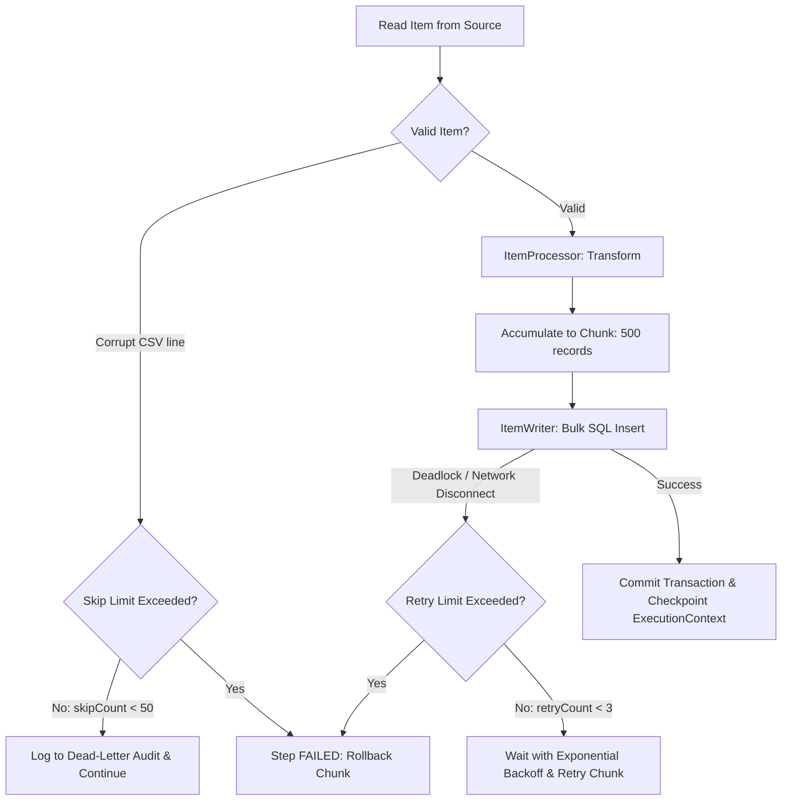

[🏠 Back to Home](README.md)

# 📦 Spring Batch 5+ & Spring Boot 3 Enterprise Processing Master Guide

A production-grade handbook for architecting high-throughput, fault-tolerant batch workloads, ETL pipelines, and massive data transformations using **Spring Batch 5.x**, **Spring Boot 3.x**, and **Java 17/21**. Covers chunk architecture, skip/retry policies, transaction boundaries, partitioning, and zero-downtime restartability.

---

## 📑 Table of Contents
1. [🧠 Zero-to-Hero Mental Model: The Industrial Assembly Line](#-zero-to-hero-mental-model-the-industrial-assembly-line)
2. [⚙️ 1. Spring Batch 5 Core Architecture & Metadata Schema](#️-1-spring-batch-5-core-architecture--metadata-schema)
3. [🔄 2. Chunk-Oriented Processing vs Tasklet](#-2-chunk-oriented-processing-vs-tasklet)
4. [📖 3. Production Readers & Writers (FlatFile, JDBC, JPA, Kafka)](#-3-production-readers--writers-flatfile-jdbc-jpa-kafka)
5. [🛡️ 4. Fault Tolerance: Skip, Retry & Transaction Boundaries](#️-4-fault-tolerance-skip-retry--transaction-boundaries)
6. [👂 5. Lifecycle Interception with Listeners](#-5-lifecycle-interception-with-listeners)
7. [🚀 6. High-Throughput Scaling: Multi-Threading & Partitioning](#-6-high-throughput-scaling-multi-threading--partitioning)
8. [🏭 7. Production Scenarios & War Room Incident Forensics](#-7-production-scenarios--war-room-incident-forensics)
9. [⚖️ 8. Spring Batch 5 Master Annotation & API Cheat Sheet](#️-8-spring-batch-5-master-annotation--api-cheat-sheet)

---

## 🧠 Zero-to-Hero Mental Model: The Industrial Assembly Line

```
┌────────────────────────────────────────────────────────────────────────────────────────┐
│                                 JOB (The Factory Shift)                                 │
│                                                                                        │
│  ┌──────────────────────────────────────────────────────────────────────────────────┐  │
│  │                              STEP (The Assembly Station)                         │  │
│  │                                                                                  │  │
│  │   ┌───────────────┐     ┌───────────────────┐     ┌───────────────┐              │  │
│  │   │  ItemReader   │ ──> │   ItemProcessor   │ ──> │  ItemWriter   │              │  │
│  │   │  (Read 1 item)│     │  (Transform/Filter│     │  (Write Chunk)│              │  │
│  │   └───────────────┘     └───────────────────┘     └───────────────┘              │  │
│  │          ▲                        ▲                       │                      │  │
│  │          │                        │                       │                      │  │
│  │          └──────── Loop N times ──┴───────────────────────┘                      │  │
│  │                     (Until Chunk Commit Interval reached)                        │  │
│  │                                                                                  │  │
│  │   [ Transaction Boundary Begins ] ───────────────> [ Transaction Commits Chunk ] │  │
│  └──────────────────────────────────────────────────────────────────────────────────┘  │
│                                                                                        │
│  Persisted to Database: [ JobRepository ] (BATCH_JOB_EXECUTION, BATCH_STEP_EXECUTION)  │
└────────────────────────────────────────────────────────────────────────────────────────┘
```

1. **`Job`:** An end-to-end batch processing pipeline composed of one or more steps.
2. **`Step`:** An independent phase of work (either a **Chunk-oriented** data loop or an individual **Tasklet**).
3. **`ItemReader`:** Reads one item at a time from a resource (CSV file, database table, Kafka topic, REST API). Returns `null` when exhausted.
4. **`ItemProcessor`:** Validates, cleanses, or converts one item of type `I` into type `O`. Returning `null` discards (filters out) the record.
5. **`ItemWriter`:** Receives an entire **Chunk** (e.g. 500 items) and writes them in one batch to the target sink (e.g. `INSERT INTO ...` with JDBC batching).
6. **`JobRepository`:** The persistence spine that stores the operational state, parameters, commit counts, skip counts, and restart checkpoints into relational tables (`BATCH_*`).

---

## ⚙️ 1. Spring Batch 5 Core Architecture & Metadata Schema

> [!IMPORTANT]
> **Spring Batch 5 Migration Note:**
> `JobBuilderFactory` and `StepBuilderFactory` are **deprecated / removed**.
> In Spring Batch 5+, instantiate steps and jobs explicitly using:
> `new JobBuilder("jobName", jobRepository)` and `new StepBuilder("stepName", jobRepository)`.

### Maven Dependencies (`pom.xml`)
```xml
<dependencies>
    <!-- Spring Boot 3 Batch Starter -->
    <dependency>
        <groupId>org.springframework.boot</groupId>
        <artifactId>spring-boot-starter-batch</artifactId>
    </dependency>

    <!-- Database Drivers & Connection Pool -->
    <dependency>
        <groupId>org.postgresql</groupId>
        <artifactId>postgresql</artifactId>
        <scope>runtime</scope>
    </dependency>
    <dependency>
        <groupId>org.springframework.boot</groupId>
        <artifactId>spring-boot-starter-jdbc</artifactId>
    </dependency>
</dependencies>
```

### Essential Spring Batch Metadata Tables
Spring Batch automatically manages its state through 6 core tables:
- `BATCH_JOB_INSTANCE`: Top-level job identity keyed by name and `JobParameters`.
- `BATCH_JOB_EXECUTION`: Represents a single physical run of a Job Instance (status: `STARTING`, `COMPLETED`, `FAILED`).
- `BATCH_JOB_EXECUTION_PARAMS`: Key-value arguments passed at startup (e.g. `run.date=2026-09-03`).
- `BATCH_STEP_EXECUTION`: Granular metrics for each step (read count, write count, commit count, rollback count, skip count).
- `BATCH_STEP_EXECUTION_CONTEXT`: Key-value state machine checkpoint for restarting failed jobs exactly where they left off.

---

## 🔄 2. Chunk-Oriented Processing vs Tasklet

### When to Use What?
| Feature | Chunk Processing (`Reader -> Processor -> Writer`) | Tasklet Step (`Tasklet`) |
| :--- | :--- | :--- |
| **Primary Use Case** | Streaming 10,000+ to millions of records | Single discrete actions (file move, table purge, notification) |
| **Memory Footprint** | Constant $O(\text{chunk size})$, never loads full dataset | Depends on tasklet implementation |
| **Transaction Boundary**| Committed every $N$ records (`chunkSize`) | Single transaction wrapping the entire tasklet |
| **Restartability** | Automatically resumes from last committed chunk | Re-executes from step start unless manually tracked |

### Tasklet Example: Staging Directory Cleanup
```java
package com.example.batch.tasklets;

import org.springframework.batch.core.StepContribution;
import org.springframework.batch.core.scope.context.ChunkContext;
import org.springframework.batch.core.step.tasklet.Tasklet;
import org.springframework.batch.repeat.RepeatStatus;
import org.springframework.stereotype.Component;

import java.io.File;
import java.nio.file.Files;
import java.nio.file.Path;
import java.nio.file.Paths;

@Component
public class FileCleanupTasklet implements Tasklet {

    private final String targetDirectory = "target/batch-staging";

    @Override
    public RepeatStatus execute(StepContribution contribution, ChunkContext chunkContext) throws Exception {
        Path path = Paths.get(targetDirectory);
        if (Files.exists(path)) {
            try (var stream = Files.walk(path)) {
                stream.filter(Files::isRegularFile)
                      .map(Path::toFile)
                      .forEach(File::delete);
            }
        }
        // Signal that the tasklet has completed its execution
        return RepeatStatus.FINISHED;
    }
}
```

---

## 📖 3. Production Readers & Writers (FlatFile, JDBC, JPA, Kafka)

### 3.1 Streaming CSV FlatFileItemReader
```java
package com.example.batch.config;

import com.example.batch.model.CustomerRecord;
import org.springframework.batch.item.file.FlatFileItemReader;
import org.springframework.batch.item.file.builder.FlatFileItemReaderBuilder;
import org.springframework.batch.item.file.mapping.BeanWrapperFieldSetMapper;
import org.springframework.context.annotation.Bean;
import org.springframework.context.annotation.Configuration;
import org.springframework.core.io.FileSystemResource;

@Configuration
public class CustomerReaderConfig {

    @Bean
    public FlatFileItemReader<CustomerRecord> customerCsvReader() {
        return new FlatFileItemReaderBuilder<CustomerRecord>()
            .name("customerCsvReader")
            .resource(new FileSystemResource("inbound/customers.csv"))
            .linesToSkip(1) // Skip CSV Header line
            .delimited()
            .delimiter(",")
            .names("customerId", "firstName", "lastName", "email", "accountBalance")
            .fieldSetMapper(new BeanWrapperFieldSetMapper<>() {{
                setTargetType(CustomerRecord.class);
            }})
            .saveState(true) // Crucial for restartability from checkpoint
            .build();
    }
}
```

### 3.2 High-Throughput JdbcBatchItemWriter
Instead of running $N$ individual `INSERT` statements, `JdbcBatchItemWriter` groups records into a single multi-row network payload using JDBC Batching.

```java
package com.example.batch.config;

import com.example.batch.model.CustomerRecord;
import org.springframework.batch.item.database.JdbcBatchItemWriter;
import org.springframework.batch.item.database.builder.JdbcBatchItemWriterBuilder;
import org.springframework.context.annotation.Bean;
import org.springframework.context.annotation.Configuration;

import javax.sql.DataSource;

@Configuration
public class CustomerWriterConfig {

    @Bean
    public JdbcBatchItemWriter<CustomerRecord> customerDatabaseWriter(DataSource dataSource) {
        return new JdbcBatchItemWriterBuilder<CustomerRecord>()
            .dataSource(dataSource)
            .sql("""
                INSERT INTO customers (customer_id, first_name, last_name, email, account_balance, updated_at)
                VALUES (:customerId, :firstName, :lastName, :email, :accountBalance, NOW())
                ON CONFLICT (customer_id) DO UPDATE
                SET account_balance = EXCLUDED.account_balance, updated_at = NOW()
                """)
            .beanMapped()
            .build();
    }
}
```

---

## 🛡️ 4. Fault Tolerance: Skip, Retry & Transaction Boundaries

In production, corrupt CSV records or temporary database deadlocks must not crash a 5-hour batch job.



### Complete Fault-Tolerant Step Configuration
```java
package com.example.batch.config;

import com.example.batch.model.CustomerRecord;
import org.springframework.batch.core.Step;
import org.springframework.batch.core.repository.JobRepository;
import org.springframework.batch.core.step.builder.StepBuilder;
import org.springframework.batch.item.ItemProcessor;
import org.springframework.batch.item.ItemReader;
import org.springframework.batch.item.ItemWriter;
import org.springframework.batch.item.file.FlatFileParseException;
import org.springframework.context.annotation.Bean;
import org.springframework.context.annotation.Configuration;
import org.springframework.dao.TransientDataAccessException;
import org.springframework.transaction.PlatformTransactionManager;

@Configuration
public class ResilientBatchStepConfig {

    @Bean
    public Step processCustomerBatchStep(
            JobRepository jobRepository,
            PlatformTransactionManager transactionManager,
            ItemReader<CustomerRecord> reader,
            ItemProcessor<CustomerRecord, CustomerRecord> processor,
            ItemWriter<CustomerRecord> writer) {

        return new StepBuilder("processCustomerBatchStep", jobRepository)
            .<CustomerRecord, CustomerRecord>chunk(500, transactionManager)
            .reader(reader)
            .processor(processor)
            .writer(writer)
            // Enable Fault Tolerance
            .faultTolerant()
            // Skip invalid data rows (up to 50 records)
            .skip(FlatFileParseException.class)
            .skip(IllegalArgumentException.class)
            .skipLimit(50)
            // Retry transient database locks or network drops (up to 3 times)
            .retry(TransientDataAccessException.class)
            .retryLimit(3)
            .build();
    }
}
```

---

## 👂 5. Lifecycle Interception with Listeners

Listeners allow teams to publish Slack alerts, record audit metrics in Prometheus/Micrometer, or track failed skipped items.

```java
package com.example.batch.listeners;

import com.example.batch.model.CustomerRecord;
import org.slf4j.Logger;
import org.slf4j.LoggerFactory;
import org.springframework.batch.core.ItemProcessListener;
import org.springframework.batch.core.JobExecution;
import org.springframework.batch.core.JobExecutionListener;
import org.springframework.batch.core.SkipListener;
import org.springframework.stereotype.Component;

@Component
public class BatchMonitoringListener implements JobExecutionListener, SkipListener<CustomerRecord, CustomerRecord> {

    private static final Logger log = LoggerFactory.getLogger(BatchMonitoringListener.class);

    @Override
    public void beforeJob(JobExecution jobExecution) {
        log.info("Batch Job [{}] started with parameters: {}", 
            jobExecution.getJobInstance().getJobName(), 
            jobExecution.getJobParameters());
    }

    @Override
    public void afterJob(JobExecution jobExecution) {
        log.info("Batch Job [{}] finished with exit status: {}. Duration: {} ms",
            jobExecution.getJobInstance().getJobName(),
            jobExecution.getExitStatus(),
            System.currentTimeMillis() - jobExecution.getStartTime().toEpochMilli());
    }

    @Override
    public void onSkipInRead(Throwable t) {
        log.error("Corrupt line encountered during read! Reason: {}", t.getMessage());
    }

    @Override
    public void onSkipInWrite(CustomerRecord item, Throwable t) {
        log.error("Failed to write customer ID [{}]: {}", item.getCustomerId(), t.getMessage());
    }
}
```

---

## 🚀 6. High-Throughput Scaling: Multi-Threading & Partitioning

When single-threaded processing cannot meet a nightly SLA (e.g., 20 million rows in 30 minutes), use **Multi-Threaded Steps** or **Partitioning**.

### 6.1 Multi-Threaded Step (Single Process, Multiple Worker Threads)
> [!CAUTION]
> Most standard `ItemReader` instances (like `FlatFileItemReader` or `JdbcCursorItemReader`) are **NOT thread-safe** because they maintain internal pointer state.
> In a multi-threaded step, you must either synchronize access, use a `SynchronizedItemStreamReader`, or use a naturally thread-safe reader like `JdbcPagingItemReader`.

```java
@Bean
public Step multiThreadedStep(JobRepository jobRepo, PlatformTransactionManager txManager) {
    ThreadPoolTaskExecutor executor = new ThreadPoolTaskExecutor();
    executor.setCorePoolSize(8);
    executor.setMaxPoolSize(16);
    executor.setThreadNamePrefix("batch-worker-");
    executor.initialize();

    return new StepBuilder("multiThreadedStep", jobRepo)
        .<TransactionDto, TransactionDto>chunk(1000, txManager)
        .reader(pagingDatabaseReader()) // Thread-safe paging reader!
        .writer(databaseBatchWriter())
        .taskExecutor(executor)
        .throttleLimit(8)
        .build();
}
```

### 6.2 Partitioned Step (Divide & Conquer by Range)
Divides a dataset into independent slices (e.g., partition by `Region` or `ID % 10`), running each partition on a separate thread or remote worker.

```java
@Bean
public Step managerStep(JobRepository jobRepo, Step workerStep) {
    return new StepBuilder("managerStep", jobRepo)
        .partitioner("workerStep", new CustomerRangePartitioner())
        .step(workerStep)
        .gridSize(4) // 4 concurrent partition workers
        .taskExecutor(new SimpleAsyncTaskExecutor())
        .build();
}
```

---

## 🏭 7. Production Scenarios & War Room Incident Forensics

### Scenario 1: Out Of Memory (OOM) via Unbounded Hibernate / JPA Caching
- **The Symptom:** Batch process crashes with `java.lang.OutOfMemoryError: Java heap space` after processing 150,000 entities.
- **Root Cause:** Hibernate's First-Level Session cache stores every read/written entity in memory. Even though chunks commit to the database, the `EntityManager` session retains object references until explicitly cleared.
- **The Fix:** Inject a custom `ItemWriter` or `ChunkListener` that invokes `entityManager.clear()`, or use `JpaItemWriter` which clears the session automatically after each chunk write.

### Scenario 2: Duplicate Execution Exception (`JobInstanceAlreadyCompleteException`)
- **The Symptom:** Triggering a daily batch fails with: `A job instance already exists and is complete for parameters={date=2026-09-03}`.
- **Root Cause:** Spring Batch prevents re-running a completed job instance with identical identifying parameters to enforce idempotency.
- **The Fix:**
  1. If re-running is intended, pass a unique non-identifying parameter:
  ```java
  JobParameters params = new JobParametersBuilder()
      .addString("date", "2026-09-03", true) // identifying
      .addLong("run.id", System.currentTimeMillis(), false) // non-identifying
      .toJobParameters();
  jobLauncher.run(job, params);
  ```

---

## ⚖️ 8. Spring Batch 5 Master Annotation & API Cheat Sheet

| Task / Concept | Spring Batch 5+ API Construct |
| :--- | :--- |
| **Declare Job** | `new JobBuilder("jobName", jobRepository).start(step1).next(step2).build()` |
| **Declare Chunk Step** | `new StepBuilder("stepName", jobRepository).<I, O>chunk(chunkSize, txManager)...` |
| **Fault Tolerance** | `.faultTolerant().skip(DataAccessException.class).skipLimit(10)` |
| **Retry on Lock** | `.retry(CannotAcquireLockException.class).retryLimit(3)` |
| **Prevent Restart** | `new JobBuilder(...).preventRestart().start(...)` |
| **Non-Identifying Param**| `new JobParametersBuilder().addString("token", uuid, false)` |
| **Async Step** | `AsyncItemProcessor<I, O>` + `AsyncItemWriter<O>` |
| **Step Execution Context**| `stepExecution.getExecutionContext().put("lastProcessedIndex", index)` |

---
[🏠 Back to Home](README.md)
