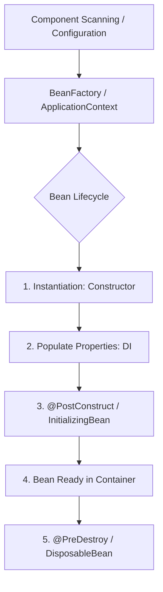
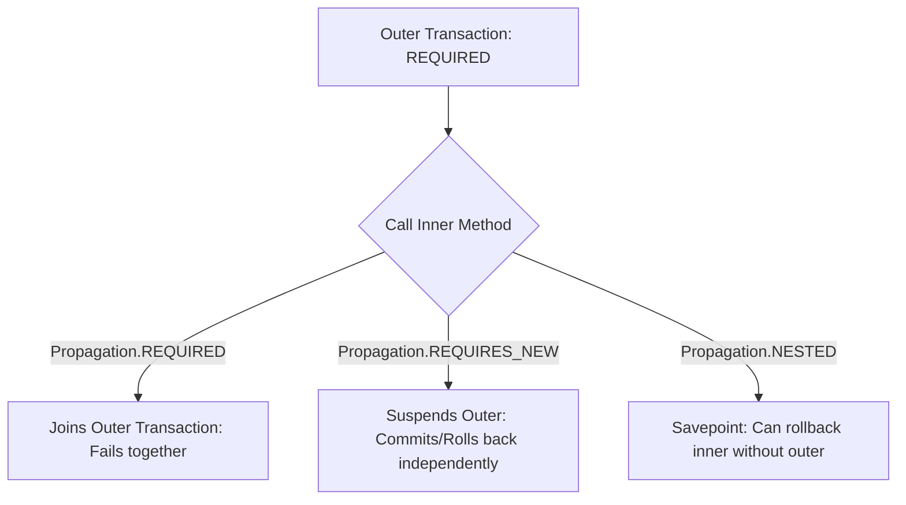
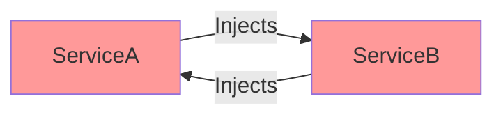

[🏠 Back to Home](README.md)

# 🍃 Spring Boot 3+ Enterprise Architecture, Annotations & Production Scenarios

A comprehensive, production-grade handbook for building high-performance microservices and REST APIs with Spring Boot 3+ and Java 17/21. Covers IoC/DI internals, MVC validation, JPA transaction boundaries, Caching, Security 6, Observability, and 10+ real-world enterprise failure and design scenarios.

---

## 📑 Table of Contents
1. [🧠 Zero-to-Hero Mental Model: IoC & Dynamic Proxies](#-zero-to-hero-mental-model-ioc--dynamic-proxies)
2. [⚙️ 1. Auto-Configuration & Conditional Beans](#️-1-auto-configuration--conditional-beans)
3. [🌐 2. Web MVC & REST APIs (RFC 7807 Error Handling)](#-2-web-mvc--rest-apis-rfc-7807-error-handling)
4. [💾 3. Persistence, JPA & Transaction Management (ACID & Pitfalls)](#-3-persistence-jpa--transaction-management)
5. [⚡ 4. High Performance: Caching, Async & Scheduling](#-4-high-performance-caching-async--scheduling)
6. [🛡️ 5. Spring Security 6 & Filter Chain Architecture](#️-5-spring-security-6--filter-chain-architecture)
7. [🩺 6. Production Observability: Actuator & Micrometer](#-6-production-observability-actuator--micrometer)
8. [🧪 7. 10+ Real-World Developer Scenarios with Full Code](#-7-10-real-world-developer-scenarios-with-full-code)
9. [⚖️ 8. Master Spring Boot Annotation Cheat Sheet](#️-8-master-spring-boot-annotation-cheat-sheet)
10. [🎓 9. Senior Spring Boot Interview Preparation & Scenario Q&A](#-9-senior-spring-boot-interview-preparation--scenario-qa)
11. [🔄 10. Architectural Transferability: Where & How to Apply Elsewhere](#-10-architectural-transferability-where--how-to-apply-elsewhere)

---

## 🧠 Zero-to-Hero Mental Model: IoC & Dynamic Proxies

### 🏰 The Butler & Gatehouse Guard Analogy

1. **Inversion of Control (IoC - The Butler):**
   - In traditional Java, if `OrderService` needs `PaymentGateway`, it creates it itself (`new StripePaymentGateway()`).
   - In Spring, you tell the **IoC Container (The Butler)** what you need via constructor arguments. The container creates all beans at startup, wires them together, and hands them to you ready-to-use.
2. **Spring AOP & Dynamic Proxies (The Gatehouse Guard):**
   - When you annotate a method with `@Transactional`, `@Async`, or `@Cacheable`, Spring **does not modify your bytecode directly**.
   - Instead, Spring creates a **CGLIB Proxy (A Security Guard)** wrapping your bean.
   - When an external caller invokes your method, the call hits the **Proxy Guard first**. The Guard opens a DB transaction (`connection.setAutoCommit(false)`), forwards the call to your actual method, and if no exception occurs, commits the transaction.

```
External Request ──> [ Spring CGLIB Proxy (The Guard) ] ──> [ Your Actual Bean (Target) ]
                            │                                         │
                   1. Begin Transaction                       2. Execute business logic
                   3. Commit / Rollback                       4. Return result
```

---

## 🧠 Spring Core & Dependency Injection Architecture

Spring's core is the **Inversion of Control (IoC) Container** (`ApplicationContext`), which instantiates, configures, and manages the lifecycle of Java Beans.



### Dependency Injection Best Practice: Constructor Injection
> [!TIP]
> **Avoid Field Injection (`@Autowired private OrderService orderService;`)!**
> Field injection makes unit testing difficult, hides dependencies, and creates immutability issues. Always use **Constructor Injection** with `final` fields (or Lombok's `@RequiredArgsConstructor`).

```java
@Service
public class OrderService {
    private final PaymentGateway paymentGateway;
    private final InventoryClient inventoryClient;

    // ✅ Recommended: Explicit Constructor Injection
    public OrderService(PaymentGateway paymentGateway, InventoryClient inventoryClient) {
        this.paymentGateway = paymentGateway;
        this.inventoryClient = inventoryClient;
    }
}
```

---

## ⚙️ 1. Auto-Configuration & Conditional Beans

Spring Boot uses conditional annotations to dynamically register beans based on classpath, properties, or environment.

| Annotation | Purpose | Example Real-World Use Case |
| :--- | :--- | :--- |
| `@SpringBootApplication` | Meta-annotation combining `@Configuration`, `@EnableAutoConfiguration`, `@ComponentScan` | Main application entry point |
| `@ConfigurationProperties` | Binds external configuration YAML/properties to type-safe POJOs | Database/Security connection configs |
| `@ConditionalOnProperty` | Loads bean only if specific configuration key equals a value | Enabling Mock Payment in `local` env |
| `@ConditionalOnMissingBean` | Registers a default bean only if developer hasn't declared one | Default Jackson ObjectMapper |
| `@ConditionalOnClass` | Activates bean only if 3rd-party library exists on classpath | Auto-configuring Redis connection |

### Type-Safe Validated Configuration Example
```java
@Configuration
@ConfigurationProperties(prefix = "app.payment")
@Validated
public record PaymentConfig(
    @NotBlank String apiKey,
    @Min(100) @Max(5000) int timeoutMillis,
    @NotNull URI gatewayUrl
) {}
```

---

## 🌐 2. Web MVC & REST APIs (RFC 7807 Error Handling)

In Spring Boot 3, error responses follow the standard **RFC 7807 ProblemDetail** specification.

```java
@RestController
@RequestMapping("/api/v1/users")
@Validated
public class UserController {
    private final UserService userService;

    public UserController(UserService userService) {
        this.userService = userService;
    }

    @PostMapping
    @ResponseStatus(HttpStatus.CREATED)
    public UserResponse createUser(@Valid @RequestBody CreateUserRequest request) {
        return userService.registerUser(request);
    }

    @GetMapping("/{id}")
    public ResponseEntity<UserResponse> getUserById(@PathVariable("id") UUID userId) {
        return ResponseEntity.ok(userService.getById(userId));
    }
}
```

---

## 💾 3. Persistence, JPA & Transaction Management

### 3.1 `@Transactional` Propagation & Isolation Levels


### 3.2 The Checked Exception Rollback Gotcha
> [!CAUTION]
> By default, `@Transactional` **ONLY rolls back on unchecked runtime exceptions** (`RuntimeException` and `Error`).
> If your method throws a checked exception (e.g. `IOException`, `SQLException`), **Spring will COMMIT the transaction!**
> **Fix:** Always specify `@Transactional(rollbackFor = Exception.class)`.

---

## ⚡ 4. High Performance: Caching, Async & Scheduling

```java
@Service
public class ProductService {

    // 1. Cache result; skip DB if cache hit
    @Cacheable(value = "products", key = "#sku", unless = "#result == null")
    public ProductDTO getProductBySku(String sku) {
        return productRepository.findBySku(sku).orElse(null);
    }

    // 2. Invalidate cache on update
    @CacheEvict(value = "products", key = "#sku")
    public void updateProduct(String sku, ProductDTO update) {
        productRepository.update(sku, update);
    }

    // 3. Asynchronous execution on dedicated thread pool
    @Async("taskExecutor")
    public CompletableFuture<Void> sendOrderEmailAsync(Order order) {
        emailService.sendInvoice(order);
        return CompletableFuture.completedFuture(null);
    }

    // 4. Scheduled cron task
    @Scheduled(cron = "0 0 2 * * *") // Daily at 2:00 AM
    public void cleanExpiredSessions() {
        sessionService.purgeExpired();
    }
}
```

---

## 🛡️ 5. Spring Security 6 & Filter Chain Architecture

Spring Security 6 replaces legacy `WebSecurityConfigurerAdapter` with **Component-based `SecurityFilterChain` Beans**.

```java
@Configuration
@EnableWebSecurity
@EnableMethodSecurity
public class SecurityConfig {

    @Bean
    public SecurityFilterChain securityFilterChain(HttpSecurity http) throws Exception {
        return http
            .csrf(AbstractHttpConfigurer::disable)
            .sessionManagement(s -> s.sessionCreationPolicy(SessionCreationPolicy.STATELESS))
            .authorizeHttpRequests(auth -> auth
                .requestMatchers("/api/v1/auth/**", "/actuator/health").permitAll()
                .requestMatchers("/api/v1/admin/**").hasRole("ADMIN")
                .anyRequest().authenticated()
            )
            .oauth2ResourceServer(oauth2 -> oauth2.jwt(Customizer.withDefaults()))
            .build();
    }
}
```

---

## 🩺 6. Production Observability: Actuator & Micrometer

Enable comprehensive health, metrics, and Prometheus monitoring in `application.yml`:

```yaml
management:
  endpoints:
    web:
      exposure:
        include: "health,info,metrics,prometheus"
  endpoint:
    health:
      show-details: always
      probes:
        enabled: true # Enables livenessState and readinessState for Kubernetes
```

---

## 🧪 7. 10+ Real-World Developer Scenarios with Full Code

### 🧩 Scenario 1: RFC 7807 Standard Global Exception Handling
**Problem:** Inconsistent error responses across APIs cause frontend parsing bugs.
**Solution:** A centralized `@RestControllerAdvice` implementing RFC 7807 `ProblemDetail`.

```java
@RestControllerAdvice
public class GlobalExceptionHandler extends ResponseEntityExceptionHandler {

    @ExceptionHandler(ResourceNotFoundException.class)
    public ProblemDetail handleNotFound(ResourceNotFoundException ex) {
        ProblemDetail problem = ProblemDetail.forStatusAndDetail(HttpStatus.NOT_FOUND, ex.getMessage());
        problem.setTitle("Resource Not Found");
        problem.setType(URI.create("https://api.example.com/errors/not-found"));
        problem.setProperty("timestamp", Instant.now());
        return problem;
    }

    @ExceptionHandler(BusinessValidationException.class)
    public ProblemDetail handleBusinessValidation(BusinessValidationException ex) {
        ProblemDetail problem = ProblemDetail.forStatusAndDetail(HttpStatus.UNPROCESSABLE_ENTITY, ex.getMessage());
        problem.setTitle("Business Rule Violation");
        problem.setProperty("errorCode", ex.getErrorCode());
        return problem;
    }
}
```

---

### 🧩 Scenario 2: Dynamic Strategy Pattern via Spring Map Injection
**Problem:** A checkout system needs to process payments via Stripe, PayPal, or Crypto dynamically based on user choice without huge `switch` statements.

```java
public interface PaymentStrategy {
    String getProvider(); // "STRIPE", "PAYPAL", "CRYPTO"
    PaymentReceipt process(PaymentRequest request);
}

@Service
public class PaymentEngine {
    // Spring automatically populates Map with BeanName -> Bean
    private final Map<String, PaymentStrategy> strategyMap;

    public PaymentEngine(List<PaymentStrategy> strategies) {
        this.strategyMap = strategies.stream()
            .collect(Collectors.toMap(PaymentStrategy::getProvider, Function.identity()));
    }

    public PaymentReceipt executePayment(String provider, PaymentRequest request) {
        PaymentStrategy strategy = strategyMap.get(provider.toUpperCase());
        if (strategy == null) {
            throw new IllegalArgumentException("Unsupported payment provider: " + provider);
        }
        return strategy.process(request);
    }
}
```

---

### 🧩 Scenario 3: Solving the JPA N+1 Query Problem with `@EntityGraph`
**Problem:** Loading 100 Orders triggers 1 query for orders + 100 separate queries for each Order's Customer.

```java
public interface OrderRepository extends JpaRepository<Order, UUID> {

    // ❌ Causes N+1 Queries:
    // List<Order> findAll();

    // ✅ Solves N+1 in a single SQL JOIN:
    @EntityGraph(attributePaths = {"customer", "orderItems"})
    @Query("SELECT o FROM Order o WHERE o.status = :status")
    List<Order> findOrdersWithDetails(@Param("status") OrderStatus status);
}
```

---

### 🧩 Scenario 4: Resolving Circular Dependencies Gracefully
**Problem:** `ServiceA` injects `ServiceB`, and `ServiceB` injects `ServiceA`. Spring fails with `BeanCurrentlyInCreationException`.



**Solution:** Decouple using an Event or Mediator pattern, or as a temporary bridge, `@Lazy`:
```java
@Service
public class ServiceA {
    private final ServiceB serviceB;

    // ✅ Temporary Fix: @Lazy defers initialization of ServiceB proxy
    public ServiceA(@Lazy ServiceB serviceB) {
        this.serviceB = serviceB;
    }
}
```

---

### 🧩 Scenario 5: Optimistic Locking with `@Version` for High-Concurrency Stock
**Problem:** Two concurrent requests attempt to purchase the last item in inventory simultaneously (Race Condition / Lost Update).

```java
@Entity
@Table(name = "inventory_items")
public class InventoryItem {
    @Id
    private UUID id;
    
    private int stockCount;

    @Version // Optimistic Lock Version
    private Long version;

    public void deductStock(int count) {
        if (this.stockCount < count) {
            throw new InsufficientStockException("Out of stock!");
        }
        this.stockCount -= count;
    }
}
```
*When two threads update concurrently, the second thread receives `ObjectOptimisticLockingFailureException`, preventing inventory overselling.*

---

### 🧩 Scenario 6: Decoupling Microservices with `@TransactionalEventListener`
**Problem:** You only want to publish a Kafka event or send a welcome email **AFTER the database transaction successfully commits**.

```java
@Service
public class UserRegistrationService {
    private final ApplicationEventPublisher eventPublisher;
    private final UserRepository userRepository;

    @Transactional
    public void registerUser(User user) {
        userRepository.save(user);
        // Fire event (DB not committed yet)
        eventPublisher.publishEvent(new UserRegisteredEvent(user.getId(), user.getEmail()));
    }
}

@Component
public class UserEventListener {

    // ✅ Only executes if outer transaction successfully COMMITS
    @TransactionalEventListener(phase = TransactionPhase.AFTER_COMMIT)
    public void onUserRegistered(UserRegisteredEvent event) {
        kafkaProducer.send("user-events-topic", event);
    }
}
```

---

## ⚖️ 8. Master Spring Boot Annotation Cheat Sheet

| Annotation | Layer | Key Attribute / Usage |
| :--- | :--- | :--- |
| `@RestController` | Web MVC | Combines `@Controller` and `@ResponseBody` |
| `@GetMapping` / `@PostMapping` | Web MVC | Maps HTTP GET/POST endpoints |
| `@RequestBody` | Web MVC | Deserializes JSON payload to Java Object |
| `@PathVariable` | Web MVC | Extracts URI template variable |
| `@Valid` | Validation | Triggers JSR-380 Bean Validation |
| `@Service` | Service Layer | Business logic bean declaration |
| `@Repository` | Persistence | DAO bean with automatic exception translation |
| `@Transactional` | Persistence | Defines transactional boundary (`rollbackFor`) |
| `@Cacheable` | Performance | Caches method return value |
| `@Async` | Concurrency | Runs method in background thread pool |
| `@Scheduled` | Automation | Executes at fixed rate or cron expression |
| `@PreAuthorize` | Security | Method-level authorization (`hasRole('ADMIN')`) |

---

## 🎓 9. Senior Spring Boot Interview Preparation & Scenario Q&A

### 📌 Core Conceptual Interview Questions

#### Q1: Why does calling a `@Transactional` or `@Async` method from within the same class fail to work (Self-Invocation Trap)?
> **Answer & Explanation:**
> - Spring AOP relies on **Dynamic Proxies** (CGLIB or JDK dynamic proxies).
> - When an external class calls `orderService.placeOrder()`, it calls the **Proxy wrapper**, which executes transaction interceptors before delegating to the target object.
> - When method `A()` calls method `B()` inside the **same class instance** (`this.methodB()`), the call bypasses the Spring proxy and executes directly on the raw Java object instance.
> - **Architectural Solutions:**
>   1. **Refactor & Extract:** Move `methodB()` to a dedicated collaborator service.
>   2. **Programmatic Transactions:** Use Spring's `TransactionTemplate`:
>      ```java
>      transactionTemplate.execute(status -> { doBusinessLogic(); return null; });
>      ```
>   3. **Self-Injection:** Inject the proxy into itself (`@Autowired private OrderService self; self.methodB();`).

#### Q2: What is the PostgreSQL/Oracle recommended formula for HikariCP Connection Pool sizing and why is a large pool dangerous?
> **Answer & Explanation:**
> - Setting `maximum-pool-size = 100` is an anti-pattern that degrades performance through disk I/O thrashing and CPU context switching on the database server.
> - **Standard Sizing Formula:**
>   $$\text{pool\_size} = (\text{core\_count} \times 2) + \text{effective\_spindle\_count}$$
>   *(On a modern 8-core DB server with SSD storage, a pool size of 16-20 connections easily outperforms a pool of 100 connections).*
> - **Production Rule:** Configure a strict connection timeout (`connection-timeout: 30000ms`) and leak detection threshold (`leak-detection-threshold: 2000ms`) to diagnose connection leaks before they exhaust the pool.

#### Q3: How did Spring Boot 3 change Circular Dependency Handling?
> **Answer & Explanation:**
> - In Spring Boot 1.x and 2.x, circular dependencies between beans were automatically resolved using 3-level singleton caches (`singletonObjects`, `earlySingletonObjects`, `singletonFactories`).
> - **Spring Boot 3+:** Circular references are **disabled by default** (`BeanCurrentlyInCreationException`).
> - **Fixes:**
>   1. Redesign dependencies (extract shared logic into a third service).
>   2. Use `@Lazy` on one of the constructor arguments to defer proxy instantiation until first access.

#### Q4: How does Spring Security 6 process an incoming HTTP Request?
> **Answer & Explanation:**
> 1. Request enters the Servlet container and is captured by **`DelegatingFilterProxy`**.
> 2. Delegates to Spring's **`FilterChainProxy`**, which matches the URL against configured **`SecurityFilterChain`** instances.
> 3. Executes ordered security filters: `SecurityContextHolderFilter` $\rightarrow$ `HeaderWriterFilter` $\rightarrow$ `CorsFilter` $\rightarrow$ `CsrfFilter` $\rightarrow$ `BearerTokenAuthenticationFilter` / `UsernamePasswordAuthenticationFilter` $\rightarrow$ `AuthorizationFilter`.
> 4. If authenticated, stores the `Authentication` object inside **`SecurityContextHolder.getContext()`** (thread-scoped or reactive context).

---

### 🚨 Real-World Scenario-Based Interview Questions

#### Scenario Q1: The Microservice Dual-Write Dilemma (Transactional Outbox Pattern)
> **Interviewer Question:** *"When a customer places an order, we must update the SQL database and publish an `OrderCreated` event to Kafka. If the DB commits but Kafka fails, the event is lost. If Kafka succeeds but the DB rolls back, downstream services fulfill a phantom order. How do you solve this with 100% consistency in Spring Boot?"*
>
> **Senior Architect Answer:**
> - **Anti-Pattern:** Never attempt Two-Phase Commit (2PC / XA Transactions) across Kafka and SQL—it causes distributed deadlocks and high latency.
> - **Architecture Pattern: The Transactional Outbox Pattern:**
>   1. Write the order record AND an `OUTBOX` table entry inside the **same local ACID SQL transaction**:
>      ```java
>      @Transactional
>      public void placeOrder(OrderRequest request) {
>          Order order = orderRepository.save(new Order(request));
>          outboxRepository.save(new OutboxEvent("ORDER_CREATED", order.getId(), toJson(order)));
>      }
>      ```
>   2. An asynchronous worker (e.g., Debezium CDC reading Postgres WAL or Spring `@Scheduled` worker with `SELECT FOR UPDATE SKIP LOCKED`) reads unpublished rows from the `OUTBOX` table and dispatches them to Kafka with guaranteed **At-Least-Once Delivery**.

---

## 🔄 10. Architectural Transferability: Where & How to Apply Elsewhere

1. **Fintech Core Ledger & Accounting:** Using `@Transactional(isolation = Isolation.SERIALIZABLE)` or Optimistic Locking (`@Version`) with retry templates to prevent double-spending and ledger drift.
2. **Multi-Tenant SaaS Architectures:** Using Spring dynamic `AbstractRoutingDataSource` to switch database connections per tenant HTTP header (`X-Tenant-ID`).
3. **Enterprise OAuth2 Resource Servers:** Securing REST APIs using Spring Security 6 with JWT validation and Keycloak / Okta identity providers.

---

[⬆️ Back to Top](#-spring-boot-3-enterprise-architecture-annotations--production-scenarios)