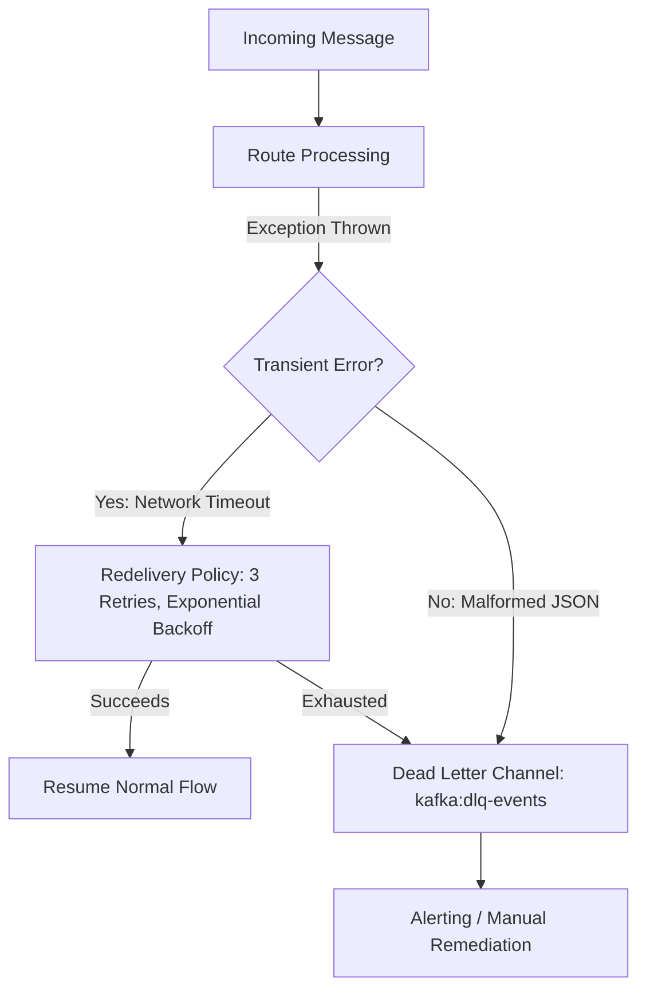

[🏠 Back to Home](README.md)

# 🐪 Apache Camel 4 & Spring Boot 3 Enterprise Integration Master Guide

A production-grade engineering handbook for building resilient, event-driven, and enterprise integration solutions using **Apache Camel 4.x** with **Spring Boot 3.x** and **Java 17/21**. Covers Enterprise Integration Patterns (EIP), Java DSL, high-throughput streaming, fault tolerance, transaction management, and end-to-end testing.

---

## 📑 Table of Contents
1. [🧠 Zero-to-Hero Mental Model: The Universal Post Office](#-zero-to-hero-mental-model-the-universal-post-office)
2. [⚙️ 1. Architecture: CamelContext, Exchange & Endpoints](#️-1-architecture-camelcontext-exchange--endpoints)
3. [🔀 2. Enterprise Integration Patterns (EIP) in Practice](#-2-enterprise-integration-patterns-eip-in-practice)
4. [🔌 3. Production Connectors: File, Kafka, REST, JMS & SEDA](#-3-production-connectors-file-kafka-rest-jms--seda)
5. [🛡️ 4. Error Handling, Retries & Dead Letter Channels](#️-4-error-handling-retries--dead-letter-channels)
6. [💳 5. Idempotent Consumers & Distributed Transactions](#-5-idempotent-consumers--distributed-transactions)
7. [🧪 6. Testing Camel Routes with CamelTestSupport & Mocks](#-6-testing-camel-routes-with-cameltestsupport--mocks)
8. [🏭 7. Production Scenarios & War Room Failure Forensics](#-7-production-scenarios--war-room-failure-forensics)
9. [⚖️ 8. Apache Camel 4 Master Cheat Sheet](#️-8-apache-camel-4-master-cheat-sheet)

---

## 🧠 Zero-to-Hero Mental Model: The Universal Post Office

Imagine an international logistics hub handling millions of packages every day:

```
┌───────────────────────────────────────────────────────────────────────────────────┐
│                           CAMEL CONTEXT (The Postal Hub)                           │
│                                                                                   │
│  [Source: SFTP/Kafka] ──> [Envelope: Exchange] ──> [Sorting Belt: Route]         │
│                                  │                            │                   │
│                        ┌─────────┴─────────┐                  ▼                   │
│                        │ In Message Body   │         [Inspector: Processor]       │
│                        │ Headers / Metadata│                  │                   │
│                        │ Exception Details │                  ▼                   │
│                        └───────────────────┘       [Decision: Router/EIP]         │
│                                                               │                   │
│                                                               ▼                   │
│                                                    [Destination: DB/REST/JMS]     │
└───────────────────────────────────────────────────────────────────────────────────┘
```

1. **`Endpoint` (The Loading Dock):** The connection point to an external system (Kafka topic, AWS S3 bucket, REST URI, FTP directory, JMS queue).
2. **`Exchange` (The Package):** The carrier object moving through the pipeline. Contains an **In Message** (payload + headers) and metadata properties.
3. **`Processor` (The Package Inspector / Transformer):** A worker node that reads, alters, unzips, enriches, or validates the message payload.
4. **`Route` (The Conveyor Belt):** The step-by-step definition using Java DSL describing where data starts (`from(...)`), what happens to it, and where it terminates (`to(...)`).
5. **`CamelContext` (The Logistics Facility):** The engine orchestrating all routes, thread pools, type converters, and component lifecycles.

---

## ⚙️ 1. Architecture: CamelContext, Exchange & Endpoints

### Maven Dependencies (`pom.xml`)
```xml
<properties>
    <camel.version>4.8.0</camel.version>
    <spring-boot.version>3.3.4</spring-boot.version>
</properties>

<dependencies>
    <!-- Core Camel Spring Boot Starter -->
    <dependency>
        <groupId>org.apache.camel.springboot</groupId>
        <artifactId>camel-spring-boot-starter</artifactId>
        <version>${camel.version}</version>
    </dependency>

    <!-- Connectors -->
    <dependency>
        <groupId>org.apache.camel.springboot</groupId>
        <artifactId>camel-kafka-starter</artifactId>
        <version>${camel.version}</version>
    </dependency>
    <dependency>
        <groupId>org.apache.camel.springboot</groupId>
        <artifactId>camel-http-starter</artifactId>
        <version>${camel.version}</version>
    </dependency>
    <dependency>
        <groupId>org.apache.camel.springboot</groupId>
        <artifactId>camel-jackson-starter</artifactId>
        <version>${camel.version}</version>
    </dependency>

    <!-- Testing -->
    <dependency>
        <groupId>org.apache.camel</groupId>
        <artifactId>camel-test-spring-junit5</artifactId>
        <version>${camel.version}</version>
        <scope>test</scope>
    </dependency>
</dependencies>
```

### RouteBuilder Fundamentals
In Camel, routes are configured by extending `RouteBuilder` and overriding `configure()`.

```java
package com.example.camel.routes;

import org.apache.camel.builder.RouteBuilder;
import org.springframework.stereotype.Component;

@Component
public class BasicOrderRoute extends RouteBuilder {

    @Override
    public void configure() throws Exception {
        // Direct endpoint (synchronous in-memory pipeline)
        from("direct:processOrder")
            .routeId("process-order-route")
            .log("Incoming order payload: ${body}")
            // Modify or inspect using an inline Processor
            .process(exchange -> {
                String payload = exchange.getIn().getBody(String.class);
                exchange.getIn().setHeader("ProcessedTimestamp", System.currentTimeMillis());
                exchange.getIn().setBody(payload.toUpperCase());
            })
            .log("Transformed order payload: ${body}")
            .to("mock:orderOutput");
    }
}
```

---

## 🔀 2. Enterprise Integration Patterns (EIP) in Practice

### 2.1 Content-Based Router (`choice`, `when`, `otherwise`)
Routes messages to different downstream targets based on header or body evaluation.

```java
@Component
public class ContentBasedOrderRouter extends RouteBuilder {

    @Override
    public void configure() {
        from("kafka:orders-inbound?brokers=localhost:9092&groupId=order-router")
            .routeId("content-based-order-router")
            .unmarshal().json(OrderEvent.class)
            .choice()
                .when(simple("${body.orderType} == 'VIP'"))
                    .log("Routing VIP order [${body.orderId}] to high-priority queue")
                    .to("kafka:vip-orders?brokers=localhost:9092")
                .when(simple("${body.orderType} == 'STANDARD'"))
                    .log("Routing Standard order [${body.orderId}]")
                    .to("kafka:standard-orders?brokers=localhost:9092")
                .otherwise()
                    .log(LoggingLevel.WARN, "Unknown order type: ${body.orderType}. Diverting to review queue.")
                    .to("kafka:unrecognized-orders?brokers=localhost:9092")
            .end();
    }
}
```

### 2.2 Splitter (`split`)
Breaks a composite payload (e.g. JSON array, CSV lines, XML nodes) into individual messages for parallel or sequential processing.

```java
@Component
public class OrderBatchSplitterRoute extends RouteBuilder {

    @Override
    public void configure() {
        from("direct:bulkOrderUpload")
            .routeId("bulk-order-splitter")
            // Split JSON array using JsonPath or collection getter
            .split(body(), new BulkAggregationStrategy())
                .parallelProcessing() // Distribute across worker thread pool
                .streaming()          // Stream chunks without reading entire file into JVM memory
                .log("Processing item: ${body}")
                .to("direct:processIndividualItem")
            .end()
            .log("All items in batch processed successfully.");
    }
}
```

### 2.3 Aggregator (`aggregate`)
Merges multiple related messages into a single combined message based on a **Correlation Expression** and a **Completion Condition** (size, timeout, or predicate).

```java
package com.example.camel.aggregator;

import org.apache.camel.AggregationStrategy;
import org.apache.camel.Exchange;
import org.apache.camel.builder.RouteBuilder;
import org.springframework.stereotype.Component;

import java.util.ArrayList;
import java.util.List;

@Component
public class PaymentBatchAggregatorRoute extends RouteBuilder {

    @Override
    public void configure() {
        from("direct:paymentStream")
            .routeId("payment-aggregator")
            // Aggregate payments by 'MerchantId' header
            .aggregate(header("MerchantId"), new ListAggregationStrategy())
                .completionSize(100)               // Aggregate when 100 payments reached
                .completionTimeout(5000)           // Or emit batch every 5 seconds
                .log("Emitting batch for merchant ${header.MerchantId}, size: ${body.size}")
                .to("direct:settleMerchantBatch");
    }

    public static class ListAggregationStrategy implements AggregationStrategy {
        @Override
        @SuppressWarnings("unchecked")
        public Exchange aggregate(Exchange oldExchange, Exchange newExchange) {
            Object newBody = newExchange.getIn().getBody();
            List<Object> list;

            if (oldExchange == null) {
                list = new ArrayList<>();
                list.add(newBody);
                newExchange.getIn().setBody(list);
                return newExchange;
            }

            list = oldExchange.getIn().getBody(List.class);
            list.add(newBody);
            return oldExchange;
        }
    }
}
```

### 2.4 Wire Tap & Recipient List
- **Wire Tap:** Asynchronously taps a copy of the message for audit, telemetry, or shadow processing without altering the main route execution path.
- **Recipient List:** Dynamically determines target endpoints at runtime from message headers.

```java
@Component
public class WireTapAndRecipientRoute extends RouteBuilder {

    @Override
    public void configure() {
        from("direct:financialTransaction")
            // Asynchronously send copy to audit without slowing main execution
            .wireTap("direct:auditLogQueue")
            .process(exchange -> {
                // Determine destination dynamically
                boolean isEuCustomer = exchange.getIn().getHeader("Region", String.class).equals("EU");
                exchange.getIn().setHeader("TargetEndpoint", isEuCustomer ? "kafka:eu-clearing" : "kafka:us-clearing");
            })
            // Dynamic routing via Recipient List
            .recipientList(header("TargetEndpoint"));

        from("direct:auditLogQueue")
            .to("kafka:audit-events?brokers=localhost:9092");
    }
}
```

---

## 🔌 3. Production Connectors: File, Kafka, REST, JMS & SEDA

| Component URI | Protocol / Behavior | Threading Model | Common Production Option Flags |
| :--- | :--- | :--- | :--- |
| `file://target/input` | File Poller / Consumer | Polling consumer (Scheduled) | `noop=true`, `move=.done`, `readLock=changed`, `maxMessagesPerPoll=50` |
| `kafka:topic-name` | Kafka Consumer / Producer | Netty / Kafka polling threads | `brokers=...`, `groupId=...`, `autoOffsetReset=earliest`, `maxPollRecords=500` |
| `rest:get:/api/v1/orders` | HTTP Inbound Server | Embedded Servlet / Tomcat | `consumes=application/json`, `produces=application/json` |
| `jms:queue:paymentQueue`| ActiveMQ / Artemis | JMS MessageListener threads | `concurrentConsumers=5`, `transacted=true`, `acknowledgementModeName=CLIENT_ACKNOWLEDGE` |
| `seda:inMemoryQueue` | In-memory BlockingQueue | Decoupled Async Worker Pool | `size=1000`, `concurrentConsumers=10`, `blockWhenFull=true` |
| `direct:internal` | In-memory Synchronous | Runs on caller thread | Zero overhead, strict transactional propagation |

### 3.1 High-Throughput REST-to-Kafka Bridge
```java
package com.example.camel.routes;

import org.apache.camel.builder.RouteBuilder;
import org.apache.camel.model.rest.RestBindingMode;
import org.springframework.stereotype.Component;

@Component
public class RestToKafkaApiRoute extends RouteBuilder {

    @Override
    public void configure() {
        // Configure REST engine
        restConfiguration()
            .component("servlet")
            .bindingMode(RestBindingMode.json)
            .dataFormatProperty("prettyPrint", "true");

        rest("/v1/telemetry")
            .post("/event")
                .type(TelemetryPayload.class)
                .to("direct:dispatchTelemetry");

        from("direct:dispatchTelemetry")
            .routeId("dispatch-telemetry-route")
            .setHeader("KafkaKey", simple("${body.deviceId}"))
            .marshal().json()
            .to("kafka:telemetry-ingest?brokers=localhost:9092"
                + "&keySerializer=org.apache.kafka.common.serialization.StringSerializer"
                + "&valueSerializer=org.apache.kafka.common.serialization.StringSerializer")
            .setHeader("CamelHttpResponseCode", constant(202))
            .setBody(constant("{\"status\":\"ACCEPTED\"}"));
    }
}
```

---

## 🛡️ 4. Error Handling, Retries & Dead Letter Channels

Camel provides resilient, declarative exception handling with exponential backoff and dead-letter queueing.



### Production Fault-Tolerance Route Configuration
```java
package com.example.camel.routes;

import org.apache.camel.LoggingLevel;
import org.apache.camel.builder.RouteBuilder;
import org.springframework.stereotype.Component;
import java.net.ConnectException;

@Component
public class ResilientPaymentRoute extends RouteBuilder {

    @Override
    public void configure() {
        // Global Route Error Handler: Dead Letter Channel
        errorHandler(deadLetterChannel("kafka:payment-dlq?brokers=localhost:9092")
            .useOriginalMessage()
            .maximumRedeliveries(3)
            .redeliveryDelay(1000)
            .backOffMultiplier(2.0)
            .retryAttemptedLogLevel(LoggingLevel.WARN)
            .logExhausted(true));

        // Specialized Exception Handling: Skip retries for business rule violations
        onException(IllegalArgumentException.class)
            .handled(true) // Mark as handled to prevent further redelivery loops
            .log(LoggingLevel.ERROR, "Validation failed: ${exception.message}. Diverting directly to reject topic.")
            .to("kafka:payment-rejected?brokers=localhost:9092");

        // Transient Connection Failures: Specific Retry Rules
        onException(ConnectException.class)
            .maximumRedeliveries(5)
            .redeliveryDelay(2000)
            .backOffMultiplier(2.5)
            .handled(false); // Let it propagate to DLQ if 5 retries fail

        from("kafka:payment-inbound?brokers=localhost:9092&groupId=payment-engine")
            .routeId("payment-processor-route")
            .to("http://payment-gateway.internal/api/charge?throwExceptionOnFailure=true")
            .log("Payment successfully authorized for order ${header.OrderId}");
    }
}
```

---

## 💳 5. Idempotent Consumers & Distributed Transactions

In distributed systems, duplicate messages arrive during network disconnects or rebalances. The **Idempotent Consumer** pattern deduplicates messages before processing.

```java
package com.example.camel.idempotent;

import org.apache.camel.builder.RouteBuilder;
import org.apache.camel.processor.idempotent.kafka.KafkaIdempotentRepository;
import org.springframework.stereotype.Component;

@Component
public class IdempotentOrderConsumer extends RouteBuilder {

    @Override
    public void configure() {
        // Kafka-backed distributed Idempotent Repository (replicated across all nodes)
        KafkaIdempotentRepository kafkaRepo = new KafkaIdempotentRepository(
            "order-idempotency-cache",
            "localhost:9092"
        );

        from("kafka:orders-stream?brokers=localhost:9092&groupId=inventory-group")
            .routeId("idempotent-order-processing")
            // Deduplicate based on OrderId header
            .idempotentConsumer(header("OrderId"), kafkaRepo)
                .skipDuplicate(true)
                .log("Processing unique order: ${header.OrderId}")
                .to("direct:reserveInventory")
            .end();
    }
}
```

---

## 🧪 6. Testing Camel Routes with CamelTestSupport & Mocks

Camel routes can be tested in isolation by mocking endpoints and injecting test payloads via `ProducerTemplate`.

```java
package com.example.camel.routes;

import org.apache.camel.EndpointInject;
import org.apache.camel.ProducerTemplate;
import org.apache.camel.component.mock.MockEndpoint;
import org.apache.camel.test.spring.junit5.CamelSpringBootTest;
import org.apache.camel.test.spring.junit5.MockEndpoints;
import org.junit.jupiter.api.Test;
import org.springframework.beans.factory.annotation.Autowired;
import org.springframework.boot.test.context.SpringBootTest;

import java.util.concurrent.TimeUnit;

@SpringBootTest
@CamelSpringBootTest
@MockEndpoints("kafka:.*") // Intercept all endpoints matching regex with mock:kafka:...
class ResilientPaymentRouteTest {

    @Autowired
    private ProducerTemplate producerTemplate;

    @EndpointInject("mock:kafka:vip-orders")
    private MockEndpoint mockVipOrders;

    @EndpointInject("mock:kafka:standard-orders")
    private MockEndpoint mockStandardOrders;

    @Test
    void shouldRouteVipOrderToVipTopic() throws InterruptedException {
        // Given
        mockVipOrders.expectedMessageCount(1);
        mockStandardOrders.expectedMessageCount(0);
        mockVipOrders.expectedBodyReceived().body().contains("VIP_CUST_99");

        String orderJson = """
            {
                "orderId": "ORD-1001",
                "orderType": "VIP",
                "customerId": "VIP_CUST_99",
                "amount": 450.00
            }
            """;

        // When
        producerTemplate.sendBody("direct:processOrderTest", orderJson);

        // Then
        MockEndpoint.assertIsSatisfied(5, TimeUnit.SECONDS, mockVipOrders, mockStandardOrders);
    }
}
```

---

## 🏭 7. Production Scenarios & War Room Failure Forensics

### Scenario 1: SFTP / File Ingestion Out-of-Memory (OOM) Collapse
- **Root Cause:** Ingesting multi-gigabyte CSV/XML files using `body()` or reading the entire file into Java `String` / `byte[]`.
- **The Fix:** Enable `streaming()` mode on the split EIP with a custom token or line-based reader.

```java
from("file:/var/data/inbound?readLock=changed&move=.processed")
    .routeId("streaming-file-ingest")
    // Stream line by line without buffering 2GB file into heap
    .split(body().tokenize("\n")).streaming()
        .process(new FastLineValidatorProcessor())
        .to("kafka:raw-records?brokers=localhost:9092")
    .end();
```

### Scenario 2: Route Lockup During External REST Microservice Latency Spike
- **Root Cause:** Camel `http` component without strict timeouts causes consumer threads (e.g. SEDA / Kafka) to block indefinitely, triggering thread pool exhaustion.
- **The Fix:** Explicit socket, connect, and connection request timeouts + Resilience4j Circuit Breaker.

```java
from("direct:invokeExternalService")
    .circuitBreaker()
        .resilience4jConfiguration()
            .timeoutEnabled(true)
            .timeoutDuration(2000) // 2 sec timeout
            .slidingWindowSize(20)
            .failureRateThreshold(50.0f)
        .end()
        .to("http://partner-api.com/v1/verify?httpClient.connectTimeout=1000&httpClient.socketTimeout=2000")
    .onFallback()
        .log(LoggingLevel.ERROR, "Partner API unavailable, falling back to cached response")
        .setBody(constant("{\"status\":\"DEGRADED_MODE\"}"))
    .end();
```

---

## ⚖️ 8. Apache Camel 4 Master Cheat Sheet

| Task | Camel Java DSL Syntax |
| :--- | :--- |
| **Log with Headers** | `.log("Processing ID: ${header.Id}, Order: ${body.title}")` |
| **Convert Body Type** | `.convertBodyTo(String.class, "UTF-8")` |
| **JSON Serialization** | `.marshal().json()` / `.unmarshal().json(TargetClass.class)` |
| **Set Custom Header** | `.setHeader("CorrelationId", simple("${exchangeId}"))` |
| **Conditional Filter** | `.filter(simple("${header.Amount} > 1000")).to("direct:audit")` |
| **Wire Tap (Async)** | `.wireTap("seda:asyncAuditLog")` |
| **Parallel Split** | `.split(body()).parallelProcessing().to("direct:worker")` |
| **Circuit Breaker** | `.circuitBreaker().to("http://...").onFallback().to("direct:fallback").end()` |
| **Dead Letter Queue** | `errorHandler(deadLetterChannel("kafka:dlq").maximumRedeliveries(3))` |
| **Dynamic Destination**| `.recipientList(header("TargetQueue"))` |

---
[🏠 Back to Home](README.md)
