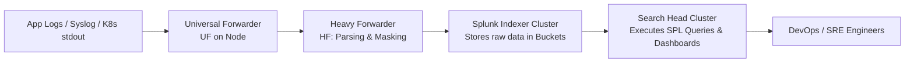
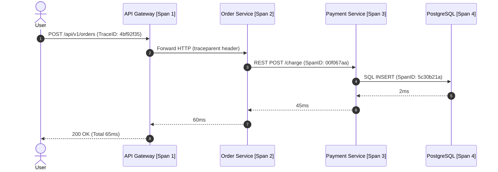

[Back to Home](../README.md) | [Tech Glossary](glossary.md) | [Interview Prep](interview_prep.md) | [Troubleshooting Guide](troubleshooting_mastery.md)

# 📊 Splunk, Observability & Distributed Monitoring: Zero to Hero

A comprehensive, production-grade guide to enterprise telemetry, log aggregation, the complete Splunk Processing Language (SPL) Command Encyclopedia, Distributed Tracing with OpenTelemetry, and High-Cardinality metrics.

---

## 📑 Table of Contents
1. [🧠 Zero-to-Hero Observability Mental Model](#-zero-to-hero-observability-mental-model)
2. [🔍 1. Splunk Architecture & Ingestion Pipeline](#-1-splunk-architecture--ingestion-pipeline)
3. [⚡ 2. Complete Splunk Processing Language (SPL) Command Encyclopedia](#-2-complete-splunk-processing-language-spl-command-encyclopedia)
   - [2.1 Search, Filter, Selection & Event Slicing Commands](#21-search-filter-selection--event-slicing-commands)
   - [2.2 Data Manipulation, String Operations & Field Parsing Commands](#22-data-manipulation-string-operations--field-parsing-commands)
   - [2.3 Aggregation, Statistical Analysis & Metrics Commands](#23-aggregation-statistical-analysis--metrics-commands)
   - [2.4 Multi-Dataset Correlation, Joins & Lookup Commands](#24-multi-dataset-correlation-joins--lookup-commands)
   - [2.5 Advanced Analytics, Anomaly Detection & Geolocation Commands](#25-advanced-analytics-anomaly-detection--geolocation-commands)
   - [2.6 Formatting, Table Reshaping & Workflow Commands](#26-formatting-table-reshaping--workflow-commands)
4. [🌐 3. Distributed Tracing & OpenTelemetry (OTel)](#-3-distributed-tracing--opentelemetry-otel)
5. [📈 4. Metrics & Golden Signals: RED & USE Methods](#-4-metrics--golden-signals-red--use-methods)
6. [🚨 5. Real-World Alerting, SLIs, SLOs & Error Budgets](#-5-real-world-alerting-slis-slos--error-budgets)
7. [🎓 6. Senior Observability Interview Preparation & Scenario Q&A](#-6-senior-observability-interview-preparation--scenario-qa)
8. [🔄 7. Architectural Transferability: Where & How to Apply Elsewhere](#-7-architectural-transferability-where--how-to-apply-elsewhere)

---

## 🧠 Zero-to-Hero Observability Mental Model

### 🏛️ Monitoring vs. Observability: The Medical Analogy

| Dimension | Monitoring (The Dashboard) | Observability (The Diagnostic MRI) |
| :--- | :--- | :--- |
| **Question Asked** | *"Is the system broken?"* (Tells you when CPU is at 95% or HTTP 500 rate $> 5\%$). | *"Why is the system broken for user $X$ in region $Y$?"* (Explains unknown-unknowns). |
| **Approach** | Predefined thresholds, fixed charts, static alerts. | Interactive interrogation of high-cardinality event traces and logs. |
| **Analogy** | Heart rate monitor beeping when pulse stops. | Full blood panel, CAT scan, and DNA sequence revealing the exact infection. |

### 🔺 The Three Pillars of Observability

```
                       ┌─────────────────────────┐
                       │      Observability      │
                       └────────────┬────────────┘
                                    │
         ┌──────────────────────────┼──────────────────────────┐
         ▼                          ▼                          ▼
   [ 📜 Logs ]                [ 📈 Metrics ]             [ 🔍 Traces ]
   - Splunk / ELK             - Prometheus / Grafana     - OpenTelemetry / Jaeger
   - Discrete Events with     - Aggregated numeric       - Request journeys across
     full stack traces &        time-series (CPU, RAM,     distributed microservice
     payload details.           Request Rate, Latency).    network hops & databases.
```

---

## 🔍 1. Splunk Architecture & Ingestion Pipeline

Splunk indexes and correlates machine-generated data across large distributed topologies.



### 🗄️ Splunk Indexer Bucket Lifecycle
Splunk stores indexed data in time-partitioned directories called **Buckets**:

| Bucket Type | Storage Tier | Read/Write | Performance | Compression |
| :--- | :--- | :--- | :--- | :--- |
| **Hot** | Fast NVMe / SSD | Read + Write | ⚡ Blazing | Uncompressed memory-mapped |
| **Warm** | Standard SSD / Fast Disk | Read-Only | ⚡ Very Fast | Compressed raw data + TSIDX index |
| **Cold** | HDD / S3 / Object Store | Read-Only | 🐢 Slower | Compressed |
| **Frozen** | Glacier / Archive / Deleted | No Search | Archive only | Unindexed raw archive |

---

## ⚡ 2. Complete Splunk Processing Language (SPL) Command Encyclopedia

Splunk Processing Language (SPL) uses UNIX-style pipes (`|`) where the output of each command feeds into the next. Below is the definitive encyclopedia of all core SPL commands categorized by operational purpose, complete with syntax, detailed explanations, and production-ready examples.

---

### 2.1 Search, Filter, Selection & Event Slicing Commands

#### 1. `search` (Raw Event Retrieval & Boolean Filtering)
- **Syntax:** `search <terms> [AND|OR|NOT] <field>=<value>`
- **Explanation:** The initial command to retrieve raw events from indexes. Supports exact phrase matching (`"database timeout"`), wildcards (`error*`), field-value matching (`status>=500`), and nested boolean logic with parentheses.
- **Production Example:**
  ```spl
  index=prod_ecommerce sourcetype=spring_boot (app=checkout-service OR app=payment-service) level=ERROR NOT "health-check"
  ```
- **Forensic Insight:** Filters out noisy routine health check logs while retrieving fatal application errors across checkout and payment microservices.

#### 2. `where` (Expression-Based Dynamic Filtering)
- **Syntax:** `| where <boolean_eval_expression>`
- **Explanation:** Evaluates boolean expressions on extracted fields. Unlike `search`, `where` is **case-sensitive**, supports direct field-to-field comparisons (e.g. `where response_time > threshold`), and executes eval functions directly (e.g. `where len(username) > 20`).
- **Production Example:**
  ```spl
  index=prod_gateway sourcetype=access_combined
  | where upstream_response_time > (client_request_time * 2) AND isnotnull(client_ip)
  ```
- **Forensic Insight:** Identifies requests where downstream backend latency is significantly higher than network transit time, pinpointing backend resource starvation.

#### 3. `fields` (Projection & Performance Optimization)
- **Syntax:** `| fields [+|-] <field1>, <field2>, ...`
- **Explanation:** Keeps (`+`, default) or removes (`-`) specified fields from the pipeline. Stripping unnecessary fields early drastically reduces search head memory overhead and speeds up downstream transformations.
- **Production Example:**
  ```spl
  index=prod_security sourcetype=auth_audit
  | fields _time, user, source_ip, auth_status, failure_reason
  ```
- **Forensic Insight:** Drops bulky raw stack traces and metadata fields while retaining only the 5 essential audit columns needed for compliance reporting.

#### 4. `dedup` (Deduplicating Events)
- **Syntax:** `| dedup [consecutive=t] <field1>, <field2>, ... [sortby +|-<field>]`
- **Explanation:** Removes duplicate events based on field combinations. Retains the first observed event per distinct key (or the sorted extreme if `sortby` is specified).
- **Production Example:**
  ```spl
  index=prod_k8s sourcetype=kube:container:logs "OOMKilled"
  | dedup pod_name, namespace sortby -_time
  | table _time, namespace, pod_name, container_name, exit_code
  ```
- **Forensic Insight:** Yields only the most recent OOMKilled crash event per Kubernetes pod across namespaces, eliminating repeated crashloop noise.

#### 5. `head` & `tail` (Bounded Event Slicing)
- **Syntax:** `| head <N>` / `| tail <N>`
- **Explanation:** `head` returns the first $N$ events (newest first in standard searches). `tail` returns the last $N$ events (oldest first).
- **Production Example:**
  ```spl
  index=prod_db_audit sourcetype=postgresql:slow_queries
  | sort - execution_time_ms
  | head 10
  ```
- **Forensic Insight:** Rapidly extracts the Top 10 slowest executing SQL queries across the entire database cluster.

#### 6. `sort` (Multi-Field Ordering)
- **Syntax:** `| sort [<limit>] [+|-]<field1>, [+|-]<field2>, ...`
- **Explanation:** Sorts events in ascending (`+`, default) or descending (`-`) order. The optional `<limit>` argument acts as an inline `head` for optimized top-N processing.
- **Production Example:**
  ```spl
  index=prod_orders sourcetype=order_events
  | sort 100 -order_total, +customer_id
  ```
- **Forensic Insight:** Returns the 100 highest-value purchase transactions, breaking order value ties alphabetically by customer identifier.

#### 7. `reverse` (Reversing Result Order)
- **Syntax:** `| reverse`
- **Explanation:** Reverses the physical order of result rows. Essential when chronological time order (`earliest` to `latest`) is required after a descending search.
- **Production Example:**
  ```spl
  index=prod_auth user="admin"
  | head 20
  | reverse
  ```
- **Forensic Insight:** Flips the latest 20 security audit logs into chronological sequence to reconstruct an attacker's step-by-step lateral movement.

#### 8. `top` & `rare` (Frequency Analysis)
- **Syntax:** `| top [limit=N] [showperc=t|f] [countfield=<str>] <field1> [by <field2>]`
- **Syntax:** `| rare [limit=N] [showperc=t|f] <field1>`
- **Explanation:** `top` calculates the most frequent values of a field along with count and percentage. `rare` finds the least frequent values (ideal for detecting anomalous user agents or uncommon error codes).
- **Production Example:**
  ```spl
  index=prod_gateway sourcetype=access_combined
  | top limit=5 http_status by uri_path
  ```
- **Forensic Insight:** Highlights the status code distribution for each API endpoint, exposing endpoints suffering abnormally high 5xx error percentages.

---

### 2.2 Data Manipulation, String Operations & Field Parsing Commands

#### 9. `eval` (Field Computation & Transformation Engine)
- **Syntax:** `| eval <new_field>=<expression>`
- **Explanation:** Computes mathematical, conditional, string, and time-based expressions to create or overwrite fields. Below is a reference of the most critical `eval` functions:

| Function Category | Function Syntax | Description & Example |
| :--- | :--- | :--- |
| **Conditional** | `if(X, Y, Z)` | If condition $X$ is true, return $Y$, else $Z$. <br>`eval status_type=if(status>=500, "Server Error", "Success")` |
| **Multi-Branch** | `case(X1, Y1, X2, Y2, ...)` | Evaluates multiple conditions sequentially. <br>`eval severity=case(latency>5000, "CRITICAL", latency>1000, "WARN", 1=1, "OK")` |
| **Null Fallback** | `coalesce(A, B, C)` | Returns the first non-null value among arguments. <br>`eval user_id=coalesce(authenticated_user, session_user, "anonymous")` |
| **Type Conversion** | `tonumber(str)`, `tostring(num)` | Converts strings to numbers or numbers to formatted strings (e.g. `"commas"`, `"duration"`, `"hex"`). <br>`eval size_kb=round(tonumber(bytes)/1024, 2)` |
| **String Ops** | `lower(str)`, `upper(str)`, `trim(str)` | Alters string case or strips surrounding whitespace. <br>`eval clean_email=lower(trim(user_email))` |
| **Substring & Regex**| `substr(str, start, len)`, `replace(str, regex, sub)` | Extracts slices or replaces matching regex patterns. <br>`eval masked_card=replace(card_number, "\d{12}(\d{4})", "XXXX-XXXX-XXXX-\1")` |
| **Time Math** | `now()`, `strftime(epoch, fmt)`, `strptime(str, fmt)` | Converts between Unix epoch timestamps and human-readable date strings. <br>`eval readable_time=strftime(_time, "%Y-%m-%d %H:%M:%S")` |
| **Multi-Value** | `mvindex(mv, idx)`, `mvcount(mv)` | Accesses array elements or counts array items. <br>`eval primary_role=mvindex(user_roles, 0)` |

- **Production Example:**
  ```spl
  index=prod_billing sourcetype=invoice_logs
  | eval billed_amount = tonumber(amount_raw)
  | eval tax_amount = round(billed_amount * 0.18, 2)
  | eval total_invoice = billed_amount + tax_amount
  | eval invoice_tier = case(total_invoice >= 10000, "ENTERPRISE", total_invoice >= 1000, "BUSINESS", 1=1, "RETAIL")
  | table invoice_id, customer, billed_amount, tax_amount, total_invoice, invoice_tier
  ```

#### 10. `rex` (Regular Expression Field Extraction & Stream Masking)
- **Syntax:** `| rex [field=<field>] "(?<extracted_field><regex_pattern>)"`
- **Syntax (Sed Mode):** `| rex field=<field> mode=sed "s/<pattern>/<replacement>/g"`
- **Explanation:** Extracts named capture groups directly from unparsed text using PCRE regex. Sed mode performs in-place string replacements (ideal for PII masking).
- **Production Example (Extraction & Masking):**
  ```spl
  index=prod_security sourcetype=syslog
  | rex field=_raw "Failed password for (invalid user )?(?<target_user>\w+) from (?<attacker_ip>\d{1,3}(?:\.\d{1,3}){3}) port (?<ssh_port>\d+)"
  | rex field=_raw mode=sed "s/password=\w+/password=**********/g"
  | stats count by target_user, attacker_ip
  ```
- **Forensic Insight:** Extracts target usernames and remote IPs from SSH brute-force logs while sanitizing raw password credentials.

#### 11. `spath` (Structured JSON & XML Extraction)
- **Syntax:** `| spath [input=<field>] [output=<field>] [path=<json_or_xml_path>]`
- **Explanation:** Parses nested JSON or XML structures into top-level queryable Splunk fields without needing complex regular expressions.
- **Production Example:**
  ```spl
  index=prod_orders sourcetype=order_json
  | spath input=payload path=order.customer.address.city output=shipping_city
  | spath input=payload path=order.payment.gateway_response.code output=gw_code
  | stats count by shipping_city, gw_code
  ```
- **Forensic Insight:** Traverses deep nested JSON trees in microservice payloads to extract geographical destinations and payment status codes.

#### 12. `rename` & `replace` (Field & Value Transformation)
- **Syntax:** `| rename <old_field> AS "<New Field Name>"`
- **Syntax:** `| replace <old_val> WITH <new_val> IN <field1>, <field2>`
- **Explanation:** `rename` provides human-friendly labels for dashboard tables. `replace` substitutes string literal values across specified columns.
- **Production Example:**
  ```spl
  index=prod_k8s sourcetype=pod_events
  | replace "0" WITH "Success", "137" WITH "OOMKilled", "143" WITH "Graceful Termination" IN exit_code
  | rename pod_name AS "Pod Identifier", exit_code AS "Termination Reason"
  | table "Pod Identifier", "Termination Reason"
  ```

#### 13. `makemv` & `mvexpand` (Multi-Value Array Splitting & Row Explosion)
- **Syntax:** `| makemv delim="," <field>`
- **Syntax:** `| mvexpand <multi_value_field>`
- **Explanation:** `makemv` splits a delimited single string into a multi-value array. `mvexpand` takes a multi-value array field and creates a separate, independent event row for each element in the array.
- **Production Example:**
  ```spl
  index=prod_app sourcetype=security_roles
  | makemv delim=";" assigned_permissions
  | mvexpand assigned_permissions
  | stats count by assigned_permissions
  ```
- **Forensic Insight:** Flattens comma-separated permission strings into distinct rows to measure permission assignment frequencies across the organization.

#### 14. `multikv` (Tabular Multi-Line CLI Output Parser)
- **Syntax:** `| multikv [conf=<conf_name>]`
- **Explanation:** Converts tabular multi-line text (such as output from `ps -ef`, `netstat -an`, or `df -h`) into individual Splunk events with columns mapped automatically to fields.
- **Production Example:**
  ```spl
  index=prod_os sourcetype=ps_output
  | multikv
  | where "%CPU" > 80.0
  | table _time, host, USER, PID, "%CPU", "%MEM", COMMAND
  ```

---

### 2.3 Aggregation, Statistical Analysis & Metrics Commands

#### 15. `stats` (Dataset Collapsing Summary Aggregator)
- **Syntax:** `| stats <aggregation_function>(<field>) [AS <alias>] by <group_by_fields>`
- **Explanation:** Collapses all raw incoming events into consolidated statistical rows. Below is the complete reference of statistical functions supported by `stats`:

| Function | Operational Purpose | Production Example |
| :--- | :--- | :--- |
| `count`, `count(field)` | Total event count or non-null field count. | `stats count, count(user_id) by endpoint` |
| `dc(field)` / `distinct_count` | Number of unique entities (e.g. unique IP count). | `stats dc(client_ip) as unique_visitors by country` |
| `sum(field)` | Arithmetic total of numeric values. | `stats sum(bytes_transferred) as total_bandwidth` |
| `avg(field)` | Arithmetic mean of numeric values. | `stats avg(query_execution_time_ms) as avg_query_time` |
| `min(field)`, `max(field)` | Minimum and maximum observed values. | `stats min(response_ms), max(response_ms) by service` |
| `range(field)` | Difference between max and min ($Max - Min$). | `stats range(cpu_utilization) as cpu_jitter by host` |
| `median(field)` | 50th percentile (middle value). | `stats median(latency_ms) by region` |
| `p50`, `p90`, `p95`, `p99` | Percentile distribution points for SLA monitoring. | `stats p50(lat), p95(lat), p99(lat) by api_route` |
| `stdev(field)`, `var(field)` | Standard deviation and variance (measures volatility). | `stats avg(resp), stdev(resp) as resp_std_dev by host` |
| `values(field)` | Deduplicated, sorted list of all values in the group. | `stats values(error_message) as unique_errors by pod` |
| `list(field)` | Raw list of all values in order (retains duplicates). | `stats list(step_name) as execution_steps by trace_id` |
| `earliest(field)`, `latest(field)` | Value of the chronologically earliest/latest event. | `stats earliest(status), latest(status) by session_id` |
| `earliest_time`, `latest_time` | Timestamps of the first and last events in the group.| `stats earliest_time, latest_time by transaction_id` |
| `mode(field)` | Most frequent value observed in the group. | `stats mode(http_status) as dominant_status by api` |
| `rate(field)` | Rate of change per second (for monotonic counters). | `stats rate(packet_count) as pps by interface` |

- **Production Example:**
  ```spl
  index=prod_gateway sourcetype=access_log
  | stats count as total_requests,
          count(eval(status_code>=500)) as total_5xx,
          dc(client_ip) as unique_ips,
          p50(response_time_ms) as P50_ms,
          p95(response_time_ms) as P95_ms,
          p99(response_time_ms) as P99_ms,
          values(http_method) as methods_used
          by uri_path
  | eval error_rate = round((total_5xx / total_requests) * 100, 2)
  | where total_requests > 500 AND error_rate > 1.0
  | sort - P99_ms
  ```

#### 16. `eventstats` (In-Flight Group Aggregations Without Collapsing)
- **Syntax:** `| eventstats <aggregation_function>(<field>) AS <alias> [by <group_by_fields>]`
- **Explanation:** Calculates summary statistics across events and **attaches the result back to every individual raw event** as a new field without collapsing the dataset. Enables comparisons between individual events and group averages.
- **Production Example:**
  ```spl
  index=prod_api sourcetype=access_log
  | eventstats avg(response_time_ms) as avg_endpoint_lat, stdev(response_time_ms) as std_endpoint_lat by endpoint
  | eval z_score = round((response_time_ms - avg_endpoint_lat) / std_endpoint_lat, 2)
  | where z_score > 3.0
  | table _time, endpoint, client_ip, response_time_ms, avg_endpoint_lat, z_score
  ```
- **Forensic Insight:** Detects individual statistical outlier requests whose latency exceeds 3 standard deviations from their endpoint's mean.

#### 17. `streamstats` (Rolling Window & Streaming Cumulative Statistics)
- **Syntax:** `| streamstats [window=<N>] [time_window=<time_spec>] [reset_on_change=t] <agg_func>(<field>) AS <alias> [by <group_by_fields>]`
- **Explanation:** Computes running cumulative statistics or sliding window aggregates in real-time as each event flows through the pipeline.
- **Production Example:**
  ```spl
  index=prod_microservice sourcetype=app_metrics metric_name="heap_used_mb"
  | sort + _time
  | streamstats window=5 avg(heap_used_mb) as rolling_5m_heap, current=t by host
  | eval heap_delta = heap_used_mb - rolling_5m_heap
  | table _time, host, heap_used_mb, rolling_5m_heap, heap_delta
  ```
- **Forensic Insight:** Calculates a 5-sample rolling moving average of JVM heap utilization to identify rapid allocation spikes indicative of memory leaks.

#### 18. `timechart` (Time-Series Bucket Aggregation)
- **Syntax:** `| timechart [span=<time_span>] [limit=<N>] [useother=t|f] <agg_func>(<field>) [by <split_by_field>]`
- **Explanation:** Aggregates data into explicit chronological buckets (`span=1m`, `span=5m`, `span=1h`, `span=1d`) suitable for time-series charts. Supports splitting by a categorical field.
- **Production Example:**
  ```spl
  index=prod_payment sourcetype=payment_gw
  | timechart span=15m limit=5 useother=f avg(gateway_latency_ms) by payment_provider
  ```
- **Forensic Insight:** Generates a clean 15-minute interval line chart comparing the average latency of the Top 5 payment gateways, dropping the consolidated "OTHER" bucket.

#### 19. `chart` (2-Dimensional Pivot Grid Aggregator)
- **Syntax:** `| chart <agg_func>(<field>) over <row_field> by <column_field>`
- **Explanation:** Creates a two-dimensional contingency table / matrix with custom rows and columns.
- **Production Example:**
  ```spl
  index=prod_gateway sourcetype=access_log
  | chart count over http_status by service_name
  ```
- **Forensic Insight:** Produces a matrix displaying HTTP status code distributions across every microservice in the infrastructure.

---

### 2.4 Multi-Dataset Correlation, Joins & Lookup Commands

#### 20. `transaction` (Stateful Multi-Event Sessionization)
- **Syntax:** `| transaction <field1>, <field2> [maxspan=<time>] [maxpause=<time>] [startswith=<eval_or_str>] [endswith=<eval_or_str>] [connected=t|f]`
- **Explanation:** Collapses multiple raw events sharing common identifiers into a single unified session event. Calculates total session `duration` and `eventcount`.
- **Production Example:**
  ```spl
  index=prod_ecommerce (sourcetype=auth OR sourcetype=cart OR sourcetype=checkout)
  | transaction session_id maxspan=30m maxpause=5m startswith="LOGIN_SUCCESS" endswith="ORDER_COMPLETED"
  | where duration > 300 AND eventcount > 10
  | table session_id, user, duration, eventcount, closed_txn
  ```
- **Forensic Insight:** Tracks the entire end-to-end shopping journey from login to checkout completion, isolating sluggish checkout sessions taking longer than 5 minutes.

#### 21. `join` (Relational SQL-Style Subsearch Join)
- **Syntax:** `| join [type=left|outer|inner] [max=0] <join_field> [search <subsearch_query>]`
- **Explanation:** Merges events from the primary search with results from a secondary subsearch on a matching key. `type=left` retains all primary rows; `max=0` allows 1-to-many matches.
- **Production Example:**
  ```spl
  index=prod_security sourcetype=vpn_log action=login
  | join type=left max=0 user_id [
      search index=prod_hr sourcetype=employee_directory
      | fields user_id, department, manager, employment_status
  ]
  | where employment_status="TERMINATED"
  | table _time, user_id, source_ip, department, manager, action
  ```
- **Forensic Insight:** Detects unauthorized VPN access attempts originating from terminated employee user IDs.

#### 22. `append`, `appendcols` & `union` (Dataset Concatenation)
- **Syntax:** `| append [search <subsearch>]` / `| appendcols [search <subsearch>]` / `| union <search1>, <search2>`
- **Explanation:** `append` appends subsearch rows vertically to the bottom of the current dataset. `appendcols` attaches columns horizontally row-by-row. `union` merges multiple distinct searches into a single stream.
- **Production Example:**
  ```spl
  index=prod_orders sourcetype=order_summary status=COMPLETED
  | stats sum(amount) as today_revenue
  | eval period="Today"
  | append [
      search index=prod_orders sourcetype=order_summary status=COMPLETED earliest=-7d@d latest=-6d@d
      | stats sum(amount) as last_week_revenue
      | eval period="Same Day Last Week"
  ]
  ```

#### 23. `lookup`, `inputlookup` & `outputlookup` (Table Enrichment & Persistence)
- **Syntax:** `| lookup <lookup_table> <match_field> [OUTPUT|OUTPUTNEW <dest_fields>]`
- **Syntax:** `| inputlookup <lookup_table.csv>`
- **Syntax:** `| outputlookup [create_empty=t] <lookup_table.csv>`
- **Explanation:** `lookup` queries static CSV or KVStore tables to enrich events with metadata (e.g. server role, owner, subnet). `inputlookup` reads a table as raw data. `outputlookup` saves search output into a lookup table.
- **Production Example:**
  ```spl
  index=prod_firewall sourcetype=paloalto:traffic action=blocked
  | lookup threat_intel_feed.csv ip_address AS dest_ip OUTPUT threat_actor, malware_family, severity
  | where isnotnull(threat_actor)
  | stats count by dest_ip, threat_actor, malware_family, severity
  ```
- **Forensic Insight:** Correlates outbound blocked firewall connections against an updated Threat Intelligence CSV table to identify infected internal machines beaconing to known command-and-control servers.

---

### 2.5 Advanced Analytics, Anomaly Detection & Geolocation Commands

#### 24. `cluster` (AI/ML Text Similarity & Stack Trace Grouping)
- **Syntax:** `| cluster [t=<similarity_threshold_0_to_1>] [field=<field>] [showcount=t]`
- **Explanation:** Groups unstructured log messages or Java stack traces into clusters based on textual similarity. Generates `cluster_count` and `cluster_label` fields.
- **Production Example:**
  ```spl
  index=prod_k8s sourcetype=spring_boot level=ERROR
  | cluster t=0.85 field=message showcount=t
  | table cluster_label, cluster_count, message
  | sort - cluster_count
  ```
- **Forensic Insight:** Distills 500,000 raw error logs down to 8 distinct root cause exception clusters, exposing the most prevalent bugs in production releases.

#### 25. `predict` (Time-Series Machine Learning Forecasting)
- **Syntax:** `| predict <field> [algorithm=LLP5|BLLP|LL|ARIMA] [future_timespan=<N>] [upper<N>=<alias>] [lower<N>=<alias>]`
- **Explanation:** Models historical time-series trends and forecasts future values along with dynamic upper and lower 95% confidence intervals.
- **Production Example:**
  ```spl
  index=prod_infra sourcetype=storage_metrics metric=disk_used_gb host=db-primary-01
  | timechart span=1h max(disk_used_gb) as disk_usage
  | predict disk_usage future_timespan=72 algorithm=LLP5
  | where 'prediction(disk_usage)' > 950
  ```
- **Forensic Insight:** Predicts exactly when database primary storage will breach its 950 GB threshold over the next 72 hours, enabling proactive volume expansion.

#### 26. `anomalies` & `anomalousvalue` (Outlier Detection)
- **Syntax:** `| anomalies [field=<field>] [threshold=<float>]`
- **Explanation:** Computes an unexpectedness score for continuous numerical fields and flags events that deviate significantly from expected normal distributions.
- **Production Example:**
  ```spl
  index=prod_auth sourcetype=login_stream
  | timechart span=5m count as login_attempts
  | anomalies field=login_attempts threshold=0.03
  | where unexpectedness > 0.8
  ```
- **Forensic Insight:** Identifies sudden anomalous spikes in login velocity that deviate from diurnal patterns, alerting SREs to credential stuffing attacks.

#### 27. `iplocation` & `geostats` (GeoIP Intelligence & Map Visualization)
- **Syntax:** `| iplocation <ip_field> [prefix=<str>]`
- **Syntax:** `| geostats [latfield=<lat>] [longfield=<lon>] <agg_func>(<field>) [by <split_field>]`
- **Explanation:** `iplocation` resolves public IP addresses to `Country`, `Region`, `City`, `lat`, and `lon` using an internal MaxMind database. `geostats` computes geographical cluster aggregates for rendering on World Maps.
- **Production Example:**
  ```spl
  index=prod_waf sourcetype=cloudflare:waf action=block
  | iplocation client_ip
  | where isnotnull(Country)
  | geostats count by attack_type
  ```
- **Forensic Insight:** Visualizes blocked WAF attack vectors across geographical coordinates on an interactive world map.

---

### 2.6 Formatting, Table Reshaping & Workflow Commands

#### 28. `table` & `fieldformat` (Presentation & Column Formatting)
- **Syntax:** `| table <field1>, <field2>, ...`
- **Syntax:** `| fieldformat <field>=<eval_expression>`
- **Explanation:** `table` creates an ordered column layout. `fieldformat` formats the visual display of a field (e.g. converting epoch to date or adding commas) without changing its underlying numeric type, allowing numeric sorting to remain intact.
- **Production Example:**
  ```spl
  index=prod_sales sourcetype=pos_events
  | stats sum(revenue) as total_rev by store_id
  | fieldformat total_rev = "$ " . tostring(total_rev, "commas")
  | sort - total_rev
  | table store_id, total_rev
  ```

#### 29. `fillnull` & `filldown` (Handling Missing & Null Values)
- **Syntax:** `| fillnull [value=<default_string>] <field1>, <field2>`
- **Syntax:** `| filldown <field1>, <field2>`
- **Explanation:** `fillnull` replaces null/empty fields with a specified default value (or 0). `filldown` carries the last known non-null value downwards to fill subsequent null rows.
- **Production Example:**
  ```spl
  index=prod_metrics sourcetype=server_health
  | timechart span=1m avg(cpu_usage) by host
  | fillnull value=0.0
  ```

#### 30. `untable` & `xyseries` (Matrix Pivoting & Flattening)
- **Syntax:** `| untable <row_field> <column_name_field> <value_field>`
- **Syntax:** `| xyseries <row_field> <column_field> <value_field>`
- **Explanation:** `untable` converts a wide table (multiple metric columns) into a tall normalized key-value table. `xyseries` does the exact opposite, pivoting key-value rows into wide columns.
- **Production Example:**
  ```spl
  -- Converting a wide timechart into tall relational records for external ingestion
  index=prod_servers
  | timechart span=5m avg(cpu) as CPU, avg(memory) as MEM, avg(disk) as DISK by host
  | untable _time host_metric value
  ```

#### 31. `makeresults` (Synthetic Event Creation & Constant Definitions)
- **Syntax:** `| makeresults [count=<N>]`
- **Explanation:** Generates artificial test events inside Splunk. Commonly used for debugging SPL syntax, defining baseline test inputs, or setting up static variables in scheduled alerts.
- **Production Example:**
  ```spl
  | makeresults count=1
  | eval test_ip="192.168.1.100", test_amount=1500.50
  | eval status=if(test_amount > 1000, "HIGH_VALUE", "STANDARD")
  ```

#### 32. `map` (Dynamic Subquery Iteration)
- **Syntax:** `| map [maxsearches=<N>] search="<spl_query_with_$field$_placeholders>"`
- **Explanation:** Iterates over each row returned by the previous search pipeline and executes a parameterized secondary search using fields from that row.
- **Production Example:**
  ```spl
  index=prod_security sourcetype=auth_failures failure_count > 50
  | table target_user
  | map maxsearches=10 search="search index=prod_audit sourcetype=user_activity user=\"$target_user$\" | stats count by action"
  ```
- **Forensic Insight:** Dynamically executes targeted behavioral investigations for every compromised user account flagged by brute-force detection.

#### 33. Subsearches (`[ search ... ]`) (Dynamic Filter Injection)
- **Syntax:** `index=primary [ search index=secondary ... | fields <filter_field> ]`
- **Explanation:** The inner search enclosed in square brackets executes first and generates a boolean filter string (e.g. `(ip=1.1.1.1 OR ip=2.2.2.2)`) that is injected directly into the outer primary search.
- **Production Example:**
  ```spl
  index=prod_firewall action=accepted [
      search index=prod_security sourcetype=ids_alerts severity=CRITICAL
      | top limit=10 src_ip
      | fields src_ip
  ]
  | stats sum(bytes) as exfiltrated_bytes by src_ip, dest_ip
  ```
- **Forensic Insight:** Identifies high-volume firewall outbound data flows originating from the Top 10 compromised IPs flagged by the Intrusion Detection System.

---

## 🌐 3. Distributed Tracing & OpenTelemetry (OTel)

When a single user click triggers calls across 12 microservices, logs alone cannot identify which service was slow. **Distributed Tracing** solves this.



### 🏷️ The W3C Trace Context Standard
Microservices propagate trace context across HTTP/gRPC via headers:
```http
traceparent: 00-4bf92f3577b34da6a3ce929d0e0e4736-00f067aa0ba902b7-01
              │  └──────────────┬───────────────┘ └───────┬──────┘ └─┬┘
           Version          Trace ID                  Span ID      Flags (01 = Sampled)
```

### ☕ Java 21 / Spring Boot OpenTelemetry Filter
```java
@Component
public class TracingMdcFilter extends OncePerRequestFilter {

    @Override
    protected void doFilterInternal(HttpServletRequest request, HttpServletResponse response, FilterChain filterChain)
            throws ServletException, IOException {
        
        // Extract W3C TraceID from OpenTelemetry Span Context
        Span currentSpan = Span.current();
        String traceId = currentSpan.getSpanContext().getTraceId();
        String spanId = currentSpan.getSpanContext().getSpanId();

        // Inject into SLF4J MDC so all logs include traceId automatically
        MDC.put("traceId", traceId);
        MDC.put("spanId", spanId);
        
        try {
            response.setHeader("X-Trace-Id", traceId);
            filterChain.doFilter(request, response);
        } finally {
            MDC.remove("traceId");
            MDC.remove("spanId");
        }
    }
}
```

---

## 📈 4. Metrics & Golden Signals: RED & USE Methods

### 4.1 The RED Method (Request-Driven Microservices)
- **R (Rate):** Requests per second (RPS).
  $$\text{PromQL: } \text{sum(rate(http_requests_total[5m])) by (service)}$$
- **E (Errors):** Failed requests per second.
  $$\text{PromQL: } \text{sum(rate(http_requests_total\{status=~"5.."\} [5m])) / sum(rate(http_requests_total[5m])) * 100}$$
- **D (Duration):** Latency histogram distribution (P50, P90, P99).
  $$\text{PromQL: } \text{histogram_quantile(0.99, sum(rate(http_request_duration_seconds_bucket[5m])) by (le))}$$

### 4.2 The USE Method (Hardware & Infrastructure Resources)
- **U (Utilization):** Percent of time resource is busy (CPU %, Memory %).
- **S (Saturation):** Degree of extra work queued (Load average, Thread pool queue size, Disk I/O wait queue).
- **E (Errors):** Hardware/system error count (Dropped network packets, Disk read errors).

---

## 🚨 5. Real-World Alerting, SLIs, SLOs & Error Budgets

### 🎯 Definitions & Formulae
- **SLI (Service Level Indicator):** A quantifiable metric of performance:
  $$\text{SLI} = \frac{\text{Successful Requests (latency } < 200\text{ms and status } < 500\text{)}}{\text{Total Valid Requests}} \times 100$$
- **SLO (Service Level Objective):** Target reliability agreed upon by engineering and business:
  $$\text{Target SLO} = 99.9\% \text{ availability over 30-day rolling window}$$
- **SLA (Service Level Agreement):** Legal contract with customers with financial penalties if breached (e.g. $99.5\%$).
- **Error Budget:** Allowed unreliability:
  $$\text{Error Budget} = 100\% - 99.9\% = 0.1\% \quad (43.2 \text{ minutes of downtime per month})$$

---

## 🎓 6. Senior Observability Interview Preparation & Scenario Q&A

### 📌 Core Conceptual Interview Questions

#### Q1: What is High-Cardinality in telemetry systems and why does it crash Prometheus / Grafana Mimir?
> **Answer & Explanation:**
> - **Cardinality** is the number of unique combinations of metric label key-value pairs.
> - Putting unbounded values (e.g. `userId`, `orderId`, or `creditCardNumber`) into Prometheus metric labels generates millions of independent time-series in memory.
> - **Failure:** Prometheus memory usage explodes, causing Out-Of-Memory (OOMKilled) crashes and compaction timeouts.
> - **Rule:** Never put high-cardinality IDs in metric labels. Put IDs inside **Logs and Distributed Traces**, and keep metric labels strictly bounded (e.g. `region`, `status_code`, `http_method`, `service_name`).

#### Q2: What is the difference between Head-Based Sampling and Tail-Based Sampling in Distributed Tracing?
> **Answer & Explanation:**
> - **Head-Based Sampling:** The sampling decision (to keep or drop a trace) is made at the **ingress gateway when the request begins** (e.g. randomly sample 5% of requests).
>   - *Drawback:* If an error or 10-second latency spike occurs in service 8 on an unsampled request, the trace is permanently lost.
> - **Tail-Based Sampling:** The OpenTelemetry Collector buffers all spans in memory until the **request completes**.
>   - *Advantage:* If the request returned HTTP 500 or took $>1000\text{ms}$, OTel samples and persists 100% of failed/slow traces while discarding 99% of fast 200 OK traces.

---

### 🚨 Real-World Scenario-Based Interview Questions

#### Scenario Q1: Diagnosing an Intermittent Multi-Service Cascading Latency Outage
> **Interviewer Question:** *"During peak traffic, our Checkout Service P99 latency spikes from 120ms to 8,000ms. All services claim their CPU and memory are healthy. How do you use Splunk, Prometheus, and Jaeger to pinpoint the culprit in under 3 minutes?"*
>
> **Senior Architect Answer:**
> 1. **Step 1 (Prometheus/Grafana):** Inspect the RED metrics dashboard. Identify which downstream dependency has a rising Duration ($D$) curve matching the Checkout spike.
> 2. **Step 2 (Distributed Traces in Jaeger/OTel):** Query traces for `service=checkout duration > 5000ms`.
>    - Look for the longest colored span bar in the waterfall diagram.
>    - *Discovery:* A database query in `InventoryService` is taking 7,800ms waiting on a row lock.
> 3. **Step 3 (Splunk Logs):** Search `index=prod_inventory traceId=<trace_id_from_span>` to read the exact SQL statement and lock duration log.

---

## 🔄 7. Architectural Transferability: Where & How to Apply Elsewhere

1. **Fintech Transaction Auditing:** Correlating Splunk immutable audit trails with Kafka consumer offset offsets for regulatory PCI-DSS compliance.
2. **AI & LLM Inference Observability:** Tracking token generation latency (Time-to-First-Token TTFT, Tokens-Per-Second TPS) using OpenTelemetry GenAI semantic conventions.
3. **IoT Edge Fleet Monitoring:** Aggregating device health metrics over lightweight MQTT streams into Prometheus with edge-side dead-man alert triggers.

---

[⬆️ Back to Top](#-splunk-observability--distributed-monitoring-zero-to-hero)
